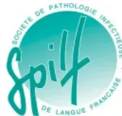

## RECOMMANDATIONS FORMALISEES D'EXPERTS

De la **SOCIETE FRANCAISE D'ANESTHESIE ET REANIMATION (SFAR)**

et de la **SOCIETE DE PATHOLOGIE INFECTIONNEUSE DE LANGUE FRANCAISE (SPILF)**

en association avec **L'ASSOCIATION FRANCAISE D'UROLOGIE (AFU)**, **LA SOCIETE FRANCAISE DE RADIOLOGIE – COMPOSANTE RADIOLOGIE INTERVENTIONNELLE (SFR/RI)**, **LA SOCIETE FRANCAISE DE CHIRURGIE DU RACHIS (SFCR)**, **LA SOCIETE FRANCAISE D'OPHTHALMOLOGIE (SFO)**, **LA SOCIETE FRANCAISE DE CHIRURGIE MAXILLO-FACIALE ET CHIRURGIE ORALE (SFSCMFCA)**, **LA SOCIETE FRANCAISE D'OTO-RHINO-LARYNGOLOGIE (SFORL)**, **L'ASSOCIATION DES ANESTHESISTES-REANIMATEURS PEDIATRIQUES D'EXPRESSION FRANCAISE (ADARPEF)**, **LA SOCIETE FRANCAISE DE CHIRURGIE ORTHOPEDIQUE ET TRAUMATOLOGIQUE (SOFLOT)**, **LA SOCIETE DE PNEUMOLOGIE DE LANGUE FRANCAISE (SPLF)**, **LA SOCIETE FRANCAISE DE CHIRURGIE THORACIQUE ET CARDIO-VASCULAIRE (SFCTCV)**, **LA SOCIETE FRANCAISE DE CARDIOLOGIE (SFC)**, **LE CONSEIL NATIONAL DES GYNECOLOGUES ET OBSTETRICIENS FRANCAIS (CNGOF)**, **LA SOCIETE DE CHIRURGIE VASCULAIRE ET ENDOVASCULAIRE DE LANGUE FRANCAISE (SCVE)**, **LA SOCIETE FRANCAISE DE NEUROCHIRURGIE (SFNC)**, **LA SOCIETE FRANCOPHONE DE BRULOLOGIE (SFB)**, **LA SOCIETE FRANCAISE DE CHIRURGIE PLASTIQUE RECONSTRUCTRICE ET ESTHETIQUE (SofCPRE)**, **LA SOCIETE FRANCAISE D'ENDOSCOPIE DIGESTIVE (SFED)**, **LA SOCIETE FRANCAISE DE CHIRURGIE DIGESTIVE (SFCD)**, **L'ASSOCIATION DE CHIRURGIE HEPATO-BILIAIRE ET TRANSPLANTATION (ACHBT)**, **LE COLLEGE D'ANESTHESIE-REANIMATION EN OBSTETRIQUE (CARO)**, **LE GROUPE DE PATHOLOGIE INFECTIONNEUSE PEDIATRIQUE (GPIP)** DE LA SOCIETE FRANCAISE DE PEDIATRIE, **LA SOCIETE FRANCAISE D'ODONTOLOGIE PEDIATRIQUE (SFOP)**, **LA SOCIETE FRANCAISE D'ORTHOPEDIE PEDIATRIQUE (SOFOP)**, **LA SOCIETE FRANCAISE DE CHIRURGIE PEDIATRIQUE (SFCP)**, **LA SECTION FRANCAISE DE CHIRURGIE PLASTIQUE PEDIATRIQUE (SFCPP)**, **LA SOCIETE FRANCOPHONE D'UROLOGIE PEDIATRIQUE ET DE L'ADOLESCENT (SFUPA)**, **L'ASSOCIATION FRANCAISE D'ORL PEDIATRIQUE (AFOP)**, **LE GROUPEMENT FRANCOPHONE D'HEPATOLOGIE GASTROENTEROLOGIE ET NUTRITION PEDIATRIQUES (GFHGNP)**, **LA SOCIETE FRANCAISE DE NEUROCHIRURGIE PEDIATRIQUE (SFNCP)**, ET **LA SOCIETE FRANCAISE DE NEONATOLOGIE (SFN)**.

# Antibioprophylaxie en chirurgie et médecine interventionnelle adulte et pédiatrique

*Antibiotic prophylaxis in adult and paediatric surgery and interventional medicine*

**2024**

V3.0 du 04/05/2026### INTRODUCTION, CHAMPS 1 (RECOMMANDATIONS GENERALES) ET 2 (TABLEAUX ADULTES) :

- validés par le Comité des Référentiels Cliniques (CRC) de la SFAR le 15/06/2023, le Conseil d'Administration (CA) de la SFAR le 30/06/2023, le Comité des référentiels de la SPILF le 06/09/2023.

- validés par le conseil d'administration de : la société française d'ORL (SFORL) le 13/09/23 ; la société française de chirurgie thoracique et cardio-vasculaire (SFCTCV) le 30/09/23 ; l'association française d'urologie (AFU) le 02/10/23 ; la société française de cardiologie (SFC) le 10/10/23 ; la société de chirurgie vasculaire et endovasculaire de langue française (SCVE) le 15/10/23 ; la société française de neuroradiologie (SFNR) le 17/10/23 ; la société française de chirurgie plastique et reconstructrice (SoFCPRE) le 29/10/2023 ; la société française de stomatologie, chirurgie maxillo-faciale et chirurgie orale (SFSCMFSCO) le 31/10/2023 ; la société de pneumologie de langue française (SPLF) le 31/10/2023 ; la société française de brûlologie (SFB) le 10/11/2023 ; la société française de chirurgie orthopédique et traumatologique (SOFCOT) le 17/05/2024 ; la société française d'ophtalmologie (SFO) le 14/11/2023 ; la société française de chirurgie rachidienne (SFCR) le 24/11/2023 ; la société française de neurochirurgie (SFNC) le 01/12/2023.

- et avec la validation tacite au 30/11/2023 des autres sociétés savantes associées.

### CHAMP 3 (TABLEAUX PEDIATRIQUES) :

- validé par le Comité des Référentiels Cliniques (CRC) de la SFAR le 26/03/2026, le Conseil d'Administration (CA) de la SFAR le 20/05/2026, la Société de Pathologie Infectieuse de Langue Française (SPILF) le 02/03/26, et le Groupe de Pathologie Infectieuse Pédiatrique (GPIP) le 27/01/26.

- validés par le conseil d'administration de : la Société Française de Stomatologie Chirurgie Maxillo-Faciale et Chirurgie Orale (SFSCMFSCO) le 08/01/26 ; la Société Française d'Odontologie Pédiatrique (SFOP) le 23/12/25 ; la Société Française d'Ophtalmologie (SFO) le 17/12/25 ; la Société Française d'Orthopédie Pédiatrique (SOFOP) le 11/12/25 ; la Société Française de Chirurgie Pédiatrique (SFCP) le 05/02/26 ; Société Française de Chirurgie Plastique Pédiatrique (SFCPP) le 02/12/25 ; la Société Française de Chirurgie Thoracique et Cardio-Vasculaire (SFCTCV) 18/11/25 ; la Société Francophone d'Urologie Pédiatrique et de l'Adolescent (SFUPA) le 4/11/25 ; l'Association Française d'ORL Pédiatrique (AFOP) le 27/10/25 ; le Groupement Francophone d'Hépatologie Gastroentérologie et Nutrition Pédiatriques (GFHFNP) le 03/03/25 ; la Société Française de Neurochirurgie Pédiatrique (SFNCP) le 28/02/25 ; et la Société Française de Néonatalogie (SFN) le 27/02/26.

**Auteurs des tableaux adultes :** Marc Garnier, Rémy Gauzit, Claire Dahyot-Fizelier, Jean-Paul Stahl, Jean-Luc Barat, David Courret, Jérôme Delambre, Bertrand Debono, Flora Djanikian, Thierry Faillot, Alice Jacquens,, Yoann Launey, François Zhu, Pierre-Etienne Leblanc, Olivier Naggara, Nicolas Engrand, Anaïs Caillard, Samy Figueiredo, Laurence Maulin, Juliette Amzallag, Thomas Baury, Julien Bouquet, Alain Bron, Christophe Chuiquet, Guillaume Dubreuil, Suzanne Ferrier, Jean-Claude Mérol, Maxime Léger, Malcie Mesnil, Clément Millet,Fanny Planquart, Jérôme Siefert, Catherine Creuzot-Garcher), Denis Frasca, Adrien Bouglé, Fanny Vuoto, Sophie Provenchère, François Labaste, Diane Lena, Emmanuel Rineau, Philippe Guerçi, Bernard lung, Jérémy Arzoine, Marion Lalande, Pierre Ollitrault, Pierre Demondion, Jean Porterie, Marie Roche-Barreau, Patrick Feugier, Marc-Olivier Fischer, Eric Kipnis, Pierre Fillatre, Aude Charvet, Jean Selim, Morgan Le Guen, Hadrien Roze, François Stephan, Christophe Quesnel, Mouna Ben Rehouma, Marco Alifano, Olivier Schussler, Christine Lorut, Antoine Khalil, Hélène Charbonneau, Stéphanie Ruiz, Arnaud Friggeri, Christophe Strady, Laure Fayolle-Pivot, Benoit Crémilleux, Nicolas Louvet, Charles-Hervé Vacheron, Clémentine Taconet, François Dépret, Thomas Leclerc, Matthieu Dumont, Laetitia Goffinet, Nicolas Morel-Journel, Stéphane Demortillet, Alexia Ramon, Jacques Saboye, Alice Blet, Estelle Morau, Delphine Poitrenaud, Karine Bettahar, Martine Bonnin, Lionel Bouvet, Hugo Madar, Jean-Luc Brun, Gautier Chene, Sandrine Campagne, Pauline Chauvet, Valentina Faitot, Sandrine Paquin, Anne Pinton, Thibaut Rackelboom, Agnès Rigouzzo, Hervé Trillaud, Daphné Michelet, Claire Roger, Julie Lourtet, Christophe Aveline, Nathalie Bernard, Michel Carles, Axel Maurice-Szamburski, Emmanuel Novy, Maya Enser, Tiphaine Vandenberghe, Pierre-Sylvain Marcheix, Cécile Batailler, Bertrand Boyer, Christian Dumontier, Philippe Tchenio, Jean-Roger Werther, Jérôme Delambre, Marie Faruch, Matthieu Jabaudon, Raphaël Cinotti, Eric Bonnet, Nelly Rondeau, Hervé Kobeiter, David Karsenti, Jérôme Morel, Pablo Ortega-Deballon, Laure Fieuzal, David Moskowitz, Hervé Dupont, Niki Christou, Philippe Montravers, Charles Sabbagh, Aurélie Gouel, Justine Demay, Audrey de Jong, Regis Souche, Bruno Pastene, Céline Monard, Lilian Schwarz, Julie Veziant, Frédéric Borie, Emilie Lermite, Emmanuel Weiss, Matthieu Boisson, Philippe Lesprit, Bernard Allaouchiche, Pierre Arnaud, Franck Bruyère, Sarah Chemam, Steeve Doizi, Romain Dumont, Fabien Espitalier, Julie Leroy, Olivier Mimos, Olivier Pellerin, Mickaël Poette, Maxime Vallée, Hugues de Courson, Jean-Pierre Bru, et Marc Leone.

**Auteurs des tableaux pédiatriques :** François Audren, Sonia Ayari, Sonanda Bailleux, Patrick-Yves Blanchard, Nicolas Boulard, Gilles Brezac, Alain Bron, Marion Caseris, Guillaume Captier, André Chaine, Christophe Chiquet, Nathalie Chivoret, Catherine Creuzot-Garcher, Mathilde de Queiroz, Nicolas Engrand, Jean Noel Evain, Patrick Rouas, Caroline François, Hervé Haas, Sabine Irtan, Camille Jung, Céline Klein, Anne Laffargue, Guylène Le Meur, Bertrand Leobon, Marc Lillot, Nicolas Louvet, Anne Migeon, Sébastien Pesenti, Arnaud Sauer

**Coordonnateurs d'experts :**

**SFAR :** Marc Leone (Marseille) ; Mathilde de Queiroz (Lyon, partie pédiatrique)

**SPILF :** Rémy Gauzit (Paris)

**Organisateur :**

**SFAR :** Marc Garnier (Clermont-Ferrand) ; Maxime Nguyen (Dijon, partie pédiatrique)### **Groups de lecture :**

*Comité des Référentiels cliniques de la SFAR (2023) :* Marc Garnier (Président), Alice Blet (Secrétaire), Anaïs Caillard, Hélène Charbonneau, Isabelle Constant, Hugues de Courson, Marc-Olivier Fischer, Denis Frasca, Matthieu Jabaudon, Daphné Michelet, Maxime Nguyen, Stéphanie Ruiz, Michaël Vourc'h.

*Comité des Référentiels cliniques de la SFAR (2026, pour la partie pédiatrique) :* Hélène Charbonneau (Présidente), Anaïs Caillard (Secrétaire), Isabelle Constant (Représentante du CA), Marie-Pierre Bonnet (Représentante du CA), Aurélien Bonnal, Thomas Botrel, Lucie Collet, Hugues de Courson, Matthieu Dumont, Max Gonzalez-Estevez, Medhi Hafiani, Pierre Huette, Florence Julien-Marsollier, Natacha Kapandji, Elise Langouet, Axel Maurice-Szamburski, Daphné Michelet, Maxime Nguyen, Stéphanie Ruiz.

*Conseil d'Administration de la SFAR (2023) :* Pierre Albaladéjo (Président), Jean-Michel Constantin (1er vice-président), Marc Léone (2e vice-président), Karine Nouette-Gaulain (Secrétaire générale), Frédéric Le Saché (Secrétaire général adjoint), Marie-Laure Cittanova (Trésorière), Isabelle Constant (Trésorière adjointe), Julien Amour, Hélène Beloeil, Valérie Billard, Marie-Pierre Bonnet, Julien Cabaton, Vincent Collange, Evelyne Combettes, Marion Costecalde, Violaine d'Ans, Laurent Delaunay, Delphine Garrigue, Pierre Kalfon, Olivier Joannes-Boyau, Frédéric Lacroix, Jane Muret, Olivier Rontes, Nadia Smail.

*Conseil d'Administration de la SFAR (2026, pour la partie pédiatrique) :* Marc Léone (Président), Karine Nouette-Gaulain (1er vice-présidente), Isabelle Constant (2e vice-présidente), Frédéric Le Saché (Secrétaire général), Sigismond Lasocki (Secrétaire général adjoint), Evelyne Combettes (Trésorière), Julien Amour (Trésorier adjoint), Hélène Beloeil, Lucie Beylacq, Valérie Billard, Marie-Pierre Bonnet, Sébastien Campard, Vincent Collange, Marion Costecalde, Laurent Delaunay, Delphine Garrigue, Olivier Joannes-Boyau, Anne-Claire Lukaszewicz, Jane Muret, Olivier Rontes, Nadia Smail, Lionel Velly, Franck Verdonk, Anne Geoffroy-Wernet.

*Comité des référentiels de la SPILF :* Rémy Gauzit (coordinateur), Philippe Lesprit (coordinateur), Jean-Paul Stahl (coordinateur), Eric Bonnet, Jean-Pierre Bru, Etienne Canoui, Marion Caseris, Marie-Charlotte Chopin, Robert Cohen, Sylvain Diamantis, Aurélien Dinh, Pierre Fillatre, Matthieu Lafaurie, Julie Lourtet, Laurence Maulin, Delphine Poitrenaud, Josette Raymond, Christophe Strady, Emmanuelle Varon, Fanny Vuotto, Yves Welker.

*Mission SPICMI (surveillance et prévention du risque infectieux en chirurgie et médecine interventionnelle) portée par le CPIAS d'Île-de-France, représentée par :* Delphine Verjat-Trannoy.

*Conseil scientifique de la SF2H, représenté par :* Sara Romano-Bertrand, Maider Coppry et Jean-Winoc Decousser.## HISTORIQUE DES VERSIONS

- - V1.0 du 08/12/2023 : version originale.
- - V1.1 du 12/12/2023 : modification dans le tableau de chirurgie sénologique (Partie 6, page 64).
- - V1.2 du 16/12/2023 : correction de coquilles dans les schémas de réinjection dans les tableaux de chirurgie thoracique (Partie 4, page 54), de chirurgie sénologique (Partie 6, page 64), de chirurgie viscérale (Partie 8, pages 80 et 81), et de chirurgie urologique (Partie 9, pages 87 et 88) ; ajout d'un auteur dans le groupe d'experts du tableau de neurochirurgie ; ajout du CARO comme société partenaire des RFE ; ajout d'explications en note de bas de page (et fourniture en annexe d'une ordonnance type) pour la prise per os de tobramycine et métronidazole la veille d'une chirurgie colo-rectale (Partie 8, page 79).
- - V1.3 du 23/01/2024 : ajout d'un commentaire sur l'alternative per os pour l'antibioprophylaxie avant chirurgie d'avulsion dentaire (page 43) ; correction du niveau de la recommandation concernant la prostatectomie totale (page 87) ; correction de l'intitulé sur la chirurgie faciale avec reconstruction par lambeau (partie 5, page 58) pour éviter une possible confusion avec le tableau de chirurgie carcinologique ORL de la partie 2 (page 41) ; reformulation d'une apparente incohérence concernant l'ablation de dispositif intra-utérin ayant migré, entre les lignes « chirurgie des annexes » et « chirurgie de l'utérus » de la partie 6 (pages 66 et 67) ; clarification d'un schéma d'administration pour le ballonnement intra-utérin ou la révision utérine (partie 6, page 70) ; rajout d'intitulés manquants dans le tableau d'endoscopie digestive de la partie 8 (page 83-84).
- - V2.0 du 22/05/2024 : rajout d'intitulés manquants dans le tableau de chirurgie ORL (thyroïdectomie partielle ou totale, parathyroïdectomie, amygdallectomie, adénoïdectomie) (page 41) ; correction d'une incohérence entre chirurgie rhinologique sans greffon dans le tableau de chirurgie ORL (page 41) et septo-rhinoplastie sans greffe de cartilage dans le tableau de chirurgie plastique (page 58) ; correction d'une incohérence sur la durée de l'antibioprophylaxie pour chirurgie orthognatique entre les tableaux de chirurgie stomato-maxillo-faciale (page 43) et le tableau de chirurgie plastique (page 58) ; ajout d'une définition en note de bas de page pour clarifier les intitulés de la chirurgie du sein dans les tableaux de chirurgie plastique et de chirurgie gynécologique (pages 57 et 65) ; modifications dans les tableaux de chirurgie orthopédique programmée et de traumatologie de la partie 7, ayant pour but de clarifier certains intitulés et de mieux préciser certaines prises en charges (pages 72-77) ; modification de la recommandation pour les procédures de traitement de l'HBP sans abord prostatique (HIFU et embolisation) (page 88).
- - V3.0 du 04/05/2026 : ajout d'une recommandation R1.5.2 (avis d'experts) sur la dose de l'amoxicilline-clavulanate chez l'obèse (pages 25-28) ; modification d'une borne d'IMC pour l'adaptation de la clindamycine chez l'obèse (R1.6) pour une meilleure clarté (page 30) ; ajout de propositions de schémas thérapeutiques pour la prolongation postopératoire de l'antibioprophylaxie chez le patient allergique aux bêtalactamines dans les tableaux de neurochirurgie, chirurgie ORL et maxillo-faciale, chirurgie vasculaire, chirurgie thoracique, chirurgie plastique et reconstructrice ; modification de la posologie pourl'antibioprophylaxie de la pose de valve zéphyr (page 55) ; ajout de l'alternative en cas d'allergie aux bêtalactamines quand la céfoxitine est indiquée dans l'encadré allergie du tableau de chirurgie d'affirmation de genre (page 60) ; modification d'un intitulé chirurgical de la ligne « vaginoplastie » du tableau de chirurgie d'affirmation de genre (page 60) ; ajout de l'alternative en cas d'allergie aux bêtalactamines pour les traumatismes complexes de la main dans l'encadré allergie du tableau de traumatologie (page 75) ; modification des intitulés chirurgicaux sur la chirurgie des hernies de paroi (page 83) ; ajout du lien vers les recommandations 2026 de l'AFU concernant l'ECBU préopératoire dans le chapeau introductif du tableau 9 (page 87) ; ajout de précisions sur les délais d'administration de la fosfomycine en antibioprophylaxie des biopsies de prostate par voie transrectale (page 88) ; ajout du champ 3 et des 9 tableaux de recommandations sur l'antibioprophylaxie en chirurgie et médecine interventionnelle pédiatrique (à partir de la page 91).## INTRODUCTION

L'infection du site opératoire (ISO) est une infection survenant dans les 30 jours suivant une intervention, ou dans l'année s'il y a eu mise en place de matériel. Des critères précis, disponibles sur les documents du Ministère de la Santé, encadrent cette définition et permettent une classification des ISO selon la profondeur de l'infection [1]. Les ISO sont au second rang des infections associées aux soins en termes d'incidence, générant des hospitalisations prolongées, des reprises chirurgicales, des surcoûts significatifs (de l'ordre de 60 millions d'euros par an en France) et potentiellement une augmentation de la morbi-mortalité [2].

Les ISO font l'objet d'un suivi longitudinal par différents réseaux. En France, la surveillance de 95 388 interventions a mis en évidence 1 560 ISO, représentant une incidence de 1,64% [intervalle de confiance (IC) à 95% (1,55 – 1,72)], survenant dans un délai de 17 jours (médiane = 14 jours, Q1 = 7 jours ; Q3 = 22 jours) après l'intervention [3]. Les facteurs de risque d'ISO sont bien identifiés comme la classe de contamination d'Altemeier de la procédure, la durée de l'intervention et le terrain du patient opéré, souvent représenté par la classe ASA. En l'absence de facteur de risque, l'incidence des ISO diminue à 0,72% (0,56 – 0,91).

Toutefois, l'incidence des ISO est variable selon les types d'intervention. La surveillance par un réseau Européen de la survenue d'ISO après neuf interventions types rapporte une incidence variant de 0,6% pour la chirurgie prothétique du genou à 9,5% pour la chirurgie colique par laparotomie [4]. Ces incidences sont aussi modulées par certains facteurs organisationnels reflétant la qualité des soins. Dans ce contexte, une étude de cohorte internationale suggère une association entre l'appartenance à un réseau de surveillance des ISO et une diminution significative et durable du taux d'ISO [5].

Il est indispensable d'avoir une excellente connaissance de l'écologie des ISO. D'une part, cette connaissance permet de déterminer les antibiotiques à utiliser en prophylaxie chirurgicale et procédurale ; d'autre part elle permet de choisir au mieux un traitement curatif probabiliste en cas de survenue d'ISO. Le réseau de surveillance Européen a identifié les trois bactéries principalement impliquées dans les ISO toutes procédures confondues : *Enterococcus sp.* (17,6 %), *Escherichia coli* (17,2 %) et *Staphylococcus aureus* (15,2 %). En France, les données du réseau Surveillance et Prévention du risque Infectieux en Chirurgie et Médecine Interventionnelle (SPICMI) [6] montrent en 2021 qu'une entérobactérie est retrouvée dans 31 % des ISO (dont *Escherichia coli* dans 14,3 % des cas) et un cocci à Gram positif dans 53 % (*Staphylococcus aureus* 21,9 %, *Staphylococcus epidermidis* 10,2 % et *Enterococcus faecalis* 9 %). Les entérobactéries et les entérocoques sont plus souvent responsables d'ISO après une intervention digestive, alors que les staphylocoques sont plus fréquents en orthopédie. A noter qu'environ 6 % des entérobactéries produisent des bêta-lactamases à spectre élargi (BLSE) et qu'environ 13 % des souches de *S. aureus* sont résistantes à la méticilline, posant ainsi le défi de l'antibiorésistance, particulièrement dans la sous-population de patients fréquemment en contact avec le monde hospitalier.La prévention des ISO repose sur de nombreux moyens - listés à 29 selon l'organisation mondiale de la santé - allant de l'optimisation de la nutrition préopératoire, au type de ventilation des salles d'intervention [7]. L'antibioprophylaxie lors de certaines procédures chirurgicales et interventionnelles de radiologie, d'endoscopie, de cardiologie ou encore de pneumologie, est un des éléments forts des politiques de prévention. Elle s'adresse aux patients indemnes d'infection en cours, pris en charge pour certaines chirurgies propres ou propres-contaminées, soit les classes 1 et 2 de la classification d'Altemeier. Le principe général de l'antibioprophylaxie est d'administrer avant le début de la procédure chirurgicale ou interventionnelle, une dose d'un antibiotique ciblant les bactéries responsables des ISO du site opéré, avec pour objectif d'obtenir une concentration sanguine et tissulaire efficace pendant la procédure pour diminuer la contamination peropératoire et minimiser le risque d'infection postopératoire.

L'objectif de ces recommandations formalisées d'experts (RFE) est de fournir aux cliniciens de toutes les spécialités impliquées des recommandations sur l'antibioprophylaxie chirurgicale et interventionnelle, basées sur le plus haut niveau de preuve actuel.

**Il est important de noter les trois points suivants :**

- Ce référentiel n'a pas vocation à traiter de la définition d'un patient « allergique aux bêtalactamines » ou « allergique aux pénicillines ». Il est néanmoins rappelé que **pour la majorité des interventions l'utilisation d'une alternative est associée à une incidence d'ISO plus élevée qu'en cas d'utilisation d'une céphalosporine de 1ère ou 2e génération** [8-13], ainsi qu'à plus d'effets secondaires [14,15]. En conséquence, il est important de ne réserver l'utilisation d'alternatives aux bêtalactamines qu'aux cas d'allergie avérée. En ce sens, nous encourageons les praticiens à mener un interrogatoire précis et à faire rentrer le patient dans une démarche diagnostique allergologique devant une suspicion d'allergie déclarée par le patient. Les modalités de cette démarche diagnostique seront précisées par plusieurs travaux en cours (notamment la RFE commune SFAR/société française d'allergologie) dont les diffusions sont attendues dans un futur proche.

- La prévention de l'endocardite infectieuse n'est pas abordée dans ce référentiel car elle est largement développée dans les recommandations européennes de 2023, auxquelles nous renvoyons le lecteur [16].

- Ces recommandations ne prétendent pas s'imposer à des protocoles locaux d'antibioprophylaxie qui tiendraient compte de particularités épidémiologiques locales concernant soit la patientèle prise en charge, soit l'écologie bactérienne propre à un centre. Ces recommandations proposent un cadre général issu de l'analyse de données nationales et internationales, et entendent servir de support à l'établissement de déclinaisons locales de protocoles d'antibioprophylaxie, qui doivent néanmoins tenir compte des données actualisées de la science (résumées dans ces recommandations) et d'éventuelles spécificités propres à chaque centre. Ceci est d'autant plus vrai que la force de la recommandation considérée estfaible. En effet, si une recommandation est classée de « GRADE 1 » c'est qu'il existe plusieurs preuves concordantes de bonne qualité en faveur de la recommandation, devant rendre exceptionnel tout écart à cette recommandation dans les protocoles locaux, et uniquement après réflexion et justification pluridisciplinaire (chirurgien, médecin interventionnel, anesthésiste-réanimateur, infectiologue, hygiéniste, membre du CLIN local, etc.). A l'inverse, si une recommandation est de niveau « avis d'experts » c'est que le faisceau de preuves ayant conduit à cette recommandation est à ce jour relativement faible. Pour certaines procédures, la littérature est inexistante à ce jour. Afin d'aider les praticiens, il a été choisi, exceptionnellement dans ces RFE, que les experts proposent néanmoins une recommandation, dont il sera possible de s'écarter au niveau local en cas de spécificités de centre et après réflexion et justification pluridisciplinaire.

## **OBJECTIF DES RECOMMANDATIONS**

L'objectif de ces Recommandations Formalisées d'Experts est de produire un cadre facilitant la prise de décision pour l'antibioprophylaxie en chirurgie ou en médecine interventionnelle. Le groupe s'est efforcé de produire un nombre minimal de recommandations afin de mettre en évidence les points forts à retenir. Les règles de base des bonnes pratiques médicales universelles en anesthésie, en chirurgie ou en médecine interventionnelle étant considérées comme connues, elles ont été exclues de ces recommandations ; ces dernières se focalisant sur l'antibioprophylaxie parmi toutes les mesures de prévention des infections du site opératoire. Le public visé est l'ensemble des médecins impliqués dans la prise en charge chirurgicale ou interventionnelle des patients : anesthésistes-réanimateurs, chirurgiens, radiologues interventionnels, cardiologues interventionnels, pneumologues interventionnels, hépato-gastro-entérologues interventionnels, etc.

## **METHODE**

### **Organisation générale**

Ces recommandations sont le résultat du travail d'un groupe d'experts réunis par la SFAR en collaboration avec la Société de Pathologie Infectieuse de Langue Française (SPILF). Des experts provenant de 32 sociétés savantes de chirurgie et de médecine interventionnelle associées à ce travail, ont été intégrés aux groupes de travail pour les tableaux relatifs à leur discipline et expertise. Chaque expert a rempli une déclaration de conflits d'intérêts avant de débuter le travail d'analyse. Dans un premier temps, le comité d'organisation a défini les objectifs de ces recommandations et la méthodologie utilisée. Les différents champs d'application de ces RFE et les questions à traiter ont ensuite été définis par le comité d'organisation, puis modifiés et validés par les experts. Les questions ont été formulées selon un format PICO (*Population, Intervention, Comparison, Outcome*) après une première réunion du groupe d'experts. Pour l'ensemble desquestions, la population (« P ») est définie comme « les patients nécessitant une intervention chirurgicale ou une procédure interventionnelle ».

## **Champ des recommandations**

Les recommandations formulées concernent 3 champs :

- - **Champ 1** : Recommandations générales sur l'antibioprophylaxie en chirurgie et médecine interventionnelle.
- - **Champ 2** : Recommandations par disciplines chirurgicales et de médecine interventionnelle adultes (9 parties).
- - **Champ 3** : Recommandations par disciplines chirurgicales et de médecine interventionnelle pédiatriques et néonatales (9 parties).

Une recherche bibliographique extensive des articles publiés entre janvier 2000 et mars 2023 a été réalisée à partir des bases de données MEDLINE, [www.clinicaltrials.gov](http://www.clinicaltrials.gov), et Cochrane, par les experts pour chaque champ d'application, selon la méthodologie *Preferred Reporting Items for Systematic Reviews and Meta-Analysis* (PRISMA) pour les revues systématiques.

Ont été inclus dans l'analyse :

1. 1) les méta-analyses et les essais contrôlés randomisés publiés ; en l'absence de méta-analyse ou d'essais randomisés, les cohortes prospectives et/ou rétrospectives ayant inclus au moins 100 patients,
2. 2) conduites chez les patients bénéficiant d'une chirurgie ou d'une procédure interventionnelle,
3. 3) traitant de l'antibioprophylaxie,
4. 4) publiées en langue anglaise ou française.

La méthode de travail utilisée pour l'élaboration de ces recommandations est la méthode GRADE® (*Grade of Recommendation Assessment, Development and Evaluation*). Cette méthode permet, après une analyse qualitative et quantitative de la littérature, de déterminer séparément la qualité des preuves, et donc de donner une estimation de la confiance que l'on peut avoir de l'analyse quantitative et un niveau de recommandation. Un niveau de preuve a été défini pour chacune des références bibliographiques citées en fonction du type de l'étude. Ce niveau de preuve pouvait être réévalué en tenant compte de la qualité méthodologique de l'étude, de la cohérence des résultats entre les différentes études, du caractère direct ou non des preuves, de l'analyse de coût et de l'importance du bénéfice.

À la vue du sujet de ces RFE, un seul critère de jugement « majeur » a été défini en amont de la recherche bibliographique, l'infection du site opératoire (importance 7).

Les recommandations ont ensuite été formulées en utilisant la terminologie des RFE de la SFAR :- - Un niveau global de preuve « fort » permettait de formuler une recommandation « forte » : GRADE 1 « il est recommandé de faire... », « il n'est pas recommandé de faire... ».
- - Un niveau global de preuve modéré ou faible aboutissait à l'écriture d'une recommandation « optionnelle » : GRADE 2 « il est probablement recommandé de faire... », « il n'est probablement pas recommandé de faire... ».
- - Lorsque la littérature était plus faible, la question pouvait faire l'objet d'une recommandation sous la forme d'un avis d'expert : Avis d'experts « les experts suggèrent... ».

Les propositions de recommandations ont été présentées et discutées une à une. Le but n'était pas d'aboutir obligatoirement à un avis unique et convergent des experts sur l'ensemble des propositions, mais de dégager les points de concordance et les points de divergence ou d'indécision. Chaque recommandation a ainsi été évaluée par chacun des experts et soumise à une cotation individuelle à l'aide d'une échelle allant de 1 (désaccord complet) à 9 (accord complet). La force de la recommandation est déterminée en fonction de cinq facteurs clés et validée par les experts après un vote, en utilisant la méthode GRADE Grid :

- ● Estimation de l'effet : plus il est important, plus probablement la recommandation sera forte ;
- ● Imprécision : en cas d'incertitude de l'estimateur ou de grande variabilité de son écart-type, la force de la recommandation sera probablement plus faible ;
- ● Le niveau global de preuve : plus il est élevé, plus probablement la recommandation sera forte ;
- ● La balance entre effets désirables et indésirables : plus celle-ci est favorable, plus probablement la recommandation sera forte ;
- ● La préférence du patient, médecin ou décisionnaire doit être obtenue au mieux auprès des personnes concernées ;
- ● Coûts : plus les coûts ou l'utilisation des ressources sont élevés, plus probablement la recommandation sera faible.

Pour valider une recommandation, au moins 70 % des experts devaient exprimer une opinion qui allait globalement dans la même direction, tandis que moins de 20 % d'entre eux exprimaient une opinion contraire. En l'absence de validation d'une ou de plusieurs recommandation(s), celle(s)-ci étaient reformulée(s) et, de nouveau, soumise(s) à cotation dans l'objectif d'aboutir à un consensus. Si les recommandations n'avaient pas obtenu un nombre suffisant d'opinions favorables et/ou obtenu un nombre trop élevé d'opinions défavorables, elles n'étaient pas éditées. Si une courte majorité des experts étaient d'accord avec la recommandation et plusieurs experts n'avaient pas d'opinion ou y étaient opposés, les recommandations obtenaient un accord faible. Enfin, si la grande majorité des experts étaient d'accord avec la recommandation et une minorité des experts n'avaient pas d'opinion ou y étaient opposés, les recommandations obtenaient un accord fort. Les avis d'experts, exprimant par définition un consensus entre lesexperts en l'absence de littérature suffisamment forte pour grader ces recommandations, devaient nécessairement obtenir un accord fort (au moins 70% d'opinions allant dans la même direction).

## **RESULTATS**

### **Champs des recommandations**

Les experts ont consensuellement décidé lors de la première réunion d'organisation de ces RFE, de traiter 5 questions dans le champ des recommandations générales, ainsi que 9 parties disciplinaires adultes et pédiatriques. Les questions suivantes ont été retenues pour le recueil et l'analyse de la littérature :

#### **Champ 1 - Recommandations générales sur l'antibioprophylaxie en chirurgie et médecine interventionnelle**

Question : Quand faut-il administrer l'antibioprophylaxie pour diminuer l'incidence des infections du site opératoire ?

Question : Faut-il réadministrer une ou plusieurs nouvelle(s) dose(s) d'antibioprophylaxie en cours de procédure (et si oui, quand ?) pour diminuer l'incidence des infections du site opératoire ?

Question : Combien de temps faut-il administrer l'antibioprophylaxie pour diminuer l'incidence des infections du site opératoire ?

Question : Faut-il modifier les modalités de l'antibioprophylaxie chez le patient obèse pour diminuer l'incidence des infections du site opératoire ?

Question : Faut-il modifier l'antibioprophylaxie chez le patient colonisé au niveau rectal à entérobactérie productrice de bêta-lactamase à spectre étendu (E-BLSE) pour diminuer l'incidence des infections du site opératoire ?

#### **Champ 2 : Recommandations par disciplines chirurgicales et de médecine interventionnelle adultes.**

Partie 1 : Antibioprophylaxie en neurochirurgie et neuroradiologie interventionnelle

Partie 2 : Antibioprophylaxie en ORL, ophtalmologie et chirurgie maxillo-faciale

Partie 3 : Antibioprophylaxie en chirurgie cardiaque, cardiologie interventionnelle, rythmologie et chirurgie vasculaire

Partie 4 : Antibioprophylaxie en chirurgie thoracique, endoscopie thoracique et radiologie interventionnelle

Partie 5 : Antibioprophylaxie en chirurgie plastique et reconstructrice, d'affirmation de genre et du patient brûlé

Partie 6 : Antibioprophylaxie en chirurgie gynécologique et obstétrique

Partie 7 : Antibioprophylaxie en chirurgie orthopédique et traumatologiquePartie 8 : Antibioprophylaxie en chirurgie digestive et bariatrique, endoscopie et médecine interventionnelle digestive

Partie 9 : Antibioprophylaxie en chirurgie urologique

### **Champ 3 : Recommandations par disciplines chirurgicales et de médecine interventionnelle pédiatriques et néonatales.**

Introduction

Partie 1 : Antibioprophylaxie en neurochirurgie et neuroradiologie interventionnelle

Partie 2 : Antibioprophylaxie en ORL, ophtalmologie et chirurgie maxillo-faciale

Partie 3 : Antibioprophylaxie en chirurgie cardiaque, cardiologie interventionnelle, rythmologie et chirurgie vasculaire

Partie 4 : Antibioprophylaxie en chirurgie thoracique, endoscopie thoracique et radiologie interventionnelle

Partie 5 : Antibioprophylaxie en chirurgie plastique et reconstructrice, d'affirmation de genre et du patient brûlé

Partie 6 : Antibioprophylaxie en chirurgie orthopédique et traumatologique

Partie 7 : Antibioprophylaxie en chirurgie digestive et bariatrique, endoscopie et médecine interventionnelle digestive

Partie 8 : Antibioprophylaxie en chirurgie urologique

Partie 9 : Antibioprophylaxie en chirurgie néonatalogique

### **Synthèse des résultats**

Le travail de synthèse des experts et l'application de la méthode GRADE ont abouti à 11 recommandations générales, 9 tableaux disciplinaires adultes et 9 tableaux disciplinaires pédiatriques. Après 2 tours de cotation et quelques amendements, un accord fort a été obtenu pour toutes les recommandations.

La SFAR, la SPILF et l'ensemble des sociétés savantes de chirurgie et médecine interventionnelle participantes incitent tous les médecins impliqués dans la prise en charge des patients chirurgicaux ou de médecine interventionnelle à se conformer à ces RFE pour optimiser la qualité des soins dispensés aux patients.

Cependant, chaque praticien doit exercer son propre jugement dans l'application de ces recommandations, en prenant en compte son expertise et les spécificités de son établissement, pour déterminer la méthode d'intervention la mieux adaptée à l'état du patient dont il a la charge. Ceci est d'autant plus vrai que la force de la recommandation est plus faible (avis d'experts < GRADE 2 < GRADE 1).## RÉFÉRENCES

- [1] Ministère de la santé, de la jeunesse et des sports, Direction générale de la santé, Direction de l'hospitalisation et de l'organisation des soins. Définition des infections associées aux soins 2007.
- [2] Lamarsalle L, Hunt B, Schauf M, Szwarensztein K, Valentine WJ. Evaluating the clinical and economic burden of healthcare-associated infections during hospitalization for surgery in France. *Epidemiol Infect* 2013;141:2473–82. <https://doi.org/10.1017/S0950268813000253>.
- [3] Mission SPICMI, Réseau ISO Raisin, Santé Publique France. Surveillance des infections du site opératoire dans les établissements de santé français 2020.
- [4] European Centre for Disease Prevention and Control. Healthcare-associated infections: surgical site infections - Annual Epidemiological Report for 2018–2020 2023.
- [5] Abbas M, de Kraker MEA, Aghayev E, Astagneau P, Aupee M, Behnke M, et al. Impact of participation in a surgical site infection surveillance network: results from a large international cohort study. *J Hosp Infect* 2019;102:267–76. <https://doi.org/10.1016/j.jhin.2018.12.003>.
- [6] Mission SPICMI, CPIAS d'Ile-de-France. Rapport national de la surveillance semi-automatisée des infections du site opératoire en chirurgie -Données 2020 et 2021 2021.
- [7] WHO. Global Guidelines for the Prevention of Surgical Site Infection - 2018 2018.
- [8] Saginur R, Croteau D, Bergeron MG. Comparative efficacy of teicoplanin and cefazolin for cardiac operation prophylaxis in 3027 patients. The ESPRIT Group. *J Thorac Cardiovasc Surg* 2000;120:1120–30. <https://doi.org/10.1067/mtc.2000.110384>.
- [9] Blumenthal KG, Ryan EE, Li Y, Lee H, Kuhlen JL, Shenoy ES. The Impact of a Reported Penicillin Allergy on Surgical Site Infection Risk. *Clin Infect Dis Off Publ Infect Dis Soc Am* 2018;66:329–36. <https://doi.org/10.1093/cid/cix794>.
- [10] Kawakita T, Huang C-C, Landy HJ. Choice of Prophylactic Antibiotics and Surgical Site Infections After Cesarean Delivery. *Obstet Gynecol* 2018;132:948–55. <https://doi.org/10.1097/AOG.0000000000002863>.
- [11] Lam PW, Tarighi P, Elligsen M, Gunaratne K, Nathens AB, Tarshis J, et al. Self-reported beta-lactam allergy and the risk of surgical site infection: A retrospective cohort study. *Infect Control Hosp Epidemiol* 2020;41:438–43. <https://doi.org/10.1017/ice.2019.374>.
- [12] Nakarai H, Yamada K, Tonosu J, Abe H, Watanabe K, Yoshida Y, et al. The Impact of Cefazolin Shortage on Surgical Site Infection Following Spine Surgery in Japan. *Spine* 2021;46:923–30. <https://doi.org/10.1097/BRS.0000000000003946>.
- [13] Norvell MR, Porter M, Ricco MH, Koonce RC, Hogan CA, Basler E, et al. Cefazolin vs Second-line Antibiotics for Surgical Site Infection Prevention After Total Joint Arthroplasty Among Patients With a Beta-lactam Allergy. *Open Forum Infect Dis* 2023;10:ofad224. <https://doi.org/10.1093/ofid/ofad224>.
- [14] MacFadden DR, LaDelfa A, Leen J, Gold WL, Daneman N, Weber E, et al. Impact of Reported Beta-Lactam Allergy on Inpatient Outcomes: A Multicenter Prospective Cohort Study. *Clin Infect Dis* 2016;63:904–10. <https://doi.org/10.1093/cid/ciw462>.
- [15] Sarfani S, Stone CA, Murphy GA, Richardson DR. Understanding Penicillin Allergy, Cross-reactivity, and Antibiotic Selection in the Preoperative Setting. *J Am Acad Orthop Surg* 2022;30:e1–5. <https://doi.org/10.5435/JAAOS-D-21-00422>.
- [16] Delgado V, Ajmone Marsan N, De Waha S, Bonaros N, Brida M, Burri H, et al. 2023 ESC Guidelines for the management of endocarditis. *Eur Heart J* 2023;44:3948–4042. <https://doi.org/10.1093/eurheartj/ehad193>.## **CHAMP 1. Recommandations générales sur l'antibioprophylaxie en chirurgie et médecine interventionnelle**

**Question : Quand faut-il administrer l'antibioprophylaxie pour diminuer l'incidence des infections du site opératoire ?**

*Experts : Marc Garnier (SFAR, Clermont-Ferrand), Marc Leone (SFAR, Marseille), Rémy Gauzit (SPILF, Paris).*

**R1.1 – Il est recommandé d'administrer l'antibioprophylaxie par céphalosporine (ou ses alternatives en cas d'allergie, hors vancomycine) au plus tôt 60 minutes avant et au plus tard avant l'incision chirurgicale ou le début de la procédure interventionnelle pour diminuer l'incidence d'infection du site opératoire.**

**GRADE 1 (accord FORT)**

**Argumentaire :** Treize études de cohorte (prospectives ou rétrospectives) [1–13] et une étude prospective randomisée [14] traitant du délai d'administration de l'antibioprophylaxie (hors chirurgie orthopédique sous garrot et césarienne) ont été identifiées sur la période de recherche bibliographique. Certaines de ces études de cohorte ont été incluses dans la méta-analyse de De Jonge *et al.* de 2017 [15]. Cette méta-analyse a cependant inclus quelques études antérieures à 2000, notamment pour la comparaison entre une administration plus de 120 minutes avant l'incision et dans les 120 minutes précédant l'incision.

Dans cette méta-analyse, une administration après l'incision chirurgicale ou le début du geste interventionnel est associée à un risque accru d'infection du site opératoire (ISO) (OR 1,89 ; IC95% [1,05–3,40] ; 4 études ;  $I^2=0\%$ ) [15]. Le même résultat est rapporté dans les études de cohorte prospective de Koch *et al.* (monocentrique, 28250 patients de chirurgie cardiaque par sternotomie, incidence d'ISO : 2,4% [1,9-2,9] après administration post-incision vs. 1,8% (1,7-2,0) après administration dans les 45 minutes précédant l'incision) [6], de Badge *et al.* (multicentrique, 1838 patients de chirurgie prothétique du membre inférieur : OR ajusté pour une administration dans les 60 minutes avant l'incision vs. après l'incision = 0,56 (0,36-0,89)) [13], de Steinberg *et al.* (multicentrique, 3405 patients de chirurgie cardiaque, gynécologique ou prothétique du membre inférieur : OR ajusté pour une administration après l'incision vs. dans les 30 minutes avant l'incision = 4,18 [1,37-12,8] [4]. Un résultat similaire était retrouvé dans l'étude cas/témoins pédiatrique en chirurgie du rachis de Milstone *et al.* (OR 4,4 [1,3-15,5]) [3]. Il existait également une tendance à plus d'ISO en cas d'administration après l'incision dans les études de van Kasteren *et al.* (prospective multicentrique, 1922 patients chirurgie prothétique de hanche, OR 2,8 [0,9-8,6]) [1] et de Hawn *et al.* (rétrospective multicentrique, 32459 chirurgies majeures, OR 1,26 [0,92-1,72]) [7]. Du fait de leur biais et d'un certain degré de comparaison indirecte, le niveau de preuve apporté par ces grandes cohortes et la méta-analyse reste relativement bas. Toutefois, les données pharmacocinétiques et pharmacodynamiques (PK-PD) vont dans le même sens, en montrant que seule une administration avant l'incision permet d'obtenir une concentration efficace d'antibiotique au niveau de la peau, des tissus sous-cutanés et de l'organe opéré.

Concernant le meilleur délai d'administration avant l'incision, sept des neuf études de cohorte ayant comparé une administration moins de 60 minutes avant l'incision et plus de 60 minutes avant l'incision, ont rapporté un risque moindre d'ISO en cas d'administration dans les 60 minutes avant le début de la chirurgie [2,3,6,7,10,11,13]. Ces données cliniques sont renforcées par les donnéesPK-PD qui encouragent à ne pas administrer l'antibioprophylaxie plus de 60 minutes avant l'incision au risque d'avoir une diminution trop importante des concentrations plasmatiques et tissulaires. Ceci est particulièrement important pour la céfoxitine et l'amoxicilline dont la demi-vie est d'environ 60 minutes.

Enfin, concernant le meilleur délai d'administration au cours des 60 minutes précédant l'incision, la méta-analyse de De Jonge *et al.* de 2017 ne retrouvait pas de différence d'efficacité entre une administration dans les intervalles 60-30 minutes et 30-0 minutes avant l'incision (OR= 1,07 (0,53-2,17) ; 4 études incluses), avec toutefois une grande hétérogénéité des données ( $I^2=85\%$ ). Parmi les études incluses, l'étude prospective observationnelle monocentrique de Weber *et al.* de 2008 a rapporté une augmentation de l'incidence d'ISO si l'antibioprophylaxie était administrée dans les 30 minutes précédant l'incision par rapport à une administration dans l'intervalle 60-30 minutes avant l'incision (OR= 1,95 [1,4-2,8]). A l'inverse, l'étude de Ho *et al.* a rapporté une augmentation d'incidence d'ISO lorsque l'antibioprophylaxie était administrée plus de 30 minutes avant l'incision par rapport à une administration dans l'intervalle 30-0 minutes avant l'incision (OR= 1,73 (1,02-2,95)). En 2017, Weber *et al.* ont publié les résultats d'une étude bicentrique prospective randomisée ayant inclus 5580 patients opérés de chirurgie digestive, endocrinologique, sénologique, orthopédique et vasculaire et relevant de l'antibioprophylaxie, qui a comparé l'effet d'une administration dans l'intervalle 75-30 minutes avant l'incision vs. une administration dans l'intervalle 29-0 minutes avant l'incision [14]. Aucune différence d'incidence d'ISO n'a été mise en évidence entre les deux groupes (5% vs. 5%, OR= 0,93 (0,72-1,21)), les médianes des délais d'administration étant respectivement de 42 [30-55] minutes et 16 [10-25] minutes avant l'incision dans les groupes précoce et tardif.

Il convient de rappeler qu'une administration de l'antibioprophylaxie avant l'induction anesthésique présente plusieurs avantages : la certitude que la dose sera délivrée avant l'incision chirurgicale, et, en cas de réaction allergique, l'absence de vasoplégie surajoutée induite par les médicaments anesthésiques, ainsi qu'une détermination plus facile de l'imputabilité des bêtalactamines comme déclencheur de la réaction allergique par rapport aux autres médicaments utilisés pendant l'induction anesthésique.

#### Références

- [1] van Kasteren MEE, Manniën J, Ott A, Kullberg B-J, de Boer AS, Gyssens IC. Antibiotic prophylaxis and the risk of surgical site infections following total hip arthroplasty: timely administration is the most important factor. Clin Infect Dis Off Publ Infect Dis Soc Am 2007;44:921-7. <https://doi.org/10.1086/512192>.
- [2] Weber WP, Marti WR, Zwahlen M, Misteli H, Rosenthal R, Reck S, et al. The timing of surgical antimicrobial prophylaxis. Ann Surg 2008;247:918-26. <https://doi.org/10.1097/SLA.0b013e31816c3fec>.
- [3] Milstone AM, Maragakis LL, Townsend T, Speck K, Sponseller P, Song X, et al. Timing of preoperative antibiotic prophylaxis: a modifiable risk factor for deep surgical site infections after pediatric spinal fusion. Pediatr Infect Dis J 2008;27:704-8. <https://doi.org/10.1097/INF.0b013e31816fca72>.
- [4] Steinberg JP, Braun BI, Hellinger WC, Kusek L, Bozikis MR, Bush AJ, et al. Timing of antimicrobial prophylaxis and the risk of surgical site infections: results from the Trial to Reduce Antimicrobial Prophylaxis Errors. Ann Surg 2009;250:10-6. <https://doi.org/10.1097/SLA.0b013e3181ad5fca>.
- [5] Ho VP, Barie PS, Stein SL, Trencheva K, Milsom JW, Lee SW, et al. Antibiotic regimen and the timing of prophylaxis are important for reducing surgical site infection after elective abdominal colorectal surgery. Surg Infect 2011;12:255-60. <https://doi.org/10.1089/sur.2010.073>.
- [6] Koch CG, Nowicki ER, Rajeswaran J, Gordon SM, Sabik JF, Blackstone EH. When the timing is right: Antibiotic timing and infection after cardiac surgery. J Thorac Cardiovasc Surg 2012;144:931-937.e4. <https://doi.org/10.1016/j.jtcvs.2012.01.087>.- [7] Hawn MT, Richman JS, Vick CC, Deierhoi RJ, Graham LA, Henderson WG, et al. Timing of surgical antibiotic prophylaxis and the risk of surgical site infection. *JAMA Surg* 2013;148:649–57. <https://doi.org/10.1001/jamasurg.2013.134>.
- [8] Ishikawa K, Kusumi T, Hosokawa M, Nishida Y, Sumikawa S, Furukawa H. Incisional surgical site infection after elective open surgery for colorectal cancer. *Int J Surg Oncol* 2014;2014:419712. <https://doi.org/10.1155/2014/419712>.
- [9] Takamatsu A, Tagashira Y, Ishii K, Morita Y, Tokuda Y, Honda H. Optimal timing of surgical antimicrobial prophylaxis in laparoscopic surgery: a before-after study. *Antimicrob Resist Infect Control* 2018;7:126. <https://doi.org/10.1186/s13756-018-0424-z>.
- [10] Sommerstein R, Atkinson A, Kuster SP, Thurneysen M, Genoni M, Troillet N, et al. Antimicrobial prophylaxis and the prevention of surgical site infection in cardiac surgery: an analysis of 21 007 patients in Switzerland†. *Eur J Cardio-Thorac Surg Off J Eur Assoc Cardio-Thorac Surg* 2019;56:800–6. <https://doi.org/10.1093/ejcts/ezz039>.
- [11] Canseco JA, Karamian BA, DiMaria SL, Patel PD, Donnelly CJ, Plusch K, et al. Timing of Preoperative Surgical Antibiotic Prophylaxis After Primary One-Level to Three-Level Lumbar Fusion. *World Neurosurg* 2021;153:e349–58. <https://doi.org/10.1016/j.wneu.2021.06.112>.
- [12] Rubin H, Rom E, Wattad M, Seh K, Levy N, Jehassi A, et al. Effectiveness of antimicrobial prophylaxis at 30 versus 60 min before cesarean delivery. *Sci Rep* 2021;11:8401. <https://doi.org/10.1038/s41598-021-87846-z>.
- [13] Badge H, Churches T, Xuan W, Naylor JM, Harris IA. Timing and duration of antibiotic prophylaxis is associated with the risk of infection after hip and knee arthroplasty. *Bone Jt Open* 2022;3:252–60. <https://doi.org/10.1302/2633-1462.33.BJO-2021-0181.R1>.
- [14] Weber WP, Mujagic E, Zwahlen M, Bundi M, Hoffmann H, Soysal SD, et al. Timing of surgical antimicrobial prophylaxis: a phase 3 randomised controlled trial. *Lancet Infect Dis* 2017;17:605–14. [https://doi.org/10.1016/S1473-3099\(17\)30176-7](https://doi.org/10.1016/S1473-3099(17)30176-7).
- [15] de Jonge SW, Gans SL, Atema JJ, Solomkin JS, Dellinger PE, Boermeester MA. Timing of preoperative antibiotic prophylaxis in 54,552 patients and the risk of surgical site infection: A systematic review and meta-analysis. *Medicine (Baltimore)* 2017;96:e6903. <https://doi.org/10.1097/MD.0000000000006903>.

**R1.2 – En cas d'utilisation de la vancomycine en antibioprophylaxie, les experts suggèrent d'en débuter l'administration intraveineuse sur 60 minutes chez le patient non obèse au plus tôt 60 minutes avant, et au plus tard 30 minutes avant l'incision chirurgicale ou le début de la procédure interventionnelle, pour diminuer l'incidence d'infection du site opératoire.**

**Avis d'experts (accord FORT)**

**Argumentaire :** L'administration de vancomycine doit s'effectuer par voie intraveineuse sur une durée prolongée afin d'éviter la survenue d'effets indésirables en rapport avec une libération d'histamine lors de l'injection (anciennement dénommé « *red man syndrome* ») [1]. Les protocoles recommandent le plus souvent une perfusion à la seringue électrique sur une durée d'une heure. Cette contrainte complique l'administration préopératoire de l'antibioprophylaxie par vancomycine.

Six études de cohorte (prospectives ou rétrospectives) évaluant le délai entre le début de l'administration de la vancomycine et l'incision chirurgicale ont été identifiées sur la période de recherche bibliographique [2–7].

Trois études ont analysé l'effet d'une administration plus de 60 minutes avant l'incision chirurgicale. Dans l'étude prospective monocentrique de Garey *et al.* ayant inclus 2048 patients opérés de chirurgie cardiaque programmée, un début d'administration dans l'intervalle 120-60 minutes par rapport à l'intervalle 60-16 minutes avant l'incision était associé à un OR de survenue d'ISO à 2,2 IC95% (1,4–2,3) [2]. De même, dans le sous-groupe de 199 patients traités par vancomycine del'étude rétrospective de Canseco *et al.* conduite chez des patients opérés d'arthrodèse lombaire, un début d'administration plus de 60 minutes avant l'incision était associée à 8,5% d'ISO vs. 1,0% en cas d'administration moins de 60 minutes avant l'incision [6]. En revanche, dans l'étude rétrospective tri-centrique de Malhotra *et al.* ayant inclus 7392 patients opérés de chirurgie non ambulatoire recevant une antibioprophylaxie par vancomycine, l'augmentation du risque en cas de début d'administration au-delà de 60 minutes avant l'incision n'était pas significative (OR= 1,43 (0,75-2,73)) [4]. Ajoutés aux difficultés organisationnelles à débuter l'administration de vancomycine en dehors du bloc opératoire, ces résultats incitent les experts à proposer un début d'administration de la vancomycine au plus tôt 60 minutes avant l'incision ou le début de la procédure interventionnelle.

Concernant le meilleur délai de début d'administration dans l'intervalle 60-0 minutes avant l'incision, l'étude de Cotogni *et al.* suggère un début d'administration le plus proche possible des 60 minutes avant l'incision [3]. En effet, dans cette étude prospective observationnelle ayant inclus 741 patients de chirurgie cardiaque, une fin de la perfusion de 60 minutes après l'incision chirurgicale était associée à une augmentation des ISO (OR= 7,03 (3,4-14,5)). Ce résultat n'est pas retrouvé dans quatre autres études observationnelles. Dans les études de Garey *et al.* [2] et de Malhotra *et al.* [4] seul un début d'administration dans l'intervalle 15–0 minutes avant l'incision était associé à une augmentation du risque d'ISO (OR= 11,6 (2,6–52,4) et 4,24 (2,32-7,74), respectivement). Dans les études de Feder *et al.* (1047 patients opérés de chirurgie prothétique du membre inférieur) [5] et de Marigi *et al.* (461 patients opérés de chirurgie prothétique d'épaule) [7], c'est un début d'administration dans l'intervalle 30–0 minutes avant l'incision qui était associé à une augmentation de l'incidence d'ISO (OR= 5,22 (1,60-23,4) et 4,22 (1,12-15,9), respectivement). Enfin, grâce au large effectif de 7392 patients inclus dans leur étude, Malhotra *et al.* ont déterminé par analyse de courbe ROC que le délai au-delà duquel le début de la perfusion de vancomycine était associé à un risque augmenté d'ISO était 25 minutes avant l'incision (OR= 3,16 (1,77-5,66) en cas d'initiation de la seringue de vancomycine moins de 25 minutes avant l'incision) [4].

En conclusion, le délai optimal pour débuter l'administration de vancomycine semble être entre 60 et 30 minutes avant l'incision. Ce délai est compatible avec une administration IV lente sur 1 heure pour la dose d'un patient non obèse. Un début d'administration de vancomycine dans cet intervalle est donc licite en alternative aux céphalosporines chez les patients authentiquement allergiques à la céfazoline, au céfuoxime ou à la céfoxitine, ou chez les patients colonisés à *S. aureus* résistant à la méticilline (lorsque la couverture du SARM est indiquée pour la chirurgie concernée), un début plus précoce étant probablement associé à un surrisque d'ISO, et un début plus tardif, plus proche de l'incision, étant clairement associé à un surrisque d'ISO. Il est rappelé qu'une dilution de la vancomycine à 5 mg/mL maximum [8], ainsi que l'utilisation prophylactique d'antihistaminiques avant le début de la perfusion [9], réduisent les complications locales (au point de perfusion) et générales (« vancomycin flushing syndrome », anciennement « red man syndrome ») en rapport avec l'administration de vancomycine.

#### Références

- [1] Alvarez-Arango S, Ogunwole SM, Sequist TD, Burk CM, Blumenthal KG. Vancomycin Infusion Reaction - Moving beyond "Red Man Syndrome." N Engl J Med 2021;384:1283–6. <https://doi.org/10.1056/NEJMp2031891>.
- [2] Garey KW, Dao T, Chen H, Amrutkar P, Kumar N, Reiter M, et al. Timing of vancomycin prophylaxis for cardiac surgery patients and the risk of surgical site infections. J Antimicrob Chemother 2006;58:645–50. <https://doi.org/10.1093/jac/dkl279>.
- [3] Cotogni P, Barbero C, Passera R, Fossati L, Olivero G, Rinaldi M. Violation of prophylactic vancomycin administration timing is a potential risk factor for rate of surgical site infections in cardiac surgerypatients: a prospective cohort study. BMC Cardiovasc Disord 2017;17:73. <https://doi.org/10.1186/s12872-017-0506-5>.

[4] Malhotra NR, Piazza M, Demoor R, McClintock SD, Hamilton K, Sharma N, et al. Impact of Reduced Preincision Antibiotic Infusion Time on Surgical Site Infection Rates: A Retrospective Cohort Study. Ann Surg 2020;271:774–80. <https://doi.org/10.1097/SLA.00000000000003030>.

[5] Feder OI, Yeroushalmi D, Lin CC, Galetta MS, Meftah M, Lajam CM, et al. Incomplete Administration of Intravenous Vancomycin Prophylaxis is Common and Associated With Increased Infectious Complications After Primary Total Hip and Knee Arthroplasty. J Arthroplasty 2021;36:2951–6. <https://doi.org/10.1016/j.arth.2021.03.035>.

[6] Canseco JA, Karamian BA, DiMaria SL, Patel PD, Donnelly CJ, Plusch K, et al. Timing of Preoperative Surgical Antibiotic Prophylaxis After Primary One-Level to Three-Level Lumbar Fusion. World Neurosurg 2021;153:e349–58. <https://doi.org/10.1016/j.wneu.2021.06.112>.

[7] Marigi EM, Marigi IM, Shah HN, Schoch BS, Sperling JW, Sanchez-Sotelo J. When intravenous vancomycin prophylaxis is needed in shoulder arthroplasty, incomplete administration is associated with increased infectious complications. J Shoulder Elbow Surg 2023;32:803–12. <https://doi.org/10.1016/j.jse.2022.10.012>.

[8] Ammar H, Rolland S, Jouffroy R, Dubert M, Le Beller C, Podglajen I, et al. Frequency and factors associated with infusion-related local complications of vancomycin on peripheral venous catheters. J Antimicrob Chemother 2023;78:1050–4. <https://doi.org/10.1093/jac/dkad044>.

[9] Renz CL, Thurn JD, Finn HA, Lynch JP, Moss J. Antihistamine prophylaxis permits rapid vancomycin infusion. Crit Care Med 1999;27:1732–7. <https://doi.org/10.1097/00003246-199909000-00006>.

**Question : Faut-il réadministrer une ou plusieurs nouvelle(s) dose(s) d'antibioprophylaxie en cours de procédure (et si oui, quand ?) pour diminuer l'incidence des infections du site opératoire ?**

*Experts : Marc Garnier (SFAR, Clermont-Ferrand), Marc Leone (SFAR, Marseille), Rémy Gauzit (SPILF, Paris).*

**R1.3.1 – Il est recommandé de réadministrer une à plusieurs dose(s) peropératoire(s) d'antibioprophylaxie en cas de prolongation de la chirurgie ou de l'acte interventionnel pour diminuer l'incidence d'infection du site opératoire.**

**GRADE 1 (accord FORT)**

**R.1.3.2 – Il est probablement recommandé de réadministrer cette (ces) dose(s) peropératoire(s), à une posologie de la moitié de la dose initiale, toutes les deux demi-vies de l'antibiotique utilisé pour diminuer l'incidence d'infection du site opératoire ; soit durant la période peropératoire :**

- - toutes les 2 heures pour la céfoxitine (1 g), le céfuoxime (0,75 g) et l'amoxicilline/clavulanate (1 g)
- - toutes les 4 heures pour la céfazoline (1 g) et la clindamycine (450 mg)
- - toutes les 8 heures pour la vancomycine (10 mg/kg).

**Du fait de leur demi-vie très longue, la gentamicine, le métronidazole et la teicoplanine ne nécessitent pas de réinjection peropératoire.**

**GRADE 2 (accord FORT)**

**Argumentaire :** L'efficacité de l'antibioprophylaxie est maximale si la concentration antibiotique dans le sang et les tissus est adéquate tout au long de la procédure, de l'incision à la fermeture chirurgicale [1]. Ceci suggère qu'en cas de prolongation de la chirurgie ou de l'acte interventionnel au-delà d'une certaine durée, une nouvelle injection d'antibiotique soit nécessaire pour maintenirune concentration efficace, c'est-à-dire au-dessus de la concentration minimale inhibitrice des bactéries cibles. Or, la conformité à cette mesure est moins bonne que pour les autres recommandations concernant l'antibioprophylaxie, atteignant seulement 73% des cas dans une étude de cohorte conduite récemment dans 31 hôpitaux Américains [2].

Sur la période de recherche bibliographique, trois études de cohorte prospectives [3–5] et six études de cohorte rétrospectives [6–11] s'intéressant à l'effet de la réadministration peropératoire de l'antibioprophylaxie par céphalosporine (« *redosing* ») ont été identifiées. Huit de ces neuf études ont été incluses dans une méta-analyse publiée en 2022, avec deux études contrôlées randomisées datant de 1997 (elles sont donc hors de la période de recherche bibliographique) [12]. Le résultat principal de cette méta-analyse est une diminution de l'incidence d'ISO associée à la réadministration de l'antibioprophylaxie ( $OR = 0,54$  IC95%(0,40-0,74) ;  $I^2$  50%). Ce résultat repose principalement sur les études de cohorte ; les deux études randomisées de 1997 ayant rapporté des résultats contradictoires. Parmi les études de cohorte (les huit études incluses dans la méta-analyse [3,5–11] et celle de Miliani *et al.* [4]), six études (ayant inclus plus de 9300 patients avec réadministration d'antibiotique et 3100 patients sans réadministration d'antibiotique en dépit d'une indication de réadministration) ont rapporté après analyse ajustée une augmentation de l'incidence d'ISO en l'absence de réadministration [4,6,7,9–11]. Un résultat similaire est rapporté dans l'analyse de sensibilité de la méta-analyse de Wolfhagen *et al.* n'ayant inclus que les études ayant limité l'antibioprophylaxie à la période peropératoire ( $OR = 0,58$  (0,44-0,77) ;  $I^2$  0%) [12]. Ceci conduit à recommander de réadministrer une, voire plusieurs doses d'antibioprophylaxie en cas de prolongation de la chirurgie.

Concernant le meilleur délai avant la réadministration de cette (ces) dose(s) ultérieure(s) d'antibioprophylaxie, le rationnel pharmacocinétique sous-tend une nouvelle administration toutes les deux demi-vies. Ceci est confirmé par les données cliniques, le bénéfice d'une réadministration étant rapporté dans les études ayant protocolisé la réadministration de céphalosporines avec cet intervalle (4 heures pour la céfazoline [5,7,9,11] ; 2 à 3 heures pour le céfuroxime [10]) :  $OR = 0,53$  (0,48-0,65) ;  $I^2$  31%), alors que les études n'ayant pas protocolisé l'intervalle de réadministration n'ont pas retrouvé cet effet ( $OR$  0,69 (0,41-1,14) ;  $I^2$  59%) [12]. A partir d'une cohorte de 690 patients avec une intervention de durée supérieure à 4 heures et recevant une antibioprophylaxie par céfazoline, Steinberg *et al.* ont suggéré que la réadministration de l'antibioprophylaxie en peropératoire était associée à une réduction des ISO seulement si la première dose avait été administrée dans l'intervalle de temps recommandé avant l'incision chirurgicale [3].

Enfin, la réadministration de l'antibioprophylaxie est discutée en cas de fortes variations volémiques ou du volume de distribution du patient. Si une telle pratique est habituelle en chirurgie cardiaque au démarrage de la circulation extra-corporelle, plusieurs études ont considéré une nouvelle dose d'antibioprophylaxie en cas de saignement important, et/ou de perfusion de grands volumes de fluides et/ou de transfusion de plusieurs concentrés de globules rouges [5,11]. Si le rationnel PK-PD d'une telle approche existe, la diversité des seuils proposés par les études devant conduire à réadministrer une dose d'antibioprophylaxie, tant pour le volume de saignement que pour le volume de transfusion, rend l'analyse des preuves très difficile et empêche de formuler une recommandation. Les experts soulignent néanmoins qu'une réadministration d'antibiotique doit être discutée en cas de situation hémorragique peropératoire, même si le délai normalement prévu pour la réaliser n'est pas atteint.

#### Références

[1] Bratzler DW, Dellinger EP, Olsen KM, Perl TM, Auwaerter PG, Bolon MK, et al. Clinical practice guidelines for antimicrobial prophylaxis in surgery. Am J Health Syst Pharm 2013;70:195–283. <https://doi.org/10.2146/ajhp120568>.- [2] Bardia A, Treggiari MM, Michel G, Dai F, Tickoo M, Wai M, et al. Adherence to Guidelines for the Administration of Intraoperative Antibiotics in a Nationwide US Sample. *JAMA Netw Open* 2021;4:e2137296. <https://doi.org/10.1001/jamanetworkopen.2021.37296>.
- [3] Steinberg JP, Braun BI, Helling WC, Kusek L, Bozikis MR, Bush AJ, et al. Timing of antimicrobial prophylaxis and the risk of surgical site infections: results from the Trial to Reduce Antimicrobial Prophylaxis Errors. *Ann Surg* 2009;250:10–6. <https://doi.org/10.1097/SLA.0b013e3181ad5fca>.
- [4] Miliani K, L'Héritau F, Astagneau P, INCISO Network Study Group. Non-compliance with recommendations for the practice of antibiotic prophylaxis and risk of surgical site infection: results of a multilevel analysis from the INCISO Surveillance Network. *J Antimicrob Chemother* 2009;64:1307–15. <https://doi.org/10.1093/jac/dkp367>.
- [5] de Jonge SW, Boldingh QJJ, Koch AH, Daniels L, de Vries EN, Spijkerman IJB, et al. Timing of Preoperative Antibiotic Prophylaxis and Surgical Site Infection: TAPAS, An Observational Cohort Study. *Ann Surg* 2021;274:e308–14. <https://doi.org/10.1097/SLA.0000000000003634>.
- [6] Zanetti G, Giardina R, Platt R. Intraoperative redosing of cefazolin and risk for surgical site infection in cardiac surgery. *Emerg Infect Dis* 2001;7:828–31. <https://doi.org/10.3201/eid0705.017509>.
- [7] Morita S, Nishisho I, Nomura T, Fukushima Y, Morimoto T, Hiraoka N, et al. The significance of the intraoperative repeated dosing of antimicrobials for preventing surgical wound infection in colorectal surgery. *Surg Today* 2005;35:732–8. <https://doi.org/10.1007/s00595-005-3026-3>.
- [8] Zhang Y, Mahar AL, Edgar B, Williams V, Wallace D, Vearncombe M, et al. Length of surgery and intraoperative best practices determine surgical site infection risk in operations of prolonged duration. *Can J Infect Control* 2015;30:158–64.
- [9] Kasatpibal N, Whitney JD, Dellinger EP, Nair BG, Pike KC. Failure to Redose Antibiotic Prophylaxis in Long Surgery Increases Risk of Surgical Site Infection. *Surg Infect* 2017;18:474–84. <https://doi.org/10.1089/sur.2016.164>.
- [10] Bertschi D, Weber WP, Zeindler J, Stekhoven D, Mechera R, Salm L, et al. Antimicrobial Prophylaxis Redosing Reduces Surgical Site Infection Risk in Prolonged Duration Surgery Irrespective of Its Timing. *World J Surg* 2019;43:2420–5. <https://doi.org/10.1007/s00268-019-05075-y>.
- [11] Zhang X, Li T, Li Y, He M, Liu Y-Q, Wang M-Y, et al. Protective effect of intraoperative re-dose of prophylactic antibiotics on surgical site infection in diabetic patients: a retrospective cohort study. *Ann Transl Med* 2019;7:96. <https://doi.org/10.21037/atm.2019.01.35>.
- [12] Wolfhagen N, Boldingh QJJ, de Lange M, Boermeester MA, de Jonge SW. Intraoperative Redosing of Surgical Antibiotic Prophylaxis in Addition to Preoperative Prophylaxis Versus Single-dose Prophylaxis for the Prevention of Surgical Site Infection: A Meta-analysis and GRADE Recommendation. *Ann Surg* 2022;275:1050–7. <https://doi.org/10.1097/SLA.0000000000005436>.

**Question : Combien de temps faut-il administrer l'antibioprophylaxie pour diminuer l'incidence des infections du site opératoire ?**

*Experts : Marc Garnier (SFAR, Clermont-Ferrand), Marc Leone (SFAR, Marseille), Rémy Gauzit (SPILF, Paris).*

**R1.4 – Il n'est pas recommandé, dans la très grande majorité des cas (et hors exceptions mentionnées dans chaque tableau), de prolonger l'administration de l'antibioprophylaxie au-delà de la fin de la chirurgie pour diminuer l'incidence d'infection du site opératoire.**

**GRADE 1 (accord FORT)**

**Argumentaire :** Du fait du très grand nombre de références identifiées, la recherche bibliographique pour répondre à cette question s'est concentrée sur les méta-analyses publiées entre 2000 et 2022. Ainsi, 33 méta-analyses comparant une administration « courte » (peropératoire uniquement ou aumaximum durant les 24 premières heures postopératoires) à une administration « prolongée » (i.e. supérieure à 24 h et jusqu'à 7 jours après la procédure) ont été identifiées : deux en chirurgie cardiaque [1,2], huit en chirurgie orthopédique [3–10], dix en chirurgie ORL et maxillo-faciale [11–20], sept en chirurgie digestive [21–27], et six dans d'autres disciplines chirurgicales [28–33]. Pour la plupart des disciplines chirurgicales, les dernières méta-analyses ont été publiées en 2020-2021. De fait, la recherche bibliographique a été complétée par les essais cliniques publiés entre 2020 et 2023, retrouvant une cohorte prospective multicentrique de grand effectif en chirurgie prothétique du membre inférieur [34] et 9 essais contrôlés randomisés [35–43].

Toutes les méta-analyses sauf cinq (les deux en chirurgie cardiaque [1,2] et trois sur les quatre en chirurgie orthognatique [12,13,18]), et huit des neuf essais cliniques publiés après 2020 [34,35,37–43] ont rapporté l'absence de supériorité d'une administration prolongée (plus de 24 h) par rapport à une administration courte (moins de 24 h). Parmi les études contrôlées randomisées, la seule exception était celle de Souroullas *et al.* ayant inclus des patients nécessitant une amputation des membres inférieurs [36].

Les 14 méta-analyses ayant comparé une administration peropératoire seule (sans aucune dose postopératoire) à une administration prolongée en postopératoire n'ont rapporté aucune supériorité d'une administration prolongée par rapport à une administration limitée à la période peropératoire seule, que ce soit dans les cinq méta-analyses en chirurgie orthopédique (chirurgie de fracture fermée [3], chirurgie du rachis [9,10], arthroplastie totale avec implant [7,8]), dans les deux méta-analyses en chirurgie maxillofaciale (chirurgie orthognatique [11], chirurgie de fracture maxillofaciale [16]), dans les trois méta-analyses en chirurgie viscérale (résection hépatique [21], cholécystectomie [25,26]) ou dans les quatre méta-analyses concernant d'autres disciplines chirurgicales (césarienne [29,30], néphrolithotomie [32,33]).

Ainsi, même si une partie de ces méta-analyses présentent des biais ou de l'imprécision, les résultats fortement concordants dans différents types de chirurgie permettent de recommander avec un haut niveau de preuve une administration de l'antibioprophylaxie limitée à la période peropératoire. La chirurgie cardiaque et la chirurgie orthognatique pourraient être deux exceptions, mais les méta-analyses en chirurgie cardiaque sont relativement anciennes [1,2], et celles en chirurgie orthognatique sont contradictoires (trois en faveur d'un traitement prolongé incluant quasiment les mêmes études [12,13,18] et une ne rapportant pas de bénéfice [11]).

Dans les quelques cas où une prolongation de l'antibioprophylaxie pourrait être justifiée (à ne pas confondre avec les situations où une antibiothérapie préemptive ou probabiliste est indiquée), aucun argument n'a été retrouvé pour justifier d'une prolongation de cette antibioprophylaxie au-delà des 48 premières heures postopératoires.

#### Références

- [1] Mertz D, Johnstone J, Loeb M. Does duration of perioperative antibiotic prophylaxis matter in cardiac surgery? A systematic review and meta-analysis. *Ann Surg* 2011;254:48–54. <https://doi.org/10.1097/SLA.0b013e318214b7e4>.
- [2] Lador A, Nasir H, Mansur N, Sharoni E, Biderman P, Leibovici L, et al. Antibiotic prophylaxis in cardiac surgery: systematic review and meta-analysis. *J Antimicrob Chemother* 2012;67:541–50. <https://doi.org/10.1093/jac/dkr470>.
- [3] Slobogean GP, Kennedy SA, Davidson D, O'Brien PJ. Single- versus multiple-dose antibiotic prophylaxis in the surgical treatment of closed fractures: a meta-analysis. *J Orthop Trauma* 2008;22:264–9. <https://doi.org/10.1097/BOT.0b013e31816b7880>.
- [4] Gillespie WJ, Walenkamp GH. Antibiotic prophylaxis for surgery for proximal femoral and other closed long bone fractures. *Cochrane Database Syst Rev* 2010;2010:CD000244. <https://doi.org/10.1002/14651858.CD000244.pub2>.- [5] Morrison S, White N, Asadollahi S, Lade J. Single versus multiple doses of antibiotic prophylaxis in limb fracture surgery. *ANZ J Surg* 2012;82:902–7. <https://doi.org/10.1111/j.1445-2197.2012.06143.x>.
- [6] Chang Y, Kennedy SA, Bhandari M, Lopes LC, Bergamaschi C de C, Carolina de Oliveira E Silva M, et al. Effects of Antibiotic Prophylaxis in Patients with Open Fracture of the Extremities: A Systematic Review of Randomized Controlled Trials. *JBJS Rev* 2015;3:e2. <https://doi.org/10.2106/JBJS.RVW.N.00088>.
- [7] Siddiqi A, Forte SA, Docter S, Bryant D, Sheth NP, Chen AF. Perioperative Antibiotic Prophylaxis in Total Joint Arthroplasty: A Systematic Review and Meta-Analysis. *J Bone Joint Surg Am* 2019;101:828–42. <https://doi.org/10.2106/JBJS.18.00990>.
- [8] Ryan SP, Kildow BJ, Tan TL, Parvizi J, Bolognesi MP, Seyler TM, et al. Is There a Difference in Infection Risk Between Single and Multiple Doses of Prophylactic Antibiotics? A Meta-analysis. *Clin Orthop* 2019;477:1577–90. <https://doi.org/10.1097/CORR.0000000000000619>.
- [9] Phillips BT, Sheldon ES, Orhurhu V, Ravinsky RA, Freiser ME, Asgarzadeh M, et al. Preoperative Versus Extended Postoperative Antimicrobial Prophylaxis of Surgical Site Infection During Spinal Surgery: A Comprehensive Systematic Review and Meta-Analysis. *Adv Ther* 2020;37:2710–33. <https://doi.org/10.1007/s12325-020-01371-5>.
- [10] Tan T, Lee H, Huang MS, Rutges J, Marion TE, Mathew J, et al. Prophylactic postoperative measures to minimize surgical site infections in spine surgery: systematic review and evidence summary. *Spine J North Am Spine Soc* 2020;20:435–47. <https://doi.org/10.1016/j.spinee.2019.09.013>.
- [11] Tan SK, Lo J, Zwahlen RA. Perioperative antibiotic prophylaxis in orthognathic surgery: a systematic review and meta-analysis of clinical trials. *Oral Surg Oral Med Oral Pathol Oral Radiol Endod* 2011;112:19–27. <https://doi.org/10.1016/j.tripleo.2010.07.015>.
- [12] Danda AK, Ravi P. Effectiveness of postoperative antibiotics in orthognathic surgery: a meta-analysis. *J Oral Maxillofac Surg Off J Am Assoc Oral Maxillofac Surg* 2011;69:2650–6. <https://doi.org/10.1016/j.joms.2011.02.060>.
- [13] Brignardello-Petersen R, Carrasco-Labra A, Araya I, Yanine N, Cordova Jara L, Villanueva J. Antibiotic prophylaxis for preventing infectious complications in orthognathic surgery. *Cochrane Database Syst Rev* 2015;1:CD010266. <https://doi.org/10.1002/14651858.CD010266.pub2>.
- [14] Vila PM, Zenga J, Jackson RS. Antibiotic Prophylaxis in Clean-Contaminated Head and Neck Surgery: A Systematic Review and Meta-analysis. *Otolaryngol--Head Neck Surg Off J Am Acad Otolaryngol-Head Neck Surg* 2017;157:580–8. <https://doi.org/10.1177/0194599817712215>.
- [15] Haidar YM, Tripathi PB, Tjoa T, Walia S, Zhang L, Chen Y, et al. Antibiotic prophylaxis in clean-contaminated head and neck cases with microvascular free flap reconstruction: A systematic review and meta-analysis. *Head Neck* 2018;40:417–27. <https://doi.org/10.1002/hed.24988>.
- [16] Delaplain PT, Phillips JL, Lundeberg M, Nahmias J, Kuza CM, Sheehan BM, et al. No Reduction in Surgical Site Infection Obtained with Post-Operative Antibiotics in Facial Fractures, Regardless of Duration or Anatomic Location: A Systematic Review and Meta-Analysis. *Surg Infect* 2020;21:112–21. <https://doi.org/10.1089/sur.2019.149>.
- [17] Oppelaar MC, Zijtveld C, Kuipers S, Ten Oever J, Honings J, Weijs W, et al. Evaluation of Prolonged vs Short Courses of Antibiotic Prophylaxis Following Ear, Nose, Throat, and Oral and Maxillofacial Surgery: A Systematic Review and Meta-analysis. *JAMA Otolaryngol Head Neck Surg* 2019;145:610–6. <https://doi.org/10.1001/jamaoto.2019.0879>.
- [18] Wallach M, Cuéllar J, Verdugo-Paiva F, Alarcón A. Long-term antibiotic prophylaxis regimen compared to short-term antibiotic prophylaxis regimen in patients undergoing orthognathic surgery. *Medwave* 2020;20:e8072. <https://doi.org/10.5867/medwave.2020.11.8071>.
- [19] Dawoud BES, Kent S, Henry A, Wareing J, Chaudry H, Kyzas P, et al. Use of antibiotics in traumatic mandibular fractures: a systematic review and meta-analysis. *Br J Oral Maxillofac Surg* 2021;59:1140–7. <https://doi.org/10.1016/j.bjoms.2021.01.018>.
- [20] Iocca O, Copelli C, Ramieri G, Zocchi J, Savo M, Di Maio P. Antibiotic prophylaxis in head and neck cancer surgery: Systematic review and Bayesian network meta-analysis. *Head Neck* 2022;44:254–61. <https://doi.org/10.1002/hed.26908>.
- [21] Gurusamy KS, Naik P, Davidson BR. Methods of decreasing infection to improve outcomes after liver resections. *Cochrane Database Syst Rev* 2011:CD006933.<https://doi.org/10.1002/14651858.CD006933.pub2>.

[22] Nelson RL, Gladman E, Barbateskovic M. Antimicrobial prophylaxis for colorectal surgery. Cochrane Database Syst Rev 2014;2014:CD001181. <https://doi.org/10.1002/14651858.CD001181.pub4>.

[23] Liang B, Dai M, Zou Z. Safety and efficacy of antibiotic prophylaxis in patients undergoing elective laparoscopic cholecystectomy: A systematic review and meta-analysis. J Gastroenterol Hepatol 2016;31:921–8. <https://doi.org/10.1111/jgh.13246>.

[24] Guo T, Ding R, Yang J, Wu P, Liu P, Liu Z, et al. Evaluation of different antibiotic prophylaxis strategies for hepatectomy: A network meta-analysis. Medicine (Baltimore) 2019;98:e16241. <https://doi.org/10.1097/MD.00000000000016241>.

[25] Hajibandeh S, Popova P, Rehman S. Extended Postoperative Antibiotics Versus No Postoperative Antibiotics in Patients Undergoing Emergency Cholecystectomy for Acute Calculous Cholecystitis: A Systematic Review and Meta-Analysis. Surg Innov 2019;26:485–96. <https://doi.org/10.1177/1553350619835347>.

[26] La Regina D, Di Giuseppe M, Cafarotti S, Saporito A, Ceppi M, Mongelli F, et al. Antibiotic administration after cholecystectomy for acute mild-moderate cholecystitis: a PRISMA-compliant meta-analysis. Surg Endosc 2019;33:377–83. <https://doi.org/10.1007/s00464-018-6498-0>.

[27] Ramson DM, Gao H, Penny-Dimri JC, Liu Z, Khong JN, Caruana CB, et al. Duration of post-operative antibiotic treatment in acute complicated appendicitis: systematic review and meta-analysis. ANZ J Surg 2021;91:1397–404. <https://doi.org/10.1111/ans.16615>.

[28] Zhang Y, Dong J, Qiao Y, He J, Wang T, Ma S. Efficacy and safety profile of antibiotic prophylaxis usage in clean and clean-contaminated plastic and reconstructive surgery: a meta-analysis of randomized controlled trials. Ann Plast Surg 2014;72:121–30. <https://doi.org/10.1097/01.SAP.0000440955.93769.8c>.

[29] Pinto-Lopes R, Sousa-Pinto B, Azevedo LF. Single dose versus multiple dose of antibiotic prophylaxis in caesarean section: a systematic review and meta-analysis. BJOG Int J Obstet Gynaecol 2017;124:595–605. <https://doi.org/10.1111/1471-0528.14373>.

[30] Liu D, Zhang L, Zhang C, Chen M, Zhang L, Li J, et al. Different regimens of penicillin antibiotics given to women routinely for preventing infection after cesarean section: A systematic review and meta analysis. Medicine (Baltimore) 2018;97:e11889. <https://doi.org/10.1097/MD.00000000000011889>.

[31] Chan S, Ng S, Chan HP, Pascoe EM, Playford EG, Wong G, et al. Perioperative antibiotics for preventing post-surgical site infections in solid organ transplant recipients. Cochrane Database Syst Rev 2020;8:CD013209. <https://doi.org/10.1002/14651858.CD013209.pub2>.

[32] Yu J, Guo B, Yu J, Chen T, Han X, Niu Q, et al. Antibiotic prophylaxis in perioperative period of percutaneous nephrolithotomy: a systematic review and meta-analysis of comparative studies. World J Urol 2020;38:1685–700. <https://doi.org/10.1007/s00345-019-02967-5>.

[33] Jung HD, Cho KS, Moon YJ, Chung DY, Kang DH, Lee JY. Antibiotic prophylaxis for percutaneous nephrolithotomy: An updated systematic review and meta-analysis. PLoS One 2022;17:e0267233. <https://doi.org/10.1371/journal.pone.0267233>.

[34] Badge H, Churches T, Xuan W, Naylor JM, Harris IA. Timing and duration of antibiotic prophylaxis is associated with the risk of infection after hip and knee arthroplasty. Bone Jt Open 2022;3:252–60. <https://doi.org/10.1302/2633-1462.33.BJO-2021-0181.R1>.

[35] Nagata K, Yamada K, Shinozaki T, Miyazaki T, Tokimura F, Tajiri Y, et al. Effect of Antimicrobial Prophylaxis Duration on Health Care-Associated Infections After Clean Orthopedic Surgery: A Cluster Randomized Trial. JAMA Netw Open 2022;5:e226095. <https://doi.org/10.1001/jamanetworkopen.2022.6095>.

[36] Souroullas P, Barnes R, Carradice D, Smith G, Huang C, Chetter I. Extended-course antibiotic prophylaxis in lower limb amputation: randomized clinical trial. Br J Surg 2022;109:426–32. <https://doi.org/10.1093/bjs/znac053>.

[37] Gupta S, Sinha PK, Patil NS, Mohapatra N, Sindwani G, Garg N, et al. Randomized control trial on perioperative antibiotic prophylaxis in live liver donors: Are three doses enough? J Hepato-Biliary-Pancreat Sci 2022;29:1124–32. <https://doi.org/10.1002/jhbp.1053>.

[38] Shuster A, Kleinman S, Reiser V, Ianculovici C, Peleg O, Ben-Ami R. Short Versus Extended AntibioticProphylaxis for Maxillary Sinus Floor Augmentation Via a Lateral Window Approach: A Randomized Controlled Trial. Int J Oral Maxillofac Implants 2021;36:992–8. <https://doi.org/10.11607/jomi.8811>.

[39] Ezeike AC, Agboghoroma CO, Efetie ER, Durojaiye KW. Comparison of Short Course Versus Long Course Antibiotic Prophylaxis for Caesarean Section: A Randomised Controlled Trial. West Afr J Med 2021;38:398–404.

[40] Mohammed SO, A Shuaibu SD, Gaya SA, Rabiu A. The efficacy of two doses versus 7 days' course of prophylactic antibiotics following cesarean section: An experience from Aminu Kano Teaching Hospital. Ann Afr Med 2020;19:103–12. [https://doi.org/10.4103/aam.aam\\_39\\_19](https://doi.org/10.4103/aam.aam_39_19).

[41] Igwemadu GT, Eleje GU, Eno EE, Akunaieziri UA, Afolabi FA, Alao AI, et al. Single-dose versus multiple-dose antibiotics prophylaxis for preventing caesarean section postpartum infections: A randomized controlled trial. Womens Health Lond Engl 2022;18:17455057221101072. <https://doi.org/10.1177/17455057221101071>.

[42] Gahm J, Ljung Konstantinidou A, Lagergren J, Sandelin K, Glimåker M, Johansson H, et al. Effectiveness of Single vs Multiple Doses of Prophylactic Intravenous Antibiotics in Implant-Based Breast Reconstruction: A Randomized Clinical Trial. JAMA Netw Open 2022;5:e2231583. <https://doi.org/10.1001/jamanetworkopen.2022.31583>.

[43] Prophylactic Antibiotic Regimens in Tumor Surgery (PARITY) Investigators, Ghert M, Schneider P, Guyatt G, Thabane L, Vélez R, et al. Comparison of Prophylactic Intravenous Antibiotic Regimens After Endoprosthetic Reconstruction for Lower Extremity Bone Tumors: A Randomized Clinical Trial. JAMA Oncol 2022;8:345–53. <https://doi.org/10.1001/jamaoncol.2021.6628>.

**Question : Faut-il modifier les modalités de l'antibioprophylaxie chez le patient obèse pour diminuer l'incidence des infections du site opératoire ?**

*Experts : Marc Garnier (SFAR, Clermont-Ferrand), Marc Leone (SFAR, Marseille), Jean-Pierre Bru (SPILF, Paris), Rémy Gauzit (SPILF, Paris).*

**R1.5.1 – Il n'est probablement pas recommandé d'augmenter la dose unitaire de céphalosporine utilisée en antibioprophylaxie chez le patient obèse pour diminuer l'incidence des infections du site opératoire, en dehors de cas particuliers (notamment IMC supérieur à 50 kg/m2).**

**GRADE 2 (accord FORT)**

**R1.5.2 – Les experts suggèrent de ne pas augmenter la dose unitaire d'amoxicilline-clavulanate utilisée en antibioprophylaxie chez le patient obèse pour diminuer l'incidence d'infections du site opératoire, en dehors de cas particuliers (notamment IMC supérieur à 50 kg/m2).**

**Avis d'experts (accord FORT)**

**Argumentaire :** L'obésité est un facteur de risque reconnu d'ISO dans de nombreux types de chirurgie, comme la chirurgie cardiaque [1], la chirurgie du rachis [2], la chirurgie prothétique du membre inférieur [3], la chirurgie viscérale [4], la chirurgie gynécologique [5], etc.

Toutefois, les céphalosporines telles que la céfazoline, la céfoxitine ou le céfuoxime, et l'amoxicilline sont des molécules hydrophiles, dont le volume de distribution n'augmente pas dans la même proportion que la prise de masse grasse chez un patient obèse. Il n'existe donc pas un fort rationnel pour augmenter la dose administrée de céphalosporines au prorata de l'augmentation du poids ou de l'indice de masse corporel (IMC) du patient. En effet, plusieurs études ont rapporté l'absence de corrélation entre les concentrations sériques obtenues après un bolus de céfazoline et l'IMC ou le poids des patients [6–11].De nombreuses études traitant de l'atteinte des cibles pharmacocinétiques et pharmacodynamiques (PK/PD) de l'antibioprophylaxie par céphalosporines chez les patients obèses ont été identifiées, concernant surtout la céfazoline [6–25] et dans une moindre mesure la céfoxitine [26,27] et le céfuroxime [28]. Il existe en revanche moins de données concernant l'administration intraveineuse d'amoxicilline [29]. La comparaison des résultats de ces études est complexe du fait des différences entre les sites prélevés pour la réalisation des dosages des antibiotiques (sang, tissu adipeux, myomètre, etc.), des techniques de dosages utilisées (dosage microbiologique, chromatographie en phase liquide à haute performance, micro-dialyse, etc.), des CMI cibles considérées, des mesures des concentrations totales et/ou libres d'antibiotiques, des modèles pharmacodynamiques construits à partir des résultats, et des effectifs inclus dans ces études. La CMI90% des souches d'entérobactéries naturellement sensibles à la céfazoline est majoritairement de 2 mg/L (*E. coli*, *K. pneumoniae*) [29]. Les CMI90% de *S. aureus* et des staphylocoques à coagulase négative les plus fréquents sont de 1 mg/L et 2 mg/L, respectivement [30]. Enfin, les streptocoques sensibles aux céphalosporines (*S. pneumoniae*, streptocoques pyogènes, etc.) ont, par définition, une CMI  $\leq 0,25$  mg/L. Nous avons donc considéré ici comme cible pharmacocinétique de l'administration du bolus de céfazoline une concentration libre dans le sang ou les tissus  $\geq 2$  mg/L. Avec le même raisonnement (incluant les bactéries anaérobies incluses dans le spectre de la céfoxitine), nous avons considéré comme cible pharmacocinétique de l'administration du bolus de céfoxitine ou de céfuroxime une concentration libre dans le sang ou les tissus  $\geq 4$  mg/L. Pour l'amoxicilline-clavulanate, la CMI90% et l'*epidemiological cut-off value* (ECOFF) des souches d'entérobactéries naturellement sensibles est majoritairement de 8 mg/L (*E. coli*, *K. pneumoniae*) [30]. En revanche, la CMI90% et l'ECOFF pour les staphylocoques méticilline-sensible, ainsi que pour les autres cocci à Gram positif (streptocoques, pneumocoque, entérocoques...), les souches d'*Haemophilus sp*, ou les bactéries anaérobies sensibles sont plus faibles  $\leq 4$  mg/L [30]. Considérant que pour les interventions chirurgicales pour lesquelles l'association amoxicilline- clavulanate est recommandée, la flore à couvrir par l'antibioprophylaxie est une flore cutanée (tableaux 1, 3, 4, 7), ORL (tableaux 2, 4) ou vaginale (tableau 5), nous avons considéré comme cible pharmacocinétique de l'administration du bolus d'amoxicilline-clavulanate une concentration libre dans le sang ou les tissus  $\geq 4$  mg/L.

Ainsi, pour la céfazoline, l'ensemble des études mesurant la concentration plasmatique ( $C_{\text{plasm.}}$ ) totale après un bolus de 2 g ont rapporté des concentrations au-dessus de l'objectif PK/PD considéré (concentration  $\geq 2$  mg/L) jusqu'à la fin de la chirurgie ou jusqu'à 4 heures après l'injection [6–10,12,14–16,18,20–25]. Toutes les études ayant mesuré la  $C_{\text{plasm.}}$  libre, qui est un meilleur reflet de la quantité d'antibiotique diffusant dans les tissus, ont rapporté également des concentrations au-dessus de l'objectif PK/PD jusqu'à la fin de la chirurgie ou 4 heures [6,9,10,18,20,25], à l'exception de l'étude de modélisation PK/PD de Grupper *et al.* dans laquelle la  $C_{\text{plasm.}}$  libre n'était satisfaisante que jusqu'à 2 heures après l'administration [11]. Dans cette étude, l'injection de 3 g de céfazoline n'augmentait pas significativement la proportion de patients atteignant l'objectif PK/PD au-delà de 2 heures. Les études ayant mesuré les concentrations dans les tissus (hors tissu adipeux, en pratique le myomètre prélevé pendant une césarienne programmée) ont également toutes rapporté des  $C_{\text{tissu}}$  totales supérieures à l'objectif PK/PD [8,16,24]. Enfin, la diffusion dans le tissu adipeux reste l'objet de débat. La diffusion d'une molécule hydrophile comme la céfazoline y est relativement basse (<10% de la  $C_{\text{plasm.}}$  totale [12]), même si des études chez l'obèse rapportent un ratio  $C_{\text{plasm.}}$  libre/ $C_{\text{adipeux}}$  libre satisfaisant (entre 60% et 100% [14,18,20,25]). On peut également discuter de la pertinence d'atteindre une  $C_{\text{adipeux}}$  supérieure à l'objectif PK/PD, le tissu graisseux n'étant qu'exceptionnellement le site d'une infection postopératoire [30]. Toutefois, les études ayant mesuré la  $C_{\text{adipeux}}$  totale après bolus de 2 g de céfazoline ont rapporté des concentrations au-dessusde l'objectif PK/PD jusqu'à la fin de la chirurgie ou jusqu'à 4 heures après l'administration [12,15–17,21–24]. Seule l'étude de Grégoire *et al.*, qui est une modélisation PK/PD conçue à partir de dosages réalisés chez 177 patients avec des IMC de 40 à 65 kg/m2 ayant reçu un bolus de 4 g de céfazoline, a rapporté une probabilité d'atteinte de l'objectif PK/PD avec 2 g de céfazoline insuffisante au-delà de la première heure postopératoire [13]. Enfin, les résultats des études ayant mesuré la  $C_{\text{adipeux}}$  libre obtenue par micro-dialyse dans le tissu adipeux sous-cutané (considéré comme étant le vrai reflet des capacités bactériostatiques/bactéricides de la céfazoline dans le tissu adipeux) ont rapporté des concentrations au-dessus de l'objectif PK/PD jusqu'à 3 heures [14] ou 4 heures [18,20,25] après l'injection d'un bolus de 2 g de céfazoline.

Ces données PK/PD sont confirmées par cinq études cliniques rétrospectives. Trois études comparant l'incidence d'ISO après injection de 2 g de céfazoline chez des patients obèses et non-obèses (Unger *et al.*, chirurgies variées, n=195 patients [31] ; Hussain *et al.*, chirurgies variées, n=304 patients [32] ; Rodriguez de Castro *et al.*, chirurgie ortho-traumatologique, n=57 [33]) ont rapporté une absence de différence significative d'ISO entre patients obèses et non obèses. Deux études comparant l'administration de 2 g vs. 3 g de céfazoline chez des patients obèses (Ahmadzia *et al.*, césariennes programmées, n=335 patientes [34] ; Peppard *et al.*, chirurgies variées, n=436 patients [35]) ont rapporté une absence de différence significative d'ISO entre les deux doses.

Pour la céfoxitine, Toma *et al.* ont retrouvé des concentrations libres inférieures chez l'obèse comparativement au non-obèse, mais supérieures à l'objectif PK/PD de 4 mg/L dans le sang et le tissu adipeux jusqu'à 2 heures après l'injection (intervalle de réinjection pour la céfoxitine) [26]. Moine *et al.* ont retrouvé des résultats similaires pour les  $C_{\text{plasm.}}$  et  $C_{\text{adipeux}}$ , et ont aussi rapporté après modélisation PK/PD, que l'injection de 2 g de céfoxitine permettait d'atteindre l'objectif de  $C_{\text{plasm.}}$  libre au-dessus d'une CMI de 4 mg/L pendant 70% du temps jusqu'à 2 heures après l'injection avec une probabilité satisfaisante (*probability of target attainment* (PTA) >90%) [27]. Enfin, Belveyre *et al.* ont rapporté des  $C_{\text{plasm}}$  libres très nettement supérieures à l'objectif PK/PD de 4 mg/L, avec des médianes entre 25 et 30 mg/L, après injection de 4 g de céfoxitine chez 183 patients obèses opérés de chirurgie bariatrique [28], suggérant qu'une dose de 2 g est suffisante pour atteindre l'objectif PK/PD considéré. Ces résultats sont confortés par une étude clinique rétrospective ayant comparé l'administration de 2 g vs. 3 g de céfoxitine (ou de céfotétan) chez respectivement 140 et 35 patients obèses opérés de chirurgie abdominale, rapportant une absence de différence d'incidence d'ISO entre les groupes (20,7% vs. 22,9%, RR 1,1 (0,55-2,20), P=0,78) [36].

Pour le céfuroxime, Barbour *et al.*, chez six patients obèses opérés de chirurgie abdominale, ont rapporté des concentrations libres dans le plasma, le muscle et le tissu adipeux (par micro-dialyse) supérieures à l'objectif PK/PD de 4 mg/L au moins 2 heures (intervalle de réinjection pour le céfuroxime) après l'injection de 1,5 g [28]. En clinique, Salm *et al.* ont rapporté dans une étude rétrospective une augmentation de l'incidence d'ISO chez 2161 patients de plus de 80 kg ayant reçu 1,5 g vs. 3 g de céfuroxime (4,5% vs. 17,4%, P<0,001) [37]. Toutefois, il existait un réel biais dans cette étude dans la mesure où l'administration de 1,5 g de céfuroxime chez des patients dépassant 80 kg était une déviation au protocole de prévention des ISO mis en place dans le centre investigateur. A l'inverse, la cohorte prospective nationale Suisse du réseau « Swissnoso SSI » ayant inclus 37640 patients de plus de 80 kg opérés de chirurgies variées n'a pas identifié de différence significative d'ISO entre les 24394 patients ayant reçu 1,5 g et les 13246 patients ayant reçu 3 g de céfuroxime (3,1% vs. 3,5% - OR ajusté= 0,89 (0,78-1,02), P=0,10) [38].

Pour l'amoxicilline-clavulanate, les données existantes concernent l'amoxicilline. Les modèles décrit chez le patient obèse diffèrent notamment en fonction de la voie d'administration (IV ou orale) [29, 39, 40] et de la population (patient opérée ou non de chirurgie bariatrique) [41, 42]. La seule étuderapportant les concentrations et ayant modélisé les objectifs PK/PD après une administration intraveineuse d'amoxicilline est l'étude de Mellon et al. [29]. Dans cette étude, 27 patients obèses avec un IMC médian de  $40,6 \text{ kg/m}^2$  (min  $35,2$  – max  $67,3 \text{ kg/m}^2$ ) ont reçu une perfusion de 1g-200mg d'amoxicilline-clavulanate sur 60 min, suivie quelques jours plus tard d'une administration orale d'1g-125mg. Les concentrations plasmatiques d'amoxicilline après administration IV étaient supérieures à la cible de 4 mg/L chez tous les patients pendant 2 heures suivant la perfusion. Après modélisation, le poids n'influençait pas significativement ni l'AUC ni la concentration maximale atteinte de l'amoxicilline [29].

En conclusion, il n'est probablement pas recommandé d'utiliser une dose unitaire différente de céfazoline, céfoxitine, ou de céfuroxime chez le patient obèse ; et il n'est pas suggéré d'utiliser une dose unitaire différente d'amoxicilline-clavulanate ; du moment que l'intervalle de réinjection recommandé est respecté. Dans les centres où les CMI des bactéries incriminées dans les ISO sont supérieures aux objectifs PK/PD détaillés ci-dessus et/ou dans les centres prenant en charge des patients avec des IMC supérieurs à  $50 \text{ kg/m}^2$ , une stratégie différente peut être discutée collectivement, reposant soit sur l'augmentation de la dose unitaire, soit sur le raccourcissement de l'intervalle de réinjection en cas d'administration discontinue, soit sur l'utilisation d'une dose d'entretien en perfusion intraveineuse continue pendant la procédure.

#### Références

- [1] Goh SSC. Post-sternotomy mediastinitis in the modern era. *J Card Surg* 2017;32:556–66. <https://doi.org/10.1111/jocs.13189>.
- [2] Meng F, Cao J, Meng X. Risk factors for surgical site infections following spinal surgery. *J Clin Neurosci Off J Neurosurg Soc Australas* 2015;22:1862–6. <https://doi.org/10.1016/j.jocn.2015.03.065>.
- [3] Li T, Zhang H, Chan PK, Fung WC, Fu H, Chiu KY. Risk factors associated with surgical site infections following joint replacement surgery: a narrative review. *Arthroplasty Lond Engl* 2022;4:11. <https://doi.org/10.1186/s42836-022-00113-y>.
- [4] Yang T, Wei M, He Y, Deng X, Wang Z. Impact of visceral obesity on outcomes of laparoscopic colorectal surgery: a meta-analysis. *ANZ J Surg* 2015;85:507–13. <https://doi.org/10.1111/ans.13132>.
- [5] Seaman SJ, Han E, Arora C, Kim JH. Surgical site infections in gynecology: the latest evidence for prevention and management. *Curr Opin Obstet Gynecol* 2021;33:296–304. <https://doi.org/10.1097/GCO.0000000000000717>.
- [6] van Kralingen S, Taks M, Diepstraten J, van de Garde EM, van Dongen EP, Wiezer MJ, et al. Pharmacokinetics and protein binding of cefazolin in morbidly obese patients. *Eur J Clin Pharmacol* 2011;67:985–92. <https://doi.org/10.1007/s00228-011-1048-x>.
- [7] Ho VP, Nicolau DP, Dakin GF, Pomp A, Rich BS, Towe CW, et al. Cefazolin dosing for surgical prophylaxis in morbidly obese patients. *Surg Infect* 2012;13:33–7. <https://doi.org/10.1089/sur.2010.097>.
- [8] Stitely M, Sweet M, Slain D, Alons L, Holls W, Hochberg C, et al. Plasma and tissue cefazolin concentrations in obese patients undergoing cesarean delivery and receiving differing pre-operative doses of drug. *Surg Infect* 2013;14:455–9. <https://doi.org/10.1089/sur.2012.040>.
- [9] Hites M, Deprez G, Wolff F, Ickx B, Verleije A, Closset J, et al. Evaluation of total body weight and body mass index cut-offs for increased cefazolin dose for surgical prophylaxis. *Int J Antimicrob Agents* 2016;48:633–40. <https://doi.org/10.1016/j.ijantimicag.2016.08.019>.
- [10] Groff SM, Fallatah W, Yang S, Murphy J, Crutchfield C, Marzinke M, et al. Effect of Maternal Obesity on Maternal-Fetal Transfer of Preoperative Cefazolin at Cesarean Section. *J Pediatr Pharmacol Ther JPPT Off J PPAG* 2017;22:227–32. <https://doi.org/10.5863/1551-6776-22.3.227>.
- [11] Grupper M, Kuti JL, Swank ML, Maggio L, Hughes BL, Nicolau DP. Population Pharmacokinetics of Cefazolin in Serum and Adipose Tissue From Overweight and Obese Women Undergoing Cesarean Delivery. *J Clin Pharmacol* 2017;57:712–9. <https://doi.org/10.1002/jcph.851>.
- [12] Chen X, Brathwaite CEM, Barkan A, Hall K, Chu G, Cherasard P, et al. Optimal Cefazolin Prophylactic Dosing for Bariatric Surgery: No Need for Higher Doses or Intraoperative Redosing. *Obes Surg* 2017;27:626–9. <https://doi.org/10.1007/s11695-016-2331-9>.[13] Grégoire M, Dumont R, Ronchi L, Woillard J-B, Atthar V, Letessier E, et al. Prophylactic cefazolin concentrations in morbidly obese patients undergoing sleeve gastrectomy: do we achieve targets? *Int J Antimicrob Agents* 2018;52:28–34. <https://doi.org/10.1016/j.ijantimicag.2018.02.015>.

[14] Eley VA, Christensen R, Ryan R, Jackson D, Parker SL, Smith M, et al. Prophylactic Cefazolin Dosing in Women With Body Mass Index >35 kg·m-2 Undergoing Cesarean Delivery: A Pharmacokinetic Study of Plasma and Interstitial Fluid. *Anesth Analg* 2020;131:199–207. <https://doi.org/10.1213/ANE.0000000000004766>.

[15] Edmiston CE, Krepel C, Kelly H, Larson J, Andris D, Hennen C, et al. Perioperative antibiotic prophylaxis in the gastric bypass patient: do we achieve therapeutic levels? *Surgery* 2004;136:738–47. <https://doi.org/10.1016/j.surg.2004.06.022>.

[16] Pevzner L, Swank M, Krepel C, Wing DA, Chan K, Edmiston CE. Effects of maternal obesity on tissue concentrations of prophylactic cefazolin during cesarean delivery. *Obstet Gynecol* 2011;117:877–82. <https://doi.org/10.1097/AOG.0b013e31820b95e4>.

[17] Anlicoara R, Ferraz ÁAB, da P Coelho K, de Lima Filho JL, Siqueira LT, de Araújo JGC, et al. Antibiotic prophylaxis in bariatric surgery with continuous infusion of cefazolin: determination of concentration in adipose tissue. *Obes Surg* 2014;24:1487–91. <https://doi.org/10.1007/s11695-014-1231-0>.

[18] Brill MJE, Houwink API, Schmidt S, Van Dongen EPA, Hazebroek EJ, van Ramshorst B, et al. Reduced subcutaneous tissue distribution of cefazolin in morbidly obese versus non-obese patients determined using clinical microdialysis. *J Antimicrob Chemother* 2014;69:715–23. <https://doi.org/10.1093/jac/dkt444>.

[19] Cinotti R, Dumont R, Ronchi L, Roquilly A, Atthar V, Grégoire M, et al. Cefazolin tissue concentrations with a prophylactic dose administered before sleeve gastrectomy in obese patients: a single centre study in 116 patients. *Br J Anaesth* 2018;120:1202–8. <https://doi.org/10.1016/j.bja.2017.10.023>.

[20] Dorn C, Petroff D, Stoelzel M, Kees MG, Kratzer A, Dietrich A, et al. Perioperative administration of cefazolin and metronidazole in obese and non-obese patients: a pharmacokinetic study in plasma and interstitial fluid. *J Antimicrob Chemother* 2021;76:2114–20. <https://doi.org/10.1093/jac/dkab143>.

[21] Maggio L, Nicolau DP, DaCosta M, Rouse DJ, Hughes BL. Cefazolin prophylaxis in obese women undergoing cesarean delivery: a randomized controlled trial. *Obstet Gynecol* 2015;125:1205–10. <https://doi.org/10.1097/AOG.0000000000000789>.

[22] Swank ML, Wing DA, Nicolau DP, McNulty JA. Increased 3-gram cefazolin dosing for cesarean delivery prophylaxis in obese women. *Am J Obstet Gynecol* 2015;213:415.e1-8. <https://doi.org/10.1016/j.ajog.2015.05.030>.

[23] Young OM, Shaik IH, Twedt R, Binstock A, Althouse AD, Venkataramanan R, et al. Pharmacokinetics of cefazolin prophylaxis in obese gravidae at time of cesarean delivery. *Am J Obstet Gynecol* 2015;213:541.e1-7. <https://doi.org/10.1016/j.ajog.2015.06.034>.

[24] Kram JF, Greer DM, Cabrera O, Burlage R, Forgie MM, Siddiqui DS. Does current cefazolin dosing achieve adequate tissue and blood concentrations in obese women undergoing cesarean section? *Eur J Obstet Gynecol Reprod Biol* 2017;210:334–41. <https://doi.org/10.1016/j.ejogrb.2017.01.022>.

[25] Palma EC, Meinhardt NG, Stein AT, Heineck I, Fischer MI, de Araújo B, et al. Efficacious Cefazolin Prophylactic Dose for Morbidly Obese Women Undergoing Bariatric Surgery Based on Evidence from Subcutaneous Microdialysis and Populational Pharmacokinetic Modeling. *Pharm Res* 2018;35:116. <https://doi.org/10.1007/s11095-018-2394-5>.

[26] Toma O, Suntrup P, Stefanescu A, London A, Mutch M, Kharasch E. Pharmacokinetics and tissue penetration of cefoxitin in obesity: implications for risk of surgical site infection. *Anesth Analg* 2011;113:730–7. <https://doi.org/10.1213/ANE.0b013e31821fff74>.

[27] Moine P, Mueller SW, Schoen JA, Rothchild KB, Fish DN. Pharmacokinetic and Pharmacodynamic Evaluation of a Weight-Based Dosing Regimen of Cefoxitin for Perioperative Surgical Prophylaxis in Obese and Morbidly Obese Patients. *Antimicrob Agents Chemother* 2016;60:5885–93. <https://doi.org/10.1128/AAC.00585-16>.

[28] Barbour A, Schmidt S, Rout WR, Ben-David K, Burkhardt O, Derendorf H. Soft tissue penetration of cefuroxime determined by clinical microdialysis in morbidly obese patients undergoing abdominal surgery. *Int J Antimicrob Agents* 2009;34:231–5. <https://doi.org/10.1016/j.ijantimicag.2009.03.019>.

[29] Mellon G, Hammad K, Burdet C, Duval X, Carette C, El-Helali N, et al. Population pharmacokinetics and dosing simulations of amoxicillin in obese adults receiving co-amoxiclav. *J Antimicrob Chemother* 2020;75:3611–8. <https://doi.org/10.1093/jac/dkaa368>.

[29] EUCAST. Antimicrobial wild type distributions of microorganisms 2023.[30] Blum S, Cunha CB, Cunha BA. Lack of Pharmacokinetic Basis of Weight-Based Dosing and Intra-Operative Re-Dosing with Cefazolin Surgical Prophylaxis in Obese Patients: Implications for Antibiotic Stewardship. *Surg Infect* 2019;20:439–43. <https://doi.org/10.1089/sur.2019.039>.

[31] Unger NR, Stein BJ. Effectiveness of pre-operative cefazolin in obese patients. *Surg Infect* 2014;15:412–6. <https://doi.org/10.1089/sur.2012.167>.

[32] Hussain Z, Curtain C, Mirkazemi C, Gadd K, Peterson GM, Zaidi STR. Prophylactic Cefazolin Dosing and Surgical Site Infections: Does the Dose Matter in Obese Patients? *Obes Surg* 2019;29:159–65. <https://doi.org/10.1007/s11695-018-3497-0>.

[33] Rodríguez de Castro B, Martínez-Múgica Barbosa C, Pampín Sánchez R, Fernández González B, Barbazán Vázquez FJ, Aparicio Carreño C. [Dosage of presurgical cefazolin in obese and non-obese patients. Does weight matter?]. *Rev Espanola Quimioter Publicacion Of Soc Espanola Quimioter* 2020;33:207–11. <https://doi.org/10.37201/req/026.2020>.

[34] Ahmadzia HK, Patel EM, Joshi D, Liao C, Witter F, Heine RP, et al. Obstetric Surgical Site Infections: 2 Grams Compared With 3 Grams of Cefazolin in Morbidly Obese Women. *Obstet Gynecol* 2015;126:708–15. <https://doi.org/10.1097/AOG.00000000000001064>.

[35] Peppard WJ, Eberle DG, Kugler NW, Mabrey DM, Weigelt JA. Association between Pre-Operative Cefazolin Dose and Surgical Site Infection in Obese Patients. *Surg Infect* 2017;18:485–90. <https://doi.org/10.1089/sur.2016.182>.

[36] Banoub M, Curless MS, Smith JM, Jarrell AS, Cosgrove SE, Rock C, et al. Higher versus Lower Dose of Cefotetan or Cefoxitin for Surgical Prophylaxis in Patients Weighing One Hundred Twenty Kilograms or More. *Surg Infect* 2018;19:504–9. <https://doi.org/10.1089/sur.2017.296>.

[37] Salm L, Marti WR, Stekhoven DJ, Kindler C, Von Strauss M, Mujagic E, et al. Impact of bodyweight-adjusted antimicrobial prophylaxis on surgical-site infection rates. *BJS Open* 2021;5:zraa027. <https://doi.org/10.1093/bjsopen/zraa027>.

[38] Sommerstein R, Atkinson A, Kuster SP, Vuichard-Gysin D, Harbarth S, Troillet N, et al. Association Between Antimicrobial Prophylaxis With Double-Dose Cefuroxime and Surgical Site Infections in Patients Weighing 80 kg or More. *JAMA Netw Open* 2021;4:e2138926. <https://doi.org/10.1001/jamanetworkopen.2021.38926>.

[39] Soares ALPPDP, Montanha MC, Alcantara CDS, Silva SRB, Kuroda CM, Yamada SS, et al. Pharmacokinetics of amoxicillin in obese and nonobese subjects. *Br J Clin Pharmacol* 2021;87:3227–33. <https://doi.org/10.1111/bcp.14739>.

[40] Annane G, Crevier B, Ouyahia A, Marsot A.  $\beta$ -Lactam Antibiotics in Obese Adults: A Review of Population Pharmacokinetic Analyses. *Clin Pharmacokinet* 2026;65:347–76. <https://doi.org/10.1007/s40262-025-01592-3>.

[41] Dalla Rosa GM de LL, Yamamoto PA, Melo MMC, Sakamoto GF, Montanha MC, Paixão P, et al. Optimal dosing of amoxicillin in obese and post-gastric bypass patients using a population pharmacokinetics-pharmacodynamics model approach. *J Antimicrob Chemother* 2025;80:1893–901. <https://doi.org/10.1093/jac/dkaf144>.

[42] Rocha MBS, De Nucci G, Lemos FN, de Albuquerque Lima Babadopoulos RF, Rohleder AVP, Fechine FV, et al. Impact of Bariatric Surgery on the Pharmacokinetics Parameters of Amoxicillin. *Obes Surg* 2019;29:917–27. <https://doi.org/10.1007/s11695-018-3591-3>.

**R1.6 – Pour les molécules utilisées en alternatives aux bêtalactamines en cas d’allergie, les experts suggèrent d’utiliser les doses suivantes chez le patient obèse pour diminuer l’incidence d’ISO :**

- - **clindamycine : 900 mg pour des IMC entre 30 et 45 kg/m2 ; 1200 mg pour des IMC entre 46 et 60 kg/m2 ; 1600 mg pour des IMC > 60 kg/m2**
- - **gentamicine : 6 à 7 mg/kg de poids ajusté**
- - **vancomycine : 20 mg/kg de poids total (comme chez le non-obèse).**

**Du fait de l’absence de donnée dans cette population, la teicoplanine n’est pas recommandée chez le patient obèse.**

**Avis d’experts (accord FORT)**### **Argumentaire :**

Concernant la clindamycine, très peu d'études ont analysé l'adaptation des doses chez l'obèse. La clindamycine est une molécule lipophile, dont le volume de distribution est nettement augmenté chez l'obèse [1]. Ceci suggère une augmentation de dose proportionnelle au poids. Dans une étude rétrospective ayant inclus 106 patients adultes atteints de cellulite ou d'abcès sous-cutané traités par clindamycine per os, l'utilisation d'un schéma faible dose (*i.e.* sans adaptation posologique tenant compte du poids) était associée à plus d'échecs cliniques chez les patients obèses morbides ( $IMC \geq 40 \text{ kg/m}^2$ ) [2]. Ces résultats ont été confirmés dans une seconde étude rétrospective multicentrique, mettant en évidence qu'une dose insuffisante de clindamycine per os (*i.e.*  $< 10 \text{ mg/kg/j}$ ) était associée à plus d'échecs cliniques pour le traitement d'une cellulite ( $OR= 2,1$  IC95%(1,1-4,1) ;  $P=0,03$ ) ; l'utilisation d'une dose insuffisante étant notamment due à l'absence d'augmentation de la dose chez les patients obèses [3]. Les auteurs ont suggéré de multiplier la dose par 1,5 entre 90 et 120 kg, par 2 entre 120 et 180 kg et par 3 au-delà de 180 kg [3]. Une augmentation des doses en fonction du poids était également préconisée dans une étude PK/PD prospective ayant inclus 50 adultes atteints d'ostéomyélite, rapportant que la dose de 600 mg toutes les 8 h était adaptée jusqu'à 80 kg mais devait probablement être augmentée à 900 mg toutes les 8 h au-delà [4]. Enfin, une étude compilant les données issues de trois études prospectives multicentriques ayant inclus 220 enfants (dont 76 obèses) a rapporté que le poids total devait être considéré pour mieux décrire le volume de distribution et la clairance de la clindamycine. Après modélisation PK/PD, la dose optimale à administrer (en curatif) était de 12 mg/kg de poids total chez l'enfant de 2 à 6 ans, et de 10 mg/kg de poids total au-delà de 6 ans [1].

Concernant la gentamicine, il n'existe pas d'étude réalisée spécifiquement dans le contexte de la prophylaxie. La recommandation se base sur les données issues des études réalisées chez les patients médicaux ou de soins critiques. Le volume de distribution de la gentamicine est augmenté chez le sujet obèse, mais son volume de distribution étant principalement l'eau extra-cellulaire, il n'augmente pas autant que la prise de masse grasse d'un sujet obèse. Ainsi, il ne faut pas augmenter la posologie administrée au prorata de l'augmentation du poids réel ou de l'IMC du patient. Il convient d'abord de préciser qu'au cours de la dernière décennie, les doses préconisées de gentamicine ont augmenté. Depuis 2020, l'EUCAST considère une dose de gentamicine de 6 à 7 mg/kg pour traiter une infection urinaire afin de définir la probabilité clinique de succès du traitement d'une souche de bactérie [5]. Plusieurs études ont modélisé le schéma posologique de la gentamicine chez le sujet obèse [6]. Le niveau de preuve reste imparfait mais, à ce jour, l'administration d'une dose unitaire de 6 à 7 mg/kg (comme chez le sujet non-obèse) semble être la meilleure stratégie, avec la particularité de calculer la dose totale à administrer sur le poids ajusté ( $\text{Poids ajusté} = \text{Poids idéal} + 0,4 \times [\text{Poids total} - \text{Poids idéal}]$ ). Des calculateurs, comme AbxBMI développé par la SPILF et Antibiogarde (<https://www.abxbmi.com>), peuvent faciliter le calcul. A noter qu'une étude de cohorte multicentrique publiée en 2020 par Smit *et al.* ayant inclus 542 patients dans la cohorte de dérivation et 208 patients dans la cohorte de validation, propose un nouveau schéma thérapeutique d'administration de la gentamicine chez l'obèse calculé à partir du poids réel du patient et de sa fonction rénale (estimé par la formule CKD-EPI) [7] : 5 à 6 mg/kg de poids total en cas de clairance de la créatinine ( $Cl_{\text{créatinine}}$ ) estimée par CKD-EPI supérieure à 90 mL/min/1,73 m2 ; 3 à 4 mg/kg de poids total en cas de  $Cl_{\text{créatinine}}$  entre 60 et 90 mL/min/1,73m2 ; et 2 à 3 mg/kg de poids total en cas de  $Cl_{\text{créatinine}}$  inférieure à 60 mL/min/1,73 m2. De nouvelles études validant prospectivement ce schéma posologique sont nécessaires avant de pouvoir le recommander.

Chez l'enfant obèse, la dose de départ est la même que chez l'adulte (6 à 7 mg/kg) [6], mais le multiplicateur serait la masse maigre [8].Concernant la vancomycine, l'étude PK/PD de Smit *et al.*, ayant inclus 20 patients obèses morbides opérés de chirurgie bariatrique, a montré que le volume de distribution et la clairance de la vancomycine étaient modifiés par l'obésité et prédits partiellement par le poids réel [9]. Après modélisation PK/PD, la dose optimale pour atteindre les objectifs PK/PD étaient 35 à 40 mg/kg/jour (en faisant l'hypothèse d'une administration en deux fois par jour, soit aux alentours de 20 mg/kg/administration). En dehors du contexte de prophylaxie chirurgicale, Reynolds *et al.*, dans une étude rétrospective ayant inclus 138 patients obèses, ont rapporté que le schéma permettant d'atteindre le meilleur pourcentage de patients normodosés était une première dose de 20 à 25 mg/kg, suivie d'une dose de 10 mg/kg toutes les 12 h (en antibiothérapie curative) [10]. Une autre étude réalisée chez le patient obèse septique en soins critiques a proposé une dose de charge de 20 à 25 mg/kg, suivie d'une dose d'entretien journalière dépendant de la fonction rénale [11]. L'augmentation de volume de distribution n'est cependant pas totalement linéaire avec l'IMC, si bien que chez des patients obèses morbides des concentrations plasmatiques supérieures à celles trouvées chez des patients non obèses ou avec une obésité non-morbide ont été décrites, alors que la même dose rapportée au poids avait été utilisée [12,13]. Ce résultat incite à plafonner la dose de vancomycine utilisée en prophylaxie à 4 g. Concernant la population pédiatrique obèse, une méta-analyse publiée en 2020 [14] a montré que l'administration de la même dose rapportée au poids que chez l'enfant non-obèse était associée à une différence de concentration plasmatique significative chez les enfants obèses [+2,1 mg/L (1,2-3,1)], mais dont la pertinence clinique est discutable, incitant à utiliser chez l'enfant obèse la même dose rapportée au poids que chez l'enfant non-obèse, multipliée par le poids réel.

L'utilisation de la dose de 20 mg/kg chez le patient obèse peut conduire à dépasser le débit d'administration de 1 à 1,5 g par heure, augmentant le risque de survenue de « *vancomycin flushing syndrome* » (anciennement « *red man syndrome* »). Dans ce cas, un début de perfusion dans l'intervalle 90-60 minutes avant l'incision avec une administration sur 90 à 120 minutes, voire dans l'intervalle 120-90 minutes avant l'incision avec une administration sur 120 à 180 minutes en cas de dose supérieure à 3 g, doit être envisagé. Il est rappelé qu'une dilution de la vancomycine à 5 mg/mL maximum [15] et l'utilisation prophylactique d'antihistaminiques avant le début de la perfusion [16], réduisent les complications locales (au point de perfusion) et générales (« *vancomycin flushing syndrome* ») en rapport avec l'administration de vancomycine.

#### Références

- [1] Smith MJ, Gonzalez D, Goldman JL, Yogev R, Sullivan JE, Reed MD, et al. Pharmacokinetics of Clindamycin in Obese and Nonobese Children. Antimicrob Agents Chemother 2017;61:e02014-16. <https://doi.org/10.1128/AAC.02014-16>.
- [2] Halilovic J, Heintz BH, Brown J. Risk factors for clinical failure in patients hospitalized with cellulitis and cutaneous abscess. J Infect 2012;65:128–34. <https://doi.org/10.1016/j.jinf.2012.03.013>.
- [3] Cox KK, Alexander B, Livorsi DJ, Heintz BH. Clinical outcomes in patients hospitalized with cellulitis treated with oral clindamycin and trimethoprim/sulfamethoxazole: The role of weight-based dosing. J Infect 2017;75:486–92. <https://doi.org/10.1016/j.jinf.2017.09.009>.
- [4] Bouazza N, Pestre V, Jullien V, Curis E, Urien S, Salmon D, et al. Population pharmacokinetics of clindamycin orally and intravenously administered in patients with osteomyelitis. Br J Clin Pharmacol 2012;74:971–7. <https://doi.org/10.1111/j.1365-2125.2012.04292.x>.
- [5] The European Committee on Antimicrobial Susceptibility Testing (EUCAST). Rationale Document for the Clinical Breakpoints - Gentamicin - v2.0-2020 2020.
- [6] Hodiamont CJ, van den Broek AK, de Vroom SL, Prins JM, Mathôt RAA, van Hest RM. Clinical Pharmacokinetics of Gentamicin in Various Patient Populations and Consequences for Optimal Dosing for Gram-Negative Infections: An Updated Review. Clin Pharmacokinet 2022;61:1075–94. <https://doi.org/10.1007/s40262-022-01143-0>.- [7] Smit C, van Schip AM, van Dongen EPA, Brüggemann RJM, Becker ML, Knibbe CAJ. Dose recommendations for gentamicin in the real-world obese population with varying body weight and renal (dys)function. *J Antimicrob Chemother* 2020;75:3286–92. <https://doi.org/10.1093/jac/dkaa312>.
- [8] Moffett BS, Kam C, Galati M, Schmees L, Stitt GA, Revell PA, et al. The “Ideal” Body Weight for Pediatric Gentamicin Dosing in the Era of Obesity: A Population Pharmacokinetic Analysis. *Ther Drug Monit* 2018;40:322–9. <https://doi.org/10.1097/FTD.0000000000000505>.
- [9] Smit C, Wasmann RE, Goulooze SC, Wiezer MJ, van Dongen EPA, Mouton JW, et al. Population pharmacokinetics of vancomycin in obesity: Finding the optimal dose for (morbidly) obese individuals. *Br J Clin Pharmacol* 2020;86:303–17. <https://doi.org/10.1111/bcp.14144>.
- [10] Reynolds DC, Waite LH, Alexander DP, DeRyke CA. Performance of a vancomycin dosage regimen developed for obese patients. *Am J Health-Syst Pharm AJHP Off J Am Soc Health-Syst Pharm* 2012;69:944–50. <https://doi.org/10.2146/ajhp110324>.
- [11] Masich AM, Kalaria SN, Gonzales JP, Heil EL, Tata AL, Claeys KC, et al. Vancomycin Pharmacokinetics in Obese Patients with Sepsis or Septic Shock. *Pharmacotherapy* 2020;40:211–20. <https://doi.org/10.1002/phar.2367>.
- [12] Richardson J, Scheetz M, O’Donnell EP. The association of elevated trough serum vancomycin concentrations with obesity. *J Infect Chemother Off J Jpn Soc Chemother* 2015;21:507–11. <https://doi.org/10.1016/j.jiac.2015.03.007>.
- [13] Morrill HJ, Caffrey AR, Noh E, LaPlante KL. Vancomycin Dosing Considerations in a Real-World Cohort of Obese and Extremely Obese Patients. *Pharmacotherapy* 2015;35:869–75. <https://doi.org/10.1002/phar.1625>.
- [14] Khare M, Azim A, Kneeese G, Haag M, Weinstein K, Rhee KE, et al. Vancomycin Dosing in Children With Overweight or Obesity: A Systematic Review and Meta-analysis. *Hosp Pediatr* 2020;10:359–68. <https://doi.org/10.1542/hpeds.2019-0287>.
- [15] Ammar H, Rolland S, Jouffroy R, Dubert M, Le Beller C, Podglajen I, et al. Frequency and factors associated with infusion-related local complications of vancomycin on peripheral venous catheters. *J Antimicrob Chemother* 2023;78:1050–4. <https://doi.org/10.1093/jac/dkad044>.
- [16] Renz CL, Thurn JD, Finn HA, Lynch JP, Moss J. Antihistamine prophylaxis permits rapid vancomycin infusion. *Crit Care Med* 1999;27:1732–7. <https://doi.org/10.1097/00003246-199909000-00006>.

**Question : Faut-il modifier l’antibioprophylaxie chez le patient colonisé au niveau rectal à entérobactérie productrice de bêta-lactamase à spectre étendu (E-BLSE) pour diminuer l’incidence des infections du site opératoire ?**

*Experts : Marc Garnier (SFAR, Clermont-Ferrand), Marc Leone (SFAR, Marseille), Rémy Gauzit (SPILF, Paris).*

**R1.7.1 – Dans les centres où la prévalence de colonisation digestive à entérobactéries productrices de bêta-lactamase à spectre étendu (E-BLSE) des patients devant être opérés de chirurgie colorectale est supérieure ou égale à 10%, les experts suggèrent de réaliser un dépistage de la colonisation rectale à E-BLSE chez ces patients, dans le mois précédent la chirurgie, afin d’adapter l’antibioprophylaxie et de diminuer l’incidence d’infection du site opératoire.**

**Avis d’experts (accord FORT)**

**R1.7.2 – En cas de positivité du dépistage de la colonisation rectale à E-BLSE, les experts suggèrent d’administrer, pour une chirurgie colo-rectale, une antibioprophylaxie ciblée active sur la souche d’E-BLSE identifiée lors du dépistage, pour diminuer l’incidence d’infection du site opératoire.**

**Avis d’experts (accord FORT)****R1.7.3 – Dans le cadre de la chirurgie colo-rectale, les experts suggèrent une prise en charge multidisciplinaire incluant un anesthésiste-réanimateur, un chirurgien, un infectiologue (ou un référent en infectiologie) et un microbiologiste pour individualiser l'antibioprophylaxie des patients colonisés au niveau rectal à E-BLSE.**

**Avis d'experts (accord FORT)**

**Argumentaire :** Des recommandations européennes traitant de l'antibioprophylaxie chirurgicale chez les patients colonisés à bactéries multi-résistantes (BMR) à l'initiative de la société européenne de microbiologie clinique et de maladies infectieuses (ESCMID) ont été publiées en avril 2023 [1]. La période de recherche bibliographique de ces recommandations européennes s'étendait de janvier 2010 à décembre 2021. Aucune nouvelle étude traitant de la question d'une antibioprophylaxie ciblée chez les patients porteurs de BMR n'a été identifiée depuis cette date. En France, dans la majorité des centres, seules les entérobactéries productrices de bêta-lactamase à spectre étendu (E-BLSE) sont retrouvées de façon significative en portage rectal et/ou comme bactéries responsables d'ISO. Les autres BMR et les bactéries hautement résistantes (BHR) ne sont pas un problème clinique en situation de prophylaxie chirurgicale ou interventionnelle, à l'exception de situations épidémiques ou d'interventions réalisées chez des patients hospitalisés et connus comme colonisés, et ne seront donc pas considérées dans ces recommandations.

Dans une revue systématique avec méta-analyse conduite par Righi *et al.*, ayant inclus huit cohortes prospectives et une rétrospective [2], l'incidence d'ISO (quelle que soit la bactérie incriminée) chez les patients porteurs d'E-BLSE était augmentée d'environ 1,6 fois (risque d'incidence 0,28 IC95% (0,18–0,38) chez les patients colonisés vs. 0,17 (0,07–0,26) chez les patients non colonisés) [2]. La colonisation préopératoire à E-BLSE était également associée à un risque d'ISO à E-BLSE sept fois supérieur (risque d'incidence 0,14 (0,01–0,27) chez les colonisés vs. 0,02 (0,02–0,04) chez les non-colonisés). Dans la plus grande cohorte disponible (3600 patients opérés de chirurgie colo-rectale en Israël, Serbie et Suisse), l'analyse multivariée a mis en évidence une association entre colonisation à E-BLSE et ISO (toutes ISO : OR= 2,4 (1,5-3,7) ; ISO à E-BLSE : OR= 4,2 (1,7-10,6)) [3]. Il convient de noter que la majorité des études disponibles ont inclus des patients opérés de chirurgie abdominale et de transplantation hépatique [2]. Ainsi, le dépistage de la colonisation rectale à E-BLSE des patients relevant de ces types de chirurgie est justifié [1].

La prise en compte de la colonisation rectale à E-BLSE dans le spectre de l'antibioprophylaxie avant une intervention sur les voies digestives a été évaluée dans une étude prospective interventionnelle multicentrique non randomisée en chirurgie colo-rectale programmée [4] et dans une étude rétrospective monocentrique en chirurgie de transplantation hépatique [5]. Dans l'étude de Nutman *et al.* ayant inclus 478 patients colonisés à E-BLSE, en analyse per-protocole dans laquelle les patients étaient classés en fonction de l'antibioprophylaxie réellement reçue, l'incidence d'ISO après chirurgie colo-rectale programmée était de 22,7% chez les patients recevant une céphalosporine associée au métronidazole vs. 15,8% chez les patients ayant reçu de l'ertapénème (-7,8% (-14,8% – -0,8%)) [4]. En analyse multivariée, l'administration d'ertapénème était associée à une réduction de 33% du risque d'ISO chez les patients porteurs d'E-BLSE (RR ajusté= 0,67 (0,46-0,97)). Le nombre de patients nécessaires à traiter (NNT) par ertapénème pour prévenir une ISO était de 13, et le nombre de patients à dépister pour le portage rectal d'E-BLSE pour prévenir une ISO était de 45 à 138 en fonction de l'incidence de la colonisation rectale dans les différents centres participants à l'étude [4]. Ces données sont en accord avec une étude randomisée multicentrique plus ancienne, dans laquelle l'incidence d'ISO après chirurgie colorectale programmée chez 451 patients traités en prophylaxie par ertapénème était inférieure à celle observée chez les 450 patients traités parcéfotétan (17,1% vs. 26,2% ; -9,1% (-14,4--3,7)), sans que les incidences de patients colonisés à E-BLSE dans les deux groupes ne soient rapportées [6]. Dans l'étude de Logre *et al.*, chez 68 patients transplantés hépatiques colonisés à E-BLSE, une antibioprophylaxie ciblée et efficace sur l'E-BLSE identifiée par écouvillonnage rectal avant la procédure (céfotétan, pipéracilline-tazobactam ou carbapénème, 83% des 68 patients) était associée à une diminution des infections à E-BLSE à J30 par rapport aux patients recevant une antibioprophylaxie non efficace sur l'E-BLSE (30% vs. 64% ; P=0,04) [5].

En conclusion, il est suggéré d'adapter l'antibioprophylaxie chez les patients porteurs d'E-BLSE opérés de chirurgie colo-rectale (recommandation conditionnelle avec bas niveau de preuve dans les recommandations de l'ESCMID [1]) et chez ceux opérés de transplantation hépatique (recommandation conditionnelle avec très bas niveau de preuve dans les recommandations de l'ESCMID [1]), voire chez tous les patients opérés de transplantation d'organe (suggestion de bonne pratique, sans gradation de la preuve dans les recommandations de l'ESCMID [1]). Dans cet objectif, il convient de dépister les patients par la réalisation d'un écouvillonnage rectal avec recherche microbiologique d'E-BLSE dans le mois précédent la chirurgie (recommandation conditionnelle avec bas niveau de preuve dans les recommandations de l'ESCMID [1]). Il convient toutefois de noter que la mise en place d'une telle procédure doit prendre en compte les incidences locales de colonisation rectale à E-BLSE, et qu'en l'absence de seuil prospectivement validé, il est raisonnable de considérer une incidence de 10% de patients colonisés (définie par l'OMS comme une incidence « élevée » de colonisation à E-BLSE [7]) comme seuil au-delà duquel une stratégie de dépistage et une adaptation de l'antibioprophylaxie en cas de colonisation sont à mettre en place [1]. De plus, un dépistage individuel peut s'envisager chez un patient devant bénéficier de ces types de chirurgie et ayant un antécédent connu de colonisation digestive ou d'infection à E-BLSE au cours des 6 mois avant la chirurgie.

Enfin, dans une perspective d'épargner des carbapénèmes, une antibioprophylaxie ciblée chez les patients colonisés à E-BLSE ne doit pas être synonyme d'administration systématique de carbapénèmes. En effet, la céfotétan, l'amoxicilline/clavulanate ou la pipéracilline/tazobactam peuvent être des alternatives efficaces sur certaines souches d'E-BLSE. Si seul un carbapénème peut être utilisé, l'ertapénème (2g en intraveineux lent en dose unique quelle que soit la durée de la chirurgie) est le choix préférentiel.

Une discussion multidisciplinaire associant chirurgien, anesthésiste-réanimateur, microbiologiste et infectiologue est alors nécessaire en préopératoire pour choisir la meilleure antibioprophylaxie ciblée en fonction de la souche d'E-BLSE mise en évidence dans le dépistage préopératoire. Dans les structures ne disposant pas d'infectiologue mais d'un médecin référent qualifié en infectiologie, celui-ci peut participer à la prescription personnalisée de l'antibioprophylaxie. Dans les structures n'ayant pas d'infectiologue ni de référent avec des compétences validées en infectiologie, un partenariat avec l'équipe d'infectiologie de la structure la plus proche pour discuter quand cela est nécessaire de la meilleure antibioprophylaxie avant chirurgie colo-rectale d'un patient colonisé à E-BLSE est à mettre en œuvre. Le développement d'équipes transversales d'infectiologie dans de nombreux établissements de santé, avec accès facile par un numéro de téléphone de type « *hot-line* », facilite ces discussions multidisciplinaires.

#### Références

- [1] Righi E, Mutters NT, Guirao X, Del Toro MD, Eckmann C, Friedrich AW, et al. ESCMID/EUCIC clinical practice guidelines on perioperative antibiotic prophylaxis in patients colonized by multidrug-resistant Gram-negative bacteria before surgery. *Clin Microbiol Infect Off Publ Eur Soc Clin Microbiol Infect Dis* 2023;29:463–79. <https://doi.org/10.1016/j.cmi.2022.12.012>.
- [2] Righi E, Scudeller L, Mirandola M, Visentin A, Mutters NT, Meroi M, et al. Colonisation with Extended-Spectrum Cephalosporin-Resistant Enterobacteriales and Infection Risk in Surgical Patients: A Systematic Review and Meta-analysis. Infect Dis Ther 2023;12:623–36. <https://doi.org/10.1007/s40121-022-00756-z>.

[3] Dubinsky-Pertzov B, Temkin E, Harbarth S, Fankhauser-Rodriguez C, Carevic B, Radovanovic I, et al. Carriage of Extended-spectrum Beta-lactamase-producing Enterobacteriaceae and the Risk of Surgical Site Infection After Colorectal Surgery: A Prospective Cohort Study. Clin Infect Dis Off Publ Infect Dis Soc Am 2019;68:1699–704. <https://doi.org/10.1093/cid/ciy768>.

[4] Nutman A, Temkin E, Harbarth S, Carevic B, Ris F, Fankhauser-Rodriguez C, et al. Personalized Ertapenem Prophylaxis for Carriers of Extended-spectrum  $\beta$ -Lactamase-producing Enterobacteriaceae Undergoing Colorectal Surgery. Clin Infect Dis Off Publ Infect Dis Soc Am 2020;70:1891–7. <https://doi.org/10.1093/cid/ciz524>.

[5] Logre E, Bert F, Khoy-Ear L, Janny S, Giabicani M, Grigoresco B, et al. Risk Factors and Impact of Perioperative Prophylaxis on the Risk of Extended-spectrum  $\beta$ -Lactamase-producing Enterobacteriaceae-related Infection Among Carriers Following Liver Transplantation. Transplantation 2021;105:338–45. <https://doi.org/10.1097/TP.0000000000003231>.

[6] Itani KMF, Wilson SE, Awad SS, Jensen EH, Finn TS, Abramson MA. Ertapenem versus Cefotetan Prophylaxis in Elective Colorectal Surgery. N Engl J Med 2006;355:2640–51. <https://doi.org/10.1056/NEJMoa054408>.

[7] WHO. Global Guidelines for the Prevention of Surgical Site Infection - 2018 2018.

[8] Temkin E, Margalit I, Nutman A, Carmeli Y. Surgical antibiotic prophylaxis in patients colonized with multidrug-resistant Gram-negative bacteria: practical and conceptual aspects. J Antimicrob Chemother 2021;76:i40–6. <https://doi.org/10.1093/jac/dkaa496>.## **CHAMP 2. Recommandations sur l'antibioprophylaxie en chirurgie et médecine interventionnelle par disciplines adultes.**

# **PARTIE 1 : ANTIBIOPROPHYLAXIE EN NEUROCHIRURGIE ET NEURORADIOLOGIE INTERVENTIONNELLE**

**EXPERTS :** Claire Dahyot-Fizelier (coordinatrice d'experts, SFAR), Jean-Paul Stahl (SPILF), Jean-Luc Barat (SFCR), David Couret (SFAR), Jérôme Delambre (SFCR), Bertrand Debono (SFNC), Flora Djanikian (SFAR), Thierry Faillot (SFNC), Alice Jacquens (SFAR), Yoann Launey (SFAR), François Zhu (SFNR), Pierre-Etienne Leblanc (SFAR), Olivier Naggara (SFNR), Nicolas Engrand (SFAR), et Anaïs Caillard (organisatrice, SFAR).

The logo for the Société Française d'Anesthésie et de Réanimation (SFAR) consists of three stylized shapes: a red circle, a blue circle, and a red circle with a white dot, arranged in a cluster. The letters 'SFAR' are written in blue to the right of the shapes.The logo for the Société de Pathologie Infectieuse de Langue Française (SPILF) is circular. It features a stylized 'S' and 'P' in blue and green, with the text 'SOCIÉTÉ DE PATHOLOGIE INFECTIONNELLE' and 'DE LANGUE FRANÇAISE' around the perimeter.

## **ANTIBIOPROPHYLAXIE EN NEUROCHIRURGIE**

La neurochirurgie regroupe de multiples types de chirurgie et situations cliniques avec comme principal risque infectieux, les infections cérébro-méningées. Ces infections particulièrement difficiles à traiter sont pourvoyeuses de complications pouvant aggraver le pronostic fonctionnel des patients et aller jusqu'à engager leur pronostic vital.

L'antibioprophylaxie a montré une diminution indiscutable du risque infectieux pour les chirurgies par craniotomie, comme le montrent des méta-analyses récentes, reprenant des études souvent anciennes. Il en est de même lors de pose de dérivation ventriculaire interne, malgré des preuves se limitant essentiellement à une seule méta-analyse. En cas de plaie craniocérébrale associée, le risque plus élevé a motivé l'essai d'antibiothérapies prolongées au-delà du bloc opératoire, mais n'ayant pas montré de bénéfice comparativement à une antibioprophylaxie courte. La fuite de liquide céphalo-rachidien (LCR) dans un contexte post-traumatique ne justifie pas d'antibioprophylaxie, devant l'absence de preuve d'efficacité. L'incidence d'infections de dérivation ventriculaire externe, autour de 10%, est parmi les incidences les plus élevées d'ISO après gestes cérébro-méningés, et l'application d'un protocole standardisé de mesures préventives a montré son efficacité contrairement à l'antibioprophylaxie. En effet, la preuve de l'efficacité de l'antibioprophylaxie en cas de pose de DVE reste controversée car la plupart des études associent des cathéters non imprégnés et imprégnés, ou propose une antibioprophylaxie prolongée s'apparentant à une antibiothérapie curative de courte durée.

Dans la chirurgie rachidienne instrumentée, l'antibioprophylaxie prolongée n'est pas supérieure à une administration pré et peropératoire uniquement. Pour la chirurgie non instrumentée, les preuves restent insuffisantes à ce jour pour justifier une antibioprophylaxie, même si les ISO sont favorisées en cas de brèches dure-mériennes.

Enfin, les infections exceptionnelles liées à la neuroradiologie interventionnelle et toutes localisées au point de ponction en cas de survenues, ne justifient pas d'antibioprophylaxie.

A red identification wristband with white dots and a silver buckle, commonly used for allergy awareness.

En cas d'allergie aux bêtalactamines, si antibioprophylaxie indiquée dans ce tableau :

Si céfazoline : **clindamycine 900 mg IV**

Si amoxicilline/clavulanate : **triméthoprime/sulfaméthoxazole (Bactrim) 160mg/800mg IVL** (pas de réinjection)

©©© (Avis d'experts)<table border="1">
<thead>
<tr>
<th>Actes chirurgicaux ou interventionnels</th>
<th>Molécules</th>
<th>Dose initiale</th>
<th>Réinjections et durée</th>
<th>Force de la recommandation</th>
</tr>
</thead>
<tbody>
<tr>
<td colspan="5"><b><u>Craniotomie</u></b></td>
</tr>
<tr>
<td>
<ul>
<li>▪ Craniotomie</li>
<li>▪ Ventriculoscopie, visiochirurgie intracrânienne</li>
</ul>
</td>
<td>Céfazoline</td>
<td>2g IVL</td>
<td>1g si durée &gt; 4h, puis toutes les 4h jusqu'à fin de chirurgie</td>
<td>
<ul>
<li>●●● (GRADE 2)</li>
<li>●●● (Avis d'experts)</li>
</ul>
</td>
</tr>
<tr>
<td>
<ul>
<li>▪ Biopsie cérébrale</li>
</ul>
</td>
<td colspan="3">PAS D'ANTIBIOPROPHYLAXIE</td>
<td>●●● (Avis d'experts)</td>
</tr>
<tr>
<td colspan="5"><b><u>Chirurgie intracrânienne par voie trans-sphénoïdale ou trans-labyrinthique</u></b></td>
</tr>
<tr>
<td>
<ul>
<li>▪ Neurochirurgie par voie trans-sphénoïdale ou trans-labyrinthique</li>
</ul>
</td>
<td>Céfazoline</td>
<td>2g IVL</td>
<td>1g si durée &gt; 4h, puis toutes les 4h jusqu'à fin de chirurgie</td>
<td>●●● (Avis d'experts)</td>
</tr>
<tr>
<td colspan="5"><b><u>Dérivation ventriculaire externe</u></b></td>
</tr>
<tr>
<td>
<ul>
<li>▪ Dérivation ventriculaire externe (DVE)</li>
<li>▪ Dérivation lombaire externe (DLE)</li>
</ul>
</td>
<td colspan="3">PAS D'ANTIBIOPROPHYLAXIE</td>
<td>●●● (Avis d'experts)</td>
</tr>
<tr>
<td colspan="5"><b><u>Dérivation ventriculaire interne</u></b></td>
</tr>
<tr>
<td>
<ul>
<li>▪ Dérivation ventriculo-péritonéale (DVP)</li>
<li>▪ Dérivation ventriculo-atriale (DVA)</li>
</ul>
</td>
<td>Céfazoline</td>
<td>2g IVL</td>
<td>1g si durée &gt; 4h, puis toutes les 4h jusqu'à fin de chirurgie</td>
<td>●●● (Avis d'experts)</td>
</tr>
<tr>
<td colspan="5"><b><u>Plaies cranio-cérébrales et fracture de la base du crâne</u></b></td>
</tr>
<tr>
<td>
<ul>
<li>▪ Plaies cranio-cérébrales pénétrantes ou non</li>
</ul>
</td>
<td>Amoxicilline/Clavulanate</td>
<td>2g IVL</td>
<td>1g si durée &gt; 2h, puis toutes les 2h jusqu'à fin de chirurgie*</td>
<td>●●● (Avis d'experts)</td>
</tr>
<tr>
<td colspan="5">
* Possibilité d'étendre l'antibioprophylaxie pour 24h à 48h postopératoires maximum en cas de constatation opératoire d'une plaie souillée <ul>
<li>●●● (Avis d'experts)</li>
</ul>
<i>(1g/6h à moduler en fonction du poids et de la fonction rénale du patient) #</i>
</td>
</tr>
<tr>
<td>
<ul>
<li>▪ Fracture de la base du crâne avec ou sans otorrhée</li>
</ul>
</td>
<td colspan="3">PAS D'ANTIBIOPROPHYLAXIE</td>
<td>●●● (Avis d'experts)</td>
</tr>
<tr>
<td colspan="5"><b><u>Chirurgie du rachis</u></b></td>
</tr>
<tr>
<td>
<ul>
<li>▪ Chirurgie instrumentée du rachis avec mise en place de matériel en 1 temps (chirurgie ouverte ou mini-invasive, arthrodèse, ostéosynthèse, etc.)</li>
</ul>
</td>
<td>Céfazoline</td>
<td>2g IVL</td>
<td>1g si durée &gt; 4h puis toutes les 4h jusqu'à fin de chirurgie</td>
<td>●●● (GRADE 2)</td>
</tr>
<tr>
<td>
<ul>
<li>▪ Chirurgie instrumentée du rachis avec pose de matériel en 2 temps (au cours de la même hospitalisation ou non)**</li>
<li>▪ Reprise du matériel quel que soit le délai**</li>
</ul>
</td>
<td>Céfazoline</td>
<td>2g IVL</td>
<td>1g si durée &gt; 4h puis toutes les 4h jusqu'à fin de chirurgie</td>
<td>
<ul>
<li>●●● (Avis d'experts)</li>
<li>●●● (Avis d'experts)</li>
</ul>
</td>
</tr>
</tbody>
</table><table border="1">
<tr>
<td>
<ul>
<li>▪ Chirurgie du rachis percutanée avec pose de matériel (expansion avec implant, cimentoplastie)</li>
</ul>
</td>
<td>Céfazoline</td>
<td>2g IVL</td>
<td>1g si durée &gt; 4h puis toutes les 4h jusqu'à fin de chirurgie</td>
<td>●●● (Avis d'experts)</td>
</tr>
<tr>
<td>
<ul>
<li>▪ Chirurgie du rachis sans mise en place de matériel (canal lombaire étroit, laminectomie, voie endoscopique, etc.)</li>
<li>▪ Ablation de matériel du rachis</li>
</ul>
</td>
<td colspan="3" style="text-align: center;">PAS D'ANTIBIOPROPHYLAXIE</td>
<td>●●● (Avis d'experts)</td>
</tr>
<tr>
<td></td>
<td colspan="3">

<i>En cas d'ablation de matériel d'ostéosynthèse ou de chirurgie sans pose de matériel exposant à une ouverture de la dure-mère, ou de geste prévu comme difficile/avec temps opératoire long, une antibioprophylaxie limitée au périopératoire par céfazoline peut être discutée au cas par cas</i> (●●● Avis d'experts)

</td>
<td>●●● (Avis d'experts)</td>
</tr>
</table>

### **Électrode de stimulation cérébrale ou médullaire et pose de stimulateur**

<table border="1">
<tr>
<td>
<ul>
<li>▪ Pose de pompe à destination médullaire</li>
<li>▪ Pose d'électrode de stimulation cérébrale ou médullaire</li>
<li>▪ Pose de stimulateur</li>
</ul>
</td>
<td>Céfazoline</td>
<td>2g IVL</td>
<td>1g si durée &gt; 4h puis toutes les 4h jusqu'à fin de chirurgie</td>
<td>●●● (Avis d'experts)</td>
</tr>
</table>

### **Neuroradiologie interventionnelle**

<table border="1">
<tr>
<td>
<ul>
<li>▪ Angiographie des artères cervicales et cérébrales</li>
<li>▪ Endoprothèse des artères cervicales et cérébrales</li>
<li>▪ Stent des artères cervicales et cérébrales</li>
<li>▪ Angioplastie des artères cervicales et cérébrales</li>
<li>▪ Embolisation d'anévryhme, de malformation artério-veineuse cérébrale et spinale</li>
</ul>
</td>
<td colspan="3" style="text-align: center;">PAS D'ANTIBIOPROPHYLAXIE</td>
<td>●●● (Avis d'experts)</td>
</tr>
<tr>
<td>
<ul>
<li>▪ Thermo-coagulation percutanée du nerf trijumeau</li>
</ul>
</td>
<td colspan="3" style="text-align: center;">PAS D'ANTIBIOPROPHYLAXIE</td>
<td>●●● (Avis d'experts)</td>
</tr>
</table>

**\*\*** Une épidémiologie locale particulière peut justifier le recours à une molécule alternative, dans le cadre d'un protocole validé localement d'antibioprophylaxie

**#** Si allergie aux pénicillines, triméthoprime/sulfaméthoxazole (Bactrim) poursuivie à la dose de 160mg/800mg (IVL ou per os = Bactrim forte) toutes les 12 heures pendant 24h à 48h maximum.## PARTIE 2 : ANTIBIOPROPHYLAXIE EN CHIRURGIE ORL, STOMATO-MAXILLO-FACIALE ET OPHTALMOLOGIQUE

**EXPERTS :** Samy Figueiredo (coordinateur d'experts, SFAR), Laurence Maulin (SPILF), Juliette Amzallag (SFAR), Thomas Baur (SFAR), Julien Bouquet (SFSCMFCO), Alain Bron (SFO), Christophe Chuiquet (SFO), Guillaume Dubreuil (SFAR), Suzanne Ferrier (SFAR), Jean-Claude Mériol (SFORL), Maxime Léger (SFAR), Malcie Mesnil (SFAR), Clément Millet (SFAR), Fanny Planquart (SFAR), Jérôme Siefert (SFSCMFCO), Catherine Creuzot-Garcher (SFO), et Denis Frasca (organisateur, SFAR).

### CHIRURGIE ORL

Dans la chirurgie ORL avec ouverture bucco-pharyngée (essentiellement la chirurgie néoplasique) le risque infectieux est élevé (environ 30% des patients). De nombreuses études ont clairement démontré l'intérêt de l'antibioprophylaxie dans ce type de chirurgie. Pour la chirurgie rhino-sinusienne, l'incidence des infections est faible (< 2%).

La grande majorité des études se concentrant sur la durée d'administration des antibiotiques ne montre pas de bénéfice à une antibiothérapie prolongée en postopératoire. La durée de l'antibioprophylaxie doit donc être très majoritairement limitée au bloc opératoire, au maximum administrée pour 48 heures postopératoires.

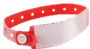

En cas d'allergie aux bêtalactamines, si antibioprophylaxie indiquée, et sauf mention contraire :

**Clindamycine 900 mg IVL**

●●● (Avis d'experts)

<table border="1">
<thead>
<tr>
<th>Nomenclature</th>
<th>Actes chirurgicaux ou interventionnels</th>
<th>Molécules</th>
<th>Dose initiale</th>
<th>Réinjections et durée</th>
<th>Force de la recommandation</th>
</tr>
</thead>
<tbody>
<tr>
<td colspan="6"><b>Chirurgie rhino-sinusienne</b></td>
</tr>
<tr>
<td>■ Chirurgie sinusienne de polypose ou sinusite chronique (méatotomie, éthmoïdectomie, sphénoïdectomie, polypectomie)</td>
<td></td>
<td rowspan="2">PAS D'ANTI BIOPROPHYLAXIE</td>
<td></td>
<td></td>
<td>●●● (Avis d'experts)</td>
</tr>
<tr>
<td>■ Chirurgie rhinologique sans mise en place de greffon</td>
<td></td>
<td></td>
<td></td>
<td>●●● (GRADE 2)</td>
</tr>
</tbody>
</table><table border="1">
<tr>
<td rowspan="2">
<ul>
<li>▪ Chirurgie rhinologique avec mise en place d'un greffon ou reprise chirurgicale</li>
<li>▪ Chirurgie sinusienne tumorale</li>
</ul>
</td>
<td>Céfazoline</td>
<td>2g IVL</td>
<td>1g si durée &gt; 4h, puis toutes les 4h jusqu'à la fin de la chirurgie</td>
<td>●●● (GRADE 2)</td>
</tr>
<tr>
<td><i>Alternative :</i> Amoxicilline/Clavulanate</td>
<td>2g IVL</td>
<td>1g si durée &gt; 2h, puis toutes les 2h jusqu'à la fin de la chirurgie</td>
<td>●●● (Avis d'experts)</td>
</tr>
</table>

### Chirurgie carcinologique cervico-faciale

<table border="1">
<tr>
<td rowspan="2">
<ul>
<li>▪ Chirurgie carcinologique avec lambeau libre ou pédiculé cervico-facial</li>
</ul>
</td>
<td>Amoxicilline/Clavulanate</td>
<td>2g IVL</td>
<td>1g si durée &gt; 2h, puis toutes les 2h jusqu'à fin de chirurgie * puis 1g/6h postop pendant 48h max.** #</td>
<td>●●● (Avis d'experts)</td>
</tr>
<tr>
<td colspan="4">

<i>En cas d'allergie aux bêtalactamines, rajouter gentamicine 6-7 mg/kg IVL à la clindamycine ●●● (Avis d'experts)</i>

</td>
</tr>
<tr>
<td rowspan="2">
<ul>
<li>▪ Chirurgie carcinologique sans reconstruction : laryngectomie, pharyngo-laryngectomie, etc.</li>
</ul>
</td>
<td>Amoxicilline/Clavulanate</td>
<td>2g IVL</td>
<td>1g si durée &gt; 2h, puis toutes les 2h jusqu'à fin de chirurgie *</td>
<td>●●● (Avis d'experts)</td>
</tr>
<tr>
<td colspan="4">

<i>En cas d'allergie aux bêtalactamines, rajouter gentamicine 6-7 mg/kg IVL à la clindamycine ●●● (Avis d'experts)</i>

</td>
</tr>
</table>

### Chirurgie amygdalienne et adénoïdectomie

<table border="1">
<tr>
<td>
<ul>
<li>▪ Amygdalectomie</li>
<li>▪ Adénoïdectomie</li>
</ul>
</td>
<td>PAS D'ANTIBIOPROPHYLAXIE</td>
<td>●●● (GRADE 1)</td>
</tr>
</table>

### Cervicotomie

<table border="1">
<tr>
<td>
<ul>
<li>▪ Curage cervical</li>
<li>▪ Thyroïdectomie totale</li>
<li>▪ Thyroïdectomie partielle</li>
<li>▪ Parathyroïdectomie</li>
<li>▪ Trachéotomie percutanée</li>
</ul>
</td>
<td>PAS D'ANTIBIOPROPHYLAXIE</td>
<td>●●● (Avis d'experts)</td>
</tr>
<tr>
<td>
<ul>
<li>▪ Trachéotomie chirurgicale</li>
</ul>
</td>
<td>Céfazoline</td>
<td>2g IVL</td>
<td>1g si durée &gt; 4h, puis toutes les 4h jusqu'à fin de chirurgie</td>
<td>●●● (Avis d'experts)</td>
</tr>
</table>

### Chirurgie des glandes salivaires

<table border="1">
<tr>
<td>
<ul>
<li>▪ Chirurgie des glandes salivaires sans accès par la cavité bucco-pharyngée</li>
</ul>
</td>
<td>PAS D'ANTIBIOPROPHYLAXIE</td>
<td>●●● (Avis d'experts)</td>
</tr>
</table><table border="1">
<tr>
<td rowspan="2">
<ul>
<li>Chirurgie des glandes salivaires avec accès par la cavité bucco-pharyngée</li>
</ul>
</td>
<td rowspan="2">Amoxicilline/Clavulanate</td>
<td rowspan="2">2g IVL</td>
<td>1g si durée &gt; 2h, puis toutes les 2h jusqu'à fin de chirurgie</td>
<td rowspan="2">●●● (Avis d'experts)</td>
</tr>
<tr>
<td>En cas d'allergie aux bêtalactamines, rajouter gentamicine 6-7 mg/kg IVL à la clindamycine ●●● (Avis d'experts)</td>
</tr>
</table>

### Laryngoscopie en suspension

<table border="1">
<tr>
<td>
<ul>
<li>Laryngoscopie en suspension diagnostique sans ou avec biopsies</li>
<li>Laryngoscopie en suspension avec geste thérapeutique (laser, cordectomie, etc.)</li>
</ul>
</td>
<td>PAS D'ANTIBIOPROPHYLAXIE</td>
<td>●●● (Avis d'experts)</td>
</tr>
</table>

### Chirurgie otologique

<table border="1">
<tr>
<td>
<ul>
<li>Chirurgie des tympons (tympanoplastie, myringoplastie, tympanotomie exploratrice, perforation tympanique, etc.)</li>
<li>Chirurgie de la chaîne ossiculaire, stapédectomie, ossiculoplastie, otospongiose</li>
<li>Chirurgie de cholestéatome (non infecté)</li>
</ul>
</td>
<td colspan="2">PAS D'ANTIBIOPROPHYLAXIE</td>
<td>●●● (GRADE 2)</td>
</tr>
<tr>
<td rowspan="2">
<ul>
<li>Implants cochléaires</li>
</ul>
</td>
<td>Céfazoline</td>
<td>2g IVL</td>
<td>1g si durée &gt; 4h, puis toutes les 4h jusqu'à la fin de la chirurgie</td>
</tr>
<tr>
<td><u>Alternatives :</u> Amoxicilline/Clavulanate</td>
<td>2g IVL</td>
<td>1g si durée &gt; 2h, puis toutes les 2h jusqu'à la fin de la chirurgie</td>
</tr>
<tr>
<td></td>
<td></td>
<td></td>
<td>●●● (Avis d'experts)</td>
</tr>
</table>

\* en cas de chirurgie particulièrement longue et d'extension de la prophylaxie au 48 premières heures postopératoires, il convient de veiller à ne pas dépasser la dose maximale de 1200 mg/j d'acide clavulanique

\*\* posologie postopératoire proposée pour un patient de poids et de fonction rénale standard ; à moduler en fonction du poids et de la fonction rénale du patient.

# Si allergie aux pénicillines, clindamycine poursuivie à la dose de 600 mg IVL toutes les 6 heures (patient non obèse) et gentamicine 6 à 7 mg/kg IVL une fois par jour (patient non obèse) pendant 48h maximum.# CHIRURGIE STOMATOLOGIQUE ET MAXILLO-FACIALE

Dans la chirurgie stomatologique et maxillo-faciale avec ouverture bucco-pharyngée (essentiellement la chirurgie néoplasique) le risque infectieux est élevé (environ 30% des patients). De nombreuses études ont clairement démontré l'intérêt de l'antibioprophylaxie dans ce type de chirurgie. Il existe une efficacité supérieure de l'amoxicilline/clavulanate et de la céfazoline par rapport à l'amoxicilline seule ou à la clindamycine. Il n'existe pas de littérature comparant l'amoxicilline/clavulanate à la céfazoline.

La littérature s'est beaucoup intéressée à la durée de l'antibioprophylaxie, et il n'y a aucun argument à ce jour pour justifier une prolongation de l'administration de l'antibioprophylaxie au-delà de 24 heures postopératoires. En effet, les études de bonne qualité ne montrent pas de différence entre une antibioprophylaxie étendue à 24 heures et 5 jours postopératoires.

Il n'existe pas de différence dans la littérature entre chirurgie avec ou sans ouverture bucco-pharyngée. La présence d'un drainage postopératoire ne justifie pas de prolonger la durée de l'antibioprophylaxie. Concernant les chirurgies alvéolaires, il n'y a pas suffisamment de preuves à ce jour pour soutenir ou réfuter l'intérêt d'une antibioprophylaxie dans les procédures de greffes osseuses intra-oraes.

En cas d'allergie aux bêtalactamines, si antibioprophylaxie indiquée dans ce tableau :

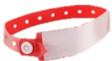

**Clindamycine 900 mg IVL**

●●● (Avis d'experts)

<table border="1">
<thead>
<tr>
<th>Actes chirurgicaux ou interventionnels</th>
<th>Molécules</th>
<th>Dose initiale</th>
<th>Réinjections et durée</th>
<th>Force de la recommandation</th>
</tr>
</thead>
<tbody>
<tr>
<td colspan="5"><b>Chirurgie orthognatique</b></td>
</tr>
<tr>
<td>▪ Chirurgie orthognatique</td>
<td>Céfazoline  <i>Alternative :</i> Amoxicilline/Clavulanate</td>
<td>2g IVL  2g IVL</td>
<td>1g si durée &gt; 4h, puis toutes les 4h jusqu'à la fin de la chirurgie puis 1g/6h postop pendant 48h max.* #  1g si durée &gt; 2h, puis toutes les 2h jusqu'à la fin de la chirurgie** puis 1g/6h postop pendant 48h max.* #</td>
<td>●●● (GRADE 2)</td>
</tr>
<tr>
<td>▪ Ablation de matériel</td>
<td colspan="3">PAS D'ANTIBIOPROPHYLAXIE</td>
<td>●●● (Avis d'experts)</td>
</tr>
<tr>
<td colspan="5"><b>Chirurgie alvéolo-dentaire</b></td>
</tr>
<tr>
<td>▪ Extractions de dents incluses, ectopiques ou en désinclusion</td>
<td>Amoxicilline</td>
<td>2g IVL ***</td>
<td>1g si durée &gt; 2h, puis toutes les 2h jusqu'à fin de chirurgie</td>
<td>●●● (GRADE 1)</td>
</tr>
</tbody>
</table><table border="1">
<tr>
<td data-bbox="41 105 398 224">
<ul>
<li>▪ Autres extractions dentaires (dents sur arcade, etc.)</li>
<li>▪ Pose de matériel d'ancrage orthodontique</li>
<li>▪ Chirurgie apicale</li>
<li>▪ Chirurgie alvéolaire (greffe osseuse d'apposition, régénération osseuse alvéolaire, ostéoplastie segmentaire, sinus lift, etc.)</li>
</ul>
</td>
<td data-bbox="401 105 778 224" style="text-align: center;">
        PAS D'ANTIBIOPROPHYLAXIE
      </td>
<td data-bbox="781 105 959 224">
<ul>
<li>●●● (GRADE 1)</li>
<li>●○○○ Avis expert</li>
<li>●○○○ Avis expert</li>
<li>●○○○ Avis expert</li>
</ul>
</td>
</tr>
</table>

### Traumatologie maxillo-faciale

<table border="1">
<tr>
<td data-bbox="41 262 398 454">
<ul>
<li>▪ Traumatologie maxillo-faciale : fractures simples, multiples ou complexes du massif facial, dont fracture ouverte de mandibule, fracture de Lefort, fracture du zygoma, etc.</li>
</ul>
</td>
<td data-bbox="401 262 574 454">
        Amoxicilline/Clavulanate  
<u>Alternative :</u> 
        Céfazoline
      </td>
<td data-bbox="577 262 644 454">
        2g IVL  
        2g IVL
      </td>
<td data-bbox="647 262 778 454">
        1g si durée &gt; 2h, puis toutes les 2h jusqu'à la fin de la chirurgie ** 
        puis 1g/6h postop pendant 24h max.* #  
        1g si durée &gt; 4h, puis toutes les 4h jusqu'à la fin de la chirurgie 
        puis 1g/6h postop pendant 24h max.* #
      </td>
<td data-bbox="781 262 959 454" style="text-align: center;">
        ●●● (GRADE 2)
      </td>
</tr>
</table>

\* posologie postopératoire proposée pour un patient de poids et de fonction rénale standard ; à moduler en fonction du poids et de la fonction rénale du patient.

\*\* en cas de chirurgie particulièrement longue et d'extension de la prophylaxie aux premières heures postopératoires, il convient de veiller à ne pas dépasser la dose maximale de 1200 mg/j d'acide clavulanique.

\*\*\* les organisations des structures (accueil en ambulatoire sans nécessairement la possibilité de perfuser le patient et de débuter l'administration intraveineuse d'amoxicilline avant l'arrivée au bloc opératoire) et la rapidité de réalisation du geste chirurgical une fois le patient anesthésié, combinés à la recommandation d'une administration IV lente des spécialités à base d'amoxicilline, font qu'il est parfois difficile de respecter le délai recommandé et que se pose alors la question d'une administration orale d'amoxicilline à l'arrivée à l'hôpital en alternative à l'administration IV au bloc opératoire. L'amoxicilline est rapidement et bien absorbée après administration orale (biodisponibilité d'environ 70 %). Le délai d'obtention de la concentration plasmatique maximale (Tmax) est d'environ une heure. Donc une prise per os de 2g d'amoxicilline, entre 120 et 60 minutes avant l'intervention, pourrait possiblement remplacer l'administration IV. Il faudra néanmoins veiller à **limiter au maximum l'apport hydrique** accompagnant cette prise orale pour respecter les règles de jeûne préopératoire.

# Si allergie aux pénicillines, clindamycine poursuivie à la dose de 600 mg IVL toutes les 6 heures (patient non obèse) pendant 24 à 48h maximum.# CHIRURGIE OPHTALMOLOGIQUE

Le risque infectieux majeur de la chirurgie du globe oculaire est l'endophtalmie dont les conséquences peuvent conduire à la perte de l'œil.

Pour la chirurgie de la cataracte (912000 patients/an en France et environ 80% des chirurgies effectuées par des ophtalmologues en France en 2021), le risque d'endophtalmie postopératoire, en l'absence d'antibioprophylaxie, est de 1 à 3/1000. L'injection intracamérulaire de céfuroxime en fin d'intervention a permis de diminuer par 2 le nombre des endophtalmies postopératoires après une chirurgie de cataracte.

L'antibioprophylaxie par des collyres, par voie sous-conjonctivale ou dans le liquide d'irrigation intraoculaire n'est pas recommandée. L'antibioprophylaxie en chirurgie ophtalmologique ne nécessite pas de réinjection.

<table border="1">
<thead>
<tr>
<th>Actes chirurgicaux ou interventionnels</th>
<th>Molécules</th>
<th>Dose initiale</th>
<th>Réinjections et durée</th>
<th>Force de la recommandation</th>
</tr>
</thead>
<tbody>
<tr>
<td colspan="5"><b><u>Chirurgie du globe oculaire</u></b></td>
</tr>
<tr>
<td rowspan="2">▪ Chirurgie de la cataracte (simple ou combinée*)</td>
<td>Céfuroxime</td>
<td>1 mg/0,1 mL en injection intracamérulaire en fin d'intervention</td>
<td>Dose unique</td>
<td>●●● (GRADE 1)</td>
</tr>
<tr>
<td><i>Si allergie :</i> Moxifloxacine</td>
<td>0,480 mg/0,3 mL en injection intracamérulaire en fin d'intervention</td>
<td>Dose unique</td>
<td>●●● (Avis d'experts)</td>
</tr>
<tr>
<td>▪ Chirurgies de la cornée, du glaucome, de la rétine et du vitré</td>
<td colspan="3">PAS D'ANTIBIOPROPHYLAXIE</td>
<td>●●● (Avis d'experts)</td>
</tr>
<tr>
<td rowspan="3">▪ Traumatismes à globe ouvert**</td>
<td>Vancomycine</td>
<td>1 mg/0,1 mL en injection intravitréenne en fin d'intervention</td>
<td>Dose unique</td>
<td rowspan="3">●●● (Avis d'experts)</td>
</tr>
<tr>
<td>+ Ceftazidime</td>
<td>2,25 mg/0,1 mL en injection intravitréenne en fin d'intervention</td>
<td>Dose unique</td>
</tr>
<tr>
<td><i>Si allergie :</i> + Amikacine (à la place de la ceftazidime)</td>
<td>0,2 mg/0,1 mL en injection intravitréenne en fin d'intervention</td>
<td>Dose unique</td>
</tr>
<tr>
<td colspan="5"><b><u>Chirurgie péri-oculaire</u></b></td>
</tr>
<tr>
<td>▪ Chirurgies des paupières, des voies lacrymales, du strabisme ou de l'orbite</td>
<td colspan="3">PAS D'ANTIBIOPROPHYLAXIE</td>
<td>●●● (GRADE 1)</td>
</tr>
</tbody>
</table>

\* Chirurgies de la cornée, du glaucome, de la rétine et du vitré effectuées dans le même temps opératoire qu'une chirurgie de cataracte.

\*\* Pas d'indication à associer une antibiothérapie par voie systémique.# **PARTIE 3 : ANTIBIOPROPHYLAXIE EN CHIRURGIE CARDIAQUE, CARDIOLOGIE STRUCTURELLE, RYTHMOLOGIE INTERVENTIONNELLE ET CHIRURGIE VASCULAIRE**

**EXPERTS :** Adrien Bouglé (coordinateur d'experts, SFAR), Fanny Vuoto (SPILF), Sophie Provenchère (SFAR), François Labaste (SFAR), Diane Lena (SFAR), Emmanuel Rineau (SFAR), Philippe Guerçi (SFAR), Bernard lung (SFC), Jérémy Arzoine (SFAR), Marion Lalande (SFAR), Pierre Ollitrault (SFC), Pierre Demondion (SFCTCV), Jean Porterie (SFCTCV), Marie Roche-Barreau (SFAR), Patrick Feugier (SCVE), et Marc-Olivier Fischer (organisateur, SFAR).

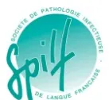

## **ANTIBIOPROPHYLAXIE EN CHIRURGIE CARDIAQUE**

La chirurgie cardiaque est une chirurgie propre (classe 1 d'Altemeier). La circulation extracorporelle, la durée de l'intervention, le terrain et la complexité des procédures sont susceptibles d'augmenter le risque infectieux).

L'utilité de l'antibioprophylaxie a été clairement démontrée. Il n'est pas recommandé, dans la très grande majorité des cas de prolonger l'administration de l'antibioprophylaxie au-delà de la fin de la chirurgie pour diminuer l'incidence d'infection du site opératoire.

Pour rappel, il est recommandé de procéder, sans dépistage microbiologique, à une décolonisation nasale du portage de *Staphylococcus aureus* par de la mupirocine 2% dans chaque narine, associée à une décontamination oropharyngée systématique par bain de bouche biquotidien à la chlorhexidine, en les débutant au moins 48h avant la chirurgie et pour une durée totale de 5-7 jours (RFE SFAR-SFCTCV 2021 - <https://sfar.org/download/rehabilitation-amelioree-apres-chirurgie-cardiaque-adulte-sous-cec-ou-a-coeur-battant/?wpdmdl=35416&refresh=648d50419ec391686982721>).

Enfin, il est aussi précisé ici que l'utilisation de compresses résorbables imprégnées d'antibiotiques ou toute autre méthode d'application d'antibiotique sur les berges sternales n'a pas prouvé son efficacité.

En cas d'allergie aux bêtalactamines, si antibioprophylaxie indiquée dans ce tableau :

**Vancomycine 20 mg/kg IVL ou teicoplanine 12 mg/kg IVL**

●●● (Avis d'experts)

<table border="1">
<thead>
<tr>
<th>Actes chirurgicaux ou interventionnels</th>
<th>Molécules</th>
<th>Dose initiale</th>
<th>Réinjections et durée</th>
<th>Force de la recommandation</th>
</tr>
</thead>
<tbody>
<tr>
<td colspan="5"><b><u>Chirurgie cardiaque</u></b></td>
</tr>
<tr>
<td>
<ul>
<li>Actes thérapeutiques des parois, des cavités et des valves du cœur, de l'aorte ascendante et de la crosse aortique avec ou sans CEC</li>
</ul>
</td>
<td>Céfazoline</td>
<td>2g IVL</td>
<td>1g si durée &gt; 4h, puis toutes les 4h jusqu'à fin de chirurgie + 1g lors du priming si CEC</td>
<td>●●● (GRADE 1)</td>
</tr>
</tbody>
</table><table border="1">
<tr>
<td></td>
<td><u>Alternative</u> : Céfuroxime</td>
<td>1,5g IVL</td>
<td>0,75g si durée &gt;2h, puis toutes les 2h jusqu'à fin de chirurgie + 0,75g lors du priming si CEC</td>
<td></td>
</tr>
<tr>
<td>
<ul>
<li>Drainage péricardique par thoracotomie ou sternotomie</li>
<li>Fenêtre pleuropéricardique ou péritonéopéricardique</li>
<li>Hémostase postopératoire de chirurgie cardiaque par sternotomie ou thoracotomie</li>
</ul>
</td>
<td>Céfazoline  <u>Alternative</u> : Céfuroxime</td>
<td>2g IVL  1,5g IVL</td>
<td>1g si durée &gt; 4h, puis toutes les 4h jusqu'à fin de chirurgie  0,75g si durée &gt;2h, puis toutes les 2h jusqu'à fin de chirurgie</td>
<td>
<ul>
<li>●○○ (Avis d'experts)</li>
<li>●○○ (Avis d'experts)</li>
<li>●○○ (Avis d'experts)</li>
</ul>
</td>
</tr>
</table>

### Transplantation cardiaque et assistance circulatoire de longue durée

<table border="1">
<tr>
<td>
<ul>
<li>Transplantation cardiaque chez un patient arrivant de son domicile, sans assistance mécanique de longue durée (cœur artificiel ou LVAD)</li>
<li>Assistance circulatoire gauche (LVAD) ou cœur artificiel, sans contexte de réanimation préopératoire</li>
</ul>
</td>
<td>Céfazoline  <u>Alternative</u> : Céfuroxime</td>
<td>2g IVL  1,5g IVL</td>
<td>1g si durée &gt; 4h, puis toutes les 4h jusqu'à fin de chirurgie  0,75g si durée &gt;2h, puis toutes les 2h jusqu'à fin de chirurgie</td>
<td>
<ul>
<li>●○○ (Avis d'experts)</li>
<li>●○○ (Avis d'experts)</li>
</ul>
</td>
</tr>
<tr>
<td>
<ul>
<li>Transplantation cardiaque chez un patient porteur d'une assistance mécanique de longue durée (cœur artificiel ou LVAD), ou de courte durée (ECMO), sans ou avec antécédent d'infection</li>
<li>Assistance circulatoire gauche (LVAD) ou cœur artificiel avec un contexte de réanimation préopératoire (avec ou sans ECMO préopératoire)</li>
</ul>
</td>
<td colspan="3">Modalités de l'antibioprophylaxie (molécule(s) et durée) à discuter individuellement après avis infectiologique spécialisé, tenant compte des antécédents infectieux et de la colonisation à SARM ou E-BLSE</td>
<td>
<ul>
<li>●○○ (Avis d'experts)</li>
<li>●○○ (Avis d'experts)</li>
</ul>
</td>
</tr>
</table>

### Assistance circulatoire de courte durée

<table border="1">
<tr>
<td>
<ul>
<li>Assistance de courte durée avec mise en place per-cutanée <u>sans</u> abord chirurgical, dont ECMO, Impella, CPIA, etc.</li>
</ul>
</td>
<td colspan="3">PAS D'ANTIBIOPROPHYLAXIE</td>
<td>●○○ (Avis d'experts)</td>
</tr>
<tr>
<td>
<ul>
<li>Assistance de courte durée <u>avec</u> abord chirurgical dont ECMO, Impella, etc.</li>
</ul>
</td>
<td>Céfazoline  <u>Alternative</u> : Céfuroxime</td>
<td>2g IVL  1,5g IVL</td>
<td>1g si durée &gt; 4h, puis toutes les 4h jusqu'à fin de chirurgie  0,75g si durée &gt;2h, puis toutes les 2h jusqu'à fin de chirurgie</td>
<td>●○○ (Avis d'experts)</td>
</tr>
</table>## ANTIBIOPROPHYLAXIE EN CARDIOLOGIE STRUCTURELLE

Les procédures interventionnelles en cardiologie structurelle sont considérées comme des chirurgies propres (classe 1 d'Altemeier). Cependant, la voie d'abord fémorale au triangle de Scarpa, le terrain et les ré-interventions peuvent augmenter le risque d'infection. Du fait du développement relativement récent de ces techniques, il n'existe pas encore de littérature de haut niveau de preuve s'intéressant à la molécule et/ou le mode d'administration de l'antibioprophylaxie.

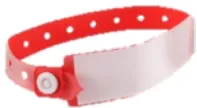

En cas d'allergie aux bêtalactamines, si antibioprophylaxie indiquée dans ce tableau :

**Vancomycine 20 mg/kg IVL ou teicoplanine 12 mg/kg IVL**

●●● (Avis d'experts)

<table border="1">
<thead>
<tr>
<th>Actes chirurgicaux ou interventionnels</th>
<th>Molécules</th>
<th>Dose initiale</th>
<th>Réinjections et durée</th>
<th>Force de la recommandation</th>
</tr>
</thead>
<tbody>
<tr>
<td colspan="5"><b><u>Cardiologie structurelle</u></b></td>
</tr>
<tr>
<td rowspan="4">
<ul style="list-style-type: none; padding-left: 0;">
<li>▪ Bioprotèse de la valve aortique par voie artérielle transcutanée (TAVI) ou autre bioprotèse valvulaire par voie transcutanée</li>
<li>▪ Fermeture d'auricule par voie percutanée avec implantation de matériel</li>
<li>▪ Rétrécissement de l'orifice atrioventriculaire gauche (MitraClip)</li>
<li>▪ Fermeture de communication interatriale ou de foramen ovale perméable</li>
</ul>
</td>
<td>Amoxicilline/Clavulanate</td>
<td>2g IVL</td>
<td>1g si durée &gt; 2h puis toutes les 2h jusqu'à fin de chirurgie</td>
<td>●●● (Avis d'experts)</td>
</tr>
<tr>
<td><i>Alternative :</i> Céfazoline</td>
<td>2g IVL</td>
<td>1g si durée &gt; 4h, puis toutes les 4h jusqu'à fin de chirurgie</td>
<td>●●● (Avis d'experts)</td>
</tr>
<tr>
<td>+</td>
<td></td>
<td></td>
<td>●●● (Avis d'experts)</td>
</tr>
<tr>
<td>Amoxicilline</td>
<td>2g IVL</td>
<td>1g si durée &gt; 2h puis toutes les 2h jusqu'à fin de chirurgie</td>
<td>●●● (Avis d'experts)</td>
</tr>
</tbody>
</table>

## ANTIBIOPROPHYLAXIE EN RYTHMOLOGIE INTERVENTIONNELLE

La rythmologie interventionnelle est une spécialité propre (classe 1 d'Altemeier). L'implantation d'une prothèse rythmique et la durée de la procédure sont susceptibles d'augmenter le risque infectieux. L'utilité de l'antibioprophylaxie intraveineuse pré-opératoire a été clairement démontrée, ainsi que l'utilité de l'antibioprophylaxie locale per-opératoire pour certaines interventions complexes. La prolongation au-delà de la période opératoire n'a aucune utilité. L'utilité de l'antibioprophylaxie en cas d'exploration ou d'ablation par cathéter est incertaine.

En cas d'allergie aux bêtalactamines, si antibioprophylaxie indiquée dans ce tableau :

**Vancomycine 20 mg/kg IVL ou teicoplanine 12 mg/kg IVL**

●●● (Avis d'experts)<table border="1">
<thead>
<tr>
<th>Actes chirurgicaux ou interventionnels</th>
<th>Molécules</th>
<th>Dose initiale</th>
<th>Réinjections et durée</th>
<th>Force de la recommandation</th>
</tr>
</thead>
<tbody>
<tr>
<td colspan="5"><b><u>Implantation ou changement de prothèse rythmique (stimulateur ou défibrillateur)</u></b></td>
</tr>
<tr>
<td>
<ul>
<li>▪ Implantation, explantation ou changement de stimulateur ou défibrillateur</li>
<li>▪ Implantation, explantation ou changement de sonde de stimulation ou de défibrillation</li>
</ul>
</td>
<td>Céfazoline</td>
<td>2g IVL</td>
<td>1g si durée &gt; 4h, puis toutes les 4h jusqu'à fin de chirurgie</td>
<td>●●● (GRADE 1)</td>
</tr>
<tr>
<td colspan="5"><b><u>Explorations endocavitaires et ablations de trouble du rythme cardiaque par cathéter</u></b></td>
</tr>
<tr>
<td>
<ul>
<li>▪ Exploration électrophysiologique endocavitaire atriale et/ou ventriculaire</li>
<li>▪ Ablation de trouble du rythme cardiaque par cathéter (radiofréquence, cryothérapie, etc.) dans les cavités cardiaques droites ou gauches</li>
</ul>
</td>
<td colspan="3" style="text-align: center;">PAS D'ANTIBIOPROPHYLAXIE *</td>
<td>●●● (Avis d'experts)</td>
</tr>
<tr>
<td></td>
<td colspan="3" style="text-align: center;">
          * Si procédure chez un patient avec prothèse intracardiaque (rythmique ou non) déjà implantée : 
          Céfazoline 2g IVL ●●● (Avis d'experts)
        </td>
<td>●●● (Avis d'experts)</td>
</tr>
</tbody>
</table># ANTIBIOPROPHYLAXIE EN CHIRURGIE VASCULAIRE

La chirurgie vasculaire est le plus souvent une chirurgie propre (classe 1 d'Altemeier), mais certaines interventions sont classées en classe 2 à 4 d'Altemeier (trouble trophique distal, amputations de gangrènes infectées). L'abord du triangle de Scarpa, le terrain et les ré-interventions peuvent augmenter le risque d'infection. L'efficacité de l'antibioprophylaxie a été démontrée pour certaines de ces chirurgies vasculaires, mais il n'existe pas de données récentes concernant son efficacité pour d'autres procédures (radiologie interventionnelle, chirurgie veineuse profonde).

L'antibioprophylaxie peut être pratiquée même si une antibiothérapie est en cours pour traiter une infection. L'utilisation de prothèses imprégnées d'antibiotiques ou d'argent, ou de systèmes d'assistance de fermeture cutanée en pression négative ne sont pas considérés comme des alternatives à une antibioprophylaxie. Leur utilisation ne permet pas de s'affranchir d'administrer une antibioprophylaxie par voie systémique.

En cas d'allergie aux bêtalactamines, si antibioprophylaxie indiquée dans ce tableau :

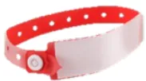

Si céfazoline : **vancomycine 20 mg/kg IVL** ou **teicoplanine 12 mg/kg IVL**

Si amoxicilline/clavulanate : **clindamycine 900 mg IVL + gentamicine 6 à 7 mg/kg**

●●● (Avis d'experts)

<table border="1">
<thead>
<tr>
<th>Actes chirurgicaux ou interventionnels</th>
<th>Molécules</th>
<th>Dose initiale</th>
<th>Réinjections et durée</th>
<th>Force de la recommandation</th>
</tr>
</thead>
<tbody>
<tr>
<td colspan="5"><b>Chirurgie artérielle ouverte</b></td>
</tr>
<tr>
<td rowspan="2">
<ul>
<li>Chirurgie artérielle périphérique ou chirurgie aortique, avec ou sans mise en place de matériel</li>
<li>Chirurgie carotidienne <u>avec</u> mise en place de matériel</li>
</ul>
</td>
<td>Céfazoline</td>
<td>2g IVL</td>
<td>1g si durée &gt; 4h, puis toutes les 4h jusqu'à fin de chirurgie</td>
<td>●●● (GRADE 1)</td>
</tr>
<tr>
<td><i>Alternative :</i> Céfuroxime</td>
<td>1,5g IVL</td>
<td>0,75g si durée &gt;2h, puis toutes les 2h jusqu'à fin de chirurgie</td>
<td>●●● (GRADE 2)</td>
</tr>
<tr>
<td>
<ul>
<li>Chirurgie carotidienne <u>sans</u> mise en place de matériel</li>
</ul>
</td>
<td colspan="3">PAS D'ANTIBIOPROPHYLAXIE</td>
<td>●●● (GRADE 1)</td>
</tr>
<tr>
<td colspan="5"><b>Chirurgie veineuse</b></td>
</tr>
<tr>
<td>
<ul>
<li>Chirurgie des varices <u>sans</u> abord chirurgical du scarpa</li>
</ul>
</td>
<td colspan="3">PAS D'ANTIBIOPROPHYLAXIE</td>
<td>●●● (Avis d'experts)</td>
</tr>
<tr>
<td rowspan="2">
<ul>
<li>Chirurgie des varices <u>avec</u> abord chirurgical du scarpa</li>
</ul>
</td>
<td>Céfazoline</td>
<td>2g IVL</td>
<td>1g si durée &gt; 4h, puis toutes les 4h jusqu'à fin de chirurgie</td>
<td rowspan="2">●●● (GRADE 2)</td>
</tr>
<tr>
<td><i>Alternative :</i> Céfuroxime</td>
<td>1,5g IVL</td>
<td>0,75g si durée &gt;2h, puis toutes les 2h jusqu'à fin de chirurgie</td>
</tr>
</tbody>
</table><table border="1">
<tr>
<td rowspan="2">
<ul>
<li>Chirurgie veineuse profonde ouverte</li>
</ul>
</td>
<td>Céfazoline</td>
<td>2g IVL</td>
<td>1g si durée &gt; 4h, puis toutes les 4h jusqu'à fin de chirurgie</td>
<td rowspan="2">●●● (Avis d'experts)</td>
</tr>
<tr>
<td><i>Alternative :</i> Céfuroxime</td>
<td>1,5g IVL</td>
<td>0,75g si durée &gt;2h, puis toutes les 2h jusqu'à fin de chirurgie</td>
</tr>
<tr style="background-color: #fde9d9;">
<td colspan="5"><b><u>Fistule artério-veineuse</u></b></td>
</tr>
<tr>
<td>
<ul>
<li>Création ou reprise de fistule artério-veineuse <u>sans</u> mise en place de matériel</li>
</ul>
</td>
<td colspan="3">PAS D'ANTIBIOPROPHYLAXIE</td>
<td>●●● (GRADE 2)</td>
</tr>
<tr>
<td rowspan="2">
<ul>
<li>Création ou reprise de fistule artério-veineuse <u>avec</u> mise en place de matériel</li>
</ul>
</td>
<td>Céfazoline</td>
<td>2g IVL</td>
<td>1g si durée &gt; 4h, puis toutes les 4h jusqu'à fin de chirurgie</td>
<td rowspan="2">●●● (GRADE 2)</td>
</tr>
<tr>
<td><i>Alternative :</i> Céfuroxime</td>
<td>1,5g IVL</td>
<td>0,75g si durée &gt;2h, puis toutes les 2h jusqu'à fin de chirurgie</td>
</tr>
<tr style="background-color: #fde9d9;">
<td colspan="5"><b><u>Procédure interventionnelle vasculaire</u></b></td>
</tr>
<tr>
<td rowspan="2">
<ul>
<li>Stent couvert ou endoprothèse</li>
<li>Stent nu ou absence de mise en place de matériel chez un patient <u>avec</u> facteurs de risque *</li>
</ul>
</td>
<td>Céfazoline</td>
<td>2g IVL</td>
<td>1g si durée &gt; 4h, puis toutes les 4h jusqu'à fin de chirurgie</td>
<td>●●● (GRADE 2)</td>
</tr>
<tr>
<td><i>Alternative :</i> Céfuroxime</td>
<td>1,5g IVL</td>
<td>0,75g si durée &gt;2h, puis toutes les 2h jusqu'à fin de chirurgie</td>
<td>●●● (GRADE 2)</td>
</tr>
<tr>
<td>
<ul>
<li>Stent nu ou absence de mise en place de matériel chez un patient <u>sans</u> facteur de risque*</li>
</ul>
</td>
<td colspan="3">PAS D'ANTIBIOPROPHYLAXIE</td>
<td>●●● (GRADE 2)</td>
</tr>
<tr style="background-color: #fde9d9;">
<td colspan="5"><b><u>Amputation de membre</u></b></td>
</tr>
<tr>
<td>
<ul>
<li>Amputation de membre (hors contexte septique)</li>
</ul>
</td>
<td>Amoxicilline/Clavulanate</td>
<td>2g IVL</td>
<td>1g si durée &gt; 2h, puis toutes les 2h jusqu'à fin de chirurgie Puis 50 mg/kg/j en 3 ou 4 injections IVL pendant 48h**</td>
<td>●●● (GRADE 2)</td>
</tr>
</table>

\* Facteurs de risque d'infection en procédure interventionnelle vasculaire : passage des guides à travers des prothèses ou stents préexistants ; cathéter de radiologie interventionnelle en place >6h ; réintervention dans les 7 jours ; trouble trophique veineux ou artériel ne nécessitant pas d'antibiothérapie.

\*\* Si allergie aux pénicillines, clindamycine poursuivie à la dose de 600 mg IVL toutes les 6 heures (patient non obèse) et gentamicine 6 à 7 mg/kg IVL une fois par jour (patient non obèse) pendant 48h maximum.## **PARTIE 4 : ANTIBIOPROPHYLAXIE EN CHIRURGIE THORACIQUE, ENDOSCOPIE THORACIQUE ET INTERVENTIONNELLE, ET RADIOLOGIE INTERVENTIONNELLE**

**Experts :** Eric Kipnis (coordinateur d'experts, SFAR), Pierre Fillatre (SPILF), Aude Charvet (SFAR), Jean Selim (SFAR), Morgan Le Guen (SFAR), Hadrien Roze (SFAR), François Stephan (SFAR), Christophe Quesnel (SFAR), Mouna Ben Rehouma (SFAR), Marco Alifano (SFCTCV), Olivier Schussler (SFCTCV), Christine Lorut (SPLF), Antoine Khalil (SFR/RI), et Hélène Charbonneau et Stéphanie Ruiz (organisatrices, SFAR).

The logo for the Société Française d'Anatomie et de Radiologie (SFAR) consists of three stylized, overlapping circles in shades of orange and teal, with the acronym 'SFAR' in blue text to the right.The logo for the Société de Pathologie Interventionnelle de Langue Française (Spilf) features a circular emblem with a stylized 'S' and 'P' in blue and green, surrounded by the text 'SOCIÉTÉ DE PATHOLOGIE INTERVENTIONNELLE' and 'DE LANGUE FRANÇAISE'.

### **CHIRURGIE THORACIQUE, ENDOSCOPIE THORACIQUE ET INTERVENTIONNELLE, ET RADIOLOGIE INTERVENTIONNELLE**

La chirurgie thoracique comporte d'une part les chirurgies de résection pulmonaire avec ouverture de l'arbre bronchique (chirurgie propre contaminée, classe 2 Altemeier), et des chirurgies médiastinales ou pleurales sans ouverture bronchique (chirurgie propre, classe 1 Altemeier). L'indication de l'antibioprophylaxie est formelle dans ces deux types de chirurgie (GRADE 1). Elle a pour but de diminuer les ISO, comprenant les infections de paroi et les pyothorax, et pour les chirurgies de résection pulmonaire elle peut aussi avoir un intérêt pour la diminution des pneumonies postopératoires (PPO).

Les incidences d'infections postopératoires varient : ISO (5%), pyothorax/empyème (1%), POP entre 2 et 5%, et même jusqu'à 13% dans certaines séries. Les facteurs de risque de PPO comportent notamment la technique opératoire (chirurgie ouverte vs. vidéo-assistée), la durée opératoire, et certains éléments de terrain, dont le fait d'être atteint de bronchopneumopathie chronique obstructive (BPCO). Les bactéries les plus fréquemment isolées au cours des PPO sont les staphylocoques, *S. pneumoniae*, *H. influenzae*, et des bacilles à Gram négatif (BGN). Quand l'incidence de PPO est élevée, l'utilisation de l'amoxicilline/clavulanate comme molécule d'antibioprophylaxie pourrait en réduire l'incidence, de même qu'une prolongation de l'antibioprophylaxie pour 24h à 48h postopératoires maximum pourrait également réduire l'incidence de POP lorsqu'elle est élevée. Ceci sous-tend la proposition faite dans le tableau pour les patients BPCO opérés de résection pulmonaire.

Pour les chirurgies sans résection pulmonaire, l'antibioprophylaxie par céphalosporine de 1ère génération est adaptée à l'écologie des ISO. Il n'y a pas lieu de prolonger l'antibioprophylaxie au-delà de la période opératoire.

Les actes diagnostiques et thérapeutiques en pneumologie et radiologie interventionnelles se développent rapidement. Néanmoins, il n'est pas possible d'établir de recommandations fortes au regard de la littérature à ce jour et de futures études randomisées permettront d'affiner ces recommandations.

Enfin, la transplantation pulmonaire (TP) constitue une activité d'exception avec environ 400 actes/an en France. Quatre grandes indications existent : les pathologies obstructives (emphyseme, BPCO...), restrictives (fibrose, pathologies systémiques...), suppuratives (dilatation des bronches, mucoviscidose...) et l'hypertension artérielle pulmonaire (primaire, secondaire...). Dans chaque cas, la colonisation du patient et la pression de sélection d'antibiothérapies préalables sont à considérer pour le choix de l'antibioprophylaxie. Néanmoins, du fait du petit nombre de centres réalisant des TP, les spécificités de la patientèle et des indications à la TP de chaque centre, il n'est pas possible de proposer une antibioprophylaxie universelle. Il est suggéré que chaque centre établisse un protocole local, incluant lorsque cela est nécessaire une discussion pluridisciplinaire pour personnaliser l'antibioprophylaxie en fonction des antécédents du patient.En cas d'allergie aux bêtalactamines, si antibioprophylaxie indiquée, et sauf mention contraire :

**Clindamycine 900 mg IVL + gentamicine 6 à 7 mg/kg IVL**

●●● (Avis d'experts)

<table border="1">
<thead>
<tr>
<th>Actes chirurgicaux ou interventionnels</th>
<th>Molécules</th>
<th>Dose initiale</th>
<th>Réinjections et durée</th>
<th>Force de la recommandation</th>
</tr>
</thead>
<tbody>
<tr>
<td colspan="5"><b>Chirurgie d'exérèse pulmonaire</b> (par thoracotomie ou cervico-thoracotomie, avec ou sans préparation par thoracoscopie)</td>
</tr>
<tr>
<td rowspan="4">
<ul style="list-style-type: none; padding-left: 0;">
<li>▪ Pneumonectomies ou lobectomies pulmonaires</li>
<li>▪ Pleuro-pneumonectomies</li>
<li>▪ Exérèses partielles non anatomiques simples ou multiples du poumon, par thoracotomie</li>
<li>▪ Segmentectomie pulmonaire unique ou multiple, par thoracotomie</li>
<li>▪ Réduction uni- ou bilatérale de volume pulmonaire</li>
<li>▪ Résection de bulle d'emphyseme pulmonaire</li>
<li>▪ Exérèse de kyste hydatique du poumon, par thoracotomie</li>
</ul>
</td>
<td><u>Au choix :</u></td>
<td></td>
<td></td>
<td></td>
</tr>
<tr>
<td>Amoxicilline/Clavulanate</td>
<td>2g IVL</td>
<td>1g si durée &gt; 2h, puis toutes les 2h jusqu'à la fin de la chirurgie *</td>
<td>●●● (GRADE 1) **</td>
</tr>
<tr>
<td>ou</td>
<td></td>
<td></td>
<td></td>
</tr>
<tr>
<td>Céfazoline</td>
<td>2g IVL</td>
<td>1g si durée &gt; 4h, puis toutes les 4h jusqu'à la fin de la chirurgie</td>
<td>●●● (GRADE 1) **</td>
</tr>
<tr>
<td></td>
<td>ou</td>
<td></td>
<td></td>
<td></td>
</tr>
<tr>
<td></td>
<td>Céfuoxime</td>
<td>1,5g IVL</td>
<td>0,75g si durée &gt;2h, puis toutes les 2h jusqu'à la fin de la chirurgie</td>
<td>●●● (GRADE 1) **</td>
</tr>
<tr>
<td colspan="5">

* pour la prévention des pneumonies post-opératoires, chez les patients atteints de BPCO et/ou dans les centres à incidence élevée de pneumonies post-opératoires :

<ul style="list-style-type: none; padding-left: 0;">
<li>• privilégier amoxicilline/clavulanate ●●● (GRADE 2)</li>
<li>• durée jusqu'à 48h postopératoire max ●●● (Avis d'experts) (1g/6h à moduler en fonction du poids et de la fonction rénale du patient) #</li>
</ul>

</td>
</tr>
<tr>
<td colspan="5"><b>Chirurgies médiastinales, pleurales, pariétales</b> (y compris voies thoracoscopiques vidéo-assistées)</td>
</tr>
<tr>
<td rowspan="2">
<ul style="list-style-type: none; padding-left: 0;">
<li>▪ Chirurgie du médiastin</li>
<li>▪ Chirurgie du pneumothorax</li>
<li>▪ Chirurgie de la plèvre (patient non infecté)</li>
<li>▪ Chirurgie de paroi thoracique (avec ou sans pose de matériel)</li>
</ul>
</td>
<td>Céfazoline</td>
<td>2g IVL</td>
<td>1g si durée &gt; 4h, puis toutes les 4h jusqu'à fin de chirurgie</td>
<td>●●● (Avis d'experts) **</td>
</tr>
<tr>
<td><u>Alternative :</u> Céfuoxime</td>
<td>1,5g IVL</td>
<td>0,75g si durée &gt;2h, puis toutes les 2h jusqu'à fin de chirurgie</td>
<td>●●● (Avis d'experts) **</td>
</tr>
</tbody>
</table><table border="1">
<tr>
<td>
<ul>
<li>▪ Médiastinoscopie, avec ou sans biopsie</li>
<li>▪ Thoracoscopie/pleuroscopie, avec ou sans biopsie, avec ou sans abrasion ou talcage</li>
</ul>
</td>
<td>PAS D'ANTIBIOPROPHYLAXIE</td>
<td>
<ul>
<li>●●● (Avis d'experts)</li>
<li>●●● (Avis d'experts)</li>
</ul>
</td>
</tr>
<tr>
<td>
<ul>
<li>▪ Drainage thoracique, tunellisé ou non</li>
</ul>
</td>
<td>PAS D'ANTIBIOPROPHYLAXIE</td>
<td>●●● (Avis d'experts)</td>
</tr>
</table>

### Chirurgie des voies aériennes sous-glottiques

<table border="1">
<tr>
<td>
<ul>
<li>▪ Trachéotomie chirurgicale</li>
<li>▪ Suture ou résection-anastomose de bronche, par cervicotomie, cervico- et/ou thoracotomie</li>
<li>▪ Plastie ou fermeture d'orifice de trachéostomie ou de trachéotomie</li>
<li>▪ Tuteur trachéal, par cervicotomie</li>
<li>▪ Fermeture de plaie ou fistule bronchique, par thoracotomie</li>
<li>▪ Plastie de trachée par autogreffe ou lambeau, par cervico- et/ou thoracotomie</li>
<li>▪ Remplacement de trachée par prothèse, par cervico- et/ou thoracotomie</li>
<li>▪ Résection-anastomose thyro- ou crico-trachéale par cervicotomie</li>
<li>▪ Résection-anastomose de trachée ou de la bifurcation trachéale par cervico- et/ou thoracotomie</li>
<li>▪ Résection-anastomose de trachée pour sténose congénitale de la trachée, par thoracotomie</li>
</ul>
</td>
<td>

Céfazoline

<u>Alternatives :</u>

Amoxicilline/Clavulanate

ou

Céfuoxime

</td>
<td>

2g IVL

2g IVL

1,5g IVL

</td>
<td>

1g si durée &gt; 4h, puis toutes les 4h jusqu'à la fin de la chirurgie

1g si durée &gt; 2h, puis toutes les 2h jusqu'à la fin de la chirurgie

0,75g si durée &gt; 2h, puis toutes les 2h jusqu'à la fin de la chirurgie

</td>
<td>
<ul>
<li>●●● (Avis d'experts) **</li>
<li>●●● (Avis d'experts) **</li>
<li>●●● (Avis d'experts) **</li>
</ul>
</td>
</tr>
<tr>
<td>
<ul>
<li>▪ Trachéotomie percutanée</li>
</ul>
</td>
<td>PAS D'ANTIBIOPROPHYLAXIE</td>
<td></td>
<td></td>
<td>●●● (Avis d'experts)</td>
</tr>
</table>

### Chirurgie œsophagienne (avec ou sans plastie colique)

<table border="1">
<tr>
<td>
<ul>
<li>▪ Œsophagectomie</li>
<li>▪ Excision de tumeur de l'œsophage</li>
<li>▪ Traitement d'un diverticule de l'œsophage</li>
</ul>
</td>
<td>

Céfazoline

<u>Alternative :</u>

Céfuoxime

</td>
<td>

2g IVL

1,5g IVL

</td>
<td>

1g si durée &gt; 4h puis toutes les 4h jusqu'à fin de chirurgie

0,75g si durée &gt; 2h puis toutes les 2h jusqu'à fin de chirurgie

</td>
<td>
<ul>
<li>●●● (Avis d'experts)</li>
</ul>
</td>
</tr>
<tr>
<td colspan="5">

En cas d'allergie vraie aux bêtalactamines, vancomycine 20 mg/kg IVL ou teicoplanine 12 mg/kg IVL [●●● (Avis d'expert)]

</td>
</tr>
</table>### **Radiologie interventionnelle des voies respiratoires ou du poumon**

<table border="1"><tr><td><ul><li>■ Destruction d'une ou plusieurs tumeurs bronchopulmonaires par radiofréquence, par voie transcutanée avec guidage scanographique</li><li>■ Ponctions, cytoponctions ou biopsies pulmonaires par voie transcutanée avec guidage échographique, radiologique, scanographique ou remnographique (IRM)</li><li>■ Évacuation ou drainages d'une ou plusieurs collections broncho-pulmonaires par voie transcutanée avec guidage échographique, radiologique, scanographique ou remnographique (IRM)</li><li>■ Injection d'agent pharmacologique intrabronchique ou intrapulmonaire, par voie transcutanée avec guidage échographique</li></ul></td><td>PAS D'ANTIBIOPROPHYLAXIE</td><td>●●● (Avis d'experts)</td></tr></table>

### **Fibroscope ou écho-endoscopie diagnostique**

<table border="1"><tr><td><ul><li>■ Fibroscope bronchique simple ou avec lavage broncho-alvéolaire</li><li>■ Fibroscope + biopsies (mini sonde...)</li><li>■ Écho-endoscopie bronchique avec ponction trans-bronchique échoguidée (EBUS)</li></ul></td><td>PAS D'ANTIBIOPROPHYLAXIE</td><td>●●● (Avis d'experts)</td></tr></table>

### **Pose de prothèse endo-bronchique, trachéale ou mise en place de valves unidirectionnelle**

<table border="1"><tr><td rowspan="2"><ul><li>■ Valves Zéphyr pour emphyseme pulmonaire sévère</li></ul></td><td>Amoxicilline/Clavulanate</td><td>2g IVL</td><td>Puis 1g x4 /j per os pendant 48h</td><td>●●● (Avis d'experts)</td></tr><tr><td><i>Si allergie :</i> Pristinamycine</td><td>1 g per os 1h avant</td><td>Puis 1g x 2 /j per os pendant 48h</td><td>●●● (Avis d'experts)</td></tr><tr><td><ul><li>■ Prothèse trachéo-bronchique</li></ul></td><td colspan="3">PAS D'ANTIBIOPROPHYLAXIE</td><td>●●● (Avis d'experts)</td></tr></table>

### **Endoscopie thérapeutique : dilatation, laser**

<table border="1"><tr><td><ul><li>■ Bronchoscope rigide, désobstruction</li><li>■ Destruction de lésion par laser, cryothérapie</li><li>■ Dilatation ou résection de sténose avec ou sans laser</li></ul></td><td>PAS D'ANTIBIOPROPHYLAXIE</td><td>●●● (Avis d'experts)</td></tr></table>

### **Transplantation mono ou bipulmonaire avec ou sans circulation extra-corporelle**

<table border="1"><tr><td>Compte tenu de l'absence de littérature sur ce sujet, de la diversité des situations cliniques et des pratiques des différents centres, il n'est pas possible de recommander une antibioprophylaxie consensuelle unique</td><td>●●● (Avis d'experts)</td></tr></table>

\*\* Pour les lignes ainsi marquées d'un double astérisque, le niveau de GRADE porte sur les schémas posologiques proposés, et non pour leur application à chaque intitulé comme dans le reste des recommandations.

# Si allergie aux pénicillines, clindamycine poursuivie à la dose de 600 mg IVL toutes les 6 heures (patient non obèse) et gentamicine 6 à 7 mg/kg IVL une fois par jour (patient non obèse) pendant 48h maximum.## **PARTIE 5 : CHIRURGIE PLASTIQUE ET RECONSTRUCTRICE, D’AFFIRMATION DE GENRE, ET DU PATIENT BRULE**

**EXPERTS :** Arnaud Friggeri (coordinateur d'experts, SFAR), Christophe Strady (SPILF), Laure Fayolle-Pivot (SFAR), Benoit Crémilleux (SFAR), Nicolas Louvet (SFAR), Charles-Hervé Vacheron (SFAR), Clémentine Taconet (SFAR), François Dépret (SFAR), Thomas Leclerc (SFAR), Matthieu Dumont (SFAR), Laetitia Goffinet (SFB), Nicolas Morel-Journel (AFU), Stéphane Demortillet (SoFCPRE), Alexia Ramon (SoFCPRE), Jacques Saboye (SoFCPRE), et Alice Blet (organisatrice, SFAR).

The logo for SFAR (Société Française d'Arthroscopie et de Réhabilitation Orthopédique) is located in the top left corner. It consists of three stylized, overlapping shapes in orange and blue, with the letters 'SFAR' in blue text to the right.The logo for SPILF (Société Française de Pathologie Infectieuse et de Langue Française) is located in the top right corner. It features a circular emblem with a blue and green design, and the text 'SPILF' in a stylized font, with 'SOCIÉTÉ DE PATHOLOGIE INFECTIONNEUSE' and 'DE LANGUE FRANÇAISE' written around the perimeter.

### **ANTIBIOPROPHYLAXIE EN CHIRURGIE PLASTIQUE, ESTHÉTIQUE ET RECONSTRUCTRICE**

La chirurgie plastique couvre un large panel de situations cliniques avec des enjeux variés selon qu'il s'agisse d'une chirurgie carcinologique première, de reconstruction ou totalement fonctionnelle. Le risque infectieux est un enjeu majeur pouvant compromettre à court terme le résultat esthétique d'une chirurgie fonctionnelle tout comme entraîner l'échec d'une reconstruction et engager le risque vital à moyen terme.

Les gestes chirurgicaux avec un temps vasculaire (microchirurgie) entraînent un temps d'intervention prolongé et exposent d'autant plus au risque infectieux péri-opératoire.

La durée de l'antibioprophylaxie ne doit pas excéder la durée du geste opératoire. Plusieurs études en chirurgie plastique soutiennent cette durée d'administration. Un usage raisonné des antibiotiques avec des durées les plus courtes possibles participe à la maîtrise de l'émergence de germes résistants dont l'incidence est en constante augmentation.

En cas d'allergie aux bêtalactamines, si antibioprophylaxie indiquée dans ce tableau :

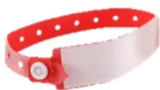A red and white wristband with a buckle, likely used for allergy identification, is shown on the left side of the box.

**Clindamycine 900 mg IVL ou vancomycine 20 mg/kg IVL ou teicoplanine 12 mg/kg IVL**

●●● (Avis d'experts)<table border="1">
<thead>
<tr>
<th>Actes chirurgicaux ou interventionnels</th>
<th>Molécules</th>
<th>Dose initiale</th>
<th>Réinjections et durée</th>
<th>Force de la recommandation</th>
</tr>
</thead>
<tbody>
<tr>
<td colspan="5"><b><u>Chirurgie mammaire plastique ou carcinologique</u></b></td>
</tr>
<tr>
<td rowspan="3">
<ul style="list-style-type: none; padding-left: 0;">
<li>▪ Chirurgie d'augmentation mammaire :
<ul style="list-style-type: none; padding-left: 20px;">
<li>○ <u>Sans</u> pose d'implant (lipofilling) : ≤ 200 mL ET durée ≤ 2h</li>
<li>&gt; 200 mL ou durée &gt; 2h</li>
</ul>
</li>
<li>○ <u>Avec</u> pose d'implant (implants siliconés, prothèse d'expansion) #</li>
<li>○ Gonflage d'expendeur</li>
</ul>
</td>
<td colspan="3" style="text-align: center;">PAS D'ANTIBIOPROPHYLAXIE</td>
<td style="text-align: center;">●●● (Avis d'experts)</td>
</tr>
<tr>
<td>Céfazoline</td>
<td rowspan="2" style="text-align: center;">2g IVL</td>
<td rowspan="2">1g si durée &gt; 4h, puis toutes les 4h jusqu'à fin de chirurgie</td>
<td style="text-align: center;">●●● (Avis d'experts)</td>
</tr>
<tr>
<td>Céfazoline</td>
<td style="text-align: center;">●●● (Avis d'experts)</td>
</tr>
<tr>
<td colspan="4" style="border: 1px solid black; padding: 5px;"># Pas d'indication à prolonger l'antibioprophylaxie au-delà de la fin de chirurgie [●●● (GRADE 2)]</td>
<td style="text-align: center;">●●● (Avis d'experts)</td>
</tr>
<tr>
<td>
<ul style="list-style-type: none; padding-left: 0;">
<li>▪ Chirurgie de réduction mammaire</li>
<li>▪ Exérèse de gynécomastie</li>
<li>▪ Mastopexie pour ptose simple</li>
<li>▪ Tumorectomie mammaire* sans curage</li>
<li>▪ Tumorectomie mammaire* avec ganglion sentinelle</li>
</ul>
</td>
<td colspan="3" style="text-align: center;">PAS D'ANTIBIOPROPHYLAXIE</td>
<td style="text-align: center;">●●● (Avis d'experts)</td>
</tr>
<tr>
<td rowspan="3">
<ul style="list-style-type: none; padding-left: 0;">
<li>▪ Tumorectomie mammaire* avec curage</li>
<li>▪ Mastectomie* (avec ou sans curage) :
<ul style="list-style-type: none; padding-left: 20px;">
<li>○ Sans reconstruction</li>
<li>○ Avec reconstruction immédiate # :
<ul style="list-style-type: none; padding-left: 20px;">
<li>- Par prothèse d'expansion</li>
<li>- Par lambeau (lambeaux pectoraux, grand dorsaux, DIEP, gracilis, PAP, SCIP, TDAP, SIEA)</li>
</ul>
</li>
<li>○ Reconstruction différée</li>
</ul>
</li>
</ul>
</td>
<td rowspan="3" style="text-align: center;">Céfazoline</td>
<td rowspan="3" style="text-align: center;">2g IVL</td>
<td rowspan="3">1g si durée &gt; 4h, puis toutes les 4h jusqu'à fin de chirurgie</td>
<td style="text-align: center;">●●● (GRADE 2)</td>
</tr>
<tr>
<td style="text-align: center;">●●● (GRADE 2)</td>
</tr>
<tr>
<td style="text-align: center;">●●● (Avis d'experts)</td>
</tr>
<tr>
<td colspan="4" style="border: 1px solid black; padding: 5px;"># Pas d'indication à prolonger l'antibioprophylaxie au-delà de la fin de chirurgie [●●● (GRADE 2)]</td>
<td style="text-align: center;">●●● (Avis d'experts)</td>
</tr>
<tr>
<td colspan="5"><b><u>Chirurgie de silhouette</u></b></td>
</tr>
<tr>
<td>▪ Brachioplastie</td>
<td colspan="3" style="text-align: center;">PAS D'ANTIBIOPROPHYLAXIE</td>
<td style="text-align: center;">●●● (Avis d'experts)</td>
</tr>
<tr>
<td>▪ Cruroplastie</td>
<td style="text-align: center;">Céfazoline</td>
<td style="text-align: center;">2g IVL</td>
<td>1g si durée &gt; 4h, puis toutes les 4h jusqu'à fin de chirurgie</td>
<td style="text-align: center;">●●● (Avis d'experts)</td>
</tr>
</tbody>
</table><table border="1">
<tbody>
<tr>
<td rowspan="2">
<ul style="list-style-type: none; padding-left: 0;">
<li>▪ Abdominoplastie
<ul style="list-style-type: none; padding-left: 20px;">
<li>○ Durée ≤ 2h</li>
<li>○ Durée &gt; 2h</li>
</ul>
</li>
</ul>
</td>
<td colspan="3" style="text-align: center;">PAS D'ANTIBIOPROPHYLAXIE</td>
<td>●●● (Avis d'experts)</td>
</tr>
<tr>
<td>Céfazoline</td>
<td>2g IVL</td>
<td>1g si durée &gt; 4h, puis toutes les 4h jusqu'à fin de chirurgie</td>
<td>●●● (Avis d'experts)</td>
</tr>
<tr>
<td>
<ul style="list-style-type: none; padding-left: 0;">
<li>▪ Body-lift</li>
</ul>
</td>
<td>Céfazoline</td>
<td>2g IVL</td>
<td>1g si durée &gt; 4h, puis toutes les 4h jusqu'à fin de chirurgie</td>
<td>●●● (GRADE 2)</td>
</tr>
<tr>
<td>
<ul style="list-style-type: none; padding-left: 0;">
<li>▪ Lipoaspiration sous anesthésie générale ou locale</li>
</ul>
</td>
<td colspan="3" style="text-align: center;">PAS D'ANTIBIOPROPHYLAXIE</td>
<td>●●● (Avis d'experts)</td>
</tr>
<tr style="background-color: #ffe4c4;">
<td colspan="5"><b><u>Chirurgie de la tête et du cou</u></b></td>
</tr>
<tr>
<td>
<ul style="list-style-type: none; padding-left: 0;">
<li>▪ Otoplastie</li>
<li>▪ Blépharoplastie</li>
</ul>
</td>
<td colspan="3" style="text-align: center;">PAS D'ANTIBIOPROPHYLAXIE</td>
<td>●●● (Avis d'experts)</td>
</tr>
<tr>
<td rowspan="3">
<ul style="list-style-type: none; padding-left: 0;">
<li>▪ Lifting cervico-facial ou mask-lift :
<ul style="list-style-type: none; padding-left: 20px;">
<li>○ Durée ≤ 2h</li>
<li>○ Durée &gt; 2h</li>
<li>○ Avec greffon ou remodelage osseux</li>
</ul>
</li>
</ul>
</td>
<td colspan="3" style="text-align: center;">PAS D'ANTIBIOPROPHYLAXIE</td>
<td>●●● (Avis d'experts)</td>
</tr>
<tr>
<td rowspan="2">Céfazoline</td>
<td rowspan="2">2g IVL</td>
<td rowspan="2">1g si durée &gt; 4h, puis toutes les 4h jusqu'à fin de chirurgie</td>
<td>●●● (Avis d'experts)</td>
</tr>
<tr>
<td>●●● (Avis d'experts)</td>
</tr>
<tr>
<td>
<ul style="list-style-type: none; padding-left: 0;">
<li>○ Avec greffon ou remodelage osseux</li>
</ul>
</td>
<td>●●● (Avis d'experts)</td>
</tr>
<tr>
<td rowspan="4">
<ul style="list-style-type: none; padding-left: 0;">
<li>▪ Septo-rhinoplastie sans greffe de cartilage</li>
<li>▪ Septo-rhinoplastie avec greffe de cartilage</li>
<li>▪ Implants ou appositions modelantes à la face (malaire)</li>
<li>▪ Frontoplastie</li>
</ul>
</td>
<td colspan="3" style="text-align: center;">PAS D'ANTIBIOPROPHYLAXIE</td>
<td>●●● (GRADE 2)</td>
</tr>
<tr>
<td rowspan="3">Céfazoline</td>
<td rowspan="3">2g IVL</td>
<td rowspan="3">1g si durée &gt; 4h, puis toutes les 4h jusqu'à fin de chirurgie</td>
<td>●●● (GRADE 2)</td>
</tr>
<tr>
<td>●●● (GRADE 2)</td>
</tr>
<tr>
<td>●●● (GRADE 2)</td>
</tr>
<tr>
<td>●●● (Avis d'experts)</td>
</tr>
<tr>
<td>
<ul style="list-style-type: none; padding-left: 0;">
<li>▪ Gênioplastie (avec ou sans implant)</li>
</ul>
</td>
<td>Amoxicilline/Clavulanate</td>
<td>2g IVL</td>
<td>1g si durée &gt; 2h, puis toutes les 2h jusqu'à fin de chirurgie</td>
<td>●●● (Avis d'experts)</td>
</tr>
<tr>
<td>
<ul style="list-style-type: none; padding-left: 0;">
<li>▪ Chirurgie orthognatique</li>
</ul>
</td>
<td>Amoxicilline/Clavulanate</td>
<td>2g IVL</td>
<td>1g si durée &gt; 2h, puis toutes les 2h jusqu'à fin de chirurgie** puis 1g/6h postop pendant 48h max*** #</td>
<td>●●● (Avis d'experts)</td>
</tr>
<tr>
<td>
<ul style="list-style-type: none; padding-left: 0;">
<li>▪ Autogreffes capillaires de réimplantation</li>
</ul>
</td>
<td colspan="3" style="text-align: center;">PAS D'ANTIBIOPROPHYLAXIE</td>
<td>●●● (Avis d'experts)</td>
</tr>
<tr>
<td>
<ul style="list-style-type: none; padding-left: 0;">
<li>▪ Chirurgie de la face avec reconstruction par lambeau :
<ul style="list-style-type: none; padding-left: 20px;">
<li>○ Abord endo-oral</li>
</ul>
</li>
</ul>
</td>
<td>Amoxicilline/Clavulanate</td>
<td>2g IVL</td>
<td>1g si durée &gt; 2h, puis toutes les 2h jusqu'à fin de chirurgie</td>
<td>●●● (Avis d'experts)</td>
</tr>
</tbody>
</table><table border="1">
<tr>
<td rowspan="2">
<ul style="list-style-type: none;">
<li>○ Abord extra-oral (<i>sans contamination locale</i>) :
<ul style="list-style-type: none;">
<li>- Durée ≤ 2h</li>
</ul>
</li>
 
<li>- Durée &gt; 2h</li>
</ul>
</td>
<td colspan="3" style="text-align: center;">PAS D'ANTIBIOPROPHYLAXIE</td>
<td>●●● (Avis d'experts)</td>
</tr>
<tr>
<td>Céfazoline</td>
<td>2g IVL</td>
<td>1g si durée &gt; 4h, puis toutes les 4h jusqu'à fin de chirurgie</td>
<td>●●● (Avis d'experts)</td>
</tr>
</table>

### **Chirurgie générale et carcinologique**

<table border="1">
<tr>
<td rowspan="2">
<ul style="list-style-type: none;">
<li>■ Transfert adipocytaire libre :
<ul style="list-style-type: none;">
<li>○ ≤ 200 mL ET durée ≤ 2h</li>
<li>○ &gt; 200 mL ou durée &gt; 2h</li>
</ul>
</li>
</ul>
</td>
<td colspan="3" style="text-align: center;">PAS D'ANTIBIOPROPHYLAXIE</td>
<td>●●● (Avis d'experts)</td>
</tr>
<tr>
<td>Céfazoline</td>
<td>2g IVL</td>
<td>1g si durée &gt; 4h, puis toutes les 4h jusqu'à fin de chirurgie</td>
<td>●●● (Avis d'experts)</td>
</tr>
<tr>
<td>■ Greffes cutanées (hors brûlure)</td>
<td colspan="3" style="text-align: center;">PAS D'ANTIBIOPROPHYLAXIE</td>
<td>●●● (Avis d'experts)</td>
</tr>
<tr>
<td>■ Pose de substitut dermique</td>
<td>Céfazoline</td>
<td>2g IVL</td>
<td>1g si durée &gt; 4h, puis toutes les 4h jusqu'à fin de chirurgie</td>
<td>●●● (Avis d'experts)</td>
</tr>
<tr>
<td rowspan="2">
<ul style="list-style-type: none;">
<li>■ Expansion cutanée avec prothèse :
<ul style="list-style-type: none;">
<li>○ Pose de prothèse(s) d'expansion</li>
<li>○ Gonflage de prothèse</li>
</ul>
</li>
</ul>
</td>
<td>Céfazoline</td>
<td>2g IVL</td>
<td>1g si durée &gt; 4h, puis toutes les 4h jusqu'à fin de chirurgie</td>
<td>●●● (Avis d'experts)</td>
</tr>
<tr>
<td colspan="3" style="text-align: center;">PAS D'ANTIBIOPROPHYLAXIE</td>
<td>●●● (Avis d'experts)</td>
</tr>
<tr>
<td>■ Lambeaux libres microchirurgicaux ou pédiculés</td>
<td>Céfazoline</td>
<td>2g IVL</td>
<td>1g si durée &gt; 4h, puis toutes les 4h jusqu'à fin de chirurgie</td>
<td>●●● (Avis d'experts)</td>
</tr>
<tr>
<td>
<ul style="list-style-type: none;">
<li>■ Plastie(s) cutanée(s)</li>
<li>■ Tumorectomie cutanée</li>
<li>■ Chirurgie de ganglion sentinelle</li>
<li>■ Curage ganglionnaire axillaire ou inguinal seul</li>
</ul>
</td>
<td colspan="3" style="text-align: center;">PAS D'ANTIBIOPROPHYLAXIE</td>
<td>
●●● (GRADE 2) 
●●● (Avis d'experts) 
●●● (Avis d'experts) 
●●● (Avis d'experts)
</td>
</tr>
</table>

\* Sont ainsi définies dans ce tableau :

« Mastectomie » : chirurgie non conservatrice, consistant à retirer la totalité du sein y compris l'aréole et le mamelon (« radical mastectomy » dans la littérature anglo-saxonne)

« Tumorectomie » : chirurgie conservatrice, consistant à retirer la tumeur et une petite quantité des tissus qui l'entourent de façon à conserver la plus grande partie du sein (« lumpectomy » or « partial mastectomy » dans la littérature anglo-saxonne).

\*\* En cas de chirurgie particulièrement longue et d'extension de la prophylaxie au 48 premières heures postopératoires, il convient de veiller à ne pas dépasser la dose maximale de 1200 mg/j d'acide clavulanique

\*\*\* Posologie postopératoire proposée pour un patient de poids et de fonction rénale standard ; à moduler en fonction du poids et de la fonction rénale du patient.

# Si allergie aux pénicillines, clindamycine poursuivie à la dose de 600 mg IVL toutes les 6 heures (patient non obèse) pendant 48h maximum.## ANTIBIOPROPHYLAXIE EN CHIRURGIE D’AFFIRMATION DE GENRE

L'antibioprophylaxie en chirurgie d'affirmation de genre n'est pour l'instant pas bien étudiée dans la littérature. Aucune étude comparative n'a pour l'instant été conduite, et l'antibioprophylaxie administrée par les équipes et le spectre des bactéries couvertes pour prévenir les infections du site opératoire ne sont que rarement décrites dans les études observationnelles disponibles.

Par ailleurs, les incidences d'ISO sont supérieures à 5% dans les chirurgies à risques, justifiant une antibioprophylaxie. Les principales bactéries ciblées doivent probablement comprendre les germes cutanés, digestif et urinaire. Une exception notable est la chondro-laryngoplastie qui reste une chirurgie propre avec un faible taux d'ISO.

En cas d'allergie aux bêtalactamines, si antibioprophylaxie indiquée dans ce tableau :

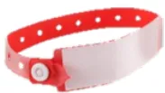

Si céfazoline : **clindamycine 900 mg IV** ou **vancomycine 20 mg/kg IVL** ou **teicoplanine 12 mg/kg IVL**

Si amoxicilline/clavulanate ou céfoxitine : **gentamicine 6 à 7 mg/kg IVL + métronidazole 1 g IVL**

●●● (Avis d'experts)

<table border="1">
<thead>
<tr>
<th>Actes chirurgicaux ou interventionnels</th>
<th>Molécules</th>
<th>Dose initiale</th>
<th>Réinjections et durée</th>
<th>Force de la recommandation</th>
</tr>
</thead>
<tbody>
<tr>
<td colspan="5"><b>Prothèses pénienne et testiculaire</b></td>
</tr>
<tr>
<td>
<ul>
<li>Pose de prothèse testiculaire</li>
<li>Pose de prothèse pénienne</li>
<li>Armature d'un néo-pénis</li>
<li>Pose de prothèses gonflables (hydrauliques) avec composants extra-caverneux</li>
<li>Pose de prothèses semi-rigide</li>
</ul>
</td>
<td>Céfazoline</td>
<td>2 g IVL</td>
<td>1g si durée &gt; 4h, puis toutes les 4h jusqu'à fin de chirurgie</td>
<td>●●● (Avis d'experts)</td>
</tr>
<tr>
<td colspan="5"><b>Vaginoplastie</b></td>
</tr>
<tr>
<td>
<ul>
<li>Urétroplastie, vaginoplastie et vestibuloplastie avec enfouissement ou réduction du clitoris, pour féminisation</li>
<li>Création d'un néo-vagin et d'une néo-vulve +/- greffe de peau *</li>
<li>Plastie des organes génitaux externes des femmes transgenres</li>
</ul>
</td>
<td>Amoxicilline/Clavulanate</td>
<td>2g IVL</td>
<td>1g si durée &gt; 2h puis toutes les 2h jusqu'à fin de chirurgie</td>
<td>●●● (Avis d'experts)</td>
</tr>
<tr>
<td colspan="5">

* en cas de création de néo-vagin, poursuite postopératoire de l'amoxicilline/clavulanate 1g/6h (si allergie : métronidazole 500mg/8h) chez la patiente de poids standard et de fonction rénale normale, jusqu'à ablation du conformateur vaginal [●●● (Avis d'experts)]

</td>
</tr>
</tbody>
</table><table border="1">
<tr>
<td rowspan="4">■ Création d'un néo-vagin avec un segment intestinal</td>
<td><u>La veille soir :</u></td>
<td></td>
<td></td>
<td>●●● (GRADE 1) *</td>
</tr>
<tr>
<td>Tobramycine ** + Métronidazole</td>
<td>200 mg 1 g</td>
<td>Dose unique per os Dose unique per os</td>
<td>●●● (Avis d'experts)</td>
</tr>
<tr>
<td><u>Lors de la chirurgie :</u></td>
<td></td>
<td></td>
<td></td>
</tr>
<tr>
<td>Céfoxitine</td>
<td>2 g IVL</td>
<td>1g si durée &gt; 2h puis toutes les 2h jusqu'à fin de chirurgie</td>
<td>●●● (GRADE 1)</td>
</tr>
<tr>
<td colspan="5" style="text-align: center;">
        si portage rectal d'entérobactérie BLSE *** : 
        Antibioprophylaxie active sur la souche identifiée (cf. R1.7) [●●● Avis d'experts]
      </td>
</tr>
</table>

### Phalloplastie

<table border="1">
<tr>
<td>■ Phalloplastie par lambeau inguinal pédiculé, ou lambeau cutané libre, ou lambeau cutané tubulé pénien</td>
<td>Céfazoline</td>
<td>2g IVL</td>
<td>1g si durée &gt; 4h, puis toutes les 4h jusqu'à fin de chirurgie</td>
<td>●●● (Avis d'experts)</td>
</tr>
</table>

### Métoïdioplastie

<table border="1">
<tr>
<td>■ Métoïdioplastie</td>
<td>Céfazoline</td>
<td>2g IVL</td>
<td>1g si durée &gt; 4h, puis toutes les 4h jusqu'à fin de chirurgie</td>
<td>●●● (Avis d'experts)</td>
</tr>
</table>

### Chondro-laryngoplastie

<table border="1">
<tr>
<td>■ Laryngoplastie par cervicotomie</td>
<td colspan="3" style="text-align: center;">PAS D'ANTIBIOPROPHYLAXIE</td>
<td>●●● (Avis d'experts)</td>
</tr>
</table>

\* le GRADE 1 s'applique : i. au fait d'administrer une antibioprophylaxie en chirurgie colo-rectale ; ii. au fait que cette antibioprophylaxie doit comporter à la fois une prise orale la veille au soir et une administration IV lors de l'intervention.

\*\* la tobramycine (Nebcine®, non générique), dont il n'existe à ce jour en France que des formes IV ou aérosol, s'utilise ici hors AMM par voie orale. Il existe des flacons de 100 mg, disponibles à l'hôpital ou en pharmacie de ville. L'utilisation de la forme IV par voie orale n'entraîne pas d'absorption de la molécule mais exerce une activité de décontamination digestive. Parmi les excipients notables, la présence de sulfites, doit faire vérifier l'absence d'allergie vraie aux sulfites (comme pour une administration IV), en plus de l'allergie vraie à la tobramycine. L'utilisation hors AMM, nécessite en théorie une entente préalable auprès de la CPAM pour que le patient soit remboursé. La mention dans l'ordonnance (cf. ordonnance type en annexe sur le site SFAR) des présentes recommandations pourrait permettre le remboursement du patient mais sans garantie. Il faut donc **prévenir le patient**, s'il est décidé de ne pas faire d'entente préalable, que le coût pourrait lui être facturé (prix du grossiste répartiteur OCP en décembre 2023 : 3,05€ le flacon de 100 mg).

Pour information, le métronidazole per os existe en boîte de 4 cp de 500 mg, conditionnement à favoriser pour éviter la dispensation de davantage de doses qui ne seront pas utilisées par le patient (coût en décembre 2023 : 1,31€ la boîte de 4 cp de 500 mg).

\*\*\* BLSE : Bêta-Lactamase à Spectre Étendu. Il est rappelé qu'un dépistage dans le mois précédent la chirurgie est préconisé dans les centres où la prévalence atteint ou dépasse les 10% de patients porteurs (R1.7). De plus un dépistage ciblé peut s'envisager chez les patients ayant un antécédent de colonisation ou d'infection à entérobactérie BLSE au cours des 6 derniers mois.## ANTIBIOPROPHYLAXIE EN CHIRURGIE DU PATIENT BRULE

Les recommandations de pratiques professionnelles (RPP) de 2019 sur la prise en charge du brûlé grave à la phase aiguë préconisent, lors de la prise en charge initiale de la brûlure grave, de ne pas administrer d'antibioprophylaxie ou d'antibiothérapie préemptive en dehors d'un geste chirurgical (<https://sfar.org/prise-en-charge-du-brule-grave-a-la-phase-aigue-chez-ladulte-et-lenfant/>) [1].

L'objectif de l'antibioprophylaxie dans la chirurgie du patient brûlé est de prévenir les bactériémies postopératoires ainsi que les éventuelles lyses infectieuses de greffes. L'incidence des lyses infectieuses de greffe varie entre 4 et 7% [2, 3, 4] tandis que les bactériémies postopératoires sont estimées entre 1,6 à 60% selon les études [5]. L'incidence des infections de substituts dermiques peut atteindre 42% [7]. Compte tenu du faible niveau de preuve dans la littérature chez le patient brûlé, les recommandations d'antibioprophylaxie proposées ici reposent exclusivement sur des avis d'experts.

Les bactéries les plus souvent incriminées sont des cocci à Gram positifs dans les sept premiers jours après la brûlure, puis des bacilles à Gram négatifs dont les entérobactéries et les non-fermentants (dont *P. aeruginosa*) au-delà. Au long cours, les germes rencontrés dépendent de l'écologie locale et de la flore du patient. Ainsi, lorsqu'une antibioprophylaxie est indiquée, elle doit être adaptée à la flore du patient brûlé, qui est en constante évolution tout au long de son parcours de soin.

La durée de l'antibioprophylaxie ne doit probablement pas excéder la durée de la chirurgie (avis d'experts). La rédaction de protocoles locaux d'antibioprophylaxie, avec concertation du centre de référence, en particulier pour encadrer l'autogreffe cutanée, semble indispensable pour tout centre amené à prendre en charge des patients brûlés.

Les brûlures graves (surface cutanée brûlée >20%) augmentent le volume de distribution, d'où un risque de sous-dosage antibiotique [6]. Pour une antibioprophylaxie, typiquement en injection unique ou avec très peu de réinjections, et comme pour la dose initiale d'une antibiothérapie curative, il est donc essentiel de ne pas réduire la posologie, quelle que soit la fonction rénale du patient.

Dans le cas où une antibiothérapie curative est déjà administrée, une prophylaxie supplémentaire n'est pas indiquée en péri-opératoire, sauf si cette antibiothérapie curative ne couvre pas les germes de la flore cutanée du patient.

La prise en charge des séquelles de brûlures (brides, rétractions, reprises de cicatrices, expandeur, greffes de peau) et l'antibioprophylaxie qui en découle n'est pas traitée dans ce tableau mais dans le tableau de chirurgie plastique qui recoupe ce type d'intervention.

1. M. Legrand et Al, Management of acute burn injuries in adults and children, *Anaesthesia Critical Care & Pain Medicine*, Volume 39, Issue 2 (April 2020), Pages 253-267.

2. J. S. Puthumana et Al, Is Antibiotic Prophylaxis Necessary in Small ( $\leq 20\%$  TBSA) Burn Excisions, *Plastic Reconstructive Surgery Global Open* (2022), 21;10(6): e4388.

3. L. A. Barajas-Nava et Al, Antibiotic prophylaxis, *Cochrane Database of Systematic Reviews* (06 June 2013), <https://doi.org/10.1002/14651858.CD008738.pub2>.

4. G. Ramos et Al, Systemic perioperative antibiotic prophylaxis may improve skin autograft survival in patients with acute burns, *Journal of Burn Care Res.* (November 2008), 29(6):917-23.

5. D. W. Mozingo et Al, Incidence of bacteremia after burn wound manipulation in the early postburn period, *J Trauma*, (1997 Jun), 42(6):1006-10; discussion 1010-1.

6. L. Bargues et al, Incidence and microbiology of infectious complications with the use of artificial skin Integra in burns, *Annales de chirurgie plastique esthétique* (2009), 54, 533-539.

7. Ravat F et al., Antibiotics and the burn patient, *Burns* (2011) Feb;37(1):16-26.

8. SFETB, Guidelines for use of antibiotics in burn patient at the acute phase, *Ann Fr Anesth Reanim* (2009) ;28:265-274.

En cas d'allergie aux bêtalactamines, si antibioprophylaxie indiquée dans ce tableau :

**Clindamycine 900 mg IVL ou vancomycine 20 mg/kg IVL ou teicoplanine 12 mg/kg IVL**

●●● (Avis d'experts)<table border="1">
<thead>
<tr>
<th>Actes chirurgicaux ou interventionnels</th>
<th>Molécules</th>
<th>Dose initiale</th>
<th>Réinjections et durée</th>
<th>Force de la recommandation</th>
</tr>
</thead>
<tbody>
<tr>
<td>
<ul>
<li>Pansement de brûlure initial (mise à plat de phlyctènes, lavage) et secondaire sans geste chirurgical</li>
</ul>
</td>
<td colspan="3">PAS D'ANTIBIOPROPHYLAXIE</td>
<td>●○○○ (Avis d'experts)</td>
</tr>
<tr>
<td>
<ul>
<li>Incision de décharge :
<ul>
<li>Escarrotomie</li>
<li>Aponévrotomie</li>
</ul>
</li>
</ul>
</td>
<td colspan="3">
PAS D'ANTIBIOPROPHYLAXIE  
PAS D'ANTIBIOPROPHYLAXIE 
<i>(en l'absence de fracture ouverte associée)</i>
</td>
<td>
<ul>
<li>●○○○ (Avis d'experts)</li>
<li>●○○○ (Avis d'experts)</li>
</ul>
</td>
</tr>
<tr>
<td>
<ul>
<li>Excision de brûlure sans couverture ou avec couverture temporaire (allo ou xénogreffe)</li>
</ul>
</td>
<td colspan="3">PAS D'ANTIBIOPROPHYLAXIE</td>
<td>●○○○ (Avis d'experts)</td>
</tr>
<tr>
<td>
<ul>
<li>Autogreffe cutanée</li>
</ul>
</td>
<td colspan="3">
PAS D'ANTIBIOPROPHYLAXIE  

Considérer une antibioprophylaxie individuelle adaptée à la flore du site opératoire et au risque du patient en cas de patient avec parcours de soins prolongé, colonisation cutanée à germes multi-résistants, immunodépression sous-jacente, etc. [●○○○ (Avis d'experts)]

</td>
<td>●○○○ (Avis d'experts)</td>
</tr>
<tr>
<td>
<ul>
<li>Greffe de matrice cutanée artificielle</li>
</ul>
</td>
<td>Céfazoline</td>
<td>2g IVL</td>
<td>1g si durée &gt; 4h, puis toutes les 4h jusqu'à fin de chirurgie</td>
<td>
<ul>
<li>●○○○ (Avis d'experts)</li>
</ul>

Considérer une antibioprophylaxie individuelle adaptée à la flore du site opératoire et au risque du patient en cas de patient avec parcours de soins prolongé, colonisation cutanée à germes multi-résistants, immunodépression sous-jacente, etc. [●○○○ (Avis d'experts)]

</td>
</tr>
<tr>
<td>
<ul>
<li>Arthrodèse avec articulation fermée</li>
</ul>
</td>
<td colspan="3">Antibioprophylaxie adaptée à la flore du site opératoire et au risque du patient</td>
<td>●○○○ (Avis d'experts)</td>
</tr>
<tr>
<td>
<ul>
<li>Amputation</li>
</ul>
</td>
<td>Amoxicilline/Clavulanate</td>
<td>2g IVL</td>
<td>1g si durée &gt; 2h, puis toutes les 2h jusqu'à fin de chirurgie</td>
<td>
<ul>
<li>●○○○ (Avis d'experts)</li>
</ul>

Considérer une antibioprophylaxie individuelle adaptée à la flore du site opératoire et au risque du patient en cas de patient avec parcours de soins prolongé, colonisation cutanée à germes multi-résistants, immunodépression sous-jacente, etc. [●○○○ (Avis d'experts)]

</td>
</tr>
<tr>
<td>
<ul>
<li>Enfouissement de cartilage pour reconstruction auriculaire</li>
</ul>
</td>
<td colspan="3">Antibioprophylaxie adaptée à la flore du site opératoire et au risque du patient</td>
<td>●○○○ (Avis d'experts)</td>
</tr>
<tr>
<td>
<ul>
<li>Lambeau à distance à pédicule ou vascularisation transitoire (lambeau inguinal, lambeau-greffe de Colson ou modifié Forli (cutané-abdominal), lambeau thénarien direct ou à rétro, lambeau deltopectoral, lambeau frontal, lambeau scalpant de Converse ou de Washio</li>
</ul>
</td>
<td colspan="3">Antibioprophylaxie adaptée à la flore du site opératoire et au risque du patient</td>
<td>●○○○ (Avis d'experts)</td>
</tr>
</tbody>
</table># PARTIE 6 : CHIRURGIE GYNECOLOGIQUE, PROCREATION MEDICALEMENT ASSISTEE, OBSTETRIQUE ET RADIOLOGIE

## INTERVENTIONNELLE GYNECOLOGIQUE ET OBSTETRICALE

**EXPERTS :** Estelle Morau (coordinatrice d'experts, SFAR), Delphine Poitrenaud (SPILF), Karine Bettahar (CNGOF), Martine Bonnin (SFAR), Lionel Bouvet (SFAR), Hugo Madar (CNGOF), Jean-Luc Brun (CNGOF), Gautier Chene (CNGOF), Sandrine Campagne (CNGOF), Pauline Chauvet (CNGOF), Valentina Faitot (SFAR), Sandrine Paquin (SFAR), Anne Pinton (CNGOF), Thibaut Rackelboom (SFAR), Agnès Rigouzzo (SFAR), Hervé Trillaud (SFR/RI), et Daphné Michelet (organisatrice, SFAR).

En cas d'allergie aux bêtalactamines, si antibioprophylaxie indiquée dans ces tableaux :

Si céfazoline : **clindamycine 900 mg IVL**

Si céfoxitine : **clindamycine 900 mg IVL + gentamicine 6 à 7 mg/kg IVL**

●●● (Avis d'experts)

## CHIRURGIE DU SEIN

Pour la chirurgie mammaire, l'efficacité de l'antibioprophylaxie a été démontrée et permet une réduction des ISO. Selon le dernier rapport de surveillance des ISO 2020-2021, les microorganismes les plus fréquemment retrouvés lors des ISO post-chirurgies mammaires sont *Staphylococcus aureus* (26%) *Staphylococcus epidermidis* (10%) et autres Staphylocoque à coagulase-négative (10%), *Escherichia coli* (9%), et *Enterococcus faecalis* (5,4%).

<table border="1">
<thead>
<tr>
<th>Actes chirurgicaux ou interventionnels</th>
<th>Molécules</th>
<th>Dose initiale</th>
<th>Réinjections et durée</th>
<th>Force de la recommandation</th>
</tr>
</thead>
<tbody>
<tr>
<td colspan="5"><b>Chirurgie sénologique carcinologique</b></td>
</tr>
<tr>
<td>
<ul>
<li>Tumorectomie mammaire* sans curage</li>
<li>Tumorectomie mammaire* avec ganglion sentinelle</li>
</ul>
</td>
<td colspan="3" style="text-align: center;">PAS D'ANTIBIOPROPHYLAXIE</td>
<td>●●● (Avis d'experts)</td>
</tr>
<tr>
<td>
<ul>
<li>Tumorectomie mammaire* avec curage axillaire</li>
<li>Mastectomie*, sans ou avec curage, sans ou avec reconstruction immédiate</li>
</ul>
</td>
<td>
          Céfazoline  
<u>Alternative :</u> 
          Céfuroxime
        </td>
<td>
          2 g IVL  
          1,5 g IVL
        </td>
<td>
          1g si durée &gt; 4h 
          puis toutes les 4h 
          jusqu'à fin de chirurgie  
          0,75g si durée &gt; 2h 
          puis toutes les 2h 
          jusqu'à fin de chirurgie
        </td>
<td>●●● (GRADE 2)</td>
</tr>
</tbody>
</table>## Chirurgie sénologique esthétique/reconstruction

<table border="1">
<tbody>
<tr>
<td data-bbox="65 141 401 248">
<ul style="list-style-type: none; padding-left: 0;">
<li>▪ Mastoplastie unilatérale de réduction</li>
<li>▪ Mastoplastie bilatérale de réduction</li>
<li>▪ Mastopexie pour ptose simple</li>
<li>▪ Ablation uni- ou bilatérale d'implant prothétique mammaire, sans ou avec capsulectomie</li>
</ul>
</td>
<td colspan="3" data-bbox="401 141 771 248" style="text-align: center;">
                    PAS D'ANTIBIOPROPHYLAXIE
                </td>
<td data-bbox="771 141 936 248" style="text-align: center;">
                    ●●● (Avis d'experts)
                </td>
</tr>
<tr>
<td data-bbox="65 248 401 384">
<ul style="list-style-type: none; padding-left: 0;">
<li>▪ Mastoplastie ou reconstruction avec pose d'implant prothétique ou lambeau</li>
<li>▪ Changement d'implant prothétique mammaire</li>
</ul>
</td>
<td data-bbox="401 248 571 384">
                    Céfazoline  
<i>Alternative :</i> 
                    Céfuroxime
                </td>
<td data-bbox="571 248 641 384">
                    2 g IVL  
                    1,5 g IVL
                </td>
<td data-bbox="641 248 771 384">
                    1g si durée &gt; 4h 
                    puis toutes les 4h 
                    jusqu'à fin de chirurgie  
                    0,75g si durée &gt; 2h 
                    puis toutes les 2h 
                    jusqu'à fin de chirurgie
                </td>
<td data-bbox="771 248 936 384" style="text-align: center;">
                    ●●● (Avis d'experts)
                </td>
</tr>
<tr>
<td data-bbox="65 384 401 454">
<ul style="list-style-type: none; padding-left: 0;">
<li>▪ Chirurgie du mamelon ou de la plaquearéolo-mamelonnaire</li>
<li>▪ Autogreffe de tissu adipeux <math>\leq 200 \text{ cm}^3</math> au niveau du sein ET chirurgie <math>\leq 2\text{h}</math></li>
</ul>
</td>
<td colspan="3" data-bbox="401 384 771 454" style="text-align: center;">
                    PAS D'ANTIBIOPROPHYLAXIE
                </td>
<td data-bbox="771 384 936 454" style="text-align: center;">
                    ●●● (Avis d'experts)
                </td>
</tr>
<tr>
<td data-bbox="65 454 401 596">
<ul style="list-style-type: none; padding-left: 0;">
<li>▪ Autogreffe de tissus adipeux <math>&gt; 200 \text{ cm}^3</math> au niveau du sein et/ou chirurgie <math>&gt; 2\text{h}</math></li>
</ul>
</td>
<td data-bbox="401 454 571 596">
                    Céfazoline  
<i>Alternative :</i> 
                    Céfuroxime
                </td>
<td data-bbox="571 454 641 596">
                    2 g IVL  
                    1,5 g IVL
                </td>
<td data-bbox="641 454 771 596">
                    1g si durée &gt; 4h 
                    puis toutes les 4h 
                    jusqu'à fin de chirurgie  
                    0,75g si durée &gt; 2h 
                    puis toutes les 2h 
                    jusqu'à fin de chirurgie
                </td>
<td data-bbox="771 454 936 596" style="text-align: center;">
                    ●●● (Avis d'experts)
                </td>
</tr>
</tbody>
</table>

\* sont ainsi définies dans ce tableau :

« Mastectomie » : chirurgie non conservatrice, consistant à retirer la totalité du sein y compris l'aréole et le mamelon (« radical mastectomy » dans la littérature anglo-saxonne)

« Tumorectomie » : chirurgie conservatrice, consistant à retirer la tumeur et une petite quantité des tissus qui l'entourent de façon à conserver la plus grande partie du sein (« lumpectomy » or « partial mastectomy » dans la littérature anglo-saxonne).# CHIRURGIE DE L'UTERUS ET DES ANNEXES, DE LA VULVE, PROCREATION MEDICALEMENT ASSISTEE, INTERRUPTION VOLONTAIRE DE GROSSESSE

Pour les hystérectomies par voie vaginale ou abdominale (et par extension par voie laparoscopique), l'efficacité de l'antibioprophylaxie et ses modalités sont bien documentées. Cependant, les données sur la documentation microbiologique des ISO post-hystérectomie, quelle que soit la voie d'abord, sont peu nombreuses ou difficilement interprétables. Le choix de la molécule a été considéré aux vues de l'écologie des différentes zones anatomiques (plus forte prévalence des entérobactéries et des anaérobies dans la flore vaginale) et des chirurgies créant des solutions de continuité entre celles-ci, et de la plus grande prévalence des ISO profondes ou d'organes en post-hystérectomie. En cas d'incision vaginale, l'antibioprophylaxie inclut dans son spectre la flore vaginale polymicrobienne aérobie et anaérobie.

Pour les manœuvres intra-utérines simples (biopsie endométriale, pose d'un dispositif intra-utérin, curetage, fécondation *in vitro*, etc.), le risque infectieux très faible (<1%) et/ou l'absence de données convaincantes démontrant son efficacité ne justifient pas une antibioprophylaxie systématique. Elle peut cependant être considérée en cas d'endométrieuse, d'antécédent d'infection génitale haute ou d'antécédent de chirurgie pelvienne.

La chirurgie vulvaire est une chirurgie à haute risque d'infection post-opératoire. Les facteurs de risques sont liés au terrain de la patiente (tabac, dénutrition, séropositivité VIH...) et à l'étendue de la chirurgie. Pour la chirurgie vulvaire superficielle l'administration d'une antibioprophylaxie n'a pas fait la preuve d'une diminution des ISO.

<table border="1">
<thead>
<tr>
<th>Actes chirurgicaux ou interventionnels</th>
<th>Molécules</th>
<th>Dose initiale</th>
<th>Réinjections et durée</th>
<th>Force de la recommandation</th>
</tr>
</thead>
<tbody>
<tr>
<td colspan="5"><b>Chirurgie des annexes et des paramètres par voie coelioscopique ou robotique</b></td>
</tr>
<tr>
<td>
<ul>
<li>Coelioscopie diagnostique</li>
<li>Ligature ou déligature de trompe, détorsion d'annexe</li>
<li>Plastie tubaire, fimbrioplastie, salpingectomie</li>
<li>Drilling ovarien, kystectomie ovarienne, transposition ovarienne</li>
<li>Ponction de kyste</li>
<li>Ablation de dispositif intra-utérin ayant migré (par coelioscopie)</li>
</ul>
</td>
<td colspan="3" style="text-align: center;">PAS D'ANTIBIOPROPHYLAXIE</td>
<td style="text-align: center;">●●● (Avis d'experts)</td>
</tr>
<tr>
<td colspan="4" style="border: 1px solid black; padding: 5px;">
<i>Pour la coelio-chirurgie des trompes, considérer une antibioprophylaxie par céfazoline limitée à la période opératoire en cas d'endométrieuse, d'antécédent de chirurgie pelviennes ou d'infection génitales haute</i> 
          [●●● (Avis d'experts)]
        </td>
<td></td>
</tr>
<tr>
<td>
<ul>
<li>Annexectomie</li>
<li>Ovariectomie</li>
<li>Débulking ovarien</li>
<li>Curage pelvien et/ou lombo-aortique</li>
<li>Omentectomie</li>
</ul>
</td>
<td>
          Céfazoline  
<i>Alternative :</i> 
          Céfuroxime
        </td>
<td>
          2 g IVL  
          1,5 g IVL
        </td>
<td>
          1g si durée &gt; 4h 
          puis toutes les 4h 
          jusqu'à fin de chirurgie  
          0,75g si durée &gt;2h 
          puis toutes les 2h 
          jusqu'à fin de chirurgie
        </td>
<td style="text-align: center;">●●● (GRADE 2)</td>
</tr>
<tr>
<td>
<ul>
<li>Résection de lésions endométriosiques avec atteinte rectale</li>
</ul>
</td>
<td>
          Céfazoline 
          + 
          Métronidazole
        </td>
<td>
          2 g IVL  
          1 g IVL
        </td>
<td>
          1g si durée &gt; 4h 
          puis toutes les 4h 
          jusqu'à fin de chirurgie  
          Dose unique
        </td>
<td style="text-align: center;">●●● (Avis d'experts)</td>
</tr>
</tbody>
</table>### Chirurgie des annexes et des paramètres par voie laparotomique

<table border="1">
<tr>
<td data-bbox="58 137 393 281">
<ul style="list-style-type: none; padding-left: 0;">
<li>▪ Chirurgie tubaire</li>
<li>▪ Annexeectomie, ovariectomie</li>
<li>▪ Curage pelvien et/ou lombo-aortique</li>
<li>▪ Omentectomie</li>
<li>▪ Ablation de dispositif intra-utérin ayant migré (par laparotomie)</li>
</ul>
</td>
<td data-bbox="393 137 568 281">
                Céfazoline  
<i>Alternative :</i> 
                Céfuroxime
            </td>
<td data-bbox="568 137 638 281">
                2 g IVL  
                1,5 g IVL
            </td>
<td data-bbox="638 137 768 281">
                1g si durée &gt; 4h 
                puis toutes les 4h 
                jusqu'à fin de chirurgie  
                0,75g si durée &gt;2h 
                puis toutes les 2h 
                jusqu'à fin de chirurgie
            </td>
<td data-bbox="768 137 937 281">
                ●●● (GRADE 2)
            </td>
</tr>
<tr>
<td data-bbox="58 281 393 369">
<ul style="list-style-type: none; padding-left: 0;">
<li>▪ Exérèse de lésions endométriosiques de la cloison rectovaginale</li>
</ul>
</td>
<td data-bbox="393 281 568 369">
                Céfazoline 
                + 
                Métronidazole
            </td>
<td data-bbox="568 281 638 369">
                2 g IVL  
                1 g IVL
            </td>
<td data-bbox="638 281 768 369">
                1g si durée &gt; 4h 
                puis toutes les 4h 
                jusqu'à fin de chirurgie  
                Dose unique
            </td>
<td data-bbox="768 281 937 369">
                ●●● (Avis d'experts)
            </td>
</tr>
</table>

### Chirurgie de l'utérus par voie laparotomique, coelioscopique ou robotique

<table border="1">
<tr>
<td data-bbox="58 404 393 481">
<ul style="list-style-type: none; padding-left: 0;">
<li>▪ Hystérectomie totale sans ou avec annexectomie</li>
<li>▪ Colpo-hystérectomie élargie</li>
<li>▪ Colpo-trachélectomie élargie</li>
</ul>
</td>
<td data-bbox="393 404 568 481">
                Céfoxitine
            </td>
<td data-bbox="568 404 638 481">
                2g IVL
            </td>
<td data-bbox="638 404 768 481">
                1g si durée &gt;2h 
                puis toutes les 2h 
                jusqu'à fin de chirurgie
            </td>
<td data-bbox="768 404 937 481">
                ●●● (Avis d'experts)
            </td>
</tr>
<tr>
<td data-bbox="58 481 393 620">
<ul style="list-style-type: none; padding-left: 0;">
<li>▪ Hystérectomie subtotale sans ou avec annexectomie (sans temps vaginal)</li>
<li>▪ Myomectomie</li>
<li>▪ Cerclage de l'isthme utérin en dehors de la grossesse</li>
<li>▪ Hystérorraphie, hystéroplastie</li>
</ul>
</td>
<td data-bbox="393 481 568 620">
                Céfazoline  
<i>Alternative :</i> 
                Céfuroxime
            </td>
<td data-bbox="568 481 638 620">
                2g IVL  
                1,5g IVL
            </td>
<td data-bbox="638 481 768 620">
                1g si durée &gt; 4h 
                puis toutes les 4h 
                jusqu'à fin de chirurgie  
                0,75g si durée &gt;2h 
                puis toutes les 2h 
                jusqu'à fin de chirurgie
            </td>
<td data-bbox="768 481 937 620">
                ●●● (GRADE 2)
            </td>
</tr>
</table>

### Chirurgie de l'utérus par voie vaginale

<table border="1">
<tr>
<td data-bbox="58 655 393 901">
<ul style="list-style-type: none; padding-left: 0;">
<li>▪ Conisation, curetage du corps de l'utérus, destruction de la muqueuse utérine par thermocontact</li>
<li>▪ Cerclage de l'isthme utérin par abord vaginal, en dehors de la grossesse</li>
<li>▪ Destruction de lésions du col par laser ou sans laser, exérèse de lésion pédiculée accouchée par le col</li>
<li>▪ Élargissement de l'orifice externe du col de l'utérus</li>
<li>▪ Section de cloisons ou synéchies utérines</li>
<li>▪ Résection de myome</li>
<li>▪ Hystéroscopie diagnostique</li>
<li>▪ Pose de dispositif intra-utérin</li>
</ul>
</td>
<td data-bbox="393 655 768 901">
                PAS D'ANTIBIOPROPHYLAXIE
            </td>
<td data-bbox="768 655 937 901">
                ●●● (Avis d'experts)
            </td>
</tr>
</table><table border="1">
<tr>
<td>
<ul>
<li>▪ Hystérectomie avec et sans annexectomie</li>
<li>▪ Colpectomie subtotale ou totale</li>
</ul>
</td>
<td>Céfoxitine</td>
<td>2g IVL</td>
<td>1g si durée &gt;2h puis toutes les 2h jusqu'à fin de chirurgie</td>
<td>●●● (Avis d'experts)</td>
</tr>
</table>

### Chirurgie du prolapsus toutes voies d'abord

<table border="1">
<tr>
<td>
<ul>
<li>▪ Hystéropexie</li>
<li>▪ Promontofixation</li>
<li>▪ Colpo-périnéorrhaphie</li>
</ul>
</td>
<td>
Céfazoline  
<u>Alternative :</u> 
Céfuroxime
</td>
<td>
2g IVL  
1,5g IVL
</td>
<td>
1g si durée &gt; 4h puis toutes les 4h jusqu'à fin de chirurgie  
0,75g si durée &gt;2h puis toutes les 2h jusqu'à fin de chirurgie
</td>
<td>●●● (Avis d'experts)</td>
</tr>
<tr>
<td colspan="5">
<i>En cas d'incision vaginale large peropératoire créant une continuité entre l'espace péritonéal et le vagin, la céfoxitine limitée à la période opératoire peut être considérée comme molécule d'antibioprophylaxie [●●● (Avis d'experts)]</i>
</td>
</tr>
</table>

### Hystéroscopie

<table border="1">
<tr>
<td>
<ul>
<li>▪ Destruction de la muqueuse utérine par thermocontact</li>
<li>▪ Abrasion de la muqueuse de l'utérus</li>
<li>▪ Curetage de la cavité de l'utérus à visée thérapeutique</li>
<li>▪ Exérèse de polype de l'utérus</li>
<li>▪ Biopsie de l'endomètre</li>
<li>▪ Résection de myome de l'utérus</li>
<li>▪ Ablation d'un dispositif intra-utérin, par hystéroscopie</li>
<li>▪ Ablation de corps étranger de l'utérus</li>
</ul>
</td>
<td>PAS D'ANTIBIOPROPHYLAXIE</td>
<td>●●● (GRADE 1)</td>
</tr>
<tr>
<td colspan="3">
<i>Considérer une antibioprophylaxie par céfazoline limitée à la période opératoire en cas d'endométrieuse, d'antécédent de chirurgies pelviennes ou d'infection génitales haute [●●● (Avis d'experts)]</i>
</td>
</tr>
</table>

### Chirurgie vulvaire superficielle

<table border="1">
<tr>
<td>
<ul>
<li>▪ Exérèse de la glande vestibulaire majeure (de Bartholin)</li>
<li>▪ Exérèse d'adhérences ou de lésions vulvopérinéales</li>
<li>▪ Vulvectomie partielle sans curage</li>
<li>▪ Vulvo-périnéoplastie</li>
<li>▪ Nymphoplastie de réduction</li>
<li>▪ Périnéotomie médiane sans lambeau cutané périnéal, pour élargissement de l'orifice du vagin</li>
<li>▪ Destruction de lésions périnéales (quel que soit le nombre)</li>
<li>▪ Amputation du clitoris</li>
</ul>
</td>
<td>PAS D'ANTIBIOPROPHYLAXIE</td>
<td>●●● (GRADE 2)</td>
</tr>
</table>### Chirurgie vulvaire profonde et/ou carcinologique

<table border="1"><tr><td rowspan="2"><ul><li>▪ Vulvectomie partielle avec curage lymphonodal inguinal unilatéral</li><li>▪ Vulvectomie totale sans ou avec curage inguinal et/ou iliaque, uni- ou bilatéral</li><li>▪ Périnéotomie médiane avec lambeau cutané périnéal</li></ul></td><td>Céfazoline</td><td>2g IVL</td><td>1g si durée &gt; 4h puis toutes les 4h jusqu'à fin de chirurgie</td><td rowspan="2">●●● (Avis d'experts)</td></tr><tr><td><i>Alternative :</i> Céfuroxime</td><td>1,5g IVL</td><td>0,75g si durée &gt;2h puis toutes les 2h jusqu'à fin de chirurgie</td></tr></table>

### Chirurgie vaginale

<table border="1"><tr><td><ul><li>▪ Chirurgie de l'hymen</li><li>▪ Résection de cloison du vagin</li><li>▪ Destruction de lésions vaginales avec ou sans laser</li></ul></td><td>PAS D'ANTIBIOPROPHYLAXIE</td><td>●●● (Avis d'experts)</td></tr></table>

### Avortement, grossesse arrêtée

<table border="1"><tr><td><ul><li>▪ Révision de la cavité de l'utérus après avortement</li><li>▪ Évacuation d'un utérus gravide par aspiration et/ou curetage, au 1er trimestre de la grossesse</li><li>▪ Évacuation d'un utérus gravide au 2e trimestre de la grossesse avant la 22e semaine d'aménorrhée (aspiration de restes placentaires)</li></ul></td><td>PAS D'ANTIBIOPROPHYLAXIE</td><td>●●● (GRADE 2)</td></tr><tr><td colspan="3"><i>Antibiothérapie curative postopératoire adaptée aux résultats du prélèvement vaginal [●●● (Avis d'experts)]</i></td></tr></table>

### Procréation médicalement assistée

<table border="1"><tr><td><ul><li>▪ Prélèvement d'ovocytes sur un ou deux ovaires, par voie transvaginale avec échoguidage</li><li>▪ Prélèvement d'ovocytes sur un ou deux ovaires, par coélioscopie</li><li>▪ Transfert intra-utérin d'embryon, par voie vaginale</li></ul></td><td>PAS D'ANTIBIOPROPHYLAXIE</td><td>●●● (GRADE 1)</td></tr><tr><td colspan="3"><i>Considérer une antibiotoprophylaxie par céfazoline limitée à la période opératoire pour la ponction ovocytaire et le transfert embryonnaire en cas d'endométrieuse, d'antécédent de chirurgies pelviennes ou d'infection génitale haute [●●● (Avis d'experts)]</i></td></tr></table>

### Embolisation

<table border="1"><tr><td><ul><li>▪ Embolisation de fibromes utérins</li><li>▪ Embolisation de varices pelviennes (sans abord chirurgical du scarpa)</li></ul></td><td>PAS D'ANTIBIOPROPHYLAXIE</td><td>●●● (Avis d'experts)</td></tr></table>

Les interventions ci-dessous ne sont pas une indication d'antibioprophylaxie mais plutôt d'antibiothérapie préemptive :

- • Incision de collection vulvo-périnéale (JMPA005)
- • Incision de la glande vestibulaire majeure (de Bartholin) (JMPA001)
- • Suture de plaie de la vulve (JMCA005)
- • Suture de plaie de la vulve et de l'anus, sans suture du muscle sphincter externe de l'anus (JMCA006)## CHIRURGIE OBSTETRICALE

Le risque infectieux après césarienne programmée ou urgente est élevé et l'administration d'un antiobiprophylaxie réduit de moitié ce risque. Les ISO post-césariennes sont majoritairement des ISO superficielles. Il n'est pas rapporté de risque avéré pour le fœtus suite à une injection unique maternelle d'antibiotiques.

La céfazoline est la molécule la plus étudiée pour la césarienne, même s'il n'y a pas de supériorité avérée par rapport à d'autres céphalosporines et pénicillines.

<table border="1">
<thead>
<tr>
<th>Actes chirurgicaux ou interventionnels</th>
<th>Molécules</th>
<th>Dose initiale</th>
<th>Réinjections et durée</th>
<th>Force de la recommandation</th>
</tr>
</thead>
<tbody>
<tr>
<td colspan="5"><b>Césarienne</b></td>
</tr>
<tr>
<td>
<ul>
<li>▪ Accouchement par césarienne programmée ou en urgence, en dehors ou en cours de travail</li>
<li>▪ Suture du corps de l'utérus pour rupture obstétricale</li>
</ul>
</td>
<td>Céfazoline *</td>
<td>2g IVL</td>
<td>1g si durée &gt; 4h puis toutes les 4h jusqu'à fin de chirurgie</td>
<td>●●● (GRADE 2)</td>
</tr>
<tr>
<td colspan="5" style="text-align: center;">
<i>Injection de l'antiobiprophylaxie en cas de césarienne selon les mêmes modalités que pour les autres chirurgies (Cf. R1.1), soit, autant que possible, avant l'incision [●●● (GRADE 2)] **</i>
</td>
</tr>
<tr>
<td colspan="5"><b>Cerclage du col utérin</b></td>
</tr>
<tr>
<td>
<ul>
<li>▪ Cerclage du col de l'utérus au cours de la grossesse, par voie transvaginale</li>
<li>▪ Ablation de cerclage du col de l'utérus</li>
</ul>
</td>
<td colspan="3" style="text-align: center;">PAS D'ANTIOPROPHYLAXIE</td>
<td>●●● (Avis d'experts)</td>
</tr>
<tr>
<td colspan="5"><b>Embolisation</b></td>
</tr>
<tr>
<td>
<ul>
<li>▪ Embolisation des artères iliaques internes et/ou de ses branches pour hémorragie du post-partum, par voie artérielle transcutanée</li>
</ul>
</td>
<td colspan="3" style="text-align: center;">PAS D'ANTIOPROPHYLAXIE</td>
<td>●●● (Avis d'experts)</td>
</tr>
<tr>
<td colspan="5"><b>Tamponnement utérin</b></td>
</tr>
<tr>
<td>
<ul>
<li>▪ Tamponnement intra-utérin pour hémorragie obstétricale</li>
</ul>
</td>
<td>Céfazoline  <i>Alternative :</i> Céfuoxime</td>
<td>2g IVL  1,5g IVL</td>
<td>Dose unique lors de la pose du ballon intra-utérin</td>
<td>●●● (Avis d'experts)</td>
</tr>
<tr>
<td colspan="5"><b>Délivrance artificielle / révision utérine</b></td>
</tr>
<tr>
<td>
<ul>
<li>▪ Révision de la cavité de l'utérus après délivrance naturelle</li>
<li>▪ Extraction manuelle du placenta complet</li>
</ul>
</td>
<td>Céfazoline  <i>Alternative :</i> Céfuoxime</td>
<td>2g IVL  1,5g IVL</td>
<td>Dose unique lors de la révision ou de la délivrance manuelle</td>
<td>●●● (Avis d'experts)</td>
</tr>
</tbody>
</table><table border="1">
<thead>
<tr>
<th colspan="5"><b>Curetage post-partum</b></th>
</tr>
</thead>
<tbody>
<tr>
<td>▪ Curetage de la cavité de l'utérus à visée thérapeutique</td>
<td>PAS D'ANTIBIOPROPHYLAXIE</td>
<td></td>
<td></td>
<td>●●● (Avis d'experts)</td>
</tr>
<tr>
<th colspan="5"><b>Hystérectomie d'hémostase</b></th>
</tr>
<tr>
<td>▪ Hystérectomie pour complications obstétricales, par laparotomie</td>
<td>Céfoxitine</td>
<td>2g IVL</td>
<td>1g si durée &gt;2h puis toutes les 2h jusqu'à fin de chirurgie</td>
<td>●●● (Avis d'experts)</td>
</tr>
<tr>
<th colspan="5"><b>Ligatures vasculaires</b></th>
</tr>
<tr>
<td>
          ▪ Ligature des artères iliaques internes pour hémorragie du post-partum, par laparotomie 
          ▪ Ligature des pédicules vasculaires de l'utérus pour hémorragie du post-partum, par laparotomie
        </td>
<td>
          Céfazoline 
<u>Alternative :</u> 
          Céfuroxime
        </td>
<td>
          2g IVL 
          1,5g IVL
        </td>
<td>
          1g si durée &gt; 4h puis toutes les 4h jusqu'à fin de chirurgie 
          0,75g si durée &gt;2h puis toutes les 2h jusqu'à fin de chirurgie
        </td>
<td>●●● (Avis d'experts)</td>
</tr>
</tbody>
</table>

\* pour césarienne : pas d'alternative proposée à la céfazoline, du fait de données rapportées concernant quasi exclusivement la céfazoline et de l'utilisation toujours plus difficile de molécules dont les effets sont moins documentés chez la femme enceinte

\*\* En 2022, le CNGOF s'était positionné ainsi sur l'antibioprophylaxie au cours de la césarienne dans leur recommandation « Technique de césarienne » :

1. Pour les femmes ayant une césarienne, il est recommandé d'administrer une antibioprophylaxie pour réduire la morbidité maternelle infectieuse (abcès de paroi et endométrite). [Recommandation forte / Qualité de la preuve modérée].
2. Les données de la littérature ne permettent pas d'émettre de recommandation pour le choix d'une céphalosporine ou d'une pénicilline pour diminuer la morbidité maternelle infectieuse. [Absence de recommandation / Qualité de preuve modérée].
3. Les données de la littérature ne permettent pas de recommander d'administrer une bithérapie incluant l'azithromycine pour les femmes ayant une césarienne, afin de diminuer la morbidité infectieuse maternelle. [Absence de recommandation / Qualité de preuve modérée].
4. Les données de la littérature sont trop limitées en qualité pour pouvoir émettre une recommandation concernant le moment d'administration de l'antibioprophylaxie : avant l'incision ou après le clampage du cordon. [Absence de recommandation / Qualité de preuve faible.]  
   (The cesarean procedure: Guidelines for clinical practice from the French College of Obstetricians and Gynecologists. Sentilhes L, Schmitz T, Madar H, Bouchghoul H, Fuchs F, Garabédian C, Korb D, Nouette-Gaulain K, Pêcheux O, Sananès N, Sibiude J, Sénat MV, Goffinet F. Gynecol Obstet Fertil Senol. 2023 Jan;51(1):7-34.)

Les présentes recommandations s'inscrivent donc dans le respect des recommandations 2022 du CNGOF, en proposant toutefois de privilégier une administration avant l'incision chaque fois que cela est possible pour diminuer les ISO maternelles (bénéfice démontré au moins pour les ISO superficielles) sans qu'un effet négatif cliniquement pertinent pour l'enfant n'ait été démontré à ce jour.

Les interventions ci-dessous ne sont pas une indication de l'antibioprophylaxie mais plutôt de l'antibiothérapie préemptive :

- Évacuation chirurgicale de thrombus (JLJA001)
- Suture immédiate de déchirure obstétricale du col de l'utérus (JNCA001)
- Suture immédiate de déchirure obstétricale du vagin, de la vulve et/ou du périnée [périnée simple] (JMCA002)
- Suture immédiate de déchirure obstétricale du périnée avec lésion du muscle sphincter externe de l'anus [périnée complet] (JMCA003)
- Suture immédiate de déchirure obstétricale du périnée avec lésion du rectum [périnée complet compliqué] (JMCA001)
- Suture immédiate de déchirure obstétricale du périnée avec lésion de la vessie ou de l'urètre (JMCA004)# **PARTIE 7 : ANTIBIOPROPHYLAXIE EN CHIRURGIE ET PROCÉDURES INTERVENTIONNELLES ORTHOPÉDIQUES ET TRAUMATOLOGIQUES**

**EXPERTS :** Claire Roger (coordinatrice d'experts, SFAR), Julie Lourtet (SPILF), Christophe Aveline (SFAR), Nathalie Bernard (SFAR), Michel Carles (SPILF), Axel Maurice Szamburski (SFAR), Emmanuel Novy (SFAR), Maya Enser (SFAR), Tiphaine Vandenberghe (SFAR), Pierre-Sylvain Marcheix (SOFEC/SOFCOT), Jean-David Werthel (SOFEC/SOFCOT), Geoffroy Nourrissat (SOFEC/SOFCOT), Cécile Batailler (SFHG/SOFCOT), Philippe Boisrenoult (SFHG/SOFCOT), Simon Marmor (SFHG/SOFCOT), Bertrand Boyer (SFHG/SOFCOT), Christian Dumontier (SOFCOT), Philippe Tchenio (SOFCOT), Jean-Roger Werther (SFCM/SOFCOT), Benoit Pedeutour (SFCM/SOFCOT), Florence Aim (SFA/SOFCOT), Cécile Toanen (SFA/SOFCOT), Louis Rony (AFCP/SOFCOT), Matthieu Lalevée (AFCP/SOFCOT), Thierry Favier (Getraum/SOFCOT), Stéphane Mauger (Orthorisq/SOFCOT), Christophe Le Du (Orthorisq/SOFCOT), Valérie Dumaine (GSF-GETO/SOFCOT), Christophe Hulet (SOFCOT), Franck Rémy (SOFCOT), Jérôme Delambre (SFCR), Marie Faruch (SFR/RI), et Matthieu Jabaudon (organisateur, SFAR).

The logo for the Société Française d'Arthroscopie et de Réhabilitation Orthopédique (SFAR) is located in the bottom left corner. It consists of three overlapping circles in shades of orange and teal, with the acronym 'SFAR' in blue capital letters to the right.The logo for the Société de Pathologie Orthopédique de Langue Française (SPILF) is located in the bottom right corner. It features a circular emblem with a stylized 'S' and 'P' in blue and green, surrounded by the text 'SOCIÉTÉ DE PATHOLOGIE ORTHOPÉDIQUE DE LANGUE FRANÇAISE'.

## **ANTIBIOPROPHYLAXIE EN CHIRURGIE ORTHOPÉDIQUE PROGRAMMÉE**

Les taux d'incidence des ISO rapportés en chirurgie orthopédique varient, notamment selon le type d'intervention et la présence de facteurs de risques liés au terrain du patient. La survenue d'une ISO après chirurgie orthopédique, en particulier après implantation de matériel, est associée à une morbi-mortalité élevée. L'antibioprophylaxie est une des mesures efficaces pour prévenir les ISO lorsqu'elle est indiquée et administrée de façon optimale en termes de posologie, de moment d'administration et de durée. Il est rappelé que toute utilisation d'antibiotique locale ou topique (comme l'immersion du matériel de ligamentoplastie dans les antibiotiques, etc.) ne dispense pas d'une antibioprophylaxie systémique correctement administrée.

**RAPPEL DE LA R1.5 :** Il est démontré que les patients obèses sont plus à risque d'ISO que les patients non obèses. De nombreux facteurs concourent à cette augmentation de risque. Toutefois, il est inutile d'augmenter la dose unitaire des céphalosporines utilisées en antibioprophylaxie jusqu'à des IMC atteignant 50 kg/m2 (si l'intervalle de réinjection recommandé est respecté), car le volume de distribution de ces molécules n'est pas augmenté de façon significative chez ces patients et jusqu'à ces valeurs d'IMC. Les concentrations plasmatiques atteintes (qui déterminent les concentrations atteintes dans l'os) sont suffisantes chez les sujets obèses comme chez les non-obèses pour couvrir les bactéries d'intérêt après les doses recommandées en injection initiale et en réinjection. Les données sont différentes pour d'autres molécules plus lipophiles (comme la clindamycine), expliquant pourquoi les doses sont alors augmentées parallèlement à l'IMC.

Pour les patients d'IMC  $\geq 50$  kg/m2, la stratégie doit être discutée collectivement et reposer soit sur l'augmentation de la dose unitaire, soit sur le raccourcissement de l'intervalle de réinjection en cas d'administration discontinue, soit sur l'utilisation d'une dose d'entretien en perfusion intraveineuse continue pendant la procédure.

En cas d'allergie aux bêtalactamines, si antibioprophylaxie indiquée dans ce tableau :

**Clindamycine 900 mg IVL** en première intention

**Vancomycine 20 mg/kg IVL** ou **teicoplanine 12 mg/kg IVL** en seconde intention

●●● (Avis d'experts)

<table border="1">
<thead>
<tr>
<th>Actes chirurgicaux ou interventionnels</th>
<th>Molécules</th>
<th>Dose initiale</th>
<th>Réinjections et durée</th>
<th>Force de la recommandation</th>
</tr>
</thead>
<tbody>
<tr>
<td colspan="5"><b>Chirurgie du membre inférieur</b></td>
</tr>
<tr>
<td>
<ul>
<li>Prothèse de hanche ou de genou (dont reprise précoce non septique)</li>
<li>Gestes osseux avec mise en place de matériel (clou, vis, plaque, etc.), ostéotomie, arthrodèse</li>
<li>Reconstruction ligamentaire avec utilisation de matériel (vis d'interférence, etc.)</li>
<li>Arthroscopie avec mise en place de matériel</li>
</ul>
</td>
<td>Céfazoline</td>
<td>2g IVL</td>
<td>1g si durée &gt; 4h, puis toutes les 4h jusqu'à fin de chirurgie</td>
<td>●●● (Avis d'experts)</td>
</tr>
<tr>
<td colspan="5">
<i>En cas de chirurgie prothétique de hanche par voie antérieure et d'allergie aux bêtalactamines : préférer la vancomycine ou la teicoplanine à la clindamycine*</i> 
          (●●● Avis d'experts)
        </td>
</tr>
<tr>
<td>
<ul>
<li>Plastie ligamentaire (retente, suture, etc.) sans utilisation de matériel</li>
<li>Arthroscopie diagnostique ou thérapeutique sans mise en place de matériel</li>
<li>Ablation de matériel d'ostéosynthèse**</li>
<li>Chirurgie des parties molles</li>
<li>Résection osseuse (sans ostéosynthèse ni remplacement prothétique)</li>
</ul>
</td>
<td colspan="3">PAS D'ANTIBIOPROPHYLAXIE</td>
<td>●●● (Avis d'experts)</td>
</tr>
<tr>
<td colspan="5">
<i>En cas d'ablation de matériel d'ostéosynthèse avec ouverture articulaire ou de geste prévu difficile/avec temps opératoire long, une antibioprophylaxie par céfazoline limitée au périopératoire peut être discutée au cas par cas (●●● Avis d'experts)</i>
</td>
</tr>
<tr>
<td colspan="5"><b>Chirurgie de l'épaule et du coude</b></td>
</tr>
<tr>
<td>
<ul>
<li>Chirurgie prothétique quelle que soit l'articulation</li>
<li>Reprise non septique prothétique précoce ou tardive</li>
<li>Chirurgie de luxation récidivante avec ou sans greffe osseuse</li>
<li>Geste osseux avec mise en place de matériel, ostéotomie, arthrodèse</li>
<li>Arthrolyse par arthrotomie</li>
<li>Arthroscopie avec mise en place de matériel</li>
</ul>
</td>
<td>Céfazoline</td>
<td>2g IVL</td>
<td>1g si durée &gt; 4h, puis toutes les 4h jusqu'à fin de chirurgie</td>
<td>●●● (Avis d'experts)</td>
</tr>
<tr>
<td colspan="5">
<i>En cas de chirurgie prothétique d'épaule et d'allergie aux bêtalactamines : préférer la vancomycine ou la teicoplanine à la clindamycine*</i> (●●● Avis d'experts)
        </td>
</tr>
<tr>
<td>
<ul>
<li>Arthroscopie diagnostique ou thérapeutique sans mise en place de matériel</li>
<li>Ablation de matériel d'ostéosynthèse**</li>
<li>Gestes osseux sans mise en place de matériel (résection)</li>
<li>Chirurgie des parties molles</li>
</ul>
</td>
<td colspan="3">PAS D'ANTIBIOPROPHYLAXIE</td>
<td>●●● (Avis d'experts)</td>
</tr>
</tbody>
</table><table border="1">
<thead>
<tr>
<th colspan="5"><b>Chirurgie de la main</b></th>
</tr>
</thead>
<tbody>
<tr>
<td>▪ Chirurgie prothétique ou osseuse avec mise en place de matériel</td>
<td>Céfazoline</td>
<td>2g IVL</td>
<td>1g si durée &gt; 4h, puis toutes les 4h jusqu'à fin de chirurgie</td>
<td>●●● (Avis d'experts)</td>
</tr>
<tr>
<td>▪ Chirurgie des parties molles ▪ Ablation de matériel d'ostéosynthèse** ▪ Chirurgie articulaire non prothétique ▪ Ablation de kyste</td>
<td colspan="3">PAS D'ANTIBIOPROPHYLAXIE</td>
<td>●●● (GRADE 2) ●●● (GRADE 2) ●●● (Avis d'experts) ●●● (Avis d'experts)</td>
</tr>
<tr>
<th colspan="5"><b>Chirurgie du rachis</b></th>
</tr>
<tr>
<td>▪ Chirurgie instrumentée du rachis avec pose de matériel en 1 temps ▪ Chirurgie instrumentée du rachis avec pose de matériel en 2 temps (au cours de la même hospitalisation ou non) *** ▪ Reprise du matériel quel que soit le délai***</td>
<td>Céfazoline</td>
<td>2g IVL</td>
<td>1g si durée &gt; 4h, puis toutes les 4h jusqu'à fin de chirurgie</td>
<td>●●● (GRADE 2) ●●● (Avis d'experts) ●●● (Avis d'experts)</td>
</tr>
<tr>
<td>▪ Chirurgie du rachis percutanée avec pose de matériel (expansion avec implant, cimentoplastie)</td>
<td>Céfazoline</td>
<td>2g IVL</td>
<td>1g si durée &gt; 4h puis toutes les 4h jusqu'à fin de chirurgie</td>
<td>●●● (Avis d'experts)</td>
</tr>
<tr>
<td>▪ Chirurgie sans pose de matériel ▪ Ablation de matériel d'ostéosynthèse</td>
<td colspan="3">PAS D'ANTIBIOPROPHYLAXIE</td>
<td>●●● (Avis d'experts) ●●● (Avis d'experts)</td>
</tr>
<tr>
<td colspan="5">

En cas d'ablation de matériel d'ostéosynthèse ou de chirurgie sans pose de matériel exposant à une ouverture de la dure-mère, ou de geste prévu comme difficile/avec temps opératoire long, une antibioprophylaxie par céfazoline peut être discutée au cas par cas (●●● Avis d'experts)

</td>
</tr>
</tbody>
</table>

\* Du fait de la résistance dans 15 à 20% des cas de *Cutibacterium acnes* et autres *Cutibacterium* sp. (*avidum*, etc.) à la clindamycine

\*\* L'échec d'ablation de matériel d'ostéosynthèse ne constitue pas une indication d'antibioprophylaxie (avis d'experts)

\*\*\* Une épidémiologie locale particulière peut justifier le recours à une molécule alternative, dans le cadre d'un protocole d'antibioprophylaxie validé localement## ANTIBIOPROPHYLAXIE EN TRAUMATOLOGIE

La fréquence des infections postopératoires en chirurgie traumatologique est plus élevée que pour la chirurgie programmée, quel que soit le stade de gravité. L'antibioprophylaxie n'est qu'un des éléments de prévention des ISO. La diminution des complications infectieuses postopératoires ne peut être obtenue que par une prise en charge qui regroupe dans un délai optimal les moyens humains, matériels et techniques adaptés.

Pour les fractures ouvertes, une prise en charge pour débridement de la plaie et parage doit être réalisée le plus rapidement possible, dans un délai inférieur à 24h. L'antibioprophylaxie doit être administrée dès la prise en charge du patient et au mieux moins de 3h après la fracture, sans tenir compte du délai de la première chirurgie. Si le délai entre la 1ère injection d'antibiotique et la chirurgie est supérieur à 3h, une réinjection préopératoire doit être effectuée.

Enfin, la contamination de la plaie (selon la présence ou non de contamination fécale ou tellurique) est un facteur à prendre en compte, au même titre que la classification de Gustilo (cf. Annexe), pour estimer la classe Altemeier.

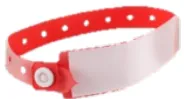

En cas d'allergie aux bêtalactamines, si antibioprophylaxie indiquée dans ce tableau :

Pour les fractures fermées : **clindamycine 900 mg IV**

Pour les fractures ouvertes ou les plaies souillées sans fracture ou les traumatismes complexes de la main :  
**clindamycine 900 mg IV + gentamicine 6 à 7 mg/kg IVL**

●●● (Avis d'experts)

<table border="1">
<thead>
<tr>
<th>Actes chirurgicaux ou interventionnels</th>
<th>Molécules</th>
<th>Dose initiale</th>
<th>Réinjections et durée</th>
<th>Force de la recommandation</th>
</tr>
</thead>
<tbody>
<tr>
<td colspan="5"><b><u>Fractures fermées (hors main)</u></b></td>
</tr>
<tr>
<td>
<ul>
<li>Ostéosynthèse par :
              <ul>
<li>- fixateur externe</li>
<li>- brochage percutané</li>
</ul>
</li>
</ul>
</td>
<td colspan="3">PAS D'ANTIBIOPROPHYLAXIE</td>
<td>●●● (Avis d'experts)</td>
</tr>
<tr>
<td>
<ul>
<li>Ostéosynthèse à foyer ouvert (tout type de matériel) ou enclouage</li>
</ul>
</td>
<td>Céfazoline</td>
<td>2g IVL</td>
<td>1g si durée &gt; 4h, puis toutes les 4h jusqu'à fin de chirurgie</td>
<td>●●● (Avis d'experts)</td>
</tr>
<tr>
<td colspan="5"><b><u>Fractures ouvertes (hors main)</u></b></td>
</tr>
<tr>
<td>
<ul>
<li>Fracture ouverte Gustilo 1, quel que soit le matériel mis en place</li>
</ul>
</td>
<td>Céfazoline</td>
<td>2g IVL</td>
<td>1g si durée &gt; 4h, puis toutes les 4h jusqu'à fin de chirurgie</td>
<td>●●● (Avis d'experts)</td>
</tr>
<tr>
<td>
<ul>
<li>Fracture ouverte Gustilo 2 ou 3, quel que soit le matériel mis en place</li>
</ul>
</td>
<td>Amoxicilline/Clavulanate</td>
<td>2g IVL</td>
<td>1g si durée &gt; 2h, puis toutes les 2h jusqu'à fin de chirurgie</td>
<td>●●● (Avis d'experts)</td>
</tr>
</tbody>
</table><table border="1">
<tr>
<td rowspan="3"></td>
<td><i>Alternative :</i> Céfazoline</td>
<td>2g IVL</td>
<td>1g si durée &gt; 4h, puis toutes les 4h jusqu'à fin de chirurgie</td>
<td rowspan="2">●●● (Avis d'experts)</td>
</tr>
<tr>
<td>+</td>
<td></td>
<td></td>
</tr>
<tr>
<td>Gentamicine</td>
<td>6-7 mg/kg</td>
<td>Dose unique</td>
</tr>
<tr>
<td colspan="5" style="text-align: center;">En cas de chirurgie pour fracture ouverte considérée comme Altemeier 3 ou 4, considérer une antibiothérapie curative poursuivie au-delà du bloc opératoire*</td>
</tr>
</table>

### Plaie des parties molles (hors main)

<table border="1">
<tr>
<td>■ Plaie des parties molles susceptible d'être contaminée par des germes d'origine tellurique et/ou fécale</td>
<td>Amoxicilline/Clavulanate</td>
<td>2g IVL</td>
<td>1g si durée &gt; 2h, puis toutes les 2h jusqu'à fin de chirurgie</td>
<td>●●● (GRADE 1)</td>
</tr>
<tr>
<td>■ Autre plaie des parties molles</td>
<td colspan="3" style="text-align: center;">PAS D'ANTIBIOPROPHYLAXIE</td>
<td>●●● (Avis d'experts)</td>
</tr>
<tr>
<td>■ Plaie articulaire (quel que soit le degré de contamination)</td>
<td>Céfazoline</td>
<td>2g IVL</td>
<td>1g si durée &gt; 4h, puis toutes les 4h jusqu'à fin de chirurgie</td>
<td>●●● (GRADE 1)</td>
</tr>
<tr>
<td>■ Morsure **</td>
<td>Amoxicilline/Clavulanate</td>
<td>2g IVL</td>
<td>1g si durée &gt; 2h, puis toutes les 2h jusqu'à fin de chirurgie **</td>
<td>●●● (Avis d'experts)</td>
</tr>
</table>

### Traumatisme de la main

<table border="1">
<tr>
<td>■ Ostéosynthèse de fracture(s) fermée(s) par : - fixateur externe - brochage percutané</td>
<td colspan="3" style="text-align: center;">PAS D'ANTIBIOPROPHYLAXIE</td>
<td>●●● (Avis d'experts)</td>
</tr>
<tr>
<td>■ Ostéosynthèse de fracture(s) fermée(s) à foyer ouvert (tout type de matériel)</td>
<td rowspan="2">Céfazoline</td>
<td rowspan="2">2g IVL</td>
<td rowspan="2">1g si durée &gt; 4h, puis toutes les 4h jusqu'à fin de chirurgie</td>
<td>●●● (Avis d'experts)</td>
</tr>
<tr>
<td>■ Fracture ouverte (quelle que soit la technique d'ostéosynthèse)</td>
<td>●●● (Avis d'experts)</td>
</tr>
<tr>
<td>■ Plaie de la main (dont plaie articulaire) : - non susceptible d'être contaminée par des germes d'origine tellurique et/ou fécale - susceptible d'être contaminée par des germes d'origine tellurique et/ou fécale</td>
<td colspan="3" style="text-align: center;">PAS D'ANTIBIOPROPHYLAXIE</td>
<td>●●● (GRADE 1)  ●●● (Avis d'experts)</td>
</tr>
<tr>
<td>■ Traumatisme de la dernière phalange</td>
<td colspan="3" style="text-align: center;">PAS D'ANTIBIOPROPHYLAXIE</td>
<td>●●● (GRADE 2)</td>
</tr>
</table><table border="1">
<tr>
<td rowspan="3">
<ul>
<li>Traumatisme complexe de la main (replantation, mains de portière, écrasement, avulsion, blast, plaies par balles, injection sous pression, ou durée de chirurgie prévue &gt;2h)</li>
</ul>
</td>
<td>Amoxicilline/Clavulanate</td>
<td>2g IVL</td>
<td>1g si durée &gt; 2h, puis toutes les 2h jusqu'à fin de chirurgie</td>
<td>●●● (Avis d'experts)</td>
</tr>
<tr>
<td><u>Alternative :</u> Céfazoline +</td>
<td>2g IVL</td>
<td>1g si durée &gt; 4h, puis toutes les 4h jusqu'à fin de chirurgie</td>
<td>●●● (Avis d'experts)</td>
</tr>
<tr>
<td>Gentamicine</td>
<td>6-7 mg/kg</td>
<td>Dose unique</td>
<td></td>
</tr>
</table>

\* Le niveau de contamination initiale est à prendre en compte dans le risque d'infection de la fracture. En cas de contamination majeure du foyer de fracture et avec un délai de prise en charge prolongée, la chirurgie des fractures Gustilo 2 et 3 peut être considérée après avis infectiologique comme de classe Alteineier 3-4, justifiant une antibiothérapie curative étendue au-delà du bloc opératoire, dont le choix de la molécule sera protocolisé dans chaque centre en fonction des données épidémiologiques locales.

\*\* Les morsures sont des plaies avec contamination polymicrobiennes qui relèvent d'une **antibiothérapie curative**. La dose ici recommandée correspond à la dose du traitement curatif à administrer lors du passage au bloc avec un traitement à poursuivre 5 jours en postopératoire avec réévaluation chirurgicale et infectiologique ([https://www.sfm.org/upload/consensus/rbp\\_plaies2017\\_v2.pdf](https://www.sfm.org/upload/consensus/rbp_plaies2017_v2.pdf)).

## ANNEXE

Classification des fractures ouvertes de membres d'après Gustilo RB, Mendoza RM, Williams DN. Problems in the management of type III (severe) open fractures: a new classification of type III open fractures. J Trauma 1984;24:742-6.

<table border="1">
<thead>
<tr>
<th>Fracture</th>
<th colspan="2">Description</th>
<th>Taux d'infection</th>
<th>Contamination</th>
</tr>
</thead>
<tbody>
<tr>
<td>Type 1</td>
<td colspan="2">Plaie &lt; 1 cm Contamination minimale</td>
<td>&lt; 2 %</td>
<td>Minimale</td>
</tr>
<tr>
<td>Type 2</td>
<td colspan="2">Plaie de 1 à 10 cm Sans lésion extensive des tissus mous</td>
<td>2 à 5 %</td>
<td>Intermédiaire</td>
</tr>
<tr>
<td rowspan="4">Type 3</td>
<td colspan="3">Lésion tissulaire étendue &gt; 10 cm</td>
<td rowspan="4">Majeure</td>
</tr>
<tr>
<td>3.A</td>
<td>Couverture cutanée possible Comminution importante</td>
<td>5 à 10 %</td>
</tr>
<tr>
<td>3.B</td>
<td>Exposition osseuse Comminution importante</td>
<td>10 à 50 %</td>
</tr>
<tr>
<td>3.C</td>
<td>Lésion artérielle associée</td>
<td>25 à 50 %</td>
</tr>
</tbody>
</table>## **PARTIE 8 : CHIRURGIE DIGESTIVE ET BARIATRIQUE, ENDOSCOPIE DIGESTIVE ET RADIOLOGIE INTERVENTIONNELLE DIGESTIVE**

**EXPERTS :** Raphaël Cinotti (coordinateur d'experts, SFAR), Eric Bonnet (SPILF), Nelly Rondeau (SFAR), Hervé Kobeiter (SFR/RI), David Karsenti (SFED), Jérôme Morel (SFAR), Pablo Ortega-Deballon (SFCD), Laure Fieuzal (SFAR), David Moskowitz (SFCD), Hervé Dupont (SFAR), Niki Christou (SFCD), Philippe Montravers (SFAR), Charles Sabbagh (SFCD), Aurélie Gouel (SFAR), Justine Demay (SFAR), Audrey de Jong (SFAR), Regis Souche (SFCD/ACHBT), Bruno Pastene (SFAR), Céline Monard (SFAR), Lilian Schwarz (SFCD/ACHBT), Julie Veziant (SFCD), Frédéric Borie (SFCD), Emilie Lermite (SFCD), et Emmanuel Weiss (organisateur, SFAR).

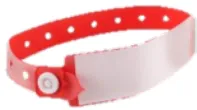

En cas d'allergie aux bêtalactamines, si antibioprophylaxie indiquée dans ces tableaux :

Si céfazoline : **vancomycine 20 mg/kg IVL** ou **teicoplanine 12 mg/kg IVL**

Si céfoxitine : **gentamicine 6-7 mg/kg IVL + métronidazole 1g IVL**

●●● (Avis d'experts)

## **CHIRURGIE ŒSO-GASTRIQUE, DE L'INTESTIN GRELE, COLO-RECTALE ET PROCTOLOGIQUE**

La chirurgie du tube digestif et/ou de ses annexes correspond soit à une chirurgie propre (classe 1 d'Altemeier) en l'absence d'ouverture du tube digestif, soit le plus souvent à une chirurgie propre-contaminée (classe 2 d'Altemeier) lorsque le tube digestif est ouvert. La coelio-chirurgie obéit aux mêmes principes que la chirurgie traditionnelle car pour une même intervention seule la voie d'abord est différente. Une conversion en laparotomie est toujours possible et les complications infectieuses sont alors identiques.

La chirurgie de l'obésité (ou chirurgie « bariatrique ») est une chirurgie qui vise à modifier l'anatomie du système digestif. C'est une aide mécanique et métabolique qui permet de diminuer la quantité d'aliments consommée (principe de restriction) et/ou l'assimilation des aliments par l'organisme (principe de « malabsorption ») (définition HAS). L'obésité morbide étant un facteur de risque important d'ISO, une antibioprophylaxie paraît justifiée qu'il y ait ou non ouverture du tube digestif et quel que soit la voie d'abord. Les adaptations posologiques chez le patient obèse opéré de chirurgie bariatrique (comme de toute autre chirurgie) sont rappelées dans le champ 1, R1.5 et R1.6.

La chirurgie colorectale et proctologique correspond à une chirurgie propre contaminée (Classe 2 d'Altemeier).<table border="1">
<thead>
<tr>
<th>Actes chirurgicaux ou interventionnels</th>
<th>Molécules</th>
<th>Dose initiale</th>
<th>Réinjections et durée</th>
<th>Force de la recommandation</th>
</tr>
</thead>
<tbody>
<tr>
<td colspan="5"><b><u>Chirurgie œsophagienne (avec ou sans plastie colique)</u></b></td>
</tr>
<tr>
<td>
<ul>
<li>▪ Œsophagectomie</li>
<li>▪ Excision de tumeur de l'œsophage</li>
<li>▪ Traitement d'un diverticule de l'œsophage</li>
</ul>
</td>
<td>
          Céfazoline  
<i>Alternative : Céfuroxime</i>
</td>
<td>
          2g IVL  
          1,5g IVL
        </td>
<td>
          1g si durée &gt; 4h 
          puis toutes les 4h 
          jusqu'à fin de chirurgie  
          0,75g si durée &gt;2h 
          puis toutes les 2h 
          jusqu'à fin de chirurgie
        </td>
<td>●●● (Avis d'experts)</td>
</tr>
<tr>
<td colspan="5"><b><u>Chirurgie gastrique non bariatrique</u></b></td>
</tr>
<tr>
<td>
<ul>
<li>▪ Gastrectomie totale, totalisation de gastrectomie</li>
<li>▪ Gastrectomie partielle</li>
</ul>
</td>
<td>
          Céfazoline  
<i>Alternative : Céfuroxime</i>
</td>
<td>
          2g IVL  
          1,5g IVL
        </td>
<td>
          1g si durée &gt; 4h 
          puis toutes les 4h 
          jusqu'à fin de chirurgie  
          0,75g si durée &gt;2h 
          puis toutes les 2h 
          jusqu'à fin de chirurgie
        </td>
<td>●●● (Avis d'experts)</td>
</tr>
<tr>
<td colspan="5"><b><u>Chirurgie bariatrique</u></b></td>
</tr>
<tr>
<td>
<ul>
<li>▪ Mise en place d'un anneau gastrique</li>
</ul>
</td>
<td>Céfazoline **</td>
<td>2g IVL*</td>
<td>
          1g si durée &gt; 4h 
          puis toutes les 4h 
          jusqu'à fin de chirurgie
        </td>
<td>●●● (Avis d'experts)</td>
</tr>
<tr>
<td>
<ul>
<li>▪ Réalisation d'un court-circuit gastrique ou d'une « sleeve » gastrectomie</li>
</ul>
</td>
<td>Cefoxitine</td>
<td>2g IVL*</td>
<td>
          1g si durée &gt; 2h 
          puis toutes les 2h 
          jusqu'à fin de chirurgie
        </td>
<td>●●● (Avis d'experts)</td>
</tr>
<tr>
<td colspan="5"><b><u>Chirurgie de l'intestin grêle</u></b></td>
</tr>
<tr>
<td>
<ul>
<li>▪ Résection de l'intestin grêle</li>
<li>▪ Entérostomie cutanée, par laparotomie</li>
</ul>
</td>
<td>Céfoxitine</td>
<td>2g IVL</td>
<td>
          1g si durée &gt; 2h 
          puis toutes les 2h 
          jusqu'à fin de chirurgie
        </td>
<td>●●● (Avis d'experts)</td>
</tr>
</tbody>
</table><table border="1">
<thead>
<tr>
<th colspan="5"><b>Chirurgie colorectale et appendiculaire</b></th>
</tr>
</thead>
<tbody>
<tr>
<td rowspan="3">
<ul>
<li>■ Colectomie</li>
<li>■ Amputation abdomino-périnéale</li>
<li>■ Proctectomie</li>
<li>■ Rétablissement de continuité</li>
</ul>
</td>
<td><u>La veille soir :</u> Tobramycine **** + Métronidazole</td>
<td>200 mg 1 g</td>
<td>Dose unique per os Dose unique per os</td>
<td>●●● (GRADE 1) *** ●●● (Avis d'experts)</td>
</tr>
<tr>
<td><u>Lors de la chirurgie :</u> Céfoxitine</td>
<td>2 g IVL</td>
<td>1g si durée &gt; 2h puis toutes les 2h jusqu'à fin de chirurgie</td>
<td>●●● (GRADE 1)</td>
</tr>
<tr>
<td colspan="4" style="text-align: center;">
<i>Si portage rectal d'entérobactérie BLSE ***** : Antibioprophylaxie active sur la souche identifiée (cf. R1.7) [●●● Avis d'experts]</i>
</td>
</tr>
<tr>
<td>
<ul>
<li>■ Appendicectomie programmée</li>
</ul>
</td>
<td>Céfoxitine</td>
<td>2 g IVL</td>
<td>1g si durée &gt; 2h puis toutes les 2h jusqu'à fin de chirurgie</td>
<td>●●● (Avis d'experts)</td>
</tr>
<tr>
<th colspan="5"><b>Chirurgie proctologique</b></th>
</tr>
<tr>
<td>
<ul>
<li>■ Hémorroïdes</li>
<li>■ Kyste pilonidal</li>
<li>■ Fistule anale</li>
</ul>
</td>
<td>Métronidazole</td>
<td>1g IVL</td>
<td>Dose unique</td>
<td>●●● (Avis d'experts)</td>
</tr>
</tbody>
</table>

\* jusqu'à un IMC  $\leq 50$  kg/m2 en veillant à bien respecter les intervalles de réinjection (cf. Champ 1, R1.5). Au-delà, une stratégie différente peut être discutée collectivement, reposant soit sur l'augmentation de la dose unitaire (4g), soit sur le raccourcissement de l'intervalle de réinjection en cas d'administration discontinue, soit sur l'utilisation d'une dose d'entretien en intraveineux continue pendant la procédure.

\*\* en l'absence d'étude disponible concernant l'utilisation de céfuoxime dans cette indication, cette molécule n'est pas proposée en alternative pour cette chirurgie.

\*\*\* le GRADE 1 s'applique : i. au fait d'administrer une antibioprophylaxie en chirurgie colo-rectale ; ii. au fait que cette antibioprophylaxie doit comporter à la fois une prise orale la veille au soir et une administration IV lors de l'intervention.

\*\*\*\* la tobramycine (Nebcine®, non générique), dont il n'existe à ce jour en France que des formes IV ou aérosol, s'utilise ici hors AMM par voie orale. Il existe des flacons de 100 mg, disponibles à l'hôpital ou en pharmacie de ville. L'utilisation de la forme IV par voie orale n'entraîne pas d'absorption de la molécule mais exerce une activité de décontamination digestive. Parmi les excipients notables, la présence de sulfites, doit faire vérifier l'absence d'allergie vraie aux sulfites (comme pour une administration IV), en plus de l'allergie vraie à la tobramycine. L'utilisation hors AMM, nécessite en théorie une entente préalable auprès de la CPAM pour que le patient soit remboursé. La mention dans l'ordonnance (cf. ordonnance type en annexe sur le site SFAR) des présentes recommandations pourrait permettre le remboursement du patient mais sans garantie. Il faut donc **prévenir le patient**, s'il est décidé de ne pas faire d'entente préalable, que le coût pourrait lui être facturé (prix du grossiste répartiteur OCP en décembre 2023 : 3,05€ le flacon de 100 mg).

Pour information, le métronidazole per os existe en boîte de 4 cp de 500 mg, conditionnement à favoriser pour éviter la dispensation de davantage de doses qui ne seront pas utilisées par le patient (coût en décembre 2023 : 1,31€ la boîte de 4 cp de 500 mg).

\*\*\*\*\* BLSE : Bêta-Lactamase à Spectre Étendu. Il est rappelé qu'un dépistage dans le mois précédent la chirurgie est préconisé dans les centres où la prévalence atteint ou dépasse les 10% de patients porteurs (R1.7). De plus un dépistage ciblé peut s'envisager chez les patients ayant un antécédent de colonisation ou d'infection à entérobactérie BLSE au cours des 6 derniers mois.# CHIRURGIE HEPATO-BILIAIRE, SPLENIQUE ET PANCREATIQUE

**Chirurgie de la vésicule biliaire et des voies biliaires** : les patients avec une infection active des voies biliaires lors de la chirurgie sont exclus du champ de ces recommandations.

En cas de réalisation d'un geste sur les voies biliaires chez un patient à risque de colonisation biliaire (notamment les patients porteurs d'une prothèse des voies biliaires), l'antibioprophylaxie doit être adaptée aux antécédents infectieux biliaires du patient. En l'absence d'infection documentée ou de bili-culture positive préalables chez ces patients à risque de colonisation biliaire, antibioprophylaxie par pipéracilline + tazobactam 4g IVL (Avis d'experts)

**Chirurgie pancréatique** : la chirurgie pancréatique correspond à une chirurgie propre-contaminée (classe 2 d'Altemeier) du fait de l'ouverture du tube digestif pour la réalisation des anastomoses, quelle que soit la voie débord (coelioscopie ou laparotomie). Une conversion en laparotomie est toujours possible et les complications infectieuses sont alors identiques.

**Transplantation hépatique et pancréatique** : les ISO touchent 10 à 37% des patients transplantés hépatique et 9 à 45% des patients transplantés pancréatique. Elles sont graves et associées à une augmentation du risque de perte du greffon et de mortalité. De nombreuses bactéries différentes sont responsables d'ISO : BGN (Entérobactéries, *Acinetobacter* spp., *Pseudomonas* spp.) ou CGP (Entérocoque, *S. aureus*, Staphylocoque à coagulase négative). L'incidence des BMR et de *Candida* sp. dans ces infections est non négligeable. Les très grandes différences de pratiques dans les différents centres de transplantation et l'absence d'essai randomisé contrôlé robuste ne permettent pas de formuler des recommandations de niveau de preuve élevé. L'utilisation systématique de molécules à large spectre ne semble pas supérieure à l'utilisation de molécules à spectre plus étroit.

<table border="1">
<thead>
<tr>
<th>Actes chirurgicaux ou interventionnels</th>
<th>Molécules</th>
<th>Dose initiale</th>
<th>Réinjections et durée</th>
<th>Force de la recommandation</th>
</tr>
</thead>
<tbody>
<tr>
<td colspan="5"><b>Chirurgie de la vésicule biliaire et des voies biliaires</b></td>
</tr>
<tr>
<td>
<ul style="list-style-type: none; padding-left: 0;">
<li>▪ Cholécystectomie élective par laparoscopie
              <ul style="list-style-type: none; padding-left: 20px;">
<li>○ Patients à haut risque : Age &gt;80 ans, grossesse en cours, immunosuppression, chirurgie au cours immédiat d'une cholécystite aigüe, ictère, calcul(s) de la voie biliaire principale, mise en place de prothèse, conversion en laparotomie, fuite biliaire</li>
</ul>
</li>
 
<li>○ Patients à faible risque : aucun des critères ci-dessus</li>
</ul>
</td>
<td>
          Céfazoline  
<u>Alternative :</u> 
          Céfuroxime
        </td>
<td>
          2g IVL  
          1,5g IVL
        </td>
<td>
          1g si durée &gt; 4h, puis toutes les 4h jusqu'à fin de chirurgie  
          0,75g si durée &gt;2h puis toutes les 2h jusqu'à fin de chirurgie
        </td>
<td>
          ●●● (Avis d'experts)  
          ●●● (GRADE 2)
        </td>
</tr>
<tr>
<td>
<ul style="list-style-type: none; padding-left: 0;">
<li>▪ Cholécystectomie, par laparotomie</li>
<li>▪ Cholécystectomie avec ablation transcystique de calcul de la voie biliaire principale</li>
<li>▪ Cholécystectomie avec ablation de calcul de la voie biliaire principale par choledocotomie</li>
<li>▪ Ablation de calcul de la voie biliaire principale, par laparoscopie ou laparotomie</li>
</ul>
</td>
<td>
          Céfazoline  
<u>Alternative :</u> 
          Céfuroxime
        </td>
<td>
          2g IVL  
          1,5g IVL
        </td>
<td>
          1g si durée &gt; 4h puis toutes les 4h jusqu'à fin de chirurgie  
          0,75g si durée &gt;2h puis toutes les 2h jusqu'à fin de chirurgie
        </td>
<td>●●● (Avis d'experts)</td>
</tr>
</tbody>
</table>### Anastomose bilio-digestive

<table border="1"><tr><td><ul><li>▪ Cholécystectomie avec choledoco-jéjunostomie</li><li>▪ Résection de la voie biliaire principale pédiculaire avec anastomose bilio-digestive, par laparotomie</li></ul></td><td>Céfoxitine</td><td>2g IVL</td><td>1g si durée &gt; 2h puis toutes les 2h jusqu'à fin de chirurgie</td><td>●●● (Avis d'experts)</td></tr></table>

### Hépatectomie sans chirurgie des voies biliaires

<table border="1"><tr><td><ul><li>▪ Résection atypique du foie par laparotomie ou coelioscopie</li><li>▪ Uni-, bi-, ou tri-segmentectomie du foie par laparotomie ou coelioscopie</li><li>▪ Lobectomie hépatique gauche ou droite, +/- élargie au segment 1, par laparotomie ou coelioscopie</li></ul></td><td>Céfazoline  <i>Alternative :</i> <i>Céfuoxime</i></td><td>2g IVL  1,5g IVL</td><td>1g si durée &gt; 4h puis toutes les 4h jusqu'à fin de chirurgie  0,75g si durée &gt;2h puis toutes les 2h jusqu'à fin de chirurgie</td><td>●●● (Avis d'experts)</td></tr></table>

### Chirurgie des kystes hépatiques simples

<table border="1"><tr><td><ul><li>▪ Résection du dôme saillant</li><li>▪ Péri-kystectomie</li><li>▪ Chirurgie de kystes hydatiques</li></ul></td><td>PAS D'ANTIBIOPROPHYLAXIE</td><td></td><td></td><td>●●● (Avis d'experts)</td></tr></table>

### Splénectomie

<table border="1"><tr><td><ul><li>▪ Splénectomie programmée ou en urgence, par laparotomie ou laparoscopie</li></ul></td><td>Céfazoline  <i>Alternative :</i> <i>Céfuoxime</i></td><td>2g IVL  1,5g IVL</td><td>1g si durée &gt; 4h puis toutes les 4h jusqu'à fin de chirurgie  0,75g si durée &gt;2h puis toutes les 2h jusqu'à fin de chirurgie</td><td>●●● (Avis d'experts)</td></tr></table>

### Chirurgie pancréatique

<table border="1"><tr><td><ul><li>▪ Pancréatectomie gauche avec ou sans conservation de la rate</li><li>▪ Pancréatectomie totale ou subtotal avec conservation du duodénum</li><li>▪ Gestes d'épargne pancréatique : isthmectomie pancréatique, exérèse de tumeur</li></ul></td><td>Céfazoline  <i>Alternative :</i> <i>Céfuoxime</i></td><td>2g IVL  1,5g IVL</td><td>1g si durée &gt; 4h puis toutes les 4h jusqu'à fin de chirurgie  0,75g si durée &gt;2h puis toutes les 2h jusqu'à fin de chirurgie</td><td>●●● (GRADE 2)</td></tr><tr><td><ul><li>▪ Duodéno-pancréatectomie céphalique (DPC) sans geste de drainage biliaire préopératoire</li><li>▪ Duodéno-pancréatectomie totale (DPT) sans geste de drainage biliaire préopératoire</li></ul></td><td>Céfoxitine</td><td>2 g IVL</td><td>1g si durée &gt; 2h puis toutes les 2h jusqu'à fin de chirurgie</td><td>●●● (GRADE 1)</td></tr></table><table border="1">
<tr>
<td>
<ul>
<li>DPC ou DPT pour ampullome ou avec antécédent de drainage biliaire ou de sphinctérotomie préopératoires</li>
</ul>
</td>
<td>Pipéracilline + Tazobactam</td>
<td>4g IVL</td>
<td>4g si durée &gt; 4h, puis toutes les 4h jusqu'à fin de chirurgie</td>
<td>●●● (GRADE 2)</td>
</tr>
<tr style="background-color: #ffe4c4;">
<td colspan="5"><b>Transplantation hépatique et pancréatique</b></td>
</tr>
<tr>
<td>
<ul>
<li>Transplantation de foie total</li>
<li>Transplantation de foie réduit</li>
<li>Transplantation du pancréas</li>
<li>Transplantation du pancréas et du rein</li>
</ul>
</td>
<td>Céfoxitine</td>
<td>2g IVL</td>
<td>1g si durée &gt; 2h puis toutes les 2h jusqu'à fin de chirurgie</td>
<td>●●● (Avis d'experts)</td>
</tr>
<tr>
<td colspan="5" style="text-align: center; border: 1px solid black;">
<i>Spectre à élargir et/ou à adapter à l'écologie locale si facteurs de risque de BMR et/ou antécédent d'infection fongique [●●● (Avis d'experts)]</i>
</td>
</tr>
</table>

## CHIRURGIE DE PAROI

<table border="1">
<thead>
<tr style="background-color: #d3d3d3;">
<th>Actes chirurgicaux ou interventionnels</th>
<th>Molécules</th>
<th>Dose initiale</th>
<th>Réinjections et durée</th>
<th>Force de la recommandation</th>
</tr>
</thead>
<tbody>
<tr>
<td rowspan="2">
<ul>
<li>Cure de hernie inguinale, crurale, ombilicale ou hiatale avec prothèse (voie ouverte ou laparoscopique)</li>
</ul>
</td>
<td>Céfazoline</td>
<td>2g IVL</td>
<td>1g si durée &gt; 4h, puis toutes les 4h jusqu'à fin de chirurgie</td>
<td rowspan="2">●●● (GRADE 2)</td>
</tr>
<tr>
<td><u>Alternative</u> Céfuoxime</td>
<td>1,5g IVL</td>
<td>0,75g si durée &gt; 2h puis toutes les 2h jusqu'à fin de chirurgie</td>
</tr>
<tr>
<td>
<ul>
<li>Cure de hernie sans prothèse</li>
</ul>
</td>
<td colspan="3" style="text-align: center;">PAS D'ANTIBIOPROPHYLAXIE</td>
<td>●●● (GRADE 2)</td>
</tr>
</tbody>
</table>## ENDOSCOPIE DIGESTIVE

<table border="1">
<thead>
<tr>
<th>Actes chirurgicaux ou interventionnels</th>
<th>Molécules</th>
<th>Dose initiale</th>
<th>Réinjections et durée</th>
<th>Force de la recommandation</th>
</tr>
</thead>
<tbody>
<tr>
<td colspan="5"><b><u>Cholangio-pancréatographie rétrograde endoscopique (CPRE)</u></b></td>
</tr>
<tr>
<td>
<ul style="list-style-type: none; padding-left: 0;">
<li>▪ Cholangiographie</li>
<li>▪ Pancréatographie</li>
<li>▪ Dilatation et pose de prothèses biliaires ou pancréatiques avec drainage complet satisfaisant</li>
<li>▪ Extraction de calculs biliaires ou pancréatiques, avec ou sans lithotritie mécanique, avec drainage biliaire complet satisfaisant</li>
</ul>
</td>
<td colspan="3" style="text-align: center;">PAS D'ANTIBIOPROPHYLAXIE</td>
<td style="text-align: center;">●●● (GRADE 1)</td>
</tr>
<tr>
<td>
<ul style="list-style-type: none; padding-left: 0;">
<li>▪ Cholangioscopie ou pancréatoscopie, avec ou sans lithotritie</li>
<li>▪ Dilatation et pose de prothèses biliaires ou pancréatiques avec drainage biliaire incomplet*</li>
<li>▪ Extraction de calculs biliaires ou pancréatiques, avec ou sans lithotritie mécanique, avec drainage biliaire incomplet*</li>
</ul>
</td>
<td>Céfoxitine</td>
<td>2g IVL</td>
<td>Dose unique</td>
<td style="text-align: center;">●●● (Avis d'experts)</td>
</tr>
<tr>
<td colspan="5"><b><u>Ponction sous écho-endoscopie</u></b></td>
</tr>
<tr>
<td>
<ul style="list-style-type: none; padding-left: 0;">
<li>▪ Ponction de lésion tissulaire pancréatique ou extra pancréatique, para-cœsophagienne, para-gastrique, para-duodénale ou para-rectale**</li>
</ul>
</td>
<td colspan="3" style="text-align: center;">PAS D'ANTIBIOPROPHYLAXIE</td>
<td style="text-align: center;">●●● (GRADE 2)</td>
</tr>
<tr>
<td>
<ul style="list-style-type: none; padding-left: 0;">
<li>▪ Ponction de lésion kystique pancréatique sans facteur de risque d'infection</li>
<li>▪ Ponction de lésion kystique pancréatique avec facteur(s) de risque d'infection liés au geste endoscopique (saignement intra-kystique, absence de vidange complète de la lésion kystique après ponction) et/ou au patient (contexte d'immunosuppression, ou haut risque d'endocardite infectieuse)</li>
<li>▪ Kysto-gastrostomie</li>
<li>▪ Ponction de liquide d'ascite, avec ou sans ponction de nodule péritonéal per-endoscopique (i.e. à travers le tube digestif)</li>
<li>▪ Ponction liquide pleural per endoscopique (i.e. à travers le tube digestif)</li>
<li>▪ Constitution d'une anastomose gastro-jéjunale sous écho-endoscopie</li>
</ul>
</td>
<td>Céfoxitine</td>
<td>2g IVL</td>
<td>Dose unique</td>
<td style="text-align: center;">●●● (Avis d'experts)</td>
</tr>
</tbody>
</table><table border="1">
<thead>
<tr>
<th colspan="5"><b>Endoscopie digestive haute</b></th>
</tr>
</thead>
<tbody>
<tr>
<td>
<ul>
<li>▪ Fibroscopie œso-gastro-duodénale diagnostique, avec ou sans biopsie</li>
<li>▪ Fibroscopie œso-gastro-duodénale thérapeutique avec dilatation, ou pose de prothèse, ou mucosectomie ou dissection sous-muqueuse.</li>
</ul>
</td>
<td colspan="3">PAS D'ANTIBIOPROPHYLAXIE</td>
<td>●●● (Avis d'experts)</td>
</tr>
<tr>
<td>
<ul>
<li>▪ Pose de gastrostomie, par voie transcutanée avec guidage endoscopique</li>
</ul>
</td>
<td>Céfazoline</td>
<td>2g IVL</td>
<td>Dose unique</td>
<td>●●● (GRADE 1)</td>
</tr>
<tr>
<td>
<ul>
<li>▪ Sclérose et/ou ligature de varices œso-gastriques, en dehors de la période hémorragique</li>
</ul>
</td>
<td colspan="3">PAS D'ANTIBIOPROPHYLAXIE</td>
<td>●●● (Avis d'experts)</td>
</tr>
<tr>
<td>
<ul>
<li>▪ Sclérose et/ou ligature de varices œso-gastriques en période hémorragique</li>
</ul>
</td>
<td colspan="3">

<b>Ciprofloxacine</b> 400 mg/IVL x2/j, puis relais per os après 48h si possible (ou norfloxacine per os 400 mg x2/j quand sera à nouveau remboursée), pendant 7 jours, SAUF :

<ul>
<li>- si cirrhose avancée (Child B ou C)</li>
<li>- et/ou patient hospitalisé depuis plus de 48h (en raison de la forte prévalence de résistance aux quinolones)</li>
<li>- et/ou patient traité par quinolone au long cours en prophylaxie de l'infection de liquide d'ascite</li>
</ul>

&gt; alors <b>Ceftriaxone</b> 1 g/24h IV pendant 7 jours *

* En cas d'allergie aux bêtalactamines : choix pluridisciplinaire d'une molécule et de sa dose en fonction de la fonction rénale souvent altérée chez les patients cirrhotiques [●●● Avis d'experts]

</td>
<td>●●● (GRADE 1)</td>
</tr>
<tr>
<th colspan="5"><b>Endoscopie digestive basse</b></th>
</tr>
<tr>
<td>
<ul>
<li>▪ Coloscopie diagnostique, avec ou sans biopsie</li>
<li>▪ Coloscopie thérapeutique avec dilatation, ou pose de prothèse, ou mucosectomie ou dissection sous-muqueuse.</li>
</ul>
</td>
<td colspan="3">PAS D'ANTIBIOPROPHYLAXIE</td>
<td>●●● (Avis d'experts)</td>
</tr>
</tbody>
</table>

\* Le drainage biliaire est considéré comme incomplet en cas d'échec de canulation, de persistance de calculs, de sténose intra ou extra-hépatique non appareillée, ou de clairance non optimale en fin de geste selon l'opérateur.

\*\* Si de l'ascite sépare le tube digestif de la lésion tissulaire ponctionnée, administrer alors une antibioprophylaxie selon les mêmes modalités que la « ponction d'ascite, avec ou sans ponction de nodule péritonéal per-endoscopique ».## RADIOLOGIE INTERVENTIONNELLE DIGESTIVE

<table border="1">
<thead>
<tr>
<th>Nomenclature</th>
<th>Actes chirurgicaux ou interventionnels</th>
<th>Molécules</th>
<th>Dose initiale</th>
<th>Réinjections et durée</th>
<th>Force de la recommandation</th>
</tr>
</thead>
<tbody>
<tr>
<td colspan="6"><b><u>Embolisation hépatique</u></b></td>
</tr>
<tr>
<td colspan="2">
<ul style="list-style-type: none; padding-left: 0;">
<li>▪ Chimio-embolisation</li>
<li>▪ Embolisation hépatique</li>
<li>▪ Shunt porto-systémique intra-hépatique transjugulaire</li>
</ul>
</td>
<td colspan="2">PAS D'ANTIBIOPROPHYLAXIE</td>
<td colspan="2">●●● (Avis d'experts)</td>
</tr>
<tr>
<td colspan="6"><b><u>Intervention sur les voies biliaires</u></b></td>
</tr>
<tr>
<td colspan="2">
<ul style="list-style-type: none; padding-left: 0;">
<li>▪ Drainage biliaire</li>
</ul>
</td>
<td colspan="2">PAS D'ANTIBIOPROPHYLAXIE</td>
<td colspan="2">●●● (Avis d'experts)</td>
</tr>
</tbody>
</table>## PARTIE 9 : ANTIBIOPROPHYLAXIE EN CHIRURGIE UROLOGIQUE ET RADIOLOGIE INTERVENTIONNELLE UROLOGIQUE

**EXPERTS :** Matthieu Boisson (coordonnateur d'experts, SFAR), Philippe Lesprit (SPILF), Bernard Allaouchiche (SFAR), Pierre Arnaud (AFU), Franck Bruyere (AFU), Sarah Chemam (SFAR), Steeve Doizi (AFU), Romain Dumont (SFAR), Fabien Espitalier (SFAR), Julie Leroy (SFAR), Olivier Mimos (SFAR), Olivier Pellerin (SFR/RI), Mickaël Poette (SFAR), Maxime Vallée (AFU), et Hugues de Courson (organisateur, SFAR).

### CHIRURGIE UROLOGIQUE ET RADIOLOGIE INTERVENTIONNELLE UROLOGIQUE

Le groupe de travail a décidé de ne pas statuer dans ces recommandations sur l'intérêt du dépistage par ECBU et du traitement d'une colonisation urinaire avant chirurgie urologique. Ce sujet fait l'objet d'autres recommandations émises sous l'égide de l'Association Française d'Urologie (AFU) (<https://sfar.org/recommandation-de-bonne-pratique-place-de-lecbu-avant-une-prise-en-charge-urologique-chirurgicale-ou-interventionnelle-chez-l-adulte-et-modalites-de-traitement-en-cas-de-coloni/>). L'indication de réalisation d'un ECBU préopératoire et sa gestion en cas de positivité ne sont donc pas abordées dans ces recommandations, qui ne concernent que l'antibioprophylaxie (i.e. pas l'antibiothérapie curative pré et/ou postopératoire en cas d'ECBU positif). L'antibioprophylaxie, lorsqu'indiquée, sera **systématiquement administrée indépendamment de l'utilisation d'une antibiothérapie curative préopératoire**.

En cas d'allergie aux bêtalactamines, si antibioprophylaxie indiquée dans ce tableau :

Si céfazoline : **gentamicine 6 à 7 mg/kg IVL**

(+ clindamycine 900 mg IVL en cas de pose de prothèse pénienne ou testiculaire)

Si céfotaxime : **gentamicine 6 à 7 mg/kg IVL + métronidazole 1g IVL**

●●● (Avis d'experts)

<table border="1">
<thead>
<tr>
<th>Actes chirurgicaux ou interventionnels</th>
<th>Molécules</th>
<th>Dose initiale</th>
<th>Réinjections et durée</th>
<th>Force de la recommandation</th>
</tr>
</thead>
<tbody>
<tr>
<td colspan="5"><b>Chirurgie de la prostate</b></td>
</tr>
<tr>
<td rowspan="2">
<ul>
<li>Résection trans-urétrale de prostate (RTUP)</li>
</ul>
</td>
<td>Céfazoline</td>
<td>2g IVL</td>
<td>1g si durée &gt; 4h puis toutes les 4h jusqu'à fin de chirurgie</td>
<td>●●● (GRADE 1) *</td>
</tr>
<tr>
<td><i>Alternative :</i> Céfuoxime</td>
<td>1,5g IVL</td>
<td>0,75g si durée &gt; 2h puis toutes les 2h jusqu'à fin de chirurgie</td>
<td>●●● (Avis d'experts)</td>
</tr>
</tbody>
</table><table border="1">
<tbody>
<tr>
<td data-bbox="43 106 398 311">
<ul>
<li>Adénomectomie chirurgicale</li>
<li>Traitement de l'hypertrophie bénigne de la prostate par d'autres techniques chirurgicales : énucléation (laser holmium [HoLEP], laser thulium [ThuLEP], laser greenlight [GreenLEP], bipolaire [BIPOLEP]), pose d'implant intraprostatique (UROLIFT), thermothérapie à la vapeur d'eau (REZUM).</li>
<li>Traitement de l'hypertrophie bénigne de la prostate sans abord direct de la prostate : ultrasons focalisés (HIFU), embolisation des artères prostatiques</li>
</ul>
</td>
<td data-bbox="401 106 578 311">

Céfazoline

<i>Alternative :</i> Céfuroxime

</td>
<td data-bbox="581 106 648 311">

2g IVL

1,5g IVL

</td>
<td data-bbox="651 106 780 311">

1g si durée &gt; 4h puis toutes les 4h jusqu'à fin de chirurgie

0,75g si durée &gt; 2h puis toutes les 2h jusqu'à fin de chirurgie

</td>
<td data-bbox="783 106 958 311">

●●● (Avis d'experts)

PAS D'ANTIBIOPROPHYLAXIE

●●● (Avis d'experts)

</td>
</tr>
<tr>
<td data-bbox="43 314 398 351">
<ul>
<li>Prostatectomie totale</li>
</ul>
</td>
<td colspan="3" data-bbox="401 314 780 351">PAS D'ANTIBIOPROPHYLAXIE</td>
<td data-bbox="783 314 958 351">●●● (Avis d'experts)</td>
</tr>
<tr>
<td data-bbox="43 354 398 391">
<ul>
<li>Curiethérapie</li>
<li>Biopsies de prostate par voie trans-périnéale</li>
</ul>
</td>
<td colspan="3" data-bbox="401 354 780 391">PAS D'ANTIBIOPROPHYLAXIE</td>
<td data-bbox="783 354 958 391">●●● (Avis d'experts)</td>
</tr>
<tr>
<td data-bbox="43 394 398 488">
<ul>
<li>Biopsies de prostate par voie transrectale</li>
</ul>
</td>
<td data-bbox="401 394 578 488">

Fosfomycine-trométamol

<i>Si allergie :</i> Ciprofloxacine

</td>
<td data-bbox="581 394 648 488">

3g per os

500mg per os

</td>
<td data-bbox="651 394 780 488">

Dose unique, 2 à 4 h avant le geste

Dose unique, 2 à 4 h avant le geste

</td>
<td data-bbox="783 394 958 488">

●●● (GRADE 1)

●●● (GRADE 2)

</td>
</tr>
<tr style="background-color: #fce5cd;">
<td colspan="5" data-bbox="43 491 958 521"><b>Chirurgie de la vessie</b></td>
</tr>
<tr>
<td data-bbox="43 524 398 561">
<ul>
<li>Cystoscopie diagnostique</li>
<li>Résection trans-urétrale de vessie (RTUV)</li>
</ul>
</td>
<td colspan="3" data-bbox="401 524 780 561">PAS D'ANTIBIOPROPHYLAXIE</td>
<td data-bbox="783 524 958 561">●●● (GRADE 1)</td>
</tr>
<tr>
<td data-bbox="43 564 398 601">
<ul>
<li>Cure d'incontinence urinaire</li>
</ul>
</td>
<td colspan="3" data-bbox="401 564 780 601">PAS D'ANTIBIOPROPHYLAXIE</td>
<td data-bbox="783 564 958 601">●●● (GRADE 2)</td>
</tr>
<tr>
<td data-bbox="43 604 398 641">
<ul>
<li>Injection intra-détrusorienne de toxine botulique</li>
</ul>
</td>
<td colspan="3" data-bbox="401 604 780 641">PAS D'ANTIBIOPROPHYLAXIE</td>
<td data-bbox="783 604 958 641">●●● (Avis d'experts)</td>
</tr>
<tr>
<td data-bbox="43 644 398 771">
<ul>
<li>Cure de prolapsus, quelle que soit la voie d'abord, avec ou sans matériel</li>
<li>Injection de macroplastique</li>
</ul>
</td>
<td data-bbox="401 644 578 771">

Céfazoline

<i>Alternative :</i> Céfuroxime

</td>
<td data-bbox="581 644 648 771">

2g IVL

1,5g IVL

</td>
<td data-bbox="651 644 780 771">

1g si durée &gt; 4h puis toutes les 4h jusqu'à fin de chirurgie

0,75g si durée &gt; 2h puis toutes les 2h jusqu'à fin de chirurgie

</td>
<td data-bbox="783 644 958 771">●●● (Avis d'experts)</td>
</tr>
<tr>
<td data-bbox="43 774 398 834">
<ul>
<li>Cystectomie susgrigonale partielle ou totale, quel que soit le mode de dérivation</li>
</ul>
</td>
<td data-bbox="401 774 578 834">Céfoxitine</td>
<td data-bbox="581 774 648 834">2 g IVL</td>
<td data-bbox="651 774 780 834">1g si durée &gt; 2h puis toutes les 2h jusqu'à fin de chirurgie</td>
<td data-bbox="783 774 958 834">●●● (Avis d'experts)</td>
</tr>
<tr style="background-color: #fce5cd;">
<td colspan="5" data-bbox="43 837 958 867"><b>Chirurgie des organes génitaux de l'homme</b></td>
</tr>
<tr>
<td data-bbox="43 870 398 919">
<ul>
<li>Pose de prothèse pénienne</li>
<li>Pose de prothèse testiculaire</li>
</ul>
</td>
<td data-bbox="401 870 578 919">Céfazoline</td>
<td data-bbox="581 870 648 919">2g IVL</td>
<td data-bbox="651 870 780 919">1g si durée &gt; 4h</td>
<td data-bbox="783 870 958 919">●●● (Avis d'experts)</td>
</tr>
</tbody>
</table><table border="1">
<tr>
<td></td>
<td><i>Alternative :</i> <i>Céfuroxime</i></td>
<td>1,5g IVL</td>
<td>puis toutes les 4h jusqu'à fin de chirurgie  0,75g si durée &gt;2h puis toutes les 2h jusqu'à fin de chirurgie</td>
<td></td>
</tr>
<tr>
<td>▪ Chirurgie scrotale ou de la verge sans prothèse</td>
<td colspan="3">PAS D'ANTIBIOPROPHYLAXIE</td>
<td>●●● (Avis d'experts)</td>
</tr>
</table>

### **Chirurgie des voies excrétrices**

<table border="1">
<tr>
<td>▪ Urétéroscopie diagnostique et/ou thérapeutique</td>
<td>Céfazoline  <i>Alternative :</i> <i>Céfuroxime</i></td>
<td>2g IVL  1,5g IVL</td>
<td>1g si durée &gt; 4h puis toutes les 4h jusqu'à fin de chirurgie  0,75g si durée &gt;2h puis toutes les 2h jusqu'à fin de chirurgie</td>
<td>●●● (GRADE 1) *  ●●● (Avis d'experts)</td>
</tr>
<tr>
<td>▪ Urétrotomie, urétroplastie ▪ Montée de sonde JJ ▪ Pose de sonde de néphrostomie ▪ Néphrolithotomie percutanée</td>
<td>Céfazoline  <i>Alternative :</i> <i>Céfuroxime</i></td>
<td>2g IVL  1,5g IVL</td>
<td>1g si durée &gt; 4h puis toutes les 4h jusqu'à fin de chirurgie  0,75g si durée &gt;2h puis toutes les 2h jusqu'à fin de chirurgie</td>
<td>●●● (Avis d'experts)</td>
</tr>
<tr>
<td>▪ Lithotrite extra-corporelle</td>
<td colspan="3">PAS D'ANTIBIOPROPHYLAXIE</td>
<td>●●● (GRADE 1)</td>
</tr>
</table>

### **Cathéter de dialyse intrapéritonéale**

<table border="1">
<tr>
<td>▪ Pose ou changement de cathéter de dialyse intrapéritonéale</td>
<td>Céfazoline  <i>Alternative :</i> <i>Céfuroxime</i></td>
<td>2g IVL  1,5g IVL</td>
<td>1g si durée &gt; 4h puis toutes les 4h jusqu'à fin de chirurgie  0,75g si durée &gt;2h puis toutes les 2h jusqu'à fin de chirurgie</td>
<td>●●● (GRADE 2) *  ●●● (Avis d'experts)</td>
</tr>
</table>

### **Chirurgies du rein**

<table border="1">
<tr>
<td>▪ Néphrectomie totale ou partielle ▪ Surrénalectomie ▪ Embolisation des artères rénales ▪ Thermoablation de tumeur rénale</td>
<td colspan="3">PAS D'ANTIBIOPROPHYLAXIE</td>
<td>●●● (Avis d'experts)</td>
</tr>
</table><table border="1">
<tr>
<td data-bbox="41 105 398 234">
<ul>
<li>▪ Transplantation rénale</li>
</ul>
</td>
<td data-bbox="398 105 578 234">
Céfazoline  
<u>Alternative :</u> 
Céfuroxime
</td>
<td data-bbox="578 105 648 234">
2g IVL  
1,5g IVL
</td>
<td data-bbox="648 105 781 234">
1g si durée &gt; 4h 
puis toutes les 4h 
jusqu'à fin de 
chirurgie  
0,75g si durée &gt;2h 
puis toutes les 2h 
jusqu'à fin de 
chirurgie
</td>
<td data-bbox="781 105 959 234">
●○○○ (Avis d'experts)
</td>
</tr>
</table>

\* le GRADE 1 ou 2 s'applique au fait d'administrer une antibioprophylaxie pour les interventions concernées de chirurgie urologique. Les schémas proposés sont en revanche de niveau de preuve « avis d'experts » du fait de l'absence de suffisamment de littérature homogène pour proposer un schéma avec un meilleur niveau de preuve.## **CHAMP 3. Recommandations sur l'antibioprophylaxie en chirurgie et médecine interventionnelle par disciplines pédiatriques et néonatales.**

### **INTRODUCTION**

**EXPERTS :** Marion Caseris (GPIP), Hervé Haas (GPIP), Marc Garnier (SFAR), Marc Leone (SFAR), Mathilde de Queiroz (SFAR)

L'efficacité de l'antibioprophylaxie est maximale si la concentration de l'antibiotique dans le sang et les tissus est adéquate tout au long de la procédure, de l'incision à la fermeture chirurgicale [1].

1/ Concernant le délai d'administration avant l'incision, il n'y a pas de données cliniques pédiatriques concernant l'antibioprophylaxie. Cependant, il n'y a aucune raison PK-PD de ne pas s'aligner sur les recommandations françaises concernant l'adulte, soit au plus tôt 60 minutes avant et au plus tard avant l'incision chirurgicale ou le début de la procédure interventionnelle.

2/ Concernant les posologies :

Pour la céfazoline, les objectifs PK/PD retenus sont une cible considérée  $\geq 2$  mg/L en fin de chirurgie, comme chez l'adulte, soit la  $CMI_{90\%}$  des entérobactéries et des staphylocoques à coagulase négative méti-S, la  $CMI_{90\%}$  de *S. aureus* méti-S étant à 1 mg/L, donc inférieure.

Peu d'études en pédiatrie ont évalué les posologies permettant d'atteindre ces objectifs pharmacocinétiques. Une étude portant sur 23 patients âgés de 10 à 18 ans pris en charge pour chirurgie rachidienne complexe et ayant bénéficié d'une antibioprophylaxie par 30 mg/kg de céfazoline, avec réinjection à H4 de 30 mg/kg, ont eu plusieurs dosages plasmatiques et tissulaires peropératoires retrouvant des concentrations  $> 2$  mg/L pendant 100% du temps dans le plasma et le muscle paraspinal [2]. Une étude en chirurgie cardiaque chez des nourrissons confirme un temps passé au-dessus de la CMI  $> 90\%$  pour des posologies de 30 mg/kg (maximum 2g), avec réinjection à H4 de 30 mg/kg (maximum 2g) permettant de maintenir des concentrations au-dessus de ces valeurs cibles [3].

Il n'existe pas d'étude de cohorte pédiatrique comparant les ISO en fonction de la dose administrée de céfazoline, permettant de déterminer la posologie optimale mais la majeure partie des études réalisées utilisent la posologie de 30 mg/kg avec réinjection identique à H4. Plusieurs recommandations internationales pédiatriques nord-américaines [1,4] et espagnoles [5] proposent l'utilisation de la céfazoline à 30 mg/kg en antibioprophylaxie chirurgicale. Il n'existe donc pas de données chez l'enfant permettant de valider à ce jour un schéma de première dose double de la dose unitaire suivi d'une réinjection à demi-dose (i.e. la dose unitaire) pour la céfazoline comme proposé dans les recommandations adultes (i.e. 2 g puis 1 g en réinjection).

Par ailleurs, des données PK/PD obtenues dans une cohorte de quelques dizaines d'adolescents ont permis de proposer l'utilisation des posologies adultes à partir de 50kg (soit 2 g de céfazoline avec réinjection(s) d'1 g) [6].

Donc, à défaut de connaissances complémentaires, la posologie de céfazoline retenue à ce jour est 30 mg/kg en dose initiale avec réinjection à H4 d'une dose identique, jusqu'à un poids de 50 kg, à partir duquel le schéma posologique proposée sera identique aux adultes.

Pour la vancomycine, l'amoxicilline et le métronidazole, il n'existe ni donnée PK/PD spécifique à l'antibioprophylaxie en pédiatrie, ni étude de cohorte comparative. Les recommandations nationales américaines et espagnoles [4,5] proposent des posologies de 50 mg/kg pour l'ampicilline. Les posologies de métronidazole divergent entre les différentes recommandations de 10 mg/kg à 15 mg/kg. Les experts proposent ici la dose de 50 mg/kg pour l'amoxicilline et 10 mg/kg pour le métronidazole.

3/ Concernant les délais de réinjection, les données pédiatriques sur le délai de réinjection sont rares. Une étude en neurochirurgie pédiatrique ayant randomisé 300 patients âgés de 28 jours à 18 ans, comparant 30 mg/kg de céfazoline en dose unique à des doses multiples ne retrouve pas de différence d'incidence d'infection du siteopérateur entre les 2 groupes [3]. Cependant, le rationnel pharmacocinétique sous-tend une nouvelle administration toutes les deux demi-vies, et les données cliniques chez l'adulte confirment la nécessité de telles réinjections toutes les 4 h [6-8].

Ainsi, les experts préconisent ici une réinjection :

- - toutes les 4 heures pour la céfazoline et la clindamycine
- - toutes les 2 h pour l'amoxicilline et la céfoxitine
- - toutes les 8h pour la vancomycine
- - pas de réinjection pour le métronidazole et la gentamicine

4/ Concernant l'enfant obèse, il n'existe pas de donnée spécifiquement pédiatrique. Dans l'état actuel des connaissances, il n'est donc pas préconisé d'administrer des posologies supérieures ni de dépasser les posologies maximales indiquées chez l'enfant. Pour les adolescents, suivre les tableaux adultes et possibilité de s'aider du site abxbmi.com.

5/ Concernant les colonisations à *Staphylococcus Aureus* Résistant à la Méticilline (SARM) : l'utilisation de la vancomycine en 1ère intention peut être discutée lorsque sa couverture est indiquée pour les chirurgies concernées, notamment en chirurgie orthopédique et en chirurgie cardiaque.

Synthèse (pour les enfants de moins de 50 kg) [8,9]

<table border="1">
<thead>
<tr>
<th></th>
<th>Posologie</th>
<th>Délai de réinjection</th>
<th>Posologie de réinjection</th>
</tr>
</thead>
<tbody>
<tr>
<td>Amoxicilline</td>
<td>50 mg/kg (max 2g)</td>
<td>2h</td>
<td>50 mg/kg</td>
</tr>
<tr>
<td>Amoxicilline-Clavulanate</td>
<td>50 mg/kg (max 2g)</td>
<td>2h</td>
<td>50 mg/kg*</td>
</tr>
<tr>
<td>Céfazoline</td>
<td>30 mg/kg (max 2g)</td>
<td>4h</td>
<td>30 mg/kg</td>
</tr>
<tr>
<td>Céfuoxime</td>
<td>50 mg/kg (max 1,5g)</td>
<td>2h</td>
<td>50 mg/kg</td>
</tr>
<tr>
<td>Céfoxitine</td>
<td>40 mg/kg (max 2g)</td>
<td>2h</td>
<td>40 mg/kg</td>
</tr>
<tr>
<td>Clindamycine</td>
<td>10 mg/kg (max 900 mg)</td>
<td>4h</td>
<td>10 mg/kg</td>
</tr>
<tr>
<td>Gentamicine</td>
<td>6 à 7 mg/kg</td>
<td colspan="2">Pas de réinjection</td>
</tr>
<tr>
<td>Métronidazole</td>
<td>15 mg/kg (max 500 mg)</td>
<td colspan="2">Pas de réinjection</td>
</tr>
<tr>
<td>Vancomycine</td>
<td>20 mg/kg**</td>
<td>8h</td>
<td>20 mg/kg</td>
</tr>
</tbody>
</table>

\* dose maximale d'acide clavulanique de 12,5mg/kg/j

Incitation à promouvoir la recherche en antibioprophylaxie pédiatrique

Enfin, les données (tant PK/PD que cliniques) étant encore plus restreintes chez l'enfant, et a fortiori chez le petit enfant, par rapport à celles disponibles chez l'adulte, les experts encouragent la recherche sur ce sujet dans cette population afin de renforcer les niveaux de preuve des préconisations faites dans ce référentiel lors de futures mises à jour.### Références :

- [1] Bratzler DW, Dellinger EP, Olsen KM, Perl TM, Auwaerter PG, Bolon MK, et al. Clinical practice guidelines for antimicrobial prophylaxis in surgery. *Am J Health Syst Pharm* 2013;70:195–283. <https://doi.org/10.2146/ajhp120568>.
- [2] Himebaugh AS, Sankar WN, Flynn JM, Sisko MT, Moorthy GS, Gerber JS, et al. Skeletal muscle and plasma concentrations of cefazolin during complex paediatric spinal surgery. *Br J Anaesth* 2016;117:87–94. <https://doi.org/10.1093/bja/aew032>.
- [3] Cies JJ, Moore WS, Parker J, Stevens R, Al-Qaqaa Y, Enache A, et al. Pharmacokinetics of cefazolin delivery via the cardiopulmonary bypass circuit priming solution in infants and children. *J Antimicrob Chemother* 2019;74:1342–7. <https://doi.org/10.1093/jac/dky574>.
- [4] Antimicrobial Prophylaxis in Pediatric Surgical Patients, REDBOOK 2024. n.d. [https://doi.org/10.1542/9781610027373-S5\\_002\\_001](https://doi.org/10.1542/9781610027373-S5_002_001).
- [5] Esposito S, Sgarzani R, Bianchini S, Monaco S, Nicoletti L, Rigotti E, et al. Surgical Antimicrobial Prophylaxis in Pediatric Patients Undergoing Plastic Surgery: A RAND/UCLA Appropriateness Method Consensus Study. *Antibiotics (Basel)* 2022;11:506. <https://doi.org/10.3390/antibiotics11040506>.
- [6] Schmitz ML, Rubino CM, Onufrak NJ, Martinez DV, Licursi D, Karpf A, et al. Pharmacokinetics and Optimal Dose Selection of Cefazolin for Surgical Prophylaxis of Pediatric Patients *J Clin Pharmacol* 2020;61(5):666–676. <https://doi.org/10.1002/jcph.1785>.
- [7] de Jonge SW, Boldingh QJJ, Koch AH, Daniels L, de Vries EN, Spijkerman IJB, et al. Timing of Preoperative Antibiotic Prophylaxis and Surgical Site Infection: TAPAS, An Observational Cohort Study. *Ann Surg* 2021;274:e308–14. <https://doi.org/10.1097/SLA.0000000000003634>.
- [8] Armengol Álvarez L, Van de Sijpe G, Desmet S, Metsemakers W-J, Spriet I, Allegaert K, et al. Ways to Improve Insights into Clindamycin Pharmacology and Pharmacokinetics Tailored to Practice. *Antibiotics (Basel)* 2022;11:701. <https://doi.org/10.3390/antibiotics11050701>.
- [9] Kasatpibal N, Whitney JD, Dellinger EP, Nair BG, Pike KC. Failure to Redose Antibiotic Prophylaxis in Long Surgery Increases Risk of Surgical Site Infection. *Surg Infect (Larchmt)* 2017;18:474–84. <https://doi.org/10.1089/sur.2016.164>.# PARTIE 1 : ANTIBIOPROPHYLAXIE EN NEUROCHIRURGIE PEDIATRIQUE

Les posologies de ce tableau concernent l'enfant (hors néonatalogie) de moins de 50 kg. Au-delà, se référer au tableau adulte.

La posologie unitaire de bêtalactamine ne peut pas dépasser celle utilisée chez l'adulte, soit 2g maximum.

**EXPERTS :** Nathalie Chivoret (SFNCP), Nicolas Engrand (SFAR)

En cas d'allergie aux bêtalactamines, si antibioprophylaxie indiquée dans ce tableau :

**Clindamycine 10 mg/kg IVL** en première intention

*(réinjection de 10 mg/kg au bout de 4h, puis toutes les 4h tant que se poursuit la chirurgie)*

**Vancomycine 20 mg/kg IVL** en seconde intention

*(réinjection de 20 mg/kg au bout de 8h tant que se poursuit la chirurgie)*

●●● (Avis d'experts)

<table border="1">
<thead>
<tr>
<th>Actes chirurgicaux ou interventionnels</th>
<th>Molécules</th>
<th>Dose initiale</th>
<th>Réinjections et durée</th>
<th>Force de la recommandation</th>
</tr>
</thead>
<tbody>
<tr>
<td colspan="5"><b><u>Dérivations ventriculaires</u></b></td>
</tr>
<tr>
<td>
<ul>
<li>Dérivation ventriculaire interne</li>
<li>Dérivation ventriculo-péritonéale</li>
</ul>
</td>
<td>Céfazoline</td>
<td>30 mg/kg IVL</td>
<td>30 mg/kg si durée &gt; 4h puis toutes les 4h jusqu'à fin de chirurgie</td>
<td>●●● (Avis d'experts)</td>
</tr>
<tr>
<td>
<ul>
<li>Dérivation ventriculaire externe</li>
<li>Dérivation lombaire externe</li>
</ul>
</td>
<td colspan="3">PAS D'ANTIBIOPROPHYLAXIE</td>
<td>●●● (Avis d'experts)</td>
</tr>
<tr>
<td colspan="5"><b><u>Craniotomie</u></b></td>
</tr>
<tr>
<td>
<ul>
<li>Craniotomies, chirurgies de craniosténoses</li>
<li>Ventriculoscopie</li>
</ul>
</td>
<td>Céfazoline</td>
<td>30 mg/kg IVL</td>
<td>30 mg/kg si durée &gt; 4h puis toutes les 4h jusqu'à fin de chirurgie</td>
<td>●●● (Avis d'experts)</td>
</tr>
</tbody>
</table><table border="1">
<tr>
<td>▪ Biopsie cérébrale stéréotaxique</td>
<td colspan="3">PAS D'ANTIBIOPROPHYLAXIE</td>
<td>●●● (Avis d'experts)</td>
</tr>
</table>

### Malformations du tube neural

<table border="1">
<tr>
<td>▪ Anomalie de fermeture du tube neural (myéloméningocèle, spina bifida, sinus dermique communiquant)</td>
<td>Céfazoline</td>
<td>30 mg/kg IVL</td>
<td>30 mg/kg si durée &gt; 4h puis toutes les 4h jusqu'à fin de chirurgie</td>
<td>●●● (Avis d'experts)</td>
</tr>
<tr>
<td>▪ Sinus dermique non communiquant</td>
<td colspan="3">PAS D'ANTIBIOPROPHYLAXIE</td>
<td>●●● (Avis d'experts)</td>
</tr>
</table>

### Plaies cranio-cérébrales et fracture de la base du crâne

<table border="1">
<tr>
<td>▪ Plaies cranio-cérébrales pénétrantes ou non</td>
<td>Amoxicilline/Clavulanate</td>
<td>50 mg/kg IVL</td>
<td>50 mg/kg si durée &gt; 2h puis toutes les 2h jusqu'à fin de chirurgie *</td>
<td>●●● (Avis d'experts)</td>
</tr>
<tr>
<td>▪ Fracture de la base du crâne avec ou sans otorrhée</td>
<td colspan="3">PAS D'ANTIBIOPROPHYLAXIE</td>
<td>●●● (Avis d'experts)</td>
</tr>
</table>

### Électrode de stimulation cérébrale ou médullaire et pose de stimulateur

<table border="1">
<tr>
<td>▪ Pose de pompe à destination médullaire ▪ Pose d'électrode de stimulation cérébrale ou médullaire ▪ Pose de stimulateur</td>
<td>Céfazoline</td>
<td>30 mg/kg IVL</td>
<td>30 mg/kg si durée &gt; 4h puis toutes les 4h jusqu'à fin de chirurgie</td>
<td>●●● (Avis d'experts)</td>
</tr>
</table>

### Chirurgie intracrânienne par voie trans-sphénoïdale ou trans-labyrinthique

<table border="1">
<tr>
<td>▪ Neurochirurgie par voie trans-sphénoïdale ou trans-labyrinthique</td>
<td>Céfazoline</td>
<td>30 mg/kg IVL</td>
<td>30 mg/kg si durée &gt; 4h puis toutes les 4h jusqu'à fin de chirurgie</td>
<td>●●● (Avis d'experts)</td>
</tr>
</table>

### Chirurgie du rachis

<table border="1">
<tr>
<td>▪ Chirurgie du rachis avec mise en place de matériel **, y compris chirurgie percutanée</td>
<td>Céfazoline</td>
<td>30 mg/kg IVL</td>
<td>30 mg/kg si durée &gt; 4h puis toutes les 4h jusqu'à fin de chirurgie</td>
<td>●●● (GRADE 2)</td>
</tr>
<tr>
<td>▪ Chirurgie du rachis avec mise en place de matériel pour scoliose secondaire (non idiopathique)</td>
<td>Céfazoline + Gentamicine</td>
<td>30 mg/kg IVL  6-7 mg/kg IVL</td>
<td>30 mg/kg si durée &gt; 4h puis toutes les 4h jusqu'à fin de chirurgie  Dose unique</td>
<td>●●● (Avis d'experts)</td>
</tr>
</table>

\* Possibilité d'étendre l'antibioprophylaxie jusqu'à 48h postopératoire maximum en cas de constatation opératoire d'une plaie souillée. Auquel cas, il convient de veiller à ne pas dépasser la dose maximale de 12,5 mg/kg/j d'acide clavulanique.

\*\* Si chirurgie du rachis sans matériel chez l'adolescent (exceptionnel chez l'enfant), se référer au tableau adulte.## PARTIE 2 : ANTIBIOPROPHYLAXIE EN CHIRURGIE ORL, CHIRURGIE ORALE, STOMATOLOGIQUE ET MAXILLO-FACIALE, CHIRURGIE DENTAIRE ET OPHTALMOLOGIQUE PEDIATRIQUE

Les posologies de ce tableau concernent l'enfant (hors néonatalogie) de moins de 50 kg. Au-delà, se référer au tableau adulte.

La posologie unitaire de bêtalactamine ne peut pas dépasser celle utilisée chez l'adulte, soit 2g maximum.

### ANTIBIOPROPHYLAXIE EN CHIRURGIE ORL PEDIATRIQUE

**EXPERTS :** Sonia Ayari (AFOP), Sonanda Bailleux (AFOP), Anne Migeon (SFAR)

En cas d'allergie aux bêtalactamines, si antibioprophylaxie indiquée dans ce tableau :

**Clindamycine 10 mg/kg IVL**

(réinjection de 10 mg/kg au bout de 4h, puis toutes les 4h tant que se poursuit la chirurgie)

●●● (Avis d'experts)

<table border="1">
<thead>
<tr>
<th>Actes chirurgicaux ou interventionnels</th>
<th>Molécules</th>
<th>Dose initiale</th>
<th>Réinjections et durée</th>
<th>Force de la recommandation</th>
</tr>
</thead>
<tbody>
<tr>
<td colspan="5"><b><u>Chirurgie endobuccale</u></b></td>
</tr>
<tr>
<td>
<ul>
<li>Adénoïdectomie</li>
<li>Amygdallectomie</li>
<li>Adéno-amygdallectomie</li>
</ul>
</td>
<td colspan="3">PAS D'ANTIBIOPROPHYLAXIE</td>
<td>●●● (GRADE 1)</td>
</tr>
<tr>
<td colspan="5"><b><u>Chirurgie otologique</u></b></td>
</tr>
<tr>
<td>
<ul>
<li>Chirurgie de l'oreille moyenne</li>
</ul>
</td>
<td colspan="3">PAS D'ANTIBIOPROPHYLAXIE</td>
<td>●●● (GRADE 2)</td>
</tr>
<tr>
<td>
<ul>
<li>Chirurgie des tym pans (tympanoplastie, myringoplastie, tympanotomie exploratrice, perforation tympanique, etc.)</li>
<li>Chirurgie de la chaîne ossiculaire, stapédectomie, ossiculoplastie, otospongiose</li>
<li>Chirurgie de cholestéatome <u>non infecté</u></li>
</ul>
</td>
<td colspan="3">PAS D'ANTIBIOPROPHYLAXIE</td>
<td>●●● (GRADE 2)</td>
</tr>
<tr>
<td>
<ul>
<li>Pose d'implants cochléaires</li>
</ul>
</td>
<td>Céfazoline</td>
<td>30 mg/kg IVL</td>
<td>30 mg/kg si durée &gt; 4h puis toutes les 4h jusqu'à fin de chirurgie</td>
<td>●●● (Avis d'experts)</td>
</tr>
</tbody>
</table><table border="1">
<tr>
<td>▪ Otoplastie, chirurgie plastique de l'oreille externe <u>sans greffe ou points trans-cartilagineux</u></td>
<td colspan="3">PAS D'ANTIBIOPROPHYLAXIE</td>
<td>●●● (Avis d'experts)</td>
</tr>
<tr>
<td>▪ Otoplastie <u>avec geste sur le cartilage</u> (points transfixiant, chondrotomie ou râpage)</td>
<td>Céfazoline</td>
<td>30 mg/kg IVL</td>
<td>30 mg/kg si durée &gt; 4h puis toutes les 4h jusqu'à fin de chirurgie</td>
<td>●●● (Avis d'experts)</td>
</tr>
</table>

### **Chirurgie rhino-sinusienne et endonasale**

<table border="1">
<tr>
<td>▪ Chirurgie rhino-sinusienne <u>avec</u> mise en place d'un greffon, d'un matériel prothétique ou reprise chirurgicale</td>
<td>Céfazoline</td>
<td>30 mg/kg IVL</td>
<td>30 mg/kg si durée &gt; 4h puis toutes les 4h jusqu'à fin de chirurgie</td>
<td>●●● (GRADE 2)</td>
</tr>
<tr>
<td>▪ Chirurgie rhino-sinusienne <u>sans</u> mise en place de greffon ou de matériel prothétique (méatotomie, ethmoïdectomie, sphénoïdectomie, polypectomie, ponction sinusienne)</td>
<td colspan="3">PAS D'ANTIBIOPROPHYLAXIE</td>
<td>●●● (Avis d'experts)</td>
</tr>
<tr>
<td>▪ Chirurgie rhino-sinusienne avec voie d'abord endobuccale combinée</td>
<td>Céfazoline</td>
<td>30 mg/kg IVL</td>
<td>30 mg/kg si durée &gt; 4h puis toutes les 4h jusqu'à fin de chirurgie</td>
<td>●●● (Avis d'experts)</td>
</tr>
</table>

### **Chirurgie cervicale**

<table border="1">
<tr>
<td>▪ Chirurgie cervicale isolée ▪ Curage cervical ▪ Kyste du tractus thyréoglosse <u>non infecté</u> ▪ Thyroïdectomie partielle ou totale ▪ Parathyroïdectomie ▪ Trachéotomie percutanée</td>
<td colspan="3">PAS D'ANTIBIOPROPHYLAXIE</td>
<td>●●● (Avis d'experts)</td>
</tr>
<tr>
<td>▪ Trachéotomie chirurgicale</td>
<td>Céfazoline</td>
<td>30 mg/kg IVL</td>
<td>30 mg/kg si durée &gt; 4h puis toutes les 4h jusqu'à fin de chirurgie</td>
<td>●●● (Avis d'experts)</td>
</tr>
<tr>
<td>▪ Plastie de trachée par autogreffe ou lambeau, par cervicotomie et/ou thoracotomie</td>
<td>Céfazoline</td>
<td>30 mg/kg IVL</td>
<td>30 mg/kg si durée &gt; 4h puis toutes les 4h jusqu'à fin de chirurgie</td>
<td>●●● (Avis d'experts)</td>
</tr>
</table>

### **Chirurgie des glandes salivaires**

<table border="1">
<tr>
<td>▪ Chirurgie des glandes salivaires <u>sans</u> accès par la cavité bucco-pharyngée</td>
<td colspan="3">PAS D'ANTIBIOPROPHYLAXIE</td>
<td>●●● (Avis d'experts)</td>
</tr>
<tr>
<td>▪ Chirurgie des glandes salivaires <u>avec</u> accès par la cavité bucco-pharyngée</td>
<td>Amoxicilline/clavulanate</td>
<td>50 mg/kg IVL</td>
<td>50 mg/kg si durée &gt; 2h puis toutes les 2h jusqu'à fin de chirurgie *</td>
<td>●●● (Avis d'experts)</td>
</tr>
</table>

### **Laryngoscopie en suspension**

<table border="1">
<tr>
<td>▪ Laryngoscopie en suspension diagnostique sans ou avec biopsies ▪ Laryngoscopie en suspension avec geste thérapeutique (laser, cordectomie, etc.)</td>
<td colspan="3">PAS D'ANTIBIOPROPHYLAXIE</td>
<td>●●● (Avis d'experts)</td>
</tr>
</table>

\* En cas de chirurgie particulièrement longue, il convient de veiller à ne pas dépasser la dose maximale de 12,5 mg/kg/j d'acide clavulanique.# ANTIBIOPROPHYLAXIE EN CHIRURGIE STOMATOLOGIQUE, CHIRURGIE ORALE, CHIRURGIE DENTAIRE ET MAXILLO-FACIALE PEDIATRIQUE

**EXPERTS :** Patrick-Yves Blanchard (SFSCMFCO), André Chaine (SFSCMFCO), Patrick Rouas (SFOP), Anne Migeon (SFAR), Nicolas Louvet (SFAR)

En cas d'allergie aux bêtalactamines, si antibioprophylaxie indiquée dans ce tableau :

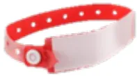

## Clindamycine 10 mg/kg IVL

(réinjection de 10 mg/kg au bout de 4h, puis toutes les 4h tant que se poursuit la chirurgie)

En cas de poursuite de l'antibiothérapie en postopératoire, la posologie maximale recommandée est de 30 mg/kg/j, sans dépasser 900 mg toutes les 8 heures

●●● (Avis d'experts)

<table border="1">
<thead>
<tr>
<th>Actes chirurgicaux ou interventionnels</th>
<th>Molécules</th>
<th>Dose initiale</th>
<th>Réinjections et durée</th>
<th>Force de la recommandation</th>
</tr>
</thead>
<tbody>
<tr>
<td colspan="5"><b><u>Chirurgie alvéolo-dentaire</u></b></td>
</tr>
<tr>
<td>▪ Avulsions de dents incluses, ectopiques ou en désinclusion</td>
<td>Amoxicilline</td>
<td>50 mg/kg IVL*</td>
<td>50 mg/kg si durée &gt; 2h puis toutes les 2h jusqu'à fin de chirurgie</td>
<td>●●● (GRADE 1)</td>
</tr>
<tr>
<td>▪ Avulsions dentaires autres (dont dents sur arcade, avulsions multiples, etc.) ▪ Pose de matériel d'ancrage orthodontique ▪ Pose d'implants (en cas d'anodonties) ▪ Soins dentaires ▪ Lésions osseuses bénignes (kystes...)</td>
<td colspan="3" style="text-align: center;">PAS D'ANTIBIOPROPHYLAXIE</td>
<td>●●● (GRADE 1)</td>
</tr>
<tr>
<td colspan="5"><b><u>Chirurgie des glandes salivaires</u></b></td>
</tr>
<tr>
<td>▪ Chirurgie des glandes salivaires <u>sans</u> accès par la cavité bucco-pharyngée</td>
<td colspan="3" style="text-align: center;">PAS D'ANTIBIOPROPHYLAXIE</td>
<td>●●● (Avis d'experts)</td>
</tr>
<tr>
<td>▪ Chirurgie des glandes salivaires <u>avec</u> accès par la cavité bucco-pharyngée</td>
<td>Amoxicilline/clavulanate</td>
<td>50 mg/kg IVL</td>
<td>50 mg/kg si durée &gt; 2h puis toutes les 2h jusqu'à fin de chirurgie **</td>
<td>●●● (Avis d'experts)</td>
</tr>
<tr>
<td colspan="5"><b><u>Chirurgie faciale</u></b></td>
</tr>
<tr>
<td>▪ Fentes faciales (labiales et/ou palatines)</td>
<td>Amoxicilline/clavulanate</td>
<td>50 mg/kg IVL</td>
<td>50 mg/kg si durée &gt; 2h puis toutes les 2h jusqu'à fin de chirurgie **</td>
<td>●●● (Avis d'experts)</td>
</tr>
</tbody>
</table><table border="1">
<tr>
<td>▪ Chirurgie orthognatique</td>
<td>Amoxicilline/ clavulanate</td>
<td>50 mg/kg IVL</td>
<td>50 mg/kg si durée &gt; 2h puis toutes les 2h jusqu'à fin de chirurgie ** Puis 30 mg/kg/6h (max 1g) postop pendant 48h max.</td>
<td>●●● (Avis d'experts)</td>
</tr>
<tr>
<td colspan="5"><b>Traumatologie maxillo-faciale</b></td>
</tr>
<tr>
<td>▪ Traumatologie maxillo-faciale avec abord endobuccal : fractures simples, multiples ou complexes du massif facial</td>
<td>Amoxicilline/ clavulanate</td>
<td>50 mg/kg IVL</td>
<td>50 mg/kg si durée &gt; 2h puis toutes les 2h jusqu'à fin de chirurgie **</td>
<td>●●● (GRADE 2)</td>
</tr>
<tr>
<td>▪ Traumatologie maxillo-faciale sans abord endobuccal (chirurgie du condyle isolé, chirurgie du plancher orbitaire isolé)</td>
<td colspan="3">PAS D'ANTIBIOPROPHYLAXIE</td>
<td>●●● (Avis d'experts)</td>
</tr>
<tr>
<td colspan="5"><b>Chirurgie plastique générale</b></td>
</tr>
<tr>
<td>▪ Otoplastie, chirurgie plastique de l'oreille externe <u>sans greffe ou points trans- cartilagineux</u></td>
<td colspan="3">PAS D'ANTIBIOPROPHYLAXIE</td>
<td>●●● (Avis d'experts)</td>
</tr>
<tr>
<td>▪ Otoplastie <u>avec geste sur le cartilage</u> (points transfixiant, chondrotomie ou râpage)</td>
<td>Céfazoline</td>
<td>30 mg/kg IVL</td>
<td>30 mg/kg si durée &gt; 4h puis toutes les 4h jusqu'à fin de chirurgie</td>
<td>●●● (Avis d'experts)</td>
</tr>
<tr>
<td>▪ Septorhinoplastie <u>sans</u> greffe de cartilage</td>
<td colspan="3">PAS D'ANTIBIOPROPHYLAXIE</td>
<td>●●● (Avis d'experts)</td>
</tr>
<tr>
<td>▪ Septorhinoplastie <u>avec</u> greffe de cartilage</td>
<td>Céfazoline</td>
<td>30 mg/kg IVL</td>
<td>30 mg/kg si durée &gt; 4h puis toutes les 4h jusqu'à fin de chirurgie</td>
<td>●●● (Avis d'experts)</td>
</tr>
<tr>
<td colspan="5"><b>Chirurgie cutanéo-musculaire</b></td>
</tr>
<tr>
<td>▪ Greffe cutanée (hors brûlures)</td>
<td colspan="3">PAS D'ANTIBIOPROPHYLAXIE</td>
<td>●●● (Avis d'experts)</td>
</tr>
<tr>
<td>▪ Pose de substitut dermique</td>
<td>Céfazoline</td>
<td>30 mg/kg IVL</td>
<td>30 mg/kg si durée &gt; 4h puis toutes les 4h jusqu'à fin de chirurgie</td>
<td>●●● (Avis d'experts)</td>
</tr>
<tr>
<td>▪ Expansion cutanée avec prothèse : ○ Pose de prothèse d'expansion ○ Gonflage de prothèse d'expansion</td>
<td>Céfazoline</td>
<td>30 mg/kg IVL</td>
<td>30 mg/kg si durée &gt; 4h puis toutes les 4h jusqu'à fin de chirurgie</td>
<td>●●● (Avis d'experts)</td>
</tr>
<tr>
<td></td>
<td colspan="3">PAS D'ANTIBIOPROPHYLAXIE</td>
<td>●●● (Avis d'experts)</td>
</tr>
<tr>
<td>▪ Lambeaux libres microchirurgicaux ou pédiculés</td>
<td>Céfazoline</td>
<td>30 mg/kg IVL</td>
<td>30 mg/kg si durée &gt; 4h puis toutes les 4h jusqu'à fin de chirurgie</td>
<td>●●● (Avis d'experts)</td>
</tr>
<tr>
<td>▪ Plastie cutanée ▪ Tumorectomie cutanée</td>
<td colspan="3">PAS D'ANTIBIOPROPHYLAXIE</td>
<td>●●● (Avis d'experts)</td>
</tr>
</table>

\* Les organisations des structures (accueil en ambulatoire sans nécessairement la possibilité de perfuser le patient et de débuter l'administration intraveineuse d'amoxicilline avant l'arrivée au bloc opératoire) et la rapidité de réalisation du geste chirurgical une fois le patient anesthésié, combinés à la recommandation d'une administration IV lente des spécialités à base d'amoxicilline, font qu'il est parfois difficile de respecter le délai recommandé. Se pose alors la questiond'une administration orale d'amoxicilline à l'arrivée à l'hôpital en alternative à l'administration IV au bloc opératoire. Vu que l'amoxicilline est rapidement et bien absorbée après administration orale (biodisponibilité d'environ 70 %) et que le délai d'obtention de la concentration plasmatique maximale (Tmax) est d'environ une heure, il semble possible de remplacer l'administration IV par une prise per os de 50 mg/kg d'amoxicilline (jusqu'à un maximum de 50 kg, au-delà se référer au tableau adulte), plafonnée à 2g, 60 minutes avant l'intervention. Il faudra néanmoins veiller à limiter au maximum l'apport hydrique accompagnant cette prise orale pour respecter les règles de jeûne préopératoire (liquides clairs 1 heure avant l'anesthésie).

**\*\*En cas de chirurgie particulièrement longue, il convient de veiller à ne pas dépasser la dose maximale de 12,5 mg/kg/j d'acide clavulanique.**

## ANTIBIOPROPHYLAXIE EN CHIRURGIE OPHTHALMOLOGIQUE PEDIATRIQUE

**EXPERTS :** François Audren (AFSOP/SFO), Alain Bron (AFSOP/SFO), Christophe Chiquet (AFSOP/SFO), Catherine Creuzot-Garcher (AFSOP/SFO), Guylene Le Meur (AFSOP/SFO), Arnaud Sauer (AFSOP/SFO), Anne Migeon (SFAR)

La chirurgie ophtalmologique pédiatrique représente en 2021 en France, 1,7% de toutes les chirurgies ophtalmologiques et 0,3% pour les chirurgies à globe ouvert (environ 3700 actes). Compte tenu du faible nombre d'endophtalmies aiguës postopératoires chez l'enfant de 0 à 15 ans, il n'existe pas de données publiées suffisamment valides pour établir des recommandations de haut niveau de preuve selon la méthode GRADE. Les données sont donc issues de la littérature du patient de plus de 18 ans, ainsi les recommandations sont identiques à celles de l'adulte. L'antibioprophylaxie en chirurgie ophtalmologique pédiatrique ne nécessite pas de réinjection.

Il est enfin rappelé que l'**antibioprophylaxie par des collyres, par voie sous-conjonctivale ou dans le liquide d'irrigation intraoculaire n'est pas recommandée.**

<table border="1">
<thead>
<tr>
<th>Actes chirurgicaux ou interventionnels</th>
<th>Molécules</th>
<th>Dose initiale</th>
<th>Réinjections et durée</th>
<th>Force de la recommandation</th>
</tr>
</thead>
<tbody>
<tr>
<td colspan="5"><b>Chirurgie du globe oculaire</b></td>
</tr>
<tr>
<td rowspan="2">▪ Chirurgie de la cataracte (simple ou combinée*)</td>
<td>Céfuoxime</td>
<td>1 mg/0,1 mL en injection intra-camérulaire en fin d'intervention</td>
<td>Dose unique</td>
<td>●●● (Avis d'experts)</td>
</tr>
<tr>
<td><u>Si allergie :</u> Moxifloxacine</td>
<td>0,480 mg/0,3 mL en injection intra-camérulaire en fin d'intervention</td>
<td>Dose unique</td>
<td>●●● (Avis d'experts)</td>
</tr>
<tr>
<td>▪ Chirurgies de la cornée, du glaucome, de la rétine et du vitré</td>
<td colspan="3">PAS D'ANTIBIOPROPHYLAXIE</td>
<td>●●● (Avis d'experts)</td>
</tr>
<tr>
<td>▪ Traumatismes à globe ouvert</td>
<td colspan="3">ABSENCE DE RECOMMANDATION **</td>
<td></td>
</tr>
<tr>
<td colspan="5"><b>Chirurgie péri-oculaire</b></td>
</tr>
<tr>
<td>▪ Chirurgies des paupières, des voies lacrymales, du strabisme ou de l'orbite</td>
<td colspan="3">PAS D'ANTIBIOPROPHYLAXIE</td>
<td>●●● (GRADE 1)</td>
</tr>
</tbody>
</table>

\* Chirurgies de la cornée, du glaucome, de la rétine et du vitré effectuées dans le même temps opératoire qu'une chirurgie de cataracte.

\*\* Les données de la littérature ne permettent pas d'émettre de recommandation. Il est suggéré que chaque centre établisse un protocole local.## **PARTIE 3 : ANTI BIOPROPHYLAXIE EN CHIRURGIE CARDIAQUE, CHIRURGIE VASCULAIRE, CATHETERISME CARDIAQUE ET RYTHMOLOGIE PEDIATRIQUES**

Les posologies de ce tableau concernent l'enfant (hors néonatalogie) de moins de 50 kg. Au-delà, se référer au tableau adulte.

La posologie unitaire de bêtalactamine ne peut pas dépasser celle utilisée chez l'adulte, soit 2g maximum.

**EXPERTS** : Bertrand Leobon (SFCTCV), Marc Lillot (SFAR)

La chirurgie cardiaque pédiatrique est une chirurgie propre (classe 1 d'Altemeier). La circulation extracorporelle (CEC), la durée de l'intervention et la complexité des procédures sont susceptibles d'augmenter le risque infectieux. Le volume du priming de CEC explique les besoins de majoration des doses d'antibioprophylaxie par rapport aux doses d'antibioprophylaxie pour chirurgie sans CEC. L'utilité de l'antibioprophylaxie a été clairement démontrée. Sa prolongation au-delà de la période opératoire n'a pas prouvé son utilité. Il n'est donc pas recommandé, dans la très grande majorité des cas, de prolonger l'antibioprophylaxie au-delà de la fin de la chirurgie pour diminuer l'incidence d'infection du site opératoire\*.

En cas d'allergie aux bêtalactamines, si antibioprophylaxie indiquée dans ce tableau :

**Vancomycine 20 mg/kg IVL sur 60 min**

*(réinjection de 20 mg/kg au bout de 8h si poursuite de la chirurgie)*

ou

**Clindamycine 10 mg/kg IVL**

*(réinjection de 10 mg/kg au bout de 4h, puis toutes les 4h tant que se poursuit la chirurgie)*

●●● (Avis d'experts)

<table border="1">
<thead>
<tr>
<th>Actes chirurgicaux ou interventionnels</th>
<th>Molécules</th>
<th>Dose initiale</th>
<th>Réinjections et durée</th>
<th>Force de la recommandation</th>
</tr>
</thead>
<tbody>
<tr>
<td colspan="5"><b><u>Chirurgie cardiaque néonatale et pédiatrique avec circulation extra-corporelle</u></b></td>
</tr>
<tr>
<td>
<ul>
<li>Chirurgie cardiaque avec CEC (abord par sternotomie ou thoracotomie) **</li>
<li>Transplantation cardiaque chez un patient à domicile et sans assistance mécanique de longue durée</li>
</ul>
</td>
<td>Céfazoline</td>
<td>30 mg/kg IVL</td>
<td>
          + 20 mg/kg lors du priming de la CEC 
          Puis 
          30 mg/kg si durée &gt; 4h 
          puis toutes les 4h jusqu'à fin de chirurgie
        </td>
<td>●●● (GRADE 2)</td>
</tr>
<tr>
<td>
<ul>
<li>Transplantation cardiaque chez un patient porteur d'une assistance mécanique de longue durée ou de courte durée (ECMO, ECLS), sans ou avec antécédent d'infection</li>
</ul>
</td>
<td colspan="3">Modalités de l'antibioprophylaxie (molécule(s) et durée) à discuter individuellement après avis infectiologique spécialisé, tenant compte des antécédents infectieux et de la colonisation à SARM ou E-BLSE</td>
<td>●●● (Avis d'experts)</td>
</tr>
</tbody>
</table>### Autres procédures cardiaques, thoraciques ou vasculaires néonatales et pédiatriques \*\*\*

<table border="1">
<tr>
<td data-bbox="41 137 385 355">
<ul style="list-style-type: none; padding-left: 0;">
<li>▪ Toute procédure cardiothoracique <u>avec</u> thoracotomie, thoracostomie, sternotomie ou abord thoracique sous-costal (dont drainage)</li>
<li>▪ Implantation chirurgicale de pace maker et ou défibrillateur</li>
<li>▪ Pose d'ECMO/ECLS veino-veineuse ou veino-artérielle périphérique avec abord chirurgical périphérique et/ou central</li>
<li>▪ Cathétérisme cardiaque interventionnel avec implantation de matériel prothétique</li>
<li>▪ Cathétérisme cardiaque au travers d'une prothèse intracardiaque préalablement implantée</li>
</ul>
</td>
<td data-bbox="385 137 525 355">Céfazoline</td>
<td data-bbox="525 137 635 355">30 mg/kg IVL</td>
<td data-bbox="635 137 800 355">30 mg/kg si durée &gt; 4h puis toutes les 4h jusqu'à fin de chirurgie</td>
<td data-bbox="800 137 959 355">●●● (Avis d'experts)</td>
</tr>
<tr>
<td data-bbox="41 355 385 582">
<ul style="list-style-type: none; padding-left: 0;">
<li>▪ Drainage péricardique ou pleural <u>sans</u> abord chirurgical</li>
<li>▪ Médiastinoscopie</li>
<li>▪ Coronarographie avec ou sans angioplastie</li>
<li>▪ Pose d'ECMO/ECLS veino-veineuse ou veino-artérielle périphérique sans abord chirurgical (i.e. insertion percutanée seule)</li>
<li>▪ Cathétérisme cardiaque sans implantation de matériel prothétique et sans prothèse intracardiaque préalablement implantée</li>
<li>▪ Procédure d'électrophysiologie endocavitaire</li>
<li>▪ Chirurgie veineuse</li>
<li>▪ Chirurgie carotidienne sans patch</li>
</ul>
</td>
<td colspan="3" data-bbox="385 355 800 582">PAS D'ANTIOPROPHYLAXIE</td>
<td data-bbox="800 355 959 582">●●● (Avis d'experts)</td>
</tr>
</table>

\* L'antibioprophylaxie prolongée des patients avec fermeture sternale retardée relève d'une spécificité propre à chaque centre et les RFE n'ont pas abordé cette spécificité. Les experts renvoient donc dans ce cas vers l'application des protocoles locaux établis à ce sujet.

\*\* Les indications de la vancomycine sont l'allergie avérée aux bêtalactamines et la colonisation par du staphylocoque doré méticilline-résistant.

\*\*\* Pour toute autre procédure chirurgicale vasculaire périphérique pédiatrique non mentionnée dans ces tableaux (exceptionnellement pratiquée en pédiatrie), se référer aux recommandations adultes pour l'indication ou non d'une antibioprophylaxie et le cas échéant utiliser les doses pédiatriques mentionnées dans ce tableau.## **PARTIE 4 : ANTI BIOPROPHYLAXIE EN CHIRURGIE THORACIQUE, ENDOSCOPIE ET RADIOLOGIE THORACIQUE INTERVENTIONNELLE PEDIATRIQUE**

Les posologies de ce tableau concernent l'enfant (hors néonatalogie) de moins de 50 kg. Au-delà, se référer au tableau adulte.

La posologie de bêtalactamine ne peut pas dépasser celle utilisée chez l'adulte, soit 2g maximum (1,5g pour le céfuoxime).

**EXPERTS** : Sabine Irtan (SFCTCV), Anne Laffargue (SFAR)

En cas d'allergie aux bêtalactamines, si antibioprophylaxie indiquée dans ce tableau :

**Clindamycine 10 mg/kg IVL**

(réinjection de 10 mg/kg au bout de 4h, puis toutes les 4h tant que se poursuit la chirurgie)

+ **Gentamicine 6-7 mg/kg IVL**, dose unique

●●● (Avis d'experts)

<table border="1">
<thead>
<tr>
<th>Actes chirurgicaux ou interventionnels</th>
<th>Molécules</th>
<th>Dose initiale</th>
<th>Réinjections et durée</th>
<th>Force de la recommandation</th>
</tr>
</thead>
<tbody>
<tr>
<td colspan="5"><b>Chirurgie d'exérèse pulmonaire</b> <i>(par thoracoscopie, thoracotomie ou cervico-thoracotomie [avec ou sans préparation par thoracoscopie])</i></td>
</tr>
<tr>
<td rowspan="2">
<ul style="list-style-type: none; padding-left: 0;">
<li>▪ Pneumonectomie, pleuro-pneumonectomie ou lobectomie pulmonaire, avec ou sans :
              <ul style="list-style-type: none; padding-left: 20px;">
<li>○ résection-anastomose ou réimplantation de bronche ou de la bifurcation trachéale</li>
<li>○ résection et remplacement prothétique de la veine cave supérieure</li>
<li>○ résection de l'oreillette gauche</li>
<li>○ résection de côte, vertèbre, vaisseau sous-clavier, exérèse de nœud ganglionnaire lymphatique</li>
<li>○ libération du plexus brachial</li>
<li>○ résection de paroi thoracique</li>
</ul>
</li>
<li>▪ Segmentectomie pulmonaire unique ou multiple</li>
<li>▪ Exérèse partielle non anatomique du poumon simple ou multiple</li>
<li>▪ Réduction uni- ou bilatérale de volume pulmonaire</li>
<li>▪ Résection de bulle d'emphyseme pulmonaire, avec ou sans réduction de volume pulmonaire, ou abrasion ou exérèse de la plèvre pariétale</li>
<li>▪ Exérèse de kyste hydatique du poumon</li>
</ul>
</td>
<td><u>Au choix :</u> Céfazoline</td>
<td>30 mg/kg IVL</td>
<td>30 mg/kg si durée &gt; 4h puis toutes les 4h jusqu'à fin de chirurgie</td>
<td rowspan="2" style="vertical-align: middle; text-align: center;">●●● (Avis d'experts)</td>
</tr>
<tr>
<td>ou Céfuoxime</td>
<td>50 mg/kg IVL</td>
<td>50 mg/kg si durée &gt; 2h puis toutes les 2h jusqu'à fin de chirurgie</td>
</tr>
</tbody>
</table>### **Chirurgies médiastinales, pleurales, pariétales** (*y compris par voie thoracoscopique/vidéo-assistée*)

<table border="1">
<tr>
<td data-bbox="41 138 385 261">
<ul>
<li>▪ Chirurgie du médiastin</li>
<li>▪ Chirurgie du pneumothorax</li>
<li>▪ Chirurgie de la plèvre (<i>patient non infecté</i>)</li>
<li>▪ Chirurgie de la paroi thoracique</li>
</ul>
</td>
<td data-bbox="385 138 528 261">
                Céfazoline  
<i>Alternative :</i> 
                Céfuroxime
            </td>
<td data-bbox="528 138 638 261">
                30 mg/kg IVL  
                50 mg/kg IVL
            </td>
<td data-bbox="638 138 803 261">
                30 mg/kg si durée &gt; 4h 
                puis toutes les 4h jusqu'à 
                fin de chirurgie  
                50 mg/kg si durée &gt; 2h 
                puis toutes les 2h jusqu'à 
                fin de chirurgie
            </td>
<td data-bbox="803 138 959 261">
                ●●● (Avis d'experts)
            </td>
</tr>
<tr>
<td data-bbox="41 261 385 302">
<ul>
<li>▪ Médiastinoscopie</li>
<li>▪ Drainage thoracique</li>
</ul>
</td>
<td colspan="3" data-bbox="385 261 803 302">
                PAS D'ANTIBIOPROPHYLAXIE
            </td>
<td data-bbox="803 261 959 302">
                ●●● (Avis d'experts)
            </td>
</tr>
</table>

### **Chirurgies des voies aériennes sous-glottiques**

<table border="1">
<tr>
<td data-bbox="41 335 385 687">
<ul>
<li>▪ Trachéotomie chirurgicale *</li>
<li>▪ Suture ou résection-anastomose de bronche, par cervicotomie, cervico-thoracotomie ou thoracotomie</li>
<li>▪ Plastie ou fermeture d'orifice de trachéostomie ou de trachéotomie</li>
<li>▪ Tuteur trachéal, par cervicotomie</li>
<li>▪ Fermeture de plaie ou fistule bronchique, par thoracotomie</li>
<li>▪ Plastie de trachée par autogreffe ou lambeau, par cervico- et/ou thoracotomie</li>
<li>▪ Remplacement de trachée par prothèse, par cervico- et/ou thoracotomie</li>
<li>▪ Résection-anastomose thyro- ou crico-trachéale par cervicotomie</li>
<li>▪ Résection-anastomose de trachée ou de la bifurcation trachéale par cervico- et/ou thoracotomie</li>
<li>▪ Résection-anastomose de trachée pour sténose congénitale de la trachée, par thoracotomie</li>
</ul>
</td>
<td data-bbox="385 335 528 687">
                Céfazoline  
<i>Alternative :</i> 
                Céfuroxime
            </td>
<td data-bbox="528 335 638 687">
                30 mg/kg IVL  
                50 mg/kg IVL
            </td>
<td data-bbox="638 335 803 687">
                30 mg/kg si durée &gt; 4h 
                puis toutes les 4h jusqu'à 
                fin de chirurgie  
                50 mg/kg si durée &gt; 2h 
                puis toutes les 2h jusqu'à 
                fin de chirurgie
            </td>
<td data-bbox="803 335 959 687">
                ●●● (Avis d'experts)
            </td>
</tr>
</table>

### **Radiologie interventionnelle des voies respiratoires et du poumon**

<table border="1">
<tr>
<td data-bbox="41 724 385 897">
<ul>
<li>▪ Destruction d'une ou plusieurs tumeurs bronchopulmonaires par radiofréquence, par voie transcutanée avec guidage scanographique</li>
<li>▪ Ponctions, cytoponctions ou biopsies pulmonaires par voie transcutanée avec guidage échographique, radiologique, scanographique ou remnographique (IRM)</li>
<li>▪ Évacuation ou drainages d'une ou plusieurs collections broncho-pulmonaires par voie transcutanée avec guidage échographique,</li>
</ul>
</td>
<td data-bbox="385 724 803 897">
                PAS D'ANTIBIOPROPHYLAXIE
            </td>
<td data-bbox="803 724 959 897">
                ●●● (Avis d'experts)
            </td>
</tr>
</table><table border="1">
<tr>
<td data-bbox="41 105 386 188">

radiologique, scanographique ou remnographique (IRM)

<ul>
<li>Injection d'agent pharmacologique intrabronchique ou intrapulmonaire, par voie transcutanée avec guidage échographique</li>
</ul>
</td>
<td data-bbox="386 105 803 188"></td>
<td data-bbox="803 105 958 188"></td>
</tr>
<tr>
<td colspan="3" data-bbox="41 188 958 221"><b><u>Fibroscope ou écho-endoscopie diagnostique et thérapeutique</u></b></td>
</tr>
<tr>
<td data-bbox="41 221 386 315">
<ul>
<li>Fibroscope bronchique simple</li>
<li>Fibroscope bronchique + lavage broncho-alvéolaire</li>
<li>Fibroscope + biopsies</li>
<li>EBUS</li>
</ul>
</td>
<td data-bbox="386 221 803 315">PAS D'ANTIBIOPROPHYLAXIE</td>
<td data-bbox="803 221 958 315">●●● (Avis d'experts)</td>
</tr>
<tr>
<td data-bbox="41 315 386 359">
<ul>
<li>Pose d'endoprothèse trachéo-bronchique</li>
</ul>
</td>
<td data-bbox="386 315 803 359">PAS D'ANTIBIOPROPHYLAXIE</td>
<td data-bbox="803 315 958 359">●●● (Avis d'experts)</td>
</tr>
<tr>
<td data-bbox="41 359 386 435">
<ul>
<li>Bronchoscope rigide, désobstruction</li>
<li>Destruction de lésion par laser, cryothérapie</li>
<li>Dilatation ou résection de sténose avec ou sans laser</li>
</ul>
</td>
<td data-bbox="386 359 803 435">PAS D'ANTIBIOPROPHYLAXIE</td>
<td data-bbox="803 359 958 435">●●● (Avis d'experts)</td>
</tr>
<tr>
<td colspan="3" data-bbox="41 435 958 468"><b><u>Transplantation mono ou bipulmonaire, avec ou sans circulation extra-corporelle</u></b></td>
</tr>
<tr>
<td data-bbox="41 468 386 677">
<ul>
<li>Patient peu colonisé avec absence d'antibiothérapie dans les 3 derniers mois</li>
<li>Patient colonisé avec antibiothérapie récente</li>
<li>Patient transplanté avec un greffon issu d'un donneur atteint de pneumopathie</li>
</ul>
</td>
<td data-bbox="386 468 803 677">

Compte tenu de l'absence de littérature sur ce sujet, de la diversité des situations cliniques et des pratiques des différents centres, il n'est pas possible de recommander une antibioprophylaxie consensuelle unique.

Celle-ci doit tenir compte de la patientèle et de l'expérience des centres, de la documentation d'une colonisation chez le patient et/ou d'une infection du poumon transplanté, avec le profil de résistance potentielle aux bêtalactamines des souches identifiées.

L'antibioprophylaxie est administrée pendant la chirurgie et pour 48h postopératoire ou jusqu'à réception des résultats de la culture du LBA du poumon du donneur (en l'absence d'infection du poumon greffé).

</td>
<td data-bbox="803 468 958 677">●●● (Avis d'experts)</td>
</tr>
</table>

\* Pas d'antibioprophylaxie en cas de trachéotomie par voie percutanée exclusive.# PARTIE 5 : ANTIBIOPROPHYLAXIE EN CHIRURGIE PLASTIQUE PEDIATRIQUE ET CHIRURGIE DES ENFANTS BRULES

Les posologies de ce tableau concernent l'enfant (hors néonatalogie) de moins de 50 kg. Au-delà, se référer au tableau adulte.

La posologie unitaire de bêtalactamine ne peut pas dépasser celle utilisée chez l'adulte, soit 2g maximum.

**EXPERTS :** Guillaume Captier (SFCPP), Caroline François (SFCPP), Nicolas Louvet (SFAR)

En cas d'allergie aux bêtalactamines, si antibioprophylaxie indiquée dans ce tableau :

**Clindamycine 10 mg/kg IVL**

(réinjection de 10 mg/kg au bout de 4h, puis toutes les 4h tant que se poursuit la chirurgie)

En cas de poursuite de l'antibiothérapie en postopératoire, la posologie maximale recommandée est de 30 mg/kg/j, sans dépasser 900 mg toutes les 8 heures

●●● (Avis d'experts)

## ANTIBIOPROPHYLAXIE EN CHIRURGIE PLASTIQUE PEDIATRIQUE

<table border="1">
<thead>
<tr>
<th>Actes chirurgicaux ou interventionnels</th>
<th>Molécules</th>
<th>Dose initiale</th>
<th>Réinjections et durée</th>
<th>Force de la recommandation</th>
</tr>
</thead>
<tbody>
<tr>
<td colspan="5"><b>Chirurgie plastique générale</b></td>
</tr>
<tr>
<td>
<ul>
<li>Chirurgie de réduction mammaire</li>
<li>Exérèse de gynécomastie</li>
</ul>
</td>
<td colspan="3">PAS D'ANTIBIOPROPHYLAXIE</td>
<td>●●● (Avis d'experts)</td>
</tr>
<tr>
<td>
<ul>
<li>Otoplastie, chirurgie plastique de l'oreille externe <u>sans greffe ou points trans-cartilagineux</u></li>
</ul>
</td>
<td colspan="3">PAS D'ANTIBIOPROPHYLAXIE</td>
<td>●●● (Avis d'experts)</td>
</tr>
<tr>
<td>
<ul>
<li>Otoplastie <u>avec geste sur le cartilage</u> (points transfixant, chondrotomie ou râpage)</li>
</ul>
</td>
<td>Céfazoline</td>
<td>30 mg/kg IVL</td>
<td>30 mg/kg si durée &gt; 4h puis toutes les 4h jusqu'à fin de chirurgie</td>
<td>●●● (Avis d'experts)</td>
</tr>
<tr>
<td>
<ul>
<li>Septorhinoplastie <u>sans</u> greffe de cartilage</li>
</ul>
</td>
<td colspan="3">PAS D'ANTIBIOPROPHYLAXIE</td>
<td>●●● (Avis d'experts)</td>
</tr>
<tr>
<td>
<ul>
<li>Septorhinoplastie <u>avec</u> greffe de cartilage</li>
</ul>
</td>
<td>Céfazoline</td>
<td>30 mg/kg IVL</td>
<td>30 mg/kg si durée &gt; 4h puis toutes les 4h jusqu'à fin de chirurgie</td>
<td>●●● (Avis d'experts)</td>
</tr>
<tr>
<td>
<ul>
<li>Chirurgie orthognatique</li>
</ul>
</td>
<td>Amoxicilline/clavulanate</td>
<td>50 mg/kg IVL</td>
<td>50 mg/kg si durée &gt; 2h puis toutes les 2h jusqu'à fin de chirurgie Puis 30 mg/kg/6h (max 1g) postop pendant 48h max. *</td>
<td>●●● (Avis d'experts)</td>
</tr>
</tbody>
</table>## Chirurgie cutanéo-musculaire

<table border="1">
<tr>
<td>▪ Greffe cutanée (hors brûlures)</td>
<td colspan="3">PAS D'ANTIBIOPROPHYLAXIE</td>
<td>●●● (Avis d'experts)</td>
</tr>
<tr>
<td>▪ Pose de substitut dermique</td>
<td>Céfazoline</td>
<td>30 mg/kg IVL</td>
<td>30 mg/kg si durée &gt; 4h puis toutes les 4h jusqu'à fin de chirurgie</td>
<td>●●● (Avis d'experts)</td>
</tr>
<tr>
<td>▪ Expansion cutanée avec prothèse :
            <ul style="list-style-type: none;">
<li>○ Pose de prothèse d'expansion</li>
<li>○ Gonflage de prothèse d'expansion</li>
</ul>
</td>
<td>Céfazoline</td>
<td>30 mg/kg IVL</td>
<td>30 mg/kg si durée &gt; 4h puis toutes les 4h jusqu'à fin de chirurgie</td>
<td>●●● (Avis d'experts)</td>
</tr>
<tr>
<td></td>
<td colspan="3">PAS D'ANTIBIOPROPHYLAXIE</td>
<td>●●● (Avis d'experts)</td>
</tr>
<tr>
<td>▪ Lambeaux libres microchirurgicaux ou pédiculés</td>
<td>Céfazoline</td>
<td>30 mg/kg IVL</td>
<td>30 mg/kg si durée &gt; 4h puis toutes les 4h jusqu'à fin de chirurgie</td>
<td>●●● (Avis d'experts)</td>
</tr>
<tr>
<td>▪ Plastie cutanée</td>
<td colspan="3">PAS D'ANTIBIOPROPHYLAXIE</td>
<td>●●● (Avis d'experts)</td>
</tr>
<tr>
<td>▪ Tumorectomie cutanée</td>
<td colspan="3">PAS D'ANTIBIOPROPHYLAXIE</td>
<td>●●● (Avis d'experts)</td>
</tr>
</table>

\* En cas de chirurgie particulièrement longue et/ou de prolongation de l'antibioprophylaxie jusqu'à 48h postopératoire, il convient de veiller à ne pas dépasser la dose maximale de 12,5 mg/kg/j d'acide clavulanique.

## ANTIBIOPROPHYLAXIE EN CHIRURGIE DES ENFANTS BRULES

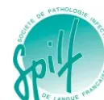

<table border="1">
<thead>
<tr>
<th>Actes chirurgicaux ou interventionnels</th>
<th>Molécules</th>
<th>Dose initiale</th>
<th>Réinjections et durée</th>
<th>Force de la recommandation</th>
</tr>
</thead>
<tbody>
<tr>
<td>▪ Pansement de brûlure initial (mise à plat de phlyctènes, lavage) et secondaire sans geste chirurgical</td>
<td colspan="3">PAS D'ANTIBIOPROPHYLAXIE</td>
<td>●●● (Avis d'experts)</td>
</tr>
<tr>
<td>▪ Incision de décharge :
            <ul style="list-style-type: none;">
<li>○ Escarrotomie</li>
<li>○ Aponévrotomie</li>
</ul>
</td>
<td colspan="3">PAS D'ANTIBIOPROPHYLAXIE</td>
<td>●●● (Avis d'experts)</td>
</tr>
<tr>
<td></td>
<td colspan="3">PAS D'ANTIBIOPROPHYLAXIE (en l'absence de fracture ouverte associée)</td>
<td>●●● (Avis d'experts)</td>
</tr>
<tr>
<td>▪ Excision de brûlure sans couverture ou avec couverture temporaire (allo ou xénogreffe)</td>
<td colspan="3">PAS D'ANTIBIOPROPHYLAXIE</td>
<td>●●● (Avis d'experts)</td>
</tr>
<tr>
<td>▪ Autogreffe cutanée</td>
<td colspan="3">PAS D'ANTIBIOPROPHYLAXIE</td>
<td>●●● (Avis d'experts)</td>
</tr>
<tr>
<td></td>
<td colspan="3">Considérer une antibioprophylaxie individuelle adaptée à la flore du site opératoire et au risque du patient en cas de patient avec parcours de soins prolongé, colonisation cutanée à germes multi-résistants, immunodépression sous-jacente, etc. [●●● (Avis d'experts)]</td>
<td></td>
</tr>
</tbody>
</table><table border="1">
<tr>
<td data-bbox="61 106 348 241">
<ul>
<li>▪ Greffe de matrice cutanée artificielle</li>
</ul>
</td>
<td data-bbox="351 106 521 241">
Céfazoline
</td>
<td data-bbox="524 106 621 241">
30 mg/kg IVL
</td>
<td data-bbox="624 106 788 241">
30 mg/kg si durée &gt; 4h puis toutes les 4h jusqu'à fin de chirurgie
</td>
<td data-bbox="791 106 941 241">
●●● (Avis d'experts)
</td>
</tr>
<tr>
<td colspan="5" data-bbox="378 161 861 228">

Considérer une antibioprophylaxie individuelle adaptée à la flore du site opératoire et au risque du patient en cas de patient avec parcours de soins prolongé, colonisation cutanée à germes multi-résistants, immunodépression sous-jacente, etc. [●●● (Avis d'experts)]

</td>
</tr>
<tr>
<td data-bbox="61 244 348 286">
<ul>
<li>▪ Arthrodèse avec articulation fermée</li>
</ul>
</td>
<td colspan="3" data-bbox="351 244 788 286">
Antibioprophylaxie adaptée à la flore du site opératoire et au risque du patient
</td>
<td data-bbox="791 244 941 286">
●●● (Avis d'experts)
</td>
</tr>
<tr>
<td data-bbox="61 289 348 424">
<ul>
<li>▪ Amputation</li>
</ul>
</td>
<td data-bbox="351 289 521 424">
Amoxicilline/Clavulanate
</td>
<td data-bbox="524 289 621 424">
50 mg/kg IVL
</td>
<td data-bbox="624 289 788 424">
50 mg/kg si durée &gt; 2h, puis toutes les 2h jusqu'à fin de chirurgie
</td>
<td data-bbox="791 289 941 424">
●●● (Avis d'experts)
</td>
</tr>
<tr>
<td colspan="5" data-bbox="378 344 861 411">

Considérer une antibioprophylaxie individuelle adaptée à la flore du site opératoire et au risque du patient en cas de patient avec parcours de soins prolongé, colonisation cutanée à germes multi-résistants, immunodépression sous-jacente, etc. [●●● (Avis d'experts)]

</td>
</tr>
<tr>
<td data-bbox="61 427 348 471">
<ul>
<li>▪ Enfouissement de cartilage pour reconstruction auriculaire</li>
</ul>
</td>
<td colspan="3" data-bbox="351 427 788 471">
Antibioprophylaxie adaptée à la flore du site opératoire et au risque du patient
</td>
<td data-bbox="791 427 941 471">
●●● (Avis d'experts)
</td>
</tr>
<tr>
<td data-bbox="61 474 348 600">
<ul>
<li>▪ Lambeau à distance à pédicule ou vascularisation transitoire (lambeau inguinal, lambeau-greffe de Colson ou modifié Forli (cutanéo-abdominal), lambeau thénarien direct ou à rétro, lambeau deltopectoral, lambeau frontal, lambeau scalpant de Converse ou de Washio</li>
</ul>
</td>
<td colspan="3" data-bbox="351 474 788 600">
Antibioprophylaxie adaptée à la flore du site opératoire et au risque du patient
</td>
<td data-bbox="791 474 941 600">
●●● (Avis d'experts)
</td>
</tr>
</table>## **PARTIE 6 : ANTI BIOPROPHYLAXIE EN CHIRURGIE** **ORTHOPEDIQUE ET TRAUMATOLOGIQUE PEDIATRIQUE**

Les posologies de ce tableau concernent l'enfant (hors néonatalogie) de moins de 50 kg. Au-delà, se référer au tableau adulte.

La posologie unitaire de bêtalactamine ne peut pas dépasser celle utilisée chez l'adulte, soit 2g maximum.

**EXPERTS** : Céline Klein (SOFOP), Sébastien Pesenti (SOFOP), Jean-Noël Evain (SFAR)

L'antibioprophylaxie en chirurgie orthopédique pédiatrique propre ne doit pas être systématique. Lorsqu'elle est indiquée, elle doit couvrir les germes commensaux de la flore cutanée, en particulier les staphylocoques sensibles à la méticilline.

**En cas de colonisation par une souche de staphylocoque doré résistant à la méticilline (SARM)**, l'antibioprophylaxie est alors réalisée avec de la **vancomycine** (20 mg/kg IVL sur 60 min).

En cas d'allergie aux bêtalactamines, si antibioprophylaxie indiquée dans ce tableau :

Si céfazoline : **clindamycine 10 mg/kg IVL**

*(réinjection de 10 mg/kg au bout de 4h, puis toutes les 4h tant que se poursuit la chirurgie)*

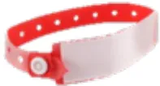

Si amoxicilline/clavulanate : **clindamycine 10 mg/kg IVL**

*(réinjection de 10 mg/kg au bout de 4h, puis toutes les 4h tant que se poursuit la chirurgie)*

+ **gentamicine 6-7 mg/kg IVL**, dose unique

●●● (Avis d'experts)

<table border="1">
<thead>
<tr>
<th>Actes chirurgicaux ou interventionnels</th>
<th>Molécules</th>
<th>Dose initiale</th>
<th>Réinjections et durée</th>
<th>Force de la recommandation</th>
</tr>
</thead>
<tbody>
<tr>
<td colspan="5"><b><u>Chirurgie orthopédique programmée</u></b></td>
</tr>
<tr>
<td>
<ul style="list-style-type: none; padding-left: 0;">
<li>▪ Chirurgie des parties molles sans implant</li>
<li>▪ Ténotomy, aponévrotomie (même multiples)</li>
<li>▪ Exostose</li>
<li>▪ Ablation de matériel d'ostéosynthèse</li>
<li>▪ Injection de toxine botulique</li>
<li>▪ Ponction articulaire (en dehors d'un contexte septique), arthrographie, arthroscopie sans mise en place de matériel</li>
<li>▪ Ligamentoplastie sans mise en place de matériel</li>
<li>▪ Ostéosuture (<u>sauf</u> si pose d'ancre métallique)</li>
</ul>
</td>
<td colspan="3" style="text-align: center; vertical-align: middle;">PAS D'ANTI BIOPROPHYLAXIE</td>
<td style="text-align: center; vertical-align: middle;">●●● (Avis d'experts)</td>
</tr>
</tbody>
</table><table border="1">
<tr>
<td>
<ul>
<li>Toute procédure avec mise en place de matériel d'ostéosynthèse</li>
<li>Ostéotomie</li>
<li>Arthrotomie</li>
</ul>
</td>
<td>Céfazoline</td>
<td>30 mg/kg IVL</td>
<td>30 mg/kg si durée &gt; 4h puis toutes les 4h jusqu'à fin de chirurgie</td>
<td>●●● (Avis d'experts)</td>
</tr>
</table>

### Chirurgie du rachis

<table border="1">
<tr>
<td>
<ul>
<li>Chirurgie du rachis avec mise en place de matériel *, y compris chirurgie percutanée</li>
</ul>
</td>
<td>Céfazoline</td>
<td>30 mg/kg IVL</td>
<td>30 mg/kg si durée &gt; 4h puis toutes les 4h jusqu'à fin de chirurgie</td>
<td>●●● (GRADE 2)</td>
</tr>
<tr>
<td>
<ul>
<li>Chirurgie du rachis avec mise en place de matériel pour scoliose secondaire (non idiopathique)</li>
</ul>
</td>
<td>Céfazoline + Gentamicine</td>
<td>30 mg/kg IVL  6-7 mg/kg IVL</td>
<td>30 mg/kg si durée &gt; 4h puis toutes les 4h jusqu'à fin de chirurgie  Dose unique</td>
<td>●●● (Avis d'experts)</td>
</tr>
</table>

### Chirurgie traumatologique

<table border="1">
<tr>
<td>
<ul>
<li>Ostéosynthèse de fracture fermée de la palette humérale, par voie percutanée</li>
</ul>
</td>
<td colspan="3">PAS D'ANTIBIOPROPHYLAXIE</td>
<td>●●● (GRADE 2)</td>
</tr>
<tr>
<td>
<ul>
<li>Plaie distale de doigt, avec ou sans fracture</li>
</ul>
</td>
<td colspan="3">PAS D'ANTIBIOPROPHYLAXIE</td>
<td>●●● (GRADE 2)</td>
</tr>
<tr>
<td>
<ul>
<li>Plaie des parties molles, non contuse et non susceptible d'être contaminée par des germes d'origine tellurique et/ou fécale</li>
</ul>
</td>
<td colspan="3">PAS D'ANTIBIOPROPHYLAXIE</td>
<td>●●● (Avis d'experts)</td>
</tr>
<tr>
<td>
<ul>
<li>Ostéosynthèse de fracture fermée, par abord chirurgical ou percutané (en dehors de la fracture de la palette humérale)</li>
<li>Plaie articulaire (quel que soit le degré de contamination)</li>
<li>Fracture ouverte Stade 1 de Gustilo-Anderson</li>
</ul>
</td>
<td>Céfazoline</td>
<td>30 mg/kg IVL</td>
<td>30 mg/kg si durée &gt; 4h puis toutes les 4h jusqu'à fin de chirurgie</td>
<td>●●● (Avis d'experts)</td>
</tr>
<tr>
<td>
<ul>
<li>Fracture ouverte stade 2 ou 3 de Gustilo-Anderson**</li>
<li>Plaie des parties molles contuses ou susceptible d'être contaminée par des germes d'origine tellurique et/ou fécale</li>
<li>Morsure***</li>
</ul>
</td>
<td>Amoxicilline/ clavulanate</td>
<td>50 mg/kg IVL</td>
<td>50 mg/kg si durée &gt; 2h puis toutes les 2h jusqu'à fin de chirurgie****</td>
<td>●●● (Avis d'experts)</td>
</tr>
</table>

\* Si chirurgie du rachis sans matériel chez l'adolescent (exceptionnel chez l'enfant), se référer au tableau adulte.

\*\* Le niveau de contamination initiale est à prendre en compte dans le risque d'infection de la fracture. En cas de contamination majeure du foyer de fracture et avec un délai de prise en charge prolongée, la chirurgie des fractures Gustilo 2 et 3 peut être considérée après avis infectiologique comme de classe Altemeier 3-4, justifiant une antibiothérapie curative étendue au-delà du bloc opératoire, dont le choix de la molécule sera protocolisé dans chaque centre en fonction des données épidémiologiques locales.

\*\*\* Les morsures sont des plaies avec contamination polymicrobienne qui relèvent d'une antibiothérapie curative. La dose recommandée ici correspond à la dose du traitement curatif à administrer lors du passage au bloc avec un traitement à poursuivre 5 jours en postopératoire avec réévaluation chirurgicale et infectiologique ([https://www.sfm.org/upload/consensus/rbp\\_plaies2017\\_v2.pdf](https://www.sfm.org/upload/consensus/rbp_plaies2017_v2.pdf)).

\*\*\*\* En cas de chirurgie particulièrement longue et/ou de conversion en antibiothérapie curative postopératoire, il convient de veiller à ne pas dépasser la dose maximale de 12,5 mg/kg/j d'acide clavulanique.## ANNEXE

Classification des fractures ouvertes de membres d'après Gustilo RB, Mendoza RM, Williams DN. Problems in the management of type III (severe) open fractures: a new classification of type III open fractures. J Trauma 1984;24:742–6.

<table border="1">
<thead>
<tr>
<th>Fracture</th>
<th colspan="2">Description</th>
<th>Taux d'infection</th>
<th>Contamination</th>
</tr>
</thead>
<tbody>
<tr>
<td>Type 1</td>
<td colspan="2">Plaie &lt; 1 cm Contamination minimale</td>
<td>&lt; 2 %</td>
<td>Minimale</td>
</tr>
<tr>
<td>Type 2</td>
<td colspan="2">Plaie de 1 à 10 cm Sans lésion extensive des tissus mous</td>
<td>2 à 5 %</td>
<td>Intermédiaire</td>
</tr>
<tr>
<td rowspan="4">Type 3</td>
<td colspan="3">Lésion tissulaire étendue &gt; 10 cm</td>
<td rowspan="4">Majeure</td>
</tr>
<tr>
<td>3.A</td>
<td>Couverture cutanée possible Comminution importante</td>
<td>5 à 10 %</td>
</tr>
<tr>
<td>3.B</td>
<td>Exposition osseuse Comminution importante</td>
<td>10 à 50 %</td>
</tr>
<tr>
<td>3.C</td>
<td>Lésion artérielle associée</td>
<td>25 à 50 %</td>
</tr>
</tbody>
</table># PARTIE 7 : ANTIBIOPROPHYLAXIE EN CHIRURGIE DIGESTIVE PEDIATRIQUE, ENDOSCOPIE DIGESTIVE ET RADIOLOGIE INTERVENTIONNELLE DIGESTIVE PEDIATRIQUES

Les posologies de ce tableau concernent l'enfant (hors néonatalogie) de moins de 50 kg. Au-delà, se référer au tableau adulte.

La posologie unitaire de bêtalactamine ne peut pas dépasser celle utilisée chez l'adulte, soit 2g maximum.

**EXPERTS :** Nicolas Boulard (SFCP), Camille Jung (GFHGNP), Gilles Brezac (SFAR)

La chirurgie digestive chez l'enfant est une chirurgie propre (sans ouverture du tube digestif) ou propre-contaminée (en cas d'ouverture du tube digestif). L'antibioprophylaxie n'est pas systématique. La chirurgie sous cœlioscopie suit les mêmes règles que la chirurgie par voie ouverte.

En cas d'allergie aux bêtalactamines, si antibioprophylaxie indiquée dans ce tableau :

Si céfazoline : **clindamycine 10 mg/kg IVL**  
(réinjection de 10 mg/kg au bout de 4h, puis toutes les 4h tant que se poursuit la chirurgie)

Si céfoxitine : **métronidazole 15 mg/kg IVL**, dose unique  
+ **gentamicine 6-7 mg/kg IVL**, dose unique

●●● (Avis d'experts)

## CHIRURGIE ŒSOGASTRIQUE, DE L'INTESTIN GRELE, COLO-RECTALE ET PROCTOLOGIQUE PEDIATRIQUE

<table border="1">
<thead>
<tr>
<th>Actes chirurgicaux ou interventionnels</th>
<th>Molécules</th>
<th>Dose initiale</th>
<th>Réinjections et durée</th>
<th>Force de la recommandation</th>
</tr>
</thead>
<tbody>
<tr>
<td colspan="5"><b>Chirurgie œsophagienne</b></td>
</tr>
<tr>
<td>■ Chirurgie de l'œsophage <u>sans</u> plastie colique</td>
<td>Céfazoline</td>
<td>30 mg/kg IVL</td>
<td>30 mg/kg si durée &gt; 4h puis toutes les 4h jusqu'à fin de chirurgie</td>
<td>●●● (Avis d'experts)</td>
</tr>
<tr>
<td>■ Chirurgie de l'œsophage <u>avec</u> plastie colique</td>
<td>Céfoxitine</td>
<td>40 mg/kg IVL</td>
<td>40 mg/kg si durée &gt; 2h puis toutes les 2h jusqu'à fin de chirurgie</td>
<td>●●● (Avis d'experts)</td>
</tr>
</tbody>
</table><table border="1">
<thead>
<tr>
<th colspan="5"><b>Chirurgie gastrique</b></th>
</tr>
</thead>
<tbody>
<tr>
<td>▪ Chirurgie gastro-duodénale, incluant la chirurgie de Nissen et la gastrostomie endoscopique</td>
<td>Céfazoline</td>
<td>30 mg/kg IVL</td>
<td>30 mg/kg si durée &gt; 4h puis toutes les 4h jusqu'à fin de chirurgie</td>
<td>●●● (Avis d'experts)</td>
</tr>
<tr>
<td>▪ Chirurgie de la sténose du pylore</td>
<td colspan="3">PAS D'ANTIBIOPROPHYLAXIE</td>
<td>●●● (Avis d'experts)</td>
</tr>
<tr>
<th colspan="5"><b>Chirurgie de l'intestin grêle</b></th>
</tr>
<tr>
<td>▪ Chirurgie de l'intestin grêle sans ou avec anastomose bilio-digestive ▪ Invagination du grêle avec résection</td>
<td>Céfoxitine</td>
<td>40 mg/kg IVL</td>
<td>40 mg/kg si durée &gt; 2h puis toutes les 2h jusqu'à fin de chirurgie</td>
<td>●●● (Avis d'experts)</td>
</tr>
<tr>
<th colspan="5"><b>Chirurgie colo-rectale</b></th>
</tr>
<tr>
<td>▪ Appendicectomie pour appendicite aiguë simple (catarrhale)</td>
<td>Céfoxitine</td>
<td>40 mg/kg IVL</td>
<td>40 mg/kg si durée &gt; 2h puis toutes les 2h jusqu'à fin de chirurgie</td>
<td>●●● (Avis d'experts)</td>
</tr>
<tr>
<td>▪ Chirurgie colorectale, incluant les plasties coliques</td>
<td>Céfoxitine</td>
<td>40 mg/kg IVL</td>
<td>40 mg/kg si durée &gt; 2h puis toutes les 2h jusqu'à fin de chirurgie</td>
<td>●●● (Avis d'experts)</td>
</tr>
<tr>
<th colspan="5"><b>Chirurgie proctologique</b></th>
</tr>
<tr>
<td>▪ Hémorroïdes</td>
<td>Métronidazole</td>
<td>15 mg/kg IVL</td>
<td>Dose unique</td>
<td>●●● (Avis d'experts)</td>
</tr>
<tr>
<td>▪ Fistule anale ▪ Kyste pilonidal ▪ Dilatation anale</td>
<td colspan="3">PAS D'ANTIBIOPROPHYLAXIE</td>
<td>●●● (Avis d'experts)</td>
</tr>
</tbody>
</table>

## CHIRURGIE HEPATO-BILIAIRE, SPLENIQUE ET PANCREATIQUE PEDIATRIQUE

<table border="1">
<thead>
<tr>
<th>Actes chirurgicaux ou interventionnels</th>
<th>Molécules</th>
<th>Dose initiale</th>
<th>Réinjections et durée</th>
<th>Force de la recommandation</th>
</tr>
</thead>
<tbody>
<tr>
<th colspan="5"><b>Chirurgie de la vésicule biliaire et des voies biliaires</b></th>
</tr>
<tr>
<td>▪ Cholécystectomie élective par laparoscopie
<ul>
<li>○ Patients à haut risque : <i>chirurgie au décours immédiat d'une cholécystite aiguë, ictère, calcul(s) de la voie biliaire principale, mise en place de prothèse, conversion en laparotomie, fuite biliaire, immunosuppression</i></li>
<li>○ Patients à faible risque : <i>aucun des critères ci-dessus</i></li>
</ul>
</td>
<td>Céfazoline</td>
<td>30 mg/kg IVL</td>
<td>30 mg/kg si durée &gt; 4h puis toutes les 4h jusqu'à fin de chirurgie</td>
<td>●●● (Avis d'experts)</td>
</tr>
<tr>
<td></td>
<td colspan="3">PAS D'ANTIBIOPROPHYLAXIE</td>
<td>●●● (Avis d'experts)</td>
</tr>
</tbody>
</table><table border="1">
<tr>
<td>
<ul>
<li>Cholécystectomie par laparotomie</li>
<li>Chirurgie des voies biliaires sans anastomose bilio-digestive (hors patients porteurs de prothèse des voies biliaires*) : ablation transcystique ou par cholédocotomie de calcul de la voie biliaire principale, avec ou sans cholécystectomie</li>
</ul>
</td>
<td>Céfazoline</td>
<td>30 mg/kg IVL</td>
<td>30 mg/kg si durée &gt; 4h puis toutes les 4h jusqu'à fin de chirurgie</td>
<td>●●● (Avis d'experts)</td>
</tr>
</table>

### Chirurgie hépatique

<table border="1">
<tr>
<td>
<ul>
<li>Chirurgie hépatique sans chirurgie des voies biliaires (résection atypique, segmentectomie, lobectomie, tumorectomie ...)</li>
</ul>
</td>
<td>Céfazoline</td>
<td>30 mg/kg IVL</td>
<td>30 mg/kg si durée &gt; 4h puis toutes les 4h jusqu'à fin de chirurgie</td>
<td>●●● (Avis d'experts)</td>
</tr>
<tr>
<td>
<ul>
<li>Atrésie des voies biliaires : résection de la voie biliaire principale pédiculaire avec anastomose bilio-digestive</li>
</ul>
</td>
<td>Céfoxitine</td>
<td>40 mg/kg IVL</td>
<td>40 mg/kg si durée &gt; 2h puis toutes les 2h jusqu'à fin de chirurgie</td>
<td>●●● (Avis d'experts)</td>
</tr>
<tr>
<td>
<ul>
<li>Kystes hépatiques simples (résection du dôme saillant, périkystectomie)</li>
<li>Chirurgie des kystes hydatiques</li>
</ul>
</td>
<td colspan="3">PAS D'ANTIBIOPROPHYLAXIE</td>
<td>●●● (Avis d'experts)</td>
</tr>
</table>

### Transplantation hépatique

<table border="1">
<tr>
<td>
<ul>
<li>Transplantation de foie total</li>
<li>Transplantation de foie réduit</li>
</ul>
</td>
<td colspan="4">

Compte tenu des spécificités de la patientèle, de la diversité des indications à la transplantation et des pratiques des différents centres, il n'est pas possible de recommander une antibioprophylaxie consensuelle unique.

Celle-ci doit tenir compte de la pression de sélection antibiotique préalable et/ou de la documentation d'une colonisation chez le patient, avec le profil de résistance potentielle aux bêtalactamines des souches identifiées.

Il est suggéré que chaque centre établisse un protocole local, incluant lorsque cela est nécessaire, une discussion pluridisciplinaire pour personnaliser l'antibioprophylaxie en fonction des antécédents du patient.

</td>
</tr>
</table>

### Chirurgie de la rate

<table border="1">
<tr>
<td>
<ul>
<li>Splénectomie programmée ou en urgence, par laparotomie ou laparoscopie</li>
</ul>
</td>
<td>Céfazoline</td>
<td>30 mg/kg IVL</td>
<td>30 mg/kg si durée &gt; 4h puis toutes les 4h jusqu'à fin de chirurgie</td>
<td>●●● (Avis d'experts)</td>
</tr>
</table>

### Chirurgie du pancréas

<table border="1">
<tr>
<td>
<ul>
<li>Chirurgie pancréatique</li>
</ul>
</td>
<td>Céfazoline</td>
<td>30 mg/kg IVL</td>
<td>30 mg/kg si durée &gt; 4h puis toutes les 4h jusqu'à fin de chirurgie</td>
<td>●●● (Avis d'experts)</td>
</tr>
</table>

\* Dans les très rares cas en pédiatrie de chirurgie des voies biliaires chez des enfants avec prothèse biliaire mise en place avant la chirurgie, antibioprophylaxie au cas par cas selon protocole local ou avis infectiologique personnalisé.## CHIRURGIE DE PAROI ET AUTRES INTERVENTIONS ABDOMINO-PERINEALES PEDIATRIQUES

<table border="1">
<thead>
<tr>
<th>Actes chirurgicaux ou interventionnels</th>
<th>Molécules</th>
<th>Dose initiale</th>
<th>Réinjections et durée</th>
<th>Force de la recommandation</th>
</tr>
</thead>
<tbody>
<tr>
<td colspan="5"><b><u>Chirurgie des hernies</u></b></td>
</tr>
<tr>
<td>
<ul>
<li>Cure de hernie inguinale ou ombilicale sans mise en place de prothèse</li>
</ul>
</td>
<td colspan="3">PAS D'ANTIBIOPROPHYLAXIE</td>
<td>●●● (Avis d'experts)</td>
</tr>
<tr>
<td>
<ul>
<li>Cure de hernie inguinale ou ombilicale avec mise en place d'une plaque prothétique</li>
<li>Cure de hernie diaphragmatique avec ou sans plaque prothétique (voie ouverte ou laparoscopique)</li>
</ul>
</td>
<td>Céfazoline</td>
<td>30 mg/kg IVL</td>
<td>30 mg/kg si durée &gt; 4h puis toutes les 4h jusqu'à fin de chirurgie</td>
<td>●●● (Avis d'experts)</td>
</tr>
<tr>
<td colspan="5"><b><u>Autres chirurgies abdomino-périnéales</u></b></td>
</tr>
<tr>
<td>
<ul>
<li>Hydrocèle</li>
<li>Ectopie testiculaire</li>
<li>Torsion testiculaire, torsion de l'hydatide testiculaire, kyste de l'hydatide</li>
<li>Orchidectomie</li>
<li>Kyste de l'ovaire, détorsion d'annexe</li>
</ul>
</td>
<td colspan="3">PAS D'ANTIBIOPROPHYLAXIE</td>
<td>●●● (Avis d'experts)</td>
</tr>
<tr>
<td>
<ul>
<li>Mise en place ou changement de prothèse testiculaire</li>
</ul>
</td>
<td>Céfazoline</td>
<td>30 mg/kg IVL</td>
<td>30 mg/kg si durée &gt; 4h puis toutes les 4h jusqu'à fin de chirurgie</td>
<td>●●● (Avis d'experts)</td>
</tr>
<tr>
<td>
<ul>
<li>Cure de prolapsus, quelle que soit la voie d'abord, avec ou sans mise en place de matériel :
<ul>
<li>sans résection digestive</li>
<li>avec résection digestive</li>
</ul>
</li>
</ul>
</td>
<td>Céfazoline</td>
<td>30 mg/kg IVL</td>
<td>30 mg/kg si durée &gt; 4h puis toutes les 4h jusqu'à fin de chirurgie</td>
<td rowspan="2">●●● (Avis d'experts)</td>
</tr>
<tr>
<td></td>
<td>Céfoxitine</td>
<td>40 mg/kg IVL</td>
<td>40 mg/kg si durée &gt; 2h puis toutes les 2h jusqu'à fin de chirurgie</td>
</tr>
<tr>
<td>
<ul>
<li>Injection sclérosante sous muqueuse rectale</li>
</ul>
</td>
<td colspan="3">PAS D'ANTIBIOPROPHYLAXIE</td>
<td>●●● (Avis d'experts)</td>
</tr>
<tr>
<td>
<ul>
<li>Mise en place de cathéter de dialyse péritonéale</li>
</ul>
</td>
<td>Céfazoline</td>
<td>30 mg/kg IVL</td>
<td>30 mg/kg si durée &gt; 4h puis toutes les 4h jusqu'à fin de chirurgie</td>
<td>●●● (Avis d'experts)</td>
</tr>
<tr>
<td>
<ul>
<li>Exploration chirurgicale d'une plaie de l'abdomen sans atteinte d'organe creux</li>
</ul>
</td>
<td>Céfazoline</td>
<td>30 mg/kg IVL</td>
<td>30 mg/kg si durée &gt; 4h puis toutes les 4h jusqu'à fin de chirurgie</td>
<td>●●● (Avis d'experts)</td>
</tr>
<tr>
<td>
<ul>
<li>Coelioscopie exploratrice</li>
<li>Adhésiolyse simple</li>
<li>Kyste de l'ouraque (par coelioscopie ou par laparotomie)</li>
</ul>
</td>
<td colspan="3">PAS D'ANTIBIOPROPHYLAXIE</td>
<td>●●● (Avis d'experts)</td>
</tr>
</tbody>
</table>## ENDOSCOPIE DIGESTIVE PEDIATRIQUE

<table border="1">
<thead>
<tr>
<th>Actes chirurgicaux ou interventionnels</th>
<th>Molécules</th>
<th>Dose initiale</th>
<th>Réinjections et durée</th>
<th>Force de la recommandation</th>
</tr>
</thead>
<tbody>
<tr>
<td colspan="5"><b><u>Cholangio-pancréatographie rétrograde endoscopique (CPRE)</u></b></td>
</tr>
<tr>
<td>
<ul>
<li>Cholangiographie</li>
<li>Pancréatographie</li>
<li>Dilatation et pose de prothèses biliaires ou pancréatiques avec drainage complet satisfaisant</li>
<li>Extraction de calculs biliaires ou pancréatiques</li>
</ul>
</td>
<td colspan="3">PAS D'ANTIBIOPROPHYLAXIE</td>
<td>●●● (GRADE 1)</td>
</tr>
<tr>
<td>
<ul>
<li>Lithotritie mécanique biliaire ou pancréatique</li>
<li>Cholangioscopie avec ou sans lithotritie</li>
<li>Dilatation et pose de prothèses biliaires ou pancréatiques avec drainage biliaire incomplet</li>
</ul>
</td>
<td>Céfoxitine</td>
<td>40 mg/kg IVL</td>
<td>40 mg/kg si durée &gt; 2h puis toutes les 2h jusqu'à fin de procédure</td>
<td>●●● (Avis d'experts)</td>
</tr>
<tr>
<td colspan="5"><b><u>Ponction sous écho-endoscopie</u></b></td>
</tr>
<tr>
<td>
<ul>
<li>Ponction de lésion tissulaire pancréatique ou extra pancréatique, para-œsophagienne, para-gastrique, ou para-duodénale</li>
</ul>
</td>
<td colspan="3">PAS D'ANTIBIOPROPHYLAXIE</td>
<td>●●● (GRADE 2)</td>
</tr>
<tr>
<td>
<ul>
<li>Ponction de lésion kystique pancréatique sans facteur de risque d'infection</li>
</ul>
</td>
<td colspan="3">PAS D'ANTIBIOPROPHYLAXIE</td>
<td>●●● (Avis d'experts)</td>
</tr>
<tr>
<td>
<ul>
<li>Ponction de lésion kystique pancréatique avec facteur(s) de risque d'infection liés au geste endoscopique (saignement intra-kystique, absence de vidange complète de la lésion kystique après ponction) et/ou au patient (contexte d'immunosuppression, ou haut risque d'endocardite infectieuse)</li>
</ul>
</td>
<td>Céfoxitine</td>
<td>40 mg/kg IVL</td>
<td>40 mg/kg si durée &gt; 2h puis toutes les 2h jusqu'à fin de procédure</td>
<td>●●● (Avis d'experts)</td>
</tr>
<tr>
<td colspan="5"><b><u>Ligature et/ou sclérose endoscopique de varices œsophagiennes</u></b></td>
</tr>
<tr>
<td>
<ul>
<li>Sclérose et/ou ligature de varices œsogastriques, en dehors de la période hémorragique</li>
</ul>
</td>
<td colspan="3">PAS D'ANTIBIOPROPHYLAXIE</td>
<td>●●● (Avis d'experts)</td>
</tr>
<tr>
<td>
<ul>
<li>Sclérose et/ou ligature de varices œsogastriques, en période hémorragique</li>
</ul>
</td>
<td colspan="3">
          Ceftriaxone 50 mg/kg/24h IV pendant 7 jours ** 
<u>En cas d'allergie aux bêtalactamines</u> : choix pluridisciplinaire d'une molécule et de sa dose en fonction de la fonction rénale (souvent altérée chez les patients cirrhotiques)
        </td>
<td>
          ●●● (GRADE 1) 
          ●●● (Avis d'experts)
        </td>
</tr>
<tr>
<td colspan="5"><b><u>Pose de gastrostomie par voie endoscopique</u></b></td>
</tr>
<tr>
<td>
<ul>
<li>Gastrostomie, par voie transcutanée avec guidage endoscopique</li>
</ul>
</td>
<td>Céfazoline</td>
<td>30 mg/kg IVL</td>
<td>30 mg/kg si durée &gt; 4h puis toutes les 4h jusqu'à fin de procédure</td>
<td>●●● (Avis d'experts)</td>
</tr>
</tbody>
</table><table border="1">
<thead>
<tr>
<th colspan="3"><b>Résection endoscopique</b></th>
</tr>
</thead>
<tbody>
<tr>
<td>
<ul>
<li>▪ Polypectomie</li>
<li>▪ Mucosectomie étendue</li>
</ul>
</td>
<td>PAS D'ANTIBIOPROPHYLAXIE</td>
<td>●●● (Avis d'experts)</td>
</tr>
<tr>
<th colspan="3"><b>Dilatation par voie endoscopique</b></th>
</tr>
<tr>
<td>
<ul>
<li>▪ Dilatation de l'œsophage</li>
<li>▪ Dilatation du cardia</li>
<li>▪ Dilatation iléale</li>
<li>▪ Dilatation colique</li>
</ul>
</td>
<td>PAS D'ANTIBIOPROPHYLAXIE *</td>
<td>●●● (Avis d'experts)</td>
</tr>
</tbody>
</table>

\* Discussion d'une antibioprophylaxie avec l'opérateur si risque important de perforation pendant la procédure.

\*\* Si patient à risque déjà sous antibiothérapie curative avant le geste, poursuivre l'antibiothérapie. Si patient non traité de façon curative avant la ligature, antibioprophylaxie par ceftriaxone au mieux après confirmation par un avis infectiologique et gastroentérologique pédiatrique.

## RADIOLOGIE INTERVENTIONNELLE DIGESTIVE PEDIATRIQUE

<table border="1">
<thead>
<tr>
<th>Actes chirurgicaux ou interventionnels</th>
<th>Molécules</th>
<th>Dose initiale</th>
<th>Réinjections et durée</th>
<th>Force de la recommandation</th>
</tr>
</thead>
<tbody>
<tr>
<th colspan="5"><b>Gestes hépatiques</b></th>
</tr>
<tr>
<td>
<ul>
<li>▪ Chimio-embolisation hépatique</li>
<li>▪ Radiofréquence hépatique</li>
<li>▪ Shunt porto-systémique intra-hépatique transjugulaire</li>
<li>▪ Biopsie hépatique percutanée échoguidée</li>
</ul>
</td>
<td colspan="3">PAS D'ANTIBIOPROPHYLAXIE</td>
<td>●●● (Avis d'experts)</td>
</tr>
<tr>
<th colspan="5"><b>Voies veineuses</b></th>
</tr>
<tr>
<td>
<ul>
<li>▪ Pose de cathéter veineux de courte ou moyenne durée</li>
<li>▪ Pose de chambre implantable</li>
</ul>
</td>
<td colspan="3">PAS D'ANTIBIOPROPHYLAXIE</td>
<td>●●● (Avis d'experts)</td>
</tr>
</tbody>
</table>## PARTIE 8 : ANTIBIOPROPHYLAXIE EN CHIRURGIE UROLOGIQUE PEDIATRIQUE

Les posologies de ce tableau concernent l'enfant (hors néonatalogie) de moins de 50 kg. Au-delà, se référer au tableau adulte.

La posologie unitaire de bêtalactamine ne peut pas dépasser celle utilisée chez l'adulte, soit 2g maximum.

**EXPERTS** : Sebastien Faraj (SFUPA), Luke Harper (SFUPA), Thomas Loubersac (SFUPA), Sarah Chemam (SFAR)

Le groupe de travail a décidé de ne pas statuer dans ces recommandations sur l'intérêt du dépistage par ECBU et du traitement d'une colonisation urinaire avant chirurgie urologique. Ce sujet fait l'objet d'autres recommandations émises sous l'égide de l'Association Française d'Urologie (AFU) (<https://sfar.org/recommandation-de-bonne-pratique-place-de-lecbu-avant-une-preise-en-charge-urologique-chirurgicale-ou-interventionnelle-chez-ladulte-et-modalites-de-traitement-en-cas-de-coloni/>). L'indication de réalisation d'un ECBU préopératoire et sa gestion en cas de positivité ne sont donc pas abordées dans ces recommandations, qui ne concernent que l'antibioprophylaxie. L'antibioprophylaxie, lorsqu'elle est indiquée, sera **systématiquement administrée indépendamment de l'utilisation d'une antibiothérapie curative préopératoire**.

En cas d'allergie aux bêtalactamines, si antibioprophylaxie indiquée dans ce tableau :

Si céfazoline : **gentamicine 6-7 mg/kg IVL**, dose unique

(+ clindamycine 10 mg/kg IVL en cas de pose de prothèse pénienne ou testiculaire)

Si céfoxitine : **gentamicine 6-7 mg/kg IVL**, dose unique + **métronidazole 15 mg/kg IVL**, dose unique

●●● (Avis d'experts)

<table border="1">
<thead>
<tr>
<th>Actes chirurgicaux ou interventionnels</th>
<th>Molécules</th>
<th>Dose initiale</th>
<th>Réinjections et durée</th>
<th>Force de la recommandation</th>
</tr>
</thead>
<tbody>
<tr>
<td colspan="5"><b><u>Chirurgie pénienne et scrotale</u></b></td>
</tr>
<tr>
<td>
<ul>
<li>Chirurgie pénienne (désenfouissement de verge, dérotation, cure de palmure de verge) sans prothèse</li>
<li>Chirurgie scrotale sans prothèse</li>
</ul>
</td>
<td colspan="3">PAS D'ANTIBIOPROPHYLAXIE</td>
<td>●●● (Avis d'experts)</td>
</tr>
<tr>
<td>
<ul>
<li>Pose de prothèse pénienne ou testiculaire</li>
</ul>
</td>
<td>Céfazoline</td>
<td>30 mg/kg IVL</td>
<td>30 mg/kg si durée &gt; 4h puis toutes les 4h jusqu'à fin de chirurgie</td>
<td>●●● (Avis d'experts)</td>
</tr>
<tr>
<td colspan="5"><b><u>Chirurgie du bas appareil urinaire</u></b></td>
</tr>
<tr>
<td>
<ul>
<li>Explorations diagnostiques</li>
<li>Cystoscopie diagnostique simple</li>
<li>Bilan urodynamique</li>
<li>Posthectomie</li>
</ul>
</td>
<td colspan="3">PAS D'ANTIBIOPROPHYLAXIE</td>
<td>●●● (Avis d'experts)</td>
</tr>
</tbody>
</table><table border="1">
<tbody>
<tr>
<td>
<ul>
<li>▪ Cystoscopie thérapeutique (avec résection, laser, lithotripsie, etc.) ou diagnostique à risque infectieux *</li>
<li>▪ Traitement endoscopique du reflux</li>
<li>▪ Chirurgie vésicale</li>
<li>▪ Chirurgie de l'urètre</li>
<li>▪ Hypospadias, valve de l'urètre postérieur</li>
</ul>
</td>
<td>Céfazoline</td>
<td>30 mg/kg IVL</td>
<td>30 mg/kg si durée &gt; 4h puis toutes les 4h jusqu'à fin de chirurgie</td>
<td>●●● (Avis d'experts)</td>
</tr>
<tr>
<td>
<ul>
<li>▪ Entérocystoplastie</li>
<li>▪ Appendico-vésicostomie</li>
</ul>
</td>
<td>Céfoxitine</td>
<td>40 mg/kg IVL</td>
<td>40 mg/kg si durée &gt; 2h puis toutes les 2h jusqu'à fin de chirurgie</td>
<td>●●● (Avis d'experts)</td>
</tr>
<tr>
<td colspan="5"><b><u>Chirurgie du haut appareil urinaire</u></b></td>
</tr>
<tr>
<td>
<ul>
<li>▪ Néphrectomie totale ou partielle</li>
<li>▪ Surrénalectomie</li>
</ul>
</td>
<td colspan="3">PAS D'ANTIOPROPHYLAXIE</td>
<td>●●● (Avis d'experts)</td>
</tr>
<tr>
<td>
<ul>
<li>▪ Cure de jonction urétéro-vésicale</li>
<li>▪ Urétéroscopie diagnostique ou thérapeutique</li>
<li>▪ Chirurgie urétérale, urétérectomie</li>
<li>▪ Cure de jonction pyélo-urétérale</li>
<li>▪ Cure de méga-uretère</li>
<li>▪ Cure de reflux vésico-urétéral</li>
<li>▪ Montée de sondes JJ ou urétérales</li>
<li>▪ Néphrostomie</li>
</ul>
</td>
<td>Céfazoline</td>
<td>30 mg/kg IVL</td>
<td>30 mg/kg si durée &gt; 4h puis toutes les 4h jusqu'à fin de chirurgie</td>
<td>●●● (Avis d'experts)</td>
</tr>
<tr>
<td colspan="5"><b><u>Génitoplastie</u></b></td>
</tr>
<tr>
<td>
<ul>
<li>▪ Génitoplastie (chez l'enfant &gt; 1mois)</li>
</ul>
</td>
<td>Céfoxitine</td>
<td>40 mg/kg IVL</td>
<td>40 mg/kg si durée &gt; 2h puis toutes les 2h jusqu'à fin de chirurgie</td>
<td>●●● (Avis d'experts)</td>
</tr>
</tbody>
</table>

\* Discuter d'une antibioprophylaxie en fonction du terrain (reflux vésico-urétéral, vessie hyperactive, vessie hypocompliante).## **PARTIE 9 : ANTIBIOPROPHYLAXIE EN CHIRURGIE** **NEONATALOGIQUE**

**EXPERTS** : Delphine Mitanchez (SFN), Nicolas Boulard (SFCP), Sabine Irtan (SFCTCV), Elsa Kermorvant (SFN), Fabrice Michel (SFAR).

<table border="1">
<thead>
<tr>
<th>Actes chirurgicaux ou interventionnels</th>
<th>Molécules</th>
<th>Dose initiale</th>
<th>Réinjections et durée</th>
<th>Force de la recommandation</th>
</tr>
</thead>
<tbody>
<tr>
<td colspan="5"><b><u>Anomalies de la paroi abdominale</u></b></td>
</tr>
<tr>
<td>
<ul style="list-style-type: none; padding-left: 0;">
<li>▪ Cure de laparoscisis/omphalocèle avec réintégration en 1 temps ou pose de silo</li>
<li>▪ Cure de laparoscisis/omphalocèle avec fermeture différée, et/ou pose de plaque</li>
</ul>
</td>
<td>Céfazoline</td>
<td>30 mg/kg IVL</td>
<td>30 mg/kg si durée &gt; 4h puis toutes les 4h jusqu'à fin de chirurgie</td>
<td>●●● (Avis d'experts)</td>
</tr>
<tr>
<td colspan="5"><b><u>Chirurgie du tube digestif *</u></b></td>
</tr>
<tr>
<td>
<ul style="list-style-type: none; padding-left: 0;">
<li>▪ Cure d'atrésie de l'œsophage, par thoracotomie ou thoracoscopie</li>
</ul>
</td>
<td>Céfazoline</td>
<td>30 mg/kg IVL</td>
<td>30 mg/kg si durée &gt; 4h puis toutes les 4h jusqu'à fin de chirurgie</td>
<td>●●● (Avis d'experts)</td>
</tr>
<tr>
<td>
<ul style="list-style-type: none; padding-left: 0;">
<li>▪ Cure d'atrésie du duodénum</li>
</ul>
</td>
<td>Céfazoline</td>
<td>30 mg/kg IVL</td>
<td>30 mg/kg si durée &gt; 4h puis toutes les 4h jusqu'à fin de chirurgie</td>
<td>●●● (Avis d'experts)</td>
</tr>
<tr>
<td>
<ul style="list-style-type: none; padding-left: 0;">
<li>▪ Cure d'atrésie de l'intestin grêle</li>
</ul>
</td>
<td>Céfoxitine</td>
<td>40 mg/kg IVL</td>
<td>
<u>Enfant &lt; 7j :</u> 
          Pas de réinjection 
<u>Enfant ≥ 7j :</u> 
          40 mg/kg si durée &gt; 2h puis toutes les 2h jusqu'à fin de chirurgie
        </td>
<td>●●● (Avis d'experts)</td>
</tr>
<tr>
<td>
<ul style="list-style-type: none; padding-left: 0;">
<li>▪ Colectomie</li>
<li>▪ Chirurgie de la maladie de Hirschsprung (colostomie)</li>
<li>▪ Atrésie post-entérocolite</li>
<li>▪ Anoplastie **</li>
</ul>
</td>
<td>Céfoxitine</td>
<td>40 mg/kg IVL</td>
<td>
<u>Enfant &lt; 7j :</u> 
          Pas de réinjection 
<u>Enfant ≥ 7j :</u> 
          40 mg/kg si durée &gt; 2h puis toutes les 2h jusqu'à fin de chirurgie
        </td>
<td>●●● (Avis d'experts)</td>
</tr>
<tr>
<td colspan="5"><b><u>Chirurgie des hernies</u></b></td>
</tr>
<tr>
<td>
<ul style="list-style-type: none; padding-left: 0;">
<li>▪ Cure de hernie inguinale</li>
</ul>
</td>
<td colspan="3" style="text-align: center;">PAS D'ANTIBIOPROPHYLAXIE</td>
<td>●●● (Avis d'experts)</td>
</tr>
<tr>
<td>
<ul style="list-style-type: none; padding-left: 0;">
<li>▪ Cure de hernie diaphragmatique congénitale, par thoracotomie ou thoracoscopie, avec ou sans pose de plaque</li>
</ul>
</td>
<td>Céfazoline</td>
<td>30 mg/kg IVL</td>
<td>30 mg/kg si durée &gt; 4h puis toutes les 4h jusqu'à fin de chirurgie</td>
<td>●●● (Avis d'experts)</td>
</tr>
</tbody>
</table><table border="1">
<thead>
<tr>
<th colspan="5"><b><u>Chirurgie des gonades</u></b></th>
</tr>
</thead>
<tbody>
<tr>
<td>
<ul>
<li>▪ Kyste de l'ovaire</li>
<li>▪ Torsion testiculaire</li>
</ul>
</td>
<td colspan="3">PAS D'ANTIBIOPROPHYLAXIE</td>
<td>●●● (Avis d'experts)</td>
</tr>
<tr>
<th colspan="5"><b><u>Neurochirurgie néonatale</u></b></th>
</tr>
<tr>
<td>
<ul>
<li>▪ Myéloméningocèle</li>
</ul>
</td>
<td>Céfazoline</td>
<td>30 mg/kg IVL</td>
<td>30 mg/kg si durée &gt; 4h puis toutes les 4h jusqu'à fin de chirurgie</td>
<td>●●● (Avis d'experts)</td>
</tr>
<tr>
<td>
<ul>
<li>▪ Dérivation ventriculaire externe</li>
<li>▪ Dérivation ventriculaire interne</li>
</ul>
</td>
<td>Céfazoline</td>
<td>30 mg/kg IVL</td>
<td>30 mg/kg si durée &gt; 4h puis toutes les 4h jusqu'à fin de chirurgie</td>
<td>●●● (Avis d'experts)</td>
</tr>
<tr>
<th colspan="5"><b><u>Chirurgie urologique néonatale</u></b></th>
</tr>
<tr>
<td>
<ul>
<li>▪ Cure de valve de l'urètre postérieur</li>
<li>▪ Pose de néphrostomie</li>
</ul>
</td>
<td>Céfazoline</td>
<td>30 mg/kg IVL</td>
<td>30 mg/kg si durée &gt; 4h puis toutes les 4h jusqu'à fin de chirurgie</td>
<td>●●● (Avis d'experts)</td>
</tr>
<tr>
<td>
<ul>
<li>▪ Cathétérisme sus-pubien</li>
</ul>
</td>
<td colspan="3">PAS D'ANTIBIOPROPHYLAXIE</td>
<td>●●● (Avis d'experts)</td>
</tr>
<tr>
<th colspan="5"><b><u>Chirurgie ORL néonatale</u></b></th>
</tr>
<tr>
<td>
<ul>
<li>▪ Labio-glossopexie</li>
<li>▪ Laryngoplastie</li>
<li>▪ Choanoplastie</li>
</ul>
</td>
<td colspan="3">PAS D'ANTIBIOPROPHYLAXIE</td>
<td>●●● (Avis d'experts)</td>
</tr>
</tbody>
</table>

\* La chirurgie de l'entérocolite (avec ou sans perforation digestive) ne relève pas de l'antibioprophylaxie mais d'une antibiothérapie curative. Dans ce cas, poursuite au bloc opératoire de l'antibiothérapie probabiliste initiée avant la chirurgie.

\*\* Du fait de la flore différente du nouveau-né jusqu'à un mois de vie, céfoxitine au lieu de céfazoline pour la chirurgie ano-rectale.