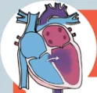
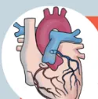

**RECOMMANDATIONS DE PRATIQUES PROFESSIONNELLES**

*de la* **SOCIETE FRANÇAISE D'ANESTHESIE ET REANIMATION (SFAR)**

*en association avec la* **SOCIETE FRANÇAISE DE CARDIOLOGIE (SFC)**

*la* **SOCIETE FRANÇAISE DE PEDIATRIE (SFP)**

*le* **CLUB ANESTHESIE-REANIMATION EN OBSTETRIQUE (CARO)**

*et la* **SOCIETE FRANÇAISE DE CHIRURGIE THORACIQUE ET CARDIO-VASCULAIRE (SFCTCV)**

## **Anesthésie pour chirurgie non cardiaque des patients adultes porteurs de cardiopathie congénitale**

**Guidelines for anaesthesia of adults with congenital heart disease in non-cardiac surgery**

**2023**

**ANNEXES : FICHES PRATIQUES DE PRISE EN CHARGE**## **FICHE PRATIQUE #1 :** Gestion des traitements cardiotropes, anti-arythmiques, anti-hypertenseurs pulmonaires et anticoagulants

*Experts : Diane ZLOTNIK, Pascal AMEDRO*

<table border="1">
<thead>
<tr>
<th></th>
<th colspan="2">Gestion péri opératoire [1,2,3]</th>
<th>Conduite à tenir</th>
</tr>
<tr>
<th>Traitement de l'insuffisance cardiaque</th>
<th><b>La veille de l'intervention</b></th>
<th><b>Le matin de l'intervention</b></th>
<th></th>
</tr>
</thead>
<tbody>
<tr>
<td>Diurétiques</td>
<td>Poursuite</td>
<td>Arrêt</td>
<td>Contrôle de la kaliémie souhaitable Optimisation de la volémie périopératoire</td>
</tr>
<tr>
<td>IEC</td>
<td>Poursuite</td>
<td>Arrêt</td>
<td>Poursuite en cas d'insuffisance cardiaque et/ou FE ventricule systémique &lt; 40%</td>
</tr>
<tr>
<td>Bétabloquants</td>
<td>Poursuite</td>
<td>Poursuite</td>
<td>En l'absence d'urgence, discuter l'arrêt du traitement par le cardiologue congénitaliste référent.</td>
</tr>
<tr>
<td>Inhibiteurs SRAA</td>
<td>Poursuite</td>
<td>Arrêt</td>
<td>Arrêt ≥ 12h (Traitement de l'HTA) Poursuite en cas d'insuffisance cardiaque et/ou FE ventricule systémique &lt; 40%</td>
</tr>
<tr>
<td><i>Anti-arythmiques :</i> - Classe I (Flécaine...) - Classe II, III (Cordarone)</td>
<td>Arrêt Poursuite</td>
<td>Arrêt Poursuite</td>
<td></td>
</tr>
<tr>
<td>Digoxine</td>
<td>Aucune recommandation</td>
<td>Aucune recommandation</td>
<td>En l'absence d'urgence, discuter l'arrêt du traitement par le cardiologue congénitaliste référent.</td>
</tr>
<tr>
<td colspan="4"><b>Traitement antihypertenseur pulmonaire</b></td>
</tr>
<tr>
<td>Sildenafil</td>
<td>Poursuite</td>
<td>Poursuite</td>
<td></td>
</tr>
<tr>
<td>Bosentan</td>
<td></td>
<td></td>
<td></td>
</tr>
<tr>
<td>Prostacycline</td>
<td></td>
<td></td>
<td></td>
</tr>
<tr>
<td colspan="4"><b>Traitement anticoagulant [3,4,5]</b></td>
</tr>
<tr>
<td><i>AOD :</i> - Rivaroxaban - Apixaban - Edoxaban - Dabigatran</td>
<td colspan="2">Voir recommandations GIHP</td>
<td>En l'absence d'urgence, discuter l'arrêt du traitement par le cardiologue congénitaliste référent.</td>
</tr>
<tr>
<td>AVK</td>
<td colspan="2">Interrompre 5 jours avant une chirurgie à <b>risque hémorragique élevé**</b> Relais HBPM ou HNF selon la pathologie catégorie de risque</td>
<td>En absence d'urgence discuter du relais AVK voir de l'arrêt avec le cardiologue congénitaliste référent (en particulier en prévention primaire chez les ventricules uniques)</td>
</tr>
<tr>
<td colspan="4"><b>Agents antiagrégants plaquettaires [6]</b></td>
</tr>
<tr>
<td>Aspirine</td>
<td colspan="2">Dernière prise J-3</td>
<td rowspan="3">Avis d'expert, arrêt sauf en cas de shunt systémico-pulmonaire (blackout-taussig shunt, stent du canal artériel).</td>
</tr>
<tr>
<td>Clopidogrel</td>
<td colspan="2">Dernière prise J-5</td>
</tr>
<tr>
<td>Ticagrelor</td>
<td colspan="2">Dernière prise J-5</td>
</tr>
<tr>
<td>Prasugrel</td>
<td colspan="2">Dernière prise J-7</td>
<td>En absence d'urgence discuter avec le cardiologue congénitaliste référent d'un relais par HBPM ou HNF en post-opératoire.</td>
</tr>
</tbody>
</table>

### **Références**

[1] RFE SFAR Gestion périopératoire des traitements chroniques et dispositifs médicaux 2009

[2] Baumgartner H, De Backer J, Babu-Narayan SV, Budts W, Chessa M, Diller GP et al ESC Scientific Document Group. 2020 ESC Guidelines for the management of adult congenital heart disease. *Eur Heart J*. 2021;42(6):563-645. doi:10.1093/eurheartj/ehaa554.

[3] Gestion des Anticoagulants Oraux Directs pour la chirurgie et les actes invasifs programmés : propositions réactualisées du Groupe d'Intérêt en Hémostase Périopératoire (GIHP)-Septembre 2015

[4] Prise en charge des surdosages en antivitamines K, des situations à risque hémorragique et des accidents hémorragiques chez les patients traités par antivitamines K en ville et en milieu hospitalier GEHT - HAS (service des bonnes pratiques professionnelles) / Avril 2008

[5] Recommendations of good practice for the management of thromboembolic venous disease in adults. Sanchez O, Benhamou Y, Bertoletti L, Constant J, Couturaud F, Delluc A et al. *Rev Mal Respir*. 2019 Feb;36(2):249-283. doi: 10.1016/j.jmr.2019.01.003.

[6] Godier A, et al. Gestion des agents antiplaquettaires pour une procédure invasive programmée. Propositions du Groupe d'intérêt en hémostase périopératoire (GIHP) et du Groupe français d'études sur l'hémostase et la thrombose (GFHT). *Anesth Reanim*. 2018## FICHE PRATIQUE #2 : Les pièges du monitoring chez les patients adultes porteurs de CC

Experts : Catherine KOFFEL, Loïc MACE, Xavier ALACOQUE, Elise LANGOUIET

<table border="1">
<tr>
<td data-bbox="118 708 518 892">
<h3>Pièges et spécificités du monitoring des patients adultes porteurs de cardiopathies congénitales</h3>
</td>
<td data-bbox="118 522 518 708">
<h3>Abord vasculaire</h3>

Antécédents chirurgicaux (ligature, section, séquelle vasculaire après dénudation artérielle...)

Thrombose

Variation anatomique

Échocardiographie détaillée

Comptes rendus opératoires

Échographie doppler des axes vasculaires systématique

Cathéterisation toujours écho guidée, opérateur entraîné, axes distaux prioritairement, sans modification du traitement anticoagulant.

</td>
<td data-bbox="118 336 518 522">
<h3>Monitoring de la pression artérielle</h3>

Asymétrie tensionnelle membres inférieurs membres supérieurs

Si antécédents de chirurgie de coarctation de l'aorte avec un gradient résiduel: La pression au membre supérieur surstime la pression dans l'aorte descendante.

Asymétrie tensionnelle entre les deux membres supérieurs

Ligature/sténose artérielle ou antécèdent de shunt de blalock taussig

Monitoring de la pression artérielle sur le membre contralatéral

</td>
<td data-bbox="118 148 518 336">
<h3>Monitoring PVC</h3>

Risque thromboembolique si shunt intracardiaque droite-gauche

Purge soigneuse des tubulures

Dérivation cavopulmonaire partielle ou totale (Fontan)

PVC = PAP

</td>
<td data-bbox="522 148 925 336">
<h3>RPP SFAR</h3>

Anesthésie pour patients adultes porteurs d'une cardiopathie congénitale en chirurgie non cardiaque.

</td>
</tr>
<tr>
<td data-bbox="522 708 925 892">
<h3>Monitoring SpO2</h3>

Ligature artérielle ou ATCD de shunt type Blalock-Taussig

Changement de site de monitoring si courbe amortie sténose résiduelle

fiabilité si cardiopathie avec hypoxémie profonde

Gazométrie artérielle

</td>
<td data-bbox="522 522 925 708">
<h3>Monitoring EtCO2</h3>

sous-estimation de la PaCO2 par l'EtCO2 si shunt droite gauche

aspect restrictif si ATCD de thoracotomie multiples, lésion nerf phrénique

Gazométrie artérielle

</td>
<td data-bbox="522 336 925 522">
<h3>Monitoring débit cardiaque</h3>

Swan Ganz

Interprétation difficile si shunt intracardiaque ou insuffisance tricuspidé

Thermodilution (PiCCO)

Calibration et interprétation difficile si shunt intracardiaque ou insuffisance tricuspidé

Doppler transoesophagien

Non validé dans les cardiopathies congénitales

Difficile interprétation dans les cardiopathies complexes, varices œsophagiennes chez FONTAN

</td>
<td data-bbox="522 148 925 336"></td>
</tr>
</table>## **FICHE PRATIQUE #3 :** Principes d'anesthésie des patients porteurs de CC hors chirurgie cardiaque

Experts : Bernard CHOLLEY, Nadir TAFER

# Principes d'anesthésie des cardiopathies congénitales hors chirurgie cardiaque.

## Shunt droit-gauche

Diminuer le shunt, en baissant les RVP et en augmentant les RVS.

### Baisser les RVP :

- -Anesthésie, analgésie suffisante pour éviter toute vasoconstriction sympathique.
- -FiO2 élevée,
- -Ventilation alvéolaire (objectif normocapnie, on préfère une légère hypocapnie à une hypercapnie). Attention, l'hypocapnie diminue le débit sanguin cérébral. De plus, l'EtCO2 sous-estime la PaCO2 en cas de shunts Droite – Gauche)
- -PEP minimale
- -NO inhalé (objectif de concentration inhalée : environ 10 ppm)

### Augmenter les RVS :

Éviter une anesthésie trop profonde (sympatholyse : vasoplégie). Vasopresseurs : recourir à la noradrénaline IVSE pour corriger une éventuelle vasoplégie, plutôt qu'à des injections en bolus dont l'effet est plus brutal.

### Particularités de prise en charge anesthésique en cas d'HTAP :

- -Maintenir les traitements anti-HTAP déjà en cours
- -Assurer une PAM identique à celle du sujet éveillé en utilisant de la noradrénaline IVSE.
- -Monitoring par catheter artériel avant induction
- -Éviter l'acidose, l'hypothermie, le stress et la douleur (pourvoyeurs de vasoconstriction artérielle pulmonaire)
- -Baisser les RVP : Viser la normocapnie, FiO2 élevée pour éviter tout vasoconstriction hypoxique surajoutée. Vasodilatateurs pulmonaires : NO inhalé (objectif de concentration inhalée : environ 10 ppm), même si le patient est déjà traité par donneur de NO (sildenafil).
- -En cas de défaillance ventriculaire droite malgré les précautions ci-dessus, un support inodilatateur comme la dobutamine, la milrinone ou le levosimendan peut être envisagé mais présente des risques. La dobutamine est tachycardisante et arythmogène, la milrinone et le levosimendan exposent tous au risque d'hypotension artérielle systémique et donc de réduction de la perfusion coronaire dont les conséquences peuvent être plus délétères que leur action sur la circulation pulmonaire et l'inotropisme. De plus, les demi-vies de la milrinone et du levosimendan sont très longues, ce sont donc des médicaments de dernier recours.

## Shunt gauche-droit

Ne pas aggraver le shunt, en évitant de baisser les RVP et en évitant d'augmenter les RVS.

### Ne pas baisser les RVP :

- Éviter une FiO2 élevée
- Éviter une hyperventilation alvéolaire (objectif normocapnie, on préfère tolérer une légère hypercapnie qu'une hypocapnie)
- Éviter un hématocrite bas (la baisse de viscosité augmente le débit, donc le shunt)
- Appliquer une PEP

### Ne pas augmenter les RVS :

- Éviter tout défaut d'anesthésie, d'analgésie (stimulation sympathique et vasoconstriction)
- Éviter l'hypothermie.

## Le ventricule droit systémique

L'évaluation du VD systémique est difficile, il faut le considérer à potentiel de défaillance élevé notamment en présence d'une insuffisance tricuspidale et d'arythmie.

- -Il faut baisser la post charge et maintenir une bonne pression de perfusion.
- -Un support inotrope peut être utile.

## Cardiopathies du coeur gauche

### Pour les pathologies avec obstacle à l'éjection du VG

il faut éviter :

- -La tachycardie qui limite le VES,
- -L'hypotension qui réduit la perfusion coronaire alors que la demande métabolique est très élevée du fait de la contrainte pariétale myocardique en systole.

### Pour les pathologies d'insuffisance valvulaire

il faut éviter ;

- -La bradycardie qui favorise la surcharge en volume régurgitant
- -L'hypertension qui majore la régurgitation pendant la diastole.

Dans tous les cas : La tolérance aux apports liquidiens comme au défaut de remplissage est réduite, il faut donc obligatoirement se doter d'un monitoring du VES, réaliser une épreuve de maximisation du VES et titrer le remplissage par petites fractions (100 mL).

## Le ventricule unique

En l'absence d'un VD, dans une circulation Fontan, le débit cardiaque dépend du gradient moteur du retour veineux pulmonaire entre la pression veineuse systémique moyenne et la pression d'aval, qui n'est plus la pression de l'oreillette droite mais la pression de l'artère pulmonaire. La prise en charge anesthésique vise à optimiser le débit pulmonaire qui est passif et surtout à limiter les facteurs qui pourraient contribuer à réduire le gradient et donc le débit cardiaque :

- -Privilégier l'ALR s'il s'agit d'une intervention compatible et sans risque d'instabilité hémodynamique (saignement prévisible < 500 mL)
- -Si l'AG avec ventilation en pression positive est incontournable, utiliser une ventilation protectrice avec une PEP minimale.
- -On peut utiliser un monitoring du volume d'éjection systolique (VES)
- -La pression dans le territoire cave supérieur (PVC) équivalent à la pression dans l'artère pulmonaire (PAP), constituant un déterminant important du débit pulmonaire dans une circulation de Fontan, tout en étant le reflet de la volémie contrainte de cette circulation univentriculaire.
- -La mesure de la pression artérielle en continu peut être utile pour ne pas tolérer une PAM trop basse trop longtemps Cependant, une baisse de résistance artérielle périphérique secondaire à l'anesthésie est constante, elle est souvent très bien tolérée par le ventricule défaillant dont l'éjection se trouve facilitée. Cependant, une baisse de PAM incompatible avec une perfusion coronaire adéquate devra faire l'objet d'une correction par noradrénaline IVSE comme chez tout patient sans CC.
- -Le NO inhalé doit être à disposition dans le bloc car son effet vasodilatateur pulmonaire sélectif en fait un outil irremplaçable pour faciliter le retour veineux à travers la circulation pulmonaire. En cas de baisse du VES ne répondant pas à un remplissage de 100 mL, il faut recourir au NO. Il faut monitorer l'effet de l'arrêt du NO sur le VES avant de réveiller le patient.
- -Corriger méthodiquement tous les facteurs prédisposant à la FA (hypokaliémie, hypomagnésémie). Éviter le recours à la dobutamine (très arythmogène) sauf s'il existe une défaillance avérée du ventricule unique (à confirmer par une ETO).
- -Extuber le plus rapidement possible en fin d'intervention pour supprimer la pression positive intra-thoracique qui gêne le retour veineux. En attendant que l'extubation soit possible, il peut être bénéfique de positionner le patient en « beach chair » (thorax relevé à 30° et jambes surélevées) pour faciliter le retour veineux.

## Les anomalies coronaires

Les patients porteurs d'anomalies coronaires congénitales réparées (à risque de sténose ostiale) méritent les mêmes précautions de prise en charge péri-opératoire que les patients coronariens non congénitaux.

- -Un monitoring continu de la pression artérielle
- -Une induction progressive (idéalement en AIVOC) pour limiter le risque d'hypotension systémique. En cas d'hypotension, une correction par noradrénaline IVSE permettra de limiter le risque d'hypoperfusion coronaire.

RPP SFAR : Anesthésie pour patients adultes porteurs d'une cardiopathie congénitale en chirurgie non cardiaque.**FICHE PRATIQUE #4 :** Protocole pour l'anesthésie en urgence d'un patient porteur d'une HTAP iso- ou supra-systémique

Experts : Bernard CHOLLEY, Élise LANGOUE, Nadir TAFER

## Prise en charge anesthésique en situation de **syndrome d'Eisenmenger**

proposition votée par les experts

### Ce qu'il faut comprendre

Le **syndrome d'Eisenmenger** est une **HTAP fixée par remodelage vasculaire** pulmonaire réactionnel à un hyperdébit pulmonaire prolongé. On le retrouve dans des cas de **cardiopathies congénitales** avec shunt gauche-droite **non réparé**. Ce syndrome se traduit cliniquement par une cyanose par **inversion du shunt qui devient droit-gauche** lorsque la pression dans l'OD devient supérieure à la pression dans l'OG (shunt à l'étage auriculaire) ou lorsque la PAP devient supra-systémique (shunt à l'étage ventriculaire). L'anesthésie entraîne une baisse de la résistance artérielle systémique et potentiellement une baisse de la pression artérielle. Le VD qui fait face à une post-charge augmentée ne peut pas tolérer une baisse de son **débit coronaire** qui dépend de la pression aortique. Toute baisse de pression artérielle systémique lors de l'induction d'anesthésie s'accompagnera donc d'une baisse de débit coronaire et d'un risque de défaillance ischémique aiguë du VD. **Toute hypoxémie et hypercapnie majorera la vasoconstriction artérielle pulmonaire et aggraverait l'HTAP.**

### Ventilation

#### **Abaisser les résistances vasculaires pulmonaires**

- • FiO2 élevée
- • Normocapnie (éviter toute hypercapnie)
- • Baisse des pressions de ventilation
- • PEEP minimale

### Hémodynamique

#### **Maintenir les traitements anti HTAP Maintenir dans les mêmes conditions hémodynamique qu'à l'état stable et abaisser les RVP**

- • Noradrénaline prête si vasoplégie
- • NO inhalé à disposition au bloc
- • Inotropes si défaillance VD (Milrinone, dobutamine, lévosimendan)
- • titration du remplissage
- • transfusion si baisse Hb  $\geq 2\text{g/dL}$
- • PA invasive sauf si chirurgie mineure

### Anesthésie

#### **Limitier la vasoplégie**

- • Préferer l'ALR périphérique
- • Prudence si ALR centrale: préférer une modalité titrée
- • Induction prudente et AG titrée (AIVOC)

#### **Post op**

- • Eviter l'hypercapnie, l'hypothermie
- • Analgésie suffisante
- • NOi à disposition

### Cyanose

#### **Témoin de l'hypoxémie, polyglobulie:**

- • Risque thromboembolique élevé.
- • Tendance hémorragique .
- • Risque infectieux majoré : endocardites

**Purge soigneuse les lignes de perfusion: risque d'embolies systémiques paradoxales**

RPP SFAR Anesthésie pour patients adultes porteurs d'une cardiopathie congénitale en chirurgie non cardiaque.**FICHE PRATIQUE #5** : Protocole pour l'anesthésie en urgence d'un patient porteur d'une dérivation cavo-pulmonaire (Fontan)

Experts : Bernard CHOLLEY, Elise LANGOUE, Nadir TAFER

## Prise en charge anesthésique en situation de **Circulation de Fontan**

Proposition votée par les experts

### Ce qu'il faut comprendre

La **circulation de Fontan** est un montage chirurgical palliatif dans le cadre d'un ensemble de cardiopathies dites à ventricule unique. Dans ce montage, le ventricule sous-pulmonaire est absent, **Le retour veineux systémique se fait passivement** selon le gradient entre la pression veineuse systémique en amont, et l'artère pulmonaire en aval. **Toute élévation de la pression intra-thoracique et toute vasoconstriction artérielle pulmonaire vont augmenter la pression d'aval et donc réduire le débit de retour veineux et le débit cardiaque.**

### Ventilation

#### **Abaisser les résistances vasculaires pulmonaires**

- • FiO2 élevée
- • Normocapnie (éviter hypercapnie)
- • NO inhalé à disposition en salle
- • Baisse des pressions de ventilation
- • PEEP minimale
- • Extubation la plus précoce possible

### Hémodynamique

#### **Abaisser les résistances vasculaires pulmonaires, maintenir la précharge VU**

- • Titration du remplissage guidé par la mesure du VES+++
- • Noradrénaline prête si vasoplégie
- • Transfusion si baisse Hb  $\geq 2\text{g/dL}$
- • La PVC mesurée dans la VCS équivaut à la PAP dans une circulation de FONTAN
- • PA invasive sauf si chirurgie mineure
- • Inotropes si défaillance du VU avec précautions à cause de l'effet vasodilatateur (Milrinone, dobutamine, lévosimendan)

### Anesthésie

#### **Limitier la vasoplégie**

- • Préferer l'ALR périphérique ou centrale titrée
- • Induction progressive et AG titrée (AIVOC)
- • position beach-chair (thorax relevé 30° et jambes surélevée) en SSPI

### Chirurgie

#### **Ne pas diminuer le retour veineux**

- • La technique chirurgicale doit tenir compte des contraintes circulatoires en évitant toute gêne au retour veineux systémique
- • La coelioscopie est possible: Pressions d'insufflation minimales et contrôle de l'hypercapnie. Conversion en laparotomie en cas de mauvaise tolérance étayée par une baisse du VES ne répondant pas au remplissage titré

RPP SFAR Anesthésie pour patients adultes porteurs d'une cardiopathie congénitale en chirurgie non cardiaque.## FICHE PRATIQUE #6 : Conduite à tenir par situation physiopathologiques en anesthésie obstétricale

Experts : Estelle MORAU, Marie BRUYERE, Magali LADOUCEUR

# Conduite à tenir en anesthésie obstétricale des cardiopathies congénitales

## Shunt droit-gauche

La diminution des RVS augmente le shunt droit-gauche et le risque de cyanose  
Dans les cardiopathies cyanogènes avec obstacle pulmonaire non réparées l'augmentation du volume sanguin circulant est bénéfique pour augmenter la précharge droite et le flux de sang pulmonaire.  
Le statut hypercoagulable expose au risque de thrombose dans les artères pulmonaires  
Les cardiopathies cyanotiques sont probablement associées à des anomalies de l'hémostase primaire  
Risque infectieux (embole septique/endocardite)

**Maintenir les RVS :**  
Monitoring invasif de la pression artérielle (cathéter artériel)  
Traiter les épisodes de cyanose avec une amine vasopressive (noradrénaline) particulièrement si associé à hypotension  
ALR titrée pour AVB ou césarienne, surveillance de la levée du bloc (et signes neurologiques)  
Titration de l'ocytocine, éviter les PGF2 (carboprost)

**Attention au risque d'embolie paradoxale :**  
Mettre des filtres sur les voies veineuses  
Utiliser la technique de mandrin liquide pour ALR

**Discuter une anticoagulation préventive en post-partum**

**Maintenir le retour veineux :**  
Décubitus latéral gauche  
détection et traitement rapide de l'HPP

**Abaisser les RVP :**  
Administration d'O2, éviter la sédation, l'hypoventilation et l'hypercapnie

**Traitement large des infections gynécologiques :**  
Prévention de l'endocardite infectieuse si rupture prématurée des membranes (Les doses recommandées sont : Amoxicilline 2 g IV dose de charge puis Amoxicilline 1 g IV/PO toutes les 6h ESC 2015)

## Shunt gauche-droit

La diminution des RVS diminue le shunt gauche droit  
L'augmentation de volume sanguin peut décompenser la patiente déjà en hypervolémie

**Ne pas baisser les RVP :**  
Éviter l'administration d'O2  
Éviter une hyperventilation alvéolaire  
Éviter un hématocrite bas (la baisse de viscosité augmente le débit, donc le shunt, traiter rapidement l'HPP)

**Ne pas augmenter les RVS :**  
Éviter l'administration excessive de fluides, la position de trendelenbourg  
ALR titrée et efficace  
Éviter l'hypothermie

## Insuffisance cardiaque gauche

L'augmentation du volume sanguin et du débit cardiaque majeure le risque d'OAP  
Arrêter les IEC avant grossesse  
Un ATCD de CMPP augmente le risque de décompensation cardiaque  
Mauvais pronostic si FEVG <30%

**Optimiser la perfusion coronaire :**  
Maintenir une euvolémie  
Surveillance continue, monitoring invasif de la pression artérielle.  
Administer de l'O2

**faciliter la postcharge du ventricule systémique :**  
APD efficace  
Éviter la bradycardie et l'hypertension

## HTAP - Eisenmenger

L'augmentation du débit cardiaque est mal tolérée par la vascularisation pulmonaire et met en risque le ventricule droit (VD)  
La diminution des RVs peut diminuer la PAD et donc la perfusion coronaire (particulièrement si le VD est hypertrophié)  
Le statut hypercoagulable expose au risque d'embolie pulmonaire (majoration de l'HTAP)  
La rétraction utérine entraîne une augmentation brutale de la précharge qui peut aboutir à une poussée HTAP et défaillance cardiaque droite

*Type d'accouchement proposé : Césarienne programmée sous APD titrée*

Minimiser les résistances vasculaires pulmonaires :

- Administer de l'O2, éviter la sédation et l'hypercapnie
- Privilégier l'ALR
- Maintenir le volume circulant et le retour veineux
- Balance entrée-sortie équilibrée
- Surveillance tensionnelle rapprochée (cathéter artériel)
- Détection rapide et traitement intensif HPP
- Éviter les dépresseurs myocardiques (Bêta bloquants)
- Monitoring précis pour dépister ischémie et arythmie : ECG 5 branches
- Maintien de la postcharge
- ALR titrée
- Phényphrine comme vasopresseur de choix (éviter les traitements tachycardisants)
- Titration de l'ocytocine, éviter les PGF2 (carboprost)
- Équipe de référents sur place (ECMO)

## Insuffisance cardiaque gauche

L'augmentation du volume sanguin et du débit cardiaque majoré le risque d'OAP  
Arrêter les IEC avant grossesse  
Un ATCD de CMPP augmente le risque de décompensation cardiaque  
Mauvais pronostic si FEVG <30%

Maintenir une normovolémie

- APD efficace
- Éviter la bradycardie et l'hypertension
- Surveillance continue incluant SpO2, voire monitoring invasif
- Administer de l'O2,

## Aortopathies

La grossesse et l'accouchement peuvent augmenter la dilatation de la racine aortique et le risque de dissection  
Les manœuvres de Valsalva augmentent le risque de cisaillement artériel (/\ AVB)

*Césarienne programmée en cas de Marfan > 40 mm (ou ATCD de dissection), Bicuspidie > 50 mm, Turner + surface aortique indexée > 25 mm/m2, Fallot >50 mm, Ehlers-Danlos vasculaire quelque soit le diamètre, coarctation aortique > 50 ou syndrome aortique aigu*

Limitier le stress sur la paroi aortique :

- ALR efficace titrée
- Poursuite des bêtabloquants
- Maintien de la stabilité hémodynamique
- Monitoring invasif (cathéter artériel)
- Titration de l'ocytocine
- Détection et traitement rapide de l'HPP

## Insuffisance mitrale/aortique

La diminution des RVS diminue le shunt gauche droit  
L'augmentation de volume sanguin peut décompenser la patiente déjà en hypervolémie.  
La diminution des RVS diminue le volume des régurgitations  
L'hypervolémie de la grossesse peut aggraver la dilatation ventriculaire

Eviter l'augmentation de postcharge et la bradycardie.  
Favoriser l'éphédrine, la noradrénaline, éviter les  $\alpha$ -agonistes  
ALR généralement bien tolérée si fonction VG conservée

## Insuffisance pulmonaire ou tricuspide sévère

Généralement bien tolérée, dépend beaucoup de la fonction VD  
L'hypervolémie de la grossesse peut conduire à une insuffisance cardiaque droite  
Si notion de conduit et/ou de bioprotèse pulmonaire, il existe un risque infectieux  
La dilatation des cavités droites et le stress hémodynamique induit par la grossesse peut favoriser la survenue de trouble du rythme surtout en cas d'antécédent d'arythmie

Eviter l'augmentation excessive de la précharge et la bradycardie  
Balance entrée-sortie équilibrée  
Favoriser l'éphédrine, la noradrénaline.  
Prévention de l'endocardite infectieuse si rupture prématurée des membranes (Les doses recommandées sont : Amoxicilline 2 g IV dose de charge puis Amoxicilline 1 g IV/PO toutes les 6h ESC 2015)

## Sténose pulmonaire serrée (en l'absence de CIV)

Risque de bas d' débit en cas de chute de la précharge  
Risque rythmique auriculaire et ventriculaire  
Si bioprotèse, risque d'endocardite

Maintenir le volume circulant et le retour veineux  
Balance entrée sortie équilibrée  
Surveillance tensionnelle rapprochée (cathéter artériel)  
Détection rapide et traitement intensif HPP

## Valve mécanique

La diminution des RVS diminue le shunt gauche droit  
L'augmentation de volume sanguin peut décompenser la patiente déjà en hypervolémie  
L'état d'hypercoagulabilité augmente le risque de thrombose de valve  
Les AVK sont les plus efficaces dans la prévention de la thrombose mais tératogènes  
L'anticoagulation à dose efficace en péripartum augmente le risque hémorragique

Balance bénéfice-risque entre fenêtre possible de traitement anticoagulant et technique anesthésique :  
Prévention de l'endocardite infectieuse si rupture prématurée des membranes (Les doses recommandées sont : Amoxicilline 2 g IV dose de charge puis Amoxicilline 1 g IV/PO toutes les 6h ESC 2015)  
Monitoring jusqu'en postpartum incluant surveillance de la thrombose de valve et de l'hémorragie du post-partum

Meng ML, Arendt KW. Obstetric Anesthesia and Heart Disease: Practical Clinical Considerations. Anesthesiology. 2021 Jul 1;135(1):164-183. doi: 10.1097/ALN.0000000000003833. PMID: 34046669; PMCID: PMC8613767. (revu d'après Lindley et al JACC 2021 et 2018 ESC guideline)

RPP SFAR : Anesthésie pour patients adultes porteurs d'une cardiopathie congénitale en chirurgie non cardiaque.