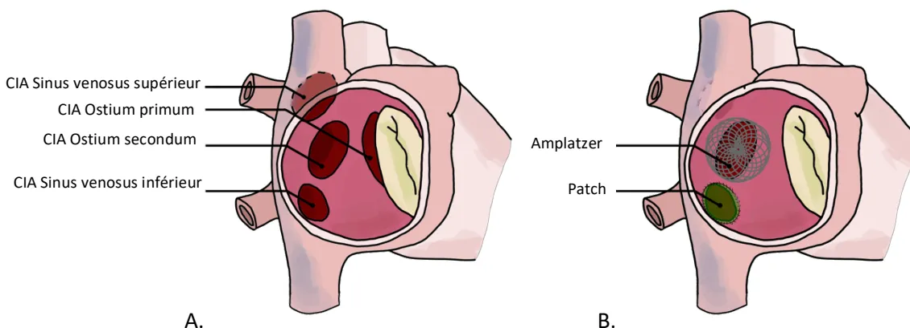
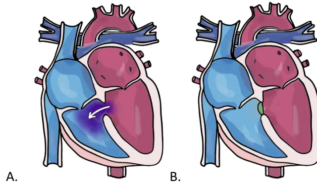
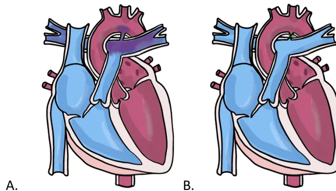
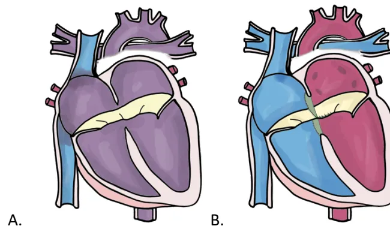
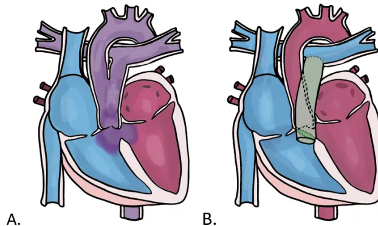
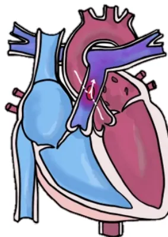
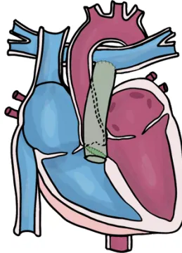
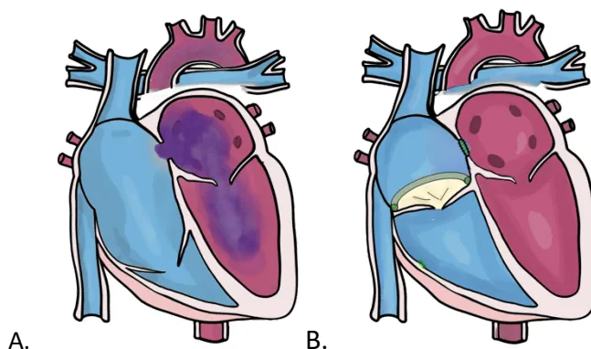
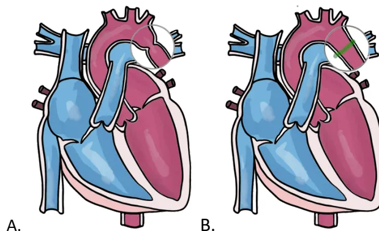

## RECOMMANDATIONS DE PRATIQUES PROFESSIONNELLES

*de la* **SOCIÉTÉ FRANÇAISE D'ANESTHESIE ET REANIMATION (SFAR)**

*en association avec la* **SOCIÉTÉ FRANÇAISE DE CARDIOLOGIE (SFC)**

*la* **SOCIÉTÉ FRANÇAISE DE PÉDIATRIE (SFP)**

*le* **CLUB ANESTHESIE-REANIMATION EN OBSTÉTRIQUE (CARO)**

*et la* **SOCIÉTÉ FRANÇAISE DE CHIRURGIE THORACIQUE ET CARDIO-VASCULAIRE (SFCTCV)**

# **Anesthésie pour chirurgie non cardiaque des patients adultes porteurs de cardiopathie congénitale**

**Guidelines for anaesthesia of adults with congenital heart disease in non-cardiac surgery**

**2023**

Texte validé par le Comité des Référentiels Cliniques de la SFAR le 10/04/2023 et le Conseil d'Administration de la SFAR le 20/04/2023, le Conseil d'Administration de la FCPC (filiale de cardiologie pédiatrique et congénitale de la SFC) le 27/05/2023, le Conseil d'Administration de la SFP le 11/05, le Conseil d'Administration de la SFCTCV le 11/05/2023, et le Conseil d'Administration du CARO le 05/05/2023.

**Auteurs :** Nadir Tafer, Elise Langouet, Xavier Alacoque, Pascal Amedro, Miréla Bojan, Marie Bruyère, Bernard Cholley, Catherine Koffel, Magalie Ladouceur, Stéphane Lebel, Bertrand Leobon, Loïc Mace, Estelle Morau, Caroline Ovaert, Jean-Benoît Thambo, Diane Zotnik, Hugues de Courson, Marc-Olivier Fischer

**Auteur pour correspondance :** Nadir Tafer (nadir.tafer@chu-bordeaux.fr)**Coordonnateur d'expert :** Nadir Tafer

**Organisateurs :** Marc-Olivier Fischer et Hugues de Courson pour le CRC de la SFAR

**Groupe d'experts SFAR (ordre alphabétique) :** Xavier Alacoque, Mirela Bojan, Marie Bruyère, Bernard Cholley, Catherine Koffel, Elise Langouet, Stéphane Lebel, Estelle Morau, Diane Zotnik

**Experts SFC (ordre alphabétique) :** Magalie Ladouceur, Jean-Benoît Thambo

**Experts SFP (ordre alphabétique) :** Pascal Amedro, Caroline Ovaert

**Experts SFCTCV (ordre alphabétique) :** Bertrand Leobon, Loïc Mace

**Illustratrice :** Elise Langouet (SFAR Bordeaux)

**Groupes de Lecture :**

*Comité des Référentiels clinique de la SFAR :* Marc Garnier (Président), Alice Blet (Secrétaire), Anaïs Caillard, Hélène Charbonneau, Isabelle Constant (représentante du CA), Hugues de Courson, Marc-Olivier Fischer, Denis Frasca, Matthieu Jabaudon, Daphné Michelet, Stéphanie Ruiz, Michael Vourc'h, Maxime Nguyen

*Conseil d'Administration de la SFAR :* Pierre Albaladéjo (Président); Jean-Michel Constantin (1er vice-président); Marc Léone (2ème vice-président); Karine Nouette-Gaulain (secrétaire général); Frédéric Le Saché (secrétaire général adjoint); Marie-Laure Cittanova (trésorière); Isabelle Constant (trésorière adjointe); Julien Amour; Hélène Beloeil; Valérie Billard; Marie-Pierre Bonnet; Julien Cabaton; Vincent Collange; Evelyne Combettes; Marion Costecalde; Violaine D'ans; Laurent Delaunay; Delphine Garrigue; Pierre Kalfon; Olivier Joannes-Boyau; Frédéric Lacroix; Jane Muret; Olivier Rontes; Nadia Smail.**Liens d'intérêts des experts SFAR au cours des cinq années précédant la date de validation par le CA de la SFAR.**

Nadir Tafer : pas de lien d'intérêt en rapport avec la présente RPP.

Elise Langouet : pas de lien d'intérêt en rapport avec la présente RPP.

Xavier Alacoque : pas de lien d'intérêt en rapport avec la présente RPP.

Pascal Amedro : pas de lien d'intérêt en rapport avec la présente RPP.

Miréla Bojan : pas de lien d'intérêt en rapport avec la présente RPP.

Marie Bruyère : pas de lien d'intérêt en rapport avec la présente RPP.

Bernard Cholley : pas de lien d'intérêt en rapport avec la présente RPP.

Catherine Koffel : pas de lien d'intérêt en rapport avec la présente RPP.

Magalie Ladouceur : pas de lien d'intérêt en rapport avec la présente RPP.

Stéphane Lebel : pas de lien d'intérêt en rapport avec la présente RPP.

Bertrand Leobon : pas de lien d'intérêt en rapport avec la présente RPP.

Loïc Mace : pas de lien d'intérêt en rapport avec la présente RPP.

Estelle Morau : pas de lien d'intérêt en rapport avec la présente RPP.

Caroline Ovaert : pas de lien d'intérêt en rapport avec la présente RPP.

Jean-Benoît Thambo : Proctoring Abbott et Medtronic.

Diane Zotnik : rémunération d'une communication orale à un symposium.

Hugues de Courson : pas de lien d'intérêt en rapport avec la présente RPP.

Marc-Olivier Fischer : pas de lien d'intérêt en rapport avec la présente RPP.## RÉSUMÉ

*Objectif.* Émettre des recommandations pour l'anesthésie de patients adultes porteurs de cardiopathie congénitale en dehors de la chirurgie cardiaque.

*Conception.* Un comité de 16 experts issus de 4 sociétés savantes a été constitué. Une politique de déclaration et de suivi des liens d'intérêts a été appliquée et respectée durant tout le processus de réalisation du référentiel. De même, celui-ci n'a bénéficié d'aucun financement provenant d'une entreprise commercialisant un produit de santé (médicament ou dispositif médical). Le comité devait respecter et suivre la méthode GRADE® (*Grading of Recommendations Assessment, Development and Evaluation*) pour évaluer la qualité des données factuelles sur lesquelles étaient fondées les recommandations.

*Méthodes.* Après formulation de chaque question au format PICO (*Patients, Intervention, Comparison, Outcome*), une analyse de la littérature a été réalisée par les experts selon la méthodologie GRADE® pour 4 champs majeurs : évaluation pré-opératoire, prise en charge peropératoire, prise en charge postopératoire, prise en charge obstétricale.

*Résultats.* Le travail de synthèse des experts et l'application de la méthode GRADE ont abouti à 11 avis d'experts, la méthode GRADE ne pouvant pas s'appliquer entièrement jusqu'à l'analyse quantitative par manque d'étude de haut niveau de preuve.

*Conclusion.* Onze recommandations portant sur la prise en charge anesthésique des adultes porteurs de cardiopathies congénitales hors chirurgie cardiaque ont été formulées. Toutes ont obtenu un accord fort des experts.

**Mots-clés :** recommandation, cardiologie, cardiopathie congénitale, médecine périopératoire## ABSTRACT

*Objective.* To provide guidelines for the anesthetic management of adult patients with congenital heart disease for non-cardiac surgery.

*Design.* A consensus committee of 16 experts was convened. A formal conflict-of-interest (COI) policy was developed at the beginning of the process and enforced throughout. The entire guidelines process was conducted independently of any industrial funding (i.e. pharmaceutical, medical devices). The authors were required to follow the rules of the Grading of Recommendations Assessment, Development and Evaluation (GRADE®) system to guide assessment of quality of evidence. The potential drawbacks of making strong recommendations in the presence of low-quality evidence were emphasized.

*Methods.* The committee studied 15 questions within 4 fields: preoperative evaluation, intraoperative management, postoperative care, obstetrical field. Each question was formulated in a PICO (Patients Intervention Comparison Outcome) format and the evidence profiles were produced. The literature review and recommendations were made according to the GRADE® methodology.

*Results.* The experts' synthesis work and the application of the GRADE® method resulted in 11 expert's opinions. All questions did not find any response in the literature. After one round of scoring, strong agreement was reached for all recommendations.

*Conclusions.* There was strong agreement among experts for 11 recommendations to improve practices for the anesthetic management of adult patients with congenital heart disease for non-cardiac surgery.

**Keywords:** guidelines, congenital heart disease, non-cardiac surgery, anesthesia## ABBREVIATIONS

**ACHD** : adult with congenital heart disease

**AG** : anesthésie générale

**AHA** : American heart association

**ALCAPA** : anomalous left coronary artery from the pulmonary artery

**ALR** : anesthésie locorégionale

**AOD** : Anticoagulant oral direct

**APD** : anesthésie péridurale

**APD** : artère pulmonaire droite

**APG** : artère pulmonaire gauche

**APSI** : atrésie pulmonaire à septum fermé

**APSO** : atrésie pulmonaire à septum ouvert

**AVK** : anti-vitamine K

**BAV** : bloc atrio-ventriculaire

**BTS** : Blalock-Taussig shunt

**CAP** : canal artériel persistant

**CAV** : canal atrio-ventriculaire

**CC** : cardiopathie congénitale

**CCC** : cardiopathie congénitale complexe

**CIA** : communication inter-atriale

**CIV** : communication interventriculaire

**DC** : débit cardiaque

**DCPP** : dérivation cavopulmonaire partielle

**DCPT** : dérivation cavopulmonaire totale

**ESA** : extra-systole atriale

**ESC** : European society of cardiology

**ESV** : extra-systole ventriculaire

**EtCO2** : CO2 télé-expiratoire

**FA** : fibrillation atriale

**FAV** : fistule artério-veineuse

**FiO2** : fraction inspirée en dioxygène

**FOP / PFO** : foramen oval perméable

**HAS** : haute autorité de santé

**HTAP** : hypertension artérielle pulmonaire

**HVG** : hypertrophie ventriculaire gauche

**IAo** : insuffisance aortique

**IEC** : Inhibiteur de l'enzyme de conversion

**IM** : insuffisance mitrale

**IT** : insuffisance tricuspidale

**JET** : junctional ectopic tachycardia

**M3C** : Réseau malformations cardiaques congénitales complexes

**OD** : oreillette droite

**OG** : oreillette gauche

**PaCO2** : Pressions partielle artérielle en dioxyde de carbone

**PAP (s/d/m)** : pressions artérielle pulmonaire (systolique/diastolique/moyenne)

**PEEP** : pression télé-expiratoire positive

**PNDS** : plan national de soin

**PVC** : pression veineuse centrale

**Rao** : rétrécissement aortique

**RM** : rétrécissement mitral

**RP** : rétrécissement pulmonaire

**RVP** : résistances vasculaires pulmonaires

**RVPA** : retour veineux pulmonaire anormal

**RVS** : résistances vasculaires systémiques

**SFC** : société française de cardiologie

**SIA** : septum inter-atrial

**SIV** : septum interventriculaire

**TAC** : tronc artériel commun

**TAP** : tronc de l'artère pulmonaire

**TGV** : transposition des gros vaisseaux

**TOF** : tétralogie de Fallot

**TV** : tachycardie ventriculaire

**VCI** : veine cave inférieure

**VCS** : veine cave supérieure

**VD** : ventricule droit

**VD-AP** : ventricule droit-artère pulmonaire

**VDDI** : ventricule droit à double issue

**VG** : ventricule gauche## **1. INTRODUCTION**

### **1.1 Préambule**

Anesthésier un patient adulte porteur d'une cardiopathie congénitale (CC) peut être une source d'inquiétude pour le médecin anesthésiste-réanimateur travaillant dans un centre non expert de ces pathologies. La complexité des anomalies et des réparations chirurgicales dont ces patients sont souvent porteurs, ainsi qu'une possible insuffisance cardiaque (droite, gauche, ou globale) associée et/ou une hypertension artérielle pulmonaire (HTAP) sévère font que ces patients sont à haut risque de décompensation périopératoire. L'anesthésie est source de perturbations hémodynamiques dont les conséquences potentielles seront majorées en cas de cardiopathie congénitale sous-jacente.

Pour l'anesthésiste-réanimateur non habitué à prendre en charge ce type de patient, la solution la plus simple et la plus sûre, quand elle est possible, consiste à référer le patient vers un centre spécialisé, ce qui est préconisé par la plupart des recommandations sur la prise en charge des adultes porteurs de cardiopathie congénitale (ACHD) [1,2]. Cependant, ces recommandations ne donnent aucun conseil quant à la prise en charge anesthésique de tels patients. La seule revue publiée concernant la gestion anesthésique des patients adultes atteints de cardiopathie congénitale devant bénéficier d'une chirurgie non cardiaque suggère, elle aussi, une prise en charge multidisciplinaire dans un centre spécialisé [3].

Le but de ces recommandations est de guider de façon pratique la conduite à tenir pré, per et postopératoire du patient adulte porteur de CC qui ne pourrait être référé en centre expert du fait du caractère urgent de la chirurgie, mais aussi de permettre de reconnaître les situations les moins à risque de complications qui peuvent être prises en charge chirurgicalement en dehors des centres experts en cardiopathie congénitale.

Nous allons d'abord dresser un panorama des grands types de cardiopathies congénitales pour les séparer en 3 groupes : 1) celles ne posant aucun problème particulier et dont l'anesthésie est similaire à tout autre patient, 2) celles à risque modéré et qui peuvent justifier une attention particulière, et 3) celles à haut risque de décompensation aiguë périopératoire [4].

### **1.2 Épidémiologie**

Les cardiopathies congénitales (CC) se rencontrent chez près de 0,8 % des naissances vivantes et sont l'une des malformations congénitales les plus fréquentes [5].

L'amélioration de la prise en charge des cardiopathies congénitales notamment celles nécessitant une intervention durant la période néonatale a considérablement modifié le pronostic et l'espérance de vie des patients.

Les remarquables progrès thérapeutiques effectués ont permis une amélioration de la survie à la chirurgie correctrice de la cardiopathie qui avoisine 95 % [6]. En conséquence, 98 % des patients atteints de malformations cardiaques de gravité légère, 90 % des patients atteints de malformations cardiaques de gravité moyenne et 56 % souffrant de malformations cardiaques complexes dépassent désormais l'âge de 18 ans [7]. La croissance annuelle de cette population est estimée à environ 5 %. La problématique de prise en charge anesthésique pour chirurgie non cardiaque de ces patients adultes, porteurs de cardiopathie congénitale, simple ou complexe, corrigée ou non, va inévitablement devenir plus fréquente.### **1.3 Réseau de soins**

La prise en charge cardiologique médicale et/ou chirurgicale dans des centres experts assure une meilleure survie de ces patients, en particulier ceux atteints de cardiopathies congénitales (CC) complexes [1].

Depuis de nombreuses années, beaucoup de patients adultes sortaient du système de soins ou n'étaient jamais référés aux centres experts adultes par manque de réseau spécifique de prise en charge. Les plans "maladies rares" successifs, notamment ceux de 2011 et de 2017, ont permis la reconnaissance d'un réseau national de prise en charge autour des CC complexes (réseau M3C) au sein de la filière Cardiogen (Annexe 1). Le réseau M3C s'appuie aujourd'hui sur 23 centres de référence et de compétences distribués dans toutes les régions françaises, y compris les Antilles Françaises (Martinique) et l'Océan Indien (CHU la Réunion). Il joue un rôle d'expertise pour la prise en charge des CC et de formation pour l'ensemble des acteurs du réseau, facilite les coopérations et coordonne des actions de prise en charge et de bonnes pratiques et Protocole National De Soin sous la tutelle de l'HAS (PNDS). Le travail entrepris en parallèle par la filiale de cardiologie pédiatrique et congénitale (FCPC) de la Société Française de Cardiologie (SFC) pour mieux identifier les centres et cabinets de cardiologie pédiatrique et congénitale, afin de faciliter l'accès et l'orientation des patients vers ses spécialistes vient compléter ce maillage sur le territoire français.

Il est donc toujours possible lorsque cela est nécessaire de s'adresser à un des centres du réseau M3C (Annexe 1) pour solliciter des experts dans chaque domaine pour la prise en charge des patients adultes atteints de CC, voire de les référer en fonction de la demande ou de la prise en charge. Même si nous sommes encore éloignés des "standards de soins" mis en place par les gouvernements de certains pays ou des accréditations et formations diplômantes spécifiques pour les CC de l'adulte proposées par la société européenne de cardiologie (ESC), le chemin parcouru, la reconnaissance d'une spécialité de cardiologie pédiatrique et congénitale pour la formation des jeunes médecins ainsi que l'apparition dans les autorisations d'activités de cardiologie interventionnelle d'un environnement spécifique et spécialisé pour la gestion de ces patients est une avancée notable. Chaque patient porteur d'une CC, ainsi que les médecins (non spécialistes des patients porteurs de CC) qui peuvent être amenés à le prendre en charge, ont donc la possibilité de rentrer en contact avec un centre expert.

### **1.4 Les grands types de cardiopathies congénitales (CC)**

La grande variété des CC, les différentes stratégies thérapeutiques qui ont évolué au fil des années, les progrès de la prise en charge néonatale et le développement du cathétérisme interventionnel, sont autant de paramètres qui rendent difficile l'appréciation du statut de la cardiopathie et du patient.

Ainsi, la même cardiopathie, selon qu'elle ait été d'abord corrigée ou non, avec ou sans lésion résiduelle, avec un suivi régulier ou non, peut avoir évolué différemment. Ceci peut aboutir à des degrés variables d'insuffisance cardiaque qui n'imposent pas les mêmes contraintes périopératoires. Les sociétés savantes de cardiologie ont proposé des classifications de ces cardiopathies selon leur degré de complexité anatomique et l'état physiologique du patient. Ces classifications n'intègrent pas distinctement les spécificités physiopathologiques des lésions résiduelles associées aux CC qui ont un impact direct sur la prise en charge anesthésique.

Nous avons pris le parti de définir une classification de ces différentes cardiopathies par groupes physiopathologiques qui conditionnent la prise en charge anesthésique.## 1.4.1 Les shunts

### 1.4.1.1 Shunts gauche-droit

Les shunts gauche-droit peuvent être au niveau auriculaire, ventriculaire, veineux pulmonaire et des gros vaisseaux. La physiopathologie qui en résulte dépend de la réponse du lit vasculaire pulmonaire au débit du shunt. A long terme, un shunt gauche-droit important peut entraîner une augmentation irréversible des résistances vasculaires pulmonaires.

Lorsque les résistances vasculaires pulmonaires dépassent les résistances systémiques, le shunt s'inverse, devenant principalement de droite à gauche avec pour résultat une désaturation artérielle systémique. Cette situation s'appelle le syndrome d'Eisenmenger (voir shunt droit-gauche) et s'accompagne d'un pronostic à long terme réservé et d'une espérance de vie réduite [8].

Anomalies congénitales à l'origine d'un shunt gauche-droit :

- ● Anomalies du retour veineux pulmonaire (RVPA)

Figure 1 consists of two anatomical diagrams of the heart. Diagram A shows a malformation where the pulmonary veins (blue) converge into a common collector (red) that drains into the right atrium. Diagram B shows the repair: the connection to the right atrium is closed, and the common collector is anastomosed to the left atrium. Labels 'A.' and 'B.' are placed below each diagram.

Figure 1 : Anomalie du retour veineux pulmonaire (RVPA). A. malformation : les veines pulmonaires se rejoignent au niveau d'un collecteur qui se jette dans l'oreillette droite ; B. réparation : la communication avec le collecteur est fermée, et le collecteur est anastomosé à l'oreillette gauche.

- ● Communication interauriculaire (CIA)

Figure 2 consists of two anatomical diagrams of the heart. Diagram A shows different types of interauricular communication (CIA) with labels: CIA Sinus venosus supérieur, CIA Ostium primum, CIA Ostium secundum, and CIA Sinus venosus inférieur. Diagram B shows surgical repairs: Amplatzer (a mesh-like device) and Patch (a solid patch). Labels 'A.' and 'B.' are placed below each diagram.

Figure 2 : Communication interauriculaire (CIA). A. malformation : différents types de CIA ; B. réparations : par patches chirurgicaux ou percutanée par pose de prothèse type Amplatzer ou équivalent.- ● Communication interventriculaire (CIV)

Figure 3 consists of two anatomical diagrams of the heart, labeled A and B. Diagram A shows a heart with a defect in the interventricular septum, indicated by a white arrow pointing from the left ventricle to the right ventricle, representing a left-to-right shunt. Diagram B shows the same heart after surgical repair, where the septal defect is closed by a green patch.

Figure 3 : Communication interventriculaire (CIV). A. malformation : défaut du septum interventriculaire avec shunt gauche-droit ; B. réparation : fermeture chirurgicale par patch ou percutanée par cathétérisme.

- ● Canal artériel perméable

Figure 4 consists of two anatomical diagrams of the heart, labeled A and B. Diagram A shows a heart with a patent ductus arteriosus (PDA), represented by a blue vessel connecting the aorta to the pulmonary artery. Diagram B shows the same heart after surgical ligation, where the PDA is closed by a green suture.

Figure 4 : Canal artériel perméable (CAP). A. malformation : communication entre aorte et l'artère pulmonaire par le canal artériel. ; B. réparation : ligature chirurgicale du canal artériel (ou fermeture par voie percutanée).

- ● Canal atrio-ventriculaire partiel ( $\approx$  physiologie de CIA) ou complet ( $\approx$  physiologie de CIA+CIV)

The image shows two anatomical diagrams of the heart, labeled A and B. Diagram A shows a heart with a large yellow-colored opening between the atrium and the ventricle, representing a partial or complete atrio-ventricular canal. Diagram B shows the same heart after surgical repair, where the canal is closed by a green suture.Figure 5 : Canal atrio-ventriculaire (CAV). A. malformation : anomalies des valves atrioventriculaires et des septums interatrial et interventriculaire créant un shunt important. ; B. réparation : reconstruction des valves atrioventriculaires et fermeture des défauts interatriaux et interventriculaires.

- ● **Tronc artériel commun (un seul vaisseau naît du cœur au-dessus d'une large CIV et d'une valve dite troncale, donnant l'aorte, l'AP et les coronaires)**

The image contains two anatomical diagrams of the heart, labeled A and B. Diagram A shows a malformation where the aorta and pulmonary artery originate from a single common trunk. Diagram B shows the same heart after surgical repair, where the common trunk has been separated into two distinct arteries using patches and prostheses.

Figure 6 : Tronc artériel commun ou Troncus arteriosus (TAC). A. malformation : tronc artériels communs entre aorte et l'artère pulmonaire ; B. réparation : séparation des deux troncs artériels par la mise en place de patches et prothèses.

- ● **Fenêtre aorto-pulmonaire (Communication entre l'aorte ascendante et le tronc de l'artère pulmonaire)**

The image shows a single anatomical diagram of the heart. It highlights a communication, or 'fenêtre', between the ascending aorta and the pulmonary trunk, which creates a left-to-right shunt.

Figure 7 : Fenêtre aorto-pulmonaire (FAP) : communication entre l'aorte et l'artère pulmonaire créant un shunt gauche-droit.

Le risque d'HTAP fixée avec inversion du shunt (Syndrome d'Eisenmenger) survient plus ou moins précocement selon le débit du shunt, qui dépend de sa résistance (taille de l'orifice communiquant) et du gradient de pression. Ce dernier sera plus important à l'étage artériel (entre l'aorte et le TAP : fenêtre aorto-pulmonaire, tronc artériel commun) qu'à l'étage ventriculaire (CIV, CAV complet) et qu'à l'étage atrial (CAV partiel, CIA, RVPA).Les shunts au niveau auriculaire ou veineux (pré-tricuspide) sont à basse pression et impliquent le passage d'un excès de sang dans tout le cœur droit, provoquant ainsi une surcharge volumique de l'oreillette et du ventricule droit. Une hypertension pulmonaire importante est rare, mais la surcharge auriculaire droite prolongée prédispose aux arythmies auriculaires, tandis que l'insuffisance ventriculaire droite peut se voir au stade ultime de l'histoire naturelle de ces affections chez l'adulte. Les shunts post-tricuspidés au niveau du ventricule ou des gros vaisseaux, en provoquant une augmentation du débit sanguin pulmonaire, donnent lieu à une surcharge de volume ventriculaire gauche (signe de débit significatif à travers le shunt). Pour les gros shunts, le système vasculaire pulmonaire est exposé à des pressions élevées, contribuant à la maladie vasculaire pulmonaire et au syndrome d'Eisenmenger.

La plupart des shunts fermés chirurgicalement ou par voie percutanée n'ont pas de lésions résiduelles, dans la mesure où ces procédures ont été réalisées précocement dans l'histoire de la maladie. Il existe de rares situations où une HTAP peut continuer à évoluer après fermeture du shunt, et dont le pronostic est comparable à celui de l'HTAP idiopathique. Dans le cas des CC avec shunt telles que le CAV ou le tronc artériel commun, d'autres lésions, notamment valvulaires, peuvent s'ajouter et justifient d'une évaluation cardiologique complémentaire en centre expert.

#### **1.4.1.2 Shunts droit-gauche**

Les patients adultes atteints de CC avec shunt droit gauche (dites « cardiopathies cyanogènes ») représentent une population très hétérogène qui peut être divisée en deux sous-groupes (Tableau 1) :

- - Patients sans HTAP
- - Patients atteints d'HTAP secondaire à un shunt non restrictif entre les circulations systémique et pulmonaire (Eisenmenger).

Le patient avec une communication interventriculaire évoluée au stade d'Eisenmenger avec élévation des pressions/résistances artérielles pulmonaires, représente le cas le plus classique du patient cyanotique. A l'inverse, on peut rencontrer des CC cyanogènes avec des résistances vasculaires pulmonaires normales comme une cardiopathie univentriculaire palliée par un montage type Fontan (*Cf infra 1.4.4*) compliqué de fistules artério-veineuses intrapulmonaires. Entre ces deux extrêmes, il existe de nombreuses variantes.

Bien qu'il existe une approche commune à tous les patients atteints de CC cyanogène, chaque lésion nécessite une expertise pour comprendre l'anatomie sous-jacente, la physiopathologie et les spécificités thérapeutiques. Le risque lié à l'anesthésie est l'aggravation du shunt droit-gauche et donc de la cyanose en cas de baisse des RVS ou de majoration des RVP. La question clé reste la présence ou non d'une HTAP qui est davantage associée à un risque de complications sévères dont le décès.**Tableau 1 : Shunts droit-gauche (cardiopathies cyanogènes)**

<table border="1">
<thead>
<tr>
<th style="background-color: #cccccc;"><b>Shunt droit-gauche sans HTAP</b></th>
<th style="background-color: #cccccc;"><b>Shunt droit-gauche avec HTAP</b></th>
</tr>
</thead>
<tbody>
<tr>
<td>
<u>Obstruction de la voie pulmonaire :</u>
<ul style="list-style-type: none;">
<li>- Tétralogie de Fallot native</li>
<li>- Ventricule droit à double issue avec sténose pulmonaire</li>
<li>- Double discordance + CIV + Sténose pulmonaire</li>
<li>- Atrésie pulmonaire avec ou sans CIV et collatérales aorto-pulmonaires</li>
<li>- Toutes les formes de cœur univentriculaire avec obstruction des voies d'éjection pulmonaire</li>
<li>- Malformations artério-veineuse intra-pulmonaire après une dérivation cavo-pulmonaire</li>
</ul>
<u>Malformation congénitale sans obstruction des voies d'éjection pulmonaire :</u>
<ul style="list-style-type: none;">
<li>- Anomalie d'Ebstein avec foramen perméable ou CIA</li>
</ul>
</td>
<td>
<u>CC « simples » :</u>
<ul style="list-style-type: none;">
<li>- CIV non restrictive</li>
<li>- CIA (il peut s'agir d'une coïncidence avec une prédisposition génétique à l'HTAP)</li>
</ul>
<u>CC complexes sans obstacle pulmonaire</u>
<u>« protecteur » :</u>
<ul style="list-style-type: none;">
<li>- Toutes les formes de cœurs univentriculaires sans obstruction des voies d'éjection pulmonaire</li>
<li>- Double discordance + CIV</li>
<li>- Tronc artériel commun</li>
</ul>
<u>Connexions aorto-pulmonaires :</u>
<ul style="list-style-type: none;">
<li>- Persistence du canal artériel</li>
<li>- Fenêtre aorto-pulmonaire</li>
<li>- Large collatérale aorto-pulmonaire</li>
<li>- Anastomose de Potts (entre aorte ascendante et AP gauche) /Anastomose de Waterston (entre aorte ascendante et AP droite)</li>
</ul>
</td>
</tr>
</tbody>
</table>

#### 1.4.2 Les CC du cœur droit

- • **Tétralogie de Fallot et atrésies pulmonaires avec CIV**

La Tétralogie de Fallot (TOF) comprend quatre caractéristiques : 1) une obstruction de la voie d'éjection ventriculaire droite, 2) une CIV, 3) une aorte ascendante à cheval sur la CIV, et 4) une hypertrophie ventriculaire droite. L'obstruction pulmonaire est la lésion cliniquement importante et peut être sous-valvulaire, valvulaire ou supra valvulaire, ou à plusieurs niveaux. La réparation, effectuée dans la petite enfance, consiste à fermer la CIV et à lever l'obstruction de la voie d'éjection ventriculaire droite associée plus ou moins à des plasties artérielles pulmonaires. Une anastomose systémico-pulmonaire (Blalock-Taussig) : anastomose entre le tronc artériel brachiocéphalique (TABC) et l'artère pulmonaire est parfois réalisée pour augmenter le débit pulmonaire et améliorer l'hématose en attendant une prise de poids suffisante pour la réparation chirurgicale.

The image contains two anatomical diagrams of the heart, labeled A and B. Diagram A shows a heart with a cyanotic shunt, likely Tetralogy of Fallot, characterized by a right ventricular outflow obstruction and a central ventricular septal defect (CIV). Diagram B shows a heart with a different cyanotic shunt, possibly a pulmonary atresia with CIV, where the right ventricle has a single outlet and a CIV is present.**Figure 8 :** Tétralogie de Fallot (TOF). A. Malformation : association de 4 anomalies : CIV, sténose pulmonaire, dextroposition de l'aorte et hypertrophie ventriculaire droite ; B. Réparation : fermeture de/des CIV par patch, élargissement de la voie VD-AP.

L'atrésie pulmonaire avec CIV, appelée aussi atrésie pulmonaire à septum ouvert (APSO) est une forme extrême de Tétralogie de Fallot et fait référence à un développement incomplet de la valve pulmonaire et/ou des artères pulmonaires.

Les principes du traitement chirurgical consistent à fermer la CIV et à insérer un conduit ventriculaire droit-pulmonaire (conduit VD-AP). Cette réparation n'est possible que lorsque les artères pulmonaires atteignent une taille suffisante. La présence de sténoses ou d'hypoplasie sévères des artères pulmonaires périphériques est responsable d'une hypertension ventriculaire droite, et peut empêcher la fermeture complète de la CIV qui sert de soupape (shunt droit-gauche) si besoin, une fois la continuité entre le ventricule droit et les artères pulmonaires établie.

Une ou plusieurs séances de cathétérisme avec angioplastie pulmonaire percutanée +/- stenting peuvent être réalisées pour améliorer le flux sanguin pulmonaire vers certains segments pulmonaires affectés et réhabiliter ainsi l'arbre artériel pulmonaire.

Parfois, l'atrésie pulmonaire avec CIV peut s'accompagner de collatérales naissant de l'aorte à destinée pulmonaire pour compenser l'hypoplasie artérielle pulmonaire. Le traitement chirurgical dans ces formes graves doit en plus permettre de connecter les artères collatérales pulmonaires systémiques aux artères pulmonaires centrales (unifocalisation).

**Figure 9 :** Atrésie pulmonaire à septum ouvert associé à des major aortopulmonary collateral arteries (MAPCAs).

La levée de l'obstruction pulmonaire est généralement compliquée par une insuffisance pulmonaire résiduelle sévère. Chez l'adulte, au fil du temps, l'insuffisance pulmonaire sévère chronique entraîne une dilatation et une dysfonction ventriculaire droite et une intolérance à l'effort, pour lesquels un remplacement valvulaire pulmonaire (RVP) peut être nécessaire. Lorsque le RVP est réalisé, une prothèse valvulaire est généralement mise en place (homogreffe, prothèse porcine ou bovine).

Les autres complications sont l'obstruction pulmonaire résiduelle, la CIV résiduelle, la dysfonction systolique et diastolique ventriculaire droite (ventricule droit restrictif), la dysfonction ventriculaire gauche, la dilatation de la racine aortique (associée ou pas à une insuffisance aortique, avec un très faible risque de dissection) et les arythmies auriculaires et ventriculaires.- • **Le tronc artériel commun (TAC)**

La réparation chirurgicale du TAC consiste en une fermeture de la CIV et l'implantation d'un tube entre le ventricule droit et l'artère pulmonaire. La dysfonction de ce tube peut conduire à une obstruction et/ou fuite pulmonaire avec les mêmes conséquences que celles de la tétralogie de Fallot opérée.

Figure 10 : Tronc artériel commun réparé

- • **L'atrésie pulmonaire avec septum ventriculaire intact (APSI)**

L'APSI est caractérisée par une atrésie de la valve pulmonaire, une hypertrophie et une fibrose ventriculaire droite, une dysplasie de la valve tricuspide et des anomalies des artères coronaires. La caractéristique la plus frappante est une hypertrophie sévère du ventricule droit avec des degrés variables d'hypoplasie de la cavité résultante. Lorsqu'une réparation à deux ventricules est considérée comme la meilleure option, la valvuloplastie pulmonaire percutanée donne d'excellents résultats, mais la valvotomie pulmonaire chirurgicale ou l'élargissement de la voie VD-AP est une approche alternative. Une combinaison d'une valvuloplastie pulmonaire ou d'une valvotomie avec une dérivation cavo-pulmonaire partielle (anastomose de la VCS à l'artère pulmonaire droite) peut être envisagée pour les cas d'hypoplasie ventriculaire droite et tricuspide modérée chez lesquels il existe une incertitude quant à la possibilité d'une circulation biventriculaire, cette réparation est dite à « un ventricule et demi ». Les complications incluent une régurgitation pulmonaire et tricuspide associée à une fibrose et hypertrophie du ventricule droit responsable d'une altération majeure de sa fonction diastolique avec élévation des pressions auriculaires droites et caves. En conséquence, il existe un risque d'arythmie auriculaire et/ou ventriculaire et souvent un besoin de remplacement de la valve pulmonaire.

Figure 11 : Atrésie pulmonaire à septum intact (APSI). A. Malformation : atrésie de la voie pulmonaire, avec pour conséquence une hypoplasie du ventricule droit, shunt droit-gauche parCIA et gauche-droit par canal artériel; Réparation : ligature du canal artériel, élargissement de la voie VD-AP.

- • **Ebstein**

L'anomalie d'Ebstein est caractérisée par une valve tricuspide déplacée en apical qui est souvent dysplasique, avec un ventricule droit qui peut être défaillant. Le déplacement affecte principalement les feuillets septaux et postérieurs de la valve. Les feuillets tricuspides sont généralement petits et collés à la paroi ventriculaire (défaut de délamination des feuillets). Typiquement, le feuillet antérieur est large. Le ventricule droit en amont du plan valvulaire (chambre atrialisée) est souvent fin parfois fibreux et peut avoir un dysfonctionnement diastolique et systolique. Le ventricule droit sous valvulaire ou ventricule fonctionnel est déterminant dans le pronostic de cette lésion. La plupart du temps, il y a une fuite tricuspide significative. La moitié des patients ont également une CIA ou un FOP qui peut entraîner un shunt droit-gauche si les pressions diastoliques de l'OD sont augmentées (par l'IT et/ou la défaillance VD). 15% des patients ont des voies accessoires, qui se manifestent cliniquement par le syndrome de Wolff-Parkinson-White. La principale complication de l'anomalie d'Ebstein est la régurgitation tricuspide et l'insuffisance cardiaque droite. Si elle est suffisamment importante, la mise en place d'une prothèse valvulaire ou la réparation valvulaire (si l'anatomie valvulaire est appropriée) est indiquée. Certains centres associent à la chirurgie valvulaire une dérivation cavo-pulmonaire partielle (anastomose de la VCS à l'artère pulmonaire droite) pour décharger un ventricule droit défaillant (réparation à « un ventricule et demi »)

The figure consists of two anatomical diagrams of the heart, labeled A and B. Diagram A shows the malformation of Ebstein, where the right ventricle is significantly enlarged and its apex is displaced upwards, compressing the right atrium. Diagram B shows the surgical repair, where the tricuspid valve is replaced with a prosthetic valve and the interatrial communication (CIA) is closed. The diagrams are color-coded to show different chambers and structures.

Figure 11 : Malformation d'Ebstein. A. Malformation : atrialisation du VD ; B. Réparation : plastie de la valve tricuspide et fermeture de CIA.

### 1.4.3 Les CC du cœur gauche

- • **Lésions d'admission VG**

Elles comprennent des lésions obstructives valvulaires mitrales congénitales incluant l'appareil sous-valvulaire et supra-valvulaire telles que la membrane supra-valvulaire, le cœur tri-atrial ou la sténose veineuse pulmonaire. La physiopathologie s'apparente à celle du rétrécissement mitral. Ces lésions peuvent être diagnostiquées à l'âge adulte mais sont le plus souvent opérées dans l'enfance devant l'apparition de symptômes. Une plastie/résection des membranes est le plus souvent indiquée en première intention avec un risque significatif de réintervention valvulaire mitrale du fait d'un taux élevé de régurgitation et/ou obstruction résiduelleLes lésions d'admission du VG incluent également la régurgitation valvulaire mitrale qui est toujours due à une anomalie valvulaire congénitale (valve parachute, fente ou prolapsus) ou à une régurgitation résiduelle après plastie. La physiopathologie est celle de l'insuffisance mitrale

- • **L'obstruction de la voie d'éjection VG**

Elle inclut les sténoses valvulaires aortiques (bicuspidie ou valve unicuspide), sous-valvulaires et supra-valvulaires. La physiopathologie est la même que celle du rétrécissement aortique. Dans le cas de la lésion valvulaire et sous-valvulaire, une insuffisance aortique peut être associée à l'obstacle. La bicuspidie est également associée à un risque d'aortopathie (anévrysme de l'aorte ascendante, risque de dissection aortique). Ces lésions peuvent être diagnostiquées à l'âge adulte ou sur récidives d'obstacle dans le cas de la plastie valvulaire aortique et de la résection de sténose sous-valvulaire.

- • **Hypoplasie/interruption arche/coarctation aortique**

Dans la coarctation de l'aorte, le rétrécissement se situe généralement dans la partie proximale de l'aorte descendante, juste en aval de l'artère sous-clavière gauche. La forme extrême de la coarctation est l'interruption de l'arche et une forme étendue à l'arche aortique est dite hypoplasique. Les patients adultes peuvent être divisés en deux groupes : ceux qui ont une coarctation native (c'est-à-dire non réparée) et ceux qui sont réparés (dont certains peuvent avoir une sténose résiduelle). Certaines coarctations sont légères et non significatives sur le plan hémodynamique. Le gradient clinique peut être mesuré en comparant la pression systolique la plus élevée du bras (droit) à la pression systolique aux membres inférieurs (mesurée au brassard).

The figure consists of two anatomical diagrams of the heart, labeled A and B. Diagram A, labeled 'A.', shows a heart with a severe coarctation of the aorta, where the descending aorta is significantly narrowed. Diagram B, labeled 'B.', shows the same heart after surgical repair, with a green line indicating the widened area of the aorta. The diagrams illustrate the anatomical changes in the aortic arch and descending aorta.

Figure 12 : Coarctation aortique. A. Malformation ; B. Réparation : élargissement de la zone coarctée

#### 1.4.4 Le ventricule unique

Le ventricule unique regroupe un ensemble de malformations cardiaques dans lesquelles un seul ventricule est fonctionnel. Ce ventricule peut-être de morphologie droite ou gauche ou intermédiaire. La palliation uni-ventriculaire dite « de Fontan » est basée sur la supposition qu'une pompe ventriculaire sous-pulmonaire n'est pas obligatoire pour que le retour veineux systémique traverse le lit vasculaire pulmonaire. Cette palliation (cette procédure n'est pas considérée comme une réparation) comprend au moins deux étapes chirurgicales :

- - Une connexion directe de la veine cave supérieure (VCS) à l'artère pulmonaire droite (APD), c'est la dérivation cavo-pulmonaire partielle (DCPP), aussi appelée intervention de Glenn.- - Une connexion de la veine cave inférieure à l'APD, le plus souvent via un tube (intra ou extra-cardiaque), c'est la dérivation cavo-pulmonaire totale (DCPT) ou « de Fontan ». Le débit sanguin pulmonaire est assuré par le gradient entre la pression veineuse systémique (modérément élevée dans le meilleur des cas) et la pression de l'artère pulmonaire.

Figure 13 : A. Ventricule Unique, hypoplasie du ventricule gauche, CIV et canal artériel. B. Circulation de Fontan (dérivation cavo-pulmonaire).

#### 1.4.5 Le ventricule droit systémique

Un ventricule droit systémique fait référence à une anomalie cardiaque où le ventricule droit morphologique éjecte dans l'aorte. La morphologie ventriculaire est déterminée par les caractéristiques anatomiques. Le ventricule morphologiquement droit a une valve auriculo-ventriculaire tricuspide (avec des attaches au septum et un déplacement apical par rapport à la valve mitrale) et de nombreuses trabéculations.

Le ventricule droit systémique se rencontre dans deux types de CC biventriculaires : la double discordance ou transposition des gros vaisseaux « corrigée » et la transposition des gros vaisseaux corrigée par une intervention de switch à l'étage atrial (intervention de Senning ou de Mustard). Cette dernière chirurgie consiste à rediriger le sang cave vers le ventricule gauche sous-pulmonaire et le sang veineux pulmonaire vers le ventricule droit systémique. Cette chirurgie a surtout été réalisée dans les années 80.

Au cours des premières décennies de la vie, le ventricule droit est capable de supporter la circulation systémique à haute pression ; cependant, à l'âge adulte, la fonction ventriculaire droite commence à se détériorer chez plus de la moitié des patients. L'insuffisance cardiaque est donc la complication majeure de ces cardiopathies. Dans la double discordance ce phénomène peut être aggravé par la présence d'une régurgitation de la valve tricuspide qui est souvent anormale « ebsteinoïde » et les arythmies supraventriculaires qui sont plus fréquentes après les chirurgies de switch atrial.

#### 1.4.6 Anomalies coronaires

Les anomalies coronaires à l'âge adulte peuvent être de 3 types :

- • **Les anomalies coronaires natives**

L'ALCAPA (Anomalous Left Coronary Artery from the Pulmonary Artery) est responsable d'ischémie myocardique dans les premiers mois de vie justifiant une réimplantation chirurgicale. Cette malformation est rarement diagnostiquée à l'âge adulte.

Figure 14 : ALCAPA. A. Malformation ; B. Réparation.

- • **Les anomalies de trajet**

Une seule ou les deux artères coronaires peuvent provenir du sinus de Valsalva droit. La branche coronaire gauche passe alors entre l'aorte et le tronc artériel pulmonaire et se trouve soumise à une compression cyclique lors de chaque systole. Des cas de mort subite inexpliquée chez les adolescents et les jeunes adultes, en particulier lors d'efforts intenses, ont été rapportés à cette malformation.

Il est également possible qu'une seule ou les deux artères coronaires proviennent du sinus gauche de Valsalva, avec la coronaire droite qui passe dans ce cas-là entre l'aorte et l'infundibulum sous-pulmonaire, la compression peut se produire, mais la mort subite est rare.

Le terme « pont myocardique » désigne un trajet intramyocardique d'un segment d'une artère coronaire proximale, pouvant entraîner rarement une compression et une ischémie myocardique avec risque de mort subite.

Ces lésions sont diagnostiquées soit fortuitement lors d'une imagerie pour un bilan, soit devant des symptômes angineux. Une indication de revascularisation chirurgicale ou percutanée est retenue en cas de symptôme ou d'ischémie myocardique documentée.

- • **Les lésions coronaires acquises dans les suites de chirurgie cardiaque**

Des resténoses coronaires sont possibles après :

- - Transposition des gros vaisseaux réparée par switch artériel nécessitant le transfert et réimplantation coronaire.
- - Traitement d'anomalie de naissance ou de trajet coronaire anormal.

Toute symptomatologie ou aspect ECG suspect doit conduire à un contrôle coronaire par scanner ou angiographie avant anesthésie.

## 1.5 Classification par groupes selon le niveau de gravité des cardiopathies congénitales

Le spectre de complexité ou de gravité des CC est large. Il s'étale de la cardiopathie simple réparée, comme la fermeture d'un shunt intracardiaque qui normalise la physiologie cardiaque, et qui rend la prise en charge anesthésique de ces patients pour une chirurgie non cardiaque assez commune, à un autre extrême comme le ventricule unique qui rend la prise en charge anesthésique pour une intervention chirurgicale non cardiaque bien plus complexe.

A la complexité anatomique, peut s'ajouter la complexité physiologique, car la même malformation peut avoir différentes évolutions selon la réparation, la présence ou non de lésion résiduelle, d'altération de la fonction myocardique, de troubles du rythme et/ou de conduction.Dans le même esprit que les recommandations des sociétés savantes de cardiologie [2,9,10], nous proposons de considérer 3 groupes de niveaux de complexité croissantes pour les CC [4,11] (**Tableau 2**) :

1. 1. *Groupe à risque faible* : CC pour lesquelles la prise en charge anesthésique des patients porteurs ne nécessite pas d'attention particulière.
2. 2. *Groupe à risque intermédiaire* : CC pour lesquelles la prise en charge anesthésique des patients porteurs justifie une attention particulière.
3. 3. *Groupe à risque élevé* de décompensation aiguë et de décès périopératoire.

**Tableau 2** : Groupes à risque selon le type de cardiopathie congénitale

<table border="1">
<thead>
<tr>
<th>CC à risque faible</th>
<th>CC à risque intermédiaire</th>
<th>CC à risque élevé</th>
</tr>
</thead>
<tbody>
<tr>
<td>Cardiopathie congénitale <b>réparée sans lésion résiduelle</b> ou avec <b>lésion résiduelle <u>non</u> significative</b></td>
<td>Cardiopathie congénitale réparée avec <b>lésion résiduelle significative</b></td>
<td>Cardiopathie <b>congénitale de complexité intermédiaire à sévère non réparée et/ou palliée*</b> et CC avec un retentissement hémodynamique significatif justifiant d'un traitement médical</td>
</tr>
</tbody>
</table>

\*la palliation est la stratégie thérapeutique adoptée lorsqu'une réparation anatomique à deux ventricules n'est pas possible. Exemple : palliation de Fontan pour le ventricule unique. D'après les recommandations ESC 2022 [11].

Afin d'affiner le niveau de risque de la CC, il est nécessaire d'intégrer le statut physiologique selon les recommandations de l'American Heart Association de 2018 [10] (**Tableau 3**).

**Tableau 3** : Classification des cardiopathies congénitales chez l'adulte selon le statut physiologique

<table border="1">
<thead>
<tr>
<th>État physiologique</th>
</tr>
</thead>
<tbody>
<tr>
<td>
<b>A</b> 
          NYHA I 
          Absence de séquelles hémodynamique ou anatomique 
          Sinusal, absence d'arythmie 
          Capacité physique normale 
          Fonction rénale, hépatique et pulmonaire normales
        </td>
</tr>
<tr>
<td>
<b>B</b> 
          Séquelles hémodynamiques modérées (Dilatation modérée aortique, ventriculaire, dysfonction ventriculaire modérée) 
          Valvulopathie modérée 
          Shunt trivial 
          Arythmie ne nécessitant pas de traitement 
          Limitation cardiaque objective à l'effort
        </td>
</tr>
<tr>
<td>
<b>C</b> 
          NYHA III 
          Valvulopathie modérée ou importante, dysfonction ventriculaire modérée ou importante 
          Dilatation aortique modérée 
          Sténose veineuse ou artérielle 
          Hypoxémie, cyanose 
          Shunt significatif 
          Arythmie contrôlée par un traitement 
          HTAP non sévère 
          Dysfonction d'organe répondeuse au traitement
        </td>
</tr>
</tbody>
</table>**D**

- NYHA IV
- Dilatation aortique sévère
- Arythmie réfractaire au traitement
- Hypoxémie sévère (souvent associée à une cyanose)
- HTAP sévère
- Syndrome d'Eisenmenger
- Dysfonction d'organe réfractaire au traitement

D'après les recommandations de l'AHA 2018 [10].

Pour apprécier le risque anesthésique lié à la cardiopathie congénitale (**Tableau 4**) il est nécessaire d'intégrer le risque lié à la cardiopathie (tel que défini dans le tableau 2) au statut physiologique (tel que défini dans le tableau 3).

**Tableau 4 : risque et classification physiopathologique des cardiopathies congénitales**

<table border="1">
<thead>
<tr>
<th colspan="2">Catégorie physiopathologique</th>
<th>Statut Physiologique (Cf. tableau 3)</th>
<th>Risque liée à la CC (Cf. Tableau 2)</th>
<th>Risques communs</th>
</tr>
</thead>
<tbody>
<tr>
<td colspan="5"><b>Shunts</b></td>
</tr>
<tr>
<td rowspan="6">Shunts gauche droite</td>
<td rowspan="3">Pré-tricuspidé : RVPA CIA large (&gt;10mm) CAV partiel</td>
<td>A</td>
<td>faible</td>
<td rowspan="3">Dysfonction VD sévère, IT &gt; modérée HTAP</td>
</tr>
<tr>
<td>B</td>
<td>faible</td>
</tr>
<tr>
<td>C</td>
<td>intermédiaire</td>
</tr>
<tr>
<td rowspan="3">Post-tricuspidé : CIV Canal artériel CAV complet</td>
<td>A</td>
<td>faible</td>
<td rowspan="3">Trouble du rythme supraventriculaire ++, trouble de la conduction + /-</td>
</tr>
<tr>
<td>B</td>
<td>intermédiaire</td>
</tr>
<tr>
<td>C</td>
<td>intermédiaire</td>
</tr>
<tr>
<td rowspan="4">Shunts droite gauche</td>
<td rowspan="2">Avec HTAP : CIV large, CA large CIA CAV TAC APSO-MAPCA</td>
<td>A</td>
<td>faible</td>
<td rowspan="4">Insuffisance cardiaque Polyglobulie/thrombopénie/thrombopathie Hémoptysie Embolie paradoxale Endocardite</td>
</tr>
<tr>
<td>B</td>
<td>intermédiaire</td>
</tr>
<tr>
<td rowspan="2">Sans HTAP : CIV + Sténose pulmonaire Ebstein CIA VU-Fontan</td>
<td>A</td>
<td>faible</td>
</tr>
<tr>
<td>B</td>
<td>intermédiaire</td>
</tr>
<tr>
<td colspan="5"><b>CC du cœur droit</b></td>
</tr>
<tr>
<td rowspan="6"></td>
<td rowspan="3">Voie droite réparée : Fallot APSO APSI TAC VDDI Ross TGV Switch artériel</td>
<td>A</td>
<td>faible</td>
<td rowspan="3">Fuite pulmonaire &gt; moyenne Sténose pulmonaire serrée (&gt; 64mmHg) Dysfonction VD, Fuite tricuspidé</td>
</tr>
<tr>
<td>B</td>
<td>intermédiaire</td>
</tr>
<tr>
<td>C</td>
<td>intermédiaire</td>
</tr>
<tr>
<td rowspan="3">Tricuspidé : Ebstein</td>
<td>A</td>
<td>faible</td>
<td rowspan="3">Arythmie Aortopathie/IA Dysfonction VG Endocardite (prothèse du tube VD-AP)</td>
</tr>
<tr>
<td>B</td>
<td>intermédiaire</td>
</tr>
<tr>
<td>C</td>
<td>intermédiaire</td>
</tr>
<tr>
<td rowspan="4">CC du Cœur gauche :</td>
<td rowspan="4">RM congénital IM congénitale RA congénital Coarctation aortique</td>
<td>A</td>
<td>faible</td>
<td rowspan="4">RM : HTAP, TSV IM : Dysfonction VG, TSV RAo : Dysfonction VG, TV, Aortopathie Cao : HTA, anévryhme cérébrale, Aortopathie, Dysfonction VG</td>
</tr>
<tr>
<td>B</td>
<td>intermédiaire</td>
</tr>
<tr>
<td>C</td>
<td>intermédiaire</td>
</tr>
<tr>
<td>D</td>
<td>élevé</td>
</tr>
<tr>
<td colspan="2">VD systémique :</td>
<td>A</td>
<td>faible</td>
<td>Dysfonction VD sévère</td>
</tr>
</tbody>
</table><table border="1">
<tr>
<td rowspan="2">switch atrial (D-TGV) double discordance (L-TGV)</td>
<td>B C</td>
<td>intermédiaire</td>
<td rowspan="2">IT modérée à sévère</td>
</tr>
<tr>
<td>D</td>
<td>élevé</td>
</tr>
<tr>
<td rowspan="2">Ventricule unique-Fontan</td>
<td>C</td>
<td>intermédiaire</td>
<td rowspan="2">Dysfonction VF, fuite des valves AV&gt;modérée Sténose aortique TSV : trouble de conduction Fistule/collatérale (Cf. CC cyanogène) Cirrhose, entéropathie exsudative, bronchite plastique, insuffisance rénale</td>
</tr>
<tr>
<td>D</td>
<td>élevé</td>
</tr>
<tr>
<td rowspan="3">Anomalie coronaire</td>
<td>A</td>
<td>faible</td>
<td>Ischémie</td>
</tr>
<tr>
<td>B C</td>
<td>intermédiaire</td>
<td>Dysfonction ventriculaire Troubles du rythme ventriculaire IM ischémique (rare)</td>
</tr>
<tr>
<td>D</td>
<td>élevé</td>
<td></td>
</tr>
</table>

A côté du risque lié à la CC (inhérent à sa complexité et au statut physiologique tel que vu juste au-dessus), il convient aussi de tenir compte du risque lié à la chirurgie (**Tableau 5**) [12] :

Tableau 5 : Classification du risque de mortalité selon la chirurgie

<table border="1">
<thead>
<tr>
<th>Risque faible : &lt; 1%</th>
<th>Risque intermédiaire : 1 à 5%</th>
<th>Risque élevé : &gt; 5%</th>
</tr>
</thead>
<tbody>
<tr>
<td>Chirurgie superficielle</td>
<td>Splénectomie</td>
<td>Chirurgie aortique et vasculaire majeure (revascularisation AOMI, amputation)</td>
</tr>
<tr>
<td>Chirurgie du sein</td>
<td>Hernie hiatale</td>
<td>Chirurgie duodéno-pancréatique</td>
</tr>
<tr>
<td>Chirurgie dentaire</td>
<td>Cholécystectomie</td>
<td>Hépatectomie, voies biliaires</td>
</tr>
<tr>
<td>Chirurgie de la thyroïde</td>
<td>Carotide symptomatique</td>
<td>Œsophagectomie</td>
</tr>
<tr>
<td>Ophtalmologie</td>
<td>Angioplastie périphérique</td>
<td>Perforation digestive</td>
</tr>
<tr>
<td>Chirurgie reconstructrice</td>
<td>Anévryhme par voie endovasculaire</td>
<td>Phéochromocytome</td>
</tr>
<tr>
<td>Carotide asymptomatique</td>
<td>Tête et cou</td>
<td>Cystectomie</td>
</tr>
<tr>
<td>Gynécologie mineure</td>
<td>Neurochirurgie</td>
<td>Pneumonectomie</td>
</tr>
<tr>
<td>Orthopédie mineure (ex : ménisectomie)</td>
<td>Chirurgie orthopédique majeure (hanche, rachis)</td>
<td>Transplantation (foie ou poumon)</td>
</tr>
<tr>
<td>Urologie mineure (RTUP)</td>
<td>Chirurgie urologique ou gynécologique majeure</td>
<td></td>
</tr>
<tr>
<td></td>
<td>Transplantation rénale</td>
<td></td>
</tr>
<tr>
<td></td>
<td>Chirurgie thoracique non majeure</td>
<td></td>
</tr>
<tr>
<td></td>
<td>Obstétrique</td>
<td></td>
</tr>
</tbody>
</table>

*Le risque chirurgical estimé est une approximation du risque de décès à 30 jours et d'infarctus du myocarde qui ne tient compte que du type d'intervention chirurgicale sans considérer les comorbidités. Adapté d'après les recommandations de l'ESC/ESA 2014 [12].*

Ainsi, on peut caractériser un risque composite de la procédure qui prend en compte le risque "patient" lié à la cardiopathie le statut physiologique et le risque lié à la chirurgie (Cf. annexe 3) :**Tableau 6 :** Risque composite selon le type de cardiopathie congénitale, le statut physiologique et le risque lié à la chirurgie. D'après proposition du groupe des experts

<table border="1">
<thead>
<tr>
<th><b>CARDIOPATHIE CHIRURGIE</b></th>
<th>risque faible</th>
<th colspan="4">risque intermédiaire</th>
<th>risque élevé</th>
</tr>
</thead>
<tbody>
<tr>
<td>risque faible</td>
<td style="background-color: #00b050;"></td>
<td style="background-color: #00b050;">A</td>
<td style="background-color: #00b050;">B</td>
<td style="background-color: #ffcc00;">C</td>
<td style="background-color: #ff0000;">D</td>
<td style="background-color: #ff0000;"></td>
</tr>
<tr>
<td>risque intermédiaire</td>
<td style="background-color: #00b050;"></td>
<td style="background-color: #00b050;">A</td>
<td style="background-color: #ffcc00;">B</td>
<td style="background-color: #ffcc00;">C</td>
<td style="background-color: #ff0000;">D</td>
<td style="background-color: #ff0000;"></td>
</tr>
<tr>
<td>risque élevé</td>
<td style="background-color: #00b050;"></td>
<td style="background-color: #00b050;">A</td>
<td style="background-color: #ffcc00;">B</td>
<td style="background-color: #ff0000;">C</td>
<td style="background-color: #ff0000;">D</td>
<td style="background-color: #ff0000;"></td>
</tr>
</tbody>
</table>

Risque composite faible

Risque composite intermédiaire

Risque composite élevé

A, B, C, D : statuts physiologiques (Cf tableau 3)

\*Une procédure sous ALR **périphérique** est considérée à score composite faible quel que soit le statut de la cardiopathie.

## REFERENCES

1. [1] Mylotte D, Pilote L, Ionescu-Ittu R, Abrahamowicz M, Khairy P, Therrien J, et al. Specialized Adult Congenital Heart Disease Care: The Impact of Policy on Mortality. *Circulation* 2014;129:1804–12. <https://doi.org/10.1161/CIRCULATIONAHA.113.005817>.
2. [2] Cordina R, Nasir Ahmad S, Kotchetkova I, Eveborn G, Pressley L, Ayer J, et al. Management errors in adults with congenital heart disease: prevalence, sources, and consequences. *European Heart Journal* 2018;39:982–9. <https://doi.org/10.1093/eurheartj/ehx685>.
3. [3] Cannesson M, Earing MG, Collange V, Kersten JR, Riou B. Anesthesia for Noncardiac Surgery in Adults with Congenital Heart Disease. *Anesthesiology* 2009;111:432–40. <https://doi.org/10.1097/ALN.0b013e3181ae51a6>.
4. [4] Ladouceur M. Bien organiser le réseau de prise en charge des cardiopathies congénitales adultes. *Archives des Maladies du Coeur et des Vaisseaux - Pratique* 2018;2018:15–22. <https://doi.org/10.1016/j.amcp.2018.09.004>.
5. [5] Hoffman JIE, Kaplan S. The incidence of congenital heart disease. *Journal of the American College of Cardiology* 2002;39:1890–900. [https://doi.org/10.1016/S0735-1097\(02\)01886-7](https://doi.org/10.1016/S0735-1097(02)01886-7).
6. [6] Marelli AJ, Mackie AS, Ionescu-Ittu R, Rahme E, Pilote L. Congenital Heart Disease in the General Population: Changing Prevalence and Age Distribution. *Circulation* 2007;115:163–72. <https://doi.org/10.1161/CIRCULATIONAHA.106.627224>.
7. [7] Moons P, Bovijn L, Budts W, Belmans A, Gewillig M. Temporal Trends in Survival to Adulthood Among Patients Born With Congenital Heart Disease From 1970 to 1992 in Belgium. *Circulation* 2010;122:2264–72. <https://doi.org/10.1161/CIRCULATIONAHA.110.946343>.
8. [8] Hjortshøj CMS, Kempny A, Jensen AS, Sørensen K, Nagy E, Dellborg M, et al. Past and current cause-specific mortality in Eisenmenger syndrome. *European Heart Journal* 2017;38:2060–7. <https://doi.org/10.1093/eurheartj/ehx201>.
9. [9] Baumgartner H, De Backer J, Babu-Narayan SV, Budts W, Chessa M, Diller G-P, et al. 2020 ESC Guidelines for the management of adult congenital heart disease. *Eur Heart J* 2021;42:563–645. <https://doi.org/10.1093/eurheartj/ehaa554>.
10. [10] Stout KK, Daniels CJ, Aboulhosn JA, Bozkurt B, Broberg CS, Colman JM, et al. 2018 AHA/ACC Guideline for the Management of Adults With Congenital Heart Disease: A Report of the American College of Cardiology/American Heart Association Task Force on Clinical Practice Guidelines. *Circulation* 2019;139. <https://doi.org/10.1161/CIR.0000000000000603>.
11. [11] Halvorsen S, Mehilli J, Cassese S, Hall TS, Abdelhamid M, Barbato E, et al. 2022 ESC Guidelines on cardiovascular assessment and management of patients undergoing non-cardiac surgery. *European Heart Journal* 2022;43:3826–924. <https://doi.org/10.1093/eurheartj/ehac270>.
12. [12] Kristensen SD, Knuuti J, Saraste A, Anker S, Bøtker HE, Hert SD, et al. 2014 ESC/ESA Guidelines on non-cardiac surgery: cardiovascular assessment and management: The Joint Task Force on non-cardiac surgery: cardiovascular assessment and management of the European Society of Cardiology (ESC) and the European Society of Anaesthesiology (ESA). *Eur Heart J* 2014;35:2383–431. <https://doi.org/10.1093/eurheartj/ehu282>.

## 2. Méthodologie

Ces recommandations sont le résultat du travail d'un groupe d'experts réunis par la SFAR avec la participation de la SFC, de la SFP et de la SFCTCV. Chaque expert a rempli une déclaration de conflits d'intérêts avant de débuter le travail d'analyse. Dans un premier temps, le comité d'organisation a défini les objectifs, la méthodologie, le champ d'application ainsi que les questions à traiter de ces recommandations. Ces éléments ont ensuite été modifiés puis validés par les experts.Les questions ont été formulées selon un format PICO (Population – Intervention – Comparaison – Outcome) chaque fois que possible.

### *Champs des recommandations*

A l'unanimité les experts ont décidé de retenir les quatre champs suivants pour les présentes recommandations :

CHAMP 1 – Risque préopératoire

CHAMP 2 – Prise en charge peropératoire

CHAMP 3 – Prise en charge postopératoire

CHAMP 4 – Prise en charge en obstétrique

Ces quatre champs ont été retenus compte tenu de l'importance de la chronologie de la prise en charge périopératoire et des particularités obstétricales.

Une recherche bibliographique extensive de janvier 2002 jusqu'au 30 juin 2022 a été réalisée à partir des bases de données MEDLINE et COCHRANE, par au moins deux experts pour chaque champ d'application selon la méthodologie Preferred Reporting Items for Systematic Reviews and Meta-Analyses (PRISMA) pour les revues systématiques.

Ont été inclus dans l'analyse : les méta-analyses, essais contrôlés randomisés, essais prospectifs non randomisés, cohortes rétrospectives, séries de cas et case-reports ; conduits chez des patients et soignants ou dans leur environnement ; traitant de l'anesthésie de patients adultes porteurs de cardiopathies congénitales ; publiés en langue anglaise ou française.

L'analyse de la littérature a ensuite été conduite selon la méthodologie GRADE® (Grade of Recommendation Assessment, Development and Evaluation). Les critères de jugement ont été définis en amont de la façon suivante :

- • critères de jugement majeurs : mortalité (importance 9) ;
- • critères de jugements secondaires : complications cardiovasculaires (importance 8), complications neurologiques (importance 8), complications infectieuses (importance 7), durées de séjour en soins critiques (importance 7), durées de séjour hospitaliers (importance 6), complications respiratoires (importance 6), insuffisance rénale (importance 6), complications hémorragiques (importance 6).

Du fait de la très faible quantité d'études répondant avec la puissance nécessaire au critère de jugement majeur d'importance la plus élevée (*i.e.* mortalité), il a été décidé, en amont de la rédaction des recommandations, d'adopter un format de Recommandations pour la Pratique Professionnelle (RPP) plutôt qu'un format de Recommandations Formalisées d'Experts (RFE). La méthodologie GRADE® a toutefois été appliquée pour l'analyse de la littérature et la rédaction des tableaux récapitulatifs des données de la littérature. Un niveau de preuve a été défini pour chacune des références bibliographiques citées en fonction du type de l'étude. Ce niveau de preuve pouvait être réévalué en tenant compte de la qualité méthodologique de l'étude, de la cohérence des résultats entre les différentes études, du caractère direct ou non des preuves, de l'analyse de coût et del'importance du bénéfice. Les recommandations ont ensuite été rédigées en utilisant la terminologie des RPP de la SFAR « les experts suggèrent de faire » ou « les experts suggèrent de ne pas faire ». Les propositions de recommandations ont été présentées et discutées une à une. Le but n'était pas d'aboutir obligatoirement à un avis unique et convergent des experts sur l'ensemble des propositions, mais de dégager les points de concordance et les points de divergence ou d'indécision.

Chaque recommandation a été évaluée par chacun des experts et soumise à une cotation individuelle à l'aide d'une échelle allant de 1 (désaccord complet) à 9 (accord complet). La cotation collective a été validée par les experts selon une méthodologie GRADE® grid. Pour valider une recommandation, au moins 70 % des experts devaient exprimer une opinion allant dans la même direction, tandis que moins de 20 % d'entre eux exprimaient une opinion contraire. En l'absence de validation d'une ou de plusieurs recommandation(s), celle(s)-ci a (ont) reformulée(s) et, de nouveau, soumise(s) à cotation dans l'objectif d'aboutir à un consensus.

### **3. Résultats**

#### **3.1 Champs des recommandations et questions**

Les experts ont consensuellement décidé lors de la première réunion d'organisation de ces RPP, de traiter 11 questions réparties en quatre champs. Les questions suivantes ont été retenues pour le recueil et l'analyse de la littérature :

##### **CHAMP 1 – Évaluation préopératoire**

- • Chez les patients adultes porteurs de cardiopathie congénitale, l'évaluation pré-opératoire permet-elle de diminuer le risque de morbi-mortalité périopératoire en chirurgie non cardiaque ?
- • Chez les patients adultes porteurs de cardiopathie congénitale, la prise en charge en centre expert en cardiopathies congénitales permet-elle de diminuer les complications périopératoires en chirurgie non cardiaque ?

##### **Champ 2 – Prise en charge peropératoire**

- • Chez les patients adultes porteurs de cardiopathie congénitale en chirurgie non cardiaque, l'anesthésie loco-régionale permet-elle de réduire la morbi-mortalité périopératoire en comparaison avec l'anesthésie générale ?
- • Chez les patients adultes porteurs de cardiopathie congénitale bénéficiant d'une chirurgie non cardiaque, la stratégie anesthésique (équipement, monitoring spécifique) permet-elle de réduire les risques de morbi-mortalité périopératoire ?

##### **Champ 3 – Prise en charge postopératoire**

- • Chez les patients adultes porteurs de cardiopathie congénitale opérés en chirurgie non cardiaque, la surveillance postopératoire en soins critiques permet-elle de diminuer les complications postopératoires ?- • En postopératoire de chirurgie non cardiaque, chez les patients adultes porteurs de cardiopathie congénitale, l'avis spécialisé de cardiologie congénitale adulte permet-il de réduire les risques de morbi-mortalité ?

#### **Champ 4 – Prise en charge en obstétrique**

- • Chez les patientes adultes porteuses de cardiopathie congénitale en péripartum, l'évaluation prépartum de la cardiopathie permet-elle de diminuer la morbi-mortalité du péripartum ?
- • Chez les patientes enceintes porteuses de cardiopathie congénitale, la prise en charge en centre expert permet-elle de diminuer les complications du péripartum ?
- • Chez les patientes adultes porteuses de cardiopathie congénitale en péripartum, la stratégie anesthésique permet-elle de réduire les risques de morbi-mortalité péripartum ?
- • Chez les patientes adultes porteuses de cardiopathie congénitale, la surveillance postpartum en soins critiques permet-elle de diminuer les complications postpartum ?

#### **3.2 Synthèse des résultats**

Après synthèse du travail des experts et application de la méthode GRADE®, 11 recommandations ont été formalisées. La totalité des recommandations a été soumise au groupe d'experts pour une cotation avec la méthode GRADE® Grid. Après 2 tours de cotations, un accord fort a été obtenu pour 100% des recommandations.

La SFAR incite tous les praticiens exerçant en anesthésie-réanimation à se conformer à ces RPP pour optimiser la qualité des soins dispensés aux patients. Cependant, chaque praticien doit exercer son propre jugement dans l'application de ces recommandations, en prenant en compte son expertise et les spécificités de son établissement, pour déterminer la méthode d'intervention la mieux adaptée à l'état du patient dont il a la charge.## CHAMP 1 : Risque préopératoire.

**Question :** Chez les patients adultes porteurs de cardiopathie congénitale, l'évaluation préopératoire permet-elle de diminuer le risque de morbi-mortalité périopératoire en chirurgie non cardiaque ?

Experts : Pascal AMEDRO, Catherine KOFFEL, Magalie LADOUCEUR, Nadir TAFER, Diane ZLOTNIK

**R1.1 – Les experts suggèrent d'utiliser le score composite suivant (dont la construction est expliquée dans l'introduction §1.2) pour évaluer le risque périopératoire des patients adultes porteurs de cardiopathie congénitale en chirurgie non cardiaque.**

<table border="1">
<thead>
<tr>
<th>CARDIOPATHIE CHIRURGIE</th>
<th>risque faible</th>
<th colspan="4">risque intermédiaire</th>
<th>risque élevé</th>
</tr>
</thead>
<tbody>
<tr>
<td>risque faible</td>
<td style="background-color: #00b050;"></td>
<td style="background-color: #00b050;">A</td>
<td style="background-color: #00b050;">B</td>
<td style="background-color: #ffcc00;">C</td>
<td style="background-color: #ff0000;">D</td>
<td style="background-color: #ff0000;"></td>
</tr>
<tr>
<td>risque intermédiaire</td>
<td style="background-color: #00b050;"></td>
<td style="background-color: #00b050;">A</td>
<td style="background-color: #ffcc00;">B</td>
<td style="background-color: #ffcc00;">C</td>
<td style="background-color: #ff0000;">D</td>
<td style="background-color: #ff0000;"></td>
</tr>
<tr>
<td>risque élevé</td>
<td style="background-color: #00b050;"></td>
<td style="background-color: #00b050;">A</td>
<td style="background-color: #ffcc00;">B</td>
<td style="background-color: #ff0000;">C</td>
<td style="background-color: #ff0000;">D</td>
<td style="background-color: #ff0000;"></td>
</tr>
</tbody>
</table>

Risque composite faible

Risque composite intermédiaire

Risque composite élevé

**A, B, C, D :** statuts physiologiques (Cf tableau 3)

*\*Une procédure sous ALR périphérique est considérée à score composite faible quel que soit le statut de la cardiopathie.*

### Avis d'experts (Accord fort)

**Argumentaire :** Aucune étude prospective randomisée n'évalue l'effet de l'évaluation préopératoire sur la morbi-mortalité périopératoire lors d'une chirurgie non cardiaque chez les adultes porteurs de CC. Les données de la littérature sont essentiellement issues de l'analyse rétrospective de séries/registres de patients.

Plusieurs études ont rapporté une mortalité périopératoire pour chirurgie non cardiaque significativement plus élevée chez les patients adultes porteurs de CC, variant entre 2 et 7% [1–5]. La présence d'une CC était rapportée comme un facteur de risque indépendant de mortalité périopératoire [1,3].

Plusieurs études mettent en évidence l'importance de l'évaluation pré-opératoire de la cardiopathie [6-9]. Dans une étude rétrospective portant sur une cohorte de faible effectif, l'absence d'identification et d'évaluation pré-opératoire de la CC semblait impliquée dans 50% des décès [6].

Selon les études, les facteurs de risque de mortalité identifiés chez ces patients étaient :

- – la nature de la cardiopathie
- – la palliation univentriculaire
- – la présence d'une cyanose avec  $SpO_2$  basale < 85%
- – la présence d'une altération de la fonction cardiaque ( $FEVG < 30\%$ )
- – la présence d'une fibrillation atriale, la présence d'une hypertension artérielle pulmonaire
- – un stade NYHA  $\geq 2$ .

Les facteurs prédictifs de morbidité périopératoires étaient [1–6,10,11] :

- – la saturation artérielle au repos < 90%- – l'altération de la fonction myocardique (FEVG < 30%)
- – un dosage de NT-proBNP  $\geq 33,3$  pmol/L
- – la mauvaise appréciation pré-opératoire de la CC.

Concernant l'évaluation du risque chirurgical, le contexte de l'urgence est un facteur crucial à considérer. Maxwell et al., dans une analyse rétrospective d'une cohorte nord-américaine de 10 004 patients porteurs de CC appariés à 35 581 patients adultes indemnes de CC, en contexte de chirurgie non cardiaque, retrouvaient en analyse multivariée que le contexte d'urgence était associé à une surmortalité (OR 2,13 ; IC95% [1,99 – 2,28]) [1].

Glance et al., sont parvenus à classer un panel d'interventions chirurgicales en trois groupes, risque faible, intermédiaire et élevé (Tableau 4) [12,13].

Chez l'adulte porteur de CC, aucun score n'est validé pour estimer le risque de morbi-mortalité pré-opératoire hors chirurgie cardiaque. A la lumière de cet argumentaire, les auteurs proposent un score composite associant le risque de la CC basée sur la classification de l'AHA dans leurs recommandations de 2018 [14], le risque lié à l'état physiologique du patient, et le risque chirurgical de la procédure, permettant de classer la situation en 3 catégories de risque composite (cf. Tableau dans l'énoncé de la recommandation).

#### Références :

- [1] Maxwell BG, Wong JK, Kin C, Lobato RL. Perioperative Outcomes of Major Noncardiac Surgery in Adults with Congenital Heart Disease. *Anesthesiology* 2013;119:762–9. <https://doi.org/10.1097/ALN.0b013e3182a56de3>.
- [2] Rabbitts JA, Groenewald CB, Mauermann WJ, Barbara DW, Burkhart HM, Warnes CA, et al. Outcomes of general anesthesia for noncardiac surgery in a series of patients with Fontan palliation. *Paediatr Anaesth* 2013;23:180–7. <https://doi.org/10.1111/pan.12020>.
- [3] Maxwell BG, Wong JK, Lobato RL. Perioperative Morbidity and Mortality after Noncardiac Surgery in Young Adults with Congenital or Early Acquired Heart Disease: A Retrospective Cohort Analysis of the National Surgical Quality Improvement Program Database. *The American Surgeon* 2014;80:321–6. <https://doi.org/10.1177/000313481408000411>.
- [4] Bennett JM, Ehrenfeld JM, Markham L, Eagle SS. Anesthetic management and outcomes for patients with pulmonary hypertension and intracardiac shunts and Eisenmenger syndrome: a review of institutional experience. *Journal of Clinical Anesthesia* 2014;26:286–93. <https://doi.org/10.1016/j.jclinane.2013.11.022>.
- [5] Egbe AC, Khan AR, Ammash NM, Barbara DW, Oliver WC, Said SM, et al. Predictors of procedural complications in adult Fontan patients undergoing non-cardiac procedures. *Heart* 2017;103:1813–20. <https://doi.org/10.1136/heartjnl-2016-311039>.
- [6] Maxwell BG, Posner KL, Wong JK, Oakes DA, Kelly NE, Domino KB, et al. Factors Contributing to Adverse Perioperative Events in Adults with Congenital Heart Disease: A Structured Analysis of Cases from the Closed Claims Project: Adverse Perioperative Events in ACHD. *Congenit Heart Dis* 2015;10:21–9. <https://doi.org/10.1111/chd.12188>.
- [7] Gottlieb EA, Andropoulos DB. Anesthesia for the patient with congenital heart disease presenting for noncardiac surgery. *Current Opinion in Anaesthesiology* 2013;26:318–26. <https://doi.org/10.1097/ACO.0b013e328360c50b>.
- [8] Gerardin JF, Earing MG. Preoperative Evaluation of Adult Congenital Heart Disease Patients for Non-cardiac Surgery. *Curr Cardiol Rep* 2018;20:76. <https://doi.org/10.1007/s11886-018-1016-5>.
- [9] Mylotte D, Pilote L, Ionescu-Iltu R, Abrahamowicz M, Khairy P, Therrien J, et al. Specialized Adult Congenital Heart Disease Care: The Impact of Policy on Mortality. *Circulation* 2014;129:1804–12. <https://doi.org/10.1161/CIRCULATIONAHA.113.005817>.
- [10] Baggen VJM, van den Bosch AE, Eindhoven JA, Schut A-RW, Cuypers JAAE, Witsenburg M, et al. Prognostic Value of N-Terminal Pro-B-Type Natriuretic Peptide, Troponin-T, and Growth-Differentiation Factor 15 in Adult Congenital Heart Disease. *Circulation* 2017;135:264–79. <https://doi.org/10.1161/CIRCULATIONAHA.116.023255>.[11] Geenen LW, Opotowsky AR, Lachtrupp C, Baggen VJM, Brainard S, Landzberg MJ, et al. Tuning and external validation of an adult congenital heart disease risk prediction model. *European Heart Journal - Quality of Care and Clinical Outcomes* 2022;8:70–8. <https://doi.org/10.1093/ehjqqco/qcaa090>.

[12] Glance LG, Lustik SJ, Hannan EL, Osler TM, Mukamel DB, Qian F, et al. The Surgical Mortality Probability Model: Derivation and Validation of a Simple Risk Prediction Rule for Noncardiac Surgery. *Annals of Surgery* 2012;255:696–702. <https://doi.org/10.1097/SLA.0b013e31824b45af>.

[13] Halvorsen S, Mehilli J, Cassese S, Hall TS, Abdelhamid M, Barbato E, et al. 2022 ESC Guidelines on cardiovascular assessment and management of patients undergoing non-cardiac surgery. *European Heart Journal* 2022;43:3826–924. <https://doi.org/10.1093/eurheartj/ehac270>.

[14] Stout KK, Daniels CJ, Aboulhosn JA, Bozkurt B, Broberg CS, Colman JM, et al. 2018 AHA/ACC Guideline for the Management of Adults With Congenital Heart Disease: A Report of the American College of Cardiology/American Heart Association Task Force on Clinical Practice Guidelines. *Circulation* 2019;139. <https://doi.org/10.1161/CIR.0000000000000603>.

**Question : Chez les patients adultes porteurs de cardiopathie congénitale en chirurgie non cardiaque, la prise en charge en centre expert en cardiopathies congénitales permet-elle de diminuer les complications périopératoires ?**

Experts : Stéphane LE BEL, Bertrand LEOBON

**R1.2 – Les experts suggèrent que la prise en charge d'un patient adulte porteur de cardiopathie congénitale avec un score composite intermédiaire ou élevé soit faite en centre expert pour diminuer la survenue des complications périopératoires.**

**Avis d'experts (Accord fort)**

**Argumentaire :** Plusieurs arguments indirects sont en faveur d'une prise en charge en centre expert de ces patients. Karamlou et *al.* ont étudié l'influence conjuguée d'un chirurgien et d'un centre spécialisé, dans les suites d'une chirurgie cardiaque pour CC sur la mortalité périopératoire [1]. Dans ce travail, ils ont comparé la mortalité des patients opérés par des chirurgiens cardiaques spécialisés en CC, au sein d'un hôpital spécialisé en CC et au sein d'un hôpital non spécialisé. Ils ont mis en évidence une mortalité nettement plus élevée dans le groupe "hôpital non spécialisé" (OR 9,07 ; IC95% [2,99 – 27,56] ;  $p < 0,001$ ). Ces résultats suggèrent l'importance de la compétence en CC de l'ensemble de l'équipe médico-chirurgicale dans le succès de ces prises en charges complexes. Le contexte de chirurgie non cardiaque n'est pas abordé dans cette étude.

Mylotte *et al.* dans une étude de la base de données québécoise des cardiopathies congénitales (Quebec Congenital Heart Disease Database) observent une augmentation significative entre 1990 et 2005 du nombre de patients suivis en centre spécialisé (RR +7,4% ; IC95%, [6,6% - 8,2%]  $p < 0,0001$ ) [2]. Cette augmentation était au moins en partie liée à la publication en 1998 de recommandations nationales sur le suivi des adultes porteurs d'une CC au Canada. L'augmentation de la proportion de patients pris en charge en centre spécialisé était associée à une diminution de la mortalité (RR -5,0% ; IC95% [-10,8% - -0,8%]  $p = 0,04$ ), tout particulièrement dans le groupe des patients porteurs d'une CC à risque élevé. Le contexte particulier de la chirurgie non cardiaque n'est pas spécifiquement examiné dans cette étude.

Une enquête menée par Maxwell *et al.* sur les connaissances en anesthésie d'adultes porteurs de CC parmi 168 anesthésistes met en évidence un manque d'assurance chez les anesthésistes non spécialisés en pédiatrie ou cardiologie pour la prise en charge d'un adulte porteur de CC [3].Bien que les résultats de ces différentes études soient des arguments indirects, ils convergent tous vers l'importance d'une prise en charge en centre expert de CC des patients à risque intermédiaire à élevé afin de diminuer les complications périopératoires.

**Références :**

- [1] Karamlou T, Diggs BS, Ungerleider RM, Welke KF. Adults or Big Kids: What Is the Ideal Clinical Environment for Management of Grown-Up Patients With Congenital Heart Disease? The Annals of Thoracic Surgery 2010;90:573–9. <https://doi.org/10.1016/j.athoracsur.2010.02.078>.
- [2] Mylotte D, Pilote L, Ionescu-Iltu R, Abrahamowicz M, Khairy P, Therrien J, et al. Specialized Adult Congenital Heart Disease Care: The Impact of Policy on Mortality. Circulation 2014;129:1804–12. <https://doi.org/10.1161/CIRCULATIONAHA.113.005817>.
- [3] Maxwell BG, Williams GD, Ramamoorthy C. Knowledge and Attitudes of Anesthesia Providers about Noncardiac Surgery in Adults with Congenital Heart Disease: Survey of Anesthesiologists Caring for Adults. Congenit Heart Dis 2014;9:45–53. <https://doi.org/10.1111/chd.12076>.## CHAMP 2 : Prise en charge peropératoire

**Question : Chez les patients adultes porteurs de cardiopathie congénitale en chirurgie non cardiaque, l'anesthésie loco-régionale permet-elle de réduire la morbi-mortalité périopératoire en comparaison avec l'anesthésie générale ?**

Experts : Stéphane LE BEL, Xavier ALACOQUE

**R2.1.1 – Les experts suggèrent, chez les patients adultes porteurs de cardiopathie congénitale en chirurgie non cardiaque, de recourir à l'anesthésie locorégionale plutôt qu'à l'anesthésie générale chaque fois que possible, pour réduire la morbi-mortalité périopératoire.**

**R2.1.2 – Lors du choix d'une technique d'anesthésie locorégionale neuraxiale, les experts suggèrent de privilégier l'anesthésie neuraxiale titrée ou continue par rapport à la technique non titrée, afin de réduire la morbi-mortalité périopératoire chez les adultes porteurs de cardiopathies congénitales.**

### Avis d'experts (Accord fort)

**Argumentaire :** Une étude menée par Egbe *et al.* rétrospective et monocentrique en chirurgie non cardiaque, menée chez des patients préalablement opérés par procédure de Fontan, a mis en évidence en analyse univariée un lien entre le recours à une sédation intermédiaire ou profonde et la survenue de complications per et postopératoires (HR 2,01 ; IC95% [1,22 – 3,62] ;  $p = 0,02$ ). Après appariement avec une cohorte de CC de physiologie biventriculaire et avec une cohorte de patients indemnes de toute cardiopathie, le recours à une sédation modérée ou profonde reste associée à une augmentation de l'incidence des complications périopératoires dans le groupe Fontan bien que non significative (HR 1,98 ; IC95% [0,92 - 2,86] ;  $p = 0,06$ ) [1].

Une revue systématique par Martin *et al.* publiée en 2002, s'est intéressée à la mortalité périopératoire de chirurgie non cardiaque chez les patients atteints de syndrome d'Eisenmenger, et bien qu'ils aient mis en évidence une plus grande mortalité chez les patients pris en charge par anesthésie générale comparée à l'anesthésie neuraxiale (18 vs. 5%), la différence n'était pas significative [2].

D'autre part aucune étude n'a démontré de surrisque à l'administration d'anesthésiques locaux lors d'une anesthésie loco-régionale chez les patients porteurs d'une CC [3].

Au-delà de cette littérature peu fournie, ce qui est probablement à privilégier c'est une stratégie anesthésique permettant de diminuer les variations hémodynamiques et ventilatoires, cruciales dans la gestion des CC. En cela, une ALR (surtout périphérique) plutôt qu'une AG ; et une ALR neuraxiale titrée ou continue, plutôt que non titrée, sont vraisemblablement à privilégier.

### Références :

[1] Egbe AC, Khan AR, Ammash NM, Barbara DW, Oliver WC, Said SM, et al. Predictors of procedural complications in adult Fontan patients undergoing non-cardiac procedures. Heart 2017;103:1813–20. <https://doi.org/10.1136/heartjnl-2016-311039>.

[2] Martin J, Tautz T, Antognini J. Safety of regional anesthesia in Eisenmenger's syndrome☆. Regional Anesthesia and Pain Medicine 2002;27:509–13. <https://doi.org/10.1053/rapm.2002.35706>.

[3] Monahan A, Guay J, Hajduk J, Suresh S. Regional Analgesia Added to General Anesthesia Compared With General Anesthesia Plus Systemic Analgesia for Cardiac Surgery in Children: A Systematic Review and Meta-analysis of Randomized Clinical Trials. Anesthesia & Analgesia 2019;128:130–6. <https://doi.org/10.1213/ANE.00000000000003831>.**Question : Chez les patients adultes porteurs de cardiopathie congénitale bénéficiant d'une chirurgie non cardiaque, la stratégie anesthésique (équipement, monitoring spécifique) permet-elle de réduire les risques de morbi-mortalité périopératoire ?**

Experts : Catherine KOFFEL, Xavier ALACOQUE, Loïc MACE, Mirela BOJAN, Bernard CHOLLEY

**R2.2 – Les experts suggèrent d'adapter la stratégie anesthésique aux risques spécifiques de chaque cardiopathie, afin de diminuer la morbi-mortalité périopératoire :**

- - **Monitoring standard pour les procédures à risque composite faible ;**
- - **Monitoring hémodynamique continu et invasif de la pression artérielle, et mesures régulières de la  $PaO_2$  et de la  $PaCO_2$  pour les procédures à risque composite intermédiaire ou élevé ;**
- - **Ajout d'un monitoring de la pression veineuse centrale continue en cas de circulation de Fontan (Cf. tableau 6 et fiche pratique #5).**

**Avis d'experts (Accord fort)**

**Argumentaire :** Les grandes séries rétrospectives ne montrent pas de surmortalité périopératoire chez les patients porteurs de CC à risque faible par rapport à la population témoin [1,2]. Le monitoring périopératoire habituel tel que recommandé par les sociétés savantes s'applique, tout en connaissant ses limites et pièges dans cette population. Une attention particulière doit être portée sur la gestion des accès veineux (risque thromboembolique) ainsi que sur les difficultés techniques possibles lors de la mise en place d'un abord veineux central ou artériel invasif (Cf. fiche pratique #2) [3,4].

La grande majorité des complications périopératoires chez les patients adultes porteurs de CC hors chirurgie cardiaque sont consécutives à la gestion anesthésique perprocédurale, avec pour complications principales l'hypotension et l'hypoxémie, qui sont, en cas de CC, intimement liées. Il sera donc primordial de suivre ces paramètres de près devant des patients à risque composite intermédiaire à élevé [5,6]. L'étude de Maxwell et *al.* par relecture des dossiers issu du registre national américain des plaintes médicales concernant des actes d'anesthésie non cardiaque chez des patients adultes porteurs de CC, a mis en évidence, que le monitoring peropératoire (ou son absence) était mis en cause dans près de 10% des dossiers, notamment du fait de l'absence de pose de cathéter artériel [6].

**Références :**

- [1] Maxwell BG, Wong JK, Kin C, Lobato RL. Perioperative Outcomes of Major Noncardiac Surgery in Adults with Congenital Heart Disease. *Anesthesiology* 2013;119:762–9. <https://doi.org/10.1097/ALN.0b013e3182a56de3>.
- [2] Maxwell BG, Wong JK, Lobato RL. Perioperative Morbidity and Mortality after Noncardiac Surgery in Young Adults with Congenital or Early Acquired Heart Disease: A Retrospective Cohort Analysis of the National Surgical Quality Improvement Program Database. *The American Surgeon* 2014;80:321–6. <https://doi.org/10.1177/000313481408000411>.
- [3] Lovell AT. Anaesthetic implications of grown-up congenital heart disease. *British Journal of Anaesthesia* 2004;93:129–39. <https://doi.org/10.1093/bja/aeh172>.
- [4] Cannesson M, Earing MG, Collange V, Kersten JR, Riou B. Anesthesia for Noncardiac Surgery in Adults with Congenital Heart Disease. *Anesthesiology* 2009;111:432–40. <https://doi.org/10.1097/ALN.0b013e3181ae51a6>.
- [5] Egbe AC, Khan AR, Ammash NM, Barbara DW, Oliver WC, Said SM, et al. Predictors of procedural complications in adult Fontan patients undergoing non-cardiac procedures. *Heart* 2017;103:1813–20.<https://doi.org/10.1136/heartjnl-2016-311039>.

[6] Maxwell BG, Posner KL, Wong JK, Oakes DA, Kelly NE, Domino KB, et al. Factors Contributing to Adverse Perioperative Events in Adults with Congenital Heart Disease: A Structured Analysis of Cases from the Closed Claims Project: Adverse Perioperative Events in ACHD. *Congenit Heart Dis* 2015;10:21–9.

<https://doi.org/10.1111/chd.12188>.### CHAMP 3 : Prise en charge postopératoire

**Question : Chez les patients adultes porteurs de cardiopathie congénitale opérés en chirurgie non cardiaque, la surveillance postopératoire en soins critiques permet-elle de diminuer les complications postopératoires ?**

Experts : Diane ZLOTNIK, Mirela BOJAN

**R3.1 – Les experts suggèrent que les patients adultes porteurs de cardiopathie congénitale avec un score composite intermédiaire ou élevé soient systématiquement pris en charge en unité de soins critiques en postopératoire de chirurgie non cardiaque pour diminuer les risques de morbi-mortalité postopératoires.**

#### Avis d'experts (Accord fort)

**Argumentaire :** Les données du registre de plaintes publiées par Maxwell et *al.* soulignent que dans le contexte de la chirurgie non cardiaque, 60% des complications présentées par les patients adultes porteurs de CC surviennent durant la période postopératoire [1].

De plus, la littérature suggère la nécessité d'assurer un suivi en soins intensifs et un monitoring rapproché de la pression artérielle invasive des patients Fontan ayant une FEVG pré-opératoire < 30% [2] ou une cyanose pré-opératoire [1], principaux facteurs de risque de complications postopératoires.

#### Références :

[1] Maxwell BG, Posner KL, Wong JK, Oakes DA, Kelly NE, Domino KB, et al. Factors Contributing to Adverse Perioperative Events in Adults with Congenital Heart Disease: A Structured Analysis of Cases from the Closed Claims Project: Adverse Perioperative Events in ACHD. *Congenit Heart Dis* 2015;10:21–9. <https://doi.org/10.1111/chd.12188>.

[2] Rabbitts JA, Groenewald CB, Mauermann WJ, Barbara DW, Burkhart HM, Warnes CA, et al. Outcomes of general anesthesia for noncardiac surgery in a series of patients with Fontan palliation. *Paediatr Anaesth* 2013;23:180–7. <https://doi.org/10.1111/pan.12020>.

**Question : En postopératoire de chirurgie non cardiaque, chez les patients adultes porteurs de cardiopathie congénitale, l'avis spécialisé de cardiologie congénitale adulte permet-il de réduire les risques de morbi-mortalité ?**

Experts: Caroline OVAERT, Pascal AMEDRO

**R3.2 – Les experts suggèrent de prendre un avis spécialisé de cardiologie congénitale adulte en postopératoire d'une chirurgie non cardiaque pour diminuer la morbi-mortalité :**

- - Pour les patients à risque composite intermédiaire ou élevé (*Cf. tableau 6*) ;
- - En cas de survenue d'une complication quel que soit le niveau de sévérité ;
- - En cas de chirurgie en urgence sans avis cardiologique spécialisé préalable.

#### Avis d'experts (Accord fort)

**Argumentaire :** Il n'existe aucune étude ayant spécifiquement étudié cette question dans la littérature et aucune recommandation formulée à ce propos. Notamment, les dernières recommandations de l'European Society of Cardiology (ESC) émises en 2022 n'abordent pas lesmodalités de surveillance postopératoire de patients porteurs de CC opérés de chirurgie non cardiaque [1].

Les recommandations de l'AHA 2018 [2] insistent sur le fait que même les chirurgies à bas risque peuvent avoir un risque plus élevé chez les adultes porteurs de CC. En effet, de grandes variations physiologiques peuvent survenir chez les adultes porteurs de CC en postopératoires (balance hydrique, vasoplégie, hypoxémie, etc.). Ces recommandations soulignent que les adultes porteurs de CC présentant un état physiologique altéré (statut physiologique B, C ou D ; Cf. tableau 3) devraient pouvoir bénéficier de la chirurgie programmée dans un hôpital pourvu d'un service expert M3C (Cf. annexe 1). Une liste des "*problèmes à considérer*" est également présentée dans ces recommandations. En cas d'urgence chirurgicale, et chirurgie à distance d'une unité d'adultes porteurs de CC, ces recommandations insistent sur la possibilité de pouvoir « communiquer » avec une équipe spécialisée en CC.

Etant donné que la mortalité postopératoire est liée à la façon dont sont prises en charge les complications [3], un avis cardiologique spécialisé pourrait sans doute participer à l'optimisation de la prise en charge postopératoire, surtout si le patient est hospitalisé dans un centre non spécialisé.

#### Références :

- [1] Halvorsen S, Mehilli J, Cassese S, Hall TS, Abdelhamid M, Barbato E, et al. 2022 ESC Guidelines on cardiovascular assessment and management of patients undergoing non-cardiac surgery. European Heart Journal 2022;43:3826–924. <https://doi.org/10.1093/eurheartj/ehac270>.
- [2] Stout KK, Daniels CJ, Aboulhosn JA, Bozkurt B, Broberg CS, Colman JM, et al. 2018 AHA/ACC Guideline for the Management of Adults With Congenital Heart Disease: A Report of the American College of Cardiology/American Heart Association Task Force on Clinical Practice Guidelines. Circulation 2019;139. <https://doi.org/10.1161/CIR.0000000000000603>.
- [3] Kristensen SD, Knuuti J, Saraste A, Anker S, Bøtker HE, Hert SD, et al. 2014 ESC/ESA Guidelines on non-cardiac surgery: cardiovascular assessment and management: The Joint Task Force on non-cardiac surgery: cardiovascular assessment and management of the European Society of Cardiology (ESC) and the European Society of Anaesthesiology (ESA). Eur Heart J 2014;35:2383–431. <https://doi.org/10.1093/eurheartj/ehu282>.## CHAMP 4 : Prise en charge en obstétrique

**Question :** Chez les patientes adultes porteuses de cardiopathie congénitale en péripartum, l'évaluation prépartum de la cardiopathie permet-elle de diminuer la morbi-mortalité du péripartum ?

Experts : Magalie LADOUCEUR, Marie BRUYERE, Estelle MORAU

**R4.1 – Les experts suggèrent de réaliser chez toutes les patientes enceintes porteuses d'une cardiopathie congénitale une évaluation de la cardiopathie congénitale en centre expert dès le début de la grossesse, portant sur l'état physiologique et les complications de la cardiopathie, pour diminuer la morbi-mortalité péripartum.**

### Avis d'experts (Accord fort)

**Argumentaire :** Il n'y a pas d'études qui mettent en évidence de lien direct entre évaluation prépartum de la CC et morbi-mortalité maternelle péripartum.

Le risque de morbidité ou de mortalité maternelle dépend surtout du type de cardiopathie congénitale, de la gravité des lésions résiduelles et de la fonction ventriculaire [1,2]. La mortalité dans le registre international ROPAC était de 0,2% dans le groupe cardiopathie congénitale, l'insuffisance cardiaque survenant chez 13% des patientes atteintes de cardiopathie congénitale sévères et chez 5% des patientes atteintes de cardiopathie congénitale simple à modérée [1]. Les déterminants des complications maternelles étaient l'insuffisance cardiaque avant la grossesse ou un score NYHA > II, la fraction d'éjection du ventricule systémique < 40 %, la classe OMS modifiée 4 et l'utilisation d'anticoagulants.

Plusieurs scores de risque ont été développés pour évaluer le risque maternel chez la patiente atteinte de cardiopathie. Plusieurs ont montré une association significative avec le risque maternel de complications cardiovasculaires en péripartum (CARPREG [3], CARPREG II [4], score de risque de ZAHARA [5], et le score OMS modifié proposé par les recommandations européennes en 2018 [6]). Ces scores intègrent des éléments de l'évaluation cardiovasculaire : la notion d'événements cardiaques antérieurs ou arythmies, la prise de traitements cardiovasculaires antérieurs à la grossesse, une classe NYHA > II ou une cyanose, une maladie valvulaire à haut risque ou une obstruction des voies d'éjection du ventricule gauche, une dysfonction ventriculaire systémique, la notion de valve mécanique, d'aortopathie à haut risque, d'hypertension pulmonaire, de coronaropathie. De plus, le score CARPREG II intègre la prise en charge tardive (> 20 SA) comme facteur prédictif, suggérant la nécessité d'une évaluation précoce de la cardiopathie au cours de la grossesse.

Bien qu'encore imprécise, la classification modifiée de l'OMS [7,8] semble mieux prédire le risque cardiovasculaire chez les femmes enceintes avec une cardiopathie congénitale [7–9] et peut être utilisé de base dans l'évaluation préopératoire de ces patientes [6].

Le type (*ie.* consultation, échocardiographie, épreuve d'effort, cathétérisme, etc) et la fréquence des évaluations cardiovasculaires seront indiqués par le cardiologue spécialisé en CC et sont basés sur l'anatomie, la physiologie, l'estimation du risque maternel et la prise en charge spécifique de la cardiopathie congénitale [10–16].#### Références :

- [1] Roos-Hesselink J, Baris L, Johnson M, De Backer J, Otto C, Marelli A, et al. Pregnancy outcomes in women with cardiovascular disease: evolving trends over 10 years in the ESC Registry Of Pregnancy And Cardiac disease (ROPAC). *European Heart Journal* 2019;40:3848–55. <https://doi.org/10.1093/eurheartj/ehz136>.
- [2] Lammers AE, Diller G-P, Lober R, Möllers M, Schmidt R, Radke RM, et al. Maternal and neonatal complications in women with congenital heart disease: a nationwide analysis. *European Heart Journal* 2021;42:4252–60. <https://doi.org/10.1093/eurheartj/ehab571>.
- [3] Siu SC, Sermer M, Colman JM, Alvarez AN, Mercier L-A, Morton BC, et al. Prospective Multicenter Study of Pregnancy Outcomes in Women With Heart Disease. *Circulation* 2001;104:515–21. <https://doi.org/10.1161/hc3001.093437>.
- [4] Silversides CK, Grewal J, Mason J, Sermer M, Kiess M, Rychel V, et al. Pregnancy Outcomes in Women With Heart Disease. *Journal of the American College of Cardiology* 2018;71:2419–30. <https://doi.org/10.1016/j.jacc.2018.02.076>.
- [5] Drenthen W, Boersma E, Balci A, Moons P, Roos-Hesselink JW, Mulder BJM, et al. Predictors of pregnancy complications in women with congenital heart disease. *European Heart Journal* 2010;31:2124–32. <https://doi.org/10.1093/eurheartj/ehq200>.
- [6] Regitz-Zagrosek V, Roos-Hesselink JW, Bauersachs J, Blomström-Lundqvist C, Cífková R, De Bonis M, et al. 2018 ESC Guidelines for the management of cardiovascular diseases during pregnancy. *European Heart Journal* 2018;39:3165–241. <https://doi.org/10.1093/eurheartj/ehy340>.
- [7] Bredy C, Deville F, Huguet H, Picot M-C, De La Villeon G, Abassi H, et al. Which risk score best predicts cardiovascular outcome in pregnant women with congenital heart disease? *European Heart Journal - Quality of Care and Clinical Outcomes* 2022:qcac019. <https://doi.org/10.1093/ehjqcco/qcac019>.
- [8] Balci A, Sollie-Szarynska KM, van der Bijl AGL, Ruys TPE, Mulder BJM, Roos-Hesselink JW, et al. Prospective validation and assessment of cardiovascular and offspring risk models for pregnant women with congenital heart disease. *Heart* 2014;100:1373–81. <https://doi.org/10.1136/heartjnl-2014-305597>.
- [9] Kim YY, Goldberg LA, Awh K, Bhamare T, Drajpuch D, Hirshberg A, et al. Accuracy of risk prediction scores in pregnant women with congenital heart disease. *Congenital Heart Disease* 2019;14:470–8. <https://doi.org/10.1111/chd.12750>.
- [10] Marzullo R, Ladouceur M, Gaio G, Giordano M, Russo MG, Sarubbi B. Impact of pregnancy on natural history of systemic right ventricle in women with transposition of the great arteries. *International Journal of Cardiology* 2022;366:20–4. <https://doi.org/10.1016/j.ijcard.2022.07.021>.
- [11] Balci A, Drenthen W, Mulder BJM, Roos-Hesselink JW, Voors AA, Vliegen HW, et al. Pregnancy in women with corrected tetralogy of Fallot: Occurrence and predictors of adverse events. *American Heart Journal* 2011;161:307–13. <https://doi.org/10.1016/j.ahj.2010.10.027>.
- [12] Garcia Ropero A, Baskar S, Roos Hesselink JW, Girnius A, Zentner D, Swan L, et al. Pregnancy in Women With a Fontan Circulation: A Systematic Review of the Literature. *Circ: Cardiovascular Quality and Outcomes* 2018;11:e004575. <https://doi.org/10.1161/CIRCOUTCOMES.117.004575>.
- [13] Ladouceur M, Benoit L, Radojevic J, Basquin A, Dauphin C, Hascoet S, et al. Pregnancy outcomes in patients with pulmonary arterial hypertension associated with congenital heart disease. *Heart* 2017;103:287–92. <https://doi.org/10.1136/heartjnl-2016-310003>.
- [14] Vriend JWJ, Drenthen W, Pieper PG, Roos-Hesselink JW, Zwinderman AH, van Veldhuisen DJ, et al. Outcome of pregnancy in patients after repair of aortic coarctation. *European Heart Journal* 2005;26:2173–8. <https://doi.org/10.1093/eurheartj/ehi338>.
- [15] Yap S-C, Drenthen W, Pieper PG, Moons P, Mulder BJM, Mostert B, et al. Risk of complications during pregnancy in women with congenital aortic stenosis. *International Journal of Cardiology* 2008;126:240–6. <https://doi.org/10.1016/j.ijcard.2007.03.134>.
- [16] Tutarel O, Ramlakhan KP, Baris L, Subirana MT, Bouchardy J, Nemes A, et al. Pregnancy Outcomes in Women After Arterial Switch Operation for Transposition of the Great Arteries: Results From ROPAC (Registry of Pregnancy and Cardiac Disease) of the European Society of Cardiology EURObservational Research Programme. *JAHA* 2021;10:e018176. <https://doi.org/10.1161/JAHA.120.018176>.

**Question : Chez les patientes enceintes porteuses de cardiopathie congénitale, la prise en charge en centre expert permet-elle de diminuer les complications du péripartum ?****R4.2 – Les experts suggèrent que les patientes enceintes porteuses d'une cardiopathie congénitale avec un score composite intermédiaire ou élevé soient prises en charge en péripartum dans un centre expert pour diminuer l'incidence des complications du péripartum.**

**Avis d'experts (Accord fort)**

**Argumentaire :** Plusieurs facteurs d'organisation des soins semblent améliorer la morbidité des grossesses à haut risque : centre avec un nombre élevé d'accouchements, réalisation de plus de 200 césariennes par an, hôpital universitaire, ratio soignants/patientes élevé [1,2]. Bien que la morbidité maternelle sévère soit plus élevée dans les centres prenant en charge beaucoup de grossesses à haut risque, l'association à un nombre élevé d'accouchements en diminue le risque [3,4].

Il n'existe pas de recommandations françaises sur l'organisation des maternités selon le niveau de risque maternel. Les recommandations nord-américaines organisent régionalement les centres de naissances selon un niveau de soins maternels croissant de 1 à 4. Les ressources matérielles, humaines et l'expertise des équipes sont précisées pour chaque niveau de soins [5].

Les études sur le suivi des femmes enceintes avec une cardiopathie congénitale sont rétrospectives, avec de gros effectifs et portant sur de longues périodes [2,4,6]. Toutes concluent au bénéfice d'un suivi en centre expert. Il se définit par la présence d'une équipe pluridisciplinaire composée au minimum d'un cardiologue, d'un obstétricien et d'un anesthésiste avec une expertise dans la prise en charge de femmes enceintes avec une cardiopathie congénitale [6–8]. Des recommandations européennes publiées en 2018 insistent sur l'importance de cette prise en charge par une « Pregnancy Heart Team » du préconceptionnel à 6 mois postpartum (recommandation forte, niveau de preuve faible). Dans le cadre de patientes en situation d'HTAP, la réalisation d'un « plan de prise en charge pluridisciplinaire » péripartum personnalisé a permis de diminuer la mortalité postpartum drastiquement [9]. Ce plan personnalisé définit en amont les éléments de vigilance et de prise en charge anesthésique (type de monitoring, type d'anesthésie, choix des drogues vasopressives...) pour le jour de l'accouchement. Cette organisation est mise en avant dans les issues favorables de patientes à très haut risque [10]. Une liste d'éléments pouvant constituer ce plan personnalisé est proposée en annexe 2.

L'ensemble de ces arguments bien que fondés sur des études rétrospectives et des avis d'experts convergent tous pour recommander d'adresser une patiente dès la phase préconceptionnelle dans un centre pluridisciplinaire expert en cardiopathie congénitale afin de mieux préparer et anticiper les complications durant le péripartum.

**Références :**

- [1] Levels of Maternal Care: Obstetric Care Consensus No, 9. Obstetrics & Gynecology 2019;134:e41–55. <https://doi.org/10.1097/AOG.00000000000003383>.
- [2] Guglielminotti J, Deneux-Tharaux C, Wong CA, Li G. Hospital-Level Factors Associated with Anesthesia-Related Adverse Events in Cesarean Deliveries, New York State, 2009–2011: Anesthesia & Analgesia 2016;122:1947–56. <https://doi.org/10.1213/ANE.00000000000001341>.
- [3] Bozzuto L, Passarella M, Lorch S, Srinivas S. Effects of Delivery Volume and High-Risk Condition Volume on Maternal Morbidity Among High-Risk Obstetric Patients. Obstetrics & Gynecology 2019;133:261–8. <https://doi.org/10.1097/AOG.00000000000003080>.
- [4] Clapp MA, James KE, Kaimal AJ. The effect of hospital acuity on severe maternal morbidity in high-risk patients. American Journal of Obstetrics and Gynecology 2018;219:111.e1-111.e7. <https://doi.org/10.1016/j.ajog.2018.04.015>.
- [5] Stout KK, Daniels CJ, Aboulhosn JA, Bozkurt B, Broberg CS, Colman JM, et al. 2018 AHA/ACC Guideline forthe Management of Adults With Congenital Heart Disease: A Report of the American College of Cardiology/American Heart Association Task Force on Clinical Practice Guidelines. Circulation 2019;139. <https://doi.org/10.1161/CIR.0000000000000603>.

[6] Quiñones JN, Walheim L, Mann K, Rochon M, Ahnert AM. Impact of type of maternal cardiovascular disease on pregnancy outcomes among women managed in a multidisciplinary cardio-obstetrics program. American Journal of Obstetrics & Gynecology MFM 2021;3:100377. <https://doi.org/10.1016/j.ajogmf.2021.100377>.

[7] Bonnet V, Simonet T, Labombarda F, Dolley P, Milliez P, Dreyfus M, et al. Neonatal and maternal outcomes of pregnancy with maternal cardiac disease (the NORMANDY study) : Years 2000–2014. Anaesthesia Critical Care & Pain Medicine 2018;37:61–5. <https://doi.org/10.1016/j.accpm.2017.01.005>.

[8] Kirby A, Curtis E, Hlohovsky S, Brown A, O'Donnell C. Pregnancy Outcomes and Risk Evaluation in a Contemporary Adult Congenital Heart Disease Cohort. Heart, Lung and Circulation 2021;30:1364–72. <https://doi.org/10.1016/j.hlc.2021.03.005>.

[9] Kiely D, Condliffe R, Webster V, Mills G, Wrench I, Gandhi S, et al. Improved survival in pregnancy and pulmonary hypertension using a multiprofessional approach: Pregnancy in pulmonary hypertension. BJOG: An International Journal of Obstetrics & Gynaecology 2010;117:565–74. <https://doi.org/10.1111/j.1471-0528.2009.02492.x>.

[10] Radvansky BM, Shah R, Feinman J, Augoustides JG, Kiers A, Younger J, et al. Pulmonary Hypertension in Pregnancy: A Positive Outcome with a Multidisciplinary Team and Individualized Treatment Plan. Journal of Cardiothoracic and Vascular Anesthesia 2022;36:3403–13. <https://doi.org/10.1053/j.jvca.2021.12.034>.

**Question : Chez les patientes adultes porteuses de cardiopathie congénitale en péripartum, la stratégie anesthésique permet-elle de réduire les risques de morbi-mortalité péripartum ?**

Experts : Estelle MORAU, Marie BRUYERE, Magalie LADOUCEUR

**R4.3 - Les experts suggèrent chez les patientes enceintes porteuses d'une cardiopathie congénitale de privilégier l'anesthésie loco-régionale titrée par rapport à l'anesthésie loco-régionale non titrée ou à l'anesthésie générale, pour réduire la morbi-mortalité péripartum.**

**Avis d'experts (Accord fort)**

**Argumentaire :** Concernant la prise en charge anesthésique, la cohorte ROPAC n'apportent pas de données utilisables. Il n'existe par ailleurs pas de méta-analyse ou d'étude randomisée comparant des protocoles anesthésiques dans cette population spécifique de patientes.

Dans une cohorte rétrospective de patientes porteuses d'une cardiopathie congénitale et bénéficiant d'un accouchement par césarienne, Tsukinaga et *al.* ne retrouvent pas de différence dans l'apparition d'événements cardiovasculaires postpartum que les patientes aient bénéficié d'une anesthésie locorégionale ou d'une anesthésie générale pour la césarienne [1].

Dans une population plus ciblée de patientes porteuses d'une HTAP, il semble que la réalisation d'une ALR soit un facteur protecteur d'évènement cardiovasculaire postpartum [2,3] et des paramètres hémodynamiques maternels [4]. Les détails sur les protocoles d'ALR appliqués dans ces études ne sont que rarement précisés.

Bien que la littérature manque de preuve formelle en faveur de l'utilisation d'une ALR titrée, la physiologie, et les effets hémodynamiques connus de l'ALR neuraxiale et de l'anesthésie générale ont conduit les experts à la préconiser pour permettre une meilleure stabilité hémodynamique et réduire le risque de morbi-mortalité péripartum chez les parturientes porteuses de CC.**Références :**

[1] Tsukinaga A, Yoshitani K, Kubota Y, Kanemaru E, Nishimura K, Ogata S, et al. Anesthesia for Cesarean Section and Postpartum Cardiovascular Events in Congenital Heart Disease: A Retrospective Cohort Study. *Journal of Cardiothoracic and Vascular Anesthesia* 2021;35:2108–14. <https://doi.org/10.1053/j.vca.2020.11.042>.

[2] Bedard E, Dimopoulos K, Gatzoulis MA. Has there been any progress made on pregnancy outcomes among women with pulmonary arterial hypertension? *European Heart Journal* 2008;30:256–65. <https://doi.org/10.1093/eurheartj/ehn597>.

[3] Kiely D, Condliffe R, Webster V, Mills G, Wrench I, Gandhi S, et al. Improved survival in pregnancy and pulmonary hypertension using a multiprofessional approach: Pregnancy in pulmonary hypertension. *BJOG: An International Journal of Obstetrics & Gynaecology* 2010;117:565–74. <https://doi.org/10.1111/j.1471-0528.2009.02492.x>.

[4] Ming Y, Wu Z, Wu Z, Chu S. Effects of different anesthesia methods on maternal and neonatal outcomes in pregnant patients with pulmonary arterial hypertension: a meta-analysis. *Arch Gynecol Obstet* 2022;306:7–15. <https://doi.org/10.1007/s00404-021-06274-6>.

**Question : Chez les patientes adultes porteuses de cardiopathie congénitale, la surveillance postpartum en soins critiques permet-elle de diminuer les complications postpartum ?**

Experts : Experts : Estelle MORAU, Marie BRUYERE, Magalie LADOUCEUR

**R4.4 — Les experts suggèrent une surveillance systématique en unité de soins critiques en postpartum des patientes porteuses de cardiopathie congénitale avec un score composite intermédiaire ou élevé, pour réduire la morbi-mortalité en postpartum.**

**Avis d'experts (Accord fort)**

**Argumentaire :** La période du postpartum immédiat est une période à risque hémodynamique, avec de fréquentes variations de volémie : positives liées à la levée de l'obstacle fœtal sur la veine cave et la redistribution sanguine post accouchement, ou négatives en cas de pertes sanguines excessives.

Chez les patientes adultes porteuses d'une cardiopathie congénitale, la période péripartum est particulièrement à risque de décompensation. Les deux décompensations les plus rapportées dans la cohorte ROPAC sont la défaillance cardiaque (de 5 à 13% des cas) et l'arythmie (de 1 à 3% des cas). Chez les patientes à risque cardio-vasculaire élevé (mWHO IV avec notamment la présence d'une HTAP, d'une dysfonction ventriculaire systémique sévère, ou d'une valvulopathie mitrale ou aortique sévère [1]) la défaillance est survenue chez 33% d'entre elles. Dans cette cohorte, le moment exact de la décompensation n'est pas rapporté. Dans une cohorte rétrospective de 197 grossesses entre 2011-2020, Ornaghi et *al.* observent que les décompensations cardiaques sont survenues dans 65% des cas en période postpartum [1].

Dans une population plus ciblée de 272 patientes porteuses d'une hypertension artérielle pulmonaire incluses entre 2008 et 2018, Low et *al.* rapportent le plus haut risque de mortalité dans la période entre J0 et J4 postpartum [3].

Il n'y a pas dans la littérature de méta-analyse ou d'étude randomisée comparant le devenir des patientes porteuses d'une cardiopathie congénitale qu'elles aient ou non été hospitalisées à titre systématique en soins critiques en postpartum. Néanmoins, les éléments de surveillance clinique et paraclinique attendus pour ces patientes (de façon non exhaustive : fréquence cardiaque et respiratoire, pression artérielle, diurèse, auscultation cardiopulmonaire, tracé ECG, état de fatigue,dyspnée, œdèmes, dosage des enzymes cardiaques, suivi des thérapeutiques spécifiques...) nécessitent des équipements et du personnel formé et suffisamment disponible. Les organisations actuelles des maternités françaises et ses ratios patients/soignants permettent rarement cette surveillance spécifique et rapprochée. Une orientation vers les soins critiques est donc probablement bénéfique pour les patientes ayant un score composite intermédiaire ou élevé (Cf. Tableau 6).

**Références :**

- [1] Regitz-Zagrosek V, Roos-Hesselink JW, Bauersachs J, Blomström-Lundqvist C, Cífková R, De Bonis M, et al. 2018 ESC Guidelines for the management of cardiovascular diseases during pregnancy. European Heart Journal 2018;39:3165241. <https://doi.org/10.1093/eurheartj/ehy340>.
- [2] Ornaghi S, Bellante N, Abbamondi A, Maini M, Cesana F, Trabucchi M, et al. Cardiac and obstetric outcomes in pregnant women with heart disease: appraisal of the 2018 mWHO classification. Open Heart 2022;9:e001947. <https://doi.org/10.1136/openhrt-2021-001947>.
- [3] Low T, Guron N, Ducas R, Yamamura K, Charla P, Granton J, et al. Pulmonary arterial hypertension in pregnancy—a systematic review of outcomes in the modern era. Pulm Circ 2021;11:1–9. <https://doi.org/10.1177/20458940211013671>.## ANNEXES :

### Annexe 1 : Réseau centres experts

Experts : Jean-Benoît THAMBO, Nadir TAFER

**M3C**

Centre expert : chirurgie, anesthésie réanimation et cardiologie congénitale

Centre spécialisé : cardiologie congénitale

Map locations:

- CHU Lille
- CHU Amiens
- CHU Caen
- CHU Rouen
- APHP – HEGP
- APHP – Necker
- Hôpital Marie Lannelongue
- CHU Reims
- CHU Nancy
- CHU Strasbourg
- CHU Brest
- CHU Rennes
- CHU Tours
- CHU Nantes
- CHU Dijon
- CHU Bordeaux
- CHU Clermont-Ferrand
- CHU Lyon
- CHU Grenoble
- CHU Toulouse / Clinique Pasteur
- CHU Montpellier
- CHU Marseille
- CHU Fort de France
- CHU Saint-DenisAnnexe 2 : Éléments proposés pour la rédaction du plan de prise en charge personnalisée de la parturiente porteuse d'une cardiopathie congénitale (Anesthésie obstétricale)

Experts : Estelle MORAU, Marie BRUYERE, Magali LADOUCEUR

<table border="1"><thead><tr><th>Plan de prise en charge personnalisé</th></tr></thead><tbody><tr><td><input type="checkbox"/> Résumé de la cardiopathie, des implications physiopathologiques</td></tr><tr><td><input type="checkbox"/> Résumé de la feuille de route de la grossesse et mémo téléphone des référents</td></tr><tr><td><input type="checkbox"/> Dernière évaluation cardio- vasculaire</td></tr><tr><td><input type="checkbox"/> Bilans biologiques récents (suivi de grossesse et de la pathologie)</td></tr><tr><td><input type="checkbox"/> Gestion prévue des anticoagulants en péripartum et possibilité ALR</td></tr><tr><td><input type="checkbox"/> Discussion de la place de l'antibioprophylaxie endocardite</td></tr><tr><td><input type="checkbox"/> Gestion prévue d'un pace maker ou défibrillateur</td></tr><tr><td><input type="checkbox"/> Validation du lieu de l'accouchement (type de centre et type de bloc opératoire)</td></tr><tr><td><input type="checkbox"/> Validation des spécialistes présents pour l'accouchement (assistance circulatoire à envisager ?)</td></tr><tr><td><input type="checkbox"/> Prévisionnel du monitoring nécessaire (ECG, saturaomètre, cathéter artériel, échographie...) et de l'équipe en charge de la surveillance perpartum</td></tr><tr><td><input type="checkbox"/> Prévisionnel des thérapeutiques spécifiques nécessaires (amines vasopressives, vasodilatateurs pulmonaires...) et contre-indiquées (bêtamimétiques...).</td></tr><tr><td><input type="checkbox"/> Discussion collégiale du type d'anesthésie envisagée et de ses modalités d'administration</td></tr><tr><td><input type="checkbox"/> Modalités de soutien psychologique des parents</td></tr><tr><td><input type="checkbox"/> Orientation post-partum</td></tr></tbody></table>**Annexe 3 : Fiche Flash RPP Anesthésie pour patients adultes porteurs d'une cardiopathie congénitale en chirurgie non cardiaque**

Experts : Elise LANGOQUET, Nadir TAFER

**QR Code** **RPP : Anesthésie pour patients adultes porteurs d'une cardiopathie congénitale en chirurgie non cardiaque**

**R1.1** Evaluation préopératoire du risque composite procédural selon la cardiopathie congénitale [1], le statut physiologique [2] et le risque lié à la chirurgie [3]. Proposition du groupe des experts.

<table border="1">
<thead>
<tr>
<th colspan="2" rowspan="3"></th>
<th colspan="4">Risque lié à la cardiopathie</th>
</tr>
<tr>
<th>FAIBLE</th>
<th colspan="2">INTERMÉDIAIRE</th>
<th>ÉLEVÉ</th>
</tr>
<tr>
<th>Réparée sans lésion résiduelle significative</th>
<th colspan="2">Réparée avec lésion résiduelle significative</th>
<th>Non réparée ou seulement palliée</th>
</tr>
</thead>
<tbody>
<tr>
<th rowspan="3">Risque lié à la chirurgie</th>
<th>FAIBLE</th>
<td></td>
<td></td>
<td></td>
<td></td>
</tr>
<tr>
<td>Chirurgie superficielle Chirurgie du sein Chirurgie ORL et plastique Ophtalmologie Carotide asymptomatique Gynécologie mineure Orthopédie mineure Urologie mineure (RTUP)</td>
<td></td>
<td></td>
<td></td>
<td></td>
</tr>
<tr>
<th>INTERMÉDIAIRE</th>
<td></td>
<td></td>
<td></td>
<td></td>
</tr>
<tr>
<td></td>
<td>Splénectomie, Hernie hiatale, Cholécyctomie Carotide symptomatique Angioplastie périphérique Anévrysme par voie endovasculaire Neurochirurgie Chirurgie orthopédique majeure Chirurgie uro ou gynéco majeure Transplantation rénale Chirurgie thoracique non majeure Chirurgie obstétricale</td>
<td></td>
<td></td>
<td></td>
<td></td>
</tr>
<tr>
<td></td>
<th>ÉLEVÉ</th>
<td></td>
<td></td>
<td></td>
<td></td>
</tr>
<tr>
<td></td>
<td>Chirurgie vasculaire majeure Chirurgie duodéno-pancréatique Hépatectomie, voies biliaires Œsophagectomie Perforation digestive Phéochromocytome Cystectomie Pneumonectomie Transplantation (foie ou poumon)</td>
<td></td>
<td></td>
<td></td>
<td></td>
</tr>
<tr>
<td colspan="2"></td>
<th>A</th>
<th>B</th>
<th>C</th>
<th>D</th>
</tr>
<tr>
<td colspan="2"></td>
<td>NYHA I absence d'arythmie Capacité physique normale Fonctions rénales, hépatiques et pulmonaires normales</td>
<td>NYHA II dysfonction ventriculaire modérée valvulopathie modérée arythmie ne nécessitant pas de traitement</td>
<td>NYHA III Hypoxémie cyanose, arythmie contrôlée par un traitement HTAP non sévère dysfonction d'organe contrôlée par traitement médical</td>
<td>NYHA IV arythmie réfractaire au traitement hypoxémie sévère HTAP sévère syndrome d'Eisenmenger dysfonction d'organe non répondeuse</td>
</tr>
<tr>
<td colspan="2"></td>
<th colspan="4">Risque lié à l'état physiologique</th>
</tr>
</tbody>
</table>

**Risque composite faible**  
**R1.2** Prise en charge en centre non expert  
**R3.2** Réévaluation postopératoire cardio-congénitaliste si :  
 • pas d'avis préopératoire  
 • complication préopératoire

**Risque composite intermédiaire**  
**R1.2** Prise en charge en centre expert  
**R2.2** Monitoring hémodynamique invasif (KTA)  
**R3.1** Unité de soins critiques post-opératoires  
**R3.2** Réévaluation postopératoire cardio-congénitaliste

**Risque composite élevé**  
**R1.2** Prise en charge en centre expert  
**R2.2** Monitoring hémodynamique invasif (KTA et PVC)  
**R3.1** Unité de soins critiques post-opératoires  
**R3.2** Réévaluation postopératoire cardio-congénitaliste

[1] Holkerson S, Mehili J, Cassese S, Hall TS, Abdelhamid M, Barbato E, et al. 2022 ESC Guidelines on cardiovascular assessment and management of patients undergoing non-cardiac surgery. *European Heart Journal* 2022;43:3206–324. <https://doi.org/10.1093/eurheartj/ehac270>.  
 [2] Stout KK, Daniels CJ, Abouhason JA, Boakurt B, Broberg CS, Colman JM, et al. 2018 AHA/ACC Guideline for the Management of Adults With Congenital Heart Disease: A Report of the American College of Cardiology/American Heart Association Task Force on Clinical Practice Guidelines. *Circulation* 2019;139.  
 [3] Kristensen SD, Knutti J, Saraste A, Anker S, Batker HE, Hert SD, et al. 2014 ESC/ESA Guidelines on non-cardiac surgery: cardiovascular assessment and management: The Joint Task Force on non-cardiac surgery: cardiovascular assessment and management of the European Society of Cardiology (ESC) and the European Society of Anaesthesiology (ESA). *Eur Heart J* 2014;35:2383–431.