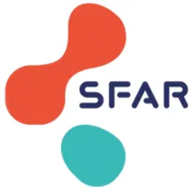

## RECOMMANDATIONS POUR LA PRATIQUE PROFESSIONNELLE

# Organisation structurelle, matérielle et fonctionnelle des centres effectuant de l'anesthésie pédiatrique

Structural, material and functional organization of centers performing pediatric anesthesia

**2023**

**RPP SFAR - ADARPEF**

Société Française d'Anesthésie et de Réanimation (SFAR)

Association des Anesthésistes Réanimateurs Pédiatriques d'Expression Française (ADARPEF)

**Texte validé par le Comité des Référentiels Cliniques de la SFAR le 19/01/2023, le Conseil d'Administration de la SFAR le 26/01/2023**

**Auteurs :** Mathilde De Queiroz, Isabelle Constant, Anne Laffargue, Gilles Oriaguet, Claire Barbarot, Nathalie Bourdaud, Michael Brackhahn, Anne Emmanuelle Colas, Souhayl Dahmani, Claude Ecoffey, Frederic Lacroix, Karine Nouette, Nada Sabourdin, Nadia Smail, Chrystelle Sola, Francis Veyckemans, Philippe Cuvillon, Daphné Michelet.

**Coordonnateurs d'experts :**

**SFAR :** Isabelle Constant, Gilles Oriaguet

**ADARPEF :** Mathilde De Queiroz, Anne Laffargue

**Organisateurs :** Daphné Michelet et Philippe Cuvillon pour le CRC de la SFAR

**Experts de la SFAR :** Claire Barbarot, Claude Ecoffey, Frederic Lacroix, Karine Nouette, Nadia Smail**Experts de l'ADARPEF :** Nathalie Bourdaud, Michael Brackhahn, Anne Emmanuelle Colas, Souhayl Dahmani, Nada Sabourdin, Chrystelle Sola, Francis Veyckemans

**Groupes de Lecture :**

Comité des Référentiels cliniques de la SFAR : Marc Garnier (Président), Alice Blet (Secrétaire), Anaïs Caillard, Hélène Charbonneau, Isabelle Constant, Hugues de Courson, Philippe Cuvillon, Marc-Olivier Fischer, Denis Frasca, Matthieu Jabaudon, Audrey De Jong, Daphné Michelet, Stéphanie Ruiz, Emmanuel Weiss.

Conseil d'Administration de la SFAR : Pierre Albaladéjo (Président); Jean-Michel Constantin (1er vice-président); Marc Léone (2ème vice-président); Karine Nouette-Gaulain (secrétaire général); Frédéric Le Saché (secrétaire général adjoint); Marie-Laure Cittanova (trésorière); Isabelle Constantin (trésorière adjointe); Julien Amour; Hélène Beloeil; Valérie Billard; Marie-Pierre Bonnet; Julien Cabaton; Marion Costecalde; Laurent Delaunay; Delphine Garrigue; Pierre Kalfon; Olivier Joannes-Boyau ; Frédéric Lacroix; Olivier Langeron; Sigismond Lasocki; Jane Muret ; Olivier Rontes; Nadia Smail ; Paul Zetlaoui**Liens d'intérêts des experts SFAR/ADARPEF au cours des cinq années précédant la date de validation par le CA de la SFAR.**

Claire Barbarot : pas de lien d'intérêt en rapport avec la présente RPP

Nathalie Bourdaud : pas de lien d'intérêt en rapport avec la présente RPP

Michael Brackhahn : pas de lien d'intérêt en rapport avec la présente RPP

Isabelle Constant : pas de lien d'intérêt en rapport avec la présente RPP

Anne Emmanuelle Colas : pas de lien d'intérêt en rapport avec la présente RPP

Souhayl Dahmani : pas de lien d'intérêt en rapport avec la présente RPP

Mathilde De Queiroz : pas de lien d'intérêt en rapport avec la présente RPP

Claude Ecoffey : pas de lien d'intérêt en rapport avec la présente RPP

Frederic Lacroix : pas de lien d'intérêt en rapport avec la présente RPP

Anne Laffargue : pas de lien d'intérêt en rapport avec la présente RPP

Karine Nouette : pas de lien d'intérêt en rapport avec la présente RPP

Gilles Oriaguet : pas de lien d'intérêt en rapport avec la présente RPP

Nada Sabourdin : pas de lien d'intérêt en rapport avec la présente RPP

Nadia Smail : pas de lien d'intérêt en rapport avec la présente RPP

Chrystelle Sola : pas de lien d'intérêt en rapport avec la présente RPP

Francis Veyckemans : pas de lien d'intérêt en rapport avec la présente RPP## RESUME

**Objectif :** La Société Française d'Anesthésie et de Réanimation (SFAR) et l'Association des Anesthésistes Réanimateurs Pédiatriques d'Expression Française (ADARPEF) se sont associées pour proposer des recommandations pour la pratique professionnelle sur l'organisation structurelle, matérielle et fonctionnelle des centres effectuant de l'anesthésie pédiatrique.

**Conception :** Un groupe composé d'experts français de la Société Française d'Anesthésie-Réanimation (SFAR) et de l'Association des Anesthésistes Réanimateurs Pédiatriques d'Expression Française (ADARPEF) a été réuni. D'éventuels conflits d'intérêts ont été officiellement déclarés dès le début du processus d'élaboration des recommandations et ce dernier a été conduit indépendamment de tout financement de l'industrie. Les auteurs ont suivi la méthodologie GRADE (*Grading of Recommendations Assessment, Development and Evaluation*) pour évaluer le niveau de preuve de la littérature.

**Méthodes :** Quatre champs ont été définis : 1) structure et logistique ; 2) équipement et matériel ; 3) formation et ; 4) organisation fonctionnelle. Pour chaque champ, l'objectif des recommandations était de répondre à un certain nombre de questions formulées par les experts selon le modèle PICO (*Population, Intervention, Comparison, Outcome*). A partir de ces questions, une recherche bibliographique extensive (2000-2022) a été réalisée en utilisant des mots clés prédéfinis selon les recommandations PRISMA. Du fait de la très faible quantité d'études permettant de répondre avec la puissance nécessaire au critère de jugement majeur d'importance la plus élevée (i.e. la morbidité), il a été décidé, en amont de la rédaction des recommandations, d'adopter un format de Recommandations pour la Pratique Professionnelle (RPP) plutôt qu'un format de Recommandations Formalisées d'Experts (RFE). Les recommandations ont ensuite été votées par tous les experts selon la méthode GRADE grid.

**Résultats :** Le travail de synthèse des experts et l'application de la méthode GRADE ont abouti à 34 préconisations concernant l'organisation structurelle, matérielle et fonctionnelle des centres effectuant de l'anesthésie pédiatrique. Après deux tours de votes et plusieurs amendements, un accord fort a été obtenu pour les 36 préconisations.

**Conclusion :** Un accord fort a été obtenu parmi les experts afin de fournir des recommandations visant à améliorer l'organisation structurelle, matérielle et fonctionnelle des centres effectuant de l'anesthésie pédiatrique.

**Mots clés :** anesthésie, pédiatrie, complications, événements critiques, sécurité, qualité, formation, morbidité, mortalité.## ABSTRACT

**Objective:** The French Society of Anesthesiology and Critical Care (Société Française d'Anesthésie et de Réanimation (SFAR)) and the Association des Anesthésistes Réanimateurs Pédiatriques d'Expression Française (ADARPEF) have joined forces to provide guidelines for professional practice on the structural, material, and functional organization of centers performing pediatric anesthesia.

**Design:** A consensus committee of 16 experts from the SFAR and the ADARPEF was convened. The experts declared no conflict of interest before and throughout the process. The entire guidelines process was conducted independently of any industry funding. The authors were asked to follow the principles of the Grading of Recommendations Assessment, Development and Evaluation (GRADE) system to guide assessment of quality of evidence.

**Methods:** Four fields were defined: 1) structure and logistics; 2) equipment and materials; 3) training; and 4) functional organization. For each field, the objective of the recommendations was to answer a number of questions formulated according to the PICO model (*population, intervention, comparison, and outcomes*). Based on these questions, an extensive bibliographic search was carried out from 2000 to 2022 using predefined keywords according to PRISMA guidelines and analyzed using the GRADE® methodology. Because of the very small number of studies that could provide the necessary power for the most important endpoint (i.e., morbidity), it was decided, before drafting the recommendations, to adopt a Recommendations for Professional Practice (RPP) format rather than a Formalized Recommendations of Experts (RFE) format. The recommendations were formulated according to the GRADE® methodology, before being voted by all the experts according to the GRADE grid method.

**Results:** The experts' synthesis work and the application of the GRADE® method resulted in 34 recommendations dealing with the structural, material and functional organization of centers performing pediatric anesthesia. After 3 rounds of rating and several amendments, agreement was reached for all the recommendations.

**Conclusions:** Strong agreement exists among the experts to provide recommendations to improve the structural, material and functional organization of centers performing pediatric anesthesia.

**Keywords:** anesthesia, pediatrics, complications, critical events, safety, quality, training, morbidity, mortality## INTRODUCTION

Les recommandations de la SFAR concernant la surveillance des patients en cours d'anesthésie et pendant les soins post-anesthésiques ainsi que le Décret n°94-1050 du 5 décembre 1994 [1] sur la sécurité en anesthésie s'appliquent également au contexte de l'anesthésie pédiatrique. Cependant, certaines particularités liées à l'enfant, notamment en fonction de son âge, amènent à discuter ou préciser certains points structurels, matériels et liés à la formation tant pour l'activité programmée que pour l'activité non programmée.

La croissance et la maturation observées de la naissance à l'âge adulte impliquent des changements physiologiques et anatomiques qui conditionnent les particularités de la prise en charge anesthésique de l'enfant. Ces particularités se déclinent à la fois sur le plan organisationnel et matériel ainsi que sur le plan de la formation nécessaire pour assurer une anesthésie optimisée et sécurisée du nouveau-né à l'adolescent. De la même façon, le vécu, la valence émotionnelle et la trace mnésique du contexte anesthésique varient avec l'âge de l'enfant. En pratique, leur prise en charge peut être réalisée, selon leur âge et leur pathologie, dans des structures pédiatriques spécialisées mais aussi dans des structures dites mixtes accueillant également des adultes. Dans ces structures mixtes, il est nécessaire de disposer d'une organisation fonctionnelle et logistique permettant de s'adapter aux particularités pédiatriques, afin d'assurer une sécurité maximale de la prise en charge anesthésique.

Une étude observationnelle multicentrique relevant les événements critiques survenant au cours de l'anesthésie pédiatrique menée dans 261 hôpitaux européens a été publiée en 2017 [2]. Les auteurs ont mis en évidence une incidence globale d'événements critiques graves de 5,2 %. Ces événements étaient dominés par les complications respiratoires et hémodynamiques. Des facteurs de risque, liés notamment à l'âge de l'enfant, au terrain mais également aux organisations et à l'expérience de l'anesthésiste ont été mis en évidence.

En France, le schéma régional d'organisation des soins (SROS - Circulaire DHOS/O1/DGS/DGAS n° 2004-517 du 28 octobre 2004 relative à l'élaboration des SROS de l'enfant et de l'adolescent [3]) définit l'organisation de la chirurgie pédiatrique, par territoire de santé, selon une graduation et une répartition des activités tenant compte des besoins de la population, de la situation existante et des possibilités de transport. Cette organisation s'appuie sur les travaux des sociétés savantes de chirurgie pédiatrique, d'ORL et d'anesthésie-réanimation pédiatrique.

L'offre de soins est structurée en trois niveaux de prise en charge, complémentaires et articulés entre eux. Ces niveaux, définis par le SROS (cf. tableau champ 4 argumentaire R4.1), correspondent aux centres de proximité (niveau 1) et aux centres spécialisés (niveau 2), certains ayant une vocation régionale ou interrégionale et étant alors centres de référence ou de recours (niveau 3). Ils sont définis en fonction des pathologies et des actes par tranches d'âge, de la compétence chirurgicale et anesthésique des équipes, de l'organisation de la permanence des soins et de l'adaptation de la structure à la prise en charge des enfants et adolescents.

L'offre de soins ainsi définie est constituée en réseaux de chirurgie et d'anesthésie pédiatriques. Ceux-ci ont pour missions d'offrir à leurs membres des modalités d'orientation des enfants, des actions de formation et d'évaluation, des possibilités d'échanges de pratique.## **OBJECTIF DES RECOMMANDATIONS**

L'objectif de ces Recommandations pour la Pratique Professionnelle est de produire un cadre servant de base à l'organisation structurelle, matérielle et fonctionnelle des centres effectuant de l'anesthésie pédiatrique. Le groupe s'est efforcé de produire un nombre minimal de recommandations afin de mettre en évidence les points forts à retenir dans les quatre champs prédéfinis : 1) structure et logistique ; 2) équipement et matériel ; 3) formation et ; 4) organisation fonctionnelle. Les règles de base des bonnes pratiques médicales universelles en anesthésie pédiatrique, étant considérées connues, ont été exclues des recommandations. Le public visé est l'ensemble des praticiens exerçant dans une structure pratiquant l'anesthésie pédiatrique, qu'elle soit exclusive ou occasionnelle.

## **MÉTHODE**

### **Organisation générale**

Ces recommandations sont le résultat du travail d'un groupe d'experts réunis par la SFAR en association avec l'ADARPEF. Chaque expert a rempli une déclaration de conflits d'intérêts avant de débuter le travail d'analyse. Dans un premier temps, le comité d'organisation a défini les objectifs de ces recommandations et la méthodologie utilisée. Les différents champs d'application de ces RPP et les questions à traiter ont ensuite été définis par le comité d'organisation, puis modifiés et validés par les experts. Les questions ont été formulées selon un format PICO (*Population, Intervention, Comparison, Outcome*) après une première réunion du groupe d'experts. La population « P » pour l'ensemble des questions est définie comme un "enfant" (âge < 18 ans). Pour certaines questions, des sous-populations ont été considérées conformément au texte réglementaire (SROS) : prématurité (naissance avant 37 semaines d'aménorrhées (SA)) ; période néonatale (période des 28 premiers jours de vie) ; nourrisson (âge < 1 an) ; 1 - 3 ans ; 3-10 ans et > 10 ans.

A partir de 10 ans, la prise en charge peut être assimilée à celle de l'adulte tout en prenant en compte la spécificité psychologique et/ou la pathologie sous-jacente de l'enfant.

### **Champ des recommandations**

Les recommandations formulées concernent 4 champs :

- - Champ 1 : structure et logistique
- - Champ 2 : équipement et matériel
- - Champ 3 : formation
- - Champ 4 : organisation fonctionnelle

Une recherche bibliographique incluant les articles publiés entre janvier 2000 et janvier 2022 a été réalisée à partir des principales bases de données (MEDLINE, Tripdatabase ([www.tripdatabase.com](http://www.tripdatabase.com)), Prospero ([www.crd.york.ac.uk/PROSPERO](http://www.crd.york.ac.uk/PROSPERO)) et [www.clinicaltrials.gov](http://www.clinicaltrials.gov)), par 2 à 5 experts pour chaque champ d'application, selon la méthodologie *Preferred Reporting Items for Systematic Reviews and Meta-Analysis* (PRISMA) pour les revues systématiques. Les mots clés utilisés pour la recherche bibliographique ont été : anesthésie, pédiatrie, complications, événements critiques, sécurité, qualité, formation, morbidité, mortalité.

Ont été inclus dans l'analyse :

1) les méta-analyses, essais contrôlés randomisés, essais prospectifs non randomisés, cohortes rétrospectives, séries de cas et case-reports ;1. 2) conduits chez l'enfant ;
2. 3) traitant de l'organisation structurelle, matérielle et fonctionnelle des centres effectuant de l'anesthésie pédiatrique ;
3. 4) publiés en langue anglaise ou française.

La méthode de travail utilisée pour l'élaboration de ces recommandations est la méthode GRADE® (*Grade of Recommendation Assessment, Development and Evaluation*). Cette méthode permet, après une analyse qualitative et quantitative de la littérature, de déterminer séparément la qualité des preuves, et donc de donner une estimation de la confiance que l'on peut avoir de l'analyse quantitative et ainsi déterminer un niveau de recommandation. Un niveau de preuve a donc été défini pour chacune des références bibliographiques citées en fonction du type de l'étude. Ce niveau de preuve pouvait être réévalué en tenant compte de la qualité méthodologique de l'étude, de la cohérence des résultats entre les différentes études, du caractère direct ou non des preuves, de l'analyse de coût et de l'importance du bénéfice. Les critères de jugement ont été définis (sur une échelle de 1 à 9) en amont de la façon suivante :

- ● critères de jugement majeurs : morbidité péri-opératoire et survenue d'événements critiques (importance 8) ;
- ● critères de jugement secondaires : qualité et sécurité des soins (importance 6).

Du fait de la très faible quantité d'études permettant de répondre avec la puissance nécessaire au critère de jugement majeur d'importance la plus élevée (i.e. morbidité), il a été décidé, en amont de la rédaction des recommandations, d'adopter un format de Recommandations pour la Pratique Professionnelle (RPP) plutôt qu'un format de Recommandations Formalisées d'Experts (RFE). La méthodologie GRADE a toutefois été appliquée pour l'analyse de la littérature et la rédaction des tableaux récapitulatifs. Les recommandations ont ensuite été rédigées en utilisant la terminologie des RPP de la SFAR « les experts suggèrent de faire » ou « les experts suggèrent de ne pas faire ».

Les propositions de recommandations ont été présentées et discutées une à une. Le but n'était pas d'aboutir obligatoirement à un avis unique et convergent des experts sur l'ensemble des propositions, mais de dégager les points de concordance et les points de divergence ou d'indécision. Chaque recommandation a alors été évaluée par chacun des experts et soumise à une cotation individuelle à l'aide d'une échelle allant de 1 (désaccord complet) à 9 (accord complet). La force de la recommandation est déterminée en fonction de cinq facteurs clés et validée par les experts après un vote, en utilisant la méthode GRADE Grid :

- ● Estimation de l'effet : plus il est élevé, plus probablement la recommandation sera forte ;
- ● Le niveau global de preuve : plus il est élevé, plus probablement la recommandation sera forte ;
- ● La balance entre effets désirables et indésirables : plus celle-ci est favorable, plus probablement la recommandation sera forte ;
- ● Les valeurs et les préférences : en cas d'incertitude ou de grande variabilité, plus probablement la recommandation sera faible ; ces valeurs et préférences doivent être obtenues au mieux auprès des personnes concernées (patient, médecin, décisionnaire) ;
- ● Coûts : plus les coûts ou l'utilisation des ressources sont élevés, plus probablement la recommandation sera faible.

Les avis d'experts, exprimant par définition un consensus entre les experts en l'absence de littérature suffisamment forte pour grader ces recommandations, devaient nécessairement obtenir un accord fort (i.e. au moins 70% d'opinions allant dans la même direction, tandis que moins de 20% d'entre eux exprimaient une opinion contraire). En l'absence de validation d'une ou de plusieurs recommandation(s), celle(s)-ci étaient reformulée(s) et, de nouveau, soumise(s) à cotation dans l'objectif d'aboutir à un consensus. Si les recommandations n'avaient pas obtenu un nombre suffisantd'opinions favorables et/ou obtenu un nombre trop élevé d'opinions défavorables, elles n'étaient pas éditées.

## **RESULTATS**

### **Champs des recommandations**

Les experts ont consensuellement décidé, lors de la première réunion d'organisation de ces RPP, de traiter 18 questions réparties en 4 champs. Les questions suivantes ont été retenues pour le recueil et l'analyse de la littérature, avec comme critères de jugement la morbidité, la survenue d'événements critiques et la qualité / sécurité des soins :

**Champ 1 :** Quelles sont les particularités, en termes de structures et de logistique, à respecter pour la pratique de l'anesthésie pédiatrique ?

- • Quelles sont les particularités requises d'une salle d'intervention pour la réalisation d'une anesthésie pédiatrique ?
- • Quelles sont les particularités requises pour l'accueil d'un enfant en salle de surveillance post-interventionnelle ?
- • Quelles structures permettent la prise en charge pré et postopératoire des enfants ?
- • Quelles sont les particularités requises pour les plateaux techniques réalisant des examens complémentaires (biologiques, radiologiques, Établissement Français du Sang (EFS), etc.) et les avis spécialisés dans les centres prenant en charge un enfant ?

**Champ 2 :** Quelles sont les particularités, en termes d'équipement et de matériel à respecter pour la pratique de l'anesthésie pédiatrique ?

- • Quelles sont les particularités à respecter pour la prise en charge des voies aériennes de l'enfant (ventilation, ventilateurs, dispositifs supra et intra-glottiques) ?
- • Quelles sont les particularités à respecter pour les abords vasculaires chez l'enfant ?
- • Quelles sont les particularités des solutés de perfusion à utiliser chez l'enfant ?
- • Quelles sont les particularités de l'équipement d'urgence vitale à utiliser chez l'enfant ?
- • Quelles sont les particularités du monitoring pour la pratique de l'anesthésie pédiatrique ?
- • Quelles sont les particularités de la prévention de l'hypothermie chez l'enfant ?
- • Quelles sont les particularités de l'échographie pour la réalisation d'une ALR ou pour les voies d'abord vasculaires chez l'enfant ?

**Champ 3 :** Quelles sont les particularités, en termes de compétences à respecter pour la pratique de l'anesthésie pédiatrique ?

- • Quelle doit être la formation des médecins ayant une activité d'anesthésie en pédiatrie ?**Champ 4 :** Quelles sont les particularités, en termes d'organisation du personnel et fonctionnelle à respecter pour la pratique de l'anesthésie pédiatrique ?

- • Quel est l'intérêt de travailler en réseaux avec des centres de proximité ou de référence ?
- • Existe-t-il des facteurs de risque nécessitant une adaptation de la prise en charge des patients ?
- • Quels personnels sont requis pour l'anesthésie de l'enfant (en salle d'intervention) ?
- • Quels personnels sont requis en SSPI ?
- • Faut-il créer une équipe dédiée anesthésie pédiatrique au sein du bloc opératoire ?
- • Doit-on réaliser une évaluation régulière des pratiques en anesthésie pédiatrique ?

### **Synthèse des résultats**

Le travail de synthèse des experts et l'application de la méthode GRADE ont abouti à 34 préconisations. Après deux tours de cotation et quelques amendements, un accord fort a été obtenu pour les 34 préconisations.

La SFAR incite tous les anesthésistes-réanimateurs à se conformer à ces RPP pour optimiser la qualité des soins dispensés aux patients. Cependant, chaque praticien doit exercer son propre jugement dans l'application de ces préconisations, en prenant en compte son expertise et les spécificités de son établissement, pour déterminer la méthode d'intervention la mieux adaptée à l'état du patient dont il a la charge.

### **RÉFÉRENCES**

[1] Décret n°94-1050 du 5 décembre 1994 relatif aux conditions techniques de fonctionnement des établissements de santé en ce qui concerne la pratique de l'anesthésie et modifiant le code de la santé publique (troisième partie : Décrets)

[2] Habre W et al. Incidence of severe critical events in paediatric anaesthesia (APRICOT): a prospective multicentre observational study in 261 hospitals in Europe. Lancet Respir Med 2017; 5:412-425.

[3] <https://solidarites-sante.gouv.fr/fichiers/bo/2004/04-52/a0523394.htm>**Champ 1 : Quelles sont les particularités, en termes de structures et de logistique, à respecter pour la pratique de l'anesthésie pédiatrique ?**

**Question : Quelles sont les particularités requises d'une salle d'intervention pour la réalisation d'une anesthésie pédiatrique ?**

*Experts : C. Sola (ADARPEF, Montpellier), M. De Queiroz (ADARPEF, Lyon)*

<table border="1"><tr><td>
<b>R1.1 – Les experts suggèrent que l'anesthésie pédiatrique soit réalisée dans une salle d'intervention disposant de matériel adapté au poids et à l'âge de l'enfant afin d'assurer la sécurité des soins.</b>
</td></tr><tr><td>
<b>Avis d'experts (Accord Fort)</b>
</td></tr><tr><td>
<b>Argumentaire :</b> L'organisation d'un bloc pédiatrique doit répondre aux exigences de l'organisation et de la planification de l'offre sanitaire définie par la loi hospitalière du 31 juillet 1991 [1] et au décret du 5 décembre 1994 relatif à l'organisation de l'anesthésie au sein des établissements de santé [2]. Tous les centres qui sont impliqués dans l'anesthésie pédiatrique, y compris occasionnellement, doivent être équipés de salle d'intervention répondant aux RPP SFAR 1995 « équipement d'un site ou d'un ensemble de sites d'anesthésie » [3].

Les particularités requises d'une salle d'intervention pour la réalisation d'une anesthésie pédiatrique sont les suivantes :
<ul style="list-style-type: none;"><li>- Une équipe de professionnels de l'anesthésie et de santé formés à la réalisation d'une anesthésie pédiatrique (cf. Champ 3).</li><li>- Un équipement de routine et d'urgence spécifique et dédié à la pédiatrie, adapté à l'âge de l'enfant, facilement accessible et régulièrement entretenu (cf. Champ 2).</li><li>- Des abaques écrits des doses pédiatriques des médicaments d'urgence (cf. Champ 2).</li><li>- Des aides cognitives spécifiques à la pédiatrie pour le traitement des urgences et des situations critiques (validées par la SFAR et l'ADARPEF).</li><li>- Une check-list HAS "sécurité du patient au bloc opératoire" dédiée à la pédiatrie [4].</li><li>- Au sein d'une structure mixte adulte/pédiatrique (centres de proximité), un site dédié à l'activité pédiatrique, incluant une salle de surveillance post-interventionnelle spécifique ou un secteur dédié d'une SSPI mixte (cf. R1.2), ainsi que des plages opératoires exclusivement pédiatriques permettent une gestion simplifiée du matériel adapté à la pratique de l'anesthésie pédiatrique, ainsi que du personnel médical et paramédical dédié (cf. Champ 3).</li></ul>
En revanche, les experts ne peuvent établir une recommandation quant à la limite d'âge pour un programme exclusivement pédiatrique. Certains adolescents peuvent, par exemple, être intégrés dans un programme adulte en fonction du type de chirurgie, de leurs antécédents médicaux et chirurgicaux.
</td></tr><tr><td>
<b>Références :</b>

[1] Loi n° 91-748 du 31 juillet 1991 portant réforme hospitalière <a href="https://www.legifrance.gouv.fr/loda/id/JORFTEXT000000720668/">https://www.legifrance.gouv.fr/loda/id/JORFTEXT000000720668/</a>

[2] Décret n°94-1050 du 5 décembre 1994 relatif aux conditions techniques de fonctionnement des établissements de santé en ce qui concerne la pratique de l'anesthésie et modifiant le code de la santé publique (troisième partie : Décrets) <a href="https://www.legifrance.gouv.fr/loda/id/JORFTEXT000000549818/#:~:text=Dans%20les%20r%C3%A9sum%C3%A9s-,D%C3%A9cret%20n%C2%B094%2D1050%20du%205%20d%C3%A9cembre%201994%20relatif,publique%20(troisi%C3%A8me%20partie%20%3A%20D%C3%A9crets)">https://www.legifrance.gouv.fr/loda/id/JORFTEXT000000549818/#:~:text=Dans%20les%20r%C3%A9sum%C3%A9s-,D%C3%A9cret%20n%C2%B094%2D1050%20du%205%20d%C3%A9cembre%201994%20relatif,publique%20(troisi%C3%A8me%20partie%20%3A%20D%C3%A9crets)</a>
</td></tr></table>[3] L'équipement d'un site ou d'un ensemble de sites d'anesthésie. RPP SFAR 1995  
<https://sfar.org/lequipement-dun-site-ou-dun-ensemble-de-sites-danesthesie/>  
[4] Check-list sécurité du patient au bloc opératoire en chirurgie infantile. HAS  
[https://www.has-sante.fr/jcms/c\\_2608022/fr/check-list-securite-du-patient-au-bloc-operatoire-en-chirurgie-infantile](https://www.has-sante.fr/jcms/c_2608022/fr/check-list-securite-du-patient-au-bloc-operatoire-en-chirurgie-infantile)

**Question : Quelles sont les particularités requises pour l'accueil d'un enfant en salle de surveillance post-interventionnelle ?**

*Experts : M. De Queiroz (ADARPEF, Lyon), G. Orliaguet (SFAR, Paris)*

**R1.2 – Les experts suggèrent d'identifier un secteur pédiatrique en salle de surveillance post-interventionnelle afin de regrouper le personnel et le matériel spécifiques à la prise en charge de l'enfant, ainsi que de permettre à un accompagnant d'être présent, afin d'assurer la qualité et la sécurité du réveil.**

**Avis d'experts (Accord Fort)**

**Argumentaire :** Le réveil chez l'enfant est une période à risque de complications, notamment cardio-respiratoires. Les jeunes enfants (nouveau-né et nourrisson), ceux atteints de comorbidités significatives (ASA > 2), présentant une infection des voies aériennes supérieures et ceux opérés en urgence sont les plus exposés aux complications, notamment respiratoires [1-3].

Tout établissement pratiquant de l'anesthésie pédiatrique doit répondre aux exigences du décret n° 94-1050 du 5 décembre 1994 sur la surveillance post-anesthésique, relatif aux conditions techniques de fonctionnement des établissements de santé en ce qui concerne la pratique de l'anesthésie et modifiant le code de la santé publique [4]. Le matériel doit être identique à celui du bloc opératoire (médicaments, matériel, monitoring), et adapté à l'âge des enfants transitant par la salle de surveillance post-interventionnelle (SSPI). Un anesthésiste-réanimateur formé en anesthésie-réanimation pédiatrique doit être immédiatement disponible pour la prise en charge de complications post-anesthésiques.

Si l'on ne dispose pas de structures spécifiques, lorsque l'architecture et l'activité le permettent, il faut pouvoir individualiser un secteur de SSPI avec séparation physique (rideau, paravent), dédié à l'activité pédiatrique afin de prendre en compte les caractères spécifiques de la prise en charge de l'enfant. La présence d'au moins un accompagnant en SSPI permet de réduire l'anxiété, le delirium et l'agitation au réveil, et ainsi diminuer la durée de séjour en SSPI [5,6]. Cette présence parentale répond à la charte de l'enfant hospitalisé [7]. La présence de l'accompagnant adulte pendant la surveillance du réveil de l'enfant sera facilitée par la mise en place de cette zone dédiée à l'activité pédiatrique au sein d'une SSPI mixte accueillant aussi des adultes.

**Références :**

[1] Habre W et al. Incidence of severe critical events in paediatric anaesthesia (APRICOT): a prospective multicentre observational study in 261 hospitals in Europe. *Lancet Respir Med* 2017; 5:412-425.  
[2] Von Ungern-Sternberg BS et al. Risk assessment for respiratory complications in paediatric anaesthesia: a prospective cohort study. *Lancet* 2010; 376: 773-83.  
[3] Michel F et al. Peri-operative respiratory adverse events in children with upper respiratory tract infections allowed to proceed with anaesthesia: A French national cohort study. *Eur J Anaesthesiol* 2018; 35:919-928.  
[4] Décret n° 94-1050 du 5 décembre 1994, relatif aux conditions techniques de fonctionnement des établissements de santé en ce qui concerne la pratique de l'anesthésie et modifiant le code de la santé publique  
[5] Taranto J, Thornton R, Lima S, Redley B. Parents' experience of family centred care in the post anaesthetic care unit during non-clinical delays: A qualitative study. *Journal of Child Health Care* 2021; 17: 1-15.[6] Jenkins BJ, Fortier MA, Stevenson R, Makhlouf M, Lim P, Converse R, Kain ZN. Changing healthcare provider and parent behaviors in the pediatric post-anesthesia-care-unit to reduce child pain: Nurse and parent training in postoperative stress. *Pediatric Anesthesia*. 2019;29:730-737.

[7] Charte Européenne des Droits de l'Enfant Hospitalisé adoptée par le Parlement Européen le 13 mai 1986. Circulaire du Secrétariat d'Etat à la Santé de 1999 préconise son application.

### Question : Quelles structures permettent la prise en charge pré et postopératoire des enfants ?

*Experts : I. Constant (SFAR, Paris), A. Laffargue (ADARPEF, Lille)*

**R1.3.1 – Les experts suggèrent que l'hospitalisation des enfants en pré et postopératoire doit se faire dans un secteur dédié à la pédiatrie (hospitalisation conventionnelle ou ambulatoire, soins critiques) afin d'assurer la qualité et la continuité des soins.**

**Avis d'experts (Accord fort)**

**R1.3.2 – Les experts suggèrent que la consultation d'anesthésie doit se faire dans un lieu dédié et adapté à l'enfant pour favoriser son confort et diminuer son anxiété.**

**Avis d'experts (Accord fort)**

**Argumentaire :** L'hospitalisation des enfants doit répondre à la circulaire n°83-24 du 1er août 1983 [1] et à la charte de l'enfant hospitalisé, adoptée en 1988 [2], qui stipule entre autres que :

- - Tout enfant doit pouvoir bénéficier de la présence de ses parents/accompagnants, qui doit être facilitée et encouragée.
- - Les enfants ne doivent pas être hospitalisés dans les services d'adulte.
- - Le regroupement par tranche d'âge est important, afin que les enfants puissent bénéficier de jeux, loisirs, activités éducatives adaptés à leur âge en toute sécurité.
- - L'hôpital doit fournir aux enfants un environnement correspondant à leurs besoins physiques, affectifs et éducatifs, tant sur le plan de l'équipement que du personnel et de la sécurité.
- - L'équipe soignante doit être formée à répondre aux besoins psychologiques et émotionnels des enfants et de leur famille.
- - L'équipe soignante doit être organisée de façon à assurer une continuité dans les soins donnés à chaque enfant.
- - L'intimité de chaque enfant doit être respectée.

Les structures exclusivement pédiatriques répondent à ces exigences, en étant dotées dès la consultation d'anesthésie d'espaces de jeux, de personnels formés tels que puéricultrices et auxiliaires de puériculture. Dans ces structures, la présence des parents/accompagnants doit être possible à toute heure [1-4].

Dans les structures chirurgicales mixtes à fort recrutement pédiatrique, un secteur d'hospitalisation dédié aux enfants doit être constitué afin de répondre à ces recommandations, y compris en ambulatoire. Ces secteurs doivent être dotés de personnel formé à la pédiatrie. Il en va de même pour les plateaux de consultation, notamment pour la consultation d'anesthésie, pour pouvoir garantir un environnement adapté à l'enfant, avec chaises et espaces de jeux adaptés à l'âge en salle d'attente.

Pour les grands adolescents, la prise en charge peut être réalisée en secteur adulte (hospitalisation conventionnelle, ambulatoire, soins critiques, consultation).

Références :[1] Circulaire N° 83-24 DU 1ER AOÛT 1983 relative à l'hospitalisation des enfants  
[2] Charte Européenne des Droits de l'Enfant Hospitalisé adoptée par le Parlement Européen le 13 mai 1986. Circulaire du Secrétariat d'Etat à la Santé de 1999 préconise son application.  
[3] Circulaire DH/EO 3 n° 98-688 du 23 novembre 1998 relative au régime de visite des enfants hospitalisés en pédiatrie.  
[4] Décret no 2022-690 du 26 avril 2022 relatif aux conditions d'implantation de l'activité de soins critiques

**Question : Quelles sont les particularités requises pour les plateaux techniques réalisant des examens complémentaires (biologiques, radiologiques, Établissement Français du Sang (EFS), etc.) et les avis spécialisés dans les centres prenant en charge un enfant ?**

*Experts : C. Sola (ADARPEF, Montpellier), M. De Queiroz (ADARPEF, Lyon)*

**R1.4.1 – Les experts suggèrent que tout établissement ayant une activité pédiatrique programmée et/ou non programmée, puisse avoir recours à un plateau technique (laboratoire, radiologie, délivrance de produits sanguins labiles, etc.) capable de répondre aux besoins spécifiques de la population pédiatrique notamment la réalisation, l'analyse et l'interprétation de micro-prélèvements, afin de garantir des conditions optimales de qualité et de sécurité des soins.**

**Avis d'experts (Accord fort)**

**R1.4.2 – Les experts suggèrent que tout établissement ayant une activité pédiatrique programmée et/ou non programmée formalise des réseaux de consultants spécialistes en pédiatrie afin de garantir des conditions optimales de qualité et de sécurité des soins.**

**Avis d'experts (Accord fort)**

**Argumentaire :** Selon la charte de l'enfant hospitalisé [1], ainsi que la circulaire d'août 1983 [2], un établissement accueillant des enfants et adolescents doit leur fournir un environnement correspondant à leurs besoins, tant sur le plan de l'équipement que du personnel et de la sécurité. Il appartient ainsi à chaque établissement d'identifier ses propres risques, de les analyser et de prioriser les démarches d'amélioration et de sécurisation de leur prise en charge en tenant compte de ses activités et modes de prise en charge.

Afin de garantir la prise en charge des enfants et des adolescents dans des conditions optimales de qualité et de sécurité des soins :

- - Les services de laboratoire et de radiologie doivent pouvoir répondre aux exigences de la population pédiatrique prise en charge dans l'établissement et l'expertise pédiatrique doit être disponible à tout moment, que ce soit au niveau du centre ou du réseau.
- - La réalisation des examens d'hématologie, d'hémostase et de biochimie doit pouvoir se faire sur des micro-prélèvements, et le rendu des résultats doit tenir compte des particularités physiologiques aux différents âges de l'enfant.
- - La prescription d'un bilan pré-opératoire doit respecter les recommandations de la SFAR 2012 [3]. La seule indication d'un bilan d'hémostase systématique avant un acte invasif chez l'enfant est l'absence d'acquisition de la marche. Dans toutes les autres situations, comme chez l'adulte, la prescription d'un bilan biologique pré-opératoire est exclusivement orientée par les antécédents personnels et familiaux, l'anamnèse et l'examen clinique, quelle que soit la nature de la chirurgie et la technique anesthésique [4-7]. En cas de risque de saignement important (> 7 mL/kg) et/ou de transfusion, la prescription pré-opérateur d'un groupage sanguin complet et la recherche d'agglutinines irrégulières (RAI) doit être réalisée. La présence de ces documents doit être vérifiée avant l'induction anesthésique [8].

- - La réalisation des examens radiologiques doit suivre les recommandations réglementaires de l'autorité de sûreté nucléaire [9] et les recommandations relatives aux critères de qualité, à l'optimisation des doses en radiologie pédiatrique et aux mesures de radioprotection [10,11].
- - S'il n'existe pas de recommandation concernant des compétences spécifiques en imagerie pédiatrique, une enquête réalisée en 2016 à l'initiative de la Société Française de Radiologie et la Société Française de Pédiatrie auprès des radiologues et des pédiatres montre que les deux premières raisons de ne pas réaliser certains types d'examen chez les enfants de moins de 6 ans sont la nécessité d'une prise en charge particulière et une formation insuffisante [12]. Ce constat doit conduire à promouvoir la formation de réseaux à compétence pédiatrique, pour qu'une expertise pédiatrique pour interpréter les examens réalisés chez l'enfant soit disponible 7j/7, 24h/24.
- - Chaque établissement pouvant être amené à pratiquer une transfusion chez un enfant doit connaître et être en rapport avec le laboratoire de l'Établissement Français du Sang (EFS) de sa région (maillage territorial des laboratoires EFS et des sites de délivrance). Ce maillage doit permettre de disposer en chaque point du territoire des produits sanguins labiles indispensables aux patients et aux établissements de santé dans un délai compatible avec la sécurité transfusionnelle [13].
- - Un réseau de compétence pédiatrique (laboratoire, radiologie, pédiatres spécialisés, chirurgiens pédiatres, réanimations néonatale et pédiatrique, anesthésistes-réanimateurs pédiatriques) doit être organisé et connu de chaque centre [14] (cf. Champ 4).

#### Références :

- [1] Charte Européenne des Droits de l'Enfant Hospitalisé adoptée par le Parlement Européen le 13 mai 1986. Circulaire du Secrétariat d'Etat à la Santé de 1999 préconise son application
- [2] Circulaire N° 83-24 DU 1ER AOÛT 1983 relative à l'hospitalisation des enfants
- [3] Molliex S, Pierre S, Bléry C, Marret E, Beloeil H. Examens préinterventionnels systématiques [Routine preinterventional tests]. Ann Fr Anesth Reanim. 2012;3: 752-63. <https://doi.org/10.1016/j.annfar.2012.06.009>
- [4] Lejus-Bourdeau C, et al. Bilan préopératoire en pédiatrie : pour qui et pourquoi ? Anesth Reanim. 2018 ;4 : 282-89. <https://doi.org/10.1016/j.anrea.2018.03.006>.
- [5] Bonhomme F, Ajzenberg N, Schved J-F, Molliex S, Samama C-M. Pre-interventional haemostatic assessment: guidelines from the French Society of Anaesthesia and Intensive Care. Eur J Anaesthesiol 2013;30:142-62. <https://doi.org/10.1097/EJA.0b013e32835f66cd>
- [6] Le Roux C, Lejus C, Surbled M, Renaudin M, Guillaud C, De Windt A, et al. Is haemostasis screening always useful before performing a neuraxial blockade in children? Paediatr Anaesth 2002;12:118-23. <https://doi.org/10.1046/j.1460-9592.2002.00803.x>
- [7] Courrèges P, Dadure C, Ecoffey C, Giaufre E, Lacroix F, Lejus C, et al. Anesthésie loco- régionale en pédiatrie; RFE 2010. [https://sfar.org/wp-content/uploads/2015/09/2\\_SFAR\\_Anesthesie-loco-regionale-en-pediatrie.pdf](https://sfar.org/wp-content/uploads/2015/09/2_SFAR_Anesthesie-loco-regionale-en-pediatrie.pdf)
- [8] [https://www.has-sante.fr/jcms/c\\_2608022/fr/check-list-securite-du-patient-au-bloc-operatoire-en-chirurgie-infantile](https://www.has-sante.fr/jcms/c_2608022/fr/check-list-securite-du-patient-au-bloc-operatoire-en-chirurgie-infantile)
- [9] Principales dispositions réglementaires de radioprotection applicables en radiologie médicale et dentaire.<https://www.asn.fr/l-asn-reglemente/guides-de-l-asn/principales-dispositions-reglementaires-de-radioprotection-applicables-en-radiologie-medicale-et-dentaire>
- [10] Société française de radiologie, <http://www.sfrnet.org>
- [11] Société francophone d'imagerie Pédiatrique et Prénatale, <https://sfip-radiopediatrie.org>
- [12] « Accès aux examens d'imagerie pédiatriques », société française de radiologie et société française de pédiatrie, 2015.[http://www.sfrnet.org/rc/org/sfrnet/htm/Article/2015/20151017-163432-927/src/htm\\_fullText/fr/Imagerie%20Pédiatrique%20-%20Rapport%20.pdf](http://www.sfrnet.org/rc/org/sfrnet/htm/Article/2015/20151017-163432-927/src/htm_fullText/fr/Imagerie%20Pédiatrique%20-%20Rapport%20.pdf)
- [13] Établissement Français du Sang, <https://www.efs.sante.fr/lefs-les-publications/les-publications-legales-et-reglementaires>
- [14] Rapport IGAS La pédiatrie et l'organisation des soins de santé de l'enfant en France 2020, <https://www.igas.gouv.fr/IMG/pdf/2020-074r.pdf>**Champ 2 : Quelles sont les particularités, en termes d'équipement et de matériel à respecter pour la pratique de l'anesthésie pédiatrique ?**

**Question : Quelles sont les particularités à respecter pour la prise en charge des voies aériennes de l'enfant (matériel de ventilation, dispositifs supra et intra-glottiques) ?**

*Experts : F. Veyckemans (ADARPEF, Lille), A. Laffargue (ADARPEF, Lille)*

<table border="1"><tr><td>
<b>R2.1.1 – Les experts suggèrent que tout le matériel d'assistance respiratoire (i.e. pour la gestion des voies aériennes et de la ventilation) soit adapté à l'âge, au poids et à la taille de l'enfant, pour diminuer le risque de complications respiratoires et assurer la normoxémie et la normocapnie.</b>
</td></tr><tr><td>
<b>Avis d'experts (Accord fort)</b>
</td></tr><tr><td>
<b>R2.1.2 – Pour les salles non dédiées à la pédiatrie, les experts suggèrent d'utiliser un chariot mobile spécifique contenant les équipements et matériels destinés à l'anesthésie des enfants, afin d'optimiser la gestion des voies aériennes.</b>
</td></tr><tr><td>
<b>Avis d'experts (Accord fort)</b>
</td></tr><tr><td>
<b>Argumentaire :</b> Les complications péri-opératoires de l'anesthésie pédiatrique les plus fréquentes sont respiratoires, surtout chez l'enfant de moins de 3 ans (3,1% dans l'étude APRICOT) et se répartissent en laryngospasmes (1,2%), bronchospasmes (1,2%), stridor post-extubation (0,7%) et inhalation du contenu gastrique (0,1%) [1-3]. De plus, l'intubation est plus souvent difficile chez le petit enfant : 1% des cas chez le nouveau-né et 1,1% chez le nourrisson contre 0,1 à 0,2% chez l'enfant plus âgé [3,4]. Dans plus de 50% des cas où plus de 3 laryngoscopies avaient été nécessaires avant de réussir à intuber l'enfant malgré un score de Cormack-Lehane de 1 ou 2, les enfants étaient âgés de moins d'un an [3,4]. La chirurgie ORL, qui est la chirurgie pédiatrique la plus pratiquée en France, est une procédure à risque majoré de complications respiratoires : 3,93% IC95% (3,46-4,48) contre 2,61% (2,37-2,87) pour la chirurgie non-ORL, soit un risque relatif de complications respiratoires de 1,51 IC95% (1,28-1,77) [5]. Sur la base des données d'un peu plus d'un million d'anesthésies recueillies de 2010 à 2015, le registre américain "Wake Up Safe" a montré que 35% des arrêts cardiaques per-opératoires en pédiatrie étaient d'origine respiratoire et que 79% d'entre eux avaient été considérés a posteriori comme évitables [6]. Il est donc important que le praticien, même expérimenté, dispose des connaissances et du matériel spécifiques et adaptés à la prise en charge des voies aériennes de l'enfant.

De nombreux équipements (dispositifs supraglottiques, vidéo-laryngoscopes, ventilateurs, modes de ventilation, etc.) sont commercialisés et nécessitent une évaluation et une formation à leur usage chez l'enfant. Outre les références citées plus haut, les données du registre "Pediatric Difficult Intubation" ont montré que l'intubation difficile de l'enfant est associée à un taux élevé de complications, même dans des centres spécialisés : au moins une complication dans 20% des cas, dont 2% d'arrêts cardiaques hypoxiques et 9% d'hypoxémies sévères [7]. C'est pourquoi les recommandations françaises [8] et internationales [9] les plus récentes proposent de diminuer le nombre de tentatives d'intubation par laryngoscopie directe à un maximum de 3, de recourir plus rapidement à la vidéo-laryngoscopie et de privilégier l'oxygénation pour diminuer l'incidence des complications liées à l'intubation et éviter l'hypoxémie [10-12]. Même pour une intubation facile, des moyens simples, comme l'oxygénation par lunettes nasales durant la laryngoscopie, peuvent être utilisés pour prolonger le temps d'apnée sans hypoxémie chez les petits enfants [13]. Les experts suggèrent que ces recommandations doivent être implémentées dans chaque service d'anesthésie-réanimation dans lesquels des enfants sont pris en charge en tenant compte de l'expertise et des moyens disponibles.
</td></tr></table>Étant donné que les complications respiratoires sont les plus fréquentes des complications en anesthésie pédiatrique, et que leur incidence est plus élevée chez le nouveau-né et le nourrisson, il est important de disposer d'un matériel adapté pour en diminuer l'incidence et d'atteindre ainsi 2 des 10 objectifs du projet Safetots : la normoxémie et la normocapnie [14]. Il revient au Médecin Anesthésiste-Réanimateur (MAR), formé sur ces matériels spécifiques, de les utiliser de manière adéquate.

#### Références :

- [1] von Ungern-Sternberg BS et al. Risk assessment for respiratory complications in paediatric anaesthesia: a prospective cohort study. Lancet 2010; 376: 773-783.
- [2] Habre W et al. Incidence of severe critical events in paediatric anaesthesia (APRICOT): a prospective multicentre observational study in 261 hospitals in Europe. Lancet Respir Med 2017; 5:412-425.
- [3] Engelhardt T et al. Airway Management in Paediatric Anaesthesia in Europe – Insights from APRICOT (Anaesthesia PRactice in Children Observational Trial): A prospective multicentre observational study in 261 hospitals in Europe. Br J Anaesth 2018, 121; 66-75
- [4] Disma N. et al. Difficult tracheal intubation in neonates and infants. Neonate and Children audit of Anaesthesia pRactice IN Europe (NECTARINE): a prospective European multicenter observational study. Br J Anaesth 2021, 126:370-376
- [5] Virag K. et al. Epidemiology and incidence of severe respiratory critical events in Ear, Nose and Throat surgery in children in Europe: a prospective multicentre observational study. Eur J Anaesthesiol 2019; 36: 185-193
- [6] Christensen RE et al. Pediatric perioperative cardiac arrest, death in the off hours : a report from Wake Up Safe, the pediatric quality improvement initiative. Anesth Analg 2018; 127: 472-477
- [7] Fiadjoe et al. Airway management complications in children with difficult tracheal intubation from the Pediatric Difficult Intubation (PeDi) registry: a prospective cohort analysis. Lancet Respir Med 2016; 4:37-48
- [8] Dadure C. et al . Gestion des voies aériennes de l'enfant. Anesth Réanim 2019; 5 : 408-426.
- [9] Apfelbaum JL et al. 2022 American Society of Anesthesiologists Practice Guidelines for management of the difficult airway. Anesthesiology 2022 ; 136 :31-81
- [10] Jagannathan et al. Difficult airway management: children are different from adults, and neonates are different from children! Br J Anaesth 2021
- [11] Hsu G et al. Pediatric airway management. Curr Opin Anaesthesiol 2021
- [12] Engelhardt T et al. A framework for the management of the pediatric airway. Pediatr Anesth 2019; 29: 985-992.
- [13] Soneru CN et al. Apneic nasal oxygenation and safe apnea time during pediatric intubations by learners. Pediatr Anesth 2019; 29:628-634.
- [14] Safetots.org

### Question : Quelles sont les particularités à respecter pour les abords vasculaires chez l'enfant ?

*Experts: N. Bourdaud (ADARPEF, Lyon) / A-E. Colas (ADARPEF, Paris)*

**R2.2.1 – L'accès vasculaire étant indispensable lors de l'anesthésie, les experts suggèrent d'utiliser un matériel adapté à l'âge, la taille et/ou au poids de l'enfant pour garantir la qualité et la sécurité des soins.**

**Avis d'experts (Accord fort)**

**R2.2.2 – Les experts suggèrent de disposer dans tous les lieux participant à l'activité d'anesthésie pédiatrique (bloc opératoire, SSPI, etc.) du matériel d'abord intra-osseux (perceuse et trocarts adaptés à l'âge de l'enfant) pour les situations critiques.**

**Avis d'experts (Accord fort)****Argumentaire :** L'accès vasculaire, nécessaire pour toute anesthésie générale ou locorégionale, est un challenge quotidien pour les anesthésistes réanimateurs en pédiatrie. Les particularités des abords vasculaires chez l'enfant concernent aussi bien le matériel que le site de ponction et éventuellement la technique de ponction. On distingue les abords périphériques des abords centraux et pour les situations critiques l'abord intra-osseux.

#### Abords veineux périphériques (VVP)

Compte tenu des difficultés potentielles de l'abord veineux et de la nécessité de préserver le capital veineux en pédiatrie, il faut toujours se poser la question de la difficulté prévisible de l'abord veineux. Pour des durées de perfusion courtes (inférieure ou égale à quatre jours), on utilise des cathéters courts de type cathlon. Il est recommandé de disposer de toutes les tailles de cathéters entre le 26 gauge et le 16 gauge afin de pouvoir adapter son choix [1] (Annexe 2, tableau 1). Chez l'enfant, les cathéters sécurisés n'ont pas fait la preuve de leur supériorité quant à la diminution du risque d'accident d'exposition au sang (AES) [2]. Le choix doit se faire en fonction des habitudes de l'équipe. Il est souhaitable de disposer des deux types de matériel.

Pour une durée plus longue (de sept à vingt-huit jours), un cathéter plus long mais non central de type Midline pourra être utilisé. Dans ce cas, on privilégiera les veines profondes basilique et céphalique du bras et la pose se fera sous échographie [3].

En cas de difficulté d'abord veineux, le recours à l'échographie peut aider la ponction de veines profondes [4,5]. Le système de visualisation des veines périphériques superficielles par infrarouges peut aussi être utile.

Il est souhaitable d'être particulièrement vigilant à la fixation de la voie veineuse afin de préserver le capital veineux en évitant les poses multiples.

Pour une sécurité optimale du débit de perfusion on utilisera des pompes volumétriques ou des seringues auto-pousseuses pour l'administration de solutés ou de médicaments chez l'enfant (< 3 ans) et plus particulièrement chez le nourrisson et le nouveau-né. Il faudra vérifier dans les paramètres des dispositifs, les alarmes de pression maximum afin de les adapter à l'âge.

#### Abords veineux centraux

La mise en place d'un cathéter central chez l'enfant nécessite une immobilité pour limiter les complications [6]. L'obtention de cette immobilité rend indispensable la réalisation d'une anesthésie générale chez le nouveau-né, le nourrisson et le petit enfant. Chez l'enfant plus grand, il peut être possible d'effectuer la pose sans anesthésie générale, avec une sédation ou une séance d'hypnose pour les plus compliants.

Depuis quelques années déjà, les abords vasculaires centraux ne peuvent se concevoir sans un guidage échographique (cf. R2.7).

Les différents types de cathéters centraux se répartissent en cathéters percutanés (la pose se fait par la méthode de Seldinger), habituellement de courte durée, les cathéters tunnelisés sans manchon ou avec manchon (cathéter de Broviac ou de Hickman), les cathéters à chambre implantable et enfin les PICClines (cathéters centraux à insertion périphériques). Tous les cathéters centraux se déclinent en différentes tailles (cf. tableau 3).

En néonatalogie, il existe aussi des cathéters ombilicaux dont l'usage est toujours de courte durée car les risques infectieux et thrombotiques sont élevés [7].

Les PICClines sont des voies veineuses centrales à insertion périphérique. Ils sont, en général, posés en territoire cave supérieur par ponction de la veine basilique, humérale ou céphalique. Ces cathéters peuvent être posés sans anesthésie générale, avec une sédation simple ou sous hypnose. Chez les plus petits enfants, la pose nécessite en revanche une courte anesthésie générale ou une sédation profonde. Chez le nouveau-né ou le prématuré, ces cathéters sont dénommés « épicutanéocave » ou « Jonathan ». Les voies d'abord pour la mise en place d'un cathéter central chez l'enfant sont, au niveau cave supérieure, la veine jugulaire interne, la veine sous-clavière ou le confluent jugulo-sous clavier. Cette dernière voie d'abord a récemment été décrite par plusieurs équipes et tend à devenir la voie d'abordprivilegiée chez l'enfant [8]. Au niveau cave inférieur, l'abord de la veine fémorale sous échographie est relativement aisé et, contrairement à l'abord cave supérieur, ne nécessite pas forcément une anesthésie générale.

#### Abord intra-osseux

Le cathéter intra-osseux est un accès vasculaire périphérique d'urgence, utilisé dans un contexte d'arrêt cardio-respiratoire d'emblée ou après un échec de pose de voie veineuse périphérique. Il est également indiqué dans les situations d'urgences vitales en pré et intra hospitalier (services d'hospitalisation, urgences, soins critiques, bloc opératoire) en cas d'échec après 1 minute de tentative de pose de VVP. Il permet d'administrer n'importe quel médicament ou perfusion et de réaliser des prélèvements. Les recommandations ERC 2021 précisent que tout médecin pouvant prendre en charge un enfant en situation critique doit être compétent et entraîné à l'utilisation du matériel d'abord intra-osseux [9]. Celui-ci doit donc être disponible dans les blocs et SSPI de pédiatrie.

#### Références :

- [1] Jöhr M, Berger TM. Venous access in children: state of the art. *Current Opinion in Anaesthesiology*. 2015;28(3):314-320. doi:10.1097/ACO.0000000000000181
- [2] Coté CJ, Roth AG, Wheeler M, et al. Traditional Versus New Needle Retractable IV Catheters in Children: Are They Really Safer, and Whom Are They Protecting?: *Anesthesia & Analgesia*. 2003;96(2):387-391. doi:10.1097/00000539-200302000-00016
- [3] Gras S. Accès vasculaires chez l'enfant. Conférence d'essentiel SFAR 2014
- [4] Munshey F, Parra DA, McDonnell C, Matava C. Ultrasound-guided techniques for peripheral intravenous placement in children with difficult venous access. *Pediatr Anaesth*. 2020;30(2):108-115. doi:10.1111/pan.13780
- [5] Peters ME, Boriosi JP, Sklansky DJ, et al. Reducing Delays in a Pediatric Procedural Unit With Ultrasound-Guided Intravenous Line Insertion. *Hospital Pediatrics*. 2021;11(11):1222-1228. doi:10.1542/hpeds.2021-005870
- [6] Ares G, Hunter CJ. Central venous access in children: indications, devices, and risks. *Current Opinion in Pediatrics*. 2017;29(3):340-346. doi:10.1097/MOP.0000000000000485
- [7] Bouissou A, Rakza T, Storme L, et al. Le cathétérisme veineux ombilical et épicutanéocave chez le nouveau-né. *Archives de Pédiatrie* 2008;15(9):1447-1453. doi:10.1016/j.arcped.2008.06.023
- [8] Pirotte T, Veyckemans F. Ultrasound-guided subclavian vein cannulation in infants and children: a novel approach. *British Journal of Anaesthesia*. 2007;98(4):509-514. doi:10.1093/bja/aem041
- [9] Van de Voorde P, Turner NM, Djakow J, de Lucas N, Martinez-Mejias A, Biarent D, Bingham R, Brissaud O, Hoffmann F, Johannesdottir GB, Lauritsen T, Maconochie I. European Resuscitation Council Guidelines 2021: Paediatric Life Support. *Resuscitation*. 2021 Apr;161:327-387. doi: 10.1016/j.resuscitation.2021.02.015. Epub 2021 Mar 24. PMID: 33773830.

### Question : Quelles sont les particularités des solutés de perfusion à utiliser chez l'enfant ?

Experts : A. Laffargue (ADARPEF, Lille), I. Constant (SFAR, Paris)

**R2.3.1 – Pour assurer les apports hydro-électrolytiques peropératoires de base chez l'enfant, les experts suggèrent de disposer de solutés prenant en compte les particularités physiologiques du nouveau-né, du nourrisson et de l'enfant :**

- ● un soluté glucosé à 5%, contenant au moins 4 g de NaCl par litre pour les nouveau-nés ;
- ● un soluté isotonique balancé glucosé à 1%, pour les nourrissons et jeunes enfants ;
- ● un soluté balancé isotonique, pour les enfants au-delà de 3 ans.

**Avis d'experts (Accord fort)****R2.3.2 – Pour assurer le remplissage vasculaire péri-opératoire chez l'enfant, les experts suggèrent de disposer de solutés prenant en compte les particularités physiologiques du nouveau-né et du nourrisson :**

- ● un soluté balancé isotonique pour le remplissage initial ;
- ● et en cas d'hypovolémie persistante, de l'albumine, en particulier chez le nouveau-né et le nourrisson.

**Avis d'experts (Accord fort)**

**Argumentaire :**

Apports hydro-électrolytiques de base per-opératoires

En peropératoire, on observe à des degrés variables, une tendance à l'hyperglycémie liée aux effets des hormones de stress. Ces éléments expliquent que l'administration peropératoire d'un soluté polyionique glucosé à 5% induit une hyperglycémie [1-2], qui peut être potentiellement délétère en majorant la production de radicaux libres en cas d'ischémie cérébrale ou médullaire [3]. Cependant, en cas d'absence d'apport glucosé peropératoire chez le jeune enfant, on peut observer une cétose via une augmentation de la lipolyse [4]. Ainsi, il semble nécessaire d'assurer un minimum d'apports glucidiques chez le jeune enfant, permettant d'éviter à la fois l'hypoglycémie et l'hyperglycémie, de l'ordre de 0,12 g/kg/h, avec un maximum de 0,3 g/kg/h, hors nouveau-né [5]. Un monitoring de la glycémie est donc indispensable en peropératoire chez le jeune enfant. Ces apports glucidiques sont, au mieux, assurés par un soluté glucosé à 1% (G1%). Concernant l'apport ionique de ce soluté G1%, l'administration d'un soluté isotonique (ou presque) est la règle afin d'éviter une hyponatrémie [6]. En effet, l'utilisation de solutés hypotoniques peut être rapidement à l'origine d'une hyponatrémie, responsable d'une hypo-osmolarité plasmatique et d'un œdème intracellulaire entraînant un risque vital [7]. Ce risque est majoré par l'augmentation de la sécrétion d'ADH (hormone anti-diurétique) secondaire à différents facteurs comme l'hypovolémie, les nausées, la douleur, ou l'utilisation de morphiniques [8].

Le choix du soluté isotonique (ou presque) doit également tenir compte de sa composition en ions chlorures. Ainsi, une étude récente réalisée chez des enfants de 1 mois à 3 ans opérés d'une chirurgie majeure, a montré que l'utilisation d'un soluté G1% de type sérum salé vs. un soluté G1% de type balancé, était associé à une élévation de la chlorémie avec une tendance à l'acidose métabolique [9]. La tendance actuelle en cohérence avec les dernières RFE SFAR-SFMU 2021 sur le choix du soluté de remplissage chez l'adulte, est donc de préférer l'utilisation d'un soluté G1% de type balancé, c'est-à-dire dans lequel une partie des ions chlorures sont remplacés par des ions de type malate, acétate ou lactate.

Si l'intérêt de l'administration d'un soluté glucosé à 1% isotonique (ou presque) est bien démontré chez l'enfant de moins de 1 an, son utilisation peut être moins évidente chez l'enfant plus grand, dont les risques d'hypoglycémie sont a priori plus faibles. Une étude montre que son utilisation chez l'enfant de moins de 4 ans permet d'éviter l'hypoglycémie et l'hyperglycémie dans cette population [10]. Des résultats similaires sont retrouvés dans une population d'enfants âgés au maximum de 3 ans [9]. Il semble donc raisonnable de conseiller l'utilisation de ce type de soluté G1% chez le jeune enfant jusqu'à 3 ans notamment lorsque la réponse hyperglycémique liée au stress est diminuée (anesthésie locorégionale ou péri-médullaire associée à l'anesthésie générale, dénutrition, traitement bêtabloquant...).

Le nouveau-né quant à lui présente une activité métabolique élevée associée à une faible réserve en glycogène et à une capacité de néoglucogenèse réduite. Ces conditions le prédisposent donc au risque d'hypoglycémie en cas de baisse des apports glucidiques dont il est très dépendant. Ainsi, en période péri-opératoire le nouveau-né est particulièrement exposé au risque d'hypoglycémie ainsi qu'à celui d'une élévation de la lipolyse. Chez des nouveau-nés opérés à 3 jours de vie d'une atrésie de l'œsophage, l'utilisation peropératoire de 10 mL/kg/h de soluté G1% isotonique vs. 4 mL/kg/h de solutéG10%, était associée à un rebond hyperglycémique à H24 et à H48 supérieur à celui du groupe G10%, lié à une insulinorésistance, avec une augmentation du catabolisme et une tendance à l'acidose [11]. En pratique, les nouveaux nés, doivent recevoir en peropératoire leurs apports de base assurés par l'intermédiaire d'un soluté G5% (voire G10%) polyionique.

#### Compensation d'une hypovolémie (remplissage)

Chez l'enfant comme chez l'adulte, l'hypovolémie est fréquente en péri-opératoire. En peropératoire l'hypovolémie est en général liée aux pertes sanguines, qui seront comme chez l'adulte, compensées dans un premier temps par des cristalloïdes équilibrés, dont le pouvoir d'expansion est de l'ordre de 25 à 30% de la quantité administrée, et la durée d'expansion est de l'ordre de 1 à 2 heures. La dose préconisée d'emblée est de 20 mL/kg, renouvelable en fonction du contexte. Au-delà de pertes sanguines correspondant à 15 à 20% de la masse sanguine, une transfusion de concentrés de globules rouges (associés à des PFC et du fibrinogène, voire des plaquettes si l'hémorragie perdure en fonction de la situation clinique et des résultats biologiques) doit être envisagée et, celle-ci doit être d'autant plus précoce que l'enfant est jeune compte tenu de la rapidité relative de la perte sanguine.

L'albumine à 4% ou 5% est souvent utilisée chez le nouveau-né et le nourrisson compte tenu de sa très bonne tolérance, de son rôle de transporteur plasmatique et de son pouvoir de remplissage intéressant (100% sur une durée de 6 à 8h). La présence d'une hypoalbuminémie ou de conditions favorisant la perte d'albumine (chirurgie abdominale avec laparotomie, brûlures...) favorise son indication. Chez le nouveau-né elle est généralement considérée comme le soluté de remplissage de choix, ce d'autant qu'il existe fréquemment un déficit de synthèse d'albumine dans cette population.

#### **Références:**

- [1] Welborn LG, McGill WA, Hannallah RS, Nisselson CL, Ruttimann UE, Hicks JM (1986) Perioperative blood glucose concentrations in pediatric outpatients. *Anesthesiology*, 65, 543–547
- [2] Mikawa K, Maekawa N, Goto R, Tanaka O, Yaku H, Obara H. Effects of exogenous intravenous glucose on plasma glucose and lipid homeostasis in anesthetized children. *Anesthesiology*. 199;74(6):1017-22.
- [3] Wass CT, Lanier WL (1996) Subspecialty clinics: anesthesiology. Glucose modulation of ischemic brain injury: review and clinical recommendations. *Mayo Clinic Proceedings*, 71, 801–812.
- [4] Nishina K, Mikawa K, Maekawa N, Asano M, Obara H. Effects of exogenous intravenous glucose on plasma glucose and lipid homeostasis in anesthetized infants. *Anesthesiology*. 1995;83(2):258-63.
- [5] Leelanukrom R, Cunliffe M. Intraoperative fluid and glucose management in children. *Paediatr Anaesth*. 2000;10(4):353-9.
- [6] McNab S, Ware RS, Neville KA, Choong K, Coulthard MG, Duke T, Davidson A, Dorofaeff T. Isotonic versus hypotonic solutions for maintenance intravenous fluid administration in children. *Cochrane Database Syst Rev*. 2014;(12):CD009457.
- [7] Arieff AI (1998) Postoperative hyponatraemic encephalopathy following elective surgery in children. *Paediatric Anaesthesia*, 8, 1–4.
- [8] Judd BA, Haycock GB, Dalton RN, Chantler C (1990) Antidiuretic hormone following surgery in children. *Acta Paediatrica Scandinavica*, 79, 461–466.
- [9] Disma N, Mameli L, Pistorio A, Davidson A, Barabino P, Locatelli BG, Sonzogni V, Montobbio G. A novel balanced isotonic sodium solution vs normal saline during major surgery in children up to 36 months: a multicenter RCT. *Paediatr Anaesth*. 2014; 24(9):980-6.
- [10] Sumpelmann R, Mader T, Eich C, Witt L, Osthaus WA. A novel isotonic-balanced electrolyte solution with 1% glucose for intraoperative fluid therapy in children: results of a prospective multicentre observational post-authorization safety study (PASS). *Paediatr Anaesth*. 2010; 20(11):977-81.
- [11] Datta PK, Pawar DK, Baidya DK, Maitra S, Aravindan A, Srinivas M, Lakshmy R, Gupta N, Bajpai M, Bhatnagar V, Agarwala S. Dextrose-containing intraoperative fluid in neonates: a randomized controlled trial. *Paediatr Anaesth*. 2016; 26(6):599-607.

**Question : Quelles sont les particularités de l'équipement d'urgence vitale à utiliser chez l'enfant ?**Experts: N. Bourdaud (ADARPEF, Lyon), A-E. Colas (ADARPEF, Paris)

**R2.4 – Les experts suggèrent de disposer d'un chariot d'urgence pédiatrique comportant les aides cognitives spécifiques à cette population en plus du matériel et des médicaments d'urgence, pour garantir la sécurité des soins.**

**Avis d'experts (Accord fort)**

**Argumentaire :** Le chariot d'urgence a pour objectif de rassembler en un même lieu :

- - Le matériel nécessaire à toute situation d'urgence vitale dans le service d'hospitalisation ;
- - Les traitements à administrer en urgence.

Il doit toujours être situé à la même place, facilement accessible, mobile et il doit être connu par tout le personnel. Le matériel de ce chariot d'urgence doit être adapté pour la prise en charge de tout enfant, quel que soit son âge. Les médicaments à disposition doivent également être présents sous forme galénique adaptée à la pédiatrie et/ou des tableaux de posologie et de dilution doivent être édités et facilement accessibles.

Une fois le contenu vérifié, le chariot d'urgence doit être « scellé » pour éviter que son contenu ne soit incomplet ; la présence du scellé garantissant que le chariot a été vérifié. Tout matériel ou médicament utilisé devra être remplacé immédiatement après usage. Il doit être prévu une vérification mensuelle des péremptions.

Un exemple de contenu type de chariot d'urgence pédiatrique est présenté en Annexe 3.

**Références :**

- [1] Décret n° 98-239 du 27/03/1998 et décret n° 2002-194 du 11/02/2002 et formé (arrêté du 04/02/1999)
- [2] Recommandations pour l'organisation de la prise en charge des urgences vitales intrahospitalières – SFAR - Conférence d'experts 2004
- [3] Antonia Blanié, et al. Crise au bloc opératoire ou en réanimation : la place des aides cognitives. Anesthésie & Réanimation, Volume 6, Issue 6, 2020, Pages 515-522, ISSN 2352-5800, <https://doi.org/10.1016/j.anrea.2020.09.006>.

**Question : Quelles sont les particularités du monitoring pour la pratique de l'anesthésie pédiatrique ?**

Expert: N. Bourdaud (ADARPEF, Lyon)

**R2.5.1 – Quel que soit le monitoring envisagé, les experts suggèrent d'utiliser un monitoring dont les composants sont adaptés au poids et/ou à l'âge de l'enfant pour avoir une interprétation fiable des données.**

**Avis d'experts (Accord fort)**

**R2.5.2 – Pour les nouveau-nés et nourrissons opérés de chirurgies majeures, les experts suggèrent de monitorer l'oxygénation régionale cérébrale pour détecter et prendre en charge rapidement les épisodes de désaturation cérébrale quelle qu'en soit la cause (hypotension, hypoxémie, anémie, hypocapnie).**

**Avis d'experts (Accord fort)****Argumentaire :** Le monitoring habituel per-opératoire ne diffère pas de chez l'adulte, néanmoins il doit être adapté au poids et/ou à l'âge de l'enfant [1].

Le choix de la taille du brassard utilisé pour la mesure de la pression non invasive (PNI) chez l'enfant est un problème récurrent pour obtenir la meilleure estimation possible. Chez l'adulte il a été montré que l'utilisation de brassards de tailles différentes aboutit à des mesures différentes chez le même patient [2]. Le problème est identique chez l'enfant, et l'utilisation d'un brassard trop petit peut donner des valeurs faussement élevées, et au contraire un brassard trop grand peut sous-estimer la valeur de la PNI. La taille idéale d'un brassard chez l'enfant est obtenue par la formule : largeur du brassard = 40% de la circonférence du bras. Cependant, cette formule est rarement utilisée en pratique, et on utilise généralement un brassard dont la largeur correspond au 2/3 de la longueur du bras de l'enfant. Dans ces conditions, la pression obtenue avec le brassard est inférieure en moyenne de 15 mmHg par rapport à la pression invasive radiale. Cependant, les variations interindividuelles sont importantes surtout chez le nouveau-né [3]. Le tableau en annexe 4 récapitule les tailles de brassard en fonction de l'âge de l'enfant [4].

Le monitoring de la  $SpO_2$  ne présente pas de particularité autre que l'utilisation de capteurs adaptés. Néanmoins, chez le nouveau-né, une surveillance pré- et post-ductale de la saturation permet de détecter une réouverture du canal artériel avec un shunt droit-gauche pouvant aboutir à une désaturation profonde. Cela peut également mettre en évidence une cardiopathie congénitale [5].

Le monitoring invasif et non invasif de l'hémodynamique chez l'enfant est limité par l'existence ou non de capteurs, cathéters, sondes adaptées au poids/taille du patient. L'utilisation d'une sonde ou d'un capteur non adapté à l'enfant donne des valeurs erronées et ainsi aboutir à un raisonnement hémodynamique faussé. Il est important d'utiliser tout monitoring dans les conditions d'utilisation spécifiées par le constructeur pour assurer une certaine fiabilité des valeurs recueillies. En cas d'usage hors spécifications, il faut garder à l'esprit que les valeurs obtenues ne sont pas forcément valides.

Des épisodes d'hypercapnie (source de vasodilatation cérébrale) et d'hypocapnie (source de vasoconstriction cérébrale) sont fréquents chez le nouveau-né intubé. Une association entre ces épisodes et la morbi-mortalité néonatale a été rapportée [6]. La capnographie est la norme dans la surveillance de l'anesthésie, et pour prévenir l'hypo- et l'hypercapnie, il faut être conscient des limites de la mesure non invasive en fin d'expiration du dioxyde de carbone ( $EtCO_2$ ) chez le nouveau-né (importance de l'espace mort et du délai de réponse, qui est fonction de la longueur de la ligne de prélèvement). Des études récentes sur la précision de la capnographie chez les nouveau-nés retrouvent des coefficients de corrélation entre  $EtCO_2$  et  $PaCO_2$  compris entre 0,72 et 0,95. Cependant, cette corrélation diminue considérablement dans les sous-groupes avec une forte ventilation de l'espace mort physiologique (dysplasie broncho-pulmonaire, nouveau-nés de petit poids de naissance) [7,8]. De plus, lors de ventilation en fréquence élevée, la fiabilité de la mesure de l' $EtCO_2$  diminue, et lors de ventilation par Oscillations à Haute Fréquence (OHF) cette mesure n'est plus possible.

Le monitoring de la température de l'enfant permet de détecter autant les épisodes d'hypothermie que les épisodes d'hyperthermie. Pour permettre un monitoring continu, il est préférable d'utiliser une sonde œsophagienne. Les particularités de la prise en charge de l'hypothermie sont détaillées dans un chapitre spécifique (cf. R2.6).

La surveillance de l'oxymétrie cérébrale transcutanée (ou spectrométrie cérébrale proche de l'infrarouge, NIRS) a des indications toutes particulières chez le nourrisson et le nouveau-né. En effet, il a été démontré que les enfants de moins de 1 an présentent plus souvent des complications respiratoires et cardiovasculaires peropératoires [11]. L'oxymétrie cérébrale transcutanée peut fournir des informations utiles sur l'oxygénation régionale. L'effet sur l'oxygénation des tissus cérébraux de l'hypocapnie, de l'hypotension et de l'anémie est monitoré de manière continue grâce à la NIRS et permet d'agir comme un avertissement précoce pour l'anesthésiste-réanimateur pédiatrique lorsque d'autres moniteurs n'identifient pas forcément encore de problèmes [12]. En dehors de la population néonatale, une diminution de plus de 20% de la saturation cérébrale en oxygène ( $ScO_2$ ) en per-opérateur par rapport à la valeur pré-induction pourrait être associée à des troubles du comportement à J7 post-opérateur chez des enfants de 2 à 12 ans [13]. Ce monitoring comporte, comme tout monitoring, des limites (reflet d'une partie seulement du cerveau, difficulté d'obtenir un signal correct si le capteur n'est pas bien protégé de la lumière des scialytiques, par exemple). Il est important de connaître ces limites pour permettre une interprétation correcte des valeurs retrouvées. Par ailleurs, il existe des différences de sensibilités entre les divers moniteurs. Il est nécessaire d'utiliser les capteurs définis en fonction de la catégorie du patient (néonatale/pédiatrique/adulte) car les capteurs pédiatriques et néonataux prennent en compte la plus faible épaisseur de crâne de ces patients et les différences du trajet optique. En pratique clinique, l'utilisation de la NIRS chez les nourrissons et nouveau-nés permet d'améliorer la prise en charge anesthésique de ces patients en aidant à l'analyse et la prise en charge des épisodes hypotensifs, hypoxiques avec comme possible conséquence une ischémie cérébrale per-opératoire [14–18]. Les experts suggèrent que ce monitoring non invasif, continu et en temps réel s'intègre dans un monitoring multimodal des patients.

Enfin, concernant le monitoring de la curarisation, l'étude APRICOT a montré que la curarisation n'était monitorée que chez 16% des enfants qui avaient reçu un agent curarisant. Étant donné l'incidence non négligeable de curarisation résiduelle chez l'enfant, le monitoring de la décurarisation est indispensable chez tout enfant à qui un agent curarisant a été administré [19].

#### **Références :**

- [1] Klein AA, Meek T, Allcock E, Cook TM, Mincher N, Morris C, et al. Recommendations for standards of monitoring during anaesthesia and recovery 2021: Guideline from the Association of Anaesthetists. *Anaesthesia* 2021;76:1212–23. <https://doi.org/10.1111/anae.15501>.
- [2] Clark JA, Lieh-Lai MW, Sarnaik A, Mattoo TK. Discrepancies between direct and indirect blood pressure measurements using various recommendations for arm cuff selection. *Pediatrics* 2002;110:920–3. <https://doi.org/10.1542/peds.110.5.920>.
- [3] Fujii T, Nishiwaki K. Comparing oscillometric noninvasive and invasive intra-arterial blood pressure monitoring in term neonates under general anesthesia: A retrospective study. *Pediatr Anesth* 2020;30:1396–401. <https://doi.org/10.1111/pan.14020>.
- [4] Ogedegbe G, Pickering T. Principles and Techniques of Blood Pressure Measurement. *Cardiol Clin* 2010;28:571–86. <https://doi.org/10.1016/j.ccl.2010.07.006>.
- [5] Plana MN, Zamora J, Suresh G, Fernandez-Pineda L, Thangaratinam S, Ewer AK. Pulse oximetry screening for critical congenital heart defects. *Cochrane Database Syst Rev* 2018;2018. <https://doi.org/10.1002/14651858.CD011912.pub2>.
- [6] Bruschettini M, Romansik O, Zappettini S, Ramenghi LA, Calevo MG. Transcutaneous carbon dioxide monitoring for the prevention of neonatal morbidity and mortality. *Cochrane Database Syst Rev* 2016;2016. <https://doi.org/10.1002/14651858.CD011494.pub2>.
- [7] Trevisanuto D, Giuliotto S, Cavallin F, Doglioni N, Toniazzo S, Zanardo V. End-tidal carbon dioxide monitoring in very low birth weight infants: Correlation and agreement with arterial carbon dioxide: ETCO2 Monitoring in VLBWI. *Pediatr Pulmonol* 2012;47:367–72. <https://doi.org/10.1002/ppul.21558>.
- [8] Tobias JD. Transcutaneous carbon dioxide monitoring in infants and children: TRANSCUTANEOUS CO2 MONITORING. *Pediatr Anesth* 2009;19:434–44. <https://doi.org/10.1111/j.1460-9592.2009.02930.x>.
- [9] Wijk JJ, Weteringen W, Hoeks SE, Staals LM. Validation of a new combined transcutaneous tcPCO2 and tcPO2 sensor in children in the operating theater. *Pediatr Anesth* 2022;32:429–35. <https://doi.org/10.1111/pan.14375>.
- [10] Gancel P-E, Masson R, Du Cheyron D, Roupie E, Lofaso F, Terzi N. PCO2 transcutanée: pourquoi, comment et pour qui ? *Réanimation* 2012;21:221–30. <https://doi.org/10.1007/s13546-012-0450-4>.
- [11] Disma N, Veyckemans F, Virag K, Hansen TG, Becke K, Harlet P, et al. Morbidity and mortality after anaesthesia in early life: results of the European prospective multicentre observational study, neonate and children audit of anaesthesia practice in Europe (NECTARINE). *Br J Anaesth* 2021;126:1157–72. <https://doi.org/10.1016/j.bja.2021.02.016>.
- [12] Raux O, Sola C, Macq C, Dadure C. L'oxymétrie cérébrale transcutanée en anesthésie pédiatrique. *Ann Fr Anesth Réanimation* 2013;32:e49–53. <https://doi.org/10.1016/j.annfar.2012.10.025>.
- [13] Gómez-Pesquera E, Poves-Alvarez R, Martinez-Rafael B, Liu P, Alvarez J, Lorenzo-López M, et al. Cerebral Oxygen Saturation and Negative Postoperative Behavioral Changes in Pediatric Surgery: A Prospective Observational Study. *J Pediatr* 2019;208:207–213.e1. <https://doi.org/10.1016/j.jpeds.2018.12.047>.[14] Olbrecht VA, Skowno J, Marchesini V, Ding L, Jiang Y, Ward CG, et al. An International, Multicenter, Observational Study of Cerebral Oxygenation during Infant and Neonatal Anesthesia. *Anesthesiology* 2018;128:85–96. <https://doi.org/10.1097/ALN.0000000000001920>.

[15] Razlevic I, Rugyte DC, Strumylaite L, Macas A. Assessment of risk factors for cerebral oxygen desaturation during neonatal and infant general anesthesia: an observational, prospective study. *BMC Anesthesiol* 2016;16:107. <https://doi.org/10.1186/s12871-016-0274-2>.

[16] Rhondali O, Juhel S, Mathews S, Cellier Q, Desgranges F-P, Mahr A, et al. Impact of sevoflurane anesthesia on brain oxygenation in children younger than 2 years. *Pediatr Anesth* 2014;24:734–40. <https://doi.org/10.1111/pan.12397>.

[17] Beck J, Loron G, Masson C, Poli-Merol M-L, Guyot E, Guillot C, et al. Monitoring Cerebral and Renal Oxygenation Status during Neonatal Digestive Surgeries Using Near Infrared Spectroscopy. *Front Pediatr* 2017;5:140. <https://doi.org/10.3389/fped.2017.00140>.

[18] Julien-Marsollier F, Cholet C, Coeffic A, Dupont T, Gauthier T, Loiselle M, Brouns K, Bonnard A, Biran V, Brasher C, Dahmani S. Intraoperative cerebral oxygen saturation and neurological outcomes following surgical management of necrotizing enterocolitis: Predictive factors of neurological complications following neonatal necrotizing enterocolitis. *Paediatr Anaesth*. 2022 Mar;32(3):421-428. doi: 10.1111/pan.14392. <https://doi.org/10.1111/pan.14392>

[19] Plaud B, Baillard C, Bourgain J-L, Bouroche G, Desplanque L, Devys J-M, et al. Guidelines on muscle relaxants and reversal in anaesthesia. *Anaesth Crit Care Pain Med* 2020;39:125–42. <https://doi.org/10.1016/j.accpm.2020.01.005>.

**Question : Quelles sont les particularités de la prévention de l'hypothermie chez l'enfant ?**

*Expert : A-E. Colas (ADARPEF, Paris)*

**R2.6.1 – Les experts suggèrent de réaliser un monitoring systématique de la température en péri-opératoire chez l'enfant pour détecter, prévenir et traiter au plus vite une hypothermie.**

**Avis d'experts (Accord Fort)**

**R2.6.2 – Les experts suggèrent de prévenir l'hypothermie des enfants pendant le transport vers le bloc opératoire, de débuter le réchauffement actif avant l'induction avec un dispositif adapté et un contrôle de la température de la salle, de poursuivre le réchauffement en continu pendant l'intervention et en post-opératoire (lit réchauffé ou couveuse maintenue à la température adéquate).**

**Avis d'experts (Accord Fort)**

**Argumentaire :** Le monitoring péri-opératoire de la température relève de la responsabilité des anesthésistes-réanimateurs afin de pouvoir détecter et lutter contre l'hypothermie et ses effets délétères sur les complications per et postopératoires, mais aussi de diagnostiquer et traiter une hyperthermie (hyperthermie maligne, infection, hyperthermie iatrogène...). Le meilleur reflet de la température corporelle est la température centrale (température au niveau de l'artère pulmonaire). La température périphérique (extrémités et peau) est 2 à 4 degrés inférieure à la température centrale. Une bonne estimation de la température centrale peut se faire dans le 1/3 inférieur de l'œsophage afin de se trouver à proximité de l'oreillette gauche et de l'aorte descendante. Pour le monitoring per-opératoire, il convient d'utiliser au mieux une sonde œsophagienne placée dans le tiers inférieur de l'œsophage et de réaliser un monitoring continue de la température. On pourra s'aider de la formule suivante pour estimer la longueur nécessaire pour le placement de la sonde : (taille/5) +5 cm ou ((âge x2)/3) +10 cm. Une sonde nasopharyngée ou rectale pourra être utilisée en casd'impossibilité d'accès à l'œsophage. En cas de geste court un monitoring périphérique discontinu peut se substituer au précédent.

Pour le post-opératoire, le monitoring se fera par recueil discontinu de la température périphérique.

L'hypothermie est définie par une température corporelle inférieure à 36°C chez l'enfant de plus de 5 ans et 36,5°C chez l'enfant de moins de 5 ans. Une température inférieure à 35°C est considérée comme une hypothermie sévère [1]. L'incidence de l'hypothermie peropératoire chez l'enfant est comprise entre 20 et 85% en fonction des études. Les facteurs de risques sont chez le nourrisson : le faible poids avec un système de thermorégulation immature, une déperdition thermique majorée (rapport surface corporelle sur masse corporelle augmenté et ventilation par minute augmentée) avec un frisson inexistant ou thermogéniquement insuffisant jusqu'à 7 ans, un monitoring inadéquat, une chirurgie intestinale lourde et la température de la salle inférieure à 23°C. Chez l'enfant plus grand on retrouve : le saignement et la transfusion, la température basse à l'induction, le type et la durée de la chirurgie [1].

Le retentissement de l'hypothermie peropératoire va du simple inconfort à une augmentation de la morbi-mortalité. Il existe un effet sur la pharmacocinétique des médicaments et notamment des curares mais aussi une détérioration de la fonction plaquettaire ainsi que de la coagulation [2]. Chez le nouveau-né et le prématuré, l'hypothermie peut conduire à un stress métabolique avec acidose métabolique, hypoglycémie, hypoperfusion tissulaire, hypotension artérielle avec une augmentation du risque d'infection et de lésion neurologique [3].

Pour limiter la perte de chaleur avant l'induction, il faut garder les enfants habillés et les couvrir d'une couverture pendant le transport, et placer les prématurés et les nouveau-nés en couveuse. Un bonnet peut être maintenu chez les nourrissons et les nouveau-nés durant la période péri-opératoire. Le réchauffement peropératoire repose principalement sur les convecteurs d'air chaud [4] ; le filtre humidificateur prévient l'hypothermie. Une étude révèle qu'une salle de bloc maintenue à une température inférieure à 23°C expose l'enfant de moins de 1 an à l'hypothermie [5].

Une interruption du réchauffement durant l'intervention peut conduire à une hypothermie dont la profondeur est fonction de la durée de l'interruption. Il n'a pas été montré que le maintien du réchauffement pendant le champage chirurgical augmentait le risque infectieux [6].

En cas de perfusion ou de transfusion importantes, les experts suggèrent d'utiliser un système permettant de réchauffer les solutés. On veillera à ce que les solutés ne se refroidissent pas le long des tubulures [7,8].

Les complications liées au réchauffement sont très rares voire nulles si on respecte les règles d'utilisation du matériel et si la température est monitorée. Un ramollissement et une plicature de la sonde d'intubation induisant une augmentation des pressions de ventilation peuvent s'observer [9]. Des brûlures ont été décrites principalement lors d'une utilisation avec des couvertures qui ne correspondaient pas au réchauffeur. Le risque principal est celui du réchauffement excessif (hyperthermie iatrogène), imposant un monitoring de la température de tout enfant réchauffé [1]. En effet, il existe une thermogénèse endogène chez le nouveau-né et le nourrisson responsable d'une augmentation de la température interne au bout d'une heure d'hypothermie, ce qui associé aux convecteurs d'air chaud, peut conduire à l'hyperthermie.

#### Références :

- [1] Nemeth M. Perioperative Hypothermia in Children. Review. Int. J. Environ. Res. Public Health 2021, 18, 7541. doi: 10.3390/ijerph18147541
- [2] Pearce, B. Perioperative Hypothermia in the Pediatric Population: Prevalence, Risk Factors and Outcomes. J. Anesth. Clin. Res. 2010, 1, 102.
- [3] Brozanski, B.S. STEPP IN: Working Together to Keep Infants Warm in the Perioperative Period. Pediatrics 2020, 145, e20191121. DOI: 10.1542/peds.2019-1121
- [4] Kurz, A. Forced-air warming maintains intraoperative normothermia better than circulating-water mattresses. Anesth. Analg. 1993, 77, 89–95. DOI: 10.1213/00000539-199307000-00018- [5] Tander, B. Risk factors influencing inadvertent hypothermia in infants and neonates during anesthesia. Paediatr. Anaesth. 2005, 15, 574–579. DOI:10.1111/j.1460-9592.2005.01504.x
- [6] Grote, R. Short interruptions between pre-warming and intraoperative warming are associated with low intraoperative hypothermia rates. Acta Anaesthesiol. Scand. 2020, 64, 489–493. DOI: 10.1111/aas.1352
- [7] Beebe, D.S. Clinical management of infants and newborn babies undergoing major surgery utilizing a rapid infusion device. Pediatr. Anesth. 1994, 4, 115–121
- [8] Perl, T. Aluminium release by coated and uncoated fluid-warming devices. Anaesthesia 2019, 74, 708–713
- [9] Ayala, J.L. Thermal softening of tracheal tubes: An unrecognized hazard of the Bair Hugger active patient warming system. Br. J. Anaesth. 1997, 79, 543–545.

**Question : Quelles sont les particularités de l'échographie pour la réalisation d'une ALR ou pour les voies d'abord vasculaires chez l'enfant ?**

*Experts : A Laffargue (ADARPEF, Lille)*

**R2.7 – Les experts suggèrent de disposer de sondes linéaires de taille adaptée de 25 mm à 38 mm de surface active, délivrant des fréquences de 8 à 14 Mhz pour les abords vasculaires et l'anesthésie loco-régionale chez l'enfant, dans le but d'améliorer le succès et limiter les complications au cours des procédures.**

**Avis d'experts (Accord Fort)**

**Argumentaire :** L'utilisation de l'échoguidage pour la réalisation des blocs péri-nerveux fait partie des recommandations de la SFAR, tant pour l'adulte que pour l'enfant [1-3]. Chez l'enfant, il en est de même pour la pose des accès veineux centraux, la pose de cathéters artériels et l'abord veineux périphérique difficile, afin d'améliorer le taux de succès et limiter les complications [4,5].

Les particularités pédiatriques de l'échoguidage concernent principalement le type de sonde utilisée : les sondes linéaires permettant d'obtenir une image avec une bonne résolution dans les plans superficiels sont à privilégier, en particulier celles d'une surface active de 25 mm, dites « club de golf » ou de faible encombrement. Chez les enfants les plus grands, une sonde linéaire de surface active 38 mm peut être utilisée, permettant une meilleure vue d'ensemble. Il existe une relation inverse entre la fréquence et la profondeur de pénétration : des fréquences comprises entre 8 et 14 MHz offrent une excellente résolution des structures superficielles et sont donc parfaitement adaptées à l'enfant. Il n'y a en revanche pas de spécificité pédiatrique concernant les appareils d'échographie en eux-mêmes.

**Références :**

- [1] Carles M, et al. RFE Anesthésie loco-régionale péri-nerveuse (ALR-PN). Anesth Reanim (2019), <https://doi.org/10.1016/j.anrea.2019.02.003>
- [2] Guay J, Suresh S, Kopp S The use of ultrasound guidance for perioperative neuraxial and peripheral nerve blocks in children. Cochrane Database of Systematic Reviews 2019, Issue 2. Art. No.CD011436
- [3] Walker et al. Complications in Pediatric regional Anesthesia: An Analysis of More than 100,000 Blocks from the Pediatric Regional Anesthesia Network. Anesthesiology 2018 Oct;129(4):721-732
- [4] Zetlaoui PJ,et al. Recommandations sur l'utilisation de l'échographie lors de la mise en place des accès vasculaires. Anesth Reanim (2015), <https://doi.org/10.1016/j.anrea.2014.12.008>
- [5] Lam D, Corry G, and Tsui B. Evidence for the Use of Ultrasound Imaging in Pediatric Regional Anesthesia. A Systematic Review. Regional Anesthesia and Pain Medicine Volume 41, Number 2, March-April 2016**Champ 3 : Quelles sont les particularités, en termes de compétences à respecter pour la pratique de l'anesthésie pédiatrique ?**

**Question : Quelle doit être la formation des médecins ayant une activité en anesthésie en pédiatrie ?**

*Experts : G. Orliaguet (SFAR, Paris), N. Sabourdin (ADARPEF, Paris)*

<table border="1"><tr><td>
<b>R3.1.1 – Les experts suggèrent de se référer aux recommandations européennes, et de les appliquer en tenant compte des spécificités nationales et locales relatives à la démographie médicale, aux capacités de formation et au flux de patients afin d'améliorer la qualité et la sécurité des soins. Ainsi, les experts suggèrent que tous les internes d'anesthésie-réanimation, quelle que soit leur future carrière, suivent une période <u>minimum de 3 mois</u> de formation en anesthésie pédiatrique dans un centre spécialisé ; étendue à 6 mois et avec un passage en soins critiques pédiatriques pour ceux qui vont avoir une activité d'anesthésie réanimation et médecine péri opératoire pédiatrique régulière.</b>
</td></tr><tr><td style="text-align: right;"><b>Avis d'experts (Accord fort)</b></td></tr><tr><td>
<b>R3.1.2 – Les experts suggèrent que tout médecin anesthésiste-réanimateur pratiquant l'anesthésie pédiatrique ait une activité régulière spécifiquement en anesthésie pédiatrique (au minimum une demi-journée par semaine), et assure l'actualisation de ses connaissances et le maintien de ses compétences en anesthésie pédiatrique au moyen de programmes individuels de formation, dans le cadre défini par la certification périodique des professionnels de santé afin d'améliorer la qualité et la sécurité des soins.</b>
</td></tr><tr><td style="text-align: right;"><b>Avis d'experts (Accord fort)</b></td></tr><tr><td>
<b>R3.1.3 – Les experts suggèrent de promouvoir la mise en place de programmes de formation basés sur la simulation dans le cadre de la formation initiale et de la formation continue, afin d'améliorer la qualité et la sécurité des soins.</b>
</td></tr><tr><td style="text-align: right;"><b>Avis d'experts (Accord fort)</b></td></tr><tr><td>
<b>Argumentaire :</b>

<b><u>Formation Initiale</u></b>

<i>Recommandations Européennes de 2004 [1]</i>

Tous les étudiants en cours de spécialisation en anesthésie-réanimation, quelle que soit leur future carrière, devraient suivre un minimum de 3 mois de formation dans un centre pédiatrique spécialisé. Cette formation devrait inclure la prise en charge de patients dans les différentes spécialités chirurgicales et les différents groupes d'âge. Le nombre de prises en charge recommandés est de :
<ul style="list-style-type: none;"><li>- 10 prises en charge de nourrissons de moins de 1 an (dont au moins 2 nouveau-nés),</li><li>- 20 prises en charge d'enfants de 1 à 3 ans,</li><li>- 60 prises en charge d'enfants de 3 à 10 ans.</li></ul>
Les médecins aspirant à occuper un poste avec une activité régulière en anesthésie pédiatrique, devraient suivre un module de formation complémentaire en anesthésie pédiatrique d'au moins 6 mois.

Les médecins qui souhaitent occuper un poste avec une activité en anesthésie pédiatrique en centre de recours, devraient bénéficier d'une formation complémentaire en anesthésie pédiatrique d'au moins 1 an.
</td></tr></table>Les praticiens suivant ces 2 modules de formation élargie devraient passer respectivement 1 et 2 mois en unité de soins critiques pédiatriques, pour se familiariser avec les principes de réanimation pédiatrique. De plus, au cours de ces formations complémentaires la variété des cas chirurgicaux devrait être étendue et inclure les urgences.

Les attendus d'apprentissage au niveau européen ont été actualisés et formalisés en 2018 [2] dans le cadre d'un programme européen de formation en anesthésie-réanimation.

Les recommandations européennes de 2004 ont également été adaptées au Royaume-Uni en 2020 [3]. Elles précisent notamment que tous les anesthésistes doivent être compétents pour la prise en charge des actes programmés et urgents communs chez l'enfant de 3 ans et plus. Les anesthésistes prenant en charge des populations pédiatriques plus larges et/ou plus complexes doivent avoir acquis des compétences supplémentaires adaptées à leurs exercices. Tous les anesthésistes prenant en charge, pour des actes programmés ou urgents, des nourrissons, des enfants ou des adolescents, doivent être formés à la réanimation avancée.

#### *État des lieux en France*

En France, les connaissances théoriques et les compétences nécessaires à la pratique de l'anesthésie pédiatrique ont été définies dans le Référentiel Métier - Compétences en Anesthésie-Réanimation et sont consultables sur le site du Collège Français des Anesthésistes Réanimateurs (CFAR) (<https://cfar.org/sante-au-travail-smart/referentiel-metier/referentiels-metiers>). Ce référentiel a été établi à la suite d'un travail réalisé en collaboration entre la SFAR, l'ADARPEF et le CFAR.

La dernière réforme du 3ème cycle des études médicales n'indique pas de durée obligatoire de formation au sein de services d'anesthésie-réanimation pédiatriques (Arrêté du 21 avril 2017 relatif aux connaissances, aux compétences et aux maquettes de formation des diplômes d'études spécialisées et fixant la liste de ces diplômes et des options et formations spécialisées transversales du troisième cycle des études de médecine (NOR : MENS1712264A)). Cette réforme, basée sur l'acquisition de compétences et non plus sur une durée d'exposition à une spécialité, comprend un certain nombre d'items relevant de l'anesthésie pédiatrique. L'acquisition de ces compétences semble difficilement envisageable sur un terrain de stage autre qu'un service d'anesthésie proposant une pratique majoritaire ( $\geq 50\%$  du temps) d'anesthésie pédiatrique. Les items spécifiques de la réforme du 3e cycle pour l'anesthésie en pédiatrie incluent : circuits anesthésiques, monitoring, intubation, agents anesthésiques et curares ; apports hydro-électrolytiques et sanguins péri opératoires ; anesthésie en période néonatale ; anesthésie et urgences digestives du nourrisson (hernie inguinale, sténose du pylore, invagination intestinale aiguë, appendicectomie) ; anesthésie et cardiopathies congénitales et acquises ; douleur postopératoire ; anesthésie locorégionale ; préparation à l'intervention et information préopératoire ; amygdalectomie et végétations.

#### **Formation Continue**

##### *Recommandations Européennes*

Elles distinguent trois situations pour lesquelles la formation continue et le maintien des compétences sont décrits :

- - *Anesthésistes non spécialisés en pédiatrie* : tous les anesthésistes doivent être capables d'anesthésier en toute sécurité les enfants > 3 ans pour les interventions chirurgicales communes de l'enfant. Ils doivent également se tenir à jour en réanimation pédiatrique et pour la stabilisation des nourrissons et des enfants avant le transfert vers un centre de recours.
- - *Anesthésistes ayant une activité régulière en anesthésie pédiatrique* : ils doivent suivre un programme de formation médicale continue et de développement professionnel et prendre contact avec un centre de recours pour faire des visites de mise à jour de leurs connaissances et de leur expertise.- - *Anesthésistes spécialisés en pédiatriques* : ils doivent maintenir à jour leurs connaissances et rester compétents en anesthésie et en réanimation pédiatrique, gestion de la douleur, médecine d'urgence pédiatrique et stabilisation initiale des enfants nécessitant des soins intensifs.

Les recommandations du Royal College of Anaesthesiologists [4] au Royaume-Uni, concernant la Formation Médicale Continue, reprennent les mêmes points en insistant sur trois notions complémentaires :

- - Les compétences des anesthésistes prenant en charge, de façon programmée ou en urgence, des enfants de tout âge, devraient être maintenues par une formation annuelle, idéalement multidisciplinaire et basée sur des scénarios en simulation.
- - Tous les anesthésistes devraient maintenir leur niveau par des mises à jour annuelles des pratiques et des discussions de dossiers (notion de portfolio).
- - La mise en place de réseaux régionaux d'anesthésie pédiatrique pourrait faciliter l'entretien des connaissances et des compétences en anesthésie-réanimation pédiatrique.

#### *Formation continue et DPC en France.*

L'ADARPEF, le CFAR et la SFAR ont rédigé un document établissant la nécessité de maintenir les connaissances et compétences en anesthésie pédiatrique (<https://cfar.org/sante-au-travail-smart/referentiel-metier/referentiels-metiers/>). Ce document recommande d'effectuer des stages pratiques dans les centres spécialisés. Différentes modalités sont décrites en annexe 5 pour l'actualisation et le maintien des compétences.

#### **Place de la simulation**

La place de la simulation dans l'acquisition et le maintien des compétences en anesthésie-réanimation ne cesse de croître. En France, elle n'est pas totalement formalisée en anesthésie-réanimation pédiatrique, même si elle fait partie de l'enseignement dès la phase socle, notamment pour l'acquisition des gestes techniques (UE 4).

Aux États-Unis, la spécialisation en anesthésie pédiatrique implique une formation de 12 mois en tant que « fellow ». Pour recevoir l'accréditation, un programme de fellowship en anesthésie pédiatrique doit obligatoirement inclure une formation basée sur la simulation. Il existe cependant une grande variabilité dans le contenu et la durée de ces formations par simulation, ainsi que dans le matériel utilisé, les locaux, et l'expertise des formateurs [5]. Des réseaux se sont développés pour mettre en place des séances de formation multi-établissements [6]. Ces initiatives reçoivent toujours une évaluation favorable de la part des participants.

Au Royaume-Uni, un programme de formation basé sur la simulation s'est développé à partir de 2006 [7]. Cette initiative a été proposée car le temps de formation en anesthésie pédiatrique, d'une durée de 3 mois, était jugée trop court pour couvrir tous les "attendus d'apprentissage" prévus par le cursus. La structure et les cas proposés sont issus d'une discussion avec le Royal College of Anaesthesiologists. Les scénarios sont construits sur la base d'une revue extensive de la littérature et sont validés par des experts nationaux en anesthésie pédiatrique. Des processus d'évaluation de la qualité de la formation ont été institués. Ce programme, initialement destiné aux internes en fin de formation, propose désormais une version adaptée aux anesthésistes-réanimateurs pratiquant occasionnellement l'anesthésie pédiatrique. Il s'est progressivement étendu sur tout le territoire, bénéficie de subventions, et propose depuis quelques années des formations internationales.**Références :**

- [1] Ecoffey C, Erber A, Holzki J, Turner Nm. The Federation of European Associations of Paediatric Anaesthesia. Recommendations for Paediatric Anaesthesia Services. *Minerva Anesthesiologica* 2004; 70: 29-32  
  <https://anestesiar.org/WP/uploads/2012/05/The-Federation-of-European-Associations-of-Paediatric-Anaesthesia.pdf>
- [2] European Training Requirement ETR in Anaesthesiology. The standing committee on education and professional development (EPD) of the section and board of anaesthesiology. February 2018.  
  [https://www.uems.eu/\\_\\_data/assets/pdf\\_file/0003/64398/UEMS-2018.17-European-Training-Requirements-in-Anaesthesiology.pdf](https://www.uems.eu/__data/assets/pdf_file/0003/64398/UEMS-2018.17-European-Training-Requirements-in-Anaesthesiology.pdf)
- [3] Dutch Association for Anaesthesiologists. Summary of the Recommendations of the Dutch Guidelines for Anaesthesia in Children. NVA - Richtlijn Anesthesie bij kinderen – SKA – 2019.  
  [https://www.anesthesiologie.nl/uploads/files/NVA\\_SKA\\_Summary\\_recommendation\\_for\\_anaesthesia\\_in\\_children.pdf](https://www.anesthesiologie.nl/uploads/files/NVA_SKA_Summary_recommendation_for_anaesthesia_in_children.pdf)
- [4] Royal College of Anaesthetists. Chapter 10: Guidelines for the Provision of Paediatric Anaesthesia Services 2022. Published: 02/02/2022. <https://rcoa.ac.uk/node/15631>
- [5] Ambardekar AP, Newell A, Blassius K, Waldrop WB, Young DA. Medical simulation utilization among pediatric anesthesiology fellowship programs. *Paediatr Anaesth.* 2020 Jul;30(7):823-832.
- [6] Ambardekar AP, Singh D, Lockman JL, Rodgers DL, Hales RL, Gurnaney HG, Nathan A, Deutsch ES. Pediatric anesthesiology fellow education: is a simulation-based boot camp feasible and valuable? *Paediatr Anaesth.* 2016;26(5):481-7.
- [7] Everett TC, MacKinnon R, de Beer D, Taylor M, Bould MD. Ten years of simulation-based training in pediatric anesthesia: The inception, evolution, and dissemination of the Managing Emergencies in Pediatric Anesthesia (MEPA) course. *Paediatr Anaesth.* 2017; 27(10):984-990.**Champ 4 : Quelles sont les particularités, en termes d'organisation du personnel et d'organisation fonctionnelle à respecter pour la pratique de l'anesthésie pédiatrique ?**

**Question : Quel est l'intérêt de travailler en réseaux avec des centres de proximité ou de référence ?**

*Experts : I. Constant (SFAR, Paris), C. Barbarot (SFAR, St Brieuc), F. Lacroix (SFAR, Gap), C. Ecoffey (SFAR, Rennes)*

<table border="1"><tr><td>
<b>R4.1.1 – Les experts suggèrent que les centres de proximité et les centres spécialisés ayant une activité d'anesthésie pédiatrique doivent s'organiser en réseaux avec leur centre spécialisé à vocation régionale pour sécuriser et optimiser la prise en charge des enfants devant bénéficier d'une chirurgie programmée ou non.</b>
</td></tr><tr><td>
<b>Avis d'experts (Accord fort)</b>
</td></tr><tr><td>
<b>R4.1.2 – Les experts suggèrent que l'organisation en réseaux évoquée à la R4.1.1 soit formalisée par une convention incluant une charte de fonctionnement adaptée à la situation locale et prévoyant le transfert des cas complexes.</b>
</td></tr><tr><td>
<b>Avis d'experts (Accord fort)</b>
</td></tr><tr><td>
<b>Argumentaire :</b> Un réseau de chirurgie pédiatrique est une organisation interprofessionnelle et inter-établissements qui vise à optimiser la prise en charge des enfants nécessitant, en urgence ou non, un recours à la chirurgie.

Cette organisation s'appuie sur 3 points : la proximité, la qualité et la sécurité permettant d'assurer une offre de soins adaptée en chirurgie pédiatrique. Trois niveaux de prise en charge ont été définis en fonction de l'âge de l'enfant, de la pathologie, de la complexité de l'acte et des moyens disponibles (SROS 3) [1] : centres de proximité, centres spécialisés, et centres spécialisés à vocation régionale. L'organisation en réseau, selon le tableau adapté du rapport IGAS [2] :
<ul style="list-style-type: none;"><li>- permet le développement de la coopération entre les acteurs,</li><li>- favorise la prise en charge dans un type de centre avec un niveau de recours adapté (avec une liste de pathologies et d'actes par tranches d'âge formalisée en commun par les centres du réseau pour chaque niveau d'établissement),</li><li>- augmente le niveau de compétence des acteurs notamment des anesthésistes-réanimateurs, avec des formations adaptées à leur exercice et l'organisation d'un maintien des compétences théoriques et pratiques.</li></ul>
Pour les centres de proximité, il faut définir le type et le seuil minimal d'activité, qui vont différer selon l'âge des enfants (notamment pour le jeune enfant). Cette décision doit être collégiale et multidisciplinaire et inclure l'organisation de la permanence des soins et les transferts au sein du réseau. L'offre de soins ainsi définie établit un maillage raisonné et optimisé du territoire pour la prise en charge chirurgicale (y compris l'ORL) et anesthésique de l'enfant. Cette organisation doit être validée par le réseau et l'ARS. La sécurité du patient s'en trouve améliorée par une meilleure adéquation entre la pathologie et les moyens disponibles. La labellisation des établissements par le réseau et la contractualisation constituent des garanties en termes de qualité des soins et d'efficacité de l'organisation.

Le tableau ci-dessous résume les prérequis concernant le personnel, les enfants pris en charge et l'organisation matérielle en fonction des 3 niveaux de prise en charge anesthésique et chirurgicale pédiatrique issus du SROS 2004.
</td></tr></table>La caractérisation des centres relève des ARS conformément au SROS de l'enfant et de l'adolescent (Circularaire du 28 octobre 2004).

<table border="1">
<thead>
<tr>
<th><b>Centre de proximité</b></th>
<th><b>Centre spécialisé</b></th>
<th><b>Centre spécialisé à vocation régionale</b></th>
</tr>
</thead>
<tbody>
<tr>
<td>
<ul style="list-style-type: none; padding-left: 0;">
<li>- Programmé et urgences &gt; 3 ans</li>
<li>- Ambulatoire 1-3 ans si pratique régulière</li>
<li>- Urgences simples &gt; 1 an si compétences anesthésiques et chirurgicales 24h/24 + service de pédiatrie</li>
</ul>
</td>
<td>Tous les âges sauf si nécessité de réanimation pédiatrique ou de plusieurs spécialistes pédiatres</td>
<td>Prise en charge spécialisée des pathologies chirurgicales pédiatriques très spécifiques et/ou nécessitant une réanimation pédiatrique et/ou nécessitant la présence de spécialistes pédiatres</td>
</tr>
<tr>
<td>Protocoles définissant actes et conditions de transfert vers centre spécialisé</td>
<td>Équipe de chirurgiens pédiatres 24h/24</td>
<td>Deux filières individualisées de chirurgie viscérale et orthopédique, une équipe d'anesthésie-réanimation pédiatrique et une réanimation pédiatrique</td>
</tr>
<tr>
<td>Pas de prise en charge &lt; 1 an</td>
<td>Anesthésistes-réanimateurs avec expérience pédiatrique assurant une prise en charge continue d'enfants &lt; 3 ans</td>
<td>Chirurgien orthopédique ou viscéral de garde sur place (astreinte pour la spécialité non présente) et anesthésiste-réanimateur pédiatrique de garde sur place</td>
</tr>
<tr>
<td>Pratique régulière souhaitable</td>
<td>Chirurgien pédiatre et anesthésiste-réanimateur de garde ou d'astreinte</td>
<td></td>
</tr>
<tr>
<td></td>
<td>USIP médico-chirurgicale ou réanimation pédiatrique, locaux dédiés à l'enfant, hospitalisation de chirurgie pédiatrique</td>
<td></td>
</tr>
<tr>
<td></td>
<td>Imagerie compétente et laboratoires adaptés</td>
<td></td>
</tr>
</tbody>
</table>

Légende : tableau issu du SROS

**Références :**

- [1] SROS 3 - <https://solidarites-sante.gouv.fr/fichiers/bo/2004/04-52/a0523394.htm>
- [2] Rapport IGAS : « La pédiatrie et l'organisation des soins de santé de l'enfant en France - 2020 » - accessible à : <https://www.igas.gouv.fr/IMG/pdf/2020-074r.pdf>

**Question : Existe-t-il des facteurs de risque nécessitant une adaptation de la prise en charge des patients ?**

*Experts : I. Constant (SFAR, Paris), N. Smail (SFAR, Toulouse), K. Nouette (SFAR, Bordeaux), S. Dahmani (ADARPEF, Paris), C. Barbarot (SFAR, St Brieuc)***R4.2.1 – Les experts suggèrent que le nouveau-né à terme de moins de 6 semaines et l'ancien prématuré de moins de 60 semaines d'âge post-conceptionnel ainsi que les patients ASA 3 à 5, représentant une population à risque majoré de complications péri-opératoires cardio-respiratoires sévères, soient pris en charge dans un centre spécialisé ou dans un centre spécialisé à vocation régionale pour diminuer la morbi-mortalité péri opératoire.**

**Avis d'experts (Accord Fort)**

**R4.2.2 – Les experts suggèrent néanmoins que certains patients ASA 3 puissent être pris en charge en dehors d'un centre spécialisé, dans le cadre d'un réseau de soins contractualisé en particulier sur l'âge minimal et en accord avec l'ARS.**

**Avis d'experts (Accord Fort)**

**Argumentaire :**

Les facteurs de risques de mortalité et de morbidité grave (défaillance multi-viscérale ou hospitalisation en soins critiques) en péri-opératoire en pédiatrie sont les suivants [1-3] :

- - ASA 3 à 5, incluant le nouveau-né à terme de moins de 6 semaines et l'ancien prématuré de moins de 60 semaines d'âge post-conceptionnel (annexe 6)
- - Hospitalisation préopératoire en réanimation
- - Syndromes malformatifs particulièrement cardiaques ou anomalies congénitales
- - Chirurgie : cardiaque, neurochirurgie, chirurgie de longue durée prévue, hémorragique
- - Chirurgie carcinologique.

Ces patients doivent donc être adressés à des centres spécialisés.

Dans les autres cas, la majorité des complications observées sont de nature respiratoire.

Dans tous ces derniers cas, il est particulièrement recommandé de prendre en charge les patients dans des centres disposant de praticiens ayant une activité en anesthésie pédiatrique régulière. La seule étude quantitative montre qu'un volume d'anesthésies < 200/an est un facteur associé avec une augmentation de l'incidence des complications anesthésiques péri-opératoires [4]. Par ailleurs, la présence d'un.e infirmier.e anesthésiste avec le médecin est un facteur permettant de diminuer les risques de complications péri-opératoires [2].

**Références :**

[1] Habre W, Disma N, Virag K, Becke K, Hansen TG, Jöhr M, Leva B, Morton NS, Vermeulen PM, Zielinska M, Boda K, Veyckemans F; APRICOT Group of the European Society of Anaesthesiology Clinical Trial Network. Incidence of severe critical events in paediatric anaesthesia (APRICOT): a prospective multicentre observational study in 261 hospitals in Europe. Lancet Respir Med. 2017 May;5(5):412-425.

[2] Dahmani S, Laffargue A, Dadure C, Veyckemans F; French APRICOT trial group. Description of practices and complications in the French centres that participated to APRICOT: A secondary analysis. Anaesth Crit Care Pain Med. 2019 Dec;38(6):637-645.

[3] Disma N, Veyckemans F, Virag K, Hansen TG, Becke K, Harlet P, Vutskits L, Walker SM, de Graaff JC, Zielinska M, Simic D, Engelhardt T, Habre W; NECTARINE Group of the European Society of Anaesthesiology Clinical Trial Network. Morbidity and mortality after anaesthesia in early life: results of the European prospective multicentre observational study, neonate and children audit of anaesthesia practice in Europe (NECTARINE). Br J Anaesth. 2021 Jun;126(6):1157-1172.

[4] Auroy Y, Ecoffey C, Messiah A, Rouvier B. Relationship between complications of pediatric anesthesia and volume of pediatric anesthetics. Anesth Analg. 1997 Jan;84(1):234-5.

**Question : Quels personnels sont requis pour l'anesthésie de l'enfant (en salle d'intervention) ?**Experts : I. Constant (SFAR, Paris), N. Smail (SFAR, Toulouse), K. Nouette (SFAR, Bordeaux), F. Lacroix (SFAR, Gap)

**R4.3.1 – Pour les enfants de moins d'un an, ainsi que pour les enfants ASA 4 et 5, populations à risque majoré d'arrêt cardiaque et d'hypoxie, les experts suggèrent que la prise en charge soit assurée par une équipe de deux professionnels dédiés exclusivement à ce cas, comprenant au moins un MAR avec activité régulière et formation complémentaire en anesthésie pédiatrique assisté d'un second professionnel de l'anesthésie avec activité régulière en anesthésie pédiatrique, pour améliorer la sécurité des soins.**

**R4.3.2 – Pour les enfants de 1 à 3 ans, population à risque majoré de complications respiratoires, les experts suggèrent que la prise en charge soit assurée selon une des deux organisations suivantes pour assurer la sécurité des soins :**

- - un MAR avec activité régulière et formation complémentaire en anesthésie pédiatrique, assisté d'un Infirmier Anesthésiste Diplômé d'État (IADE) avec activité pédiatrique régulière dédié exclusivement à ce cas ;
- - un MAR avec activité régulière et formation complémentaire en anesthésie pédiatrique, dédié exclusivement à ce cas, assisté si besoin d'un second professionnel d'anesthésie avec une activité pédiatrique régulière immédiatement disponible au sein du bloc opératoire et identifié au préalable.

Le choix entre ces deux organisations est sous la responsabilité exclusive du MAR en charge de l'enfant.

Lorsqu'une situation à risque élevé de complication respiratoire sévère est identifiée, les experts suggèrent que, quelle que soit l'organisation choisie, deux professionnels de l'anesthésie en pédiatrie dont au moins un MAR soient présents à l'induction et au réveil.

**R4.3.3 – Pour les enfants âgés de 3 à 10 ans, les experts suggèrent que leur prise en charge soit assurée selon une des deux organisations suivantes pour assurer la sécurité des soins :**

- - un MAR avec activité régulière et formation complémentaire en anesthésie pédiatrique, assisté d'un IADE dédié exclusivement à ce cas.
- - un MAR avec activité régulière et formation complémentaire en anesthésie pédiatrique, dédié exclusivement à ce cas, assisté si besoin d'un second professionnel d'anesthésie immédiatement disponible au sein du bloc opératoire et identifié au préalable.

Le choix entre ces deux organisations est sous la responsabilité exclusive du MAR en charge de l'enfant.

**R4.3.4 – Pour les enfants de plus de 10 ans, les experts suggèrent que leur prise en charge obéisse aux mêmes règles organisationnelles que chez l'adulte, pour garantir la sécurité des soins.**

#### **Avis d'experts (Accord fort)**

**Argumentaire :** Le type de personnel requis pour la réalisation de l'anesthésie pédiatrique dépend directement du niveau de risque associé à la population. Ce niveau de risque peut être estimé en fonction de l'incidence des complications retrouvée dans la littérature.

Une analyse de données recueillies prospectivement lors de 276.209 anesthésies d'enfants, retrouvait une incidence d'arrêts cardiaques (AC) péri-opératoires de l'ordre de 1 à 2 sur 10.000 [1]. Cette incidence était multipliée par 20 chez l'enfant de moins de 1 mois et par 10 chez l'enfant de moins de 6 mois [1]. Les enfants ASA 3 et 4 avaient une incidence d'AC multipliée par 5 et 30 respectivement. L'incidence des AC était d'autant plus élevée que le nombre d'enfants endormis par an était faible, avec un seuil d'augmentation du risque en cas d'activité inférieure à 149 cas/an ou encore < 30% du temps d'exercice [1].

D'après les études rétrospectives des registres déclaratifs d'AC ou des bases de données américaines, les facteurs de risque reconnus d'arrêt cardiaque sont l'âge < 6 mois, la classification ASA 3 et 4, ou encore la présence d'une cardiopathie congénitale [2-3]. Selon la dernière définition du statut ASA(annexe 6), le prématuré né avant 60 semaines post conceptionnelles et le nouveau-né à terme de moins de 6 semaines de vie doivent être considérés comme ASA 3.

En termes de mortalité postopératoire, les facteurs pertinents retenus sont l'âge < 1 an (OR de 4), l'ASA 3 et 4 [3-4], et la préexistence d'une pathologie cardiaque, respiratoire, neurologique, rénale ou hématologique, ou encore une hospitalisation préopératoire en réanimation [4]. La chirurgie abdomino-pelvienne, la chirurgie cardiaque [4-5] ainsi que la réalisation d'un acte en urgence sont également associées à une augmentation de la mortalité postopératoire.

Une étude américaine de type cas-témoins, a analysé les événements associés à un appel à l'aide en urgence lors d'une anesthésie dans un hôpital académique pédiatrique [6]. La prévalence était de 0,4% (1 sur 44.000 anesthésies), et, dans 67% des cas, il s'agissait d'un événement respiratoire, le plus souvent un laryngospasme. Ces derniers étaient le plus souvent observés au réveil après une extubation en anesthésie profonde. Les nouveau-nés et les nourrissons étaient les plus concernés. La présence de comorbidités, le score ASA et l'inexpérience de l'équipe anesthésique apparaissaient comme des facteurs de risque.

Selon plusieurs études, la fréquence des complications respiratoires péri-opératoires est de l'ordre de 1 à 3% sans facteur de risque et de l'ordre de 8 à 10% en cas de facteurs de risque (<1 an, infection des VAS, hyperréactivité des VAS, apnées du sommeil et chirurgie ORL) [7-10]. La présence d'un anesthésiste expérimenté diminue la morbidité de ces complications respiratoires [9]. Le laryngospasme est la première cause d'AC au bloc, il est plus fréquent chez l'enfant de moins de 1 an, et son risque de survenue diminue avec l'âge jusqu'à 10 ans.

L'étude APRICOT, étude multicentrique européenne incluant 261 centres dans 33 pays et évaluant les risques de morbi-mortalité en anesthésie pédiatrique [11], a révélé que l'incidence des événements critiques sévères (ECS) était liée à l'âge, au score ASA de l'enfant et au mode d'exercice des professionnels. L'incidence des ECS était de 5,7%, avec 2,7% d'événements respiratoires. L'incidence des ECS était plus élevée chez le nouveau-né et chez l'enfant de moins de 1 an. Elle augmentait avec le score ASA, et diminuait avec l'expérience pédiatrique de l'équipe anesthésique. Un seuil de 3 ans était proposé par les auteurs pour préconiser la prise en charge par une équipe expérimentée en anesthésie pédiatrique afin de réduire le risque de complications.

Les résultats français de l'étude APRICOT, ont mis en évidence une association entre la survenue de complications péri-opératoires et la pratique de moins de 15 ans d'anesthésie pédiatrique, ainsi qu'avec l'absence d'IADE [12].

A partir de 10 ans, l'enfant se rapproche de l'adulte sur les plans anatomique et physiologique. Différentes recommandations préconisent l'application des recommandations adultes à partir de cet âge. Néanmoins, la spécificité psychologique et émotionnelle doit être prise en compte pour la prise en charge au bloc opératoire (cf. champ 1).

Depuis les décrets n° 94-1050 du 5 décembre 1994 et n° 2017-316 du 10 mars 2017, l'infirmier ou l'infirmière anesthésiste diplômé(e) d'État est seul(e) habilité(e) à pratiquer l'anesthésie générale sous le contrôle exclusif d'un médecin anesthésiste-réanimateur.

#### Références :

- [1] Steven E Zgleszewski 1, Dionne A Graham, Paul R Hickey, Robert M Brustowicz, Kirsten C Odegard, Rahul Koka, Christian Seefeldt, Andres T Navedo, Adrienne G Randolph. Anesthesiologist- and System-Related Risk Factors for Risk-Adjusted Pediatric Anesthesia-Related Cardiac Arrest. *Anesth Analg*. 2016 Feb;122(2):482-9.
- [2] Ramamoorthy C, Haberkern CM, Bhananker SM, Domino KB, Posner KL, Campos JS, Morray JP. Anesthesia-related cardiac arrest in children with heart disease: data from the Pediatric Perioperative Cardiac Arrest (POCA) registry. *Anesth Analg*. 2010 May 1;110(5):1376-82.
- [3] Christensen RE, Lee AC, Gowen MS, Rettiganti MR, Deshpande JK, Morray JP. Pediatric Perioperative Cardiac Arrest, Death in the Off Hours: A Report From Wake Up Safe, The Pediatric Quality Improvement Initiative. *Anesth Analg*. 2018 Aug;127(2):472-477.
- [4] Whitlock EL, Feiner JR, Chen LL. Perioperative Mortality, 2010 to 2014: A Retrospective Cohort Study Using the National Anesthesia Clinical Outcomes Registry. *Anesthesiology*. 2015 Dec;123(6):1312-21.
- [5] Nasr VG, DiNardo JA, Faraoni D. Development of a Pediatric Risk Assessment Score to Predict Perioperative Mortality in Children Undergoing Noncardiac Surgery. *Anesth Analg*. 2017 May;124(5):1514-1519.[6] Schleelein LE, Vincent AM, Jawad AF, Pruitt EY, Kreher GD, Rehman MA, Goebel TK, Cohen DE, Cook-Sather SD. Pediatric perioperative adverse events requiring rapid response: a retrospective case-control study. *Paediatr Anaesth*. 2016 Jul;26(7):734-41. doi: 10.1111/pan.12922. Epub 2016 May 19. PMID: 27198531.

[7] Murat I, Constant I, Maud'huy H. Perioperative anaesthetic morbidity in children: a database of 24,165 anaesthetics over a 30-month period. *Paediatr Anaesth*. 2004 Feb;14(2):158-66. doi: 10.1111/j.1460-9592.2004.01167.x. PMID: 14962332.

[8] von Ungern-Sternberg BS, Boda K, Schwab C, Sims C, Johnson C, Habre W. Laryngeal mask airway is associated with an increased incidence of adverse respiratory events in children with recent upper respiratory tract infections. *Anesthesiology*. 2007 Nov;107(5):714-9. doi: 10.1097/01.anes.0000286925.25272.b5. PMID: 18073545.

[9] von Ungern-Sternberg BS, Boda K, Chambers NA, Rebmann C, Johnson C, Sly PD, Habre W. Risk assessment for respiratory complications in paediatric anaesthesia: a prospective cohort study. *Lancet*. 2010 Sep 4;376(9743):773-83. doi: 10.1016/S0140-6736(10)61193-2. PMID: 20816545.

[10] Mamie C, Habre W, Delhumeau C, Argiroffo CB, Morabia A. Incidence and risk factors of perioperative respiratory adverse events in children undergoing elective surgery. *Paediatr Anaesth*. 2004 Mar;14(3):218-24. doi: 10.1111/j.1460-9592.2004.01169.x. PMID: 14996260.

[11] Habre W, Disma N, Virag K, Becke K, Hansen TG, Jöhr M, Leva B, Morton NS, Vermeulen PM, Zielinska M, Boda K, Veyckemans F; APRICOT Group of the European Society of Anaesthesiology Clinical Trial Network. Incidence of severe critical events in paediatric anaesthesia (APRICOT): a prospective multicentre observational study in 261 hospitals in Europe. *Lancet Respir Med*. 2017 May;5(5):412-425. doi: 10.1016/S2213-2600(17)30116-9. Epub 2017 Mar 28. Erratum in: *Lancet Respir Med*. 2017 May;5(5):e19. Erratum in: *Lancet Respir Med*. 2017 Jun;5(6):e22. PMID: 28363725.

[12] Dahmani S, Laffargue A, Dadure C, Veyckemans F; French APRICOT trial group. Description of practices and complications in the French centres that participated to APRICOT: A secondary analysis. *Anaesth Crit Care Pain Med*. 2019 Dec;38(6):637-645. doi: 10.1016/j.accpm.2019.06.001. Epub 2019 Jun 11. PMID: 31200009.

**Question : Quels personnels sont requis en SSPI ?**

*Experts : I. Constant (SFAR, Paris), K. Nouette (SFAR, Bordeaux)*

<table border="1">
<tr>
<td><b>R4.4.1 – Les experts suggèrent la présence permanente en SSPI, d'une infirmière (IDE, IADE ou puéricultrice) formée au réveil pédiatrique pour réduire la morbi-mortalité péri-opératoire.</b></td>
</tr>
<tr>
<td style="text-align: right;"><b>Avis d'experts (Accord fort)</b></td>
</tr>
<tr>
<td><b>R4.4.2 – Les experts suggèrent d'associer systématiquement la présence d'un second professionnel paramédical afin de prendre en compte les spécificités du réveil de l'enfant.</b></td>
</tr>
<tr>
<td style="text-align: right;"><b>Avis d'experts (Accord fort)</b></td>
</tr>
<tr>
<td><b>R4.4.3 – Les experts suggèrent la présence supplémentaire d'une seconde infirmière (IDE, IADE ou puéricultrice) lorsque la SSPI dispose d'une capacité égale ou supérieure à six postes.</b></td>
</tr>
<tr>
<td style="text-align: right;"><b>Avis d'experts (Accord fort)</b></td>
</tr>
<tr>
<td><b>Argumentaire :</b> Selon l'article D.6124-101 du code de santé publique, pendant sa durée d'utilisation, toute salle de surveillance post-interventionnelle doit comporter en permanence au moins un infirmier diplômé d'État (IDE) formé à une prise en charge pédiatrique, si possible infirmier anesthésiste diplômé d'État. Le réveil d'un enfant étant à risque élevé d'événements respiratoires induisant une hypoxémie, les experts suggèrent d'associer systématiquement la présence d'un second professionnel paramédical afin de donner l'alerte, de surveiller les autres enfants en SSPI et d'aider à la prise en compte des caractères spécifiques du réveil de l'enfant.</td>
</tr>
</table>Pour le personnel, certains points peuvent être discutés en fonction de chaque organisation locale (fonction de l'activité pédiatrique journalière) :

- - Nombre d'emplacements : compte-tenu de la durée moyenne plus courte de la chirurgie pédiatrique, il doit être > 1,5 emplacement par salle d'opération, probablement 2 par salle d'opération, et en tout cas adapté au flux de patients (en particulier dans les structures de chirurgies ORL et ambulatoire pédiatriques). L'analyse du ratio durée de séjour en SSPI (DS-SSPI) /durée de chirurgie (DC) permet de montrer l'interaction entre 2 composants centraux du parcours chirurgical. Le grand nombre de patients pédiatriques avec un ratio DS-SSPI/DC >1,0 démontre que le nombre de lits de SSPI doit être plus élevé que le nombre de salles d'opération. Lorsque la DC est >130 min alors le ratio DS-SSPI/DC devient <1,0. Les données préopératoires (âge, ASA, comorbidités notamment) influencent plus le ratio DS-SSPI/DC que les données peropératoires.
- - Nombre de personnels requis par poste de réveil : il doit être conforme aux recommandations de la SFAR. Toutefois, un enfant d'âge préscolaire ayant besoin, en phase de réveil, d'un surcroît de surveillance, le nombre d'agents présents doit être adapté à cette particularité.
- - Qualification des personnels de SSPI : il doit être conforme au décret du 5 décembre 1994. Lorsqu'une SSPI est affectée de façon spécifique à la chirurgie pédiatrique, il semble utile d'adjoindre au moins un(e) infirmier(e) puéricultrice qui apporte la spécificité de sa formation et de sa sensibilisation aux problèmes de l'enfant. Le personnel paramédical travaille sous la direction d'un médecin anesthésiste-réanimateur, soit spécialement chargé de la SSPI, soit présent au bloc opératoire et en mesure d'intervenir sans délai. Le personnel paramédical doit être formé à la reconnaissance et à la prise en charge des complications de la phase de réveil en pédiatrie.

#### Références :

- [1] Weissman C, Scemama J, Weiss JG. The ratio of PACU length-of-stay to surgical duration: Practical observations. Acta Anaesthesiol Scand 2019;63:1143–1151.
- [2] Kako H, Corridore M, Seo S, Elmaraghy C, Lind M, Tobias JD. Tracheal extubation practices following adenotonsillectomy in children: effects on operating room efficiency between two institutions. Pediatric Anesthesia 2017; 27 : 591-595.
- [3] Oviedo P, Engorn B, Carvalho D, Hamrick J, Fisher B, Gollin G. The impact of routine post-anesthesia care unit extubation for pediatric surgical patients on safety and operating room efficiency. J Pediatr Surg 2021; 20 : S0022-3468.

### Question : Faut-il créer une équipe dédiée d'anesthésistes pédiatriques au sein du bloc opératoire ?

*Experts: C. Barbarot (SFAR, St Brieuc), S. Dahmani (ADARPEF, Paris)*

**R4.5 – Quand une équipe a une pratique mixte d'anesthésie adulte et pédiatrique, les experts suggèrent de concentrer l'activité pédiatrique sur un nombre limité de praticiens ayant bénéficié d'une formation spécifique et actualisée afin de limiter la survenue de complications.**

**Avis d'experts (Accord fort)****Argumentaire :** Une étude montre que la création d'une équipe d'anesthésie-réanimation pédiatrique dédiée diminue l'incidence des arrêts cardio-circulatoires [1]. D'autres études montrent que l'expérience de l'anesthésiste-réanimateur est un facteur associé à la diminution des complications cardio-vasculaires et respiratoires [3-5]. Cet argument est indirect mais suggère fortement que la concentration de l'expérience sur un nombre limité de praticiens est un facteur protecteur des complications péri-opératoires. Concernant le nombre d'actes à pratiquer, nous ne disposons que d'une seule étude ancienne qui a montré qu'un volume de 200 actes par an est associé de manière significative à une moindre survenue de complications péri-opératoires [6].

**Références :**

- [1] Hohn A, Machatschek JN, Franklin J, Padosch SA. Incidence and risk factors of anaesthesia-related perioperative cardiac arrest: A 6-year observational study from a tertiary care university hospital. Eur J Anaesthesiol. 2018 Apr;35(4):266-272.
- [2] Habre W, Disma N, Virag K, Becke K, Hansen TG, Jöhr M, Leva B, Morton NS, Vermeulen PM, Zielinska M, Boda K, Veyckemans F; APRICOT Group of the European Society of Anaesthesiology Clinical Trial Network. Incidence of severe critical events in paediatric anaesthesia (APRICOT): a prospective multicentre observational study in 261 hospitals in Europe. Lancet Respir Med. 2017 May; 5(5): 412-425.
- [3] Dahmani S, Laffargue A, Dadure C, Veyckemans F, French APRICOT Trial Group. Description of practices and complications in the French centres that participated to APRICOT: a secondary analysis. Anaesth Crit Care Pain Med. 2019 Dec; 38(6): 637-645.
- [4] Michel F, Vacher T, Julien-Marsollier F, Dadure C, Aubineau JV, Lejus C, Sabourdin N, Wodey E, Oriaguet G, Brasher C, Dahmani S. Perioperative respiratory adverse events in children with upperrespiratory tract infections allowed to proceed with anaesthesia The French national study. Eur J Anaesthesiol 2018; 35: 1-10.
- [5] Gozal D, Drenger B, Levin PD, Kadari A, Gozal Y. A pediatric sedation/anaesthesia program with dedicated care by anesthesiologists and nurses for procedures outside the operating room. J Pediatr. 2004 Jul; 145 (1): 47-52.
- [6] Auroy Y, Ecoffey C, Messiah A, Rouvier B. Relationship between complications of pediatric anesthesia and volume of pediatric anesthetics. Anesth Analg. 1997 Jan;84(1):234-5.

**Question : Doit-on réaliser une évaluation régulière des pratiques en anesthésie pédiatrique ?**

*Expert : F Veyckemans (Lille)*

**R4.6 – Les experts suggèrent que les services qui réalisent des anesthésies pédiatriques collectent les données épidémiologiques et anesthésiques de leurs patients, en particulier les incidents critiques, afin d'évaluer leur qualité de soins en la comparant aux données de la littérature récente.**

**Avis d'experts (Accord Fort)**

**Argumentaire :** L'anesthésie des enfants présente un taux de complications, de morbidité et de mortalité plus important que l'anesthésie des adultes [1, 5]. Outre l'organisation de réunions multidisciplinaires de morbidité-mortalité destinées à analyser les causes des complications les plus sévères, il est utile de réaliser régulièrement une analyse comparative (benchmarking) de toutes les anesthésies réalisées dans un service : c'est une étape incontournable de toute démarche d'amélioration de la qualité des soins [6]. Il est nécessaire pour cela de collecter systématiquement et de manière anonymisée (pour le patient et pour le praticien) les données de toute anesthésie pédiatrique réalisée dans un service. Cela permet en effet :

- - de connaître l'activité du service : nombre de cas électifs et urgents, catégories d'âges, etc.- - de connaître le taux de complications du service et de décider, si nécessaire et en équipe, des actions à réaliser pour en diminuer l'incidence.

Le recueil de données anesthésiques anonymisées devrait donc idéalement inclure :

- - l'âge, le poids de l'enfant et le score ASA de l'enfant,
- - le statut électif ou urgent de l'intervention,
- - le type de technique anesthésique utilisé : inhalatoire, IV, dispositif supra-glottique, intubation (facile ou difficile), ALR, etc.
- - les incidents critiques : les complications respiratoires (laryngospasme, bronchospasme, inhalation) cardiovasculaires (hypotension, bradycardie, choc, anaphylaxie) et/ou neurologiques (convulsions, déficits postopératoires) observées,
- - les erreurs médicamenteuses reconnues.

#### **Références :**

- [1] Habre W, Disma N, Virag K, Becke K, Hansen T.G, Jahr M, Leva B, Morton N.S, Veyckemans F, Incidence of severe critical events in paediatric anaesthesia: a prospective multicentre observational study in 261 hospitals in Europe. Results of APRICOT. *The Lancet Resp Medicine* 2017, 5: 412-25.
- [2] Engelhardt T, Virag K, Veyckemans F, Habre W, Airway Management in Paediatric Anaesthesia in Europe – Insights from APRICOT (Anaesthesia PRactice In Children Observational Trial): A prospective multicentre observational study in 261 hospitals in Europe. *Br J Anaesth* 2018, 121; 66-75.
- [3] Virag K, Sabourdin N, Thomas M, Veyckemans F, Habre W, Epidemiology and incidence of severe respiratory critical events in Ear, Nose and Throat surgery in children in Europe: a prospective multicentre observational study. *Eur J Anaesthesiol* 2019; 36: 185-93.
- [4] Dahmani S, Laffargue A, Dadure C, Veyckemans F, Description of practices and complications in the French centres that participated to APRICOT : a secondary analysis. *Anaesthesia Critical Care and Pain Medicine* 2019; 38:637-45
- [5] Haché M, Sun LS, Gadi G, Busse J, Lee AC, Lorinc A, Rampersad S. Outcomes from wake up safe, the pediatric anesthesia quality improvement initiative. *Paediatr Anaesth.* 2020 Dec;30(12):1348-1354. doi: 10.1111/pan.14044. Epub 2020 Nov 7. PMID: 33078514.## ANNEXE 1 : Matériel respiratoire pédiatrique

Pour l'ensemble du matériel, il est nécessaire de disposer de l'ensemble des tailles adaptées aux âges et poids des enfants pris en charge dans le centre.

### 1.1. Masque facial

Le masque facial doit être de préférence transparent et à petit espace mort. Les tailles disponibles sont détaillées dans le tableau 1.1. Des modèles de masque, percés d'un ou plusieurs orifices, ont été conçus pour permettre l'endoscopie trachéo-bronchique ou digestive haute [1,2].

<table border="1"><thead><tr><th>Age</th><th>Poids (kg)</th><th>Canules de Guedel</th><th>Taille de masque</th><th>Ballon du circuit accessoire</th></tr></thead><tbody><tr><td>Prématuré</td><td>&lt; 2</td><td>000</td><td>RBS ou R 0</td><td>0,5-0,75 l</td></tr><tr><td>Nouveau-né</td><td>2-3</td><td>00</td><td>RBS ou R1</td><td>0,5- 0,75 l</td></tr><tr><td>1 mois</td><td>3-4</td><td>0</td><td>RBS ou R 1</td><td>0,5-0,75 l</td></tr><tr><td>2-6 mois</td><td>4-6,5</td><td>0</td><td>RBS, R ou B 2</td><td>1 l</td></tr><tr><td>6-12 mois</td><td>6,5-10</td><td>1</td><td>RBS, R ou B 2</td><td>1 l</td></tr><tr><td>1- 2 ans</td><td>10-13</td><td>1 ou 2</td><td>RBS, R ou B 2</td><td>1 l</td></tr><tr><td>2-5 ans</td><td>13-15</td><td>2</td><td>RBS, R, B3 ou Classique 2</td><td>1,5 l</td></tr><tr><td>5-7 ans</td><td>15-25</td><td>3</td><td>Classique 3</td><td>1,5 l</td></tr><tr><td>7-10 ans</td><td>25-30</td><td>3</td><td>Classique 3-4</td><td>2 l</td></tr><tr><td>10-14 ans</td><td>30-40</td><td>3-4</td><td>Classique 4-5</td><td>2-3 l</td></tr><tr><td>&gt; 14 ans</td><td>&gt; 40</td><td>3-4</td><td>Classique 4-6</td><td>3 l</td></tr></tbody></table>

Tableau 1.1 RBS = Rendell Baker Soucek ; B = masque à bourrelet gonflable ; R = masque rond

### 1.2. Canules oro-pharyngées

Elle doit être immédiatement disponible de façon à être utilisable si la ptose de la langue obstrue les voies aériennes supérieures. Les tailles disponibles sont détaillées dans le tableau 1.1.

### 1.3. Circuits accessoires

Pour l'induction de l'anesthésie, bien qu'il soit possible d'utiliser un circuit accessoire, les experts suggèrent d'utiliser préférentiellement le circuit du respirateur en mode manuel ou d'aide inspiratoire.

### 1.4. Plateau d'intubation

- - manche de laryngoscope (idéalement fin pour l'enfant prépubère), un jeu de lames droites (Miller 0, 1 et 2) et courbes (Macintosh 1, 2 et 3) correspondant à l'âge de l'enfant
- - un jeu de pinces de Magill (enfant, nouveau-né),
- - un jeu de mandrins atraumatiques (plastique à bout mousse),
- - un manomètre pour vérifier la pression de gonflage du ballonnet de la sonde endotrachéale ou du coussinet d'un dispositif supraglottique.

### 1.5. Sonde d'intubation classiquesIl est recommandé d'utiliser une sonde endotrachéale à ballonnet chez l'enfant de plus de 3 kg (RFE SFAR-ADARPEF 2018, R5 [3]) et de monitorer la pression qui y est générée pour éviter qu'elle soit supérieure à 20 cmH2O.

<table border="1">
<thead>
<tr>
<th>Type de sonde</th>
<th>Tranche d'âge</th>
<th>Taille de la sonde</th>
</tr>
</thead>
<tbody>
<tr>
<td rowspan="3">Sans ballonnet</td>
<td>Prématuré &lt; 1000 g</td>
<td>2-2,5</td>
</tr>
<tr>
<td>Prématuré &gt; 1000 g</td>
<td>2,5-3</td>
</tr>
<tr>
<td>Nouveau-né à terme =&gt; 3 mois</td>
<td>3,0-3,5</td>
</tr>
<tr>
<td>Avec ballonnet</td>
<td colspan="2">
                    Utiliser la formule : Âge (années)/4 + 3 
                    Pour les sondes Microcuff®, utiliser la taille proposée en fonction de l'âge par le fabricant : 
                        ≥ 3 kg et &lt; 8 mois : 3 
                        8 mois à 2 ans : 3,5 
                        2 à 4 ans : 4 
                        4 à 6 ans : 4,5 
                        6 à 8 ans : 5 
                        8 à 10 ans : 5,5 
                        10-12 ans : 6 
                        12 à 14 ans : 6,5
                </td>
</tr>
</tbody>
</table>

Tableau 1.2 Diamètres internes (taille) recommandés des sondes trachéales classiques chez l'enfant

## 1.6 Sondes d'intubation spéciales (préformées, armées)

### 1.7. Sondes-guide et mandrins

Chez l'enfant, on peut utiliser un modèle commercial (Bougie FROVA® 8F, sonde de Boussignac® 10F de Vygon, mandrin de Eschmann®, Cook airway exchanger® en 4 tailles, Sheridan TTX® 5Fr ou Tracheal tube exchanger 5Fr) Les guides échangeurs creux (GEC) sont également utiles en cas de risque d'extubation ou de réintubation difficile (RFE SFAR-ADARPEF 2018, avis d'expert 4 [3]).

Leur utilisation est indispensable lorsqu'on utilise la voie rétromolaire ou un vidéolaryngoscope sans canal guide (voir plus bas).

### 1.8. Dispositifs supraglottiques

Les dispositifs supraglottiques sont une alternative au masque facial et à la sonde d'intubation. Les experts suggèrent qu'un modèle doit être disponible lors de toute induction d'une anesthésie afin d'être rapidement utilisable en cas de ventilation au masque et ou d'intubation difficiles [4]. Le dispositif supraglottique est alors utile soit pour oxygéner l'enfant, soit pour servir de conduit pour un fibroscope d'intubation (RFE SFAR-ADARPEF 2018 [3]). On distingue

- • **Les dispositifs périlaryngés à coussinet** qui incluent tous les masques laryngés : les dispositifs de 2ème génération sont équipés d'un système de drainage de l'œsophage qui, si le dispositif est correctement positionné, protège les voies aériennes d'un risque de régurgitation du contenu gastrique et permet la vidange de l'estomac. Il est important de mesurer la pression dans le coussinet (40 cm H2O) (RFE SFAR-ADARPEF 2018, R4 [3])
- • **Les dispositifs périlaryngés sans coussinet** : Igel® [5]
- • Le dispositif supralaryngé sans ballonnet : **la sonde nasopharyngée**. Les formes commerciales sont disponibles en tailles Ch 16 à 24 (soit un diamètre externe de 5,3 à 8 mm). A défaut d'unmodèle commercialisé, on peut confectionner une sonde nasopharyngée à partir d'une sonde endotrachéale souple de diamètre identique ou supérieur d'une demi-taille (0,5 mm) à celle qu'on aurait utilisée pour l'intubation. La bonne longueur correspond approximativement à la distance entre la narine et le tragus du pavillon de l'oreille. La sonde nasopharyngée est utile pour assurer la perméabilité des voies aériennes en cas d'obstruction supraglottique des voies aériennes (triade de Pierre Robin, SAOS, macroglossie, etc.) à l'induction ou au réveil, mais aussi pour administrer de l'oxygène lors de la laryngoscopie pour intubation : cette manœuvre simple augmente le temps d'apnée sans hypoxémie chez les petits enfants.

### 1.9. Ventilateurs d'anesthésie

Le ventilateur d'anesthésie destiné à ventiler un enfant doit permettre de délivrer un volume courant et une fréquence respiratoire adaptés à l'âge et au poids de l'enfant. Les propriétés recommandées par les experts sont rapportées dans le tableau 1.3. La plupart des ventilateurs utilisés en anesthésie ont été conçus pour ventiler des adultes et des grands enfants : leur utilisation optimale chez les enfants de moins de 10 kg requiert l'intégration d'un module pédiatrique spécifique (software). La ventilation du nouveau-né et du nourrisson de moins de 5 kg avec ce type de ventilateur requiert une grande expérience et de la vigilance car les variations intra-opératoires de compliance thoraco-abdominale sont importantes et les volumes expiratoires mesurés sont peu fiables dans cette population [6].

<table border="1"><tr><td><ol style="list-style-type: none;"><li>1. un passage rapide et facile en respiration spontanée ou à un circuit accessoire</li><li>2. la possibilité d'assurer la ventilation spontanée avec une aide inspiratoire</li><li>3. la capacité de fournir un volume courant de 20 à 500 mL en modes volume ou pression contrôlés</li><li>4. une fréquence respiratoire réglable de 10 à 60/min</li><li>5. la capacité d'administrer une PEP</li><li>6. un rapport I/E réglable : de 1/1 à 1/2,5</li><li>7. la capacité d'administrer un mélange air/O2</li><li>8. un monitoring précis des pressions respiratoires et du volume expiratoire ; idéalement : une courbe pression/volume</li><li>9. la compensation automatique de la compliance du circuit</li><li>10. une interruption ou une diversion des gaz frais durant la phase inspiratoire</li></ol></td></tr></table>

*Tableau 1.3 : Propriétés idéales d'un ventilateur d'anesthésie pour le petit enfant*

Le circuit d'anesthésie utilisé sera sélectionné en fonction de l'âge et du poids de l'enfant :

- - circuit "néonatal" (faible longueur et faible diamètre) pour les nouveau-nés (< 3 kg) ;
- - circuit "enfant" pour les nourrissons et jeunes enfants entre 3 et 30 kg ;
- - circuit "adulte" à partir de 30 kg.

Les ballons du circuit manuel sont sélectionnés et montés sur le circuit en fonction du poids de l'enfant à prendre en charge :

- - ballon de 100 à 200 mL pour les nouveau-nés (< 3 kg) ;
- - ballon de 500 mL pour les nourrissons de 3 à 7 kg ;
- - ballon de 1 L pour les enfants de poids compris entre 7 et 30 kg ;
- - ballon de 2 ou 3 L pour les enfants d'un poids supérieur à 30 kg.Il est recommandé d'interposer un filtre antibactérien/HME entre le patient et le circuit respiratoire (Recommandations Hygiène SFAR 1997). La taille de ce filtre (espace-mort) doit être adaptée à l'âge et au poids de l'enfant [7].

### **1.10. Intubation difficile**

Il est recommandé que toute équipe anesthésique dispose d'un algorithme de gestion d'une intubation difficile prévue ou imprévue [3,4, 8]. Parmi les différentes techniques disponibles, il faut savoir maîtriser au moins une technique d'attente et une de sauvetage. Ces techniques doivent être adaptées aux conditions locales (matériel disponible, compétences). Il faut se doter du matériel nécessaire à la mise en œuvre de l'algorithme choisi ; ce matériel doit être adapté à l'âge et au poids de l'enfant. On distingue :

Vidéolaryngoscopes : (RFE SFAR-ADARPEF 2018, R6 [3])

- - à lame classique (de Miller ou de Macintosh) comportant un système de fibres optiques intégré dans la lame ou le manche. Les fibres optiques sont reliées à un écran vidéo : ce matériel est utile pour l'enseignement de l'intubation et pour réaliser des intubations difficiles car l'aide qui manipule le larynx de l'extérieur voit le résultat de ses manœuvres
- - à lame angulée avec (Airtraq®) ou sans canal guide (Glidescope®, McGrath®) [9]

Les experts suggèrent, en cas d'intubation difficile prévue, la présence d'un ORL, idéalement pédiatrique, pour réaliser si nécessaire une intubation au fibroscope, une cricothyroïdomie ou une trachéotomie.

### **1.11. Circuits accessoires et de réanimation**

Les experts suggèrent fortement qu'un circuit accessoire ou de réanimation soit immédiatement disponible et fonctionnel en tout lieu où une anesthésie (générale, locorégionale ou sédation) est réalisée ; il permet de suppléer une panne du respirateur, d'assister sur le plan respiratoire un patient éveillé victime d'une injection intravasculaire accidentelle d'anesthésique local ou d'une dépression respiratoire majeure.

Le circuit accessoire peut être utilisé pour l'induction inhalatoire, le réveil, le transport d'un enfant intubé et toute forme d'assistance ventilatoire de l'enfant (réanimation néonatale, sédation).

Les circuits de réanimation sont des insufflateurs manuels composés de :

- - un ballon auto-remplisseur à valve unidirectionnelle (BAVU); le volume du ballon est adapté à la taille de l'enfant :
  - o 250 mL pour le nourrisson,
  - o de 500 mL pour l'enfant de moins de 30 kg,
  - o de 1000 mL au-delà de 30 kg ;
- - un connecteur pour brancher l'arrivée d'O2 à une extrémité du circuit.
- - un système réservoir, qui peut être un ballon réservoir ou un tuyau annelé. Cela permet de stocker l'O2 qui ne peut entrer dans le ballon auto-remplisseur durant sa compression et donc d'augmenter l'apport d'O2 durant la phase suivante de remplissage du dit ballon.
- - une valve de non-ré inhalation (Ambu®, Ruben®, Laerdal®...) à l'extrémité-patient. Cette valve est tarée à 30 ou 45 cm H2O mais cette pression peut être temporairement dépassée si l'utilisateur, place un doigt sur cette valve lorsqu'il comprime le ballon auto-remplisseur.### 1.15. Salle de soins post-interventionnels

Les experts suggèrent que les équipements suivants doivent être disponibles en SSPI et en unité d'hospitalisation pour assurer, si nécessaire, un supplément d'oxygène à l'enfant. Outre une source d'oxygène, des masques faciaux et des ballons auto-remplisseurs adaptés à la taille de l'enfant, il faut prévoir :

- • **Le masque à oxygène** en plastique souple qui permet d'administrer une  $FiO_2$  variant de 35 à 50% avec des débits d' $O_2$  de 6 à 10 L/min, ou une CPAP.
- • **Les lunettes nasales.** Chez le nourrisson, une  $FiO_2$  de 50% peut être obtenue en administrant 150 ml/kg d' $O_2$ . Ces lunettes peuvent être utilisées pour administrer 0,1 l/kg/min d'oxygène lors de la laryngoscopie pour intubation : cette manœuvre simple augmente le temps d'apnée sans hypoxémie chez les petits enfants [12].
- • L'administration d'une **CPAP** ou d'**oxygène humidifié à haut débit** (adapté au poids de l'enfant : 1 à 2 L/kg/min) peuvent être utilisées chez l'enfant.
- • Les dispositifs pédiatriques pour administrer un **aérosol** d'adrénaline ou de corticoïdes.

Il faut également disposer, en SSPI, de tout le matériel nécessaire à la réintubation d'un enfant : laryngoscope, lames, sondes endotrachéales et médicaments y compris un agent curarisant.

### 1.16. Drain pleural

Les drains pleuraux doivent être disponibles de la taille 8 à 14.

#### Références:

- [1] Somri M. al. Flexible upper videoendoscopy through a modified endoscopy mask in infants and young children. *J Pediatr Gastroenterol Nutr* 2009; 49: 191-195
- [2] Potié A. et al. Evaluation of the Explorer endoscopy mask® for oesogastroduodenoscopy in children: a retrospective study of 173 cases. *Pediatr Anesth* 2016; 26:649-654.
- [3] Dadure C. et al . Gestion des voies aériennes de l'enfant. *Anesth Réanim* 2019; 5 : 408-426.
- [4] Jagannathan N et al. Elective use of supraglottic airway devices for primary airway management in children with difficult airways. *Br J Anaesth* 2014; 112: 742–748.
- [5] Lee J-R et al. A randomised trial comparing the l-gelÒ with the LMa classicÒ in children. *Anaesthesia* 2012; 67: 606-11
- [6] Abouzeid T. et al. Tidal volume delivery during the anesthetic management of neonates is variable. *J Pediatr* 2017 ; 184 :51-56
- [7] King MR, Feldman JM. Optimal management of apparatus deadspace in the anesthetized infant. *Pediatr Anesth* 2017 ;27 :1185-1192
- [8] Engelhardt T, Fiadjoie JE, Weiss M et al. A framework for the management of the pediatric airway. *Pediatr Anesth* 2019 ; 29 : 985-992
- [9] Park R et al. The efficacy of GlideScope® videolaryngoscopy compared with direct laryngoscopy in children who are difficult to intubate: an analysis from the paediatric difficult intubation registry. *Br J Anaesth*. 2017;119:984-992
- [10] Morrison S, Aerts S, Saldien V. The Ventrain device: a future role in difficult airway algorithms? *A&A Practice* 2019; 13:362-365
- [11] Willemsen MGA, Noppens R, Mulder ALM, Enk D ; Ventilation with the Ventrain through a small lumen catheter in the failed paediatric airway : two case reports. *Br J Anaesth* 2014 ; 5: 946-947
- [12] Soneru CN et al. Apneic nasal oxygenation and safe apnea time during pediatric intubations by learners. *Pediatr Anesth* 2019; 29:628-634.## ANNEXE 2 : Matériel d'abord veineux pédiatrique

Tableau 1 : Diamètre et débit des cathéters

<table border="1">
<thead>
<tr>
<th>Diam Ext mm</th>
<th>Couleur</th>
<th>Gauge</th>
<th>Débit ml/min</th>
</tr>
</thead>
<tbody>
<tr>
<td>0.550-0.649</td>
<td></td>
<td>26</td>
<td></td>
</tr>
<tr>
<td>0.650-0.749</td>
<td></td>
<td>24</td>
<td>15-18</td>
</tr>
<tr>
<td>0.750-0.949</td>
<td></td>
<td>22</td>
<td>24-25</td>
</tr>
<tr>
<td>0.950-1.149</td>
<td></td>
<td>20</td>
<td>50</td>
</tr>
<tr>
<td>1.150-1.349</td>
<td></td>
<td>18</td>
<td>100</td>
</tr>
<tr>
<td>1.550-1.849</td>
<td></td>
<td>16</td>
<td>175</td>
</tr>
</tbody>
</table>

Tableau 2 : Antiseptiques autorisés en fonction de l'âge chez le nourrisson.

<table border="1">
<thead>
<tr>
<th>Antiseptique</th>
<th>Prématuré</th>
<th>Nourrissons &lt; 1 mois</th>
<th>A partir de 1 mois</th>
</tr>
</thead>
<tbody>
<tr>
<td>Polyvidone iodée Bétadine</td>
<td>Contre Indiqué</td>
<td>Contre Indiqué</td>
<td>Rinçage</td>
</tr>
<tr>
<td>Alcool 70°</td>
<td>Contre Indiqué</td>
<td>Contre Indiqué</td>
<td>Précaution d'emploi</td>
</tr>
<tr>
<td>Chlorhexidine 0,5% alcoolique à 70% Hibitane</td>
<td>Contre Indiqué</td>
<td>Contre Indiqué</td>
<td>Autorisé</td>
</tr>
<tr>
<td>Chlorhexidine 0,25% alcoolique à 4% Biseptine</td>
<td>Autorisé</td>
<td>Autorisé</td>
<td>Autorisé</td>
</tr>
<tr>
<td>Chlorée Amukine</td>
<td>Autorisé</td>
<td>Autorisé</td>
<td>Autorisé</td>
</tr>
</tbody>
</table>

Tableau 3 : Tailles des cathéters selon le poids de l'enfant

<table border="1">
<thead>
<tr>
<th>Poids de l'enfant</th>
<th>Taille</th>
<th>Longueur (cave sup)</th>
<th>Longueur (cave inf)</th>
</tr>
</thead>
<tbody>
<tr>
<td>&lt; 5kg</td>
<td>3F</td>
<td>6-8 cm</td>
<td></td>
</tr>
<tr>
<td>5-10 kg</td>
<td>4F</td>
<td>8 cm</td>
<td>12 cm</td>
</tr>
<tr>
<td>10-30 kg</td>
<td>4-5F</td>
<td>10-12 cm</td>
<td>12-15 cm</td>
</tr>
<tr>
<td>30-50 kg</td>
<td>5F</td>
<td>12 cm</td>
<td>15 cm</td>
</tr>
<tr>
<td>50-70 kg</td>
<td>6-7F</td>
<td>15 cm</td>
<td>20 cm</td>
</tr>
<tr>
<td>&gt;70 kg</td>
<td>8F</td>
<td>16 cm</td>
<td>20 cm</td>
</tr>
</tbody>
</table>*Tableau 4 : tailles des cathéters épicutané-caves en néonatologie*

<table border="1"><thead><tr><th>Taille</th></tr></thead><tbody><tr><td>1.2 Fr (27G)</td></tr><tr><td>1.9 Fr (23G)</td></tr></tbody></table>### **ANNEXE 3 : Contenu d'un chariot d'urgence pédiatrique type**

#### **1- Le matériel de perfusion du chariot d'urgence**

- • Désinfecter, prélever, perfuser et fixer
- • Système de pose intra-osseuse EZ-IO avec trocarts IO de 25 et 45 mm

#### **2- Le matériel de réanimation respiratoire du chariot d'urgence**

- • Système d'aspiration
- • 1 bouteille d'oxygène
- • 1 débitmètre d'oxygène
- • Sondes d'aspiration trachéale : taille 6, 8, 10, 12 à 14 (2 de chaque)
- • Canules de Guédel: tailles 0, 1, 2, 3 et 4 (1 de chaque)
- • 1 insufflateur manuel enfant et 1 adulte à usage unique
- • Masques de ventilation à usage unique, 1 de chaque taille (1, 2, 3, 4, 5)
- • Manche d'intubation métal petite taille et grande taille, lumière froide : 2 de chaque
- • Champ stérile, masque avec visière de protection
- • Piles LR6 et LR 14
- • Lames MAC à usage unique métal, taille 0, 1, 2, 3 et 4 : 1 de chaque
- • Lames de Miller, métal droite, à usage unique, taille 0 et 1 : 1 de chaque
- • 1 pince de Magill, nourrisson, enfant et adulte
- • Mandrins longs béquillés
- • Sondes d'intubation sans ballonnet : taille 2,5 et 3 : 2 de chaque
- • Sondes d'intubation avec ballonnet : taille 3 à 7,5 : 2 de chaque
- • 1 seringue de 2,5 ml et 1 seringue de 20 ml pour gonfler le ballonnet
- • 1 rouleau de strappal
- • 1 manomètre pour contrôler la pression du ballonnet
- • Pleurocath, cathéter de drainage pleural 6F et 8F (2 de chaque)
- • Videolaryngoscope avec consommable de toute taille

#### **3- Autres matériels installés sur le chariot d'urgence**

- • 1 planche à massage cardiaque
- • 1 scope avec nécessaire pour FR/FC/TA/SAO2/ et monitoring ETCO2
- • 1 DSA avec adaptateur pédiatrique
- • 1 stéthoscope pédiatrique
- • 1 lecteur de glycémie

#### **4- Les médicaments du chariot d'urgence**

##### *Les médicaments cardiovasculaires :*

- • Adrénaline 1mg/1ml amp inj
- • Atropine 0,5 mg/1ml amp inj
- • Cordarone/amiodarone 150 mg/3 ml amp inj
- • Striadyne/triphosadénine 20 mg/2ml amp inj
- • Chlorure de calcium 1g/10ml amp inj
- • Bicarbonate de sodium 4,2% amp inj de 20 ml

##### *Les médicaments d'anesthésie :*- • Kétamine 50 mg/5 ml amp inj
- • Hypnomidate/étomidate 20 mg/10 ml amp inj
- • Célocurine(suxamethonium) 100mg/2 ml (conservation au frigo)
- • Hypnovel/midazolam 5mg/5ml amp inj
- • Diprivan/Propofol 200 mg/20 ml amp inj

*Les médicaments à visée neurologique :*

- • Valium/diazépam 10 mg/2ml amp inj
- • Rivotril /clonazépam : 1 mg/ml amp inj
- • Mannitol 20% solution pour perfusion 250 ml

*Les médicaments à visée pulmonaire :*

- • Ventoline/salbutamol: 1 spray
- • Solumédrol/méthylprednisolone injectable 40 mg

*Autres :*

- • Narcan/naloxone: 0,4 mg/1ml, amp inj
- • Anexate/flumazénil: 1mg/10 ml
- • SG30%
- • Les solutés : NaCl 0,9%

## 5- Fiches d'urgences / Protocoles d'anesthésie selon habitudes de service

### **ANNEXE 4 : Taille des brassards à tension pédiatriques en fonction de l'âge de l'enfant.**

<table border="1">
<thead>
<tr>
<th>Age</th>
<th>Largeur brassard (cm)</th>
<th>Longueur brassard (cm)</th>
<th>Circonférence maximale du bras par taille de brassard (cm)</th>
</tr>
</thead>
<tbody>
<tr>
<td>Nouveau-né</td>
<td>3</td>
<td>6</td>
<td>&lt;6</td>
</tr>
<tr>
<td>Nourrisson</td>
<td>5</td>
<td>15</td>
<td>6-15</td>
</tr>
<tr>
<td>Enfant</td>
<td>8</td>
<td>21</td>
<td>16-21</td>
</tr>
<tr>
<td>Jeune Adulte</td>
<td>10</td>
<td>24</td>
<td>22-26</td>
</tr>
</tbody>
</table>**ANNEXE 5 : Activités pour assurer le maintien et l'actualisation des connaissances et compétences en anesthésie pédiatrique**

<table border="1"><tr><td>1</td><td><b>Validation d'un DU ou DIU</b> d'anesthésie pédiatrique (ex : DU Maintien des compétences en anesthésie pédiatrique – Hôpital Trousseau ; DIU Perfectionnement en anesthésie pédiatrique – Angers, Nantes, Rennes, Tours ; DIU Perfectionnement en anesthésie-réanimation pédiatrique – Bordeaux, Montpellier, Nice, Toulouse ; DIU Perfectionnement en anesthésie-réanimation pédiatrique – Lille, Rouen ; : DU Maintien des connaissances et des compétences en anesthésie pédiatrique – Hôpital Necker, Marseille ; DIU Perfectionnement en anesthésie pédiatrique – Polynésie Française.)</td></tr><tr><td>2</td><td>Réalisation de <b>stages pratiques</b> en centre hospitalier de recours pédiatrique</td></tr><tr><td>3</td><td>Participation à un <b>réseau</b> d'anesthésie pédiatrique</td></tr><tr><td>4</td><td><b>Participation à des journées de formation</b> en anesthésie pédiatrique (ex : EPU - Journées de formation en anesthésie réanimation pédiatrique – Lyon)</td></tr><tr><td>5</td><td><b>Participation à des congrès</b> spécifiques (Congrès national annuel de l'ADARPEF ou de l'ESPA) ou des congrès non spécifiquement pédiatriques mais comportant des programmes pédiatriques (Congrès national annuel de la SFAR, JEPU, MAPAR, JLAR ...)</td></tr><tr><td>6</td><td><b>Lecture de publications</b> (ex : Pediatric Anesthesia) et d'<b>ouvrage</b> sur l'anesthésie pédiatrique</td></tr><tr><td>7</td><td>Télécharger et consulter les <b>aides cognitives</b> des situations critiques en anesthésie pédiatrique de la SFAR (Application Aides Cognitives de la SFAR)</td></tr><tr><td>8</td><td>Suivre l'actualité et les informations sur le <b>site de l'ADARPEF</b> (<a href="http://e-adarpef.fr/">http://e-adarpef.fr/</a>)</td></tr></table>## ANNEXE 6 : Classification ASA (13/12/2020)

<table border="1">
<thead>
<tr>
<th>ASA PS Classification</th>
<th>Definition</th>
<th>Adult Examples, Including, but not Limited to:</th>
<th>Pediatric Examples, Including but not Limited to:</th>
</tr>
</thead>
<tbody>
<tr>
<td><b>ASA I</b></td>
<td>A normal healthy patient</td>
<td>Healthy, non-smoking, no or minimal alcohol use</td>
<td>Healthy (no acute or chronic disease), normal BMI percentile for age</td>
</tr>
<tr>
<td><b>ASA II</b></td>
<td>A patient with mild systemic disease</td>
<td>Mild diseases only without substantive functional limitations. Current smoker, social alcohol drinker, pregnancy, obesity (30&lt;BMI&lt;40), well-controlled DM/HTN, mild lung disease</td>
<td>Asymptomatic congenital cardiac disease, well controlled dysrhythmias, asthma without exacerbation, well controlled epilepsy, non-insulin dependent diabetes mellitus, abnormal BMI percentile for age, mild/moderate OSA, oncologic state in remission, autism with mild limitations</td>
</tr>
<tr>
<td><b>ASA III</b></td>
<td>A patient with severe systemic disease</td>
<td>Substantive functional limitations; One or more moderate to severe diseases. Poorly controlled DM or HTN, COPD, morbid obesity (BMI ≥40), active hepatitis, alcohol dependence or abuse, implanted pacemaker, moderate reduction of ejection fraction, ESRD undergoing regularly scheduled dialysis, history (&gt;3 months) of MI, CVA, TIA, or CAD/stents.</td>
<td>Uncorrected stable congenital cardiac abnormality, asthma with exacerbation, poorly controlled epilepsy, insulin dependent diabetes mellitus, morbid obesity, malnutrition, severe OSA, oncologic state, renal failure, muscular dystrophy, cystic fibrosis, history of organ transplantation, brain/spinal cord malformation, symptomatic hydrocephalus, <b>premature infant PCA &lt;60 weeks</b>, autism with severe limitations, metabolic disease, difficult airway, long term parenteral nutrition, <b>Full term infants &lt;6 weeks of age.</b></td>
</tr>
<tr>
<td><b>ASA IV</b></td>
<td>A patient with severe systemic disease that is a constant threat to life</td>
<td>Recent (&lt;3 months) MI, CVA, TIA or CAD/stents, ongoing cardiac ischemia or severe valve dysfunction, severe reduction of ejection fraction, shock, sepsis, DIC, ARD or ESRD not undergoing regularly scheduled dialysis</td>
<td>Symptomatic congenital cardiac abnormality, congestive heart failure, active sequelae of prematurity, acute hypoxic-ischemic encephalopathy, shock, sepsis, disseminated intravascular coagulation, automatic implantable cardioverter-defibrillator, ventilator dependence, endocrinopathy, severe trauma, severe respiratory distress, advanced oncologic state.</td>
</tr>
<tr>
<td><b>ASA V</b></td>
<td>A moribund patient who is not expected to survive without the operation</td>
<td>Ruptured abdominal/thoracic aneurysm, massive trauma, intracranial bleed with mass effect, ischemic bowel in the face of significant cardiac pathology or multiple organ/system dysfunction</td>
<td>Massive trauma, intracranial hemorrhage with mass effect, patient requiring ECMO, respiratory failure or arrest, malignant hypertension, decompensated congestive heart failure, hepatic encephalopathy, ischemic bowel or multiple organ/system dysfunction.</td>
</tr>
<tr>
<td><b>ASA VI</b></td>
<td>A declared brain-dead patient whose organs are being removed for donor purposes</td>
<td></td>
<td></td>
</tr>
</tbody>
</table>