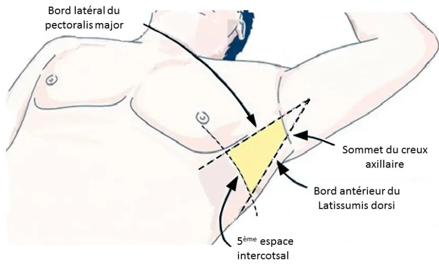

## RECOMMANDATIONS POUR LA PRATIQUE PROFESSIONNELLE

de la Société Française d'Anesthésie-Réanimation (SFAR)

*En association avec la Société Française de Médecine d'Urgence (SFMU),  
la Société de Pneumologie de Langue Française (SPLF)  
et la Société Française de Chirurgie Thoracique et Cardio-Vasculaire (SFCTCV)*

# Épanchement pleural liquidien de l'adulte en soins critiques

(A l'exception des pleurésies purulentes, hemothorax et épanchements néoplasiques)

**ADULT FLUID PLEURAL EFFUSION IN CRITICAL CARE**  
(With the exception of purulent pleurisy, hemothorax and neoplastic effusions)

**2023**

Texte validé par le Comité des Référentiels Cliniques de la SFAR le 10/04/2023 et les Conseils d'Administration de la SFAR le 20/04/2023, de la SFCTCV et de la SFMU le 21/06/2023, et de la SPLF le 18/07/2023.**Auteurs :**

Bélaid Bouhemad, Charlotte Arbelot, Elise Artaud Macari, Laurent Brouchet, Olivier Collange, Marios Froudarakis, Anne Godier, Sophie Hamada, Sabrina Garnier-Kepka, Françoise Le Pimpec-Barthes, Marie-Reine Losser, Tania Marx, Jean Michel Maury, Nicolas Mayeur, Francis Remérand, Hadrien Rozé, Béatrice Riu-Poulenc, Matthieu Jabaudon, Hélène Charbonneau

**Coordonnateurs d'experts SFAR :**

Bélaid Bouhemad (Service d'Anesthésie-Réanimation - CHU Dijon - 14 rue Paul Gaffarel - 21000 Dijon)

**Organisateurs SFAR :**

Hélène Charbonneau (Service d'Anesthésie-Réanimation - Clinique Pasteur – 45 avenue de Lombez BP 27617 – 31076 Toulouse Cedex 03).

Matthieu Jabaudon (Pôle de Médecine Péri-Opératoire, CHU Clermont-Ferrand ; iGReD, Université Clermont Auvergne, CNRS, INSERM – 58 rue Montalembert – 63000 Clermont-Ferrand)

**Experts de la SFAR :**

Charlotte Arbelot (Marseille), Olivier Collange (Strasbourg), Anne Godier (Paris), Sophie Hamada (Paris), Marie-Reine Losser (Nancy), Nicolas Mayeur (Toulouse), Francis Remérand (Tours), Hadrien Rozé (Bordeaux), Béatrice Riu-Poulenc (Toulouse)

**Experts de la SFCTCV :**

Laurent Brouchet (Toulouse), Françoise Le Pimpec-Barthes (Paris), Jean Michel Maury (Lyon)

**Expert de la SFMU :**

Sabrina Garnier-Kepka (Strasbourg), Tania Marx (Besançon)

**Experts de la SPLF :**

Elise Artaud Macari (Rouen), Marios Froudarakis (Saint Etienne)

**Groupes de lecture :**

Comité des Référentiels clinique de la SFAR : Marc Garnier (Président), Alice Blet (Secrétaire), Anaïs Caillard, Hélène Charbonneau, Isabelle Constant, Hugues de Courson, Marc-Olivier Fischer, Denis Frasca, Matthieu Jabaudon, Daphné Michelet, Maxime Nguyen, Stéphanie Ruiz, Mickael Vourc'h.

**Conseil d'Administration de la SFAR :** Pierre Albaladéjo (Président); Jean-Michel Constantin (1er vice-président); Marc Léone (2ème vice-président); Karine Nouette-Gaulain (secrétaire général); Frédéric Le Saché (secrétaire général adjoint); Marie-Laure Cittanova (trésorière); Isabelle Constant (trésorière adjointe); Julien Amour; Hélène Beloeil; Valérie Billard; Marie-Pierre Bonnet; Julien Cabaton; Vincent Collange; Evelyne Combettes; Marion Costecalde; Violaine D'ans; Laurent Delaunay; Delphine Garrigue; Pierre Kalfon; Olivier Joannes-Boyau; Frédéric Lacroix; Jane Muret; Olivier Rontes; Nadia Smail.**Liens d'intérêts des experts SFAR au cours des cinq années précédant la date de validation par le CA de la SFAR.**

Charlotte Arbelot : pas de lien d'intérêt en rapport avec la présente RPP.

Olivier Collange : pas de lien d'intérêt en rapport avec la présente RPP.

Sophie Hamada : pas de lien d'intérêt en rapport avec la présente RPP.

Anne Godier : lien d'intérêt avec les sociétés suivantes : Aguettant, Alexion, Bayer Healthcare, BMS-Pfizer, Boehringer Ingelheim, Sanofi, CSL Behring, LFB, Octapharma, Stago, Viatis.

Marie-Reine Losser : pas de lien d'intérêt en rapport avec la présente RPP.

Nicolas Mayeur : pas de lien d'intérêt en rapport avec la présente RPP.

Francis Remérand : pas de lien d'intérêt en rapport avec la présente RPP.

Hadrien Rozé : pas de lien d'intérêt en rapport avec la présente RPP.

Béatrice Riu-Poulenc : pas de lien d'intérêt en rapport avec la présente RPP.

**Liens d'intérêts des experts SFCTCV, SFMU et SPLF au cours des cinq années précédant la date de validation par le CA de la SFCTCV.**

Laurent Brouchet : pas de lien d'intérêt en rapport avec la présente RPP.

Françoise Le Pimpec-Barthes : pas de lien d'intérêt en rapport avec la présente RPP.

Jean Michel Maury : pas de lien d'intérêt en rapport avec la présente RPP.

Sabrina Garnier-Kepka : pas de lien d'intérêt en rapport avec la présente RPP.

Tania Marx : pas de lien d'intérêt en rapport avec la présente RPP.

Elise Artaud Macari : pas de lien d'intérêt en rapport avec la présente RPP.

Marios Froudarakis : pas de lien d'intérêt en rapport avec la présente RPP.## **RESUME**

**Objectif :** Le drainage thoracique est une procédure très courante en soins critiques. Elle est effectuée par des praticiens issus de nombreuses spécialités, dans divers contextes. Les épanchements pleuraux liquidiens sont la première indication de drainage thoracique. Les modalités de la pose d'un drain, de sa surveillance et de son retrait sont cependant variables selon les centres. L'objectif de ces recommandations est d'émettre des propositions visant à améliorer la prise en charge d'un épanchement pleural liquide (hors pleurésie purulente, hemothorax et épanchement néoplasique) chez un patient adulte en soins critiques.

**Conception :** 15 experts des Sociétés Françaises d'Anesthésie-Réanimation (SFAR), de la Société Française de Chirurgie Thoracique et Cardio-Vasculaire (SFCTCV), de la Société de Pneumologie de Langue Française (SPLF) et de la Société Française de Médecine d'Urgence (SFMU) ont été réunis. Les conflits d'intérêt ont été déclarés par les experts dès le début du processus d'élaboration des recommandations. Ce processus a été conduit indépendamment de tout financement de l'industrie. Les auteurs ont suivi la méthode GRADE (*Grading of Recommendations Assessment, Development and Evaluation*) pour évaluer le niveau de preuve de la littérature.

**Méthodes :** Quatre champs ont été définis : 1) le diagnostic positif et étiologique des épanchements pleuraux ainsi que leur retentissement ; 2) la procédure de drainage thoracique ; 3) la surveillance de l'efficacité et des complications du drainage et ; 4) la procédure de retrait du drain thoracique. Pour chaque champ, l'objectif des recommandations a été de répondre à un certain nombre de questions formulées selon le modèle PICO (*Population, Intervention, Comparaison, Outcome*). A partir de ces questions, une recherche bibliographique extensive a été réalisée, et analysée selon la méthode GRADE. Les recommandations ont été formulées selon la méthode GRADE, puis votées par tous les experts selon la méthode GRADE grid.

**Résultats :** 25 recommandations sur le drainage d'un épanchement pleural liquide chez un patient adulte en soins critiques ont été formulées par le panel d'experts SFAR/SFCTCV/SPLF/SFMU. Après 4 tours de votes, un accord fort a été obtenu pour 25 recommandations. Enfin, pour 3 questions, aucune recommandation n'a pu être formulée.

**Conclusion :** Un accord fort a été obtenu parmi les experts afin de fournir des recommandations visant à optimiser la prise en charge d'un drainage d'un épanchement pleural liquide chez un patient adulte en soins critiques.

**Mots clés :** Épanchement pleural liquide ; Soins critiques ; Ponction ; Drainage ; Drain thoracique.## **ABSTRACT**

**Objective:** Chest tube procedure is a very common critical care procedure that is performed by many different specialties in varying settings. Fluid pleural effusions are the leading cause of chest tube insertion. However, the modalities of chest tube placement, monitoring, and removal differ among centers. The objective of these recommendations is to provide guidelines to improve the management of adult fluid pleural effusion (except purulent pleurisy, hemothorax and neoplastic effusion in critical care).

**Design:** A consensus committee of 15 experts from the French society of anesthesiology and intensive care medicine (Société Française d'Anesthésie-Réanimation, SFAR), the French society of thoracic and cardiovascular surgery (Société Française de Chirurgie Thoracique et Cardio-Vasculaire, SFCTCV), the French society of respiratory diseases (Société de Pneumologie de Langue Française (SPLF)), and the French society of emergency medicine (Société Française de Médecine d'Urgence (SFMU)) was convened. The experts at the onset of the process and throughout declared their conflict-of-interest. The entire guidelines process was conducted independently of any industry funding. The authors were advised to follow the principles of the Grading of Recommendations Assessment, Development and Evaluation (GRADE) system to guide assessment of quality of evidence.

**Methods:** Four fields were defined: 1) the positive and etiological diagnosis of pleural effusions and their impact; 2) the chest tube placement procedure; 3) the effectiveness and complications of the chest tube insertion procedure and; 4) the chest pain removal procedure. For each field, the objective of the recommendations was to answer a number of questions formulated according to the PICO format (*population, intervention, comparison, and outcomes*). Based on these questions, an extensive bibliographic search was carried out and analysed using the GRADE® methodology. The recommendations were formulated according to the GRADE® methodology, and then voted by all the experts according to the GRADE grid method.

**Results:** The SFAR/SFCTCV/SPLF/SFMU guideline panel provided 25 recommendations on the management of patients undergoing chest tube procedure for fluid pleural effusion. After 4 rounds of voting and several amendments, a strong agreement was reached for 25 recommendations. Finally, no recommendation could have been formulated for 3 questions.

**Conclusions:** Strong agreement exists among the experts to provide recommendations to optimize the management of pleural fluid effusion in critical care adult patient

**Keywords:** Fluid pleural effusion ; Critical care ; Ponction ; Drainage ; Chest tube## INTRODUCTION

La cavité pleurale est l'espace compris entre la plèvre viscérale qui enveloppe les poumons et la plèvre pariétale qui tapisse la face interne de la cavité thoracique, le diaphragme et le médiastin. Cet espace contient le liquide pleural en permanence sécrété et réabsorbé par les vaisseaux capillaires et lymphatiques de la plèvre pariétale. En cas de déséquilibre entre la production et la réabsorption, du liquide peut s'accumuler dans cet espace. La présence d'un épanchement pleural est associée significativement à une morbi-mortalité plus importante estimée en termes de durées d'hospitalisation et de ventilation mécanique [1]. La pose d'un drain thoracique peut alors être nécessaire pour évacuer le liquide de la cavité pleurale en excès et rétablir la pression intrathoracique négative. Cela permet au poumon de se ré-expandre, de restaurer une ventilation physiologique et parfois d'améliorer le retour veineux. La pose d'un drain thoracique est une procédure très courante en soins critiques. Ce geste est effectué par des praticiens issus de nombreuses spécialités dans des contextes variés.

Les drains thoraciques et leurs méthodes d'insertion ont évolué. Ils sont disponibles dans une variété de tailles et de matériaux différents, et sont généralement mesurés par le diamètre interne du tube en « French » (un « French » étant égal à un tiers de millimètre de diamètre ; i.e. 24 Fr est égal à un calibre interne de 8 mm). Un tube de 20 Fr ou plus est considéré comme un drain thoracique de gros calibre, et un tube inférieur à 20 Fr est considéré comme un drain thoracique de petit calibre. Parmi les drains thoraciques de petit calibre, il existe des drains droits ou à extrémité préformée, allant d'une forme recourbée à une « queue de cochon », ainsi nommés parce que leur extrémité est enroulée sur elle-même comme la queue d'un cochon (figure 1).

**Figure 1.** Les drains pleuraux (moyen et gros calibre) peuvent être introduits à travers la paroi thoracique montés autour de trocarts métalliques à bouts perforants, drain de Joly (**A**), sur lesquels ils coulisent à la manière de cathéters veineux périphériques ; ou à l'aide d'un introducteur (**B**) monté sur une poignée trocar large (**C**) (pleurotome ou trocar de Monod) (avec la permission des entreprises Lasserteux)

Les drains thoraciques de petit calibre de forme recourbée en « queue de cochon » sont introduits par la technique de Seldinger (**D**).Les techniques de pose d'un drain thoracique sont variables (dissection au doigt, utilisation de trocart, technique de Seldinger), ainsi que les sites de ponction (voie latérale, voie antérieure). L'échographie pleurale semble s'être imposée comme un outil important pour identifier en toute sécurité l'épanchement pleural et les structures le limitant (paroi thoracique, diaphragme, poumon, cœur), et guider le placement du drain. Toutes ces évolutions imposent une analyse de la littérature sur le drainage thoracique en soins critiques afin d'émettre des recommandations pour aider les praticiens à optimiser la prise en charge des patients.

**Ces recommandations portent sur le diagnostic et la prise en charge des épanchements pleuraux uniquement liquidiens** : indication du drainage, choix du type de drain, modalité de la pose, de la surveillance et du retrait du drain thoracique. **Les domaines suivants n'entrent pas dans le champ d'application de ces recommandations** : l'épanchement pleural malin ; l'infection pleurale (pleurésie purulente et empyème) ; l'hemothorax.

## MÉTHODE

### Organisation générale

Ces recommandations sont le résultat du travail d'un groupe d'experts réunis par la SFAR, en association avec la SFCTCV, la SFMU et la SPLF. Chaque expert a rempli une déclaration de conflits d'intérêts avant de débuter le travail d'analyse. L'agenda du groupe a été fixé en amont. Dans un premier temps, le comité d'organisation a défini les questions à traiter avec les coordonnateurs d'experts. Il a ensuite désigné les experts en charge de chacune d'entre elles. Les questions ont été formulées selon un format PICO (*Population, Intervention, Comparaison, Outcome*) après une première réunion du groupe d'experts. La population « P » pour l'ensemble des questions est définie comme « Patients adultes en soins critiques ». L'analyse de la littérature et la formulation des recommandations ont ensuite été conduites selon la méthodologie GRADE (*Grade of Recommendation Assessment, Development and Evaluation*). Un niveau de preuve a été défini pour chacune des références bibliographiques citées en fonction du type de l'étude. Ce niveau de preuve pouvait être réévalué en tenant compte de la qualité méthodologique de l'étude, de la cohérence des résultats entre les différentes études, du caractère direct ou non des preuves, de l'analyse de coût et de l'importance du bénéfice. A noter que très peu d'études réalisées dans le contexte de la médecine en soins critiques ont été identifiées. De plus, leur qualité méthodologique et leur puissance étaient le plus souvent faibles. Face à l'impossibilité d'obtenir un niveau de preuve élevé pour la majorité des recommandations, il a donc été décidé en amont de la rédaction des recommandations d'adopter un format de Recommandations pour des Pratiques Professionnelles (RPP), plutôt qu'un format de Recommandations Formalisées d'Experts (RFE), et de formuler les recommandations en utilisant la terminologie des RPP de la SFAR. De ce fait, chaque recommandation a été rédigée comme suit : « les experts suggèrent de faire » ou « les experts suggèrent de ne pas faire ». Chaque recommandation a ensuite été évaluée par chacun des experts et soumise à une cotation individuelle à l'aide d'une échelle allant de 1 (désaccord complet) à 10 (accord complet). La cotation collective était établie selon uneméthodologie GRADE grid. Pour valider une recommandation, au moins 70 % des participants devaient avoir une opinion qui allait globalement dans la même direction. En l'absence d'accord fort, les recommandations étaient reformulées et de nouveau soumises à cotation dans l'objectif d'aboutir à un consensus.

### **Champs des recommandations**

Les recommandations formulées concernent quatre champs : 1) le diagnostic positif et étiologique des épanchements pleuraux liquidiens, 2) la procédure de drainage thoracique, 3) la surveillance de l'efficacité et des complications du drainage, et 4) la procédure de retrait du drain thoracique. En préambule, la population pédiatrique a été exclue du champ de ce référentiel. Une recherche bibliographique extensive sur les 25 dernières années a été réalisée à partir des bases de données MEDLINE, Cochrane™ et [www.clinicaltrials.gov](http://www.clinicaltrials.gov). Pour être retenues dans l'analyse, les publications devaient être rédigées en langue anglaise ou française. L'analyse a été centrée sur les données récentes selon un ordre d'appréciation allant des méta-analyses d'essais randomisés, aux méta-analyses d'autres essais puis aux essais randomisés, et enfin aux autres études dont les études observationnelles et rétrospectives. La taille des effectifs, la pertinence de la recherche, l'existence de biais potentiels, l'importance des résultats et des écart-types constatés ont été prises en considération pour chaque étude.

### **Synthèse des résultats**

Le travail de synthèse des experts et l'application de la méthode GRADE ont abouti à 25 avis d'experts. Après 4 tours de cotation et quelques amendements, un accord fort a été obtenu pour les 25 recommandations. Enfin, pour 3 questions, aucune recommandation n'a pu être formulée.

La SFAR incite tous les praticiens exerçant en soins critiques à se conformer à ces RPP pour optimiser la qualité des soins dispensés aux patients.

Cependant, chaque praticien doit exercer son propre jugement dans l'application de ces recommandations, en prenant en compte son expertise et les spécificités de son établissement, pour déterminer la méthode d'intervention la mieux adaptée à l'état du patient dont il a la charge

### **Références :**

[1] Mattison LE, Coppage L, Alderman DF, et al. Pleural effusions in the medical ICU: prevalence, causes, and clinical implications. Chest 1997;111:1018–23. <https://doi.org/10.1378/chest.111.4.1018>## CHAMP 1. DIAGNOSTIC ET RETENTISSEMENT DES ÉPANCHEMENTS PLEURAUX LIQUIDIENS

**Question : Faut-il réaliser une radiographie thoracique ou une échographie pleuro-pulmonaire pour le diagnostic d'un épanchement pleural liquide chez un patient adulte en soins critiques ?**

Experts : Béatrice RIU-POULENC (SFAR, Toulouse), Sabrina GARNIER-KEPKA (SFMU, Strasbourg)

**R1.1 – Les experts suggèrent de réaliser une échographie pleuro-pulmonaire plutôt qu'une radiographie thoracique pour poser le diagnostic d'un épanchement pleural liquide sous réserve de la disponibilité d'un échographe et de l'expertise de l'opérateur.**

### Avis d'experts (accord FORT)

**Argumentaire :** L'épanchement pleural est d'incidence variable selon la méthode diagnostique utilisée (8% pour l'examen clinique, 60% pour l'échographie) chez les patients pris en charge en soins critiques. Son diagnostic est crucial pour guider la prise en charge thérapeutique. L'auscultation pulmonaire a une faible performance diagnostique, évaluée à 61% pour le diagnostic d'épanchement pleural chez les patients en syndrome de détresse respiratoire aiguë, comparativement au scanner thoracique [1].

Si la radiographie thoracique (RT) reste régulièrement pratiquée en soins critiques dans cette indication, l'échographie pleuro-pulmonaire (EPP) représente une alternative pouvant être réalisée au lit du malade et sans irradiation. Elle nécessite toutefois la formation des praticiens à cette technique.

Plusieurs études ont comparé les performances diagnostiques de la RT et de l'EPP pour le diagnostic des épanchements pleuraux chez des patients ventilés en soins critiques. Selon les études, la sensibilité de la RT et de l'EPP allait respectivement de 23% à 74% et de 91 à 100% ; la spécificité de la RT (31 à 86%) était également inférieure à celle de l'EPP (92 à 100%) [2–6].

Dans le cas particulier de la détection d'épanchements pleuraux chez des patients ventilés en décompensation cardiaque, la RT avait également une faible performance diagnostique avec une sensibilité et une spécificité respectivement de 43 et 100% comparativement au scanner thoracique, notamment pour les épanchements de petite taille, alors que celle de l'EPP avait une sensibilité et spécificité respectivement de 90 et 95% [6]. De même, pour le diagnostic d'épanchement pleural chez le traumatisé thoracique en soins critiques, la performance diagnostique de la RT était inférieure à celle de l'EPP avec respectivement une sensibilité (23% pour la RT et 92% pour l'EPP) et une spécificité (94 % pour la RT et 95% pour l'EPP) [5].

Dans une étude prospective observationnelle ayant inclus 67 patients intubés pour détresse respiratoire aiguë, la concordance (coefficient kappa) entre la RT et le scanner, considéré comme la méthode de référence pour le diagnostic de l'épanchement pleural, n'était que de 73%, alors que celle d'un protocole d'EPP comportant 9 points était de 100% ( $p < 0,001$ ) [7]. En 2010, une méta-analyse a comparé les performances diagnostiques de la RT et de l'EPP pour le diagnostic des épanchements pleuraux [8]. Parmi les 4 études retenues, non spécifiques aux soins critiques, la sensibilité de la RT était comprise entre 24 et 48% (en dehors d'une étude ancienne avec une sensibilité de 100%) alors que la sensibilité moyenne de l'EPP était de 93% [1,5,6,9]. Cependant, la population des patients n'était pas homogène : sur les 4 études, une seule concernait des détresses respiratoires [2], une autre des décompensations cardiaques [7] et deux autres des traumatismes thoraciques [6,10]. Une deuxième méta-analyse publiée en 2021 a retenu 6 études comparant la performance diagnostique de la RT et de l'EPP en soins critiques avec des méthodologies hétérogènes, des risques de biais considérés comme modérés et une population plus homogène de patients [10]. Les auteurs ont déterminé une sensibilité poolée pour la RT et l'EPP respectivement de 42% et 91%, alors que la spécificité poolée était respectivement de 81% et de 92%.

Bien que les études comparant les performances diagnostiques de la RT et de l'EPP soient observationnelles, les résultats sont concordants concernant la différence entre les 2 techniquesd'imagerie. Les 2 méta-analyses publiées dont une était spécifique à la population en soins critiques permettent de conclure à une supériorité de l'EPP pour le diagnostic d'épanchements pleuraux. De nouvelles études ne modifiaient pas les conclusions quant à l'effet des 2 techniques. Une EPP est plus performante qu'une RT pour faire le diagnostic d'un épanchement pleural liquide, sous réserve de la disponibilité d'un échographe et de la formation préalable de l'opérateur.

#### Références

- [1] Lichtenstein D, Goldstein I, Mourgeon E, et al. Comparative diagnostic performances of auscultation, chest radiography, and lung ultrasonography in acute respiratory distress syndrome. *Anesthesiology* 2004;100:9–15. <https://doi.org/10.1097/00000542-200401000-00006>.
- [2] Xirouchaki N, Magkanas E, Vaporidi K, et al. Lung ultrasound in critically ill patients: comparison with bedside chest radiography. *Intensive Care Med* 2011;37:1488–93. <https://doi.org/10.1007/s00134-011-2317-y>.
- [3] Danish M, Agarwal A, Goyal P, et al. Diagnostic Performance of 6-Point Lung Ultrasound in ICU Patients: A Comparison with Chest X-Ray and CT Thorax. *Turk J Anaesthesiol Reanim* 2019;47:307–19. <https://doi.org/10.5152/TJAR.2019.73603>.
- [4] Schleder S, Dornia C, Poschenrieder F, et al. Bedside diagnosis of pleural effusion with a latest generation hand-carried ultrasound device in intensive care patients. *Acta Radiol Stockh Swed* 1987 2012;53:556–60. <https://doi.org/10.1258/ar.2012.110676>. [5] Rocco M, Carbone I, Morelli A, et al. Diagnostic accuracy of bedside ultrasonography in the ICU: feasibility of detecting pulmonary effusion and lung contusion in patients on respiratory support after severe blunt thoracic trauma. *Acta Anaesthesiol Scand* 2008;52:776–84. <https://doi.org/10.1111/j.1399-6576.2008.01647.x>.
- [6] Kataoka H, Takada S. The role of thoracic ultrasonography for evaluation of patients with decompensated chronic heart failure. *J Am Coll Cardiol* 2000;35:1638–46. [https://doi.org/10.1016/s0735-1097\(00\)00602-1](https://doi.org/10.1016/s0735-1097(00)00602-1).
- [7] Tierney DM, Huelster JS, Overgaard JD, et al. Comparative Performance of Pulmonary Ultrasound, Chest Radiograph, and CT Among Patients With Acute Respiratory Failure. *Crit Care Med* 2020;48:151–7. <https://doi.org/10.1097/CCM.0000000000004124>.
- [8] Grimberg A, Shigueoka DC, Atallah AN, et al. Diagnostic accuracy of sonography for pleural effusion: systematic review. *Sao Paulo Med J Rev Paul Med* 2010;128:90–5. <https://doi.org/10.1590/s1516-31802010000200009>.
- [9] Ma OJ, Mateer JR. Trauma ultrasound examination versus chest radiography in the detection of hemothorax. *Ann Emerg Med* 1997;29:312–5; discussion 315-316. [https://doi.org/10.1016/s0196-0644\(97\)70341-x](https://doi.org/10.1016/s0196-0644(97)70341-x).
- [10] Hansell L, Milross M, Delaney A, et al. Lung ultrasound has greater accuracy than conventional respiratory assessment tools for the diagnosis of pleural effusion, lung consolidation and collapse: a systematic review. *J Physiother* 2021;67:41–8. <https://doi.org/10.1016/j.jphys.2020.12.002>.

**Question : Lorsqu'un drainage ou une ponction pleurale est réalisé, faut-il réaliser systématiquement les analyses biochimique, cytologique et bactériologique du liquide pleural pour diminuer la morbi-mortalité ?**

Experts : Charlotte ARBELOT (SFAR, Marseille), Marios FROUDARAKIS (SPLF, Saint Etienne)

**R1.2 - Les experts suggèrent de réaliser des analyses biochimique, cytologique et bactériologique du liquide pleural lors de la première ponction puis à chaque fois que la cause de l'épanchement pourrait avoir changé pour établir un diagnostic étiologique et optimiser la prise en charge thérapeutique du patient.**

**Avis d'experts (accord FORT)**

**Argumentaire :** La découverte d'un épanchement pleural en soins critiques est fréquente et sa cause est le plus souvent évidente (insuffisance cardiaque ou traumatisme par exemple).Il n'existe pas dans la littérature de preuve formelle de l'intérêt de l'analyse systématique du liquide pleural chez le patient de soins critiques. Cependant, lorsque le prélèvement pleural s'inscrit dans une démarche diagnostique, il peut aboutir à une modification de la prise en charge thérapeutique. Dans l'étude de Chinchkar et al., 88% des ponctions permettaient d'établir un diagnostic [1]. Sur 82 patients ponctionnés, le geste aboutissait à une modification du diagnostic dans 45% des cas, et à une modification significative des thérapeutiques dans 33% des cas [2]. Dans une étude de pratique sur questionnaire en soins critiques, les auteurs rapportaient une modification diagnostique dans 37% des cas et une modification thérapeutique dans 17% des cas [3]. Lors d'une suspicion d'infection du liquide pleural (liquide macroscopiquement purulent ou contexte clinico-biologique ou radiologique/échographique en faveur), il est nécessaire de proposer systématiquement l'analyse du liquide pleural compte tenu de la morbi-mortalité importante du retard de prise en charge d'une infection pleurale [4,5]. Dans une étude prospective monocentrique observationnelle portant sur 175 patients, dont 45% présentaient un empyème ou un épanchement parapneumonique, le taux de positivité bactériologique des prélèvements était de 74% [4]. Les critères de Light (Protéines dans le liquide pleural/Protéines sériques > 0,5 ; LDH pleural/LDH sérique > 0,6 ; LDH pleural > 2/3 de la limite haute de la normale de la LDH sérique) sont communément utilisés en soins critiques pour évoquer le caractère exsudatif de l'épanchement, même si le travail princeps ne concernait pas la population des soins critiques [6]. La mesure du NT-proBNP dans le liquide pleural pourrait être une aide diagnostique en cas d'épanchement pleural d'origine cardiogénique ; cependant, des valeurs élevées ont aussi été retrouvées chez des patients présentant un choc septique ou une insuffisance rénale. Le contexte clinique est donc aussi à prendre en considération avant interprétation [7]. Compte tenu des données décrites, il semble raisonnable d'analyser systématiquement l'origine d'un épanchement pleural lors d'une première ponction, ce qui peut être discuté au cas par cas lors des ponctions suivantes.

#### Références

- [1] Chinchkar NJ, Talwar D, Jain SK. A stepwise approach to the etiologic diagnosis of pleural effusion in respiratory intensive care unit and short-term evaluation of treatment. Lung India Off Organ Indian Chest Soc 2015;32:107–15. <https://doi.org/10.4103/0970-2113.152615>.
- [2] Fartoukh M, Azoulay E, Galliot R, et al. Clinically documented pleural effusions in medical ICU patients: how useful is routine thoracentesis? Chest 2002;121:178–84. <https://doi.org/10.1378/chest.121.1.178>.
- [3] Azoulay E, Fartoukh M, Similowski T, et al. Routine exploratory thoracentesis in ICU patients with pleural effusions: results of a French questionnaire study. J Crit Care 2001;16:98–101. <https://doi.org/10.1053/jcrc.2001.28784>.
- [4] Tu C-Y, Hsu W-H, Hsia T-C, et al. The changing pathogens of complicated parapneumonic effusions or empyemas in a medical intensive care unit. Intensive Care Med 2006;32:570–6. <https://doi.org/10.1007/s00134-005-0064-7>.
- [5] Towe CW, Carr SR, Donahue JM, et al. Morbidity and 30-day mortality after decortication for parapneumonic empyema and pleural effusion among patients in the Society of Thoracic Surgeons' General Thoracic Surgery Database. J Thorac Cardiovasc Surg 2019;157:1288–1297.e4. <https://doi.org/10.1016/j.jtcvs.2018.10.157>.
- [6] Light RW, Girard WM, Jenkinson SG, et al. Parapneumonic effusions. Am J Med 1980;69:507–12. [https://doi.org/10.1016/0002-9343\(80\)90460-x](https://doi.org/10.1016/0002-9343(80)90460-x).
- [7] Yeh J-H, Huang C-T, Liu C-H, et al. Cautious application of pleural N-terminal pro-B-type natriuretic peptide in diagnosis of congestive heart failure pleural effusions among critically ill patients. PloS One 2014;9:e115301. <https://doi.org/10.1371/journal.pone.0115301>

#### Question : Faut-il évacuer un épanchement pleural pour diminuer la morbi-mortalité ?

Experts : Tania MARX (SFMU, Besançon), Nicolas MAYEUR (SFAR, Toulouse), Marios FROUDARAKIS (SPLF, Saint Etienne), Francis REMERAND (SFAR, Tours)**R1.3.1 – Les experts suggèrent de ne pas utiliser uniquement des critères quantitatifs basés sur l'imagerie pour poser l'indication d'une ponction ou d'un drainage d'un épanchement pleural liquide afin de diminuer la morbidité.**

**Avis d'experts (accord FORT)**

**R1.3.2 – Les experts suggèrent d'utiliser un ensemble d'arguments basé notamment sur les éléments ci-dessous pour poser l'indication d'une ponction ou d'un drainage pleural pour améliorer le rapport  $PaO_2/FiO_2$  :**

- - le volume de l'épanchement,
- - le délai précoce d'apparition de l'épanchement ainsi que la rapidité de son installation,
- - la tolérance respiratoire, avec notamment chez le patient ventilé une baisse de la compliance thoraco-pulmonaire attribuable à l'épanchement.

**Avis d'experts (accord FORT)**

**Argumentaire :** Il existe plusieurs études dont l'objectif principal était d'analyser l'intérêt de l'évacuation d'un épanchement pleural chez les patients de soins critiques ventilés ou non. Ces études se sont intéressées à plusieurs critères de jugement, dont l'évolution des paramètres physiologiques respiratoires comme le rapport  $PaO_2/FiO_2$ . Le niveau global de preuve de ces études est bas.

Dans une méta-analyse d'études observationnelles ou interventionnelles non randomisées portant sur 9 études et 241 patients, le drainage thoracique améliorait le rapport  $PaO_2/FiO_2$  chez les patients en ventilation spontanée et sous ventilation mécanique [1]. Dans une large étude prospective observationnelle multicentrique récente portant sur 226 patients de soins critiques, le drainage thoracique augmentait de 30% le rapport  $PaO_2/FiO_2$  initial à 24h [2]. La littérature concernant des critères de jugement cliniques est plus parcellaire. La mortalité a été évaluée dans une étude rétrospective sur base de données ayant inclus 50 765 patients de réanimation dont 7,7% présentaient un épanchement pleural [3]. Sur cette population, 1503 ont été drainés, et 2394 n'ont pas été drainés. La mortalité à 1 mois, 6 mois et 1 an était plus élevée pour les patients ayant eu un drainage pleural (1 mois : RR 1,2 IC95% [1,09 - 1,33],  $p<0,001$  ; 6 mois : RR 1,09 [1,02 - 1,16],  $p=0,016$  ; 1 an : RR 1,07 [1,02 - 1,13],  $p=0,015$ ). La durée de ventilation ainsi que la durée d'hospitalisation étaient plus élevées chez les patients drainés comparativement aux patients non drainés (durée de ventilation : SMD 4,6 jours [3,8 - 5,5] ;  $p<0,0001$ ) ; durée hospitalisation : SMD 6,1 jours [4,9 - 7,3] ;  $p<0,0001$ ). L'absence de détail sur les indications, le volume de drainage mais également sur la gravité des patients au moment du drainage rendent l'interprétation de cette étude trop hasardeuse pour conclure sur l'effet du drainage en lui-même. Enfin, dans une étude randomisée de faible effectif, Gharaf et al. ont mis en évidence que la durée de ventilation totale était diminuée dans le groupe drainage (SMD -1,14 jours [-1,83 – -0,45],  $p=0,002$ ) [4].

Toutes ces données ne permettent pas d'identifier clairement des critères cliniques et/ou radiologiques permettant de poser l'indication d'une ponction ou d'un drainage.

Plusieurs études, visant à identifier des facteurs associés à une amélioration des paramètres ventilatoires à la suite du drainage thoracique, rapportent des résultats contradictoires. Différents critères peuvent être discutés comme le volume de l'épanchement, son délai d'apparition, et le caractère abaissé de la compliance thoraco-pulmonaire.

Deux critères de volume pourraient être retenus pour poser l'indication d'une ponction ou d'un drainage : un volume critique bas en-dessous duquel ce geste serait inutile voire délétère, et un volume critique haut à partir duquel ce geste aurait plus de bénéfices que de risques. Les études quantifiant le volume de l'épanchement en soins critiques utilisent toutes l'échographie. Dans les recommandations de la British Thoracic Society [5] et celles de la Society of Hospital Medicine [6], un seuil minimum de volume d'épanchement de 10 à 15 mm (correspondant à la distance maximale mesurée entre la paroi et le poumon) est mentionné dans l'argumentaire des recommandations,sans références bibliographiques autres que deux avis d'experts. Lors d'une enquête menée parmi les réanimations chirurgicales universitaires françaises en 2012 [7], 59% des praticiens déclaraient utiliser un critère de volume haut pour poser l'indication d'évacuation pleurale. Néanmoins, dans trois études observationnelles (dont deux rétrospectives, 72% de patients ventilés mécaniquement), le volume drainé n'était ni corrélé à la diminution de l'espace mort [8], ni au sevrage de la ventilation mécanique dans les 48 [9] ou 72 heures [10]. Dans une étude observationnelle menée dans trois réanimations incluant 173 patients [11], la présence d'un épanchement modéré ou important (estimé échographiquement mais ni calculé ni drainé) ne modifiait pas la probabilité de sevrage de la ventilation mécanique dans les 48 heures.

La précocité du drainage ainsi que la rapidité d'installation lors d'une hospitalisation ou après son diagnostic semblent être des facteurs associés au succès [2,10-12]. Dans une étude observationnelle multicentrique portant sur 226 patients en soins critiques, le drainage précoce (<24h) améliorait le rapport  $PaO_2/FiO_2$  de 30% (203 vs. 263) chez les patients drainés vs. 7% (250 vs. 268) chez les patients non drainés ( $p < 0,01$ ) sans majoration de la morbidité liée au geste [2]. Le bénéfice de ce drainage précoce a été aussi retrouvé dans deux études rétrospectives portant sur 58 et 62 patients après chirurgie cardiaque [12] ou chirurgie thoracique et abdominale [10].

Pour Formenti et al., une compliance thoraco-pulmonaire pré-drainage abaissée chez des patients sous ventilation mécanique serait corrélée à une amélioration significative du rapport  $PaO_2/FiO_2$  et du volume télé-expiratoire deux heures après le drainage [13].

La sévérité initiale de l'atteinte respiratoire évaluée par le rapport  $PaO_2/FiO_2$  semble associée à une amélioration de ce paramètre 8 à 24h après drainage dans 3 études [8, 12, 14], mais pas dans trois autres [9,15,16].

#### Références :

- [1] Vetrugno L, Bignami E, Orso D, et al. Utility of pleural effusion drainage in the ICU: An updated systematic review and META-analysis. *Journal of Critical Care* 2019;52:22–32. <https://doi.org/10.1016/j.jcrc.2019.03.007>.
- [2] Fysh ETH, Smallbone P, Mattock N, et al. Clinically Significant Pleural Effusion in Intensive Care: A Prospective Multicenter Cohort Study. *Crit Care Explor* 2020;2:e0070. <https://doi.org/10.1097/CCE.0000000000000070>.
- [3] Bateman M, Alkhatib A, John T, et al. Pleural Effusion Outcomes in Intensive Care: Analysis of a Large Clinical Database. *J Intensive Care Med* 2020;35:48–54. <https://doi.org/10.1177/0885066619872449>.
- [4] Gharraf HS, AbdAllah AED. Drainage of transudative pleural effusion: how does it affect weaning from mechanical ventilation? *Egypt J Bronchol* 2020;14:27. <https://doi.org/10.1186/s43168-020-00028-9>.
- [5] Havelock T, Teoh R, Laws D, et al. Pleural procedures and thoracic ultrasound: British Thoracic Society Pleural Disease Guideline 2010. *Thorax* 2010;65 Suppl 2:ii61–76. <https://doi.org/10.1136/thx.2010.137026>.
- [6] Dancel R, Schnobrich D, Puri N, et al. Recommendations on the Use of Ultrasound Guidance for Adult Thoracentesis: A Position Statement of the Society of Hospital Medicine. *J Hosp Med* 2018;13:126–35. <https://doi.org/10.12788/jhm.2940>.
- [7] Remérand F, Bazin Y, Gage J, et al. A survey of percutaneous chest drainage practice in French university surgical ICU's. *Ann Fr Anesth Reanim* 2014;33:e67–72. <https://doi.org/10.1016/j.annfar.2014.02.009>.
- [8] Walden AP, Garrard CS, et al. Sustained effects of thoracentesis on oxygenation in mechanically ventilated patients. *Respirol Carlton Vic* 2010;15:986–92. <https://doi.org/10.1111/j.1440-1843.2010.01810.x>.
- [9] Vetrugno L, Guadagnin GM, Barbariol F, et al. Assessment of Pleural Effusion and Small Pleural Drain Insertion by Resident Doctors in an Intensive Care Unit: An Observational Study. *Clin Med Insights Circ Respir Pulm Med* 2019;13:1179548419871527. <https://doi.org/10.1177/1179548419871527>.
- [10] Fang HY, Chang KW, Chao YK. Ultrasound-Guided Pleural Effusion Drainage: Effect on Oxygenation, Respiratory Mechanics, and Liberation from Mechanical Ventilation in Surgical Intensive Care Unit Patients - Diagnostics (Basel) . 2021 Oct 28;11(11):2000. doi: 10.3390/diagnostics11112000.
- [11] Dres M, Roux D, Pham T, et al. Prevalence and Impact on Weaning of Pleural Effusion at the Time of Liberation from Mechanical Ventilation: A Multicenter Prospective Observational Study - *Anesthesiology* . 2017 Jun;126(6):1107–1115. doi: 10.1097/ALN.00000000000001621.[12] de Waele JJ, Hoste E, Benoit D, et al. The Effect of Tube Thoracostomy on Oxygenation in ICU Patients. J Intensive Care Med 2003;18:100–4. <https://doi.org/10.1177/0885066602250358>.

[13] Formenti P, Umbrello M, Piva IR, et al. Drainage of pleural effusion in mechanically ventilated patients: Time to measure chest wall compliance? Journal of Critical Care 2014;29:808–13. <https://doi.org/10.1016/j.jcrc.2014.04.009>.

[14] Sakurai M, Morinaga K, Shimoyama K, et al. Effects of pleural drainage on oxygenation in critically ill patients. Acute Med Surg 2020;7. <https://doi.org/10.1002/ams2.489>.

[15] Razazi K, Thille AW, Carteaux G, Beji O, et al. Effects of Pleural Effusion Drainage on Oxygenation, Respiratory Mechanics, and Hemodynamics in Mechanically Ventilated Patients. Annals ATS 2014;11:1018–24. <https://doi.org/10.1513/AnnalsATS.201404-152OC>.

[16] Bloom MB, Serna-Gallegos D, Ault M, et al. Effect of Thoracentesis on Intubated Patients with Acute Lung Injury. Am Surg 2016;82:266–70.

**Question : Faut-il évacuer un épanchement pleural par drainage ou par ponction évacuatrice pour diminuer la morbi-mortalité ?**

Experts : Tania MARX (SFMU, Besançon), Nicolas MAYEUR (SFAR, Toulouse)

**ABSENCE DE RECOMMANDATION –** Devant l’absence de données dans la littérature, les experts ne sont pas en mesure d’émettre une recommandation concernant le choix préférentiel d’une évacuation par drainage ou par ponction d’un épanchement pleural liquide chez les patients de soins critiques

**Argumentaire :** Malgré une analyse exhaustive de la littérature, aucun article n’a été trouvé pour évaluer l’intérêt ou non d’évacuer un épanchement pleural liquide par ponction ou par drainage chez les patients de soins critiques. Les experts suggèrent que des études cliniques soient réalisées pour permettre de répondre à cette situation clinique fréquente en soins critiques.## CHAMP 2. PROCÉDURE DE DRAINAGE

**Question : Faut-il privilégier une voie d'abord à une autre pour diminuer la morbi-mortalité d'un drainage pleural ?**

Experts : Olivier COLLANGE (SFAR, Strasbourg), Jean Michel MAURY (SFCTCV, Lyon), Elise ARTAUD MACARI (SPLF, Rouen)

<table border="1"><tr><td><b>R2.1.1 – Les experts suggèrent de réaliser une échographie pleuro-pulmonaire (au minimum un écho-repérage ; au mieux un écho-guidage) pour améliorer la qualité et la sécurité du drainage pleural.</b></td></tr><tr><td style="text-align: right;"><b>Avis d'experts (accord FORT)</b></td></tr><tr><td><b>R2.1.2 – Quelle que soit la voie d'abord, les experts suggèrent que la ponction et l'insertion du drain suivent le bord supérieur de la côte pour minimiser le risque de lésions vasculaires et nerveuses intercostales.</b></td></tr><tr><td style="text-align: right;"><b>Avis d'experts (accord FORT)</b></td></tr><tr><td><b>R2.1.3 – Les experts suggèrent que lorsque les données de l'échographie laissent le choix à plusieurs sites d'insertion pour le drain, le triangle dit «de sécurité» soit le site d'insertion à privilégier pour diminuer la morbidité liée à la pose.</b></td></tr><tr><td style="text-align: right;"><b>Avis d'experts (accord FORT)</b></td></tr><tr><td><b>R2.1.4 – Les experts suggèrent que le drainage pleural soit réalisé par des personnes expérimentées lorsque les données de l'échographie ne retiennent pas le triangle «de sécurité» comme site possible d'insertion du drain pour diminuer la morbidité liée à la pose.</b></td></tr><tr><td style="text-align: right;"><b>Avis d'experts (accord FORT)</b></td></tr><tr><td>
<b>Argumentaire :</b> Lors de la mise en place d'un drain thoracique (DT), l'utilisation de l'échographie thoracique et une parfaite maîtrise des techniques de drainage semblent être des éléments plus pertinents que celui d'une voie d'abord particulière pour sécuriser la réalisation du geste et optimiser son résultat. Dans tous les cas, la ponction à l'aiguille et l'insertion du drain doivent suivre le bord supérieur de la côte de l'espace intercostal abordé pour minimiser le risque de lésions intercostales vasculaires ou nerveuses. En effet, le pédicule vasculo-nerveux intercostal se situe généralement sous la côte. Mais cette localisation est variable dans l'espace intercostal en fonction de la distance avec le rachis. Misra et al. ont mis en évidence, après une analyse cannographique portant sur 250 patients inclus prospectivement, que la zone de faible risque de lésion du pédicule vasculo-nerveux intercostal se situe à plus de 10 cm en latéral du rachis, au niveau du bord supérieur de la côte [1].

L'échographie pleuro-pulmonaire permet de visualiser l'épaisseur de la paroi thoracique, les vaisseaux intercostaux, le positionnement du diaphragme et la répartition du liquide dans la cavité thoracique [2,3]. Plusieurs études observationnelles prospectives et rétrospectives en soins critiques montrent un faible taux de complication des gestes pleuraux (ponction et/ou drainage) lorsqu'ils sont réalisés sous contrôle échographique (pneumothorax 0 à 2,8%, hémoptysie 0 à 0,1%) et un taux élevé de réussite de la procédure de 97% [4-9]. L'échographie pleurale permet : 1) de repérer le diaphragme, 2) de déterminer le site d'insertion en regard de l'endroit où l'épanchement pleural est le plus abondant, 3) de réduire le risque de traumatisme vasculaire, notamment chez les patients pour lesquels le repérage clinique du bord supérieur de la côte est difficile et 4) de confirmer le positionnement intra-pleural du drain. Pour toutes ces raisons, un écho-repérage doit être réalisé systématiquement avant un drainage thoracique liquide [10].
</td></tr></table>Néanmoins, les experts associent à ces avis deux éléments susceptibles d'améliorer encore la sécurité liée à la pose du drain pleural :

1. Plus qu'un écho-repérage, l'écho-guidage pendant la totalité de la séquence de pose, i.e. établissement des repères, insertion de l'aiguille, contrôle de l'arrivée du drain et de sa position dans la cavité pleurale, est décrit dans la littérature [11]. L'écho-guidage permet de s'affranchir des modifications de répartition du liquide dans la cavité pleurale liées au positionnement du patient [12,13]. Comparé à l'écho-repérage, l'écho-guidage réduit significativement le taux de complications post-procédure [5]. Dans cette étude, le taux de pneumothorax iatrogène était significativement inférieur dans le groupe écho-guidage (0,70% ; IC95% [0,1–3,9%] vs. le groupe écho-repérage (5,0% [2,7–9,4%] ;  $p = 0,03$ ) ainsi que le taux de complication globale (0,63% [0,1–3,4%] vs. 6,89% [4,2–11,2%] ;  $p \leq 0,01$ ). Ces résultats étaient également observés chez les patients sous ventilation mécanique avec un taux de complication globale inférieur dans le groupe écho-guidage vs. le groupe écho-repérage (0% vs. 5,4% [1,50–17,7%] ;  $p = 0,01$ ) [5].

2. Lorsqu'elle est possible aux vues des données échographiques, une voie d'abord thoracique latérale dans le triangle dit « de sécurité » doit être privilégiée (annexe 1). Le triangle de sécurité est délimité en avant par le bord latéral du grand pectoral, en arrière par le bord antérieur du muscle grand dorsal, en bas par la ligne transversale passant par le mamelon, et en haut par le pli axillaire [14,15]. La pose d'un DT sous échographie en dehors du triangle de sécurité est possible, mais elle nécessite un niveau d'expertise supplémentaire. Il n'est pas possible de recommander formellement un site de drainage alternatif. En effet, aucune étude n'a comparé la morbi-mortalité liée au site d'insertion du drain. Néanmoins, les experts constatent que la voie d'abord latérale dans le triangle de sécurité est la plus fréquemment décrite dans la littérature ; c'est très probablement la voie d'abord la plus utilisée dans le monde. Maybauer et al. ont analysé rétrospectivement la position de 74 DT chez des patients traumatisés : 22% des DT étaient mal positionnés, quelle que soit la voie d'abord [14]. Huber-Wagner et al. ont analysé rétrospectivement les complications de 101 DT chez 68 patients traumatisés [17]. Vingt et un pour cent des DT ont été insérés par voie antérieure et 79 % par voie latérale. Globalement, un DT sur cinq était mal positionné (par exemple en position scissurale). Cette malposition n'était généralement pas accompagnée d'une complication fonctionnelle et aucune différence significative n'a été observée entre les deux localisations. Dans une étude rétrospective, Benns et al. ont analysé la position scanographique des DT chez 291 patients traumatisés [17]. Bien que la localisation du DT ne soit pas un des paramètres clairement identifiés, il semble que la localisation antérieure ait été choisie dans près de 15% des cas. Dans cette étude, le taux de reprise chirurgicale pour saignement n'était pas lié à la voie d'abord du DT. Dans une autre étude rétrospective, Hernandez et al. ont analysé l'incidence des complications de 246 DT latéraux chez 154 patients traumatisés [18]. L'analyse comprenait les complications liées à l'insertion, au positionnement, aux infections et aux difficultés techniques, ainsi que celles liées à l'ablation du DT. Cette étude suggérait que l'angle d'insertion du DT, en particulier chez les patients obèses, pouvait avoir un impact sur l'incidence des complications. Enfin, les recommandations de la British Thoracic Society en 2003 [15] puis en 2010 [10] suggèrent de privilégier la voie d'abord latérale.

#### Références

- [1] Misura T, Drakopoulos D, Mitrakovic M, Loennfors T, Primetis E, Hoppe H, Obmann VC, Huber AT, Ebner L, Christe A. Avoiding the Intercostal Arteries in Percutaneous Thoracic Interventions. *J Vasc Interv Radiol*. 2022 Apr;33(4):416-419.e2.
- [2] Gray EJ, Cranford JA, Betcher JA, et al. Sonogram of safety: Ultrasound outperforms the fifth intercostal space landmark for tube thoracostomy site selection. *J Clin Ultrasound* 2020;48(6):303-6.
- [3] Mojoli F, Bouhemad B, Mongodi S, et al. Lung Ultrasound for Critically Ill Patients. *Am J Respir Crit Care Med* 2019;199(6):701-14.
- [4] Gervais DA, Petersein A, Lee MJ, et al. US-guided thoracentesis: requirement for postprocedure chest radiography in patients who receive mechanical ventilation versus patients who breathe spontaneously. *Radiology* 1997;204(2):503-6.[5] Helgeson SA, Fritz AV, Tatari MM, et al. Reducing iatrogenic Pneumothoraces: Using Real-Time Ultrasound Guidance for Pleural Procedures. Crit Care Med 2019;47(7):903-9.

[6] Lichtenstein D, Hulot JS, Rabiller A, et al. Feasibility and safety of ultrasound-aided thoracentesis in mechanically ventilated patients. Intensive Care Med 1999;25(9):955-8.

[7] Mayo PH, Goltz HR, Tafreshi M, et al. Safety of ultrasound-guided thoracentesis in patients receiving mechanical ventilation. Chest 2004;125(3):1059-62.

[8] Mynarek G, Brabrand K, Jakobsen JA, et al. Complications following ultrasound-guided thoracocentesis. Acta Radiol 2004;45(5):519-22.

[9] Rodriguez Lima DR, Yepes AF, Birchenall Jimenez CI, et al. Real-time ultrasound-guided thoracentesis in the intensive care unit: prevalence of mechanical complications. Ultrasound J 2020;12(1):25.

[10] Havelock T, Teoh R, Laws D, et al. Pleural procedures and thoracic ultrasound: British Thoracic Society Pleural Disease Guideline 2010. Thorax 2010;65 Suppl 2:ii61-76.

[11] Menegozzo CAM, Utiyama EM. Steering the wheel towards the standard of care: Proposal of a step-by-step ultrasound-guided emergency chest tube drainage and literature review. International Journal of Surgery 2018;56:315–9. <https://doi.org/10.1016/j.ijisu.2018.07.002>.

[12] Raptopoulos V, Davis LM, Lee G, Umali C, Lew R, Irwin RS. Factors affecting the development of pneumothorax associated with thoracentesis. American Journal of Roentgenology 1991;156:917–20. <https://doi.org/10.2214/ajr.156.5.2017951>.

[13] Kohan JM, Poe RH, Israel RH, Kennedy JD, Benazzi RB, Kallay MC, et al. Value of chest ultrasonography versus decubitus roentgenography for thoracentesis. Am Rev Respir Dis 1986;133:1124–6. <https://doi.org/10.1164/arrd.1986.133.6.1124>.

[14] Maybauer MO, Geisser W, Wolff H, Maybauer DM. Incidence and outcome of tube thoracostomy positioning in trauma patients. Prehosp Emerg Care 2012;16(2):237-41.

[15] Laws D, Neville E, Duffy J. BTS guidelines for the insertion of a chest drain. Thorax 2003;58 Suppl 2(Suppl 2):ii53-9.

[16] Huber-Wagner S, Korner M, Ehrt A, et al. Emergency chest tube placement in trauma care - which approach is preferable? Resuscitation 2007;72(2):226-33.

[17] Benns MV, Egger ME, Harbrecht BG, et al. Does chest tube location matter? An analysis of chest tube position and the need for secondary interventions. J Trauma Acute Care Surg 2015;78(2):386-90.

[18] Hernandez MC, Laan DV, Zimmerman SL, et al. Tube thoracostomy: Increased angle of insertion is associated with complications. J Trauma Acute Care Surg 2016;81(2):366-70.

**Question : Faut-il poser le drain en position allongée ou demi-assise pour éviter la survenue de complications du drainage ?**

Experts : Olivier COLLANGE (SFAR, Strasbourg), Jean Michel MAURY (SFCTCV, Lyon)

**ABSENCE DE RECOMMANDATION –** Devant l'absence de littérature, les experts ne sont pas en mesure d'émettre de recommandation concernant la position préférentielle du patient lors de l'évacuation d'un épanchement pleural liquide, par drainage ou par ponction évacuatrice, chez les patients de soins critiques.

**Argumentaire :** Malgré une analyse exhaustive de la littérature, aucun article n'a été retrouvé pour évaluer l'intérêt de la position du patient afin de minimiser les complications liées au drainage d'un épanchement pleural liquide chez les patients de soins critiques. Les experts suggèrent que des études cliniques soient conduites pour permettre de répondre à cette situation clinique fréquente en soins critiques.

**Question : Par rapport au drainage chirurgical, le drainage d'un épanchement pleural liquide doit-il se faire par voie percutanée selon la technique de Seldinger pour diminuer la morbi-mortalité ?****R2.2.1 – Les experts ne suggèrent pas de privilégier le drainage percutané par la technique de Seldinger par rapport à un drainage par une technique chirurgicale pour diminuer la mortalité.**

**Avis d'experts (accord FORT)**

**R2.2.2 – Les experts suggèrent de privilégier le drainage percutané par la technique de Seldinger par rapport à un drainage par une technique chirurgicale pour diminuer la douleur.**

**Avis d'experts (accord FORT)**

**Argumentaire :** Aucune étude randomisée n'a exploré l'intérêt d'une pose de drain par la technique de Seldinger par rapport à une technique chirurgicale spécifiquement pour le drainage des épanchements pleuraux liquidiens non traumatiques en soins critiques. Les seules données scientifiques disponibles sur la technique de drainage percutanée concernent les hémothorax, les hémo-pneumothorax ou les épanchements pleuraux malins. Leurs résultats sont probablement extrapolables aux épanchements pleuraux liquidiens en réanimation. Six études randomisées ont comparé la morbi-mortalité des deux techniques de drainage [1-6], dont 3 par la même équipe [1-3]. La mortalité était nulle dans 5 études, et la sixième était menée sur des cadavres [5]. La définition de la morbidité différait d'une équipe à l'autre, et était toujours un critère composite. Cependant, dans les 6 études, la survenue de complications liées au drain, la durée de séjour en réanimation ou à l'hôpital étaient identiques quelle que soit la technique. L'utilisation de l'échographie pour repérer (voire guider) la technique de Seldinger était mentionnée dans une seule étude [4]. Aucune étude n'a comparé la morbidité de la technique de Seldinger avec ou sans échographie, ce qui est une limite majeure à l'interprétation de ces études. Les effectifs de la plupart de ces études étaient faibles (de 40 à 407 drains).

Cinq études randomisées [1-4,6] ont comparé les douleurs induites par les deux techniques de drainage, dont 3 par la même équipe [1-3]. Une diminution de la douleur (évaluée par différents scores) dans le groupe technique de Seldinger était retrouvée dans toutes ces études. Cependant, il est difficile de différencier si l'effet sur la douleur est principalement lié à la technique de pose ou à la taille du drain (toujours plus faible dans le groupe Seldinger que dans le groupe technique chirurgicale).

#### Références

[1] Kulvatunyou N, Bauman ZM, Zein Edine SB, de Moya M, Krause C, Mukherjee K, et al. The small (14 Fr) percutaneous catheter (P-CAT) versus large (28-32 Fr) open chest tube for traumatic hemothorax: A multicenter randomized clinical trial. *J Trauma Acute Care Surg* 2021;91:809–13. <https://doi.org/10.1097/TA.0000000000003180>.

[2] Bauman ZM, Kulvatunyou N, Joseph B, Gries L, O'Keeffe T, Tang AL, et al. Randomized Clinical Trial of 14-French (14F) Pigtail Catheters versus 28-32F Chest Tubes in the Management of Patients with Traumatic Hemothorax and Hemopneumothorax. *World J Surg* 2021;45:880–6. <https://doi.org/10.1007/s00268-020-05852-0>.

[3] Kulvatunyou N, Erickson L, Vijayasekaran A, Gries L, Joseph B, Friese RF, et al. Randomized clinical trial of pigtail catheter versus chest tube in injured patients with uncomplicated traumatic pneumothorax. *Br J Surg* 2014;101:17–22. <https://doi.org/10.1002/bjs.9377>.

[4] Yi J, Liu H, Zhang M, Wu J, Yang J, Chen J, et al. Management of traumatic hemothorax by closed thoracic drainage using a central venous catheter. *J Zhejiang Univ Sci B* 2012;13:43–8. <https://doi.org/10.1631/jzus.B1100161>.

[5] Protic A, Barkovic I, Bralic M, Cicvaric T, Stifter S, Sustic A. Targeted wire-guided chest tube placement: a cadaver study. *Eur J Emerg Med Off J Eur Soc Emerg Med* 2010;17:146–9. <https://doi.org/10.1097/MEJ.0b013e3283307b35>.

[6] Rahman NM, Pepperell J, Rehal S, Saba T, Tang A, Ali N, et al. Effect of Opioids vs NSAIDs and Larger vs Smaller Chest Tube Size on Pain Control and Pleurodesis Efficacy Among Patients With Malignant PleuralEffusion: The TIME1 Randomized Clinical Trial. JAMA 2015;314:2641–53.  
<https://doi.org/10.1001/jama.2015.16840>.

### Question : Le diamètre du drain a-t-il un impact sur l'efficacité et la sécurité du drainage pleural ?

Experts : Hadrien ROZE (SFAR, Bordeaux), Laurent BROUCHET (SFCTCV, Toulouse)

**R2.3 – Devant l'absence de différence d'efficacité et de sécurité, les experts suggèrent de privilégier un drain thoracique de petit calibre pour diminuer la douleur.**

#### Avis d'experts (accord FORT)

**Argumentaire :** Plusieurs études randomisées contrôlées ont analysé l'intérêt d'utiliser des drains pleuraux de petit diamètre (<20 Fr) sur l'efficacité et la sécurité [1–3]. Toutefois, aucune ne s'est intéressée spécifiquement aux épanchements pleuraux liquidiens en soins critiques. Dans ces études, les populations avaient des petits effectifs, sans aveugle, avec des indications différentes de drainage (hème-pneumothorax, pleurésies néoplasiques, pneumothorax spontanés ou pleurésies purulentes). Dans ces 3 études [1–3] ainsi que dans la méta-analyse les regroupant [4], l'efficacité du drainage d'une pleurésie néoplasique n'était pas différente avec les drains de 12-17 Fr vs. ceux de 22-24 Fr. Le seul résultat différent entre les 2 groupes était une diminution modeste de la douleur avec les drains de petit calibre [3].

Plusieurs études rétrospectives observationnelles faites sur des registres de centaines de patients ont montré des taux faibles de complications quel que soit le diamètre du drain [5–7]. Cependant, il existe un biais important dans ces études puisque le clinicien choisissait la taille du drain en fonction de ses propres critères, ce qui peut expliquer l'absence de différence.

Le niveau de preuve de ces études est faible, par conséquent le débat n'est pas définitivement tranché.

#### Références

- [1] Clementsen P, Evald T, Grode G, Hansen M, Krag Jacobsen G, Faurshou P. Treatment of malignant pleural effusion: pleurodesis using a small percutaneous catheter. A prospective randomized study. *Respir Med* 1998;92:593–6. [https://doi.org/10.1016/s0954-6111\(98\)90315-8](https://doi.org/10.1016/s0954-6111(98)90315-8).
- [2] Caglayan B, Torun E, Turan D, Fidan A, Gemici C, Sarac G, et al. Efficacy of iodopovidone pleurodesis and comparison of small-bore catheter versus large-bore chest tube. *Ann Surg Oncol* 2008;15:2594–9. <https://doi.org/10.1245/s10434-008-0004-1>.
- [3] Rahman NM, Pepperell J, Rehal S, Saba T, Tang A, Ali N, et al. Effect of Opioids vs NSAIDs and Larger vs Smaller Chest Tube Size on Pain Control and Pleurodesis Efficacy Among Patients With Malignant Pleural Effusion: The TIME1 Randomized Clinical Trial. *JAMA* 2015;314:2641–53. <https://doi.org/10.1001/jama.2015.16840>.
- [4] Thethi I, Ramirez S, Shen W, Zhang D, Mohamad M, Kaphle U, et al. Effect of chest tube size on pleurodesis efficacy in malignant pleural effusion: a meta-analysis of randomized controlled trials. *J Thorac Dis* 2018;10:355–62. <https://doi.org/10.21037/jtd.2017.11.134>.
- [5] Cafarotti S, Dall'Armi V, Cusumano G, Margaritora S, Meacci E, Lococo F, et al. Small-bore wire-guided chest drains: safety, tolerability, and effectiveness in pneumothorax, malignant effusions, and pleural empyema. *J Thorac Cardiovasc Surg* 2011;141:683–7. <https://doi.org/10.1016/j.jtcvs.2010.08.044>.
- [6] Benton IJ, Benfield GFA. Comparison of a large and small-calibre tube drain for managing spontaneous pneumothoraces. *Respir Med* 2009;103:1436–40. <https://doi.org/10.1016/j.rmed.2009.04.022>.
- [7] Davies HE, Merchant S, McGown A. A study of the complications of small bore "Seldinger" intercostal chest drains. *Respirology* 2008;13:603–7. <https://doi.org/10.1111/j.1440-1843.2008.01296.x>.
- [8] Hallifax RJ, Psallidas I, Rahman NM. Chest Drain Size: the Debate Continues. *Curr Pulmonol Rep* 2017;6:26–9. <https://doi.org/10.1007/s13665-017-0162-3>.**Question : Faut-il arrêter ou poursuivre les anticoagulants et les antiagrégants avant de réaliser un drainage pleural pour diminuer la morbi-mortalité ?**

Experts : Anne GODIER (SFAR, Paris), Sophie HAMADA (SFAR, Paris), Belaid BOUHEMAD (SFAR, Dijon)

<table border="1"><tr><td>
<b>R2.4.1 - Les experts suggèrent de ne pas arrêter les antithrombotiques (anticoagulants ou antiplaquettaires) avant de réaliser une <u>ponction</u> pleurale, considérée comme une procédure invasive à faible risque hémorragique, pour diminuer la morbi-mortalité.</b>
</td></tr><tr><td>
<b>Avis d'experts (accord FORT)</b>
</td></tr><tr><td>
<b>R2.4.2 - Les experts suggèrent de suspendre les anticoagulants et les antiplaquettaires anti-P2Y12 (clopidogrel, prasugrel et ticagrelor) avant la réalisation d'un <u>drainage</u> pleural, considéré comme une procédure invasive à haut risque hémorragique, pour diminuer la morbi-mortalité. L'aspirine peut être poursuivie.</b>
</td></tr><tr><td>
<b>Avis d'experts (accord FORT)</b>
</td></tr><tr><td>
<b>R2.4.3 - Lorsque la procédure du drainage pleural est une urgence ne permettant pas un arrêt des anticoagulants suffisamment long pour effectuer le geste en toute sécurité, les experts suggèrent de discuter au cas par cas de la réversion de l'effet anticoagulant avant le drainage, pour diminuer la morbi-mortalité.</b>

<b>Cette évaluation bénéfice-risque doit inclure la classe d'anticoagulant, le niveau d'anticoagulation (par dosage biologique ou en fonction de la dernière administration de l'anticoagulant), la technique de drainage utilisée (i.e. percutanée par technique de Seldinger ou chirurgicale), et le niveau d'expertise de l'opérateur.</b>
</td></tr><tr><td>
<b>Avis d'experts (accord FORT)</b>
</td></tr><tr><td>
<b>Argumentaire :</b> La prise en charge périprocédurale d'un patient traité par antithrombotiques est fonction du risque hémorragique de la procédure invasive, du degré d'urgence et du risque thromboembolique du patient.

La ponction pleurale est classée dans les procédures à faible risque hémorragique, définies comme des procédures responsables de saignements peu fréquents, de faible intensité ou aisément contrôlés [1]. Ces procédures peuvent être réalisées chez des patients traités par un anticoagulant, y compris à dose curative [2]. Par analogie, ces procédures peuvent être réalisées chez des patients traités par antiplaquettaires (mono ou bithérapie) [3]. Toutefois, la prise d'autres médicaments interférant avec l'hémostase, la présence d'une coagulopathie congénitale ou acquise ou l'existence d'une comorbidité augmentant le risque hémorragique peuvent conduire à choisir l'interruption de l'anticoagulant ou de l'anti-P2Y12.

Le drainage pleural est le plus souvent classé dans les procédures à risque hémorragique élevé [1,4,5]. En effet, la survenue d'un hemothorax est une complication grave mais qui survient dans moins de 1% des cas [6,7]. La technique de drainage utilisée modifie le risque hémorragique : le drainage par technique chirurgicale s'associe à un risque hémorragique plus important que le drainage par technique de Seldinger. La réalisation de ces procédures chez un patient traité par anticoagulant ou par anti-P2Y12 semble augmenter le risque hémorragique, mais ce point fait débat [6,8,9]. Il est le plus souvent proposé de réaliser le drainage après arrêt des anticoagulants et des anti-P2Y12 (tableau) [1,4,5]. L'aspirine augmente peu le risque hémorragique, le drainage peut donc être réalisé sans arrêt de l'aspirine.

Dans les situations ne permettant pas d'attendre la correction de l'hémostase par l'arrêt du traitement, les données disponibles ne permettent pas d'évaluer le bénéfice de la réversion des anticoagulants avant le drainage. Il est suggéré de décider au cas par cas de la réversion de l'effet anticoagulant, en fonction de l'anticoagulant, du niveau d'anticoagulation évalué par dosage biologique ou en fonction de la dernière administration de l'anticoagulant, du degré d'urgence et
</td></tr></table>de la technique de drainage utilisée. Il est suggéré de ne pas transfuser des plaquettes pour neutraliser les antiplaquettaires.

Dans les situations où le drainage pleural est une urgence vitale immédiate, il est suggéré de ne pas attendre de corriger l'hémostase.

**Tableau : Suggestion de prise en charge des anticoagulants avant drainage pleural**

<table border="1">
<thead>
<tr>
<th>Anticoagulant</th>
<th>Délais d'arrêt nécessaire avant drainage sans sur-risque hémorragique</th>
<th>Agents de réversion de l'effet anticoagulant utilisables, si indiqués après évaluation individuelle du rapport bénéfice/risque.</th>
</tr>
</thead>
<tbody>
<tr>
<td>AVK</td>
<td>5 jours</td>
<td>concentrés de complexe prothrombinique + vitamine K</td>
</tr>
<tr>
<td>Dabigatran</td>
<td>4 jours *</td>
<td>Idarucizumab</td>
</tr>
<tr>
<td>Apixaban, rivaroxaban</td>
<td>3 jours</td>
<td>Concentrés de complexe prothrombinique</td>
</tr>
<tr>
<td>HNF IVSE curative</td>
<td>6 heures</td>
<td>Protamine</td>
</tr>
<tr>
<td>HNF SC curative</td>
<td>12 heures</td>
<td>Protamine</td>
</tr>
<tr>
<td>HBPM curative</td>
<td>24 heures *</td>
<td>Protamine</td>
</tr>
</tbody>
</table>

\* En absence d'insuffisance rénale

## Références

[1] Godier A, Gut-Gobert C, Sanchez O, groupe de travail Recommandations de bonne pratique pour la prise en charge de la MVTE. [How to manage anticoagulant treatment in case of invasive procedures (surgery, endoscopy...)]. Rev Mal Respir 2021;38 Suppl 1:e120–4. <https://doi.org/10.1016/j.rmr.2019.05.009>.

[2] Prise en charge des surdosages, des situations à risque hémorragique et des accidents hémorragiques chez les patients traités par antivitaminés K en ville et en milieu hospitalier. Haute Autorité de Santé n.d. [https://www.has-sante.fr/jcms/c\\_682188/fr/prise-en-charge-des-surdosages-des-situations-a-risque-hemorragique-et-des-accidents-hemorragiques-chez-les-patients-traites-par-antivitamines-k-en-ville-et-en-milieu-hospitalier](https://www.has-sante.fr/jcms/c_682188/fr/prise-en-charge-des-surdosages-des-situations-a-risque-hemorragique-et-des-accidents-hemorragiques-chez-les-patients-traites-par-antivitamines-k-en-ville-et-en-milieu-hospitalier) (accessed April 25, 2022).

[3] Godier A, Fontana P, Motte S, Steib A, Bonhomme F, Schlumberger S, et al. Management of antiplatelet therapy in patients undergoing elective invasive procedures. Proposals from the French Working Group on perioperative haemostasis (GIHP) and the French Study Group on thrombosis and haemostasis (GFHT). In collaboration with the French Society for Anaesthesia and Intensive Care Medicine (SFAR). Anaesth Crit Care Pain Med 2018;37:379–89. <https://doi.org/10.1016/j.accpm.2017.12.012>.

[4] Havelock T, Teoh R, Laws D, Gleeson F, BTS Pleural Disease Guideline Group. Pleural procedures and thoracic ultrasound: British Thoracic Society Pleural Disease Guideline 2010. Thorax 2010;65 Suppl 2:ii61–76. <https://doi.org/10.1136/thx.2010.137026>.

[5] Patel MD, Joshi SD. Abnormal preprocedural international normalized ratio and platelet counts are not associated with increased bleeding complications after ultrasound-guided thoracentesis. AJR Am J Roentgenol 2011;197:W164–168. <https://doi.org/10.2214/AJR.10.5589>.

[6] Navin PJ, White ML, Nichols FC, Nelson DR, Mullan JJ, McDonald JS, et al. Periprocedural Major Bleeding Risk of Image-Guided Percutaneous Chest Tube Placement in Patients with an ElevatedInternational Normalized Ratio. J Vasc Interv Radiol 2019;30:1765–8.  
<https://doi.org/10.1016/j.jvir.2019.07.002>.

[7] Treml B, Rajsic S, Diwo F, Hell T, Hochhold C. Small Drainage Volumes of Pleural Effusions Are Associated with Complications in Critically Ill Patients: A Retrospective Analysis. J Clin Med 2021;10:2453.  
<https://doi.org/10.3390/jcm10112453>.

[8] Ault MJ, Rosen BT, Scher J, Feinglass J, Barsuk JH. Thoracentesis outcomes: a 12-year experience. Thorax 2015;70:127–32. <https://doi.org/10.1136/thoraxjnl-2014-206114>.

[9] Cantey EP, Walter JM, Corbridge T, Barsuk JH. Complications of thoracentesis: incidence, risk factors, and strategies for prevention. Curr Opin Pulm Med 2016;22:378–85.  
<https://doi.org/10.1097/MCP.0000000000000285>.

**Question : Faut-il modifier les paramètres ventilatoires lors d'une ponction pleurale ou d'un drainage pleural pour diminuer la morbi-mortalité ?**

Experts : Elise ARTAUD MACARI (SPLF, Rouen), Hadrien ROZE (SFAR, Bordeaux),

**R2.5 – Les experts suggèrent de ne pas modifier les paramètres ventilatoires lors d'une ponction pleurale ou d'un drainage pleural pour diminuer la morbidité liée à la pose.**

**Avis d'experts (accord FORT)**

**Argumentaire :** Le risque d'une ponction pleurale ou d'un drainage est celui d'une plaie de la paroi thoracique ou du poumon. La plaie peut être responsable d'un hemothorax et/ou d'un pneumothorax.

Lorsque le patient est sous ventilation mécanique sans ventilation spontanée, les pressions alvéolaires et pleurales sont positives [1]. Ces pressions sont d'autant plus positives que le volume courant et la PEP sont élevés. Se pose alors la question de l'adaptation des réglages du ventilateur en diminuant la PEP et/ou le volume courant pour diminuer ce risque de plaie thoraco-pulmonaire. La diminution de la PEP engendre une diminution du volume télé-expiratoire avec un risque de dérecrètement alvéolaire responsable d'une aggravation de l'hypoxémie. De plus, la diminution brutale de la PEP et du volume courant peut faire remonter le diaphragme assez haut dans le thorax et changer les rapports anatomiques [2].

Aucune étude dans la littérature ne s'est intéressée spécifiquement à l'impact de la modification des réglages du ventilateur lors d'un geste pleural sur la morbi-mortalité. Dans l'ensemble des études cliniques ayant comme critères d'évaluation les complications liées à la pose d'un drain chez des patients sous ventilation mécanique, les réglages de la PEP et du volume courant de l'assistance ventilatoire n'étaient pas modifiés [3-9] et cela malgré des PEP parfois élevées, jusqu'à 20 cmH2O [3,7].

**Références**

[1] Tilmont A, Coiffard B, Yoshida T, Daviet F, Baumstarck K, Brioude G, et al. Oesophageal pressure as a surrogate of pleural pressure in mechanically ventilated patients. ERJ Open Res 2021;7:00646–2020.  
<https://doi.org/10.1183/23120541.00646-2020>.

[2] Froese, A. B., & Bryan, A. C. (1974). Effects of anesthesia and paralysis on diaphragmatic mechanics in man. Anesthesiology, 41(3), 242–255. <https://doi.org/10.1097/00000542-197409000-00006>

[3] Mayo PH, Goltz HR, Tafreshi M, Doelken P. Safety of ultrasound-guided thoracentesis in patients receiving mechanical ventilation. Chest 2004;125:1059–62. <https://doi.org/10.1378/chest.125.3.1059>.

[4] Gervais DA, Petersein A, Lee MJ, Hahn PF, Saini S, Mueller PR. US-guided thoracentesis: requirement for postprocedure chest radiography in patients who receive mechanical ventilation versus patients who breathe spontaneously. Radiology 1997;204:503–6.  
<https://doi.org/10.1148/radiology.204.2.9240544>.

[5] Mynarek G, Brabrand K, Jakobsen JA, Kolbenstvedt A. Complications following ultrasound-guided thoracentesis. Acta Radiol Stockh Swed 1987 2004;45:519–22.  
<https://doi.org/10.1080/02841850410005804>.[6] Lichtenstein D, Hulot JS, Rabiller A, Tostivint I, Mezière G. Feasibility and safety of ultrasound-aided thoracentesis in mechanically ventilated patients. *Intensive Care Med* 1999;25:955–8. <https://doi.org/10.1007/s001340050988>.

[7] McCartney JP, Adams JW, Hazard PB. Safety of thoracentesis in mechanically ventilated patients. *Chest* 1993;103:1920–1. <https://doi.org/10.1378/chest.103.6.1920>.

[8] Razazi K, Thille AW, Carteaux G, Beji O, Brun-Buisson C, Brochard L, et al. Effects of pleural effusion drainage on oxygenation, respiratory mechanics, and hemodynamics in mechanically ventilated patients. *Ann Am Thorac Soc* 2014;11:1018–24. <https://doi.org/10.1513/AnnalsATS.201404-152OC>.

[9] Walden AP, Garrard CS, Salmon J. Sustained effects of thoracentesis on oxygenation in mechanically ventilated patients. *Respirol Carlton Vic* 2010;15:986–92. <https://doi.org/10.1111/j.1440-1843.2010.01810.x>.

**Question : Faut-il réaliser une analgésie lors de la pose d'un drain pleural, durant le drainage et au retrait du drain pour diminuer la douleur ?**

Experts : Charlotte ARBELOT (SFAR, Marseille), Marie-Reine LOSSER (SFAR, Nancy)

**R2.6.1 – Les experts suggèrent de réaliser systématiquement une anesthésie locale lors de la pose d'un drain pleural pour diminuer la douleur, quelle que soit la technique de pose utilisée.**

**Avis d'experts (accord FORT)**

**Argumentaire :** Le drainage pleural – que ce soit sa pose, sa présence ou son retrait – est décrit comme une des expériences les plus douloureuses et anxiogènes par les patients de soins critiques [1-2].

La gestion de la douleur liée à la procédure de drainage thoracique en soins critiques a été très peu étudiée. La plupart des travaux disponibles reposent sur la littérature péri-opératoire et post-traumatique des drainages médiastinaux ou péricardiques.

Lors de la pose d'un drain pleural, la plupart des équipes réalisent une infiltration par anesthésique local du site d'insertion du drain. Une aiguille de petit calibre (intramusculaire ou sous cutanée par exemple) est utilisée pour soulever un cordon dermique avant une infiltration plus profonde des muscles intercostaux et de la surface de la plèvre. La peau, la plèvre et le périoste sont les zones les plus sensibles qui doivent être infiltrées avec l'anesthésique local. Une aiguille spinale peut être nécessaire en présence d'une paroi thoracique épaisse, mais le guidage par échographie est fortement recommandé si la plèvre ne peut être percée par une aiguille à intramusculaire. Un anesthésique local tel que la lidocaïne 1% (jusqu'à 3 mg/kg) est généralement infiltré [3]. Afin de réduire la douleur liée à l'injection de lidocaïne et augmenter le confort du patient, il a été proposé de tamponner l'acidité de la lidocaïne par des bicarbonates [4-5].

**Références**

[1] Luketich JD, Kiss M, Hershey J, Urso GK, Wilson J, Bookbinder M, et al. Chest tube insertion: a prospective evaluation of pain management. *Clin J Pain* 1998;14:152–4. <https://doi.org/10.1097/00002508-199806000-00011>.

[2] Wei S, Zhang G, Ma J, Nong L, Zhang J, Zhong W, et al. Randomized controlled trial of an alternative drainage strategy vs routine chest tube insertion for postoperative pain after thoracoscopic wedge resection. *BMC Anesthesiol* 2022;22:27. <https://doi.org/10.1186/s12871-022-01569-w>.

[3] Havelock T, Teoh R, Laws D, Gleeson F, BTS Pleural Disease Guideline Group. Pleural procedures and thoracic ultrasound: British Thoracic Society Pleural Disease Guideline 2010. *Thorax* 2010;65 Suppl 2:ii61–76.

[4] Cepeda MS, Tzortzopoulou A, Thackrey M, et al. Adjusting the pH of lidocaine for reducing pain on injection. *Cochrane Database Syst Rev* 2010; (12):CD006581

[5] Strazar AR, Leynes PG, Lalonde DH. Minimizing the pain of local anesthesia injection. *Plast Reconstr Surg*. 2013;132(3):675-84**R2.6.2 – Les experts suggèrent de mettre en place une stratégie analgésique adaptée au patient pendant la durée du drainage pour diminuer la douleur.**

**Avis d'experts (accord FORT)**

**R2.6.3 – Les experts suggèrent de réévaluer quotidiennement l'indication du maintien du drain thoracique pour permettre de le retirer le plus rapidement possible et ainsi diminuer la douleur liée à sa présence.**

**Avis d'experts (accord FORT)**

**Argumentaire :** Lorsque le drain est en place, il est difficile de dissocier la douleur liée au contexte clinique initial (traumatologie, post-opératoire) du drain en lui-même. Deux études de faibles effectifs suggèrent que l'administration de bupivacaïne par le drain était associée à une diminution significative, mais brève, de la douleur chez des patients bénéficiant d'un drainage pleural après traumatisme thoracique ou pneumothorax [1,2]. Du fait de la brièveté de l'effet et de la forte résorption pleurale des anesthésiques locaux cette technique ne peut être recommandée. L'utilisation de drains en silicone ne semble pas modifier la douleur postopératoire après chirurgie thoracique par vidéothoracoscopie [3]. D'après les résultats d'une étude randomisée contrôlée monocentrique ayant inclus 40 patients avec drain pleural en postopératoire d'une thoracotomie, l'application locale de glace est associée à une réduction de la sensation douloureuse lors de la toux ou de la mobilisation (90% vs. 55% ;  $P < 0,05$ ) et des douleurs très sévères en « coup de poignard » (60% vs. 10% ;  $P < 0,05$ ) [4]. Dans cette étude, une réduction de la consommation d'antalgiques était également rapportée. Par analogie avec la période postopératoire, l'analgésie multimodale systémique lorsque le drain est en place devrait être idéalement proposée pour améliorer le contrôle de la douleur et favoriser la réhabilitation. Enfin, l'absence de drain reste la façon la plus évidente de ne pas avoir de douleur en rapport avec ce drain, ce qui nécessite de réévaluer quotidiennement l'indication de la poursuite du drainage thoracique.

**Références**

[1] Knottenbelt JD, James MF, Bloomfield M. Intrapleural bupivacaine analgesia in chest trauma: a randomized double-blind controlled trial. *Injury* 1991;22:114–6. [https://doi.org/10.1016/0020-1383\(91\)90068-p](https://doi.org/10.1016/0020-1383(91)90068-p).

[2] Engdahl O, Boe J, Sandstedt S. Interpleural bupivacaine for analgesia during chest drainage treatment for pneumothorax. A randomized double-blind study. *Acta Anaesthesiol Scand* 1993;37:149–53. <https://doi.org/10.1111/j.1399-6576.1993.tb03691.x>.

[3] Li X, Hu B, Miao J, Li H. Reduce chest pain using modified silicone fluted drain tube for chest drainage after video-assisted thoracic surgery (VATS) lung resection. *J Thorac Dis* 2016;8:S93-98. <https://doi.org/10.3978/j.issn.2072-1439.2015.12.29>.

[4] Kol E, Erdogan A, Karsli B, Erbil N. Evaluation of the outcomes of ice application for the control of pain associated with chest tube irritation. *Pain Manag Nurs* 2013;14:29–35. <https://doi.org/10.1016/j.pmn.2010.05.001>

**R2.6.4 – Les experts suggèrent de réaliser une analgésie multimodale associée à une infiltration d'anesthésique local et/ou à l'application locale de froid afin de diminuer la douleur lors du retrait du drain.**

**Avis d'experts (accord FORT)**

**Argumentaire :** Le retrait des drains thoraciques est décrit par les patients et les soignants comme une expérience plus douloureuse et anxiogène que la pose. Dans une analyse multivariée portantsur 2130 patients de réanimation, le retrait de drain thoracique était identifié comme un facteur associé à un inconfort douloureux [1].

L'infiltration sous-cutanée de bupivacaïne avant le retrait de drains médiastinaux en postopératoire de chirurgie cardiaque était associée à une analgésie plus efficace que l'administration intraveineuse de morphine dans une étude monocentrique ayant inclus 70 patients (score médian  $9,5 \pm 2,4$  mm vs.  $18,9 \pm 3,0$  mm ;  $P < 0,001$ ) [2], tandis qu'une précédente étude ayant inclus 80 patients n'avait pas retrouvé de différence significative [3]. La comparaison de 3 modalités analgésiques (bupivacaïne en infiltration vs. morphine intra-veineuse vs. protoxyde azote) lors du retrait de drains thoraciques chez 66 patients en postopératoire de chirurgie cardiaque proposée dans l'étude d'Akrofi et al. retrouvait une supériorité analgésique de la morphine intra-veineuse et de l'infiltration de bupivacaïne par rapport à l'administration de protoxyde d'azote [4]. Enfin, une étude randomisée contrôlée ayant comparé l'application topique d'anesthésiques locaux (lidocaïne-prilocaine, EMLA®) à la morphine intraveineuse ne retrouvait aucune différence en termes d'analgésie [5].

L'application de froid sur et autour de la zone d'insertion du drain 15 à 20 minutes avant son retrait a également été évaluée dans plusieurs essais contrôlés randomisés en postopératoire de chirurgie cardiaque [6-12], avec une efficacité analgésique (sur la douleur au retrait du drain et/ou après 15 minutes) du traitement par le froid supérieure au standard de soins ou à un « placebo » dans 4 d'entre eux [6-9]. Un autre essai randomisé réalisé chez des patients médicaux drainés majoritairement pour pneumothorax et pleurésie (70% des cas) a rapporté quant à elle une efficacité du pré-traitement par le froid par rapport à la prise en charge standard en termes de douleur au retrait du drain et après 5 minutes [13]. Bien que ce bénéfice analgésique puisse paraître modeste, la simplicité et l'acceptabilité de l'application de froid 15 minutes avant le retrait du drain conduit à recommander son utilisation, tout particulièrement pour les drains de gros calibre.

D'autres interventions non médicamenteuses, appliquées de manière isolée ou associée à l'application de froid, ont également été étudiées (ou sont en cours d'étude) lors du retrait des drains médiastinaux après chirurgie cardiaque, comme les techniques de relaxation, la musicothérapie, ou l'utilisation de masques de réalité virtuelle, avec pour l'instant des résultats non concluants [14-17]. L'intérêt des masques de réalité virtuelle a notamment été évalué dans une étude prospective randomisée incluant 200 patients de chirurgie cardiaque comparant l'utilisation d'un masque de réalité virtuelle au protoxyde d'azote pour l'ablation des drains pleuraux et médiastinaux [18]. Cette étude de non-infériorité n'a pas montré de différence en termes de contrôle de la douleur.

La réalisation d'une bourse au retrait du drain est également un élément à prendre en compte dans le contrôle de la douleur. Dans une série de cas, Smelt et al. rapportent un faible taux de complication après l'ablation de drains de 28 ou 32 Fr sans réalisation de bourse cutanée [19]. Selon la British Thoracic Society, il est d'ailleurs recommandé de privilégier une fixation adhésive plutôt qu'une bourse pour les drainages par technique de Seldinger compte tenu de son caractère moins invasif [20].

#### Références

- [1] Kalfon P, Boucekine M, Estagnasie P, Geantot M-A, Berric A, Simon G, et al. Risk factors and events in the adult intensive care unit associated with pain as self-reported at the end of the intensive care unit stay. Crit Care 2020;24:685. <https://doi.org/10.1186/s13054-020-03396-2>.
- [2] Al Jawad MA, Ali I, Shokri H, Shorbagy MS. Systemic versus local analgesia for chest drain removal in post cardiac surgery patients: The taming of a beast. Journal of the Egyptian Society of Cardio-Thoracic Surgery 2017;25:289–93. <https://doi.org/10.1016/j.jescts.2017.08.006>.
- [3] Carson MM, Barton DM, Morrison CC, Tribble CG. Managing pain during mediastinal chest tube removal. Heart Lung 1994;23:500–5.
- [4] Akrofi M, Miller S, Colfar S, Corry PR, Fabri BM, Pullan MD, et al. A randomized comparison of three methods of analgesia for chest drain removal in postcardiac surgical patients. Anesth Analg 2005;100:205–9. <https://doi.org/10.1213/01.ANE.0000140237.96510.E5>.
- [5] Valenzuela RC, Rosen DA. Topical lidocaine-prilocaine cream (EMLA) for thoracostomy tube removal. Anesth Analg 1999;88:1107–8. <https://doi.org/10.1097/00000539-199905000-00026>.[6] Demir Y, Khorshid L. The effect of cold application in combination with standard analgesic administration on pain and anxiety during chest tube removal: a single-blinded, randomized, double-controlled study. *Pain Manag Nurs* 2010;11:186-96. <https://doi.org/10.1016/j.pmn.2009.09.002>.

[7] Payami MB, Daryei N, Mousavinasab N, Nourizade E. Effect of cold application in combination with Indomethacin suppository on chest tube removal pain in patients undergoing open heart surgery. *Iran J Nurs Midwifery Res*. 2014;19:77-81.

[8] Gorji HM, Nesami BM, Ayyasi M, Ghafari R, Yazdani J. Comparison of Ice Packs Application and Relaxation Therapy in Pain Reduction during Chest Tube Removal Following Cardiac Surgery. *N Am J Med Sci* 2014;6:19-24. <https://doi.org/0.4103/1947-2714.125857>.

[9] Mohammadi N, Poria A, Yarhmad S, Tarrahi MJ, Najafizadeh H, Abbasi P, et al. Effects of Cold Application on Chest Tube Removal Pain in Heart Surgery Patients. *Tanaffos* 2018;17:29-36.

[10] Sauls J. The use of ice for pain associated with chest tube removal. *Pain Manag Nurs* 2002;3:44-52. <https://doi.org/10.1053/jpmn.2002.123017>.

[11] Hsieh LY, Chen YR, Lu MC. Efficacy of cold application on pain during chest tube removal: a randomized controlled trial: A CONSORT-compliant article. *Medicine (Baltimore)* 2017;96:e8642. <https://doi.org/10.1097/MD.0000000000008642>.

[12] Aktas YY, Karabulut N. The use of cold therapy, music therapy and lidocaine spray for reducing pain and anxiety following chest tube removal. *Complement Ther Clin Pract* 2019;34:179-84. <https://doi.org/10.1016/j.ctcp.2018.12.001>.

[13] Ertug N, Ulker S. The effect of cold application on pain due to chest tube removal. *J Clin Nurs* 2012;21:784-90. <https://doi.org/10.1111/j.1365-2702.2011.03955.x>.

[14] Houston S, Jesurum J. The quick relaxation technique: effect on pain associated with chest tube removal. *Appl Nurs Res* 1999;1:196-205. [https://doi.org/10.1016/s0897-1897\(99\)80261-4](https://doi.org/10.1016/s0897-1897(99)80261-4).

[15] Sajedi-Monfared Z, Rooddehghan Z, Haghani H, Bakhshandeh AR, Monfared LS. Cold Therapy and Respiratory Relaxation Exercise on Pain and Anxiety Related to Chest Tube Removal: A Clinical Trial. *Iran J Nurs Midwifery Res* 2021;26:54-59. <https://doi.org/10.4103/ijnmr.IJNMR>.

[16] Yarhmad S, Mohammadi N, Ardalan A, Najafizadeh H, Gholami M. The combined effects of cold therapy and music therapy on pain following chest tube removal among patients with cardiac bypass surgery. *Complement Ther Clin Pract* 2018;31:71-5. <https://doi.org/10.1016/j.ctcp.2018.01.006>.

[17] IRCT20190708044147N1. Effect of virtual reality application on pain associated with chest tube removal after cardiac surgery. <https://doi.org/10.1002/central/CN-02069590>.

[18] Laghlam D, Naudin C, Coroyer L, Aidan V, Malvy J, Rahoual G, et al. Virtual reality vs. Kalinox® for management of pain in intensive care unit after cardiac surgery: a randomized study. *Ann Intensive Care* 2021;11:74. <https://doi.org/10.1186/s13613-021-00866-w>.

[19] Smelt JLC, Simon N, Veres L, Harrison-Phipps K, Bille A. The Requirement of Sutures to Close Intercostal Drains Site Wounds in Thoracic Surgery. *Ann Thorac Surg* 2018;105:438-40. <https://doi.org/10.1016/j.athoracsur.2017.09.032>.

[20] Havelock T, Teoh R, Laws D, Gleeson F, BTS Pleural Disease Guideline Group. Pleural procedures and thoracic ultrasound: British Thoracic Society Pleural Disease Guideline 2010. *Thorax* 2010;65 Suppl 2:ii61-76.### CHAMP 3. SURVEILLANCE DE L'EFFICACITÉ ET DES COMPLICATIONS POTENTIELLES DU DRAINAGE

**Question. Faut-il réaliser systématiquement une imagerie (radiographie de thorax, échographie pleuro-pulmonaire) après un drainage pleural pour améliorer l'efficacité et diminuer la morbidité ?**

Experts : Béatrice RIU POULENC (SFAR, Toulouse), Laurent BROUCHET (SFCTCV, Toulouse)

**R3.1 – Les experts suggèrent de réaliser systématiquement une radiographie thoracique après le drainage d'un épanchement pleural pour visualiser la bonne position du drain (orientation, longueur dans la cavité pleurale) et dépister précocement une complication à type de pneumothorax ou d'hemothorax.**

#### Avis d'experts (accord FORT)

**Argumentaire :** Aucune étude s'intéressant à la réalisation systématique d'une imagerie après drainage en soins critiques pour améliorer son efficacité ou réduire la mortalité, n'est disponible dans la littérature. Cependant, de nombreuses études rétrospectives et prospectives se sont intéressées à la pertinence de la réalisation systématique de la radiographie thoracique (RT) pour diminuer la morbidité liée au drainage. Une méta-analyse en 2010 [1] s'est intéressée au risque de pneumothorax après drainage, retrouvant une incidence de 6%. Dans 1/3 des cas, ces pneumothorax iatrogènes nécessitaient un nouveau drainage. L'incidence des pneumothorax diminuait avec l'expertise de l'opérateur (8,5% vs. 3,9%,  $p=0,04$ ) et le repérage du point de ponction par échographie (9,3% vs. 4,0%,  $p=0,001$ ). L'incidence des pneumothorax augmentait en cas de symptômes (toux, dyspnée, douleur thoracique) pendant la procédure initiale de drainage (1,7% vs 31,1%,  $p=0,001$ ). Sur 24 études (de 1966 à 2009), seules 2 études concernaient des patients ventilés. Plusieurs études rétrospectives [2–4] et prospectives [5] se sont intéressées à la pertinence de la RT après drainage pleural chez des patients en ambulatoire ou hospitalisés hors soins critiques. L'incidence des pneumothorax variait de 0,6 à 5,8%, avec nécessité de nouveau drainage dans 17 à 40% des cas. En 2010, la British Thoracic Society a publié des recommandations [6] préconisant de ne pas réaliser de RT après drainage thoracique s'il n'y a pas eu d'air à l'aspiration, si la procédure a été simple et si le patient est asymptomatique. Toutefois, les études sur lesquelles étaient basées ces recommandations ne concernaient pas les patients de soins critiques [2,7].

Seules 2 études se sont intéressées à la pertinence de la RT pour évaluer l'incidence de pneumothorax post-drainage chez les patients de soins critiques. La première étude [8] a comparé de façon rétrospective l'incidence des pneumothorax post-drainages chez les patients ventilés et non ventilés, qui était respectivement de 6,5% et 1%. Une deuxième étude prospective observationnelle réalisée chez des patients de réanimation [9] retrouvait une incidence du pneumothorax post-drainage à 1%. Le nombre de patients inclus était faible ( $n=81$ ) et la ponction était réalisée sous échographie par un réanimateur expert (expérience >5 ans) et formé à l'échographie pleuro-pulmonaire.

Enfin, la RT est le seul examen qui permette de préciser l'orientation ainsi que la longueur du drain dans la cavité pleurale. De ce fait, cet examen semble être le plus performant pour s'assurer à la fois de l'efficacité du drainage mais aussi pour éliminer précocement une complication associée.

#### Références

- [1] Gordon CE, Feller-Kopman D, Balk EM, Smetana GW. Pneumothorax following thoracentesis: a systematic review and meta-analysis. *Arch Intern Med* 2010;170:332–9.
- [2] Capizzi SA, Prakash UB. Chest roentgenography after outpatient thoracentesis. *Mayo Clin Proc* 1998;73:948–50.
- [3] Cho HY, Ko BS, Choi HJ, Koh CY, Sohn CH, Seo DW, et al. Incidence and risk factors of iatrogenic pneumothorax after thoracentesis in emergency department settings. *J Thorac Dis* 2017;9:3728–34.
- [4] Shechtman L, Shrem M, Kleinbaum Y, Bornstein G, Gilad L, Grossman C. Incidence and risk factors of pneumothorax following pre-procedural ultrasound-guided thoracentesis. *J Thorac Dis* 2020;12:942–8.[5] Singh K, Balthazar P, Duszak R Jr, Horný M, Hanna TN. Clinical Yield of Routine Chest Radiography after Ultrasound-Guided Thoracentesis. Acad Radiol 2020;27:1379–84.

[6] Havelock T, Teoh R, Laws D, Gleeson F, BTS Pleural Disease Guideline Group. Pleural procedures and thoracic ultrasound: British Thoracic Society Pleural Disease Guideline 2010. Thorax 2010;65 Suppl 2:ii61–76.

[7] Petersen WG, Zimmerman R. Limited utility of chest radiograph after thoracentesis. Chest 2000;117:1038–42.

[8] Gervais DA, Petersein A, Lee MJ, Hahn PF, Saini S, Mueller PR. US-guided thoracentesis: requirement for postprocedure chest radiography in patients who receive mechanical ventilation versus patients who breathe spontaneously. Radiology 1997;204:503–6.

[9] Rodriguez Lima DR, Yepes AF, Birchenall Jiménez CI, Mercado Díaz MA, Pinilla Rojas DI. Real-time ultrasound-guided thoracentesis in the intensive care unit: prevalence of mechanical complications. Ultrasound J 2020;12:25.

**Question. Faut-il mettre le drain en aspiration pour améliorer le drainage pleural et diminuer la morbi-mortalité ?**

Experts : Sabrina GARNIER KEPKA (SFMU, Strasbourg), Laurent BROUCHET (SFCTCV, Toulouse)

**R3.2 – Les experts ne suggèrent pas de mettre le drain systématiquement en aspiration pour diminuer le risque de survenue de pneumothorax ou accélérer l'évacuation de l'épanchement.**

**Avis d'experts (accord FORT)**

**Argumentaire :** Lors du drainage d'un épanchement liquide en soins critiques, le drain thoracique est le plus souvent connecté à un système tri-compartimental (chambre de recueil, chambre scellée sous l'eau, chambre de contrôle d'aspiration). La mise en aspiration, le plus souvent à -20 cmH2O, est cependant très souvent pratiquée.

L'analyse des données de la littérature ne permet pas de conclure quant à la recommandation d'une mise en aspiration systématique des patients présentant un épanchement pleural drainé en soins critiques [1–9]. En effet, si une diminution de la durée de drainage et de la durée d'hospitalisation peut être retenue chez les patients traumatisés thoraciques, le bénéfice d'une mise en aspiration systématique après chirurgie thoracique n'est pas retrouvé sur ces critères de jugement. Ceci incite les experts à ne pas préconiser de mise en aspiration systématique dans l'idée de diminuer l'incidence de pneumothorax post-drainage ou d'accélérer l'évacuation de l'épanchement. Une mise en aspiration peut bien sûr se discuter au cas par cas selon la tolérance clinique de l'épanchement, et/ou en fonction de l'efficacité du drainage après une simple "mise au bocal".

**Références**

[1] Lang P, Manickavasagar M, Burdett C, Treasure T, Fiorentino F, UK Cardiothoracic Trainees' Research Collaborative, et al. Suction on chest drains following lung resection: evidence and practice are not aligned. Eur J Cardiothorac Surg 2016;49:611–6.

[2] Feenstra TM, Dickhoff C, Deunk J. Systematic review and meta-analysis of tube thoracostomy following traumatic chest injury; suction versus water seal. Eur J Trauma Emerg Surg 2018;44:819–27.

[3] Muslim M, Bilal A, Salim M, Khan MA, Baseer A, Ahmed M. Tube thoracostomy: management and outcome in patients with penetrating chest trauma. J Ayub Med Coll Abbottabad 2008;20:108–11.

[4] Morales CH, Mejía C, Roldan LA, Saldarriaga MF, Duque AF. Negative pleural suction in thoracic trauma patients: A randomized controlled trial. J Trauma Acute Care Surg 2014;77:251–5.

[5] Majumdar MNI, Razzaque AKM, Rahman MS, Kibria AA, Rahman R, Hossain SMS. Role of Continuous Low Pressure Suction in Management of Traumatic Haemothorax and/or Haemopneumothorax: Experiences at NIDCH and CMH Dhaka. J Armed Forces Med Coll 2014;10:21–6.

[6] Zhou J, Chen N, Hai Y, Lyu M, Wang Z, Gao Y, et al. External suction versus simple water-seal on chest drainage following pulmonary surgery: an updated meta-analysis. Interact Cardiovasc Thorac Surg 2019;28:29–36.[7] Lentz RJ, Shojaaee S, Grosu HB, Rickman OB, Roller L, Pannu JK, et al. The Impact of Gravity vs Suction-driven Therapeutic Thoracentesis on Pressure-related Complications: The GRAVITAS Multicenter Randomized Controlled Trial. *Chest* 2020;157:702–11.

[8] Lijkendijk M, Neckelmann K, Licht PB. External Suction and Fluid Output in Chest Drains After Lobectomy: A Randomized Clinical Trial. *Ann Thorac Surg* 2018;105:393–8.

[9] Lijkendijk M, Licht PB, Neckelmann K. The Influence of Suction on Chest Drain Duration After Lobectomy Using Electronic Chest Drainage. *Ann Thorac Surg* 2019;107:1621–5.## CHAMP 4. PROCÉDURE DE RETRAIT DES DRAINS

**Question. Faut-il utiliser des critères cliniques et d'imagerie pour retirer un drain pleural et éviter la récidive précoce d'un épanchement pleural ?**

Experts : Élise ARTAUD MACARI (SPLF, Rouen), Françoise LE PIMPEC BARTHE (SFCTCV, Paris)

<table border="1"><tr><td><b>R4.1.1 Les experts suggèrent de ne pas retirer un drain évacuant plus de 450 mL/24h pour ne pas augmenter la morbidité.</b></td></tr><tr><td style="text-align: right;"><b>Avis d'experts (accord FORT)</b></td></tr><tr><td><b>R4.1.2 Les experts suggèrent de retirer un drain évacuant moins de 300 mL/24h pour diminuer la durée de drainage thoracique.</b></td></tr><tr><td style="text-align: right;"><b>Avis d'experts (accord FORT)</b></td></tr><tr><td>
<b>Argumentaire :</b> La décision de retrait d'un drain thoracique est couramment guidée par la quantité journalière de liquide drainé. Cependant, le volume seuil en dessous duquel un drain pleural peut être retiré en toute sécurité pour le patient, c'est-à-dire avec un faible risque de redrainage, est souvent établi de façon empirique. La production liquidienne pleurale physiologique est d'environ 350 à 400 mL par jour. Elle est faite de sérosités hypo-oncotiques claires qui circulent dans la cavité pleurale ; cette production est en permanence réabsorbée par la plèvre pariétale [1]. Il ne persiste qu'un film liquidien tapissant les plèvres pariétale et viscérale sans épanchement physiologique à proprement parler. En situation postopératoire, post-traumatique ou de pathologie pulmonaire, la production liquidienne peut augmenter et/ou ses capacités de réabsorption diminuer. Le maintien d'un drain ne doit donc pas se prolonger en espérant l'assèchement pleural complet.

Les volumes seuils autorisant l'ablation du drain rapportés dans la littérature vont d'environ 100 mL [2-4] à 450 mL [5] par jour. Ces données sont principalement issues d'études de patients en postopératoire de chirurgie thoracique (lobectomies ou résections pulmonaires infra-lobaires, par thoracotomie ou vidéothoracoscopie) [2-5]. Au total, 6 essais prospectifs, dont 5 randomisés, ont comparé différents volumes seuil afin d'observer la durée de drainage, le taux de redrainage et la durée de séjour hospitalier [2-3 ; 5-8]. L'hétérogénéité des interventions et le nombre réduit de patients limitent l'interprétation de leurs résultats. Un drainage &lt; 150 mL/jour ne semble pas justifier de maintenir un drain en place [2-7]. En revanche, retirer un drain évacuant 400 à 450 mL/jour augmente significativement le risque de redrainage [5]. L'essai prospectif randomisé de Xie et al., a comparé 3 seuils liquidiens (150, 300 et 450 mL/jour), avec une échographie réalisée systématiquement lors de la surveillance. Le taux de redrainage était de 19% dans le groupe 450 mL vs. 1% dans les 2 autres groupes (<math>P &lt; 0,05</math>) [3]. Ce résultat est controversé par l'essai contrôlé randomisé de Montono et al., ayant comparé 2 seuils (&lt;250 vs. &lt;450 mL par jour) et inclus 35 patients dans chaque groupe [6]. La durée de drainage était significativement plus courte dans le groupe &lt;450 mL par jour, et aucun redrainage n'était observé, faisant conclure aux auteurs que le seuil de 450 mL par jour semblait acceptable [6]. Un volume de drainage journalier de 300 mL n'est pas associé à une augmentation du risque de redrainage, et est associé à une diminution de la durée de drainage et de séjour [3-6]. Par extension des données disponibles dans les populations de patients après chirurgie thoracique, l'ablation d'un drain produisant moins de 300 mL par 24 h semble sécuritaire, sans augmentation du risque de complications et de redrainage en comparaison avec un débit inférieur à 100 mL par 24 h, tout en permettant de réduire les durées de drainage et de séjour post-opératoire [4-6].

En revanche, le retrait d'un drain évacuant un volume &gt; 450mL/24h semble associé à une augmentation du risque de morbidité et notamment de nouveau drainage. Pour un débit liquidien entre 300 et 450 ml/24h, les données de la littérature ne permettent pas d'émettre de recommandations. Il est probable que ce soit la cinétique de la production liquidienne sur plusieurs
</td></tr></table>jours de suite qui permette de prendre une décision adaptée : une cinétique descendante doit pouvoir faire proposer une ablation du drain, et à l'inverse, faire le choix du maintien du drain en cas de production constante ou en augmentation. Le diagnostic étiologique et la prise en charge étiologique sont néanmoins à prendre en compte en plus du volume drainé dans la décision de retrait du drain.

#### Références

- [1] Misericchi G. Physiology and pathophysiology of pleural fluid turnover. Eur Respir J 1997;10(1):219-25.
- [2] Younes RN, Gross JL, Aguiar S, et al. When to remove a chest tube? A randomized study with subsequent prospective consecutive validation. J Am Coll Surg 2002;195(5):658-62.
- [3] Xie HY, Xu K, Tang JX, et al. A prospective randomized, controlled trial deems a drainage of 300 ml/day safe before removal of the last chest drain after video-assisted thoracoscopic surgery lobectomy. Interact Cardiovasc Thorac Surg 2015;21(2):200-5.
- [4] Zhang TX, Zhang Y, Liu ZD, et al. The volume threshold of 300 versus 100 ml/day for chest tube removal after pulmonary lobectomy: a meta-analysis. Interact Cardiovasc Thorac Surg. 2018 Nov 1;27(5):695-702.
- [5] Zhang Y, Li H, Hu B, et al. A prospective randomized single-blind control study of volume threshold for chest tube removal following lobectomy. World J Surg 2014;38(1):60-7.
- [6] Hessami MA, Najafi F, Hatami S. Volume threshold for chest tube removal: a randomized controlled trial. J Inj Violence Res 2009;1(1):33-6.
- [7] Motono N, Iwai S, Funasaki A, et al. What is the allowed volume threshold for chest tube removal after lobectomy: A randomized controlled trial. Ann Med Surg (Lond) 2019;43:29-32.
- [8] Nakanishi R, Fujino Y, Kato M, et al. Early chest tube removal after thoracoscopic lobectomy with the aid of an additional thin tube: a prospective multi-institutional study. Gen Thorac Cardiovasc Surg 2018;66(12):723-30.

**R4.2 Lorsqu'une imagerie est jugée nécessaire, les experts suggèrent de privilégier l'échographie à la radiographie de thorax pour évaluer la vidange pleurale et confirmer l'indication de l'ablation d'un drain.**

#### Avis d'experts (accord FORT)

**Argumentaire :** L'analyse de la littérature ne permet pas de conclure sur la nécessité de réaliser une imagerie pour guider l'ablation d'un drain chez les patients de soins critiques. La réalisation d'une imagerie peut se discuter lorsque le praticien suspecte que la réduction du débit de drainage est liée à un défaut de positionnement du drain. L'imagerie a alors pour but de guider la mobilisation du drain. L'imagerie renseigne également sur la vidange pleurale. Dans un essai randomisé, la durée de drainage diminuait lorsque la surveillance de la vidange pleurale était réalisée par échographie vs. radiographie de thorax (durée moyenne de drainage 2,5 jours vs. 4,9 jours, respectivement ; P=0,006) [1]. Après l'ablation du drain, le taux de récidive de l'épanchement pleural n'était pas différent entre les 2 groupes (0 vs. 7%) [1]. L'échographie thoracique semble donc être un outil plus performant que la radiographie de thorax pour monitorer la vidange pleurale et réduire la durée du drainage

#### Référence

- [1] Fonseca AZ, Kunizaki E, Waisberg J, et al. Managing tube thoracostomy with thoracic ultrasound: results from a randomized pilot study. Eur J Trauma Emerg Surg 2020.

**Question. Faut-il retirer le drain en expiration pour éviter la survenue d'une complication ?**

Experts : Marie-Reine LOSSER (SFAR, Nancy), Françoise LE PIMPEC BARTHES (SFCTCV, Paris)**R4.3 — Chez un patient en ventilation spontanée, les experts suggèrent de retirer le drain pleural en fin d'expiration forcée afin de diminuer le risque de pneumothorax après le retrait du drain.**

**Avis d'experts (Accord FORT)**

**ABSENCE DE RECOMMANDATION – Chez un patient sous ventilation mécanique, les experts ne sont pas en mesure d'émettre de recommandation concernant le meilleur temps du cycle respiratoire auquel retirer un drain pour diminuer le risque de pneumothorax après retrait.**

**Argumentaire :** Le retrait d'un drain thoracique est un acte courant en soins critiques. Pourtant, il n'existe aucune standardisation des modalités de retrait d'un drain pleural et, le plus souvent, la procédure repose sur des convictions personnelles, une pratique et des habitudes de service. Ainsi, certains effectuent le retrait du drain lors d'un blocage respiratoire en inspiration, d'autres lors d'une manœuvre de Valsalva ; certains retirent le drain très vite, d'autre le font lentement ; certains mobilisent le drain au rythme de la respiration ; enfin, d'autres retirent le drain sans tenir compte de la ventilation. Les données de la littérature ne concernent essentiellement que des patients en ventilation spontanée et peu sous ventilation mécanique.

Sur un plan physiologique, des données inciteraient à proposer le retrait en fin d'expiration, puisque la pression intra-pleurale y est alors proche de 0 cmH2O (elle est proche de -8 cmH2O en fin d'inspiration). En pratique, les résultats sont plus nuancés. Bell et al., en 2001, ont publié une étude randomisée contrôlée comparant le risque de pneumothorax après retrait du drain selon que l'ablation ait été réalisée en fin d'expiration ou en fin d'inspiration [1]. Dans cette étude portant sur 69 patients victimes de traumatismes ouverts ou fermés, intubés ou non, il n'a pas été identifié de différence de fréquence de redrainage selon les conditions respiratoires lors de l'ablation des drains. En 2013, Cerfolio et al. ont analysé ce même critère de survenue d'un pneumothorax selon le temps respiratoire lors de l'ablation des drains après résection pulmonaire par thoracotomie [2]. Cette étude avait été interrompue avant la fin des inclusions en raison de la forte significativité en faveur du retrait du drain en fin d'expiration.

Pour les patients sous ventilation mécanique, le choix du moment du retrait du drain est plus simple car la pression intrapleurale est positive durant tout le cycle respiratoire. En théorie, il pourrait être recommandé de retirer le drain lors de l'insufflation pulmonaire afin d'être au maximum de la pression positive intrapleurale, mais aucune donnée clinique ne valide cette approche physiopathologique dans la littérature.

**Références :**

[1] Bell RL, Ovidia P, Abdullah F, et al. Chest tube removal: End-inspiration or End-expiration? J Trauma 2001;50: 674–7.

[2] Cerfolio RJ, Bryant AS, Skylizard L, et al. Optimal technique for the removal of chest tubes after pulmonary resection. J Thorac Cardiovasc Surg 2013; 145:1535–9.## Annexe 1 : Triangle de « sécurité »

The diagram illustrates the 'Triangle of Safety' on a human torso. A yellow-shaded triangle is defined by three points: the lateral border of the pectoralis major muscle, the apex of the axillary fossa, and the anterior border of the latissimus dorsi muscle. The triangle is bounded by dashed lines. Labels with arrows point to these features: 'Bord latéral du pectoralis major' (lateral border of the pectoralis major), 'Sommet du creux axillaire' (apex of the axillary fossa), 'Bord antérieur du Latissimus dorsi' (anterior border of the latissimus dorsi), and '5ème espace intercostal' (5th intercostal space).**Check-list résumant les recommandations pour la prise en charge d'un épanchement pleural liquide en soins critiques**

<table border="1">
<thead>
<tr>
<th colspan="2">Recommandation</th>
<th>Niveau de preuve</th>
<th>Accord</th>
</tr>
</thead>
<tbody>
<tr>
<td colspan="4"><b>CHAMP 1. DIAGNOSTIC ET RETENTISSEMENT DES EPANCHEMENTS PLEURAUX LIQUIDIENS</b></td>
</tr>
<tr>
<td>1.1</td>
<td>Privilégier l'échographie pleuro-pulmonaire par rapport à la radiographie thoracique pour affirmer ou infirmer le diagnostic d'un épanchement pleural en soins critiques.</td>
<td>Avis d'experts</td>
<td>FORT</td>
</tr>
<tr>
<td>1.2</td>
<td>Réaliser une analyse biochimique, cytologique et bactériologique du liquide pleural lors de la première ponction puis à chaque fois que la cause de l'épanchement pour établir le diagnostic de l'épanchement pleural et optimiser la prise en charge thérapeutique du patient.</td>
<td>Avis d'experts</td>
<td>FORT</td>
</tr>
<tr>
<td>1.3.1</td>
<td>Ne pas utiliser uniquement des critères quantitatifs basés sur l'imagerie pour poser l'indication d'une ponction ou d'un drainage d'un épanchement pleural liquide pour diminuer la morbi-mortalité.</td>
<td>Avis d'experts</td>
<td>FORT</td>
</tr>
<tr>
<td>1.3.2</td>
<td>Utiliser le volume de l'épanchement, le délai précoce et la rapidité d'installation, ainsi que la tolérance respiratoire (avec notamment une baisse de la compliance thoraco-pulmonaire chez le patient ventilé) pour améliorer le rapport <math>PaO_2/FiO_2</math></td>
<td>Avis d'experts</td>
<td>FORT</td>
</tr>
<tr>
<td colspan="4"><b>CHAMP 2. PROCÉDURE DE DRAINAGE</b></td>
</tr>
<tr>
<td>2.1.1</td>
<td>Réaliser une échographie pleuro-pulmonaire (au minimum un écho-repérage ; au mieux un écho-guidage) pour améliorer la qualité et la sécurité du drainage pleural.</td>
<td>Avis d'experts</td>
<td>FORT</td>
</tr>
<tr>
<td>2.1.2</td>
<td>Quelle que soit la voie d'abord, la ponction et l'insertion du drain doivent suivre le bord supérieur de la côte pour minimiser le risque de lésions vasculaires et nerveuses intercostales.</td>
<td>Avis d'experts</td>
<td>FORT</td>
</tr>
<tr>
<td>2.1.3</td>
<td>Lorsque les données de l'échographie laissent le choix à plusieurs sites d'insertion pour le drain, le triangle dit «de sécurité» doit être privilégié pour diminuer la morbidité liée à la pose.</td>
<td>Avis d'experts</td>
<td>FORT</td>
</tr>
<tr>
<td>2.1.4</td>
<td>Le drainage pleural doit être réalisé par des personnes expérimentées lorsque les données de l'échographie ne retiennent pas le triangle «de sécurité» comme site possible d'insertion du drain pour diminuer la morbidité liée à la pose.</td>
<td>Avis d'experts</td>
<td>FORT</td>
</tr>
<tr>
<td>2.2.1</td>
<td>Ne pas privilégier le drainage percutané par la technique de Seldinger par rapport à un drainage par une technique chirurgicale pour <u>diminuer la mortalité</u>.</td>
<td>Avis d'experts</td>
<td>FORT</td>
</tr>
<tr>
<td>2.2.2</td>
<td>Privilégier le drainage percutané par la technique de Seldinger pour <u>diminuer la douleur</u>.</td>
<td>Avis d'experts</td>
<td>FORT</td>
</tr>
<tr>
<td>2.3</td>
<td>Privilégier un drain de petit calibre pour diminuer la douleur</td>
<td>Avis d'experts</td>
<td>FORT</td>
</tr>
<tr>
<td>2.4.1</td>
<td>Maintenir les antithrombotiques pour réaliser une <u>ponction</u> pleurale pour diminuer la morbi-mortalité</td>
<td>Avis d'experts</td>
<td>FORT</td>
</tr>
</tbody>
</table><table border="1">
<tr>
<td>2.4.2</td>
<td>Suspendre les anticoagulants et les antiplaquettaires anti-P2Y12 pour la réalisation d'un <u>drainage</u> pleural pour diminuer la morbi-mortalité. L'aspirine peut être poursuivie.</td>
<td>Avis d'experts</td>
<td>FORT</td>
</tr>
<tr>
<td>2.4.3</td>
<td>Discuter au cas par cas la réversion des anticoagulants en situation d'urgence pour diminuer la morbi-mortalité.</td>
<td>Avis d'experts</td>
<td>FORT</td>
</tr>
<tr>
<td>2.5</td>
<td>Ne pas modifier les paramètres ventilatoires lors d'une ponction pleurale ou d'un drainage pleural pour diminuer la morbidité liée à la pose.</td>
<td>Avis d'experts</td>
<td>FORT</td>
</tr>
<tr>
<td>2.6.1</td>
<td>Réaliser une anesthésie locale lors de la pose d'un drain pleural pour diminuer la douleur, quelle que soit la technique de pose utilisée</td>
<td>Avis d'experts</td>
<td>FORT</td>
</tr>
<tr>
<td>2.6.2</td>
<td>Mettre en place une analgésie multimodale pendant la durée du drainage pour diminuer la douleur.</td>
<td>Avis d'experts</td>
<td>FORT</td>
</tr>
<tr>
<td>2.6.3</td>
<td>Réévaluer quotidiennement l'indication du maintien du drain thoracique pour permettre de le retirer le plus rapidement possible et ainsi diminuer la douleur liée à sa présence.</td>
<td>Avis d'experts</td>
<td>FORT</td>
</tr>
<tr>
<td>2.6.4</td>
<td>Réaliser une analgésie multimodale associée à une infiltration/application locale de froid afin de diminuer la douleur lors du retrait du drain.</td>
<td>Avis d'experts</td>
<td>FORT</td>
</tr>
<tr>
<td colspan="4"><b>CHAMP 3. SURVEILLANCE DE L'EFFICACITÉ ET DES COMPLICATIONS POTENTIELLES DU DRAINAGE</b></td>
</tr>
<tr>
<td>3.1</td>
<td>Réaliser systématiquement une radiographie thoracique après le drainage d'un épanchement pleural pour visualiser la bonne position du drain (orientation, longueur dans la cavité pleurale) et dépister précocement une complication à type de pneumothorax ou d'hémothorax.</td>
<td>Avis d'experts</td>
<td>FORT</td>
</tr>
<tr>
<td>3.2</td>
<td>Ne pas mettre le drain systématiquement en aspiration pour diminuer le risque de survenue de pneumothorax ou accélérer l'évacuation de l'épanchement.</td>
<td>Avis d'experts</td>
<td>FORT</td>
</tr>
<tr>
<td colspan="4"><b>CHAMP 4. PROCÉDURE DE RETRAIT DES DRAINS</b></td>
</tr>
<tr>
<td>4.1.1</td>
<td>Ne pas retirer un drain évacuant plus de 450 mL/24h pour ne pas augmenter la morbi-mortalité.</td>
<td>Avis d'experts</td>
<td>FORT</td>
</tr>
<tr>
<td>4.1.2</td>
<td>Retirer un drain évacuant moins de 300 mL/24h pour diminuer la durée de drainage thoracique.</td>
<td>Avis d'experts</td>
<td>FORT</td>
</tr>
<tr>
<td>4.2</td>
<td>Privilégier l'échographie à la radiographie de thorax pour évaluer la vidange pleurale et confirmer l'indication de l'ablation d'un drain.</td>
<td>Avis d'experts</td>
<td>FORT</td>
</tr>
<tr>
<td>4.3</td>
<td>Chez un patient en ventilation spontanée, retirer le drain pleural en fin d'expiration forcée afin de diminuer le risque de pneumothorax après le retrait du drain.</td>
<td>Avis d'experts</td>
<td>FORT</td>
</tr>
</table>