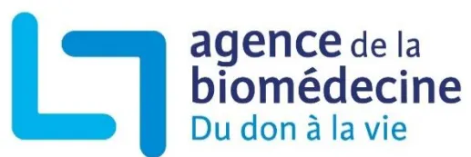

Prélèvement - Greffe

# Recommandations de bonne pratique relatives aux démarches anticipées en vue de don d'organes et de tissus# **Recommandations de bonne pratique relatives aux démarches anticipées en vue de don d'organes et de tissus**

## **SOMMAIRE**

<table><tr><td><b>Introduction.....</b></td><td><b>3</b></td></tr><tr><td><b>Situation de la problématique .....</b></td><td><b>4</b></td></tr><tr><td><b>Méthodologie .....</b></td><td><b>5</b></td></tr><tr><td><b>RECOMMANDATIONS.....</b></td><td><b>7</b></td></tr><tr><td>    <b>I - Prérequis à la mise en place d'une démarche anticipée .....</b></td><td><b>7</b></td></tr><tr><td>    <b>II - Définition de la démarche anticipée et de l'entretien anticipé.....</b></td><td><b>7</b></td></tr><tr><td>    <b>III - Prérequis à une démarche anticipée.....</b></td><td><b>8</b></td></tr><tr><td>    <b>IV - Les 4 étapes de la démarche anticipée.....</b></td><td><b>8</b></td></tr><tr><td>    <b>V- Formation des professionnels de santé .....</b></td><td><b>11</b></td></tr><tr><td><b>Bibliographie.....</b></td><td><b>12</b></td></tr><tr><td><b>Abréviations.....</b></td><td><b>17</b></td></tr><tr><td><b>Glossaire .....</b></td><td><b>18</b></td></tr><tr><td><b>Composition des groupes .....</b></td><td><b>19</b></td></tr></table># Introduction

Le décret 2016-1118 du 11 août 2016 relatif aux modalités d'expression du refus de prélèvement d'organes après le décès [1] et l'arrêté du 16 août 2016 portant homologation des règles de bonne pratique relatives à l'entretien avec les proches en matière de prélèvement d'organes et de tissus [2] donnent un cadre aux entretiens dans le contexte de la mort encéphalique. Il y est stipulé que « *Les démarches anticipées, les décès après arrêt circulatoire des catégories II et III de Maastricht, les démarches en vue de prélèvement de tissus sur défunt en chambre mortuaire relèvent de modalités pratiques spécifiques décrites dans des recommandations et des protocoles de l'Agence de la biomédecine, qui leurs sont propres. Dans tous les cas les principes édictés dans le présent arrêté doivent être respectés.* » Les présentes recommandations de bonne pratique relatives aux démarches anticipées1 en vue de don d'organes et de tissus se situent donc dans le *continuum* de ces premières recommandations réglementaires.

Pour les patients admis au sein d'un service d'accueil et d'urgences présentant un coma après un accident vasculaire cérébral, le plus souvent hémorragique et sans ressource thérapeutique envisageable après un avis spécialisé, certaines équipes soignantes pratiquent régulièrement un entretien anticipé2 pour le don, auprès des proches avant toute admission en réanimation. Ce même type d'entretien anticipé2 peut aussi être conduit dans les unités de soins intensifs neurovasculaires (USINV) pour des patients admis pour prise en charge d'un accident vasculaire cérébral (AVC) et présentant une aggravation secondaire brutale, mais sans solution thérapeutique retenue.

Ces entretiens anticipés2 sont réalisés de façon très hétérogène (typologie et qualification des intervenants, lieu de l'abord, etc.) selon les établissements. Il apparaît important, de ce fait, de définir des recommandations de bonne pratique afin d'harmoniser la conduite de ces entretiens. C'est tout l'objet du travail mené par l'Agence de la biomédecine avec un groupe d'experts et de représentants des sciences humaines, des associations et des usagers.

Les objectifs de ce groupe étaient de rédiger des recommandations de bonne pratique concernant les entretiens anticipés2 dans le cadre des démarches anticipées1 et, secondairement, de participer à la diminution du taux d'opposition en France par une amélioration des pratiques et de la qualité de la conduite des entretiens par les professionnels. Ces recommandations n'abordent que les spécificités des démarches anticipées.

*NB 1 : Les accords signalés entre parenthèses concernent l'ensemble de ce qui précède à partir de l'accord précédent.*

*NB 2 : Les chiffres en exposant renvoient au glossaire en fin de document.*## Situation de la problématique

La loi française prévoit que nous sommes tous donneurs d'organes, sauf si l'on s'y est opposé de son vivant. Cette loi, qui pose le principe du consentement présumé, est globalement bien connue des Français. Néanmoins, si 80 % d'entre eux sont favorables au don de leurs organes après leur mort [3] et moins de 1 % inscrits au registre national des refus [4,5], le taux d'opposition, stabilisé autour de 30 % depuis quasiment deux décennies, est actuellement en hausse (36 % en 2023) [5].

En 2023, 1 791 donneurs décédés ont été prélevés et 5 633 patients ont pu bénéficier d'une greffe d'organes dont 575 issues d'un donneur vivant. Toutefois, la liste d'attente au 1er janvier 2024 est de 22 103 patients [5].

Le prélèvement et la greffe d'organes sont des activités de santé publique qui constituent une priorité nationale, inscrite comme telle dans le code de la santé publique [6].

Une réflexion sur l'approche anticipée a déjà été menée en janvier 2005 par l'Établissement français des Greffes [7,8]. Par la suite, l'intégration du don dans les situations de fin de vie a été initiée par les sociétés savantes [9,10] et le Comité consultatif national d'éthique a rendu un avis favorable [11]. En 2018, des recommandations de pratique clinique ont été publiées [10]. Parallèlement, plusieurs pays ont rédigé des recommandations nationales [12–15].

En Angleterre, des recommandations ont été publiées en 2011 [14] décrivant comment prendre en charge un donneur en incluant la ventilation, la réanimation d'attente et l'abord du don avant le diagnostic de mort encéphalique [16–19].

En Espagne, la pratique des démarches anticipées1 est encadrée par des recommandations éditées en 2017 [13,20–23] et représente 24 % des situations de don. Ces recommandations ont permis une augmentation du nombre de donneurs prélevés [24]. Ces donneurs possibles3 sont une source de greffons qui permet d'améliorer l'accès à la greffe [25]. Aux Pays-Bas, un travail initié aux urgences de 6 établissements pour que le don d'organes soit intégré dans les plans de soins de fin de vie a permis une augmentation du nombre de donneurs prélevés [26].

Ces pratiques pour admettre en réanimation un donneur possible3 sans perspective thérapeutique pour lui-même sont en augmentation en France, mais sont réalisées de façon hétérogène.

Dans la littérature mondiale, aucune étude prospective randomisée n'a été retrouvée mais essentiellement des études de cohortes ou observationnelles et des avis d'experts qui décrivent les grands principes à suivre dans le cadre de ces démarches d'abord du don. Parmi eux, l'intégration par les proches de la gravité [27–29] de l'irréversibilité du pronostic [30,31], l'importance du respect de la temporalité [27,32–36] des proches sont des fondamentaux à respecter. On retrouve également dans la littérature certains déterminants de l'opposition [37–41].

De plus, la réflexion institutionnelle [42–44], la formalisation de procédures [26,27,45–48] et la formation des professionnels [49,50] sont également décrits comme des préalables à la mise en place de ces pratiques dans les établissements de santé.

L'impact en termes de santé publique a également été évalué [24].# Méthodologie

L'Agence de la biomédecine a défini le thème des recommandations, précisé les objectifs à atteindre, désigné les professionnels concernés et défini les situations cliniques concernées. Elle a choisi de procéder selon la méthode « Recommandations pour la pratique clinique » (RPC) définie par la Haute autorité de santé pour l'élaboration de recommandations de bonne pratique [51].

L'Agence de la biomédecine a constitué un groupe de réflexion préparatoire, un groupe bibliographique, un groupe de travail d'experts et un groupe de lecture :

- • Composé de 15 professionnels de l'Agence de la biomédecine, experts chacun en leur domaine au sein de l'Agence, **le groupe de réflexion préparatoire** a défini le champ de réflexion et de compétence du groupe de travail d'experts, validé la méthodologie et élaboré les questions auxquelles devait répondre le groupe de travail pour rédiger les recommandations de bonne pratique.
- • Composé de 6 professionnels de l'Agence de la biomédecine auxquels a été associée une représentante des sciences humaines après constitution du groupe de travail, **le groupe bibliographique** a établi, avec l'aide du service de documentation de l'Agence de la biomédecine, une bibliographie sur le thème des entretiens anticipés2. Il en a effectué l'analyse et a produit une synthèse bibliographique pour le groupe de travail.
- • Composé de membres de l'Agence de la biomédecine et de représentants de sociétés savantes, des sciences humaines, des usagers et d'une association de familles de donneurs, **le groupe de travail d'experts** avait comme objectifs de compléter la synthèse bibliographique présentée par le groupe bibliographique, de discuter et de valider les définitions, les principes généraux et les prérequis des démarches anticipées1, puis de rédiger les recommandations.  
  Chaque membre titulaire ou suppléant a préalablement renseigné une déclaration publique d'intérêts. Le membre titulaire a siégé au groupe de travail. Le suppléant n'y a participé qu'en son absence et après information du pilote du projet. Le titulaire tenait informé son suppléant de l'évolution des discussions du groupe.  
  Les réunions se sont tenues en présentiel au siège de l'Agence de la biomédecine. Les comptes rendus de réunion ont été adressés aux membres titulaires et aux suppléants.
- • Composé de 34 membres référents pour l'abord des proches, **le groupe de lecture** devait donner un avis formalisé sur le fond et la forme de la version initiale des recommandations.

La composition des groupes est donnée en fin de document (page 19).

La version initiale des recommandations élaborée par le groupe de travail a été soumise au groupe de lecture qui a apporté des remarques et commentaires.

Le groupe de travail a alors rédigé la version finale des recommandations, en tenant compte des remarques du groupe de lecture.

Les experts du groupe de travail ont procédé à la cotation de cette version finale des recommandations, selon la méthodologie à deux tours de cotation après élimination des valeurs extrêmes, inspirée de la méthode RAND/UCLA [51] :

- • Chaque paragraphe est coté par chacun des experts.
- • Chaque expert cote à l'aide d'une échelle continue graduée de 1 (« désaccord complet ») à 9 (« accord complet »).
- • Trois zones sont définies en fonction de la place de la médiane : la zone (1-3) correspond au désaccord ; la zone (4-6) correspond à l'indécision ; la zone (7-9) correspond à l'accord.
- • L'accord, le désaccord ou l'indécision est dit « fort » si l'intervalle de la médiane est situé à l'intérieur d'unedes trois zones (1-3), (4-6) ou (7-9).

- • L'accord, le désaccord ou l'indécision est dit « faible » si l'intervalle de la médiane empiète sur une borne (intervalle [1-4] ou intervalle [6-8] par exemple).

Les recommandations ont été présentées pour information au conseil médical et scientifique (CMS) de l'Agence le 10 septembre 2024 puis, pour avis, au conseil d'orientation (CO) le 19 septembre 2024. Le CO a rendu un avis favorable à l'unanimité, sous réserve de deux précisions intégrées au présent document.

Elles ont ensuite été diffusées aux professionnels concernés, aux sociétés savantes et aux associations d'usagers.# RECOMMANDATIONS

## I - Prérequis à la mise en place d'une démarche anticipée

La mise en place des démarches anticipées1 dans un établissement de santé doit s'accompagner d'une réflexion institutionnelle préalable sur l'information et la formation des professionnels. (accord fort)

La coordination hospitalière des prélèvements d'organes et de tissus (CHPOT) identifie **les services partenaires**6 où elles pourront être mises en place, dans son établissement et ceux de son réseau opérationnel de proximité5 (ROP) : structures d'urgences hospitalières, services de neurologie et unités de soins intensifs neurovasculaires (USINV), autres unités de soins intensifs polyvalents (USIP), services de médecine ou de chirurgie. (accord fort)

La CHPOT, les services partenaires6 et les services de réanimation élaborent puis formalisent une procédure et des documents sur les modalités de réalisation des démarches anticipées1 (algorithme, checklist, livret d'information pour les proches...). Cette procédure locale permet de définir collectivement les critères d'admission des donneurs possibles3 en réanimation. (accord fort)

En cas de transfert interhospitalier du donneur possible3, les frais de retour du corps du défunt sont à la charge de l'établissement autorisé au prélèvement dans lequel le décès a été déclaré, qu'il y ait eu ou non prélèvement. (accord fort)

## II - Définition de la démarche anticipée et de l'entretien anticipé

La démarche anticipée1 est un processus qui conduit à l'admission en réanimation d'un patient en coma grave, sans perspective thérapeutique, avec une forte probabilité d'évolution vers la mort cérébrale. Elle a pour finalité exclusive un possible prélèvement d'organes et de tissus. Une démarche anticipée1 repose sur une collaboration pluridisciplinaire. Elle comprend l'évaluation d'un contexte clinique et différents entretiens avec les proches dont l'entretien anticipé2 en vue de don et une organisation logistique. Ce processus implique le patient, les proches et les soignants dans l'accompagnement d'une fin de vie. Cette démarche collective doit respecter des étapes successives. (accord fort)

L'entretien anticipé2 est un entretien entre les soignants et les proches ayant pour objectifs d'évoquer en amont de la survenue de la mort du patient la possibilité du don d'organes et de tissus *post mortem*, et de recueillir l'éventuelle expression d'un refus de prélèvement d'organes et de tissus du patient et l'adhésion des proches à cette démarche. (accord fort)

Il est recommandé de ne plus utiliser le terme « abord anticipé ».### III - Prérequis à une démarche anticipée

Les deux prérequis sont les suivants :

- • Une décision de limitation des traitements est actée collégialement, conformément à la réglementation, devant l'absence de perspective thérapeutique après avis d'un ou plusieurs expert(s) (neurochirurgien, neurologue, réanimateur) en concertation avec l'équipe de soins du service partenaire6 pour des patients présentant des lésions cérébrales irréversibles (accident vasculaire cérébral hémorragique – AVCH – ou ischémique – AVCI – ou traumatisme crânien), en coma grave (score de Glasgow < 8) ou coma d'aggravation rapide. (accord fort)
- • L'annonce de la gravité, du pronostic vital engagé, de l'absence de perspective thérapeutique et de la mort à venir, a déjà été réalisée par le médecin du service partenaire6. Les soignants se sont assurés que les informations ont été reçues et comprises par les proches. (accord fort)

### IV - Les 4 étapes de la démarche anticipée

#### Étape 1 - Repérage d'un donneur possible3 par les services partenaires6

Le patient concerné identifié comme donneur possible3 par les équipes soignantes des services partenaires6 est :

- • un patient présentant des lésions cérébrales irréversibles (AVCH, AVCI ou traumatisme crânien) ;
- • un **patient en coma grave** (score de Glasgow < 8 ou coma d'aggravation rapide) ;
- • un **patient sans perspective thérapeutique** après avis d'un ou plusieurs expert(s) (neurochirurgien, neurologue, réanimateur) en concertation avec l'équipe de soins. (accord fort)

À ce stade, pour le patient qui n'est pas sous ventilation mécanique invasive :

- • s'il ne présente pas de défaillance vitale immédiate cardiovasculaire ou respiratoire, toutes les étapes successives de la démarche anticipée1 doivent être réalisées avant l'éventuelle admission en réanimation et la réalisation de gestes invasifs (dont l'intubation) ;
- • s'il présente une défaillance vitale immédiate cardiovasculaire ou respiratoire :
  - ○ la réalisation de gestes invasifs (dont l'intubation) peut être envisagée de façon collégiale dans l'attente du recueil d'une éventuelle opposition au prélèvement ;
  - ○ dans tous les cas, le soulagement des souffrances et l'accompagnement de fin de vie restent prioritaires. (accord faible)

**Ce repérage doit déclencher l'appel à la CHPOT. Le service partenaire6 ne se prononce pas sur l'existence d'une contre-indication ou d'une limite d'âge sans concertation avec la CHPOT. (accord fort)**

#### Situations particulières

- • Pour le patient pris en charge en préhospitalier, aucun entretien pour le don ne doit être réalisé, mais l'évaluation du contexte clinique peut conduire à penser à une démarche anticipée1. (accord fort)
- • Pour le patient hospitalisé en réanimation sous ventilation invasive, l'entretien concernant la possibilité du don doit être réalisé après le diagnostic de mort cérébrale. Toutefois, en fonction du cheminement des proches et de leurs questions sur les événements à venir à ce stade, un entretien anticipé2 peut être envisagé. La présence de la CHPOT est recommandée. (accord fort)
- • Pour le patient hospitalisé en réanimation sans ventilation invasive, toutes les étapes successives de la démarche anticipée1 doivent être réalisées. (accord fort)## Étape 2 - Appel à la CHPOT

Dès le premier appel à la CHPOT, le déplacement d'un soignant de la CHPOT sur site dans le service partenaire6 est recommandé. (accord fort)

En collaboration, le service partenaire6, la réanimation et la CHPOT ont pour objectifs :

### A – L'évaluation du patient comme donneur possible3 qui comprend :

- • l'estimation d'une forte probabilité d'évolution vers la mort cérébrale ;
- • la vérification de l'absence de contre-indication absolue par la consultation du dossier médical (antécédents, traitements, compte-rendu d'hospitalisation, de consultation, imagerie antérieure...), l'appel du médecin traitant dans la mesure du possible ;
- • la vérification de la possible prélevabilité d'au moins un organe au vu d'un bilan biologique initial comportant au minimum un bilan sanguin rénal et hépatique.

Le régulateur de l'Agence de la biomédecine peut être appelé pour avis. (accord fort)

**B – La vérification de l'organisation logistique**, qui consiste à rechercher un lit de réanimation selon les modalités locales de mise en œuvre des démarches anticipées1. Cette recherche doit être anticipée et organisée à l'échelle d'un établissement ou d'un réseau régional pour ne pas être un frein à la prise en charge du donneur possible3.

À ce stade, l'entretien anticipé2 avec les proches est possible. (accord fort)

## Étape 3 - Entretiens avec les proches

### A – Objectifs des entretiens successifs

Les objectifs des entretiens sont au nombre de quatre :

- • **La vérification** de la compréhension par les proches de la gravité, du pronostic vital engagé, de l'absence de perspective thérapeutique et de la mort à venir avec une forte probabilité d'évolution vers la mort cérébrale. (accord fort)
- • **L'information** sur la possibilité du don d'organes après la mort et le recueil de l'éventuelle expression d'un refus du patient au prélèvement d'organes et de tissus. Il s'agit de **l'entretien anticipé**2. (accord fort)

NB : Le RNR ne peut être interrogé qu'après la déclaration de décès du patient.

- • En l'absence d'opposition du patient au don rapportée par les proches, **l'information** sur :
  - ○ les modalités organisationnelles de la prise en charge :
    - - transfert dans un service de réanimation dans l'éventualité d'un prélèvement d'organes et de tissus, sans ambiguïté sur l'absence de perspective thérapeutique (possibilité de transfert interhospitalier),
    - - gestes spécifiques nécessaires à la prise en charge en réanimation (notamment l'intubation),
    - - garantie de la continuité de l'accompagnement du patient et des proches entre les services ;
  - ○ la durée d'hospitalisation en réanimation n'excédant pas quelques jours (habituellement de 3 à 6 jours) à l'issue de laquelle, en l'absence de mort cérébrale, la mort surviendra après l'arrêt des traitements de maintien en vie ;
  - ○ la possibilité de non aboutissement de la démarche de don. (accord fort)
- • **La vérification** de l'adhésion des proches à la démarche anticipée1.  
  La situation sera réévaluée avec les proches en fonction de leur vécu et de l'évolution clinique du patient. (accord fort)## **B – Spécificités de l'entretien anticipé2**

### **Qui ?**

Cet entretien est réalisé par **un binôme** :

- • un médecin sénior, du service partenaire6 et/ou de la réanimation, en privilégiant le médecin le plus expérimenté à ce type d'entretien ;
- • un soignant de la CHPOT. Sa présence doit être systématique dans les ES autorisés au prélèvement et privilégiée dans les ES du ROP.

Ce binôme peut être accompagné de membre(s) de l'équipe paramédicale en charge du patient du service partenaire6 et éventuellement d'un professionnel médical ou paramédical dans un but de formation. Il convient d'être attentif à l'équilibre entre le nombre de proches présents et le nombre de soignants. Les soignants y participant doivent être pleinement disponibles. (accord fort)

Le recours à un(e) psychologue est souhaitable si les disponibilités opérationnelles de l'établissement le permettent.

### **Où ?**

Il se déroule dans une salle située à proximité du lieu de prise en charge du patient, aménagée pour recevoir l'ensemble des proches et soignants, confortable, calme et dédiée à l'entretien. (accord fort)

### **Quand ?**

Le choix du moment de l'entretien requiert de la part des soignants de s'adapter au cheminement des proches, à l'état clinique du patient, en respectant l'ordre des étapes de la démarche. Un entretien en journée est à privilégier. (accord fort)

### **Comment ?**

- • Cet entretien doit concilier transparence des informations délivrées et incertitude de l'aboutissement de la démarche.
- • Il doit être particulièrement préparé entre soignants :
  - ○ mise en commun de toutes les informations disponibles (contexte et situation médicale, identification et présence des proches, étape de la démarche) ;
  - ○ définition du rôle de chacun ;
  - ○ accord sur les objectifs.
- • La CHPOT se rend disponible pour apporter des informations complémentaires spécifiques au prélèvement d'organes en fonction des questions des proches. (accord fort)

### **Traçabilité et évaluation**

- • Une synthèse de l'entretien doit être tracée dans le dossier médical du patient.
- • L'entretien doit être évalué à l'aide d'une grille de débriefing inspirée de la grille de l'arrêté du 16 août 2016 (indicateurs importants : temporalité, compréhension par les proches, présence de la CHPOT...) [2].
- • Lorsque le proche transmet l'opposition du patient, la coordination hospitalière de prélèvement la retranscrit dans le dossier patient. (accord fort)## Étape 4 - Transfert et accueil du patient et des proches en réanimation

L'ensemble des étapes de la démarche anticipée1 doit être tracé dans le dossier patient. Le transfert vers la réanimation est médicalisé. L'ensemble des soignants est informé des objectifs de l'admission en réanimation : accompagnement de la fin de vie et réanimation d'organes en vue d'un éventuel prélèvement d'organes/tissus. (accord fort)

La présence des proches doit être facilitée dans ce contexte de fin de vie. Tout au long du processus, l'accompagnement des proches et la réévaluation de la poursuite de la démarche seront assurés par les professionnels de la réanimation en partenariat avec la CHPOT. (accord fort)

Pendant le séjour en réanimation, le soulagement des souffrances réelles ou potentielles est assuré, même si celles-ci ne peuvent pas être évaluées du fait de l'état neurologique du patient (Art. R4127-37-3 du CSP) [52]. En l'absence d'évolution vers un état de mort cérébrale, un arrêt des traitements de maintien en vie est mis en œuvre selon le protocole en vigueur dans le service de réanimation, jusqu'au décès. (accord fort)

## V- Formation des professionnels de santé

Les médecins participant aux processus de démarches anticipées1 dans leurs établissements respectifs sont invités à participer aux formations sur les entretiens avec les proches organisées en région par l'Agence de la biomédecine.

Les professionnels de coordination hospitalière bénéficient avec l'Agence de biomédecine d'un parcours de formation continue, leur participation aux différentes étapes de la démarche anticipée1 est indispensable.

Toutes les formations abordent les principes généraux des entretiens avec les proches et certaines intègrent des situations de démarches anticipées1. (accord fort)## Bibliographie

1. 1. Ministère des affaires sociales et de la santé. Décret n° 2016-1118 du 11 août 2016 relatif aux modalités d'expression du refus de prélèvement d'organes après le décès. JORF n° 0189. 15 août 2016.
2. 2. Ministère des affaires sociales et de la santé. Arrêté du 16 août 2016 portant homologation des règles de bonnes pratiques relatives à l'entretien avec les proches en matière de prélèvement d'organes et de tissus. JORF n°197. 16 août 2016.
3. 3. Agence de la biomédecine. Activité de prélèvement et de greffe d'organes en 2023 et baromètre d'opinion 2024 - dossier de presse [En ligne]. 13 févr 2024. 11p. Disponible : <https://presse.agence-biomedecine.fr/chiffres-greffe-2023/>
4. 4. Agence de la biomédecine. Registre national des refus [En ligne]. Disponible : <https://www.registrenationaldesrefus.fr/#etape-1>
5. 5. Agence de la biomédecine. Rapport médical et scientifique du prélèvement et de la greffe en France - 2022. [En ligne]. 2023. Disponible : <https://rams.agence-biomedecine.fr/>
6. 6. Code de la santé publique - Article L1231-1 A relatif au prélèvement et à la greffe d'organes. 4 août 2021.
7. 7. Comité d'Ethique de l'Etablissement Français des Greffes. Approche anticipée des proches d'un sujet en coma grave en vue d'un prélèvement. 10 janv 2005. 2p.
8. 8. Agence de la biomédecine. Recommandations sur l'abord des proches de sujets en état de mort encéphalique en vue d'un prélèvement d'organes et de tissus [En ligne]. avr 2007. 24p. Disponible : <https://www.agence-biomedecine.fr/IMG/pdf/recommandations-sur-l-abord-des-proches-de-sujets-en-etat-de-mort-encephalique-en-vue-d-un-prelevement-d-organes-et-de-tissus.pdf>
9. 9. Bollaert PE, Vinatier I, Orlikowski D, et al. Prise en charge de l'accident vasculaire cérébral chez l'adulte et l'enfant par le réanimateur (nouveau-né exclu, hémorragie méningée exclue) : recommandations formalisées d'experts sous l'égide de la Société de réanimation de langue française, avec la participation du groupe francophone de réanimation et urgences pédiatriques(GFRUP), de la Société française neurovasculaire (SFNV), de l'Association de neuro-anesthésie et réanimation de langue française (ANARLF), de l'Agence de la biomédecine (ABM). Réanimation. oct 2010;19(6):471-478.
10. 10. Feral-Pierssens AL, Boulain T, Carpentier F, et al. Limitations et arrêts des traitements de suppléance vitale chez l'adulte dans le contexte de l'urgence. Ann Fr Médecine D'urgence. août 2018;8(4):246-251.
11. 11. Comité Consultatif National d'Ethique (CCNE). Questions d'éthique relatives au prélèvement et au don d'organes à des fins de transplantation - Avis n°115 [En ligne]. avr 2011. 19p. Disponible : [https://www.ccne-ethique.fr/sites/default/files/2021-02/avis\\_115.pdf](https://www.ccne-ethique.fr/sites/default/files/2021-02/avis_115.pdf)
12. 12. Yeo NYK, Reddi B, Kocher M, et al. Collaboration between the intensive care unit and organ donation agency to achieve routine consideration of organ donation and comprehensive bereavement follow-up: an improvement project in a quaternary Australian hospital. Aust Health Rev. 15 déc 2020;45(1):124-131.
13. 13. Escudero Augusto D, Martínez Soba F, de la Calle B, et al. Cuidados intensivos orientados a la donación de órganos. Recomendaciones ONT-SEMICYUC. Med Intensiva. 1er mai 2021;45(4):234-242.
14. 14. NHS Blood and Transplant, British Transplantation Society (BTS), The College of emergency medicine. Role of the Emergency Medicine in organ donation [En ligne]. 4 oct 2010. 22p. Disponible : <https://bts.org.uk/wp-content/uploads/2016/09/Role-of-emergency-Medicine-in-Organ-Donation.pdf>
15. 15. Shemie SD, Robertson A, Beitel J, et al. End-of-Life Conversations With Families of Potential Donors: Leading Practices in Offering the Opportunity for Organ Donation. Transplantation. mai 2017;101(5S Suppl 1):17-26.
16. 16. Curtis RMK, Manara AR, Madden S, et al. Validation of the factors influencing family consent for organ donation in the UK. Anaesthesia. déc 2021;76(12):1625-1634.
17. 17. Manara AR & Thomas I. Current status of organ donation after brain death in the UK. Anaesthesia. sept 2020;75(9):1205-1214.1. 18. Gardiner D, Shaw DM, Kilcullen JK, et al Intensive care for organ preservation: A four-stage pathway. *J Intensive Care Soc.* nov 2019;20(4):335-340.
2. 19. Gardiner DC, Nee MS, Wootten AE, et al. Critical care in the Emergency Department: organ donation. *Emerg Med J.* 1er avr 2017;34(4):256-263.
3. 20. Martín-Delgado MC, Martínez-Soba F, Masnou N, et al. Summary of Spanish recommendations on intensive care to facilitate organ donation. *Am J Transplant.* juin 2019;19(6):1782-1791.
4. 21. Martínez-Soba F, Pérez-Villares JM, Martínez-Camarero L, et al. Intensive Care to Facilitate Organ Donation: A Report on the Experience of 2 Spanish Centers With a Common Protocol. *Transplantation.* mars 2019;103(3):558-564.
5. 22. Manara A, Procaccio F, Domínguez-Gil B. Expanding the pool of deceased organ donors: the ICU and beyond. *Intensive Care Med.* mars 2019;45(3):357-360.
6. 23. Grupo colaborativo ONT-SEMES. El profesional de urgencias y el proceso de donacion - Recomendaciones [En ligne]. 2016. 27p. Disponible : <https://www.ont.es/wp-content/uploads/2023/06/ELPROF1.pdf>
7. 24. Pérez-Blanco A & Manara A. Intensive care admission aiming at organ donation. *Pro. Intensive Care Med.* mars 2024;50(3):437-439.
8. 25. Domínguez-Gil B, Coll E, Elizalde J, et al. Expanding the donor pool through Intensive care to facilitate organ donation: results of a Spanish Multicenter Study. *Transplantation.* août 2017;101(8):265-272.
9. 26. Witjes M, Kotsopoulos A, Otterspoor L, et al. The implementation of a multidisciplinary approach for potential organ donors in the Emergency Department. *Transplantation.* nov 2019;103(11):2359-2365.
10. 27. Raffestin Garrabos C. L'infirmier coordinateur de prélèvements d'organes et de tissus au « coeur » de l'abord anticipé des proches dans une démarche de don pour un patient neuro lésé grave sans ressource thérapeutique. *Mémoire Master 2 : Sciences Cliniques Infirmières.* 2018. 46p.
11. 28. Venkat A, Baker EF, Scheers RM. Ethical Controversies Surrounding the Management of Potential Organ Donors in the Emergency Department. *J Emerg Med.* août 2014;47(2):232-236.
12. 29. Robey TE & Marcolini EG. Organ Donation After Acute Brain Death: Addressing Limitations of Time and Resources in the Emergency Department. *Yale J Biol Med.* sept 2013;86(3):333-342.
13. 30. Michaut C, Baumann A, Gregoire H, et al. An assessment of advance relatives approach for brain death organ donation. *Nurs Ethics.* mars 2019;26(2):553-563.
14. 31. Arsonneau V. Démarche d'annonce anticipée de don d'organes aux urgences, rôle de l'infirmière coordinatrice. *Soins.* sept 2016;61(808):47-49.
15. 32. Viñuela-Prieto JM, Escarpa Falcón MC, Candel FJ, et al. Family Refusal to Consent Donation: Retrospective Quantitative Analysis of Its Increasing Tendency and the Associated Factors Over the Last Decade at a Spanish Hospital. *Transplant Proc.* sept 2021;53(7):2112-2121.
16. 33. Darnell WH, Real K, Bernard A. Exploring Family Decisions to Refuse Organ Donation at Imminent Death. *Qual Health Res.* mars 2020;30(4):572-582.
17. 34. de Moraes EL, dos Santos MJ, de Barros e Silva LB, et al. Family Interview to Enable Donation of Organs for Transplantation: Evidence-based Practice. *Transplant Proc.* avr 2018;50(3):705-710.
18. 35. Vincent A & Logan L. Consent for organ donation. *Br J Anaesth.* janv 2012;108:80-87.
19. 36. Baumann A, Nguyen S, Claudot F. Presumed Consent to Organ Donation and the Role of the Relatives: An ICU Psychologists' Survey [En ligne]. 13 mars 2023. 15p. Disponible : [https://papers.ssrn.com/sol3/papers.cfm?abstract\\_id=4375672](https://papers.ssrn.com/sol3/papers.cfm?abstract_id=4375672)
20. 37. Chandler JA, Connors M, Holland G, et al. "Effective" Requesting: A Scoping Review of the Literature on Asking Families to Consent to Organ and Tissue Donation. *Transplantation.* 10 mai 2017;101(5S):1-16.
21. 38. Ebadat A, Brown CVR, Ali S, et al. Improving organ donation rates by modifying the family approach process. *J Trauma Acute Care Surg.* juin 2014;76(6):1473-1475.
22. 39. National Institute for Health and Clinical Excellence (NICE). Organ donation for transplantation: improving donor identification and consent rates for deceased organ donation [En ligne]. déc 2011. 101p. Disponible : <https://www.nice.org.uk/guidance/cg135/evidence/organ-donation-full-guideline-184994893>1. 40. Domínguez-Gil B, Delmonico FL, Shaheen FAM, et al. The critical pathway for deceased donation: reportable uniformity in the approach to deceased donation. *Transpl Int.* avr 2011;24(4):373-378.
2. 41. Boileau C, Cohen S, Noury D, et al. Comprendre le taux de refus au don d'organes au travers des études publiées. *Courr Transplant.* janv 2004;4(1):47-52.
3. 42. Raffestin Garrabos C. L'infirmier coordinateur de prélèvements d'organes et de tissus au « coeur » de l'abord anticipé des proches dans une démarche de don pour un patient neuro lésé grave sans ressource thérapeutique - Synthèse. Mémoire Master 2 : Sciences Cliniques Infirmières. 2018. 16p.
4. 43. Antoine C. De nouvelles modalités pour le don d'organes en France. *Soins.* sept 2016;61(808):26-31.
5. 44. Seidlein AH, Latour JM, Benbenishty J. Intensive Care admission aiming at organ donation. Not sure. *Intensive Care Med.* mars 2024;50(3):443-445.
6. 45. Rivers J, Manara AR, Thomas I, et al. Impact of a Devastating Brain Injury Pathway on Outcomes, Resources, and Organ Donation: 3 Years' Experience in a Regional Neurosciences ICU. *Neurocrit Care.* août 2020;33(1):165-172.
7. 46. Dicks SG, Burkholter N, Jackson LC, et al. Grief, Stress, Trauma, and Support During the Organ Donation Process. *Transplant Direct.* janv 2020;6(1):11p.
8. 47. Mangel S, Durin L, Lombard G. La démarche anticipée de don d'organe. *Soins.* déc 2018;63(831):16-19.
9. 48. Domínguez-Gil B, Coll E, Pont T, et al. End-of-life practices in patients with devastating brain injury in Spain: implications for organ donation. *Med Intensiva.* avr 2017;41(3):162-173.
10. 49. Weiss MJ, van Beinum A, Harvey D, et al. Ethical considerations in the use of pre-mortem interventions to support deceased organ donation: A scoping review. *Transplant Rev.* déc 2021;35(4):9p.
11. 50. Martin-Loeches I, Sandiumenge A, Charpentier J, et al. Management of donation after brain death (DBD) in the ICU: the potential donor is identified, what's next? *Intensive Care Med.* mars 2019;45(3):322-330.
12. 51. Haute Autorité de Santé (HAS). Elaboration de recommandations de bonne pratique: méthode « Recommandations par consensus formalisé ». Guide méthodologique [En ligne]. mars 2015. 40p. Disponible : [https://www.has-sante.fr/upload/docs/application/pdf/2011-01/guide\\_methodologique\\_consensus\\_formalise.pdf](https://www.has-sante.fr/upload/docs/application/pdf/2011-01/guide_methodologique_consensus_formalise.pdf)
13. 52. Code de la santé publique - Article R4127-37-3 relatif au devoir envers les patients. 9 avril 2017.

### Complément bibliographique en lien avec le sujet des démarches anticipées

Altarbouch A, Hébert-Gauthier N, Bourassa Forcier M. Don d'organes au Québec. Étude comparée des bonnes pratiques [En ligne]. CIRANO, Cahier Scientifique. Nov 2021. 139p. Disponible : <https://cirano.qc.ca/files/publications/2021s-11.pdf>

Anspach MR. Don d'organes et réciprocité non marchande. *Revue du MAUSS.* 2013;41(1):183-190.

Baumann A, Audibert G, Guibet Lafaye C, et al. Elective non-therapeutic intensive care and the four principles of medical ethics. *J Med Ethics.* mars 2013;39(3):139-142.

Baumann A, Ducrocq X, Audibert G, et al. Réanimation non thérapeutique en fin de vie pour préservation des organes en vue d'un don : problèmes éthiques et légaux. *La Presse Médicale.* oct 2012;41(10):530-538.

Ben Ammar MS. Greffe d'organes et Islam : une quête en climat de réticence ! Éthique & Santé. nov 2004;1(4):211-215.

Bendorf A, Kerridge IH, Stewart C. Intimacy or utility? Organ donation and the choice between palliation and ventilation. *Crit Care.* Mai 2013;17(3):9p.

Berntzen H & Bjørk IT. Experiences of donor families after consenting to organ donation: A qualitative study. *Intensive and Critical Care Nursing.* oct 2014;30(5):266-274.

Bocci MG, D'Alò C, Barelli R, et al. Taking Care of Relationships in the Intensive Care Unit: Positive Impact on Family Consent for Organ Donation. *Transplantation Proceedings.* déc 2016;48(10):3245-3250.

Boileau C. Etablissement Français des Greffes (EFG) : Les données du refus en France. 8 déc 2004. 6p.Boileau C. Construction de la décision (La) : Enquêtes de terrain et entretiens rétrospectifs auprès des familles sollicitées [Etude]. Etablissement Français des Greffes - Université Bordeaux II. févr 2002. 78p.

Boileau C. Analyse de la bibliographie : synthèse et mise en perspective de travaux relatifs à l'étude : Investigations préliminaires aux enquêtes de terrain [Etude]. Etablissement Français des Greffes - Université Bordeaux II. Août 2001. 50p.

Buy MC. Regard éthique : entre autonomie et vulnérabilité s'agissant du refus des familles au prélèvement d'organes. Mémoire de master « Art et éthique publique ». Université Saint Paul, Canada. 2018. 68p.

Caillé Y & Doucin M. Don et transplantation d'organes au Canada, aux Etats-Unis et en France ; réflexions éthiques et pratiques comparées. Paris : L'Harmattan; 2011. 302p.

Camut S, Baumann A, Dubois V, et al. Non-therapeutic intensive care for organ donation: A healthcare professionals' opinion survey. Nurs Ethics. mars 2016;23(2):191-202.

Centre national de ressources et de résilience (cn2r). Soignant, j'annonce un décès [En ligne]. 2023. 5p. Disponible : [https://cn2r.fr/wp-content/uploads/2023/02/Ressource\\_soignants\\_annonce\\_decès.pdf](https://cn2r.fr/wp-content/uploads/2023/02/Ressource_soignants_annonce_decès.pdf)

Cornuault M. Dons d'organes : comment sont-ils vécus par les proches ? A propos d'une étude rétrospective sur un an dans le service des urgences de Nantes. Thèse d'Etat : Docteur en médecine : Université de Nantes. 2011. 122p.

Cour M, Turc J, Madelaine T, et al. Risk factors for progression toward brain death after out-of-hospital cardiac arrest. Ann Intensive Care. 8 avr 2019;9(1):6p.

Curtis RMK, Manara AR, Madden S, et al. Validation of the factors influencing family consent for organ donation in the UK. Anaesthesia. Déc 2021;76(12):1625-1634.

Demiguel V, Boileau C, Cohen S, et al. Facteurs associés à l'opposition au don d'organes en France entre 1996 et 1999. Annales françaises d'anesthésie et de réanimation. déc 2001;20(10):826-832.

Dicks SG, Northam HL, van Haren FMP, et al. The bereavement experiences of families of potential organ donors: a qualitative longitudinal case study illuminating opportunities for family care. Int J Qual Stud Health Well-being. 18(1):24p.

Domínguez-Gil B, Delmonico FL, Shaheen FAM, et al. The critical pathway for deceased donation: reproable uniformity in the approach to deceased donation. Transplant International. Avr 2011;24(4):373-378.

Fantauzzi A. Greffes et don d'organes : un corps abîmé ou donné. Corps abîmé le corps en abîme [En ligne]. 2012;28p. Disponible : [https://www.academia.edu/30610928/Greffes\\_et\\_don\\_dorGanes\\_un\\_corps\\_ab%C3%AEm%C3%A9\\_ou\\_donn%C3%A9](https://www.academia.edu/30610928/Greffes_et_don_dorGanes_un_corps_ab%C3%AEm%C3%A9_ou_donn%C3%A9)

Fourneret E. Penser les arrêts de traitement Maastricht III à propos des greffes : Analyse et réflexion éthique après la loi du 22 avril 2005 – Rapport pour l'Agence de la biomédecine [En ligne]. déc 2013. 131 p. Disponible : <https://www.espace-ethique.org/sites/default/files/ABM%203%20DOC%20Fourneret.pdf>

Furon P & Vachiéry-Lahaye F. L'annonce du décès et la question du don d'organes. Soins. déc 2014;59(791):43-45.

Girard A. Réticences au prélèvement d'organes : égoïsme ou résistances au biopouvoir ? Une question de catégorisation. Sciences sociales et santé. mars 2000;18(1):35-70.

Godelier M. Des choses que l'on donne, des choses que l'on vend et de celles qu'il ne faut ni vendre ni donner, mais garder pour transmettre. In: Au fondement des sociétés humaines. Ce que nous apprend l'anthropologie. Paris: Albin Michel; 2007. p. 75-99.

Grard C. Abord anticipe des proches pour la recherche d'opposition au don d'organes chez les patients en coma grave secondaire à un accident vasculaire cérébral avec décision de limitation active des traitements de réanimation : évaluation des pratiques professionnelles à partir d'un questionnaire. Thèse d'Etat : Docteur en médecine : Université de Nantes. 2013. 76p.

Hammer R. Le traitement médiatique de la pénurie et du don d'organes : variations discursives et normatives dans la presse francophone suisse. In: Donner, recevoir un organe droit, dû, devoir. Strasbourg: Presses Universitaires de Strasbourg; 2009. p. 216-230.

Kentish-Barnes N, Cohen-Solal Z, Souppart V, et al. Being Convinced and Taking Responsibility: A Qualitative Study of Family Members' Experience of Organ Donation Decision and Bereavement After Brain Death. Crit Care Med. avr 2019;47(4):526-534.Knihs N da S, Schuantes-Paim SM, Bellaguarda ML dos R, et al. Family Interview Evaluation for Organ Donation: Communication of Death and Information About Organ Donation. *Transplantation Proceedings*. juin 2022;54(5):1202-1207.

Lefebvre B & Deciron-Debieuve F, SFMU, SAMU Urgences de France. Rôle des soignants aux urgences dans la décision de PMO [En ligne]. 2012. 11p. Disponible : [https://www.sfmue.org/upload/70\\_formation/02\\_eformation/02\\_congres/Urgences/urgences2015/donnees/pdf/127.pdf](https://www.sfmue.org/upload/70_formation/02_eformation/02_congres/Urgences/urgences2015/donnees/pdf/127.pdf)

Lepresle É. Le consentement présumé du donneur, un paradoxe du langage. *Essaim*. 2006;17(2):179-188.

Lesieur O. Fin de vie programmée et don d'organes : enjeux individuels, communautaires et prudentiels Thèse de doctorat : Sciences de la vie et de la santé – Ethique médicale : Université Paris-Descartes. 2015. 283p.

Libot J. La démarche anticipée de don d'organes à l'hôpital. *Soins*. sept 2016;61(808):44-46.

Lombard G. Don d'organes et responsabilité morale des soignants. *Soins*. déc 2014;59(791):46-48.

Martinez-Lopez MV, Coll E, Cruz-Quintana F et al. Family bereavement and organ donation in Spain: a mixed method, prospective cohort study protocol. *BMJ Open*. 6 janv 2023;13(1):10p.

Matignon M. Mon corps, nos organes [En ligne]. La Vie des idées [Internet]. 5 juin 2017. Disponible : <https://laviedesidees.fr/Mon-corps-nos-organes>

Michaut C. La démarche anticipée en vue d'un don d'organes à la lumière de l'éthique. A la recherche des fondements éthiques de la démarche des professionnels prenant en charge des donneurs potentiels d'organes, lors du recueil du consentement, chez une personne en fin de vie. Mémoire de diplôme inter-universitaire : Ethique médicale : Université de Lorraine - Université de Strasbourg. 2014. 90p.

Parrouffe ML. Vers l'abord anticipe : facteurs prédictifs de passage en mort encéphalique chez les traumatisés crâniens graves de plus de 65 ans. Thèse d'exercice : Docteur en médecine : Université Claude Bernard Lyon 1. 2016.62p.

Picard PC. Rôle des entretiens anticipés en vue d'un prélèvement d'organes chez les patients en coma grave victimes d'un accident vasculaire cérébral. Evaluation des pratiques actuelles et mise en place d'un protocole de prise en charge. Thèse d'Etat : Docteur en médecine : Université de Picardie Jules Vern. 2014. 88p.

Rasmussen MA, Moen HS, Milling L, et al. An increased potential for organ donors may be found among patients with out-of-hospital cardiac arrest. *Scand J Trauma Resusc Emerg Med*. 17 août 2022;30(1):9p.

Shaw R. Perceptions of the gift relationship in organ and tissue donation: Views of intensivists and donor and recipient coordinators. *Social Science & Medicine*. févr 2010;70(4):609-615.

Stammers T. « Elective » ventilation: an unethical and harmful misnomer? *New Bioeth*. 2013;19(2):130-140.

Truog RD, Campbell ML, Randall Curtis J, et al. Recommendations for end-of-life care in the intensive care unit. *Critical Care Medicine*. mars 2008;36(3):953-963.

Zúñiga-Fajuri A. Increasing organ donation by presumed consent and allocation priority: Chile. *Bull World Health Organ*. mars 2015;93(3):199-202.## Abréviations

<table><tr><td>AFCH</td><td>Association française des coordinateurs hospitaliers</td></tr><tr><td>AVCH</td><td>Accident vasculaire cérébral hémorragique</td></tr><tr><td>AVCI</td><td>Accident vasculaire cérébral ischémique</td></tr><tr><td>CHPOT</td><td>Coordination hospitalière des prélèvements d'organes et de tissus</td></tr><tr><td>CIAR</td><td>Cadre infirmier(e) – animateur(trice) de réseau</td></tr><tr><td>CSP</td><td>Code de la santé publique</td></tr><tr><td>DPGOT</td><td>Direction du prélèvement et de la greffe d'organes et de tissus</td></tr><tr><td>ES</td><td>Établissement de santé</td></tr><tr><td>RNR</td><td>Registre national des refus</td></tr><tr><td>ROP</td><td>Réseau opérationnel de proximité,</td></tr><tr><td>SFAR</td><td>Société française d'anesthésie et de réanimation</td></tr><tr><td>SFMPO</td><td>Société française de médecine de prélèvements d'organes et de tissus</td></tr><tr><td>SFMU</td><td>Société française de médecine d'urgence</td></tr><tr><td>SFNV</td><td>Société française neurovasculaire</td></tr><tr><td>SRLF</td><td>Société de réanimation de langue française</td></tr><tr><td>USINV</td><td>Unité de soins intensifs neurovasculaires</td></tr><tr><td>USIP</td><td>Unité de soins intensifs polyvalents</td></tr></table># Glossaire

## 1 Démarche anticipée

La démarche anticipée est un processus qui conduit à l'admission en réanimation d'un patient en coma grave sans perspective thérapeutique avec une forte probabilité d'évolution vers la mort cérébrale. Elle a pour finalité exclusive un possible prélèvement d'organes et de tissus.

## 2 Entretien anticipé

L'entretien anticipé est un entretien entre les soignants et les proches. Il a deux objectifs. Le premier est d'évoquer, en amont de la survenue de la mort du patient, la possibilité du prélèvement d'organes et de tissus *post mortem*. Le second objectif est de recueillir l'éventuelle expression d'un refus de prélèvement d'organes et de tissus du patient et l'adhésion des proches à cette démarche.

## 3 Donneur possible

Patient avec dommage cérébral et signe de gravité identifié (score de Glasgow < 8) sans contre-indication médicale d'emblée et avec au moins un organe prélevable.

## 4 Donneur potentiel

Donneur possible avec une clinique de mort cérébrale (inclut les morts cérébrales consignées et probables).

## 5 Réseau opérationnel de proximité

Un réseau opérationnel de proximité (ROP) pour les recensements de donneurs potentiels d'organes et de tissus est un réseau d'établissements de santé (ES) non autorisés au prélèvement, satellites d'un ES autorisé au prélèvement dit « tête de réseau ». Ce dernier établit des conventions de coopération avec les ES satellites, et anime des réunions de pilotage avec les ES satellites.

## 6 Services partenaires

Ensemble des services des établissements de santé pouvant accueillir des donneurs possibles. On y retrouve les structures d'urgences hospitalières, les services de neurologie, les unités de soins intensifs neurovasculaires (USINV), les autres unités de soins intensifs polyvalents (USIP), les services de médecine ou de chirurgie de l'établissement ou les services de son réseau opérationnel de proximité (ROP).# Composition des groupes

## Groupe de réflexion préparatoire

### Agence de la biomédecine

**Dr Laurent Dubé** – Adjoint au directeur du prélèvement et de la greffe d'organes et de tissus, **Pilote du projet** ; **Dr Laurent Durin** – Services régionaux Nord Est ; **Dr Caroline Sabatier** – Services régionaux Grand Ouest ; **Mme Anne Bianchi** – Cadre infirmière animatrice de réseau (CIAR), Services régionaux Nord Est ; **Mme Sylvie Cazalot** – CIAR, Services régionaux Sud Est ; **Mme Nathalie Navarro** – CIAR, Services régionaux Sud Est ; **M. Pierre-Yves Lamour** – CIAR, Services régionaux Grand Ouest ; **M. Laurent Boursier** – CIAR, Services régionaux Grand Ouest ; **Mme Céline Guérineau** – CIAR, Services régionaux Île-de-France/Antilles/Guyane ; **Mme Anne Debeaumont** – Directrice juridique, **Mme Hélène Logerot**, Responsable du pôle Organisation et financement des activités de soins ; **Mme Séverine Grelier** – Ingénieure qualité-risques, Pôle Sécurité et qualité ; **M. Samuel Arrabal** – Déontologue, responsable du pôle Recherche, Europe, international et veille ; **Mme Marie-Hélène Le Coz** – Assistante, Services régionaux Grand Ouest ; **Mme Sylviane Pint** – Responsable du pôle Veille et ressources documentaires

## Groupe bibliographique

### Agence de la biomédecine

**Dr Laurent Dubé** – Adjoint au directeur du prélèvement et de la greffe d'organes et de tissus, **Pilote du projet** ; **Dr Laurent Durin** – Services régionaux Nord Est ; **Dr Caroline Sabatier** – Services régionaux Grand Ouest ; **Mme Anne Bianchi** – CIAR, Services régionaux Nord Est ; **Mme Céline Guérineau** – CIAR, Services régionaux Île-de-France/Antilles/Guyane ; **Mme Séverine Grelier** – Ingénieure qualité-risques, Pôle Sécurité et qualité ; **Mme Sylviane Pint** – Responsable du pôle Veille et ressources documentaires ; **Mme Caroline Bogue** – Documentaliste, pôle Veille et ressources documentaires

### Représentante des sciences humaines

**Mme Catherine Legrand Sebillé** – Socio-anthropologue de la santé

## Groupe de travail d'experts

### Agence de la biomédecine

**Pr François Kerboul** – Directeur du prélèvement et de la greffe d'organes et de tissus (ou sa suppléante - **Dr Caroline Sabatier**), **Dr Laurent Dubé** – Adjoint au directeur du prélèvement et de la greffe d'organes et de tissus ; **Pilote du projet**, **Dr Laurent Durin** – Services régionaux Nord Est

**CIAR titulaires** : **Mme Anne Bianchi** – Services régionaux Nord Est ; **Mme Sylvie Cazalot** – Services régionaux Sud Est ; **Mme Céline Guérineau** – Services régionaux Île-de-France/Antilles/Guyane ; **M. Pierre-Yves Lamour** – Services régionaux Grand Ouest ;

**CIAR suppléant(e)s** : **M. Laurent Boursier** – Services régionaux Grand Ouest ; **Mme Nathalie Navarro** – Services régionaux Sud Est

**Mme Anne Debeaumont** – Directrice juridique, **Mme Hélène Logerot**, Responsable du pôle Organisation et financement des activités de soins ; **Mme Séverine Grelier** – Ingénieure qualité-risques, Pôle Sécurité et qualité ; **M. Samuel Arrabal** – Déontologue, responsable du pôle Recherche, Europe, international et veille ; **Mme Marie-Hélène Le Coz** – Assistante, Services régionaux Grand Ouest ; **Mme Sylviane Pint** – Responsable du pôle Veille et ressources documentaires ; **Mme Isabelle Théophile** – Chargée de projet, Direction de la communication et des relations avec les publics### Représentant(e)s des sociétés savantes

Les président(e)s de sociétés savantes ont désigné un(e) représentant(e) titulaire et un(e) suppléant(e).

**AFCH** : Titulaire : **Mme Carine Raffestin** (Moulins), Suppléante : **Mme Frédérique Demont** (Fréjus)

**SFAR** : Titulaire : **Dr Matthieu Le Dorze** (Paris), Suppléant : **Dr Pierre Gildas Guitard** (Rouen)

**SFMPOPOT** : Titulaire : **Dr Julien Charpentier** (Paris), Suppléant : **Dr Thomas Kerforne** (Poitiers)

**SFMU** : Titulaire : **Dr Aurore Armand** (Angers), Suppléant : **Dr Richard Chocron** (Paris)

**SFNV** : Titulaire : **Dr Lisa Humbertjean** (Nancy), Suppléant : **Pr Sébastien Richard** (Nancy)

**SRLF** : Titulaire : **Dr Benjamin Zuber** (Suresnes), Suppléant : **Dr Olivier Lesieur** (La Rochelle)

### Représentant(e)s des associations

Association Al.é.lavie : Titulaire : **Mme Catherine Jolivet** (Lyon), Suppléant : **Dr François Mourey** (Lyon)

### Représentante des usagers

Titulaire : **Mme Marie Citrini** (Paris)

### Représentantes des sciences humaines

Socio-anthropologue de la santé : Titulaire : **Mme Catherine Legrand Sebile** (Paris) ; Psychologues : Titulaire : **Mme Carole Thiriet** (Épinal) ; Suppléante : **Mme Catherine Vernay** (Annecy)

### Groupe de lecture

Il est composé de 34 membres, référents pour l'abord des proches.

### Agence de la biomédecine

**Dr Jacqueline Silleran** – Services régionaux Grand Ouest ; **Dr Olivier Jacquet-Francilion** – Services régionaux Sud Est ; **Dr Virginie Amilien** – Services régionaux Île-de-France/ Antilles/Guyane ; **M. Yannick Soria** – CIAR, Services régionaux Sud Est ; **M. Stéphane Rolando** – CIAR, Services régionaux Île-de-France/ Antilles/Guyane, **M. Quentin Boimare Dubost** – CIAR, Services régionaux Nord Est.

**Sociétés savantes.** Chaque président(e) de société savante a désigné 2 relecteur(trice)s.

**AFCH** : **Dr Jérôme Libot** (Nantes), **Mme Carole Genty** (Valenciennes)

**SFAR** : **Pr Vincent Degos** (Paris), **Pr Claire Dahyot-Fizelier** (Poitiers)

**SFMPOPOT** : **Dr Sabine Verdy** (Besançon), **Dr Jean-Christophe Venhard** (Tours)

**SFMU** : **Dr Marion Douplat** (Lyon), **Dr Mélanie Roussel** (Rouen)

**SFNV** : **Pr Nathalie Nasr** (Poitiers), **Dr Sophie Crozier** (Paris)

**SRLF** : **Pr Benoit Misset** (Liège), **Dr Emmanuelle Mercier** (Tours)

### Représentants des usagers et des associations

**Mme Rajae Lazaar** (Sotteville-lès-Rouen), **M. André Le Tutour** (Rennes)

### Professionnels de santé

Réanimateur(trice)s : **Dr Fabienne Jaulin** (Auch), **Dr Sébastien Gette** (Metz-Thionville), **Dr Carine Thivilier** (Nancy), **Pr Rémi Coudroy** (Poitiers) ; médecins urgentistes : **Dr Caroline Peyrot** (Dax), **Dr Baptiste Appert** (Charleville-Mézières) ; médecins neurovasculaires : **Dr Magali Epinat** (Saint-Etienne), **Dr Marie Gaudron Assor** (Tours) ; médecins de CHPOT : **Dr Guillaume Ducos** (Toulouse), **Dr Mathieu Cornuault** (Nantes), infirmières de CHPOT : **Mme Justine Nunes** (Corbeil-Essonnes), **Mme Christine Papin** (Cholet) ; psychologues : **Mme Hanane Desruets** (Reims), **Mme Emmanuelle Courtillie** (Angers)The logo consists of a blue stylized 'L' shape on the left, followed by the text 'agence de la biomédecine' in a bold, dark blue font. Below this, the phrase 'Du don à la vie' is written in a smaller, lighter blue font.

1, avenue du Stade de France  
93212 Saint-Denis la Plaine cedex  
France

[www.agence-biomedecine.fr](http://www.agence-biomedecine.fr)