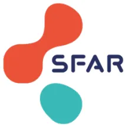
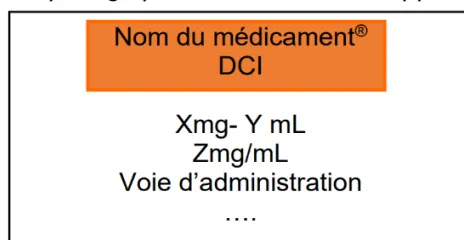
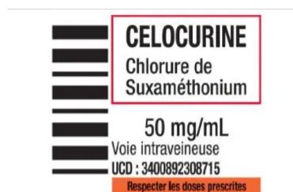

**RECOMMANDATIONS POUR LA PRATIQUE PROFESSIONNELLE  
DE LA SOCIÉTÉ FRANÇAISE D'ANESTHESIE ET REANIMATION (SFAR)  
EN COLLABORATION AVEC  
LA SOCIÉTÉ FRANÇAISE DE PHARMACIE CLINIQUE (SFPC)**

**Prévention des Erreurs Médicamenteuses  
en Anesthésie-Réanimation  
Preventing Medication Errors  
in Anaesthesia and Intensive Care  
2024**

Texte validé par le Comité des Référentiels Cliniques de la SFAR le 30 avril 2024, le Conseil d'Administration de la SFAR le 27 mai 2024, le Conseil d'Administration de la SFPC le 12 septembre 2024.

**Auteurs :**

*Alexandre Theissen, Remy Collomp, Charles-Hervé Vacheron, Sandrine Bagel, Dan Benhamou, Julien Bordes, Delphine Cabelguenne, Claire Chapuis, Bérèngère Cogniat, Charlotte Doudet, Régis Fuzier, Isabelle Goyer, Isabelle Macquer, Estelle Morau, Stéphanie Parat, Vincent Piriou, Olivier Untereiner, Nadège Salvi, Lilia Soufir, Pierre Trouiller, Aurélie Reiter-Shatz, Maxime Nguyen, Hélène Charbonneau*

**Coordonnateurs d'experts :**

**SFAR : Dr Alexandre THEISSEN, Clinique Saint François, groupe Vivalto, Nice****SFPC : Dr Rémy COLLOMP, Hôpital l'Archet, CHU, Nice**

**Organisateurs :**

**SFAR : Dr Hélène CHARBONNEAU, Clinique Pasteur, Toulouse,**

**Dr Maxime NGUYEN, CHU, Dijon**

**Experts de la SFAR :**

Pr Dan BENHAMOU, Assistance Publique Hôpitaux de Paris

Dr Julien BORDES, Hôpital d'instruction des armées Sainte Anne, Toulon

Dr Bérèngère COGNIAT, Hospices Civils de Lyon

Dr Régis FUZIER, Institut universitaire du cancer Oncopole, Toulouse

Isabelle MACQUER, CHU, Bordeaux

Dr Estelle MORAU, CHU, Nîmes

Pr Vincent PIRIOU, Hospices Civils de Lyon

Dr Olivier UNTEREINER, Institut Mutualiste Montsouris, Paris

Dr Nadège SALVI, Assistance Publique Hôpitaux de Paris

Dr Lilia SOUFIR, Hôpital Saint Joseph, Paris

Dr Pierre TROUILLER, Hôpital Fondation Rothschild, Paris

Dr Charles-Hervé VACHERON, Hospices Civils de Lyon

**Experts de la SFPC :**

Dr Sandrine BAGEL, CHU, Clermont Ferrand

Dr Delphine CABELGUENNE, CH le Vinatier, Bron

Dr Claire CHAPUIS, CHU, Grenoble

Dr Charlotte DOUDET, Hospices Civils de Lyon

Dr Isabelle GOYER, CHU, Caen

Dr Stéphanie PARAT, Hospices Civils de Lyon

Dr Aurélie REITER-SCHATZ, CHU, Strasbourg

**Groupes de Lecture :**

*Comité des Référentiels cliniques de la SFAR* : Alice Blet (Présidente), Hélène Charbonneau (Secrétaire), Aurélien Bonnal, Anaïs Caillard, Isabelle Constant, Hugues de Courson, Matthieu, Dumont, Denis Frasca, El Mahdi Halfiani, Elise Langouet, Daphné Michelet, Maxime Nguyen, Stéphanie Ruiz, Michaël Vourc'h.

*Conseil d'Administration de la SFAR* : Jean-Michel Constantin(Président); Marc Léone (1<sup>er</sup> vice-président); Karine Nouette-Gaulain (2<sup>ème</sup> vice-président); Isabelle Constant (secrétaire générale); Frédéric Le Saché (secrétaire général adjoint); Evelyne Combettes (trésorière); Olivier Joannes-Boyau (trésorier adjoint); Pierre Albaladejo; Julien Amour; Hélène Beloeil; Valérie Billard; Marie-Pierre Bonnet; Julien Cabaton; Sébastien Campard; Vincent Collange; Marion Costecalde; Violaine D'Ans; Laurent Delaunay; Delphine Garrigue; Frédéric Lacroix; Sigismond Lasocki; Anne-Claire Lukaszewicz; Jane Muret; Nadia Smail

*Conseil d'Administration de la SFPC* : Antoine Dupuis (président), Clarisse Roux Marson (vice-présidente), Felicia Ferrara (vice-présidente), Catherine Chenailier (secrétaire générale), Delphine Cabelguenne (secrétaire générale adjointe), Eric Ruspini (trésorier), Jean Didier Bardet (trésorier adjoint), ChristelleMouchoux (présidente conseil scientifique), Pierrick Bedouch, Héloïse Capelle, Philippe Cestac, Marie Camille Chaumais Pierre, Rémy Collomp, Florian Correard, Anne Charlotte Desbuquois, Bénédicte Gourieux, Julien Gravoulet, Guillaume Hache, Jean François Huon, Elsa Jouhanneau-Treton, Sandrine Masseron, Céline Mongaret, Arnaud Potier, Sonia Prot-Labarthe, Laurence Spiesser Robelet

**Liens d'intérêts des experts SFPC au cours des cinq années précédant la date de validation par le CA de la SFPC.**

Pr Dan BENHAMOU : lien d'intérêt Becton-Dickinson, Aguettant, Société Francophone de Simulation en Santé (SoFraSimS)

Dr Julien BORDES : pas de lien d'intérêt en rapport avec la présente RPP

Dr Bérèngère COGNIAT : pas de lien d'intérêt en rapport avec la présente RPP

Dr Régis FUZIER : lien d'intérêt John Libbey Arnette (co-directeur d'ouvrage sur Groupe Facteurs Humains en santé)

Dr Isabelle MACQUER : pas de lien d'intérêt en rapport avec la présente RPP

Dr Estelle MORAU : pas de lien d'intérêt en rapport avec la présente RPP

Pr Vincent PIRIOU : lien d'intérêt BD Medical

Dr Olivier UNTEREINER : lien d'intérêt Abbvie, Gamida, Pfizer

Dr Nadège SALVI : pas de lien d'intérêt en rapport avec la présente RPP

Dr Lilia SOUFIR : lien d'intérêt Haute Autorité en Santé (expert visiteur depuis 2015), Groupe Facteurs Humains en santé (membre depuis 2023), MACSF (assistance à l'expertise depuis 2014)

Dr Pierre TROUILLER : lien d'intérêt MACSF Sou médical (expertise en responsabilité civile professionnelle)

Dr Charles-Hervé VACHERON : pas de lien d'intérêt en rapport avec la présente RPP

**Liens d'intérêts des experts SFPC au cours des cinq années précédant la date de validation par le CA de la SFPC.**

Dr Sandrine BAGEL : pas de lien d'intérêt en rapport avec la présente RPP

Dr Delphine CABELGUENNE : pas de lien d'intérêt en rapport avec la présente RPP

Dr Claire CHAPUIS : pas de lien d'intérêt en rapport avec la présente RPP

Dr Charlotte DOUDET : pas de lien d'intérêt en rapport avec la présente RPP

Dr Isabelle GOYER : lien d'intérêt B Braun médical

Dr Stéphanie PARAT : pas de lien d'intérêt en rapport avec la présente RPP

Dr Aurélie REITER-SCHATZ : pas de lien d'intérêt en rapport avec la présente RPP## RESUME

**Objectif :** La Société Française d'Anesthésie et de Réanimation (SFAR) et la Société Française de Pharmacie Clinique (SFPC) se sont associées pour proposer des recommandations pour la pratique professionnelle sur la prévention des erreurs médicamenteuses en anesthésie réanimation.

**Conception :** Un groupe composé de 19 experts français de la Société Française d'Anesthésie-Réanimation (SFAR) et de la Société Française de Pharmacie Clinique (SFPC) a été réuni. D'éventuels conflits d'intérêts ont été officiellement déclarés dès le début du processus d'élaboration des recommandations et ce dernier a été conduit indépendamment de tout financement de l'industrie. Les auteurs ont suivi la méthodologie GRADE (*Grading of Recommendations Assessment, Development and Evaluation*) pour évaluer le niveau de preuve de la littérature.

**Méthodes :** 4 champs ont été définis : 1) Environnement de travail et Processus ; 2) Facteurs humains et organisationnels ; 3) Gestion des risques *a posteriori* ; 4) Problématique des pénuries médicamenteuses. Pour chaque champ, l'objectif des recommandations était de répondre à un certain nombre de questions formulées par les experts selon le modèle PICO (*Population, Intervention, Comparaison, Outcome*). A partir de ces questions, une recherche bibliographique extensive sur 20 années a été réalisée en utilisant des mots clés prédéfinis selon les recommandations PRISMA. Du fait de la très faible quantité d'études permettant de répondre avec la puissance nécessaire au critère de jugement majeur d'importance la plus élevée (i.e. erreurs médicamenteuses), il a été décidé, en amont de la rédaction des recommandations, d'adopter un format de Recommandations pour la Pratique Professionnelle (RPP) plutôt qu'un format de Recommandations Formalisées d'Experts (RFE). Les recommandations ont ensuite été votées par tous les experts selon la méthode GRADE grid.

**Résultats :** Pour toutes les questions, des recommandations ont pu être formulées, soit sur l'ensemble du champ de la question, soit partiellement. Le travail de synthèse des experts et l'application de la méthode GRADE ont abouti à 29 recommandations concernant la prévention des erreurs médicamenteuses en anesthésie et réanimation. Après un tour de vote et intégration de quelques ajustements, un accord fort a été obtenu pour la totalité des recommandations.

**Conclusion :** Un accord fort a été obtenu parmi les experts afin de fournir des recommandations visant à la prévention des erreurs médicamenteuses en anesthésie et réanimation.

**Mots clés :** Erreurs médicamenteuses ; Prévention ; Anesthésie ; Réanimation.## ABSTRACT

**Objective:** The French Society of Anesthesia and Intensive Care (SFAR) and the French Society of Clinical Pharmacy (SFPC) have joined forces to propose recommendations for professional practice on the prevention of medication errors in anesthesia and intensive care.

**Design:** A group of 19 French experts from the French Society of Anesthesia and Intensive Care (SFAR) and the French Society of Clinical Pharmacy (SFPC) was assembled. Potential conflicts of interest were formally declared at the outset of the recommendations development process, which was conducted independently of any industry funding. The authors followed the GRADE (Grading of Recommendations Assessment, Development and Evaluation) methodology to assess the level of evidence in the literature.

**Methods:** 4 fields were defined: 1) Work environment and processes; 2) Human and organizational factors; 3) Post-hoc risk management; 4) Drug shortages. For each field, the aim of the recommendations was to answer a number of questions formulated by the experts according to the PICO model (Population, Intervention, Comparison, Outcome). Based on these questions, an extensive 20-year bibliographic search was carried out, using predefined keywords according to the PRISMA recommendations. Due to the very small number of studies that could provide the necessary power to answer the most important judgement criterion (i.e. medication errors), it was decided, prior to drafting the recommendations, to adopt the format of Recommendations for Professional Practice (RPP) rather than Formalized Expert Recommendations (RFE). The recommendations were then voted on by all the experts using the GRADE grid method.

**Results:** For all questions, recommendations were formulated, either for the entire scope of the question, or in part. The experts' synthesis work and the application of the GRADE method resulted in 29 recommendations concerning the prevention of medication errors in anesthesia and intensive care. After a round of voting and the incorporation of a few adjustments, strong agreement was reached on all the recommendations.

**Conclusions:** There was strong agreement among the experts to provide recommendations for the prevention of medication errors in anesthesia and intensive care.

**Keywords:** Medication errors; Prevention; Anaesthesia; Intensive care.## INTRODUCTION

L'erreur médicamenteuse est un "écart par rapport à ce qui aurait dû être fait au cours de la prise en charge thérapeutique médicamenteuse du patient" d'après la définition du dictionnaire français de l'erreur médicamenteuse de 2006 édité par la Société Française de Pharmacie Clinique (SFPC). L'erreur médicamenteuse est l'omission ou la réalisation non intentionnelle d'un acte relatif à un médicament, qui peut être à l'origine d'un risque ou d'un événement indésirable pour le patient. Par définition, l'erreur médicamenteuse est évitable car elle manifeste ce qui aurait dû être fait et qui ne l'a pas été au cours de la prise en charge thérapeutique médicamenteuse d'un patient. L'erreur médicamenteuse peut concerner une ou plusieurs étapes du circuit du médicament, telles que : la sélection au livret du médicament, la prescription, la dispensation, l'analyse des ordonnances, la préparation galénique, le stockage, la délivrance, l'administration, l'information, le suivi thérapeutique ; mais aussi ses interfaces, telles que les transmissions ou les transcriptions.

**Malgré le fait qu'elles sont identifiées depuis de nombreuses années, les erreurs médicamenteuses demeurent en 2024 un problème majeur de sécurité en anesthésie comme en soins critiques. Les mesures de prévention doivent ainsi être renforcées. C'est pourquoi la Société Française d'Anesthésie Réanimation (SFAR) et la Société Française de Pharmacie Clinique poursuivent leurs travaux et publications dans ce domaine (2007-2017-2020) [1-3].**

## OBJECTIF DES RECOMMANDATIONS

L'objectif de ces Recommandations pour la Pratique Professionnelle (RPP) est de produire un cadre facilitant la prise de décision pour mettre en place les actions de prévention des erreurs médicamenteuses en anesthésie et réanimation. Ces RPP présentent de nombreuses convergences avec des recommandations d'autres pays sur ce sujet (européennes, nord-américaines et australiennes en particulier) tout en intégrant des spécificités françaises et des contextes particuliers (changements de médicaments programmés ou non).

Le groupe de travail s'est efforcé de produire un nombre minimal de recommandations afin de mettre en évidence les points forts à retenir dans les 4 champs prédéfinis. Les règles de base des bonnes pratiques médicales universelles en anesthésie et en réanimation étant considérées comme connues, elles ont été exclues de ces recommandations, ces dernières se focalisant sur les éléments spécifiques de la prise en charge des erreurs médicamenteuses en anesthésie et réanimation. Le public visé comprend les anesthésistes-réanimateurs exerçant au bloc opératoire, anesthésistes-réanimateurs en soins critiques, infirmiers anesthésistes exerçant en anesthésie ou en réanimation, équipes pharmaceutiques intégrées en anesthésie et en réanimation.

## DEFINITIONS UTILISEES DANS CES RECOMMANDATIONS

### AIDES COGNITIVES

Une aide cognitive est un outil créé pour guider son utilisateur dans la réalisation d'une ou plusieurs tâches. Son objectif est de réduire le risque d'erreurs tout en augmentant la rapidité d'exécution de cettetâche et donc la performance de l'utilisateur [8]. Elle permet de standardiser un processus afin de s'assurer qu'aucune étape de sa réalisation ne soit omise. Elle est pensée pour être utilisée pendant la réalisation d'une tâche donnée [9].

#### **BILAN MEDICAMENTEUX**

**Un bilan médicamenteux établit la liste exhaustive et complète des médicaments pris ou à prendre par le patient, qu'ils soient prescrits par le médecin traitant ou spécialiste ou qu'ils soient pris en automédication. Le bilan médicamenteux n'est pas une ordonnance [10].**

#### **COMPÉTENCES NON TECHNIQUES**

Les compétences non-techniques font référence au savoir-être et sont définies comme les compétences cognitives et sociales qui contribuent à mener une tâche de façon efficace [11]. Elles incluent entre autres la gestion de la charge de travail, le leadership et le travail en équipe, la prise de décision, la conscience de la situation, la communication et la connaissance de soi qui permet par exemple de gérer ses niveaux de stress, d'attention et de fatigue.

#### **CONCILIATION MEDICAMENTEUSE**

**La conciliation des traitements médicamenteux est un processus formalisé qui prend en compte, lors d'une nouvelle prescription, tous les médicaments pris et à prendre par le patient. Elle associe le patient et repose sur le partage d'informations et sur une coordination pluriprofessionnelle [10].**

#### **ERREUR MEDICAMENTEUSE**

**Une erreur médicamenteuse est une erreur non intentionnelle d'un professionnel de santé, d'un patient ou d'un tiers, survenue au cours du processus de soin impliquant un médicament ou un produit de santé mentionné à l'article R. 5121-150 du CSP, notamment lors de la prescription, de la dispensation ou de l'administration [12].**

La Société Française de Pharmacie Clinique (SFPC) a édité un [Dictionnaire français de l'erreur médicamenteuse en 2006](#) dans lequel l'erreur médicamenteuse est définie comme un « **écart par rapport à ce qui aurait dû être fait au cours de la prise en charge thérapeutique médicamenteuse du patient**. L'erreur médicamenteuse est l'omission ou la réalisation non intentionnelle d'un acte relatif à un médicament, qui peut être à l'origine d'un risque ou d'un événement indésirable pour le patient. Par définition, l'erreur médicamenteuse est évitable. L'erreur médicamenteuse peut concerner une ou plusieurs étapes du circuit du médicament, telles que : sélection au livret du médicament, prescription, dispensation, analyse des ordonnances, préparation galénique, stockage, délivrance, administration, information, suivi thérapeutique ; mais aussi ses interfaces, telles que les transmissions ou les transcriptions ».

#### **INTERRUPTION DE TÂCHES**

L'interruption de tâches est l'arrêt inopiné, provisoire ou définitif d'une activité humaine dont la raison est propre à l'opérateur, ou au contraire, lui est externe. L'interruption de tâches induit une rupture dansle déroulement de l'activité, une perturbation de la concentration de l'opérateur et une altération de la performance de l'acte [13-15].

#### **MEDICAMENTS A RISQUE**

Médicaments requérant une sécurisation de la prescription, de la dispensation, de la détention, du stockage, de l'administration et un suivi thérapeutique approprié, fondés sur le respect des données de référence afin d'éviter les erreurs pouvant avoir des conséquences graves sur la santé du patient (exemples : anticoagulants, antiarythmiques, agonistes adrénergiques IV, digitaliques IV, insuline, anticancéreux, solutions d'électrolytes concentrées...). Il s'agit le plus souvent de médicaments à marge thérapeutique étroite.

#### **PHARMACIE CLINIQUE**

**La pharmacie clinique est une discipline de santé centrée sur le patient dont l'exercice a pour objectif d'optimiser la thérapeutique à chaque étape du parcours de soins. Pour cela, les actes de pharmacie clinique contribuent à la sécurisation, la pertinence et à l'efficacité du recours aux produits de santé [16].**

#### **PRISE EN CHARGE MEDICAMENTEUSE**

La prise en charge médicamenteuse est un processus combinant des étapes pluridisciplinaires et interdépendantes ( la prescription (y compris la gestion du traitement personnel du patient à l'admission et la prescription de sortie) ; la dispensation ; la préparation ; l'approvisionnement ; la détention et le stockage ; le transport ; l'information du patient ; l'administration ; la surveillance du patient) visant un objectif commun : l'utilisation sécurisée, appropriée et efficace du médicament chez le patient pris en charge.

#### **PROCESSUS**

Toute activité utilisant des ressources et gérée de manière à permettre la transformation d'éléments d'entrée en éléments de sortie, peut être considérée comme un processus.

#### **DOUBLE CONTROLE (OU DOUBLE VERIFICATION)**

**C'est un système de contrôle croisé sur des critères d'administration entre 2 professionnels de soins réalisé de façon indépendante [17].**## MÉTHODE

### Organisation générale

Ces recommandations sont le résultat du travail d'un groupe d'experts réunis par la SFAR en collaboration avec la SFPC. Chaque expert a rempli une déclaration de conflits d'intérêts avant de débuter le travail d'analyse. Dans un premier temps, le comité d'organisation a défini les objectifs de ces recommandations et la méthodologie utilisée. Les différents champs d'application de ces RPP et les questions à traiter ont ensuite été définis par le comité d'organisation, puis modifiés et validés par les experts. Les questions ont été formulées selon un format PICO (*Population, Intervention, Comparaison, Outcome*) après une première réunion du groupe d'experts. La population « P » pour l'ensemble des questions est définie comme « les patients pris en charge en anesthésie ou en réanimation ».

### Champ des recommandations

Les recommandations formulées concernent 4 champs :

- - Champ 1 : Environnement de travail et Processus ;
- - Champ 2 : Facteurs humains et organisationnels ;
- - Champ 3 : Gestion des risques *a posteriori* ;
- - Champ 4 : Problématique des pénuries médicamenteuses.

Une recherche bibliographique extensive de 2004 à 2024 était réalisée à partir des bases de données (MEDLINE, Tripdatabase ([www.tripdatabase.com](http://www.tripdatabase.com)), Prospero ([www.crd.york.ac.uk/PROSPERO](http://www.crd.york.ac.uk/PROSPERO)) et [www.clinicaltrials.gov](http://www.clinicaltrials.gov), EMBASE, SCOPUS, Cochrane), par 2 à 3 experts pour chaque champ d'application, selon la méthodologie Preferred Reporting Items for Systematic Reviews and Meta-Analysis (PRISMA pour les revues systématiques). Les mots clés utilisés pour la recherche bibliographique ont été : **erreurs médicamenteuses, incidence des évènements indésirables graves et incidence des évènements indésirables.**

Ont été inclus dans l'analyse :

1. 1) les méta-analyses d'essais contrôlés randomisés, revues de la littérature, essais contrôlés randomisés, essais prospectifs non randomisés, cohortes rétrospectives, séries de cas et case-report ;
2. 2) conduites chez les patients d'anesthésie et de soins critiques ;
3. 3) traitant des erreurs médicamenteuses en anesthésie et réanimation (champ considéré)
4. 4) publiées en langue anglaise ou française.

La méthode de travail utilisée pour l'élaboration de ces recommandations est la méthode GRADE® (*Grade of Recommendation Assessment, Development and Evaluation*). Cette méthode permet, après une analyse qualitative et quantitative de la littérature, de déterminer séparément la qualité des preuves, et donc de donner une estimation de la confiance que l'on peut avoir de l'analyse quantitative et un niveau de recommandation. Un niveau de preuve a donc été défini pour chacune des références bibliographiques citées en fonction du type de l'étude. Du fait de la très faible quantité d'études permettant de répondre avec la puissance nécessaire au critère de jugement majeur d'importance la plus élevée (i.e. 9), il a été décidé, en amont de la rédaction des recommandations, d'adopter un format de Recommandations pour la Pratique Professionnelle (RPP) plutôt qu'un format de Recommandations Formalisées d'Experts (RFE).La méthodologie GRADE a toutefois été appliquée pour l'analyse de la littérature et la rédaction des tableaux récapitulatifs des données de la littérature. Un niveau de preuve a donc été défini pour chacune des références bibliographiques citées en fonction du type de l'étude. Ce niveau de preuve pouvait être réévalué en tenant compte de la qualité méthodologique de l'étude, de la cohérence des résultats entre les différentes études, du caractère direct ou non des preuves, de l'analyse de coût et de l'importance du bénéfice. Les critères de jugement ont été définis en amont de la façon suivante :

- ● **critères de jugement majeurs** : erreurs médicamenteuses (importance 9).
- ● **critères de jugement importants mais non cruciaux**: incidence des événements indésirables graves (importance 7), incidence des événements indésirables (importance 5).

Les recommandations ont ensuite été rédigées en utilisant la terminologie des RPP de la SFAR « les experts suggèrent de faire » ou « les experts suggèrent de ne pas faire ».

Les propositions de recommandations ont été présentées et discutées une à une. Le but n'était pas d'aboutir obligatoirement à un avis unique et convergent des experts sur l'ensemble des propositions, mais de dégager les points de concordance et les points de divergence ou d'indécision. Chaque recommandation a alors été évaluée par chacun des experts et soumise à une cotation individuelle à l'aide d'une échelle allant de 1 (désaccord complet) à 9 (accord complet). La force de la recommandation est déterminée en fonction de cinq facteurs clés et validée par les experts après un vote, en utilisant la méthode GRADE Grid :

- ● Estimation de l'effet : plus il est important, plus probablement la recommandation sera forte;
- ● Imprécision : en cas d'incertitude de l'estimateur ou de grande variabilité de son écart-type, la force de la recommandation sera probablement plus faible ;
- ● Niveau global de preuve : plus il est élevé, plus probablement la recommandation sera forte;
- ● Balance entre effets désirables et indésirables : plus celle-ci est favorable, plus probablement la recommandation sera forte ;
- ● Préférence du patient, médecin ou décisionnaire doit être obtenue au mieux auprès des personnes concernées ;
- ● Coûts : plus les coûts ou l'utilisation des ressources sont élevés, plus probablement la recommandation sera faible.

Les avis d'experts, exprimant par définition un consensus entre les experts en l'absence de littérature suffisamment forte pour grader ces recommandations, devaient nécessairement obtenir un accord fort (i.e. au moins 70% d'opinions allant dans la même direction, tandis que moins de 20 % d'entre eux exprimaient une opinion contraire). En l'absence de validation d'une ou de plusieurs recommandation(s), celle(s)-ci était(en)t reformulée(s) et, de nouveau, soumise(s) à cotation dans l'objectif d'aboutir à un consensus. Si les recommandations n'avaient pas obtenu un nombre suffisant d'opinions favorables et/ou obtenu un nombre trop élevé d'opinions défavorables, elles n'étaient pas éditées.

## RESULTATS

### Champs des recommandationsLes experts ont consensuellement décidé lors de la première réunion d'organisation de ces RPP, de traiter 17 questions réparties en 4 champs. Les questions suivantes ont été retenues pour le recueil et l'analyse de la littérature :

- **Champ 1 : Environnement de travail et Processus**

1. 1. La standardisation de la prescription des médicaments et l'existence de protocoles, (*spécifiant notamment la dilution, le solvant, la durée, la vitesse et la voie d'administration*) en anesthésie et soins critiques permet-elle de réduire la survenue des erreurs médicamenteuses ?
2. 2. L'informatisation de la prescription en anesthésie et soins critiques permet-elle de réduire la survenue des erreurs médicamenteuses ?
3. 3. Le bilan et la conciliation médicamenteuse en anesthésie et soins critiques permettent-ils de réduire la survenue des erreurs médicamenteuses ?
4. 4. La standardisation de la préparation des médicaments et l'existence de protocoles, (*spécifiant notamment la dilution, le solvant, la durée, la vitesse et la voie d'administration*) en anesthésie et soins critiques permet-elle de réduire la survenue des erreurs médicamenteuses ?
5. 5. La standardisation de l'administration des médicaments et l'existence de protocoles, spécifiant notamment la durée, la vitesse et la voie d'administration et le double contrôle en anesthésie et soins critiques permet-elle de réduire la survenue des erreurs médicamenteuses ?
6. 6. L'étiquetage des seringues, des poches de perfusions et des voies d'administration en anesthésie et soins critiques permet-il de réduire la survenue des erreurs médicamenteuses ?
7. 7. Le choix du type de conditionnement et d'étiquetage des ampoules de médicaments utilisés en anesthésie et soins critiques permet-il de réduire la survenue des erreurs médicamenteuses ?
8. 8. L'utilisation des seringues préremplies en anesthésie et soins critiques permet-elle de réduire la survenue des erreurs médicamenteuses ?
9. 9. L'utilisation de normes spécifiques de connectique par type de voie d'administration en anesthésie et soins critiques permet-elle de réduire la survenue des erreurs médicamenteuses ?
10. 10. L'utilisation d'un système de traçabilité / détrompeur (code barre, data-matrix et RFID/*Radio Frequency Identification*) lors du circuit du médicament en anesthésie et soins critiques permet-elle de réduire la survenue des erreurs médicamenteuses ?
11. 11. La standardisation des modalités de rangement, de stockage et d'approvisionnement en anesthésie et soins critiques permet-elle de réduire la survenue des erreurs médicamenteuses ?

- **Champ 2 : Facteurs humains et organisationnels**

1. 12. La lutte contre les interruptions de tâches en anesthésie et soins critiques permet-elle de réduire la survenue des erreurs médicamenteuses ?13. L'utilisation de compétences non techniques (pratique de la double lecture, concordance, communication sécurisée.....) lors de préparation et de l'administration de médicaments en anesthésie et soins critiques permet-elle de réduire la survenue des erreurs médicamenteuses ?

14. La formation des personnels par la simulation en anesthésie et soins critiques permet-elle de réduire la survenue des erreurs médicamenteuses ?

15. L'intégration de l'équipe pharmaceutique dans les services d'anesthésie et de soins critiques permet-elle de réduire la survenue des erreurs médicamenteuses ?

- **Champ 3 : Gestion des risques *a posteriori***

16. La déclaration, l'analyse *a posteriori* et le retour d'expérience des erreurs médicamenteuses en anesthésie et soins critiques permettent-elles de réduire la survenue des erreurs médicamenteuses ?

- **Champ 4 : Problématique des pénuries médicamenteuses.**

17. Des mesures spécifiques pour accompagner les changements de médicaments (inopinés ou programmés) en anesthésie et soins critiques permettent-elles de réduire la survenue des erreurs médicamenteuses ?

**Synthèse des résultats**

Le travail de synthèse des experts et l'application de la méthode GRADE ont abouti à 29 recommandations. Après un tour de cotation et quelques amendements, un accord fort a été obtenu pour la totalité des recommandations.

La SFAR et la SFPC incitent tous les anesthésistes-réanimateurs, infirmiers-anesthésistes exerçant en anesthésie ou en réanimation, équipes pharmaceutiques intégrées en anesthésie et en réanimation à se conformer à ces RPP, de manière globale, pour optimiser la qualité des soins dispensés aux patients. Cependant, chaque professionnel de santé doit exercer son propre jugement dans l'application de ces recommandations, en prenant en compte son expertise et les spécificités de son établissement, pour déterminer la méthode d'intervention la mieux adaptée à l'état du patient dont il a la charge.

**Références**

[1] Société Française d'Anesthésie Réanimation (SFAR) – Société Française de Pharmacie Clinique (SFPC). Prévention des erreurs médicamenteuses en anesthésie. 2007. [https://sfar.org/wp-content/uploads/2014/04/preverreurmedic\\_recos.pdf](https://sfar.org/wp-content/uploads/2014/04/preverreurmedic_recos.pdf).

[2] Société Française d'Anesthésie Réanimation (SFAR) – Société Française de Pharmacie Clinique (SFPC). Prévention des erreurs médicamenteuses en anesthésie et en réanimation (texte long et texte court). Préconisations de la SFAR en partenariat avec la SFPC, actualisation 2016. <https://sfar.org/preconisations-2016-prevention-des-erreurs-medicamenteuses-en-a-r>.

[3] Société Française d'Anesthésie Réanimation (SFAR) – Société Française de Pharmacie Clinique (SFPC). Prévention des erreurs médicamenteuses en anesthésie et en réanimation en période de crise sanitaire aiguë. Retour d'expérience de la période COVID. Préconisations communes de la SFAR et de la SFPC. 2020. <https://sfpc.eu/wp-content/uploads/2020/06/Preco-erreurs-med-SFAR-SFPC-CRISE-Guide-complet-V290520.pdf>.

[4] ISMP. Safe practice guidelines for adult IV push medications. 2015 <http://www.ismp.org/Tools/guidelines/ivsummitpush/ivpushmedguidelines.pdf>.

[5] Australian Commission on Safety and Quality in Health Care. National standard for Userapplied Labelling off Injectable Medicines, Fluids and Lines. August 2015. <https://www.safetyandquality.gov.au/publications-and->resources/resource-library/joint-statement-supporting-user-applied-labelling-standardisation-all-injectable-medicines-and-fluids .

[6] Royal College of Anaesthetists – Association of Anaesthetists Great Britain and Ireland. Syringe labelling in anaesthesia and critical care areas: review 2022. <https://anaesthetists.org/Portals/0/PDFs/Guidelines%20PDFs/Syringe%20labelling%202022%20v1.1.pdf?ver=2022-10-26-140938-370> .

[7] Spanish society of anesthesiology, critical care and pain therapy (SEDAR). Labelling of injectable medicines administered in anaesthesia. 2010 <https://www.esahq.org/patient-safety/patient-safety/protocols/national-protocols/>

[8] Marshall S. The use of cognitive aids during emergencies in anesthesia: a review of the literature. Anesth Analg 2013;117(5):1162-71.

[9] Winters BD, Gurses AP, Lehmann H, Sexton JB, Rampersad CJ, Pronovost PJ. Clinical review: checklists - translating evidence into practice. Crit Care 2009;13(6):210.

[10] HAS. Mettre en œuvre la conciliation des traitements médicamenteux en établissement de santé. 2018 [https://www.has-sante.fr/jcms/c\\_2736453/fr/mettre-en-oeuvre-la-conciliation-des-traitements-medicamenteux-en-etablissement-de-sante](https://www.has-sante.fr/jcms/c_2736453/fr/mettre-en-oeuvre-la-conciliation-des-traitements-medicamenteux-en-etablissement-de-sante).

[11] Flin R, Maran N. Basic concepts for crew resource management and non-technical skills. Best Pract Res Clin Anaesthesiol 2015;29 :27-39.

[12] Ministère du travail, de la santé et des solidarités. Définition de l'erreur médicamenteuse. 2016. <https://sante.gouv.fr/soins-et-maladies/medicaments/glossaire/article/erreur-medicamenteuse>

[13] Brixey JJ, Robinson DJ, Turley JP, Zhang J. The roles of MDs and RNs as initiators and recipients of interruptions in workflow. Int J Med Inform 2010;79(6):e109-15.

[14] Forsberg HH, Muntlin Athlin Å, von Thiele Schwarz U. Nurses' perceptions of multitasking in the emergency department: effective, fun and unproblematic (at least for me) – a qualitative study. Int Emerg Nurs 2015;23:59-64.

[15] HAS. Interruption de tache lors de l'administration de médicaments. 2016. [https://www.has-sante.fr/jcms/c\\_2618396/fr/interruptions-de-tache-lors-de-l-administration-desmedicaments](https://www.has-sante.fr/jcms/c_2618396/fr/interruptions-de-tache-lors-de-l-administration-desmedicaments)).

[16] SFPC. Lexique de la pharmacie clinique. 2021 <https://sfpc.eu/wp-content/uploads/2021/07/Le-lexique-de-pharmacie-clinique-2021-selon-la-SFPC.pdf> .

[17] Haute Autorité de Santé. Certification des établissements de santé, fiche pédagogique : évaluation de la prise en charge médicamenteuse. Mars 2022. [https://www.has-sante.fr/upload/docs/application/pdf/2020-12/fiche\\_pedagogique\\_pec\\_medicamenteuse.pdf](https://www.has-sante.fr/upload/docs/application/pdf/2020-12/fiche_pedagogique_pec_medicamenteuse.pdf).## TABLEAU DE SYNTHÈSE

<table border="1">
<thead>
<tr>
<th colspan="3"><b>P du PICO : Patients</b></th>
</tr>
</thead>
<tbody>
<tr>
<td></td>
<td colspan="2">
<p>Quels sont les patients concernés ?</p>
<p>Patients pris en charge au bloc opératoire ou en soins critiques.</p>
<p>Les patients pris en charge en amont ou en aval du bloc opératoire ou des soins critiques ne sont pas compris dans le périmètre traité par ces recommandations.</p>
</td>
</tr>
<tr>
<th colspan="3"><b>O du PICO : Outcomes / Critères de jugement</b></th>
</tr>
<tr>
<td colspan="3">- Critères de jugement cruciaux ou majeurs (importance de 9 le plus fort à 7)</td>
</tr>
<tr>
<td></td>
<td>Importance 9</td>
<td>Erreurs médicamenteuses</td>
</tr>
<tr>
<td colspan="3">- Critères de jugement importants mais non cruciaux (importance de 7 le plus fort, à 5)</td>
</tr>
<tr>
<td></td>
<td>Importance 7</td>
<td>Incidence des événements indésirables graves</td>
</tr>
<tr>
<td></td>
<td>Importance 5</td>
<td>Incidence des événements indésirables</td>
</tr>
<tr>
<th colspan="3"><b>Mots-clés</b></th>
</tr>
<tr>
<td></td>
<td colspan="2">Erreurs médicamenteuses, incidence des événements indésirables graves, incidence des événements indésirables.</td>
</tr>
<tr>
<th colspan="3"><b>Critères de restriction de la recherche bibliographique</b></th>
</tr>
<tr>
<td><b>Type d'études, effectif minimal</b></td>
<td colspan="2">
<ul style="list-style-type: none; padding-left: 0;">
<li>- Méta-analyses d'essais contrôlés randomisés</li>
<li>- Revues de la littérature</li>
<li>- Essais contrôlés randomisés</li>
<li>- Essais prospectifs non randomisés</li>
<li>- Cohortes rétrospectives</li>
<li>- Séries de cas</li>
<li>- Case-report</li>
</ul>
</td>
</tr>
<tr>
<td>Années de la recherche bibliographique</td>
<td colspan="2">Depuis 2004</td>
</tr>
<tr>
<td>Langues</td>
<td colspan="2">anglais, français.</td>
</tr>
</tbody>
</table>```

graph TD
    EM([Erreur médicamenteuse]) --> ER[Erreur de reconstitution]
    EM --> EA[Erreur d'administration]
    EM --> EP[Erreur de prescription]
    
    ER --> ES[Erreur de spécialité]
    ER --> ED[Erreur de dilution]
    ER --> EE[Erreur d'étiquetage]
    
    ES --> ES1([Erreur de sélection spécialité])
    ES --> ES2([Erreur de contrôle spécialité])
    ES --- E1(et)
    
    ED --- E2(ou)
    EE --- E2
    
    EA --> ES3[Erreur de seringue]
    EA --> EVA[Erreur de voie d'administration]
    
    ES3 --> ES31([Erreur de sélection seringue])
    ES3 --> ES32([Erreur de contrôle seringue])
    ES3 --- E3(et)
    
    EVA --> EVA1([Erreur de sélection voie])
    EVA --> EVA2([Erreur de contrôle voie])
    EVA --- E4(et)
    
    EP --> EV[Erreur de volume ou débit]
    EP --> EMoment[Erreur de moment]
    EP --> EPatient[Erreur de patient]
    
    subgraph Legend
        L1([ ]) --- L1t[erreur résultante]
        L2([ ]) --- L2t[erreur intermédiaire]
        L3{ } --- L3t[erreur non détaillée]
        L4(( )) --- L4t[erreur élémentaire]
    end
  
```

**Figure : les différentes combinaisons d'erreurs conduisant à l'erreur médicamenteuse.**

(Source : SFAR SFPC. Prévention des erreurs médicamenteuses en anesthésie et en réanimation. Actualisation 2016.

<http://sfar.org/wp-content/uploads/2016/11/texte-long-Preconisations-2016-erreurs-med-SFAR-SFPC-version-finale-25-oct-2016.pdf>## CHAMP 1. ENVIRONNEMENT DE TRAVAIL ET PROCESSUS

**Question : La standardisation de la prescription des médicaments et l'utilisation de protocoles de service (spécifiant notamment la dilution, le solvant, la durée, la vitesse et la voie d'administration) en anesthésie et soins critiques permet-elle de réduire la survenue des erreurs médicamenteuses ?**

*Experts : Julien BORDES (Toulon) et Lilia SOUFIR (Paris)*

**R1.1 - Les experts suggèrent que la standardisation et l'utilisation de protocoles de prescription des médicaments (spécifiant notamment la dilution, le solvant, la durée, la vitesse et la voie d'administration) permettent de réduire la survenue d'erreurs médicamenteuses en anesthésie et en soins critiques.**

### **AVIS d'EXPERTS (Accord Fort)**

#### **Argumentaire :**

La prescription médicamenteuse est la première étape de la prise en charge médicamenteuse du patient (PECM), en anesthésie et en soins critiques [1]. Comme pour les quatre autres étapes (dispensation, préparation, administration, suivi), la prescription peut être la cause d'erreurs médicamenteuses [1,2]. La prévalence des erreurs de prescription est élevée en soins critiques, de 11% à 47% en fonction des études [3,4]. Les erreurs les plus fréquentes sont les omissions de dosage, du mode d'administration ou de la fréquence d'administration [3]. C'est pourquoi la prescription médicamenteuse doit répondre à un certain nombre d'exigences pour en améliorer la qualité et la sécurité [5].

La standardisation de la prescription des médicaments est un des outils. Elle est préconisée par la Haute Autorité de Santé (HAS) depuis 2013 [6]. Elle concerne notamment la posologie, la voie d'administration, la nature du solvant, la dilution, la fréquence, la durée du traitement. Elle peut être facilitée par l'utilisation d'ordonnance pré-imprimée. Wasserfallen *et al.* ont évalué l'impact de la protocolisation de la prescription d'antibiotiques en réanimation dans une étude avant/après [7]. La proportion de prescriptions considérées « sûres » augmentait dans les 2 réanimations, mais cette augmentation était 4,6 fois plus importante dans celle où la standardisation était mise en place.

La standardisation de la prescription peut aussi s'intégrer dans un ensemble d'interventions visant à réduire le risque d'erreurs médicamenteuses [8]. Dans un service de réanimation, la mise en place d'une standardisation de la prescription associée à une suppression de la transcription (de l'ordonnance médicale au plan d'administration de médicaments en fusionnant les deux en un seul document) était associée à une réduction des erreurs médicamenteuses de 57% [8].

La mise en place de la standardisation est facilitée par l'utilisation de protocoles, définis comme des « outils fondés sur des données probantes conçus pour guider les cliniciens sur l'utilisation appropriée des médicaments et la sécurité » [9]. Elle a déjà été proposée par plusieurs panels d'experts [10–12]. Elle fait ainsi partie des interventions permettant d'améliorer la qualité et la sécurité de la PECM en ayant le potentiel de réduire les erreurs médicamenteuses [13–15,16]. Une étude avant/après a évalué l'impact de la mise en place d'un protocole sur la diminution des erreurs à type d'incompatibilité médicamenteuses en soins critiques. Après implémentation du protocole, l'incidence de l'administration de médicaments incompatibles passait de 5,8% à 2,4%, soit une réduction du risque de 59% [17]. L'étude « BEHAVE » en réanimation retrouvait également uneréduction des erreurs médicamenteuses par omission après mise en place d'un protocole pour la prescription de la thromboprophylaxie [18].

#### Références :

- [1] Rothschild JM, Landrigan CP, Cronin JW, Kaushal R, Lockley SW, Burdick E, *et al.*, The Critical Care Safety Study: The incidence and nature of adverse events and serious medical errors in intensive care. *Crit Care Med* 2005;33:1694-700.  
  <https://doi.org/10.1097/01.ccm.0000171609.91035.bd>
- [2] Rivière A, Piriou V, Durand D, Arnoux A, Castot-Villepelet A. Medication errors in anaesthesia: a review of reports from the French Health Products Agency. *Ann Fr Anesth Reanim* 2012;31:6-14.  
  <https://doi.org/10.1016/j.annfar.2011.11.011>
- [3] Suclupe S, Martinez-Zapata MJ, Mancebo J, Font-Vaquer A, Castillo-Masa AM, Vinolas I et al. Medication errors in prescription and administration in critically ill patients. *J Adv Nurs* 2020;76:1192-1200. <https://doi.org/10.1111/jan.14322>
- [4] Souza de Castro R da N, Barbosa de Aguiar L, Grou Volpe CR, de Souza Silva CM, Rodrigues da Silva IC, Morato Stival M, *et al.* Determining Medication Errors in an Adult Intensive Care Unit. *Int J Environ Res Public Health* 2023;20:6788. <https://doi.org/10.3390/ijerph20186788>
- [5] HAS. Evaluation de la prise en charge médicamenteuse. mars 2022. [https://www.has-sante.fr/upload/docs/application/pdf/2020-12/fiche\\_pedagogique\\_pec\\_medicamenteuse.pdf](https://www.has-sante.fr/upload/docs/application/pdf/2020-12/fiche_pedagogique_pec_medicamenteuse.pdf)
- [6] HAS. Outil de sécurisation et d'autoévaluation de l'administration des médicaments. 2013. [https://www.has-sante.fr/upload/docs/application/pdf/2011-11/guide\\_outil\\_securisation\\_autoevaluation\\_medicaments\\_complet\\_2011-11-17\\_10-49-21\\_885.pdf](https://www.has-sante.fr/upload/docs/application/pdf/2011-11/guide_outil_securisation_autoevaluation_medicaments_complet_2011-11-17_10-49-21_885.pdf)
- [7] Wasserfallen JB, Bütschi AJ, Muff P, Biollaz J, Schaller MD, André Pannatier A, et al. Format of medical order sheet improves security of antibiotics prescription: The experience of an intensive care unit. *Crit Care Med* 2004;32:655-9.  
  <https://doi.org/10.1097/01.ccm.0000114835.97789.ab>
- [8] Benoit E, Eckert P, Theytaz C, Joris-Frasseren M, Aouzi M, Beney J. Streamlining the medication process improves safety in the intensive care unit. *Acta Anaesthesiol Scand* 2012;56:966-975.  
  <https://doi.org/10.1111/j.1399-6576.2012.02707.x>
- [9] LeBlanc JM, Kane-Gill SL, Pohlman AS, Herr DL. Multiprofessional survey of protocol use in the intensive care unit. *J Crit Care* 2012;27:738.e9-17, déc 2012.  
  <https://doi.org/10.1016/j.jcrc.2012.07.012>
- [10] ANZCA. Guideline for the safe management and use of medications in anaesthesia Background Paper. 2021. <https://www.anzca.edu.au/getattachment/f6b9c8cb-c0a1-4a6c-a904-58fc0a9caeac/PS51BP-Guideline-for-the-safe-management-and-use-of-medications-in-anaesthesia-Background-Paper> (consulté le 14 avril 2024).
- [11] SFAR/SFPC. Preconisations erreurs médicamenteuses en anesthésie réanimation. 2016. <https://sfar.org/wp-content/uploads/2016/11/texte-long-Preconisations-2016-erreurs-med-SFAR-SFPC-version-finale-25-oct-2016.pdf> (consulté le 14 avril 2024).
- [12] Anesthesia Patient Safety Foundation. APSF Hosts Medication Safety Conference. 2010. <https://www.apsf.org/article/apsf-hosts-medication-safety-conference/>
- [13] Odwazny R, Hasler S, Abrams R, McNutt R. Organizational and cultural changes for providing safe patient care. *Qual Manag Health Care* 2005;14:132-143.  
  <https://doi.org/10.1097/00019514-200507000-00002>
- [14] Ciapponi A, Fernandez Nieves SE, Seijo M, Rodríguez MB, Vietto V, García-Perdomo HA, et al. Reducing medication errors for adults in hospital settings. *Cochrane Database Syst Rev*. 2021; nov 25;11(11):CD009985. <https://doi.org/10.1002/14651858.cd009985.pub2>
- [15] Martin LD, Grigg EB, Verma S, Latham GJ, Rampersad SE, Martin LD. Outcomes of a Failure Mode and Effects Analysis for medication errors in pediatric anesthesia. *Paediatr Anaesth* 2017;27:571-580.  
  <https://doi.org/10.1111/pan.13136>
- [16] Manias E, Williams A, Liew D. Interventions to reduce medication errors in adult intensive care: a systematic review. *Br J Clin Pharmacol* 2012;74:411-423. <https://doi.org/10.1111/j.1365-2125.2012.04220.x>
- [17] Bertsche T, Mayer Y, Stahl R, Hoppe-Tichy T, Encke J, Haefeli WE. Prevention of intravenous drug incompatibilities in an intensive care unit. *Am J Health Syst Pharm* 2008;19:1834-40.  
  <https://doi.org/10.2146/ajhp070633>[18] McMullin J, Cook D, Griffith L, McDonald E, Clarke F, Guyatt G, et al. Minimizing errors of omission: behavioural reenforcement of heparin to avert venous emboli: the BEHAVE study. Crit Care Med 2006;34:694-699. <https://doi.org/10.1097/01.ccm.0000201886.84135.cb>

**Question : L'informatisation de la prescription en anesthésie et soins critiques permet-elle de réduire la survenue des erreurs médicamenteuses ?**

*Experts : Charles-Hervé VACHERON (Lyon), Vincent PIRIOU (Lyon), Isabelle GOYER (Caen)*

**R1.2.1 - Les experts suggèrent d'utiliser un logiciel de prescription en soins critiques pour diminuer la survenue des erreurs médicamenteuses et les effets indésirables évitables liés aux traitements médicamenteux.**

**AVIS d'EXPERTS (Accord Fort)**

**R1.2.2 - Les experts suggèrent d'implémenter en soins critiques des outils informatiques d'aide à la prescription pour réduire la survenue des erreurs médicamenteuses.**

**AVIS d'EXPERTS (Accord Fort)**

**R1.2.3 - Les experts suggèrent que les logiciels de prescription et les outils d'aide à la prescription médicamenteuse soient adaptés aux spécificités de la population des services de soins critiques (adultes, enfants, nouveau-nés), paramétrés avant le déploiement par les soignants des services et les pharmaciens cliniciens spécialisés, et actualisés pendant leur utilisation en clinique, pour réduire la survenue des erreurs médicamenteuses.**

**AVIS d'EXPERTS (Accord Fort)**

**ABSENCE DE RECOMMANDATION – Devant l'absence de données dans la littérature, les experts ne sont pas en mesure d'émettre une recommandation concernant l'informatisation de la prescription en anesthésie.**

**ABSENCE DE RECOMMANDATION**

**Argumentaire :**

La prescription informatique s'est généralisée dans les hôpitaux français à la suite d'études montrant que ce type d'outils entraînait une diminution des coûts au sein des institutions, une réduction de la consommation de soins non justifiés, ainsi qu'une diminution du temps consacré par les praticiens à la prescription [1]. L'informatisation peut être un outil facilitant pour standardiser la prescription comme indiqué par le manuel de certification de la HAS [2].

En 1999, une étude observationnelle prospective avant/après, implémentant un logiciel de prescription, a permis de réduire considérablement les erreurs médicamenteuses (dose, voie d'administration, allergies), ainsi que les effets secondaires potentiels liés aux traitements, notamment en réanimation [3]. Par la suite, une étude a randomisé des patients entre deux unités de réanimation, l'une utilisant la prescription informatique et l'autre utilisant la prescription manuscrite papier. Les erreurs médicamenteuses étaient moins fréquentes dans l'unité informatisée par rapport à l'unité utilisant les prescriptions papier (3 % contre 27 %), entraînant également une diminution des effets indésirables iatrogènes [4].

La prescription médicamenteuse informatisée en soins critiques réduit le risque d'erreurs médicamenteuses à différentes étapes de la prise en charge médicamenteuse du patient (prescription, dispensation et administration) pour toutes les populations de soins critiques étudiées (adulte, enfant, nouveau-né) [5-11].

Avec l'introduction des prescriptions informatisées, des systèmes d'aide à la décision ou à la prescription sont apparus et ont été étudiés (alertes informatiques, suggestions, rappels). Leurefficacité a été démontrée à plusieurs reprises par des essais randomisés contrôlés, que ce soit pour atteindre des objectifs (utilisation adaptée des anti infectieux, ajustement de vancomycine, utilisation/épargne des produits sanguins labiles, aide aux calculs de perfusion et aux calculs de posologie-poids en pédiatrie et néonatalogie) ou de manière plus générale, pour lutter contre les erreurs de prescription en réanimation et favoriser l'adhésion aux recommandations de pratiques professionnelles [12-16].

Pour que des outils d'aide à la prescription puissent réduire le risque d'erreur médicamenteuse en soins critiques, ces outils doivent être adaptés à la population traitée et interfacés directement avec le dossier patient informatisé. Dans le cas contraire, les soignants peuvent ne pas adhérer aux outils, ou l'outil peut induire un risque d'erreur pour les patients [15,17]. Il convient de noter qu'avec l'introduction des logiciels de prescription, de nouveaux types d'erreurs sont apparus, notamment en raison de l'ergonomie des différents logiciels de prescription (affichage, menus à cocher), entraînant des duplications médicamenteuses ou des erreurs de voie d'administration [18]. Il est effectivement rapporté que la survenue d'erreurs médicamenteuses peut augmenter dans les mois suivant le déploiement de la prescription informatisée [19]. Toutefois, la sévérité des erreurs médicamenteuses et le risque d'effets indésirables graves évitables sont diminués avec la prescription informatisée et ces bénéfices perdurent dans le temps après le déploiement [5-7,9,19]. En revanche, les bénéfices à long terme de ces outils sur le risque d'erreurs médicamenteuses pourraient être perdus en l'absence de mises à jour du paramétrage clinique [20].

La prescription informatisée peut aussi contribuer à réduire le risque d'erreurs médicamenteuses spécifiquement sur les médicaments à haut risque, notamment en soins critiques [6].

Enfin, des revues systématiques de la littérature avec méta-analyses ont confirmé les effets bénéfiques de la prescription informatique ou des systèmes d'aide à la décision clinique en soins critiques sur les erreurs médicamenteuses, ainsi que sur les effets indésirables médicamenteux iatrogènes évitables [21-24]. Dans une méta-analyse comparant la prescription informatisée à la prescription manuscrite, il était retrouvé une diminution de survenue des erreurs médicamenteuses de 85% (RR 0,15, IC95% [0,03 - 0,80], p=0,03), ainsi qu'une diminution de la mortalité de 12% (RR 0,89, IC95% CI [0,78-0,99], p = 0,04) [23].

Aucune donnée spécifique n'a été identifiée concernant la prescription informatisée en contexte d'anesthésie au bloc opératoire. Par ailleurs, il n'existe pas, à proprement parler, de logiciel de prescription en anesthésie dans la pratique courante en France selon les définitions de l'article R5132-3 du code de santé publique, mais plutôt des logiciels de traçabilité d'administration médicamenteuse avec signature *a priori* ou *a posteriori* du praticien.

#### Références :

[1] Tierney WM, Miller ME, Overhage JM, McDonald CJ. Physician inpatient order writing on microcomputer workstations. Effects on resource utilization. JAMA 1993;269:379-83.

<https://doi.org/10.1001/jama.1993.03500030077036>

[2] HAS. Evaluation de la prise en charge médicamenteuse. mars 2022. [https://www.has-sante.fr/upload/docs/application/pdf/2020-12/fiche\\_pedagogique\\_pec\\_medicamenteuse.pdf](https://www.has-sante.fr/upload/docs/application/pdf/2020-12/fiche_pedagogique_pec_medicamenteuse.pdf).

[3] Bates DW, Teich JM, Lee J, Seger D, Kuperman GJ, Ma'Luf N, et al. The impact of computerized physician order entry on medication error prevention. J Am Med Inform Assoc JAMIA 1999;6:313-21.

<https://doi.org/10.1136/jamia.1999.00660313>

[4] Colpaert K, Claus B, Somers A, Vandewoude K, Robays H, Decruyenaere J. Impact of computerized physician order entry on medication prescription errors in the intensive care unit: a controlled cross-sectional trial. Crit Care Lond Engl 2006;10:R21. <https://doi.org/10.1186/cc3983>.

[5] Bates DW, Leape LL, Cullen DJ, Laird N, Petersen LA, Teich JM, et al. Effect of computerized physician order entry and a team intervention on prevention of serious medication errors. JAMA 1998;280 :1311-6. <https://doi.org/10.1001/jama.280.15.1311>[6] Westbrook JI, Li L, Raban MZ, Mumford V, Badgery-Parker T, Gates P, et al. Short- and long-term effects of an electronic medication management system on paediatric prescribing errors. *NPJ Digit Med* 2022;5:179 <https://doi.org/10.1038/s41746-022-00739-x>

[7] Han JE, Rabinovich M, Abraham P, Satyanarayana P, Liao TV, Udoji TN, et al. Effect of Electronic Health Record Implementation in Critical Care on Survival and Medication Errors. *Am J Med Sci* 2016;351:576-81. <https://doi.org/10.1016/j.amjms.2016.01.026>

[8] Taylor JA, Loan LA, Kamara J, Blackburn S, Whitney D. Medication administration variances before and after implementation of computerized physician order entry in a neonatal intensive care unit. *Pediatrics* 2008;121:123-8. <https://doi.org/10.1542/peds.2007-0919>

[9] Potts AL, Barr FE, Gregory DF, Wright L, Patel NR. Computerized physician order entry and medication errors in a pediatric critical care unit. *Pediatrics* 2004;113:59-63. <https://doi.org/10.1542/peds.113.1.59>

[10] Howlett MM, Butler E, Lavelle KM, Cleary BJ, Breatnach CV. The Impact of Technology on Prescribing Errors in Pediatric Intensive Care: A Before and After Study. *Appl Clin Inform* 2020;11:323-35. <https://doi.org/10.1055/s-0040-1709508>

[11] Garner SS, Cox TH, Hill EG, Irving MG, Bissinger RL, Annibale DJ. Prospective, controlled study of an intervention to reduce errors in neonatal antibiotic orders. *J Perinatol* 2015;35:631-5. <https://doi.org/10.1038/jp.2015.20>

[12] Evans RS, Pestotnik SL, Classen DC, Clemmer TP, Weaver LK, Orme JF Jr, et al. A computer-assisted management program for antibiotics and other antiinfective agents. *N Engl J Med* 1998;338:232-8. <https://doi.org/10.1056/NEJM199801223380406>

[13] Shojania KG, Yokoe D, Platt R, Fiskio J, Ma'luf N, Bates DW. Reducing vancomycin use utilizing a computer guideline: results of a randomized controlled trial. *J Am Med Inform Assoc JAMIA* 1998;5:554-62. <https://doi.org/10.1136/jamia.1998.0050554>

[14] Rana R, Afessa B, Keegan MT, et al. Evidence-based red cell transfusion in the critically ill: quality improvement using computerized physician order entry. *Crit Care Med* 2006;34:1892-7. <https://doi.org/10.1097/01.CCM.0000220766.13623.FE>

[15] Reynolds TL, DeLucia PR, Esquibel KA, Gage T, Wheeler NJ, Randell JA, et al. Evaluating a handheld decision support device in pediatric intensive care settings. *JAMIA Open* 2019;2:49-61. <https://doi.org/10.1093/jamiaopen/ooy055>

[16] Seino Y, Sato N, Idei M, Nomura T. The Reduction in Medical Errors on Implementing an Intensive Care Information System in a Setting Where a Hospital Electronic Medical Record System is Already in Use: Retrospective Analysis. *JMIR Perioper Med* 2022;5:e39782. <https://doi.org/10.2196/39782>

[17] Han YY, Carcillo JA, Venkataraman ST, Clark RS, Watson RS, Nguyen TC, Bayir H, Orr RA. Unexpected increased mortality after implementation of a commercially sold computerized physician order entry system. *Pediatrics* 2005;116:1506-12. <https://doi.org/10.1542/peds.2005-1287>

[18] Brown CL, Mulcaster HL, Triffitt KL, Sittig DF, Ash JS, Reygate K, et al. A systematic review of the types and causes of prescribing errors generated from using computerized provider order entry systems in primary and secondary care. *J Am Med Inform Assoc JAMIA* 2017;24:432-40. <https://doi.org/10.1093/jamia/ocw119>

[19] Weant KA, Cook AM, Armitstead JA. Medication-error reporting and pharmacy resident experience during implementation of computerized prescriber order entry. *Am J Health Syst Pharm* 2007;64:526-30. <https://doi.org/10.2146/ajhp060001>

[20] Kadmon G, Pinchover M, Weissbach A, Kogan Hazan S, Nahum E. Case Not Closed: Prescription Errors 12 Years after Computerized Physician Order Entry Implementation. *J Pediatr* 2017;190:236-40.e2. <https://doi.org/10.1016/j.jpeds.2017.08.013>

[21] Manias E, Kinney S, Cranswick N, Williams A, Borrott N. Interventions to reduce medication errors in pediatric intensive care. *Ann Pharmacother* 2014;48:1313-31. <https://doi.org/10.1177/1060028014543795>

[22] Manias E, Williams A, Liew D. Interventions to reduce medication errors in adult intensive care: a systematic review. *Br J Clin Pharmacol* 2012;74:411-23. <https://doi.org/10.1111/j.1365-2125.2012.04220.x>

[23] Prgomet M, Li L, Niazkhani Z, Georgiou A, Westbrook JI. Impact of commercial computerized provider order entry (CPOE) and clinical decision support systems (CDSSs) on medication errors, length of stay, and mortality in intensive care units: a systematic review and meta-analysis. *J Am Med Inform Assoc* 2017;24:413-22. <https://doi.org/10.1093/jamia/ocw145>

[24] Osmani F, Arab-Zozani M, Shahali Z, Lotfi F. Evaluation of the effectiveness of electronic prescription in reducing medical and medical errors (systematic review study). *Ann Pharm Fr* 2023;81:433-45. <https://doi.org/10.1016/j.pharma.2022.12.002>**Question : Le bilan médicamenteux et la conciliation médicamenteuse en anesthésie et soins critiques permettent-ils de réduire la survenue des erreurs médicamenteuses ?**

*Experts : Charlotte DOUDET (Lyon), Aurélie REITER SCHATZ (Strasbourg)*

**R1.3 - Les experts suggèrent de réaliser un bilan médicamenteux et une conciliation médicamenteuse en anesthésie et en soins critiques pour réduire la survenue des erreurs médicamenteuses.**

**AVIS d'EXPERTS (Accord Fort)**

**Argumentaire :**

Les directives britanniques du *National Institute for Health and Care Excellence* (NICE) stipulent que tous les établissements de santé doivent mettre en place des politiques de conciliation des médicaments à l'admission. L'Organisation Mondiale de la Santé (OMS) recommande également que les organismes de santé « maintiennent des informations précises sur les médicaments » [1]. Cependant, il existe peu de preuves concernant l'impact de la conciliation médicamenteuse sur la réduction des hospitalisations, la diminution de la durée de séjour et la mortalité [2].

La première étape de la conciliation médicamenteuse consiste à établir le bilan médicamenteux (BM), liste exhaustive des médicaments pris ou à prendre par le patient, prescrits par un professionnel de santé ou pris en automédication. Lors d'une nouvelle prescription, la conciliation des traitements médicamenteux (CM) correspond à un processus formalisé en 4 étapes qui prend en compte tous les médicaments pris et à prendre par le patient, listés dans le BM afin de rechercher des divergences, intentionnelles ou non, avec la nouvelle prescription réalisée [3].

**Les 4 étapes de la conciliation des traitements médicamenteux**

Le diagramme illustre les 4 étapes de la conciliation des traitements médicamenteux, présentées sous forme de processus linéaire à droite, intégré dans un grand flèche bleue. Les étapes sont représentées par des rectangles colorés : jaune pour le recueil, vert pour la rédaction, bleu clair pour la validation et bleu foncé pour le partage. En dessous de chaque rectangle, une boîte blanche contient des détails sur la réalisation de l'étape.

<table border="1"><thead><tr><th>Recueil d'informations</th><th>Rédaction du BM</th><th>Validation du BM</th><th>Partage et exploitation du BM</th></tr></thead><tbody><tr><td>Réalisable par tout professionnel de santé<br/>Nécessité d'un minimum de 3 sources d'information concordantes</td><td>Réalisable par tout professionnel de santé membre de l'équipe pharmaceutique ou tout prescripteur</td><td>Validation du BM réalisée par le pharmacien expert en produits de santé ou tout prescripteur</td><td>Analyse des divergences et mise à jour des prescriptions.<br/>Echange collaboratif entre pharmacien et médecin</td></tr></tbody></table>

En anesthésie, les erreurs dans l'historique des médicaments à l'admission sont retrouvées chez 67 % des patients. L'omission d'un médicament est le problème le plus fréquent (10-61 % des erreurs). Pour les patients bénéficiant d'une intervention programmée sans CM, il ressort que l'omission de la suspension d'une thérapeutique avant l'intervention peut affecter le risque de saignement, la cicatrisation des plaies et les interactions avec les anesthésiques, dont les conséquences peuvent êtremineures à potentiellement mortelles [4]. Il est montré que le BM et la CM permettent de diminuer les divergences médicamenteuses [5,6].

Quelques études montrent une meilleure stabilité tensionnelle chez l'hypertendu ou un meilleur équilibre glycémique chez le diabétique [7], parfois uniquement dans les groupes à risque cardiovasculaire ou chez les patients âgés de plus de 75 ans [8] grâce à une CM.

En soins critiques, l'admission et la sortie des patients sont des processus à haut risque d'erreurs médicamenteuses (EM). Elles impliquent souvent un changement de l'équipe soignante et différents logiciels de prescription. Il a été montré que les traitements chroniques utilisés par les patients avant leur admission en soins critiques sont souvent involontairement interrompus après leur séjour et/ou non repris lorsque l'état clinique du patient s'améliore [9,10]. A l'inverse, certains traitements médicamenteux initiés pour une utilisation à court terme en soins critiques peuvent être poursuivis par inadvertance après la sortie d'hospitalisation.

Les BM et la CM en soins critiques ne sont pas bien décrits dans la littérature. Les seules études disponibles présentent plusieurs limites : petite taille d'échantillon, études souvent monocentriques et/ou observationnelles avec un schéma avant/après, incapacité à différencier entre les divergences intentionnelles et involontaires, le manque d'évaluation de l'impact clinique potentiel et/ou la gravité des écarts [11–19]. Dans une méta-analyse de 17 études, Bourne et al. rapportent qu'un ensemble de mesures, dont la CM, permet de supprimer les traitements inutiles à la sortie de l'hôpital [11]. Pavlov et al. ont montré que la CM peut réduire la fréquence de poursuite inappropriée de certains traitements comme les inhibiteurs de la pompe à proton ou les bronchodilatateurs [12]. Dans une étude observationnelle monocentrique comparative en soins critiques (sur 33 patients), les auteurs ont rapporté une fréquence d'erreurs de prescription dans les ordonnances de sortie de soins intensifs de 94 % avant la mise en œuvre du processus de CM à pratiquement aucune erreur après la mise en œuvre [20]. L'équipe de Bosma et al. a montré que la CM en soins critiques réduisait les EM liées à une mauvaise retranscription (de 45,1 à 14,6% à l'admission et de 73,9 à 41,2% à la sortie) et donc les potentiels événements indésirables liés aux médicaments, avec un coût-bénéfice net potentiel de 103 € par patient [14].

De plus, certaines études suggèrent qu'un BM ou une CM réalisés par un pharmacien, un étudiant en pharmacie ou préparateur en pharmacie permet de réduire les EM par rapport au BM réalisé par un autre professionnel de santé [12,16,18,19,21]. Ce BM peut également être réalisé lors d'une consultation pharmaceutique avant la consultation d'anesthésie. Ce travail d'équipe préopératoire pharmacien-anesthésiste semble améliorer la sécurité de la prise en charge périopératoire en diminuant le nombre de patients présentant une divergence non intentionnelle pour au moins un médicament à l'admission de 53 à 13% par rapport à son traitement habituel [6]. Néanmoins, le manque de ressources humaines compétentes peut amener à utiliser un modèle de prédiction multivarié pour identifier et prioriser des patients à haut risque d'EM, basé sur 6 critères : durée de séjour en soins critiques, nombre de médicaments pris habituellement, et prise de vitamines ou oligoéléments, psychotropes, médicaments cardiovasculaire ou bronchodilatateurs [22]. L'intérêt est par l'application de ce modèle d'identifier les patients à risque d'erreurs médicamenteuses lors de la sortie de soins critiques pour leur porter une attention particulière avec les pharmaciens.

#### Références :

[1] Thompson A. Improving drug chart documentation in elective surgical patient admissions. BMJ Qual Improv Rep 2014;2:u591.w893. <https://doi.org/10.1136/bmjquality.u591.w893>.

[2] Kane-Gill SL, Dasta JF, Buckley MS, Devabhakthuni S, Liu M, Cohen H, et al. Clinical Practice Guideline: Safe Medication Use in the ICU. Crit Care Med 2017;45:e877–915.

<https://doi.org/10.1097/CCM.00000000000002533>.[3] Lexique de la Pharmacie Clinique 2021. Le Pharmacien Hospitalier et Clinicien 2021;56:119–23. <https://doi.org/10.1016/j.phclin.2021.05.001>.

[4] Chaya BF, Rodriguez Colon R, Boczár D, Daar D, Brydges H, Thys E, et al. Perioperative Medication Management in Elective Plastic Surgery Procedures. *Journal of Craniofacial Surgery* 2023;34:1131–6. <https://doi.org/10.1097/SCS.00000000000009183>.

[5] Monfort A, Zerrouki N, Almecija B, Christensen D, Rieutord A, Mercier F-J, et al. [The medication history: a tool to optimize the preoperative anesthesia consultation?]. *J Pharm Belg* 2015;22–31.

[6] Renaudin A, Leguelinel-Blache G, Choukroun C, Lefaconnier A, Boisson C, Kinowski J-M, et al. Impact of a preoperative pharmaceutical consultation in scheduled orthopedic surgery on admission: a prospective observational study. *BMC Health Serv Res* 2020;20:747. <https://doi.org/10.1186/s12913-020-05623-6>.

[7] Qi QYD, Kyi M, Pemberton E, Colman PG, Fourlanos S. The Pro-Diab Melbourne Perioperative Study: A structured pre-admission perioperative diabetes management plan to improve medication usage in elective surgery. *Diabet Med* 2022;39:e14838. <https://doi.org/10.1111/dme.14838>.

[8] Guisado-Gil AB, Ramírez-Duque N, Barón-Franco B, Sánchez-Hidalgo M, De la Portilla F, Santos-Rubio MD. Impact of a multidisciplinary medication reconciliation program on clinical outcomes: A pre-post intervention study in surgical patients. *Res Social Adm Pharm* 2021;17:1306–12. <https://doi.org/10.1016/j.sapharm.2020.09.018>.

[9] Bell CM, Brener SS, Gunraj N, Huo C, Bierman AS, Scales DC, et al. Association of ICU or Hospital Admission With Unintentional Discontinuation of Medications for Chronic Diseases. *JAMA* 2011;306:840–7. <https://doi.org/10.1001/jama.2011.1206>.

[10] Barrett NA, Jones A, Whiteley C, Yassin S, McKenzie CA. Management of long-term hypothyroidism: a potential marker of quality of medicines reconciliation in the intensive care unit†. *International Journal of Pharmacy Practice* 2012;20:303–6. <https://doi.org/10.1111/j.2042-7174.2012.00205.x>.

[11] Bourne RS, Jennings JK, Panagioti M, Hodkinson A, Sutton A, Ashcroft DM. Medication-related interventions to improve medication safety and patient outcomes on transition from adult intensive care settings: a systematic review and meta-analysis. *BMJ Qual Saf* 2022;31:609–22. <https://doi.org/10.1136/bmjqs-2021-013760>.

[12] Pavlov A, Muravyev R, Amoateng-Adjepong Y, Manthous CA. Inappropriate Discharge on Bronchodilators and Acid-Blocking Medications After ICU Admission: Importance of Medication Reconciliation. *Respir Care* 2014;59:1524–9. <https://doi.org/10.4187/respcare.02913>.

[13] Schwarz M, Wyskiel R. Medication Reconciliation: Developing and Implementing a Program. *Critical Care Nursing Clinics of North America* 2006;18:503–7. <https://doi.org/10.1016/j.ccell.2006.09.003>.

[14] Bosma LBE, Hunfeld NGM, Quax RAM, Meuwese E, Melief PHGJ, van Bommel J, et al. The effect of a medication reconciliation program in two intensive care units in the Netherlands: a prospective intervention study with a before and after design. *Ann Intensive Care* 2018;8:19. <https://doi.org/10.1186/s13613-018-0361-2>.

[15] Cicci CD, Fudzie SS, Campbell-Bright S, Murray BP, Northam KA. Accuracy and safety of medication histories obtained at the time of intensive care unit admission of delirious or mechanically ventilated patients. *American Journal of Health-System Pharmacy* 2021;78:736–42. <https://doi.org/10.1093/ajhp/zxab040>.

[16] Wills B, Darko W, Seabury R, Probst L, Miller C, Cwikla G. Pharmacy impact on medication reconciliation in the medical intensive care unit. *J Res Pharm Pract* 2016;5:142. <https://doi.org/10.4103/2279-042X.179584>.

[17] Russ CM, Stone S, Treseler J, Vincuilla J, Partin L, Jones E, et al. Quality Improvement Incorporating a Feedback Loop for Accurate Medication Reconciliation. *Pediatrics* 2020;146:e20192464. <https://doi.org/10.1542/peds.2019-2464>.

[18] Rice M, Lear A, Kane-Gill S, Seybert AL, Smithburger PL. Pharmacy Personnel's Involvement in Transitions of Care of Intensive Care Unit Patients: A Systematic Review. *J Pharm Pract* 2021;34:117–26. <https://doi.org/10.1177/0897190020911524>.

[19] Hatch J, Becker T, Fish JT. Difference between Pharmacist-Obtained and Physician-Obtained Medication Histories in the Intensive Care Unit. *Hosp Pharm* 2011;46:262–8. <https://doi.org/10.1310/hpj4604-262>.

[20] Pronovost P, Weast B, Schwarz M, Wyskiel RM, Prow D, Milanovich SN, et al. Medication reconciliation: a practical tool to reduce the risk of medication errors. *Journal of Critical Care* 2003;18:201–5. <https://doi.org/10.1016/j.jcrc.2003.10.001>.

[21] Van den Bemt PM, van den Broek S, van Nunen AK, Harbers JB, Lenderink AW. Medication reconciliation performed by pharmacy technicians at the time of preoperative screening. *Ann Pharmacother* 2009;43:868–74. <https://doi.org/10.1345/aph.1L579>.

[22] Bosma LBE, van Rein N, Hunfeld NGM, Steyerberg EW, Melief PHGJ, van den Bemt PMLA. Development of a multivariable prediction model for identification of patients at risk for medication transfer errors at ICU discharge. *PLoS ONE* 2019;14:e0215459. <https://doi.org/10.1371/journal.pone.0215459>.**Question : La standardisation de la préparation des médicaments et l'utilisation de protocoles, en anesthésie et soins critiques permet-elle de réduire la survenue des erreurs médicamenteuses ?**

*Experts : Lilia SOUFIR (Paris) Estelle MORAU (Nîmes)*

**R1.4.1 - Les experts suggèrent de standardiser la préparation des médicaments incluant l'utilisation de protocoles (spécifiant la dilution, le solvant, la durée, la vitesse et la voie d'administration), afin de réduire la survenue des erreurs médicamenteuses en anesthésie et en soins critiques.**

**AVIS d'EXPERTS (Accord Fort)**

**R1.4.2 - Les experts suggèrent de proscrire la coexistence de différentes concentrations d'un même médicament dans le plateau de médicaments pour éviter les erreurs d'administration en anesthésie et en soins critiques.**

**AVIS d'EXPERTS (Accord Fort)**

**Argumentaire :**

La préparation des médicaments est l'un des temps les plus critiques au bloc opératoire [1]. Cette étape est également impliquée dans la survenue des erreurs médicamenteuses en soins critiques [2]. La préparation en contexte de soins particulier (soins critiques et blocs opératoires) nécessite une réflexion spécifique.

Dans le domaine de la préparation des médicaments, la standardisation des pratiques et les protocoles viennent en complément de trois autres catégories de prévention des erreurs : les outils technologiques d'assistance (lecteurs de code barre, automatisations des chariots d'anesthésie...), le soutien pharmaceutique (choix des produits, préparation de solutions, fourniture de seringues préremplies quand cela est possible) et les retours d'expérience [3].

Concernant la préparation, la standardisation passe par l'informatisation des prescriptions médicamenteuses, la rédaction et la diffusion de protocoles accessibles sur le système de gestion électronique des documents de l'établissement y compris logiciel de prescription ou plan de soin, la mise en œuvre d'une préparation à la fois, la lecture des étiquettes des spécialités et solvants, le contrôle visuel (double contrôle préconisé) ou l'utilisation d'une checklist, la consultation des informations concernant les changements de marchés ou les ruptures, la bonne gestion des zones de stockage des médicaments (accompagnement avec l'aide de l'équipe pharmaceutique) [1].

Il existe des pratiques communes de standardisation dans la préparation médicamenteuse en anesthésie et en soins critiques, avec cependant des différences sensibles [4,5]. Dans les deux cas, les facteurs humains et organisationnels (urgence, stress, fatigue, mauvaise ergonomie, faible luminosité, interruption de tâches...) favorisent la survenue d'erreurs médicamenteuses. Parmi les pratiques communes, l'étiquetage systématique et codifié des préparations injectables a été l'une des premières actions mise en place. C'est une recommandation forte de la HAS qui insiste sur la standardisation du contenu de l'étiquette, préférentiellement informatisée et permettant de recueillir : l'identité du patient et du professionnel de santé, le nom du médicament, sa concentration, l'heure de préparation [6]. Les codes couleurs attribuant une couleur aux différentes classes pharmacologiques des médicaments intraveineux ont été développés à partir des années 1990 aux USA [7], sont proposés par la SFAR depuis 2006 et se sont étendus internationalement. L'utilisation de codes couleurs a été associée à une diminution des erreurs médicamenteuses en anesthésie [8,9].D'autres éléments peuvent être proposés pour standardiser la préparation des médicaments : l'organisation du stockage dans le chariot d'anesthésie selon un standard commun à l'établissement, l'organisation de la disposition des seringues préparées sur le chariot d'anesthésie, les techniques d'accès au médicament choisi (avec limitation d'accès et stockage séparé des médicaments à risque), la vérification de ce choix (médicament et concentration), l'accès à un minimum de médicaments (ceux utilisés très couramment), et l'absence de coexistence de 2 concentrations différentes pour un même médicament. [1]. Une réflexion particulière sur ce dernier point est abordée dans la littérature notamment en soins critiques, en pédiatrie, et lors de la programmation des pompes de perfusion [10,11]. L'impact de ces techniques a fait l'objet d'études sous forme de « *safety bundles* » construites avec plusieurs de ces éléments et évaluées après mise en place en contexte de population générale ou pédiatrique. Dans tous les cas, la conception et l'implémentation de ces « *safety bundles* » a entraîné une diminution des erreurs médicamenteuses au cours de la période d'observation [12-14]. Concernant la distribution des médicaments, l'introduction d'un chariot d'anesthésie avec distribution automatisée des médicaments a permis dans une étude avant / après de réduire le taux d'erreurs médicamenteuses [15]. De façon comparable, la mise en place d'une lecture par code barre des ampoules, se substituant à la double vérification en contexte de bloc opératoire, a permis de diminuer les erreurs d'administration de médicaments [16]. Enfin, l'utilisation d'une disposition spécifique des seringues dans le plateau d'anesthésie à l'aide de cases colorées appelée « plateau arc en ciel » a permis de réduire les erreurs dans une étude qualitative [17].

Il est important de noter que dans la plupart des études, la méthodologie était basée sur l'auto déclaration des erreurs par les praticiens induisant des biais de déclaration et une baisse du niveau de preuve [4]. De même, les taux d'adhésion à ces nouvelles pratiques ne sont pas mesurés. Néanmoins, il semble que le fait de construire en équipe des « *safety bundles* » pour standardiser la préparation des médicaments crée un environnement plus sécurisé et un cercle vertueux de prévention des erreurs médicamenteuses.

En soins critiques, les protocoles sont très souvent utilisés en fonction des principales pathologies des patients [18]. Ils sont parfois associés à un logiciel d'aide à la prescription et/ou à une prescription connectée avec calcul de dose aidant à la préparation [19]. Ainsi, un panel d'experts considère qu'ils participent à la sécurisation de la préparation médicamenteuse en réanimation [20].

Des tactiques de type routine permettent également de standardiser les pratiques humaines. Une vérification en 6 étapes est proposée par l'Association des Anesthésistes de Grande Bretagne : choix du médicament, préparation des éléments de reconstitution, vérification et écriture de l'étiquette, étiquetage et vérification ultime avec une deuxième personne, placement dans le plateau. De même, des stratégies spécifiques aux procédures stériles sont proposées [21].

Concernant les procédures et aides mémoires, une étude rapporte l'intérêt de faire figurer sur les étiquettes pour vasopresseurs des aides au calcul de dose. Cette intervention a permis de faire disparaître les erreurs de calcul pendant la période d'observation [22]. Les aides cognitives de crise proposées par la SFAR intègrent également des aides au calcul de dose (abaques par poids ou dose unique choisie) [23]. Une recommandation nord-américaine de 2017 propose que ces mesures soient renforcées par l'éducation du personnel médical et paramédical [20].

Au total, plusieurs études publiées (de type avant / après) rapportent l'intérêt d'une standardisation procédurale et ergonomique ainsi que de la mise en place de protocoles pour la préparation des médicaments en anesthésie et en soins critiques. Mais ce sujet n'est jamais abordéde manière isolée, et est intégré dans un programme d'amélioration global de la prise en charge médicamenteuse du patient.

#### Références :

- [1] Boet S, Etherington C, Crnic A, Kenna J, Jung J, Cairns M, et al. La définition des moments critiques et non critiques en salle d'opération : une étude de consensus Delphi modifiée. *Can J Anaesth J Can Anesth* 2020;67:949–58. <https://doi.org/10.1007/s12630-020-01688-3>.
- [2] Rothschild JM, Landrigan CP, Cronin JW, Kaushal R, Lockley SW, Burdick E, et al. The Critical Care Safety Study: The incidence and nature of adverse events and serious medical errors in intensive care. *Crit Care Med* 2005;33:1694–700. <https://doi.org/10.1097/01.ccm.0000171609.91035.bd>.
- [3] APSF Hosts Medication Safety Conference. *Anesth Patient Saf Found* n.d. <https://www.apsf.org/article/apsf-hosts-medication-safety-conference/>.
- [4] ANZCA. Guideline for the safe management and use of medications in anaesthesia Background Paper. 2021. ». ANZCA, 2021. <https://www.anzca.edu.au/getattachment/f6b9c8cb-c0a1-4a6c-a904-58fc0a9caec/PS51BP-Guideline-for-the-safe-management-and-use-of-medications-in-anaesthesia-Background-Paper> .
- [5] Kopp BJ, Erstad BL, Allen ME, Theodorou AA, Priestley G. Medication errors and adverse drug events in an intensive care unit: direct observation approach for detection. *Crit Care Med* 2006;34:415–25. <https://doi.org/10.1097/01.ccm.0000198106.54306.d7>.
- [6] Haute Autorité de Santé. Certification des établissements de santé, fiche pédagogique : évaluation de la prise en charge médicamenteuse. mars 2022. [https://www.has-sante.fr/upload/docs/application/pdf/2020-12/fiche\\_pedagogique\\_pec\\_medicamenteuse.pdf](https://www.has-sante.fr/upload/docs/application/pdf/2020-12/fiche_pedagogique_pec_medicamenteuse.pdf) [consulté le 18 mars 2024].
- [7] American Society for Testing and Materials International (ASTM). Standard Specification for User Applied Drug Labels in Anesthesiology. 2017 <https://www.asahq.org/standards-and-practice-parameters/statement-on-labeling-of-pharmaceuticals-for-use-in-anesthesiology> [consulté le 18 mars 2024]. .
- [8] Fasting S, Gisvold SE. Adverse drug errors in anesthesia, and the impact of coloured syringe labels. *Can J Anaesth J Can Anesth* 2000;47:1060–7. <https://doi.org/10.1007/BF03027956>.
- [9] Stevens AD, Hernandez C, Jones S, Moreira ME, Blumen JR, Hopkins E, et al. Color-coded prefilled medication syringes decrease time to delivery and dosing errors in simulated prehospital pediatric resuscitations: A randomized crossover trial. *Resuscitation* 2015;96:85–91. <https://doi.org/10.1016/j.resuscitation.2015.07.035>.
- [10] Howlett MM, Butler E, Lavelle KM, Cleary BJ, Breatnach CV. The Impact of Technology on Prescribing Errors in Pediatric Intensive Care: A Before and After Study. *Appl Clin Inform* 2020;11:323–35. <https://doi.org/10.1055/s-0040-1709508>.
- [11] Larsen GY, Parker HB, Cash J, O'Connell M, Grant MC. Standard drug concentrations and smart-pump technology reduce continuous-medication-infusion errors in pediatric patients. *Pediatrics* 2005;116:e21-25. <https://doi.org/10.1542/peds.2004-2452>.
- [12] Webster CS, Larsson L, Frampton CM, Weller J, McKenzie A, Cumin D, et al. Clinical assessment of a new anaesthetic drug administration system: a prospective, controlled, longitudinal incident monitoring study. *Anaesthesia* 2010;65:490–9. <https://doi.org/10.1111/j.1365-2044.2010.06325.x>.
- [13] Merry AF, Webster CS, Hannam J, Mitchell SJ, Henderson R, Reid P, et al. Multimodal system designed to reduce errors in recording and administration of drugs in anaesthesia: prospective randomised clinical evaluation. *BMJ* 2011;343:d5543. <https://doi.org/10.1136/bmj.d5543>.
- [14] Martin LD, Grigg EB, Verma S, Latham GJ, Rampersad SE, Martin LD. Outcomes of a Failure Mode and Effects Analysis for medication errors in pediatric anesthesia. *Paediatr Anaesth* 2017;27:571–80. <https://doi.org/10.1111/pan.13136>.
- [15] Wang Y, Du Y, Zhao Y, Ren Y, Zhang W. Automated anesthesia carts reduce drug recording errors in medication administrations - A single center study in the largest tertiary referral hospital in China. *J Clin Anesth* 2017;40:11–5. <https://doi.org/10.1016/j.jclinane.2017.03.051>.
- [16] Bowdle TA, Jelacic S, Nair B. Evaluation of Perioperative Medication Errors. *Anesthesiology* 2016;125:429–31. <https://doi.org/10.1097/ALN.0000000000001185>.
- [17] Almghairbi DS, Sharp L, Griffiths R, Evley R, Gupta S, Moppett IK. An observational feasibility study of a new anaesthesia drug storage tray. *Anaesthesia* 2018;73:356–64. <https://doi.org/10.1111/anae.14187>.
- [18] LeBlanc JM, Kane-Gill SL, Pohlman AS, Herr DL. Multiprofessional survey of protocol use in the intensive care unit. *J Crit Care* 2012;27:738.e9-17. <https://doi.org/10.1016/j.jcrc.2012.07.012>.
- [19] Prgomet M, Li L, Niazkhani Z, Georgiou A, Westbrook JI. Impact of commercial computerized provider order entry (CPOE) and clinical decision support systems (CDSSs) on medication errors, length of stay, andmortality in intensive care units: a systematic review and meta-analysis. J Am Med Inform Assoc JAMIA 2017;24:413–22. <https://doi.org/10.1093/jamia/ocw145>.

[20] Kane-Gill SL, Dasta JF, Buckley MS, Devabhakthuni S, Liu M, Cohen H, et al. Clinical Practice Guideline: Safe Medication Use in the ICU. Crit Care Med 2017;45:e877–915. <https://doi.org/10.1097/CCM.0000000000002533>.

[21] Kinsella SM, Boaden B, El-Ghazali S, Ferguson K, Kirkpatrick G, Meek T, et al. Handling injectable medications in anaesthesia: Guidelines from the Association of Anaesthetists. Anaesthesia 2023;78:1285–94. <https://doi.org/10.1111/anae.16095>.

[22] Merry AF, Webster CS, Connell H. A new infusion syringe label system designed to reduce task complexity during drug preparation. Anaesthesia 2007;62:486–91. <https://doi.org/10.1111/j.1365-2044.2007.04993.x>.

[23] Aides cognitives en anesthésie réanimation - La SFAR. Société Fr D'Anesthésie Réanimation n.d.<https://sfar.org/espace-professionel-anesthesiste-reanimateur/outils-professionnels/boite-a-outils/aides-cognitives-en-anesthesie-reanimation/> (accès le 2 September 2023).

**Question : La standardisation de l'administration des médicaments et l'existence de protocoles, spécifiant notamment la durée, la vitesse et la voie d'administration et le double contrôle en anesthésie et soins critiques permet-elle de réduire la survenue des erreurs médicamenteuses ?**

*Experts : Bérèngère COGNIAT (Lyon), Delphine CABELGUENNE (Lyon)*

**R1.5.1 - Les experts suggèrent de standardiser l'administration des médicaments, d'utiliser des protocoles (incluant notamment la durée, la vitesse et la voie d'administration) et le double contrôle pour réduire la survenue des erreurs médicamenteuses en anesthésie et en soins critiques.**

**AVIS d'EXPERTS (Accord Fort)**

**R1.5.2 – En dehors des administrations en intra-veineux direct, les experts suggèrent de choisir des dispositifs médicaux (de type pousse seringue électrique) adaptés à l'administration des médicaments injectables et de former les professionnels à leur usage pour réduire la survenue des erreurs médicamenteuses en anesthésie et en soins critiques.**

**AVIS d'EXPERTS (Accord Fort)**

**Argumentaire :**

En anesthésie et en soins critiques, l'administration des médicaments s'opère le plus souvent par la perfusion par voie intraveineuse (IV) à un débit réglé. Ce mode d'administration est à risque du fait des nombreuses étapes nécessaires à leur mise en œuvre : préparation des médicaments, étiquetage, administrations simultanées de médicaments et surveillance clinique [1]. D'après une étude observationnelle menée en soins intensifs, 289 erreurs ont été relevées sur 524 administrations IV (55 %). Il s'agissait le plus souvent d'erreurs de débit [2]. Dans une autre étude, sur les 568 administrations intraveineuses observées, 70% ont été faites avec au moins une erreur (par exemple: mauvais débit d'administration) dont un quart étaient considérées comme des erreurs graves [3]. Au bloc opératoire, le professionnel de l'anesthésie est souvent seul à préparer puis administrer les médicaments dont la plupart sont des médicaments à index thérapeutique étroit. Pour l'efficacité et la tolérance thérapeutiques, la rigueur lors de l'étape de la préparation du médicament et la vigilance lors de l'étape d'administration y compris le réglage des débits de perfusion sont essentielles [1,4]. En pédiatrie, le risque est majoré en raison de l'absence de formes galéniques adaptées pour la majorité des médicaments [5]. Lorsque des dilutions sont nécessaires, la coexistence de dilutions différentes d'un même médicament est à risque d'erreurs de doses et donc d'erreur d'administration [6]. Les méthodes de détection des erreurs étant très variées (observations ou déclarations) selon les études, celles-ci sont difficilement comparables [7]. Cette hétérogénéité entraîne une absence derecommandations de haut niveau selon la méthode GRADE mais des mesures de prévention des erreurs médicamenteuses sont recommandées aux Etats-Unis par l' « *Anesthesia Patient Safety Foundation* » en anesthésie [8]. Ces mesures sont à adapter au type de patients et de services et à la typologie des erreurs détectées. La déclaration et l'analyse des erreurs sont primordiales et préconisées par la Haute Autorité de Santé [9].

Deux revues (une en soins critiques et une en anesthésie chez l'adulte, l'enfant et le nouveau-né) rapportent que des protocoles de standardisation de l'administration des médicaments permettraient de prévenir les erreurs médicamenteuses [10,11], bien que le niveau de preuve soit faible. Les interventions portant sur l'administration des médicaments sont diverses : formations du personnel médical et non médical [12,13,14] y compris maîtrise des risques de reflux dans les tubulures, programmation des débits ou la gestion des alarmes des équipements de perfusion [1], recours à des outils informatiques (calcul de dose, code barre) [15] et technologiques (pompe de perfusion intelligente) [16], développement de nouvelles procédures (rangement, double contrôle) [17,18,19]. Les différentes interventions sont souvent mises en œuvre simultanément, aux différentes phases de survenue de l'erreur : prescription, préparation (étiquetage, seringues préremplies) et administration du médicament. Le double contrôle a montré son intérêt dans une étude en simulation en augmentant la détection de l'erreur de 54% à 100% [20] mais une revue publiée en 2019 [21] conclut à l'absence de preuves solides permettant de le recommander. Malgré tout, cette pratique est largement utilisée dans l'univers médical comme dans l'industrie nucléaire ou l'aviation [22]. L'omission de l'administration d'un médicament au bloc opératoire pourrait être diminuée à l'aide d'outils informatiques tels qu'une alerte sonore et visuelle [23]. La méta analyse de Marufu et al. [24] incluant 10 études en pédiatrie et néonatologie retrouve une diminution de 64 % des erreurs médicamenteuses après 7 types d'interventions (OR 0,36; IC95% [0,21-0,63]; p=0,0003) : programmes d'éducation, services d'information sur les médicaments, participation des pharmaciens cliniciens, double vérification, réduction des interruptions de tâches lors du calcul et de la préparation des médicaments, utilisation de pompes intelligentes et mise en place de stratégies d'amélioration. En 2017, Martin et al. [25] observait dans sa cohorte une diminution du nombre d'erreurs de calcul mais pas du nombre total d'erreurs médicamenteuses en introduisant un ensemble de mesures (séparation des médicaments à index thérapeutique étroit avec une organisation du plateau d'anesthésie standardisé, étiquetage, double vérification, affichage dans toutes les salles de bloc de recommandations contenant une standardisation de la taille de la seringue à utiliser et de la dilution du médicament).

Il convient également de définir, en partenariat avec l'équipe de pharmacie, des protocoles d'administrations de médicaments « à risque » de précipitation ou de photodégradation ou encore les associations à haut risque d'incompatibilité (association de molécules à pH acide – amiodarone, midazolam, amines ; à des molécules de pH alcalin – furosséme par exemple).

#### Références :

- [1] Société Française de Pharmacie Clinique « La perfusion des médicaments injectables : comment le pharmacien clinicien peut-il résoudre les problèmes posés au cours des soins des patients adultes Novembre 2022 [https://sfpc.eu/wp-content/uploads/2022/11/Socle-perfusion-GT-O3P-SFPC\\_21nov22.pdf](https://sfpc.eu/wp-content/uploads/2022/11/Socle-perfusion-GT-O3P-SFPC_21nov22.pdf)
- [2] Fahimi F., Ariapanah P., Faizi M., Shafaghi B., Namdar R., Ardakani M.T. Errors in preparation and administration of intravenous medications in intensive care unit of a teaching hospital: an observational study. *Aust Crit Care* 2008; 21: 110- 6 <https://doi.org/10.1016/j.aucc.2007.10.004>
- [3] Westbrook J., Rob M., Woods A., Parry D. Errors in the administration of intravenous medications in hospital and the role of correct procedures and nurse experience *BMJ Qual Saf* 2011; 20: 1027- 34. <https://doi.org/10.1136/bmjqs-2011-000089>
- [4] Institut pour l'utilisation sécuritaire des médicaments (ISMP), [https://www.ismp-canada.org/fr/dossiers/HighAlertMedications2012\\_FR\\_3.pdf](https://www.ismp-canada.org/fr/dossiers/HighAlertMedications2012_FR_3.pdf). (accès 14 avril 2024)[5] Erreurs associées aux produits de santé (médicaments, dispositifs médicaux, produits sanguins labile) déclarées dans la base de retour d'expérience nationale des événements indésirables graves associés aux soins, [https://www.has-sante.fr/upload/docs/application/pdf/2021-01/rapport\\_eigs\\_medicament.pdf](https://www.has-sante.fr/upload/docs/application/pdf/2021-01/rapport_eigs_medicament.pdf)

[6] Gariel C, Cogniat B, Desgranges FP, Chassard D, Bouvet L. Incidence, characteristics, and predictive factors for medication errors in paediatric anaesthesia: a prospective incident monitoring study. *Br J Anaesth*. 2018 Mar;120:563-570. <https://doi.org/10.1016/j.bja.2017.12.014>

[7] Bratch R, Pandit J. An integrative review of method types used in the study of medication error during anaesthesia: implications for estimating incidence. *Br J Anaesth*. 2021;127:458-469. <https://doi.org/10.1016/j.bja.2021.05.023>

[8] Anesthesia patient safety foundation, APSF Hosts Medication Safety Conference. 2010 <https://www.apsf.org/wp-content/uploads/newsletters/2010/spring/pdf/APSF201006.pdf> (accès 14 avril 2024)

[9] Erreurs associées aux produits de santé (médicaments, dispositifs médicaux, produits sanguins labile) déclarées dans la base de retour d'expérience nationale des événements indésirables graves associés aux soins, [https://www.has-sante.fr/upload/docs/application/pdf/2021-01/rapport\\_eigs\\_medicament.pdf](https://www.has-sante.fr/upload/docs/application/pdf/2021-01/rapport_eigs_medicament.pdf)

[10] Mohanna Z, Kusljic S, Jarden R. Investigation of interventions to reduce nurses' medication errors in adult intensive care units: A systematic review. *Aust Crit Care*. 2022;35:466-479. <https://doi.org/10.1016/j.aucc.2021.05.012>

[11] Maximos R, Wong J, Chung F, Abrishami A. Interventions to reduce medication errors in anesthesia: a systematic review. *Can J Anaesth* 2021;68 :880-893. <https://doi.org/10.1007/s12630-021-01959-7>

[12] Niemann D, Bertsche A, Meyrath D, Koepf E, Traiser C, Seebald K et all. A prospective three-step intervention study to prevent medication errors in drug handling in paediatric care. *J Clin Nurs*. 2014 ;24 :101-14. <https://doi.org/10.1111/jocn.12592>

[13] Bertsche T, Bertsche A, Krieg EM, Kunz N, Bergmann K, Hanke G et all. Prospective pilot intervention study to prevent medication errors in drugs administered to children by mouth or gastric tube: a programme for nurses, physicians and parents. *Qual Saf Health Care*. 2010 Avr;19:e26. <https://doi.org/10.1136/qshc.2009.033753>

[14] Härkänen M, Voutilainen A, Turunen E, Vehviläinen-Julkunen K. Systematic review and meta-analysis of educational interventions designed to improve medication administration skills and safety of registered nurses. *Nurse Education Today* (2016) 41:36–43. <https://doi.org/10.1016/j.nedt.2016.03.017>

[15] Yamamoto L, Kanemori J. Comparing errors in ED computer-assisted vs conventional pediatric drug dosing and administration. *Am J Emerg Med*. 2010;28:588-92. <https://doi.org/10.1016/j.ajem.2009.02.009>

[16] Jani Y, Chumbley G, Furniss D, Blandford A, Franklin B. The Potential Role of Smart Infusion Devices in Preventing or Contributing to Medication Administration Errors: A Descriptive Study of 2 Data Sets. *J Patient Saf*. 2021 Dec 1;17(8):e1894-e1900. <https://doi.org/10.1097/pts.0000000000000751>

[17] Chapuis C, Automated drug dispensing system reduces medication errors in an intensive care setting. *Crit Care Med*. 2010 ;38 :2275-81. <https://doi.org/10.1097/ccm.0b013e3181f8569b>

[18] Härkänen M, Ahonen J, Kervinen M, et al. The factors associated with medication errors in adult medical and surgical inpatients : a direct observation approach with medication records reviews. *Scand J Caring Sci*. 2015 ; 29 :297-306. <https://doi.org/10.1111/scs.12163>

[19] Alsulami Z. Paediatric nurses' adherence to the double-checking process during medication administration in a children's hospital: an observational study. *J Adv Nurs*. 2014;70:1404-13. <https://doi.org/10.1111/jan.12303>

[20] Douglass A, Elder J, Watson R, Kallay T, Kirsh D, Robb W et all. A Randomized Controlled Trial on the Effect of a Double Check on the Detection of Medication Errors. *Ann Emerg Med*. 2018;71:74-82. <https://doi.org/10.1016/j.annemergmed.2017.03.022>

[21] Koyama A, Sheridan Maddox C-S, Li L, Bucknall T, Westbrook J. Effectiveness of double checking to reduce medication administration errors: a systematic review. *BMJ Qual Saf*. 2020;29:595-603. <https://doi.org/10.1136/bmjqs-2019-009552>

[22] Spath PL. Error Reduction in Health Care: A Systems Approach to Improving Patient Safety 2nd ed. San Francisco : Wiley; 2011.

[23] Merry A, Webster C, Hannam J, Reid P, Edwards K, Jardim A et al. Multimodal system designed to reduce errors in recording and administration of drugs in anaesthesia: prospective randomised clinical evaluation. *BMJ*. 2011 Sep 22;343:d5543. <https://doi.org/10.1136/bmj.d5543>

[24] Marufu T, Bower R, Hendron E, Manning J. Nursing interventions to reduce medication errors in paediatrics and neonates: Systematic review and meta-analysis. *J Pediatr Nurs*. 2022 Jan-Feb;62:e139-e147. <https://doi.org/10.1016/j.pedn.2021.08.024>

[25] Martin L, Grigg E, Verma S, Latham G, Rampersad S, Martin L. Outcomes of a Failure Mode and Effects Analysis for medication errors in pediatric anesthesia. *Paediatr Anaesth* 2017;27:571-580. <https://doi.org/10.1111/pan.13136>**Question : L'étiquetage des seringues, des poches de perfusions et des voies d'administration en anesthésie et soins critiques permet-il de réduire la survenue des erreurs médicamenteuses ?**

*Experts : Régis FUZIER (Toulouse), Aurélie REITER-SCHATZ (Strasbourg)*

**R1.6.1 - Les experts suggèrent d'utiliser les codes couleurs internationaux pour l'étiquetage des seringues, des poches et des voies d'administration afin de réduire la survenue des erreurs médicamenteuses.**

**AVIS d'EXPERTS (Accord Fort)**

**R1.6.2 - Les experts suggèrent que sur l'étiquette des poches de préparation pour perfusion et préparation pour PCA (Analgésie Contrôlée par le Patient) et PCEA (Analgésie Péridurale Contrôlée par le Patient) soient mentionnés pour réduire la survenue des erreurs médicamenteuses :**

- • Le nom du médicament (en Dénomination Commune Internationale),
- • Sa quantité ou sa concentration (dose dans volume),
- • La date et heure de préparation et le nom de la personne qui a préparé ce médicament,
- • La date et heure de pose de la préparation,
- • L'identité du patient (par l'étiquette à code barre).

**AVIS d'EXPERTS (Accord Fort)**

**R1.6.3 - Les experts suggèrent d'apposer sur les voies d'administration (à la partie proximale et à la partie distale) des étiquettes de couleur avec une bordure spécifique permettant d'identifier la voie d'administration, sur lesquelles figure explicitement en toutes lettres la mention de la voie d'administration pour réduire la survenue des erreurs médicamenteuses.**

**AVIS d'EXPERTS (Accord Fort)**

**Argumentaire :**

Les recommandations de l'OMS sont en faveur d'un étiquetage distinct des différentes voies d'administration des patients en soins critiques. Ceci concerne aussi bien les médicaments, les seringues, les voies d'administration et les sites de perfusion, même si cela augmente le temps du soin [1]. Les recommandations de l'*European Board of Anaesthesiology* (EBA) de 2017 vont dans le même sens : étiqueter obligatoirement toutes les seringues dans le domaine de l'anesthésie-réanimation-urgence-douleur, favoriser les seringues préremplies, préparer un seul médicament à la fois, étiqueter les lignes de perfusion aux deux extrémités proches des connexions, jeter les médicaments ou solutés qui ne peuvent être identifiés [2]. Il existe des normes internationales (ISO26825 et "*Labelling recommandations*") recommandant l'étiquetage des seringues et des voies d'administration dans le domaine de l'anesthésie [3]. Malheureusement, ces codes couleurs ne sont pas toujours connus, ni appliqués par les praticiens de terrain [4]. Au bloc opératoire, le contenu de l'étiquette doit comprendre le nom du médicament (dénomination commune internationale), la concentration et éventuellement un code-barre identifiant le médicament [4]. L'amélioration de la qualité du remplissage des étiquettes permet de diminuer le taux d'erreurs de 37 % par anesthésie [5]. Une étude récente a montré que l'écriture en lettre capitale des noms de médicaments sur l'étiquette de la seringue diminuait le risque d'erreur et augmentait l'attention lors du choix de la seringue, d'autant plus que les lettres capitales concernaient la fin du nom [6]. Le rajout d'icône spécifique sur l'étiquette augmente la discrimination et la confiance dans l'identification des médicaments intraveineux [7]. L'utilisation d'étiquettes détachables sur l'ampoule permet de réduire le risque d'erreur d'identification lors de l'étiquetage d'une seringue.L'étiquetage des seringues est nécessaire même pour les médicaments présentant des caractéristiques visuelles (exemple émulsion laiteuse du propofol), étant donné que d'autres médicaments présentant ces mêmes caractéristiques pourraient être commercialisés.

L'ordre étiquetage-remplissage des seringues pourrait avoir des conséquences. Une étude par questionnaire a montré une augmentation de l'incidence des erreurs médicamenteuses lorsque l'étiquetage de la seringue était réalisé avant son remplissage [8]. Le plus important semble être l'absence d'interruption de tâches entre le moment où le médicament est prélevé dans la seringue et l'étiquette collée [9]. Dans tous les cas, un contrôle de concordance entre le nom inscrit sur l'étiquette et sur l'ampoule est recommandé ainsi que de ne pas apposer d'étiquette sur une seringue vide [3]. En anesthésie obstétricale, l'étiquetage systématique des seringues, avec une lecture attentive, une vérification croisée (par une seconde personne ou un dispositif automatique de code-barre), ainsi que l'utilisation de système de connectiques non-luer lock permettraient de prévenir la quasi-totalité des erreurs médicamenteuses lors d'injections périmédullaires [10].

Tout produit non identifié au cours d'une procédure doit être considéré à risque et immédiatement jeté. Dans une étude, le double contrôle avant injection d'un médicament pourrait prévenir 58 % de toutes les erreurs médicamenteuses [9]. Cependant, cet effet n'était pas retrouvé dans une autre étude [11]. Au bloc opératoire, la mise en place d'un outil nécessitant de scanner l'étiquette de la seringue avant possibilité d'injection a montré son efficacité [12]. Des dispositifs automatiques de double-lecture avec enregistrement dans le dossier médical du patient ont réduit de 21 % le taux d'erreur [13]. Ils ont permis en anesthésie pédiatrique d'augmenter à 100 % l'étiquetage conforme et d'améliorer la concordance entre médicaments théoriquement et réellement présents dans les stocks (baisse de 37 % des divergence lors des inventaires) [14].

**Code couleur selon la classe pharmacologique de la spécialité (norme ISO26825)**<table border="1">
<thead>
<tr>
<th>Classe pharmacologique</th>
<th>Substances actives</th>
<th>Couleur Pantone et trame</th>
</tr>
</thead>
<tbody>
<tr>
<td><i>Hypnotiques (hors benzodiazépines)</i></td>
<td>étomidate, kétamine, eskétamine, propofol</td>
<td>jaune</td>
</tr>
<tr>
<td><i>benzodiazépines</i></td>
<td>diazépam, midazolam</td>
<td>orange 151</td>
</tr>
<tr>
<td><i>antagoniste des benzodiazépines</i></td>
<td>flumazénil</td>
<td>orange 151 et bandes blanches diagonales</td>
</tr>
<tr>
<td><i>curarisants</i></td>
<td>bésilate d'atracurium, bésilate de cisatracurium, mivacurium, bromure de pancuronium, bromure de rocuronium, succinylcholine, chlorure de suxaméthonium</td>
<td>rouge vif</td>
</tr>
<tr>
<td><i>antagonistes des curarisants</i></td>
<td>néostigmine, sugammadex sodique</td>
<td>rouge vif et bandes blanches diagonales</td>
</tr>
<tr>
<td><i>opioïdes</i></td>
<td>alfentanil, fentanyl, morphine, péthidine, sufentanil, tramadol, nalbuphine, oxycodone</td>
<td>bleu 297</td>
</tr>
<tr>
<td><i>antagonistes des opioïdes</i></td>
<td>naloxone</td>
<td>bleu 297 et bandes blanches diagonales</td>
</tr>
<tr>
<td><i>sympathomimétiques</i></td>
<td>adrénaline, dobutamine, ephedrine, dopamine, noradrénaline, phényléphrine, salbutamol</td>
<td>violet 256</td>
</tr>
<tr>
<td><i>antihypertenseurs</i></td>
<td>urapidil, nicardipine</td>
<td>violet 256 et bandes blanches diagonales</td>
</tr>
<tr>
<td><i>anesthésiques locaux</i></td>
<td>bupivacaïne (avec ou sans adrénaline), lidocaïne (avec ou sans adrénaline), lévobupivacaïne, mépivacaïne (avec ou sans adrénaline), procaïne, ropivacaïne</td>
<td>gris 401</td>
</tr>
<tr>
<td><i>anticholinergiques</i></td>
<td>atropine</td>
<td>vert 367</td>
</tr>
<tr>
<td><i>anti-émétiques</i></td>
<td>dropéridol, granisétron, métoclopramide, métopimazine, ondansétron</td>
<td>saumon 156</td>
</tr>
<tr>
<td><i>autres</i></td>
<td>amiodarone, oxytocine, piracétam, néfopam, nétilmicine, desmopressine, furosémide, héparine calcique/sodique...</td>
<td>blanc</td>
</tr>
</tbody>
</table>

Les couleurs et épaisseurs des encadrés sont données à titre indicatif.

Les spécificités d'étiquetage concernant l'adrénaline, l'atropine et l'éphédrine restent inchangées (caractères d'accroche et couleur d'inscription)

## Références :

1. [1] George EL, Henneman EA, Tasota FJ. Nursing implications for prevention of adverse drug events in the intensive care unit. Crit Care Med 2010;38:S136-44. <https://doi.org/10.1097/CCM.0b013e3181de0b23>.
2. [2] Whitaker D, Brattebø G, Trenkler S, Vanags I, Petrini F, Aykac Z, et al. The European Board of Anaesthesiology recommendations for safe medication practice: First update. Eur J Anaesthesiol 2017; 34:4-7. <https://doi.org/10.1097/EJA.0000000000000531>.
3. [3] Merry AF, Shipp DH, Lowinger JS. The contribution of labelling to safe medication administration in anaesthetic practice. Best Pract Res Clin Anaesthesiol 2011;25:145-59. <https://doi.org/10.1016/j.bpa.2011.02.009>.
4. [4] Labuschagne M, Robbetze W, Rozmiarek J, Strydom M, Wentzel M, Diedericks BJ, et al. Errors in drug administration by anaesthetists in public hospitals in the Free State. S Afr Med J 2011;101:324-7. <https://doi.org/10.7196/samj.4556>.
5. [5] Maximous R, Wong J, Chung F, Abrishami A. Interventions to reduce medication errors in anesthesia: a systematic review. Can J Anaesth. 2021;68:880-893. <https://doi.org/10.1007/s12630-021-01959-7>.
6. [6] Lohmeyer Q, Schiess C, Wendel Garcia PD, Petry H, Strauch E, Dietsche A, et al. Effects of tall man lettering on the visual behaviour of critical care nurses while identifying syringe drug labels: a randomised in situ simulation. BMJ Qual Saf 2023;32:26-33. <https://doi.org/10.1136/bmjqs-2021-014438>.
7. [7] Lusk C, Catchpole K, Neyens DM, Goel S, Graham R, Elrod N, Paintlia A, et al. Improving safety in the operating room: Medication icon labels increase visibility and discrimination. Appl Ergon 2022;104:103831. <https://doi.org/10.1016/j.apergo.2022.103831>.[8] Aldossary DN, Almandeel HK, Alzahrani JH, Alrashidi HO. Assessment of Medication Errors Among Anesthesia Clinicians in Saudi Arabia: A Cross-Sectional Survey Study. Glob J Qual Saf Healthc 2021; 5: 1-9. <https://doi.org/10.36401/JQSH-21-9>.

[9] Orser BA, Hyland S, U D, Sheppard I, Wilson CR. Review article: improving drug safety for patients undergoing anesthesia and surgery. Can J Anaesth 2013;60:127-35. <https://doi.org/10.1007/s12630-012-9853-y>.

[10] Patel S, Loveridge R. Obstetric Neuraxial Drug Administration Errors: A Quantitative and Qualitative Analytical Review. Anesth Analg 2015;121:1570-7. <https://doi.org/10.1213/ANE.0000000000000938>.

[11] Koyama A, Sheridan Maddox C-S, Li L, Bucknall T, Westbrook J. Effectiveness of double checking to reduce medication administration errors: a systematic review. BMJ Qual Saf. 2020 Jul;29:595-603.

[12] Khan SA, Khan S, Kothandan H. Simulator evaluation of a prototype device to reduce medication errors in anaesthesia. Anaesthesia 2016;71:1186-90. <https://doi.org/10.1111/anae.13600>.

[13] Merry AF, Webster CS, Hannam J, Mitchell SJ, Henderson R, Reid P, et al. Multimodal system designed to reduce errors in recording and administration of drugs in anaesthesia: prospective randomised clinical evaluation. BMJ 2011;343:d5543. <https://doi.org/10.1136/bmj.d5543>.

[14] Thomas JJ, Bashqoy F, Brinton JT, Guffey P, Yaster M. Integration of the Codonics Safe Label System® and the Omnicell XT® Anesthesia Workstation into Pediatric Anesthesia Practice: Utilizing Technology to Increase Medication Labeling Compliance and Decrease Medication Discrepancies While Maintaining User Acceptability. Hosp Pharm 2022;57:11-16. <https://doi.org/10.1177/0018578720970464>

**Question : Le type de conditionnement et d'étiquetage des ampoules de médicaments utilisés en anesthésie et soins critiques permettent-ils de réduire la survenue des erreurs médicamenteuses ?**

*Experts : Nadège SALVI (Paris) / Isabelle MACQUER (Bordeaux)*

**R1.7.1 - Les experts suggèrent de choisir des ampoules ou flacons de médicaments avec un étiquetage respectant les recommandations ANSM (typographie, mentions de l'étiquetage et application par classe pharmacologique du code couleur selon la norme ISO 26825-2020) pour réduire la survenue d'erreurs médicamenteuses en anesthésie et soins critiques.**

**AVIS d'EXPERTS (Accord Fort)**

**R1.7.2 - Les experts suggèrent de limiter au strict nécessaire le nombre de médicaments différents disponibles, d'éviter la présence de deux concentrations différentes ainsi que la coexistence de conditionnement ayant des similitudes de forme, de couleur ou de dénomination pour un même médicament pour réduire la survenue d'erreurs médicamenteuses en anesthésie et soins critiques.**

**AVIS d'EXPERTS (Accord Fort)**

**Argumentaire :**

Plusieurs analyses de registres d'erreurs médicamenteuses ont montré que l'erreur de substitution est l'une des premières erreurs commises parmi les erreurs ou presque erreurs de préparation du médicament en anesthésie et soins critiques. La fréquence de cette erreur de substitution en anesthésie varie de 4% dans un registre pédiatrique [1] à 69% dans l'analyse des erreurs remontées à la Cellule Erreurs Médicamenteuses de l'AFSSAPS (Agence Française de Sécurité Sanitaire des Produits de Santé) devenue depuis l'ANSM (Agence Nationale de Sécurité du Médicament et des produits de santé). Dans cette étude, la principale cause des erreurs de substitution était la similitude de conditionnement entre deux médicaments ou entre 2 dosages du même médicament (84%) [2].Le type d'étiquetage des ampoules de médicament a été évalué dans des études en simulation. Celles-ci ont montré que l'utilisation d'une étiquette blanche sur laquelle les mentions sont écrites en noir limitent le risque d'erreurs de sélection du médicament [3]. Par ailleurs, le risque de sélectionner la mauvaise ampoule est limité lorsque celle-ci comprend, en particulier, 3 mentions exprimées dans un ordre précis : concentration du médicament en mg/mL, quantité, volume [4]. En conséquence, l'AFSSAPS a mis en place en 2006 puis 2009 des plans d'harmonisation pour l'étiquetage des ampoules pour solutions injectables. Rivière et al. ont d'ailleurs montré que le nombre de remontées globales d'erreurs médicamenteuses au guichet de l'AFSSAPS avait diminué d'un facteur 3 après le déploiement de ces plans [2].

Néanmoins, ceci a abouti à la fabrication et mise à disposition de conditionnements très ressemblants, dits « look-alike », qui sont eux-mêmes source d'erreur de confusion. Lorsque l'on analyse précisément le rapport du Guichet Erreurs médicamenteuses de l'AFSSAPS de 2009 concernant les erreurs liées aux similitudes de conditionnement, leur taux est stable après la mise en place du premier plan [5]. De plus, une récente revue de la littérature a analysé les 22 cas cliniques rapportant des erreurs d'administration d'acide tranexamique par voie intrathécale aux conséquences dramatiques entre 2018 et 2022 [6]. La principale cause de ces erreurs est la ressemblance des ampoules d'acide tranexamique avec les ampoules d'anesthésiques locaux.

Récemment, l'ANSM a publié en décembre 2022 des recommandations portant sur l'«harmonisation de l'étiquetage des ampoules et autres petits conditionnements de solutions injectables de médicaments», comprenant une section spécifique aux médicaments utilisés en anesthésie et en soins critiques [7]. Il y est spécifié la recommandation d'utiliser un bandeau de couleur codifiée, selon la norme ISO 26825:2020. C'est une recommandation importante, comme l'ont évoqué plusieurs équipes dans leurs correspondances à des revues médicales [8,9]. En effet, le choix d'un conditionnement avec une étiquette comprenant ce codage couleur de la norme ISO 26825:2020 pourra encore limiter le risque d'erreur de substitution par ressemblance.

Par ailleurs, plusieurs recommandations publiées dans la littérature, dont la dernière est celle de l'Association des Anesthésistes du Royaume Uni, proposent de limiter le choix des ampoules selon un volume et une concentration standardisée pour équiper le chariot d'anesthésie [10].

*Exemple type d'étiquetage pour un médicament appartenant à la classe des benzodiazépines :*



Le diagramme montre un rectangle blanc avec une bordure noire. En haut, un rectangle orange contient le texte « Nom du médicament® » et « DCI » sur deux lignes. Au milieu, le texte « Xmg- Y mL » et « Zmg/mL » est aligné à gauche. En dessous, le texte « Voie d'administration » est aligné à gauche, suivi de « ... » sur la même ligne.



L'image montre l'étiquette d'une ampoule de Chlorure de Suxaméthonium. À gauche, il y a cinq barres horizontales noires. À droite, le texte est organisé comme suit : « CELOCURINE » en gras, suivi de « Chlorure de Suxaméthonium » en italique. En dessous, « 50 mg/mL » est affiché. Puis, « Voie intraveineuse » et « UCD : 3400892308715 » sont listés. En bas, un bandeau orange contient le texte « Respecter les doses prescrites ».

Exemple d'étiquetage pour le Chlorure de Suxaméthonium**Références :**

[1] C Gariel, B Cogniat, FP Desgranges, D Chassard and L Bouvet. Incidence, characteristics, and predictive factors for medication errors in pediatric anesthesia: a prospective incident study. *Br J Anaesth.* 2018;120:563-570. doi: 10.1016/j.bja.2017.12.014.

[2] A Rivière, V Piriou, D Durand, A Arnoux and A Castot-Villepelt. Medication errors in anesthesia: a review of reports from the French Health Products Agency. *Ann Fr Anesth Reanim* 2012;31:6-14. doi: 10.1016/j.annfar.2011.11.011.

[3] B.Gupta, SK. Gupta, S. Suri, K. Farooque, N Yadav, M. Misra. Efficacy of contrasting background on a drug label: a prospective, randomized study. *J Anaesthesiol Clin Pharmacol.* 2015;31:230-3. doi: 10.4103/0970-9185.155154.

[4] P. Guarnerin, T Perneger, P Chopard, M Ares, R Baalbaki, P Bonnabry and F Clergue. Drug selection errors in relation to medication labels: a simulation study. *Anesthesia.* 2007;62:1090-4. doi: 10.1111/j.1365-2044.2007.05198.x.

[5] AFSSAPS. Guichet Erreurs Médicamenteuses: présentation et bilan depuis la mise en place. Juin 2009. [https://archive.ansm.sante.fr/var/ansm\\_site/storage/original/application/b19d8337d620d33327dfaee94c166d9b.pdf](https://archive.ansm.sante.fr/var/ansm_site/storage/original/application/b19d8337d620d33327dfaee94c166d9b.pdf)

[6] S Patel. Tranexamic acid-associated intrathecal toxicity during spinal anaesthesia: a narrative review of 22 recent reports. *Eur J Anaesthesiol.* 2023;40:334-342. doi:10.1097/EJA0000000000001812.

[7] ANSM. Harmonisation de l'étiquetage des ampoules et autres petits conditionnements de solutions injectables de médicaments. Recommandations à l'attention des demandeurs et titulaires d'autorisations de mise sur le marché et d'enregistrements. Version n°3. <https://ansm.sante.fr/uploads/2022/12/28/20221227-recommendations-petitsconditionnementinjectables-2022-vf-v2.pdf>

[8] A Von Essen, G Pugh, B Collier and J Mathers. Aiming to avoid inadvertent wrong administration of medications: should drugs ampoules and packaging be standardised ? *Br J Anaesth.* 2019;122: e81-e82. doi:10.1016/j.bja.2019.03.007.

[9] JR Skelly, D O'Reilly and V Ward. Non-standardised colour coding on anaesthetic ampoule labelling: a dangerous practice? *Br J Anaesth.* 2022;128: e10-e12. doi: 10.1016/j.bja.2021.09.030.

[10] SM Kinsella, B Boaden, S El-Ghazali, K Ferguson, G Kirkpatrick, T Meek, U Misra, JJ Pandit and PJ Young. Handling injectable medications in anesthesia. *Anesthesia.* 2023;78:1285-1294. doi:10.1111/anae.16095.

**Question : L'utilisation des seringues préremplies en anesthésie et soins critiques permet-elle de réduire la survenue des erreurs médicamenteuses ?**

*Experts : Charles-Hervé VACHERON (Lyon), Vincent PIRIOU (Lyon), Dan BENHAMOU (Paris)*

**R1.8 - Les experts suggèrent d'utiliser des seringues préremplies (SPR) plutôt que des seringues traditionnelles pour réduire la survenue des erreurs médicamenteuses en anesthésie et en soins critiques.**

**AVIS d'EXPERTS (Accord Fort)****Argumentaire :**

Les soins critiques et le bloc opératoire sont des lieux particulièrement propices à la survenue d'erreurs lors de la préparation médicamenteuse [1-2]. L'analyse de ces erreurs médicamenteuses montrent qu'une partie de celles-ci semble être évitable par l'utilisation de seringues pré-remplies (SPR) [3]. Leur usage se généralise actuellement dans le monde, avec une grande variété de classes pharmacologiques disponibles (morphine, atropine, vasopresseurs, produits intrathécaux, insuline, anticoagulants, vaccins, etc.). En Grande-Bretagne, 73 % des maternités utilisent au moins un produit en SPR [4].

Dans un essai randomisé contrôlé, Adapa *et al.* ont montré que l'utilisation de SPR de noradrénaline permettait de diminuer le nombre d'erreurs médicamenteuses, (en diminuant les erreurs depréparation de type erreurs de dilution), et permettait d'administrer plus rapidement la noradrénaline lors de séances de simulation chez des patients en choc septique [5]. Des résultats similaires ont été retrouvés lors de scénarios d'arrêt cardiaque pédiatrique, avec l'utilisation de SPR et des codes couleurs [6-7]. Dans une étude observationnelle multicentrique, Hertig *et al.* ont retrouvé un pourcentage d'erreurs médicamenteuses quatre fois inférieur lors de l'utilisation de préparations "prêtes à injecter" [3-4,8]. Dans un essai randomisé contrôlé, Merry *et al.* ont comparé la pratique courante ( $n = 509$ ) à l'utilisation d'un "bundle" de prévention d'erreurs médicamenteuses ( $n = 506$ ) (incluant notamment l'utilisation de chariots d'anesthésie dédiés, de SPR, l'utilisation de code couleur, de lecture de code-barres, de délivrance informatisée de médicaments). Le taux d'erreurs médicamenteuses était significativement plus faible dans le groupe bénéficiant du bundle (9,1 % vs 11,6 %), sans pour autant démontrer un lien avec la seule utilisation des SPR [9].

D'autres facteurs associés à l'emploi des SPR participent à la réduction du taux d'erreurs de préparation, notamment la standardisation des préparations et la réduction du risque de distraction lors de la préparation médicamenteuse.

Ainsi, le recours à des seringues préremplies est recommandé depuis 2011 par les Sociétés Australiennes et Néo-Zélandaises [10]. Cela constitue le meilleur moyen pour éviter des erreurs d'identification de médicaments et présente un meilleur contrôle de qualité lors de la préparation du contenu de la seringue. Les mêmes recommandations s'appliquent à l'anesthésie pédiatrique [11].

D'autres avantages de l'emploi des SPR, peu documentés dans la littérature, pourraient inclure la réduction du risque de piqûre par des aiguilles, une plus grande homogénéité de la dose administrée, une réduction du risque de sous-dosage, et une meilleure stérilité des produits administrés.

Un point non évalué formellement dans la littérature est l'effet de l'emploi des SPR sur la logistique (transport des produits, stockage) et la consommation de matériels pour le « *packaging* ». La SFAR suggère dans la RPP réduction de l'impact environnemental de l'anesthésie générale de 2022, d'utiliser préférentiellement des seringues pré-remplies pour les médicaments à usage occasionnel lorsqu'ils en disposent, plutôt que de préparer à l'avance ces médicaments dans des seringues classiques, pour diminuer l'impact environnemental de l'anesthésie générale [12].

Concernant l'évaluation médico-économique de l'utilisation de SPR, Eijsink *et al.* ont développé un modèle permettant d'évaluer l'impact du changement d'un produit spécifique en SPR [13]. En prenant l'exemple de deux médicaments, l'atropine dans un service de réanimation cardiaque au Royaume-Uni et l'éphédrine dans un service de réanimation français, ils ont montré que le changement de ces deux produits en SPR permettait des économies substantielles [1]. Ces résultats sont confirmés par d'autres études médico-économiques [14-15]. Enfin, une autre étude médico-économique a montré le bénéfice de préparer toutes les thérapeutiques en SPR. Elle souligne l'importance dans la balance économique d'estimer les coûts liés aux erreurs médicamenteuses évitées grâce à leur utilisation [16] qui représentent ainsi le principal gain économique [3].

#### Références :

- [1] Hermanspan T, Linden E van der, Schoberer M, Fitzner C, Orlikowsky T, Marx G, et al. Evaluation to improve the quality of medication preparation and administration in pediatric and adult intensive care units. *Drug Healthc Patient Saf* 2019;11:11–8. <https://doi.org/10.2147/DHPS.S184479>.
- [2] Kim JY, Moore MR, Culwick MD, Hannam JA, Webster CS, Merry AF. Analysis of medication errors during anaesthesia in the first 4000 incidents reported to webAIRS. *Anaesth Intensive Care* 2022;50:204–19. <https://doi.org/10.1177/0310057X211027578>.[3] Lobaugh LMY, Martin LD, Schleelein LE, Tyler DC, Litman RS. Medication Errors in Pediatric Anesthesia: A Report From the Wake Up Safe Quality Improvement Initiative. *Anesth Analg* 2017;125:936–42. <https://doi.org/10.1213/ANE.0000000000002279>.

[4] Eusuf D, Bhatia K, Kochhar P, Columb M. A national survey on the availability of prefilled medication syringes and medication errors in maternity units across the United Kingdom. *Int J Obstet Anesth* 2023;53:103617. <https://doi.org/10.1016/j.ijoa.2022.103617>.

[5] Adapa RM, Mani V, Murray LJ, Degnan BA, Ercole A, Cadman B, et al. Errors during the preparation of drug infusions: a randomized controlled trial. *Br J Anaesth* 2012;109:729–34. <https://doi.org/10.1093/bja/aes257>.

[6] Stevens AD, Hernandez C, Jones S, Moreira ME, Blumen JR, Hopkins E, et al. Color-coded prefilled medication syringes decrease time to delivery and dosing errors in simulated prehospital pediatric resuscitations: A randomized crossover trial. *Resuscitation* 2015;96:85–91. <https://doi.org/10.1016/j.resuscitation.2015.07.035>.

[7] Moreira ME, Hernandez C, Stevens AD, Jones S, Sande M, Blumen JR, Hopkins E, Bakes K, Haukoos JS. Color-Coded Prefilled Medication Syringes Decrease Time to Delivery and Dosing Error in Simulated Emergency Department Pediatric Resuscitations. *Ann Emerg Med*. 2015 Aug;66(2):97-106.e3. doi: 10.1016/j.annemergmed.2014.12.035. Epub 2015 Feb 18. PMID: 25701295; PMCID: PMC4872869.

[8] Hertig JB, Degnan DD, Scott CR, Lenz JR, Li X, Anderson CM. A Comparison of Error Rates Between Intravenous Push Methods: A Prospective, Multisite, Observational Study. *J Patient Saf* 2018;14:60–5. <https://doi.org/10.1097/PTS.0000000000000419>.

[9] Merry AF, Webster CS, Hannam J, Mitchell SJ, Henderson R, Reid P, et al. Multimodal system designed to reduce errors in recording and administration of drugs in anaesthesia: prospective randomised clinical evaluation. *BMJ* 2011;343:d5543. <https://doi.org/10.1136/bmj.d5543>.

[10] Merry AF, Shipp DH, Lowinger JS. The contribution of labelling to safe medication administration in anaesthetic practice. *Best Pract Res Clin Anaesthesiol* 2011;25:145-59. <https://doi.org/10.1016/j.bpa.2011.02.009>.

[11] Merry AF, Anderson BJ. Medication errors--new approaches to prevention. *Paediatr Anaesth* 2011;21:743-53. <https://doi.org/10.1111/j.1460-9592.2011.03589.x>.

[12] SFAR. Réduction de l'impact environnemental de l'anesthésie générale. 2022. <https://sfar.org/download/reduction-de-limpact-environnemental-de-lanesthesie-generale/?wpdmdl=37890&refresh=65c8ccdc9aa081707658460> (accès le 10/02/24).

[13] Eijsink JFH, Weiss M, Taneja A, Edwards T, Girgis H, Lahue BJ, et al. Creating an evidence-based economic model for prefilled parenteral medication delivery in the hospital setting. *Eur J Hosp Pharm Sci Pract* 2023:ejhpharm-2022-003620. <https://doi.org/10.1136/ejhpharm-2022-003620>.

[14] Benhamou D, Piriou V, De Vaumas C, Albaladejo P, Malinovsky J-M, Doz M, et al. Ready-to-use pre-filled syringes of atropine for anaesthesia care in French hospitals - a budget impact analysis. *Anaesth Crit Care Pain Med* 2017;36:115–21. <https://doi.org/10.1016/j.accpm.2016.03.009>.

[15] Crégut-Corbaton J, Malbranche C, Guignard M-H, Fagnoni P. [Economic impact of strategies using ephedrine prefilled syringes]. *Ann Fr Anesth Reanim* 2013;32:760–5. <https://doi.org/10.1016/j.annfar.2013.06.019>.

[16] Larmené-Beld KHM, Spronk JT-, Luttjeboer J, Taxis K, Postma MJ. A Cost Minimization Analysis of Ready-to-Administer Prefilled Sterilized Syringes in a Dutch Hospital. *Clin Ther* 2019;41:1139–50. <https://doi.org/10.1016/j.clinthera.2019.04.024>.

**Question : L'utilisation de normes de connectique par type de voie d'administration en anesthésie et soins critiques permet-elle de réduire la survenue des erreurs médicamenteuses ?**

*Experts : Charles-Hervé VACHERON (Lyon), Delphine CABELGUENNE (Lyon)*

**R1.9 - Les experts suggèrent d'utiliser des normes de connectique par type de voie d'administration en anesthésie et en soins critiques pour réduire la survenue des erreurs médicamenteuses.**

**AVIS d'EXPERTS (Accord Fort)****Argumentaire :**

Les erreurs médicamenteuses liées à des erreurs de voie d'administration en anesthésie sont documentées depuis plusieurs dizaines d'années [1]. Une équipe australienne a identifié 126 erreurs de voie parmi les 896 incidents identifiés (14%) dont 1/3 correspondait à l'administration par voie neuraxiale d'un médicament normalement IV [2]. En plus de la vérification des étiquetages des médicaments et de l'identification des voies d'administration par un code couleur spécifique sur les tubulures, la mise en œuvre d'un détrompage mécanique au niveau des connectiques des dispositifs médicaux utilisés lors des administrations médicamenteuses constituerait une mesure de prévention [3,4].

Afin de prévenir ces erreurs de voie, la norme ISO 80369 a été conçue en 2016 [1] pour spécifier la configuration des raccords mâles et femelles de dispositifs médicaux destinés à transporter des liquides et des gaz, notamment l'administration neuraxiale (partie 6 -NrFit<sup>TM</sup>) et vasculaire (partie 7-Luer<sup>TM</sup>). L'objectif de cette norme est de « réduire le risque d'erreur de raccordement entre des dispositifs médicaux ou entre des accessoires destinés à différentes applications » [5]. La configuration des embouts mâles et femelles différente en termes de dimensions (pente et hauteur) varie suivant l'usage du dispositif médical (administration par voie IV ou voie neuraxiale) ce qui prévient mécaniquement les erreurs de voies. La partie 6 de la norme (NrFit<sup>TM</sup> *Neuraxial and Regional anesthesia*) concerne toute administration médicamenteuse en contact avec le système nerveux central et périphérique : colonne vertébrale, espace intrathécal, ventricules cérébraux, espace péridural, infiltration continue des plaies et l'anesthésie locorégionale et périphérique.

Peu de données sont retrouvées dans la littérature pour évaluer le nombre d'erreurs médicamenteuses évitées après déploiement de la norme ISO 80369-6. Patel *et al.* ont réalisé une revue de 28 cas d'injection neuraxiale de chlorure de potassium et ont montré que quasiment la moitié des cas aurait pu être évitée grâce à cette norme [6]. Afin de faciliter la « transition NrFit<sup>TM</sup> », des check-lists sont disponibles [7]. Une attention particulière doit être portée sur la disponibilité de l'ensemble du matériel pour réaliser les procédures : aiguilles (y compris pour la préparation des médicaments), cathéters, seringues, obturateurs, filtres, tubulures ou raccord (y compris de pousse seringue électriques), diffuseurs portables [8].

**Norme NRFit et norme Luer**

#### Références :

- [1] Viscusi ER, Hugo V, Hoerauf K, Southwick FS. Neuraxial and peripheral misconnection events leading to wrong-route medication errors: a comprehensive literature review. *Reg Anesth PainMed*. 2021;46:176–81. <https://doi.org/10.1136/rapm-2020-101836>
- [2] Abeysekera A, Bergman IJ, Kluger MT and Short TG. Drug error in anaesthetic practice: a review of 896 reports from the Australian Incident Monitoring Study database. *Anaesthesia*. 2005;60: 220–7. <https://doi.org/10.1111/j.1365-2044.2005.04123.x>
- [3] Bowman CL, De Gorter R, Zaslow J, Fortier JH, Garber G. Identifying a list of healthcare “never events” to effect system change: a systematic review and narrative synthesis. *BMJ Open Qual*. 2023;12:e002264. <https://doi.org/10.1136/bmjop-2023-002264>.
- [4] SFAR SFPC Prévention des erreurs médicamenteuses en anesthésie et en réanimation Actualisation 2016 <http://sfar.org/wp-content/uploads/2016/11/texte-long-Preconisations-2016-erreurs-med-SFAR-SFPC-version-finale-25-oct-2016.pdf>.
- [5] ISO 80369-1:2018. <https://www.iso.org/fr/standard/64419.html>.
- [6] Patel S, Franklin D. A2042 Case Series Of 28 Neuraxial Kcl Administrations Shows Half The Errors Are Not Preventable By Nrfit. *ASA Abstract*, 10/2020
- [7] Transition Checklists. Stay Connect GEDSA™ <https://stayconnected.org/nrfit/nrfit-conversion-information-tools/nrfit-transition-checklists/>.
- [8] Hosokawa Y. Challenges when introducing NRFit™ at a tertiary hospital in Japan. *Int J Obstet Anesth*. 2022;49:103244. <https://doi.org/10.1016/j.ijoa.2021.103244>.

**Question : L'utilisation d'un système de traçabilité (code barre, data-matrix et RFID/Radio Fréquency Identification) lors du circuit du médicament en anesthésie et soins critiques permet-elle de réduire la survenue des erreurs médicamenteuses ?**

*Experts : Stéphanie PARAT (Lyon) et Olivier UNTEREINER (Paris)*

**R1.10 - Les experts suggèrent d'utiliser un système de traçabilité (code barre) aux différentes étapes du circuit du médicament en anesthésie et soins critiques pour réduire la survenue des erreurs médicamenteuses.**

**AVIS d'EXPERTS (Accord Fort)****ABSENCE DE RECOMMANDATION - Les experts ne sont pas en mesure d'émettre des recommandations concernant les systèmes data-matrix et RFID en anesthésie et soins critiques pour réduire la survenue des erreurs médicamenteuses**

**ABSENCE DE RECOMMANDATION**

**Argumentaire :**

L'utilisation de code barre aux différentes étapes du circuit du médicament améliore la sécurité [1]. Son utilisation depuis la livraison du médicament, puis entre la pharmacie et l'unité de soins, et enfin au lit du patient pourrait devenir le standard de demain. Au moment de l'administration, une telle pratique permet de s'assurer de la concordance informatique entre l'identité du patient (bracelet de patient scanné), la prescription et le produit (code barre du médicament scanné) représentant une barrière de sécurité supplémentaire à la vigilance des soignants. Cet ensemble diminue les erreurs d'administration que ce soit le mauvais patient ou la mauvaise molécule ou posologie au bon patient.

Une revue de la littérature (analyse non limitée aux soins critiques) de 2021 suggère que l'utilisation de code barre (ou autre système d'identification comme le data-matrix = code-barres bidimensionnel à haute densité ou la RFID=Radio Fréquence Identification) en tant que détrompeur diminue les erreurs d'administration [2]. Une étude en pédiatrie démontre qu'une utilisation par code barre réduit les risques d'erreurs médicamenteuses en unité de néonatologie avec un biais de déclaration volontaire [3]. Cependant, la mise en place de ce type de traçabilité a un coût important que ce soit au niveau du système informatique, au niveau des conditionnements à la pharmacie et également en termes de formation du personnel. Cela constitue un frein à ce type de déploiement. Une des contraintes majeures est la présence de ces étiquettes ou codes barre sur la seringue, le flacon ou l'ampoule, et non pas uniquement sur le conditionnement primaire du médicament. De plus, en France les ampoules commercialisées ne comportent pas de code barre, ce qui nécessiterait actuellement leur apposition sur toutes les formes galéniques, dont les ampoules. La méthodologie des études ne repose pas sur des données structurées. En effet, le recueil des erreurs est réalisé de manière indirecte, lors d'audits ponctuels ou de déclarations volontaires des professionnels [4-6]. Malgré le peu de données structurées sur l'utilisation de code barre, cette technologie a démontré qu'elle pouvait diminuer le nombre d'erreurs notamment en pédiatrie. Les études étant uniquement centrées sur le code barre, nous ne pouvons pas nous positionner sur les autres systèmes de type data-matrix et RFID. Par ailleurs, de nouvelles technologies sans étiquettes, par exemple via reconnaissance visuelle, émergent et pourraient également être pertinentes.

**Références :**

- [1] Merry AF, Webster S, Hannam J, Mitchell S, Henderson R, Reid P, et al. Multimodal system designed to reduce errors in recording and administration of drugs in anaesthesia: prospective randomised clinical evaluation. *BMJ*. 2011; 343: d5543. <https://doi.org/10.1136/bmj.d5543>
- [2] Ciapponi A, Fernandez Nieves SE, Seijo M, Rodríguez MB, Vietto V, García-Perdomo HA, et al. Reducing medication errors for adults in hospital settings. *Cochrane Database of Systematic Reviews*. 2021 Nov 25;11(11):CD009985. <https://doi.org/10.1002/14651858.cd009985.pub2>
- [3] Morriss F, Abramowitz P, Nelson S, Milavetz G, Michaels S, Gordon S, et al. Effectiveness of a Barcode Medication Administration System in Reducing Preventable Adverse Drug Events in a Neonatal Intensive Care Unit: A Prospective Cohort Study. *The Journal of Pediatrics*. 2009;154:363-8. <https://doi.org/10.1016/j.jpeds.2008.08.025>
- [4] Bowdle T, Jelacic S, Nair B, Togashi K, Caine K, Bussey L, et al. Facilitated self-reported anaesthetic medication errors before and after implementation of a safety bundle and barcode-based safety system. *British Journal of Anaesthesia*; 2018;121 :1338e1345. <https://doi.org/10.1016/j.bja.2018.09.004>[5] Seibert H, Maddox R, Flynn E, Willia C. Effect of barcode technology with electronic medication administration record on medication accuracy rates. Am J Health-Syst Pharm. 2014;71:209-18. <https://doi.org/10.2146/ajhp130332>

[6] Thompson K, Swanson K, Cox D, Kirchner R, Russell J, Wermers R, et al. Implementation of Bar-Code Medication Administration to Reduce Patient Harm. Mayo Clin Proc Inn Qual Outcomes. 2018;2 :342-351. <https://doi.org/10.1016/j.mayocpiqo.2018.09.001>

**Question : La standardisation des modalités de rangement, de stockage et d'approvisionnement en anesthésie et soins critiques permet-elle de réduire la survenue des erreurs médicamenteuses ?**

*Experts : Claire CHAPUIS (Grenoble), Sandrine BAGEL (Clermont-Ferrand)*

**R1.11.1 – Les experts suggèrent de standardiser les modalités d'approvisionnement, de rangement et de stockage en soins critiques, incluant armoire à pharmacie et chariot d'urgence, pour réduire la survenue d'erreurs médicamenteuses.**

**AVIS d'EXPERTS (Accord Fort)****Argumentaire :**

Très peu d'études existent sur les modalités de rangement/stockage/appvisionnement en soins critiques. Elles ont principalement été réalisées dans des unités où des armoires à pharmacie sécurisées (APS) automatisées étaient installées [1-3].

L'implantation d'APS permet une gestion informatisée des médicaments dans l'unité de soins avec un réapprovisionnement et un inventaire des périmés réalisés généralement par un préparateur en pharmacie hospitalière, tâches accomplies auparavant par les infirmiers. L'armoire est paramétrée de telle manière à ce que seuls les personnels habilités aient accès aux médicaments stockés (médecins, infirmiers, pharmaciens, préparateurs en pharmacie), à pouvoir sélectionner les médicaments parmi ceux prescrits par leur dénomination commune internationale et leur nom commercial (plusieurs possibles), à enregistrer la traçabilité de ce qui est prélevé et retourné au nom du patient et à recommander automatiquement les médicaments en deçà d'une quantité seuil prédéfinie. Ainsi, en théorie, ces éléments devraient permettre de réduire les erreurs médicamenteuses.

Toutefois, les revues systématiques de littérature disponibles sont mitigées à cet égard, et n'ont pu se baser que sur de très rares études, pour la plupart comportant des biais [4-8]. Une étude récente rapporte quant à elle une réduction significative des erreurs de dispensation grâce aux APS [3].

Par ailleurs, la mise en œuvre d'une automatisation de ce type représente un investissement financier important et engendre une évolution des pratiques. Il a cependant été démontré que les APS permettent une réduction globale des coûts liés aux médicaments en réanimation grâce à une meilleure gestion (réduction des périmés, moins de références et de stock), un gain de temps pour les infirmiers, et ainsi une satisfaction des utilisateurs [4,7,9,10].

Enfin, l'utilisation de ces APS doit être accompagnée par le personnel pharmaceutique pour en maximiser les performances et éviter le mésusage (mauvais paramétrage, mauvaise traçabilité) qui pourrait compromettre les bénéfices attendus [11,12].

Le rapport du groupe d'intérêt spécial de l'*European Association of Hospital Pharmacists* sur l'investigation des EM en réanimation dans toute l'Europe suggère l'implantation d'APS, avec formation des utilisateurs, suivi et optimisation, comme une priorité haute pour réduire les EM. (<https://www.eahp.eu/SIGs/MedicationErrors>).

Le chariot d'urgence présent à proximité de la chambre du patient contient le matériel et les médicaments pour la prise en charge immédiate des urgences vitales. Sa composition et son rangement standardisés à l'échelle de l'établissement, doivent être connus de tous les professionnels concernés, afin de gagner du temps lors de son utilisation et gagner en sécurité [13,14].**Références :**

- [1] Schwarz HO, Brodowy BA. Implementation and evaluation of an automated dispensing system. *Am J Health-Syst Pharm AJHP Off J Am Soc Health-Syst Pharm* 1995;52:823–8. <https://doi.org/10.1093/ajhp/52.8.823>.
- [2] Chapuis C, Roustit M, Bal G, Schwebel C, Pansu P, David-Tchouda S, et al. Automated drug dispensing system reduces medication errors in an intensive care setting. *Crit Care Med* 2010;38:2275–81. <https://doi.org/10.1097/CCM.0b013e3181f8569b>.
- [3] Tu H-N, Shan T-H, Wu Y-C, Shen P-H, Wu T-Y, Lin W-L, et al. Reducing Medication Errors by Adopting Automatic Dispensing Cabinets in Critical Care Units. *J Med Syst* 2023;47:52. <https://doi.org/10.1007/s10916-023-01953-0>.
- [4] Tsao NW, Lo C, Babich M, Shah K, Bansback NJ. Decentralized automated dispensing devices: systematic review of clinical and economic impacts in hospitals. *Can J Hosp Pharm* 2014;67:138–48. <https://doi.org/10.4212/cjhp.v67i2.1343>.
- [5] Berdot S, Roudot M, Schramm C, Katsahian S, Durieux P, Sabatier B. Interventions to reduce nurses' medication administration errors in inpatient settings: A systematic review and meta-analysis. *Int J Nurs Stud* 2016;53:342–50. <https://doi.org/10.1016/j.ijnurstu.2015.08.012>.
- [6] Zheng WY, Lichtner V, Van Dort BA, Baysari MT. The impact of introducing automated dispensing cabinets, barcode medication administration, and closed-loop electronic medication management systems on work processes and safety of controlled medications in hospitals: A systematic review. *Res Soc Adm Pharm* 2021;17:832–41. <https://doi.org/10.1016/j.sapharm.2020.08.001>.
- [7] Batson S, Herranz A, Rohrbach N, Canobbio M, Mitchell SA, Bonnabry P. Automation of in-hospital pharmacy dispensing: a systematic review. *Eur J Hosp Pharm Sci Pract* 2021;28:58–64. <https://doi.org/10.1136/ejhpfarm-2019-002081>.
- [8] Mohanna Z, Kusljic S, Jarden R. Investigation of interventions to reduce nurses' medication errors in adult intensive care units: A systematic review. *Aust Crit Care Off J Confed Aust Crit Care Nurses* 2022;35:466–79. <https://doi.org/10.1016/j.aucc.2021.05.012>.
- [9] Kheniene F, Bedouch P, Durand M, Marie F, Brudieu E, Tourlonnias M-M, et al. [Economic impact of an automated dispensing system in an intensive care unit]. *Ann Fr Anesth Reanim* 2008;27:208–15. <https://doi.org/10.1016/j.annfar.2007.11.026>.
- [10] Chapuis C, Bedouch P, Detavernier M, Durand M, Francony G, Lavagne P, et al. Automated drug dispensing systems in the intensive care unit: a financial analysis. *Crit Care Lond Engl* 2015;19:318. <https://doi.org/10.1186/s13054-015-1041-3>.
- [11] Lichtner V, Prgomet M, Gates P, Franklin BD, Westbrook JI. Evaluation of an Automated Dispensing Cabinet in Paediatric Intensive Care - Focus on Controlled Medications. *Stud Health Technol Inform* 2021;284:323–5. <https://doi.org/10.3233/SHTI210733>.
- [12] Bowdle TA, Jelacic S, Webster CS, Merry AF. Take action now to prevent medication errors: lessons from a fatal error involving an automated dispensing cabinet. *Br J Anaesth* 2023;130:14–6. <https://doi.org/10.1016/j.bja.2022.09.017>.
- [13] Peterson R, Berns S. Trade confusion for order. *Nurs Manag (Harrow)* 2006;37:22–5. <https://doi.org/10.1097/00006247-200609000-00007>.
- [14] Rousek JB, Hallbeck MS. Improving medication management through the redesign of the hospital code cart medication drawer. *Hum Factors* 2011;53:626–36. <https://doi.org/10.1177/0018720811426427>.

**R1.11.2 - Les experts suggèrent de standardiser les modalités d'approvisionnement, de rangement et de stockage en anesthésie et d'utiliser un système de rangement commun à l'ensemble des sites de travail, incluant chariot d'anesthésie loco régionale, chariot de pédiatrie, chariot d'urgence pour réduire la survenue d'erreurs médicamenteuses.**

**AVIS d'EXPERTS (Accord Fort)****Argumentaire :**

Au bloc opératoire, les médicaments stockés peuvent se trouver dans une armoire à pharmacie, un coffre à stupéfiants, un réfrigérateur, un chariot d'anesthésie, un chariot d'anesthésie locorégionale (ALR), et/ou un chariot de pédiatrie, et en Salle de Surveillance Post Interventionnelle, un chariot d'urgence régi par la procédure institutionnelle.

L'identification de la localisation de ces dispositifs de stockage par les professionnels, notamment pour un accès rapide aux médicaments d'urgence vitale et aux antidotes spécifiques en cas d'intoxication (ex : hyperthermie maligne, intoxication aux anesthésiques locaux), ainsi qu'un étiquetage harmonisé, sont des éléments de sécurisation [1].

Le chariot d'anesthésie est présent dans chaque salle d'opération. Il contient le matériel et les médicaments nécessaires pour la réalisation d'une anesthésie. Les recommandations françaises SFAR-SFPC de 2016 indiquent qu'il faut que le stockage dans le chariot d'anesthésie soit clair, bien défini, uniforme en composition et en agencement sur tous les sites (partie commune et partie spécifique), vérifié régulièrement par des personnels identifiés, avec une traçabilité de la vérification. D'autre part, il faut limiter le choix des médicaments et le stock disponible de chaque spécialité au minimum nécessaire (restriction essentiellement qualitative), et que seuls les médicaments absolument indispensables et régulièrement utilisés y soient stockés, idéalement avec une seule concentration par médicament. Les similitudes de nom, conditionnement et couleur doivent être pris en compte pour l'agencement dans les tiroirs. Un seul médicament doit être disponible par case. Les médicaments à haut risque comme le potassium injectable ne devraient pas s'y trouver, et si cela est indispensable, il faut mettre en œuvre des mesures d'identification par étiquetage et sensibilisation des personnels [1]. Ces mesures s'appliquent à tous les dispositifs de stockage de médicaments précités.

Parmi des recommandations basées sur une revue de littérature internationale publiée en 2004, l'une d'elles concerne la standardisation du chariot d'anesthésie [3]. Plusieurs autres revues de littérature mentionnent le stockage standardisé dans les tiroirs du chariot d'anesthésie et l'organisation de l'environnement de travail, comme étant des mesures à appliquer pour réduire le risque d'EM [4–6]. De multiples expériences de réalisation de chariots d'anesthésie standardisés (dans leur composition, agencement et organisation) ont été décrites [7–9], invitant par exemple à placer les médicaments fréquemment utilisés à l'avant du tiroir, ranger les flacons à l'horizontale dans un tiroir de sorte que les étiquettes soient toujours visibles [10], isoler les médicaments susceptibles de causer des événements indésirables graves lors d'une mauvaise utilisation et les ranger de gauche à droite en fonction de l'ordre d'utilisation. Certaines études ont montré une réduction des taux d'EM avant et après mise en place, chez l'adulte [11,12] et en pédiatrie [13,14]. Quelques études ont montré un intérêt des chariots automatisés ou stations d'anesthésie, avec une meilleure satisfaction des utilisateurs [15,16], et une réduction des EM pour l'une d'entre elles [15]. La standardisation du stockage en anesthésie, en limitant les erreurs de sélection et d'administration des médicaments est synergique pour la réduction des erreurs médicamenteuses avec les autres modalités de sécurisation : délivrance automatisée, identification des patients par code à barres et identification des seringues préparées [17].*Exemple d'étiquettes pouvant être apposées sur la face antérieure de casiers  
permettant un stockage sécurisé des médicaments dans une armoire à pharmacie ou chariot*

Trame de fond de couleur de la classe pharmacologique pour les médicaments injectables uniquement

DCI

<table border="1"><tr><td>Dosage</td><td>Voie administration</td></tr><tr><td>Concentration</td><td>Stock</td></tr><tr><td colspan="2">Présentation</td></tr></table>

Trame de fond de couleur DEVA / DEMI

Logos supplémentaires possibles  
FRIGO, STUPS, MÉDICAMENT HAUT RISQUE

#### Références :

- [1] Risk Management Analysis Committee of the French Society for Anesthesia and Critical Care (SFAR), French Society for Clinical Pharmacy (SFPC). Preventing medication errors in anesthesia and critical care (abbreviated version). *Anaesth Crit Care Pain Med* 2017;36:253–8. <https://doi.org/10.1016/j.accpm.2017.04.002>.
- [2] Institute for Safe Medication Practices. ISMP List of High-Alert Medications in Acute Care Settings 2018. <https://www.ismp.org/sites/default/files/attachments/2018-08/highAlert2018-Acute-Final.pdf>
- [3] Jensen LS, Merry AF, Webster CS, Weller J, Larsson L. Evidence-based strategies for preventing drug administration errors during anaesthesia. *Anaesthesia* 2004;59:493–504. <https://doi.org/10.1111/j.1365-2044.2004.03670.x>.
- [4] Ryan AN, Robertson KL, Glass BD. Look-alike medications in the perioperative setting: scoping review of medication incidents and risk reduction interventions. *Int J Clin Pharm* 2023. <https://doi.org/10.1007/s11096-023-01629-2>.
- [5] Maximous R, Wong J, Chung F, Abrishami A. Interventions to reduce medication errors in anesthesia: a systematic review. *Can J Anaesth J Can Anesth* 2021;68:880–93. <https://doi.org/10.1007/s12630-021-01959-7>.
- [6] Orser BA, Hyland S, U D, Sheppard I, Wilson CR. Review article: improving drug safety for patients undergoing anesthesia and surgery. *Can J Anaesth J Can Anesth* 2013;60:127–35. <https://doi.org/10.1007/s12630-012-9853-y>.
- [7] Lean A, Brown S, Verma S, Patrao F, Grigg E. Mayo Mat: An Initiative to Improve the Safety and Efficiency of the Anesthesia Cart in Cases Requiring Strict Isolation Precautions. *Anesth Analg* 2020;131:e195–7. <https://doi.org/10.1213/ANE.00000000000005127>.
- [8] Roesler A. Practice-Centered Design of an Anesthesia Medication Template to Reduce Medication Handling Errors in the Operating Room 2019:53–68.
- [9] Shultz J, Davies JM, Caird J, Chisholm S, Ruggles K, Puls R. Standardizing anesthesia medication drawers using human factors and quality assurance methods. *Can J Anaesth J Can Anesth* 2010;57:490–9. <https://doi.org/10.1007/s12630-010-9274-8>.
- [10] Schwarz SKW. One week in the life of my anesthetic cart’s medication drawer or: drug errors—what (else) will it take to change the system? *Can J Anesth Can Anesth* 2023;70:805–10. <https://doi.org/10.1007/s12630-023-02437-y>.
- [11] Webster CS, Larsson L, Frampton CM, Weller J, McKenzie A, Cumin D, et al. Clinical assessment of a new anaesthetic drug administration system: a prospective, controlled, longitudinal incident monitoring study. *Anaesthesia* 2010;65:490–9. <https://doi.org/10.1111/j.1365-2044.2010.06325.x>.
- [12] Merry AF, Webster CS, Hannam J, Mitchell SJ, Henderson R, Reid P, et al. Multimodal system designed to reduce errors in recording and administration of drugs in anaesthesia: prospective randomised clinical evaluation. *BMJ* 2011;343:d5543. <https://doi.org/10.1136/bmj.d5543>.
- [13] Grigg EB, Martin LD, Ross FJ, Roesler A, Rampersad SE, Haberkern C, et al. Assessing the Impact of the Anesthesia Medication Template on Medication Errors During Anesthesia: A Prospective Study. *Anesth Analg* 2017;124:1617–25. <https://doi.org/10.1213/ANE.00000000000001823>.[14] Martin LD, Grigg EB, Verma S, Latham GJ, Rampersad SE, Martin LD. Outcomes of a Failure Mode and Effects Analysis for medication errors in pediatric anesthesia. *Paediatr Anaesth* 2017;27:571–80. <https://doi.org/10.1111/pan.13136>.

[15] Wang Y, Du Y, Zhao Y, Ren Y, Zhang W. Automated anesthesia carts reduce drug recording errors in medication administrations - A single center study in the largest tertiary referral hospital in China. *J Clin Anesth* 2017;40:11–5. <https://doi.org/10.1016/j.jclinane.2017.03.051>.

[16] Fox EC, Misko J, Rawlins MD, Cheaib A, Peng YG, Boardman GR, et al. A survey of operating theatre staff on the impact of automated medication dispensing systems in operating theatres in an Australian hospital. *Anaesth Intensive Care* 2023;51:207–13. <https://doi.org/10.1177/0310057X221109614>.

[17] Thomas JJ, Bashqoy F, Brinton JT, Guffey P, Yaster M. Integration of the Codonics Safe Label System® and the Omnicell XT® Anesthesia Workstation into Pediatric Anesthesia Practice: Utilizing Technology to Increase Medication Labeling Compliance and Decrease Medication Discrepancies While Maintaining User Acceptability. *Hosp Pharm* 2022;57:11–6. <https://doi.org/10.1177/0018578720970464>.## **CHAMP 2. FACTEURS HUMAINS ET ORGANISATIONNELS**

**Question : La lutte contre les interruptions de tâches en anesthésie et soins critiques permet-elle de réduire la survenue des erreurs médicamenteuses ?**

*Experts : Charles-Hervé VACHERON (Lyon), Vincent PIRIOU (Lyon)*

<table border="1"><tr><td><b>R2.1.1 - Les experts suggèrent de lutter contre les interruptions de tâches et les distractions en anesthésie et soins critiques pour réduire la survenue des erreurs médicamenteuses.</b></td></tr><tr><td style="text-align: right;"><b>AVIS d'EXPERTS (Accord Fort)</b></td></tr><tr><td><b>R2.1.2 - Les experts suggèrent de restreindre les communications non essentielles lors de la préparation et de l'administration de médicaments pour réduire la survenue des erreurs médicamenteuses</b></td></tr><tr><td style="text-align: right;"><b>AVIS d'EXPERTS (Accord Fort)</b></td></tr><tr><td><b>R2.1.3 - Les experts suggèrent de réaliser au sein de chaque équipe d'anesthésie et soins critiques, un audit selon une méthodologie standardisée ayant pour objectif de limiter de manière spécifique à l'équipe et à l'organisation de soins, les interruptions de tâches et donc les erreurs médicamenteuses.</b></td></tr><tr><td style="text-align: right;"><b>AVIS d'EXPERTS (Accord Fort)</b></td></tr><tr><td><p><b>Argumentaire :</b></p><p>Les interruptions de tâches sont des événements fréquents dans la pratique des soins, que ce soit en anesthésie, en salle de soins post interventionnelle (SSPI) ou en soins critiques. La littérature sur la relation entre les erreurs médicamenteuses et les interruptions de tâches est abondante, que ce soit en anesthésie, en SSPI ou en soins critiques. Les conséquences de ces interruptions sur la sécurité des patients sont également bien documentées, avec des effets indésirables graves, des oublis ou des retards dans la pratique des soins [1-4].</p><p>De nombreuses méthodes de lutte contre les interruptions de tâches ont été évaluées telles que les méthodes cognitives, la détermination de zones sans interruption (marquage au sol délimitant des zones de préparation médicamenteuses), l'identification d'actions "à sanctuariser", la standardisation des méthodes de travail, le port d'une veste signalant la nécessité de ne pas être interrompu, la formation du personnel et l'information du patient [5-8]. Ces méthodes ont montré une diminution du nombre d'interruptions de tâche, cependant, il n'existe pas suffisamment de données pour privilégier une méthode plutôt qu'une autre [1]. Cela est principalement dû à la difficulté de faire le lien de causalité entre la mesure de réduction des interruptions de tâche, la diminution des erreurs médicamenteuses et ses conséquences en termes de sécurité pour le patient, ainsi qu'à la diversité des origines des interruptions de tâches.</p><p>La règle du "sterile cockpit", issue de l'accidentologie aérienne, est devenue une norme dans ce domaine suite à l'observation selon laquelle les distractions pendant les phases critiques d'un vol étaient responsables d'un grand nombre d'incidents. Ainsi, toute conversation ou activité non essentielle pendant le décollage et l'atterrissage est prohibée. Cette règle est déjà plébiscitée comme une mesure de sécurité essentielle en anesthésie [9]. À partir de ces observations, la HAS (Haute Autorité de Santé) en partenariat avec la SFAR (Société Française d'Anesthésie et de Réanimation) et le CFAR (Collège Français des Anesthésistes-Réanimateurs) ont établi des recommandations sur le sujet en 2020 [10]. Ils ont notamment identifié 4 moments critiques pour les patients : la préparation médicamenteuse, le moment de vérification de l'identité du patient et du côté à opérer, l'induction et le "time-out" de la check-list. Ce sont des moments particulièrement à risque pendant lesquels la règle du "sterile cockpit" doit être appliquée.</p></td></tr></table>Afin de structurer la lutte contre les interruptions de tâche, l'utilisation de l'audit a été proposée dans les recommandations de la HAS. L'audit est largement utilisé dans les démarches d'amélioration de la qualité et il est approprié pour caractériser les interruptions de tâche. Les recommandations de la HAS proposent une méthodologie adaptée pour trouver les méthodes propices à la lutte contre les interruptions de tâches [10-11].

**Références:**

- [1] Jessurun JG, Hunfeld NGM, van Rosmalen J, van Dijk M, van den Bemt PMLA. Prevalence and determinants of intravenous admixture preparation errors: A prospective observational study in a university hospital. *Int J Clin Pharm* 2022;44:44–52. <https://doi.org/10.1007/s11096-021-01310-6>.
- [2] Drews FA, Markewitz BA, Stoddard GJ, Samore MH. Interruptions and Delivery of Care in the Intensive Care Unit. *Hum Factors* 2019;61:564–76. <https://doi.org/10.1177/0018720819838090>.
- [3] Schroers G, Tell D, O'Rourke J. Association of external interruptions with increased medication administration duration and self-interruptions: A direct observational study: Empirical research quantitative. *J Adv Nurs* 2023. <https://doi.org/10.1111/jan.15674>.
- [4] Vacheron C-H, Peyrouset O, Incagnoli P, Charra V, Parat S, David J-S, et al. Multitasking in postanesthesia care unit following nurse interruptions, an analysis of the causes and consequences using classification tree: an observational prospective study. *Braz J Anesthesiol Elsevier* 2021:S0104-0014(21)00236-0. <https://doi.org/10.1016/j.bjane.2021.05.013>.
- [5] Henneman EA, Marquard JL, Nicholas C, Martinez V, DeSotto K, Scott SS, et al. The Stay S.A.F.E. Strategy for Managing Interruptions Reduces Distraction Time in the Simulated Clinical Setting. *Crit Care Nurs Q* 2018;41:215–23. <https://doi.org/10.1097/CNQ.0000000000000201>.
- [6] Prakash V, Koczmara C, Savage P, Trip K, Stewart J, McCurdie T, et al. Mitigating errors caused by interruptions during medication verification and administration: interventions in a simulated ambulatory chemotherapy setting. *BMJ Qual Saf* 2014;23:884–92. <https://doi.org/10.1136/bmjqs-2013-002484>.
- [7] Westbrook JI, Li L, Hooper TD, Raban MZ, Middleton S, Lehnbaum EC. Effectiveness of a “Do not interrupt” bundled intervention to reduce interruptions during medication administration: a cluster randomised controlled feasibility study. *BMJ Qual Saf* 2017;26:734–42. <https://doi.org/10.1136/bmjqs-2016-006123>.
- [8] Anthony K, Wienczek C, Bauer C, Daly B, Anthony MK. No interruptions please: impact of a No Interruption Zone on medication safety in intensive care units. *Crit Care Nurse* 2010;30:21–9. <https://doi.org/10.4037/ccn2010473>.
- [9] Broom MA, Capek AL, Carachi P, Akeroyd MA, Hilditch G. Critical phase distractions in anaesthesia and the sterile cockpit concept. *Anaesthesia* 2011;66:175–9. <https://doi.org/10.1111/j.1365-2044.2011.06623.x>.
- [10] Haute Autorité de Santé. Interruption de tâche lors de l'administration de médicaments. 2016 [https://www.has-sante.fr/jcms/c\\_2618396/fr/interruptions-de-tache-lors-de-l-administration-des-medicaments](https://www.has-sante.fr/jcms/c_2618396/fr/interruptions-de-tache-lors-de-l-administration-des-medicaments).
- [11] Haute Autorité de Santé. Interruption de tâche lors des activités anesthésiques au bloc opératoire et en salle de surveillance post-interventionnelle. 2020 [https://has-sante.fr/jcms/p\\_3179958/fr/interruption-de-tache-lors-des-activites-anesthesiques-au-bloc-operatoire-et-en-salle-de-surveillance-post-interventionnelle](https://has-sante.fr/jcms/p_3179958/fr/interruption-de-tache-lors-des-activites-anesthesiques-au-bloc-operatoire-et-en-salle-de-surveillance-post-interventionnelle).

**Question : L'utilisation de compétences organisationnelles et humaines lors de la préparation et de l'administration de médicaments en anesthésie et soins critiques permet-elle de réduire la survenue des erreurs médicamenteuses ?**

*Experts : Régis FUZIER (Toulouse), Pierre TROUILLER (Paris)*

**R2.2 - Les experts suggèrent d'utiliser la lecture attentive, la double lecture, la concordance, une communication sécurisée, et une organisation du processus lors de la préparation et de l'administration de médicaments en anesthésie et soins critiques pour réduire la survenue des erreurs médicamenteuses.**

**AVIS d'EXPERTS (Accord Fort)****Argumentaire :**

Il a été démontré que l'utilisation d'un programme basé sur les Facteurs Organisationnels et Humains (FOH) (prise de conscience du problème, recours à des check-lists simplifiées, formation sur l'administration des médicaments en pleine conscience et sans interruption de tâche...) permettait de diminuer le nombre d'erreurs d'administration médicamenteuses par les infirmiers de soins critiques [1]. Dans cette étude pilote, les auteurs préconisent également la consultation du dossier électronique et l'utilisation d'une armoire sécurisée électronique. Des résultats similaires sont proposés pour limiter les erreurs liées à l'utilisation des solutés [2]. Dans cette étude, la charge de travail, la pression temporelle, la similitude de nom et d'emballage (effet LASA « *Look alike - Sound alike* ») sont mis en avant. L'importance des FOH est mise en avant dans une revue de la littérature concernant les erreurs médicamenteuses par les IDE de Soins Critiques en Iran [3].

En pratique obstétricale, une analyse de la littérature basée sur les facteurs humains a conclu que l'application des 4 moyens suivants auraient permis d'éviter la quasi-totalité des erreurs rapportées : lecture attentive de toute ampoule ou seringue, une double vérification avant injection (par une seconde personne ou un système automatique de code-barre), l'étiquetage des seringues et le recours à des détrompeurs (connexions non-luer lock) [4].

Le recours à des aides cognitives est recommandé en anesthésie pédiatrique pour limiter le risque d'erreurs médicamenteuses [5].

La société européenne d'anesthésie-réanimation recommande le recours à des check-lists, l'utilisation de techniques de contrôle de cohérence lors de l'étiquetage des seringues et la lutte contre les distractions et les interruptions de tâches lors de la préparation et l'administration de médicaments [6]. La double-vérification à chaque étape du processus est également recommandée. Les bases des FOH peuvent également servir à organiser de façon standard le rangement des médicaments d'anesthésie utilisés en salle d'opération, afin de limiter le risque d'erreurs médicamenteuses au cours d'un acte d'anesthésie [7]. Dionisi et al ont souligné l'importance de mettre en place un système intégrant les FOH pour réduire l'incidence des erreurs médicamenteuses en soins critiques [8].

**Références :**

- [1] Durham ML, Suhayda R, Normand P, Jankiewicz A, Fogg L. Reducing Medication Administration Errors in Acute and Critical Care: Multifaceted Pilot Program Targeting RN Awareness and Behaviors. *J Nurs Adm* 2016;46:75-81. <https://doi.org/10.1097/NNA.0000000000000299>.
- [2] Kurttila M, Saano S, Laaksonen R. Reminding staff of diligence during the medication process is not enough to ensure safety: Learning from wrong fluid product selection incidents in the care of critically ill patients. *Explor Res Clin Soc Pharm* 2022;8:100181. <https://doi.org/10.1016/j.rcsop.2022.100181>.
- [3] Marznaki ZH, Zeydi AE, Ghazanfari MJ, Salisu WJ, Amiri MM, Karkhah S. Medication Errors among Iranian Intensive Care Nurses: A Systematic Review. *Iran J Nurs Midwifery Res* 2023; 28: 123-131. [https://doi.org/10.4103/ijnmr.ijnmr\\_310\\_21](https://doi.org/10.4103/ijnmr.ijnmr_310_21).
- [4] Patel S, Loveridge R. Obstetric Neuraxial Drug Administration Errors: A Quantitative and Qualitative Analytical Review. *Anesth Analg* 2015;121:1570-7. <https://doi.org/10.1213/ANE.0000000000000938>.
- [5] Merry AF, Anderson BJ. Medication errors—new approaches to prevention. *Paediatr Anaesth* 2011;21:743-53. <https://doi.org/10.1111/j.1460-9592.2011.03589.x>.
- [6] Whitaker D, Brattebø G, Trenkler S, Vanags I, Petrini F, Aykac Z, et al. The European Board of Anaesthesiology recommendations for safe medication practice: First update. *Eur J Anaesthesiol* 2017; 34: 4-7. <https://doi.org/10.1097/EJA.0000000000000531>.
- [7] Shultz J, Davies JM, Caird J, Chisholm S, Ruggles K, Puls R. Standardizing anesthesia medication drawers using human factors and quality assurance methods. *Can J Anaesth* 2010; 57: 490-9. <https://doi.org/10.1007/s12630-010-9274-8>.
- [8] Dionisi S, Giannetta N, Liquori G, De Leo A, D'Inzeo V, Orsi GB, et al. Medication errors in intensive care units: An umbrella review of control measures. *Healthcare* 2022;10:1221. <https://doi.org/10.3390/healthcare10071221>.**Question : La formation des personnels par la simulation en anesthésie et soins critiques permet-elle de réduire la survenue des erreurs médicamenteuses ?**

***(La simulation concerne les sessions de simulation haute-fidélité et basse fidélité ainsi que les conceptions de type « chambres des erreurs »).***

*Experts : Dan BENHAMOU (Paris), Estelle MORAU (Nîmes)*

<table border="1"><tr><td><b>R2.3 - Les experts suggèrent d'utiliser la formation par tout type de simulation en anesthésie et soins critiques pour réduire la survenue d'erreurs médicamenteuses.</b></td></tr><tr><td><b>AVIS d'EXPERTS (Accord Fort)</b></td></tr><tr><td><b>Argumentaire :</b><br/>La simulation est une méthode d'enseignement qui a montré sa supériorité [1] par rapport aux méthodes traditionnelles dans un grand nombre de domaines et est particulièrement adaptée à la population étudiante [1]. La simulation permet d'exposer l'apprenant à des situations cliniques nouvelles ou non, sans prendre de risque pour le patient. Dans le domaine de la prévention de l'erreur médicamenteuse, la simulation pourrait prévenir les erreurs tant lors de la préparation que de l'administration des thérapeutiques chez les infirmières et pharmaciens [2].<br/>Dans le cadre de l'anesthésie et des soins critiques, le concept est superposable mais la littérature est pauvre. Ford et al. [3] ont mis en évidence dans une étude comparative une diminution significative des erreurs médicamenteuses (dose administrée) après une session de simulation pour les IDE de réanimation comparativement au groupe sans simulation [3].<br/>Parallèlement aux simulations basses et haute-fidélité, se développe dans la prévention des erreurs médicamenteuses un cadre de simulation original qui est « la chambre des erreurs ». Ce concept facilement déployable, permet de reproduire un environnement familial (chambre, zone d'anesthésie du bloc opératoire ...) et de mettre en lumière les zones de risque dans la pratique. Ce concept est plutôt favorablement perçu par les participants avec le sentiment d'une meilleure conscience du risque d'erreur et d'une avancée dans leurs connaissances et leurs pratiques [4-6]. Parmi les déclinaisons possibles, le chariot « piégé » semble un exemple facilement déployable en anesthésie réanimation [7]. Le chariot piégé est un outil favorisant la détection des opportunités d'erreurs médicamenteuses au bloc opératoire ou en soins critiques. Il peut être intégré dans divers programmes pédagogiques basés sur la simulation et la gestion des risques. Ces premiers retours [7] devront être confrontés à des études à méthodologie rigoureuse. Enfin, de nouvelles approches de simulation numérique par réalité virtuelle émergent et devront être évaluées.</td></tr><tr><td><b>References :</b><br/>[1] Pol-Castañeda S, Carrero-Planells A, Moreno-Mulet C. Use of simulation to improve nursing students' medication administration competence: a mixed-method study. BMC Nursing 2022;21:117. <a href="https://doi.org/10.1186/s12912-022-00897-z">https://doi.org/10.1186/s12912-022-00897-z</a>.<br/>[2] Cravens MG, Benner K, Beall J, Worthington M, Denson B, Youngblood AQ, et al. Knowledge Gain of Pharmacy Students and Pharmacists Comparing Simulation Versus Traditional Learning Methodology. J Pediatr Pharmacol Ther 2016;21:476–85. <a href="https://doi.org/10.5863/1551-6776-21.6.476">https://doi.org/10.5863/1551-6776-21.6.476</a>.<br/>[3] Ford DG, Seybert AL, Smithburger PL, Kobulinsky LR, Samosky JT, Kane-Gill SL. Impact of simulation-based learning on medication error rates in critically ill patients. Intensive Care Med 2010;36:1526–31. <a href="https://doi.org/10.1007/s00134-010-1860-2">https://doi.org/10.1007/s00134-010-1860-2</a>.<br/>[4] Yalcinturk AA, Ustun B. Medical errors room: The effect of simulation training on increasing the awareness of nursing students about the medical errors they may encounter in psychiatry clinics. Archives of Psychiatric Nursing 2023;43:37–42. <a href="https://doi.org/10.1016/j.apnu.2022.12.030">https://doi.org/10.1016/j.apnu.2022.12.030</a>.<br/>[5] Daupin J, Atkinson S, Bédard P, Pelchat V, Lebel D, Bussières J-F. Medication errors room: a simulation to assess the medical, nursing and pharmacy staffs' ability to identify errors related to the medication-use</td></tr></table>system. J Eval Clin Pract 2016;22:907–16. <https://doi.org/10.1111/jep.12558>.

[6] Joret-Descout P, Te Bonle F, Demange C, Bechet M, Da Costa M, Camus G, et al. [A training medication errors room: simulate to better train health professionals]. J Pharm Belg 2015;10–9.

[7] Picard M, Bigeard V, Pardo Garcia P, Picard J, Gaide-Chevronnay L, Schilte C, et al. « Le chariot piégé » : développement d'un outil de simulation pour prévenir les erreurs médicamenteuses en anesthésie. Annales Françaises d'Anesthésie et de Réanimation 2014;33:A412–3. <https://doi.org/10.1016/j.annfar.2014.07.705>

**Question : L'intégration de l'équipe pharmaceutique dans les services d'anesthésie et de soins critiques permet-elle de réduire la survenue des erreurs médicamenteuses ?**

*Experts : Isabelle GOYER (Caen), Claire CHAPUIS (Grenoble)*

**R2.4 - Les experts suggèrent d'intégrer des pharmaciens cliniciens formés spécifiquement, dans les services d'anesthésie et de soins critiques pour réduire les erreurs médicamenteuses.**

**AVIS d'EXPERTS (Accord Fort)**

**Argumentaires :**

**Soins critiques :** Le pharmacien clinicien spécialisé en soins critiques est un professionnel de santé ayant développé une expertise dans la prise en charge thérapeutique des patients de soins critiques et exerçant au plus près de ces patients [1–3]. Il est un membre à part entière, aujourd'hui reconnu essentiel, de l'équipe soignante des services de soins critiques [1,4,5].

Les pharmaciens cliniciens spécialisés en soins critiques réalisent une gamme d'activités regroupées en 3 domaines principaux [3] : les soins directs aux patients, qui peuvent inclure la visite quotidienne des patients, l'analyse pharmaceutique des prescriptions, l'adaptation de la pharmacothérapie à l'évolution des modifications pharmacologiques, l'aide au suivi thérapeutique pharmacologique en collaboration avec le laboratoire de pharmacologie, la conciliation médicamenteuse d'entrée et de sortie, les entretiens patient/famille orientés sur la pharmacothérapie, l'aide à la préparation et à l'administration des médicaments, dans un but d'optimisation thérapeutique [1,6] ; les soins indirects, qui peuvent inclure l'élaboration de protocoles de prise en charge thérapeutique, le déploiement de nouvelles technologies et procédures en lien avec les différentes étapes du circuit des produits de santé (prescription, dispensation, stockage, administration), l'éducation continue des équipes soignantes dans le service [1,3] ; les services professionnels qui concernent l'organisation générale du processus de prise en charge thérapeutique dans les services de soins critiques, l'enseignement formalisé, la recherche clinique et fondamentale [1,3]. Le cadre des activités pharmaceutiques en soins critiques est défini par des recommandations de pratiques professionnelles et des guides de pratique aux Etats-Unis, au Canada, en Grande Bretagne et ailleurs [1,7–9].

Compte tenu de l'environnement spécifique des soins critiques, du niveau de risque et de criticité des produits de santé utilisés, de la rapidité d'évolution clinique des patients critiques, des défaillances organiques qu'ils peuvent présenter et des techniques avancées de support et/ou d'épuration qui peuvent être mises en place, les activités pharmaceutiques en soins critiques nécessitent une formation spécialisée [1–5,10].

L'intégration de pharmaciens cliniciens spécialisés en services de soins critiques a montré une réduction de la survenue d'erreurs médicamenteuses (EM) et d'évènements indésirables évitables et non évitables liés aux médicaments (EIM) dans une centaine d'études cliniques, ainsi que dans plusieurs revues systématiques de littérature avec méta-analyse [13–17]. Différentes activités pharmaceutiques ont été étudiées spécifiquement et ont démontré réduire la survenue des EM etdes EIM : présence à la visite médicale quotidienne et l'analyse pharmaceutique des prescriptions médicamenteuses (réduction jusqu'à 70% des EIM) [15,18–22], la conciliation médicamenteuse à l'admission en soins critiques [13,17,23] et lors de transferts entre les soins critiques et les services d'aval [13,23,24]. Ces résultats sont retrouvés dans toutes les populations de soins critiques médicales ou chirurgicales, adultes, pédiatriques et néonatales [25–28]. La conciliation médicamenteuse par des préparateurs en pharmacie a également montré un impact positif [13,29]. Au-delà de la réduction de la survenue d'EM et d'EIM, l'intégration de ces pharmaciens spécialisés a amélioré significativement les critères associés aux soins critiques tels que la mortalité [15], la durée moyenne de séjour en soins critiques [15] et à l'hôpital [30,31], la durée de ventilation mécanique [30,32], le taux de pneumopathies acquises sous ventilation mécanique [33]. Les pharmaciens cliniciens spécialisés, par les activités décrites précédemment, contribuent à la prise en charge sécuritaire des patients de soins critiques. Les bénéfices qui en découlent se traduisent par des gains financiers pour les établissements et les systèmes de santé (soit directs en coûts médicamenteux épargnés, soit indirects par les EM et EIM évités), ainsi que par les durées de séjour raccourcies et les complications évitées [14,31,33]. Ces résultats robustes ont amené dès 2001 l'*American College of Critical Care Medicine* à recommander d'intégrer des pharmaciens cliniciens spécialisés en services de soins critiques [4,5]. Depuis quelques années, dans plusieurs pays, l'intégration de pharmaciens cliniciens spécialisés constitue un standard de pratique et une recommandation de pratique clinique de haut grade [4]. Ces recommandations sont accompagnées de ratios optimaux quant au nombre de pharmaciens par lit de soins critiques. Ces ratios varient de 1 ETP pharmacien clinicien spécialisé pour 8 à 26 lits de soins critiques selon les recommandations [1,7–9,34].

**Domaines activités collaboratives**

**Pharmacien clinicien**  
Formé soins critiques  
Intégré à l'équipe médico-soignante

- **Services professionnels**
  - Organisation processus, enseignement, recherche
- **Soins directs – prise en charge patient)**
  - Visite quotidienne, conciliation médicamenteuse, adaptation pharmacologique
- **Soins indirects - soutien**
  - Elaboration protocoles, paramétrage, mise en place nouvelles technologies, formation

**Prévention erreurs médicamenteuses  
Sécurisation & Optimisation prise en charge**

**Références :**

[1] Lat I, Paciullo C, Daley MJ, MacLaren R, Bolesta S, McCann J, et al. Position Paper on Critical Care Pharmacy Services: 2020 Update. Crit Care Med 2020;48 :e813-34. <https://doi.org/10.1097/CCM.0000000000004437>[2] Horn E, Jacobi J. The critical care clinical pharmacist: evolution of an essential team member. *Crit Care Med* 2006;34 :S46-51. <https://doi.org/10.1097/01.CCM.0000199990.68341.33>

[3] Sikora A. Critical care pharmacy: Our next 30 years. *JACCP J Am Coll Clin Pharm* 2023;6 :843-7. <https://doi.org/10.1002/jac5.1851>

[4] Haupt MT, Bekes CE, Brilli RJ, Carl LC, Gray AW, Jastremski MS, et al. Guidelines on critical care services and personnel: Recommendations based on a system of categorization of three levels of care. *Crit Care Med* 2003;31 :2677-83. <https://doi.org/10.1097/01.ccm.0000094227.89800.93>

[5] Brilli RJ, Spevetz A, Branson RD, Campbell GM, Cohen H, Dasta JF, et al. Critical care delivery in the intensive care unit: Defining clinical roles and the best practice model: *Crit Care Med* 2001;29 :2007-19. <https://doi.org/10.1097/00003246-200110000-00026>

[6] Bauer SR, Kane-Gill SL. Outcome Assessment of Critical Care Pharmacist Services. *Hosp Pharm* 2016;51 :507-13. <https://doi.org/10.1310/hpj5107-507>

[7] Association des pharmaciens des établissements de santé du Québec (Perreault M, Marceau N). Outil de référence sur le rôle du pharmacien d'établissement aux soins intensifs, [https://www.apesquebec.org/sites/default/files/publications/ouvrages\\_specialises/20180000\\_publ\\_doc-spec\\_soins-intensifs\\_outil.pdf](https://www.apesquebec.org/sites/default/files/publications/ouvrages_specialises/20180000_publ_doc-spec_soins-intensifs_outil.pdf)

[8] UK Intensive Care Society. Core Standards for Intensive Care Units - 1st Edition, <https://ics.ac.uk/resource/core-standards-for-icus.html> .

[9] Neonatal and Paediatric Pharmacy Group Executive Committee. Pharmacy Staffing Standards in Paediatric Critical Care, <https://nppg.org.uk/wp-content/uploads/2023/08/PICU-Standards-V2.pdf>

[10] Jacobi J. Measuring the impact of a pharmacist in the intensive care unit—are all pharmacists created equal? *J Crit Care* 2015;30 :1127-8. <https://doi.org/10.1016/j.jcrc.2015.07.015>

[11] Rudall N, McKenzie C, Landa J, Bourne RS, Bates I, Shulman R. PROTECTED-UK - Clinical pharmacist interventions in the UK critical care unit: exploration of relationship between intervention, service characteristics and experience level. *Int J Pharm Pract* 2017;25 :311-9. <https://doi.org/10.1111/ijpp.12304>

[12] Bourne RS, Shulman R, Jennings JK. Reducing medication errors in critical care patients: pharmacist key resources and relationship with medicines optimisation. *Int J Pharm Pract* 2018;26 :534-40. <https://doi.org/10.1111/ijpp.12430>

[13] Bourne RS, Jennings JK, Panagioti M, Hodkinson A, Sutton A, Ashcroft DM. Medication-related interventions to improve medication safety and patient outcomes on transition from adult intensive care settings: a systematic review and meta-analysis. *BMJ Qual Saf* 2022;31 :609-22. <http://dx.doi.org/10.1136/bmjqs-2021-013760>

[14] Xu P, Yi Q, Wang C, Zeng L, Olsen KM, Zhao R, et al. Pharmacist-Led Intervention on the Inappropriate Use of Stress Ulcer Prophylaxis Pharmacotherapy in Intensive Care Units: A Systematic review. *Front Pharmacol* 2021;12:741724. <https://doi.org/10.3389/fphar.2021.741724>

[15] Lee H, Ryu K, Sohn Y, Kim J, Suh GY, Kim E. Impact on Patient Outcomes of Pharmacist Participation in Multidisciplinary Critical Care Teams: A Systematic Review and Meta-Analysis. *Crit Care Med* 2019;47 :1243-50. <https://doi.org/10.1097/ccm.0000000000003830>

[16] Wang T, Benedict N, Olsen KM, Luan R, Zhu X, Zhou N, et al. Effect of critical care pharmacist's intervention on medication errors: A systematic review and meta-analysis of observational studies. *J Crit Care* 2015;30 :1101-6. <https://doi.org/10.1016/j.jcrc.2015.06.018>

[17] Manias E, Kusljic S, Wu A. Interventions to reduce medication errors in adult medical and surgical settings: a systematic review. *Ther Adv Drug Saf.* 2020;11:2042098620968309. <https://doi.org/10.1177/2042098620968309>

[18] Smetana KS, Flannery AH, Gurnani PK, Peppard WJ, Van Berkel Patel MA, Joyce C, et al. PHARMACIST avoidance or reductions in medical costs in CRITICALLY ill adults rounding with one SERVICE compared to two or more services: PHARM-CRIT-SERVICE. *JACCP J Am Coll Clin Pharm* 2023;jac5.1798. <https://doi.org/10.1002/jac5.1798>

[19] Kopp BJ, Mrsan M, Erstad BL, Duby JJ. Cost implications of and potential adverse events prevented by interventions of a critical care pharmacist. *Am J Health-Syst Pharm AJHP Off J Am Soc Health-Syst Pharm* 2007;64 :2483-7. <https://doi.org/10.2146/ajhp060674>

[20] Leape LL, Cullen DJ, Clapp MD, Burdick E, Demonaco HJ, Erickson JI, et al. Pharmacist participation on physician rounds and adverse drug events in the intensive care unit. *JAMA* 1999;282 :267-70. <http://dx.doi.org/10.1001/jama.282.3.267>

[21] Klopotowska JE, Kuiper R, van Kan HJ, de Pont AC, Dijkgraaf MG, Lie-A-Huen L, et al. On-ward participation of a hospital pharmacist in a Dutch intensive care unit reduces prescribing errors and related patient harm: an intervention study. *Crit Care Lond Engl* 2010;14 :R174. <https://doi.org/10.1186/cc9278>[22] Kessemeier N, Meyn D, Hoeckel M, Reitze J, Culmsee C, Tryba M. A new approach on assessing clinical pharmacists' impact on prescribing errors in a surgical intensive care unit. *Int J Clin Pharm* 2019;41 :1184-92. <https://doi.org/10.1007/s11096-019-00874-8>

[23] Bosma LBE, Hunfeld NGM, Quax RAM, Meuwese E, Melief PHGJ, van Bommel J, et al. The effect of a medication reconciliation program in two intensive care units in the Netherlands: a prospective intervention study with a before and after design. *Ann Intensive Care* 2018;8 :19. <https://doi.org/10.1186/s13613-018-0361-2>

[24] Coutsouvelis J, Corallo CE, Dooley MJ, Foo J, Whitfield A. Implementation of a pharmacist-initiated pharmaceutical handover for oncology and haematology patients being transferred to critical care units. *Support Care Cancer Off J Multinatl Assoc Support Care Cancer* 2010;18 :811-6. <https://doi.org/10.1007/s00520-009-0713-4>

[25] Haque A, Hussain K, Ibrahim R, Abbas Q, Ahmed SA, Jurair H, et al. Impact of pharmacist-led antibiotic stewardship program in a PICU of low/middle-income country. *BMJ Open Qual* 2018;7 :e000180. <https://doi.org/10.1136/bmjop-2017-000180>

[26] Tripathi S, Crabtree HM, Fryer KR, Graner KK, Arteaga GM. Impact of Clinical Pharmacist on the Pediatric Intensive Care Practice: An 11-Year Tertiary Center Experience. *J Pediatr Pharmacol Ther* 2015;20 :290-8. <https://doi.org/10.5863/1551-6776-20.4.290>

[27] Yalçın N, Kaşıkçı M, Çelik HT, Allegaert K, Demirkan K, Yiğit Ş. Impact of clinical pharmacist-led intervention for drug-related problems in neonatal intensive care unit a randomized controlled trial. *Front Pharmacol* 2023;14:1242779. <https://doi.org/10.3389/fphar.2023.1242779>

[28] Campino A, Lopez-Herrera MC, Lopez-de-Heredia I, Valls-i-Soler A. Educational strategy to reduce medication errors in a neonatal intensive care unit. *Acta Paediatr* 2009 ;98 :782-5. <https://doi.org/10.1111/j.1651-2227.2009.01234.x>

[29] Rice M, Lear A, Kane-Gill S, Seybert AL, Smithburger PL. Pharmacy Personnel's Involvement in Transitions of Care of Intensive Care Unit Patients: A Systematic Review. *J Pharm Pract* 2021;34:117-26. <https://doi.org/10.1177/0897190020911524>

[30] Leguelinel-Blache G, Nguyen TL, Louart B, Poujol H, Lavigne JP, Roberts JA, et al. Impact of Quality Bundle Enforcement by a Critical Care Pharmacist on Patient Outcome and Costs. *Crit Care Med* 2018;46 :199-207. <https://doi.org/10.1097/CCM.0000000000002827>

[31] Chant C, Dewhurst NF, Friedrich JO. Do we need a pharmacist in the ICU? *Intensive Care Med* 2015;41 :1314-20. <https://doi.org/10.1007/s00134-015-3718-0>

[32] Louzon P, Jennings H, Ali M, Kraisinger M. Impact of pharmacist management of pain, agitation, and delirium in the intensive care unit through participation in multidisciplinary bundle rounds. *Am J Health-Syst Pharm AJHP Off J Am Soc Health-Syst Pharm* 2017;74:253-62. <https://doi.org/10.2146/ajhp150942>

[33] Kane SL, Weber RJ, Dasta JF. The impact of critical care pharmacists on enhancing patient outcomes. *Intensive Care Med* 2003;29:691-8. <https://doi.org/10.1007/s00134-003-1705-3>

[34] MacLaren R, Roberts RJ, Dzierba AL, Buckley M, Lat I, Lam SW. Characterizing Critical Care Pharmacy Services Across the United States. *Crit Care Explor* 2021;3 :e0323. <https://doi.org/10.1097/CCE.0000000000000323>### **Argumentaire en anesthésie :**

L'équipe pharmaceutique (pharmaciens, internes en pharmacie, préparateurs en pharmacie) intervient au bloc opératoire de manière historique dans la dispensation de médicaments et dispositifs médicaux stériles, fournit de l'information sur les produits de santé pour une utilisation sûre et encadre la gestion des armoires à pharmacie (approvisionnement, inventaires, retrait des périmés). L'impact du pharmacien sur la sécurisation thérapeutique, par l'analyse pharmaceutique des prescriptions, l'optimisation du traitement du patient, la conciliation médicamenteuse, l'éducation thérapeutique, a été démontré dans les unités de soins classiques, mais ces pratiques ne sont pas encore le standard en consultation d'anesthésie et au bloc opératoire [1,2]. Dès 1999, l'American Society of Hospital Pharmacists publiait des recommandations sur les services pharmaceutiques en péri opératoire, les présentant comme devant être un « standard of care » [3]. En 2019, ils ré insistent sur le fait que le processus de prise en charge médicamenteuse dans cet environnement spécifique est très différent (plus forte proportion de médicaments à risque, utilisation fréquente de médicaments hors autorisation de mise sur le marché (AMM)), et que pharmaciens et préparateurs en pharmacie doivent recevoir une formation adéquate pour répondre à ces spécificités [4].

Une revue a recensé les recommandations pour réduire les EM en anesthésie au bloc opératoire et parmi elles, douze sont associées aux rôles de l'équipe pharmaceutique [5]. Une revue systématique récente a montré que les interventions pour réduire les erreurs médicamenteuses en anesthésie étaient les interventions multimodales (pour certaines impliquant le pharmacien) et l'étiquetage [6]. Une autre a mis en évidence pour les médicaments « look-alike » une réduction du risque par l'étiquetage, le stockage, des facteurs d'environnement et d'équipe, requérant la collaboration du pharmacien [7]. Peu d'études ont démontré le rôle direct de la présence du pharmacien sur les erreurs médicamenteuses au bloc opératoire. Ces études ont en majorité évalué la réalisation de conciliation médicamenteuse en périopératoire [8–13] et d'activités de sécurisation du circuit du médicament lors d'intégration à une équipe multidisciplinaire [13–15]. Une littérature émergente met en avant le rôle du pharmacien clinicien en périopératoire, en particulier dans les parcours de Réhabilitation Améliorée Après Chirurgie (RAAC), pour l'élaboration et le suivi de stratégies pharmaco-thérapeutiques, de pharmacothérapie préventive dans le cadre d'une collaboration interprofessionnelle avec l'équipe médicale et soignante, afin d'améliorer la sécurité et réduire les erreurs [10,16–19]. Hormis l'impact du pharmacien sur l'efficacité et la sécurisation du traitement médicamenteux, un impact financier est attendu. Quelques études ont montré un impact positif, en termes de réduction des coûts ou de durées de séjour [10,14,16,20].

### **Références :**

- [1] Kihira K. The role of the pharmacist in the management of the operating room. Masui. 2012;61 :267-75.
- [2] Shibata Y, Kawamoto M, Kihira K. [The necessity for pharmaceutical education on perioperative care -- considering the activities of operating room pharmacists in relation to types of anesthetic operations involved]. Yakugaku Zasshi 2015;135:163-7. <https://doi.org/10.1248/yakushi.14-00201-1>
- [3] ASHP guidelines on surgery and anesthesiology pharmaceutical services. American Society of Health-System Pharmacists. Am J Health-Syst Pharm 1999;56:887-95. <https://doi.org/110.1093/ajhp/56.9.887>
- [4] Bickham P, Golembiewski J, Meyer T, Murray CG, Wagner D. ASHP guidelines on perioperative pharmacy services. Am J Health-Syst Pharm 2019;76:903-820. <https://doi.org/10.1093/ajhp/zxz073>
- [5] Wahr JA, Abernathy JH, Lazarra EH, Keebler JR, Wall MH, Lynch I, et al. Medication safety in the operating room: literature and expert-based recommendations. Br J Anaesth 2017;118:32-43. <https://doi.org/10.1093/bja/aew379>
- [6] Maximous R, Wong J, Chung F, Abrishami A. Interventions to reduce medication errors in anesthesia: a systematic review. Can J Anaesth 2021;68:880-93. <https://doi.org/10.1007/s12630-021-01959-7>[7] Ryan AN, Robertson KL, Glass BD. Look-alike medications in the perioperative setting: scoping review of medication incidents and risk reduction interventions. *Int J Clin Pharm* 2024;46:26-39. <https://doi.org/10.1007/s11096-023-01629-2>

[8] Haddad N, Paranjpe R, Rizk E, Basit SA, McNamara C, Okoro E, et al. Value of pharmacy services in an outpatient, preoperative, anesthesia clinic. *J Am Pharm Assoc* 2020;60:e264-78. <https://doi.org/10.1016/j.japh.2020.03.014>

[9] Renaudin A, Leguelinel-Blache G, Choukroun C, Lefauconnier A, Boisson C, Kinowski JM, et al. Impact of a preoperative pharmaceutical consultation in scheduled orthopedic surgery on admission: a prospective observational study. *BMC Health Serv Res* 2020;20:747. <https://doi.org/10.1186/s12913-020-05623-6>

[10] Zheng X, Xiao L, Li Y, Qiu F, Huang W, Li X. Improving safety and efficacy with pharmacist medication reconciliation in orthopedic joint surgery within an enhanced recovery after surgery program. *BMC Health Serv Res* 2022;22 :448. <https://doi.org/10.1186/s12913-022-07884-9>

[11] Ebbens MM, van Dorp ELA, Gombert-Handoko KB, van den Bemt PMLA. Pre-operative medication reconciliation by pharmacy technicians or anaesthesiologists. *Eur J Anaesthesiol* 2021;38 Suppl 1:S71-2. <https://doi.org/10.1097/EJA.0000000000001390>

[12] van den Bemt PM, van den Broek S, van Nunen AK, Harbers JB, Lenderink AW. Medication reconciliation performed by pharmacy technicians at the time of preoperative screening. *Ann Pharmacother* 2009;43 :868-74. <https://doi.org/10.1345/aph.1L579>

[13] Kantelhardt P, Giese A, Kantelhardt SR. Medication reconciliation for patients undergoing spinal surgery. *Eur Spine J* 2016;25 :740-7. <https://doi.org/10.1007/s00586-015-3878-1>

[14] Chapuis C, Albaladejo P, Billon L, Catoire C, Chanoine S, Allenet B, et al. Integrating a pharmacist into an anaesthesiology and critical care department: Is this worthwhile? *Int J Clin Pharm* 2019;41:1491-8. <https://doi.org/10.1007/s11096-019-00909-0>

[15] Martin LD, Grigg EB, Verma S, Latham GJ, Rampersad SE, Martin LD. Outcomes of a Failure Mode and Effects Analysis for medication errors in pediatric anesthesia. *Paediatr Anaesth* 2017;27 :571-80. <https://doi.org/10.1111/pan.13136>

[16] Lovely JK, Hyland SJ, Smith AN, Nelson G, Ljungqvist O, Parrish RH. Clinical pharmacist perspectives for optimizing pharmacotherapy within Enhanced Recovery After Surgery (ERAS®) programs. *Int J Surg Lond Engl* 2019;63:58-62. <https://doi.org/10.1016/j.ijisu.2019.01.006>

[17] Parrish RH, Bodenstab HM, Carneal D, Cassity RM, Dager WE, Hyland SJ, et al. Positive Patient Postoperative Outcomes with Pharmacotherapy: A Narrative Review including Perioperative-Specialty Pharmacist Interviews. *J Clin Med* 2022;11:5628. <https://doi.org/10.3390/jcm11195628>

[18] Parrish RH, Findley R, Elias KM, Kramer B, Johnson EG, Gramlich L, et al. Pharmacotherapeutic prophylaxis and post-operative outcomes within an Enhanced Recovery After Surgery (ERAS®) program: A randomized retrospective cohort study. *Ann Med Surg (Lond)* 2022;73:103178. <https://doi.org/10.1016/j.amsu.2021.103178>

[19] Xie J, Huang X, Gao M, Wei L, Wang R, Chen J, et al. Surgical Pharmacy for Optimizing Medication Therapy Management Services within Enhanced Recovery after Surgery (ERAS®) Programs. *J Clin Med* 2023;12 :631. <https://doi.org/10.3390/jcm12020631>

[20] Wang R, Liu B, Feng X, Tang B, Chen B, He Y, et al. The effect of pharmacist-initiated perioperative multidisciplinary pharmaceutical care model and clinical pathway on pain management in patients undergoing orthopedic surgery: a before-after study. *Int J Clin Pharm* 2023;45:929-39. <https://doi.org/10.1007/s11096-023-01575-z>### CHAMP 3. GESTION DES RISQUES A POSTERIORI

**Question : La déclaration, l'analyse *a posteriori* et le retour d'expérience des erreurs médicamenteuses en anesthésie et soins critiques permettent-elles de réduire la survenue des erreurs médicamenteuses ?**

*Experts : Olivier UNTEREINER (Paris) et Julien BORDES (Toulon)*

<table border="1"><tr><td><b>R3.1.1 - Les experts suggèrent de déclarer et d'analyser <i>a posteriori</i> les erreurs médicamenteuses en anesthésie et soins critiques pour réduire la survenue des erreurs médicamenteuses.</b></td></tr><tr><td style="text-align: right;"><b>AVIS d'EXPERTS (Accord Fort)</b></td></tr><tr><td><b>R3.1.2 - Les experts suggèrent de mettre en place des REX (Retour d'Expérience) en anesthésie et soins critiques pour réduire la survenue d'erreurs médicamenteuses.</b></td></tr><tr><td style="text-align: right;"><b>AVIS d'EXPERTS (Accord Fort)</b></td></tr><tr><td><p><b>Argumentaire :</b></p><p>En France, la déclaration et l'analyse <i>a posteriori</i> des événements indésirables sont des démarches qui correspondent aux revues de morbidité et de mortalité (RMM) et comité de retour d'expérience (CREX). La déclaration des événements indésirables graves, dont ceux liés à des erreurs médicamenteuses, est obligatoire auprès des Agences Régionales de Santé (ARS).</p><p>Concernant les RMM et CREX, il s'agit de démarche de retour d'expérience basée sur des analyses rétrospectives en équipe, multidisciplinaire, de cas cliniques pour lesquels est survenu un événement indésirable ou toute complication inattendue qui a causé ou non un dommage aux patients. Cette analyse associe l'élaboration d'un plan d'actions destiné à prévenir mais aussi à favoriser la détection et la récupération à temps, d'un événement de même nature qui surviendrait. L'analyse des erreurs médicamenteuses s'intègrent dans ce processus, sous la forme de revues d'erreurs médicamenteuses (REMED).</p><p>En France, ces démarches répondent à une méthodologie précise décrite par la Haute Autorité de Santé qui permet de standardiser sa réalisation, ce qui n'est pas le cas dans tous les pays [1].</p><p>Ainsi, dans une étude prospective sur 4 hôpitaux américains avec analyse comparative de 332 RMM réalisées en services médical ou chirurgical, il était mis en évidence que les RMM étaient différentes aussi bien en terme de durée (34,1 minutes vs 11,7 minutes ; <math>p=0,001</math>) que d'organisation (pas de prise de parole d'intervenants extérieurs dans les revues médicales) [2]. La grande hétérogénéité de ces analyses rétrospectives en limite l'analyse d'impact en termes de réduction des erreurs [1]. Malgré ces limites, et bien que la littérature médicale disponible ne permette pas de s'appuyer sur des essais cliniques prospectifs randomisées pour évaluer l'impact des RMM, CREX et REMED en termes de réduction des erreurs médicamenteuses en anesthésie-réanimation, nous disposons d'éléments concordants qui suggèrent leur utilité et leur efficacité.</p><p>Ainsi, une étude évaluant l'intérêt de la mise en place d'une démarche systématique de déclaration des erreurs médicamenteuses en psychiatrie était associée à une réduction des erreurs médicamenteuses [3]. L'intérêt de cette démarche a été confirmé par une autre étude où la revue des erreurs médicamenteuses était médiée par un pharmacien. Les prescripteurs étaient informés de leurs erreurs de prescription directement par le pharmacien. Cette stratégie mise en place dans 16 services d'un hôpital anglais était associée à une réduction significative des erreurs médicamenteuses de 25% (95%CI 19,3-30,7) à 6,7% (95%CI 3,7-9,8) (<math>p &lt; 0,05</math>) [4]. Cet effet bénéfique de l'intervention d'un pharmacien dans le screening des erreurs médicamenteuses a été</p></td></tr></table>retrouvé dans une étude se déroulant dans un service de gériatrie. La mise en place de la surveillance des erreurs médicamenteuses était associée à une réduction de celles-ci de 6,94 à 1,96%, correspondant à une réduction du risque de 71,7% ( $p < 0,05$ ) [5]. Ces effets ont été retrouvés en pédiatrie et en néonatologie [6,7].

S'il n'existe pas de niveau de preuve élevé dans la littérature de l'effet de la déclaration et de l'analyse *a posteriori* des erreurs médicamenteuses en anesthésie-réanimation, les données publiées dans des contextes proches suggèrent un bénéfice à sa mise en place.

#### Références

- [1] George J. Medical morbidity and mortality conferences: past, present and future. *Postgrad Med J* 2017;93:148–52. <https://doi.org/10.1136/postgradmedj-2016-134103>.
- [2] Pierluissi E, Fischer MA, Campbell AR, Landefeld CS. Discussion of medical errors in morbidity and mortality conferences. *JAMA* 2003;290:2838–42. <https://doi.org/10.1001/jama.290.21.2838>.
- [3] Jayaram G, Doyle D, Steinwachs D, Samuels J. Identifying and reducing medication errors in psychiatry: creating a culture of safety through the use of an adverse event reporting mechanism. *J Psychiatr Pract* 2011;17:81–8. <https://doi.org/10.1097/01.pra.0000396059.59527.c1>.
- [4] Lloyd M, Watmough SD, O'Brien SV, Hardy K, Furlong N. Evaluating the impact of a pharmacist-led prescribing feedback intervention on prescribing errors in a hospital setting. *Res Soc Adm Pharm RSAP* 2021;17:1579–87. <https://doi.org/10.1016/j.sapharm.2020.12.008>.
- [5] Yang J, Zheng L, Guan Y-Y, Song C, Liu Y-Y, Li P-B. Pharmacist-led, prescription intervention system-assisted feedback to reduce prescribing errors: A retrospective study. *J Clin Pharm Ther* 2021;46:1606–12. <https://doi.org/10.1111/jcpt.13491>.
- [6] Eisenhut M, Sun B, Skinner S. Reducing prescribing errors in paediatric patients by assessment and feedback targeted at prescribers. *ISRN Pediatr* 2011;2011:545681. <https://doi.org/10.5402/2011/545681>.
- [7] Dückers M, Faber M, Cruijsberg J, Grol R, Schoonhoven L, Wensing M. Safety and risk management interventions in hospitals: a systematic review of the literature. *Med Care Res Rev MCRR* 2009;66:90S–119S. <https://doi.org/10.1177/1077558709345870>.#### **CHAMP 4. PROBLÉMATIQUE DES PÉNURIES MÉDICAMENTEUSES**

**Question : Des mesures pour accompagner les changements de médicaments (inopinés ou programmés) en anesthésie et soins critiques permettent-elles de réduire la survenue des erreurs médicamenteuses ?**

*Experts : Sandrine BAGEL (Clermont-Ferrand), Pierre TROUILLER (Paris)*

<table border="1"><tr><td><b>R4.1.1 – Les experts suggèrent d’anticiper le plus possible les changements de médicaments dans le cadre des changements de marchés ou des ruptures, en partenariat avec les pharmaciens cliniciens, pour réduire la survenue d’erreurs médicamenteuses en anesthésie et soins critiques.</b></td></tr><tr><td style="text-align: right;"><b>AVIS d’EXPERTS (Accord Fort)</b></td></tr><tr><td><b>R4.1.2 – Les experts suggèrent d’inclure des mesures de gestion des pénuries de produits de santé dans les plans de gestion des risques des établissements pour réduire la survenue d’erreurs médicamenteuses en anesthésie et soins critiques.</b></td></tr><tr><td style="text-align: right;"><b>AVIS d’EXPERTS (Accord Fort)</b></td></tr><tr><td><p><b>Argumentaire :</b></p><p>Les hôpitaux sont régulièrement confrontés à des changements de références de médicaments, soit de façon prévisible dans le cadre de changement de marché suite aux appels d’offres, soit inopinément en cas de rupture d’approvisionnement [1]. Dans le cadre des changements de marchés, le médicament de remplacement contient souvent le même principe actif et la même dose (générique); en cas de rupture, un médicament d’une autre classe thérapeutique peut être utilisé. Cela implique souvent un dosage et un rythme d’administration différents et potentiellement d’autres interactions médicamenteuses.</p><p>Changements de marché et/ou ruptures, peuvent se succéder à quelques semaines d’intervalle comme le déplorent Schwartz et al. dans son éditorial sur les multiples présentations d’acide tranexamique retrouvées dans son chariot d’anesthésie [2]. La mise à disposition d’un nouveau médicament peut majorer le risque de survenue d’erreurs médicamenteuses, à toutes les étapes, de la prescription à l’administration [3]. Si depuis les années 2000, près de 1300 travaux [4] se sont intéressés à l’impact des ruptures sur le risque de survenue d’erreurs médicamenteuses, rares sont celles s’intéressant à ce même risque dans le cadre d’un changement de marché. Une étude norvégienne a rapporté que 75% des infirmières considéraient que les fréquents changements du livret thérapeutique étaient problématiques et 42% d’entre elles avaient constaté des erreurs médicamenteuses suite à la substitution d’un principe par un générique [5].</p><p>Concernant les ruptures, une enquête européenne a montré une augmentation des signalements de pénuries médicamenteuses entre 2014 et 2018 [6] et révèle que 75% des répondants sont confrontés au moins une fois par semaine à une problématique de pénurie. Au Canada, 61,4% des anesthésistes interrogés ont déjà fait face à une pénurie [7]. Les ruptures d’approvisionnement d’origines multifactorielles ont pour conséquences de majorer le risque d’erreurs médicamenteuses [8–11]. Comme indiqué dans une étude française issue de la base de données de pharmacovigilance, les pénuries médicamenteuses sont associées dans 11% des cas à des erreurs médicamenteuses, principalement à l’étape d’administration et concernent un dosage inapproprié du médicament de remplacement [1]. Sans être forcément génératrice d’erreurs médicamenteuses, l’utilisation d’une alternative en cas de rupture peut se traduire par une surmortalité comme ce fut le cas en réanimation avec la rupture de noradrénaline chez des patients en choc septique [12]. Une aggravation de la maladie est notée dans 15,9% des cas, le plus souvent par manque d’efficacité des médicaments remplaçants [1]. Une autre étude rapporte différentes</p></td></tr></table>conséquences des pénuries : effets secondaires ou erreurs médicamenteuses en lien avec le traitement remplaçant, retard de traitement, sous traitement, échec d'alternative, oublis, syndrome de sevrage [8]. Minh Phuong et al. soulignent également l'impact économique direct (surcoût) pour le patient et les institutions, ainsi que les effets humains (allongement du temps de transport, frustration, colère) [13]. Nos confrères anesthésistes canadiens rapportent encore des annulations ou report d'interventions, des retards de récupération, l'utilisation de médicaments de substitution moins bien connus [7].

La réponse aux problématiques de pénuries doit désormais être incluse dans les plans de gestion des risques des établissements de santé, voire des groupements hospitaliers de territoire (GHT), co organisés par les services de soins prescripteurs et les pharmaciens. Ils doivent inclure également les sociétés savantes, les industriels du médicament et les instances gouvernementales [8].

L'information et la communication continues faites par les pharmaciens hospitaliers sur les changements de marché et/ou les ruptures sont essentielles mais complexes à mettre en œuvre et à synchroniser [14]. Floutier et al. estiment que pas moins de 25 actions sont nécessaires pour la gestion sanitaire d'une rupture et qu'il faut entre 2 et 4 semaines pour sensibiliser tous les acteurs [15]. Cela nécessite donc une coopération forte du binôme pharmacien/prescripteur, dont le bénéfice est souligné et démontré dans de nombreuses études et notamment lors de la récente pandémie [16–20]. Cette coopération permet de moins consommer, d'épargner les stocks résiduels et de protocoliser l'utilisation de traitements alternatifs moins familiers des équipes soignantes [21–23]. Les pharmaciens doivent être garants d'une dispensation juste, d'une gestion des stocks sans spéculation et envisager des circuits alternatifs de fourniture.

La présence de pharmaciens cliniciens dans les unités de soins critiques permet de réduire les erreurs médicamenteuses dans le cadre des pénuries ou des changements de marchés en favorisant l'utilisation appropriée des alternatives : bon médicament à la bonne dose, stocké dans les conditions optimales, dilué à la bonne concentration dans le solvant adéquat et administré selon la bonne voie (autant d'éléments susceptibles d'être modifiés en cas d'alternative) [23–25].

Les sociétés savantes et autorités de tutelles doivent encourager l'utilisation efficace des médicaments disponibles, anticiper des procédures de substitution, à l'instar des pharmaciens de la société américaine de neuroréanimation [22]. Cela peut être particulièrement important quand les ruptures concernent des médicaments pédiatriques pour lesquels les alternatives sont souvent moins nombreuses [26–28].

L'anticipation du changement de médicament, la communication, le travail collaboratif des pharmaciens, médecins prescripteurs, infirmiers, la formation et l'implication des sociétés savantes et des autorités de tutelle sont indispensables pour limiter les risques d'erreurs médicamenteuses.

#### Références :

- [1] Bourneau-Martin D, Babin M, Grandvullemin A, Mullet C, Salvo F, Singier A, et al. Adverse drug reaction related to drug shortage: A retrospective study on the French National Pharmacovigilance Database. *Br J Clin Pharmacol* 2023;89:1080–8. <https://doi.org/10.1111/bcp.15550>.
- [2] Schwarz SKW. One week in the life of my anesthetic cart's medication drawer or: drug errors—what (else) will it take to change the system? *Can J Anesth/J Can Anesth* 2023;70:805–10. <https://doi.org/10.1007/s12630-023-02437-y>.
- [3] Poulsen JH, Rishøj RM, Fischer H, Kart T, Nørgaard LS, Sevel C, et al. Drug change: “a hassle like no other”. An in-depth investigation using the Danish patient safety database and focus group interviews with Danish hospital personnel. *Ther Adv Drug Saf* 2019;10:2042098619859995. <https://doi.org/10.1177/2042098619859995>.
- [4] Aronson JK, Heneghan C, Ferner RE. Drug shortages. Part 1. Definitions and harms. *British Journal of Clinical Pharmacology* 2023;89:2950–6. <https://doi.org/10.1111/bcp.15842>.[5] Håkonsen H, Hopen HS, Abelsen L, Ek B, Toverud E-L. Generic substitution: a potential risk factor for medication errors in hospitals. *Adv Therapy* 2010;27:118–26. <https://doi.org/10.1007/s12325-010-0007-8>.

[6] Miljković N, Gibbons N, Batista A, Fitzpatrick RW, Underhill J, Horák P. Results of EAHP's 2018 Survey on Medicines Shortages. *Eur J Hosp Pharm* 2019:ejhpharm-2018-001835. <https://doi.org/10.1136/ejhpharm-2018-001835>.

[7] Hall R, Bryson GL, Flowerdew G, Neilipovitz D, Grabowski-Comeau A, Turgeon AF, et al. Drug shortages in Canadian anesthesia: a national survey. *Can J Anesth/J Can Anesth* 2013;60:539–51. <https://doi.org/10.1007/s12630-013-9920-z>.

[8] Aronson JK, Heneghan C, Ferner RE. Drug shortages. Part 2: Trends, causes and solutions. *Br J Clin Pharmacol* 2023;89:2957–63. <https://doi.org/10.1111/bcp.15853>.

[9] Mazer-Amirshahi M, Pourmand A, Singer S, Pines JM, van den Anker J. Critical Drug Shortages: Implications for Emergency Medicine. *Academic Emergency Medicine* 2014;21:704–11. <https://doi.org/10.1111/acem.12389>.

[10] Char DS, Magnus D. Ethics of Disclosure Regarding Drug Shortages That Affect Patient Care. *Anesthesia & Analgesia* 2015;121:262. <https://doi.org/10.1213/ANE.0000000000000842>.

[11] Sinow C, Burgart A, Char DS. How Anesthesiologists Experience and Negotiate Ethical Challenges from Drug Shortages. *AJOB Empir Bioeth* 2021;12:84–91. <https://doi.org/10.1080/23294515.2020.1839596>.

[12] Vail E, Gershengorn HB, Hua M, Walkey AJ, Rubenfeld G, Wunsch H. Association Between US Norepinephrine Shortage and Mortality Among Patients With Septic Shock. *JAMA* 2017;317:1433. <https://doi.org/10.1001/jama.2017.2841>.

[13] Phuong JM, Penm J, Chaar B, Oldfield LD, Moles R. The impacts of medication shortages on patient outcomes: A scoping review. *PLoS One* 2019;14:e0215837. <https://doi.org/10.1371/journal.pone.0215837>.

[14] Poulsen JH, Nørgaard LS, Dieckmann P, Clemmensen MH. Time spent by hospital personnel on drug changes: A time and motion study from an in-and outpatient hospital setting. *PLoS One* 2021;16:e0247499. <https://doi.org/10.1371/journal.pone.0247499>.

[15] Floutier M, Atkinson S, Roux S, Bussières J-F. Pénuries de médicaments en établissement de santé: une étude qualitative à partir de cas réels pris en charge par les pharmaciens hospitaliers. *Can J Hosp Pharm* 2021;74:277–81. <https://doi.org/10.4212/cjhp.v74i3.3155>.

[16] Besson C, Chareyre S, Kirouani N, Jean-Jean S, Bretagnolle C, Henry A, et al. Contribution d'une équipe de pharmacie hospitalière à la prise en charge en réanimation des patients infectés par le SARS-CoV-2. *Annales Pharmaceutiques Françaises* 2021;79:473–80. <https://doi.org/10.1016/j.pharma.2021.01.007>.

[17] Bohand X, Jordan D, Dubois F. Managing the risk of shortages and medication errors with curares during the COVID-19 pandemic: a hospital pharmacy experience. *Eur J Hosp Pharm* 2021. <https://doi.org/10.1136/ejhpharm-2020-002605>.

[18] Chapuis C, Collomp R, Albaladejo L, Terrisse H, Honoré S, Bosson J-L, et al. Redistribution of critical drugs in shortage during the first wave of COVID-19 in France: from operating theaters to intensive care units. *J Pharm Policy Pract* 2022;15:28. <https://doi.org/10.1186/s40545-022-00425-z>.

[19] Ann Pulk R, Leber M, Tran L, Ammar M, Amin N, Miller L, et al. Dynamic pharmacy leadership during the COVID-19 crisis: Optimizing patient care through formulary and drug shortage management. *Am J Health Syst Pharm* 2020:zxaa219. <https://doi.org/10.1093/ajhp/zxaa219>.

[20] Dzierba AL, Pedone T, Patel MK, Ciolek A, Mehta M, Berger K, et al. Rethinking the Drug Distribution and Medication Management Model: How a New York City Hospital Pharmacy Department Responded to COVID-19. *J Am Coll Clin Pharm* 2020;3:1471–9. <https://doi.org/10.1002/jac5.1316>.

[21] Routsolias JC, Webb AN. Drug Shortages Negatively Impact Health Systems and Bedside Patient Care. *J Med Toxicol* 2023;19:246–7. <https://doi.org/10.1007/s13181-023-00950-6>.

[22] Clark SL, Levasseur-Franklin K, Pajoumand M, Barra M, Armahizer M, Patel DV, et al. Collaborative Management Strategies for Drug Shortages in Neurocritical Care. *Neurocrit Care* 2020;32:226–37. <https://doi.org/10.1007/s12028-019-00730-7>.

[23] Shukar S, Zahoor F, Hayat K, Saeed A, Gillani AH, Omer S, et al. Drug Shortage: Causes, Impact, and Mitigation Strategies. *Frontiers in Pharmacology* 2021;12.

[24] Pourrat X, Huon JF, Laffon M, Allenet B, Roux-Marson C. Implementing clinical pharmacy services in France: One of the key points to minimise the effect of the shortage of pharmaceutical products in anaesthesia or intensive care units? *Anaesthesia Critical Care & Pain Medicine* 2020;39:367–8. <https://doi.org/10.1016/j.accpm.2020.04.012>.

[25] Hughes KM, Goswami ES, Morris JL. Impact of a Drug Shortage on Medication Errors and Clinical Outcomes in the Pediatric Intensive Care Unit. *J Pediatr Pharmacol Ther* 2015;20:453–61. <https://doi.org/10.5863/1551-6776-20.6.453>.[26] de Castro REV, Rodríguez-Rubio M, de Magalhães-Barbosa MC, Prata-Barbosa A, Holbrook J, Kamat P, et al. A review of key strategies to address the shortage of analgesics and sedatives in pediatric intensive care. *Front Pediatr* 2022;10:895541. <https://doi.org/10.3389/fped.2022.895541>.

[27] Michel F, Goyer I, Nolent P, Honoré S, Milési C, Breining S, et al. Médicaments en tension : quelles solutions en réanimation pédiatrique ? n.d.

[28] Donnelly KA, Zocchi MS, Katy TA, Fox ER, Pines JM, van den Anker JN, et al. Prescription Drug Shortages: Pediatric Emergency and Critical Care Medications. *Pediatric Emergency Care* 2021;37:e726. <https://doi.org/10.1097/PEC.0000000000001773>.**Tableau récapitulatif des recommandations**

<table border="1">
<thead>
<tr>
<th colspan="2">RECOMMANDATIONS</th>
<th>ACCORD</th>
</tr>
</thead>
<tbody>
<tr>
<td colspan="3"><b>CHAMP 1. Environnement de travail et Processus</b></td>
</tr>
<tr>
<td>R 1.1</td>
<td>Les experts suggèrent que la standardisation et l'utilisation de protocoles de <u>prescription</u> des médicaments (spécifiant notamment la dilution, le solvant, la durée, la vitesse et la voie d'administration) permettent de réduire la survenue d'erreurs médicamenteuses en anesthésie et en soins critiques.</td>
<td><i>Fort</i></td>
</tr>
<tr>
<td>R 1.2.1</td>
<td>Les experts suggèrent d'utiliser un logiciel de prescription en <u>soins critiques</u> pour diminuer la survenue des erreurs médicamenteuses et les effets indésirables évitables liés aux traitements médicamenteux.</td>
<td><i>Fort</i></td>
</tr>
<tr>
<td>R 1.2.2</td>
<td>Les experts suggèrent d'implémenter en <u>soins critiques</u> des outils informatisés d'aide à la prescription pour réduire la survenue des erreurs médicamenteuses.</td>
<td><i>Fort</i></td>
</tr>
<tr>
<td>R 1.2.3</td>
<td>Les experts suggèrent que les logiciels de prescription et les outils d'aide à la prescription médicamenteuse soient adaptés aux spécificités de la population des services de <u>soins critiques</u> (adultes, enfants, nouveau-nés), paramétrés avant le déploiement par les soignants des services et les pharmaciens cliniciens spécialisés, et actualisés pendant leur utilisation en clinique, afin de garantir le maintien de la sécurité d'utilisation de ces dispositifs.</td>
<td><i>Fort</i></td>
</tr>
<tr>
<td>R 1.3</td>
<td>Les experts suggèrent de réaliser un bilan médicamenteux et une conciliation médicamenteuse en anesthésie et en soins critiques pour réduire la survenue des erreurs médicamenteuses.</td>
<td><i>Fort</i></td>
</tr>
<tr>
<td>R 1.4.1</td>
<td>Les experts suggèrent de standardiser <u>la préparation</u> des médicaments incluant l'utilisation de protocoles (spécifiant la dilution, le solvant, la durée, la vitesse et la voie d'administration), afin de réduire la survenue des erreurs médicamenteuses en anesthésie et en soins critiques.</td>
<td><i>Fort</i></td>
</tr>
<tr>
<td>R 1.4.2</td>
<td>Les experts suggèrent de proscrire la coexistence de différentes concentrations d'un même médicament dans le plateau de médicaments pour éviter les erreurs d'administration en anesthésie et en soins critiques.</td>
<td><i>Fort</i></td>
</tr>
<tr>
<td>R 1.5.1</td>
<td>Les experts suggèrent de standardiser l'administration des médicaments et d'utiliser des protocoles (incluant notamment la durée, la vitesse et la voie d'administration) et le double contrôle pour réduire la survenue des erreurs médicamenteuses en anesthésie et en soins critiques.</td>
<td><i>Fort</i></td>
</tr>
<tr>
<td>R 1.5.2</td>
<td>En dehors des administrations en intra-veineux direct, les experts suggèrent de choisir des dispositifs médicaux (de type pousse seringue électrique) adaptés à l'administration des médicaments injectables et de former les</td>
<td><i>Fort</i></td>
</tr>
</tbody>
</table><table border="1">
<tr>
<td></td>
<td>professionnels à leur usage pour réduire la survenue des erreurs médicamenteuses en anesthésie et en soins critiques.</td>
<td></td>
</tr>
<tr>
<td>R 1.6.1</td>
<td>Les experts suggèrent que l'étiquetage des seringues, des poches et des voies d'administration selon les codes couleurs internationaux en anesthésie et soins critiques permet de réduire la survenue des erreurs médicamenteuses.</td>
<td><i>Fort</i></td>
</tr>
<tr>
<td>R 1.6.2</td>
<td>Les experts suggèrent que sur l'étiquette des poches de préparation et préparation pour PCA (Analgésie Contrôlée par le Patient) et PCEA (Analgésie Péricurale Contrôlée par le Patient) soient mentionnés :
<ul style="list-style-type: none;">
<li>- Le nom du médicament (en Dénomination Commune Internationale),</li>
<li>- Sa quantité ou sa concentration (dose dans volume),</li>
<li>- La date et heure de préparation et le nom de la personne qui a préparé ce médicament,</li>
<li>- La date et heure de pose de la préparation,</li>
<li>- L'identité du patient (par l'étiquette à code barre).</li>
</ul>
</td>
<td><i>Fort</i></td>
</tr>
<tr>
<td>R 1.6.3</td>
<td>Les experts suggèrent d'apposer sur les voies d'administration (à la partie proximale et à la partie distale) des étiquettes de couleur avec une bordure spécifique permettant d'identifier la voie d'administration, sur lesquelles figure explicitement en toutes lettres la mention de la voie d'administration pour réduire la survenue des erreurs médicamenteuses.</td>
<td><i>Fort</i></td>
</tr>
<tr>
<td>R 1.7.1</td>
<td>Les experts suggèrent de choisir des ampoules ou flacons de médicaments avec un étiquetage respectant les recommandations ANSM (typographie, mentions de l'étiquetage et application par classe pharmacologique du code couleur selon la norme ISO 26825-2020) pour réduire la survenue d'erreurs médicamenteuses en anesthésie et soins critiques.</td>
<td><i>Fort</i></td>
</tr>
<tr>
<td>R 1.7.2</td>
<td>Les experts suggèrent de limiter au strict nécessaire le nombre de médicaments disponibles d'éviter la présence notamment dans ces unités de soins particulières de deux concentrations différentes et la coexistence de conditionnement ayant des similitudes de forme, de couleur et de dénomination pour un même médicament pour réduire la survenue d'erreurs médicamenteuses en anesthésie et soins critiques.</td>
<td><i>Fort</i></td>
</tr>
<tr>
<td>R 1.8</td>
<td>Les experts suggèrent d'utiliser des seringues préremplies (SPR) plutôt que des seringues traditionnelles pour réduire la survenue des erreurs médicamenteuses en anesthésie et en soins critiques.</td>
<td><i>Fort</i></td>
</tr>
<tr>
<td>R 1.9</td>
<td>Les experts suggèrent d'utiliser des normes de connectique par type de voie d'administration en anesthésie et en soins critiques pour réduire la survenue des erreurs médicamenteuses.</td>
<td><i>Fort</i></td>
</tr>
</table><table border="1">
<tr>
<td>R 1.10</td>
<td>Les experts suggèrent d'utiliser un système de traçabilité (code barre) aux différentes étapes du circuit du médicament en anesthésie et soins critiques pour réduire la survenue des erreurs médicamenteuses</td>
<td><i>Fort</i></td>
</tr>
<tr>
<td>R 1.11.1</td>
<td>Les experts suggèrent de standardiser les modalités d'approvisionnement, de rangement et de stockage en soins critiques, incluant armoire à pharmacie et chariot d'urgence, pour réduire la survenue d'erreurs médicamenteuses.</td>
<td><i>Fort</i></td>
</tr>
<tr>
<td>R 1.11.2</td>
<td>Les experts suggèrent de standardiser les modalités d'approvisionnement, de rangement et de stockage en anesthésie et d'utiliser un système de rangement commun à l'ensemble des sites de travail, incluant chariot d'anesthésie loco régionale, chariot de pédiatrie, chariot d'urgence pour réduire la survenue d'erreurs médicamenteuses.</td>
<td><i>Fort</i></td>
</tr>
<tr>
<td colspan="3"><b>CHAMP 2. Facteurs humains et organisationnels</b></td>
</tr>
<tr>
<td>R 2.1.1</td>
<td>Les experts suggèrent de lutter contre les interruptions de tâches et les distractions en anesthésie et soins critiques pour réduire la survenue des erreurs médicamenteuses.</td>
<td><i>Fort</i></td>
</tr>
<tr>
<td>R 2.1.2</td>
<td>Les experts suggèrent de restreindre les communications non essentielles lors de la préparation et de l'administration de médicaments pour réduire la survenue des erreurs médicamenteuses.</td>
<td><i>Fort</i></td>
</tr>
<tr>
<td>R 2.1.3</td>
<td>Les experts suggèrent de réaliser au sein de chaque équipe d'anesthésie et de soins critiques un audit ayant pour objectif de limiter les interruptions de tâches.</td>
<td><i>Fort</i></td>
</tr>
<tr>
<td>R 2.2</td>
<td>Les experts suggèrent d'utiliser des compétences non techniques (la lecture attentive, une pratique de la double lecture, la concordance, une communication sécurisée, et une organisation du processus... ) lors de la préparation et de l'administration de médicaments en anesthésie et soins critiques pour réduire la survenue des erreurs médicamenteuses.</td>
<td><i>Fort</i></td>
</tr>
<tr>
<td>R 2.3</td>
<td>Les experts suggèrent d'utiliser la formation par tout type de simulation en anesthésie et soins critiques pour réduire la survenue d'erreurs médicamenteuses.</td>
<td><i>Fort</i></td>
</tr>
<tr>
<td>R 2.4</td>
<td>Les experts suggèrent d'intégrer des pharmaciens cliniciens formés spécifiquement dans les services d'anesthésie et de soins critiques pour réduire les erreurs médicamenteuses.</td>
<td><i>Fort</i></td>
</tr>
<tr>
<td colspan="3"><b>CHAMP 3. Gestion des risques <i>a posteriori</i></b></td>
</tr>
</table><table border="1">
<tr>
<td>R 3.1.1</td>
<td>Les experts suggèrent de déclarer et d'analyser <i>a posteriori</i> les erreurs médicamenteuses en anesthésie et soins critiques pour réduire la survenue des erreurs médicamenteuses.</td>
<td><i>Fort</i></td>
</tr>
<tr>
<td>R 3.1.2</td>
<td>Les experts suggèrent de mettre en place des REX (Retour d'EXpérience) en anesthésie et soins critiques pour réduire la survenue d'erreurs médicamenteuses.</td>
<td><i>Fort</i></td>
</tr>
<tr>
<td colspan="3"><b>CHAMP 4. Problématique des pénuries médicamenteuses</b></td>
</tr>
<tr>
<td>R 4.1.1</td>
<td>Les experts suggèrent d'anticiper le plus possible les changements de médicaments dans le cadre des changements de marchés ou des ruptures, en partenariat avec les pharmaciens cliniciens en anesthésie et soins critiques, pour réduire la survenue d'erreurs médicamenteuses.</td>
<td><i>Fort</i></td>
</tr>
<tr>
<td>R 4.1.2</td>
<td>Les experts suggèrent d'inclure des mesures de gestion des pénuries de produits de santé dans les plans de gestion des risques des établissements pour réduire en anesthésie et soins critiques la survenue d'erreurs médicamenteuses.</td>
<td><i>Fort</i></td>
</tr>
</table>