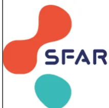
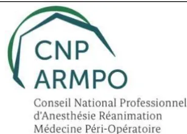
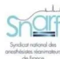
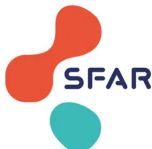

## RECOMMANDATIONS POUR LA PRATIQUE PROFESSIONNELLE

De la SOCIÉTÉ FRANÇAISE D'ANESTHÉSIE ET RÉANIMATION (SFAR)

A L'INITIATIVE DU CONSEIL NATIONAL PROFESSIONNEL D'ANESTHÉSIE-RÉANIMATION ET  
MÉDECINE PERI-OPÉRATOIRE (CNP-ARMPO)

# Préconisations pour les ressources humaines médicales en anesthésie programmée

*(hors anesthésie pédiatrique et anesthésie obstétricale)*

**2024**

Texte validé par le CA de la SFAR le 02/12/2024**Auteurs du texte proposé au CA de la SFAR :** Claude Ecoffey, Pierre Albaladejo, Elodie Brunel, Emmanuel Cantais, Audrey De Jong, Etienne Fourquet, Anne Geffroy-Wernet, Frédéric Le Saché, Benoit Plaud et Marc Garnier.

**Coordonnateurs d'experts SFAR :** Claude Ecoffey (Rennes)

**Organisateur SFAR :** Marc Garnier (Clermont-Ferrand)

**Groupes de lecture :**

*Comité des Référentiels cliniques de la SFAR :* Alice Blet (Présidente), Hélène Charbonneau (Secrétaire), Aurélien Bonnal, Anaïs Caillard, Isabelle Constant, Hugues de Courson, Matthieu, Dumont, Denis Frasca, El Mahdi Halfiani, Elise Langouet, Daphné Michelet, Maxime Nguyen, Stéphanie Ruiz, Michaël Vourc'h.

*Conseil d'Administration de la SFAR :* Jean-Michel Constantin (Président); Marc Léone (1er vice-président); Karine Nouette-Gaulain (2ème vice-président); Isabelle Constant (secrétaire générale); Frédéric Le Saché (secrétaire général adjoint); Evelyne Combettes (trésorière); Olivier Joannes-Boyau (trésorier adjoint); Pierre Albaladejo; Julien Amour; Hélène Beloeil; Valérie Billard; Marie-Pierre Bonnet; Julien Cabaton; Sébastien Campard; Vincent Collange; Marion Costecalde; Violaine D'Ans; Laurent Delaunay; Delphine Garrigue; Frédéric Lacroix; Sigismond Lasocki; Anne-Claire Lukaszewicz; Jane Muret; Nadia Smail## **Glossaire**

**AR : anesthésie-réanimation**

**ARS : agence régionale de santé**

**CNP ARMPO : conseil national professionnel d’anesthésie-réanimation-médecine péri-opératoire**

**CNOM : conseil nationale de l’ordre des médecins**

**CSP : code de la santé publique**

**DJ-AR : docteur junior en anesthésie-réanimation**

**HAS : haute autorité de santé**

**HCSP : haut conseil de la santé Publique**

**GRADE : grades of recommendation, assessment, development, and evaluation**

**IADE : infirmier ou infirmière anesthésiste diplômé d’état**

**MAR : Médecin anesthésiste-réanimateur / médecine péri-opératoire**

**PADHUE : praticien à diplôme hors Union Européenne**

**PICO : population, intervention(s), compareur, outcome**

**PRISMA : preferred reporting items for systematic reviews and meta-analyses**

**RFE : recommandations formalisées d’experts**

**RMM : revue de morbidité et de mortalité**

**RPP : recommandations pour la pratique professionnelle**

**RTS : responsable de terrain de stage**

**SSPI : salle de surveillance post-interventionnelle**## **INTRODUCTION**

Ces préconisations concernent l'acte d'anesthésie en dehors de l'urgence et des soins critiques, qu'il s'agisse d'une sédation, d'une anesthésie générale, d'une anesthésie locorégionale axiale et/ou périphérique, durant l'acte jusqu'à la sortie du site où est réalisé l'anesthésie (défini comme tout lieu où est réalisé une procédure chirurgicale, interventionnelle ou une imagerie sous sédation ou anesthésie générale et/ou locorégionale). Sont exclus de ces préconisations les actes fait sous anesthésie locale, même si elles sont réalisées au sein d'un bloc opératoire.

Dans ces préconisations, un site d'anesthésie est défini comme le lieu où se réalise l'acte d'anesthésie, selon le code de la Santé publique (articles D6124-91 à D6124-103). La consultation d'évaluation préopératoire et la médecine péri-opératoire n'ont pas été dans le champ de ces préconisations. Les actes d'anesthésie pédiatrique et obstétricale n'ont pas été abordés dans cette recommandation.

## **OBJECTIF DES RECOMMANDATIONS**

L'objectif de ces préconisations est de produire un cadre facilitant l'organisation des ressources humaines médicales en anesthésie programmée (hors anesthésie pédiatrique et anesthésie obstétricale) tout en améliorant la sécurité de prise en charge des patients. Le groupe a produit un nombre de préconisations mettant en évidence les points forts utiles et pragmatiques. Les personnes concernées sont l'ensemble des professionnels de l'anesthésie- réanimation et médecine péri-opératoire impliqués dans la prise en charge chirurgicale ou interventionnelle des patients, les responsables des sites interventionnels, chirurgicaux ou non, les gouvernances d'établissement (direction, CME).

## **MÉTHODE**

### **Organisation générale**

Ces recommandations sont le résultat du travail d'un groupe d'experts réunis par la SFAR à la diligence du CNP ARMPO, représentant toutes ses composantes et tous les modes d'exercice de l'anesthésie-réanimation. Chaque expert a rempli une déclaration de conflits d'intérêts avant de débuter le travail d'analyse. Dans un premier temps, le comité d'organisation a délimité les objectifs de ces recommandations et la méthodologie utilisée. Les différents champs d'application de ces RPP et les questions à traiter ont ensuite été définis par le comité d'organisation, puis modifiés et validés par les experts. Quand cela était adapté, les questions ont été formulées selon un format PICO (*Population, Intervention, Comparison, Outcome*) après une première réunion du groupe d'experts. Une proposition de texte a été transmise au conseil d'administration de la SFAR après relecture méthodologique du CRC. Le texte final émane d'une relecture avec amendements du texte par le conseil d'administration de la SFAR sans relecture par le groupe d'experts initial.## Questions des recommandations

Les préconisations formulées répondent à 3 questions :

- - **Question 1 :** Quelle doit être la ressource humaine en personnel soignant pour assurer la sécurité d'une anesthésie ?
- - **Question 2 :** Combien de patients programmés sous anesthésie peuvent être pris en charge simultanément par un MAR pour assurer la sécurité d'une anesthésie ?
- - **Question 3 :** Comment garantir la surveillance continue de l'anesthésie et assurer un recours sans délai en cas de survenue d'une situation critique ?

Une recherche bibliographique extensive a été réalisée à partir de la base de données MEDLINE, ainsi qu'une recherche de tous les textes de lois, arrêtés et jurisprudences pour des jugements concernant l'anesthésie-réanimation, par les experts pour chaque question, selon la méthodologie Preferred Reporting Items for Systematic Reviews and Meta-Analysis (PRISMA) pour les revues systématiques.

La méthode de travail utilisée pour l'élaboration de ces préconisations est la méthode GRADE® (*Grade of Recommendation Assessment, Development and Evaluation*). Cette méthode permet, après une analyse qualitative et quantitative de la littérature, de déterminer séparément la qualité des preuves, et donc de donner une estimation de la confiance en l'analyse quantitative et un niveau de recommandation. Un niveau de preuve a été défini pour chacune des références bibliographiques citées en fonction du type de l'étude. Ce niveau de preuve pouvait être réévalué en tenant compte de la qualité méthodologique de l'étude, de la cohérence des résultats entre les différentes études, du caractère direct ou non des preuves, de l'analyse de coût et de l'importance du bénéfice.

Du fait d'un petit nombre d'études disponible démontrant un impact des interventions étudiées sur des critères de jugement pronostiques forts (*i.e.* mortalité, morbidité lourde, notamment), il a été décidé, en amont de la rédaction des recommandations, d'adopter un format de RPP plutôt qu'un format de RFE. La méthodologie GRADE® a toutefois été appliquée pour l'analyse de la littérature. Les recommandations ont ensuite été rédigées en utilisant la terminologie des RPP de la SFAR « *les experts suggèrent de faire* » ou « *les experts suggèrent de ne pas faire* ». De plus, lorsque les questions posées ont trouvé des éléments de réponses dans l'arsenal législatif ou réglementaire, les experts ont procédé à des rappels à la réglementation.

Les propositions de recommandations ont ensuite été présentées et discutées une à une. Le but n'était pas d'aboutir obligatoirement à un avis unique et convergent des experts sur l'ensemble des propositions, mais de dégager les points de concordance et les points de divergence ou d'indécision.

Chaque recommandation a été évaluée par chacun des experts et soumise à une cotation individuelle à l'aide d'une échelle allant de 1 (désaccord complet) à 7 (accord complet). La cotation collective a été validée par les experts selon une méthodologie GRADE® grid. Pour valider une recommandation,au moins 80 % des experts devaient exprimer une opinion allant dans la même direction, tandis que moins de 20 % d'entre eux exprimaient une opinion contraire.

## **RESULTATS**

### **Synthèse des résultats**

Le travail de synthèse des experts et l'application de la méthode GRADE® ont abouti à 11 préconisations, comportant quatre rappels à la réglementation et aux bonnes pratiques et sept avis d'experts. Un accord fort a été obtenu pour toutes les préconisations dès le premier tour de cotation.

La SFAR, le CNP ARMPO et l'ensemble de ses composantes incitent l'ensemble des professionnels de l'anesthésie-réanimation et médecine péri-opératoire impliqués dans la prise en charge des patients chirurgicaux ou de médecine interventionnelle, ainsi que les structures dans lesquelles ils exercent, à se conformer à ces préconisations pour optimiser la qualité et sécuriser les soins dispensés aux patients.

Cependant, chaque praticien doit exercer son propre jugement dans l'application de ces préconisations, en prenant en compte son expertise et les spécificités de son établissement, pour déterminer l'organisation des ressources humaines la mieux adaptée à sa structure et à sa pratique.**Question 1. Quelle doit être la ressource humaine en personnel soignant pour assurer la sécurité d'une anesthésie pour un acte programmé ?**

**R1.1 – Les experts rappellent que l'acte d'anesthésie est sous la responsabilité exclusive d'un MAR (articles R 4311-12 et R 6153-1-2 du Code de Santé Public).**

**Rappel à la réglementation**

**R1.2 – Les experts rappellent que seuls les IADE sont habilités à accomplir les soins et à réaliser les gestes nécessaires à la mise en œuvre des techniques d'anesthésie et de réanimation peropératoire, sous le contrôle exclusif d'un MAR (article R 4311-12 CSP).**

**Rappel à la réglementation**

**R1.3 – Les experts rappellent que l'acte d'anesthésie peut être réalisé par un DJ-AR en autonomie supervisée (article R 6153-1-2 CSP).**

**Rappel à la réglementation**

**R1.4 - Les experts rappellent qu'un professionnel de l'anesthésie doit être présent pour assurer la surveillance clinique continue du patient anesthésié (articles R 4311-12 et R 6153-1-2 du CSP).**

**Rappel à la réglementation****Argumentaire :** En fonction de la nature de l'intervention, de la complexité de la procédure et des protocoles médicaux spécifiques de l'établissement de santé et de la structure d'anesthésie-réanimation, les types de professionnels d'anesthésie-réanimation impliqués dans la prise en charge interventionnelle peuvent varier [1, 2]. Leur présence est essentielle et a une influence majeure sur la morbi-mortalité péri-opératoire [3-6].

Les différents types de professionnels de l'anesthésie-réanimation qui peuvent être présents, contribuer et collaborer à la réalisation de l'acte interventionnel, sont répertoriés comme suit [7] :

- Un médecin anesthésiste-réanimateur (MAR) [7] : médecin avec un diplôme français ou de la communauté européenne, qualifié en anesthésie-réanimation et inscrit au Conseil de l'Ordre des Médecins ; ou médecin PADHUE avec une autorisation d'exercice ; ou médecin avec une licence de remplacement délivrée par le Conseil de l'Ordre des Médecins. Un MAR évalue le patient plusieurs jours avant l'intervention dans le cas d'un acte programmé pour déterminer la stratégie anesthésique la plus appropriée pour le per et le post- opératoire, et un MAR est responsable de la stratégie anesthésique et de la gestion de l'anesthésie pendant la procédure. Ce MAR est identifié dans le dossier d'anesthésie, a la responsabilité d'établir et de mettre en œuvre la stratégie anesthésique établie à la suite de la consultation et de la visite pré-anesthésiques.

- Un infirmier anesthésiste diplômé d'état (IADE) : infirmier ou sage-femme ayant suivi une formation spéciale et diplômé en anesthésie après l'obtention du diplôme d'état en sciences infirmières. L'IADE travaille dans un cadre réglementaire précis, en collaboration et sous contrôle exclusif des MAR (alinéa 1a de l'article R4311-12 du CSP [8]). L'IADE est habilité, à condition qu'un MAR soit présent sur le site et puisse intervenir sans délai, et après qu'un MAR ait examiné le patient et établi la stratégie de prise en charge, à appliquer les techniques suivantes : anesthésie générale ; réinjections d'anesthésie loco-régionale dont le dispositif a été mis en place par un MAR ; surveillance du monitoring de l'anesthésie, réanimation per-interventionnelle, surveillance post-interventionnelle immédiate. L'IADE accomplit les soins et peut, à l'initiative exclusive et sous la responsabilité du MAR, réaliser les gestes techniques qui concourent à l'application du protocole anesthésique [8-10].

- Un docteur junior anesthésiste-réanimateur (DJ-AR) : en anesthésie, l'interne en autonomie supervisée travaille sur une seule salle d'intervention. La gestion de deux salles d'intervention, au cours de la progression dans l'année de phase de consolidation, est envisageable, après accord conjoint de l'interne, du responsable de terrain de stage et du médecin responsable du site d'intervention, à l'issue d'un entretien formalisé avec le DJ-AR [11]. La supervision des DJ est définie dans l'arrêté du 16 janvier 2020 relatif au référentiel de mises en situation et aux étapes du parcours permettant au docteur junior d'acquérir progressivement une pratique professionnelle autonome [12], pris en application de l'article R. 6153-1-2 du CSP. Le docteur junior exerce ses fonctions par délégation et sous la responsabilité du praticien qui le supervise [13]. Ce superviseur est effectué par un MAR auquel le DJ-AR peut avoir recours à tout moment de son exercice, conformément aux tableaux de service, que ce soit en période ouverte ou dans le cadre de la permanence des soins [12, 13]. Il ne peut pas pratiquer un acte d'anesthésie délocalisée hors bloc opératoire.

D'autres professionnels peuvent être également présents, sans pouvoir être considérés comme intervenant dans la réalisation ou la surveillance de l'anesthésie pendant la période peropératoire :

- Les étudiants de 3e cycle des études médicales (phase socle et phase d'approfondissement) et les élèves infirmiers-anesthésistes ne peuvent pas surveiller un patient sous anesthésie générale ou loco-régionale enpleine responsabilité, même placés sous la supervision d'un MAR [2, 7, 10].

- - IDE de SSPI : personnel soignant formé à la prise en charge pré et postopératoire des patients.
- - IDE de bloc opératoire diplômé d'état (IBODE) [13] : les IBODEs jouent un rôle essentiel dans la préparation de la salle, la stérilisation des instruments et l'assistance à l'opérateur et à l'équipe interventionnelle pendant l'intervention. Les IBODEs peuvent également aider à la préparation du patient pour l'anesthésie sans pouvoir la délivrer, et participer à la surveillance du patient sans se substituer à la surveillance de l'anesthésie, c'est à dire qu'on ne peut leur déléguer la surveillance de l'anesthésie [14].
- - Personnels de logistique et de support : ces techniciens sont responsables de la préparation et de la maintenance des équipements d'anesthésie, tels que les machines d'anesthésie et les moniteurs de surveillance. Ils n'interviennent pas dans les soins délivrés aux patients.
- - Chirurgiens, radiologues, gastro-entérologues, cardiologues, pneumologues ou autres spécialistes médicaux sont au sein du bloc opératoire ou des plateaux techniques interventionnels pour accomplir l'acte interventionnel, et ne participent pas à l'acte anesthésique, même si la coopération avec eux est fondamentale pour le type d'acte à réaliser. Les techniciens de perfusion ne participent pas non plus à l'acte anesthésique.

L'anesthésie est nécessaire à la réalisation de nombreuses procédures interventionnelles ou d'imagerie. En ce sens, l'ensemble des professionnels de santé intervenant au bloc opératoire et dans son environnement doivent collaborer étroitement pour atteindre l'objectif partagé d'assurer une prise en charge adaptée et sécurisée des patients, ainsi que leur confort tout au long de l'intervention [15]. L'ensemble des professionnels est également garant du bon déroulement de la procédure interventionnelle. Dans ce but une communication claire et ouverte au sein de l'équipe est indispensable [16]. Chacun doit connaître son rôle et être capable de signaler rapidement tout problème ou complication potentielle [16].

La composition (en nombre et qualifications) de l'équipe d'anesthésie-réanimation varie en fonction des besoins spécifiques de chaque intervention et de la stratégie retenue (patient, type d'intervention, site où est réalisée l'anesthésie, notamment). Cette composition relève de la responsabilité du MAR (articles D6124-93 et - 94 du CSP) [17]. L'ensemble du personnel d'anesthésie-réanimation doit être formé et à jour sur les évolutions des techniques et protocoles d'anesthésie, comme cela est préconisé dans l'article 11 du code de déontologie :

*« tout médecin doit entretenir et perfectionner ses connaissances dans le respect de son obligation de développement professionnel continu »* [18]. La formation continue est essentielle pour maintenir un haut niveau de compétence. La simulation est un outil pédagogique majeur dans ce contexte [19].

De même, le personnel d'anesthésie-réanimation doit vérifier et/ou valider quotidiennement le bon fonctionnement du matériel mis à sa disposition par les établissements de santé [20-22].

Pour l'ensemble de ces tâches, le personnel d'anesthésie-réanimation doit disposer de protocoles et de procédures standardisés pour l'anesthésie, qui tiennent compte des bonnes pratiques cliniques et des exigences réglementaires de sécurité du patient anesthésié [23].**Références :**

- [1] Egger Halbeis CB, Schubert A. Staffing the operating room suite: perspectives from Europe and North America on the role of different anesthesia personnel. *Anesthesiology Clinics* 2008; 26: 637-63, vi.
- [2] Marty J, Plaud B. Anesthetic process, organization, management and economic issues: the French perspective. *Curr Opin Anaesthesiol* 2009; 22: 249-54.
- [3] Burns ML, Saager L, Cassidy RB, Mentz G, Mashour GA, Kheterpal S. Association of Anesthesiologist Staffing Ratio With Surgical Patient Morbidity and Mortality. *JAMA surgery* 2022; 157: 807-15.
- [4] Hyder JA, Bohman JK, Kor DJ, Subramanian A, Bittner EA, Narr BJ, Cima RR, Montori VM. Anesthesia Care Transitions and Risk of Postoperative Complications. *Anesth Analg.* 2016 ;122 :134-44. doi:10.1213/ANE.0000000000000692. PMID: 25794111.

[5] Saha AK, Segal S. A Quality Improvement Initiative to Reduce Adverse Effects of Transitions of Anesthesia Care on Postoperative Outcomes: A Retrospective Cohort Study. *Anesthesiology* 2024; 140: 333-5. doi: 10.1097/ALN.0000000000004839. Epub ahead of print. PMID: 37976442.

[6] Arbous MS, Meursing AE, van Kleef JW, de Lange JJ, Spoormans HH, Touw P, et al. Impact of anesthesia management characteristics on severe morbidity and mortality. *Anesthesiology* 2005 ; 102 : 257-68 ; quiz 491-2.

[7] Décret n° 94-1050 du 5 décembre 1994 relatif aux conditions techniques de fonctionnement des établissements de santé en ce qui concerne la pratique de l'anesthésie et modifiant le code de la santé publique. 1994. Accessible à : <https://www.legifrance.gouv.fr/jorf/id/JORFTEXT00000549818/>

[8] Article R4311-12 du code de la santé publique relatif à l'activité de l'infirmier anesthésiste diplômé d'état. 2017. Accessible à : [https://www.legifrance.gouv.fr/codes/article\\_lc/LEGIARTI000034169206](https://www.legifrance.gouv.fr/codes/article_lc/LEGIARTI000034169206)

[9] IADE et Médecins Anesthésistes-Réanimateurs, un binôme indissociable. Communiqué SFAR. 2021. Accessible à : <https://sfar.org/download/iade-et-medecins-anesthesistes-reanimateurs-un-binome-indissociable/?wpdmdl=35993&refresh=66151d18506831712659736>

[10] Article R4311-12 du CSP modifié par le Décret n° 2017-316 du 10 mars 2017 relatif aux actes infirmiers relevant de la compétence des infirmiers anesthésistes diplômés d'État. Accessible à : <https://www.legifrance.gouv.fr/jorf/id/JORFTEXT000034166859>

[11] CNEAR. Recommandations du CNEAR concernant les docteurs juniors. Mise à jour de mai 2024 du rapport sur l'autonomie supervisée des DESAR de 2020.

[12] Arrêté du 16 janvier 2020 relatif au référentiel de mises en situation et aux étapes du parcours permettant au docteur junior d'acquérir progressivement une pratique professionnelle autonome pris en application de l'article R. 6153-1-2 du code de la santé publique

[13] Chassard D, Compère V. Rapport du groupe de travail sur l'autonomie supervisée des DESAR. CNEAR 2020.

[13] Décret n° 2015-74 du 27 janvier 2015 relatif aux actes infirmiers relevant de la compétence exclusive des infirmiers de bloc opératoire. 2015. Accessible à : <https://www.legifrance.gouv.fr/jorf/id/JORFTEXT000030158146>

[14] Arrêt de la chambre criminelle de la cour de cassation, 15 janvier 2019, Arrêt 17-86.461. Disponible à : <https://www.legifrance.gouv.fr/juri/id/JURITEXT000038060557/>

[15] Ecoffey C. Risque péri-opératoire et relation anesthésiste-réanimateur-chirurgien : Rôle de l'anesthésiste-réanimateur en période post-opératoire. e-mémoires de l'Académie Nationale de Chirurgie 2016; 15: 19-21.

[16] Recommandations concernant les relations entre anesthésistes-réanimateurs et chirurgiens, autres spécialistes ou professionnels de santé. Ordre national des médecins. 2001. Accessible à : <https://sfar.org/wp-content/uploads/2014/04/196-reco-anesth-chir-autres-2001.pdf>

[17] Articles D6124-93 et D6124-94 du code de santé publique. Accessible à : <https://www.legifrance.gouv.fr/codes/id/LEGISCTA000006198880#:~:text=L'anesthésie%20est%20réalisée%20sur,menti%20à%20l'article%20D>

[18] Conseil National de l'Ordre des Médecins. Code de déontologie (version 2021), article 11 (article R.4127-11 du code de la santé publique). Accessible à : <https://www.conseil-national.medecin.fr/code-deontologie/devoirs-generaux-medecins-art-2-31/article-11-developpement-professionnel-contin#:~:text=La%20déontologie%20exige%20du%20médecin,exigence%20de%20la%20morale%20professionnelle.>

[19] Bijok B, Jaulin F, Picard J, Michelet D, Fuzier R, Arzalier-Daret S, et al. Guidelines on human factors in critical situations – 2022. *Anaesth Crit Care Pain Med.* 2023 ; 42 : 01262. (*RFE SFAR/GFHS : Facteurs humains en situations critiques, version française accessible à : <https://sfar.org/download/facteurs-humains-en-situations-critiques/>*).

[20] L'appareil d'anesthésie et sa vérification avant utilisation. Groupe de travail SFAR. 2019. Accessible à : <https://sfar.org/lappareil-danesthesie-et-sa-verification-avant-utilisation/>

[21] Arrêté du 3 octobre 1995 relatif aux modalités d'utilisation et de contrôle des matériels et dispositifs médicaux assurant les fonctions et actes cités aux articles D. 712-43 et D. 712-47 du code de la santé publique. Accessible à : <https://www.legifrance.gouv.fr/loda/id/LEGITEXT000005619626>

[22] Article D6124-91 du code de santé publique. Accessible à : [https://www.legifrance.gouv.fr/codes/article\\_lc/LEGIARTI000006917085](https://www.legifrance.gouv.fr/codes/article_lc/LEGIARTI000006917085)

[23] Bloc S, Alfonsi P, Belbachir A, Beaussier M, Bouvet L, Campard S, et al. Guidelines on perioperative optimization protocol for the adult patient 2023. *Anaesth Crit Care Pain Med.* 2023 ; 42 : 101264. (*RFE SFAR : Programme d'optimisation périopératoire du patient adulte, version française accessible à : <https://sfar.org/download/programme-doptimisation-perioperatoire-du-patient-adulte/?wpdmdl=37889&refresh=66151a53f06791712659027>***Question 2. Combien de patients programmés pour un acte chirurgical ou interventionnel sous anesthésie peuvent être pris en charge simultanément par un MAR sans majorer le risque peropératoire ?**

**R2.1 – Les experts suggèrent que le MAR est seul habilité à décider s’il prend la responsabilité d’une ou de deux salles simultanées au maximum (Figure).**

**R 2.2 - Les experts suggèrent que le MAR est seul habilité à décider de s’ajouter l’aide d’un IADE par salle ou d’un IADE pour deux salles (Figure).**

**R2.3 – Les experts suggèrent que pour des anesthésies locorégionales exclusivement périphériques, le MAR puisse prendre en charge plus de deux patients pendant la phase pré-interventionnelle, sous réserve que ces patients soient surveillés de façon continue par un IDE formé à cette surveillance, sous la supervision d’un MAR (article D6124-94 du CSP).**

**R2.4 – Les experts suggèrent que lorsque le MAR a la responsabilité de deux patients simultanément, les deux salles soient suffisamment proches l’une de l’autre pour permettre son intervention sans délai.**

**Argumentaire :** La question du nombre de patients pris en charge par un même MAR réfère directement à la sécurité des patients [1]. Il est connu que lorsque la charge de travail n’est pas ajustée au nombre de soignants au regard de celle en soins, le risque d’événements indésirables et la morbi-mortalité sont majorés [2]. Les recommandations de pratiques professionnelles SFAR/Groupe Facteurs Humains en Santé de 2022 rappellent (préconisation R3.8) que le nombre de salles d’intervention qu’un MAR peut superviser simultanément est déterminé par la probabilité de survenue concomitante de plusieurs situations critiques [3]. Une étude ayant considéré l’induction anesthésique, le réveil, la survenue peropératoire d’une hypoxémie, d’une hypertension ou d’une hypotension prolongée comme des situations critiques a montré qu’avec un MAR pour deux salles d’intervention, il existait une incapacité à se rendre disponible pour gérer une situation critique pendant 35 % de la période de temps étudiée [4]. Cette impossibilité à se rendre disponible passait à 99 % de la période de temps étudiée lorsque le MAR avait la supervision de trois salles d’intervention [4]. Une autre étude utilisant la simulation numérique a montré que pour deux salles d’intervention, le risque de ne pas pouvoir intervenir à tout moment variait de 40 % lorsque les interventions étaient longues, à 87 % lorsqu’elles étaient courtes,et que le risque était encore plus élevé lorsque le MAR avait la supervision de trois salles [5]. Ainsi, plus la charge de travail attribuée à un MAR est importante, moins ce MAR peut faire face à un imprévu engageant la sécurité du patient. Ceci semble se traduire en conséquence clinique. Une étude ayant analysé 807 événements graves (décès et coma) survenus pendant ou au cours d'une anesthésie, extraits du suivi d'une cohorte de 869 483 patients, a estimé le risque péri-anesthésique et a identifié des facteurs de risque [6]. L'incidence de la mortalité postopératoire était dans cette cohorte de 8,8 pour 10 000 anesthésies. La présence d'un MAR immédiatement disponible diminuait ce risque (OR 0,46 IC95% [0,31-0,66]). Étaient également protecteurs, la présence de deux professionnels de santé formés en anesthésie à l'induction et au réveil de l'anesthésie (OR 0,69 [0,47-0,99]) et l'absence de changement de MAR en cours d'intervention (OR 0,44 [0,20-0,99]) [6]. Plus récemment, une étude de cohorte rétrospective ayant inclus 866 453 patients entre 2010 et 2017, a comparé, après appariement, le risque de complications postopératoires, selon le nombre de patients pris en charge simultanément par un MAR [7]. Le risque relatif de complications dans les 30 jours postopératoires augmentait de 4 % dans le groupe où un MAR était en charge de 2 à 3 patients comparé au groupe où un MAR s'occupait de 1 à 2 patients (5,06 % vs 5,25 % ; OR ajusté 1,04 [1,01-1,08] ; P=0,02). Ce risque relatif augmentait de 14 % lorsqu'un seul MAR était en charge de 3 à 4 patients par rapport au groupe 1 à 2 patients (5,75 % vs. 5,06 % ; OR 1,15 [1,09-1,21], P<0,001) [7].

A noter que la présence d'un IADE en salle d'intervention n'autorise pas une augmentation du nombre de patients pris en charge par un seul MAR, la présence d'un IADE n'influençant pas la capacité du MAR à se rendre davantage disponible en cas de responsabilité de plus de 2 salles d'intervention. Ce constat est renforcé par l'article R4311-12 du CSP, qui spécifie que l'IADE n'est habilité à la surveillance d'une anesthésie « *qu'à la condition qu'un MAR puisse intervenir à tout moment* » [8]. En complément, les recommandations de la SFAR de 1994 et 1995 sur la surveillance peropératoire et le rôle de l'IADE, insistent sur le caractère nécessairement continu de la surveillance en cours d'anesthésie, effectuée exclusivement par un MAR ou un IADE [9, 10].

Par ailleurs, le CSP impose « *une organisation permettant de faire face à tout moment à une complication liée à l'intervention ou à l'anesthésie effectuées* » [11]. Les recommandations du conseil national de l'ordre des médecins (CNOM) portant sur les relations entre anesthésistes-réanimateurs et chirurgiens, autres spécialistes ou professionnels de santé, et celles de la haute autorité de santé (HAS) portant sur la coopération entre anesthésistes-réanimateurs et chirurgiens (« *Mieux travailler en équipe* »), précisent également que la programmation du bloc opératoire doit tenir compte des impératifs de sécurité et doit impliquer les MAR, qui deviennent de fait co-responsables de cette organisation [12, 13]. Ainsi, il convient de dialoguer le plus en amont possible avec l'équipe chirurgicale ou de médecine interventionnelle et les responsables de la programmation du plateau interventionnel, pour adapter le programme opératoire aux ressources humaines disponibles dans le respect des recommandations ici émises. De même, l'équipe d'anesthésie doit communiquer le plus en amont possible aux chirurgiens et responsables de la programmation si la prise en charge d'un patient demande la présence exclusive d'un MAR pour ce cas, afin d'anticiper la programmation et/ou de faire appel de façon programmée à davantage de personnel médical pour assumer plus d'une salle d'intervention concomitamment à la prise en charge de ce cas.

A noter enfin que l'utilisation des salles de pré-induction contiguës aux salles d'intervention pour réaliser l'anesthésie n'est plus conforme à la réglementation, sauf si elles sont équipées du même environnement matériel et du même personnel d'anesthésie qu'une salle d'intervention selon le décret de 1994 (11). Si dans ce cas elles sont utilisées pour réaliser une anesthésie, elles deviennent alors un site d'anesthésie et le patient qui y est pris en charge rentre dans le compte du nombre de patients pris en charge simultanément pendant la phase interventionnelle.### Références :

- [1] Paoletti X, Marty J. Consequences of running more operating theatres than anaesthetists to staff them: a stochastic simulation study. *Br J Anaesth* 2007; 98: 462-9.
- [2] Fagerström L, Kinnunen M, Saarela J. Nursing workload, patient safety incidents and mortality: an observational study from Finland. *BMJ Open*. 2018 ;8: e016367. doi: 10.1136/bmjopen-2017-016367.
- [3] Bijok B, Jaulin F, Picard J, Michelet D, Fuzier R, Arzalier-Daret S, et al. Guidelines on human factors in critical situations – 2022. *Anaesth Crit Care Pain Med*. 2023; 42: 101262. (*RFE SFAR/GFHS : Facteurs humains en situations critiques, version française accessible à : <https://sfar.org/download/facteurs-humains-en-situations-critiques/>*).
- [4] Epstein RH, Dexter F. Influence of supervision ratios by anesthesiologists on first-case starts and critical portions of anesthetics. *Anesthesiology* 2012; 116: 683-91. doi: 10.1097/ALN.0b013e318246ec24.
- [5] Paoletti X, Marty J: Consequences of running more operating theatres than anaesthetists to staff them: A stochastic simulation study. *Br JAnaesth* 2007; 98:462–9.
- [6] Arbous MS, Meursing AE, van Kleef JW, de Lange JJ, Spoormans HH, Touw P, et al. Impact of anesthesia management characteristics on severe morbidity and mortality. *Anesthesiology* 2005; 102: 257-68.
- [7] Burns ML, Saager L, Cassidy RB, Mentz G, Mashour GA, Kheterpal S. Association of Anesthesiologist Staffing Ratio with Surgical Patient Morbidity and Mortality. *JAMA surgery* 2022 ; 157 : 807-15.
- [8] Article R. 4311-12 du Code de Santé Public (Décret n° 2017-316 du 10 mars 2017 relatif aux actes infirmiers relevant de la compétence des infirmiers anesthésistes diplômés d'État). Accessible à : <https://www.legifrance.gouv.fr/jorf/id/JORFTEXT000034166859>
- [9] Recommandations SFAR concernant la surveillance des patients en cours d'anesthésie, janvier 1994. Accessible à : [https://sfar.org/wp-content/uploads/2015/10/2\\_SFAR\\_Recommandations-concernant-la-surveillance-des-patients-en-cours-danesthesie.pdf](https://sfar.org/wp-content/uploads/2015/10/2_SFAR_Recommandations-concernant-la-surveillance-des-patients-en-cours-danesthesie.pdf)
- [10] Recommandations SFAR concernant le rôle de l'infirmier anesthésiste diplômé d'état, Janvier 1995. Pages 55-61 dans « Les référentiels en Anesthésie-Réanimation réunis par la SFAR ». Elsevier, Paris 1997.
- [11] Article D.6124-91 à D 6124-103 du Code de Santé Public (Décret n° 94-1050 du 5 décembre 1994 relatif aux conditions techniques de fonctionnement des établissements de santé en ce qui concerne la pratique de l'anesthésie et modifiant le code de la santé publique). Accessible à : <https://www.legifrance.gouv.fr/jorf/id/JORFTEXT000000549818/>
- [12] Conseil National de l'Ordre des médecins. Recommandations concernant les relations entre anesthésistes-réanimateurs et chirurgiens, autres spécialistes ou professionnels de santé, décembre 2001. Accessible à : <https://sfar.org/wp-content/uploads/2014/04/196-reco-anesth-chir-autres-2001.pdf>
- [13] Haute Autorité en Santé. Coopération entre anesthésistes-réanimateurs et chirurgiens : « Mieux travailler en équipe », novembre 2015. Accessible à : [https://www.has-sante.fr/jcms/c\\_2587220/fr/cooperation-entre-anesthesistes-reanimateurs-et-chirurgiens-mieux-travailler-en-equipe](https://www.has-sante.fr/jcms/c_2587220/fr/cooperation-entre-anesthesistes-reanimateurs-et-chirurgiens-mieux-travailler-en-equipe)**Question 3. Quelle organisation du personnel médical d'anesthésie permet de garantir la surveillance continue du patient bénéficiant d'une anesthésie et de mobiliser un renfort en cas de survenue d'une situation critique ?**

<table border="1"><tr><td>
<b>R3.1 – Les experts suggèrent de rédiger une procédure organisationnelle au sein de chaque établissement de santé, afin de garantir une surveillance clinique continue de l'anesthésie par un professionnel de l'anesthésie-réanimation afin de limiter la survenue de complications peri-interventionnelles.</b>
</td></tr><tr><td></td></tr><tr><td>
<b>R3.2 – Les experts suggèrent de rédiger une procédure au sein de chaque établissement de santé décrivant l'organisation permettant le déclenchement d'un renfort pour faire face à une situation critique survenant sur le plateau interventionnel, afin de réduire les conséquences de cette complication péri-interventionnelle.</b>
</td></tr><tr><td></td></tr><tr><td>
<b>R3.3 – Les experts suggèrent que, dans le cadre de <u>la création de nouveaux sites d'anesthésie</u>, l'architecture proposée envisage un nombre de sites suffisant, à proximité les uns des autres, afin de faciliter l'organisation du recours humain en cas de complication, et d'en diminuer la morbi-mortalité.</b>
</td></tr><tr><td></td></tr></table>**Argumentaire :** Chaque établissement de santé doit définir, en fonction des contraintes organisationnelles locales, un mode opératoire qui permette d'optimiser la prise en charge des patients face à une situation critique anticipée ou non-anticipée [1].

Une complication prévisible ou imprévue liée à l'intervention ou à l'anesthésie, au sein d'un site interventionnel ou en SSPI, peut nécessiter une réponse collective pour en identifier la cause et la prendre en charge [2]. Une réflexion, portée par le Haut Conseil de la Santé Publique (HCSP) avait été menée dès 1993 sur l'organisation de l'anesthésie au bloc opératoire et en particulier sur l'importance d'avoir des effectifs adaptés (sans les préciser) pour faire face à une situation d'urgence [1]. A tout instant et sans délai, les membres de l'équipe d'AR doivent pouvoir faire face à un événement indésirable prévu ou imprévu [2]. L'équipe d'AR doit être formée aux situations d'urgence, telles que l'intubation difficile, l'arrêt cardiaque, la réaction allergique, le feu au bloc opératoire, notamment. [2, 3].

La diversité des gestes chirurgicaux ou interventionnels, l'architecture différente des blocs opératoires, ainsi que la disparité du statut médical des patients, rendent difficile la définition d'un mode d'organisation unique face à une complication per-interventionnelle qui serait applicable à tous les sites où se pratique l'anesthésie. Dans le cas où sont présents un MAR et un IADE pour deux salles interventionnelles, face à un événement per-opératoire complexe, il faut privilégier la prise en charge médicale. Il conviendra de déclencher la procédure d'alerte et de recours dès lors que l'événement intercurrent nécessite la présence d'un renfort médical.

Cette procédure d'alerte en cas de complication grave et/ou d'événement intercurrent mettant en danger patient ou personnel, doit avoir été rédigée et validée en amont par l'équipe d'anesthésie-réanimation. Cette procédure doit être connue et consultable par l'ensemble des soignants exerçant au bloc opératoire. Elle doit identifier la ou les personnes recours et les moyens de la/les joindre immédiatement (téléphone sans fil ou portable identifié, liste mensuelle des personnes recours avec numéros de téléphone en regard, « *bouton rouge* », notamment). Dans toutes les situations, la charge de travail doit être ajustée pour être en adéquation avec les ressources humaines et matérielles disponibles. Les effectifs disponibles sur place doivent être suffisants pour faire face à une potentielle situation d'urgence et ainsi limiter les conséquences d'événements indésirables graves associés aux soins [4]. Le recours, identifié dans la procédure, devra être immédiatement disponible en cas d'urgence. Ce recours sera idéalement un MAR. A défaut et en cas d'impossibilité dûment étayée d'avoir le recours d'un MAR, un médecin ayant des compétences en soins critiques peut être envisagé comme personne ressource. Parfois le recours peut être un IADE, aide pour une transfusion massive par exemple. Si cette organisation peut constituer une solution moins favorable dans des structures ne pouvant procéder autrement, toute création d'un nouveau site d'anesthésie doit éviter que l'activité anesthésique qui y sera pratiquée soit isolée (par exemple bloc opératoire ne comprenant qu'une ou deux salles d'anesthésie et donc la présence que d'un seul ou une seule AR, sites d'anesthésie en dehors du bloc opératoire ou du plateau technique impliquant une activité délocalisée isolée, notamment). Ceci permettra de faciliter l'organisation du recours médical en cas de complication, et d'en diminuer la morbi-mortalité.

Enfin, l'équipe d'AR échangera avec l'établissement de santé afin qu'il s'assure de la bonne adéquation des ressources humaines pour l'application de la procédure d'alerte. Ces points sont prévus dans la certification des établissements par la HAS. Un axe de formation sur les procédures d'urgences anesthésiques et chirurgicales à destination des personnels de bloc opératoire doit être engagé par les établissements de soins (journée de formation sans activité interventionnelle, simulation, accréditation d'équipe, notamment). La procédure doit anticiper la survenue d'une potentielle urgence vitale immédiate durant la procédure anesthésique (par exemple en cas d'intubation impossible) et interventionnelle (par exemple en cas d'hémorragie, d'embolie, d'arrêt cardiaque, notamment). La simulation est un outil permettant d'évaluer la procédure et de la faire connaître à tous les intervenants.**Références :**

[1] Haut Conseil de la Santé Publique. Rapport sur la sécurité anesthésique, 1993. Accessible à : [https://www.google.com/url?sa=t&source=web&rct=j&opi=89978449&url=https://www.hcsp.fr/Explore.cgi/Telecharge%3FNomFichier%3Dhc001040.pdf&ved=2ahUKEwjOt9Xe9bSFAxV7VaQEHW3uB-UQFnoECBIQAQ&usg=AOvVaw3lzsLQwCarcytHW\\_pIAfWB](https://www.google.com/url?sa=t&source=web&rct=j&opi=89978449&url=https://www.hcsp.fr/Explore.cgi/Telecharge%3FNomFichier%3Dhc001040.pdf&ved=2ahUKEwjOt9Xe9bSFAxV7VaQEHW3uB-UQFnoECBIQAQ&usg=AOvVaw3lzsLQwCarcytHW_pIAfWB)

[2] Décret n° 94-1050 du 5 décembre 1994 relatif aux conditions techniques de fonctionnement des établissements de santé en ce qui concerne la pratique de l'anesthésie et modifiant le code de la santé publique, 1994. Accessible à : <https://www.legifrance.gouv.fr/loda/id/JORFTEXT000000549818/>

[3] Arbous MS, Meursing AE, van Kleef JW, de Lange JJ, Spoormans HH, Touw P, et al. Impact of anesthesia management characteristics on severe morbidity and mortality. *Anesthesiology* 2005; 102: 257-68; quiz 491-2.

[4] Bijok B, Jaulin F, Picard J, Michelet D, Fuzier R, Arzalier-Daret S, et al. Guidelines on human factors in critical situations – 2023. *Anaesth Crit Care Pain Med.* 2023 42 : 101262. (*RFE SFAR/GFHS : Facteurs humains en situations critiques, version française accessible à : <https://sfar.org/download/facteurs-humains-en-situations-critiques/>*)## RPP ressources humaines en anesthésie programmée

Différentes organisations possibles des ressources humaines sont envisageables pour diminuer la morbi-mortalité en anesthésie programmée, chez le patient adulte. Le choix d'organisation relève de la responsabilité du Médecin anesthésiste-réanimateur

**Immédiatement disponible**

**RENFORT**

Diagram illustrating Situation 1: 1 MAR and 2 IADE on 2 rooms. It shows two rooms, each with a patient (represented by a head icon with 'Z z' and a breathing mask). Room 1 has a 'Médecin Anesthésiste-Réanimateur MAR' (teal box) and an 'Infirmier Anesthésiste Diplômé d'Etat IADE' (orange box). Room 2 has an 'Infirmier Anesthésiste Diplômé d'Etat IADE' (orange box). A double-headed arrow connects the MAR in Room 1 to the IADE in Room 2, indicating a reinforcement relationship.

Situation 1: 1 MAR et 2 IADE sur 2 salles

Diagram illustrating Situation 2: 1 MAR and 1 IADE on 2 rooms. It shows two rooms, each with a patient (represented by a head icon with 'Z z' and a breathing mask). Room 1 has a 'Médecin Anesthésiste-Réanimateur MAR' (teal box). Room 2 has an 'Infirmier Anesthésiste Diplômé d'Etat IADE' (orange box). A double-headed arrow connects the MAR in Room 1 to the IADE in Room 2, indicating a reinforcement relationship.

Situation 2: 1 MAR et 1 IADE sur 2 salles

Diagram illustrating Situation 3: 1 MAR and 1 IADE on 1 room. It shows a single room with a patient (represented by a head icon with 'Z z' and a breathing mask). The room contains a 'Médecin Anesthésiste-Réanimateur MAR' (teal box) and an 'Infirmier Anesthésiste Diplômé d'Etat IADE' (orange box). A double-headed arrow connects the MAR to the IADE, indicating a reinforcement relationship.

Situation 3: 1 MAR et 1 IADE sur 1 salle

Diagram illustrating Situation 4: 1 MAR on 1 room. It shows a single room with a patient (represented by a head icon with 'Z z' and a breathing mask). The room contains a 'Médecin Anesthésiste-Réanimateur MAR' (teal box).

Situation 4 : 1 MAR sur 1 salle

The SFAR logo, consisting of three overlapping circles in orange, teal, and dark blue, followed by the text 'SFAR' in a bold, sans-serif font.