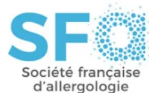

## **RECOMMANDATIONS FORMALISEES D'EXPERTS**

De la Société Française d'Anesthésie et Réanimation (SFAR)

ET

EN COLLABORATION AVEC DE LA SOCIÉTÉ FRANÇAISE D'ALLERGOLOGIE (SFA)

# **Diagnostic et prise en charge des réactions d'hypersensibilité immédiate périopératoires**

Diagnosis and management of perioperative immediate hypersensitivity reactions

**2025**

**Texte validé par le Comité des Référentiels Cliniques de la SFAR le 17 décembre 2024 , le Conseil d'Administration de la SFAR le 4 mars 2025 et de la SFA décembre 2024**

**Auteurs :** Mertes Paul Michel (Coordinateur SFAR), CHIRIAC Anca (Coordinateur SFA), TACQUARD Charles, FACON Alain, FRANCHINA Sébastien, GOUEL-CHERON Aurélie, KLINGEBIEL Caroline, LEJUS BOURDEAU Corinne, LE QUANG Diane, LERAY TOUATI Nidhal,LONGROIS Dan, MALINOSVSKY Jean Marc, MIGUERES Isabelle, MICHEL Moise, MORISSET Martine, NEUKIRCH Catherine, PELLETIER DE CHAMBURE Diane, PELLERIN Christelle, PERQUIN Mélanie, POUESSEL Guillaume, ROCHEFORT-MOREL Cécile, VAIA Elleni-Sofia, VITTE Joana, CAILLARD Anaïs (Organisateur SFAR) et DEMOLY Pascal (Organisateur SFA)

### **Coordonnateurs d'experts :**

Coordinateur d'experts SFAR :

- ● Professeur Paul Michel MERTES
- ● Hôpitaux Universitaires de Strasbourg
- ● paul-michel.mertes@chru-strasbourg.fr

Coordinatrice d'experts SFA :

- ● Docteur Anca CHIRIAC
- ● CHU de Montpellier
- ● ancamirelachiriac@gmail.com

Organisatrice (méthodologique) SFAR :

- ● Docteur Anaïs Caillard
- ● CHU de Brest
- ● anaiscaillard@gmail.com

### **Experts de la SFAR :**

FACON Alain, CHRU de Lille Anesthésie-réanimation, Consultation d'Allergo-anesthésie, Lille  
GOUEL-CHERON Aurélie, Hôpital Bichat Claude Bernard, Paris  
LEJUS BOURDEAU Corinne, Hôpital Hôtel Dieu - CHU Nantes  
LE QUANG Diane, Hôpital Lyon Sud Service d'Allergo-Anesthésie, Lyon  
LONGROIS Dan, APHP, GHU Nord, DMU PARABOL, Hopital Bichat-Claude Bernard et Louis Mourier, Paris  
MALINOSVSKY Jean Marc, Hôpital Maison Blanche - Pôle URAD, Reims  
MIGUERES Isabelle, Pôle Anesthésie- Réanimation Hôpital Rangueil, Toulouse  
PELLERIN Christelle, CHU de Bordeaux  
PERQUIN Mélanie, CHU Amiens Picardie  
TACQUARD Charles, Nouvel Hôpital Civil - CHU Strasbourg### **Experts de la Société SFA:**

KLINGEBIEL Caroline, Synlab Provence, Marseille

LERAY TOUATI Nidhal, Centre Hospitalier d'Aix en Provence (CHIAP)

MAILHOL Claire, Hôpital Larrey, CHU de Toulouse

MICHEL Moïse, Laboratoire d'Immunologie UF 5421 Immunologie CHU Nîmes

MORISSET Martine, CHU d'Angers

NEUKIRCH Catherine, Hôpital Bichat –Claude Bernard, Paris

PELLETIER DE CHAMBURE Diane, Institut Coeur Poumon - CHU Lille

POUESSEL Guillaume, CHU Lille Service de pédiatrie, CH Roubaix, Lille

ROCHEFORT-MOREL Cécile, Site Pontchaillou, CHU Rennes

VAIA Elleni-Sofia, Clinique d'Immuno-Allergologie CHU Brugmann – Bruxelles

VITTE Joana, Immunologie – CHU Reims

### **Chargés de bibliographie**

FRANCHINA Sébastien, Hôpital Charles Nicolle, CHU de Rouen

HURSON Charlotte, Nouvel Hôpital Civil, CHU Strasbourg

### **Groupes de Lecture :**

*Comité des Référentiels cliniques de la SFAR* : Alice Blet (Présidente), Hélène Charbonneau (Secrétaire), Aurélien Bonnal, Marie-Pierre Bonnet, Anaïs Caillard, Isabelle Constant, Hugues de Courson, Matthieu Dumont, Denis Frasca, El Mahdi Halfiani, Pierre Huette, Elise Langouet, Axel Maurice-Szamburski, Daphné Michelet, Maxime Nguyen, Stéphanie Ruiz, Michaël Vourc'h.

*Conseil d'Administration de la SFAR* : Jean-Michel Constantin(Président); Marc Léone (1er vice-président); Karine Nouette-Gaulain (2ème vice-président); Isabelle Constant (secrétaire générale); Frédéric Le Saché (secrétaire général adjoint); Evelyne Combettes (trésorière); Olivier Joannes-Boyau (trésorier adjoint); Pierre Albaladejo; Julien Amour; Hélène Beloeil; Valérie Billard; Marie-Pierre Bonnet; Julien Cabaton; Sébastien Campard; Vincent Collange; Marion Costecalde; Violaine D'Ans; Laurent Delaunay; Delphine Garrigue; Frédéric Lacroix; Sigismond Lasocki; Anne-Claire Lukaszewicz; Jane Muret; Nadia Smail

*Conseil d'administration SFA :*

Frédéric BÉRARD (Président), Julien COTTET (Vice-Président Partenariats), Virginie DOYEN (Vice-Présidente Recherche et Formation), Eric FROMENTIN (Vice-Président Finances et Affaires Règlementaires), Ariane NEMNI (Vice-Présidente Communication, E-santé et Relations Extérieures), Joana VITTE (Secrétaire Général, 1er Vice-Président), Flore AMAT, Davide CAIMMI, Jérémy CORRIGER, Marie-Noëlle CREPY, Gilles DEVOUASSOUX, Stéphane GUEZ, Tamazoust GUIDDIR, Guillaume LEZMI, Moïse MICHEL, Nhan PHAM THI, Sarah SAF.**Conflits et liens d'intérêts des experts SFAR au cours des cinq années précédant la date de validation par le CA de la SFAR.**

CAILLARD Anais : pas de conflit ni lien d'intérêt en rapport avec la présente RFE  
FACON Alain : pas de conflit ni lien d'intérêt en rapport avec la présente RFE  
FRANCHINA Sébastien: pas de conflit ni lien d'intérêt en rapport avec la présente RFE  
GOUEL Aurélie : pas de conflit ni lien d'intérêt en rapport avec la présente RFE  
LEJUS BOURDEAU Corinne : pas de conflit ni lien d'intérêt en rapport avec la présente RFE  
LE QUANG Diane : pas de conflit ni lien d'intérêt en rapport avec la présente RFE  
LONGROIS Dan : pas de conflit ni lien d'intérêt en rapport avec la présente RFE  
MALINOSVSKY Jean Marc : pas de conflit ni lien d'intérêt en rapport avec la présente RFE  
MERTES Paul Michel : pas de conflit ni lien d'intérêt en rapport avec la présente RFE  
MIGUERES Isabelle : pas de conflit ni lien d'intérêt en rapport avec la présente RFE  
PELLERIN Christelle : pas de conflit ni lien d'intérêt en rapport avec la présente RFE  
PERQUIN Mélanie : pas de conflit ni lien d'intérêt en rapport avec la présente RFE  
TACQUARD Charles : pas de conflit ni lien d'intérêt en rapport avec la présente RFE

**Liens d'intérêts des experts de la société française d'allergologie au cours des cinq années précédant la date de validation par le CA de la Société SFA.**

CHIRIAC Anca : pas de conflit ni lien d'intérêt en rapport avec la présente RFE  
HURSON Charlotte : pas de conflit ni lien d'intérêt en rapport avec la présente RFE  
KLINGEBIEL Caroline : pas de conflit ni lien d'intérêt en rapport avec la présente RFE  
LERAY TOUATI Nidhal : pas de conflit ni lien d'intérêt en rapport avec la présente RFE  
MAILHOL Claire : pas de conflit ni lien d'intérêt en rapport avec la présente RFE  
MICHEL Moïse : pas de conflit ni lien d'intérêt en rapport avec la présente RFE  
MORISSET Martine : pas de conflit ni lien d'intérêt en rapport avec la présente RFE  
NEUKIRCH Catherine : pas de conflit ni lien d'intérêt en rapport avec la présente RFE  
PELLETIER DE CHAMBURE Diane : pas de conflit ni lien d'intérêt en rapport avec la présente RFE  
POUESSEL Guillaume : pas de conflit ni lien d'intérêt en rapport avec la présente RFE  
ROCHEFORT-MOREL Céline : pas de conflit ni lien d'intérêt en rapport avec la présente RFE  
VAIA Elleni : pas de conflit ni lien d'intérêt en rapport avec la présente RFE## RESUME

**Objectif:** La Société Française d'Anesthésie et de Réanimation (SFAR) et la Société Française d'allergologie (SFA) ont collaboré pour proposer un référentiel sur le diagnostic et la prise en charge des réactions d'hypersensibilité immédiate (HSI) périopératoires.

**Conception:** Un groupe composé de 23 experts français de la Société Française d'Anesthésie-Réanimation (SFAR) et de la Société Française d'allergologie (SFA) a été réuni. D'éventuels conflits d'intérêts ont été officiellement déclarés dès le début du processus d'élaboration des recommandations et ce dernier a été conduit indépendamment de tout financement de l'industrie. Les auteurs ont suivi la méthodologie GRADE (*Grading of Recommendations Assessment, Development and Evaluation*) pour évaluer le niveau de preuve de la littérature.

**Méthodes:** 4 champs ont été définis : 1) Bilan diagnostique des réactions d'HSI périopératoire; 2) Facteurs de risque des réactions d'HSI périopératoire; 3) Conduite à tenir en situation programmée et en urgence et ; 4) Traitement des réactions d'HSI périopératoire. Pour chaque champ, l'objectif des recommandations était de répondre à des questions formulées par les experts selon le modèle PICO ("*Population, Intervention, Comparison, Outcome*"). A partir de ces questions, une recherche bibliographique extensive sur les 24 dernières années a été réalisée en utilisant des mots clés prédéfinis selon les recommandations PRISMA. Le niveau de preuve a été analysé selon la méthode GRADE. Les recommandations ont été formulées selon la méthode GRADE, puis votées par tous les experts selon la méthode GRADE grid.

**Résultats :** Le travail de synthèse des experts et l'application de la méthode GRADE ont abouti à 70 recommandations concernant 31 questions. Après 3 tours de votes et plusieurs amendements, un accord fort a été obtenu pour 70 recommandations. Parmi ces recommandations, 6 ont un niveau de preuve élevé (6 GRADE 1), 16 ont un niveau de preuve faible (16 GRADE 2) et 48 sont des avis d'experts. Enfin, pour 1 question, aucune recommandation n'a pu être formulée.

**Conclusion :** Un accord fort a été obtenu parmi les experts afin de formuler des recommandations visant à proposer un référentiel sur le diagnostic et la prise en charge des réactions d'hypersensibilité immédiate (HSI) périopératoires.

**Mots clés :** Réactions d'hypersensibilité immédiate périopératoire, diagnostic, facteurs de risque, stratégie thérapeutique anaphylaxie périopératoire, anaphylaxie et anesthésie.#### **ABSTRACT A REVOIR APRES STABILISATION DU RESUME EN FRANCAIS**

**Objective:** The French Society of Anesthesiology and Intensive Care Medicine [Société Française d'Anesthésie et de Réanimation (SFAR)] and the French Society of Allergology (SFA) aimed at providing guidelines for the diagnosis and management of perioperative immediate hypersensitivity reactions (HSR).

**Design:** A consensus committee of 23 experts from the SFAR and SFA was convened. A formal conflict-of-interest policy was developed at the outset of the process and enforced throughout. The entire guidelines process was conducted independently of any industry funding. The authors were advised to follow the principles of the Grading of Recommendations Assessment, Development and Evaluation (GRADE) system to guide assessment of quality of evidence.

**Methods:** 4 fields were defined: 1) Diagnostic assessment of perioperative immediate hypersensitivity reactions (HSR); 2) Risk factors for perioperative immediate hypersensitivity reactions (HSR); 3) Management in scheduled and emergency situations; 4) Treatment of perioperative immediate hypersensitivity reactions (HSR). For each field, the objective of the recommendations was to answer a number of questions formulated according to the PICO model (population, intervention, comparison, and outcomes). Based on these questions, an extensive bibliographic search was carried out using predefined keywords according to PRISMA guidelines and analyzed using the GRADE® methodology. The recommendations were formulated according to the GRADE® methodology and then voted on by all the experts according to the GRADE grid method. As the GRADE® methodology could have been fully applied for the vast majority of questions, the recommendations were formulated using a “formalized expert recommendations” format.

**Results:** The experts' work on synthesis and application of the GRADE® method resulted in 70 recommendations. Among the formalized recommendations, 6 were found to have a high level of evidence (GRADE 1±) and 16 a low level of evidence (GRADE 2±). For 48 recommendations, the GRADE methodology could not be fully applied, resulting in an expert opinion. 1 questions did not find any response in the literature. After 3 rounds of rating and several amendments, strong agreement was reached for all the recommendations.

**Conclusions:** Strong agreement among the experts was obtained to provide 70 recommendations for the diagnosis and management of perioperative immediate hypersensitivity reactions (HSR).**Keywords:** Perioperative immediate hypersensitivity reactions, diagnosis, risk factors, perioperative anaphylaxis therapeutic strategy, anaphylaxis and anesthesia.## INTRODUCTION

Ces recommandations formalisées d'experts sont une actualisation des recommandations conjointes éditées par la SFAR et la SFA en 2011 sous le titre initial : Prévention du risque allergique peranesthésique [1].

Elles s'adressent aux anesthésistes-réanimateurs, allergologues et biologistes prenant en charge des patients ayant présenté une réaction d'hypersensibilité immédiate (HSI) périopératoire ou à risque de réaction d'hypersensibilité. Elles visent à préciser les éléments du diagnostic immédiat et à distance de la réaction d'HSI ainsi que la conduite à tenir dans le domaine de la prévention et du traitement de ces réactions.

De nombreuses classifications, évolutives dans le temps, fondées sur les mécanismes physiopathologiques sous-tendant ces réactions ou sur leur expression phénotypique ont été proposées.

Les **réactions d'hypersensibilité** désignent les réactions inattendues et reproductibles, ressemblant cliniquement à des allergies, observées lors de l'exposition à une substance définie, à des doses habituellement tolérées par les sujets sains, et indépendante des actions pharmacologiques de cette substance [2].

Selon le délai d'apparition, on distingue les HSI (en général dans les minutes suivant l'exposition, maximum 6 heures) et les hypersensibilités retardées (plus de 6 heures après l'exposition)

Le phénotype de ces réactions ne préjuge pas des mécanismes en cause. Collectivement l'ensemble des effecteurs impliqués dans un phénotype porte le nom d'endotype. Un phénotype donné peut être le résultat d'un seul endotype ou de plusieurs endotypes.

Les réactions d'hypersensibilité aux médicaments appartiennent à 2 grandes catégories physiopathologiques. Il peut s'agir de réactions relevant de l'immunité adaptative (anticorps, ou Lymphocytes T spécifiques d'un antigène) et l'on parlera alors de **réaction d'hypersensibilité allergique**. Il peut s'agir de réactions immunologiques non allergiques relevant de l'immunité innée ( ex: MRGPRX2, complément, activation de la phase contact) et l'on parlera alors de **réaction d'hypersensibilité non-allergique** [3].

De la même manière, le terme **anaphylaxie** fait référence aux réactions d'HSI systémiques, d'aggravation rapide et pouvant engager le pronostic vital, quel qu'en soit le mécanisme [4].

Les **antigènes** responsables des réactions immunologiques adaptatives peuvent être des protéines ou des molécules de plus petite taille comme des médicaments [3,5,6]. Les allergènes sont définis comme des antigènes responsables de réactions allergiques secondaires à la reconnaissance par des lymphocytes T ou des immunoglobulines.Classiquement, les allergènes sont responsables d'une activation du système immunitaire adaptatif avec production d'anticorps spécifiques d'un allergène (phase de sensibilisation).

La physiopathologie des réactions liées à la présence **d'anticorps IgE spécifiques** (slgE) comporte une étape asymptomatique de production et de liaison des slgE aux récepteurs de haute affinité (FcεRI) présents à la surface des mastocytes et des basophiles, deux types de cellules effectrices majeures des réactions d'HSI allergique. Secondairement, la réintroduction de l'allergène conduira à une activation de ces cellules avec dégranulation et libération des médiateurs pré et néoformés responsables de la symptomatologie observée. Dans certains cas, la réaction peut être déclenchée par l'exposition à une substance porteuse d'épitopes communs avec l'allergène responsable de la sensibilisation : on parlera alors de réaction par sensibilisation croisée [7,8]. L'intervention de cofacteurs est vraisemblablement impliquée dans la dégranulation des cellules effectrices [9,10].

Des **anticorps de classe IgG** ainsi que d'autres cellules effectrices, telles que les polynucléaires neutrophiles, les monocytes, les macrophages ou encore les plaquettes sanguines peuvent également être impliqués dans la genèse des réactions nécessitant une sensibilisation préalable [11]. Il a été montré chez l'homme que la concentration des IgG anti-curares, l'activation des polynucléaires neutrophiles et de leurs récepteurs, et la libération de PAF pouvaient aussi être impliquées dans l'HSI périopératoire aux curares, de façon associée ou non à l'anaphylaxie IgE-médiée [12].

Ces mécanismes immunologiques adaptatifs sous-entendent une récurrence de la réaction lors d'une exposition future, effet de la mémoire immunologique et conduisant souvent à contre-indiquer définitivement l'usage de l'agent causal et des substances ayant une réactivité croisée avec celle-ci.

D'autres réactions peuvent être liées à un mécanisme ne nécessitant pas une sensibilisation préalable. Certains de ces mécanismes sont connus de longue date, tels que les réactions **d'histaminolibération** non spécifique, les réactions liées à l'**activation du complément** ou de la **phase contact** [3,13]. Une activation directe de récepteurs présents à la surface des cellules effectrices, tels que le récepteur **MRGPRX2**, présent à la surface des mastocytes pourrait également être à l'origine de certaines réactions d'HSI mettant en jeu des mécanismes immunologiques innés [3,13].

L'implication conjointe de différentes voies d'activation et de différentes cellules effectrices dans la genèse de certaines réactions telles que les réactions d'hypersensibilité aux curares est également envisagée [11].

Les mécanismes non allergiques ne semblent pas être récurrents à chaque exposition et l'utilisation des molécules en cause semble accessible à des précautions d'emploi. L'usage futur de l'agent causal sur un mode adapté (injection lente, réduction de dose, prémédication) est parfois possible et ne conduit donc pas toujours à une contre-indication définitive à l'usage de l'agent causal.Les réactions d'HSI sont des réactions rares mais potentiellement sévères. L'analyse des données épidémiologiques est compliquée par la rareté de ces réactions, mais également par l'utilisation variable de données fondées sur une approche clinique ou mécanistique des réactions [14].

Des différences significatives concernant les allergènes incriminés peuvent être observées [14–19]. Plusieurs facteurs peuvent contribuer à ces différences : les interactions gène-environnement, les différences de pratique et de prescription, notamment anesthésique, la variabilité dans les critères diagnostiques cliniques utilisés ou encore les différences de moyens mis en œuvre pour l'exploration de ces réactions [14].

L'estimation de la prévalence des réactions d'HSI présente des variations très importantes selon les séries publiées, variant de un sur 18 600 jusqu'à un sur 353 actes d'anesthésie [14]. Ces différences sont expliquées par le type de réactions prises en compte qui peut varier selon le mécanisme ou la sévérité des réactions analysées dans les différentes études.

L'incidence des réactions pour lesquelles un agent responsable a pu être identifié, est estimée entre **un sur 5 000 et un sur 13 000 anesthésies**, [14,17] un intervalle relativement étroit s'agissant de réactions rares. Elle a été estimée grâce aux études françaises conduites par le GERAP (Groupe d'Etude des Réactions Anaphylactiques Périopératoires), sur une période de 8 années, par une analyse combinée de trois bases de données indépendantes et le recours à une méthode de capture-recapture. Dans cette étude, l'incidence des réactions allergiques a été estimée à 100,6 (76,2-125,3) par million d'anesthésies, soit environ **une sur 10 000**, un résultat très similaire à celui rapporté dans l'étude anglaise la plus récente [16,20].

En France, les **curares** sont les principaux agents responsables d'anaphylaxie périopératoire. Dans la dernière enquête du GERAP portant sur la période 2017-2018, le **suxamethonium** et le **rocuronium** étaient les deux curares les plus fréquemment identifiées comme responsables d'HSI avec un niveau de risque globalement identique, avec respectivement 7,1 (6,1-8,4) et 5,6 (4,2-7,4) réactions pour 100 000 ampoules vendues. A l'inverse, le cisatracurium semble associé au risque le moins élevé, avec 0,3 (0,2-0,5) réactions pour 100 000 ampoules vendues. Les **antibiotiques** étaient la 2<sup>ème</sup> cause identifiée, la céfazoline arrivant en tête avec 52% des réactions liées aux antibiotiques, devant l'amoxicilline qui comptait pour 35% des réactions aux antibiotiques.

Le 3<sup>ème</sup> agent causal le plus fréquemment identifié était le **bleu patenté** (2% des réactions d'HSI allergiques), utilisé notamment en chirurgie carcinologique. Le **latex** était la 4<sup>ème</sup> cause (2%) avec une nette régression de la fréquence de ces réactions [17].

Les réactions croisées entre curares sont **fréquentes et indépendantes de la classe chimique**. Elles sont donc totalement **imprévisibles** et un changement de molécule ne garantit pas l'absence de réaction. Seules les explorations allergologiques sont à même d'identifier la réactivité croisée et donc de définir les curares qui restent utilisables.Bien que survenant dans un environnement de bloc opératoire, ces réactions peuvent être particulièrement sévères, la **mortalité** variant de **0 à 4,76%** selon les séries [16,21–24]. Ainsi, dans une série française publiée en 2014, la mortalité en cas de réaction d’HSI liée à un curare était estimée à 4%, malgré une administration précoce d’adrénaline.

Cette sévérité potentielle et la relative complexité de l’exploration de ces réactions justifient pleinement l’élaboration de recommandations concernant la prise en charge de ces réactions qu’il s’agisse du diagnostic clinique, des explorations allergologiques, ou encore de la recherche concernant le développement de nouvelles approches thérapeutiques [25–30].

Ces recommandations formalisées ont réuni un panel de 23 experts anesthésistes, allergologues et biologistes et ont permis l’élaboration de 70 recommandations, 4 absences de recommandation et de 10 annexes pratiques destinées à guider la prise en charge diagnostique et thérapeutique des réactions d’HSI survenant au cours de la période périopératoire.

## Références

1. [1] Mertes P, Malinovsky J, Jouffroy L, Aberer W, Terreehorst I, Brockow K, et al. Reducing the Risk of Anaphylaxis During Anesthesia: 2011 Updated Guidelines for Clinical Practice. *J Investig Allergol Clin Immunol* 2011;21.
2. [2] Johansson SG, Hourihane JO, Bousquet J, Bruijnzeel-Koomen C, Dreborg S, Haahtela T, et al. A revised nomenclature for allergy. An EAACI position statement from the EAACI nomenclature task force. *Allergy* 2001;56:813–24. <https://doi.org/10.1034/j.1398-9995.2001.t01-1-00001.x>.
3. [3] Ebo DG, Clarke RC, Mertes P-M, Platt PR, Sabato V, Sadleir PHM. Molecular mechanisms and pathophysiology of perioperative hypersensitivity and anaphylaxis: a narrative review. *Br J Anaesth* 2019;123:e38–49. <https://doi.org/10.1016/j.bja.2019.01.031>.
4. [4] Turner PJ, Worm M, Ansotegui IJ, El-Gamal Y, Rivas MF, Fineman S, et al. Time to revisit the definition and clinical criteria for anaphylaxis? *World Allergy Organization Journal* 2019;12:100066. <https://doi.org/10.1016/j.waojou.2019.100066>.
5. [5] Pichler WJ. The important role of non-covalent drug-protein interactions in drug hypersensitivity reactions. *Allergy* 2022;77:404–15. <https://doi.org/10.1111/all.14962>.
6. [6] Reber LL, Hernandez JD, Galli SJ. The pathophysiology of anaphylaxis. *J Allergy Clin Immunol* 2017;140:335–48. <https://doi.org/10.1016/j.jaci.2017.06.003>.
7. [7] Mertes PM, Petitpain N, Tacquard C, Delpuech M, Baumann C, Malinovsky JM, et al. Pholcodine exposure increases the risk of perioperative anaphylaxis to neuromuscular blocking agents: the ALPHO case-control study. *Br J Anaesth* 2023;131:150–8. <https://doi.org/10.1016/j.bja.2023.02.026>.
8. [8] Baldo BA, Fisher MM, Pham NH. On the origin and specificity of antibodies to neuromuscular blocking (muscle relaxant) drugs: an immunochemical perspective. *Clin Exp Allergy* 2009;39:325–44. <https://doi.org/10.1111/j.1365-2222.2008.03171.x>.
9. [9] Hasan-Abad AM, Mohammadi M, Mirzaei H, Mehrabi M, Motedayyen H, Arefnezhad R. Impact of oligomerization on the allergenicity of allergens. *Clin Mol Allergy* 2022;20:5. <https://doi.org/10.1186/s12948-022-00172-1>.
10. [10] Knol EF. Requirements for effective IgE cross-linking on mast cells and basophils. *Mol Nutr Food Res* 2006;50:620–4. <https://doi.org/10.1002/mnfr.200500272>.
11. [11] Bruhns P, Chollet-Martin S. Mechanisms of human drug-induced anaphylaxis. *J Allergy Clin Immunol* 2021;147:1133–42. <https://doi.org/10.1016/j.jaci.2021.02.013>.
12. [12] Jönsson F, De Chaisemartin L, Granger V, Gouel-Chéron A, Gillis CM, Zhu Q, et al. An IgG-inducedneutrophil activation pathway contributes to human drug-induced anaphylaxis. *Sci Transl Med* 2019;11:eaat1479. <https://doi.org/10.1126/scitranslmed.aat1479>.

[13] Tacquard C, Iba T, Levy JH. Perioperative Anaphylaxis. *Anesthesiology* 2023;138:100–10. <https://doi.org/10.1097/ALN.0000000000004419>.

[14] Mertes PM, Ebo DG, Garcez T, Rose M, Sabato V, Takazawa T, et al. Comparative epidemiology of suspected perioperative hypersensitivity reactions. *Br J Anaesth* 2019;123:e16–28. <https://doi.org/10.1016/j.bja.2019.01.027>.

[15] Gonzalez-Estrada A, Carrillo-Martin I, Renew JR, Rank MA, Campbell RL, Volcheck GW. Incidence of and risk factors for perioperative or periprocedural anaphylaxis in the United States from 2005 to 2014. *Ann Allergy Asthma Immunol* 2021;126:180–186.e3. <https://doi.org/10.1016/j.anai.2020.10.001>.

[16] Harper NJN, Cook TM, Garcez T, Farmer L, Floss K, Marinho S, et al. Anaesthesia, surgery, and life-threatening allergic reactions: epidemiology and clinical features of perioperative anaphylaxis in the 6th National Audit Project (NAP6). *British Journal of Anaesthesia* 2018;121:159–71. <https://doi.org/10.1016/j.bja.2018.04.014>.

[17] Tacquard C, Serrier J, Viville S, Chiriac A-M, Franchina S, Gouel-Cheron A, et al. Epidemiology of perioperative anaphylaxis in France in 2017-2018: the 11th GERAP survey. *Br J Anaesth* 2024;S0007-0912(24)00093-X. <https://doi.org/10.1016/j.bja.2024.01.044>.

[18] Takazawa T, Horiuchi T, Nagumo K, Sugiyama Y, Akune T, Amano Y, et al. The Japanese Epidemiologic Study for Perioperative Anaphylaxis, a prospective nationwide study: allergen exposure, epidemiology, and diagnosis of anaphylaxis during general anaesthesia. *British Journal of Anaesthesia* 2023;131:159–69. <https://doi.org/10.1016/j.bja.2023.02.018>.

[19] van de Ven AAJM, Oude Elberink JNG, Nederhoed V, van Maaren MS, Tupker R, Röckmann-Helmbach H. Causes of perioperative hypersensitivity reactions in the Netherlands from 2002 to 2014. *Clin Exp Allergy* 2022;52:192–6. <https://doi.org/10.1111/cea.14042>.

[20] Mertes PM, Alla F, Tréchoit P, Auroy Y, Jouglia E, Groupe d'Etudes des Réactions Anaphylactoïdes Peranesthésiques. Anaphylaxis during anesthesia in France: an 8-year national survey. *J Allergy Clin Immunol* 2011;128:366–73. <https://doi.org/10.1016/j.jaci.2011.03.003>.

[21] Gonzalez-Estrada A, Campbell RL, Carrillo-Martin I, Renew JR, Rank MA, Volcheck GW. Incidence and risk factors for near-fatal and fatal outcomes after perioperative and periprocedural anaphylaxis in the USA, 2005-2014. *Br J Anaesth* 2021;127:890–6. <https://doi.org/10.1016/j.bja.2021.06.036>.

[22] Gibbs NM, Sadleir PH, Clarke RC, Platt PR. Survival from perioperative anaphylaxis in Western Australia 2000-2009. *Br J Anaesth* 2013;111:589–93. <https://doi.org/10.1093/bja/aet117>.

[23] Reitter M, Petitpain N, Latache C, Cottin J, Massy N, Demoly P, et al. Fatal anaphylaxis with neuromuscular blocking agents: a risk factor and management analysis. *Allergy* 2014;69:954–9. <https://doi.org/10.1111/all.12426>.

[24] Pouessel G, Tacquard C, Tanno LK, Mertes PM, Lezmi G. Anaphylaxis mortality in the perioperative setting: Epidemiology, elicitors, risk factors and knowledge gaps. *Clin Exp Allergy* 2024. <https://doi.org/10.1111/cea.14434>.

[25] Mertes P-M, Tacquard C. Perioperative anaphylaxis: when the allergological work-up goes negative. *Current Opinion in Allergy & Clinical Immunology* 2023;23:287–93. <https://doi.org/10.1097/ACI.0000000000000912>.

[26] Gouel-Cheron A, Neukirch C, Kantor E, Malinovsky J-M, Tacquard C, Montravers P, et al. Clinical reasoning in anaphylactic shock: addressing the challenges faced by anaesthesiologists in real time: A clinical review and management algorithms. *Eur J Anaesthesiol* 2021;38:1158–67. <https://doi.org/10.1097/EJA.00000000000001536>.

[27] Garvey LH, Dewachter P, Hepner DL, Mertes PM, Voltolini S, Clarke R, et al. Management of suspected immediate perioperative allergic reactions: an international overview and consensus recommendations. *British Journal of Anaesthesia* 2019;123:e50–64. <https://doi.org/10.1016/j.bja.2019.04.044>.

[28] Vitte J, Sabato V, Tacquard C, Garvey LH, Michel M, Mertes P-M, et al. Use and Interpretation ofAcute and Baseline Tryptase in Perioperative Hypersensitivity and Anaphylaxis. J Allergy Clin Immunol Pract 2021;9:2994–3005. <https://doi.org/10.1016/j.jaip.2021.03.011>.

[29] Volcheck GW, Melchioris BB, Farooque S, Gonzalez-Estrada A, Mertes PM, Savic L, et al. Perioperative Hypersensitivity Evaluation and Management: A Practical Approach. J Allergy Clin Immunol Pract 2023;11:382–92. <https://doi.org/10.1016/j.jaip.2022.11.012>.

[30] Tacquard C, Oulehri W, Collange O, Garvey LH, Nicoll S, Tuzin N, et al. Treatment with a platelet-activating factor receptor antagonist improves hemodynamics and reduces epinephrine requirements, in a lethal rodent model of anaphylactic shock. Clin Exp Allergy 2020;50:383–90. <https://doi.org/10.1111/cea.13540>.

## **OBJECTIF DES RECOMMANDATIONS**

L'objectif de ces Recommandations Formalisées d'Experts est de produire un cadre facilitant la prise de décision pour le diagnostic et prise en charge des réactions d'hypersensibilité immédiate périopératoires. Le groupe s'est efforcé de produire un nombre minimal de recommandations afin de mettre en évidence les points forts à retenir dans les 4 champs prédéfinis. Les règles de base des bonnes pratiques médicales universelles en anesthésie, réanimation, et allergologie étant considérées comme connues, elles ont été exclues de ces recommandations; ces dernières se focalisant sur les éléments spécifiques de la prise en charge du diagnostic et prise en charge des réactions d'hypersensibilité immédiate périopératoires. Le public visé est les anesthésistes-réanimateurs et les allergologues exerçant au bloc opératoire, anesthésistes-réanimateurs de maternité, praticiens en médecine d'urgence.

## **MÉTHODE**

### **Organisation générale**

Ces recommandations sont le résultat du travail d'un groupe d'experts réunis par la SFAR et la SFA. Chaque expert a rempli une déclaration de conflits d'intérêts avant de débuter le travail d'analyse. Dans un premier temps, le comité d'organisation a défini les objectifs des RFE et la méthodologie utilisée. Les différents champs d'application des RFE et les questions à traiter ont ensuite été définis par le comité d'organisation, puis modifiés et validés par les experts. Les questions ont été formulées selon le format PICO (*Population, Intervention, Comparison, Outcome*) après une première réunion du groupe d'experts. La population « P » pour l'ensemble des questions est définie comme le patient pris en charge d'une anesthésie générale où locorégionale en situation programmée et en urgence.

### **Champ des recommandations**Les recommandations formulées concernent 4 champs:

- - Champ 1 : Bilan diagnostique des réactions d'hypersensibilité immédiates (HSI) périopératoire
- - Champ 2 : Facteurs de risque des réactions des réactions d'hypersensibilité immédiates (HSI) périopératoires
- - Champ 3 : Conduite à tenir en situation programmée et en urgence
- - Champ 4 : Traitement des réactions des réactions d'hypersensibilité immédiates (HSI) périopératoires

Une recherche bibliographique extensive de 2024 à 2000 était réalisée à partir des bases de données (MEDLINE, Tripdatabase ([www.tripdatabase.com](http://www.tripdatabase.com)), Prospero ([www.crd.york.ac.uk/PROSPERO](http://www.crd.york.ac.uk/PROSPERO)) et [www.clinicaltrials.gov](http://www.clinicaltrials.gov), EMBASE, SCOPUS, Cochrane ), par 2 experts et 2 chargés de bibliographie pour chaque champ d'application, selon la méthodologie Preferred Reporting Items for Systematic Reviews and Meta-Analysis (PRISMA pour les revues systématiques) (ref) (annexe). Les mots clés utilisés pour la recherche bibliographique ont été :

- - **Champ 1** : anaphylaxis, anesthesia, anaesthesia, allergen, diagnosis, scoring, severity, immediate hypersensitvity, drug hypersensitivity, perioperative, intraoperative, allergy, shock, grading system, tryptase, histamine, IgE, specific immunoglobulin E, basophil activation test, mast cell, basophil, in vitro technique, death, postmortem, fatal anaphylaxis, allergist, collaboration, management, interaction, skin testing, early, late, value, timing, neuromuscular blocking agents, drug challenge, drug provocation test, drug allergy workup, predicitvie value, subsequent anesthesia, assessment, children, pediatric, pregnant, parturient
- - **Champ 2** : anaphylaxis, anesthesia, anaesthesia, allergen, diagnosis, scoring, severity, immediate hypersensitvity, drug hypersensitivity, perioperative, intraoperative, allergy, shock, risk factor, predictive, outcomes, epidemiology, latex, natural rubber latex, antibiotic hypersensitivity, penicillin, beta-lactam, pholcodine, cough, skin test, predicitve value, outcome, general anesthetic, NMBA, opioids, tryptase level, mastocytosis, mast cell activation syndrome
- - **Champ 3** : anaphylaxis, anesthesia, anaesthesia, allergen, diagnosis, scoring, severity, immediate hypersensitvity, drug hypersensitivity, perioperative, intraoperative, allergy, shock, food, meat, soy, egg, seafood, fish, protamine, shellfish, gelatin, propofol, alpha-gal, prevention, latex, natural rubber latex, gloves, algorithm, label, management, epidemiology, local anesthetic, adverse effect, lidocaine, prevention, premedication, risk.
- - **Champ 4** : anaphylaxis, anesthesia, anaesthesia, allergen, diagnosis, scoring, severity, immediate hypersensitvity, drug hypersensitivity, perioperative, intraoperative, allergy, shock, score, diagnosis, grading, carbon dioxide, end tidal CO2, adrenaline, epinephrine, treatment, therapy, cardiac arrest, ressuscitation, bolus, intra venous, intra muscular, management, volume, fluid expansion, fluid challenge, colloid, crystalloid, refractory anaphylaxis, infusion, noradrenaline, norepinephrine, methylene blue, beta-blockers, vasopressin sugammadex, glucagon, corticosteroid, ECMO, extracorporeal life support, outcome, postpone, surgery, intensive care unit, critical care unitOnt été inclus dans l'analyse :

1. 1) les méta-analyses, essais contrôlés randomisés, essais prospectifs non randomisés, cohortes rétrospectives, séries de cas et case-report ; études publiées et ayant subi un processus de peer-reviewing
2. 2) conduites chez le patient pris en charge d'une anesthésie générale ou locorégionale en situation programmée et en urgence
3. 3) traitant du diagnostic et prise en charge des réactions d'hypersensibilité immédiate périopératoires
4. 4) publiées en langue anglaise ou française.

La méthode de travail utilisée pour l'élaboration de ces recommandations est la méthode GRADE® (*Grade of Recommendation Assessment, Development and Evaluation*). Cette méthode permet, après une analyse qualitative et quantitative de la littérature, de déterminer séparément la qualité des preuves, et donc de donner une estimation de la confiance que l'on peut avoir de l'analyse quantitative et un niveau de recommandation. Un niveau de preuve a été défini pour chacune des références bibliographiques citées en fonction du type de l'étude. Ce niveau de preuve pouvait être réévalué en tenant compte de la qualité méthodologique de l'étude, de la cohérence des résultats entre les différentes études, du caractère direct ou non des preuves, de l'analyse de coût et de l'importance du bénéfice.

Les critères de jugement ont été définis de la façon suivante :

- • critères de jugement majeurs : Mortalité lié à la réaction d'hypersensibilité immédiate périopératoire (importance 9), explorer la réaction d'hypersensibilité immédiate périopératoire (importance 8), identification du ou des agents responsables de la réaction (importance 8), réduire le risque de récidive (importance 8), morbidité liée au recours aux alternatives (importance 6)
- • critères de jugement secondaires : Réduire la morbidité liée à la réaction d'hypersensibilité immédiate périopératoire (importance 6)

Les recommandations ont été formulées en utilisant la terminologie des RFE de la SFAR et de la SFA :

- - Un niveau global de preuve « fort » permettait de formuler une recommandation « forte » : GRADE 1 + « il est recommandé de faire... », ou GRADE 1- « il n'est pas recommandé de faire... ».
- - Un niveau global de preuve modéré ou faible aboutissait à l'écriture d'une recommandation « optionnelle » : GRADE 2 « il est probablement recommandé de faire... », « il n'est probablement pas recommandé de faire... ».
- - Lorsque pour une question posée, la qualité des publications était très faible ou en l'absence de littérature inexistante, la question pouvait faire l'objet d'une recommandation sous la forme d'un avis d'expert : Avis d'experts « les experts suggèrent... ».
- - Si les experts ne disposaient pas d'études sur la question, ou si aucune donnée sur les critères principaux de jugement n'existait, aucune recommandation n'était émise. Une "absence de recommandation" signifie qu'il n'existe pas suffisamment delittérature pour conclure sur ce qu'il convient de faire. De nouvelles études devront apporter les réponses aux questions avec « absence de recommandations ». Une « absence de recommandation » doit être différenciée d'une recommandation négative de type « Il n'est pas recommandé de faire ». Dans ce cas, la littérature scientifique disponible est suffisamment robuste pour conduire à une recommandation négative.

Les propositions de recommandations ont été présentées et discutées une à une. Le but n'était pas d'aboutir obligatoirement à un avis unique et convergent des experts sur l'ensemble des propositions, mais de dégager les points de concordance et les points de divergence ou d'indécision. Chaque recommandation a alors été évaluée par chacun des experts et soumise à une cotation individuelle à l'aide d'une échelle allant de 1 (désaccord complet) à 9 (accord complet). La force de la recommandation est déterminée en fonction de cinq facteurs clés et validée par les experts après un vote, en utilisant la méthode GRADE Grid:

- ● Estimation de l'effet : plus il est important, plus probablement la recommandation sera forte;
- ● Imprécision : en cas d'incertitude de l'estimateur ou d'intervalle de confiance très large, la force de la recommandation sera probablement plus faible
- ● Le niveau global de preuve : plus il est élevé, plus probablement la recommandation sera forte;
- ● Le rapport entre efficacité et effets indésirables : plus le rapport est élevé, plus probablement la recommandation sera forte;
- ● La préférence du patient, médecin ou décisionnaire doit être obtenue au mieux auprès des personnes concernées ;
- ● Coûts : plus les coûts ou l'utilisation des ressources sont élevés, plus probablement la recommandation sera faible.

Pour valider une recommandation, au moins 70 % des experts devaient exprimer une opinion qui allait globalement dans la même direction, tandis que moins de 20 % d'entre eux exprimaient une opinion contraire. En l'absence de validation d'une ou de plusieurs recommandation(s), celle(s)-ci était(en)t reformulée(s) et, de nouveau, soumise(s) à cotation dans l'objectif d'aboutir à un consensus. Si les recommandations n'avaient pas obtenu un nombre suffisant d'opinions favorables et/ou obtenu un nombre trop élevé d'opinions défavorables, elles n'étaient pas éditées. Si une courte majorité des experts étaient d'accord avec la recommandation et plusieurs experts n'avaient pas d'opinion ou y étaient opposés, les recommandations obtenaient un accord faible. Enfin, si la grande majorité des experts était d'accord avec la recommandation et une minorité des experts n'avait pas d'opinion ou y était opposée, les recommandations obtenaient un accord fort. Les avis d'experts, exprimant par définition un consensus entre les experts en l'absence de littérature suffisamment forte pour grader ces recommandations, devaient nécessairement obtenir un accord fort (i.e. au moins 70% d'opinions allant dans la même direction).

## **RESULTATS**## **Champs des recommandations**

Les experts ont consensuellement décidé lors de la première réunion d'organisation des RFE, de traiter 31 questions réparties en 4 champs. Les questions suivantes ont été retenues pour le recueil et l'analyse de la littérature :

### **Champ 1 : Bilan diagnostique des réactions d'hypersensibilité immédiates (HSI) périopératoire (12 questions)**

- • Question : Les scores diagnostiques sont-ils performants pour identifier l'hypersensibilité immédiate chez les patients présentant une réaction périopératoire ?
- • Question : Quels sont les éléments à prendre en compte pour évaluer l'imputabilité de la réaction d'hypersensibilité immédiate périopératoire aux substances auxquelles le patient a été exposé ?
- • Question : La réalisation d'un dosage de la tryptase à la phase aiguë de la réaction d'hypersensibilité immédiate périopératoire est-elle nécessaire au diagnostic d'activation mastocytaire ?
- • Question : La réalisation d'un dosage de l'histamine plasmatique à la phase aiguë de la réaction d'hypersensibilité immédiate périopératoire améliore-t-elle la performance diagnostique du bilan de ces réactions ?
- • Question : En cas de suspicion de décès par anaphylaxie, la concentration de tryptase et/ou histamine sur un prélèvement réalisé pendant les manœuvres de réanimation cardio-vasculaire a-t-elle une valeur d'orientation diagnostique ?
- • Question : La réalisation d'un dosage d'IgE spécifique après une réaction d'hypersensibilité immédiate périopératoire permet-elle d'améliorer la probabilité d'identifier la substance responsable de la réaction ?
- • Question : La réalisation d'un test d'activation des basophiles après une réaction d'hypersensibilité immédiate périopératoire permet-elle d'augmenter la fréquence d'identification de la substance responsable de la réaction ?
- • Question : La mise en place en routine d'une concertation multidisciplinaire (allergologue, anesthésiste-réanimateur, biologiste) a-t-elle un impact sur la qualité du diagnostic et sur le conseil pour les anesthésies ultérieures ?
- • Question : L'utilisation des tests cutanés au cours du bilan allergologique après une réaction d'hypersensibilité immédiate périopératoire permet-elle de confirmer le mécanisme allergique et d'identifier la substance à l'origine de la réaction ?
- • Question : Les tests de provocation aux anesthésiques généraux sont-ils adaptés pour faire le diagnostic étiologique d'une réaction d'hypersensibilité immédiate périopératoire ?
- • Question : Un bilan allergologique de première intention négatif permet-il d'exclure un risque de récurrence lors d'une anesthésie ultérieure ?
- • Question : Le bilan allergologique d'une réaction d'hypersensibilité périopératoire doit-il être conduit de manière différente chez les femmes enceintes ou chez l'enfant, afin de réduire le risque d'HSI périopératoire ?## **Champ 2 : Facteurs de risque des réactions des réactions d'hypersensibilité immédiates (HSI) périopératoires (6 questions)**

- • Question : La mise en place d'une stratégie d'identification des facteurs de risque de survenue d'une réaction d'hypersensibilité immédiate périopératoire permet-elle une réduction de la fréquence de survenue de ces réactions ?
- • Question : La présence de facteurs associés à la sensibilisation au latex augmente-t-elle le risque d'hypersensibilité immédiate périopératoire ?
- • Question : En cas d'antécédent d'hypersensibilité aux bêtalactamines rapporté par le patient, l'identification de facteurs à faible risque de réaction croisée avec la céfazoline réduit-elle la morbidité liée au recours à une alternative thérapeutique ?
- • Question : La consommation de pholcodine doit-elle entraîner une modification de la stratégie anesthésique pour prévenir le risque de réaction d'HSI périopératoires liées aux curares ?
- • Question : La réalisation d'un bilan allergologique (biologie, tests cutanés) en l'absence d'antécédent de réaction d'HSI périopératoire permet-elle de réduire le risque de survenue d'une réaction d'HSI périopératoire ?
- • Question : La présence d'une mastocytose, d'un syndrome d'activation mastocytaire (SAMA) ou d'une alpha-tryptasémie héréditaire (HaT) est-elle associée à un risque accru de réaction d'HSI peropératoire ?

## **Champ 3 : Conduite à tenir en situation programmée et en urgence (5 questions)**

- • Question : Chez les patients devant bénéficier d'une anesthésie l'existence d'allergies alimentaires (œuf, soja, viande de mammifère, poisson, crustacés) augmente-t-elle le risque d'HSI périopératoire ?
- • Question : La mise en place d'une stratégie de prévention primaire et secondaire des risques liés au latex permet-elle de réduire le risque de sensibilisation au latex/réactions d'HSI au latex ?
- • Question: En cas d'intervention urgente, la suspicion d'HSI lors d'une précédente anesthésie générale (sans confirmation diagnostique) doit-elle entraîner une modification du protocole anesthésique ou chirurgical ?
- • Question : En cas d'intervention urgente, l'existence d'une réaction suspecte d'HSI lors d'une précédente anesthésie locale ou locorégionale sans bilan de confirmation diagnostique doit-elle entraîner une modification du protocole anesthésique ou chirurgical ?
- • Question : L'utilisation d'une prémédication par antihistaminiques ou corticoïdes permet-elle de réduire le risque de réaction d'HSI périopératoire chez des patients à risque ?#### **Champ 4 : Traitement des réactions des réactions d'hypersensibilité immédiates (HSI) périopératoire (8 questions)**

- • Question : L'utilisation d'une échelle permettant de classer la gravité de la réaction améliore-t-elle le devenir des patients ayant fait une réaction d'hypersensibilité immédiate périopératoire ?
- • Question : Chez des patients en période périopératoire, l'utilisation de la surveillance de la pression partielle en CO<sub>2</sub> expiré (EtCO<sub>2</sub>), permet-elle d'améliorer la détection précoce des réactions d'hypersensibilité immédiate sévères ?
- • Question : Chez des patients présentant une réaction d'hypersensibilité immédiate (HSI) en période périopératoire, l'administration d'adrénaline permet-elle de réduire la morbidité et la mortalité ?
- • Question : La réalisation d'une expansion volémique permet-elle de réduire la morbidité et la mortalité liées aux réactions d'HSI périopératoire ?
- • Question : En cas de réactions d'HSI périopératoire réfractaire à l'adrénaline, l'administration d'autres traitements (noradrénaline, bleu de méthylène, glucagon, vasopressine, sugammadex) ou la mise en œuvre d'une ECLS (Extra Corporeal Life Support) permet-elle de réduire la morbi-mortalité de la réaction d'HSI périopératoire ?
- • Question : En cas d'hypersensibilité immédiate périopératoire, l'intervention chirurgicale doit-elle être interrompue et reportée après la réalisation du bilan allergologique pour améliorer la sécurité du patient ?
- • Question : Après une réaction d'hypersensibilité immédiate périopératoire, l'orientation du patient vers une unité de soins critiques permet-elle de réduire la morbi-mortalité liée à ces réactions ?
- • Question : L'administration de corticoïdes permet-elle de réduire la morbi-mortalité liée aux réactions d'hypersensibilité immédiate périopératoires ?

#### **Synthèse des résultats**

Le travail de synthèse des experts et l'application de la méthode GRADE ont abouti à 70 recommandations. Après 3 tours de cotation et quelques amendements, un accord fort a été obtenu pour 70 recommandations. Parmi ces recommandations, 6 ont un niveau de preuve élevé (6 GRADE 1), 16 ont un niveau de preuve modéré à faible (16 GRADE 2) et 48 sont des avis d'experts. Enfin, pour 1 question, aucune recommandation n'a pu être formulée.

La SFAR et la SFA incitent tous les anesthésistes-réanimateurs et les allergologues à se conformer à ces RFE pour optimiser la qualité des soins dispensés aux patients.

Cependant, chaque praticien doit exercer son propre jugement dans l'application de ces recommandations, en prenant en compte son expertise et les spécificités de son établissement, pour déterminer la méthode d'intervention la mieux adaptée à l'état du patient dont il a la charge.## TABLEAU DE SYNTHÈSE

<table border="1">
<thead>
<tr>
<th colspan="3"><b>P du PICO : Patients</b></th>
</tr>
</thead>
<tbody>
<tr>
<td></td>
<td colspan="2">Quels sont les patients concernés ? (si ce sont toujours les mêmes)</td>
</tr>
<tr>
<th colspan="3"><b>O du PICO : Outcomes / Critères de jugement</b></th>
</tr>
<tr>
<td colspan="3">- Critères de jugement cruciaux ou majeurs (importance de 9 le plus fort à 7)</td>
</tr>
<tr>
<td></td>
<td>Importance 9</td>
<td>Mortalité lié à la réaction d'hypersensibilité immédiate périopératoire</td>
</tr>
<tr>
<td></td>
<td>Importance 8</td>
<td>Explorer la réaction d'hypersensibilité immédiate périopératoire,<br/>Identification du ou des agents responsables de la réaction,<br/>Réduire le risque de récidive,</td>
</tr>
<tr>
<td></td>
<td>Importance 7</td>
<td>Morbidité liée au recours aux alternatives</td>
</tr>
<tr>
<td colspan="3">- Critères de jugement importants mais non cruciaux (importance de 7 le plus fort à 5)</td>
</tr>
<tr>
<td></td>
<td>Importance 6</td>
<td>Réduire la morbidité liée à la réaction d'hypersensibilité immédiate périopératoire (hémodynamique, respiratoire...)</td>
</tr>
<tr>
<td><b>Mots-clés</b></td>
<td colspan="2">Réactions d'hypersensibilité immédiate périopératoire, diagnostic, facteurs de risque, stratégie thérapeutique anaphylaxie périopératoire, anaphylaxie et anesthésie.</td>
</tr>
<tr>
<th colspan="3"><b>Critères de restriction de la recherche bibliographique</b></th>
</tr>
<tr>
<td>Type d'études, effectif minimal</td>
<td colspan="2">
<ul style="list-style-type: none; padding-left: 0;">
<li>- Méta-analyses d'essais contrôlés randomisés</li>
<li>- Revues de la littérature</li>
<li>- Essais contrôlés randomisés</li>
<li>- Essais prospectifs non randomisés</li>
<li>- Cohortes rétrospectives</li>
<li>- Séries de cas</li>
<li>- Case-report</li>
</ul>
</td>
</tr>
<tr>
<td>Années de la recherche bibliographique</td>
<td colspan="2">2000-2024</td>
</tr>
<tr>
<td>Langue</td>
<td colspan="2">Publiées en langue anglaise ou française.</td>
</tr>
</tbody>
</table>## **Glossaire et définitions :**

### **Hypersensibilité :**

Réaction ressemblant cliniquement à de l'allergie se produisant lors de l'exposition d'un individu à une substance, à un agent. La notion d'hypersensibilité sous-entend la survenue d'une réaction anormale/inattendue dans le cadre d'une exposition habituelle, non toxique. Elle est donc par définition rare et peu prédictible en population générale. Cette hypersensibilité peut être allergique, mettant en jeu le système immunitaire adaptatif (production d'immunoglobulines et/ou lymphocytes T spécifiques de l'agent causal) ou non allergique (libération d'histamine et/ou d'autres médiateurs des cellules effectrices par des mécanismes immunitaires innés, métaboliques, pharmaco-induits, physico-chimiques etc.).

### **Hypersensibilité immédiate :**

Réaction d'hypersensibilité ayant lieu rapidement après l'exposition à l'agent suspecté. Elle est différente de l'hypersensibilité retardée dont les symptômes apparaissent plusieurs heures (> 6h, parfois semaines) après exposition à la substance incriminée.

### **Hypersensibilité allergique ou allergie :**

Réaction d'hypersensibilité caractérisée par un mécanisme immunitaire adaptatif avec une phase de sensibilisation humorale (IgE, IgG...) ou cellulaire asymptomatique. Cela sous-entend la présence d'une mémoire immunologique et donc un risque de récidive de la réaction lors d'une réexposition à l'agent causal, quel que soit le mode de cette réexposition. En conséquence, l'hypersensibilité allergique conduit la plupart du temps à l'éviction de l'agent causal.

### **Hypersensibilité non-allergique :**

Hypersensibilité dont le mécanisme immunitaire adaptatif n'est pas démontré. Les mécanismes en cause sont actuellement incomplètement caractérisés. Ces réactions d'HSI ne sont pas forcément récidivantes et peuvent être minorées voire évitées par l'administration d'une prémédication, une dilution accrue ou une administration plus lente de l'agent causal ou par l'usage de doses minorées, par exemple pour les produits de contraste iodés (PCI), la vancomycine, les opioïdes naturels, les anti-inflammatoires non stéroïdiens (AINS), etc. L'éviction de l'agent causal n'est donc pas systématique.

La distinction entre ces 2 formes d'hypersensibilité est souvent complexe à établir et requiert un bilan allergologique. Des substances peuvent être responsables d'hypersensibilité allergique vraie ou non allergique (ex : PCI, vancomycine, atracurium...)

### **Imputabilité :**

Potentiel de causalité d'une substance ou d'un agent dans la genèse de la réaction d'hypersensibilité. L'imputabilité est une probabilité dépendante du délai exposition-appearance de symptômes, des signes cliniques, de leur intensité et du pouvoir allergénique dela substance ou de l'agent (connu via l'épidémiologie)

**Atopie :**

Phénotype sous-tendu par de multiples endotypes (génotypes, épigénétiques, hérédité, etc.) favorisant des réponses immunitaires de type 2 comprenant dans certains cas un volet adaptatif avec activation de lymphocytes spécifiques d'allergènes et/ou production d'anticorps, impliquées dans les pathologies allergiques environnementales : rhinite allergique, asthme allergique, dermatite atopique, allergie alimentaire, etc. vis-à-vis de pollens, aliments et animaux. A l'heure actuelle, l'atopie n'est pas identifiée comme un facteur de risque d'allergie médicamenteuse.

**Bilan allergologique :** Ensemble de l'investigation d'une réaction supposée allergique à une substance comprenant un examen du dossier patient, un interrogatoire orienté, des tests biologiques ciblés, des tests cutanés orientés, éventuellement d'autres explorations et une conclusion claire.

**Tests cutanés :** Outil d'exploration allergologique consistant à introduire dans la peau une substance suspecte d'être responsable de la réaction d'HSI. La réalisation correcte des tests cutanés nécessite de multiples prérequis techniques et non techniques pour être interprétés et leur lecture nécessitent une formation spécifique.

**Test de provocation :** Outil d'exploration allergologique consistant à administrer volontairement une substance suspecte d'être responsable d'hypersensibilité pour un patient donné. Ces tests nécessitent de multiples prérequis techniques et non techniques pour être réalisés et leur interprétation nécessitent une formation spécifique et des structures permettant d'en assurer la sécurité.

**Mastocytose:** Désordre clonal provoquant la prolifération excessive de mastocytes anormaux. Différentes formes sont décrites (mastocytose systémique, cutanée, médullaire...). Cette prolifération peut favoriser la survenue de réactions d'HSI, parfois sévères, par des mécanismes IgE-dépendants ou IgE-indépendants (venins d'hyménoptères, médicaments).## **Annexes**

**Annexe 1** : Score ISPAR : Tableau 1 : Score ISPAR et tableau 2 : Échelle de notation pour l'interprétation du score ISPAR en cas de suspicion de réactions liés à une réaction d'hypersensibilité peropératoire

**Annexe 2** : Bilan biologique lors d'une réaction d'hypersensibilité peropératoire

**Annexe 3** : Démarche diagnostique en allergo-anesthésie

**Annexe 4** : Concentrations validées pour les tests cutanées

**Annexe 5** : Gestion des problématiques allergologiques en consultation d'anesthésie

**Annexe 6** : Conduite à tenir devant une chirurgie en urgente en cas d'antécédent d'une réaction d'hypersensibilité peropératoire non explorée

**Annexe 7** : Prise en charge d'une réaction d'hypersensibilité peropératoire

**Annexe 8** : Check list d'adressage en allergo-anesthésie

**Annexe 9** : Affiche globale à destination du bloc opératoire

**Annexe 10a et 10b** : Cartes d'allergique provisoire et définitive

**Tableau récapitulatif recommandations**## **CHAMP 1. Bilan diagnostique des réactions d'hypersensibilité immédiates (HSI) périopératoire**

**Question : Les scores diagnostiques sont-ils performants pour identifier l'hypersensibilité immédiate chez les patients présentant une réaction périopératoire ?**

*Experts : M. Morisset (SFA, Angers), A. Gouel (SFAR, Paris), C. Mailhol (SFAR, Toulouse)*

**R1.1 - Il est probablement recommandé de se fonder sur la suspicion clinique d'hypersensibilité immédiate plutôt que sur l'utilisation de scores cliniques, pour adresser le patient en consultation d'allergo-anesthésie, afin d'explorer une réaction d'hypersensibilité immédiate périopératoire.**

**GRADE 2 (accord fort)**

### **Argumentaire :**

Aucun signe clinique n'est pathognomonique d'une réaction d'hypersensibilité immédiate (HSI) périopératoire [1–5]. La suspicion diagnostique d'HSI repose sur un faisceau d'arguments cliniques comprenant l'association de signes cutanés généralisés, respiratoires et/ou cardiovasculaires (Tableau 1), sur les critères épidémiologiques d'imputabilité des produits reçus, sur le délai de survenue par rapport à l'exposition à ou aux allergènes potentiels et sur la présence ou non de diagnostics différentiels probables. Compte-tenu des difficultés diagnostiques, il apparaît nécessaire d'adresser au moindre doute en consultation d'allergologie les patients ayant présenté une réaction compatible avec une HSI périopératoire, même peu sévère, certaines présentations pouvant être trompeuses.

**Tableau 1. Définition des principales manifestations cliniques observées lors d'une réaction d'hypersensibilité immédiate périopératoire**

<table border="1"><thead><tr><th>Termes</th><th>Définitions</th></tr></thead><tbody><tr><td>Hypotension artérielle</td><td>Chute de pression artérielle systolique &lt; 70 mmHg (à l'induction ou pendant le maintien de l'anesthésie) ou &gt; 20% par rapport à une valeur précédemment stable (pendant l'entretien de l'anesthésie).</td></tr><tr><td>Collapsus cardiovasculaire</td><td>Chute de la pression artérielle systolique &lt; 60 mmHg (à l'induction ou pendant le maintien de l'anesthésie) ou &gt; 40% par rapport à la valeur précédemment stable (pendant l'entretien de l'anesthésie)</td></tr><tr><td>Arrêt cardiaque</td><td>Inefficacité circulatoire</td></tr></tbody></table><table border="1">
<tr>
<td>Tachycardie</td>
<td>Augmentation inexpliquée de la fréquence cardiaque de <math>\geq 50\%</math> en comparaison avec une valeur précédemment stable</td>
</tr>
<tr>
<td>Bronchospasme</td>
<td>Apparition d'un wheezing à l'auscultation et/ou de toute autre manifestation d'augmentation inexpliquée de résistance des voies respiratoires</td>
</tr>
<tr>
<td>Bronchospasme sévère</td>
<td>Bronchospasme associé à une désaturation avec une <math>SpO_2 &lt; 85\%</math></td>
</tr>
<tr>
<td>Urticaire</td>
<td>Éruption cutanée prurigineuse et fugace (chaque lésion durant moins de 24 heures) avec papules érythémateuses à contours nettement délimités, dont la taille peut varier de quelques millimètres à plusieurs centimètres, voire confluer en larges plaques, pouvant être associée à un angioœdème.</td>
</tr>
<tr>
<td>Angioœdème</td>
<td>œdème dermique profond et/ou muqueux</td>
</tr>
</table>

Le score ISPAR (International Suspected Perioperative Allergy network) (Annexe 1), établi à partir d'une méthode Delphi®, a été proposé pour évaluer la probabilité d'une réaction d'HSI, et ainsi décider d'adresser le patient en consultation d'allergo-anesthésie (Annexe 1 : tableau 1) [6]. Selon ce score, l'HSI périopératoire est considérée comme quasi certaine ou très probable si le score est supérieur à 15 points et peu probable si le score est inférieur à 8 points (Annexe 1 : tableau 2). Sadleir *et al.* ont validé de manière prospective ce score comme « gold standard » des explorations allergologiques ultérieures, avec une spécificité à 79,4% et une sensibilité à 88,4% [7]. La valeur prédictive positive (VPP) était à 89,9% et la valeur prédictive négative (VPN) à 80% pour un seuil  $\geq 15$ . Ce score a été notamment conçu pour des pays ayant une capacité d'exploration des réactions d'HSI périopératoire limitée, pour n'explorer que les patients ayant la probabilité la plus élevée. Compte tenu de la complexité du score, du risque de faux négatifs relativement élevé et d'un accès plus facile aux explorations allergo-anesthésiques en France, l'exploration de toutes les réactions ayant des signes cliniques compatibles paraît raisonnable, sans tenir compte du score ISPAR.

## Références

1. [1] Muraro A, Fernandez-Rivas M, Beyer K, Cardona V, Clark A, Eller E, et al. The urgent need for a harmonized severity scoring system for acute allergic reactions. *Allergy* 2018;73:1792–800. <https://doi.org/10.1111/all.13408>.
2. [2] Turner PJ, Jerschow E, Umasunthar T, Lin R, Campbell DE, Boyle RJ. Fatal Anaphylaxis: Mortality Rate and Risk Factors. *The Journal of Allergy and Clinical Immunology: In Practice* 2017;5:1169–78. <https://doi.org/10.1016/j.jaip.2017.06.031>.
3. [3] Takazawa T, Horiuchi T, Nagumo K, Sugiyama Y, Akune T, Amano Y, et al. The Japanese Epidemiologic Study for Perioperative Anaphylaxis, a prospective nationwide study: allergen exposure, epidemiology, and diagnosis of anaphylaxis during general anaesthesia. *British Journal of Anaesthesia* 2023;131:159–69. <https://doi.org/10.1016/j.bja.2023.02.018>.- [4] Tacquard C, Serrier J, Viville S, Chiriac A-M, Franchina S, Gouel-Cheron A, et al. Epidemiology of perioperative anaphylaxis in France in 2017-2018: the 11th GERAP survey. *Br J Anaesth* 2024;S0007-0912(24)00093-X. <https://doi.org/10.1016/j.bja.2024.01.044>.
- [5] Ring J, Messmer K. Incidence and severity of anaphylactoid reactions to colloid volume substitutes. *Lancet* 1977;1:466–9. [https://doi.org/10.1016/s0140-6736\(77\)91953-5](https://doi.org/10.1016/s0140-6736(77)91953-5).
- [6] Hopkins PM, Cooke PJ, Clarke RC, Gutormsen AB, Platt PR, Dewachter P, et al. Consensus clinical scoring for suspected perioperative immediate hypersensitivity reactions. *British Journal of Anaesthesia* 2019;123:e29–37. <https://doi.org/10.1016/j.bja.2019.02.029>.
- [7] Sadleir PHM, Clarke RC, Goddard CE, Mickle P, Platt PR. Agreement of a clinical scoring system with allergic anaphylaxis in suspected perioperative hypersensitivity reactions: prospective validation of a new tool. *British Journal of Anaesthesia* 2022;129:670–8. <https://doi.org/10.1016/j.bja.2022.07.034>.**Question : Quels sont les éléments à prendre en compte pour évaluer l'imputabilité de la réaction d'hypersensibilité immédiate périopératoire aux substances auxquelles le patient a été exposé ?**

*Experts : M. Morisset (SFA, Angers), C. Tacquard (SFAR, Strasbourg)*

**R1.2 – Les experts suggèrent de considérer les caractéristiques cliniques de la réaction, le type de substance, la voie d'exposition et le délai entre l'exposition et la réaction, pour évaluer le degré d'imputabilité de la réaction d'hypersensibilité immédiate périopératoire à une substance donnée.**

**AVIS D'EXPERTS (accord FORT)**

**Argumentaire :**

Peu d'études se sont intéressées aux éléments qui permettent de construire le raisonnement clinique quant à l'imputabilité entre la survenue d'une réaction d'HSI périopératoire et l'exposition à une substance.

L'histoire clinique du patient, s'appuyant notamment sur l'analyse du rapport d'anesthésie et du compte-rendu opératoire, est essentielle pour identifier les substances possiblement impliquées dans la réaction d'HSI, en particulier grâce à l'étude de la relation entre l'exposition et le délai de survenue de la réaction, en prenant en compte la voie d'exposition. Ces délais sont indicatifs et permettent d'identifier les substances les plus probables en cause (Tableau 2). Compte-tenu du manque de données robustes vis-à-vis de ces délais, la fenêtre temporelle d'inclusion des substances suspectes doit être élargie en cas de bilan négatif. Une seule étude s'est intéressée au lien entre délai exposition-réaction et mécanisme lié à la réaction. La survenue d'une réaction dans un délai de 5 minutes était en faveur d'une réaction d'HSI allergique (OR=4,4 ;  $p<0,001$ ) tandis qu'un délai supérieur à 60 min semblait en défaveur d'un tel processus (OR=0,12 ;  $p<0,01$ ) [1].

La plupart des données sont issues de séries de cas ou d'études de cohorte. Cependant, elles vont toutes dans le même sens avec un délai exposition-réaction généralement inférieur à 30 minutes en cas d'exposition par voie intraveineuse, et, dans la majeure partie des cas, inférieur à 10 minutes concernant les curares [2–6]. Les réactions liées aux antibiotiques peuvent être observées plus tardivement, notamment en ce qui concerne la céfazoline avec un délai exposition-réaction estimé à  $27 \pm 21$  min en moyenne dans une des plus grandes séries publiées [7]. Du fait du contact direct avec la circulation sanguine, l'exposition à la chlorhexidine par des cathéters imprégnés entraîne des réactions rapides, généralement dans les minutes suivant l'insertion du cathéter [7,8].

Les données concernant les autres voies d'exposition sont relativement rares. L'exposition par voie transcutanée peut entraîner des réactions survenant jusqu'à 1h après l'exposition. Les réactions faisantsuite à l'exposition au latex sont en général tardives, avec 56% des réactions survenant après 30 minutes d'exposition [6]. Les réactions aux colorants, utilisés pour le repérage des ganglions sentinelles en chirurgie carcinologique, et particulièrement le bleu patenté, sont plus difficiles à analyser, avec une grande variabilité du délai d'apparition des symptômes, allant de moins de 5 à 90 minutes, probablement en raison du caractère variable de la résorption sous-cutanée. La majorité de ces réactions surviennent néanmoins dans les 60 minutes suivant l'exposition [9,10]. Quelques réactions après utilisation de colles biologiques dans le site opératoire ont été décrites, avec des réactions survenant rapidement, entre 5 et 10 minutes après l'exposition [3].

**Tableau 2. Délais entre exposition et réaction habituellement observés pour les principales substances responsables d'une réaction d'hypersensibilité périopératoire.**

<table border="1">
<thead>
<tr>
<th>Substance suspectée</th>
<th>Voies d'expositions possibles</th>
<th>Délai exposition-réaction habituel</th>
</tr>
</thead>
<tbody>
<tr>
<td>Curares</td>
<td>IV</td>
<td>&lt; 30 min (quelques min en général)</td>
</tr>
<tr>
<td>Antibiotiques</td>
<td>IV</td>
<td>&lt; 60 min après la fin de la perfusion</td>
</tr>
<tr>
<td>Chlorhexidine</td>
<td>Dispositifs intravasculaires<br/>Cutanée/topique</td>
<td>&lt; 15 min<br/>Quelques min à 60 min</td>
</tr>
<tr>
<td>Latex</td>
<td>Air<br/>Cutanée/sous-cutanée</td>
<td>Quelques minutes<br/>Quelques minutes à 2h</td>
</tr>
<tr>
<td>Colorants (bleu patenté)</td>
<td>Sous-cutané</td>
<td>Quelques minutes à 90 min</td>
</tr>
</tbody>
</table>

## Références

1. [1] Sadleir PHM, Clarke RC, Goddard CE, Mickle P, Platt PR. Agreement of a clinical scoring system with allergic anaphylaxis in suspected perioperative hypersensitivity reactions: prospective validation of a new tool. *British Journal of Anaesthesia* 2022;129:670–8. <https://doi.org/10.1016/j.bja.2022.07.034>.
2. [2] Kayode OS, Rutkowski K, Haque R, Till SJ, Siew LQC. Teicoplanin hypersensitivity in perioperative anaphylaxis. *The Journal of Allergy and Clinical Immunology: In Practice* 2020;8:2110–3. <https://doi.org/10.1016/j.jaip.2020.02.015>.
3. [3] Horiuchi T, Takazawa T, Orihara M, Sakamoto S, Nagumo K, Saito S. Drug-induced anaphylaxis during general anesthesia in 14 tertiary hospitals in Japan: a retrospective, multicenter, observational study. *J Anesth* 2021;35:154–60. <https://doi.org/10.1007/s00540-020-02886-5>.
4. [4] Farooque S, Kenny M, Marshall SD. Anaphylaxis to intravenous gelatin-based solutions: a case series examining clinical features and severity. *Anaesthesia* 2019;74:174–9. <https://doi.org/10.1111/anae.14497>.
5. [5] Harper NJN, Cook TM, Garcez T, Farmer L, Floss K, Marinho S, et al. Anaesthesia, surgery, and life-threatening allergic reactions: epidemiology and clinical features of perioperative anaphylaxis in the6th National Audit Project (NAP6). *British Journal of Anaesthesia* 2018;121:159–71. <https://doi.org/10.1016/j.bja.2018.04.014>.

[6] Ebo DG, Van Gasse AL, Decuyper II, Uyttebroek A, Sermeus LA, Elst J, et al. Acute Management, Diagnosis, and Follow-Up of Suspected Perioperative Hypersensitivity Reactions in Flanders 2001-2018. *The Journal of Allergy and Clinical Immunology: In Practice* 2019;7:2194-2204.e7. <https://doi.org/10.1016/j.jaip.2019.02.031>.

[7] Baird PA, Cokis CJ. A case series of anaphylaxis to chlorhexidine-impregnated central venous catheters in cardiac surgical patients. *Anaesth Intensive Care* 2019;47:85–9. <https://doi.org/10.1177/0310057X18811814>.

[8] Ho A, Zaltzman J, Hare GMT, Chen L, Fu L, Tarlo SM, et al. Severe and near-fatal anaphylactic reactions triggered by chlorhexidine-coated catheters in patients undergoing renal allograft surgery: a case series. *Can J Anesth/J Can Anesth* 2019;66:1483–8. <https://doi.org/10.1007/s12630-019-01441-5>.

[9] Mertes PM, Malinovsky JM, Mouton-Faivre C, Bonnet-Boyer MC, Benhajjoub A, Lavaud F, et al. Anaphylaxis to dyes during the perioperative period: Reports of 14 clinical cases. *Journal of Allergy and Clinical Immunology* 2008;122:348–52. <https://doi.org/10.1016/j.jaci.2008.04.040>.

[10] Baker MG, Cronin JA, Borish L, Lawrence MG. Evaluation of a skin testing protocol for diagnosing perioperative anaphylaxis due to isosulfan blue allergy. *Annals of Allergy, Asthma & Immunology* 2014;113:330–1. <https://doi.org/10.1016/j.anai.2014.07.002>.**Question : La réalisation d'un dosage de la tryptase à la phase aiguë de la réaction d'hypersensibilité immédiate périopératoire est-elle nécessaire au diagnostic d'activation mastocytaire ?**

*Experts : C. Klingebiel (SFA, Marseille) ; M. Michel (SFA, Nîmes) ; C. Tacquard (SFAR, Strasbourg)*

**R1.3.1 – Il est recommandé d'effectuer au moins deux dosages de tryptase en cas de suspicion de réaction d'hypersensibilité immédiate périopératoire pour identifier une activation mastocytaire :**

- - Le 1<sup>er</sup> dosage à la phase aiguë de la réaction (entre 30 minutes et 2 heures après le début des symptômes) pour mesurer la valeur du pic de tryptase
- - Le 2<sup>ème</sup> dosage, au moins 24h après la résolution des symptômes pour mesurer le taux basal de tryptase.

**GRADE 1 (accord fort)**

**R1.3.2 – Il est probablement recommandé de se baser sur une augmentation de la tryptasémie au cours de la réaction d'hypersensibilité immédiate selon une formule prenant en compte le taux basal de tryptase pour définir une activation mastocytaire.**

**GRADE 2 (accord fort)**

**R1.3.3 - Les experts suggèrent de ne pas prendre en compte les résultats des dosages de la tryptasémie pour décider d'adresser le patient en consultation d'allergo-anesthésie.**

**AVIS D'EXPERTS (accord fort)**

**Argumentaire :**

La tryptase est une protéase présente en grande quantité dans les granules des mastocytes et en petite quantité dans les granules des polynucléaires basophiles. En cas d'activation mastocytaire, la tryptase contenue dans les granules est sécrétée, sous sa forme mature, avec un pic de concentration autour de 90 minutes. La tryptase est considérée comme un marqueur spécifique de l'activation mastocytaire. La quantification de la tryptase sérique ou plasmatique est réalisée par un test de type ELISA sandwich automatisé, inscrit à la Nomenclature des Actes de Biologie Médicale. Le prélèvement est stable 2 jours à température ambiante (maximum 32°C), une semaine à 2-8°C et plusieurs années à -20°C [1]. L'existence d'une activation mastocytaire au cours de la réaction est associée à un risque de récurrence élevé en cas de réexposition et doit inciter fortement à poursuivre les investigations allergologiques.

Plusieurs études ont évalué l'intérêt du dosage de la tryptase en cas de suspicion de réaction d'HSI périopératoire liée à une activation mastocytaire. Ainsi, le dosage de la tryptase permettait de discriminer les patients ayant fait une authentique réaction d'HSI périopératoire de ceux n'ayant pas fait de réactionou chez qui le diagnostic a été confirmé avec une bonne performance diagnostique [1–5]. Une augmentation de la tryptase<sub>aiguë</sub> > 1,2 x tryptase<sub>base</sub> + 2 µg/l avait une VPP de 94 à 100% pour identifier les réactions d'HSI. D'autres formules ont été proposées (augmentation de la tryptase au pic de 3,2 µg/l ou de 85% par rapport au dosage basal) avec des performances similaires [5]. De ce fait, aucune formule n'a été préférée à une autre dans le cadre de ces recommandations.

Compte-tenu de la cinétique et de la demi-vie de la tryptase, il est préférable de prélever la tryptase à la phase aiguë entre 30 minutes (pour éviter un dosage faussement normal possible entre 0-30 min) et 2 heures après le début des signes cliniques. Certaines recommandations proposent de prolonger le délai de prélèvement jusqu'à 3 heures [6]. En raison de l'existence de certains mécanismes n'impliquant pas les mastocytes, l'absence d'augmentation de la tryptase au cours de la réaction ne permet pas d'éliminer formellement une HSI périopératoire. La valeur prédictive négative des différentes formules est ainsi relativement basse, allant de 44 à 57,1% selon les études [2–5]. Malgré le faible nombre d'études et par assimilation avec les données obtenues chez les adultes, le dosage de la tryptase présente un intérêt similaire dans la population pédiatrique [7,8]. Dans cette population, une autre formule prenant en compte le dosage basal de tryptase a été proposée mais son intérêt clinique doit encore être évalué [9].

Des études se sont intéressées à l'intérêt du dosage de la tryptase pour identifier le mécanisme impliqué dans la réaction et ainsi orienter le conseil diagnostique. Ces études ont évalué la performance du dosage de tryptase pour discriminer les patients ayant un bilan allergologique positif de ceux ayant un bilan allergologique négatif. Une élévation de la tryptase à la phase aiguë de la réaction, était en faveur d'un mécanisme allergique IgE médié, avec un risque élevé de récurrence en cas de réexposition [10–16]. La spécificité était d'autant plus élevée que la concentration était élevée mais au détriment de la sensibilité. L'utilisation de formules prenant en compte la concentration de la tryptase à l'état basal (>24h après la fin des symptômes) est indispensable pour les situations à augmentation faible ou modérée de la tryptase à la phase aiguë. L'utilisation de la formule la plus fréquemment utilisée (augmentation de la tryptase<sub>aiguë</sub> > 1,2 x tryptase<sub>base</sub> + 2 µg/l) permet d'identifier les patients qui auront un bilan allergologique positif avec une VPP légèrement moins bonne, à 76,2%, mais avec une meilleure VPN (82,3%). Si l'activation mastocytaire a été définie à partir du seul dosage à la phase aiguë, il est nécessaire de prendre en compte la concentration basale en tryptase (en association avec d'autres explorations clinico-biologiques) pour éliminer un désordre mastocytaire ou une alfatryptasémie héréditaire.

## Références

[1] Vitte J, Sabato V, Tacquard C, Garvey LH, Michel M, Mertes P-M, et al. Use and Interpretation of Acute and Baseline Tryptase in Perioperative Hypersensitivity and Anaphylaxis. The Journal of Allergy and Clinical Immunology: In Practice 2021;9:2994–3005. <https://doi.org/10.1016/j.jaip.2021.03.011>.[2] Vitte J, Amadei L, Gouitaa M, Mezouar S, Zieleskiewicz L, Albanese J, et al. Paired acute-baseline serum tryptase levels in perioperative anaphylaxis: An observational study. *Allergy* 2019;74:1157–65. <https://doi.org/10.1111/all.13752>.

[3] Baretto RL, Beck S, Heslegrave J, Melchior C, Mohamed O, Ekbote A, et al. Validation of international consensus equation for acute serum total tryptase in mast cell activation: A perioperative perspective. *Allergy* 2017;72:2031–4. <https://doi.org/10.1111/all.13226>.

[4] Takazawa T, Horiuchi T, Nagumo K, Sugiyama Y, Akune T, Amano Y, et al. The Japanese Epidemiologic Study for Perioperative Anaphylaxis, a prospective nationwide study: allergen exposure, epidemiology, and diagnosis of anaphylaxis during general anaesthesia. *British Journal of Anaesthesia* 2023;131:159–69. <https://doi.org/10.1016/j.bja.2023.02.018>.

[5] Ebo DG, De Puysselay LP, Van Gasse AL, Elst J, Poorten M-LVD, Faber MA, et al. Mast Cell Activation During Suspected Perioperative Hypersensitivity: A Need for Paired Samples Analysis. *The Journal of Allergy and Clinical Immunology: In Practice* 2021;9:3051–3059.e1. <https://doi.org/10.1016/j.jaip.2021.03.050>.

[6] Garvey LH, Ebo DG, Mertes P, Dewachter P, Garcez T, Kopac P, et al. An EAACI position paper on the investigation of perioperative immediate hypersensitivity reactions. *Allergy* 2019;74:1872–84. <https://doi.org/10.1111/all.13820>.

[7] Toh TS, Foo SY, Loh W, Chong KW, En Goh A, Hee HI, et al. Perioperative anaphylaxis: A five-year review in a tertiary paediatric hospital. *Anaesth Intensive Care* 2021;49:44–51. <https://doi.org/10.1177/0310057X20964470>.

[8] Karaatmaca B, Sahiner UM, Sekerel BE, Soyer O. Perioperative hypersensitivity reactions during childhood and outcomes of subsequent anesthesia. *Pediatric Anesthesia* 2021;31:436–43. <https://doi.org/10.1111/pan.14126>.

[9] Vlaeminck N, Poorten M-LVD, Nygaard Madsen C, Bech Melchior B, Michel M, Gonzalez C, et al. Paediatric perioperative hypersensitivity: the performance of the current consensus formula and the effect of uneventful anaesthesia on serum tryptase. *BJA Open* 2024;9:100254. <https://doi.org/10.1016/j.bjaop.2023.100254>.

[10] Berroa F, Lafuente A, Javaloyes G, Ferrer M, Moncada R, Goikoetxea MJ, et al. The usefulness of plasma histamine and different tryptase cut-off points in the diagnosis of peranaesthetic hypersensitivity reactions. *Clin Experimental Allergy* 2014;44:270–7. <https://doi.org/10.1111/cea.12237>.

[11] Escolano F, Yelamos J, Moltó L, Fort B, Espona M, Giménez-Arnau A. Severe perioperative anaphylaxis: Incidence in a tertiary hospital in Spain over a 20-year period. A historical cohort study. *Revista Española de Anestesiología y Reanimación (English Edition)* 2023;70:17–25. <https://doi.org/10.1016/j.redare.2021.09.009>.

[12] Mertes PM, Laxenaire M-C, Alla F, Groupe d'Etudes des Réactions Anaphylactoides Peranesthésiques. Anaphylactic and Anaphylactoid Reactions Occurring during Anesthesia in France in 1999–2000. *Anesthesiology* 2003;99:536–45. <https://doi.org/10.1097/00000542-200309000-00007>.

[13] Tacquard C, Collange O, Gomis P, Malinovsky J -M., Petitpain N, Demoly P, et al. Anaesthetic hypersensitivity reactions in France between 2011 and 2012: the 10th GERAP epidemiologic survey. *Acta Anaesthesiol Scand* 2017;61:290–9. <https://doi.org/10.1111/aas.12855>.

[14] Gastaminza G, Lafuente A, Goikoetxea MJ, D'Amelio CM, Bernad-Alonso A, Vega O, et al. Improvement of the Elevated Tryptase Criterion to Discriminate IgE- From Non-IgE-Mediated Allergic Reactions. *Anesthesia & Analgesia* 2018;127:414–9. <https://doi.org/10.1213/ANE.0000000000002656>.

[15] Srisuwatchari W, Tacquard CA, Borushko A, Viville S, Stenger R, Ehrhard Y, et al. Diagnostic performance of serial serum total tryptase measurement to differentiate positive from negative allergy testing among patients with suspected perioperative hypersensitivity. *Clin Experimental Allergy* 2022;52:334–44. <https://doi.org/10.1111/cea.14040>.[16] Sverrid A, Carruthers J, Murthee KG, Moore A, O’Hehir RE, Puy R, et al. Diagnostic value of a medical algorithm for investigation of perioperative hypersensitivity reactions. *Allergy* 2023;78:225–32. <https://doi.org/10.1111/all.15526>.**Question : La réalisation d'un dosage de l'histamine plasmatique à la phase aiguë de la réaction d'hypersensibilité immédiate périopératoire améliore-t-elle la performance diagnostique du bilan de ces réactions ?**

*Experts : A. Gouel-Cheron (SFAR, Paris), M. Michel (SFA, Nîmes), C. Neukirch (SFA, Paris), C. Tacquard (SFAR, Strasbourg).*

**R1.4 – Il est probablement recommandé de réaliser le dosage de l'histamine plasmatique à la phase aiguë de la réaction d'hypersensibilité immédiate périopératoire (moins de 30 minutes après la réaction), dans les centres ayant la capacité de réaliser le test en respectant les conditions pré analytiques, afin d'améliorer la performance du diagnostic d'hypersensibilité immédiate périopératoire.**

**GRADE 2 (accord fort)**

**Argumentaire :**

Alors que le dosage de l'histamine plasmatique est utilisé depuis des dizaines d'années et faisait partie des dosages biologiques habituels des patients ayant présenté des réactions d'HSI systémique (périopératoires ou non), assez peu d'études se sont intéressées à sa performance diagnostique indépendamment du dosage de tryptase.

De nombreuses études s'accordent sur l'existence d'une augmentation de la concentration d'histamine plasmatique chez les patients avec une réaction d'HSI périopératoire [1]. Chez les patients ayant une hypotension artérielle sévère ou un arrêt cardiaque, une augmentation de l'histamine plasmatique était très évocatrice du caractère anaphylactique, avec une aire sous la courbe ROC de 0,93 (0,89- 0,98). La performance diagnostique était similaire à celle du dosage de la tryptase [2]. De même, au sein de la cohorte nationale japonaise, l'aire sous la courbe ROC pour discriminer les patients avec une allergie IgE-médiée identifiée à la consultation d'allergologie des patients contrôles était de 0,83 (0,73-0,94) sur le prélèvement précoce à 30 minutes, les prélèvements tardifs d'histamine s'avéraient également performants (AUC ROC =0,79 (0,69-0,89), P = 0,38) [3]. Le prélèvement précoce reste néanmoins à privilégier.

Plusieurs méthodes de dosage sont utilisées selon les études : méthode fluorométrique [1], radioimmunologique [2,4], ELISA [5] ou test immuno-enzymatique [3,6], avec un délai systématiquement inférieur à une heure d'acheminement dans toutes les études. Toutes ces méthodes sont non-automatisées, limitant leur utilisation en routine. Pour conserver son intérêt diagnostique, le dosage del'histamine plasmatique doit nécessairement respecter des conditions pré-analytiques strictes, en particulier un acheminement rapide au laboratoire selon les modalités définies par le laboratoire [7].

Certaines situations cliniques sont à haut risque de faux négatifs de dosage de l'histamine : la grossesse à partir du deuxième trimestre de gestation, et les patients recevant de l'héparine (augmentation de diamine oxydase, proportionnelle à la dose d'héparine reçue) [8].

Certaines études ont mis en évidence une valeur discriminante de l'histamine dans l'implication d'un mécanisme IgE-médié, notamment dans les cohortes nationales de suivi japonaises (AUC de la courbe ROC à 0,86 sur les prélèvements à 30 minutes et à 2 heures) [6] et française (AUC de la courbe ROC à 0,76 versus 0,82 pour la tryptase, sans différence statistiquement significative entre les deux) [4]. La valeur seuil évocatrice d'une réaction IgE-médiée reste cependant débattue puisqu'elle était de 13,5 nmol/l (sensibilité 77% et spécificité 100%) dans la cohorte japonaise (qui n'inclutait que des patients avec une réaction de gravité supérieure ou égale à 2 selon l'échelle de Ring et Messmer modifiée) versus 27,9 nmol/l dans la cohorte française qui prend en compte les grades 1 (sensibilité 0,69 (CI 0,63–0,75) et spécificité 0,7 (CI 0,6–0,78)).

#### Références

1. [1] Berroa F, Lafuente A, Javaloyes G, Ferrer M, Moncada R, Goikoetxea MJ, et al. The usefulness of plasma histamine and different tryptase cut-off points in the diagnosis of peranaesthetic hypersensitivity reactions. *Clin Experimental Allergy* 2014;44:270–7. <https://doi.org/10.1111/cea.12237>.
2. [2] Laroche D, Gomis P, Gallimidi E, Malinovsky J-M, Mertes PM. Diagnostic Value of Histamine and Tryptase Concentrations in Severe Anaphylaxis with Shock or Cardiac Arrest during Anesthesia. *Anesthesiology* 2014;121:272–9. <https://doi.org/10.1097/ALN.0000000000000276>.
3. [3] Takazawa T, Horiuchi T, Nagumo K, Sugiyama Y, Akune T, Amano Y, et al. The Japanese Epidemiologic Study for Perioperative Anaphylaxis, a prospective nationwide study: allergen exposure, epidemiology, and diagnosis of anaphylaxis during general anaesthesia. *British Journal of Anaesthesia* 2023;131:159–69. <https://doi.org/10.1016/j.bja.2023.02.018>.
4. [4] Tacquard C, Collange O, Gomis P, Malinovsky J -M., Petitpain N, Demoly P, et al. Anaesthetic hypersensitivity reactions in France between 2011 and 2012: the 10th GERAP epidemiologic survey. *Acta Anaesthesiol Scand* 2017;61:290–9. <https://doi.org/10.1111/aas.12855>.
5. [5] Stone SF, Cotterell C, Isbister GK, Holdgate A, Brown SGA. Elevated serum cytokines during human anaphylaxis: Identification of potential mediators of acute allergic reactions. *Journal of Allergy and Clinical Immunology* 2009;124:786-792.e4. <https://doi.org/10.1016/j.jaci.2009.07.055>.
6. [6] Takazawa T, Horiuchi T, Nagumo K, Sugiyama Y, Akune T, Amano Y, et al. The Japanese Epidemiologic Study for Perioperative Anaphylaxis, a prospective nationwide study: allergen exposure, epidemiology, and diagnosis of anaphylaxis during general anaesthesia. *British Journal of Anaesthesia* 2023;131:159–69. <https://doi.org/10.1016/j.bja.2023.02.018>.
7. [7] Serrier J, Khoy K, Petit G, Parienti J, Laroche D, Mariotte D, et al. Mediators of anaphylactic reactions: Tryptase and histamine stability in whole blood. *Allergy* 2021;76:1579–83. <https://doi.org/10.1111/all.14663>.[8] Laroche D, Dubois F, Gérard J-L, Lefrançois C, André B, Vergnaud M-C, et al. Radioimmunoassay for plasma histamine: a study of false positive and false negative values. *British Journal of Anaesthesia* 1995;74:430–7. <https://doi.org/10.1093/bja/74.4.430>.**Question : En cas de suspicion de décès par anaphylaxie, la concentration de tryptase et/ou histamine sur un prélèvement réalisé pendant les manœuvres de réanimation cardio-vasculaire a-t-elle une valeur d'orientation diagnostique ?**

*Experts : C. Klingebiel (SFA, Marseille) ; M. Michel (SFA, Nîmes) ; C. Pellerin (SFAR, Bordeaux)*

**R1.5 – Il est probablement recommandé de doser la tryptase et l'histamine pendant, ou au plus tard à l'arrêt des manœuvres de réanimation cardio-pulmonaire, pour apporter des arguments en faveur du caractère anaphylactique de la réaction.**

**GRADE 2 (accord fort)**

**Argumentaire :**

Lors du décès d'un patient suspecté d'avoir fait une réaction d'HSI périopératoire, le bilan allergologique à distance avec tests cutanés est, de fait, impossible à réaliser. La réalisation d'un dosage de tryptase et d'histamine plasmatique avant l'arrêt des manœuvres de réanimation peut alors s'avérer déterminant pour confirmer le caractère anaphylactique de la réaction. Une valeur élevée de l'un comme de l'autre, orientant vers une cause anaphylactique, peut prendre un intérêt médico-légal en cas de décès lors d'une anesthésie. Peu d'études se sont intéressées spécifiquement à la valeur diagnostique des dosages d'histamine et de tryptase dans ce contexte. Dans une étude rétrospective portant sur la comparaison de 75 patients ayant fait une réaction d'HSI périopératoire sévère (grade 3 et 4) à 25 patients en choc cardiogénique, Laroche *et al.* observaient une bonne valeur diagnostique des dosages d'histamine et de tryptase pour identifier les réactions d'HSI périopératoire. De manière intéressante, l'existence d'un arrêt cardio-respiratoire et la réanimation cardio-pulmonaire n'étaient pas associées à une augmentation des valeurs de tryptase ou d'histamine en tant que tel. Ainsi, chez les patients en arrêt cardio-respiratoire (ACR), lorsque les autres causes d'ACR ont été éliminées, l'élévation de la tryptase ou de l'histamine plasmatique était très évocatrice d'HSI périopératoire. Les seuils identifiés dans ce contexte étaient à 7,35 µg/l (sensibilité 92% (83-97) ; spécificité 92% (74-99)) pour la tryptase et 6,35 nmol/l (sensibilité 91% (82-96) ; spécificité 92% (73-99) pour l'histamine [1]. Compte tenu du risque élevé d'erreur pré analytique conduisant à une dégranulation non spécifique des basophiles pour la réalisation du dosage, l'interprétation des résultats du dosage d'histamine dans ce contexte doit se faire avec prudence, et doit être confronté aux résultats du dosage de tryptase.

Lorsque le patient décède et qu'un dosage de tryptase n'a pas pu être réalisé pendant les manœuvres de réanimation, des données de médecine légale indiquent que ce dosage peut encore être réalisé en post-mortem, idéalement dans les 24 heures suivant le décès afin d'orienter le diagnostic vers une cause anaphylactique. L'analyse de la littérature médico-légale retrouve plusieurs études s'intéressantaux dosages sériques de tryptase post-mortem, réalisés dans des circonstances suspectes d'anaphylaxie au sens large (médicamenteuses, alimentaires, hyménoptères), en dehors du contexte périopératoire [2–4]. Les auteurs soulignent l'importance de certains facteurs influençant la valeur du prélèvement et en particulier l'intervalle post-mortem et la localisation du prélèvement [2,5]. Même si plusieurs autres facteurs reconnus peuvent être responsables de tryptasémie élevée, l'existence d'une concentration en tryptase supérieure à 40 et 60 µg/l était très évocatrice d'anaphylaxie [3,6,7]. Les auteurs rappellent également la nécessité absolue d'associer ces valeurs élevées à des arguments diagnostiques cliniques et circonstanciels évocateurs d'anaphylaxie [8–10].

## Références

- [1] Laroche D, Gomis P, Gallimidi E, Malinovsky J-M, Mertes PM. Diagnostic Value of Histamine and Tryptase Concentrations in Severe Anaphylaxis with Shock or Cardiac Arrest during Anesthesia. *Anesthesiology* 2014;121:272–9. <https://doi.org/10.1097/ALN.0000000000000276>.
- [2] Edston E, Eriksson O, Van Hage M. Mast cell tryptase in postmortem serum—reference values and confounders. *Int J Legal Med* 2007;121:275–80. <https://doi.org/10.1007/s00414-006-0101-2>.
- [3] Esposito M, Montana A, Liberto A, Filetti V, Nunno ND, Amico F, et al. Anaphylactic Death: A New Forensic Workflow for Diagnosis. *Healthcare* 2021;9:117. <https://doi.org/10.3390/healthcare9020117>.
- [4] Tejedor-Alonso MA, Vallejo-de-Torres G, Escayola EN, Martínez-Fernandez P, Moro-Moro M, Masgrau NA. Postmortem tryptase cutoff points and main causes of fatal anaphylaxis. *The Journal of Allergy and Clinical Immunology: In Practice* 2020;8:761-763.e6. <https://doi.org/10.1016/j.jaip.2019.07.015>.
- [5] Garland J, Philcox W, McCarthy S, Mathew S, Hensby-Bennett S, Ondrushka B, et al. Postmortem Tryptase Level in 120 Consecutive Nonanaphylactic Deaths: Establishing a Reference Range as <23 µg/l. *Am J Forensic Med Pathol* 2019;40:351–5. <https://doi.org/10.1097/PAF.0000000000000515>.
- [6] Mayer DE, Krauskopf A, Hemmer W, Moritz K, Jarisch R, Reiter C. Usefulness of post mortem determination of serum tryptase, histamine and diamine oxidase in the diagnosis of fatal anaphylaxis. *Forensic Sci Int* 2011;212:96–101. <https://doi.org/10.1016/j.forsciint.2011.05.020>.
- [7] Xiao N, Li D-R, Wang Q, Zhang F, Yu Y-G, Wang H-J. Postmortem Serum Tryptase Levels with Special Regard to Acute Cardiac Deaths. *J Forensic Sci* 2017;62:1336–8. <https://doi.org/10.1111/1556-4029.13420>.
- [8] Woydt L, Bernhard M, Kirsten H, Burkhardt R, Hammer N, Gries A, et al. Intra-individual alterations of serum markers routinely used in forensic pathology depending on increasing post-mortem interval. *Sci Rep* 2018;8:12811. <https://doi.org/10.1038/s41598-018-31252-5>.
- [9] Garland J, Philcox W, McCarthy S, Hensby-Bennet S, Ondruschka B, Woydt L, et al. The effects of different sampling techniques on peripheral post mortem tryptase levels: a recommended sampling method. *Int J Legal Med* 2019;133:1477–83. <https://doi.org/10.1007/s00414-019-02038-9>.
- [10] Tse R, Wong CX, Kesha K, Garland J, Tran Y, Anne S, et al. Post mortem tryptase cut-off level for anaphylactic death. *Forensic Sci Int* 2018;284:5–8. <https://doi.org/10.1016/j.forsciint.2017.12.035>.**Question : La réalisation d'un dosage d'IgE spécifique après une réaction d'hypersensibilité immédiate périopératoire permet-elle d'améliorer la probabilité d'identifier la substance responsable de la réaction ?**

*Experts : C. Klingebiel (SFA, Marseille) ; M. Michel (SFA, Nîmes) ; C. Pellerin (SFAR, Bordeaux)*

**R1.6.1 – En cas de suspicion de réaction d'hypersensibilité immédiate périopératoire, il est probablement recommandé de doser les IgE spécifiques vis-à-vis des allergènes suspects, incluant en première intention les IgE spécifiques des ammoniums quaternaires, du latex et de la chlorhexidine, afin d'orienter le bilan diagnostique vers une substance à l'origine de la réaction.**

**GRADE 2 (accord fort)**

**R1.6.2 – En ce qui concerne les dosages d'IgE spécifiques sériques, les experts suggèrent de réaliser ces tests dès que possible, sans délai minimal par rapport à la réaction d'hypersensibilité immédiate périopératoire, pour améliorer le rendement diagnostique du bilan allergologique.**

**AVIS D'EXPERTS (accord FORT)**

**Argumentaire :**

Le dosage des IgE spécifiques sériques, lorsqu'ils sont disponibles pour les molécules concernées, participent à l'orientation diagnostique. Concernant la suspicion d'HSI aux curares, plusieurs études s'accordent sur la bonne spécificité des IgE vis-à-vis de l'ammonium quaternaire, épitope commun aux différents curares. Ainsi, le dosage de ces IgE spécifiques a une spécificité entre 80 et 100 % selon les études, pour une sensibilité moindre. La performance diagnostique des différents dosages utilisables est variable, en fonction des technologies et allergènes utilisés, qu'ils soient courants ou actuellement utilisés en recherche (suxamethonium, rocuronium, atracurium, SAQ et PAPPC) [1]. La présence d'IgE spécifiques aux ammoniums quaternaires peut conforter le bilan étiologique d'une HSI en cas de positivité mais un résultat négatif ne permet pas de rejeter l'imputabilité des curares dans la réaction [2]. Bien qu'il n'existe pas de données spécifiquement sur le sujet, le dosage des IgE spécifiques aux substances injectées pourrait être intéressant en cas de décès au bloc opératoire en association à un dosage de tryptase avant l'arrêt des manœuvres de réanimation pour conforter le diagnostic de réaction d'hypersensibilité à l'origine de décès et orienter vers la substance potentiellement en cause.

Concernant la suspicion d'HSI à la chlorhexidine, les études s'accordent sur la pertinence des IgE spécifiques pour confirmer l'implication de la chlorhexidine dans la réaction d'HSI. La plus grande étude, sur 130 patients, montre une sensibilité et une spécificité de 84,2 et 93,7 %, respectivement, avec un seuil à 0,35 kUA/l [3].

Concernant la suspicion d'HSI au latex, le dosage des IgE spécifiques est disponible. Cependant la détection d'IgE spécifiques vis-à-vis d'un extrait de latex peut également être due à la présence d'une sensibilisation vis-à-vis de divers panallergènes, sans pertinence clinique périopératoire. Ainsi, la détectiond'IgE vis-à-vis d'Hev b 1, Hev b 3, Hev b 5 et Hev b 6.02, composants moléculaires du latex, permet de confirmer la sensibilisation primaire vis-à-vis du latex [4,5].

En cas de suspicion d'une réaction d'HSI aux bêta-lactames, plusieurs dosages d'IgE spécifiques en immunofluorométrie sont disponibles dans le commerce (benzylpénicilline, pénicilline V, amoxicilline, ampicilline et cefaclor) mais la sensibilité de ces tests est faible et très variable selon les études. Ces tests sont également associés à un risque de faux positif rendant leur utilisation en pratique clinique délicate [6].

Le Tableau 3 présente les principaux dosages commerciaux d'IgE spécifiques actuellement disponibles pour des allergènes périopératoires potentiels et l'indication de leur réalisation. Le dosage des IgE totales n'est pas pertinent en première intention dans le bilan étiologique d'une réaction d'HSI. Cependant, il peut être pertinent dans l'interprétation des résultats des IgE spécifiques faiblement positifs. La prescription de ce dosage est du ressort de l'allergologue au cours du bilan.

**Tableau 3. Liste des IgE spécifiques unitaires dosables en routine en France en 2024, pour l'exploration d'une réaction d'HSI périopératoire (1<sup>ère</sup> intention : au cours immédiat de la réaction d'HSI)**

<table border="1">
<thead>
<tr>
<th rowspan="2">Type d'IgE spécifiques</th>
<th colspan="4">Dosage à réaliser</th>
</tr>
<tr>
<th>en 1<sup>ère</sup> intention</th>
<th>en 2<sup>nde</sup> intention</th>
<th>de manière systématique</th>
<th>selon l'exposition</th>
</tr>
</thead>
<tbody>
<tr>
<td>Ammonium quaternaire</td>
<td>X</td>
<td></td>
<td></td>
<td>X</td>
</tr>
<tr>
<td>Latex</td>
<td>X</td>
<td></td>
<td>X</td>
<td></td>
</tr>
<tr>
<td>(allergènes moléculaires du latex : Hev b 1, Hev b 3, Hev b 5, Hev b 6.02, Hev b 8, Hev b 11)</td>
<td></td>
<td>X</td>
<td></td>
<td>X</td>
</tr>
<tr>
<td>Chlorhexidine</td>
<td>X</td>
<td></td>
<td>X</td>
<td></td>
</tr>
</tbody>
</table>

Concernant le délai de réalisation, plusieurs études, publiées de 1992 à 2021, ont montré l'absence de variations significatives de la performance diagnostique des dosages d'IgE spécifiques que celui-ci soit réalisé de manière précoce ou tardive.

Pour les IgE spécifiques des ammoniums quaternaires, l'étude de Laroche et al. de 1992 n'observait pas de différence significative entre les résultats de dosage d'IgE spécifiques prélevés au moment de la réaction et ceux prélevés 8 semaines plus tard [7]. L'étude d'Opstrup de 2016 a montré les bonnes performances du dosage sans délai des IgE spécifiques vis-à-vis de la chlorhexidine dès la réaction d'HSI [8]. Van der Poorten et al. n'observaient en 2021 aucune différence significative en ce qui concerne les résultats d'IgE spécifiques (morphine, rocuronium, latex et chlorhexidine) entre les trois groupes de patients ayant eu les explorations moins de 6 semaines après la réaction d'HSI périopératoire, 6 semaines-3 ans après et au-delà de 3 ans [2]. En revanche, la performance diagnostique de la recherche d'IgE spécifiques des pénicillines diminuait avec le temps, décroissant de 50% après 3 ans [9].Le dosage d'IgE spécifique s'effectue sans condition pré-analytique particulière, le résultat du dosage étant connu pour être indépendant d'une prise médicamenteuse (par ex. antihistaminiques) ou de l'âge du patient.

#### Références :

- [1] Mayorga C, Celik G, Rouzairé P, Whitaker P, Bonadonna P, Rodrigues-Cernadas J, et al. In vitro tests for drug hypersensitivity reactions: an ENDA/EAACI Drug Allergy Interest Group position paper. *Allergy* 2016;71:1103–34. <https://doi.org/10.1111/all.12886>.
- [2] Van Der Poorten M-LM, Walschot M, Faber M, Elst J, Van Gasse AL, De Puysseleyr L, et al. Reliability of Early and Late Testing for Suspected Perioperative Hypersensitivity. *The Journal of Allergy and Clinical Immunology: In Practice* 2022;10:1057-1062.e2. <https://doi.org/10.1016/j.jaip.2021.10.066>.
- [3] Anderson J, Rose M, Green S, Fernando SL. The utility of specific IgE testing to chlorhexidine in the investigation of perioperative adverse reactions. *Ann Allergy Asthma Immunol* 2015;114:425-426.e1. <https://doi.org/10.1016/j.anai.2015.02.002>.
- [4] Ebo DG, Hagendorens MM, De Knop KJ, Verweij MM, Bridts CH, De Clerck LS, et al. Component-resolved diagnosis from latex allergy by microarray. *Clin Exp Allergy* 2010;40:348–58. <https://doi.org/10.1111/j.1365-2222.2009.03370.x>.
- [5] Vandenplas O, Froidure A, Meurer U, Rihs H-P, Riffart C, Soetaert S, et al. The role of allergen components for the diagnosis of latex-induced occupational asthma. *Allergy* 2016;71:840–9. <https://doi.org/10.1111/all.12872>.
- [6] Romano A, Atanaskovic-Markovic M, Barbaud A, Bircher AJ, Brockow K, Caubet J-C, et al. Towards a more precise diagnosis of hypersensitivity to beta-lactams - an EAACI position paper. *Allergy* 2020;75:1300–15. <https://doi.org/10.1111/all.14122>.
- [7] Laroche D, Lefrançois C, Gérard JL, Dubois F, Vergnaud MC, Guéant JL, et al. Early diagnosis of anaphylactic reactions to neuromuscular blocking drugs. *Br J Anaesth* 1992;69:611–4. <https://doi.org/10.1093/bja/69.6.611>.
- [8] Opstrup MS, Malling H-J, Krøigaard M, Mosbeck H, Skov PS, Poulsen LK, et al. Standardized testing with chlorhexidine in perioperative allergy--a large single-centre evaluation. *Allergy* 2014;69:1390–6. <https://doi.org/10.1111/all.12466>.
- [9] Doña I, Guidolin L, Bogas G, Olivieri E, Labella M, Schiappoli M, et al. Resensitization in suspected penicillin allergy. *Allergy* 2023;78:214–24. <https://doi.org/10.1111/all.15508>.**Question : La réalisation d'un test d'activation des basophiles après une réaction d'hypersensibilité immédiate périopératoire permet-elle d'augmenter la fréquence d'identification de la substance responsable de la réaction ?**

*Experts : C. Klingebiel (SFA, Marseille) ; M. Michel (SFA, Nîmes) ; C. Pellerin (SFAR, Bordeaux)*

**R1.7.1 – Les experts suggèrent de réaliser un test d'activation des basophiles en deuxième intention, lors du bilan allergologique, pour améliorer la performance diagnostique de ce bilan.**

**AVIS D'EXPERTS (accord fort)**

**R1.7.2 – Les experts suggèrent de respecter un délai minimal de 4 jours après la réaction d'hypersensibilité immédiate périopératoire avant de réaliser un test d'activation des basophiles, pour améliorer la sensibilité du bilan allergologique.**

**AVIS D'EXPERTS (accord FORT)**

**Argumentaire :**

Le test d'activation des basophiles (TAB) est un test fonctionnel *ex-vivo* permettant de démontrer la réactivité et la sensibilité des basophiles du patient vis-à-vis d'un allergène donné.

Cependant, le TAB possède plusieurs limites. Tout d'abord, environ 10% des patients ont un test non interprétable, en raison de l'absence de réponse des basophiles (contrôle positif) [1]. De plus, c'est une technique non automatisée, non standardisée, nécessitant le recours à un laboratoire expérimenté pour garantir la qualité du résultat [2,3]. Enfin, la sensibilité du TAB dépend du délai entre la réaction et le prélèvement, puisqu'un délai trop important est associé à une forte diminution de la sensibilité, pouvant donner des résultats faussement négatifs [4].

Le TAB est surtout utilisé en seconde intention en cas de difficultés d'interprétation des investigations allergologiques, notamment si les tests cutanés ne permettent pas de conclure de manière formelle. Il peut également être utilisé en première intention, en particulier lorsque la réactivité cutanée ne permet pas l'interprétation correcte des tests cutanés [5].

Dans le cadre de la suspicion d'HSI aux curares, la sensibilité du TAB est correcte et la spécificité excellente, allant respectivement de 38,5% à 92% et de 92% à 100% selon les études [6–8], notamment en cas de tests cutanés négatifs malgré une histoire clinique fortement évocatrice [9,10]. Le TAB pourrait également avoir un intérêt dans la recherche de la réactivité croisée aux différents curares, en complément de la recherche de réactivité croisée par les tests cutanés [9].De rares cas cliniques ont également confirmé la pertinence du TAB pour les HSI à la chlorhexidine, le latex ainsi que vis à vis d'autres allergènes dont les bêtalactamines [11–13]. Les résultats restent hétérogènes, notamment en ce qui concerne les bêtalactamines, ce qui doit inciter à la prudence quant à l'interprétation de ces tests [14].

Concernant le délai de réalisation des TAB, la reconstitution des granules du mastocyte après dégranulation peut prendre jusqu'à 72 heures. Cela suggère de respecter un délai minimal de 4 jours avant d'explorer l'HSI par tests fonctionnels [15,16]. Dans une étude publiée en 2021, Van der Poorten et al. ne retrouvait pas de différences significatives de fréquence d'identification de la substance en cause entre les patients explorés précocement, moins de 6 semaines après la réaction d'HSI périopératoire, et ceux explorés plus tardivement, dans une période de 6 semaines à 3 ans. Cependant, les auteurs observaient une diminution significative de la performance des explorations allergologiques lorsque l'exploration était réalisée plus de 3 ans après la réaction [10]. Le Groupe de Travail de l'EAACI (European Academy of Allergy and Clinical Immunology) sur l'utilisation des TAB dans les réactions d'HSI médicamenteuses a publié les résultats d'une enquête européenne sur l'utilisation des TAB dans les réactions d'HSI périopératoire. Ce groupe préconisait de réaliser le TAB idéalement 3 semaines après la réaction (recommandation faible) et dans l'année qui suit la réaction (recommandation forte). Ce groupe recommandait également d'arrêter les corticostéroïdes systémiques trois semaines avant le test [13]. Par contre, l'arrêt des antihistaminiques n'était pas justifié puisque ces molécules n'influent pas la réponse au TAB.

## Références

1. [1] Puan KJ, Andiappan AK, Lee B, Kumar D, Lai TS, Yeo G, et al. Systematic characterization of basophil anergy. *Allergy* 2017;72:373–84. <https://doi.org/10.1111/all.12952>.
2. [2] Kim T, Yu J, Li H, Scarupa M, Wasserman RL, Economides A, et al. Validation of inducible basophil biomarkers: Time, temperature and transportation. *Cytometry B Clin Cytom* 2021;100:632–44. <https://doi.org/10.1002/cyto.b.21991>.
3. [3] Charpy J, Barbier O, Le Mauff B, Sarrat A, Roland-Nicaise P, Goret J. Basophil activation test: Feedback and lessons from routine practice in French clinical laboratories. *Clin Exp Allergy* 2023;53:1055–8. <https://doi.org/10.1111/cea.14363>.
4. [4] Kvedariene V, Kamey S, Ryckwaert Y, Rongier M, Bousquet J, Demoly P, et al. Diagnosis of neuromuscular blocking agent hypersensitivity reactions using cytofluorimetric analysis of basophils. *Allergy* 2006;61:311–5. <https://doi.org/10.1111/j.1398-9995.2006.00978.x>.
5. [5] Garvey LH, Ebo DG, Mertes P, Dewachter P, Garcez T, Kopac P, et al. An EAACI position paper on the investigation of perioperative immediate hypersensitivity reactions. *Allergy* 2019;74:1872–84. <https://doi.org/10.1111/all.13820>.
6. [6] Dewachter P, Chollet-Martin S, Mouton-Faivre C, De Chaisemartin L, Nicaise-Roland P. Comparison of Basophil Activation Test and Skin Testing Performances in NMBA Allergy. *The Journal of Allergy and Clinical Immunology: In Practice* 2018;6:1681–9. <https://doi.org/10.1016/j.jaip.2017.12.037>.
7. [7] Hagau N, Gherman-Ionica N, Sfichi M, Petrisor C. Threshold for basophil activation test positivity in neuromuscular blocking agents hypersensitivity reactions. *Allergy Asthma Clin Immunol* 2013;9:42. <https://doi.org/10.1186/1710-1492-9-42>.[8] Ebo DG, Faber M, Elst J, Van Gasse AL, Bridts CH, Mertens C, et al. In Vitro Diagnosis of Immediate Drug Hypersensitivity During Anesthesia: A Review of the Literature. *J Allergy Clin Immunol Pract* 2018;6:1176–84. <https://doi.org/10.1016/j.jaip.2018.01.004>.

[9] Li J, Best OG, Rose MA, Green SL, Fulton RB, Capon MJ, et al. Assessing cross-reactivity to neuromuscular blocking agents by skin and basophil activation tests in patients with neuromuscular blocking agent anaphylaxis. *British Journal of Anaesthesia* 2019;123:e144–50. <https://doi.org/10.1016/j.bja.2019.03.001>.

[10] Van Der Poorten M-LM, Walschot M, Faber M, Elst J, Van Gasse AL, De Puysseleyr L, et al. Reliability of Early and Late Testing for Suspected Perioperative Hypersensitivity. *The Journal of Allergy and Clinical Immunology: In Practice* 2022;10:1057-1062.e2. <https://doi.org/10.1016/j.jaip.2021.10.066>.

[11] Orihara M, Takazawa T, Horiuchi T, Nagumo K, Maruyama N, Tomioka A, et al. Intraoperative chlorhexidine-induced anaphylaxis suggesting an immunoglobulin-E-dependent mechanism indicated by basophil activation tests: two case reports. *JA Clin Rep* 2022;8:91. <https://doi.org/10.1186/s40981-022-00581-w>.

[12] Ebo DG, Hagendorens MM, De Knop KJ, Verweij MM, Bridts CH, De Clerck LS, et al. Component-resolved diagnosis from latex allergy by microarray. *Clin Exp Allergy* 2010;40:348–58. <https://doi.org/10.1111/j.1365-2222.2009.03370.x>.

[13] Mayorga C, Çelik GE, Pascal M, Hoffmann HJ, Eberlein B, Torres MJ, et al. Flow-based basophil activation test in immediate drug hypersensitivity. An EAACI task force position paper. *Allergy* 2024;79:580–600. <https://doi.org/10.1111/all.15957>.

[14] Sanz ML, Gamboa PM, Antépara I, Uasuf C, Vila L, Garcia-Avilés C, et al. Flow cytometric basophil activation test by detection of CD63 expression in patients with immediate-type reactions to betalactam antibiotics. *Clin Exp Allergy* 2002;32:277–86. <https://doi.org/10.1046/j.1365-2222.2002.01305.x>.

[15] Zhao W, Gomez G, Macey M, Kepley CL, Schwartz LB. In Vitro Desensitization of Human Skin Mast Cells. *J Clin Immunol* 2012;32:150–60. <https://doi.org/10.1007/s10875-011-9605-8>.

[16] Blank U. The Mechanisms of Exocytosis in Mast Cells. In: Gilfillan AM, Metcalfe DD, editors. *Mast Cell Biology*, vol. 716, Boston, MA: Springer US; 2011, p. 107–22. [https://doi.org/10.1007/978-1-4419-9533-9\\_7](https://doi.org/10.1007/978-1-4419-9533-9_7).**Question : La mise en place en routine d'une concertation multidisciplinaire (allergologue, anesthésiste-réanimateur, biologiste) a-t-elle un impact sur la qualité du diagnostic et sur le conseil pour les anesthésies ultérieures ?**

*Experts : C. Klingebiel (SFA, Marseille) ; C. Neukirch (SFA, Paris) – C. Rochefort-Morel (SFA, Rennes) ; C. Pellerin (SFAR, Bordeaux)*

**R1.8 – Il est probablement recommandé de mettre en place une concertation multidisciplinaire (allergologue, anesthésiste-réanimateur, biologiste) pour prendre en charge les patients suspects d'une réaction d'hypersensibilité immédiate périopératoire, afin d'améliorer la qualité du diagnostic et réduire le risque de récidive d'hypersensibilité immédiate périopératoire lors d'une anesthésie ultérieure.**

**GRADE 2 (accord fort)**

**Argumentaire :**

L'approche multidisciplinaire, déjà recommandée dans les précédentes Recommandations Formalisées d'Experts de 2011 [1] est largement reconnue comme étant bénéfique pour la réduction du risque d'HSI périopératoire. Ainsi l'identification d'un allergène au terme du bilan réalisé en collaboration (anesthésiste, biologiste, allergologue) permet de réduire au maximum les risques liés aux anesthésies ultérieures [2]. Cela passe notamment par la communication de l'ensemble des données nécessaires à la réalisation d'un bilan allergologique exhaustif. A contrario, un manque de communication et de concertation entre différents professionnels expose au risque de survenue de nouvelles réactions d'HSI périopératoires [3].

Ainsi, l'anesthésiste-réanimateur qui adresse le patient doit communiquer à l'allergologue un rapport circonstancié et les documents d'anesthésie comprenant la liste et la chronologie d'administration de l'ensemble des substances/médicaments utilisés avant la survenue de la réaction d'HSI, les éléments de surveillance clinique per- et postopératoires et les thérapeutiques administrées pour le traitement de la réaction d'HSI. Le résultat des prélèvements biologiques peropératoires doit également être disponible au moment de la réalisation du bilan allergologique [4,5] (Annexes 2 et 3). De la même manière, à l'issue du bilan allergologique, un partage des informations permet d'améliorer le conseil pour les anesthésies ultérieures et de réduire le risque d'une nouvelle HSI périopératoire. Qu'un allergène responsable soit identifié ou non, les conclusions du bilan allergologique sont partagées sous forme de compte rendu adressé à l'anesthésiste-réanimateur et doivent figurer dans le dossier médical du patient. Une carte d'allergique est remise au patient pour qu'il puisse communiquer ces informations de manière claire chaque nouvelle anesthésie. Les conseils en matière de technique et d'indication anesthésiques ultérieures ne peuventémaner que d'anesthésistes-réanimateurs [6,7]. Une implication plus grande d'anesthésistes-réanimateurs spécialisés en allergologie est également souhaitable [7]. Lors de la survenue de la réaction d'HSI, un document de type aide cognitive, élaboré en équipe, peut améliorer la prise en charge thérapeutique et diagnostique en urgence au bloc opératoire [5]. De même, des kits standardisés contenant des tubes pour les prélèvements biologiques à réaliser doivent être disponibles immédiatement. A distance, les tests cutanés réalisés en dilution standardisée concerneront une liste de produits définie en concertation entre allergologue et anesthésiste. A l'issue du bilan, l'allergologue informe des résultats à la fois l'anesthésiste-réanimateur, le biologique, le médecin généraliste et le patient, et délivre des recommandations claires décidées en concertation avec l'anesthésiste-réanimateur.

Lorsque le bilan allergologique s'avère plus difficile en raison d'un manque d'informations disponibles ou sans mise en évidence d'allergène responsable, l'organisation de réunions de concertations pluridisciplinaires (synchrones ou asynchrones sur la base d'un réseau d'experts nationaux) est souhaitable afin de proposer de façon collégiale le recours à des tests supplémentaires biologiques ou à des tests de provocation. Un travail en réseau d'anesthésiste-allergologues doit également être encouragé. Dans le cas particulier des mastocytoses, pour les interventions programmées, une réunion pluridisciplinaire avec les anesthésistes, chirurgiens, allergologues et spécialistes des centres de référence de cette maladie (CEREMAST) permet d'évaluer les possibles risques périopératoires, et de proposer un traitement prophylactique [8,9].

## Références

1. [1] Mertes P, Malinovsky J, Jouffroy L, Aberer W, Terreehorst I, Brockow K, et al. Reducing the Risk of Anaphylaxis During Anesthesia: 2011 Updated Guidelines for Clinical Practice. *J Investig Allergol Clin Immunol* 2011;21.
2. [2] Krikeerati T, Wongsa C, Thongngarm T, Rujirawan P, Borrisut N, Wongsripuemtet P, et al. Perioperative immediate hypersensitivity incidence, clinical characteristics, and outcomes after allergological evaluation: A multi-disciplinary protocol from tertiary hospital, Thailand. *Asian Pac J Allergy Immunol* 2023. <https://doi.org/10.12932/AP-150922-1456>.
3. [3] Miller J, Clough SB, Pollard RC, Misbah SA. Outcome of repeat anaesthesia after investigation for perioperative anaphylaxis. *British Journal of Anaesthesia* 2018;120:1195–201. <https://doi.org/10.1016/j.bja.2018.02.033>.
4. [4] Spindola MAC, Morato EF, Silva JD. Quality, safety and efficacy in a communication protocol between the anesthesiologist and the allergist in perioperative hypersensitivity reactions. *Brazilian Journal of Anesthesiology (English Edition)* 2022;72:423–7. <https://doi.org/10.1016/j.bjane.2021.10.016>.
5. [5] Spindola MA, Da Silva J, Morato EF, Morato EF. Evaluation of perioperative hypersensitivity reactions: post-event interaction between anesthesiologist and allergist. *World Allergy Organization Journal* 2015;8:A143–A143. <https://doi.org/10.1186/1939-4551-8-S1-A143>.
6. [6] Egner W, Helbert M, Sargur R, Swallow K, Harper N, Garcez T, et al. Chlorhexidine allergy in four specialist allergy centres in the United Kingdom, 2009–13: clinical features and diagnostic tests. *Clinical and Experimental Immunology* 2017;188:380–6. <https://doi.org/10.1111/cei.12944>.[7] Egner W, Cook TM, Garcez T, Marinho S, Kemp H, Lucas DN, et al. Specialist perioperative allergy clinic services in the UK 2018: Results from the Royal College of Anaesthetists Sixth National Audit Project ( NAP 6) investigation of perioperative anaphylaxis. *Clin Experimental Allergy* 2018;48:846–61. <https://doi.org/10.1111/cea.13180>.

[8] Gulen T. Management of Mediator Symptoms, Allergy, and Anaphylaxis in Mastocytosis. *Immunol Allergy Clin North Am* 2023;43:681–98. <https://doi.org/10.1016/j.iac.2023.04.010>.

[9] [https://www.has-sante.fr/jcms/p\\_3353127/fr/mastocytoses-non-avancees-chez-l-adulte](https://www.has-sante.fr/jcms/p_3353127/fr/mastocytoses-non-avancees-chez-l-adulte)**Question : L'utilisation des tests cutanés au cours du bilan allergologique après une réaction d'hypersensibilité immédiate périopératoire permet-elle de confirmer le mécanisme allergique et d'identifier la substance à l'origine de la réaction ?**

*Experts : C. KLINGEBIEL (SFA, Marseille), C. NEUKIRCH (SFA, Paris), M. PERQUIN (SFAR, Amiens), C. TACQUARD (SFAR, Strasbourg), E.S. VAIA (SFA, Bruxelles)*

**R1.9.1 – Après une réaction d'hypersensibilité immédiate périopératoire, il est recommandé de réaliser des tests cutanés avec l'ensemble des substances auxquelles le patient a été exposé avant la survenue des signes cliniques afin d'identifier le ou les agent(s) responsable(s) de la réaction.**

**GRADE 1 (accord fort)**

**R1.9.2 – Il est recommandé de réaliser les tests cutanés aux concentrations recommandées afin d'éviter le risque de faux positifs dans l'identification du ou des agents responsables (cf. Annexe 4)**

**GRADE 1 (accord fort)**

**R1.9.3 – Lorsque les tests cutanés sont positifs au curare auquel le patient a été exposé, il est probablement recommandé de tester tous les autres curares disponibles pour identifier les sensibilisations croisées et réduire le risque d'une nouvelle réaction d'hypersensibilité immédiate peropératoire.**

**GRADE 2 (accord fort)**

**R1.9.4 Les experts suggèrent de respecter un délai minimal de 4 semaines après la résolution de la réaction d'hypersensibilité immédiate périopératoire avant de réaliser les tests cutanés afin d'améliorer la sensibilité.**

**AVIS D'EXPERTS (accord FORT)**

**R1.9.5 En cas de nouvelle intervention urgente, les experts suggèrent de réaliser les tests cutanés dès le 4<sup>ème</sup> jour après la résolution de la réaction d'hypersensibilité immédiate périopératoire mais de ne considérer que les tests positifs. Si les tests cutanés précoces sont négatifs, les experts suggèrent de les renouveler à partir de 4 semaines après la réaction d'HSI afin d'améliorer la fréquence d'identification de la substance en cause.**

**AVIS D'EXPERTS (accord FORT)**

**ABSENCE DE RECOMMANDATION - En l'absence de données dans la littérature, les experts ne sont pas en mesure d'émettre de recommandation sur la durée maximale à respecter pour la réalisation des tests cutanés afin d'améliorer la fréquence d'identification de la substance en cause.****Argumentaire :**

Les tests cutanés sont un élément important du bilan allergologique. Ils consistent soit en une ponction de la peau à travers une goutte du produit suspect (prick test), soit une injection d'une petite quantité de la substance suspecte dans le derme (intradermoréaction - IDR)). L'apparition d'une réaction inflammatoire cutanée suite au test est communément associée à une activation mastocytaire et signe la sensibilisation du patient à cette substance. Une IDR est considérée positive lorsque le diamètre de la papule mesuré à 20 minutes est augmenté de 3 mm par rapport au diamètre de la papule initiale, associé à un érythème. Certaines situations peuvent gêner l'interprétation des tests cutanés, que ce soit une anergie cutanée ou un dermatographisme. La réalisation d'un témoin négatif (NaCl 0,9%) et d'un témoin positif (histamine ou codéine) est donc indispensable pour pouvoir interpréter correctement les tests cutanés [1]. Une formation spécifique est indispensable à la bonne lecture des tests cutanés.

Les tests cutanés (TC) présentent un intérêt majeur pour identifier la substance impliquée dans la réaction et ce, d'autant plus que les tests de provocation aux anesthésiques généraux présentent un risque non négligeable pour le patient et sont à ce jour peu utilisés. Les résultats des tests cutanés en cas de suspicion d'anaphylaxie périopératoire ont été largement rapportés dans la littérature [2–11]. La fréquence de positivité des tests cutanés après une réaction périopératoire variait de 18 à 80% selon les études [3,5,6,8,10,11]. En l'absence de réexposition à la substance incriminée, la valeur prédictive positive des tests cutanés est impossible à calculer. Cependant, l'analyse des expositions ultérieures et des résultats des tests de provocation indiquent que lorsqu'une substance est identifiée par les tests cutanés, la valeur prédictive négative des tests cutanés aux autres substances suspectées variait de 96 à 100%, permettant de conseiller leur utilisation lors des anesthésies ultérieures [2,5,7,9].

Plusieurs études ont cherché à identifier chez des volontaires sains les concentrations irritantes des curares, entraînant une réaction cutanée non-spécifique, et donc à risque d'avoir des TC faussement positifs. Les études les plus récentes ont permis d'identifier les concentrations à ne pas dépasser pour limiter le risque de faux positif [12–14]. Les concentrations à utiliser pour les curares font actuellement consensus et ont été reprises dans plusieurs recommandations internationales (cf. annexe 4) [15]. Concernant les anesthésiques généraux (hypnotiques, morphiniques), aucune étude sur volontaire sain n'a été publiée pour identifier les concentrations irritantes. Cependant, le recul procuré par des décennies d'explorations allergologiques permet de considérer que les concentrations actuellement recommandées n'entraînent pas de réactivité cutanée non-spécifique.Lorsque le patient est suspect d'une réaction d'HSI liée à un curare et que le test cutané au curare injecté est positif, l'ensemble des autres curares doit être testé afin d'identifier les réactivités croisées entre les curares pour pouvoir proposer un protocole anesthésique sûr pour les anesthésies futures [6,16]. La sensibilisation à l'ensemble des curares est rare et une alternative est fréquemment identifiée.

Enfin, lorsqu'une substance a été identifiée, il est essentiel d'autoriser l'utilisation des autres substances pour lesquelles le bilan allergologique est négatif afin de faciliter les anesthésies ultérieures en évitant une exclusion inutile de ces produits.

Les données de la littérature sur le délai optimal pour les investigations diagnostiques évoluent et le moment idéal de réalisation des tests cutanés n'est pas connu. La plupart des recommandations proposent de faire les tests cutanés entre 1 et 4 mois après la réaction [15-17]. Seules les recommandations britanniques de 2010 suggéraient de les faire immédiatement après l'accident [18]. Il est cependant nécessaire d'attendre les précautions d'usage en termes d'arrêt des médicaments antihistaminiques et des autres classes médicamenteuses ayant des propriétés antihistaminiques, pour faire des TC [19]. La vérification de la réactivité cutanée par des contrôles positifs et négatifs est par ailleurs indispensable pour la bonne interprétation des tests. La plupart des données épidémiologiques concernant l'exploration des réactions d'hypersensibilité immédiate ont été obtenues avec des tests cutanés réalisés 4 à 6 semaines après la réaction. Plusieurs études cliniques rétrospectives et de faible effectif ont montré la faisabilité des tests cutanés réalisés précocement, dans les jours suivant la réaction. Néanmoins, Lafuente et al. observaient un risque de faux négatif lorsque les tests cutanés étaient réalisés dans les 4 jours suivant la réaction en comparaison à une exploration réalisée 4 à 6 semaines après la réaction [4]. La recommandation émise par la SFAR et la SFA en 2011 indiquait déjà la possibilité de réaliser des tests précoces dans certaines situations, en prenant en compte uniquement les résultats positifs, en particulier lorsque la chirurgie n'a pas pu être réalisée au cours immédiat de la réaction mais doit être réalisée rapidement [17]. Ainsi, en cas d'intervention urgente devant être réalisée dans les 4 semaines après la réaction, les TC peuvent être réalisés dès le 4<sup>ème</sup> jour après la réaction, mais il ne sera possible de conclure qu'en cas de positivité des TC. Dans le cas contraire, le patient devra être réexploré plus tard, minimum 4 à 6 semaines après la réaction, pour vérifier la négativité des TC.

En 2021, Sungworn et al. rapportaient qu'en cas de bilan allergologique négatif effectué plus de 10 ans après la réaction d'HSI périopératoire, deux séries de tests cutanés à 6 semaines d'intervalle pouvaient être nécessaires, avec un meilleur rendement diagnostique pour la seconde grâce à « l'effet boost » de la première série [20].

## Références- [1] Barbaud A, Romano A. Skin Testing Approaches for Immediate and Delayed Hypersensitivity Reactions. *Immunol Allergy Clin North Am* 2022;42:307–22. <https://doi.org/10.1016/j.iac.2022.01.003>.
- [2] Chiriac AM, Tacquard C, Fadhel NB, Pellerin C, Malinovsky JM, Mertes PM, et al. Safety of subsequent general anaesthesia in patients allergic to neuromuscular blocking agents: value of allergy skin testing. *British Journal of Anaesthesia* 2018;120:1437–40. <https://doi.org/10.1016/j.bja.2018.03.004>.
- [3] Guyer AC, Saff RR, Conroy M, Blumenthal KG, Camargo CA, Long AA, et al. Comprehensive Allergy Evaluation Is Useful in the Subsequent Care of Patients with Drug Hypersensitivity Reactions During Anesthesia. *The Journal of Allergy and Clinical Immunology: In Practice* 2015;3:94–100. <https://doi.org/10.1016/j.jaip.2014.11.011>.
- [4] Lafuente A, Javaloyes G, Berroa F, Goikoetxea MJ, Moncada R, Núñez-Córdoba JM, et al. Early skin testing is effective for diagnosis of hypersensitivity reactions occurring during anesthesia. *Allergy* 2013;68:820–2. <https://doi.org/10.1111/all.12154>.
- [5] Leysen J, Uyttebroek A, Sabato V, Bridts CH, De Clerck LS, Ebo DG. Predictive value of allergy tests for neuromuscular blocking agents: tackling an unmet need. *Clin Experimental Allergy* 2014;44:1069–75. <https://doi.org/10.1111/cea.12344>.
- [6] Tacquard C, Collange O, Gomis P, Malinovsky J -M., Petitpain N, Demoly P, et al. Anaesthetic hypersensitivity reactions in France between 2011 and 2012: the 10th GERAP epidemiologic survey. *Acta Anaesthesiol Scand* 2017;61:290–9. <https://doi.org/10.1111/aas.12855>.
- [7] Tornero Molina P, Rojas-Perez-Ezquerra P, Noguerado-Mellado B, Baeza Ochoa De Ocariz M, Garrido Sánchez A, Alonso Mateos M, et al. Drug Challenge Tests With General Anesthetics: Predictive Value of Skin Tests. *J Investig Allergol Clin Immunol* 2020;30:101–7. <https://doi.org/10.18176/jiaci.0402>.
- [8] Au E, Lau C, Lam K, Chan E. Perioperative anaphylaxis and investigations: a local study in Hong Kong. *Smedj* 2020;200–5. <https://doi.org/10.11622/smedj.2019156>.
- [9] Ramirez LF, Pereira A, Chiriac AM, Bonnet-Boyer M -C., Demoly P. Negative predictive value of skin tests to neuromuscular blocking agents. *Allergy* 2012;67:439–41. <https://doi.org/10.1111/j.1398-9995.2011.02753.x>.
- [10] Takazawa T, Horiuchi T, Nagumo K, Sugiyama Y, Akune T, Amano Y, et al. The Japanese Epidemiologic Study for Perioperative Anaphylaxis, a prospective nationwide study: allergen exposure, epidemiology, and diagnosis of anaphylaxis during general anaesthesia. *British Journal of Anaesthesia* 2023;131:159–69. <https://doi.org/10.1016/j.bja.2023.02.018>.
- [11] Toh TS, Foo SY, Loh W, Chong KW, En Goh A, Hee HI, et al. Perioperative anaphylaxis: A five-year review in a tertiary paediatric hospital. *Anaesth Intensive Care* 2021;49:44–51. <https://doi.org/10.1177/0310057X20964470>.
- [12] Mertes PM, Moneret-Vautrin DA, Leynadier F, Laxenaire M-C. Skin Reactions to Intradermal Neuromuscular Blocking Agent Injections. *Anesthesiology* 2007;107:245–52. <https://doi.org/10.1097/01.anes.0000270721.27309.b3>.
- [13] Tamayo E, Javier Álvarez F, Rodríguez-Ceron G, Gómez-Herreras JI, Fernández A, Castrodeza J. Prevalence of positive prick test to neuromuscular blocking drugs in the surgical population. *Br J Clin Pharmacol* 2006;62:506–7. <https://doi.org/10.1111/j.1365-2125.2006.02697.x>.
- [14] Gonzalez-Estrada A, Carrillo-Martin I, Morgenstern-Kaplan D, Garzon-Siatoya WT, Renew JR, Hernandez-Torres V, et al. The Nonirritating Concentrations of Neuromuscular Blocking Agents andRelated Compounds. The Journal of Allergy and Clinical Immunology: In Practice 2023;11:466-473.e5.  
<https://doi.org/10.1016/j.jaip.2022.08.049>.

- [15] Garvey LH, Ebo DG, Mertes P, Dewachter P, Garcez T, Kopac P, et al. An EAACI position paper on the investigation of perioperative immediate hypersensitivity reactions. *Allergy* 2019;74:1872–84.  
  <https://doi.org/10.1111/all.13820>.
- [16] Li J, Best OG, Rose MA, Green SL, Fulton RB, Capon MJ, et al. Assessing cross-reactivity to neuromuscular blocking agents by skin and basophil activation tests in patients with neuromuscular blocking agent anaphylaxis. *British Journal of Anaesthesia* 2019;123:e144–50.  
  <https://doi.org/10.1016/j.bja.2019.03.001>.
- [17] Mertes P, Malinovsky J, Jouffroy L, Aberer W, Terreehorst I, Brockow K, et al. Reducing the Risk of Anaphylaxis During Anesthesia: 2011 Updated Guidelines for Clinical Practice. *J Investig Allergol Clin Immunol* 2011;21.
- [18] Ewan PW, Dugué P, Mirakian R, Dixon TA, Harper JN, Nasser SM. BSACI guidelines for the investigation of suspected anaphylaxis during general anaesthesia. *Clin Experimental Allergy* 2010;40:15–31.  
  <https://doi.org/10.1111/j.1365-2222.2009.03404.x>.
- [19] Ansotegui IJ, Melioli G, Canonica GW, Caraballo L, Villa E, Ebisawa M, et al. IgE allergy diagnostics and other relevant tests in allergy, a World Allergy Organization position paper. *World Allergy Organization Journal* 2020;13:100080. <https://doi.org/10.1016/j.waojou.2019.100080>.
- [20] Sungworn W, Theankeaw O, Taweechue AJ, Wongsra C, Thongngarm T, Sompornrattanaphan M. Successful identification of culprit drugs of perioperative anaphylaxis by repeated skin testing after negative first skin tests in a patient with a long distant history of perioperative anaphylaxis. *Heliyon* 2021;7:e08401. <https://doi.org/10.1016/j.heliyon.2021.e08401>.**Question : Les tests de provocation aux anesthésiques généraux sont-ils adaptés pour faire le diagnostic étiologique d'une réaction d'hypersensibilité immédiate périopératoire ?**

*Experts : M. MORISSET, M. PERQUIN et E.S. VAIA*

**R1.10.1 – Les experts suggèrent de ne pas réaliser de manière systématique un test de provocation aux agents anesthésiques intraveineux afin d'identifier la substance impliquée dans les réactions d'hypersensibilité immédiates périopératoire, afin de limiter le risque lié à l'usage des agents anesthésiques.**

**AVIS D'EXPERTS (Accord fort)**

**R1.10.2 – Les experts suggèrent de réaliser un test de provocation aux anesthésiques généraux uniquement lorsque le bilan allergologique bien conduit n'a pas permis d'identifier la substance en cause et que les éléments cliniques et biologiques sont très en faveur d'une réaction d'hypersensibilité immédiate périopératoire, afin d'identifier la substance en cause.**

**AVIS D'EXPERTS (Accord fort)**

**R1.10.3 – Les experts suggèrent de réaliser les tests de provocation aux anesthésiques généraux dans des centres experts en allergo-anesthésie, après concertation multidisciplinaire, sous surveillance d'un médecin anesthésiste-réanimateur, en collaboration étroite avec un médecin allergologue, dans un secteur d'anesthésie-réanimation et selon des protocoles validés au niveau local, afin de limiter le risque de complications liées aux tests de provocation.**

**AVIS D'EXPERTS (Accord fort)**

**Argumentaire :** Le test de provocation (TP) est considéré comme le test de référence en allergologie pour confirmer ou infirmer l'imputabilité d'un médicament lors d'une réaction d'hypersensibilité immédiate [1]. Compte tenu du risque inhérent à cette procédure, le TP ne doit être proposé que pour des substances indispensables et pour lesquelles les tests cutanés (TC) et *in vitro* sont négatifs ou discordants, afin de confirmer leur bonne tolérance.

Il existe peu de données dans la littérature sur les TP aux anesthésiques généraux. Seules quelques équipes ont publié leurs données concernant les TP aux anesthésiques généraux, souvent sur des séries avec peu de patients.

Concernant les hypnotiques, seul le propofol pourrait relever d'un TP en raison de son usage très fréquent au bloc opératoire. Dans une série danoise, 133 patients ont été testés au propofol avec une réintroduction jusqu'au  $1/10^{\text{ème}}$  de la dose totale. Le test était positif dans 4 cas, dont 3 avaient des testscutanés au propofol strictement négatifs [2]. En Espagne, Tornero-Molina *et al.* rapportaient une série de 28 patients ayant eu un TP au propofol à pleine dose dont 1 s'est avéré positif. Tous avaient des tests cutanés négatifs [3].

Les curares sont à la fois les molécules les plus fréquemment impliquées dans les réactions d'HSI périopératoire en France et les substances les plus à risque pour la réalisation d'un TP. En effet, leur action pharmacologique va conduire à la paralysie du patient, sans altération de la conscience, rendant son usage en TP très compliqué. Différentes approches s'opposent actuellement dans la littérature, avec les partisans d'un TP vigile avec un maximum de  $1/10^{\text{ème}}$  de la dose thérapeutique versus les partisans d'un test à dose thérapeutique. La première approche permet d'éviter les risques liés à une anesthésie générale mais expose au risque d'inhalation et surtout à un risque de faux négatif du test. La seconde approche permet d'éliminer définitivement l'implication du curare mais expose aux risques liés à l'anesthésie générale. Certaines équipes qui ont réalisé un TP à 10% de la dose proposent de compléter le TP juste avant une nouvelle anesthésie générale pour une chirurgie. Le choix de la molécule à tester est également variable, certaines équipes préfèrent tester systématiquement une alternative pour d'emblée identifier un curare utilisable. Ainsi Tornero-Molina *et al.* rapportaient une série de 21 patients testés au rocuronium à dose thérapeutique, sans avoir observé de réaction [3]. Van Cuilenbord *et al.* rapportaient la réalisation d'un TP à 10% chez 9 patients, sans avoir observé de réaction d'HSI. La diplopie était la complication la plus fréquemment observée lors du test [4]. Dans un résumé, une équipe danoise rapportait également les résultats de tests de provocation aux curares à 10% de la dose thérapeutique chez 49 patients dont 1 s'est avéré positif. Les patients rapportaient également une diplopie [5].

Lorsque l'imputabilité de la réaction est très forte pour une substance donnée, le TP peut être réalisé avec un autre médicament de la même classe thérapeutique afin de prouver l'innocuité de l'alternative si les TC et les tests *in vitro* (si disponibles) à ce médicament/produit alternatif sont négatifs. On choisira celui dont la structure est la plus éloignée pour limiter le risque de réaction croisée.

La décision de réaliser un TP doit être prise de manière pluridisciplinaire après s'être assuré de la bonne conduite du bilan allergologique et de l'absence d'alternative. Ces conditions ne peuvent être réunies que dans des centres experts en allergo-anesthésie. Le TP ne sera réalisé qu'après recueil du consentement éclairé signé par le patient ou son représentant légal.

Toutes les conditions de sécurité doivent être réunies avant la réalisation du TP en termes de ressources matérielles et humaines. La réintroduction d'un anesthésique général doit se pratiquer en secteur d'anesthésie (SSPI, bloc opératoire, secteur de soins critiques), sous surveillance continue d'un médecin anesthésiste-réanimateur, après concertation de l'allergologue et de l'anesthésiste sur lesmodalités du TP. Le protocole sur les modalités du TP doit être défini en amont et les traitements d'urgence en cas de réaction (adrénaline, soluté de remplissage vasculaire) ou d'événements indésirables liés à l'usage d'anesthésiques généraux (notamment matériel pour la gestion des voies aériennes) doivent être prêt dès le début du TP.

Certaines conditions peuvent être associées à un risque accru de complication au cours des TP. L'existence d'une mastocytose, d'une alpha-tryptasémie héréditaire, d'une cardiopathie ischémique, d'un asthme sévère non contrôlé, d'une insuffisance respiratoire ou d'un angioœdème à bradykinine sont des situations à risque particulièrement élevé et doivent entraîner une fine réévaluation de la balance bénéfice-risque du TP. Du fait du risque de ventilation au masque et d'intubation difficile, l'existence d'une obésité importante ou d'autres critères de ventilation au masque/d'intubation difficile doivent également être pris en compte avant de décider de réaliser un TP aux anesthésiques généraux.

#### Références

- [1] Aberer W, Bircher A, Romano A, Blanca M, Campi P, Fernandez J, et al. Drug provocation testing in the diagnosis of drug hypersensitivity reactions: general considerations. *Allergy* 2003;58:854–63. <https://doi.org/10.1034/j.1398-9995.2003.00279.x>.
- [2] Asserhøj LL, Mosbeck H, Krøigaard M, Garvey LH. No evidence for contraindications to the use of propofol in adults allergic to egg, soy or peanut†. *Br J Anaesth* 2016;116:77–82. <https://doi.org/10.1093/bja/aev360>.
- [3] Tornero Molina P, Rojas-Perez-Ezquerro P, Noguerado-Mellado B, Baeza Ochoa De Ocáriz M, Garrido Sánchez A, Alonso Mateos M, et al. Drug Challenge Tests With General Anesthetics: Predictive Value of Skin Tests. *J Investig Allergol Clin Immunol* 2020;30:101–7. <https://doi.org/10.18176/jiaci.0402>.
- [4] Van Cuijenborg VR, Hermanides J, Bos EME, Hollmann MW, Kooij FO, Terreehorst I. Awake intravenous provocation with small doses of neuromuscular blocking agent in patients with suspected allergy: experiences from the Dutch Perioperative Allergy Centre. *British Journal of Anaesthesia* 2019;123:e153–5. <https://doi.org/10.1016/j.bja.2019.03.038>.
- [5] Melchioris BLB, Garvey LH. Investigation of perioperative hypersensitivity reactions: an update. *Current Opinion in Allergy & Clinical Immunology* 2020;20:338–45. <https://doi.org/10.1097/ACI.0000000000000654>.**Question : Un bilan allergologique de première intention négatif permet-il d'exclure un risque de récurrence lors d'une anesthésie ultérieure ?**

*Experts : M. Perquin (SFAR, Amiens), E.S. Vaia (SFA, Bruxelles), C. Klingebiel (SFA, Marseille)*

**R1.11.1 – Lorsque le bilan allergologique ne permet pas d'identifier une cause et que la probabilité clinique et biologique d'avoir une réaction d'hypersensibilité immédiate périopératoire est faible, les experts suggèrent d'autoriser la réutilisation des médicaments initialement suspectés, afin de limiter la morbidité liée au recours aux alternatives.**

**AVIS D'EXPERTS (Accord fort)**

**R1.11.2 Lorsque le bilan allergologique permet d'identifier une cause et que les autres molécules testées sont négatives, les experts suggèrent d'autoriser la réutilisation des autres molécules y compris les curares, afin de limiter la morbidité liée au recours aux alternatives.**

**AVIS D'EXPERTS (Accord fort)**

**R1.11.3 Afin de réduire le risque d'hypersensibilité immédiate périopératoire, lorsque le bilan allergologique ne permet pas d'identifier la substance en cause et que la probabilité clinique est élevée et/ou associée à une activation mastocytaire prouvée, les experts suggèrent de prendre une décision au cas par cas après avoir vérifié l'exhaustivité du dossier médical avec l'équipe présente au moment de la réaction (anesthésiste-réanimateurs, chirurgiens, personnel paramédical) afin (Annexe 8) :**

- - d'identifier les possibles diagnostics différentiels et/ou possibles expositions non identifiées initialement (avec le nom exact des médicaments administrés).
- - de prendre en compte des allergènes « cachés » (désinfectants, excipients, sprays, lubrifiants, agents hémostatiques, etc.)
- - de rechercher des arguments clinico-biologiques en faveur d'un désordre mastocytaire

**AVIS D'EXPERTS (Accord fort)**

**Argumentaire :**

L'analyse de la littérature montre que la conduite du bilan allergologique est hétérogène d'un pays à l'autre, voire entre les centres d'un même pays. En conséquence, l'évaluation du risque de récidive d'une HSI périopératoire lors d'une anesthésie ultérieure est difficile. Il semble donc important de définir et d'harmoniser le bilan allergologique en cas d'HSI périopératoire.Après une réaction d'HSI périopératoire, le bilan allergologique doit être le plus complet possible pour tous les médicaments et substances auxquels le patient a été exposé avant la réaction, en prenant en compte le délai entre l'exposition et la réaction, ainsi que la voie d'exposition [1]. Ce bilan doit inclure au minimum la réalisation des tests cutanés (prick tests et intradermoréactions) et des tests biologiques (tryptase, IgE spécifiques, tests d'activation de basophiles en seconde intention) quand ils sont disponibles. Il n'est pas rare cependant qu'à l'issue de ces explorations, la substance responsable de la réaction reste non-identifiée. Cela représente près de 30% des patients dans la 11<sup>ème</sup> enquête du GERAP [2]. Dans ces situations, la réalisation de TP aux produits utilisés peut s'envisager, sous certaines conditions strictes et après concertation multidisciplinaire (cf. question 10 du champ 1 pour les agents anesthésiques intraveineux).

En cas de bilan allergologique négatif, il est important de considérer la probabilité clinique que le patient ait effectivement présenté une réaction d'HSI périopératoire. Dans le cas où cette probabilité est faible (par exemple, score ISPAR inférieur à 8, Annexe 1), en l'absence d'activation mastocytaire prouvée et avec un bilan allergologique de première intention négatif, le diagnostic d'HSI périopératoire peut être éliminé et il est alors nécessaire de se focaliser sur les diagnostics différentiels ayant pu donner des symptômes similaires [3].

A l'inverse, en cas de probabilité clinique modérée ou élevée de réaction d'HSI et/ou d'activation mastocytaire, un bilan allergologique de première intention négatif, même bien conduit, ne permet pas d'éliminer le diagnostic [4]. En effet, la négativité de ce bilan ne permet pas d'exclure le risque de récidive d'une HSI lors d'une anesthésie ultérieure. Dans une étude rétrospective allemande sur 107 patients qui ont présenté une HSI périopératoire, la substance n'était identifiée que pour 53 d'entre eux. Parmi ceux avec un bilan négatif (n=54), 2 patients (3,7%) ont présenté une nouvelle HSI lors d'une anesthésie ultérieure malgré une prémédication avec des antihistaminiques et corticoïdes [5]. Dans une étude rétrospective mono centrique américaine sur 123 patients adressés en consultation pour une suspicion d'HSI périopératoire, la substance n'était identifiée que dans 24% des cas. Quatre-vingt-cinq patients ont été anesthésiées par la suite et 7 ont présenté une nouvelle réaction d'HSI. Parmi eux, 5 avaient eu un bilan négatif et 2 avaient eu des TC positifs à une autre substance que celle impliquée dans la nouvelle réaction [6].

La première étape en cas de bilan allergologique négatif consiste à retourner vers l'équipe (anesthésistes-réanimateurs, chirurgiens, personnel paramédical) afin de vérifier avec eux que l'ensemble des expositions aient été indiquées et tracées dans le dossier médical, en insistant particulièrement sur des substances absentes des feuilles d'anesthésie, comme les agents hémostatiques et leurs composants, les colles biologiques, les sprays, les lubrifiants, certains dispositifs pouvant contenir du latex, des colorants oude l'albumine humaine [7–9]. Il est également important de vérifier la temporalité des événements pour bien cerner la période d'exposition à étudier. Cette discussion est également l'occasion de revoir les possibles diagnostics différentiels avec toute l'équipe en charge du patient au moment de la réaction [1,4]. S'il n'existe pas de données dans la littérature pour étayer cette attitude, plusieurs auteurs attestent qu'en pratique clinique, elle a permis d'identifier rétrospectivement certaines substances qui n'apparaissaient pas sur les documents fournis en consultation d'allergo-anesthésie.

Si à l'issue de cette étape, la substance n'a toujours pas été identifiée, il est important de rechercher une sensibilisation vis-à-vis de certains allergènes dits « cachés » en raison du fait qu'ils n'apparaissent pas directement dans le dossier médical. Il peut s'agir d'excipients (carboxyméthylcellulose, PEG, polysorbate, mannitol) ou de désinfectants (beaucoup de dispositifs médicaux sont traités à l'oxyde d'éthylène, certains sont traités à la chlorhexidine) [10–18]. La collaboration étroite entre allergologue et anesthésistes-réanimateurs est indispensable pour identifier de manière précise les marques de chaque médicament utilisé.

Enfin, lorsqu'aucune substance n'est identifiée mais qu'il existe des arguments forts pour une activation mastocytaire, il est important d'explorer le patient à la recherche d'un désordre mastocytaire, notamment une mastocytose. Cette situation est à évoquer précocement lorsqu'il existe une élévation importante de la concentration basale en tryptase, bien que d'authentiques mastocytoses existent avec une concentration basale en tryptase normale.

## Références

1. [1] Garvey LH, Ebo DG, Mertes P, Dewachter P, Garcez T, Kopac P, et al. An EAACI position paper on the investigation of perioperative immediate hypersensitivity reactions. *Allergy* 2019;74:1872–84. <https://doi.org/10.1111/all.13820>.
2. [2] Tacquard C, Serrier J, Viville S, Chiriac A-M, Franchina S, Gouel-Cheron A, et al. Epidemiology of perioperative anaphylaxis in France in 2017-2018: the 11th GERAP survey. *Br J Anaesth* 2024:S0007-0912(24)00093-X. <https://doi.org/10.1016/j.bja.2024.01.044>.
3. [3] Hopkins PM, Cooke PJ, Clarke RC, Gutormsen AB, Platt PR, Dewachter P, et al. Consensus clinical scoring for suspected perioperative immediate hypersensitivity reactions. *British Journal of Anaesthesia* 2019;123:e29–37. <https://doi.org/10.1016/j.bja.2019.02.029>.
4. [4] Mertes P-M, Tacquard C. Perioperative anaphylaxis: when the allergological work-up goes negative. *Curr Opin Allergy Clin Immunol* 2023;23:287–93. <https://doi.org/10.1097/ACI.0000000000000912>.
5. [5] Trautmann A, Seidl C, Stoevesandt J, Seitz CS. General anaesthesia-induced anaphylaxis: impact of allergy testing on subsequent anaesthesia. *Clin Experimental Allergy* 2016;46:125–32. <https://doi.org/10.1111/cea.12632>.
6. [6] Banerji A, Bhattacharya G, Huebner E, Fu X, Camargo CA, Guyer A, et al. Perioperative Allergic Reactions: Allergy Assessment and Subsequent Anesthesia. *The Journal of Allergy and Clinical Immunology: In Practice* 2021;9:1980–91. <https://doi.org/10.1016/j.jaip.2020.11.025>.[7] Saffarzadeh M, Mulpuri A, Arneja JS. Recalcitrant Anaphylaxis Associated with Fibrin Sealant: Treatment with “TISSEEL-ectomy.” *Plast Reconstr Surg Glob Open* 2021;9:e3382. <https://doi.org/10.1097/GOX.0000000000003382>.

[8] Caimmi S, Caimmi D, Bernardini R, Caffarelli C, Crisafulli G, Pingitore G, et al. Perioperative anaphylaxis: epidemiology. *Int J Immunopathol Pharmacol* 2011;24:S21-26. <https://doi.org/10.1177/03946320110240s304>.

[9] Komericki P, Grims RH, Aberer W, Kränke B. Near-fatal anaphylaxis caused by human serum albumin in fibrinogen and erythrocyte concentrates. *Anaesthesia* 2014;69:176–8. <https://doi.org/10.1111/anae.12411>.

[10] Garvey LH. Old, New and Hidden Causes of Perioperative Hypersensitivity. *Curr Pharm Des* 2016;22:6814–24. <https://doi.org/10.2174/1381612822666161004125143>.

[11] Munk SJ, Heegaard S, Mosbech H, Garvey LH. Two episodes of anaphylaxis following exposure to hydroxypropyl methylcellulose during cataract surgery. *J Cataract Refract Surg* 2013;39:948–51. <https://doi.org/10.1016/j.jcrs.2013.02.034>.

[12] Wenande E, Garvey LH. Immediate-type hypersensitivity to polyethylene glycols: a review. *Clin Exp Allergy* 2016;46:907–22. <https://doi.org/10.1111/cea.12760>.

[13] Burbridge MA, Jaffe RA. Excipients in Anesthesia Medications. *Anesth Analg* 2019;128:891–900. <https://doi.org/10.1213/ANE.00000000000003302>.

[14] Opstrup MS, Mosbech H, Garvey LH. Allergic sensitization to ethylene oxide in patients with suspected allergic reactions during surgery and anesthesia. *J Investig Allergol Clin Immunol* 2010;20:269–70.

[15] Tacquard C, Collange O, Gomis P, Malinovsky J -M., Petitpain N, Demoly P, et al. Anaesthetic hypersensitivity reactions in France between 2011 and 2012: the 10th GERAP epidemiologic survey. *Acta Anaesthesiol Scand* 2017;61:290–9. <https://doi.org/10.1111/aas.12855>.

[16] Harper NJN, Cook TM, Garcez T, Farmer L, Floss K, Marinho S, et al. Anaesthesia, surgery, and life-threatening allergic reactions: epidemiology and clinical features of perioperative anaphylaxis in the 6th National Audit Project (NAP6). *British Journal of Anaesthesia* 2018;121:159–71. <https://doi.org/10.1016/j.bja.2018.04.014>.

[17] Opstrup MS, Malling H-J, Krøigaard M, Mosbech H, Skov PS, Poulsen LK, et al. Standardized testing with chlorhexidine in perioperative allergy--a large single-centre evaluation. *Allergy* 2014;69:1390–6. <https://doi.org/10.1111/all.12466>.

[18] Caballero MR, Lukawska J, Dugué P. A hidden cause of perioperative anaphylaxis. *J Investig Allergol Clin Immunol* 2010;20:353–4.**Question : Le bilan allergologique d'une réaction d'hypersensibilité périopératoire doit-il être conduit de manière différente chez les femmes enceintes ou chez l'enfant, afin de réduire le risque d'HSI périopératoire ?**

*Experts : M.Perquin (SFAR-Amiens), C.Pellerin (SFAR, Bordeaux), C.Rochefort-Morel (SFA, Rennes), N.Leray-Touati (SFA, Aix en provence)*

**R1.12.1 – Chez l'enfant, il est probablement recommandé de conduire un bilan allergologique d'hypersensibilité immédiate périopératoire de manière similaire à l'adulte, afin de réduire le risque d'hypersensibilité immédiate périopératoire.**

**GRADE 2 (accord fort)**

**R1.12.2 – Chez la femme enceinte, il est probablement recommandé de réaliser des tests cutanés de manière similaire pour les anesthésiques généraux et les anesthésiques locaux, afin de réduire le risque d'hypersensibilité immédiate périopératoire.**

**GRADE 2 (accord fort)**

**R1.12.3 – Chez la parturiente en début de travail, en cas de suspicion d'hypersensibilité immédiate aux anesthésiques locaux dans les antécédents, lorsque les tests cutanés réalisés durant la grossesse sont douteux (selon l'allergologue) ou n'ont pas été réalisés, les experts suggèrent de réaliser un test de réintroduction en présence d'un médecin anesthésiste-réanimateur, après évaluation de la balance bénéfice/risque, afin de réduire la morbidité liée à l'utilisation de thérapeutiques alternatives.**

**AVIS D'EXPERT (accord fort)****Argumentaire :**

Les principaux agents impliqués dans les réactions d'HSI périopératoires chez l'enfant et la femme enceinte sont identiques à ceux de l'adulte, avec les antibiotiques, les curares et le latex qui sont responsables de la majorité des réactions [1–6]. De plus, les curares ont été identifiés comme les principaux agents d'anaphylaxies fatales en péri partum en France [6]. Il est donc essentiel d'explorer ces patients en cas de suspicion de réaction, pour limiter le risque d'une exposition imprévue ou d'une modification du protocole anesthésique en cas de problème en péri partum faisant courir plus de risque à la femme enceinte.

Chez l'enfant, des données rassurantes existent, sur la base d'études essentiellement rétrospectives, sur la sécurité des tests cutanés pour les bêtalactamines, les curares et le latex [1,3,7], y compris en cas d'histoire clinique anaphylactique [2,8]. Des données rassurantes existent également sur la sécurité des tests de provocation pour les bêtalactamines en cas de suspicion d'HSI non sévère [9,10]. L'interprétation des dosages de tryptase chez l'enfant repose sur la même logique que chez l'adulte, avec une augmentation de la sensibilité de détection de l'activation mastocytaire lorsque la tryptase est analysée en comparant la concentration au moment de la réaction et à distance. En revanche, la formule optimale semble être différente [11].

Chez la femme enceinte, la réalisation des tests cutanés, voire de tests de provocation aux bêtalactamines semblent également sûre mais les principales études rapportant la sécurité de ces explorations excluaient les histoires d'anaphylaxie (notamment récentes), et ne concernaient pas les femmes enceintes ayant des comorbidités ou une grossesse pathologique [12–14]. Les explorations concernant les anesthésiques locaux sont principalement issues de case reports rapportant une sécurité des tests cutanés et tests de provocation chez la femme enceinte [15–17]. Bien qu'il n'y ait pas de données dans la littérature, la réalisation de tests de provocation aux agents anesthésiques intraveineux semble déraisonnable compte tenu des risques associés.

Les anesthésiques locaux occupent une place particulière chez la femme enceinte. L'allergie aux anesthésiques locaux est fréquemment rapportée par les patients alors que le risque d'allergie réelle est en réalité très faible. La plupart des réactions observées sont en réalité liées au passage intravasculaire d'anesthésique local, notamment lorsque celui-ci est adrénaliné. Les anesthésiques locaux sont très utilisés en contexte obstétrical, pour l'analgésie péridurale ou pour les rachianesthésies, avec un bénéfice important en cas de pathologie obstétricale ou maternelle. Ainsi, être étiqueté à tort comme allergique aux anesthésiques locaux peut entraîner des modifications de pratique sources de morbidité importante. C'est pour cette raison qu'est proposé la réalisation de tests cutanés et de tests de provocation aux anesthésiqueslocaux chez la femme enceinte, lorsque celle-ci rapporte une allergie qui n'a pas pu être explorée [16–18]. Bien que faible, le risque de réaction lors du TP doit inciter à bien peser la balance bénéfice-risque de cette stratégie, en concertation entre les équipes anesthésiques et obstétricales. Ce test doit s'effectuer en salle d'accouchement, chez une patiente à terme (afin d'éviter le déclenchement d'un accouchement prématuré) monitorée et en présence d'un médecin anesthésiste-réanimateur. Le protocole de réintroduction proposé reprend les recommandations SFAR éditées en 2011 avec l'injection de 0,5 à 1 ml de la solution anesthésique locale non diluée et non adrénalinée par voie sous-cutanée. Le test est considéré négatif en l'absence de réaction compatible avec une HSI dans les 30 minutes suivant l'injection [19].

#### Références :

- [1] Toh TS, Foo SY, Loh W, Chong KW, En Goh A, Hee HI, et al. Perioperative anaphylaxis: A five-year review in a tertiary paediatric hospital. *Anaesth Intensive Care* 2021;49:44–51. <https://doi.org/10.1177/0310057X20964470>.
- [2] Karila C, Brunet-Langot D, Labbez F, Jacqmarcq O, Ponvert C, Paupe J, et al. Anaphylaxis during anesthesia: results of a 12-year survey at a French pediatric center. *Allergy* 2005;60:828–34. <https://doi.org/10.1111/j.1398-9995.2005.00787.x>.
- [3] Khaleva E, Franz A, Garvey LH, Jay N, Ylescupidez A, Bahnson HT, et al. Perioperative anaphylaxis in children: Etiology, time sequence, and patterns of clinical reactivity. *Pediatr Allergy Immunol* 2020;31:85–94. <https://doi.org/10.1111/pai.13124>.
- [4] Draisci G, Zanfini BA, Nucera E, Catarci S, Sangregorio R, Schiavino D, et al. Latex Sensitization. *Anesthesiology* 2011;114:565–9. <https://doi.org/10.1097/ALN.0b013e318206ff50>.
- [5] Carra S, Schatz M, Mertes P-M, Torres MJ, Fuchs F, Senna G, et al. Anaphylaxis and Pregnancy: A Systematic Review and Call for Public Health Actions. *The Journal of Allergy and Clinical Immunology: In Practice* 2021;9:4270–8. <https://doi.org/10.1016/j.jaip.2021.07.046>.
- [6] Tacquard C, Chassard D, Malinovsky J-M, Saucedo M, Deneux-Tharaux C, Mertes PM. Anaphylaxis-related mortality in the obstetrical setting: analysis of the French National Confidential Enquiry into Maternal Deaths from 2001 to 2012. *British Journal of Anaesthesia* 2019;123:e151–3. <https://doi.org/10.1016/j.bja.2018.12.009>.[7] Karaatmaca B, Sahiner UM, Sekerel BE, Soyer O. Perioperative hypersensitivity reactions during childhood and outcomes of subsequent anesthesia. *Pediatric Anesthesia* 2021;31:436–43. <https://doi.org/10.1111/pan.14126>.

[8] Touati N, Cardoso B, Delpuech M, Bazire R, El Kara N, Ouali D, et al. Cephalosporin Hypersensitivity: Descriptive Analysis, Cross-Reactivity, and Risk Factors. *The Journal of Allergy and Clinical Immunology: In Practice* 2021;9:1994-2000.e5. <https://doi.org/10.1016/j.jaip.2020.11.063>.

[9] Srisuwatchari W, Tacquard CA, Borushko A, Viville S, Stenger R, Ehrhard Y, et al. Diagnostic performance of serial serum total tryptase measurement to differentiate positive from negative allergy testing among patients with suspected perioperative hypersensitivity. *Clin Experimental Allergy* 2022;52:334–44. <https://doi.org/10.1111/cea.14040>.

[10] Ponvert C, Perrin Y, Bados-Albiero A, Le Bourgeois M, Karila C, Delacourt C, et al. Allergy to betalactam antibiotics in children: results of a 20-year study based on clinical history, skin and challenge tests. *Pediatric Allergy Immunology* 2011;22:411–8. <https://doi.org/10.1111/j.1399-3038.2011.01169.x>.

[11] Vlaeminck N, Poorten M-LVD, Nygaard Madsen C, Bech Melchiors B, Michel M, Gonzalez C, et al. Paediatric perioperative hypersensitivity: the performance of the current consensus formula and the effect of uneventful anaesthesia on serum tryptase. *BJA Open* 2024;9:100254. <https://doi.org/10.1016/j.bjaop.2023.100254>.

[12] Desravines N, Waldron J, Venkatesh KK, Kwan M, Boggess KA. Outpatient Penicillin Allergy Testing in Pregnant Women Who Report an Allergy. *Obstetrics & Gynecology* 2021;137:56–61. <https://doi.org/10.1097/AOG.00000000000004213>.

[13] Kuder MM, Lennox MG, Li M, Lang DM, Pien L. Skin testing and oral amoxicillin challenge in the outpatient allergy and clinical immunology clinic in pregnant women with penicillin allergy. *Annals of Allergy, Asthma & Immunology* 2020;125:646–51. <https://doi.org/10.1016/j.anai.2020.08.012>.

[14] Gill MM, Gasner S, Banken A, Park M, Weaver A, Sharpe E, et al. Improving routine prenatal penicillin allergy testing for reported penicillin allergy. *BMJ Open Qual* 2022;11:e001859. <https://doi.org/10.1136/bmjop-2022-001859>.

[15] Furness A, Kalicinsky C, Rosenfield L, Barber C, Poliquin V. Penicillin Skin Testing, Challenge, and Desensitization in Pregnancy: A Systematic Review. *Journal of Obstetrics and Gynaecology Canada* 2020;42:1254-1261.e3. <https://doi.org/10.1016/j.jogc.2019.11.067>.

[16] Co Minh H-B, Bousquet PJ, Fontaine C, Kvedariene V, Demoly P. Systemic reactions during skin tests with  $\beta$ -lactams: A risk factor analysis. *Journal of Allergy and Clinical Immunology* 2006;117:466–8. <https://doi.org/10.1016/j.jaci.2005.10.020>.

[17] Compagnone C, Trombi G, Ridolo E, Rafano Carnà E, Bignami EG. Local anesthetics allergy in pregnancy. *Minerva Anesthesiol* 2022;88. <https://doi.org/10.23736/S0375-9393.22.16540-5>.

[18] Brown S, Jenkins JR. A primigravida allegedly allergic to local anaesthetics. *International Journal of Obstetric Anesthesia* 2003;12:113–5. [https://doi.org/10.1016/S0959-289X\(02\)00188-7](https://doi.org/10.1016/S0959-289X(02)00188-7).

[19] Mertes P, Malinovsky J, Jouffroy L, Aberer W, Terreehorst I, Brockow K, et al. Reducing the Risk of Anaphylaxis During Anesthesia: 2011 Updated Guidelines for Clinical Practice. *J Investig Allergol Clin Immunol* 2011;21.**CHAMP 2 : Facteurs de risque des réactions des réactions d'hypersensibilité immédiates (HSI) périopératoires**

**Question : La mise en place d'une stratégie d'identification des facteurs de risque de survenue d'une réaction d'hypersensibilité immédiate périopératoire permet-elle une réduction de la fréquence de survenue de ces réactions ?**

*Experts : I. Miguères (SFAR, Toulouse), M. Morisset (SFA, Angers), E. Vaia (SFA, Bruxelles)*

**R2.1 : En consultation d'anesthésie, les experts suggèrent de rechercher systématiquement la présence d'au moins un des facteurs de risque de survenue d'une réaction d'HSI périopératoire suivants pour les adresser en consultation d'allergo-anesthésie, afin de réduire le risque de réaction d'hypersensibilité immédiate :**

- - Une hypersensibilité suspectée à un des médicaments ou produits susceptibles d'être utilisés lors de l'anesthésie.
- - Une hypersensibilité avérée ancienne à un médicament de l'anesthésie, dans le cas où un ou plusieurs nouveaux médicaments de la même classe auraient été mis sur le marché depuis la réaction (par ex. curares).
- - Une réaction inexplicquée lors d'une précédente anesthésie.
- - Un antécédent de réaction d'hypersensibilité lors de la consommation de viande de mammifère en raison du risque de sensibilisation à l'alpha-gal (cf. R 3.1.2).
- - Un antécédent de réaction d'hypersensibilité suspectée lors d'une exposition au latex (cf. R 2.2), ou une impossibilité d'affirmer la tolérance du latex chez les patients à risque de sensibilisation au latex (cf. R 3.1.4).

**AVIS D'EXPERTS (Accord fort)**

**Argumentaire :**

Le principal facteur de risque de faire une réaction d'HSI périopératoire identifié dans la littérature est un antécédent de réaction d'HSI périopératoire inexplicquée ou non explorée [1–6]. Cet antécédent doit donc être systématiquement recherché en préopératoire, au même titre qu'une allergie médicamenteuse ou non médicamenteuse, pour exclure l'allergène du protocole d'anesthésie et limiter ainsi le risque de réaction d'HSI périopératoire. L'existence d'une réaction d'HSI avérée à un médicament de l'anesthésie mais ancienne, antérieure à la mise sur le marché d'autres médicaments de la même classe (par ex. curares) doit également être explorée pour faire une nouvelle cartographie de la réactivité croisée du patient.Lorsqu'un antécédent de réaction d'HSI existe pour un produit non utilisé en anesthésie, il n'y a pas lieu de pratiquer des investigations à la recherche d'une sensibilisation aux médicaments anesthésiques ou autres produits utilisés pendant l'anesthésie [6]. Les allégations d'allergie médicamenteuse sont fréquemment retrouvées lors de la consultation d'anesthésie avec des patients ayant une « étiquette d'allergie » non documentée. L'interrogatoire peut permettre de rectifier le diagnostic sans bilan allergologique en faisant préciser le type de réaction et en recherchant une possible réintroduction du même produit sans effet.

Concernant l'antécédent de réaction d'HSI peropératoire, le bilan d'allergo-anesthésie permet de confirmer l'existence de la réaction et surtout d'essayer d'identifier l'allergène impliqué [7–11]. Le risque de récidive d'anaphylaxie après un bilan allergologique avec ou sans allergène identifié est évalué entre 4-8 % [7–9]. Les récidives, rapportées dans la plupart des publications sur de petits effectifs, sont liées à un allergène réintroduit par erreur, à un allergène non identifié du fait d'un bilan allergologique incomplet par manque d'information sur la réaction initiale mais également à une mastocytose non diagnostiquée [5,8,9,12,13].

Compte tenu du risque non-négligeable d'avoir fait une réaction d'HSI périopératoire, l'existence d'un antécédent de réaction inexpliquée lors d'une précédente anesthésie doit être considérée, en l'absence de diagnostics différentiels probables, comme une HSI périopératoire possible et être explorée comme telle. En effet, Malinovsky et al. ont montré que l'exploration systématique des patients ayant fait une réaction périopératoire inexpliquée (mais pas considérée comme étant de l'HSI à priori) permettait d'identifier une réaction d'HSI dans 7 cas sur 9 [14]. Cela montre à quel point le caractère peu spécifique de la symptomatologie liée à l'HSI périopératoire peut entraîner une sous-reconnaissance de cette pathologie.

## Références

- [1] Fisher MM. The preoperative detection of risk of anaphylaxis during anaesthesia. *Anaesth Intensive Care* 2007;35:899–902. <https://doi.org/10.1177/0310057X0703500607>.
- [2] Caffarelli C, Stringari G, Pajno GB, Peroni DG, Franceschini F, Iacono ID, et al. Perioperative Allergy: Risk Factors. *Int J Immunopathol Pharmacol* 2011;24:27–34. <https://doi.org/10.1177/03946320110240S305>.
- [3] Dewachter P, Kopac P, Laguna JJ, Mertes PM, Sabato V, Volcheck GW, et al. Anaesthetic management of patients with pre-existing allergic conditions: a narrative review. *British Journal of Anaesthesia* 2019;123:e65–81. <https://doi.org/10.1016/j.bja.2019.01.020>.
- [4] Laguna J, Archilla J, Doña I, Corominas M, Gastaminza G, Mayorga C, et al. Practical Guidelines for Perioperative Hypersensitivity Reactions. *J Investig Allergol Clin Immunol* 2018;28:216–32. <https://doi.org/10.18176/jiaci.0236>.
- [5] Patil SS, Sun L, Fox CJ, Anthony KE, Anzalone FA, Fisher PM, et al. Multiple drug allergies: Recommendations for perioperative management. *Best Practice & Research Clinical Anaesthesiology* 2020;34:325–44. <https://doi.org/10.1016/j.bpa.2020.05.004>.- [6] Mertes PM, Malinovsky JM, Jouffroy L, Working Group of the SFAR and SFA, Aberer W, Terreehorst I, et al. Reducing the risk of anaphylaxis during anesthesia: 2011 updated guidelines for clinical practice. *J Investig Allergol Clin Immunol* 2011;21:442–53.
- [7] Trautmann A, Seidl C, Stoevesandt J, Seitz CS. General anaesthesia-induced anaphylaxis: impact of allergy testing on subsequent anaesthesia. *Clin Experimental Allergy* 2016;46:125–32. <https://doi.org/10.1111/cea.12632>.
- [8] Miller J, Clough SB, Pollard RC, Misbah SA. Outcome of repeat anaesthesia after investigation for perioperative anaphylaxis. *British Journal of Anaesthesia* 2018;120:1195–201. <https://doi.org/10.1016/j.bja.2018.02.033>.
- [9] Chiriac AM, Tacquard C, Fadhel NB, Pellerin C, Malinovsky JM, Mertes PM, et al. Safety of subsequent general anaesthesia in patients allergic to neuromuscular blocking agents: value of allergy skin testing. *British Journal of Anaesthesia* 2018;120:1437–40. <https://doi.org/10.1016/j.bja.2018.03.004>.
- [10] Guyer AC, Saff RR, Conroy M, Blumenthal KG, Camargo CA, Long AA, et al. Comprehensive Allergy Evaluation Is Useful in the Subsequent Care of Patients with Drug Hypersensitivity Reactions During Anesthesia. *The Journal of Allergy and Clinical Immunology: In Practice* 2015;3:94–100. <https://doi.org/10.1016/j.jaip.2014.11.011>.
- [11] Gouel-Chéron A, Neukirch C, Aubier B, Montravers P, Nicaise P, Chollet-Martin S, et al. Anaphylactic bronchospasm during general anesthesia is not related to asthma. *Allergy* 2015;70:453–6. <https://doi.org/10.1111/all.12565>.
- [12] Ebo DG, Van Gasse AL, Decuyper II, Uyttebroek A, Sermeus LA, Elst J, et al. Acute Management, Diagnosis, and Follow-Up of Suspected Perioperative Hypersensitivity Reactions in Flanders 2001-2018. *The Journal of Allergy and Clinical Immunology: In Practice* 2019;7:2194-2204.e7. <https://doi.org/10.1016/j.jaip.2019.02.031>.
- [13] Leysen J, Uyttebroek A, Sabato V, Bridts CH, De Clerck LS, Ebo DG. Predictive value of allergy tests for neuromuscular blocking agents: tackling an unmet need. *Clin Experimental Allergy* 2014;44:1069–75. <https://doi.org/10.1111/cea.12344>.
- [14] Malinovsky J -M., Decagny S, WESSEL F, Guilloux L, Mertes PM. Systematic follow-up increases incidence of anaphylaxis during adverse reactions in anesthetized patients. *Acta Anaesthesiol Scand* 2008;52:175–81. <https://doi.org/10.1111/j.1399-6576.2007.01489.x>.**Question : La présence de facteurs associés à la sensibilisation au latex augmente-t-elle le risque d'hypersensibilité immédiate périopératoire ?**

*Experts : I. Miguères (SFAR, Toulouse), N.Leray-Touati (SFA, Aix en provence)*

**R 2.2 – Lors de l'interrogatoire à la consultation d'anesthésie, il est probablement recommandé de rechercher de manière systématique les signes cliniques évocateurs d'allergie au latex (réaction lors de l'utilisation de préservatif, de ballons de baudruche, etc.) ou les facteurs de risque de sensibilisation au latex (allergie alimentaire du groupe à risque, Tableau 4) pour réduire le risque d'hypersensibilité immédiate périopératoire.**

**GRADE 2 (accord fort)**

**Argumentaire :**

La recherche systématique de signes cliniques évocateurs d'allergie (érythème, prurit, gonflement des muqueuses, dyspnée) lors de l'exposition au latex, dans des situations de la vie courante (ballons, préservatifs par exemple), est un moyen simple pour identifier les patients présentant un risque de faire une réaction d'HSI périopératoire au latex [1]. En dehors de ces situations directement évocatrices d'une sensibilisation au latex, certaines situations sont associées à une augmentation de la fréquence de sensibilisation au latex. Ainsi, l'exposition répétée au latex constitue le principal facteur de risque de sensibilisation au latex. Des antécédents de spina bifida [2], d'opérations multiples (plus de 5 notamment) [3] surtout chez les enfants [4,5] et dans un contexte de malformations urologiques congénitales [6] sont clairement identifiés comme des facteurs de risque d'une sensibilisation au latex. L'exposition professionnelle au latex, que ce soit chez les professionnels de santé ou ceux de l'industrie du caoutchouc, augmente également le risque de sensibilisation vis-à-vis du latex [6]. Enfin, l'existence d'un terrain atopique favorise la sensibilisation au latex, notamment en cas d'expositions répétées. Dans une étude française datant de plus de 30 ans, la sensibilisation au latex passait de 6,85 à 36,4% ( $p < 0,001$ ) chez les patients atopiques [7].

L'existence d'une allergie à certains aliments dits « du groupe latex » (tableau 4) augmente également le risque de sensibilisation au latex par des mécanismes d'allergie croisée. Si ces situations ne doivent pas nécessairement entraîner la mise en œuvre de mesures spécifiques, elles doivent inciter à une recherche attentive de symptômes survenant lors d'exposition au latex (lors de l'utilisation de préservatifs ou de ballons par exemple) et à faire un bilan allergologique lorsque l'interrogatoire est douteux ou nepermet pas de lever la suspicion. Le moindre doute sur une possible sensibilisation au latex doit entraîner la mise en œuvre de mesures de prévention secondaire.

La mise en œuvre d'une stratégie d'identification systématique des facteurs de risque associés à une sensibilisation au latex est essentielle dans la stratégie de prévention primaire et secondaire des réactions d'HSI liées au latex. Ainsi, l'identification d'un risque de sensibilisation accru au latex chez les enfants atteints de spina bifida et la mise en place de mesure de prévention a permis une réduction significative des réactions d'HSI au latex, passant de 37% sans mesures préventives à moins de 1% dans le groupe avec mesures préventives ( $p < 0,001$ ) [8]. La comparaison des valeurs des IgE latex chez des enfants atteints de spina bifida avant et après l'implémentation des mesures de prévention permet également d'observer une réduction de la sensibilisation, passant de 42% dans le groupe sans mesure de prévention à 7% dans le groupe avec mesures de prévention ( $p < 0,01$ ) [9].

<table border="1">
<thead>
<tr>
<th colspan="3">Fréquence des réactions croisées entre le latex et des aliments</th>
</tr>
<tr>
<th>Régulièrement (20-30%)</th>
<th>Occasionnellement &lt; 10%</th>
<th>Rarement &lt; 1%</th>
</tr>
</thead>
<tbody>
<tr>
<td>
<b>Kiwi</b><br/>
<b>Banane</b><br/>
<b>Avocat</b><br/>
<b>Papaye</b>
</td>
<td>
<b>Châtaigne</b>
</td>
<td>
<i>Figue</i><br/>
<i>Fruits exotiques</i><br/>
<i>Tomate</i><br/>
<i>Pêche</i><br/>
<i>Sarrasin</i><br/>
<i>Poivron</i><br/>
...
</td>
</tr>
</tbody>
</table>

**Tableau 4: Aliments concernés par le syndrome aliments-latex avec fréquence des réactions croisées.**

## Références

1. [1] Haeberle HA, Lupic D, Midoro-Horiuti T, Kiefer RT, Schroeder TH, Unertl K, et al. Role of cross-allergies to latex in clinical routine of anesthesia. J Clin Anesth 2003;15:495–504. [https://doi.org/10.1016/s0952-8180\(03\)00112-0](https://doi.org/10.1016/s0952-8180(03)00112-0).
2. [2] Bernardini, Novembre, Lombardi, Mezzetti, Cianferoni, Danti, et al. Risk factors for latex allergy in patients with spina bifida and latex sensitization. Clin Experimental Allergy 1999;29:681–6. <https://doi.org/10.1046/j.1365-2222.1999.00541.x>.
3. [3] Nucera E, Aruanno A, Rizzi A, Centrone M. Latex Allergy: Current Status and Future Perspectives. JAA 2020;Volume 13:385–98. <https://doi.org/10.2147/JAA.S242058>.
4. [4] Mazon A, Nieto A, Estornell F, Nieto A, Reig C, Garciaibarra F. Factors that influence the presence of symptoms caused by latex allergy in children with spina bifida. Journal of Allergy and Clinical Immunology 1997;99:600–4. [https://doi.org/10.1016/S0091-6749\(97\)70019-8](https://doi.org/10.1016/S0091-6749(97)70019-8).
5. [5] Porri F, Pradal M, Lemiere C, Birnbaum J, Mege JL, Lanteaume A, et al. Association between Latex Sensitization and Repeated Latex Exposure in Children. Anesthesiology 1997;86:599–602. <https://doi.org/10.1097/00000542-199703000-00011>.
6. [6] Spartà G, Kemper MJ, Gerber AC, Goetschel P, Neuhaus TJ. LATEX ALLERGY IN CHILDREN WITH UROLOGICAL MALFORMATION AND CHRONIC RENAL FAILURE. Journal of Urology 2004;171:1647–9. <https://doi.org/10.1097/01.ju.0000117961.92908.eb>.- [7] Moneret-Vautrin DA, Beaudouin E, Widmer S, Mouton C, Kanny G, Prestat F, et al. Prospective study of risk factors in natural rubber latex hypersensitivity. *J Allergy Clin Immunol* 1993;92:668–77. [https://doi.org/10.1016/0091-6749\(93\)90009-5](https://doi.org/10.1016/0091-6749(93)90009-5).
- [8] Valent P, Hartmann K, Bonadonna P, Niedoszytko M, Triggiani M, Arock M, et al. Mast Cell Activation Syndromes: Collegium Internationale Allergologicum Update 2022. *Int Arch Allergy Immunol* 2022;183:693–705. <https://doi.org/10.1159/000524532>.
- [9] Gulen T. Management of Mediator Symptoms, Allergy, and Anaphylaxis in Mastocytosis. *Immunol Allergy Clin North Am* 2023;43:681–98. <https://doi.org/10.1016/j.iac.2023.04.010>.**Question : En cas d'antécédent d'hypersensibilité aux bêtalactamines rapporté par le patient, l'identification de facteurs à faible risque de réaction croisée avec la céfazoline réduit-elle la morbidité liée au recours à une alternative thérapeutique ?**

*Experts : A.Facon (SFAR, Lille), N.Leray-Touati (SFA, Aix en provence)*

**R2.3.1 Afin de limiter la morbidité liée au recours à une alternative thérapeutique, les experts suggèrent de ne pas retenir le diagnostic d'allergie aux bêtalactamines lorsque le patient rapporte une allergie aux bêtalactamines reposant sur un des éléments suivants :**

- - un antécédent familial d'allergie à un antibiotique de cette famille,
- - ou la prise ultérieure d'un même antibiotique sans manifestation d'hypersensibilité,
- - ou une clinique non évocatrice de réaction d'hypersensibilité (troubles digestifs isolés à type de diarrhées/ballonnements, mycose).

**AVIS D'EXPERTS (Accord fort)**

**R2.3.2 En cas d'éruption cutanée isolée dans l'enfance avant 6 ans, sans signe de gravité, suite à la prise confirmée d'une pénicilline, les experts suggèrent d'autoriser l'utilisation de la céfazoline en antibioprophylaxie, afin de limiter la morbidité liée au recours aux alternatives.**

**AVIS D'EXPERTS (Accord fort)**

**R2.3.3 Les experts suggèrent de ne pas utiliser des scores cliniques (par ex. PEN-FAST) pour décider de l'administration d'une bêtalactamine en antibioprophylaxie chez des patients rapportant une allergie aux pénicillines, afin de limiter le risque d'hypersensibilité immédiate à la céfazoline.**

**AVIS D'EXPERTS (Accord fort)**

**Argumentaire :**

L'existence d'un antécédent allégué, mais non exploré, d'allergie à une bêtalactamine est une situation très fréquente en périopératoire. Ainsi, dans une série australienne portant sur 1260 patients vus en préopératoire, 272 (22%) rapportaient une allergie aux antibiotiques dont 147 (12%) à une pénicilline [1]. Au Royaume-Uni, 2626 (12%) patients sur 21 219 vus en préopératoire rapportaient une allergie à la pénicilline [2].

En cas d'antécédent d'allergie aux bêtalactamines, les recommandations sur l'antibioprophylaxie proposent d'utiliser une classe d'antibiotique alternative [3]. Plusieurs études ont rapporté une augmentation du risque d'échec du traitement antibiotique, de développer des résistances auxantibiotiques, ou d'avoir des effets secondaires graves [4,5]. Ces effets ont été particulièrement documentés dans le cadre de l'antibiothérapie curative, mais des données similaires ont été observées pour l'antibioprophylaxie périopératoire, avec notamment un risque accru de faire des infections du site opératoire dans certains types de chirurgies L'identification d'une morbidité plus élevée en cas d'utilisation d'une alternative repose uniquement sur l'analyse de données rétrospectives, avec un niveau de preuve qui reste faible. Ainsi, il est nécessaire de bien évaluer la balance bénéfice-risque au cas par cas lorsque le patient rapporte un antécédent d'allergie aux bêtalactamines.

La question d'adresser les patients déclarant une allergie aux bêtalactamines en consultation d'allergologie doit prendre en compte plusieurs facteurs : 1/ la fiabilité de l'histoire clinique rapportée par le patient (biais de mémoire si histoire ancienne par exemple), 2/ la fréquence élevée des patients auto-déclarés allergiques (et donc le risque d'adresser un trop grand nombre de patients), 3/ le délai de prise en charge en allergologie et 4/ le nombre restreint de centres compétents en allergie médicamenteuse. Dans ce contexte, l'EAACI (European Academy of Allergy and Clinical Immunology) a proposé en 2020, dans le cadre de l'urgence et en l'absence de possibilité de bénéficier d'un bilan allergologique rapidement, de stratifier les patients suspects d'hypersensibilité médicamenteuse aux bêtalactamines en catégorie à haut et bas risque, en fonction de l'histoire clinique initiale rapportée, de la présence de signes de gravité et de la chronologie (immédiate/non immédiate) [6]. L'EAACI autorise l'usage d'une bêtalactamine alternative chez les patients à bas risque (prurit généralisé isolé, urticaire localisée au point d'injection, signes digestifs isolés). Les patients dont l'histoire clinique n'est pas compatible avec une hypersensibilité médicamenteuse aux bêtalactamines (effet indésirable non allergique, reprise du médicament sans réaction ou antécédents familiaux par exemple) sont considérés comme étant sans risque. Les recommandations américaines (AAAAI, ACAAI) suggèrent chez les patients ayant des antécédents d'allergie à une pénicilline « lointains et bénins » de privilégier une provocation directe à une ou deux doses, sans test cutané préalable, sans préciser les conditions (en allergologie ou pas) ; de même chez les patients ayant présenté une réaction non anaphylactique à une céphalosporine, à la recherche d'une tolérance avec une céphalosporine ayant des chaînes latérales différentes [7].

Les patients déclarant une hypersensibilité non explorée aux bêtalactamines, non-exclue à l'interrogatoire, doivent être informés de l'intérêt d'un rendez-vous en consultation d'allergologie, sans pour autant retarder l'intervention chirurgicale. Selon l'urgence de la chirurgie, selon les disponibilités locales et en fonction du risque infectieux individualisé, il peut être intéressant d'adresser les patients en consultation d'allergologie préopératoire pour les explorer afin de réduire la morbidité liée au recours aux alternatives en cas de nécessité d'une antibiothérapie curative en postopératoire. Cela peut s'avérer intéressant chezdes patients à risque, comme les patients en attente de transplantation d'organe. Néanmoins aucune donnée ne permet de classifier les patients en fonction de l'évaluation du risque infectieux.

La céfazoline a une structure particulière (chaîne latérale R1 différente des autres céphalosporines), ce qui la place à part dans cette sous-famille. Lorsqu'elle est responsable d'une réaction d'HSI, il s'agit le plus souvent d'une sensibilisation isolée [8–12]. Dans une méta-analyse portant sur les patients opérés 0,7% (0-3,3) des patients allergiques à la pénicilline étaient également allergiques à la céfazoline et 4,4% (0-23%) des patients initialement allergiques à la céfazoline étaient également sensibilisés à la pénicilline [11]. La céfazoline est actuellement le 1<sup>er</sup> antibiotique impliqué dans les réactions d'HSI périopératoire en France, comme dans d'autres pays européens [13–15]. L'origine de cette sensibilisation est mal comprise, d'autant que 22 % des patients ayant présenté une réaction d'HSI en périopératoire n'avaient jamais été exposés à cet antibiotique auparavant [16]. Dans la 11<sup>ème</sup> enquête du GERAP en France, 16% des patients ayant fait une réaction d'HSI périopératoire à la céfazoline n'avaient jamais été anesthésiés/opérés avant, et donc avaient une très faible probabilité d'avoir déjà été exposés à cet antibiotique [13]. De plus, 3,8% des patients allergiques à la céfazoline étaient également positifs à des pénicillines, ce qui évoque la possibilité d'une sensibilisation dirigée contre une structure commune (le noyau bêtalactame) Fort de ces observations, l'utilisation de la céfazoline ne peut pas être généralisée à l'ensemble des patients rapportant une allergie aux bêtalactamines mais seulement aux patients ayant le risque de réaction croisée le plus faible. Parmi eux, les patients rapportant une histoire ancienne d'allergie à la pénicilline, dans la petite enfance, et sans aucun signe de gravité (réaction suivant la prise de pénicilline, sans urticaire ni signe systémique associé, avec des manifestations retardées) ont un risque de réaction croisée très faible et pourraient bénéficier d'une antibioprophylaxie par céfazoline.

Des scores cliniques ont été mis au point afin d'identifier les patients à faible ou haut risque d'être effectivement allergique à une pénicilline parmi les patients rapportant une notion d'allergie non explorée à la pénicilline (par ex. PEN-FAST)[17]. Ces scores prennent notamment en compte le délai depuis la réaction, le type de réaction, la notion de traitement ou d'hospitalisation au cours. Le PEN-FAST est un des scores les plus étudiés à l'heure actuelle [18]. Ces scores ont été mis au point pour proposer un test de réintroduction orale directement en consultation chez les patients à faible risque, afin de lever l'étiquette d'allergie à la pénicilline. Bien qu'intéressant dans une stratégie de désétiquetage d'allergie à la pénicilline, aucune étude n'a testé l'administration directe de céfazoline en antibioprophylaxie en cas de risque faible, notamment dans des pays comme la France où les réactions à la céfazoline sont fréquentes. De plus, quel que soit le score utilisé, la valeur prédictive négative est aux alentours de 90%, ce qui indique qu'un patient sur 10 sera classé à tort comme étant à faible risque de récurrence [17]. Compte tenu du nombre élevé depatients concernés, cette stratégie ne peut pas être proposée sans une validation scientifique rigoureuse, et probablement avec une étape de désetiquetage en amont.

## Références

- [1] MacPherson RD, Willcox C, Chow C, Wang A. Anaesthetist's responses to patients' self-reported drug allergies. *Br J Anaesth* 2006;97:634–9. <https://doi.org/10.1093/bja/ael237>.
- [2] Savic L, Thomas C, Fallaha D, Wilson M, Hopkins PM, Savic S, et al. DALES, Drug Allergy Labels in Elective Surgical patients: a prospective multicentre cross-sectional study of incidence, risks, and attitudes in penicillin de-labelling strategies. *Br J Anaesth* 2020;125:962–9. <https://doi.org/10.1016/j.bja.2020.07.048>.
- [3] Alter C. Antibioprophylaxie en chirurgie et médecine interventionnelle - La SFAR. Société Française d'Anesthésie et de Réanimation 2024. <https://sfar.org/antibioprophylaxie-en-chirurgie-et-medecine-interventionnelle/> (accessed January 12, 2025).
- [4] Blumenthal KG, Lu N, Zhang Y, Li Y, Walensky RP, Choi HK. Risk of meticillin resistant *Staphylococcus aureus* and *Clostridium difficile* in patients with a documented penicillin allergy: population based matched cohort study. *BMJ* 2018;361:k2400. <https://doi.org/10.1136/bmj.k2400>.
- [5] Blumenthal KG, Ryan EE, Li Y, Lee H, Kuhlen JL, Shenoy ES. The Impact of a Reported Penicillin Allergy on Surgical Site Infection Risk. *Clin Infect Dis* 2018;66:329–36. <https://doi.org/10.1093/cid/cix794>.
- [6] Romano A, Atanaskovic-Markovic M, Barbaud A, Bircher AJ, Brockow K, Caubet J-C, et al. Towards a more precise diagnosis of hypersensitivity to beta-lactams - an EAACI position paper. *Allergy* 2020;75:1300–15. <https://doi.org/10.1111/all.14122>.
- [7] Khan DA, Banerji A, Blumenthal KG, Phillips EJ, Solensky R, White AA, et al. Drug allergy: A 2022 practice parameter update. *Journal of Allergy and Clinical Immunology* 2022;150:1333–93. <https://doi.org/10.1016/j.jaci.2022.08.028>.
- [8] Sadleir PHM, Clarke RC, Platt PR. Cefalotin as antimicrobial prophylaxis in patients with known intraoperative anaphylaxis to cefazolin. *British Journal of Anaesthesia* 2016;117:464–9. <https://doi.org/10.1093/bja/aew274>.
- [9] Uyttebroek AP, Decuyper II, Bridts CH, Romano A, Hagendorens MM, Ebo DG, et al. Cefazolin Hypersensitivity: Toward Optimized Diagnosis. *The Journal of Allergy and Clinical Immunology: In Practice* 2016;4:1232–6. <https://doi.org/10.1016/j.jaip.2016.05.011>.
- [10] Grant JM, Song WHC, Shajari S, Mak R, Meikle AT, Partovi N, et al. Safety of administering cefazolin versus other antibiotics in penicillin-allergic patients for surgical prophylaxis at a major Canadian teaching hospital. *Surgery* 2021;170:783–9. <https://doi.org/10.1016/j.surg.2021.03.022>.
- [11] Antunez C, Blanca-Lopez N, Torres MJ, Mayorga C, Perez-Inestrosa E, Montañez MI, et al. Immediate allergic reactions to cephalosporins: evaluation of cross-reactivity with a panel of penicillins and cephalosporins. *J Allergy Clin Immunol* 2006;117:404–10. <https://doi.org/10.1016/j.jaci.2005.10.032>.
- [12] Pipet A, Veyrac G, Wessel F, Jolliet P, Magnan A, Demoly P, et al. A statement on cefazolin immediate hypersensitivity: data from a large database, and focus on the cross-reactivities. *Clin Exp Allergy* 2011;41:1602–8. <https://doi.org/10.1111/j.1365-2222.2011.03846.x>.
- [13] Tacquard C, Serrier J, Viville S, Chiriac A-M, Franchina S, Gouel-Cheron A, et al. Epidemiology of perioperative anaphylaxis in France in 2017-2018: the 11th GERAP survey. *Br J Anaesth* 2024:S0007-0912(24)00093-X. <https://doi.org/10.1016/j.bja.2024.01.044>.
- [14] van de Ven AAJM, Oude Elberink JNG, Nederhoed V, van Maaren MS, Tupker R, Röckmann-Helmbach H. Causes of perioperative hypersensitivity reactions in the Netherlands from 2002 to 2014. *Clin Exp*Allergy 2022;52:192–6. <https://doi.org/10.1111/cea.14042>.

- [15] Antunes J, Kochuyt A-M, Ceuppens JL. Perioperative allergic reactions: experience in a Flemish referral centre. *Allergol Immunopathol (Madr)* 2014;42:348–54. <https://doi.org/10.1016/j.aller.2013.08.001>.
- [16] Chéron N, de Chaisemartin L, Aubert S, Laborier F, Montravers P, Neukirch C, et al. Are changes in antibiotic prophylaxis recommendations responsible for an increased risk of cefazolin allergy? *Anaesthesia Critical Care & Pain Medicine* 2024;43:101349. <https://doi.org/10.1016/j.accpm.2024.101349>.
- [17] Ghiordanescu I-M, Ciocănea-Teodorescu I, Molinari N, Jelen A, Al-Ali O, Schrijvers R, et al. Comparative Performance of 4 Penicillin-Allergy Prediction Strategies in a Large Cohort. *J Allergy Clin Immunol Pract* 2024:S2213-2198(24)00743-8. <https://doi.org/10.1016/j.jaip.2024.07.012>.
- [18] Trubiano JA, Vogrin S, Chua KYL, Bourke J, Yun J, Douglas A, et al. Development and Validation of a Penicillin Allergy Clinical Decision Rule. *JAMA Intern Med* 2020;180:745–52. <https://doi.org/10.1001/jamainternmed.2020.0403>.**Question : La consommation de pholcodine doit-elle entraîner une modification de la stratégie anesthésique pour prévenir le risque de réaction d'HSI périopératoires liées aux curares ?**

*Experts : Pr Malinowski (SFAR, Reims), Dr C. Rochefort-Morel (SFA, Rennes)*

**R 2.4.1 – Il n'est probablement pas recommandé d'exclure l'utilisation des curares chez les patients ayant consommé un sirop contenant de la pholcodine dans l'année précédant une anesthésie comprenant un curare, afin de limiter la morbidité liée à l'exclusion des curares du protocole anesthésique.**

**GRADE 2 (Accord fort)**

**R 2.4.2 – Il n'est probablement pas recommandé de réaliser un bilan allergo-anesthésique chez les patients ayant consommé de la pholcodine dans l'année précédant une anesthésie comprenant un curare, afin de limiter la morbidité liée à l'exclusion des curares du protocole anesthésique.**

**GRADE 2 (Accord fort)**

**Argumentaire :**

Dès 2005, Florvaag et al. ont constaté qu'il y avait près de 6 fois plus de réactions aux curares en Norvège, où la pholcodine était disponible, par rapport à la Suède, où elle ne l'était pas [1]. La pholcodine a une structure proche de la morphine ou de la codéine, mais possède deux amines tertiaires à la différence des molécules précédentes, qui n'en possèdent qu'une seule. Cette différence rapproche structurellement la pholcodine des curares, qui possèdent 2 ammoniums quaternaires. Il a été mis en évidence que : (i) la consommation de pholcodine sous forme de sirop stimule la synthèse d'IgE totales, mais aussi d'IgE spécifiques des ammoniums quaternaires (dirigés contre la pholcodine, la morphine et le suxamethonium) [2] ; (ii) la prise unique de pholcodine induit une augmentation très rapide et importante de la concentration en IgE anti-ammoniums quaternaires chez les individus (dès la 4<sup>ème</sup> semaine) mais cette augmentation est transitoire (diminution dès la 8<sup>ème</sup> semaine après une prise unique de pholcodine) [3] ; (iii) il existe une corrélation positive entre la consommation de pholcodine dans la population générale et la prévalence de la sensibilisation aux ammoniums quaternaires chez les patients atopiques [4]; (iv) après le retrait de la pholcodine du marché, il a été noté une nette diminution de l'IgE réactive vis-à-vis des ammoniums quaternaires dans la population générale norvégienne mais aussi une diminution du nombre de réactions d'HSI périopératoire liées aux curares [5], principalement dans la population féminine [6].

L'étude ALPHO, une étude prospective cas-témoin visant à analyser le lien entre la consommation de pholcodine et la sensibilisation aux curares, publiée en 2023, montrait que la consommation de pholcodine dans l'année précédant une anesthésie comprenant un curare augmentait de manière significative le risque de faire une réaction (OR 4,2 ; IC95% 2,3-7,0) [7]. Ces données ont été corroboréesavec l'étude publiée par Sadleir et al. qui montrait que le fait d'avoir consommé de la pholcodine au moins une fois dans sa vie était associé à une augmentation significative du risque d'HSI à un curare (OR 14,0 (IC95% 4,2-46,9),  $p<0,001$ ) [8]. Les résultats de ces études ont conduit au retrait de la pholcodine du marché français en novembre 2022, et du marché européen en mars 2023.

Malgré leur intérêt dans l'évaluation de l'imputabilité des curares dans une réaction d'HSI périopératoire, le dosage des IgE spécifiques anti-ammoniums quaternaires de manière prophylactique, avant une intervention, ne permet pas d'évaluer précisément le risque de réaction aux curares du fait de leur faible valeur prédictive positive [7]. Dans le même ordre d'idée, bien que l'ANSM recommande d'informer systématiquement du plus grand risque de réaction d'HSI liée à un curare les patients ayant consommé de la pholcodine dans l'année précédente [9], aucune modification d'attitude thérapeutique ne peut être proposée. En effet, le risque de réaction aux curares reste très faible, de l'ordre de 156 réactions par million d'anesthésie et même une multiplication de ce risque par 4 ne supplante pas le bénéfice observé à l'utilisation des curares. Le retrait de l'AMM des spécialités contenant de la pholcodine devrait s'accompagner d'une disparition progressive du risque induit par une exposition à cette substance.

#### Références

1. [1] Florvaag E, Johansson SGO, Oman H, Venemalm L, Degerbeck F, Dybendal T, et al. Prevalence of IgE antibodies to morphine. Relation to the high and low incidences of NMBA anaphylaxis in Norway and Sweden, respectively. *Acta Anaesthesiol Scand* 2005;49:437–44. <https://doi.org/10.1111/j.1399-6576.2004.00591.x>.
2. [2] Florvaag E, Johansson SGO, Oman H, Harboe T, Nopp A. Pholcodine stimulates a dramatic increase of IgE in IgE-sensitized individuals. A pilot study. *Allergy* 2006;61:49–55. <https://doi.org/10.1111/j.1398-9995.2005.00933.x>.
3. [3] Harboe T, Johansson SGO, Florvaag E, Oman H. Pholcodine exposure raises serum IgE in patients with previous anaphylaxis to neuromuscular blocking agents. *Allergy* 2007;62:1445–50. <https://doi.org/10.1111/j.1398-9995.2007.01554.x>.
4. [4] Johansson SGO, Florvaag E, Oman H, Poulsen LK, Mertes PM, Harper NJN, et al. National pholcodine consumption and prevalence of IgE-sensitization: a multicentre study. *Allergy* 2010;65:498–502. <https://doi.org/10.1111/j.1398-9995.2009.02193.x>.
5. [5] Florvaag E, Johansson SGO, Irgens Å, de Pater GH. IgE-sensitization to the cough suppressant pholcodine and the effects of its withdrawal from the Norwegian market. *Allergy* 2011;66:955–60. <https://doi.org/10.1111/j.1398-9995.2010.02518.x>.
6. [6] Malvik LB, De Pater GH, Dahle GO, Guttorpsen AB. Gender-specific decline in perioperative allergic reactions in Norway after withdrawal of pholcodine. *Allergy* 2022;77:1317–9. <https://doi.org/10.1111/all.15201>.
7. [7] Mertes PM, Petitpain N, Tacquard C, Delpuech M, Baumann C, Malinovsky JM, et al. Pholcodine exposure increases the risk of perioperative anaphylaxis to neuromuscular blocking agents: the ALPHO case-control study. *Br J Anaesth* 2023;131:150–8. <https://doi.org/10.1016/j.bja.2023.02.026>.
8. [8] Sadleir PHM, Clarke RC, Goddard CE, Day C, Weightman W, Middleditch A, et al. Relationship of perioperative anaphylaxis to neuromuscular blocking agents, obesity, and pholcodine consumption: a case-control study. *Br J Anaesth* 2021;126:940–8. <https://doi.org/10.1016/j.bja.2020.12.018>.
9. [9] Information de sécurité - Pholcodine : Suspension des autorisat. ANSM n.d. <https://ansm.sante.fr/informations-de-securite/pholcodine-suspension-des-autorisations-de-mise->sur-le-marche-et-retrait-de-toutes-les-boites-de-sirop-contenant-de-la-pholcodine-en-raison-dun-  
risque-dallergie-croisee-avec-les-curares (accessed January 12, 2025).**Question : La réalisation d'un bilan allergologique (biologie, tests cutanés) en l'absence d'antécédent de réaction d'HSI périopératoire permet-elle de réduire le risque de survenue d'une réaction d'HSI périopératoire ?**

*Experts : A. Facon (SFAR, Lille) ; C. Neukirch (SFA, Paris) ; E. Vaia (SFA, Bruxelles)*

**R2.5 – En l'absence de facteur de risque de réaction de réaction d'hypersensibilité immédiate périopératoire (cf. R2.1), Il n'est pas recommandé de réaliser un bilan allergo-anesthésique de dépistage afin de réduire le risque de réaction d'hypersensibilité immédiate périopératoire.**

**GRADE 1 (accord fort)**

**Argumentaire :**

L'incidence des réactions d'HSI périopératoires est très faible, de l'ordre de 1/353 à 1/8600 anesthésies [1]. Du fait de cette très faible incidence, la probabilité pré-test d'être sensibilisé au cours de l'anesthésie à une molécule utilisée est très faible dans la population générale, ce qui limite la valeur prédictive positive des explorations allergologiques dans cette population. Plusieurs études vont dans ce sens. Ainsi, dans une population de personnes non allergiques aux curares, la réalisation des tests cutanés aux curares est associée à un risque de faux positif, d'autant plus important que les concentrations sont élevées [2–4]. Les concentrations des anesthésiques généraux utilisées lors des explorations allergologiques font d'ailleurs l'objet de recommandations pour limiter le risque de faux positif [5]. Dans une étude portant sur 258 sujets sains, Porri et al. observaient une fréquence de positivité de 9,8% concernant les curares, que ce soit par des tests cutanés (4,7% des sujets) ou par dosage des IgE spécifiques sériques (5,4%, des sujets) [6]. Dans une population allergique à une substance autre que celles utilisées au cours d'une anesthésie, les tests cutanés aux anesthésiques généraux étaient positifs dans 1,59% des cas pour les pricks tests et 5,77% pour les intradermoréactions sans qu'il y ait de preuve d'une association avec un risque périopératoire accru.

La prévalence des IgE anti-ammonium quaternaire est élevée dans la population générale et augmente selon les expositions environnementales [7]. L'analyse des données de l'étude ALPHO, publiée en 2023, montre que, bien que la sensibilité et la spécificité des IgE anti-ammonium quaternaire soit correcte, respectivement de 87 à 92% et de 94 à 100% selon la technique utilisée, la valeur prédictive positive dans la population générale reste très faible, de 0,3 à 5,3% [8].

L'existence de faux positifs lors de l'exploration allergo-anesthésique a des conséquences potentiellement importantes, entraînant une modification induite du protocole anesthésique dont le risquepourrait excéder le bénéfice. Ainsi, les explorations allergologiques doivent être réservées aux patients ayant un antécédent personnel de réaction d'HSI périopératoire, population dans laquelle la probabilité pré-test d'être allergique à une substance utilisée au cours de l'anesthésie est élevée, afin d'améliorer les valeurs prédictives positives des tests allergologiques.

## Références

- [1] Mertes PM, Ebo DG, Garcez T, Rose M, Sabato V, Takazawa T, et al. Comparative epidemiology of suspected perioperative hypersensitivity reactions. *Br J Anaesth* 2019;123:e16–28. <https://doi.org/10.1016/j.bja.2019.01.027>.
- [2] Berg CM, Heier T, Wilhelmsen V, Florvaag E. Rocuronium and cisatracurium-positive skin tests in non-allergic volunteers: determination of drug concentration thresholds using a dilution titration technique\*: Rocuronium and cisatracurium skin tests. *Acta Anaesthesiologica Scandinavica* 2003;47:576–82. <https://doi.org/10.1034/j.1399-6576.2003.00093.x>.
- [3] Tamayo E, Javier Álvarez F, Rodríguez-Ceron G, Gómez-Herreras JI, Fernández A, Castrodeza J. Prevalence of positive prick test to neuromuscular blocking drugs in the surgical population. *Br J Clin Pharmacol* 2006;62:506–7. <https://doi.org/10.1111/j.1365-2125.2006.02697.x>.
- [4] Mertes PM, Moneret-Vautrin DA, Leynadier F, Laxenaire M-C. Skin Reactions to Intradermal Neuromuscular Blocking Agent Injections. *Anesthesiology* 2007;107:245–52. <https://doi.org/10.1097/01.anes.0000270721.27309.b3>.
- [5] Garvey LH, Ebo DG, Mertes P, Dewachter P, Garcez T, Kopac P, et al. An EAACI position paper on the investigation of perioperative immediate hypersensitivity reactions. *Allergy* 2019;74:1872–84. <https://doi.org/10.1111/all.13820>.
- [6] Porri F, Lemiere C, Birnbaum J, Guilloux L, Lanteaume A, Didelot R, et al. Prevalence of muscle relaxant sensitivity in a general population: implications for a preoperative screening. *Clin Exp Allergy*. 1999 Jan;29(1):72-5. doi: 10.1046/j.1365-2222.1999.00453.x.
- [7] Dong S, Acouetey DS, Guéant-Rodriguez R-M, Zmirou-Navier D, Rémen T, Blanca M, et al. Prevalence of IgE against neuromuscular blocking agents in hairdressers and bakers. *Clin Exp Allergy* 2013;43:1256–62. <https://doi.org/10.1111/cea.12189>.
- [8] Mertes PM, Petitpain N, Tacquard C, Delpuech M, Baumann C, Malinovsky JM, et al. Pholcodine exposure increases the risk of perioperative anaphylaxis to neuromuscular blocking agents: the ALPHO case-control study. *Br J Anaesth* 2023;131:150–8. <https://doi.org/10.1016/j.bja.2023.02.026>.**Question : La présence d'une mastocytose, d'un syndrome d'activation mastocytaire (SAMA) ou d'une alpha-tryptasémie héréditaire (HaT) est-elle associée à un risque accru de réaction d'HSI peropératoire ?**

*Experts : A. Facon (SFAR, Lille), M. Michel (SFA, Nîmes), C. Neukirch (SFA, Paris), E. Vaia (SFA, Bruxelles)*

**R2.6.1 En cas de mastocytose systémique, les experts suggèrent d'adapter la stratégie anesthésique, en associant une prémédication systématique par antihistaminique H1 et en évitant l'utilisation des substances histaminolibératrices et de certains facteurs déclenchants, afin de réduire le risque de réaction d'hypersensibilité immédiate périopératoire.**

**AVIS D'EXPERTS (Accord fort)**

**R2.6.2 En cas de mastocytose, de syndrome d'activation mastocytaire ou d'alphatryptasémie héréditaire, les experts suggèrent une approche pluridisciplinaire associant anesthésistes-réanimateurs, chirurgiens, allergologues et le spécialiste référent du patient avant l'intervention, afin d'évaluer individuellement le risque périopératoire, et de réduire le risque de réaction d'hypersensibilité immédiate périopératoire.**

**AVIS D'EXPERTS (Accord fort)**

**ABSENCE DE RECOMMANDATION - En cas de mastocytose, de syndrome d'activation mastocytaire (SAMA) ou d'alphatryptasémie héréditaire, en l'absence de données suffisantes dans la littérature, les experts ne peuvent pas conclure sur l'utilité d'une prémédication par antihistaminique H2 et corticoïdes pour prévenir le risque de réaction d'hypersensibilité immédiate périopératoire.**

**ABSENCE DE RECOMMANDATION**

**Argumentaire :**

**La mastocytose systémique** est une pathologie rare dont la prévalence est estimée à 1/10 000, et l'incidence à 0,85/100 000 personnes par an chez les adultes. Elle est caractérisée par une prolifération et une accumulation de mastocytes anormaux dans différents organes, essentiellement la peau et la moelle osseuse. Elle peut être classée selon l'âge (formes pédiatriques et adultes), le type d'organes infiltrés (mastocytose cutanée, surtout chez l'enfant, ou systémique) et la sévérité (indolente à agressive). La mastocytose systémique indolente, la plus commune, est de bon pronostic [1,2].

Chez les patients avec mastocytose, la prévalence de l'atopie ne semble pas différer de celle de la population générale, et la concentration des IgE totales peut être normale, mais les symptômes d'une éventuelle réaction d'hypersensibilité immédiate sont plus sévères [3,4]. La mastocytose de l'adulte estassociée à un antécédent d'anaphylaxie dans 22 à 49 % [4] des cas, et les patients avec une mastocytose systémique ont un plus grand risque d'anaphylaxie périopératoire avec un risque légèrement plus élevé (6,4%) d'allergies médicamenteuses (aux anti-inflammatoires non stéroïdiens d'abord, mais aussi aux anesthésiques et aux antibiotiques) que la population générale [5]. Les symptômes de l'anaphylaxie sont plus volontiers à prédominance cardio-vasculaire avec hypotension artérielle et syncope, tandis que l'urticaire, l'angioœdème et les symptômes respiratoires sont plus rares [3]. Le risque d'anaphylaxie périopératoire chez les enfants avec une mastocytose est faible, limité aux enfants ayant une atteinte cutanée de plus de 40 %, et avec un taux basal de tryptase élevé [6].

Les études prospectives contrôlées manquent sur les réactions d'HSI périopératoires des patients avec mastocytose, du fait de sa faible prévalence. Il est difficile de donner des recommandations générales sur la tolérance des médicaments administrés en périopératoire. Le risque peut être réduit après une évaluation individuelle (antécédent de réaction à un médicament ou de réaction périopératoire), et en évitant certains facteurs déclenchants (hypo ou hyperthermies, traumatisme tissulaire, frictions, stress, etc.) [4,7]. Une étude rétrospective Espagnole [1] du REMA (Spanish Network on Mastocytosis) incluant 501 patients avec mastocytoses cutanées ou systémiques a relaté la survenue d'HSI au cours d'anesthésies chez les 459 adultes et les 42 enfants. Ce groupe a observé des symptômes d'activation mastocytaire chez 2 % des adultes, dont 0,4% d'anaphylaxie et chez 4% des enfants avec 2% d'anaphylaxie. La fréquence des anaphylaxies périopératoires apparaissait donc plus élevée que dans la population générale. Chez les adultes, la fréquence était plus élevée en cas d'antécédent d'anaphylaxie ( $p=0,03$ ), d'anesthésie générale ( $p=0,02$ ), ou de chirurgie importante ( $p < 0,001$ ). Avec la prémédication par anti-H1 et anti-H2 et les benzodiazépines, 3 patients sur 13 ont pu tolérer une anesthésie ultérieure avec les mêmes anesthésiques. Les réactions périopératoires étaient significativement plus élevées chez les patients n'ayant pas reçu de prémédication 1 heure avant l'anesthésie ( $p = 0,002$ ).

Selon Matito *et al.*, la mastocytose n'est pas une contre-indication à une anesthésie, avec une prémédication par anti-H1 [1]. Des prémédications par anti-H2, benzodiazépines et par corticoïdes sont parfois proposées dans la littérature mais le niveau de preuve est insuffisant pour recommander leur usage systématique [8]. Outre la prémédication, éviter les frictions de la peau et la protéger, éviter le stress, prévenir la douleur, et réduire les changements de température permet une meilleure tolérance. Selon la bibliographie, concernant l'anesthésie, certains médicaments (dont certains histaminolibérateurs) sont plus à risque et doivent être évités (Tableau 5) [9].**Tableau 5: Médicaments déconseillés ou à utiliser avec précaution en cas de mastocytose avérée ou suspectée.**

<table border="1">
<thead>
<tr>
<th>Fortement déconseillés</th>
<th>Précautions d'emploi nécessaires (dose, dilution, vitesse d'injection...)</th>
<th>Usage habituel (sauf antécédent particulier du patient)</th>
</tr>
</thead>
<tbody>
<tr>
<td>Atracurium<br/>Mivacurium<br/>Nefopam</td>
<td>Anti-inflammatoires non stéroïdiens<br/>Codéine<br/>Morphine<br/>Produits de contraste iodés<br/>Thiopental<br/>Vancomycine</td>
<td>Autres hypnotiques<br/>Autres curares<br/>Dérivés du fentanyl<br/>Anesthésiques locaux</td>
</tr>
</tbody>
</table>

**-L'alpha-tryptasémie héréditaire (HaT)** est un trait génétique autosomique dominant de découverte récente en 2016, touchant 5-6 % de la population, avec une augmentation du nombre de copies du gène TPSAB1 codant pour l'alpha-tryptase. Une élévation de la tryptasémie basale de plus de 8 µg/l, en dehors d'une maladie rénale ou d'un désordre mastocytaire clonal, doit faire rechercher une HaT. Il existe une prépondérance féminine (64%), et l'HaT est asymptomatique dans 1/3 des cas. Il existe une association avec l'anaphylaxie sévère, en particulier aux venins d'hyménoptères. L'association d'une mastocytose et d'une HaT augmente le risque de sévérité de l'anaphylaxie [9]. Mais aucune étude dans la littérature à ce jour ne permet de proposer une attitude particulière lors de la prise en charge spécifique de l'anesthésie.

**-Le syndrome d'activation mastocytaire (SAMA)** est défini par des symptômes sévères et récurrents attribuables à une activation mastocytaire, impliquant au moins 2 organes (rash, urticaire, troubles gastro-intestinaux, rhinite et asthme, troubles cardio-vasculaires), comme l'anaphylaxie, associés à une élévation de la tryptasémie après un épisode anaphylactique, et à l'efficacité des traitements stabilisateurs des mastocytes [2,3]. Le SAMA peut être primaire (prédispositions génétiques comme la mastocytose et l'HaT), secondaire (HSI allergique IgE, et non IgE), mixte, ou idiopathique [2]. Mais là encore, il n'y a pas d'étude qui permette de proposer une prise en charge spécifique pour l'anesthésie de ces patients.

La prise en charge et les investigations de ces patients doivent être pluridisciplinaires, en lien avec le **référent CEREMAST du patient**. L'approche thérapeutique est personnalisée, au cas par cas, pour limiter le risque d'anaphylaxie tout en préservant la qualité de vie [2]. Elle intègre la discussion des risques périopératoires avec l'anesthésiste, le chirurgien et l'allergologue [3].

#### Références

[1] Matito A, Morgado JM, Sánchez-López P, Álvarez-Twose I, Sánchez-Muñoz L, Orfao A, et al. Management of Anesthesia in Adult and Pediatric Mastocytosis: A Study of the Spanish Network on Mastocytosis (REMA) Based on 726 Anesthetic Procedures. *Int Arch Allergy Immunol* 2015;167:47–56. <https://doi.org/10.1159/000436969>.- [2] Valent P, Hartmann K, Bonadonna P, Niedoszytko M, Triggiani M, Arock M, et al. Mast Cell Activation Syndromes: Collegium Internationale Allergologicum Update 2022. *Int Arch Allergy Immunol* 2022;183:693–705. <https://doi.org/10.1159/000524532>.
- [3] Gulen T. Management of Mediator Symptoms, Allergy, and Anaphylaxis in Mastocytosis. *Immunol Allergy Clin North Am* 2023;43:681–98. <https://doi.org/10.1016/j.iac.2023.04.010>.
- [4] Bonadonna P, Pagani M, Aberer W, Bilò MB, Brockow K, Oude Elberink H, et al. Drug hypersensitivity in clonal mast cell disorders: ENDA/EAACI position paper. *Allergy* 2015;70:755–63. <https://doi.org/10.1111/all.12617>.
- [5] Beyens M, Sabato V, Ebo DG, Zaghmout T, Gülen T. Drug-Induced Anaphylaxis Uncommon in Mastocytosis: Findings From Two Large Cohorts. *The Journal of Allergy and Clinical Immunology: In Practice* 2024;12:1850-1862.e1. <https://doi.org/10.1016/j.jaip.2024.03.040>.
- [6] Bonadonna P, Lombardo C. Drug allergy in mastocytosis. *Immunol Allergy Clin North Am* 2014;34:397–405. <https://doi.org/10.1016/j.iac.2014.01.014>.
- [7] Mastocytoses non-avancées chez l'adulte. Haute Autorité de Santé n.d. [https://www.has-sante.fr/jcms/p\\_3353127/fr/mastocytoses-non-avancees-chez-l-adulte](https://www.has-sante.fr/jcms/p_3353127/fr/mastocytoses-non-avancees-chez-l-adulte) (accessed January 12, 2025).
- [8] Bocca-Tjeertes IFA, van de Ven AAJM, Koppelman GH, Sprikkelman AB, Oude Elberink HJNG. Medical algorithm: Peri-operative management of mastocytosis patients. *Allergy* 2021;76:3233–5. <https://doi.org/10.1111/all.14891>.
- [9] Kačar M, Rijavec M, Šelb J, Korošec P. Clonal mast cell disorders and hereditary  $\alpha$ -tryptasemia as risk factors for anaphylaxis. *Clin Exp Allergy* 2023;53:392–404. <https://doi.org/10.1111/cea.14264>.### CHAMP 3 : Conduite à tenir en situation programmée et en urgence

**Question :** Chez les patients devant bénéficier d'une anesthésie l'existence d'allergies alimentaires (œuf, soja, viande de mammifère, poisson, crustacés) augmente-t-elle le risque d'HSI périopératoire ?

*Experts : E.S. Vaia (SFA, Bruxelles), C. Mailhol (SFA, Toulouse), D. Longrois (SFAR, Paris)*

**R3.1.1** Les experts suggèrent de ne pas modifier le protocole anesthésique en cas d'allergie alimentaire (hors viandes/abats de mammifères et aliments du groupe latex) en particulier en cas d'allergie à l'œuf, au soja, au poisson ou aux crustacés, afin de réduire le risque de réaction d'hypersensibilité immédiate périopératoire (cf. Annexe 5).

**Avis d'expert (accord fort)**

**R3.1.2** Lors de la consultation d'anesthésie, les experts suggèrent d'adresser en consultation allergo-anesthésique les patients ayant, à l'interrogatoire, des éléments en faveur d'une allergie alimentaire aux protéines de viandes/abats de mammifères, afin de réduire le risque de réaction d'hypersensibilité immédiate périopératoire aux produits contenant de la gélatine animale.

**Avis d'experts (accord fort)**

**R3.1.3** En cas de suspicion d'allergie alimentaire aux protéines de viandes de mammifères et en l'absence d'exploration allergologique, les experts suggèrent de ne pas utiliser les solutés de remplissage à base de gélatine, afin de réduire le risque de réaction d'hypersensibilité immédiate périopératoire.

**Avis d'experts (accord fort)**

**R 3.1.4** En cas d'éléments en faveur d'une allergie alimentaire aux aliments du groupe latex (Tableau 4 ), les experts suggèrent de rechercher systématiquement des arguments en faveur d'une sensibilisation au latex, et en cas de doute, d'utiliser un environnement sans latex, afin de réduire le risque de réaction d'hypersensibilité immédiate au latex.

**Avis d'expert (accord fort)**

**R3.1.5** Les experts suggèrent de ne pas restreindre l'utilisation des médicaments injectables contenant des sulfites chez des patients ayant une hypersensibilité aux sulfites ingérés, afin de réduire le risque d'hypersensibilité immédiate périopératoire.

**Avis d'expert (accord fort)**

**Argumentaire :**Les allergies alimentaires font partie des allergies les plus fréquentes dans la population générale. Elles sont donc fréquemment rapportées par les patients en consultation d'anesthésie.

Il n'existe pas à ce jour de lien établi entre l'allergie aux protéines de poissons, mollusques ou crustacés et la présence d'un risque augmenté d'HSI périopératoire lors de l'utilisation de protamine, de povidone iodée ou de produits de contraste iodés. Les principaux déterminants antigéniques sont la parvalbumine et le collagène pour les allergies aux poissons et la tropomyosine pour les allergies aux mollusques ou crustacés, et ces déterminants antigéniques sont absents dans toutes les substances utilisées au cours d'une anesthésie. Il n'existe donc pas de risque de réaction croisée [1]. L'analyse de 243 cas de réaction à la protamine n'établit aucun lien avec l'existence d'une allergie alimentaire. Seuls quelques cas cliniques d'exposition à la protamine chez des patients allergiques aux produits de la mer sont rapportés dans la littérature et aucune réaction n'a été signalée [2–4].

Concernant l'utilisation du propofol en cas d'allergie à l'œuf ou au soja, il n'existe aucun argument dans la littérature pour soutenir l'hypothèse d'un risque augmenté de réaction au propofol chez ces patients. Les patients allergiques à l'œuf sont le plus fréquemment sensibilisés aux protéines du blanc d'œuf et le propofol est constitué à partir de la lécithine de l'œuf (issue du jaune), et dont la teneur en protéine est très faible [5]. De la même manière, l'huile de soja utilisée dans le propofol est hautement raffinée et ne contient presque plus de protéine [6]. Ainsi, parmi 5446 enfants présentant une allergie alimentaire à l'œuf ou au soja ayant reçu du propofol, aucune réaction n'a été rapportée avec ce produit [7]. Aucun risque n'a été identifié lors de l'utilisation du propofol chez des patients allergiques à l'arachide. L'utilisation du propofol semble donc sûre chez les patients rapportant une allergie alimentaire [1].

Le galactose- $\alpha$ -1,3-galactose (alpha-gal) est un hydrate de carbone exprimé de manière ubiquitaire chez tous les mammifères non-primates. Une sensibilisation vis-à-vis de ce déterminant antigénique peut entraîner un syndrome alpha-gal (parfois aussi appelé allergie à la viande rouge), avec une réactivité croisée entre toutes les substances contenant ce déterminant (viandes de mammifères non-primates et produits d'origine bovine/porcine). De nombreuses substances utilisées au cours de la période périopératoire contiennent de l'alpha-gal et peuvent être à l'origine d'une réaction d'HSI périopératoire en cas de syndrome alpha-gal. Ainsi, les gélatines fluides modifiées, les topiques hémostatiques à base de gélatine bovine tels que le Floseal®, le Gelfoam®, l'Urgiflo®, la colle de fibrine, l'Avitene®, les éponges d'hémodifibrine, la thrombine bovine topique et la gélatine imbibée de thrombine peuvent entraîner des réactions en cas de syndrome alpha-gal [8]. Certains patches péricardiques et bioprotèses valvulaires d'origine animale peuvent également être à risque [9]. Enfin, les héparines sont également d'origine animale (poumon bovin ou muqueuse intestinale porcine) et peuvent contenir de l'alpha-gal. Parmi 17 patients ayant un dosage d'IgE spécifiques anti-alpha-Gal positif avant une chirurgie cardiaque, 4 patients avaient présenté une réactionsévère pendant la chirurgie après injection d'héparine [10]. Dans cette étude, un dosage d'IgE spécifiques anti-alpha-Gal positif dans les 3 mois précédents la chirurgie était associé à un risque de 50% de réaction à l'héparine au cours d'une chirurgie cardiaque. Le risque concernant les héparines est difficile à apprécier chez les patients avec un syndrome alpha-gal et semble d'autant plus important avec les héparines non fractionnées et lorsque de fortes doses sont utilisées. Les patients suspects de syndrome alpha-gal doivent être explorés en consultation spécialisée d'allergo-anesthésie si le délai avant l'intervention le permet, afin d'explorer l'innocuité de l'ensemble de ces molécules. En cas d'urgence, l'éviction des gélatines fluides modifiées est aisément réalisable et doit donc être appliquée. En revanche, l'éviction des colles biologiques et des héparines peut s'avérer difficile, avec des conséquences parfois importantes. Compte tenu de l'absence de données solides dans la littérature, cette attitude ne peut pas être recommandée pour le moment sans un bilan allergo-anesthésique bien conduit.

Dans le cadre d'allergies croisées latex-aliments, des réactions induites par les aliments peuvent précéder celles associées au latex. Ces aliments comprennent à l'origine banane, avocat, mais se sont depuis étendus à un large éventail d'autres aliments végétaux. Des profils de sensibilisation aux allergènes moléculaires majeurs notamment à Hev b 1 et Hev b 3 (plus fréquemment observés chez les patients multi opérés) et Hev b 6 et Hev b 5 présentent un risque d'HSI périopératoire. Des allergènes mineurs comme Hev b 8 et Hev b 11 ne constituent pas des facteurs de risque pour une HSI périopératoire (MAUG 2) [11].

Concernant les sulfites ingérés utilisés comme conservateurs dans les aliments, les boissons et certains médicaments, la grande majeure partie des réactions d'HSI sont liées à un mécanisme non-immunologique, impliquant à la formation de dioxyde de soufre dans l'estomac, en raison de l'association température élevée et pH acide. Le dioxyde de soufre est responsable d'une inflammation au niveau des voies aériennes, responsable des signes cliniques et en particulier de bronchospasmes, parfois sévères [12,13]. L'utilisation de la voie intraveineuse ne permet pas la formation de dioxyde de soufre. De ce fait, la voie injectable n'est pas contre-indiquée en cas d'HSI aux sulfites ingérés.

## Références

- [1] Dewachter P, Kopac P, Laguna JJ, Mertes PM, Sabato V, Volcheck GW, et al. Anaesthetic management of patients with pre-existing allergic conditions: a narrative review. *British Journal of Anaesthesia* 2019;123:e65–81. <https://doi.org/10.1016/j.bja.2019.01.020>.
- [2] Greenberger PA, Patterson R, Tobin MC, Liotta JL, Roberts M. Lack of Cross-Reactivity Between IgE to Salmon and Protamine Sulfate. *The American Journal of the Medical Sciences* 1989;298:104–8. <https://doi.org/10.1097/00000441-198908000-00006>.
- [3] Weiler JM, Gellhaus MA, Carter JG, Meng RL, Benson PM, Hottel RA, et al. A prospective study of the risk of an immediate adverse reaction to protamine sulfate during cardiopulmonary bypass surgery. *Journal of Allergy and Clinical Immunology* 1990;85:713–9. [https://doi.org/10.1016/0091-6749\(90\)90189-B](https://doi.org/10.1016/0091-6749(90)90189-B).
- [4] Levy JH, Schwieger IM, Zaidan JR, Faraj BA, Weintraub WS. Evaluation of patients at risk for protamine reactions. *J Thorac Cardiovasc Surg* 1989;98:200–4.- [5] Murphy A, Campbell DE, Baines D, Mehr S. Allergic Reactions to Propofol in Egg-Allergic Children. *Anesthesia & Analgesia* 2011;113:140–4. <https://doi.org/10.1213/ANE.0b013e31821b450f>.
- [6] Molina-Infante J, Arias A, Vara-Brenes D, Prados-Manzano R, Gonzalez-Cervera J, Alvarado-Arenas M, et al. Propofol administration is safe in adult eosinophilic esophagitis patients sensitized to egg, soy, or peanut. *Allergy* 2014;69:388–94. <https://doi.org/10.1111/all.12360>.
- [7] Bagley L, Kordun A, Sinnott S, Lobo K, Cravero J. Food allergy history and reaction to propofol administration in a large pediatric population. *Pediatric Anesthesia* 2021;31:570–7. <https://doi.org/10.1111/pan.14147>.
- [8] White RZ, Kerr L, White TJ, Sampson MJ. Review of topical gelatin-based haemostatic agents; an insidious culprit of intraoperative anaphylaxis? *ANZ Journal of Surgery* 2021;91:2002–7. <https://doi.org/10.1111/ans.16716>.
- [9] Kuravi KV, Sorrells LT, Nellis JR, Rahman F, Walters AH, Matheny RG, et al. Allergic response to medical products in patients with alpha-gal syndrome. *The Journal of Thoracic and Cardiovascular Surgery* 2022;164:e411–24. <https://doi.org/10.1016/j.jtcvs.2021.03.100>.
- [10] Hawkins RB, Wilson JM, Mehafey JH, Platts-Mills TAE, Ailawadi G. Safety of Intravenous Heparin for Cardiac Surgery in Patients With Alpha-Gal Syndrome. *The Annals of Thoracic Surgery* 2021;111:1991–7. <https://doi.org/10.1016/j.athoracsur.2020.07.050>.
- [11] Molecular Allergology User's Guide 2.0. EAACI Knowledge Hub n.d. [https://hub.eaaci.org/resources\\_documents/molecular-allergology-users-guide-2-0/](https://hub.eaaci.org/resources_documents/molecular-allergology-users-guide-2-0/) (accessed November 13, 2024).
- [12] Vally H. Role of sulfite additives in wine induced asthma: single dose and cumulative dose studies. *Thorax* 2001;56:763–9. <https://doi.org/10.1136/thorax.56.10.763>.
- [13] Fine JM, Gordon T, Sheppard D. The roles of pH and ionic species in sulfur dioxide- and sulfite-induced bronchoconstriction. *Am Rev Respir Dis* 1987;136:1122–6. <https://doi.org/10.1164/ajrccm/136.5.1122>.**Question : La mise en place d'une stratégie de prévention primaire et secondaire des risques liés au latex permet-elle de réduire le risque de sensibilisation au latex/réactions d'HSI au latex ?**

*Experts : D. Pelletier de Chambure (SFA, Lille), C. Mailhol (SFA, Toulouse)*

**R3.2.1 – Il est probablement recommandé de mettre en place une politique de prévention primaire de la sensibilisation au latex (environnement sans latex dans les secteurs pédiatriques, notamment chez les enfants multi-opérés ou en cas de spina bifida et utilisation de gants non-poudrés) afin de réduire le risque de sensibilisation au latex.**

**GRADE 2 (accord fort)**

**R 3.2.2 Il est recommandé de mettre en place une politique de prévention secondaire du risque de réaction au latex chez les sujets sensibilisés, ou suspects de l'être, afin de réduire le risque de réaction d'HSI périopératoire lié au latex :**

- - **Information de l'ensemble des acteurs de la prise en charge du patient du risque allergique lié au latex**
- - **Environnement sans latex**
- - **Programmation du patient en 1<sup>ère</sup> position au bloc opératoire ou dans une salle "sans latex"**

**GRADE 1 (accord fort)**

**Argumentaire :**

Les dernières enquêtes épidémiologiques publiées par le GERAP (Groupe d'Étude des Réactions Anaphylactiques Périopératoires) ont mis en évidence une baisse progressive de la fréquence des réactions d'HSI périopératoires liées au latex depuis la fin des années 2000. Cette baisse est imputée à la mise en place de mesures de prévention primaire (information de la population générale, diminution de la teneur en protéines des gants en latex, utilisation de gants en latex non-poudrés, éviction du latex dans les populations à risque) et secondaire (identification des patients sensibilisés au latex et suppression de l'exposition en cas de sensibilisation) qui ont permis une réduction significative du nombre de réactions rapportées [1,2].

La prévention primaire de l'allergie au latex consiste à réduire l'exposition au latex afin de prévenir la sensibilisation, notamment dans les populations à risque. Dans une étude prospective publiée en 1993, le latex représentait la première cause de réaction d'HSI périopératoire chez l'enfant [3]. Les enfants multi-opérés, notamment ceux atteints de spina bifida sont particulièrement à risque [4–7]. L'atopie semble également être un facteur de risque de sensibilisation au latex [5,8] et ce risque augmente lorsque le patient atopique est exposé de manière répétée au latex [5,9]. De nombreuses études ont montré quel'implémentation des mesures de prévention primaire a résulté en une diminution significative de l'incidence de l'allergie au latex [10,11], notamment chez les enfants atteints de spina bifida [12–15].

Les professionnels fréquemment exposés au latex (soignants ou non) sont également à risque de sensibilisation et peuvent bénéficier de certaines mesures de prévention primaires [16]. L'utilisation de gant en latex de meilleure qualité, avec une plus faible teneur en protéine, permet de réduire l'exposition aux protéines du latex et donc le risque de sensibilisation [17,18]. Des études ont montré que l'utilisation de gants poudrés était une source de contamination de l'atmosphère des blocs opératoires par des allergènes aéroportés de latex jusqu'à 5h après leur utilisation [19]. En Thaïlande où la prévalence de la sensibilisation au latex était initialement faible, l'utilisation de gants en latex poudrés a entraîné une augmentation de la sensibilisation au latex chez les personnels de santé [20]. L'utilisation de gants non-poudrés est donc essentielle pour réduire la contamination aérienne en allergènes du latex et donc l'exposition des professionnels.

Les mesures de prévention secondaire concernent les patients déjà connus pour être sensibilisés au latex. Chez ces patients, l'éviction complète du latex est indiquée, avec l'identification de tout le matériel à risque contenant potentiellement du latex [21]. L'information de tous les acteurs de la prise en charge du patient est essentielle pour prévenir le risque d'accident par exposition accidentelle au latex. Ces mesures sont efficaces pour réduire le risque de réaction d'HSI périopératoire chez les patients sensibilisés au latex [15,22]. La pollution aérienne aux allergènes du latex est difficile à appréhender, notamment du fait du comportement balistique difficilement prévisible des particules de latex dans l'air. Dans une étude portant sur la pollution des blocs opératoires par les particules de latex, la concentration en certains allergènes augmentait au cours de la journée, notamment dans les salles ayant des niveaux de renouvellement d'air modérés. Le taux médian d'allergènes du latex était en dessous du seuil de détection avant le début du programme ce qui est en faveur d'un positionnement des patients sensibilisés au latex en première position sur le programme opératoire afin de limiter son exposition aux allergènes du latex [23].

## Références

- [1] Tacquard C, Collange O, Gomis P, Malinovsky J -M., Petitpain N, Demoly P, et al. Anaesthetic hypersensitivity reactions in France between 2011 and 2012: the 10th GERAP epidemiologic survey. *Acta Anaesthesiol Scand* 2017;61:290–9. <https://doi.org/10.1111/aas.12855>.
- [2] Tacquard C, Serrier J, Viville S, Chiriac A-M, Franchina S, Gouel-Cheron A, et al. Epidemiology of perioperative anaphylaxis in France in 2017-2018: the 11th GERAP survey. *Br J Anaesth* 2024:S0007-0912(24)00093-X. <https://doi.org/10.1016/j.bja.2024.01.044>.
- [3] Murat I. Anaphylactic reactions during paediatric anaesthesia; results of the survey of the French Society of Paediatric Anaesthetists (ADARPEF) 1991–1992. *Pediatric Anesthesia* 1993;3:339–43. <https://doi.org/10.1111/j.1460-9592.1993.tb00101.x>.- [4] Hourihane JO, Allard JM, Wade AM, McEwan AI, Strobel S. Impact of repeated surgical procedures on the incidence and prevalence of latex allergy: A prospective study of 1263 children. *The Journal of Pediatrics* 2002;140:479–82. <https://doi.org/10.1067/mpd.2002.123288>.
- [5] Bode CP, Fuüllers U, Roöseler S, Wawer A, Bachert C, Wahn V. Risk factors for latex hypersensitivity in childhood. *Pediatric Allergy Immunology* 1996;7:157–63. <https://doi.org/10.1111/j.1399-3038.1996.tb00125.x>.
- [6] Beaudouin E, Prestat F, Schmitt M, Kanny G, Laxenaire M, Moneret-Vautrin D. High Risk of Sensitization to Latex in Children with Spina Bifida. *Eur J Pediatr Surg* 1994;4:90–3. <https://doi.org/10.1055/s-2008-1066075>.
- [7] Porri F, Pradal M, Lemiere C, Birnbaum J, Mege JL, Lanteaume A, et al. Association between Latex Sensitization and Repeated Latex Exposure in Children. *Anesthesiology* 1997;86:599–602. <https://doi.org/10.1097/00000542-199703000-00011>.
- [8] Larese Filon F, Radman G. Latex allergy: a follow up study of 1040 healthcare workers. *Occup Environ Med* 2006;63:121–5. <https://doi.org/10.1136/oem.2003.011460>.
- [9] Moneret-Vautrin DA, Beaudouin E, Widmer S, Mouton C, Kanny G, Prestat F, et al. Prospective study of risk factors in natural rubber latex hypersensitivity. *J Allergy Clin Immunol* 1993;92:668–77. [https://doi.org/10.1016/0091-6749\(93\)90009-5](https://doi.org/10.1016/0091-6749(93)90009-5).
- [10] Raulf M. The Latex Story. In: Bergmann K-C, Ring J, editors. *Chemical Immunology and Allergy*, vol. 100, S. Karger AG; 2014, p. 248–55. <https://doi.org/10.1159/000358863>.
- [11] Birmingham PK, Dsida RM, Grayhack JJ, Han J, Wheeler M, Pongracic JA, et al. Do Latex Precautions in Children with Myelodysplasia Reduce Intraoperative Allergic Reactions?: *Journal of Pediatric Orthopaedics* 1996;7:799–802. <https://doi.org/10.1097/00004694-199611000-00018>.
- [12] Cremer R, Kleine-Diepenbruck U, Hering F, Holschneider AM. Reduction of Latex Sensitisation in Spina Bifida Patients by a Primary Prophylaxis Programme (Five Years Experience). *Eur J Pediatr Surg* 2002;12:19–21. <https://doi.org/10.1055/s-2002-36866>.
- [13] Nieto A, Mazón A, Pamies R, Lanuza A, Muñoz A, Estornell F[6–8], et al. Efficacy of latex avoidance for primary prevention of latex sensitization in children with spina bifida. *The Journal of Pediatrics* 2002;140:370–2. <https://doi.org/10.1067/mpd.2002.122732>.
- [14] Blumchen K, Bayer P, Buck D, Michael T, Cremer R, Fricke C, et al. Effects of latex avoidance on latex sensitization, atopy and allergic diseases in patients with spina bifida. *Allergy* 2010;65:1585–93. <https://doi.org/10.1111/j.1398-9995.2010.02447.x>.
- [15] Reider N, Kretz B, Menardi G, Ulmer H, Fritsch P. Outcome of a latex avoidance program in a high-risk population for latex allergy - a five-year follow-up study. *Clin Exp Allergy* 2002;32:708–13. <https://doi.org/10.1046/j.1365-2222.2002.01390.x>.
- [16] Ruëff F, Schöpf P, Putz K, Przybilla B. Effect of reduced exposure on natural rubber latex sensitization in health care workers. *Annals of Allergy, Asthma & Immunology* 2004;92:530–7. [https://doi.org/10.1016/S1081-1206\(10\)61760-7](https://doi.org/10.1016/S1081-1206(10)61760-7).
- [17] Turjanmaa K. 1094 Continued decrease in natural rubber latex (NRL) allergen levels of medical gloves in nationwide market surveys in Finland and Co-occurring decrease in NRL allergy prevalence in a Large University Hospital. *Journal of Allergy and Clinical Immunology* 2000;105:S373. [https://doi.org/10.1016/S0091-6749\(00\)91520-3](https://doi.org/10.1016/S0091-6749(00)91520-3).
- [18] Tarlo SM, Easty A, Eubanks K, Parsons CR, Min F, Juvet S, et al. Outcomes of a natural rubber latex control program in an Ontario teaching hospital. *Journal of Allergy and Clinical Immunology* 2001;108:628–33. <https://doi.org/10.1067/mai.2001.118792>.
- [19] Swanson MC, Bubak ME, Hunt LW, Yunginger JW, Warner MA, Reed CE. Quantification of occupational latex aeroallergens in a medical center. *Journal of Allergy and Clinical Immunology* 1994;94:445–51. [https://doi.org/10.1016/0091-6749\(94\)90199-6](https://doi.org/10.1016/0091-6749(94)90199-6).- [20] Supapvanich C, Povey A, Vocht F. Latex sensitization and risk factors in female nurses in Thai governmental hospitals. *International Journal of Occupational Medicine and Environmental Health* 2014;27. <https://doi.org/10.2478/s13382-014-0230-7>.
- [21] Cabañes N, Igea JM, de la Hoz B, Agustín P, Blanco C, Domínguez J, et al. Latex allergy: Position Paper. *J Investig Allergol Clin Immunol* 2012;22:313–30; quiz follow 330.
- [22] Stinkens R, Verbeke N, Van De Velde M, Ory J-P, Baldussu E, Ruitters C, et al. Safety of a powder-free latex allergy protocol in the operating theatre: A prospective, observational cohort study. *European Journal of Anaesthesiology* 2019;36:312–3. <https://doi.org/10.1097/EJA.0000000000000953>.
- [23] Tacquard C, Poirot A, Nicolini C, Verger T, Ott M, Bouaziz H, et al. Latex aeroallergen pollution in the operating theatre: should latex allergic patients be scheduled first? *British Journal of Anaesthesia* 2021;127:e46–8. <https://doi.org/10.1016/j.bja.2021.04.015>.**Question: En cas d'intervention urgente, la suspicion d'HSI lors d'une précédente anesthésie générale (sans confirmation diagnostique) doit-elle entraîner une modification du protocole anesthésique ou chirurgical ?**

*Experts : D Longrois (SFAR, Paris), E Vaia (SFA, Bruxelles), C. Neukirch (SFA, Paris)*

**R3.3 – Afin de réduire le risque d'hypersensibilité immédiate périopératoire, chez les patients ayant un antécédent d'hypersensibilité immédiate périopératoire non exploré, les experts suggèrent (Annexe 6) :**

- - de privilégier une anesthésie locale ou locorégionale si elle est compatible avec le geste chirurgical retenu et sans altérer l'efficacité et la sécurité de l'anesthésie,
- - d'éviter systématiquement le latex et la chlorhexidine,
- - d'éviter autant que possible l'utilisation des curares,
- - et de réévaluer la balance-bénéfice risque pour l'utilisation des bêtalactamines, lorsque ces médicaments sont suspects d'être à l'origine de la réaction.

**AVIS D'EXPERTS (accord FORT)**

**Argumentaire :**

En cas d'intervention urgente chez un patient ayant un antécédent de réaction d'HSI périopératoire non-exploré, la prise en charge doit minimiser le risque allergique, sans altérer l'efficacité et la sécurité de l'anesthésie. Le risque lié à un antécédent de réaction d'HSI est fréquemment sous-évalué, exposant le patient à un risque de récurrence non négligeable [1]. Il est ainsi nécessaire d'éviter la ou les substances ayant la probabilité la plus importante d'être en cause (critères d'imputabilité intrinsèques et extrinsèques) et celles ayant une probabilité de réaction croisée avec la/les substances suspectées, notamment pour les bêtalactamines et les curares. La stratégie de prise en charge périopératoire, résultat de collaboration entre les équipes d'anesthésie-réanimation, de chirurgie et d'allergologie, est tracée dans le dossier médical, et son rapport bénéfice/risque est expliqué au patient. L'équipe chirurgicale participe à l'information du patient si la chirurgie est modifiée.

Cette stratégie, basée sur la fréquence des réactions en fonction du type de substance, est destinée à réduire le risque de réaction d'HSI mais ne permet pas de le supprimer complètement [2]. En effet, chaque substance utilisée au cours de la période périopératoire peut entraîner une réaction d'HSI périopératoire(y compris les morphiniques et les hypnotiques comme le propofol) [3]. Il est donc impératif de bien peser la balance bénéfice-risque à l'utilisation de chaque molécule.

Fort de cette observation, la réalisation d'une anesthésie locale ou locorégionale dans un environnement sans latex et sans chlorhexidine semble être la stratégie la plus efficace pour limiter le risque de réexposition à une molécule précédemment utilisée lors d'une anesthésie générale. Cette stratégie est d'ailleurs proposée dans les anciennes recommandations françaises, comme dans les recommandations européennes de l'EAACI datant de 2019 [4,5].

Le latex était pendant longtemps un grand pourvoyeur de réaction d'HSI périopératoire [6,7]. Les mesures de préventions primaires et secondaires ont permis d'en réduire la fréquence même si ce risque reste toujours d'actualité [8–10]. L'éviction du latex est donc une stratégie simple et peu coûteuse d'un point de vue organisationnel, lorsque l'allergène est inconnu, pour réduire le risque d'HSI périopératoire.

Bien que rare en France dans les dernières enquêtes du GERAP, la chlorhexidine est fréquemment impliquée dans d'autres pays européens, comme le Royaume-Uni (9% des réactions) ou le Danemark (9,6% des réactions) et l'incidence des réactions est probablement amenée à croître en France dans les années à venir du fait d'un large usage de cette substance à l'heure actuelle [11–13]. Ainsi, l'utilisation d'un antiseptique alternatif, comme la povidone iodée, peut s'avérer intéressant dans les situations où l'allergène en cause demeure inconnu. Une attention particulière doit être portée aux dispositifs contenant de la chlorhexidine (cathéters imprégnés, gel urétral, etc.) qui peuvent être la source d'une exposition cachée et entraîner une réaction, par inadvertance.

L'anesthésie générale reste parfois la seule option possible. Dans ces situations, l'éviction systématique du ou des hypnotiques/morphiniques utilisés dans les précédentes anesthésies est difficile et peu rentable d'un point de vue de la prévention des réactions d'HSI compte-tenu du faible risque de réaction d'HSI associé à ces molécules [3,6]. Leur utilisation reste possible en gardant à l'esprit qu'il existe un risque infime mais non-nul que le patient soit sensibilisé à une de ces molécules. La situation est différente pour les curares, cette classe de molécule étant la première cause de réactions d'HSI en France et dans plusieurs autres pays. Le risque de réaction croisée entre les curares est élevé, et non prédictible en s'appuyant uniquement sur la classe pharmacologique du curare suspect [3,6]. En l'absence d'exploration allergologique, l'éviction de tous les curares reste la stratégie la plus sûre d'un point de vue allergologique.

Cependant, dans certaines situations, l'utilisation d'un curare est indispensable. Lorsque le protocole anesthésique utilisé au cours de la réaction est connu, l'utilisation d'un curare d'une autre classe pharmacologique (benzylisoquinolines pour les curares stéroïdiens et inversement) permet de limiterle risque de réaction croisée sans pour autant l'enlever. Lorsque le protocole anesthésique initial est inconnu, le cisatracurium est à privilégier, compte-tenu de la fréquence plus faible de réaction pour celui-ci (0,3 (0,2-0,5) réactions pour 100 000 ampoules vendues contre 7,1 (6,1-8,4) réactions pour 100 000 ampoules vendues pour le suxaméthonium) [3]. Lorsque le rocuronium est suspect d'être à l'origine de la réaction, l'utilisation du suxaméthonium en alternative pour une induction en séquence rapide doit se faire avec prudence compte tenu de la fréquence élevée de réaction croisée entre ces molécules dans cette situation (près d'un cas sur deux). Quelle que soit la situation, l'équipe anesthésique doit se tenir prête à traiter une réaction si jamais celle-ci survenait. Enfin, dans le cas où l'anesthésie ayant entraîné la réaction initiale ne comprenait pas de curares, aucune restriction de cette classe pharmacologique n'est à prévoir.

Les antibiotiques représentent maintenant la deuxième cause de réaction d'HSI périopératoire en France (25% des réactions), avec une fréquence élevée de réaction à la céfazoline (52% des antibiotiques) [3]. Lorsqu'une bêtalactamine a été utilisée au cours de la réaction initiale, ou lorsque le protocole anesthésique est inconnu, l'utilisation de cette classe pharmacologique doit se faire avec prudence et la balance bénéfice-risque doit être finement évaluée, notamment pour l'antibioprophylaxie, compte-tenu du risque élevé de réaction dans cette population particulière.

## Références

- [1] Malinovsky J -M., Decagny S, WESSEL F, Guilloux L, Mertes PM. Systematic follow-up increases incidence of anaphylaxis during adverse reactions in anesthetized patients. *Acta Anaesthesiol Scand* 2008;52:175–81. <https://doi.org/10.1111/j.1399-6576.2007.01489.x>.
- [2] Pedersen AF, Green S, Rose MA. Failure to investigate anaesthetic anaphylaxis resulting in a preventable second anaphylactic reaction. *Anaesth Intensive Care* 2012;40:1053–5. <https://doi.org/10.1177/0310057X1204000619>.
- [3] Tacquard C, Serrier J, Viville S, Chiriac A-M, Franchina S, Gouel-Cheron A, et al. Epidemiology of perioperative anaphylaxis in France in 2017-2018: the 11th GERAP survey. *Br J Anaesth* 2024:S0007-0912(24)00093-X. <https://doi.org/10.1016/j.bja.2024.01.044>.
- [4] Mertes PM, Malinovsky JM, Jouffroy L, Working Group of the SFAR and SFA, Aberer W, Terreehorst I, et al. Reducing the risk of anaphylaxis during anesthesia: 2011 updated guidelines for clinical practice. *J Investig Allergol Clin Immunol* 2011;21:442–53.
- [5] Dewachter P, Kopac P, Laguna JJ, Mertes PM, Sabato V, Volcheck GW, et al. Anaesthetic management of patients with pre-existing allergic conditions: a narrative review. *British Journal of Anaesthesia* 2019;123:e65–81. <https://doi.org/10.1016/j.bja.2019.01.020>.
- [6] Tacquard C, Collange O, Gomis P, Malinovsky J -M., Petitpain N, Demoly P, et al. Anaesthetic hypersensitivity reactions in France between 2011 and 2012: the 10th GERAP epidemiologic survey. *Acta Anaesthesiol Scand* 2017;61:290–9. <https://doi.org/10.1111/aas.12855>.
- [7] Raulf M. The Latex Story. In: Bergmann K-C, Ring J, editors. *Chemical Immunology and Allergy*, vol. 100, S. Karger AG; 2014, p. 248–55. <https://doi.org/10.1159/000358863>.
- [8] Blumchen K, Bayer P, Buck D, Michael T, Cremer R, Fricke C, et al. Effects of latex avoidance on latex sensitization, atopy and allergic diseases in patients with spina bifida. *Allergy* 2010;65:1585–93. <https://doi.org/10.1111/j.1398-9995.2010.02447.x>.[9] Cabañes N, Igea JM, de la Hoz B, Agustín P, Blanco C, Domínguez J, et al. Latex allergy: Position Paper. *J Investig Allergol Clin Immunol* 2012;22:313–30; quiz follow 330.

[10] Tarlo SM, Easty A, Eubanks K, Parsons CR, Min F, Juvet S, et al. Outcomes of a natural rubber latex control program in an Ontario teaching hospital. *Journal of Allergy and Clinical Immunology* 2001;108:628–33. <https://doi.org/10.1067/mai.2001.118792>.

[11] Opstrup MS, Malling H-J, Krøigaard M, Mosbeck H, Skov PS, Poulsen LK, et al. Standardized testing with chlorhexidine in perioperative allergy--a large single-centre evaluation. *Allergy* 2014;69:1390–6. <https://doi.org/10.1111/all.12466>.

[12] Harper NJN, Cook TM, Garcez T, Farmer L, Floss K, Marinho S, et al. Anaesthesia, surgery, and life-threatening allergic reactions: epidemiology and clinical features of perioperative anaphylaxis in the 6th National Audit Project (NAP6). *Br J Anaesth* 2018;121:159–71. <https://doi.org/10.1016/j.bja.2018.04.014>.

[13] Rose MA, Garcez T, Savic S, Garvey LH. Chlorhexidine allergy in the perioperative setting: a narrative review. *Br J Anaesth* 2019;123:e95–103. <https://doi.org/10.1016/j.bja.2019.01.033>.

**Question :** En cas d'intervention urgente, l'existence d'une réaction suspecte de réaction d'hypersensibilité immédiate lors d'une précédente anesthésie locale ou locorégionale sans bilan de confirmation diagnostique doit-elle entraîner une modification du protocole anesthésique ou chirurgical ?

*Experts :* E.S. VAIA (SFA, Bruxelles), D. LE QUANG (SFAR, Lyon), C. MAILHOL (SFA, Toulouse)

**R3.4.1 – En cas d'intervention urgente chez les patients ayant eu une réaction d'HSI non-explorée lors d'une précédente anesthésie locale ou locorégionale, les experts suggèrent une éviction des anesthésiques locaux du même groupe, ou de privilégier une anesthésie générale si le protocole est inconnu, afin de réduire le risque de réaction d'hypersensibilité immédiate périopératoire (Annexe 6).**

**AVIS D'EXPERTS (Accord fort)**

**R3.4.2 - En cas d'intervention urgente chez un patient rapportant une notion d'hypersensibilité immédiate non-explorée aux anesthésiques locaux, lorsque la balance bénéfice-risque est très en faveur d'une anesthésie locale/locorégionale, les experts suggèrent de réaliser un test de réintroduction aux anesthésiques locaux afin de réduire la morbidité liée à la réalisation d'une anesthésie générale en alternative à une anesthésie locorégionale.**

**AVIS D'EXPERTS (accord FORT)**

**Argumentaire :**

Bien que fréquemment rapportée, l'allergie vraie aux anesthésiques locaux (AL) est très rare. Ainsi, dans une revue de la littérature publiée en 2016, sur 2801 cas rapportés, seuls 94 patients (3,3%) avaient une allergie confirmée à un AL [1]. En 2018, sur une cohorte de 402 patients explorés pour une allergie auxAL, seuls 2 cas (0,5%) étaient finalement confirmés [2]. Dans une série portant de 164 patients sur 5 ans d'exploration au Danemark, Kvisselgaard et al. ne rapportaient aucun cas confirmé d'allergie aux AL [3,4]. Enfin, seuls deux cas d'allergie aux AL étaient rapportés dans les deux dernières enquêtes du GERAP [5,6]. La majeure partie de ces suspicions d'allergie aux AL est déclarée au cours d'un acte de dentisterie. Dans la grande majeure partie des cas, un diagnostic différentiel permettait d'expliquer la réaction (malaise vasovagal, réaction psychosomatique, passage intravasculaire d'AL adrénaliné ou réaction d'HSI à une autre substance que l'AL) [1,2,7].

Peu d'études se sont intéressées aux facteurs de risque d'allergie vraie à un AL. Dans une étude cas-témoin portant sur 17 cas et 54 témoins appariés sur l'âge, seule l'existence d'un antécédent de manifestations cutanées avec un anesthésique local (OR 17,3 (IC95% : 3,6-82,5) ;  $P < 0,001$ ) et l'existence d'une exposition  $\geq 2$  fois à un AL était significative (OR 5,7 (IC95% 1,2-27,7) ;  $P = 0,029$ ) [8]. Dans une autre étude portant sur 14 cas parmi 398 patients explorés, l'existence de symptômes cutanés locaux et généralisés (RR 9,043  $p=0,021$ ) et l'existence d'une hypotension constatée pendant la réaction (RR 10,445,  $p=0,038$ ) étaient associées à la confirmation de l'allergie [9].

Les AL se séparent en deux groupes distincts, les amino-amides et les amino-esters. Ces derniers sont dégradés par hydrolyse en acide para-amino-benzoïque. C'est ce déterminant sur lequel porte la sensibilisation, ainsi que sur des parabènes qui étaient présents dans les préparations, ce qui explique un risque de sensibilisation croisée au sein de la classe des amino-esters [10]. Le risque de réaction croisée au sein de la classe des amino-amides, considéré comme infime, est en fait moins étudié ; ainsi, par principe de précaution, l'éviction de l'ensemble de la classe d'AL semble prudente en attendant l'exploration allergologique ou lorsque la situation est urgente et ne laisse pas le temps de réaliser une telle exploration.

L'exploration allergologique des AL repose essentiellement sur les tests cutanés suivis de test de provocation sous-cutané. Dans une étude portant sur 178 patients, la valeur prédictive négative des prick tests aux AL était estimée à 97% [11]. Les intradermoréactions (IDR) nécessitent de l'expérience pour être interprétables. Dans une série de 2978 patients avec une suspicion d'allergie aux AL, le taux de positivité des IDR aux AL était de 1,4% alors que le test de réintroduction n'entraînait une réaction que pour 0,74% des patients, suggérant de possibles faux positifs, surtout aux fortes concentrations [12].

Dans certaines situations, le bénéfice à l'utilisation d'un AL pour de l'anesthésie locorégionale est particulièrement important (périnatal en cas d'indication médicale à une analgésie péridurale, critères d'intubation/ventilation difficile, comorbidités respiratoires ou cardiovasculaires importantes, obésité morbide, etc.). Dans ces situations, notamment lorsque l'histoire clinique de l'allergie aux AL apparaît floue, et en l'absence d'exploration allergologique bien conduite, il est licite de proposer un test de réintroduction de l'AL que l'on souhaite utiliser. Ce choix s'explique par la rareté des cas d'allergie vraie à un AL et par l'absence de cas rapporté dans la littérature de réaction sévère lors d'un test de réintroduction.

Concrètement, après avoir obtenu le consentement informé du patient/de la patiente pour le test, et en accord avec les équipes obstétricales/chirurgicales, le test consiste en l'injection de 0,5 à 1 mL de l'AL souhaité, non dilué et non adrénaliné, en sous-cutané, chez un patient perfusé et monitoré. L'absence totale de réaction (cutanée et systémique) après 30 minutes de surveillance permet d'utiliser l'AL testé. Cette stratégie était déjà proposée depuis les recommandations de 2011 sans qu'aucun événement indésirable en lien avec ce test n'ait été rapporté, mais la rareté de l'allergie aux AL ne permet pas d'étayer cette méthode par la littérature [13].

#### Références:- [1] Malinovsky J-M, Chiriac AM, Tacquard C, Mertes PM, Demoly P. Allergy to local anesthetics: Reality or myth? *Presse Med* 2016;45:753–7. <https://doi.org/10.1016/j.lpm.2016.05.011>.
- [2] Trautmann A, Goebeler M, Stoevesandt J. Twenty Years' Experience with Anaphylaxis-Like Reactions to Local Anesthetics: Genuine Allergy is Rare. *J Allergy Clin Immunol Pract* 2018;6:2051-2058.e1. <https://doi.org/10.1016/j.jaip.2018.04.005>.
- [3] Kvisselgaard AD, Krøigaard M, Mosbech HF, Garvey LH. No cases of perioperative allergy to local anaesthetics in the Danish Anaesthesia Allergy Centre. *Acta Anaesthesiol Scand* 2017;61:149–55. <https://doi.org/10.1111/aas.12833>.
- [4] Kvisselgaard AD, Mosbech HF, Fransson S, Garvey LH. Risk of Immediate-Type Allergy to Local Anesthetics Is Overestimated-Results from 5 Years of Provocation Testing in a Danish Allergy Clinic. *J Allergy Clin Immunol Pract* 2018;6:1217–23. <https://doi.org/10.1016/j.jaip.2017.08.010>.
- [5] Tacquard C, Collange O, Gomis P, Malinovsky J -M., Petitpain N, Demoly P, et al. Anaesthetic hypersensitivity reactions in France between 2011 and 2012: the 10th GERAP epidemiologic survey. *Acta Anaesthesiol Scand* 2017;61:290–9. <https://doi.org/10.1111/aas.12855>.
- [6] Tacquard C, Serrier J, Viville S, Chiriac A-M, Franchina S, Gouel-Cheron A, et al. Epidemiology of perioperative anaphylaxis in France in 2017-2018: the 11th GERAP survey. *Br J Anaesth* 2024:S0007-0912(24)00093-X. <https://doi.org/10.1016/j.bja.2024.01.044>.
- [7] Trautmann A, Stoevesandt J. Differential diagnosis of late-type reactions to injected local anaesthetics: Inflammation at the injection site is the only indicator of allergic hypersensitivity. *Contact Dermatitis* 2019;80:118–24. <https://doi.org/10.1111/cod.13130>.
- [8] Suleyman A, Tamay Z, Guler N. Risk Factors for Immediate-Type Local Anesthetic Hypersensitivity Reactions in Pediatric Patients: A Retrospective Case-Control Study. *Journal of Asthma and Allergy* 2022;15:453. <https://doi.org/10.2147/JAA.S349637>.
- [9] Kalkan IK, Buhari GK, Ates H, Akdogan BB, Ozdedeoglu OE, Aksu K, et al. Identification of Risk Factors and Cross-Reactivity of Local Anesthetics Hypersensitivity: Analysis of 14-Years' Experience. *Journal of Asthma and Allergy* 2021;14:47. <https://doi.org/10.2147/JAA.S292442>.
- [10] Turchin I, Moreau L, Warshaw E, Sasseville D. Cross-reactions among parabens, paraphenylenediamine, and benzocaine: a retrospective analysis of patch testing. *Dermatitis* 2006;17:192–5. <https://doi.org/10.2310/6620.2006.06026>.
- [11] McClimon B, Rank M, Li J. The predictive value of skin testing in the diagnosis of local anesthetic allergy. *Allergy Asthma Proc* 2011;32:95–8. <https://doi.org/10.2500/aap.2011.32.3417>.
- [12] Bhole MV, Manson AL, Seneviratne SL, Misbah SA. IgE-mediated allergy to local anaesthetics: separating fact from perception: a UK perspective. *Br J Anaesth* 2012;108:903–11. <https://doi.org/10.1093/bja/aes162>.
- [13] Mertes P, Malinovsky J, Jouffroy L, Aberer W, Terreehorst I, Brockow K, et al. Reducing the Risk of Anaphylaxis During Anesthesia: 2011 Updated Guidelines for Clinical Practice. *J Investig Allergol Clin Immunol* 2011;21.**Question : L'utilisation d'une prémédication par antihistaminiques ou corticoïdes permet-elle de réduire le risque de réaction d'hypersensibilité immédiate périopératoire chez des patients à risque ?**

*Experts : Diane LE QUANG (SFAR, Lyon), Catherine NEUKIRCH (SFA, Paris)*

**R3.5 – Il n'est probablement pas recommandé de prescrire systématiquement une prémédication aux patients à risque de réaction d'hypersensibilité immédiate périopératoire (hors mastocytose), afin de prévenir le risque d'hypersensibilité immédiate périopératoire.**

**Grade 2 (Accord Fort)**

**Argumentaire :**

L'HSI périopératoire est une entité clinique qui peut être la conséquence de mécanismes variés. Lors de ces réactions, un grand nombre de médiateurs (histamine, platelet activating factor, tryptase, chymases, etc.) sont impliqués et responsables des signes cliniques observés [1]. L'utilisation d'un traitement visant spécifiquement à bloquer un de ces récepteurs ne peut ainsi pas prévenir l'action des autres médiateurs, et donc la réaction. Bien que testé expérimentalement, le blocage simultanément de plusieurs voies différentes n'a jamais été testé chez l'Homme et ne peut être recommandé [2]. Ainsi l'administration spécifique d'une prémédication chez tous les patients à risque de réaction d'HSI périopératoire, notamment les patients ayant un antécédent avéré d'HSI périopératoire, ne peut être proposée en l'absence de donnée suffisante dans la littérature. Il est impératif que le patient soit exploré de manière rigoureuse pour identifier les quelques situations pour lesquelles une prémédication par antihistaminique pourrait réduire l'intensité de la réaction.

L'utilisation d'une prémédication peut en effet s'avérer intéressante dans certaines situations pour lesquelles l'immunité adaptative n'est pas impliquée, comme l'histaminolibération non-spécifique ou lors de l'utilisation de produits à fort pouvoir osmolaires (produits de contraste iodés). Ainsi, dans une étude portant sur 491 patients exposés à nouveau à un produit de contraste iodé auquel ils avaient réagi, l'utilisation d'une prémédication par antihistaminique et corticoïdes permettait une réduction du taux de récidive d'HSI par rapport au groupe contrôle (17,3% vs 27,7%,  $p < 0,01$ ) [3]. Dans une méta-analyse publiée en 2022, Hsieh et coll. observaient une réduction significative du risque de récidive d'HSI aux produits de contraste iodés avec une prémédication par corticoïdes et antihistaminiques ( $OR = 0,09$ ,  $p < 0,00001$ ) [4]. Ces résultats sont en discordance avec ceux obtenus dans une méta-analyse publiée peu de temps avant qui n'observait pas de bénéfice clair de la prémédication anti-H1 et/ou corticoïdes pour éviter les réactions modérées à sévères des patients recevant les produits de contraste ( $RR$  1,07 95 CI, 0,67-1,71) [5].

Dans le contexte périopératoire, peu d'études se sont intéressées à l'utilisation d'une prémédication pour réduire le risque de réaction d'HSI. L'utilisation d'une prémédication par antihistaminiques, corticoïdes et bronchodilatateurs ne permettait pas de réduire le risque de réactions liées au latex chez les enfants atteints d'une spina bifida ou opérés d'anomalies uro-génitales [6]. L'utilisation d'antihistaminiques (anti H1 et H2) ne diminuait même pas la réactivité cutanée aux curares [7]. Ainsi, il n'existe actuellement aucune donnée robuste permettant de soutenir l'utilisation d'une prémédication systématique chez des patients à risque d'HSI périopératoire. Son utilisation pourrait s'avérer intéressante chez les patients ayant déjà fait une histaminolibération non spécifique au paraventavec des substances histaminolibératrices (atracurium, mivacurium) mais il n'existe pas de données pour étayer cette stratégie.

#### Références :

- [1] Ebo DG, Clarke RC, Mertes P-M, Platt PR, Sabato V, Sadleir PHM. Molecular mechanisms and pathophysiology of perioperative hypersensitivity and anaphylaxis: a narrative review. *Br J Anaesth* 2019;123:e38–49. <https://doi.org/10.1016/j.bja.2019.01.031>.
- [2] Bellou A, Lambert H, Gillois P, Montémont C, Gerard P, Vauthier E, et al. Constitutive nitric oxide synthase inhibition combined with histamine and serotonin receptor blockade improves the initial ovalbumin-induced arterial hypotension but decreases the survival time in brown norway rats anaphylactic shock. *Shock* 2003;19:71–8. <https://doi.org/10.1097/00024382-200301000-00014>.
- [3] Abe S, Fukuda H, Tobe K, Ibukuro K. Protective effect against repeat adverse reactions to iodinated contrast medium: Premedication vs. changing the contrast medium. *Eur Radiol* 2016;26:2148–54. <https://doi.org/10.1007/s00330-015-4028-1>.
- [4] Hsieh C, Wu SC, Kosik RO, Huang Y-C, Chan WP. Pharmacological Prevention of Hypersensitivity Reactions Caused by Iodinated Contrast Media: A Systematic Review and Meta-Analysis. *Diagnostics (Basel)* 2022;12:1673. <https://doi.org/10.3390/diagnostics12071673>.
- [5] Shaker MS, Wallace DV, Golden DBK, Oppenheimer J, Bernstein JA, Campbell RL, et al. Anaphylaxis—a 2020 practice parameter update, systematic review, and Grading of Recommendations, Assessment, Development and Evaluation (GRADE) analysis. *Journal of Allergy and Clinical Immunology* 2020;145:1082–123. <https://doi.org/10.1016/j.jaci.2020.01.017>.
- [6] K Wittken PL, Becker J, Oyefara B, Danziger R, Pawlowski NA, Sweinberg S. Latex hypersensitivity reactions despite prophylaxis. *Allergy Proc* 1992;13:123–7. <https://doi.org/10.2500/108854192778878782>.
- [7] Moneret-Vautrin DA, Laxenaire MC, Mouton C, Widmer S, Pupil P. Modification de la réactivité cutanée dans l'anaphylaxie aux myorelaxants et hypnotiques après administration d'anti H1, d'anti H2 et de tritoqualine. *Annales Françaises d'Anesthésie et de Réanimation* 1985;4:225–30. [https://doi.org/10.1016/S0750-7658\(85\)80205-7](https://doi.org/10.1016/S0750-7658(85)80205-7).#### **CHAMP 4 : Traitement des réactions d'hypersensibilité immédiates (HSI) peropératoires**

**Question : L'utilisation d'une échelle permettant de classer la gravité de la réaction améliore-t-elle le devenir des patients ayant fait une réaction d'hypersensibilité immédiate périopératoire ?**

*Experts : A. Gouel-Cheron (SFAR, Paris), C. Lejus (SFAR, Nantes), C. Tacquard (SFAR, Strasbourg), G. Pouessel (SFA, Lille), D. Pelletier de Chambure (SFA, Lille)*

**R4.1 - Les experts suggèrent d'utiliser l'échelle de Ring & Messmer modifiée pour guider la prise en charge initiale des patients afin de réduire la morbi-mortalité liée à la réaction d'hypersensibilité immédiate périopératoire.**

#### **AVIS D'EXPERTS (Accord fort)**

##### **Argumentaire :**

La classification de la réaction d'HSI périopératoire est difficile en raison du caractère rapidement évolutif de la réaction. Plusieurs échelles ont été proposées, certaines à visée clinique pour soutenir l'administration précoce d'adrénaline et d'autres comme outil de recherche, épidémiologique notamment, ou pour évaluer le mécanisme impliqué dans la réaction [1–4]. La classification de Rose et al. est spécifique de la période périopératoire, contrairement aux autres échelles, et ne définit que trois grades (modéré, sévère et arrêt cardiocirculatoire) [5]. Elle n'est cependant pas utilisée dans les dernières études sur l'HSI périopératoire.

L'échelle de classification de gravité des réactions d'anaphylaxie périopératoire la plus utilisée dans la littérature est celle de Ring et Messmer modifiée (Tableau 6) [6]. Cette classification permet d'évaluer la gravité de la réaction et ainsi de guider et de stratifier la prise en charge en adaptant notamment la dose d'adrénaline à la sévérité de la réaction. Cette échelle est utilisée dans les recommandations internationales et françaises [7–10]. Une reconnaissance précoce de l'anaphylaxie et de sa gravité est essentielle. Ce diagnostic peut être complexe, notamment en cas de symptômes isolés tels qu'un bronchospasme, une hypotension artérielle ou un arrêt cardio-respiratoire pouvant orienter vers d'autres diagnostics [11].

L'intérêt de cette classification est de faciliter le choix des doses d'adrénaline, car un surdosage ou un sous-dosage d'adrénaline, ainsi qu'un retard dans son administration, peuvent entraîner des conséquences graves pour le patient. Les effets indésirables graves liés à un surdosage en adrénaline sont rares et semblent être associés à un âge avancé, à des doses élevées d'adrénaline et à l'utilisation de la voie intraveineuse [12–15]. Des études rétrospectives s'intéressant aux anaphylaxies très sévères ou fatales, toutes causes confondues, ont montré qu'une administration tardive d'adrénaline était associée à un pronostic défavorable [16–19].Un intérêt supplémentaire de cette classification réside également dans le fait que c'est celle qui a été choisie par l'OMS dans sa version 11 de la Classification Internationale des Maladies [20]. Cette classification est en cours de déploiement dans tous les pays du monde et permettra d'affiner les études épidémiologiques à venir.

**Tableau 6 : Sévérité de la réaction d'hypersensibilité immédiate selon la classification CIM 11 de l'OMS :**

<table border="1">
<tr>
<td><b>Grade 1<br/>(non anaphylactique)</b></td>
<td><b>un seul système organique est impliqué</b></td>
<td>Signes cutanéomuqueux généralisés isolés, érythème ou urticaire, avec ou sans œdème angioneurotique</td>
</tr>
<tr>
<td><b>Grade 2</b></td>
<td><b>atteinte de plus d'un système organique, mais ne mettant pas la vie en danger.</b></td>
<td>Signes cutanéomuqueux, tachycardie inhabituelle, hyperréactivité bronchique (bronchospasme, toux, dyspnée), symptômes digestifs</td>
</tr>
<tr>
<td><b>Grade 3</b></td>
<td><b>cas potentiellement mortels impliquant plus d'un système organique</b></td>
<td>Collapsus, tachycardie ou bradycardie, troubles du rythme cardiaque, bronchospasme</td>
</tr>
<tr>
<td><b>Grade 4</b></td>
<td><b>cas de danger de mort avec arrêt cardiaque</b></td>
<td>Arrêt cardio-respiratoire</td>
</tr>
</table>

## Références

1. [1] Sampson HA, Muñoz-Furlong A, Campbell RL, Adkinson NF, Bock SA, Branum A, et al. Second symposium on the definition and management of anaphylaxis: Summary report—Second National Institute of Allergy and Infectious Disease/Food Allergy and Anaphylaxis Network symposium. *Journal of Allergy and Clinical Immunology* 2006;117:391–7. <https://doi.org/10.1016/j.jaci.2005.12.1303>.
2. [2] Brown SGA. Clinical features and severity grading of anaphylaxis. *Journal of Allergy and Clinical Immunology* 2004;114:371–6. <https://doi.org/10.1016/j.jaci.2004.04.029>.
3. [3] Niggemann B, Beyer K. Time for a new grading system for allergic reactions? *Allergy* 2016;71:135–6. <https://doi.org/10.1111/all.12765>.
4. [4] Hopkins PM, Cooke PJ, Clarke RC, Gutormsen AB, Platt PR, Dewachter P, et al. Consensus clinical scoring for suspected perioperative immediate hypersensitivity reactions. *British Journal of Anaesthesia* 2019;123:e29–37. <https://doi.org/10.1016/j.bja.2019.02.029>.
5. [5] Rose MA, Green SL, Crilly HM, Kolawole H. Perioperative anaphylaxis grading system: 'making the grade.' *British Journal of Anaesthesia* 2016;117:551–3. <https://doi.org/10.1093/bja/aew251>.
6. [6] Ring J, Messmer K. Incidence and severity of anaphylactoid reactions to colloid volume substitutes. *Lancet* 1977;1:466–9. [https://doi.org/10.1016/s0140-6736\(77\)91953-5](https://doi.org/10.1016/s0140-6736(77)91953-5).
7. [7] Longrois D, Lejus C, Constant I, Bruyère M, Mertes P-M. Traitement des réactions anaphylactiques survenant en cours d'anesthésie et en particulier du choc anaphylactique. *Annales Françaises d'Anesthésie et de Réanimation* 2011;30:312–22. <https://doi.org/10.1016/j.annfar.2010.12.010>.
8. [8] Garvey LH, Dewachter P, Hepner DL, Mertes PM, Voltolini S, Clarke R, et al. Management of suspected immediate perioperative allergic reactions: an international overview and consensusrecommendations. *British Journal of Anaesthesia* 2019;123:e50–64. <https://doi.org/10.1016/j.bja.2019.04.044>.

- [9] Kroigaard M, Garvey LH, Gillberg L, Johansson SGO, Mosbech H, Florvaag E, et al. Scandinavian Clinical Practice Guidelines on the diagnosis, management and follow-up of anaphylaxis during anaesthesia\*. *Acta Anaesthesiol Scand* 2007;51:655–70. <https://doi.org/10.1111/j.1399-6576.2007.01313.x>.
- [10] Kolawole H, Marshall SD, Crilly H, Kerridge R, Roessler P. Australian and New Zealand Anaesthetic Allergy Group/ Australian and New Zealand College of Anaesthetists Perioperative Anaphylaxis Management Guidelines. *Anaesth Intensive Care* 2017;45:151–8. <https://doi.org/10.1177/0310057X1704500204>.
- [11] Mertes PM, Lambert M, Guéant-Rodriguez RM, Aimone-Gastin I, Mouton-Faivre C, Moneret-Vautrin DA, et al. Perioperative Anaphylaxis. *Immunology and Allergy Clinics of North America* 2009;29:429–51. <https://doi.org/10.1016/j.iac.2009.04.004>.
- [12] Cardona V, Ferré-Ybarz L, Guilarte M, Moreno-Pérez N, Gómez-Galán C, Alcoceba-Borràs E, et al. Safety of Adrenaline Use in Anaphylaxis: A Multicentre Register. *Int Arch Allergy Immunol* 2017;173:171–7. <https://doi.org/10.1159/000477566>.
- [13] Campbell RL, Bellolio MF, Knutson BD, Bellamkonda VR, Fedko MG, Nestler DM, et al. Epinephrine in Anaphylaxis: Higher Risk of Cardiovascular Complications and Overdose After Administration of Intravenous Bolus Epinephrine Compared with Intramuscular Epinephrine. *The Journal of Allergy and Clinical Immunology: In Practice* 2015;3:76–80. <https://doi.org/10.1016/j.jaip.2014.06.007>.
- [14] Karch SB. Coronary artery spasm induced by intravenous epinephrine overdose. *The American Journal of Emergency Medicine* 1989;7:485–8. [https://doi.org/10.1016/0735-6757\(89\)90250-7](https://doi.org/10.1016/0735-6757(89)90250-7).
- [15] Kanwar M, Irvin CB, Frank JJ, Weber K, Rosman H. Confusion About Epinephrine Dosing Leading to Iatrogenic Overdose: A Life-Threatening Problem With a Potential Solution. *Annals of Emergency Medicine* 2010;55:341–4. <https://doi.org/10.1016/j.annemergmed.2009.11.008>.
- [16] Sheikh A, Shehata YA, Brown SGA, Simons FER. Adrenaline for the treatment of anaphylaxis: cochrane systematic review. *Allergy* 2009;64:204–12. <https://doi.org/10.1111/j.1398-9995.2008.01926.x>.
- [17] Sampson HA, Mendelson L, Rosen JP. Fatal and Near-Fatal Anaphylactic Reactions to Food in Children and Adolescents. *N Engl J Med* 1992;327:380–4. <https://doi.org/10.1056/NEJM199208063270603>.
- [18] Xu YS, Kastner M, Harada L, Xu A, Salter J, Waserman S. Anaphylaxis-related deaths in Ontario: a retrospective review of cases from 1986 to 2011. *All Asth Clin Immun* 2014;10:38. <https://doi.org/10.1186/1710-1492-10-38>.
- [19] Pumphrey RS. Lessons for management of anaphylaxis from a study of fatal reactions. *Clin Exp Allergy* 2000;30:1144–50. <https://doi.org/10.1046/j.1365-2222.2000.00864.x>.
- [20] Tanno LK, Briand Y, Perie A, Castells M, Demoly P. Drug allergy awareness and perspectives with the implementation of the International Classification of Diseases-11. *Curr Opin Allergy Clin Immunol* 2024;24:203–9. <https://doi.org/10.1097/ACI.0000000000001003>.**Question : Chez des patients en période périopératoire, l'utilisation de la surveillance de la pression partielle en CO<sub>2</sub> expiré (EtCO<sub>2</sub>), permet-elle d'améliorer la détection précoce des réactions d'hypersensibilité immédiate sévères ?**

*Experts : A. Gouel-Cheron (SFAR, Paris), C. Lejus (SFAR, Nantes), G. Pouessel (SFA, Lille), D. Pelletier de Chambure (SFA, Lille), C. Tacquard (SFAR, Strasbourg)*

**R4.2. – Il est probablement recommandé de considérer une baisse de l'EtCO<sub>2</sub> comme signe précoce dans les réactions d'hypersensibilité immédiate périopératoires sévères lorsque le patient est ventilé de manière invasive, afin de réduire la morbi-mortalité de la réaction d'hypersensibilité immédiate périopératoire.**

**GRADE 2 (accord fort)**

**Argumentaire :**

La mesure de la capnographie est obligatoire au bloc opératoire depuis le décret du 5 décembre 1994. Lors de défaillance hémodynamique, les études physiologiques ont mis en évidence une relation linéaire entre les modifications du débit cardiaque et de l'EtCO<sub>2</sub> [1,2].

En plus d'une baisse de l'EtCO<sub>2</sub> liée à la baisse du débit cardiaque, des études expérimentales suggèrent un effet plus spécifique de l'anaphylaxie sur la PaCO<sub>2</sub>, rendant ce paramètre (et l'EtCO<sub>2</sub> qui en dérive) particulièrement pertinent dans ce contexte. En effet, les données expérimentales de choc anaphylactique létal chez le rat Brown Norway mettent en évidence une baisse importante et très rapide de la PaCO<sub>2</sub> dans les formes les plus sévères [3]. L'altération des échanges entre le compartiment musculaire et le compartiment plasmatique et les anomalies métaboliques pourraient, au moins en partie, expliquer ce phénomène [4,5].

Selon la classification de Ring et Messmer modifiée, la plus utilisée actuellement dans l'HSI périopératoire, une réaction est sévère lorsqu'elle est de grade III ou IV [6]. Deux études se sont intéressées au rôle de l'EtCO<sub>2</sub> en tant qu'outil diagnostique pour identifier les réactions d'HSI périopératoires les plus sévères : la première par rapport aux autres outils de monitoring dans une population de patients avec suspicion d'HSI aux curares et la seconde comparant une population de patients avec une HSI périopératoire confirmée à des patients avec une hypotension artérielle sévère d'une autre origine [7,8]. Les deux études ont établi la supériorité de l'EtCO<sub>2</sub> par rapport à l'utilisation de la pression artérielle, dans le diagnostic positif de gravité d'une HSI périopératoire. Ainsi, dans l'étude de Gouel et al., une baisse de l'EtCO<sub>2</sub> aux valeurs seuils de 20 mmHg était associée à une anaphylaxie sévère (grade III ou IV) avec une sensibilité de 60% et une spécificité de 100%. L'air sous la courbe ROC de l'EtCO<sub>2</sub> était de 0,92 (CI95% 0,79-1,00) contreseulement 0,72 (CI95% 0,57-0,87) pour la pression artérielle systolique [7]. Dans l'étude de Erlich et al., le seuil optimal identifié était à 25 mmHg, avec une sensibilité à 92% et une spécificité à 94% [8].

L'analyse de l'EtCO<sub>2</sub> doit s'accompagner d'une analyse du capnogramme, afin de s'assurer que l'EtCO<sub>2</sub> soit bien interprétable (obtention d'un plateau en fin d'expiration).

#### Références :

- [1] Isserles SA, Breen PH. Can changes in end-tidal PCO<sub>2</sub> measure changes in cardiac output? *Anesth Analg* 1991;73:808–14. <https://doi.org/10.1213/00000539-199112000-00023>.
- [2] Shibutani K, Muraoka M, Shirasaki S, Kubal K, Sanchala VT, Gupte P. Do changes in end-tidal PCO<sub>2</sub> quantitatively reflect changes in cardiac output? *Anesth Analg* 1994;79:829–33. <https://doi.org/10.1213/00000539-199411000-00002>.
- [3] Tacquard C, Oulehri W, Collange O, Garvey LH, Nicoll S, Tuzin N, et al. Treatment with a platelet-activating factor receptor antagonist improves hemodynamics and reduces epinephrine requirements, in a lethal rodent model of anaphylactic shock. *Clin Exp Allergy* 2020;50:383–90. <https://doi.org/10.1111/cea.13540>.
- [4] Oulehri W, Collange O, Tacquard C, Bellou A, Graff J, Charles A-L, et al. Impaired Myocardial Mitochondrial Function in an Experimental Model of Anaphylactic Shock. *Biology (Basel)* 2022;11:730. <https://doi.org/10.3390/biology11050730>.
- [5] Dewachter P, Jouan-Hureaux V, Franck P, Menu P, de Talancé N, Zannad F, et al. Anaphylactic shock: a form of distributive shock without inhibition of oxygen consumption. *Anesthesiology* 2005;103:40–9. <https://doi.org/10.1097/00000542-200507000-00010>.
- [6] Ring J, Messmer K. Incidence and severity of anaphylactoid reactions to colloid volume substitutes. *Lancet* 1977;1:466–9. [https://doi.org/10.1016/s0140-6736\(77\)91953-5](https://doi.org/10.1016/s0140-6736(77)91953-5).
- [7] Gouel-Chéron A, De Chaisemartin L, Jönsson F, Nicaise-Roland P, Granger V, Sabahov A, et al. Low end-tidal CO<sub>2</sub> as a real-time severity marker of intra-anaesthetic acute hypersensitivity reactions. *British Journal of Anaesthesia* 2017;119:908–17. <https://doi.org/10.1093/bja/aex260>.
- [8] Erlich C, Lamer A, Moussa MD, Martin J, Rogeau S, Tavernier B. End-tidal Carbon Dioxide for Diagnosing Anaphylaxis in Patients with Severe Postinduction Hypotension. *Anesthesiology* 2022;136:472–81. <https://doi.org/10.1097/ALN.0000000000004123>.**Question : Chez des patients présentant une réaction d'hypersensibilité immédiate (HSI) en période périopératoire, l'administration d'adrénaline permet-elle de réduire la morbidité et la mortalité ?**

*Experts : C. Lejus-Bourdeau (SFAR, Nantes), D. Pelletier de Chambure (SFA, Lille), E.S. Vaia (SFA, Bruxelles), G. Pouessel (SFA- Lille), C. Tacquard (SFAR, Strasbourg)*

**R4.3.1. Les experts suggèrent d'injecter de l'adrénaline sans délai afin de réduire la morbi-mortalité de la réaction d'hypersensibilité immédiate périopératoire pour les réactions de grade II à IV de la classification de Ring & Messmer modifiée (Annexe 7).**

**AVIS D'EXPERTS (accord fort)**

**R4.3.2 - Les experts suggèrent de ne pas utiliser la noradrénaline en 1<sup>ère</sup> intention à la place de l'adrénaline, afin de réduire la morbi-mortalité associée à la réaction d'hypersensibilité immédiate périopératoire.**

**AVIS D'EXPERTS (accord fort)**

**R4.3.3. Les experts suggèrent de titrer l'adrénaline en intraveineuse, avec un monitoring continu comportant au minimum un suivi électrocardioscopique et la mesure automatisée de la pression artérielle pour adapter la titration à la réponse clinique, afin de réduire la morbi-mortalité de la réaction d'hypersensibilité immédiate périopératoire.**

**AVIS D'EXPERTS (accord fort)**

**R4.3.4. Dans les réactions de grade II, les experts suggèrent une titration d'adrénaline intraveineuse 10 à 20 µg chez l'adulte, et de 1 µg/kg chez l'enfant (avec un maximum de 10 µg), toutes les 2 minutes, afin de réduire la morbi-mortalité de la réaction d'hypersensibilité immédiate périopératoire.**

**AVIS D'EXPERTS (accord fort)**

**R4.3.5. Dans les réactions de grade III, les experts suggèrent une titration d'adrénaline intraveineuse 100 à 200 µg chez l'adulte, et au minimum de 1 µg/kg (jusqu'à 5-10 µg/kg avec un maximum de 100 µg) chez l'enfant, toutes les 2 minutes, afin de réduire la morbi-mortalité de la réaction d'hypersensibilité immédiate périopératoire.**

**AVIS D'EXPERTS (accord fort)**

**R4.3.6. Dans les réactions de grade IV, les experts suggèrent de respecter les recommandations internationales sur l'utilisation de l'adrénaline en cas d'arrêt cardiorespiratoire, en considérant son administration précoce, afin de réduire la morbi-mortalité de la réaction d'HSI périopératoire.****AVIS D'EXPERTS (accord fort)**

**R4.3.7. Les experts suggèrent que, pour les réactions de grade III et IV, en cas d'instabilité hémodynamique persistante malgré trois doses d'adrénaline intraveineuse, une administration intraveineuse continue d'adrénaline soit débutée avec un débit initial de 0,05-0,1 µg/kg/min, ajusté en fonction de la réponse clinique, afin de réduire la morbi-mortalité de la réaction d'hypersensibilité immédiate périopératoire.**

**AVIS D'EXPERTS (accord fort)**

**R4.3.8. Les experts suggèrent d'injecter l'adrénaline par voie intramusculaire dans la face antérolatérale de la cuisse (10 µg/kg jusqu'à 500 µg par dose administrée, pour les réactions de grade II et III) uniquement en l'absence de monitoring et/ou d'accès parentéral pour le traitement de l'anaphylaxie, afin de réduire la morbi-mortalité de la réaction d'hypersensibilité immédiate périopératoire.**

**AVIS D'EXPERTS (accord fort)**

**R4.3.9. Les experts suggèrent que l'utilisation de l'adrénaline dans l'anaphylaxie périopératoire chez la femme enceinte soit identique à celle des autres adultes, en y associant le déplacement de l'utérus sur la gauche à partir de 20 semaines d'aménorrhée pour améliorer le retour veineux, afin de réduire la morbi-mortalité de la réaction d'HSI périopératoire.**

**AVIS D'EXPERTS (accord fort)**

**Argumentaire :**

L'objectif thérapeutique, sur le plan cardiocirculatoire, est la restauration rapide de l'hémodynamique systémique et de la perfusion microcirculatoire. L'hypotension artérielle est habituellement définie au cours d'une HSI par une diminution de 30% de la pression artérielle systolique par rapport aux valeurs de base, ou selon l'âge par une PAS < à 90 mmHg à partir de 11 ans, une PAS < 70 + (2 x âge en années) mmHg entre 12 mois et 10 ans et une PAS < 70 mmHg, entre 1 et 11 mois [1]. Le risque d'aggravation rapide d'une anaphylaxie vers une forme sévère et un arrêt cardio-respiratoire, notamment pour les anaphylaxies de cause médicamenteuse, justifie une mise en œuvre rapide du traitement [2,3]. Dans une cohorte de 55 patients décédés d'une anaphylaxie de cause médicamenteuse, le délai moyen de survenue de l'arrêt cardio-respiratoire par rapport à l'exposition était de 5 minutes (extrêmes : 1-80 minutes) [2].

L'efficacité de l'adrénaline dans l'HSI est évoquée dès 1925 [4]. De nombreuses études observationnelles chez l'animal ou chez l'homme, attestent de l'efficacité de l'adrénaline dans l'anaphylaxie [5]. L'adrénaline est donc recommandée dans le traitement de première intention de l'anaphylaxie(Recommandation forte, niveau de preuve modéré dans les recommandations GRADE du Resuscitation Council au Royaume-Uni) [6]. Cependant, aucune revue systématique ou méta-analyse ne confirme l'efficacité de l'adrénaline au travers d'études de haut niveau de preuves [6–11]. La plupart des études rétrospectives sont réalisées en dehors du bloc opératoire, en médecine d'urgence. Une seule étude analyse de façon prospective un protocole d'administration intraveineuse continue de l'adrénaline chez des patients allergiques au venin d'insecte et bénéficiant d'une immunothérapie allergénique [12].

Néanmoins, toutes les recommandations sur le traitement de l'anaphylaxie dans un contexte périopératoire préconisent l'administration intraveineuse d'adrénaline IV précoce titrée, adaptée à la sévérité de la réaction, à l'âge et au terrain pour prévenir ses effets indésirables [13–19]. Ainsi, en cas d'âge avancé (> 75 ans) et/ou de comorbidités cardiovasculaires importantes, l'utilisation des doses basses des fourchettes proposées est à privilégier (10 µg pour les grades II et 100 µg pour les grades III).

Les effets bénéfiques de l'adrénaline résultent de son action sur les récepteurs  $\alpha 1$  vasculaires (vasoconstriction, augmentation du retour veineux, diminution de la perméabilité capillaire),  $\beta 1$  myocardiques (augmentation de la contractilité myocardique),  $\beta 2$  bronchiques (bronchodilatation) ainsi que les récepteurs  $\beta 2$  des cellules immunologiques impliquées dans l'anaphylaxie (mastocytes, basophiles...) [20].

Le retard à l'administration de l'adrénaline est associé à une augmentation de la sévérité des réactions, de la mortalité des réactions anaphylactiques extrahospitalières et à une augmentation de la fréquence des réactions biphasiques (aggravation secondaire d'une réaction d'HSI après une amélioration transitoire) [2,21–24]. Sur le modèle canin, l'administration tardive d'adrénaline échoue à restaurer l'état hémodynamique [25].

Malgré ses effets indésirables connus, il n'y a pas de contre-indication à l'administration d'adrénaline dans ce contexte. L'administration d'adrénaline par voie IV impose un monitoring continu comportant au minimum une surveillance électrocardioscopique et doit être faite par une équipe expérimentée [28,30,31]. Lorsqu'un monitoring n'est pas disponible (par ex. en service), la voie IM est à privilégier.

En médecine d'urgence et en pratique courante, compte-tenu des difficultés de monitoring et d'accès veineux, la voie d'administration recommandée en première intention dans tous les consensus actuels [6,28,30,31] est la voie intramusculaire (IM). En contexte périopératoire, les conditions de monitoring et d'expertise imposées par la titration IV d'adrénaline sont le plus souvent réunies. De plus, des données expérimentales suggèrent que dans les réactions les plus sévères, la perfusion musculaire est compromise avec un risque d'inefficacité de la voie intramusculaire [32]. Les seules places de la voie IMsont donc l'absence ou la perte de la voie veineuse et/ou l'absence de monitoring permettant une surveillance adéquate du patient.

Chez l'adulte, dans le grade III, certaines recommandations (précédentes recommandations françaises, recommandations danoises, australiennes ou espagnoles) s'accordent sur un bolus IV 100 à 200 µg, répété toutes les 1 à 2 minutes et une administration IV continue lorsque des doses élevées sont nécessaires ou après le 3ème bolus, avec un débit de 0,1 à 0,5 µg/kg/min. Les recommandations anglo-saxonnes préconisent plutôt des bolus de 50 µg. Le groupe ISPAR (International Society of Perioperative Allergic Reactions) recommande une autre stratégie thérapeutique, avec un bolus initial de 50 µg, suivi de 100 µg puis 200 µg et une administration IV continue de 0,05 - 0,1 µg/kg/min, après ces 3 bolus.

En dehors du grade IV, les divergences sont particulièrement importantes en pédiatrie. Les précédentes recommandations françaises [14] préconisent dans les grades II et III, d'adapter les doses à la réponse hémodynamique en soulignant qu'un bolus 1 µg/kg peut être suffisant mais que des doses plus élevées (5-10 µg/kg) peuvent être nécessaires en l'absence de réponse aux premières doses initiales. L'administration IV continue n'est pas évoquée dans ce contexte périopératoire. L'aide cognitive pédiatrique de la SFAR, rédigée par l'ADARPEF préconise des bolus de 1 µg/kg dans le grade 2, de 5 µg/kg dans le grade 3, suivis d'une perfusion IV continue de 0,1 µg/kg/min si l'objectif tensionnel n'est pas atteint. Les recommandations scandinaves [13] prévoient des bolus de 1 à 5 µg/kg dans le stade 2 et de 10 µg/kg dans le stade 3 avec une titration selon la réponse et une administration IV continue (0,05–0,1 µg/kg/min) si des doses d'adrénaline importantes sont nécessaires. Les anglo-saxons proposent une titration avec des bolus de 1 µg/kg. Enfin, en Australie, les recommandations prévoient des bolus de 2 µg/kg dans le stade 2 et de 4-10 µg/kg dans le stade III, répétés toutes les 2 minutes, associés à une administration IV continue entre 0,1 et 2 µg/kg/min. La diversité de ces recommandations, liée à l'absence de littérature solide, souligne la difficulté de déterminer une stratégie thérapeutique unique compte-tenu de la variabilité de la réponse clinique en fonction de l'âge, des pathologies sous-jacentes et de la sévérité de l'anaphylaxie.

Chez la femme enceinte, il n'existe pas de données scientifiques permettant de définir une stratégie différente concernant l'adrénaline. Le déplacement de l'utérus sur la gauche est recommandé pour faciliter le retour veineux [15,16,18].

En cas d'arrêt circulatoire, le traitement repose sur les recommandations internationales de l'arrêt cardiorespiratoire, en considérant l'administration précoce d'adrénaline [36].

## Références- [1] Sampson HA, Muñoz-Furlong A, Bock SA, Schmitt C, Bass R, Chowdhury BA, et al. Symposium on the definition and management of anaphylaxis: summary report. *J Allergy Clin Immunol* 2005;115:584–91. <https://doi.org/10.1016/j.jaci.2005.01.009>.
- [2] Pumphrey RS. Lessons for management of anaphylaxis from a study of fatal reactions. *Clin Exp Allergy* 2000;30:1144–50.
- [3] Francuzik W, Dölle-Bierke S, Knop M, Scherer Hofmeier K, Cichocka-Jarosze E, García BE, et al. Refractory Anaphylaxis: Data From the European Anaphylaxis Registry. *Front Immunol* 2019;10:2482. <https://doi.org/10.3389/fimmu.2019.02482>.
- [4] Braun LIB. Notes on Desensitization of a Patient Hypersensitive to Bee Stings. *SOUTH AFRICAN MEDICAL RECORD* 1925;23.
- [5] Dribin TE, Waserman S, Turner PJ. Who Needs Epinephrine? Anaphylaxis, Autoinjectors, and Parachutes. *J Allergy Clin Immunol Pract* 2023;11:1036–46. <https://doi.org/10.1016/j.jaip.2023.02.002>.
- [6] Dodd A, Hughes A, Sargant N, Whyte AF, Soar J, Turner PJ. Evidence update for the treatment of anaphylaxis. *Resuscitation* 2021;163:86–96. <https://doi.org/10.1016/j.resuscitation.2021.04.010>.
- [7] Sheikh A, Shehata YA, Brown SG, Simons FER. Adrenaline (epinephrine) for the treatment of anaphylaxis with and without shock. *Cochrane Database Syst Rev* 2008:CD006312. <https://doi.org/10.1002/14651858.CD006312.pub2>.
- [8] Sheikh A, Shehata YA, Brown SGA, Simons FER. Adrenaline for the treatment of anaphylaxis: cochrane systematic review. *Allergy* 2009;64:204–12. <https://doi.org/10.1111/j.1398-9995.2008.01926.x>.
- [9] Sheikh A, Simons FER, Barbour V, Worth A. Adrenaline auto-injectors for the treatment of anaphylaxis with and without cardiovascular collapse in the community. *Cochrane Database Syst Rev* 2012;2012:CD008935. <https://doi.org/10.1002/14651858.CD008935.pub2>.
- [10] Dhami S, Panesar SS, Roberts G, Muraro A, Worm M, Bilò MB, et al. Management of anaphylaxis: a systematic review. *Allergy* 2014;69:168–75. <https://doi.org/10.1111/all.12318>.
- [11] Rubin T, Clayton J, Adams D, Jou H, Vohra S. Systematic review of outcome measures in trials of pediatric anaphylaxis treatment 2014.
- [12] Brown SGA. Clinical features and severity grading of anaphylaxis. *Journal of Allergy and Clinical Immunology* 2004;114:371–6. <https://doi.org/10.1016/j.jaci.2004.04.029>.
- [13] Kroigaard M, Garvey LH, Gillberg L, Johansson SGO, Mosbech H, Florvaag E, et al. Scandinavian Clinical Practice Guidelines on the diagnosis, management and follow-up of anaphylaxis during anaesthesia. *Acta Anaesthesiol Scand* 2007;51:655–70. <https://doi.org/10.1111/j.1399-6576.2007.01313.x>.
- [14] Mertes PM, Malinovsky JM, Jouffroy L, Working Group of the SFAR and SFA, Aberer W, Terrehoerst I, et al. Reducing the risk of anaphylaxis during anesthesia: 2011 updated guidelines for clinical practice. *J Investig Allergol Clin Immunol* 2011;21:442–53.
- [15] Longrois D, Lejus C, Constant I, Bruyère M, Mertes P-M. Traitement des réactions anaphylactiques survenant en cours d'anesthésie et en particulier du choc anaphylactique. *Annales Françaises d'Anesthésie et de Réanimation* 2011;30:312–22. <https://doi.org/10.1016/j.annfar.2010.12.010>.
- [16] Kolawole H, Marshall SD, Crilly H, Kerridge R, Roessler P. Australian and New Zealand Anaesthetic Allergy Group/ Australian and New Zealand College of Anaesthetists Perioperative Anaphylaxis Management Guidelines. *Anaesth Intensive Care* 2017;45:151–8. <https://doi.org/10.1177/0310057X1704500204>.
- [17] Garvey LH, Dewachter P, Hepner DL, Mertes PM, Voltolini S, Clarke R, et al. Management of suspected immediate perioperative allergic reactions: an international overview and consensusrecommendations. *British Journal of Anaesthesia* 2019;123:e50–64. <https://doi.org/10.1016/j.bja.2019.04.044>.

[18] Harper NJN, Cook TM, Garcez T, Farmer L, Floss K, Marinho S, et al. Anaesthesia, surgery, and life-threatening allergic reactions: epidemiology and clinical features of perioperative anaphylaxis in the 6th National Audit Project (NAP6). *British Journal of Anaesthesia* 2018;121:159–71. <https://doi.org/10.1016/j.bja.2018.04.014>.

[19] Laguna J, Archilla J, Doña I, Corominas M, Gastaminza G, Mayorga C, et al. Practical Guidelines for Perioperative Hypersensitivity Reactions. *J Investig Allergol Clin Immunol* 2018;28:216–32. <https://doi.org/10.18176/jiaci.0236>.

[20] Ebo DG, Clarke RC, Mertes P-M, Platt PR, Sabato V, Sadleir PHM. Molecular mechanisms and pathophysiology of perioperative hypersensitivity and anaphylaxis: a narrative review. *British Journal of Anaesthesia* 2019;123:e38–49. <https://doi.org/10.1016/j.bja.2019.01.031>.

[21] Pumphrey RSH, Gowland MH. Further fatal allergic reactions to food in the United Kingdom, 1999–2006. *J Allergy Clin Immunol* 2007;119:1018–9. <https://doi.org/10.1016/j.jaci.2007.01.021>.

[22] Greenberger PA, Rotskoff BD, Lifschultz B. Fatal anaphylaxis: postmortem findings and associated comorbid diseases. *Ann Allergy Asthma Immunol* 2007;98:252–7. [https://doi.org/10.1016/S1081-1206\(10\)60714-4](https://doi.org/10.1016/S1081-1206(10)60714-4).

[23] Shaker MS, Wallace DV, Golden DBK, Oppenheimer J, Bernstein JA, Campbell RL, et al. Anaphylaxis—a 2020 practice parameter update, systematic review, and Grading of Recommendations, Assessment, Development and Evaluation (GRADE) analysis. *Journal of Allergy and Clinical Immunology* 2020;145:1082–123. <https://doi.org/10.1016/j.jaci.2020.01.017>.

[24] Liu X, Lee S, Lohse CM, Hardy CT, Campbell RL. Biphasic Reactions in Emergency Department Anaphylaxis Patients: A Prospective Cohort Study. *J Allergy Clin Immunol Pract* 2020;8:1230–8. <https://doi.org/10.1016/j.jaip.2019.10.027>.

[25] Bautista E, Simons FER, Simons KJ, Becker AB, Duke K, Tillet M, et al. Epinephrine fails to hasten hemodynamic recovery in fully developed canine anaphylactic shock. *Int Arch Allergy Immunol* 2002;128:151–64. <https://doi.org/10.1159/000059406>.

[26] Kawano T, Scheuermeyer FX, Stenstrom R, Rowe BH, Grafstein E, Grunau B. Epinephrine use in older patients with anaphylaxis: Clinical outcomes and cardiovascular complications. *Resuscitation* 2017;112:53–8. <https://doi.org/10.1016/j.resuscitation.2016.12.020>.

[27] Pathangey G, Moudgal R, Lee C, Henkin S. Myocardial stunning secondary to erroneous administration of intravenous epinephrine. *SAGE Open Med Case Rep* 2023;11:2050313X231159732. <https://doi.org/10.1177/2050313X231159732>.

[28] Sargant N, Dodd A, Hughes A, Whyte AF, Soar J, Turner PJ. Refractory anaphylaxis: Treatment algorithm. *Allergy* 2021;76:1595–7. <https://doi.org/10.1111/all.14780>.

[29] Kounis NG, Mplani V, Gregorio CD, Koniari I. Attack the ATAK: A Challenging Contemporary Complex: Pathophysiologic, Therapeutic, and Preventive Considerations. *Balkan Med J* 2023;40:308–11. <https://doi.org/10.4274/balkanmedj.galenos.2023.2023-4-96>.

[30] Whyte AF, Soar J, Dodd A, Hughes A, Sargant N, Turner PJ. Emergency treatment of anaphylaxis: concise clinical guidance. *Clin Med (Lond)* 2022;22:332–9. <https://doi.org/10.7861/clinmed.2022-0073>.

[31] Pouessel G, Deschildre A, Dribin TE, Ansotegui IJ, Cardona V, Chinthrajah RS, et al. Refractory Anaphylaxis: A New Entity for Severe Anaphylaxis. *J Allergy Clin Immunol Pract* 2023;11:2043–8. <https://doi.org/10.1016/j.jaip.2023.04.037>.[32] Dewachter P, Jouan-Hureaux V, Franck P, Menu P, de Talancé N, Zannad F, et al. Anaphylactic shock: a form of distributive shock without inhibition of oxygen consumption. *Anesthesiology* 2005;103:40–9. <https://doi.org/10.1097/00000542-200507000-00010>.

[33] Spindola MAC, Solé D, Aun MV, Azi LMTDA, Bernd LAG, Garcia DB, et al. Update on perioperative hypersensitivity reactions: joint document of the Brazilian Society of Anesthesiology (SBA) and Brazilian Association of Allergy and Immunology (ASBAI) – Part I: post-crisis guidelines and treatment. *Brazilian Journal of Anesthesiology (English Edition)* 2020;70:534–48. <https://doi.org/10.1016/j.bjane.2020.09.001>.

[34] Takazawa T, Yamaura K, Hara T, Yorozu T, Mitsuhata H, Morimatsu H, et al. Practical guidelines for the response to perioperative anaphylaxis. *J Anesth* 2021;35:778–93. <https://doi.org/10.1007/s00540-021-03005-8>.

[35] Emergency treatment of anaphylactic reactions: Guidelines for healthcare providers. Resuscitation Council UK n.d. <https://www.resus.org.uk/library/additional-guidance/guidance-anaphylaxis/emergency-treatment>.

[36] Perkins GD, Graesner JT, Semeraro F, Olasveengen T, Soar J, Lott C, et al. European Resuscitation Council Guideline Collaborators. European Resuscitation Council Guidelines 2021: Executive summary. *Resuscitation*. 2021 Apr;161:1-60. doi: 10.1016/j.resuscitation.2021.02.003.**Question : La réalisation d'une expansion volémique permet-elle de réduire la morbidité et la mortalité liées aux réactions d'HSI périopératoire ?**

*Experts : C. Lejus-Bourdeau (SFAR, Nantes), E.S. Vaia (SFA, Bruxelles), G. Pouessel (SFA, Lille), C. Tacquard (SFAR, Strasbourg)*

**R 4.4.1. Dans les réactions de grade II ou plus, il est recommandé de réaliser systématiquement un remplissage vasculaire avec un débit élevé en association au traitement par adrénaline, afin de réduire la morbi-mortalité de la réaction d'hypersensibilité immédiate (Annexe 7).**

**GRADE 1 (accord fort)**

**R 4.4.2. Les experts suggèrent de réaliser un remplissage vasculaire à débit élevé d'un volume minimal de 10 ml/kg dans les réactions de grade II et de 20 ml/kg dans les réactions de grades III et IV, dans les 30 minutes suivant le début de la réaction, afin de réduire la morbi-mortalité de la réaction d'hypersensibilité immédiate périopératoire.**

**AVIS D'EXPERTS (accord fort)**

**R4.4.3. En l'absence de stabilisation hémodynamique après le remplissage vasculaire initial, les experts suggèrent de réaliser, dès que possible, une échographie cardiaque et/ou de mettre en œuvre un monitoring du débit cardiaque pour guider le remplissage vasculaire, afin de réduire la morbi-mortalité de la réaction d'hypersensibilité immédiate périopératoire.**

**AVIS D'EXPERTS (accord fort)**

**R4.4.4. Les experts suggèrent de privilégier un soluté cristalloïde isotonique en première intention et de n'envisager un colloïde qu'en cas de persistance d'une hypovolémie malgré un remplissage vasculaire d'au moins 20 ml/kg utilisant des cristalloïdes, afin de réduire la morbi-mortalité de la réaction d'hypersensibilité immédiate périopératoire.**

**AVIS D'EXPERTS (accord fort)**

**Argumentaire :**

L'hypovolémie au cours de l'anaphylaxie sévère est souvent importante et multifactorielle. Elle associe une hypovolémie vraie, liée à une fuite capillaire majeure, et une hypovolémie relative liée à une augmentation de la capacitance vasculaire (liée à la vasodilatation) et à des anomalies des flux sanguins régionaux (hypertensions portale et pulmonaire). Ces éléments sont responsables d'une baisse rapide de la précharge ventriculaire gauche et du débit cardiaque [1–6]. Une diminution jusqu'à 35% du volume circulant peut survenir dans les 10 minutes [7,8]. Bien que l'ensemble des recommandations préconisentd'associer à l'adrénaline un remplissage vasculaire, le niveau de preuve déterminant les modalités de ce remplissage est très faible.

Dans un modèle létal de choc anaphylactique induit par l'ovalbumine chez le rat, l'association d'un remplissage vasculaire à l'adrénaline était plus efficace pour normaliser la pression artérielle que l'adrénaline seule [9]. Bien qu'un lien de causalité ne puisse être établi formellement, plusieurs séries observaient un remplissage vasculaire moins élevé que celui proposé dans les recommandations chez les patients décédés d'anaphylaxie peropératoire [10–12]. Dans l'audit anglo-saxon du NAP6, le remplissage vasculaire était jugé insuffisant chez 19% des patients. Il était néanmoins observé que 98% des patients avaient reçu un remplissage par cristalloïdes dans la première heure après le début des symptômes [11]. Dans une étude observationnelle multicentrique incluant 339 patients admis en unité de soins critiques pour anaphylaxie (dont 56 % dans un contexte peropératoire), le volume de remplissage était plus élevé chez les patients ayant bénéficié d'un monitoring de la volémie, ce qui suggère que la majorité des patients restaient hypovolémiques malgré le traitement initial [12]. La moitié des patients de cette étude avait reçu un volume de remplissage inférieur à 30 ml/kg à 1 heure après le début du choc. La médiane de volume de remplissage était de 18 ml/kg [extrêmes : 0,5 – 31] pour les patients de grade IV et de 22 ml/kg [extrêmes : 7,6 - 38] pour les patients de grade III). Cependant, les médianes des volumes de remplissage avant l'admission ou au cours de la réanimation n'étaient pas différentes chez les patients survivants par rapport aux patients décédés.

L'ensemble de ces données, même si elles sont indirectes, suggèrent que le remplissage vasculaire est encore souvent insuffisant et doit faire l'objet d'une attention particulière.

L'administration du remplissage vasculaire doit être précoce et à un débit permettant d'atteindre les objectifs hémodynamiques, notamment la restauration d'une pression artérielle et d'un débit cardiaque adéquat. Il est alors nécessaire d'avoir au moins une voie veineuse de bon calibre dédiée au remplissage. La poursuite du remplissage vasculaire au-delà des 20 mL/kg initiaux doit être adaptée aux comorbidités du patient et à la sévérité de la réaction.

S'il n'existe pas de données humaines pour orienter le choix du soluté de remplissage au cours de l'anaphylaxie sévère chez l'homme, des données expérimentales issues d'un modèle létal de choc anaphylactique chez le rat ont montré que l'utilisation de solutés hypertoniques avaient un effet délétère, avec une augmentation franche de la mortalité dans le groupe traité par sérum salé hypertonique. Dans ces situations où la fuite capillaire était trop importante, l'utilisation de cristalloïdes ne permettait pas de restaurer une volémie normale et une perfusion tissulaire adéquate. Seules les colloïdes permettaient d'atteindre ces objectifs [13]. Cependant, ce type de soluté ne sera envisagé, que s'il n'est pas suspectéd'être à l'origine de l'anaphylaxie et uniquement en l'absence d'amélioration après un remplissage vasculaire initial d'au minimum 20 ml/kg conduit avec les cristalloïdes.

## Références

- [1] Faye N, Fournier L, Balvay D, Thiam R, Oriaguet G, Clément O, et al. Macromolecular Capillary Leakage Is Involved in the Onset of Anaphylactic Hypotension. *Anesthesiology* 2012;117:1072–9. <https://doi.org/10.1097/ALN.0b013e31826d3dc5>.
- [2] Beaupre PN, Roizen MF, Cahalan MK, Alpert RA, Cassorla L, Schiller NB. Hemodynamic and two-dimensional transesophageal echocardiographic analysis of an anaphylactic reaction in a human. *Anesthesiology* 1984;60:482–4. <https://doi.org/10.1097/00000542-198405000-00017>.
- [3] Tacquard C, Oulehri W, Collange O, Garvey LH, Nicoll S, Tuzin N, et al. Treatment with a platelet-activating factor receptor antagonist improves hemodynamics and reduces epinephrine requirements, in a lethal rodent model of anaphylactic shock. *Clinical & Experimental Allergy* 2020;50:383–90. <https://doi.org/10.1111/cea.13540>.
- [4] Wang M, Shibamoto T, Tanida M, Kuda Y, Kurata Y. Mouse anaphylactic shock is caused by reduced cardiac output, but not by systemic vasodilatation or pulmonary vasoconstriction, via PAF and histamine. *Life Sciences* 2014;116:98–105. <https://doi.org/10.1016/j.lfs.2014.09.010>.
- [5] Wang M, Shibamoto T, Kuda Y, Tanida M, Zhang T, Song J, et al. The responses of pulmonary and systemic circulation and airway to anaphylactic mediators in anesthetized BALB/c mice. *Life Sciences* 2016;147:77–84. <https://doi.org/10.1016/j.lfs.2016.01.034>.
- [6] Zhang W, Shibamoto T, Tanida M, Wang M, Sun L, Kurata Y. Rat hepatic and splanchnic vascular responses to anaphylactic shock, compared with hemorrhagic or vasodilator-induced shock. *In Vivo* 2013;27:485–93.
- [7] Fisher MM. Clinical observations on the pathophysiology and treatment of anaphylactic cardiovascular collapse. *Anaesth Intensive Care* 1986;14:17–21. <https://doi.org/10.1177/0310057X8601400105>.
- [8] Nuñez-Borque E, Betancor D, Pastor-Vargas C, Fernández-Bravo S, Martín-Blazquez A, Casado-Navarro N, et al. Personalized diagnostic approach and indirect quantification of extravasation in human anaphylaxis. *Allergy* 2023;78:202–13. <https://doi.org/10.1111/all.15443>.
- [9] Tajima K, Zheng F, Collange O, Barthel G, Thornton SN, Longrois D, et al. Time to achieve target mean arterial pressure during resuscitation from experimental anaphylactic shock in an animal model. A comparison of adrenaline alone or in combination with different volume expanders. *Anaesth Intensive Care* 2013;41:765–73. <https://doi.org/10.1177/0310057X1304100612>.
- [10] Reitter M, Petitpain N, Latache C, Cottin J, Massy N, Demoly P, et al. Fatal anaphylaxis with neuromuscular blocking agents: a risk factor and management analysis. *Allergy* 2014;69:954–9. <https://doi.org/10.1111/all.12426>.
- [11] Harper NJN, Cook TM, Garcez T, Farmer L, Floss K, Marinho S, et al. Anaesthesia, surgery, and life-threatening allergic reactions: epidemiology and clinical features of perioperative anaphylaxis in the 6th National Audit Project (NAP6). *British Journal of Anaesthesia* 2018;121:159–71. <https://doi.org/10.1016/j.bja.2018.04.014>.
- [12] Guerci P, Tacquard C, Chenard L, Millard D, Soufir L, Malinovsky J-M, et al. Epidemiology and outcome of patients admitted to intensive care after anaphylaxis in France: a retrospective multicentre study. *Br J Anaesth* 2020;125:1025–33. <https://doi.org/10.1016/j.bja.2020.08.024>.[13] Tajima K, Zheng F, Collange O, Barthel G, Thornton SN, Longrois D, et al. Time to achieve target mean arterial pressure during resuscitation from experimental anaphylactic shock in an animal model. A comparison of adrenaline alone or in combination with different volume expanders. Anaesth Intensive Care 2013;41:765–73. <https://doi.org/10.1177/0310057X1304100612>.**Question :** En cas de réactions d'HSI périopératoire réfractaire à l'adrénaline, l'administration d'autres traitements (noradrénaline, bleu de méthylène, glucagon, vasopressine, sugammadex) ou la mise en œuvre d'une ECLS (*Extra Corporeal Life Support*) permet-elle de réduire la morbi-mortalité de la réaction d'HSI périopératoire ?

*Experts : C. Lejus-Bourdeau (SFAR, Nantes), E. Vaia (SFA, Bruxelles), G. Pouessel (SFA, Lille), C. Tacquard (SFAR, Strasbourg)*

**R4.5.1 – En cas d'anaphylaxie périopératoire réfractaire à l'adrénaline et au remplissage vasculaire avec persistance d'une vasoplégie intense (après exclusion d'une hypovolémie persistante et/ou d'une dysfonction myocardique), les experts suggèrent d'associer au traitement initial, soit la noradrénaline, soit le bleu de méthylène, soit l'argipressine, en tenant compte de l'expertise des utilisateurs et de la disponibilité locale de ces traitements, afin de réduire la morbi-mortalité de la réaction d'hypersensibilité immédiate périopératoire (Annexe 7).**

**AVIS D'EXPERTS (Accord fort)**

**4.5.2. En cas d'arrêt cardio-respiratoire lié à une anaphylaxie périopératoire, les experts suggèrent de considérer l'assistance par ECLS (Extracorporeal Life Support) dans les centres qui y ont accès, afin de réduire la morbi-mortalité de la réaction d'hypersensibilité immédiate périopératoire.**

**AVIS D'EXPERTS (Accord fort)**

**R4.5.3. Les experts suggèrent de ne pas utiliser le sugammadex en traitement de l'hypersensibilité immédiate réfractaire suspecte d'être liée au rocuronium, afin de réduire la morbi-mortalité de la réaction d'hypersensibilité immédiate périopératoire.**

**AVIS D'EXPERTS (Accord fort)**

**ABSENCE DE RECOMMANDATION - En l'absence de données dans la littérature, les experts ne sont pas en mesure d'émettre de recommandation sur l'utilisation du glucagon par voie intraveineuse, afin de réduire la morbi-mortalité de la réaction d'hypersensibilité immédiate périopératoire.**

**Absence de recommandation**

**Argumentaire :**

En contexte périopératoire, le groupe International Suspected Perioperative Allergic Reaction (ISPAR) a défini l'anaphylaxie réfractaire comme une absence de réponse clinique suffisante après 10 minutes de traitement adéquat par adrénaline intraveineuse et remplissage vasculaire [1,2]. Cette définition, bien que relativement vague, est plus adaptée au contexte périopératoire et à l'utilisation d'adrénaline intraveineuse. Cependant, ce délai relativement court laisse peu de temps à l'accomplissement des premières mesures de réanimation, et notamment du remplissage vasculaire. Ainsi, la meilleuredéfinition de l'état réfractaire est la persistance d'une instabilité hémodynamique malgré l'administration de plusieurs doses d'adrénaline et d'un remplissage vasculaire de 20 ml/kg.

La survenue d'une anaphylaxie réfractaire peut s'expliquer par la conjonction de facteurs intrinsèques (mécanismes immunologiques de compensation, terrain génétique, facteurs de risque cardiovasculaires, âge, sexe, désordres mastocytaires...) et extrinsèques (retard ou insuffisance de traitement par adrénaline, insuffisance du remplissage vasculaire, exposition massive ou persistante à un allergène...) [3]. L'influence des facteurs liés aux traitements dans la survenue des états réfractaires nous incite à la mise en œuvre d'un monitoring de la volémie et de la fonction myocardique par échocardiographie. L'identification d'une dysfonction myocardique peut orienter vers des thérapeutiques spécifiques alors qu'une hypercinésie myocardique peut indiquer une vasoplégie persistante, motivant l'utilisation de vasopresseurs alternatifs.

Du fait de la rareté de l'évènement et de la difficulté de réaliser des essais randomisés et contrôlés, il n'existe pas d'étude de haute qualité méthodologique permettant de guider la stratégie de prise en charge. Ces recommandations sont donc basées sur l'analyse de données épidémiologiques et sur l'analyse de données issues de modèles expérimentaux de chocs anaphylactiques létaux, bien que l'extrapolation de ces dernières données à l'homme soit incertaine.

### **Noradrénaline**

La noradrénaline intraveineuse continue sur voie veineuse périphérique est de plus en plus utilisée en anesthésie pour lutter contre la vasodilatation induite par les agents anesthésiques. En France, parmi 339 patients admis en réanimation pour une anaphylaxie sévère, la noradrénaline a été utilisée seule ou en association avec l'adrénaline dans 77 (23%) cas dont 28 (55%) des 51 cas d'anaphylaxie de grade IV [4]. Au Japon, 18 (42%) des 43 patients hospitalisés pour une anaphylaxie périopératoire avaient également reçu de la noradrénaline [5]. Il n'existe cependant aucune donnée humaine ou expérimentale pour juger de son efficacité.

### **Bleu de méthylène**

Du fait de son action sur la voie du NO par l'inhibition de la guanylyl cyclase, le bleu de méthylène, a été proposé comme vasopresseur dans le traitement des chocs distributifs comme le choc vasoplégique per-circulation extracorporelle et l'anaphylaxie [6]. La dose est habituellement de 1,5 à 3 mg/kg, perfusée sur 20 à 30 min. Le bleu de méthylène est contre-indiqué en cas de déficit en glucose-6-phosphate déshydrogénase. L'efficacité du bleu de méthylène en traitement de l'anaphylaxie sévère a été évaluée dans différents modèles expérimentaux. Ce traitement ne permettait pas d'améliorer la pression artérielledans des modèles non-létaux de choc anaphylactique chez la souris ou le porc mais améliorait significativement la pression artérielle et le taux de survie dans des modèles de choc anaphylactique létaux, chez le lapin et le rat [7-9]. De plus, dans un modèle de choc anaphylactique létal induit par l'ovalbumine chez le rat, l'utilisation du bleu de méthylène était synergique avec l'adrénaline et réduisait l'ischémie cérébrale observée [10]. Chez l'homme, Evora et al. ont été les premiers à rapporter, dans une série de cas, un traitement efficace par bleu de méthylène lors de chocs anaphylactiques réfractaires chez trois patients ayant reçu des fortes doses d'adrénaline [11]. D'autres cas de réversion rapide de l'hypotension ont été décrits ultérieurement, ce qui représente moins de 15 cas d'évolution favorable au total [12-15]. En France, parmi 339 patients admis en réanimation pour une anaphylaxie sévère, le bleu de méthylène a été utilisé dans 3 cas, sans succès [4].

### **Argipressine**

La vasopressine exerce un effet vasoconstricteur puissant et est depuis peu disponible en France, sous la forme d'argipressine (Reverpleg<sup>TM</sup>). La posologie initiale est un débit continu de 0,01 UI/min (soit 0,6 UI/h) avec une majoration du débit toutes les 15 à 20 minutes, selon la réponse clinique, jusqu'à 0,03 UI/min (soit 1,8 UI/h). Les doses plus élevées exposent à un risque d'ischémie digitale, splanchnique et/ou myocardique. Dans l'anaphylaxie, son efficacité en association avec l'adrénaline pour restaurer la pression artérielle a été confirmée sur plusieurs modèles animaux expérimentaux de choc anaphylactique [16-18]. Néanmoins, la vasopressine utilisée seule conduisait à une mortalité de tous les animaux [19]. Elle restaurait l'oxygénation tissulaire cérébrale moins bien que l'adrénaline et n'avait pas d'effet sur le bronchospasme [17,18]. La vasopressine n'est donc envisageable que comme un traitement de deuxième ligne de l'anaphylaxie réfractaire, associé à l'adrénaline. Chez l'homme, quelques publications de cas [20,21] et de séries de cas cliniques [22] décrivent l'administration avec succès de vasopressine, le plus souvent sous forme de bolus répétés de 2 UI avec l'adrénaline, dans des cas de choc anaphylactique périopératoire réfractaire chez l'adulte et chez l'enfant à la dose de 0,0003 UI/kg/min [23].

### **Glucagon**

Le glucagon agit en aval des récepteurs adrénergiques en activant directement l'adénylate-cyclase, et par cette action, exerce un effet inotrope positif, bronchodilatateur et vasoconstricteur. Ce médicament figure dans plusieurs consensus de recommandations nationales ou internationales sur le traitement de l'anaphylaxie chez les patients traités par bêtabloquants [1]. En dépit de ce rationnel physiopathologique, son utilisation n'a fait l'objet que d'un nombre très limité de cas rapportés en contexte périopératoire [24,25] ou en médecine d'urgence [26-29]. Ces cas ne répondent pas toujours à la définition de l'anaphylaxie réfractaire [27,29]. Le glucagon n'a été administré qu'une fois dans l'audit NAP6 au Royaume-Uni, décrivant la prise en charge de 266 cas d'anaphylaxie sévère. Toutefois, le glucagon est indiqué dans différentes recommandations de prise en charge de l'anaphylaxie réfractaire chez les patients recevant des bêtabloquants [1,30–32].

### **Sugammadex**

McDonnell et al. ont été les premiers à suggérer un effet bénéfique du sugammadex dans les réactions d'anaphylaxie déclenchées par le rocuronium [33]. D'autres séries de cas cliniques ont ensuite rapporté l'utilisation de sugammadex en cas d'anaphylaxie au rocuronium, avec une efficacité variable [34–38]. Bien que le lien de causalité entre l'administration du sugammadex et l'issue favorable reste difficile à établir, ces publications ont conduit à son introduction dans la pratique clinique. Ainsi, le sugammadex a été utilisé dans sept cas d'anaphylaxie induite par le rocuronium au Royaume-Uni dans l'audit NAP6 [39]. Pourtant, la littérature scientifique n'est pas consensuelle sur son efficacité et deux autres cas cliniques ont rapporté l'absence d'effet favorable lors de son utilisation [40,41]. Dans une analyse de 13 cas en Australie, les auteurs ont conclu que le sugammadex ne modifiait pas l'évolution hémodynamique du choc anaphylactique du rocuronium [42]. Dans les six cas de cette série où une amélioration hémodynamique a été confirmée, trois n'étaient finalement pas attribuables au rocuronium. L'analyse des 21 cas publiés dans la littérature jusqu'en 2021 soulignait que l'effet positif ou non du sugammadex pouvait aussi être expliqué par la variabilité des doses de sugammadex et par le moment où ce médicament a été utilisé par rapport au début de l'anaphylaxie [43]. L'encapsulation du rocuronium par la cyclodextrine ne garantit pas l'inaccessibilité des radicaux ammonium du curare aux anticorps. L'efficacité du traitement alors que le rocuronium n'est pas à l'origine de l'anaphylaxie pourrait résulter d'un effet bénéfique de la décurarisation sur le retour veineux, par augmentation du tonus musculaire abdominal et réduction de la capacitance veineuse.

Il est par ailleurs à noter que le risque d'anaphylaxie est intrinsèquement élevé pour le sugammadex, bien que le mécanisme ne soit probablement pas allergique [44].

### **Assistance circulatoire extracorporelle artério-veineuse**

L'assistance circulatoire extracorporelle veino-artérielle (ECMO) a été utilisée avec succès dans quelques cas d'anaphylaxie réfractaire périopératoire [45–48] ainsi que dans d'autres situations en dehors du contexte périopératoire [49–54]. D'autres cas d'échec de l'ECMO ont aussi été rapportés [4,55]. Sa mise en œuvre peut être confrontée à la nécessité de compenser l'hypovolémie majeure pour faire fonctionner la pompe.

### **Références**[1] Garvey LH, Dewachter P, Hepner DL, Mertes PM, Voltolini S, Clarke R, et al. Management of suspected immediate perioperative allergic reactions: an international overview and consensus recommendations. *British Journal of Anaesthesia* 2019;123:e50–64. <https://doi.org/10.1016/j.bja.2019.04.044>.

[2] Spindola MAC, Solé D, Aun MV, Azi LMTDA, Bernd LAG, Garcia DB, et al. Update on perioperative hypersensitivity reactions: joint document of the Brazilian Society of Anesthesiology (SBA) and Brazilian Association of Allergy and Immunology (ASBAI) – Part I: post-crisis guidelines and treatment. *Brazilian Journal of Anesthesiology (English Edition)* 2020;70:534–48. <https://doi.org/10.1016/j.bjane.2020.09.001>.

[3] Carter MC, Park J, Vadas P, Worm M. Extrinsic and Intrinsic Modulators of Anaphylaxis. *J Allergy Clin Immunol Pract* 2023;11:1998–2006. <https://doi.org/10.1016/j.jaip.2023.05.015>.

[4] Guerci P, Tacquard C, Chenard L, Millard D, Soufir L, Malinovsky J-M, et al. Epidemiology and outcome of patients admitted to intensive care after anaphylaxis in France: a retrospective multicentre study. *British Journal of Anaesthesia* 2020;125:1025–33. <https://doi.org/10.1016/j.bja.2020.08.024>.

[5] Sugiyama Y, Takazawa T, Watanabe N, Bito K, Fujiyoshi T, Hamaguchi S, et al. The Japanese Epidemiologic Study for Perioperative Anaphylaxis, a prospective nationwide study: clinical signs, severity, and therapeutic agents. *British Journal of Anaesthesia* 2023;131:170–7. <https://doi.org/10.1016/j.bja.2023.02.023>.

[6] Jang DH, Nelson LS, Hoffman RS. Methylene blue for distributive shock: a potential new use of an old antidote. *J Med Toxicol* 2013;9:242–9. <https://doi.org/10.1007/s13181-013-0298-7>.

[7] Takano H, Liu W, Zhao Z, Cui S, Zhang W, Shibamoto T. NG-Nitro-L-arginine Methyl Ester, but Not Methylene Blue, Attenuates Anaphylactic Hypotension in Anesthetized Mice. *J Pharmacol Sci* 2007;104:212–7. <https://doi.org/10.1254/jphs.FP0070169>.

[8] Menardi AC, Capellini VK, Celotto AC, Albuquerque AAS, Viaro F, Vicente WVA, et al. Methylene blue administration in the compound 48/80-induced anaphylactic shock: hemodynamic study in pigs. *Acta Cir Bras* 2011;26:481–9. <https://doi.org/10.1590/S0102-86502011000600013>.

[9] Buzato MAS, Viaro F, Piccinato CE, Evora PRB. The use of methylene blue in the treatment of anaphylactic shock induced by compound 48/80: experimental studies in rabbits. *Shock* 2005;23:582–7.

[10] Zheng F, Barthel G, Collange O, Montémont C, Thornton SN, Longrois D, et al. Methylene Blue and Epinephrine: A Synergetic Association for Anaphylactic Shock Treatment\*. *Critical Care Medicine* 2013;41:195–204. <https://doi.org/10.1097/CCM.0b013e318267667b>.

[11] Methylene Blue in Anaphylactic Shock. *Annals of Emergency Medicine* 1997;30:240. [https://doi.org/10.1016/S0196-0644\(97\)70152-5](https://doi.org/10.1016/S0196-0644(97)70152-5).

[12] Evora PR, Oliveira Neto AM, Duarte NM, Vicente WV. Methylene blue as treatment for contrast medium-induced anaphylaxis. *J Postgrad Med* 2002;48:327.

[13] Oliveira Neto AM, Duarte NM, Vicente WVA, Viaro F, Evora PRB. Methylene blue: an effective treatment for contrast medium-induced anaphylaxis. *Med Sci Monit* 2003;9:CS102-106.

[14] Weissgerber AJ. Methylene blue for refractory hypotension: a case report. *AANA J* 2008;76:271–4.

[15] Da Silva PS, Furtado P. Methylene Blue to Treat Refractory Latex-Induced Anaphylactic Shock: A Case Report. *A&A Practice* 2018;10:57–60. <https://doi.org/10.1213/XAA.0000000000000630>.

[16] Dewachter P, Jouan-Hureaux V, Lartaud I, Bello G, De Talancé N, Longrois D, et al. Comparison of Arginine Vasopressin, Terlipressin, or Epinephrine to Correct Hypotension in a Model of Anaphylactic Shock in Anesthetized Brown Norway Rats. *Anesthesiology* 2006;104:734–41. <https://doi.org/10.1097/00000542-200604000-00018>.

[17] Zheng F, Collange O, Davidson J, Barthel G, Oulehri W, Thornton SN, et al. Epinephrine, compared with arginine vasopressin, is associated with similar haemodynamic effects but significantly improved brain oxygenation in the early phase of anaphylactic shock in rats: An experimental study. *European Journal of Anaesthesiology* 2015;32:563–70. <https://doi.org/10.1097/EJA.0000000000000238>.

[18] Zheng F, Copotoiu R, Tacquard C, Demoulin B, Malinovsky JM, Levy B, et al. Epinephrine but not vasopressin attenuates the airway response to anaphylactic shock in rats. *Experimental Lung Research* 2017;43:158–66. <https://doi.org/10.1080/01902148.2017.1323981>.[19] Dewachter P, Raëth-Fries I, Jouan-Hureaux V, Menu P, Vigneron C, Longrois D, et al. A Comparison of Epinephrine Only, Arginine Vasopressin Only, and Epinephrine Followed by Arginine Vasopressin on the Survival Rate in a Rat Model of Anaphylactic Shock. *Anesthesiology* 2007;106:977–83. <https://doi.org/10.1097/01.anes.0000265157.09438.1f>.

[20] Hussain AM, Yousuf B, Khan MA, Khan FH, Khan FA. Vasopressin for the management of catecholamine-resistant anaphylactic shock. *Singapore Med J* 2008;49:e225-228.

[21] Meng L, Williams EL. Case report: Treatment of rocuronium-induced anaphylactic shock with vasopressin. *Can J Anesth/J Can Anesth* 2008;55:437–40. <https://doi.org/10.1007/BF03016310>.

[22] Schummer C, Wirsing M, Schummer W. The Pivotal Role of Vasopressin in Refractory Anaphylactic Shock. *Anesthesia & Analgesia* 2008;107:620–4. <https://doi.org/10.1213/ane.0b013e3181770b42>.

[23] Di Chiara L, Stazi GV, Ricci Z, Polito A, Morelli S, Giorni C, et al. Role of vasopressin in the treatment of anaphylactic shock in a child undergoing surgery for congenital heart disease: a case report. *J Med Case Reports* 2008;2:36. <https://doi.org/10.1186/1752-1947-2-36>.

[24] Francuzik W, Dölle-Bierke S, Knop M, Scherer Hofmeier K, Cichocka-Jarosze E, García BE, et al. Refractory Anaphylaxis: Data From the European Anaphylaxis Registry. *Front Immunol* 2019;10:2482. <https://doi.org/10.3389/fimmu.2019.02482>.

[25] Murakami Y, Kaneko S, Yokoyama H, Ishizaki H, Sekino M, Murata H, et al. Successful treatment of severe adrenaline-resistant anaphylactic shock with glucagon in a patient taking a beta-blocker: a case report. *JA Clin Rep* 2021;7:86. <https://doi.org/10.1186/s40981-021-00490-4>.

[26] Zaloga GP. Glucagon Reversal of Hypotension in a Case of Anaphylactoid Shock. *Ann Intern Med* 1986;105:65. <https://doi.org/10.7326/0003-4819-105-1-65>.

[27] Compton J. Use of glucagon in intractable allergic reactions and as an alternative to epinephrine: An interesting case review. *Journal of Emergency Nursing* 1997;23:45–7. [https://doi.org/10.1016/S0099-1767\(97\)90061-1](https://doi.org/10.1016/S0099-1767(97)90061-1).

[28] Thomas M, Crawford I. Glucagon infusion in refractory anaphylactic shock in patients on beta-blockers. *Emergency Medicine Journal* 2005;22:272–3. <https://doi.org/10.1136/emj.2005.023507>.

[29] Rukma P. Glucagon for Refractory Anaphylaxis. *American Journal of Therapeutics* 2019;26:e755–6. <https://doi.org/10.1097/MJT.0000000000000910>.

[30] Cardona V, Ansotegui IJ, Ebisawa M, El-Gamal Y, Fernandez Rivas M, Fineman S, et al. World Allergy Organization Anaphylaxis Guidance 2020. *World Allergy Organization Journal* 2020;13:100472. <https://doi.org/10.1016/j.waojou.2020.100472>.

[31] Sargant N, Dodd A, Hughes A, Whyte AF, Soar J, Turner PJ. Refractory anaphylaxis: Treatment algorithm. *Allergy* 2021;76:1595–7. <https://doi.org/10.1111/all.14780>.

[32] Mertes P, Malinovsky J, Jouffroy L, Aberer W, Terreehorst I, Brockow K, et al. Reducing the Risk of Anaphylaxis During Anesthesia: 2011 Updated Guidelines for Clinical Practice. *J Investig Allergol Clin Immunol* 2011;21.

[33] McDonnell NJ, Pavy TJG, Green LK, Platt PR. Sugammadex in the management of rocuronium-induced anaphylaxis. *British Journal of Anaesthesia* 2011;106:199–201. <https://doi.org/10.1093/bja/aeq366>.

[34] Badaoui R, Popov I, Dupont H. Un nouveau cas de choc anaphylactique induit par le rocuronium amélioré par le sugammadex. *Can J Anesth/J Can Anesth* 2012;59:909–10. <https://doi.org/10.1007/s12630-012-9740-6>.

[35] Kim S-M, Oh S, Ryu S-A. Treatment of rocuronium-induced anaphylaxis using sugammadex - A case report -. *Anesth Pain Med* 2021;16:56–9. <https://doi.org/10.17085/apm.20074>.

[36] Hashimoto M, Sato (Boku) A, Tachi N, Okumura Y, Kadoi K, Harada J, et al. Two Cases of Rocuronium-Induced Anaphylaxis/Anaphylactic Shock Successfully Treated With Sugammadex. *Anesthesia Progress* 2019;66:151–5. <https://doi.org/10.2344/anpr-66-01-07>.

[37] Takise Y, Kato J, Suhara T, Yamada T, Funakoshi T, Takahashi H, et al. Life-threatening rocuronium-induced anaphylactic shock without cutaneous manifestations successfully reversed with sugammadex: a case report. *JA Clin Rep* 2020;6:95. <https://doi.org/10.1186/s40981-020-00402-y>.

[38] Hung S-K, Yeh C-C, Ting P-C, Chen C-H, Kao M-C. Successful management of rocuronium-induced anaphylaxis with sugammadex: A case report. *J Int Med Res* 2022;50:3000605221113913. <https://doi.org/10.1177/03000605221113913>.[39] Harper NJN, Cook TM, Garcez T, Lucas DN, Thomas M, Kemp H, et al. Anaesthesia, surgery, and life-threatening allergic reactions: management and outcomes in the 6th National Audit Project (NAP6). *British Journal of Anaesthesia* 2018;121:172–88. <https://doi.org/10.1016/j.bja.2018.04.015>.

[40] Raft J, Belhadj-Tahar N, Meistelman C. Slow recovery after sugammadex bolus after rocuronium-induced anaphylaxis. *British Journal of Anaesthesia* 2014;112:1115–6. <https://doi.org/10.1093/bja/aeu167>.

[41] Hakozaki T, Murakawa M. Correspondence. *Anaesth Intensive Care* 2016;44:522–522. <https://doi.org/10.1177/0310057X1604400411>.

[42] Platt PR, Clarke RC, Johnson GH, Sadleir PHM. Efficacy of sugammadex in rocuronium-induced or antibiotic-induced anaphylaxis. A case–control study. *Anaesthesia* 2015;70:1264–7. <https://doi.org/10.1111/anae.13178>.

[43] Ghimire A, Olbrecht VA, Tobias JD. Role of sugammadex in the treatment of anaphylaxis due to rocuronium in children: Extrapolation from adult and animal reports. *Pediatric Anesthesia* 2022;32:706–15. <https://doi.org/10.1111/pan.14424>.

[44] Min KC, Bondiskey P, Schulz V, Woo T, Assaid C, Yu W, et al. Hypersensitivity incidence after sugammadex administration in healthy subjects: a randomised controlled trial. *British Journal of Anaesthesia* 2018;121:749–57. <https://doi.org/10.1016/j.bja.2018.05.056>.

[45] Wang M-L, Chang C-T, Huang H-H, Yeh Y-C, Lee T-S, Hung K-Y. Chlorhexidine-related refractory anaphylactic shock: a case successfully resuscitated with extracorporeal membrane oxygenation. *Journal of Clinical Anesthesia* 2016;34:654–7. <https://doi.org/10.1016/j.jclinane.2016.07.002>.

[46] Lee S-Y, Chang C-C, Peng C-M, Lin Y-K, Cheng S-B, Shen C-H. Successful extracorporeal resuscitation after perioperative anaphylactic shock during living donor liver transplantation. *Asian Journal of Surgery* 2017;40:317–9. <https://doi.org/10.1016/j.asjsur.2014.10.002>.

[47] Scaravilli V, Grasselli G, Benini A, Bombino M, Ceriani D, Emmig U, et al. ECMO for intractable status asthmaticus following atracurium. *J Artif Organs* 2017;20:178–81. <https://doi.org/10.1007/s10047-016-0940-7>.

[48] Carelli M, Seco M, Forrest P, Wilson MK, Vallely MP, Ramponi F. Extracorporeal membrane oxygenation support in refractory perioperative anaphylactic shock to rocuronium: a report of two cases. *Perfusion* 2019;34:717–20. <https://doi.org/10.1177/0267659119842813>.

[49] Zhang Z, Su X, Liu C. Cardiac arrest with anaphylactic shock: a successful resuscitation using extracorporeal membrane oxygenation. *The American Journal of Emergency Medicine* 2015;33:130.e3–130.e4. <https://doi.org/10.1016/j.ajem.2014.06.034>.

[50] Sugiura A, Nakayama T, Takahara M, Sugimoto K, Hattori N, Abe R, et al. Combined use of ECMO and hemodialysis in the case of contrast-induced biphasic anaphylactic shock. *The American Journal of Emergency Medicine* 2016;34:1919.e1–1919.e2. <https://doi.org/10.1016/j.ajem.2016.02.039>.

[51] Le H-Y, Tien ND, Son PN, Viet Hoa LT, Phuong LL, Hai PD. Extracorporeal membrane oxygenation support in refractory anaphylactic shock after bee stings: A case report. *Perfusion* 2023;38:1308–10. <https://doi.org/10.1177/02676591221103540>.

[52] Grafeneder J, Ettl F, Warenits A-M, Buchtele N, Lobmeyr E, Staudinger T, et al. Multi-phasic life-threatening anaphylaxis refractory to epinephrine managed by extracorporeal membrane oxygenation (ECMO): A case report. *Front Allergy* 2022;3:934436. <https://doi.org/10.3389/falgy.2022.934436>.

[53] Joseph J, Bellezzo J. Refractory Anaphylactic Shock Requiring Emergent Venoarterial Extracorporeal Membrane Oxygenation in the Emergency Department: A Case Report. *Journal of Emergency Nursing* 2022;48:626–30. <https://doi.org/10.1016/j.jen.2022.08.002>.

[54] Fang H, Chen J, Luo J, Li Z, Zhang W. A case report of gadopentetate dimeglumine-induced cardiac arrest: Resuscitation using extracorporeal membrane oxygenation. *Noninvasive Electrocardiol* 2023;28:e13039. <https://doi.org/10.1111/anec.13039>.

[55] Gouel-Chéron A, De Chaisemartin L, Jönsson F, Nicaise-Roland P, Granger V, Sabahov A, et al. Low end-tidal CO<sub>2</sub> as a real-time severity marker of intra-anaesthetic acute hypersensitivity reactions. *British Journal of Anaesthesia* 2017;119:908–17. <https://doi.org/10.1093/bja/aex260>.**Question : En cas d'hypersensibilité immédiate périopératoire, l'intervention chirurgicale doit-elle être interrompue et reportée après la réalisation du bilan allergologique pour améliorer la sécurité du patient ?**

*Experts :C. Rochefort (SFA, Rennes), A. Gouel-Cheron (SFAR, Paris), G. Pouessel (SFA, Lille)*

**R4.6.1- En cas d'anaphylaxie périopératoire stabilisée après une prise en charge initiale, et après concertation pluridisciplinaire en cas de réaction sévère, il n'est probablement pas recommandé d'interrompre systématiquement l'intervention chirurgicale, afin de limiter la morbidité liée au report de la chirurgie ou à la nécessité de réaliser une nouvelle anesthésie pour la même intervention.**

**GRADE 2 (accord fort)**

**R4.6.2 -En cas de poursuite de l'intervention, les experts suggèrent de ne pas réutiliser les classes pharmacologiques suspectées d'être à l'origine de la réaction afin de réduire le risque de récurrence de la réaction d'hypersensibilité immédiate périopératoire.**

**AVIS D'EXPERTS (Accord fort)**

**R4.6.3- En cas de poursuite de l'intervention, les experts suggèrent de passer systématiquement en environnement sans latex et de changer la classe d'antiseptique afin de réduire le risque de récurrence de la réaction d'hypersensibilité immédiate périopératoire.**

**AVIS D'EXPERTS (Accord fort)**

**Argumentaire :**

Peu d'études se sont intéressées spécifiquement à cette question pour évaluer la répercussion sur l'évolution des patients. La plupart des données se basent sur des enquêtes épidémiologiques.

Il n'existe à ce jour pas de recommandations internationales précisant les critères de décision conduisant à la poursuite ou à l'interruption d'une intervention lors d'une anaphylaxie. En 2013, des recommandations australiennes et néozélandaises ont proposé que la décision de la poursuite ou non de l'intervention soit discutée après stabilisation de l'état de santé du patient. Dans une étude incluant 223 réactions d'HSI périopératoire survenues entre 2005 et 2014, l'intervention a été annulée dans 53% des cas [1]. L'arrêt de l'intervention était plus fréquent en cas de réaction sévère (définies comme un grade III-IV de la classification de Ring et Messmer), qui représentaient 89% des procédures annulées. Parmi les réactions de grade III et IV, l'intervention était poursuivie dans respectivement 42% et 18% des cas. Une complication postopératoire était notée dans respectivement 4,7 et 12,8% des réactions de grade III et IV. Aucune n'était déclarée pour les réactions de grade I ou II. Une complication majeure en lien avecl'anaphylaxie a été identifiée chez 3 des 104 patients (2,9%) pour lesquels l'intervention a été poursuivie et chez 8 des 119 (6,7%) patients chez lesquels l'intervention a été interrompue. Les patients chez lesquels l'intervention a été poursuivie n'ont pas eu de taux de complications plus élevé que chez ceux pour lesquels l'intervention a été interrompue, à niveau de sévérité identique. Chez les patients admis en réanimation après poursuite de l'intervention, la durée de ventilation mécanique n'a pas été plus longue selon que l'intervention était poursuivie ou non.

Dans la cohorte du Royaume-Uni (NAP6) concernant 266 cas d'anaphylaxie périopératoire de grades III à V (2015-2016), la chirurgie a pu être réalisée dans un tiers des cas [2]. [2]. Dans deux autres cohortes au Royaume-Uni et en Australie, comptant 19 et 264 cas respectivement d'HSI périopératoire, les interventions étaient maintenues pour près de 65% au Royaume-Uni et 37% en Australie [3-4].

Ainsi, ces données montrent que, en cas de réaction d'anaphylaxie peu sévère (grade I et II), la poursuite de l'intervention semble justifiée dans la mesure où le risque de complication liée à l'anaphylaxie est très faible. En cas d'anaphylaxie de grade III et IV, le rapport bénéfice-risque de la poursuite de l'intervention nécessite de prendre en compte différents facteurs lors d'une discussion pluridisciplinaire : stabilité du patient après la prise en charge de la réaction d'anaphylaxie, caractère urgent ou non de l'intervention et contexte de l'indication chirurgicale (contexte carcinologique, infectieux, cardiaque par exemple). Ainsi, si le patient est stable après la prise en charge initiale et que la continuité de la prise en charge peut être assurée, il serait préférable de poursuivre l'intervention pour éviter le risque d'une nouvelle anesthésie, de ne pas retarder une intervention surtout si elle est jugée urgente, en tenant compte aussi de l'éviction nécessaire de l'ensemble des médicaments utilisés dans l'attente du bilan allergologique, y compris les curares.

La poursuite de la chirurgie en cas de réaction d'HSI périopératoire est possible mais implique de ne plus utiliser les médicaments suspects pour prévenir le risque de récurrence. Le changement du circuit respiratoire et des tubulures de perfusion n'est pas nécessaire. Par ailleurs, l'utilisation d'une autre classe d'antiseptique et d'un environnement sans latex paraissent justifiés.

## Références

- [1] Sadleir PHM, Clarke RC, Bozic B, Platt PR. Consequences of proceeding with surgery after resuscitation from intra-operative anaphylaxis. Anaesthesia 2018;73:32–9.  
  <https://doi.org/10.1111/anae.14106>.
- [2] Harper NJN, Cook TM, Garcez T, Farmer L, Floss K, Marinho S, et al. Anaesthesia, surgery, and life-threatening allergic reactions: epidemiology and clinical features of perioperative anaphylaxis in the 6th National Audit Project (NAP6). Br J Anaesth 2018;121:159–71.  
  <https://doi.org/10.1016/j.bja.2018.04.014>.[3] Norawat R, Vohra A, Parkes A, O’Keeffe NJ, Anipindi S, Maybauer MO. Incidence and outcome of anaphylaxis in cardiac surgical patients. *Ann Card Anaesth* 2022;25:323–9. [https://doi.org/10.4103/aca.aca\\_170\\_21](https://doi.org/10.4103/aca.aca_170_21).

[4] Gibbs NM, Sadleir PH, Clarke RC, Platt PR. Survival from perioperative anaphylaxis in Western Australia 2000–2009. *Br J Anaesth* 2013;111:589–93. <https://doi.org/10.1093/bja/aet117>**Question : Après une réaction d'hypersensibilité immédiate périopératoire, l'orientation du patient vers une unité de soins critiques permet-elle de réduire la morbi-mortalité liée à ces réactions ?**

*Experts : G. Pouessel (SFA, Lille), Neukirch (SFA, Paris), C. Tacquard (SFAR, Strasbourg)*

**R 4.7.1 - Les experts suggèrent de surveiller les patients dans une structure de soins critiques (ou en salle de surveillance post opératoire (SSPI) de manière prolongée) en postopératoire lorsque la réaction d'hypersensibilité immédiate a été sévère (grade III ou IV selon la classification de Ring et Messmer modifiée), en prenant en compte la nécessité de poursuivre le traitement par adrénaline ou la défaillance d'un organe vital persiste, afin de réduire la morbi-mortalité liée à la réaction d'hypersensibilité immédiate périopératoire.**

**AVIS D'EXPERTS (Accord fort)**

**R 4.7.2 - En cas d'admission en unité de soins critiques ou de maintien en salle de surveillance post opératoire (SSPI) prolongé, les experts suggèrent de surveiller les patients au moins 24h après la résolution complète des symptômes, afin de réduire la morbi-mortalité liée à la réaction d'hypersensibilité immédiate périopératoire.**

**AVIS D'EXPERTS (Accord fort)**

**Argumentaire :**

La plupart des anaphylaxies ne nécessitent pas de surveillance en unité de soins critiques. Ainsi, aux Etats-Unis, 5% des patients admis pour anaphylaxie aux urgences, tous âges et toutes causes confondues, étaient finalement admis en unité de soins critiques [1]. Dans une étude danoise, environ 15% des anaphylaxies nécessitaient une admission en unité de soins critiques. Le risque d'hospitalisation en unité de soins critiques augmentait néanmoins avec l'âge, une cause médicamenteuse, un antécédent de maladie cardiaque ou pulmonaire chronique aux Etats-Unis et avec l'âge au Danemark [2].

Les facteurs associés au décès dans l'anaphylaxie périopératoire sont une obésité morbide, le sexe masculin, un traitement en cours par bêtabloquants, une maladie cardio-vasculaire, dont l'hypertension artérielle [3]. Dans l'étude de Guerci et al., certains patients, adultes, bénéficiaient d'un monitoring hémodynamique qui était finalement associé à une utilisation plus importante du volume de remplissage vasculaire [4]. Ces techniques, spécifiques aux unités de soins critiques ou de cardiologie, peuvent s'avérer intéressantes dans les anaphylaxies les plus sévères afin de titrer le volume de remplissage vasculaire et l'adrénaline aux besoins objectifs du patient et à la réponse clinique.

La morbidité et la mortalité liée à l'anaphylaxie périopératoire ne surviennent pas nécessairement au moment même de la réaction mais peuvent être retardées dans les heures ou même les jours après laréaction, lorsque celle-ci est sévère (grade III et IV). Dans une étude française portant sur l'anaphylaxie périopératoire sévère aux curares, 49% des décès survenaient secondairement, suite à des défaillances d'organes [3]. Dans ces cas-là, le décès survenait entre 8h et 60 jours après la réaction. Dans l'étude de Guerci et al., le délai médian entre l'admission en réanimation et le décès était de 2 jours [4]. La mortalité pédiatrique liée à l'anaphylaxie périopératoire est exceptionnelle [5].

La majorité des patients admis en réanimation pour anaphylaxie ont une réaction sévère justifiant cette hospitalisation. Ainsi, parmi les patients admis en réanimation pour anaphylaxie, 81% des enfants et 91% des adultes avaient une réaction de grade III [4,5]. Les décès ne sont observés que pour les patients admis d'emblée pour une réaction sévère, de grade III ou IV.

En cas d'anaphylaxie de grade IV chez l'adulte, toute cause confondue, une hyperlactatémie supérieure à 6,9 mmol/l à l'admission en réanimation était associée au risque de décès du patient avec une valeur prédictive positive de 80% [4].

Les réactions biphasiques, décrites dans environ 5% des cas dans l'anaphylaxie alimentaire, sont très rares dans l'anaphylaxie périopératoire et notamment en réanimation [6]. Dans une cohorte de 83 patients admis en réanimation pour anaphylaxie (dont 70% de cause médicamenteuse), un seul cas (1,2%) de réaction biphasique était probable et trois autres cas possibles, survenant en moyenne 14h (extrêmes : 8-36h) après la disparition des premiers symptômes [7]. En cas d'anaphylaxie de survenue extrahospitalière, les facteurs de risque de développer une anaphylaxie biphasique comprennent les réactions les plus sévères (OR 2,11 ; 95 CI 1,23-3,61) et/ou l'injection de plus d'une dose d'adrénaline (OR 4,82 ; CI 95%, 2,70-8,58). Chez ces patients, une surveillance prolongée est recommandée même si le niveau de preuve reste faible [8]. L'administration précoce d'un traitement adapté par adrénaline en cas d'anaphylaxie est par ailleurs importante pour réduire le risque de réaction biphasique [8].

## Références

- [1] Motosue MS, Bellolio MF, Van Houten HK, Shah ND, Campbell RL. Risk factors for severe anaphylaxis in the United States. *Ann Allergy Asthma Immunol* 2017;119:356-361.e2. <https://doi.org/10.1016/j.anai.2017.07.014>.
- [2] Jeppesen AN, Christiansen CF, Frøsløv T, Sørensen HT. Hospitalization rates and prognosis of patients with anaphylactic shock in Denmark from 1995 through 2012. *Journal of Allergy and Clinical Immunology* 2016;137:1143–7. <https://doi.org/10.1016/j.jaci.2015.10.027>.
- [3] Reitter M, Petitpain N, Latache C, Cottin J, Massy N, Demoly P, et al. Fatal anaphylaxis with neuromuscular blocking agents: a risk factor and management analysis. *Allergy* 2014;69:954–9. <https://doi.org/10.1111/all.12426>.
- [4] Guerci P, Tacquard C, Chenard L, Millard D, Soufir L, Malinovsky J-M, et al. Epidemiology and outcome of patients admitted to intensive care after anaphylaxis in France: a retrospective multicentre study. *British Journal of Anaesthesia* 2020;125:1025–33. <https://doi.org/10.1016/j.bja.2020.08.024>.- [5] Pouessel G, Trochu C, Chagnon F, Diesnis R, Leteurtre S, Deschildre A, et al. Severe and refractory anaphylaxis in pediatric intensive care unit. *Allergy* 2023;78:2315–8. <https://doi.org/10.1111/all.15712>.
- [6] Dribin TE, Sampson HA, Camargo CA, Brousseau DC, Spergel JM, Neuman MI, et al. Persistent, refractory, and biphasic anaphylaxis: A multidisciplinary Delphi study. *Journal of Allergy and Clinical Immunology* 2020;146:1089–96. <https://doi.org/10.1016/j.jaci.2020.08.015>.
- [7] Højlund S, Søe-Jensen P, Perner A, Bestle MH, Carl P, Thormar K, et al. Low Incidence of Biphasic Allergic Reactions in Patients Admitted to Intensive Care after Anaphylaxis. *Anesthesiology* 2019;130:284–91. <https://doi.org/10.1097/ALN.0000000000002500>.
- [8] Shaker MS, Wallace DV, Golden DBK, Oppenheimer J, Bernstein JA, Campbell RL, et al. Anaphylaxis—a 2020 practice parameter update, systematic review, and Grading of Recommendations, Assessment, Development and Evaluation (GRADE) analysis. *Journal of Allergy and Clinical Immunology* 2020;145:1082–123. <https://doi.org/10.1016/j.jaci.2020.01.017>.**Question : L'administration de corticoïdes permet-elle de réduire la morbi-mortalité liée aux réactions d'hypersensibilité immédiate périopératoires ?**

Experts: C. Tacquard (SFAR, Strasbourg), C. Neukirch (SFA, Paris), G. Pouessel (SFA, Lille)

**ABSENCE DE RECOMMANDATION : Compte tenu du manque de données dans la littérature, les experts ne peuvent pas émettre de recommandation sur l'administration des corticoïdes dans la réactions d'hypersensibilité immédiate périopératoire.**

**Absence de recommandation**

**Argumentaire :**

La base du traitement de l'anaphylaxie périopératoire repose sur l'administration précoce de l'adrénaline en 1<sup>ère</sup> intention, associée à un remplissage vasculaire bien conduit (Cardona, Shaker). L'utilisation de corticoïdes a été suggérée de façon à prévenir l'anaphylaxie biphasique.

L'anaphylaxie biphasique est généralement plus sévère que l'anaphylaxie monophasique mais les données relatives aux réactions biphasiques au cours de la période particulière périopératoire sont extrêmement rares [1].

Les corticoïdes ont une action anti-inflammatoire, avec une cinétique et un mécanisme d'action non immédiat en diminuant la phase inflammatoire retardée. Leur place reste discutée en 2<sup>ème</sup> ligne dans la prévention de la réaction biphasique [2].

L'utilisation systématique des corticoïdes dans la prise en charge de l'anaphylaxie est devenue controversée. Le bénéfice est incertain et le niveau de preuve pour la réduction des symptômes prolongés ou la prévention de la réaction biphasique très faible [3–5]. Dans une revue Cochrane de 2012, Choo *et al.* ne pouvaient pas conclure sur l'efficacité des corticoïdes dans cette indication, en l'absence d'essai clinique randomisé contrôlé (vs. placebo, adrénaline ou antihistaminique)[6]. Dans une revue de la littérature portant sur 31 études, Alqurashi *et al.* n'avaient pas retrouvé d'effet des corticoïdes dans la réduction de la sévérité de l'anaphylaxie ou la prévention de l'anaphylaxie biphasique [7]. Sur la base d'un registre canadien incluant 3498 anaphylaxies (dont 80 % d'enfants), Gabrielli *et al.* ont montré qu'un traitement pré hospitalier de l'anaphylaxie par corticoïdes était associé à une augmentation des hospitalisations, notamment en soins intensifs (OR 2,84, IC95% 1,55-6,97), après ajustement sur la sévérité, sur l'adrénaline reçue en pré hospitalier, les antihistaminiques et l'asthme [8]. Il en était de même dans une revue systématique récente, regroupant 26 études, qui n'a pas retrouvé de bénéfice de l'utilisation des corticoïdes dans la réduction du risque d'anaphylaxie biphasique (OR 0,87 ; IC95% 0,74 -1,02).

Si les corticoïdes ne peuvent pas être recommandés comme un traitement direct de l'anaphylaxie, ils pourraient néanmoins s'avérer pertinents dans un contexte d'asthme mal contrôlé [4,9].

**Références :**[1] Kraft M, Scherer Hofmeier K, Ruëff F, Pföhler C, Renaudin J-M, Bilò MB, et al. Risk Factors and Characteristics of Biphasic Anaphylaxis. *J Allergy Clin Immunol Pract* 2020;8:3388-3395.e6. <https://doi.org/10.1016/j.jaip.2020.07.036>.

[2] Cai H, Liu X, Wang D, Li W, Ma H, Zhao J. Management of Suspected Life-Threatening Perioperative Anaphylaxis and Risk Factors for Near-Fatal and Fatal Outcomes: A Retrospective Study in China. *Ther Clin Risk Manag* 2023;19:383–94. <https://doi.org/10.2147/TCRM.S406515>.

[3] Cardona V, Ansotegui IJ, Ebisawa M, El-Gamal Y, Fernandez Rivas M, Fineman S, et al. World Allergy Organization Anaphylaxis Guidance 2020. *World Allergy Organization Journal* 2020;13:100472. <https://doi.org/10.1016/j.waojou.2020.100472>.

[4] Dodd A, Hughes A, Sargant N, Whyte AF, Soar J, Turner PJ. Evidence update for the treatment of anaphylaxis. *Resuscitation* 2021;163:86–96. <https://doi.org/10.1016/j.resuscitation.2021.04.010>.

[5] Whyte AF, Soar J, Dodd A, Hughes A, Sargant N, Turner PJ. Emergency treatment of anaphylaxis: concise clinical guidance. *Clin Med (Lond)* 2022;22:332–9. <https://doi.org/10.7861/clinmed.2022-0073>.

[6] Choo KJL, Simons FER, Sheikh A. Glucocorticoids for the treatment of anaphylaxis. *Cochrane Database of Systematic Reviews* 2012;2018. <https://doi.org/10.1002/14651858.CD007596.pub3>.

[7] Alqurashi W, Ellis AK. Do Corticosteroids Prevent Biphasic Anaphylaxis? *J Allergy Clin Immunol Pract* 2017;5:1194–205. <https://doi.org/10.1016/j.jaip.2017.05.022>.

[8] Gabrielli S, Clarke A, Morris J, Eisman H, Gravel J, Enarson P, et al. Evaluation of Prehospital Management in a Canadian Emergency Department Anaphylaxis Cohort. *J Allergy Clin Immunol Pract* 2019;7:2232-2238.e3. <https://doi.org/10.1016/j.jaip.2019.04.018>.

[9] Dribin TE, Sampson HA, Camargo CA, Brousseau DC, Spergel JM, Neuman MI, et al. Persistent, refractory, and biphasic anaphylaxis: A multidisciplinary Delphi study. *Journal of Allergy and Clinical Immunology* 2020;146:1089–96. <https://doi.org/10.1016/j.jaci.2020.08.015>.**Annexes:**

**Annexe 1** : Score ISPAR : Tableau 1 : Score ISPAR et tableau 2 : Échelle de notation pour l'interprétation du score ISPAR en cas de suspicion de réactions liés à une réaction d'hypersensibilité peropératoire**Tableau 1 : Score ISPAR (International suspected perioperative allergic reaction network) [4].**

Abréviations : Score CV : score cardiovasculaire, score R : score respiratoire, score CM : score cutané-muqueux

<table border="1">
<thead>
<tr>
<th><b>Score CV: Système cardio-vasculaire</b><br/><i>(choisir hypotension, hypotension sévère ou arrêt cardiaque puis les autres items, si présents)</i></th>
<th>points</th>
</tr>
</thead>
<tbody>
<tr>
<td>Hypotension<br/><i>Pression artérielle systolique &lt;70 mmHg à l'induction ou baisse &gt;20% de la pression artérielle basale pendant l'anesthésie.</i></td>
<td>4</td>
</tr>
<tr>
<td>Hypotension sévère<br/><i>Pression artérielle systolique &lt;60 mmHg quel que soit le moment de l'anesthésie ou baisse &gt;40% de la pression artérielle basale pendant l'anesthésie.</i></td>
<td>6</td>
</tr>
<tr>
<td>Arrêt Cardio-circulatoire</td>
<td>9</td>
</tr>
<tr>
<td>Tachycardie<br/><i>Augmentation inexpliquée &gt;50% de la fréquence cardiaque par rapport à la dernière période stable.</i></td>
<td>2</td>
</tr>
<tr>
<td>Faible réponse ou réponse instable après administration de dose faible de sympathicomimétiques pour corriger l'hypotension supposée pharmacologique (Ephedrine, Phenylephrine, Metaraminol)</td>
<td>2</td>
</tr>
<tr>
<td>Echocardiographie montrant un cœur hyperdynamique avec défaut de remplissage</td>
<td>2</td>
</tr>
<tr>
<td>Récidive ou aggravation de l'hypotension après une nouvelle dose d'un médicament déjà administré avant l'événement initial</td>
<td>1</td>
</tr>
<tr>
<td><b>Causes cardio-vasculaires confondantes</b><br/><i>(choisir si Hypotension ou Arrêt cardiaque, puis les autres items si présents)</i></td>
<td></td>
</tr>
<tr>
<td>Dose de médicament anesthésique excessive</td>
<td>-2</td>
</tr>
<tr>
<td>Hypovolémie liée au geste chirurgical ou à un jeun prolongé ou une déshydratation</td>
<td>-1</td>
</tr>
<tr>
<td>Affection aiguë intercurrente prédisposant à une hypovolémie</td>
<td>-1</td>
</tr>
<tr>
<td>Médicaments prédisposant à l'hypotension durant l'anesthésie</td>
<td>-2</td>
</tr>
<tr>
<td>Anesthésie régionale neuraxiale (épidurale/spinale)</td>
<td>-1</td>
</tr>
<tr>
<td>Hypotension apparaissant après le développement d'une augmentation des pressions respiratoires chez un patient ventilé mécaniquement</td>
<td>-2</td>
</tr>
<tr>
<td><b>Score R: Système Respiratoire</b><br/><i>(choisir bronchospasme ou bronchospasme sévère puis les autres items si présents)</i></td>
<td></td>
</tr>
<tr>
<td>Bronchospasme</td>
<td>2</td>
</tr>
<tr>
<td>Bronchospasme sévère<br/><i>Bronchospasme + SpO<sub>2</sub> &lt; 85%</i></td>
<td>4</td>
</tr>
<tr>
<td>Récurrence ou aggravation du bronchospasme après une dose supplémentaire d'un médicament administrée avant l'événement initial</td>
<td>1</td>
</tr>
<tr>
<td>Apparition d'un bronchospasme avant instrumentation des voies respiratoires (à l'exclusion de l'obstruction des voies respiratoires supérieures)</td>
<td>2</td>
</tr>
<tr>
<td><b>Facteurs/causes respiratoires confondant(e)s</b></td>
<td></td>
</tr>
<tr>
<td>Affection respiratoire connue entraînant une hyperréactivité bronchique</td>
<td>-1</td>
</tr>
<tr>
<td>Tentatives prolongées ou multiples d'intubation trachéale</td>
<td>-1</td>
</tr>
<tr>
<td>Dose inadéquate de médicaments pour neutraliser l'hyperactivité respiratoire avant l'instrumentation des voies respiratoires</td>
<td>-1</td>
</tr>
</tbody>
</table><table border="1">
<tbody>
<tr>
<td><b>Score CM: Système cutané-muqueux</b><br/><i>(sélectionner les items correspondants)</i></td>
<td></td>
</tr>
<tr>
<td>Rash prurigineux chez un patient éveillé n'ayant pas reçu d'opioïdes par voie péridurale/spinale</td>
<td>1</td>
</tr>
<tr>
<td>Angioedème</td>
<td>3</td>
</tr>
<tr>
<td>Érythème généralisé</td>
<td>3</td>
</tr>
<tr>
<td>Urticaire généralisée</td>
<td>4</td>
</tr>
<tr>
<td><b>Facteurs cutané-muqueux confondants</b></td>
<td></td>
</tr>
<tr>
<td>Angiodoeme chez un patient prenant des Inhibiteurs de l'Enzyme de Conversion</td>
<td>-3</td>
</tr>
<tr>
<td><b>Combinaisons</b><br/><i>(choisir une seule des combinaisons)</i></td>
<td></td>
</tr>
<tr>
<td>Score CV &gt; et score R &gt; 2</td>
<td>5</td>
</tr>
<tr>
<td>Score CV &gt; 2 et Score CM &gt; 2</td>
<td>5</td>
</tr>
<tr>
<td>Score R &gt; 2 et Score CM &gt; 2</td>
<td>5</td>
</tr>
<tr>
<td>Score CV &gt; 2 et Score R &gt; 2 et Score CM &gt; 2</td>
<td>8</td>
</tr>
<tr>
<td><b>Délai d'apparition des symptômes</b></td>
<td></td>
</tr>
<tr>
<td>Signes CV ou R apparus <math>\leq 5</math> mn après administration par voie IV du médicament suspect</td>
<td>7</td>
</tr>
<tr>
<td>Signes CV et R apparus <math>\leq 15</math> mn après administration par voie IV du médicament suspect</td>
<td>3</td>
</tr>
<tr>
<td>Signes CV et R apparus <math>\leq 60</math> mn après admin. par voie non IV du médicament suspect</td>
<td>2</td>
</tr>
<tr>
<td>Signes CV et R apparus &gt; 60 mn après admin. par voie non IV du médicament suspect</td>
<td>-1</td>
</tr>
</tbody>
</table>## Temporalité de l'exploration d'une réaction d'HSI périopératoire

<table border="1">
<thead>
<tr>
<th>15- 30 min</th>
<th>30 min-2h</th>
<th>J1-J4</th>
<th>J4-S4</th>
<th>S4-1 an</th>
<th>&gt; 1 an</th>
</tr>
</thead>
<tbody>
<tr>
<td colspan="6">
<b>PRÉLÈVEMENTS SANGUINS</b><br/>
                    Systématiquement indiquer : <b>date et heure de la réaction + date et heure du prélèvement</b>
</td>
</tr>
<tr>
<td>
<b>HISTAMINE</b>
</td>
<td>
<b>TRYPTASE (pic)</b>
</td>
<td>
<b>TRYPTASE (base)</b><br/>
                    &gt;24h après fin des symptômes
                </td>
<td colspan="3">
<b>TRYPTASE (base)</b> si non faite en postopératoire immédiat
                </td>
</tr>
<tr>
<td></td>
<td colspan="2">
<b>IgE SPECIFIQUES</b> : 1 dosage suffit<br/>
                    Si curare : IgE Ammonium quaternaire<br/>
                    IgE Latex IgE Chlorhexidine
                </td>
<td colspan="3">
<b>IgE SPECIFIQUES</b> (si non faites en péri-opératoire)<br/>
                    Si curare : IgE Ammonium quaternaire<br/>
                    IgE Latex IgE Chlorhexidine
                </td>
</tr>
<tr>
<td colspan="6">
<b>TRANSMISSIONS</b><br/>
                    Adressage vers un <b>CENTRE EXPERT EN ALLERGO-ANESTHESIE</b><br/>
                    Cf <b>Annexe 8</b> : check list adressage
                </td>
</tr>
<tr>
<td colspan="6">
<b>TESTS CUTANÉS</b>
</td>
</tr>
<tr>
<td colspan="3"></td>
<td colspan="3">

                    Tests cutanés précoces possibles en cas d'urgence<br/>
<i>risque de faux négatifs</i>
</td>
</tr>
<tr>
<td colspan="3"></td>
<td colspan="3">

                    Hors situation d'urgence :<br/>
<b>Réalisation des TESTS CUTANÉS</b><br/>
                    Prick tests + IDR
                </td>
</tr>
<tr>
<td colspan="6">
<b>TESTS FONCTIONNELS IN VITRO</b>
</td>
</tr>
<tr>
<td colspan="6">
<b>TESTS D'ACTIVATION DES BASOPHILES, ....</b><br/>
                    Sur avis d'expert, selon disponibilité
                </td>
</tr>
</tbody>
</table>## DEMARCHE DIAGNOSTIQUE ALLERGO-ANESTHESIE

```

graph TD
    A1[Réaction d'HSI périopératoire] --> C
    A2[ATCD de réaction d'HSI périopératoire non explorée] --> C
    A3[Suspicion d'allergie au latex non explorée] --> C
    A4[Suspicion d'allergie à la viande de mammifère non explorée] --> C
    C[CONSULTATION D'ALLERGO-ANESTHESIE] --> D1[Examen du dossier]
    C --> D2[Interrogatoire du patient]
    C --> D3[Tests cutanés]
    C --> D4[Explorations biologiques]
    D1 --> E1[Cause identifiée]
    D2 --> E1
    D3 --> E1
    D4 --> E1
    D3 --> E2[Cause non identifiée]
    D4 --> E2
    E1 --> F1[Cause identifiée]
    E2 --> F2[Probabilité clinique]
    F1 --> G1[Risque faible]
    F2 --> G2[Risque moyen ou élevé]
    G1 --> H1[Réexaminer le dossier médical]
    G1 --> H2[Contacter l'équipe en charge du patient lors de la réaction]
    G1 --> H3[Refaire les tests cutanés]
    G1 --> H4[Rechercher un Allergène caché]
    G1 --> H5[Biologie complémentaire TAB, autres IgEs....]
    H1 --> I[Cause non identifiée ?]
    H2 --> I
    H3 --> I
    H4 --> I
    H5 --> I
    I --> J[Discussion du dossier en réunion de concertation pluridisciplinaire]
    J --> K1[Evoquer un désordre mastocytaire]
    J --> K2[Stratégie d'éviction ciblée]
    J --> K3[Envisager un test de provocation en centre expert]
  
```

**Réaction d'HSI périopératoire**

**ATCD de réaction d'HSI périopératoire non explorée**

**Suspicion d'allergie au latex non explorée**

**Suspicion d'allergie à la viande de mammifère non explorée**

**CONSULTATION D'ALLERGO-ANESTHESIE**

Examen du dossier   Interrogatoire du patient   Tests cutanés   Explorations biologiques

**Cause identifiée**  
Contre-indication de la ou des substances en cause  
Autorisation des autres substances

**Cause non identifiée**

**Probabilité clinique**

**Risque faible**  
Infirmité du diagnostic d'HSI  
Recherche d'un diagnostic différentiel

**Risque moyen ou élevé**

Réexaminer le dossier médical   Contacter l'équipe en charge du patient lors de la réaction   Refaire les tests cutanés   Rechercher un Allergène caché   Biologie complémentaire (TAB, autres IgEs....)

**Cause non identifiée ?**

Discussion du dossier en réunion de concertation pluridisciplinaire

Evoquer un désordre mastocytaire   Stratégie d'éviction ciblée   Envisager un test de provocation en centre expert<table border="1">
<thead>
<tr>
<th>HYPNOTIQUES</th>
<th>Concentration maximale<br/>Prick test</th>
<th>Concentration maximale<br/>Intra-dermo-réaction</th>
</tr>
</thead>
<tbody>
<tr>
<td>Etomidate</td>
<td>2 mg/ml</td>
<td>0,2 mg/ml</td>
</tr>
<tr>
<td>Ketamine</td>
<td>10 mg/ml</td>
<td>0,1 mg/ml</td>
</tr>
<tr>
<td>Midazolam</td>
<td>1 mg/ml</td>
<td>0,01 mg/ml #</td>
</tr>
<tr>
<td>Propofol</td>
<td>10 mg/ml</td>
<td>1 mg/ml</td>
</tr>
<tr>
<td>Thiopental</td>
<td>25 mg/ml</td>
<td>2,5 mg/ml</td>
</tr>
</tbody>
</table>

<table border="1">
<thead>
<tr>
<th>CURARES</th>
<th>Concentration maximale<br/>Prick test</th>
<th>Concentration maximale<br/>Intra-dermo-réaction</th>
</tr>
</thead>
<tbody>
<tr>
<td>Atracurium</td>
<td>1 mg/ml</td>
<td>0,01 mg/ml</td>
</tr>
<tr>
<td>Cis-atracurium</td>
<td>2 mg/ml</td>
<td>0,02 mg/ml</td>
</tr>
<tr>
<td>Mivacurium</td>
<td>0,2 mg/ml</td>
<td>0,002 mg/ml</td>
</tr>
<tr>
<td>Rocuronium</td>
<td>10 mg/ml</td>
<td>0,05 mg/ml</td>
</tr>
<tr>
<td>Succinylcholine</td>
<td>10 mg/ml</td>
<td>0,1 mg/ml</td>
</tr>
</tbody>
</table>

<table border="1">
<thead>
<tr>
<th colspan="2">MORPHINIQUES<br/>&amp; ANTALGIQUES</th>
<th>Concentration maximale<br/>Prick test</th>
<th>Concentration maximale<br/>Intra-dermo-réaction</th>
</tr>
</thead>
<tbody>
<tr>
<td rowspan="4">MORPHINIQUES<br/>d'ANESTHESIE</td>
<td>Fentanyl</td>
<td>50 µg/ ml</td>
<td>5 µg/ ml</td>
</tr>
<tr>
<td>Alfentanil</td>
<td>0,5 mg/ml</td>
<td>0,05 mg/ml</td>
</tr>
<tr>
<td>Remifentanil</td>
<td>50 µg/ ml</td>
<td>5 µg/ ml</td>
</tr>
<tr>
<td>Sufentanil</td>
<td>5 µg/ ml</td>
<td>0,5 µg/ ml</td>
</tr>
<tr>
<td rowspan="2">OPIOIDES<br/>PALIER 3</td>
<td>Morphine</td>
<td>1 mg/ml</td>
<td>0,005 mg/ml</td>
</tr>
<tr>
<td>Oxycodone</td>
<td>10 mg/ml #</td>
<td>1 mg/ml #</td>
</tr>
<tr>
<td rowspan="4">ANTALGIQUES<br/>PALIER 1 &amp; 2</td>
<td>Nefopam</td>
<td>10 mg/ml</td>
<td>1 mg/ml #</td>
</tr>
<tr>
<td>Tramadol</td>
<td>50 mg/ml</td>
<td>5 mg/ml</td>
</tr>
<tr>
<td>Ketoprofene</td>
<td>25 mg/ml</td>
<td>0,25 mg/ml #</td>
</tr>
<tr>
<td>Paracetamol</td>
<td>10 mg/ml</td>
<td>10 mg/ml</td>
</tr>
</tbody>
</table>

<table border="1">
<thead>
<tr>
<th>COLORANTS</th>
<th>Concentration maximale<br/>Prick test</th>
<th>Concentration maximale<br/>Intra-dermo-réaction</th>
</tr>
</thead>
<tbody>
<tr>
<td>Bleu patenté V</td>
<td>25 mg/mL</td>
<td>0,25 mg/ml</td>
</tr>
<tr>
<td>Bleu de méthylène</td>
<td>5 mg/ml</td>
<td>0,05 mg/ml</td>
</tr>
<tr>
<td>Fluoresceine</td>
<td>100 mg/ml</td>
<td>10 mg/ml</td>
</tr>
</tbody>
</table>

<table border="1">
<thead>
<tr>
<th>ANESTHESIQUES<br/>LOCAUX</th>
<th>Concentration maximale<br/>Prick test</th>
<th>Concentration maximale<br/>Intra-dermo-réaction</th>
</tr>
</thead>
<tbody>
<tr>
<td>Lidocaine</td>
<td>10 mg/ml</td>
<td>1 mg/ml</td>
</tr>
<tr>
<td>Bupivacaine</td>
<td>2,5 mg/ml</td>
<td>0,25 mg/ml</td>
</tr>
<tr>
<td>Ropivacaine</td>
<td>10 mg/ml</td>
<td>1 mg/ml</td>
</tr>
<tr>
<td>Mepivacaine</td>
<td>20 mg/ml</td>
<td>2 mg/ml</td>
</tr>
</tbody>
</table><table border="1">
<thead>
<tr>
<th colspan="2">BETA-LACTAMINES</th>
<th>Concentration maximale<br/>Prick test</th>
<th>Concentration maximale<br/>Intra-dermo-réaction</th>
</tr>
</thead>
<tbody>
<tr>
<td rowspan="5">PENICILLINES</td>
<td>Amoxicilline</td>
<td>20 mg/ml</td>
<td>20 mg/ml</td>
</tr>
<tr>
<td>Amoxicilline + Ac clavulanique</td>
<td>20 mg/ml</td>
<td>20 mg/ml</td>
</tr>
<tr>
<td>Piperacilline</td>
<td>20 mg/ml</td>
<td>20 mg/ml</td>
</tr>
<tr>
<td>Piperacilline + Tazobactam</td>
<td>20 mg/ml</td>
<td>20 mg/ml</td>
</tr>
<tr>
<td>Cloxacilline</td>
<td>20 mg/ml</td>
<td>20 mg/ml</td>
</tr>
<tr>
<td rowspan="6">CEPHALOSPORINES</td>
<td>Cefazoline</td>
<td>20 mg/ml</td>
<td>20 mg/ml</td>
</tr>
<tr>
<td>Cefuroxime</td>
<td>20 mg/ml</td>
<td>20 mg/ml</td>
</tr>
<tr>
<td>Cefotaxime</td>
<td>20 mg/ml</td>
<td>20 mg/ml</td>
</tr>
<tr>
<td>Ceftriaxone</td>
<td>20 mg/ml</td>
<td>20 mg/ml</td>
</tr>
<tr>
<td>Cefepime</td>
<td>2 mg/ml</td>
<td>2 mg/ml</td>
</tr>
<tr>
<td>Ceftazidime</td>
<td>20 mg/ml</td>
<td>20 mg/ml</td>
</tr>
<tr>
<td rowspan="3">CARBAPENEMES</td>
<td>Ertapeneme</td>
<td>1 mg/ml</td>
<td>1 mg/ml</td>
</tr>
<tr>
<td>Imipeneme</td>
<td>0,05 mg/ml</td>
<td>0,05 mg/ml</td>
</tr>
<tr>
<td>Meropeneme</td>
<td>1 mg/ml</td>
<td>1 mg/ml</td>
</tr>
<tr>
<td>MONOBACTAM</td>
<td>Aztreonam</td>
<td>2 mg/ml</td>
<td>2 mg/ml</td>
</tr>
</tbody>
</table>

<table border="1">
<thead>
<tr>
<th>DIVERS</th>
<th>Concentration maximale<br/>Prick test</th>
<th>Concentration maximale<br/>Intra-dermo-réaction</th>
</tr>
</thead>
<tbody>
<tr>
<td>Atropine</td>
<td>0,5 mg/ml</td>
<td>0,05 mg/ml</td>
</tr>
<tr>
<td>Chlorhexidine</td>
<td>2 mg/ml</td>
<td>0,002 mg/ml</td>
</tr>
<tr>
<td>Ondansetron</td>
<td>4 mg/ml</td>
<td>0,04 mg/ml #</td>
</tr>
<tr>
<td>Protamine</td>
<td>10 mg/ml</td>
<td>0,01 mg/ml</td>
</tr>
<tr>
<td>Sugammadex</td>
<td>10 mg/ml</td>
<td>1 mg/ml</td>
</tr>
<tr>
<td>Dexamethasone</td>
<td>4 mg/ml</td>
<td>4 mg/ml</td>
</tr>
<tr>
<td>Gelatine fluide</td>
<td>40 mg/ml</td>
<td>40 mg/ml</td>
</tr>
<tr>
<td>Vancomycine</td>
<td>50 mg/ml</td>
<td>0,005 mg/ml</td>
</tr>
</tbody>
</table>

# : possiblement irritant à concentration maximale## Gestion péri-opératoire de problématiques allergologiques (hors notion de réaction d'HSI périopératoire)

Que faire si mon patient est allergique ou se dit allergique à ... ?

**Œuf, soja, arachide, poisson, fruits de mer**

Aucune modification du protocole d'anesthésie  
Propofol, protamine, povidone iodée ou produits de contraste iodés autorisés

**Viande de mammifères ou abats**

Substances à éviter en situation urgente: gélatines fluides injectables.  
Patient à adresser en consultation d'allergologie.

**Latex ou aliments du syndrome latex-fruit (avocat, banane, kiwi, papaye châtaigne....) et absence d'exposition au latex tolérée**

Eviction du latex en périopératoire, identification du risque dans le dossier médical  
Programmation en 1<sup>ère</sup> position au programme opératoire  
Patient à adresser en consultation d'allergologie si bilan non réalisé

**Notion d'allergie à une pénicilline non explorée**

- • ATCD familial seul, nouvelle prise sans symptômes, troubles digestifs isolés, céphalées isolées, clinique non évocatrice: **autorisation des bêtalactamines, risque identique à la population générale.**
- • Eruption cutanée isolée dans l'enfance (<6 ans) après prise de pénicilline, **sans signes de gravité : céfazoline autorisée**
- • **Autres situations:** éviction des bêtalactamines et utilisations d'une alternative pour l'antibioprophylaxie.

**Pholcodine (consommation)**

Aucune modification du protocole anesthésique.  
Pas de bilan allergologique.

**Information du patient:** risque augmenté de réaction d'HSI aux curares par rapport à la population générale mais évènement trop rare pour entraîner une modification de protocole (bénéfice/risque défavorable).**Annexe 6 : Conduite à tenir devant une chirurgie en urgente en cas d'antécédent d'une réaction d'hypersensibilité peropératoire non explorée**


```

graph TD
    Start["Patient avec un ATCD personnel d'HSI péri-opératoire non explorée  
Et prise en charge nécessaire en urgence  
Et avis allergologique non disponible"]
    Eviction["Eviction du latex  
Eviction de la chlorhexidine  
Eviction des gélatines  
Evaluation de la balance bénéfice/risque pour les bétalactamines."]
    AG_ATCD["ATCD de réaction lors d'une AG"]
    AL_ATCD["ATCD de réaction lors d'une AL / ALR"]
    AG_Comp["Réaction compatible avec une HSI à un AG?"]
    AL_Comp["Réaction compatible avec une HSI à un AL?"]
    AG_Non["Non ou Patient déjà réexposé aux mêmes produits sans réaction"]
    AG_Oui["Oui ou Inconnu"]
    AL_Non["Non ou Patient déjà réexposé aux mêmes produits sans réaction"]
    AL_Oui["Oui ou Inconnu"]
    AG_Mod["Pas de modification du protocole anesthésique"]
    AL_Mod["Pas de modification du protocole anesthésique"]
    AG_Priv["Privilégier AL/ALR si possible  
Si AG nécessaire  
Éviction des curares  
Si besoin impératif d'un curare :  
Curare imputable connu: changer de classe pharmacologique  
sinon privilégier cisatracurium"]
    AL_Benefit["Bénéfice net en faveur de l'utilisation d'un AL?"]
    AL_Test["Envisager Test de réintroduction au bloc / SSPI ou en salle de naissance.  
0,5 ml de l'AL à utiliser pur, non-adrénaliné, en sous-cutané, sous surveillance ECG/PNI/SpO2 durant 30 min  
Informer l'équipe chirurgicale ou obstétricale"]
    AL_Neg["Test négatif  
Usage standard de l'AL testé"]
    AL_Pos["Test positif  
Eviction des AL"]

    Start --> Eviction
    Eviction --> AG_ATCD
    Eviction --> AL_ATCD
    AG_ATCD --> AG_Comp
    AL_ATCD --> AL_Comp
    AG_Comp --> AG_Non
    AG_Comp --> AG_Oui
    AL_Comp --> AL_Non
    AL_Comp --> AL_Oui
    AG_Non --> AG_Mod
    AG_Oui --> AG_Priv
    AL_Non --> AL_Mod
    AL_Oui --> AL_Benefit
    AL_Benefit --> AL_Test
    AL_Test --> AL_Neg
    AL_Test --> AL_Pos
  
```

**Flowchart Content:**

- **Start:** Patient avec un ATCD personnel d'HSI péri-opératoire non explorée  
  Et prise en charge nécessaire en urgence  
  Et avis allergologique non disponible
- **Eviction:** Eviction du latex  
  Eviction de la chlorhexidine  
  Eviction des gélatines  
  Evaluation de la balance bénéfice/risque pour les bétalactamines.
- **Left Path (AG):**
  - ATCD de réaction lors d'une AG
  - Réaction compatible avec une HSI à un AG?\*
  - If **Non** ou Patient déjà réexposé aux mêmes produits sans réaction → **Pas de modification du protocole anesthésique**
  - If **Oui ou Inconnu** → **Privilégier AL/ALR si possible**  
    Si AG nécessaire  
    Éviction des curares  
    Si besoin impératif d'un curare :  
    Curare imputable connu: changer de classe pharmacologique  
    sinon privilégier cisatracurium
- **Right Path (AL / ALR):**
  - ATCD de réaction lors d'une AL / ALR
  - Réaction compatible avec une HSI à un AL?\*
  - If **Non** ou Patient déjà réexposé aux mêmes produits sans réaction → **Pas de modification du protocole anesthésique**
  - If **Oui ou Inconnu** → **Bénéfice net en faveur de l'utilisation d'un AL?**  
    Envisager Test de réintroduction au bloc / SSPI ou en salle de naissance.  
    0,5 ml de l'AL à utiliser pur, non-adrénaliné, en sous-cutané, sous surveillance ECG/PNI/SpO2 durant 30 min  
    Informer l'équipe chirurgicale ou obstétricale
  - Test négatif → Usage standard de l'AL testé
  - Test positif → Eviction des AL## Annexe 7 : Prise en charge d'une réaction d'hypersensibilité peropératoire


<table border="1">
<thead>
<tr>
<th colspan="6">PRISE EN CHARGE D'UNE REACTION D'HSI PÉRIOPÉRATOIRE</th>
</tr>
</thead>
<tbody>
<tr>
<td><b>REFLEXES</b></td>
<td colspan="5">
                    Appel à l'aide<br/>
                    Retrait de l'allergène si possible<br/>
<b>Monitoring :</b> Fréquence cardiaque (FC), ECG, Pression Artérielle (PA) automatisée, Saturation pulsée en O<sub>2</sub> (SpO<sub>2</sub>), Capnométrie (EtCO<sub>2</sub>)<br/>
                    FiO<sub>2</sub> 100%<br/>
                    Déplacement de l'utérus vers la gauche chez la femme enceinte
                </td>
</tr>
<tr>
<td><b>EVALUATION DE LA GRAVITÉ</b></td>
<td>
<i>Signes cutanés isolés diffus</i><br/>
<b>GRADE I</b>
</td>
<td>
<i>Variation modérée de PA, FC ou SpO<sub>2</sub></i><br/>
<b>GRADE II</b>
</td>
<td>
<i>Variation intense de PA, FC ou SpO<sub>2</sub><br/>EtCO<sub>2</sub> basse</i><br/>
<b>GRADE III</b>
</td>
<td colspan="2">
<i>Inefficacité circulatoire</i><br/>
<b>GRADE IV</b>
</td>
</tr>
<tr>
<td rowspan="3"><b>ADRÉNALINE</b></td>
<td rowspan="3"><b>AUCUN TRAITEMENT</b></td>
<td colspan="4">
<b>ADRÉNALINE IV EN BOLUS</b><br/>
<div style="display: flex; justify-content: space-around;">
<div>
<i>Adulte : 10 à 20 µg<br/>Enfant : 1 µg/kg (max 10µg)<br/>toutes les 2 min</i>
</div>
<div>
<i>Adulte : 100 à 200 µg<br/>Enfant : 1µg/kg (max 5-10 µg/kg)<br/>toutes les 2 min</i>
</div>
<div>
<i>Adulte : 1mg<br/>Enfant : 10 µg/kg<br/>toutes les 3-5 min</i>
</div>
</div>
</td>
</tr>
<tr>
<td colspan="4">
<b>ADRÉNALINE IVSE</b><br/>
                    Si instabilité hémodynamique persistante après 3 bolus<br/>
                    Débit initial à 0,05-0,1 µg/kg/min puis ajustement
                </td>
</tr>
<tr>
<td colspan="4">
<b>Si absence de voie veineuse ou absence de monitoring : ADRÉNALINE IM</b><br/>
                    10 µg/kg (500 µg max par dose) à répéter une fois si inefficace<br/>
                    Face antéro-latérale de la cuisse
                </td>
</tr>
<tr>
<td><b>REMPIISSAGE VASCULAIRE</b></td>
<td rowspan="2"><b>AUCUN TRAITEMENT</b></td>
<td>
                    Cristalloïdes<br/>
                    10 ml/kg en 30 minutes
                </td>
<td colspan="3">
                    Cristalloïdes<br/>
                    30 ml/kg en 30 minutes<br/>
                    Colloïdes en 2<sup>ème</sup> ligne si hypovolémie persistante
                </td>
</tr>
<tr>
<td><b>ETAT DE CHOC REFRACTAIRE ?</b></td>
<td colspan="4">
<u>Selon les disponibilités locales :</u><br/>
                    -ETT ou ETO ou monitoring invasif pour optimiser le remplissage<br/>
                    -ETT ou ETO pour évaluer une dysfonction myocardique<br/>
                    -Autres Vasopresseurs : Noradrénaline, Bleu de méthylène,, Argipressine<br/>
                    -Extracorporeal Life Support
                </td>
</tr>
<tr>
<td><b>CHIRURGIE</b></td>
<td colspan="2"><b>Poursuite</b></td>
<td>Poursuite possible<br/>Selon stabilisation</td>
<td colspan="2">Discuter le report<br/>(hors urgence vitale)</td>
</tr>
<tr>
<td><b>ORIENTATION</b></td>
<td colspan="2">SSPI (parcours standard)</td>
<td colspan="2">SSPI prolongée</td>
<td>SSPI prolongée ou secteur de soins critiques</td>
</tr>
</tbody>
</table>## Annexe 8 : Check list d'adressage en allergo-anesthésie

The logo for SFAR (Société Française d'Anesthésie et Réanimation) features three overlapping circles in orange, red, and teal colors, with the acronym 'SFAR' in blue text to the right.

### CHECK LIST : Adresser un patient en allergo-anesthésie

The logo for SFO (Société Française d'Allergologie) features the letters 'SFO' in a large, stylized blue font, with the full name 'Société française d'allergologie' in smaller text below it.

**Afin d'optimiser la prise en charge de votre patient en allergo-anesthésie, merci de fournir les informations et documents listés ci-dessous :**

*Les documents et informations manquantes altèrent la qualité des explorations allergologiques.*

- **Coordonnées** complètes du **patient**.
- **Coordonnées** du **Médecin anesthésiste-réanimateur** adressant le patient.
- **Coordonnées** du **Médecin traitant** du patient.
- Copie de la **consultation** et de la **feuille d'anesthésie**.
- Copie de la **feuille** de surveillance en **SSPI**.
- **CRH** de soins critiques le cas échéant.
- **Résultats biologiques** déjà disponibles ou a minima **coordonnées du laboratoire**.
- **Courrier détaillé** explicitement l'incident et contenant un **maximum d'informations** notamment :
  - *Date et heure de la réaction*
  - *Contexte d'urgence ou non*
  - *Symptômes présentés par le patient*
  - *Liste **détaillée exhaustive** des produits administrés avant la réaction, à établir en collaboration avec l'équipe interventionnelle (y compris allergènes cachés : désinfectants, colles, produits de contraste, CEC, catheters... ?)*
  - *Traitements reçus*
  - *Date et heure des prélèvements biologiques*
  - *Report ou non de l'intervention*
  - *Séquelles éventuelles*
  - *Toute autre information utile à communiquer à l'allergologue.....*
- **Déclaration en pharmacovigilance** de l'incident
- **Information du patient et du médecin traitant** sur l'intérêt des explorations allergologiques.
- Remise d'une **carte d'allergique provisoire** au patient.## Annexe 9 : Affiche globale à destination du bloc opératoire


# ANAPHYLAXIE PERI-OPERATOIRE


### Reconnaissance et Gradation

- - Signes **héodynamiques** (hypotension, tachycardie, baisse EtCO<sub>2</sub>...)  
  et/ou signes **respiratoires** (bronchospasme, désaturation...)  
  et/ou signes **cutanéomuqueux**
- - Apparition **rapide**
- - **Sans diagnostic différentiel évident** (hémorragie, EP, embolie amniotique, hypo-anesthésie, surdosage anesthésique, obstruction du circuit de ventilation...)

- Grade I → Signes **cutanéomuqueux généralisés**.
- Grade II → Atteinte **multiviscérale modérée** (au moins 2 fonctions atteintes)
- Grade III → Atteinte **multiviscérale sévère** menaçant la vie et imposant un traitement spécifique.
- Grade IV → **Arrêt** cardio-circulatoire

### Traitement

Appel à l'aide, FiO<sub>2</sub> 100%  
Voie veineuse efficace vérifiée  
Arrêt de l'administration du produit suspecté si possible  
Mis en **suspens** de l'intervention

#### Adrénaline IVD

- Grade I : pas d'adrénaline
- Grade II : **10-20 µg** /2 min
- Grade III : **100-200 µg** /2 min
- Grade IV : **1 mg** / 3-5 min + traitement de l'ACR

#### Remplissage vasculaire par cristalloïdes

- Grade II : **10 ml/kg** en 30 min
- Grade III – IV : **30 ml/kg** en 30 min

#### Pédiatrie

- Grade I : pas d'adrénaline
- Grade II : **1 µg/kg (max 10µg)** /2 min
- Grade III : **1 µg/kg (max 5-10 µg/kg)** /2 min
- Grade IV : **10 µg/kg** /3-5 min + traitement de l'ACR

#### Femme enceinte

- Déplacement de l'utérus vers la gauche
- Remplissage et adrénaline idem

#### Autres traitements :

- - Si bronchospasme : **Salbutamol** inhalé voire IVSE
- - Si patient Beta-bloqué : envisager **Glucagon** 1-2 mg IVL
- - Si choc réfractaire ( 3 bolus Adrénaline inefficaces) : **Adrénaline IVSE**
- - Si traitement inefficace, selon monitoring et disponibilités locales :  
  envisager **Noradrénaline, Bleu de Méthylène, Vasopressine, ECMO.**

### Après la réaction :

- -Prélever **Histamine** à **15 min** de la réaction
- -Prélever **Tryptase** +/- IgEs à **30 min-2h** de la réaction
- -**Anti-histaminiques** et/ou **corticostéroïdes** selon terrain
- -Poursuite **chirurgicale au cas par cas**
- -**Surveillance prolongée** : USC / réanimation au delà du grade III
- -Prélever **Tryptase** +/- IgEs à 24h de la fin des symptômes
- -Adresser le/la patient(e) en **CS d'allergo-anesthésie****Annexe 10a et 10b : Cartes d'allergique provisoire et définitive**

<table border="1"><thead><tr><th><b>CARTE D'ALLERGIE PROVISOIRE</b></th></tr></thead><tbody><tr><td><b>Patient :</b> .....</td></tr><tr><td><b>Date :</b> .....</td></tr><tr><td><b>Anesthesiste :</b> .....</td></tr><tr><td><b>Chirurgien :</b> .....</td></tr><tr><td><b>Intervention :</b> .....</td></tr><tr><td><p><i>Lors de cette opération, le/la patient(e) a présenté une<br/>Les produits imputables sont listés au verso de cette carte.<br/>Des explorations seront demandées pour plus de précisions.</i></p></td></tr></tbody></table>

<table border="1"><thead><tr><th><b>CARTE D'ALLERGIE PROVISOIRE</b></th></tr></thead><tbody><tr><td><b>Patient :</b> .....</td></tr><tr><td><b>Date :</b> .....</td></tr><tr><td><b>Anesthesiste :</b> .....</td></tr><tr><td><b>Chirurgien :</b> .....</td></tr><tr><td><b>Intervention :</b> .....</td></tr><tr><td><p><i>Lors de cette opération, le/la patient(e) a présenté une<br/>Les produits imputables sont listés au verso de cette carte.<br/>Des explorations seront demandées pour plus de précisions.</i></p></td></tr></tbody></table>## CARTE D'ALLERGIE DEFINITIVE

**Patient :** .....

**Date :** .....

**Allergologue :** .....


*Suites aux explorations allergologiques, les produits autorisés et contre-indiqués sont listés au verso de cette carte.*

*Un compte-rendu détaillé sera remis au patient*

<table border="1"><thead><tr><th colspan="2">Autorisés</th><th colspan="2">Interdits</th></tr></thead><tbody><tr><td></td><td></td><td></td><td></td></tr><tr><td></td><td></td><td></td><td></td></tr><tr><td></td><td></td><td></td><td></td></tr><tr><td></td><td></td><td></td><td></td></tr><tr><td></td><td></td><td></td><td></td></tr><tr><td></td><td></td><td></td><td></td></tr><tr><td></td><td></td><td></td><td></td></tr><tr><td></td><td></td><td></td><td></td></tr></tbody></table>Tableau récapitulatif recommandations

<table border="1">
<thead>
<tr>
<th colspan="2">RECOMMANDATION</th>
<th>GRADE</th>
</tr>
</thead>
<tbody>
<tr>
<td colspan="3"><b>CHAMP 1. Bilan diagnostique des réactions d'hypersensibilité immédiates (HSI) périopératoire</b></td>
</tr>
<tr>
<td><b>R 1.1</b></td>
<td><b>R1.1 - Il est probablement recommandé de se fonder sur la suspicion clinique d'hypersensibilité immédiate plutôt que sur l'utilisation de scores cliniques, pour adresser le patient en consultation d'allergo-anesthésie, afin d'explorer une réaction d'hypersensibilité immédiate périopératoire.</b></td>
<td><b>GRADE 2<br/>(accord fort)</b></td>
</tr>
<tr>
<td><b>R 1.2</b></td>
<td><b>R1.2 – Les experts suggèrent de considérer les caractéristiques cliniques de la réaction, le type de substance, la voie d'exposition et le délai entre l'exposition et la réaction, pour évaluer le degré d'imputabilité de la réaction d'hypersensibilité immédiate périopératoire à une substance donnée.</b></td>
<td><b>AVIS D'EXPERTS<br/>(accord FORT)</b></td>
</tr>
<tr>
<td><b>R1.3.</b></td>
<td><b>R1.3.1 – Il est recommandé d'effectuer au moins deux dosages de tryptase en cas de suspicion de réaction d'hypersensibilité immédiate périopératoire pour identifier une activation mastocytaire :</b>
<ul style="list-style-type: none;">
<li>- Le 1<sup>er</sup> dosage à la phase aiguë de la réaction (entre 30 minutes et 2 heures après le début des symptômes) pour mesurer la valeur du pic de tryptase</li>
<li>- Le 2<sup>ème</sup> dosage, au moins 24h après la résolution des symptômes pour mesurer le taux basal de tryptase.</li>
</ul>
</td>
<td><b>GRADE 1<br/>(accord fort)</b></td>
</tr>
<tr>
<td></td>
<td><b>R1.3.2 – Il est probablement recommandé de se baser sur une augmentation de la tryptasémie au cours de la réaction d'hypersensibilité immédiate selon une formule prenant en compte le taux basal de tryptase pour définir une activation mastocytaire.</b></td>
<td><b>GRADE 2<br/>(accord fort)</b></td>
</tr>
<tr>
<td></td>
<td><b>R1.3.3 - Les experts suggèrent de ne pas prendre en compte les résultats des dosages de la tryptasémie pour décider d'adresser le patient en consultation d'allergo-anesthésie.</b></td>
<td><b>AVIS D'EXPERTS<br/>(accord fort)</b></td>
</tr>
<tr>
<td><b>R1.4</b></td>
<td><b>R1.4 – Il est probablement recommandé de réaliser le dosage de l'histamine plasmatique à la phase aiguë de la réaction d'hypersensibilité immédiate périopératoire (moins de 30 minutes après la réaction), dans les centres ayant la capacité de réaliser le test en respectant les conditions pré analytiques, afin d'améliorer la performance du diagnostic d'hypersensibilité immédiate périopératoire.</b></td>
<td><b>GRADE 2<br/>(accord fort)</b></td>
</tr>
</tbody>
</table><table border="1">
<tr>
<td><b>R1.5</b></td>
<td><b>R1.5 – Il est probablement recommandé de doser la tryptase et l'histamine pendant, ou au plus tard à l'arrêt des manœuvres de réanimation cardio-pulmonaire, pour apporter des arguments en faveur du caractère anaphylactique de la réaction.</b></td>
<td><b>GRADE 2<br/>(accord fort)</b></td>
</tr>
<tr>
<td><b>R1.6</b></td>
<td><b>R1.6.1 – En cas de suspicion de réaction d'hypersensibilité immédiate périopératoire, il est probablement recommandé de doser les IgE spécifiques vis-à-vis des allergènes suspects, incluant en première intention les IgE spécifiques des ammoniums quaternaires, du latex et de la chlorhexidine, afin d'orienter le bilan diagnostique vers une substance à l'origine de la réaction.</b></td>
<td><b>GRADE 2<br/>(accord fort)</b></td>
</tr>
<tr>
<td></td>
<td><b>R1.6.2 – En ce qui concerne les dosages d'IgE spécifiques sériques, les experts suggèrent de réaliser ces tests dès que possible, sans délai minimal par rapport à la réaction d'hypersensibilité immédiate périopératoire, pour améliorer le rendement diagnostique du bilan allergologique.</b></td>
<td><b>AVIS<br/>D'EXPERTS<br/>(accord<br/>FORT)</b></td>
</tr>
<tr>
<td><b>R1.7</b></td>
<td><b>R1.7.1 – Les experts suggèrent de réaliser un test d'activation des basophiles en deuxième intention, lors du bilan allergologique, pour améliorer la performance diagnostique de ce bilan.</b></td>
<td><b>AVIS<br/>D'EXPERTS<br/>(accord fort)</b></td>
</tr>
<tr>
<td></td>
<td><b>R1.7.2 – Les experts suggèrent de respecter un délai minimal de 4 jours après la réaction d'hypersensibilité immédiate périopératoire avant de réaliser un test d'activation des basophiles, pour améliorer la sensibilité du bilan allergologique.</b></td>
<td><b>AVIS<br/>D'EXPERTS<br/>(accord<br/>FORT)</b></td>
</tr>
<tr>
<td><b>R1.8</b></td>
<td><b>R1.8– Il est probablement recommandé de mettre en place une concertation multidisciplinaire (allergologue, anesthésiste-réanimateur, biologiste) pour prendre en charge les patients suspects d'une réaction d'hypersensibilité immédiate périopératoire, afin d'améliorer la qualité du diagnostic et réduire le risque de récidive d'hypersensibilité immédiate périopératoire lors d'une anesthésie ultérieure.</b></td>
<td><b>GRADE 2<br/>(accord fort)</b></td>
</tr>
<tr>
<td><b>R1.9</b></td>
<td><b>R1.9.1 – Après une réaction d'hypersensibilité immédiate périopératoire, il est recommandé de réaliser des tests cutanés avec l'ensemble des substances auxquelles le patient a été exposé avant la survenue des signes cliniques afin d'identifier le ou les agent(s) responsable(s) de la réaction.</b></td>
<td><b>GRADE 1<br/>(accord fort)</b></td>
</tr>
<tr>
<td></td>
<td><b>R1.9.2 – Il est recommandé de réaliser les tests cutanés aux concentrations recommandées afin d'éviter le risque de faux positifs dans l'identification du ou des agents responsables (cf. Annexe 4)</b></td>
<td><b>GRADE 1<br/>(accord fort)</b></td>
</tr>
</table><table border="1">
<tr>
<td></td>
<td><b>R1.9.3 – Lorsque les tests cutanés sont positifs au curare auquel le patient a été exposé, il est probablement recommandé de tester tous les autres curares disponibles pour identifier les sensibilisations croisées et réduire le risque d’une nouvelle réaction d’hypersensibilité immédiate peropératoire.</b></td>
<td><b>GRADE 2<br/>(accord fort)</b></td>
</tr>
<tr>
<td></td>
<td><b>R1.9.4 Les experts suggèrent de respecter un délai minimal de 4 semaines après la résolution de la réaction d’hypersensibilité immédiate périopératoire avant de réaliser les tests cutanés afin d’en améliorer la sensibilité.</b></td>
<td><b>AVIS D’EXPERTS<br/>(accord FORT)</b></td>
</tr>
<tr>
<td></td>
<td><b>R1.9.5 En cas de nouvelle intervention urgente, les experts suggèrent de réaliser les tests cutanés dès le 4<sup>ème</sup> jour après la résolution de la réaction d’hypersensibilité immédiate périopératoire mais de ne considérer que les tests positifs. Si les tests cutanés précoces sont négatifs, les experts suggèrent de les renouveler à partir de 4 semaines après la réaction d’HSI afin d’améliorer la fréquence d’identification de la substance en cause.</b></td>
<td><b>AVIS D’EXPERTS<br/>(accord FORT)</b></td>
</tr>
<tr>
<td></td>
<td><b>ABSENCE DE RECOMMANDATION - En l’absence de données dans la littérature, les experts ne sont pas en mesure d’émettre de recommandation sur la durée maximale à respecter pour la réalisation des tests cutanés afin d’améliorer la fréquence d’identification de la substance en cause.</b></td>
<td></td>
</tr>
<tr>
<td><b>R1.10</b></td>
<td><b>R1.10.1 – Les experts suggèrent de ne pas réaliser de manière systématique un test de provocation aux agents anesthésiques intraveineux afin d’identifier la substance impliquée dans les réactions d’hypersensibilité immédiates périopératoire, afin de limiter le risque lié à l’usage des agents anesthésiques.</b></td>
<td><b>AVIS D’EXPERTS<br/>(accord FORT)</b></td>
</tr>
<tr>
<td></td>
<td><b>R1.10.2 – Les experts suggèrent de réaliser un test de provocation aux anesthésiques généraux uniquement lorsque le bilan allergologique bien conduit n’a pas permis d’identifier la substance en cause et que les éléments cliniques et biologiques sont très en faveur d’une réaction d’hypersensibilité immédiate périopératoire, afin d’identifier la substance en cause.</b></td>
<td><b>AVIS D’EXPERTS<br/>(accord FORT)</b></td>
</tr>
<tr>
<td></td>
<td><b>R1.10.3 – Les experts suggèrent de réaliser les tests de provocation aux anesthésiques généraux dans des centres experts en allergo-anesthésie, après concertation multidisciplinaire, sous surveillance d’un médecin anesthésiste-réanimateur, en collaboration étroite avec un médecin allergologue, dans un secteur d’anesthésie-réanimation et selon des protocoles validés au niveau local, afin de limiter le risque de complications liées aux tests de provocation.</b></td>
<td><b>AVIS D’EXPERTS<br/>(accord FORT)</b></td>
</tr>
</table><table border="1">
<tr>
<td data-bbox="118 84 198 204">R1.11</td>
<td data-bbox="198 84 744 204">
<p>R1.11.1 – Lorsque le bilan allergologique ne permet pas d'identifier une cause et que <u>la probabilité clinique et biologique</u> d'avoir une réaction d'hypersensibilité immédiate périopératoire est <u>faible</u>, les experts suggèrent d'autoriser la réutilisation des médicaments initialement suspectés, afin de limiter la morbidité liée au recours aux alternatives.</p>
</td>
<td data-bbox="744 84 878 204">AVIS D'EXPERTS (accord FORT)</td>
</tr>
<tr>
<td data-bbox="118 204 198 310"></td>
<td data-bbox="198 204 744 310">
<p>R1.11.2 Lorsque le bilan allergologique permet d'identifier une cause et que les autres molécules testées sont négatives, les experts suggèrent d'autoriser la réutilisation des autres molécules y compris les curares, afin de limiter la morbidité liée au recours aux alternatives.</p>
</td>
<td data-bbox="744 204 878 310">AVIS D'EXPERTS (accord FORT)</td>
</tr>
<tr>
<td data-bbox="118 310 198 608"></td>
<td data-bbox="198 310 744 608">
<p>R1.11.3 Afin de réduire le risque d'hypersensibilité immédiate périopératoire, lorsque le bilan allergologique ne permet pas d'identifier la substance en cause et que <u>la probabilité clinique est élevée et/ou associée à une activation mastocytaire prouvée</u>, les experts suggèrent de <u>prendre une décision au cas par cas</u> après avoir vérifié l'exhaustivité du dossier médical avec l'équipe présente au moment de la réaction (anesthésiste-réanimateurs, chirurgiens, personnel paramédical) afin (Annexe 8) :</p>
<ul style="list-style-type: none;">
<li>- d'identifier les possibles diagnostics différentiels et/ou possibles expositions non identifiées initialement (avec le nom exact des médicaments administrés).</li>
<li>- de prendre en compte des allergènes « cachés » (désinfectants, excipients, sprays, lubrifiants, agents hémostatiques, etc.)</li>
<li>- de rechercher des arguments clinico-biologiques en faveur d'un désordre mastocytaire</li>
</ul>
</td>
<td data-bbox="744 310 878 608">AVIS D'EXPERTS (accord FORT)</td>
</tr>
<tr>
<td data-bbox="118 608 198 698">R1.12</td>
<td data-bbox="198 608 744 698">
<p>R1.12.1 – Chez l'enfant, il est probablement recommandé de conduire un bilan allergologique d'hypersensibilité immédiate périopératoire de manière similaire à l'adulte, afin de réduire le risque d'hypersensibilité immédiate périopératoire.</p>
</td>
<td data-bbox="744 608 878 698">GRADE 2 (accord fort)</td>
</tr>
<tr>
<td data-bbox="118 698 198 788"></td>
<td data-bbox="198 698 744 788">
<p>R1.12.2 – Chez la femme enceinte, il est probablement recommandé de réaliser des tests cutanés de manière similaire pour les anesthésiques généraux et les anesthésiques locaux, afin de réduire le risque d'hypersensibilité immédiate périopératoire.</p>
</td>
<td data-bbox="744 698 878 788">GRADE 2 (accord fort)</td>
</tr>
<tr>
<td data-bbox="118 788 198 897"></td>
<td data-bbox="198 788 744 897">
<p>R1.12.3 – Chez la parturiente en début de travail, en cas de suspicion d'hypersensibilité immédiate aux anesthésiques locaux dans les antécédents, lorsque les tests cutanés réalisés durant la grossesse sont douteux (selon l'allergologue) ou n'ont pas été réalisés, les experts suggèrent de réaliser un test de réintroduction en présence d'un médecin anesthésiste-réanimateur, après</p>
</td>
<td data-bbox="744 788 878 897">AVIS D'EXPERT (accord fort)</td>
</tr>
</table><table border="1">
<tr>
<td></td>
<td>évaluation de la balance bénéfice/risque, afin de réduire la morbidité liée à l'utilisation de thérapeutiques alternatives.</td>
<td></td>
</tr>
<tr>
<td colspan="3"><b>CHAMP 2. Facteurs de risque des réactions d'hypersensibilité immédiates (HSI) périopératoires</b></td>
</tr>
<tr>
<td><b>R 2.1</b></td>
<td>
<p><b>R2.1 : En consultation d'anesthésie, les experts suggèrent de rechercher systématiquement la présence d'au moins un des facteurs de risque de survenue d'une réaction d'HSI périopératoire suivants pour les adresser en consultation d'allergo-anesthésie, afin de réduire le risque de réaction d'hypersensibilité immédiate :</b></p>
<ul style="list-style-type: none;">
<li>- Une hypersensibilité suspectée à un des médicaments ou produits susceptibles d'être utilisés lors de l'anesthésie.</li>
<li>- Une hypersensibilité avérée ancienne à un médicament de l'anesthésie, dans le cas où un ou plusieurs nouveaux médicaments de la même classe auraient été mis sur le marché depuis la réaction (par ex. curares).</li>
<li>- Une réaction inexpliquée lors d'une précédente anesthésie.</li>
<li>- Un antécédent de réaction d'hypersensibilité lors de la consommation de viande de mammifère en raison du risque de sensibilisation à l'alpha-gal (cf. R 3.1.2).</li>
<li>- Un antécédent de réaction d'hypersensibilité suspectée lors d'une exposition au latex (cf. R 2.2), ou une impossibilité d'affirmer la tolérance du latex chez les patients à risque de sensibilisation au latex (cf. R 3.1.4).</li>
</ul>
</td>
<td><b>AVIS D'EXPERTS (Accord fort)</b></td>
</tr>
<tr>
<td><b>R 2.2</b></td>
<td>
<p><b>R 2.2.1 – Lors de l'interrogatoire à la consultation d'anesthésie, il est probablement recommandé de rechercher de manière systématique les signes cliniques évocateurs d'<u>allergie au latex</u> (réaction lors de l'utilisation de préservatif, de ballons de baudruche, etc.) ou les facteurs de risque de <u>sensibilisation au latex</u> (allergie alimentaire du groupe à risque , Tableau 4) pour réduire le risque d'hypersensibilité immédiate périopératoire.</b></p>
</td>
<td><b>GRADE 2 (accord fort)</b></td>
</tr>
<tr>
<td><b>R2.3</b></td>
<td>
<p><b>R2.3.1 Afin de limiter la morbidité liée au recours à une alternative thérapeutique, les experts suggèrent de ne pas retenir le diagnostic d'allergie aux bêtalactamines lorsque le patient rapporte une allergie aux bêtalactamines reposant sur un des éléments suivants :</b></p>
<ul style="list-style-type: none;">
<li>- un antécédent familial d'allergie à un antibiotique de cette famille,</li>
<li>- <u>ou</u> la prise ultérieure d'un même antibiotique sans manifestation d'hypersensibilité,</li>
</ul>
</td>
<td><b>AVIS D'EXPERTS (Accord fort)</b></td>
</tr>
</table><table border="1">
<tr>
<td></td>
<td>- <u>ou</u> une clinique non évocatrice de réaction d'hypersensibilité (troubles digestifs isolés à type de diarrhées/ballonnements, mycose).</td>
<td></td>
</tr>
<tr>
<td></td>
<td>R2.3.2 En cas d'éruption cutanée isolée dans l'enfance avant 6 ans, sans signe de gravité, suite à la prise confirmée d'une pénicilline, les experts suggèrent d'autoriser l'utilisation de la céfazoline en antibioprophylaxie, afin de limiter la morbidité liée au recours aux alternatives.</td>
<td>AVIS D'EXPERTS (Accord fort)</td>
</tr>
<tr>
<td></td>
<td>R2.3.3 Les experts suggèrent de ne pas utiliser des scores cliniques (par ex. PEN-FAST) pour décider de l'administration d'une bêtalactamine en antibioprophylaxie chez des patients rapportant une allergie aux pénicillines, afin de limiter le risque d'hypersensibilité immédiate à la céfazoline.</td>
<td>AVIS D'EXPERTS (Accord fort)</td>
</tr>
<tr>
<td>R 2.4</td>
<td>R 2.4.1 – Il n'est probablement pas recommandé d'exclure l'utilisation des curares chez les patients ayant consommé un sirop contenant de la pholcodine dans l'année précédant une anesthésie comprenant un curare, afin de limiter la morbidité liée à l'exclusion des curares du protocole anesthésique.</td>
<td>GRADE 2 (Accord fort)</td>
</tr>
<tr>
<td></td>
<td>R 2.4.2 – Il n'est probablement pas recommandé de réaliser un bilan allergo-anesthésique chez les patients ayant consommé de la pholcodine dans l'année précédant une anesthésie comprenant un curare, afin de limiter la morbidité liée à l'exclusion des curares du protocole anesthésique.</td>
<td>GRADE 2 (Accord fort)</td>
</tr>
<tr>
<td>R2.5.</td>
<td>R2.5 – En l'absence de facteur de risque de réaction de réaction d'hypersensibilité immédiate périopératoire (cf. R2.1), Il n'est pas recommandé de réaliser un bilan allergo-anesthésique de dépistage afin de réduire le risque de réaction d'hypersensibilité immédiate périopératoire.</td>
<td>GRADE 1 (accord fort)</td>
</tr>
<tr>
<td>R2.6</td>
<td>R2.6.1 En cas de mastocytose systémique, les experts suggèrent d'adapter la stratégie anesthésique, en associant une prémédication systématique par antihistaminique H1 et en évitant l'utilisation des substances histaminolibératrices et de certains facteurs déclenchants, afin de réduire le risque de réaction d'hypersensibilité immédiate périopératoire.</td>
<td>AVIS D'EXPERTS (Accord fort)</td>
</tr>
<tr>
<td></td>
<td>R2.6.2 En cas de mastocytose, de syndrome d'activation mastocytaire ou d'alphatryptasémie héréditaire, les experts suggèrent une approche pluridisciplinaire associant anesthésistes-réanimateurs, chirurgiens, allergologues et le spécialiste référent du patient avant l'intervention, afin d'évaluer individuellement le</td>
<td>AVIS D'EXPERTS (Accord fort)</td>
</tr>
</table><table border="1">
<tr>
<td></td>
<td>
<p>risque périopératoire, et de réduire le risque de réaction d'hypersensibilité immédiate périopératoire.</p>
</td>
<td></td>
</tr>
<tr>
<td></td>
<td>
<p><b>ABSENCE DE RECOMMANDATION - En cas de mastocytose, de syndrome d'activation mastocytaire (SAMA) ou d'alphatryptasémie héréditaire, en l'absence de données suffisantes dans la littérature, les experts ne peuvent pas conclure sur l'utilité d'une prémédication par antihistaminique H2 et corticoïdes pour prévenir le risque de réaction d'hypersensibilité immédiate périopératoire.</b></p>
</td>
<td></td>
</tr>
<tr>
<td colspan="3">
<p><b>CHAMP 3 : Conduite à tenir en situation programmée et en urgence</b></p>
</td>
</tr>
<tr>
<td></td>
<td>
<p><b>R3.1.1 Les experts suggèrent de ne pas modifier le protocole anesthésique en cas d'allergie alimentaire (hors viandes/abats de mammifères et aliments du groupe latex) en particulier en cas d'allergie à l'œuf, au soja, au poisson ou aux crustacés, afin de réduire le risque de réaction d'hypersensibilité immédiate périopératoire (cf. Annexe 5).</b></p>
</td>
<td>
<p><b>Avis d'expert (accord fort)</b></p>
</td>
</tr>
<tr>
<td></td>
<td>
<p><b>R3.1.2 Lors de la consultation d'anesthésie, les experts suggèrent d'adresser en consultation allergo-anesthésique les patients ayant, à l'interrogatoire, des éléments en faveur d'une allergie alimentaire aux protéines de viandes/abats de mammifères, afin de réduire le risque de réaction d'hypersensibilité immédiate périopératoire aux produits contenant de la gélatine animale.</b></p>
</td>
<td>
<p><b>Avis d'expert (accord fort)</b></p>
</td>
</tr>
<tr>
<td></td>
<td>
<p><b>R3.1.3 En cas de suspicion d'allergie alimentaire aux protéines de viandes de mammifères et en l'absence d'exploration allergologique, les experts suggèrent de ne pas utiliser les solutés de remplissage à base de gélatine, afin de réduire le risque de réaction d'hypersensibilité immédiate périopératoire.</b></p>
</td>
<td>
<p><b>Avis d'expert (accord fort)</b></p>
</td>
</tr>
<tr>
<td></td>
<td>
<p><b>R 3.1.4 En cas d'éléments en faveur d'une allergie alimentaire aux aliments du groupe latex (Tableau 4 ), les experts suggèrent de rechercher systématiquement des arguments en faveur d'une sensibilisation au latex, et en cas de doute, d'utiliser un environnement sans latex, afin de réduire le risque de réaction d'hypersensibilité immédiate au latex.</b></p>
</td>
<td>
<p><b>Avis d'expert (accord fort)</b></p>
</td>
</tr>
<tr>
<td></td>
<td>
<p><b>R3.1.5 Les experts suggèrent de ne pas restreindre l'utilisation des médicaments injectables contenant des sulfites chez des patients ayant une hypersensibilité aux sulfites ingérés, afin de réduire le risque d'HSI périopératoire.</b></p>
</td>
<td>
<p><b>Avis d'expert (accord fort)</b></p>
</td>
</tr>
</table><table border="1">
<tr>
<td data-bbox="118 84 198 204"><b>R3.2</b></td>
<td data-bbox="198 84 744 204"><b>R3.2.1 – Il est probablement recommandé de mettre en place une politique de prévention primaire de la sensibilisation au latex (environnement sans latex dans les secteurs pédiatriques, notamment chez les enfants multi-opérés ou en cas de spina bifida et utilisation de gants non-poudrés) afin de réduire le risque de sensibilisation au latex.</b></td>
<td data-bbox="744 84 878 204"><b>GRADE 2 (accord fort)</b></td>
</tr>
<tr>
<td data-bbox="118 204 198 408"></td>
<td data-bbox="198 204 744 408">
<p><b>R 3.2.2 Il est recommandé de mettre en place une politique de prévention secondaire du risque de réaction au latex chez les sujets sensibilisés, ou suspects de l'être, afin de réduire le risque de réaction d'HSI périopératoire lié au latex :</b></p>
<ul style="list-style-type: none;">
<li>- Information de l'ensemble des acteurs de la prise en charge du patient du risque allergique lié au latex</li>
<li>- Environnement sans latex</li>
</ul>
<p><b>Programmation du patient en 1<sup>ère</sup> position au bloc opératoire ou dans une salle "sans latex"</b></p>
</td>
<td data-bbox="744 204 878 408"><b>GRADE 1 (accord fort)</b></td>
</tr>
<tr>
<td data-bbox="118 408 198 672"></td>
<td data-bbox="198 408 744 672">
<p><b>R3.3 – Afin de réduire le risque d'hypersensibilité immédiate périopératoire, chez les patients ayant un antécédent d'hypersensibilité immédiate périopératoire non exploré, les experts suggèrent (Annexe 6) :</b></p>
<ul style="list-style-type: none;">
<li>- de privilégier une anesthésie locale ou locorégionale si elle est compatible avec le geste chirurgical retenu et sans altérer l'efficacité et la sécurité de l'anesthésie,</li>
<li>- d'éviter systématiquement le latex et la chlorhexidine,</li>
<li>- d'éviter autant que possible l'utilisation des curares,</li>
<li>- et de réévaluer la balance-bénéfice risque pour l'utilisation des bêtalactamines, lorsque ces médicaments sont suspects d'être à l'origine de la réaction.</li>
</ul>
</td>
<td data-bbox="744 408 878 672"><b>AVIS D'EXPERTS (accord FORT)</b></td>
</tr>
<tr>
<td data-bbox="118 672 198 798"><b>R3.4</b></td>
<td data-bbox="198 672 744 798"><b>R3.4.1 – En cas d'intervention urgente chez les patients ayant eu une réaction d'HSI non-explorée lors d'une précédente anesthésie locale ou locorégionale, les experts suggèrent une éviction des anesthésiques locaux du même groupe, ou de privilégier une anesthésie générale si le protocole est inconnu, afin de réduire le risque de réaction d'hypersensibilité immédiate périopératoire (Annexe 6).</b></td>
<td data-bbox="744 672 878 798"><b>AVIS D'EXPERTS (Accord fort)</b></td>
</tr>
<tr>
<td data-bbox="118 798 198 888"></td>
<td data-bbox="198 798 744 888"><b>R3.4.2 - En cas d'intervention urgente chez un patient rapportant une notion d'hypersensibilité immédiate non-explorée aux anesthésiques locaux, lorsque la balance bénéfice-risque est très en faveur d'une anesthésie locale/locorégionale, les experts suggèrent de réaliser un test de réintroduction aux anesthésiques</b></td>
<td data-bbox="744 798 878 888"><b>AVIS D'EXPERTS (accord FORT)</b></td>
</tr>
</table><table border="1">
<tr>
<td></td>
<td>locaux afin de réduire la morbidité liée à la réalisation d'une anesthésie générale en alternative à une anesthésie locorégionale.</td>
<td></td>
</tr>
<tr>
<td>R3.5</td>
<td>R3.5 – Il n'est probablement pas recommandé de prescrire systématiquement une prémédication aux patients à risque de réaction d'hypersensibilité immédiate périopératoire (hors mastocytose), afin de prévenir le risque d'hypersensibilité immédiate périopératoire.</td>
<td>Grade 2<br/>(Accord Fort)</td>
</tr>
<tr>
<td colspan="3"><b>CHAMP 4 : Traitement des réactions d'hypersensibilité immédiates (HSI) peropératoires</b></td>
</tr>
<tr>
<td>R4.1</td>
<td>R4.1 - Les experts suggèrent d'utiliser l'échelle de Ring &amp; Messmer modifiée pour guider la prise en charge initiale des patients afin de réduire la morbi-mortalité liée à la réaction d'hypersensibilité immédiate périopératoire.</td>
<td>AVIS<br/>D'EXPERTS<br/>(Accord fort)</td>
</tr>
<tr>
<td>R4.2.</td>
<td>R4.2. – Il est probablement recommandé de considérer une baisse de l'EtCO2 comme signe précoce dans les réactions d'hypersensibilité immédiate périopératoires sévères lorsque le patient est ventilé de manière invasive, afin de réduire la morbi-mortalité de la réaction d'hypersensibilité immédiate périopératoire.</td>
<td>GRADE 2<br/>(accord fort)</td>
</tr>
<tr>
<td>R4.3</td>
<td>R4.3.1. Les experts suggèrent d'injecter de l'adrénaline sans délai afin de réduire la morbi-mortalité de la réaction d'hypersensibilité immédiate périopératoire pour les réactions de grade II à IV de la classification de Ring &amp; Messmer modifiée (Annexe 7).</td>
<td>AVIS<br/>D'EXPERTS<br/>(accord fort)</td>
</tr>
<tr>
<td></td>
<td>R4.3.2 - Les experts suggèrent de ne pas utiliser la noradrénaline en 1<sup>ère</sup> intention à la place de l'adrénaline, afin de réduire la morbi-mortalité associée à la réaction d'hypersensibilité immédiate périopératoire.</td>
<td>AVIS<br/>D'EXPERTS<br/>(accord fort)</td>
</tr>
<tr>
<td></td>
<td>R4.3.3. Les experts suggèrent de titrer l'adrénaline en intraveineuse, avec un monitoring continu comportant au minimum un suivi électrocardioscopique et la mesure automatisée de la pression artérielle pour adapter la titration à la réponse clinique, afin de réduire la morbi-mortalité de la réaction d'hypersensibilité immédiate périopératoire.</td>
<td>AVIS<br/>D'EXPERTS<br/>(accord fort)</td>
</tr>
<tr>
<td></td>
<td>R4.3.4. Dans les réactions de grade II, les experts suggèrent une titration d'adrénaline intraveineuse 10 à 20 µg chez l'adulte, et de 1 µg/kg chez l'enfant (avec un maximum de 10 µg), toutes les 2 minutes, afin de réduire la morbi-mortalité de la réaction d'hypersensibilité immédiate périopératoire.</td>
<td>AVIS<br/>D'EXPERTS<br/>(accord fort)</td>
</tr>
<tr>
<td></td>
<td>R4.3.5. Dans les réactions de grade III, les experts suggèrent une titration d'adrénaline intraveineuse 100 à 200 µg chez l'adulte, et au minimum de 1 µg/kg (jusqu'à 5-10 µg/kg avec un maximum de 100 µg) chez l'enfant, toutes les 2 minutes, afin de réduire la morbi-mortalité de la réaction d'hypersensibilité immédiate périopératoire.</td>
<td>AVIS<br/>D'EXPERTS<br/>(accord fort)</td>
</tr>
</table><table border="1">
<tr>
<td></td>
<td>R4.3.6. Dans les réactions de grade IV, les experts suggèrent de respecter les recommandations internationales sur l'utilisation de l'adrénaline en cas d'arrêt cardiorespiratoire, en considérant son administration précoce, afin de réduire la morbi-mortalité de la réaction d'hypersensibilité immédiate périopératoire.</td>
<td>AVIS D'EXPERTS (accord fort)</td>
</tr>
<tr>
<td></td>
<td>R4.3.7. Les experts suggèrent que, pour les réactions de grade III et IV, en cas d'instabilité hémodynamique persistante malgré trois doses d'adrénaline intraveineuse, une administration intraveineuse continue d'adrénaline soit débutée avec un débit initial de 0,05-0,1 µg/kg/min, ajusté en fonction de la réponse clinique, afin de réduire la morbi-mortalité de la réaction d'hypersensibilité immédiate périopératoire.</td>
<td>AVIS D'EXPERTS (accord fort)</td>
</tr>
<tr>
<td></td>
<td>R4.3.8. Les experts suggèrent d'injecter l'adrénaline par voie intramusculaire dans la face antérolatérale de la cuisse (10 µg/kg jusqu'à 500 µg par dose administrée, pour les réactions de grade II et III) uniquement en l'absence de monitoring et/ou d'accès parentéral pour le traitement de l'anaphylaxie, afin de réduire la morbi-mortalité de la réaction d'hypersensibilité immédiate périopératoire.</td>
<td>AVIS D'EXPERTS (accord fort)</td>
</tr>
<tr>
<td></td>
<td>R4.3.9. Les experts suggèrent que l'utilisation de l'adrénaline dans l'anaphylaxie périopératoire chez la femme enceinte soit identique à celle des autres adultes, en y associant le déplacement de l'utérus sur la gauche à partir de 20 semaines d'aménorrhée pour améliorer le retour veineux, afin de réduire la morbi-mortalité de la réaction d'HSI périopératoire.</td>
<td>AVIS D'EXPERTS (accord fort)</td>
</tr>
<tr>
<td>R 4.4</td>
<td>R 4.4.1. Dans les réactions de grade II ou plus, il est recommandé de réaliser systématiquement un remplissage vasculaire avec un débit élevé en association au traitement par adrénaline, afin de réduire la morbi-mortalité de la réaction d'hypersensibilité immédiate (Annexe 7).</td>
<td>GRADE 1 (accord fort)</td>
</tr>
<tr>
<td></td>
<td>R 4.4.2. Les experts suggèrent de réaliser un remplissage vasculaire à débit élevé d'un volume minimal de 10 ml/kg dans les réactions de grade II et de 20 ml/kg dans les réactions de grades III et IV, dans les 30 minutes suivant le début de la réaction, afin de réduire la morbi-mortalité de la réaction d'hypersensibilité immédiate périopératoire.</td>
<td>AVIS D'EXPERTS (accord fort)</td>
</tr>
<tr>
<td></td>
<td>R4.4.3. En l'absence de stabilisation hémodynamique après le remplissage vasculaire initial, les experts suggèrent de réaliser, dès que possible, une échographie cardiaque et/ou de mettre en œuvre un monitoring du débit cardiaque pour guider le remplissage vasculaire, afin de réduire la morbi-mortalité de la réaction d'hypersensibilité immédiate périopératoire.</td>
<td>AVIS D'EXPERTS (accord fort)</td>
</tr>
<tr>
<td></td>
<td>R4.4.4. Les experts suggèrent de privilégier un soluté cristalloïde isotonique en première intention et de n'envisager un colloïde qu'en cas de persistance d'une hypovolémie malgré un</td>
<td>AVIS D'EXPERTS (accord fort)</td>
</tr>
</table><table border="1">
<tr>
<td></td>
<td>remplissage vasculaire d'au moins 20 ml/kg utilisant des cristalloïdes, afin de réduire la morbi-mortalité de la réaction d'hypersensibilité immédiate périopératoire.</td>
<td></td>
</tr>
<tr>
<td>R4.5</td>
<td>R4.5.1 – En cas d'anaphylaxie périopératoire réfractaire à l'adrénaline et au remplissage vasculaire avec persistance d'une vasoplégie intense (après exclusion d'une hypovolémie persistante et/ou d'une dysfonction myocardique), les experts suggèrent d'associer au traitement initial, soit la noradrénaline, soit le bleu de méthylène soit l'argipressine, en tenant compte de l'expertise des utilisateurs et de la disponibilité locale de ces traitements, afin de réduire la morbi-mortalité de la réaction d'hypersensibilité immédiate périopératoire (Annexe 7).</td>
<td>AVIS D'EXPERTS (accord fort)</td>
</tr>
<tr>
<td></td>
<td>4.5.2. En cas d'arrêt cardio-respiratoire lié à une anaphylaxie périopératoire, les experts suggèrent de considérer l'assistance par ECLS (Extracorporeal Life Support) dans les centres qui y ont accès, afin de réduire la morbi-mortalité de la réaction d'hypersensibilité immédiate périopératoire.</td>
<td>AVIS D'EXPERTS (accord fort)</td>
</tr>
<tr>
<td></td>
<td>R4.5.3. Les experts suggèrent de ne pas utiliser le sugammadex en traitement de l'hypersensibilité immédiate réfractaire suspecte d'être liée au rocuronium, afin de réduire la morbi-mortalité de la réaction d'hypersensibilité immédiate périopératoire.</td>
<td>AVIS D'EXPERTS (accord fort)</td>
</tr>
<tr>
<td></td>
<td>ABSENCE DE RECOMMANDATION - En l'absence de données dans la littérature, les experts ne sont pas en mesure d'émettre de recommandation sur l'utilisation du glucagon par voie intraveineuse, afin de réduire la morbi-mortalité de la réaction d'hypersensibilité immédiate périopératoire.</td>
<td></td>
</tr>
<tr>
<td>R4.6</td>
<td>R4.6.1- En cas d'anaphylaxie périopératoire stabilisée après une prise en charge initiale, et après concertation pluridisciplinaire en cas de réaction sévère, il n'est probablement pas recommandé d'interrompre systématiquement l'intervention chirurgicale, afin de limiter la morbidité liée au report de la chirurgie ou à la nécessité de réaliser une nouvelle anesthésie pour la même intervention.</td>
<td>GRADE 2 (accord fort)</td>
</tr>
<tr>
<td></td>
<td>R4.6.2 -En cas de poursuite de l'intervention, les experts suggèrent de ne pas réutiliser les classes pharmacologiques suspectées d'être à l'origine de la réaction afin de réduire le risque de récurrence de la réaction d'hypersensibilité immédiate périopératoire.</td>
<td>AVIS D'EXPERTS (accord fort)</td>
</tr>
<tr>
<td></td>
<td>R4.6.3- En cas de poursuite de l'intervention, les experts suggèrent de passer systématiquement en environnement sans latex et de changer la classe d'antiseptique afin de réduire le risque de récurrence de la réaction d'hypersensibilité immédiate périopératoire.</td>
<td>AVIS D'EXPERTS (accord fort)</td>
</tr>
</table><table border="1">
<tr>
<td data-bbox="118 84 198 224"><b>R 4.7</b></td>
<td data-bbox="198 84 744 224"><b>R 4.7.1 - Les experts suggèrent de surveiller les patients dans une structure de soins critiques (ou en salle de surveillance post opératoire (SSPI) de manière prolongée) en postopératoire lorsque l'HSI a été sévère (grade III ou IV selon la classification de Ring et Messmer modifiée), en prenant en compte la nécessité de poursuivre le traitement par adrénaline ou la défaillance d'un organe vital persiste, afin de réduire la morbi-mortalité liée à la réaction d'hypersensibilité immédiate périopératoire.</b></td>
<td data-bbox="744 84 878 224"><b>AVIS D'EXPERTS (accord fort)</b></td>
</tr>
<tr>
<td data-bbox="118 224 198 334"></td>
<td data-bbox="198 224 744 334"><b>R 4.7.2 - En cas d'admission en unité de soins critiques ou de maintien en salle de surveillance post opératoire (SSPI) prolongé, les experts suggèrent de surveiller les patients au moins 24h après la résolution complète des symptômes, afin de réduire la morbi-mortalité liée à la réaction d'hypersensibilité immédiate périopératoire.</b></td>
<td data-bbox="744 224 878 334"><b>AVIS D'EXPERTS (accord fort)</b></td>
</tr>
<tr>
<td data-bbox="118 334 198 409"></td>
<td data-bbox="198 334 744 409"><b>ABSENCE DE RECOMMANDATION : Compte tenu du manque de données dans la littérature, les experts ne peuvent pas émettre de recommandation sur l'administration des corticoïdes dans la réaction d'hypersensibilité immédiate périopératoire.</b></td>
<td data-bbox="744 334 878 409"></td>
</tr>
</table>