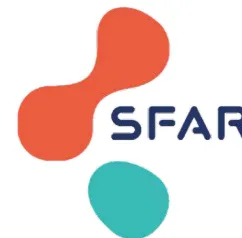

## Fiches simplifiées

# Prise en charge du patient diabétique en péri opératoire

*G. Cheisson, D. Benhamou, E. Cosson, C. Ichai, S. Jacqueminet,  
B. Nicolescu-Catargi, A. Ouattara, I. Tauveron*

**Version 2025**

The logo for SFAR (Société française du diabète) consists of three overlapping circles: a red one at the top, a teal one at the bottom, and a blue one to the right. The letters 'SFAR' are written in blue to the right of the teal circle.

Société  
françophone  
du  
diabète# Généralités (DTI et DT2)

## - 2 types de diabète

<table border="1">
<thead>
<tr>
<th>Type de diabète</th>
<th>Diabète de type 1 (DTI)</th>
<th>Diabète de type 2 (DT2)</th>
</tr>
</thead>
<tbody>
<tr>
<td>Mécanisme</td>
<td>Maladie auto-immune conduisant à une insulinopénie majeure</td>
<td>Insulinorésistance avec insulinopénie relative</td>
</tr>
<tr>
<td>Traitement</td>
<td>L'apport d'insuline exogène est vital et ne peut être arrêté</td>
<td>Régime puis antidiabétiques (AD) non insuliniques puis insuline à la phase tardive</td>
</tr>
<tr>
<td>Complications</td>
<td>Risque VITAL si arrêt de l'insuline basale (acidocétose)</td>
<td>Accumulation des AD non insuliniques si insuffisance rénale</td>
</tr>
<tr>
<td>Remarques</td>
<td>Chirurgie pancréatique : le patient se comporte comme un DTI si pancréatectomie</td>
<td>Vérification de la fonction rénale avant reprise des AD non insuliniques</td>
</tr>
</tbody>
</table>

## - Objectifs glycémiques en péri opératoire : 5 à 10 mmol/L (0,9 à 1,8 g/L)

- **Évaluation du contrôle glycémique** par le dosage d'hémoglobine glyquée (HbA1c) : récupérer le dernier dosage en consultation ou faire un dosage si le patient n'en a pas fait depuis plus de 3 mois ou s'il présente un déséquilibre de son diabète.

- **Stratégie pré opératoire** selon la valeur d'HbA1c :

<table border="1">
<thead>
<tr>
<th>HbA1c</th>
<th>4,0</th>
<th>5,0</th>
<th>6,0</th>
<th>8,0</th>
<th>9,0</th>
<th>10,0</th>
<th>%</th>
</tr>
</thead>
<tbody>
<tr>
<th>Conduite à tenir</th>
<td>Différer</td>
<td>Avis Médecin Généraliste / Diabétologue</td>
<td>Intervention possible</td>
<td>Avis Médecin Généraliste / Diabétologue</td>
<td>Différer</td>
<td></td>
<td></td>
</tr>
</tbody>
</table>

### ATTENTION :

- Chez le patient DTI et quelle que soit la glycémie :  
**NE JAMAIS ARRÊTER L'INSULINE LENTE**

- Si hypoglycémie : Cf fiche

CAT devant une hypoglycémie à l'hôpital

- Si hyperglycémie : Cf fiche

CAT devant une hyperglycémie à l'hôpital# Prise en charge pré opératoire (DTI et DT2)

## Modalités d'arrêt des traitements antidiabétiques (AD) :

<table border="1">
<thead>
<tr>
<th></th>
<th>Intervention avec<br/>≤ 1 repas jeûné</th>
<th>Intervention mineure ou majeure avec<br/>≥ 2 repas jeûnés</th>
<th>Intervention urgente</th>
</tr>
</thead>
<tbody>
<tr>
<td>Metformine</td>
<td rowspan="4">Pas d'arrêt</td>
<td rowspan="4">Pas de prise le matin</td>
<td rowspan="4">Arrêt</td>
</tr>
<tr>
<td>Sulfamides, glinides</td>
</tr>
<tr>
<td>Inhibiteurs α-glucosidases</td>
</tr>
<tr>
<td>Inhibiteurs DPP-4</td>
</tr>
<tr>
<td>Agonistes récepteurs GLP-1</td>
<td colspan="3">Pas d'arrêt<br/>(échographie gastrique +/- induction en séquence rapide)</td>
</tr>
<tr>
<td>Inhibiteurs SGLT2</td>
<td colspan="3">Dernière prise 3 jours avant l'intervention<br/>(risque acidocétose euglycémique)</td>
</tr>
<tr>
<td>Insulines SC</td>
<td>Pas d'arrêt</td>
<td>Maintien de l'insuline lente (matin ou soir)</td>
<td>Arrêt et relais</td>
</tr>
<tr>
<td>Pompe à insuline</td>
<td>Pas d'arrêt</td>
<td>Arrêt de la pompe à l'arrivée au bloc *</td>
<td>Arrêt et relais</td>
</tr>
</tbody>
</table>

## Règles de jeûne :

- - Repas du soir normal
- - Donner le traitement habituel : AD non insuliniques et/ou insulines aux mêmes posologies
- - Dernier repas solide à H-6 et liquides clairs autorisés jusqu'à H-2 de l'intervention
- - Indication à une perfusion de soluté glucosé chez un patient diabétique si et seulement si :
  - . jeûne et insuline lente injectée (matin ou soir) ou pompe à insuline en cours : G10% 40 mL/h à partir du premier repas jeûné
  - . jeûne prolongé = apports glucosés nécessaires quotidiennement (100 à 150 g de glucose : G10% 40 mL/h par exemple)

En pré opératoire, faire les glycémies capillaires et appliquer le protocole suivant :

<table border="1">
<thead>
<tr>
<th>Glycémie capillaire (GC)</th>
<th colspan="5">
</th>
</tr>
</thead>
<tbody>
<tr>
<td>Avant le repas du soir</td>
<td>Sucre<br/>15g PO<br/>(Prévenir le médecin)</td>
<td></td>
<td>Insuline : analogue rapide de l'insuline<br/>3 UI SC<br/>si correction non faite par le patient</td>
<td>4 UI SC</td>
<td>6 UI SC + recherche cétose<br/>(Prévenir le médecin)</td>
</tr>
<tr>
<td>19-20h</td>
<td colspan="5">Repas normal +/- insulines habituelles +/- AD non insuliniques</td>
</tr>
<tr>
<td>Au coucher 22h-0h</td>
<td>15g PO</td>
<td></td>
<td>3 UI SC</td>
<td>4 UI SC</td>
<td>6 UI SC + recherche cétose ou IVSE en réa<br/>(Prévenir le médecin)</td>
</tr>
<tr>
<td>Si besoin 3h-4h</td>
<td>GC à 15 min<br/>(Prévenir le médecin)</td>
<td></td>
<td>3 UI SC</td>
<td>4 UI SC</td>
<td>6 UI SC + recherche cétose ou IVSE en réa<br/>(Prévenir le médecin)</td>
</tr>
<tr>
<td>6h-7h</td>
<td colspan="4">Pas de prise d'AD non insuliniques et<br/>G10% 40 ml/h si insuline lente injectée ou pompe à insuline en cours</td>
<td>VVP<br/>NaCl 0,9%</td>
</tr>
<tr>
<td>Pré-op GC/3h</td>
<td>G10% 60 ml/h<br/>(Prévenir le médecin)</td>
<td></td>
<td>3 UI SC</td>
<td>4 UI SC</td>
<td>IVSE en réa<br/>Différer le bloc</td>
</tr>
</tbody>
</table>

### \* Maintien possible d'une pompe à insuline si :

- - Intervention courte < 2h
- - Perturbations du contrôle glycémique non attendues
- - Dispositifs visibles et à distance du champ opératoire
- - Préferer les glycémies artérielles, veineuses ou capillaires aux mesures du glucose interstitiel en pré opératoire
- - Accord du patient et de l'équipe d'anesthésie
- - Gestion de son matériel par le patient précocement en post opératoire
- - Avis du diabétologue pour adaptation des débits d'insuline# Traitement par inhibiteur SGLT2 ET arrêt < 3 jours

**Recherche cétose en préférant la cétonémie à la cétonurie**

```

graph TD
    Start[Recherche cétose en préférant la cétonémie à la cétonurie]
    Start --> K1[Cétonémie < 0,5 mmol/L  
Cétonurie = 0]
    Start --> K2[0,5 ≤ cétonémie ≤ 1,5 mmol/L  
Cétonurie à 1 crois]
    Start --> K3[Cétonémie > 1,5 mmol/L  
Cétonurie ≥ 2 crois]

    K1 --> H1[Si hyperglycémie : cf CAT devant  
Glycémie ≥ 16,5 mmol/L (3 g/L)  
Surveillance cétonémie à H12]

    K2 --> Table
    subgraph Table [ ]
        direction LR
        T1[Glycémie]
        T2[8-12 mmol/L  
(1,5 - 2,2 g/L)]
        T3[12-16,4 mmol/L  
(2,2 - 2,99 g/L)]
        T4[≥ 16,5 mmol/L  
(3 g/L)]
        T1 --- T2
        T1 --- T3
        T1 --- T4
        T2 --- T5[4 UI]
        T3 --- T5
        T4 --- T5
        T5 --- T6[15 g PO  
ou 3 g IVD]
        T5 --- T7[0]
        T5 --- T8[0]
    end
    Table --> S1[Surveillance  
glycémie et cétonémie  
à H4]

    K3 --> A1[Faire un GDS artériel et éliminer une  
autre cause d'acidose métabolique  
(hyperlactatémie, hyperchlorémie, hypercapnie)]
    A1 --> B1[Si pH > 7,20]
    A1 --> B2[Si pH ≤ 7,20]
    B1 --> Table
    B2 --> T9[Transfert en USC pour  
insulinothérapie IVSE]
    
```

<table border="1">
<thead>
<tr>
<th>Glycémie</th>
<th>8-12 mmol/L<br/>(1,5 - 2,2 g/L)</th>
<th>12-16,4 mmol/L<br/>(2,2 - 2,99 g/L)</th>
<th>≥ 16,5 mmol/L<br/>(3 g/L)</th>
</tr>
</thead>
<tbody>
<tr>
<th>Traitement</th>
<td></td>
<td></td>
<td></td>
</tr>
<tr>
<td>Analogue rapide de l'insuline SC</td>
<td>4 UI</td>
<td>6 UI</td>
<td>10 UI</td>
</tr>
<tr>
<td>Glucose</td>
<td>15 g PO<br/>ou 3 g IVD</td>
<td>0</td>
<td>0</td>
</tr>
</tbody>
</table>## CAT devant une glycémie $\geq 16,5$ mmol/L (3 g/L)

```
graph TD; A[Glycémie  $\geq 16,5$  mmol/L (3 g/L)] --> B[Recherche cétose en préférant la cétonémie à la cétonurie]; B --> C[Cétonémie < 0,5 mmol/L  
Cétonurie = 0]; B --> D[0,5  $\leq$  cétonémie  $\leq$  1,5 mmol/L  
Cétonurie à 1 crois]; B --> E[Cétonémie > 1,5 mmol/L  
Cétonurie  $\geq$  2 crois]; C --> F[Faire 6 UI SC  
d'analogue rapide de l'insuline]; D --> G[Faire 10 UI SC  
d'analogue rapide de l'insuline]; E --> H[Faire un GDS artériel  
pour rechercher une acidose]; F --> I[Surveillance glycémie  
à H4]; G --> J[Contrôle glycémie et  
recherche cétose à H4]; H --> K[Transfert en USC pour  
insulinothérapie IVSE];
```

The flowchart outlines the management of a patient with a blood glucose level  $\geq 16,5$  mmol/L (3 g/L). The process begins with a search for ketosis, prioritizing ketonemia over ketonuria. The management is then divided into three paths based on ketonemia levels:

- **Cetonemia  $< 0,5$  mmol/L (Cetonuria = 0):** Administer 6 units of rapid-acting insulin subcutaneously (SC) and monitor blood glucose at 4 hours (H4).
- **0,5  $\leq$  cetonemia  $\leq$  1,5 mmol/L (Cetonuria at 1 cross):** Administer 10 units of rapid-acting insulin SC and monitor blood glucose and ketosis at 4 hours (H4).
- **Cetonemia  $> 1,5$  mmol/L (Cetonuria  $\geq$  2 crosses):** Perform an arterial blood gas (GDS) analysis to check for acidosis. If indicated, transfer the patient to the intensive care unit (USC) for intravenous insulin therapy (IVSE).# CAT devant une hypoglycémie à l'hôpital

```
graph TD; A[Glycémie < 3,3 mmol/L (0,6 g/L)] --> B[Patient inconscient]; A --> C[Patient conscient]; B --> D[glycémie < 2,2 mmol/L (0,4 g/L)]; B --> E[2,2 < glycémie < 3,3 mmol/L]; C --> F[glycémie < 3,3 mmol/L (0,6 g/L)]; D --> G[Administration IV de glucose : 6 g soit 2 ampoules de 10 mL de G30% IVD]; E --> H[Administration IV de glucose : 3 g soit 1 ampoule de 10 mL de G30% IVD]; F --> I[Administration orale de sucre : - 3 morceaux de sucre - ou 20 cL de jus de fruit]; G --> J[Contrôle de la glycémie à 15 min]; H --> J; I --> J; J --> K[Glycémie < 3,3 mmol/L (0,6 g/L)]; J --> L[Glycémie ≥ 3,3 mmol/L (0,6 g/L)]; K --> M[Reprendre l'arbre décisionnel et prévenir le médecin]; L --> N[Contrôle glycémie à 1 heure];
```

**Glycémie < 3,3 mmol/L (0,6 g/L)**

**Patient inconscient**

**glycémie < 2,2 mmol/L (0,4 g/L)**

**Administration IV de glucose : 6 g soit 2 ampoules de 10 mL de G30% IVD**

**2,2 < glycémie < 3,3 mmol/L**

**Administration IV de glucose : 3 g soit 1 ampoule de 10 mL de G30% IVD**

**Patient conscient**

**glycémie < 3,3 mmol/L (0,6 g/L)**

**Administration orale de sucre : - 3 morceaux de sucre - ou 20 cL de jus de fruit**

**Contrôle de la glycémie à 15 min**

**Glycémie < 3,3 mmol/L (0,6 g/L)**

**Reprendre l'arbre décisionnel et prévenir le médecin**

**Glycémie ≥ 3,3 mmol/L (0,6 g/L)**

**Contrôle glycémie à 1 heure**# Protocole d'insulinothérapie IVSE

**Objectifs glycémiques peropératoires : 5 - 10 mmol/L (0,9 - 1,8 g/L)**

**Modalités d'administration :** en unités de soins critiques ou bloc opératoire seulement

- - Dilution : analogue rapide de l'insuline 1 UI/mL dans NaCl 0,9%
- - Voie d'abord : robinet proximal sur KTC ou robinet proximal sur VVP
- - Apports glucosés au bloc (GI 0% 40 mL/h) sauf si hyperglycémie > 16,5 mmol/L

**Surveillance glycémique et administration d'insuline selon le protocole ci-dessous :**

<table border="1">
<thead>
<tr>
<th colspan="2" rowspan="2">Glycémie</th>
<th colspan="7">g/L</th>
</tr>
<tr>
<th>0,4</th>
<th>0,6</th>
<th>0,9</th>
<th>1,1</th>
<th>1,8</th>
<th>2,5</th>
<th>3</th>
</tr>
<tr>
<th colspan="2"></th>
<th>2,2</th>
<th>3,3</th>
<th>5</th>
<th>6</th>
<th>10</th>
<th>14</th>
<th>16,5</th>
</tr>
<tr>
<th colspan="2"></th>
<th colspan="7">mmol/L</th>
</tr>
</thead>
<tbody>
<tr>
<td rowspan="2"><b>Initiation insuline IVSE</b></td>
<td>Bolus IVD</td>
<td>0</td>
<td>0</td>
<td>0</td>
<td>0</td>
<td>3 UI</td>
<td>4 UI</td>
<td>6 UI</td>
</tr>
<tr>
<td>Débit IVSE</td>
<td>0</td>
<td>0</td>
<td>0</td>
<td>1 UI/h pour les DTI<br/>0 UI/h pour les DT2</td>
<td>2 UI/h</td>
<td>3 UI/h</td>
<td>4 UI/h<br/>Prévenir médecin</td>
</tr>
<tr>
<td colspan="2">Fréquence des glycémies</td>
<td>15 min</td>
<td>30 min</td>
<td>1h</td>
<td>1h</td>
<td>2h</td>
<td>1h</td>
<td>1h</td>
</tr>
<tr>
<td colspan="2" rowspan="2"><b>Adaptation du débit insuline IVSE</b></td>
<td>Arrêt</td>
<td>Arrêt</td>
<td rowspan="2">- 1 UI/h</td>
<td rowspan="2">- 1 UI/h</td>
<td rowspan="2">idem</td>
<td rowspan="2">+ 1 UI/h</td>
<td rowspan="2">+ 2 UI/h</td>
</tr>
<tr>
<td colspan="2">Reprise à 1/2 débit quand glyc &gt; 5,5 mmol/L chez DTI<br/>glyc &gt; 10 mmol/L chez DT2</td>
<td>Bolus 6 UI<br/>Prévenir médecin</td>
</tr>
<tr>
<td colspan="2">G 30%</td>
<td>2 amp (6g)<br/>Prévenir médecin</td>
<td>1 amp 10 mL (3g)</td>
<td colspan="5">0</td>
</tr>
</tbody>
</table>

## Remarques :

- - Privilégier les mesures de glycémie sur sang total (artériel ou veineux) et si possible sur machine à gaz du sang
- - Surveillance de la kaliémie :  
  Objectif = 4 à 4,5 mmol/L.  
  Contrôle/4h si stable sinon à chaque changement de débit d'insuline

**Pas de relais SC si insuline IVSE > 4 UI/h**

## Arrêt du protocole IVSE et relais :

- - Dès que glycémies stabilisées et  $\leq 10$  mmol/L (1,8 g/L)
- - Si alimentation orale
- - Si sortie du patient de SSPI, unités de soins critiques avec relais par insuline SC ou pompe à insuline# Relais insuline IVSE / SC

## Indications au relais :

- - Dès que les glycémies sont stabilisées et  $\leq 10 \text{ mmol/L}$  (1,8 g/L)
- - Reprise d'une alimentation orale (mais non une condition)
- - Relais à l'arrêt de l'insuline IVSE si posologie  $\leq 4 \text{ UI/h}$

## Contre-indications au relais :

- - Posologie d'insuline IVSE  $> 4 \text{ UI/h}$
- - Besoins en insuline non stabilisés

## Pas de relais SC si :

- - Posologie d'insuline IVSE  $\leq 0,5 \text{ UI/h}$  chez un patient non-insulinotraité antérieurement

## Calcul de dose :

**Quantité d'insuline inconnue**

- dose insuline lente SC en 1 fois le soir = 0,3 UI/kg/24h
- dose d'analogue rapide de l'insuline SC par repas = 0,3 UI/kg/24h à diviser par 3
   

  <table border="1">
  <tr>
  <td>Petit déjeuner</td>
  <td>Déjeuner</td>
  <td>Dîner</td>
  </tr>
  </table>

**ou**

**Quantité totale d'insuline IVSE sur 24 h**

- dose insuline lente SC en 1 fois le soir = 1/2 dose IVSE / 24h
- dose d'analogue rapide de l'insuline SC par repas = 1/2 dose IVSE / 24h à diviser par 3
   

  <table border="1">
  <tr>
  <td>Petit déjeuner</td>
  <td>Déjeuner</td>
  <td>Dîner</td>
  </tr>
  </table>

## Modalités :

- - Pas de délai entre l'arrêt de l'insuline IVSE et l'injection de l'insuline lente : l'insuline lente est faite en SSPI
- - L'injection d'insuline lente SC est prescrite de préférence à 20h le soir
- - Sinon, faire une injection complémentaire pour couvrir les besoins jusqu'à 20h selon le schéma suivant :

<table border="1">
<thead>
<tr>
<th>Arrêt insuline IVSE</th>
<th>entre 0h et 6h</th>
<th>de 6 à 14h</th>
<th>entre 14h et 16h</th>
<th>entre 16h et 0h</th>
</tr>
</thead>
<tbody>
<tr>
<td>Dose insuline lente initiale</td>
<td>3/4 dose</td>
<td>1/2 dose</td>
<td>1/4 dose</td>
<td>dose de 20h</td>
</tr>
<tr>
<td>Dose insuline lente suivante</td>
<td colspan="3">à 20h le soir même</td>
<td>à 20h le jour suivant</td>
</tr>
</tbody>
</table>

## PAS D'INSULINE IVSE EN SALLE D'HOSPITALISATION CONVENTIONNELLE# Protocole d'insulinothérapie SC type Basal Bolus

## I. BASAL = INSULINE LENTE

- - Insuline lente : 0,3 UI/kg/j SC à 20h (ou dose habituelle ou 1/2 dose IV des dernières 24h)
- - Adaptation de la posologie à la glycémie du matin suivant à jeun selon le protocole suivant :

<table border="1">
<tr>
<td></td>
<td>5</td>
<td>10</td>
<td>mmol/L</td>
</tr>
<tr>
<td>- 2 UI</td>
<td>idem</td>
<td>+ 2 UI</td>
<td></td>
</tr>
<tr>
<td></td>
<td>0,9</td>
<td>1,8</td>
<td>g/L</td>
</tr>
</table>

## 2. BOLUS POUR LE REPAS

- - Analogue rapide de l'insuline SC avant chaque repas oral et quelle que soit la glycémie : 0,1 UI/kg SC
- - Faire la moitié de la posologie prévue si apports caloriques insuffisants
- - Ne pas faire si alimentation entérale ou parentérale continue

## 3. BOLUS CORRECTEUR

- - Analogue rapide de l'insuline SC à adapter selon glycémie (**à additionner au bolus du repas à 8h, 12h, 20h**)
- - Glycémie préprandiale à 8h, 12h, 20h et à 16h, 0h, 4h si déséquilibre important

<table border="1">
<tr>
<td></td>
<td>3,3</td>
<td>5</td>
<td>10</td>
<td>12</td>
<td>16,5</td>
<td>mmol/L</td>
</tr>
<tr>
<td>1 amp G30% IV<br/>ou 15g sucre PO</td>
<td>0</td>
<td>0</td>
<td>3</td>
<td>4</td>
<td>6</td>
<td>UI en SC</td>
</tr>
<tr>
<td></td>
<td>0,6</td>
<td>0,9</td>
<td>1,8</td>
<td>2,2</td>
<td>3</td>
<td>g/L</td>
</tr>
</table>

**PRESCRIPTIONS** Dr..... date..... heure.....

- INSULINE LENTE : ..... UI SC à 20h (30 UI maximum à l'initiation)  
et arrêt insuline IVSE

- ANALOGUE RAPIDE DE L'INSULINE SC :

- Bolus pour le repas si alimentation orale : .....UI SC à 8h, 12, 20h
- Bolus correcteur selon glycémie
- Glycémie/4h (initiation protocole SC ou déséquilibre) ou  Glycémie/8h

## Exemple

# Modalités de reprise des traitements antidiabétiques chez le DT2

```
graph TD; A[Alimentation orale suffisante] --> B{oui}; A --> C{non}; B --> D[Glycémie < 12 mmol/l (2,2 g/L) depuis plus de 24h]; C --> E[Continuer et adapter le schéma Basal Bolus]; D --> F{oui}; D --> G{non}; F --> H[Le traitement antérieur par antidiabétiques non insuliniques (AD) peut-il être repris ?]; G --> I[Continuer et adapter le schéma Basal Bolus]; H --> J[Clairance de la créatinine idéalement mesurée]; J --> K[> 60 mL/min]; J --> L[30 < Cl créat < 60 mL/min]; J --> M[< 30 mL/min]; K --> N[Reprise de tous les AD]; L --> O[Reprise des AD sauf metformine]; M --> P[Pas de reprise des AD]; N --> Q[Retour domicile avec compte-rendu au MT]; O --> Q; P --> R[Appel équipe endocrinologie avant la sortie]; R --> S[et/ou]; S --> T[Le traitement péri opératoire par schéma Basal Bolus peut-il être arrêté ?]; T --> U[Si pas d'insuline antérieurement]; T --> V[Si insuline antérieurement]; U --> W[Quand insuline lente ≥ 16 UI/j continuer Basal Bolus]; U --> X[Quand insuline lente < 16 UI/j arrêter Basal Bolus]; V --> Y[Reprise des insulines antérieures]; W --> R; X --> Z[Retour domicile avec compte-rendu au MT]; Y --> Z;
```

**Alimentation orale suffisante**

- **non** → **Continuer et adapter le schéma Basal Bolus**
- **oui** → **Glycémie < 12 mmol/l (2,2 g/L) depuis plus de 24h**

- **non** → **Continuer et adapter le schéma Basal Bolus**
- **oui** → **Le traitement antérieur par antidiabétiques non insuliniques (AD) peut-il être repris ?**

**Clairance de la créatinine (idéalement mesurée)**

- **> 60 mL/min** → **Reprise de tous les AD** → **Retour domicile avec compte-rendu au MT**
- **30 < Cl créat < 60 mL/min** → **Reprise des AD sauf metformine** → **Retour domicile avec compte-rendu au MT**
- **< 30 mL/min** → **Pas de reprise des AD** → **Appel équipe endocrinologie avant la sortie**

**et/ou**

**Le traitement péri opératoire par schéma Basal Bolus peut-il être arrêté ?**

- **Si pas d'insuline antérieurement**
  - **Quand insuline lente ≥ 16 UI/j continuer Basal Bolus** → **Appel équipe endocrinologie avant la sortie**
  - **Quand insuline lente < 16 UI/j arrêter Basal Bolus** → **Retour domicile avec compte-rendu au MT**
- **Si insuline antérieurement** → **Reprise des insulines antérieures** → **Retour domicile avec compte-rendu au MT**# Intervention de courte durée

**Rechercher les complications du diabète et doser l'HbA1c** (différer la chirurgie si HbA1c > 9%)

**Stratégie péri-opératoire définie selon le nombre de repas jeûnés :**

<table border="1">
<thead>
<tr>
<th>Nombre de repas jeûnés</th>
<th>Horaire prévisible de l'intervention</th>
<th>Attitude pratique</th>
</tr>
</thead>
<tbody>
<tr>
<td><b>0</b></td>
<td>quel que soit l'horaire</td>
<td>Poursuite du traitement le matin</td>
</tr>
<tr>
<td rowspan="3"><b>1</b></td>
<td>avant 10h</td>
<td>Petit-déjeuner et traitement du matin sont pris après l'intervention</td>
</tr>
<tr>
<td>entre 10h et 12h</td>
<td>Pas de petit-déjeuner et traitement donné à l'arrivée.<br/>Perfusion de G10% 40 mL/h jusqu'au repas suivant si insuline ou sulfamide</td>
</tr>
<tr>
<td>après 12h</td>
<td>Poursuite du traitement le matin avec prise d'un petit-déjeuner léger</td>
</tr>
<tr>
<td><b>2</b></td>
<td colspan="2"><i>Cf. Fiches DT1 et DT2 - Intervention mineure</i></td>
</tr>
</tbody>
</table>

**En pré, per et post opératoire : bolus correcteur si besoin**

## BOLUS CORRECTEUR

- Analogue rapide de l'insuline SC à adapter selon glycémie (**à additionner au bolus du repas à 8h, 12h, 20h**)

- Glycémie préprandiale à 8h, 12h, 20h et à 16h, 0h, 4h si déséquilibre important


<table border="1">
<tr>
<td></td>
<td>3,3</td>
<td>5</td>
<td>10</td>
<td>12</td>
<td>16,5</td>
<td>mmol/L</td>
</tr>
<tr>
<td>1 amp G30% IV<br/>ou 15g sucre PO</td>
<td>0</td>
<td>0</td>
<td>3</td>
<td>4</td>
<td>6</td>
<td>UI en SC</td>
</tr>
<tr>
<td></td>
<td>0,6</td>
<td>0,9</td>
<td>1,8</td>
<td>2,2</td>
<td>3</td>
<td>g/L</td>
</tr>
</table>

## En post opératoire :

- . Reprise d'une alimentation orale dès que possible
- . Si glycémie  $\leq$  10 mmol/L (1,8 g/L), reprendre les traitements habituels aux horaires habituels
- . Si glycémie  $>$  10 mmol/L (1,8 g/L), prolonger l'hospitalisation jusqu'à correction de la glycémie entre 5 et 10 mmol/L avec injection de bolus correcteurs selon le protocole précédent
- . Si glycémie  $>$  16,5 mmol/L (3 g/L), contre-indication à une sortie à domicile et hospitalisation pour insulinothérapie IVSE