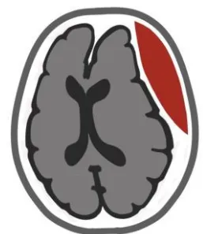
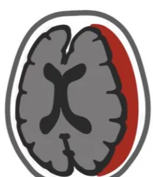
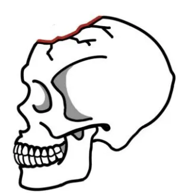
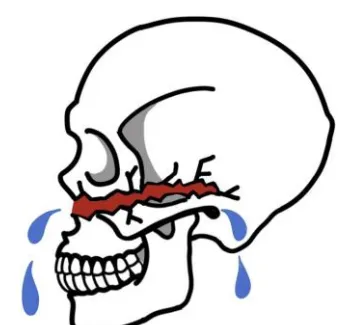
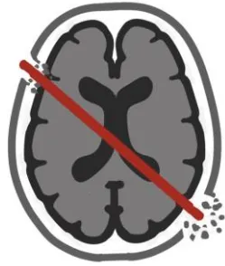
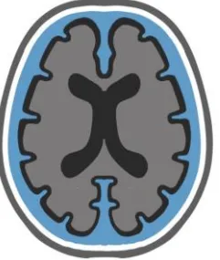
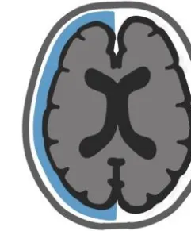

**NON-INDICATION POUR TC JUGÉS DÉPASSÉS**

**Décision collégiale tracée:**  
En journée: 3 médecins seniors  
PDS: 2 médecins seniors  
Directives anticipées ?  
PMO ?

**FACTEURS DE MAUVAIS PRONOSTIC**

**Indice de fragilité pathologique**  
**Mydriase bilatérale aréactive >2h**  
~~Délai de prise en charge~~  
**Traitement anti-coagulant**  
~~Aspirine en monothérapie~~

Indices de fragilité

**Clinical Frailty Scale ≥ 4**

- **3 : se débrouille bien**  
  Indépendant  
  Actif
- **4: vulnérable**  
  Indépendant d'aide ext  
  Limitation activités
- **5: faiblement fragile**  
  Dépendant d'aide ext  
  Ralentit dans activités

<table border="1">
<thead>
<tr>
<th colspan="2">Modified Frailty Index 5 ≥ 2</th>
</tr>
</thead>
<tbody>
<tr>
<td>Diabète</td>
<td>+1</td>
</tr>
<tr>
<td>HTA</td>
<td>+1</td>
</tr>
<tr>
<td>OAP&lt;30j</td>
<td>+1</td>
</tr>
<tr>
<td>BPCO</td>
<td>+1</td>
</tr>
<tr>
<td>Non autonome</td>
<td>+1</td>
</tr>
</tbody>
</table>

**PEC chirurgicale**

**PEC médicale**

**HED**

**Chirurgie en urgence si:**  
HED d'origine artérielle associé à Glasgow ≤ 8  
**ET/OU** Mydriase  
**ET/OU** Volume > 30 ml  
**ET/OU** Déviation LM > 5 mm  
**ET/OU** Compression tronc cérébral  
**ET/OU** Saignement actif (*swirl sign*)

**Sinon : PEC conservatrice**  
✓ Au cas par cas si origine veineuse  
✓ Centre doté de neurochirurgie  
✓ **Scanner de contrôle précoce** si 1er scanner < H6 ou aggravation

**HSDA**

**Chirurgie en urgence si:**  
< 65 ans **OU** 65-80 + indice fragilité faible (CFS<4 / MFI-5 <2)  
**ET**  
GCS ≤ 8 **OU** GCS ≤ 12+perte rapide ≥2 points **OU** HTIC  
**ET**  
épaisseur > 10 mm **OU** déviation LM > 5 mm

**Sinon PEC conservatrice ou LATA**  
✓ **Scanner de contrôle**  
En urgence si aggravation  
J7-10 si nécessité reprise anti-coag  
J21-30 dans les autres cas

**Embarrure**

**Chirurgie rapide (24h) si:**  
Plaie complexe / contaminée  
**ET/OU** Plaie durale / issue de LCS  
**ET/OU** Effet de masse significatif  
**ET/OU** Autre(s) lésion(s) neuro-chirurgicale(s)  
**ET/OU** Préjudice esthétique majeur

**Cranialisation du sinus frontal si:**  
défaut majeur paroi post **ET/OU**  
brèche durale évidente **ET/OU**  
atteinte des canaux naso-frontaux

✓ ~~Pas d'antibiotique~~ (SFAR 2023)  
✓ ~~Pas de prophylaxie antiépileptique~~

**BOM**

**Chirurgie rapide (24h)** si défaut dural majeur associé à une liquorrhée abondante  
**Chirurgie non urgente** si liquorrhée non abondante mais réfractaire à un traitement conservateur au-delà de 7 jours

✓ **Mesure préventive d'HTIC**  
Alitement proclive 30°, laxatifs, antitussifs, antiémétiques  
✓ **Vaccinations** anti- pneumocoque, haemophilus et méningocoques

**Dépistage radiologique de BOM**  
1° TDM os HR + IRM 3DT2 HR  
2° myéloscanner  
3° cisternographie isotopique

**NIVEAU DE RECO: grade 2 avis d'experts**

**BOM:** Brèche ostéo-méningée; **BPCO:** broncho-pneumopathie chronique obstructive; **HED:** hématome extra-dural; **HSDA:** hématome sous-dural aigu; **OAP:** œdème aigu pulmonaire (cardiogénique); **IRM 3DT2 HR :** IRM séquence 3DT2 haute résolution; **LM:** ligne médiane; **PDS:** permanence des soins, **PEC:** prise en charge; **PMO:** prélèvement multi-organes; **TDM os mm :** TDM fenêtre osseuse haute résolution;

### TC pénétrants

**Chirurgie en urgence:**  
 Tout TC pénétrant avec GCS  $\geq 5$   
 Au cas par cas si GCS 3-4 (scores pnc)  
 Fermeture durale étanche

- ✓ **Prophylaxie antiépileptique** primaire si délablement cortical important
- ✓ **Antibioprophylaxie** (+/-24-48h): Amoxicilline / Clavulanate (SFAR 2023)
- ✓ **Vaccinations** anti-pneumocoque, haemophilus, méningocoques et tétanos

Scores pronostiques: Spin, Maritzburg

**Recherche lésion vasculaire !**

- ✓ **Angioscanner** systématique pour tout TC pénétrant
- ✓ **Artériographie si:**  
   Angioscanner + ou douteux  
   Trajet ptérional / fronto-orbitaire  
   Violation durale multiple  
   Trajectoire et/ou hématome à proximité des axes vasculaires principaux  
   TC par explosion + GCS < 8  
   Vasospasme sur DTC ou PtiO2
- ✓ **Contrôle à J14** si 1ere imagerie -

### Collections de LCS post-TC

Collection progressive (bilatérale)  
 ET aggravation neurologique  
 ET/OU élévation de la PIC

### Hydrocéphalie externe

**Drainage lombaire si hydro ext**  
 ET Perméabilité citernes de la base  
 ET Absence déviation LM > 10mm  
 ET Absence engagement amygdalien

Collection stable (unilatérale)  
 ET absence de signe neurologique  
 ET PIC normale

### Hygrome

Traitement conservateur

**Gestion DLE**

- ✓ Zéro de référence au CAE
- ✓ Contre-pression  $\geq 10$  mmHg si HTIC
- ✓ Monitorage PIC en continue
- ✓ **Gradient pression > 5mmHg = STOP**

# Spécificités pédiatriques

## PEC chirurgicale

## PEC médicale

### HED DU NOUVEAU-NE\*

\*<1mois

**Chirurgie en urgence si:**  
 signes de gravité cliniques ET/OU radiologiques (déviation >5mm de la ligne médiane, compression du tronc cérébral)

**Si possible par ponction:**

- • du céphalhématome
- • via une fracture crânienne
- • épidurale

**Sinon: PEC conservatrice**

- ✓ Surveillance en soins intensifs

### HSD NON ACCIDENTEL DU NOURISSON\*\*

\*\*<2ans

**Chirurgie en urgence:**

Mauvaise tolérance clinique ET/OU HSD > 10 mm  
 Préférentiellement par **drainage (DSDP)**  
 Absence de reco sur utilisation de la craniectomie décompressive

**Sinon: PEC conservatrice**

- ✓ Surveillance en soins intensifs

### FRACTURE PING-PONG DU NOURISSON\*\*

\*\*<2ans

**Chirurgie en urgence si:**

HTIC ET/OU effet de masse significatif sur le parenchyme  
 ET/OU hématome intra-crânien  
 ET/OU collection de LCS péri-encéphalique.

**PEC conservatrice**

- ✓ Dans la majorité des cas
- ✓ Discussion chirurgicale à moyen terme si évolution défavorable

**NIVEAU DE RECO:**  
**grade 2**  
 avis d'experts

**DSDP:** dérivation sous-duropéritonéale; **DTC:** doppler transcrânien; **HED:** hématome extradural; **HSD:** hématome sous-dural; **HTIC:** hypertension intracrânienne; **LCS:** liquide cérébro-spinal; **LM:** ligne médiane; **PEC:** prise en charge; **PIC:** pression intracrânienne; **PtiO2:** pression tissulaire en oxygène