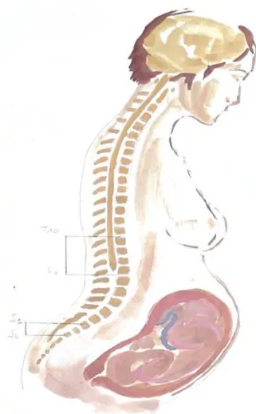

---

## RECOMMANDER LES BONNES PRATIQUES

---

### ARGUMENTAIRE

Prise en charge de  
la douleur de  
l'accouchement :  
analgésie  
périmédullaire et  
alternatives  
médicamenteusesLes recommandations de bonne pratique (RBP) sont définies dans le champ de la santé comme des propositions développées méthodiquement pour aider le praticien et le patient à rechercher les soins les plus appropriés dans des circonstances cliniques données.

Les RBP sont des synthèses rigoureuses de l'état de l'art et des données de la science à un temps donné, décrites dans l'argumentaire scientifique. Elles sont intégrées dans une démarche clinique centrée patient qui prend en compte l'expérience vécue du patient, ses représentations, ses attentes et son état d'esprit pour aboutir à une décision médicale partagée. Ce processus délibératif entre patient et professionnel de santé s'effectue au sein d'une relation empathique et dans une approche biopsychosociale globale et contextuelle qui permet d'aboutir à une alliance thérapeutique.

Cette recommandation de bonne pratique a été élaborée avec une approche basée sur les preuves (EBM) selon le système GRADE. Les caractéristiques de GRADE sont les suivantes :

- – il permet d'évaluer la qualité des données probantes de façon systématique afin de mesurer le niveau de confiance à leur accorder en vue de produire une recommandation ;
- – il prend en compte l'opinion des professionnels de santé vis-à-vis de la balance bénéfice/risque d'une intervention thérapeutique, qu'elle soit curative ou préventive, pour déterminer la force d'une recommandation ;
- – il incorpore les préférences du patient dans la genèse des recommandations, en cohérence avec une approche centrée sur le patient.

## Gradation des recommandations et avis d'experts

<table border="1">
<tbody>
<tr>
<td data-bbox="58 383 154 478">1</td>
<td data-bbox="154 383 874 478">

<b>Recommandation forte</b>

Balance bénéfices/risques démontrée favorable ou démontrée défavorable

Fondée sur le résultat de méta-analyse d'essais cliniques randomisés statistiquement significatif1 avec une qualité des preuves élevée en faveur d'un bénéfice clinique pertinent. Dans cette situation, l'approche centrée patient permet de prendre en compte l'avis du patient vers l'acceptation de l'intervention.

</td>
</tr>
<tr>
<td data-bbox="58 478 154 631">2</td>
<td data-bbox="154 478 874 631">

<b>Recommandation faible</b>

Balance bénéfices/risques démontrée plutôt favorable ou balance bénéfices/risques présumée favorable ; Balance bénéfices/risques démontrée plutôt défavorable ou balance bénéfices/risques présumée défavorable

Fondée sur le résultat de méta-analyse d'essais cliniques randomisés statistiquement significatif<b>Erreur ! Signet non défini.</b> avec une qualité des preuves élevée en faveur d'un bénéfice clinique peu pertinent ou avec une qualité des preuves modérée en faveur d'un bénéfice clinique pertinent. Dans cette situation, l'approche centrée patient permet d'appréhender avec le patient l'(les) intérêt(s) de l'intervention dans son contexte particulier.

</td>
</tr>
<tr>
<td data-bbox="58 631 154 706">ABS</td>
<td data-bbox="154 631 874 706">

<b>Pas de recommandation</b>

Absence d'études ou de résultats concluants, c.à.d. résultats non statistiquement significatifs<b>Erreur ! Signet non défini.</b> ou de qualité de preuves faible ou très faible, ne permettant pas de proposer une intervention.

</td>
</tr>
<tr>
<td data-bbox="58 706 154 863">AE</td>
<td data-bbox="154 706 874 863">

<b>Avis d'experts</b>

Balance bénéfices/risques indéterminée.

Absence d'études ou de résultats concluants, c.à.d. résultats non statistiquement significatifs ou de qualité de preuves faible ou très faible.

Proposition par un avis d'experts d'une intervention. Cet avis s'appuie ou non sur une revue systématique de la littérature des recommandations existantes et des méta-analyses d'études de cohorte. Dans cette situation, l'approche centrée patient permet d'accompagner le patient dans sa décision en l'absence de recommandation, en se basant sur la balance bénéfices/risques supposée de l'intervention, dans son contexte particulier et en prenant en compte sa perspective.

</td>
</tr>
</tbody>
</table># Descriptif de la publication

<table border="1"><tr><td><b>Titre</b></td><td><b>Prise en charge de la douleur de l'accouchement : analgésie périmédullaire et alternatives médicamenteuses</b></td></tr><tr><td><b>Méthode de travail</b></td><td>Recommandations pour la pratique clinique-LABEL</td></tr><tr><td><b>Objectif(s)</b></td><td>L'objectif de ces recommandations est de produire un cadre facilitant la prise de décision pour la prise en charge de la douleur de l'accouchement : analgésie périmédullaire et alternatives médicamenteuses.</td></tr><tr><td><b>Cibles concernées</b></td><td>Femmes enceintes</td></tr><tr><td><b>Demandeur</b></td><td>Société Française d'Anesthésie et Réanimation (SFAR) ; Collège d'Anesthésie et Réanimation en Obstétrique (CARO)</td></tr><tr><td><b>Promoteur(s)</b></td><td>Société Française d'Anesthésie et Réanimation (SFAR) ; Collège d'Anesthésie et Réanimation en Obstétrique (CARO), Haute Autorité de santé (HAS)</td></tr><tr><td><b>Pilotage du projet</b></td><td><b>Coordonnatrices des experts :</b> Hawa KEITA-MEYER (CARO), Estelle MORAU (CARO), Marie-Pierre BONNET (SFAR) <b>Organisateurs CRC SFAR :</b> Daphné MICHELET, Matthieu DUMONT <b>Coordinateur HAS :</b> Sophie BLANCHARD MUSSET</td></tr><tr><td><b>Auteurs</b></td><td>Hawa KEITA-MEYER, Estelle MORAU, Marie-Pierre BONNET, Lucie ADALID, Anne-Sophie BAPTISTE, Thibaut BELVEYRE, Martine BONNIN, Lionel BOUVET, Sébastien CAMPION, Pierre-Yves DEWANDRE, Anne EVRARD, Valentina FAITOT, Catherine FISCHER, Sandra FOURNIER, Anne GODIER, David GOURAUD, Max GONZALEZ ESTEVEZ, Benjamin JULLIAC, Diane KORB, Agnès LE GOUZ, Thibaut RACKELBOOM, Lucie Pères RIGOLLET, Sandrine ROGER-CHRISTOPH, Jean-Philippe SALAUN, Valérie SOUYRI, Sophie SUSEN, Dahlia THARWAT, Anne Hélène VANTALON, Florence VIAL, Éric VERSPYCK, Matthieu DUMONT, Daphné MICHELET</td></tr><tr><td><b>Conflits d'intérêts</b></td><td>Les membres du groupe de travail ont communiqué leurs déclarations publiques d'intérêts à la HAS. Elles sont consultables sur le site <a href="https://dpi.sante.gouv.fr">https://dpi.sante.gouv.fr</a>. Elles ont été analysées selon la grille d'analyse du guide des déclarations d'intérêts et de gestion des conflits d'intérêts de la HAS. Les intérêts déclarés par les membres du groupe de travail ont été considérés comme étant compatibles avec leur participation à ce travail.</td></tr><tr><td><b>Validation</b></td><td>Version du 30 avril 2025</td></tr><tr><td><b>Actualisation</b></td><td></td></tr><tr><td><b>Autres formats</b></td><td></td></tr></table>

Ce document ainsi que sa référence bibliographique sont téléchargeables sur [www.has-sante.fr](https://www.has-sante.fr)

Haute Autorité de santé – Service communication information

5 avenue du Stade de France – 93218 SAINT-DENIS LA PLAINE CEDEX. Tél. : +33 (0)1 55 93 70 00

© Haute Autorité de santé – avril 2025 – ISBN : 978-2-11-172740-3# Sommaire

---

<table><tr><td><b>Préambule</b></td><td><b>5</b></td></tr><tr><td><b>Introduction</b></td><td><b>6</b></td></tr><tr><td><b>1. Pose de l'analgésie périmédullaire (APM)</b></td><td><b>13</b></td></tr><tr><td>1.1. Repérage échographique</td><td>13</td></tr><tr><td>1.2. Position</td><td>16</td></tr><tr><td>1.3. Monitoring</td><td>18</td></tr><tr><td>1.4. Mesures d'asepsie</td><td>21</td></tr><tr><td>1.5. Gestion anticoagulation</td><td>24</td></tr><tr><td><b>2. Initiation de l'analgésie périmédullaire</b></td><td><b>28</b></td></tr><tr><td><b>3. Entretien de l'analgésie périmédullaire</b></td><td><b>40</b></td></tr><tr><td><b>4. Gestion de l'insuffisance et de l'échec de l'analgésie périmédullaire</b></td><td><b>47</b></td></tr><tr><td><b>5. Alternatives médicamenteuses à l'analgésie périmédullaire</b></td><td><b>69</b></td></tr><tr><td><b>Synthèse des recommandations</b></td><td><b>78</b></td></tr><tr><td><b>Algorithme</b></td><td><b>85</b></td></tr><tr><td><b>Méthode</b></td><td><b>86</b></td></tr><tr><td><b>Table des annexes</b></td><td><b>92</b></td></tr><tr><td><b>Références bibliographiques</b></td><td><b>95</b></td></tr><tr><td><b>Participants</b></td><td><b>107</b></td></tr><tr><td><b>Abréviations et acronymes</b></td><td><b>110</b></td></tr></table># Préambule

Ces recommandations portent sur la « Prise en charge de la douleur de l'accouchement : analgésie périmédullaire et alternatives médicamenteuses ».

Les sociétés promotrices ont été :

- – La Société Française d'Anesthésie et Réanimation (SFAR)

Et

- – Le Collège d'Anesthésie et Réanimation en Obstétrique (CARO)

En association avec :

- – Le Collège Nationale des Gynécologues-obstétriciens (CNGOF),
- – La Société Française d'hygiène Hospitalière (SF2H),
- – Le Collège National des Sage-Femmes (CNSF),
- – Le Collectif inter associatif autour de la naissance (CIANE),
- – Le Groupe d'Intérêt en Hémostase Péri-opératoire (GIHP)
- – La Société Française de Thrombose et d'Hémostase (SFTH),
- – Le Collège des Infirmier(e)s Puéricultrices(teurs),
- – L'Association Française de psychiatrie Biologique et de Neuropsychopharmacologie (AFPBN)

Cette recommandation de bonne pratique a été réalisée dans le cadre de la labellisation par la HAS2 garantissant le respect des critères méthodologiques, scientifiques et déontologiques de la HAS, notamment dans la prévention des conflits d'intérêt.

## Objectifs

L'objectif de ces recommandations est de produire un cadre facilitant la prise de décision pour la prise en charge de la douleur de l'accouchement : analgésie périmédullaire et alternatives médicamenteuses. Le groupe s'est efforcé de produire un nombre minimal de recommandations afin de mettre en évidence les points forts à retenir dans les 5 champs prédéfinis. Les règles de base des bonnes pratiques médicales universelles en anesthésie obstétricale étant considérées comme connues, elles ont été exclues de ces recommandations ; ces dernières se focalisant sur les éléments spécifiques de la prise en charge de la douleur de l'accouchement par l'analgésie périmédullaire et les alternatives médicamenteuses. Le public visé est en priorité les anesthésistes-réanimateurs de maternité mais ces recommandations ciblent également l'ensemble des acteurs de la périnatalité.

---

2 Cf. Guide méthodologique « Attribution du label de la HAS à une recommandation de bonne pratique élaborée par un organisme professionnel » (HAS, 2023) : [https://www.has-sante.fr/jcms/p\\_3452920/fr/labellisation-par-la-has-d-une-recommandation-debonne-pratique-elaboree-par-un-organisme-professionnel](https://www.has-sante.fr/jcms/p_3452920/fr/labellisation-par-la-has-d-une-recommandation-debonne-pratique-elaboree-par-un-organisme-professionnel)# Introduction

## Une évolution des pratiques en analgésie périmédullaire caractérisant un besoin d'actualisation des recommandations de bonne pratique

L'accouchement est à l'origine de niveaux de douleur parmi les plus intenses dans la vie d'une femme.

Il se compose de trois étapes :

- – **Le premier stade**, qui commence avec des contractions régulières et se termine par la dilatation complète du col de l'utérus, comprend une phase de latence (jusqu'à 5 cm de dilatation) et une phase active (de 5 cm jusqu'à la dilatation complète).
- – **Le deuxième stade** s'étend de la dilatation complète à la naissance de l'enfant. Ensemble, ces deux premières étapes constituent le travail obstétrical.
- – **Le troisième stade** est celui de la délivrance.

Actuellement en France, plus de 80% des femmes bénéficient d'une **analgésie périmédullaire (APM)** pour la prise en charge de la douleur au cours de leur accouchement (Enquête Nationale Périnatalité (ENP) 2021) [1]. Ce taux place la France en première position au niveau mondial en termes de recours à l'APM pour l'accouchement. C'est une activité importante pour les anesthésistes réanimateurs nécessitant d'être régulièrement actualisée. Les dernières recommandations de la SFAR sur l'analgésie obstétricale datent de 2006 [2]. Depuis, la situation a considérablement changé : les demandes des femmes vis-à-vis de la prise en charge de leur douleur au cours du travail ont évolué vers un souhait de prise en charge plus physiologique, d'accompagnement par des méthodes non pharmacologiques, de mobilisation ou encore de déambulation avec ou sans APM.

Dans le même temps, le profil des femmes enceintes s'est modifié vers plus de comorbidités, en particulier un âge maternel plus avancé, et plus d'obésité [1].

## Techniques d'analgésie

Parallèlement l'APM s'est modernisée avec le développement récent de nouvelles techniques et pratiques comme le repérage échographique de l'espace péridural, des modalités d'administration innovantes type « *bolus intermittent programmé* (BIP, ou PIEB en anglais) » ou encore des techniques combinées de type « Péri Rachi Combinée » (PRC) ou « Péricurale avec Ponction Durale » (PPD ou DPE en anglais) [3,4].

- – L'APM comprend différentes techniques (Figure 1) :
- – **L'analgésie péricurale (APD)** consiste en la pose d'un cathéter dans l'espace péridural (L2-L3, L3-L4 ou L4-L5). L'objectif est l'obtention d'un bloc sélectif sensitif de T10 – L1 avec une extension en S2 – S4 pour permettre une analgésie tout au long de l'accouchement, tout en évitant/limitant le bloc moteur.- – **La rachianalgésie** consiste en une injection unique dans le liquide cérébro-spinal (LCS). C'est l'une des techniques les plus simples à mettre en œuvre, notamment dans les pays à faibles ressources.
- – **La Péri-Rachi Combinée (PRC)**, technique associant une injection intrathécale à une analgésie péridurale. L'induction de l'analgésie est assurée par la composante intrathécale (association d'une faible dose d'anesthésique local avec un morphinique liposoluble ou un morphinique seul) ; l'analgésie péridurale venant prendre ensuite le relais analgésique de cette première injection.
- – **La Péridurale avec Ponction Durale (PPD)**, qui consiste à réaliser une ponction dans la dure mère avec une aiguille de rachianesthésie, dans le but de favoriser la diffusion du mélange administré en péridural vers le compartiment sous arachnoïdien. Cette ponction n'est associée à aucune injection intrathécale.

Il est rappelé que toutes les techniques de pose d'analgésie périmédullaire doivent être réalisées en respectant les principes de prévention des erreurs médicamenteuses. Il est souligné en particulier dans ce contexte l'utilisation systématique de solutions antiseptiques colorées pour la peau afin de les différencier clairement des anesthésiques locaux en l'absence d'étiquetage possible voire l'utilisation d'applicateurs déjà imprégnés d'antispetiques, ainsi que l'utilisation de tubulures colorées ou encore de système d'adaptation spécifique (NRFit) pour prévenir les erreurs de voie d'administration [5].

 Un diagramme anatomique en coupe sagittale d'un corps humain, montrant la colonne vertébrale et le système nerveux. La tête est à l'arrière, la poitrine et les fesses à l'avant. La colonne vertébrale est représentée par une série de vertèbres colorés en orange. Des racines nerveuses sont dessinées en partant des vertèbres lombaires et sacrées. Des étiquettes avec des lignes pointent vers des vertèbres spécifiques : T10 (dans la région thoracique), L4 (dans la région lombaire), S2 et S1 (dans la région sacrée).![Figure 1: Schematic diagrams of epidural analgesia techniques. The left diagram shows epidural analgesia with a catheter inserted into the epidural space (ESPACE PÉRIDURAL) between vertebrae L2, L3, and L4. Labels include MOELLE (spinal cord), CATHETER, AIGUILLE DE TOURY (Toury needle), and DURE MÈRE (pia mater). The right diagram shows epidural analgesia with a Whitacre needle inserted into the epidural space, passing through the DURE MÈRE and into the EPIDURE. Labels include MOELLE, AIGUILLE DE TOURY, AIGUILLE DE WHITACEE, EPIDURE, and ESPACE PÉRIDURAL.](ba16fd51f8ba3dcfc8a69f555cef919c_1_img.webp)

Figure 1. Schéma des techniques d'analgésie péridurale (à gauche) et d'analgésie péridurale avec ponction durale (à droite)

**Le mode Bolus Intermittent Programmé (BIP)** est une modalité d'administration des anesthésiques locaux dans l'espace péridural par des pompes automatisées, qui permet une administration de bolus intermittents d'un volume prédéfini, à intervalle régulier fixe. Tout comme le mode débit continu, il peut être associé à un mode autocontrôlé par le patient (PCEA) qui donne au patient la possibilité de s'administrer des bolus (BP) en complément (Figure 2).

![Figure 2: Schematic representation of analgesic administration modes. The top graph, 'Bolus Intermittent Programmé + PCEA', shows a timeline of Volume vs. Temps. It features alternating orange bars (BIP) and blue bars (BP). The interval between BIP bars is labeled 'Intervalle entre 2 BIP'. Refractory periods (Période réfractaire) are indicated between BIP and BP bars, and between BP bars. The bottom graph, 'Débit Continu + PCEA', shows a continuous orange bar (DC) with blue bars (BP) added. Refractory periods are indicated between BP bars. A legend at the bottom right defines DC as Débit Continu and BP as Bolus Patient.](ba16fd51f8ba3dcfc8a69f555cef919c_4_img.webp)

Figure 2: Représentation schématique des modes d'administration d'un mélange analgésique en périduralDans cette recommandation de bonne pratique les définitions retenues sont les suivantes :

- – **La définition de l'analgésie périmédullaire précoce** varie dans la littérature d'une pose à une dilatation cervicale de 1 à 5 cm [7–9]. Une dilatation  $\leq 4$  cm est retenue dans cette recommandation de bonne pratique pour définir l'APM précoce.
- – **L'insuffisance d'analgésie** est définie comme une analgésie peu ou partiellement efficace. L'échec correspond à une absence totale d'efficacité.
- – **La définition retenue pour la déambulation** dans cette recommandation de bonne pratique correspond à la possibilité pour les femmes en travail de marcher et/ou de se verticaliser avec une analgésie péridurale, et ce pendant le 1er stade du travail, le 2ème ou bien les deux.
- – **Les issues obstétricales** incluent la durée du travail, la durée des efforts expulsifs, la dose totale d'oxytocine administrée, le mode d'accouchement (spontané, instrumental, césarienne), la survenue d'une hémorragie du postpartum.

### Acquisition de nouvelles données probantes

Depuis 2006, une littérature de bonne qualité méthodologique a été produite sur la thématique de l'analgésie périmédullaire obstétricale avec des études randomisées contrôlées, des revues systématiques et des méta-analyses évaluant ces nouvelles pratiques et techniques. L'utilisation d'anesthésiques locaux à faibles concentrations ( $\leq 1$  mg/mL) permise grâce à l'association de morphiniques est actuellement consensuelle, de même que la surveillance des doses d'anesthésiques locaux administrées afin de prévenir les doses toxiques. Pour autant, des points de controverses et des sujets émergents méritent une attention particulière : place de l'échorepérage de l'espace périmédullaire, port systématique d'une casaque stérile pour la pose de l'APM, modalités d'initiation et d'entretien de l'APM, ses conséquences notamment néonatales (hyperthermie, infection, difficulté allaitement...).

Enfin, la dernière enquête nationale périnatale de 2021 indique que si 90% des femmes sont satisfaites de leur APM, 30% ont ressenti une douleur insupportable lors de l'expulsion par voie basse (AVB) et 20% à l'incision lors d'une césarienne [1]. Des marges d'amélioration semblent donc exister dans les prises en charge actuellement proposées. Au-delà de son objectif premier qui est le soulagement de la douleur de l'accouchement, l'APM est significativement associée à une réduction de la morbidité maternelle sévère [10–12]. Elle est en cela un élément de sécurité de la prise en charge des parturientes. De plus, la douleur au cours du travail et de l'accouchement, en particulier lorsqu'elle n'est pas attendue, pourrait avoir un impact négatif sur le vécu de l'accouchement et le bien-être psychologique de la mère, allant de l'anxiété aux symptômes dépressifs voire à un trouble de stress post-traumatique, avec des effets potentiellement néfastes sur le lien entre la mère et l'enfant [13, 14].

**Pour toutes ces raisons, il a semblé nécessaire et pertinent d'établir des recommandations actualisées sur la prise en charge de la douleur de l'accouchement incluant la gestion des imperfections et des échecs de l'analgésie périmédullaire.**## Références

- [1] Enquête nationale périnatale 2021. <https://enp.inserm.fr/wp-content/uploads/2022/10/rapport-2022-v5.pdf>.
- [2] Société Française d'Anesthésie-Réanimation: Les blocs périmédullaires chez l'adulte. Recommandations pour la Pratique Clinique. [http://www.sfar.org/\\_docs/articles/rpc\\_perimedullaire.pdf](http://www.sfar.org/_docs/articles/rpc_perimedullaire.pdf) 2006.
- [3] Keita H, Aloussi F, Hijazi D, Bouvet L: Analgésie obstétricale. em-consulte 2020.
- [4] HAS. Recommandations de bonne pratique: Accouchement normal : accompagnement de la physiologie et interventions médicales. 2017.
- [5] Société Française d'Anesthésie-Réanimation:Prévention des erreurs médicamenteuses. <https://sfar.org/download/prevention-des-erreurs-medicamenteuses/?wpdmdl=68460&refresh=67e3fb5f3a64d1742994271>
- [6] Société Française d'Anesthésie-Réanimation: Facteurs humains en situations critiques. <https://sfar.org/download/facteurs-humains-en-situations-critiques/?wpdmdl=37888&refresh=67e3e2ad6782a1742987949>
- [7] Chestnut DH, Vincent RD, McGrath JM, Choi WW, Bates JN. Does early administration of epidural analgesia affect obstetric outcome in nulliparous women who are receiving intravenous oxytocin? Anesthesiology. juin 1994;80(6):1193-200.
- [8] Wong CA, McCarthy RJ, Sullivan JT, Scavone BM, Gerber SE, Yaghmour EA. Early compared with late neuraxial analgesia in nulliparous labor induction: a randomized controlled trial. Obstet Gynecol. Mai 2009;113(5):1066-74.
- [9] Wang F, Shen X, Guo X, Peng Y, Gu X, Labor Analgesia Examining Group. Epidural analgesia in the latent phase of labor and the risk of cesarean delivery: a five-year randomized controlled trial. Anesthesiology. oct 2009;111(4):871-80.
- [10] Guglielminotti J, Landau R, Daw J, Friedman AM, Li G. Association of Labor Neuraxial Analgesia with Maternal Blood Transfusion. Anesthesiology. 1 déc 2023;139(6):734-45.
- [11] Kearns RJ, Kyzayeva A, Halliday LOE, Lawlor DA, Shaw M, Nelson SM. Epidural analgesia during labour and severe maternal morbidity: population based study. BMJ. 22 mai 2024;385:e077190.
- [12] Driessen M, Bouvier-Colle MH, Dupont C, Khoshnood B, Rudigoz RC, Deneux-Tharaux C, et al. Postpartum hemorrhage resulting from uterine atony after vaginal delivery: factors associated with severity. Obstet Gynecol. janv 2011;117(1):21-31
- [13] Eisenach JC, Pan PH, Smiley R, Lavand'homme P, Landau R, Houle TT. Severity of acute pain after childbirth, but not type of delivery, predicts persistent pain and postpartum depression. Pain 2008; 140: 87-94.
- [14] Kjerulff KH, Attanasio LB, Sznajder KK, Brubaker LH. A prospective cohort study of post traumatic stress disorder and maternal-infant bonding after first childbirth. J Psychom Res 2021;144:110424.

### Formulations utilisées pour chaque situation

#### – Recommandation forte pour/contre l'intervention (grade 1)

« Il est recommandé de/de ne pas ... » (recommandation *forte*)

#### – Recommandation faible pour/contre l'intervention (grade 2)

« Il est recommandé de/de ne pas ... » (*recommandation faible*)

#### – Pas de recommandation (Absence de recommandation)

« Devant l'absence de donnée disponible dans la littérature, les experts ne sont pas en mesure d'émettre des recommandations », « Les données sont insuffisantes pour établir une recommandation [...]. Il est nécessaire que des essais cliniques randomisés de qualité soient réalisés pour répondre clairement à cette question ».

#### – Avis d'experts (AE)« Les experts suggèrent de », « il est suggéré/conseillé de/de ne pas) [...]. Il est nécessaire que des essais cliniques randomisés de qualité soient réalisés pour répondre clairement à cette question [si approprié] » (*avis d'experts*)## Champs des recommandations

Les recommandations formulées concernent 5 champs :

**Champ 1 : Pose de l'analgésie périmédullaire (APM)**

**Champ 2 : Initiation de l'APM**

**Champ 3 : Entretien de l'APM**

**Champ 4 : Gestion de l'insuffisance et échec de l'APM**

**Champ 5 : Alternatives médicamenteuses à l'APM**# 1. Pose de l'analgésie périmédullaire (APM)

**Coordinatrice du champ :** Hawa Keita-Meyer

## Champ 1- Pose de l'APM

Q1.1 Le repérage échographique de l'espace périmédullaire permet-il comparé à l'absence de repérage échographique :

- – De réduire la morbidité maternelle de l'analgésie périmédullaire ?
- – De réduire les difficultés de la réalisation/pose de l'analgésie périmédullaire ?

Q.1.2 La position en décubitus latéral permet-elle comparée à la position assise :

- – De réduire la morbidité maternelle (y compris les populations à risque) de l'APM ?
- – De réduire les difficultés de la réalisation/pose de l'APM ?
- – D'améliorer l'efficacité de l'APD et la satisfaction maternelle ?

Q 1.3 Le monitoring systématique maternelle et du RCF pendant la pose de l'APM permet-il de réduire la morbidité maternelle et/ou néonatale comparé à l'absence de monitoring ?

Q 1.4 Le port d'une casaque chirurgicale en plus des mesures d'asepsie usuelles pour la pose de l'APM permet-il de réduire la morbidité maternelle comparé à l'absence de port de casaque ?

Q 1.5 Parmi les femmes traitées par HBPM en cours de grossesse, quelle stratégie de gestion de l'anticoagulation avant la pose d'une péridurale pour le travail permet de diminuer la morbidité maternelle ?

## 1.1. Repérage échographique

**Question 1.1.** Le repérage échographique de l'espace périmédullaire comparé à l'absence de repérage échographique, permet-il :

- – de réduire la morbidité maternelle de l'analgésie périmédullaire ?
- – de réduire les difficultés de la réalisation/pose de l'analgésie périmédullaire ?
- ➔ Experts: Thibaut Belveyre (CARO, Bordeaux), Hawa Keita-Meyer (CARO, Paris)

**Tableau 1. Recommandations**

<table border="1">
<thead>
<tr>
<th>N°</th>
<th>Recommandation</th>
<th>Grade</th>
</tr>
</thead>
<tbody>
<tr>
<td><b>R 1.1.1</b></td>
<td>Il n'est pas recommandé d'utiliser le repérage échographique de l'espace périmédullaire de manière systématique dans le but de réduire la morbidité maternelle (recommandation faible)</td>
<td><b>2</b></td>
</tr>
<tr>
<td><b>R 1.1.2</b></td>
<td>Il est recommandé d'utiliser le repérage échographique de l'espace périmédullaire pour les patientes obèses et les rachis difficiles afin de faciliter la pose de l'analgésie périmédullaire (recommandation forte)</td>
<td><b>1</b></td>
</tr>
</tbody>
</table>## Argumentaire

Le repérage échographique gagne en popularité en anesthésie obstétricale et de nombreuses études et méta-analyses soulignent son intérêt en pratique clinique en particulier dans les populations à risque à savoir les parturientes obèses (défini par un IMC>30kg/m2 lors de l'accouchement) ou celles ayant des rachis « difficiles » (déformation rachidienne, palpation épineuse difficile, antécédents de pose d'APD difficile...). Pour l'échorepérage de l'espace péridurale, l'incidence sagittale paramédiane oblique est la plus utilisée (Figure 1).

Pour autant, le repérage échographique ne diminue pas la morbidité maternelle sur les critères de jugement considérés importants ou majeurs comme le risque de brèche durale ( $p=0,67$ ) [1]. Le repérage échographique diminue l'incidence de céphalées ( $p=0,006$ ), de douleur lombaire post-procédure ( $p=0,001$ ) ou de ponction vasculaire ( $p=0,006$ ) mais avec une grande hétérogénéité de définition de ces différents critères [1,2].

Concernant les difficultés de la pose de l'APM, une première méta-analyse (13 études dont 8 en obstétrique, 2002-2014,  $n= 1678$ ) montrait que l'échorepérage réduisait les échecs ( $p=0,003$ ) ainsi que les ponctions itératives ( $p<0,001$ ) [3]. Une seconde méta-analyse qui s'intéressait à 18 études en obstétrique uniquement (2002-2019,  $n=1235$ ) indiquait que le repérage échographique augmentait le succès à la première tentative ( $p<0,001$ ), particulièrement dans les populations à risque ( $p=0,003$ ) mais sans impact en l'absence de critères de difficulté ( $p=0,30$ ). Cette méta-analyse confirmait aussi la réduction du nombre de ponctions ( $p<0,001$ ) [2]. Une troisième méta-analyse qui incluait 22 études en obstétrique (2001-2020,  $n=2462$ ) confirmait le bénéfice de l'échorepérage sur le taux de succès à la première ponction ( $p=0,001$ ) par rapport aux repères de surface. Les auteurs retrouvaient ce bénéfice du repérage échographique en cas de ponctions prévues difficiles (obésité, rachis difficile) sans influence de l'expérience du praticien [1]. Néanmoins, l'échorepérage ne diminue pas l'échec de pose ( $p=0,07$ ) [2]. De nouveau, une hétérogénéité dans ces méta-analyses était retrouvée en particulier concernant les définitions des populations et les critères de jugement utilisés. Le repérage échographique prolongeait néanmoins le temps d'identification ( $p=0,02$ ) sans allonger le temps de procédure total ( $p=0,59$ ) en particulier en cas de ponction difficile ( $p=0,72$ ) [1,2]. Dans les populations à risques décrites précédemment (obésité, rachis difficile), les études randomisées contrôlées retrouvaient dans les groupes repérage échographique une augmentation significative du succès à la première ponction, une réduction du nombre total de ponctions ainsi que le nombre de manipulations du cathéter et de retrait d'aiguille [4–7].

Enfin, les recommandations de 2021 de l'European Society of Anesthesiology (ESA) suggéraient l'utilisation du repérage échographique pour l'identification correcte du niveau de ponction (grade 1C), tout en mettant en avant l'absence de pertinence clinique de l'allongement de la durée d'identification avant ponction (grade 2C) [8].

Sur la satisfaction et le confort maternel, les résultats ne permettent pas de conclure à un bénéfice du repérage échographique. Les différents scores de satisfaction retrouvés dans les études sont très hétérogènes et non comparables entre les études. Une des méta-analyses retrouvait néanmoins une réduction du risque d'échec de l'analgésie ou de l'anesthésie ( $p=0,01$ ), possiblement liée au meilleur positionnement du cathéter [1]. Le repérage échographique ne modifiait pas l'efficacité analgésique après injection neuraxiale ni le recours à un complément d'analgésie au cours du travail [9,10].

![Figure 3: SPO ultrasound technique for epidural space identification. Panel A: SPO ultrasound image showing L4 and L5 vertebrae, L4 and L5 laminae, yellow ligament (LJ), posterior dura mater (DMP), epidural space (marked with *), intrathecal space (Espace IT), and vertebral body (CV). Panel B: Clinical photo of a convex probe on a patient's back. Panel C: Axial TDM scan of the lumbar spine with a probe icon. Panel D: Anatomical diagram of the lumbar spine with a blue bar indicating the epidural space.](40ba8127ebc54f38e10252fd8be41357_2_img.webp)

Figure 3. Incidence sagittale paramédiane oblique (SPO) pour échorepérage de l'espace péridural. A: Incidence SPO en échographie ; B: positionnement de la sonde convexe pour acquisition de l'incidence SPO, C: coupe TDM axiale du rachis lombaire; D: représentation anatomique du rachis lombaire (données personnelles, Dr Belveyre).

Pour visualiser l'espace péridural, la position assise et l'utilisation d'une sonde convexe à basse fréquence sont à privilégier. La coupe SPO permet de visualiser le canal rachidien et d'évaluer la profondeur de l'espace épideral. La sonde est positionnée verticalement 1 à 2 cm en dehors de l'épineuse de l'espace souhaité tout en imprimant une discrète orientation médiane. L'espace épideral (\*) est visualisé comme une fine zone linéaire hypoéchogène située entre 2 lignes hyperéchogènes que sont le ligament jaune (LJ), tendu entre les 2 lames et la dure-mère postérieure (DMP) située plus en profondeur.

Abréviations : LJ : ligament jaune ; DMP : dure-mère postérieure ; IT : intrathécal ; CV : corps vertébral

## Références

- [1] Young B, Onwochei D, Desai N. Conventional landmark palpation vs. preprocedural ultrasound for neuraxial analgesia and anaesthesia in obstetrics – a systematic review and meta-analysis with trial sequential analyses. *Anaesthesia* 2021;76:818–31. <https://doi.org/10.1111/anae.15255>.
- [2] Jiang L, Zhang F, Wei N, Lv J, Chen W, Dai Z. Could preprocedural ultrasound increase the first-pass success rate of neuraxial anesthesia in obstetrics? A systematic review and meta-analysis of randomized controlled trials. *J Anesth* 2020;34:434–44. <https://doi.org/10.1007/s00540-020-02750-6>.[3] Perlas A, Chaparro LE, Chin KJ. Lumbar Neuraxial Ultrasound for Spinal and Epidural Anesthesia: A Systematic Review and Meta-Analysis. *Regional Anesthesia and Pain Medicine* 2016;41:251–60. <https://doi.org/10.1097/AAP.0000000000000184>.

[4] Sahin T, Balaban O, Sahin L, Solak M, Toker K. A randomized controlled trial of preinsertion ultrasound guidance for spinal anaesthesia in pregnancy: outcomes among obese and lean parturients: Ultrasound for spinal anesthesia in pregnancy. *J Anesth* 2014;28:413–9. <https://doi.org/10.1007/s00540-013-1726-1>.

[5] Urfalioğlu A, Bilal B, Öksüz G, Bakacak M, Boran ÖF, Öksüz H. Comparison of the landmark and ultrasound methods in cesarean sections performed under spinal anesthesia on obese pregnants. *The Journal of Maternal-Fetal & Neonatal Medicine* 2017;30:1051–6. <https://doi.org/10.1080/14767058.2016.1199677>.

[6] Creaney M, Mullane D, Casby C, Tan T. Ultrasound to identify the lumbar space in women with impalpable bony landmarks presenting for elective caesarean delivery under spinal anaesthesia: a randomised trial. *International Journal of Obstetric Anesthesia* 2016;28:12–6. <https://doi.org/10.1016/j.ijoa.2016.07.007>.

[7] Ekinci M, Alici HA, Ahiskalioglu A, Ince I, Aksoy M, Celik EC, et al. The Use of Ultrasound in Planned Cesarean Delivery Under Spinal Anesthesia for Patients Having Nonprominent Anatomic Landmarks. *Obstetric Anesthesia Digest* 2017;37:130–1. <https://doi.org/10.1097/01.aoa.0000521225.36310.62>.

[8] Boselli E, Hopkins P, Lamperti M, Estèbe J-P, Fuzier R, Biasucci DG, et al. European Society of Anaesthesiology and Intensive Care Guidelines on peri-operative use of ultrasound for regional anaesthesia (PERSEUS regional anesthesia): Peripheral nerves blocks and neuraxial anaesthesia. *European Journal of Anaesthesiology* 2021;38:219–50. <https://doi.org/10.1097/EJA.00000000000001383>.

[9] Chin A, Crooke B, Heywood L, Brijball R, Pelecanos AM, Abeypala W. A randomised controlled trial comparing needle movements during combined spinal-epidural anaesthesia with and without ultrasound assistance. *Anaesthesia* 2018;73:466–73. <https://doi.org/10.1111/anae.14206>.

[10] Tubinis MD, Lester SA, Schlitz CN, Morgan CJ, Sakawi Y, Powell MF. Utility of ultrasonography in identification of midline and epidural placement in severely obese parturients. *Minerva Anestesiol* 2019;85. <https://doi.org/10.23736/S0375-9393.19.13617-6>.

## 1.2. Position

**Question 1.2.** La position en décubitus latéral permet-elle comparée à la position assise :

- – De réduire la morbidité maternelle (y compris les populations à risque) de l'APM ?
- – De réduire les difficultés de la réalisation/pose de l'APM ?
- – D'améliorer l'efficacité de l'APD et la satisfaction maternelle ?

Experts : Max Gonzalez-Estevez (SFAR, Lille), Pierre-Yves Dewandre (CARO, Liège)

**Tableau 2: recommandations**

<table border="1">
<thead>
<tr>
<th>N°</th>
<th>Recommandation</th>
<th>Grade</th>
</tr>
</thead>
<tbody>
<tr>
<td><b>R1.2</b></td>
<td>Lors de la pose de l'analgésie périmédullaire, il n'est pas recommandé de privilégier la pose en décubitus latéral par rapport à la position assise pour réduire la morbidité maternelle, les difficultés de réalisation ou de pose de l'analgésie périmédullaire, ou pour améliorer l'efficacité ou la satisfaction maternelle (recommandation faible).</td>
<td><b>2</b></td>
</tr>
</tbody>
</table>## Argumentaire

Quatre études ont comparé l'incidence de céphalées post-brèche dure-mérienne (CPBDM) entre la position assise et le décubitus latéral lors de la pose de l'APM en contexte obstétrical. Alors que 2 études rétrospectives observationnelles avec de faibles effectifs ne retrouvaient pas de différence entre les deux positions (aOR 2 ; IC95% [0,6-7,5],  $p>0,05$  [1] et 13 vs. 15%,  $p=0,69$  [2]), 2 études prospectives randomisées montraient une moindre incidence de CPBDM en décubitus latéral (RR 2,14 ; IC 95% 1,22-3,77 ;  $p=0,008$  [3], et 4,3 vs. 20,8%  $p = 0,017$  [4]). Néanmoins, les patientes bénéficiaient dans ces 2 derniers travaux de césariennes sous rachianesthésie avec des aiguilles de type Quincke. Or, ces aiguilles « traumatiques » sont reconnues dans la littérature comme étant un facteur responsable d'une incidence majorée de CPBDM, contrairement aux aiguilles « atraumatiques ». L'utilisation de ces dernières est actuellement préconisée dans la prévention des CPBDM par des recommandations pluridisciplinaires internationales [5]. Ces deux études présentent donc un biais important, avec une difficulté à déterminer directement l'effet de la position sur la survenue des CPBDM. Par ailleurs, 3 études (dont 2 essais randomisés) comparant l'incidence de brèche dure-mérienne à la pose de l'APM entre le décubitus latéral et la position assise, ne montraient pas de différence entre les deux positions, avec respectivement : 2 vs. 1,3% ( $p>0,05$ ) [6], 1 vs. 0,7% ( $p>0,05$ ) [7] et 0 vs. 2,4% ( $p=0,18$ ) [8].

Concernant le risque de brèche vasculaire à la pose ou lors de la montée du cathéter de péridural, 4 essais randomisés retrouvaient des résultats discordants [6,7,9,10]. L'étude de Harney et al. [9] ( $n = 209$ ) montre notamment une incidence de brèche vasculaire à la montée du cathéter de péridurale plus élevée lorsque la pose s'effectuait en position assise (3,7 vs. 15,7%,  $p=0,011$ ), mais ces résultats n'étaient pas retrouvés par les 2 études de Bahar et al. [6,7], alors que celles-ci comportaient des effectifs plus élevés (respectivement  $n = 450$  et  $n = 900$ ).

Quatre études ont évalué l'impact de la position lors la pose de l'APM sur le nombre de ponctions réalisées par l'opérateur. Une étude randomisée montrait une différence d'incidence de ponctions multiples entre décubitus latéral et position assise (respectivement 60 vs. 27%,  $p<0,05$ ) [10], alors que les 3 autres études (dont 2 essais randomisés) ne retrouvaient aucune différence entre les 2 positions [2,6,9]. Les résultats sont contradictoires au vu des données disponibles.

L'équipe de Sawasaki et al. [8] a également comparé des critères d'efficacité de l'APM selon la position, et ne retrouvait pas d'impact de celle-ci sur l'incidence de bloc unilatéral ( $p=0,40$ ), ni sur la nécessité de reposer le cathéter de péridurale du fait d'une analgésie insatisfaisante ( $p=0,79$ ).

Enfin, 2 études prospectives randomisées ne retrouvaient pas de différence entre la pose en position assise et en décubitus latéral gauche sur la satisfaction maternelle avec pose jugée « très bonne » : 77 vs. 87% ( $p>0,05$ ) [10], et une différence d'inconfort ressenti comparable ( $p=0,48$ ) [3].## Références

[1] Bardón J, Le Ray C, Samama CM, Bonnet MP. Risk factors of post-dural puncture headache receiving a blood patch in obstetric patients. *Minerva Anesthesiologica* 2016;82: 641-8.

[2] Öztürk İ, Sirit İ, Yazicioğlu D. A retrospective evaluation of the effect of patient position on postdural puncture headache: is sitting position worse? *Anaesth Pain & Intensive Care* 2015;19:130-134

[3] Bayter A, Ibáñez F, García M, Meléndez HJ. Cefalea post-punción en pacientes sometidas a cesárea bajo anestesia subaracnoidea. Eficacia de la posición sentada versus decúbito lateral. Ensayo clínico controlado. *Rev Col Anesth* 2007;35 :121-127

[4] Davoudi M, Tarbiat M, Ebadian MR, Hajian P. Effect of Position During Spinal Anesthesia on Postdural Puncture Headache After Cesarean Section: A Prospective, Single-Blind Randomized Clinical Trial. *Anesth Pain Med* 2016;6. <https://doi.org/10.5812/aapm.35486>.

[5] Uppal V, Russell R, Sondekoppam RV, Ansari J, Baber Z, Chen Y, et al. Evidence-based clinical practice guidelines on postdural puncture headache: a consensus report from a multisociety international working group. *Reg Anesth Pain Med* 2023:rapm-2023-104817. <https://doi.org/10.1136/rapm-2023-104817>.

[6] Bahar M, Chanimov M, Gofman V, Gershfeld S, Geller R, Sherman DJ. The lateral recumbent head-down position decreases the incidence of epidural venous puncture during catheter insertion in obese parturients. *CANADIAN JOURNAL OF ANESTHESIA* n.d. *Can J Anaesth* 2004; 51:577-80. doi: 10.1007/BF03018401.

[7] Bahar M, Chanimov M, Cohen ML, Friedland M, Grinshpon Y, Brenner R, et al. Lateral recumbent head-down posture for epidural catheter insertion reduces intravascular injection. *Can J Anesth/J Can Anesth* 2001;48:48–53. <https://doi.org/10.1007/BF03019814>.

[8] Sawasaki F, Takeshita J, Tachibana K. Influence of maternal position during combined spinal-epidural anesthesia for labor analgesia on technical difficulties and complications. *J Anesth* 2023;37:426–32. <https://doi.org/10.1007/s00540-023-03182-8>.

[9] Harney D, Moran CA, Whitty R, Harte S, Geary M, Gardiner J. Influence of posture on the incidence of vein cannulation during epidural catheter placement. *European Journal of Anaesthesiology* 2005;22:103–6. <https://doi.org/10.1017/S0265021505000190>.

[10] Dumanlar Tan E, Gunaydin B. Comparison of Maternal and Neonatal Effects of Combined Spinal Epidural Anesthesia in the Sitting or Lateral Position During Elective Cesarean Section. *Turk J Anesth Reanim* 2014;42:23–32. <https://doi.org/10.5152/TJAR.2013.55>.

## 1.3. Monitoring

**Question 1.3:** Le monitoring systématique maternel et du rythme cardiaque fœtal spécifiquement pendant la pose de l'analgésie périnéale et avant toute injection de produits anesthésiques comparé à l'absence de monitoring, permet-il de réduire la morbidité maternelle et/ou néonatale ?

Experts : Pierre-Yves Dewandre (CARO, Liège), Max Gonzalez Estevez (SFAR, Lille)

Tableau 3. Recommandations

<table border="1"><thead><tr><th>N°</th><th>Recommandation</th><th>Grade</th></tr></thead><tbody><tr><td>ABS</td><td>Devant l'absence de littérature médicale avec un niveau de preuve suffisant, les experts ne sont pas en mesure d'émettre de recommandation</td><td><b>ABS</b></td></tr></tbody></table><table border="1">
<tr>
<td></td>
<td>sur l'intérêt du monitoring systématique maternel et du rythme cardiaque fœtal pendant la pose de l'analgésie périmédullaire pour réduire la morbidité néonatale.</td>
<td></td>
</tr>
<tr>
<td>R1.3.1</td>
<td>Dans tous les cas, si la pose de l'analgésie périmédullaire excède 30 minutes ou en cas de symptomatologie évocatrice d'une hypotension artérielle maternelle, les experts suggèrent de vérifier la normalité de la pression artérielle maternelle et du rythme cardiaque fœtal, afin de ne pas méconnaître une hypotension artérielle maternelle ou des modifications du rythme cardiaque fœtal, même si cela impose une interruption transitoire de la procédure.</td>
<td><b>AE</b></td>
</tr>
</table>

**Tableau 1. Principaux facteurs maternels, obstétricaux ou fœtaux pouvant contribuer à une mauvaise adaptation à la vie extra-utérine. FDR : facteurs de risque, SA : semaine d'aménorrhée ; AG : âge gestationnel.**

<table border="1">
<thead>
<tr>
<th>Facteurs maternels</th>
<th>Facteurs obstétricaux</th>
<th>Facteurs foetaux</th>
</tr>
</thead>
<tbody>
<tr>
<td>Diabète</td>
<td>Terme dépassé (AG &gt; 42 SA)</td>
<td>Retard de croissance</td>
</tr>
<tr>
<td>Pré-éclampsie</td>
<td>Utérus cicatriciel</td>
<td>Anomalies du rythme cardiaque fœtal</td>
</tr>
<tr>
<td>Hyperthermie</td>
<td>Perfusion d'oxytocine</td>
<td></td>
</tr>
<tr>
<td>Infection intra-utérine</td>
<td></td>
<td></td>
</tr>
<tr>
<td>Saignements actifs</td>
<td></td>
<td></td>
</tr>
</tbody>
</table>

### Argumentaire

Cette recommandation concerne uniquement la pose de l'analgésie périmédullaire pour le travail obstétrical, et non des modalités de monitoring maternel et fœtal nécessaires lors de l'injection intrathécale ou péridurale de produits anesthésiques réalisés par la suite.

Aucune étude n'a évalué directement l'impact de l'utilisation d'un monitoring continu maternel (fréquence cardiaque (FC), saturation en oxygène (SpO2) ou pression artérielle (PA)) ou du rythme cardiaque fœtal, sur la morbidité maternelle ou fœtale lors de la pose d'une APM.

L'American College of Obstetricians and Gynecologists (ACOG) recommande, en l'absence de complications, de toujours vérifier la normalité du RCF au moins toutes les 30 minutes au cours de la première phase du travail [1]. De ce fait, il semble licite, en complément des situations cliniques évocatrices d'hypotension artérielle (nausées, vomissements, malaise...), de vérifier la normalité du RCF si la pose de l'APM excède 30 minutes. Dans tous les cas, il est important de rappeler que la surveillance du RCF et son interprétation incombent à l'équipe obstétricale (Accord professionnel SFAR-CNGOF 2000) [2].Il n'a pas été retrouvé de littérature s'intéressant aux modalités de la surveillance de la PA maternelle durant la pose de l'APM. Néanmoins, au vu de l'impact délétère d'une hypotension artérielle maternelle sur le fœtus et du risque d'anomalies du RCF [3], il semble pertinent de mesurer systématiquement la PA maternelle lorsqu'une hypotension artérielle est cliniquement suspectée, et lorsque la pose de l'APM excède 30 minutes (en association avec la vérification de la normalité du RCF). Par ailleurs, de nombreuses sociétés savantes se sont prononcées sur l'indication ou non d'une surveillance continue du rythme cardiaque fœtal (RCF) au cours du travail [1, 4-8]. Cette surveillance n'est pas considérée comme obligatoire en contexte de bas risque, mais elle est souvent préconisée en présence de certains facteurs maternels, obstétricaux ou fœtaux pouvant contribuer à une mauvaise adaptation à la vie extra-utérine (cf. tableau 1).

Pour autant, aucune de ces sociétés ne préconise le monitoring continu du RCF spécifiquement durant la pose de l'APM [1, 4-9], et certaines précisent que le monitoring continu du RCF peut ne pas être techniquement réalisable dans cette situation [4]. Une publication suggérait également que le monitoring continu du RCF soit poursuivi pendant la pose de l'APM en cas d'insuffisance utéroplacentaire ou de souffrance fœtale, et que si ce monitoring n'était pas possible en raison d'une pose difficile ou prolongée, une interruption transitoire de la procédure devrait être réalisée afin de réévaluer le RCF dans le but de réduire le risque d'asphyxie fœtale [10].

Enfin, même si l'on ne retrouvait pas dans la littérature de données relatives à la perte de signal du RCF spécifiquement pendant la pose de l'APM, la perte du signal du RCF mesuré par cardiotocographie externe au cours de la première phase du travail pouvait déjà, même en dehors de toute contrainte de position liée à la pose d'une APM, varier de 5 à 13% [11-13].

La surveillance continue de l'ECG maternel n'est pas recommandée en routine [14]. Dans les situations où un doute existe sur le tracé cardiotocographique entre le RCF et le pouls maternel, le monitoring de la FC maternelle améliore l'interprétation du RCF en permettant la discrimination entre RCF et FC maternelle [6,7,15]. Il semble donc pertinent d'associer un monitoring de la FC maternelle dans les situations où un monitoring du RCF est jugé nécessaire. Le monitoring de la FC maternelle à l'aide de la SpO2 peut être considéré comme aussi fiable que l'ECG dans cette indication [16]. Devant sa facilité de mise en place et la moindre gêne maternelle en comparaison avec le monitoring de l'ECG, il est possible de monitorer la FC maternelle (lorsque nécessaire) via le capteur de SpO2.

## Références

- [1] ACOG Practice Bulletin No. 106: Intrapartum fetal heart rate monitoring: nomenclature, interpretation, and general management principles. *Obstet Gynecol.* 2009 Jul;114(1):192-202.
- [2] Ducloy-Bouthors AS, Keita-Meyer H, Bouvet L, Bonnin M, Morau E. Accouchement normal : accompagnement de la physiologie et interventions médicales. Recommandations de la Haute Autorité de Santé (HAS) avec la collaboration du Collège National des Gynécologues Obstétriciens Français (CNGOF) et du Collège National des Sages-Femmes de France (CNSF) – Bien être maternel et prise en charge médicamenteuse de la douleur [Normal childbirth: physiologic labor support and medical procedures. Guidelines of the French National Authority for Health (HAS) with the collaboration of the French College of Gynaecologists and Obstetricians (CNGOF) and the FrenchCollege of Midwives (CNSF) - Mother's wellbeing and regional or systemic analgesia for labor]. Gynecol Obstet Fertil Senol. 2020 Dec;48(12):891-906.

[3] Ghidini A, Vanasche K, Cacace A, Cacace M, Fumagalli S, Locatelli A. Side effects from epidural analgesia in laboring women and risk of cesarean delivery. AJOG Glob Rep 2024;4:100297. <https://doi.org/10.1016/j.xagr.2023.100297>.

[4] [https://www.has-sante.fr/jcms/c\\_2820336/fr/accouchement-normal-accompagnement-de-la-physiologie-et-interventions-medicales](https://www.has-sante.fr/jcms/c_2820336/fr/accouchement-normal-accompagnement-de-la-physiologie-et-interventions-medicales)

[5] Collège National des Gynécologues et Obstétriciens Français. Modalités de surveillance fœtale pendant le travail. Texte des recommandations [Methods of fetal surveillance during labor. Guidelines]. J Gynecol Obstet Biol Reprod (Paris). 2008 Feb;37 Suppl 1:S101-7

[6] Ayres-de-Campos D, Spong CY, Chandraharan E; FIGO Intrapartum Fetal Monitoring Expert Consensus Panel. FIGO consensus guidelines on intrapartum fetal monitoring: Cardiotocography. Int J Gynaecol Obstet. 2015 Oct;131(1):13-24.

[7] Fetal monitoring in labour. London: National Institute for Health and Care Excellence (NICE); 2022 Dec 14. PMID: 36758141.

[8] Dore S, Ehman W. No. 396-Fetal Health Surveillance: Intrapartum Consensus Guideline. J Obstet Gynaecol Can. 2020 Mar;42(3):316-348.

[9] <https://www.asahq.org/standards-and-practice-parameters/statement-on-neuraxial-anesthesia-in-obstetrics>

[10] Moaveni D, Birnbach D, Ranasinghe S et al. Fetal Assessment for Anesthesiologists: Are You Evaluating the Other Patient? Anesth Analg 2013; 116:1278-1292

[11] Bakker P, Colenbrander G, Verstraeten A et al. The quality of intrapartum fetal heart rate monitoring. Eur J Obstet Gynecol Reprod Biol 2004 Sep 10; 116 (1): 22-7

[12] Faiz Z, Van't Hof E, Colenbrander G et al. The quality of intrapartum cardiotocography in preterm labour. J Perinat Med 2022; 50 (1): 74-81

[13] Reinhard J, Hayes-Gill B, Schiermeier S et al. Intrapartum signal quality with external heart rate monitoring: a two way trial of external Doppler CTG ultrasound and the abdominal fetal electrocardiogram. Arch Gynecol Obstet 2012 Nov; 286 (5): 1103-

[14] Société Française d'Anesthésie-Réanimation: Les blocs périmédullaires chez l'adulte. Recommandations pour la Pratique Clinique. [http://www.sfar.org/\\_docs/articles/rpc\\_perimedullaire.pdf](http://www.sfar.org/_docs/articles/rpc_perimedullaire.pdf) 2006.

[15] Pinto P, Costa Santos C, Gonçalves H et al. Improvements in fetal heart rate analysis by removal of materna-fetal heart rate ambiguities. BMC Pregnancy Childbirth 2015; 15: 301.

[16] Gonçalves H, Pinto P, Silva M et al. Electrocardiography versus photoplethysmography in assessment of maternal heart rate variability during labor. Springerplus (2016) 5: 1979. DOI 10.1186/s40064-016-2787-z

## 1.4. Mesures d'asepsie

**Question 1.4.** Le port d'une casaque chirurgicale en plus des mesures d'asepsie usuelles pour la pose de l'APM comparé à l'absence de port de casaque, permet-il de réduire la morbidité maternelle ?

Experts : Sandra Fournier, Valérie Souyri (SF2H, Paris)**Tableau 4: recommandations**

<table border="1">
<thead>
<tr>
<th>N°</th>
<th>Recommandation</th>
<th>Grade</th>
</tr>
</thead>
<tbody>
<tr>
<td><b>ABS</b></td>
<td>Aucune recommandation ne peut être formulée spécifiquement sur le port de la casaque stérile, indépendamment de l'ensemble des mesures d'asepsie recommandées par la Société Française d'Hygiène Hospitalière, dans le but de réduire la morbidité infectieuse maternelle lors de pose de l'analgésie périmédullaire (absence de recommandation).</td>
<td><b>ABS</b></td>
</tr>
</tbody>
</table>

**Tableau 2. Mesures d'asepsie recommandées pour la prévention du risque infectieux lors de la pose d'une APM (Société française d'hygiène hospitalière, Avis d'experts)**

<table border="1">
<thead>
<tr>
<th colspan="2"><b>Opérateur : asepsie chirurgicale</b></th>
</tr>
</thead>
<tbody>
<tr>
<td>
<ul style="list-style-type: none; padding-left: 0;">
<li>- Tenue professionnelle propre, manches courtes ;</li>
<li>- Absence de bijoux sur les mains et poignets ;</li>
<li>- Ongles courts sans vernis ;</li>
<li>- Désinfection chirurgicale des mains par friction hydro-alcoolique (FHA) ;</li>
<li>- Port d'un calot/coiffe ;</li>
<li>- Port d'un masque chirurgical ;</li>
<li>- Port d'une casaque stérile ;</li>
<li>- Préparation du matériel de façon aseptique sur un champ stérile, sur une surface préalablement désinfectée ;</li>
</ul>
</td>
<td>
<ul style="list-style-type: none; padding-left: 0;">
<li>- Port de gants stériles ;</li>
<li>- Antisepsie cutanée large avec un antiseptique alcoolique (si la peau est visiblement souillée : commencer par un nettoyage avec savon et eau, rinçage, séchage).</li>
<li>- Attendre le séchage spontané complet de l'antiseptique</li>
<li>- Mise en place d'un champ stérile troué avant de réaliser la ponction.</li>
<li>- Pansement propre, sec et occlusif pour maintenir le cathéter.</li>
</ul>
</td>
</tr>
<tr>
<th colspan="2"><b>Personnes présentes dans la salle d'intervention</b></th>
</tr>
<tr>
<td colspan="2">
<ul style="list-style-type: none; padding-left: 0;">
<li>- Tenue professionnelle propre, manches courtes ;</li>
<li>- Absence de bijoux sur les mains et poignets ;</li>
<li>- Ongles courts sans vernis ;</li>
<li>- Désinfection des mains par FHA ;</li>
<li>- Port d'un calot/coiffe ;</li>
<li>- Port d'un masque chirurgical</li>
</ul>
</td>
</tr>
</tbody>
</table>## Argumentaire

Les différentes mesures d'asepsie visant à réduire le risque infectieux au cours de divers actes invasifs (chirurgie, pose de cathéters veineux centraux [1,2], blocs périmédullaires chez l'adulte [3]) sont associées entre elles (bundle) et le plus souvent il n'est pas possible d'identifier l'apport spécifique de chacune d'entre elles prise isolément. Parmi les mesures d'asepsie recommandées, la nécessité de porter une casaque stérile est remise en cause par certains auteurs en raison d'une part des différences de recommandations selon les pays et d'autre part de l'impact environnemental et du coût de ces casques.

Les infections après APM sont rares :

- • Green et coll. rapportaient 49 (0,5%) infections en majorité superficielles et 4 (0,04%) abcès, dans une étude rétrospective chez 9482 parturientes [4].
- • Cameron et coll. rapportaient 6 (0,07%) abcès après APM dans diverses indications chirurgicales chez 8210 patients [5].

L'évaluation de l'apport d'une mesure de prévention de l'infection nécessiterait donc un nombre de sujets très important.

Le taux de colonisation des cathéters est un facteur d'évaluation indirect du risque d'infection. Dans la littérature, les différences de méthodologie de recherche d'une colonisation du cathéter (culture de l'embout distal, du liquide d'irrigation ou encore de l'orifice d'entrée) expliquent en partie la variabilité des taux de colonisation allant de 5 à 12% selon les études [6–8].

Yuan et coll. ont étudié les facteurs liés à une colonisation de cathéters périduraux posés dans des indications très variées (205 patients avec chirurgie thoracique, orthopédique, viscérale... dont 25 parturientes) et ont montré que la colonisation du cathéter était liée à la colonisation de la peau sous le site d'insertion [6]. Ils suggéraient que la colonisation du cathéter se fait par migration de bactéries à partir de la peau autour du point d'insertion. Les auteurs concluèrent qu'une asepsie stricte pendant la pose du cathéter et le maintien d'une peau désinfectée autour du site d'insertion du cathéter était susceptible de réduire la colonisation de la partie distale du cathéter péridural et le risque d'infections liées au cathéter.

Une seule étude randomisée, publiée en 2014, comparait le taux de colonisation des cathéters (critère principal), des avant-bras de l'AR, de la zone sous le champ d'insertion et de la peau des parturientes selon que l'AR portait ou non une casaque stérile [7]. Le taux de colonisation du cathéter était de 9,2% dans le groupe sans casaque et de 7,6% dans le groupe avec casaque ( $p=0,807$ ). Une colonisation à *Staphylococcus* à coagulase négative de la zone sous le champ d'insertion du cathéter était de 19,3% dans le groupe sans casaque contre 6,7% dans le groupe avec casaque, ( $p=0,014$ ). La colonisation de l'avant-bras droit des AR était de 21,1% dans le groupe sans casaque contre 1,9% dans le groupe avec casaque ( $p<0,001$ ). Les auteurs signalent un manque de puissance de l'étude résultant d'un taux de cathéters colonisés dans les 2 groupes, différent de celui attendu et utilisé pour le calcul du nombre de sujets nécessaires à inclure dans l'étude. Même si la survenue d'une complication infectieuse à type de méningites, d'abcès périduraux après une analgésie périmédullaire est rare, la gravité des conséquences potentielles en termes de morbi-mortalité, justifie un haut niveau d'asepsie, notamment la réalisation d'une antisepsie cutanée conforme, avec une solution antiseptique colorée afin d'éviter les erreurs médicamenteuses [2,9] lors de l'insertion du cathéter et lors de son utilisation.

Ainsi, les études disponibles ne permettent pas de remettre en cause le principe des recommandations françaises, associant une casaque stérile aux autres mesures d'asepsie (SF2H), pour la posed'un cathéter périmédullaire (cf tableau 2). Ces recommandations reposent sur des avis d'experts [1].

## Références

- [1] SF2H. Surveiller et prévenir les infections associées aux soins 2010.
- [2] SF2H. Antisepsie de la peau saine avant un geste invasif chez l'adulte. Recommandations pour la pratique clinique 2016.
- [3] Les blocs périmédullaires chez l'adulte. Annales Françaises d'Anesthésie et de Réanimation 2007;26:720–52. <https://doi.org/10.1016/j.annfar.2007.05.010>.
- [4] Green LK, Paech MJ. Obstetric epidural catheter-related infections at a major teaching hospital: a retrospective case series. Int J Obstet Anesth 2010;19:38–43. <https://doi.org/10.1016/j.ijoa.2009.06.001>.
- [5] Cameron CM, Scott DA, McDonald WM, Davies MJ. A review of neuraxial epidural morbidity: experience of more than 8,000 cases at a single teaching hospital. Anesthesiology 2007;106:997–1002. <https://doi.org/10.1097/01.anes.0000265160.32309.10>.
- [6] Yuan H-B, Zuo Z, Yu K-W, Lin W-M, Lee H-C, Chan K-H. Bacterial colonization of epidural catheters used for short-term postoperative analgesia: microbiological examination and risk factor analysis. Anesthesiology 2008;108:130–7. <https://doi.org/10.1097/01.anes.0000296066.79547.f3>.
- [7] Siddiqui NT, Davies S, McGeer A, Carvalho JCA, Friedman Z. The effect of gowning on labor epidural catheter colonization rate: a randomized controlled trial. Reg Anesth Pain Med 2014;39:520–4. <https://doi.org/10.1097/AAP.0000000000000171>.
- [8] Aleman-Ortega H, Lee R, Shambo L, Czinn E. Neuraxial Anesthesia and the Use of Sterile Gowning. AORN J 2017;105:184–92. <https://doi.org/10.1016/j.aorn.2016.12.004>.
- [9] Société Française d'Anesthésie-Réanimation:Prévention des erreurs médicamenteuses. <https://sfar.org/wp-content/uploads/2016/11/texte-long-Preconisations-2016-erreurs-med-SFAR-SFPC-version-finale-25-oct-2016.pdf>

## 1.5. Gestion anticoagulation

**Question 1.5:** Parmi les femmes traitées par HBPM en cours de grossesse, quelle stratégie de gestion de l'anticoagulation avant la pose d'une péridurale pour le travail permet de diminuer la morbidité maternelle sévère ?

- – Experts auditionnés : Anne Godier (GIHP), Sophie Susen (SFTH), Max Gonzalez Estevez (SFAR)
- – Groupe de travail : les Dr Isabelle Gouin et Dominique Lasne pour le groupe Titans de la SFTH

Tableau 5: recommandations

<table border="1"><thead><tr><th>N°</th><th>Recommandation</th><th>Grade</th></tr></thead><tbody><tr><td><b>R 1.5.1</b></td><td>Il est recommandé d'interrompre le traitement par une HBPM à dose prophylactique ou curative avant la pose d'une analgésie périmédullaire pour prévenir le risque d'hématome périmédullaire (recommandation forte).</td><td><b>1</b></td></tr><tr><td><b>R 1.5.2</b></td><td>Il est recommandé que la pose d'une analgésie périmédullaire ait lieu au moins 12 heures après la dernière injection d'HBPM à dose prophylactique et au moins à 24 heures après la dernière injection d'HBPM à dose curative pour prévenir le risque d'hématome péri-médullaire (recommandation faible).</td><td><b>2</b></td></tr><tr><td><b>R 1.5.3</b></td><td>Chez une femme traitée par HBPM en cours de grossesse, les experts suggèrent de vérifier avant la pose d'une analgésie périmédullaire ou l'ablation du cathéter que l'activité anti-Xa HBPM est inférieure ou égale à 0,1 UI/mL (ou</td><td><b>AE</b></td></tr></tbody></table>inférieure à la limite de quantification du laboratoire) pour prévenir le risque d'hématome périmédullaire dans les situations suivantes :

- – lorsque la dernière injection d'HBPM est de moins de 12h pour les doses prophylactiques ou de moins de 24h pour les doses curatives
- – en cas d'insuffisance rénale modérée à sévère (DFG < 50 mL/min) (avis d'experts)

## Argumentaire

L'hématome périmédullaire (HP) est une complication rare de l'analgésie périmédullaire (APM). Son incidence est évaluée à 1/200 000 dans le contexte obstétrical [1]. Les facteurs de risque rapportés incluent les difficultés de pose de l'APM, les ponctions traumatiques et les anomalies anatomiques du rachis ainsi que les troubles de l'hémostase, dont le HELLP syndrome et les antithrombotiques (en particulier en cas de prise de plusieurs anticoagulants/antiplaquettaires) [1–4]. Bien qu'une revue systématique de 2017 ne retrouve aucun cas publié d'HP imputable à la prise d'anticoagulants chez des patientes obstétricales ayant eu une APM, des cas d'HP dans les suites de gestes neuraxiaux suivant l'administration d'HBPM ont été rapportés, que ce soit à doses prophylactiques [1,3,5,6] ou curatives [1–3].

Ces gestes neuraxiaux (pose ou ablation d'un cathéter péridural, rachianesthésie, péri-rachi combinée) sont donc contre-indiqués lors d'un traitement anticoagulant en cours [6,7]. Ils peuvent être secondairement réalisés pour l'analgésie obstétricale une fois que l'anticoagulant a été éliminé, soit après un délai minimum de 12h après la dernière injection pour les doses prophylactiques d'HBPM et de 24h pour les doses curatives pour les patientes ayant une fonction rénale normale [4,7–11].

Dans les situations où le délai d'arrêt des HBPM a été respecté, la mesure de l'activité anti-Xa n'est pas nécessaire. De plus elle induirait un retard du geste. L'augmentation de la clairance des HBPM au 3ème trimestre de la grossesse renforce le caractère sécuritaire de ce délai [12,13].

Dans les situations où le délai d'arrêt des HBPM n'est pas ou ne peut pas être respecté, la mesure du niveau résiduel d'anticoagulation aide à déterminer si le geste est possible. Il n'y a pas de données dans la littérature permettant de définir formellement un seuil de sécurité hémostatique. Par conséquent, une activité anti-Xa HBPM  $\leq 0,1$  UI/mL (ou inférieure à la limite de quantification du laboratoire) est proposée pour la pose de l'APM ou l'ablation du cathéter [7–9].

La mesure de l'activité anti-Xa HBPM peut aussi aider à décider de réaliser, ou non, l'APM en cas d'insuffisance rénale (le risque d'accumulation est plus marquée avec l'énoxaparine qu'avec la tinzaparine), de petit poids (<45 kg) ou de doute (surdosage initial, interrogatoire difficile...). Cependant, la place de la mesure de l'activité anti-Xa dans la décision prête à discussion. Il existe une variabilité importante de la mesure du niveau plasmatique d'HBPM par test anti-Xa en méthode chromogénique (méthodes actuellement utilisées en France) [9]. L'hétérogénéité des tests anti-Xa (analyseurs et réactifs) est bien établie pour l'HNF [14,15], mais elle est moins documentée pour les HBPM, dont les indications de surveillance par test de laboratoire sont rares.

Le délai de 12h entre la dernière injection d'HBPM à dose prophylactique et la pose de l'APM est proposé pour les schémas posologiques standards : enoxaparine 4000 UI anti-Xa x1/j, dalteparine 5000 UI anti-Xa x1/j, nadroparine 3800 UI anti-Xa x1/j, tinzaparine 4500 UI anti-Xa x1/j) administrées à des patientes de poids et de fonction rénale normaux [7,10,11].Il n'y a pas de recommandation de délai pour les doses prophylactiques majorées. Les modifications physiologiques induites par la grossesse (augmentation de l'indice de masse corporelle, du volume de distribution et de la filtration glomérulaire) entraînent une baisse de l'activité anti-Xa mesurée au pic après une dose fixe d'HBPM [12,14-17]. L'augmentation des doses, adaptées au poids, à l'indice de masse corporelle ou à l'activité anti-Xa, vise à maintenir stable le niveau d'anticoagulation prophylactique. Cependant cette pratique repose sur peu de données et les recommandations internationales divergent [11,20,21]. Lorsqu'elles sont prescrites, les doses prophylactiques majorées complexifient la gestion de l'APM : on pourrait faire l'hypothèse que le même intervalle de 12h pourrait suffire pour éliminer l'HBPM à dose prophylactique majorée, d'autant que la clairance de l'HBPM est augmentée au 3ème trimestre, mais il y a peu de données publiées et une variabilité du niveau d'anticoagulation a été rapportée après augmentation des doses [17]. Une étude réalisée au 3ème trimestre chez des parturientes traitées par dalteparine 5000 UI a d'ailleurs rapporté que la moyenne des anti-Xa HBPM mesurées 12h après l'injection était supérieure à 0,1 UI/mL [22]. Au total, le délai d'arrêt optimal après une dose prophylactique majorée d'HBPM n'est pas établi, comme le rappellent différentes sociétés [11,21,23]. Enfin, la protamine ne neutralisant que partiellement les HBPM, ne permet pas la réalisation de l'APM [8,11].

Il est donc proposé de mesurer l'activité anti-Xa HBPM lorsque la dernière injection d'HBPM à doses prophylactiques majorées date de moins de 12h mais aussi lorsqu'elle date de 12 à 24h, compte tenu de l'incertitude pharmacocinétique sur une élimination suffisante. Cependant, dans ce dernier intervalle, dans certaines situations évaluées au cas par cas, quand le bénéfice attendu de l'APM est supérieur au risque d'attendre ou d'y renoncer, l'APM pourra être envisagée sans mesure de l'activité Anti-Xa. Dans ce cas, il est proposé que le geste soit séniorisé, avec un échorepérage préalable, en particulier quand les repères sont difficiles à palper, afin de limiter le nombre de ponctions (notamment vasculaires) et de faciliter le succès dès la première tentative [24].

## Références

- [1] Moen V, Dahlgren N, Irestedt L. Severe neurological complications after central neuraxial blockades in Sweden 1990-1999. *Anesthesiology* 2004;101:950–9. <https://doi.org/10.1097/00000542-200410000-00021>.
- [2] Vandermeulen EP, Van Aken H, Vermlyen J. Anticoagulants and spinal-epidural anesthesia. *Anesth Analg* 1994;79:1165–77. <https://doi.org/10.1213/00000539-199412000-00024>.
- [3] Lagerkranser M. Neuraxial blocks and spinal haematomas: Review of 166 case reports published 1994-2015. Part 1: Demographics and risk-factors. *Scand J Pain* 2017;15:118–29. <https://doi.org/10.1016/j.sjpain.2016.11.008>.
- [4] Horlocker TT, Vandermeulen E, Kopp SL, Gogarten W, Leffert LR, Benzon HT. Regional Anesthesia in the Patient Receiving Antithrombotic or Thrombolytic Therapy: American Society of Regional Anesthesia and Pain Medicine Evidence-Based Guidelines (Fourth Edition). *Reg Anesth Pain Med* 2018;43:263–309. <https://doi.org/10.1097/AAP.0000000000000763>.
- [5] Schroeder DR. Statistics: detecting a rare adverse drug reaction using spontaneous reports. *Reg Anesth Pain Med* 1998;23:183–9. [https://doi.org/10.1016/s1098-7339\(98\)90145-6](https://doi.org/10.1016/s1098-7339(98)90145-6).
- [6] Pujic B, Holo-Djilvesi N, Djilvesi D, Palmer CM. Epidural hematoma following low molecular weight heparin prophylaxis and spinal anesthesia for cesarean delivery. *Int J Obstet Anesth* 2019;37:118–21. <https://doi.org/10.1016/j.ijoa.2018.09.008>.
- [7] Kietaibl S, Ferrandis R, Godier A, Llau J, Lobo C, Macfarlane AJ, et al. Regional anaesthesia in patients on antithrombotic drugs: Joint ESAIC/ESRA guidelines. *Eur J Anaesthesiol* 2022;39:100–32. <https://doi.org/10.1097/EJA.0000000000001600>.
- [8] D. Douillet, A. Godon, G. Rousseau, S. Ruiz, F. Bounes, E. De Maistre, et al. Recommandations sur la gestion de l'anticoagulation dans un contexte d'urgence. *Annales françaises de médecine d'urgence*. 2024;14:161-199. doi:10.1684/afmu.2024.0588[9] Godier A, Lasne D, Pernod G, Blais N, Bonhomme F, Bounes F, et al. Prevention of perioperative venous thromboembolism: 2024 guidelines from the French Working Group on Perioperative Haemostasis (GIHP). *Anaesth Crit Care Pain Med*. 2024;101446. doi: 10.1016/j.accpm.2024.101446.

[10] Practice bulletin no. 123: thromboembolism in pregnancy. *Obstet Gynecol* 2011;118:718–29. <https://doi.org/10.1097/AOG.0b013e3182310c4c>.

[11] Leffert L, Butwick A, Carvalho B, Arendt K, Bates SM, Friedman A, et al. The Society for Obstetric Anesthesia and Perinatology Consensus Statement on the Anesthetic Management of Pregnant and Postpartum Women Receiving Thromboprophylaxis or Higher Dose Anticoagulants. *Anesth Analg* 2018;126:928–44. <https://doi.org/10.1213/ANE.0000000000002530>.

[12] Lebaudy C, Hulot JS, Amoura Z, Costedoat-Chalumeau N, Serreau R, Ankri A, et al. Changes in enoxaparin pharmacokinetics during pregnancy and implications for antithrombotic therapeutic strategy. *Clin Pharmacol Ther* 2008;84:370–7. <https://doi.org/10.1038/clpt.2008.73>.

[13] Casele HL, Laifer SA, Woelkers DA, Venkataramanan R. Changes in the pharmacokinetics of the low-molecular-weight heparin enoxaparin sodium during pregnancy. *Am J Obstet Gynecol* 1999;181:1113–7. [https://doi.org/10.1016/s0002-9378\(99\)70091-8](https://doi.org/10.1016/s0002-9378(99)70091-8).

[14] Smahi M, De Pooter N, Hollestelle MJ, Toulon P. Monitoring unfractionated heparin therapy: Lack of standardization of anti-Xa activity reagents. *J Thromb Haemost JTH* 2020;18:2613-21.

[15] Lasne D, Toussaint-Hacquard M, Delassasseigne C, Bauters A, Flaujac C, Savard P, et al. Factors influencing anti-Xa assays: a multicenter prospective study in critically ill and non-critically ill patients receiving unfractionated heparin. *Thromb Haemost* 2023;123:1105-15.

[16] Boban A, Paulus S, Lambert C, Hermans C. The value and impact of anti-Xa activity monitoring for prophylactic dose adjustment of low-molecular-weight heparin during pregnancy: a retrospective study. *Blood Coagul Fibrinolysis* 2017;28:199–204. <https://doi.org/10.1097/MBC.0000000000000573>.

[17] Fox NS, Laughon SK, Bender SD, Saltzman DH, Rebarber A. Anti-factor Xa plasma levels in pregnant women receiving low molecular weight heparin thromboprophylaxis. *Obstet Gynecol* 2008;112:884–9. <https://doi.org/10.1097/AOG.0b013e31818638dc>.

[18] Barbour LA, Oja JL, Schultz LK. A prospective trial that demonstrates that dalteparin requirements increase in pregnancy to maintain therapeutic levels of anticoagulation. *Am J Obstet Gynecol* 2004;191:1024–9. <https://doi.org/10.1016/j.ajog.2004.05.050>.

[19] Goland S, Schwartzenberg S, Fan J, Kozak N, Khatri N, Elkayam U. Monitoring of anti-Xa in pregnant patients with mechanical prosthetic valves receiving low-molecular-weight heparin: peak or trough levels? *J Cardiovasc Pharmacol Ther* 2014;19:451–6. <https://doi.org/10.1177/1074248414524302>.

[20] Reducing the Risk of Thrombosis and Embolism during Pregnancy and the Puerperium (Green-top Guideline No. 37a). RCOG n.d. <https://www.rcog.org.uk/guidance/browse-all-guidance/green-top-guidelines/reducing-the-risk-of-thrombosis-and-embolism-during-pregnancy-and-the-puerperium-green-top-guideline-no-37a/> (accessed January 12, 2025).

[21] Bates SM, Rajasekhar A, Middeldorp S, McLintock C, Rodger MA, James AH, Vazquez SR, Greer IA, Riva JJ, Bhatt M, Schwab N, Barrett D, LaHaye A, Rochwerg B. American Society of Hematology 2018 guidelines for management of venous thromboembolism: venous thromboembolism in the context of pregnancy. *Blood Adv*. 2018 Nov 27;2(22):3317-3359. doi: 10.1182/bloodadvances.2018024802.

[22] Blomback M, Bremme K, Hellgren M, Lindberg H. A pharmacokinetic study of dalteparin (Fragmin) during late pregnancy. *Blood Coagul Fibrinolysis* 1998; 9:343–350.

[23] Godier A, Vandermeulen E, Kietaibl S. Reply to: regional anaesthesia in patients on antithrombotic drugs. *Eur J Anaesthesiol*. 2023 Dec 1;40(12):959-960. doi: 10.1097/EJA.00000000000001883.

[24] Jiang L, Zhang F, Wei N, Lv J, Chen W, Dai Z. Could preprocedural ultrasound increase the first-pass success rate of neuraxial anesthesia in obstetrics? A systematic review and meta-analysis of randomized controlled trials. *J Anesth* 2020;34:434–44. <https://doi.org/10.1007/s00540-020-02750-6>.## 2. Initiation de l'analésie périnéale

**Coordinatrice du champ :** Estelle Morau

<table border="1"><thead><tr><th><b>Champ 2- Initiation de l'analésie périnéale</b></th></tr></thead><tbody><tr><td>
Q 2.1 Les techniques de type péri-rachi combinée (PRC) ou Périnéale avec Ponction Durale (PPD) permettent-elles comparées à l'APD « classique »
<ul><li>– De réduire la morbidité maternelle (y compris pour les populations à risque : obèses, rachis difficile prévu...)</li><li>– De réduire la morbidité néonatale ?</li><li>– D'améliorer l'efficacité de l'APM ?</li><li>– De modifier les issues obstétricales ?</li><li>– D'améliorer la satisfaction maternelle ?</li></ul></td></tr><tr><td>
Q 2.2 L'APM précoce permet-elle comparée à l'APM plus tardive :
<ul><li>– De modifier les issues obstétricales ?</li><li>– De réduire la morbidité maternelle ou néonatale ?</li><li>– D'améliorer l'efficacité de l'APM ?</li><li>– D'améliorer la satisfaction maternelle ?</li></ul></td></tr><tr><td>
Q 2.3 Quelles modalités de vérification du bon positionnement du cathéter périnéal diminuent la morbidité maternelle ?
</td></tr></tbody></table>

**Question 2.1.** Les techniques de type Péri-Rachi Combinée (PRC) ou Périnéale (APD) avec Ponction Durale (PPD) comparées à l'analésie périnéale « classique », permettent-elles :

- – d'améliorer l'efficacité de l'APM ?
- – d'améliorer la satisfaction maternelle ?
- – de modifier les issues obstétricales ?
- – de réduire la morbidité maternelle ?
- – de réduire la morbidité néonatale ?

➔ Expert(s) : Anne-Sophie Baptiste (CARO, Roubaix), Thibaut Belveyre (CARO, Bordeaux), Jean-Philippe Salaün (SFAR, Caen), Diane Korb (CNGOF, Paris) et Eric Verspyck (CNGOF, Rouen)

**Tableau 6. Recommandations**

<table border="1"><thead><tr><th><b>N°</b></th><th><b>Recommandation</b></th><th><b>Grade</b></th></tr></thead><tbody><tr><td><b>R 2.1</b></td><td>Dans les situations où une efficacité rapide de l'analésie périnéale est attendue, il est recommandé de proposer une technique avec ponction durale en comparaison avec une analésie périnéale classique afin d'améliorer le délai d'installation de l'analésie et la qualité du bloc initial de l'APM (recommandation faible).</td><td><b>2</b></td></tr></tbody></table>## Argumentaire :

La comparaison des techniques d'anesthésie périmédullaire avec et sans ponction durale a été réalisée à partir de 28 études publiées depuis 2000 [1-28]. Les techniques avec ponction durale étaient réalisées avec des aiguilles de 25 à 27G. Il est à noter que les patientes incluses étaient principalement des primipares, sans comorbidité associée, en début de travail, ceci pouvant limiter la validité externe des résultats.

L'impact clinique des techniques de ponction durale (Péri-Rachi Combinée (PRC) ou Péridurale avec Ponction Durale (PPD) est résumé dans le tableau 4 résumant les données sur l'efficacité analgésique, la morbidité maternelle ainsi que la satisfaction, issues de l'analyse de la littérature.

Concernant l'efficacité, trois études randomisées contrôlées (RCT) et une méta-analyse rapportaient des scores de douleur inférieurs au cours de la première heure en faveur de la PRC comparativement à l'APD [3,5,12,15]. La méta-analyse montrait une réduction du délai d'installation de l'analgésie de -2,87 [IC 95% -5,07 ; -0,67] min ( $p=0,01$ ) ainsi qu'une proportion de patientes soulagées à 10 minutes plus importante dans le groupe PRC [RR 1,94 ; IC 95% 1,49-2,54,  $p<0,05$ ] [15]. A l'identique, dans une méta-analyse et trois RCT, la PPD permettait l'obtention d'une analgésie efficace plus précoce à 10 et 20 min (à 10min : RR 1,43 ; IC 95% 1,17-1,74 et à 20 min : RR 1,13 ; IC 95% 1,04-1,22) [7-9,16]. Le bon positionnement du cathéter d'APD ou sa nécessité de reposé n'étaient pas retrouvés comme critère de différence entre PPD et APD [4,16]. La comparaison entre PRC et APD rapportait dans une première étude rétrospective moins de nécessité de reposé ou repositionnement du cathéter pour insuffisance d'analgésie dans le groupe PRC (10 vs 14%) mais n'a pas été confirmé lors d'une méta-analyse en 2013 (RR 0,57 ; IC 95% 0,32-1,03,  $I^2=69\%$ ) [14,22].

Concernant la satisfaction maternelle, les données apparaissent en critère secondaire dans 2 méta-analyses avec des méthodes de recueil différentes selon les études considérées (scores choisis, moment du recueil...): comparativement à l'APD, les techniques avec ponction durale ne semblent pas améliorer la satisfaction maternelle [15,16].

Concernant les issues obstétricales, la durée du travail a été étudiée dans deux RCT [1,23] et 1 étude observationnelle comparant PRC et APD [21] : seul un ECR retrouvait une différence statistique mais cliniquement non pertinente [23]. Pour la PPD, deux essais contrôlés randomisés comparant PPD et APD ne mettaient pas en évidence de différence concernant la durée du 1er ou 2ème stade du travail [8,11]. Concernant le recours à l'oxytocine et la voie d'accouchement aucune différence statistiquement significative entre les techniques avec ponction durale et l'APD n'était retrouvée dans les 8 RCT et 2 méta-analyses étudiées [1,2,5,7,8,10,11,15,21,23].

Concernant la morbidité maternelle, la survenue de lésion nerveuse [6], d'infection [3], de rétention urinaire [5,15], d'un bloc moteur [1,3,6-8,12,13,16], de sédation [3,15] étaient rares et non différentes selon la technique d'ALR utilisée. La survenue d'une hypotension artérielle était rapportée dans 9 études [3-8,12,13,15,16] sur lesquelles 2 études [5,12] retrouvaient une fréquence de survenue d'hypotension artérielle statistiquement supérieure : une dans le groupe PRC comparée à APD classique [5] et une dans le groupe PRC comparée à PPD [12]. Aucune étude comparant la PPD à l'APD ne retrouvait de différence sur la survenue d'une hypotension artérielle. Concernant les céphalées post-brèche dure-mérienne invalidantes aucune différence n'était rapportée avec la PRC [3,5,15,18,22] ni avec la PPD [6-8,16]. Par contre, la réalisation d'une PRC était associée à une augmentation importante du risque de prurit avec des odd ratios allant de 2 à 7 [1,5,12,15], en lien avec la dose de morphiniques injectés dans le compartiment intrathécal.

Concernant la morbidité néonatale, la PRC a été associée à une augmentation du risque d'altération du rythme cardiaque fœtal (ARCF) en comparaison avec l'APD classique dans une méta-analysepubliée en 2016 (RR 1,31 ; IC 95% 1,02-1,67,  $p= 0,03$ ,  $I^2 = 18\%$ ) [25] puis dans une autre publiée en 2020 (RR 2,38 ; IC 95% 1,57-3,62,  $p< 0.001$ ) [28]. Ces ARCF n'ont pas conduit à un surrisque d'extraction en urgence par césarienne [26, 27], ni de différence sur les scores d'Apgar à 1 minute (RR 0,9 ; IC 95% 0,62-1,30  $p= 0,57$ ) et 5 minutes de vie (RR 0,96 ; IC 95% 0,42-2,18,  $p=0,93$ ) [28]. Dans le même sens, une méta-analyse publiée en 2012 ne mettait pas en évidence de différence entre ces deux techniques ni sur les scores d'Apgar à 5 minutes de vie (6 études analysées, 1092 patientes) (RR 0,7 ; IC 95% 0,31-1,59,  $p=0,39$ ) [15], ni sur le taux d'admission en réanimation néonatale (3 études analysées, 852 patientes, RR 0,77 ; IC 95% 0,37-1,73,  $p=0,52$ ) [15]. Les essais contrôlés randomisés, qui ont comparé les 3 techniques d'analgesie au cours du travail (APD classique, PPD, PRC), allaient dans le même sens : l'Apgar et le taux de césariennes en urgence sur ARCF n'étaient pas modifiés [12,13].

En résumé : Les techniques avec ponction durale (PPD, PRC) permettent une obtention plus rapide d'une analgésie efficace. On ne retrouve pas de différence pour les éléments comme la satisfaction maternelle, les issues obstétricales ou la morbidité néonatale. La PRC est associée à une majoration du risque d'hypotension artérielle et de prurit côté maternel et d'ARCF côté fœtal variables selon les études et les protocoles utilisés.

## Références

- [1] Goodman SR, Smiley RM, Negron MA, Freedman PA, Landau R. A randomized trial of breakthrough pain during combined spinal-epidural versus epidural labor analgesia in parous women. *Anesth Analg.* janv 2009;108(1):246-51.
- [2] Gambling D, Berkowitz J, Farrell TR, Pue A, Shay D. A randomized controlled comparison of epidural analgesia and combined spinal-epidural analgesia in a private practice setting: pain scores during first and second stages of labor and at delivery. *Anesth Analg.* mars 2013;116(3):636-43.
- [3] Vernis L, Dualé C, Storme B, Mission JP, Rol B, Schoeffler P. Perispinal analgesia for labour followed by patient-controlled infusion with bupivacaine and sufentanil: combined spinal-epidural vs. epidural analgesia alone. *Eur J Anaesthesiol.* mars 2004;21(3):186-92.
- [4] Thomas JA, Pan PH, Harris LC, Owen MD, D'Angelo R. Dural puncture with a 27-gauge Whitacre needle as part of a combined spinal-epidural technique does not improve labor epidural catheter function. *Anesthesiology.* nov 2005;103(5):1046-51.
- [5] Skupski DW, Abramovitz S, Samuels J, Pressimone V, Kjaer K. Adverse effects of combined spinal-epidural versus traditional epidural analgesia during labor. *Int J Gynaecol Obstet Off Organ Int Fed Gynaecol Obstet.* sept 2009;106(3):242-5.
- [6] Wilson SH, Wolf BJ, Bingham K, Scotland QS, Fox JM, Woltz EM, et al. Labor Analgesia Onset With Dural Puncture Epidural Versus Traditional Epidural Using a 26-Gauge Whitacre Needle and 0.125% Bupivacaine Bolus: A Randomized Clinical Trial. *Anesth Analg.* févr 2018;126(2):545-51.
- [7] Wang J, Zhang L, Zheng L, Xiao P, Wang Y, Zhang L, et al. A randomized trial of the dural puncture epidural technique combined with programmed intermittent epidural boluses for labor analgesia. *Ann Palliat Med.* janv 2021;10(1):404-14.
- [8] Song Y, Du W, Zhou S, Zhou Y, Yu Y, Xu Z, et al. Effect of Dural Puncture Epidural Technique Combined With Programmed Intermittent Epidural Bolus on Labor Analgesia Onset and Maintenance: A Randomized Controlled Trial. *Anesth Analg.* 1 avr 2021;132(4):971-8.
- [9] Yadav P, Kumari I, Narang A, Baser N, Bedi V, Dindor BK. Comparison of Dural Puncture Epidural Technique Versus Conventional Epidural Technique for Labor Analgesia in Primigravida. *J Obstet Anaesth Crit Care.* juin 2018;8(1):24.
- [10] Cappiello E, O'Rourke N, Segal S, Tsen LC. A randomized trial of dural puncture epidural technique compared with the standard epidural technique for labor analgesia. *Anesth Analg.* nov 2008;107(5):1646-51.
- [11] Okahara S, Inoue R, Katakura Y, Nagao H, Yamamoto S, Nojiri S, et al. Comparison of the incidence of fetal prolonged deceleration after induction of labor analgesia between dural puncture epidural and combined spinal epidural technique: a pilot study. *BMC Pregnancy Childbirth.* 16 mars 2023;23(1):182.[12] Chau A, Bibbo C, Huang CC, Elterman KG, Cappiello EC, Robinson JN, et al. Dural Puncture Epidural Technique Improves Labor Analgesia Quality With Fewer Side Effects Compared With Epidural and Combined Spinal Epidural Techniques: A Randomized Clinical Trial. *Anesth Analg*. févr 2017;124(2):560-9.

[13] Bakhet WZ. A randomized comparison of epidural, dural puncture epidural, and combined spinal-epidural without intrathecal opioids for labor analgesia. *J Anaesthesiol Clin Pharmacol*. 2021;37(2):231-6.

[14] Heesen M, Van de Velde M, Klöhr S, Lehberger J, Rossaint R, Straube S. Meta-analysis of the success of block following combined spinal-epidural vs epidural analgesia during labour. *Anaesthesia*. janv 2014;69(1):64-71.

[15] Simmons SW, Taghizadeh N, Dennis AT, Hughes D, Cyna AM. Combined spinal-epidural versus epidural analgesia in labour. *Cochrane Database Syst Rev*. 17 oct 2012;10(10):CD003401.

[16] Yin H, Tong X, Huang H. Dural puncture epidural versus conventional epidural analgesia for labor: a systematic review and meta-analysis of randomized controlled studies. *J Anesth*. juin 2022;36(3):413-27.

[17] Groden J, Gonzalez-Fiol A, Aaronson J, Sachs A, Smiley R. Catheter failure rates and time course with epidural versus combined spinal-epidural analgesia in labor. *Int J Obstet Anesth*. mai 2016;26:4-7.

[18] van de Velde M, Teunkens A, Hanssens M, van Assche FA, Vandermeersch E. Post dural puncture headache following combined spinal epidural or epidural anaesthesia in obstetric patients. *Anaesth Intensive Care*. déc 2001;29(6):595-9.

[19] Lee S, Lew E, Lim Y, Sia AT. Failure of augmentation of labor epidural analgesia for intrapartum cesarean delivery: a retrospective review. *Anesth Analg*. janv 2009;108(1):252-4.

[20] Booth JM, Pan JC, Ross VH, Russell GB, Harris LC, Pan PH. Combined Spinal Epidural Technique for Labor Analgesia Does Not Delay Recognition of Epidural Catheter Failures: A Single-center Retrospective Cohort Survival Analysis. *Anesthesiology*. sept 2016;125(3):516-24.

[21] Aneiros F, Vazquez M, Valiño C, Taboada M, Sabaté S, Otero P, et al. Does epidural versus combined spinal-epidural analgesia prolong labor and increase the risk of instrumental and cesarean delivery in nulliparous women? *J Clin Anesth*. mars 2009;21(2):94-7.

[22] Pan PH, Bogard TD, Owen MD. Incidence and characteristics of failures in obstetric neuraxial analgesia and anesthesia: a retrospective analysis of 19,259 deliveries. *Int J Obstet Anesth*. oct 2004;13(4):227-33.

[23] Gambling D, Berkowitz J, Farrell T, Pue A, Shay D. A Randomized Controlled Comparison of Epidural Analgesia and Combined Spinal-Epidural Analgesia in a Private Practice Setting: Pain Scores During First and Second Stages of Labor and at Delivery. *Anesth Analg*. 116(3): 636-643

[24] Abrão KC, Francisco RPV, Miyadahira S, Cicarelli DD, Zugaib M. Elevation of uterine basal tone and fetal heart rate abnormalities after labor analgesia: a randomized controlled trial. *Obstet Gynecol*. 2009;113(1):41-47. doi:10.1097/AOG.0b013e31818f5eb6

[25] Hattler J, Klimek M, Rossaint R, Heesen M. The Effect of Combined Spinal-Epidural Versus Epidural Analgesia in Laboring Women on Non reassuring Fetal Heart Rate Tracings: Systematic Review and Meta-analysis. *Anesth Analg*. 2016 Oct;123(4):955-64. doi: 10.1213/ANE.00000000000001412

[26] Pascual-Ramirez J, Haya J, Pérez-López FR, Gil-Trujillo S, Garrido-Esteban RA, Bernal G. Effect of combined spinal-epidural analgesia versus epidural analgesia on labor and delivery duration. *Int J Gynaecol Obstet*. 2011;114:246–250.

[27] Côrtes CA, Sanchez CA, Oliveira AS, Sanchez FM. Labor analgesia: a comparative study between combined spinal-epidural anesthesia versus continuous epidural anesthesia. *Rev Bras Anestesiol*. 2007;57:39–51.

[28] Grangier L, Martinez de Tejada B, Savoldelli GL, Irion O, Haller G. Adverse side effects and route of administration of opioids in combined spinal-epidural analgesia for labour: a meta-analysis of randomised trials. *Int J Obstet Anesth*. 2020 Feb;41:83-103. doi: 10.1016/j.ijoa.2019.09.004. Epub 2019 Sep 23. PMID: 31704251.

**Tableau 3. Résumé simplifié de la littérature comparant Périurale (APD), Péri-Rachi Combinée (PRC) ou Périurale avec Ponction Durale (PPD). = : absence de supériorité d'une technique par rapport à une autre ; > : supériorité de**la technique en termes d'efficacité, moindre incidence de complication en termes de morbidité. Abréviations : MA: méta-analyse; RCT: randomized controlled trial, CPBDM: céphalée post-brèche dure mérienne

<table border="1">
<thead>
<tr>
<th>Outcome</th>
<th>PRC vs APD (2MA14,15, 7RCT1,3,5,12,13,23)</th>
<th>PPD vs APD (1MA16, 6RCT6,8,9,10,13)</th>
<th>PRC vs PPD (4RCT4,11-13)</th>
</tr>
</thead>
<tbody>
<tr>
<td colspan="4" style="text-align: center;"><b>Efficacité</b></td>
</tr>
<tr>
<td>Raccourcissement du délai d'installation</td>
<td>PRC &gt; APD</td>
<td>PPD &gt; APD</td>
<td>PRC &gt; PPD</td>
</tr>
<tr>
<td>Réduction du nombre de bolus supplémentaire</td>
<td>=</td>
<td>=</td>
<td>PRC &gt; PPD</td>
</tr>
<tr>
<td>Echec d'analgésie</td>
<td>=</td>
<td>=</td>
<td>Pas de données</td>
</tr>
<tr>
<td>Repose du cathéter</td>
<td>=</td>
<td>=</td>
<td>Pas de données</td>
</tr>
<tr>
<td colspan="4" style="text-align: center;"><b>Morbidité</b></td>
</tr>
<tr>
<td>Lésion nerveuse</td>
<td>=</td>
<td>=</td>
<td>Pas de données</td>
</tr>
<tr>
<td>Infection</td>
<td>=</td>
<td>=</td>
<td>Pas de données</td>
</tr>
<tr>
<td>Rétention urinaire</td>
<td>=</td>
<td>=</td>
<td>Pas de données</td>
</tr>
<tr>
<td>Bloc moteur</td>
<td>=</td>
<td>=</td>
<td>=</td>
</tr>
<tr>
<td>Incidence Hypotension</td>
<td>APD &gt; PRC</td>
<td>=</td>
<td>Pas de données</td>
</tr>
<tr>
<td>Incidence Prurit</td>
<td>APD &gt; PRC</td>
<td>=</td>
<td>PPD &gt; PRC</td>
</tr>
<tr>
<td>Incidence Nausées/vomissement</td>
<td>=</td>
<td>PPD &gt; APD</td>
<td>=</td>
</tr>
<tr>
<td>Incidence CPBDM invalidantes</td>
<td>=</td>
<td>=</td>
<td>=</td>
</tr>
<tr>
<td colspan="4" style="text-align: center;"><b>Satisfaction maternelle</b></td>
</tr>
<tr>
<td>Score de satisfaction</td>
<td>=</td>
<td>=</td>
<td>=</td>
</tr>
</tbody>
</table>Tableau 4. Modalités pratiques de réalisation et de surveillance de l'induction des différentes techniques d'analgésie périmédullaire. Propositions des experts, issues de la littérature et des recommandations des autres champs couverts par cette recommandation.

<table border="1">
<thead>
<tr>
<th></th>
<th>PPD Péridurale avec Ponction Durale</th>
<th>PRC Péri-Rachi Combinée</th>
<th>APD Péridurale</th>
</tr>
</thead>
<tbody>
<tr>
<td>Induction du compartiment intrathécal (IT)</td>
<td>Pas d'injection IT</td>
<td>Pour un volume final de 1 à 2mL, injection IT :  1. <u>Début de travail (EVA&lt;7) ou objectif de déambulation</u> :  Sufentanil seul 3-5 µg  2. <u>2e stade de travail ou EVA ≥7</u>  Anesthésique local isobare : 
<ul>
<li>• Bupivacaïne 1,25 à 2,5 mg</li>
<li>• Ropivacaïne 2 à 4 mg</li>
<li>• Lévobupivacaïne 1,25 à 2,5 mg</li>
</ul>
          +/- associé à 2,5 µg de sufentanil
        </td>
<td>Non concerné</td>
</tr>
<tr>
<td>Bolus initial dans le cathéter pour détecter son mauvais positionnement</td>
<td colspan="3">Pas de lidocaïne Anesthésique local utilisé dans le Mélange Analgésique (MA) : 
<ul>
<li>• 8 mg de Ropivacaïne</li>
<li>• ou 6 mg de Lévobupivacaïne</li>
</ul>
</td>
</tr>
<tr>
<td>Moment de réalisation du test du cathéter</td>
<td>Au moment de l'induction</td>
<td>Lors du relais en APD</td>
<td>Au moment de l'induction</td>
</tr>
<tr>
<td>Exemples de Mélange Analgésique (MA) administrés par voie péridurale</td>
<td colspan="3">- Anesthésique local en faible concentration 
<ul>
<li>• Ropivacaïne 0,8 mg/mL à 1,2 mg/mL ou Lévobupivacaïne 0,625 à 1 mg/mL maximum</li>
</ul>
          + un morphinique : sufentanil 0,25 à 0,4 µg/mL
        </td>
</tr>
<tr>
<td>Volume total d'induction du compartiment péridural (Comprenant le bolus initial)</td>
<td>15 à 20 mL du MA</td>
<td>Pas d'induction : Bolus initial test du cathéter seulement</td>
<td>15 à 20 mL du MA</td>
</tr>
<tr>
<td>Surveillance maternelle</td>
<td colspan="3">Mesures rapprochées de la <b>pression artérielle maternelle</b> et <b>tests sensitifs et moteurs</b> dans les minutes suivant d'APM afin de détecter une malposition du cathéter de péridurale. Analgésie immédiate, hypotension, bloc moteur dès la dose test = <b>craindre un positionnement intrathécal</b> Absence de niveau sensitif 30 min après induction = <b>craindre un positionnement intravasculaire</b> du cathéter Niveau sensitif en mosaïque, extension anarchique ou céphalique inappropriée (bloc sensitif haut asymétrique, apparition rapide d'un signe de Claude Bernard Horner) = <b>craindre un positionnement sous-dural</b> du cathéter</td>
</tr>
<tr>
<td>Entretien</td>
<td colspan="3">Bolus Intermittent Programmé (BIP) avec MA faiblement concentré</td>
</tr>
</tbody>
</table>

**Question 2.2.** L'anesthésie périmédullaire (APM) précoce comparée à l'APM plus tardive y compris pour les populations à risque \*:

- - modifie-t-elle les issues obstétricales ?
- - augmente-t-elle la morbidité maternelle ou néonatale ?
- - augmente-t-elle l'efficacité de l'APM ?
- - améliore-t-elle la satisfaction maternelle ?\* **Population à risque** : femme pour laquelle il existe un risque maternel (obésité, comorbidité...), un risque anesthésique (critères d'intubation difficile...) ou un risque obstétrical (risque de césarienne augmenté, grossesse multiple...)

➔ Expert(s) : Agnès Le Gouez (SFAR, Paris), Jean-Philippe Salaün (SFAR, Caen), Diane Korb (CNGOF, Paris) et Eric Verspyck (CNGOF, Rouen)

Tableau 7. Recommandations

<table border="1">
<thead>
<tr>
<th>N°</th>
<th>Recommandation</th>
<th>Grade</th>
</tr>
</thead>
<tbody>
<tr>
<td><b>R 2.2.1</b></td>
<td>Il est recommandé d'accéder à une demande d'analgésie périmédullaire précoce car elle améliore la satisfaction maternelle en comparaison avec une analgésie périmédullaire plus tardive sans augmenter la morbidité maternelle ou néonatale, ni modifier la voie d'accouchement ou la durée du travail (recommandation faible).</td>
<td><b>2</b></td>
</tr>
<tr>
<td><b>R 2.2.2</b></td>
<td>Les experts suggèrent de proposer une analgésie périmédullaire précoce dans les populations à risque* pour diminuer le risque de morbidité maternelle (avis d'experts).  * Population à risque : femmes pour lesquelles il existe un risque maternel (obésité, comorbidité...), un risque anesthésique (critères d'intubation difficile...) ou un risque obstétrical (risque de césarienne augmenté, grossesse multiple...)</td>
<td><b>AE</b></td>
</tr>
</tbody>
</table>

## Argumentaire

Les experts ont défini l'APM tardive si elle est réalisée au-delà de 4 cm de dilatation. Dans la littérature, la définition de la précocité de l'APM est hétérogène, ainsi que les solutions administrées, les modes d'administration et les populations rendant leur comparaison difficile. La qualité des études est faible comportant de petits effectifs, de nature rétrospective ou randomisée ouverte. Enfin, les populations à risque sont souvent exclues des études.

Concernant l'effet sur la mécanique obstétricale l'APD précoce serait susceptible d'agir sur les contractions et donc sur la durée du travail et la nécessité de recourir à la prescription d'oxytocine [1]. La Cochrane Database of Systematic Review a comparé les issues obstétricales suivant la mise en place précoce (avant 4-5 cm) ou plus tardive (après 4-5 cm) de l'APD chez des nullipares en travail spontané ou après déclenchement. Les critères de jugements principaux étaient les taux de césariennes et d'accouchements instrumentaux ainsi que les durées de la première et deuxième phase du travail. Au total, neuf essais randomisés publiés entre 1994 et 2012 ont été retenus dans cette méta-analyse (N=15752) femmes retenues). Aucune des études n'a été réalisée en aveugle et un certain nombre de biais lié à des seuils de dilatation cervicale variables pour définir l'APD précoce ou tardive, aux dosages et aux méthodes utilisées variables pour le groupe APD précoce, et enfin aux alternatives analgésiques administrées variables pour le groupe APD tardive ont été rapporté. Cette méta-analyse n'a pas retrouvé de différences pour le risque de césarienne (RR 1,02 ; IC 95% 0,96-1,08, neuf études, 15499 femmes, qualité de preuve élevée) et l'accouchement instrumental (RR 0,93 ; IC 95% 0,86-1,01, huit études, 15379 femmes, qualité de preuve élevée) entre l'APD précoce versus tardive. La durée de la deuxième phase du travail n'était pas différente suivant lamise en place précoce ou tardive de l'APD (-3.22 minutes ; IC 95% -6,71 – 0,27, huit études, 14982 femmes, qualité de preuve élevée). La comparaison entre les groupes pour la durée de la première phase du travail n'a pas été rapportée par les auteurs du fait d'une grande hétérogénéité des études [2]. Il n'a pas été publié depuis 2012 d'autre essai multicentrique randomisé ni de large cohorte prospective sur cette question. Néanmoins, les nouvelles modalités de l'APM qui associe des anesthésiques locaux et des morphiniques liposolubles sont en faveur de ne pas modifier les issues obstétricales en réduisant la survenue d'un bloc moteur comparativement à l'utilisation d'anesthésiques locaux seuls.

Au total, l'APD précoce n'augmente pas le risque de césarienne ni d'accouchement instrumental comparativement à l'APD tardive. La durée de la deuxième phase du travail n'est pas modifiée suivant la mise en place précoce ou tardive de l'APD.

Concernant la morbidité maternelle, 3 études anciennes et une méta-analyse regroupant ces études se sont intéressées à la survenue d'hypotension nécessitant un traitement [3,4,5,6]. Il n'y avait pas de différence significative entre les groupes dans ces études. Deux études randomisées ouvertes de petits effectifs n'ont pas mis en évidence de différence entre les groupes sur l'item rétention urinaire [3,4]. Une étude s'est intéressée au bloc moteur : dans cette étude randomisée contrôlée sans aveugle sur plus de 12 000 patientes, aucune différence n'a pu être mise en évidence entre les deux groupes [6]. Quatre études randomisées ouvertes et une méta-analyse ont étudié la survenue de fièvre pendant le travail [2,5,6,7]. Ces études très hétérogènes n'ont pas mis en évidence de différence entre les groupes périurale précoce et tardive. Enfin, cinq études avaient dans leurs critères de jugement secondaires la survenue de vomissements [2,3,4,6,7] et 3 montraient un effet bénéfique de la périurale précoce [4,6,7].

Il n'existe pas d'étude qui se soit intéressée spécifiquement au moment d'administration de l'APD sur les populations à risque telles que définies. Néanmoins une récente étude rapporte une diminution importante (RR 0,50 ; IC 95% 0,34-0,72) du risque de développer un événement morbide maternel lorsque les patientes à risque (risque maternel de type comorbidité cardiorespiratoire ou obésité, risque obstétrical de type utérus cicatriciel, présentation du siège...) bénéficiaient d'une APD [8]. Il paraît alors raisonnable de proposer précocement cette prise en charge pour permettre d'optimiser la qualité d'analgésie en vue d'une possible anesthésie pour des gestes obstétricaux et en évitant ainsi le recours à l'AG en urgence.

Concernant la morbidité fœtale un essai contrôlé randomisé portant sur 750 primipares a mis en évidence que les enfants présentant un Apgar péjoratif (< 7) à 1 minute de vie étaient moins nombreux en cas de périurale précoce (16,7%) versus tardive (24%) [6]. Ce résultat doit être pondéré car ni les scores d'Apgar à 5 minutes de vie ni le pH au cordon à la naissance (artériel et veineux) ne différaient dans l'un ou l'autre des deux groupes. Il est probable que l'administration d'analgésie systémique morphinique dans le groupe tardif explique ce résultat. De même une méta analyse Cochrane (2014) ne relève pas de différence des scores d'Apgar à 5 minutes de vie mais une diminution de l'administration de naloxone au nouveau-né en cas de périurale précoce (RR 0,13; IC95% 0,02-1,04, p= 0,05) [2].

Concernant l'efficacité analgésique les scores de douleurs étaient plus bas dans 4 études randomisées ouvertes de petits effectifs dans le groupe APM précoce [3,4,6,7,9]. La qualité d'analgésie a été estimée meilleure par les patientes du groupe périurale précoce de façon significative à 60, 120 et 180 minutes après randomisation (90% de patientes satisfaites vs 50% respectivement) [3,4].

Concernant la satisfaction maternelle, deux études randomisées ont mis en évidence une différence significative entre les deux groupes en faveur de l'APM précoce [3,4]. La méta-analyse de Sng et alne retrouvait pas cette différence [2]. Dans une étude rétrospective monocentrique concernant des nullipares en travail spontané à terme avec APD avant ou après 4 cm de dilatation, les auteurs ont mis en évidence une différence significative sur le confort des patientes en faveur du groupe péridurale précoce [10]. En complément dans l'étude de Ohel et al. les patientes interrogées préféraient être dans le groupe « péridurale précoce » en cas de nouvelle grossesse de façon statistiquement significative [11].

Au total, les études publiées ont été essentiellement construites pour évaluer si l'APM précoce était susceptible de modifier la voie d'accouchement et elles n'ont pas montré d'augmentation de risque de césarienne ni d'accouchement instrumental en comparaison avec l'APM tardive. La morbidité maternelle et néonatale ne semble pas être modifiée par l'APM précoce. En revanche, l'efficacité analgésique ainsi que la satisfaction maternelle étaient meilleures en cas de recours à une APM précoce et l'APM est associée à une diminution de la morbidité maternelle dans les études en population. Il apparaît donc licite d'accéder à une demande d'APM précoce (dans les limites de la disponibilité de l'équipe) ainsi que de proposer une pose d'APM précoce chez les patientes à risque

## Références

- [1] Anim-Somuah M, Smyth RMD, Jones L. Epidural versus non-epidural or no analgesia for pain management in labour. *Cochrane Database Syst Rev*. 2018 May 21;5(5):CD000331. doi: 10.1002/14651858.CD000331.pub4.
- [2] Sng BL, Leong WL, Zeng Y, Siddiqui FJ, Assam PN, Lim Y, Chan ESY, Sia AT. Early versus late initiation of epidural analgesia for labour (Review). *Cochrane Database of Systematic Reviews*, 2014.
- [3] Chestnut DH, Vincent RD, McGrath JM, Choi WW, Bates JN: Does early administration of epidural analgesia affect obstetric outcome in nulliparous women who are receiving intravenous oxytocin? *Anesthesiology* 1994; 80:1193–200
- [4] Chestnut DH, McGrath JM, Vincent RD, Penning DH, Choi WW, Bates JN, McFarlane C: Does early administration of epidural analgesia affect obstetric outcome in nulliparous women who are in spontaneous labor? *Anesthesiology* 1994; 80:1201–8
- [5] Wang F, Shen X, Guo X, Peng Y, Gu X, Labor Analgesia Examining Group: Epidural analgesia in the latent phase of labor and the risk of cesarean delivery: a five-year randomized controlled trial. *Anesthesiology* 2009; 111:871–80
- [6] Wong CA, Scavone BM, Peaceman AM, McCarthy RJ, Sullivan JT, Diaz NT, Yaghmour E, Marcus R-JL, Sherwani SS, Sproviero MT, Yilmaz M, Patel R, Robles C, Grouper S: The risk of cesarean delivery with neuraxial analgesia given early versus late in labor. *N Engl J Med* 2005; 352:655–65
- [7] Wong CA, McCarthy RJ, Sullivan JT, Scavone BM, Gerber SE, Yaghmour EA: Early compared with late neuraxial analgesia in nulliparous labor induction: a randomized controlled trial. *Obstet Gynecol* 2009; 113:1066–74
- [8] Kearns RJ, Kyzayeva A, Halliday LOE, Lawlor DA, Shaw M, Nelson SM. Epidural analgesia during labour and severe maternal morbidity: population-based study. *BMJ*. 2024 May 22;385:e077190. doi: 10.1136/bmj-2023-077190. PMID: 38777357; PMCID: PMC11109902.
- [9] Chen Y-L, Chang Y, Yeh Y-L: Timing of epidural analgesia intervention for labor pain in nulliparous women in Taiwan: a retrospective study. *Acta Anaesthesiol Taiwan* 2013; 51:112–5
- [10] Lee H-L, Lo L-M, Chou C-C, Chiang T-Y, Chuah E-C: Timing of initiating epidural analgesia and mode of delivery in nulliparas: a retrospective experience using ropivacaine. *Chang Gung Med J* 2008; 31:395–401
- [11] Ohel G, Gonen R, Vaida S, Barak S, Gaitini L: Early versus late initiation of epidural analgesia in labor: does it increase the risk of cesarean section? A randomized trial. *Am J Obstet Gynecol* 2006; 194:600–5**Question 2.3 :** Quelles modalités de vérification du bon positionnement du cathéter péridural diminuent la morbidité maternelle ?

➔ Experts : Catherine Fischer (CARO, Paris), Estelle Morau (CARO, Nîmes)

Tableau 8. Recommandations

<table border="1"><thead><tr><th>N°</th><th>Recommandation</th><th>Grade</th></tr></thead><tbody><tr><td><b>R 2.3.1</b></td><td>Il n'est pas recommandé de réaliser une "dose test à la lidocaïne" afin de vérifier le bon positionnement du cathéter de péridurale pour diminuer la morbidité maternelle (recommandation forte).</td><td><b>1</b></td></tr><tr><td><b>R 2.3.2</b></td><td>Il est recommandé de réaliser un bolus initial avec l'anesthésique local du mélange analgésique pour détecter un mauvais positionnement du cathéter afin de réduire la morbidité maternelle (recommandation forte).</td><td><b>1</b></td></tr></tbody></table>

### Argumentaire

La dose test a pour but de dépister un mauvais positionnement du cathéter péridural. Parmi ceux-ci on recherchait classiquement le positionnement intravasculaire et le positionnement intrathécal au cours de l'induction de l'analgésie péridurale grâce à l'administration d'une première dose d'anesthésiques locaux appelée « dose test ». L'adrénaline dans la « dose test » pour dépister le passage intravasculaire a été peu à peu abandonnée en raison de sa faible sensibilité et sa faible valeur prédictive positive [1]. Elle a été remplacée par la recherche active de l'installation d'un bloc sensitif. En effet, aux concentrations utilisées en analgésie obstétricale, le risque de toxicité systémique lors de l'induction est inexistant et l'apparition d'un bloc sensitif après l'induction a une valeur prédictive positive excellente pour définir l'absence de cathétérisme intraveineux. Le test sensitif est donc la méthode de référence pour éliminer un positionnement intravasculaire du KT. Il est important de noter que l'analgésie ressentie par la patiente ne peut se substituer à l'évaluation du bloc sensitif car le mélange d'induction peut contenir des morphiniques qui sont à même en cas de passage intravasculaire d'apporter une analgésie, particulièrement en début de travail.

L'injection d'un bolus initial d'un anesthésique local par le cathéter doit permettre de dépister rapidement un positionnement intra thécal afin de prévenir le risque de rachianesthésie haute ou totale lors de l'induction de l'analgésie péridurale. Le test d'aspiration de LCR peut être en défaut et le passage intrathécal reste une complication non rare et gravissime du geste : the Serious Complication Repository Project of the Society for Obstetric Anesthesia and Perinatology rapporte sur une période de 5 ans en 2009, 157 complications majeures parmi lesquelles 58 cas étaient liés à un bloc spinal étendu dont 24% en rapport avec un cathéter intrathécal méconnu et une rachi anesthésie totale. Dans un audit anglais récent (2024) le bloc neuraxial haut était la seconde cause d'arrêt cardiorespiratoire en maternité [2,3].

Les pratiques historiques consistaient à utiliser la lidocaïne en dose test puis une solution comportant un autre anesthésique local pour l'entretien de l'analgésie. Une dose de lidocaïne de 45 à 60 mg (qui correspond à ces pratiques) expose à un risque de bloc spinal étendu [4,5,6]. Si la lidocaïne est utilisée, une dose de 30 mg est suffisante : injectée en intra thécal, le bloc moteur survient en 3 min [7,8]. Cependant, plusieurs méta analyses ont montré que la lidocaïne utilisée en intra thécal, ycompris pour des faibles doses de l'ordre de celles utilisées en dose test, était associée à une incidence plus importante de survenue de syndrome d'irritation radiculaire transitoire par rapport aux autres anesthésiques locaux, notamment ceux utilisés en obstétrique (bupivacaïne, lévobupivacaïne et ropivacaïne) rendant illogique son utilisation pour tester un passage intra thécal [9,10]. De plus, une dose test de lidocaïne injectée dans l'espace péridural majeure durablement l'incidence du bloc moteur et altère la capacité à déambuler [11,12,13]. L'utilisation d'un autre AL paraît justifiée. Concernant la dose à proposer comme bolus initial, elle doit être celle à même de provoquer, si elle était injectée en intra thécal, l'effet d'une rachianesthésie de niveau inférieur à T6 avec un bloc moteur détectable [14,15,16]. Il a été rapporté que l'ED 95 pour obtenir un bloc moteur en 5 min après injection intrathécale était de 8 mg pour la ropivacaïne et de 6 mg pour la L-bupivacaïne [17]. Cette dose peut être obtenue avec un premier bolus du mélange analgésique utilisé pour l'induction de l'analgésie (cf tableaux 3 et 4).

## Références

- [1] Guay J. The epidural test dose: a review. *Anesth Analg.* 2006 Mar;102(3):921-9. doi: 10.1213/01.ane.0000196687.88590.6b. PMID: 16492853.
- [2] Lucas DN, Kursumovic E, Cook TM, Kane AD, Armstrong RA, Plaat F, Soar J. Cardiac arrest in obstetric patients receiving anaesthetic care: results from the 7th National Audit Project of the Royal College of Anaesthetists. *Anaesthesia.* 2024 May;79(5):514-523. doi: 10.1111/anae.16204. Epub 2024 Jan 12. PMID: 38214067.
- [3] D'Angelo R, Smiley RM, Riley ET, Segal S. Serious complications related to obstetric anesthesia: the serious complication repository project of the Society for Obstetric Anesthesia and Perinatology. *Anesthesiology.* 2014 Jun;120(6):1505-12. doi: 10.1097/ALN.0000000000000253. PMID: 24845921.
- [4] Davies JM, Posner KL, Lee LA, Cheney FW, Domino KB. Liability associated with obstetric anesthesia: a closed claims analysis. *Anesthesiology.* 2009 Jan;110(1):131-9. doi: 10.1097/ALN.0b013e318190e16a. PMID: 19104180.
- [5] Kuczkowski KM. Prolonged spinal anesthesia in a parturient after administration of a standard epidural test dose with lidocaine and epinephrine. *Acta Anaesthesiol Scand.* 2003 Sep;47(8):1050. doi: 10.1034/j.1399-6576.2003.00195.x. PMID: 12904203.
- [6] Palkar NV, Boudreaux RC, Mankad AV. Accidental total spinal block: a complication of an epidural test dose. *Can J Anaesth.* 1992 Dec;39(10):1058-60. doi: 10.1007/BF03008375. PMID: 1343088.
- [7] Mulroy MF, Norris MC, Liu SS. Safety steps for epidural injection of local anesthetics: review of the literature and recommendations. *Anesth Analg.* 1997 Dec;85(6):1346-56. doi: 10.1097/00000539-199712000-00030. PMID: 9390606.
- [8] Pratt S, Vasudevan A, Hess P. A prospective randomized trial of lidocaine 30 mg versus 45 mg for epidural test dose for intrathecal injection in the obstetric population. *Anesth Analg.* 2013 Jan;116(1):125-32. doi: 10.1213/ANE.0b013e31826c7ebe. Epub 2012 Dec 7. Erratum in: *Anesth Analg.* 2013 Apr;116(4):951. PMID: 23223105.
- [9] Forget P, Borovac JA, Thackeray EM, Pace NL. Transient neurological symptoms (TNS) following spinal anaesthesia with lidocaine versus other local anaesthetics in adult surgical patients: a network meta-analysis. *Cochrane Database Syst Rev.* 2019 Dec 1;12(12):CD003006. doi: 10.1002/14651858.CD003006.pub4. PMID: 31786810; PMCID: PMC6885375.10.1213/01.ANE.0000136844.87857.78. PMID: 15920219.
- [10] Koo CH, Shin HJ, Han SH, Ryu JH. Lidocaine vs. Other Local Anesthetics in the Development of Transient Neurologic Symptoms (TNS) Following Spinal Anesthesia: A Meta-Analysis of Randomized Controlled Trials. *J Clin Med.* 2020 Feb 11;9(2):493. doi: 10.3390/jcm9020493. PMID: 32054114; PMCID: PMC7074456.
- [11] Lim Y, Sia AT, Ho KY, Teo A. Combined spinal epidural analgesia for labor with and without 3 ml of 1.5% epidural lidocaine. *Med Sci Monit.* 2007 Jan;13(1):CR9-13. Epub 2006 Dec 18. PMID: 17179911.
- [12] Cohen SE, Yeh JY, Riley ET, Vogel TM. Walking with labor epidural analgesia: the impact of bupivacaine concentration and a lidocaine-epinephrine test dose. *Anesthesiology.* 2000 Feb;92(2):387-92. doi: 10.1097/00000542-200002000-00019. PMID: 10691224.[13] Calimaran AL, Strauss-Hoder TP, Wang WY, McCarthy RJ, Wong CA. The effect of epidural test dose on motor function after a combined spinal-epidural technique for labor analgesia. *Anesth Analg*. 2003 Apr;96(4):1167-1172. doi: 10.1213/01.ANE.0000054204.11293.3C. PMID: 12651678.

[14] Li Y, Li Y, Yang C, Huang S. A Prospective Randomized Trial of Ropivacaine 5 mg with Sufentanil 2.5 µg as a Test Dose for Detecting Epidural and Intrathecal Injection in Obstetric Patients. *J Clin Med*. 2022 Dec 26;12(1):181. doi: 10.3390/jcm12010181. PMID: 36614982; PMCID: PMC9821553.

[15] Chen J, Chen S, Lv H, Lv P, Yu X, Huang S. Using part of the initial analgesic dose as the epidural test dose did not delay the onset of labor analgesia: a randomized controlled clinical trial. *BMC Pregnancy Childbirth*. 2024 Apr 8;24(1):254. doi: 10.1186/s12884-024-06475-2. PMID: 38589777; PMCID: PMC11000377.

[16] Ngan Kee WD, Khaw KS, Lee BB, Wong EL, Liu JY. The limitations of ropivacaine with epinephrine as an epidural test dose in parturients. *Anesth Analg*. 2001 Jun;92(6):1529-31. doi: 10.1097/00000539-200106000-00035. PMID: 11375839.

[17] Camorcía M, Capogna G, Lyons G, Columb M. Epidural test dose with levobupivacaine and ropivacaine: determination of ED (50) motor block after spinal administration. *Br J Anaesth*. 2004 Jun;92(6):850-3. doi: 10.1093/bja/aeh155. Epub 2004 Apr 19. PMID: 15096445.### 3. Entretien de l'analgésie périmédullaire

**Coordinatrice du champ :** Estelle Morau

#### Champ 3 – Entretien de l'APM

Q3.1 Le mode bolus comparé à la perfusion continue permet-il :

- – De réduire la morbidité maternelle ?
- – De réduire la morbidité néonatale ?
- – D'améliorer l'efficacité de l'APM ?
- – De modifier les issues obstétricales ?
- – D'améliorer la satisfaction maternelle ?

Q3.2 La déambulation permet-elle comparée à l'absence de déambulation :

- – De réduire la morbidité maternelle ?
- – De réduire la morbidité néonatale ?
- – D'améliorer l'efficacité de l'APM ?
- – De modifier les issues obstétricales ?
- – D'améliorer la satisfaction maternelle ?

**Question 3.1.** Lors de l'entretien d'une analgésie péridurale au cours du travail, le mode bolus intermittent programmé comparé au mode débit continu permet-il :

- – d'améliorer l'efficacité de l'analgésie périmédullaire ?
- – d'améliorer la satisfaction maternelle ?
- – de réduire la morbidité maternelle ?
- – de réduire la morbidité néonatale ?
- – de modifier les issues obstétricales ?

➔ Expert(s) : Sébastien Campion (SFAR, Nogent-sur-Marne) et David Gouraud (SFAR, Saint-Herblain), Jean-Philippe Salaün (SFAR, Caen), Diane Korb (CNGOF, Paris), Eric Verspyck (CNGOF, Rouen)

**Tableau 9. Recommandations**

<table border="1"><thead><tr><th>N°</th><th>Recommandation</th><th>Grade</th></tr></thead><tbody><tr><td><b>R 3.1</b></td><td>Lors de l'entretien d'une analgésie péridurale au cours du travail, il est recommandé d'utiliser le mode bolus intermittent programmé comparativement au mode débit continu pour améliorer l'efficacité analgésique et augmenter la satisfaction maternelle (recommandation faible).</td><td><b>2</b></td></tr></tbody></table>## Argumentaire

L'efficacité analgésique a été rapportée dans la littérature par la comparaison des scores de douleur et par la fréquence des réinterventions de l'équipe anesthésique ou administrations de bolus supplémentaires. Concernant les médianes des scores de douleur, les données actuelles de la littérature ne permettent pas d'établir une supériorité du mode bolus intermittent programmé (BIP) par rapport au mode débit continu (DC) [1–3]. Cependant, des différences en faveur du mode BIP ont été rapportées à plusieurs temps du travail, dont le stade de dilatation complète [2,4]. De plus, le mode BIP permet de réduire les réinterventions et administrations de bolus supplémentaires par l'équipe d'anesthésie au cours du travail. La méta-analyse de George et al en 2013 n'avait pas montré de différence sur ce critère du jugement, mais deux méta-analyses de 2020 et 2023 [5,6] ont mis en évidence une diminution des réinterventions pour pic douloureux en cours de travail (OR 0,61; IC95% 0,39 – 0,95,  $p = 0,03$ ) pour Liu et al [5] et un OR à 0,71 (IC95% 0,55 – 0,91,  $p < 0,01$ ) pour Tan et al [6]. Il en est de même dans la méta-analyse du Wang et al publiée en 2024 avec un OR à 0,44 (IC95% 0,22 – 0,86) en faveur du mode BIP+PCEA (Analgésie Contrôlée par la Patiente) comparativement au mode DC+PCEA [7].

Concernant les modalités d'administration du mode BIP (volume et intervalle), dans une méta-analyse parue en 2024, Howle et al ont montré une tendance à une diminution du recours aux bolus supplémentaires par l'équipe d'anesthésie lors de l'utilisation de volumes plus importants [8]. Les schémas avec des bolus programmés de 10 mL toutes les 60 minutes ou de 5 mL toutes les 30 minutes semblent être les plus efficaces, mais les données restent pour l'instant de faible qualité avec de nombreux biais et limitations [8].

Dans une méta-analyse de 2013, Georges et al ont montré que la satisfaction maternelle, évaluée par une échelle visuelle analogique ou échelle de notation analogique (5 études) était plus élevée chez les patientes ayant eu une APM entretenue par mode BIP comparativement au mode DC [9]. Ces résultats ont été confirmés plus récemment par Liu et al en 2020 avec un gain en moyenne de 8,8 mm (IC95% 4,2 – 13,4 ;  $p < 0,01$ ) des scores de satisfaction maternelle en mode BIP comparativement au mode DC, portant sur 11 études, avec une hétérogénéité importante ( $I^2 = 98\%$ ,  $p < 0,001$ ) [5]. Une deuxième méta-analyse plus récente de Wydall et al publiée en 2023 corrobore ces résultats en mettant en évidence une supériorité du mode BIP+ACP sur la satisfaction maternelle comparativement au mode DC+PCEA (OR -0,67 ; IC95% -1,21 – -0,12) [10]. Ainsi, le mode BIP permet probablement d'améliorer la satisfaction maternelle sous analgésie péridurale au cours du travail, par rapport au mode DC.

Le mode BIP ne permet pas de réduire la morbidité maternelle par rapport au mode DC. Plusieurs méta-analyses ont évalué les effets du mode BIP par rapport au mode DC (avec ou sans mode ACP complémentaire). Il n'a pas été mis en évidence d'effet du BIP sur la réduction des hypotensions artérielles nécessitant traitement [5,9], l'incidence des nausées/vomissements [5,8,9] ou de la fièvre au cours du travail [5]. Les différentes méta-analyses disponibles font état de données contradictoires sur la différence entre BIP et DC concernant une éventuelle baisse de l'incidence du bloc moteur [5,8–10].

Concernant la morbidité néonatale, la survenue d'anomalies du rythme cardiaque fœtal (ARCF) au cours du travail était l'un des éléments du critère de jugement principal composite dans l'étude de Morau et al [2]. Sur un collectif de 249 patientes, il n'était pas retrouvé de différence entre les groupes mode BIP et mode DC en termes d'ARCF. Dans la méta-analyse de Georges et al, les scores d'Apgar à 5 minutes (issus de 5 études) ne différaient pas selon le mode d'administration [9].Dans la méta-analyse de Tan et al, aucune des 14 études retenues pour analyse ne retrouvait de différence sur les scores d'Apgar [6].

Concernant les issues obstétricales, le mode BIP comparé au mode DC ne modifiait pas le taux d'extractions instrumentales ni le taux de césariennes dans quatre méta-analyses [5,6,8]. Dans deux autres méta-analyses [10,12], le taux d'accouchement par voie vaginale était supérieur avec le mode BIP+ACP comparativement au mode DC+ACP (OR 0,75 ; IC95% [0,59-0,95]) [10], et un taux d'extractions instrumentales inférieur.

Concernant la durée du travail, trois méta-analyses ne retrouvent pas de différence entre BIP et DC [5,6,8]. Une méta-analyse retrouve des durées de travail plus courtes en cas de BIP (1er stade et 2ème stade) mais sans que cette différence ne soit cliniquement pertinente [5]. Deux méta-analyses retrouvaient une durée des efforts expulsifs plus courte en cas de BIP (-11.7 min et -4.98 min) [5,8], alors qu'un essai contrôlé randomisé ne mettait pas en évidence de différence significative [2]. Un seul essai contrôlé randomisé a étudié en critère de jugement principal la variété fœtale lors de l'accouchement et en critère secondaire la dose d'oxytocine utilisée [2]. Il n'a pas été mis en évidence de différence pour ces deux éléments.

En conclusion, le mode BIP ne semble pas modifier les issues obstétricales en comparaison au mode DC, ni modifier la morbidité maternelle ou néonatale mais semble être plus efficace que le mode DC pour limiter les réinterventions et apporter une satisfaction maternelle supérieure.

Son utilisation pratique repose sur des bolus à intervalles réguliers avec pour les études en méthodologie de type « biased coin up-and-down design (BCD) » des intervalles idéaux mesurés à environ 40 min pour des volumes de 10 mL d'une solution contenant 8 mg d'équivalent ropivacaïne [13,14] (Figure 2).

#### Références

- [1] Wong CA, Ratliff JT, Sullivan JT, Scavone BM, Toledo P, McCarthy RJ. A Randomized Comparison of Programmed Intermittent Epidural Bolus with Continuous Epidural Infusion for Labor Analgesia. *Anesthesia Analg* 2006;102:904–9. <https://doi.org/10.1213/01.ane.0000197778.57615.1a>.
- [2] Morau E, Jaillet M, Storme B, Nogue E, Bonnin M, Chassard D, et al. Does programmed intermittent epidural bolus improve childbirth conditions of nulliparous women compared with patient-controlled epidural analgesia?: A multicentre, randomised, controlled, triple-blind study. *Eur J Anaesthesiol* 2019;36:755–62. <https://doi.org/10.1097/eja.0000000000001053>.
- [3] Fettes PDW, Moore CS, Whiteside JB, Mcleod GA, Wildsmith JAW, Moore CS, et al. Intermittent vs continuous administration of epidural ropivacaine with fentanyl for analgesia during labour. *BJA: Br J Anaesth* 2006;97:359–64. <https://doi.org/10.1093/bja/ael157>.
- [4] Roofthoof E, Barbé A, Schildermans J, Cromheecke S, Devroe S, Fieuws S, et al. Programmed intermittent epidural bolus vs. patient-controlled epidural analgesia for maintenance of labour analgesia: a two-centre, double-blind, randomised study†. *Anaesthesia* 2020;75:1635–42. <https://doi.org/10.1111/anae.15149>.
- [5] Liu X, Zhang H, Zhang H, Guo M, Gao Y, Du C. Intermittent epidural bolus versus continuous epidural infusions for labor analgesia: A meta-analysis of randomized controlled trials. *PLoS ONE* 2020;15:e0234353. <https://doi.org/10.1371/journal.pone.0234353>.
- [6] Tan HS, Zeng Y, Qi Y, Sultana R, Tan CW, Sia AT, et al. Automated mandatory bolus versus basal infusion for maintenance of epidural analgesia in labour. *Cochrane Database Syst Rev* 2023;2023:CD011344. <https://doi.org/10.1002/14651858.cd011344.pub3>.
- [7] Wang L, Huang J, Chang X, Xia F. Effects of different neuraxial analgesia modalities on the need for physician interventions in labour. *Eur J Anaesthesiol* 2024;41:411–20. <https://doi.org/10.1097/eja.0000000000001986>.
- [8] Howle R, Ragbourne S, Zolger D, Owolabi A, Onwochei D, Desai N. Influence of different volumes and frequency of programmed intermittent epidural bolus in labor on maternal and neonatal outcomes: A systematic review and network meta-analysis. *J Clin Anesthesia* 2024;93:111364. <https://doi.org/10.1016/j.jclinane.2023.111364>.[9] George RB, Allen TK, Habib AS. Intermittent Epidural Bolus Compared with Continuous Epidural Infusions for Labor Analgesia. *Anesthesia Analg* 2013;116:133–44. <https://doi.org/10.1213/ane.0b013e3182713b26>.

[10] Wydall S, Zolger D, Owolabi A, Nzekwu B, Onwochei D, Desai N. Comparison of different delivery modalities of epidural analgesia and intravenous analgesia in labour: a systematic review and network meta-analysis. *Can J AnesthesiaJ Can d'anesthésie* 2023;70:406–42. <https://doi.org/10.1007/s12630-022-02389-9>.

[11] Capogna G, Camorcia M, Stirparo S, Farcomeni A. Programmed Intermittent Epidural Bolus Versus Continuous Epidural Infusion for Labor Analgesia. *Anesthesia Analg* 2011;113:826–31. <https://doi.org/10.1213/ane.0b013e31822827b8>.

[12] Xu J, Zhou J, Xiao H, Pan S, Liu J, Shang Y, et al. A Systematic Review and Meta-Analysis Comparing Programmed Intermittent Bolus and Continuous Infusion as the Background Infusion for Parturient-Controlled Epidural Analgesia. *Sci Rep* 2019;9:2583. <https://doi.org/10.1038/s41598-019-39248-5>.

[13] Epsztein Kanczuk M, Barrett NM, Arzola C, Downey K, Ye XY, Carvalho JC. Programmed Intermittent Epidural Bolus for Labor Analgesia During First Stage of Labor: A Biased-Coin Up-and-Down Sequential Allocation Trial to Determine the Optimum Interval Time Between Boluses of a Fixed Volume of 10 mL of Bupivacaine 0.0625% With Fentanyl 2 µg/mL. *Anesth Analg*. 2017;124(2):537-541. doi: 10.1213/ANE.0000000000001655. PMID: 27755057.

[14] Zhou SQ, Wang J, Du WJ, Song YJ, Xu ZD, Liu ZQ. Optimum interval time of programmed intermittent epidural bolus of ropivacaine 0.08% with sufentanyl 0.3 µg/mL for labor analgesia: a biased-coin up-and-down sequential allocation trial. *Chin Med J*. 2020;133(5):517-522.

**Question 3.2.** Comparée à l'absence de déambulation, la déambulation sous analgésie périmédullaire permet-elle

- – d'améliorer l'efficacité de l'analgésie périmédullaire ?
- – de réduire la morbidité maternelle ?
- – de réduire la morbidité néonatale ?
- – de modifier les issues obstétricales ?
- – d'améliorer la satisfaction maternelle ?

➔ Expert(s) : Lionel Bouvet (CARO, Lyon), Estelle Morau (CARO, Nimes) Jean Philippe Salaün (SFAR, Caen), Lucie Peres Rigollet (Rennes, CNSF), Diane Korb (CNGOF, Paris), Anne Evrard (CIANE)

**Tableau 10. Recommandations**

<table border="1">
<thead>
<tr>
<th>N°</th>
<th>Recommandation</th>
<th>Grade</th>
</tr>
</thead>
<tbody>
<tr>
<td><b>R 3.2</b></td>
<td>Les experts suggèrent que les patientes qui le souhaitent puissent bénéficier de la déambulation pendant le travail sous analgésie périmédullaire car elle ne présente pas d'impact négatif sur la morbidité maternelle ou fœtale ni sur les issues obstétricales et favorise la miction spontanée (avis d'experts).</td>
<td><b>AE</b></td>
</tr>
</tbody>
</table>

### Argumentaire

La déambulation avec analgésie péridurale ne semble pas modifier l'efficacité de l'analgésie périmédullaire (critère de jugement secondaire) dans trois essais randomisés [1-3]. Concernant la morbidité maternelle aucune différence n'a été reportée sur la survenue d'hypotension artérielle maternelle, de recours aux vasopresseurs (une méta-analyse de trois essais randomisés (n = 781) et deux essais randomisés) ou les blocs moteurs (deux méta-analyses et trois essais randomisés) lors de déambulation [1-6]. De même aucune différence concernant les céphalées post-brèche (une méta-analyse) [4], les nausées et vomissements (un essai randomisé risque relatif : 1,24 [0,42 –3,63]) [1] ou le prurit (un essai randomisé chez 61 femmes, risque relatif : 1,15 [0,54 – 2,42]) [1] n'ont été retrouvées.

Concernant la survenue de rétentions urinaires, les données d'un essai clinique randomisé chez 61 femmes ont montré que la déambulation comparativement à la position allongée chez des patientes bénéficiant d'une analgésie péridurale était associée à une réduction du recours au sondage urinaire (risque relatif : 0,75 [0,58 – 0,96]) et d'une augmentation des mictions spontanées (risque relatif : 7,75 [1,93 – 31,03]) pendant le travail obstétrical [1]. Un autre essai clinique randomisé réalisé chez 62 femmes a montré une réduction significative du recours au sondage urinaire chez les 20 parturientes du groupe « déambulation » (n = 34) qui avaient effectivement déambulé comparativement aux 48 patientes des deux groupes qui étaient restées allongées [2].

Concernant l'impact de la déambulation et/ou verticalisation sur les éléments de morbidité néonatale une méta-analyse de type Cochrane a étudié les événements de type « détresse nécessitant une extraction immédiate » (n = 1307 patientes), les scores d'APGAR (n = 679) et l'admission en soins critiques (n = 196) sans retrouver de différence lorsque la déambulation et ou la verticalisation était proposée. [6]. Deux études randomisées de petit collectif n'ont pas retrouvé de différence sur la survenue d'anomalies du Rythme Cardiaque Fœtal (RCF) pendant la déambulation, les scores d'APGAR et les pH à la naissance. Dans ces deux études, la surveillance du RCF était continue grâce à un système télémétrique [1,2].

Concernant les issues obstétricales, deux larges méta-analyses se sont intéressées à la déambulation sous analgésie péridurale principalement pendant le premier stade du travail et une méta-analyse de type Cochrane à la verticalisation pendant le 2nd stade du travail sous analgésie péridurale [4,7,8]. Aucune des trois méta-analyses ne mettait en évidence d'augmentation des accouchements par césarienne ou avec instrumentation mais les 3 relevaient la grande hétérogénéité des études analysées fragilisant la fiabilité des analyses.

Concernant la durée du travail, en 2022, une méta-analyse [7] incluant 3749 femmes issues de 5 études [1,5,9,10,11] concluait que la durée du travail ne différait pas entre déambulation et absence de déambulation (RR 1,64 ; IC 95% –34,57-37,86 ; I2 = 82%). Concernant spécifiquement la durée du deuxième stade du travail, une étude randomisée de 2001 comparant 160 femmes ayant déambulé en premier stade, ne retrouvait pas de différence entre le groupe qui avait déambulé et le groupe sans déambulation p=0,487 [11]. Dans une méta analyse s'intéressant à la verticalisation au second stade de travail publiée en 2018 il n'était pas retrouvé de différence sur la durée de celle-ci entre les deux groupes avec pour ce critère également une qualité de la preuve très faible selon les auteurs [8]. Dans une étude randomisée (non retenue dans la méta-analyse) et portant sur 66 patientes sous péri-rachi combinée (PRC), verticalisée en second stade de travail il est rapporté une durée médiane de second stade plus court (109 min (40–165) versus 133 min (62–232) p= 0,019) lorsque les patientes étaient verticalisées ou déambulaient [12]. Concernant la survenue d'une hémorragie, une étude s'intéressant à la verticalisation au second stade du travail n'a pas retrouvé de différence sur la survenue d'une hémorragie telle que définie (nécessitant le recours à une transfusion sanguine) [10]. Concernant les besoins en oxytocine, aucune donnée de la littérature ne permet de répondre à cette question. Un essai randomisé français de 2004, comparant 61 patientes n'avait pas mis en évidence de différence concernant l'utilisation d'oxytocine (déambulation : 24/30 vs 27/31 ; p=0,69) avec des doses inférieures en cas de déambulation (6,0+/-3,7 mUI/min vs 10,2+/-8,8mUI/min ; p=0,03) mais dans le protocole, la perfusion d'oxytocine était arrêtée durant la période de déambulation [1].

La satisfaction maternelle lors de déambulation est peu étudiée dans la littérature. Ce critère a été retrouvé dans une étude s'intéressant à la déambulation sous analgésie péridurale durant le premierstade de travail et dans une méta-analyse (incluant une étude) s'intéressant à la déambulation/verticalisation sous péridurale durant le deuxième stade du travail. L'essai randomisé était réalisé chez 61 femmes en premier stade du travail et ne montrait pas de différence concernant le taux de patientes très satisfaites qui était élevé dans les deux groupes (risque relatif : 0,89 [0,62- 1,27]) [1]. Dans la méta-analyse (incluant une étude, n = 2373 patientes incluses en deuxième stade du travail qui avaient complété le questionnaire de satisfaction [10]), le taux de patientes satisfaites et très satisfaites était plus important dans le groupe de femmes qui avaient été invitées à rester allongées comparativement au groupe où les femmes étaient incitées à se lever ou à marcher (risque relatif : 0,95 [0,92 – 0,99]) [8]. En réalisant l'analyse sur la totalité de la population incluse (n = 3093 femmes), le risque relatif devenait non significatif : 0,98 (0,93 – 1,03). Le confort maternel était également évalué dans cette méta-analyse. Une seule étude (n = 2373 femmes) était incluse, ne montrant pas de différence entre les groupes concernant le confort maternel qui était un critère de jugement secondaire dans cette étude prospective randomisées (risque relatif : 0,99 [0,97 – 1,02]) [8]. A noter que la satisfaction maternelle était un critère de jugement secondaire dans ces études, et qu'aucune étude n'a réalisé d'analyse en fonction du souhait initial de la patiente concernant la mobilité pendant le travail. Il est pourtant montré que l'autonomie dans les décisions et les prises en charge fait partie des critères reconnus de satisfaction chez les parturientes [13].

En résumé, compte tenu de l'absence de risque materno-fœtal retrouvé dans les études et le bénéfice sur la miction, il apparaît licite de proposer aux patientes qui le souhaitent la possibilité de déambulation pendant le travail quand les moyens humains et matériels sont présents et mobilisables. Les experts rappellent qu'en cas de déambulation, la fréquence de surveillance du RCF ne doit pas être modifiée.

## Références

### Références :

- [1] Freena S, Chirossel C, Rodriguez R, Baguet JP, Racinet C, Payen JF. The effects of prolonged ambulation on labor with epidural analgesia. *Anesth Analg* 2004;98:224-9.
- [2] Vallejo MC, Firestone LL, Mandell GL, Jaime F, Makishima S, Ramanathan S. Effect of epidural analgesia with ambulation on labor duration. *Anesthesiology* 2001;95:857-61.
- [3] Weiniger CF, Yaghmour H, Nadjari M, Einav S, Elchalal U, Ginosar Y, et al. Walking reduces the post-void residual volume in parturients with epidural analgesia for labor: a randomized-controlled study. *Acta Anaesthesiol Scand* 2009;53:665-72.
- [4] Roberts CL, Algert CS, Olive E. Impact of first-stage ambulation on mode of delivery among women with epidural analgesia. *Aust N Z J Obstet Gynaecol* 2004;44:489-94.
- [5] Karraz MA. Ambulatory epidural anesthesia and the duration of labor. *Int J Gynaecol Obstet* 2003;80:117-22.
- [6] Lawrence A, Lewis L, Hofmeyr GJ, Styles C. Maternal positions and mobility during first stage labour. *Cochrane Database Syst Rev*. 2013 Oct 9;(10):CD003934. doi: 10.1002/14651858.CD003934.pub4. PMID: 24105444.
- [7] De Verastegui-Martin M, de Paz-Fresneda A, Jimenez-Barbero JA, Jimenez-Ruiz I, Ballesteros Meseguer C. Influence of Laboring People's Mobility and Positional Changes on Birth Outcomes in Low-Dose Epidural Analgesia Labor: A Systematic Review with Meta-Analysis. *J Midwifery Womens Health* 2023;68:84-98.
- [8] Walker KF, Kibuka M, Thornton JG, Jones NW. Maternal position in the secondstage of labour for women with epidural anaesthesia. *Cochrane Database Syst Rev* 2018;11:CD008070.
- [9] Collis RE, Harding SA, Morgan BM. Effectof maternal ambulation on labour with low-dose combined spinal-epidural analgesia. *Anaesthesia* 1999.
- [10] Epidural, Position Trial Collaborative G. Upright versus lying down position in second stage of labour in nulliparous women with low dose epidural: BUMPES randomised controlled trial. *BMJ* 2017;359:j4471.[11] Vallejo MC, Firestone LL, Mandell GL, Jaime F, Makishima S, Ramanathan S. Effect of epidural analgesia with ambulation on labor duration. *Anesthesiology*. 2001;95 (4):857-861.

[12] Golara M, Plaat F, Shennan AH. Upright versus recumbent position in the second stage of labour in women with combined spinal-epidural analgesia. *Int J Obstet anesth*, 2002;11 (1) : 19-22

[13] Hodnett ED. Pain and women's satisfaction with the experience of childbirth: a systematic review. *Am J Obstet Gynecol* 2002; 186:160–174.## 4. Gestion de l'insuffisance et de l'échec de l'analgésie périmédullaire

**Coordinatrice du champ** : Marie-Pierre Bonnet

### Champ 4 – Gestion de l'échec et de l'insuffisance d'analgésie périmédullaire

Q 4.1 Quelles stratégies non techniques permettent de limiter la survenue d'une insuffisance ou d'un échec d'analgésie périmédullaire ?

- – Modalités de surveillance
- – Aspects organisationnels
- – Type d'AL
- – Place des adjuvants

Q4 .2 En cas d'insuffisance ou d'échec de l'APM, quelles stratégies permettent d'améliorer l'efficacité de l'analgésie obstétricale ?

- – Type d'AL, concentration et volume
- – Adjuvants (morphiniques, clonidine)
- – Modalités de surveillance
- – Moment et modalité de la reposé
- – Posture de la parturiente
- – Modalité d'accompagnement en per et postpartum

**Question générale 4.1.** Quelles stratégies non techniques permettent de limiter la survenue d'une insuffisance ou d'un échec d'analgésie périmédullaire ?

- – Modalités de surveillance
- – Aspects organisationnels
- – Type d'anesthésique local
- – Place des adjuvants

**Sous question 4.1.1.** Quelles modalités de surveillance permettent de limiter la survenue d'une insuffisance ou d'un échec d'analgésie périmédullaire ?

➔ Experts : Martine BONNIN (CARO, Clermont-Ferrand), Anne-Hélène VANTALON (SFAR, Paris), Marie-Pierre BONNET (SFAR, Paris)

Tableau 11. Recommandations

<table border="1"><thead><tr><th>N°</th><th>Recommandation</th><th>Grade</th></tr></thead><tbody><tr><td>R 4.1.1.1</td><td>Les experts suggèrent que la surveillance systématique de l'installation de l'analgésie périmédullaire et l'évaluation de l'intensité douloureuse soient réalisées à partir de 30 minutes après administration du bolus initial, de même que l'identification des niveaux supérieurs et inférieurs du bloc métamérique au test au froid, afin de limiter la survenue d'un échec ou d'une insuffisance d'analgésie (avis d'experts).</td><td>AE</td></tr></tbody></table>**R 4.1.1.2** Les experts suggèrent d'évaluer toutes les heures l'efficacité de l'analgésie périmédullaire en mesurant l'intensité douloureuse pour dépister une insuffisance ou un échec de l'analgésie périmédullaire (avis d'experts). **AE**

### Argumentaire :

Dans le rapport de l'Enquête Nationale Périnatale Française réalisée en 2021, 23,6% des femmes évaluent que l'APM dont elles avaient bénéficié était peu ou partiellement (19,6%), voire totalement (3,6%) inefficace [1]. Devant la fréquence de cet événement, il apparaît nécessaire de statuer malgré l'absence de preuve disponible. C'est pourquoi les experts suggèrent que la mise en place d'une APM pour le travail obstétrical nécessite la surveillance systématique de son efficacité à l'installation, puis tout au long du travail.

Quelques études s'intéressent aux modalités de surveillance de l'APM, en termes de délai d'évaluation, d'échelle de mesure de l'intensité douloureuse et d'évaluation du bloc sensoriel.

#### 1- Délai d'évaluation de l'installation de l'APM

Le délai optimal pour évaluer l'efficacité analgésique péridurale (APM) reste non consensuel. Les pratiques actuelles se basent sur les propriétés pharmacodynamiques des anesthésiques locaux. Une méta-analyse de 2020 par Hussain et al. compare les scores de douleur EVA après administration péridurale continue ou en bolus intermittent programmé (BIP) à divers intervalles (30 min, 1, 2, 3, et 4 heures après la pose) [2]. Une autre méta-analyse en réseau de 2022, étudiant différentes concentrations d'anesthésiques locaux en péridural, compare les scores de douleur à 30 et 60 minutes après la pose [3]. En 2024, une méta-analyse sur le volume optimal de bolus en mode BIP analyse les scores EVA à 30 minutes (7 études), 1 heure (10 études), 2 heures (11 études), et jusqu'à 4 heures (8 études) [4]. Agaram et al., en 2009, identifient les facteurs d'échec d'analgésie à 30 minutes [5]. Casellato et al. (2022), dans une étude observationnelle monocentrique, évaluent l'atteinte d'un bloc sensitif maximal à 100 minutes après une dose initiale de bupivacaïne 0,125% + fentanyl [6]. Globalement, l'évaluation clinique initiale à 30 minutes après la pose de l'APM est courante, avec un délai maximal de 100 minutes pour un bloc sensitif complet. Cette pratique répond à l'exigence d'un soulagement rapide et acceptable pour les femmes en travail. Ainsi, une évaluation systématique à partir de 30 minutes après la pose semble raisonnable pour assurer une analgésie efficace.

Les deux critères d'évaluation d'efficacité d'installation sont la cotation de la douleur par la patiente et le niveau métamérique du bloc sensitif obtenu.

#### 2- Évaluation de l'efficacité analgésique au cours de l'accouchement

Cinq études ont exploré l'efficacité de différentes échelles pour évaluer l'intensité douloureuse au cours du travail [7] : l'échelle visuelle analogique (EVA), l'échelle numérique simple (ENS), l'ASAS (acceptance symptom assessment scale), l'A-LPQ (Angle Labor Pain Questionnaire), ESVADPA (Esacala de Valoracion de la Expression del Dolor durante el Trabajo de Parto) et la CWLA (coping with labor pain algorithm). Aucune n'évalue la douleur dans toutes ses dimensions [7], mais l'EVA et l'ENS sont les plus utilisées en clinique et en recherche. Les autres échelles, étudiées dans des études monocentriques de petite taille, présentent une subjectivité importante. Une étude française monocentrique a examiné la corrélation entre l'estimation de la réduction de la douleur par les femmes (en pourcentages) et les variations des scores EVA et ENS après une péridurale [8]. Les résultats montrent une forte corrélation et un bon agrément, particulièrement pour les faibles intensités douloureuses. Dans cette étude, 66 % des femmes préféraient l'ENS à l'EVA.### 3- Evaluation du niveau métamérique du bloc sensitif

Il n'existe pas de méthode de référence pour évaluer le niveau du bloc sensitif dans le cadre de l'analgésie périmédullaire pour le travail, car peu de travaux s'y sont intéressés. La littérature se concentre davantage sur l'évaluation des blocs anesthésiques pour césarienne

Trois tests sont généralement employés : le test au froid, le test à la piqure et le test au toucher léger [9]. Une étude monocentrique de Casellato et al. (30 patientes) a comparé ces techniques 140 minutes après une injection périmédullaire [9]. Le bloc sensitif supérieur (sensations similaires à celle d'un dermatome témoin) prédit l'efficacité et les effets secondaires. Les tests au froid et à la piqure donnent des résultats proches, mais le toucher léger est inadapté à l'évaluation de l'analgésie du travail. L'utilisation d'une compresse imbibée d'alcool pour tester la sensation de froid est à utiliser avec précaution, celle-ci pouvant être interprétée par la patiente comme un toucher léger [10]. De plus, le froid, testé avec un glaçon, est plus fiable qu'un spray froid, moins précis.

Une autre étude (de Souza Soares et al., 2022) a exploré l'influence de la direction d'évaluation du bloc sensitif (zone anesthésiée vers non anesthésiée ou inversement) chez 31 patientes [11]. Les résultats montrent des variations mineures entre les deux directions, mais insistent sur la nécessité d'un test uniforme (toujours dans le même sens) pour une même patiente.

Ainsi la technique qui semble la plus adaptée pour évaluer l'efficacité de l'analgésie péridurale consiste à mesurer l'intensité de la douleur en utilisant l'échelle numérique simple (ENS) en première intention, ou l'échelle visuelle analogique (EVA) en seconde intention, et d'utiliser le test au froid pour évaluer les niveaux supérieur et inférieur du bloc métamérique.

### Références

- [1] Le Ray C, Lelong N, Cinelli H, Blondel B, Collaborators members of the ENP2021 Study Group. Results of the 2021 French National Perinatal Survey and trends in perinatal health in metropolitan France since 1995. *J Gynecol Obstet Hum Reprod* 2022;51(10):102509. doi: 10.1016/j.jogoh.2022.102509.
- [2] Hussain N, Lagnese CM, Hayes B, Kumar N, Weaver TE, Essandoh MK, Reno J, Small RH, Abdallah FW. Comparative analgesic efficacy and safety of intermittent local anaesthetic epidural bolus for labour: a systematic review and meta-analysis. *Br J Anaesth* 2020;125(4):560-579. doi: 10.1016/j.bja.2020.05.060.
- [3] Halliday L, Kinsella M, Shaw M, Cheyne J, Nelson SM, Kearns RJ. Comparison of ultra-low dose and high concentration local anaesthetic for labour epidural analgesia: a systematic review and network meta-analysis. *Anaesthesia* 2022;77(8):910-918.
- [4] Howle R, Ragbourne S, Zolger D, Owolabi A, Onwochei D, Desai N. Influence of different volumes and frequency of programmed intermittent epidural bolus in labour on maternal and neonatal outcomes: A systematic review and network meta-analysis. *J Clin Anesth* 2024;93:111364.
- [5] Agaram R, Douglas MJ, McTaggart RA, Gunka V. Inadequate pain relief with labor epidural : a multivariate analysis of associated factors. *Int J Obstet Anesth* 2013 ;22 :310-5.
- [6] Castellato JF, Balki M, Wang A, Ye XY, Downey K, Carvalho JC. Differential sensory block during labour epidural analgesia : a prospective observational study to investigate the relationship of lower and upper sensory block to cold, pinprick, and light touch. *Can J Anesth* 2024.
- [7] Blumenstock AK, Mauter D. Pain assessment during birth: Which assessment tools comprehensibly depict the labour pains during physiological birth? *Schmerz*. 2023;37(4):250-256.
- [8] Pratici E, Nebout S, Merbai N, Filippova J, Hajage D, Keita H. An observational study of agreement between percentage pain reduction calculated from visual analog or numerical rating scales versus that reported by parturients during labour epidural analgesia. *Int J Obstet Anesth* 2017 ;(30) :39-43.
- [9] Casellato JF, Balki M, Wang A, Ye XY, Downey K, Carvalho JC. Differential sensory block during labour epidural analgesia: a prospective cohort study to determine the influence of the direction of testing. *Can J anesth*.2024 (30).[10] Munro A, V.Uppal. Are we closer to determining a gold standard for sensory block testing during labour epidural analgesia? Can J Anesth 2024.

[11] De Souza Soares EC, Balki M, Downey K, Ye XY, Carvalho JC. Assessment of sensory block during labour epidural analgesia : a prospective cohort study to determine the influence of the direction of testing. Can J Anesth 2022 ;69 :750-5.

**Tableau 12. Recommandations**

<table border="1"><thead><tr><th>N°</th><th>Recommandation</th><th>Grade</th></tr></thead><tbody><tr><td><b>R 4.1.1.3</b></td><td>Il n'est pas recommandé de demander aux femmes de rester dans une position spécifique après l'injection péridurale dans le but d'améliorer l'efficacité ou de prévenir l'échec d'analésie périmédullaire (recommandation faible).</td><td><b>2</b></td></tr></tbody></table>

### Argumentaire

Deux essais prospectifs randomisés [1-2] ont évalué l'efficacité de l'analésie péridurale après la pose en fonction de différentes positions maternelles.

L'étude randomisée en simple aveugle de Shapiro et al. publiée en 1998 incluait 60 parturientes dans trois groupes de positions différentes, instaurées juste après la pose en décubitus latéral gauche : décubitus dorsal avec une surélévation du tronc de 15-20°, décubitus latéral gauche pendant 10 min après l'injection puis décubitus dorsal + surélévation du tronc, et une alternance décubitus latéral gauche (5 min) puis droit (5 min) suivi d'un positionnement en décubitus dorsal + surélévation du tronc [1]. Aucune différence en termes de hauteur de bloc sensitif, de bloc maximal et de score de douleur n'était mise en évidence entre les 3 groupes 10 minutes après l'induction péridurale.

Le second essai randomisé, français comparait le niveau de bloc obtenu après l'injection de 12 mL d'un mélange de ropivacaïne + sufentanil entre 4 groupes selon la position adoptée juste après la pose du cathéter en position assise ou décubitus latéral et l'injection du mélange (n=93 femmes au total) (décubitus latéral droit + hanche gauche fléchie à 90°, décubitus latéral gauche + hanche droite fléchie à 90°, position assise + hanches fléchies, position de référence en décubitus dorsal avec 30° d'inclinaison latérale) [2]. A nouveau, aucune différence entre les postures n'était rapportée concernant la qualité d'analésie à 10 min, l'extension métamérique haute et sacrée, et la symétrie de l'analésie.

Ainsi, l'efficacité d'un bolus est indépendante de la position maternelle lors de la première phase du travail.

La HAS en 2017 recommandait, en l'absence de contre-indication et sous réserve d'une surveillance maternelle et fœtale préservée, d'encourager les femmes à adopter les postures qu'elles jugent les plus confortables lors du second stade du travail [3].

Nous n'avons pas identifié d'étude comparant l'effet de différentes postures après la pose de l'analésie périmédullaire sur des issues de satisfaction maternelle.

### Références

[1] Shapiro A, Fredman B, Zohar E, Olsfanger D, Abu-Ras H, Jedgeikin R. Int J Obst Anesth. 1998(7):153-156

[2] Ducloy-Bouthors AS, Davette M, Le Fahler G, Devos P, Depret-Mosser S, Krivasic-Horbera R. Int J Obst Anesth (2004) 13, 75-81**Question :** Quels aspects organisationnels permettent de limiter la survenue d'une insuffisance ou d'un échec d'analgésie périmédullaire ?

➔ Experts : Anne-Hélène VANTALON (SFAR, Paris), Marie-Pierre BONNET (SFAR, Paris)

Tableau 13: recommandations

<table border="1">
<thead>
<tr>
<th>N°</th>
<th>Recommandation</th>
<th>Grade</th>
</tr>
</thead>
<tbody>
<tr>
<td></td>
<td>Devant l'absence de donnée disponible dans la littérature, les experts ne sont pas en mesure d'émettre des recommandations sur l'organisation des soins d'anesthésie qui permettrait de limiter la survenue d'une insuffisance et d'un échec d'analgésie (absence de recommandation).</td>
<td><b>ABS</b></td>
</tr>
</tbody>
</table>

### Argumentaire

A ce jour, nous ne disposons d'aucune étude dans la littérature explorant l'impact d'une organisation des soins d'anesthésie en termes de ressources humaines sur la prévention de l'insuffisance ou de l'échec de l'APM.

Toutefois, une étude française en population réalisée à partir de données extraites de l'Enquête Nationale Périnatale de 2016 rapporte que, parmi les femmes souhaitant accoucher avec une APM, le fait d'accoucher dans une maternité de moins de 1500 accouchements par an était un facteur de risque d'accoucher sans APM (par rapport au fait d'accoucher dans une maternité réalisant 2000 à 3499 accouchements par an) [1]. En France, les ressources humaines disponibles au sein des maternités dépendent de leur activité [2]. Selon le décret 98-900 du 9/10/1998, concernant les maternités réalisant moins de 1500 accouchements par an, il n'y a pas d'obligation pour le médecin anesthésiste-réanimateur de rester sur place 24h/24 à la maternité. Ces notions sont reprises dans les propositions élaborées par le CNGOF, le CNSF, la FFRSP, la SFAR, la SFMP et la SFN concernant les ressources humaines pour les activités non programmées en gynécologie obstétrique et publiées en 2019 [3]. Ces résultats suggèrent donc que l'accès à l'APM soit moins facile lorsqu'un médecin anesthésiste-réanimateur n'est pas sur place 24h/24.

Dans les recommandations HAS sur « l'accouchement normal : accompagnement de la physiologie et interventions médicales » publiées en 2017, il est recommandé que la surveillance de l'APM « puisse être déléguée, sous la responsabilité du médecin anesthésiste-réanimateur selon des protocoles écrits, à des personnels paramédicaux ou médicaux formés », notamment aux sage-femmes [4].

Certaines équipes d'anesthésie réanimation en obstétrique en France délèguent spécifiquement la surveillance de la qualité de l'APM au cours du travail à un infirmier anesthésiste diplômé d'État [5]. De même l'utilisation de protocoles écrits de surveillance de la qualité de l'APM est plus fréquemment observée qu'auparavant. L'impact potentiellement positif de ces aspects organisationnels des soins d'anesthésie-réanimation en salle de travail sur la qualité de l'APM reste à évaluer.Nous n'avons pas identifié d'étude explorant l'impact d'une organisation des soins d'anesthésie, en particulier en termes de ressources humaines, sur la satisfaction maternelle et le vécu de l'accouchement.

## Références

[1] Merrer J, Chantry AA, Blondel B, Le Ray C, Bonnet MP. No pain management for labour: individual and organizational determinants: A secondary analysis of the 2016 French National Perinatal Survey. *Eur J Anaesthesiol* 2022;39(6):489-497.

[2] Sentilhes L, Galley-Raulin F, C. Boithias C, Sfez M, Goffinet F, Le Roux S, Benhamou D, Garnier JM, Paysant S, Bounan S, Michel S, Coudray J, Elleboode B, Rozé JC, Ducloy-Bouthors AS. ressources humaines pour les activités non programmées en gynécologie-obstétrique. Propositions élaborées par le CNGOF, le CARO, le CNSF, la FFRSP, la SFAR, la SFMP et la SFN. *Anesth Reanim*. 2019; 5: 567–589.

[3] Décret no 98-900 du 9 octobre 1998 relatif aux conditions techniques de fonctionnement auxquelles doivent satisfaire les établissements de santé pour être autorisés à pratiquer les activités d'obstétrique, de néonatologie ou de réanimation néonatale et modifiant le code de la santé publique - troisième partie : Art. D. 712-84.

[3]

[4] HAS: Recommandations de bonnes pratiques 2017: Accouchement normal : accompagnement de la physiologie et interventions médicales

[5] Le Ray C, Lelong N, Cinelli H, Blondel B, Collaborators members of the ENP2021 Study Group. Results of the 2021 French National Perinatal Survey and trends in perinatal health in metropolitan France since 1995. *J Gynecol Obstet Hum Reprod* 2022;51(10):102509. doi: 10.1016/j.jogoh.2022.102509.

**Question :** Quels types d'anesthésiques locaux permettent de limiter la survenue d'une insuffisance ou échec d'analgésie périmédullaire ?

➔ Experts : Thibaut RACKELBOOM (SFAR, Fort-de-France), Marie-Pierre Bonnet (SFAR, Paris)

Tableau 14: recommandations

<table border="1"><thead><tr><th>N°</th><th>Recommandation</th><th>Grade</th></tr></thead><tbody><tr><td><b>R 4.1.3</b></td><td>Il n'est pas recommandé de privilégier un anesthésique local plutôt qu'un autre, entre bupivacaïne, lévobupivacaïne et ropivacaïne, dans le but de réduire la survenue d'une insuffisance ou d'un échec d'analgésie périmédullaire pour le travail (recommandation forte).</td><td><b>1</b></td></tr></tbody></table>

## Argumentaire

La bupivacaïne, la lévobupivacaïne et la ropivacaïne sont les 3 anesthésiques locaux (AL) les plus utilisés pour l'analgésie péridurale obstétricale.

Des travaux anciens ont établi l'équipotence de la bupivacaïne et de la lévobupivacaïne, tandis que la ropivacaïne présente une puissance relative de 0,6 comparativement à ces molécules. Des études pharmacologiques mettent en évidence l'absence de différence sur les courbes dose-réponse entre bupivacaïne et ropivacaïne d'une part [1], et sur l'efficacité analgésique (recours à des bolus additionnels) entre ropivacaïne et lévobupivacaïne (avec l'adjonction de sufentanil) d'autre part [2].

Les études publiées depuis se sont principalement attachées à évaluer l'impact des concentrations d'AL sur les issues obstétricales (taux d'extraction instrumentale, de césarienne en cours de travail).L'utilisation de faibles concentrations d'AL ( $\leq 1,0$  mg/ml de bupivacaïne ou équivalent), quelle que soit la molécule utilisée, ont permis d'améliorer les issues obstétricales tout en maintenant un niveau d'analgésie satisfaisant (échelles de douleur et satisfaction maternelle) [3].

Ces résultats sont confirmés par d'autres travaux regroupés dans trois méta-analyses :

La méta analyse de Sultan en 2013 regroupant 11 études (8 études sur la bupivacaïne et 3 sur la ropivacaïne), incluant au total 1145 patientes dans le groupe faibles concentrations et 852 patientes dans le groupe concentrations élevées, ne mettant pas en évidence de différence de scores de douleur entre les 2 groupes quel que soit l'anesthésique local utilisé, tout en réduisant le taux de voie basse instrumentale dans le groupe faibles concentrations (OR = 0,70 ; IC 95 % 0,56-0,86;  $p < 0,001$ ) [4].

La méta analyse de Wang en 2017, portant sur 10 études et incluant 1809 femmes ne retrouve pas de différence sur les issues obstétricales entre les différentes molécules d'AL à faibles concentrations et quelle que soit la molécule utilisée (bupivacaïne, lévobupivacaïne ou ropivacaïne) [5].

Enfin, la revue systématique de 2022 de Halliday et al. proposait de distinguer 3 niveaux de concentrations d'AL de nature différente, reflétant davantage la tendance actuelle à poursuivre leur diminution : « ultra-low » ( $\leq 0,8$  mg/mL de bupivacaïne ou équivalent), « low » ( $> 0,8$  mg/mL à  $\leq 1,0$  mg/mL) et « high » ( $> 1,0$  mg/mL) [6]. Par une approche en réseau portant sur 32 études incluant au total 3665 femmes, cette méta analyse montrait que les concentrations « ultra-low » versus « low » d'AL étaient associées à une réduction de la dose totale d'AL, de la durée du 1er stade du travail, et de l'incidence de l'ApGAR néonatal  $< 7$  à 1min, sans altérer ni les scores de douleur ni la satisfaction maternelle. Il convient cependant de souligner que 35/38 groupes à faibles et très faibles concentrations incluait l'adjonction d'un opioïde, comparativement à 16/30 groupes à fortes concentrations. Les auteurs suggèrent que l'utilisation de très faibles concentrations d'AL, quel qu'il soit, pourrait être associée à des besoins en adjuvants morphiniques augmentés. Les autres critères de jugement relatifs à l'issue obstétricale (durée du 2nd stade du travail, taux d'accouchements par voie basse spontanée, instrumentale et de césarienne) ne différaient pas entre ces 2 groupes à faibles ou très faibles concentrations d'AL, mais restaient plus favorables qu'à de fortes concentrations.

Ainsi ropivacaïne, bupivacaïne et lévobupivacaïne peuvent être utilisées indifféremment à faible concentration ( $\leq 1,0$  mg/ml) en association à un adjuvant morphinique.

Précisons enfin qu'en termes d'effets secondaires, la ropivacaïne conduit à un moindre bloc moteur, et présente une moindre toxicité neurologique et cardiaque que les autres molécules. Cependant, l'incidence de ces effets semble équivalente à doses équipotentes et à faibles concentrations [7].

## Références

- [1] Ngan Kee WD, Ng FF, Khaw KS, et al. Determination and comparison of graded dose-response curves for epidural bupivacaine and ropivacaine for analgesia in laboring nulliparous women. *Anesthesiology* 2010;113(2):445-53.
- [2] Boulier V, Gomis P, Lautner C, Visseaux H, Palot M, Malinovsky JM. Minimum local analgesic concentrations of ropivacaine and levobupivacaine with sufentanil for epidural analgesia in labour. *Int J Obstet Anesth.* 2009;18(3):226-30.
- [3] Comparative Obstetric Mobile Epidural Trial (COMET) Study Group UK. Effect of low-dose mobile versus traditional epidural techniques on mode of delivery: a randomised controlled trial. *Lancet.* 2001;358:19-23.
- [4] Sultan P, Murphy C, Halpern S, Carvalho B. The effect of low concentrations versus high concentrations of local anesthetics for labour analgesia on obstetric and anesthetic outcomes: a meta-analysis. *Can J Anaesth.* 2013;60(9):840-54.[5] Wang T-T, Sun S, Huang S-Q. Effects of epidural labor analgesia with low concentrations of local anesthetics on obstetric outcomes: a systematic review and meta-analysis of randomized controlled trials. *Anesth Analg*. 2017;124:1571-1580.

[6] Halliday L, Kinsella M, Shaw M, Cheyne J, Nelson SM, Kearns RJ. Comparison of ultra-low, low and high concentration local anaesthetic for labour epidural analgesia: a systematic review and network meta-analysis. *Anaesthesia* 2022 ;77(8):910-918

[7] Beilin Y, Halpern S. Ropivacaine versus bupivacaine for epidural labor analgesia. *Anesth Analg*. 2010;111:482-487.

[8] Guasch E, Iannuccelli F, Brogly N, Gilsanz F. Failed epidural for labor : what now ? *Minerva Anesthesiol*. 2017 ;83 :1207-13.

**Question :** Quelles stratégies pharmacologiques permettent de limiter la survenue d'une insuffisance ou d'un échec d'analésie ? (Place des adjuvants)

➔ Experts : Benjamin JULLIAC (CARO, Bordeaux) - Marie-Pierre BONNET (SFAR, Paris)

**Tableau 15. Recommandations**

<table border="1">
<thead>
<tr>
<th>N°</th>
<th>Recommandation</th>
<th>Grade</th>
</tr>
</thead>
<tbody>
<tr>
<td><b>R 4.1.4.1</b></td>
<td>Il est recommandé d'associer systématiquement du sufentanil comme morphinique liposoluble aux anesthésiques locaux dans la solution administrée par voie péridurale afin de réduire le risque d'insuffisance ou d'échec d'analésie et d'améliorer la satisfaction maternelle (recommandation forte).</td>
<td><b>1</b></td>
</tr>
</tbody>
</table>

### Argumentaire :

En 2006, les recommandations SFAR sur les blocs périmédullaires chez l'adulte indiquent déjà, dans le contexte de l'obstétrique, d'associer un morphinique liposoluble (fentanyl ou sufentanil) afin de réduire la concentration des anesthésiques locaux pour une efficacité équivalente [1]. Il est très bien démontré depuis les travaux de Chesnut, que la réduction de la concentration des anesthésiques locaux permet de diminuer la survenue des effets secondaires des anesthésiques locaux dans cette indication, en particulier le bloc moteur, sans diminuer l'efficacité analgésique [2]. Une méta-analyse publiée en 2014 des essais randomisés comparant analgésie péridurale avec et sans adjuvants morphiniques liposolubles s'intéressait plus particulièrement aux issues néonatales [3]. Cette méta-analyse, regroupant 21 études, rapportait que les scores d'ApGAR à 1 et 5 minutes ainsi que les scores néonataux neurosensoriels à 2 et 24 heures étaient équivalents avec ou sans morphiniques liposolubles, confirmant l'absence d'effet secondaire néonatal des morphiniques par voie péridurale. Elle retrouvait cependant une augmentation du prurit chez les femmes traitées par morphiniques liposolubles. Une autre méta-analyse regroupant 12 essais qui comparaient le sufentanil versus le fentanyl a montré que le sufentanil permettait d'obtenir de meilleurs scores de douleur à 60 minutes chez la femme en travail, ainsi qu'une durée d'efficacité de la première dose administrée plus longue qu'avec le fentanyl [4]. Les effets indésirables des morphiniques (prurit, nausée et vomissement) étaient moins fréquents avec le sufentanil qu'avec le fentanyl. Cette analyse retrouvait également que le score d'ApGAR à 5 minutes était légèrement meilleur avec le sufentanil par rapport au fentanyl. Enfin, une étude publiée en 2009 et comparant le sufentanil avec le fentanyl a retrouvé des scores de satisfaction en faveur du sufentanil [5].Un seul essai randomisé incluant 481 femmes, réalisé en Chine en 2014 et comparant ropivacaïne 1,25 mg/mL avec et sans sufentanil 0,3 µg/mL ne retrouvait pas de différence en termes d'efficacité analgésique entre les 2 groupes et une proportion de nouveau-nés avec des scores Apgar <7 plus élevée dans le groupe avec sufentanil par rapport au groupe sans [6]. Il s'agit de la seule étude rapportant de tels résultats, toutes les autres concluent dans le sens inverse.

## Références

[1] Recommandations SFAR 2006. Les blocs périmédullaires chez l'adulte. [https://sfar.org/wp-content/uploads/2015/10/2\\_AFAR\\_Blocs-perimedullaires-chez-ladulte.pdf](https://sfar.org/wp-content/uploads/2015/10/2_AFAR_Blocs-perimedullaires-chez-ladulte.pdf)

[2] Chesnut DH, Owen CL, Bates JN, Ostman LG, Choi WW, Geiger MW. Continuous infusion epidural analgesia during labour: a randomized, double blind comparison of 0.0625% bupivacaine/0.0002% fentanyl versus 0.0125% bupivacaine. *Anesthesiology* 1988;68(5):754-9.

[3] Wang K, Cao L, Deng Q, Sun LQ, Gu TY, Song J, Qi DY. The effects of epidural/spinal opioids in labour analgesia on neonatal outcomes: a meta-analysis of randomized controlled trials. *Can J Anaesth*. 2014;61(8):695-709

[4] Zhi M, Diao Y, Liu S, Huang Z, Su X, Geng S, Shen L, Sun J, Liu Y. Sufentanil versus fentanyl for pain relief in labor involving combined spinal-epidural analgesia: a systematic review and meta-analysis of randomized controlled trials. *Eur J Clin Pharmacol* 2020;76(4):501-506.

[5] Liker S, Rofael A, Balki M, Carvalho J. Comparison of fentanyl and sufentanil as adjuncts to bupivacaine for labor epidural analgesia. *J Clin anesth* 2009; 21 : 108-112

[6] Wang X, Xu S, Qin X, Li X, Feng S, Liu Y, Wang W, Guo W, Shen R, Shen X, Wang F, Comparison Between the Use of Ropivacaine Alone and Ropivacaine With Sufentanil in Epidural Labor Analgesia. *Medicine* 2015;94(43):e1882

**Tableau 16. Recommandations**

<table border="1">
<thead>
<tr>
<th>N°</th>
<th>Recommandation</th>
<th>Grade</th>
</tr>
</thead>
<tbody>
<tr>
<td><b>R 4.1.4.2</b></td>
<td>Il n'est pas recommandé d'utiliser en première intention la clonidine associée aux anesthésiques locaux en péridural afin de réduire le risque d'insuffisance ou d'échec d'analgésie (recommandation forte).</td>
<td><b>1</b></td>
</tr>
</tbody>
</table>

## Argumentaire

En 2006, la clonidine n'était pas recommandée en routine comme adjuvant aux anesthésiques locaux (AL) en péridural du fait de ses effets sédatifs importants [1]. Depuis, une méta-analyse de 8 études a exploré l'intérêt de la clonidine associée aux anesthésiques locaux, éventuellement associée au sufentanil en analgésie péridurale [2]. Cette méta-analyse de Xia et al. ne rapporte pas de bénéfices en termes de diminution de bolus supplémentaires ni en termes d'effets secondaires pour les comparaisons AL+morphiniques+clonidine vs AL+morphiniques, AL+clonidine vs AL+morphiniques, et AL+ clonidine vs AL seuls, à l'exception d'une diminution significative des risques de nausées et de prurit avec le mélange AL+clonidine vs AL+ morphiniques.

Trois essais randomisés contrôlés non inclus dans la méta-analyse sont également disponibles depuis 2006 :

Le travail de Nakamura et al., publié en 2008, comparait le mélange péridural ropivacaïne 0,0625%+clonidine 75 µg versus ropivacaïne 0,125% seule sans observer de différence significative en termes de délais d'efficacité, de score EVA, de niveau sensitif ou de bloc moteur. Cependant la petite taille de cet essai (32 femmes au total) en limite la portée [3].L'essai de Dewandre et al., publié en 2010, comparant la solution épidurale ropivacaïne 0,2% + clonidine 75µg vs ropivacaïne 0,2% + sufentanil 5µg rapporte plus d'épisodes d'hypotension artérielle avec la clonidine comme adjuvant pour une efficacité comparable [4].

Enfin, l'étude de Roelands et al., publiée en 2015 dans l'EJA comparant le mélange péridural ropivacaïne 0,1% + sufentanil 0,25 µg mL-1 versus ropivacaïne 0,1% + clonidine 1,5 µg mL-1 ou ropivacaïne 0,1% + clonidine 3 µg mL-1 (65 femmes par groupe) rapporte une augmentation significative des extractions instrumentales dans les 2 groupes avec clonidine versus sufentanil pour une efficacité analgésique comparable [5].

Il ressort de ces études que la clonidine en épidural, notamment en association aux morphiniques et aux AL, ne permet pas d'obtenir une amélioration significative de l'efficacité de l'APM. Cependant la clonidine pourrait constituer une alternative intéressante en cas de contre-indication (rare) à l'utilisation du sufentanil, sous réserve de surveiller attentivement les paramètres hémodynamiques des parturientes.

## Références

- [1] Recommandations SFAR 2006. Les blocs périmédullaires chez l'adulte. [https://sfar.org/wp-content/uploads/2015/10/2\\_AFAR\\_Blocs-perimedullaires-chez-ladulte.pdf](https://sfar.org/wp-content/uploads/2015/10/2_AFAR_Blocs-perimedullaires-chez-ladulte.pdf)
- [2] Xia F, Wang LZ, Chang XY, Zhang YF. Efficacy and safety of epidural clonidine by continuous infusion or patient controlled analgesia in labour: a meta-analysis of randomized controlled trials. Int J Gynaecol Obstet. 2023 Jun;161(3):726-737.
- [3] Nakamura G, Ganem EM, Pinheiro Modolo NS, Suppo de Souza Rugolo M, Marcondes Machado Castiglia YM. Labor analgesia with ropivacaine added to clonidine: A randomized clinical trial. Sao Paulo Med J 2008;126(2):102-6.
- [4] Dewandre PY, Decurninge V, Bonhomme V, Hans P, Brichant JF. Side effects of the addition of clonidine 75 microg or sufentanil 5 microg to 0.2% ropivacaine for labour epidural analgesia. Int J Obstet Anesth 2010;19(2):149-54.
- [5] Roelands F, Lavand'homme P. Clonidine versus sufentanil as an adjuvant to ropivacaine in patient-controlled epidural labour analgesia: A randomised double-blind trial. Eur J Anaesthesiol. 2015 Nov;32(11):805-11.

Tableau 17. Recommandations

<table border="1"><thead><tr><th>N°</th><th>Recommandation</th><th>Grade</th></tr></thead><tbody><tr><td><b>R 4.1.4.3</b></td><td>Il n'est pas recommandé d'utiliser l'adrénaline en association aux anesthésiques locaux afin de réduire le risque d'insuffisance ou d'échec d'analgésie périmédullaire (recommandation faible).</td><td><b>2</b></td></tr></tbody></table>

## Argumentaire

En 2006, il n'était pas recommandé d'associer de l'adrénaline aux anesthésiques locaux pour l'analgésie du travail et de l'accouchement par voie basse en raison d'une augmentation du risque de bloc moteur pour un bénéfice d'efficacité modeste [1].

Depuis 2006, des études supplémentaires viennent confirmer ces résultats.

L'essai randomisé contrôlé en double aveugle de Soetens et al., publiée en 2006, comparait l'efficacité analgésique d'un mélange péridural de lévobupivacaïne 0,125% + sufentanil 0,75 µg/mL avec et sans adrénaline 1/800000 en mode PCEA (34 et 33 femmes dans les 2 groupes) [2]. Les auteurs ne retrouvent pas de différence significative entre les scores EVA des femmes des 2 groupes, saufà 15 et 20 minutes après la pose où les scores sont significativement plus bas dans le groupe adrénaline. La consommation totale de mélange anesthésique était diminuée de 19% dans le groupe avec adrénaline vs sans adrénaline (critère de jugement principal, 43 mL vs 51 mL,  $p=0,10$ ), avec une consommation horaire significativement inférieure dans le groupe adrénaline (9 +/- 3 mL/h vs 11 +/- 4 mL/h ;  $p=0,03$ ). Cependant, bien que non significatif eut égard au faible effectif, les blocs moteurs semblent plus fréquents avec l'adjonction d'adrénaline (50% vs 27%). La proportion de femmes nécessitant un bolus supplémentaire ou plus n'était pas différente (41% dans le groupe avec adrénaline vs 64% dans le groupe sans adrénaline). Les scores d'Apgar à 1 min et 5 minutes étaient inférieurs (1 min : 7 (3-9) vs 8 (6-10) ;  $p<0,05$  ; 5 min 8 (6-10) vs 9 (8-10) ;  $p<0,01$ ) dans le groupe adrénaline, mais la proportion de bébés avec des scores Apgar <7 à 1 ou 5 minutes était similaires entre les 2 groupes.

Haidl et al. ont exploré l'effet de l'addition d'adrénaline 2 µg/mL à un mélange de bupivacaine 1 mg/mL + fentanyl 2 µg/mL sur l'absorption systémique maternelle et fœtale du fentanyl dans un essai randomisé en 2 groupes (avec et sans adrénaline, 41 femmes au total) [3]. Les auteurs rapportent une diminution de l'aire sous la courbe lors des 2 premières heures d'administration dans le groupe adrénaline, mais pas au-delà, et aucune différence en termes de concentration de fentanyl dans la veine ombilicale à la naissance. Une analyse secondaire de cet essai ne retrouvait pas de différence en termes de tolérance hémodynamique maternelle, de besoin en bolus péridural supplémentaire, de bloc moteur, ou encore des issues néonatales [4].

Ainsi les bénéfices de l'adjonction d'adrénaline apparaissent très faibles, et ne justifient probablement pas son utilisation systématique en pratique clinique pour améliorer l'efficacité analgésique de l'APM.

Cette recommandation ne remet pas en question l'indication de lidocaïne adrénalinée pour la conversion d'une analgésie en anesthésie péridurale dans le contexte de la césarienne en urgence en cours de travail.

## Références

- [1] Recommandations SFAR 2006. Les blocs périmédullaires chez l'adulte. [https://sfar.org/wp-content/uploads/2015/10/2\\_AFAR\\_Blocs-perimedullaires-chez-ladulte.pdf](https://sfar.org/wp-content/uploads/2015/10/2_AFAR_Blocs-perimedullaires-chez-ladulte.pdf)
- [2] Soetens FM, Soetens MA, Vercauteren MP. Levobupivacaine-sufentanil with or without epinephrine during epidural labour analgesia. *Anesth Analg* 2006;103(1):182-6.
- [3] Haidl F, Rosseland LA, Spigset O, Dahl V. Effects of adrenaline on maternal and fetal fentanyl absorption in epidural analgesia: a randomized controlled trial. *Acta Anaesthesiol Scand* 2018;62(9):1267-1273.
- [4] Haidl F, Tronstad C, Rosseland LA, Dahl V. Maternal haemodynamics during labour epidural with and without adrenaline. *Scand J Pain* 2021;10(4):680-687.

## Question générale

En cas d'insuffisance ou d'échec de l'analgésie périmédullaire, quelles stratégies permettent d'améliorer l'efficacité de l'analgésie obstétricale ?

- – Type d'AL, concentration et volume
- – Adjuvants (morphiniques, clonidine)
- – Modalités de surveillance
- – Moment et modalité de la repose
- – Posture de la parturiente- – Modalité d'accompagnement en per et postpartum

**Question :** En cas d'insuffisance ou d'échec de l'analésie périnéale, quelles stratégies permettent d'améliorer l'efficacité de l'analésie obstétricale ? (type d'anesthésie local, concentration et volume)

➔ Experts : Thibaut RACKELBOOM (SFAR, Fort-de-France) Marie-Pierre Bonnet (SFAR, Paris)

Tableau 18. Recommandations

<table border="1">
<thead>
<tr>
<th>N°</th>
<th>Recommandation</th>
<th>Grade</th>
</tr>
</thead>
<tbody>
<tr>
<td><b>R 4.2.1.1</b></td>
<td>En cas d'insuffisance d'analésie périnéale pour le travail obstétrical, les experts suggèrent l'administration d'un bolus, répété si besoin, du mélange analgésique administré en entretien pour améliorer l'efficacité analgésique (avis d'experts).</td>
<td><b>AE</b></td>
</tr>
<tr>
<td><b>R 4.2.1.2</b></td>
<td>Si cette insuffisance d'analésie périnéale persiste, les experts suggèrent l'utilisation du même anesthésique local à plus forte concentration, éventuellement associé à un adjuvant pour améliorer l'efficacité analgésique (avis d'experts).</td>
<td><b>AE</b></td>
</tr>
</tbody>
</table>

## Argumentaire

Peu d'études évaluent spécifiquement l'efficacité d'un anesthésique local (AL) ou d'un mélange AL+adjuvant et son volume correspondant nécessaire pour corriger une insuffisance d'analésie périnéale.

Une seule étude publiée en 2024 comparait l'utilisation de bolus de différentes tailles de ropivacaïne à la chloroprocaine sur les récidives douloureuses au cours du travail avec analésie périnéale obstétricale [1]. Au total 192 patientes étaient randomisées en 4 groupes recevant soit 1,5 mL de ropivacaïne 5 mg/mL, soit de la chloroprocaine 30 mg/mL à des volumes de 1, 2 ou 3 mL. Le groupe recevant 3mL de chloroprocaine présentait le meilleur taux de succès sur les récidives douloureuses (83%) comparativement aux 3 autres (respectivement 55%, 25% et 64%). Cette différence était significative uniquement à 6 et 9 minutes du bolus, puis ne différait plus aux temps ultérieurs. Cependant une proportion plus importante de patientes (8,7%) présentait un score de Bromage  $\leq 4$  dans ce groupe (versus 2,2% ; 0 ; et 4,3 % respectivement). L'effectif réduit de cette étude, et l'absence d'évaluation des issues obstétricales ne permet pas de conclure sur la balance bénéfice risque de cette procédure, d'autant plus que la chloroprocaine n'est actuellement pas disponible à cette concentration en France.

Des algorithmes ont été proposés mais reposent uniquement sur des avis d'experts [2].

La majorité des travaux portent ainsi sur l'efficacité analgésique du mode d'administration avec un certain type de solution analgésique par rapport à un autre sur le nombre d'interventions nécessaires et le taux d'échec, et sont traités dans le champ 2.

En extrapolant les résultats de l'ensemble des publications comparant différentes modalités d'analésie périnéale à la pose (cf Champ 2), et en s'appuyant sur des algorithmes d'experts déjà publiés, la stratégie suivante est proposée :- • en cas d'ENS élevée avec un niveau sensitif métamérique trop bas (i.e. inférieur à T10) ou asymétrique (latéralisation) : recourir à des bolus de la même solution que celle utilisée pour l'entretien de l'analgésie (quel que soit le mode d'administration), avec un volume de 5 à 10 mL (« effet volume ») ; le cathéter peut être retiré d'1 cm avec cette réinjection en cas de latéralisation ;
- • en cas de persistance de cette insuffisance d'analgésie (plus particulièrement en cas de travail trop rapide ou de dilatation avancée au moment de la pose, de présentation dystocique, de point douloureux persistant) : recourir au même anesthésique local à plus forte concentration (« effet concentration »), éventuellement associé à du sufentanil ou de la clonidine, en fonction de l'avancement du travail, de l'intensité de la douleur (cf. R 4.2.2).

La place de la lidocaïne reste réservée à la nécessité de recourir à une extraction instrumentale (une utilisation trop précoce en dehors de cette situation expose au risque de bloc moteur, même si elle peut être envisagée à de faibles concentrations après échec des procédures précédentes).

## Références

[1] Ji T, Jiang C, Liu H, Cai Z, Liu R, Xie L, Xu C. Efficacy and Safety of Epidural Chloroprocaine for Breakthrough Pain During Labor Analgesia: A Prospective, Double-Blind, Randomized Trial. *Pain Ther*. 2024 ;13(2):227-239.

[2] Guasch E, Iannuccelli F, Brogly N, Gilsanz F. Failed epidural for labor: what now? *Minerva Anesthesiol*. 2017 ;83 :1207-13.

**Question :** En cas d'insuffisance ou d'échec de l'analgésie périmédullaire, quelles stratégies permettent d'améliorer l'efficacité de l'analgésie obstétricale ? (Adjuvants : morphiniques, clonidine)

Experts : Benjamin JULLIAC (CARO, Bordeaux) - Marie-Pierre BONNET (SFAR, Paris)

Tableau 19. Recommandations

<table border="1">
<thead>
<tr>
<th>N°</th>
<th>Recommandation</th>
<th>Grade</th>
</tr>
</thead>
<tbody>
<tr>
<td>R 4.2.2</td>
<td>En cas d'insuffisance de l'analgésie périmédullaire, les experts suggèrent l'injection de sufentanil ou de clonidine pour améliorer l'efficacité de l'analgésie périmédullaire (avis d'experts).</td>
<td>AE</td>
</tr>
</tbody>
</table>

## Argumentaire

En 2006, les experts recommandent en cas d'insuffisance d'analgésie périmédullaire, en fonction des circonstances de survenue, l'injection répétée de la même solution d'anesthésiques locaux ou d'un morphinique liposoluble ou de clonidine à la dose maximum de 75 µg (et éventuellement la mobilisation du cathéter) [1].

Il existe très peu de données de qualité explorant l'efficacité d'intervention analgésique pour soulager les patientes présentant une insuffisance d'analgésie au cours du travail. En effet, l'inclusion de ces patientes s'avère difficile en pratique, à l'inverse de l'exploration de méthodes de prévention de l'échec ou de l'insuffisance d'analgésie, qui s'adressent à toutes les femmes bénéficiant d'une APM.Une seule étude a évalué l'intérêt de la clonidine comparé au sufentanil, spécifiquement lors de l'insuffisance d'analgésie péridurale [2]. Il s'agit d'un essai randomisé en double aveugle monocentrique qui inclut les femmes en travail avec une péridurale en mode PCEA (bupivacaïne 0,0625% et fentanyl 2 µg/mL) et décrivant une reprise douloureuse avec un score EVA  $\geq 5/10$ . Les femmes étaient randomisées en 2 groupes : bolus de réinjection de 10 mL avec 12,5 mg de bupivacaïne et soit 100 µg de clonidine, soit 100 µg de fentanyl (98 femmes au total). Le critère de jugement principal était le succès de la réinjection, défini par une réduction du score EVA  $\geq 4/10$  dans les 15 min suivant la réinjection. Les auteurs n'ont pas rapporté de différence entre les 2 groupes concernant le succès analgésique (66,0% dans le groupe clonidine versus 74,5% dans le groupe fentanyl,  $p=0,48$ ), la proportion de femmes présentant une hypotension artérielle, ou encore des anomalies du rythme cardiaque fœtal dans les 2 heures suivant le traitement. Toutefois, le nombre de femmes nécessitant d'autres boli supplémentaires était plus faible dans le groupe clonidine versus dans le groupe fentanyl (respectivement 4/44 (10%) versus 15/51 (30%),  $p=0,058$ ). Ces résultats négatifs pourraient s'expliquer par une évaluation trop précoce de l'efficacité de la clonidine par rapport au fentanyl, le pic d'action de la clonidine étant situé plutôt à 30-60 minutes après l'injection qu'à 15 min.

Face à l'absence de littérature spécifiquement dédiée aux femmes présentant une insuffisance d'analgésie péridurale au cours du travail, les experts proposent d'extrapoler dans ce contexte la littérature qui explore l'efficacité préventive sur l'insuffisance et l'échec de l'APM au cours du travail (cf recommandation 4.1.4). Si la clonidine n'est pas recommandée en première intention lors de l'induction de l'APM du fait de sa balance bénéfice risque défavorable dans ce contexte, celle-ci devient plus favorable en deuxième intention dans un contexte d'insuffisance d'analgésie péridurale.

## Références

[1] Recommandations SFAR 2006. Les blocs périmédullaires chez l'adulte.  
[https://sfar.org/wp-content/uploads/2015/10/2\\_AFAR\\_Blocs-perimedullaires-chez-ladulte.pdf](https://sfar.org/wp-content/uploads/2015/10/2_AFAR_Blocs-perimedullaires-chez-ladulte.pdf)

[2] Lee A, Landau R, Lavin T, Goodman S, Menon P, Smiley R. Comparative efficacy of epidural clonidine versus epidural fentanyl for treating breakthrough pain during labor: a randomized double-blind clinical trial. Int J Obstet Anesth. 2020;42:26-33.

**Question :** En cas d'insuffisance ou d'échec de l'analgésie périmédullaire, quelles stratégies permettent d'améliorer l'efficacité de l'analgésie obstétricale ? (Modalités de surveillance)

➔ Experts : Martine BONNIN (CARO, Clermont-Ferrand), Anne-Hélène VANTALON (SFAR, Paris), Marie-Pierre BONNET (SFAR, Paris)

Tableau 20: recommandations

<table border="1">
<thead>
<tr>
<th>N°</th>
<th>Recommandation</th>
<th>Grade</th>
</tr>
</thead>
<tbody>
<tr>
<td><b>R 4.2.3</b></td>
<td>Les experts suggèrent qu'en cas de reprise de la douleur au cours du travail, l'évaluation de l'efficacité analgésique de l'analgésie périmédullaire par mesure de l'intensité douloureuse soit complétée par une évaluation du niveau métamérique du bloc sensitif à la méthode du test au froid pour estimer correctement une insuffisance ou un échec d'analgésie périmédullaire (avis d'experts).</td>
<td><b>AE</b></td>
</tr>
</tbody>
</table>## Argumentaire

Comme explicité dans l'argumentaire de la question 4.1.1, aucune étude n'a démontré l'intérêt de la surveillance de l'efficacité de l'APM au cours du travail pour réduire la survenue d'une insuffisance ou d'un échec d'analgesie. Cependant, dans le rapport de l'Enquête Nationale Périnatale Française de 2021, 23,6% des femmes évaluent que l'APM dont elles avaient bénéficié était peu ou partiellement (19,6%), voire totalement (3,6%) inefficace [1].

Devant la fréquence de cet événement, la surveillance systématique et répétée de l'efficacité analgésique périmédullaire tout au long du travail jusqu'à la naissance du nouveau-né semble indispensable.

Les modalités de surveillance de l'installation de l'APM comportent la mesure de l'intensité douloureuse et l'évaluation du bloc sensitif. Les experts recommandent que pour la surveillance systématique répétée au cours du travail, celle-ci puisse être limitée à la mesure régulière et répétée de l'intensité douloureuse. Les méta-analyses qui explorent l'efficacité de différentes techniques de BIP pour le travail rapportent des délais de surveillance systématiques de 1 heure entre chaque mesure [2,3].

Comme explicité dans l'argumentaire 4.1.1 sur les modalités de surveillance de l'installation de l'APM, les échelles de mesure de l'intensité douloureuse au cours du travail les plus validées sont l'ENS et l'EVA, l'ENS ayant la préférence des femmes dans l'étude prospective française de Pratici et al. [4]. Compte tenu de l'utilisation large dans les soins courants de ces échelles, cette mesure systématique horaire de l'intensité douloureuse au cours du travail peut être réalisée par tout soignant intervenant au cours de la prise en charge de la femme (IDE, SF, IADE, MAR, GO).

Il n'existe pas d'étude qui compare différentes techniques d'évaluation de l'efficacité de l'APM en cas de reprises douloureuses au cours du travail. Cependant on peut extrapoler les résultats observés dans les études explorant l'efficacité de l'installation de l'APM à la situation de la reprise algique au cours du travail (cf argumentaire 4.1.1).

Ainsi, en cas de reprise algique au cours du travail, la même démarche systématique qu'au moment de l'installation de l'APM devra être appliquée : évaluation de l'intensité douloureuse par ENS ou EVA complétée par une évaluation du niveau métamérique du bloc sensitif bilatéral par un test au froid. Les experts soulignent qu'il est indispensable de confronter les données de l'examen clinique aux données obstétricales (dilatation cervicale, présentation du mobile fœtal, déclenchement, travail dirigé par administration d'ocytocique) pour comprendre l'origine de la reprise algique [5].

## Références

- [1] Le Ray C, Lelong N, Cinelli H, Blondel B, Collaborators members of the ENP2021 Study Group. Results of the 2021 French National Perinatal Survey and trends in perinatal health in metropolitan France since 1995. *J Gynecol Obstet Hum Reprod* 2022;51(10):102509. doi: 10.1016/j.jogoh.2022.102509.
- [2] Hussain N, Lagnese CM, Hayes B, Kumar N, Weaver TE, Essandoh MK, Reno J, Small RH, Abdallah FW. Comparative analgesic efficacy and safety of intermittent local anaesthetic epidural bolus for labour: a systematic review and meta-analysis. *Br J Anaesth* 2020;125(4):560-579. doi: 10.1016/j.bja.2020.05.060.
- [3] Howle R, Ragbourne S, Zolger D, Owolabi A, Onwochei D, Desai N. Influence of different volumes and frequency of programmed intermittent epidural bolus in labour on maternal and neonatal outcomes: A systematic review and network meta-analysis. *J Clin Anesth* 2024;93:111364.
- [4] Pratici E, Nebout S, Merbai N, Filippova J, Hajage D, Keita H. An observational study of agreement between percentage pain reduction calculated from visual analog or numerical rating scales versus that reported by parturients during labour epidural analgesia. *Int J Obstet Anesth* 2017 ;(30) :39-43.[5] Munro A, V.Uppal. Are we closer to determining a gold standard for sensory block testing during labour epidural analgesia? Can J Anesth 2024.

**Question :** En cas d'insuffisance ou d'échec de l'analgésie périmédullaire, quelles stratégies permettent d'améliorer l'efficacité de l'analgésie obstétricale ? (Moment et modalités de la repose)

➔ Experts : Martine Bonnin, (Clermont Ferrand, CARO), Marie-Pierre Bonnet (SFAR, Paris)

Tableau 21. Recommandations

<table border="1">
<thead>
<tr>
<th>N°</th>
<th>Recommandation</th>
<th>Grade</th>
</tr>
</thead>
<tbody>
<tr>
<td><b>R.4.2.4.1</b></td>
<td>Il est recommandé en cas d'échec ou d'insuffisance d'analgésie, et/ou d'insatisfaction maternelle au cours du travail vis-à-vis de l'analgésie périmédullaire, de conduire des mesures correctrices (Figure 4), et d'en évaluer l'efficacité dans les 30 à 45 minutes pour limiter la morbidité maternelle et améliorer l'efficacité de l'analgésie périmédullaire (recommandation forte).</td>
<td><b>1</b></td>
</tr>
<tr>
<td><b>R 4.2.4.2</b></td>
<td>Il est recommandé de poser à nouveau un cathéter péridural en cas d'échec d'analgésie à 45 minutes, que ce soit après la première pose d'APM ou après la réalisation des premières mesures correctrices, pour limiter la morbidité maternelle et améliorer l'analgésie pour le travail (recommandation forte).</td>
<td><b>1</b></td>
</tr>
<tr>
<td><b>R 4.2.4.3</b></td>
<td>Les experts suggèrent qu'une nouvelle pose de cathéter péridural après échec soit effectuée par un médecin anesthésiste-réanimateur expérimenté pour limiter la morbidité maternelle et améliorer l'efficacité de l'analgésie périmédullaire (avis d'experts).</td>
<td><b>AE</b></td>
</tr>
<tr>
<td><b>R 4.2.4.4</b></td>
<td>Il est recommandé d'utiliser une technique avec ponction durale en cas de nouvelle pose à dilatation cervicale avancée et/ou chez une parturiente hyperalgique pour améliorer l'efficacité analgésique périmédullaire (recommandation faible).</td>
<td><b>2</b></td>
</tr>
</tbody>
</table>

### Argumentaire

Dans un contexte où une technique analgésique n'est pas efficace dès le départ et qu'il est possible de réaliser à nouveau la procédure sans risque significatif, cette proposition est justifiée.

De nombreux auteurs ont proposé des définitions de l'échec de l'analgésie péridurale obstétricale. Dans une étude rétrospective de cohorte monocentrique publiée en 2004 et portant sur 15069 accouchements par voie basse avec 75% d'analgésie dont 5312 analgésies péridurales, Pan et al. définissent un échec d'APM par un échec de pose, un cathéter intrathécal, une absence totale d'analgésie, une analgésie inadéquate avec remplacement du cathéter [1]. A partir de cette définition, les auteurs rapportaient une incidence de l'échec d'APM de 12% des accouchements. Thanamuthu et al. ont proposé une définition consensuelle de l'échec d'APM à partir de critères validés par une méthode Delphi menée au Royaume-Uni et incluant les critères suivants : une insuffisance d'analgésie à 45 minutes après la pose du cathéter péridural, une ponction durale, un repositionnement ou un échec de positionnement du cathéter, une insatisfaction maternelle dans les 24h après [2]. En appliquant cette définition consensuelle à une population de cohorte monocentrique rétrospective, les auteurs retrouvaient un taux d'échec de 23% parmi 1521 patientes avec analgésie péridurale. Ainsi, la comparaison des résultats montre que le choix de la définition de l'échec d'APMmodifie son incidence. Soulignons que les critères retenus doivent être le plus indépendants possibles des pratiques pour pouvoir être comparables entre les centres. De façon consensuelle, un échec d'analgésie dans les 45 minutes à 1 heure suivant la pose d'APM correspond à un échec d'identification de l'espace péridural, se traduisant cliniquement par l'absence de niveau métamérique associée à une EVA inchangée [3].

La mise en place d'une stratégie d'identification et de correction d'une insuffisance ou échec d'analgésie périmédullaire, au-delà du bénéfice attendu en termes de confort maternel, pourrait limiter la morbidité maternelle, notamment en termes de recours à une anesthésie générale pour césarienne en urgence. Une étude française prospective multicentrique décrit en effet l'insuffisance d'analgésie périmédullaire comme première indication d'anesthésie générale pour les césariennes en cours de travail [4].

Il n'a pas été identifié d'études explorant l'impact de différentes stratégies d'identification et de correction d'une insuffisance d'analgésie au cours du travail sur la satisfaction maternelle, le vécu de l'accouchement et le bien-être psychologique maternel à court, moyen ou long terme.

En pratique, l'utilisation au sein de chaque équipe d'un arbre décisionnel de prise en charge de l'échec ou de l'insuffisance de l'APM au cours du travail constitue une aide précieuse pour la gestion de la qualité de l'analgésie péridurale [3]. Les interventions correctrices diffèrent en fonction de la présentation clinique de la douleur (absence totale de niveau/bloc latéralisé/niveau bas/bloc en mosaïque), et doivent tenir compte de la situation obstétricale et de son évolutivité. Il est usuel de commencer par exclure la migration du cathéter (examen du dos et du pansement), puis d'évaluer le bloc sensitif au froid. Malgré l'absence de preuve disponible explorant l'efficacité de cette stratégie de prise en charge s'appuyant sur un algorithme, celle-ci est utilisée par de nombreuses équipes et avec une forte adhésion internationale. Au-delà du bénéfice maternel potentiel escompté, l'utilisation d'algorithme consensuel permet l'homogénéisation des pratiques.

La plupart des algorithmes identifient les situations suivantes d'échec ou d'insuffisance d'analgésie périmédullaire et proposent les mesures correctrices suivantes :

1/ Absence de niveau métamérique à 45 minutes : reposer l'APM, envisager une PRC si travail avancé ou parturiente hyperalgique pour raccourcir le délai d'efficacité (cf. recommandation sur PRC).

2/ Bloc métamérique trop bas : il est usuel dans ce contexte de réinjecter un volume du mélange dilué analgésique péridural utilisé (cf. 4.2.1.).

3/ bloc métamérique latéralisé : retrait du cathéter péridural de 1 cm et réinjection péridurale du mélange utilisé.

3/ douleur persistante avec un niveau métamérique adéquat : envisager l'administration d'un produit adjuvant (cf. 4.2.2.).

Il est fondamental de répéter l'évaluation 30 à 45 minutes après ces mesures correctrices. En effet, dans plusieurs études explorant les échecs et insuffisances d'APM, l'évaluation de l'efficacité des mesures correctrices est faite 30 à 45 minutes après [2-5]. Ces délais s'appuient sur les propriétés pharmacocinétiques et pharmacodynamiques des molécules administrées.

Passé ce délai, en l'absence de résolution de l'insuffisance d'analgésie, il est nécessaire de reposer l'APM pour améliorer l'efficacité de l'APM.

Plusieurs études démontrent que la faible expérience de l'opérateur est un facteur de risque d'échec ou d'insuffisance d'analgésie [2,5]. C'est pourquoi, si possible, la nouvelle pose du cathéter de péridural doit être effectuée par un médecin anesthésiste réanimateur expérimenté.Un exemple d'algorithme est proposé en figure 4.

## Références

- [1] Pan PH, Bogard TD, Owen MD. Incidence and characteristics of failures in obstetric neuraxial analgesia and anesthesia: a retrospective analysis of 19259 deliveries. *Int J Obstet Anesth* 2004;13:227-33.
- [2] Thangamuthu A, Russell IF, Purva M. Epidural failure rate using a standardized definition. *Int J Obstet Anesth* 2013 ;22 :310-5.
- [3] Guash E, Iannuccelli F, Brogly N, Gilsanz F. Failed epidural for labour : what now ? *Minerva Anesthesiol* 2017 ;83 :1207-13.
- [4] Bonnet MP, Mercier FJ, Vicaut E, Galand A, Keita H, Baillard C; CAESAR working group. Incidence and risk factors for maternal hypoxaemia during induction of general anaesthesia for non-elective Caesarean section: a prospective multicentre study. *Br J Anaesth*. 2020 Jul;125(1):e81-e87
- [5] Agaram R, Douglas MJ, McTaggart RA, Gunka V. Inadequate pain relief with labor epidural : a multivariate analysis of associated factors. *Int J Obstet Anesth* 2013 ;22 :310-5.# ANALGÉSIE PÉRIMÉDULLAIRE OBSTÉTRICALE

Pose, initiation, entretien et gestion des insuffisances ou échecs

1
2
3
4

**POSE d'APMO :** - Mesures d'asepsie rigoureuses (antiseptique coloré)  
 - Échorepérage si risque de pose difficile (obèse, rachis difficile)  
 - Monitoring RCF + FC + PA/5min si pose > 30min  
 - Connectique NRFit  
 - Délai après HBPM prophylactique ≥ 12h / curative ≥ 24h

RFE 2025

**POSE**  
 - MAR expérimenté  
 - Privilégier PRC ou PPD si travail avancé/hyperalgique

**PRC**

**APD ou PPD**  
 → Bolus initial  
 1re injection du MA avec AL faible concentration  
 ≤ 1mg/mL

Niveau sensitif > T6  
 + Bloc moteur  
 = Cathéter **INTRATHÉCAL**

→ 2e injection fractionnée

Niveau > T6 + Mosaïque  
 ± Syndrome de C.B. Horner  
 = Cathéter **SOUS-DURAL**

**ENTRETIEN :**  
 BIP + PCEA  
 (ou Débit Continu + PCEA)

**SURVEILLANCE :**  
 - Douleur (ENS), niveau sensitif métamérique (froid)  
 - Pression artérielle  
 - Bloc moteur

**OBJECTIF :**  
 Niveau sensitif T10  
 Sans bloc moteur

**ÉVALUATION** à 30 min puis /1 h régulière & après chaque ajustement

**SIGNES DE TOXICITÉ AUX AL**  
 ± Absence de niveau

**DOULEURS PERSISTANTES / NIVEAU ABSENT > 45min**  
 (Mesures correctrices inefficaces)

**NIVEAU INSUFFISANT < T10**

**VÉRIFIER ABSENCE DE PROBLÈME TECHNIQUE SUR LA LIGNE :**  
 Coudure ? Obstruction ? Déconnexion ?

**EFFET VOLUME :**  
 réinjection fractionnée du MA

**VÉRIFIER REPÈRE À LA PEAU :**  
 mobilisation du cathéter ?

**LATÉRALISATION = ASYMÉTRIQUE**

**EFFET VOLUME :**  
 réinjection fractionnée du MA

Si échec après 15min :  
**RETRAIT DU CATHÉTER D'1 CM**  
 + réinjection du MA

**PUISSANCE INSUFFISANTE / POINT DOULOUREUX**

Si douleur persistante (Travail rapide ? Fin de travail ?):  
**EFFET CONCENTRATION**  
 avec AL plus concentré

Si persistance d'un point douloureux :  
**ADJUVANTS**  
 - CLONIDINE (dose unique)  
 - ou SUFENTANIL

**RÉÉVALUATION**  
 (30 à 45 min)

**Abréviations :** APMO : Analgésie PériMédullaire Obstétricale / RCF : Rythme Cardiaque Fœtal / FC : Fréquence Cardiaque / PA : Pression Artérielle / PRC : Péri-Rachi Combinée / APD : Analgésie Pèridurale / PPD : Pèridurale avec Ponction Durale / MA : Mélange analgésique / BIP : Bolus Intermittents Programmés / PCEA : Analgésie Pèridurale Contrôlée par la Patiente / AL : Anesthésique Local

Figure 4. Algorithme de synthèse de la gestion de l'analgésie périmédullaire, avis d'experts. Réalisé par le Dr Rackelboom.**Question :** En cas d'insuffisance ou d'échec de l'analgésie périnéale, le changement de position de la parturiente permet-il d'améliorer l'efficacité de l'analgésie périnéale ?

➔ Experts : Dahlia THARWAT (CNSF, Paris), Anne-Hélène VANTALON (SFAR, Paris), Marie-Pierre BONNET (SFAR, Paris)

Tableau 22. Recommandations

<table border="1">
<thead>
<tr>
<th>N°</th>
<th>Recommandation</th>
<th>Grade</th>
</tr>
</thead>
<tbody>
<tr>
<td></td>
<td>Devant l'absence de données disponibles dans la littérature, les experts ne sont pas en mesure d'émettre de recommandation concernant l'impact d'une position maternelle spécifique dans le but de corriger une insuffisance ou un échec de l'analgésie périnéale (absence de recommandation).</td>
<td><b>ABS</b></td>
</tr>
</tbody>
</table>

#### Argumentaire

L'hypothèse serait que sous l'effet de la gravité, la position de la mère influencerait la symétrie, la distribution et donc l'efficacité de l'APM.

Aucun essai contrôlé randomisé comparant le changement de position au soin standard en cas d'échec ou d'insuffisance d'APM n'est disponible.

**Question :** En cas d'insuffisance ou d'échec de l'analgésie périnéale, l'accompagnement de la parturiente permet-il d'améliorer l'efficacité de l'analgésie périnéale ?

➔ Experts : Dahlia Tharwat (CNSF, Paris), Marie-Pierre Bonnet (SFAR, Paris)

Tableau 23: recommandations

<table border="1">
<thead>
<tr>
<th>N°</th>
<th>Recommandation</th>
<th>Grade</th>
</tr>
</thead>
<tbody>
<tr>
<td></td>
<td>Devant l'absence de données disponibles dans la littérature, les experts ne sont pas en mesure d'émettre des recommandations sur l'efficacité de l'hypnose et du soutien continu à prévenir ou diminuer une insuffisance ou un échec d'analgésie périnéale chez les femmes en travail avec une analgésie périnéale (absence de recommandation).</td>
<td><b>ABS</b></td>
</tr>
</tbody>
</table>

#### Argumentaire

La définition de l'accompagnement maternel au cours du travail obstétrical varie selon les données de la littérature.

Dans ces recommandations, les experts ont choisi d'inclure dans l'accompagnement maternel les techniques non médicamenteuses qui peuvent être appliquées en association avec l'APM et doncpotentiellement en améliorer l'efficacité, notamment en cas d'insuffisance ou d'échec analgésique. Les experts ont retenu l'hypnose et le soutien continu (continuous support ou companionship).

Concernant l'hypnose, il n'y a pas d'essai randomisé contrôlé comparant l'hypnose versus soin standard (absence d'hypnose) chez les parturientes avec une APM pour prévenir ou prendre en charge un échec ou une insuffisance d'APM.

Une méta-analyse de la Cochrane Library publiée en 2016 regroupait 9 études explorant l'intérêt de l'hypnose dans la prise en charge de la douleur au cours du travail en comparaison à la prise en charge standard [1]. Parmi ces 9 RCT ou quasi-RCT, 8 étudiaient l'efficacité de la préparation antepartum par hypnose et son utilisation au cours du travail et un seul explorait l'hypnose uniquement au cours du travail. Dans la plupart de ces études, les femmes incluses ne bénéficient pas au début de leur travail d'une APM. L'hypnose était principalement explorée comme une alternative à l'APM et non pas comme une méthode complémentaire à l'APM, et le recours à l'APM était analysé comme une issue comparée entre les 2 groupes. L'analyse principale retrouvait que les femmes du groupe «hypnose» étaient moins enclines à utiliser une méthode pharmacologique analgésique que celles du groupe contrôle (RR 0,73 ; IC 95% 0,57-0,94), cependant aucune différence n'était observée concernant le recours à l'APM entre les 2 groupes. Parmi les femmes qui bénéficiaient d'une analgésie péridurale, aucune différence en termes de satisfaction maternelle vis à vis de la prise en charge de la douleur mesurée à 15 jours postpartum sur une échelle de 7 points n'était retrouvée entre les femmes du groupe «hypnose» et celles du groupe contrôle (Différence moyenne : -0,03 (IC95% -0,40 à 0,34, 1 étude, 127 femmes).

Aucune différence claire n'était retrouvée entre les femmes du groupe hypnose et celles des groupes de contrôle en ce qui concerne le sentiment de faire face au travail ou l'accouchement.

Les grandes variations en termes de moment et de technique de préparation par l'hypnose entre les études, ainsi que le caractère forcément « ouvert » de ces études limitent la portée des résultats rapportées par cette méta-analyse.

Une analyse en sous-groupe comparant l'hypnose au soutien continu retrouve que les femmes bénéficiant d'hypnose ont moins recours à une analgésie pharmacologique supplémentaire par rapport au groupe soutien continu (RR 0,48, IC 95% 0,32-0,73, 2 études, 562 femmes).

Le soutien continu correspond au soutien et à l'aide apportés par une personne présente aux côtés de la femme tout au long du travail et de l'accouchement. Cette personne est choisie par la femme enceinte.

Il n'y a pas d'essai contrôlé randomisé qui explore l'efficacité du soutien continu en cas d'échec ou d'insuffisance d'APM.

Une méta-analyse de la Cochrane Library publiée en 2017 et incluant 26 essais (15858 femmes) rapportait que le soutien continu améliore les issues des femmes et des nouveau-nés en termes de qualité du vécu de l'accouchement, durée du travail, mode d'accouchement et score Apgar à 5 min [2]. Dans cette méta-analyse, le recours à une méthode analgésique est significativement diminué avec le soutien continu par rapport aux soins standards (RR 0,90 ; IC 95% 0,84-0,96), de même que le recours à l'APM (0,93 ; IC 95% 0,88-0,99).

Deux essais inclus dans cette méta-analyse ont montré que moins de femmes développaient des symptômes dépressifs si elles avaient été soutenues lors de l'accouchement.

L'HAS recommande que « toutes les femmes puissent bénéficier d'un soutien continu, individuel et personnalisé, adapté selon leur demande, au cours du travail et de l'accouchement (grade A) » [3].Cependant, de manière similaire à l'hypnose (et aux méthodes analgésiques non pharmacologiques de façon générale), le soutien continu était exploré comme une alternative à l'APM et non pas comme une méthode complémentaire à l'APM.

L'impact du soutien continu comme celui de l'hypnose sur la qualité de l'APM reste donc inconnu à ce jour, faute de données disponibles.

## Références

- [1] Madden K, Middleton P, Cyna AM, Matthewson M, Jones L. Hypnosis for pain management during labour and childbirth (Review). Cochrane Database Syst Rev. 2016; (5):CD009356.
- [2] Bohren MA, Hofmeyr GJ, Sakala C, Fukuzawa RK, Cuthbert A. Continuous support for women during childbirth. Cochrane Database Syst Rev. 2017;7(7):CD003766.
- [3] Recommandations de bonne pratique HAS. Accouchement normal : accompagnement de la physiologie et interventions médicales. 2017# 5. Alternatives médicamenteuses à l'analgésie périmédullaire

**Coordinatrice du champ :** Hawa Keita-Meyer

## Champ 5 – Alternatives médicamenteuses à l'APM

Q 5.1 Les alternatives médicamenteuses de type opioïdes permettent-elles de réduire la morbidité maternelle et/ou néonatale, d'améliorer l'efficacité et la satisfaction maternelle comparées à l'analgésie périmédullaire ?

Q 5.2 Quelles modalités de surveillance permettent de réduire la morbidité maternelle induite par les alternatives médicamenteuses de type opioïdes ?

Q 5.3 Le protoxyde d'azote permet-il comparé à l'analgésie périmédullaire d'améliorer l'analgésie et la satisfaction maternelle ?

**Question :** Les alternatives médicamenteuses de type opioïdes permettent-elles de réduire la morbidité maternelle et/ou néonatale, d'améliorer l'efficacité et la satisfaction maternelle comparées à l'analgésie périmédullaire ?

➔ Experts : Florence Vial (SFAR, Nancy), Dahlia Tharwat (CNSF, Paris), Jean-Philippe Salaün (SFAR, Caen), Valentina Faitot (CARO, Strasbourg), Sandrine Roger-Christoph (SFAR, Antony), Anne-Hélène Vantalon (IADE SFAR, Paris), Diane Korb (CNGOF, Paris), Éric Verspyck (CNGOF, Rouen)

Tableau 24. Recommandations

<table border="1"><thead><tr><th>N°</th><th>Recommandation</th><th>Grade</th></tr></thead><tbody><tr><td>R 5.1.1</td><td>Il est recommandé de recourir à l'analgésie périmédullaire par rapport aux alternatives médicamenteuses de type opioïdes en mode PCA dans le but de réduire la morbidité maternelle, d'améliorer l'efficacité analgésique et la satisfaction maternelle sans impacter les issues obstétricales (recommandation forte).</td><td>1</td></tr></tbody></table>

## Argumentaire

En termes d'alternatives médicamenteuses, seuls les opioïdes IV en mode PCA ont été comparés à l'APM en termes de morbidité maternelle. Au vu des données de la littérature, leur utilisation majeure le risque de morbidité maternelle avec un risque surajouté de sédation, de nausées-vomissements et de dépression respiratoire.

Concernant la sédation, plusieurs études randomisées contrôlées [1–6] et une méta-analyse [7] ont mis en évidence une incidence augmentée de la sédation lors de l'utilisation des opioïdes en mode PCA pour l'analgésie du travail et cela quelle que soit l'échelle de sédation utilisée. Cet effet était observé d'autant plus à la mise en place et 30 minutes après [3].

Sur une échelle visuelle de 0 à 3, Halpern et al. notaient une incidence de sédation supérieure à 1 (facilement éveillée à la stimulation) de 39% dans le groupe rémifentanil versus 5% dans le groupeAPM [2]. Même constat pour Volmanen et al., avec une échelle de sédation de 0-3, les scores de sédation étaient supérieurs dans le groupe opioïdes avec un score de 2,3 [1,3-2,6] versus 0 [0-0,8] dans le groupe APM [4]. Douma et al. objectivaient aussi une différence de sédation avec un score moyen de  $1,7 \pm 0,64$  versus  $1,1 \pm 0,22$   $p < 0,001$  sur une échelle visuelle cotée de 0 à 5 [1]. Pour Karadjova et al., un score de Ramsay à 2 était présent après une heure d'administration chez 64,5 % des patientes sous rémifentanil versus 6% des patientes sous APM et un score de Ramsay à 3 chez 23 % des patientes sous rémifentanil contre 0% pour l'APM [6].

Le recours aux opioïdes IV en mode PCA au cours du travail augmente les effets secondaires respiratoires par rapport à l'APM: désaturation en oxygène, épisodes d'apnée brutaux et imprévisibles et hypoxémie.

Concernant les désaturations, deux RCT et une étude rétrospective mettaient en évidence des saturations en oxygène inférieures en cas d'utilisation d'analgésie obstétricale par rémifentanil intraveineux par rapport à l'APM [3,6,8]. Pour Karadjova et al. dans une étude randomisée contrôlée de 155 patientes, les saturations moyennes en oxygène étaient de  $96,9\% \pm 1,4$  vs  $98,2\% \pm 0,6$ ,  $p < 0,0001$ , respectivement dans le groupe rémifentanil et APM [6]. Stocki et al. observaient des résultats similaires avec des saturations moyennes dans le groupe rémifentanil de  $96,8\% \pm 1,4$  vs  $98,4 \pm 1,2$  dans le groupe APM,  $p < 0,0001$  [9].

Les épisodes de désaturations significatives avec les opioïdes IV sont également nettement supérieurs à ceux dépistés en cas d'APM. L'incidence des désaturations en dessous de 95% fluctue selon les études et les protocoles d'administration du rémifentanil entre 9 et 37% [3,8,10–13]. Freeman et al. évaluèrent le risque relatif (RR) de désaturation inférieure à 95% avec le rémifentanil à 95% RR 1,63 ; IC 95% 1,46-1,82, et celui des désaturations inférieures à 92% à 1,52 ; IC 95% 1,35-1,71 [10].

Le risque d'hypoxémie dans la méta-analyse de Lee et al., était quant à lui multiplié par 7 avec les opioïdes par rapport à l'APM (odd ratio (OR) 7,48 ; IC à 95% 3,42-16,35) [14]. L'équipe de Stocki, dans une étude de petits effectifs évaluait l'incidence de l'hypoxémie à 68% dans le groupe rémifentanil versus 15% dans le groupe APM [9]. Deux études rétrospectives de grandes cohortes sur l'utilisation du rémifentanil rapportaient la nécessité de supplémentation en oxygène allant de 5 à 56% [12,15].

Concernant le risque d'apnée, Freeman et al. évaluèrent celui-ci aux alentours de 1% [10]. Pour Lu et al., dans une revue de la littérature de 2020 (6 études, 1602 patientes) un RR de l'ordre de 2,86 ; IC 95% 1,65-4,96 ;  $p = 0,0002$  était rapporté [14]. En 2022 sur 3086 patientes et 10 RCT, Lei et al. estimaient le risque de dépression respiratoire des opioïdes 3,5 fois supérieur à celui de l'APD RR 3,56 ; IC 95% 2,45-5,16 ;  $p < 0,001$  [17].

Concernant les nausées-vomissements, seules trois études randomisées contrôlées et une méta-analyse sont disponibles, n'objectivant pas de différence entre les deux techniques [3,5,6,18].

L'incidence des nausées varie selon les études de 7,5 à 59 % avec le rémifentanil, à 5,5 à 39% pour l'APM et pour les vomissements 3,7 à 53% versus 6 à 22% respectivement pour l'APD. Les méta-analyses de Lee et Freeman rapportaient respectivement pour les nausées un odd-ratio de 1,69 (IC 95% 0,88-3,24) et un RR de 1,27 (IC 95% 1,09-1,49) en défaveur du rémifentanil [10,14], idem pour les vomissements avec respectivement un OR à 1,52 (IC 95% 0,67-3,44) et un RR à 1,16 (IC 95% 0,97 – 1,38) [10,14]. Pour Schnabel et al., le risque conjugué de nausées-vomissements était quasiment triplé avec le rémifentanil avec un RR à 2,92 (IC 95% 1,46-6,08)  $p = 0,003$  [11].

Concernant le prurit, aucune différence n'était observée entre opioïdes en mode PCA versus APM [3,6,11,14,18,19].D'autres critères ont été étudiés dans la littérature, notamment l'hypotension artérielle, le risque de dépression maternelle, les rétentions urinaires, les céphalées mais les données sont lacunaires et de faible niveau de preuve.

Concernant l'efficacité, plusieurs méta-analyses [11,19–21] et travaux prospectifs [1,2,4,9,10,22–26] comparant l'APM aux opioïdes intraveineux concluient à une efficacité supérieure de l'APM avec des scores de douleur significativement plus bas. Les scores de douleurs rapportés par les parturientes étaient diminués dans l'heure qui suivait la pose de l'APM avec un différentiel moyen de deux points d'EVA (0-10) dans plusieurs études [3,11,14,19,20] ainsi qu'à 24h, 3 et 6 mois [10]. Le recours à une analgésie de secours était diminué en cas d'APM comparé aux opioïdes IV [2,7,14]. Weibel dans une revue Cochrane de 2017 estimait ce besoin en analgésie supplémentaire avec un RR de l'ordre de 9,27 (IC 95% 3,73-23,03) [13]. Dans la méta-analyse de Anim-Somuah, le risque relatif de diminution des besoins en rescue avec l'APM par rapport aux opioïdes IV était de 0,1 (IC 95% 0,04-0,25) [20].

Cette moindre efficacité analgésique s'accentuait avec la progression du travail et l'augmentation de l'intensité des douleurs [3,10].

Au total, les opioïdes intraveineux administrés en mode autocontrôlé ne permettaient pas d'atteindre un niveau d'analgésie identique à celui de l'anesthésie périmédullaire quel qu'en soit le mode d'administration d'autant plus que le travail était avancé.

Sur le plan de la satisfaction globale, l'ensemble des études, essais randomisés contrôlés [1,8,9,18,23,25], méta-analyses [11,14,15] et une revue Cochrane [13] s'accordaient sur l'absence de différence de satisfaction entre opioïdes IV et APM.

Lorsque la satisfaction était évaluée par rapport à la qualité de l'analgésie, plusieurs essais contrôlés randomisés [2,10,21] et deux méta-analyses [15,20] mettaient même en évidence une infériorité du rémifentanil en mode PCA. Dans l'essai multicentrique randomisé contrôlé de Freeman et al comptant 1414 patientes comparant rémifentanil IV et APM, un RR de satisfaction vis-à-vis de l'analgésie de - 2,8 (-6,9 à 1,3) en faveur de l'APM était objectivé lors de la phase active et de -10,4 (-13,9 à -7) après l'accouchement [10]. Logtenberg et al. rapportaient les mêmes résultats, avec un RR à -12 (IC 95% -22 à -1,7) [21].

En termes d'incidence d'accouchements instrumentaux, l'ensemble des études comparant opioïdes IV en mode PCA versus APM n'observaient pas de différence avec une incidence selon les auteurs de 4,5% à 10% dans les deux groupes, sans différence significative [2,14,15,20,21,22,26].

De même, l'incidence du taux de césariennes entre opioïdes en PCA et APM n'était pas significativement différente [2,3,15,20,21,22,26].

Tableau 25. Recommandations

<table border="1">
<thead>
<tr>
<th>N°</th>
<th>Recommandation</th>
<th>Grade</th>
</tr>
</thead>
<tbody>
<tr>
<td><b>R 5.1.2</b></td>
<td>En cas de contre-indication à l'analgésie périmédullaire, il est recommandé d'utiliser le rémifentanil en administration intraveineuse, mode autocontrôlé, comparé à l'absence de prise en charge afin d'améliorer la morbidité maternelle sans impact sur la morbidité néonatale (recommandation faible).</td>
<td><b>2</b></td>
</tr>
</tbody>
</table>## Argumentaire

Les opioïdes administrés par voie parentérale sont l'alternative médicamenteuse la plus efficace, permettant une amélioration modeste des scores de douleur. Leur administration intraveineuse, de préférence en mode PCA, a plus d'efficacité analgésique et permet une installation rapide. Cette efficacité diminue progressivement avec l'avancée du travail.

Le rémifentanil intraveineux semblait plus efficace en mode PCA, avec une diminution des scores de douleur statistiquement significative pour une moindre consommation comparé à l'administration continue [27]. Il avait un effet analgésique significativement plus important que les autres opioïdes administrés par voie parentérale, avec une diminution des scores de douleur durant la première heure d'utilisation (différence moyenne standardisée de -1,58 cm, IC 95% -2,69 à -0,48 pour une EVA /10 cm) et du recours à l'analgésie péridurale (RR 0,57 ; IC 95% 0,40 – 0,81) [13]. Dans l'étude RESPITE, RCT multicentrique, comparant le rémifentanil intraveineux en mode PCA à la péthidine intramusculaire (opioïde utilisé dans les pays anglophones, ayant des effets secondaires néonataux importants), le groupe rémifentanil avait une EVA médiane plus basse et deux fois moins de recours à l'analgésie péridurale (RR 0,48 ; IC 95% 0,34-0,66), malgré des scores de douleur qui restaient élevés dans ce groupe (EVA moyenne > 5/10 cm) [28].

Concernant la morbidité néonatale, l'alternative médicamenteuse à l'analgésie péridurale la plus étudiée est l'analgésie opioïde (16 sur 18 études) [4,6,8,12-15,17-20,28-31]. Quinze de ces 16 études portaient sur l'analgésie intraveineuse par rémifentanil PCA. Les études de meilleur niveau de preuve avaient pour critère de jugement principal soit l'Apgar (12 études sur 17 612 patientes au total : dont 4 méta-analyses et 3 études prospectives contrôlées randomisées), soit l'équilibre acido-basique fœtal (9 études : 3 méta-analyses, 5 études prospectives contrôlées randomisées, 1 étude observationnelle rétrospective). Aucune différence sur l'Apgar [6,14,15,17,18,29,30] ni sur l'équilibre acido-basique fœtal n'était observée [4,6,8,14,17,18,20,30,31]. Pour d'autres critères de jugement comme les anomalies du rythme cardiaque fœtal (ARCF) au cours du travail et l'admission en réanimation néonatale après la naissance, la littérature est lacunaire et/ou avec un niveau de preuve faible (3 études rétrospectives, 1 essai contrôlé randomisé). Pour autant, les résultats allaient dans le sens du reste de la littérature, à savoir qu'il n'avait pas été constaté de modification du taux d'admission en réanimation néonatale avec une PCA rémifentanil [12,15], ni de différence significative en termes d'ARCF [3,14] comparé à l'analgésie péridurale.

Une méta-analyse Cochrane (2018, 40 études, 11 000 patientes) avait comparé la morbidité néonatale selon que la parturiente ait bénéficié d'une analgésie péridurale ou plus largement de l'administration d'opioïdes au cours du travail [20]. Davantage d'épisodes d'acidose fœtale et d'administration de naloxone étaient décrits chez les nouveau-nés issus de mères ayant reçu des opioïdes. Il convient de minimiser ces résultats significatifs au vu de l'hétérogénéité des études (molécules, voies d'administration). De plus, cette méta-analyse ne mettait pas en évidence de différence sur les autres critères de jugement : pH sang du cordon, Apgar et admission en réanimation néonatale.

## Références

- [1] Douma MR, Middeldorp JM, Verwey RA, Dahan A, Stienstra R. A randomised comparison of intravenous remifentanil patient-controlled analgesia with epidural ropivacaine/sufentanil during labour. *International Journal of Obstetric Anesthesia*. 2011 Apr;20(2):118–23.
- [2] Halpern SH, Leighton BL, Ohlsson A, Barrett JFR, Rice A. Effect of Epidural vs Parenteral Opioid Analgesia on the Progress of Labor: A Meta-analysis. *JAMA*. 1998 Dec 23;280(24):2105-20110.[3] Lin R, Tao Y, Yu Y, Xu Z, Su J, Liu Z. Intravenous Remifentanyl versus Epidural Ropivacaine with Sufentanil for Labour Analgesia: A Retrospective Study. Eldabe S, editor. PLoS ONE. 2014 Nov 11;9(11):e112283.

[4] Volmanen P, Sarvela J, Akural EI, Raudaskoski T, Korttila K, Alahuhta S. Intravenous remifentanyl vs. epidural levobupivacaine with fentanyl for pain relief in early labour: a randomised, controlled, double-blinded study. Acta Anaesthesiol Scand. 2008 Feb;52(2):249–55.

[5] Tveit TO, Seiler S, Halvorsen A, Rosland JH. Labour analgesia: a randomised, controlled trial comparing intravenous remifentanyl and epidural analgesia with ropivacaine and fentanyl. European Journal of Anaesthesiology. 2012 Mar;29(3):129–36.

[6] Karadjova D, Shosholcheva M, Ivanov E, Sivevski A, Kjaev I, Kartalov A, et al. Side Effects of Intravenous Patient-Controlled Analgesia with Remifentanyl Compared with Intermittent Epidural Bolus for Labour Analgesia – A Randomized Controlled Trial. PRILOZI. 2019 Dec 1;40(3):99–108.

[7] Wydall S, Zolger D, Owolabi A, Nzekwu B, Onwochei D, Desai N. Comparison of different delivery modalities of epidural analgesia and intravenous analgesia in labour: a systematic review and network meta-analysis. Can J Anesth/J Can Anesth. 2023 Mar;70(3):406–42.

[8] Frauenfelder S, Van Rijn R, Radder CM, De Vries MC, Dijkman LM, Godfried MB. Patient satisfaction between remifentanyl patient-controlled analgesia and epidural analgesia for labor pain. Acta Obstet Gynecol Scand. 2015 Sep;94(9):1014–21.

[9] Stocki D, Matot I, Einav S, Eventov-Friedman S, Ginosar Y, Weiniger CF. A Randomized Controlled Trial of the Efficacy and Respiratory Effects of Patient-Controlled Intravenous Remifentanyl Analgesia and Patient-Controlled Epidural Analgesia in Laboring Women. Anesthesia & Analgesia. 2014 Mar;118(3):589–97.

[10] Freeman LM, Bloemenkamp KW, Franssen MT, Papatsonis DN, Hajenius PJ, van Huizen ME, et al. Remifentanyl patient controlled analgesia versus epidural analgesia in labour. A multicentre randomized controlled trial. BMC Pregnancy Childbirth. 2012 Dec;12(1):63.

[11] Schnabel A, Hahn N, Broscheit J, Muellenbach RM, Rieger L, Roewer N, et al. Remifentanyl for labour analgesia: a meta-analysis of randomised controlled trials. European Journal of Anaesthesiology. 2012 Apr;29(4):177–85.

[12] Melber AA, Jelting Y, Huber M, Keller D, Dullenkopf A, Girard T, et al. Remifentanyl patient-controlled analgesia in labour: six-year audit of outcome data of the RemiPCA SAFE Network (2010–2015). International Journal of Obstetric Anesthesia. 2019 Aug;39:12–21.

[13] Weibel S, Jelting Y, Afshari A, Pace NL, Eberhart LH, Jokinen J, et al. Patient-controlled analgesia with remifentanyl versus alternative parenteral methods for pain management in labour. Cochrane Pregnancy and Childbirth Group, editor. Cochrane Database of Systematic Reviews. 2017 Apr 13 [cited 2024 Apr 13];2017(4). Available from: <http://doi.wiley.com/10.1002/14651858.CD011989.pub2>

[14] Lee M, Zhu F, Moodie J, Zhang Z, Cheng D, Martin J. Remifentanyl as an alternative to epidural analgesia for vaginal delivery: A meta-analysis of randomized trials. Journal of Clinical Anesthesia. 2017 Jun;39:57–63.

[15] Murray H, Hodgkinson P, Hughes D. Remifentanyl patient-controlled intravenous analgesia during labour: a retrospective observational study of 10 years' experience. International Journal of Obstetric Anesthesia. 2019 Aug;39:29–34.

[16] Lu G, Yao W, Chen X, Zhang S, Zhou M. Remifentanyl patient-controlled versus epidural analgesia on intrapartum maternal fever: a systematic review and meta-analysis. BMC Pregnancy Childbirth. 2020 Dec;20(1):151.

[17] Lei X, Yu Y, Li M, Fang P, Gan S, Yao Y, et al. The efficacy and safety of remifentanyl patient-controlled versus epidural analgesia in labor: A meta-analysis and systematic review. Laganà AS, editor. PLoS ONE. 2022 Dec 19;17(12):e0275716.

[18] Ismail MT, Hassanin MZ. Neuraxial analgesia versus intravenous remifentanyl for pain relief in early labor in nulliparous women. Arch Gynecol Obstet. 2012 Dec;286(6):1375–81.

[19] Liu ZQ, Chen XB, Li HB, Qiu MT, Duan T. A Comparison of Remifentanyl Parturient-Controlled Intravenous Analgesia with Epidural Analgesia: A Meta-Analysis of Randomized Controlled Trials. Anesthesia & Analgesia. 2014 Mar;118(3):598–603.

[20] Anim-Somuah M, Smyth RM, Cyna AM, Cuthbert A. Epidural versus non-epidural or no analgesia for pain management in labour. Cochrane Pregnancy and Childbirth Group, editor. Cochrane Database of Systematic Reviews. 2018 May 21.

[21] Logtenberg S, Oude Rengerink K, Verhoeven C, Freeman L, van den Akker E, Godfried M, et al. Labour pain with remifentanyl patient-controlled analgesia versus epidural analgesia: a randomised equivalence trial. BJOG. 2017 Mar;124(4):652–60.[22] Evron S, Ezri T, Protianov M, Muzikant G, Sadan O, Herman A, et al. The effects of remifentanil or acetaminophen with epidural ropivacaine on body temperature during labor. *J Anesth*. 2008 May;22(2):105–11.

[23] Karadjova D, Shosholcheva M, Ivanov E, Sivevski A, Kjaev I, Kartalov A, et al. Side Effects of Intravenous Patient-Controlled Analgesia with Remifentanil Compared with Intermittent Epidural Bolus for Labour Analgesia – A Randomized Controlled Trial. *PRILOZI*. 2019 Dec 1;40(3):99–108.

[24] Tveit TO, Seiler S, Halvorsen A, Rosland JH. Labour analgesia: a randomised, controlled trial comparing intravenous remifentanil and epidural analgesia with ropivacaine and fentanyl. *European Journal of Anaesthesiology*. 2012 Mar;29(3):129–36.

[25] Stourac P, Kosinova M, Harazim H, Huser M, Janku P, Littnerova S, et al. The analgesic efficacy of remifentanil for labour. Systematic review of the recent literature. *Biomed Pap Med Fac Univ Palacky Olomouc Czech Repub*. 2016 Mar 30;160(1):30–8.

[26] Shen MH, Wu ZF, Zhu AB, He LL, Shen XF, Yang JJ, Feng WS. Remifentanil for labour analgesia: a double-blinded, randomised controlled trial of maternal and neonatal effects of patient-controlled analgesia versus continuous infusion. *Anaesthesia*. 2013 Mar; 68(3):236-44

[27] Halpern SH, Muir H, Breen TW, Campbell DC, Barrett, Liston R, Blanchard JW. A Multicenter Randomized Controlled Trial Comparing Patient-Controlled Epidural with Intravenous Analgesia for Pain Relief in Labor. *Anesth Analg*. 2004 Nov;99(5):1532-1538

[28] Wilson MJA, MacArthur C, Hewitt CA, et al. Intravenous remifentanil patient-controlled analgesia versus intramuscular pethidine for pain relief in labour (RESPITE): an open-label, multicentre, randomised controlled trial. *Lancet* 2018; 392: 662–72[29] Lin R, Tao Y, Yu Y, Xu Z, Su J, Liu Z. Intravenous Remifentanil versus Epidural Ropivacaine with Sufentanil for Labour Analgesia: A Retrospective Study. *PLoS ONE*, 9(11)(2014),e112283.

[30] Tor O. Tveit, Stephen Seiler, Arthur Halvorsen and Jan H. Rosland. Labour analgesia: a randomised, controlled trial comparing intravenous remifentanil and epidural analgesia with ropivacaine and fentanyl. *Eur J Anaesthesiol* 2012;29:129–136

[31] Douma MR, Stienstra BJM. Middeldorp AMS, Arbous, Dahand A. Differences in maternal temperature during labour with remifentanil patient-controlled analgesia or epidural analgesia : a randomised controlled trial. *International Journal of Obstetric Anesthesia* (2015) 24, 313–322

**Question :** Quelles modalités de surveillance permettent de réduire la morbidité maternelle induite par les alternatives médicamenteuses de type opioïdes?

➔ Experts : Anne-Hélène Vantalon (SFAR, Paris), Florence Vial (SFAR, Nancy)

**Tableau 26. Recommandations**

<table border="1">
<thead>
<tr>
<th>N°</th>
<th>Recommandation</th>
<th>Grade</th>
</tr>
</thead>
<tbody>
<tr>
<td><b>R 5.2.1</b></td>
<td>Chez les parturientes ayant une analgésie par des alternatives médicamenteuses de type opioïdes, il est recommandé une surveillance rapprochée et régulière, clinique (échelle de sédation, fréquence respiratoire) et paraclinique (SaO2, CO2 expiré), des paramètres maternels afin de réduire la morbidité maternelle (recommandation forte).</td>
<td><b>1</b></td>
</tr>
<tr>
<td><b>R 5.2.2</b></td>
<td>Les experts suggèrent qu'un supplément d'oxygène soit apporté tout au long de la période d'administration de la PCA de rémifentanil afin de réduire la morbidité maternelle (avis d'experts).</td>
<td><b>AE</b></td>
</tr>
</tbody>
</table>

## ArgumentaireLes principaux effets secondaires des opioïdes IV utilisés pour l'analgesie du travail en mode PCA ont été décrits dans le chapitre sur la morbidité maternelle et néonatale des alternatives médicamenteuses à l'APM [1]. Pour rappel il s'agit principalement de la sédation, la désaturation, l'hypoxémie, la dépression respiratoire voire de l'apnée, les nausées-vomissements et le prurit.

Malgré leur fréquence et leur gravité potentielle, il existe très peu de données sur l'impact de la surveillance clinique et paraclinique de ces effets secondaires sur la morbidité maternelle et fœtale.

Des sociétés savantes comme la Société suisse d'Anesthésiologie et Médecine Périopératoire a émis des préconisations sur la base des données issues du registre observationnel RemiPCA Safe Network incluant près de 6000 cas sur l'utilisation du rémifentanil dans le cadre l'analgesie du travail [2].

Il n'existe pas d'étude comparant les bénéfices de la présence permanente d'un accompagnant (proche ou soignant) en salle de naissance versus pas d'accompagnant du tout. Pour autant, l'analyse des cas d'arrêt circulatoire survenus chez des parturientes en travail sous PCA de rémifentanil objectivait comme facteurs de risque l'absence de soignant, l'absence de protocole d'administration et de surveillance et le manque d'expérience des équipes [3-6]. Au vu des graves événements respiratoires et de la sédation qui peuvent survenir sous PCA de rémifentanil [7-11], le NICE recommande la présence constante d'un soignant depuis la mise en place de la PCA de rémifentanil jusqu'à la fin de l'administration.

Concernant la surveillance paraclinique, seule une étude a évalué l'intérêt de différentes modalités de surveillance pour détecter les apnées chez des parturientes bénéficiant d'une PCA rémifentanil [12]. Il s'agissait de la mesure de la fréquence respiratoire (FR), la capnographie (EtCO2), l'oxymétrie de pouls (SpO2), la mesure de la fréquence cardiaque (FC) et l'Index Pulmonaire intégré (IPI). Ce dernier paramètre de surveillance était issu d'un algorithme qui donnait une valeur qui reflétait l'état respiratoire en temps réel en fonction de l'EtCO2, de la FR, de la FC et de la SpO2. L'IPI était exprimé par score de 1 à 10 : 10 = patient normal, 3-4 = patient nécessitant une intervention, et 1 à 2 = patient nécessitant une intervention immédiate. L'étude avait mis en évidence 62 épisodes d'apnée chez 10 des 19 parturientes sous PCA rémifentanil, soit 52% d'entre elles. La sensibilité à détecter l'apnée était de 100% (99% CI: 90,3–100) pour la FR (<8 cycles/min) et IPI ( $\leq 4$ ); 75,8% (99% CI: 59,8–86,9) pour l'EtCO2 <15 mmHg; et 14,5% (99% CI: 6,5–29,4) pour la SpO2 <92%. Il y avait une différence dans le délai de détection de l'apnée entre les différentes méthodes. L'EtCO2 avait le délai médian de détection le plus court à -0,2 (-12,2 à 0,7) secondes, et la SpO2 avait une médiane à 40 secondes. Ce travail avait permis de conclure que la majorité des femmes qui recevaient du rémifentanil IV pour l'analgesie du travail avaient des épisodes d'apnée. La plupart de ces apnées pouvaient être détectées avec des seuils d'alerte : EtCO2 < 15 mmHg, FR < 8 cycles/min, et IPI  $\leq 4$ , alors que la SpO2 échouait à détecter la majorité des apnées.

Enfin, pour limiter les complications, il est nécessaire de rappeler que l'utilisation du rémifentanil IV requiert que l'ensemble du personnel qui y a recours soit formé à son utilisation et sa surveillance.

## Références

- [1] RFE Analgesie obstétricale 2024 Champ 5.1 « Morbidité maternelle et néonatale »
- [2] Melber AA, Jelting Y, Huber M, Keller D, Dullenkopf A, Girard T, et al. Remifentanil patient-controlled analgesia in labour: six-year audit of outcome data of the RemiPCA SAFE Network (2010–2015). International Journal of Obstetric Anesthesia. 2019 Aug;39:12–21.
- [3] Hughes D, Hodgkinson P. Remifentanil PCA for labour analgesia. Anaesthesia. 2013 Mar;68(3):298–298.[4] Bonner JC, McClymont W. Respiratory arrest in an obstetric patient using remifentanil patient-controlled analgesia. *Anaesthesia*. 2012 May;67(5):538–40.

[5] Pruefer C, Bewlay A. Respiratory arrest with remifentanil patient-controlled analgesia – another case. *Anaesthesia*. 2012 Sep;67(9):1044–5.

[6] Muir HJ, Broadway P. Respiratory arrest with remifentanil PCA. *Anaesthesia*. 2012 Sep;67(9):1043–4.

[7] Myeongjong Lee, Fang Zhu, Jessica Moodie, Zhe Zhang, Davy Cheng, Janet Martin, Remifentanil as an alternative to epidural analgesia for vaginal delivery: A meta-analysis of randomized trials, *Journal of Clinical Anesthesia* 39 (2017) 57–63

[8] Daniel Stocki, Idit Matot, Sharon Einav, Smadar Eventov-Friedman, Yehuda Ginosar, and Carolyn F. Weiniger, Society for Obstetric Anesthesia and Perinatology, 2014

[9] Simon Wydall, Danaja Zolger, Adetokunbo Owolabi, Bernadette Nzekwu, Desire Onwochei, Neel Desai, Comparison of different delivery modalities of epidural analgesia and intravenous analgesia in labour: a systematic review and network meta-analysis, *Can J Anesth/J Can Anesth* (2023) 70:406–442

[10] Volmanen P, Sarvela J, Akural EI, Raudaskoski T, Korttila K, Alahuhta S. Intravenous remifentanil vs. epidural levobupivacaine with fentanyl for pain relief in early labour: a randomised, controlled, double-blinded study. *Acta Anaesthesiol Scand* 2008;52:249–55

[11] Douma, Stienstra, Middeldorp, Arbous, Dahand, *International Journal of Obstetric Anesthesia* (2015) 24, 313–322

[12] Weiniger CF, Carvalho B, Stocki D, Einav S. Analysis of Physiological Respiratory Variable Alarm Alerts Among Laboring Women Receiving Remifentanil. *Anesthesia & Analgesia*. 2017 Apr;124(4):1211–8

### Question : Le protoxyde d'azote permet-il comparé à l'analésie périmédullaire d'améliorer l'analésie et la satisfaction maternelle ?

Experts: F Vial (SFAR,Nancy), S Roger-Christoph (SFAR, Antony) Dahlia Tharwat (CNSF, Paris),

Tableau 27. Recommandations

<table border="1">
<thead>
<tr>
<th>N°</th>
<th>Recommandation</th>
<th>Grade</th>
</tr>
</thead>
<tbody>
<tr>
<td><b>R 5.3</b></td>
<td>Il n'est pas recommandé d'utiliser le protoxyde d'azote, dans le but d'améliorer l'efficacité analgésique ou la satisfaction maternelle comparé à l'analésie périmédullaire (recommandation forte).</td>
<td><b>1</b></td>
</tr>
</tbody>
</table>

### Argumentaire

Comme pour les opioïdes, l'inhalation de protoxyde d'azote est moins efficace que l'APM. Les études récentes sont peu nombreuses sur ce sujet et de qualité médiocre. L'étude observationnelle rétrospective de Richardson and al. retrouvait des scores d'analésie (8-10/10) de 92% avec l'APM vs 52% avec le protoxyde d'azote [1]. L'étude prospective de Ranta et al. qui comptait 833 parturientes notait que l'APM permettait de diminuer les scores de douleur. À J3, 94% de patientes ayant reçu une APM rapportaient une bonne analésie contre 33% des patientes ayant reçu du protoxyde d'azote [2].

On peut noter que dans les différentes études les taux d'efficacité du protoxyde d'azote étaient assez hétérogènes par rapport au taux d'efficacité de l'APM [1–3].

Seules deux études comparaient le taux de satisfaction des patientes par rapport à l'APM [20,26]. Ces deux études rapportaient des résultats divergents. Richardson et al. observaient un niveau de satisfaction élevé dans le groupe protoxyde d'azote et non différent de celui des parturientes ayant eu une APM [1]. Dans l'étude prospective de cohorte de Leong de 118 patientes, seules 6% desparturientes ayant bénéficié d'une APM n'étaient pas satisfaites de leur analgésie contre 46% des patientes ayant bénéficié du protoxyde d'azote [4].

Pour Henry et al, dans une étude transversale de 496 patientes, comparant protoxyde d'azote et APM, 30% des patientes ayant choisi le protoxyde d'azote se disaient satisfaites contre 49% avec la péridurale [5].

Au-delà des données d'efficacité et de satisfaction, il est aujourd'hui important de considérer l'impact environnemental du protoxyde d'azote. C'est un puissant gaz à effet de serre, avec une durée de vie estimée à plus d'un siècle. À titre d'exemple, 4 heures d'utilisation produisent 237 kg de CO2, l'équivalent de 1400 km en voiture [6].

## Références

- [1] Richardson MG, Lopez BM, Baysinger CL, Shotwell MS, Chestnut DH. Nitrous Oxide During Labor: Maternal Satisfaction Does Not Depend Exclusively on Analgesic Effectiveness. *Anesth Analg*. 2017 Feb;124(2):548–53.
- [2] Ranta P, Jouppila P, Spalding M, Kangas-Saarela T, Hollmén A, Jouppila R. Parturients' assessment of water blocks, pethidine, nitrous oxide, paracervical and epidural blocks in labour. *International Journal of Obstetric Anesthesia*. 1994 Oct;3(4):193–8.
- [3] Waldenström U, Irestedt L. Obstetric pain relief and its association with remembrance of labor pain at two months and one year after birth. *Journal of Psychosomatic Obstetrics & Gynecology*. 2006 Jan;27(3):147–56.
- [4] Leong EWK, Sivanesaratnam V, Oh LLL, Chan YK. Epidural Analgesia in Primigravidae in Spontaneous Labour at Term: A Prospective Study. *J of Obstet and Gynaecol*. 2000 Aug;26(4):271–5.
- [5] Henry A, Nand SL. Intrapartum pain management at the Royal Hospital for Women. *Aust NZ J Obst Gynaeco*. 2004 Aug;44(4):307–13.
- [6] Obstetric Anaesthetists' Association (OAA). Environmental impact of pain relief for labour. <https://www.laborpains.org/during-labour/environmental-impact-of-pain-relief-for-labour> (8/01/2025)# Synthèse des recommandations

La synthèse des recommandations est reprise dans le tableau synthétique suivant.

Tableau. Synthèse des recommandations pour la prise en charge de la douleur de l'accouchement : analgésie périmédullaire et alternatives médicamenteuses recommandations

<table border="1">
<thead>
<tr>
<th colspan="3">Analgésie périmédullaire obstétricale (APM)</th>
</tr>
<tr>
<th colspan="2">Recommandations</th>
<th>GRADE</th>
</tr>
</thead>
<tbody>
<tr>
<td colspan="3"><b>CHAMP 1. Pose de l'analgésie périmédullaire (APM)</b></td>
</tr>
<tr>
<td colspan="3">Repérage échographique</td>
</tr>
<tr>
<td>R 1.1.1</td>
<td>Il n'est pas recommandé d'utiliser le repérage échographique de l'espace périmédullaire de manière systématique dans le but de réduire la morbidité maternelle (recommandation faible).</td>
<td>2</td>
</tr>
<tr>
<td>R 1.1.2</td>
<td>Il est recommandé d'utiliser le repérage échographique de l'espace périmédullaire pour les patientes obèses et les rachis difficiles afin de faciliter la pose de l'analgésie périmédullaire (recommandation forte).</td>
<td>1</td>
</tr>
<tr>
<td colspan="3">Position à adopter</td>
</tr>
<tr>
<td>R 1.2</td>
<td>Lors de la pose de l'analgésie périmédullaire, il n'est pas recommandé de privilégier la pose en décubitus latéral par rapport à la position assise pour réduire la morbidité maternelle, les difficultés de réalisation ou de pose de l'analgésie périmédullaire, ou pour améliorer l'efficacité ou la satisfaction maternelle (recommandation faible).</td>
<td>2</td>
</tr>
<tr>
<td colspan="3">Monitorage</td>
</tr>
<tr>
<td>ABS</td>
<td>Devant l'absence de littérature médicale avec un niveau de preuve suffisant, les experts ne sont pas en mesure d'émettre de recommandation sur l'intérêt du monitorage systématique maternel et du rythme cardiaque fœtal pendant la pose de l'analgésie périmédullaire pour réduire la morbidité néonatale. (Absence de recommandation).</td>
<td>ABS</td>
</tr>
<tr>
<td>R1.3.1</td>
<td>Dans tous les cas, si la pose de l'analgésie périmédullaire excède 30 minutes ou en cas de symptomatologie évocatrice d'une hypotension artérielle maternelle, les experts suggèrent de vérifier la normalité de la pression artérielle maternelle et du rythme cardiaque fœtal, afin de ne pas méconnaître une hy-</td>
<td>AE</td>
</tr>
</tbody>
</table><table border="1">
<tr>
<td></td>
<td>potension artérielle maternelle ou des modifications du rythme cardiaque fœtal, même si cela impose une interruption transitoire de la procédure (avis d'experts).</td>
<td></td>
</tr>
<tr>
<td colspan="3">Mesure d'asepsie</td>
</tr>
<tr>
<td>ABS</td>
<td>Aucune recommandation ne peut être formulée spécifiquement sur le port de la casaque stérile, indépendamment de l'ensemble des mesures d'asepsie recommandées par la Société Française d'Hygiène Hospitalière, dans le but de réduire la morbidité infectieuse maternelle lors de pose de l'analgésie périmédullaire (absence de recommandation).</td>
<td>ABS</td>
</tr>
<tr>
<td colspan="3">Femmes sous traitements anticoagulants</td>
</tr>
<tr>
<td>R1.5.1</td>
<td>Il est recommandé d'interrompre le traitement par une HBPM à dose prophylactique ou curative avant la pose d'une analgésie périmédullaire pour prévenir le risque d'hématome périmédullaire (recommandation forte).</td>
<td>1</td>
</tr>
<tr>
<td>R1.5.2</td>
<td>Il est recommandé que la pose d'une analgésie périmédullaire ait lieu au moins 12 heures après la dernière injection d'HBPM à dose prophylactique et au moins à 24 heures après la dernière injection d'HBPM à dose curative pour prévenir le risque d'hématome périmédullaire (recommandation faible).</td>
<td>2</td>
</tr>
<tr>
<td>R1.5.3</td>
<td>Chez une femme traitée par HBPM en cours de grossesse, les experts suggèrent de vérifier avant la pose d'une analgésie périmédullaire ou l'ablation du cathéter que l'activité anti-Xa HBPM est inférieure ou égale à 0,1 UI/mL (ou inférieure à la limite de quantification du laboratoire) pour prévenir le risque d'hématome périmédullaire dans les situations suivantes : 
<ul>
<li>- lorsque la dernière injection d'HBPM est de moins de 12h pour les doses prophylactiques ou de moins de 24h pour les doses curatives</li>
<li>- en cas d'insuffisance rénale modérée à sévère (DFG &lt; 50 mL/min) (avis d'experts).</li>
</ul>
</td>
<td>AE</td>
</tr>
<tr>
<td colspan="3"><b>CHAMP 2. Initiation de l'APM</b></td>
</tr>
<tr>
<td>R 2.1</td>
<td>Dans les situations où une efficacité rapide de l'analgésie périmédullaire est attendue, il est recommandé de proposer une technique avec ponction durale en comparaison avec une analgésie périmédullaire classique afin d'améliorer le délai d'installation de l'analgésie et la qualité du bloc initial de l'APM (recommandation faible).</td>
<td>2</td>
</tr>
<tr>
<td colspan="3">Analgésie périmédullaire précoce</td>
</tr>
</table><table border="1">
<tr>
<td>R 2.2.1</td>
<td>Il est recommandé d'accéder à une demande d'analgésie périnéale précoce car elle améliore la satisfaction maternelle en comparaison avec une analgésie périnéale plus tardive sans augmenter la morbidité maternelle ou néonatale, ni modifier la voie d'accouchement ou la durée du travail (recommandation faible).</td>
<td>2</td>
</tr>
<tr>
<td>R 2.2.2</td>
<td>Les experts suggèrent de proposer une analgésie périnéale précoce dans les populations à risque* pour diminuer le risque de morbidité maternelle. * Population à risque : femmes pour lesquelles il existe un risque maternel (obésité, comorbidité...), un risque anesthésique (critères d'intubation difficile...) ou un risque obstétrical (risque de césarienne augmenté, grossesse multiple...), (avis d'experts).</td>
<td>AE</td>
</tr>
<tr>
<td colspan="3">Vérification du bon positionnement du cathéter péridural</td>
</tr>
<tr>
<td>R 2.3.1</td>
<td>Il n'est pas recommandé de réaliser une "dose test à la lidocaïne" afin de vérifier le bon positionnement du cathéter de péridurale pour diminuer la morbidité maternelle (recommandation forte).</td>
<td>1</td>
</tr>
<tr>
<td>R 2.3.2</td>
<td>Il est recommandé de réaliser un bolus initial avec l'anesthésique local du mélange analgésique pour détecter un mauvais positionnement du cathéter afin de réduire la morbidité maternelle (recommandation forte).</td>
<td>1</td>
</tr>
<tr>
<td colspan="3"><b>CHAMP 3. Entretien de l'APM</b></td>
</tr>
<tr>
<td colspan="3">Modalité d'entretien</td>
</tr>
<tr>
<td>R 3.1</td>
<td>Lors de l'entretien d'une analgésie péridurale au cours du travail, il est recommandé d'utiliser le mode bolus intermittent programmé comparativement au mode débit continu pour améliorer l'efficacité analgésique et augmenter la satisfaction maternelle (recommandation faible).</td>
<td>2</td>
</tr>
<tr>
<td colspan="3">Déambulation</td>
</tr>
<tr>
<td>R 3.2</td>
<td>Les experts suggèrent que les patientes qui le souhaitent puissent bénéficier de la déambulation pendant le travail sous analgésie périnéale car elle ne présente pas d'impact négatif sur la morbidité maternelle ou fœtale ni sur les issues obstétricales et favorise la miction spontanée (avis d'experts).</td>
<td>AE</td>
</tr>
<tr>
<td colspan="3"><b>CHAMP 4. Gestion de l'insuffisance et échec de l'APM</b></td>
</tr>
<tr>
<td colspan="3">Surveillance pour limiter l'insuffisance ou l'échec de l'analgésie périnéale</td>
</tr>
</table><table border="1">
<tr>
<td>R 4.1.1.1</td>
<td>Les experts suggèrent que la surveillance systématique de l'installation de l'analgésie périmédullaire et l'évaluation de l'intensité douloureuse soient réalisées à partir de 30 minutes après administration du bolus initial, de même que l'identification des niveaux supérieurs et inférieurs du bloc métamérique au test au froid, afin de limiter la survenue d'un échec ou d'une insuffisance d'analgésie (avis d'experts).</td>
<td>AE</td>
</tr>
<tr>
<td>R 4.1.1.2</td>
<td>Les experts suggèrent d'évaluer toutes les heures l'efficacité de l'analgésie périmédullaire en mesurant l'intensité douloureuse pour dépister une insuffisance ou un échec de l'analgésie périmédullaire (avis d'experts).</td>
<td>AE</td>
</tr>
<tr>
<td>R 4.1.1.3</td>
<td>Il n'est pas recommandé de demander aux femmes de rester dans une position spécifique après l'injection péridurale dans le but d'améliorer l'efficacité ou de prévenir l'échec d'analgésie périmédullaire (recommandation faible).</td>
<td>2</td>
</tr>
<tr>
<td colspan="3">Aspects organisationnels</td>
</tr>
<tr>
<td>ABS</td>
<td>Devant l'absence de donnée disponible dans la littérature, les experts ne sont pas en mesure d'émettre des recommandations sur l'organisation des soins d'anesthésie qui permettrait de limiter la survenue d'une insuffisance et d'un échec d'analgésie (absence de recommandation).</td>
<td>ABS</td>
</tr>
<tr>
<td colspan="3">Anesthésie locale</td>
</tr>
<tr>
<td>R 4.1.3</td>
<td>Il n'est pas recommandé de privilégier un anesthésique local plutôt qu'un autre, entre bupivacaïne, lévobupivacaïne et ropivacaïne, dans le but de réduire la survenue d'une insuffisance ou d'un échec d'analgésie périmédullaire pour le travail (recommandation forte).</td>
<td>1</td>
</tr>
<tr>
<td colspan="3">Autres stratégies pharmacologiques</td>
</tr>
<tr>
<td>R 4.1.4.1</td>
<td>Il est recommandé d'associer systématiquement du sufentanil comme morphinique liposoluble aux anesthésiques locaux dans la solution administrée par voie péridurale afin de réduire le risque d'insuffisance ou d'échec d'analgésie et d'améliorer la satisfaction maternelle (recommandation forte).</td>
<td>1</td>
</tr>
<tr>
<td>R 4.1.4.2</td>
<td>Il n'est pas recommandé d'utiliser en première intention la clonidine associée aux anesthésiques locaux en péridural afin de réduire le risque d'insuffisance ou d'échec d'analgésie (recommandation forte).</td>
<td>1</td>
</tr>
<tr>
<td>R 4.1.4.3</td>
<td>Il n'est pas recommandé d'utiliser l'adrénaline en association aux anesthésiques locaux afin de réduire le risque d'insuffisance ou d'échec d'analgésie périmédullaire (recommandation faible).</td>
<td>2</td>
</tr>
</table><table border="1">
<tr>
<td>R 4.2.1.1</td>
<td>En cas d'insuffisance d'analgésie périnéale pour le travail obstétrical, les experts suggèrent l'administration d'un bolus, répété si besoin, du mélange analgésique administré en entretien pour améliorer l'efficacité analgésique.</td>
<td>AE</td>
</tr>
<tr>
<td>R 4.2.1.2</td>
<td>Si cette insuffisance d'analgésie périnéale persiste, les experts suggèrent l'utilisation du même anesthésique local à plus forte concentration, éventuellement associé à un adjuvant pour améliorer l'efficacité analgésique (avis d'experts).</td>
<td>AE</td>
</tr>
<tr>
<td>R 4.2.2</td>
<td>En cas d'insuffisance de l'analgésie périnéale, les experts suggèrent l'injection de sufentanil ou de clonidine pour améliorer l'efficacité de l'analgésie périnéale (avis d'experts).</td>
<td>AE</td>
</tr>
<tr>
<td colspan="3">Evaluation complémentaire de l'insuffisance ou de l'échec</td>
</tr>
<tr>
<td>R 4.2.3</td>
<td>Les experts suggèrent qu'en cas de reprise de la douleur au cours du travail, l'évaluation de l'efficacité analgésique de l'analgésie périnéale par mesure de l'intensité douloureuse soit complétée par une évaluation du niveau métamérique du bloc sensitif à la méthode du test au froid pour estimer correctement une insuffisance ou un échec d'analgésie périnéale (avis d'experts).</td>
<td>AE</td>
</tr>
<tr>
<td colspan="3">Modalité de reposé d'une analgésie en cas d'insuffisance ou d'échec</td>
</tr>
<tr>
<td>R 4.2.4.1</td>
<td>Il est recommandé en cas d'échec ou d'insuffisance d'analgésie, et/ou d'insatisfaction maternelle au cours du travail vis-à-vis de l'analgésie périnéale, de conduire des mesures correctrices (Figure 4), et d'en évaluer l'efficacité dans les 30 à 45 minutes pour limiter la morbidité maternelle et améliorer l'efficacité de l'analgésie périnéale (recommandation forte).</td>
<td>1</td>
</tr>
<tr>
<td>R 4.2.4.2</td>
<td>Il est recommandé de poser à nouveau un cathéter péridural en cas d'échec d'analgésie à 45 minutes, que ce soit après la première pose d'APM ou après la réalisation des premières mesures correctrices, pour limiter la morbidité maternelle et améliorer l'analgésie pour le travail (recommandation forte).</td>
<td>1</td>
</tr>
<tr>
<td>R 4.2.4.3</td>
<td>Les experts suggèrent qu'une nouvelle pose de cathéter péridural après échec soit effectuée par un médecin anesthésiste-réanimateur expérimenté pour limiter la morbidité maternelle et améliorer l'efficacité de l'analgésie périnéale (avis d'experts).</td>
<td>AE</td>
</tr>
<tr>
<td>R 4.2.4.4</td>
<td>Il est recommandé d'utiliser une technique avec ponction durale en cas de nouvelle pose à dilatation cervicale avancée et/ou chez une parturiente hyperalgique pour améliorer l'efficacité analgésique périnéale (recommandation faible).</td>
<td>2</td>
</tr>
</table><table border="1">
<tr>
<td colspan="3">Stratégie non médicamenteuse dans la gestion de l'insuffisance ou de l'échec</td>
</tr>
<tr>
<td>ABS</td>
<td>Devant l'absence de données disponibles dans la littérature, les experts ne sont pas en mesure d'émettre de recommandation concernant l'impact d'une position maternelle spécifique dans le but de corriger une insuffisance ou un échec de l'analgésie péridurale (absence de recommandation).</td>
<td>ABS</td>
</tr>
<tr>
<td>ABS</td>
<td>Devant l'absence de données disponibles dans la littérature, les experts ne sont pas en mesure d'émettre des recommandations sur l'efficacité de l'hypnose et du soutien continu à prévenir ou diminuer une insuffisance ou un échec d'analgésie périmédullaire chez les femmes en travail avec une analgésie périmédullaire (absence de recommandation).</td>
<td>ABS</td>
</tr>
<tr>
<td colspan="3"><b>CHAMP 5. Alternatives médicamenteuses à l'APM</b></td>
</tr>
<tr>
<td colspan="3">Alternatives médicamenteuses à l'analgésie périmédullaire</td>
</tr>
<tr>
<td>R 5.1.1</td>
<td>Il est recommandé de recourir à l'analgésie périmédullaire par rapport aux alternatives médicamenteuses de type opioïdes en mode PCA dans le but de réduire la morbidité maternelle, d'améliorer l'efficacité analgésique et la satisfaction maternelle sans impacter les issues obstétricales (recommandation forte).</td>
<td>1</td>
</tr>
<tr>
<td>R 5.1.2</td>
<td>En cas de contre-indication à l'analgésie périmédullaire, il est recommandé d'utiliser le rémifentanil en administration intraveineuse, mode autocontrôlé, comparé à l'absence de prise en charge afin d'améliorer la morbidité maternelle sans impact sur la morbidité néonatale (recommandation faible).</td>
<td>2</td>
</tr>
<tr>
<td colspan="3">Surveillance en cas d'alternative à l'analgésie périmédullaire</td>
</tr>
<tr>
<td>R 5.2.1</td>
<td>Chez les parturientes ayant une analgésie par des alternatives médicamenteuses de type opioïdes, il est recommandé une surveillance rapprochée et régulière, clinique (échelle de sédation, fréquence respiratoire) et paraclinique (SaO2, CO2 expiré), des paramètres maternels afin de réduire la morbidité maternelle (recommandation forte).</td>
<td>1</td>
</tr>
<tr>
<td>R 5.2.2</td>
<td>Les experts suggèrent qu'un supplément d'oxygène soit apporté tout au long de la période d'administration de la PCA de rémifentanil afin de réduire la morbidité maternelle (avis d'experts).</td>
<td>AE</td>
</tr>
<tr>
<td colspan="3">Protoxyde d'azote</td>
</tr>
</table><table border="1"><tr><td>R 5.3</td><td>Il n'est pas recommandé d'utiliser le protoxyde d'azote, dans le but d'améliorer l'efficacité analgésique ou la satisfaction maternelle comparé à l'analgésie périmédullaire (recommandation forte).</td><td>1</td></tr></table># Algorithme

## ANALGÉSIE PÉRIMÉDULLAIRE OBSTÉTRICALE

RFE 2025

Pose, initiation, entretien et gestion des insuffisances ou échecs

**1 POSE**

- **POSE d'APMO :** - Mesures d'asepsie rigoureuses (antiseptique coloré)
  - - Échorepérage si risque de pose difficile (obèse, rachis difficile)
  - - Monitoring RCF + FC + PA/5min si pose > 30min
  - - Connectique NRFit
  - - Délai après HBPM prophylactique ≥ 12h / curative ≥ 24h

**2 INITIATION**

- **PRC**
- **APD ou PPD** → Bolus initial  
  1re injection du MA avec AL faible concentration ≤ 1mg/mL
  - Niveau sensitif > T6 + Bloc moteur  
    = Cathéter **INTRATHÉCAL**
- → 2e injection fractionnée
  - Niveau > T6 + Mosaïque ± Syndrome de C.B. Horner  
    = Cathéter **SOUS-DURAL**
- **REPOSE**
  - - MAR expérimenté
  - - Privileger PRC ou PPD si travail avancé/hyperalgique
- **ARRÊT** de toute injection/administration  
  Attente **RÉCUPÉRATION sensitivo-motrice**

**3 ENTRETIEN**

- **ENTRETIEN :** BIP + PCEA (ou Débit Continu + PCEA)
- **OBJECTIF :** Niveau sensitif T10 Sans bloc moteur
- **SURVEILLANCE :**
  - - Douleur (ENS), niveau sensitif métamérique (froid)
  - - Pression artérielle
  - - Bloc moteur
- **ÉVALUATION** à 30 min puis /1 h régulière & après chaque ajustement
- **SIGNES DE TOXICITÉ AUX AL** ± Absence de niveau
- **DOULEURS PERSISTANTES / NIVEAU ABSENT > 45min** (Mesures correctrices inefficaces)

**4 INSUFFISANCE**

- **NIVEAU INSUFFISANT < T10**
  - Vérifier **ABSENCE DE PROBLÈME TECHNIQUE SUR LA LIGNE :** Coudure ? Obstruction ? Déconnexion ?
  - **EFFET VOLUME :** réinjection fractionnée du MA
  - Vérifier **REPÈRE À LA PEAU :** mobilisation du cathéter ?
- **LATÉRALISATION = ASYMÉTRIQUE**
  - **EFFET VOLUME :** réinjection fractionnée du MA
  - Si échec après 15min : **RETRAIT DU CATHÉTER D'1 CM + réinjection du MA**
- **PUISSANCE INSUFFISANTE / POINT DOULOUREUX**
  - Si douleur persistante (Travail rapide ? Fin de travail ?) : **EFFET CONCENTRATION** avec AL plus concentré
  - Si persistance d'un point douloureux : **ADJUVANTS**
    - - CLONIDINE (dose unique)
    - - ou SUFENTANIL

**REÉVALUATION** (30 à 45 min)

**Abréviations :** APMO : Analgésie PériMédullaire Obstétricale / RCF : Rythme Cardiaque Fœtal / FC : Fréquence Cardiaque / PA : Pression Artérielle / PRC : Péri-Rachi Combinée / APD : Analgésie Péricurale / PPD : Péricurale avec Ponction Durale / MA : Mélange analgésique / BIP : Bolus Intermittents Programmés / PCEA : Analgésie Péricurale Contrôlée par la Patiente / AL : Anesthésique Local

Figure 4. Algorithme de synthèse de la gestion de l'analgésie périmédullaire, d'après Rackelboom.# Méthode

## Méthode

### Organisation générale

Ces recommandations sont le résultat du travail d'un groupe d'experts réunis par la SFAR en collaboration avec le CARO.

Des experts provenant des Sociétés SF2H, CNSF, CNGOF, GIHP et SFTH associées à ce travail ainsi que des usagères CIANE ont été intégrés aux groupes de travail pour les questions requérant leur expertise. Chaque expert a rempli une déclaration de conflits d'intérêts avant de débuter le travail d'analyse. Dans un premier temps, le comité d'organisation a défini les objectifs de ces recommandations et la méthodologie utilisée. Les différents champs d'application de ces recommandations de bonne pratique et les questions à traiter ont ensuite été définis par le comité d'organisation, puis modifiés et validés par les experts. Les questions ont été formulées selon un format PICO (*Population, Intervention, Comparison, Outcome*) après une première réunion du groupe d'experts. La population « P » pour l'ensemble des questions est définie comme les femmes enceintes.

### Champs des recommandations

Les recommandations formulées concernent 5 champs :

- – Champ 1 : Pose de l'analgésie périmédullaire (APM)
- – Champ 2 : Initiation de l'APM
- – Champ 3 : Entretien de l'APM
- – Champ 4 : Gestion de l'insuffisance et échec de l'APM
- – Champ 5 : Alternatives médicamenteuses à l'APM

### Recherche documentaire

Une recherche bibliographique extensive de 2000 à 2024 était réalisée à partir des bases de données : MEDLINE, Tripdatabase ([www.tripdatabase.com](http://www.tripdatabase.com)), Prospero ([www.crd.york.ac.uk/PROSPERO](http://www.crd.york.ac.uk/PROSPERO)) et [www.clinicaltrials.gov](http://www.clinicaltrials.gov), EMBASE, SCOPUS, Cochrane), par 32 experts, selon la méthodologie *Preferred Reporting Items for Systematic Reviews and Meta-Analysis* (PRISMA pour les revues systématiques).

Les mots clés utilisés pour la recherche bibliographique ont été :

- ➔ Champ 1 : repérage échographique, position, monitoring, casaque, anticoagulation
- ➔ Champ 2 : péridurale avec technique de ponction durale, précoce / tardive, positionnement du cathéter
- ➔ Champ 3 : bolus intermittent programmée, débit continu, déambulation
- ➔ Champ 4 : insuffisance analgésique, échec, surveillance, anesthésiques locaux, adjuvants, stratégie de repos
- ➔ Champ 5 : opioïdes, remifentanil, surveillance, protoxyde d'azote

Ont été inclus dans l'analyse :1. 1. Les méta-analyses, essais contrôlés randomisés, essais prospectifs non randomisés, cohortes rétrospectives, séries de cas et case-report ; études publiées et ayant subi un processus de peer-reviewing
2. 2. Conduites chez les femmes enceintes ;
3. 3. Traitant de l'analgésie périmédullaire et/ou des alternatives médicamenteuses ;
4. 4. Publiées en langue anglaise ou française.

La méthode de travail utilisée pour l'élaboration de ces recommandations est la méthode GRADE® (*Grade of Recommendation Assessment, Development and Evaluation*). Cette méthode permet, après une analyse qualitative et quantitative de la littérature, de déterminer séparément la qualité des preuves, et donc de donner une estimation de la confiance que l'on peut avoir de l'analyse quantitative et un niveau de recommandation. Un niveau de preuve a été défini pour chacune des références bibliographiques citées en fonction du type de l'étude. Ce niveau de preuve pouvait être réévalué en tenant compte de la qualité méthodologique de l'étude, de la cohérence des résultats entre les différentes études, du caractère direct ou non des preuves, de l'analyse de coût et de l'importance du bénéfice.

## Critères de jugement

Les critères de jugement ont été définis en amont de la façon suivante :

### Critères de jugement majeurs :

- – **Importance 8 :**
  - – Morbidité maternelle : hématome périmédullaire
  - – Issues obstétricales : hémorragie
- – **Importance 7 :**
  - – Morbidité maternelle : lésions nerveuses, rachi totale, infection, apnée, désaturation <92%, céphalées post brèche dure mérienne invalidantes (comprend la nécessité de Blood-patch, dépression du post partum
  - – Issues obstétricales : mode d'accouchement (instrumental, césarienne)

### Critères de jugement importants :

- – **Importance 6 :**
  - – Morbidité maternelle : hypotension nécessitant traitement, rétention urinaire
  - – Morbidité néonatale : lactates, pH, score neurocomportementaux, infection, anomalie du rythme cardiaque fœtal (ARCF), admissions en néonatologie
  - – Efficacité : score de douleur
  - – Satisfaction maternelle : score de satisfaction, confort
- – **Importance 5 :**
  - – Morbidité maternelle : bloc moteur, brèche durale, bradycardie, sédation, désaturation < 95%, nausées/vomissements
  - – Morbidité néonatale : score Apgar, hyperthermie
  - – Issues obstétricales : durée du travail, durée des efforts expulsifs, dose d'oxytocine, influence sur la variété de la présentation de la tête fœtale

### Critères de jugement secondaires :- – **Importance 4 :**
- – Morbidité maternelle : difficultés de la réalisation/pose APM (échec, nombre de ponctions, nombre d'intervenants, repos, mal positionnement cathéter, ponction vasculaire)
- – Morbidité néonatale : taux d'allaitement
- – Efficacité : Rescue analgésie, réintervention équipe (bolus supplémentaire)
- – **Importance 3 :**
- – Morbidité maternelle : prurit
- – **Importance 2 :**
- – Morbidité maternelle : douleur au point de ponction

## Formulation des recommandations

Les recommandations ont ensuite été formulées en utilisant la terminologie des recommandations de bonne pratique de la SFAR et de la HAS :

- – **Un niveau global de preuve « fort »** permettait de formuler une recommandation « forte » : GRADE 1 « il est recommandé de faire... », « il n'est pas recommandé de faire... ». (Recommandation forte)
- – **Un niveau global de preuve modéré ou faible** aboutissait à l'écriture d'une recommandation: GRADE 2 « il est recommandé de faire... », « il n'est pas recommandé de faire... ». (Recommandation faible)
- – **Lorsque la littérature était très faible ou inexistante**, la question pouvait faire l'objet d'une recommandation sous la forme d'un avis d'expert : Avis d'experts « les experts suggèrent... ».
- – **Une « absence de recommandation »** signifie qu'il n'existe pas suffisamment de littérature pour conclure sur ce qu'il convient de faire. De nouvelles études devront apporter les réponses aux questions avec « absence de recommandations ». Une « absence de recommandation » doit être différenciée d'une recommandation négative de type « Il n'est pas recommandé de faire ». Dans ce cas, la littérature scientifique disponible est suffisamment robuste pour conduire à une recommandation négative.

Les propositions de recommandations ont été présentées et discutées une à une. Le but n'était pas d'aboutir obligatoirement à un avis unique et convergent des experts sur l'ensemble des propositions, mais de dégager les points de concordance et les points de divergence ou d'indécision.

Chaque recommandation a alors été évaluée par chacun des experts et soumise à une cotation individuelle à l'aide d'une échelle allant de 1 (désaccord complet) à 9 (accord complet).

La force de la recommandation est déterminée en fonction de cinq facteurs clés et validée par les experts après un vote, en utilisant la méthode GRADE Grid :

- – **Estimation de l'effet** : plus il est important, plus probablement la recommandation sera forte
- – **Imprécision** : en cas d'incertitude de l'estimateur ou de grande variabilité de son écart-type, la force de la recommandation sera probablement plus faible
- – **Le niveau global de preuve** : plus il est élevé, plus probablement la recommandation sera forte
- – **La balance entre effets désirables et indésirables** : plus celle-ci est favorable, plus probablement la recommandation sera forte
- – **La préférence du patient, médecin ou décisionnaire** doit être obtenue au mieux auprès des personnes concernées
- – **Coûts** : plus les coûts ou l'utilisation des ressources sont élevés, plus probablement la recommandation sera faible.Pour valider une recommandation, au moins 70 % des experts devaient exprimer une opinion qui allait globalement dans la même direction, tandis que moins de 20 % d'entre eux exprimaient une opinion contraire. En l'absence de validation d'une ou de plusieurs recommandation(s), celle(s)-ci étaient reformulée(s) et, de nouveau, soumise(s) à cotation dans l'objectif d'aboutir à un consensus. Si les recommandations n'avaient pas obtenu un nombre suffisant d'opinions favorables et/ou obtenu un nombre trop élevé d'opinions défavorables, elles n'étaient pas éditées. Si une courte majorité des experts étaient d'accord avec la recommandation et plusieurs experts n'avaient pas d'opinion ou y étaient opposés, les recommandations obtenaient un accord faible. Enfin, si la grande majorité des experts était d'accord avec la recommandation et une minorité des experts n'avait pas d'opinion ou y était opposée, les recommandations obtenaient un accord fort. Les avis d'experts, exprimant par définition un consensus entre les experts en l'absence de littérature suffisamment forte pour grader ces recommandations, devaient nécessairement obtenir un accord fort (i.e. au moins 70% d'opinions allant dans la même direction).

## Résultats

Les experts ont consensuellement décidé lors de la première réunion d'organisation de ces recommandations de bonne pratique, de traiter 15 questions réparties en 5 champs.

Les questions suivantes ont été retenues pour le recueil et l'analyse de la littérature :

Tableau 28. Questions retenues pour l'analyse des données probantes

<table border="1">
<thead>
<tr>
<th>Champ 1- Pose de l'APM</th>
</tr>
</thead>
<tbody>
<tr>
<td>Le repérage échographique de l'espace périmédullaire permet-il comparé à l'absence de repérage échographique :</td>
</tr>
<tr>
<td>
<ul style="list-style-type: none;">
<li>– De réduire la morbidité maternelle de l'analgésie périmédullaire ?</li>
<li>– De réduire les difficultés de la réalisation/pose de l'analgésie périmédullaire ?</li>
</ul>
</td>
</tr>
<tr>
<td>La position en décubitus latéral permet-elle comparée à la position assise :</td>
</tr>
<tr>
<td>
<ul style="list-style-type: none;">
<li>– De réduire la morbidité maternelle (y compris les populations à risque) de l'APM ?</li>
<li>– De réduire les difficultés de la réalisation/pose de l'APM ?</li>
<li>– D'améliorer l'efficacité de l'APD et la satisfaction maternelle ?</li>
</ul>
</td>
</tr>
<tr>
<td>Le monitoring systématique maternelle et du RCF pendant la pose de l'APM permet-il de réduire la morbidité maternelle et/ou néonatale comparé à l'absence de monitoring ?</td>
</tr>
<tr>
<td>Le port d'une casaque chirurgicale en plus des mesures d'asepsie usuelles pour la pose de l'APM permet-il de réduire la morbidité maternelle comparé à l'absence de port de casaque ?</td>
</tr>
<tr>
<td>Parmi les femmes traitées par HBPM en cours de grossesse, quelle stratégie de gestion de l'anticoagulation avant la pose d'une péridurale pour le travail permet de diminuer la morbidité maternelle ?</td>
</tr>
<tr>
<th>Champ 2 – Initiation de l'APM</th>
</tr>
<tr>
<td>Les techniques de type péri-rachi combinée (PRC) ou Péridurale avec Ponction Durale (PPD) permettent-elles comparées à l'APD « classique »</td>
</tr>
<tr>
<td>
<ul style="list-style-type: none;">
<li>– De réduire la morbidité maternelle (y compris pour les populations à risque : obèses, rachis difficile prévu...)</li>
<li>– De réduire la morbidité néonatale ?</li>
<li>– D'améliorer l'efficacité de l'APM ?</li>
<li>– De modifier les issues obstétricales ?</li>
<li>– D'améliorer la satisfaction maternelle ?</li>
</ul>
</td>
</tr>
<tr>
<td>L'APM précoce permet-elle comparée à l'APM plus tardive :</td>
</tr>
<tr>
<td>
<ul style="list-style-type: none;">
<li>– De modifier les issues obstétricales ?</li>
<li>– De réduire la morbidité maternelle ou néonatale ?</li>
<li>– D'améliorer l'efficacité de l'APM ?</li>
</ul>
</td>
</tr>
</tbody>
</table>– D'améliorer la satisfaction maternelle ?

Quelles modalités de vérification du bon positionnement du cathéter péridural diminuent la morbidité maternelle ?

### Champ 3 – Entretien de l'APM

Le mode bolus comparé à la perfusion continue permet-il :

- – De réduire la morbidité maternelle ?
- – De réduire la morbidité néonatale ?
- – D'améliorer l'efficacité de l'APM ?
- – De modifier les issues obstétricales ?
- – D'améliorer la satisfaction maternelle ?

La déambulation permet-elle comparée à l'absence de déambulation :

- – De réduire la morbidité maternelle ?
- – De réduire la morbidité néonatale ?
- – D'améliorer l'efficacité de l'APM ?
- – De modifier les issues obstétricales ?
- – D'améliorer la satisfaction maternelle ?

### Champ 4 – Gestion de l'échec et de l'insuffisance d'analgésie périmédullaire

Quelles stratégies non techniques permettent de limiter la survenue d'une insuffisance ou d'un échec d'analgésie périmédullaire ?

- – Modalités de surveillance
- – Aspects organisationnels
- – Type d'AL
- – Place des adjuvants

En cas d'insuffisance ou d'échec de l'APM, quelles stratégies permettent d'améliorer l'efficacité de l'analgésie obstétricale ?

- – Type d'AL, concentration et volume
- – Adjuvants (morphiniques, clonidine)
- – Modalités de surveillance
- – Moment et modalité de la repose
- – Posture de la parturiente
- – Modalité d'accompagnement en per et postpartum

### Champ 5 – Alternatives médicamenteuses à l'APM

Les alternatives médicamenteuses de type opioïdes permettent-elles de réduire la morbidité maternelle et/ou néonatale, d'améliorer l'efficacité et la satisfaction maternelle comparées à l'analgésie périmédullaire ?

Quelles modalités de surveillance permettent de réduire la morbidité maternelle induite par les alternatives médicamenteuses de type opioïdes ?

Le protoxyde d'azote permet-il comparé à l'analgésie périmédullaire d'améliorer l'analgésie et la satisfaction maternelle ?

Tableau 29. Recherche documentaire et éléments clés

#### PICO : Patients

<table border="1"><tr><td></td><td><b>Femmes enceintes</b></td></tr></table>

#### PICO : Outcomes/critères de jugement

**Critères de jugement cruciaux ou majeurs (importance de 9 le plus fort à 7)**<table border="1">
<tr>
<td><b>Importance 8</b></td>
<td>Morbidité maternelle</td>
</tr>
<tr>
<td><b>Importance 7</b></td>
<td>Issues obstétricales</td>
</tr>
</table>

#### Critères de jugement importants mais non cruciaux (importance de 7 le plus fort à 5)

<table border="1">
<tr>
<td><b>Importance 6</b></td>
<td>Morbidité néonatale</td>
</tr>
<tr>
<td><b>Importance 6</b></td>
<td>Efficacité analgésique</td>
</tr>
<tr>
<td><b>Importance 6</b></td>
<td>Satisfaction maternelle</td>
</tr>
</table>

#### Mots-clés

**Analgésie périmédullaire, douleur de l'accouchement, alternatives médicamenteuses**

#### Critères de restriction de la recherche bibliographique

<table border="1">
<tr>
<td>Type d'études</td>
<td>Méta-analyses, essais contrôlés randomisés, essais prospectifs non randomisés, cohortes rétrospectives, séries de cas et case-report ; études publiées et ayant subi un processus de peer-reviewing</td>
</tr>
<tr>
<td>Dates</td>
<td>2000-2024</td>
</tr>
<tr>
<td>Langues</td>
<td>Anglais et français</td>
</tr>
</table>

#### Synthèse des résultats

Le travail de synthèse des experts et l'application de la méthode GRADE ont abouti à 39 recommandations.

Après trois tours de cotation et quelques amendements, un accord fort a été obtenu pour 39 recommandations.

Parmi ces recommandations, 12 ont un niveau de preuve élevé (12 GRADE 1), 10 ont un niveau de preuve modéré à faible (10 GRADE 2) et 12 sont des avis d'experts. Enfin, pour 5 questions, aucune recommandation n'a pu être formulée (ABS).

La SFAR et le CARO incitent tous les anesthésistes-réanimateurs à se conformer à ces recommandations de bonne pratique pour optimiser la qualité des soins dispensés aux patients.

Cependant, chaque praticien doit exercer son propre jugement dans l'application de ces recommandations, en prenant en compte son expertise et les spécificités de son établissement, pour déterminer la méthode d'intervention la mieux adaptée à l'état du patient dont il a la charge.# Table des annexes

---

<table><tr><td>Annexe 1.</td><td>Correspondances entre les preuves et les différents types de recommandations</td><td>93</td></tr></table>## Annexe 1. Correspondances entre les preuves et les différents types de recommandations

Le principe d'une recommandation est de préconiser sur la base de preuves formelles que le traitement apporte bien un bénéfice cliniquement pertinent.

Le sens et la force des recommandations reposent sur les résultats de démonstration de bénéfice ou de risque obtenus pour les différents critères de jugements considérés dans un PICO. Ces résultats sont sous-tendus par des conditions de signification statistique et de solidité méthodologique permettant de les catégoriser.

Tableau. Correspondances entre les preuves et les différents types de recommandations

<table border="1">
<thead>
<tr>
<th>Démonstration du bénéfice clinique ou du risque d'effet délétère</th>
<th>Signification statistique en termes de risque alpha global</th>
<th>Solidité méthodologique gradée par la qualité des preuves</th>
<th>Recommandation, selon la balance bénéfice/risque</th>
</tr>
</thead>
<tbody>
<tr>
<td>Bénéfice clinique pertinent démontré</td>
<td>Résultat de méta-analyse statistiquement en termes de risque alpha global</td>
<td>Qualité des preuves élevée</td>
<td>Recommandation forte pour l'intervention</td>
</tr>
<tr>
<td>Bénéfice clinique pertinent suggéré ou bénéfice clinique peu pertinent démontré</td>
<td>Résultat de méta-analyse statistiquement significatif en termes de risque alpha global</td>
<td>Qualité des preuves modérée</td>
<td>Recommandation conditionnelle (faible) pour l'intervention</td>
</tr>
<tr>
<td rowspan="2">Bénéfice clinique non concluant</td>
<td>Résultat de méta-analyse non statistiquement significatif en termes de risque alpha global</td>
<td>Quel que soit le niveau de qualité des preuves</td>
<td rowspan="2">Pas de recommandation possible ou recommandation contre l'intervention (faible ou forte)</td>
</tr>
<tr>
<td>Résultat de méta-analyse statistiquement significatif en termes de risque alpha global</td>
<td>Qualité des preuves faible ou très faible</td>
</tr>
<tr>
<td>Effet délétère (ne remettant pas en cause le bénéfice clinique)</td>
<td>Résultat de méta-analyse nominalement significatif</td>
<td>Quel que soit le niveau de qualité des preuves</td>
<td rowspan="3">Recommandation pour (faible ou forte) ou recommandation contre l'intervention (faible)</td>
</tr>
<tr>
<td>Effet délétère non formellement excluable</td>
<td>Résultat de méta-analyse statistiquement significatif nominalement ou non, avec intervalle de confiance imprécis (borne supérieure &gt; 1,25)</td>
<td>Quel que soit le niveau de qualité des preuves</td>
</tr>
<tr>
<td>Effet délétère excluable</td>
<td>Résultat de méta-analyse non statistiquement significatif nominalement</td>
<td>Quel que soit le niveau de qualité des preuves</td>
</tr>
<tr>
<td>Effet délétère remettant en cause le bénéfice clinique</td>
<td>Résultat de méta-analyse nominalement significatif ou non</td>
<td>Quel que soit le niveau de qualité des preuves</td>
<td>Recommandation forte contre l'intervention</td>
</tr>
</tbody>
</table>Lorsque les données sont insuffisantes, notamment en présence uniquement de données observationnelles qui ne font qu'évoquer un résultat (méta-analyses d'études de cohorte, ayant a priori un faible niveau de preuve), le groupe de travail peut proposer un avis d'experts en justifiant sa position, mais il est nécessaire que des essais cliniques randomisés de qualité soient réalisés pour répondre à la question de façon plus étayée.# Références bibliographiques

## Introduction

Enquête nationale périnatale 2021. <https://enp.inserm.fr/wp-content/uploads/2022/10/rapport-2022-v5.pdf>.

Société Française d'Anesthésie-Réanimation: Les blocs périmédullaires chez l'adulte. Recommandations pour la Pratique Clinique. [http://www.sfar.org/\\_docs/articles/rpc\\_perimedullaire.pdf](http://www.sfar.org/_docs/articles/rpc_perimedullaire.pdf) 2006.

Keita H, Aloussi F, Hijazi D, Bouvet L: Analgésie obstétricale. em-consulte 2020.

HAS. Recommandations de bonne pratique: Accouchement normal : accompagnement de la physiologie et interventions médicales. 2017.

Société Française d'Anesthésie-Réanimation:Prévention des erreurs médicamenteuses. <https://sfar.org/download/prevention-des-erreurs-medicamenteuses/?wpdmdl=68460&refresh=67e3fb5f3a64d1742994271>

Société Française d'Anesthésie-Réanimation: Facteurs humains en situations critiques. <https://sfar.org/download/facteurs-humains-en-situations-critiques/?wpdmdl=37888&refresh=67e3e2ad6782a1742987949>

Chestnut DH, Vincent RD, McGrath JM, Choi WW, Bates JN. Does early administration of epidural analgesia affect obstetric outcome in nulliparous women who are receiving intravenous oxytocin? *Anesthesiology*. juin 1994;80(6):1193-200.

Wong CA, McCarthy RJ, Sullivan JT, Scavone BM, Gerber SE, Yaghmour EA. Early compared with late neuraxial analgesia in nulliparous labor induction: a randomized controlled trial. *Obstet Gynecol*. Mai 2009;113(5):1066-74.

Wang F, Shen X, Guo X, Peng Y, Gu X, Labor Analgesia Examining Group. Epidural analgesia in the latent phase of labor and the risk of cesarean delivery: a five-year randomized controlled trial. *Anesthesiology*. oct 2009;111(4):871-80.

Guglielminotti J, Landau R, Daw J, Friedman AM, Li G. Association of Labor Neuraxial Analgesia with Maternal Blood Transfusion. *Anesthesiology*. 1 déc 2023;139(6):734-45.

Kearns RJ, Kyzayeva A, Halliday LOE, Lawlor DA, Shaw M, Nelson SM. Epidural analgesia during labour and severe maternal morbidity: population based study. *BMJ*. 22 mai 2024;385:e077190.

Driessen M, Bouvier-Colle MH, Dupont C, Khoshnood B, Rudigoz RC, Deneux-Tharaux C, et al. Postpartum hemorrhage resulting from uterine atony after vaginal delivery: factors associated with severity. *Obstet Gynecol*. janv 2011;117(1):21-31

Eisenach JC, Pan PH, Smiley R, Lavand'homme P, Landau R, Houle TT. Severity of acute pain after childbirth, but not type of delivery, predicts persistent pain and postpartum depression. *Pain* 2008; 140: 87-94.

Kjerulff KH, Attanasio LB, Sznajder KK, Brubaker LH. A prospective cohort study of post traumatic stress disorder and maternal-infant bonding after first childbirth. *J Psychom Res* 2021;144:110424.

## Champ 1. Pose de l'analgésie périmédullaire (APM)

Young B, Onwochei D, Desai N. Conventional landmark palpation vs. preprocedural ultrasound for neuraxial analgesia and anaesthesia in obstetrics – a systematic review and meta-analysis with trial sequential analyses. *Anaesthesia* 2021;76:818–31. <https://doi.org/10.1111/anae.15255>.

Jiang L, Zhang F, Wei N, Lv J, Chen W, Dai Z. Could preprocedural ultrasound increase the first-pass success rate of neuraxial anesthesia in obstetrics? A systematic review and meta-analysis of randomized controlled trials. *J Anesth* 2020;34:434–44. <https://doi.org/10.1007/s00540-020-02750-6>.

Perlas A, Chaparro LE, Chin KJ. Lumbar Neuraxial Ultrasound for Spinal and Epidural Anesthesia: A Systematic Review and Meta-Analysis. *Regional Anesthesia and Pain Medicine* 2016;41:251–60. <https://doi.org/10.1097/AAP.0000000000000184>.

Sahin T, Balaban O, Sahin L, Solak M, Toker K. A randomized controlled trial of preinsertion ultrasound guidance for spinal anaesthesia in pregnancy: outcomes among obese and lean parturients: Ultrasound for spinal anesthesia in pregnancy. *J Anesth* 2014;28:413–9. <https://doi.org/10.1007/s00540-013-1726-1>.

Urfalioğlu A, Bilal B, Öksüz G, Bakacak M, Boran ÖF, Öksüz H. Comparison of the landmark and ultrasound methods in cesarean sections performed under spinal anesthesia on obese pregnants. *The Journal of Maternal-Fetal & Neonatal Medicine* 2017;30:1051–6. <https://doi.org/10.1080/14767058.2016.1199677>.

Creaney M, Mullane D, Casby C, Tan T. Ultrasound to identify the lumbar space in women with impalpable bony landmarks presenting for elective caesarean delivery under spinal anaesthesia: a randomised trial. *International Journal of Obstetric Anesthesia* 2016;28:12–6. <https://doi.org/10.1016/j.ijoa.2016.07.007>.

Ekinci M, Alici HA, Ahiskalioglu A, Ince I, Aksoy M, Celik EC, et al. The Use of Ultrasound in Planned Cesarean Delivery Under Spinal Anesthesia for Patients Having Nonprominent Anatomic Landmarks. *Obstetric Anesthesia Digest*2017;37:130–1.  
<https://doi.org/10.1097/01.aoa.0000521225.36310.62>.

Boselli E, Hopkins P, Lamperti M, Estèbe J-P, Fuzier R, Biasucci DG, et al. European Society of Anaesthesiology and Intensive Care Guidelines on peri-operative use of ultrasound for regional anaesthesia (PERSEUS regional anaesthesia): Peripheral nerves blocks and neuraxial anaesthesia. *European Journal of Anaesthesiology* 2021;38:219–50.  
<https://doi.org/10.1097/EJA.0000000000001383>.

Chin A, Crooke B, Heywood L, Brijball R, Pelecanos AM, Abeypala W. A randomised controlled trial comparing needle movements during combined spinal-epidural anaesthesia with and without ultrasound assistance. *Anaesthesia* 2018;73:466–73.  
<https://doi.org/10.1111/anae.14206>.

Tubinis MD, Lester SA, Schlitz CN, Morgan CJ, Sakawi Y, Powell MF. Utility of ultrasonography in identification of mid-line and epidural placement in severely obese parturients. *Minerva Anestesiol* 2019;85.  
<https://doi.org/10.23736/S0375-9393.19.13617-6>.

Bardon J, Le Ray C, Samama CM, Bonnet MP. Risk factors of post-dural puncture headache receiving a blood patch in obstetric patients. *Minerva Anestesiologica* 2016;82: 641-8.

Öztürk İ, Sirit İ, Yazicioğlu D. A retrospective evaluation of the effect of patient position on postdural puncture headache: is sitting position worse? *Anaesth Pain & Intensive Care* 2015;19:130-134

Bayter A, Ibáñez F, García M, Meléndez HJ. Cefalea post-punción en pacientes sometidas a cesárea bajo anestesia subaracnoidea. Eficacia de la posición sentada versus decúbito lateral. Ensayo clínico controlado. *Rev Col Anesth* 2007;35 :121-127

Davoudi M, Tarbiat M, Ebadian MR, Hajian P. Effect of Position During Spinal Anesthesia on Postdural Puncture Headache After Cesarean Section: A Prospective, Single-Blind Randomized Clinical Trial. *Anesth Pain Med* 2016;6.  
<https://doi.org/10.5812/aapm.35486>.

Uppal V, Russell R, Sondekoppam RV, Ansari J, Baber Z, Chen Y, et al. Evidence-based clinical practice guidelines on postdural puncture headache: a consensus report from a multisociety international working group. *Reg Anesth Pain Med* 2023;rapm-2023-104817.  
<https://doi.org/10.1136/rapm-2023-104817>.

Bahar M, Chanimov M, Gofman V, Gershfeld S, Geller R, Sherman DJ. The lateral recumbent head-down position decreases the incidence of epidural venous puncture during catheter insertion in obese parturients. *canadian journal of anesthesia* n.d. *Can J Anaesth* 2004; 51:577-80. doi: 10.1007/BF03018401.

[Bahar M, Chanimov M, Cohen ML, Friedland M, Grinshpon Y, Brenner R, et al. Lateral recumbent head-down posture for epidural catheter insertion reduces intravascular injection. *Can J Anesth/J Can Anesth* 2001;48:48–53.  
<https://doi.org/10.1007/BF03019814>.

Sawasaki F, Takeshita J, Tachibana K. Influence of maternal position during combined spinal-epidural anesthesia for labor analgesia on technical difficulties and complications. *J Anesth* 2023;37:426–32.  
<https://doi.org/10.1007/s00540-023-03182-8>.

Harney D, Moran CA, Whitty R, Harte S, Geary M, Gardiner J. Influence of posture on the incidence of vein cannulation during epidural catheter placement. *European Journal of Anaesthesiology* 2005;22:103–6.  
<https://doi.org/10.1017/S0265021505000190>.

Dumanlar Tan E, Gunaydin B. Comparison of Maternal and Neonatal Effects of Combined Spinal Epidural Anesthesia in the Sitting or Lateral Position During Elective Cesarean Section. *Turk J Anesth Reanim* 2014;42:23–32.  
<https://doi.org/10.5152/TJAR.2013.55>.

[\]https://www.has-sante.fr/jcms/c\\_2820336/fr/accouchement-normal-accompagnement-de-la-physiologie-et-interventions-medicales](https://www.has-sante.fr/jcms/c_2820336/fr/accouchement-normal-accompagnement-de-la-physiologie-et-interventions-medicales)

ACOG Practice Bulletin No. 106: Intrapartum fetal heart rate monitoring: nomenclature, interpretation, and general management principles. *Obstet Gynecol*. 2009 Jul;114(1):192-202.

Collège National des Gynécologues et Obstétriciens Français. Modalités de surveillance fœtale pendant le travail. Texte des recommandations [Methods of fetal surveillance during labor. Guidelines]. *J Gynecol Obstet Biol Reprod (Paris)*. 2008 Feb;37 Suppl 1:S101-7

Ayres-de-Campos D, Spong CY, Chandraharan E; FIGO Intrapartum Fetal Monitoring Expert Consensus Panel. FIGO consensus guidelines on intrapartum fetal monitoring: Cardiotocography. *Int J Gynaecol Obstet*. 2015 Oct;131(1):13-24.

Fetal monitoring in labour. London: National Institute for Health and Care Excellence (NICE); 2022 Dec 14. PMID: 36758141.

Dore S, Ehman W. No. 396-Fetal Health Surveillance: Intrapartum Consensus Guideline. *J Obstet Gynaecol Can*. 2020 Mar;42(3):316-348.

<https://www.asahq.org/standards-and-practice-parameters/statement-on-neuraxial-anesthesia-in-obstetrics>

Moaveni D, Birnbach D, Ranasinghe S et al. Fetal Assessment for Anesthesiologists: Are You Evaluating the Other Patient? *Anesth Analg* 2013; 116:1278-1292

Bakker P, Colenbrander G, Verstraeten A et al. The quality of intrapartum fetal heart rate monitoring. *Eur J Obstet Gynecol Reprod Biol* 2004 Sep 10; 116 (1): 22-7

Faiz Z, Van't Hof E, Colenbrander G et al. The quality of intrapartum cardiotocography in preterm labour. *J Perinat Med* 2022; 50 (1): 74-81

Reinhard J, Hayes-Gill B, Schiermeier S et al. Intrapartum signal quality with external heart rate monitoring: a two way trial of external Doppler CTG ultrasound and the abdominalfetal electrocardiogram. *Arch Gynecol Obstet* 2012 Nov; 286 (5): 1103-

Ducloy-Bouthors AS, Keita-Meyer H, Bouvet L, Bonnin M, Morau E. Accouchement normal : accompagnement de la physiologie et interventions médicales. Recommandations de la Haute Autorité de Santé (HAS) avec la collaboration du Collège National des Gynécologues Obstétriciens Français (CNGOF) et du Collège National des Sages-Femmes de France (CNSF) – Bien être maternel et prise en charge médicamenteuse de la douleur [Normal childbirth: physiologic labor support and medical procedures. Guidelines of the French National Authority for Health (HAS) with the collaboration of the French College of Gynaecologists and Obstetricians (CNGOF) and the French College of Midwives (CNSF) - Mother's wellbeing and regional or systemic analgesia for labor]. *Gynecol Obstet Fertil Senol.* 2020 Dec;48(12):891-906.

Société Française d'Anesthésie-Réanimation: Les blocs périmédullaires chez l'adulte. Recommandations pour la Pratique Clinique. [http://www.sfar.org/\\_docs/articles/rpc\\_perimedullaire.pdf](http://www.sfar.org/_docs/articles/rpc_perimedullaire.pdf) 2006.

Pinto P, Costa Santos C, Gonçalves H et al. Improvements in fetal heart rate analysis by removal of materna-fetal heart rate ambiguities. *BMC Pregnancy Childbirth* 2015; 15: 301.

Gonçalves H, Pinto P, Silva M et al. Electrocardiography versus photoplethysmography in assessment of maternal heart rate variability during labor. *Springerplus* (2016) 5: 1979. DOI 10.1186/s40064-016-2787-z

Ghidini A, Vanasche K, Cacace A, Cacace M, Fumagalli S, Locatelli A. Side effects from epidural analgesia in laboring women and risk of cesarean delivery. *AJOG Glob Rep* 2024;4:100297. <https://doi.org/10.1016/j.xagr.2023.100297>.

SF2H. Surveiller et prévenir les infections associées aux soins 2010.

SF2H. Antisepsie de la peau saine avant un geste invasif chez l'adulte. Recommandations pour la pratique clinique 2016.

Les blocs périmédullaires chez l'adulte. *Annales Françaises d'Anesthésie et de Réanimation* 2007;26:720–52. <https://doi.org/10.1016/j.annfar.2007.05.010>.

Green LK, Paech MJ. Obstetric epidural catheter-related infections at a major teaching hospital: a retrospective case series. *Int J Obstet Anesth* 2010;19:38–43. <https://doi.org/10.1016/j.ijoa.2009.06.001>.

Cameron CM, Scott DA, McDonald WM, Davies MJ. A review of neuraxial epidural morbidity: experience of more than 8,000 cases at a single teaching hospital. *Anesthesiology* 2007;106:997–1002. <https://doi.org/10.1097/01.anes.0000265160.32309.10>.

Yuan H-B, Zuo Z, Yu K-W, Lin W-M, Lee H-C, Chan K-H. Bacterial colonization of epidural catheters used for short-term postoperative analgesia: microbiological examination and risk factor analysis. *Anesthesiology* 2008;108:130–7. <https://doi.org/10.1097/01.anes.0000296066.79547.f3>.

Siddiqui NT, Davies S, McGeer A, Carvalho JCA, Friedman Z. The effect of gowning on labor epidural catheter colonization rate: a randomized controlled trial. *Reg Anesth Pain Med* 2014;39:520–4. <https://doi.org/10.1097/AAP.0000000000000171>.

Aleman-Ortega H, Lee R, Shambo L, Czinn E. Neuraxial Anesthesia and the Use of Sterile Gowning. *AORN J* 2017;105:184–92. <https://doi.org/10.1016/j.aorn.2016.12.004>.

Société Française d'Anesthésie-Réanimation:Prévention des erreurs médicamenteuses. <https://sfar.org/wp-content/uploads/2016/11/texte-long-Preconisations-2016-erreurs-med-SFAR-SFPC-version-finale-25-oct-2016.pdf>

Moen V, Dahlgren N, Irestedt L. Severe neurological complications after central neuraxial blockades in Sweden 1990-1999. *Anesthesiology* 2004;101:950–9. <https://doi.org/10.1097/00000542-200410000-00021>.

Vandermeulen EP, Van Aken H, Vermylen J. Anticoagulants and spinal-epidural anesthesia. *Anesth Analg* 1994;79:1165–77. <https://doi.org/10.1213/00000539-199412000-00024>.

Lagerkranser M. Neuraxial blocks and spinal haematomas: Review of 166 case reports published 1994-2015. Part 1: Demographics and risk-factors. *Scand J Pain* 2017;15:118–29. <https://doi.org/10.1016/j.sjpain.2016.11.008>.

Horlocker TT, Vandermeulen E, Kopp SL, Gogarten W, Leffert LR, Benzon HT. Regional Anesthesia in the Patient Receiving Antithrombotic or Thrombolytic Therapy: American Society of Regional Anesthesia and Pain Medicine Evidence-Based Guidelines (Fourth Edition). *Reg Anesth Pain Med* 2018;43:263–309. <https://doi.org/10.1097/AAP.0000000000000763>.

Schroeder DR. Statistics: detecting a rare adverse drug reaction using spontaneous reports. *Reg Anesth Pain Med* 1998;23:183–9. [https://doi.org/10.1016/s1098-7339\(98\)90145-6](https://doi.org/10.1016/s1098-7339(98)90145-6).

Pujic B, Holo-Djilvesi N, Djilvesi D, Palmer CM. Epidural hematoma following low molecular weight heparin prophylaxis and spinal anesthesia for cesarean delivery. *Int J Obstet Anesth* 2019;37:118–21. <https://doi.org/10.1016/j.ijoa.2018.09.008>.

Kietaibl S, Ferrandis R, Godier A, Llau J, Lobo C, Macfarlane AJ, et al. Regional anaesthesia in patients on antithrombotic drugs: Joint ESAIC/ESRA guidelines. *Eur J Anaesthesiol* 2022;39:100–32. <https://doi.org/10.1097/EJA.00000000000001600>.

D. Douillet, A. Godon, G. Rousseau, S. Ruiz, F. Bounes, E. De Maistre, et al. Recommandations sur la gestion de l'anti-coagulation dans un contexte d'urgence. *Annales françaises de médecine d'urgence.* 2024;14:161-199. doi:10.1684/afmu.2024.0588

Godier A, Lasne D, Pernod G, Blais N, Bonhomme F, Bounes F, et al. Prevention of perioperative venous thromboembolism: 2024 guidelines from the French Working Group onPerioperative Haemostasis (GIHP). Anaesth Crit Care Pain Med. 2024;101446. doi: 10.1016/j.accpm.2024.101446.

Practice bulletin no. 123: thromboembolism in pregnancy. Obstet Gynecol 2011;118:718–29. <https://doi.org/10.1097/AOG.0b013e3182310c4c>.

Leffert L, Butwick A, Carvalho B, Arendt K, Bates SM, Friedman A, et al. The Society for Obstetric Anesthesia and Peri-natology Consensus Statement on the Anesthetic Management of Pregnant and Postpartum Women Receiving Thromboprophylaxis or Higher Dose Anticoagulants. Anesth Analg 2018;126:928–44. <https://doi.org/10.1213/ANE.0000000000002530>.

Lebaudy C, Hulot JS, Amoura Z, Costedoat-Chalumeau N, Serreau R, Ankri A, et al. Changes in enoxaparin pharmacokinetics during pregnancy and implications for antithrombotic therapeutic strategy. Clin Pharmacol Ther 2008;84:370–7. <https://doi.org/10.1038/clpt.2008.73>.

Casele HL, Laifer SA, Woelkers DA, Venkataramanan R. Changes in the pharmacokinetics of the low-molecular-weight heparin enoxaparin sodium during pregnancy. Am J Obstet Gynecol 1999;181:1113–7. [https://doi.org/10.1016/s0002-9378\(99\)70091-8](https://doi.org/10.1016/s0002-9378(99)70091-8).

Smahi M, De Pooter N, Hollestelle MJ, Toulon P. Monitoring unfractionated heparin therapy: Lack of standardization of anti-Xa activity reagents. J Thromb Haemost JTH 2020;18:2613–21.

Lasne D, Toussaint-Hacquard M, Delassasseigne C, Bauters A, Flaujac C, Savard P, et al. Factors influencing anti-Xa assays: a multicenter prospective study in critically ill and non-critically ill patients receiving unfractionated heparin. Thromb Haemost 2023;123:1105–15

Boban A, Paulus S, Lambert C, Hermans C. The value and impact of anti-Xa activity monitoring for prophylactic dose adjustment of low-molecular-weight heparin during pregnancy: a retrospective study. Blood Coagul Fibrinolysis 2017;28:199–204. <https://doi.org/10.1097/MBC.0000000000000573>.

Fox NS, Laughon SK, Bender SD, Saltzman DH, Rebarber A. Anti-factor Xa plasma levels in pregnant women receiving low molecular weight heparin thromboprophylaxis. Obstet Gynecol 2008;112:884–9. <https://doi.org/10.1097/AOG.0b013e31818638dc>.

Barbour LA, Oja JL, Schultz LK. A prospective trial that demonstrates that dalteparin requirements increase in pregnancy to maintain therapeutic levels of anticoagulation. Am J Obstet Gynecol 2004;191:1024–9. <https://doi.org/10.1016/j.ajog.2004.05.050>.

Goland S, Schwartzberg S, Fan J, Kozak N, Khatri N, Elkayam U. Monitoring of anti-Xa in pregnant patients with mechanical prosthetic valves receiving low-molecular-weight heparin: peak or trough levels? J Cardiovasc Pharmacol Ther 2014;19:451–6. <https://doi.org/10.1177/1074248414524302>.

Reducing the Risk of Thrombosis and Embolism during Pregnancy and the Puerperium (Green-top Guideline No. 37a). RCOG n.d. <https://www.rcog.org.uk/guidance/browse-all-guidance/green-top-guidelines/reducing-the-risk-of-thrombosis-and-embolism-during-pregnancy-and-the-puerperium-green-top-guideline-no-37a/> (accessed January 12, 2025).

Bates SM, Rajasekhar A, Middeldorp S, McLintock C, Rodger MA, James AH, Vazquez SR, Greer IA, Riva JJ, Bhatt M, Schwab N, Barrett D, LaHaye A, Rochwerg B. American Society of Hematology 2018 guidelines for management of venous thromboembolism: venous thromboembolism in the context of pregnancy. Blood Adv. 2018 Nov 27;2(22):3317–3359. doi: 10.1182/bloodadvances.2018024802.

Blomback M, Bremme K, Hellgren M, Lindberg H. A pharmacokinetic study of dalteparin (Fragmin) during late pregnancy. Blood Coagul Fibrinolysis 1998;9:343–350.

Godier A, Vandermeulen E, Kietaibl S. Reply to: regional anaesthesia in patients on antithrombotic drugs. Eur J Anaesthesiol. 2023 Dec 1;40(12):959–960. doi: 10.1097/EJA.0000000000001883.

Jiang L, Zhang F, Wei N, Lv J, Chen W, Dai Z. Could preprocedural ultrasound increase the first-pass success rate of neuraxial anesthesia in obstetrics? A systematic review and meta-analysis of randomized controlled trials. J Anesth 2020;34:434–44. <https://doi.org/10.1007/s00540-020-02750-6>.

## Champ 2- Initiation de l'analésie périmédullaire

Goodman SR, Smiley RM, Negron MA, Freedman PA, Landau R. A randomized trial of breakthrough pain during combined spinal-epidural versus epidural labor analgesia in parous women. Anesth Analg. janv 2009;108(1):246–51.

Gambling D, Berkowitz J, Farrell TR, Pue A, Shay D. A randomized controlled comparison of epidural analgesia and combined spinal-epidural analgesia in a private practice setting: pain scores during first and second stages of labor and at delivery. Anesth Analg. mars 2013;116(3):636–43.

Vernis L, Dualé C, Storme B, Mission JP, Rol B, Schoeffler P. Perispinal analgesia for labour followed by patient-controlled infusion with bupivacaine and sufentanil: combined spinal-epidural vs. epidural analgesia alone. Eur J Anaesthesiol. mars 2004;21(3):186–92.

Thomas JA, Pan PH, Harris LC, Owen MD, D'Angelo R. Dural puncture with a 27-gauge Whitacre needle as part of a combined spinal-epidural technique does not improve labor epidural catheter function. Anesthesiology. nov 2005;103(5):1046–51.

Skupski DW, Abramovitz S, Samuels J, Pressimone V, Kjaer K. Adverse effects of combined spinal-epidural versus traditional epidural analgesia during labor. Int J Gynaecol Obstet Off Organ Int Fed Gynaecol Obstet. sept 2009;106(3):242–5.Wilson SH, Wolf BJ, Bingham K, Scotland QS, Fox JM, Woltz EM, et al. Labor Analgesia Onset With Dural Puncture Epidural Versus Traditional Epidural Using a 26-Gauge Whitacre Needle and 0.125% Bupivacaine Bolus: A Randomized Clinical Trial. *Anesth Analg.* févr 2018;126(2):545-51.

Wang J, Zhang L, Zheng L, Xiao P, Wang Y, Zhang L, et al. A randomized trial of the dural puncture epidural technique combined with programmed intermittent epidural boluses for labor analgesia. *Ann Palliat Med.* janv 2021;10(1):404-14.

Song Y, Du W, Zhou S, Zhou Y, Yu Y, Xu Z, et al. Effect of Dural Puncture Epidural Technique Combined With Programmed Intermittent Epidural Bolus on Labor Analgesia Onset and Maintenance: A Randomized Controlled Trial. *Anesth Analg.* 1 avr 2021;132(4):971-8.

Yadav P, Kumari I, Narang A, Baser N, Bedi V, Dindor BK. Comparison of Dural Puncture Epidural Technique Versus Conventional Epidural Technique for Labor Analgesia in Primigravida. *J Obstet Anaesth Crit Care.* juin 2018;8(1):24.

Cappiello E, O'Rourke N, Segal S, Tsen LC. A randomized trial of dural puncture epidural technique compared with the standard epidural technique for labor analgesia. *Anesth Analg.* nov 2008;107(5):1646-51.

Okahara S, Inoue R, Katakura Y, Nagao H, Yamamoto S, Nojiri S, et al. Comparison of the incidence of fetal prolonged deceleration after induction of labor analgesia between dural puncture epidural and combined spinal epidural technique: a pilot study. *BMC Pregnancy Childbirth.* 16 mars 2023;23(1):182.

Chau A, Bibbo C, Huang CC, Elterman KG, Cappiello EC, Robinson JN, et al. Dural Puncture Epidural Technique Improves Labor Analgesia Quality With Fewer Side Effects Compared With Epidural and Combined Spinal Epidural Techniques: A Randomized Clinical Trial. *Anesth Analg.* févr 2017;124(2):560-9.

Bakhet WZ. A randomized comparison of epidural, dural puncture epidural, and combined spinal-epidural without intrathecal opioids for labor analgesia. *J Anaesthesiol Clin Pharmacol.* 2021;37(2):231-6.

Heesen M, Van de Velde M, Klöhr S, Lehberger J, Rossaint R, Straube S. Meta-analysis of the success of block following combined spinal-epidural vs epidural analgesia during labour. *Anaesthesia.* janv 2014;69(1):64-71.

Simmons SW, Taghizadeh N, Dennis AT, Hughes D, Cyna AM. Combined spinal-epidural versus epidural analgesia in labour. *Cochrane Database Syst Rev.* 17 oct 2012;10(10):CD003401.

Yin H, Tong X, Huang H. Dural puncture epidural versus conventional epidural analgesia for labor: a systematic review and meta-analysis of randomized controlled studies. *J Anesth.* juin 2022;36(3):413-27.

Groden J, Gonzalez-Fiol A, Aaronson J, Sachs A, Smiley R. Catheter failure rates and time course with epidural versus combined spinal-epidural analgesia in labor. *Int J Obstet Anesth.* mai 2016;26:4-7.

van de Velde M, Teunkens A, Hanssens M, van Assche FA, Vandermeersch E. Post dural puncture headache following combined spinal epidural or epidural anaesthesia in obstetric patients. *Anaesth Intensive Care.* déc 2001;29(6):595-9.

Lee S, Lew E, Lim Y, Sia AT. Failure of augmentation of labor epidural analgesia for intrapartum cesarean delivery: a retrospective review. *Anesth Analg.* janv 2009;108(1):252-4.

Booth JM, Pan JC, Ross VH, Russell GB, Harris LC, Pan PH. Combined Spinal Epidural Technique for Labor Analgesia Does Not Delay Recognition of Epidural Catheter Failures: A Single-center Retrospective Cohort Survival Analysis. *Anesthesiology.* sept 2016;125(3):516-24.

Aneiros F, Vazquez M, Valiño C, Taboada M, Sabaté S, Otero P, et al. Does epidural versus combined spinal-epidural analgesia prolong labor and increase the risk of instrumental and cesarean delivery in nulliparous women? *J Clin Anesth.* mars 2009;21(2):94-7.

Pan PH, Bogard TD, Owen MD. Incidence and characteristics of failures in obstetric neuraxial analgesia and anesthesia: a retrospective analysis of 19,259 deliveries. *Int J Obstet Anesth.* oct 2004;13(4):227-33.

Gambling D, Berkowitz J, Farrell T, Pue A, Shay D. A Randomized Controlled Comparison of Epidural Analgesia and Combined Spinal-Epidural Analgesia in a Private Practice Setting: Pain Scores During First and Second Stages of Labor and at Delivery. *Anesth Analg.* 116(3): 636-643

Abrão KC, Francisco RPV, Miyadahira S, Cicarelli DD, Zugaib M. Elevation of uterine basal tone and fetal heart rate abnormalities after labor analgesia: a randomized controlled trial. *Obstet Gynecol.* 2009;113(1):41-47. doi:10.1097/AOG.0b013e31818f5eb6

Hattler J, Klimek M, Rossaint R, Heesen M. The Effect of Combined Spinal-Epidural Versus Epidural Analgesia in Laboring Women on Non reassuring Fetal Heart Rate Tracings: Systematic Review and Meta-analysis. *Anesth Analg.* 2016 Oct;123(4):955-64. doi: 10.1213/ANE.0000000000000142

Pascual-Ramirez J, Haya J, Pérez-López FR, Gil-Trujillo S, Garrido-Esteban RA, Bernal G. Effect of combined spinal-epidural analgesia versus epidural analgesia on labor and delivery duration. *Int J Gynaecol Obstet.* 2011;114:246-250.

Côrtes CA, Sanchez CA, Oliveira AS, Sanchez FM. Labor analgesia: a comparative study between combined spinal-epidural anesthesia versus continuous epidural anesthesia. *Rev Bras Anestesiol.* 2007;57:39-51.

Grangier L, Martinez de Tejada B, Savoldelli GL, Irion O, Halter G. Adverse side effects and route of administration of opioids in combined spinal-epidural analgesia for labour: a meta-analysis of randomised trials. *Int J Obstet Anesth.* 2020 Feb;41:83-103. doi: 10.1016/j.ijoa.2019.09.004. Epub 2019 Sep 23. PMID: 31704251.

Anim-Somuah M, Smyth RMD, Jones L. Epidural versus non-epidural or no analgesia for pain management in labour.Cochrane Database Syst Rev. 2018 May 21;5(5):CD000331. doi: 10.1002/14651858.CD000331.pub4.

Sng BL, Leong WL, Zeng Y, Siddiqui FJ, Assam PN, Lim Y, Chan ESY, Sia AT. Early versus late initiation of epidural analgesia for labour (Review). Cochrane Database of Systematic Reviews, 2014.

Chestnut DH, Vincent RD, McGrath JM, Choi WW, Bates JN: Does early administration of epidural analgesia affect obstetric outcome in nulliparous women who are receiving intravenous oxytocin? *Anesthesiology* 1994; 80:1193–200

Chestnut DH, McGrath JM, Vincent RD, Penning DH, Choi WW, Bates JN, McFarlane C: Does early administration of epidural analgesia affect obstetric outcome in nulliparous women who are in spontaneous labor? *Anesthesiology* 1994; 80:1201–8

Wang F, Shen X, Guo X, Peng Y, Gu X, Labor Analgesia Examining Group: Epidural analgesia in the latent phase of labor and the risk of cesarean delivery: a five-year randomized controlled trial. *Anesthesiology* 2009; 111:871–80

Wong CA, Scavone BM, Peaceman AM, McCarthy RJ, Sullivan JT, Diaz NT, Yaghmour E, Marcus R-JL, Sherwani SS, Sproviero MT, Yilmaz M, Patel R, Robles C, Grouper S: The risk of cesarean delivery with neuraxial analgesia given early versus late in labor. *N Engl J Med* 2005; 352:655–65

Wong CA, McCarthy RJ, Sullivan JT, Scavone BM, Gerber SE, Yaghmour EA: Early compared with late neuraxial analgesia in nulliparous labor induction: a randomized controlled trial. *Obstet Gynecol* 2009; 113:1066–74

Kearns RJ, Kyzayeva A, Halliday LOE, Lawlor DA, Shaw M, Nelson SM. Epidural analgesia during labour and severe maternal morbidity: population-based study. *BMJ*. 2024 May 22;385:e077190. doi: 10.1136/bmj-2023-077190. PMID: 38777357; PMCID: PMC11109902.

Chen Y-L, Chang Y, Yeh Y-L: Timing of epidural analgesia intervention for labor pain in nulliparous women in Taiwan: a retrospective study. *Acta Anaesthesiol Taiwan* 2013; 51:112–5

Lee H-L, Lo L-M, Chou C-C, Chiang T-Y, Chuah E-C: Timing of initiating epidural analgesia and mode of delivery in nulliparas: a retrospective experience using ropivacaine. *Chang Gung Med J* 2008; 31:395–401

Ohel G, Gonen R, Vaida S, Barak S, Gaitini L: Early versus late initiation of epidural analgesia in labor: does it increase the risk of cesarean section? A randomized trial. *Am J Obstet Gynecol* 2006; 194:600–5

Guay J. The epidural test dose: a review. *Anesth Analg*. 2006 Mar;102(3):921-9. doi: 10.1213/01.ane.0000196687.88590.6b. PMID: 16492853.

Lucas DN, Kursumovic E, Cook TM, Kane AD, Armstrong RA, Plaat F, Soar J. Cardiac arrest in obstetric patients receiving anaesthetic care: results from the 7th National Audit Project of the Royal College of Anaesthetists. *Anaesthesia*. 2024 May;79(5):514-523. doi: 10.1111/anae.16204. Epub 2024 Jan 12. PMID: 38214067.

D'Angelo R, Smiley RM, Riley ET, Segal S. Serious complications related to obstetric anesthesia: the serious complication repository project of the Society for Obstetric Anesthesia and Perinatology. *Anesthesiology*. 2014 Jun;120(6):1505-12. doi: 10.1097/ALN.0000000000000253. PMID: 24845921.

Davies JM, Posner KL, Lee LA, Cheney FW, Domino KB. Liability associated with obstetric anesthesia: a closed claims analysis. *Anesthesiology*. 2009 Jan;110(1):131-9. doi: 10.1097/ALN.0b013e318190e16a. PMID: 19104180.

Kuczkowski KM. Prolonged spinal anesthesia in a parturient after administration of a standard epidural test dose with lidocaine and epinephrine. *Acta Anaesthesiol Scand*. 2003 Sep;47(8):1050. doi: 10.1034/j.1399-6576.2003.00195.x. PMID: 12904203.

Palkar NV, Boudreaux RC, Mankad AV. Accidental total spinal block: a complication of an epidural test dose. *Can J Anaesth*. 1992 Dec;39(10):1058-60. doi: 10.1007/BF03008375. PMID: 1343088.

Mulroy MF, Norris MC, Liu SS. Safety steps for epidural injection of local anesthetics: review of the literature and recommendations. *Anesth Analg*. 1997 Dec;85(6):1346-56. doi: 10.1097/00000539-199712000-00030. PMID: 9390606.

Pratt S, Vasudevan A, Hess P. A prospective randomized trial of lidocaine 30 mg versus 45 mg for epidural test dose for intrathecal injection in the obstetric population. *Anesth Analg*. 2013 Jan;116(1):125-32. doi: 10.1213/ANE.0b013e31826c7ebe. Epub 2012 Dec 7. Erratum in: *Anesth Analg*. 2013 Apr;116(4):951. PMID: 23223105.

Forget P, Borovac JA, Thackeray EM, Pace NL. Transient neurological symptoms (TNS) following spinal anaesthesia with lidocaine versus other local anaesthetics in adult surgical patients: a network meta-analysis. *Cochrane Database Syst Rev*. 2019 Dec 1;12(12):CD003006. doi: 10.1002/14651858.CD003006.pub4. PMID: 31786810; PMCID: PMC6885375.10.1213/01.ANE.0000136844.87857.78. PMID: 15920219.

Koo CH, Shin HJ, Han SH, Ryu JH. Lidocaine vs. Other Local Anesthetics in the Development of Transient Neurologic Symptoms (TNS) Following Spinal Anesthesia: A Meta-Analysis of Randomized Controlled Trials. *J Clin Med*. 2020 Feb 11;9(2):493. doi: 10.3390/jcm9020493. PMID: 32054114; PMCID: PMC7074456.

Lim Y, Sia AT, Ho KY, Teo A. Combined spinal epidural analgesia for labor with and without 3 ml of 1.5% epidural lidocaine. *Med Sci Monit*. 2007 Jan;13(1):CR9-13. Epub 2006 Dec 18. PMID: 17179911.

Cohen SE, Yeh JY, Riley ET, Vogel TM. Walking with labor epidural analgesia: the impact of bupivacaine concentration and a lidocaine-epinephrine test dose. *Anesthesiology*. 2000Feb;92(2):387-92. doi: 10.1097/00000542-200002000-00019. PMID: 10691224.

Calimaran AL, Strauss-Hoder TP, Wang WY, McCarthy RJ, Wong CA. The effect of epidural test dose on motor function after a combined spinal-epidural technique for labor analgesia. *Anesth Analg*. 2003 Apr;96(4):1167-1172. doi: 10.1213/01.ANE.0000054204.11293.3C. PMID: 12651678.

Li Y, Li Y, Yang C, Huang S. A Prospective Randomized Trial of Ropivacaine 5 mg with Sufentanil 2.5 µg as a Test Dose for Detecting Epidural and Intrathecal Injection in Obstetric Patients. *J Clin Med*. 2022 Dec 26;12(1):181. doi: 10.3390/jcm12010181. PMID: 36614982; PMCID: PMC9821553.

Chen J, Chen S, Lv H, Lv P, Yu X, Huang S. Using part of the initial analgesic dose as the epidural test dose did not delay the onset of labor analgesia: a randomized controlled clinical trial. *BMC Pregnancy Childbirth*. 2024 Apr 8;24(1):254. doi: 10.1186/s12884-024-06475-2. PMID: 38589777; PMCID: PMC11000377.

Ngan Kee WD, Khaw KS, Lee BB, Wong EL, Liu JY. The limitations of ropivacaine with epinephrine as an epidural test dose in parturients. *Anesth Analg*. 2001 Jun;92(6):1529-31. doi: 10.1097/00000539-200106000-00035. PMID: 11375839.

Camorcía M, Capogna G, Lyons G, Columb M. Epidural test dose with levobupivacaine and ropivacaine: determination of ED (50) motor block after spinal administration. *Br J Anaesth*. 2004 Jun;92(6):850-3. doi: 10.1093/bja/aei155. Epub 2004 Apr 19. PMID: 15096445.

### Champ 3. Entretien de l'analgésie périmédullaire

Wong CA, Ratliff JT, Sullivan JT, Scavone BM, Toledo P, McCarthy RJ. A Randomized Comparison of Programmed Intermittent Epidural Bolus with Continuous Epidural Infusion for Labor Analgesia. *Anesthesia Analg* 2006;102:904–9. <https://doi.org/10.1213/01.ane.0000197778.57615.1a>.

Morau E, Jaillet M, Storme B, Nogue E, Bonnin M, Chassard D, et al. Does programmed intermittent epidural bolus improve childbirth conditions of nulliparous women compared with patient-controlled epidural analgesia?: A multicentre, randomised, controlled, triple-blind study. *Eur J Anaesthesiol* 2019;36:755–62. <https://doi.org/10.1097/eja.0000000000001053>.

Fettes PDW, Moore CS, Whiteside JB, Mcleod GA, Wildsmith JAW, Moore CS, et al. Intermittent vs continuous administration of epidural ropivacaine with fentanyl for analgesia during labour. *BJA: Br J Anaesth* 2006;97:359–64. <https://doi.org/10.1093/bja/ael157>.

Roofthoof E, Barbé A, Schildermans J, Cromheecke S, Devroe S, Fieuws S, et al. Programmed intermittent epidural bolus vs. patient-controlled epidural analgesia for maintenance of labour analgesia: a two-centre, double-blind, randomised study†. *Anaesthesia* 2020;75:1635–42. <https://doi.org/10.1111/anae.15149>.

Liu X, Zhang H, Zhang H, Guo M, Gao Y, Du C. Intermittent epidural bolus versus continuous epidural infusions for labor analgesia: A meta-analysis of randomized controlled trials. *PLoS ONE* 2020;15:e0234353. <https://doi.org/10.1371/journal.pone.0234353>.

Tan HS, Zeng Y, Qi Y, Sultana R, Tan CW, Sia AT, et al. Automated mandatory bolus versus basal infusion for maintenance of epidural analgesia in labour. *Cochrane Database Syst Rev* 2023;2023:CD011344. <https://doi.org/10.1002/14651858.cd011344.pub3>.

Wang L, Huang J, Chang X, Xia F. Effects of different neuraxial analgesia modalities on the need for physician interventions in labour. *Eur J Anaesthesiol* 2024;41:411–20. <https://doi.org/10.1097/eja.00000000000001986>.

Howle R, Ragbourne S, Zolger D, Owolabi A, Onwochei D, Desai N. Influence of different volumes and frequency of programmed intermittent epidural bolus in labor on maternal and neonatal outcomes: A systematic review and network meta-analysis. *J Clin Anesthesia* 2024;93:111364. <https://doi.org/10.1016/j.jclinane.2023.111364>.

George RB, Allen TK, Habib AS. Intermittent Epidural Bolus Compared with Continuous Epidural Infusions for Labor Analgesia. *Anesthesia Analg* 2013;116:133–44. <https://doi.org/10.1213/ane.0b013e3182713b26>.

Wydall S, Zolger D, Owolabi A, Nzekwu B, Onwochei D, Desai N. Comparison of different delivery modalities of epidural analgesia and intravenous analgesia in labour: a systematic review and network meta-analysis. *Can J AnesthesiaJ Can d'anesthésie* 2023;70:406–42. <https://doi.org/10.1007/s12630-022-02389-9>.

Capogna G, Camorcía M, Stirparo S, Farcomeni A. Programmed Intermittent Epidural Bolus Versus Continuous Epidural Infusion for Labor Analgesia. *Anesthesia Analg* 2011;113:826–31. <https://doi.org/10.1213/ane.0b013e31822827b8>.

Xu J, Zhou J, Xiao H, Pan S, Liu J, Shang Y, et al. A Systematic Review and Meta-Analysis Comparing Programmed Intermittent Bolus and Continuous Infusion as the Background Infusion for Parturient-Controlled Epidural Analgesia. *Sci Rep* 2019;9:2583. <https://doi.org/10.1038/s41598-019-39248-5>.

Epsztein Kanczuk M, Barrett NM, Arzola C, Downey K, Ye XY, Carvalho JC. Programmed Intermittent Epidural Bolus for Labor Analgesia During First Stage of Labor: A Biased-Coin Up-and-Down Sequential Allocation Trial to Determine the Optimum Interval Time Between Boluses of a Fixed Volume of 10 mL of Bupivacaine 0.0625% With Fentanyl 2 µg/mL. *Anesth Analg*. 2017;124(2):537-541. doi: 10.1213/ANE.00000000000001655. PMID: 27755057.

Zhou SQ, Wang J, Du WJ, Song YJ, Xu ZD, Liu ZQ. Optimum interval time of programmed intermittent epidural bolus of ropivacaine 0.08% with sufentanil 0.3 µg/mL for labor analgesia: a biased-coin up-and-down sequential allocation trial. *Chin Med J*. 2020;133(5):517-522.Frenea S, Chirossel C, Rodriguez R, Baguet JP, Racinet C, Payen JF. The effects of prolonged ambulation on labor with epidural analgesia. *Anesth Analg* 2004;98:224-9.

Vallejo MC, Firestone LL, Mandell GL, Jaime F, Makishima S, Ramanathan S. Effect of epidural analgesia with ambulation on labor duration. *Anesthesiology* 2001;95:857-61.

Weiniger CF, Yaghmour H, Nadjari M, Einav S, Elchalal U, Ginosar Y, et al. Walking reduces the post-void residual volume in parturients with epidural analgesia for labor: a randomized-controlled study. *Acta Anaesthesiol Scand* 2009;53:665-72.

Roberts CL, Algert CS, Olive E. Impact of first-stage ambulation on mode of delivery among women with epidural analgesia. *Aust N Z J Obstet Gynaecol* 2004;44:489-94.

Karraz MA. Ambulatory epidural anesthesia and the duration of labor. *Int J Gynaecol Obstet* 2003;80:117-22.

Lawrence A, Lewis L, Hofmeyr GJ, Styles C. Maternal positions and mobility during first stage labour. *Cochrane Database Syst Rev*. 2013 Oct 9;(10):CD003934. doi: 10.1002/14651858.CD003934.pub4. PMID: 24105444.

De Verastegui-Martin M, de Paz-Fresneda A, Jimenez-Barbero JA, Jimenez-Ruiz I, Ballesteros Meseguer C. Influence of Laboring People's Mobility and Positional Changes on Birth Outcomes in Low-Dose Epidural Analgesia Labor: A Systematic Review with Meta-Analysis. *J Midwifery Womens Health* 2023;68:84-98.

Walker KF, Kibuka M, Thornton JG, Jones NW. Maternal position in the second stage of labour for women with epidural anaesthesia. *Cochrane Database Syst Rev* 2018;11:CD008070.

Collis RE, Harding SA, Morgan BM. Effect of maternal ambulation on labour with low-dose combined spinal-epidural analgesia. *Anaesthesia* 1999.

Epidural, Position Trial Collaborative G. Upright versus lying down position in second stage of labour in nulliparous women with low dose epidural: BUMPES randomised controlled trial. *BMJ* 2017;359:j4471.

Vallejo MC, Firestone LL, Mandell GL, Jaime F, Makishima S, Ramanathan S. Effect of epidural analgesia with ambulation on labor duration. *Anesthesiology*. 2001;95 (4):857-861.

Golara M, Plaat F, Shennan AH. Upright versus recumbent position in the second stage of labour in women with combined spinal-epidural analgesia. *Int J Obstet anesth*, 2002;11 (1) : 19-22

Hodnett ED. Pain and women's satisfaction with the experience of childbirth: a systematic review. *Am J Obstet Gynecol* 2002; 186:160-174.

**Champ 4 Gestion de l'insuffisance et de l'échec de l'analgésie périmédullaire**

Le Ray C, Lelong N, Cinelli H, Blondel B, Collaborators members of the ENP2021 Study Group. Results of the 2021 French National Perinatal Survey and trends in perinatal health in metropolitan France since 1995. *J Gynecol Obstet Hum Reprod* 2022;51(10):102509. doi: 10.1016/j.jogoh.2022.102509.

Hussain N, Lagnese CM, Hayes B, Kumar N, Weaver TE, Essandoh MK, Reno J, Small RH, Abdallah FW. Comparative analgesic efficacy and safety of intermittent local anaesthetic epidural bolus for labour: a systematic review and meta-analysis. *Br J Anaesth* 2020;125(4):560-579. doi: 10.1016/j.bja.2020.05.060.

Halliday L, Kinsella M, Shaw M, Cheyne J, Nelson SM, Kearns RJ. Comparison of ultra-low dose and high concentration local anaesthetic for labour epidural analgesia: a systematic review and network meta-analysis. *Anaesthesia* 2022;77(8):910-918.

Howle R, Ragbourne S, Zolger D, Owolabi A, Onwochei D, Desai N. Influence of different volumes and frequency of programmed intermittent epidural bolus in labour on maternal and neonatal outcomes: A systematic review and network meta-analysis. *J Clin Anesth* 2024;93:111364.

Agaram R, Douglas MJ, McTaggart RA, Gunka V. Inadequate pain relief with labor epidural : a multivariate analysis of associated factors. *Int J Obstet Anesth* 2013 ;22 :310-5.

Castellato JF, Balki M, Wang A, Ye XY, Downey K, Carvalho JC. Differential sensory block during labour epidural analgesia : a prospective observational study to investigate the relationship of lower and upper sensory block to cold, pinprick, and light touch. *Can J Anesth* 2024.

Blumenstock AK, Mauter D. Pain assessment during birth: Which assessment tools comprehensibly depict the labour pains during physiological birth? *Schmerz*. 2023;37(4):250-256.

Pratici E, Nebout S, Merbai N, Filippova J, Hajage D, Keita H. An observational study of agreement between percentage pain reduction calculated from visual analog or numerical rating scales versus that reported by parturients during labour epidural analgesia. *Int J Obstet Anesth* 2017 ;(30) :39-43.

Casellato JF, Balki M, Wang A, Ye XY, Downey K, Carvalho JC. Differential sensory block during labour epidural analgesia: a prospective cohort study to determine the influence of the direction of testing. *Can J anesth*. 2024 (30).

Munro A, V.Uppal. Are we closer to determining a gold standard for sensory block testing during labour epidural analgesia? *Can J Anesth* 2024.

De Souza Soares EC, Balki M, Downey K, Ye XY, Carvalho JC. Assessment of sensory block during labour epidural analgesia : a prospective cohort study to determine the influence of the direction of testing. *Can J Anesth* 2022 ;69 :750-5.

Shapiro A, Fredman B, Zohar E, Olsfanger D, Abu-Ras H, Jedgekin R. *Int J Obst Anesth*. 1998(7):153-156

Ducloy-Bouthors AS, Davette M, Le Fahler G, Devos P, Depret-Mosser S, Krivosic-Horbera R. *Int J Obst Anesth* (2004) 13, 75-81HAS: Recommandations de bonnes pratiques 2017: Accouchement normal : accompagnement de la physiologie et interventions médicales <http://www.has-sante.fr/>

Merrer J, Chantry AA, Blondel B, Le Ray C, Bonnet MP. No pain management for labour: individual and organizational determinants: A secondary analysis of the 2016 French National Perinatal Survey. *Eur J Anaesthesiol* 2022;39(6):489-497.

Décret no 98-900 du 9 octobre 1998 relatif aux conditions techniques de fonctionnement auxquelles doivent satisfaire les établissements de santé pour être autorisés à pratiquer les activités d'obstétrique, de néonatologie ou de réanimation néonatale et modifiant le code de la santé publique - troisième partie : Art. D. 712-84.

Sentilhes L, Galley-Raulin F, C. Boithias C, Sfez M, Goffinet F, Le Roux S, Benhamou D, Garnier JM, Paysant S, Bounan S, Michel S, Coudray J, Elleboode B, Rozé JC, Ducloy-Bouthors AS. ressources humaines pour les activités non programmées en gynécologie-obstétrique. Propositions élaborées par le CNGOF, le CARO, le CNSF, la FFRSP, la SFAR, la SFMP et la SFN. *Anesth Reanim*. 2019; 5: 567–589.

HAS: Recommandations de bonnes pratiques 2017: Accouchement normal : accompagnement de la physiologie et interventions médicales

Le Ray C, Lelong N, Cinelli H, Blondel B, Collaborators members of the ENP2021 Study Group. Results of the 2021 French National Perinatal Survey and trends in perinatal health in metropolitan France since 1995. *J Gynecol Obstet Hum Reprod* 2022;51(10):102509. doi: 10.1016/j.jogoh.2022.102509.

Ngan Kee WD, Ng FF, Khaw KS, et al. Determination and comparison of graded dose-response curves for epidural bupivacaine and ropivacaine for analgesia in laboring nulliparous women. *Anesthesiology* 2010;113(2):445-53.

Boulier V, Gomis P, Lautner C, Visseaux H, Palot M, Malinovsky JM. Minimum local analgesic concentrations of ropivacaine and levobupivacaine with sufentanil for epidural analgesia in labour. *Int J Obstet Anesth*. 2009;18(3):226-30.

Comparative Obstetric Mobile Epidural Trial (COMET) Study Group UK. Effect of low-dose mobile versus traditional epidural techniques on mode of delivery: a randomised controlled trial. *Lancet*. 2001;358:19-23.

Sultan P, Murphy C, Halpern S, Carvalho B. The effect of low concentrations versus high concentrations of local anesthetics for labour analgesia on obstetric and anesthetic outcomes: a meta-analysis. *Can J Anaesth*. 2013;60(9):840-54.

Wang T-T, Sun S, Huang S-Q. Effects of epidural labor analgesia with low concentrations of local anesthetics on obstetric outcomes: a systematic review and meta-analysis of randomized controlled trials. *Anesth Analg*. 2017;124:1571-1580.

Halliday L, Kinsella M, Shaw M, Cheyne J, Nelson SM, Kearns RJ. Comparison of ultra-low, low and high concentration local anaesthetic for labour epidural analgesia: a systematic review and network meta-analysis. *Anaesthesia* 2022 ;77(8):910-918

Beilin Y, Halpern S. Ropivacaine versus bupivacaine for epidural labor analgesia. *Anesth Analg*. 2010;111:482-487.

Guasch E, Iannuccelli F, Brogly N, Gilsanz F. Failed epidural for labor : what now ? *Minerva Anesthesiol*. 2017 ;83 :1207-13.

Recommandations SFAR 2006. Les blocs périmédullaires chez l'adulte. [https://sfar.org/wp-content/uploads/2015/10/2\\_AFAR\\_Blocs-perimedullaires-chez-ladulte.pdf](https://sfar.org/wp-content/uploads/2015/10/2_AFAR_Blocs-perimedullaires-chez-ladulte.pdf)

Chesnut DH, Owen CL, Bates JN, Ostman LG, Choi WW, Geiger MW. Continuous infusion epidural analgesia during labour: a randomized, double blind comparison of 0.0625% bupivacaine/0.0002% fentanyl versus 0.0125% bupivacaine. *Anesthesiology* 1988;68(5) :754-9.

Wang K, Cao L, Deng Q, Sun LQ, Gu TY, Song J, Qi DY. The effects of epidural/spinal opioids in labour analgesia on neonatal outcomes: a meta-analysis of randomized controlled trials. *Can J Anaesth*. 2014;61(8):695-709

Zhi M, Diao Y, Liu S, Huang Z, Su X, Geng S, Shen L, Sun J, Liu Y. Sufentanil versus fentanyl for pain relief in labor involving combined spinal-epidural analgesia: a systematic review and meta-analysis of randomized controlled trials. *Eur J Clin Pharmacol* 2020;76(4):501-506.

Lilker S, Rofaeel A, Balki M, Carvalho J. Comparison of fentanyl and sufentanil as adjuncts to bupivacaine for labor epidural analgesia. *J Clin anesth* 2009; 21 : 108-112

Wang X, Xu S, Qin X, Li X, Feng S, Liu Y, Wang W, Guo W, Shen R, Shen X, Wang F, Comparison Between the Use of Ropivacaine Alone and Ropivacaine With Sufentanil in Epidural Labor Analgesia. *Medicine* 2015;94(43):e1882

Recommandations SFAR 2006. Les blocs périmédullaires chez l'adulte. [https://sfar.org/wp-content/uploads/2015/10/2\\_AFAR\\_Blocs-perimedullaires-chez-ladulte.pdf](https://sfar.org/wp-content/uploads/2015/10/2_AFAR_Blocs-perimedullaires-chez-ladulte.pdf)

Xia F, Wang LZ, Chang XY, Zhang YF. Efficacy and safety of epidural clonidine by continuous infusion or patient controlled analgesia in labour: a meta-analysis of randomized controlled trials. *Int J Gynaecol Obstet*. 2023 Jun;161(3):726-737.

Nakamura G, Ganem EM, Pinheiro Modolo NS, Suppo de Souza Rugolo M, Marcondes Machado Castiglia YM. Labor analgesia with ropivacaine added to clonidine: A randomized clinical trial. *Sao Paulo Med J* 2008;126(2):102-6.

Dewandre PY, Decurninge V, Bonhomme V, Hans P, Brichant JF. Side effects of the addition of clonidine 75 microg or sufentanil 5 microg to 0.2% ropivacaine for labour epidural analgesia. *Int J Obstet Anesth* 2010;19(2):149-54.Roelands F, Lavand'homme P. Clonidine versus sufentanil as an adjuvant to ropivacaine in patient-controlled epidural labour analgesia: A randomised double-blind trial. *Eur J Anaesthesiol*. 2015 Nov;32(11):805-11.

Recommandations SFAR 2006. Les blocs périmédullaires chez l'adulte. [https://sfar.org/wp-content/uploads/2015/10/2\\_AFAR\\_Blocs-perimedullaires-chez-ladulte.pdf](https://sfar.org/wp-content/uploads/2015/10/2_AFAR_Blocs-perimedullaires-chez-ladulte.pdf)

Soetens FM, Soetens MA, Vercauteren MP. Levobupivacaine-sufentanil with or without epinephrine during epidural labour analgesia. *Anesth Analg* 2006;103(1):182-6.

Haidl F, Rosseland LA, Spigset O, Dahl V. Effects of adrenaline on maternal and fetal fentanyl absorption in epidural analgesia: a randomized controlled trial. *Acta Anaesthesiol Scand* 2018;62(9):1267-1273.

Haidl F, Tronstad C, Rosseland LA, Dahl V. Maternal haemodynamics during labour epidural with and without adrenaline. *Scand J Pain* 2021;10(4):680-687.

Guasch E, Iannuccelli F, Brogly N, Gilsanz F. Failed epidural for labor: what now? *Minerva Anesthesiol*. 2017 ;83 :1207-13.

Ji T, Jiang C, Liu H, Cai Z, Liu R, Xie L, Xu C. Efficacy and Safety of Epidural Chloroprocaine for Breakthrough Pain During Labor Analgesia: A Prospective, Double-Blind, Randomized Trial. *Pain Ther*. 2024 ;13(2):227-239.

CARO, SFAR. Insuffisance d'Analésie au cours de la césarienne sous anesthésie périmédullaire : prévention – prise en charge immédiate et différée. 2021.

Recommandations SFAR 2006. Les blocs périmédullaires chez l'adulte. [https://sfar.org/wp-content/uploads/2015/10/2\\_AFAR\\_Blocs-perimedullaires-chez-ladulte.pdf](https://sfar.org/wp-content/uploads/2015/10/2_AFAR_Blocs-perimedullaires-chez-ladulte.pdf)

Lee A, Landau R, Lavin T, Goodman S, Menon P, Smiley R. Comparative efficacy of epidural clonidine versus epidural fentanyl for treating breakthrough pain during labor: a randomized double-blind clinical trial. *Int J Obstet Anesth*. 2020;42:26-33.

Le Ray C, Lelong N, Cinelli H, Blondel B, Collaborators members of the ENP2021 Study Group. Results of the 2021 French National Perinatal Survey and trends in perinatal health in metropolitan France since 1995. *J Gynecol Obstet Hum Reprod* 2022;51(10):102509. doi: 10.1016/j.jogoh.2022.102509.

Hussain N, Lagnese CM, Hayes B, Kumar N, Weaver TE, Essandoh MK, Reno J, Small RH, Abdallah FW. Comparative analgesic efficacy and safety of intermittent local anaesthetic epidural bolus for labour: a systematic review and meta-analysis. *Br J Anaesth* 2020;125(4):560-579. doi: 10.1016/j.bja.2020.05.060.

Howle R, Ragbourne S, Zolger D, Owolabi A, Onwochei D, Desai N. Influence of different volumes and frequency of programmed intermittent epidural bolus in labour on maternal and neonatal outcomes: A systematic review and network meta-analysis. *J Clin Anesth* 2024;93:111364.

Pratici E, Nebout S, Merbai N, Filippova J, Hajage D, Keita H. An observational study of agreement between percentage pain reduction calculated from visual analog or numerical rating scales versus that reported by parturients during labour epidural analgesia. *Int J Obstet Anesth* 2017 ;(30) :39-43.

Munro A, V.Uppal. Are we closer to determining a gold standard for sensory block testing during labour epidural analgesia? *Can J Anesth* 2024.

Pan PH, Bogard TD, Owen MD. Incidence and characteristics of failures in obstetric neuraxial analgesia and anesthesia: a retrospective analysis of 19259 deliveries. *Int J Obstet Anesth* 2004;13:227-33.

Thangamuthu A, Russell IF, Purva M. Epidural failure rate using a standardized definition. *Int J Obstet Anesth* 2013 ;22 :310-5.

Guash E, Iannuccelli F, Brogly N, Gilsanz F. Failed epidural for labour : what now ? *Minerva Anesthesiol* 2017 ;83 :1207-13.

Bonnet MP, Mercier FJ, Vicaut E, Galand A, Keita H, Baillard C; CAESAR working group. Incidence and risk factors for maternal hypoxaemia during induction of general anaesthesia for non-elective Caesarean section: a prospective multicentre study. *Br J Anaesth*. 2020 Jul;125(1):e81-e87

Agaram R, Douglas MJ, McTaggart RA, Gunka V. Inadequate pain relief with labor epidural : a multivariate analysis of associated factors. *Int J Obstet Anesth* 2013 ;22 :310-5.

Madden K, Middleton P, Cyna AM, Matthewson M, Jones L. Hypnosis for pain management during labour and childbirth (Review). *Cochrane Database Syst Rev*. 2016; (5):CD009356.

Bohren MA, Hofmeyr GJ, Sakala C, Fukuzawa RK, Cuthbert A. Continuous support for women during childbirth. *Cochrane Database Syst Rev*. 2017;7(7):CD003766.

Recommandations de bonne pratique HAS. Accouchement normal : accompagnement de la physiologie et interventions médicales. 2017

## Champ 5. Alternatives médicamenteuses à l'analésie périmédullaire

Douma MR, Middeldorp JM, Verwey RA, Dahan A, Stienstra R. A randomised comparison of intravenous remifentanil patient-controlled analgesia with epidural ropivacaine/sufentanil during labour. *International Journal of Obstetric Anesthesia*. 2011 Apr;20(2):118–23.

Halpern SH, Leighton BL, Ohlsson A, Barrett JFR, Rice A. Effect of Epidural vs Parenteral Opioid Analgesia on the Progress of Labor: A Meta-analysis. *JAMA*. 1998 Dec 23;280(24):2105-20110.

Lin R, Tao Y, Yu Y, Xu Z, Su J, Liu Z. Intravenous Remifentanil versus Epidural Ropivacaine with Sufentanil for Labour Analgesia: A Retrospective Study. Eldabe S, editor. *PLoS ONE*. 2014 Nov 11;9(11):e112283.Volmanen P, Sarvela J, Akural EI, Raudaskoski T, Korttila K, Alahuhta S. Intravenous remifentanyl vs. epidural levobupivacaine with fentanyl for pain relief in early labour: a randomised, controlled, double-blinded study. *Acta Anaesthesiol Scand.* 2008 Feb;52(2):249–55.

Tveit TO, Seiler S, Halvorsen A, Rosland JH. Labour analgesia: a randomised, controlled trial comparing intravenous remifentanyl and epidural analgesia with ropivacaine and fentanyl. *European Journal of Anaesthesiology.* 2012 Mar;29(3):129–36.

Karadjova D, Shosholcheva M, Ivanov E, Sivevski A, Kjaev I, Kartalov A, et al. Side Effects of Intravenous Patient-Controlled Analgesia with Remifentanyl Compared with Intermittent Epidural Bolus for Labour Analgesia – A Randomized Controlled Trial. *PRILLOZI.* 2019 Dec 1;40(3):99–108.

Wydall S, Zolger D, Owolabi A, Nzekwu B, Onwochei D, Desai N. Comparison of different delivery modalities of epidural analgesia and intravenous analgesia in labour: a systematic review and network meta-analysis. *Can J Anesth/J Can Anesth.* 2023 Mar;70(3):406–42.

Frauenfelder S, Van Rijn R, Radder CM, De Vries MC, Dijkstra LM, Godfried MB. Patient satisfaction between remifentanyl patient-controlled analgesia and epidural analgesia for labor pain. *Acta Obstet Gynecol Scand.* 2015 Sep;94(9):1014–21.

Stocki D, Matot I, Einav S, Eventov-Friedman S, Ginosar Y, Weiniger CF. A Randomized Controlled Trial of the Efficacy and Respiratory Effects of Patient-Controlled Intravenous Remifentanyl Analgesia and Patient-Controlled Epidural Analgesia in Laboring Women. *Anesthesia & Analgesia.* 2014 Mar;118(3):589–97.

Freeman LM, Bloemenkamp KW, Franssen MT, Papatsonis DN, Hajenius PJ, van Huizen ME, et al. Remifentanyl patient controlled analgesia versus epidural analgesia in labour. A multicentre randomized controlled trial. *BMC Pregnancy Childbirth.* 2012 Dec;12(1):63.

Schnabel A, Hahn N, Broscheit J, Muellenbach RM, Rieger L, Roewer N, et al. Remifentanyl for labour analgesia: a meta-analysis of randomised controlled trials. *European Journal of Anaesthesiology.* 2012 Apr;29(4):177–85.

Melber AA, Jelting Y, Huber M, Keller D, Dullenkopf A, Girard T, et al. Remifentanyl patient-controlled analgesia in labour: six-year audit of outcome data of the RemiPCA SAFE Network (2010–2015). *International Journal of Obstetric Anesthesia.* 2019 Aug;39:12–21.

Weibel S, Jelting Y, Afshari A, Pace NL, Eberhart LH, Jokinen J, et al. Patient-controlled analgesia with remifentanyl versus alternative parenteral methods for pain management in labour. Cochrane Pregnancy and Childbirth Group, editor. *Cochrane Database of Systematic Reviews.* 2017 Apr 13 [cited 2024 Apr 13];2017(4). Available from: <http://doi.wiley.com/10.1002/14651858.CD011989.pub2>

Lee M, Zhu F, Moodie J, Zhang Z, Cheng D, Martin J. Remifentanyl as an alternative to epidural analgesia for vaginal delivery: A meta-analysis of randomized trials. *Journal of Clinical Anesthesia.* 2017 Jun;39:57–63.

Murray H, Hodgkinson P, Hughes D. Remifentanyl patient-controlled intravenous analgesia during labour: a retrospective observational study of 10 years' experience. *International Journal of Obstetric Anesthesia.* 2019 Aug;39:29–34.

Lu G, Yao W, Chen X, Zhang S, Zhou M. Remifentanyl patient-controlled versus epidural analgesia on intrapartum maternal fever: a systematic review and meta-analysis. *BMC Pregnancy Childbirth.* 2020 Dec;20(1):151.

Lei X, Yu Y, Li M, Fang P, Gan S, Yao Y, et al. The efficacy and safety of remifentanyl patient-controlled versus epidural analgesia in labor: A meta-analysis and systematic review. Laganà AS, editor. *PLoS ONE.* 2022 Dec 19;17(12):e0275716.

Ismail MT, Hassanin MZ. Neuraxial analgesia versus intravenous remifentanyl for pain relief in early labor in nulliparous women. *Arch Gynecol Obstet.* 2012 Dec;286(6):1375–81.

Liu ZQ, Chen XB, Li HB, Qiu MT, Duan T. A Comparison of Remifentanyl Parturient-Controlled Intravenous Analgesia with Epidural Analgesia: A Meta-Analysis of Randomized Controlled Trials. *Anesthesia & Analgesia.* 2014 Mar;118(3):598–603.

Anim-Somuah M, Smyth RM, Cyna AM, Cuthbert A. Epidural versus non-epidural or no analgesia for pain management in labour. Cochrane Pregnancy and Childbirth Group, editor. *Cochrane Database of Systematic Reviews.* 2018 May 21.

Logtenberg S, Oude Rengerink K, Verhoeven C, Freeman L, van den Akker E, Godfried M, et al. Labour pain with remifentanyl patient-controlled analgesia versus epidural analgesia: a randomised equivalence trial. *BJOG.* 2017 Mar;124(4):652–60.

Evron S, Ezri T, Protianov M, Muzikant G, Sadan O, Herman A, et al. The effects of remifentanyl or acetaminophen with epidural ropivacaine on body temperature during labor. *J Anesth.* 2008 May;22(2):105–11.

Karadjova D, Shosholcheva M, Ivanov E, Sivevski A, Kjaev I, Kartalov A, et al. Side Effects of Intravenous Patient-Controlled Analgesia with Remifentanyl Compared with Intermittent Epidural Bolus for Labour Analgesia – A Randomized Controlled Trial. *PRILLOZI.* 2019 Dec 1;40(3):99–108.

Tveit TO, Seiler S, Halvorsen A, Rosland JH. Labour analgesia: a randomised, controlled trial comparing intravenous remifentanyl and epidural analgesia with ropivacaine and fentanyl. *European Journal of Anaesthesiology.* 2012 Mar;29(3):129–36.

Stourac P, Kosinova M, Harazim H, Huser M, Janku P, Littnerova S, et al. The analgesic efficacy of remifentanyl for labour. Systematic review of the recent literature. *Biomed Pap Med Fac Univ Palacky Olomouc Czech Repub.* 2016 Mar 30;160(1):30–8.Shen MH, Wu ZF, Zhu AB, He LL, Shen XF, Yang JJ, Feng WS. Remifentanil for labour analgesia: a double-blinded, randomised controlled trial of maternal and neonatal effects of patient-controlled analgesia versus continuous infusion. *Anaesthesia*. 2013 Mar; 68(3):236-44

Wilson MJA, MacArthur C, Hewitt CA, et al. Intravenous remifentanil patient-controlled analgesia versus intramuscular pethidine for pain relief in labour (RESPITE): an open-label, multicentre, randomised controlled trial. *Lancet* 2018; 392: 662–72

Halpern SH, Muir H, Breen TW, Campbell DC, Barrett, Liston R, Blanchard JW. A Multicenter Randomized Controlled Trial Comparing Patient-Controlled Epidural with Intravenous Analgesia for Pain Relief in Labor. *Anesth Analg*. 2004 Nov;99(5):1532-1538

Lin R, Tao Y, Yu Y, Xu Z, Su J, Liu Z. Intravenous Remifentanil versus Epidural Ropivacaine with Sufentanil for Labour Analgesia: A Retrospective Study. *PLoS ONE*, 9(11)(2014),e112283.

Tor O, Tveit, Stephen Seiler, Arthur Halvorsen and Jan H. Rosland. Labour analgesia: a randomised, controlled trial comparing intravenous remifentanil and epidural analgesia with ropivacaine and fentanyl. *Eur J Anaesthesiol* 2012;29:129–136

Douma MR, Stienstra BJM. Middeldorp AMS, Arbous, Dahand A. Differences in maternal temperature during labour with remifentanil patient-controlled analgesia or epidural analgesia : a randomised controlled trial. *International Journal of Obstetric Anesthesia* (2015) 24, 313–322

Champ 5.1 « Morbidité maternelle et néonatale »

Melber AA, Jelting Y, Huber M, Keller D, Dullenkopf A, Girard T, et al. Remifentanil patient-controlled analgesia in labour: six-year audit of outcome data of the RemiPCA SAFE Network (2010–2015). *International Journal of Obstetric Anesthesia*. 2019 Aug;39:12–21.

Hughes D, Hodgkinson P. Remifentanil PCA for labour analgesia. *Anaesthesia*. 2013 Mar;68(3):298–298.

Bonner JC, McClymont W. Respiratory arrest in an obstetric patient using remifentanil patient-controlled analgesia. *Anaesthesia*. 2012 May;67(5):538–40.

Pruefer C, Bewlay A. Respiratory arrest with remifentanil patient-controlled analgesia – another case. *Anaesthesia*. 2012 Sep;67(9):1044–5.

Muir HJ, Broadway P. Respiratory arrest with remifentanil PCA. *Anaesthesia*. 2012 Sep;67(9):1043–4.

Myeongjong Lee, Fang Zhu, Jessica Moodie, Zhe Zhang, Davy Cheng, Janet Martin, Remifentanil as an alternative to epidural analgesia for vaginal delivery: A meta-analysis of randomized trials, *Journal of Clinical Anesthesia* 39 (2017) 57–63

Daniel Stocki, Idit Matot, Sharon Einav, Smadar Eventov-Friedman, Yehuda Ginosar, and Carolyn F. Weiniger, Society for Obstetric Anesthesia and Perinatology, 2014

Simon Wydall, Danaja Zolger, Adetokunbo Owolabi, Bernadette Nzekwu, Desire Onwochei, Neel Desai, Comparison of different delivery modalities of epidural analgesia and intravenous analgesia in labour: a systematic review and network meta-analysis, *Can J Anesth/J Can Anesth* (2023) 70:406–442

Volmanen P, Sarvela J, Akural EI, Raudaskoski T, Korttila K, Alahuhta S. Intravenous remifentanil vs. epidural levobupivacaine with fentanyl for pain relief in early labour: a randomised, controlled, double-blinded study. *Acta Anaesthesiol Scand* 2008;52:249–55

Douma, Stienstra, Middeldorp, Arbous, Dahand, *International Journal of Obstetric Anesthesia* (2015) 24, 313–322

Weiniger CF, Carvalho B, Stocki D, Einav S. Analysis of Physiological Respiratory Variable Alarm Alerts Among Laboring Women Receiving Remifentanil. *Anesthesia & Analgesia*. 2017 Apr;124(4):1211–8

Richardson MG, Lopez BM, Baysinger CL, Shotwell MS, Chestnut DH. Nitrous Oxide During Labor: Maternal Satisfaction Does Not Depend Exclusively on Analgesic Effectiveness. *Anesth Analg*. 2017 Feb;124(2):548–53.

Ranta P, Jouppila P, Spalding M, Kangas-Saarela T, Hollmén A, Jouppila R. Parturients' assessment of water blocks, pethidine, nitrous oxide, paracervical and epidural blocks in labour. *International Journal of Obstetric Anesthesia*. 1994 Oct;3(4):193–8.

Waldenström U, Irestedt L. Obstetric pain relief and its association with remembrance of labor pain at two months and one year after birth. *Journal of Psychosomatic Obstetrics & Gynecology*. 2006 Jan;27(3):147–56.

Leong EWK, Sivanesaratnam V, Oh LLL, Chan YK. Epidural Analgesia in Primigravidae in Spontaneous Labour at Term: A Prospective Study. *J of Obstet and Gynaecol*. 2000 Aug;26(4):271–5.

Henry A, Nand SL. Intrapartum pain management at the Royal Hospital for Women. *Aust NZ J Obst Gynaeco*. 2004 Aug;44(4):307–13.

Obstetric Anaesthetists' Association (OAA). Environmental impact of pain relief for labour. <https://www.laborpains.org/during-labour/environmental-impact-of-pain-relief-for-labour> (8/01/2025)# Participants

Les organismes professionnels et associations de patients et d'usagers suivants ont été sollicités pour proposer des experts conviés à titre individuel dans les groupes de travail/lecture :

Les sociétés promotrices ont été :

La Société Française d'Anesthésie et Réanimation (SFAR)

Et

Le Collège d'Anesthésie et Réanimation en Obstétrique (CARO)

En association avec :

Le Collège Nationale des Gynécologues-obstétriciens (CNGOF),

La Société Française d'hygiène Hospitalière (SF2H),

Le Collège National des Sage-Femmes (CNSF),

Le Collectif inter associatif autour de la naissance (CIANE),

Le Groupe d'Intérêt en Hémostase Péri-opératoire (GIHP)

La Société Française de Thrombose et d'Hémostase (SFTH),

Le Collège des Infirmier(e)s Puéricultrices(teurs),

L'Association Française de psychiatrie Biologique et de Neuropsychopharmacologie (AFPBN)

## Groupe de travail

### Coordonnatrices d'experts

Marie-Pierre Bonnet (SFAR), anesthésiste-réanimateur, Paris

Hawa Keita-Meyer (CARO), anesthésiste-réanimateur, APHP Paris

Estelle Morau (CARO), anesthésiste-réanimateur, Nîmes

### Organisateurs CRC SFAR

Matthieu Dumont, anesthésiste réanimateur, Bordeaux

Daphné Michelet, anesthésiste réanimateur, Reims

Lucie Adalid, usagère des soins, Paris

Anne-Sophie Baptiste, anesthésiste-réanimateur, Roubaix

Thibaut Belveyre, anesthésiste-réanimateur, Bordeaux

Martine Bonnin, anesthésiste-réanimateur, Clermont-Ferrand

Lionel Bouvet, anesthésiste-réanimateur, Lyon

Sébastien Campion, anesthésiste-réanimateur, Nogent sur Marne

Pierre-Yves Dewandre, anesthésiste-réanimateur, Belgique

Anne Evrard, usagères des soins, Paris

Valentina Faitot, anesthésiste-réanimateur, Strasbourg

Catherine Fischer, anesthésiste-réanimateur, Paris

Max Gonzalez Estevez, anesthésiste-réanimateur, Lille

David Gouraud, anesthésiste-réanimateur, Saint Herblain

Benjamin Julliac, anesthésiste-réanimateur, Talence

Diane Korb, gynécologue-obstétricien, Paris

Agnès Le Gouez, anesthésiste-réanimateur, Clamart

Lucie Pères Rigollet, sage-femme, Rennes

Thibaut Rackelboom, anesthésiste-réanimateur, Martinique

Sandrine Roger-Christoph, anesthésiste-réanimateur, Antony

Jean-Philippe Salaun, anesthésiste-réanimateur, Caen

Dahlia Tharwat, sage-femme, Paris

Anne Hélène Vantalon, infirmière anesthésiste, Paris

Eric Verspyck, gynécologue-obstétricien, Rouen

Florence Vial, anesthésiste-réanimateur, NancyExpertes (auditionnées pour 1 question) :

Sandra Fournier, médecin infectiologue, Paris

Anne Godier, anesthésiste-réanimateur, Paris

Valérie Souyri, cadre hygiéniste, Paris

Sophie Susen, biologiste médicale, Lille

## Groupe de lecture

Pierre Albaladejo, anesthésiste-réanimateur

Julien Amour, anesthésiste -réanimateur

Hélène Beloeil, anesthésiste-réanimateur

Valérie Billard, anesthésiste -réanimateur

Alice Blet, anesthésiste-réanimateur

Aurélien Bonnal, anesthésiste-réanimateur

Marie-Pierre Bonnet, anesthésiste -réanimateur

Julien Cabaton, anesthésiste -réanimateur

Anais Caillard, anesthésiste-réanimateur

Sébastien Campard, anesthésiste-réanimateur

Hélène Charbonneau, anesthésiste-réanimateur

Vincent Collange, anesthésiste -réanimateur

Evelyne Combettes, anesthésiste-réanimateur

Isabelle Constant, anesthésiste-réanimateur

Jean-Michel Constantin, anesthésiste -réanimateur

Marion Costecalde, anesthésiste -réanimateur

Violaine D'Ans, anesthésiste- réanimateur

Hugues de Courson, anesthésiste-réanimateur

Laurent Delaunay, anesthésiste-réanimateur

Matthieu Dumont, anesthésiste-réanimateur

Denis Frasca, anesthésiste- réanimateur

Delphine Garrigue, anesthésiste-réanimateur

Isabelle Gouin, biologiste médicale

El Mahdi Halfiani, anesthésiste -réanimateur

Pierre Huette, anesthésiste-réanimateur

Olivier Joannes-Boyau, anesthésiste-réanimateur

Frédéric Lacroix, anesthésiste-réanimateur

Elise Langouet, anesthésiste-réanimateur

Dominique Lasne, biologiste médicale

Sigismond Lasocki, anesthésiste -réanimateur

Frédéric Le Saché, anesthésiste -réanimateur

Marc Léone, anesthésiste -réanimateur

Anne-Claire Lukaszewicz, anesthésiste -réanimateur

Axel Maurice-Szamburski, anesthésiste-réanimateur

Daphné Michelet, anesthésiste-réanimateur

Jane Muret, anesthésiste -réanimateur

Maxime Nguyen, anesthésiste-réanimateur

Karine Nouette-Gaulain, anesthésiste -réanimateur

Michèle Prados, infirmière puéricultrice

Stéphanie Ruiz, anesthésiste réanimateur

Claire Royer de la Bastie, infirmière puéricultrice

Nadia Smail, anesthésiste-réanimateur

Sarah Tebeka, psychiatre

Michaël Vourc'h, anesthésiste-réanimateur## Remerciements

La HAS tient à remercier l'ensemble des participants cités ci-dessus.# Abréviations et acronymes

---

<table><tr><td><b>HAS</b></td><td>Haute Autorité de santé</td></tr><tr><td>AL</td><td>Analgésie locale</td></tr><tr><td>APM</td><td>Analgésie périmédullaire</td></tr><tr><td>APD</td><td>Analgésie péridurale</td></tr><tr><td>APMO</td><td>Analgésie péridurale obstétricale</td></tr><tr><td>BIP</td><td>Bolus intermittent programmé</td></tr><tr><td>FDR</td><td>Facteurs de risque</td></tr><tr><td>LCS</td><td>Liquide cérébro-spinal</td></tr><tr><td>MA</td><td>Mélange analgésique</td></tr><tr><td>PCEA</td><td>Analgésie contrôlée par la patiente</td></tr><tr><td>PRC</td><td>Péri-Rachi Combinée</td></tr><tr><td>PPD</td><td>Péridurale avec Ponction Durale</td></tr></table>---

Retrouvez tous nos travaux sur  
[www.has-sante.fr](http://www.has-sante.fr)

---

