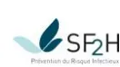
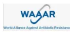
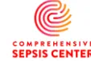

---

## RECOMMANDER LES BONNES PRATIQUES

---

### ARGUMENTAIRE

Prise en charge du sepsis du nouveau-né, de l'enfant et de l'adulte : recommandations pour un parcours de soins intégré

Validé par le Collège le 29 janvier 2025

---Les recommandations de bonne pratique (RBP) sont définies dans le champ de la santé comme des propositions développées méthodiquement pour aider le praticien et le patient à rechercher les soins les plus appropriés dans des circonstances cliniques données.

Les RBP sont des synthèses rigoureuses de l'état de l'art et des données de la science à un temps donné, décrites dans l'argumentaire scientifique. Elles ne sauraient dispenser le professionnel de santé de faire preuve de discernement dans sa prise en charge du patient, qui doit être celle qu'il estime la plus appropriée, en fonction de ses propres constatations et des préférences du patient.

Cette recommandation de bonne pratique a été élaborée selon la méthode résumée dans l'argumentaire scientifique et décrite dans le guide méthodologique de la HAS disponible sur son site : [Élaboration de recommandations de bonne pratique – Méthode Recommandations pour la pratique clinique](#).

Les objectifs de cette recommandation, la population et les professionnels concernés par sa mise en œuvre sont brièvement présentés en dernière page (fiche descriptive) et détaillés dans l'argumentaire scientifique.

Ce dernier ainsi que la synthèse de la recommandation sont téléchargeables sur [www.has-sante.fr](http://www.has-sante.fr).

## Grade des recommandations

Tableau. Classification GRADE du niveau de recommandations et des implications

<table border="1">
<thead>
<tr>
<th></th>
<th><b>Recommandation forte</b><br/>“Nous recommandons...”</th>
<th><b>Recommandation conditionnelle</b><br/>“Nous suggérons...”</th>
</tr>
</thead>
<tbody>
<tr>
<td><b>Implications pour</b></td>
<td>Les effets souhaitables de l'intervention l'emportent clairement sur les effets indésirables, ou ne l'emportent pas.</td>
<td>Les compromis sont moins certains, soit en raison de preuves de faible qualité, soit parce que les preuves suggèrent que les effets souhaitables et indésirables sont étroitement équilibrés.</td>
</tr>
<tr>
<td><b>Patients</b></td>
<td>La plupart des personnes dans cette situation souhaiteraient suivre la ligne de conduite recommandée et seule une petite proportion ne le souhaiterait pas.</td>
<td>La majorité des personnes dans cette situation souhaiteraient suivre la ligne de conduite suggérée, mais beaucoup ne le souhaiteraient pas.</td>
</tr>
<tr>
<td><b>Praticiens</b></td>
<td>La plupart des individus devraient recevoir le plan d'action recommandé. Le respect de cette recommandation selon la ligne directrice pourrait être utilisé comme critère de qualité ou indicateur de performance. Il est peu probable que des aides à la décision formelles soient nécessaires pour aider les individus à prendre des décisions conformes à leurs valeurs et préférences.</td>
<td>Différents choix sont susceptibles d'être appropriés à différents patients, et le traitement doit être adapté aux circonstances de chaque patient. Ces circonstances peuvent inclure les valeurs et préférences du patient ou de sa famille.</td>
</tr>
<tr>
<td><b>Autorités de santé</b></td>
<td>La recommandation peut être adaptée en tant que politique de santé dans la plupart des situations, y compris pour être utilisée comme indicateurs de performance.</td>
<td>L'élaboration des politiques de santé nécessitera des débats approfondis et la participation de nombreuses parties prenantes. Les politiques de santé sont également plus susceptibles de varier d'une région à l'autre. Les indicateurs de performance devraient se concentrer sur le fait qu'une délibération adéquate sur les options de gestion a eu lieu.</td>
</tr>
</tbody>
</table># Descriptif de la publication

<table border="1">
<tr>
<td><b>Titre</b></td>
<td><b>Prise en charge du sepsis du nouveau-né, de l'enfant et de l'adulte : recommandations pour un parcours de soins intégré</b></td>
</tr>
<tr>
<td><b>Méthode de travail</b></td>
<td>Recommandation pour la pratique clinique (RPC) - Label</td>
</tr>
<tr>
<td><b>Objectif(s)</b></td>
<td>L'objectif de ces recommandations de bonne pratique est de réduire le poids sanitaire, économique et social du sepsis en proposant aux patients et aux différents acteurs les éléments, basés sur les revues scientifiques, du parcours de soins intégrant la prise en charge en ville - établissement sanitaire - établissement médicosocial, d'un nouveau-né, d'un enfant, d'un adulte ou d'une personne âgée présentant un sepsis.</td>
</tr>
<tr>
<td><b>Cibles concernées</b></td>
<td>Ces recommandations concernent les patients et leur famille, les professionnels de santé de ville et des établissements de santé, les administrations hospitalières, les organismes payeurs (assurance maladie, mutuelles), les autorités sanitaires, les pouvoirs politiques.</td>
</tr>
<tr>
<td><b>Demandeur</b></td>
<td>Direction Générale de la Santé (DGS)</td>
</tr>
<tr>
<td><b>Promoteur(s)</b></td>
<td>Société de réanimation de langue française (SRLF), Société française d'anesthésie réanimation (SFAR), Société française de médecine d'urgence (SFMU), Société de pathologie infectieuse de langue française (SPILF), Société française de médecine physique et de réadaptation (SOFMER), Société française de pédiatrie (SFP), Société française de néonatologie (SFN), Groupe francophone de réanimation et urgences pédiatriques (GFRUP), Groupe de pathologies infectieuses pédiatriques (GPIP), Société française de microbiologie (SFM), Société française de mycologie médicale (SFMM), Société française d'hygiène hospitalière (SF2H), Société française de gériatrie et gériontologie (SFGG), Société française de santé publique (SFSP), Collège national des généralistes enseignants (CNGE), Alliance contre le développement des bactéries multi-résistantes (<i>World Alliance Against Antibiotic Resistance</i> - WAAAR)</td>
</tr>
<tr>
<td><b>Pilotage du projet</b></td>
<td>Coordination : Pr Djillali Annane (SRLF), M. Emmanuel Nouyrigat (HAS)<br/>Secrétariat : Mme Gaëlle Fossoy (FHU SEPSIS), Mme Jessica Layouni (HAS)</td>
</tr>
<tr>
<td><b>Recherche documentaire</b></td>
<td>Mme Gaëlle Fanelli (HAS)</td>
</tr>
<tr>
<td><b>Auteurs</b></td>
<td>Cf. Groupe de travail (p.124)</td>
</tr>
<tr>
<td><b>Conflits d'intérêts</b></td>
<td>Les membres du groupe de travail ont communiqué leurs déclarations publiques d'intérêts à la HAS. Elles sont consultables sur le site <a href="https://dpi.sante.gouv.fr">https://dpi.sante.gouv.fr</a>. Elles ont été analysées selon la grille d'analyse du guide des déclarations d'intérêts et de gestion des conflits d'intérêts de la HAS (<a href="https://www.has-sante.fr/upload/docs/application/pdf/guide_dpi.pdf">https://www.has-sante.fr/upload/docs/application/pdf/guide_dpi.pdf</a>). Par ailleurs, la base de données publique Transparence-Santé (<a href="http://www.transparence.sante.gouv.fr">www.transparence.sante.gouv.fr</a>) rend accessible les informations déclarées par les entreprises concernant les conventions, les rémunérations et les avantages liant ces entreprises et les acteurs du secteur de la santé. Les intérêts déclarés par les membres du groupe de travail et les informations déclarées par les entreprises ont été considérés comme étant compatibles avec la participation des membres du groupe de travail à ce travail.</td>
</tr>
<tr>
<td><b>Validation</b></td>
<td>Version du 29 janvier 2025</td>
</tr>
<tr>
<td><b>Actualisation</b></td>
<td>L'actualisation des documents sera envisagée en fonction des données publiées dans la littérature scientifique ou des modifications de pratique significatives survenues depuis sa publication.</td>
</tr>
<tr>
<td><b>Autres formats</b></td>
<td></td>
</tr>
</table>Ce document ainsi que sa référence bibliographique sont téléchargeables sur [www.has-sante.fr](http://www.has-sante.fr)

Haute Autorité de santé – Service communication information  
5 avenue du Stade de France – 93218 SAINT-DENIS LA PLAINE CEDEX. Tél. : +33 (0)1 55 93 70 00  
© Haute Autorité de santé – janvier 2025 – ISBN : 978-2-11-172707-6# Sommaire

---

## Préambule 7

<table><tr><td><b>1. Introduction</b></td><td><b>8</b></td></tr><tr><td>1.1. Contexte</td><td>8</td></tr><tr><td>1.2. Enjeux</td><td>10</td></tr><tr><td>1.3. Cibles</td><td>11</td></tr><tr><td>1.4. Objectifs</td><td>11</td></tr><tr><td>1.5. Méthodes</td><td>11</td></tr><tr><td>    1.5.1. Délimitation du thème et questions traitées</td><td>11</td></tr><tr><td>    1.5.2. Recherche bibliographique</td><td>11</td></tr><tr><td>    1.5.3. Sélection des publications</td><td>12</td></tr><tr><td>    1.5.4. Evaluation des biais et extraction des données</td><td>12</td></tr><tr><td>    1.5.5. Formulation des recommandations</td><td>12</td></tr><tr><td><b>2. Prise en charge du patient avec sepsis en amont des urgences</b></td><td><b>13</b></td></tr><tr><td>2.1. Chez un patient en ambulatoire ayant une infection suspectée ou documentée, est-il possible d'identifier précocement, avant la survenue d'élément de détresse vitale, le risque d'évolution vers un sepsis ?</td><td>13</td></tr><tr><td>2.2. Chez un patient en ambulatoire ayant une infection suspectée ou documentée, existe-t-il des phénotypes cliniques pour identifier précocement le sepsis ?</td><td>14</td></tr><tr><td>2.3. Chez un patient en ambulatoire ayant une infection suspectée ou documentée, existe-t-il des biomarqueurs pour identifier précocement le sepsis ?</td><td>18</td></tr><tr><td>2.4. Chez un patient en ambulatoire ayant une infection suspectée, quelle est la place des examens microbiologiques ?</td><td>19</td></tr><tr><td>2.5. Chez un patient ayant une infection suspectée ou documentée, quelle est la place des objets connectés pour identifier précocement le sepsis ?</td><td>20</td></tr><tr><td>2.6. Quelle est la place de la vaccination pour prévenir le sepsis ?</td><td>20</td></tr><tr><td>2.7. Chez un patient en ambulatoire ayant une infection suspectée ou documentée, quelle est la place des mesures éducatives pour prévenir le sepsis ?</td><td>21</td></tr><tr><td>2.8. Chez un patient en ambulatoire ayant une infection suspectée ou documentée, quelle est la place des traitements anti-infectieux pour prévenir le sepsis ?</td><td>22</td></tr><tr><td>2.9. Chez un patient en ambulatoire ayant une infection suspectée ou documentée, quelle est la place des traitements anti-inflammatoires non stéroïdiens pour prévenir le sepsis ?</td><td>24</td></tr><tr><td>2.10. Chez un patient en ambulatoire ayant une infection suspectée ou documentée, quelle est la place des corticoïdes pour prévenir le sepsis ?</td><td>26</td></tr><tr><td>2.11. Chez un patient en ambulatoire ayant une infection suspectée ou documentée, quelle est la place des traitements adjuvants pour prévenir le sepsis ?</td><td>27</td></tr><tr><td>2.12. Quelle est la place des systèmes experts d'aide à la décision ?</td><td>27</td></tr><tr><td>2.13. Quelles sont les alternatives à l'hospitalisation immédiate ?</td><td>28</td></tr></table><table><tr><td><b>3. Prise en charge du patient avec sepsis de l'intervention d'un professionnel de médecine d'urgence au terme de la prise en charge aiguë</b></td><td><b>30</b></td></tr><tr><td>3.1. Quelle adaptation au contexte français des recommandations de la <i>Surviving Sepsis Campaign</i> ?</td><td>30</td></tr><tr><td>3.1.1. Adultes</td><td>30</td></tr><tr><td>3.1.2. Enfants</td><td>43</td></tr><tr><td>3.2. Quelle est la place de la rééducation-réadaptation dans la prise en charge aiguë du sepsis ?</td><td>62</td></tr><tr><td><b>4. Prise en charge du patient avec sepsis de la période post-aiguë à la réintégration sociale et professionnelle</b></td><td><b>69</b></td></tr><tr><td>4.1. Quelle prise en charge post-aiguë avant le retour à domicile du patient septique ?</td><td>69</td></tr><tr><td>4.1.1. Chez l'adulte</td><td>69</td></tr><tr><td>4.1.2. Chez l'enfant</td><td>73</td></tr><tr><td>4.2. Quelle prise en charge au retour à domicile du patient septique ?</td><td>79</td></tr><tr><td>4.2.1. Chez l'adulte</td><td>79</td></tr><tr><td>4.2.2. Chez le nouveau-né et l'enfant</td><td>82</td></tr><tr><td><b>Table des annexes</b></td><td><b>88</b></td></tr><tr><td><b>Références bibliographiques</b></td><td><b>113</b></td></tr><tr><td><b>Participants</b></td><td><b>124</b></td></tr><tr><td><b>Abréviations et acronymes</b></td><td><b>127</b></td></tr></table># Préambule

L'ensemble des acteurs concernés par la prise en charge du sepsis à tout âge ont élaboré ces recommandations dans le but d'améliorer le pronostic du sepsis par l'intermédiaire d'un parcours de soins intégré impliquant la ville et l'hôpital et couvrant la prévention, le dépistage, le diagnostic, le traitement et la réintégration socioprofessionnelle des patients. Ainsi, les promoteurs de cette recommandation de bonnes pratiques sont les suivants :

- – Société de réanimation de langue française (SRLF),
- – Société française d'anesthésie réanimation (SFAR),
- – Société française de médecine d'urgence (SFMU),
- – Société de pathologie infectieuse de langue française (SPILF),
- – Société française de médecine physique et de réadaptation (SOFMER),
- – Société française de pédiatrie (SFP),
- – Société française de néonatologie (SFN),
- – Groupe francophone de réanimation et urgences pédiatriques (GFRUP),
- – Groupe de pathologies infectieuses pédiatriques (GPIP),
- – Société française de microbiologie (SFM),
- – Société française de mycologie médicale (SFMM),
- – Société française d'hygiène hospitalière (SF2H),
- – Société française de gériatrie et gériontologie (SFGG),
- – Société française de santé publique (SFSP),
- – Collège national des généralistes enseignants (CNGE),
- – Alliance contre le développement des bactéries multi-résistantes (*World Alliance Against Antibiotic Resistance - WAAAR*).

Les représentants de ces organismes, de France Sepsis Association (association d'usagers), de la fédération hospitalo-universitaire (FHU) SEPSIS et de l'institut hospitalo-universitaire (IHU) PROMETHEUS ont joint leurs efforts pour analyser et synthétiser les données de la littérature scientifique sur la prise en charge du sepsis en amont, au cours et en aval de l'hospitalisation en soins aigus. Cette recommandation de bonne pratique a été réalisée dans le cadre de la labellisation par la HAS<sup>1</sup> garantissant le respect des critères méthodologiques, scientifiques et déontologiques de la HAS, notamment dans la prévention des conflits d'intérêt.

---

<sup>1</sup> Cf. Guide méthodologique « Attribution du label de la HAS à une recommandation de bonne pratique élaborée par un organisme professionnel » (HAS, 2023) : [https://www.has-sante.fr/jcms/p\\_3452920/fr/labellisation-par-la-has-d-une-recommandation-de-bonne-pratique-elaborée-par-un-organisme-professionnel](https://www.has-sante.fr/jcms/p_3452920/fr/labellisation-par-la-has-d-une-recommandation-de-bonne-pratique-elaborée-par-un-organisme-professionnel)# 1. Introduction

## 1.1. Contexte

En 2016, la définition du sepsis chez l'adulte a été actualisée par la communauté scientifique internationale présentant le sepsis comme une dérégulation de la réponse immunitaire à une infection (qu'elle soit d'origine bactérienne, virale, fongique ou parasitaire), entraînant un dysfonctionnement d'organes souvent fatal (1). Désormais, le sepsis est défini par la présence (ou forte suspicion) d'une infection compliquée de défaillances d'organe telles que mesurées par un score *Sepsis-related Organ Failure Assessment* (SOFA) supérieur à 2 points (sur un maximum de 24) (2). Le choc septique est défini par la présence d'un sepsis compliqué d'une défaillance hémodynamique nécessitant un traitement par vasopresseur pour maintenir une pression artérielle moyenne au moins égale à 65mmHg et d'une concentration artérielle de lactate supérieure à 2 mmol/L (témoignage entre autres du déséquilibre entre l'apport et le besoin en oxygène). Enfin, a été introduit un nouveau score, le *quick SOFA* (qSOFA) afin d'identifier parmi les patients ayant une infection ceux à risque de développer un sepsis (qSOFA à 2 ou 3). Le qSOFA est composé de trois points attribués à la présence d'une pression artérielle systolique < 100 mmHg, d'une fréquence respiratoire > 22 cycles/min, et d'une altération des fonctions neurologiques centrales (score de Glasgow <15). Chez l'enfant, la définition élaborée en 2005 (3) a été actualisée en 2024 par un groupe de 35 experts mondiaux (4). Le sepsis est défini comme une infection confirmée ou fortement suspectée, compliquée de défaillances d'organes telles que mesurées par un score Phoenix de sepsis supérieur ou égal à 2 points (sur un maximum de 13, cf. annexe 1) (5). Le choc septique est défini par la présence d'un sepsis et d'une défaillance hémodynamique définie par un score Phoenix hémodynamique supérieur ou égal à 1 point ; c'est-à-dire par une défaillance hémodynamique nécessitant un traitement vasoactif ou un taux de lactate supérieur ou égal à 5 mmol/l, ou une hypotension artérielle selon l'âge (pression artérielle moyenne inférieure à des seuils déterminés selon l'âge de l'enfant, cf. annexe 1). Le score de Phoenix a été développé à la suite d'une enquête internationale, une revue systématique de la littérature, et l'analyse de plus de 3 millions d'enfants (5).

Le sepsis représente un fléau sanitaire, social et économique au niveau mondial. L'Organisation mondiale de la santé (OMS) estime, en 2017, que 49 millions de personnes sont atteintes de sepsis chaque année dans le monde, dont plus de 40% sont des enfants de moins de 5 ans, principalement dû aux maladies diarrhéiques et aux infections respiratoires (6) (7). Le sepsis est responsable chaque année d'environ 11 millions de morts, soit près de 20 % des décès. La majorité de ces décès sont évitables. Largement méconnu, le sepsis peut toucher tout le monde mais plus particulièrement les nouveau-nés, les enfants, les femmes enceintes, les personnes âgées, les malades immunodéprimés ou atteints de maladies chroniques, et les personnes vivant en conditions de précarité.

Alors que le fardeau est concentré dans les pays pauvres et émergents, le sepsis reste également une des principales causes de décès dans les pays riches. Dans les pays industrialisés, il serait responsable d'un nombre de décès supérieur aux cancers du sein, de l'intestin et de la prostate réunis (8). On estime son incidence annuelle en France en 2019 à 403/100,000 (versus 357 en 2015), son taux de décès à 23%, son taux de séquelles à 15%, son coût moyen de ~€ 16,000 par hospitalisation (9). Plus un sepsis est reconnu et pris en charge rapidement, plus les chances de survie du patient augmentent. Cependant, parmi les survivants à court terme du sepsis, un tiers meurt dans l'année qui suit et beaucoup d'autres ont des séquelles à long terme (déficiences physiques et cognitives, troubles mentaux, neuromusculaires, etc.) (10) (11) (12). Chez l'enfant, les séquelles neurocognitives du sepsis et/ou du choc peuvent altérer ses apprentissages et son développement. La mise en évidence de cesséquelles ne peut se faire que très tardivement dans son développement, à l'adolescence ou au début de l'âge adulte.

En fonction des cas, la prise en charge nécessite de lutter contre l'infection avec des antibiotiques et autres anti-infectieux et le contrôle de la source de l'infection (intervention chirurgicale, drainage d'un épanchement ou d'un abcès, ablation d'un dispositif infecté), d'assurer l'oxygénation des tissus par la perfusion de solutés de remplissage vasculaire ou de vasopresseurs, et d'apporter un support respiratoire. Depuis 2002, les principales sociétés savantes internationales impliquées dans le domaine du sepsis mettent à jour au plus tard tous les 4 ans des recommandations pour la prise en charge hospitalière des patients atteints de sepsis (*Surviving Sepsis Campaign* (SSC) | SCCM-ESICM). Les recommandations actualisées ont été publiées pour l'enfant en 2020 (13) et pour l'adulte en 2021 (14). Au total, 93 recommandations avaient été élaborées sur la prise en charge précoce des patients en sepsis ou en choc septique. Trente-deux recommandations de niveau fort, 39 recommandations de niveau faible, et 18 recommandations dites de meilleure pratique couvrent les aspects organisationnels hospitaliers, le diagnostic, la prise en charge aiguë symptomatique, anti-infectieuse ainsi que les thérapeutiques adjuvantes. La SSC a également élaboré des recommandations pour le syndrome post sepsis (Post-Sepsis Syndrome | Sepsis Alliance), et pour la COVID-19 (15).

En France, il n'existe pas de recommandation nationale, récente sur la prise en charge globale du sepsis. Les sociétés savantes ont élaboré des recommandations sur la prise en charge hémodynamique du sepsis en 2005 (Groupe Transversal Sepsis.doc ; srlf.org, sfar.org). La Haute autorité de santé (HAS) n'a jusqu'à présent pas participé à l'élaboration de recommandations pour la pratique dans le domaine du sepsis.

Enfin, il n'existe aucune recommandation au niveau national et international sur la prise en charge du sepsis en milieu communautaire ni sur le parcours de soins intégrant la prise en charge en amont des urgences préhospitalières et hospitalières, et en aval de la prise en charge en hospitalisation aiguë. S'agissant de la phase d'amont des urgences, la majorité (60-80%) des cas de sepsis sont d'origine communautaire (16) (17), c'est-à-dire que les patients ont les signes et symptômes du sepsis lors de l'admission à l'hôpital. Ceci souligne l'importance de l'implication des acteurs de soins de premiers recours dans la prise en charge précoce du sepsis. Une étude multicentrique française sur les infections bactériennes communautaires graves pédiatriques avait montré que dans un quart des cas les soins étaient suboptimaux avant l'admission à l'hôpital (surtout chez les moins de 1 an) et que ceci était associé à une plus forte mortalité (18).

S'agissant de l'aval des soins aigus, le sepsis expose au risque de déficiences multiples potentiellement responsables de limitations d'activités et de handicap à long terme. Ces déficiences peuvent être respiratoires, cardiovasculaires et métaboliques (dénutrition) se traduisant notamment par du déconditionnement à l'effort, mais également neurolocomotrices incluant des troubles de la déglutition, sensitivo-moteurs, cognitifs, neuro-orthopédiques et comportementaux (10) (11) (12). Au niveau international, il existe des recommandations publiées par le NICE (<https://www.nice.org.uk/guidance/cg83>) ou par Sepsis Alliance (organisation caritative américaine : Post-Sepsis Syndrome | Sepsis Alliance). En France, la HAS a élaboré des recommandations pour la prise en charge d'aval des formes sévères de la COVID-19<sup>2</sup>. L'intervention d'une équipe mobile intra

---

<sup>2</sup> Réponses rapides dans le cadre du COVID 19 (HAS, 2020) :

- - Prise en charge des patients post-COVID-19 en médecine physique et de réadaptation (MPR), en soins de suite et de réadaptation (SMR), et retour à domicile
- - Prise en charge précoce de médecine physique et de réadaptation (MPR) en réanimation, en soins continus ou en service de rééducation post-réanimation (SRPR)
- - Parcours de réadaptation du patient COVID+ à la sortie de réanimation et/ou de MCO, en SMR puis à domicilehospitalière de réadaptation coordonnée par un médecin de MPR, si elle est présente sur site, ou extrahospitalière, permet d'évaluer les besoins spécifiques et d'accélérer l'accès à la réadaptation pour prévenir ou réduire au mieux les séquelles, entre autres neurolocomotrices et cognitives, ainsi que les complications liées à l'immobilité. Elle apporte également son concours pour les cas complexes, pour rendre le parcours patient fluide et pertinent sur la base de l'évaluation des besoins en réadaptation. Les interventions de rééducation portent sur le sevrage de la ventilation mécanique, la prévention des complications orthopédiques, cognitives et motrices et ce par la mobilisation (passive puis active) dès que possible (19) (20). L'intensité et le type de programme sont variables selon les besoins des patients au cours de leur évolution. Les patients avec une déficience essentiellement respiratoire seront ensuite orientés en SMR « affections respiratoires ». Les patients avec des défaillances d'organes en cours de sevrage d'assistances mises en place en réanimation pourraient être orientés vers des SRPR (services de rééducation post-réanimation), et ceux associant des déficiences multiples dont neurologique, vers des SMR « affections du système nerveux » dans lesquels la prise en charge est pluriprofessionnelle avec diététicienne, ergothérapeute, kinésithérapeute, orthophoniste, neuropsychologue, psychologue, enseignant en activité physique adaptée, coordonnée par un médecin spécialiste de MPR. Les patients récupérant une autonomie suffisante pour rentrer à domicile et ayant des besoins de réadaptation limités à la kinésithérapie et/ou l'orthophonie pourraient poursuivre la prise en charge en soins ambulatoires. Tous doivent pouvoir bénéficier d'un suivi en consultation spécialisée à moyen terme.

Les personnes âgées polypathologiques au-delà de 75 ans devraient être vues par les équipes mobiles de gériatrie qui disposent de la compétence pour évaluer les critères de fragilité. Néanmoins, l'évolution épidémiologique du sepsis et l'évolution démographique sont telles qu'elles vont rendre cette prise en charge difficile à mettre en œuvre. Une évaluation avec prise en charge gériatrique et gérontologique, dès le début de l'hospitalisation, de façon à prévenir des complications de type dénutrition, confusion, amyotrophie, troubles de la marche... est nécessaire. Elle permettra également d'organiser le devenir et le suivi du patient dans la filière gériatrique qui dispose de soins de suite dédiés.

## 1.2. Enjeux

En 2017, l'Assemblée Mondiale de la Santé a adopté la Résolution 70.7 sur le sepsis qui exhorte les États membres de l'OMS à inclure la prévention, le diagnostic et le traitement du sepsis dans l'organisation de leur système de santé. Si plusieurs pays ont accru leur attention sur la problématique du sepsis, à ce jour, seuls quelques pays ont pris des mesures concrètes, parmi eux la France est très en avance. Ainsi, la France s'est attachée à améliorer notamment la surveillance des cas de sepsis sur le territoire, la connaissance du public sur le sepsis, et la formation des professionnels de santé, à innover pour la prévention, le dépistage et le traitement du sepsis. L'élaboration de recommandations pour un parcours de soins intégré est une réponse majeure dans la lutte contre le sepsis.

L'élaboration de recommandations portant sur la prise en charge « communautaire » du sepsis, en amont des urgences préhospitalières, est une première au niveau international. De même, des recommandations portant sur un parcours de soins intégré incluant ville et hôpital, nouveau-nés, enfants et adultes, prévention primaire et secondaire, constituent une approche originale de la prise en charge du sepsis augmentant les chances d'amélioration qualitative et quantitative du pronostic de cette affection. Il est attendu une amélioration des conséquences sanitaires, sociales et économiques du sepsis.### 1.3. Cibles

Ces recommandations concernent les patients et leur famille, les professionnels de santé de ville et des établissements de santé, les administrations hospitalières, les organismes payeurs (assurance maladie, mutuelles), les autorités sanitaires, les pouvoirs politiques.

### 1.4. Objectifs

L'objectif de ces recommandations de bonne pratique est de réduire le poids sanitaire, économique et social du sepsis en proposant aux patients et aux différents acteurs les éléments, basés sur les revues scientifiques, du parcours de soins intégrant la prise en charge en ville - établissement sanitaire - établissement médicosocial, d'un nouveau-né, d'un enfant, d'un adulte ou d'une personne âgée présentant un sepsis.

### 1.5. Méthodes

Ce travail a été réalisé selon la méthode Recommandation pour la pratique clinique (cf. annexe 2) avec utilisation de la méthodologie GRADE pour la formulation des recommandations (cf. § 1.5.5). Des spécificités d'ordre méthodologique propres à ce travail sont énoncées dans les paragraphes ci-après.

#### 1.5.1. Délimitation du thème et questions traitées

Les recommandations sont structurées en tenant compte des différentes étapes du parcours de soins intégré. La première étape correspond à la prise en charge du patient en amont de l'enclenchement d'un dispositif d'urgences, elle concerne principalement, mais pas exclusivement, le médecin généraliste et le pédiatre. La seconde étape du parcours de soins intégré concerne la prise en charge du patient de l'intervention du médecin urgentiste jusqu'au terme de la prise en charge aiguë. Enfin, la troisième étape couvre la période post-aiguë jusqu'à la réintégration socioprofessionnelle.

Pour chacune de ces trois étapes, les spécificités liées au type de population, et notamment liées à l'âge (nouveau-nés, enfants, adultes, sujets âgés) ou au genre, sont soulignées et argumentées.

Un sous-groupe de travail pour chacune des trois étapes du parcours a été composé de représentants de l'ensemble des acteurs de ces recommandations.

Concernant la seconde étape, les recommandations actualisées en 2021 de la *Surviving Sepsis Campaign* sont reprises et adaptées au contexte français après prise en compte des éléments étayant cette étape du parcours de soins et sous couvert d'accord d'experts. Il n'est pas prévu pour cette étape d'élaborer de nouvelles recommandations.

Les recommandations de bonne pratique pour la prévention des infections liées aux soins sont actualisées et disponibles ([www.solidarites-sante.gouv.fr](http://www.solidarites-sante.gouv.fr) ; Base documentaire - Découvrez les outils du RéPias ; [www.preventioninfection.fr](http://www.preventioninfection.fr)) et sont exclues du champ de ces recommandations.

La COVID-19 n'est pas exclue du champ de ces recommandations.

Dans le cadre de ces recommandations, les questions cliniques sont formulées suivant la méthode SPICE (*Setting, Perspectives/population, Intervention, Comparison, Evaluation*), adaptée de la méthode PICO (21).

#### 1.5.2. Recherche bibliographique

Les questions ont été réparties selon l'étape du parcours de soins : en amont de l'activation des urgences, de l'activation des urgences à la fin de l'hospitalisation en soins aigus, puis de la phase post-aigue à la réinsertion professionnelle. Pour chaque question, une liste de mots clés/termes a été établie pour identifier les publications pertinentes dans les différentes bases de données (cf. annexe 3). La liste des articles ainsi identifiés a été complétée par les membres du groupe de travail à partir des références bibliographiques. La recherche bibliographique a porté sur les 3 dernières années compte tenu de la date de la dernière actualisation des recommandations internationales (16) (17), et a pris en compte toute publication importante, portée à la connaissance du groupe de travail, publiée depuis 2017. La recherche bibliographique a été restreinte aux publications en langue française, anglaise, allemande, espagnol, portugaise et italienne. La recherche bibliographique a été réalisée par le service documentaire de la HAS.

### 1.5.3. Sélection des publications

La sélection des articles pertinents a été menée par binôme avec résolution des conflits par un tiers, à l'aide du logiciel Covidence. Les binômes ont dans un premier temps sélectionné les articles sur la base du titre et du résumé. Les articles ainsi présélectionnés ont fait l'objet d'une analyse complète (article et suppléments le cas échéant) en vue d'une sélection définitive. Seuls les articles présentant les résultats d'essais randomisés, de revue systématique avec méta-analyse, d'études de cohorte prospective, ou de recommandations de bonne pratique ont été retenus.

### 1.5.4. Evaluation des biais et extraction des données

L'évaluation de la qualité méthodologique des études incluses dans l'élaboration des recommandations a été menée par binôme avec résolution des conflits par un tiers, à l'aide du logiciel Covidence. Celle-ci a procédé selon la méthodologie proposée par la collaboration Cochrane (22), ainsi que les outils PROBAST (23) pour les études pronostiques et prédictives, QUADAS-2 (24) pour les études diagnostiques. L'extraction des données a été réalisée par binôme avec résolution des conflits par un tiers, à l'aide du logiciel Covidence.

### 1.5.5. Formulation des recommandations

Pour chacune des trois étapes du parcours de soins, des recommandations ont été établies pour chaque question. Dans un premier temps, chaque sous-groupe de travail a formulé par question des recommandations en séance plénière (visioconférence) et par courriels. Les propositions de recommandations pour chaque question de chaque groupe ont ensuite été validées par l'ensemble du groupe de travail en séance plénière.

Nous avons élaboré des recommandations en utilisant la méthodologie GRADE « de la preuve à la décision », qui considère la certitude des preuves, l'équilibre entre effets souhaitables et indésirables (effets positifs et négatifs), les valeurs et préférences des patients, utilisation des ressources, équité en santé, acceptabilité, et la faisabilité. Nous avons formulé les recommandations fortes en utilisant l'expression « nous recommandons », et conditionnelles en utilisant l'expression « nous suggérons » (<https://www.gradeworkinggroup.org/>) (cf. tableau page 3). Un consensus a été obtenu à chaque fois sur le niveau de preuve et le degré de certitude après discussions sans qu'il y eût nécessité de recourir à un vote.## 2. Prise en charge du patient avec sepsis en amont des urgences

### 2.1. Chez un patient en ambulatoire ayant une infection suspectée ou documentée, est-il possible d'identifier précocement, avant la survenue d'élément de détresse vitale, le risque d'évolution vers un sepsis ?

#### Recommandation 1

**Nous recommandons de considérer comme étant particulièrement à risque de développer un sepsis, les patients en ambulatoire ayant une infection suspectée ou documentée et présentant un ou plusieurs facteurs de risque (recommandation forte, niveau modéré de certitude).**

#### Argumentaire

Il existe peu d'études portant sur les facteurs de risque de sepsis chez les patients en ambulatoire ayant une infection suspectée ou documentée (25). Cependant les données obtenues chez des patients hospitalisés sont extrapolables aux patients en ambulatoire. L'incidence du sepsis est augmentée chez les nourrissons < 1 an, avec le plus fort taux avant 1 mois, a fortiori en cas de prématurité (10) (26) (immaturité immunitaire), chez les patients âgés (immunosénescence) (27), en particulier fragiles (*Clinical Frailty Scale*  $\geq 5$ ) (25) (28) (29), ainsi que chez les femmes enceintes, notamment au troisième trimestre de grossesse (30). Les études observationnelles réalisées chez les patients hospitalisés en réanimation et ayant un sepsis retrouvent des prévalences élevées de comorbidités immunes (déficit immunitaire congénital ou acquis) et non-immunes (diabète, dysfonctions d'organes chroniques) (tableau 1) (31) (32) (33) (34) (9). Le risque lié aux pathologies néoplasiques, que ce soit les hématopathies malignes ou les tumeurs solides, se confond souvent avec celui lié aux traitements anticancéreux pourvoyeurs d'insuffisances médullaires ou de déficit prolongé de l'immunité T et/ou B.

L'infection grave à SARS-CoV-2 a été initialement caractérisée par la prévalence élevée de pathologies cardiovasculaires (hypertension artérielle compliquée, accident vasculaire cérébral ou de coronaropathie, chirurgie cardiaque, insuffisance cardiaque stade NYHA III ou IV), de syndromes métaboliques et d'obésité. Les vagues successives de COVID-19 se sont ensuite étendues aux patients porteurs de pathologies pulmonaires chroniques, ainsi qu'aux patients immunodéprimés incapables de monter des réponses vaccinales efficaces (35) (36) (37) (38).Tableau 1 : Exemples de facteurs de risque de sepsis

<table border="1">
<thead>
<tr>
<th rowspan="3">Age<br/>Fragilité clinique</th>
<th colspan="3">Pathologies immunes</th>
<th rowspan="3">Pathologies<br/>non-immunes</th>
</tr>
<tr>
<th rowspan="2">Déficit immunitaire<br/>héréditaire</th>
<th colspan="2">Déficit immunitaire acquis</th>
</tr>
<tr>
<th>Situations cliniques</th>
<th>Traitements<br/>Immunosuppres-<br/>seurs</th>
</tr>
</thead>
<tbody>
<tr>
<td>
<ul style="list-style-type: none; padding-left: 0;">
<li>– Age &lt; 1 an ou &gt; 65 ans</li>
<li>– Fragilité sévère (Clinical Frailty Scale ≥5)</li>
<li>– Grossesse, post-partum</li>
<li>– Handicaps cognitif ou moteur</li>
<li>– Porteurs de dispositif médical implantable,</li>
<li>– Chirurgie récente</li>
</ul>
</td>
<td></td>
<td>
<ul style="list-style-type: none; padding-left: 0;">
<li>– Cancer (tumeur solide/hémopathie maligne)</li>
<li>– Transplantation d'organes solides</li>
<li>– Maladies de système</li>
<li>– Infection par le VIH</li>
<li>– Asplénie anatomique ou fonctionnelle (dont drépanocytose)</li>
</ul>
</td>
<td>
<ul style="list-style-type: none; padding-left: 0;">
<li>– Corticothérapie au long cours</li>
<li>– Chimiothérapie</li>
<li>– Biothérapies</li>
<li>– Radiothérapie</li>
<li>– Autres immunosuppresseurs</li>
</ul>
</td>
<td>
<ul style="list-style-type: none; padding-left: 0;">
<li>– Cirrhose</li>
<li>– Insuffisance rénale chronique</li>
<li>– Insuffisance cardiaque</li>
<li>– Insuffisance respiratoire chronique</li>
<li>– Diabète (complicqué ou non équilibré)</li>
<li>– Dénutrition</li>
<li>– Antécédent de sepsis</li>
</ul>
</td>
</tr>
</tbody>
</table>

## 2.2. Chez un patient en ambulatoire ayant une infection suspectée ou documentée, existe-t-il des phénotypes cliniques pour identifier précocement le sepsis ?

### Recommandation 2

Chez un patient adulte en ambulatoire ayant une infection suspectée ou documentée, nous suggérons qu'un score clinique ≥3 permet d'évaluer le risque de progression vers un sepsis. Ce score clinique est composé de 6 variables cliniques : âge >65 ans ; température >38°C ; pression artérielle systolique ≤110 mmHg ; fréquence cardiaque >110/min ; saturation périphérique en O<sub>2</sub> ≤95% ; troubles des fonctions supérieures (recommandation conditionnelle, faible niveau de certitude).

### Argumentaire

Le score quick *Sequential Organ Failure Assessment* (qSOFA) destiné à identifier une population de patients ayant une infection suspectée ou documentée à risque de sepsis et le score *National Early Warning Score* (NEWS) destiné à détecter la détérioration clinique ont été validés dans des contextes hospitaliers, notamment dans les services d'urgence. Un score prenant en compte 6 variables cliniques (1 point par variable, score total 6 points) facilement disponibles dans un contexte ambulatoire (âge >65 ans; température >38°C, aggravation récente des paramètres vitaux : pression artérielle systolique ≤110 mmHg; fréquence cardiaque >110/min; saturation périphérique en O<sub>2</sub> ≤95%; troubles récents des fonctions supérieures ou aggravation récente de troubles préexistants) permet d'évaluer le risque de progression vers un sepsis avec une performance comparable au score NEWS, et supérieure au score qSOFA (39). Des scores ≥2 et ≥3 sont associés à des risques respectifs de sepsis de 15% et40%. Chez le sujet âgé, l'absence de fièvre peut concerner jusqu'à un tiers des patients présentant une infection aiguë (40). L'absence de fièvre ou une hypothermie sont associées à un sur-risque de mortalité à un mois dans les infections urinaires, respiratoires et bactériémies du sujet de 75 ans et plus (41) (42) (43).

#### *De la preuve à la recommandation*

Le groupe de travail a considéré la simplicité de réalisation du score clinique dans le contexte ambulatoire et n'a pas objectivé d'inconvénient. Il a considéré que le dépistage de sepsis pouvait avoir un impact important sur la trajectoire du patient. Néanmoins, le groupe de travail a considéré faible le niveau de certitude du fait que les preuves sont surtout indirectes, extrapolées d'études hospitalières.

### **Recommandation 3**

**Chez l'enfant de moins de 1 mois, nous recommandons que toute fièvre doive faire suspecter la possibilité d'un sepsis et justifie un adressage sans délai aux urgences pédiatriques pour évaluation (recommandation forte, très faible niveau de certitude).**

**Chez l'enfant de 1 à 3 mois, nous recommandons que toute fièvre fasse considérer la possibilité d'un sepsis et justifie un avis médical dans les 6 heures. En dehors des heures ouvrables ou en cas d'indisponibilité d'un médecin en ambulatoire, un appel au centre 15 permettra d'orienter les familles vers une structure de garde (CAPS) ou d'urgences (recommandation forte, très faible niveau de certitude).**

**Chez l'enfant fébrile quel que soit son âge, la recherche d'un purpura (enfant déshabillé) et l'évaluation des paramètres vitaux comprenant fréquence respiratoire, fréquence cardiaque, coloration cutanée, temps de recoloration cutané, état de conscience et comportement global doit être faite et justifie un avis auprès du centre 15 en cas d'anomalie à l'exception d'une tachycardie isolée (recommandation forte, très faible niveau de certitude). Il est important de se fier à l'évaluation parentale concernant le comportement ou le teint inhabituel (recommandation forte, très faible niveau de certitude).**

### **Argumentaire**

Chez l'enfant, notamment de moins de 1 mois, la fièvre peut être le seul symptôme initial de sepsis (44). Les études de détection du sepsis chez l'enfant fébrile ont été menées aux urgences pédiatriques mais sont probablement extrapolables dans un contexte ambulatoire. L'incidence du sepsis est plus importante chez le nouveau-né (avant 1 mois) avec une incidence mondiale estimée à 2202 (95% IC : 1099–4360) pour 100 000 naissances vivants contre une incidence à 48 pour 100 000 enfants années après 1 mois (estimation d'après des données de pays à haut revenu ou revenus modérés). Le risque d'infection bactérienne invasive est également plus important chez le nouveau-né fébrile (de moins de 28 jours) se présentant aux urgences avec taux de bactériémie de 3,3% chez les moins de 28 jours contre 1,1 % après 28 jours dans une étude menée sur 7 335 enfants de moins de 2 mois de 2008 à 2013 (45). Dans une étude française monocentrique menée en 2016 sur 1 060 enfants fébriles de moins de 5 ans, 11 avaient une infections bactérienne invasive (bactériémie ou méningite) avec une fréquence de 8,9% pour les moins de 1 mois, 1% des 1 à 3 mois et 0,4% des plus de 3 mois (46). Dans une étude française multicentrique menée sur 2047 nourrissons de moins de 3 mois fébriles aux urgences, 1% avaient une infection bactérienne invasive. Chez les moins de 1 mois, cette fréquence était de 3,3% (47).Bien que les jeunes enfants soient plus à risque de développer une infection grave et un sepsis, il convient de rester vigilant aux signes de gravité chez l'ensemble des enfants quel que soit leur âge. Une étude menée dans un centre d'urgences pédiatriques sur 537 837 visites et visant à évaluer un modèle de prédiction du sepsis, a montré que les enfants plus âgés étaient plus à risque de sepsis (48). La fréquence cardiaque, la durée des hospitalisations précédentes, la température, la pression artérielle systolique et un antécédent d'épisode de sepsis étaient associés à une augmentation du risque de sepsis. Le modèle prédictif incluant ces variables, avait une excellente performance avec une aire sous la courbe de 0,990 [IC 95% : 0,985-0,995] pour prédire le sepsis, avec une sensibilité de 84,5% et une spécificité de 99%. Cette étude est à interpréter dans le contexte d'une population recrutée aux urgences pédiatriques aux Etats-Unis.

La précarité sociale est également un élément à prendre en compte. Les enfants en situation sociale défavorable étaient plus à risque d'infection invasive à méningocoque (49) (50) (51), d'infection bactérienne sévère (52) ou d'évolution défavorable en cas de sepsis (55). Une situation de précarité doit donc mettre en alerte le clinicien devant un enfant fébrile.

Les enfants à la peau foncée semblent à risque d'évolution défavorable notamment de part une sous-évaluation des signes cutanés de défaillance hémodynamique (temps de recoloration cutanée, marbrures, pâleur) (53). Il est important de rechercher auprès des parents la constatation d'un changement de teint de leur enfant.

Une méta-analyse incluant 30 études a évalué les performances diagnostiques de signes et symptômes chez un enfant dans un contexte ambulatoire (cabinet médical ou urgences) pour détecter l'infection grave (sepsis, méningites, pneumonies, ostéomyélites, dermo-hypodermites, gastro-entérite avec déshydratation, infections urinaires fébriles et infections virales des voies respiratoires compliquées d'hypoxie) (54). Cette méta-analyse mettait en évidence les éléments d'alerte suivants : cyanose (rapport de vraisemblance positif RVP de 2,66 à 52,20), polypnée (RVP de 1,26 à 9,78), insuffisance circulatoire périphérique (RVP de 2,39 à 38,80), et purpura (RVP de 6,18 à 83,70). L'inquiétude parentale (avec un RVP de 14,40, IC 95% 9,30–22,10) et du clinicien (RVP 23,50, 95 % CI 16,80–32,70) apparaissaient également comme des éléments d'alerte. Cette méta-analyse suggérait également que la combinaison de signes cliniques sous la forme du score de YOS avait une performance diagnostique insuffisante avec un RVP de 1,10 à 6,70 et un RVN de 0,16 à 0,97. Le *National Institute of Health and Care Excellence* (NICE) propose une hiérarchisation sous la forme de « traffic light » (feux tricolores) des signes et symptômes pour repérer l'enfant gravement malade (cf. annexe 4 : traduction des « traffic light » proposé par NICE et annexe 5 : normes des fréquences cardiaques et respiratoires et pression systolique selon l'ERC). Selon les recommandations du NICE dans un contexte de fièvre, la présence d'un des symptômes listés ci-dessus, doit faire évoquer un sepsis (55). Une étude rétrospective monocentrique sur 15 781 enfants fébriles de moins de 5 ans admis aux urgences en Australie, retrouvait des performances diagnostiques d'une infection bactérienne grave (bactériémie, pneumonie et pyélonéphrite) insuffisantes, avec une sensibilité de 85,5% (IC 95% : 83,6-87,7) et une spécificité de 28,5% (IC 95% : 27,8-29,3) en cas de signes cliniques classés dans les zones « orange » ou « rouges ». Parmi les 64 enfants bactériémiques, 14% n'avaient aucun signes « oranges » ou « rouges ». Cependant, le développement d'un sepsis n'est pas précisé, et une part des enfants avec une infection bactérienne grave n'a peut-être pas développé de sepsis (56). Une étude rétrospective menée au Royaume-Uni sur 6703 enfants vus en cabinet de médecine générale évaluait la performance diagnostique des « feux tricolores » pour détecter un diagnostic d'infection grave (sepsis, pneumonie, méningite, et infection urinaire). La présence d'au moins un signe « orange » ou « rouge » avait une sensibilité de 100% (IC 95% : 80,5 à 100) mais une spécificité seulement de 5,7% (IC 95% : 5,2 à 6,3) (57).Une méta-analyse récente évaluant la valeur prédictive du SOFA simplifié (*quick SOFA*, combinant la fréquence respiratoire, l'état de conscience évalué par le Glasgow pédiatrique et la pression artérielle systolique) adapté à l'âge pour prédire une infection grave chez les enfants avec suspicion d'infection montrait une performance diagnostique insuffisante avec une sensibilité à 74% et une spécificité à 73% (58).

La tachycardie isolée n'est pas associée à un sur-risque de sepsis dans une étude monocentrique prospective menée dans un centre d'urgences pédiatriques à Londres sur 795 enfants fébriles âgés de 3 mois à 10 ans, présentant au moins un signe « orange » ou « rouge » selon la règle de triage de NICE, mais sans signe de défaillance vitale. En effet la persistance, après prise d'antipyretique et défervescence thermique, d'une tachycardie ( $Fc >$  seuil défini APLS pour l'âge, ou  $> 90^{\text{ème}}$  percentile pour l'ensemble des enfants selon leur âge et la température, ou par la différence relative de z-score entre la température avant et après antipyretique, en référence à la population d'enfant) n'était pas associée (quelle que soit la définition de la tachycardie) au risque d'infection bactérienne grave ( $OR = 0,99$  (IC 95% : 0,55-1,80) ; 0,62 (IC 95% : 0,24-1,60) et 1,03 (IC 95% : 0,79-1,33) ; respectivement). La tachycardie, telle que définie par l'*Advanced pediatric life support* (APLS), avait une sensibilité de 30% (IC 95% : 18-43) et une spécificité de 70% (IC 95% : 66-73). La tachycardie définie par une  $Fc > 97^{\text{ème}}$  percentile (de l'ensemble des mesures de la population selon l'âge et la température) avait une sensibilité de 3% (IC 95% : 0-12) et une spécificité de 96% (IC 95% : 94-97) avec un RVP à 0,82 (IC 95% : 0,20-3,37). La tachypnée persistante (selon l'APLS ou  $> 90^{\text{ème}}$  percentile de la population) était significativement associée à un plus fort risque d'infection bactérienne grave,  $OR = 1,75$  (IC 95% : 1,05-2,90) et 2,07 (1,14-3,74), respectivement. Une tachypnée  $> 97^{\text{ème}}$  percentile avait une sensibilité de 16% (IC 95% : 8,5-27) et une spécificité de 95% (IC 95% : 93-96) avec un RVP à 3,25 (IC 95% : 1,73-6,11) (59).

Les normes de fréquence cardiaque et respiratoire de l'APLS largement utilisées ont été récemment remise en question pour les enfants en condition de stress. Ainsi une étude portant sur plus d'un million d'enfants admis aux urgences a mis en évidence que les valeurs des  $95^{\text{ème}}$  percentiles définis par l'ensemble des mesures empiriques étaient supérieures aux valeurs seuils définies par l'APLS et l'*European Resuscitation Council* (ERC) (60). Il est possible que les conditions de stress aux urgences des enfants ne soient pas comparables à celle d'un cabinet de médecine ambulatoire. Ces résultats confortent l'étude de Wittman et al. sur la faible valeur diagnostique d'une tachycardie isolée (59).

#### *De la preuve à la recommandation*

Le groupe de travail a considéré que le sepsis de l'enfant était une priorité de santé publique, et que l'orientation rapide d'un enfant suspect de sepsis vers une structure adaptée aura un impact majeur sur la trajectoire des patients. Il a considéré que les risques éventuels d'adresser à tort un enfant vers une telle structure étaient insignifiants. Le groupe de travail a considéré très faible le niveau de certitude en l'absence d'évaluation dans un essai randomisé de cette stratégie d'adressage rapide des enfants vers une structure appropriée. Il considère qu'il n'y a probablement pas d'incertitude ou de variabilité importante quant à la valeur que les personnes accordent aux principaux résultats et que la balance entre les effets souhaitables et indésirables est en faveur de la recommandation.## 2.3. Chez un patient en ambulatoire ayant une infection suspectée ou documentée, existe-t-il des biomarqueurs pour identifier précocement le sepsis ?

### Recommandation 4

**Chez un patient en ambulatoire ayant une infection suspectée ou documentée, nous recommandons de ne pas doser les concentrations plasmatiques de lactate, de C reactive protein (CRP), ni de procalcitonine (PCT) pour identifier précocement le sepsis (recommandation forte, faible niveau de certitude).**

### Argumentaire

L'utilisation de biomarqueurs pour faire le diagnostic d'infection, de sepsis ou de choc septique a fait l'objet de très nombreux travaux en contexte hospitalier. L'hyperlactatémie est intégrée dans la définition du choc septique. L'augmentation des concentrations sériques de CRP, l'hyperleucocytose, la leucopénie ou la présence d'une myélémie (formes immatures circulantes) suggèrent une infection sous-jacente mais sont peu spécifiques. La *Surviving Sepsis Campaign* a proposé une recommandation faible contre l'utilisation de la PCT pour diagnostiquer l'infection chez les patients suspects de sepsis (14). De nombreuses études ont évalué aux urgences l'intérêt de règles de décision clinique basées sur la combinaison de concentrations plasmatiques de biomarqueurs (CRP et PCT notamment) et de signes cliniques, pour identifier l'infection bactérienne sévère parmi les enfants fébriles sans point d'appel clinique. Ces règles de décision ont pour objet de réduire la prescription inutile d'antibiotique sans négliger une infection bactérienne sévère qui pourrait évoluer vers le sepsis (47) (61) (62) (63) (64) (65) (66) (67) (68).

En contexte ambulatoire, l'utilisation de biomarqueurs est le plus souvent contrainte par leur accessibilité et le délai de rendu des résultats. Chez l'adulte, par rapport au score clinique en 6 points précédemment décrit (39), l'addition des concentrations plasmatiques de lactate, CRP, et PCT, n'a pas amélioré la performance prédictive de la survenue d'un sepsis (69).

Chez l'enfant, il n'existe pas d'étude évaluant les biomarqueurs en ambulatoire (hors contexte d'urgences pédiatriques) pour détecter le sepsis. Une étude française menée dans 14 cabinets de pédiatrie chez 227 enfants âgés de plus de 3 mois et sans comorbidité, fébriles sans point d'appel infectieux, évaluait l'impact de l'utilisation de la CRP en micro-méthode pour réduire les coûts. Les résultats de la CRP mesurée en microméthode étaient obtenus en moyenne en 5 min vs. 11h pour la CRP mesurée en laboratoire. Plus d'enfants avec une micro CRP  $\geq 60$  mg/L avaient une infection bactérienne en comparaison à ceux qui avaient une CRP  $<60$  mg/L (41,7% versus 4,4%) avec une sensibilité de 66,7% et une spécificité de 88,5%. Cependant la survenue de sepsis parmi les enfants avec infection documentée n'était pas précisée (70).

### De la preuve à la recommandation

Le groupe de travail a considéré qu'il est important de pouvoir bénéficier de biomarqueurs permettant d'améliorer chez le patient en ambulatoire le dépistage précoce du sepsis. Néanmoins, en ville, les contraintes techniques actuelles limitent l'accessibilité et la faisabilité de l'utilisation des biomarqueurs (e.g. lactates, CRP, PCT) et les données probantes ne sont pas en faveur d'une valeur ajoutée de cesbiomarqueurs par rapport au score clinique. Le groupe de travail a considéré que le niveau de certitude était faible en raison du manque d'études cliniques, et que la balance effets souhaitables/indésirables favorise probablement le fait de ne pas doser les concentrations de ces biomarqueurs.

## 2.4. Chez un patient en ambulatoire ayant une infection suspectée, quelle est la place des examens microbiologiques ?

### Recommandation 5

Chez un patient en ambulatoire ayant une infection suspectée, nous recommandons de ne pas effectuer des prélèvements systématiques chez les patients non à risque d'évolution vers un sepsis (cf. tableau 1), à l'exception de l'infection urinaire (recommandation forte). En cas de suspicion d'infection urinaire, nous recommandons de réaliser un ECBU.

### Recommandation 6

Chez un patient adulte en ambulatoire ayant une infection suspectée ou cliniquement documentée, nous recommandons de pratiquer une hémoculture et/ou ECBU et/ou ECBC en cas de facteurs de risque de sepsis (cf. tableau 1) (recommandation forte, très faible niveau de certitude), si les conditions suivantes sont respectées :

- – l'organisation médico-technique locale permet une prise en charge appropriée et sans délai du patient, des échantillons et de l'examen,
- – le prélèvement d'hémocultures doit comporter un total de 4 à 6 flacons (10 mL par flacon).

### Argumentaire

Il faut individualiser ici le cas particulier des infections urinaires même sans facteur de risque de sepsis (cystites à risque de complication, pyélonéphrites, infections urinaires masculines). La réalisation d'un ECBU est nécessaire pour confirmer le diagnostic chez l'homme, adapter l'antibiothérapie en faisant une désescalade si possible, suivre l'épidémiologie bactérienne en ville. C'est actuellement la seule source de données.

Le prélèvement des hémocultures en contexte ambulatoire doit répondre aux recommandations générales de bonnes pratiques : 4 à 6 flacons correctement remplis (10 mL) prélevés lors d'une ponction unique, et ne doit pas retarder l'antibiothérapie. Le prélèvement d'ECBU ou de ECBC est justifié par l'épidémiologie et la fréquence des foyers pulmonaires et urinaires au cours des sepsis. Les outils moléculaires ne sont pour l'instant utilisés qu'en cas de positivité des hémocultures, donc non accessibles directement sur les prélèvements sanguins. Les utilisations de tests rapides d'orientation diagnostique (grippe, COVID19, angine streptococcique) et de la bandelette urinaire n'ont pas de spécificités particulières dans le cadre du sepsis.

### Recommandation 7

Chez l'enfant en ambulatoire suspect de sepsis, nous recommandons de ne pas réaliser d'examens microbiologiques, un transfert devra être organisé vers les urgences après contact avec le centre 15 (recommandation forte, très faible niveau de certitude).**En cas de suspicion d'infection sans signe de sepsis, la réalisation d'examens complémentaires à visée microbiologique répond aux recommandations en vigueur selon l'infection suspectée (infection urinaire, COVID, grippe, angine, bactériémie)<sup>3</sup>.**

### Argumentaire

L'évolution du sepsis chez l'enfant peut prendre une forme fulminante d'évolution rapidement défavorable justifiant une prise en charge la plus rapide possible vers un centre d'urgences où les examens seront réalisés (71) (72) (cf. recommandation 3).

## 2.5. Chez un patient ayant une infection suspectée ou documentée, quelle est la place des objets connectés pour identifier précocement le sepsis ?

### Recommandation 8

**Chez un patient ayant une infection suspectée ou documentée, aucune recommandation sur la place des objets connectés pour identifier précocement le sepsis n'a pu être établie.**

### Argumentaire

Une expérience de système de télésurveillance à grande échelle a été déployée en Ile-de-France pendant la crise COVID-19. Ce système nommé - Covidom - permettait de surveiller les patients atteints de COVID-19 à leur domicile, via une application web utilisable par les patients. Ils remplissaient des auto-questionnaires sur leur état de santé. Les données étaient traitées par un centre de contrôle régional qui surveillait et gérail les possibles détériorations de leur état de santé, suite aux alertes déclenchées par les réponses aux auto-questionnaires (73).

## 2.6. Quelle est la place de la vaccination pour prévenir le sepsis ?

### Recommandation 9

**Nous recommandons comme mesure prioritaire de prévention du sepsis l'application du calendrier vaccinal obligatoire.**

**Dans le cadre spécifique des populations à risque de sepsis (cf. tableau 1) :**

**Nous recommandons, chez l'adulte, de pratiquer les vaccinations contre les bactéries encapsulées (pneumocoque, méningocoque, Haemophilus) (recommandation forte, niveau modéré de certitude).**

**Nous recommandons, chez l'adulte, de pratiquer des vaccinations contre la grippe et le SARS-CoV-2 (recommandation forte, niveau modéré de certitude).**

<sup>3</sup> <https://sante.gouv.fr/IMG/pdf/microbiologie.pdf>**Nous recommandons, chez l'enfant, de pratiquer les vaccinations non encore obligatoires (rotavirus, grippe), en respectant le calendrier vaccinal (recommandation forte, niveau modéré de certitude).**

## Argumentaire

Des recommandations vaccinales nationales et le calendrier vaccinal pour les enfants, les adolescents et les adultes sont régulièrement mis à jour, y compris pour la grippe et la COVID-19 dans les populations à risque ([https://sante.gouv.fr/IMG/pdf/calendrier\\_vaccinal\\_avr2024.pdf](https://sante.gouv.fr/IMG/pdf/calendrier_vaccinal_avr2024.pdf)). Les recommandations spécifiques concernant les indications de vaccinations anti-meningococcique ([https://www.has-sante.fr/jcms/p\\_3502914/fr/infections-invasives-a-meningocoques-des-recommandations-vaccinales-actualisees](https://www.has-sante.fr/jcms/p_3502914/fr/infections-invasives-a-meningocoques-des-recommandations-vaccinales-actualisees)) et anti-pneumococcique sont reproduites en annexe 6.

### *De la preuve à la recommandation*

Le groupe de travail a considéré le rôle de la vaccination pour prévenir le sepsis comme une priorité de santé publique. Dans les populations à risque de sepsis, la balance entre les effets souhaitables/indésirables de la vaccination contre les bactéries encapsulées, les virus de la grippe, du SARS-CoV2 et VRS, et rotavirus (chez l'enfant) favorise la vaccination. Le groupe de travail considère que la vaccination est probablement acceptable pour la majorité des acteurs, et accessible à tous.

## 2.7. Chez un patient en ambulatoire ayant une infection suspectée ou documentée, quelle est la place des mesures éducatives pour prévenir le sepsis ?

### **Recommandation 10 (destinée aux pouvoirs publics)**

**Nous recommandons que les pouvoirs publics assurent la promotion des mesures éducatives sur l'identification précoce du sepsis et des patients à risque de sepsis auprès :**

- - du grand public (recommandation forte, niveau modéré de certitude),
- - des professionnels de santé de soins primaires (recommandation forte, niveau modéré de certitude).

## Argumentaire

Une enquête récente auprès des médecins généralistes en France, a montré une mauvaise connaissance des définitions du sepsis et du choc septique (8 % et 68 % respectivement), et que seuls 60 % des médecins généralistes s'estimaient compétents pour reconnaître un sepsis. Le besoin ressenti en formation était de 76 % (théorique) et 45 % (pratique) (74). Des enquêtes réalisées auprès de médecins généralistes au Royaume-Uni (75) et aux Pays-Bas (76) ont rapporté que les médecins généralistes se fiaient principalement à une impression clinique non formalisée pour dépister un sepsis. Des scores de dépistage comme le qSOFA étaient connus par moins d'un tiers des praticiens interrogés et de fait étaient rarement utilisés en pratique (75). Ces travaux mettent en évidence les besoins de formation des praticiens et de l'ensemble des professionnels de santé prenant en charge les patients en ambulatoire.

Une étude française publiée en 2011, menée sur 123 parents accompagnant leur enfant aux urgences pour un traumatisme mineur, mettait en évidence que si 88% des parents interrogés déshabillaientleur enfant en cas de fièvre, seuls 7% reconnaissait un rash purpurique (77) soulignant la nécessité de campagne d'information grand public. Une enquête menée en 2022 sur 3200 adultes au Canada (61% de répondants) mettait en évidence que 39% des répondants n'avaient jamais entendu parler de sepsis. La *Meningitis Research Foundation* propose des livrets d'information pour détecter les signes de sepsis et de méningite basés sur des icônes et des textes courts (78) (79). Il existe peu de publication sur l'impact de telles informations grand public sur la mortalité des enfants atteints de sepsis. Une communication affichée issue de la conférence Sepsis 2009 faisait état d'une réduction de la mortalité liée au sepsis sévère après l'implémentation d'une campagne d'information multifacette (multimédia et séminaires) à l'échelle d'une communauté urbaine (80).

#### *De la preuve à la recommandation*

L'OMS préconise depuis 2017 que ses Etats membres améliorent la connaissance du grand public et des soignants sur le sepsis et notamment sa prévention et son dépistage précoce (<https://www.who.int/news/item/08-09-2020-who-calls-for-global-action-on-sepsis---cause-of-1-in-5-deaths-worldwide>). Plusieurs pays (e.g. Allemagne, Australie, Belgique, Suède, Suisse, UK, USA) organisent depuis plusieurs années des campagnes nationales d'information du grand public portant notamment sur l'éducation aux mesures de prévention et de dépistage précoce. Le groupe de travail considère que l'impact global sanitaire, social et économique de ces campagnes de sensibilisation surpasse leurs coûts.

## 2.8. Chez un patient en ambulatoire ayant une infection suspectée ou documentée, quelle est la place des traitements anti-infectieux pour prévenir le sepsis ?

### Recommandation 11

**Chez un patient en ambulatoire ayant une infection suspectée, et présentant une condition à risque d'évolution septique fulminante (asplénie, chimiothérapie aplasiant), nous recommandons une prescription anticipée d'anti-infectieux urgente en cas d'épisode fébrile (recommandation forte, très faible niveau de certitude).**

**Nous recommandons la réalisation de prélèvements microbiologiques préalables, à condition qu'ils ne retardent pas l'administration d'antibiotiques (recommandation forte, très faible niveau de certitude).**

### Argumentaire

La prévention du sepsis dans des populations en ambulatoire à risque d'évolution rapidement défavorable (asplénie anatomique ou fonctionnelle, leucopénie induite par les chimiothérapies cytostatiques) nécessite une éducation thérapeutique en cas d'épisode fébrile, et une antibiothérapie orale précoce. Une prise en charge ambulatoire initiale pour les patients neutropéniques est restreinte aux patients considérés à bas risque (durée attendue de neutropénie  $\leq 7$  jours et score MASC  $\geq 21$ ) et éligibles pour une antibiothérapie orale (absence de troubles digestifs) (81) (82). Une évaluation initiale en milieu hospitalier est recommandée (83). Cependant, une prescription anticipée d'antibiothérapie orale activée lors de l'épisode fébrile est fréquemment appliquée en ambulatoire en cas de neutropénie fébrile à bas risque, sous condition que le patient puisse quand même être évalué par un médecin. Il est souhaitable de réaliser des hémocultures, sans différer l'antibiothérapie de plus de 6h.### *De la preuve à la recommandation*

Le groupe de travail considère la question du délai d'administration de l'antibiothérapie et la balance entre le risque d'un retard de traitement et celui d'un traitement excessif comme une priorité. Il considère pour les populations à risque, que la balance entre le risque élevé de progression vers le sepsis et le risque de favoriser l'antibiorésistance en cas de traitement inapproprié est probablement en faveur d'une antibiothérapie anticipée. Il n'existe probablement pas d'incertitude ou de variabilité importantes dans la valeur que les personnes accordent à cette balance. Le groupe de travail considère qu'une antibiothérapie anticipée dans ce contexte est probablement acceptable pour la plupart des acteurs, et faisable.

#### **Recommandation 12**

**Chez un patient en ambulatoire avec suspicion clinique de purpura fulminans, quel que soit l'âge, nous recommandons l'administration immédiate d'une antibiothérapie parentérale (IV ou IM), ainsi qu'un transfert immédiat dans une structure hospitalière (recommandation forte, faible niveau de certitude).**

### **Argumentaire**

En dehors du milieu hospitalier, tout malade présentant des signes infectieux et à l'examen clinique, lorsqu'il a été totalement dénudé, un purpura comportant au moins un élément nécrotique ou ecchymotique de diamètre supérieur ou égal à 3 mm, doit immédiatement recevoir une première dose d'un traitement antibiotique approprié aux infections à méningocoques, administrée si possible par voie intraveineuse, sinon par voie intramusculaire, et ce quel que soit l'état hémodynamique du patient, et transféré en urgence dans un hôpital disposant d'un service de réanimation, par le SMUR à condition que son délai d'intervention soit inférieur à 20 minutes (avis du haut conseil de santé publique, 22 septembre 2006) [https://www.hcsp.fr/Explore.cgi/Telecharger?NomFichier=a\\_mt\\_220906\\_catpurpura.pdf](https://www.hcsp.fr/Explore.cgi/Telecharger?NomFichier=a_mt_220906_catpurpura.pdf)). Le traitement antibiotique consiste en l'administration soit de la ceftriaxone, par voie intraveineuse en utilisant une forme appropriée (sans lidocaïne) ou par voie intramusculaire, à la posologie de : 50 à 100 mg/kg chez le nourrisson et l'enfant sans dépasser 1 g, et de 1 à 2 g chez l'adulte, soit le céfotaxime, par voie intraveineuse en utilisant une forme appropriée (sans lidocaïne) ou par voie intramusculaire, à la posologie de : 50 mg/kg chez le nourrisson et l'enfant sans dépasser 1 g, et de 1 g chez l'adulte, ou à défaut l'amoxicilline, par voie intraveineuse ou par voie intramusculaire, à la posologie de : 25 mg/kg ou 50 mg/kg (selon la voie d'administration) chez le nourrisson et l'enfant, sans dépasser 1 g, et 1 g chez l'adulte, la dose est à répéter dans les 2 heures qui suivent cette première administration.

### *De la preuve à la recommandation*

Bien que le purpura fulminans soit rare, cette forme de sepsis est associée à un très mauvais pronostic vital et fonctionnel proportionnel au délai de prise en charge. Le groupe de travail considère qu'il ne serait pas éthique de réaliser un essai comparatif entre différents délais d'administration de l'antibiothérapie, et que la balance entre les effets bénéfiques/indésirables est favorable à une antibiothérapie sans délai. Le groupe de travail considère cette recommandation probablement acceptable par la majorité des acteurs concernés.### Recommandation 13

**Chez un enfant en ambulatoire ayant une infection suspectée, en l'absence de purpura fébrile et sans point d'appel clinique, nous recommandons de ne pas prescrire de façon anticipée une antibiothérapie (recommandation forte, faible niveau de certitude ).**

### Argumentaire

Chez l'enfant, la seule indication d'antibiothérapie anticipée en ambulatoire devant une suspicion de sepsis est la présence d'un purpura fébrile comme défini par l'avis du haut conseil de santé publique du 22 septembre 2006.

Il est entendu par prescription anticipée, prescription antibiotique remise aux parents en anticipation de certains symptômes. La prescription anticipée est donc à différencier de l'antibiothérapie empirique immédiate indiquée en cas de purpura fulminans. En pédiatrie, les patients aspléniques notamment drépanocytaires sont sous anti-bioprophylaxie jusqu'à l'âge de 5 ans. Il est conseillé une consultation en urgence en cas de fièvre (PNDS drépanocytose : [https://www.has-sante.fr/jcms/c\\_938890/fr/syndromes-drepanocytaires-majeurs-de-l-enfant-et-de-l-adolescent](https://www.has-sante.fr/jcms/c_938890/fr/syndromes-drepanocytaires-majeurs-de-l-enfant-et-de-l-adolescent)). Les enfants sous chimiothérapie aplasiant doivent également consulter en urgences pour une évaluation médicale avant début d'antibiothérapie intraveineuse (<https://pap-pediatricie.fr/hematologie/fievre-chez-lenfant-sous-chimiotherapie>).

## 2.9. Chez un patient en ambulatoire ayant une infection suspectée ou documentée, quelle est la place des traitements anti-inflammatoires non stéroïdiens pour prévenir le sepsis ?

### Recommandation 14

**Chez un patient (enfant ou adulte) en ambulatoire ayant une infection suspectée ou documentée, nous recommandons de ne pas administrer un anti-inflammatoire non stéroïdien, y compris l'aspirine, pour prévenir le sepsis (recommandation forte, niveau modéré de certitude).**

### Argumentaire

L'ibuprofène n'a pas montré de bénéfice en terme de survie à la phase aigüe du sepsis dans un essai randomisé (84). L'utilisation des anti-inflammatoires non stéroïdiens (AINS) en pré-hospitalier lors d'infection respiratoire aiguë bactérienne est associée à un retard de prise en charge (85), et à la survenue de complications pleuropulmonaires (86) (87) et cardiovasculaires (infarctus du myocarde, accident vasculaire cérébral) (88) (89). Dans une étude observationnelle portant sur 59 250 patients ayant une pneumonie communautaire, un traitement récent par AINS était associé à une plus forte prévalence de complications pleuropulmonaires (3,8%) par rapport à une prise chronique (2,4%) ou à l'absence de prise d'AINS (2,3%) (92). Le risque ratio ajusté de complications pleuropulmonaires était de 2,48 (95% CI, 2,09–2,94) en défaveur de la prise récente d'AINS. Une étude de type cas-croisés rapporte dans une cohorte de 9793 patients hospitalisés pour infarctus du myocarde, que les patients antérieurement traités par AINS pour une infection respiratoire aiguë avaient un odds ratio ajusté d'infarctusdu myocarde de 3,41 (95% IC = 2,80-4,16) (93). De même, une étude similaire rapporte sur une cohorte de 29 518 patients hospitalisés pour AVC, que la prise d'AINS pour le traitement d'une infection respiratoire aigüe était associée à un odds ratio ajusté d'AVC ischémique de 2,27 (95% IC, 2,00-2,58) et d'AVC hémorragique de 2,28 (95% IC, 1,71-3,02) (94). Les AINS sont également associés à un sur-risque d'évolution vers une dermo-hypodermite grave (fasciite nécrosante) (90) et ne sont pas indiqués dans la prise en charge des infections cutanées présumées bactériennes (91). En effet, les données issues du réseau national de pharmacovigilance suggèrent sur la période 2000-2004, que la prise d'ibuprofène étaient associée à un odds ratio de fasciite nécrosante de 31,38 (95% IC 6,40-153,84) De même, dans la pharyngite aigüe, l'utilisation d'AINS semble être un facteur indépendant d'évolution vers le phlegmon péri-amygdalien (92). L'utilisation d'AINS ne semble pas associée à un sur-risque de survenue de formes graves dans les infections virales à risque de sepsis, que ce soit la grippe (93), ou la COVID-19 (94) (95). L'aspirine à dose préventive au long cours (100mg par jour) n'a pas montré de bénéfice en terme de prévention du sepsis dans une population âgée de 70 ans et plus (96). ANTISEPSIS était une sous-étude de l'ASPREE (un essai contrôlé randomisé de prévention primaire de faibles doses d'aspirine [100 mg par jour] comparé à un placebo chez des personnes âgées, mené en Australie et aux États-Unis), la cohorte australienne étant incluse dans la sous-étude ANTISEPSIS (100). 16 703 participants âgés de 70 ans et plus au début de l'essai ont été recrutés et suivis pendant une durée médiane de 4,6 ans (IQR 3,6-5,6). 8 322 (49,8 %) participants ont reçu de l'aspirine et 8 381 (50,2 %) ont reçu un placebo. 203 décès ont été considérés comme associés au sepsis. L'analyse univariée a montré des taux similaires de décès associés au sepsis dans les deux groupes d'étude (rapport de risque pour l'aspirine versus placebo 1,08, IC à 95 % 0,82-1,43 ;  $p = 0,57$ ). Enfin, des données récentes de pharmacovigilance ont alerté sur une augmentation de risque de sepsis associée à la prise d'AINS lors d'infections (<https://ansm.sante.fr/actualites/anti-inflammatoires-non-steroidiens-ains-et-complications-infectieuses-graves>).

#### *De la preuve à la recommandation*

Le groupe de travail a considéré insignifiants les éventuels effets positifs, et plutôt élevés les effets indésirables, avec notamment un risque accru de sepsis et de progression du sepsis avec la prise d'AINS. Il a considéré le niveau de certitude comme modéré, avec des études observationnelles de grande taille et bonne qualité méthodologique, et un vaste essai randomisé en population ne montrant pas d'évidence de bénéfice de l'aspirine en prévention du sepsis chez les personnes âgées. Il n'y a probablement pas d'incertitude ou de variabilité importante quant à la valeur que les personnes accordent à ce risque accru de progression du sepsis. La balance entre les effets souhaitables et indésirables n'est pas en faveur de la prise d'AINS.## 2.10. Chez un patient en ambulatoire ayant une infection suspectée ou documentée, quelle est la place des corticoïdes pour prévenir le sepsis ?

### Recommandation 15

**Chez un patient (enfant ou adulte) en ambulatoire ayant une infection suspectée ou documentée, nous recommandons de ne pas administrer des corticoïdes par voie inhalée ou orale pour prévenir un sepsis (recommandation forte, faible niveau de certitude).**

### Recommandation 16

**Chez un patient (enfant ou adulte) en ambulatoire ayant une infection suspectée ou documentée à SARS-CoV-2, nous recommandons de ne pas administrer des corticoïdes par voie inhalée ou orale pour prévenir un sepsis (recommandation forte, niveau modéré de certitude).**

### Argumentaire

Des données probantes indiquent que les corticoïdes réduisent probablement la mortalité à 28 jours et la mortalité hospitalière chez les patients atteints de sepsis ou de pneumonies bactériennes communautaires graves (97) (98) et réduisent la durée du séjour en réanimation et à l'hôpital (97). En revanche, il n'existe pas de données spécifiques à l'utilisation des corticoïdes chez un patient en ambulatoire suspect ou à risque de sepsis.

Les preuves concernant l'effet des corticoïdes systémiques sur l'otite moyenne aigüe sont de faible à très faible qualité, ce qui signifie que l'effet des corticoïdes systémiques sur les critères de jugement cliniques importants de l'otite moyenne aigüe reste incertain (99).

Chez les patients adolescents et adultes, une corticothérapie par voie inhalée, ou intranasale, n'a pas démontré de bénéfice dans la prise en charge ambulatoire de la COVID-19 (100) (101). La plateforme d'essai, PRINCIPLE, a évalué, en Angleterre, le budésonide par voie inhalée, chez des patients en ambulatoire, âgés de > 65 ans ou > 50 ans et ayant des comorbidités, atteints de COVID-19 (102). L'administration de budésonide était associée à une guérison (auto-déclaration) plus rapide de 2,94 jours par rapport au traitement standard (hazard ratio 1,21 [intervalle de crédibilité à 95% 1,08 to 1,36]) avec une probabilité de supériorité de 0,999. Le taux d'hospitalisation ou de décès était de 6,8% dans le bras budésonide versus 8,8% dans le bras traitement standard (OR= 0,75 [intervalle de crédibilité à 95% : 0,55 to 1,03]). Une corticothérapie chez des patients porteurs d'une pneumonie à SARS-CoV-2 de gravité modérée (nécessité d'oxygène < 3 L/min) semble plutôt délétère (103). Il est possible qu'un traitement par corticoïde systémique puisse être délétère dans la phase virale de la maladie. Les corticoïdes systémiques ne doivent pas être utilisés dans cette indication en dehors des essais cliniques. (Ref OMS: Corticosteroids for COVID-19 <https://www.who.int/publications-detail-redirect/WHO-2019-nCoV-Corticosteroids-2020.1>).

### *De la preuve à la recommandation*

Le groupe de travail a considéré que les effets positifs de la corticothérapie dans ce contexte étaient modestes. Les effets indésirables des corticoïdes dans ce contexte restent insuffisamment étudiés etpar conséquent la balance entre effets souhaitables et indésirables demeure incertaine. Les corticoïdes sont peu coûteux et accessibles sur prescription ce qui peut favoriser leur usage. Aussi, l'acceptabilité de ce traitement varie en fonction des différents acteurs.

## 2.11. Chez un patient en ambulatoire ayant une infection suspectée ou documentée, quelle est la place des traitements adjuvants pour prévenir le sepsis ?

### Recommandation 17

**Chez un patient ayant une infection suspectée ou documentée, aucune recommandation sur la place des traitements adjuvants pour prévenir le sepsis n'a pu être établie.**

### Recommandation 18

**Chez un patient en ambulatoire ayant une infection suspectée ou documentée à SARS-CoV-2, nous recommandons de ne pas administrer un traitement adjuvant par micronutriments pour prévenir le sepsis (recommandation forte, niveau modéré de certitude).**

### Argumentaire

Chez un patient (enfant ou adulte) en ambulatoire ayant une infection suspectée ou documentée, il n'existe pas à ce jour à la connaissance des experts de traitement adjuvant permettant de prévenir le sepsis.

Chez le patient infecté à COVID-19, un traitement adjuvant par vitamine D pourrait permettre la prévention du sepsis (essai randomisé de faible effectif, en ouvert). Ces données concernent toutefois des patients hospitalisés avec un état hyper-inflammatoire (104), et n'ont pas été confirmées par une étude randomisée contrôlée et à plus large échelle (105). Une étude évaluant l'intérêt d'un traitement par resvératrol (Vitamine D3) chez des patients en ambulatoire ayant une infection symptomatique à SARS-CoV-2 n'a pas été conclusive (106). Une autre étude randomisée n'a pas montré de preuve d'un bénéfice d'un traitement de 10 jours par 50 mg de gluconate de Zinc, par 8 g d'acide ascorbique, ou de leur association (107).

### *De la preuve à la recommandation*

Le groupe de travail a considéré que les effets positifs rapportés des différents nutriments (Vitamine D, C, Zinc) étaient insignifiants ou modestes, que les données sont insuffisantes pour décrire les effets indésirables. La balance effets souhaitables et indésirables est jugée probablement en défaveur des nutriments. Le groupe de travail a considéré que la valeur accordée à ces résultats varie en fonction des différents acteurs.

## 2.12. Quelle est la place des systèmes experts d'aide à la décision ?

### Recommandation 19

**Chez un patient ayant une infection suspectée ou documentée, aucune recommandation sur la place des systèmes experts d'aide à la décision pour prévenir le sepsis n'a pu être établie.**## Argumentaire

A ce jour, il n'existe pas d'outil ni de système expert d'aide à la décision pour le dépistage précoce des situations à risque de sepsis. Les systèmes d'aide à la décision (CDSS) les plus utilisés en soins primaires dans le cadre de la prise en charge des infections bactériennes concernent le bon usage antibiotique, c'est-à-dire le choix de la molécule adaptée à une pathologie infectieuse bactérienne à posologie et durée correctes. De nombreux CDSS pour le bon usage antibiotique sont déployés en France (108). Le système le plus utilisé en médecine générale est Antibioclic (109).

## 2.13. Quelles sont les alternatives à l'hospitalisation immédiate ?

### Recommandation 20

**Chez un patient ayant une infection suspectée ou documentée, hors contexte palliatif, en cas de suspicion de sepsis, nous recommandons l'hospitalisation immédiate (recommandation forte, très faible niveau de certitude).**

### Recommandation 21

**Chez un patient ayant une infection suspectée ou documentée, et de GIR 1 et 2, en cas de suspicion de sepsis, nous recommandons de privilégier le maintien à domicile ou dans la structure médico-sociale en prenant en compte la balance bénéfice/risque d'une hospitalisation, la préférence du patient et de ses proches, et les moyens humains disponibles pour assurer la prise en charge et la surveillance (recommandation forte, très faible niveau de certitude).**

## Argumentaire

A ce jour, il n'existe pas de donnée permettant de proposer des outils ou des systèmes de télésurveillance en ambulatoire comme alternative à l'hospitalisation immédiate. Une expérience de système de télésurveillance à grande échelle a été déployée en Ile-de-France pendant la crise COVID-19. Ce système nommé - Covidom - permettait de surveiller les patients atteints de COVID-19 à leur domicile, via une application web utilisable par les patients. Ceux-ci remplissaient des auto-questionnaires sur leur état de santé. Les données étaient traitées par un centre de contrôle régional qui surveillait et gérait les possibles détériorations de l'état de santé des patients, suite aux alertes déclenchées par les réponses aux auto-questionnaires (73).

Il est recommandé de privilégier le maintien à domicile ou dans sa structure médico-sociale chez la personne âgée fragile, GIR 1 et 2 (<https://www.pour-les-personnes-agees.gouv.fr/preserver-son-autonomie/perte-d-autonomie-evaluation-et-droits/comment-le-gir-est-il-determine>) en prenant en compte la balance bénéfice/risque d'une hospitalisation, la préférence du patient et les moyens humains disponibles pour assurer la prise en charge et la surveillance. En effet, l'hospitalisation peut compromettre l'équilibre socio-médical et l'organisation qui permettent au patient en perte d'autonomie le maintien à domicile ou en EHPAD.### *De la preuve à la recommandation*

Le groupe de travail a considéré prioritaire la question de l'alternative à l'hospitalisation notamment compte tenu des difficultés d'accès aux services d'urgence et à l'hospitalisation. Il a considéré que l'expérience Covidom, lors de la pandémie Covid suggère la faisabilité potentielle du maintien à domicile dans certains contextes. Il n'existe pas de donnée probante permettant apprécier la balance entre les avantages et les inconvénients de l'alternative à l'hospitalisation. Le groupe de travail a considéré que l'acceptabilité est probablement variable selon les acteurs.### 3. Prise en charge du patient avec sepsis de l'intervention d'un professionnel de médecine d'urgence au terme de la prise en charge aiguë

#### 3.1. Quelle adaptation au contexte français des recommandations de la *Surviving Sepsis Campaign* ?

Depuis 2002, sous l'égide de la *Society of Critical Care Medicine* (SCCM) et de l'*European Society of Intensive Care Medicine* (ESICM), a été créée la *Surviving Sepsis Campaign* (<https://www.sccm.org/SurvivingSepsisCampaign/About-SSC/History>). Cette initiative des communautés scientifiques a pour objectif de réduire la morbi-mortalité du sepsis par le développement, la mise à jour (au minimum tous les 4 ans et autant que de besoin), l'implémentation et la mesure de l'impact de recommandations de bonne pratique clinique. Les dernières versions de ces recommandations datent de 2021 pour la prise en charge des adultes (14) et de 2020 pour celle des enfants (13).

##### 3.1.1. Adultes

###### Recommandation 22

Chez un patient avec sepsis, de l'intervention d'un professionnel de médecine d'urgence au terme de la prise en charge aiguë, nous recommandons de suivre les recommandations de la *Surviving Sepsis Campaign* en vigueur (recommandation forte, niveau modéré de certitude).

#### Argumentaire

Les recommandations de la *Surviving Sepsis Campaign* ont été élaborées selon une méthodologie rigoureuse et ont fait l'objet d'une actualisation fin 2021 (14). Un total de 93 recommandations couvrent les champs de la reconnaissance et de la prise en charge précoce, du diagnostic et du traitement anti-infectieux, de la prise en charge des défaillances vitales, hémodynamiques, respiratoires, rénales, des traitements adjuvants, ainsi que de la prise en charge post aiguë (cf. tableau 2). Une revue systématique avec méta-analyse a compilé les données agrégées de 50 études observationnelles évaluant l'impact de programmes d'amélioration des performances de la prise en charge des patients avec sepsis, basés sur les recommandations de la *Surviving Sepsis Campaign* (110). Malgré des résultats hétérogènes entre les études, les programmes d'amélioration des performances étaient associés à une observance accrue du lot de recommandations pour les 6 premières heures de prise en charge ( $OR = 4,12$  [IC 95 % 2,95-5,76],  $I^2 = 87,72$  %,  $N = 50\ 081$ ) et pour les 24 premières heures ( $OR = 2,57$  [1,74-3,77],  $I^2 = 85,22$  %,  $N = 45\ 846$ ), et étaient associés à une réduction de la mortalité ( $OR = 0,66$  [0,61-0,72],  $I^2 = 87,93$  %,  $N = 434\ 447$ ).## De la preuve à la recommandation

Le groupe de travail a considéré importants les effets positifs de l'implémentation des recommandations de la SSC en termes de réduction de la mortalité de la morbidité du sepsis. Les effets indésirables sont insignifiants. La balance entre les avantages et les inconvénients est en faveur de l'implémentation de ces recommandations. Le niveau de certitude est modéré, reposant sur plusieurs études observationnelles de grande taille et de bonne qualité méthodologique. Le groupe de travail a considéré qu'il n'y a probablement pas d'incertitude ou de variabilité importantes quant à la valeur que les personnes accordent à la *Surviving Sepsis Campaign*, et que ses recommandations sont acceptables pour la plupart des acteurs. La faisabilité de l'implémentation de ces recommandations a été établie dans de nombreux pays sur les 5 continents.

**Tableau 2 : Recommandations de la *Surviving Sepsis Campaign* (SSC) 2021 pour les adultes validées pour le contexte français**

1. Nous recommandons l'adoption par les hôpitaux d'un programme d'amélioration des performances dans la prise en charge du sepsis. Cela inclut un protocole de détection des patients graves et à haut risque de mortalité, ainsi que la mise en place de protocoles de prise en charge thérapeutique.

2. Nous recommandons de ne pas utiliser un score unique comme le qSOFA, le SIRS ou autre « early warning score » comme seul outil de dépistage du sepsis et du choc septique.

3. Chez les patients adultes avec suspicion de sepsis, nous recommandons la mesure du lactate sérique.

### **PRISE EN CHARGE INITIALE**

4. Le sepsis et le choc septique sont des urgences médicales, et nous recommandons qu'un traitement et une réanimation débutent immédiatement.

6. Pour les patients adultes en sepsis ou en choc septique, nous suggérons l'utilisation des paramètres dynamiques pour guider le remplissage vasculaire, par rapport à l'examen physique, ou les paramètres statiques seuls.

7. Pour les patients adultes en sepsis ou en choc septique, nous suggérons de guider la réanimation sur la diminution de la lactatémie sérique chez les patients dont la lactatémie sérique est augmentée, par rapport à la non-utilisation du lactate.

8. Pour les patients adultes en sepsis ou en choc septique, nous suggérons l'utilisation de temps de reperfusion capillaire pour guider la réanimation comme mesures adjonctives aux autres mesures de perfusion.

### **PRESSION ARTERIELLE MOYENNE**

9. Pour les patients adultes en sepsis ou en choc septique, nous recommandons un objectif initial de pression artérielle moyenne à 65 mmHg par rapport à des objectifs supérieurs.

### **ADMISSION EN REANIMATION**

10. Pour les patients adultes en sepsis ou en choc septique qui nécessitent une admission en réanimation, nous suggérons une admission des patients en réanimation dans les 6 heures.

### **PRISE EN CHARGE DE L'INFECTION**

11. Pour les patients adultes en sepsis ou en choc septique mais dont l'infection n'est pas confirmée, nous recommandons une réévaluation permanente et la recherche de diagnostics alternatifs et l'interruption des antimicrobiens probabilistes si une cause alternative de la maladie est démontrée ou fortement suspectée.

12. Pour les patients adultes avec un choc septique possible ou une forte probabilité de sepsis, nous recommandons l'administration immédiate d'antimicrobiens, idéalement dans l'heure suivant l'identification.

13. Pour les patients adultes avec un sepsis possible sans choc, nous recommandons une rapide réévaluation de la probabilité des causes infectieuses versus non infectieuses de la maladie aigüe (cf. annexe 7 sur les bonnes pratiques de l'hémoculture).

14. Pour les patients adultes avec un sepsis possible sans choc, nous suggérons une durée limitée d'investigation rapide et si le problème persiste, l'administration d'antimicrobiens dans les 3 heures à partir du moment où le sepsis a été identifié.15. Pour les patients adultes avec une faible probabilité d'infection et sans choc, nous suggérons de différer les antimicrobiens tout en poursuivant une surveillance rapprochée du patient.

16. Pour les patients adultes en sepsis ou en choc septique, nous suggérons de ne pas utiliser la procalcitonine plus l'évaluation clinique pour décider quand débuter les antimicrobiens, par rapport à l'évaluation clinique seule.

17. Pour les patients adultes en sepsis ou en choc septique à haut risque d'infection par SARM, nous recommandons l'utilisation d'antimicrobiens probabilistes couvrant le SARM, par rapport à l'utilisation d'antimicrobiens ne couvrant pas le SARM.

18. Pour les patients adultes en sepsis ou en choc septique à faible risque d'infection par SARM, nous suggérons de ne pas utiliser d'antimicrobiens probabilistes couvrant le SARM, par rapport à l'utilisation d'antimicrobiens ne couvrant pas le SARM.

20. Pour les patients adultes en sepsis ou en choc septique à faible risque d'infection par une BMR, nous recommandons de ne pas utiliser 2 antimicrobiens probabilistes couvrant les bactéries à Gram négatif par rapport à l'utilisation d'1 seul antimicrobien.

21. Pour les patients adultes en sepsis ou en choc septique, nous suggérons de ne pas utiliser une double couverture par antimicrobien à partir du moment où le micro-organisme et son profil de sensibilité sont identifiés.

22. Pour les patients adultes en sepsis ou en choc septique à haut risque d'infection fongique, nous suggérons l'utilisation d'un traitement antifongique probabiliste par rapport à l'absence de traitement antifongique.

23. Pour les patients adultes en sepsis ou en choc septique à faible risque d'infection fongique, nous suggérons de ne pas utiliser un traitement antifongique probabiliste.

24. Nous ne faisons pas de recommandation sur l'utilisation des agents antiviraux.

25. Pour les patients adultes en sepsis ou en choc septique, nous suggérons l'utilisation de perfusions prolongées de bêtalactamines après le bolus initial par rapport à une perfusion en bolus conventionnelle.

27. Pour les patients adultes en sepsis ou en choc septique, nous recommandons l'identification rapide ou l'exclusion d'un diagnostic anatomique spécifique d'infection qui nécessite un contrôle du foyer urgent et la mise en œuvre d'une intervention de contrôle du foyer dès que médicalement et logistiquement possible.

28. Pour les patients adultes en sepsis ou en choc septique, nous recommandons un retrait rapide des dispositifs intravasculaires qui sont un foyer possible de sepsis ou choc septique après que d'autres accès vasculaires ont été mis en place.

29. Pour les patients adultes en sepsis ou en choc septique, nous suggérons la réévaluation quotidienne en vue d'une désescalade des antimicrobiens plutôt que l'utilisation de durées fixes de traitement sans réévaluation quotidienne de désescalade.

31. Pour les patients adultes avec un diagnostic initial de sepsis ou de choc septique et un contrôle adéquat du foyer infectieux pour lesquels la durée optimale est indéterminée, nous suggérons l'utilisation de la procalcitonine et l'évaluation clinique pour décider d'interrompre les antimicrobiens par rapport à l'évaluation clinique seule.

## **PRISE EN CHARGE HEMODYNAMIQUE**

32. Pour les patients adultes en sepsis ou en choc septique, nous recommandons l'utilisation de cristalloïdes comme première ligne de réanimation quotidienne.

33. Pour les patients adultes en sepsis ou en choc septique, nous suggérons l'utilisation de cristalloïdes « balancés » plutôt que de sérum salé.

34. Pour les patients adultes en sepsis ou en choc septique, nous suggérons l'utilisation d'albumine chez les patients ayant reçu de grands volumes de cristalloïdes.

35. Pour les patients adultes en sepsis ou en choc septique, nous recommandons de ne pas utiliser des hydroxy-éthyl-amidons pour le remplissage vasculaire.

36. Pour les patients adultes en sepsis ou en choc septique, nous suggérons de ne pas utiliser des gélatines pour le remplissage vasculaire.37. Pour les patients adultes en sepsis ou en choc septique, nous recommandons l'utilisation de noradrénaline comme traitement de première ligne par rapport aux autres vasopresseurs.

40. Pour les patients adultes en choc septique, nous suggérons de ne pas utiliser de terlipressine.

41. Pour les patients adultes en choc septique et dysfonction cardiaque avec une hypoperfusion persistantes en dépit d'un statut volémique et d'une pression artérielle adéquats, nous suggérons d'ajouter de la dobutamine à la noradrénaline ou l'utilisation d'adrénaline seule.

42. Pour les patients adultes en choc septique et dysfonction cardiaque avec une hypoperfusion persistantes en dépit d'un statut volémique et d'une pression artérielle adéquats, nous suggérons de ne pas utiliser de levosimendan.

43. Pour les patients adultes en choc septique, nous suggérons un monitoring invasif de la pression artérielle par rapport à un monitoring non invasif, dès que réalisable et si les conditions le permettent.

44. Pour les patients adultes en choc septique, nous suggérons l'initiation du vasopresseur sur une voie veineuse périphérique pour rétablir la pression artérielle moyenne plutôt que de retarder son initiation jusqu'à ce qu'une voie veineuse centrale soit sécurisée.

### **PRISE EN CHARGE RESPIRATOIRE**

46. Il y a un niveau de preuve insuffisant pour faire une recommandation sur les objectifs d'oxygénation dans l'insuffisance respiratoire hypoxémique induite par le sepsis.

47. Pour les patients adultes en insuffisance respiratoire hypoxémique induite par le sepsis, nous suggérons l'utilisation d'oxygène nasal à haut débit par rapport à la ventilation non invasive.

48. Il y a un niveau de preuve insuffisant pour recommander l'utilisation de la ventilation non invasive par rapport à la ventilation invasive pour le patient adulte en insuffisance respiratoire hypoxémique induite par le sepsis.

49. Pour les patients adultes en SDRA induit par un sepsis, nous recommandons l'utilisation d'une stratégie de ventilation à petits volumes courants (6 mL/kg), par rapport à une stratégie à grands volumes (>10 mL/kg).

50. Pour les patients adultes en SDRA induit par un sepsis, nous suggérons l'utilisation d'un objectif de limite haute de pression de plateau à 30 cm H<sub>2</sub>O, par rapport à des pressions de plateau supérieures.

52. Pour les patients adultes en détresse respiratoire induit par un sepsis (sans SDRA), nous suggérons l'utilisation d'une ventilation à petits volumes par rapport à des grands volumes.

54. Si des manœuvres de recrutement sont utilisées, nous recommandons de ne pas utiliser de titration incrémentale de la PEEP.

55. Pour les patients adultes en SDRA modéré à sévère induit par un sepsis, nous recommandons l'utilisation du décubitus ventral pour des périodes supérieures à 12 heures.

56. Pour les patients adultes en SDRA modéré à sévère induit par un sepsis, nous suggérons l'utilisation intermittente de bolus de curares non dépolarisants par rapport à la perfusion continue de curares non dépolarisants.

57. Pour les patients adultes en SDRA sévère induit par un sepsis, nous suggérons l'utilisation de l'ECMO veino-veineuse quand la ventilation mécanique conventionnelle est en échec ; l'ECMO est réalisée dans des centres expérimentés avec les infrastructures nécessaires.

### **TRAITEMENTS ADJUVANTS**

58. Pour les patients adultes en choc septique et avec des besoins en vasopresseurs en augmentation, nous suggérons l'utilisation de corticoïdes intraveineux.

59. Pour les patients adultes en sepsis ou choc septique, nous suggérons de ne pas utiliser l'hémaperfusion de polymyxine B.

60. Il y a un niveau de preuve insuffisant pour faire une recommandation sur l'utilisation des autres techniques d'épuration sanguine.

61. Pour les patients adultes en sepsis ou choc septique, nous recommandons l'utilisation d'une stratégie de transfusion restrictive (par rapport à sans limite imposée/libéral).62. Pour les patients adultes en sepsis ou choc septique, nous suggérons de ne pas utiliser d'immunoglobulines intraveineuse.

63. Pour les patients adultes en sepsis ou choc septique, et qui ont des facteurs de risque de saignement gastrointestinal, nous suggérons l'utilisation d'une prophylaxie de l'ulcère de stress.

64. Pour les patients adultes en sepsis ou choc septique, nous recommandons l'utilisation d'une prophylaxie contre la maladie thromboembolique veineuse en dehors de contre-indications existantes.

65. Pour les patients adultes en sepsis ou choc septique, nous recommandons l'utilisation d'héparine de bas poids moléculaire par rapport à l'héparine non fractionnée pour la prophylaxie de la maladie thromboembolique.

66. Pour les patients adultes en sepsis ou choc septique, nous suggérons de ne pas utiliser la méthode de compression mécanique intermittente en prévention de la maladie thromboembolique, en plus de la prophylaxie pharmacologique, par rapport à la prophylaxie pharmacologique seule.

67. Pour les patients adultes en sepsis ou choc septique et en insuffisance rénale aigüe, nous suggérons l'utilisation de l'épuration extra-rénale soit continue soit intermittente.

68. Pour les patients adultes en sepsis ou choc septique et en insuffisance rénale aigüe, sans indication définie d'épuration extra-rénale, nous suggérons de ne pas utiliser l'épuration extra-rénale.

69. Pour les patients adultes en sepsis ou choc septique, nous recommandons l'initiation d'une insulinothérapie à une concentration sanguine de glucose supérieure ou égale à 10 mmol/L.

70. Pour les patients adultes en sepsis ou choc septique, nous suggérons de ne pas utiliser de vitamine C intraveineuse.

71. Pour les patients adultes en choc septique et en hypoperfusion induite par une acidose lactique, nous suggérons de ne pas utiliser un traitement par bicarbonate de sodium pour améliorer l'hémodynamique ou réduire les besoins en vaso-presseurs.

72. Pour les patients adultes en choc septique et en acidose métabolique sévère (pH inférieur ou égal à 7,2) et en insuffisance rénale aigüe (score AKIN à 2 ou 3), nous suggérons l'utilisation d'un traitement par bicarbonate de sodium.

73. Pour les patients adultes en sepsis ou choc septique qui peuvent recevoir une alimentation entérale, nous suggérons une initiation précoce (dans les 72 heures) de l'alimentation entérale.

#### **OBJECTIFS DE SOINS ET PRISE EN CHARGE AU LONG TERME**

74. Pour les patients adultes en sepsis ou choc septique, nous recommandons une discussion sur les objectifs de soins et le pronostic avec les patients et leurs entourages, par rapport à l'absence de discussion.

75. Pour les patients adultes en sepsis ou choc septique, nous suggérons de définir les objectifs des soins précocement (dans les 72 heures) par rapport à tardivement (à 72 heures ou après).

76. Pour les patients adultes en sepsis ou choc septique, le niveau de preuve est insuffisant pour faire une recommandation sur des critères standardisés et spécifiques pour décider d'entamer une discussion sur les objectifs des soins.

77. Pour les patients adultes en sepsis ou choc septique, nous recommandons que le principe de soins palliatifs (qui peut inclure une consultation de soins palliatifs basée sur le jugement médical) soit intégré dans le plan de traitement, si approprié, pour définir les symptômes et souffrance du patient et de son entourage.

78. Pour les patients adultes en sepsis ou choc septique, nous suggérons de ne pas d'organiser une consultation formalisée de soins palliatifs de façon systématique par rapport à une consultation basée sur le jugement médical.

79. Pour les patients adultes survivants à un sepsis ou choc septique et leurs entourages, nous suggérons une orientation vers des groupes de soutien par rapport à l'absence de ce type d'orientation.

80. Pour les patients adultes en sepsis ou choc septique, nous suggérons l'utilisation d'une fiche de transmission avec les informations importantes pour la poursuite de la prise en charge par rapport à l'absence de fiche de transmission.

81. Pour les patients adultes en sepsis ou choc septique, le niveau de preuve est insuffisant pour faire une recommandation sur l'utilisation d'un modèle particulier de fiche de transmission par rapport à une fiche de transmission conventionnelle.82. Pour les patients adultes en sepsis ou choc septique, nous recommandons d'évaluer systématiquement les besoins éventuels d'un soutien économique et social (incluant un soutien immobilier, alimentaire, financier et psychologique), et de faire le cas échéants le nécessaire pour obtenir ces besoins.

83. Pour les patients adultes en sepsis ou choc septique et leurs entourages, nous suggérons une éducation orale et écrite sur le sepsis (diagnostic, traitement, syndrome post-sepsis/post-réanimation) avant la sortie de l'hôpital et lors du suivi.

84. Pour les patients adultes en sepsis ou choc septique et leurs entourages, nous recommandons que l'équipe soignante participe aux décisions au cours du séjour post-réanimation pour que la planification de sortie d'hôpital soit acceptable et réalisable.

85. Pour les patients adultes en sepsis ou choc septique et leurs entourages, nous suggérons l'utilisation d'un programme de transition, par rapport au soins standards, lors du transfert dans un service de soins non critiques.

86. Pour les patients adultes en sepsis ou choc septique, nous recommandons la reprise des traitements usuels à la sortie de réanimation et de l'hôpital.

87. Pour les patients adultes survivants d'un sepsis ou choc septique et leurs entourages, nous recommandons une information formalisée sur le séjour en réanimation, le sepsis, les diagnostics associés, les traitements et les troubles habituels après un sepsis dans un résumé de sortie oral et écrit.

88. Pour les patients adultes en sepsis ou choc septique qui développent de nouveaux troubles, nous recommandons un plan lors de la sortie de l'hôpital incluant un suivi par des cliniciens à même de prendre en charge ces nouvelles séquelles sur le long-terme.

89. Pour les patients adultes en sepsis ou choc septique et leurs entourages, le niveau de preuve est insuffisant pour faire une recommandation sur le suivi précoce après la sortie de l'hôpital, par rapport à un suivi de routine après sortie de l'hôpital.

90. Pour les patients adultes en sepsis ou choc septique, le niveau de preuve est insuffisant pour faire une recommandation pour ou contre les thérapies cognitives précoces.

91. Pour les patients adultes en sepsis ou choc septique et leurs entourages, nous recommandons une évaluation et un suivi des problèmes physiques, cognitifs, et émotionnels après la sortie de l'hôpital.

92. Pour les patients adultes survivants d'un sepsis ou choc septique, nous suggérons une orientation vers un programme de suivi des maladies post-réanimation, lorsque celui-ci existe.

93. Pour les patients adultes en sepsis ou choc septique recevant une ventilation mécanique de plus de 48 heures ou un séjour en réanimation de plus de 72 heures, nous suggérons une orientation vers un programme de réadaptation

Parmi les 93 recommandations de la *Surviving Sepsis Campaign*, le groupe de travail a considéré nécessaire l'ajustement au contexte français de 9 d'entre elles (cf. tableau 3).

### Recommandation 23

**Chez un patient avec sepsis, de l'intervention d'un professionnel de médecine d'urgence au terme de la prise en charge aiguë, en cas d'hypoperfusion induite par le sepsis ou de choc septique, nous recommandons d'administrer dans les 3 heures de la prise en charge, par voie intraveineuse, des solutions de cristalloïdes en fonction d'une stratégie individualisée reposant sur l'anamnèse, l'origine du sepsis, les données de l'examen clinique et des premiers éléments de l'exploration par échographie, en comparaison à l'administration de 30 ml/kg (recommandation forte, niveau modéré de certitude).**## Argumentaire

La recommandation 5 de la *Surviving Sepsis Campaign* (14) propose un volume de cristalloïdes de 30 mL/kg à administrer dans les 3 premières heures. Le choix de ce volume a été déterminé à partir du volume moyen de remplissage vasculaire observé dans les groupes contrôles de plusieurs essais contrôlés randomisés. Toutefois, les experts français préfèrent une stratégie individualisée reposant sur l'anamnèse, l'origine du sepsis, les données de l'examen clinique (notamment, paramètres vitaux, diurèse, marbrures, temps de recoloration cutanée), des examens biologiques (notamment, lactatémie), et des premiers éléments de l'exploration par échographie. En première intention, les solutions « balancées » de cristalloïdes sont à privilégier (111) (112).

### *De la preuve à la recommandation*

Le groupe de travail a considéré que le volume de remplissage vasculaire à la phase initiale de la prise en charge était une question prioritaire. Un volume de remplissage excessif ou à l'inverse insuffisant est associé à un risque élevé d'aggravation du patient. Compte tenu de l'importante hétérogénéité du statut de l'homéostasie hydroélectrolytique chez les patients avec sepsis, le groupe de travail a considéré que la balance effets souhaitables/indésirables était favorable à la stratégie individualisée en comparaison à l'administration systématique de 30 mL/kg de solutés de remplissage, et qu'il n'y a probablement pas d'incertitude ou de variabilité importante quant à la valeur accordée par les personnes concernées par cette question. Le groupe de travail a considéré qu'en France, l'accès en routine à l'évaluation échographique des patients permet d'implémenter cette stratégie individualisée dans tous les établissements. Il a considéré que cette stratégie individualisée est acceptable pour une majorité d'acteurs.

### Recommandation 24

**Chez un patient avec sepsis, de l'intervention d'un professionnel de médecine d'urgence au terme de la prise en charge aigüe, en cas de haut risque d'infection par une bactérie multirésistante (BMR), nous recommandons l'utilisation de tests microbiologiques à réponse rapide par rapport aux soins courants.**

**Nous recommandons d'administrer deux, plutôt qu'un seul, antimicrobiens probabilistes prenant en compte l'écologie bactérienne locale et le contexte clinique (recommandation forte, niveau modéré de certitude).**

## Argumentaire

La recommandation 19 de la *Surviving Sepsis Campaign* (14) suggère également de préférer l'administration de deux (et non un seul) antimicrobiens probabilistes, mais ne fait pas mention du recours aux tests microbiologiques à réponse rapide. Ces tests, basés le plus souvent mais non exclusivement, sur la réalisation de PCR sur des prélèvements de sang ou de sécrétions (exemple, trachéo-bronchiques) sont associés à des durées plus courtes d'antibiothérapie probabiliste au profit du recours plus rapide à une antibiothérapie dirigée. Ainsi, dans un essai randomisé portant sur 500 patients avec hémocultures positives, l'utilisation d'un test microbiologique à réponse rapide était associée à une antibiothérapie dirigée plus précoce (113). L'identification du pathogène était obtenu en moyenne (écart type) 2,7 (1,2) heures avec l'utilisation des tests de diagnostic rapide contre 11,7 (10,5 heures ( $P < 0,001$ ) dans le bras « soins courants. De même, l'antibiogramme était obtenu en, en moyenne (écart type) 13,5 (56) heures contre 44,9 (12,1) heures ( $P < 0,001$ ). En comparaison au bras contrôle,le délai médian (IQR) était plus rapide dans le bras utilisant un test de diagnostic rapide, pour la première modification antibiotique, tout antibiotiques confondus (8,6 [2,6-27,6] contre 14,9 [3,3-41,1] heures ;  $P = 0,02$ ) ou antibiotiques dirigés contre les bactéries à gram- 17,3 [4,9-72] vs 42,1 [10,1-72] heures ;  $P < 0,001$ ), ainsi qu'avant l'escalade des antibiotiques pour les BSI résistantes aux antimicrobiens (18,4 [5,8-72] contre 61,7 [30,4-72] heures ;  $P = 0,01$ ). Aucune différence significative n'a été observée entre les bras sur le devenir des patients. Une autre étude rapportait des résultats similaires chez des patients admis en réanimation avec une pneumonie grave (114). Dans cette étude, l'utilisation d'un test de diagnostic rapide basé sur les méthodologies de screening d'ADN-tag spécifiques et CRISPR/Cas12a était associée à l'identification dès la 4<sup>ème</sup> heure du pathogène sur le liquide de lavage broncho-alvéolaire avec une sensibilité de 100% et une spécificité de 87%, et à une réduction significative de la sévérité clinique appréciée par le score APACHE II ( $P=0,0035$ ). Il est important de préciser le spectre couvert par ces tests microbiologiques à réponse rapide pour ne pas méconnaître une infection causée par une bactérie non détectée par le test.

En cas de suspicion d'infection à BMR (annexe 8), en prenant en compte l'écologie bactérienne locale et le contexte clinique, l'administration d'une bithérapie par rapport à une monothérapie offre plus de garantie de minimiser le risque de retard d'antibiothérapie appropriée.

#### *De la preuve à la recommandation*

Le groupe de travail a considéré la question de l'antibiothérapie précoce ciblée comme étant prioritaire dans le contexte des plans nationaux et internationaux de lutte contre l'antibiorésistance. L'utilisation de tests d'identification bactérienne à réponse rapide permet de raccourcir de façon importante le délai d'obtention d'une antibiothérapie ciblée. Le groupe de travail a considéré que les effets indésirables de l'utilisation de tels tests étaient insignifiants, et qu'il n'y avait probablement pas d'incertitude ou de variabilité importante quant à la valeur que les personnes concernées apportent à ce résultat. L'utilisation de tests d'identification bactérienne à réponse rapide est probablement acceptable pour la majorité des acteurs. L'implémentation en routine de ces tests à réponse rapide nécessitera un effort d'investissement et d'organisation des établissements de santé. Compte tenu de l'évolution rapide dans ce domaine des diagnostics in vitro, et de la dynamique d'émergence de nouveaux outils, le panel d'experts a considéré qu'il n'était pas opportun de lister les tests d'identification bactérienne à réponse rapide disponibles.

#### **Recommandation 25**

**Chez un patient avec sepsis, de l'intervention d'un professionnel de médecine d'urgence au terme de la prise en charge aiguë, nous recommandons d'optimiser les posologies des antimicrobiens en tenant compte des principes de pharmacocinétique/pharmacodynamique (PK/PD), des posologies recommandées par le Comité Antibiogramme de la Société Française de Microbiologie (CASFM) et des propriétés spécifiques du médicament (recommandation forte, niveau modéré de certitude).**

#### **Argumentaire**

La recommandation 26 de la *Surviving Sepsis Campaign* (14) recommande une optimisation posologique établie d'après les principes de PK/PD et les propriétés spécifiques du médicament. Les experts français préfèrent intégrer également les recommandations françaises sur la prescription des antibiotiques. Celles-ci reposent sur les recommandations du Comité Antibiogramme de la Société Française de Microbiologie (CASFM), de la Société de Pathologie Infectieuse de Langue Française (SPILF), dela Société Française de Pharmacie Clinique (SFPC), et de la Société Française de Pharmacologie et de Thérapeutique (SFPT), elles-mêmes issues de recommandations européennes (EUCAST) ([https://www.sfm-microbiologie.org/wp-content/uploads/2020/04/CASFM2020\\_Avril2020\\_V1.1.pdf](https://www.sfm-microbiologie.org/wp-content/uploads/2020/04/CASFM2020_Avril2020_V1.1.pdf)). Un des objectifs est de veiller à l'adéquation entre les schémas posologiques proposés et les concentrations et diamètres critiques spécifiques de genres et d'espèces ou les concentrations critiques PK/PD « génériques » et, si nécessaire, la situation clinique. Ces recommandations résultent d'un travail collaboratif entre le CASFM, SPILF, SFPC et SFPT. Les posologies recommandées incluent des posologies standards et des fortes posologies d'antibiotiques minimales pour atteindre les cibles PK/PD d'efficacité (115).

### Recommandation 26

**Chez un patient avec sepsis, de l'intervention d'un professionnel de médecine d'urgence au terme de la prise en charge aiguë, après contrôle adéquat du foyer infectieux, nous recommandons une durée d'antibiothérapie inférieure ou égale à 7 jours en l'absence de justification d'une durée plus longue (recommandation forte, niveau modéré de certitude).**

### Argumentaire

La recommandation 30 de la *Surviving Sepsis Campaign* (14) suggère une durée courte, par rapport à une durée longue, d'antibiothérapie. Les recommandations internationales et nationales sur la majorité des infections non compliquées indiquent une durée maximale de 7 jours (116) (117) (118) (119). Ces recommandations sont basées sur des études ne montrant pas la supériorité d'un traitement long par rapport à un traitement court, bien que la durée des traitements dans les infections à *Pseudomonas aeruginosa* ne soit pas validée consensuellement à ce jour (120). Le panel préfère indiquer une durée inférieure ou égale à 7 jours plutôt que la notion plus vague de « courte durée », pour faciliter l'implémentation en routine de cette recommandation. Il est également souligné l'importance de réévaluer à 48-72 heures l'antibiothérapie.

### Recommandation 27

**Chez un patient avec sepsis, de l'intervention d'un professionnel de médecine d'urgence au terme de la prise en charge aiguë, après l'admission en réanimation, si la pression artérielle moyenne est inférieure à 65 mmHg après initiation de noradrénaline, quelle que soit la dose, nous recommandons d'administrer de la vasopressine à une dose de 0,02 à 0,04 UI/min, en comparaison à l'augmentation des doses de noradrénaline (recommandation forte, faible niveau de preuve).**

### Argumentaire

La recommandation 38 de la *Surviving Sepsis Campaign* (14) suggère l'administration de vasopressine chez les patients traités par une dose précisée de noradrénaline. Les doses de noradrénaline et les formulations pharmaceutiques ne sont pas homogènes selon les pays et les continents (121) (122). L'administration d'un second vasopresseur en fonction d'une dose fixe de noradrénaline peut varier considérablement en fonction de la formulation pharmaceutique de la noradrénaline. Des études observationnelles suggèrent un effet bénéfique de la vasopressine si elle est introduite précocement, la précocité de l'introduction de ce vasopresseur étant prédominante sur la dose de noradrénaline (123)(124). De ce fait, le panel suggère une introduction précoce de la vasopressine, dès lors que l'initiation de la noradrénaline ne permet pas de restaurer une pression artérielle moyenne d'au moins 65mmHg.

#### *De la preuve à la recommandation*

Le groupe de travail a considéré que la question du vasopresseur optimal pour le traitement du choc septique était une priorité à l'égard de la forte morbi-mortalité du choc septique et du risque de complications proportionnel à la dose de noradrénaline. Des données probantes suggèrent un effet important de la vasopressine en termes d'épargne de noradrénaline, et des effets indésirables modestes. Aussi, le groupe de travail a considéré que la balance des effets souhaitables/indésirables était probablement en faveur de l'utilisation précoce de vasopressine. Il a considéré qu'il n'y avait probablement pas d'incertitude ou de variabilité importante quant à la valeur accordée par les acteurs à ces effets et que cette intervention est vraisemblablement acceptable pour la majorité.

#### **Recommandation 28**

**Chez un patient avec sepsis, de l'intervention d'un professionnel de médecine d'urgence au terme de la prise en charge aiguë, en cas de niveau insuffisant de pression artérielle moyenne sous traitement par noradrénaline et vasopressine, nous recommandons que l'ajout et le choix d'un agent vasoactif supplémentaire, ou d'autres interventions thérapeutiques, soient guidés par une ré-évaluation cardiaque et hémodynamique (recommandation forte, faible niveau de certitude).**

#### **Argumentaire**

La recommandation 39 de la *Surviving Sepsis Campaign* (14) recommande d'introduire de l'adrénaline chez les patients en choc septique ne répondant pas en termes de pression artérielle moyenne à l'association noradrénaline et vasopressine. Chez ces patients, le panel suggère d'optimiser l'évaluation clinique en utilisant différents outils (échographie, doppler, index cardiaque, saturation veineuse centrale en oxygène, différentiel artério-veineux en oxygène...) afin de déterminer la meilleure stratégie thérapeutique qui peut inclure un remplissage vasculaire, l'introduction d'adrénaline (125), l'adjonction d'un vasopresseur alternatif (exemples : bleu de méthylène, angiotensine) ou d'un inotrope (exemples : dobutamine, levosimendan).

#### *De la preuve à la recommandation*

Le groupe de travail a considéré que l'escalade des traitements vasopresseurs et inotropes à la phase initiale de la prise en charge était une question prioritaire à l'égard de la forte morbi-mortalité du choc septique et du risque de complications proportionnel à la dose de noradrénaline. Compte tenu de l'importante hétérogénéité du statut cardiovasculaire chez les patients avec sepsis, le groupe de travail a considéré que la balance effets souhaitables/indésirables était favorable à la stratégie individualisée par rapport à l'administration systématique d'adrénaline, et qu'il n'y a probablement pas d'incertitude ou de variabilité importante quant à la valeur accordée par les personnes concernées à cette question. Le groupe de travail a considéré qu'en France, l'accès en routine à l'évaluation échographique des patients permet d'implémenter cette stratégie individualisée dans tous les établissements. Il a considéré que cette stratégie individualisée est acceptable pour une majorité d'acteurs.### Recommandation 29

**Chez un patient avec sepsis, de l'intervention d'un professionnel de médecine d'urgence au terme de la prise en charge aiguë, en cas de persistance de signes d'hypoperfusion ou d'hypovolémie, nous recommandons de laisser à l'appréciation du clinicien en charge du patient le choix d'une stratégie de remplissage vasculaire libérale ou restrictive (recommandation forte, niveau modéré de certitude).**

### Argumentaire

La recommandation 45 de la *Surviving Sepsis Campaign* (14) ne propose pas de recommandation sur le choix d'une stratégie de remplissage vasculaire libérale ou restrictive en cas de persistance de signes d'hypoperfusion ou de déplétion volémique dans les 24 heures de la prise en charge. Une étude publiée en 2022 a testé sur 1554 patients en choc septique, une approche libérale (utiliser des volumes élevés de fluide avant l'introduction de vasopresseur versus une approche restrictive (utiliser des volumes réduits et introduire un vasopresseur précocement) (126). Le groupe « stratégie restrictive » a reçu un volume médian de 1 798 ml de remplissage vasculaire (intervalle interquartile : 500 à 4 366) et le groupe « stratégie libérale » un volume médian de 3 811 ml (intervalle interquartile, 1 861 à 6 762). À 90 jours, 323 des 764 patients (42,3 %) du groupe « stratégie restrictive » étaient décédés, contre 329 des 781 patients (42,1 %) du groupe « stratégie libérale » (différence absolue ajustée, 0,1% ; 95 %IC, -4,7 à 4,9 ;  $P = 0,96$ ). Des événements indésirables graves sont survenus au moins une fois chez 221 des 751 patients (29,4 %) du groupe « stratégie restrictive » et chez 238 des 772 patients (30,8 %) du groupe « stratégie libérale » (différence absolue ajustée, -1,7 pourcentage points ; IC à 99 %, -7,7 à 4,3). A 90 jours après la randomisation, le nombre de jours en vie sans assistance respiratoire et le nombre de jours en vie et hors de l'hôpital étaient similaires dans les deux groupes. Une seconde étude publiée en 2023, comparant une « stratégie libérale » à une « stratégie restrictive » pour le remplissage vasculaire chez 1563 patients avec une hypotension secondaire à un sepsis, n'a observé aucune preuve de supériorité d'une des deux stratégies (127). Dans les 24 premières heures, le groupe « stratégie restrictive » avait reçu -2 134 ml (médiane de la différence ; IC 95 %, -2 318 à -1 949) de volume de remplissage de moins que le groupe « stratégie libérale », et avait reçu des vasopresseurs plus tôt, plus souvent et plus longtemps. A 90 jours, 109 patients (14,0 %) dans le groupe « stratégie restrictive » et 116 patients (14,9 %) dans le groupe « stratégie libérale » sont décédés (différence estimée, -0,9% ; IC à 95 %, -4,4 à 2,6 ;  $P = 0,61$ ).

Basé sur ces études, le panel recommande de laisser au choix du clinicien en charge du patient l'une ou l'autre des stratégies thérapeutiques.

### Recommandation 30

**Chez un patient avec sepsis, de l'intervention d'un professionnel de médecine d'urgence au terme de la prise en charge aiguë, en cas de syndrome de détresse respiratoire aiguë (SDRA) modéré à sévère, après l'admission en réanimation, nous suggérons l'utilisation d'un niveau élevé par rapport à un niveau bas de pression expiratoire positive (PEP), après élimination d'une défaillance cardiaque droite (recommandation conditionnelle, faible niveau de certitude).**## Argumentaire

La recommandation 51 de la *Surviving Sepsis Campaign* (14) recommande chez le patient ayant un SDRA modéré à sévère, l'utilisation d'un niveau de PEP élevé par rapport à un niveau bas sans autre précision. Compte tenu de la possible mauvaise tolérance de niveau de PEP élevé en cas d'insuffisance cardiaque droite, le panel préconise d'éliminer une défaillance ventriculaire droite en utilisant le monitoring adapté si l'utilisation d'un niveau de PEP élevé est envisagée (128).

### *De la preuve à la recommandation*

Le groupe de travail a considéré que les modalités de ventilation mécanique à la phase initiale de la prise en charge du sepsis compliqué de SDRA était une question prioritaire à l'égard de la forte morbid-mortalité du choc septique et du risque de complications proportionnel à l'inadéquation de la ventilation mécanique. Compte tenu de l'importante hétérogénéité chez les patients avec sepsis compliqué de SDRA, du statut cardiovasculaire et des importantes interactions avec les modalités de ventilation mécanique, le groupe de travail a considéré que la balance effets souhaitables/indésirables était favorable à la stratégie individualisée consistant à éliminer une défaillance cardiaque droite par rapport à l'administration systématique d'un niveau élevé de PEP, et qu'il n'y a probablement pas d'incertitude ou de variabilité importante quant à la valeur accordée par les personnes concernées à cette question. Le groupe de travail a considéré qu'en France, l'accès en routine à l'évaluation échographique des patients permet d'implémenter cette stratégie individualisée dans tous les établissements. Il a considéré que cette stratégie individualisée est acceptable pour une majorité d'acteurs.

### Recommandation 31

**Chez un patient avec sepsis, de l'intervention d'un professionnel de médecine d'urgence au terme de la prise en charge aiguë, en cas de SDRA modéré à sévère, nous recommandons de ne pas utiliser des manœuvres de recrutement (recommandation forte, faible niveau de certitude).**

## Argumentaire

La recommandation 53 de la *Surviving Sepsis Campaign* (14) suggère en cas de SDRA modéré à sévère l'utilisation de manœuvres de recrutement par l'application continue d'une pression positive élevée (e.g., 30–40 cm H<sub>2</sub>O pendant 30–40 s). Les manœuvres de recrutement basées sur l'augmentation par palier du niveau de PEP sont associées à une augmentation de la mortalité à 28 jours (risque relatif 1,12 ; IC à 95 % 1,00–1,25), ce qui justifie la forte recommandation contre l'utilisation d'un titrage progressif du niveau de PEP comme manœuvre de recrutement. Les manœuvres de recrutement peuvent induire une aggravation brutale du patient. Récemment, la Société Européenne de Réanimation (ESICM) a actualisé les recommandations pour la prise en charge du SDRA, et recommande de ne pas réaliser de manœuvres de recrutement (129). Le groupe de travail a considéré nécessaire de suivre ces recommandations.**Tableau 3 : Recommandations de la *Surviving Sepsis Campaign* (SSC) 2021 pour les adultes ajustées au contexte français**

<table border="1">
<thead>
<tr>
<th data-bbox="85 96 473 118">Recommandation SSC 2021</th>
<th data-bbox="473 96 914 118">Recommandation ajustée</th>
</tr>
</thead>
<tbody>
<tr>
<td data-bbox="85 118 473 288">
<p>5. Pour les patients présentant une hypoperfusion ou un choc septique induit par un sepsis, nous suggérons qu'au moins 30 mL/kg de liquide cristalloïde IV soient administrés dans les 3 heures suivant la réanimation (recommandation conditionnelle, faible niveau de certitude)</p>
</td>
<td data-bbox="473 118 914 288">
<p><b>23. Chez un patient avec sepsis, de l'intervention d'un professionnel de médecine d'urgence au terme de la prise en charge aiguë, en cas d'hypoperfusion induite par le sepsis ou de choc septique, nous recommandons d'administrer dans les 3 heures de la prise en charge, par voie intraveineuse, des solutions de cristalloïdes en fonction d'une stratégie individualisée reposant sur l'anamnèse, l'origine du sepsis, les données de l'examen clinique et des premiers éléments de l'exploration par échographie, en comparaison à l'administration de 30 ml/kg (recommandation forte, niveau modéré de certitude).</b></p>
</td>
</tr>
<tr>
<td data-bbox="85 288 473 451">
<p>19. Pour les adultes souffrant de sepsis ou de choc septique et présentant un risque élevé de développement de micro-organismes multirésistants (MDR), nous suggérons d'utiliser deux antimicrobiens avec une couverture Gram-négative pour un traitement empirique plutôt qu'un agent Gram-négatif (recommandation conditionnelle, très faible niveau de certitude)</p>
</td>
<td data-bbox="473 288 914 451">
<p><b>24. Chez un patient avec sepsis, de l'intervention d'un professionnel de médecine d'urgence au terme de la prise en charge aiguë, en cas de haut risque d'infection par une bactérie multirésistante (BMR), nous recommandons l'utilisation de tests microbiologiques à réponse rapide par rapport aux soins courants.</b></p>
<p><b>Nous recommandons d'administrer deux, plutôt qu'un seul, antimicrobiens probabilistes prenant en compte l'écologie bactérienne locale et le contexte clinique (recommandation forte, niveau modéré de certitude).</b></p>
</td>
</tr>
<tr>
<td data-bbox="85 451 473 593">
<p>26. Pour les adultes souffrant de sepsis ou de choc septique, nous recommandons d'optimiser les stratégies de dosage des antimicrobiens en fonction des principes de pharmacocinétiques/pharmacodynamiques (PK/PD) reconnus et des propriétés spécifiques des médicaments (recommandation forte, très faible niveau de certitude)</p>
</td>
<td data-bbox="473 451 914 593">
<p><b>25. Chez un patient avec sepsis, de l'intervention d'un professionnel de médecine d'urgence au terme de la prise en charge aiguë, nous recommandons d'optimiser les posologies des anti-microbiens en tenant compte des principes de pharmacocinétique/pharmacodynamique (PK/PD), des posologies recommandées par le Comité Antibiogramme de la Société Française de Microbiologie (CASFM) et des propriétés spécifiques du médicament (recommandation forte, niveau modéré de certitude).</b></p>
</td>
</tr>
<tr>
<td data-bbox="85 593 473 711">
<p>30. Pour les adultes ayant un diagnostic initial de sepsis ou de choc septique et un contrôle adéquat de la source, nous suggérons d'utiliser un traitement antimicrobien d'une durée plus courte ou plus longue (recommandation conditionnelle, très faible niveau de certitude)</p>
</td>
<td data-bbox="473 593 914 711">
<p><b>26. Chez un patient avec sepsis, de l'intervention d'un professionnel de médecine d'urgence au terme de la prise en charge aiguë, après contrôle adéquat du foyer infectieux, nous recommandons une durée d'antibiothérapie inférieure ou égale à 7 jours en l'absence de justification d'une durée plus longue (recommandation forte, niveau modéré de certitude).</b></p>
</td>
</tr>
<tr>
<td data-bbox="85 711 473 853">
<p>38. Pour les adultes souffrant de choc septique sous norépinéphrine et présentant des niveaux de pression artérielle moyenne inadéquats, nous suggérons d'ajouter de la vasopressine au lieu d'augmenter la dose de noradrénaline (recommandation conditionnelle, niveau modéré de certitude)</p>
</td>
<td data-bbox="473 711 914 853">
<p><b>27. Chez un patient avec sepsis, de l'intervention d'un professionnel de médecine d'urgence au terme de la prise en charge aiguë, après l'admission en réanimation, si la pression artérielle moyenne est inférieure à 65 mmHg après initiation de noradrénaline, quelle que soit la dose, nous recommandons d'administrer de la vasopressine à une dose de 0,02 à 0,04 UI/min, en comparaison à l'augmentation des doses de noradrénaline (recommandation forte, faible niveau de preuve).</b></p>
</td>
</tr>
<tr>
<td data-bbox="85 853 473 906">
<p>39. Pour les adultes présentant un choc septique et des niveaux de pression artérielle moyenne inadéquats mal-</p>
</td>
<td data-bbox="473 853 914 906">
<p><b>28. Chez un patient avec sepsis, de l'intervention d'un professionnel de médecine d'urgence au terme de la prise en charge aiguë, en cas de niveau insuffisant de pression ar-</b></p>
</td>
</tr>
</tbody>
</table><table border="1">
<tr>
<td>gré la norépinéphrine et la vasopressine, nous suggérons d'ajouter de l'épinéphrine (recommandation conditionnelle, faible niveau de certitude)</td>
<td>térielle moyenne sous traitement par noradrénaline et vasopressine, nous recommandons que l'ajout et le choix d'un agent vasoactif supplémentaire, ou d'autres interventions thérapeutiques, soient guidés par une réévaluation cardiaque et hémodynamique (recommandation forte, faible niveau de certitude).</td>
</tr>
<tr>
<td>45. Les preuves sont insuffisantes pour formuler une recommandation sur l'utilisation de stratégies liquidiennes restrictives ou libérales au cours des 24 premières heures de réanimation chez les patients atteints de sepsis et de choc septique qui présentent encore des signes d'hypoperfusion et de déplétion volumique après la réanimation initiale (pas de recommandation).</td>
<td>29. Chez un patient avec sepsis, de l'intervention d'un professionnel de médecine d'urgence au terme de la prise en charge aiguë, en cas de persistance de signes d'hypoperfusion ou d'hypovolémie, nous recommandons de laisser à l'appréciation du clinicien en charge du patient le choix d'une stratégie de remplissage vasculaire libérale ou restrictive (recommandation forte, niveau modéré de certitude).</td>
</tr>
<tr>
<td>51. Pour les adultes atteints d'un SDRA modéré à sévère induit par un sepsis, nous suggérons d'utiliser une PEP plus élevée plutôt qu'une PEP plus faible (recommandation conditionnelle, niveau modéré de certitude)</td>
<td>30. Chez un patient avec sepsis, de l'intervention d'un professionnel de médecine d'urgence au terme de la prise en charge aiguë, en cas de syndrome de détresse respiratoire aiguë (SDRA) modéré à sévère, après l'admission en réanimation, nous suggérons l'utilisation d'un niveau élevé par rapport à un niveau bas de pression expiratoire positive (PEP), après élimination d'une défaillance cardiaque droite (recommandation conditionnelle, faible niveau de certitude).</td>
</tr>
<tr>
<td>53. Pour les adultes atteints d'un SDRA modéré à sévère induit par un sepsis, nous suggérons d'utiliser des manœuvres de recrutement traditionnelles (recommandation conditionnelle, niveau modéré de certitude)</td>
<td>31. Chez un patient avec sepsis, de l'intervention d'un professionnel de médecine d'urgence au terme de la prise en charge aiguë, en cas de SDRA modéré à sévère, nous recommandons de ne pas utiliser des manœuvres de recrutement (recommandation forte, faible niveau de certitude).</td>
</tr>
</table>

### 3.1.2. Enfants

#### Recommandation 32

**Chez un patient avec sepsis, de l'intervention d'un professionnel de médecine d'urgence au terme de la prise en charge aiguë, nous recommandons de suivre les recommandations de la *Surviving Sepsis Campaign Children's Guidelines* (recommandation forte, niveau modéré de certitude).**

#### Argumentaire

Les recommandations de la *Surviving Sepsis Campaign Children's Guidelines* ont été élaborées selon une méthodologie rigoureuse et ont fait l'objet d'une actualisation en 2020 (13). Un total de 77 recommandations couvrent les champs de la reconnaissance et de la prise en charge précoce, du diagnostic et du traitement anti-infectieux, de la prise en charge des défaillances vitales, hémodynamiques, respiratoires, rénales, des traitements adjuvants, ainsi que de la prise en charge post aiguë (cf. tableau 4).**Tableau 4 : Recommandations de la *Surviving Sepsis Campaign* (SSC) 2020 pour les enfants (y compris nouveau-nés) validées dans le contexte français**

### **DETECTION, DIAGNOSTIC, ET PRISE EN CHARGE GENERALE DU SEPSIS**

3. Nous recommandons la mise en place et l'application de protocoles de prise en charge d'un enfant en choc septique ou en défaillance d'organe lié au sepsis (recommandation forte, faible niveau de certitude).

4. Nous recommandons la réalisation d'au moins une hémoculture d'au moins 2ml avant d'initier une antibiothérapie dans toutes les situations où cela n'induit pas de retard d'administration (cf. annexe 7 sur les bonnes pratiques de l'hémoculture) (recommandation forte, faible niveau de certitude).

### **TRAITEMENT ANTI-MICROBIEN**

5. Nous recommandons, en cas de choc septique, de débuter une antibiothérapie aussi vite que possible, dans l'heure. (recommandation forte, très faible niveau de certitude).

6. Nous suggérons, en l'absence de choc, de débuter une antibiothérapie aussi vite que possible, dans l'heure suivant la reconnaissance du choc septique. (recommandation conditionnelle, très faible niveau de certitude)

7. Nous recommandons un traitement empirique à large spectre avec un ou plusieurs agents antimicrobiens couvrant les agents pathogènes les plus probables (recommandation forte, faible niveau de certitude).

8. Dès que le pathogène et sa sensibilité sont connus nous recommandons de réduire le spectre antimicrobien des traitements empiriques (recommandation forte, faible niveau de certitude).

9. En l'absence d'agent pathogène identifié, nous recommandons de réduire le spectre ou d'arrêter les traitements empiriques en fonction de l'état clinique du patient, son évolution, du site d'infection, des facteurs de risque de forme grave liés au patient, en lien avec les médecins infectiologues (recommandation forte, faible niveau de certitude).

11. Chez les enfants avec immunodépression et/ou à très haut risque de germe multirésistant nous recommandons d'utiliser une association d'antibiotiques probabilistes en cas de choc septique ou de défaillance d'organe liée à un sepsis. (recommandation forte, faible niveau de certitude).

12. Nous recommandons les stratégies de dosage d'antibiotiques dont les principes pharmacocinétiques/pharmacodynamiques ont été validés tout en tenant compte des propriétés spécifiques des médicaments utilisés (recommandation forte, faible niveau de certitude).

13. Chez les enfants en choc septique ou avec défaillance d'organe liée au sepsis qui sont traités par antibiotiques, nous recommandons d'évaluer quotidiennement (évaluation clinique et biologique) la possibilité de faire une désescalade de l'antibiothérapie (recommandation forte, faible niveau de certitude).

14. Nous recommandons de déterminer la durée d'antibiothérapie en fonction du site d'infection, de l'agent causal, de la réponse au traitement et de la capacité à contrôler la source de l'infection (recommandation forte, faible niveau de certitude).

### **CONTROLE DU FOYER INFECTIONNÉ**

15. Nous recommandons de contrôler au plus vite la source de l'infection (recommandation forte, faible niveau de certitude).

Remarques : Les tests diagnostiques appropriés pour identifier le site de l'infection et l'agent pathogène devraient être utilisés. De même, l'avis auprès d'équipes spécialisées (infectiologie, chirurgie...) devrait être demandé, quand cela est nécessaire, dans le but de prioriser les interventions nécessaires pour contrôler la source de l'infection.

16. Nous recommandons le retrait d'un dispositif intravasculaire qui a été confirmé comme étant la source de l'infection ayant engendré le sepsis ou le choc septique, après qu'un autre dispositif ait été mis en place et tout en prenant en compte le type de germe et le rapport bénéfices/risques d'une procédure chirurgicale (recommandation forte, faible niveau de certitude).

Remarques : le maintien du dispositif est parfois possible si l'infection et le sepsis sont contrôlés, si le germe fait partie des germes susceptibles d'être traités efficacement y compris sur cathéter et si la balance bénéfices/risques est en défaveur d'une procédure chirurgicale ; l'avis d'une équipe spécialisée en infectiologie et en dispositif intravasculaire est alors indispensable.## REMPLISSAGE VASCULAIRE

20. Nous recommandons l'usage de cristalloïdes plutôt que d'albumine pour la réanimation initiale des enfants en choc septique ou en défaillance d'organe liée au sepsis (recommandation conditionnelle, niveau modéré de certitude).

21. Nous suggérons d'utiliser préférentiellement les solutés de cristalloïdes « balancés » plutôt que le sérum sale à 0,9% pour le remplissage vasculaire des enfants en choc septique ou en défaillance d'organe liée au sepsis, en particulier pour les remplissages vasculaires faisant suite au remplissage vasculaire initial (recommandation conditionnelle, très faible niveau de certitude).

22. Nous recommandons de ne pas utiliser les dérivés de l'amidon comme soluté de remplissage dans la réanimation aigüe des enfants en choc septique ou en défaillance aigüe liée au sepsis (recommandation forte, niveau modéré de certitude).

23. Nous suggérons de ne pas utiliser les gélatines comme soluté de remplissage dans la réanimation aigüe des enfants en choc septique ou en défaillance aigüe liée au sepsis (recommandation conditionnelle, faible niveau de certitude).

## MONITORAGE HEMODYNAMIQUE

24. Il n'a pas été possible d'émettre une recommandation concernant la cible de pression artérielle moyenne au cinquième ou cinquantième percentile pour l'âge chez les enfants en choc septique ou défaillance d'organe liée au sepsis.

25. La catégorisation clinique seule en choc septique « chaud » et choc septique « froid » n'est pas recommandée (recommandation conditionnelle, très faible niveau de certitude).

26. Nous suggérons la mesure de variables hémodynamiques avancées, au mieux par échographie, quand elles sont disponibles, en complément des variables cliniques obtenues au lit du malade pour guider la réanimation des enfants en choc septique ou défaillance d'organe liée au sepsis (recommandation conditionnelle, faible niveau de certitude).

Remarques :

On entend par variables hémodynamiques avancées la mesure ou l'évaluation du débit/index cardiaque, des résistances vasculaires systémiques ou de la saturation veineuse en oxygène (ScvO<sub>2</sub>)

Chez les enfants avec une élévation du taux de lactate persistante, la réanimation cardiocirculatoire n'est probablement pas complète et devrait conduire à poursuivre les efforts pour optimiser l'hémodynamique.

## TRAITEMENTS VASOACTIFS

28. Nous suggérons d'utiliser l'adrénaline plutôt que la dopamine chez les enfants en choc septique (recommandation conditionnelle, faible niveau de certitude).

29. Nous suggérons d'utiliser la noradrénaline plutôt que la dopamine chez les enfants en choc septique (recommandation conditionnelle, très faible niveau de certitude).

30. Il n'y a pas suffisamment d'éléments pour recommander l'usage d'un vasopresseur plus qu'un autre en première ligne pour des enfants en choc septique.

33. Aucune recommandation ne peut être faite quant à l'adjonction d'inotrope vasodilatateur chez les enfants en choc septique et dysfonction cardiaque malgré l'usage d'autres agents vasoactifs.

## PRISE EN CHARGE RESPIRATOIRE

34. Aucune recommandation ne peut être faite concernant le moment exact pour intuber les enfants en choc septique réfractaire aux remplissages vasculaires et aux catécholamines.

35. Nous suggérons de ne pas utiliser l'étomidate pour l'intubation d'enfants en choc septique ou avec défaillance d'organe liée au sepsis (recommandation conditionnelle, faible niveau de certitude).

36. Nous suggérons un essai de ventilation non-invasive chez les enfants présentant un SDRA induit par le sepsis sans indication claire d'intubation et qui a répondu à la réanimation initiale (recommandation conditionnelle, très faible niveau de certitude).

Remarques : Si une VNI est initiée, l'état clinique du patient doit être réévalué régulièrement et attentivement et ne doit pas retarder une intubation.37. Nous suggérons d'utiliser un niveau de PEP élevé chez les enfants présentant un SDRA induit par le sepsis. (recommandation conditionnelle, très faible niveau de certitude).

Remarques : Le niveau exact de PEP n'a pas été testé ou déterminé chez les patients en SDRA. Des essais randomisés contrôlés et des études observationnelles réalisées dans le SDRA de l'enfant ont utilisé et encouragé l'usage d'un niveau de PEEP au moins égal ou supérieur à celui proposé par la grille de correspondance PEEP/FiO<sub>2</sub> de l'ARDS-network bien que des effets hémodynamiques délétères des hauts niveaux de PEEP semblent plus marqués chez les enfants en choc septique.

38. Aucune recommandation ne peut être faite concernant les manœuvres de recrutement dans le SDRA induit par le sepsis avec hypoxie réfractaire.

39. Nous suggérons un essai de position ventrale chez les enfants avec sepsis et SDRA sévère (avec hypoxémie ne répondant aux autres thérapeutiques) (recommandation conditionnelle, faible niveau de certitude).

Remarque : La durée de DV ne peut être précisée chez l'enfant même si on sait que chez l'adulte des durées de DV de 16h ont montré une amélioration de la mortalité dans le SDRA.

40. Nous recommandons de ne pas utiliser en routine le NO inhalé chez tous les enfants avec SDRA induit par le sepsis (recommandation forte, faible niveau de certitude).

41. Nous suggérons d'utiliser le NO inhalé comme traitement de dernier recours chez les enfants en hypoxie réfractaire et en défaillance cardiaque droite au cours d'un SDRA induit par le sepsis une fois que les autres stratégies d'oxygénation ont été utilisées (recommandation conditionnelle, niveau modéré de certitude).

42. Il n'a pas été possible d'établir une recommandation sur l'usage de la ventilation à oscillation haute fréquence chez les enfants en SDRA grave lié au sepsis.

Remarque : Si la VOHF est utilisée, elle ne doit l'être qu'en cas d'hypoxie réfractaire, une fois toutes les autres thérapeutiques d'oxygénation testées et en attente d'un transfert vers un centre capable d'initier une assistance extracorporelle.

43. Nous suggérons d'utiliser les curares chez les enfants présentant un SDRA grave lié au sepsis (recommandation conditionnelle, très faible niveau de certitude).

## CORTICOSTEROIDES

44. Nous suggérons de ne pas utiliser l'hydrocortisone intraveineuse pour traiter des enfants en choc septique si le remplissage vasculaire et le traitement vasopresseur ont permis de restaurer l'état hémodynamique (recommandation conditionnelle, faible niveau de certitude).

45. Nous suggérons l'administration ou non d'hydrocortisone intraveineuse en cas d'échec du remplissage vasculaire associé à un traitement vasopresseur (recommandation conditionnelle, faible niveau de certitude).

Remarques : Ce traitement étant recommandé chez l'adulte avec un niveau de preuve élevé, son usage peut cependant se justifier dans les situations de chocs septiques réfractaires au remplissage et au traitement vasopresseur, en particulier si l'enfant a un âge physiologique proche de celui d'un adulte.

## TRAITEMENT HORMONAL ET METABOLIQUE

46. Nous recommandons de ne pas instituer de traitement par insuline pour maintenir le glucose à un taux inférieur ou égal à 7,8 mmol/l (140 mg/dL) (recommandation forte, niveau modéré de certitude).

47. Il n'a pas été possible d'établir une recommandation sur le niveau de glucose à cibler pour les enfants en choc septique ou autre défaillance d'organe liée au sepsis. Toutefois, dans notre expérience, un consensus existait pour cibler une glycémie inférieure à 10 mmol/L (180 mg/dL), mais sans qu'il y ait de consensus sur une borne inférieure à ne pas dépasser.

48. Il n'a pas été possible d'établir une recommandation pour cibler un taux normal de calcium sanguin chez les enfants en choc septique ou autre défaillance d'organe liée au sepsis. Toutefois, dans notre expérience, nous ciblons souvent des niveaux normaux de calcémie dès lors qu'un traitement vasopresseur est nécessaire.

49. Nous suggérons de ne pas utiliser en routine la lévothyroxine chez les enfants avec choc septique ou autre défaillance d'organe liée au sepsis, dans une situation d'euthyroïdie (recommandation conditionnelle, faible niveau de certitude).

50. Nous suggérons soit un traitement antipyretique soit une attitude permissive de la fièvre chez les enfants en choc septique ou en défaillance d'autre organe liée au sepsis (recommandation conditionnelle, niveau modéré de certitude).## NUTRITION

51. Nous n'avons pas pu établir de recommandation concernant une alimentation entérale trophique précoce suivie d'une augmentation lente de l'alimentation entérale versus une alimentation entérale précoce complète précoce chez les enfants en sepsique ou défaillance d'organe liée au sepsis sans contre-indication à l'alimentation entérale. Toutefois, dans notre pratique, il existe une préférence pour commencer une nutrition entérale précoce dans les 48 heures suivant l'admission chez les enfants atteints de sepsis, de choc septique ou de dysfonctionnement d'organes associé et qui n'ont aucune contre-indication à la nutrition entérale, et à augmenter la nutrition entérale par étapes jusqu'aux objectifs nutritionnels.

52. Nous suggérons de ne pas interrompre une alimentation seulement sur la base de l'usage de traitement vasoactif (recommandation conditionnelle, faible niveau de certitude).

Remarque : L'alimentation entérale n'est pas contre-indiquée chez les enfants en choc septique après réanimation initiale adéquate.

53. Nous suggérons que l'alimentation entérale soit le mode privilégié d'alimentation par rapport à la nutrition parentérale dans les 7 premiers jours suivant l'admission pour sepsis ou choc septique (recommandation conditionnelle, niveau modéré de certitude).

54. Nous suggérons de ne pas administrer de supplémentation en émulsions lipidiques chez les enfants en sepsis ou choc septique (recommandation conditionnelle, très faible niveau de certitude).

Remarque : Chez le nouveau-né, et notamment chez le prématuré, recevant une nutrition parentérale au moment du sepsis, la balance entre les effets bénéfiques à maintenir les lipides et les risques en contexte septique n'est pas claire, c'est pourquoi les données disponibles sont insuffisantes pour recommander ou ne pas recommander de maintenir la supplémentation par émulsion lipidique en cas de sepsis.

55. Nous suggérons de ne pas surveiller en routine le volume de résidu gastrique chez les enfants en sepsis ou choc septique (recommandation conditionnelle, faible niveau de certitude).

56. Nous suggérons d'administrer une nutrition entérale par une sonde gastrique, plutôt que par une sonde positionnée en transpylorique aux enfants en sepsis ou choc septique qui n'ont pas de contre-indications à l'alimentation entérale (recommandation conditionnelle, faible niveau de certitude).

57. Nous suggérons de ne pas administrer de prokinétiques en routine pour le traitement de l'intolérance alimentaire chez les enfants en sepsis ou choc septique (recommandation conditionnelle, faible niveau de certitude).

58. Nous suggérons de ne pas administrer de sélénium chez les enfants en sepsis ou choc septique (recommandation conditionnelle, faible niveau de certitude).

59. Nous suggérons de ne pas administrer de supplémentation en glutamine chez les enfants en sepsis ou choc septique (recommandation conditionnelle, faible niveau de certitude).

60. Nous suggérons de ne pas administrer de supplémentation en arginine chez les enfants en sepsis ou choc septique (recommandation conditionnelle, très faible niveau de certitude).

61. Nous suggérons de ne pas administrer de supplémentation en zinc chez les enfants en sepsis ou choc septique (recommandation conditionnelle, très faible niveau de certitude).

62. Nous suggérons de ne pas administrer de supplémentation en vitamine C chez les enfants en sepsis ou choc septique (recommandation conditionnelle, faible niveau de certitude).

63. Nous suggérons de ne pas administrer de supplémentation en thiamine chez les enfants en sepsis ou choc septique (recommandation conditionnelle, faible niveau de certitude).

64. Nous suggérons de ne pas administrer de supplémentation en vitamine D chez les enfants en sepsis ou choc septique (recommandation conditionnelle, faible niveau de certitude).

## TRANSFUSION DE PRODUITS SANGUINS

65. Nous suggérons de ne pas transfuser en globules rouges si le taux d'hémoglobine est supérieur ou égal à 7g/dl chez les enfants en sepsis ou choc septique (recommandation conditionnelle, faible niveau de certitude).

Remarque :Chez le nouveau-né, le seuil de transfusion de globules rouges est variable et doit être adapté au terme, à l'âge post natal, aux pathologies associées (canal artériel persistant notamment) et à l'état respiratoire du patient.

66. Il n'est pas possible d'établir une recommandation sur le seuil transfusionnel de globules rouges pour les enfants en choc septique instables.

67. Nous suggérons de ne pas transfuser en prophylaxie des plaquettes si elle n'est basée que sur le seul taux de plaquettes, chez des enfants sans signes hémorragiques, en sepsis ou choc septique (recommandation conditionnelle, très faible niveau de certitude).

68. Nous suggérons de ne pas transfuser de façon prophylactique en plasma chez des enfants sans signes hémorragiques, en sepsis ou choc septique (recommandation conditionnelle, faible niveau de certitude).

#### **ECHANGE PLASMATIQUE, EPURATION EXTRA-RENALE, ET SUPPORT EXTRACORPOREL**

69. Nous suggérons de ne pas faire d'échanges plasmatiques chez les enfants en sepsis ou choc septique sans syndrome de thrombopénie associée à une défaillance multi-organe (TAMOF) (recommandation conditionnelle, très faible niveau de certitude).

70. Il n'a pas été possible de faire de recommandations pour ou contre l'usage d'échanges plasmatiques chez les enfants en sepsis ou choc septique avec syndrome de thrombopénie associée à une défaillance multi-organe.

71. Nous suggérons le recours à une épuration extrarénaire pour prévenir ou traiter une surcharge hydrique chez les enfants en sepsis ou choc septique qui ne répondent pas à la restriction hydrique et au traitement diurétique (recommandation conditionnelle, très faible niveau de certitude). Remarque :

Chez le nouveau-né notamment prématuré, les techniques de dialyse peuvent être limitées par la taille et le poids du patient, une éventuelle pathologie associée, et leur mise en place doit faire intervenir des considérations éthiques.

#### **IMMUNOGLOBULINES**

75. Nous suggérons de ne pas utiliser en routine les immunoglobulines intraveineuses chez les enfants en sepsis ou choc septique (recommandation conditionnelle, faible niveau de certitude).

Remarque : dans la situation de choc toxique streptococcique réfractaire aux amines vasopressives et/ou inotropes, les immunoglobulines peuvent être utilisées en l'absence de contre-indication et si elles sont disponibles.

#### **PROPHYLAXIE**

76. Nous suggérons de ne pas faire en routine de prophylaxie contre l'ulcère de stress chez les enfants en sepsis ou choc septique (recommandation conditionnelle, faible niveau de certitude).

Remarques : Chez des patients à très haut risque un traitement prophylactique est justifié (risque d'au moins 13%).

77. Nous suggérons de ne pas faire en routine de prophylaxie contre la thrombose veineuse profonde (mécanique ou pharmacologique) chez les enfants en sepsis ou choc septique, mais certaines populations spécifiques peuvent avoir des bénéfices potentiels supérieurs aux risques et aux coûts (recommandation conditionnelle, faible niveau de certitude).

Parmi les 77 recommandations de la *Surviving Sepsis Campaign*, le panel a considéré nécessaire l'ajustement au contexte français de 17 d'entre elles (cf. tableau 5).

**Les recommandations concernent tous les âges de la pédiatrie, y compris la période néonatale. En cas de spécificité néonatale, ceci est précisé dans le texte.**

#### **Recommandation 33**

**Chez un patient dont l'état se dégrade brutalement, nous recommandons de mettre en place des systèmes de repérage et d'alerte d'un professionnel de santé permettant de reconnaître précocement un enfant en sepsis ou choc septique (recommandation forte, faible niveau de certitude).**## Argumentaire

La recommandation 1 de la *Surviving Sepsis Campaign* (13) recommande le dépistage précoce du sepsis chez des enfants qui brutalement ne vont pas bien. La reconnaissance précoce fait partie des enjeux les plus importants du sepsis et du choc septique. L'application des actions coordonnées de soins spécifiques au sepsis (Bundles) améliorerait la mortalité et diminuait la durée en défaillance d'organe (130) (131). Pour mettre en place ces Bundles, il est nécessaire d'identifier les enfants relevant de cette prise en charge. Des systèmes d'alertes (« warning scores »), qu'ils soient automatiques ou non, à partir des données initiales recueillies par le premier soignant ont été développés et testés dans cette indication (132) (133). Chaque structure de soin, en fonction de son organisation, de son système de triage, doit mettre en place un recueil de critères anamnétiques, cliniques, et des mesures physiologiques pour identifier l'enfant en situation de détérioration clinique et ensuite la cause responsable de cet état. Plusieurs échelles ont été validées pour identifier les enfants en situation de détérioration clinique aigüe, nécessitant un avis médical urgent (133) (134). L'intelligence artificielle, l'automatisation des recueils de données pourraient permettre d'améliorer la performance de ces outils de détection mais ne sont pas encore disponibles partout (48). C'est pourquoi il convient dans chaque structure de soin de mettre en place les outils actuels d'alerte adaptés à leur organisation. L'approche structurée et standardisée suivant la règle ABCDE, recommandée par l'*European Resuscitation Council*, est à fortement encourager (135).

### Recommandation 34

**Chez un patient avec sepsis, de l'intervention d'un professionnel de médecine d'urgence au terme de la prise en charge aigüe, nous recommandons de doser les concentrations sériques de lactate pour stratifier le risque de sepsis ou de choc septique (recommandation forte, faible niveau de certitude).**

## Argumentaire

La recommandation 2 de la *Surviving Sepsis Campaign* (13) n'a pas été en mesure d'élaborer une recommandation sur la place des concentrations sériques de lactate pour la stratification des patients. Plusieurs études observationnelles ont montré que le taux de lactate permettait d'identifier une population associée à un sur-risque de choc septique ou de défaillance d'organe liée au sepsis (136) (137) (134) (138). Un seuil supérieur à 4 mmol/l a fréquemment été retrouvé comme associé à la mortalité ou l'admission en réanimation (138). La nouvelle définition du choc septique chez l'enfant utilise le score de Phoenix qui intègre le lactate dans son sous-score hémodynamique : un enfant en sepsis avec un taux de lactate supérieur ou égal à 5 mmol/l permet de le classer en choc septique. Une élévation du lactate supérieure ou égale à 2 mmol/l est aussi souvent retrouvée comme associée à la survenue d'un choc septique ou sepsis grave et fait même partie de la définition du choc septique chez l'adulte. Aucun essai randomisé n'a été réalisé en pédiatrie comparant une stratégie basée sur la normalisation du lactate en plus des paramètres hémodynamiques usuels versus les paramètres usuels. Cependant, dans notre système de santé, le dosage du lactate est réalisable dans tous les services d'urgences et même disponible en pré-hospitalier dans certains SMUR. Son utilisation pour stratifier les patients en faible risque ou haut risque de choc septique est donc justifiée et réalisable.

### *De la preuve à la recommandation*

Le groupe de travail a considéré importante la priorité de stratifier précocement la sévérité du sepsis chez les enfants atteints de sepsis en raison de l'impact médico-économique d'une détection précocedes formes sévères. Le groupe de travail a considéré insignifiants voire inexistants les risques d'une stratégie de stratification sur la lactatémie, qu'il n'y avait pas d'incertitude ni de variabilité importante de la valeur accordée par les acteurs à cette stratégie, qu'elle serait acceptable pour la majorité. En France, l'accès à ce biomarqueur est déjà possible en routine.

### Recommandation 35

**Chez un patient avec sepsis, de l'intervention d'un professionnel de médecine d'urgence au terme de la prise en charge aiguë, en l'absence d'immunodépression et de facteur de risque d'agents pathogènes multirésistants, nous recommandons de ne pas utiliser d'antibiothérapie multiple dirigée contre le même agent microbien pour une raison de synergie (recommandation forte, faible niveau de certitude).**

### Recommandation 36

**Chez un patient avec sepsis, de l'intervention d'un professionnel de médecine d'urgence au terme de la prise en charge aiguë, en cas de choc toxique streptococcique ou staphylococcique, nous recommandons d'associer à un antibiotique actif sur le germe, un autre antibiotique capable de diminuer la synthèse protéique (antitoxinique) comme la clindamycine ou le linézolide (recommandation forte, faible niveau de certitude).**

### Recommandation 37

**Chez un patient nouveau-né avec sepsis, nous suggérons l'ajout d'un aminoside en probabiliste pour obtenir un effet synergique bactéricide plus rapide (recommandation conditionnelle, très faible niveau de certitude).**

## Argumentaire

La recommandation 10 de la *Surviving Sepsis Campaign* (13) recommande de ne pas administrer d'antibiothérapie multiple dirigée contre le même agent microbien pour une raison de synergie. L'association d'antibiotique n'est pas toujours nécessaire. Dans certaines conditions la synergie peut être recherchée. Un des exemples est le choc toxique streptococcique ou staphylococcique. Les exotoxines sécrétées par ces bactéries sont responsables d'un syndrome toxique caractéristique. L'adjonction d'un traitement antibiotique inhibant la synthèse protéique comme les lincosamides ou le linézolide, est associée à une meilleure survie dans les études observationnelles, toute chose étant égale par ailleurs (139). Cependant, aucune étude contrôlée, randomisée n'a été réalisée ne permettant pas d'établir une recommandation avec niveau de preuve élevé.

Chez le nouveau-né l'ajout d'un aminoside en probabiliste lors d'un sepsis est recommandé pour obtenir un effet synergique bactéricide plus rapide. Ceci permet également d'élargir le spectre antimicrobien (recommandations pour la pratique clinique HAS 2017 « Prise en charge du nouveau-né à risque d'infection néonatale bactérienne précoce ( $\geq 34$  SA) » (140)).

### *De la preuve à la recommandation*

Le groupe de travail a considéré la question de l'antibiothérapie précoce adaptée comme étant prioritaire dans le contexte des plans nationaux et internationaux de lutte contre l'antibiorésistance. Le groupe de travail a considéré que les effets indésirables de l'utilisation de combinaison d'antibiotiquede façon individualisée étaient insignifiants, et qu'il n'y avait probablement pas d'incertitude ou de variabilité importante quant à la valeur que les personnes concernées apportent à ce résultat. L'utilisation d'une association d'antibiotique dans certaines populations ciblées est probablement acceptable pour la majorité des acteurs.

#### Recommandation 38

**Chez un patient avec sepsis, de l'intervention d'un professionnel de médecine d'urgence au terme de la prise en charge aiguë, nous recommandons l'administration initiale de 10 à 20 ml/kg de remplissage vasculaire en 15-20 min, sans pouvoir fixer de limite supérieure durant la première heure (recommandation forte, faible niveau de certitude).**

#### Recommandation 39

**Chez un patient avec sepsis, de l'intervention d'un professionnel de médecine d'urgence au terme de la prise en charge aiguë, nous recommandons que chaque remplissage vasculaire supplémentaire soit précédé d'une évaluation individuelle de la réponse hémodynamique (sur la fréquence cardiaque, la pression artérielle, les signes de perfusion périphérique et la diurèse, et les données échographiques) et de la tolérance (signes de surcharge volémique : hépatomégalie, crépitants, dégradation respiratoire, turgescence jugulaire) (recommandation forte, faible niveau de certitude).**

#### Recommandation 40

**Chez un patient nouveau-né, et particulièrement prématuré, avec sepsis, de l'intervention d'un professionnel de médecine d'urgence au terme de la prise en charge aiguë, nous recommandons un remplissage par sérum salé 0,9% de 10 ml/kg sur 30 minutes (recommandation forte, très faible niveau de certitude).**

### Argumentaire

La recommandation 17 de la *Surviving Sepsis Campaign* (13) recommande l'administration jusqu'à 40-60 mL/kg en bolus de remplissage vasculaire (10-20 mL/kg par bolus) durant la 1<sup>ère</sup> heure, ajustée en fonction de l'évaluation clinique du débit cardiaque et interrompue devant des signes de surcharge vasculaire. Le remplissage vasculaire fait partie intégrante de la prise en charge initiale du choc septique. De nombreuses études cliniques ont montré que le remplissage vasculaire intégrée dans les actions coordonnées initiales était associé à une amélioration de la survie. L'étude Feast réalisée dans une population particulière en Afrique, a montré que l'administration en bolus de sérum salé à 0,9% et d'albumine 4% comparée à une perfusion sans bolus augmentait la mortalité (141). Les facteurs conduisant aux décès ont été étudiés et concernaient la tolérance respiratoire et cardiaque de ces bolus de fluides. Aucune étude randomisée ne permet de préciser le volume de remplissage adéquat. L'étude pilote FISH comparant un remplissage initial de 10 vs 20ml/Kg en 15 minutes, a montré que la plupart des sepsis traités étaient stabilisés avec un (59% et 73,5 respectivement dans les groupe 10ml/kg et 20ml/kg) ou deux remplissages (respectivement 20,5% et 17,6%) (142). En moyenne les deux groupes recevaient 13,5 et 20,7ml/kg et au total sur la durée de l'étude 14,5 et 25,7 ml/kg de remplissage. Une étude randomisée unicentrique comparant des remplissages vasculaires de 20ml/kg réalisé en 5-10 versus 15-20 minutes a montré que le taux d'intubation était plus élevé dans le groupeinfusion en 5-10 min (143). Un essai randomisé a comparé chez des patients ayant reçu 40ml/kg de remplissage vasculaire, l'administration d'adrénaline à un remplissage vasculaire supplémentaire de 20ml/kg avant de démarrer l'adrénaline (144). La ventilation mécanique était plus fréquente dans le groupe ayant reçu l'adrénaline plus tardivement (41% vs 10%,  $p=0,006$ ). La mortalité était également plus élevée (33% vs 10%,  $p=0,04$ ) et la durée avec signes de choc persistant était plus longue dans le groupe ayant reçu de l'adrénaline plus tardivement. Ces études suggèrent donc qu'un volume trop important et administré trop vite peut être délétère. Il n'est pas possible de recommander un volume précis de remplissage initial mais un remplissage entre 10 et 20ml/kg en 15-20 minutes semble être le choix le plus adapté dans l'état actuel des connaissances. A partir de 40 ml/kg, l'ajout d'amines vasoactives est préférable à une poursuite du remplissage vasculaire seule.

Au sein de la population spécifiquement néonatale et particulièrement chez le prématuré, les remplissages doivent être réalisés de façon prudente puisqu'un remplissage trop rapide peut être mal toléré sur le plan cardiopulmonaire en cas de persistance du canal artériel, et sur le plan cérébral avec augmentation du risque d'hémorragie intraventriculaire (145). Un remplissage par sérum salé 0,9% de 10 à 20 ml/kg sur 30 à 60 minutes est recommandé (146). Une enquête de pratique internationale a montré qu'actuellement la plupart des praticiens prescrivaient dans cette population 10ml/kg en 30 minutes (147).

#### *De la preuve à la recommandation*

Le groupe de travail a considéré que le volume de remplissage vasculaire à la phase initiale de la prise en charge était une question prioritaire. Un volume de remplissage excessif ou à l'inverse insuffisant est associé à un risque élevé d'aggravation du patient. Compte tenu de l'importante hétérogénéité du statut de l'homéostasie hydroélectrolytique chez les patients avec sepsis, le groupe de travail a considéré que la balance effets souhaitables/indésirables était favorable à la stratégie individualisée par rapport à l'administration systématique jusqu'à 40 à 60 mL/kg de solutés de remplissage, et qu'il n'y a probablement pas d'incertitude ou de variabilité importante quant à la valeur accordée par les personnes concernées à cette question. Le groupe de travail a considéré qu'en France, l'accès en routine à l'évaluation échographique des patients permet d'implémenter cette stratégie individualisée dans tous les établissements. Il a considéré que cette stratégie individualisée est acceptable pour une majorité d'acteurs.

#### **Recommandation 41**

**Chez un patient avec sepsis, de l'intervention d'un professionnel de médecine d'urgence au terme de la prise en charge aiguë, nous recommandons l'utilisation de l'échographie pour mesurer les variables hémodynamiques d'intérêt, sous réserve d'une bonne formation à l'échographie des médecins amenés à prendre en charge les enfants en choc septique (recommandation forte, faible niveau de certitude).**

#### **Argumentaire**

La recommandation 26 de la *Surviving Sepsis Campaign* (13) suggère l'utilisation de paramètres avancés d'évaluation hémodynamique, incluant le monitoring de l'index cardiaque, des résistances vasculaires et de la saturation veineuse centrale en oxygène, mais ne mentionne pas spécifiquement la place de l'échocardiographie. L'échographie transthoracique s'est beaucoup développée et est très souvent utilisée en France pour évaluer la réponse au remplissage vasculaire, le débit/index cardiaque, la contractilité cardiaque et les pressions de remplissage. Même si les indices mesurés manquent devalidation chez l'enfant, ils sont pour un même enfant intéressants à suivre au cours de la prise en charge. Une étude randomisée égyptienne unicentrique a montré qu'une prise en charge guidée par l'échographie pouvait améliorer le délai de résolution du choc septique, de raccourcir la durée de séjour en réanimation (148). La stratégie de traitement guidé par l'évaluation échocardiographique était associée à un taux plus important de guérison du choc (89 % contre 67 %), et des délais de guérison du choc significativement réduits (3,3 contre 4,5 jours). De même, la durée de séjour en réanimation était significativement plus courte ( $8 \pm 3$  contre  $14 \pm 10$  jours), la proportion de patients en surcharge hydrique plus faible (11 % contre 44 %), l'utilisation des inotropes plus fréquente (89 % contre 67 %) et plus précoce (12 [0,5-24] contre 24 [6-72]h) avec un score inotrope vasopresseur maximum plus faible (120 [30-325] contre 170 [80-395]). Récemment, une autre étude a montré l'intérêt de l'échographie pour mieux apprécier le profil hémodynamique des malades (149). C'est pourquoi nous recommandons l'utilisation de l'échographie pour mesurer les variables hémodynamiques d'intérêt, sous réserve d'une bonne formation à l'échographie des médecins amenés à prendre en charge les enfants en choc septique.

#### *De la preuve à la recommandation*

Le groupe de travail a considéré que la place de l'échographie cardiaque à la phase initiale de la prise en charge était une question prioritaire. Compte tenu de l'importante hétérogénéité du statut hémodynamique et de la réponse aux traitements cardiovasculaires chez les patients avec sepsis, le groupe de travail a considéré que la balance effets souhaitables/indésirables était favorable à la stratégie individualisée basée sur l'évaluation échocardiographique par rapport à la prise en charge sans recours systématique à l'échocardiographie, et qu'il n'y a probablement pas d'incertitude ou de variabilité importante quant à la valeur accordée par les personnes concernées à cette question. Le groupe de travail a considéré qu'en France, l'accès en routine à l'évaluation échographique des patients permet d'implémenter cette stratégie individualisée dans tous les établissements. Il a considéré que cette stratégie individualisée est acceptable pour une majorité d'acteurs.

#### **Recommandation 42**

**Chez un patient avec sepsis, de l'intervention d'un professionnel de médecine d'urgence au terme de la prise en charge aiguë, nous recommandons d'initier un agent vasoactif par voie veineuse périphérique ou par voie trans-osseuse après 20-40 ml/kg de remplissage vasculaire si le patient présente toujours des signes de mauvaise perfusion périphérique et/ou d'hypotension. La noradrénaline et l'adrénaline peuvent alors indifféremment être utilisées (recommandation forte, faible niveau de certitude).**

#### **Argumentaire**

La recommandation 31 de la *Surviving Sepsis Campaign* (13) n'a pas été en mesure d'élaborer une recommandation sur l'administration d'agent vasoactif par voie veineuse périphérique. Dans un essai randomisé, les patients recevaient après 40 ml/kg de remplissage vasculaire, soit de l'adrénaline soit un remplissage vasculaire supplémentaire de 20 ml/kg avant de démarrer l'adrénaline (144). Le recours à la ventilation mécanique était plus fréquent dans le groupe ayant reçu l'adrénaline plus tardivement (41% vs 10%,  $p=0,006$ ). La mortalité (33% vs 10%,  $p=0,04$ ) et la durée du choc étaient plus élevées dans le groupe ayant reçu de l'adrénaline plus tardivement.Une autre étude monocentrique avait évalué la précocité d'introduction d'amines vasoactives en fonction du volume de remplissage vasculaire, dès l'administration de 20, 40 ou 60 ml/Kg (150). Les volumes cumulés de remplissage pour obtenir une résolution du choc septique étaient significativement plus faibles dans le groupe où les vasopresseurs étaient introduits dès 20 ml/kg de remplissage vasculaire par rapports aux deux autres groupes (40+/-10 vs 70 +/- 10 et 70+/-20 ml/kg) et le délai pour obtenir la stabilisation était plus court (115 +/-45 vs 196+/-32 vs 212+/-44 min). Ces études n'apportent pas un niveau de preuve suffisant pour établir une recommandation sur un volume à partir duquel il serait préférable de débuter des drogues vasoactives mais suggèrent de le faire plus précocement que dans les recommandations de la *Surviving Sepsis Campaign*. Pour obtenir une perfusion plus précoce de drogues vasoactives il est souvent nécessaire d'utiliser une voie veineuse périphérique. Des études pédiatriques ont montré que ceci pouvait se faire sans risque pour le patient sous réserve de certaines précautions de dilution et sous surveillance rapprochée d'une éventuelle extravasation (151) (152) (153). Enfin, l'usage du cathéter intra-osseux doit être encouragé dans les situations les plus graves avec choc septique d'emblée.

#### *De la preuve à la recommandation*

Le groupe de travail a considéré que la rapidité de restauration de l'homéostasie cardiovasculaire à la phase initiale de la prise en charge était une question prioritaire à l'égard de la forte morbi-mortalité du choc septique et du risque de complications proportionnel au retard de prise en charge. Compte tenu de l'importante hétérogénéité chez les patients avec sepsis de la réponse au remplissage vasculaire, le groupe de travail a considéré que la balance effets souhaitables/indésirables était favorable à la stratégie individualisée d'introduction précoce (après 20-40 mL/kg), y compris sur voie veineuse périphérique ou voie intra-osseuse, de vasopresseurs/inotropes par rapport à l'administration après échec du remplissage vasculaire et pose d'une voie d'abord veineuse centrale, et qu'il n'y a probablement pas d'incertitude ou de variabilité importante quant à la valeur accordée par les personnes concernées à cette question. Le groupe de travail a considéré que cette stratégie individualisée est acceptable pour une majorité d'acteurs.

#### **Recommandation 43**

**Chez un patient avec sepsis, de l'intervention d'un professionnel de médecine d'urgence au terme de la prise en charge aiguë, nous recommandons d'ajouter de la vasopressine ou de titrer d'autres catécholamines en cas de choc septique requérant de fortes doses de catécholamines (recommandation forte, faible niveau de preuve).**

#### **Recommandation 44**

**Chez un patient nouveau-né avec sepsis, de l'intervention d'un professionnel de médecine d'urgence au terme de la prise en charge aiguë, les données disponibles sont insuffisantes pour recommander ou ne pas recommander l'ajout de vasopressine en cas de choc septique.**

#### **Argumentaire**

La recommandation 32 de la *Surviving Sepsis Campaign* (13) suggère soit d'introduire la vasopressine soit d'augmenter les doses de catécholamines chez les patients requérant de fortes doses de vasopresseurs. Si les données pédiatriques suggèrent d'associer la vasopressine en cas de choc septique réfractaire, chez le nouveau-né, les données disponibles sont insuffisantes pour recommander ou nepas recommander l'ajout de vasopressine. Les seules études rapportant l'utilisation de vasopressine dans ce contexte en période néonatale sont des cas isolés ou série de cas. Des études complémentaires sont donc nécessaires pour évaluer l'efficacité et la sécurité d'emploi de la vasopressine en cas de choc septique néonatal (154). Nous avons juste adapté les recommandations de la *Surviving sepsis campaign* à celles publiées sur le SDRA pédiatrique par la deuxième conférence du *Pediatric Acute Lung Injury Consensus Conference* (PALICC-2) et du réseau *Pediatric Acute Lung Injury and Sepsis Investigators* (PALISI) (155).

#### Recommandation 45

**Chez un patient avec sepsis, de l'intervention d'un professionnel de médecine d'urgence au terme de la prise en charge aiguë, en cas de choc septique requérant de fortes doses de vasopresseurs, nous recommandons d'administrer de l'hydrocortisone par voie intraveineuse (hors AMM) (recommandation forte, faible niveau de preuve).**

#### Argumentaire

La recommandation 45 de la *Surviving Sepsis Campaign* (13) suggère de laisser la décision d'administrer de l'hydrocortisone chez un patient instable sous vasopresseurs au choix du médecin en charge du patient. Il n'existe pas d'études randomisées contrôlées permettant de faire une recommandation sur l'usage de l'hydrocortisone pour les enfants en choc septique ou en défaillance d'organe liée au sepsis. Néanmoins, son usage est très fréquent même s'il reste réservé aux chocs septiques réfractaires aux remplissages vasculaires et aux vasopresseurs. Le fait que cette thérapeutique fasse l'objet d'une recommandation forte chez l'adulte plaide pour un usage facilité chez les adolescents.

#### *De la preuve à la recommandation*

Le groupe de travail a estimé les effets favorables de l'hydrocortisone faibles à modérés, en particulier chez les patients présentant un choc septique. La réduction des défaillances d'organes et la guérison rapide du choc peuvent avoir des implications importantes sur l'utilisation des ressources hospitalières. En outre, étant donné la forte prévalence et mortalité due au choc septique dans le monde, même un effet relatif faible peut se traduire par un effet absolu important. Des effets indésirables sont attendus tels qu'une faiblesse neuromusculaire, l'hypernatrémie et l'hyperglycémie de façon variable selon les études et donc leurs véritables impacts sur les patients ne sont pas clairs, surtout à long terme. Le groupe de travail a également noté que les corticostéroïdes semblaient protéger contre les troubles neuropsychiatriques. Dans l'ensemble, le groupe de travail a estimé que la balance des effets était probablement en faveur de l'utilisation d'hydrocortisone chez les patients en choc septique. Les corticostéroïdes sont connus pour être peu coûteux, et si leur utilisation permet de diminuer du recours aux traitements de suppléance d'organes, ces éléments seraient d'importants facteurs contribuant à réduire les coûts des soins de santé en cas de sepsis. Le groupe de travail a estimé que l'utilisation de l'hydrocortisone était réalisable et acceptable pour les prestataires de soins de santé.

#### Recommandation 46

**Chez un patient nouveau-né, et notamment chez le prématuré, avec sepsis, recevant une nutrition parentérale au moment du sepsis, les données sont insuffisantes pour établir une recommandation pour ou contre l'administration d'émulsions lipidiques.**## Argumentaire

La recommandation 54 de la *Surviving Sepsis Campaign* (13) suggère de ne pas administrer chez l'enfant avec sepsis ou choc septique d'émulsions lipidiques. Cependant, chez le nouveau-né, et notamment chez le prématuré, recevant une nutrition parentérale au moment du sepsis, la balance entre les effets bénéfiques à maintenir les lipides et les risques en contexte septique n'est pas claire (156). En 2012, une étude a comparé deux groupes de nouveau-nés prématurés, présentant un sepsis, et recevant soit une dose habituelle de lipides intraveineux (n= 22 patients, recevant jusqu'à 3,5 g/kg/j de lipides), soit une dose restreinte (n= 20 patients, recevant 1 g/kg/j de lipides). La clairance bactérienne était plus rapide dans le groupe restreint en lipides conduisant à une antibiothérapie plus courte ( $10,0 \pm 4,5$  vs  $14,9 \pm 5,1$  jours ;  $p = 0.003$ ), sans impact sur la durée d'hospitalisation totale ni sur la durée de ventilation mécanique et la durée de nutrition parentérale. La prise de poids était en revanche significativement meilleure dans le groupe recevant la posologie habituelle de lipides (157). Cette étude est la seule étude randomisée contrôlée à s'intéresser à cette question. C'est pourquoi les données disponibles sont insuffisantes pour recommander ou ne pas recommander de maintenir la supplémentation par émulsion lipidique en cas de sepsis.

### Recommandation 47

**Chez un patient nouveau-né avec sepsis, nous recommandons d'utiliser des seuils de transfusion de globules rouges en fonction du terme, de l'âge post-natal, des pathologies associées (canal artériel persistant) et de l'état respiratoire (recommandation forte, faible niveau de certitude).**

## Argumentaire

La recommandation 65 de la *Surviving Sepsis Campaign* (13) suggère de ne pas transfuser en globules rouges si le taux d'hémoglobine est supérieur ou égal à 7g/dl chez les enfants en choc septique ou défaillance d'organe liée au sepsis, stabilisés sur le plan hémodynamique.

Chez le nouveau-né, le seuil de transfusion de globules rouges est variable et doit être adapté au terme, à l'âge post natal, aux pathologies associées (canal artériel persistant notamment) et à l'état respiratoire du patient. Les seuils transfusionnels recommandés sont détaillés dans une précédente recommandation pour la pratique clinique de la HAS et de l'ANSM (158).

### Recommandation 48

**Chez un patient nouveau-né avec sepsis, notamment prématuré, nous recommandons une évaluation éthique préalablement à l'introduction d'un traitement par épuration extra-rénale prenant en compte notamment le poids du patient et les pathologies abdominales associées (recommandation forte, très faible niveau de certitude).**

## Argumentaire

La recommandation 71 de la *Surviving Sepsis Campaign* (13) suggère l'utilisation de l'épuration extra-rénale pour prévenir ou traiter la surcharge hydrique chez un enfant avec sepsis ou choc septique ne répondant pas favorablement à la restriction hydrosodée et aux diurétiques.Cependant, chez le nouveau-né notamment prématuré, les techniques de dialyse peuvent être limitées par la taille et le poids du patient, une éventuelle pathologie abdominale associée, et leur mise en place doit faire intervenir des considérations éthiques. A titre d'exemple, une étude en 2020 rapporte un taux de mortalité de 81% chez 21 patients de <1500g ayant nécessité une dialyse péritonéale dans le cadre d'une insuffisance rénale aigüe, cette cohorte incluait 7 patients dialysés dans un contexte de sepsis (159).

#### **Recommandation 49**

**Chez un patient avec sepsis, en cas de choc septique ne répondant pas au remplissage vasculaire et au traitement vasopresseur, nous recommandons d'initier une hémofiltration à haut volume qui sera interrompue en l'absence d'amélioration clinique dans les 24 heures (recommandation forte, très faible niveau de preuve).**

#### **Argumentaire**

La recommandation 72 de la *Surviving Sepsis Campaign* (13) suggère de ne pas utiliser l'hémofiltration à haut débit chez l'enfant avec sepsis ou choc septique. Aucune étude contrôlée randomisée n'a montré chez l'adulte comme chez l'enfant que l'hémofiltration à haut volume améliorait la survie. Plusieurs études humaines réalisées chez l'adulte et des études observationnelles pédiatriques rapportent une amélioration hémodynamique chez certains patients répondeurs ou une amélioration du score de gravité et du lactate (160) (161) (162). Une méta-analyse a montré une réduction de la mortalité en prenant en compte toutes les études contrôlées réalisées (OR = 0,60 (0,39-0,93)) ou seulement les études prospectives (OR= 0,39 (0,19-0,82)) (163). Cependant les effectifs des études incluses dans cette analyse étaient très faibles ne permettant pas d'apporter un niveau de preuve élevé pour une recommandation. Concernant l'innocuité, les études rapportent parfois plus de thrombopénie ou de troubles électrolytiques dans le groupe traité par du haut volume ou des membranes immuno-absorbantes combinées à du haut volume (160) (164). En cas de choc réfractaire aux amines vasopressives, un test d'hémofiltration à haut volume chez un enfant en insuffisance rénale aiguë peut être réalisé. En cas d'inefficacité sur l'état hémodynamique il convient alors de revenir à des doses standards recommandées de dialyse (25-35 ml/kg/h).

#### **Recommandation 50**

**Chez un patient nouveau-né avec sepsis, notamment prématuré, nous recommandons une évaluation éthique préalablement à l'introduction d'un traitement par assistance extracorporelle veino-veineuse (ECMO VV) prenant en compte notamment le poids du patient et les pathologies abdominales associées (recommandation forte, très faible niveau de certitude).**

#### **Argumentaire**

La recommandation 73 de la *Surviving Sepsis Campaign* (13) suggère l'utilisation de l'ECMO VV chez les enfants présentant un SDRA induit par le sepsis et en hypoxémie réfractaire malgré toutes les thérapeutiques pour optimiser l'oxygénation.

Cependant, chez le nouveau-né, notamment prématuré, les techniques d'ECMO peuvent être limitées par la taille et le poids du patient, et leur mise en place doit faire intervenir des considérations éthiques(165). Ainsi l'ELSO (*Extracorporeal Life Support Organization*) a précisé en 2018 qu'en raison des contraintes techniques d'ECMO et du risque de complications (hémorragies intracérébrales notamment), les contre-indications à la mise d'une ECMO néonatale étaient les nouveau-nés prématurés < 34 SA ou de poids < 2kg présentant une comorbidité sévère, les prématurés < 32 SA ou < 1,5 kg, les anomalies chromosomiques sévères (trisomie 13 ou 18 notamment), les lésions cérébrales irréversibles et l'hémorragie active (166).

#### **Recommandation 51**

**Chez un patient avec sepsis, nous suggérons le recours à l'ECMO veino-artérielle (ECMO VA) comme thérapeutique de dernier recours chez les enfants avec choc septique réfractaire à toutes les autres thérapeutiques et qui présentent une défaillance cardiaque (recommandation conditionnelle, faible niveau de certitude).**

#### **Recommandation 52**

**Chez un patient avec sepsis, en cas de choc essentiellement vasoplégique, nous recommandons que l'ECMO VA soit centrale et à très haut débit (>150ml/kg/min) (recommandation forte, très faible niveau de certitude).**

#### **Argumentaire**

La recommandation 74 de la *Surviving Sepsis Campaign* (13) suggère le recours à l'ECMO veino-artérielle chez les patients avec sepsis ou choc septique en échec de toutes autres interventions. L'ECMO veino-artérielle peut parfois sauver des enfants dans des situations de choc septique réfractaire mais le taux de mortalité reste très élevé dans ces indications surtout quand la vasoplégie est marquée. Ce traitement doit être réservé à des centres avec forte expertise en assistance extracorporelle veino-artérielle et en cas de défaillance cardiaque prédominante (167). Dans le cas d'un choc septique avec vasoplégie dominante, des débits élevés > 150 ml/kg/min en ECMO centrale doivent être privilégiés (168) (169).

#### **Recommandation 53**

**Chez un patient avec sepsis, aucune recommandation pour l'administration ou non d'un traitement par immunoglobulines intraveineuses n'a pu être établie.**

#### **Recommandation 54**

**Chez un patient avec sepsis, en cas de choc septique streptococcique avec persistance d'une instabilité sous vasopresseurs, nous recommandons un traitement par immunoglobulines intraveineuses (hors AMM) (recommandation forte, très faible niveau de preuve).**

#### **Argumentaire**

La recommandation 75 de la *Surviving Sepsis Campaign* (13) suggère de ne pas administrer de traitement par immunoglobulines intraveineuses chez un patient avec sepsis ou choc septique. Aucune étude randomisée de puissance suffisante n'a permis de montrer que les immunoglobulines intravei-neuses (Ivlg) amélioreraient la survie dans les syndromes chocs toxiques même si des études observationnelles, y compris pédiatriques, suggèrent une effet dans les syndromes de chocs streptococciques (170) (139) (171) (172). Un essai randomisé dans le sepsis néonatal n'a pas montré de bénéfice sur la mortalité d'un traitement par Ivlg (173). Certains auteurs ont préconisé un traitement par Ivlg enrichies en IgM dans le choc septique. Même si des méta-analyses d'études conduites chez l'adulte suggèrent un possible bénéfice de survie, des limites méthodologiques ne permettent pas d'établir des recommandations avec un niveau de preuve suffisant (174) (175). En pédiatrie, aucun essai contrôlé n'a été réalisée avec ce type d'Ivlg dans le choc septique. Il semble raisonnable de recommander les Ivlg comme traitement adjuvant des choc streptococciques ne répondant pas aux amines vasopressives.

Tableau 5 : Recommandations de la *Surviving Sepsis Campaign* (SSC) 2020 pour les enfants (y compris nouveau-nés) ajustées au contexte français

<table border="1">
<thead>
<tr>
<th>Recommandation SSC 2020</th>
<th>Recommandation ajustée</th>
</tr>
</thead>
<tbody>
<tr>
<td>1. Chez les enfants gravement malades, nous suggérons de mettre en œuvre un dépistage systématique pour reconnaître rapidement le choc septique et d'autres dysfonctionnements d'organes associés au sepsis (faible recommandation conditionnelle, très faible niveau de certitude). Remarques : Le dépistage systématique doit être adapté au type de patients, aux ressources et aux procédures au sein de chaque établissement. L'évaluation de l'efficacité et de la durabilité du dépistage devrait être intégrée dans le cadre de ce processus</td>
<td><b>33. Chez un patient dont l'état se dégrade brutalement, nous recommandons de mettre en place des systèmes de repérage et d'alerte d'un professionnel de santé permettant de reconnaître précocement un enfant en sepsis ou choc septique (recommandation forte, faible niveau de certitude).</b></td>
</tr>
<tr>
<td>2. Nous n'avons pas été en mesure d'émettre une recommandation sur l'utilisation des valeurs de lactate sanguin pour stratifier les enfants en fonction d'un risque faible ou élevé de choc septique ou de sepsis.</td>
<td><b>34. Chez un patient avec sepsis, de l'intervention d'un professionnel de médecine d'urgence au terme de la prise en charge aiguë, nous recommandons de doser les concentrations sériques de lactate pour stratifier le risque de sepsis ou de choc septique (recommandation forte, faible niveau de certitude).</b></td>
</tr>
<tr>
<td>10. Chez les enfants immuno-compétents et sans risque élevé d'infection à un agent pathogène multirésistant, nous déconseillons l'utilisation systématique de plusieurs antimicrobiens empiriques dirigés contre le même agent pathogène dans un but de synergie (recommandation forte, très faible niveau de certitude).</td>
<td><b>35. Chez un patient avec sepsis, de l'intervention d'un professionnel de médecine d'urgence au terme de la prise en charge aiguë, en l'absence d'immunodépression et de facteur de risque d'agents pathogènes multirésistants, nous recommandons de ne pas utiliser d'antibiothérapie multiple dirigée contre le même agent microbien pour une raison de synergie (recommandation forte, faible niveau de certitude).</b></td>
</tr>
<tr>
<td>Remarques : Dans certaines situations, comme un sepsis à streptocoque du groupe B confirmé ou fortement suspecté, l'utilisation de plusieurs antimicrobiens empiriques dirigés contre le même agent pathogène à des fins de synergie peut être indiquée.</td>
<td><b>36. Chez un patient avec sepsis, de l'intervention d'un professionnel de médecine d'urgence au terme de la prise en charge aiguë, en cas de choc toxique streptococcique ou staphylococcique, nous recommandons d'associer à un antibiotique actif sur le germe, un autre antibiotique capable de diminuer la synthèse protéique (antitoxinique) comme la clindamycine ou le linézolide (recommandation forte, faible niveau de certitude).</b><br/><br/><b>37. Chez un patient nouveau-né avec sepsis, nous suggérons l'ajout d'un aminoside en probabiliste pour obtenir un effet synergique bactéricide plus rapide (recommandation conditionnelle, très faible niveau de certitude).</b></td>
</tr>
</tbody>
</table><table border="1">
<tr>
<td data-bbox="81 61 488 438">
<p>17. Dans les systèmes de santé disposant de soins intensifs, nous suggérons d'administrer jusqu'à 40 à 60 ml/kg de liquide en bolus (10 à 20 ml/kg par bolus) au cours de la première heure, titrés en fonction des marqueurs cliniques du débit cardiaque et interrompus en cas de signes de surcharge hydrique, pour la réanimation initiale des enfants présentant un sepsis ou un choc septique (recommandation conditionnelle, faible niveau de certitude).</p>
</td>
<td data-bbox="488 61 910 438">
<p><b>38. Chez un patient avec sepsis, de l'intervention d'un professionnel de médecine d'urgence au terme de la prise en charge aiguë, nous recommandons l'administration initiale de 10 à 20 ml/kg de remplissage vasculaire en 15-20 min, sans pouvoir fixer de limite supérieure durant la première heure (recommandation forte, faible niveau de certitude).</b></p>
<p><b>39. Chez un patient avec sepsis, de l'intervention d'un professionnel de médecine d'urgence au terme de la prise en charge aiguë, nous recommandons que chaque remplissage vasculaire supplémentaire soit précédé d'une évaluation individuelle de la réponse hémodynamique (sur la fréquence cardiaque, la pression artérielle, les signes de perfusion périphérique et la diurèse, et les données échographiques) et de la tolérance (signes de surcharge volémique : hépatomégalie, crépitants, dégradation respiratoire, turgescence jugulaire) (recommandation forte, faible niveau de certitude).</b></p>
<p><b>40. Chez un patient nouveau-né, et particulièrement prématuré, avec sepsis, de l'intervention d'un professionnel de médecine d'urgence au terme de la prise en charge aiguë, nous recommandons un remplissage par sérum salé 0,9% de 10 ml/kg sur 30 minutes (recommandation forte, très faible niveau de certitude).</b></p>
</td>
</tr>
<tr>
<td data-bbox="81 438 488 541">
<p>18. Dans les systèmes de santé ne disposant pas de soins intensifs et en l'absence d'hypotension, nous déconseillons l'administration de liquide en bolus lors du démarrage des liquides d'entretien (recommandation forte, fort niveau de certitude).</p>
</td>
<td data-bbox="488 438 910 541">
<p>Non applicable</p>
</td>
</tr>
<tr>
<td data-bbox="81 541 488 654">
<p>19. Dans les systèmes de santé sans soins intensifs, en cas d'hypotension, nous suggérons d'administrer jusqu'à 40 ml/kg de liquide en bolus (10 à 20 ml/kg par bolus) au cours de la première heure avec titration en fonction des marqueurs cliniques du débit cardiaque et arrêté si des signes de surcharge hydrique apparaissent (recommandation conditionnelle, faible niveau de certitude).</p>
</td>
<td data-bbox="488 541 910 654">
<p>Non applicable</p>
</td>
</tr>
<tr>
<td data-bbox="81 654 488 781">
<p>26. Nous suggérons d'utiliser des variables hémodynamiques avancées, lorsqu'elles sont disponibles, en plus des variables cliniques au chevet pour guider la réanimation des enfants présentant un sepsis ou un choc septique (recommandation conditionnelle, faible niveau de certitude)</p>
</td>
<td data-bbox="488 654 910 781">
<p><b>41. Chez un patient avec sepsis, de l'intervention d'un professionnel de médecine d'urgence au terme de la prise en charge aiguë, nous recommandons l'utilisation de l'échographie pour mesurer les variables hémodynamiques d'intérêt, sous réserve d'une bonne formation à l'échographie des médecins amenés à prendre en charge les enfants en choc septique (recommandation forte, faible niveau de certitude).</b></p>
</td>
</tr>
<tr>
<td data-bbox="81 781 488 911">
<p>31. Nous n'avons pas été en mesure d'émettre une recommandation concernant l'initiation d'agents vasoactifs par accès périphérique chez les enfants en choc septique.</p>
<p>Remarques : Il est raisonnable de commencer les perfusions vasoactives après une réanimation liquidienne de 40 à 60 ml/kg si le patient continue de présenter des signes de perfusion anormale. L'épinéphrine ou la noradrénaline peuvent être administrées par une veine périphérique (ou</p>
</td>
<td data-bbox="488 781 910 911">
<p><b>42. Chez un patient avec sepsis, de l'intervention d'un professionnel de médecine d'urgence au terme de la prise en charge aiguë, nous recommandons d'initier un agent vasoactif par voie veineuse périphérique ou par voie trans-osseuse après 20-40ml/kg de remplissage vasculaire si le patient présente toujours des signes de mauvaise perfusion périphérique et/ou d'hypotension. La</b></p>
</td>
</tr>
</table><table border="1">
<tr>
<td data-bbox="81 61 488 178">
<p>par voie intra-osseuse, le cas échéant) si l'accès veineux central n'est pas facilement accessible. La dopamine peut être utilisée comme perfusion vasoactive de première intention, administrée de manière périphérique ou centrale, si l'épinéphrine ou la noradrénaline n'est pas facilement disponible</p>
</td>
<td data-bbox="488 61 910 178">
<p><b>noradrénaline et l'adrénaline peuvent alors indifféremment être utilisées (recommandation forte, faible niveau de certitude).</b></p>
</td>
</tr>
<tr>
<td data-bbox="81 178 488 388">
<p>32. Nous suggérons soit d'ajouter de la vasopressine, soit d'augmenter davantage les catécholamines chez les enfants souffrant de choc septique qui nécessitent des catécholamines à forte dose (recommandation conditionnelle, faible niveau de certitude).</p>
<p>Remarques : Aucun consensus n'a été atteint sur le seuil optimal d'initiation de la vasopressine. Cette décision doit donc être prise en fonction des préférences de chaque clinicien.</p>
</td>
<td data-bbox="488 178 910 388">
<p><b>43. Chez un patient avec sepsis, de l'intervention d'un professionnel de médecine d'urgence au terme de la prise en charge aiguë, nous recommandons d'ajouter de la vasopressine ou de titrer d'autres catécholamines en cas de choc septique requérant de fortes doses de catécholamines (recommandation forte, faible niveau de preuve).</b></p>
<p><b>44. Chez un patient nouveau-né avec sepsis, de l'intervention d'un professionnel de médecine d'urgence au terme de la prise en charge aiguë, les données disponibles sont insuffisantes pour recommander ou ne pas recommander l'ajout de vasopressine en cas de choc septique.</b></p>
</td>
</tr>
<tr>
<td data-bbox="81 388 488 498">
<p>45. Nous suggérons l'utilisation ou non d'hydrocortisone IV si une réanimation liquidienne adéquate et un traitement vasopresseur ne permettent pas de restaurer la stabilité hémodynamique (recommandation conditionnelle, faible niveau de certitude)</p>
</td>
<td data-bbox="488 388 910 498">
<p><b>45. Chez un patient avec sepsis, de l'intervention d'un professionnel de médecine d'urgence au terme de la prise en charge aiguë, en cas de choc septique requérant de fortes doses de vasopresseurs, nous recommandons d'administrer de l'hydrocortisone par voie intraveineuse (hors AMM) (recommandation forte, faible niveau de preuve).</b></p>
</td>
</tr>
<tr>
<td data-bbox="81 498 488 588">
<p>54. Nous déconseillons la supplémentation en émulsions lipidiques spécialisées chez les enfants présentant un sepsis ou choc septique (recommandation conditionnelle, très faible niveau de certitude).</p>
</td>
<td data-bbox="488 498 910 588">
<p><b>46. Chez un patient nouveau-né, et notamment chez le prématuré, avec sepsis, recevant une nutrition parentérale au moment du sepsis, les données sont insuffisantes pour établir une recommandation pour ou contre l'administration d'émulsions lipidiques.</b></p>
</td>
</tr>
<tr>
<td data-bbox="81 588 488 691">
<p>65. Nous déconseillons la transfusion de globules rouges si la concentration d'hémoglobine sanguine est supérieure ou égale à 7 g/dL chez les enfants hémodynamiquement stabilisés présentant un sepsis ou un choc septique (recommandation conditionnelle, faible niveau de certitude).</p>
</td>
<td data-bbox="488 588 910 691">
<p><b>47. Chez un patient nouveau-né avec sepsis, nous recommandons d'utiliser des seuils de transfusion de globules rouges en fonction du terme, de l'âge post-natal, des pathologies associées (canal artériel persistant) et de l'état respiratoire (recommandation forte, faible niveau de certitude).</b></p>
</td>
</tr>
<tr>
<td data-bbox="81 691 488 808">
<p>71. Nous suggérons d'utiliser une épuration extra-rénale pour prévenir ou traiter la surcharge hydrique chez les enfants présentant un sepsis ou un choc septique qui ne répondent pas à la restriction hydrique et au traitement diurétique (recommandation conditionnelle, très faible niveau de certitude).</p>
</td>
<td data-bbox="488 691 910 808">
<p><b>48. Chez un patient nouveau-né avec sepsis, notamment prématuré, nous recommandons une évaluation éthique préalablement à l'introduction d'un traitement par épuration extra-rénale prenant en compte notamment le poids du patient et les pathologies abdominales associées (recommandation forte, très faible niveau de certitude).</b></p>
</td>
</tr>
<tr>
<td data-bbox="81 808 488 907">
<p>72. Nous déconseillons l'hémo-filtration à haut volume par rapport à l'hémo-filtration standard chez les enfants présentant un sepsis ou un choc septique et qui sont traités par épuration extra-rénale (recommandation conditionnelle, faible niveau de certitude).</p>
</td>
<td data-bbox="488 808 910 907">
<p><b>49. Chez un patient avec sepsis, en cas de choc septique ne répondant pas au remplissage vasculaire et au traitement vasopresseur, nous recommandons d'initier une hémo-filtration à haut volume qui sera interrompue en l'absence d'amélioration clinique dans les 24 heures (recommandation forte, très faible niveau de preuve).</b></p>
</td>
</tr>
</table><table border="1">
<tr>
<td data-bbox="82 61 488 178">
<p>73. Nous suggérons d'utiliser l'oxygénation extracorporelle par membrane (ECMO) veino-veineuse (VV) chez les enfants atteints de PARDS induit par un sepsis et d'hypoxie réfractaire (recommandation conditionnelle, très faible niveau de certitude).</p>
</td>
<td data-bbox="488 61 910 178">
<p><b>50. Chez un patient nouveau-né avec sepsis, notamment prématuré, nous recommandons une évaluation éthique préalablement à l'introduction d'un traitement par assistance extracorporelle veino-veineuse (ECMO VV) prenant en compte notamment le poids du patient et les pathologies abdominales associées (recommandation forte, très faible niveau de certitude).</b></p>
</td>
</tr>
<tr>
<td data-bbox="82 178 488 354">
<p>74. Nous suggérons d'utiliser l'ECMO veino-artérielle (VA) comme thérapie de secours chez les enfants en choc septique uniquement s'ils sont réfractaires à tous les autres traitements (recommandation conditionnelle, très faible niveau de certitude).</p>
</td>
<td data-bbox="488 178 910 354">
<p><b>51. Chez un patient avec sepsis, nous suggérons le recours à l'ECMO veino-artérielle (ECMO VA) comme thérapeutique de dernier recours chez les enfants avec choc septique réfractaire à toutes les autres thérapeutiques et qui présentent une défaillance cardiaque (recommandation conditionnelle, faible niveau de certitude).</b></p>
<p><b>52. Chez un patient avec sepsis, en cas de choc essentiellement vasoplégique, nous recommandons que l'ECMO VA soit centrale et à très haut débit (&gt;150ml/kg/min) (recommandation forte, très faible niveau de certitude).</b></p>
</td>
</tr>
<tr>
<td data-bbox="82 354 488 484">
<p>75. Nous déconseillons l'utilisation systématique d'immunoglobulines IV (IVIG) chez les enfants présentant un sepsis ou un choc septique (recommandation conditionnelle, faible niveau de certitude).</p>
</td>
<td data-bbox="488 354 910 484">
<p><b>53. Chez un patient avec sepsis, aucune recommandation pour l'administration ou non d'un traitement par immunoglobulines intraveineuses n'a pu être établie.</b></p>
<p><b>54. Chez un patient avec sepsis, en cas de choc septique streptococcique avec persistance d'une instabilité sous vasopresseurs, nous recommandons un traitement par immunoglobulines intraveineuses (hors AMM) (recommandation forte, très faible niveau de preuve).</b></p>
</td>
</tr>
</table>

### 3.2. Quelle est la place de la rééducation-réadaptation dans la prise en charge aiguë du sepsis ?

#### Recommandation 55

**Chez un patient adulte avec sepsis en phase aiguë, quel que soit l'âge, nous recommandons de débuter un programme de réadaptation dès les 48 premières heures de l'hospitalisation pour sepsis (recommandation forte, niveau modéré de certitude).**

#### Recommandation 56

**Chez un patient adulte avec sepsis en phase aiguë, en cas de fragilité définie par la confluence de problèmes et d'incapacités d'ordre médical et gériatrique, ou de circonstances socioéconomiques, nous recommandons l'adaptation des programmes à la notion de réserve physiologique (recommandation forte, très faible niveau de certitude).**

#### Argumentaire

Les patients présentant ou ayant présenté un sepsis et ayant nécessité une hospitalisation parfois prolongée en réanimation, sont à risque de déficiences multiples potentiellement responsables de limitations d'activités et de handicap à long terme.Ces déficiences sont respiratoires, cardiovasculaires (notamment le déconditionnement à l'effort), neurologiques (incluant les déficits sensitivo-moteurs, troubles de la déglutition, atteintes cognitives), ostéo-articulaires, métaboliques (dénutrition) et psycho-comportementales. Elles sont tant la conséquence de l'immobilisation, des thérapeutiques mises en œuvre, que de processus inflammatoires systémiques et locaux et du catabolisme musculaire observé à la phase aiguë du sepsis.

Le programme de réadaptation a pour objectif de réinitier le mouvement et l'activité physique, afin de limiter les conséquences, notamment la perte de qualité de vie et d'autonomie, à court, moyen et long terme. La mobilisation passive précoce est possible chez les patients sédatés, et/ou neurolésés, en l'absence d'hypertension intracrânienne non stabilisée. Le patient doit être stable ou stabilisé hémodynamiquement, équilibré sur le plan métabolique et notamment glycémique, peut être ventilé de manière invasive si les paramètres de ventilation sont jugés stables et avec une oxygène-requérance faible à modérée ( $fiO_2 \leq 0.6$ ). L'analyse de la littérature ne permet pas de dégager de recommandation spécifique à la population gériatrique. Nous recommandons l'adaptation des protocoles proposés ci-dessous, à la notion de réserve physiologique chez les personnes âgées. La littérature actuelle et récente sur le sujet ne traitant que de la réadaptation précoce en unité de soins critiques, nous proposons d'appliquer les principes qui en découlent aux patients hospitalisés en unité de médecine aigüe et de maladies infectieuses.

La réadaptation précoce pourrait faciliter le sevrage ventilatoire, raccourcissant la durée de ventilation artificielle, réduire l'incidence de la neuromyopathie de réanimation, améliorer la fonction physique globale, réduire l'incidence du delirium, prévenir le développement de troubles cognitifs ou psycho-comportementaux, et réduire la durée du séjour en réanimation et hospitalier.

#### *De la preuve à la recommandation*

Le groupe de travail a considéré que la forte prévalence de séquelles responsables de perte d'autonomie après un épisode aigüe de sepsis, faisait de la prévention et de la prise en charge de ces séquelles une priorité de santé publique. Les données probantes soulignent une balance entre effets positifs et indésirables en faveur d'une réadaptation précoce dès la phase aiguë. Cette intervention est estimée acceptable pour la majorité des acteurs. La nouvelle réglementation française sur les soins critiques indique la nécessité que les patients de soins critiques doivent avoir un accès en routine à un kinésithérapeute, ergothérapeute et psychologue. Le groupe de travail a toutefois estimé qu'il est nécessaire de renforcer les ressources en médecine physique et réadaptation auprès des patients atteints de sepsis.

#### **Recommandation 57**

**Chez un patient adulte avec sepsis en phase aiguë, nous recommandons de suivre un programme de réadaptation standardisé et progressif, suivant l'évolution de l'état du patient, en 6 étapes de la mobilisation passive jusqu'à la déambulation dans le périmètre de l'unité de soins (recommandation forte, niveau modéré de certitude).**

#### **Argumentaire**

La réadaptation précoce doit suivre le protocole structuré et standardisé par Schweickert et al. (176) chez les personnes hospitalisées en soins critiques. Il est progressif et adaptable aux statuts et évolutions de l'état de santé du malade septique, donc applicable chez les patients hospitalisés hors unité de soins critiques. Il s'agit d'un programme en 6 phases, de la mobilisation passive exclusive par un tiers, jusqu'à la reprise d'une déambulation autonome dans le périmètre de l'unité de soins.**Tableau 6 : Réadaptation à débuter dans les 48 premières heures d'hospitalisation**

**Protocole en 6 étapes adapté de Schweickert et al<sup>1</sup>.**

*1 séance par jour, 5 jours sur 7*

*Chaque étape doit être débutée par et avec un.e kinésithérapeute*

*Chaque séance comprend la reprise des étapes précédemment validées*

*Après vérification des critères de sécurité proposés par Hodgson et al<sup>2</sup>.*

<table border="1">
<tbody>
<tr>
<td>1. Mobilisation passive</td>
<td>Patient sédaté<br/>Par kinésithérapeute et/ou équipe soignante</td>
</tr>
<tr>
<td>2. Mobilisation active aidée puis active seule</td>
<td>Dès l'arrêt des sédations / éveil<br/>Par kinésithérapeute +/- cyclo-ergomètre</td>
</tr>
<tr>
<td>3. Travail assis en bord de lit</td>
<td>Par kinésithérapeute puis équipe soignante</td>
</tr>
<tr>
<td>4. Transfert au fauteuil</td>
<td>Par kinésithérapeute puis équipe soignante</td>
</tr>
<tr>
<td>5. Verticalisation</td>
<td>Par kinésithérapeute</td>
</tr>
<tr>
<td>6. Marche</td>
<td>Par kinésithérapeute</td>
</tr>
<tr>
<td>Réadaptation respiratoire<br/>(pour tout patient ventilé ou ayant été ventilé)</td>
<td>7 jours sur 7<br/>En adjonction de la réadaptation motrice<br/>Désencombrement, expansion thoracique, renforcement musculaire</td>
</tr>
</tbody>
</table>

<sup>1</sup> Schweickert et al. *Early physical and occupational therapy in mechanically ventilated, critically ill patients: a randomised controlled trial*. Lancet 2009; 373: 1874–82

<sup>2</sup> Hodgson et al. *Expert consensus and recommendations on safety criteria for active mobilization of mechanically ventilated critically ill adults*. Crit Care. 2014; 18(6): 658.

*De la preuve à la recommandation*

Le groupe de travail a considéré que la forte prévalence de séquelles responsables de perte d'autonomie après un épisode aigüe de sepsis, faisait de la prévention et de la prise en charge de ces séquelles une priorité de santé publique. Les données probantes soulignent une balance entre effets positifs et indésirables en faveur d'une réadaptation dès la phase aigüe suivant le protocole en 6 étapes. Cette intervention est estimée acceptable pour la majorité des acteurs. La nouvelle réglementation française sur les soins critiques indique la nécessité d'inclure un kinésithérapeute dans l'équipe de soins critiques ; le groupe de travail a estimé très probable la faisabilité de cette intervention.

**Recommandation 58**

**Chez un patient adulte avec sepsis en phase aigüe, nous suggérons un rythme d'une à deux séances de réadaptation par jour, 5 jours sur 7 au maximum initialement, selon la tolérance et la fatigabilité du patient. La tolérance doit être réévaluée quotidiennement par le rééducateur réalisant la réadaptation en lien avec le MPR (recommandation conditionnelle, faible niveau de certitude).**## Argumentaire

Par analogie à ce qui est démontré en post AVC, et en lien avec la discussion de Wang et al. (177), une réadaptation précoce à trop haute dose/intensité pourrait ne pas avoir d'effet, voire avoir des effets délétères, notamment sur les capacités musculaires et leur récupération. La réadaptation précoce serait d'autant plus efficace qu'elle serait d'intensité faible à modérée initialement mais surtout régulière et progressive.

La durée des séances doit être adaptée à la tolérance du patient.

Enfin, la sécurité de la réadaptation précoce doit prendre en compte les défaillances d'organes aigus, leur sévérité, leur stabilité et leur niveau de suppléance. Pour cela, la conférence de consensus de Hodgson et al. de 2014 (178) doit faire référence. Un travail d'actualisation et d'adaptation au contexte français est nécessaire.

Notons également que l'implication des proches dans les soins de réadaptation n'apporte pas de plus-value à la réadaptation.

### Recommandation 59

**Chez un patient adulte avec sepsis en phase aiguë, nous recommandons l'adjonction systématique d'une réadaptation respiratoire combinant une technique de dégagement des voies respiratoires, d'expansion thoracique et du renforcement musculaire respiratoire, chez les patients ventilés ou l'ayant été (recommandation forte, très faible niveau de certitude).**

### Recommandation 60

**Chez un patient adulte avec sepsis en phase aiguë, nous recommandons que la réadaptation respiratoire puisse être poursuivie 7 jours sur 7, impliquant une continuité des soins de réadaptation (recommandation forte, très faible niveau de certitude).**

## Argumentaire

Chez les malades en réanimation, ce programme doit être associé à une réadaptation respiratoire basée sur : une technique de dégagement des voies aériennes, de l'expansion thoracique et dès que possible, un travail actif des muscles respiratoires.

### *De la preuve à la recommandation*

Le groupe de travail a considéré que l'impact sur l'autonomie à court et à long terme des complications respiratoires du sepsis, faisait de leur prévention et de leur prise en charge une priorité de santé publique. Il a estimé que, bien qu'indirectes (issues d'études sur le sevrage de la ventilation mécanique), les données probantes soulignent une balance entre effets positifs et indésirables en faveur d'une réadaptation respiratoire active dès la phase aiguë. Cette intervention est estimée acceptable pour la majorité des acteurs. La nouvelle réglementation française sur les soins critiques indique la nécessité d'inclure un kinésithérapeute dans l'équipe de soins critiques ; le groupe de travail a estimé très probable la faisabilité de cette intervention.### Recommandation 61

**Chez un patient avec sepsis en phase aiguë, nous suggérons de ne pas utiliser de techniques de stimulation électrique musculaire de surface seule comme en adjonction au programme de réadaptation conventionnel (recommandation conditionnelle, faible niveau de certitude).**

### Recommandation 62

**Chez un patient avec sepsis en phase aiguë, nous suggérons de ne pas utiliser de cycloergomètre ni d'automates de mobilisation passive en première intention (recommandation conditionnelle, faible niveau de certitude).**

### Recommandation 63

**Chez un patient avec sepsis en phase aiguë, nous suggérons d'utiliser des aides techniques à la manutention, aux transferts, aux déplacements et à la déambulation selon les besoins (recommandation conditionnelle, très faible niveau de certitude).**

## Argumentaire

Il n'est pas mis en évidence de bénéfice à l'utilisation de la stimulation électrique superficielle quel que soit le protocole proposé et les muscles stimulés, en association à la réadaptation telle que décrite ci-dessus. A noter toutefois que la stimulation électrique des quadriceps aurait un effet sur la trophicité musculaire et la diminution du catabolisme musculaire inflammatoire, sans que cela ne se traduise sur des scores cliniques et paramètres fonctionnels à court et moyen terme. Dans un essai randomisé monocentrique portant sur 314 patients admis en réanimation, l'introduction précoce d'exercices de pédalage au lit et d'une stimulation électrique des muscles quadriceps à un programme standardisé de réadaptation précoce n'a pas amélioré le score global du *Medical Research Council* évalué à la sortie de réanimation (différence médiane, -3,0 [IC à 95 %, -7,0 à 2,8] ;  $P = 0,28$ ), ni le score de *ICU Mobility Scale* (différence médiane, 0 [IC à 95 %, -1 à 2] ;  $P = 0,52$ ), ni le nombre de jours vivant sans support respiratoire à 28 jours (différence médiane, 1 [IC à 95 %, -2 à 3] ;  $P = 0,24$ ) (179).

Une revue systématique incluant 26 essais randomisés (représentant 1 312 patients) suggère que l'efficacité globale de la stimulation électrique musculaire de surface n'était pas concluante et que ni la durée du traitement, ni le site de stimulation, n'avaient d'effets probants sur le pronostic des patients (180).

Les programmes proposant une mobilisation sur cycloergomètre, avec ou sans l'adjonction de stimulation électrique musculaire, n'ont pas montré de supériorité sur le programme de Schweickert (176).

### *De la preuve à la recommandation*

Le groupe de travail a considéré que l'impact sur l'autonomie à court et à long terme des complications du sepsis, faisait de leur prévention et de leur prise en charge une priorité de santé publique. Il a estimé que les données probantes que la balance entre effets positifs et indésirables de l'utilisation des techniques de stimulation électrique de surface ou des techniques automatisées de mobilisation passive n'étaient pas en faveur de leur utilisation à la phase aiguë.#### Recommandation 64

Chez un patient avec sepsis en phase aiguë, quel que soit l'âge, nous recommandons le recours à une équipe mobile de médecine physique et de réadaptation ou à défaut, la désignation d'une équipe référente sur site ou de proximité, pour l'évaluation des déficiences et l'aide à l'adaptation des programmes de réadaptation puis à l'orientation au décours si nécessaire (recommandation forte, très faible niveau de certitude).

#### Recommandation 65

Chez un patient avec sepsis en phase aiguë, quel que soit l'âge, nous recommandons que les séances de réadaptation soient réalisées par des kinésithérapeutes formés à la spécificité des malades de soins critiques et/ou de médecine aiguë (recommandation forte, très faible niveau de certitude).

#### Recommandation 66

Chez un patient avec sepsis en phase aiguë, nous recommandons un ratio idéal d'un kinésithérapeute pour 5 patients et la présence d'un ergothérapeute et d'un orthophoniste au sein de l'équipe de rééducateurs (recommandation forte, très faible niveau de certitude).

#### Recommandation 67

Nous recommandons que l'équipe mobile soit composée d'un médecin de médecine physique et de réadaptation, d'un kinésithérapeute, d'un orthophoniste, d'un ergothérapeute, d'un psychologue formé en neuropsychologie, d'un diététicien et d'un assistant de service social. Une évaluation clinique ciblée précoce en MCO permet d'orienter le patient selon ses besoins vers une structure permettant la mise en œuvre d'un programme pluridisciplinaire coordonné de réadaptation (recommandation forte, très faible niveau de certitude).

### Argumentaire

Bien qu'il n'existe pas de littérature spécifique sur l'intérêt du recours à une équipe mobile, ou la désignation d'une équipe MPR référente, il nous semble essentiel, et adapté au système de soins français pour l'intégration du patient dans un parcours coordonné, de développer un partenariat spécifique autour de la prise en soins du sepsis dès la phase aiguë.

La réadaptation précoce (dans les 96 premières heures) comportant l'intervention coordonnée d'un kinésithérapeute et d'un ergothérapeute chez les patients ventilés, était associée à une réduction significative des déficiences cognitive (24% vs 43%) et motrice (0 vs 14%), ainsi qu'une meilleure qualité de vie (sous-score de la composante physique à 52.4 [45.3 -56.8] vs 41.1 [31.8-49.4],  $p < 10^{-4}$ ) à 1 an en comparaison du groupe contrôle, sans pour autant qu'il y ait d'amélioration significative des scores d'indépendance fonctionnelle (181). Sakai et al. en 2022 démontrait un effet bénéfique de l'intervention d'un kinésithérapeute spécialisé en réanimation sur l'autonomie pour les activités de vie quotidienne, au décours d'une prise en charge aiguë pour sepsis. 50% des patients atteignait un score de 100 à l'indice de Barthel après mise en place d'une prise en charge spécialisée dans le service, contre 30% avant la mise en place d'une réadaptation spécialisée. Près de 70% contre 50% atteignaient un score >70, équivalent à une indépendance fonctionnelle pour les activités de vie quotidienne (182).Les évolutions et le passage à une étape supérieure du programme de réadaptation doivent être consignées dans le dossier médical par le kinésithérapeute en charge. Hors des séances de kinésithérapie, la mobilisation passive dite d'entretien peut être poursuivie par l'ensemble de l'équipe soignante.

Les éléments constitutifs de l'équipe mobile, comme des modalités de coordination et les propositions de ratio rééducateur/patient en phase aiguë de sepsis ont été récemment proposées par la HAS et la SOFMER dans le cadre de la pandémie de COVID-19 (183).

#### *De la preuve à la recommandation*

Le groupe de travail a considéré que la forte prévalence de séquelles responsables de perte d'autonomie après un épisode aigu de sepsis, faisait de la prévention et de la prise en charge de ces séquelles une priorité de santé publique. Les données probantes soulignent une balance entre effets positifs et indésirables en faveur d'une réadaptation coordonnée et structurée dès la phase aiguë. Le groupe de travail a estimé que la mise en place d'une équipe mobile MPR pour la prise en charge des patients atteints de sepsis était acceptable pour la majorité des acteurs. La nouvelle réglementation française sur les soins critiques indique la nécessité que les patients de soins critiques doivent avoir un accès en routine à un kinésithérapeute, ergothérapeute et psychologue. Le groupe de travail a estimé nécessaire de renforcer les ressources en médecine physique et réadaptation pour assurer la faisabilité de cette intervention.

#### **Recommandation 68**

**Chez un patient adulte avec sepsis en phase aiguë, nous recommandons de tenir informés régulièrement le patient et sa famille lors de consultations formalisées sur les soins de réadaptation ; nous recommandons de ne pas faire participer les proches aux séances de réadaptation à la phase aiguë du sepsis (recommandation forte, très faible niveau de certitude).**

#### **Argumentaire**

Si faire participer les proches aux soins de réadaptation à la phase aiguë du sepsis peut apporter un soutien émotionnel, faciliter l'adhésion, la collaboration aux soins, et la motivation du patient, les rares articles faisant état de l'intervention et de la participation des proches aux séances de réadaptation étaient des études chinoises, inadaptées au contexte sanitaire et culturel français. Aucune n'a montré de plus-value par rapport à une prise en charge coordonnée de réadaptation précoce. En l'absence d'étude d'impact, notamment sur la survenue de syndrome post-réanimation familial (PICS-f), il ne nous semble pas adapté de faire participer la famille aux séances de réadaptation à la phase aiguë du sepsis.# 4. Prise en charge du patient avec sepsis de la période post-aiguë à la réintégration sociale et professionnelle

## 4.1. Quelle prise en charge post-aiguë avant le retour à domicile du patient septique ?

Quelle est la structure de prise en charge post-aiguë du patient septique hospitalisé ?

Quelle est la prise en charge en structure de réadaptation post-aiguë du patient septique hospitalisé ?

### 4.1.1. Chez l'adulte

#### Recommandation 69

**Chez un patient avec sepsis en phase post-aiguë, avant le retour au domicile, nous recommandons d'organiser au plus tôt le parcours du patient après évaluation des déficiences et limitations d'activité, au mieux par une équipe mobile intra-hospitalière de réadaptation, ou à défaut, en lien avec une équipe MPR référente de proximité (recommandation forte, très faible niveau de certitude).**

#### Argumentaire

L'équipe mobile doit comprendre au minimum un médecin de médecine physique et de réadaptation (MPR) et, idéalement, un kinésithérapeute, un orthophoniste, un ergothérapeute, un psychologue formé en neuropsychologie, un diététicien et un assistant de service social. Une évaluation clinique ciblée précoce en MCO permet d'orienter le patient selon ses besoins vers une structure permettant la mise en œuvre d'un programme pluridisciplinaire coordonné de réadaptation. Le choix d'une réadaptation hospitalière, ambulatoire ou de ville en post-aiguë revient au médecin MPR référent, soit d'une équipe mobile soit d'un service sur site ou de proximité, après évaluation clinique et fonctionnelle des déficiences et limitations d'activité post-aiguës. A défaut, et selon le maillage territorial, le recours à une évaluation à distance et concertation pluridisciplinaire doit être rendue possible, avec une évaluation de terrain par les kinésithérapeutes du service de médecine aiguë. L'objectif est d'identifier au plus tôt les déficiences et facteurs de risque de retentissement fonctionnel à long terme pouvant justifier d'une prise en charge rééducative spécialisée et de fluidifier au mieux le parcours de soins des patients hospitalisés pour sepsis.

Que ce soit après un séjour en réanimation ou en médecine aiguë pour un sepsis, des déficiences et limitations d'activité peuvent perdurer au long cours, avec un risque de handicap à distance de l'épisode septique. Les déficiences post sepsis sont bien décrites, notamment après épisode viral respiratoire (grippe, SARS et COVID-19), et recoupent largement les déficiences post réanimation quelle que soit la pathologie critique initiale.

Si la déficience locomotrice semble relativement bien identifiée en pratique clinique, les troubles cognitifs peuvent affecter jusqu'à 21% des patients après un sepsis ayant nécessité une hospitalisation.Enfin, il peut persister des troubles respiratoires et une désadaptation cardio-respiratoire à l'effort. La multiplicité des déficiences nécessite une évaluation spécialisée, si possible en amont de la sortie de réanimation ou au cours du séjour en médecine aigüe, pour identifier au mieux les besoins des patients et proposer un parcours de soins adapté en post-aigüe.

#### *De la preuve à la recommandation*

Le groupe de travail a considéré que la forte prévalence de séquelles responsables de perte d'autonomie après un épisode aigu de sepsis, faisait de la prévention et de la prise en charge de ces séquelles une priorité de santé publique. Le groupe de travail a estimé que la mise en place d'une équipe mobile MPR pour organiser et structurer le retour au domicile a des effets positifs probablement importants et des effets négatifs insignifiants. Il a estimé que la prise en charge par une équipe mobile MPR des patients atteints de sepsis était acceptable pour la majorité des acteurs. Le groupe de travail a estimé nécessaire de renforcer les ressources en médecine physique et réadaptation pour assurer la faisabilité de cette intervention.

#### **Recommandation 70**

**Chez un patient avec sepsis en phase post-aigüe, avant le retour au domicile, nous recommandons d'orienter les patients en fonction des besoins spécifiques de réadaptation déterminés par l'évaluation MPR : soit en MPR, soit en SMR polyvalent, soit à domicile, à condition que celui-ci soit sécurisé par un suivi ambulatoire formalisé et organisé en amont, avec Prado ou autres (recommandation forte, très faible niveau de certitude).**

#### **Argumentaire**

Les interventions de réadaptation après la phase aiguë reposent sur l'évaluation des déficiences et besoins par un médecin de MPR : évaluation et rééducation locomotrice (notamment dépistage / diagnostic de neuromyopathie acquise en réanimation – NMAR), évaluation de la douleur et de limitations orthopédiques, réadaptation respiratoire et reconditionnement à l'effort, remédiation cognitive, réadaptation des troubles de déglutition, suivi nutritionnel, soutien psychologique, information sur le sepsis et éducation à l'autosoin et à la santé.

Il n'y a pas ou peu de littérature spécifique concernant les structures de prise en charge en réadaptation post-aigüe après sepsis, ni les modalités de choix et d'orientation de ces structures. Les recommandations qui suivent se basent sur les pratiques courantes et l'organisation du système de santé français.

Suivant les recommandations les plus récentes pour la COVID-19, les interventions sont prodiguées dans le cadre d'un programme pluridisciplinaire de réadaptation au sein de services ou centres bénéficiant d'une coordination médicale spécialisée ([Réponses rapides dans le cadre du COVID-19 - Prise en charge des patients post-COVID-19 en Médecine Physique et de Réadaptation \(MPR\), en Soins de Suite et de Réadaptation \(SSR\), et retour à domicile \(has-sante.fr\)](#)). La sortie en post-aigüe peut se faire :

- – En service de médecine physique et de réadaptation, initialement en hospitalisation conventionnelle et/ou, puis en hospitalisation de jour selon les besoins du patient.
- – En SMR gériatrique s'il s'agit d'une personne âgée polypathologique à risque de dépendance.
- – En SMR polyvalent si les besoins de réadaptation ne requièrent pas un séjour en MPR ou si l'état général du patient n'est pas compatible avec un séjour en MPR mais ne permet pas un retour sécurisé au domicile.Si une admission directe depuis la réanimation est possible, elle requiert néanmoins des conditions de stabilité hémodynamique et respiratoire notamment. Une oxygénothérapie, en cours de sevrage ou intermittente (pendant ou au cours de séances de rééducation) est possible dans les services de MPR, mais pas en SMR polyvalent. La persistance d'une défaillance rénale nécessitant des séances itératives de dialyse ne doit pas être un frein à une admission en MPR/SMR. Toutefois, la défaillance rénale doit être stabilisée et le parcours de soins organisé avec un centre de dialyse de proximité (par rapport au service d'accueil).

Le retour à domicile peut se faire avec le recours à une Hospitalisation à domicile (HAD) qui peut être classique ou HAD de réadaptation (HAD-R) ou PRADO si l'état de santé du patient requiert des soins paramédicaux et de réadaptation sans pour autant remplir les critères d'admission en SMR. Le retour à domicile, doit prendre en compte la possibilité pour les patients d'avoir accès à un kinésithérapeute et un orthophoniste libéraux si besoin.

#### *De la preuve à la recommandation*

Le groupe de travail a considéré que la forte prévalence de séquelles responsables de perte d'autonomie après un épisode aigu de sepsis, faisait de la prévention et de la prise en charge de ces séquelles une priorité de santé publique. Le groupe de travail a estimé que l'orientation par une équipe mobile MPR vers la structure la plus adaptée à chaque patient, MPR, SMR polyvalent ou domicile a des effets positifs probablement importants et des effets négatifs insignifiants. Il a estimé qu'une telle orientation par une équipe mobile MPR des patients atteints de sepsis était acceptable pour la majorité des acteurs. Le groupe de travail a estimé nécessaire de renforcer les ressources en médecine physique et réadaptation pour assurer la faisabilité de cette intervention.

#### **Recommandation 71**

**Chez un patient avec sepsis en phase post-aiguë, avant le retour au domicile, nous recommandons la mise en place d'un parcours d'accompagnement au retour à domicile pouvant être coordonné par des infirmiers de pratique avancée ou le médecin généraliste référent, débuté dès l'hospitalisation initiale et basé sur une information écrite formalisée sur le sepsis, ses conséquences potentielles et le suivi qu'une telle hospitalisation implique au cours (recommandation forte, faible niveau de certitude).**

#### **Recommandation 72**

**Chez un patient avec sepsis en phase post-aiguë, avant le retour au domicile, nous recommandons de dispenser un programme pluridisciplinaire coordonné de réadaptation, adapté aux déficiences et limitations d'activité des patients, et d'adapter les interventions de réadaptation selon l'évolution et les facteurs socioprofessionnels et environnementaux (recommandation forte, très faible niveau de certitude).**

#### **Recommandation 73**

**Chez un patient avec sepsis en phase post-aiguë, avant le retour au domicile, nous recommandons d'organiser les soins ambulatoires de réadaptation pour la sortie d'hospitalisation selon les besoins spécifiques du patient déterminés par l'évaluation en équipe pluridisciplinaire de réadaptation (recommandation forte, très faible niveau de certitude).**#### Recommandation 74

**Chez un patient avec sepsis en phase post-aiguë, avant le retour au domicile, nous recommandons d'organiser la consultation de suivi au plus tard à 3 mois après la sortie d'hospitalisation, par le médecin généraliste, le gériatre, ou le médecin MPR, le cas échéant (recommandation forte, faible niveau de certitude).**

#### Recommandation 75

**Chez un patient avec sepsis en phase post-aiguë, avant le retour au domicile, nous recommandons de favoriser durant la phase post-aiguë du sepsis, le partenariat de soins avec le patient et ses proches, et d'inclure la famille dans la mise en place d'un plan de soins (recommandation forte, très faible niveau de certitude).**

### Argumentaire

Bloom et al. en 2019 et Taylor et al. en 2022 ont évalué l'effet d'un programme multidisciplinaire de transition et d'accompagnement à la sortie d'hospitalisation en post réanimation et en post-aiguë d'un sepsis, respectivement (184) (185). Ces deux programmes reposaient sur la remise et l'explication d'un livret d'information sur le sepsis, les différentes déficiences et limitations d'activité pouvant être rencontrées au cours, ainsi que les professionnels pouvant être consultés. Ces programmes comprenaient l'intervention d'une infirmière de coordination, à la sortie ou comme coordinatrice de suivi. Ce rôle pourrait dans le cadre français, entrer dans le champ de compétences d'une infirmière en pratiques avancées (IPA) ou du médecin généraliste à défaut d'IPA sur le territoire de soins du patient. Ces deux équipes mettaient en avant un moindre taux de réhospitalisation, dans l'année qui suivait, pour les patients bénéficiant de ces programmes. Dans l'essai mené par Bloom et collaborateurs, 232 patients ont été randomisés pour suivre un programme spécifique d'accompagnement (n=111) ou une prise en charge habituelle (n=121) (184). A un mois de suivi, le taux de réhospitalisation a été de 14,4% dans le bras expérimental versus 21,5% dans le bras control ( $P=0,16$ ). Les patients du bras contrôle étaient réhospitalisés plus rapidement (médiane 7 jours, IQR, 4 – 21,2 jours versus 21,5 jours, IQR, 11,5 – 26,2 jours,  $P=0,03$ ). Le critère de jugement combinant le décès ou la réhospitalisation dans les 30 jours a été observé dans 18% des cas dans le groupe expérimental contre 29,8% dans le bras control ( $P=0,04$ ). Dans l'étude de Taylor et collaborateurs, 691 patients ont été randomisés pour une prise en charge standard ou un programme d'accompagnement spécifique pendant 30 jours après la sortie de l'hôpital (185). Le risque de survenue du décès ou de la réhospitalisation dans les 30 jours, était significativement réduit dans le bras expérimental (28,7% versus 33,3% ; différence de risque, 4,7% ; odds ratio, 0,80 ; 95% CI, 0,58-1,11 ; odds ratio ajusté, 0,80 ; 95% CI, 0,64-0,98). Downer et al. ont démontré l'intérêt d'une sortie en SMR généraliste ou en structure de moyen à long séjour pour les patients post-septiques les plus lourds, avec comme condition retrouvée, la présence de kinésithérapeutes et ergothérapeutes au sein de ces structures (186). On note une amélioration des scores de participation et de la qualité de vie liée à l'état de santé en comparaison aux personnes sorties directement à domicile (même avec services d'aide et rééducation libérale). Concrètement, 58% des patients ayant bénéficié d'une prise en charge en SMR généraliste ou structure de moyen à long séjour, ont présenté une amélioration significative de l'échelle d'activité quotidienne. L'amélioration de l'échelle d'activités quotidiennes était associée à une réduction du risque de mortalité de 0,72 (95% CI = 0,69-0,74). Plus précisément, le hazard ratio de mortalité était de 0,82 (95% CI = 0,79-0,84) pour une amélioration de 1 à 3 points sur l'échelle d'activités quotidiennes, et de 0,57 (95% CI = 0,55-0,60) pour une amélioration de 4 points ou plus.Nous n'avons pas retrouvé de preuve concernant des programmes spécifiques de réadaptation post-sepsis. Cependant, les patients le nécessitant (après évaluation MPR) doivent pouvoir avoir accès à des structures de réadaptation (SMR) regroupant kinésithérapeutes, ergothérapeutes, enseignants d'activité physique adaptée (APA), orthophonistes, psychologues, diététiciens et travailleurs sociaux, et médecins qualifiés en MPR.

#### 4.1.2. Chez l'enfant

##### Recommandation 76

**Chez un enfant avec sepsis au retour au domicile, nous recommandons une consultation spécialisée afin, notamment, de rechercher un déficit immunitaire primaire (DIP), lorsqu'il n'y a pas de cause favorisante connue (notamment immunodépression acquise, prématurité) (recommandation forte, très faible niveau de preuve).**

##### Argumentaire

Il n'existe pas d'étude démontrant l'efficacité d'une prévention secondaire sur la récidive d'un sepsis. Cependant, la recherche d'une cause favorisante, notamment d'un déficit immunitaire, peut permettre de donner des consignes de surveillance avec une conduite à tenir en cas de fièvre, pour éviter le retard diagnostique et également de proposer des vaccinations spécifiques voire une antibioprophylaxie en cas de déficit identifié (notamment oracilline en cas d'asplénie) (187). L'infection sévère est en effet une cause importante de consultations aux urgences et de décès chez les patients avec DIP comme décrit par Coignard et al dans une étude prospective portant sur le suivi de 137 enfants et adultes avec DIP où l'incidence annuelle de la consultation aux urgences était de 3,4 % avec un motif de recours en lien avec une infection pour 85 % des passages aux urgences. Sur les 11 décès observés, 8 étaient en lien avec un sepsis (188). Plusieurs études se sont également intéressées à la fréquence de diagnostic d'un déficit immunitaire au cours d'un épisode infectieux sévère. Des anomalies du bilan étaient retrouvées dans 15 à 21% des cas avec un diagnostic de DIP chez 6 à 12% des enfants ayant été explorés sur le plan immunitaire (189) (190) (191). Une méta-analyse évaluant la prévalence du déficit immunitaire diagnostiqué au cours d'une infection invasive à pneumocoque rapporte une prévalence allant de 1,3 à 10,5 % chez l'ensemble des 6 022 enfants analysés et pour les enfants de plus de 2 ans, la prévalence du DIP pouvait aller jusqu'à 26,4 % (192).

Le bilan conseillé par les experts d'immunologie comporte dans un premier temps une NFS, un dosage pondéral des immunoglobulines G, A et M, des sérologies vaccinales et une exploration du complément en cas de sepsis à pneumocoque ou meningocoque (193). Une consultation spécialisée en immunologie au cours de l'épisode de sepsis est conseillée pour décider de la pertinence de pousser les explorations au-delà de ce bilan.

##### Recommandation 77

**Chez un patient avec sepsis en phase post-aiguë, avant le retour au domicile, nous recommandons une évaluation clinique ciblée précoce en MCO des limitations d'activités et de participation à la sortie d'hospitalisation pour étayer les besoins de réadaptation et organiser le parcours au plus tôt après discussion entre réanimateur pédiatre, pédiatre, neuropédiatre et médecin de MPR (équipe mobile intra hospitalière de réadaptation, ou à défaut en lien avec****une équipe MPR référente de proximité), l'enfant et son entourage familial (recommandation forte, très faible niveau de certitude).**

## Argumentaire

Il n'existe pas de littérature pédiatrique évaluant l'effet de la prise en soins en structure de soins de suite et réadaptation sur le devenir des enfants dans les suites d'un sepsis. La littérature concernant le devenir à long terme des enfants est encore parcellaire et hétérogène sur le plan du délai et des paramètres de suivi (194) (195) (196) (197) (198) (199) (200) (201) (202) (203) (204) (205) (206) (207) (208) (209) (210) (211) (212) (213) (214). Dans une étude monocentrique, 77 enfants ont été suivis à 6 mois après la sortie de l'hôpital, et 70 à 3 ans (210). Dans cette étude, des séquelles fonctionnelles ont été observées dans 3,9% des cas à la sortie de l'hôpital, 7,8% à 6 mois et 10,4% à 3 ans. Cependant, la fréquence rapportée des conséquences fonctionnelles, y compris plusieurs mois voire années après l'admission en réanimation pédiatrique, amène à proposer une évaluation systématique des séquelles fonctionnelles à la sortie d'hospitalisation et à considérer les besoins de rééducation en structure en fonction de cette évaluation après discussion entre réanimateur pédiatre, pédiatre, néuropédiatre, rééducateur fonctionnel, l'enfant et son entourage familial.

### *De la preuve à la recommandation*

Le groupe de travail a considéré que la prévalence de séquelles responsables de perte d'autonomie après un épisode aigu de sepsis, faisait de la prévention et de la prise en charge de ces séquelles une priorité de santé publique. Les données probantes soulignent une balance entre effets positifs et indésirables en faveur d'une réadaptation en post-aigu. Cette intervention est estimée acceptable pour la majorité des acteurs. La nouvelle réglementation française sur les soins critiques indique la nécessité que les patients de soins critiques doivent avoir un accès en routine à un kinésithérapeute, ergothérapeute et psychologue. Le groupe de travail a toutefois estimé qu'il est nécessaire de renforcer les ressources en médecine physique et réadaptation auprès des patients atteints de sepsis.

Les études suggèrent que l'adhésion à une thérapie adaptée et l'évaluation continue sont essentielles pour améliorer les résultats de la prise en charge du sepsis en phase post-aiguë chez les enfants (215) (216). L'organisation précoce du parcours du patient permet de garantir que les patients reçoivent les soins appropriés dès que possible. Pour aider les enfants à récupérer, il est important de commencer la rééducation le plus tôt possible. Une équipe multidisciplinaire, composée d'un médecin de rééducation, d'un kinésithérapeute, d'un orthophoniste, d'un ergothérapeute, d'un diététicien et d'un assistant social, peut évaluer les besoins de l'enfant et établir un plan de rééducation personnalisé. Ce plan peut inclure des exercices physiques, des exercices de langage, des exercices d'ergothérapie, une alimentation adaptée et un soutien social.

### *De la preuve à la recommandation*

Le groupe de travail a considéré que la prévalence de séquelles responsables de perte d'autonomie après un épisode aigu de sepsis, faisait de la prévention et de la prise en charge de ces séquelles une priorité de santé publique. Le groupe de travail a estimé que la mise en place d'une équipe mobile MPR pour organiser et structurer le retour au domicile a des effets positifs probablement importants et des effets négatifs insignifiants. Il a estimé que la prise en charge par une équipe mobile MPR des patients atteints de sepsis était acceptable pour la majorité des acteurs. Le groupe de travail a estimé nécessaire de renforcer les ressources en médecine physique et réadaptation pour assurer la faisabilité de cette intervention.### Recommandation 78

**Chez un patient avec sepsis en phase post-aiguë, avant le retour au domicile, nous recommandons que l'équipe mobile comprenne un médecin de médecine physique et de réadaptation, un kinésithérapeute, un orthophoniste, un ergothérapeute, un diététicien, un assistant de service social et un psychologue (recommandation forte, très faible niveau de certitude).**

### Argumentaire

Tout comme les adultes, les enfants peuvent présenter un état de santé altéré au départ et subir de nouvelles déficiences en raison de leur maladie critique et des interventions de sauvetage reçues en USIP. Le médecin de médecine physique et de réadaptation peut aider l'enfant à récupérer ses fonctions physiques en lui prescrivant des exercices, des aides techniques ou une intervention chirurgicale. Le kinésithérapeute peut aider l'enfant à améliorer sa force et son endurance en lui enseignant des exercices adaptés à ses besoins. L'orthophoniste peut aider l'enfant à améliorer sa communication en lui enseignant des techniques de compensation ou en lui prescrivant une intervention chirurgicale. L'ergothérapeute peut aider l'enfant à améliorer ses activités de la vie quotidienne en lui enseignant des techniques d'adaptation ou en lui fournissant des aides techniques. Le diététicien peut aider l'enfant à maintenir un poids santé en lui prescrivant un régime alimentaire adapté à ses besoins. L'assistant de service social peut aider la famille à obtenir les ressources nécessaires, telles que des soins de garde, des aides financières ou des services de soutien psychologique. Le psychologue et le psychomotricien peuvent aider l'enfant à faire face aux aspects émotionnels de la maladie en lui offrant un soutien et des techniques de gestion. Des études ont montré que les enfants qui ont reçu une intervention multidisciplinaire après un sepsis avaient une meilleure qualité de vie que ceux qui n'ont reçu qu'une intervention standard (217) (218).

### Recommandation 79

**Chez un patient avec sepsis en phase post-aiguë, nous recommandons de faire une évaluation neuropsychologique ainsi qu'une IRM cérébrale si possible avant le retour au domicile ou, au plus tard, dans la première année post sepsis pour documenter d'éventuelles déficiences au long terme chez ces patients (recommandation forte, très faible niveau de certitude).**

### Argumentaire

L'IRM cérébrale est un examen recommandé par de nombreux experts pour les enfants en phase post-aiguë de sepsis, avant le retour à domicile si possible, ou, au plus tard, au cours de la première année après le sepsis. Le sepsis peut entraîner des lésions cérébrales, même chez les enfants qui semblent se rétablir complètement. L'IRM cérébrale permet d'identifier ces lésions et de suivre leur évolution au fil du temps.

#### *De la preuve à la recommandation*

Le groupe de travail a considéré que la prévalence de séquelles cognitives après un épisode aigu de sepsis chez l'enfant, faisait de leur prévention et de leur prise en charge une priorité de santé publique. Le groupe de travail a estimé que la réalisation de tests neurocognitifs et d'une IRM cérébrale a deseffets positifs probablement importants en matière de dépistage précoce des troubles et des effets négatifs insignifiants. Il a estimé que la réalisation de ces tests dans ce contexte était acceptable pour la majorité des acteurs. Le groupe de travail a estimé nécessaire de renforcer les ressources en médecine physique et réadaptation de l'enfant pour assurer la faisabilité de cette intervention.

#### **Recommandation 80**

**Chez un patient avec sepsis en phase post-aiguë, avant le retour au domicile, nous recommandons de dispenser un programme inter-pluridisciplinaire coordonné de réadaptation, adapté à l'âge, aux déficiences et limitations d'activité des patients, et d'adapter les interventions de réadaptation selon l'évolution et les facteurs sociaux et environnementaux (recommandation forte, très faible niveau de certitude).**

#### **Argumentaire**

La mise en place d'un programme pluridisciplinaire coordonné de réadaptation adapté aux déficiences et limitations d'activité des patients atteints de sepsis en phase post-aiguë présente de nombreux avantages :

- – Elle permet de prendre en compte l'ensemble des besoins des patients, tant sur le plan physique que psychosocial.
- – Elle permet de garantir une cohérence des soins et d'éviter les redondances.
- – Elle permet d'optimiser les résultats de la réadaptation.

La réadaptation efficace repose sur une communication efficace, une collaboration et une gestion de soutien. Une approche intégrée permet une adaptation continue aux besoins évolutifs du patient, maximisant ainsi son rétablissement. Il est important de mettre en place des stratégies pour garantir un programme pluridisciplinaire coordonné de réadaptation telles que (219) :

- – La formation du personnel à la communication interprofessionnelle et à la collaboration.
- – La création de protocoles clairs et concis pour la coordination des soins.
- – La promotion d'une culture de soutien à la réadaptation.

#### *De la preuve à la recommandation*

Le groupe de travail a considéré que la prévalence de séquelles responsables de perte d'autonomie après un épisode aigu de sepsis, faisait de la prévention et de la prise en charge de ces séquelles une priorité de santé publique. Le groupe de travail a estimé que la mise en place d'un programme pluridisciplinaire et pluriprofessionnel pour organiser et structurer le retour au domicile des enfants a des effets positifs probablement importants et des effets négatifs insignifiants. Il a estimé qu'un tel programme était acceptable pour la majorité des acteurs. Le groupe de travail a estimé nécessaire de renforcer les ressources en médecine physique et réadaptation de l'enfant pour assurer la faisabilité de cette intervention.

#### **Recommandation 81**

**Chez un patient avec sepsis en phase post-aiguë, avant le retour au domicile, nous recommandons d'orienter les familles vers des structures ayant des équipes de réadaptation comprenant : kinésithérapeute, enseignant en activité physique adaptée, ergothérapeute,****orthophoniste, psychologue, diététicien, assistant social et une coordination médicale par un médecin MPR et/ou un pédiatre (recommandation forte, très faible niveau de certitude).**

## Argumentaire

L'orientation des familles vers des structures ayant des équipes de réadaptation est une étape importante dans la prise en charge des enfants atteints de sepsis en phase post-aiguë. Il n'y a pas ou peu de littérature spécifique à la réadaptation. Il s'agit d'un processus complexe qui peut être difficile et éprouvant pour les patients et leurs familles. Les familles peuvent se sentir dépassées par les besoins de leur proche. Une équipe de réadaptation doit fournir un soutien et un accompagnement aux patients et à leurs familles.

### Recommandation 82

**Chez un patient avec sepsis en phase post-aiguë, avant le retour au domicile, nous recommandons de favoriser le partenariat de soins avec le patient et ses proches, et d'inclure la famille dans la mise en place d'un plan de soins (recommandation forte, très faible niveau de certitude).**

## Argumentaire

Faire participer les proches est recommandé pour plusieurs raisons :

- – Soutien émotionnel ;
- – Collaboration dans les soins ;
- – Maintien de la motivation.

La sortie doit être préparée et sécurisée. Outre l'intervention des professionnels de santé, le soutien des proches est recherché pour l'adhésion au plan de soins particulièrement en cas de troubles cognitifs, préexistants ou acquis lors du sepsis.

L'utilisation d'un journal de bord renseigné par les professionnels et les proches serait susceptible de diminuer l'incidence des symptômes anxieux et dépressifs après le séjour en réanimation. Ce journal de bord doit être remis au patient.

La participation aux soins des proches améliore également leur compréhension de la situation. Il faut tenir compte toutefois du retentissement potentiel avec la survenue possible d'un PICS (post intensive care syndrome) Family.

Pour prévenir ce PICS Family, la HAS préconise la mise en place de protocoles d'information et de communication avec les aidants et les proches. Par ailleurs lorsqu'ils le souhaitent et en accord avec les souhaits exprimés par le patient, les aidants et les proches peuvent participer aux soins (220).

### Recommandation 83

**Chez un patient avec sepsis en phase post-aiguë, avant le retour au domicile, nous recommandons la mise en place d'un parcours d'accompagnement au retour à domicile pouvant être coordonné par des infirmiers de pratique avancé, le pédiatre ou le médecin généraliste référent, débuté dès l'hospitalisation initiale et basé sur une information écrite formalisée sur****le sepsis, ses conséquences potentielles et le suivi qu'une telle hospitalisation implique au décours (recommandation forte, très faible niveau de preuve).**

#### **Recommandation 84**

**Chez un patient avec sepsis en phase post-aiguë, avant le retour au domicile, nous recommandons d'organiser les soins ambulatoires de réadaptation pour la sortie d'hospitalisation selon les besoins spécifiques et l'âge du patient, déterminés par l'évaluation en équipe pluridisciplinaire de réadaptation pédiatrique en alliance avec l'enfant, sa famille et le médecin traitant (recommandation forte, très faible niveau de preuve).**

#### **Argumentaire**

La coopération multidisciplinaire pour les troubles pédiatriques rares et complexes a déjà été mise en place avec succès dans les soins ambulatoires (221) (222) (223) (224). Les patient avec sepsis ont souvent besoin de soins multidisciplinaires dans un continuum entre les établissements de soins ambulatoires et hospitaliers (221).

Un parcours d'accompagnement au retour à domicile peut aider à répondre aux besoins des patients atteints de sepsis en phase post-aiguë. Il est important d'aider les patients et leurs familles à comprendre la maladie et ses conséquences, et à se préparer au retour à domicile. La nécessité d'inclure les familles dans le processus de réadaptation est cruciale. Les informer sur les activités de réadaptation à domicile et les impliquer dans le soutien continu renforce l'efficacité du processus de réadaptation et encourage un environnement de soins familial. Chaque patient étant unique, la personnalisation du parcours d'accompagnement en fonction de ses besoins spécifiques est cruciale.

L'organisation des soins ambulatoires de réadaptation avant le retour au domicile permet de garantir que les enfants recevront les soins dont ils ont besoin dès leur sortie de l'hôpital. Cela peut contribuer à améliorer leur récupération et leur qualité de vie à long terme.

Une étude de cohorte (225) a montré que sur 12 333 adultes se présentant pour sepsis aux urgences de 4 hôpitaux aux USA, 16,1% n'ont pas été hospitalisés et ont fait l'objet d'un traitement en soins ambulatoires. Si le taux non ajusté de mortalité était, sans surprise inférieur chez les patients traités en ambulatoire par rapport aux patients hospitalisés (0,9% vs 8,3% ;  $P < 0,001$ ), l'odds ratio ajusté (prenant en compte différents facteurs pronostics) était de 0,21 [95% CI, 0,09-0,48], suggérant que la prise en charge ambulatoire des patients n'était pas associée à un sur-risque de mortalité. Les auteurs soulignent que l'âge, la source de l'infection, les mesures de la gravité de la maladie et de l'insuffisance d'organes doivent être prises en compte (225).

La qualité de vie liée à la santé (QVLS) après un sepsis pédiatrique peut être plus complexe, car le bien-être de la famille du patient est également profondément affecté (226). Il a été démontré qu'un niveau plus élevé de stress parental et familial ralentit le rétablissement de l'enfant après la maladie, ce qui a un impact négatif sur sa QVLS. Ne pas savoir ce qui se passe avec leur enfant ou ne pas avoir les informations appropriées sur le programme de réadaptation peut avoir un impact négatif sur les familles. En informant le patient, sa famille ou son entourage et en obtenant leur consentement concernant le parcours de réadaptation et le contenu du programme de réadaptation, on peut s'assurer que la famille est bien informée des objectifs du programme et qu'elle est prête à s'engager dans le processus de réadaptation. Cela peut également aider à réduire le stress et l'anxiété des familles, ce qui peut avoir un impact positif sur la QVLS du patient.### *De la preuve à la recommandation*

Le groupe de travail a considéré que la forte prévalence de séquelles responsables de perte d'autonomie après un épisode aigu de sepsis, faisait de la prévention et de la prise en charge de ces séquelles une priorité de santé publique. Le groupe de travail a estimé que la mise en place d'une équipe mobile MPR pédiatrique pour organiser et structurer le retour au domicile a des effets positifs probablement importants et des effets négatifs insignifiants. Il a estimé que la prise en charge post-aiguë par une équipe mobile MPR pédiatrique était acceptable pour la majorité des acteurs. Le groupe de travail a estimé nécessaire de renforcer les ressources en médecine physique et réadaptation de l'enfant pour assurer la faisabilité de cette intervention.

#### **Recommandation 85**

**Chez un patient avec sepsis en phase post-aiguë, avant le retour au domicile, nous recommandons d'organiser la consultation auprès d'un pédiatre et d'une neuropsychologue pédiatrique afin de garantir un suivi annuel de la croissance et du développement neuropsychologique des enfants ayant présenté un sepsis (recommandation forte, très faible niveau de certitude).**

#### **Argumentaire**

Les troubles de croissance ne sont actuellement pas prévisibles en phase aiguë, bien que leur survenue soit corrélée à la gravité de l'atteinte initiale (227) (226). Un suivi régulier est nécessaire pour identifier et traiter ces séquelles le plus tôt possible.

Un suivi régulier permettra de :

- – Identifier les enfants à risque de séquelles.
- – Évaluer l'impact du sepsis sur la croissance et le développement neuropsychologique.
- – Mettre en place des interventions pour prévenir ou minimiser les séquelles.

## **4.2. Quelle prise en charge au retour à domicile du patient septique ?**

**Quels sont les acteurs de la prise en charge du patient septique à son retour au domicile ?**

**Quelle est la prise en charge du patient septique à son retour au domicile ?**

**Quelle prévention secondaire ?**

### **4.2.1. Chez l'adulte**

#### **Recommandation 86**

**Chez un patient avec sepsis au retour au domicile, nous recommandons que celui-ci soit coordonné dans le cadre d'un programme formalisé, en lien avec l'hospitalisation à domicile le cas échéant (recommandation forte, très faible niveau de certitude).**## Recommandation 87

**Chez un patient avec sepsis au retour au domicile, nous recommandons la formalisation de livret d'information à la sortie d'hospitalisation pour sepsis, comprenant une information sur la pathologie, ses conséquences éventuelles et les recours sanitaires possibles après la sortie et selon les besoins (recommandation forte, niveau modéré de certitude).**

### Argumentaire

L'objectif de cette structuration du parcours est d'éviter toute réhospitalisation, en prenant en compte les facteurs de risque connus, et le risque de handicap secondaire, occasionnant surcoûts et surconsommation de soins probablement évitables. A ce titre, le retour à domicile doit être organisé et formalisé à l'image des PRADO existant en chirurgie orthopédique et en obstétrique. Les ressources humaines et matérielles s'appuient sur l'argumentaire développé ci-après.

De nombreuses études font état des déficiences à distance d'une prise en charge en réanimation, que ce soit pour un sepsis ou d'autres maladies critiques (228) (229) (230) (231) (232). Il en découle des besoins de réadaptation persistant et nécessitant un parcours de soins spécifique, notamment après retour à domicile. Il peut s'agir de troubles orthopédiques et/ou locomoteurs, de douleurs chroniques, d'un déconditionnement cardiorespiratoire à l'effort et/ou de difficultés psychologiques, comportementales et cognitives. Les risques de la persistance de ces déficiences sont des réhospitalisations, une surmortalité, des difficultés socioprofessionnelles et familiales et une altération des différents champs explorés de la qualité de vie liée à l'état de santé. Ainsi, près de 50% des survivants ont au moins une réhospitalisation pour des soins non programmés dans l'année qui suit l'hospitalisation initiale pour sepsis (233) (234). Les facteurs de risque identifiés sont : l'âge avancé, être un homme, la présence de comorbidités, la gravité du sepsis initial (et la durée de l'hospitalisation). Ce sont des facteurs génériques qu'on retrouve fréquemment comme facteurs de risque de développer des déficiences et limitations fonctionnelles après épisode aigu (235).

D'autres facteurs spécifiques sont fortement associés à une reconsultation en service d'urgence après la sortie d'une hospitalisation pour sepsis : être sans domicile fixe, avoir une hépatite ou être toxicomane (236) (233) (235). Dans ces cas, une sortie directe d'unité de soins intensifs vers le domicile et/ou une sortie à domicile non accompagnée ne sont pas souhaitables.

On identifie également 2 facteurs prédictifs de récupération de la qualité de vie préalable à un an : un délai court à la reprise d'une activité locomotrice et un score MoCA élevé en début de réadaptation, qui sont autant d'arguments pour la mise en place d'interventions de réadaptation au cours d'un sepsis hospitalisé, que ce soit en établissement spécialisé ou à domicile (186) (237) (238). Trois équipes ont démontré l'intérêt d'un accompagnement à la sortie et au retour à domicile avec un programme formalisé et coordonné autour d'un.e infirmier.e et d'un livret d'information délivré à la sortie (184) (185) (237).

### *De la preuve à la recommandation*

Le groupe de travail a considéré que la prévalence de séquelles responsables de perte d'autonomie après un épisode aigu de sepsis, faisait de la prévention et de la prise en charge de ces séquelles une priorité de santé publique. Le groupe de travail a estimé que la mise en place d'un programme pluridisciplinaire et pluriprofessionnel pour organiser et structurer le retour au domicile des patients a des effets positifs probablement importants, notamment pour réduire le risque de réhospitalisation dans les 3-6 mois, et des effets négatifs insignifiants. Il a estimé qu'un tel programme était acceptable pour lamajorité des acteurs. Le groupe de travail a estimé nécessaire de renforcer les ressources en médecine physique et réadaptation de l'enfant pour assurer la faisabilité de cette intervention.

#### **Recommandation 88**

**Chez un patient avec sepsis au retour au domicile, nous suggérons un suivi post sepsis a minima à 3 mois et 1 an de l'hospitalisation, formalisé dans le livret remis à la sortie de l'hôpital, comportant une évaluation des déficiences et limitations d'activité, des douleurs chroniques, et une évaluation psychologique (recommandation conditionnelle, faible niveau de certitude).**

#### **Recommandation 89**

**Chez un patient avec sepsis au retour au domicile, nous recommandons la poursuite des interventions de réadaptation en ambulatoire selon les besoins des patients (recommandation forte, très faible niveau de certitude).**

#### **Recommandation 90**

**Chez un patient avec sepsis au retour au domicile, nous recommandons le recours et l'orientation vers un service d'aide sociale de proximité dans le cas de situations précaires et/ou à risque, identifiées en amont (recommandation forte, très faible niveau de certitude).**

### **Argumentaire**

Lorsqu'un transfert en SMR n'est pas indiqué ou lorsqu'il n'existe pas d'autre solution qu'un retour à domicile, celui-ci doit être coordonné dans le cadre d'un programme formalisé comprenant : une coordination, un livret d'information sur l'hospitalisation, le sepsis, ses conséquences et les relais sanitaires de ville à consulter si besoin (infirmier, kinésithérapeute, orthophoniste, psychologue, médecin généraliste ou spécialiste). Il doit s'accompagner d'une consultation de suivi précoce et d'un relais avec le médecin de ville.

L'analyse des bases de données de santé françaises portant sur l'année 2015, a montré que 65,3% de patients ayant survécu à une hospitalisation pour sepsis sont réhospitalisés dans l'année, 11,3% ont recours à une structure de réadaptation de court séjour et 3,3% de long séjour (239). Dans une enquête nationale norvégienne portant sur les patients hospitalisés entre 2010 et 2021, le taux de retour à l'emploi était de 58,6% à 6 mois, 67,5% à 1 an et 63,4% à 2 ans (240). Il est indispensable d'identifier au mieux les patients et situations les plus à risque de réhospitalisation et de (sur)handicap pour les orienter vers les structures et professionnels de réadaptation adéquats après la sortie. Dans cette optique, le retour à domicile peut s'accompagner d'une hospitalisation à domicile (HAD) et surtout d'une HAD de rééducation (HAD-R), après évaluation MPR en amont. Cette dernière permet, en plus de soins infirmiers possiblement lourds, le passage de professionnels de réadaptation (kinésithérapeute et ergothérapeute notamment), tant pour un travail rééducatif que pour la mise en place d'aides à la réalisation des activités de vie quotidienne.# Parcours adulte

**Unité de soins critiques**

- • Réadaptation précoce dans les 48 heures
- • Intervention d'une équipe mobile de réadaptation

**Post aigu selon les besoins**

- • MPR
- • SMRP
- • DOMICILE

**A domicile selon les besoins**

- • HAD/ HAD-R
- • SOINS AMBULATOIRES

**Suivi après RAD**

- • Consultation d'évaluation dans les 3 mois qui suivent la sortie

**Organiser au plus vite le parcours de soins du patient selon ses besoins spécifiques de réadaptation**  
**Au mieux une équipe mobile de réadaptation coordonnée par un MPR**

## 4.2.2. Chez le nouveau-né et l'enfant

### Recommandation 91

Chez un patient avec sepsis au retour au domicile, nous suggérons un suivi systématique annuel, en coordination avec le suivi habituel des enfants (suivi pédiatrique systématique, suivi de maladies chroniques, réseau de prématuré) (recommandation conditionnelle, faible niveau de certitude).

### Recommandation 92

Chez un patient avec sepsis au retour au domicile, nous suggérons que le suivi soit multidisciplinaire impliquant le pédiatre et le médecin généraliste, comportant une évaluation des déficiences cognitives et physiques, des limitations d'activité, des douleurs chroniques, et une évaluation psychologique. Une attention particulière doit être portée au risque de stress post-traumatique de l'enfant et de sa famille et au retentissement sur le neurodéveloppement de l'enfant (recommandation conditionnelle, faible niveau de certitude).

### Argumentaire

Une seule étude rapporte la mise en place d'un suivi structuré multidisciplinaire coordonné (hospitalier, extra-hospitalier, somatique et neuropsychologique), personnalisé selon les besoins de l'enfant (notamment la présence d'une condition médicale complexe), après le retour à domicile des enfants hospitalisés pour sepsis. Cette étude est descriptive, sans comparaison avec les soins courants ne permettant pas de faire des recommandations à haut niveau de preuve (241). Cependant, les fréquences des séquelles somatiques (195) (200) (201) (210) (212) (214) (26) mais également psychologiques, neurodéveloppementales (194) (202) et sociales, et plus globalement sur la qualité de viepour l'enfant (196) (204) (206) (207) (242) (211) (213) (214) (243) et sa famille (199) (203) (207) (208) (211) (214), décrites dans différentes études de suivi d'enfants avec sepsis et de leur famille, amène à recommander un suivi systématique des enfants dans les suites d'une hospitalisation pour sepsis au minimum 1 an après l'épisode septique en coordination avec le suivi habituel des enfants. De plus, le choc septique est un facteur de risque reconnu de trouble du neurodéveloppement ([https://www.has-sante.fr/jcms/p\\_3161334/fr/troubles-du-neurodeveloppement-reperage-et-orientation-des-enfants-a-risque](https://www.has-sante.fr/jcms/p_3161334/fr/troubles-du-neurodeveloppement-reperage-et-orientation-des-enfants-a-risque)). Ce suivi doit être multidisciplinaire avec pédiatre et médecin généraliste pour une prise en soin globale de la famille. Les modalités précises du suivi devraient être évaluées dans de futures études mais une attention particulière devrait être portée au risque de stress post-traumatique de l'enfant et de sa famille et au retentissement sur le neurodéveloppement et notamment les apprentissages de l'enfant.

### Recommandation 93

**Chez un patient avec sepsis au retour au domicile, nous recommandons la formalisation de livret d'information à la sortie d'hospitalisation pour sepsis, comprenant une information sur la pathologie, ses conséquences éventuelles et les recours sanitaires possibles après la sortie et selon les besoins (recommandation forte, très faible niveau de certitude).**

### Recommandation 94

**Chez un patient avec sepsis au retour au domicile, nous recommandons la poursuite des interventions de réadaptation en ambulatoire selon les besoins des patients (recommandation forte, très faible niveau de certitude).**

### Recommandation 95

**Chez un patient avec sepsis au retour au domicile, nous recommandons d'organiser la réinsertion scolaire en lien avec le médecin scolaire, par, si besoin, l'établissement d'un certificat médical qui sera envoyé, en cas de séquelle, à la maison départementale de personnes handicapées (MDPH). Celle-ci statuera sur les démarches nécessaires de façon à permettre une scolarité dans les meilleures conditions (recommandation forte, très faible niveau de certitude).**

### Recommandation 96

**Chez un patient avec séquelles d'un sepsis au retour au domicile, nous recommandons de favoriser les activités de loisirs et sportives (recommandation forte, très faible niveau de certitude).**

## Argumentaire

Les études évaluant le retentissement d'un sepsis sur le devenir des enfants, notamment en termes de qualité de vie, sont peu nombreuses mais font l'objet d'un intérêt croissant. L'évaluation de la qualité de vie permet d'explorer les différentes facettes de leur santé : physique, psychique, neurodéveloppementale et sociale. Le devenir de l'entourage, via l'évaluation de la qualité de vie des membres de lafamille, du stress post traumatique mais également des contraintes financières sur la famille, est également mis en avant dans la littérature des 5 dernières années comme un élément important à prendre en compte pour évaluer les interventions dans le domaine du sepsis de l'enfant, en reprenant notamment le modèle du « syndrome de post-réanimation de l'enfant » (PICS) (199) (217). Par ailleurs, l'évaluation de la qualité de vie après une hospitalisation pour sepsis fait partie des priorités de recherche définie par les familles et les médecins (244).

Une seule étude (241) écrit une intervention visant à mettre en place un suivi systématique et coordonné des enfants hospitalisés pour sepsis. Ce programme de suivi a été co-construit par des soignants (réanimateur, médecin de réadaptation fonctionnelle, kinésithérapeute, orthophoniste, neuropsychologue), un représentant des enseignants, un représentant des familles et des coordonnateurs d'autres programme de suivi déjà existant (néonatologie et oncologie notamment). Le programme prévoyait des modalités de suivi différentes selon la complexité du patient. Tous les patients et les familles étaient contactés par une infirmière coordinatrice du programme (infirmière ayant eu une expérience en réanimation) avec un premier échange d'information autour des soins aigus, du suivi et des conséquences du sepsis, puis une discussion du suivi le plus adapté à l'enfant. En l'absence de comorbidités ou séquelles à la sortie d'hospitalisation, l'enfant était renvoyé vers son suivi habituel avec un suivi téléphonique par l'infirmière et éventuellement une consultation en neuropsychologie. En cas de comorbidités et/ou séquelles, une consultation hospitalière pluridisciplinaire était présentée avant de proposer un suivi par l'infirmière coordinatrice (téléphone), un suivi médical hospitalier ou extra hospitalier. La première année de mise en place concernait les enfants ayant eu un choc septique ou un sepsis avec défaillance d'organe entre octobre 2018 et octobre 2019. Parmi les 168 enfants concernés par ce programme de suivi, 135 étaient vivants à la sortie d'hospitalisation, 80 ont pu entrer dans le programme de suivi, parmi eux seuls 20% n'avaient pas de comorbidité. Vingt enfants étaient concernés par le suivi téléphonique simple et seulement 9 suivis ont pu être effectivement réalisés. Cette étude souligne l'importance de la construction d'un programme de suivi en multidisciplinarité et la difficulté potentielle du suivi lorsque les enfants ne sont pas identifiés comme ayant des comorbidités pré-existantes ou séquelles à la sortie d'hospitalisation.

En 2008, l'équipe néerlandaise de Buysse et al décrivait, dans une étude rétrospective et monocentrique, le devenir (physique et la qualité de vie) de 47 enfants ayant été hospitalisés en réanimation pédiatrique entre octobre 2001 et mars 2005 pour choc septique à méningocoque. Avec un recul médian de 14 mois depuis l'épisode, il décrivait que 21 (45%) des enfants, âgés en médiane de 4,8 ans, avaient des plaintes chroniques, notamment à type de douleurs ou de difficultés comportementales, avec 17% des 47 parents répondants présentant des difficultés émotionnelles (243). En 2010, la même équipe décrivait le devenir de 120 enfants hospitalisés pour choc septique à méningocoque entre 1998 et 2001, avec un recul médian de presque 10 ans depuis l'épisode de sepsis. Il proposait une évaluation somatique et psychologique ainsi que des tests neuropsychologiques et classait les enfants selon la présence ou non de séquelles réparties en 4 catégories : 1/ séquelle physique majeure définie par des cicatrices importantes ou amputation ou inégalités de longueur de membre ( $n = 29/120$ ) ; 2/ atteinte neurologique modérée définie par une perte d'audition, des céphalées chroniques ou un déficit focalisé ( $n = 39/120$ ) ; 3/ des troubles du comportement ( $n = 16/114$ ) et 4/ un  $QI < 85$  ( $n = 18/115$ ). Il apparaissait donc que 61% des enfants avaient au moins une séquelle (196).

En 2009, Czaja et al rapportait une étude rétrospective monocentrique sur données administratives aux USA évaluant le devenir de 7183 enfants de 1 mois à 18 ans admis pour sepsis sévère entre 1990 et 2004. Parmi eux, 487 enfants étaient décédés dans les 28 jours suivant la sortie (457 pendant le séjour initial et 30 dans les 28 jours suivant la sortie) et 434 autres étaient décédés ensuite (entre le 29<sup>ème</sup> jour après la sortie et 2005), principalement au cours des 2 ans suivant la sortie. La moitié desdécès avaient donc lieu plus de 28 jours après la sortie. Parmi les survivants, 47% étaient réhospitalisés avec une médiane de 3 réhospitalisations (200).

En 2013, Farris et al rapportait une analyse secondaire de l'essai RESOLVE qui incluait des enfants de 38 semaines d'âge corrigé à 17 ans avec un sepsis et une dysfonction cardiovasculaire et respiratoire admis dans un des 104 centres réanimations participants dans 18 pays. Cette analyse visait à évaluer le devenir fonctionnel à J28 de l'inclusion via le POPC (*The Pediatric Overall Performance Category*). Les auteurs définissaient un devenir péjoratif comme une détérioration du POPC de plus d'un point et d'un POPC supérieur ou égal à 3. Les auteurs mettaient en évidence que parmi les 384 enfants étudiés, 18% avaient un devenir péjoratif à 28 jours de l'inclusion. Alors que 77,1% des enfants avaient un score POPC à 1 à l'inclusion, seulement 47,7% avaient le même score 28 jours plus tard (201).

En 2013, Als et al proposait des tests neuropsychologiques (QI, capacités verbales, capacités visuelles mémoire) et une évaluation scolaire à 88 enfants âgés de 5 à 16 ans, hospitalisés 3 à 6 mois auparavant pour méningo-encéphalite (n=21), sepsis (n=22) ou cause non infectieuse (n=45) entre avril 2007 et mars 2010 dans 2 réanimations pédiatriques en Grande Bretagne. Les résultats de ces tests étaient comparés à ceux d'une population contrôle de 100 enfants sains (recrutés dans la fratrie et les amis des enfants hospitalisés). Les auteurs mettaient en évidence que les enfants admis en réanimation pédiatrique avaient des scores QI inférieurs au contrôles : 98.60 (1.46) versus 107.23 (1.33) ( $p < 0.05$ ). Les scores des tests de mémorisation étaient également inférieurs. L'évaluation neuropsychologique globale apparaissait moins bonne chez les enfants avec sepsis et méningoencéphalite en comparaison au groupe contrôle. Concernant l'évaluation scolaire, les enseignants rapportaient plus souvent une baisse des résultats scolaires (29% vs. 4%,  $p = 0.007$ ), une difficulté à faire le travail scolaire (33% vs. 8%,  $p = 0.01$ ) et des difficultés d'attention (44% vs. 11%,  $p = 0.004$ ) pour les enfants avec sepsis en comparaison au groupe contrôle sain.

En 2015, Kaur et al rapportait les résultats de tests neurodéveloppementaux de 50 enfants âgés de 4 à 12 ans ayant présenté une encéphalopathie associée au sepsis entre juillet 2013 et juin 2014. Ces tests étaient faits dans les 3 à 9 mois suivant la sortie d'un service de réanimation en Inde et comparés à ceux d'une population contrôle saine avec un appariement sur le sexe et l'âge (n'ayant jamais été hospitalisé en réanimation). Les auteurs mettaient en évidence une anomalie du neurodéveloppement chez 42% des 50 enfants inclus.

En 2017, Pinto et al décrivait dans une étude monocentrique transversale (1 centre aux USA) la survie et le devenir fonctionnel (évalué grâce au *FSS - Functional Status Scale* - comprenant 6 domaines : mental, sensoriel, communication, fonction motrice, alimentation et respiration) à 6 mois et 3 ans après la sortie d'hospitalisation en réanimation pour sepsis. Un devenir péjoratif était défini par un décès ou l'apparition d'une nouvelle morbidité définie par la dégradation du score FSS d'au moins 3 points en comparaison à l'état antérieur à l'admission. Parmi les 303 patients éligibles, 129 parents ont répondu. L'âge médian des enfants était de 8,6 ans. Il apparaissait que le taux d'enfants avec un devenir péjoratif était de 9.1% ( $n = 7$ ) à la sortie de réanimation contre 14.3% ( $n = 11$ ) à 6 mois ( $p = 0.16$ ) et presque 21% ( $n = 16$ ) à 3 ans ( $p = 0.01$ ). Au total, 29 (37,7%) patients avaient une détérioration de leur score fonctionnel à 3 ans en comparaison à l'état antérieur au sepsis (dont 8 décès).

En 2018, Boeddha et al (consortium EUCLID) a décrit les séquelles à la sortie d'hospitalisation, dans une cohorte de 795 enfants admis pour sepsis (selon la définition de la conférence de consensus de 2005) dans une des 52 réanimations pédiatriques participantes en Europe entre juillet 2012 et janvier 2016. Ces patients avaient un âge médian de 2,2 ans et avaient pour 36% d'entre eux une pathologieou condition médicale sous-jacente. Parmi les 558 des 744 survivants à la sortie pour lesquels l'information était disponible, 31% avaient des séquelles (score POPC > 1 et/ou recours à une greffe de peau et/ou amputation et/ou surdité) dont 24% d'enfants sans pathologie ou condition sous-jacente.

En 2019, Killien et al cherchait à évaluer, dans une étude rétrospective monocentrique aux USA, la prévalence de la détérioration de la qualité de vie 2 à 12 semaines après une hospitalisation pour sepsis d'origine communautaire, ainsi que les facteurs associés à cette détérioration. Sur les 790 enfants inclus entre le 1er janvier 2012 et le 31 décembre 2015, 23,8% des enfants ne retrouvaient pas leur qualité de vie initiale (différence d'au moins 4,5 points sur le score PedsQL). L'âge (RR 1,02, 95% CI, 1,01-1,05, par année supplémentaire), l'immunodépression (RR1,83, 95% CI, 1,40-2,40), le choc septique (RR1,79, 95% CI, 1,24-2,58) et la durée d'hospitalisation en jours (RR 1,09, 95% CI, 1,01-1,04, par jour supplémentaire) étaient significativement associés avec le risque de détérioration de la qualité de vie.

L'étude de cohorte LAPSE (*the Life After Pediatric Sepsis Evaluation*) menée aux USA dans 12 réanimations pédiatriques a fait l'objet de plusieurs publications (203) (205) (206) (207) (208) (214). Cette étude a inclus 392 enfants âgés de 1 mois à 18 ans hospitalisés pour un choc septique communautaire motivant un recours aux inotropes. L'âge moyen de ces enfants était de 7,4 ans et 51% avaient des comorbidités avant le sepsis. L'objectif principal de l'étude était d'évaluer le devenir en termes de mortalité et de morbidité notamment via l'évaluation de la qualité de vie par le PedsQL. Le devenir des enfants et de leur famille était évalué à J7, M1, M3, M6 et M12, en comparaison à avant le sepsis. L'étude princeps a montré que, pour les 389 enfants pour lesquels une évaluation de base était disponible, le score POPC initial était à 1 (normal) pour 38% des enfants. Ce score s'était dégradé en moyenne de 0,6 points et 22 % avait un score POPC  $\geq 3$  et d'au moins 1 point supérieur à celui de base à J28 ou à la sortie d'hospitalisation. Le score fonctionnel FSS moyen, calculé sur 384 enfants évaluables, augmentait de 6 avant le sepsis (score considéré normal entre 6 et 7) à 9 (score considéré comme légèrement anormal entre 8 et 9) à J28 ou à la sortie d'hospitalisation de façon significative. Au total à 1, 3, 6, et 12 mois après l'admission en réanimation, respectivement 8%, 11%, 12% et 13% des patients étaient décédés et parmi les survivants, 50%, 37%, 30%, et 35% n'avaient pas retrouvé leur qualité de vie initiale (avant le sepsis) avec un différentiel d'au moins 4,5 points sur le score de qualité de vie (coté sur 100) (214). Dans une autre publication, les auteurs rapportaient le devenir de l'entourage familial à 1, 3, 6 et 12 mois via des échelles de fonctionnement familial (*FAD - Family Assessment Device*) et détresse psychologique via le *BSI Brief Symptom Inventory* (BSI). Parmi les 260 familles incluses, le score moyen BSI diminuait progressivement de 12,9 (SD, 12,39) à l'état de base à 7,0 (SD, 8,70) à 1 an traduisant une détresse croissante. Concernant le fonctionnement familial, le score FAD moyen était stable à 1,6 à chaque temps d'évaluation. Cependant le pourcentage de familles avec un score de 2 et plus (définissant une famille stressée et avec des difficultés de fonctionnement) passait de 20,2% à l'état de base à 30,9% à 12 mois ( $p = 0,014$ ).

Dans une autre analyse secondaire, les auteurs décrivaient plus précisément l'évolution de la qualité de vie des enfants jusqu'à 1 an après l'épisode. Sur les 204 enfants analysés, 148 n'avaient pas de comorbidités. Parmi ces 148, les scores de qualité de vie physique et psychosociale restaient significativement inférieurs à tous les points de suivi en comparaison à l'état de base alors que la qualité de vie de base (score à  $81.5 \pm 16.0$ ) n'était pas différente de celle évaluée dans une population de référence ( $82.3 \pm 15.6$ ). Il était noté un score global le plus bas à J7 de l'admission, une amélioration jusqu'à 3 mois puis une relative stagnation jusqu'à 12 mois (score global : J7 :  $48.9 \pm 23.2$  ; M1 :  $63.5 \pm 19.5$  ; M3 :  $71.4 \pm 18.8$  ; M6 :  $73.6 \pm 19.2$  et M12 :  $74.9 \pm 18.5$ ). Pour les 58 enfants avec comorbidités, le score de base (avant le sepsis) était de  $66.3 \pm 14.7$  et était inférieur à la population de référence. Les scores physique et psychosocial diminuaient jusqu'à J7 puis réaugmentaient pour revenir à l'étatde base à M1 (physique) et M3 (psychosocial) (206). Une analyse de l'étude LAPSE se focalisant sur les 137 enfants décrits par leurs parents comme ayant des troubles du neurodéveloppement avant l'épisode de sepsis mettait en évidence que les score de qualité de vie de ces enfants restaient en dessous de leur niveau de base aux différents points de suivi (207).

Dans une autre analyse, Maddux et al décrivait le recours aux soins (nombre de réhospitalisations, de consultations aux urgences, de médicaments -classe ATC- et de dispositifs médicaux classés en respiratoire, aide au quotidien, alimentation, perfusion, sonde urinaire, neurologique, communication et autre) des enfants dans l'année après la sortie d'hospitalisation pour sepsis. Parmi les 308 enfants analysés dans cette étude, 128 soit 42% étaient rehospitalisés dans l'année dont 68% dans les 3 mois suivant la sortie. Quarante-sept pourcent avaient au moins une consultation aux urgences dont 69% dans les 3 mois et 20% avaient 3 passages ou plus. Concernant les médicaments, 51% des enfants avaient un nouveau traitement majoritairement sans prescription (vitamines par exemple) et 33% un nouveau dispositif médical (type respiratoire, aide au quotidien ou alimentation principalement) dont 78% dans les 3 mois (205). Enfin dans une autre analyse, les auteurs étudiaient la relation entre la détresse de l'entourage, le fonctionnement familial et la qualité de vie de l'enfant et mettaient en évidence une association entre le stress de l'entourage et la détérioration de la qualité de vie des enfants mais pas entre le fonctionnement familial et la qualité de vie des enfants concluant que ces perturbations étaient le fait de phénomènes probablement indépendants et donc à prendre en soin spécifiquement (203).

En 2021, l'équipe indienne de Sankar et al rapportait une étude prospective observationnelle incluant 121 enfants âgés de 2 mois à 17 ans et hospitalisés pour sepsis sévère en réanimation entre septembre 2017 et octobre 2019. Leur âge médian était de 2 ans et 37,1% avaient des comorbidités. A l'admission, 67,8% avaient un POPC normal à 1, 29,7% avaient un score à 2 et 2,5% avait un score à 3. Trente-deux enfants étaient décédés avant la sortie. A la sortie d'hospitalisation, 50,5% des survivants avaient un score POPC détérioré d'au moins 1 point, cette détérioration persistait pour 35% d'entre eux à 3 mois et pour 5% à 1 an (212).

#### Score POPC utilisé pour évaluer les séquelles chez l'enfant après un sepsis

<table border="1">
<thead>
<tr>
<th colspan="3">Echelle pédiatrique de performance globale (<i>Pediatric Overall Performance Category scale</i>)</th>
</tr>
</thead>
<tbody>
<tr>
<td><b>Score 1</b></td>
<td>Normal</td>
<td>En bonne santé, alerte et activité quotidienne normale pour l'âge</td>
</tr>
<tr>
<td><b>Score 2</b></td>
<td>Handicap léger</td>
<td>Possible problème physique mineur compatible avec une vie normale, conscient et autonome</td>
</tr>
<tr>
<td><b>Score 3</b></td>
<td>Handicap modéré</td>
<td>Possible handicap modéré de cause non neurologique isolé ou associé à une dysfonction cérébrale ; réalise des activités indépendantes de la vie quotidienne mais handicapé pour les activités scolaires</td>
</tr>
<tr>
<td><b>Score 4</b></td>
<td>Handicap sévère</td>
<td>Possible handicap sévère de cause non neurologique isolé ou associé à une dysfonction cérébrale, conscient mais dépendant pour les activités de la vie quotidienne</td>
</tr>
<tr>
<td><b>Score 5</b></td>
<td>Etat végétatif /coma</td>
<td>POPC=5</td>
</tr>
<tr>
<td><b>Score 6</b></td>
<td>Mort cérébrale</td>
<td>POPC=6</td>
</tr>
</tbody>
</table># Table des annexes

---

<table><tr><td>Annexe 1. Le <i>Score de sepsis de Phoenix (Phoenix sepsis score, PSS)</i></td><td>89</td></tr><tr><td>Annexe 2. Méthode de travail</td><td>91</td></tr><tr><td>Annexe 3. Stratégie documentaire</td><td>94</td></tr><tr><td>Annexe 4. Traduction des feux tricolores NICE</td><td>105</td></tr><tr><td>Annexe 5. Normes des signes vitaux chez l'enfant (<i>European Resuscitation Council</i>)</td><td>107</td></tr><tr><td>Annexe 6. Recommandations spécifiques des indications de vaccinations anti-meningococcique et anti-pneumococcique</td><td>108</td></tr><tr><td>Annexe 7. Bonnes pratiques de l'hémoculture</td><td>110</td></tr><tr><td>Annexe 8. Facteurs de risque de portage/infection à bactéries multi-résistantes</td><td>112</td></tr></table>## Annexe 1. Le Score de sepsis de Phoenix (*Phoenix sepsis score, PSS*)

<table border="1">
<thead>
<tr>
<th>Variables</th>
<th>0 point</th>
<th>1 point</th>
<th>2 points</th>
<th>3 points</th>
</tr>
</thead>
<tbody>
<tr>
<td colspan="5"><b>Respiratoire, 0-3 points</b></td>
</tr>
<tr>
<td></td>
<td>PaO<sub>2</sub>/FiO<sub>2</sub> ≥ 400 ou<br/>SpO<sub>2</sub>/FiO<sub>2</sub> ≥ 292<sup>b</sup></td>
<td>PaO<sub>2</sub>/FiO<sub>2</sub> &lt; 400 sous<br/>support respiratoire ou<br/>SpO<sub>2</sub>/FiO<sub>2</sub> &lt; 292<sup>b</sup> sous<br/>support respiratoire<sup>b, c</sup></td>
<td>PaO<sub>2</sub>/FiO<sub>2</sub> 100-200 et<br/>ventilation invasive ou<br/>SpO<sub>2</sub>/FiO<sub>2</sub> 148-220 et<br/>ventilation invasive</td>
<td>PaO<sub>2</sub>/FiO<sub>2</sub> &lt; 100 et<br/>ventilation invasive ou<br/>SpO<sub>2</sub>/FiO<sub>2</sub> &lt; 148 venti-<br/>lation invasive</td>
</tr>
<tr>
<td colspan="5"><b>Cardiovasculaire, 0-6 points</b></td>
</tr>
<tr>
<td></td>
<td></td>
<td>1 point pour chaque<br/>(jusqu'à 3)</td>
<td>2 points pour chaque<br/>(jusqu'à 6)</td>
<td></td>
</tr>
<tr>
<td></td>
<td>0 traitement vasoactif<sup>d</sup><br/>Lactate &lt; 5 mmol/L<sup>e</sup></td>
<td>1 traitement vasoactif<sup>d</sup><br/>Lactate 5-10,9 mmol/L<sup>e</sup></td>
<td>≥ 2 traitements va-<br/>soactifs<sup>d</sup><br/>Lactate ≥ 11 mmol/L<sup>e</sup></td>
<td></td>
</tr>
<tr>
<td colspan="5"><b>Selon l'âge<sup>f</sup></b></td>
</tr>
<tr>
<td colspan="5"><b>Pression artérielle moyenne<sup>g</sup>, mmHg</b></td>
</tr>
<tr>
<td>&lt; 1 mois</td>
<td>&gt; 30</td>
<td>17-30</td>
<td>&lt; 17</td>
<td></td>
</tr>
<tr>
<td>1 to 11 mois</td>
<td>&gt; 38</td>
<td>25-38</td>
<td>&lt; 25</td>
<td></td>
</tr>
<tr>
<td>1 to &lt; 2 ans</td>
<td>&gt; 43</td>
<td>31-43</td>
<td>&lt; 31</td>
<td></td>
</tr>
<tr>
<td>2 to &lt; 5 ans</td>
<td>&gt; 44</td>
<td>32-44</td>
<td>&lt; 32</td>
<td></td>
</tr>
<tr>
<td>5 to &lt; 12 ans</td>
<td>&gt; 48</td>
<td>36-48</td>
<td>&lt; 36</td>
<td></td>
</tr>
<tr>
<td>12 to 17 ans</td>
<td>&gt; 51</td>
<td>38-51</td>
<td>&lt; 51</td>
<td></td>
</tr>
<tr>
<td colspan="5"><b>Coagulation (0-2 points)<sup>h</sup></b></td>
</tr>
<tr>
<td></td>
<td></td>
<td>1 point pour chaque<br/>(maxi 2 points)</td>
<td></td>
<td></td>
</tr>
<tr>
<td></td>
<td>Plaquettes ≥ 100×10<sup>3</sup>/<br/>μ L<br/>INR ≤ 1.3<br/>D-dimères ≤ 2 mg/L<br/>Fibrinogène<br/>≥ 100 mg/dL</td>
<td>Plaquettes &lt; 100×10<sup>3</sup>/<br/>μ L<br/>INR &gt; 1.3<br/>D-dimères &gt; 2 mg/L<br/>Fibrinogène<br/>&lt; 100 mg/dL</td>
<td></td>
<td></td>
</tr>
<tr>
<td colspan="5"><b>Neurologique (0-2 points)<sup>i</sup></b></td>
</tr>
<tr>
<td></td>
<td>Score de Glasgow<sup>i</sup><br/>&gt; 10 ;<br/>Pupilles réactives</td>
<td>Score de Glasgow<sup>i</sup><br/>≤ 10</td>
<td>Pupilles fixes bilaté-<br/>rales</td>
<td></td>
</tr>
</tbody>
</table>

<sup>a</sup> Le score peut être calculé même si des variables sont manquantes (par exemple, même si le lactate n'est pas mesuré et les traitements vasoactifs non utilisés, un score cardiovasculaire peut être déterminé en utilisant la pression artérielle). Les données de laboratoire et les autres mesures seront obtenues en fonction des décisions de l'équipe médicale basées sur le raisonnement clinique. Les données non mesurées n'apportent aucun point au score. Les âges ne sont pas ajustés sur l'âge gestationnel, et les critères ne s'appliquent pas aux hospitalisations de naissance, aux nouveau-nés dont l'âge gestationnel est inférieur à 37 semaines, ni à ceux âgés de 18 ans et plus.

<sup>b</sup> Le score SpO<sub>2</sub>/FiO<sub>2</sub> ne peut être calculé que si la SpO<sub>2</sub> est inférieure ou égale à 97%.<sup>c</sup> La dysfonction respiratoire de 1 point peut être évaluée chez tous les patients qu'ils soient sous oxygène, sous lunettes à haut débit, en ventilation non invasive, ou en ventilation mécanique invasive (VMI), et inclus un  $PaO_2/FiO_2$  de 200 ou moins et un  $SpO_2/FiO_2$  de 220 ou moins chez des enfants qui ne sont pas sous ventilation mécanique invasive. Pour les enfants sous VMI avec un rapport  $PaO_2/FiO_2$  inférieur à 200 et un rapport  $SpO_2/FiO_2$  inférieur à 220, évaluer les critères pour 2 ou 3 points.

<sup>d</sup> Les traitements vasoactifs comprennent la moindre dose de : adrénaline, noradrénaline, dopamine, dobutamine, milrinone, et/ou vasopressine (pour le choc).

<sup>e</sup> Les normes de lactate sanguin varient de 0,5 à 2,2 mmol/l. Le lactate peut être artériel ou veineux.

<sup>f</sup> L'âge n'est pas ajusté pour l'âge gestationnel, et les critères ne s'appliquent pas aux hospitalisations de naissance, aux nouveau-nés dont l'âge gestationnel est inférieur à 37 semaines, ni à ceux âgés de 18 ans et plus.

<sup>g</sup> Utiliser la pression artérielle moyenne (PAM) préférentiellement (artérielle invasive si disponible ou par oscillométrie non-invasive), et si la PAM n'est pas disponible, une PAM calculée ( $1/3 \times \text{systolique} + 2/3 \times \text{diastolique}$ ) peut être utilisée comme alternative.

<sup>h</sup> Normes de références des variables de coagulation : plaquettes, 150 à 450  $\times 10^3/\mu\text{l}$  ; D-dimères, < 0,5 mg/L ; fibrinogène, 180 à 410 mg/dL. Les normes d'INR sont basées sur la référence locale du temps de prothrombine.

<sup>i</sup> Le sous-score de dysfonction neurologique a été validé de manière pragmatique à la fois chez les patients sédatés et non sédatés, et chez ceux recevant une VMI ou non.

<sup>j</sup> Le score de Glasgow (GCS) mesure l'état de conscience basé sur les réponses verbales, oculaires et motrices (écart entre 3 et 15, avec un score plus élevé indiquant une meilleure fonction neurologique).## Annexe 2. Méthode de travail

### Méthode « Recommandations pour la pratique clinique »

Les recommandations de bonne pratique (RBP) sont définies dans le champ de la santé comme « des propositions développées méthodiquement pour aider le praticien et le patient à rechercher les soins les plus appropriés dans des circonstances cliniques données ».

La méthode recommandations pour la pratique clinique (RPC) est la méthode préférentielle à la Haute Autorité de santé (HAS) pour élaborer des recommandations de bonne pratique. Il s'agit d'une méthode rigoureuse qui repose sur :

- – la participation des professionnels et représentants des patients et usagers concernés par le thème de la RBP ;
- – la transparence vis-à-vis de l'analyse critique de la littérature, de l'essentiel des débats et des décisions prises par les membres du groupe de travail, des avis formalisés des membres du groupe de lecture, de l'ensemble des participants aux différents groupes ;
- – l'indépendance d'élaboration des recommandations, de par : le statut de la HAS, autorité publique indépendante à caractère scientifique, l'indépendance des groupes impliqués (groupe de travail, groupe de lecture) et l'indépendance financière ;
- – la gestion des intérêts déclarés par les experts du groupe de travail.

### Choix du thème de travail

La HAS prend l'initiative de l'élaboration de la recommandation (autosaisine) ou répond à la demande d'un autre organisme, tel que :

- – un conseil national professionnel de spécialité, le Collège de la médecine générale, un collège de bonne pratique, une société savante ou toute autre organisation de professionnels de santé ;
- – une institution, une agence sanitaire ou un organisme de santé publique ;
- – un organisme d'assurance maladie ;
- – une association représentant des usagers du système de santé.

Après inscription du thème de la recommandation au programme de la HAS, une phase de cadrage préalable à l'élaboration de toutes RBP est mise en œuvre (voir guide note de cadrage). Elle a pour but, en concertation avec le demandeur, les professionnels et les usagers concernés, de choisir la méthode d'élaboration de la RBP et d'en délimiter le thème. Cette phase de cadrage permet en particulier de préciser l'objectif des recommandations et les bénéfices attendus en termes de qualité et de sécurité des soins, les questions à traiter, les professionnels et les usagers concernés par la recommandation.

Une quinzaine de sociétés savantes ont sollicité la HAS, pour la rédaction d'une recommandation de bonne pratique dans le cadre d'un processus de labellisation par la HAS des recommandations émises. Ces sociétés savantes sont promotrices du projet et ont désigné un coordonnateur. Les travaux ont été accompagnés par la HAS et confiés à un chef de projet de la HAS.

### Coordination du projet

L'élaboration de cette RBP a suivi la méthodologie de la HAS. Ainsi, le déroulement de la RBP, du cadrage à la diffusion des recommandations, a été sous la responsabilité du coordonnateur chargé :

- – de veiller au respect de la méthode et à la qualité de la synthèse des données de la littérature ;
- – d'assurer la coordination et d'organiser la logistique du projet.Le chef de projet de la HAS a été chargé de veiller en particulier à ce que :

- – la composition des groupes soit conforme à celle définie dans la note de cadrage ;
- – l'ensemble des membres désignés permette d'assurer la diversité et un équilibre entre les principales professions mettant en œuvre les interventions considérées, les différents courants d'opinion, les modes d'exercice, les lieux d'exercice.

Le coordonnateur a participé à l'ensemble des réunions.

## Groupe de travail

Un groupe de travail multidisciplinaire et multiprofessionnel a été constitué par les sociétés savantes promotrices. Il comprenait 27 membres :

- – des professionnels de santé, ayant un mode d'exercice public ou privé, d'origine géographique ou d'écoles de pensée diverses ;
- – des représentants d'associations de patients et d'usagers ;
- – et, si besoin, d'autres professionnels concernés et des représentants d'agences publiques.

Le coordonnateur a été désigné par les sociétés savantes promotrices pour coordonner le travail du groupe en collaboration avec le chef de projet de la HAS. Le coordonnateur et les membres du groupe de travail ont identifié, sélectionné, analysé la littérature et en ont rédigé une synthèse critique sous la forme d'un argumentaire scientifique ; ils ont également rédigé les recommandations.

## Rédaction de l'argumentaire scientifique

La rédaction de l'argumentaire scientifique repose sur l'analyse critique et la synthèse de la littérature et sur les avis complémentaires du groupe de travail.

La recherche documentaire est systématique, hiérarchisée et structurée. Le coordonnateur et les membres du groupe de travail ont participé à l'élaboration de la stratégie de recherche documentaire, réalisée par un documentaliste de la HAS. Elle est effectuée sur une période adaptée au thème et mise à jour jusqu'à la publication des RBP.

Une sélection bibliographique des références selon les critères de sélection définis a été effectuée par le coordonnateur et les membres du groupe de travail en amont de la première réunion du groupe de travail.

Chaque article retenu est analysé selon les principes de la lecture critique de la littérature, en s'attachant d'abord à évaluer la méthode d'étude employée, puis les résultats.

L'analyse de la littérature précise le niveau de preuve des études.

## Rédaction de la version initiale des recommandations

Les membres du groupe de travail se sont réunis à plusieurs reprises pour élaborer, à partir de l'argumentaire scientifique et des propositions de recommandations rédigées, la version initiale des recommandations à soumettre au groupe de lecture.

## Groupe de lecture

De même composition qualitative que le groupe de travail, il comprend 30 à 50 professionnels et représentants de patients et d'usagers du système de santé élargis aux représentants des spécialités médicales, professions ou de la société civile non présents dans le groupe de travail.

Il est consulté par voie électronique (utilisation de l'outil informatique GRaAL disponible sur le site de la HAS) et donne un avis formalisé (citations et commentaires) sur le fond et la forme de la versioninitiale des recommandations, en particulier sur son applicabilité et sa lisibilité. Les membres du groupe de lecture peuvent donner aussi leur avis sur tout ou partie de l'argumentaire scientifique.

### **Version finale des recommandations**

Les cotations et commentaires du groupe de lecture sont ensuite analysés et discutés par le groupe de travail, qui modifie si besoin l'argumentaire et rédige la version finale des recommandations et leur(s) fiche(s) de synthèse, au cours d'une réunion de travail.

### **Validation par le Collège de la HAS**

La RBP est soumise au Collège de la HAS pour adoption. À la demande du Collège de la HAS, les documents peuvent être amendés. Les participants en sont alors informés.

### **Diffusion**

Au terme du processus, la HAS met en ligne sur son site ([www.has-sante.fr](http://www.has-sante.fr)) la ou les fiches de synthèse, les recommandations et l'argumentaire scientifique.

Pour en savoir plus sur la méthode d'élaboration des recommandations pour la pratique, se référer au guide : « Élaboration de recommandations de bonne pratique : méthode recommandations pour la pratique clinique ». Ce guide est téléchargeable sur le site internet de la HAS : [www.has-sante.fr](http://www.has-sante.fr).

### **Gestion des conflits d'intérêts**

Les participants aux différentes réunions ont communiqué leurs déclarations d'intérêts à la HAS.

Elles ont été analysées selon la grille d'analyse du guide des déclarations d'intérêts et de gestion des conflits d'intérêts de la HAS et prises en compte en vue d'éviter les conflits d'intérêts. Les déclarations des membres du groupe de travail ont été jugées compatibles avec leur participation à ce groupe par le comité de validation des conflits d'intérêts (CVDI).

Les déclarations d'intérêts des participants au projet sont consultables sur le site unique DPI-Santé : <https://dpi.sante.gouv.fr/dpi-public-webapp/app/home>.

### **Actualisation**

L'actualisation de cette recommandation de bonne pratique sera envisagée en fonction des données publiées dans la littérature scientifique ou des modifications de pratique significatives survenues depuis sa publication.### Annexe 3. Stratégie documentaire

La recherche a été faite sur les sujets et les types d'études définis en accord avec les chefs de projet et a été limitée aux publications en langue anglaise et française.

Les sources suivantes ont été interrogées :

- – Pour la littérature francophone : la base LiSSa (Littérature scientifique en santé) ;
- – Pour la littérature internationale : les bases de données Embase et Medline ;
- – La Cochrane Library ;
- – Les sites internet publiant des recommandations, des rapports d'évaluation technologique, éthique ou économique ;
- – Les sites Internet des sociétés savantes compétentes dans le domaine étudié.

Cette recherche a été complétée par la bibliographie des experts et les références citées dans les documents analysés.

#### Résultats :

Nombre références identifiées (bases de données, veille incluse) : 2 981

Nombre de références retenues : 244

La stratégie de recherche et la liste des sources interrogées sont détaillées ci-après.

#### Bases de données bibliographiques

La stratégie de recherche dans les bases de données bibliographiques est construite en utilisant, pour chaque sujet, soit des termes issus de thésaurus (descripteurs), soit des termes libres (du titre ou du résumé). Ils sont combinés avec les termes décrivant les types d'études.

Le tableau 1 présente la stratégie de recherche dans les bases de données Embase et Medline.

Tableau 1 : Stratégie de recherche dans les bases de données Embase et Medline :

<table><thead><tr><th>Type d'étude / sujet</th><th>Période</th><th>Nombre de références</th></tr></thead><tbody><tr><td>Termes utilisés</td><td></td><td></td></tr><tr><td colspan="3"><b>Recommandations</b></td></tr><tr><td></td><td>01/2010-07/2023</td><td>480</td></tr><tr><td>Etape 1<br/>TI(sepsis) OR MESH.EXACT("Sepsis") OR MESH.EXACT("Shock, Septic") OR MJEMB.EXACT("sepsis") OR MJEMB.EXACT("septic shock")</td><td></td><td></td></tr><tr><td>ET</td><td></td><td></td></tr><tr><td>Etape 2<br/>TI(consensus) OR TI(guidance[*1]) OR TI(guide) OR TI(guideline[*1]) OR TI(position PRE/0 paper) OR TI(recommendation[*1]) OR TI(statement[*1]) OR MESH.EXACT(Consensus Development Confer-</td><td></td><td></td></tr></tbody></table>ences as topic) OR MESH.EXACT(Consensus Development Conferences, NIH as topic) OR MESH.EXACT(guidelines as topic) OR MESH.EXACT(health planning guidelines) OR MESH.EXACT(Practice Guidelines as topic) OR EMB.EXACT(consensus development) OR EMB.EXACT(Practice Guideline) OR DTYPE(consensus development conference) OR DTYPE(consensus development conference, NIH) OR DTYPE(Government Publications) OR DTYPE(guideline) OR DTYPE(practice guideline)

---

### Personnes âgées

---

Méta analyses 01/2010-07/2023 96

Etape 1

ET

Etape 3 MESH.EXACT("Aged") OR MESH.EXACT("Aged, 80 and over") OR MESH.EXACT("Frail Elderly") OR TI(aged) OR TI(elderly)

ET

Etape 4 TI,AB(meta PRE/0 analys[\*3]) OR TI,AB(metaanalys[\*3]) OR TI,AB(systematic PRE/0 literature PRE/0 search) OR TI,AB(systematic\* PRE/0 literature PRE/0 review[\*3]) OR TI,AB(systematic\* PRE/0 overview[\*3]) OR TI,AB(systematic\* PRE/0 review[\*3]) OR MESH.EXACT(meta-analysis as topic) OR EMB.EXACT(meta-analysis) OR EMB.EXACT(systematic review) OR DTYPE(meta-analysis) OR DTYPE(systematic review) OR PUB(cochrane database syst rev)

---

### Prévention / Diagnostic néonatal

---

Méta analyses 01/2010-07/2023 111

Etape 1

ET

Etape 5 MESH.EXACT("Infant, Low Birth Weight") OR MESH.EXACT("Infant, Newborn") OR MESH.EXACT("Infant, Postmature") OR MESH.EXACT("Infant, Premature") OR TI(newborn) OR MESH.EXACT("Neonatal Sepsis") OR Ti("neonatal sepsis")

ET

Etape 6 TI(diagnosis) OR TI(diagnos\*) OR TI(prognosis) OR TI(prognostic) OR TI(prevent) OR TI(prevention) OR MESH.EXACT("Early Diagnosis") OR MESH.EXACT("Diagnosis") OR MESH.EXACT("Prognosis") OR MESH.EXACT("Primary Prevention")

ET

Etape 4

---

### Traitement néonatal

---

Méta analyses 01/2010-07/2023 122

Etape 1

ET

Etape 5

ET

Etape 7 ti(treatment) OR ti(therapy) OR MESH.EXACT.EXPLODE("Adrenal Cortex Hormones") OR MESH.EXACT("Hydroxycorticosteroids") ORMESH.EXACT("Glucocorticoids") OR MESH.EXACT.EXPLODE("Anti-Inflammatory Agents, Non-Steroidal") OR TI(corticoid\*) OR MESH.EXACT("Drug Therapy") OR MESH.EXACT("Antibiotic Prophylaxis") OR MESH.EXACT("Chemoprevention") OR MESH.EXACT("Premedication") OR TI(antibiotic) OR TI(probiotic) OR MESH.EXACT.EXPLODE("Probiotics")

ET

Etape 4

---

### Prévention / Diagnostic

<table>
<tr>
<td>Méta analyses</td>
<td>01/2010-07/2023</td>
<td>322</td>
</tr>
</table>

Etape 1

ET

Etape 6

ET

Etape 4

---

### Traitement

<table>
<tr>
<td>Méta analyses</td>
<td>01/2010-07/2023</td>
<td>441</td>
</tr>
</table>

Etape 1

ET

Etape 7

ET

Etape 4

---

<table>
<tr>
<td>Essais contrôlés</td>
<td>01/2010-07/2023</td>
<td>335</td>
</tr>
</table>

Etape 1

ET

Etape 7

ET

Etape 8 TI,AB(random\*) OR MESH.EXACT(Controlled Clinical Trials as topic) OR MESH.EXACT(cross-over studies) OR MESH.EXACT(double-blind method) OR MESH.EXACT(random allocation) OR MESH.EXACT(randomized controlled trials as topic) OR MESH.EXACT(single-blind method) OR EMB.EXACT(controlled clinical trial) OR EMB.EXACT(crossover procedure) OR EMB.EXACT(double blind procedure) OR EMB.EXACT(multicenter study) OR EMB.EXACT(randomization) OR EMB.EXACT(randomized controlled trial) OR EMB.EXACT(single blind procedure) OR DTYPE(Controlled Clinical Trial) OR DTYPE(multicenter study) OR DTYPE(randomized controlled trial)

---

### Réadaptation

<table>
<tr>
<td>Méta analyses</td>
<td>01/2010-07/2023</td>
<td>111</td>
</tr>
</table>

Etape 1

ETEtape 9 (ESH.EXACT("Rehabilitation Centers") OR MESH.EXACT("Activities of Daily Living") OR MESH.EXACT("Occupational Therapy") OR MESH.EXACT("Physical and Rehabilitation Medicine") OR MESH.EXACT("Rehabilitation") OR MESH.EXACT("Recreation Therapy") OR MESH.EXACT.EXPLODE("Exercise Therapy") OR TI(Rehabilitation) OR TI(occupational therapy))

#### Etape 4

<table><tr><td>Essais contrôlés</td><td>01/2010-07/2023</td><td>25</td></tr></table>

Etape 1

ET

Etape 9

ET

Etape 8

#### Echelles

<table><tr><td>Méta analyses</td><td>01/2010-07/2023</td><td>60</td></tr></table>

Etape 1

ET

Etape 10 TI(qSOFA) OR AB(qSOFA) OR TI(qPELOD2) OR AB(qPELOD2) OR TI(pSOFA) OR AB(pSOFA) OR TI(SIRS) OR TI(score) OR MESH.EXACT("Organ Dysfunction Scores") OR TI(sepsis NEAR/3 scale\*) OR AB(sepsis NEAR/3 scale\*)

#### Etape 4

<table><tr><td>Essais contrôlés</td><td>01/2010-07/2023</td><td>274</td></tr></table>

Etape 1

ET

Etape 9

ET

Etape 10

#### Tests biologiques

<table><tr><td>Méta analyses</td><td>01/2010-07/2023</td><td>181</td></tr></table>

Etape 1

ET

Etape 11 MESH.EXACT("Biomarkers") OR MESH.EXACT("Bacterial Typing Techniques") OR MESH.EXACT("Bacteriological Techniques") OR MESH.EXACT("Microbiological Techniques") OR TI(microbiological NEAR/1 test\*) OR AB(microbiological NEAR/1 test\*) OR TI(test) OR TI(test\*)

ETEtape 4

**Soins primaires**

01/2010-07/2023 74

Etape 1

ET

Etape 12 MESH.EXACT("Primary Health Care") OR MESH.EXACT("General Practitioners") OR TI(primary NEAR/1 care) OR TI(general NEAR/1 practitioner\*) OR TI(GP) OR AB(Primary NEAR/1 care)

**Prévention et vaccination**

01/2010-07/2023 140

Etape 1

ET

Etape 13 MJEMB.EXACT(« prevention ») OR MJEMB.EXACT(« prophylaxis ») OR MJEMB.EXACT(« infection prevention ») OR MESH.EXACT(« Pre-Exposure Prophylaxis ») OR MESH.EXACT(« Primary Prevention ») OR TI(prevention) OR TI(prevent)

OU

Etape 14 MJEMB.EXACT("sepsis -- prevention") OR MJEMB.EXACT("newborn sepsis -- prevention") OR MJEMB.EXACT("septic shock -- prevention") OR MESH.EXACT("Neonatal Sepsis -- prevention & control") OR MESH.EXACT("Shock, Septic -- prevention & control") OR MESH.EXACT("Sepsis -- prevention & control")

ET

Etape 15 MESH.EXACT("Vaccination") OR MESH.EXACT("Mass Vaccination") OR MESH.EXACT("Vaccination Coverage") OR TI(vaccination) OR TI(immunisation) OR TI(immunization) OR MESH.EXACT("Immunization") OR MESH.EXACT("Immunity") OR MESH.EXACT("Immunity, Active") OR MJEMB.EXACT("vaccination") OR MJEMB.EXACT("vaccination coverage") OR MJEMB.EXACT("immunization")

**Prévention et vitamines**

01/2010-07/2023 44

Etape 1

ET

Etape 13

OU

Etape 14

ET

Etape 16 MESH.EXACT.EXPLODE("Vitamins") OR MESH.EXACT("Vitamin K 2") OR MESH.EXACT("Vitamin A") OR MESH.EXACT("24,25-Dihydroxyvitamin D 3") OR MESH.EXACT("Provitamins") OR MESH.EXACT("Vitamin K 3") OR MESH.EXACT("Vitamin K") OR MESH.EXACT("Vitamin U") OR MESH.EXACT("Vitamin K 1") OR MESH.EXACT("Vitamin E") OR MESH.EXACT("Vitamin D") ORMJEMB.EXACT("vitamin D") OR MJEMB.EXACT("provitamin") OR  
EMB.EXACT("alpha tocopherol plus ergocalciferol plus ergocalciferol  
plus retinol palmitate") OR MJEMB.EXACT("vitamin K group") OR  
MJEMB.EXACT("vitamin B group") OR  
MJEMB.EXACT.EXPLODE("vitamin")

---

### Prévention et corticoïdes

01/2010-07/2023 72

Etape 1

ET

Etape 13

OU

Etape 14

ET

Etape 17 MJEMB.EXACT.EXPLODE("corticosteroid") OR  
MESH.EXACT.EXPLODE("Adrenal Cortex Hormones") OR TI(corticoid)  
OR TI(corticoids) OR TI(corticosteroid) OR TI(corticosteroids)

---

### Prévention et aspirine

01/2010-07/2023 10

Etape 1

ET

Etape 13

OU

Etape 14

ET

Etape 18 MESH.EXACT("Aspirin") OR TI(aspirin) OR  
MJEMB.EXACT("acetylsalicylic acid")

---

### Prévention et AINS

01/2010-07/2023 47

Etape 1

ET

Etape 13

OU

Etape 14

ET

Etape 19 TI(nonsteroidal PRE/1 anti PRE/1 inflammatory) OR TI(non PRE/1 ste-  
roidal PRE/1 anti PRE/1inflammatory) OR TI(NSAI) OR  
MESH.EXACT("Anti-Inflammatory Agents, Non-Steroidal") OR  
MJEMB.EXACT("nonsteroid antiinflammatory agent")---

**Prévention et insuline**

---

01/2010-07/2023 14

Etape 1

ET

Etape 13

OU

Etape 14

ET

Etape 20 MJEMB.EXACT("recombinant human insulin") OR  
MJEMB.EXACT("human insulin") OR MJEMB.EXACT("synthetic insulin")  
OR MJEMB.EXACT("short acting insulin") OR  
MJEMB.EXACT("proinsulin") OR MJEMB.EXACT("insulin") OR  
MESH.EXACT.EXPLODE("Insulin") OR  
MESH.EXACT.EXPLODE("Proinsulin") OR  
MESH.EXACT.EXPLODE("Insulins") OR TI(insulin)

---

**Prévention et traitement adjuvant**

---

01/2010-07/2023 22

Etape 1

ET

Etape 13

OU

Etape 14

ET

Etape 21 MJEMB.EXACT("adjuvant NEAR/3 therapy") OR TI(adjuvant treatment)  
OR EMB.EXACT("adjuvant therapy") OR TI(adjuvant NEAR/3 therapy)

---

**Prévention et dispositifs connectés**

---

01/2010-07/2023 0

Etape 1

ET

Etape 13

OU

Etape 14

ET

Etape 22 TI(connecté NEAR/3 device) OR TI(connecté health device) OR  
TI(connecté Medical device) OR TI(Connected PRE/2 Apps) OR  
TI(connecté NEAR/3 Object) OR TI(connecté health object) OR  
TI(connecté Medical object) OR TI(Connected Medical Technology) OR  
TI(Connected Medical Technologies) OR TI(Connected  
PRE/2healthcare) OR TI(Connected PRE/1 health)

---## Sites consultés

Dernière consultation : septembre 2023

Agence nationale de sécurité du médicament et des produits de santé - ANSM  
Catalogue et index des sites médicaux francophones – CISMeF  
Direction de la recherche, des études de l'évaluation et des statistiques – DREES  
Expertise collective INSERM  
Haut conseil de la santé publique – HCSP  
Institut national de l'environnement industriel et des risques - INERIS  
Santé publique France  
Société française de médecine générale – SFMG

*Agency for Healthcare Research and Quality – AHRQ*  
*Alberta Medical Association*  
*Allied Health Evidence*  
*American Academy of Pediatrics*  
*American College of Physicians – ACP*  
*American College of Radiology*  
*Australian and New Zealand Committee on Resuscitation - ANZCOR*  
*Australian Clinical Practice Guidelines*  
*Australian government*  
*Australian Resuscitation Council*  
*BMJ Best Practice*  
*British Columbia Guidelines*  
*British Infection Association*  
*Canadian Agency for Drugs and Technologies in Health – CADTH*  
*Canadian Paediatric Society*  
*Canadian Task Force on Preventive Health Care*  
*Centers for Disease Control and Prevention – CDC*  
Centre fédéral d'expertise des soins de santé – KCE  
*Centre for Clinical Effectiveness*  
*Centre for Effective Practice*  
*CMA Infobase*  
*Cochrane Library*  
*Department of Health, Government of South Australia*  
*Dutch Clinical Guidelines**European Medical Agency - EMA*

*Guidelines International Network – GIN*

*Infectious Diseases Society of America - IDSA*

*Institut national d'excellence en santé et en services sociaux – INESSS*

*Institut national de santé publique du Québec*

*Institute for Clinical Systems Improvement – ICSI*

*International Agency for Research on Cancer - IARC*

*International Network of Agencies for Health Technology Assessment – INAHTA*

*Irish Department of Health*

*Japanese Clinical Guidelines*

*Ministère de la Santé et des Services sociaux du Québec*

*National Health Services Evidence*

*National Institute for Health and Clinical Excellence – NICE*

*New Zealand Guidelines Group – NZGG*

*Public Health Agency of Canada*

*Public Health England*

*Santé Canada*

*Scottish Intercollegiate Guidelines Network – SIGN*

*Singapore Ministry of Health*

*Society for Maternal-Fetal Medicine*

*Society of Critical Care Medicine*

*Stanford Health*

*Tripdatabase*

*U.K. Department of Health*

*U.S. department of health and human services*

*U.S. Preventive Services Task Force – USPSTF*

*University of Adelaide*

*Veterans affairs, Dep. Of Defense Clinical practice guidelines*

*World Federation of Pediatric Intensive and Critical Care Societies. – WFPICCS*

*World Health Organization – WHO*## Sélection des publications

### GT1 : Prise en charge du patient avec sepsis en amont des urgences

```
graph TD; subgraph IDENTIFICATION; A[2 845 références identifiées par la HAS] --> B[366 doublons identifiés]; end; subgraph SELECTION; C[2 479 références évaluées sur titre et résumé] --> D[2 378 références jugées non pertinentes]; C --> E[101 références évaluées sur lecture intégrale]; E --> F[95 références exclues]; end; subgraph INCLUSION; G[6 références incluses]; end; A --> C; E --> G;
```

**IDENTIFICATION**

- 2 845 références identifiées par la HAS
- 366 doublons identifiés

**SELECTION**

- 2 479 références évaluées sur titre et résumé
- 2 378 références jugées non pertinentes
- 101 références évaluées sur lecture intégrale
- 95 références exclues

**INCLUSION**

- 6 références incluses

### GT2 : Prise en charge du patient avec sepsis de l'intervention du médecin urgentiste jusqu'au terme de la prise en charge aiguë

```
graph TD; subgraph IDENTIFICATION; A[2 558 références identifiées par la HAS] --> B[441 doublons identifiés]; end; subgraph SELECTION; C[2 117 références évaluées sur titre et résumé] --> D[1 558 références jugées non pertinentes]; C --> E[559 références évaluées sur lecture intégrale]; E --> F[524 références exclues]; end; subgraph INCLUSION; G[35 références incluses]; end; A --> C; E --> G;
```

**IDENTIFICATION**

- 2 558 références identifiées par la HAS
- 441 doublons identifiés

**SELECTION**

- 2 117 références évaluées sur titre et résumé
- 1 558 références jugées non pertinentes
- 559 références évaluées sur lecture intégrale
- 524 références exclues

**INCLUSION**

- 35 références incluses### GT3 : Prise en charge du patient avec sepsis après la période post-aiguë jusqu'à la réintégration socioprofessionnelle

```
graph TD; subgraph IDENTIFICATION; A[2 558 références identifiées par la HAS] --> B[441 doublons identifiés]; end; subgraph SELECTION; A --> C[2 117 références évaluées sur titre et résumé]; C --> D[1 957 références jugées non pertinentes]; C --> E[160 références évaluées sur lecture intégrale]; E --> F[111 références exclues]; end; subgraph INCLUSION; E --> G[49 références incluses]; end;
```

The flowchart illustrates the study selection process, divided into three main stages: Identification, Selection, and Inclusion.

- **IDENTIFICATION:** 2 558 références identifiées par la HAS → 441 doublons identifiés.
- **SELECTION:**
  - 2 117 références évaluées sur titre et résumé → 1 957 références jugées non pertinentes.
  - 160 références évaluées sur lecture intégrale → 111 références exclues.
- **INCLUSION:** 49 références incluses.## Annexe 4. Traduction des feux tricolores NICE

*Traffic light* (<https://www.nice.org.uk/guidance/ng143/resources/support-for-education-and-learning-educational-resource-traffic-light-table-pdf-6960664333>)

<table border="1">
<thead>
<tr>
<th></th>
<th>Vert (bas risque)</th>
<th>Orange (risque intermédiaire)</th>
<th>Rouge (haut risque)</th>
</tr>
</thead>
<tbody>
<tr>
<td><b>Coloration</b><br/>(peau, lèvres, langue)</td>
<td>- Normale</td>
<td>- Pâleur rapportée par les parents ou le référent parental</td>
<td>- Pâleur, marbrures, cyanose</td>
</tr>
<tr>
<td><b>Réactivité</b></td>
<td>- Bonne interaction sociale<br/>- Souriant<br/>- Bien éveillé ou se réveille facilement<br/>- Pleurs normaux ou pas de pleurs</td>
<td>- Mauvaise interaction sociale<br/>- Ne sourit pas<br/>- Ne se réveille qu'à la stimulation prolongée<br/>- Moins réactif, actif qu'à l'habitude</td>
<td>- Aucune interaction<br/>- Apparence « toxique / malade » / inquiétude du professionnel de santé<br/>- Ne se réveille pas ou moments d'éveil très fugaces<br/>- Pleurs faibles ou cri continu inconsolable</td>
</tr>
<tr>
<td><b>Respiration</b></td>
<td></td>
<td>- Battements des ailes du nez<br/>- Tachypnée<br/>RR &gt;50 mouvements/minute, entre 6 et 12 mois<br/>RR &gt;40 mouvements/minute, si plus de 12 mois<br/>- saturation en oxygène <math>\leq 95\%</math> en air ambiant<br/>- Crépitants à l'auscultation</td>
<td>- Geignement<br/>- tachypnée &gt; 60/min<br/>- tirage intercostal modéré ou important</td>
</tr>
<tr>
<td><b>Circulation et état d'hydratation</b></td>
<td>- Aspect normal de la peau et des yeux<br/>- Muqueuses bien humectées</td>
<td>Tachycardie<br/>- &gt;160 battements/minute, si moins de 1 an<br/>- &gt;150 /minute, Entre 12 et 24 mois<br/>- &gt;140 /minute, Entre 2 et 5 ans<br/>- TRC <math>\geq 3</math> s<br/>- Muqueuses sèches<br/>- Refus d'alimentation chez le nouveau-né<br/>- oligurie</td>
<td>Pli cutané persistant</td>
</tr>
<tr>
<td><b>Autres</b></td>
<td>Aucun des signes de la zone orange ou rouge</td>
<td>- Âge de 3 à 6 mois avec une fièvre <math>\geq 39^{\circ}\text{C}</math></td>
<td>- Age &lt;3 mois et fièvre <math>\geq 38^{\circ}\text{C}^*</math><br/>- Purpura</td>
</tr>
</tbody>
</table><table border="1"><tr><td></td><td><ul><li>- Fièvre depuis plus de 5 jours</li><li>- Raideur d'un membre</li><li>- Gonflement articulaire ou d'un membre</li><li>- boiterie, impotence fonctionnelle d'un membre</li></ul></td><td><ul><li>- Fontanelle bombante chez le nourrisson</li><li>- Raideur de nuque</li><li>- Etat de mal convulsif</li><li>- Déficit neurologique focalisé</li><li>- Crise focale</li></ul></td></tr></table>

\* Certaines vaccinations peuvent induire de la fièvre chez l'enfant de moins de 3 mois## Annexe 5. Normes des signes vitaux chez l'enfant (European Resuscitation Council)

### Fréquence respiratoire

<table border="1">
<thead>
<tr>
<th></th>
<th>1 mois</th>
<th>1 an</th>
<th>2 ans</th>
<th>5 ans</th>
<th>10 ans</th>
</tr>
</thead>
<tbody>
<tr>
<td>Valeur normale haute</td>
<td>60</td>
<td>50</td>
<td>40</td>
<td>30</td>
<td>25</td>
</tr>
<tr>
<td>Valeur normale basse</td>
<td>25</td>
<td>20</td>
<td>18</td>
<td>17</td>
<td>14</td>
</tr>
</tbody>
</table>

### Fréquence cardiaque

<table border="1">
<thead>
<tr>
<th></th>
<th>1 mois</th>
<th>1 an</th>
<th>2 ans</th>
<th>5 ans</th>
<th>10 ans</th>
</tr>
</thead>
<tbody>
<tr>
<td>Valeur normale haute</td>
<td>180</td>
<td>170</td>
<td>160</td>
<td>140</td>
<td>120</td>
</tr>
<tr>
<td>Valeur normale basse</td>
<td>110</td>
<td>100</td>
<td>90</td>
<td>70</td>
<td>60</td>
</tr>
</tbody>
</table>

### Pression artérielle

<table border="1">
<thead>
<tr>
<th></th>
<th>1 mois</th>
<th>1 an</th>
<th>5 ans</th>
<th>10 ans</th>
</tr>
</thead>
<tbody>
<tr>
<td>50<sup>ème</sup> percentile pression systolique</td>
<td>75</td>
<td>95</td>
<td>100</td>
<td>110</td>
</tr>
<tr>
<td>5<sup>ème</sup> percentile pression systolique</td>
<td>50</td>
<td>70</td>
<td>75</td>
<td>80</td>
</tr>
<tr>
<td>50<sup>ème</sup> percentile pression moyenne</td>
<td>55</td>
<td>70</td>
<td>75</td>
<td>75</td>
</tr>
<tr>
<td>5<sup>ème</sup> percentile pression moyenne</td>
<td>40</td>
<td>50</td>
<td>55</td>
<td>55</td>
</tr>
</tbody>
</table>## Annexe 6. Recommandations spécifiques des indications de vaccinations anti-meningococcique et anti-pneumococcique

([https://sante.gouv.fr/IMG/pdf/calendrier\\_vaccinal\\_avr2024.pdf](https://sante.gouv.fr/IMG/pdf/calendrier_vaccinal_avr2024.pdf))

Les indications de vaccinations chez les patients immunodéprimés figurent dans le rapport du Haut Conseil de Santé Publique du 07/11/2014 [https://www.hcsp.fr/Explore.cgi/Telecharger?Nom-Fichier=hcspr20141107\\_vaccinationimmunodeprime.pdf](https://www.hcsp.fr/Explore.cgi/Telecharger?Nom-Fichier=hcspr20141107_vaccinationimmunodeprime.pdf)

### Indications de vaccination anti-meningococcique :

« Pour les personnes souffrant de déficit en fraction terminale du complément, recevant un traitement anti-complément, porteuses d'un déficit en properidine ou ayant une asplénie anatomique ou fonctionnelle et chez les personnes ayant reçu une greffe de cellules souches hématopoïétiques : la vaccination 30 est recommandée par un vaccin tétravalent conjugué ACWY et par un vaccin contre les IIM de sérogroupe B31. Pour ces personnes, un rappel de vaccin tétravalent conjugué ACWY et de vaccin contre les IIM de sérogroupe B est recommandé tous les 5 ans. Si la personne a reçu antérieurement un vaccin tétravalent polyosidique non conjugué ACWY ou un vaccin polyosidique non conjugué A+C, un délai de 3 ans est recommandé avant de la vacciner avec un vaccin tétravalent conjugué ACWY. Les vaccinations contre le méningocoque B et contre les méningocoques ACWY sont également recommandées pour l'entourage familial des personnes à risque élevé d'IIM. »

### Indications de vaccination anti-pneumococcique :

« 1- Pour les prématurés et les nourrissons à risque élevé de contracter une infection à pneumocoque (cf. ci-dessous la liste des personnes à risque), le maintien d'un schéma vaccinal renforcé comprenant une primovaccination à trois doses (2 mois, 3 mois, 4 mois) du vaccin pneumococcique conjugué 13-valent suivies d'une dose de rappel est recommandé.

2- À partir de l'âge de 2 ans, la vaccination est recommandée pour les patients à risque ; elle est effectuée avec un vaccin conjugué 13-valent, ainsi qu'avec un vaccin pneumococcique polyosidique non conjugué 23-valent<sup>37</sup> (VPP 23) selon les modalités figurant dans le schéma vaccinal mentionné plus bas : elle s'adresse aux personnes suivantes :

a) *Patients immunodéprimés (patients concernés par les recommandations de vaccination des immunodéprimés) ;*

- – Aspléniques ou hypospléniques (incluant les syndromes drépanocytaires majeurs) ;
- – Atteints de déficits immunitaires héréditaires ;
- – Infectés par le VIH ;
- – Patients présentant une tumeur solide ou une hémopathie maligne ;
- – Transplantés ou en attente de transplantation d'organe solide ;
- – Greffés de cellules souches hématopoïétiques ;
- – Traités par immunosuppresseur, biothérapie et/ou corticothérapie pour une maladie auto-immune ou inflammatoire chronique ;
- – Atteints de syndrome néphrotique.

b) *Patients non immunodéprimés porteurs d'une maladie sous-jacente prédisposant à la survenue d'Infection Invasive à Pneumocoque (IIP) :*

- – Cardiopathie congénitale cyanogène, insuffisance cardiaque ;
- – Insuffisance respiratoire chronique, bronchopneumopathie obstructive, emphyème ;- – Asthme sévère sous traitement continu ;
- – Insuffisance rénale ;
- – Hépatopathie chronique d'origine alcoolique ou non ;
- – Diabète non équilibré par le simple régime ;
- – Patients présentant une brèche ostéo-méningée, un implant cochléaire ou candidats à une implantation cochléaire. »## Annexe 7. Bonnes pratiques de l'hémoculture

### Chez l'adulte

Justifié par les très faibles concentrations bactériennes circulant dans le sang au cours d'une bactériémie ou d'une fongémie (médiane : 1 microorganisme/ml de sang), le volume total optimal à prélever par période de prélèvement est de 40 à 60 mL, soit un total de 4 à 6 flacons d'hémoculture (8 à 10 mL par flacon). Un volume supérieur n'améliore pas la sensibilité que de manière négligeable, conduisant à un consensus pour limiter le nombre d'hémocultures à 3 (6 flacons) par épisode clinique si l'état du patient est stable.

Les 4 à 6 flacons sont obtenus en 2 à 3 ponctions (protocole de prélèvement multiple) ou en une seule ponction (protocole de prélèvement unique).

La pratique d'une seule hémoculture (2 flacons) par période de prélèvement (24 h), appelée « hémoculture solitaire » doit être découragée en raison du fort impact négatif sur la sensibilité de l'examen et constitue un indicateur négatif qualité.

Un soin particulier doit être porté à :

- – l'antisepsie préalable,
- – au remplissage des flacons (8 à 10 ml par flacon).

### Références :

I. Accoceberry, M. Cornet, B. Lamy. Hémoculture, in : Remic, Référentiel en Microbiologie médicale, 7<sup>ème</sup> édition. Société française de Microbiologie Ed, 2022, p179-194.

Cockerill FR III et al. *Optimal testing parameters for blood cultures*. Clin Infect Dis. 2004. 38: 1724-30.

Dargère S et al. *Unique blood culture for diagnosis of bloodstream infections in emergency departments : a prospective multicentre study*. Clin Microbiol Infect. 2014. 20 : 920-7.

ECDC. *Point prevalence survey of healthcare-associated infections and antimicrobial use in European acute care hospitals 2011-2012*.

Lamy B et al. *How to optimize the use of blood cultures for the diagnosis of bloodstream Infections? A state-of-the art*. Front Microbiol. 2016. 7 : 697.

Lee, A., Mirrett, S., Reller, L. B., and Weinstein, M. P. (2007). *Detection of bloodstream infections in adults: how many blood cultures are needed?* J. Clin. Microbiol. 45, 3546–3548. doi: 10.1128/JCM.01555-07

### Chez l'enfant

Le volume optimal de sang à prélever est délicat à déterminer du fait des éléments physiopathologiques spécifiques suivants :

- – la concentration bactérienne dans le sang est plus élevée que chez l'adulte, ce qui permet chez le nouveau-né de limiter la quantité de sang prélevé à quelques mL ;
- – la concentration bactérienne diminuant progressivement avec l'âge, le volume de sang mis en culture doit être augmenté en conséquence.

Une approche rationnelle consiste à adapter le volume de sang mis en culture en fonction du poids de l'enfant aussi bien pour le diagnostic de bactériémie que de fongémie (cf. tableau). Les faibles volumes de sang prélevés font que les volumes indiqués sont des ordres de grandeur vers lesquels il est conseillé de tendre.Tableau. Volume de sang à mettre en culture en fonction du poids de l'enfant

<table border="1">
<thead>
<tr>
<th rowspan="3">Poids de l'enfant (kg)</th>
<th colspan="6">Volume de sang (mL)</th>
<th rowspan="3">Volume total cultivé (mL)</th>
<th rowspan="3">Volume total sous-trait (%)</th>
</tr>
<tr>
<th colspan="2">Culture 1</th>
<th colspan="2">Culture 2</th>
<th colspan="2">Culture 3</th>
</tr>
<tr>
<th>Aérobie</th>
<th>Anaérobie</th>
<th>Aérobie</th>
<th>Anaérobie</th>
<th>Aérobie</th>
<th>Anaérobie</th>
</tr>
</thead>
<tbody>
<tr>
<td><b>≤ 1</b></td>
<td>0,5 à 2</td>
<td></td>
<td></td>
<td></td>
<td></td>
<td></td>
<td>0,5 à 2</td>
<td>1,5 à 3</td>
</tr>
<tr>
<td><b>1,1-2</b></td>
<td>1,5 à 4,5</td>
<td></td>
<td></td>
<td></td>
<td></td>
<td></td>
<td>1,5 à 4,5</td>
<td>1,7-3</td>
</tr>
<tr>
<td><b>2,1-3,9</b></td>
<td>3 à 6</td>
<td></td>
<td></td>
<td></td>
<td></td>
<td></td>
<td>3 à 6</td>
<td>1,8</td>
</tr>
<tr>
<td><b>4- 7,9</b></td>
<td>6</td>
<td></td>
<td></td>
<td></td>
<td></td>
<td></td>
<td>6</td>
<td>1 à 2</td>
</tr>
<tr>
<td><b>8-13,9</b></td>
<td>4 à 5</td>
<td></td>
<td>4 à 5</td>
<td></td>
<td></td>
<td></td>
<td>8 à 10</td>
<td>1 à 1,5</td>
</tr>
<tr>
<td><b>14-18,9</b></td>
<td>5</td>
<td>5 à 7</td>
<td>5 à 8</td>
<td>5 à 7</td>
<td></td>
<td></td>
<td>20 à 24</td>
<td>1,8 à 2,4</td>
</tr>
<tr>
<td><b>19-25,9</b></td>
<td>5</td>
<td>5</td>
<td>5</td>
<td>5</td>
<td>5</td>
<td>5</td>
<td>30</td>
<td>1,8 à 2,2</td>
</tr>
<tr>
<td><b>26-39,9</b></td>
<td>10</td>
<td>10</td>
<td>10</td>
<td>10</td>
<td></td>
<td></td>
<td>40</td>
<td>1,7 à 2,2</td>
</tr>
<tr>
<td><b>≥ 40</b></td>
<td>10</td>
<td>10</td>
<td>10</td>
<td>10</td>
<td>10</td>
<td>10</td>
<td>60</td>
<td>≤ 2,3</td>
</tr>
</tbody>
</table>

Les volumes indiqués sont des ordres de grandeur en lien avec le poids de l'enfant vers lesquels on cherchera à tendre. Au sein d'une catégorie de poids, il est recommandé de tenir compte du poids de l'enfant pour adapter le volume (plus le poids de l'enfant est élevé, plus le volume prélevé doit se rapprocher du volume supérieur proposé). Lorsqu'un seul flacon estensemencé (patient  $\leq 8$  kg), le flacon peut être soit aérobie soit anaérobie.

#### Références :

I. Accoceberry, M. Cornet, B. Lamy. Hémoculture, in : Remic, Référentiel en Microbiologie médicale, 7<sup>ème</sup> édition. Société française de Microbiologie Ed, 2022, p179-194.

Kaditis, A. G., O'Marcaigh, A. S., Rhodes, K. H., Weaver, A. L. & Henry, N. K. *Yield of positive blood cultures in pediatric oncology patients by a new method of blood culture collection*. Pediatr. Infect. Dis. J. 15, 615–620 (1996).

Kellogg, J. A., Manzella, J. P. & Bankert, D. A. *Frequency of low-level bacteremia in children from birth to fifteen years of age*. J. Clin. Microbiol. 38, 2181–2185 (2000).

Gaur, A. et al. *Optimizing blood culture practices in pediatric immunocompromised patients: evaluation of media types and blood culture volume*. Pediatr. Infect. J. 22, 545–552 (2003).## Annexe 8. Facteurs de risque de portage/infection à bactéries multi-résistantes

La liste des facteurs de risque de portage/infection à BMR est adaptée de recommandations issues de *L'Infectious Diseases Society of America et l'American Thoracic Society* :

- – Antibiotiques dans les 90 jours précédents
- – Hospitalisation supérieure à 2 jours dans les 90 jours précédents
- – Séjour hospitalier de plus de 5 jours
- – Dialyse chronique dans les 30 jours
- – Soins complexes à domicile (perfusion, pansements complexes)
- – Immunodépression (cancer hématologique actif, transplantation, chimiothérapie, radiothérapie, utilisation chronique de stéroïdes (prednisone  $\geq 25$  mg/jour), splénectomie, maladies auto-immunes)
- – Portage d'une BMR dans l'entourage familial
- – Retour de voyage d'une zone endémique

En 2019, le Haut Conseil de Santé Publique a actualisé les recommandations relatives à la maîtrise de la diffusion des bactéries hautement résistantes aux antibiotiques émergentes (BHRe). Plus de détails : <https://www.hcsp.fr/Explore.cgi/avisrapportsdomaine?clefr=758># Références bibliographiques

1. 1. Singer M, Deutschman CS, Seymour CW, Shankar-Hari M, Annane D, Bauer M, et al. The Third International Consensus Definitions for Sepsis and Septic Shock (Sepsis-3). *JAMA*. 23 févr 2016;315(8):801-10.
2. 2. Vincent JL, Moreno R, Takala J, Willatts S, De Mendonça A, Bruining H, et al. The SOFA (Sepsis-related Organ Failure Assessment) score to describe organ dysfunction/failure. *Intensive Care Med*. 1 juill 1996;22(7):707-10.
3. 3. Goldstein B, Giroir B, Randolph A, Sepsis M of the ICC on P. International pediatric sepsis consensus conference: Definitions for sepsis and organ dysfunction in pediatrics\*. *Pediatr Crit Care Med*. janv 2005;6(1):2.
4. 4. Schlapbach LJ, Watson RS, Sorce LR, Argent AC, Menon K, Hall MW, et al. International Consensus Criteria for Pediatric Sepsis and Septic Shock. *JAMA [Internet]*. 21 janv 2024 [cité 6 févr 2024]; Disponible sur: <https://doi.org/10.1001/jama.2024.0179>
5. 5. Sanchez-Pinto LN, Bennett TD, DeWitt PE, Russell S, Rebull MN, Martin B, et al. Development and Validation of the Phoenix Criteria for Pediatric Sepsis and Septic Shock. *JAMA [Internet]*. 21 janv 2024 [cité 6 févr 2024]; Disponible sur: <https://doi.org/10.1001/jama.2024.0196>
6. 6. Fleischmann-Struzek C, Goldfarb DM, Schlattmann P, Schlapbach LJ, Reinhart K, Kissoon N. The global burden of paediatric and neonatal sepsis: a systematic review. *Lancet Respir Med*. 1 mars 2018;6(3):223-30.
7. 7. Rudd KE, Johnson SC, Agesa KM, Shackelford KA, Tsoi D, Kievlan DR, et al. Global, regional, and national sepsis incidence and mortality, 1990–2017: analysis for the Global Burden of Disease Study. *The Lancet*. 18 janv 2020;395(10219):200-11.
8. 8. Daniels R. The incidence, mortality and economic burden of sepsis. *NHS Libr Cent Alerting Syst*. 2009;
9. 9. Pandolfi F, Guillemot D, Watier L, Brun-Buisson C. Trends in bacterial sepsis incidence and mortality in France between 2015 and 2019 based on National Health Data System (Système National des données de Santé (SNDS)): a retrospective observational study. *BMJ Open*. 1 mai 2022;12(5):e058205.
10. 10. Iwashyna TJ, Ely EW, Smith DM, Langa KM. Long-term cognitive impairment and functional disability among survivors of severe sepsis. *JAMA*. 27 oct 2010;304(16):1787-94.
11. 11. Annane D, Sharshar T. Cognitive decline after sepsis. *Lancet Respir Med*. 1 janv 2015;3(1):61-9.
12. 12. Fleischmann-Struzek C, Rose N, Freytag A, Spoden M, Prescott HC, Schettler A, et al. Epidemiology and Costs of Postsepsis Morbidity, Nursing Care Dependency, and Mortality in Germany, 2013 to 2017. *JAMA Netw Open*. 12 nov 2021;4(11):e2134290.
13. 13. Weiss SL, Peters MJ, Alhazzani W, Agus MSD, Flori HR, Inwald DP, et al. Surviving sepsis campaign international guidelines for the management of septic shock and sepsis-associated organ dysfunction in children. *Intensive Care Med*. 1 févr 2020;46(1):10-67.
14. 14. Evans L, Rhodes A, Alhazzani W, Antonelli M, Coopersmith CM, French C, et al. Surviving sepsis campaign: international guidelines for management of sepsis and septic shock 2021. *Intensive Care Med*. nov 2021;47(11):1181-247.
15. 15. Alhazzani W, Evans L, Alshamsi F, Møller MH, Ostermann M, Prescott HC, et al. Surviving Sepsis Campaign Guidelines on the Management of Adults With Coronavirus Disease 2019 (COVID-19) in the ICU: First Update. *Crit Care Med*. mars 2021;49(3):e219.
16. 16. Jones SL, Ashton CM, Kiehne LB, Nicolas JC, Rose AL, Shirkey BA, et al. Outcomes and Resource Use of Sepsis-associated Stays by Presence on Admission, Severity, and Hospital Type. *Med Care*. mars 2016;54(3):303.
17. 17. Rhee C, Dantes R, Epstein L, Murphy DJ, Seymour CW, Iwashyna TJ, et al. Incidence and Trends of Sepsis in US Hospitals Using Clinical vs Claims Data, 2009-2014. *JAMA*. 3 oct 2017;318(13):1241-9.
18. 18. Launay E, Guen CGL, Martinot A, Assathiany R, Martin E, Blanchais T, et al. Why Children with Severe Bacterial Infection Die: A Population-Based Study of Determinants and Consequences of Suboptimal Care with a Special Emphasis on Methodological Issues. *PLOS ONE*. 23 sept 2014;9(9):e107286.
19. 19. Connolly B, O'Neill B, Salisbury L, McDowell K, Blackwood B, on behalf of the Enhanced Recovery After Critical Illness Programme Group. Physical rehabilitation interventions for adult patients with critical illness across the continuum of recovery: an overview of systematic reviews protocol. *Syst Rev*. 29 sept 2015;4(1):130.
20. 20. Doiron KA, Hoffmann TC, Beller EM. Early intervention (mobilization or active exercise) for critically ill adults in the intensive care unit. *Cochrane Database Syst Rev [Internet]*. 2018 [cité 4 janv 2023];(3). Disponible sur: <https://www.cochranelibrary.com/cdsr/doi/10.1002/14651858.CD010754.pub2/full>
21. 21. Booth A. Clear and present questions: formulating questions for evidence based practice. Cleyle S, éditeur. *Libr Hi Tech*. 1 janv 2006;24(3):355-68.
22. 22. *Cochrane Handbook for Systematic Reviews of Interventions [Internet]*. [cité 12 oct 2023]. Disponible sur: <https://training.cochrane.org/handbook>23. Wolff RF, Moons KGM, Riley RD, Whiting PF, Westwood M, Collins GS, et al. PROBAST: A Tool to Assess the Risk of Bias and Applicability of Prediction Model Studies. *Ann Intern Med.* janv 2019;170(1):51-8.

24. Whiting PF, Rutjes AWS, Westwood ME, Mallett S, Deeks JJ, Reitsma JB, et al. QUADAS-2: A Revised Tool for the Quality Assessment of Diagnostic Accuracy Studies. *Ann Intern Med.* 18 oct 2011;155(8):529-36.

25. Gulliford MC, Charlton J, Winter JR, Sun X, Rezel-Potts E, Bunce C, et al. Probability of sepsis after infection consultations in primary care in the United Kingdom in 2002-2017: Population-based cohort study and decision analytic model. *PLoS Med.* 23 juill 2020;17(7):e1003202.

26. Boeddha NP, Schlapbach LJ, Driessen GJ, Herberg JA, Rivero-Calle I, Cebev-López M, et al. Mortality and morbidity in community-acquired sepsis in European pediatric intensive care units: a prospective cohort study from the European Childhood Life-threatening Infectious Disease Study (EUCLIDS). *Crit Care.* 31 mai 2018;22(1):143.

27. Angus DC, Linde-Zwirble WT, Lidicker J, Clermont G, Carcillo J, Pinsky MR. Epidemiology of severe sepsis in the United States: Analysis of incidence, outcome, and associated costs of care. *Crit Care Med.* juill 2001;29(7):1303.

28. Ishikawa S, Miyagawa I, Kusanaga M, Abe T, Shiraiishi A, Fujishima S, et al. Association of frailty on treatment outcomes among patients with suspected infection treated at emergency departments. *Eur J Emerg Med.* août 2021;28(4):285-91.

29. Fernando SM, Guo KH, Lukasik M, Rochwerg B, Cook DJ, Kyeremanteng K, et al. Frailty and associated prognosis among older emergency department patients with suspected infection: A prospective, observational cohort study. *CJEM.* sept 2020;22(5):687-91.

30. Mandelbrot L. Infections pendant la grossesse : progrès thérapeutiques. *Bull Acad Natl Med.* 2022;206:225-33.

31. Recommendations | Sepsis: recognition, diagnosis and early management | Guidance | NICE [Internet]. NICE; 2016 [cité 29 sept 2023]. Disponible sur: <https://www.nice.org.uk/guidance/ng51/chapter/recommendations#risk-factors-for-sepsis>

32. van Vught LA, Klein Klouwenberg PMC, Spitoni C, Scicluna BP, Wiewel MA, Horn J, et al. Incidence, Risk Factors, and Attributable Mortality of Secondary Infections in the Intensive Care Unit After Admission for Sepsis. *JAMA.* avr 2016;315(14):1469-79.

33. Rhee C, Wang R, Zhang Z, Fram D, Kadri SS, Klompas M. Epidemiology of Hospital-Onset Versus Community-Onset Sepsis in U.S. Hospitals and Association With Mortality: A Retrospective Analysis Using Electronic Clinical Data. *Crit Care Med.* sept 2019;47(9):1169-76.

34. Hensley MK, Donnelly JP, Carlton EF, Prescott HC. Epidemiology and Outcomes of Cancer-Related Versus Non-Cancer-Related Sepsis Hospitalizations. *Crit Care Med.* oct 2019;47(10):1310-6.

35. HCSP. Coronavirus SARS-CoV-2 prise en charge des personnes à risque de formes graves [Internet]. Rapport de l'HCSP. Paris: Haut Conseil de la Santé Publique; 2020 mars [cité 29 sept 2023]. Disponible sur: <https://www.hcsp.fr/explore.cgi/avisrapportsdomaine?clefr=790>

36. Clinical characteristics and day-90 outcomes of 4244 critically ill adults with COVID-19: a prospective cohort study. *Intensive Care Med.* janv 2021;47(1):60-73.

37. Bouzid D, Visseaux B, Kassissey C, Daoud A, Fémy F, Hermand C, et al. Comparison of Patients Infected With Delta Versus Omicron COVID-19 Variants Presenting to Paris Emergency Departments : A Retrospective Cohort Study. *Ann Intern Med.* juin 2022;175(6):831-7.

38. Kartsonaki C, Baillie JK, Barrio NG, Baruch J, Beane A, Blumberg L, et al. Characteristics and outcomes of an international cohort of 600 000 hospitalized patients with COVID-19. *Int J Epidemiol.* avr 2023;52(2):355-76.

39. Loots FJ, Smits M, Hopstaken RM, Jenniskens K, Schroeten FH, van den Bruel A, et al. New clinical prediction model for early recognition of sepsis in adult primary care patients: a prospective diagnostic cohort study of development and external validation. *Br J Gen Pr.* juin 2022;72(719):e437-45.

40. Yoshikawa TT, Reyes BJ, Ouslander JG. Sepsis in Older Adults in Long-Term Care Facilities: Challenges in Diagnosis and Management. *J Am Geriatr Soc.* 2019;67(11):2234-9.

41. Laborde C, Deidda M, Bador J, Putot S, Manckoundia P, Putot A. Apyrexia improves the prognostic value of quick SOFA in older patients with acute pneumonia or bacteremic urinary tract infection. *Infection.* nov 2022;

42. Hyernard C, Breining A, Duc S, Kobeh D, Dubos M, Prevel R, et al. Atypical Presentation of Bacteremia in Older Patients Is a Risk Factor for Death. *Am J Med.* juin 2019;

43. Hernández C, Fehér C, Soriano A, Marco F, Almela M, Cobos-Trigueros N, et al. Clinical characteristics and outcome of elderly patients with community-onset bacteremia. *J Infect.* févr 2015;70(2):135-43.

44. Thompson MJ, Ninis N, Perera R, Mayon-White R, Phillips C, Bailey L, et al. Clinical recognition of meningococcal disease in children and adolescents. *The Lancet.* 4 févr 2006;367(9508):397-403.

45. Powell EC, Mahajan PV, Roosevelt G, Hoyle JD, Gattu R, Cruz AT, et al. Epidemiology of Bacteremia in Febrile Infants Aged 60 Days and Younger. *Ann Emerg Med.* 1 févr 2018;71(2):211-6.

46. Hubert-Dibon G, Danjou L, Feidel-Fournial C, Vignaud B, Masson D, Launay E, et al. Procalcitonin andC-reactive protein may help to detect invasive bacterial infections in children who have fever without source. *Acta Paediatr.* 2018;107(7):1262-9.

47. Milcent K, Faesch S, Gras-Le Guen C, Dubos F, Poulalhon C, Badier I, et al. Use of Procalcitonin Assays to Predict Serious Bacterial Infection in Young Febrile Infants. *JAMA Pediatr.* 1 janv 2016;170(1):62-9.

48. Ehwerhemuepha L, Heyming T, Marano R, Piroutek MJ, Arrieta AC, Lee K, et al. Development and validation of an early warning tool for sepsis and decompensation in children during emergency department triage. *Sci Rep.* 21 avr 2021;11(1):8578.

49. Heyderman RS, Ben-Shlomo Y, Brennan CA, Somerset M. The incidence and mortality for meningococcal disease associated with area deprivation: an ecological study of hospital episode statistics. *Arch Dis Child.* 1 nov 2004;89(11):1064-8.

50. Taha MK, Martinon-Torres F, Köllges R, Bonanni P, Safadi MAP, Booy R, et al. Equity in vaccination policies to overcome social deprivation as a risk factor for invasive meningococcal disease. *Expert Rev Vaccines.* 4 mai 2022;21(5):659-74.

51. Fone DL, Harries JM, Lester N, Nehaul L. Meningococcal disease and social deprivation: a small area geographical study in Gwent, UK. *Epidemiol Infect.* févr 2003;130(1):53-8.

52. Yaeger JP, Moore KA, Melly SJ, Lovasi GS. Associations of Neighborhood-Level Social Determinants of Health with Bacterial Infections in Young, Febrile Infants. *J Pediatr.* 1 déc 2018;203:336-344.e1.

53. Mitchell HK, Reddy A, Montoya-Williams D, Harhay M, Fowler JC, Yehya N. Hospital outcomes for children with severe sepsis in the USA by race or ethnicity and insurance status: a population-based, retrospective cohort study. *Lancet Child Adolesc Health.* 1 févr 2021;5(2):103-12.

54. Van den Bruel A, Haj-Hassan T, Thompson M, Buntinx F, Mant D. Diagnostic value of clinical features at presentation to identify serious infection in children in developed countries: a systematic review. *The Lancet.* 6 mars 2010;375(9717):834-45.

55. Overview | Fever in under 5s: assessment and initial management | Guidance | NICE [Internet]. NICE; 2019 [cité 29 sept 2023]. Disponible sur: <https://www.nice.org.uk/guidance/ng143>

56. De S, Williams GJ, Hayen A, Macaskill P, McCaskill M, Isaacs D, et al. Accuracy of the “traffic light” clinical decision rule for serious bacterial infections in young children with fever: a retrospective cohort study. *BMJ.* 13 févr 2013;346:f866.

57. Clark A, Cannings-John R, Blyth M, Hay AD, Butler CC, Hughes K. Accuracy of the NICE traffic light system in children presenting to general practice: a retrospective cohort study. *Br J Gen Pract.* 1 juin 2022;72(719):e398-404.

58. Eun S, Kim H, Kim HY, Lee M, Bae GE, Kim H, et al. Age-adjusted quick Sequential Organ Failure Assessment score for predicting mortality and disease severity in children with infection: a systematic review and meta-analysis. *Sci Rep.* 4 nov 2021;11(1):21699.

59. Wittmann S, Jorgensen R, Oostenbrink R, Moll H, Herberg J, Levin M, et al. Heart rate and respiratory rate in predicting risk of serious bacterial infection in febrile children given antipyretics: prospective observational study. *Eur J Pediatr.* 1 mai 2023;182(5):2205-14.

60. Sepanski RJ, Godambe SA, Zaritsky AL. Pediatric Vital Sign Distribution Derived From a Multi-Centered Emergency Department Database. *Front Pediatr [Internet].* 2018 [cité 29 sept 2023];6. Disponible sur: <https://www.frontiersin.org/articles/10.3389/fped.2018.00066>

61. Thompson M, Van den Bruel A, Verbakel J, Lakhanpaul M, Haj-Hassan T, Stevens R, et al. Systematic review and validation of prediction rules for identifying children with serious infections in emergency departments and urgent-access primary care. *Health Technol Assess.* 27 mars 2012;16(15):1-99.

62. Bruel AV den, Thompson MJ, Haj-Hassan T, Stevens R, Moll H, Lakhanpaul M, et al. Diagnostic value of laboratory tests in identifying serious infections in febrile children: systematic review. *BMJ.* 8 juin 2011;342:d3082.

63. Nijman RG, Oostenbrink R, Moll HA, Casals-Pascual C, von Both U, Cunnington A, et al. A Novel Framework for Phenotyping Children With Suspected or Confirmed Infection for Future Biomarker Studies. *Front Pediatr [Internet].* 2021 [cité 29 sept 2023];9. Disponible sur: <https://www.frontiersin.org/articles/10.3389/fped.2021.688272>

64. Hagedoorn NN, Borensztajn D, Nijman RG, Nieboer D, Herberg JA, Balode A, et al. Development and validation of a prediction model for invasive bacterial infections in febrile children at European Emergency Departments: MOFICHE, a prospective observational study. *Arch Dis Child.* 1 juill 2021;106(7):641-7.

65. Waterfield T, Maney JA, Lyttle MD, McKenna JP, Roland D, Corr M, et al. Diagnostic test accuracy of point-of-care procalcitonin to diagnose serious bacterial infections in children. *BMC Pediatr.* 21 oct 2020;20(1):487.

66. Kuppermann N, Dayan PS, Levine DA, Vitale M, Tzimenatos L, Tunik MG, et al. A Clinical Prediction Rule to Identify Febrile Infants 60 Days and Younger at Low Risk for Serious Bacterial Infections. *JAMA Pediatr.* 1 avr 2019;173(4):342-51.

67. Mahajan P, Kuppermann N, Mejias A, Suarez N, Chaussabel D, Casper TC, et al. Association of RNA Biosignatures With Bacterial Infections in Febrile Infants Aged 60 Days or Younger. *JAMA.* 23 août 2016;316(8):846-57.68. Portefaix A, Pons S, Ouziel A, Basmaci R, Rebaud P, Delafay MC, et al. Performance Evaluation of Host Biomarker Combinations for the Diagnosis of Serious Bacterial Infection in Young Febrile Children: A Double-Blind, Multicentre, Observational Study. *J Clin Med.* janv 2022;11(21):6563.

69. Loots FJ, Smits M, Jenniskens K, van Zanten ARH, Kusters R, Verheij TJM, et al. Added Diagnostic Value of Biomarkers in Patients with Suspected Sepsis: A Prospective Cohort Study in Out-Of-Hours Primary Care. *J Appl Lab Med.* sept 2022;7(5):1088-97.

70. Cohen R, Lécuyer A, Wollner C, Deberdt P, Tholot F, Henriquet V, et al. Évaluation de l'impact du test rapide de la CRP en microméthode par des pédiatres de ville prenant en charge des enfants de plus de trois mois avec fièvre isolée. *Arch Pédiatrie.* 1 juin 2008;15(6):1126-32.

71. Launay E, Gras-Le Guen C, Martinot A, Assathiany R, Blanchais T, Mourdi N, et al. Suboptimal care in the initial management of children who died from severe bacterial infection: a population-based confidential inquiry. *Pediatr Crit Care Med J Soc Crit Care Med World Fed Pediatr Intensive Crit Care Soc.* juill 2010;11(4):469-74.

72. Cvetkovic M, Lutman D, Ramnarayan P, Pathan N, Inwald DP, Peters MJ. Timing of death in children referred for intensive care with severe sepsis: implications for interventional studies. *Pediatr Crit Care Med J Soc Crit Care Med World Fed Pediatr Intensive Crit Care Soc.* juin 2015;16(5):410-7.

73. Yordanov Y, Dechartres A, Lescure X, Apra C, Villie P, Marchand-Arvier J, et al. Covidom, a Telesurveillance Solution for Home Monitoring Patients With COVID-19. *J Med Internet Res.* oct 2020;22(10):e20748.

74. Froment MS, Jouffroy R, Carli P, Vivien B. Connaissances et formation des médecins généralistes pour la gestion des états septiques. *J Eur Urgences Réanimation.* oct 2017;29(3):196-201.

75. Mulders MCF, Loots FJ, van Nieuwenhoven J, Ter Maaten JC, Bouma HR. Use of sepsis-related diagnostic criteria in primary care: a survey among general practitioners. *Fam Pr.* sept 2021;38(5):617-22.

76. Loots FJ, Arpots R, van den Berg R, Hopstaken RM, Giesen P, Smits M. Recognition of sepsis in primary care: a survey among GPs. *BJGP Open.* mai 2017;1(2):bjgpopen17X100965.

77. Aurel M, Dubos F, Motte B, Pruvost I, Leclerc F, Martinot A. Recognising haemorrhagic rash in children with fever: a survey of parents' knowledge. *Arch Dis Child.* juill 2011;96(7):697-8.

78. Resources for health professionals and their patients [Internet]. [cité 29 sept 2023]. Disponible sur: <https://www.meningitis.org/healthcare-professionals/resources>

79. Meningitis and septicaemia symptoms [Internet]. [cité 29 sept 2023]. Disponible sur: <https://www.meningitis.org/meningitis/check-symptoms>

80. Choy K, Agcaoili C, Halimi K. Impact of community-based education on sepsis. *Crit Care.* 11 nov 2009;13(4):P42.

81. Freifeld AG, Bow EJ, Sepkowitz KA, Boeckh MJ, Ito JI, Mullen CA, et al. Clinical practice guideline for the use of antimicrobial agents in neutropenic patients with cancer: 2010 update by the infectious diseases society of america. *Clin Infect Dis.* févr 2011;52(4):e56-93.

82. Klastersky J, Paesmans M, Rubenstein EB, Boyer M, Elting L, Feld R, et al. The Multinational Association for Supportive Care in Cancer risk index: A multinational scoring system for identifying low-risk febrile neutropenic cancer patients. *J Clin Oncol.* août 2000;18(16):3038-51.

83. Taplitz RA, Kennedy EB, Bow EJ, Crews J, Gleason C, Hawley DK, et al. Outpatient Management of Fever and Neutropenia in Adults Treated for Malignancy: American Society of Clinical Oncology and Infectious Diseases Society of America Clinical Practice Guideline Update. *J Clin Oncol.* mai 2018;36(14):1443-53.

84. Bernard GR, Wheeler AP, Russell JA, Schein R, Summer WR, Steinberg KP, et al. The Effects of Ibuprofen on the Physiology and Survival of Patients with Sepsis. *N Engl J Med.* 27 mars 1997;336(13):912-8.

85. Legras A, Giraudreau B, Jonville-Bera AP, Camus C, François B, Runge I, et al. A multicentre case-control study of nonsteroidal anti-inflammatory drugs as a risk factor for severe sepsis and septic shock. *Crit Care.* 30 mars 2009;13(2):R43.

86. Voiriot G, Philippot Q, Elabbadi A, Elbim C, Chaluveau M, Fartoukh M. Risks Related to the Use of Non-Steroidal Anti-Inflammatory Drugs in Community-Acquired Pneumonia in Adult and Pediatric Patients. *J Clin Med.* juin 2019;8(6):786.

87. Basille D, Thomsen RW, Madsen M, Duhaut P, Andrejak C, Jounieaux V, et al. Nonsteroidal Antiinflammatory Drug Use and Clinical Outcomes of Community-acquired Pneumonia. *Am J Respir Crit Care Med.* juill 2018;198(1):128-31.

88. Wen YC, Hsiao FY, Chan KA, Lin ZF, Shen LJ, Fang CC. Acute Respiratory Infection and Use of Nonsteroidal Anti-Inflammatory Drugs on Risk of Acute Myocardial Infarction: A Nationwide Case-Crossover Study. *J Infect Dis.* 15 févr 2017;215(4):503-9.

89. Wen YC, Hsiao FY, Lin ZF, Fang CC, Shen LJ. Risk of stroke associated with use of nonsteroidal anti-inflammatory drugs during acute respiratory infection episode. *Pharmacoepidemiol Drug Saf.* 2018;27(6):645-51.

90. Souyri C, Olivier P, Grolleau S, Lapeyre - Mestre M, the French Network of Pharmacovigilance Centres. Severe necrotizing soft - tissue infections and nonsteroidalanti - inflammatory drugs. Clin Exp Dermatol. 1 mai 2008;33(3):249-55.

91. Prise en charge des infections cutanées bactériennes courantes. Ann Dermatol Vénéreologie. 1 oct 2019;146(10):610-25.

92. Lepelletier D, Pinaud V, Le Conte P, Bourigault C, Asseray N, Ballereau F, et al. Is there an association between prior anti-inflammatory drug exposure and occurrence of peritonsillar abscess (PTA)? A national multicenter prospective observational case–control study. Eur J Clin Microbiol Infect Dis. 1 janv 2017;36(1):57-63.

93. Lund LC, Reilev M, Hallas J, Kristensen KB, Thomsen RW, Christiansen CF, et al. Association of Non-steroidal Anti-inflammatory Drug Use and Adverse Outcomes Among Patients Hospitalized With Influenza. JAMA Netw Open. 1 juill 2020;3(7):e2013880.

94. Amponsah SK, Tagoe B, Adams I, Bugyei KA. Efficacy and safety profile of corticosteroids and non-steroidal anti-inflammatory drugs in COVID-19 management: A narrative review. Front Pharmacol [Internet]. 2022 [cité 2 oct 2023];13. Disponible sur: <https://www.frontiersin.org/articles/10.3389/fphar.2022.1063246>

95. Lund LC, Kristensen KB, Reilev M, Christensen S, Thomsen RW, Christiansen CF, et al. Adverse outcomes and mortality in users of non-steroidal anti-inflammatory drugs who tested positive for SARS-CoV-2: A Danish nationwide cohort study. PLOS Med. 8 sept 2020;17(9):e1003308.

96. Eisen DP, Leder K, Woods RL, Lockery JE, McGuinness SL, Wolfe R, et al. Effect of aspirin on deaths associated with sepsis in healthy older people (ANTISEPSIS): a randomised, double-blind, placebo-controlled primary prevention trial. Lancet Respir Med. févr 2021;9(2):186-95.

97. Annane D, Bellissant E, Bollaert PE, Briegel J, Keh D, Kupfer Y, et al. Corticosteroids for treating sepsis in children and adults. Cochrane Database Syst Rev. déc 2019;12(12):CD002243.

98. Dequin PF, Meziani F, Quenot JP, Kamel T, Ricard JD, Badie J, et al. Hydrocortisone in Severe Community-Acquired Pneumonia. N Engl J Med. 24 mai 2023;388(21):1931-41.

99. Ranakusuma RW, Pitoyo Y, Safitri ED, Thorning S, Beller EM, Sastroasmoro S, et al. Systemic corticosteroids for acute otitis media in children. Cochrane Database Syst Rev. mars 2018;3(3):CD012289.

100. Clemency BM, Varughese R, Gonzalez-Rojas Y, Morse CG, Phipatanakul W, Koster DJ, et al. Efficacy of Inhaled Ciclesonide for Outpatient Treatment of Adolescents and Adults With Symptomatic COVID-19: A Randomized Clinical Trial. JAMA Intern Med. 1 janv 2022;182(1):42-9.

101. Ezer N, Belga S, Daneman N, Chan A, Smith BM, Daniels SA, et al. Inhaled and intranasal ciclesonide for the treatment of covid-19 in adult outpatients: CONTAIN phase II randomised controlled trial. BMJ. 2 nov 2021;375:e068060.

102. Yu LM, Bafadhel M, Dorward J, Hayward G, Saville BR, Gbinigie O, et al. Inhaled budesonide for COVID-19 in people at high risk of complications in the community in the UK (PRINCIPLE): a randomised, controlled, open-label, adaptive platform trial. The Lancet. 4 sept 2021;398(10303):843-55.

103. Horby P, Lim WS, Emberson JR, Mafham M, Bell JL, Linsell L, et al. Dexamethasone in Hospitalized Patients with Covid-19. N Engl J Med. févr 2021;384(8):693-704.

104. Sarhan N, Abou Warda AE, Sarhan RM, Boshra MS, Mostafa-Hedeab G, ALruwaili BF, et al. Evidence for the Efficacy of a High Dose of Vitamin D on the Hyperinflammation State in Moderate-to-Severe COVID-19 Patients: A Randomized Clinical Trial. Medicina (Mex). oct 2022;58(10):1358.

105. Mariani J, Antonietti L, Tajer C, Ferder L, Inserra F, Sanchez Cunto M, et al. High-dose vitamin D versus placebo to prevent complications in COVID-19 patients: Multi-centre randomized controlled clinical trial. PLoS One. 2022;17(5):e0267918.

106. McCreary MR, Schnell PM, Rhoda DA. Randomized double-blind placebo-controlled proof-of-concept trial of resveratrol for outpatient treatment of mild coronavirus disease (COVID-19). Sci Rep. 29 juin 2022;12(1):10978.

107. Thomas S, Patel D, Bittel B, Wolski K, Wang Q, Kumar A, et al. Effect of High-Dose Zinc and Ascorbic Acid Supplementation vs Usual Care on Symptom Length and Reduction Among Ambulatory Patients With SARS-CoV-2 Infection: The COVID A to Z Randomized Clinical Trial. JAMA Netw Open. 12 févr 2021;4(2):e210369.

108. Durand C, Alfandari S, Béraud G, Tsopra R, Lesure FX, Peiffer-Smadja N. Clinical Decision Support Systems for Antibiotic Prescribing: An Inventory of Current French Language Tools. Antibiot Basel Switz. 14 mars 2022;11(3).

109. Delory T, Jeanmougin P, Lariven S, Aubert JP, Peiffer-Smadja N, Boëlle PY, et al. A computerized decision support system (CDSS) for antibiotic prescription in primary care-Antibiotic: implementation, adoption and sustainable use in the era of extended antimicrobial resistance. J Antimicrob Chemother. 1 août 2020;75(8):2353-62.

110. Damiani E, Donati A, Serafini G, Rinaldi L, Adrario E, Pelaia P, et al. Effect of Performance Improvement Programs on Compliance with Sepsis Bundles and Mortality: A Systematic Review and Meta-Analysis of Observational Studies. PLOS ONE. 6 mai 2015;10(5):e0125827.

111. Beran A, Altorok N, Srour O, Malhas SE, Khokher W, Mhanna M, et al. Balanced Crystalloids versus Normal Saline in Adults with Sepsis: A Comprehensive Systematic Review and Meta-Analysis. J Clin Med. 1 avr 2022;11(7):1971.112. Zampieri FG, Machado FR, Biondi RS, Freitas FGR, Veiga VC, Figueiredo RC, et al. Association between Type of Fluid Received Prior to Enrollment, Type of Admission, and Effect of Balanced Crystalloid in Critically Ill Adults: A Secondary Exploratory Analysis of the BaSICS Clinical Trial. *Am J Respir Crit Care Med.* 15 juin 2022;205(12):1419-28.

113. Banerjee R, Komarow L, Virk A, Rajapakse N, Schuetz AN, Dylla B, et al. Randomized Trial Evaluating Clinical Impact of RAPid Identification and Susceptibility Testing for Gram-negative Bacteremia: RAPIDS-GN. *Clin Infect Dis.* 1 juill 2021;73(1):e39-46.

114. Wang Y, Liang X, Jiang Y, Dong D, Zhang C, Song T, et al. Novel fast pathogen diagnosis method for severe pneumonia patients in the intensive care unit: randomized clinical trial. *Kana BD, éditeur. eLife.* 7 oct 2022;11:e79014.

115. CASFM2023\_V1.0.pdf [Internet]. [cité 2 oct 2023]. Disponible sur: [https://www.sfm-microbiologie.org/wp-content/uploads/2023/06/CASFM2023\\_V1.0.pdf](https://www.sfm-microbiologie.org/wp-content/uploads/2023/06/CASFM2023_V1.0.pdf)?

116. Kalil AC, Metersky ML, Klompas M, Muscedere J, Sweeney DA, Palmer LB, et al. Management of Adults With Hospital-acquired and Ventilator-associated Pneumonia: 2016 Clinical Practice Guidelines by the Infectious Diseases Society of America and the American Thoracic Society. *Clin Infect Dis.* 1 sept 2016;63(5):e61-111.

117. Torres A, Niederman MS, Chastre J, Ewig S, Fernandez-Vandello P, Hanberger H, et al. International ERS/ESICM/ESCMID/ALAT guidelines for the management of hospital-acquired pneumonia and ventilator-associated pneumonia: Guidelines for the management of hospital-acquired pneumonia (HAP)/ventilator-associated pneumonia (VAP) of the European Respiratory Society (ERS), European Society of Intensive Care Medicine (ESICM), European Society of Clinical Microbiology and Infectious Diseases (ESCMID) and Asociación Latinoamericana del Tórax (ALAT). *Eur Respir J* [Internet]. 1 sept 2017 [cité 2 oct 2023];50(3). Disponible sur: <https://erj.ersjournals.com/content/50/3/1700582>

118. Leone M, Bouadma L, Bouhemad B, Brissaud O, Dauger S, Gibot S, et al. Hospital-acquired pneumonia in ICU. *Anaesth Crit Care Pain Med.* 1 févr 2018;37(1):83-98.

119. Montravers P, Dupont H, Leone M, Constantin JM, Mertes PM, Laterre PF, et al. Guidelines for management of intra-abdominal infections. *Anaesth Crit Care Pain Med.* 1 avr 2015;34(2):117-30.

120. Bouglé A, Tuffet S, Federici L, Leone M, Monsel A, Dessalle T, et al. Comparison of 8 versus 15 days of antibiotic therapy for *Pseudomonas aeruginosa* ventilator-associated pneumonia in adults: a randomized, controlled, open-label trial. *Intensive Care Med.* 1 juill 2022;48(7):841-9.

121. Leone M, Goyer I, Levy B, Dünser MW, Asfar P, Jentzer JC. Dose of norepinephrine: the devil is in the details. *Intensive Care Med.* mai 2022;48(5):638-40.

122. Wieruszewski PM. Norepinephrine dosage: the details go beyond a grain of salt. *Intensive Care Med.* 1 juin 2023;49(6):714-5.

123. Sacha GL, Bauer SR. Optimizing Vasopressin Use and Initiation Timing in Septic Shock: A Narrative Review. *CHEST* [Internet]. 19 juill 2023 [cité 2 oct 2023];0(0). Disponible sur: [https://journal.chestnet.org/article/S0012-3692\(23\)01032-2/abstract](https://journal.chestnet.org/article/S0012-3692(23)01032-2/abstract)

124. Ye E, Ye H, Wang S, Fang X. Initiation timing of vasopressor in patients with septic shock: a systematic review and meta-analysis. *Shock.* :10.1097/SHK.0000000000002214.

125. Belletti A, Nagy A, Sartorelli M, Mucchetti M, Putzu A, Sartini C, et al. Effect of Continuous Epinephrine Infusion on Survival in Critically Ill Patients: A Meta-Analysis of Randomized Trials\*. *Crit Care Med.* mars 2020;48(3):398.

126. Meyhoff TS, Hjortrup PB, Wetterslev J, Sivapalan P, Laake JH, Cronhjort M, et al. Restriction of Intravenous Fluid in ICU Patients with Septic Shock. *N Engl J Med.* 30 juin 2022;386(26):2459-70.

127. National Heart, Lung, and Blood Institute Prevention and Early Treatment of Acute Lung Injury Clinical Trials Network, Shapiro NI, Douglas IS, Brower RG, Brown SM, Exline MC, et al. Early Restrictive or Liberal Fluid Management for Sepsis-Induced Hypotension. *N Engl J Med.* 9 févr 2023;388(6):499-510.

128. Vieillard-Baron A, Matthay M, Teboul JL, Bein T, Schultz M, Magder S, et al. Experts' opinion on management of hemodynamics in ARDS patients: focus on the effects of mechanical ventilation. *Intensive Care Med.* 1 mai 2016;42(5):739-49.

129. Grasselli G, Calfee CS, Camporota L, Poole D, Amato MBP, Antonelli M, et al. ESICM guidelines on acute respiratory distress syndrome: definition, phenotyping and respiratory support strategies. *Intensive Care Med.* 1 juill 2023;49(7):727-59.

130. Evans IVR, Phillips GS, Alpern ER, Angus DC, Friedrich ME, Kissoon N, et al. Association Between the New York Sepsis Care Mandate and In-Hospital Mortality for Pediatric Sepsis. *JAMA.* 24 juill 2018;320(4):358-67.

131. Balamuth F, Alpern ER, Abbadessa MK, Hayes K, Schast A, Lavelle J, et al. Improving Recognition of Pediatric Severe Sepsis in the Emergency Department: Contributions of a Vital Sign-Based Electronic Alert and Bedside Clinician Identification. *Ann Emerg Med.* 1 déc 2017;70(6):759-768.e2.

132. Balamuth F, Alpern ER, Grundmeier RW, Chilutti M, Weiss SL, Fitzgerald JC, et al. Comparison of Two Sepsis Recognition Methods in a Pediatric Emergency Department. *Acad Emerg Med.* 2015;22(11):1298-306.

133. Romaine ST, Sefton G, Lim E, Nijman RG, Bernatoniene J, Clark S, et al. Performance of seven differentpaediatric early warning scores to predict critical care admission in febrile children presenting to the emergency department: a retrospective cohort study. *BMJ Open*. 1 mai 2021;11(5):e044091.

134. Gilholm P, Gibbons K, Lister P, Harley A, Irwin A, Raman S, et al. Validation of a paediatric sepsis screening tool to identify children with sepsis in the emergency department: a statewide prospective cohort study in Queensland, Australia. *BMJ Open*. 1 janv 2023;13(1):e061431.

135. Maconochie IK, Bingham R, Eich C, López-Herce J, Rodríguez-Núñez A, Rajka T, et al. European Resuscitation Council Guidelines for Resuscitation 2015: Section 6. Paediatric life support. *Resuscitation*. 1 oct 2015;95:223-48.

136. Scott HF, Brou L, Deakyne SJ, Kempe A, Fairclough DL, Bajaj L. Association Between Early Lactate Levels and 30-Day Mortality in Clinically Suspected Sepsis in Children. *JAMA Pediatr*. 1 mars 2017;171(3):249-55.

137. Schlapbach LJ, MacLaren G, Straney L. Venous vs Arterial Lactate and 30-Day Mortality in Pediatric Sepsis. *JAMA Pediatr*. 1 août 2017;171(8):813.

138. Schlapbach LJ, MacLaren G, Festa M, Alexander J, Erickson S, Beca J, et al. Prediction of pediatric sepsis mortality within 1 h of intensive care admission. *Intensive Care Med*. 1 août 2017;43(8):1085-96.

139. Linnér A, Darenberg J, Sjölin J, Henriques-Normark B, Norrby-Teglund A. Clinical Efficacy of Polyspecific Intravenous Immunoglobulin Therapy in Patients With Streptococcal Toxic Shock Syndrome: A Comparative Observational Study. *Clin Infect Dis*. 15 sept 2014;59(6):851-7.

140. Haute Autorité de Santé [Internet]. [cité 16 oct 2023]. Label de la HAS - Prise en charge du nouveau-né à risque d'infection néonatale bactérienne précoce ( $\geq 34$  SA). Disponible sur: [https://www.has-sante.fr/jcms/c\\_2803349/fr/label-de-la-has-prise-en-charge-du-nouveau-ne-a-risque-d-infection-neonatale-bacterienne-precoce-34-sa](https://www.has-sante.fr/jcms/c_2803349/fr/label-de-la-has-prise-en-charge-du-nouveau-ne-a-risque-d-infection-neonatale-bacterienne-precoce-34-sa)

141. Maitland K, Kiguli S, Opoka RO, Engoru C, Olupot-Olupot P, Akech SO, et al. Mortality after Fluid Bolus in African Children with Severe Infection. *N Engl J Med*. 30 juin 2011;364(26):2483-95.

142. Inwald DP, Canter R, Woolfall K, Mouncey P, Zenasni Z, O'Hara C, et al. Restricted fluid bolus volume in early septic shock: results of the Fluids in Shock pilot trial. *Arch Dis Child*. 1 mai 2019;104(5):426-31.

143. Sankar J, Ismail J, Sankar MJ, C. P. S, Meena RS. Fluid Bolus Over 15–20 Versus 5–10 Minutes Each in the First Hour of Resuscitation in Children With Septic Shock: A Randomized Controlled Trial\*. *Pediatr Crit Care Med*. oct 2017;18(10):e435.

144. Iramain R, Ortiz J, Jara A, Bogado N, Morinigo R, Cardozo L, et al. Fluid Resuscitation and Inotropic Support in Patients With Septic Shock Treated in Pediatric Emergency Department: An Open-Label Trial. *Cureus* [Internet]. 7 oct 2022 [cité 2 oct 2023];14(10). Disponible sur: <https://www.cureus.com/articles/107766-fluid-resuscitation-and-inotropic-support-in-patients-with-septic-shock-treated-in-pediatric-emergency-department-an-open-label-trial>

145. Grace E, Keir AK. Fluid Therapy: Friend or Foe? *Clin Perinatol*. 1 sept 2020;47(3):515-28.

146. Davis AL, Carcillo JA, Aneja RK, Deymann AJ, Lin JC, Nguyen TC, et al. American College of Critical Care Medicine Clinical Practice Parameters for Hemodynamic Support of Pediatric and Neonatal Septic Shock. *Crit Care Med*. juin 2017;45(6):1061.

147. Keir AK, Karam O, Hodyl N, Stark MJ, Liley HG, Shah PS, et al. International, multicentre, observational study of fluid bolus therapy in neonates. *J Paediatr Child Health*. 2019;55(6):632-9.

148. EL-Nawawy AA, Abdelmohsen AM, Hassouna HM. Role of echocardiography in reducing shock reversal time in pediatric septic shock: a randomized controlled trial. *J Pediatr (Rio J)*. 1 janv 2018;94(1):31-9.

149. Arnoldi S, Glau CL, Walker SB, Himebauch AS, Parikh DS, Udeh SC, et al. Integrating Focused Cardiac Ultrasound Into Pediatric Septic Shock Assessment\*. *Pediatr Crit Care Med*. mars 2021;22(3):262.

150. Karanvir null, Gupta S, Kumar V. Practices of Initiation of Vasoactive Drugs in Relation to Resuscitation Fluids in Children with Septic Shock: A Prospective Observational Study. *Indian J Crit Care Med Peer-Rev Off Publ Indian Soc Crit Care Med*. août 2021;25(8):928-33.

151. Lampin M, Rousseaux J, Botte A, Sadik A, Cremer R, Leclerc F. Noradrenaline use for septic shock in children: doses, routes of administration and complications. *Acta Paediatr*. 2012;101(9):e426-30.

152. Turner DA, Kleinman ME. The Use of Vasoactive Agents Via Peripheral Intravenous Access During Transport of Critically Ill Infants and Children. *Pediatr Emerg Care*. août 2010;26(8):563.

153. Charbel RC, Ollier V, Julliard S, Jourdain G, Lode N, Tissieres P, et al. Safety of early norepinephrine infusion through peripheral vascular access during transport of critically ill children. *J Am Coll Emerg Physicians Open*. 2021;2(2):e12395.

154. Biban P, Gaffuri M. Vasopressin and terlipressin in neonates and children with refractory septic shock. *Curr Drug Metab*. févr 2013;14(2):186-92.

155. Emeriaud G, López-Fernández YM, Iyer NP, Bembea MM, Agulnik A, Barbaro RP, et al. Executive Summary of the Second International Guidelines for the Diagnosis and Management of Pediatric Acute Respiratory Distress Syndrome (PALICC-2). *Pediatr Crit Care Med*. févr 2023;24(2):143.

156. Salama GS, Kaabneh MA, Almasaeed MN, Alquran MI. Intravenous lipids for preterm infants: a review. *Clin Med Insights Pediatr*. 2015;9:25-36.157. Shouman B, Abdel-Hady H, Badr RI, Hammad E, Salama MF. Dose of intravenous lipids and rate of bacterial clearance in preterm infants with blood stream infections. *Eur J Pediatr*. 1 mai 2012;171(5):811-6.

158. Haute Autorité de Santé [Internet]. [cité 2 oct 2023]. Transfusions de globules rouges homologues : produits, indications, alternatives. Disponible sur: [https://www.has-sante.fr/jcms/c\\_1349939/fr/transfusions-de-globules-rouges-homologues-produits-indications-alternatives](https://www.has-sante.fr/jcms/c_1349939/fr/transfusions-de-globules-rouges-homologues-produits-indications-alternatives)

159. Okan MA, Topcuoglu S, Karadag NN, Ozalkaya E, Karatepe HO, Vardar G, et al. Acute Peritoneal Dialysis in Premature Infants. *Indian Pediatr*. 15 mai 2020;57(5):420-2.

160. Morin L, Charbel R, Cousin VL, Marais C, Claude C, Barreault S, et al. Blood Purification with oXiris® in Critically Ill Children with Vasoplegic Shock. *Blood Purif*. 18 juill 2023;52(6):541-8.

161. Ning B, Ye S, Lyu Y, Yin F, Chen Z. Effect of high-volume hemofiltration on children with sepsis. *Transl Pediatr*. avr 2020;9(2):10107-10107.

162. Cui Y, Zhang Y, Rong Q, Xu L, Zhu Y, Ren Y. [A comparison of high versus standard-volume hemofiltration in critically ill children with severe sepsis]. *Zhonghua Yi Xue Za Zhi*. 3 févr 2015;95(5):353-8.

163. Bhatt GC, Sethi SK, Mehta I, Nair N, Chakraborty R, Sharma B, et al. Literature Review of the Efficacy of High-Volume Hemofiltration in Critically Ill Pediatric Patients. *Blood Purif*. 25 avr 2022;51(8):649-59.

164. Miao H, Wang F, Xiong X, Wang C, Zhang Y. Clinical Benefits of High-Volume Hemofiltration in Critically Ill Pediatric Patients with Severe Sepsis: A Retrospective Cohort Study. *Blood Purif*. 22 nov 2017;45(1-3):18-27.

165. Straube T, Cheifetz IM, Jackson KW. Extracorporeal Membrane Oxygenation for Hemodynamic Support. *Clin Perinatol*. 1 sept 2020;47(3):671-84.

166. Brown G, Moynihan KM, Deatrick KB, Hoskote A, Sandhu HS, Aganga D, et al. Extracorporeal Life Support Organization (ELSO): Guidelines for Pediatric Cardiac Failure. *ASAIO J*. mai 2021;67(5):463.

167. Workman JK, Bailly DK, Reeder RW, Dalton HJ, Berg RA, Shanley TP, et al. Risk Factors for Mortality in Refractory Pediatric Septic Shock Supported with Extracorporeal Life Support. *ASAIO J*. déc 2020;66(10):1152.

168. Oberender F, Ganeshalingham A, Fortenberry JD, Hobson MJ, Houmes RJ, Morris KP, et al. Venoarterial Extracorporeal Membrane Oxygenation Versus Conventional Therapy in Severe Pediatric Septic Shock\*. *Pediatr Crit Care Med*. oct 2018;19(10):965.

169. MacLaren G, Butt W, Best D, Donath S. Central extracorporeal membrane oxygenation for refractory pediatric septic shock. *Pediatr Crit Care Med*. mars 2011;12(2):133.

170. Parks T, Wilson C, Curtis N, Norrby-Teglund A, Sriskandan S. Polyspecific Intravenous Immunoglobulin in Clindamycin-treated Patients With Streptococcal Toxic Shock Syndrome: A Systematic Review and Meta-analysis. *Clin Infect Dis Off Publ Infect Dis Soc Am*. 15 oct 2018;67(9):1434-6.

171. Darenberg J, Ihendyane N, Sjölin J, Aufwerber E, Haidl S, Follin P, et al. Intravenous Immunoglobulin G Therapy in Streptococcal Toxic Shock Syndrome: A European Randomized, Double-Blind, Placebo-Controlled Trial. *Clin Infect Dis*. 1 août 2003;37(3):333-40.

172. Chen KYH, Cheung M, Burgner DP, Curtis N. Toxic shock syndrome in Australian children. *Arch Dis Child*. 1 août 2016;101(8):736-40.

173. INIS Collaborative Group, Brocklehurst P, Farrell B, King A, Juszczak E, Darlow B, et al. Treatment of neonatal sepsis with intravenous immune globulin. *N Engl J Med*. 29 sept 2011;365(13):1201-11.

174. Cui J, Wei X, Lv H, Li Y, Li P, Chen Z, et al. The clinical efficacy of intravenous IgM-enriched immunoglobulin (pentaglobin) in sepsis or septic shock: a meta-analysis with trial sequential analysis. *Ann Intensive Care*. 6 févr 2019;9(1):27.

175. Nierhaus A, Berlot G, Kindgen-Milles D, Müller E, Girardis M. Best-practice IgM- and IgA-enriched immunoglobulin use in patients with sepsis. *Ann Intensive Care*. 7 oct 2020;10(1):132.

176. Schweickert WD, Pohlman MC, Pohlman AS, Nigos C, Pawlik AJ, Esbrook CL, et al. Early physical and occupational therapy in mechanically ventilated, critically ill patients: a randomised controlled trial. *The Lancet*. 30 mai 2009;373(9678):1874-82.

177. Wang YT, Lang JK, Haines KJ, Skinner EH, Haines TP. Physical Rehabilitation in the ICU: A Systematic Review and Meta-Analysis\*. *Crit Care Med*. mars 2022;50(3):375.

178. Hodgson CL, Stiller K, Needham DM, Tipping CJ, Harrold M, Baldwin CE, et al. Expert consensus and recommendations on safety criteria for active mobilization of mechanically ventilated critically ill adults. *Crit Care*. 4 déc 2014;18(6):658.

179. Fossat G, Baudin F, Courtes L, Bobet S, Dupont A, Bretagnol A, et al. Effect of In-Bed Leg Cycling and Electrical Stimulation of the Quadriceps on Global Muscle Strength in Critically Ill Adults: A Randomized Clinical Trial. *JAMA*. 24 juill 2018;320(4):368-78.

180. Balke M, Teschler M, Schäfer H, Pape P, Mooren FC, Schmitz B. Therapeutic Potential of Electromyostimulation (EMS) in Critically Ill Patients—A Systematic Review. *Front Physiol [Internet]*. 9 mai 2022 [cité 14 juill 2024];13. Disponible sur: <https://www.frontiersin.org/journals/physiology/articles/10.3389/fphys.2022.865437/full>

181. Patel BK, Wolfe KS, Patel SB, Dugan KC, Esbrook CL, Pawlik AJ, et al. Effect of early mobilisation on long-term cognitive impairment in critical illness in the USA: a randomised controlled trial. *Lancet Respir Med.* 1 juin 2023;11(6):563-72.

182. Sakai Y, Yamamoto S, Karasawa T, Sato M, Nitta K, Okada M, et al. Effects of early rehabilitation in sepsis patients by a specialized physical therapist in an emergency center on the return to activities of daily living independence: A retrospective cohort study. *PLOS ONE.* 31 mars 2022;17(3):e0266348.

183. Haute Autorité de Santé [Internet]. [cité 12 oct 2023]. Prise en charge précoce de médecine physique et de réadaptation (MPR) en réanimation, en soins continus ou en service de rééducation post-réanimation (SRPR). Disponible sur: [https://www.has-sante.fr/jcms/p\\_3182178/fr/prise-en-charge-precoce-de-medecine-physique-et-de-readaptation-mpr-en-reanimation-en-soins-continus-ou-en-service-de-reeducation-post-reanimation-srpr](https://www.has-sante.fr/jcms/p_3182178/fr/prise-en-charge-precoce-de-medecine-physique-et-de-readaptation-mpr-en-reanimation-en-soins-continus-ou-en-service-de-reeducation-post-reanimation-srpr)

184. Bloom SL, Stollings JL, Kirkpatrick O, Wang L, Byrne DW, Sevin CM, et al. Randomized Clinical Trial of an ICU Recovery Pilot Program for Survivors of Critical Illness\*. *Crit Care Med.* oct 2019;47(10):1337.

185. Taylor SP, Murphy S, Rios A, McWilliams A, McCurdy L, Chou SH, et al. Effect of a Multicomponent Sepsis Transition and Recovery Program on Mortality and Readmissions After Sepsis: The Improving Morbidity During Post-Acute Care Transitions for Sepsis Randomized Clinical Trial\*. *Crit Care Med.* mars 2022;50(3):469.

186. Downer B, Pritchard K, Thomas KS, Ottenbacher K. Improvement in Activities of Daily Living during a Nursing Home Stay and One-Year Mortality among Older Adults with Sepsis. *J Am Geriatr Soc.* 2021;69(4):938-45.

187. Poirée M, Picard C, Aguilar C, Haas H. Antibioprophylaxie chez les enfants immunodéprimés. *Arch Pédiatrie.* 1 nov 2013;20:S94-8.

188. Coignard-Biehler H, Mahlaoui N, Pilmis B, Barlogis V, Brosselin P, De Vergnes N, et al. A 1-Year Prospective French Nationwide Study of Emergency Hospital Admissions in Children and Adults with Primary Immunodeficiency. *J Clin Immunol.* 1 oct 2019;39(7):702-12.

189. Gaschignard J, Levy C, Chrabieh M, Boisson B, Bost-Bru C, Dauger S, et al. Invasive Pneumococcal Disease in Children Can Reveal a Primary Immunodeficiency. *Clin Infect Dis.* 15 juill 2014;59(2):244-51.

190. Flatrès C, Roué JM, Picard C, Carausu L, Thomas C, Pellier I, et al. Investigation of primary immune deficiency after severe bacterial infection in children: A population-based study in western France. *Arch Pédiatrie.* 1 juill 2021;28(5):398-404.

191. Strasser S, Relly C, Berger C, Trück J. Structured Immune Workup in Healthy Children With a First Episode of Severe Bacterial Infection: A 7-year Single-Center Study. *J Infect Dis.* 1 juill 2023;228(1):8-17.

192. Butters C, Phuong LK, Cole T, Gwee A. Prevalence of Immunodeficiency in Children With Invasive Pneumococcal Disease in the Pneumococcal Vaccine Era: A Systematic Review. *JAMA Pediatr.* 1 nov 2019;173(11):1084-94.

193. Picard C. [How to diagnose a hereditary immunodeficiency?]. *Rev Prat.* 15 oct 2007;57(15):1671-6.

194. Als LC, Nadel S, Cooper M, Pierce CM, Sahakian BJ, Garralda ME. Neuropsychologic Function Three to Six Months Following Admission to the PICU With Meningoencephalitis, Sepsis, and Other Disorders: A Prospective Study of School-Aged Children\*. *Crit Care Med.* avr 2013;41(4):1094.

195. Buysse CMP, Oranje AP, Zuidema E, Hazelzet JA, Hop WCJ, Diepstraten AF, et al. Long-term skin scarring and orthopaedic sequelae in survivors of meningococcal septic shock. *Arch Dis Child.* 1 mai 2009;94(5):381-6.

196. Buysse CM, Vermunt LC, Raat H, Hazelzet JA, Hop WC, Utens EM, et al. Surviving meningococcal septic shock in childhood: long-term overall outcome and the effect on health-related quality of life. *Crit Care.* 29 juin 2010;14(3):R124.

197. Carlton EF, Kohne JG, Hensley MK, Prescott HC. Comparison of Outpatient Health Care Use Before and After Pediatric Severe Sepsis. *JAMA Netw Open.* 10 sept 2020;3(9):e2015214.

198. Carlton EF, Kohne JG, Shankar-Hari M, Prescott HC. Readmission Diagnoses After Pediatric Severe Sepsis Hospitalization\*. *Crit Care Med.* avr 2019;47(4):583.

199. Carlton EF, Weiss SL, Prescott HC, Prosser LA. What's the Cost? Measuring the Economic Impact of Pediatric Sepsis. *Front Pediatr [Internet].* 2021 [cité 3 oct 2023];9. Disponible sur: <https://www.frontiersin.org/articles/10.3389/fped.2021.761994>

200. Czaja AS, Zimmerman JJ, Nathens AB. Readmission and Late Mortality After Pediatric Severe Sepsis. *Pediatrics.* 1 mars 2009;123(3):849-57.

201. Farris RWD, Weiss NS, Zimmerman JJ. Functional Outcomes in Pediatric Severe Sepsis: Further Analysis of the Researching Severe Sepsis and Organ Dysfunction in Children: A Global Perspective Trial\*. *Pediatr Crit Care Med.* nov 2013;14(9):835.

202. Kaur J, Singhi P, Singhi S, Malhi P, Saini AG. Neurodevelopmental and Behavioral Outcomes in Children With Sepsis-Associated Encephalopathy Admitted to Pediatric Intensive Care Unit: A Prospective Case Control Study. *J Child Neurol.* mai 2016;31(6):683-90.

203. Killien EY, Zimmerman JJ, Di Gennaro JL, Watson RS. Association of Illness Severity With Family Outcomes Following Pediatric Septic Shock. *Crit Care Explor.* juin 2022;4(6):e0716.204. Killien EY, Farris RWD, Watson RS, Dervan LA, Zimmerman JJ. Health-Related Quality of Life Among Survivors of Pediatric Sepsis\*. *Pediatr Crit Care Med.* juin 2019;20(6):501.

205. Maddux AB, Zimmerman JJ, Banks RK, Reeder RW, Meert KL, Czaja AS, et al. Health Resource Use in Survivors of Pediatric Septic Shock in the United States. *Pediatr Crit Care Med.* juin 2022;23(6):e277.

206. Meert KL, Reeder R, Maddux AB, Banks R, Berg RA, Zuppa A, et al. Trajectories and Risk Factors for Altered Physical and Psychosocial Health-Related Quality of Life After Pediatric Community-Acquired Septic Shock\*. *Pediatr Crit Care Med.* oct 2020;21(10):869.

207. Meert KL, Reeder RW, Maddux AB, Banks R, Berg RA, Newth CJ, et al. Health-Related Quality of Life After Community-Acquired Septic Shock in Children With Preexisting Severe Developmental Disabilities. *Pediatr Crit Care Med.* mai 2021;22(5):e302.

208. Murphy LK, Palermo TM, Meert KL, Reeder R, Dean JM, Banks R, et al. Longitudinal Trajectories of Caregiver Distress and Family Functioning After Community-Acquired Pediatric Septic Shock. *Pediatr Crit Care Med.* sept 2020;21(9):787.

209. Minogue J, Keogh S, Schlapbach LJ, Long D. Long-term outcomes after paediatric sepsis: A narrative review. *Aust Crit Care* [Internet]. 9 mai 2023 [cité 3 oct 2023]; Disponible sur: <https://www.sciencedirect.com/science/article/pii/S1036731423000577>

210. Pinto NP, Rhinesmith EW, Kim TY, Ladner PH, Pollack MM. Long-Term Function After Pediatric Critical Illness: Results From the Survivor Outcomes Study\*. *Pediatr Crit Care Med.* mars 2017;18(3):e122.

211. Pinto NP, Berg RA, Zuppa AF, Newth CJ, Pollack MM, Meert KL, et al. Improvement in Health-Related Quality of Life After Community Acquired Pediatric Septic Shock. *Front Pediatr* [Internet]. 2021 [cité 3 oct 2023];9. Disponible sur: <https://www.frontiersin.org/articles/10.3389/fped.2021.675374>

212. Sankar J, Moodu S, Kumar K, Sankar MJ, Kabra SK, Lodha R. Functional Outcomes at 1 Year After PICU Discharge in Critically Ill Children With Severe Sepsis. *Pediatr Crit Care Med.* janv 2021;22(1):40.

213. Syngal P, Giuliano JS. Health-Related Quality of Life after Pediatric Severe Sepsis. *Healthcare.* sept 2018;6(3):113.

214. Zimmerman JJ, Banks R, Berg RA, Zuppa A, Newth CJ, Wessel D, et al. Critical Illness Factors Associated With Long-Term Mortality and Health-Related Quality of Life Morbidity Following Community-Acquired Pediatric Septic Shock\*. *Crit Care Med.* mars 2020;48(3):319.

215. Santschi M, Leclerc F, members of the Réseau Mère-Enfant de la Francophonie. Management of children with sepsis and septic shock: a survey among pediatric intensivists of the Réseau Mère-Enfant de la Francophonie. *Ann Intensive Care.* 14 mars 2013;3(1):7.

216. Dünser MW, Festic E, Dondorp A, Kissoon N, Ganbat T, Kwizera A, et al. Recommendations for sepsis management in resource-limited settings. *Intensive Care Med.* 1 avr 2012;38(4):557-74.

217. Manning JC, Pinto NP, Rennick JE, Colville G, Curley MAQ. Conceptualizing Post Intensive Care Syndrome in Children—The PICS-p Framework\*. *Pediatr Crit Care Med.* avr 2018;19(4):298-300.

218. Watkins LA. Interventions for Pediatric Sepsis and Their Impact on Outcomes: A Brief Review. *Healthcare.* mars 2019;7(1):2.

219. Breuer RK, Hassinger AB. Impact of a Multidisciplinary Sepsis Initiative on Knowledge and Behavior in a Pediatric Center. *Pediatr Qual Saf.* avr 2020;5(2):e267.

220. Haute Autorité de Santé [Internet]. [cité 9 oct 2024]. Diagnostic et prise en charge des patients adultes avec un syndrome post-réanimation (PICS) et de leur entourage. Disponible sur: [https://www.has-sante.fr/jcms/p\\_3312530/fr/diagnostic-et-prise-en-charge-des-patients-adultes-avec-un-syndrome-post-reanimation-pics-et-de-leur-entourage](https://www.has-sante.fr/jcms/p_3312530/fr/diagnostic-et-prise-en-charge-des-patients-adultes-avec-un-syndrome-post-reanimation-pics-et-de-leur-entourage)

221. Swigart LR, Sanchez-Pinto LN, Nolan BE, Seed PC, Coates BM. A specialized multi-disciplinary care program for children with sepsis and multiple organ dysfunction-associated immune dysregulation. *Pediatr Res.* janv 2022;91(2):464-9.

222. Grosse SD, Schechter MS, Kulkarni R, Lloyd-Puryear MA, Strickland B, Trevathan E. Models of Comprehensive Multidisciplinary Care for Individuals in the United States With Genetic Disorders. *Pediatrics.* 1 janv 2009;123(1):407-12.

223. Kodolitsch Y von, Rybczynski M, Vogler M, Mir TS, Schüler H, Kutsche K, et al. The role of the multidisciplinary health care team in the management of patients with Marfan syndrome. *J Multidiscip Healthc.* 3 nov 2016;9:587-614.

224. Auvin S, Bissler JJ, Cottin V, Fujimoto A, Hofbauer GFL, Jansen AC, et al. A step-wise approach for establishing a multidisciplinary team for the management of tuberous sclerosis complex: a Delphi consensus report. *Orphanet J Rare Dis.* 30 avr 2019;14(1):91.

225. Peltan ID, McLean SR, Murnin E, Butler AM, Wilson EL, Samore MH, et al. Prevalence, Characteristics, and Outcomes of Emergency Department Discharge Among Patients With Sepsis. *JAMA Netw Open.* 10 févr 2022;5(2):e2147882.

226. Shudy M, de Almeida ML, Ly S, Landon C, Groft S, Jenkins TL, et al. Impact of Pediatric Critical Illness and Injury on Families: A Systematic Literature Review. *Pediatrics.* 1 déc 2006;118(Supplement\_3):S203-18.227. Nectoux E, Mezel A, Raux S, Fron D, Klein C, Herbaux B. Meningococcal purpura fulminans in children. II: Late orthopedic sequelae management. *J Child Orthop*. 1 oct 2010;4(5):409-16.

228. Ahmed H, Patel K, Greenwood DC, Halpin S, Lewthwaite P, Salawu A, et al. Long-term clinical outcomes in survivors of severe acute respiratory syndrome (SARS) and Middle East respiratory syndrome coronavirus (MERS) outbreaks after hospitalisation or ICU admission: A systematic review and meta-analysis. *J Rehabil Med*. 31 mai 2020;52(5):1-11.

229. Huang CY, Daniels R, Lembo A, Hartog C, O'Brien J, Heymann T, et al. Life after sepsis: an international survey of survivors to understand the post-sepsis syndrome. *Int J Qual Health Care*. 1 avr 2019;31(3):191-8.

230. Thomas S, Mehrholz J. Health-related quality of life, participation, and physical and cognitive function of patients with intensive care unit-acquired muscle weakness 1 year after rehabilitation in Germany: the GymNAST cohort study. *BMJ Open*. 1 juill 2018;8(7):e020163.

231. Barker-Davies RM, O'Sullivan O, Senaratne KPP, Baker P, Cranley M, Dharm-Datta S, et al. The Stanford Hall consensus statement for post-COVID-19 rehabilitation. *Br J Sports Med*. 1 août 2020;54(16):949-59.

232. Besoins de réadaptation des personnes en convalescence après la COVID-19 : Résumé scientifique, 29 novembre 2021 [Internet]. [cité 12 oct 2023]. Disponible sur: <https://www.who.int/fr/publications-detail/WHO-2019-nCoV-Sci-Brief-Rehabilitation-2021.1>

233. Shankar-Hari M, Saha R, Wilson J, Prescott HC, Harrison D, Rowan K, et al. Rate and risk factors for rehospitalisation in sepsis survivors: systematic review and meta-analysis. *Intensive Care Med*. 1 avr 2020;46(4):619-36.

234. Calsavara AJC, Nobre V, Barichello T, Teixeira AL. Post-sepsis cognitive impairment and associated risk factors: A systematic review. *Aust Crit Care*. 1 juill 2018;31(4):242-53.

235. Takahashi Y, Morisawa T, Okamoto H, Aoki K, Saitoh M, Takahashi T, et al. Prevalence and predictors of hospital-acquired functional decline in patients with sepsis admitted to the intensive care unit. *Int J Rehabil Res*. déc 2021;44(4):307.

236. Lau VI, Priestap F, Lam JNH, Basmaji J, Ball IM. Clinical Predictors for Unsafe Direct Discharge Home Patients From Intensive Care Units. *J Intensive Care Med*. 1 oct 2020;35(10):1067-73.

237. Schmidt KF, Schwarzkopf D, Baldwin LM, Brunkhorst FM, Freytag A, Heintze C, et al. Long-Term Courses of Sepsis Survivors: Effects of a Primary Care Management Intervention. *Am J Med*. 1 mars 2020;133(3):381-385.e5.

238. McPeake J, Mikkelsen ME, Quasim T, Hibbert E, Cannon P, Shaw M, et al. Return to Employment after Critical Illness and Its Association with Psychosocial Outcomes. A Systematic Review and Meta-Analysis. *Ann Am Thorac Soc*. oct 2019;16(10):1304-11.

239. Pandolfi F, Brun-Buisson C, Guillemot D, Watier L. Care pathways of sepsis survivors: sequelae, mortality and use of healthcare services in France, 2015–2018. *Crit Care*. 10 nov 2023;27(1):438.

240. Skei NV, Moe K, Nilsen TIL, Aasdahl L, Prescott HC, Damås JK, et al. Return to work after hospitalization for sepsis: a nationwide, registry-based cohort study. *Crit Care*. 15 nov 2023;27(1):443.

241. Fitzgerald JC, Kelly NA, Hickey C, Balamuth F, Thomas NH, Hogan A, et al. Implementation of a Follow-Up System for Pediatric Sepsis Survivors in a Large Academic Pediatric Intensive Care Unit. *Front Pediatr [Internet]*. 2021 [cité 6 oct 2023];9. Disponible sur: <https://www.frontiersin.org/articles/10.3389/fped.2021.691692>

242. Minogue J, Schlapbach LJ, Keogh S, Gibbons K, Long D. Long - term outcomes after paediatric sepsis (LOTUS)—A protocol for an Australian cohort study. *Nurs Crit Care*. juin 2023;nicc.12938.

243. Buysse CMP, Raat H, Hazelzet JA, Hop WCJ, Maliepaard M, Joosten KFM. Surviving meningococcal septic shock: Health consequences and quality of life in children and their parents up to 2 years after pediatric intensive care unit discharge. *Crit Care Med*. févr 2008;36(2):596.

244. Merritt C, Menon K, Agus MSD, Choong K, McNally D, O'Hearn K, et al. Beyond Survival: Pediatric Critical Care Interventional Trial Outcome Measure Preferences of Families and Healthcare Professionals\*. *Pediatr Crit Care Med*. févr 2018;19(2):e105.# Participants

Les organismes professionnels et associations de patients et d'usagers suivants ont été sollicités pour proposer des experts conviés à titre individuel dans les groupes de travail/lecture :

Société de réanimation de langue française (SRLF)

Société française d'anesthésie réanimation (SFAR)

Société française de médecine d'urgence (SFMU)

Société de pathologie infectieuse de langue française (SPILF)

Société française de médecine physique et de réadaptation (SOFMER)

Société française de pédiatrie (SFP)

Société française de néonatologie (SFN)

Groupe francophone de réanimation et urgences pédiatriques (GFRUP)

Groupe de pathologies infectieuses pédiatriques (GPIP)

Société française de microbiologie (SFM)

Société française de mycologie médicale (SFMM)

Société française d'hygiène hospitalière (SF2H)

Société française de gériatrie et gériontologie (SFGG)

Société française de santé publique (SFSP)

Collège national des généralistes enseignants (CNGE)

Alliance contre le développement des bactéries multi-résistantes (*World Alliance Against Antibiotic Resistance - WAAAR*)

France Sepsis Association

## Groupe de travail

Coordonnateur : Pr Djillali Annane, réanimateur, Garches

Pr Françoise Botterel, médecin biologiste, Créteil

Dr Willy Boutfol<sup>4</sup>, médecin généraliste, Rochefort-sur-Loire

Dr Marine Butin, pédiatre néonatologue, Bron

M. Adrien Constan<sup>5</sup>, cadre de santé, Créteil

Pr Benoit de Wazières, médecin interniste, gériatre, Nîmes

Dr Fillâtre Pierre, réanimateur, infectiologue, Saint-Brieuc

Pr Yonathan Freund, médecin urgentiste, Paris

Dr Rémy Gauzit, anesthésiste-réanimateur, Paris

Pr Christèle Gras-Le Guen, pédiatre, Nantes

Pr Bertrand Guidet, médecin intensiviste-réanimateur, Paris

Dr Marjolaine Guillaume, pédiatre, Saint-Maurice<sup>6</sup>

Mme Jamila Hedjal, usager du système de santé

Pr Jean-Louis Herrmann, microbiologiste, Garches

Pr Etienne Javouhey, réanimateur pédiatrique, Bron

Pr Loïc Josseran, médecin de santé publique, Versailles

Pr Brigitte Lamy, microbiologiste, Bobigny

Dr Stéphanie Larramendy-Magnin, médecin généraliste, épidémiologiste, Nantes

Pr Elise Launay, infectiologue pédiatrique, Nantes

Dr Thierry Lavigne, médecin de santé publique, hygiéniste, Strasbourg<sup>7</sup>

Dr Josselin Le Bel, médecin généraliste, Paris

Pr Marc Léone, anesthésiste-réanimateur, Marseille

Dr Jonathan Levy, spécialiste en médecine physique et de réadaptation, Garches

Pr Gérard Lina, médecin biologiste, Lyon

Dr Ayoub Mitha, pédiatre néonatologue, Lille

Pr Emmanuel Montassier, médecin urgentiste, Nantes

Dr Nathaly Quintero, spécialiste en médecine physique et de réadaptation

Mme Lamia Oukaci, infirmière, Pierre Bénite

Pr Frédéric Pène, réanimateur, Paris

<sup>4</sup> Participation jusqu'en décembre 2022

<sup>5</sup> Participation jusqu'en octobre 2022

<sup>6</sup> Participation jusqu'en octobre 2022

<sup>7</sup> Participation jusqu'en janvier 2024Dr Fanny Pradalier, spécialiste en médecine physique et réadaptation, Nîmes<sup>8</sup>

Dr Alain Putot, médecin interniste, gériatre, infectiologue, Dijon

Dr Patricia Ribinik, spécialiste en médecine physique et réadaptation, Gonnese

Pr Antoine Roquilly, anesthésiste-réanimateur, Nantes

Pr Jean-Paul Stahl<sup>9</sup>, infectiologue, Grenoble

## Groupe de lecture

Dr Serge Alfundari, infectiologue, hygiéniste, Tourcoing

Pr Camille Aupiais, pédiatre, Bondy

Pr François Barbier, médecin intensiviste-réanimateur, Orléans

Pr Romain Basmaci, pédiatre, Colombes

M. Fabien Billuart, masseur-kinésithérapeute, professeur en sciences de la rééducation réadaptation, Montigny le Bretonneux

Dr Camille Bréhin, pédiatre infectiologue, Toulouse

Pr Thierry Calandra, infectiologue, Lausanne

Dr Jean Carlet (retraité), réanimateur, Paris

Pr Anthony Chauvin, médecin urgentiste, Paris

Dr Emmanuel Cixous, pédiatre, Séclin

Pr Yann-Erick Claessens, médecin urgentiste, Monaco

M. Claude Cottet, usager du système de santé

Pr Claire Dahyot-Fizelier, anesthésiste réanimateur, Poitiers

Dr Camille Daste, spécialiste en médecine physique et réadaptation, Paris

Dr Jean-François Delobbe, pédiatre néonatologue, Brumath

Pr Guillaume Desoubiaux, spécialiste en mycologie médicale, Tours

Mme Gaëlle Deval, sage-femme, docteur en biologie cellulaire et moléculaire, Paris

Pr François Dubos, pédiatre infectiologue, Lille

Pr Albert Faye, pédiatre, Paris

Mme Claire Fazilleau, cadre supérieure de santé, Paris

Dr Matthieu Gahier, spécialiste en médecine physique et réadaptation, Saint-Nazaire

Pr Jean-Pierre Gangneux, spécialiste en mycologie médicale, Rennes

Pr Gaëtan Gavazzi, médecin interniste, gériatre, infectiologue, Grenoble

M. Jérémy Guy, infirmier anesthésiste, Bobigny

Dr Laetitia Houx, spécialiste en médecine physique et réadaptation pédiatrique, Brest

Dr Pierre Kalfon, médecin intensiviste, Aubagne

Dr Olivier Karam, pédiatre, New Haven (USA)

Pr Eric Kipnis, anesthésiste-réanimateur, Lille

Pr Alban Le Monnier, microbiologiste, Paris

Dr Pascal Leroux, pédiatre, Le Havre

Dr Philippe Lesprit, infectiologue, Grenoble

Dr Michael Levy, pédiatre-réanimateur, Paris

Pr Agnès Linglart, pédiatre, Le Kremlin-Bicêtre

Pr Eric Maury, réanimateur, Paris

Pr Ferhat Meziani, médecin intensiviste-réanimateur, Strasbourg

Dr Aurélie Morand, pédiatre infectiologue, Marseille

Dr Luc Morin, réanimateur pédiatrique, Le Kremlin-Bicêtre

Pr Marc Paccalin, gériatre, Poitiers

M. Nicolas Pinsault, masseur-kinésithérapeute, professeur en sciences de la rééducation réadaptation, Grenoble

Pr Romain Pirracchio, anesthésiste-réanimateur, San Francisco (USA)

Pr Julien Pottecher, anesthésiste-réanimateur, Strasbourg

M. Jean-Claude Poulain, orthophoniste, Lyon

Dr Charles Pradeau, spécialiste en médecine physique et réadaptation, Strasbourg

Mme Aude Quesnot, masseur-kinésithérapeute, Versailles

Pr Claire Roger, anesthésiste-réanimateur, Nîmes

Pr Anne-Marie Rogues, médecin hygiéniste, Bordeaux

Dr Rosalie Rousseau, médecin généraliste, Nantes

M. Alexandra Sauvignet-Poulain, orthophoniste, Lyon

Dr Frédéric Schramm, microbiologiste, Strasbourg

Pr Jean-Marc Tadié, médecin intensiviste-réanimateur, Rennes

Pr Pierre Tattevin, infectiologue, Rennes

Mme Nadia Tiberti, infirmière en pratique avancée urgences, Aix-en-Provence

<sup>8</sup> Participation jusqu'en septembre 2023

<sup>9</sup> Participation jusqu'en juin 2022Pr Pierre Tissieres, réanimateur pédiatrique, Le Kremlin-Bicêtre

Mme Virginie Vagny, ergothérapeute, Créteil

M. Kévin Van Den Bergh, infirmier en pratique avancée urgences, Perpignan

Pr Jean-Ralph Zahar, infectiologue, Bobigny

## Remerciements

La HAS tient à remercier l'ensemble des participants cités ci-dessus.# Abréviations et acronymes

---

<table><tr><td><b>AINS</b></td><td>Anti-inflammatoires non stéroïdiens</td></tr><tr><td><b>AKIN</b></td><td><i>Acute kidney injury</i></td></tr><tr><td><b>ANSM</b></td><td>Agence nationale de sécurité du médicament et des produits de santé</td></tr><tr><td><b>APA</b></td><td>Activité physique adaptée</td></tr><tr><td><b>APLS</b></td><td><i>Advanced pediatric life support</i></td></tr><tr><td><b>ARDS</b></td><td><i>Acute respiratory distress syndrome</i></td></tr><tr><td><b>ATC</b></td><td>Anatomique, thérapeutique et chimique</td></tr><tr><td><b>AVC</b></td><td>Accident vasculaire cérébral</td></tr><tr><td><b>BMR</b></td><td>Bactérie multirésistante</td></tr><tr><td><b>BSI</b></td><td><i>Brief symptom inventory</i></td></tr><tr><td><b>CASFM</b></td><td>Comité de l'antibiogramme de la société française de microbiologie</td></tr><tr><td><b>CAPS</b></td><td>Centre d'accueil et de permanence des soins</td></tr><tr><td><b>CDSS</b></td><td><i>Clinical decision support system</i></td></tr><tr><td><b>COVID-19</b></td><td><i>Coronavirus disease 2019</i></td></tr><tr><td><b>CRP</b></td><td>Protéine C réactive</td></tr><tr><td><b>CTV</b></td><td>Commission technique des vaccinations</td></tr><tr><td><b>DIP</b></td><td>Déficit immunitaire primaire</td></tr><tr><td><b>DV</b></td><td>Décubitus ventral</td></tr><tr><td><b>EAPA</b></td><td>Enseignant en activité physique adaptée</td></tr><tr><td><b>ECBC</b></td><td>Examen cytobactériologique des crachats</td></tr><tr><td><b>ECBU</b></td><td>Examen cytobactériologique des urines</td></tr><tr><td><b>ECMO</b></td><td>Oxygénation par membrane extracorporelle</td></tr><tr><td><b>ECMO VA</b></td><td>Oxygénation par membrane extracorporelle veino-artérielle</td></tr><tr><td><b>ECMO VV</b></td><td>Oxygénation par membrane extracorporelle veino-veineuse</td></tr><tr><td><b>EHPAD</b></td><td>Etablissement d'hébergement pour personnes âgées dépendantes</td></tr><tr><td><b>ELSO</b></td><td><i>Extracorporeal life support organization</i></td></tr><tr><td><b>ERC</b></td><td><i>European resuscitation council</i></td></tr><tr><td><b>ESICM</b></td><td><i>European society of intensive care medicine</i></td></tr><tr><td><b>EUCAST</b></td><td><i>European committee on antimicrobial susceptibility testing</i></td></tr><tr><td><b>FAD</b></td><td><i>Family assessment device</i></td></tr><tr><td><b>FC</b></td><td>Fréquence cardiaque</td></tr><tr><td><b>FHU</b></td><td>Fédération hospitalo-universitaire</td></tr><tr><td><b>FiO<sub>2</sub></b></td><td>Fraction inspirée en oxygène</td></tr><tr><td><b>FSS</b></td><td><i>Functional status scale</i></td></tr></table><table>
<tr>
<td><b>GIR</b></td>
<td>Groupe iso-ressources</td>
</tr>
<tr>
<td><b>HAD</b></td>
<td>Hospitalisation à domicile</td>
</tr>
<tr>
<td><b>HAD-R</b></td>
<td>Hospitalisation à domicile de réadaptation</td>
</tr>
<tr>
<td><b>HAS</b></td>
<td>Haute autorité de santé</td>
</tr>
<tr>
<td><b>IC</b></td>
<td>Intervalle de confiance</td>
</tr>
<tr>
<td><b>IHU</b></td>
<td>Institut hospitalo-universitaire</td>
</tr>
<tr>
<td><b>IIM</b></td>
<td>Infection invasive à méningocoque</td>
</tr>
<tr>
<td><b>IM</b></td>
<td>Intramusculaire</td>
</tr>
<tr>
<td><b>IPA</b></td>
<td>Infirmier en pratique avancée</td>
</tr>
<tr>
<td><b>IPP</b></td>
<td>Infection invasive à pneumocoque</td>
</tr>
<tr>
<td><b>IRM</b></td>
<td>Imagerie par résonance magnétique</td>
</tr>
<tr>
<td><b>IV</b></td>
<td>Intraveineux</td>
</tr>
<tr>
<td><b>IVIG</b></td>
<td><i>Intravenous Immunoglobulin</i></td>
</tr>
<tr>
<td><b>IgM</b></td>
<td>Immunoglobulines M</td>
</tr>
<tr>
<td><b>Ivlg</b></td>
<td>Immunoglobulines intraveineuses</td>
</tr>
<tr>
<td><b>LAPSE</b></td>
<td><i>Life after pediatric sepsis evaluation</i></td>
</tr>
<tr>
<td><b>LiSSa</b></td>
<td>Littérature scientifique en santé</td>
</tr>
<tr>
<td><b>MASCC</b></td>
<td><i>Multinational association for supportive care in cancer</i></td>
</tr>
<tr>
<td><b>MCO</b></td>
<td>Etablissement de médecine, chirurgie, obstétrique</td>
</tr>
<tr>
<td><b>MDPH</b></td>
<td>Maison départementale de personnes handicapées</td>
</tr>
<tr>
<td><b>MDR</b></td>
<td><i>Multidrug resistant</i></td>
</tr>
<tr>
<td><b>MKDE</b></td>
<td>Masseur-kinésithérapeute diplômé d'Etat</td>
</tr>
<tr>
<td><b>MoCA</b></td>
<td><i>Montreal cognitive assessment</i></td>
</tr>
<tr>
<td><b>MPR</b></td>
<td>Médecine physique et de réadaptation</td>
</tr>
<tr>
<td><b>NEWS</b></td>
<td><i>National early warning score</i></td>
</tr>
<tr>
<td><b>NFS</b></td>
<td>Numération formule sanguine</td>
</tr>
<tr>
<td><b>NICE</b></td>
<td><i>National institute for health and care excellence</i></td>
</tr>
<tr>
<td><b>NMAR</b></td>
<td>Neuromyopathie acquise en réanimation</td>
</tr>
<tr>
<td><b>NO</b></td>
<td>Monoxyde d'azote</td>
</tr>
<tr>
<td><b>NYHA</b></td>
<td><i>New York heart association</i></td>
</tr>
<tr>
<td><b>OMS</b></td>
<td>Organisation mondiale de la santé</td>
</tr>
<tr>
<td><b>OR</b></td>
<td>Odds ratio</td>
</tr>
<tr>
<td><b>PALICC-2</b></td>
<td><i>Pediatric acute lung injury consensus conference</i></td>
</tr>
<tr>
<td><b>PALISI</b></td>
<td><i>Pediatric acute lung injury and sepsis investigators</i></td>
</tr>
<tr>
<td><b>PARDS</b></td>
<td><i>Pediatric acute respiratory distress syndrome</i></td>
</tr>
<tr>
<td><b>PCPC</b></td>
<td><i>Pediatric cerebral performance category</i></td>
</tr>
<tr>
<td><b>PCT</b></td>
<td>Procalcitonine</td>
</tr>
</table><table>
<tr>
<td><b>PedsQL</b></td>
<td><i>Pediatric quality of life inventory</i></td>
</tr>
<tr>
<td><b>PELOD</b></td>
<td><i>Pediatric logistic organ dysfunction</i></td>
</tr>
<tr>
<td><b>PEP</b></td>
<td>Pression expiratoire positive</td>
</tr>
<tr>
<td><b>PEEP</b></td>
<td><i>Positive end-expiratory pressure</i></td>
</tr>
<tr>
<td><b>PICO</b></td>
<td><i>Population, intervention, comparator, outcome</i></td>
</tr>
<tr>
<td><b>PICS</b></td>
<td><i>Post-intensive care syndrome</i></td>
</tr>
<tr>
<td><b>PICS-F</b></td>
<td><i>Post-intensive care syndrome family</i></td>
</tr>
<tr>
<td><b>PK/PD</b></td>
<td>Pharmacocinétique/Pharmacodynamique</td>
</tr>
<tr>
<td><b>POPC</b></td>
<td><i>Pediatric overall performance category</i></td>
</tr>
<tr>
<td><b>PRADO</b></td>
<td>Programme de retour à domicile</td>
</tr>
<tr>
<td><b>pSOFA</b></td>
<td><i>Pediatric SOFA</i></td>
</tr>
<tr>
<td><b>QI</b></td>
<td>Quotient intellectuel</td>
</tr>
<tr>
<td><b>qPELOD</b></td>
<td><i>Quick PELOD</i></td>
</tr>
<tr>
<td><b>qSOFA</b></td>
<td><i>Quick SOFA</i></td>
</tr>
<tr>
<td><b>QVLS</b></td>
<td>Qualité de vie liée à la santé</td>
</tr>
<tr>
<td><b>RBC</b></td>
<td><i>Red blood cell</i></td>
</tr>
<tr>
<td><b>RBP</b></td>
<td>Recommandations de bonne pratique</td>
</tr>
<tr>
<td><b>RVN</b></td>
<td>Rapport de vraisemblance négatif</td>
</tr>
<tr>
<td><b>RVP</b></td>
<td>Rapport de vraisemblance positif</td>
</tr>
<tr>
<td><b>SA</b></td>
<td>Semaine d'aménorrhée</td>
</tr>
<tr>
<td><b>SARM</b></td>
<td>Staphylococcus aureus résistant à la méthicilline</td>
</tr>
<tr>
<td><b>SARS-CoV-2</b></td>
<td><i>Severe acute respiratory syndrome coronavirus 2</i></td>
</tr>
<tr>
<td><b>SCCM</b></td>
<td><i>Society of critical care medicine</i></td>
</tr>
<tr>
<td><b>ScvO<sub>2</sub></b></td>
<td>Saturation veineuse en oxygène</td>
</tr>
<tr>
<td><b>SDRA</b></td>
<td>Syndrome de détresse respiratoire aiguë</td>
</tr>
<tr>
<td><b>SFPC</b></td>
<td>Société française de pharmacie clinique</td>
</tr>
<tr>
<td><b>SFPT</b></td>
<td>Société française de pharmacologie et de thérapeutique</td>
</tr>
<tr>
<td><b>SIRS</b></td>
<td>Syndrome de réponse inflammatoire systémique</td>
</tr>
<tr>
<td><b>SMR</b></td>
<td>Soins médicaux et de réadaptation</td>
</tr>
<tr>
<td><b>SMUR</b></td>
<td>Structure mobile d'urgence et de réanimation</td>
</tr>
<tr>
<td><b>SOFMER</b></td>
<td>Société française de médecine physique et de réadaptation</td>
</tr>
<tr>
<td><b>SPICE</b></td>
<td><i>Setting, perspectives/population, intervention, comparison, evaluation</i></td>
</tr>
<tr>
<td><b>SPILF</b></td>
<td>Société de pathologies infectieuses de langue française</td>
</tr>
<tr>
<td><b>SOFA</b></td>
<td><i>Sequential organ failure assessment</i></td>
</tr>
<tr>
<td><b>SRPR</b></td>
<td>Service de rééducation post-réanimation</td>
</tr>
<tr>
<td><b>SSC</b></td>
<td><i>Surviving sepsis campaign</i></td>
</tr>
<tr>
<td><b>UE</b></td>
<td>Union européenne</td>
</tr>
</table><table><tr><td><b>USIP</b></td><td>Unités de soins intensifs psychiatriques</td></tr><tr><td><b>VIH</b></td><td>Virus de l'immunodéficience humaine</td></tr><tr><td><b>VNI</b></td><td>Ventilation non-invasive</td></tr><tr><td><b>VOHF</b></td><td>Ventilation à oscillation haute fréquence</td></tr><tr><td><b>VPP23</b></td><td>Vaccin pneumococcique polyosidique non conjugué 23-valent</td></tr></table>---

Retrouvez tous nos travaux sur  
[www.has-sante.fr](http://www.has-sante.fr)

---

