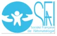
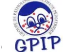
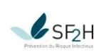
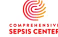

---

## RECOMMANDER LES BONNES PRATIQUES

---

### RECOMMANDATION

Prise en charge du sepsis du nouveau-né, de l'enfant et de l'adulte : recommandations pour un parcours de soins intégré

---

Validé par le Collège le 29 janvier 2025Les recommandations de bonne pratique (RBP) sont définies dans le champ de la santé comme des propositions développées méthodiquement pour aider le praticien et le patient à rechercher les soins les plus appropriés dans des circonstances cliniques données.

Les RBP sont des synthèses rigoureuses de l'état de l'art et des données de la science à un temps donné, décrites dans l'argumentaire scientifique. Elles ne sauraient dispenser le professionnel de santé de faire preuve de discernement dans sa prise en charge du patient, qui doit être celle qu'il estime la plus appropriée, en fonction de ses propres constatations et des préférences du patient.

Cette recommandation de bonne pratique a été élaborée selon la méthode résumée dans l'argumentaire scientifique et décrite dans le guide méthodologique de la HAS disponible sur son site : [Élaboration de recommandations de bonne pratique – Méthode Recommandations pour la pratique clinique](#).

Les objectifs de cette recommandation, la population et les professionnels concernés par sa mise en œuvre sont brièvement présentés en dernière page (fiche descriptive) et détaillés dans l'argumentaire scientifique.

Ce dernier ainsi que la synthèse de la recommandation sont téléchargeables sur [www.has-sante.fr](http://www.has-sante.fr).

## Grade des recommandations

Tableau. Classification GRADE du niveau de recommandations et des implications

<table border="1">
<thead>
<tr>
<th></th>
<th>Recommandation forte</th>
<th>Recommandation conditionnelle</th>
</tr>
</thead>
<tbody>
<tr>
<th>Implications pour</th>
<td>Les effets souhaitables de l'intervention l'emportent clairement sur les effets indésirables, ou ne l'emportent pas.</td>
<td>Les compromis sont moins certains, soit en raison de preuves de faible qualité, soit parce que les preuves suggèrent que les effets souhaitables et indésirables sont étroitement équilibrés.</td>
</tr>
<tr>
<th>Patients</th>
<td>La plupart des personnes dans cette situation souhaiteraient suivre la ligne de conduite recommandée et seule une petite proportion ne le souhaiterait pas.</td>
<td>La majorité des personnes dans cette situation souhaiteraient suivre la ligne de conduite suggérée, mais beaucoup ne le souhaiteraient pas.</td>
</tr>
<tr>
<th>Praticiens</th>
<td>La plupart des individus devraient recevoir le plan d'action recommandé. Le respect de cette recommandation selon la ligne directrice pourrait être utilisé comme critère de qualité ou indicateur de performance. Il est peu probable que des aides à la décision formelles soient nécessaires pour aider les individus à prendre des décisions conformes à leurs valeurs et préférences.</td>
<td>Différents choix sont susceptibles d'être appropriés à différents patients, et le traitement doit être adapté aux circonstances de chaque patient. Ces circonstances peuvent inclure les valeurs et préférences du patient ou de sa famille.</td>
</tr>
<tr>
<th>Autorités de santé</th>
<td>La recommandation peut être adaptée en tant que politique de santé dans la plupart des situations, y compris pour être utilisée comme indicateurs de performance.</td>
<td>L'élaboration des politiques de santé nécessitera des débats approfondis et la participation de nombreuses parties prenantes. Les politiques de santé sont également plus susceptibles de varier d'une région à l'autre. Les indicateurs de performance devraient se concentrer sur le fait qu'une délibération adéquate sur les options de gestion a eu lieu.</td>
</tr>
</tbody>
</table># Descriptif de la publication

<table border="1"><tr><td><b>Titre</b></td><td><b>Prise en charge du sepsis du nouveau-né, de l'enfant et de l'adulte : recommandations pour un parcours de soins intégré</b></td></tr><tr><td><b>Méthode de travail</b></td><td>Recommandation pour la pratique clinique (RPC) - Label</td></tr><tr><td><b>Objectif(s)</b></td><td>L'objectif de ces recommandations de bonne pratique est de réduire le poids sanitaire, économique et social du sepsis en proposant aux patients et aux différents acteurs les éléments, basés sur les revues scientifiques, du parcours de soins intégrant la prise en charge en ville - établissement sanitaire - établissement médicosocial, d'un nouveau-né, d'un enfant, d'un adulte ou d'une personne âgée présentant un sepsis.</td></tr><tr><td><b>Cibles concernées</b></td><td>Ces recommandations concernent les patients et leur famille, les professionnels de santé de ville et des établissements de santé, les administrations hospitalières, les organismes payeurs (assurance maladie, mutuelles), les autorités sanitaires, les pouvoirs politiques.</td></tr><tr><td><b>Demandeur</b></td><td>Direction Générale de la Santé (DGS)</td></tr><tr><td><b>Promoteur(s)</b></td><td>Société de réanimation de langue française (SRLF), Société française d'anesthésie réanimation (SFAR), Société française de médecine d'urgence (SFMU), Société de pathologie infectieuse de langue française (SPILF), Société française de médecine physique et de réadaptation (SOFMER), Société française de pédiatrie (SFP), Société française de néonatologie (SFN), Groupe francophone de réanimation et urgences pédiatriques (GFRUP), Groupe de pathologies infectieuses pédiatriques (GPIP), Société française de microbiologie (SFM), Société française de mycologie médicale (SFMM), Société française d'hygiène hospitalière (SF2H), Société française de gériatrie et gérontologie (SFGG), Société française de santé publique (SFSP), Collège national des généralistes enseignants (CNGE), Alliance contre le développement des bactéries multi-résistantes (<i>World Alliance Against Antibiotic Resistance</i> - WAAAR)</td></tr><tr><td><b>Pilotage du projet</b></td><td>Coordination : Pr Djillali Annane (SRLF), M. Emmanuel Nouyrigat (HAS) Secrétariat : Mme Gaëlle Fossoy (FHU SEPSIS), Mme Jessica Layouni (HAS)</td></tr><tr><td><b>Recherche documentaire</b></td><td>Mme Gaëlle Fanelli (HAS)</td></tr><tr><td><b>Auteurs</b></td><td>Cf. Groupe de travail (p.54)</td></tr><tr><td><b>Conflits d'intérêts</b></td><td>Les membres du groupe de travail ont communiqué leurs déclarations publiques d'intérêts à la HAS. Elles sont consultables sur le site <a href="https://dpi.sante.gouv.fr">https://dpi.sante.gouv.fr</a>. Elles ont été analysées selon la grille d'analyse du guide des déclarations d'intérêts et de gestion des conflits d'intérêts de la HAS (<a href="https://www.has-sante.fr/upload/docs/application/pdf/guide_dpi.pdf">https://www.has-sante.fr/upload/docs/application/pdf/guide_dpi.pdf</a>). Par ailleurs, la base de données publique Transparence-Santé (<a href="http://www.transparence.sante.gouv.fr">www.transparence.sante.gouv.fr</a>) rend accessible les informations déclarées par les entreprises concernant les conventions, les rémunérations et les avantages liant ces entreprises et les acteurs du secteur de la santé. Les intérêts déclarés par les membres du groupe de travail et les informations déclarées par les entreprises ont été considérés comme étant compatibles avec la participation des membres du groupe de travail à ce travail.</td></tr><tr><td><b>Validation</b></td><td>Version du 29 janvier 2025</td></tr><tr><td><b>Actualisation</b></td><td>L'actualisation des documents sera envisagée en fonction des données publiées dans la littérature scientifique ou des modifications de pratique significatives survenues depuis sa publication.</td></tr><tr><td><b>Autres formats</b></td><td></td></tr></table>Ce document ainsi que sa référence bibliographique sont téléchargeables sur [www.has-sante.fr](http://www.has-sante.fr)

Haute Autorité de santé – Service communication information  
5 avenue du Stade de France – 93218 SAINT-DENIS LA PLAINE CEDEX. Tél. : +33 (0)1 55 93 70 00  
© Haute Autorité de santé – janvier 2025 – ISBN : 978-2-11-172708-3# Sommaire

---

## Préambule 7

### Messages clés 8

#### 1. Introduction 11

##### 1.1. Contexte 11

###### 1.1.1. Définitions 11

###### 1.1.2. Épidémiologie 11

###### 1.1.3. Prise en charge 11

##### 1.2. Enjeux 12

##### 1.3. Cibles 12

##### 1.4. Objectifs 12

#### 2. Prise en charge du patient avec sepsis en amont des urgences 13

##### 2.1. Chez un patient en ambulatoire ayant une infection suspectée ou documentée, est-il possible d'identifier précocement, avant la survenue d'élément de détresse vitale, le risque d'évolution vers un sepsis ? 13

##### 2.2. Chez un patient en ambulatoire ayant une infection suspectée ou documentée, existe-t-il des phénotypes cliniques pour identifier précocement le sepsis ? 14

##### 2.3. Chez un patient en ambulatoire ayant une infection suspectée ou documentée, existe-t-il des biomarqueurs pour identifier précocement le sepsis ? 14

##### 2.4. Chez un patient en ambulatoire ayant une infection suspectée, quelle est la place des examens microbiologiques ? 15

##### 2.5. Chez un patient ayant une infection suspectée ou documentée, quelle est la place des objets connectés pour identifier précocement le sepsis ? 15

##### 2.6. Quelle est la place de la vaccination pour prévenir le sepsis ? 16

##### 2.7. Chez un patient en ambulatoire ayant une infection suspectée ou documentée, quelle est la place des mesures éducatives pour prévenir le sepsis ? 16

##### 2.8. Chez un patient en ambulatoire ayant une infection suspectée ou documentée, quelle est la place des traitements anti-infectieux pour prévenir le sepsis ? 16

##### 2.9. Chez un patient en ambulatoire ayant une infection suspectée ou documentée, quelle est la place des traitements anti-inflammatoires non stéroïdiens pour prévenir le sepsis ? 17

##### 2.10. Chez un patient en ambulatoire ayant une infection suspectée ou documentée, quelle est la place des corticoïdes pour prévenir le sepsis ? 17

##### 2.11. Chez un patient en ambulatoire ayant une infection suspectée ou documentée, quelle est la place des traitements adjuvants pour prévenir le sepsis ? 18

##### 2.12. Quelle est la place des systèmes experts d'aide à la décision ? 18

##### 2.13. Quelles sont les alternatives à l'hospitalisation immédiate ? 18

#### 3. Prise en charge du patient avec sepsis de l'intervention d'un professionnel<table><tr><td><b>de médecine d'urgence au terme de la prise en charge aiguë</b></td><td><b>19</b></td></tr><tr><td>3.1. Quelle adaptation au contexte français des recommandations de la <i>Surviving Sepsis Campaign</i> ?</td><td>19</td></tr><tr><td>    3.1.1. Adultes</td><td>19</td></tr><tr><td>    3.1.2. Enfants</td><td>21</td></tr><tr><td>3.2. Quelle est la place de la rééducation-réadaptation dans la prise en charge aiguë du sepsis ?</td><td>24</td></tr><tr><td><b>4. Prise en charge du patient avec sepsis de la période post-aiguë à la réintégration sociale et professionnelle</b></td><td><b>27</b></td></tr><tr><td>4.1. Quelle prise en charge post-aiguë avant le retour à domicile du patient septique ?</td><td>27</td></tr><tr><td>    4.1.1. Chez l'adulte</td><td>27</td></tr><tr><td>    4.1.2. Chez l'enfant</td><td>28</td></tr><tr><td>4.2. Quelle prise en charge au retour à domicile du patient septique ?</td><td>30</td></tr><tr><td>    4.2.1. Chez l'adulte</td><td>30</td></tr><tr><td>    4.2.2. Chez le nouveau-né et l'enfant</td><td>31</td></tr><tr><td><b>Table des annexes</b></td><td><b>33</b></td></tr><tr><td><b>Participants</b></td><td><b>54</b></td></tr><tr><td><b>Abréviations et acronymes</b></td><td><b>57</b></td></tr></table># Préambule

L'ensemble des acteurs concernés par la prise en charge du sepsis à tout âge ont élaboré ces recommandations dans le but d'améliorer le pronostic du sepsis par l'intermédiaire d'un parcours de soins intégré impliquant la ville et l'hôpital et couvrant la prévention, le dépistage, le diagnostic, le traitement et la réintégration socioprofessionnelle des patients. Ainsi, les promoteurs de cette recommandation de bonnes pratiques sont les suivants :

- – Société de réanimation de langue française (SRLF),
- – Société française d'anesthésie réanimation (SFAR),
- – Société française de médecine d'urgence (SFMU),
- – Société de pathologie infectieuse de langue française (SPILF),
- – Société française de médecine physique et de réadaptation (SOFMER),
- – Société française de pédiatrie (SFP),
- – Société française de néonatologie (SFN),
- – Groupe francophone de réanimation et urgences pédiatriques (GFRUP),
- – Groupe de pathologies infectieuses pédiatriques (GPIP),
- – Société française de microbiologie (SFM),
- – Société française de mycologie médicale (SFMM),
- – Société française d'hygiène hospitalière (SF2H),
- – Société française de gériatrie et gériontologie (SFGG),
- – Société française de santé publique (SFSP),
- – Collège national des généralistes enseignants (CNGE),
- – Alliance contre le développement des bactéries multi-résistantes (*World Alliance Against Antibiotic Resistance - WAAAR*).

Les représentants de ces organismes, de France Sepsis Association (association d'usagers), de la fédération hospitalo-universitaire (FHU) SEPSIS et de l'institut hospitalo-universitaire (IHU) PROMETHEUS ont joint leurs efforts pour analyser et synthétiser les données de la littérature scientifique sur la prise en charge du sepsis en amont, au cours et en aval de l'hospitalisation en soins aigus. Cette recommandation de bonne pratique a été réalisée dans le cadre de la labellisation par la HAS1 garantissant le respect des critères méthodologiques, scientifiques et déontologiques de la HAS, notamment dans la prévention des conflits d'intérêt.

---

1 Cf. Guide méthodologique « Attribution du label de la HAS à une recommandation de bonne pratique élaborée par un organisme professionnel » (HAS, 2023) : [https://www.has-sante.fr/jcms/p\\_3452920/fr/labellisation-par-la-has-d-une-recommandation-de-bonne-pratique-elaborée-par-un-organisme-professionnel](https://www.has-sante.fr/jcms/p_3452920/fr/labellisation-par-la-has-d-une-recommandation-de-bonne-pratique-elaborée-par-un-organisme-professionnel)# Messages clés

## Mieux prévenir le sepsis, c'est :

1. 1. Respecter le calendrier vaccinal, à tous les âges
2. 2. Connaître les facteurs de risque, en cas d'infection, d'évolution vers un sepsis
3. 3. Respecter les règles d'hygiène

## Mieux dépister le sepsis, c'est :

1. 1. Promouvoir des stratégies d'information et de communication afin d'identifier précocement les signes de sepsis, en particulier chez les patients ayant des facteurs de risque de sepsis
2. 2. Rechercher chez un enfant entièrement déshabillé :
   1. a. Troubles de conscience ou changement de comportement
   2. b. Signes de mauvaise perfusion périphériques : TRC allongé, marbrures, extrémités froides
   3. c. Augmentation de la fréquence respiratoire et tachycardie
   4. d. Baisse de la pression artérielle
   5. e. Apparition et extension de purpura ecchymotique ou nécrotique
3. 3. Rechercher chez un adulte, la présence de 3 ou plus des 6 variables cliniques
   1. a. Age >65 ans
   2. b. Température >38°C
   3. c. Pression artérielle systolique  $\leq 110$  mmHg
   4. d. Fréquence cardiaque >110/min
   5. e. Saturation périphérique en O2  $\leq 95\%$
   6. f. Troubles des fonctions supérieures## Mieux prendre en charge précocement le sepsis, c'est :

### 1. Agir sans délai

### 2. En ville :

- a. Contacter le 15 sans délai
- b. Ne pas réaliser d'examen complémentaire chez l'enfant
- c. Prélever, chez l'adulte en ambulatoire, avec facteur de risque de sepsis, hémoculture (au moins 40 ml, que l'on peut prélever d'emblée en une fois et reparti dans deux ou trois paires de flacons aérobie et anaérobie) et/ou ECBU et/ou ECBC
- d. Transporter de façon médicalisée les patients, quel que soit l'âge, vers un établissement disposant de soins critiques

### 3. A l'hôpital

- a. Appliquer au mieux dans la première heure, un groupe d'actions coordonnées et standardisées comprenant :

- i. Pose d'une voie d'abord veineuse ou intra-osseuse
- ii. Prélèvement d'une hémoculture, (au moins 40 ml, que l'on peut prélever d'emblée en une fois et reparti dans deux à trois paires de flacons aérobie et anaérobie), et d'un taux de lactate
- iii. Antibiothérapie intraveineuse prenant en compte la nature de l'infection (site et pathogènes) le caractère communautaire ou non, l'existence de facteur de risque de BMR et l'écologie microbienne locale
- iv. Restaurer l'hémodynamique en privilégiant une prise en charge individualisée guidée par une évaluation hémodynamique clinique et échographique, et comportant un remplissage vasculaire de 10 à 20ml/kg en 15-20 min et l'introduction d'agents vaso-inotropes en cas de non-réponse ou de mauvaise tolérance au remplissage vasculaire

- b. Admettre en soins critiques en l'absence de résolution des variables cliniques après traitement initial
- c. Respecter les recommandations de la *Surviving Sepsis Campaign*## Mieux prévenir les séquelles, c'est :

### 1. Dès les 48 premières heures de l'hospitalisation pour sepsis :

a. Débuter un programme de réadaptation standardisé et progressif, suivant l'évolution de l'état du patient, en 6 étapes de la mobilisation passive jusqu'à la déambulation dans le périmètre de l'unité de soins. L'adjonction d'une réadaptation respiratoire doit être systématique si sepsis pulmonaire initial ou en cas de recours à la ventilation artificielle

b. Puis, adapter la prise en charge de réadaptation et préparer l'orientation si nécessaire vers une structure de réadaptation, par une équipe mobile de médecine physique et de réadaptation (MPR) ou à défaut, par une équipe référente sur site ou de proximité

### 2. En post aigu :

a. Orienter les patients en fonction de leurs besoins de réadaptation au mieux vers des structures ayant des équipes de réadaptation comprenant : kinésithérapeute, APA, ergothérapeute, orthophoniste, neuropsychologue, psychologue, diététicien, travailleur social, et une coordination médicale par un médecin MPR

b. L'orientation à domicile doit être sécurisée par un suivi ambulatoire formalisé et organisé en amont, si possible avec l'aide d'une équipe mobile de réadaptation ou de gériatrie

c. Organiser la consultation de suivi dans les 3 mois qui suivent la sortie d'hospitalisation

## Mieux accompagner au long cours, c'est :

1. Réaliser une évaluation psychologique systématique après le retour à domicile et la poursuite d'un suivi selon l'évaluation initiale

2. Recourir à un service d'aide sociale de proximité dans le cas de situations précaires et/ou à risque, identifiées en amont

3. Assurer un suivi clinique post sepsis à minima à 3 mois et 1 an de l'hospitalisation# 1. Introduction

## 1.1. Contexte

### 1.1.1. Définitions

Conceptuellement, le sepsis est une dérégulation de la réponse immunitaire à une infection entraînant un dysfonctionnement vital d'organes, mesuré, **chez l'adulte**, par un score Sepsis-related Organ Failure Assessment (SOFA) > 2 points (sur un maximum de 24), **chez l'enfant** par un score Phoenix de sepsis  $\geq 2$  points (sur un maximum de 13). Le choc septique est défini, **chez l'adulte**, par la nécessité d'un traitement vasopresseur pour maintenir une pression artérielle moyenne à 65 mmHg et une lactatémie  $\geq 2$  mmol/L, **chez l'enfant**, par la présence d'une défaillance hémodynamique définie par un score Phoenix hémodynamique  $\geq 1$  point (nécessité d'un traitement vasoactif ou une lactatémie  $\geq 5$  mmol/l, ou hypotension artérielle définie selon l'âge). Le quick SOFA (qSOFA), composé de trois points attribués à une pression artérielle systolique < 100 mmHg, une fréquence respiratoire > 22 cycles/min, et une altération des fonctions neurologiques centrales (score de Glasgow <15), a été introduit afin d'identifier les patients à risque de développer un sepsis (qSOFA à 2 ou 3).

### 1.1.2. Épidémiologie

Le sepsis représente un fléau sanitaire, social et économique. Selon l'Organisation mondiale de la santé (OMS), ~49 millions de personnes sont atteintes de sepsis chaque année dans le monde, dont plus de 40% sont des enfants de moins de 5 ans, et ~11 millions en décèdent. Il serait responsable d'un nombre de décès supérieur aux cancers du sein, de l'intestin et de la prostate réunis. Son incidence annuelle en France est de ~403/100,000, le taux de décès de 23%, de séquelles de 15%, et le coût moyen de ~€ 16,000 par hospitalisation. Un tiers des survivants meurt dans l'année qui suit l'épisode aigu, et ~50% ont des séquelles (déficiences physiques, cognitives, et mentales). Chez l'enfant, les séquelles neurocognitives peuvent altérer les apprentissages et le développement, et ne sont identifiées parfois que tardivement, à l'adolescence ou au début de l'âge adulte.

### 1.1.3. Prise en charge

La prise en charge repose sur les anti-infectieux et le contrôle de la source de l'infection, sur la préservation de l'oxygénation des tissus par la perfusion de solutés de remplissage vasculaire ou de vasopresseurs, et le support respiratoire. Depuis 2002, la *Surviving Sepsis Campaign* (SSC) propose des recommandations, actualisées tous les 4 ans (dernière version en 2020 pour l'enfant et en 2021 pour l'adulte), pour la prise en charge hospitalière des patients atteints de sepsis. Au total, 93 recommandations ont été élaborées, 32 de niveau fort, 39 de niveau faible, et 18 recommandations dites de meilleure pratique, et couvrent les aspects organisationnels hospitaliers, le diagnostic, la prise en charge aiguë symptomatique, anti-infectieuse ainsi que les thérapeutiques adjuvantes. La SSC a également élaboré des recommandations pour le syndrome post sepsis (Post-Sepsis Syndrome | Sepsis Alliance), et pour la COVID-19.

En France, il n'existe pas de recommandation sur la prise en charge globale du sepsis. La Haute autorité de santé (HAS) n'a jusqu'à présent pas participé à l'élaboration de recommandations pour la pratique dans le domaine du sepsis. Il n'existe aucune recommandation internationale sur la prise en charge du sepsis en milieu communautaire, ni sur le parcours de soins intégrant la prise en charge en amont des urgences préhospitales et hospitalières, et en aval de la prise en charge en hospitalisation aiguë. La majorité (60-80%) des cas sont d'origine communautaire, soulignant le rôle majeur desacteurs de soins de premiers recours dans la prise en charge précoce du sepsis. Une étude française sur les infections bactériennes communautaires graves pédiatriques avait montré des soins pré-hospitaliers suboptimaux dans un quart des cas, associés à une plus forte mortalité. Le sepsis expose au risque de déficiences multiples et de perte d'autonomie à long terme. Il existe des recommandations publiées par le NICE (<https://www.nice.org.uk/guidance/cg83>) ou par Sepsis Alliance (organisation caritative américaine : Post-Sepsis Syndrome | Sepsis Alliance). En France, la HAS a élaboré des recommandations pour la prise en charge d'aval des formes sévères de la COVID-192. L'intervention d'une équipe mobile de réadaptation coordonnée par un médecin de MPR permet d'accélérer l'accès à la réadaptation pour prévenir ou réduire les séquelles, rendre le parcours patient fluide et pertinent. Les personnes âgées (>75 ans) polypathologiques devraient être vues par les équipes mobiles de gériatrie. Néanmoins, l'évolution épidémiologique du sepsis et l'évolution démographique sont telles qu'elles vont rendre cette prise en charge difficile à mettre en œuvre. Une évaluation avec prise en charge gériatrique et gérontologique, dès le début de l'hospitalisation, de façon à prévenir des complications de type dénutrition, confusion, amyotrophie, troubles de la marche... est nécessaire. Elle permettra également d'organiser le devenir et le suivi du patient dans la filière gériatrique qui dispose de soins de suite dédiés.

## 1.2. Enjeux

En 2017, l'Assemblée Mondiale de la Santé a exhorté les États membres de l'OMS à inclure la prévention, le diagnostic et le traitement du sepsis dans leur politique de santé. La France s'est attachée à améliorer la surveillance des cas de sepsis, la connaissance du public sur le sepsis, la formation des professionnels de santé, à innover pour la prévention, le dépistage et le traitement du sepsis. L'élaboration de recommandations pour la prise en charge du sepsis, en amont des urgences préhospitalières, portant sur un parcours de soins intégré incluant ville et hôpital, nouveau-nés, enfants et adultes, prévention primaire et secondaire, est une première mondiale et constitue un levier pour en améliorer qualitativement et quantitativement le pronostic et le poids social et économique.

## 1.3. Cibles

Ces recommandations concernent les patients et leur famille, les professionnels de santé de ville et des établissements de santé, les administrations hospitalières, les organismes payeurs (assurance maladie, mutuelles), les autorités sanitaires, les pouvoirs politiques.

## 1.4. Objectifs

L'objectif de ces recommandations de bonne pratique est de réduire le poids sanitaire, économique et social du sepsis en proposant aux patients et aux différents acteurs les éléments, basés sur les revues scientifiques, du parcours de soins intégrant la prise en charge en ville - établissement sanitaire - établissement médicosocial, d'un nouveau-né, d'un enfant, d'un adulte ou d'une personne âgée présentant un sepsis.

---

2 Réponses rapides dans le cadre du COVID 19 (HAS, 2020) :

- - Prise en charge des patients post-COVID-19 en médecine physique et de réadaptation (MPR), en soins de suite et de réadaptation (SMR), et retour à domicile
- - Prise en charge précoce de médecine physique et de réadaptation (MPR) en réanimation, en soins continus ou en service de rééducation post-réanimation (SRPR)
- - Parcours de réadaptation du patient COVID+ à la sortie de réanimation et/ou de MCO, en SMR puis à domicile## 2. Prise en charge du patient avec sepsis en amont des urgences

### 2.1. Chez un patient en ambulatoire ayant une infection suspectée ou documentée, est-il possible d'identifier précocement, avant la survenue d'élément de détresse vitale, le risque d'évolution vers un sepsis ?

#### Recommandation 1

Nous recommandons de considérer comme étant particulièrement à risque de développer un sepsis, les patients en ambulatoire ayant une infection suspectée ou documentée et présentant un ou plusieurs facteurs de risque (recommandation forte, niveau modéré de certitude).

Tableau 1 : Exemples de facteurs de risque de sepsis

<table border="1">
<thead>
<tr>
<th rowspan="3">Age Fragilité clinique</th>
<th colspan="3">Pathologies immunes</th>
<th rowspan="3">Pathologies non-immunes</th>
</tr>
<tr>
<th rowspan="2">Déficit immunitaire héréditaire</th>
<th colspan="2">Déficit immunitaire acquis</th>
</tr>
<tr>
<th>Situations cliniques</th>
<th>Traitements Immunosuppresseurs</th>
</tr>
</thead>
<tbody>
<tr>
<td>
<ul style="list-style-type: none; padding-left: 0;">
<li>– Age &lt; 1 an ou &gt; 65 ans</li>
<li>– Fragilité sévère (<i>Clinical Frailty Scale</i> ≥ 5)</li>
<li>– Grossesse, post-partum</li>
<li>– Handicaps cognitif ou moteur</li>
<li>– Porteurs de dispositif médical implantable,</li>
<li>– Chirurgie récente</li>
</ul>
</td>
<td></td>
<td>
<ul style="list-style-type: none; padding-left: 0;">
<li>– Cancer (tumeur solide/hémopathie maligne)</li>
<li>– Transplantation d'organes solides</li>
<li>– Maladies de système</li>
<li>– Infection par le VIH</li>
<li>– Asplénie anatomique ou fonctionnelle (dont drépanocytose)</li>
</ul>
</td>
<td>
<ul style="list-style-type: none; padding-left: 0;">
<li>– Corticothérapie au long cours</li>
<li>– Chimiothérapie</li>
<li>– Biothérapies</li>
<li>– Radiothérapie</li>
<li>– Autres immunosuppresseurs</li>
</ul>
</td>
<td>
<ul style="list-style-type: none; padding-left: 0;">
<li>– Cirrhose</li>
<li>– Insuffisance rénale chronique</li>
<li>– Insuffisance cardiaque</li>
<li>– Insuffisance respiratoire chronique</li>
<li>– Diabète (compliqué ou non équilibré)</li>
<li>– Dénutrition</li>
<li>– Antécédent de sepsis</li>
</ul>
</td>
</tr>
</tbody>
</table>## 2.2. Chez un patient en ambulatoire ayant une infection suspectée ou documentée, existe-t-il des phénotypes cliniques pour identifier précocement le sepsis ?

### Recommandation 2

Chez un patient adulte en ambulatoire ayant une infection suspectée ou documentée, nous suggérons qu'un score clinique  $\geq 3$  permet d'évaluer le risque de progression vers un sepsis. Ce score clinique est composé de 6 variables cliniques : âge  $> 65$  ans ; température  $> 38^{\circ}\text{C}$  ; pression artérielle systolique  $\leq 110$  mmHg ; fréquence cardiaque  $> 110/\text{min}$  ; saturation périphérique en  $\text{O}_2 \leq 95\%$  ; troubles des fonctions supérieures (recommandation conditionnelle, faible niveau de certitude).

### Recommandation 3

Chez l'enfant de moins de 1 mois, nous recommandons que toute fièvre doive faire suspecter la possibilité d'un sepsis et justifie un adressage sans délai aux urgences pédiatriques pour évaluation (recommandation forte, très faible niveau de certitude).

Chez l'enfant de 1 à 3 mois, nous recommandons que toute fièvre fasse considérer la possibilité d'un sepsis et justifie un avis médical dans les 6 heures. En dehors des heures ouvrables ou en cas d'indisponibilité d'un médecin en ambulatoire, un appel au centre 15 permettra d'orienter les familles vers une structure de garde (CAPS) ou d'urgences (recommandation forte, très faible niveau de certitude).

Chez l'enfant fébrile quel que soit son âge, la recherche d'un purpura (enfant déshabillé) et l'évaluation des paramètres vitaux comprenant fréquence respiratoire, fréquence cardiaque, coloration cutanée, temps de recoloration cutané, état de conscience et comportement global doit être faite et justifie un avis auprès du centre 15 en cas d'anomalie à l'exception d'une tachycardie isolée (recommandation forte, très faible niveau de certitude). Il est important de se fier à l'évaluation parentale concernant le comportement ou le teint inhabituel (recommandation forte, très faible niveau de certitude).

## 2.3. Chez un patient en ambulatoire ayant une infection suspectée ou documentée, existe-t-il des biomarqueurs pour identifier précocement le sepsis ?

### Recommandation 4

Chez un patient en ambulatoire ayant une infection suspectée ou documentée, nous recommandons de ne pas doser les concentrations plasmatiques de lactate, de C reactive protein (CRP), ni de procalcitonine (PCT) pour identifier précocement le sepsis (recommandation forte, faible niveau de certitude).## 2.4. Chez un patient en ambulatoire ayant une infection suspectée, quelle est la place des examens microbiologiques ?

### Recommandation 5

Chez un patient en ambulatoire ayant une infection suspectée, nous recommandons de ne pas effectuer des prélèvements systématiques chez les patients non à risque d'évolution vers un sepsis (cf. tableau 1), à l'exception de l'infection urinaire (recommandation forte). En cas de suspicion d'infection urinaire, nous recommandons de réaliser un ECBU.

### Recommandation 6

Chez un patient adulte en ambulatoire ayant une infection suspectée ou cliniquement documentée, nous recommandons de pratiquer une hémoculture et/ou ECBU et/ou ECBC en cas de facteurs de risque de sepsis (cf. tableau 1) (recommandation forte, très faible niveau de certitude), si les conditions suivantes sont respectées :

- – l'organisation médico-technique locale permet une prise en charge appropriée et sans délai du patient, des échantillons et de l'examen,
- – le prélèvement d'hémocultures doit comporter un total de 4 à 6 flacons (10 mL par flacon).

### Recommandation 7

Chez l'enfant en ambulatoire suspect de sepsis, nous recommandons de ne pas réaliser d'examens microbiologiques, un transfert devra être organisé vers les urgences après contact avec le centre 15 (recommandation forte, très faible niveau de certitude).

En cas de suspicion d'infection sans signe de sepsis, la réalisation d'examens complémentaires à visée microbiologique répond aux recommandations en vigueur selon l'infection suspectée (infection urinaire, COVID, grippe, angine, bactériémie).

## 2.5. Chez un patient ayant une infection suspectée ou documentée, quelle est la place des objets connectés pour identifier précocement le sepsis ?

### Recommandation 8

Chez un patient ayant une infection suspectée ou documentée, aucune recommandation sur la place des objets connectés pour identifier précocement le sepsis n'a pu être établie.## 2.6. Quelle est la place de la vaccination pour prévenir le sepsis ?

### Recommandation 9

Nous recommandons comme mesure prioritaire de prévention du sepsis, l'application du calendrier vaccinal obligatoire3.

Dans le cadre spécifique des populations à risque de sepsis (cf. tableau 1) :

Nous recommandons, chez l'adulte, de pratiquer les vaccinations contre les bactéries encapsulées (pneumocoque, méningocoque, Haemophilus) (recommandation forte, niveau modéré de certitude).

Nous recommandons, chez l'adulte, de pratiquer des vaccinations contre la grippe et le SARS-CoV-2 (recommandation forte, niveau modéré de certitude).

Nous recommandons, chez l'enfant, de pratiquer les vaccinations non encore obligatoires (rotavirus, grippe), en respectant le calendrier vaccinal (recommandation forte, niveau modéré de certitude).

## 2.7. Chez un patient en ambulatoire ayant une infection suspectée ou documentée, quelle est la place des mesures éducatives pour prévenir le sepsis ?

### Recommandation 10 (destinée aux pouvoirs publics)

Nous recommandons que les pouvoirs publics assurent la promotion des mesures éducatives sur l'identification précoce du sepsis et des patients à risque de sepsis auprès :

- - du grand public (recommandation forte, niveau modéré de certitude)
- - des professionnels de santé de soins primaires (recommandation forte, niveau modéré de certitude).

## 2.8. Chez un patient en ambulatoire ayant une infection suspectée ou documentée, quelle est la place des traitements anti-infectieux pour prévenir le sepsis ?

### Recommandation 11

Chez un patient en ambulatoire ayant une infection suspectée et présentant une condition à risque d'évolution septique fulminante (asplénie, chimiothérapie aplasiant), nous recommandons une prescription anticipée d'anti-infectieux urgente en cas d'épisode fébrile (recommandation forte, très faible niveau de certitude).

Nous recommandons la réalisation de prélèvements microbiologiques préalables, à condition qu'ils ne retardent pas l'administration d'antibiotiques (recommandation forte, très faible niveau de certitude).

---

3 Calendrier des vaccinations et recommandations vaccinales (avril 2024) :

[https://sante.gouv.fr/IMG/pdf/calendrier\\_vaccinal\\_avril\\_2024.pdf](https://sante.gouv.fr/IMG/pdf/calendrier_vaccinal_avril_2024.pdf)### **Recommandation 12**

Chez un patient en ambulatoire avec suspicion clinique de purpura fulminans, quel que soit l'âge, nous recommandons l'administration immédiate d'une antibiothérapie parentérale (IV ou IM), ainsi qu'un transfert immédiat dans une structure hospitalière (recommandation forte, faible niveau de certitude).

### **Recommandation 13**

Chez un enfant en ambulatoire ayant une infection suspectée, en l'absence de purpura fébrile et sans point d'appel clinique, nous recommandons de ne pas prescrire de façon anticipée une antibiothérapie (recommandation forte, faible niveau de certitude).

## **2.9. Chez un patient en ambulatoire ayant une infection suspectée ou documentée, quelle est la place des traitements anti-inflammatoires non stéroïdiens pour prévenir le sepsis ?**

### **Recommandation 14**

Chez un patient (enfant ou adulte) en ambulatoire ayant une infection suspectée ou documentée, nous recommandons de ne pas administrer un anti-inflammatoire non stéroïdien, y compris l'aspirine, pour prévenir le sepsis (recommandation forte, niveau modéré de certitude).

## **2.10. Chez un patient en ambulatoire ayant une infection suspectée ou documentée, quelle est la place des corticoïdes pour prévenir le sepsis ?**

### **Recommandation 15**

Chez un patient (enfant ou adulte) en ambulatoire ayant une infection suspectée ou documentée, nous recommandons de ne pas administrer des corticoïdes par voie inhalée ou orale pour prévenir un sepsis (recommandation forte, faible niveau de certitude).

### **Recommandation 16**

Chez un patient (enfant ou adulte) en ambulatoire ayant une infection suspectée ou documentée à SARS-CoV-2, nous recommandons de ne pas administrer des corticoïdes par voie inhalée ou orale pour prévenir un sepsis (recommandation forte, niveau modéré de certitude).## 2.11. Chez un patient en ambulatoire ayant une infection suspectée ou documentée, quelle est la place des traitements adjuvants pour prévenir le sepsis ?

### Recommandation 17

Chez un patient ayant une infection suspectée ou documentée, aucune recommandation sur la place des traitements adjuvants pour prévenir le sepsis n'a pu être établie.

### Recommandation 18

Chez un patient en ambulatoire ayant une infection suspectée ou documentée à SARS-Cov-2, nous recommandons de ne pas administrer un traitement adjuvant par micronutriments pour prévenir le sepsis (recommandation forte, niveau modéré de certitude).

## 2.12. Quelle est la place des systèmes experts d'aide à la décision ?

### Recommandation 19

Chez un patient ayant une infection suspectée ou documentée, aucune recommandation sur la place des systèmes experts d'aide à la décision pour prévenir le sepsis n'a pu être établie.

## 2.13. Quelles sont les alternatives à l'hospitalisation immédiate ?

### Recommandation 20

Chez un patient ayant une infection suspectée ou documentée, hors contexte palliatif, en cas de suspicion de sepsis, nous recommandons l'hospitalisation immédiate (recommandation forte, très faible niveau de certitude).

### Recommandation 21

Chez un patient ayant une infection suspectée ou documentée, et de GIR 1 et 2, en cas de suspicion de sepsis, nous recommandons de privilégier le maintien à domicile ou dans la structure médico-sociale en prenant en compte la balance bénéfice/risque d'une hospitalisation, la préférence du patient et de ses proches, et les moyens humains disponibles pour assurer la prise en charge et la surveillance (recommandation forte, très faible niveau de certitude).# 3. Prise en charge du patient avec sepsis de l'intervention d'un professionnel de médecine d'urgence au terme de la prise en charge aiguë

## 3.1. Quelle adaptation au contexte français des recommandations de la *Surviving Sepsis Campaign* ?

### 3.1.1. Adultes

#### Recommandation 22

Chez un patient avec sepsis, de l'intervention d'un professionnel de médecine d'urgence au terme de la prise en charge aiguë, nous recommandons de suivre les recommandations de la *Surviving Sepsis Campaign* en vigueur (recommandation forte, niveau modéré de certitude).

#### Recommandation 23

Chez un patient avec sepsis, de l'intervention d'un professionnel de médecine d'urgence au terme de la prise en charge aiguë, en cas d'hypoperfusion induite par le sepsis ou de choc septique, nous recommandons d'administrer dans les 3 heures de la prise en charge, par voie intraveineuse, des solutions de cristalloïdes en fonction d'une stratégie individualisée reposant sur l'anamnèse, l'origine du sepsis, les données de l'examen clinique et des premiers éléments de l'exploration par échographie, en comparaison à l'administration de 30 ml/kg (recommandation forte, niveau modéré de certitude).

#### Recommandation 24

Chez un patient avec sepsis, de l'intervention d'un professionnel de médecine d'urgence au terme de la prise en charge aiguë, en cas de haut risque d'infection par une bactérie multirésistante (BMR), nous recommandons l'utilisation de tests microbiologiques à réponse rapide par rapport aux soins courants.

Nous recommandons d'administrer deux, plutôt qu'un seul, antimicrobiens probabilistes prenant en compte l'écologie bactérienne locale et le contexte clinique (recommandation forte, niveau modéré de certitude).

#### Recommandation 25

Chez un patient avec sepsis, de l'intervention d'un professionnel de médecine d'urgence au terme de la prise en charge aiguë, nous recommandons d'optimiser les posologies des antimicrobiens en tenant compte des principes de pharmacocinétique/pharmacodynamique (PK/PD), des posologies recommandées par le Comité Antibiogramme de la Société Française de Microbiologie (CASFM) et des propriétés spécifiques du médicament (recommandation forte, niveau modéré de certitude).## Recommandation 26

Chez un patient avec sepsis, de l'intervention d'un professionnel de médecine d'urgence au terme de la prise en charge aiguë, après contrôle adéquat du foyer infectieux, nous recommandons une durée d'antibiothérapie inférieure ou égale à 7 jours en l'absence de justification d'une durée plus longue (recommandation forte, niveau modéré de certitude).

## Recommandation 27

Chez un patient avec sepsis, de l'intervention d'un professionnel de médecine d'urgence au terme de la prise en charge aiguë, après l'admission en réanimation, si la pression artérielle moyenne est inférieure à 65 mmHg après initiation de noradrénaline, quelle que soit la dose, nous recommandons d'administrer de la vasopressine à une dose de 0,02 à 0,04 UI/min, en comparaison à l'augmentation des doses de noradrénaline (recommandation forte, faible niveau de preuve).

## Recommandation 28

Chez un patient avec sepsis, de l'intervention d'un professionnel de médecine d'urgence au terme de la prise en charge aiguë, en cas de niveau insuffisant de pression artérielle moyenne sous traitement par noradrénaline et vasopressine, nous recommandons que l'ajout et le choix d'un agent vasoactif supplémentaire, ou d'autres interventions thérapeutiques, soient guidés par une réévaluation cardiaque et hémodynamique (recommandation forte, faible niveau de certitude).

## Recommandation 29

Chez un patient avec sepsis, de l'intervention d'un professionnel de médecine d'urgence au terme de la prise en charge aiguë, en cas de persistance de signes d'hypoperfusion ou d'hypovolémie, nous recommandons de laisser à l'appréciation du clinicien en charge du patient le choix d'une stratégie de remplissage vasculaire libérale ou restrictive (recommandation forte, niveau modéré de certitude).

## Recommandation 30

Chez un patient avec sepsis, de l'intervention d'un professionnel de médecine d'urgence au terme de la prise en charge aiguë, en cas de syndrome de détresse respiratoire aiguë (SDRA) modéré à sévère, après l'admission en réanimation, nous suggérons l'utilisation d'un niveau élevé par rapport à un niveau bas de pression expiratoire positive (PEP), après élimination d'une défaillance cardiaque droite (recommandation conditionnelle, faible niveau de certitude).

## Recommandation 31

Chez un patient avec sepsis, de l'intervention d'un professionnel de médecine d'urgence au terme de la prise en charge aiguë, en cas de SDRA modéré à sévère, nous recommandons de ne pas utiliser des manœuvres de recrutement (recommandation forte, faible niveau de certitude).### 3.1.2. Enfants

#### Recommandation 32

Chez un patient avec sepsis, de l'intervention d'un professionnel de médecine d'urgence au terme de la prise en charge aiguë, nous recommandons de suivre les recommandations de la *Surviving Sepsis Campaign Children's Guidelines* (recommandation forte, niveau modéré de certitude).

#### Recommandation 33

Chez un patient dont l'état se dégrade brutalement, nous recommandons de mettre en place des systèmes de repérage et d'alerte d'un professionnel de santé permettant de reconnaître précocement un enfant en sepsis ou choc septique (recommandation forte, faible niveau de certitude).

#### Recommandation 34

Chez un patient avec sepsis, de l'intervention d'un professionnel de médecine d'urgence au terme de la prise en charge aiguë, nous recommandons de doser les concentrations sériques de lactate pour stratifier le risque de sepsis ou de choc septique (recommandation forte, faible niveau de certitude).

#### Recommandation 35

Chez un patient avec sepsis, de l'intervention d'un professionnel de médecine d'urgence au terme de la prise en charge aiguë, en l'absence d'immunodépression et de facteur de risque d'agents pathogènes multirésistants, nous recommandons de ne pas utiliser d'antibiothérapie multiple dirigée contre le même agent microbien pour une raison de synergie (recommandation forte, faible niveau de certitude).

#### Recommandation 36

Chez un patient avec sepsis, de l'intervention d'un professionnel de médecine d'urgence au terme de la prise en charge aiguë, en cas de choc toxique streptococcique ou staphylococcique, nous recommandons d'associer à un antibiotique actif sur le germe, un autre antibiotique capable de diminuer la synthèse protéique (antitoxinique) comme la clindamycine ou le linézolide (recommandation forte, faible niveau de certitude).

#### Recommandation 37

Chez un patient nouveau-né avec sepsis, nous suggérons l'ajout d'un aminoside en probabiliste pour obtenir un effet synergique bactéricide plus rapide (recommandation conditionnelle, très faible niveau de certitude).

#### Recommandation 38

Chez un patient avec sepsis, de l'intervention d'un professionnel de médecine d'urgence au terme de la prise en charge aiguë, nous recommandons l'administration initiale de 10 à 20 ml/kg de remplissagevasculaire en 15-20 min, sans pouvoir fixer de limite supérieure durant la première heure (recommandation forte, faible niveau de certitude).

### **Recommandation 39**

Chez un patient avec sepsis, de l'intervention d'un professionnel de médecine d'urgence au terme de la prise en charge aiguë, nous recommandons que chaque remplissage vasculaire supplémentaire soit précédé d'une évaluation individuelle de la réponse hémodynamique (sur la fréquence cardiaque, la pression artérielle, les signes de perfusion périphérique et la diurèse, et les données échographiques) et de la tolérance (signes de surcharge volémique : hépatomégalie, crépitants, dégradation respiratoire, turgescence jugulaire) (recommandation forte, faible niveau de certitude).

### **Recommandation 40**

Chez un patient nouveau-né, et particulièrement prématuré, avec sepsis, de l'intervention du médecin urgentiste au terme de la prise en charge aiguë, nous recommandons un remplissage par sérum salé 0,9% de 10 ml/kg sur 30 minutes (recommandation forte, très faible niveau de certitude).

### **Recommandation 41**

Chez un patient avec sepsis, de l'intervention d'un professionnel de médecine d'urgence au terme de la prise en charge aiguë, nous recommandons l'utilisation de l'échographie pour mesurer les variables hémodynamiques d'intérêt, sous réserve d'une bonne formation à l'échographie des médecins amenés à prendre en charge les enfants en choc septique (recommandation forte, faible niveau de certitude).

### **Recommandation 42**

Chez un patient avec sepsis, de l'intervention d'un professionnel de médecine d'urgence au terme de la prise en charge aiguë, nous recommandons d'initier un agent vasoactif par voie veineuse périphérique ou par voie trans-osseuse après 20-40ml/kg de remplissage vasculaire si le patient présente toujours des signes de mauvaise perfusion périphérique et/ou d'hypotension. La noradrénaline et l'adrénaline peuvent alors indifféremment être utilisées (recommandation forte, faible niveau de certitude).

### **Recommandation 43**

Chez un patient avec sepsis, de l'intervention d'un professionnel de médecine d'urgence au terme de la prise en charge aiguë, nous recommandons d'ajouter de la vasopressine ou de titrer d'autres catécholamines en cas de choc septique requérant de fortes doses de catécholamines (recommandation forte, faible niveau de preuve).

### **Recommandation 44**

Chez un patient nouveau-né avec sepsis, de l'intervention d'un professionnel de médecine d'urgence au terme de la prise en charge aiguë, les données disponibles sont insuffisantes pour recommander ou ne pas recommander l'ajout de vasopressine en cas de choc septique.#### **Recommandation 45**

Chez un patient avec sepsis, de l'intervention d'un professionnel de médecine d'urgence au terme de la prise en charge aiguë, en cas de choc septique requérant de fortes doses de vasopresseurs, nous recommandons d'administrer de l'hydrocortisone par voie intraveineuse (hors AMM) (recommandation forte, faible niveau de preuve).

#### **Recommandation 46**

Chez un patient nouveau-né, et notamment chez le prématuré, avec sepsis, recevant une nutrition parentérale au moment du sepsis, les données sont insuffisantes pour établir une recommandation pour ou contre l'administration d'émulsions lipidiques.

#### **Recommandation 47**

Chez un patient nouveau-né avec sepsis, nous recommandons d'utiliser des seuils de transfusion de globules rouges en fonction du terme, de l'âge post-natal, des pathologies associées (canal artériel persistant) et de l'état respiratoire (recommandation forte, faible niveau de certitude).

#### **Recommandation 48**

Chez un patient nouveau-né avec sepsis, notamment prématuré, nous recommandons une évaluation éthique préalablement à l'introduction d'un traitement par épuration extra-rénale prenant en compte notamment le poids du patient et les pathologies abdominales associées (recommandation forte, très faible niveau de certitude).

#### **Recommandation 49**

Chez un patient avec sepsis, en cas de choc septique ne répondant pas au remplissage vasculaire et au traitement vasopresseur, nous recommandons d'initier une hémofiltration à haut volume qui sera interrompue en l'absence d'amélioration clinique dans les 24 heures (recommandation forte, très faible niveau de preuve).

#### **Recommandation 50**

Chez un patient nouveau-né avec sepsis, notamment prématuré, nous recommandons une évaluation éthique préalablement à l'introduction d'un traitement par assistance extracorporelle veino-veineuse (ECMO VV) prenant en compte notamment le poids du patient et les pathologies abdominales associées (recommandation forte, très faible niveau de certitude).

#### **Recommandation 51**

Chez un patient avec sepsis, nous suggérons le recours à l'ECMO veino-artérielle (ECMO VA) comme thérapeutique de dernier recours chez les enfants avec choc septique réfractaire à toutes les autres thérapeutiques et qui présentent une défaillance cardiaque (recommandation conditionnelle, faible niveau de certitude).### **Recommandation 52**

Chez un patient avec sepsis, en cas de choc essentiellement vasoplégique, nous recommandons que l'ECMO VA soit centrale et à très haut débit ( $>150\text{ml/Kg/min}$ ) (recommandation forte, très faible niveau de certitude).

### **Recommandation 53**

Chez un patient avec sepsis, aucune recommandation pour l'administration ou non d'un traitement par immunoglobulines intraveineuses n'a pu être établie.

### **Recommandation 54**

Chez un patient avec sepsis, en cas de choc septique streptococcique avec persistance d'une instabilité sous vasopresseurs, nous recommandons un traitement par immunoglobulines intraveineuses (hors AMM) (recommandation forte, très faible niveau de preuve).

## **3.2. Quelle est la place de la rééducation-réadaptation dans la prise en charge aiguë du sepsis ?**

### **Recommandation 55**

Chez un patient adulte avec sepsis en phase aiguë, quel que soit l'âge, nous recommandons de débuter un programme de réadaptation dès les 48 premières heures de l'hospitalisation pour sepsis (recommandation forte, niveau modéré de certitude).

### **Recommandation 56**

Chez un patient adulte avec sepsis en phase aiguë, en cas de fragilité définie par la confluence de problèmes et d'incapacités d'ordre médical et gériatrique, ou de circonstances socioéconomiques, nous recommandons l'adaptation des programmes à la notion de réserve physiologique (recommandation forte, très faible niveau de certitude).

### **Recommandation 57**

Chez un patient adulte avec sepsis en phase aiguë, nous recommandons de suivre un programme de réadaptation standardisé et progressif, suivant l'évolution de l'état du patient, en 6 étapes de la mobilisation passive jusqu'à la déambulation dans le périmètre de l'unité de soins (recommandation forte, niveau modéré de certitude).

### **Recommandation 58**

Chez un patient adulte avec sepsis en phase aiguë, nous suggérons un rythme d'une à deux séances de réadaptation par jour, 5 jours sur 7 au maximum initialement, selon la tolérance et la fatigabilité du patient. La tolérance doit être réévaluée quotidiennement par le rééducateur réalisant la réadaptation en lien avec le MPR (recommandation conditionnelle, faible niveau de certitude).### **Recommandation 59**

Chez un patient adulte avec sepsis en phase aiguë, nous recommandons l'adjonction systématique d'une réadaptation respiratoire combinant une technique de dégagement des voies respiratoires, d'expansion thoracique et du renforcement musculaire respiratoire, chez les patients ventilés ou l'ayant été (recommandation forte, très faible niveau de certitude).

### **Recommandation 60**

Chez un patient adulte avec sepsis en phase aiguë, nous recommandons que la réadaptation respiratoire puisse être poursuivie 7 jours sur 7, impliquant une continuité des soins de réadaptation (recommandation forte, très faible niveau de certitude).

### **Recommandation 61**

Chez un patient avec sepsis en phase aiguë, nous suggérons de ne pas utiliser de techniques de stimulation électrique musculaire de surface seule comme en adjonction au programme de réadaptation conventionnel (recommandation conditionnelle, faible niveau de certitude).

### **Recommandation 62**

Chez un patient avec sepsis en phase aiguë, nous suggérons de ne pas utiliser de cycloergomètre ni d'automates de mobilisation passive en première intention (recommandation conditionnelle, faible niveau de certitude).

### **Recommandation 63**

Chez un patient avec sepsis en phase aiguë, nous suggérons d'utiliser des aides techniques à la manutention, aux transferts, aux déplacements et à la déambulation selon les besoins (recommandation conditionnelle, très faible niveau de certitude).

### **Recommandation 64**

Chez un patient avec sepsis en phase aiguë, quel que soit l'âge, nous recommandons le recours à une équipe mobile de médecine physique et de réadaptation ou à défaut, la désignation d'une équipe référente sur site ou de proximité, pour l'évaluation des déficiences et l'aide à l'adaptation des programmes de réadaptation puis à l'orientation au décours si nécessaire (recommandation forte, très faible niveau de certitude).

### **Recommandation 65**

Chez un patient avec sepsis en phase aiguë, quel que soit l'âge, nous recommandons que les séances de réadaptation soient réalisées par des kinésithérapeutes formés à la spécificité des malades de soins critiques et/ou de médecine aiguë (recommandation forte, très faible niveau de certitude).### **Recommandation 66**

Chez un patient avec sepsis en phase aiguë, nous recommandons un ratio idéal d'un kinésithérapeute pour 5 patients et la présence d'un ergothérapeute et d'un orthophoniste au sein de l'équipe de rééducateurs (recommandation forte, très faible niveau de certitude).

### **Recommandation 67**

Nous recommandons que l'équipe mobile soit composée d'un médecin de médecine physique et de réadaptation, d'un kinésithérapeute, d'un orthophoniste, d'un ergothérapeute, d'un psychologue formé en neuropsychologie, d'un diététicien et d'un assistant de service social. Une évaluation clinique ciblée précoce en MCO permet d'orienter le patient selon ses besoins vers une structure permettant la mise en œuvre d'un programme pluridisciplinaire coordonné de réadaptation (recommandation forte, très faible niveau de certitude).

### **Recommandation 68**

Chez un patient adulte avec sepsis en phase aiguë, nous recommandons de tenir informés régulièrement le patient et sa famille lors de consultations formalisées sur les soins de réadaptation ; nous recommandons de ne pas faire participer les proches aux séances de réadaptation à la phase aiguë du sepsis (recommandation forte, très faible niveau de certitude).## 4. Prise en charge du patient avec sepsis de la période post-aiguë à la réintégration sociale et professionnelle

### 4.1. Quelle prise en charge post-aiguë avant le retour à domicile du patient septique ?

Quelle est la structure de prise en charge post-aiguë du patient septique hospitalisé ?

Quelle est la prise en charge en structure de réadaptation post-aiguë du patient septique hospitalisé ?

#### 4.1.1. Chez l'adulte

##### Recommandation 69

Chez un patient avec sepsis en phase post-aiguë, avant le retour au domicile, nous recommandons d'organiser au plus tôt le parcours du patient après évaluation des déficiences et limitations d'activité, au mieux par une équipe mobile intra-hospitalière de réadaptation, ou à défaut, en lien avec une équipe MPR référente de proximité (recommandation forte, très faible niveau de certitude).

##### Recommandation 70

Chez un patient avec sepsis en phase post-aiguë, avant le retour au domicile, nous recommandons d'orienter les patients en fonction des besoins spécifiques de réadaptation déterminés par l'évaluation MPR : soit en MPR, soit en SMR polyvalent, soit à domicile, à condition que celui-ci soit sécurisé par un suivi ambulaire formalisé et organisé en amont, avec Prado ou autres (recommandation forte, très faible niveau de certitude).

##### Recommandation 71

Chez un patient avec sepsis en phase post-aiguë, avant le retour au domicile, nous recommandons la mise en place d'un parcours d'accompagnement au retour à domicile pouvant être coordonné par des infirmiers de pratique avancée ou le médecin généraliste référent, débuté dès l'hospitalisation initiale et basé sur une information écrite formalisée sur le sepsis, ses conséquences potentielles et le suivi qu'une telle hospitalisation implique au cours (recommandation forte, faible niveau de certitude).

##### Recommandation 72

Chez un patient avec sepsis en phase post-aiguë, avant le retour au domicile, nous recommandons de dispenser un programme pluridisciplinaire coordonné de réadaptation, adapté aux déficiences et limitations d'activité des patients, et d'adapter les interventions de réadaptation selon l'évolution et les facteurs socioprofessionnels et environnementaux (recommandation forte, très faible niveau de certitude).### **Recommandation 73**

Chez un patient avec sepsis en phase post-aiguë, avant le retour au domicile, nous recommandons d'organiser les soins ambulatoires de réadaptation pour la sortie d'hospitalisation selon les besoins spécifiques du patient déterminés par l'évaluation en équipe pluridisciplinaire de réadaptation (recommandation forte, très faible niveau de certitude).

### **Recommandation 74**

Chez un patient avec sepsis en phase post-aiguë, avant le retour au domicile, nous recommandons d'organiser la consultation de suivi au plus tard à 3 mois après la sortie d'hospitalisation, par le médecin généraliste, le gériatre, ou le médecin MPR, le cas échéant (recommandation forte, faible niveau de certitude).

### **Recommandation 75**

Chez un patient avec sepsis en phase post-aiguë, avant le retour au domicile, nous recommandons de favoriser durant la phase post-aiguë du sepsis, le partenariat de soins avec le patient et ses proches, et d'inclure la famille dans la mise en place d'un plan de soins (recommandation forte, très faible niveau de certitude).

## **4.1.2. Chez l'enfant**

### **Recommandation 76**

Chez un enfant avec sepsis au retour au domicile, nous recommandons une consultation spécialisée afin, notamment, de rechercher un déficit immunitaire primaire (DIP), lorsqu'il n'y a pas de cause favorisant connue (notamment immunodépression acquise, prématurité) (recommandation forte, très faible niveau de preuve).

### **Recommandation 77**

Chez un patient avec sepsis en phase post-aiguë, avant le retour au domicile, nous recommandons une évaluation clinique ciblée précoce en MCO des limitations d'activités et de participation à la sortie d'hospitalisation pour étayer les besoins de réadaptation et organiser le parcours au plus tôt après discussion entre réanimateur pédiatre, pédiatre, neuropédiatre et médecin de MPR (équipe mobile intra hospitalière de réadaptation, ou à défaut en lien avec une équipe MPR référente de proximité), l'enfant et son entourage familial (recommandation forte, très faible niveau de certitude)

### **Recommandation 78**

Chez un patient avec sepsis en phase post-aiguë, avant le retour au domicile, nous recommandons que l'équipe mobile comprenne un médecin de médecine physique et de réadaptation, un kinésithérapeute, un orthophoniste, un ergothérapeute, un diététicien, un assistant de service social et un psychologue (recommandation forte, très faible niveau de certitude).### **Recommandation 79**

Chez un patient avec sepsis en phase post-aiguë, nous recommandons de faire une évaluation neuropsychologique ainsi qu'une IRM cérébrale si possible avant le retour au domicile ou, au plus tard, dans la première année post sepsis pour documenter d'éventuelles déficiences au long terme chez ces patients (recommandation forte, très faible niveau de certitude).

### **Recommandation 80**

Chez un patient avec sepsis en phase post-aiguë, avant le retour au domicile, nous recommandons de dispenser un programme inter-pluridisciplinaire coordonné de réadaptation, adapté à l'âge, aux déficiences et limitations d'activité des patients, et d'adapter les interventions de réadaptation selon l'évolution et les facteurs sociaux et environnementaux (recommandation forte, très faible niveau de certitude).

### **Recommandation 81**

Chez un patient avec sepsis en phase post-aiguë, avant le retour au domicile, nous recommandons d'orienter les familles vers des structures ayant des équipes de réadaptation comprenant : kinésithérapeute, enseignant en activité physique adaptée, ergothérapeute, orthophoniste, psychologue, diététicien, assistant social et une coordination médicale par un médecin MPR et/ou un pédiatre (recommandation forte, très faible niveau de certitude).

### **Recommandation 82**

Chez un patient avec sepsis en phase post-aiguë, avant le retour au domicile, nous recommandons de favoriser le partenariat de soins avec le patient et ses proches, et d'inclure la famille dans la mise en place d'un plan de soins (recommandation forte, très faible niveau de certitude).

### **Recommandation 83**

Chez un patient avec sepsis en phase post-aiguë, avant le retour au domicile, nous recommandons la mise en place d'un parcours d'accompagnement au retour à domicile pouvant être coordonné par des infirmiers de pratique avancé, le pédiatre ou le médecin généraliste référent, débuté dès l'hospitalisation initiale et basé sur une information écrite formalisée sur le sepsis, ses conséquences potentielles et le suivi qu'une telle hospitalisation implique au décours (recommandation forte, très faible niveau de preuve).

### **Recommandation 84**

Chez un patient avec sepsis en phase post-aiguë, avant le retour au domicile, nous recommandons d'organiser les soins ambulatoires de réadaptation pour la sortie d'hospitalisation selon les besoins spécifiques et l'âge du patient, déterminés par l'évaluation en équipe pluridisciplinaire de réadaptation pédiatrique en alliance avec l'enfant, sa famille et le médecin traitant (recommandation forte, très faible niveau de preuve).## **Recommandation 85**

Chez un patient avec sepsis en phase post-aiguë, avant le retour au domicile, nous recommandons d'organiser la consultation auprès d'un pédiatre et d'une neuropsychologue pédiatrique afin de garantir un suivi annuel de la croissance et du développement neuropsychologique des enfants ayant présenté un sepsis (recommandation forte, très faible niveau de certitude).

## **4.2. Quelle prise en charge au retour à domicile du patient septique ?**

**Quels sont les acteurs de la prise en charge du patient septique à son retour au domicile ?**

**Quelle est la prise en charge du patient septique à son retour au domicile ?**

**Quelle prévention secondaire ?**

### **4.2.1. Chez l'adulte**

## **Recommandation 86**

Chez un patient avec sepsis au retour au domicile, nous recommandons que celui-ci soit coordonné dans le cadre d'un programme formalisé, en lien avec l'hospitalisation à domicile le cas échéant (recommandation forte, très faible niveau de certitude).

## **Recommandation 87**

Chez un patient avec sepsis au retour au domicile, nous recommandons la formalisation de livret d'information à la sortie d'hospitalisation pour sepsis, comprenant une information sur la pathologie, ses conséquences éventuelles et les recours sanitaires possibles après la sortie et selon les besoins (recommandation forte, niveau modéré de certitude).

## **Recommandation 88**

Chez un patient avec sepsis au retour au domicile, nous suggérons un suivi post sepsis a minima à 3 mois et 1 an de l'hospitalisation, formalisé dans le livret remis à la sortie de l'hôpital, comportant une évaluation des déficiences et limitations d'activité, des douleurs chroniques, et une évaluation psychologique (recommandation conditionnelle, faible niveau de certitude).

## **Recommandation 89**

Chez un patient avec sepsis au retour au domicile, nous recommandons la poursuite des interventions de réadaptation en ambulatoire selon les besoins des patients (recommandation forte, très faible niveau de certitude).## **Recommandation 90**

Chez un patient avec sepsis au retour au domicile, nous recommandons le recours et l'orientation vers un service d'aide sociale de proximité dans le cas de situations précaires et/ou à risque, identifiées en amont (recommandation forte, très faible niveau de certitude).

### **4.2.2. Chez le nouveau-né et l'enfant**

## **Recommandation 91**

Chez un patient avec sepsis au retour au domicile, nous suggérons un suivi systématique annuel, en coordination avec le suivi habituel des enfants (suivi pédiatrique systématique, suivi de maladies chroniques, réseau de prématuré) (recommandation conditionnelle, faible niveau de certitude).

## **Recommandation 92**

Chez un patient avec sepsis au retour au domicile, nous suggérons que le suivi soit multidisciplinaire impliquant le pédiatre et le médecin généraliste, comportant une évaluation des déficiences cognitives et physiques, des limitations d'activité, des douleurs chroniques, et une évaluation psychologique. Une attention particulière doit être portée au risque de stress post-traumatique de l'enfant et de sa famille et au retentissement sur le neurodéveloppement de l'enfant (recommandation conditionnelle, faible niveau de certitude).

## **Recommandation 93**

Chez un patient avec sepsis au retour au domicile, nous recommandons la formalisation de livret d'information à la sortie d'hospitalisation pour sepsis, comprenant une information sur la pathologie, ses conséquences éventuelles et les recours sanitaires possibles après la sortie et selon les besoins (recommandation forte, très faible niveau de certitude).

## **Recommandation 94**

Chez un patient avec sepsis au retour au domicile, nous recommandons la poursuite des interventions de réadaptation en ambulatoire selon les besoins des patients (recommandation forte, très faible niveau de certitude).

## **Recommandation 95**

Chez un patient avec sepsis au retour au domicile, nous recommandons d'organiser la réinsertion scolaire en lien avec le médecin scolaire, par, si besoin, l'établissement d'un certificat médical qui sera envoyé, en cas de séquelle, à la maison départementale de personnes handicapées (MDPH). Celle-ci statuera sur les démarches nécessaires de façon à permettre une scolarité dans les meilleures conditions (recommandation forte, très faible niveau de certitude).## Recommandation 96

Chez un patient avec séquelles d'un sepsis au retour au domicile, nous recommandons de favoriser les activités de loisirs et sportives (recommandation forte, très faible niveau de certitude).# Table des annexes

---

<table><tr><td><b>Annexe 1. Le Score de sepsis de Phoenix (Phoenix sepsis score, PSS)</b></td><td><b>34</b></td></tr><tr><td><b>Annexe 2. Traduction des feux tricolores NICE</b></td><td><b>36</b></td></tr><tr><td><b>Annexe 3. Normes des signes vitaux chez l'enfant (European Resuscitation Council)</b></td><td><b>38</b></td></tr><tr><td><b>Annexe 4. Recommandations spécifiques des indications de vaccinations anti-meningococcique et anti-pneumococcique</b></td><td><b>39</b></td></tr><tr><td><b>Annexe 5. Recommandations de la Surviving Sepsis Campaign (SSC) 2021 pour les adultes validées pour le contexte français</b></td><td><b>41</b></td></tr><tr><td><b>Annexe 6. : Recommandations de la Surviving Sepsis Campaign (SSC) 2020 pour les enfants (y compris nouveau-nés) validées dans le contexte français</b></td><td><b>46</b></td></tr><tr><td><b>Annexe 7. Bonnes pratiques de l'hémoculture</b></td><td><b>51</b></td></tr><tr><td><b>Annexe 8. Facteurs de risque de portage/infection à bactéries multi-résistantes</b></td><td><b>53</b></td></tr></table>## Annexe 1. Le Score de sepsis de Phoenix (*Phoenix sepsis score, PSS*)

<table border="1">
<thead>
<tr>
<th>Variables</th>
<th>0 point</th>
<th>1 point</th>
<th>2 points</th>
<th>3 points</th>
</tr>
</thead>
<tbody>
<tr>
<td colspan="5"><b>Respiratoire, 0-3 points</b></td>
</tr>
<tr>
<td></td>
<td>PaO2/FiO2 ≥ 400 ou SpO2/FiO2 ≥ 292b</td>
<td>PaO2/FiO2 &lt; 400 sous support respiratoire ou SpO2/FiO2 &lt; 292b sous support respiratoireb, c</td>
<td>PaO2/FiO2 100-200 et ventilation invasive ou SpO2/FiO2 148-220 et ventilation invasive</td>
<td>PaO2/FiO2 &lt; 100 et ventilation invasive ou SpO2/FiO2 &lt; 148 venti- lation invasive</td>
</tr>
<tr>
<td colspan="5"><b>Cardiovasculaire, 0-6 points</b></td>
</tr>
<tr>
<td></td>
<td></td>
<td>1 point pour chaque (jusqu'à 3)</td>
<td>2 points pour chaque (jusqu'à 6)</td>
<td></td>
</tr>
<tr>
<td></td>
<td>0 traitement vasoactifd Lactate &lt; 5 mmol/Le</td>
<td>1 traitement vasoactifd Lactate 5-10,9 mmol/Le</td>
<td>≥ 2 traitements vasoac- tifsd Lactate ≥ 11 mmol/Le</td>
<td></td>
</tr>
<tr>
<td colspan="5"><b>Selon l'âgef</b></td>
</tr>
<tr>
<td colspan="5"><b>Pression artérielle moyenneg, mmHg</b></td>
</tr>
<tr>
<td><b>&lt; 1 mois</b></td>
<td>&gt; 30</td>
<td>17-30</td>
<td>&lt; 17</td>
<td></td>
</tr>
<tr>
<td><b>1 to 11 mois</b></td>
<td>&gt; 38</td>
<td>25-38</td>
<td>&lt; 25</td>
<td></td>
</tr>
<tr>
<td><b>1 to &lt; 2 ans</b></td>
<td>&gt; 43</td>
<td>31-43</td>
<td>&lt; 31</td>
<td></td>
</tr>
<tr>
<td><b>2 to &lt; 5 ans</b></td>
<td>&gt; 44</td>
<td>32-44</td>
<td>&lt; 32</td>
<td></td>
</tr>
<tr>
<td><b>5 to &lt; 12 ans</b></td>
<td>&gt; 48</td>
<td>36-48</td>
<td>&lt; 36</td>
<td></td>
</tr>
<tr>
<td><b>12 to 17 ans</b></td>
<td>&gt; 51</td>
<td>38-51</td>
<td>&lt; 51</td>
<td></td>
</tr>
<tr>
<td colspan="5"><b>Coagulation (0-2 points)h</b></td>
</tr>
<tr>
<td></td>
<td></td>
<td>1 point pour chaque (maxi 2 points)</td>
<td></td>
<td></td>
</tr>
<tr>
<td></td>
<td>Plaquettes ≥ 100×103/ μ L INR ≤ 1.3 D-dimères ≤ 2 mg/L Fibrinogène ≥ 100 mg/dL</td>
<td>Plaquettes &lt; 100×103/ μ L INR &gt; 1.3 D-dimères &gt; 2 mg/L Fibrinogène &lt; 100 mg/dL</td>
<td></td>
<td></td>
</tr>
<tr>
<td colspan="5"><b>Neurologique (0-2 points)i</b></td>
</tr>
<tr>
<td></td>
<td>Score de Glasgowj &gt; 10 ; Pupilles réactives</td>
<td>Score de Glasgowj ≤ 10</td>
<td>Pupilles fixes bilaté- rales</td>
<td></td>
</tr>
</tbody>
</table>

a Le score peut être calculé même si des variables sont manquantes (par exemple, même si le lactate n'est pas mesuré et les traitements vasoactifs non utilisés, un score cardiovasculaire peut être déterminé en utilisant la pression artérielle). Les données de laboratoire et les autres mesures seront obtenues en fonction des décisions de l'équipe médicale basées sur le raisonnement clinique. Les données non mesurées n'apportent aucun point au score. Les âges ne sont pas ajustés sur l'âge gestationnel, et les critères ne s'appliquent pas aux hospitalisations de naissance, aux nouveau-nés dont l'âge gestationnel est inférieur à 37 semaines, ni à ceux âgés de 18 ans et plus.b Le score  $SpO_2/FiO_2$  ne peut être calculé que si la  $SpO_2$  est inférieure ou égale à 97%.

c La dysfonction respiratoire de 1 point peut être évaluée chez tous les patients qu'ils soient sous oxygène, sous lunettes à haut débit, en ventilation non invasive, ou en ventilation mécanique invasive (VMI), et inclus un  $PaO_2/FiO_2$  de 200 ou moins et un  $SpO_2/FiO_2$  de 220 ou moins chez des enfants qui ne sont pas sous ventilation mécanique invasive. Pour les enfants sous VMI avec un rapport  $PaO_2/FiO_2$  inférieur à 200 et un rapport  $SpO_2/FiO_2$  inférieur à 220, évaluer les critères pour 2 ou 3 points.

d Les traitements vasoactifs comprennent la moindre dose de : adrénaline, noradrénaline, dopamine, dobutamine, milrinone, et/ou vasopressine (pour le choc).

e Les normes de lactate sanguin varient de 0,5 à 2,2 mmol/l. Le lactate peut être artériel ou veineux.

f L'âge n'est pas ajusté pour l'âge gestationnel, et les critères ne s'appliquent pas aux hospitalisations de naissance, aux nouveau-nés dont l'âge gestationnel est inférieur à 37 semaines, ni à ceux âgés de 18 ans et plus.

g Utiliser la pression artérielle moyenne (PAM) préférentiellement (artérielle invasive si disponible ou par oscillométrie non-invasive), et si la PAM n'est pas disponible, une PAM calculée ( $1/3 \times \text{systolique} + 2/3 \times \text{diastolique}$ ) peut être utilisée comme alternative.

h Normes de références des variables de coagulation : plaquettes, 150 à 450  $\times 10^3/\mu\text{l}$  ; D-dimères, < 0,5 mg/L ; fibrinogène, 180 à 410 mg/dL. Les normes d'INR sont basées sur la référence locale du temps de prothrombine.

i Le sous-score de dysfonction neurologique a été validé de manière pragmatique à la fois chez les patients sédatés et non sédatés, et chez ceux recevant une VMI ou non.

j Le score de Glasgow (GCS) mesure l'état de conscience basé sur les réponses verbales, oculaires et motrices (écart entre 3 et 15, avec un score plus élevé indiquant une meilleure fonction neurologique).## Annexe 2. Traduction des feux tricolores NICE

*Traffic light* (<https://www.nice.org.uk/guidance/ng143/resources/support-for-education-and-learning-educational-resource-traffic-light-table-pdf-6960664333>)

<table border="1">
<thead>
<tr>
<th></th>
<th>Vert (bas risque)</th>
<th>Orange (risque intermédiaire)</th>
<th>Rouge (haut risque)</th>
</tr>
</thead>
<tbody>
<tr>
<td><b>Coloration</b> (peau, lèvres, langue)</td>
<td>- Normale</td>
<td>- Pâleur rapportée par les parents ou le référent parental</td>
<td>- Pâleur, marbrures, cyanose</td>
</tr>
<tr>
<td><b>Réactivité</b></td>
<td>- Bonne interaction sociale - Souriant - Bien éveillé ou se réveille facilement - Pleurs normaux ou pas de pleurs</td>
<td>- Mauvaise interaction sociale - Ne sourit pas - Ne se réveille qu'à la stimulation prolongée - Moins réactif, actif qu'à l'habitude</td>
<td>- Aucune interaction - Apparence « toxique / malade » / inquiétude du professionnel de santé - Ne se réveille pas ou moments d'éveil très fugaces - Pleurs faibles ou cri continu inconsolable</td>
</tr>
<tr>
<td><b>Respiration</b></td>
<td></td>
<td>- Battements des ailes du nez - Tachypnée RR &gt;50 mouvements/minute, entre 6 et 12 mois RR &gt;40 mouvements/minute, si plus de 12 mois - saturation en oxygène <math>\leq 95\%</math> en air ambiant - Crépitants à l'auscultation</td>
<td>- Geignement - tachypnée &gt; 60/min - tirage intercostal modéré ou important</td>
</tr>
<tr>
<td><b>Circulation et état d'hydratation</b></td>
<td>- Aspect normal de la peau et des yeux - Muqueuses bien humectées</td>
<td>Tachycardie - &gt;160 battements/minute, si moins de 1 an - &gt;150 /minute, Entre 12 et 24 mois - &gt;140 /minute, Entre 2 et 5 ans - TRC <math>\geq 3</math> s - Muqueuses sèches - Refus d'alimentation chez le nouveau-né - oligurie</td>
<td>Pli cutané persistant</td>
</tr>
<tr>
<td><b>Autres</b></td>
<td>Aucun des signes de la zone orange ou rouge</td>
<td>- Âge de 3 à 6 mois avec une fièvre <math>\geq 39^{\circ}\text{C}</math></td>
<td>- Age &lt;3 mois et fièvre <math>\geq 38^{\circ}\text{C}</math>* - Purpura</td>
</tr>
</tbody>
</table><table border="1"><tr><td></td><td><ul><li>- Fièvre depuis plus de 5 jours</li><li>- Raideur d'un membre</li><li>- Gonflement articulaire ou d'un membre</li><li>- boiterie, impotence fonctionnelle d'un membre</li></ul></td><td><ul><li>- Fontanelle bombante chez le nourrisson</li><li>- Raideur de nuque</li><li>- Etat de mal convulsif</li><li>- Déficit neurologique focalisé</li><li>- Crise focale</li></ul></td></tr></table>

\* Certaines vaccinations peuvent induire de la fièvre chez l'enfant de moins de 3 mois### Annexe 3. Normes des signes vitaux chez l'enfant (European Resuscitation Council)

#### Fréquence respiratoire

<table border="1">
<thead>
<tr>
<th></th>
<th>1 mois</th>
<th>1 an</th>
<th>2 ans</th>
<th>5 ans</th>
<th>10 ans</th>
</tr>
</thead>
<tbody>
<tr>
<td>Valeur normale haute</td>
<td>60</td>
<td>50</td>
<td>40</td>
<td>30</td>
<td>25</td>
</tr>
<tr>
<td>Valeur normale basse</td>
<td>25</td>
<td>20</td>
<td>18</td>
<td>17</td>
<td>14</td>
</tr>
</tbody>
</table>

#### Fréquence cardiaque

<table border="1">
<thead>
<tr>
<th></th>
<th>1 mois</th>
<th>1 an</th>
<th>2 ans</th>
<th>5 ans</th>
<th>10 ans</th>
</tr>
</thead>
<tbody>
<tr>
<td>Valeur normale haute</td>
<td>180</td>
<td>170</td>
<td>160</td>
<td>140</td>
<td>120</td>
</tr>
<tr>
<td>Valeur normale basse</td>
<td>110</td>
<td>100</td>
<td>90</td>
<td>70</td>
<td>60</td>
</tr>
</tbody>
</table>

#### Pression artérielle

<table border="1">
<thead>
<tr>
<th></th>
<th>1 mois</th>
<th>1 an</th>
<th>5 ans</th>
<th>10 ans</th>
</tr>
</thead>
<tbody>
<tr>
<td>50ème percentile pression systolique</td>
<td>75</td>
<td>95</td>
<td>100</td>
<td>110</td>
</tr>
<tr>
<td>5ème percentile pression systolique</td>
<td>50</td>
<td>70</td>
<td>75</td>
<td>80</td>
</tr>
<tr>
<td>50ème percentile pression moyenne</td>
<td>55</td>
<td>70</td>
<td>75</td>
<td>75</td>
</tr>
</tbody>
</table>## Annexe 4. Recommandations spécifiques des indications de vaccinations anti-meningococcique et anti-pneumococcique

( [https://sante.gouv.fr/IMG/pdf/calendrier\\_vaccinal\\_avr2024.pdf](https://sante.gouv.fr/IMG/pdf/calendrier_vaccinal_avr2024.pdf))

Les indications de vaccinations chez les patients immunodéprimés figurent dans le rapport du Haut Conseil de Santé Publique du 07/11/2014 [https://www.hcsp.fr/Explore.cgi/Telecharger?Nom-Fichier=hcspr20141107\\_vaccinationimmunodeprime.pdf](https://www.hcsp.fr/Explore.cgi/Telecharger?Nom-Fichier=hcspr20141107_vaccinationimmunodeprime.pdf)

### Indications de vaccination anti-meningococcique :

« Pour les personnes souffrant de déficit en fraction terminale du complément, recevant un traitement anti-complément, porteuses d'un déficit en properidine ou ayant une asplénie anatomique ou fonctionnelle et chez les personnes ayant reçu une greffe de cellules souches hématopoïétiques : la vaccination 30 est recommandée par un vaccin tétravalent conjugué ACWY et par un vaccin contre les IIM de sérogroupe B31. Pour ces personnes, un rappel de vaccin tétravalent conjugué ACWY et de vaccin contre les IIM de sérogroupe B est recommandé tous les 5 ans. Si la personne a reçu antérieurement un vaccin tétravalent polyosidique non conjugué ACWY ou un vaccin polyosidique non conjugué A+C, un délai de 3 ans est recommandé avant de la vacciner avec un vaccin tétravalent conjugué ACWY. Les vaccinations contre le méningocoque B et contre les méningocoques ACWY sont également recommandées pour l'entourage familial des personnes à risque élevé d'IIM. »

### Indications de vaccination anti-pneumococcique :

« 1- Pour les prématurés et les nourrissons à risque élevé de contracter une infection à pneumocoque (cf. ci-dessous la liste des personnes à risque), le maintien d'un schéma vaccinal renforcé comprenant une primovaccination à trois doses (2 mois, 3 mois, 4 mois) du vaccin pneumococcique conjugué 13-valent suivies d'une dose de rappel est recommandé.

2- À partir de l'âge de 2 ans, la vaccination est recommandée pour les patients à risque ; elle est effectuée avec un vaccin conjugué 13-valent, ainsi qu'avec un vaccin pneumococcique polyosidique non conjugué 23-valent37 (VPP 23) selon les modalités figurant dans le schéma vaccinal mentionné plus bas : elle s'adresse aux personnes suivantes :

*a) Patients immunodéprimés (patients concernés par les recommandations de vaccination des immunodéprimés) ;*

- – Aspléniques ou hypospléniques (incluant les syndromes drépanocytaires majeurs) ;
- – Atteints de déficits immunitaires héréditaires ;
- – Infectés par le VIH ;
- – Patients présentant une tumeur solide ou une hémopathie maligne ;
- – Transplantés ou en attente de transplantation d'organe solide ;
- – Greffés de cellules souches hématopoïétiques ;
- – Traités par immunosuppresseur, biothérapie et/ou corticothérapie pour une maladie auto-immune ou inflammatoire chronique ;
- – Atteints de syndrome néphrotique.

*b) Patients non immunodéprimés porteurs d'une maladie sous-jacente prédisposant à la survenue d'Infection Invasive à Pneumocoque (IIP) :*

- – Cardiopathie congénitale cyanogène, insuffisance cardiaque ;
- – Insuffisance respiratoire chronique, bronchopneumopathie obstructive, emphyème ;- – Asthme sévère sous traitement continu ;
- – Insuffisance rénale ;
- – Hépatopathie chronique d'origine alcoolique ou non ;
- – Diabète non équilibré par le simple régime ;
- – Patients présentant une brèche ostéo-méningée, un implant cochléaire ou candidats à une implantation cochléaire. »## Annexe 5. Recommandations de la *Surviving Sepsis Campaign* (SSC) 2021 pour les adultes validées pour le contexte français

1. Nous recommandons l'adoption par les hôpitaux d'un programme d'amélioration des performances dans la prise en charge du sepsis. Cela inclut un protocole de détection des patients graves et à haut risque de mortalité, ainsi que la mise en place de protocoles de prise en charge thérapeutique.

2. Nous recommandons de ne pas utiliser un score unique comme le qSOFA, le SIRS ou autre « early warning score » comme seul outil de dépistage du sepsis et du choc septique.

3. Chez les patients adultes avec suspicion de sepsis, nous recommandons la mesure du lactate sérique.

### PRISE EN CHARGE INITIALE

4. Le sepsis et le choc septique sont des urgences médicales, et nous recommandons qu'un traitement et une réanimation débutent immédiatement.

6. Pour les patients adultes en sepsis ou en choc septique, nous suggérons l'utilisation des paramètres dynamiques pour guider le remplissage vasculaire, par rapport à l'examen physique, ou les paramètres statiques seuls.

7. Pour les patients adultes en sepsis ou en choc septique, nous suggérons de guider la réanimation sur la diminution de la lactatémie sérique chez les patients dont la lactatémie sérique est augmentée, par rapport à la non-utilisation du lactate.

8. Pour les patients adultes en sepsis ou en choc septique, nous suggérons l'utilisation de temps de reperfusion capillaire pour guider la réanimation comme mesures adjonctives aux autres mesures de perfusion.

### PRESSION ARTERIELLE MOYENNE

9. Pour les patients adultes en sepsis ou en choc septique, nous recommandons un objectif initial de pression artérielle moyenne à 65 mmHg par rapport à des objectifs supérieurs.

### ADMISSION EN REANIMATION

10. Pour les patients adultes en sepsis ou en choc septique qui nécessitent une admission en réanimation, nous suggérons une admission des patients en réanimation dans les 6 heures.

### PRISE EN CHARGE DE L'INFECTION

11. Pour les patients adultes en sepsis ou en choc septique mais dont l'infection n'est pas confirmée, nous recommandons une réévaluation permanente et la recherche de diagnostics alternatifs et l'interruption des antimicrobiens probabilistes si une cause alternative de la maladie est démontrée ou fortement suspectée.

12. Pour les patients adultes avec un choc septique possible ou une forte probabilité de sepsis, nous recommandons l'administration immédiate d'antimicrobiens, idéalement dans l'heure suivant l'identification.

13. Pour les patients adultes avec un sepsis possible sans choc, nous recommandons une rapide réévaluation de la probabilité des causes infectieuses versus non infectieuses de la maladie aigüe (cf. annexe 6 sur les bonnes pratiques de l'hémoculture).

14. Pour les patients adultes avec un sepsis possible sans choc, nous suggérons une durée limitée d'investigation rapide et si le problème persiste, l'administration d'antimicrobiens dans les 3 heures à partir du moment où le sepsis a été identifié.

15. Pour les patients adultes avec une faible probabilité d'infection et sans choc, nous suggérons de différer les antimicrobiens tout en poursuivant une surveillance rapprochée du patient.

16. Pour les patients adultes en sepsis ou en choc septique, nous suggérons de ne pas utiliser la procalcitonine plus l'évaluation clinique pour décider quand débuter les antimicrobiens, par rapport à l'évaluation clinique seule.

17. Pour les patients adultes en sepsis ou en choc septique à haut risque d'infection par SARM, nous recommandons l'utilisation d'antimicrobiens probabilistes couvrant le SARM, par rapport à l'utilisation d'antimicrobiens ne couvrant pas le SARM.18. Pour les patients adultes en sepsis ou en choc septique à faible risque d'infection par SARM, nous suggérons de ne pas utiliser d'antimicrobiens probabilistes couvrant le SARM, par rapport à l'utilisation d'antimicrobiens ne couvrant pas le SARM.

20. Pour les patients adultes en sepsis ou en choc septique à faible risque d'infection par une BMR, nous recommandons de ne pas utiliser 2 antimicrobiens probabilistes couvrant les bactéries à Gram négatif par rapport à l'utilisation d'1 seul antimicrobien.

21. Pour les patients adultes en sepsis ou en choc septique, nous suggérons de ne pas utiliser une double couverture par antimicrobien à partir du moment où le micro-organisme et son profil de sensibilité sont identifiés.

22. Pour les patients adultes en sepsis ou en choc septique à haut risque d'infection fongique, nous suggérons l'utilisation d'un traitement antifongique probabiliste par rapport à l'absence de traitement antifongique.

23. Pour les patients adultes en sepsis ou en choc septique à faible risque d'infection fongique, nous suggérons de ne pas utiliser un traitement antifongique probabiliste.

24. Nous ne faisons pas de recommandation sur l'utilisation des agents antiviraux.

25. Pour les patients adultes en sepsis ou en choc septique, nous suggérons l'utilisation de perfusions prolongées de bêtalactamines après le bolus initial par rapport à une perfusion en bolus conventionnelle.

27. Pour les patients adultes en sepsis ou en choc septique, nous recommandons l'identification rapide ou l'exclusion d'un diagnostic anatomique spécifique d'infection qui nécessite un contrôle du foyer urgent et la mise en œuvre d'une intervention de contrôle du foyer dès que médicalement et logistiquement possible.

28. Pour les patients adultes en sepsis ou en choc septique, nous recommandons un retrait rapide des dispositifs intravasculaires qui sont un foyer possible de sepsis ou choc septique après que d'autres accès vasculaires ont été mis en place.

29. Pour les patients adultes en sepsis ou en choc septique, nous suggérons la réévaluation quotidienne en vue d'une désescalade des antimicrobiens plutôt que l'utilisation de durées fixes de traitement sans réévaluation quotidienne de désescalade.

31. Pour les patients adultes avec un diagnostic initial de sepsis ou de choc septique et un contrôle adéquat du foyer infectieux pour lesquels la durée optimale est indéterminée, nous suggérons l'utilisation de la procalcitonine et l'évaluation clinique pour décider d'interrompre les antimicrobiens par rapport à l'évaluation clinique seule.

## **PRISE EN CHARGE HEMODYNAMIQUE**

32. Pour les patients adultes en sepsis ou en choc septique, nous recommandons l'utilisation de cristalloïdes comme première ligne de réanimation liquidienne.

33. Pour les patients adultes en sepsis ou en choc septique, nous suggérons l'utilisation de cristalloïdes « balancés » plutôt que de sérum salé.

34. Pour les patients adultes en sepsis ou en choc septique, nous suggérons l'utilisation d'albumine chez les patients ayant reçu de grands volumes de cristalloïdes.

35. Pour les patients adultes en sepsis ou en choc septique, nous recommandons de ne pas utiliser des hydroxy-éthyl-amidons pour le remplissage vasculaire.

36. Pour les patients adultes en sepsis ou en choc septique, nous suggérons de ne pas utiliser des gélatines pour le remplissage vasculaire.

37. Pour les patients adultes en sepsis ou en choc septique, nous recommandons l'utilisation de noradrénaline comme traitement de première ligne par rapport aux autres vasopresseurs.

40. Pour les patients adultes en choc septique, nous suggérons de ne pas utiliser de terlipressine.

41. Pour les patients adultes en choc septique et dysfonction cardiaque avec une hypoperfusion persistantes en dépit d'un statut volémique et d'une pression artérielle adéquats, nous suggérons d'ajouter de la dobutamine à la noradrénaline ou l'utilisation d'adrénaline seule.42. Pour les patients adultes en choc septique et dysfonction cardiaque avec une hypoperfusion persistantes en dépit d'un statut volémique et d'une pression artérielle adéquats, nous suggérons de ne pas utiliser de levosimendan.

43. Pour les patients adultes en choc septique, nous suggérons un monitoring invasif de la pression artérielle par rapport à un monitoring non invasif, dès que réalisable et si les conditions le permettent.

44. Pour les patients adultes en choc septique, nous suggérons l'initiation du vasopresseur sur une voie veineuse périphérique pour rétablir la pression artérielle moyenne plutôt que de retarder son initiation jusqu'à ce qu'une voie veineuse centrale soit sécurisée.

## **PRISE EN CHARGE RESPIRATOIRE**

46. Il y a un niveau de preuve insuffisant pour faire une recommandation sur les objectifs d'oxygénation dans l'insuffisance respiratoire hypoxémique induite par le sepsis.

47. Pour les patients adultes en insuffisance respiratoire hypoxémique induite par le sepsis, nous suggérons l'utilisation d'oxygène nasal à haut débit par rapport à la ventilation non invasive.

48. Il y a un niveau de preuve insuffisant pour recommander l'utilisation de la ventilation non invasive par rapport à la ventilation invasive pour le patient adulte en insuffisance respiratoire hypoxémique induite par le sepsis.

49. Pour les patients adultes en SDRA induit par un sepsis, nous recommandons l'utilisation d'une stratégie de ventilation à petits volumes courants (6 mL/kg), par rapport à une stratégie à grands volumes (>10 mL/kg).

50. Pour les patients adultes en SDRA induit par un sepsis, nous suggérons l'utilisation d'un objectif de limite haute de pression de plateau à 30 cm H2O, par rapport à des pressions de plateau supérieures.

52. Pour les patients adultes en détresse respiratoire induit par un sepsis (sans SDRA), nous suggérons l'utilisation d'une ventilation à petits volumes par rapport à des grands volumes.

54. Si des manœuvres de recrutement sont utilisées, nous recommandons de ne pas utiliser de titration incrémentale de la PEEP.

55. Pour les patients adultes en SDRA modéré à sévère induit par un sepsis, nous recommandons l'utilisation du décubitus ventral pour des périodes supérieures à 12 heures.

56. Pour les patients adultes en SDRA modéré à sévère induit par un sepsis, nous suggérons l'utilisation intermittente de bolus de curares non dépolarisants par rapport à la perfusion continue de curares non dépolarisants.

57. Pour les patients adultes en SDRA sévère induit par un sepsis, nous suggérons l'utilisation de l'ECMO veino-veineuse quand la ventilation mécanique conventionnelle est en échec ; l'ECMO est réalisée dans des centres expérimentés avec les infrastructures nécessaires.

## **TRAITEMENTS ADJUVANTS**

58. Pour les patients adultes en choc septique et avec des besoins en vasopresseurs en augmentation, nous suggérons l'utilisation de corticoïdes intraveineux.

59. Pour les patients adultes en sepsis ou choc septique, nous suggérons de ne pas utiliser l'hémoperfusion de polymyxine B.

60. Il y a un niveau de preuve insuffisant pour faire une recommandation sur l'utilisation des autres techniques d'épuration sanguine.

61. Pour les patients adultes en sepsis ou choc septique, nous recommandons l'utilisation d'une stratégie de transfusion restrictive (par rapport à sans limite imposée/libéral).

62. Pour les patients adultes en sepsis ou choc septique, nous suggérons de ne pas utiliser d'immunoglobulines intraveineuse.

63. Pour les patients adultes en sepsis ou choc septique, et qui ont des facteurs de risque de saignement gastro-intestinal, nous suggérons l'utilisation d'une prophylaxie de l'ulcère de stress.

64. Pour les patients adultes en sepsis ou choc septique, nous recommandons l'utilisation d'une prophylaxie contre la maladie thromboembolique veineuse en dehors de contre-indications existantes.65. Pour les patients adultes en sepsis ou choc septique, nous recommandons l'utilisation d'héparine de bas poids moléculaire par rapport à l'héparine non fractionnée pour la prophylaxie de la maladie thromboembolique.

66. Pour les patients adultes en sepsis ou choc septique, nous suggérons de ne pas utiliser la méthode de compression mécanique intermittente en prévention de la maladie thromboembolique, en plus de la prophylaxie pharmacologique, par rapport à la prophylaxie pharmacologique seule.

67. Pour les patients adultes en sepsis ou choc septique et en insuffisance rénale aigüe, nous suggérons l'utilisation de l'épuration extra-rénale soit continue soit intermittente.

68. Pour les patients adultes en sepsis ou choc septique et en insuffisance rénale aigüe, sans indication définie d'épuration extra-rénale, nous suggérons de ne pas utiliser l'épuration extra-rénale.

69. Pour les patients adultes en sepsis ou choc septique, nous recommandons l'initiation d'une insulinothérapie à une concentration sanguine de glucose supérieure ou égale à 10 mmol/L.

70. Pour les patients adultes en sepsis ou choc septique, nous suggérons de ne pas utiliser de vitamine C intraveineuse.

71. Pour les patients adultes en choc septique et en hypoperfusion induite par une acidose lactique, nous suggérons de ne pas utiliser un traitement par bicarbonate de sodium pour améliorer l'hémodynamique ou réduire les besoins en vaso-presseurs.

72. Pour les patients adultes en choc septique et en acidose métabolique sévère (pH inférieur ou égal à 7,2) et en insuffisance rénale aigüe (score AKIN à 2 ou 3), nous suggérons l'utilisation d'un traitement par bicarbonate de sodium.

73. Pour les patients adultes en sepsis ou choc septique qui peuvent recevoir une alimentation entérale, nous suggérons une initiation précoce (dans les 72 heures) de l'alimentation entérale.

#### **OBJECTIFS DE SOINS ET PRISE EN CHARGE AU LONG TERME**

74. Pour les patients adultes en sepsis ou choc septique, nous recommandons une discussion sur les objectifs de soins et le pronostic avec les patients et leurs entourages, par rapport à l'absence de discussion.

75. Pour les patients adultes en sepsis ou choc septique, nous suggérons de définir les objectifs des soins précocement (dans les 72 heures) par rapport à tardivement (à 72 heures ou après).

76. Pour les patients adultes en sepsis ou choc septique, le niveau de preuve est insuffisant pour faire une recommandation sur des critères standardisés et spécifiques pour décider d'entamer une discussion sur les objectifs des soins.

77. Pour les patients adultes en sepsis ou choc septique, nous recommandons que le principe de soins palliatifs (qui peut inclure une consultation de soins palliatifs basée sur le jugement médical) soit intégré dans le plan de traitement, si approprié, pour définir les symptômes et souffrance du patient et de son entourage.

78. Pour les patients adultes en sepsis ou choc septique, nous suggérons de ne pas d'organiser une consultation formalisée de soins palliatifs de façon systématique par rapport à une consultation basée sur le jugement médical.

79. Pour les patients adultes survivants à un sepsis ou choc septique et leurs entourages, nous suggérons une orientation vers des groupes de soutien par rapport à l'absence de ce type d'orientation.

80. Pour les patients adultes en sepsis ou choc septique, nous suggérons l'utilisation d'une fiche de transmission avec les informations importantes pour la poursuite de la prise en charge par rapport à l'absence de fiche de transmission.

81. Pour les patients adultes en sepsis ou choc septique, le niveau de preuve est insuffisant pour faire une recommandation sur l'utilisation d'un modèle particulier de fiche de transmission par rapport à une fiche de transmission conventionnelle.

82. Pour les patients adultes en sepsis ou choc septique, nous recommandons d'évaluer systématiquement les besoins éventuels d'un soutien économique et social (incluant un soutien immobilier, alimentaire, financier et psychologique), et de faire le cas échéant le nécessaire pour obtenir ces besoins.

83. Pour les patients adultes en sepsis ou choc septique et leurs entourages, nous suggérons une éducation orale et écrite sur le sepsis (diagnostic, traitement, syndrome post-sepsis/post-réanimation) avant la sortie de l'hôpital et lors du suivi.

84. Pour les patients adultes en sepsis ou choc septique et leurs entourages, nous recommandons que l'équipe soignante participe aux décisions au cours du séjour post-réanimation pour que la planification de sortie d'hôpital soit acceptable et réalisable.85. Pour les patients adultes en sepsis ou choc septique et leurs entourages, nous suggérons l'utilisation d'un programme de transition, par rapport au soins standards, lors du transfert dans un service de soins non critiques.

86. Pour les patients adultes en sepsis ou choc septique, nous recommandons la reprise des traitements usuels à la sortie de réanimation et de l'hôpital.

87. Pour les patients adultes survivants d'un sepsis ou choc septique et leurs entourages, nous recommandons une information formalisée sur le séjour en réanimation, le sepsis, les diagnostics associés, les traitements et les troubles habituels après un sepsis dans un résumé de sortie oral et écrit.

88. Pour les patients adultes en sepsis ou choc septique qui développent de nouveaux troubles, nous recommandons un plan lors de la sortie de l'hôpital incluant un suivi par des cliniciens à même de prendre en charge ces nouvelles séquelles sur le long-terme.

89. Pour les patients adultes en sepsis ou choc septique et leurs entourages, le niveau de preuve est insuffisant pour faire une recommandation sur le suivi précoce après la sortie de l'hôpital, par rapport à un suivi de routine après sortie de l'hôpital.

90. Pour les patients adultes en sepsis ou choc septique, le niveau de preuve est insuffisant pour faire une recommandation pour ou contre les thérapies cognitives précoces.

91. Pour les patients adultes en sepsis ou choc septique et leurs entourages, nous recommandons une évaluation et un suivi des problèmes physiques, cognitifs, et émotionnels après la sortie de l'hôpital.

92. Pour les patients adultes survivants d'un sepsis ou choc septique, nous suggérons une orientation vers un programme de suivi des maladies post-réanimation, lorsque celui-ci existe.

93. Pour les patients adultes en sepsis ou choc septique recevant une ventilation mécanique de plus de 48 heures ou un séjour en réanimation de plus de 72 heures, nous suggérons une orientation vers un programme de réadaptation## Annexe 6. : Recommandations de la *Surviving Sepsis Campaign (SSC) 2020* pour les enfants (y compris nouveau-nés) validées dans le contexte français

### DETECTION, DIAGNOSTIC, ET PRISE EN CHARGE GENERALE DU SEPSIS

3. Nous recommandons la mise en place et l'application de protocoles de prise en charge d'un enfant en choc septique ou en défaillance d'organe lié au sepsis (recommandation forte, faible niveau de certitude).

4. Nous recommandons la réalisation d'au moins une hémoculture d'au moins 2ml avant d'initier une antibiothérapie dans toutes les situations où cela n'induit pas de retard d'administration (cf. annexe 5 sur les bonnes pratiques de l'hémoculture) (recommandation forte, faible niveau de certitude).

### TRAITEMENT ANTI-MICROBIEN

5. Nous recommandons, en cas de choc septique, de débuter une antibiothérapie aussi vite que possible, dans l'heure (recommandation forte, très faible niveau de certitude).

6. Nous suggérons, en l'absence de choc, de débuter une antibiothérapie aussi vite que possible, dans l'heure suivant la reconnaissance du choc septique (recommandation conditionnelle, très faible niveau de certitude).

7. Nous recommandons un traitement empirique à large spectre avec un ou plusieurs agents antimicrobiens couvrant les agents pathogènes les plus probables (recommandation forte, faible niveau de certitude).

8. Dès que le pathogène et sa sensibilité sont connus nous recommandons de réduire le spectre antimicrobien des traitements empiriques (recommandation forte, faible niveau de certitude).

9. En l'absence d'agent pathogène identifié, nous recommandons de réduire le spectre ou d'arrêter les traitements empiriques en fonction de l'état clinique du patient, son évolution, du site d'infection, des facteurs de risque de forme grave liés au patient, en lien avec les médecins infectiologues (recommandation forte, faible niveau de certitude).

11. Chez les enfants avec immunodépression et/ou à très haut risque de germe multirésistant nous recommandons d'utiliser une association d'antibiotiques probabilistes en cas de choc septique ou de défaillance d'organe liée à un sepsis. (recommandation forte, faible niveau de certitude).

12. Nous recommandons les stratégies de dosage d'antibiotiques dont les principes pharmacocinétiques/pharmacodynamiques ont été validés tout en tenant compte des propriétés spécifiques des médicaments utilisés (recommandation forte, faible niveau de certitude).

13. Chez les enfants en choc septique ou avec défaillance d'organe liée au sepsis qui sont traités par antibiotiques, nous recommandons d'évaluer quotidiennement (évaluation clinique et biologique) la possibilité de faire une désescalade de l'antibiothérapie (recommandation forte, faible niveau de certitude).

14. Nous recommandons de déterminer la durée d'antibiothérapie en fonction du site d'infection, de l'agent causal, de la réponse au traitement et de la capacité à contrôler la source de l'infection (recommandation forte, faible niveau de certitude).

### CONTROLE DU FOYER INFECTIONNÉ

15. Nous recommandons de contrôler au plus vite la source de l'infection (recommandation forte, faible niveau de certitude).

Remarques : Les tests diagnostiques appropriés pour identifier le site de l'infection et l'agent pathogène devraient être utilisés. De même, l'avis auprès d'équipes spécialisées (infectiologie, chirurgie...) devrait être demandé, quand cela est nécessaire, dans le but de prioriser les interventions nécessaires pour contrôler la source de l'infection.

16. Nous recommandons le retrait d'un dispositif intravasculaire qui a été confirmé comme étant la source de l'infection ayant engendré le sepsis ou le choc septique, après qu'un autre dispositif ait été mis en place et tout en prenant en compte le type de germe et le rapport bénéfices/risques d'une procédure chirurgicale (recommandation forte, faible niveau de certitude).

Remarques : le maintien du dispositif est parfois possible si l'infection et le sepsis sont contrôlés, si le germe fait partie des germes susceptibles d'être traités efficacement y compris sur cathéter et si la balance bénéfices/risques est en défaveurd'une procédure chirurgicale ; l'avis d'une équipe spécialisée en infectiologie et en dispositif intravasculaire est alors indispensable.

## REMPLISSAGE VASCULAIRE

20. Nous recommandons l'usage de cristalloïdes plutôt que d'albumine pour la réanimation initiale des enfants en choc septique ou en défaillance d'organe liée au sepsis ((recommandation conditionnelle, niveau modéré de certitude).

21. Nous suggérons d'utiliser préférentiellement les solutés de cristalloïdes « balancés » plutôt que le sérum sale à 0,9% pour le remplissage vasculaire des enfants en choc septique ou en défaillance d'organe liée au sepsis, en particulier pour les remplissages vasculaires faisant suite au remplissage vasculaire initial (recommandation conditionnelle, très faible niveau de certitude).

22. Nous recommandons de ne pas utiliser les dérivés de l'amidon comme soluté de remplissage dans la réanimation aigüe des enfants en choc septique ou en défaillance aigüe liée au sepsis (recommandation forte, niveau modéré de certitude).

23. Nous suggérons de ne pas utiliser les gélatines comme soluté de remplissage dans la réanimation aigüe des enfants en choc septique ou en défaillance aigüe liée au sepsis (recommandation conditionnelle, faible niveau de certitude).

## MONITORAGE HEMODYNAMIQUE

24. Il n'a pas été possible d'émettre une recommandation concernant la cible de pression artérielle moyenne au cinquième ou cinquantième percentile pour l'âge chez les enfants en choc septique ou défaillance d'organe liée au sepsis.

25. La catégorisation clinique seule en choc septique « chaud » et choc septique « froid » n'est pas recommandée (recommandation conditionnelle, très faible niveau de certitude).

26. Nous suggérons la mesure de variables hémodynamiques avancées, au mieux par échographie, quand elles sont disponibles, en complément des variables cliniques obtenues au lit du malade pour guider la réanimation des enfants en choc septique ou défaillance d'organe liée au sepsis (recommandation conditionnelle, faible niveau de certitude).

Remarques :

On entend par variables hémodynamiques avancées la mesure ou l'évaluation du débit/index cardiaque, des résistances vasculaires systémiques ou de la saturation veineuse en oxygène (ScvO2)

Chez les enfants avec une élévation du taux de lactate persistante, la réanimation cardiocirculatoire n'est probablement pas complète et devrait conduire à poursuivre les efforts pour optimiser l'hémodynamique.

## TRAITEMENTS VASOACTIFS

28. Nous suggérons d'utiliser l'adrénaline plutôt que la dopamine chez les enfants en choc septique (recommandation conditionnelle, faible niveau de certitude).

29. Nous suggérons d'utiliser la noradrénaline plutôt que la dopamine chez les enfants en choc septique (recommandation conditionnelle, très faible niveau de certitude).

30. Il n'y a pas suffisamment d'éléments pour recommander l'usage d'un vasopresseur plus qu'un autre en première ligne pour des enfants en choc septique.

33. Aucune recommandation ne peut être faite quant à l'adjonction d'inotrope vasodilatateur chez les enfants en choc septique et dysfonction cardiaque malgré l'usage d'autres agents vasoactifs.

## PRISE EN CHARGE RESPIRATOIRE

34. Aucune recommandation ne peut être faite concernant le moment exact pour intuber les enfants en choc septique réfractaire aux remplissages vasculaires et aux catécholamines.

35. Nous suggérons de ne pas utiliser l'étomidate pour l'intubation d'enfants en choc septique ou avec défaillance d'organe liée au sepsis (recommandation conditionnelle, faible niveau de certitude).

36. Nous suggérons un essai de ventilation non-invasive chez les enfants présentant un SDRA induit par le sepsis sans indication claire d'intubation et qui a répondu à la réanimation initiale (recommandation conditionnelle, très faible niveau de certitude).Remarques : Si une VNI est initiée, l'état clinique du patient doit être réévalué régulièrement et attentivement et ne doit pas retarder une intubation.

37. Nous suggérons d'utiliser un niveau de PEP élevé chez les enfants présentant un SDRA induit par le sepsis. (recommandation conditionnelle, très faible niveau de certitude).

Remarques : Le niveau exact de PEP n'a pas été testé ou déterminé chez les patients en SDRA. Des essais randomisés contrôlés et des études observationnelles réalisées dans le SDRA de l'enfant ont utilisé and encouragé l'usage d'un niveau de PEEP au moins égal ou supérieur à celui proposé par la grille de correspondance PEEP/FiO2 de l'ARDS-network bien que des effets hémodynamiques délétères des hauts niveaux de PEEP semblent plus marqués chez les enfants en choc septique.

38. Aucune recommandation ne peut être faite concernant les manœuvres de recrutement dans le SDRA induit par le sepsis avec hypoxie réfractaire.

39. Nous suggérons un essai de position ventrale chez les enfants avec sepsis et SDRA sévère (avec hypoxémie ne répondant aux autres thérapeutiques) (recommandation conditionnelle, faible niveau de certitude).

Remarque : La durée de DV ne peut être précisée chez l'enfant même si on sait que chez l'adulte des durées de DV de 16h ont montré une amélioration de la mortalité dans le SDRA.

40. Nous recommandons de ne pas utiliser en routine le NO inhalé chez tous les enfants avec SDRA induit par le sepsis (recommandation forte, faible niveau de certitude).

41. Nous suggérons d'utiliser le NO inhalé comme traitement de dernier recours chez les enfants en hypoxie réfractaire et en défaillance cardiaque droite au cours d'un SDRA induit par le sepsis une fois que les autres stratégies d'oxygénation ont été utilisées (recommandation conditionnelle, niveau modéré de certitude).

42. Il n'a pas été possible d'établir une recommandation sur l'usage de la ventilation à oscillation haute fréquence chez les enfants en SDRA grave lié au sepsis.

Remarque : Si la VOHF est utilisée, elle ne doit l'être qu'en cas d'hypoxie réfractaire, une fois toutes les autres thérapeutiques d'oxygénation testées et en attente d'un transfert vers un centre capable d'initier une assistance extracorporelle.

43. Nous suggérons d'utiliser les curares chez les enfants présentant un SDRA grave lié au sepsis (recommandation conditionnelle, très faible niveau de certitude).

## CORTICOSTEROIDES

44. Nous suggérons de ne pas utiliser l'hydrocortisone intraveineuse pour traiter des enfants en choc septique si le remplissage vasculaire et le traitement vasopresseur ont permis de restaurer l'état hémodynamique (recommandation conditionnelle, faible niveau de certitude).

45. Nous suggérons l'administration ou non d'hydrocortisone intraveineuse en cas d'échec du remplissage vasculaire associé à un traitement vasopresseur (recommandation conditionnelle, faible niveau de certitude).

Remarques : Ce traitement étant recommandé chez l'adulte avec un niveau de preuve élevé, son usage peut cependant se justifier dans les situations de chocs septiques réfractaires au remplissage et au traitement vasopresseur, en particulier si l'enfant a un âge physiologique proche de celui d'un adulte.

## TRAITEMENT HORMONAL ET METABOLIQUE

46. Nous recommandons de ne pas instituer de traitement par insuline pour maintenir le glucose à un taux inférieur ou égal à 7,8 mmol/l (140 mg/dL) (recommandation forte, niveau modéré de certitude).

47. Il n'a pas été possible d'établir une recommandation sur le niveau de glucose à cibler pour les enfants en choc septique ou autre défaillance d'organe liée au sepsis. Toutefois, dans notre expérience, un consensus existait pour cibler une glycémie inférieure à 10 mmol/L (180 mg/dL), mais sans qu'il y ait de consensus sur une borne inférieure à ne pas dépasser.

48. Il n'a pas été possible d'établir une recommandation pour cibler un taux normal de calcium sanguin chez les enfants en choc septique ou autre défaillance d'organe liée au sepsis. Toutefois, dans notre expérience, nous ciblons souvent des niveaux normaux de calcémie dès lors qu'un traitement vasopresseur est nécessaire.

49. Nous suggérons de ne pas utiliser en routine la lévothyroxine chez les enfants avec choc septique ou autre défaillance d'organe liée au sepsis, dans une situation d'euthyroïdie (recommandation conditionnelle, faible niveau de certitude).50. Nous suggérons soit un traitement antipyretique soit une attitude permissive de la fièvre chez les enfants en choc septique ou en défaillance d'autre organe liée au sepsis (recommandation conditionnelle, niveau modéré de certitude) .

## NUTRITION

51. Nous n'avons pas pu établir de recommandation concernant une alimentation entérale trophique précoce suivie d'une augmentation lente de l'alimentation entérale versus une alimentation entérale précoce complète précoce chez les enfants en septique ou défaillance d'organe liée au sepsis sans contre-indication à l'alimentation entérale. Toutefois, dans notre pratique, il existe une préférence pour commencer une nutrition entérale précoce dans les 48 heures suivant l'admission chez les enfants atteints de sepsis, de choc septique ou de dysfonctionnement d'organes associé et qui n'ont aucune contre-indication à la nutrition entérale, et à augmenter la nutrition entérale par étapes jusqu'aux objectifs nutritionnels.

52. Nous suggérons de ne pas interrompre une alimentation seulement sur la base de l'usage de traitement vasoactif (recommandation conditionnelle, faible niveau de certitude).

Remarque : L'alimentation entérale n'est pas contre-indiquée chez les enfants en choc septique après réanimation initiale adéquate.

53. Nous suggérons que l'alimentation entérale soit le mode privilégié d'alimentation par rapport à la nutrition parentérale dans les 7 premiers jours suivant l'admission pour sepsis ou choc septique (recommandation conditionnelle, niveau modéré de certitude).

54. Nous suggérons de ne pas administrer de supplémentation en émulsions lipidiques chez les enfants en sepsis ou choc septique (recommandation conditionnelle, très faible niveau de certitude). Remarque :

Chez le nouveau-né, et notamment chez le prématuré, recevant une nutrition parentérale au moment du sepsis, la balance entre les effets bénéfiques à maintenir les lipides et les risques en contexte septique n'est pas claire, c'est pourquoi les données disponibles sont insuffisantes pour recommander ou ne pas recommander de maintenir la supplémentation par émulsion lipidique en cas de sepsis.

55. Nous suggérons de ne pas surveiller en routine le volume de résidu gastrique chez les enfants en sepsis ou choc septique (recommandation conditionnelle, faible niveau de certitude).

56. Nous suggérons d'administrer une nutrition entérale par une sonde gastrique, plutôt que par une sonde positionnée en transpylorique aux enfants en sepsis ou choc septique qui n'ont pas de contre-indications à l'alimentation entérale (recommandation conditionnelle, faible niveau de certitude).

57. Nous suggérons de ne pas administrer de prokinétiques en routine pour le traitement de l'intolérance alimentaire chez les enfants en sepsis ou choc septique (recommandation conditionnelle, faible niveau de certitude).

58. Nous suggérons de ne pas administrer de sélénium chez les enfants en sepsis ou choc septique (recommandation conditionnelle, faible niveau de certitude).

59. Nous suggérons de ne pas administrer de supplémentation en glutamine chez les enfants en sepsis ou choc septique (recommandation conditionnelle, faible niveau de certitude).

60. Nous suggérons de ne pas administrer de supplémentation en arginine chez les enfants en sepsis ou choc septique (recommandation conditionnelle, très faible niveau de certitude).

61. Nous suggérons de ne pas administrer de supplémentation en zinc chez les enfants en sepsis ou choc septique (recommandation conditionnelle, très faible niveau de certitude).

62. Nous suggérons de ne pas administrer de supplémentation en vitamine C chez les enfants en sepsis ou choc septique (recommandation conditionnelle, faible niveau de certitude).

63. Nous suggérons de ne pas administrer de supplémentation en thiamine chez les enfants en sepsis ou choc septique (recommandation conditionnelle, faible niveau de certitude).

64. Nous suggérons de ne pas administrer de supplémentation en vitamine D chez les enfants en sepsis ou choc septique (recommandation conditionnelle, faible niveau de certitude).

## TRANSFUSION DE PRODUITS SANGUINS

65. Nous suggérons de ne pas transfuser en globules rouges si le taux d'hémoglobine est supérieur ou égal à 7g/dl chez les enfants en sepsis ou choc septique (recommandation conditionnelle, faible niveau de certitude).Remarque :

Chez le nouveau-né, le seuil de transfusion de globules rouges est variable et doit être adapté au terme, à l'âge post natal, aux pathologies associées (canal artériel persistant notamment) et à l'état respiratoire du patient.

66. Il n'est pas possible d'établir une recommandation sur le seuil transfusionnel de globules rouges pour les enfants en choc septique instables.

67. Nous suggérons de ne pas transfuser en prophylaxie des plaquettes si elle n'est basée que sur le seul taux de plaquettes, chez des enfants sans signes hémorragiques, en sepsis ou choc septique (recommandation conditionnelle, très faible niveau de certitude).

(Grade C).

68. Nous suggérons de ne pas transfuser de façon prophylactique en plasma chez des enfants sans signes hémorragiques, en sepsis ou choc septique recommandation conditionnelle, faible niveau de certitude.

## **ECHANGE PLASMATIQUE, EPURATION EXTRA-RENALE, ET SUPPORT EXTRACORPOREL**

69. Nous suggérons de ne pas faire d'échanges plasmatiques chez les enfants en sepsis ou choc septique sans syndrome de thrombopénie associée à une défaillance multi-organe (TAMOF) (recommandation conditionnelle, très faible niveau de certitude).

70. Il n'a pas été possible de faire de recommandations pour ou contre l'usage d'échanges plasmatiques chez les enfants en sepsis ou choc septique avec syndrome de thrombopénie associée à une défaillance multi-organe.

71. Nous suggérons le recours à une épuration extrarénaire pour prévenir ou traiter une surcharge hydrique chez les enfants en sepsis ou choc septique qui ne répondent pas à la restriction hydrique et au traitement diurétique (recommandation conditionnelle, très faible niveau de certitude). Remarque :

Chez le nouveau-né notamment prématuré, les techniques de dialyse peuvent être limitées par la taille et le poids du patient, une éventuelle pathologie associée, et leur mise en place doit faire intervenir des considérations éthiques.

## **IMMUNOGLOBULINES**

75. Nous suggérons de ne pas utiliser en routine les immunoglobulines intraveineuses chez les enfants en sepsis ou choc septique (recommandation conditionnelle, faible niveau de certitude).

Remarque : dans la situation de choc toxique streptococcique réfractaire aux amines vasopressives et/ou inotropes, les immunoglobulines peuvent être utilisées en l'absence de contre-indication et si elles sont disponibles.

## **PROPHYLAXIE**

76. Nous suggérons de ne pas faire en routine de prophylaxie contre l'ulcère de stress chez les enfants en sepsis ou choc septique (recommandation conditionnelle, faible niveau de certitude).

Remarques : Chez des patients à très haut risque un traitement prophylactique est justifié (risque d'au moins 13%).

77. Nous suggérons de ne pas faire en routine de prophylaxie contre la thrombose veineuse profonde (mécanique ou pharmacologique) chez les enfants en sepsis ou choc septique, mais certaines populations spécifiques peuvent avoir des bénéfices potentiels supérieurs aux risques et aux coûts (recommandation conditionnelle, faible niveau de certitude).## Annexe 7. Bonnes pratiques de l'hémoculture

### Chez l'adulte

Justifié par les très faibles concentrations bactériennes circulant dans le sang au cours d'une bactériémie ou d'une fongémie (médiane : 1 microorganisme/ml de sang), le volume total optimal à prélever par période de prélèvement est de 40 à 60 mL, soit un total de 4 à 6 flacons d'hémoculture (8 à 10 mL par flacon). Un volume supérieur n'améliore pas la sensibilité que de manière négligeable, conduisant à un consensus pour limiter le nombre d'hémocultures à 3 (6 flacons) par épisode clinique si l'état du patient est stable.

Les 4 à 6 flacons sont obtenus en 2 à 3 ponctions (protocole de prélèvement multiple) ou en une seule ponction (protocole de prélèvement unique).

La pratique d'une seule hémoculture (2 flacons) par période de prélèvement (24 h), appelée « hémoculture solitaire » doit être découragée en raison du fort impact négatif sur la sensibilité de l'examen et constitue un indicateur négatif qualité.

Un soin particulier doit être porté à :

- – l'antisepsie préalable,
- – au remplissage des flacons (8 à 10 ml par flacon).

### Références :

I. Accoceberry, M. Cornet, B. Lamy. Hémoculture, in : Remic, Référentiel en Microbiologie médicale, 7ème édition. Société française de Microbiologie Ed, 2022, p179-194.

Cockerill FR III et al. *Optimal testing parameters for blood cultures*. Clin Infect Dis. 2004. 38: 1724-30.

Dargère S et al. *Unique blood culture for diagnosis of bloodstream infections in emergency departments: a prospective multicentre study*. Clin Microbiol Infect. 2014. 20: 920-7.

ECDC. *Point prevalence survey of healthcare-associated infections and antimicrobial use in European acute care hospitals 2011-2012*.

Lamy B et al. *How to optimize the use of blood cultures for the diagnosis of bloodstream Infections? A state-of-the art*. Front Microbiol. 2016. 7 : 697.

Lee, A., Mirrett, S., Reller, L. B., and Weinstein, M. P. (2007). *Detection of bloodstream infections in adults: how many blood cultures are needed?* J. Clin. Microbiol. 45, 3546–3548. doi: 10.1128/JCM.01555-07

### Chez l'enfant

Le volume optimal de sang à prélever est délicat à déterminer du fait des éléments physiopathologiques spécifiques suivants :

- – la concentration bactérienne dans le sang est plus élevée que chez l'adulte, ce qui permet chez le nouveau-né de limiter la quantité de sang prélevé à quelques mL ;
- – la concentration bactérienne diminuant progressivement avec l'âge, le volume de sang mis en culture doit être augmenté en conséquence.

Une approche rationnelle consiste à adapter le volume de sang mis en culture en fonction du poids de l'enfant aussi bien pour le diagnostic de bactériémie que de fongémie (cf. tableau). Les faibles volumes de sang prélevés font que les volumes indiqués sont des ordres de grandeur vers lesquels il est conseillé de tendre.Tableau. Volume de sang à mettre en culture en fonction du poids de l'enfant

<table border="1">
<thead>
<tr>
<th rowspan="3">Poids de l'enfant (kg)</th>
<th colspan="6">Volume de sang (mL)</th>
<th rowspan="3">Volume total cultivé (mL)</th>
<th rowspan="3">Volume total sous-trait (%)</th>
</tr>
<tr>
<th colspan="2">Culture 1</th>
<th colspan="2">Culture 2</th>
<th colspan="2">Culture 3</th>
</tr>
<tr>
<th>Aérobie</th>
<th>Anaérobie</th>
<th>Aérobie</th>
<th>Anaérobie</th>
<th>Aérobie</th>
<th>Anaérobie</th>
</tr>
</thead>
<tbody>
<tr>
<td><b>≤ 1</b></td>
<td>0,5 à 2</td>
<td></td>
<td></td>
<td></td>
<td></td>
<td></td>
<td>0,5 à 2</td>
<td>1,5 à 3</td>
</tr>
<tr>
<td><b>1,1-2</b></td>
<td>1,5 à 4,5</td>
<td></td>
<td></td>
<td></td>
<td></td>
<td></td>
<td>1,5 à 4,5</td>
<td>1,7-3</td>
</tr>
<tr>
<td><b>2,1-3,9</b></td>
<td>3 à 6</td>
<td></td>
<td></td>
<td></td>
<td></td>
<td></td>
<td>3 à 6</td>
<td>1,8</td>
</tr>
<tr>
<td><b>4- 7,9</b></td>
<td>6</td>
<td></td>
<td></td>
<td></td>
<td></td>
<td></td>
<td>6</td>
<td>1 à 2</td>
</tr>
<tr>
<td><b>8-13,9</b></td>
<td>4 à 5</td>
<td></td>
<td>4 à 5</td>
<td></td>
<td></td>
<td></td>
<td>8 à 10</td>
<td>1 à 1,5</td>
</tr>
<tr>
<td><b>14-18,9</b></td>
<td>5</td>
<td>5 à 7</td>
<td>5 à 8</td>
<td>5 à 7</td>
<td></td>
<td></td>
<td>20 à 24</td>
<td>1,8 à 2,4</td>
</tr>
<tr>
<td><b>19-25,9</b></td>
<td>5</td>
<td>5</td>
<td>5</td>
<td>5</td>
<td>5</td>
<td>5</td>
<td>30</td>
<td>1,8 à 2,2</td>
</tr>
<tr>
<td><b>26-39,9</b></td>
<td>10</td>
<td>10</td>
<td>10</td>
<td>10</td>
<td></td>
<td></td>
<td>40</td>
<td>1,7 à 2,2</td>
</tr>
<tr>
<td><b>≥ 40</b></td>
<td>10</td>
<td>10</td>
<td>10</td>
<td>10</td>
<td>10</td>
<td>10</td>
<td>60</td>
<td>≤ 2,3</td>
</tr>
</tbody>
</table>

Les volumes indiqués sont des ordres de grandeur en lien avec le poids de l'enfant vers lesquels on cherchera à tendre. Au sein d'une catégorie de poids, il est recommandé de tenir compte du poids de l'enfant pour adapter le volume (plus le poids de l'enfant est élevé, plus le volume prélevé doit se rapprocher du volume supérieur proposé). Lorsqu'un seul flacon estensemencé (patient ≤ 8 kg), le flacon peut être soit aérobie soit anaérobie.

#### Références :

I. Accoceberry, M. Cornet, B. Lamy. Hémoculture, in : Remic, Référentiel en Microbiologie médicale, 7ème édition. Société française de Microbiologie Ed, 2022, p179-194.

Kaditis, A. G., O'Marcaigh, A. S., Rhodes, K. H., Weaver, A. L. & Henry, N. K. *Yield of positive blood cultures in pediatric oncology patients by a new method of blood culture collection*. Pediatr. Infect. Dis. J. 15, 615–620 (1996).

Kellogg, J. A., Manzella, J. P. & Bankert, D. A. *Frequency of low-level bacteremia in children from birth to fifteen years of age*. J. Clin. Microbiol. 38, 2181–2185 (2000).

Gaur, A. et al. *Optimizing blood culture practices in pediatric immunocompromised patients: evaluation of media types and blood culture volume*. Pediatr. Infect. J. 22, 545–552 (2003).## Annexe 8. Facteurs de risque de portage/infection à bactéries multi-résistantes

La liste des facteurs de risque de portage/infection à BMR est adaptée de recommandations issues de *L'Infectious Diseases Society of America et l'American Thoracic Society* :

- – Antibiotiques dans les 90 jours précédents
- – Hospitalisation supérieure à 2 jours dans les 90 jours précédents
- – Séjour hospitalier de plus de 5 jours
- – Dialyse chronique dans les 30 jours
- – Soins complexes à domicile (perfusion, pansements complexes)
- – Immunodépression (cancer hématologique actif, transplantation, chimiothérapie, radiothérapie, utilisation chronique de stéroïdes (prednisone  $\geq 25$  mg/jour), splénectomie, maladies auto-immunes)
- – Portage d'une BMR dans l'entourage familial
- – Retour de voyage d'une zone endémique

En 2019, le Haut Conseil de Santé Publique a actualisé les recommandations relatives à la maîtrise de la diffusion des bactéries hautement résistantes aux antibiotiques émergentes (BHRe). Plus de détails : <https://www.hcsp.fr/Explore.cgi/avisrapportsdomaine?clefr=758># Participants

Les organismes professionnels et associations de patients et d'usagers suivants ont été sollicités pour proposer des experts conviés à titre individuel dans les groupes de travail/lecture :

Société de réanimation de langue française (SRLF)

Société française d'anesthésie réanimation (SFAR)

Société française de médecine d'urgence (SFMU)

Société de pathologie infectieuse de langue française (SPILF)

Société française de médecine physique et de réadaptation (SOFMER)

Société française de pédiatrie (SFP)

Société française de néonatologie (SFN)

Groupe francophone de réanimation et urgences pédiatriques (GFRUP)

Groupe de pathologies infectieuses pédiatriques (GPIP)

Société française de microbiologie (SFM)

Société française de mycologie médicale (SFMM)

Société française d'hygiène hospitalière (SF2H)

Société française de gériatrie et gériontologie (SFGG)

Société française de santé publique (SFSP)

Collège national des généralistes enseignants (CNGE)

Alliance contre le développement des bactéries multi-résistantes (*World Alliance Against Antibiotic Resistance - WAAAR*)

France Sepsis Association

## Groupe de travail

Coordonnateur : Pr Djillali Annane, réanimateur, Garches

Pr Françoise Botterel, médecin biologiste, Créteil

Dr Willy Boutfol4, médecin généraliste, Rochefort-sur-Loire

Dr Marine Butin, pédiatre néonatologue, Bron

M. Adrien Constan5, cadre de santé, Créteil

Pr Benoit de Wazières, médecin interniste, gériatre, Nîmes

Dr Fillâtre Pierre, réanimateur, infectiologue, Saint-Brieuc

Pr Yonathan Freund, médecin urgentiste, Paris

Dr Rémy Gauzit, anesthésiste-réanimateur, Paris

Pr Christèle Gras-Le Guen, pédiatre, Nantes

Pr Bertrand Guidet, médecin intensiviste-réanimateur, Paris

Dr Marjolaine Guillaume, pédiatre, Saint-Maurice6

Mme Jamila Hedjal, usager du système de santé

Pr Jean-Louis Herrmann, microbiologiste, Garches

Pr Etienne Javouhey, réanimateur pédiatrique, Bron

Pr Loïc Josseran, médecin de santé publique, Versailles

Pr Brigitte Lamy, microbiologiste, Bobigny

Dr Stéphanie Larramendy-Magnin, médecin généraliste, épidémiologiste, Nantes

Pr Elise Launay, infectiologue pédiatrique, Nantes

Dr Thierry Lavigne, médecin de santé publique, hygiéniste, Strasbourg7

Dr Josselin Le Bel, médecin généraliste, Paris

Pr Marc Léone, anesthésiste-réanimateur, Marseille

Dr Jonathan Levy, spécialiste en médecine physique et de réadaptation, Garches

Pr Gérard Lina, médecin biologiste, Lyon

Dr Ayoub Mitha, pédiatre néonatologue, Lille

Pr Emmanuel Montassier, médecin urgentiste, Nantes

Dr Nathaly Quintero, spécialiste en médecine physique et de réadaptation

Mme Lamia Oukaci, infirmière, Pierre Bénite

4 Participation jusqu'en décembre 2022

5 Participation jusqu'en octobre 2022

6 Participation jusqu'en octobre 2022

7 Participation jusqu'en janvier 2024Pr Frédéric Pène, réanimateur, Paris

Dr Fanny Pradalier, spécialiste en médecine physique et réadaptation, Nîmes8

Dr Alain Putot, médecin interniste, gériatre, infectiologue, Dijon

Dr Patricia Ribinik, spécialiste en médecine physique et réadaptation, Gonnesse

Pr Antoine Roquilly, anesthésiste-réanimateur, Nantes

Pr Jean-Paul Stahl9, infectiologue, Grenoble

## Groupe de lecture

Dr Serge Alfandari, infectiologue, hygiéniste, Tourcoing

Pr Camille Aupiais, pédiatre, Bondy

Pr François Barbier, médecin intensiviste-réanimateur, Orléans

Pr Romain Basmaci, pédiatre, Colombes

M. Fabien Billuart, masseur-kinésithérapeute, professeur en sciences de la rééducation réadaptation, Montigny le Bretonneux

Dr Camille Bréhin, pédiatre infectiologue, Toulouse

Pr Thierry Calandra, infectiologue, Lausanne

Dr Jean Carlet (retraité), réanimateur, Paris

Pr Anthony Chauvin, médecin urgentiste, Paris

Dr Emmanuel Cixous, pédiatre, Séclin

Pr Yann-Erick Claessens, médecin urgentiste, Monaco

M. Claude Cottet, usager du système de santé

Pr Claire Dahyot-Fizelier, anesthésiste réanimateur, Poitiers

Dr Camille Daste, spécialiste en médecine physique et réadaptation, Paris

Dr Jean-François Delobbe, pédiatre néonatologue, Brumath

Pr Guillaume Desoubéaux, spécialiste en mycologie médicale, Tours

Mme Gaëlle Deval, sage-femme, docteur en biologie cellulaire et moléculaire, Paris

Pr François Dubos, pédiatre infectiologue, Lille

Pr Albert Faye, pédiatre, Paris

Mme Claire Fazilleau, cadre supérieure de santé, Paris

Dr Matthieu Gahier, spécialiste en médecine physique et réadaptation, Saint-Nazaire

Pr Jean-Pierre Gangneux, spécialiste en mycologie médicale, Rennes

Pr Gaëtan Gavazzi, médecin interniste, gériatre, infectiologue, Grenoble

M. Jérémy Guy, infirmier anesthésiste, Bobigny

Dr Laetitia Houx, spécialiste en médecine physique et réadaptation pédiatrique, Brest

Dr Pierre Kalfon, médecin intensiviste, Aubagne

Dr Olivier Karam, pédiatre, New Haven (USA)

Pr Eric Kipnis, anesthésiste-réanimateur, Lille

Pr Alban Le Monnier, microbiologiste, Paris

Dr Pascal Leroux, pédiatre, Le Havre

Dr Philippe Lesprit, infectiologue, Grenoble

Dr Michael Levy, pédiatre-réanimateur, Paris

Pr Agnès Linglart, pédiatre, Le Kremlin-Bicêtre

Pr Eric Maury, réanimateur, Paris

Pr Ferhat Meziani, médecin intensiviste-réanimateur, Strasbourg

Dr Aurélie Morand, pédiatre infectiologue, Marseille

Dr Luc Morin, réanimateur pédiatrique, Le Kremlin-Bicêtre

Pr Marc Paccalin, gériatre, Poitiers

M. Nicolas Pinsault, masseur-kinésithérapeute, professeur en sciences de la rééducation réadaptation, Grenoble

Pr Romain Pirracchio, anesthésiste-réanimateur, San Francisco (USA)

Pr Julien Pottecher, anesthésiste-réanimateur, Strasbourg

M. Jean-Claude Poulain, orthophoniste, Lyon

Dr Charles Pradeau, spécialiste en médecine physique et réadaptation, Strasbourg

Mme Aude Quesnot, masseur-kinésithérapeute, Versailles

Pr Claire Roger, anesthésiste-réanimateur, Nîmes

Pr Anne-Marie Rogues, médecin hygiéniste, Bordeaux

Dr Rosalie Rousseau, médecin généraliste, Nantes

M. Alexandra Sauvignet-Poulain, orthophoniste, Lyon

Dr Frédéric Schramm, microbiologiste, Strasbourg

Pr Jean-Marc Tadié, médecin intensiviste-réanimateur, Rennes

Pr Pierre Tattevin, infectiologue, Rennes

Mme Nadia Tiberti, infirmière en pratique avancée urgences, Aix-en-Provence

8 Participation jusqu'en septembre 2023

9 Participation jusqu'en juin 2022Pr Pierre Tissieres, réanimateur pédiatrique, Le Kremlin-Bicêtre

Mme Virginie Vagny, ergothérapeute, Créteil

M. Kévin Van Den Bergh, infirmier en pratique avancée urgences, Perpignan

Pr Jean-Ralph Zahar, infectiologue, Bobigny

## Remerciements

La HAS tient à remercier l'ensemble des participants cités ci-dessus.# Abréviations et acronymes

---

<table><tr><td><b>BMR</b></td><td>Bactérie multirésistante</td></tr><tr><td><b>CASFM</b></td><td>Comité de l'antibiogramme de la société française de microbiologie</td></tr><tr><td><b>CAPS</b></td><td>Centre d'accueil et de permanence des soins</td></tr><tr><td><b>COVID-19</b></td><td><i>Coronavirus disease 2019</i></td></tr><tr><td><b>CRP</b></td><td>Protéine C réactive</td></tr><tr><td><b>CTV</b></td><td>Commission technique des vaccinations</td></tr><tr><td><b>DIP</b></td><td>Déficit immunitaire primaire</td></tr><tr><td><b>EAPA</b></td><td>Enseignant en activité physique adaptée</td></tr><tr><td><b>ECBC</b></td><td>Examen cytobactériologique des crachats</td></tr><tr><td><b>ECBU</b></td><td>Examen cytobactériologique des urines</td></tr><tr><td><b>ECMO</b></td><td>Oxygénation par membrane extracorporelle</td></tr><tr><td><b>ECMO VA</b></td><td>Oxygénation par membrane extracorporelle veino-artérielle</td></tr><tr><td><b>ECMO VV</b></td><td>Oxygénation par membrane extracorporelle veino-veineuse</td></tr><tr><td><b>ERC</b></td><td><i>European resuscitation council</i></td></tr><tr><td><b>FHU</b></td><td>Fédération hospitalo-universitaire</td></tr><tr><td><b>FiO2</b></td><td>Fraction inspirée en oxygène</td></tr><tr><td><b>GIR</b></td><td>Groupe iso-ressources</td></tr><tr><td><b>HAS</b></td><td>Haute autorité de santé</td></tr><tr><td><b>IC</b></td><td>Intervalle de confiance</td></tr><tr><td><b>IHU</b></td><td>Institut hospitalo-universitaire</td></tr><tr><td><b>IIM</b></td><td>Infection invasive à méningocoque</td></tr><tr><td><b>IM</b></td><td>Intramusculaire</td></tr><tr><td><b>IPP</b></td><td>Infection invasive à pneumocoque</td></tr><tr><td><b>IRM</b></td><td>Imagerie par résonance magnétique</td></tr><tr><td><b>IV</b></td><td>Intraveineux</td></tr><tr><td><b>MCO</b></td><td>Etablissement de médecine, chirurgie, obstétrique</td></tr><tr><td><b>MDPH</b></td><td>Maison départementale de personnes handicapées</td></tr><tr><td><b>MKDE</b></td><td>Masseur-kinésithérapeute diplômé d'Etat</td></tr><tr><td><b>MPR</b></td><td>Médecine physique et de réadaptation</td></tr><tr><td><b>NICE</b></td><td><i>National institute for health and care excellence</i></td></tr><tr><td><b>NO</b></td><td>Monoxyde d'azote</td></tr><tr><td><b>OMS</b></td><td>Organisation mondiale de la santé</td></tr><tr><td><b>OR</b></td><td>Odds ratio</td></tr><tr><td><b>PCT</b></td><td>Procalcitonine</td></tr></table><table>
<tr>
<td><b>PEP</b></td>
<td>Pression expiratoire positive</td>
</tr>
<tr>
<td><b>PICO</b></td>
<td><i>Population, intervention, comparator, outcome</i></td>
</tr>
<tr>
<td><b>PK/PD</b></td>
<td>Pharmacocinétique/Pharmacodynamique</td>
</tr>
<tr>
<td><b>PRADO</b></td>
<td>Programme de retour à domicile</td>
</tr>
<tr>
<td><b>RBP</b></td>
<td>Recommandations de bonne pratique</td>
</tr>
<tr>
<td><b>SARS-CoV-2</b></td>
<td><i>Severe acute respiratory syndrome coronavirus 2</i></td>
</tr>
<tr>
<td><b>SDRA</b></td>
<td>Syndrome de détresse respiratoire aiguë</td>
</tr>
<tr>
<td><b>SMR</b></td>
<td>Soins médicaux et de réadaptation</td>
</tr>
<tr>
<td><b>SOFMER</b></td>
<td>Société française de médecine physique et de réadaptation</td>
</tr>
<tr>
<td><b>SPILF</b></td>
<td>Société de pathologies infectieuses de langue française</td>
</tr>
<tr>
<td><b>UE</b></td>
<td>Union européenne</td>
</tr>
<tr>
<td><b>VIH</b></td>
<td>Virus de l'immunodéficience humaine</td>
</tr>
<tr>
<td><b>VPP23</b></td>
<td>Vaccin pneumococcique polyosidique non conjugué 23-valent</td>
</tr>
</table>---

Retrouvez tous nos travaux sur  
[www.has-sante.fr](http://www.has-sante.fr)

---

