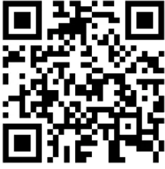
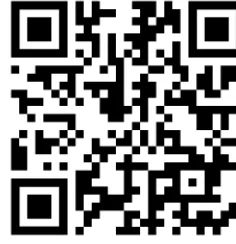
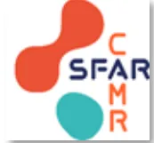

# INTUBATION EN VENTILATION SPONTANÉE

**SI DYSPNEE LARYNGEE** : envisager une **TRACHEOTOMIE SOUS AL**

**CRITÈRES D'INTUBATION EN VS (liste non exhaustive)**

**= intubation et ventilation jugées impossibles sous AG**

- Ouverture de bouche < 25mm (tester passage de lame du laryngo)
- Rachis bloqué en flexion
- Pathologie cervico-faciale (voir TDM +/- naso-fibroscope)
- ATCD de radiothérapie cervicale ou de chirurgie des VAS
- Risque d'obstruction des VAS

**CHOIX DE LA TECHNIQUE**

- **FIBROSCOPIE EN VS** :
  - • Technique de référence
  - • INT plus facile que IOT
- **VIDÉOLARYNGOSCOPIE EN VS** si :
  - • Ouverture de bouche suffisante
  - • Opérateur entraîné
  - • Fibroscope disponible

## Etape 1 : ANTICIPATION DES DIFFICULTÉS

- **INFORMATION DU PATIENT** :
  - • Déroulé de chaque étape de l'intubation, réassurance, obtenir la coopération du patient
- **PRÉPARATION DU GESTE** :
  - • Evaluation des VAS et du diamètre de la trachée (TDM), repérage membrane crico-thyroïdienne (écho)
  - • Vérification du matériel d'intubation : fibroscope, aspiration, diamètre de sonde adapté, lubrification
  - • Disponibilité du chariot d'urgence vitale
  - • +/- Chirurgien en salle avec matériel de trachéotomie
- **BRIEFING D'ÉQUIPE** :
  - • Anticiper le personnel nécessaire en salle et identifier les renforts possibles
  - • Enoncer clairement la stratégie et la répartition des rôles

## Etape 2 : ANESTHÉSIE LOCALE ÉTAGÉE

- **INSTALLATION DU PATIENT** au calme, monitoring, pose de VVP
- **ANESTHÉSIE LOCALE** (au moins 30 minutes avant l'intubation) :
  - • AL progressive et séquencée : fosses nasales, oropharynx, larynx, trachée
  - • Par **lidocaïne** (spray, gargarsime, aérosol), **lidocaïne naphazolinée** (méchage nasal)

Dose **MAXIMALE**  
de lidocaïne :  
**4 à 6mg/kg**  
(cf verso)

## Etape 3 : OXYGÉINATION, RÉALISATION DU GESTE

- **ENVIRONNEMENT CALME** au bloc opératoire : « silent cockpit », communication positive, réassurance du patient
- **INSTALLATION DU PATIENT** en position ½ assise (fibroscope) ou allongée (vidéolaryngoscopie)
- **OXYGÉINATION CONTINUE** (objectif  $SpO_2 > 98\%$ ) :
  - • Oxygénation nasale à haut débit ONHD (débit 50L/min,  $FiO_2$  100%)
  - • A défaut : masque à haute concentration (débit 12 à 15L/min)
- **SÉDATION EN VS** :
  - • **AIVOC propofol** seul ou **AIVOC remifentanil** seul, augmenter la cible par palier
  - • Objectifs : maintien de la VS et de la coopération du patient, confort du patient
- **EXPOSITION** glottique progressive par fibroscope ou vidéolaryngoscopie (complément d'AL si nécessaire)
- **INSERTION** de la sonde d'intubation dans la trachée
- **DOUBLE CONTRÔLE VISUEL** : position intra-trachéale de la sonde d'intubation + présence d'une courbe d' $EtCO_2$   
  (⚠ seul ce double contrôle visuel autorise la sédation en apnée)

- **INDUCTION** de la SÉDATION EN APNÉE
- Garder une **ATTENTION CONSTANCE** lors de l'installation du patient (période à risque d'extubation)## Etape 4 : GESTION DES DIFFICULTÉS

### DÉSATURATION

- Si patient en VS : augmenter le débit d'O2, introduire l'ONHD
- Si patient en apnée : baisser l'AIVOC, subluxer la mandibule, stimuler le patient
- Si SpO2 < 90% : arrêter le geste, restaurer l'oxygénation (+/- dispositif supraglottique, cricothyroïdotomie SMS)
- Si apparition d'une dyspnée laryngée : envisager une trachéotomie sous AL

### SÉDATION INADAPTÉE

- Insuffisante : compléter l'AL, augmenter l'AIVOC par paliers prudents ( Cl bolus de propofol)
- Trop profonde ( risque d'apnée / obstruction VAS) : baisser l'AIVOC, subluxer la mandibule, stimuler le patient

### ÉCHEC D'INTUBATION EN VS

- Si chirurgie non urgente : reporter l'intervention, réévaluation collégiale de la stratégie anesthésique
- Si chirurgie urgente : appel du chirurgien pour envisager une trachéotomie sous AL

## Etape 5 : APRÈS LA CHIRURGIE

- Si extubation à risque : RESTER VIGILANT, adapter les moyens humains et matériels
- ÉVALUATION DU VÉCU du patient en SSPI (« defusing »)
- TEST DE LA DÉGLUTITION avant reprise de l'alimentation solide et liquide
- DÉBRIEFING en équipe
- SUIVI PSYCHOLOGIQUE du patient si vécu négatif, ou SUIVI SPECIALISÉ si signes d'ESPT à distance

### Précautions pour l'ANESTHÉSIE LOCALE DES VAS :

- - Dose maximale de lidocaïne : 6mg/kg chez l'adulte,  
  4mg/kg si insuffisance rénale et hépatique, sujet âgé, dénutrition.
- - Lidocaïne 5% (spray ou nébuliseur) : 1 spray = 8mg de lidocaïne.
- - Lidocaïne 10mg/mL : instillation par le canal opérateur du fibroscopie ( absorption plasmatique majorée par les muqueuses de l'arbre bronchique).
- - Limiter l'utilisation d'AL durant la chirurgie : calculer la dose totale administrée.

Vidéo pédagogique :  
Fibroguidage

Vidéo pédagogique :  
Vidéolaryngoscope

Références : RFE SFAR 2026 "Prise en charge initiale des voies aériennes de l'adulte au bloc opératoire"

Réalisée en 2021 et mise à jour en 2026 par le CAMR

