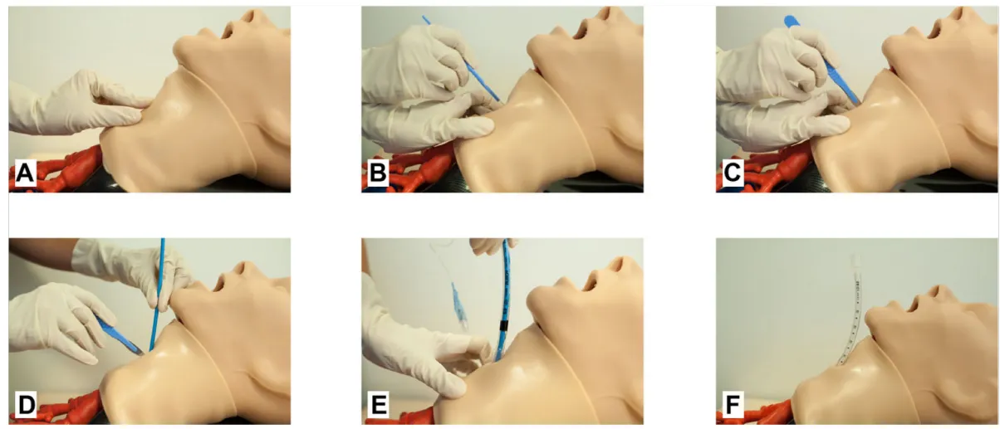

# Cricothyroïdomie par Technique SMS

(Scalpel – Mandrin long béquillé – Sonde d'intubation)

## Objectif

Oxygéner sans délai le patient pour éviter la survenue d'un arrêt cardiaque ou de lésions cérébrales hypoxiques

## Confirmer la situation

- Anesthésie et curarisation profonde
- Échec d'intubation malgré optimisation
- Échec d'oxygénation au masque facial malgré optimisation
- Échec d'oxygénation avec un dispositif supraglottique (DSG) malgré optimisation

## Matériel

- Scalpel (au mieux une lame de taille 10)
- Mandrin long béquillé
- Sonde d'intubation n°6 (lubrifiée si possible)

## Préparer le patient

- Maintien du DSG en place avec  $\text{FiO}_2$  100 % pour tentative d'oxygénation
- Tête en hyperextension +/- billot sous les épaules
- Désinfection cutanée cervicale

## Repérer la cible = **membrane cricothyroïdienne (CT)** (Fig. 1A)

- Se placer du côté gauche du patient si vous êtes droitier (inversement si vous êtes gaucher)
- Repérage échographique possible si absence de perte de temps
- Manoeuvre laryngée main non dominante de haut en bas avec palpation par l'index de tissus « dur-mou-dur » (cartilage thyroïde-membrane CT-cartilage cricoïde)

The image consists of six panels, labeled A through F, showing a step-by-step procedure on a medical mannequin. Panel A shows a scalpel being used to make a horizontal incision on the neck. Panel B shows the scalpel being rotated 90 degrees to make a caudal incision. Panel C shows a long, curved retractor (mandrin) being placed along the incision. Panel D shows a lubricated intubation tube being passed through the mandrin. Panel E shows the tube being removed from the mandrin. Panel F shows the tube in place in the trachea, with a capnography tube and stethoscope being used to verify its position.

**Fig. 1 Cricothyroïdomie par technique SMS (Scalpel, Mandrin, Sonde).**

A. Repérage de la membrane cricothyroïdienne en position d'extension cervicale ; B. Incision transversale horizontale de la membrane cricothyroïdienne par le scalpel ; C. Rotation à 90° du scalpel pour une incision caudale de la membrane cricothyroïdienne ; D. Faire glisser le mandrin long béquillé le long de la lame de scalpel ; E. Glisser la sonde d'intubation lubrifiée le long du mandrin long béquillé puis retirer le mandrin ; F. Vérifier la bonne position dans la trachée par la capnographie et l'auscultation pulmonaire et fixer la sonde.  
*D'après Duwat et al. Ann. Fr. Med. Urgence (2017) 7:319-322 DOI 10.1007/s13341-017-0775-8.*## SCALPEL

### Si membrane palpable :

- Avec main dominante, incision horizontale de la membrane CT (1-2 cm) au scalpel (Fig. 1B)
- Maintien du scalpel en position horizontale

### Si membrane non palpable :

- Avec main dominante, incision verticale du creux sternal vers le haut (jusqu'à 8-10 cm) au scalpel
- Dissection des tissus mous
- Identification puis incision horizontale de la membrane CT (1-2 cm)
- Maintien du scalpel en position horizontale

## MANDRIN

- Faire une rotation de 90° avec le scalpel (Fig. 1C)
- Prendre le scalpel dans la main non dominante et le mandrin long béquillé dans l'autre main (Fig. 1D)
- Insérer le mandrin long béquillé avec un angle de 45 ° en direction caudale
- Glisser le mandrin long béquillé dans l'axe de la trachée sur 8 à 10 cm
- Retirer le scalpel

## SONDE

- Maintenir le mandrin avec la main non dominante et faire glisser la sonde d'intubation (Fig. 1E)
- Gonfler le ballonnet de la sonde d'intubation
- Vérifier la capnographie et le soulèvement thoracique
- Ausculter puis fixer la sonde

### En cas d'échec

- Incision horizontale plus importante de la membrane CT
- Incision verticale plus importante
- Changer d'opérateur
- Dilatation de la membrane au doigt et utilisation d'une sonde plus petit diamètre
- Contrôle fibroscopique en cas de doute sur le positionnement de la sonde d'intubation

### Vidéo pédagogique

A large black and white QR code is centered on the page, below the 'Vidéo pédagogique' section. It is a standard square QR code used for digital linking.