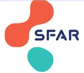

# DEBRIEFING - GESTION DES VOIES AERIENNES

Suite à un évènement en lien avec la gestion des voies aériennes...

Moi ou toute autre personne peut...

Demandez ou initiez un débriefing.

# 1

## QUAND ?

Dès la fin de l'évènement  
+/- quelques jours-semaines après.

# 2

## AVEC QUI ?

Toutes celles et ceux qui auraient été acteurs, ou spectateurs de la situation, sans distinction de fonction.

# 3

### En s'organisant

- En nommant un coordonnateur
- En rappelant la méthode, les règles
- En laissant un premier témoin exprimer sa vision
- En équilibrant les temps de paroles
- En prévoyant un expert (du sujet ou un psychologue)

## COMMENT ?

### En reprenant, ensemble, la situation

**Qu'est-ce qui s'est passé ?**

Intubation ou Ventilation difficile, nombres d'essais, désaturation....

**Ce qui a permis de réussir ?** Vidéo laryngoscope, mandrin, appel à l'aide, fibroscopie, prise de décision....

**Ce qu'on pourrait améliorer ?** sur un plan technique, sur un plan organisationnel, dans le travail d'équipe....

### En concluant

- Rappeler les points clés
- Garder une trace des échanges
- Proposer une ouverture et/ou une suite si besoin

Enjeux sécuritaires :

**La confidentialité est garantie lors des échanges**

**Juger est inutile**

**Dénigrer n'est pas permis**

Facteurs Humains en Santé  
Ensemble pour la qualité et sécurité des soins

