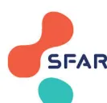

# Certificat de voies aériennes difficiles

## IDENTITE PATIENT

Nom :

Prénom :

Date de naissance :

Identification du service et de  
l'établissement de soins

**Nature de l'intervention :**

**Date d'intervention :** \_ / \_ / \_

**Date du certificat :** \_ / \_ / \_

## Évaluation préopératoire

<table border="0"><tr><td><input type="checkbox"/> Mallampati III-IV</td><td><input type="checkbox"/> Rachis cervical rigide</td><td><input type="checkbox"/> SAOS</td></tr><tr><td><input type="checkbox"/> Test de morsure de lèvre classe II-III</td><td><input type="checkbox"/> Rétrognathisme</td><td><input type="checkbox"/> Édentation</td></tr><tr><td><input type="checkbox"/> OB limitée à ___ cm</td><td><input type="checkbox"/> Intubation difficile connue</td><td><input type="checkbox"/> Radiothérapie cervicale</td></tr><tr><td><input type="checkbox"/> DTM limitée à ___ cm</td><td><input type="checkbox"/> IMC <math>\geq</math> 35 kg.m2</td><td><input type="checkbox"/> Autre :</td></tr></table>

### Constats

<table border="0"><tr><td><b>Ventilation au masque facial ?</b></td><td><input type="checkbox"/> Facile <input type="checkbox"/> Difficile <input type="checkbox"/> Impossible <input type="checkbox"/> Non utilisée</td></tr><tr><td><b>Intubation trachéale ?</b></td><td><input type="checkbox"/> Facile <input type="checkbox"/> Difficile <input type="checkbox"/> Impossible <input type="checkbox"/> Non utilisée</td></tr><tr><td><b>Cormack et Lehane ?</b></td><td><input type="checkbox"/> I <input type="checkbox"/> II <input type="checkbox"/> III <input type="checkbox"/> IV</td></tr><tr><td><b>POGO ?</b></td><td>___ %</td></tr></table>

### Optimisation de l'intubation et de la ventilation

<table border="0"><tr><td><b>Curarisation ?</b></td><td><input type="checkbox"/> Oui <input type="checkbox"/> Non</td></tr><tr><td><b>Canule de Guedel ?</b></td><td><input type="checkbox"/> Oui <input type="checkbox"/> Non</td></tr><tr><td><b>Changement d'opérateur ?</b></td><td><input type="checkbox"/> Oui <input type="checkbox"/> Non</td></tr><tr><td><b>Nombre de tentatives ?</b></td><td><input type="checkbox"/> 1 <input type="checkbox"/> 2 <input type="checkbox"/> 3 <input type="checkbox"/> &gt; 3</td></tr><tr><td><b>Dispositif(s) utilisé(s) ?</b></td><td><input type="checkbox"/> VL lame Mac <input type="checkbox"/> VL hyperangulée <input type="checkbox"/> Mandrin <input type="checkbox"/> VL avec canal latéral <input type="checkbox"/> Fibroscopie</td></tr><tr><td><b>Succès ?</b></td><td><input type="checkbox"/> Oui <input type="checkbox"/> Non</td></tr></table>

### Optimisation de l'oxygénation

<table border="0"><tr><td><b>Pose d'un DSG* ?</b></td><td><input type="checkbox"/> Oui <input type="checkbox"/> Non</td></tr><tr><td><b>Succès ?</b></td><td><input type="checkbox"/> Oui <input type="checkbox"/> Non</td></tr><tr><td><b>Si succès, décision ?</b></td><td><input type="checkbox"/> Report/Réveil <input type="checkbox"/> Poursuite avec le DSG <input type="checkbox"/> IOT fibroguidée à travers le DSG</td></tr></table>

### Abord sous-glottique d'urgence

<table border="0"><tr><td><b>Cricothyroïdomie par SMS ?</b></td><td><input type="checkbox"/> Oui <input type="checkbox"/> Non</td></tr><tr><td><b>Autre technique :</b></td><td></td></tr></table>

Commentaires :

Docteur \_\_\_\_\_  
Médecin Anesthésiste-Réanimateur

**Ce certificat est à conserver et à présenter avant chaque acte d'anesthésie**

\*Dispositif supraglottique