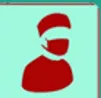

# INTUBATION DIFFICILE EN APNÉE AU BLOC OPÉRATOIRE

## CONFIRMER l'intubation difficile :

- Échec d'intubation au vidéolaryngoscope (3 tentatives maximum, maintien d'une  $SpO_2 > 95\%$ )
- Malgré l'optimisation de l'intubation :
  - Curarisation
  - Mobilisation laryngée externe
  - Optimisation de la position de la tête
  - Utilisation d'un mandrin
  - Changement de lame / de vidéolaryngoscope
  - Changement d'opérateur

## APPEL À L'AIDE

Tel renfort MAR = .....

Tel chir / ORL = .....

## PRIORITÉ = MAINTENIR L'OXYGÉINATION

## Si **DÉSATURATION** durant la procédure :

- Optimiser la ventilation au masque facial :
  - Curarisation / Approfondissement sédation
  - Canule de Guedel / Ventilation à 4 mains
  - Changement d'opérateur
- Utiliser dispositif supra-glottique (DSG) de 2ème génération :
  - 3 tentatives maximum
  - Contrôle courbe de capnographie
  - Anticiper cricothyroïdomie

↓ **ÉCHEC**

↓ **SUCCÈS**

## Si **DÉSATURATION** persistante :

- Cricothyroïdomie (cf verso) :
  - Technique SMS en 1ère intention
    - - Extension cervicale
    - -  $FiO_2$  100% à travers le DSG
    - - Echopérage (si possible)

↓ Après correction de la  $SpO_2$

- Pause / Réflexion :
  - Réveil / Report de la chirurgie
  - Chirurgie (si urgente)
  - Trachéotomie secondaire

## Après correction de la $SpO_2$ :

- Pause / Réflexion :
  - Poursuite de la chirurgie avec le DSG
  - Intubation fibro-guidée à travers le DSG
  - Réveil / Report de la chirurgie

↓

## Succès de l'intubation / du DSG =

- **Courbe de capnographie ( $EtCO_2$ )**
- Correction de la  $SpO_2$

## APRÈS L'INTERVENTION

- Si extubation à risque : rester vigilant, adapter les moyens humains et matériels
- Remettre un certificat d'intubation difficile au patient (cf modèle certificat SFAR)
- Débriefing en équipe