Etiquette patient

**URGENCE VITALE**  
en service d'hospitalisation  
conventionnelle

Date : .. / .. / 20..

**ACTIONS SIMULTANÉES A ENTREPRENDRE AVANT L'ARRIVEE DE L'EQUIPE DE REANIMATION**

Situation **aiguë** mettant en jeu le **pronostic vital**  
et nécessitant une **action immédiate**

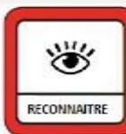

Horaires

Par exemple (non exhaustif):

- ✓ Détresse respiratoire aiguë; hypoxémie sévère
- ✓ Coma brutal; modification brutale de l'état de conscience
- ✓ Etat de choc; bradycardie ou tachycardie sévère
- ✓ Suspicion d'anaphylaxie
- ✓ ....

.. H ..

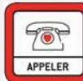

**Appeler la ligne URGENCE VITALE au .....**

.. H ..

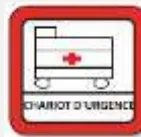

**Appeler des renforts**   
**Faire apporter le chariot d'urgence et le DSA**

**Hypotension –Etat de choc**

Position : surélever les membres inférieurs   
2ème VVP   
Hémocue si disponible  .....

**Détresse respiratoire**

Position : ½ assise

**Coma**

Position : PLS   
Température  .....  
Glycémie  .....

**Grossesse manifeste**

Position : décubitus latéral gauche

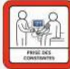

**Mesure rapprochée des paramètres vitaux** (par ex, toutes les 3 min)  
Maintien à jeun   
Glycémie

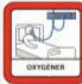

Libérer les voies aériennes   
**O2 Ouvert à 15 L/minute** au masque à haute concentration

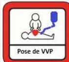

**VVP fonctionnelle :**  
- Vérifier VVP en place ou poser 1 VVP **AVEC** robinet   
- Base de NaCl 0,9% 500 mL pour purger la voie

Etiquette patient

**ARRÊT CARDIAQUE**  
en service d'hospitalisation  
conventionnelle

Date : .. / .. / 20..

**ACTIONS SIMULTANÉES A ENTREPRENDRE AVANT L'ARRIVEE DE L'EQUIPE DE REANIMATION**

Horaires

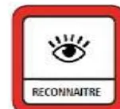

Constat Arrêt Cardiaque   
- Pas de conscience  
- Ne respire pas ou agonie (Gasp)  
- Il n'est pas nécessaire de chercher le pouls !

.. H ..

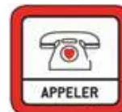

**Appeler la ligne URGENCE VITALE au .....**

.. H ..

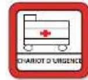

**Appeler des renforts**   
**Faire apporter le chariot d'urgence et le DSA**   
Vérifier le système d'aspiration

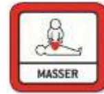

**Débuter les Compressions Thoraciques (CT)**   
5-6 cm de profondeur  
Fréquence 100/120 min  
Se relayer toutes les 2 minutes  
**NE JAMAIS S'ARRÊTER**  
Si grossesse manifeste, déplacement utérin vers la gauche

.. H ..

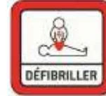

**Allumer le défibrillateur (DSA), poser les patches,** et suivre les instructions   
(Arrêter ponctuellement les CT si demandé par le DSA)

.. H ..

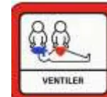

Libérer les voies aériennes   
**O2 Ouvert à 15 L/minute**   
- O2 au masque à haute concentration   
- ou **BAVU** : 2 ventilations toutes les 30 compressions

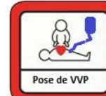

**VVP fonctionnelle :**  
- Vérifier VVP en place   
- Poser 1 VVP **AVEC** robinet   
- Base de NaCl 0,9% 500 mL pour purger la voie

Préparer deux seringues et les étiqueter :  
- **Adrénaline PURE** 1mg/1ml (10 mL)   
- **Amiodarone PURE** 300 mg/6 ml# ARRIVEE DE L'EQUIPE DE REANIMATION : ...H...

**1**

**Etat clinique à l'arrivée :**

- - GCS .....  
  Pupilles .....  
  Signe de localisation .....
- - PA ..... mmHg  
  FC ..... bpm  
  Arythmie ? .....  
  Marbrures .....
- - SpO2 ..... % sous .....  
  FR ..... / minute  
  Signes de l'utte .....
- - Température .....  
  HGT : .....  
  Autre : .....  
  .....

**SI ARRET CARDIAQUE**

- - Confirmation AC
- - Rythme initial
  - - TV
  - - FV
  - - Asystolie
  - - Dissociation
  - - Autre

Compressions thoraciques  
Relais toutes les 2 minutes

Envisager ECMO, tel : .....

**SI RACS :**

- • Cardiologue pour coro : .....  
  Radiologue pour scanner : .....

**2**

**Absence de CI à la réanimation**

**Si grossesse utérus à l'ombilic :**  
Extraction fœtale sur le lieu AC  
Tel Obstétricien : .....  
Tel Pédiatre : .....

**3**

**Contrôle des voies aériennes**

- - IOT N° .....  
  Avec laryngoscope  Cormack .....  
  Avec vidéolaryngoscope  POGO .....  
  Utilisation du mandrin d'Eischman  Nombre de laryngoscopies .....  
  Inhalation macroscopique   
  Ventilation
  - - BAVU
  - - Respirateur

Réglages : FiO2 ..... VT ..... FR ..... PEP .....

**4**

**Enquête étiologique : terrain, événements récents ?**

- Respiratoire :
  - ➢ Détresse respiratoire préalable ?
- Cardiaque :
  - ➢ Douleur thoracique ? Anomalie ECG ? Signes droits ?
- Neurologique :
  - ➢ Signe de localisation? Pupilles ?
- Métabolique :
  - ➢ Dyskaliémie connue ? Insuffisance rénale ? Syndrome de lyse ?
- Anaphylaxie :
  - ➢ Perfusion en cours ?

<table border="1">
<thead>
<tr>
<th>Heure</th>
<th>CONSTANTES</th>
<th>TRAITEMENTS</th>
</tr>
</thead>
<tbody>
<tr>
<td>Aréactif (v/v)</td>
<td></td>
<td></td>
</tr>
<tr>
<td>Pouls (v/v)</td>
<td></td>
<td></td>
</tr>
<tr>
<td>EtCO2</td>
<td></td>
<td></td>
</tr>
<tr>
<td>PA</td>
<td></td>
<td></td>
</tr>
<tr>
<td>SpO2</td>
<td></td>
<td></td>
</tr>
<tr>
<td>CEE</td>
<td></td>
<td></td>
</tr>
<tr>
<td>Adré (mg)</td>
<td></td>
<td></td>
</tr>
<tr>
<td>Amiodarone (mg)</td>
<td></td>
<td></td>
</tr>
<tr>
<td></td>
<td></td>
<td></td>
</tr>
</tbody>
</table>

**Bilan de la réanimation :**

- - Résumé médical de la prise en charge .....
- - Etiologie retenue ? .....
- - Destination du/de la patient(e) .....

**Heure RACS :** .....  
➢ Durée No Flow ..... minutes / Durée Low Flow : ..... minutes  
ou  
Heure décision arrêt RCP : ..... H .....  
➢ Heure du décès : ..... H ..... le ..... / ..... / 20...

**Information des proches du patient :**

- - Nom du proche : .....
- - Personne ayant délivré l'information : .....

**Traçabilité :**

- - Leader médical (Réa) : .....
- - Interne (Réa) : .....
- - Infirmier(e) : .....
- - Aide soignant(e) : .....
- - Autres professionnels impliqués : .....

.....  
Cette feuille est scannée et intégrée au dossier informatique du /de la patient(e)   
Ranger cette feuille dans le dossier médical papier

**Suites à donner :**

- - Problème rencontré lors de la PEC : .....
- - Envisager déclaration « Evénement Indésirable Grave » et un débriefing de la prise en charge. Personne référente : .....