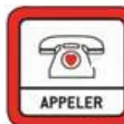
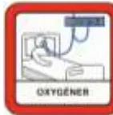
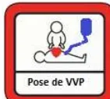
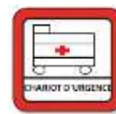
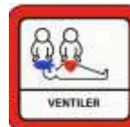
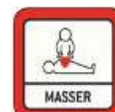
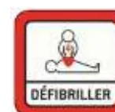
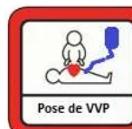

Etiquette patient

**URGENCE VITALE PEDIATRIQUE**  
en service d'hospitalisation conventionnelle

Poids estimé =  
(Age + 4) x 2

Date : .. / .. / 20..

**ACTIONS SIMULTANÉES A ENTREPRENDRE AVANT L'ARRIVEE DE L'EQUIPE DE REANIMATION**

Situation **aiguë** mettant en jeu le **pronostic vital** et nécessitant une **action immédiate**

Par exemple (non exhaustif):

- ✓ Détresse respiratoire aiguë; hypoxémie sévère
- ✓ Coma brutal; modification brutale de l'état de conscience
- ✓ Etat de choc; bradycardie (<60) ou tachycardie sévère (>150)
- ✓ Suspicion d'anaphylaxie
- ✓ ....

Horaires

.. H ..

Appeler la ligne **URGENCE VITALE** au .....

.. H ..

Appeler des renforts   
Faire apporter le chariot d'urgence et le **DSA**

**Hypotension –Etat de choc**

Position : surélever les membres inférieurs   
2ème VVP si possible   
Hémocue si disponible  .....

**Détresse respiratoire**

Position :  
½ assise pour > 2 ans   
Proclive 30° < 2 ans

**Coma**

Position : PLS   
Température  .....  
Glycémie  .....

**Mesure rapprochée des paramètres vitaux** (par ex, toutes les 3 min)  
Maintien à jeun   
Glycémie

Libérer les voies aériennes   
**O2 Ouvert à 15 L/minute** au masque à haute concentration

**VVP fonctionnelle :**  
- Vérifier VVP en place ou poser 1 VVP **AVEC** robinet   
- Base de NaCl 0,9% seringue de 10 ml pour purger la voie

Etiquette patient

**ARRÊT CARDIAQUE PEDIATRIQUE**  
en service d'hospitalisation conventionnelle

Poids estimé =  
(Age + 4) x 2

Date : .. / .. / 20..

**ACTIONS SIMULTANÉES A ENTREPRENDRE AVANT L'ARRIVEE DE L'EQUIPE DE REANIMATION**

Constat Arrêt Cardiaque   
- Pas de conscience  
- Ne respire pas ou agonie (Gasp)  
- Il n'est pas nécessaire de chercher le pouls !

Horaires

.. H ..

Appeler la ligne **URGENCE VITALE** au .....

.. H ..

Appeler des renforts   
Faire apporter le chariot d'urgence et le **DSA**   
Vérifier le système d'aspiration

Vérifier et libérer les voies aériennes   
**O2 Ouvert à 15 l/min**   
Réalisation 5 insufflations au **BAVU**   
⚠ **ACR majoritairement HYPOXIQUE** chez l'enfant

Débuter les **Compressions Thoraciques (CT)**   
**Rythme 15 compressions / 2 ventilations**  
4-5 cm de profondeur - Fréquence 100/120 min - Se relayer toutes les 2 minutes - **NE JAMAIS S'ARRÊTER**

.. H ..

Allumer le **défibrillateur (DSA)**, poser les **patches**, et suivre les instructions   
(Arrêter ponctuellement les CT si demandé par le DSA)  
- **Patch antéro-postérieur jusqu'à 25 kg soit 8 ans**  
- « **mode pédiatrique** » jusqu'à 25 kg soit 8 ans

.. H ..

**VVP ou KTIO fonctionnel**  
- Vérifier VVP / KTIO en place   
- Poser 1 VVP / KTIO **AVEC** robinet   
- Base de NaCl 0,9% seringue de 10 ml pour purger la voie

Préparer deux seringues et les étiqueter :

- - **Adrénaline diluée : 0,1 ml/kg**   
  Prendre 1 ml d'adrénaline ajouter 9 ml de NaCl 0,9% = Adrénaline diluée à 0.1 mg/ml
- - **Amiodarone 5 mg/kg**## Normes pédiatriques

**Poids estimé = (Age + 4) x 2**

<table border="1">
<thead>
<tr>
<th colspan="3">FRÉQUENCE RESPIRATOIRE</th>
</tr>
<tr>
<th></th>
<th>Polypnée (/min)</th>
<th>FR normale</th>
</tr>
</thead>
<tbody>
<tr>
<td>1 mois</td>
<td>55</td>
<td>35</td>
</tr>
<tr>
<td>&lt; 1 an</td>
<td>40</td>
<td>30</td>
</tr>
<tr>
<td>&lt; 10 ans</td>
<td>25</td>
<td>20</td>
</tr>
<tr>
<td>&gt;10 ans</td>
<td>20</td>
<td>15</td>
</tr>
</tbody>
</table>

<table border="1">
<thead>
<tr>
<th colspan="5">CONSTANTES HÉMODYNAMIQUES</th>
</tr>
<tr>
<th></th>
<th>1 mois</th>
<th>1-12 mois</th>
<th>1-10 ans</th>
<th>&gt;10 ans</th>
</tr>
</thead>
<tbody>
<tr>
<td>PAM limite inf.</td>
<td>45</td>
<td>55</td>
<td>55-60</td>
<td>60</td>
</tr>
<tr>
<td>PAS limite inf.</td>
<td>55</td>
<td>75</td>
<td>75-80</td>
<td>90</td>
</tr>
<tr>
<td>FC normale</td>
<td colspan="2">80-180</td>
<td colspan="2">50-150</td>
</tr>
</tbody>
</table>

<table border="1">
<thead>
<tr>
<th colspan="4">MATÉRIEL D'INTUBATION</th>
</tr>
<tr>
<th>Age</th>
<th>SIT (à ballonnet)</th>
<th>Repère SIT</th>
<th>Lame</th>
</tr>
</thead>
<tbody>
<tr>
<td>&lt; 6 mois</td>
<td>De 3 à 3.5</td>
<td>Voie orale (&lt; 10 kg) : 6 cm + poids (kg)</td>
<td>0 (D/C)</td>
</tr>
<tr>
<td>6-12 mois</td>
<td>3.5 à 4</td>
<td rowspan="4">Voie orale (&gt;10kg) : (Age/2) + 12 cm</td>
<td>1 (D/C)</td>
</tr>
<tr>
<td>1-2 ans</td>
<td>4 à 4.5</td>
<td>2 (C)</td>
</tr>
<tr>
<td>&gt;2ans</td>
<td rowspan="2">(Age/4) + 3.5</td>
<td>3 (C)</td>
</tr>
<tr>
<td>Adulte</td>
<td>4 (C)</td>
</tr>
</tbody>
</table>

<table border="1">
<tbody>
<tr>
<td><b>KT</b></td>
<td rowspan="2">Aiguille bleue (25 mm) : nouveau-né, nourrisson, enfant</td>
</tr>
<tr>
<td><b>INTRA-OSSEUX</b></td>
<td>Aiguille jaune (45 mm) : obèse, humérale chez l'adulte</td>
</tr>
</tbody>
</table>

### DILUTION DES AMINES SUR VVP pour un support tensionnel en cas de choc

#### **ADRENALINE (1mg=1ml)** **(pour choc septique – cardiogénique – anaphylactique)**

Dilution : 1 ml (=1 mg) dans 50 ml de SSI  
Posologie : poids (kg)/3 = débit (ml/h) = 0,1 mcg/kg/min

#### **NORADRENALINE (8 mg=4 ml)** (pour choc septique)

Dilution : 0,5 ml (=1 mg) dans 50 ml de SSI  
Posologie : poids (kg)/3 = débit (ml/h) = 0,1 mcg/kg/min

#### **DOBUTAMINE (250 mg=20 ml)** (pour choc cardiogénique)

Dilution : 4 ml (=50 mg) dans 50 ml de SSI  
Posologie : poids(kg)/3 = débit (ml/h) = 5 mcg/kg/min

### Drogues de l'ACR

#### **ADRENALINE (1 ml=1 mg)**

Dilution : prendre 1 mg d'adrénaline soit 1 ml + 9 ml de NaCl 0.9% (=SSI)  
Posologie en cas d'ACR : 10 mcg/kg en IVD soit 0.1 ml/kg de la solution diluée (max 10 ml = max 1 mg)

<table border="1">
<thead>
<tr>
<th>Poids (kg)</th>
<th>3</th>
<th>5</th>
<th>10</th>
<th>15</th>
<th>20</th>
<th>25</th>
<th>30</th>
<th>35</th>
<th>40</th>
<th>45</th>
<th>50</th>
</tr>
</thead>
<tbody>
<tr>
<td>solution diluée adrénaline (ml)</td>
<td>0,3</td>
<td>0,5</td>
<td>1</td>
<td>1,5</td>
<td>2</td>
<td>2,5</td>
<td>3</td>
<td>3,5</td>
<td>4</td>
<td>4,5</td>
<td>5</td>
</tr>
</tbody>
</table>

#### **CORDARONE (3 ml=150 mg)**

Dilution : 1 ampoule de Cordarone + 12 ml de SG 5%  
Posologie : 5 mg/kg en IVD après dilution  
**A noter en cas de torsade de pointe( = TV) : MgSO4 15% 50 mg/kg soit 0.3 ml/kg IVD (max 2g)**

<table border="1">
<thead>
<tr>
<th>Poids (kg)</th>
<th>5</th>
<th>10</th>
<th>15</th>
<th>20</th>
<th>25</th>
<th>30</th>
<th>35</th>
<th>40</th>
<th>45</th>
<th>50</th>
</tr>
</thead>
<tbody>
<tr>
<td>solution diluée cordarone (ml)</td>
<td>2,5</td>
<td>5</td>
<td>7,5</td>
<td>10</td>
<td>12,5</td>
<td>15</td>
<td>17,5</td>
<td>20</td>
<td>22,5</td>
<td>25</td>
</tr>
</tbody>
</table>

### Bradycardies sinusales mal tolérées et BAV

#### **ISOPRENALINE, ISUPREL (0,2 mg/1 ml)**

Dilution : 2 ampoules (= 2 ml) d'Isuprel + 18 ml de SG5% : concentration 20 γ/ml  
Posologie : en continue : 0,05 γ/kg/min à 0,2 γ/kg/min (max 20 γ/min)

<table border="1">
<thead>
<tr>
<th>Poids (kg)</th>
<th>5</th>
<th>10</th>
<th>15</th>
<th>20</th>
<th>25</th>
<th>30</th>
<th>35</th>
<th>40</th>
<th>45</th>
<th>50</th>
</tr>
</thead>
<tbody>
<tr>
<td>Solution diluée poso min (ml/h)</td>
<td>0,7</td>
<td>1,5</td>
<td>2,2</td>
<td>3</td>
<td>3,7</td>
<td>4,5</td>
<td>5,2</td>
<td>6</td>
<td>6,7</td>
<td>7,5</td>
</tr>
<tr>
<td>Solution diluée poso max (ml/h)</td>
<td>3</td>
<td>6</td>
<td>9</td>
<td>12</td>
<td>15</td>
<td>18</td>
<td>21</td>
<td>24</td>
<td>27</td>
<td>30</td>
</tr>
</tbody>
</table>

#### **ATROPINE (1 ml = 0,5 mg)**

Dilution : 1 ml d'atropine + 4 ml de SSI  
Posologie : 10 γ/kg en IVD (dose minimale : 100 γ = 1 ml)

<table border="1">
<thead>
<tr>
<th>Poids (kg)</th>
<th>5</th>
<th>10</th>
<th>15</th>
<th>20</th>
<th>25</th>
<th>30</th>
<th>35</th>
<th>40</th>
<th>45</th>
<th>50</th>
</tr>
</thead>
<tbody>
<tr>
<td>solution diluée atropine (ml)</td>
<td>1</td>
<td>1</td>
<td>1,5</td>
<td>2</td>
<td>2,5</td>
<td>3</td>
<td>3,5</td>
<td>4</td>
<td>4,5</td>
<td>5</td>
</tr>
</tbody>
</table>

### Tachycardies jonctionnelles

#### **STRIADYNE (adenosine Triphosphate) (2 ml = 20 mg)**

Dilution : solution pure à passer en Flush le plus près du cœur et rincer avec 5 ml de SSI en IVD  
Posologie : 1 mg/kg en IVD (max 10 mg -1ère dose-) à renouveler si inefficacité

<table border="1">
<thead>
<tr>
<th>Poids (kg)</th>
<th>5</th>
<th>10</th>
<th>15</th>
<th>20</th>
<th>25</th>
<th>30</th>
<th>35</th>
<th>40</th>
<th>45</th>
<th>50</th>
</tr>
</thead>
<tbody>
<tr>
<td>Solution striadyne pure (ml) 1ère dose</td>
<td>0,5</td>
<td>1</td>
<td>1</td>
<td>1</td>
<td>1</td>
<td>1</td>
<td>1</td>
<td>1</td>
<td>1</td>
<td>1</td>
</tr>
<tr>
<td>Solution striadyne pure (ml) 2ème dose</td>
<td>0,5</td>
<td>1</td>
<td>1</td>
<td>2</td>
<td>2</td>
<td>2</td>
<td>2</td>
<td>2</td>
<td>2</td>
<td>2</td>
</tr>
</tbody>
</table>

#### **KRENOSIN (adénosine) (2 ml = 6 mg)**

Dilution : 2 amp. d'Adénosine + 8ml NaCl 0,9% - rincer avec 5ml SSI en IVD  
Posologie : Première dose 0,1 mg/kg (max 6 mg), Deuxième dose 0,2mg/kg (max 12mg)

<table border="1">
<thead>
<tr>
<th>Poids (kg)</th>
<th>5</th>
<th>10</th>
<th>15</th>
<th>20</th>
<th>25</th>
<th>30</th>
<th>35</th>
<th>40</th>
<th>45</th>
<th>50</th>
</tr>
</thead>
<tbody>
<tr>
<td>Volume à injecter 1ère dose (ml)</td>
<td>0,5</td>
<td>1</td>
<td>1,5</td>
<td>2</td>
<td>2,5</td>
<td>3</td>
<td>3,5</td>
<td>4</td>
<td>4,5</td>
<td>5</td>
</tr>
<tr>
<td>Volume à injecter 2ème dose (ml)</td>
<td>1</td>
<td>2</td>
<td>3</td>
<td>4</td>
<td>5</td>
<td>6</td>
<td>7</td>
<td>8</td>
<td>9</td>
<td>10</td>
</tr>
</tbody>
</table>