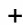
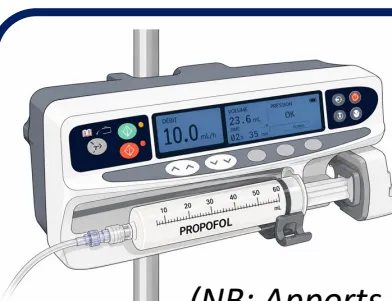
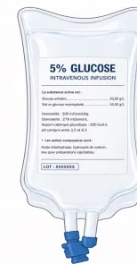
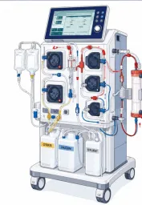
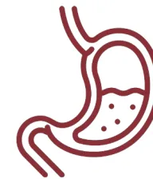
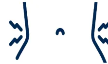
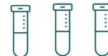

CHAMP 1 PÉRI-OPÉRATOIRE

 RISQUE NUTRITIONNEL

 FACTEURS DE RISQUE \*

 • Liés au patient:

Âge, cancer, sepsis, pathologie chronique, antécédents chirurgicaux majeurs, troubles neurologiques ou psychiatriques, Symptômes digestifs chroniques

 • Liés au traitement:

Chimiothérapie, radiothérapie, corticothérapie, polymédication

 SCORES \*


 Score GNRI

(Geriatric Nutritional Risk Index)

 Score CONUT

(Controlling Nutritional Status score)

 DIAGNOSTIC DE LA DÉNUTRITION

 1 CRITÈRE PHÉNOTYPIQUE HAS †


 • Calcul de la **perte de poids pré-opératoire** :

→ Anamnèse :  $\geq 5\% / 1 \text{ mois}$  ou  $\geq 10\% / 6 \text{ mois}$  ou  $\geq 10\% / \text{poids habituel}$  avant maladie

 • **IMC** :  $< 18.5 \text{ kg/m}^2$  si  $< 70 \text{ ans}$  /  $< 22 \text{ kg/m}^2$  si  $\geq 70 \text{ ans}$ 

 • **Réduction de la force** : Force de préhension et/ou test de levers de chaise

 • **Réduction de la masse musculaire** (si disponible : imagerie, impédancemétrie, DEXA)


 1 CRITÈRE ÉTIOLOGIQUE HAS †


 • **Réduction de la prise alimentaire**

 • **Malabsorption / maldigestion**

 • **Situation d'agression** :

Chirurgie à risque intermédiaire ou élevé, ou contexte carcinologique

 POUR POSER LE DIAGNOSTIC DE LA DÉNUTRITION


1 seul critère phénotypique



1 seul critère étiologique

Suffisent parmi tous ceux listés

 SÉVÉRITÉ ET SUIVI


 ALBUMINÉMIE

- • Sévérité de la dénutrition

Modérée : 30-35 g/L  
Sévère :  $\leq 30 \text{ g/L}$

- • Valeur pronostique

 PRÉ-ALBUMINÉMIE

- • Suivi dynamique de l'état nutritionnel


\* Voir Annexes 1,4 et 5  
† Voir Annexes 2 et 3

**DEXA:** dual energy x-ray absorptiometry (absorbtiométrie biphotonique à rayon X); **HAS:** Haute Autorité de Santé; **IMC:** Index de Masse Corporelle.**CHAMP 1 PÉRI-OPÉRATOIRE**

**STRATÉGIES PRÉ-OPÉRATOIRES**

**PRÉHABILITATION**

Stratifiée sur risque individuel :

- • Fragilité / Réserve fonctionnelle diminuée
- • Dénutrition avérée / Sarcopénie
- • Score ASA  $\geq 3$  / Âge  $\geq 65-70$  ans

Exercice physique

Équilibration comorbidités

Stratégie nutritionnelle

**STRATÉGIE NUTRITIONNELLE**

Nutrition artificielle pré-opératoire

Anticipation de la reprise alimentaire post-opératoire

**STRATÉGIES POST-OPÉRATOIRES**

**RAAC**

Stratégie de réhabilitation améliorée incluant une stratégie nutritionnelle

**STRATÉGIE NUTRITIONNELLE**

Reprise alimentaire précoce orale ou artificielle

+/- combinaison des voies nutritionnelles pour atteindre les cibles

**Cibles : 20-25 kcal/kg/j et 1-1.3 g de protéines/kg/j**

**INTÉGRATION PRÉCOCE DU DIÉTÉTICIEN ET DURANT L'ENSEMBLE DU PARCOURS PÉRI-OPÉRATOIRE**

Limitation de la perte de poids

Atteinte optimisée des cibles caloriques et protéiques

Meilleure application des recommandations

Meilleure valorisation financière des séjours**CHAMP 2 - SOINS CRITIQUES**

**RISQUE NUTRITIONNEL**

PAS DE SCORE SPÉCIFIQUE


Tout patient admis en soins critiques est à risque nutritionnel

**DIAGNOSTIC DE LA DÉNUTRITION**

1 CRITÈRE PHÉNOTYPIQUE HAS \*


- Calcul de la **perte de poids avant admission**  
  → Anamnèse :  $\geq 5\% / 1$  mois **ou**  $\geq 10\% / 6$  mois **ou**  $\geq 10\% / \text{poids habituel avant maladie}$

• **IMC :  $<18.5 \text{ kg/m}^2$  si  $<70$  ans /  $< 22 \text{ kg/m}^2$  si  $\geq 70$  ans**

• **Réduction de la force** (si réalisable)

• **Réduction de la masse musculaire**

+

1 CRITÈRE ÉTIOLOGIQUE HAS \*


• **Réduction de la prise alimentaire**

• **Malabsorption / maldigestion**

• **Situation d'agression** : Pathologie aiguë critique

**POUR POSER LE DIAGNOSTIC DE LA DÉNUTRITION**


1 seul critère phénotypique

+

1 seul critère étiologique

Suffisent parmi tous ceux listés

**SÉVÉRITÉ ET SUIVI**

**BIOLOGIE**


**ALBUMINÉMIE**

• Sévérité de la dénutrition

Modérée : 30-35 g/L  
Sévère :  $\leq 30 \text{ g/L}$

• Valeur pronostique

**mNUTRIC**

• Stratification du risque

<table border="1">
<thead>
<tr>
<th data-bbox="10 100 330 200">ÉTAT DE CHOC<br/>DÉFAILLANCE MULTIVISCÉRALE</th>
<th data-bbox="330 100 655 200">STABILISATION</th>
<th data-bbox="655 100 980 200">RÉHABILITATION</th>
</tr>
</thead>
<tbody>
<tr>
<td data-bbox="10 200 330 750">
<p><b>Instabilité Majeure</b></p>
<p>Catécholamines Forte dose ou Croissante</p>
<p>Hypoperfusion Hyperlactatémie</p>
<p>→ <b>NON</b></p>
<p>Initiation <b>possible</b> d'un support nutritionnel dans les <b>48h</b></p>
<p>Contre-indication entérale?*</p>
<p>→ OUI → Voie Parentérale</p>
<p>→ NON → Voie Entérale</p>
<p>→ <b>Cibles Basses</b> (incluant les <b>calories non-nutritionnelles</b>)</p>
<p>→ <b>OUI</b></p>
</td>
<td data-bbox="330 200 655 750">
<p><b>Ascension progressive des apports</b></p>
<p>Voie(s) <b>Entérale et/ou Parentérale</b></p>
<p><b>Surveillance et titration</b></p>
<table border="1">
<tr>
<th data-bbox="340 455 495 500">Gastro-intestinale</th>
<th data-bbox="500 455 650 500">Métabolique</th>
</tr>
<tr>
<td data-bbox="340 500 495 740">
                    Vomissement<br/>
                    Régurgitation<br/>
                    Diarrhée<br/>
                    Distension<br/>
                    Pression intra-abdominale
                </td>
<td data-bbox="500 500 650 740">
                    Phosphate<br/>
                    Magnésium<br/>
                    Potassium<br/>
                    Glycémie / Insuline<br/>
                    Triglycérides<br/>
                    Bilan hépatique<br/>
                    Urée
                </td>
</tr>
</table>
</td>
<td data-bbox="655 200 980 750">
<p><b>Stratégie nutritionnelle multimodale</b></p>
<p>Évaluation de la dénutrition<br/>Évaluation de la fonction musculaire</p>
<p>Mobilisation<br/>Exercice physique<br/>Atteinte cibles protidiques<br/>Dépistage et prise en charge de la dysphagie post-extubation</p>
<p><b>Suivi des apports post-réanimation</b><br/><b>ÉQUIPE DIÉTÉTIQUE</b></p>
</td>
</tr>
<tr>
<td data-bbox="10 750 330 880">
<p><b>PAS DE NUTRITION</b></p>
</td>
<td data-bbox="330 750 655 880">
<p><b>≤10 kcal/kg/j</b><br/><b>≤ 0.4 g/kg/j</b></p>
</td>
<td data-bbox="655 750 980 880">
<p><b>10-20 kcal/kg/j</b><br/><b>≤ 0.9 g de protéine/kg/j</b></p>
</td>
</tr>
</tbody>
</table>

\* Hémorragie digestive haute non contrôlée, ischémie intestinale suspectée ou avérée, occlusion intestinale, syndrome du compartiment abdominal, fistule digestive à haut débit en l'absence d'accès distal.

† Chez les patients en phase de réhabilitation présentant une insuffisance rénale aiguë sans épuration extra-rénale, il est recommandé de maintenir une cible protéique modérée de 0.9 g/kg/j.CHAMP 2 - SOINS CRITIQUES


**Propofol 1% 150 mg/h (15 mL/h)**
**≈ 400 kcal/24h**
*(NB: Apports divisés par 2 avec Propofol 2% (200 kcal/24h))*

**Soluté glucosé à 5% (G5%) 500 mL/j**
**= 100 kcal/24h**

**Épuration extra-rénale au citrate**
**≈ 200 kcal/24h**

$$E_{\text{citrate}} (\text{kcal/j}) = Q_{\text{sang}} (\text{mL/min}) \times D_{\text{citrate}} (\text{mmol/L de sang}) \times \frac{60 \times 24}{1000} \times \left(1 - \frac{F_{\text{élimination}}}{100}\right) \times 0,59 (\text{kcal/mmol})$$

1 g glucose = **4 kcal**  
 1 mL propofol = **1.1 kcal**  
 1 g citrate ≈ **3 kcal**


**700 kcal/24h**  
**≈ 10 kcal/kg/24h**  
**pour un patient de 70 kg**

Afin d'éviter tout risque de surnutrition, les **calories non nutritionnelles doivent être intégrées** dans l'évaluation des apports énergétiques avant d'initier ou d'augmenter le support nutritionnel. Lorsque ces apports dépassent les cibles adaptées à l'état clinique du patient, l'instauration du support nutritionnel doit être **différée**.CHAMP 2 - SOINS CRITIQUES



**INTOLÉRANCE  
DIGESTIVE  
HAUTE**

①

**Prokinétiques**  
Durant 48-72 h

Erythromycine (100-250 mg x 3/j IVL)  
Métoclopramide (10 mg x 3/j IVL)

②

**Échec  
Prokinétiques**

Nutrition entérale post-pylorique / jéjunale  
Nutrition entérale intermittente non recommandée


**DIARRHÉE**

**Solutés entéraux contenant des fibres**



**CONSTIPATION  
DISTENSION  
ABDOMINALE**

**Solutés entéraux contenant des fibres**

**Laxatifs curatifs (utilisation prophylactique non recommandée)**

**Massages abdominaux protocolisés**

**PAMORAs non recommandés (prophylactiques ou curatifs)**

**CHAMP 2 - SOINS CRITIQUES**

```

graph TD
    A["1 Pression & caresse  
Dans le sens des aiguilles d'une montre"] --> B["2 Tapotements  
À 4 doigts, le long du cadre colique"]
    B --> C["3 Pétrissage  
Côlon droit: de bas en haut  
Côlon gauche : de haut en bas"]
    C --> D["4 Vibrations  
Paroi stimulée par la paume de la main pour produire une vibration"]
    D --> E["NE 30 mn avant  
+  
Installation en décubitus dorsal"]
  
```

**1 Pression & caresse**  
Dans le sens des aiguilles d'une montre

**2 Tapotements**  
À 4 doigts, le long du cadre colique

**3 Pétrissage**  
Côlon droit: de bas en haut  
Côlon gauche : de haut en bas

**4 Vibrations**  
Paroi stimulée par la paume de la main pour produire une vibration

NE 30 mn avant  
+  
Installation en décubitus dorsal

**Matin et soir**  
Durée totale = 15 min  
(installation + 3 min/étape)

**3 jours consécutifs**

Personnel paramédical formé  
(IDE / AS)

En l'absence de contre-indication \***CHAMP 2 - SOINS CRITIQUES**


**SURVEILLANCE :** suivre régulièrement la tolérance et l'efficacité du support nutritionnel pour adapter la prise en charge et prévenir les complications

## TOLÉRANCE

### CLINIQUE


**GIDS**

**Recueil VRG**  
non recommandé

### MÉTABOLIQUE



Si NP et/ou dose élevée de propofol :  
**BH x 2/semaine**  
**TG x 1/semaine**

**Dépistage SRI**  
[K, Ph, Mg] x 1/jour  
jusqu'à J3-J5

## EFFICACITÉ

### COURT TERME


**Pesée régulière**

**Préalbumine**  
x 1/semaine

**Monitoring par calorimétrie indirecte?**

### MOYEN TERME


**Masse musculaire**  
(imagerie, impédancemétrie, DEXA)

### LONG TERME


**Tests fonctionnels**


**OBJECTIF :** Prévenir la dénutrition, détecter précocement les complications et optimiser les résultats cliniques

CHAMP 2 - SOINS CRITIQUES


Ensemble des manifestations cliniques et biologiques liées à des troubles hydroélectrolytiques et vitaminiques survenant lors de la reprise nutritionnelle après une période de dénutrition ou de jeûne prolongé

 TROUBLES HYDROÉLECTROLYTIQUES

Hypophosphatémie  
Hypokaliémie  
Hypomagnésémie  
(Hypovitaminose B1) \*

 MANIFESTATION CLINIQUES

**Cardio-respiratoires** (arythmie, anasarque, insuffisance cardiaque gauche, insuffisance respiratoire aiguë)  
**Neurologiques** (encéphalopathie, convulsion)  
**Musculaires** (paresthésies, rhabdomyolyse)  
**Hématologiques** (pancytopénie, hémolyse)

 FACTEURS DE RISQUE

- • IMC < 18.5 kg/m<sup>2</sup>
- • Perte de poids récente (5-10%)
- • Diminution des ingesta (↘ 50-75%) ou jeûne prolongé
- • HypoK, HypoPh, HypoMg
- • Maladie chronique (cancer, OH chronique, malabsorption, maladie neurodégénérative, anorexie)
- • Polymédication†


 PREVENTION

- • Initiation ≈ 10 kcal/kg/j
- • ↗ progressive sur 7 à 10 jours, par palier (25%), selon tolérance (surveillance Iono + ECG/j)
- • Thiamine 200-300 mg/j
- • Correction des troubles ioniques avant initiation de la nutrition
- • Micronutriments (dose journalière)


↘ 10-20% Ph, K, Mg  
↘ > 0.16 mmol/L Ph

 INTERVENTION

- • ↘ apports ou arrêt 24-48 h
- • Supplémentation IV et surveillance quotidienne
- • Puis reprise lentement progressive


