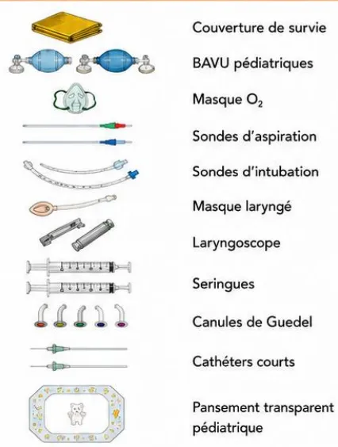

## RECOMMANDER LES BONNES PRATIQUES

### ARGUMENTAIRE

# Recommandations pour l'organisation de la prise en charge des urgences vitales intra-hospitalières

*Guidelines for the management of  
In-Hospital Life-Threatening  
Emergencies*

**Adopté par le Collège le 3 septembre 2026**Les recommandations de bonne pratique (RBP) sont définies dans le champ de la santé comme des propositions développées méthodiquement pour aider le praticien et le patient à rechercher les soins les plus appropriés dans des circonstances cliniques données.

Les RBP sont des synthèses rigoureuses de l'état de l'art et des données de la science à un temps donné, décrites dans l'argumentaire scientifique. Elles sont intégrées dans une démarche clinique centrée patient qui prend en compte l'expérience vécue du patient, ses représentations, ses attentes et son état d'esprit pour aboutir à une décision médicale partagée. Ce processus délibératif entre patient et professionnel de santé s'effectue au sein d'une relation empathique et dans une approche biopsychosociale globale et contextuelle qui permet d'aboutir à une alliance thérapeutique.

Cette recommandation de bonne pratique a été élaborée avec une approche basée sur les preuves (EBM) selon le système GRADE. Les caractéristiques de GRADE sont les suivantes :

- – il permet d'évaluer la qualité des données probantes de façon systématique afin de mesurer le niveau de confiance à leur accorder en vue de produire une recommandation ;
- – il prend en compte l'opinion des professionnels de santé vis-à-vis de la balance bénéfice/risque d'une intervention thérapeutique, qu'elle soit curative ou préventive, pour déterminer la force d'une recommandation ;
- – il incorpore les préférences du patient dans la genèse des recommandations, en cohérence avec une approche centrée sur le patient.

## Gradation des recommandations et avis d'experts

<table border="1"><tbody><tr><td><b>1</b></td><td>
<b>Recommandation forte</b>

Balance bénéfices/risques démontrée favorable ou démontrée défavorable

Fondée sur le résultat de méta-analyse d'essais cliniques randomisés statistiquement significatif* avec une qualité des preuves élevée en faveur d'un bénéfice clinique pertinent. Dans cette situation, l'approche centrée patient permet de prendre en compte l'avis du patient vers l'acceptation de l'intervention.
</td></tr><tr><td><b>2</b></td><td>
<b>Recommandation faible</b>

Balance bénéfices/risques démontrée plutôt favorable ou balance bénéfices/risques présumée favorable ; Balance bénéfices/risques démontrée plutôt défavorable ou balance bénéfices/risques présumée défavorable

Fondée sur le résultat de méta-analyse d'essais cliniques randomisés statistiquement significatif <b>Error! Bookmark not defined.</b> avec une qualité des preuves élevée en faveur d'un bénéfice clinique peu pertinent ou avec une qualité des preuves modérée en faveur d'un bénéfice clinique pertinent. Dans cette situation, l'approche centrée patient permet d'appréhender avec le patient l'(les) intérêt(s) de l'intervention dans son contexte particulier.
</td></tr><tr><td><b>ABS</b></td><td>
<b>Pas de recommandation</b>

Absence d'études ou de résultats concluants, c.à.d. résultats non statistiquement significatifs <b>Error! Bookmark not defined.</b> ou de qualité de preuves faible ou très faible, ne permettant pas de proposer une intervention.
</td></tr><tr><td><b>AE</b></td><td>
<b>Avis d'experts</b>

Balance bénéfices/risques indéterminée.

Absence d'études ou de résultats concluants, c.à.d. résultats non statistiquement significatifs ou de qualité de preuves faible ou très faible.

Proposition par un avis d'experts d'une intervention. Cet avis s'appuie ou non sur une revue systématique de la littérature des recommandations existantes et des méta-analyses d'études de cohorte. Dans cette situation, l'approche centrée patient permet d'accompagner le patient dans sa décision en l'absence de
</td></tr></tbody></table>recommandation, en se basant sur la balance bénéfices/risques supposée de l'intervention, dans son contexte particulier et en prenant en compte sa perspective.

### Formulations utilisées pour chaque situation

#### Recommandation forte pour/contre l'intervention (grade 1)

« Il est recommandé de/de ne pas ... » (*recommandation forte, qualité des preuves élevée*)

#### Recommandation faible pour/contre l'intervention (grade 2)

« Il est probablement recommandé de/de ne pas ... » (*recommandation faible, qualité des preuves modérée*)

« Il est recommandé de/de ne pas ... » (*recommandation faible, qualité des preuves élevée*)

#### Pas de recommandation (Absence)

« Devant l'absence de donnée disponible dans la littérature, les experts ne sont pas en mesure d'émettre des recommandations », « Les données sont insuffisantes pour établir une recommandation [...]. Il est nécessaire que des essais cliniques randomisés de qualité soient réalisés pour répondre clairement à cette question ».

#### Avis d'experts (AE)

« Les experts suggèrent de », « Il est suggéré/conseillé de/de ne pas ) [...]. Il est nécessaire que des essais cliniques randomisés de qualité soient réalisés pour répondre clairement à cette question [si approprié] » (*avis d'experts*)# Descriptif de la publication

<table border="1">
<tr>
<td><b>Titre</b></td>
<td>

<b>Recommandations pour l'organisation de la prise en charge des urgences vitales intra-hospitalières</b>

Guidelines for the management of In-Hospital Life-Threatening Emergencies

</td>
</tr>
<tr>
<td><b>Méthode de travail</b></td>
<td>Recommandations pour la pratique clinique-LABEL</td>
</tr>
<tr>
<td><b>Objectif(s)</b></td>
<td>L'objectif de la recommandation intitulée</td>
</tr>
<tr>
<td><b>Cibles concernées</b></td>
<td>

Les professionnels concernés sont les professionnels de santé médicales et paramédicales impliquées dans la prise en charge des Urgences Vitales Intra-hospitalières (UVIH) quel que soit leur lieu d'exercice au sein des établissements de santé.

Les populations concernées sont les patients présentant une UVIH

</td>
</tr>
<tr>
<td><b>Demandeur</b></td>
<td>Société Française d'Anesthésie-Réanimation (SFAR) la Société Francophone de Médecine d'Urgence (SFMU) et la Société de Réanimation de Langue Française (SRLF)</td>
</tr>
<tr>
<td><b>Promoteur(s)</b></td>
<td>Société Française d'Anesthésie et Réanimation (SFAR) ; Haute Autorité de santé (HAS)</td>
</tr>
<tr>
<td><b>Pilotage du projet</b></td>
<td>

<b>Coordinateurs Société Française d'Anesthésie et de Réanimation (SFAR) : Pr. Thomas Clavier – Pr. Julien Pottecher</b>

<b>Coordinateurs Société de Réanimation de Langue Française (SRLF) : Pr. Alain Cariou - Pr Xavier Monnet</b>

<b>Coordinateurs Société Française de Médecine d'Urgence (SFMU) : Dr Pierrick Le Borgne – Dr Roger Kadji Kalabang</b>

<b>Organisateurs CRC SFAR : Pr Anais Caillard – Dr Thomas Botrel</b>

<b>Coordinateur HAS : Sophie Blanchard Musset, Ph.D</b>

<b>Auteurs : </b>Professeur Thomas Clavier, Professeur Alain Cariou, Professeur Julien Pottecher, Docteur Roger Kadji Kalabang, Madame Manon Capo, Professeur Richard Chocron, Professeur Martin Cour, Monsieur Jordan Courrege, Docteur Pauline Devauchelle, Professeure Delphine Douillet, Docteur Mikhail Dziadzko, Docteur Valentina Faitot, Madame Laurence Grandjean, Professeur Antoine Kimmoun, Docteur Jean-Baptiste Lascarrou, Madame Karinne Le Gloan, Monsieur Adrien Leroy, Docteur Marguerite Lockhart, Monsieur Franck Louichon, Monsieur Matthieu Miclo, Professeur Fabrice Michel, Docteur Marine Paul, Docteur Lea Petry, Docteur Arnaud Roussiaux, Madame Aurélie Ruiz, Professeur Karim Tazarourte, Madame Emilie Vallée, Docteur Amelie Vromant, Docteur Nathalie Zappella, Docteur Thomas Botrel, Professeure Anais Caillard, Professeur Xavier Monnet, Docteur Pierrick Le Borgne.

</td>
</tr>
<tr>
<td><b>Conflits d'intérêts</b></td>
<td>Les membres du groupe de travail ont communiqué leurs déclarations publiques d'intérêts à la HAS. Elles sont consultables sur le site <a href="https://dpi.sante.gouv.fr">https://dpi.sante.gouv.fr</a>. Elles ont été analysées selon la grille d'analyse du guide des déclarations d'intérêts et de gestion des conflits d'intérêts de la HAS. Les intérêts déclarés par les membres du groupe de travail ont été considérés comme étant compatibles avec leur participation à ce travail.</td>
</tr>
<tr>
<td><b>Validation</b></td>
<td>Version du 3 septembre 2026</td>
</tr>
<tr>
<td><b>Actualisation</b></td>
<td></td>
</tr>
<tr>
<td><b>Autres formats</b></td>
<td></td>
</tr>
</table>Ce document ainsi que sa référence bibliographique sont téléchargeables sur [www.has-sante.fr](http://www.has-sante.fr)

Haute Autorité de santé – Service communication information  
5 avenue du Stade de France – 93218 SAINT-DENIS LA PLAINE CEDEX. Tél. : +33 (0)1 55 93 70 00  
© Haute Autorité de santé – septembre 2026 – ISBN : 978-2-11-186349-1# Sommaire

---

<table><tr><td><b>Préambule</b></td><td><b>7</b></td></tr><tr><td><b>Introduction</b></td><td><b>8</b></td></tr><tr><td><b>Champs et questions traitées</b></td><td><b>10</b></td></tr><tr><td><b>Champ 1. Mise en place et procédure de déclenchement de la filière UVIH</b></td><td><b>12</b></td></tr><tr><td><b>Champ 2. Conditions matérielles et ressources humaines</b></td><td><b>26</b></td></tr><tr><td><b>Champ 3. Modalités de suivi et fonctionnement de la filière UVIH</b></td><td><b>43</b></td></tr><tr><td><b>Champ 4. Spécificités organisationnelles</b></td><td><b>55</b></td></tr><tr><td><b>Synthèse des recommandations</b></td><td><b>63</b></td></tr><tr><td><b>Méthode</b></td><td><b>67</b></td></tr><tr><td><b>Références bibliographiques</b></td><td><b>71</b></td></tr><tr><td><b>Participants</b></td><td><b>80</b></td></tr></table># Préambule

La Société Française d'Anesthésie et de Réanimation (SFAR), la Société Francophone de Médecine d'Urgence (SFMU) et la Société de Réanimation de Langue Française (SRLF) se sont associées pour proposer un référentiel sur la **gestion des Urgences Vitales Intra-hospitalières (UVIH)**.

Cette recommandation de bonne pratique (RBP) a été réalisée dans le cadre de la labellisation par la HAS† garantissant le respect des critères méthodologiques, scientifiques et déontologiques de la HAS, notamment dans la prévention des conflits d'intérêt.

## Objectifs

L'objectif de ces recommandations sur la « **Recommandations pour l'organisation de la prise en charge des urgences vitales intrahospitalières (UVIH)** » est d'harmoniser les pratiques, de structurer l'organisation de la réponse aux UVIH et de renforcer la coordination des équipes. En proposant un cadre commun, adaptable aux différents contextes d'exercice, ces recommandations visent à améliorer la qualité et la sécurité des soins, et à réduire la morbi-mortalité associée aux défaillances vitales survenant en établissements de santé.

Le groupe de travail s'est efforcé de produire un nombre minimal de recommandations afin de mettre en évidence les points forts à retenir dans les deux champs prédéfinis.

Les règles de base des bonnes pratiques médicales universelles en anesthésie et réanimation étant considérées comme connues, elles ont été exclues de ces recommandations.

## Cibles

**Les professionnels concernés** sont les professionnels de santé médicales et paramédicales impliquée dans la prise en charge des Urgences Vitales Intra-hospitalières (UVIH).

**Les populations concernées** sont les patients pris en charge les patients présentant une UVIH.

---

† 1 Cf. Guide méthodologique « Attribution du label de la HAS à une recommandation de bonne pratique élaborée par un organisme professionnel » (HAS, 2023) : [https://www.has-sante.fr/jcms/p\\_3452920/fr/labellisation-par-la-has-d-une-recommandation-debonne-pratique-elaboree-par-un-organisme-professionnel](https://www.has-sante.fr/jcms/p_3452920/fr/labellisation-par-la-has-d-une-recommandation-debonne-pratique-elaboree-par-un-organisme-professionnel)# Introduction

## Definition

**L'urgence vitale intra-hospitalière (UVIH) correspond à toute situation clinique aiguë survenant dans un établissement de santé mettant en jeu le pronostic vital et nécessitant une intervention médicale immédiate.**

Cette définition, issue du consensus DELPHI des experts de la présente recommandation, souligne le caractère critique et temps-dépendant de l'UVIH. Malgré un environnement hospitalier généralement doté des ressources humaines et matérielles permettant d'y faire face, la survenue d'une UVIH demeure associée à une morbi-mortalité significative, notamment en cas de retard dans sa reconnaissance ou dans la mise en œuvre des premières mesures de prise en charge.

## Un besoin d'actualisation de recommandations multidisciplinaires

La prise en charge des urgences vitales en milieu hospitalier avait fait l'objet de premières recommandations nationales lors d'une conférence d'experts de 2004, associant la Société Française d'Anesthésie et de Réanimation (SFAR), SAMU de France, la Société Française de Cardiologie, la Société Francophone de Médecine d'Urgence (SFMU) et la Société de Réanimation de Langue Française (SRLF) [1]. Ce travail fondateur avait permis de formaliser les principes essentiels de la reconnaissance de l'arrêt cardiaque, de l'alerte et de la mise en œuvre précoce des manœuvres de réanimation, constituant un socle organisationnel pour la prise en charge des détresses vitales.

Cependant, l'évolution des organisations hospitalières, la complexification des parcours de soins, l'augmentation de la proportion de patients à haut risque en secteurs d'hospitalisation conventionnelle et les exigences accrues en matière de qualité et de sécurité des soins rendent nécessaire une actualisation de ces recommandations.

Dans ce contexte, la présente recommandation formalisée d'experts (RFE), élaborée conjointement par la SFAR, la SRLF et la SFMU, sous l'égide de la Haute Autorité de Santé (HAS), vise à proposer un cadre actualisé, structuré et pragmatique pour la prise en charge des UVIH. Cette démarche a également bénéficié de l'expertise de représentants des sociétés savantes invitées du CARO (Collège d'Anesthésie-Réanimation en Obstétrique), de l'ADARPEF (Association des Anesthésistes-Réanimateurs Pédiatriques d'Expression Française), du GFRUP (Groupe Francophone de Réanimation et Urgences Pédiatriques) et de la SFPC (Société Française de Pharmacie Clinique), afin d'assurer une approche multidisciplinaire couvrant les spécificités obstétricales, pédiatriques et pharmaceutiques de la prise en charge.

Cette collaboration interdisciplinaire reflète la transversalité de la prise en charge de l'UVIH, qui implique l'ensemble des professionnels de santé, médicaux et paramédicaux, quel que soit leur lieu d'exercice au sein des établissements de santé.

## Un large spectre de situations cliniques

Pouvant survenir dans n'importe quel secteur de l'établissement, **l'UVIH recouvre un large spectre de situations cliniques, incluant par exemple l'arrêt cardiaque, les détresses respiratoires, les états de choc et les troubles neurologiques graves, ainsi que des situations spécifiques telles que l'obstruction des voies aériennes supérieures et dispositifs trachéaux, les réactions allergiques sévères ou les hémorragies massives.**

Cette diversité impose une approche structurée reposant sur des principes simples, transposables, reproductibles et accessibles à l'ensemble des intervenants.

**La reconnaissance précoce de l'urgence vitale constitue un enjeu majeur.**Le consensus issu d'un processus DELPHI des experts de cette recommandation souligne que l'alerte doit pouvoir être déclenchée par tout professionnel de santé, y compris non médical, sur la base d'un constat clinique simple et immédiatement opérationnel. Les informations transmises doivent être concises et pertinentes, incluant en priorité la nature du problème et la localisation précise du patient.

La prise en charge initiale d'une UVIH repose sur une intervention immédiate, sans attendre l'arrivée des renforts spécialisés. Elle associe en priorité l'alerte précoce et la mise en œuvre des gestes essentiels, notamment la séquence « alerter, masser, défibriller » en cas d'arrêt cardiaque. La gestion initiale des fonctions vitales comprend l'administration d'oxygène à haut débit, la libération des voies aériennes et, si nécessaire, la ventilation au ballon auto-remplisseur à valve unidirectionnelle (BAVU), ainsi que la mise en place rapide d'un accès veineux ou intra-osseux fonctionnel.

En parallèle, l'organisation de la réponse implique l'apport du matériel de réanimation au plus près du patient, l'instauration d'un monitoring adapté et le maintien d'une présence continue auprès du patient.

Enfin, la préparation des éléments nécessaires à la continuité des soins (dossier médical, traitements en cours, données biologiques, éventuelles décisions de limitations ou d'arrêt thérapeutiques) et la traçabilité des événements doivent être assurées dès que la situation le permet.

L'équipe hospitalière d'intervention rapide sollicitée pour répondre à une situation d'UVIH est désignée par différents vocables dans la littérature anglo-saxonne : rapid-response team (RRT), medical emergency team (MET) ou critical care outreach team. A des fins de simplification et d'homogénéité, une telle équipe sera désignée sous le vocable d'"équipe spécialisée" dans le texte. Cette équipe spécialisée est la plupart du temps pluri-professionnelle (médecin, interne, IDE, aide-soignant(e)) et coordonnée par un médecin, aucun qualificatif ne sera alors spécifié. Elle est dans certaines situations exclusivement composée d'infirmier(e)s (notamment dans certains pays) et il sera alors fait mention d'équipe spécialisée paramédicale (dans la Question 12 notamment).

La mise en œuvre de ces recommandations repose sur une démarche d'appropriation construite et adaptée localement par les professionnels concernés, en tenant compte de l'organisation propre à chaque établissement, et non sur un modèle organisationnel imposé de manière uniforme par l'institution.# Champs et questions traitées

Les présentes recommandations ont été élaborées selon la méthodologie GRADE (Grading of Recommendations Assessment, Development and Evaluation) [2], permettant une évaluation systématique de la qualité des preuves et de la force des recommandations.

## Champ 1. Mise en place et procédure de déclenchement de la filière UVIH

- – Q1. Quelles modalités de mise en place de la filière UVIH doivent être instaurées par les établissements de santé et les équipes soignantes afin d'améliorer la qualité de prise en charge des patients présentant une urgence vitale intrahospitalière ?
- – Q2. Chez les patients présentant une UVIH, l'utilisation des scores d'alerte précoce améliore-t-elle la qualité de la prise en charge par rapport à une surveillance clinique fondée sur les seuls signes vitaux ?
- – Q3. Chez les patients présentant une UVIH, la mise en place d'un numéro unique pour le déclenchement de l'équipe spécialisée permet-elle d'améliorer la qualité de prise en charge ?
- – Q4. Chez les patients présentant une urgence vitale intra-hospitalière, une régulation de l'appel par un intervenant non-membre de l'équipe spécialisée améliore-t-elle la qualité de prise en charge ?

## Champ 2. Conditions matérielles et ressources humaines

- – Q5 La standardisation et la gestion des équipements et médicaments d'urgence devant être disponibles dans les services d'hospitalisation (chariot d'urgence) par une équipe multidisciplinaire permet-elle d'améliorer la qualité de prise en charge des patients présentant une UVIH ?
- – Q6. Quels équipements spécifiques doivent-ils être apportés par l'équipe spécialisée afin d'améliorer la qualité de prise en charge des patients présentant une UVIH ?
- – Q7. Chez les patients présentant une UVIH, la mise à disposition et l'utilisation d'aides cognitives dans les services permet-elle d'améliorer la qualité de prise en charge ?
- – Q8. Au sein des établissements disposant d'une permanence médicale compétente en soins critiques sur site, quelle est la composition minimale de l'équipe d'intervention UVIH, afin d'améliorer la qualité de prise en charge des patients présentant une UVIH ?

## Champ 3. Modalités de suivi et fonctionnement de la filière UVIH

- – Q9. Pour la mise en place d'une filière d'UVIH, quelles modalités de suivi de la filière doivent-elles être instaurées afin d'améliorer la qualité de prise en charge ?
- – Q10. Chez les patients présentant une UVIH, quelle équipe est responsable de l'information des proches et des procédures administratives à la suite d'une intervention UVIH, afin d'améliorer la qualité de la prise en charge ?
- – Q11. Chez les professionnels de santé, quelles modalités de formation initiale et continue doivent être proposées afin d'améliorer la qualité de prise en charge des UVIH ?

## Champ 4. Spécificités organisationnelles

- – Q12. Dans les établissements sans présence médicale 24h/24, quelles sont les modalités organisationnelles améliorant la qualité de prise en charge des UVIH ?
- – Q13. Dans les établissements ayant une activité mixte adulte et pédiatrique et disposant d'un médecin compétent en soins critiques pédiatriques, faut-il distinguer deux procédures UVIH différentes (adulte et enfant) afin d'améliorer la qualité de la prise en charge ?
- – Q14. Faut-il des procédures spécifiques d'UVIH selon que l'urgence vitale concerne un patient hospitalisé ou une personne non-hospitalisée (visiteur, personnel de l'établissement ou patient) afin d'améliorer la qualité de la prise en charge ?**L'objectif de ces recommandations est d'harmoniser les pratiques, de structurer l'organisation de la réponse aux UVIH et de renforcer la coordination des équipes. En proposant un cadre commun, adaptable aux différents contextes d'exercice, ces recommandations visent à améliorer la qualité et la sécurité des soins, et à réduire la morbi-mortalité associée aux défaillances vitales survenant en établissements de santé.**# Champ 1. Mise en place et procédure de déclenchement de la filière UVIH

**Question 1. Quelles modalités de mise en place de la filière UVIH doivent-elles être instaurées par les établissements de santé et les équipes soignantes afin d'améliorer la qualité de prise en charge des patients présentant une urgence vitale intra hospitalière ?**

Experts : Pauline DEVAUCHELLE (SFAR, Paris), Delphine DOUILLET (SFMU, Angers), Mikhail DZIADZKO (CARO, Lyon), Matthieu MICLO (ADARPEF, Amiens), Marine PAUL (SRLF, Versailles)

<table border="1">
<thead>
<tr>
<th colspan="3"><b>Organisation de la prise en charge des urgences vitales intrahospitalières (UVIH)</b></th>
</tr>
<tr>
<th><b>RECOMMANDATION</b></th>
<th colspan="2"><b>Niveau de preuve</b></th>
</tr>
</thead>
<tbody>
<tr>
<td colspan="3"><b>Champ 1. Mise en place et procédure de déclenchement de la filière UVIH</b></td>
</tr>
<tr>
<td colspan="3"><b>Quelles modalités de mise en place de la filière UVIH doivent être instaurées par les établissements de santé et les équipes soignantes afin d'améliorer la qualité de prise en charge des patients présentant une urgence vitale intrahospitalière ?</b></td>
</tr>
<tr>
<td>R1.1.1</td>
<td>Il est recommandé de mettre en place une filière UVIH institutionnelle afin d'améliorer la qualité de prise en charge des patients.</td>
<td><b>2</b></td>
</tr>
<tr>
<td>R1.1.2</td>
<td>Les experts suggèrent l'élaboration d'une procédure UVIH institutionnelle par une équipe multidisciplinaire avec un référent médical identifié afin d'améliorer la qualité de prise en charge des patients.</td>
<td><b>AE</b></td>
</tr>
<tr>
<td>R1.1.3</td>
<td>Les experts suggèrent l'élaboration d'une procédure UVIH institutionnelle écrite, explicite, standardisée et accessible à tous, regroupant un ensemble de mesures distribuées selon les 4 volets suivants : détection précoce, activation, intervention et debriefing afin d'améliorer la qualité de la prise en charge.</td>
<td><b>AE</b></td>
</tr>
<tr>
<td>R1.1.4</td>
<td>Les experts suggèrent que l'élaboration d'une procédure UVIH institutionnelle s'accompagne, en amont de sa mise en œuvre, d'une procédure de réflexion anticipée sur le niveau d'engagement thérapeutique individuel des patients hospitalisés en cas de dégradation clinique afin d'améliorer la qualité de la prise en charge.</td>
<td><b>AE</b></td>
</tr>
<tr>
<td>R1.1.5</td>
<td>Les experts suggèrent que la réflexion anticipée sur le niveau d'engagement thérapeutique puisse conduire, le cas échéant, à une procédure collégiale conformément aux dispositions du Code de la santé publique relatives aux décisions de limitation ou d'arrêt des traitements (notamment les articles L1110-5-1 et R4127-37-2), dont la décision doit être tracée dans le dossier médical, afin d'améliorer la prise en charge.</td>
<td><b>AE</b></td>
</tr>
</tbody>
</table>

## Argumentaire :

Trois études randomisées ont évalué l'implantation hospitalière d'une filière urgences vitales intrahospitalières (UVIH). Ces études ne mettent pas en évidence de réduction significative de la mortalité hospitalière, du nombre d'arrêts cardiaques intrahospitaliers et des admissions non planifiées en réanimation. Ces études ont un défaut de puissance et pour certaines un biais de contamination dans leshôpitaux contrôlé dans lesquels était constatée une amélioration des pratiques au cours du temps. Ces études ne montrent pas que les filières UVIH sont inefficaces, mais que leur efficacité dépend de leur implémentation, elle-même conditionnée par une formation et leur appropriation par les équipes soignantes [1-3].

Par ailleurs, deux méta-analyses de Maharaj et al. (2015) et Solomon et al. (2016), incluant majoritairement des études observationnelles avant/après, rapportent une réduction relative de la mortalité hospitalière (15-35%), ainsi qu'une diminution de l'incidence des arrêts cardiaques intrahospitaliers (30-50%) après mise en place d'une équipe spécialisée [4,5]. Ainsi, une étude hollandaise a-t-elle évalué la mise en place nationale d'une filière UVIH selon un schéma avant/après et mis en évidence une diminution de la mortalité hospitalière et du taux d'arrêts cardiaques intrahospitaliers [6]. La méthodologie limite l'inférence causale mais apporte des éléments pragmatiques opérationnels sur l'implémentation d'une filière UVIH en conditions réelles [7]. Dans une autre étude observationnelle de Sodhi et al. (2015), la mise en place d'une équipe spécialisée était associée à une réduction significative du délai médian d'intervention, passant d'environ 4 minutes avant à 1 minute 30 après implémentation du système [8]. Enfin, deux études observationnelles rapportent également une réduction des durées d'hospitalisation, alors que d'autres sont négatives [8-11].

Malgré ces limites, les recommandations internationales, notamment celles de la *Society of Critical Care Medicine* (2023), de l'*International Liaison Committee on Resuscitation (ILCOR)* (2024) et de l'*European Resuscitation Council (ERC)* (2025), suggèrent la mise en place de filières UVIH pour la prise en charge des arrêts cardiaques intrahospitaliers, considérant ces dispositifs comme des interventions organisationnelles susceptibles d'améliorer la détection, la coordination et la qualité globale de la prise en charge [12-14]. Enfin le manuel de certification de la Haute Autorité de Santé préconise en 2020 que la prise en charge des UVIH soit protocolisée dans chaque établissement [15].

La grande majorité des études évaluant les filières d'UVIH portent sur l'organisation globale du dispositif, analysée comme un ensemble de mesures, et non sur l'évaluation isolée d'une seule de ses composantes intégrant formation, communication, organisation, matériel et gouvernance institutionnelle [1-6,8,9]. La procédure de prise en charge des UVIH doit ainsi s'inscrire dans une approche structurée à l'échelle de l'établissement intégrant ces 5 composantes.

Cette procédure doit être élaborée de manière multidisciplinaire, par une équipe dédiée incluant notamment au moins un médecin de soins critiques et/ou de médecine d'urgences et/ou anesthésiste-réanimateur référent pour l'UVIH, en collaboration avec les autres professionnels concernés à savoir des infirmiers, aides-soignants, un membre de l'encadrement paramédical, un pharmacien, un référent qualité de l'établissement [16]. Pour les procédures spécifiques à la pédiatrie ou l'obstétrique, il est important d'associer des représentants de ces secteurs de soins [17]. Il est indispensable que la mise en œuvre et la pérennisation du dispositif soit soutenues par l'institution, notamment pour l'allocation des ressources matérielles et humaines nécessaires, la validation formelle de la procédure par les instances, la mise en place de formations interprofessionnelles dans tous les services ainsi que pour sa diffusion au sein de l'établissement [7,9,18,19].

La procédure de prise en charge des UVIH doit intégrer plusieurs volets complémentaires.Elle doit tout d'abord inclure **un volet de détection précoce**, reposant sur la surveillance clinique des patients hospitalisés permettant l'identification rapide d'une dégradation clinique. En effet, des analyses post hoc de l'essai randomisé MERIT ont mis en évidence une association entre le retard à l'appel de l'équipe UVIH et l'augmentation de la mortalité [20,21]. Un volet d'activation doit préciser les modalités d'appel, ainsi que les modalités de transmission de l'information, afin de garantir une alerte simple, rapide, standardisée et activable par tous. L'outil de communication SAED (« Situation, Antécédents, Évaluation, Demande »), permet de standardiser les informations transmises lors des appels téléphoniques [22,23].

**Un volet interventionnel** est indispensable et doit décrire les premiers gestes à réaliser par les équipes de proximité dans l'attente de l'équipe spécialisée. Ce volet doit également détailler les modalités d'intervention de l'équipe UVIH pour la mise en œuvre d'une réanimation spécialisée, incluant un délai d'arrivée cible inférieur à 5 minutes, la composition de l'équipe spécialisée, la liste du matériel devant être apporté lors de l'intervention. Enfin, un volet de débriefing post-intervention peut également faire partie intégrante de la procédure, afin de favoriser l'amélioration continue des pratiques, l'analyse des événements et le retour d'expérience des équipes [24]. La procédure doit également préciser la liste du matériel nécessaire à la prise en charge des UVIH. Il est suggéré de limiter au maximum le nombre d'équipes spécialisées au sein d'un même établissement. Le code de santé publique décrit (Article R4311-5) les actes réalisables par les infirmiers dans leur rôle propre, notamment les actes 15°-16°-17°-19° traitant de l'utilisation du chariot d'urgence [25].

En cas d'activation d'une UVIH pour une patiente enceinte ou en post-partum, la procédure institutionnelle doit prévoir le contact immédiat et systématique de l'obstétricien référent et de l'anesthésiste-réanimateur en obstétrique (si présent dans l'établissement), indépendamment de l'équipe spécialisée déclenchée. La procédure doit également anticiper l'éventualité d'une césarienne urgente ou de sauvetage (pour un terme  $\geq 20\text{SA}$ ) réalisée en dehors du bloc obstétrical, ainsi que la mobilisation coordonnée des équipes d'obstétrique et de néonatalogie, afin de garantir une prise en charge materno-fœtale harmonisée et dans des délais compatibles avec l'urgence [26].

Comme pour tous les soins hors urgences vitales, le consentement est recherché et, lorsque l'état clinique du patient ne le permet pas, cette impossibilité est tracée. Une fois les défaillances vitales stabilisées et dès lors que l'état clinique du patient permet la compréhension d'une information claire, loyale et appropriée, son consentement à la poursuite des soins de réanimation est alors recherché.

Egalement, deux études rétrospectives monocentriques australienne et danoise rapportent respectivement que 16% et 12% des appels pour UVIH concernaient des patients chez lesquels des limitations de traitements avaient été préalablement formalisées [27-28]. Ces données soulignent que les équipes spécialisées sont régulièrement confrontées à trois types de situation 1) niveau d'engagement thérapeutique déjà limité, 2) niveau d'engagement devant être réévalué en situation aiguë et 3) non-anticipation du niveau d'engagement qui aurait dû être précisé avant la dégradation clinique.

Ainsi, une meilleure anticipation des décisions relatives au niveau d'engagement thérapeutique, fondée sur une réflexion structurée et régulièrement réévaluée, pourrait permettre d'améliorer la planification des soins, la qualité de la prise en charge de la fin de vie et d'éviter des escalades thérapeutiques non proportionnées.En conclusion, la formalisation institutionnelle précoce et réévaluée des objectifs de soins ainsi que du niveau d'engagement thérapeutique apparaît essentielle au cours de l'hospitalisation. Cette démarche n'exclut pas, lorsque la situation clinique le justifie, une discussion collégiale avec l'équipe spécialisée UVIH lors d'une UVIH.

## Références

- [1] Haegdorens F, Van Bogaert P, Roelant E, De Meester K, Misselyn M, Wouters K, et al. The introduction of a rapid response system in acute hospitals: A pragmatic stepped wedge cluster randomised controlled trial. *Resuscitation* 2018;129:127–34. <https://doi.org/10.1016/j.resuscitation.2018.04.018>.
- [2] Hillman K, Chen J, Cretikos M, Bellomo R, Brown D, Doig G, et al. Introduction of the medical emergency team (MET) system: a cluster-randomised controlled trial. *Lancet Lond Engl* 2005;365:2091–7. [https://doi.org/10.1016/S0140-6736\(05\)66733-5](https://doi.org/10.1016/S0140-6736(05)66733-5).
- [3] Jeddian A, Hemming K, Lindenmeyer A, Rashidian A, Sayadi L, Jafari N, et al. Evaluation of a critical care outreach service in a middle-income country: A stepped wedge cluster randomized trial and nested qualitative study. *J Crit Care* 2016;36:212–7. <https://doi.org/10.1016/j.jcrc.2016.07.018>.
- [4] Solomon RS, Corwin GS, Barclay DC, Quddusi SF, Dannenberg MD. Effectiveness of rapid response teams on rates of in-hospital cardiopulmonary arrest and mortality: A systematic review and meta-analysis. *J Hosp Med* 2016;11:438–45. <https://doi.org/10.1002/jhm.2554>.
- [5] Maharaj R, Raffaele I, Wendon J. Rapid response systems: a systematic review and meta-analysis. *Crit Care Lond Engl* 2015;19:254. <https://doi.org/10.1186/s13054-015-0973-y>.
- [6] Ludikhuize J, Brunsveld-Reinders AH, Dijkgraaf MGW, Smorenburg SM, de Rooij SEJA, Adams R, et al. Outcomes Associated With the Nationwide Introduction of Rapid Response Systems in The Netherlands. *Crit Care Med* 2015;43:2544–51. <https://doi.org/10.1097/CCM.0000000000001272>.
- [7] Jung B, Daurat A, De Jong A, Chanques G, Mahul M, Monnin M, et al. Rapid response team and hospital mortality in hospitalized patients. *Intensive Care Med* 2016;42:494–504. <https://doi.org/10.1007/s00134-016-4254-2>.
- [8] Sodhi K, Singla MK, Shrivastava A. Institutional resuscitation protocols: do they affect cardiopulmonary resuscitation outcomes? A 6-year study in a single tertiary-care centre. *J Anesth* 2015;29:87–95. <https://doi.org/10.1007/s00540-014-1873-z>.
- [9] Bellomo R, Goldsmith D, Uchino S, Buckmaster J, Hart G, Opdam H, et al. Prospective controlled trial of effect of medical emergency team on postoperative morbidity and mortality rates. *Crit Care Med* 2004;32:916–21. <https://doi.org/10.1097/01.ccm.0000119428.02968.9e>.
- [10] Song I-A, Lee Y-K, Park J-W, Kim J-K, Koo K-H. Effectiveness of rapid response system in patients with hip fractures. *Injury* 2021;52:1841–5. <https://doi.org/10.1016/j.injury.2021.04.029>.
- [11] Howell MD, Ngo L, Folcarelli P, Yang J, Mottley L, Marcantonio ER, et al. Sustained effectiveness of a primary-team-based rapid response system. *Crit Care Med* 2012;40:2562–8. <https://doi.org/10.1097/CCM.0b013e318259007b>.
- [12] Semeraro F, Schnaubelt S, Olasveengen TM, Bignami EG, Böttiger BW, Fijačko N, et al. European Resuscitation Council Guidelines 2025 System Saving Lives. *Resuscitation* 2025;215 Suppl 1:110821. <https://doi.org/10.1016/j.resuscitation.2025.110821>.[13] Honarmand K, Wax RS, Penoyer D, Lighthall G, Danesh V, Rochwerg B, et al. Society of Critical Care Medicine Guidelines on Recognizing and Responding to Clinical Deterioration Outside the ICU: 2023. *Crit Care Med* 2024;52:314–30. <https://doi.org/10.1097/CCM.00000000000006072>.

[14] Greif R, Bray JE, Djärv T, Drennan IR, Liley HG, Ng K-C, et al. 2024 International Consensus on Cardiopulmonary Resuscitation and Emergency Cardiovascular Care Science With Treatment Recommendations: Summary From the Basic Life Support; Advanced Life Support; Pediatric Life Support; Neonatal Life Support; Education, Implementation, and Teams; and First Aid Task Forces. *Resuscitation* 2024;205:110414. <https://doi.org/10.1016/j.resuscitation.2024.110414>.

[15] Manuel et référentiel de la certification des établissements pour la qualité des soins. Haute Aut Santé n.d. [https://www.has-sante.fr/jcms/p\\_3219174/fr/manuel-et-referentiel-de-la-certification-des-etablissements-pour-la-qualite-des-soins](https://www.has-sante.fr/jcms/p_3219174/fr/manuel-et-referentiel-de-la-certification-des-etablissements-pour-la-qualite-des-soins) (accessed January 26, 2026).

[16] Chan JL, Lehrich J, Nallamothu BK, Tang Y, Kennedy M, Trumpower B, et al. Association Between Hospital Resuscitation Champion and Survival for In-Hospital Cardiac Arrest. *J Am Heart Assoc* 2021;10:e017509. <https://doi.org/10.1161/JAHA.120.017509>.

[17] Curşeu PL, van Rijswijk J, Schruijer SGL. Collaborative and Shared Leadership Dynamics in Healthcare Action Teams: A Systematic Literature Review. *J Healthc Leadersh* 2025;17:877–99. <https://doi.org/10.2147/JHL.S520534>.

[18] Devita MA, Bellomo R, Hillman K, Kellum J, Rotondi A, Teres D, et al. Findings of the first consensus conference on medical emergency teams. *Crit Care Med* 2006;34:2463–78. <https://doi.org/10.1097/01.CCM.0000235743.38172.6E>.

[19] Nallamothu BK, Greif R, Anderson T, Atiq H, Couto TB, Considine J, et al. Ten Steps Toward Improving In-Hospital Cardiac Arrest Quality of Care and Outcomes. *Circ Cardiovasc Qual Outcomes* 2023;16:e010491. <https://doi.org/10.1161/CIRCOUTCOMES.123.010491>.

[20] Chen J, Bellomo R, Flabouris A, Hillman K, Finer S, MERIT Study Investigators for the Simpson Centre, et al. The relationship between early emergency team calls and serious adverse events. *Crit Care Med* 2009;37:148–53. <https://doi.org/10.1097/CCM.0b013e3181928ce3>.

[21] Chen J, Bellomo R, Flabouris A, Hillman K, Assareh H, Ou L. Delayed Emergency Team Calls and Associated Hospital Mortality: A Multicenter Study. *Crit Care Med* 2015;43:2059–65. <https://doi.org/10.1097/CCM.00000000000001192>.

[22] Haig KM, Sutton S, Whittington J. SBAR: a shared mental model for improving communication between clinicians. *Jt Comm J Qual Patient Saf* 2006;32:167–75. [https://doi.org/10.1016/s1553-7250\(06\)32022-3](https://doi.org/10.1016/s1553-7250(06)32022-3).

[23] Saed : un guide pour faciliter la communication entre professionnels de santé. Haute Aut Santé n.d. [https://www.has-sante.fr/jcms/c\\_1776178/fr/saed-un-guide-pour-faciliter-la-communication-entre-professionnels-de-sante](https://www.has-sante.fr/jcms/c_1776178/fr/saed-un-guide-pour-faciliter-la-communication-entre-professionnels-de-sante) (accessed January 19, 2026).

[24] Bijok B, Jaulin F, Picard J, Michelet D, Fuzier R, Arzalier-Daret S, et al. Guidelines on human factors in critical situations 2023. *Anaesth Crit Care Pain Med* 2023;42:101262. <https://doi.org/10.1016/j.accpm.2023.101262>.

[25] Article R4311-5-1 - Code de la santé publique - Légifrance n.d. [https://www.legifrance.gouv.fr/codes/article\\_lc/LEGIARTI000037435114](https://www.legifrance.gouv.fr/codes/article_lc/LEGIARTI000037435114) (accessed January 26, 2026).

[26] Greif R, Lauridsen KG, Djärv T, Ek JE, Monnelly V, Monsieurs KG, et al. European Resuscitation Council Guidelines 2025 Executive Summary. *Resuscitation* 2025;215 Suppl 1:110770. <https://doi.org/10.1016/j.resuscitation.2025.110770>.[27] Coventry C, Flabouris A, Sundararajan K, Cramey T. Rapid response team calls to patients with a pre-existing not for resuscitation order. *Resuscitation* 2013;84:1035–9. <https://doi.org/10.1016/j.resuscitation.2013.01.021>.

[28] Jensen HI, Rasmussen CK, Haberlandt TN, Jensen SS. End-of-life issues experienced by the nurse-led rapid response team: An analysis of extent and experiences. *Intensive Crit Care Nurs* 2023;76:103411. <https://doi.org/10.1016/j.iccn.2023.103411>.

**Question 2 : Chez les patients présentant une UVIH, l'utilisation des scores d'alerte précoce améliore-t-elle la qualité de la prise en charge par rapport à une surveillance clinique fondée sur les seuls signes vitaux ?**

Experts : Julien BORDES (SFAR, Toulon), Karim TAZAROURTE (SFMU, Lyon), Marine PAUL (SRLF, Versailles), Mikhail DZIAZKO (CARO, Lyon), Léa PIETRY (ADARPEF, Rennes), Emilie VALLÉE (Lille)

<table border="1">
<thead>
<tr>
<th colspan="3"><b>Organisation de la prise en charge des urgences vitales intrahospitalières (UVIH)</b></th>
</tr>
<tr>
<th colspan="2">RECOMMANDATION</th>
<th>Niveau de preuve</th>
</tr>
</thead>
<tbody>
<tr>
<td colspan="3"><b>Champ 1. Mise en place et procédure de déclenchement de la filière UVIH</b></td>
</tr>
<tr>
<td colspan="3"><b>Chez les patients présentant une UVIH, l'utilisation des scores d'alerte précoce améliore-t-elle la qualité de la prise en charge par rapport à une surveillance clinique fondée sur les seuls signes vitaux ?</b></td>
</tr>
<tr>
<td>R1.2.1</td>
<td>Chez les patients hospitalisés, adultes comme pédiatriques, présentant une UVIH, les données de la littérature ne permettent pas de conclure à un bénéfice de l'utilisation de scores d'alerte précoce par rapport à une surveillance clinique fondée sur les seuls signes vitaux pour diminuer la morbi-mortalité.</td>
<td><b>ABS</b></td>
</tr>
</tbody>
</table>

### Argumentaire :

Le déclenchement de la procédure UVIH repose le plus souvent sur des variations des signes vitaux constituant des déclencheurs d'alerte.

Chez les patients hospitalisés susceptibles de présenter une détérioration clinique conduisant à une UVIH, il a été observé que des anomalies des paramètres vitaux précèdent fréquemment ces événements critiques, parfois plusieurs heures avant leur survenue. Ce constat a conduit au développement de scores intégrant plusieurs paramètres physiologiques, appelés scores d'alerte précoce (« Early warning scores » ou EWS) [1] dont plusieurs déclinaisons locales (MEWS), nationales (NEWS) ou adaptées aux populations (MEOWS, PEWS) ont été développées.

Ces scores ont été conçus pour prédire la survenue d'événements graves tels que l'arrêt cardiaque, l'admission non programmée en réanimation ou le décès [2,3]. Leur performance prédictive est globalement satisfaisante. Ainsi, dans une étude incluant 35 585 patients hospitalisés, l'aire sous la courbe ROC du score NEWS pour prédire l'un de ces événements était de 0,873 (IC95% : 0,866–0,879) à 24 heures [2]. En pratique, leur intérêt semble davantage résider dans leur capacité à structurer la surveillance, à standardiser le déclenchement de l'alerte et le processus d'escalade que dans leur performance intrinsèque comme outil prédictif indépendant.Toutefois, malgré cette capacité de discrimination, les données disponibles ne permettent pas de démontrer de manière robuste que leur utilisation isolée améliore les critères cliniques pertinents, notamment la mortalité ou la morbidité sévère. Des études de type avant/après ont montré un effet bénéfique, avec une diminution de la mortalité intra-hospitalière et de la survenue d'arrêts cardiaques, ou une amélioration de la survie après prise en charge par une équipe spécialisée, après l'implémentation de ces scores [3,4]. Cependant, les essais prospectifs randomisés ont échoué à confirmer ces résultats favorables en matière d'amélioration de la prise en charge des UVIH [1,5]. Une méta-analyse récente, combinant les résultats de 18 études (16 études de type avant/après et 2 essais cliniques prospectifs randomisés), n'a pas mis en évidence de différence de mortalité intra-hospitalière, mais une diminution de la survenue d'arrêts cardiaques dans les services [6].

Ces résultats discordants de la littérature s'expliquent par la multiplicité des scores utilisés, la variabilité de leur mode d'utilisation (utilisation ponctuelle ou systématique à chaque tour infirmier), la population incluse dans les études (patients médicaux et/ou chirurgicaux) [7]. Surtout, leur implémentation n'est pas isolée mais associée à celle d'un système d'alerte précoce (« early warning system ») associant la détection, l'implémentation d'algorithmes décisionnels en fonction du score, et la réponse par une équipe spécialisée. Cela rend donc difficile la détermination de l'apport propre de chaque composante du système (dont les scores d'alerte) dans l'impact sur le pronostic du patient [8].

Des limites persistent encore dans la généralisation de leur utilisation. Ainsi, le choix du score reste débattu, et ce d'autant plus que celui-ci peut être fondé sur les seuls signes vitaux, intégrer des résultats biologiques, mais également d'autres éléments du dossier médical (antécédents, codage des actes du système d'information hospitalier) grâce à l'intelligence artificielle. Ainsi, un essai prospectif randomisé évaluant un système d'alerte dynamique prenant en compte les données collectées en routine dans le dossier médical, les paramètres vitaux, et l'intensité de la surveillance retrouvait un effet protecteur sur la mortalité intra-hospitalière (réduction du risque de mortalité de 35,6%, HR 0,64; IC95% : 0,53 - 0,78;  $p < 0,0001$ ) [9]. Par ailleurs, il a été établi que, dans les services ayant mis en place des scores d'alerte précoce associés à des algorithmes de prise en charge permettant de grader la réponse, les protocoles de surveillance ne sont pas systématiquement appliqués. Ainsi, dans une étude prospective portant sur 132 patients dans un service ayant mis en place un score d'alerte précoce, il a été constaté que seuls 77% des patients bénéficiaient de la cotation du score d'alerte et que, lorsque celui-ci était anormal, seulement 38% des patients recevaient une prise en charge conforme à l'algorithme décisionnel [10]. Enfin, le calcul du score est source d'erreurs potentielles et devrait idéalement être automatisé [11,12]. Cela repose sur un matériel biomédical spécifique ainsi que sur une possibilité d'intégration du calcul des scores dans les systèmes informatiques hospitaliers des établissements, représentant une contrainte de mise en œuvre limitant aujourd'hui son applicabilité.

Dans la population obstétricale, plusieurs outils de détection précoce ont été développés afin de tenir compte des adaptations physiologiques gravidiques, avec des seuils différents de ceux de la population générale (« maternal early warning scores ») (MEWS/MOEWS/MEWT) [13]. La littérature montre que ces scores présentent globalement une bonne sensibilité, mais une valeur prédictive positive limitée, exposant à un risque de sur-alerte. Aucun score n'a démontré de manière robuste une réduction indépendante de la mortalité maternelle ou de la morbidité sévère par rapport au seul jugement clinique, notamment dans les systèmes de soins à haut niveau de ressources [14].

En revanche, plusieurs études d'implémentation suggèrent une amélioration de la fréquence et de la traçabilité des paramètres, une réduction des délais entre détection d'une ou plusieurs anomalies et la ou les actions correctrices, en particulier pour les urgences hypertensives, ainsi qu'une diminution desactivations tardives des équipes spécialisées [15,16]. Ces données suggèrent que l'intérêt de ces outils en obstétrique repose moins sur la performance intrinsèque du score que sur leur intégration dans une chaîne d'escalade clairement définie, permettant de s'affranchir des biais cliniques et cognitifs pour activer une réponse médicale [14–17].

En pédiatrie, comme en obstétrique, les outils de détection tenant compte des particularités physiologiques liées à l'âge sont développés (« pediatric early warning score ») afin d'améliorer la reconnaissance de la détérioration clinique, mais les preuves de bénéfice direct sur la mortalité sont de faible qualité. L'efficacité de ces scores dépend fortement de leur intégration dans un système global de soins et ne doit jamais remplacer l'évaluation clinique [18–21].

En tenant compte de l'absence de preuves solides et du fait que l'efficacité de l'alerte précoce dépend des ressources disponibles et de l'organisation d'une réponse dédiée globale, on peut conclure que l'impact clinique de leur mise en place isolée reste limité et ne permet pas à ce jour aux experts d'émettre une recommandation.

## Références

- [1] McGaughey J, Fergusson DA, Van Bogaert P, Rose L. Early warning systems and rapid response systems for the prevention of patient deterioration on acute adult hospital wards. *Cochrane Database Syst Rev* 2021;2021:CD005529. <https://doi.org/10.1002/14651858.CD005529.pub3>.
- [2] Smith GB, Prytherch DR, Meredith P, Schmidt PE, Featherstone PI. The ability of the National Early Warning Score (NEWS) to discriminate patients at risk of early cardiac arrest, unanticipated intensive care unit admission, and death. *Resuscitation* 2013;84:465–70. <https://doi.org/10.1016/j.resuscitation.2012.12.016>.
- [3] Bellomo R, Ackerman M, Bailey M, Beale R, Clancy G, Danesh V, et al. A controlled trial of electronic automated advisory vital signs monitoring in general hospital wards. *Crit Care Med* 2012;40:2349–61. <https://doi.org/10.1097/CCM.0b013e318255d9a0>.
- [4] Smith MEB, Chiovaro JC, O'Neil M, Kansagara D, Quiñones AR, Freeman M, et al. Early warning system scores for clinical deterioration in hospitalized patients: a systematic review. *Ann Am Thorac Soc* 2014;11:1454–65. <https://doi.org/10.1513/AnnalsATS.201403-102OC>.
- [5] Bailey TC, Chen Y, Mao Y, Lu C, Hackmann G, Micek ST, et al. A trial of a real-time alert for clinical deterioration in patients hospitalized on general medical wards. *J Hosp Med* 2013;8:236–42. <https://doi.org/10.1002/jhm.2009>.
- [6] Chua WL, Azimirad M, Chia M, Jones D, Woon PY. Effects of Real-Time Automated Clinical Deterioration Alert and Trigger Systems on Clinical Outcomes in Adult General Ward Patients: A Systematic Review and Meta-Analysis. *Crit Care Med* 2025. <https://doi.org/10.1097/CCM.0000000000006960>.
- [7] Fang AHS, Lim WT, Balakrishnan T. Early warning score validation methodologies and performance metrics: a systematic review. *BMC Med Inform Decis Mak* 2020;20:111. <https://doi.org/10.1186/s12911-020-01144-8>.
- [8] Esmaeilzadeh S, Lane CM, Gerberi DJ, Wakeam E, Pickering BW, Herasevich V, et al. Improving In-Hospital Patient Rescue: What Are Studies on Early Warning Scores Missing? A Scoping Review. *Crit Care Explor* 2022;4:e0644. <https://doi.org/10.1097/CCE.0000000000000644>.[9] Rossetti SC, Dykes PC, Knaplund C, Cho S, Withall J, Lowenthal G, et al. Real-time surveillance system for patient deterioration: a pragmatic cluster-randomized controlled trial. *Nat Med* 2025;31:1895–902. <https://doi.org/10.1038/s41591-025-03609-7>.

[10] Niegsch M, Fabritius ML, Anhøj J. Imperfect implementation of an early warning scoring system in a Danish teaching hospital: a cross-sectional study. *PLoS One* 2013;8:e70068. <https://doi.org/10.1371/journal.pone.0070068>.

[11] Williams B. The National Early Warning Score: from concept to NHS implementation. *Clin Med* 2022;22:499–505. <https://doi.org/10.7861/clinmed.2022-news-concept>.

[12] Prytherch DR, Smith GB, Schmidt P, Featherstone PI, Stewart K, Knight D, et al. Calculating early warning scores--a classroom comparison of pen and paper and hand-held computer methods. *Resuscitation* 2006;70:173–8. <https://doi.org/10.1016/j.resuscitation.2005.12.002>.

[13] Nakamura E, Naruse K, Miyake R, Hara T, Furuta M, Tanaka H, et al. Early warning systems to predict severe complications during preterm and postpartum: A scoping review. *J Obstet Gynaecol Res* 2025;51:e70079. <https://doi.org/10.1111/jog.70079>.

[14] Smith V, Kenny LC, Sandall J, Devane D, Noonan M. Physiological track-and-trigger/early warning systems for use in maternity care. *Cochrane Database Syst Rev* 2021;9:CD013276. <https://doi.org/10.1002/14651858.CD013276.pub2>.

[15] Drake M, Austin G, Dann L, Li Y, Shuker C, Psirides A. Introduction of a standardised maternity early warning system: indicative data from a before-and-after study at a large pilot site before national rollout in Aotearoa New Zealand. *Anaesthesia* 2021;76:1600–6. <https://doi.org/10.1111/anae.15557>.

[16] Sims TD, Shubert L, Denning S, Shay L, Green C, Davidson C. Impact of a Maternal Early Warning System and Severe Hypertension Safety Bundle on Timely Treatment of Hypertensive Emergencies: A Quality Improvement and Health Equity Initiative. *BJOG Int J Obstet Gynaecol* 2025;132:2160–7. <https://doi.org/10.1111/1471-0528.18273>.

[17] Gerry S, Bedford J, Redfern OC, Rutter H, Chester-Jones M, Knight M, et al. Development of a national maternity early warning score: centile based score development and Delphi informed escalation pathways. *BMJ Med* 2024;3:e000748. <https://doi.org/10.1136/bmjmed-2023-000748>.

[18] Chapman SM, Maconochie IK. Early warning scores in paediatrics: an overview. *Arch Dis Child* 2019;104:395–9. <https://doi.org/10.1136/archdischild-2018-314807>.

[19] Lambert V, Matthews A, MacDonell R, Fitzsimons J. Paediatric early warning systems for detecting and responding to clinical deterioration in children: a systematic review. *BMJ Open* 2017;7:e014497. <https://doi.org/10.1136/bmjopen-2016-014497>.

[20] Agulnik A, Muniz-Talavera H, Pham LTD, Chen Y, Carrillo AK, Cárdenas-Aguirre A, et al. Effect of paediatric early warning systems (PEWS) implementation on clinical deterioration event mortality among children with cancer in resource-limited hospitals in Latin America: a prospective, multicentre cohort study. *Lancet Oncol* 2023;24:978–88. [https://doi.org/10.1016/S1470-2045\(23\)00285-1](https://doi.org/10.1016/S1470-2045(23)00285-1).

[21] Trubey R, Huang C, Lugg-Widger FV, Hood K, Allen D, Edwards D, et al. Validity and effectiveness of paediatric early warning systems and track and trigger tools for identifying and reducing clinical deterioration in hospitalised children: a systematic review. *BMJ Open* 2019;9:e022105. <https://doi.org/10.1136/bmjopen-2018-022105>.**Question 3 : Chez les patients présentant une UVIH, la mise en place d'un numéro unique pour le déclenchement de l'équipe spécialisée permet-elle d'améliorer la qualité de prise en charge ?**

Experts : Julien BORDES (SFAR, Toulon), Karim TAZAROURTE (SFMU, Lyon), Marine PAUL (SRLF, Versailles), Mikhail DZIAZKO (CARO, Lyon), Léa PIETRY (ADARPEF, Rennes), Emilie VALLÉE (SFMU, Villeneuve saint Georges)

<table border="1">
<thead>
<tr>
<th colspan="3"><b>Organisation de la prise en charge des urgences vitales intrahospitalières (UVIH)</b></th>
</tr>
<tr>
<th colspan="2">RECOMMANDATION</th>
<th>Niveau de preuve</th>
</tr>
</thead>
<tbody>
<tr>
<td colspan="3"><b>Champ 1. Mise en place et procédure de déclenchement de la filière UVIH</b></td>
</tr>
<tr>
<td colspan="3"><b>Chez les patients présentant une UVIH, la mise en place d'un numéro unique pour le déclenchement de l'équipe spécialisée permet-elle d'améliorer la qualité de prise en charge ?</b></td>
</tr>
<tr>
<td>R1.3.1</td>
<td>Il est recommandé de mettre en place un numéro unique afin d'améliorer la qualité de prise en charge.</td>
<td><b>2</b></td>
</tr>
<tr>
<td>R1.3.2</td>
<td>Les experts suggèrent, en conformité avec les propositions européennes, que ce numéro unique soit le 2222 afin d'améliorer la qualité de la prise en charge.</td>
<td><b>AE</b></td>
</tr>
<tr>
<td>R1.3.3</td>
<td>Les experts suggèrent que le numéro unique pour le déclenchement de l'équipe spécialisée UVIH soit accessible via les DECT, les téléphones fixes hospitaliers, mais également les téléphones portables professionnels afin d'améliorer la qualité de prise en charge.</td>
<td><b>AE</b></td>
</tr>
</tbody>
</table>

**Argumentaire**

Tout retard à la prise en charge des UVIH est associé à une augmentation de mortalité [1]. Dans ce contexte, l'activation de l'équipe spécialisée après reconnaissance de l'UVIH est primordiale. Elle repose dans la plupart des établissements sur un numéro téléphonique dédié [2].

Les enquêtes de pratiques réalisées dans les établissements de santé montrent un défaut de standardisation de ces numéros d'appel. Ainsi, dans des études réalisées en Europe, en Australie, et au Japon, le nombre de numéros d'urgence recensé par pays variait de 18 à 370 [3]. Ce défaut de standardisation est associé à des difficultés de mémorisation du numéro d'appel. Au Japon, pays dans lequel 370 numéros différents étaient recensés, la majorité des anesthésistes-réanimateurs (56%) se déclaraient incapables de mémoriser le numéro d'urgence [3]. Dans une étude menée au Danemark, seulement 45% des médecins hospitaliers étaient capables de donner le bon numéro d'appel. Pour les autres, 30% ne le connaissaient pas, 25% donnaient un mauvais numéro [4]. De façon indirecte cette mémorisation des numéros d'appel d'urgence vitale pourrait avoir un intérêt probant sur les critères de jugement cliniques (mortalité, récupération d'une activité cardiaque spontanée soutenue, délais d'arrivée de l'équipe spécialisée).

La variabilité des systèmes d'appel, la coexistence de plusieurs numéros ou codes, et l'absence de standardisation sont ainsi associées à des retards d'activation, des erreurs de transmission et unemoindre connaissance des procédures par les soignants, en particulier dans les unités à forte rotation de personnel comme les maternités [5]. Les travaux portant sur les codes d'urgence obstétricaux (Code Rouge en France ou Pink Code, Obstetric Rapid Response, Maternal Cardiac Arrest Calls) montrent qu'une procédure d'activation simple, connue et répétée améliore les temps de mobilisation, la coordination interprofessionnelle et la conformité aux recommandations (notamment pour la réanimation cardio-pulmonaire maternelle et la césarienne périmortem) [6].

L'enjeu de la standardisation du numéro d'appel unique est de faciliter sa mémorisation par le plus grand nombre de soignants, y compris en situation de stress, notamment en choisissant une récurrence de chiffres faciles à retenir. C'est la raison pour laquelle 3 sociétés savantes européennes (*European Resuscitation Council*, *European Board of Anaesthesiology* et *European Society of Anaesthesiology and Intensive Care*) ont lancé un appel conjoint pour promouvoir et diffuser le numéro d'appel unique 2222 [3]. L'intérêt de ce numéro d'appel standardisé est qu'il peut être aussi diffusé et connu en dehors des zones de soins de l'hôpital, dans les espaces publics.

La mise en place d'un numéro unique 2222 pour le déclenchement de l'équipe spécialisée en situation d'UVIH constitue un projet exigeant sur le plan organisationnel et technique, nécessitant un portage institutionnel fort et une coordination pluridisciplinaire.

Idéalement, le numéro 2222 doit permettre le déclenchement de l'équipe spécialisée UVIH par toute personne témoin d'une UVIH depuis n'importe quel point de l'hôpital, à partir d'un téléphone fixe ou d'un DECT (*Digital Enhanced Cordless Telecommunications*). Le système de téléphonie hospitalière doit localiser le poste émetteur et orienter l'appel vers l'équipe spécialisée compétente, identifiée a priori selon une organisation sectorielle des unités de soins et des locaux hospitaliers. Au sein d'un même établissement de santé, chacune des équipes spécialisées (issue de l'anesthésie-réanimation, de la médecine intensive-réanimation ou de la médecine d'urgence avec leur déclinaison adulte, enfant et obstétrique) "couvre" ainsi une fraction des unités de soins et locaux hospitaliers dont l'attribution aura été réfléchie de façon à minimiser les délais d'intervention. (cf questions techniques de fonctionnalité de numéro unique - Champ 3).

Le système d'appel au 2222 doit être conçu pour être résilient à différents types de pannes, dans la mesure du possible. Cela peut se matérialiser par des mécanismes de redondance, de cascade ou de débordement des appels vers une autre équipe spécialisée (numéros sectorisés avec une cartographie institutionnelle accessible) ou vers le 15 du SAMU. La diffusion du 2222 reste encore hétérogène dans les établissements de santé européens. Néanmoins, des équipes hospitalières, notamment à Lille et à Lyon, et d'autres groupements hospitaliers en France ont pu mettre en place le numéro unique à grande échelle grâce à un travail pluriprofessionnel,

Les obstacles potentiels sont techniques et financiers. Selon *l'European Board of Anaesthesiology*, l'implémentation est évaluée en moyenne à 7500 euros par établissement de santé. Malgré ces limites, les experts suggèrent de mobiliser les équipes concernées dans l'implémentation du numéro d'appel unique 2222 pour faciliter et améliorer la prise en charge des patients présentant une UVIH.

## Références

- [1] Chen J, Bellomo R, Flabouris A, Hillman K, Assareh H, Ou L. Delayed Emergency Team Calls and Associated Hospital Mortality: A Multicenter Study. *Crit Care Med* 2015;43:2059–65. <https://doi.org/10.1097/CCM.00000000000001192>.
- [2] Whitaker DK, Nolan JP, Castrén M, Abela C, Goldik Z. Implementing a standard internal telephone number 2222 for cardiac arrest calls in all hospitals in Europe. *Resuscitation* 2017;115:A14–5. <https://doi.org/10.1016/j.resuscitation.2017.03.025>.[3] Aoyama B, Yatabe T, Locatelli FM, Minami M, Suganuma N, Hore P, et al. Current status of variations in in-hospital cardiac arrest call numbers in Japan: a nationwide survey. *J Anesth* 2021;35:315–8. <https://doi.org/10.1007/s00540-021-02906-y>.

[4] Lauridsen KG, Løfgren B. A call for 2222 in European hospitals-A reply to letter by Dr. Whitaker. *Resuscitation* 2016;107:e19. <https://doi.org/10.1016/j.resuscitation.2016.07.245>.

[5] Taras J, Raghavan G, Downey K, Balki M. Obstetric Emergencies Requiring Rapid Response Team Activation: A Retrospective Cohort Study in a High-Risk Tertiary Care Centre. *J Obstet Gynaecol Can JOGC J Obstet Gynecol Can JOGC* 2022;44:167-174.e5. <https://doi.org/10.1016/j.jogc.2021.09.016>.

[6] Crozier TM, Galt P, Wilson SJ, Wallace EM. Rapid response team calls to obstetric patients in a busy quaternary maternity hospital. *Aust N Z J Obstet Gynaecol* 2018;58:47–53. <https://doi.org/10.1111/ajo.12660>.

#### Question 4 : Chez les patients présentant une urgence vitale intra-hospitalière, une régulation de l'appel par un intervenant non-membre de l'équipe spécialisée améliore-t-elle la qualité de prise en charge ?

Experts : Julien BORDES (SFAR, Toulon), Karim TAZAROURTE (SFMU, Lyon), Antoine KIMMOUN (SRLF, Nancy), Mikhail DZIADZKO (CARO, Lyon), Léa PIETRY (ADARPEF, Rennes)

<table border="1">
<thead>
<tr>
<th colspan="3">Organisation de la prise en charge des urgences vitales intrahospitalières (UVIH)</th>
</tr>
<tr>
<th>RECOMMANDATION</th>
<th colspan="2">Niveau de preuve</th>
</tr>
</thead>
<tbody>
<tr>
<td colspan="3"><b>Champ 1. Mise en place et procédure de déclenchement de la filière UVIH</b></td>
</tr>
<tr>
<td colspan="3"><b>Chez les patients présentant une urgence vitale intra-hospitalière, une régulation de l'appel par un intervenant non-membre de l'équipe spécialisée améliore-t-elle la qualité de prise en charge ?</b></td>
</tr>
<tr>
<td>R1.4.1</td>
<td>Chez les patients présentant une UVIH, hors contexte obstétrical, les données de la littérature sont insuffisantes pour déterminer si la régulation de l'appel par un intervenant non-membre de l'équipe spécialisée UVIH permet d'améliorer la qualité de prise de charge.</td>
<td><b>ABS</b></td>
</tr>
<tr>
<td>R1.4.2</td>
<td>Chez les patientes obstétricales présentant une UVIH, les experts suggèrent de ne pas mettre en place de régulation de l'appel par un intervenant non-membre de l'équipe spécialisée UVIH afin d'améliorer la qualité de prise en charge.</td>
<td><b>AE</b></td>
</tr>
</tbody>
</table>

#### Argumentaire

Des travaux ont montré que l'intervention d'une équipe spécialisée à la suite de l'appel dans un service pour une UVIH n'était pas systématiquement suivie d'une admission en soins critiques. C'était le cas pour seulement 27% des patients dans une étude type avant/après incluant 5741 patients [1]. Ce constat pose la question de l'intérêt de la régulation des appels par un tiers (intervenant non-membre de l'équipe spécialisée) pour déclencher l'intervention de cette équipe afin de limiter une charge de travail induite. Cet intervenant non-membre de l'équipe spécialisée pourrait être un interne du secteur d'hospitalisation conventionnelle, un régulateur du SAMU-Centre 15, un médecin de soins critiques (liste non limitative).

L'analyse des données de la littérature ne permet pas de répondre directement à cette question. Pour autant, nous disposons de données indirectes. Ainsi, l'essai randomisé contrôlé MERIT incluant 23 hôpitaux en Australie qui évaluait l'impact de la mise en place d'équipes spécialisées sur des critères cliniques ne retrouvait qu'une augmentation du nombre d'appels pour UVIH, mais pas d'impact sur lepronostic (critère composite d'arrêt cardiaque, de décès non attendus, et d'admission non programmée en réanimation) [2]. Une analyse post hoc de cet essai retrouvait que, dans un système organisé de réponse rapide, 10 % d'augmentation de la proportion d'appels précoces (avant arrêt cardiaque ou décès) était associé, dans une régression à effets aléatoires, à une réduction de 2,21 arrêts cardiaques de toute cause pour 10 000 admissions [IC95% : -2,86 à -1,56 ;  $p < 0,001$ ] et à une réduction de 0,94 décès non attendus pour 10 000 admissions [IC95% : -1,43 à -0,46 ;  $p < 0,001$ ] [3].

Par ailleurs, lorsque l'appel est régulé par un intervenant non-membre de l'équipe spécialisée, les raisons de la décision de non-intervention sont peu étudiées, complexes et à risque de biais individuel [4].

Les études menées dans la population obstétricale décrivent surtout les motifs et profils d'activation des équipes spécialisées en maternité (hémorragie, HTA sévère/éclampsie, choc septique, dyspnée, etc.) et leurs issues, sans comparer des modèles de régulation [5]. Dans cette population, une mise en place d'une régulation tierce préalable des appels avant déclenchement de l'équipe spécialisée peut être délétère sur le pronostic des patientes. La littérature montre que les retards d'activation et les défaillances de la phase d'alerte sont fréquents et associés à de moins bons résultats (mortalité, admission en réanimation, durée de séjour) [6]. En effet, plusieurs urgences sont extrêmement temps-dépendantes en contexte obstétrical, compte tenu du risque d'hypoxémie et d'asphyxie fœtale (hémorragie du peri-partum massive, embolie amniotique, éclampsie, choc septique, césarienne code rouge). Une régulation par un intervenant tiers, non-membre de l'équipe spécialisée expose à un retard et peut donc s'avérer délétère, même si elle réduit des activations jugées "inappropriées".

Ainsi, il n'existe pas de preuve de haut niveau démontrant qu'une régulation de l'appel par un intervenant tiers, non-membre de l'équipe spécialisée UVIH améliore directement la qualité de la prise en charge des UVIH (en termes de réduction de la mortalité, des délais d'intervention et des événements indésirables). Les experts soulignent l'importance de poursuivre les travaux afin d'enrichir la littérature disponible dans ce champ et d'évaluer l'impact de la régulation des appels pour UVIH.

## Références

- [1] Baxter AD, Cardinal P, Hooper J, Patel R. Medical emergency teams at The Ottawa Hospital: the first two years. *Can J Anaesth* 2008;55:223–31. <https://doi.org/10.1007/BF03021506>.
- [2] Hillman K, Chen J, Cretikos M, Bellomo R, Brown D, Doig G, et al. Introduction of the medical emergency team (MET) system: a cluster-randomised controlled trial. *Lancet* 2005;365:2091–7. [https://doi.org/10.1016/S0140-6736\(05\)66733-5](https://doi.org/10.1016/S0140-6736(05)66733-5).
- [3] Chen J, Bellomo R, Flabouris A, Hillman K, Finfer S, MERIT Study Investigators for the Simpson Centre, et al. The relationship between early emergency team calls and serious adverse events. *Crit Care Med* 2009;37:148–53. <https://doi.org/10.1097/CCM.0b013e3181928ce3>.
- [4] Kondos NA, McDonall J, Barrett J, Bucknall T. Intrinsic Influences on Medical Emergency Team Call Stand-Down Decision-Making: An Observational Study. *J Adv Nurs* 2025. <https://doi.org/10.1111/jan.70148>.
- [5] Taras J, Raghavan G, Downey K, Balki M. Obstetric Emergencies Requiring Rapid Response Team Activation: A Retrospective Cohort Study in a High-Risk Tertiary Care Centre. *J Obstet Gynaecol Can* 2022;44:167-174.e5. <https://doi.org/10.1016/j.jogc.2021.09.016>.
- [6] Barwise A, Thongprayoon C, Gajic O, Jensen J, Herasevich V, Pickering BW. Delayed Rapid Response Team Activation Is Associated With Increased Hospital Mortality, Morbidity, and Length ofStay in a Tertiary Care Institution. Crit Care Med 2016;44:54–63.  
<https://doi.org/10.1097/CCM.0000000000001346>.## Champ 2. Conditions matérielles et ressources humaines

**Question 5 : La standardisation et la gestion des équipements et médicaments d'urgence devant être disponibles dans les services d'hospitalisation (chariot d'urgence) par une équipe multidisciplinaire permet-elle d'améliorer la qualité de prise en charge des patients présentant une UVIH ?**

Experts : Richard CHOCRON (SFMU, Paris), Nathalie ZAPPELLA (SFAR, Paris), Jean-Baptiste LASCARROU (SRLF, Nantes), Jordan COURRÈGE (SFPC, Nîmes), Valentina FAITOT (CARO, Strasbourg), Marguerite LOCKHART (GFRUP, Lille), Karinne LE GLOAN (SFMU, Nantes)

<table border="1">
<thead>
<tr>
<th colspan="3"><b>Organisation de la prise en charge des urgences vitales intrahospitalières (UVIH)</b></th>
</tr>
<tr>
<th>RECOMMANDATION</th>
<th></th>
<th>Niveau de preuve</th>
</tr>
</thead>
<tbody>
<tr>
<td colspan="3"><b>Champ 2. Conditions matérielles et ressources humaines</b></td>
</tr>
<tr>
<td colspan="3"><b>La standardisation et la gestion des équipements et médicaments d'urgence devant être disponibles dans les services d'hospitalisation (chariot d'urgence) par une équipe multidisciplinaire permet-elle d'améliorer la qualité de prise en charge des patients présentant une UVIH ?</b></td>
</tr>
<tr>
<td>R2.5.1</td>
<td>Il est recommandé de standardiser les chariots d'urgence au sein d'un même établissement, afin d'améliorer la qualité de prise en charge des patients.</td>
<td><b>2</b></td>
</tr>
<tr>
<td>R2.5.2</td>
<td>Les experts suggèrent, pour les établissements avec des services ayant une activité adulte, pédiatrique et néonatale, de distinguer des chariots d'urgence standardisés adulte, pédiatrique et néonatal à positionner selon l'activité des services concernés, afin d'améliorer la qualité de prise en charge.</td>
<td><b>AE</b></td>
</tr>
<tr>
<td>R2.5.3</td>
<td>Les experts suggèrent, pour les services présentant des besoins spécifiques de matériel d'urgence, de disposer à proximité de leur chariot d'urgence leur matériel supplémentaire afin d'améliorer la qualité de prise en charge.</td>
<td><b>AE</b></td>
</tr>
<tr>
<td>R2.5.4</td>
<td>Les experts suggèrent que chaque service assure la maintenance du chariot d'urgence scellé, afin d'améliorer la qualité de prise en charge.</td>
<td><b>AE</b></td>
</tr>
<tr>
<td>R2.5.5</td>
<td>Les données de la littérature ne permettent pas d'émettre une liste exhaustive et applicable à tous les établissements de santé, concernant les équipements spécifiques contenus dans les chariots d'urgence afin d'améliorer la qualité de prise en charge.</td>
<td><b>ABS</b></td>
</tr>
</tbody>
</table>

### Argumentaire :

Les situations d'UVIH sont particulièrement stressantes et nécessitent des interventions efficaces et rapides. Des erreurs médicamenteuses potentiellement dangereuses peuvent survenir jusque dans la moitié des cas impliquant l'administration de médicaments en contexte d'urgence [1,2]. Toutefois, la littérature incluant des essais comparatifs et randomisés rapportant les bénéfices liés à l'utilisation d'unchariot standardisé, en termes de temps d'accès au matériel, de facilité d'utilisation et de morbi mortalité demeure limitée [3-6]. Les deux seuls essais randomisés centrés sur ce sujet [4,7] se déroulent au cours de séances de simulation dans un contexte d'urgence vitale pédiatrique et comparent principalement différents types de chariot d'urgence. La standardisation des chariots d'urgence permet de réduire le temps d'accès au matériel et aux médicaments (de 34% [4] à 46%) [7] et de réduire les erreurs (items manquants, items périmés, items au mauvais endroit, mauvaise organisation) [8]. L'étude de Davies et al., observe que les chariots scellés et informatisés semblent améliorer la fiabilité des contrôles [8]. De nombreuses études avant-après intervention observent que la standardisation de la composition des chariots d'urgence, accompagnée de la formation des soignants à leur utilisation (contenu, localisation au sein du service), améliore la satisfaction et le sentiment de sécurité des équipes [9,10].

Concernant la composition des chariots d'urgence au sein des structures de soins n'ayant pas encore de protocoles définis, des propositions existent émanant de la SFMU ([https://www.sfmue.org/upload/referentielsSFMU/Materiel\\_hors\\_structure\\_urgencesSFMU2018.pdf](https://www.sfmue.org/upload/referentielsSFMU/Materiel_hors_structure_urgencesSFMU2018.pdf)

[11], Annexe Q5), et/ou de protocoles existants dans d'autres centres (par exemple celui de l'ARS-OMéDIT Centre ([https://www.omedit-centre.fr/medias/Chariot-urgence\\_urgences-medicales-internes-adultes.pdf](https://www.omedit-centre.fr/medias/Chariot-urgence_urgences-medicales-internes-adultes.pdf) [12])).

Les listes présentées ont vocation à constituer une base de travail et doivent être adaptées aux ressources, à l'organisation et aux besoins propres à chaque centre. Compte tenu de l'évolution des pratiques et des recommandations, elles peuvent être complétées localement par des équipements aujourd'hui largement utilisés, tels que les vidéolaryngoscopes ou les dispositifs de capnographie, ainsi que par des médicaments d'urgence sous forme de seringues préremplies. Cette approche est cohérente avec les recommandations conjointes de la SFAR et de la SFPC relatives à la prévention des erreurs médicamenteuses en anesthésie-réanimation. Les Recommandations pour la Pratique Professionnelle (RPP) 2024 suggèrent en effet de privilégier l'utilisation de seringues préremplies lorsque cela est possible afin de réduire le risque d'erreurs médicamenteuses en anesthésie et en soins critiques (R1.8) [13]. La mise en place d'un chariot d'urgence au sein d'un secteur de soin doit être réalisée parallèlement à la mise en place d'une procédure de contrôle et de suivi du contenu de ce chariot. Ce suivi doit reposer sur une équipe pluridisciplinaire et pluriprofessionnelle (médecins, pharmaciens, infirmiers, aides-soignants).

## Références

- [1] Wilmer A, Louie K, Dodek P, Wong H, Ayas N. Incidence of medication errors and adverse drug events in the ICU: a systematic review. Qual Saf Health Care 2010;19:e7. <https://doi.org/10.1136/qshc.2008.030783>.
- [2] Flannery AH, Parli SE. Medication Errors in Cardiopulmonary Arrest and Code-Related Situations. Am J Crit Care 2016;25:12–20. <https://doi.org/10.4037/ajcc2016190>.
- [3] Chitkara R, Rajani AK, Lee HC, Snyder Hansen SF, Halamek LP. Comparing the utility of a novel neonatal resuscitation cart with a generic code cart using simulation: a randomised, controlled, crossover trial. BMJ Qual Saf 2013;22:124–9. <https://doi.org/10.1136/bmjqs-2012-001336>.
- [4] Chan J, Chan B, Ho HL, Chan KM, Kan PG, Lam HS. The neonatal resuscitation algorithm organized cart is more efficient than the airway-breathing-circulation organized drawer: a crossover randomized control trial. Eur J Emerg Med 2016;23:258–62. <https://doi.org/10.1097/MEJ.0000000000000251>.
- [5] Maul E, Latham B, Westgate PM. Saving Time Under Pressure: Effectiveness of Standardizing Pediatric Resuscitation Carts. Hosp Pediatr 2016;6:67–71. <https://doi.org/10.1542/hpeds.2015-0161>.[6] Walker ST, Brett SJ, McKay A, Aggarwal R, Vincent C. The “Resus:Station”: The use of clinical simulations in a randomised crossover study to evaluate a novel resuscitation trolley. *Resuscitation* 2012;83:1374–80. <https://doi.org/10.1016/j.resuscitation.2012.06.026>.

[7] Agarwal S, Swanson S, Murphy A, Yaeger K, Sharek P, Halamek LP. Comparing the utility of a standard pediatric resuscitation cart with a pediatric resuscitation cart based on the Broselow tape: a randomized, controlled, crossover trial involving simulated resuscitation scenarios. *Pediatrics* 2005;116:e326-333. <https://doi.org/10.1542/peds.2005-0320>.

[8] Davies M, Couper K, Bradley J, Baker A, Husselbee N, Woolley S, et al. A simple solution for improving reliability of cardiac arrest equipment provision in hospital. *Resuscitation* 2014;85:1523–6. <https://doi.org/10.1016/j.resuscitation.2014.07.021>.

[9] Frazier M, Webster K, Dewan M, Hutson T, Collins K, Fettig T, et al. Improving Usability of the Pediatric Code Cart by Combining Lean and Human Factors Principles. *Pediatr Qual Saf* 2023;8:e676. <https://doi.org/10.1097/pq9.0000000000000676>.

[10] Lefebvre MS, Milloy S, Joynt C. Optimal Crash Cart Configuration for a Surgical NICU: Utilizing Human Factors Principles. *Adv Neonatal Care* 2021;21:289–396. <https://doi.org/10.1097/ANC.0000000000000814>.

[11] Hugenschmitt D, Coen Y, Duval A, Degomme L, Ganansia O, Landié A, et al. Avis et listing de matériel adapté pour les situations d’urgence chez l’adulte. Société Française de Médecine d’Urgence (SFMU); 2018.

[12] OMéDIT Centre-Val de Loire. Urgences médicales internes adultes : le chariot d’urgence. Orléans : Observatoire des Médicaments, Dispositifs médicaux et Innovations Thérapeutiques (OMéDIT) Centre-Val de Loire; 2017.

[13] Risk Management Analysis Committee of the French Society for Anesthesia and Critical Care (SFAR), French Society for Clinical Pharmacy (SFPC). Preventing medication errors in anesthesia and critical care (abbreviated version). *Anaesthesia Critical Care & Pain Medicine*. 2017;36(4):253-258. doi:10.1016/j.accpm.2017.04.002. PMID: 28408273.Figure 1 : Annexe à la question 5 : Proposition de composition de chariot d'urgence.

Tiré de "Avis et listing de matériel adapté, pour les situations d'urgence chez l'adulte", SFMU 2018  
[https://www.sfmue.org/upload/referentielsSFMU/Materiel\\_hors\\_structure\\_urgencesSFMU2018.pdf](https://www.sfmue.org/upload/referentielsSFMU/Materiel_hors_structure_urgencesSFMU2018.pdf)

Les illustrations sont présentées à titre indicatif et ne constituent pas une représentation exhaustive ou normative des équipements recommandés

<table border="1">
<tbody>
<tr>
<td data-bbox="91 189 351 548">
<h3>1 VOIES AÉRIENNES ET RESPIRATION</h3>
<ul>
<li> Bouteille d'O2 200 bars avec manodétendeur</li>
<li> BAVU avec valve O2 + filtres</li>
<li> Masques de ventilation (tailles 0 à 5)</li>
<li> Lunettes à O2</li>
<li> Masque haute concentration</li>
<li> Aspirateur de mucosités mobile + sondes (10Ch, 14Ch)</li>
<li> Oxymètre de pouls</li>
<li> Thermomètre</li>
<li> Lampe stylo pupillaire</li>
<li> Stéthoscope</li>
</ul>
</td>
<td data-bbox="361 189 601 548">
<h3>2 CIRCULATION</h3>
<ul>
<li> DAE (Défibrillateur Automatisé Externe)</li>
<li> Tensiomètre manuel</li>
</ul>
<h3>KIT VVP</h3>
<ul>
<li>• Perfuseur + prolongateur 3 voies</li>
<li>• NaCl 0,9% poche 250 ml</li>
<li>• Antiseptique cutané</li>
<li>• Garrot</li>
<li>• Compressez stériles</li>
<li>• Robinet 3 voies</li>
<li>• Pansement transparent</li>
<li>• Cathéter veineux périphérique : 18G, 20G, 22G, 24G (2 de chaque)</li>
<li>• Fixation de cathéter</li>
</ul>
</td>
<td data-bbox="611 189 856 548">
<h3>2BIS KIT INTRA-OSSEUSE</h3>
<ul>
<li> Perceuse intra-osseuse</li>
<li> Aiguilles intra-osseuses</li>
<li> Compressez stériles</li>
<li> Prolongateur</li>
<li> Poche de contre-pression</li>
<li> Seringue de rinçage</li>
<li> Antiseptique</li>
<li> Pansement de fixation</li>
<li> Perfuseur adapté</li>
</ul>
</td>
</tr>
<tr>
<td data-bbox="91 558 476 788">
<h3>3 INTUBATION</h3>
<ul>
<li> BAVU</li>
<li> Sonde d'intubation</li>
<li> Canules de Guedel</li>
<li> Laryngoscope</li>
<li> Pinces de Magill</li>
<li> Mandrin</li>
<li> Filtre</li>
<li> Aspiration</li>
<li> Dispositif alternatif d'intubation difficile</li>
<li> Capnographie</li>
</ul>
</td>
<td colspan="2" data-bbox="486 558 856 788">
<h3>4 DIVERS ET SÉCURITÉ</h3>
<ul>
<li> Solution hydro-alcoolique (SHA)</li>
<li> Gants à usage unique (tailles différentes)</li>
<li> Collecteur à aiguilles petite capacité</li>
<li> Sacs DASRI (petite capacité)</li>
<li> Ciseaux type Jesco</li>
<li> Fiche patient à jour (antécédents, traitements, allergies, directives anticipées, contact famille, personne de confiance)</li>
<li> Fiche d'appel type SAMU et stylo</li>
</ul>
</td>
</tr>
<tr>
<th colspan="4" data-bbox="106 798 856 811">MÉDICAMENTS DISPONIBLES</th>
</tr>
<tr>
<td data-bbox="106 811 296 875">
<h4>KIT ARRÊT CARDIAQUE</h4>
<ul>
<li>• Seringue 10 ml</li>
<li>• Aiguille trocart 16G</li>
<li>• Adrénaline 5 mg / 5 ml</li>
</ul>
</td>
<td data-bbox="306 811 476 875">
<h4>KIT HYPOGLYCÉMIE</h4>
<ul>
<li>• Sucres rapides per os (si conscient)</li>
<li>• Glucose 30% IV (si inconscient)</li>
</ul>
</td>
<td data-bbox="486 811 646 875">
<h4>KIT CONVULSIONS</h4>
<ul>
<li>• Diazépam IV/rectal ou</li>
<li>• Clonazépam IV</li>
</ul>
</td>
<td data-bbox="656 811 856 875">
<h4>KIT DÉTRESSE RESPIRATOIRE</h4>
<ul>
<li>• Furosémide IV</li>
</ul>
</td>
</tr>
</tbody>
</table>## Question 6 : Quels équipements spécifiques doivent-ils être apportés par l'équipe spécialisée afin d'améliorer la qualité de prise en charge des patients présentant une UVIH ?

Experts : Richard CHOCRON (SFMU, Paris), Nathalie ZAPPELLA (SFAR, Paris), Jean-Baptiste LASCARROU (SRLF, Nantes), Jordan COURRÈGE (SFPC, Nîmes), Valentina FAITOT (CARO, Strasbourg), Marguerite LOCKHART (GFRUP, Lille)

<table border="1">
<thead>
<tr>
<th colspan="3"><b>Organisation de la prise en charge des urgences vitales intrahospitalières (UVIH)</b></th>
</tr>
<tr>
<th>RECOMMANDATION</th>
<th colspan="2">Niveau de preuve</th>
</tr>
</thead>
<tbody>
<tr>
<td colspan="3"><b>Champ 2. Conditions matérielles et ressources humaines</b></td>
</tr>
<tr>
<td colspan="3"><b>Quels équipements spécifiques doivent-ils être apportés par l'équipe spécialisée afin d'améliorer la qualité de prise en charge des patients présentant une UVIH ?</b></td>
</tr>
<tr>
<td>R2.6.1</td>
<td>Les données de la littérature ne permettent pas de recommander une liste exhaustive et applicable à tous les établissements de santé relative aux équipements spécifiques du sac d'intervention d'urgence devant être apportés par l'équipe spécialisée UVIH afin d'améliorer la qualité de la prise en charge.</td>
<td><b>ABS</b></td>
</tr>
<tr>
<td>R2.6.2</td>
<td>A l'échelle d'un établissement, les experts suggèrent de standardiser les équipements spécifiques du sac d'intervention d'urgence apportés par l'équipe spécialisée UVIH, afin d'améliorer la qualité de prise en charge.</td>
<td><b>AE</b></td>
</tr>
<tr>
<td>R2.6.3</td>
<td>Les experts suggèrent que les équipements spécifiques du sac d'intervention d'urgence à disposition de l'équipe spécialisée UVIH comprennent, <i>a minima</i>, le matériel permettant les procédures suivantes, afin d'améliorer la qualité de prise en charge des patients :
<ul>
<li>• Oxygéner, ventiler et accéder aux voies aériennes</li>
<li>• Scoper et monitorer</li>
<li>• Perfuser et administrer des médicaments en intra-vasculaire/intra-osseux</li>
<li>• Prendre en charge l'arrêt cardiaque et l'état de choc</li>
</ul>
</td>
<td><b>AE</b></td>
</tr>
<tr>
<td>R2.6.4</td>
<td>Les experts suggèrent que l'équipe d'intervention de l'UVIH d'un établissement ait à disposition un sac d'intervention adulte et un sac d'intervention pédiatrique, afin d'améliorer la qualité de prise en charge.</td>
<td><b>AE</b></td>
</tr>
<tr>
<td>R2.6.5</td>
<td>Les experts suggèrent que les services participant aux équipes d'intervention UVIH assurent la maintenance de ses sacs d'intervention d'urgence scellés, afin d'améliorer la qualité de prise en charge.</td>
<td><b>AE</b></td>
</tr>
<tr>
<td>R2.6.6</td>
<td>Dans la situation d'arrêt cardiaque chez une femme enceinte, les experts suggèrent que l'équipe spécialisée UVIH obstétricale se déplace avec un kit chirurgical nécessaire pour la réalisation d'une césarienne sur place afin d'améliorer la qualité de prise en charge.</td>
<td><b>AE</b></td>
</tr>
</tbody>
</table>

### Argumentaire :

La présence d'un sac d'intervention d'urgence regroupant des conditions matérielles minimales n'est pas un paramètre étudié afin d'améliorer l'efficacité et/ou la morbi-mortalité des situations d'urgence. Pour la composition des sacs d'urgence au sein des structures de soins n'ayant pas encore de protocoles définis, les experts proposent de s'appuyer sur des propositions émanant de la SRLF (<https://www.srlf.org/sites/www.srlf.org/files/medias/documents/Sac%20intervention%20adulte%20>[20pe%CC%81diatrique%20version%20finale-1.pdf](#) , Annexe Q6.1), et/ou sur des protocoles existants dans d'autres centres (par exemple au sein des unités SMUR), et/ou sur les listes de médicaments, d'interventions et de matériels proposées dans les recommandations déjà existantes sur la prise en charge de certaines situations d'UVIH, par exemple (liste non exhaustive et évolutive):

- – RFE Intubation en urgence d'un adulte hors bloc opératoire et hors unité des soins critiques [1]
- – RFE Prise en charge de l'exacerbation sévère d'asthme [2]
- – RFE Prise en charge des états de mal épileptiques en préhospitalier, en structure d'urgence et en réanimation dans les 48 premières heures [3]
- – European Resuscitation Council Guidelines 2025 Adult Advanced Life Support [4]
- – European Resuscitation Council Guidelines 2025 Paediatric Life Support [5]

En extrapolant les données concernant les chariots d'urgence, les experts proposent la vérification régulière et tracée du matériel qui doit être effectuée par l'équipe de réanimation. Le choix des médicaments à mettre à disposition peut être guidé par le livret des médicaments d'urgence édité par la SRLF en 2024 (posologies adultes et pédiatriques ; <https://www.srlf.org/article/livret-medicaments-cuv> [6]).

### **Cas particulier de l'arrêt cardiaque survenant dans un contexte obstétrical**

Après 4 minutes d'échec de réanimation initiale (absence de reprise d'une activité cardiaque spontanée), malgré une latéro-déviation utérine vers la gauche, la vidange utérine améliorant le pronostic neurologique et la survie maternelle, l'équipe d'arrêt cardiaque maternel doit pouvoir effectuer une hystérotomie sur place, idéalement en respectant ce délai (extraction fœtale à 5 min) et d'assurer la prise en charge immédiate du nouveau-né [4]. Le transfert au bloc opératoire n'est pas recommandé, car celui-ci entraîne une diminution de la qualité de la réanimation cardiopulmonaire maternelle [5] et augmente le temps jusqu'au début de la césarienne péri-mortem [6,7]. Le matériel supplémentaire proposé est ainsi indiqué en Annexe Q6.2.

### **Références**

[1] Clavier T, Cesareo E, Frasca D, Adnet F, Bonnet M-P, Bruneau N, et al. Guidelines 2024: Emergency intubation of an adult outside the operating room and intensive care unit. Anaesth Crit Care Pain Med 2026;101744. <https://doi.org/10.1016/j.accpm.2026.101744>.

[2] Le Conte P, Terzi N, Mortamet G, Abroug F, Carteaux G, Charasse C, et al. Management of severe asthma exacerbation: guidelines from the Société Française de Médecine d'Urgence, the Société de Réanimation de Langue Française and the French Group for Pediatric Intensive Care and Emergencies. Ann Intensive Care 2019;9:115. <https://doi.org/10.1186/s13613-019-0584-x>.

[3] Outin H, Gueye P, Alvarez V, Auvin S, Clair B, Convers P, et al. Recommandations Formalisées d'Experts SRLF/SFMU : Prise en charge des états de mal épileptiques en préhospitalier, en structure d'urgence et en réanimation dans les 48 premières heures (A l'exclusion du nouveau-né et du nourrisson)\*. Annales Françaises de Médecine d'urgence 2020;10:151–86. <https://doi.org/10.3166/afmu-2020-0232>.

[4] Soar J, Böttiger BW, Carli P, Jiménez FC, Cimpoesu D, Cole G, et al. European Resuscitation Council Guidelines 2025 Adult Advanced Life Support. Resuscitation 2025;215. <https://doi.org/10.1016/j.resuscitation.2025.110769>.

[5] Djakow J, Turner NM, Skellett S, Buysse CMP, Cardona F, de Lucas N, et al. European Resuscitation Council Guidelines 2025 Paediatric Life Support. Resuscitation. 2025 Oct;215.<https://doi.org/10.1016/j.resuscitation.2025.110767>.[6] Commission des Urgences Vitales (CUV) de la Société de Réanimation de Langue Française (SRLF). Le livret des médicaments d'urgence : adulte et pédiatrique. Version 2. Société de Réanimation de Langue Française; 2024.

[7] Lipman SS, Wong JY, Arafah J, Cohen SE, Carvalho B. Transport decreases the quality of cardiopulmonary resuscitation during simulated maternal cardiac arrest. *Anesth Analg* 2013;116:162–7. <https://doi.org/10.1213/ANE.0b013e31826dd889>.

[8] Lipman S, Daniels K, Cohen SE, Carvalho B. Labor room setting compared with the operating room for simulated perimortem cesarean delivery: a randomized controlled trial. *Obstet Gynecol* 2011;118:1090–4. <https://doi.org/10.1097/AOG.0b013e3182319a08>.

[9] Beckett VA, Knight M, Sharpe P. The CAPS Study: incidence, management and outcomes of cardiac arrest in pregnancy in the UK: a prospective, descriptive study. *BJOG* 2017;124:1374–81. <https://doi.org/10.1111/1471-0528.14521>.

[10] Lefebvre MS, Milloy S, Joynt C. Optimal Crash Cart Configuration for a Surgical NICU: Utilizing Human Factors Principles. *Adv Neonatal Care* 2021;21:289–396. <https://doi.org/10.1097/ANC.0000000000000814>Figure : annexe à la question 6 : proposition de matériel composant le sac d'urgence, incluant les spécificités d'un sac pédiatrique.

D'après le "Sac intervention adulte et pédiatrique", SRLF 2023

<https://www.srlf.org/sites/www.srlf.org/files/medias/documents/Sac%20intervention%20adulte%20et%20pe%CC%81diatrique%20version%20finale-1.pdf>

Les illustrations sont présentées à titre indicatif et ne constituent pas une représentation exhaustive ou normative des équipements recommandés

## 1 KIT PERFUSION

<table border="0">
<tr>
<td></td>
<td>NaCl 0,9% 100 ml</td>
</tr>
<tr>
<td></td>
<td>G5 250 ml</td>
</tr>
<tr>
<td></td>
<td>Cathéters 16G / 18G / 20G / 22G / 24G</td>
</tr>
<tr>
<td></td>
<td>Trocart</td>
</tr>
<tr>
<td></td>
<td>Seringues</td>
</tr>
<tr>
<td></td>
<td>Robinet / rampe</td>
</tr>
<tr>
<td></td>
<td>Pansement transparent</td>
</tr>
<tr>
<td></td>
<td>Seristrip</td>
</tr>
<tr>
<td></td>
<td>Antiseptique</td>
</tr>
<tr>
<td></td>
<td>Compresses</td>
</tr>
<tr>
<td></td>
<td>Garrot</td>
</tr>
<tr>
<td></td>
<td>Perfuseur et tubulure</td>
</tr>
</table>

## 2 KIT INTRA-OSSEUSE

<table border="0">
<tr>
<td></td>
<td>Perceuse intra-osseuse</td>
</tr>
<tr>
<td></td>
<td>Aiguilles intra-osseuses</td>
</tr>
<tr>
<td></td>
<td>Compresses stériles</td>
</tr>
<tr>
<td></td>
<td>Prolongateur</td>
</tr>
<tr>
<td></td>
<td>Poche de contre-pression</td>
</tr>
<tr>
<td></td>
<td>Seringue de rinçage</td>
</tr>
<tr>
<td></td>
<td>Antiseptique</td>
</tr>
<tr>
<td></td>
<td>Pansement de fixation</td>
</tr>
<tr>
<td></td>
<td>Perfuseur adapté</td>
</tr>
</table>

## 3 OXYGÉINATION / INTUBATION

<table border="0">
<tr>
<td></td>
<td>Masque haute concentration</td>
</tr>
<tr>
<td></td>
<td>Lunettes O2</td>
</tr>
<tr>
<td></td>
<td>BAVU</td>
</tr>
<tr>
<td></td>
<td>Masque de nébulisation</td>
</tr>
<tr>
<td></td>
<td>Sonde d'intubation</td>
</tr>
<tr>
<td></td>
<td>Canules de Guedel</td>
</tr>
<tr>
<td></td>
<td>Laryngoscope</td>
</tr>
<tr>
<td></td>
<td>Pinces de Magill</td>
</tr>
<tr>
<td></td>
<td>Mandrin</td>
</tr>
<tr>
<td></td>
<td>Filtre</td>
</tr>
<tr>
<td></td>
<td>Aspiration</td>
</tr>
<tr>
<td></td>
<td>Dispositif alternatif d'intubation difficile</td>
</tr>
<tr>
<td></td>
<td>Capnographe</td>
</tr>
</table>

## 4 PÉDIATRIE

<table border="0">
<tr>
<td></td>
<td>Couverture de survie</td>
</tr>
<tr>
<td></td>
<td>BAVU pédiatriques</td>
</tr>
<tr>
<td></td>
<td>Masque O2</td>
</tr>
<tr>
<td></td>
<td>Sondes d'aspiration</td>
</tr>
<tr>
<td></td>
<td>Sondes d'intubation</td>
</tr>
<tr>
<td></td>
<td>Masque laryngé</td>
</tr>
<tr>
<td></td>
<td>Laryngoscope</td>
</tr>
<tr>
<td></td>
<td>Seringues</td>
</tr>
<tr>
<td></td>
<td>Canules de Guedel</td>
</tr>
<tr>
<td></td>
<td>Cathéters courts</td>
</tr>
<tr>
<td></td>
<td>Pansement transparent pédiatrique</td>
</tr>
</table>Figure : annexe à la question 6.2 proposition de matériel supplémentaire en cas d'arrêt cardiaque survenant dans un contexte obstétrical.

![Infographic showing two rows of medical equipment. Row 1: ÉQUIPE OBSTÉTRICALE (Obstetric Team) includes Gants (Gloves), Badigeon (Antiseptic), Bistouri froid lame 10 (Cold scalpel blade 10), Deux pinces de Kelly (Two Kelly forceps), Écarteurs (Retraction forceps), Ciseaux à suture (Suture scissors), Porte-aiguille court (Short suture holder), Fils de suture (Suture thread), Agrafeuse (Suture holder), and Pansement (Dressing). Row 2: ÉQUIPE DE NÉONATOLOGIE (Neonatology Team) includes Couverture (Cover), Incubateur chauffant (Warming incubator), Matériel d'aspiration (Aspiration equipment), Ventilation et intubation (Ventilation and intubation equipment), Dispositifs intravasculaires (Intravascular devices), and Médicaments (Medicaments).](f2e581f572f01f28fa1a1f5746d8e2b4_2_img.webp)

**Question 7 : Chez les patients présentant une UVIH, la mise à disposition et l'utilisation d'aides cognitives dans les services permet-elle d'améliorer la qualité de prise en charge ?**

Experts : Richard CHOCRON (SFMU, Paris), Nathalie ZAPPELLA (SFAR, Paris), Marine PAUL (SRLF, Versailles), Valentina FAITOT (CARO, Strasbourg), Marguerite LOCKHART (GFRUP, Lille), Karinne LE GLOAN (SFMU, Nantes)

<table border="1">
<thead>
<tr>
<th colspan="3"><b>Organisation de la prise en charge des urgences vitales intrahospitalières (UVIH)</b></th>
</tr>
<tr>
<th>RECOMMANDATION</th>
<th></th>
<th>Niveau de preuve</th>
</tr>
</thead>
<tbody>
<tr>
<td colspan="3"><b>Champ 2. Conditions matérielles et ressources humaines</b></td>
</tr>
<tr>
<td colspan="3"><b>Chez les patients présentant une UVIH, la mise à disposition et l'utilisation d'aides cognitives dans les services permet-elle d'améliorer la qualité de prise en charge ?</b></td>
</tr>
<tr>
<td>R2.7.1</td>
<td>Les experts suggèrent que les primo-intervenants sur une situation d'UVIH utilisent une aide cognitive qui doit être placée sur les chariots d'urgence, afin d'améliorer la qualité de la prise en charge.</td>
<td><b>AE</b></td>
</tr>
</tbody>
</table>

**Argumentaire :**

Dans la RPP de 2023 « Facteurs humains en situations critiques », les experts suggéraient, avec un accord fort, « que l'équipe soignante en situation critique utilise une aide cognitive de crise afin d'améliorer la qualité des soins et la sécurité du patient » [1]. L'argumentaire complet développé pour cetterecommandation (et toujours à jour en 2026) rappelait qu'une « grande partie des preuves des bénéfices de l'utilisation de ces outils sont des preuves indirectes obtenues en simulation ».

Il faut noter que la seule présence d'une aide cognitive ou checklist ne suffit pas à réaliser une prise en charge appropriée. Ainsi, dans une étude de simulation menée sur la prise en charge des arrêts cardiaques pédiatriques, 54% des internes de pédiatrie participant à l'étude ne réalisaient pas de massage cardiaque en l'absence d'un pouls malgré la présence d'une checklist [2]. Cela souligne que l'implémentation d'une checklist ou aide cognitive doit être accompagnée d'une formation du personnel.

Enfin, les experts soulignent l'importance que les aides cognitives et/ou checklists sur les chariots d'urgences soient en adéquation avec les recommandations les plus récentes. L'utilisation des formats proposés par les sociétés savantes, régulièrement mis à jour, est probablement la solution la plus efficace pour la plupart des établissements hospitaliers. Les experts proposent en annexe une aide cognitive pour la prise en charge et la traçabilité des soins des UVIH (avec un volet arrêt cardiaque et un volet UVIH hors arrêt cardiaque), en version adulte et en version pédiatrique. Ces aides cognitives, sous forme d'une double page, sont modifiables afin de les personnaliser au sein de chaque établissement (Annexe Q7). Les experts proposent également de se référer si besoin au livret des médicaments d'urgences édité par la SRLF en 2024 (posologies adultes et pédiatriques ; <https://www.srlf.org/article/livret-medicaments-cuv> [3]).

Concernant la situation spécifique de l'arrêt cardiaque de la femme enceinte, les experts renvoient à l'actualisation récente des recommandations européennes [4] et à l'aide cognitive SFAR dédiée mise à jour en 2022 (<https://sfar.org/download/acr-maternel-au-bloc-obstetrical/#> [5]).

#### Références :

- [1] Bijok B, Jaulin F, Picard J, Michelet D, Fuzier R, Arzalier-Daret S, et al. Guidelines on human factors in critical situations 2023. Anaesth Crit Care Pain Med 2023;42:101262. <https://doi.org/10.1016/j.accpm.2023.101262>.
- [2] Nelson McMillan K, Rosen MA, Shilkofski NA, Bradshaw JH, Saliski M, Hunt EA. Cognitive Aids Do Not Prompt Initiation of Cardiopulmonary Resuscitation in Simulated Pediatric Cardiopulmonary Arrests. Simul Healthc 2018;13:41–6. <https://doi.org/10.1097/SIH.0000000000000297>.
- [3] Commission des Urgences Vitales (CUV) de la Société de Réanimation de Langue Française (SRLF). Livret des médicaments d'urgence : adulte et pédiatrique. Société de Réanimation de Langue Française ; 2024.
- [4] Lott C, Karageorgos V, Abelairas-Gomez C, Alfonso A, Bierens J, Cantellow S, et al. European Resuscitation Council Guidelines 2025 Special Circumstances in Resuscitation. Resuscitation 2025;215. <https://doi.org/10.1016/j.resuscitation.2025.110753>.
- [5] Société Française d'Anesthésie et de Réanimation (SFAR). ACR maternel au bloc obstétrical [aide cognitive]. SFAR ; 2022.**Etiquette patient**  
 Date : .. / .. / 20..

**URGENCE VITALE**  
 en service d'hospitalisation  
 conventionnelle

**ACTIONS SIMULTANÉES A ENTREPRENDRE AVANT L'ARRIVEE DE L'EQUIPE DE REANIMATION**

Situation aiguë mettant en jeu le **pronostic vital** et nécessitant une **action immédiate**

**Horaires**  
  
 .. H ..

Par exemple (non exhaustif):  
 ✓ Détresse respiratoire aiguë; hypoxémie sévère  
 ✓ Coma brutal; modification brutale de l'état de conscience  
 ✓ Etat de choc; bradycardie ou tachycardie sévère  
 ✓ Suspicion d'anaphylaxie  
 ✓ ....

**Appeler la ligne URGENCE VITALE au .....**

.. H ..

**Appeler des renforts**   
**Faire apporter le chariot d'urgence et le DSA**

**Hypotension –Etat de choc**  
 Position : surélever les membres inférieurs   
 2ème VVP   
 Hémocue si disponible  .....

**Détresse respiratoire**  
 Position : ½ assise   
  
**Grossesse manifeste**  
 Position : décubitus latéral gauche

**Coma**  
 Position : PLS   
 Température  .....  
 Glycémie  .....

**Mesure rapprochée des paramètres vitaux** (par ex, toutes les 3 min)  
 Maintien à jeun   
 Glycémie

Libérer les voies aériennes   
**O2 Ouvert à 15 L/minute** au masque à haute concentration

**VVP fonctionnelle :**  
 - Vérifier VVP en place ou poser 1 VVP **AVEC** robinet   
 - Base de NaCl 0,9% 500 mL pour purger la voie

**Etiquette patient**  
 Date : .. / .. / 20..

**ARRÊT CARDIAQUE**  
 en service d'hospitalisation  
 conventionnelle

**ACTIONS SIMULTANÉES A ENTREPRENDRE AVANT L'ARRIVEE DE L'EQUIPE DE REANIMATION**

**Constat Arrêt Cardiaque**   
 - Pas de conscience  
 - Ne respire pas ou agonie (Gasp)  
 - Il n'est pas nécessaire de chercher le pouls !

**Horaires**  
  
 .. H ..

**Appeler la ligne URGENCE VITALE au .....**

.. H ..

**Appeler des renforts**   
**Faire apporter le chariot d'urgence et le DSA**   
 Vérifier le système d'aspiration

**Débuter les Compressions Thoraciques (CT)**   
 5-6 cm de profondeur  
 Fréquence 100/120 min  
 Se relayer toutes les 2 minutes  
**NE JAMAIS S'ARRÊTER**  
 Si grossesse manifeste, déplacement utérin vers la gauche

.. H ..

**Allumer le défibrillateur (DSA), poser les patchs, et suivre les instructions**   
 (Arrêter ponctuellement les CT si demandé par le DSA)

.. H ..

Libérer les voies aériennes   
**O2 Ouvert à 15 L/minute**   
 - O2 au masque à haute concentration   
 - ou **BAVU** : 2 ventilations toutes les 30 compressions

**VVP fonctionnelle :**  
 - Vérifier VVP en place   
 - Poser 1 VVP **AVEC** robinet   
 - Base de NaCl 0,9% 500 mL pour purger la voie

Préparer deux seringues et les étiqueter :  
 - **Adrénaline PURE** 1mg/1ml (10 mL)   
 - **Amiodarone PURE** 300 mg/6 ml# ARRIVEE DE L'EQUIPE DE REANIMATION : ....H....

1

## Etat clinique à l'arrivée :

- - GCS .....
- - Pupilles .....
- - Signe de localisation .....
- - PA ..... mmHg
- - FC ..... bpm
- - Arythmie ? .....
- - Marbrures .....
- - SpO2 ..... % sous .....
- - FR ..... / minute
- - Signes de lutte .....
- - Température .....
- - HGT : .....
- - Autre : .....

### SI ARRET CARDIAQUE

- - Confirmation AC
- - Rythme initial
  - - TV
  - - FV
  - - Asystolie
  - - Dissociation
  - - Autre

Compressions thoraciques  
Relais toutes les 2 minutes

Envisager ECMO, tel : .....

### SI RACS :

- • Cardiologue pour coro : .....
- • Radiologue pour scanner : .....

Si grossesse utérus à l'ombilic :  
Extraction foetale sur le lieu AC  
Tel Obstétricien : .....

Tel Pédiatre : .....

2

Absence de CI à la réanimation

3

### Contrôle des voies aériennes

- - IOT N° .....
- - Avec laryngoscope 
  - ➢ Cormack .....
- - Avec vidéolaryngoscope 
  - ➢ POGO .....
- - Utilisation du mandrin d'Eischman
- - Nombre de laryngoscopies .....
- - Inhalation macroscopique
- - Ventilation
  - - BAVU
  - - Respirateur

Réglages : FiO2 ..... VT .....  
FR ..... PEP .....

4

### Enquête étiologique : terrain, événements récents ?

- Respiratoire :
  - ➢ Détresse respiratoire préalable ?
- Cardiaque :
  - ➢ Douleur thoracique ? Anomalie ECG ? Signes droits ?
- Neurologique :
  - ➢ Signe de localisation ? Pupilles ?
- Métabolique :
  - ➢ Dyskaliémie connue ? Insuffisance rénale ? Syndrome de lyse ?
- Anaphylaxie :
  - ➢ Perfusion en cours ?

<table border="1">
<thead>
<tr>
<th>Heure</th>
<th>CONSTANTES</th>
<th>TRAITEMENTS</th>
</tr>
</thead>
<tbody>
<tr>
<td>Aréactif (s/-)</td>
<td></td>
<td></td>
</tr>
<tr>
<td>Pouls (s/-)</td>
<td></td>
<td></td>
</tr>
<tr>
<td>EtCO2</td>
<td></td>
<td></td>
</tr>
<tr>
<td>PA</td>
<td></td>
<td></td>
</tr>
<tr>
<td>SpO2</td>
<td></td>
<td></td>
</tr>
<tr>
<td>CEE</td>
<td></td>
<td></td>
</tr>
<tr>
<td>Adré (mg)</td>
<td></td>
<td></td>
</tr>
<tr>
<td>Amiodarone (mg)</td>
<td></td>
<td></td>
</tr>
</tbody>
</table>

### Bilan de la réanimation :

- - Résumé médical de la prise en charge .....
- - Etiologie retenue ? .....
- - Destination du/de la patient(e) .....

- - Heure RACS : .....
  - ➢ Durée No Flow ..... minutes / Durée Low Flow : ..... minutes
- - Heure décision arrêt RCP : ..... H .....
  - ➢ Heure du décès : ..... H ..... le ..... / ..... / 20...

### Information des proches du patient :

- - Nom du proche : .....
- - Personne ayant délivré l'information : .....

### Traçabilité :

- - Leader médical (Réa) : .....
- - Interne (Réa) : .....
- - Infirmier-e : .....
- - Aide soignant-e : .....
- - Autres professionnels impliqués : .....
- - Cette feuille est scannée et intégrée au dossier informatique du /de la patient(e)
- - Ranger cette feuille dans le dossier médical papier

### Suites à donner :

- - Problème rencontré lors de la PEC : .....
- - Envisager déclaration « Evénement Indésirable Grave » et un débriefing de la prise en charge. Personne référente : .....

Figure : Annexe à la question 7 : aides cognitives UVI<table border="1">
<thead>
<tr>
<th colspan="2">Normes pédiatriques</th>
<th colspan="2">Poids estimé = (Age + 4) x 2</th>
</tr>
</thead>
<tbody>
<tr>
<th colspan="4">FRÉQUENCE RESPIRATOIRE</th>
</tr>
<tr>
<td></td>
<td>Polypnée (/min)</td>
<td colspan="2">FR normale</td>
</tr>
<tr>
<td>1 mois</td>
<td>55</td>
<td colspan="2">35</td>
</tr>
<tr>
<td>&lt; 1 an</td>
<td>40</td>
<td colspan="2">30</td>
</tr>
<tr>
<td>&lt; 10 ans</td>
<td>25</td>
<td colspan="2">20</td>
</tr>
<tr>
<td>&gt;10 ans</td>
<td>20</td>
<td colspan="2">15</td>
</tr>
<tr>
<th colspan="4">CONSTANTES HÉMODYNAMIQUES</th>
</tr>
<tr>
<td></td>
<td>1 mois</td>
<td>1-12 mois</td>
<td>1-10 ans</td>
</tr>
<tr>
<td></td>
<td>&gt;10 ans</td>
<td></td>
<td></td>
</tr>
<tr>
<td>PAM limite inf.</td>
<td>45</td>
<td>55</td>
<td>55-60</td>
</tr>
<tr>
<td></td>
<td></td>
<td></td>
<td>60</td>
</tr>
<tr>
<td>PAS limite inf.</td>
<td>55</td>
<td>75</td>
<td>75-80</td>
</tr>
<tr>
<td></td>
<td></td>
<td></td>
<td>90</td>
</tr>
<tr>
<td>FC normale</td>
<td colspan="2">80-180</td>
<td>50-150</td>
</tr>
</tbody>
</table>

<table border="1">
<thead>
<tr>
<th colspan="4">MATÉRIEL D'INTUBATION</th>
</tr>
<tr>
<th>Age</th>
<th>SIT (à ballonnet)</th>
<th>Repère SIT</th>
<th>Lame</th>
</tr>
</thead>
<tbody>
<tr>
<td>&lt; 6 mois</td>
<td>De 3 à 3.5</td>
<td>Voie orale (&lt; 10 kg) : 6 cm + poids (kg)</td>
<td>0 (D/C)</td>
</tr>
<tr>
<td>6-12 mois</td>
<td>3.5 à 4</td>
<td rowspan="3">Voie orale (&gt;10kg) : (Age/2) + 12 cm</td>
<td>1 (D/C)</td>
</tr>
<tr>
<td>1-2 ans</td>
<td>4 à 4.5</td>
<td>2 (C)</td>
</tr>
<tr>
<td>&gt;2ans</td>
<td>(Age/4) + 3.5</td>
<td>3 (C)</td>
</tr>
<tr>
<td>Adulte</td>
<td></td>
<td></td>
<td>4 (C)</td>
</tr>
<tr>
<td><b>KT INTRA-OSSEUX</b></td>
<td colspan="3">Aiguille bleue (25 mm) : nouveau-né, nourrisson, enfant</td>
</tr>
<tr>
<td></td>
<td colspan="3">Aiguille jaune (45 mm) : obèse, humérale chez l'adulte</td>
</tr>
</tbody>
</table>

### DILUTION DES AMINES SUR VVP pour un support tensionnel en cas de choc

#### ADRENALINE (1mg=1ml) (pour choc septique – cardiogénique – anaphylactique)

Dilution : 1 ml (=1 mg) dans 50 ml de SSI  
Posologie : poids (kg)/3 = débit (ml/h) = 0,1 mcg/kg/min

#### NORADRENALINE (8 mg=4 ml) (pour choc septique)

Dilution : 0,5 ml (=1 mg) dans 50 ml de SSI  
Posologie : poids (kg)/3 = débit (ml/h) = 0,1 mcg/kg/min

#### DOBUTAMINE (250 mg=20 ml) (pour choc cardiogénique)

Dilution : 4 ml (=50 mg) dans 50 ml de SSI  
Posologie : poids (kg)/3 = débit (ml/h) = 5 mcg/kg/min

### Drogues de l'ACR

#### ADRENALINE (1 ml=1 mg)

Dilution : prendre 1 mg d'adrénaline soit 1 ml + 9 ml de NaCl 0.9% (=SSI)  
Posologie en cas d'ACR : 10 mcg/kg en IVD soit 0.1 ml/kg de la solution diluée (max 10 ml = max 1 mg)

<table border="1">
<thead>
<tr>
<th>Poids (kg)</th>
<th>3</th>
<th>5</th>
<th>10</th>
<th>15</th>
<th>20</th>
<th>25</th>
<th>30</th>
<th>35</th>
<th>40</th>
<th>45</th>
<th>50</th>
</tr>
</thead>
<tbody>
<tr>
<td>solution diluée adrénaline (ml)</td>
<td>0,3</td>
<td>0,5</td>
<td>1</td>
<td>1,5</td>
<td>2</td>
<td>2,5</td>
<td>3</td>
<td>3,5</td>
<td>4</td>
<td>4,5</td>
<td>5</td>
</tr>
</tbody>
</table>

#### CORDARONE (3 ml=150 mg)

Dilution : 1 ampoule de Cordarone + 12 ml de SG 5%  
Posologie : 5 mg/kg en IVD après dilution  
A noter en cas de torsade de pointe (= TV) : MgSO4 15% 50 mg/kg soit 0.3 ml/kg IVD (max 2g)

<table border="1">
<thead>
<tr>
<th>Poids (kg)</th>
<th>5</th>
<th>10</th>
<th>15</th>
<th>20</th>
<th>25</th>
<th>30</th>
<th>35</th>
<th>40</th>
<th>45</th>
<th>50</th>
</tr>
</thead>
<tbody>
<tr>
<td>solution diluée cordarone (ml)</td>
<td>2,5</td>
<td>5</td>
<td>7,5</td>
<td>10</td>
<td>12,5</td>
<td>15</td>
<td>17,5</td>
<td>20</td>
<td>22,5</td>
<td>25</td>
</tr>
</tbody>
</table>

### Bradycardies sinusales mal tolérées et BAV

#### ISOPRENALINE, ISUPREL (0,2 mg/1 ml)

Dilution : 2 ampoules (= 2 ml) d'Isuprel + 18 ml de SG5% : concentration 20 γ/ml  
Posologie : en continue : 0,05 γ/kg/min à 0,2 γ/kg/min (max 20 γ/min)

<table border="1">
<thead>
<tr>
<th>Poids (kg)</th>
<th>5</th>
<th>10</th>
<th>15</th>
<th>20</th>
<th>25</th>
<th>30</th>
<th>35</th>
<th>40</th>
<th>45</th>
<th>50</th>
</tr>
</thead>
<tbody>
<tr>
<td>Solution diluée poso min (ml/h)</td>
<td>0,7</td>
<td>1,5</td>
<td>2,2</td>
<td>3</td>
<td>3,7</td>
<td>4,5</td>
<td>5,2</td>
<td>6</td>
<td>6,7</td>
<td>7,5</td>
</tr>
<tr>
<td>Solution diluée poso max (ml/h)</td>
<td>3</td>
<td>6</td>
<td>9</td>
<td>12</td>
<td>15</td>
<td>18</td>
<td>21</td>
<td>24</td>
<td>27</td>
<td>30</td>
</tr>
</tbody>
</table>

#### ATROPINE (1 ml = 0,5 mg)

Dilution : 1 ml d'atropine + 4 ml de SSI  
Posologie : 10 γ/kg en IVD (dose minimale : 100 γ = 1 ml)

<table border="1">
<thead>
<tr>
<th>Poids (kg)</th>
<th>5</th>
<th>10</th>
<th>15</th>
<th>20</th>
<th>25</th>
<th>30</th>
<th>35</th>
<th>40</th>
<th>45</th>
<th>50</th>
</tr>
</thead>
<tbody>
<tr>
<td>solution diluée atropine (ml)</td>
<td>1</td>
<td>1</td>
<td>1,5</td>
<td>2</td>
<td>2,5</td>
<td>3</td>
<td>3,5</td>
<td>4</td>
<td>4,5</td>
<td>5</td>
</tr>
</tbody>
</table>

### Tachycardies jonctionnelles

#### STRIADYNE (adenosine Triphosphate) (2 ml = 20 mg)

Dilution : solution pure à passer en Flush le plus près du cœur et rincer avec 5 ml de SSI en IVD  
Posologie : 1 mg/kg en IVD (max 10 mg - 1ère dose-) à renouveler si inefficacité

<table border="1">
<thead>
<tr>
<th>Poids (kg)</th>
<th>5</th>
<th>10</th>
<th>15</th>
<th>20</th>
<th>25</th>
<th>30</th>
<th>35</th>
<th>40</th>
<th>45</th>
<th>50</th>
</tr>
</thead>
<tbody>
<tr>
<td>Solution striadyne pure (ml) 1ère dose</td>
<td>0,5</td>
<td>1</td>
<td>1</td>
<td>1</td>
<td>1</td>
<td>1</td>
<td>1</td>
<td>1</td>
<td>1</td>
<td>1</td>
</tr>
<tr>
<td>Solution striadyne pure (ml) 2ème dose</td>
<td>0,5</td>
<td>1</td>
<td>1</td>
<td>2</td>
<td>2</td>
<td>2</td>
<td>2</td>
<td>2</td>
<td>2</td>
<td>2</td>
</tr>
</tbody>
</table>

#### KRENOSIN (adénosine) (2 ml = 6 mg)

Dilution : 2 amp. d'Adénosine + 8 ml NaCl 0,9% - rincer avec 5 ml SSI en IVD  
Posologie : Première dose 0,1 mg/kg (max 6 mg), Deuxième dose 0,2 mg/kg (max 12 mg)

<table border="1">
<thead>
<tr>
<th>Poids (kg)</th>
<th>5</th>
<th>10</th>
<th>15</th>
<th>20</th>
<th>25</th>
<th>30</th>
<th>35</th>
<th>40</th>
<th>45</th>
<th>50</th>
</tr>
</thead>
<tbody>
<tr>
<td>Volume à injecter 1ère dose (ml)</td>
<td>0,5</td>
<td>1</td>
<td>1,5</td>
<td>2</td>
<td>2,5</td>
<td>3</td>
<td>3,5</td>
<td>4</td>
<td>4,5</td>
<td>5</td>
</tr>
<tr>
<td>Volume à injecter 2ème dose (ml)</td>
<td>1</td>
<td>2</td>
<td>3</td>
<td>4</td>
<td>5</td>
<td>6</td>
<td>7</td>
<td>8</td>
<td>9</td>
<td>10</td>
</tr>
</tbody>
</table>**Question 8 : Au sein des établissements disposant d'une permanence médicale compétente en soins critiques sur site, quelle est la composition minimale de l'équipe d'intervention UVIH, afin d'améliorer la qualité de prise en charge des patients présentant une UVIH ?**

Experts : Richard Chocron (SFMU), Nathalie Zappella (SFAR), Martin Cour (SRLF), Valentina Faitot (CARO), Marguerite Lockhart (GFRUP), Karinne Le Gloan (SFMU)

<table border="1">
<thead>
<tr>
<th colspan="3"><b>Organisation de la prise en charge des urgences vitales intrahospitalières (UVIH)</b></th>
</tr>
<tr>
<th colspan="2">RECOMMANDATION</th>
<th>Niveau de preuve</th>
</tr>
</thead>
<tbody>
<tr>
<td colspan="3"><b>Champ 2. Conditions matérielles et ressources humaines</b></td>
</tr>
<tr>
<td colspan="3"><b>Au sein des établissements disposant d'une permanence médicale compétente en soins critiques sur site, quelle est la composition minimale de l'équipe d'intervention UVIH, afin d'améliorer la qualité de prise en charge des patients présentant une UVIH ?</b></td>
</tr>
<tr>
<td>R2.8.1</td>
<td>Lorsque l'établissement dispose d'une permanence médicale compétente en soins critiques sur site, les experts suggèrent que la composition minimale de l'équipe spécialisée UVIH soit d'au moins un médecin senior et un infirmier diplômé, formés à la prise en charge des urgences vitales, afin d'améliorer la qualité de prise en charge.</td>
<td><b>AE</b></td>
</tr>
</tbody>
</table>

**Argumentaire :**

Les recommandations européennes (*European Resuscitation Council 2025*) et américaines (*American Heart Association 2025*) insistent sur la nécessité pour les établissements de santé de disposer d'équipes formées et disponibles 24h/24 pour la prise en charge des UVIH, capables d'assurer la gestion complète d'un arrêt cardiaque et des défaillances vitales aiguës, incluant la défibrillation manuelle, la gestion des voies aériennes, la ventilation, la mise en place d'un accès vasculaire, l'administration des médicaments d'urgence et la coordination du transfert vers une unité de soins critiques [1,2]. Pour pouvoir réaliser l'ensemble de ces gestes conformément aux recommandations et à la réglementation française, la composition minimale fonctionnelle d'une équipe spécialisée devrait donc comporter au moins deux professionnels de santé, dont au moins un médecin formé à la médecine de l'aigü (anesthésiste-réanimateur, intensiviste-réanimateur, urgentiste, réanimateur pédiatre). Cette exigence est en cohérence avec l'article D.6124-13 du Code de la santé publique relatif aux équipes SMUR/SAMU, qui stipule que "La structure mobile d'urgence et de réanimation comprend un médecin, un infirmier et un conducteur ou pilote" [3].

La composition optimale d'une équipe spécialisée reste néanmoins incertaine [4]. Les données disponibles proviennent principalement d'études observationnelles, d'analyses avant-après et de registres, et permettent seulement d'évaluer l'impact des équipes avec ou sans médecin senior spécialisé. Les méta-analyses sur les Rapid Response Teams et Medical Emergency Teams [5-8] suggèrent que la réduction des arrêts cardiaques et de la mortalité repose surtout sur la disponibilité 24h/24, l'organisation et la formation des équipes, plutôt que sur la composition des équipes et notamment sur la présence d'un médecin senior ou d'un interne. Une étude monocentrique plus récente [9] suggère qu'une équipe dirigée par un réanimateur plutôt qu'un infirmier s'accompagne d'un meilleur devenir des patients. Au total, l'organisation actuelle du système de santé français et la réglementation du code de santé publique (article D.612413) soutiennent la présence d'un médecin senior et d'un infirmier diplômé, formés à la prise en charge des urgences vitales, pour assurer la qualité de la prise en charge des UVIH.## Cas particulier de l'arrêt cardiaque de la femme enceinte

L'équipe spécifique qui intervient pour la césarienne péri-mortem et la réanimation néonatale doit être établie selon les ressources locales. Elle peut être constituée d'un obstétricien, IBODE, IADE, sage-femme, néonatologue, anesthésiste-réanimateur, infirmier (idéalement au minimum un obstétricien, un anesthésiste-réanimateur et un néonatologue).

Dans les établissements ne disposant pas de services d'obstétrique, de néonatologie ou pédiatrie, une stratégie de prise en charge d'un arrêt cardiaque survenant en cas de grossesse manifeste doit être établie par la filière UVIH institutionnelle et les services de médecine de l'aiguë.

### Références :

- [1] Soar J, Böttiger BW, Carli P, Jiménez FC, Cimpoesu D, Cole G, Couper K, D'Arrigo S, Deakin CD, Ek JE, Holmberg MJ, Magliocca A, Nikolaou N, Paal P, Pocock H, Sandroni C, Scquizzato T, Skrifvars MB, Verginella F, Yeung J, Nolan JP. European Resuscitation Council Guidelines 2025 Adult Advanced Life Support. *Resuscitation*. 2025 Oct;215 Suppl 1:110769. doi: 10.1016/j.resuscitation.2025.110769. PMID: 41117572.
- [2] Dezuflian C, Cabañas JG, Buckley JR, Cash RE, Crowe RP, Drennan IR, Mahgoub M, Manarino CN, May T, Salcido DD, Uzendu AI, Vogelsong MA, Worth JA, Girotra S. Part 4: Systems of Care: 2025 American Heart Association Guidelines for Cardiopulmonary Resuscitation and Emergency Cardiovascular Care. *Circulation*. 2025 Oct 21;152(16\_suppl\_2):S353-S384. doi: 10.1161/CIR.0000000000001378. Epub 2025 Oct 22. PMID: 41122886.
- [3] Code de la santé publique, Article D.6124-13, relatif aux équipes mobiles d'urgence et de réanimation (SMUR), France, en vigueur 2026. Disponible sur: [https://www.legifrance.gouv.fr/codes/article\\_lc/LEGIARTI000006911119](https://www.legifrance.gouv.fr/codes/article_lc/LEGIARTI000006911119)
- [4] Jones D. The medical emergency team - current status and future directions: a perspective for acute care physicians. *Intern Med J*. 2023 Jun;53(6):888-891. doi: 10.1111/imj.16118. PMID: 37349279.
- [5] Daniele RM, Bova AM, LeGar M, Smith PJ, Shortridge-Baggett LM. Rapid response team composition effects on outcomes for adult hospitalised patients: A systematic review. *JBI Libr Syst Rev*. 2011;9(31):1297-1340. doi: 10.11124/01938924-201109310-00001. PMID: 27820414.
- [6] Maharaj R, Raffaele I, Wendon J. Rapid response systems: a systematic review and meta-analysis. *Crit Care*. 2015 Jun 12;19(1):254. doi: 10.1186/s13054-015-0973-y. PMID: 26070457; PMCID: PMC4489005.
- [7] Solomon RS, Corwin GS, Barclay DC, Quddusi SF, Dannenberg MD. Effectiveness of rapid response teams on rates of in-hospital cardiopulmonary arrest and mortality: A systematic review and meta-analysis. *J Hosp Med*. 2016 Jun;11(6):438-45. doi: 10.1002/jhm.2554. Epub 2016 Feb 1. PMID: 26828644.
- [8] Bianchini L, Araújo LMA, Jones D, Besen BAMP. Rapid Response Teams in low and middle-income countries: a scoping review. *Crit Care Sci*. 2025 Oct 27;37:e20250155. doi: 10.62675/2965-2774.20250155. PMID: 41172507; PMCID: PMC12614955.
- [9] Mankidy B, Howard C, Morgan CK, Valluri KA, Giacomino B, Marfil E, Voore P, Ababio Y, Razjouyan J, Naik AD, Herlihy JP. Reduction of in-hospital cardiac arrest with sequential deployment of rapid response team and medical emergency team to the emergency department and acute carewards. PLoS One. 2020 Dec 1;15(12):e0241816. doi: 10.1371/journal.pone.0241816. PMID: 33259488; PMCID: PMC7707602.# Champ 3. Modalités de suivi et fonctionnement de la filière UVIH

**Question 9 : Pour la mise en place d'une filière d'UVIH, quelles modalités de suivi de la filière doivent-elles être instaurées afin d'améliorer la qualité de prise en charge ?**

Experts : Pauline DEVAUCHELLE (SFAR, Paris), Delphine DOUILLET (SFMU, Angers), Mikhail DZIADZKO (CARO, Lyon), Matthieu MICLO (ADARPEF, Amiens), Marine PAUL (SRLF, Versailles)

<table border="1"><thead><tr><th colspan="3"><b>Organisation de la prise en charge des urgences vitales intrahospitalières (UVIH)</b></th></tr><tr><th>RECOMMANDATION</th><th></th><th>Niveau de preuve</th></tr></thead><tbody><tr><td colspan="3"><b>Champ 3. Conditions matérielles et ressources humaines</b></td></tr><tr><td colspan="3"><b>Pour la mise en place d'une filière d'UVIH, quelles modalités de suivi de la filière doivent-elles être instaurées afin d'améliorer la qualité de prise en charge ?</b></td></tr><tr><td>R3.9.1</td><td>Les experts suggèrent de mettre en place un registre institutionnel unique de suivi de la filière UVIH afin d'améliorer la qualité de prise en charge.</td><td><b>AE</b></td></tr><tr><td>R3.9.2</td><td>Les experts suggèrent la mise en place de réunions de morbi-mortalité régulières consacrées au suivi de la filière UVIH afin d'améliorer la qualité de prise en charge</td><td><b>AE</b></td></tr></tbody></table>

## Argumentaire :

La collecte et le suivi de données pour évaluer la détection et la prise en charge des UVIH doivent être intégrés au dispositif dès son implémentation, conformément aux recommandations internationales [1-3]. Toutefois, il n'existe pas d'études comparant différentes modalités de suivi des UVIH. L'amélioration de la filière UVIH repose sur le recueil systématique de données, sur la réalisation d'audits réguliers et sur la réalisation de revues de morbidité-mortalité afin d'identifier et de lever les obstacles à la reconnaissance précoce de la dégradation du patient et à l'activation rapide de l'équipe UVIH. Le recueil se doit d'être exhaustif afin que les audits soient interprétables. Dans une étude écossaise, un ensemble de mesures dont la réalisation de réunion de morbi-mortalité régulières comme outil d'analyse des événements indésirables a permis une réduction importante de l'incidence des arrêts cardiaques en unité de soins critiques passant alors de 6,3% à 4,8% [4].

De nombreux établissements ont recours à plusieurs équipes spécialisées, il paraît donc indispensable que ce registre soit tenu à l'échelle de l'institution pour qu'il soit commun à l'ensemble des équipes impliquées. La collecte des données sur les filières d'urgences intrahospitalières a fait l'objet d'un consensus international en 2007 dans le but d'harmoniser les éléments recueillis dans les registres afin de faciliter leur analyse et leur interprétation [3]. Cette publication suggère un certain nombre de paramètres dont le recueil devrait être obligatoire pour l'amélioration de la qualité de prise en charge concernant notamment : informations relatives à l'établissement, identification et caractérisation du patient,actions entreprises par l'équipe spécialisée, délais d'intervention, événements indésirables graves et devenir du patient (Annexe Q9).

A court terme, et dans la mesure où une intervention de l'équipe spécialisée n'aboutit pas systématiquement à un transfert du patient en soins critiques, l'intérêt de maintenir à jour un registre UVIH réside dans l'identification de patients pour lesquels de multiples sollicitations de l'équipe spécialisée ont été réalisées. En effet, une étude a pu démontrer que la mortalité de patients était augmentée lorsque leur état avait nécessité plusieurs déclenchements de l'équipe spécialisée [5]. Il est donc primordial d'identifier les patients ayant préalablement fait l'objet d'une évaluation par l'équipe UVIH, leur fragilité pouvant alors justifier une hospitalisation anticipée dans un secteur de soins critiques.

Cette culture du registre a été bien intégrée dans les pays anglo-saxons, aussi un bon nombre de publications relatant l'efficacité des filières UVIH utilisent les résultats du registre nord-américain GWTG-MET [3,4]. La tenue d'un registre d'activité de la filière UVIH est par ailleurs l'un des points de recommandation de la Society of Critical Care Medicine américaine [2]. Plusieurs registres nationaux sont décrits dans la littérature [5-8], ils permettent de comparer l'efficacité des équipes UVIH et d'identifier les axes d'améliorations. Partant de l'expérience américaine, une Task Force de l'International Liaison Committee on Resuscitation (ILCOR) propose une liste de données essentielles (core data) et optionnelles (supplemental data) dans 6 domaines de la prise en charge de l'arrêt cardiaque intrahospitalier (hôpital, patient, éléments précipitants, caractérisation de l'arrêt, soins après récupération d'une activité cardiaque, devenir) permettant d'assurer la tenue de registres prospectifs et interopérant à l'échelle européenne [9]. De tels registres pourraient permettre l'obtention de données nationales fiables dont la France ne bénéficie pas encore à l'heure actuelle [10].

## Références

- [1] Anstey M, Bhasale A, Dunbar N, Buchanan H, Recognising and responding to deteriorating patients: what difference do national standards make ?. BMC health Service Research 2019 ; 19 :639
- [2] Honarmand K, Wax RS, Penoyer D, Lighthall G, Danesh V, Rochwerg B, et al. Society of Critical Care Medicine Guidelines on Recognizing and Responding to Clinical Deterioration Outside the ICU: 2023. Crit Care Med 2024;52:314–30
- [3] Peberdy MA, Cretikos M, Abella BS, DeVita M, Goldhill D, Kloeck W, et al. Recommended Guidelines for Monitoring, Reporting, and Conducting Research on Medical Emergency Team, Outreach, and Rapid Response Systems: An Utstein-Style Scientific Statement. Circulation 2007;116:2481–500.
- [4] Beckett DJ, Inglis M, Oswald S, Thomson E, Harley W, Wilson J, et al. Reducing cardiac arrests in the acute admissions unit: a quality improvement journey. BMJ Qual Saf 2013;22:1025–31.
- [5] Fernando SM, Reardon PM, Scales DC, Murphy K, Tanuseputro P, Heyland DK, et al. Prevalence, Risk Factors, and Clinical Consequences of Recurrent Activation of a Rapid Response Team: A Multicenter Observational Study. J Intensive Care Med 2019;34:782–9.
- [6] Lyons PG, Edelson DP, Carey KA, Twu NM, Chan PS, Peberdy MA, et al. Characteristics of rapid response calls in the United States: An analysis of the first 402,023 adult cases from the GWTG-MET registry. Crit Care Med 2019;47:1283–9. <https://doi.org/10.1097/CCM.00000000000003912>.
- [7] Jayaram N, Chan ML, Tang F, Parshuram CS, Chan PS. Frequency of medical emergency team activation prior to pediatric cardiopulmonary resuscitation. Resuscitation 2017;115:110–5.
- [8] Ono S, Uchino S, Tokito M, Saito T, Sasabuchi Y, Sanui M. Impact of the Standardized Intensive Care Unit Admission Ratio on Outcomes in Rapid Response System Activations: A Retrospective[9] Nolan JP, Berg RA, Andersen LW, Bhanji F, Chan PS, Donnino MW, Lim SH, Ma MH, Nadkarni VM, Starks MA, Perkins GD, Morley PT, Soar J; Utstein Collaborators. Cardiac Arrest and Cardiopulmonary Resuscitation Outcome Reports: Update of the Utstein Resuscitation Registry Template for In-Hospital Cardiac Arrest: A Consensus Report From a Task Force of the International Liaison Committee on Resuscitation (American Heart Association, European Resuscitation Council, Australian and New Zealand Council on Resuscitation, Heart and Stroke Foundation of Canada, InterAmerican Heart Foundation, Resuscitation Council of Southern Africa, Resuscitation Council of Asia). *Resuscitation*. 2019 Nov;144:166-177. doi: 10.1016/j.resuscitation.2019.08.021. Epub 2019 Sep 16. PMID: 31536777.

[10] Baldi E, Wnent J, Caputo ML, Haywood KL, Lilja G, Masterson S, Nehme Z, Perkins GD, Rosell-Ortiz F, Strömsöe A, Tjelmeland IBM, Graesner JT. European Resuscitation Council Guidelines 2025 Epidemiology in Resuscitation. *Resuscitation*. 2025 Oct;215 Suppl 1:110733. doi: 10.1016/j.resuscitation.2025.110733. PMID: 41117565.Figure/ ANNEXE à la question 9 : fFormulaire de suivi de la filière UVIH

## FORMULAIRE ÉTABLISSEMENT – UVIH

(à remplir une fois par an)

<table border="1">
<thead>
<tr>
<th colspan="5">1. Identification</th>
</tr>
</thead>
<tbody>
<tr>
<td colspan="2">Nom de l'établissement</td>
<td colspan="3"></td>
</tr>
<tr>
<td colspan="2">Ville</td>
<td colspan="3"></td>
</tr>
<tr>
<th colspan="5">2. Capacité</th>
</tr>
<tr>
<td colspan="2">Total de lits d'hospitalisation</td>
<td colspan="3"></td>
</tr>
<tr>
<td>Population</td>
<td>MCO</td>
<td>Soins intensifs</td>
<td>Réanimation</td>
<td>Néonatologie</td>
</tr>
<tr>
<td>Pédiatrie</td>
<td></td>
<td></td>
<td></td>
<td></td>
</tr>
<tr>
<td>Adulte</td>
<td></td>
<td></td>
<td></td>
<td></td>
</tr>
<tr>
<th colspan="5">3. Composition de l'équipe UVIH standard</th>
</tr>
<tr>
<th>Fonction</th>
<th colspan="2">Nombre</th>
<th colspan="2">Formation soins critiques</th>
</tr>
<tr>
<td>Médecins</td>
<td colspan="2"></td>
<td colspan="2"><input type="checkbox"/> Oui <input type="checkbox"/> Non</td>
</tr>
<tr>
<td>Internes</td>
<td colspan="2"></td>
<td colspan="2"><input type="checkbox"/> Oui <input type="checkbox"/> Non</td>
</tr>
<tr>
<td>IDE</td>
<td colspan="2"></td>
<td colspan="2"><input type="checkbox"/> Oui <input type="checkbox"/> Non</td>
</tr>
<tr>
<td>Autres</td>
<td colspan="2"></td>
<td colspan="2"><input type="checkbox"/> Oui <input type="checkbox"/> Non</td>
</tr>
<tr>
<td>Disponibilité permanente</td>
<td colspan="2"><input type="checkbox"/> Oui <input type="checkbox"/> Non</td>
<td colspan="2"></td>
</tr>
<tr>
<td>Disponibilité non permanente</td>
<td colspan="2"><input type="checkbox"/> Oui <input type="checkbox"/> Non</td>
<td colspan="2">Préciser jours / heures :</td>
</tr>
<tr>
<td colspan="5">L'équipe UVIH est-elle la même que l'équipe de prise en charge des ACR intrahospitaliers ? <input type="checkbox"/> Oui <input type="checkbox"/> Non</td>
</tr>
<tr>
<td colspan="5">Parfois, préciser :</td>
</tr>
<tr>
<th colspan="5">4. Couverture</th>
</tr>
<tr>
<td>Ensemble de l'établissement</td>
<td colspan="2"><input type="checkbox"/> Oui <input type="checkbox"/> Non</td>
<td colspan="2"></td>
</tr>
<tr>
<td>Certaines zones</td>
<td colspan="2"><input type="checkbox"/> Oui <input type="checkbox"/> Non</td>
<td colspan="2">Préciser lesquelles :</td>
</tr>
<tr>
<th colspan="5">5. Critères de déclenchement de l'équipe UVIH</th>
</tr>
<tr>
<td colspan="2">Arrêt respiratoire</td>
<td colspan="3"><input type="checkbox"/> Oui <input type="checkbox"/> Non</td>
</tr>
<tr>
<td colspan="2">Arrêt cardiaque</td>
<td colspan="3"><input type="checkbox"/> Oui <input type="checkbox"/> Non</td>
</tr>
<tr>
<td colspan="2">Paramètres vitaux</td>
<td colspan="3"><input type="checkbox"/> Oui <input type="checkbox"/> Non</td>
</tr>
<tr>
<td>Fréquence cardiaque:</td>
<td>Fréquence respiratoire:</td>
<td>Pression artérielle:</td>
<td colspan="2">Température:</td>
</tr>
<tr>
<td>SpO2</td>
<td>Score Glasgow</td>
<td>Autre</td>
<td colspan="2"></td>
</tr>
<tr>
<th colspan="5">6. Suivi</th>
</tr>
<tr>
<td colspan="2">Nombre de séjours hospitaliers</td>
<td colspan="3"></td>
</tr>
<tr>
<td colspan="2">Nombre d'activation de l'équipe UVIH</td>
<td colspan="3"></td>
</tr>
</tbody>
</table><table border="1"><tr><td>Nombre ACR intrahospitaliers</td><td>Dont soins critiques:</td></tr><tr><td>Nombre de décès intrahospitaliers</td><td></td></tr><tr><td>Nombre de décès dans un contexte de non réanimation :</td><td>Dont soins critiques :</td></tr></table>**Question 10 : Chez les patients présentant une UVIH, quelle équipe est responsable de l'information des proches et des procédures administratives à la suite d'une intervention UVIH, afin d'améliorer la qualité de la prise en charge ?**

Experts : Pauline DEVAUCHELLE (SFAR, Paris), Delphine DOUILLET (SFMU, Angers), Mikhail DZIADZKO (CARO, Lyon), Matthieu MICLO (ADARPEF, Amiens), Marine PAUL (SRLF, Versailles), Laurence GRANDJEAN (Représentante des usagers, Strasbourg), Manon CAPO-PUNZO (CHU de Toulouse, Fédération Digestive), Karine LE GLOAN (SFMU, Nantes)

<table border="1">
<thead>
<tr>
<th colspan="3"><b>Organisation de la prise en charge des urgences vitales intrahospitalières (UVIH)</b></th>
</tr>
<tr>
<th colspan="2">RECOMMANDATION</th>
<th>Niveau de preuve</th>
</tr>
</thead>
<tbody>
<tr>
<td colspan="3"><b>Champ 3. Conditions matérielles et ressources humaines</b></td>
</tr>
<tr>
<td colspan="3"><b>Chez les patients présentant une UVIH, quelle équipe est responsable de l'information des proches et des procédures administratives à la suite d'une intervention UVIH, afin d'améliorer la qualité de la prise en charge ?</b></td>
</tr>
<tr>
<td>R3.10.1</td>
<td>En cas de décès au cours d'une UVIH, les experts suggèrent que l'annonce aux proches, en priorité à la personne de confiance désignée, soit réalisée et tracée (identité des proches informés ainsi qu'heure de l'information) par le médecin responsable du patient au sein du service ou, à défaut, par le médecin intervenu dans le cadre de l'UVIH, accompagné si possible des soignants ayant participé à la prise en charge.</td>
<td><b>AE</b></td>
</tr>
<tr>
<td>R3.10.2</td>
<td>Les experts suggèrent que l'organisation de l'annonce aux proches soit formalisée localement dans la procédure institutionnelle UVIH afin de garantir la continuité de l'information, la cohérence du discours médical et la qualité de l'accompagnement des proches.</td>
<td><b>AE</b></td>
</tr>
<tr>
<td>R3.10.3</td>
<td>Lorsque les conditions (disponibilité et formation des équipes) sont réunies, les experts suggèrent de proposer aux proches d'être présents pendant la réanimation cardio-pulmonaire s'ils le souhaitent, afin d'améliorer leur vécu.</td>
<td><b>AE</b></td>
</tr>
</tbody>
</table>

**Argumentaire**

Les situations d'UVIH sont associées à des enjeux organisationnels, éthiques et médico-légaux majeurs. Par ailleurs, la qualité de la communication avec les proches dans ce contexte conditionne leur compréhension des événements, leur vécu psychologique ultérieur et leur confiance dans le système de soins. Peu d'études ont évalué la communication auprès des proches dans ces situations, la répartition des rôles entre les équipes d'UVIH et les équipes référentes du patient pendant son hospitalisation.

Ainsi, les équipes spécialisées peuvent être amenées à annoncer aux proches une dégradation de l'état clinique, un transfert en soins critiques, la réalisation de geste(s) thérapeutique(s) d'urgence, la limitation des thérapeutiques actives ou un décès (1-3). En effet, une étude prospective australienne retrouvait plus de 15% de discussions de soins d'accompagnement à la fin de vie lors de déclenchement d'UVIH (2). Dans une autre étude néo-zélandaise, au cours des UVIH, 2,8 % des patients sont décédés ; une décision de ne pas réanimer a été prise dans 22,5% des cas et 19,8 % des patients sont décédés avant le 30ème jour (3).Lorsque le médecin responsable du patient dans le service est présent, il dispose d'une connaissance préalable du dossier médical, du projet de soins et du contexte personnel et familial du patient. Son implication dans l'annonce aux proches et la gestion des démarches administratives favorise une information cohérente, personnalisée et conforme aux volontés du patient, améliorant ainsi la qualité globale de la prise en charge. L'information se fera si possible en présence des proches et accompagnée de l'équipe paramédicale. Les annonces par téléphone doivent être le plus possible évitées. Selon une étude en soins infirmiers réalisée auprès de proches ayant vécu une intervention d'UVIH, leurs attentes étaient d'être écoutés et alertés en cas de dégradation clinique mais également d'être accompagnés dans un climat de confiance et de respect (4).

En l'absence de médecin présent au sein du service, le médecin intervenu dans le cadre de l'UVIH est le professionnel le mieux placé pour assurer l'annonce. En cas de décès, l'annonce doit être idéalement réalisée par un médecin accompagné des soignants impliqués dans la prise en charge, permettant une approche pluriprofessionnelle, empathique et cohérente. Cette organisation favorise la reconnaissance du lien soignant-patient, humanise l'annonce et soutient les proches dans un moment de vulnérabilité extrême.

Dans les cas où les proches sont présents auprès du patient lors de la survenue d'un arrêt cardiaque, la réalisation de la réanimation cardiopulmonaire en leur présence peut être proposée, car une telle approche pourrait permettre d'améliorer le vécu et diminuer la survenue d'états de stress post-traumatique (5-7). Dans le cas particulier des décès dans les suites d'une UVIH survenant chez des patients non hospitalisés ou en dehors d'une structure de soins, le corps est transporté dans un lieu prévu à l'avance (salle de recueil par exemple), permettant l'accueil et l'accompagnement de la famille.

Lors d'un décès au cours d'une situation d'UVIH, le médecin chargé de l'établissement du certificat de décès doit apprécier l'opportunité de poser un obstacle médico-légal (OML) conformément aux dispositions légales en vigueur (Art. 74 du Code de procédure pénale, art. 81 du Code civil, art R. 1112-73 du Code de santé publique) et aux récentes recommandations des pratiques professionnelles de la Société Française de Médecine d'Urgence en collaboration avec la Société Française de Médecine Légale et d'Expertises Médicales (8). Tout particulièrement lors de décès survenant dans des conditions suspectes, violentes ou inconnues : décès à l'issue d'une tentative de suicide ou d'un accident survenant en service hospitalier, décès inattendus en milieu psychiatrique, décès de femmes enceintes ou en cours d'accouchement, mort subite de l'adulte.

Bien que rarement mise en œuvre pour obtenir un diagnostic sur les causes du décès, la demande d'autopsie dite médicale hors d'une procédure judiciaire peut être envisagée en l'absence d'éléments suspects selon les dispositions prévues par le code de la santé publique (Article L1211-2).

L'article R.1112-69 du Code de la santé publique précise que la famille ou les proches doivent être informés dès que possible de l'aggravation de l'état du patient et du décès, par des moyens appropriés et en tenant compte des situations particulières. Le Code de déontologie médicale (article 35) rappelle que l'information relève d'une responsabilité médicale directe : le médecin doit délivrer une information loyale, claire et appropriée (9). En situation d'UVIH, cette obligation s'impose prioritairement au médecin référent du patient. Cette organisation favorise la continuité de l'information, la cohérence du discours médical et la qualité de l'accompagnement des familles.

En l'absence du médecin référent, la responsabilité de l'annonce et des démarches administratives incombe légitimement au médecin intervenant dans le cadre de l'UVIH. Cette déléguation de fait est conforme aux principes déontologiques et à l'exigence d'information rapide imposée par le Code de la santé publique.La Charte du patient hospitalisé rappelle que l'information du patient et de ses proches relève d'une responsabilité partagée au sein de l'équipe soignante, chaque professionnel intervenant dans son domaine de compétence.

Les articles L.710-2 et R.4312-5 du Code de la santé publique, ainsi que les décrets encadrant l'exercice infirmier, reconnaissent le rôle des infirmier(ères) dans l'information adaptée des patients et des familles, dans le respect des règles professionnelles (10). Leur participation à l'annonce et à l'accompagnement post-décès est donc juridiquement fondée, sous l'autorité médicale. Enfin, l'article R.1112-6 du Code de la santé publique impose l'information du médecin désigné par le patient hospitalisé (11). Dans le contexte d'une UVIH, l'information du médecin traitant par le médecin référent du patient, ou à défaut via un courrier de synthèse, s'inscrit dans les obligations réglementaires et participe à la qualité et à la continuité des soins.

A l'inverse, dans la population obstétricale, les UVIH présentent des spécificités liées à la coexistence d'enjeux maternels et foetaux et à la présence fréquente d'un accompagnant/co-parent sur place. Ainsi, ces situations justifient une organisation formalisée de l'annonce et de l'accompagnement. L'annonce peut être réalisée par l'obstétricien ou l'anesthésiste-réanimateur impliqué, voire idéalement une annonce conjointe permettant une information plus cohérente, coordonnée et empathique. La présence des proches lors des gestes de réanimation doit rester exceptionnelle et adaptée au contexte obstétrical. Dans les établissements disposant d'une maternité, ces modalités doivent être formalisées et adaptées aux spécificités locales afin de garantir la continuité et la cohérence de l'information délivrée aux proches.

## Références

- [1] Kim JS, Lee MJ, Park MH, Park JY, Kim AJ. Role of the Rapid Response System in End-of-Life Care Decisions. *Am J Hosp Palliat Care*. nov 2020;37(11):943-9.
- [2] Callahan S, Moran J, See E, Jones D, Eastwood GM, Warrillow S, et al. Registrar triage, communication and moral distress during end-of-life care rapid response team calls in a teaching hospital. *Intern Med J*. déc 2022;52(12):2116-23.
- [3] Psirides AJ, Hill J, Jones D. Rapid Response Team activation in New Zealand hospitals-a multicentre prospective observational study. *Anaesth Intensive Care*. mai 2016;44(3):391-7.
- [4] Bucknall TK, Guinane J, McCormack B, Jones D, Buist M, Hutchinson AM. Listen to me, I really am sick! Patient and family narratives of clinical deterioration before and during rapid response system intervention. *J Clin Nurs*. 2024;33(10):4048-60.
- [5] Considine J, Eastwood K, Webster H, Smyth M, Nation K, Greif R, et al. Family presence during adult resuscitation from cardiac arrest: A systematic review. *Resuscitation*. nov 2022;180:11-23.
- [6] Oczkowski SJ, Mazzetti I, Cupido C, Fox-Robichaud AE. The offering of family presence during resuscitation: a systematic review and meta-analysis. *J Intensive Care*. 2015;3:41.
- [7] Jabre P, Belpomme V, Azoulay E, Jacob L, Bertrand L, Lapostolle F, et al. Family presence during cardiopulmonary resuscitation. *N Engl J Med*. 14 mars 2013;368(11):1008-18.
- [8] E. Margueritte, R. Chocron and al. Recommandations de pratiques professionnelles sur les urgences médico-légales *Annales Françaises de Médecine d'Urgence* Vol 16, numéro 1, Janvier-Février 2026
- [9] Article 35 - Information du patient [Internet]. [cité 24 janv 2026]. Disponible sur: <https://www.conseil-national.medecin.fr/code-deontologie/devoirs-patients-art-32-55/article-35-information-patient>[10] Article R4312-5 - Code de la santé publique - Légifrance [Internet]. [cité 24 janv 2026]. Disponible sur: [https://www.legifrance.gouv.fr/codes/article\\_lc/LEGIARTI000006913909/2004-08-08](https://www.legifrance.gouv.fr/codes/article_lc/LEGIARTI000006913909/2004-08-08)

[11] Article R1112-6 - Code de la santé publique - Légifrance [Internet]. [cité 24 janv 2026]. Disponible sur: [https://www.legifrance.gouv.fr/codes/article\\_lc/LEGIARTI0000033548130](https://www.legifrance.gouv.fr/codes/article_lc/LEGIARTI0000033548130)

**Question 11 : Chez les professionnels de santé, quelles modalités de formation initiale et continue doivent être proposées afin d'améliorer la qualité de prise en charge des UVIH ?**

Experts : Manon CAPO-PUNZO (CHU de Toulouse Fédération Digestive), Martin COUR (SRLF, Lyon), Pauline DEVAUCHELLE (SFAR, Clichy), Adrien LE ROY (SFMU), Delphine DOUILLET (SFMU, Angers), Valentina FAITOT (CARO, Strasbourg)

<table border="1">
<thead>
<tr>
<th colspan="3"><b>Organisation de la prise en charge des urgences vitales intrahospitalières (UVIH)</b></th>
</tr>
<tr>
<th>RECOMMANDATION</th>
<th></th>
<th>Niveau de preuve</th>
</tr>
</thead>
<tbody>
<tr>
<td colspan="3"><b>Champ 3. Conditions matérielles et ressources humaines</b></td>
</tr>
<tr>
<td colspan="3"><b>Chez les professionnels de santé, quelles modalités de formation initiale et continue doivent être proposées afin d'améliorer la qualité de prise en charge des UVIH ?</b></td>
</tr>
<tr>
<td>R3.11.1</td>
<td>Conformément à la législation française (Arrêté du 3 mars 2006 modifié, art. L4021-1 du Code de la Santé Publique), il est obligatoire de vérifier que tous les professionnels de santé disposent d'une attestation valide de Formation aux Gestes et Soins d'urgence de niveau 2 délivrée par le Centre d'Enseignement des Soins d'Urgence (CESU) afin d'améliorer la qualité de la prise en charge des UVIH.</td>
<td>OBLIGATION REGLEMENTAIRE</td>
</tr>
<tr>
<td>R3.11.2</td>
<td>Il est recommandé de former les professionnels de santé à la prise en charge d'une UVIH par simulation afin d'améliorer la qualité de la prise en charge.</td>
<td>2</td>
</tr>
<tr>
<td>R3.11.3</td>
<td>Les experts suggèrent que les établissements de santé formalisent, avec l'appui des CESU, un programme institutionnel structuré de formation aux UVIH, intégré au plan de développement des compétences, avec traçabilité des formations et suivi d'indicateurs de couverture et de performance chez tous les professionnels de santé (dont l'équipe spécialisée) afin d'améliorer la qualité de la prise en charge.</td>
<td>AE</td>
</tr>
<tr>
<td>R3.11.4</td>
<td>Les experts suggèrent que les formations des professionnels de santé abordent la détection de la détérioration de l'état clinique, l'alerte, l'activation des équipes spécialisées et la prise en charge des urgences vitales afin d'améliorer la qualité de la prise en charge.</td>
<td>AE</td>
</tr>
<tr>
<td>R3.11.5</td>
<td>Chez les professionnels de santé, les experts suggèrent que ces formations à la réanimation d'un arrêt cardiaque dans les équipes non UVIH soient répétées annuellement afin d'améliorer la qualité de la prise en charge.</td>
<td>AE</td>
</tr>
<tr>
<td>R3.11.6</td>
<td>Les experts suggèrent que les formations des professionnels de santé (dont les équipes spécialisées) soient réalisées en groupe pluriprofessionnel et assorties d'un <i>débriefing</i> réalisé par du personnel formé afin d'améliorer la qualité de la prise en charge.</td>
<td>AE</td>
</tr>
</tbody>
</table>

**Argumentaire**

La formation des professionnels de santé à la prise en charge des urgences repose en France sur un cadre réglementaire structuré autour de l'attestation de formation aux gestes et soins d'urgence (AFGSU) délivrée par les centres d'enseignement des soins d'urgence (CESU). Celle-ci a été instituéepar l'Arrêté du 3 mars 2006 relatif à l'attestation de formation aux gestes et soins d'urgence, modifié notamment par l'Arrêté du 30 décembre 2014 [1,2]. Ces textes définissent les objectifs pédagogiques, les modalités de délivrance et la durée de validité maximale de quatre ans de l'attestation. L'AFGSU de niveau 2 est requise pour les professionnels de santé et intégrée dans tous les cursus de formation initiale. Une revalidation de l'AFGSU 2 est nécessaire, imposant à chaque professionnel de santé une obligation triennale de développement professionnel continu [3].

Les établissements de santé sont soumis à une obligation générale de qualité et de sécurité des soins (articles L6111-1 et suivants du Code de la santé publique), et la procédure de certification conduite par la Haute Autorité de Santé intègre l'évaluation de la gestion des situations d'urgence et du maintien des compétences des professionnels [4]. En effet, le critère 2.2-12, intitulé : « Les équipes maîtrisent la prise en charge des urgences vitales » est inscrit dans le référentiel de certification des établissements de santé. Ainsi, le cadre réglementaire impose un socle minimal de formation et une obligation de maintien des compétences, sans toutefois préciser les modalités spécifiques relatives aux UVIH ni la fréquence optimale de formations pratiques.

La littérature est abondante sur le maintien des compétences, en particulier en ce qui concerne la prise en charge de l'arrêt cardiaque [5-6]. Une méta-analyse parue en 2013 et portant sur 182 études met en évidence l'intérêt de la simulation sur l'amélioration des performances et des connaissances lors de la prise en charge d'urgences vitales [7]. Cette méta-analyse regroupait 45 études au sujet de la prise en charge de l'arrêt cardiaque et 77 études sur la reconnaissance d'une détérioration de l'état clinique. Quatre études étudiaient l'impact sur la prise en charge des patients et montraient une meilleure adéquation de la prise en charge aux recommandations lors de la prise en charge d'un arrêt cardiaque, une meilleure réalisation des compressions thoraciques voire, dans une série pédiatrique, une diminution de la mortalité. Cette méta-analyse ne permettait pas de conclure au bénéfice d'une méthode de simulation par rapport à une autre mais suggérait l'intérêt d'exercices en groupe, sur plusieurs jours et d'un retour d'expérience réalisé par du personnel formé ou vidéo-assisté. Une analyse en fonction des différents personnels formés a également été menée, et montrait un bénéfice de la simulation chez les infirmiers et chez les médecins en formation initiale et continue. D'autres travaux montraient que des formations courtes et répétées (« low-dose, high-frequency training ») améliorèrent durablement la qualité des compressions thoraciques et le respect des algorithmes de réanimation [5]. L'étude prospective réalisée par Chien et al. montre que des sessions de recyclage tous les 6 mois maintiennent mieux les compétences de réanimation cardio-pulmonaire (RCP) qu'un intervalle de 12 mois [8]. Il semblerait qu'un délai de recyclage entre 6 et 12 mois semble adapté pour maintenir des compétences en RCP.

Une autre méta-analyse réalisée en 2023 étudiait l'intérêt de la simulation haute-technicité par rapport à de la simulation basse technicité pour l'apprentissage des compressions thoraciques. Cette étude regroupait 25 essais randomisés contrôlés avec un total de près de 2000 personnes et mettait en évidence un effet bénéfique de la simulation haute-technicité sur les connaissances (standardized mean difference (SMD) : 0,38 [0,18 - 0,59],  $I^2=70\%$ ) et sur les compétences techniques (SMD : 0,63 [0,21 -1,07]  $I^2 92\%$ ). Cette étude rapportait cependant des résultats très hétérogènes [9]. L'apprentissage des compétences non techniques et la simulation in situ [9] sont des pratiques proposées dans les recommandations américaines sur la prise en charge de l'arrêt cardiaque [6].

Par ailleurs, plusieurs travaux ont documenté la dégradation des connaissances au fil du temps dans le domaine de la prise en charge de l'arrêt cardiaque, d'autant plus que le geste est rarement réalisé par les personnels [5-11]. L'European Resuscitation Council et le programme AHA-RQI (American Heart Association - Resuscitation Quality Improvement) recommandent un entraînement pratique aumoins tous les 3 mois, soulignant l'importance d'une formation continue régulière. Une formation annuelle, même courte, paraît ainsi constituer un minimum pour maintenir les compétences.

Sur le plan des urgences obstétricales, une méta-analyse Cochrane s'intéressant à la formation multi-professionnelle a réuni 8 huit essais contrôlés randomisés dont six randomisés en cluster, portant sur plus de 1000 participants et plus de 200000 grossesses/accouchements. La formation des équipes obstétricales par simulation améliorait leur performance, par rapport à l'absence de formation (3 études ; 2398 membres du personnel obstétrical, données non regroupées en raison de définitions différentes des résultats). Cette étude n'a pas pu démontrer une amélioration des critères d'évaluation composites d'événements indésirables maternels et/ou périnataux, par rapport à l'absence de formation, (3 études ; n=28731, données non regroupées en raison des différentes définitions des critères d'évaluation composites). L'impact sur la mortalité maternelle par rapport à l'absence de formation n'a pas pu être déterminé (2 études ; 79 246 femmes). Ce type de formation pourrait réduire la mortalité néonatale ( $RR=0,70$ ,  $IC95\% : 0,48-1,01$  ; 2 études, 79 246 grossesses/naissances) [12]. Une récente revue systématique incluant sept études transversales a montré un déficit de connaissances, de compétences et de préparation des professionnels de santé concernant les spécificités de la RCP chez la femme enceinte, le positionnement maternel, le protocole de césarienne peri-mortem [13]. La formation des professionnels des services médicaux d'urgence incluant un travail théorique préparatoire autonome et une séance de simulation dirigée avec un simulateur de faible fidélité adapté, montre une amélioration des scores moyens d'évaluation cognitive de presque 20% concernant la prise en charge de l'arrêt cardiaque maternel, et moins d'influence sur les gestes techniques [14]. Les séances de formation par simulation pluridisciplinaire en obstétrique (de type PROMT : PRactical Obstetric Multi-Professional Training,) améliorèrent les connaissances, les compétences cliniques et le niveau de confiance des soignants, diminue le délai de réponse en situation d'urgence et renforcent le travail d'équipe [15-17]. Leur répétition in situ, malgré les difficultés liées aux contraintes de temps ou de ressources matérielles, contribue à l'amélioration de la qualité des soins et à la réduction de la morbi-mortalité maternelle.

## Références :

- [1] République française. Arrêté du 3 mars 2006 relatif à l'attestation de formation aux gestes et soins d'urgence. Journal officiel de la République française, 14 mars 2006. Texte consolidé disponible sur Légifrance.
- [2] République française. Arrêté du 30 décembre 2014 modifiant l'arrêté du 3 mars 2006 relatif à l'attestation de formation aux gestes et soins d'urgence. Journal officiel de la République française, 31 décembre 2014. Disponible sur Légifrance.
- [3] République française. Article L4021-1 du Code de la santé publique. Code de la santé publique. Version en vigueur. Paris : Légifrance.
- [4] République française. Code de la santé publique, articles L6111-1 et suivants (missions des établissements de santé et qualité/sécurité des soins). Version en vigueur. Paris : Légifrance.
- [5] Nabecker S, de Raad T, Abelairas-Gomez C, Breckwoldt J, Chakroun-Walha O, Farquharson B, Hunyadi-Antičević S, Lott C, Schnaubelt S, Yeung J, Lockey A, Greif R; ERC Education for Resuscitation Collaborators. European Resuscitation Council Guidelines 2025 Education for Resuscitation. Resuscitation. 2025 Oct;215 Suppl 1:110739. doi: 10.1016/j.resuscitation.2025.110739. PMID: 41117567.[6] Aaron J Donoghue, Marc Auerbach, Arna Banerjee, Audrey L Blewer, Adam Cheng et al, Part 12: Resuscitation Education Science: 2025 American Heart Association Guidelines for Cardiopulmonary Resuscitation and Emergency Cardiovascular Care Volume 152, Issue 16\_suppl\_2, 21 October 2025; Pages S719-S750, <https://doi.org/10.1161/CIR.0000000000001374>

[7] Mundell Wet et al, Simulation technology for resuscitation training: A systematic review and meta-analysis, *Resuscitation* 2013, 1174-1183

[8] Chien CY, Tsai SL, Huang CH, Wang MF, Lin CC, Chen CB, Tsai LH, Tseng HJ, Huang YB, Ng CJ. Effectiveness of Blended Versus Traditional Refresher Training for Cardiopulmonary Resuscitation: Prospective Observational Study. *JMIR Med Educ.* 2024 Apr 29;10:e52230. doi:10.2196/52230.

[9] Spurr J, Gatward J, Joshi N, Carley SD. Top 10 (+1) tips to get started with in situ simulation in emergency and critical care departments. *Emerg Med J EMJ.* 2016 Jul;33(7):514–6.

[10] Zeng Q, Wang K, Liu W, Zeng J, Li X et al, efficacy of high-fidelity simulation in advanced life support training: a systematic review and meta-analysis of randomized controlled trials, Zeng et al. *BMC Medical Education* (2023) 23:664, <https://doi.org/10.1186/s12909-023-04654-x>

[11] Anderson R, Sebaldt A, Lin Y, Chang A, Optimal training frequency for acquisition and retention of high-quality CPR skills: A randomized trial, *Resuscitation*, 2019, 153-161

[12] Multi-professional simulation-based team training in obstetric emergencies for improving patient outcomes and trainees' performance. Fransen AF, van de Ven J, Banga FR, Mol BWJ, Oei SG. *Cochrane Database Syst Rev.* 2020 Dec 16;12(12):CD011545. doi:10.1002/14651858.CD011545.pub2.

[13] Sarella A, Tzela P, Giaxi P, Sarantou D, Bothou A, Gourounti K. Safety Considerations and Knowledge Gaps in Maternal Cardiopulmonary Resuscitation: A Systematic Review of Healthcare Professionals' Preparedness. *Cureus.* 2025 Aug 9;17(8):e89683. doi: 10.7759/cureus.89683. eCollection 2025 Aug

[14] Shields AD et al. Validation of a Simulation-Based Resuscitation Curriculum for Maternal Cardiac Arrest. *Obstet Gynecol.* 2023. Nov 1;142(5):1189-1198. doi: 10.1097/AOG.0000000000005349. Epub 2023 Sep 13

[15] Papageorgiou S, Brodowski L, Lewinski H, Bohnhorst B, Flentje M, Schiermeier S, Talbot SR, von Kaisenberg C. Practical obstetric multi-professional training (PROMPT): the evidence for effective training. *Arch Gynecol Obstet.* 2025 Dec;312(6):1901-1912. doi: 10.1007/s00404-025-08213-1. Epub 2025 Oct 17. PMID: 41107507

[16] Shields AD, Vidosh J, Minard C, Thomson B, Annis-Brayne K, Murphy M, Kavanagh L, Roth CK, Lutgendorf MA, Birsner ML, Rahm SJ, Becker LR, Mosesso V, Schaeffer B, Streitz M, Bhalala U, Gresens A, Phelps J, Sutton B, Wagner R, Melvin LM, Zacherl K, Karwoski L, Behme J, Hoeger A, Nielsen PE. Obstetric Life Support Education for Maternal Cardiac Arrest: A Randomized Clinical Trial. *JAMA Netw Open.* 2024 Nov 4;7(11):e2445295. doi: 10.1001/jamanetworkopen.2024.45295.

[17] Lipman S, Daniels K, Cohen SE, Carvalho B. Labor room setting compared with the operating room for simulated perimortem cesarean delivery: a randomized controlled trial. *Obstet Gynecol.* 2011 Nov;118(5):1090-1094. doi:10.1097/AOG.0b013e3182319a08.# Champ 4. Spécificités organisationnelles

## Question 12 : Dans les établissements sans présence médicale 24h/24, quelles sont les modalités organisationnelles améliorant la qualité de prise en charge des UVIH ?

Experts : Amélie VROMANT (SFMU, Paris), Martin COUR (SRLF, Lyon), Arnaud ROUSSIAUX (SFAR, Montpellier) Valentina FAITOT (SFAR, Strasbourg), Fabrice MICHEL (ADARPEF, Marseille), Manon CAPO-PUNZO (Fédération Digestive Toulouse), Adrien LEROY (SFMU, Bordeaux)

<table border="1">
<thead>
<tr>
<th colspan="3"><b>Organisation de la prise en charge des urgences vitales intrahospitalières (UVIH)</b></th>
</tr>
<tr>
<th colspan="2">RECOMMANDATION</th>
<th>Niveau de preuve</th>
</tr>
</thead>
<tbody>
<tr>
<td colspan="3"><b>Champ 4. Spécificités organisationnelles</b></td>
</tr>
<tr>
<td colspan="3"><b>Dans les établissements sans présence médicale 24h/24, quelles sont les modalités organisationnelles améliorant la qualité de prise en charge des UVIH ?</b></td>
</tr>
<tr>
<td>R4.12.1</td>
<td>Dans les établissements sans présence médicale continue, les experts suggèrent qu'en période avec présence médicale compétente en soins critiques, l'organisation de la prise en charge des UVIH soit similaire à celle qui est habituellement recommandée dans les établissements de santé et ce même en l'absence de structure d'aval de soins critiques, afin d'améliorer la qualité de la prise en charge.</td>
<td><b>AE</b></td>
</tr>
<tr>
<td>R4.12.2</td>
<td>Dans les établissements sans présence médicale continue, les experts suggèrent qu'en période sans présence médicale compétente en soins critiques, l'organisation de la réponse initiale à une UVIH repose sur des protocoles locaux d'intervention et un recours immédiat au SAMU, afin d'améliorer la qualité de la prise en charge.</td>
<td><b>AE</b></td>
</tr>
</tbody>
</table>

### Argumentaire :

Dans les établissements de santé ne disposant pas d'une présence médicale continue, notamment la nuit ou les week-ends, l'organisation de la réponse aux UVIH constitue un enjeu majeur de sécurité des soins.

La majorité des arrêts cardiaques intra-hospitaliers ne surviennent pas de façon brutale. Dans une proportion importante des cas, des signes de détérioration clinique sont présents dans les heures précédentes, sans déclencher une réponse adaptée de la part du système de soins [1]. Cette défaillance organisationnelle, correspondant à une absence de reconnaissance ou de réaction appropriée, est à l'origine du concept de "failure to rescue". Sur cette base, de nombreux établissements ont mis en place des équipes spécialisées. Les études observationnelles et les synthèses de la littérature montrent qu'une telle organisation (signes d'alerte explicites et équipe spécialisée) est régulièrement associée à une diminution de l'incidence des arrêts cardiaques intra-hospitaliers et, dans certains contextes, de la mortalité hospitalière [2-4]. Toutefois, ces effets sont variables selon les structures et semblent étroitement liés aux modalités organisationnelles et à la disponibilité réelle des équipes [2,5].

Plusieurs travaux ont mis en évidence une dépendance temporelle marquée de l'efficacité des équipes spécialisées. La réduction de l'incidence des arrêts cardiaques intra-hospitaliers n'était observée que pendant les plages horaires de disponibilité de l'équipe spécialisée (en heures ouvrables), sans bénéfice hors de ces plages [6]. Ces résultats suggèrent que l'existence d'un dispositif formalisé ne suffitpas à lui seul s'il n'est pas assorti d'une disponibilité opérationnelle de l'équipe spécialisée au moment de la détérioration clinique.

Ces données sont corroborées par une étude menée dans un établissement disposant d'une équipe spécialisée mature mais fonctionnant à temps partiel. Les auteurs montrent que la proportion d'arrêts cardiorespiratoires jugés évitables est significativement plus élevée durant les périodes d'absence de l'équipe spécialisée, en particulier la nuit, alors même que l'incidence globale des arrêts reste stable sur la période étudiée [7]. Ces résultats soulignent la fragilité organisationnelle des périodes sans équipe spécialisée, souvent concomitantes de l'absence de présence médicale continue.

Dans ce contexte, plusieurs travaux ont exploré des modèles organisationnels alternatifs, reposant sur des infirmiers expérimentés, spécifiquement formés à la reconnaissance de la détérioration clinique et à la coordination de la réponse initiale, avec un accès organisé à un soutien médical. Ces modèles visent à pallier l'absence de médecin sur site, sans retarder les premières actions diagnostiques et thérapeutiques.

Un programme infirmier dédié, proactif et disponible 24 heures sur 24, est associé à une diminution significative des arrêts cardiorespiratoires, des transferts non programmés en réanimation et de la mortalité hospitalière, y compris durant les périodes nocturnes, dans un établissement tertiaire disposant pourtant déjà d'une équipe spécialisée [8]. Ce programme repose sur des infirmiers experts identifiés, détachés des soins de secteur, disposant de protocoles clairs et de voies d'escalade médicale définies.

De façon concordante, l'intervention d'une équipe spécialisée paramédicale permet une reconnaissance plus précoce des patients à risque, une diminution des appels aux équipes d'urgence et un renforcement des compétences des équipes de terrain [9]. Ces résultats suggèrent que l'expertise infirmière constitue un levier organisationnel majeur en l'absence de présence médicale immédiate.

Des travaux fondés sur une évaluation réaliste apportent un éclairage complémentaire sur les conditions de fonctionnement de ces organisations. L'efficacité de ces équipes spécialisées paramédicales repose sur plusieurs éléments clés : autonomie clinique encadrée, reconnaissance institutionnelle du rôle infirmier, protocoles standardisés et accès clair à une expertise médicale, sans nécessité de présence médicale continue sur site [10]. Ces conditions apparaissent particulièrement adaptées aux périodes nocturnes et aux structures à ressources médicales limitées.

Par ailleurs, les revues systématiques portant sur les freins à l'activation des équipes spécialisées mettent en évidence que l'absence de médecin sur place constitue un facteur majeur de retard d'alerte, en lien avec des barrières hiérarchiques et culturelles [11]. Les modèles organisationnels reposant sur des infirmiers identifiés et légitimés permettent de réduire ces freins en sécurisant l'initiative clinique infirmière et l'escalade décisionnelle.

Enfin, les études historiques et multicentriques confirment que l'impact des équipes spécialisées sur la sécurité des patients dépend moins de leur dénomination que de leur intégration effective dans l'organisation hospitalière et de leur disponibilité réelle au moment de la détérioration clinique [3,4]. Cependant, il n'existe pas d'étude clinique ayant évalué l'effet sur la qualité de la prise en charge de la mise en place d'une équipe spécialisée paramédicale au sein d'un établissement sans présence médicale continue.

## Références

[1] Franklin C, Mathew J. Developing strategies to prevent inhospital cardiac arrest: analyzing responses of physicians and nurses in the hours before the event. Crit Care Med. 1994;22:244–247.[2] Maharaj R, Raffaele I, Wendon J. Rapid response systems: a systematic review and meta-analysis. *Crit Care*. 2015;19:254.

[3] Chan PS, Khalid A, Longmore LS, Berg RA, Kosiborod M, Spertus JA. Hospital-wide code rates and mortality before and after implementation of a rapid response team. *JAMA*. 2008;300(21):2506–2513.

[4] Jung B, Daurat A, De Jong A, Chanques G, Mahul M, Monnin M, et al. Rapid response team and hospital mortality in hospitalized patients. *Intensive Care Med*. 2016;42(4):494–504.

[5] Lyons PG, Edelson DP, Churpek MM. Rapid response systems. *Resuscitation*. 2018;128:191–197.

[6] Kim Y. Effectiveness analysis of a part-time rapid response system during operation versus nonoperation. *Crit Care Med*. 2017;45(6):e592–e599.

[7] Song MJ, Lee DS, Choi YY, Lee DY, Jo HM, Lim SY, et al. Incidence of preventable cardiopulmonary arrest in a mature part-time rapid response system: a prospective cohort study. *PLoS One*. 2022;17:e0264272.

[8] Winterbottom F, Webre H, Gaudet K, Burton J. A patient safety solution: a pre–post evaluation of a 24/7 nurse-led proactive rapid response program. *Int J Crit Care*. 2022;16(2):32–44.

[9] Geisler A, Hedegaard S, Bucknall TK. Piloting a nurse-led critical care outreach service to preempt medical emergency team calls and facilitate staff learning. *Int J Environ Res Public Health*. 2023;20(5):4214.

[10] Bunkenborg G, Frederiksen J, Hansen TCB, Bucknall T. Refining the program theory of the nurse-led rapid response team in acute care hospitals: a realist evaluation. *Int J Nurs Stud*. 2026;174:105280.

[11] Hecht JD, Yoder LH, Danesh V, Heitkemper EM. Facilitators and barriers to rapid response team activation: a systematic review. *Worldviews Evid Based Nurs*. 2024;21(2):148–157.

**Question 13 : Dans les établissements ayant une activité mixte adulte et pédiatrique et disposant d'un médecin compétent en soins critiques pédiatriques, faut-il distinguer deux procédures UVIH différentes (adulte et enfant) afin d'améliorer la qualité de la prise en charge ?**

Experts : Amélie VROMANT (SFMU, Paris), Arnaud ROUSSIAUX (SFAR, Montpellier), Antoine KIMMOUN (SRLF, Nancy), Valentina FAITOT (CARO, Strasbourg), Fabrice MICHEL, (ADARPEF, Marseille)

<table border="1">
<thead>
<tr>
<th colspan="2"><b>Organisation de la prise en charge des urgences vitales intrahospitalières (UVIH)</b></th>
</tr>
<tr>
<th>RECOMMANDATION</th>
<th>Niveau de preuve</th>
</tr>
</thead>
<tbody>
<tr>
<td colspan="2"><b>Champ 4. Spécificités organisationnelles</b></td>
</tr>
<tr>
<td colspan="2">

Dans les établissements ayant une activité mixte adulte et pédiatrique et disposant d'un médecin compétent en soins critiques pédiatriques, faut-il distinguer deux procédures UVIH différentes (adulte et enfant) afin d'améliorer la qualité de la prise en charge ?

</td>
</tr>
</tbody>
</table><table border="1">
<tr>
<td data-bbox="81 61 154 128">R4.13.1</td>
<td data-bbox="154 61 789 128">Dans les établissements ayant une activité mixte adulte et pédiatrique et disposant d'un médecin compétent en soins critiques pédiatriques, les experts suggèrent de distinguer deux équipes et procédures UVIH distinctes, afin d'améliorer la qualité de la prise en charge.</td>
<td data-bbox="789 61 883 128">AE</td>
</tr>
</table>

### Argumentaire :

Les recommandations formulées ci-dessous ne peuvent se substituer aux obligations réglementaires encadrant notamment la pratique de la néonatologie ou la prise en charge des nourrissons dans les établissements de soins. Dans ces cas, la réponse aux UVIH pédiatriques implique des équipes spécialisées et entraînées dans ces disciplines.

Il n'existe pas dans la littérature d'études ayant comparé la prise en charge des UVIH pédiatriques par des équipes spécialisées ou non, et selon l'existence de procédures spécifiques ou non. Cependant des arguments indirects permettent de suggérer que la prise en charge des UVIH pédiatriques présente des spécificités qui justifient au minimum des procédures distinctes pour la prise en charge des adultes et des enfants, et au mieux des équipes distinctes entraînées à intervenir auprès de la population concernée.

Chez l'enfant, l'arrêt cardiorespiratoire est le plus souvent secondaire à une défaillance respiratoire ou circulatoire progressive et non à une cause cardiaque primitive comme chez l'adulte. Les normes des constantes physiologiques variant en fonction de l'âge, les critères d'alertes et les objectifs des manœuvres de réanimation présentent des spécificités en pédiatrie et varient en fonction de l'âge de l'enfant. Ces particularités sont prises en compte dans toutes les recommandations internationales qui proposent des algorithmes adultes et pédiatriques distincts [1-3].

Au-delà des modalités de la réanimation cardio-respiratoire, les manœuvres à mettre en place diffèrent également entre adulte et enfant en situation d'UVIH. L'évaluation de l'état clinique, les rapports de compression/ventilation, la profondeur des compressions thoraciques, la position des mains (compressions avec le plat de la main, ou les pouces), l'accès vasculaire (intra-osseux en première intention chez l'enfant en arrêt cardio-respiratoire sans voie d'abord installée) diffèrent. Un autre argument justifiant la différenciation des procédures adulte et pédiatrique réside dans les spécificités du matériel requis. Les dispositifs de ventilation (masques, sondes d'intubation, dispositifs supraglottiques) ainsi que les accès vasculaires intravasculaires ou intra-osseux doivent être disponibles dans des tailles adaptées au poids et à l'âge de l'enfant, condition indispensable à une prise en charge sécurisée et efficace.

Enfin, en pédiatrie, l'administration des médicaments d'urgence est toujours calculée en fonction du poids ou de la surface corporelle. Cette particularité par rapport aux adultes augmente le risque d'erreur et nécessite le recours à des grilles ou des calculateurs dédiés aux enfants. Face à toutes ces spécificités pédiatriques, il paraît donc souhaitable d'avoir des procédures (critères d'alerte, matériel, manœuvres, aides cognitives) dédiées à la prise en charge des UVIH pédiatriques. De manière générale, les équipes spécialisées adultes n'ont pas une pratique régulière de manœuvres (et de doses médicamenteuses) adaptées à l'âge et au poids des enfants. Les risques d'erreur et/ou de délai sont alors majorés.

Au sein d'un hôpital pédiatrique, la plupart des études avant/après démontrent que la constitution d'équipes spécialisées pour répondre aux UVIH permet de réduire significativement la survenue d'arrêts cardio-respiratoires et d'améliorer le pronostic des patients [4-8] dans les hôpitaux prenant en charge des enfants. Cependant, une étude de 2018 [9] fondée sur les bases de données américaines incluant plus de 6 millions de patients pédiatriques a montré que la baisse de la mortalité au sein des hôpitaux est de 6% par an et qu'elle n'est pas modifiée par l'introduction des équipes spécialisées.Si aucune étude n'a comparé, dans le cadre des UVIH, une équipe spécialisée généraliste (adulte et enfant) à une équipe spécialisée en pédiatrie, des données recueillies dans des services d'urgences ont mis en évidence une amélioration significative du pronostic des patients lorsqu'il existe des équipes dédiées à la pédiatrie. La majorité des services d'urgences accueillent adultes et enfants. Aux Etats-Unis, deux études récentes ont étudié le pronostic des enfants admis dans des services d'urgences en fonction du niveau de préparation de ces services à les accueillir. La première publication [10] étudiait 20 480 enfants graves admis dans 426 hôpitaux. Selon le niveau de préparation des services, divisée en 4 quartiles, la mortalité diminuait de 11,1% pour les services les moins bien préparés (premier quartile) à 3,4% (4ème quartile). La seconde [11] étudiait 796 937 enfants admis au sein de 983 services d'urgences et selon la même méthodologie. La mortalité diminuait de 60% (odds ratio ajusté : 0,40; IC95% : 0,26 - 0,60) pour les enfants traumatisés et de 76% (odds ratio ajusté : 0,24; IC95% : 0,17 - 0,34) lorsque les enfants "médicaux" étaient pris en charge dans des services bien préparés à l'urgence pédiatrique, par rapport aux services les moins bien préparés.

Un autre argument est que la qualité des gestes de réanimation et le volume d'activité d'une équipe UVIH impactent son efficacité [12,13]. Or en pédiatrie les UVIH sont beaucoup moins fréquentes que chez les adultes. Dans une étude en simulation [14], il a pu être montré que les équipes d'urgences qui ont un volume d'activité pédiatrique bas (< 1800 enfants par an), maîtrisent moins les gestes de premiers secours chez l'enfant. Une équipe dédiée, avec des compétences pédiatriques développées spécifiquement, un entraînement et une confrontation réguliers à la prise en charge des UVIH pédiatriques pourra probablement être mieux organisée et mieux entraînée.

## Références

- [1] Berg KM, Bray JE, Djärv T, Drennan IR, Greif R, Liley HG, et al. Executive Summary: 2025 International Liaison Committee on Resuscitation Consensus on Science With Treatment Recommendations. *Circulation*. 21 oct 2025;152(16\_suppl\_1):S2-22. doi:10.1161/CIR.00000000000001361 PubMed PMID: 41122844.
- [2] Del Rios M, Bartos JA, Panchal AR, Atkins DL, Cabañas JG, Cao D, et al. Part 1: Executive Summary: 2025 American Heart Association Guidelines for Cardiopulmonary Resuscitation and Emergency Cardiovascular Care. *Circulation*. 21 oct 2025;152(16\_suppl\_2):S284-312. doi:10.1161/CIR.00000000000001372 PubMed PMID: 41122893.
- [3] Greif R, Lauridsen KG, Djärv T, Ek JE, Monnelly V, Monsieurs KG, et al. European Resuscitation Council Guidelines 2025 Executive Summary. *Resuscitation*. oct 2025;215 Suppl 1:110770. doi:10.1016/j.resuscitation.2025.110770 PubMed PMID: 41117573.
- [4] Tibballs J, Kinney S, Duke T, Oakley E, Hennessy M. Reduction of paediatric in-patient cardiac arrest and death with a medical emergency team: preliminary results. *Arch Dis Child*. nov 2005;90(11):1148-52. doi:10.1136/adc.2004.069401 PubMed PMID: 16243869; PubMed Central PMCID: PMC1720176.
- [5] Sharek PJ, Parast LM, Leong K, Coombs J, Earnest K, Sullivan J, et al. Effect of a Rapid Response Team on Hospital-wide Mortality and Code Rates Outside the ICU in a Children's Hospital. *JAMA*. 21 nov 2007;298(19):2267-74. doi:10.1001/jama.298.19.2267
- [6] Acworth J, Ryan C, Acworth E, Farah Zahir S. Effect of introduction of a rapid response system and increasing Medical Emergency Team (MET) activity on mortality over a 20-year period in a paediatric specialist hospital. *Resusc Plus*. déc 2024;20:100823. doi:10.1016/j.resplu.2024.100823 PubMed PMID: 39633871; PubMed Central PMCID: PMC11615502.[7] Maharaj R, Raffaele I, Wendon J. Rapid response systems: a systematic review and meta-analysis. *Crit Care*. 12 juin 2015;19(1):254. doi:10.1186/s13054-015-0973-y PubMed PMID: 26070457; PubMed Central PMCID: PMC4489005.

[8] Chan PS, Jain R, Nallmothu BK, Berg RA, Sasson C. Rapid Response Teams: A Systematic Review and Meta-analysis. *Arch Intern Med*. 11 janv 2010;170(1):18-26. doi:10.1001/archinternmed.2009.424 PubMed PMID: 20065195.

[9] Kutty S, Jones PG, Karels Q, Joseph N, Spertus JA, Chan PS. Association of Pediatric Medical Emergency Teams With Hospital Mortality. *Circulation*. 2 janv 2018;137(1):38-46. doi:10.1161/CIRCULATIONAHA.117.029535 PubMed PMID: 28978554; PubMed Central PMCID: PMC5839663.

[10] Ames SG, Davis BS, Marin JR, Fink EL, Olson LM, Gausche-Hill M, et al. Emergency Department Pediatric Readiness and Mortality in Critically Ill Children. *Pediatrics*. sept 2019;144(3):e20190568. doi:10.1542/peds.2019-0568 PubMed PMID: 31444254; PubMed Central PMCID: PMC6856787.

[11] Newgard CD, Lin A, Malveau S, Cook JNB, Smith M, Kuppermann N, et al. Emergency Department Pediatric Readiness and Short-term and Long-term Mortality Among Children Receiving Emergency Care. *JAMA Netw Open*. 3 janv 2023;6(1):e2250941. doi:10.1001/jamanetworkopen.2022.50941 PubMed PMID: 36637819; PubMed Central PMCID: PMC9857584.

[12] Morgan RW, Kirschen MP, Kilbaugh TJ, Sutton RM, Topjian AA. Pediatric In-Hospital Cardiac Arrest and Cardiopulmonary Resuscitation in the United States: A Review. *JAMA Pediatr*. 1 mars 2021;175(3):293-302. doi:10.1001/jamapediatrics.2020.5039 PubMed PMID: 33226408; PubMed Central PMCID: PMC8787313.

[13] Jones D, Bellomo R, DeVita MA. Effectiveness of the Medical Emergency Team: the importance of dose. *Crit Care*. 2009;13(5):313. doi:10.1186/cc7996 PubMed PMID: 19825203; PubMed Central PMCID: PMC2784340.

[14] Auerbach M, Brown L, Whitfill T, Baird J, Abulebda K, Bhatnagar A, et al. Adherence to Pediatric Cardiac Arrest Guidelines Across a Spectrum of Fifty Emergency Departments: A Prospective, In Situ, Simulation-based Study. *Acad Emerg Med Off J Soc Acad Emerg Med*. déc 2018;25(12):1396-408. doi:10.1111/acem.13564 PubMed PMID: 30194902.

**Question 14 : Faut-il des procédures spécifiques d'UVIH selon que l'urgence vitale concerne un patient hospitalisé ou une personne non-hospitalisée (visiteur, personnel de l'établissement ou patient) afin d'améliorer la qualité de la prise en charge ?**

Experts : Amélie VROMANT (SFMU, Paris), Arnaud ROUSSIAUX (SFAR, Montpellier), Antoine KIMMOUN (SRLF, Nancy), Valentina FAITOT (CARO, Strasbourg), Manon CAPO-PUNZO (CHU de Toulouse Fédération Digestive), Adrien LEROY (SFMU, Bordeaux)

<table border="1">
<thead>
<tr>
<th colspan="2"><b>Organisation de la prise en charge des urgences vitales intrahospitalières (UVIH)</b></th>
</tr>
</thead>
<tbody>
<tr>
<td>RECOMMANDATION</td>
<td>Niveau de preuve</td>
</tr>
</tbody>
</table>## Champ 4. Spécificités organisationnelles

Faut-il des procédures spécifiques d'UVIH selon que l'urgence vitale concerne un patient hospitalisé ou une personne non-hospitalisée (visiteur, personnel de l'établissement ou patient) afin d'améliorer la qualité de la prise en charge ?

<table border="1"><tr><td>R4.14.1</td><td>Pour un visiteur ou personnel de l'établissement en situation d'UVIH, les experts suggèrent de suivre la même procédure que pour les patients hospitalisés afin d'améliorer la qualité de la prise en charge.</td><td>AE</td></tr></table>

### Argumentaire :

Le patient hospitalisé est défini comme un patient admis dans un établissement de santé afin de bénéficier d'une prise en charge médicale, diagnostique ou thérapeutique, nécessitant une surveillance ou des soins ne pouvant être réalisés en ambulatoire. Le visiteur fait inversement référence à toute personne non hospitalisée, incluant les patients suivis en ambulatoire ainsi que les membres de la famille ou les proches des patients hospitalisés. Certaines études rapportent aussi l'intervention d'équipes spécialisées auprès de personnels hospitaliers (soignants et non soignants).

Plusieurs travaux rapportent que les activations d'équipes spécialisées concernent régulièrement des visiteurs ou des membres du personnel, et non exclusivement des patients hospitalisés [1–3]. Ces événements surviennent majoritairement au sein des zones publiques de l'établissement. Dans les établissements majoritairement ou exclusivement pédiatriques, les équipes spécialisées interviennent auprès des personnes non hospitalisées majeures également dans les secteurs d'hospitalisation (couloirs et chambres).

Sur le plan clinique, les symptômes observés chez les non-hospitalisés sont le plus souvent des malaises, syncopes, crises convulsives ou conséquences de chutes. Les gestes de réanimation avancée y sont moins fréquents que chez les patients hospitalisés dont les défaillances sont généralement liées à une pathologie connue ou en cours d'évolution [1,2]. Les données issues de la littérature ne retrouvent pas d'argument justifiant un algorithme de prise en charge distinct. Les recommandations européennes considèrent l'arrêt cardiaque intrahospitalier comme tout arrêt survenant sur le site hospitalier, sans distinction de statut, et préconisent l'application des mêmes standards de réanimation pour toute personne en détresse vitale [4].

Les données issues de la littérature portant sur les sujets victimes d'un arrêt cardiaque en zone publique hospitalière montrent que le délai avant une première défibrillation – et non le délai d'arrivée de l'équipe – est significativement plus long qu'en unités de soins. Dans une étude monocentrique Nord-américaine, le délai moyen avant une première défibrillation était de 12,3 minutes en zone publique contre 2,5 minutes pour les arrêts cardiaques intra-hospitaliers survenus en secteur médicalisé [5]. D'autres travaux confirment la spécificité organisationnelle de prise en charge de l'arrêt cardiaque survenant en zone publique hospitalière et la nécessité d'un accès rapide au défibrillateur automatisé externe [6,7].

Les urgences concernant des visiteurs surviennent le plus souvent en zone non médicalisée (hall, espaces d'attente, couloirs), c'est-à-dire en dehors des unités de soins. L'enjeu principal concerne alors la localisation rapide, l'accès au matériel d'urgence et la gestion de l'environnement immédiat (notamment l'installation de la personne secourue sur un brancard si son état le nécessite). Par ailleurs, l'environnement informationnel diffère. Pour un patient hospitalisé, l'équipe en charge de l'UVIH intervient dans un cadre documenté : dossier médical et bilan biologique accessibles, traitements médicamenteux identifiés, éventuelles limitations thérapeutiques connues et filière d'aval interne identifiée.Pour un visiteur ou un membre du personnel, il n'existe ni dossier médical accessible ni informations fiables sur les antécédents. L'identification, la traçabilité et l'organisation de l'orientation vers un service d'urgences ou de soins critiques constituent des enjeux spécifiques. Les travaux portant sur les activations d'une prise en charge d'urgence pour les sujets non-hospitalisés soulignent ces difficultés de coordination et de responsabilité [8].

En synthèse, même s'il n'existe pas d'étude contrôlée comparant les deux stratégies, les données et recommandations actuelles ne justifient pas de mettre en place deux algorithmes cliniques distincts pour la prise en charge d'une UVIH.

#### **Références :**

- [1] Dechert TA, Sarani B, McMaster J, et al. Medical emergency team response for the non-hospitalized patient. *Resuscitation*. 2013;84(3):276-279.
- [2] Nett S, et al. Medical emergency response in non-hospitalized patients ("Code Whites") in a rural tertiary academic medical center: A 7-year observational study. *Resuscitation*. 2018;129:13-18.
- [3] Hoffman OL, et al. Emergency Medical Response for Non-Hospitalized Person Events in a Children's Hospital. *Hosp Pediatr*. 2022;12(4):346-352.
- [4] Semeraro F, Greif R, Böttiger BW, et al. European Resuscitation Council Guidelines 2021: Systems Saving Lives. *Resuscitation*. 2021;161:80-97.
- [5] Adams BD. Cardiac arrest of nonpatients within hospital public areas. *Am J Cardiol*. 2005;95(11):1370-1371.
- [6] Adams BD, Anderson PI, Stuffel E. "Code blue" in the hospital lobby: cardiac arrest teams vs public access defibrillation. *Int J Cardiol*. 2006;110(3):401-402.
- [7] Adams BD, Jones RJ, Delgado RE, Larkin GL. Cardiac arrests of hospital staff and visitors: experience from the National Registry of Cardiopulmonary Resuscitation. *Resuscitation*. 2009;80(1):65-68.
- [8] Lakshminarayana PH, Darby JM, Simmons RL. Addressing Patient Safety in Rapid Response Activations for Nonhospitalized Persons. *J Patient Saf*. 2017;13(1):14-19.# Synthèse des recommandations

La synthèse des recommandations est reprise dans le tableau synthétique suivant.

Tableau. Synthèse des recommandations Organisation de la prise en charge des urgences vitales intrahospitalières (UVIH).

<table border="1">
<thead>
<tr>
<th colspan="3"><b>Organisation de la prise en charge des urgences vitales intrahospitalières (UVIH)</b></th>
</tr>
<tr>
<th>RECOMMANDATION</th>
<th></th>
<th>Niveau de preuve</th>
</tr>
</thead>
<tbody>
<tr>
<td colspan="3"><b>Champ 1. Mise en place et procédure de déclenchement de la filière UVIH</b></td>
</tr>
<tr>
<td colspan="3"><b>Q1. Quelles modalités de mise en place de la filière UVIH doivent être instaurées par les établissements de santé et les équipes soignantes afin d'améliorer la qualité de prise en charge des patients présentant une urgence vitale intrahospitalière ?</b></td>
</tr>
<tr>
<td><b>R1.1.1</b></td>
<td>Il est recommandé de mettre en place une filière UVIH institutionnelle afin d'améliorer la qualité de prise en charge des patients.</td>
<td><b>2</b></td>
</tr>
<tr>
<td><b>R1.1.2</b></td>
<td>Les experts suggèrent l'élaboration d'une procédure UVIH institutionnelle par une équipe multidisciplinaire avec un référent médical identifié afin d'améliorer la qualité de prise en charge des patients.</td>
<td><b>AE</b></td>
</tr>
<tr>
<td><b>R1.1.3</b></td>
<td>Les experts suggèrent l'élaboration d'une procédure UVIH institutionnelle écrite, explicite, standardisée et accessible à tous, regroupant un ensemble de mesures distribuées selon les 4 volets suivants : détection précoce, activation, intervention et debriefing afin d'améliorer la qualité de la prise en charge.</td>
<td><b>AE</b></td>
</tr>
<tr>
<td><b>R1.1.4</b></td>
<td>Les experts suggèrent que l'élaboration d'une procédure UVIH institutionnelle s'accompagne, en amont de sa mise en œuvre, d'une procédure de réflexion anticipée sur le niveau d'engagement thérapeutique individuel des patients hospitalisés en cas de dégradation clinique afin d'améliorer la qualité de la prise en charge.</td>
<td><b>AE</b></td>
</tr>
<tr>
<td><b>R1.1.5</b></td>
<td>Les experts suggèrent que la réflexion anticipée sur le niveau d'engagement thérapeutique puisse conduire, le cas échéant, à une procédure collégiale conformément aux dispositions du Code de la santé publique relatives aux décisions de limitation ou d'arrêt des traitements (notamment les articles L1110-5-1 et R4127-37-2), dont la décision doit être tracée dans le dossier médical, afin d'améliorer la prise en charge.</td>
<td><b>AE</b></td>
</tr>
<tr>
<td colspan="3"><b>Q2. Chez les patients présentant une UVIH, l'utilisation des scores d'alerte précoce améliore-t-elle la qualité de la prise en charge par rapport à une surveillance clinique fondée sur les seuls signes vitaux ?</b></td>
</tr>
<tr>
<td><b>R1.2.1</b></td>
<td>Chez les patients hospitalisés, adultes comme pédiatriques, présentant une UVIH, les données de la littérature ne permettent pas de conclure à un bénéfice de l'utilisation de scores d'alerte précoce par rapport à une surveillance clinique fondée sur les seuls signes vitaux pour diminuer la morbi-mortalité.</td>
<td><b>ABS</b></td>
</tr>
<tr>
<td colspan="3"><b>Q3. Chez les patients présentant une UVIH, la mise en place d'un numéro unique pour le déclenchement de l'équipe spécialisée permet-elle d'améliorer la qualité de prise en charge ?</b></td>
</tr>
<tr>
<td><b>R1.3.1</b></td>
<td>Il est recommandé de mettre en place un numéro unique afin d'améliorer la qualité de prise en charge.</td>
<td><b>2</b></td>
</tr>
<tr>
<td><b>R1.3.2</b></td>
<td>Les experts suggèrent, en conformité avec les propositions européennes, que ce numéro unique soit le 2222 afin d'améliorer la qualité de la prise en charge.</td>
<td><b>AE</b></td>
</tr>
</tbody>
</table><table border="1">
<tr>
<td><b>R1.3.3</b></td>
<td>Les experts suggèrent que le numéro unique pour le déclenchement de l'équipe spécialisée UVIH soit accessible via les DECT, les téléphones fixes hospitaliers, mais également les téléphones portables professionnels afin d'améliorer la qualité de prise en charge.</td>
<td><b>AE</b></td>
</tr>
<tr>
<td colspan="3"><b>Q4. Chez les patients présentant une urgence vitale intra-hospitalière, une régulation de l'appel par un intervenant non-membre de l'équipe spécialisée améliore-t-elle la qualité de prise en charge ?</b></td>
</tr>
<tr>
<td><b>R1.4.1</b></td>
<td>Chez les patients présentant une UVIH, hors contexte obstétrical, les données de la littérature sont insuffisantes pour déterminer si la régulation de l'appel par un intervenant non-membre de l'équipe spécialisée UVIH permet d'améliorer la qualité de prise de charge.</td>
<td><b>ABS</b></td>
</tr>
<tr>
<td><b>R1.4.2</b></td>
<td>Chez les patientes obstétricales présentant une UVIH, les experts suggèrent de ne pas mettre en place de régulation de l'appel par un intervenant non-membre de l'équipe spécialisée UVIH afin d'améliorer la qualité de prise en charge.</td>
<td><b>AE</b></td>
</tr>
<tr>
<td colspan="3"><b>Champ 2. Conditions matérielles et ressources humaines</b></td>
</tr>
<tr>
<td colspan="3"><b>Q5 La standardisation et la gestion des équipements et médicaments d'urgence devant être disponibles dans les services d'hospitalisation (chariot d'urgence) par une équipe multidisciplinaire permet-elle d'améliorer la qualité de prise en charge des patients présentant une UVIH ?</b></td>
</tr>
<tr>
<td><b>R2.5.1</b></td>
<td>Il est recommandé de standardiser les chariots d'urgence au sein d'un même établissement, afin d'améliorer la qualité de prise en charge des patients.</td>
<td><b>2</b></td>
</tr>
<tr>
<td><b>R2.5.2</b></td>
<td>Les experts suggèrent, pour les établissements avec des services ayant une activité adulte, pédiatrique et néonatale, de distinguer des chariots d'urgence standardisés adulte, pédiatrique et néonatal à positionner selon l'activité des services concernés, afin d'améliorer la qualité de prise en charge.</td>
<td><b>AE</b></td>
</tr>
<tr>
<td><b>R2.5.3</b></td>
<td>Les experts suggèrent, pour les services présentant des besoins spécifiques de matériel d'urgence, de disposer à proximité de leur chariot d'urgence, leur matériel supplémentaire afin d'améliorer la qualité de prise en charge.</td>
<td><b>AE</b></td>
</tr>
<tr>
<td><b>R2.5.4</b></td>
<td>Les experts suggèrent que chaque service assure la maintenance du chariot d'urgence scellé, afin d'améliorer la qualité de prise en charge.</td>
<td><b>AE</b></td>
</tr>
<tr>
<td><b>R2.5.5</b></td>
<td>Les données de la littérature ne permettent pas d'émettre une liste exhaustive et applicable à tous les établissements de santé, concernant les équipements spécifiques contenus dans les chariots d'urgence afin d'améliorer la qualité de prise en charge.</td>
<td><b>ABS</b></td>
</tr>
<tr>
<td colspan="3"><b>Q6. Quels équipements spécifiques doivent-ils être apportés par l'équipe spécialisée afin d'améliorer la qualité de prise en charge des patients présentant une UVIH ?</b></td>
</tr>
<tr>
<td><b>R2.6.1</b></td>
<td>Les données de la littérature ne permettent pas de recommander une liste exhaustive et applicable à tous les établissements de santé relative aux équipements spécifiques du sac d'intervention d'urgence devant être apportés par l'équipe spécialisée UVIH afin d'améliorer la qualité de la prise en charge.</td>
<td><b>ABS</b></td>
</tr>
<tr>
<td><b>R2.6.2</b></td>
<td>A l'échelle d'un établissement, les experts suggèrent de standardiser les équipements spécifiques du sac d'intervention d'urgence apportés par l'équipe spécialisée UVIH, afin d'améliorer la qualité de prise en charge.</td>
<td><b>AE</b></td>
</tr>
<tr>
<td><b>R2.6.3</b></td>
<td>Les experts suggèrent que les équipements spécifiques du sac d'intervention d'urgence à disposition de l'équipe spécialisée UVIH comprennent, <i>a minima</i>, le matériel permettant les procédures suivantes, afin d'améliorer la qualité de prise en charge des patients :
<ul style="list-style-type: none;">
<li>• Oxygéner, ventiler et accéder aux voies aériennes</li>
<li>• Scoper et monitorer</li>
<li>• Perfuser et administrer des médicaments en intra-vasculaire/intra-osseux</li>
<li>• Prendre en charge l'arrêt cardiaque et l'état de choc</li>
</ul>
</td>
<td><b>AE</b></td>
</tr>
</table><table border="1">
<tr>
<td><b>R2.6.4</b></td>
<td>Les experts suggèrent que l'équipe d'intervention de l'UVIH d'un établissement ait à disposition un sac d'intervention adulte et un sac d'intervention pédiatrique, afin d'améliorer la qualité de prise en charge.</td>
<td><b>AE</b></td>
</tr>
<tr>
<td><b>R2.6.5</b></td>
<td>Les experts suggèrent que les services participant aux équipes d'intervention UVIH assurent la maintenance de ses sacs d'intervention d'urgence scellés, afin d'améliorer la qualité de prise en charge.</td>
<td><b>AE</b></td>
</tr>
<tr>
<td><b>R2.6.6</b></td>
<td>Dans la situation d'arrêt cardiaque chez une femme enceinte, les experts suggèrent que l'équipe spécialisée UVIH obstétricale se déplace avec un kit chirurgical nécessaire pour la réalisation d'une césarienne sur place afin d'améliorer la qualité de prise en charge.</td>
<td><b>AE</b></td>
</tr>
<tr>
<td colspan="3"><b>Q7. Chez les patients présentant une UVIH, la mise à disposition et l'utilisation d'aides cognitives dans les services permet-elle d'améliorer la qualité de prise en charge ?</b></td>
</tr>
<tr>
<td><b>R2.7.1</b></td>
<td>Les experts suggèrent que les primo-intervenants sur une situation d'UVIH utilisent une aide cognitive qui doit être placée sur les chariots d'urgence, afin d'améliorer la qualité de la prise en charge.</td>
<td><b>AE</b></td>
</tr>
<tr>
<td colspan="3"><b>Q8. Au sein des établissements disposant d'une permanence médicale compétente en soins critiques sur site, quelle est la composition minimale de l'équipe d'intervention UVIH, afin d'améliorer la qualité de prise en charge des patients présentant une UVIH ?</b></td>
</tr>
<tr>
<td><b>R2.8.1</b></td>
<td>Lorsque l'établissement dispose d'une permanence médicale compétente en soins critiques sur site, les experts suggèrent que la composition minimale de l'équipe spécialisée UVIH soit d'au moins un médecin senior et un infirmier diplômé, formés à la prise en charge des urgences vitales, afin d'améliorer la qualité de prise en charge.</td>
<td><b>AE</b></td>
</tr>
<tr>
<td colspan="3"><b>Champ 3. Conditions matérielles et ressources humaines</b></td>
</tr>
<tr>
<td colspan="3"><b>Q9. Pour la mise en place d'une filière d'UVIH, quelles modalités de suivi de la filière doivent-elles être instaurées afin d'améliorer la qualité de prise en charge ?</b></td>
</tr>
<tr>
<td><b>R3.9.1</b></td>
<td>Les experts suggèrent de mettre en place un registre institutionnel unique de suivi de la filière UVIH afin d'améliorer la qualité de prise en charge.</td>
<td><b>AE</b></td>
</tr>
<tr>
<td><b>R3.9.2</b></td>
<td>Les experts suggèrent la mise en place de réunions de morbi-mortalité régulières consacrées au suivi de la filière UVIH afin d'améliorer la qualité de prise en charge</td>
<td><b>AE</b></td>
</tr>
<tr>
<td colspan="3"><b>Q10. Chez les patients présentant une UVIH, quelle équipe est responsable de l'information des proches et des procédures administratives à la suite d'une intervention UVIH, afin d'améliorer la qualité de la prise en charge ?</b></td>
</tr>
<tr>
<td><b>R3.10.1</b></td>
<td>En cas de décès au cours d'une UVIH, les experts suggèrent que l'annonce aux proches, en priorité à la personne de confiance désignée, soit réalisée et tracée (identité des proches informés ainsi qu'heure de l'information) par le médecin responsable du patient au sein du service ou, à défaut, par le médecin intervenu dans le cadre de l'UVIH, accompagné si possible des soignants ayant participé à la prise en charge.</td>
<td><b>AE</b></td>
</tr>
<tr>
<td><b>R3.10.2</b></td>
<td>Les experts suggèrent que l'organisation de l'annonce aux proches soit formalisée localement dans la procédure institutionnelle UVIH afin de garantir la continuité de l'information, la cohérence du discours médical et la qualité de l'accompagnement des proches.</td>
<td><b>AE</b></td>
</tr>
<tr>
<td><b>R3.10.3</b></td>
<td>Lorsque les conditions (disponibilité et formation des équipes) sont réunies, les experts suggèrent de proposer aux proches d'être présents pendant la réanimation cardio-pulmonaire s'ils le souhaitent, afin d'améliorer leur vécu.</td>
<td><b>AE</b></td>
</tr>
<tr>
<td colspan="3"><b>Q11. Chez les professionnels de santé, quelles modalités de formation initiale et continue doivent être proposées afin d'améliorer la qualité de prise en charge des UVIH ?</b></td>
</tr>
</table><table border="1">
<tr>
<td><b>R3.11.1</b></td>
<td>Conformément à la législation française (Arrêté du 3 mars 2006 modifié, art. L4021-1 du Code de la Santé Publique), il est obligatoire de vérifier que tous les professionnels de santé disposent d'une attestation valide de Formation aux Gestes et Soins d'urgence de niveau 2 délivrée par le Centre d'Enseignement des Soins d'Urgence (CESU) afin d'améliorer la qualité de la prise en charge des UVIH.</td>
<td>OBLIGATION REGLEMENTAIRE</td>
</tr>
<tr>
<td><b>R3.11.2</b></td>
<td>Il est recommandé de former les professionnels de santé à la prise en charge d'une UVIH par simulation afin d'améliorer la qualité de la prise en charge.</td>
<td><b>2</b></td>
</tr>
<tr>
<td><b>R3.11.3</b></td>
<td>Les experts suggèrent que les établissements de santé formalisent, avec l'appui des CESU, un programme institutionnel structuré de formation aux UVIH, intégré au plan de développement des compétences, avec traçabilité des formations et suivi d'indicateurs de couverture et de performance chez tous les professionnels de santé (dont l'équipe spécialisée) afin d'améliorer la qualité de la prise en charge.</td>
<td><b>AE</b></td>
</tr>
<tr>
<td><b>R3.11.4</b></td>
<td>Les experts suggèrent que les formations des professionnels de santé abordent la détection de la détérioration de l'état clinique, l'alerte, l'activation des équipes spécialisées et la prise en charge des urgences vitales afin d'améliorer la qualité de la prise en charge.</td>
<td><b>AE</b></td>
</tr>
<tr>
<td><b>R3.11.5</b></td>
<td>Chez les professionnels de santé, les experts suggèrent que ces formations à la réanimation d'un arrêt cardiaque dans les équipes non UVIH soient répétées annuellement afin d'améliorer la qualité de la prise en charge.</td>
<td><b>AE</b></td>
</tr>
<tr>
<td><b>R3.11.6</b></td>
<td>Les experts suggèrent que les formations des professionnels de santé (dont les équipes spécialisées) soient réalisées en groupe pluriprofessionnel et assorties d'un <i>débriefing</i> réalisé par du personnel formé afin d'améliorer la qualité de la prise en charge.</td>
<td><b>AE</b></td>
</tr>
<tr>
<td colspan="3"><b>Champ 4. Spécificités organisationnelles</b></td>
</tr>
<tr>
<td colspan="3"><b>Q12. Dans les établissements sans présence médicale 24h/24, quelles sont les modalités organisationnelles améliorant la qualité de prise en charge des UVIH ?</b></td>
</tr>
<tr>
<td><b>R4.12.1</b></td>
<td>Dans les établissements sans présence médicale continue, les experts suggèrent qu'en période avec présence médicale compétente en soins critiques, l'organisation de la prise en charge des UVIH soit similaire à celle qui est habituellement recommandée dans les établissements de santé et ce même en l'absence de structure d'aval de soins critiques, afin d'améliorer la qualité de la prise en charge.</td>
<td><b>AE</b></td>
</tr>
<tr>
<td><b>R4.12.2</b></td>
<td>Dans les établissements sans présence médicale continue, les experts suggèrent qu'en période sans présence médicale compétente en soins critiques, l'organisation de la réponse initiale à une UVIH repose sur des protocoles locaux d'intervention et un recours immédiat au SAMU, afin d'améliorer la qualité de la prise en charge.</td>
<td><b>AE</b></td>
</tr>
<tr>
<td colspan="3"><b>Q13. Dans les établissements ayant une activité mixte adulte et pédiatrique et disposant d'un médecin compétent en soins critiques pédiatriques, faut-il distinguer deux procédures UVIH différentes (adulte et enfant) afin d'améliorer la qualité de la prise en charge ?</b></td>
</tr>
<tr>
<td><b>R4.13.1</b></td>
<td>Dans les établissements ayant une activité mixte adulte et pédiatrique et disposant d'un médecin compétent en soins critiques pédiatriques, les experts suggèrent de distinguer deux équipes et procédures UVIH distinctes, afin d'améliorer la qualité de la prise en charge.</td>
<td><b>AE</b></td>
</tr>
<tr>
<td colspan="3"><b>Q14. Faut-il des procédures spécifiques d'UVIH selon que l'urgence vitale concerne un patient hospitalisé ou une personne non-hospitalisée (visiteur, personnel de l'établissement ou patient) afin d'améliorer la qualité de la prise en charge ?</b></td>
</tr>
<tr>
<td><b>R4.14.1</b></td>
<td>Pour un visiteur ou personnel de l'établissement en situation d'UVIH, les experts suggèrent de suivre la même procédure que pour les patients hospitalisés afin d'améliorer la qualité de la prise en charge.</td>
<td><b>AE</b></td>
</tr>
</table># Méthode

## Organisation générale

Ces recommandations sont le résultat du travail d'un groupe d'experts réunis par la SFAR, la SFMU et la SRLF, comportant des représentants du CARO, de l'ADARPEF, du GFRUP et de la SFPC. Chaque expert a rempli une déclaration de conflits d'intérêts avant de débuter le travail d'analyse. Dans un premier temps, le comité d'organisation a défini les objectifs de ces recommandations et la méthodologie utilisée. Les différents champs d'application de cette RBP et les questions à traiter ont ensuite été définis par le comité d'organisation, puis modifiés et validés par les experts. Les questions ont été formulées selon un format PICO (Population, Intervention, Comparison, Outcome) après une première réunion du groupe d'experts.

## Champs des recommandations

Les recommandations formulées concernent 4 champs :

- ➔ Champ 1 : Mise en place et procédure de déclenchement de la filière UVIH
- ➔ Champ 2 : Conditions matérielles et ressources humaines
- ➔ Champ 3 : Modalités de suivi et fonctionnement de la filière UVIH
- ➔ Champ 4 : Spécificités organisationnelles

## Recherche documentaire

Une recherche bibliographique extensive de 2000 à 2025 était réalisée par les experts pour chaque champ d'application, selon la méthodologie Preferred Reporting Items for Systematic Reviews and Meta-Analysis (PRISMA pour les revues systématiques).

Les mots clés utilisés pour la recherche bibliographique sont rapportés dans le tableau ci après.

Tableau 1. Recherche documentaire et éléments clés

### PICO : Patients

**Patients, visiteurs ou personnel de la structure présentant une situation de détresse vitale intra-hospitalière.**

**Les recommandations prennent en compte par défaut non seulement la population adulte, mais aussi la population pédiatrique ainsi que les femmes enceintes. En cas de spécificité de terrain, celle-ci est identifié**

### PICO : Outcomes/critères de jugement

#### Critères de jugement cruciaux ou majeurs (importance de 9 le plus fort à 7)

<table border="1"><tr><td><b>Importance 9</b></td><td>Mortalité toute cause</td></tr><tr><td><b>Importance 8</b></td><td>Morbidité sévère : reprise d'activité circulatoire spontanée, séquelles neurologiques (délai &gt; 6 mois), durée de séjour en réanimation et durée de séjour hospitalier</td></tr></table>

#### Critères de jugement importants mais non cruciaux (importance de 7 le plus fort à 5)

<table border="1"><tr><td><b>Importance 5</b></td><td>Qualité des parcours UVIH : délai d'intervention de l'équipe spécialisée, taux de recours à une procédure UVIH dans un contexte d'UVIH (exhaustivité), erreur médicamenteuse ou technique, traçabilité</td></tr></table><table border="1">
<tr>
<td>des soins / registre d'intervention pour UVIH et adhésion aux recommandations.</td>
</tr>
<tr>
<td>Vécu des proches des patients pris en charge</td>
</tr>
</table>

#### Critères de jugement secondaires (importance de 4 et en dessous)

<table border="1">
<tr>
<td><b>Importance 4</b></td>
</tr>
</table>

#### Mots-clés

In-hospital life-threatening emergency, medical emergency team, hospital organization, quality of care, in-hospital emergency response system

#### Critères de restriction de la recherche bibliographique

<table border="1">
<tr>
<td>Type d'études</td>
<td>Méta-analyses d'essais contrôlés randomisés - Revues de la littérature - Essais contrôlés randomisés (quel que soit l'effectif), - Essais prospectifs non randomisés ou cohortes rétrospectives si effectif &gt;200</td>
</tr>
<tr>
<td>Dates</td>
<td>2000-2025</td>
</tr>
<tr>
<td>Langues</td>
<td>Anglais et français</td>
</tr>
</table>

La méthode de travail utilisée pour l'élaboration de ces recommandations est la méthode GRADE® (*Grade of Recommendation Assessment, Development and Evaluation*). Cette méthode permet, après une analyse qualitative et quantitative de la littérature, de déterminer séparément la qualité des preuves, et donc de donner une estimation de la confiance que l'on peut avoir de l'analyse quantitative et un niveau de recommandation. Un niveau de preuve a été défini pour chacune des références bibliographiques citées en fonction du type de l'étude. Ce niveau de preuve pouvait être réévalué en tenant compte de la qualité méthodologique de l'étude, de la cohérence des résultats entre les différentes études, du caractère direct ou non des preuves, de l'analyse de coût et de l'importance du bénéfice.

#### Formulation des recommandations

Les recommandations ont ensuite été formulées en utilisant la terminologie des recommandations de bonne pratique de la SFAR :

- – **Un niveau global de preuve « fort »** permettait de formuler une recommandation « forte » : GRADE 1 « il est recommandé de faire... », « il n'est pas recommandé de faire... ». (recommandation forte)
- – **Un niveau global de preuve modéré ou faible** aboutissait à l'écriture d'une recommandation « optionnelle » : GRADE 2 « il est recommandé de faire... », « il n'est pas recommandé de faire... » (recommandation faible)
- – **Lorsque la littérature était très faible ou inexistante**, la question pouvait faire l'objet d'une recommandation sous la forme d'un avis d'expert : Avis d'experts « les experts suggèrent... ».
- – **Une « absence de recommandation »** signifie qu'il n'existe pas suffisamment de littérature pour conclure sur ce qu'il convient de faire. De nouvelles études devront apporter les réponses aux questions avec « absence de recommandations ». Une « absence de recommandation » doit être différenciée d'une recommandation négative de type « Il n'est pas recommandé de faire ». Dansce cas, la littérature scientifique disponible est suffisamment robuste pour conduire à une recommandation négative.

Les propositions de recommandations ont été présentées et discutées une à une. Le but n'était pas d'aboutir obligatoirement à un avis unique et convergent des experts sur l'ensemble des propositions, mais de dégager les points de concordance et les points de divergence ou d'indécision.

Chaque recommandation a alors été évaluée par chacun des experts et soumise à une cotation individuelle à l'aide d'une échelle allant de 1 (désaccord complet) à 9 (accord complet).

La force de la recommandation est déterminée en fonction de cinq facteurs clés et validée par les experts après un vote, en utilisant la méthode GRADE Grid :

- – **Estimation de l'effet** : plus il est important, plus probablement la recommandation sera forte
- – **Imprécision** : en cas d'incertitude de l'estimateur ou de grande variabilité de son écart-type, la force de la recommandation sera probablement plus faible
- – **Le niveau global de preuve** : plus il est élevé, plus probablement la recommandation sera forte
- – **La balance entre effets désirables et indésirables** : plus celle-ci est favorable, plus probablement la recommandation sera forte
- – **La préférence du patient, médecin ou décisionnaire** doit être obtenue au mieux auprès des personnes concernées
- – **Coûts** : plus les coûts ou l'utilisation des ressources sont élevés, plus probablement la recommandation sera faible.

Pour valider une recommandation, au moins 70 % des experts devaient exprimer une opinion qui allait globalement dans la même direction, tandis que moins de 20 % d'entre eux exprimaient une opinion contraire. En l'absence de validation d'une ou de plusieurs recommandation(s), celle(s)-ci était(en)t reformulée(s) et, de nouveau, soumise(s) à cotation dans l'objectif d'aboutir à un consensus. Si les recommandations n'avaient pas obtenu un nombre suffisant d'opinions favorables et/ou obtenu un nombre trop élevé d'opinions défavorables, elles n'étaient pas éditées. Si une courte majorité des experts étaient d'accord avec la recommandation et plusieurs experts n'avaient pas d'opinion ou y étaient opposés, les recommandations obtenaient un accord faible. Enfin, si la grande majorité des experts était d'accord avec la recommandation et une minorité des experts n'avait pas d'opinion ou y était opposée, les recommandations obtenaient un accord fort. Les avis d'experts, exprimant par définition un consensus entre les experts en l'absence de littérature suffisamment forte pour grader ces recommandations, devaient nécessairement obtenir un accord fort (i.e. au moins 70% d'opinions allant dans la même direction).

## Résultats

Les experts ont consensuellement décidé lors de la première réunion d'organisation de ces recommandations de bonne pratique, de traiter 14 questions réparties en 4 champs.

## Synthèse des résultats

Le travail de synthèse des experts et l'application de la méthode GRADE ont abouti à 36 recommandations concernant l'organisation de la prise en charge des Urgences Vitales Intra-hospitalières. Après 2 tours de votes et plusieurs amendements, un accord fort a été obtenu pour 36 recommandations. Parmi ces recommandations, 4 ont un niveau de preuve faible (GRADE 2) et 28 sont des avis d'experts. Enfin, pour 4 questions, aucune recommandation n'a pu être formulée.Conclusion : Un accord fort a été obtenu parmi les experts afin de fournir des recommandations concernant les Urgences Vitales Intra-hospitalières.# Références bibliographiques

## Introduction

### Champ 1 : Mise en place et procédure de déclenchement de la filière UVIH

#### Question 1:

[1] Haegdorens F, Van Bogaert P, Roelant E, De Meester K, Misselyn M, Wouters K, et al. The introduction of a rapid response system in acute hospitals: A pragmatic stepped wedge cluster randomised controlled trial. *Resuscitation* 2018;129:127–34. <https://doi.org/10.1016/j.resuscitation.2018.04.018>.

[2] Hillman K, Chen J, Cretikos M, Bellomo R, Brown D, Doig G, et al. Introduction of the medical emergency team (MET) system: a cluster-randomised controlled trial. *Lancet Lond Engl* 2005;365:2091–7. [https://doi.org/10.1016/S0140-6736\(05\)66733-5](https://doi.org/10.1016/S0140-6736(05)66733-5).

[3] Jeddian A, Hemming K, Lindenmeyer A, Rashidian A, Sayadi L, Jafari N, et al. Evaluation of a critical care outreach service in a middle-income country: A stepped wedge cluster randomized trial and nested qualitative study. *J Crit Care* 2016;36:212–7. <https://doi.org/10.1016/j.jcrc.2016.07.018>.

[4] Solomon RS, Corwin GS, Barclay DC, Quddusi SF, Dannenberg MD. Effectiveness of rapid response teams on rates of in-hospital cardiopulmonary arrest and mortality: A systematic review and meta-analysis. *J Hosp Med* 2016;11:438–45. <https://doi.org/10.1002/jhm.2554>.

[5] Maharaj R, Raffaele I, Wendon J. Rapid response systems: a systematic review and meta-analysis. *Crit Care Lond Engl* 2015;19:254. <https://doi.org/10.1186/s13054-015-0973-y>.

[6] Ludikhuize J, Brunsveld-Reinders AH, Dijkgraaf MGW, Smorenburg SM, de Rooij SEJA, Adams R, et al. Outcomes Associated With the Nationwide Introduction of Rapid Response Systems in The Netherlands. *Crit Care Med* 2015;43:2544–51. <https://doi.org/10.1097/CCM.0000000000001272>.

[7] Jung B, Daurat A, De Jong A, Chanques G, Mahul M, Monnin M, et al. Rapid response team and hospital mortality in hospitalized patients. *Intensive Care Med* 2016;42:494–504. <https://doi.org/10.1007/s00134-016-4254-2>.

[8] Sodhi K, Singla MK, Shrivastava A. Institutional resuscitation protocols: do they affect cardiopulmonary resuscitation outcomes? A 6-year study in a single tertiary-care centre. *J Anesth* 2015;29:87–95. <https://doi.org/10.1007/s00540-014-1873-z>.

[9] Bellomo R, Goldsmith D, Uchino S, Buckmaster J, Hart G, Opdam H, et al. Prospective controlled trial of effect of medical emergency team on postoperative morbidity and mortality rates. *Crit Care Med* 2004;32:916–21. <https://doi.org/10.1097/01.ccm.00000119428.02968.9e>.

[10] Song I-A, Lee Y-K, Park J-W, Kim J-K, Koo K-H. Effectiveness of rapid response system in patients with hip fractures. *Injury* 2021;52:1841–5. <https://doi.org/10.1016/j.injury.2021.04.029>.

[11] Howell MD, Ngo L, Folcarelli P, Yang J, Mottley L, Marcantonio ER, et al. Sustained effectiveness of a primary-team-based rapid response system. *Crit Care Med* 2012;40:2562–8. <https://doi.org/10.1097/CCM.0b013e318259007b>.

[12] Semeraro F, Schnaubelt S, Olasveengen TM, Bignami EG, Böttiger BW, Fijačko N, et al. European Resuscitation Council Guidelines 2025 System Saving Lives. *Resuscitation* 2025;215 Suppl 1:110821. <https://doi.org/10.1016/j.resuscitation.2025.110821>.

[13] Honarmand K, Wax RS, Penoyer D, Lighthall G, Danesh V, Rochwerg B, et al. Society of Critical Care Medicine Guidelines on Recognizing and Responding to Clinical Deterioration Outside the ICU: 2023. *Crit Care Med* 2024;52:314–30. <https://doi.org/10.1097/CCM.00000000000006072>.

[14] Greif R, Bray JE, Djärv T, Drennan IR, Liley HG, Ng K-C, et al. 2024 International Consensus on Cardiopulmonary Resuscitation and Emergency Cardiovascular Care Science With Treatment Recommendations: Summary From the Basic Life Support; Advanced Life Support; Pediatric Life Support; Neonatal Life Support; Education, Implementation, and Teams; and First Aid Task Forces. *Resuscitation* 2024;205:110414. <https://doi.org/10.1016/j.resuscitation.2024.110414>.

[15] Manuel et référentiel de la certification des établissements pour la qualité des soins. Haute Aut Santé n.d. [https://www.has-sante.fr/jcms/p\\_3219174/fr/manuel-et-referentiel-de-la-certification-des-etablissements-pour-la-qualite-des-soins](https://www.has-sante.fr/jcms/p_3219174/fr/manuel-et-referentiel-de-la-certification-des-etablissements-pour-la-qualite-des-soins) (accessed January 26, 2026).

[16] Chan JL, Lehrich J, Nallamothu BK, Tang Y, Kennedy M, Trumpower B, et al. Association Between Hospital Resuscitation Champion and Survival for In-Hospital Cardiac Arrest. *J Am Heart Assoc* 2021;10:e017509. <https://doi.org/10.1161/JAHA.120.017509>.

[17] Curșeu PL, van Rijswijk J, Schruijer SGL. Collaborative and Shared Leadership Dynamics in Healthcare Action Teams: A Systematic Literature Review. *J Healthc Leadersh* 2025;17:877–99. <https://doi.org/10.2147/JHL.S520534>.

[18] Devita MA, Bellomo R, Hillman K, Kellum J, Rotondi A, Teres D, et al. Findings of the first consensus conference on medical emergency teams. *Crit Care Med* 2006;34:2463–78. <https://doi.org/10.1097/01.CCM.0000235743.38172.6E>.[19] Nallamothu BK, Greif R, Anderson T, Atiq H, Couto TB, Considine J, et al. Ten Steps Toward Improving In-Hospital Cardiac Arrest Quality of Care and Outcomes. *Circ Cardiovasc Qual Outcomes* 2023;16:e010491. <https://doi.org/10.1161/CIRCOUTCOMES.123.010491>.

[20] Chen J, Bellomo R, Flabouris A, Hillman K, Finfer S, MERIT Study Investigators for the Simpson Centre, et al. The relationship between early emergency team calls and serious adverse events. *Crit Care Med* 2009;37:148–53. <https://doi.org/10.1097/CCM.0b013e3181928ce3>.

[21] Chen J, Bellomo R, Flabouris A, Hillman K, Assareh H, Ou L. Delayed Emergency Team Calls and Associated Hospital Mortality: A Multicenter Study. *Crit Care Med* 2015;43:2059–65. <https://doi.org/10.1097/CCM.0000000000001192>.

[22] Haig KM, Sutton S, Whittington J. SBAR: a shared mental model for improving communication between clinicians. *Jt Comm J Qual Patient Saf* 2006;32:167–75. [https://doi.org/10.1016/s1553-7250\(06\)32022-3](https://doi.org/10.1016/s1553-7250(06)32022-3).

[23] Saed : un guide pour faciliter la communication entre professionnels de santé. Haute Aut Santé n.d. [https://www.has-sante.fr/jcms/c\\_1776178/fr/saed-un-guide-pour-faciliter-la-communication-entre-professionnels-de-sante](https://www.has-sante.fr/jcms/c_1776178/fr/saed-un-guide-pour-faciliter-la-communication-entre-professionnels-de-sante) (accessed January 19, 2026).

[24] Bijok B, Jaulin F, Picard J, Michelet D, Fuzier R, Arzalier-Daret S, et al. Guidelines on human factors in critical situations 2023. *Anaesth Crit Care Pain Med* 2023;42:101262. <https://doi.org/10.1016/j.acrpm.2023.101262>.

[25] Article R4311-5-1 - Code de la santé publique - Légifrance n.d. [https://www.legifrance.gouv.fr/codes/article\\_lc/LEGIARTI000037435114](https://www.legifrance.gouv.fr/codes/article_lc/LEGIARTI000037435114) (accessed January 26, 2026).

[26] Greif R, Lauridsen KG, Djärv T, Ek JE, Monnelly V, Monsieurs KG, et al. European Resuscitation Council Guidelines 2025 Executive Summary. *Resuscitation* 2025;215 Suppl 1:110770. <https://doi.org/10.1016/j.resuscitation.2025.110770>.

[27] Coventry C, Flabouris A, Sundararajan K, Cramey T. Rapid response team calls to patients with a pre-existing not for resuscitation order. *Resuscitation* 2013;84:1035–9. <https://doi.org/10.1016/j.resuscitation.2013.01.021>.

[28] Jensen HI, Rasmussen CK, Haberlandt TN, Jensen SS. End-of-life issues experienced by the nurse-led rapid response team: An analysis of extent and experiences. *Intensive Crit Care Nurs* 2023;76:103411. <https://doi.org/10.1016/j.iccn.2023.103411>.

[2] Smith GB, Prytherch DR, Meredith P, Schmidt PE, Featherstone PI. The ability of the National Early Warning Score (NEWS) to discriminate patients at risk of early cardiac arrest, unanticipated intensive care unit admission, and death. *Resuscitation* 2013;84:465–70. <https://doi.org/10.1016/j.resuscitation.2012.12.016>.

[3] Bellomo R, Ackerman M, Bailey M, Beale R, Clancy G, Danesh V, et al. A controlled trial of electronic automated advisory vital signs monitoring in general hospital wards. *Crit Care Med* 2012;40:2349–61. <https://doi.org/10.1097/CCM.0b013e318255d9a0>.

[4] Smith MEB, Chiovaro JC, O'Neil M, Kansagara D, Quiñones AR, Freeman M, et al. Early warning system scores for clinical deterioration in hospitalized patients: a systematic review. *Ann Am Thorac Soc* 2014;11:1454–65. <https://doi.org/10.1513/AnnalsATS.201403-102OC>.

[5] Bailey TC, Chen Y, Mao Y, Lu C, Hackmann G, Micek ST, et al. A trial of a real-time alert for clinical deterioration in patients hospitalized on general medical wards. *J Hosp Med* 2013;8:236–42. <https://doi.org/10.1002/jhm.2009>.

[6] Chua WL, Azimrad M, Chia M, Jones D, Woon PY. Effects of Real-Time Automated Clinical Deterioration Alert and Trigger Systems on Clinical Outcomes in Adult General Ward Patients: A Systematic Review and Meta-Analysis. *Crit Care Med* 2025. <https://doi.org/10.1097/CCM.0000000000006960>.

[7] Fang AHS, Lim WT, Balakrishnan T. Early warning score validation methodologies and performance metrics: a systematic review. *BMC Med Inform Decis Mak* 2020;20:111. <https://doi.org/10.1186/s12911-020-01144-8>.

[8] Esmaeilzadeh S, Lane CM, Gerberi DJ, Wakeam E, Pickering BW, Herasevich V, et al. Improving In-Hospital Patient Rescue: What Are Studies on Early Warning Scores Missing? A Scoping Review. *Crit Care Explor* 2022;4:e0644. <https://doi.org/10.1097/CCE.0000000000000644>.

[9] Rossetti SC, Dykes PC, Knaplund C, Cho S, Withall J, Lowenthal G, et al. Real-time surveillance system for patient deterioration: a pragmatic cluster-randomized controlled trial. *Nat Med* 2025;31:1895–902. <https://doi.org/10.1038/s41591-025-03609-7>.

[10] Niegsch M, Fabritius ML, Anhøj J. Imperfect implementation of an early warning scoring system in a Danish teaching hospital: a cross-sectional study. *PloS One* 2013;8:e70068. <https://doi.org/10.1371/journal.pone.0070068>.

[11] Williams B. The National Early Warning Score: from concept to NHS implementation. *Clin Med* 2022;22:499–505. <https://doi.org/10.7861/clinmed.2022-news-concept>.

[12] Prytherch DR, Smith GB, Schmidt P, Featherstone PI, Stewart K, Knight D, et al. Calculating early warning scores--a classroom comparison of pen and paper and handheld computer methods. *Resuscitation* 2006;70:173–8. <https://doi.org/10.1016/j.resuscitation.2005.12.002>.

## Question 2 :

[1] McGaughey J, Fergusson DA, Van Bogaert P, Rose L. Early warning systems and rapid response systems for the prevention of patient deterioration on acute adult hospital wards. *Cochrane Database Syst Rev* 2021;2021:CD005529. <https://doi.org/10.1002/14651858.CD005529.pub3>.[13] Nakamura E, Naruse K, Miyake R, Hara T, Furuta M, Tanaka H, et al. Early warning systems to predict severe complications during preterm and postpartum: A scoping review. *J Obstet Gynaecol Res* 2025;51:e70079. <https://doi.org/10.1111/jog.70079>.

[14] Smith V, Kenny LC, Sandall J, Devane D, Noonan M. Physiological track-and-trigger/early warning systems for use in maternity care. *Cochrane Database Syst Rev* 2021;9:CD013276. <https://doi.org/10.1002/14651858.CD013276.pub2>.

[15] Drake M, Austin G, Dann L, Li Y, Shuker C, Psirides A. Introduction of a standardised maternity early warning system: indicative data from a before-and-after study at a large pilot site before national rollout in Aotearoa New Zealand. *Anaesthesia* 2021;76:1600–6. <https://doi.org/10.1111/anae.15557>.

[16] Sims TD, Shubert L, Denning S, Shay L, Green C, Davidson C. Impact of a Maternal Early Warning System and Severe Hypertension Safety Bundle on Timely Treatment of Hypertensive Emergencies: A Quality Improvement and Health Equity Initiative. *BJOG Int J Obstet Gynaecol* 2025;132:2160–7. <https://doi.org/10.1111/1471-0528.18273>.

[17] Gerry S, Bedford J, Redfern OC, Rutter H, Chester-Jones M, Knight M, et al. Development of a national maternity early warning score: centile based score development and Delphi informed escalation pathways. *BMJ Med* 2024;3:e000748. <https://doi.org/10.1136/bmjmed-2023-000748>.

[18] Chapman SM, Maconochie IK. Early warning scores in paediatrics: an overview. *Arch Dis Child* 2019;104:395–9. <https://doi.org/10.1136/archdischild-2018-314807>.

[19] Lambert V, Matthews A, MacDonell R, Fitzsimons J. Paediatric early warning systems for detecting and responding to clinical deterioration in children: a systematic review. *BMJ Open* 2017;7:e014497. <https://doi.org/10.1136/bmjopen-2016-014497>.

[20] Agulnik A, Muniz-Talavera H, Pham LTD, Chen Y, Carrillo AK, Cárdenas-Aguirre A, et al. Effect of paediatric early warning systems (PEWS) implementation on clinical deterioration event mortality among children with cancer in resource-limited hospitals in Latin America: a prospective, multicentre cohort study. *Lancet Oncol* 2023;24:978–88. [https://doi.org/10.1016/S1470-2045\(23\)00285-1](https://doi.org/10.1016/S1470-2045(23)00285-1).

[21] Trubey R, Huang C, Lugg-Widger FV, Hood K, Allen D, Edwards D, et al. Validity and effectiveness of paediatric early warning systems and track and trigger tools for identifying and reducing clinical deterioration in hospitalised children: a systematic review. *BMJ Open* 2019;9:e022105. <https://doi.org/10.1136/bmjopen-2018-022105>.

**Question 3 :**

[1] Chen J, Bellomo R, Flavouris A, Hillman K, Assareh H, Ou L. Delayed Emergency Team Calls and Associated Hospital Mortality: A Multicenter Study. *Crit Care Med* 2015;43:2059–65. <https://doi.org/10.1097/CCM.0000000000001192>.

[2] Whitaker DK, Nolan JP, Castrén M, Abela C, Goldik Z. Implementing a standard internal telephone number 2222 for cardiac arrest calls in all hospitals in Europe. *Resuscitation* 2017;115:A14–5. <https://doi.org/10.1016/j.resuscitation.2017.03.025>.

[3] Aoyama B, Yatabe T, Locatelli FM, Minami M, Suganuma N, Hore P, et al. Current status of variations in in-hospital cardiac arrest call numbers in Japan: a nationwide survey. *J Anesth* 2021;35:315–8. <https://doi.org/10.1007/s00540-021-02906-y>.

[4] Lauridsen KG, Løfgren B. A call for 2222 in European hospitals-A reply to letter by Dr. Whitaker. *Resuscitation* 2016;107:e19. <https://doi.org/10.1016/j.resuscitation.2016.07.245>.

[5] Taras J, Raghavan G, Downey K, Balki M. Obstetric Emergencies Requiring Rapid Response Team Activation: A Retrospective Cohort Study in a High-Risk Tertiary Care Centre. *J Obstet Gynaecol Can JOGC J Obstet Gynecol Can JOGC* 2022;44:167-174.e5. <https://doi.org/10.1016/j.jogc.2021.09.016>.

[6] Crozier TM, Galt P, Wilson SJ, Wallace EM. Rapid response team calls to obstetric patients in a busy quaternary maternity hospital. *Aust N Z J Obstet Gynaecol* 2018;58:47–53. <https://doi.org/10.1111/ajo.12660>.

**Question 4 :**

[1] Baxter AD, Cardinal P, Hooper J, Patel R. Medical emergency teams at The Ottawa Hospital: the first two years. *Can J Anaesth* 2008;55:223–31. <https://doi.org/10.1007/BF03021506>.

[2] Hillman K, Chen J, Cretikos M, Bellomo R, Brown D, Doig G, et al. Introduction of the medical emergency team (MET) system: a cluster-randomised controlled trial. *Lancet* 2005;365:2091–7. [https://doi.org/10.1016/S0140-6736\(05\)66733-5](https://doi.org/10.1016/S0140-6736(05)66733-5).

[3] Chen J, Bellomo R, Flavouris A, Hillman K, Finfer S, MERIT Study Investigators for the Simpson Centre, et al. The relationship between early emergency team calls and serious adverse events. *Crit Care Med* 2009;37:148–53. <https://doi.org/10.1097/CCM.0b013e3181928ce3>.

[4] Kondos NA, McDonall J, Barrett J, Bucknall T. Intrinsic Influences on Medical Emergency Team Call Stand-Down Decision-Making: An Observational Study. *J Adv Nurs* 2025. <https://doi.org/10.1111/jan.70148>.

[5] Taras J, Raghavan G, Downey K, Balki M. Obstetric Emergencies Requiring Rapid Response Team Activation: A Retrospective Cohort Study in a High-Risk Tertiary Care Centre. *J Obstet Gynaecol Can* 2022;44:167-174.e5. <https://doi.org/10.1016/j.jogc.2021.09.016>.

[6] Barwise A, Thongprayoon C, Gajic O, Jensen J, Herasevich V, Pickering BW. Delayed Rapid ResponseTeam Activation Is Associated With Increased Hospital Mortality, Morbidity, and Length of Stay in a Tertiary Care Institution. *Crit Care Med* 2016;44:54–63. <https://doi.org/10.1097/CCM.00000000000001346>.

## Champ 2 : Conditions matérielles et ressources humaines

### Question 5 :

[1] Wilmer A, Louie K, Dodek P, Wong H, Ayas N. Incidence of medication errors and adverse drug events in the ICU: a systematic review. *Qual Saf Health Care* 2010;19:e7. <https://doi.org/10.1136/qshc.2008.030783>.

[2] Flannery AH, Parli SE. Medication Errors in Cardiopulmonary Arrest and Code-Related Situations. *Am J Crit Care* 2016;25:12–20. <https://doi.org/10.4037/ajcc2016190>.

[3] Chitkara R, Rajani AK, Lee HC, Snyder Hansen SF, Halamek LP. Comparing the utility of a novel neonatal resuscitation cart with a generic code cart using simulation: a randomised, controlled, crossover trial. *BMJ Qual Saf* 2013;22:124–9. <https://doi.org/10.1136/bmjqs-2012-001336>.

[4] Chan J, Chan B, Ho HL, Chan KM, Kan PG, Lam HS. The neonatal resuscitation algorithm organized cart is more efficient than the airway-breathing-circulation organized drawer: a crossover randomized control trial. *Eur J Emerg Med* 2016;23:258–62. <https://doi.org/10.1097/MEJ.0000000000000251>.

[5] Maul E, Latham B, Westgate PM. Saving Time Under Pressure: Effectiveness of Standardizing Pediatric Resuscitation Carts. *Hosp Pediatr* 2016;6:67–71. <https://doi.org/10.1542/hpeds.2015-0161>.

[6] Walker ST, Brett SJ, McKay A, Aggarwal R, Vincent C. The “Resus:Station”: The use of clinical simulations in a randomised crossover study to evaluate a novel resuscitation trolley. *Resuscitation* 2012;83:1374–80. <https://doi.org/10.1016/j.resuscitation.2012.06.026>.

[7] Agarwal S, Swanson S, Murphy A, Yaeger K, Sharek P, Halamek LP. Comparing the utility of a standard pediatric resuscitation cart with a pediatric resuscitation cart based on the Broselow tape: a randomized, controlled, crossover trial involving simulated resuscitation scenarios. *Pediatrics* 2005;116:e326–333. <https://doi.org/10.1542/peds.2005-0320>.

[8] Davies M, Couper K, Bradley J, Baker A, Husselbee N, Woolley S, et al. A simple solution for improving reliability of cardiac arrest equipment provision in hospital. *Resuscitation* 2014;85:1523–6. <https://doi.org/10.1016/j.resuscitation.2014.07.021>.

[9] Frazier M, Webster K, Dewan M, Hutson T, Collins K, Fettig T, et al. Improving Usability of the Pediatric Code Cart by Combining Lean and Human Factors Principles. *Pediatr Qual Saf* 2023;8:e676. <https://doi.org/10.1097/pq9.0000000000000676>.

[10] Lefebvre MS, Milloy S, Joynt C. Optimal Crash Cart Configuration for a Surgical NICU: Utilizing Human Factors

Principles. *Adv Neonatal Care* 2021;21:289–396. <https://doi.org/10.1097/ANC.0000000000000814>.

[11] Hugenschmitt D, Coen Y, Duval A, Degomme L, Ganansia O, Landié A, et al. Avis et listing de matériel adapté pour les situations d'urgence chez l'adulte. Société Française de Médecine d'Urgence (SFMU); 2018.

[12] OMéDIT Centre-Val de Loire. Urgences médicales internes adultes : le chariot d'urgence. Orléans: Observatoire des Médicaments, Dispositifs médicaux et Innovations Thérapeutiques (OMéDIT) Centre-Val de Loire; 2017.

[13] Risk Management Analysis Committee of the French Society for Anesthesia and Critical Care (SFAR), French Society for Clinical Pharmacy (SFPC). Preventing medication errors in anesthesia and critical care (abbreviated version). *Anaesthesia Critical Care & Pain Medicine*. 2017;36(4):253–258. doi:10.1016/j.accpm.2017.04.002. PMID: 28408273.

### Question 6 :

[1] Clavier T, Cesareo E, Frasca D, Adnet F, Bonnet M-P, Bruneau N, et al. Guidelines 2024: Emergency intubation of an adult outside the operating room and intensive care unit. *Anaesth Crit Care Pain Med* 2026;101744. <https://doi.org/10.1016/j.accpm.2026.101744>.

[2] Le Conte P, Terzi N, Mortamet G, Abroug F, Carceaux G, Charasse C, et al. Management of severe asthma exacerbation: guidelines from the Société Française de Médecine d'Urgence, the Société de Réanimation de Langue Française and the French Group for Pediatric Intensive Care and Emergencies. *Ann Intensive Care* 2019;9:115. <https://doi.org/10.1186/s13613-019-0584-x>.

[3] Outin H, Gueye P, Alvarez V, Auvin S, Clair B, Convers P, et al. Recommandations Formalisées d'Experts SRLF/SFMU : Prise en charge des états de mal épileptiques en préhospitalier, en structure d'urgence et en réanimation dans les 48 premières heures (A l'exclusion du nouveau-né et du nourrisson)\*. *Annales Françaises de Médecine d'urgence* 2020;10:151–86. <https://doi.org/10.3166/afmu-2020-0232>.

[4] Soar J, Böttiger BW, Carli P, Jiménez FC, Cimpoesu D, Cole G, et al. European Resuscitation Council Guidelines 2025 Adult Advanced Life Support. *Resuscitation* 2025;215. <https://doi.org/10.1016/j.resuscitation.2025.110769>.

[5] Djakow J, Turner NM, Skellett S, Buysse CMP, Cardona F, de Lucas N, et al. European Resuscitation Council Guidelines 2025 Paediatric Life Support. *Resuscitation*. 2025 Oct;215. <https://doi.org/10.1016/j.resuscitation.2025.110767>.

[6] Commission des Urgences Vitales (CUV) de la Société de Réanimation de Langue Française (SRLF). Le livret des médicaments d'urgence : adulte et pédiatrique. Version 2. Société de Réanimation de Langue Française; 2024.

[7] Lipman SS, Wong JY, Arafah J, Cohen SE, Carvalho B. Transport decreases the quality of cardiopulmonary resuscitation during simulated maternal cardiac arrest.Anesth Analg 2013;116:162–7.  
<https://doi.org/10.1213/ANE.0b013e31826dd889>.

[8] Lipman S, Daniels K, Cohen SE, Carvalho B. Labor room setting compared with the operating room for simulated perimortem cesarean delivery: a randomized controlled trial. Obstet Gynecol 2011;118:1090–4.  
<https://doi.org/10.1097/AOG.0b013e3182319a08>.

[9] Beckett VA, Knight M, Sharpe P. The CAPS Study: incidence, management and outcomes of cardiac arrest in pregnancy in the UK: a prospective, descriptive study. BJOG 2017;124:1374–81.  
<https://doi.org/10.1111/1471-0528.14521>. [10] Lefebvre MS, Milloy S, Joynt C. Optimal Crash Cart Configuration for a Surgical NICU: Utilizing Human Factors Principles. Adv Neonatal Care 2021;21:289–396.  
<https://doi.org/10.1097/ANC.0000000000000814>

## Question 7

[1] Bijok B, Jaulin F, Picard J, Michelet D, Fuzier R, Arzalier-Daret S, et al. Guidelines on human factors in critical situations 2023. Anaesth Crit Care Pain Med 2023;42:101262.  
<https://doi.org/10.1016/j.acpm.2023.101262>.

[2] Nelson McMillan K, Rosen MA, Shilkofski NA, Bradshaw JH, Saliski M, Hunt EA. Cognitive Aids Do Not Prompt Initiation of Cardiopulmonary Resuscitation in Simulated Pediatric Cardiopulmonary Arrests. Simul Healthc 2018;13:41–6.  
<https://doi.org/10.1097/SIH.0000000000000297>.

[3] Commission des Urgences Vitales (CUV) de la Société de Réanimation de Langue Française (SRLF). Livret des médicaments d'urgence : adulte et pédiatrique. Société de Réanimation de Langue Française ; 2024.

[4] Lott C, Karageorgos V, Abelairas-Gomez C, Alfonso A, Bierens J, Cantellow S, et al. European Resuscitation Council Guidelines 2025 Special Circumstances in Resuscitation. Resuscitation 2025;215.  
<https://doi.org/10.1016/j.resuscitation.2025.110753>.

[5] Société Française d'Anesthésie et de Réanimation (SFAR). ACR maternel au bloc obstétrical [aide cognitive]. SFAR ; 2022..

## Question 8 :

[1] Soar J, Böttiger BW, Carli P, Jiménez FC, Cimpoesu D, Cole G, Couper K, D'Arrigo S, Deakin CD, Ek JE, Holmberg MJ, Magliocca A, Nikolaou N, Paal P, Pocock H, Sandroni C, Scquizzato T, Skrifvars MB, Verginella F, Yeung J, Nolan JP. European Resuscitation Council Guidelines 2025 Adult Advanced Life Support. Resuscitation. 2025 Oct;215 Suppl 1:110769. doi: 10.1016/j.resuscitation.2025.110769. PMID: 41117572.

[2] Dezuflian C, Cabañas JG, Buckley JR, Cash RE, Crowe RP, Drennan IR, Mahgoub M, Mannarino CN, May T, Salcido DD, Uzendu AI, Vogelsong MA, Worth JA, Girotra S. Part 4: Systems of Care: 2025 American Heart Association Guidelines for Cardiopulmonary Resuscitation and Emergency Cardiovascular Care. Circulation. 2025 Oct

21;152(16\_suppl\_2):S353-S384. doi: 10.1161/CIR.0000000000001378. Epub 2025 Oct 22. PMID: 41122886.

[3] Code de la santé publique, Article D.6124-13, relatif aux équipes mobiles d'urgence et de réanimation (SMUR), France, en vigueur 2026. Disponible sur: [https://www.legifrance.gouv.fr/codes/article\\_lc/LEGIARTI000006911119](https://www.legifrance.gouv.fr/codes/article_lc/LEGIARTI000006911119)

[4] Jones D. The medical emergency team - current status and future directions: a perspective for acute care physicians. Intern Med J. 2023 Jun;53(6):888-891. doi: 10.1111/imj.16118. PMID: 37349279.

[5] Daniele RM, Bova AM, LeGar M, Smith PJ, Shorridge-Baggett LM. Rapid response team composition effects on outcomes for adult hospitalised patients: A systematic review. JBI Libr Syst Rev. 2011;9(31):1297-1340. doi: 10.11124/01938924-201109310-00001. PMID: 27820414.

[6] Maharaj R, Raffaele I, Wendon J. Rapid response systems: a systematic review and meta-analysis. Crit Care. 2015 Jun 12;19(1):254. doi: 10.1186/s13054-015-0973-y. PMID: 26070457; PMCID: PMC4489005.

[7] Solomon RS, Corwin GS, Barclay DC, Quddusi SF, Dannenberg MD. Effectiveness of rapid response teams on rates of in-hospital cardiopulmonary arrest and mortality: A systematic review and meta-analysis. J Hosp Med. 2016 Jun;11(6):438-45. doi: 10.1002/jhm.2554. Epub 2016 Feb 1. PMID: 26828644.

[8] Bianchini L, Araújo LMA, Jones D, Besen BAMP. Rapid Response Teams in low and middle-income countries: a scoping review. Crit Care Sci. 2025 Oct 27;37:e20250155. doi: 10.62675/2965-2774.20250155. PMID: 41172507; PMCID: PMC12614955.

[9] Mankidy B, Howard C, Morgan CK, Valluri KA, Giacomino B, Marfil E, Voore P, Ababio Y, Razjouyan J, Naik AD, Herlihy JP. Reduction of in-hospital cardiac arrest with sequential deployment of rapid response team and medical emergency team to the emergency department and acute care wards. PLoS One. 2020 Dec 1;15(12):e0241816. doi: 10.1371/journal.pone.0241816. PMID: 33259488; PMCID: PMC7707602.

## Champ 3 : Modalités de suivi et fonctionnement de la filière UVIH

### Question 9 :

[1] Anstey M, Bhasale A, Dunbar N, Buchan H, Recognising and responding to deteriorating patients : what difference do national standards make ? . BMC health Service Research 2019 ; 19 :639

[2] Honarmand K, Wax RS, Penoyer D, Lighthall G, Danesh V, Rochwerg B, et al. Society of Critical Care Medicine Guidelines on Recognizing and Responding to Clinical Deterioration Outside the ICU: 2023. Crit Care Med 2024;52:314–30[3] Peberdy MA, Cretikos M, Abella BS, DeVita M, Goldhill D, Kloeck W, et al. Recommended Guidelines for Monitoring, Reporting, and Conducting Research on Medical Emergency Team, Outreach, and Rapid Response Systems: An Utstein-Style Scientific Statement. *Circulation* 2007;116:2481–500.

[4] Beckett DJ, Inglis M, Oswald S, Thomson E, Harley W, Wilson J, et al. Reducing cardiac arrests in the acute admissions unit: a quality improvement journey. *BMJ Qual Saf* 2013;22:1025–31.

[5] Fernando SM, Reardon PM, Scales DC, Murphy K, Tanuseputro P, Heyland DK, et al. Prevalence, Risk Factors, and Clinical Consequences of Recurrent Activation of a Rapid Response Team: A Multicenter Observational Study. *J Intensive Care Med* 2019;34:782–9.

[6] Lyons PG, Edelson DP, Carey KA, Twu NM, Chan PS, Peberdy MA, et al. Characteristics of rapid response calls in the United States: An analysis of the first 402,023 adult cases from the GWTG-MET registry. *Crit Care Med* 2019;47:1283–9. <https://doi.org/10.1097/CCM.0000000000003912>.

[7] Jayaram N, Chan ML, Tang F, Parshuram CS, Chan PS. Frequency of medical emergency team activation prior to pediatric cardiopulmonary resuscitation. *Resuscitation* 2017;115:110–5.

[8] Ono S, Uchino S, Tokito M, Saito T, Sasabuchi Y, Sanui M. Impact of the Standardized Intensive Care Unit Admission Ratio on Outcomes in Rapid Response System Activations: A Retrospective Multicenter Study in Japan. *Anesthesiology* 2025;143:1255. <https://doi.org/10.1097/ALN.0000000000005689>.

[9] Nolan JP, Berg RA, Andersen LW, Bhanji F, Chan PS, Donnino MW, Lim SH, Ma MH, Nadkarni VM, Starks MA, Perkins GD, Morley PT, Soar J; Utstein Collaborators. Cardiac Arrest and Cardiopulmonary Resuscitation Outcome Reports: Update of the Utstein Resuscitation Registry Template for In-Hospital Cardiac Arrest: A Consensus Report From a Task Force of the International Liaison Committee on Resuscitation (American Heart Association, European Resuscitation Council, Australian and New Zealand Council on Resuscitation, Heart and Stroke Foundation of Canada, InterAmerican Heart Foundation, Resuscitation Council of Southern Africa, Resuscitation Council of Asia). *Resuscitation*. 2019 Nov;144:166-177. doi: 10.1016/j.resuscitation.2019.08.021. Epub 2019 Sep 16. PMID: 31536777.

[10] Baldi E, Wnent J, Caputo ML, Haywood KL, Lilja G, Masterson S, Nehme Z, Perkins GD, Rosell-Ortiz F, Strömsöe A, Tjelmeland IBM, Graesner JT. European Resuscitation Council Guidelines 2025 Epidemiology in Resuscitation. *Resuscitation*. 2025 Oct;215 Suppl 1:110733. doi: 10.1016/j.resuscitation.2025.110733. PMID: 41117565.

**Question 10 :**

[1] Kim JS, Lee MJ, Park MH, Park JY, Kim AJ. Role of the Rapid Response System in End-of-Life Care Decisions. *Am J Hosp Palliat Care*. nov 2020;37(11):943-9.

[2] Callahan S, Moran J, See E, Jones D, Eastwood GM, Warrillow S, et al. Registrar triage, communication and moral distress during end-of-life care rapid response team calls in a teaching hospital. *Intern Med J*. déc 2022;52(12):2116-23.

[3] Psirides AJ, Hill J, Jones D. Rapid Response Team activation in New Zealand hospitals-a multicentre prospective observational study. *Anaesth Intensive Care*. mai 2016;44(3):391-7.

[4] Bucknall TK, Guinane J, McCormack B, Jones D, Buist M, Hutchinson AM. Listen to me, I really am sick! Patient and family narratives of clinical deterioration before and during rapid response system intervention. *J Clin Nurs*. 2024;33(10):4048-60.

[5] Considine J, Eastwood K, Webster H, Smyth M, Nation K, Greif R, et al. Family presence during adult resuscitation from cardiac arrest: A systematic review. *Resuscitation*. nov 2022;180:11-23.

[6] Oczkowski SJ, Mazzetti I, Cupido C, Fox-Robichaud AE. The offering of family presence during resuscitation: a systematic review and meta-analysis. *J Intensive Care*. 2015;3:41.

[7] Jabre P, Belpomme V, Azoulay E, Jacob L, Bertrand L, Lapostolle F, et al. Family presence during cardiopulmonary resuscitation. *N Engl J Med*. 14 mars 2013;368(11):1008-18.

[8] E. Margueritte, R. Chocron and al. Recommandations de pratiques professionnelles sur les urgences médico-légales. *Annales Françaises de Médecine d'Urgence* Vol 16, numéro 1, Janvier-Février 2026

[9] Article 35 - Information du patient [Internet]. [cité 24 janv 2026]. Disponible sur: <https://www.conseil-national.medicin.fr/code-deontologie/devoirs-patients-art-32-55/article-35-information-patient>

[10] Article R4312-5 - Code de la santé publique - Légifrance [Internet]. [cité 24 janv 2026]. Disponible sur: [https://www.legifrance.gouv.fr/codes/article\\_lc/LEGIARTI000006913909/2004-08-08](https://www.legifrance.gouv.fr/codes/article_lc/LEGIARTI000006913909/2004-08-08)

[11] Article R1112-6 - Code de la santé publique - Légifrance [Internet]. [cité 24 janv 2026]. Disponible sur: [https://www.legifrance.gouv.fr/codes/article\\_lc/LEGIARTI000033548130](https://www.legifrance.gouv.fr/codes/article_lc/LEGIARTI000033548130)

**Question 11 :**

[1] épublique française. Arrêté du 3 mars 2006 relatif à l'attestation de formation aux gestes et soins d'urgence. *Journal officiel de la République française*, 14 mars 2006. Texte on-solidé disponible sur Légifrance.

[2] République française. Arrêté du 30 décembre 2014 modifiant l'arrêté du 3 mars 2006 relatif à l'attestation de formation aux gestes et soins d'urgence. *Journal officiel de la République française*, 31 décembre 2014. Disponible sur Légifrance.

[3] République française. Article L4021-1 du Code de la santé publique. Code de la santé publique. Version en vigueur. Paris : Légifrance.[4] République française. Code de la santé publique, articles L6111-1 et suivants (missions des établissements de santé et qualité/sécurité des soins). Version en vigueur. Paris : Légifrance.

[5] Nabecker S, de Raad T, Abelairas-Gomez C, Breckwoldt J, Chakroun-Walha O, Farquharson B, Hunyadi-Antičević S, Lott C, Schnaubelt S, Yeung J, Lockey A, Greif R; ERC Education for Resuscitation Collaborators. European Resuscitation Council Guidelines 2025 Education for Resuscitation. *Resuscitation*. 2025 Oct;215 Suppl 1:110739. doi: 10.1016/j.resuscitation.2025.110739. PMID: 41117567.

[6] Aaron J Donoghue, Marc Auerbach, Arna Banerjee, Audrey L Blewer, Adam Cheng et al, Part 12: Resuscitation Education Science: 2025 American Heart Association Guidelines for Cardiopulmonary Resuscitation and Emergency Cardiovascular Care Volume 152, Issue 16\_suppl\_2, 21 October 2025; Pages S719-S750, <https://doi.org/10.1161/CIR.0000000000001374>

[7] Mundell Wet al, Simulation technology for resuscitation training: A systematic review and meta-analysis, *Resuscitation* 2013, 1174-1183

[8] Chien CY, Tsai SL, Huang CH, Wang MF, Lin CC, Chen CB, Tsai LH, Tseng HJ, Huang YB, Ng CJ. Effectiveness of Blended Versus Traditional Refresher Training for Cardiopulmonary Resuscitation: Prospective Observational Study. *JMIR Med Educ*. 2024 Apr 29;10:e52230. doi:10.2196/52230.

[9] Spurr J, Gatward J, Joshi N, Carley SD. Top 10 (+1) tips to get started with in situ simulation in emergency and critical care departments. *Emerg Med J EMJ*. 2016 Jul;33(7):514–6.

[10] Zng Q, Wang K, Liu W, Zeng J, Li X et al, efficacy of high-fidelity simulation in advanced lif support training : a systematic review ad meta-aalysis of randomized controlled trials, Zeng et al. *BMC Medical Education* (2023) 23:664, <https://doi.org/10.1186/s12909-023-04654-x>

[11] Anderson R, Sebaldt A, Lin Y, Chang A, Optimal training frequency for acquisition and retention of high-quality CPR skills: A randomized trial, *Resuscitation*, 2019, 153-161

[12] Multi-professional simulation-based team training in obstetric emergencies for improving patient outcomes and trainees' performance. Fransen AF, van de Ven J, Banga FR, Mol BWJ, Oei SG. *Cochrane Database Syst Rev*. 2020 Dec 16;12(12):CD011545. doi:10.1002/14651858.CD011545.pub2.

[13] Sarella A, Tzela P, Giaxi P, Sarantou D, Bothou A, Gourounti K. Safety Considerations and Knowledge Gaps in Maternal Cardiopulmonary Resuscitation: A Systematic Review of Healthcare Professionals' Preparedness. *Cureus*. 2025 Aug 9;17(8):e89683. doi: 10.7759/cureus.89683. eCollection 2025 Aug

[14] Shields AD et al. Validation of a Simulation-Based Resuscitation Curriculum for Maternal Cardiac Arrest. *Obstet Gynecol*. 2023. Nov 1;142(5):1189-1198. doi: 10.1097/AOG.0000000000005349. Epub 2023 Sep 13

[15] Papageorgiou S, Brodowski L, Lewinski H, Bohnhorst B, Flentje M, Schiermeier S, Talbot SR, von Kaisenberg C. Practical obstetric multi-professional training (PROMPT): the evidence for effective training. *Arch Gynecol Obstet*. 2025 Dec;312(6):1901-1912. doi: 10.1007/s00404-025-08213-1. Epub 2025 Oct 17. PMID: 41107507

[16] Shields AD, Vidosh J, Minard C, Thomson B, Annis-Brayne K, Murphy M, Kavanagh L, Roth CK, Lutgendorf MA, Birsner ML, Rahm SJ, Becker LR, Mosesso V, Schaeffer B, Streitz M, Bhalala U, Gresens A, Phelps J, Sutton B, Wagner R, Melvin LM, Zacherl K, Karwoski L, Behme J, Hoeger A, Nielsen PE. Obstetric Life Support Education for Maternal Cardiac Arrest: A Randomized Clinical Trial. *JAMA Netw Open*. 2024 Nov 4;7(11):e2445295. doi: 10.1001/jamanetworkopen.2024.45295.

[17] Lipman S, Daniels K, Cohen SE, Carvalho B. Labor room setting compared with the operating room for simulated perimortem cesarean delivery: a randomized controlled trial. *Obstet Gynecol*. 2011 Nov;118(5):1090-1094. doi:10.1097/AOG.0b013e3182319a08.

## Champ 4 : Spécificités organisationnelles

### Question 12

[1] Franklin C, Mathew J. Developing strategies to prevent inhospital cardiac arrest: analyzing responses of physicians and nurses in the hours before the event. *Crit Care Med*. 1994;22:244–247.

[2] Maharaj R, Raffaele I, Wendon J. Rapid response systems: a systematic review and meta-analysis. *Crit Care*. 2015;19:254.

[3] Chan PS, Khalid A, Longmore LS, Berg RA, Kosiborod M, Spertus JA. Hospital-wide code rates and mortality before and after implementation of a rapid response team. *JAMA*. 2008;300(21):2506–2513.

[4] Jung B, Daurat A, De Jong A, Chanques G, Mahul M, Monnin M, et al. Rapid response team and hospital mortality in hospitalized patients. *Intensive Care Med*. 2016;42(4):494–504.

[5] Lyons PG, Edelson DP, Churpek MM. Rapid response systems. *Resuscitation*. 2018;128:191–197.

[6] Kim Y. Effectiveness analysis of a part-time rapid response system during operation versus nonoperation. *Crit Care Med*. 2017;45(6):e592–e599.

[7] Song MJ, Lee DS, Choi YY, Lee DY, Jo HM, Lim SY, et al. Incidence of preventable cardiopulmonary arrest in a mature part-time rapid response system: a prospective cohort study. *PLoS One*. 2022;17:e0264272.

[8] Winterbottom F, Webre H, Gaudet K, Burton J. A patient safety solution: a pre–post evaluation of a 24/7 nurse-led proactive rapid response program. *Int J Crit Care*. 2022;16(2):32–44.[9] Geisler A, Hedegaard S, Bucknall TK. Piloting a nurse-led critical care outreach service to pre-empt medical emergency team calls and facilitate staff learning. *Int J Environ Res Public Health*. 2023;20(5):4214.

[10] Bunkenborg G, Frederiksen J, Hansen TCB, Bucknall T. Refining the program theory of the nurse-led rapid response team in acute care hospitals: a realist evaluation. *Int J Nurs Stud*. 2026;174:105280.

[11] Hecht JD, Yoder LH, Danesh V, Heitkemper EM. Facilitators and barriers to rapid response team activation: a systematic review. *Worldviews Evid Based Nurs*. 2024;21(2):148–157.

### Question 13

[1] Berg KM, Bray JE, Djärv T, Drennan IR, Greif R, Liley HG, et al. Executive Summary: 2025 International Liaison Committee on Resuscitation Consensus on Science With Treatment Recommendations. *Circulation*. 21 oct 2025;152(16\_suppl\_1):S2-22. doi:10.1161/CIR.0000000000001361 PubMed PMID: 41122844.

[2] Del Rios M, Bartos JA, Panchal AR, Atkins DL, Cabañas JG, Cao D, et al. Part 1: Executive Summary: 2025 American Heart Association Guidelines for Cardiopulmonary Resuscitation and Emergency Cardiovascular Care. *Circulation*. 21 oct 2025;152(16\_suppl\_2):S284-312. doi:10.1161/CIR.0000000000001372 PubMed PMID: 41122893.

[3] Greif R, Lauridsen KG, Djärv T, Ek JE, Monnelly V, Monsieurs KG, et al. European Resuscitation Council Guidelines 2025 Executive Summary. *Resuscitation*. oct 2025;215 Suppl 1:110770. doi:10.1016/j.resuscitation.2025.110770 PubMed PMID: 41117573.

[4] Tibballs J, Kinney S, Duke T, Oakley E, Hennessy M. Reduction of paediatric in-patient cardiac arrest and death with a medical emergency team: preliminary results. *Arch Dis Child*. nov 2005;90(11):1148-52. doi:10.1136/adc.2004.069401 PubMed PMID: 16243869; PubMed Central PMCID: PMC1720176.

[5] Sharek PJ, Parast LM, Leong K, Coombs J, Earnest K, Sullivan J, et al. Effect of a Rapid Response Team on Hospital-wide Mortality and Code Rates Outside the ICU in a Children's Hospital. *JAMA*. 21 nov 2007;298(19):2267-74. doi:10.1001/jama.298.19.2267

[6] Acworth J, Ryan C, Acworth E, Farah Zahir S. Effect of introduction of a rapid response system and increasing Medical Emergency Team (MET) activity on mortality over a 20-year period in a paediatric specialist hospital. *Resusc Plus*. déc 2024;20:100823. doi:10.1016/j.resplu.2024.100823 PubMed PMID: 39633871; PubMed Central PMCID: PMC11615502.

[7] Maharaj R, Raffaele I, Wendon J. Rapid response systems: a systematic review and meta-analysis. *Crit Care*. 12 juin 2015;19(1):254. doi:10.1186/s13054-015-0973-y

PubMed PMID: 26070457; PubMed Central PMCID: PMC4489005.

[8] Chan PS, Jain R, Nallmothu BK, Berg RA, Sasson C. Rapid Response Teams: A Systematic Review and Meta-analysis. *Arch Intern Med*. 11 janv 2010;170(1):18-26. doi:10.1001/archinternmed.2009.424 PubMed PMID: 20065195.

[9] Kutty S, Jones PG, Karels Q, Joseph N, Spertus JA, Chan PS. Association of Pediatric Medical Emergency Teams With Hospital Mortality. *Circulation*. 2 janv 2018;137(1):38-46. doi:10.1161/CIRCULATIONAHA.117.029535 PubMed PMID: 28978554; PubMed Central PMCID: PMC5839663.

[10] Ames SG, Davis BS, Marin JR, Fink EL, Olson LM, Gausche-Hill M, et al. Emergency Department Pediatric Readiness and Mortality in Critically Ill Children. *Pediatrics*. sept 2019;144(3):e20190568. doi:10.1542/peds.2019-0568 PubMed PMID: 31444254; PubMed Central PMCID: PMC6856787.

[11] Newgard CD, Lin A, Malveau S, Cook JNB, Smith M, Kuppermann N, et al. Emergency Department Pediatric Readiness and Short-term and Long-term Mortality Among Children Receiving Emergency Care. *JAMA Netw Open*. 3 janv 2023;6(1):e2250941. doi:10.1001/jamanetworkopen.2022.50941 PubMed PMID: 36637819; PubMed Central PMCID: PMC9857584.

[12] Morgan RW, Kirschen MP, Kilbaugh TJ, Sutton RM, Topjian AA. Pediatric In-Hospital Cardiac Arrest and Cardiopulmonary Resuscitation in the United States: A Review. *JAMA Pediatr*. 1 mars 2021;175(3):293-302. doi:10.1001/jamapediatrics.2020.5039 PubMed PMID: 33226408; PubMed Central PMCID: PMC8787313.

[13] Jones D, Bellomo R, DeVita MA. Effectiveness of the Medical Emergency Team: the importance of dose. *Crit Care*. 2009;13(5):313. doi:10.1186/cc7996 PubMed PMID: 19825203; PubMed Central PMCID: PMC2784340.

[14] Auerbach M, Brown L, Whitfill T, Baird J, Abulebda K, Bhatnagar A, et al. Adherence to Pediatric Cardiac Arrest Guidelines Across a Spectrum of Fifty Emergency Departments: A Prospective, In Situ, Simulation-based Study. *Acad Emerg Med Off J Soc Acad Emerg Med*. déc 2018;25(12):1396-408. doi:10.1111/acem.13564 PubMed PMID: 30194902.

### Question 14 :

[1] Dechert TA, Sarani B, McMaster J, et al. Medical emergency team response for the non-hospitalized patient. *Resuscitation*. 2013;84(3):276-279.

[2] Nett S, et al. Medical emergency response in non-hospitalized patients ("Code Whites") in a rural tertiary academic medical center: A 7-year observational study. *Resuscitation*. 2018;129:13-18.

[3] Hoffman OL, et al. Emergency Medical Response for Non-Hospitalized Person Events in a Children's Hospital. *Hosp Pediatr*. 2022;12(4):346-352.[4] Semeraro F, Greif R, Böttiger BW, et al. European Resuscitation Council Guidelines 2021: Systems Saving Lives. *Resuscitation*. 2021;161:80-97.

[5] Adams BD. Cardiac arrest of nonpatients within hospital public areas. *Am J Cardiol*. 2005;95(11):1370-1371.

[6] Adams BD, Anderson PI, Stuffle E. "Code blue" in the hospital lobby: cardiac arrest teams vs public access defibrillation. *Int J Cardiol*. 2006;110(3):401-402.

[7] Adams BD, Jones RJ, Delgado RE, Larkin GL. Cardiac arrests of hospital staff and visitors: experience from the National Registry of Cardiopulmonary Resuscitation. *Resuscitation*. 2009;80(1):65-68.

[8] Lakshminarayana PH, Darby JM, Simmons RL. Addressing Patient Safety in Rapid Response Activations for Nonhospitalized Persons. *J Patient Saf*. 2017;13(1):14-19.# Participants

Les organismes professionnels et associations de patients et d'usagers suivants ont été sollicités pour proposer des experts conviés à titre individuel dans les groupes de travail/lecture :

- – Société Française d'Anesthésie et Réanimation (SFAR)
- – Société de Réanimation de Langue Française (SRLF)
- – Société Française de Médecine d'Urgence (SFMU)
- – Collège d'Anesthésie-Réanimation en Obstétrique (CARO) :
- – Association des Anesthésistes-Réanimateurs Pédiatriques d'Expression Française (ADARPEF)
- – Groupe Francophone de Réanimation et Urgences Pédiatriques (GFRUP)
- – Société Française de Pharmacie Clinique (SFPC)
- – Représentants paramédicaux Conseil National Professionnel Infirmier (CNPI)
- – Expertises transversales service informatique hospitalier
- – Représentant usagers des soins France Association Santé

## Groupe de travail

### Coordonnateurs d'experts

- – Coordinateurs Société Française d'Anesthésie et de Réanimation (SFAR) : Pr. Thomas Clavier – Pr. Julien Pottecher
- – Coordinateurs Société de Réanimation de Langue Française (SRLF) : Pr. Alain Cariou – Pr. Xavier Monnet
- – Coordinateurs Société Française de Médecine d'Urgence (SFMU) : Dr Pierrick Le Borgne – Dr Roger Kadji Kalabang
- – Organisateurs CRC SFAR : Pr Anais Caillard – Dr Thomas Botrel

### Experts

- – Thomas Botrel, anesthésie-réanimation, Paris
- – Julien Bordes, anesthésie-réanimation, Toulon
- – Pierrick Le Borgne, médecine d'urgence, Strasbourg
- – Anais Caillard, anesthésie-réanimation, CRC-SFAR, Brest
- – Alain Cariou, médecine intensive réanimation, Paris
- – Manon Capo-Punzo, représentante paramédicale, service de chirurgie digestive, CHU de Toulouse
- – Richard Chocron, médecine d'urgence, Paris
- – Thomas Clavier, anesthésie-réanimation, Rouen
- – Martin Cour, médecine intensive réanimation, Lyon
- – Jordan Courrège, pharmacie clinique, Nîmes
- – Pauline Devauchelle, anesthésie-réanimation, Paris
- – Delphine Douillet, médecine d'urgence, Angers
- – Mikhail Dziadsko, anesthésie-réanimation obstétricale, Lyon
- – Valentina Faitot, anesthésie-réanimation obstétricale, Strasbourg
- – Laurence Grandjean, représentante des usagers, Strasbourg
- – Roger Kadji Kalabang, médecine d'urgence, Melun
- – Antoine Kimmoun, médecine intensive réanimation, Nancy
- – Jean-Baptiste Lascarrou, médecine intensive réanimation, Nantes
- – Karinne Le Gloan, représentante paramédicale, Nantes
- – Adrien Leroy, représentant paramédical, Bordeaux
- – Marguerite Lockhart, réanimation et urgences pédiatriques, Lille
- – Franck Louichon, direction des services informatiques, Lyon
- – Fabrice Michel, anesthésie-réanimation pédiatrique, Marseille
- – Matthieu Miclo, anesthésie-réanimation pédiatrique, Amiens
- – Xavier Monnet, médecine intensive réanimation, Le Kremlin-Bicêtre
- – Marine Paul, médecine intensive réanimation, Versailles
- – Léa Pietry, anesthésie-réanimation pédiatrique, Rennes
- – Julien Pottecher, anesthésie-réanimation, Strasbourg
- – Arnaud Roussiaux, anesthésie-réanimation, Montpellier
- – Aurélie Ruiz, représentante paramédicale, Montpellier
- – Karim Tazarourte, médecine d'urgence, Lyon
- – Émilie Vallée, représentante paramédicale, Villeneuve-Saint-Georges
- – Amélie Vromant, médecine d'urgence, Paris
- – Nathalie Zappella, anesthésie-réanimation, Paris

## Parties prenantes#### Comité des Référentiels Cliniques de la SFAR

H. Charbonneau (Présidente, Toulouse), A. Caillard (Secrétaire, Brest), I. Constant (Représentante du Conseil d'administration, Paris), M.-P. Bonnet (Représentante du Conseil d'administration, Paris), A. Bonnal (Montpellier), T. Botrel (Paris), L. Collet (Paris) H. de Courson (Bordeaux), M. Dumont (Bordeaux), M. Gonzalez-Estevez (Lilles), E.M. Hafiani (Anthony), P. Huette (Amiens), F. Julien-Marsolier (Paris), N. Kapandji (Paris), E. Languet (Bordeaux), A. Maurice-Szam-burski (Nice), D. Michelet (Reims), M. Nguyen (Dijon), S. Ruiz (Toulouse).

#### Commission des Référentiels de la SFMU

J. Guenezan (Président, Poitiers), D. Douillet (Angers), J.-B. Bouillon (Clermont-Ferrand), P. Catoire (Paris), R. Chocron (Paris), Y.-E. Claessens (Monaco), X. Dubucs (Toulouse), C. Grégoire (Bruxelles), M. Jonchier (La Rochelle), R. Kadji Kallabang (Melun), P. Le Borgne (Strasbourg), T. Markarian (Marseille), N. Peschanski (Rennes), G. Rousseau (Tours), N. Tiberti (Aix-en-Provence), A. Vromant (Paris).

#### Commission des Référentiels de la SRLF

S. Hraiech (Secrétaire, Marseille), J. Blauhorn (Strasbourg), A. Bois (Paris), J. Chareyre (Bordeaux, GFRUP), C. Darreau (Le Mans), G. Dumas (Grenoble), H. Faure (Villepinte), LM. Jandeaux (Strasbourg), M. Jezequel (Saint Brieuc), S. Le Pape (Poitiers), M. Marzouk (Arras), B. Megarbane (Paris), J. Starck (Paris, GFRUP), JJ. Tudesq (Montpellier).

#### Conseil d'administration de la SFAR

M. Leone (Président), K. Nouette-Gaulain (Première Vice-présidente), I. Constant (Seconde Vice-présidente), F. Le

Saché (Secrétaire général), S. Lasocki (Secrétaire général adjoint), E. Combettes (Trésorière), J. Amour (Trésorier adjoint), H. Beloeil, L. Beylacq, V. Billard, M.-P. Bonnet, S. Campard, V. Collange, M. Costecalde, L. Delaunay, D. Huet-Garrigue, O. Joannes-Boyau, A.-C. Lukaszewicz, J. Muret, O. Rontes, N. Smail, L. Velly, F. Verdonk, A. Geffroy-Wernet.

#### Conseil d'administration de la SFMU

S. Charpentier (Présidente, Toulouse), D. Savary (Angers), X. Bobbia (Montpellier), A. Chauvin (Paris), T. Chouihed (Nancy), J. Contenti (Nice), G. Debaty (Grenoble), F. Dumas (Paris), P. Jabre (Paris), O. Mimos (Poitiers), P. Ray (Dijon), N. Termoz-Masson (Grenoble), Y. Yordanov (Lyon).

#### Conseil d'administration de la SRLF

S. Nseir (Président, Lilles), M. Darmon (Paris), L. Ouanes Besbes (Monastir, Tunisie), C. Petyt (Paris), G. Carteaux (Créteil), S. Benghanem (Paris), B. Gaillard-Le Roux (Nantes), F. Pène (Paris), J.-P. Frat (Poitiers) Commission des référentiels de la SFMU

Texte validé par le Comité des Référentiels Cliniques (CRC) de la SFAR et le Conseil d'Administration de la SFAR le 24 juin 2026,

Texte validé par le Comité des Référentiels Cliniques de la SRLF et le Conseil d'Administration de la SRLF le 29 juin,

Texte validé par le Comité des Référentiels Cliniques de la SFMU le 20 mai 2026, le Conseil d'Administration de la SFMU le 30 juin 2026,

## Remerciements

La HAS tient à remercier l'ensemble des participants cités ci-dessus.---

Retrouvez tous nos travaux sur  
[www.has-sante.fr](http://www.has-sante.fr)

---

