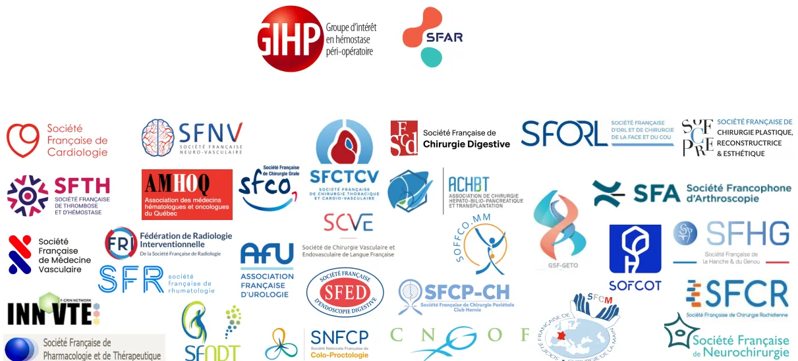

## Recommandations formalisées d'experts :

### Gestion des anticoagulants pour une procédure invasive programmée

A collage of logos for various medical societies and groups. At the top, there is the logo for 'GIPH Groupe d'intérêt en hémostase péri-opératoire' and 'SFAR'. Below these, there are logos for 'Société Française de Cardiologie', 'SFNV Société Française Neuro-Vasculaire', 'Sd Société Française de Chirurgie Digestive', 'SFORL Société Française d'Orl et de Chirurgie de la Face et du Cou', and 'SFPR Société Française de Chirurgie Plastique, Reconstructrice & Esthétique'. Other logos include 'SFTH Société Française de Thrombose et d'Hémostasie', 'AMHOQ Association des médecins hématologues et oncologues du Québec', 'SFCO Société Française de Chirurgie Orale', 'SFCTCV Société Française de Chirurgie Thoracique et Cardio-Vasculaire', 'SCVE', 'ACHBT Association de Chirurgie Hépato-Bilio-Pancréatique et Transplantation', 'SFA Société Francophone d'Arthroscopie', 'SFS Société Française de Médecine Vasculaire', 'FRI Fédération de Radiologie Interventionnelle', 'AFU Association Française d'Urologie', 'SFR Société Française de Rhumatologie', 'SFED Société Française d'Endoscopie Digestive', 'SFCCP-CH Société Française de Chirurgie Pariétale Club Hernie', 'SNFCP Société Nationale Française de Colo-Proctologie', 'CNOG', 'SFCM Société Française de Chirurgie de la Main', 'GSF-GETO', 'SFCOT', 'SFHG Société Française de la Hanche & du Genou', 'SFCR Société Française de Chirurgie Rachidienne', 'SFDTC Société Française de Dermatologie et Cosmétologie', and 'Société Française de Pharmacologie et de Thérapeutique'.

#### Coordonnées par le Groupe d'Intérêt en Hémostasie Péri-Opératoire

En collaboration avec la Société Française d'Anesthésie-Réanimation et médecine péri-opératoire avec la Société Française de Cardiologie, la Société Française de Thrombose et d'Hémostasie, la Société Française de Médecine Vasculaire, La Société Française Neuro-Vasculaire, le Réseau INNOVTE, la Société Francophone de Néphrologie, Dialyse et Transplantation, l'Association des médecins hématologues et oncologues du Québec, la Société Française de Pharmacologie et de Thérapeutique

et les sociétés d'interventionnels, incluant la Société Française de Chirurgie Orale, la Société Française d'Endoscopie Digestive, la Société Française de Chirurgie Digestive, l'Association de Chirurgie Hépato-Bilio-Pancréatique et Transplantation Hépatique, la Société Française et Francophone de Chirurgie de l'Obésité et des Maladies Métaboliques, la Société Française de Chirurgie Pariétale – Club Hernie, la Société Nationale Française de Colo-Proctologie, l'Association Française d'Urologie, le Collège National des Gynécologues et Obstétriciens Français, la Fédération de Radiologie Interventionnelle, la Société Française de Rhumatologie, la Société Française de Chirurgie Orthopédique et Traumatologique, la Société Francophone d'Arthroscopie, la Société française de Chirurgie de la Main, la Société Française de la Hanche et du Genou, le Groupe Sarcome Français - Groupe d'Étude des Tumeurs Osseuses, la Société Française de Chirurgie Rachidienne, la Société Française de Neurochirurgie, la Société Française d'Oto-Rhino-Laryngologie et de Chirurgie de la Face et du Cou, la Société Française de Chirurgie Plastique, Reconstructrice & Esthétique, la Société Française de Chirurgie Thoracique et Cardio-Vasculaire, la Société Française de Chirurgie Vasculaire et Endovasculaire## **Gestion des anticoagulants pour une procédure invasive programmée**

### **Recommandations formalisées d'experts**

#### **Auteurs**

Anne Godier, Alexandre Mansour, Serge Motte, Stéphanie Rouillet, Bernard Lung, Laurent Fauchier, Nicolas Meneveau, Normand Blais, Fanny Bonhomme, Alex Bourguignon, Ariel Cohen, Emmanuel de Maistre, Delphine Douillet, Pierre Fontana, Delphine Garrigue Huet, Alexandre Godon, Isabelle Gouin-Thibault, Yves Gruel, Samia Jebara, Julien Lanoiselée, Dominique Lasne, Silvy Laporte, Thomas Lecompte, Grégoire Le Gal, Anne-Céline Martin, Mikael Mazighi, Pierre Morange, François Mullier, Philippe Nguyen, Gilles Pernod, Nadia Rosencher, Pierre-Marie Roy, Jean-François Schved, Pierre Sié, Sophie Susen, Charles Tacquard, Fanny Vardon, André Vincentelli, Paul Zufferey, Pierre Albaladejo, Patrick Mismetti

#### **Pour les chirurgiens et interventionnels**

Florence Aim, Alp Alantar, Jessica Assouline, Sarah Atallah, Roger Badet, Marc Baroncini, Stéphane Berdah, Laura Beyer, Marie-Cécile Blanchet, Dominique Bouchard, Esteban Brenet, Kevin Buffenoir, Florent Carsuzaa, Guillermo Carvajal Alegria, Céline Chauleur, Luigi Cazato, Vincent de Parades, Jérôme Delambre, Laurence Destrieux, Farouk Drissi, Anne-Laure Ejeil, Bruno Fautrel, Laurent Fauchier, Valentin Favier, Gaëlle Fiard, Maxime Fieux, François Gouin, Michel Guyot, Ruben Hermann, Barbara Hersant, Astrid Herrero, Christophe Hulet, Bernard Lung, Frédéric Juguet, David Karsenti, Hicham Kobeiter, Arnaud Lafon, Ghizlene Lahlou, Camille Langbour, Jeremie Lefevre, Géraldine Lescaille, Sébastien Lustig, Jean-Yves Mabrut, Leon Maggiori, Diane Mege, Nicolas Meneveau, Isabelle Merlot, Eric Moreddu, David Moszkowicz, Pablo Ortega Deballon, Bérèngère Phulpin, Francois Pigot, Tigran Poghosyan, Fabrice Rabarin, Loredana Radoi, Jean-Michel Rouillon, Marc Sapoval, Damien Soudan, Natacha Teissier, Vincent Vidal, André Vincentelli## **Gestion des anticoagulants pour une procédure invasive programmée**

### **Recommandations formalisées d'experts**

Coordonnées par le Groupe d'Intérêt en Hémostase Péri-opératoire (GIHP)

En collaboration avec la Société Française d'Anesthésie-Réanimation et médecine péri-opératoire (SFAR) (validation par le CA de la SFAR le 18 mars 2026)

Et avec :

- - La Société Française de Cardiologie (SFC)
- - La Société Française de Médecine Vasculaire (SFMV)
- - La Société Française Neuro-Vasculaire (SFNV)
- - La Société Française de Thrombose et d'Hémostase (SFTH)
- - La Société Francophone de Néphrologie, Dialyse et Transplantation (SFNDT),
- - Le réseau INNOVTE (Investigation Network On Venous Thrombo-Embolism)
- - L'Association des médecins hématologues et oncologues du Québec,
- - La Société Française de Pharmacologie et de Thérapeutique (SFPT)

  

- - La Société Française de Chirurgie Orale (SFCO)
- - La Société Française d'Endoscopie Digestive (SFED)
- - La Société Française de Chirurgie Digestive (SFCD)
- - L'Association de Chirurgie Hépato-Bilio-Pancréatique et Transplantation Hépatique (ACHBPT)
- - La Société Française et Francophone de Chirurgie de l'Obésité et des Maladies Métaboliques (SOFFCO-MM)
- - La Société Française de Chirurgie Pariétale – Club Hernie (SFCP-CH)
- - La Société Nationale Française de Colo-Proctologie (SNFCP)
- - L'Association Française d'Urologie (AFU)
- - Le Collège National des Gynécologues et Obstétriciens Français (CNGOF)
- - La Fédération de Radiologie Interventionnelle (FRI)
- - La Société Française de Rhumatologie (SFR)
- - La Société Française de Chirurgie Orthopédique et Traumatologique (SOFCOT)
- - La Société Francophone d'Arthroscopie (SFA)
- - La Société française de Chirurgie de la Main (SFCM)
- - La Société Française de la Hanche et du Genou (SFHG)
- - Le Groupe Sarcome Français - Groupe d'Étude des Tumeurs Osseuses (GSF GETO)
- - La Société Française de Chirurgie Rachidienne (SFCR)
- - La Société Française de Neurochirurgie (SFNC)
- - La Société Française d'Oto-Rhino-Laryngologie et de Chirurgie de la Face et du Cou (SFORL)
- - La Société Française de Chirurgie Plastique, Reconstructrice & Esthétique (SoFCPRE)
- - La Société Française de Chirurgie Thoracique et Cardio-Vasculaire (SFCTCV)
- - La Société Française de Chirurgie Vasculaire et Endovasculaire (SCVE)## Liens d'intérêts des experts du GIHP

Pierre Albaladejo : BMS-Pfizer, Sanofi, Octapharma, Leo Pharma  
Normand Blais : pas de lien d'intérêt en rapport avec la présente RFE  
Fanny Bonhomme : pas de lien d'intérêt en rapport avec la présente RFE  
Fanny Vardon : pas de lien d'intérêt en rapport avec la présente RFE  
Alex Bourguignon : pas de lien d'intérêt en rapport avec la présente RFE  
Ariel Cohen : pas de lien d'intérêt en rapport avec la présente RFE  
Emmanuel de Maistre : pas de lien d'intérêt en rapport avec la présente RFE  
Delphine Douillet : pas de lien d'intérêt en rapport avec la présente RFE  
Pierre Fontana : NovoNordisk, Roche et Sobi  
Delphine Garrigue Huet : LFB, Octapharma, Chugai, Boehringer-Ingelheim, Bayer, AstraZeneca  
Anne Godier : Aguettant, BMS-Pfizer, Sanofi, Léo Pharma, LFB, Octapharma, Stago, Viatis  
Alexandre Godon : BMS-Pfizer, LFB, Sanofi  
Isabelle Gouin-Thibault : BMS-Pfizer, Leo Pharma, Viatis  
Yves Gruel : Octapharma  
Samia Jebara : pas de lien d'intérêt en rapport avec la présente RFE  
Julien Lanoiselée : Sanofi, LFB, Stago et Werfen  
Dominique Lasne : Roche-Chugai, Stago  
Silvy Laporte : Ferring, Pfizer, Lilly  
Thomas Lecompte : pas de lien d'intérêt en rapport avec la présente RFE  
Grégoire Le Gal : Aspen Pharma, BMS, Leo Pharma, Pfizer, Sanofi, Stago  
Alexandre Mansour : i-SEP, LFB, Aguettant, Viatis et Pfizer  
Anne-Céline Martin : Abbott, Bayer Healthcare, BMS-Pfizer, Boehringer Ingelheim, Novartis  
Mikael Mazighi : Boehringer, Novartis, novonordisk, Acticor, Astra Zeneca  
Patrick Mismetti : Aspen, Leo Pharma, Sanofi, Pfizer  
Pierre Morange : BMS, Pfizer, Sanofi  
Serge Motte : Bayer Healthcare, BMS-Pfizer, Leo Pharma, Viatis  
François Mullier : Fresenius, Technoclone, Stago and Werfen  
Philippe Nguyen : pas de lien d'intérêt en rapport avec la présente RFE  
Gilles Pernod : pas de lien d'intérêt en rapport avec la présente RFE  
Nadia Rosencher : pas de lien d'intérêt  
Stéphanie Roulet : BMS-Pfizer, CSL Behring, LFB, LEO Pharma, Sanofi  
Pierre-Marie Roy : Aspen, Bayer Health Care, Boehringer-Ingelheim, Sanofi-Aventis, Pfizer, Bristol Myers Squibb, LFB, Viatis  
Jean-François Schved : pas de lien d'intérêt  
Pierre Sié : pas de lien d'intérêt  
Sophie Susen : CorWave, Roche-Chugai, Stago, Biomarin, Bioverativ, CSL Behring, LFB, Novo-Nordisk, Sanofi, Shire/Takeda, Siemens Healthinners, Stago and Sobi  
Charles Tacquard : Sanofi, BMS Pfizer, LFB  
André Vincentelli : pas de lien d'intérêt en rapport avec la présente RFE  
Paul Zufferey : Sanofi Aventis## Liens d'intérêts des experts hors GIHP

Florence Aim : pas de lien d'intérêt en rapport avec la présente RFE  
Alp Alantar : pas de lien d'intérêt en rapport avec la présente RFE  
Jessica Assouline : pas de lien d'intérêt en rapport avec la présente RFE  
Sarah Atallah : pas de lien d'intérêt en rapport avec la présente RFE  
Roger Badet : pas de lien d'intérêt en rapport avec la présente RFE  
Marc Baroncini : pas de lien d'intérêt en rapport avec la présente RFE  
Stephane Berdah : pas de lien d'intérêt en rapport avec la présente RFE  
Laura Beyer : pas de lien d'intérêt en rapport avec la présente RFE  
Marie-Cécile Blanchet : pas de lien d'intérêt en rapport avec la présente RFE  
Dominique Bouchard : pas de lien d'intérêt en rapport avec la présente RFE  
Esteban Brenet : pas de lien d'intérêt en rapport avec la présente RFE  
Kevin Buffenoir : pas de lien d'intérêt en rapport avec la présente RFE  
Florent Carsuzaa : Medtronic, Stryker, Smith&Nephew  
Guillermo Carvajal Alegria : AbbVie, AlfaSigma, Biogen, BMS, Celltrion, Chugai, Fresenius-Kabi, Galapagos, Lilly, MSD, Novartis, Pfizer, UCB  
Luigi Cazato : pas de lien d'intérêt en rapport avec la présente RFE  
Celine Chauleur : Sanofi, Leopharma, medtronic MSD VIFOR, intuitive, gedeon  
Vincent de Parades : pas de lien d'intérêt en rapport avec la présente RFE  
Jérôme Delambre : pas de lien d'intérêt en rapport avec la présente RFE  
Laurence Destrieux : pas de lien d'intérêt en rapport avec la présente RFE  
Farouk Drissi : pas de lien d'intérêt en rapport avec la présente RFE  
Anne-Laure Ejeil : pas de lien d'intérêt en rapport avec la présente RFE  
Bruno Fautrel : AbbVie, AlfaSigma, Biogen, BMS, Celltrion, Chugai, Fresenius-Kabi, Galapagos, Lilly, MSD, Novartis, Pfizer, UCB  
Laurent Fauchier : AstraZeneca, Bayer, Bristol Myers Squibb–Pfizer, Boehringer Ingelheim, Novo Nordisk  
Valentin Favier : Medtronic, Stryker  
Gaëlle Fiard : Sanofi-Aventis  
Maxime Fieux : Sanofi, GlaxoSmith, Astra Zeneca, Medtronic, et Stryker  
François Gouin : pas de lien d'intérêt en rapport avec la présente RFE  
Michel Guyot : pas de lien d'intérêt en rapport avec la présente RFE  
Ruben Hermann : pas de lien d'intérêt en rapport avec la présente RFE  
Astrid Herrero : pas de lien d'intérêt en rapport avec la présente RFE  
Barbara Hersant : ALME academy, Vivacy, Apyx, Solta  
Christophe Hulet : pas de lien d'intérêt en rapport avec la présente RFE  
Bernard Lung : pas de lien d'intérêt en rapport avec la présente RFE  
Frédéric Juguet : pas de lien d'intérêt en rapport avec la présente RFE  
David Karsenti : pas de lien d'intérêt en rapport avec la présente RFE  
Hicham Kobeiter : pas de lien d'intérêt en rapport avec la présente RFE  
Arnaud Lafon : pas de lien d'intérêt en rapport avec la présente RFE  
Ghizlene Lahlou : pas de lien d'intérêt en rapport avec la présente RFE  
Camille Langbour : Lilly  
Jeremie Lefevre : pas de lien d'intérêt en rapport avec la présente RFE  
Géraldine Lescaille : pas de lien d'intérêt en rapport avec la présente RFE  
Sébastien Lustig : pas de lien d'intérêt en rapport avec la présente RFE  
Jean-Yves Mabrut : pas de lien d'intérêt en rapport avec la présente RFE  
Léon Maggiori : pas de lien d'intérêt en rapport avec la présente RFE  
Christophe Mariat : pas de lien d'intérêt en rapport avec la présente RFE  
Diane Mege : pas de lien d'intérêt en rapport avec la présente RFE  
Nicolas Meneveau : Boston Scientific, INARI, Alliance BMS/PFIZER.  
Isabelle Merlot : pas de lien d'intérêt en rapport avec la présente RFE  
Eric Moreddu : pas de lien d'intérêt en rapport avec la présente RFE  
David Moszkowicz : pas de lien d'intérêt en rapport avec la présente RFEPablo Ortega-Deballon : pas de lien d'intérêt en rapport avec la présente RFE  
François Pigot : pas de lien d'intérêt en rapport avec la présente RFE  
Tigran Poghosyan : Gore, Medtronic  
Bérèngère Phulpin : pas de lien d'intérêt en rapport avec la présente RFE  
Fabrice Rabarin : pas de lien d'intérêt en rapport avec la présente RFE  
Loredana Radoi : pas de lien d'intérêt en rapport avec la présente RFE  
Jean-Michel Rouillon : pas de lien d'intérêt en rapport avec la présente RFE  
Marc Sapoval : pas de lien d'intérêt en rapport avec la présente RFE  
Damien Soudan : pas de lien d'intérêt en rapport avec la présente RFE  
Natacha Teissier : pas de lien d'intérêt en rapport avec la présente RFE  
Vincent Vidal : pas de lien d'intérêt en rapport avec la présente RFE  
André Vincentelli : pas de lien d'intérêt en rapport avec la présente RFE## Sommaire

<table><tr><td><b>Abréviations.....</b></td><td><b>10</b></td></tr><tr><td><b>Introduction .....</b></td><td><b>11</b></td></tr><tr><td><b>Définitions .....</b></td><td><b>13</b></td></tr><tr><td>    <i>Risque hémorragique d'une procédure invasive .....</i></td><td><i>13</i></td></tr><tr><td>    <i>Procédures neuraxiales .....</i></td><td><i>13</i></td></tr><tr><td><b>Question 1 : Chez un patient traité par un anticoagulant et programmé pour une procédure invasive, quels sont les éléments à prendre en compte pour déterminer la gestion péri-procédurale des anticoagulants afin de réduire les complications hémorragiques et thromboemboliques ? .....</b></td><td><b>14</b></td></tr><tr><td><b>Question 2 : Chez un patient traité par un anticoagulant et programmé pour une procédure invasive à faible risque hémorragique, faut-il arrêter l'anticoagulant afin de réduire les complications hémorragiques ? .....</b></td><td><b>15</b></td></tr><tr><td><b>Question 3 : Chez un patient traité par un anticoagulant et programmé pour une procédure invasive à risque hémorragique élevé, quand faut-il arrêter l'anticoagulant afin de réduire les complications hémorragiques et prévenir les complications thrombotiques ? .....</b></td><td><b>17</b></td></tr><tr><td>    <i>Tableau 1 : Demi-vie des AVK et durée d'arrêt proposée pour l'obtention d'un INR <math>\leq 1,5</math>.....</i></td><td><i>18</i></td></tr><tr><td>    <i>Tableau 2 : délais d'arrêt des anticoagulants administrés à dose curative pour la réalisation d'une procédure à risque hémorragique élevé.....</i></td><td><i>20</i></td></tr><tr><td><b>Question 4 : Chez un patient ayant eu une procédure invasive programmée à risque hémorragique élevé, quand et comment faut-il reprendre l'anticoagulation curative afin de réduire les complications hémorragiques et prévenir les complications thrombotiques ? .....</b></td><td><b>22</b></td></tr><tr><td><b>Question 5 : Chez un patient traité par un anticoagulant pour de la FA et programmé pour une procédure invasive à risque hémorragique élevé, faut-il faire un relais pour réduire les complications thrombotiques ? .....</b></td><td><b>26</b></td></tr><tr><td>    <i>Patients traités par anticoagulant oral pour de la fibrillation atriale associée à une coronaropathie.....</i></td><td><i>28</i></td></tr><tr><td><b>Question 6 : Chez un patient traité par un AVK pour une valve cardiaque mécanique et programmé pour une procédure invasive à risque hémorragique élevé, faut-il faire un relais pour réduire les complications thrombotiques ? .....</b></td><td><b>31</b></td></tr><tr><td><b>Question 7 : Chez un patient traité par un anticoagulant pour une MTEV et programmé pour une procédure invasive à risque hémorragique élevé, faut-il faire un relais pour réduire les complications thrombotiques ? .....</b></td><td><b>34</b></td></tr><tr><td><b>Question 8 : Chez un patient traité par un anticoagulant pour une assistance ventriculaire gauche de longue durée (LVAD) et programmé pour une procédure</b></td><td></td></tr></table><table border="0">
<tr>
<td><b>invasive à risque hémorragique élevé, faut-il faire un relais pour réduire les complications thrombotiques ? .....</b></td>
<td><b>43</b></td>
</tr>
<tr>
<td><b>Question 9 : Quelle est la prise en charge d'un AVC péri-procédural ? .....</b></td>
<td><b>46</b></td>
</tr>
<tr>
<td><b>Question 10 : Chez un patient traité par un anticoagulant et programmé pour une procédure invasive, l'insuffisance rénale chronique modifie-t-elle la prise en charge ? .....</b></td>
<td><b>48</b></td>
</tr>
<tr>
<td>    <i>Tableau 4 : Stades d'IRC utilisés pour la gestion des anticoagulants selon le DFGe par la formule CKD-EPI ....</i></td>
<td><i>51</i></td>
</tr>
<tr>
<td>    <i>Tableau 5 : Posologies et AMM des AOD dans la FA adaptées au DFG estimé.....</i></td>
<td><i>52</i></td>
</tr>
<tr>
<td>    <i>Tableau 6 : Délai d'arrêt pré-procédural des AOD selon le risque hémorragique de la procédure invasive et selon le DFGe.....</i></td>
<td><i>53</i></td>
</tr>
<tr>
<td>    <i>Tableau 8 : utilisation des héparines selon le DFGe pour un relais pré-procédural des AVK.....</i></td>
<td><i>55</i></td>
</tr>
<tr>
<td>    <i>Tableau 9 : utilisation des héparines après la procédure selon le DFGe.....</i></td>
<td><i>55</i></td>
</tr>
<tr>
<td><b>Question 11 : Chez un patient traité par un anticoagulant et programmé pour une procédure invasive, un poids extrême modifie-t-il la prise en charge ?.....</b></td>
<td><b>57</b></td>
</tr>
<tr>
<td><b>Tableaux de synthèse .....</b></td>
<td><b>62</b></td>
</tr>
<tr>
<td>    <i>AOD et procédures invasives programmées.....</i></td>
<td><i>62</i></td>
</tr>
<tr>
<td>    <i>AVK et procédures invasives programmées .....</i></td>
<td><i>63</i></td>
</tr>
<tr>
<td>    <i>Indications des relais péri-procéduraux des anticoagulants oraux .....</i></td>
<td><i>64</i></td>
</tr>
<tr>
<td><b>Figures de synthèse.....</b></td>
<td><b>65</b></td>
</tr>
<tr>
<td>    <i>Patients traités par AOD pour de la FA et programmés pour une procédure invasive.....</i></td>
<td><i>65</i></td>
</tr>
<tr>
<td>    <i>Patients traités par AVK pour de la FA et programmés pour une procédure invasive.....</i></td>
<td><i>66</i></td>
</tr>
<tr>
<td>    <i>Patients traités par AVK pour une valve cardiaque mécanique et programmés pour une procédure invasive.</i></td>
<td><i>67</i></td>
</tr>
<tr>
<td>    <i>Patients traités par AOD pour une MTEV et programmés pour une procédure invasive .....</i></td>
<td><i>68</i></td>
</tr>
<tr>
<td>    <i>Patients traités par AVK pour une MTEV et programmés pour une procédure invasive.....</i></td>
<td><i>69</i></td>
</tr>
<tr>
<td><b>Synthèse des recommandations par indication et type d'anticoagulant .....</b></td>
<td><b>70</b></td>
</tr>
<tr>
<td>    <i>Patients traités par AOD pour de la FA et programmés pour une procédure invasive.....</i></td>
<td><i>70</i></td>
</tr>
<tr>
<td>    <i>Patients traités par un AVK pour de la FA et programmés pour une procédure invasive.....</i></td>
<td><i>71</i></td>
</tr>
<tr>
<td>    <i>Patients traités par AVK pour une valve cardiaque mécanique et programmés pour une procédure invasive.</i></td>
<td><i>73</i></td>
</tr>
<tr>
<td>    <i>Patients traités par un AOD pour une MTEV et programmés pour une procédure invasive .....</i></td>
<td><i>75</i></td>
</tr>
<tr>
<td>    <i>Patients traités par un AVK pour une MTEV et programmés pour une procédure invasive.....</i></td>
<td><i>77</i></td>
</tr>
<tr>
<td><b>Classification du risque hémorragique des procédures invasives et spécificités .....</b></td>
<td><b>79</b></td>
</tr>
<tr>
<td>    <i>Anesthésie loco-régionale .....</i></td>
<td><i>80</i></td>
</tr>
<tr>
<td>    <i>Radiologie Interventionnelle .....</i></td>
<td><i>81</i></td>
</tr>
<tr>
<td>    <i>Rhumatologie .....</i></td>
<td><i>82</i></td>
</tr>
</table><table><tr><td><i>Procédures invasives cardiologiques .....</i></td><td><i>84</i></td></tr><tr><td><i>Chirurgie thoracique et cardio-vasculaire .....</i></td><td><i>86</i></td></tr><tr><td><i>Procédures invasives en Chirurgie Orale .....</i></td><td><i>87</i></td></tr><tr><td><i>Chirurgie ORL.....</i></td><td><i>93</i></td></tr><tr><td><i>Procédures endoscopiques .....</i></td><td><i>101</i></td></tr><tr><td><i>Chirurgie viscérale .....</i></td><td><i>102</i></td></tr><tr><td><i>Chirurgie proctologique.....</i></td><td><i>104</i></td></tr><tr><td><i>Procédures gynécologiques .....</i></td><td><i>108</i></td></tr><tr><td><i>Procédures urologiques.....</i></td><td><i>109</i></td></tr><tr><td><i>Chirurgie plastique, reconstructrice et esthétique .....</i></td><td><i>111</i></td></tr><tr><td><i>Chirurgie orthopédique .....</i></td><td><i>112</i></td></tr><tr><td><i>Neurochirurgie .....</i></td><td><i>115</i></td></tr></table>## **Abréviations**

AMM : autorisation de mise sur le marché  
[anticoagulant] : concentration en anticoagulant  
Anti-Xa : anti facteur X activé  
AIT : accident ischémique transitoire  
AVC : accident vasculaire cérébral  
AVK : antivitamine K  
AOD : anticoagulant oral direct  
CCP : concentrés de complexe prothrombinique  
CICr : clairance de la créatinine  
DFG : débit de filtration glomérulaire  
EBMD : examens de biologie médicale délocalisée  
EP : embolie pulmonaire  
ETEV : évènement thromboembolique veineux  
FA : fibrillation Atriale  
HAS : Haute Autorité de Santé  
HNF : héparine non fractionnée  
HBPM : héparine de bas poids moléculaire  
HTP-TEC : hypertension pulmonaire thromboembolique chronique  
IMC : indice de masse corporelle  
INR : international normalized ratio  
IRC : insuffisance rénale chronique  
IV : intraveineux  
IVSE : intraveineux à la seringue électrique  
LVAD : left ventricular assist device  
MTEV : maladie thromboembolique veineuse  
PO : per os  
RCP : résumé des caractéristiques du produit  
SAPL : syndrome des antiphospholipides  
SC : sous-cutané  
TP : taux de prothrombine  
TCA : temps de céphaline avec activateur  
TIH : thrombopénie induite par l'héparine  
TT : temps de thrombine  
TVP : thrombose veineuse profonde## Introduction

Chaque année, près de 10 % des patients traités par un anticoagulant oral au long cours (anti-vitamine K (AVK) ou anticoagulants oraux directs (AOD)) pour de la fibrillation atriale (FA), une maladie thromboembolique veineuse (MTEV) ou une valve cardiaque mécanique ont une chirurgie ou une procédure invasive programmée. Ces patients nécessitent une prise en charge spécifique de leur anticoagulant, qui a été formalisée dans différents textes : pour les AVK les recommandations professionnelles de la Haute Autorité de Santé (HAS) de 2008, pour les AOD les propositions du Groupe d'Intérêt en Hémostase Péri-opératoire (GIHP) de 2011, mises à jour en 2015 et pour la MTEV, des recommandations françaises de 2019 [1-4]. Ces référentiels sont anciens et différentes études impactant les pratiques ont été publiées depuis, rendant nécessaire une mise à jour. Ainsi, le Groupe d'Intérêt en Hémostase Péri-opératoire (GIHP) a coordonné l'élaboration de Recommandations Formalisées d'Experts (RFE) en collaboration avec la Société Française d'Anesthésie Réanimation (SFAR), et avec les sociétés médicales concernées par le sujet, incluant la Société Française de Cardiologie (SFC), la Société Française de Médecine Vasculaire (SFMV), la Société Francophone de Néphrologie, Dialyse et Transplantation (SFNDT), la Société Française de Neuro-Vasculaire (SFNV), la Société Française de Thrombose et d'Hémostase (SFTH) et le réseau INNOVTE (Investigation Network On Venous Thrombo-Embolism), et avec les sociétés d'interventionnels, incluant la Société Française de Chirurgie Orale (SFCO), la Société Française d'Endoscopie Digestive (SFED), la Société Française de Chirurgie Digestive (SFCD), l'Association de Chirurgie Hépato-Bilio-Pancréatique et Transplantation Hépatique (ACHBPT), la Société Française et Francophone de Chirurgie de l'Obésité et des Maladies Métaboliques (SOFFCO-MM), la Société Française de Chirurgie Pariétale – Club Hernie (SFCP-CH), la Société Nationale Française de Colo-Proctologie (SNFCP), l'Association Française d'Urologie (AFU), le Collège National des Gynécologues et Obstétriciens Français (CNGOF), la Fédération de Radiologie Interventionnelle (FRI), la Société Française de Rhumatologie (SFR), la Société Française de Chirurgie Orthopédique et Traumatologique (SOFCOT), la Société Francophone d'Arthroscopie (SFA), la Société française de Chirurgie de la Main (SFCM), la Société Française de la Hanche et du Genou (SFHG), le Groupe Sarcome Français - Groupe d'Étude des Tumeurs Osseuses (GSF-GETO), la Société Française de Chirurgie Rachidienne (SFCR), la Société Française de Neurochirurgie (SFNC), la Société Française d'Oto-Rhino-Laryngologie et de Chirurgie de la Face et du Cou (SFORL), la Société Française de Chirurgie Plastique, Reconstructrice & Esthétique (SoFCPRE), la Société Française de Chirurgie Thoracique et Cardio-Vasculaire (SFCTCV), et la Société Française de Chirurgie Vasculaire et Endovasculaire (SCVE).

L'objectif de ces RFE est d'aider les praticiens à choisir la gestion des anticoagulants la plus appropriée à la procédure invasive et au patient, en proposant des stratégies optimisées à partir des données publiées les plus récentes, afin de réduire la morbi-mortalité des anticoagulants oraux.

Concernant la méthodologie, les questions abordées ont été définies par les experts et formulées selon un format PICO (*Population, Intervention, Comparison, Outcome*). Dans les cas où les critères de jugement étaient les mêmes pour tout le champ considéré, ils n'ont pas été répétés à chaque recommandation. Si le critère de jugement différait, il était alors cité dans la recommandation.Les questions ont été attribuées à plusieurs groupes de travail, constitués de membres du GIHP, et des autres sociétés. Un premier texte reprenant les recommandations de 2008 et 2015 et les données actualisées a été discuté et modifié par les autres groupes, puis soumis à l'analyse critique des autres membres. Parallèlement, l'évaluation du risque hémorragique des procédures et des particularités que ces procédures induisaient dans la gestion de l'anticoagulation était réalisée par les sociétés d'interventionnels. L'analyse de la littérature et la formulation des recommandations ont été conduites selon la méthodologie GRADE. Un niveau de preuve, pouvant être réévalué en tenant compte de la qualité méthodologique des études a été défini pour chacune des références bibliographiques citées. Un niveau global de preuve était déterminé pour chaque critère de jugement en tenant compte des niveaux de preuve de chacune des références bibliographiques, de la cohérence des résultats entre les différentes études, du caractère direct ou non des preuves, de l'analyse de coût et de l'importance du bénéfice. Un niveau global de preuve « fort » permettait de formuler une recommandation « forte » (il est recommandé de faire/il n'est pas recommandé de faire... GRADE 1+/1-). Un niveau global de preuve modéré ou faible aboutissait à l'écriture d'une recommandation « optionnelle » (il est proposé de faire/il n'est pas proposé de faire... GRADE 2+/2-). Ces recommandations ont ensuite été validées par un vote (n=36), déterminant ainsi la force de chaque recommandation. Pour retenir une recommandation avec un accord fort, au moins 70% des membres devaient exprimer leur accord tandis que moins de 20% d'entre eux pouvaient exprimer leur opposition. En l'absence d'accord fort, les propositions étaient reformulées et soumises à nouveau au vote dans l'objectif d'obtenir un meilleur accord. L'élaboration des recommandations a été conduite indépendamment de tout financement de l'industrie.

#### Références

- [1] HAS. Prise en charge des surdosages en antivitamines K, des situations à risque hémorragique et des accidents hémorragiques chez les patients traités par antivitamines K en ville et en milieu hospitalier. 2008
- [2] Sie P, Samama CM, Godier A, et al. [Surgery and invasive procedures in patients on long-term treatment with oral direct thrombin or factor Xa inhibitors]. *Ann Fr Anesth Reanim* 2011; 30:645-50.
- [3] Albaladejo P, Bonhomme F, Blais N et al. Gestion des Anticoagulants Oraux Directs pour la chirurgie et les actes invasifs programmés : propositions réactualisées du Groupe d'Intérêt en Hémostase Périopératoire (GIHP)-Septembre 2015. *Anaesth Crit Care Pain Med*. 2017;36:73-76.
- [4] Sanchez O, Benhamou Y, L Bertoletti L, et coll. Recommandations de bonne pratique pour la prise en charge de la maladie veineuse thromboembolique chez l'adulte. Version courte. *Rev Mal Respir*. 2019;36:249-283## Argumentaire

### Définitions

#### Risque hémorragique d'une procédure invasive

Il est classé en deux catégories principales, définissant un risque faible ou élevé [1] :

- - Les procédures à **faible risque hémorragique** sont définies comme des procédures responsables de saignements peu fréquents, de faible intensité ou aisément contrôlés. Elles peuvent être réalisées chez des patients traités par un anticoagulant. Toutefois, la prise d'autres médicaments interférant avec l'hémostase (en particulier antiplaquettaires, fibrinolytiques...), la présence d'une coagulopathie congénitale ou acquise ou l'existence d'une comorbidité augmentant le risque hémorragique peuvent conduire à choisir l'interruption de l'anticoagulant.
- - Les procédures à **risque hémorragique élevé** nécessitent l'arrêt de l'anticoagulant car leur réalisation chez des patients anticoagulés augmente le saignement.

Les sociétés de chirurgie, d'endoscopie digestive, de colo-proctologie, de cardiologie interventionnelle, de radiologie interventionnelle et de rhumatologie ont classé les procédures programmées les plus courantes en procédures à risque hémorragique faible ou élevé. Quelques procédures ont été associées à un risque hémorragique minimal ou à un risque hémorragique très élevé. Ce classement est disponible en annexes.

#### Procédures neuraxiales

Elles incluent la ponction lombaire, la rachianesthésie, la péridurale et la péri-rachianesthésie combinée. Elles n'incluent pas la chirurgie rachidienne.

#### Références

[1] HAS. Prise en charge des surdosages en antivitamines K, des situations à risque hémorragique et des accidents hémorragiques chez les patients traités par antivitamines K en ville et en milieu hospitalier. 2008.**Question 1 : Chez un patient traité par un anticoagulant et programmé pour une procédure invasive, quels sont les éléments à prendre en compte pour déterminer la gestion péri-procédurale des anticoagulants afin de réduire les complications hémorragiques et thromboemboliques ?**

<table border="1">
<thead>
<tr>
<th></th>
<th></th>
<th>Grade</th>
<th>Accord</th>
</tr>
</thead>
<tbody>
<tr>
<td></td>
<td><b>Déterminants de la gestion péri-procédurale des anticoagulants</b></td>
<td></td>
<td></td>
</tr>
<tr>
<td>1</td>
<td>Chez un patient traité par un anticoagulant et programmé pour une procédure invasive, il est recommandé de déterminer la gestion péri-procédurale des anticoagulants en fonction du risque hémorragique de la procédure, du risque thromboembolique du patient et de la procédure et des conséquences d'un éventuel report de la procédure lorsque les deux risques sont élevés.</td>
<td>1+</td>
<td>Fort</td>
</tr>
</tbody>
</table>

### Argumentaire

L'arrêt des anticoagulants augmente le risque thromboembolique, leur poursuite augmente le risque hémorragique de la procédure. Il s'agit de mettre en balance ces 2 risques pour chaque situation afin de définir la conduite optimale, entre poursuite des anticoagulants oraux, arrêt sans relais et arrêt avec relais pré et/ou post-procédural. Quand le risque thrombotique est temporairement très élevé, comme précocement après une embolie pulmonaire ou un accident cérébral ischémique, le report de la procédure est à envisager, en particulier si son risque hémorragique est élevé, quand cela n'altère pas le pronostic vital ou fonctionnel du patient.**Question 2 : Chez un patient traité par un anticoagulant et programmé pour une procédure invasive à faible risque hémorragique, faut-il arrêter l'anticoagulant afin de réduire les complications hémorragiques ?**

*Coordonnée par Stéphanie Rouillet et Charles Tacquard*

<table border="1">
<thead>
<tr>
<th></th>
<th></th>
<th>Grade</th>
<th>Accord</th>
</tr>
</thead>
<tbody>
<tr>
<td></td>
<td><b>Patients traités par un AVK</b></td>
<td></td>
<td></td>
</tr>
<tr>
<td>2.1</td>
<td>Chez un patient traité par AVK et programmé pour une procédure invasive à faible risque hémorragique, il est proposé de poursuivre les AVK et de contrôler l'INR dans la semaine précédant la procédure pour vérifier l'absence de surdosage.</td>
<td>2+</td>
<td>Fort</td>
</tr>
<tr>
<td></td>
<td><b>Patients traités par un AOD</b></td>
<td></td>
<td></td>
</tr>
<tr>
<td>2.2</td>
<td>Chez un patient traité par AOD (apixaban, edoxaban, rivaroxaban, dabigatran) et programmé pour une procédure à faible risque hémorragique, il est proposé de sauter les prises de la veille au soir et du matin de la procédure, quel que soit le schéma thérapeutique (une prise le matin, une prise le soir ou deux prises par jour) et de reprendre les AOD aux doses habituelles du patient, au moins 6 heures après la fin du geste invasif.</td>
<td>2+</td>
<td>Fort</td>
</tr>
</tbody>
</table>

**Argumentaire**

Les procédures à faible risque hémorragique peuvent être effectuées chez des patients sous anticoagulation curative.

Les recommandations de la HAS de 2008 proposaient que ces actes soient réalisés sans interruption du traitement par AVK, mais en s'assurant que le patient ne soit pas en surdosage [1]. Une mesure de l'INR dans la semaine précédant la procédure laisse un délai suffisant en cas de surdosage asymptomatique pour mettre en œuvre des mesures correctives [1]. Après la procédure, les AVK sont repris à l'heure habituelle à la posologie habituelle.

Concernant les AOD, le GIHP propose depuis 2015 de ne prendre ni la dose de la veille au soir (si une prise le soir ou deux prises par jour) ni celle du matin (si une prise le matin ou deux prises par jour), afin de ne pas être au pic de concentration de l'AOD au moment de la procédure [2]. En effet, l'étude CORIDA avait rapporté des concentrations en rivaroxaban élevées 12 à 24h après la dernière prise [3]. Une méta-analyse d'études observationnelles ayant dosé au pic et à la vallée les concentrations plasmatiques d'apixaban et rivaroxaban, avait aussi montré une grande variabilité des concentrations, selon le schéma thérapeutique, mais également l'âge et la fonction rénale [4]. Cela conduit à privilégier une réalisation de la procédure alors que la concentration d'AOD se trouve à la vallée. Cette stratégie est appuyée par les résultats de l'étude PERIXa qui a évalué prospectivement 1902 patients avec de la FA bénéficiant d'un geste à risque hémorragique faible, avec arrêt de l'AOD anti-Xa 24h avant la procédure [5]. Aucun événement thromboembolique n'a été observé et seulement deux saignements majeurs ont été rapportés (0,1 %). L'étude PAUSE a évalué une stratégie proche, omettant les prises de la veille de la procédure, qui s'est avérée sûre d'un point de vue du risque hémorragique, comme du risque thrombotique [6]. Après la procédure, les AOD sontrepris à l'heure habituelle aux posologies habituelles et au moins 6h après la fin de la procédure pour éviter un pic d'anticoagulation trop précoce.

#### Références

- [1] HAS. Prise en charge des surdosages en antivitamines K, des situations à risque hémorragique et des accidents hémorragiques chez les patients traités par antivitamines K en ville et en milieu hospitalier. 2008
- [2] Albaladejo P, Bonhomme F, Blais N et al. Gestion des Anticoagulants Oraux Directs pour la chirurgie et les actes invasifs programmés : propositions réactualisées du Groupe d'Intérêt en Hémostase Périopératoire (GIHP)-Septembre 2015. Anaesth Crit Care Pain Med. 2017;36:73-76
- [3] Godier A, Dincq AS, Martin AC, et al. Predictors of pre-procedural concentrations of direct oral anticoagulants: a prospective multicentre study. Eur Heart J. 2017;38(31):2431-2439. doi:10.1093/eurheartj/ehx403
- [4] Almalbis CA, Md Redzuan A, Andrada CP, Gonzaga NA, Mohd Saffian S. Peak and trough concentrations of apixaban and rivaroxaban in adult patients: a systematic review and meta-analysis. J Thromb Haemost. 2025;23(4):1289-1314. doi:10.1016/j.jtha.2024.12.032
- [5] Lee S-R, Lee K-Y, Park J-S, Lee YS, Oh YS, Han S-J, Namgung J, Lee JH, Lim W-H, Ahn MS, Kwon S, Ahn H-J, Oh S, Lip GYH, Choi E-K, Investigators Perix, Jang S-W, Choi J-I, Heo JH, Park J, Jin M-N, Kang K-W, Kim SH, Yoon N, Baek Y-S, Lee SH, Kim T-H, Yu HT, Roh S-Y, Chun KJ, Nam K-B, Han S, Lee K-N, Park J-W, Uhm J-S, Sung JH, On YK, Lee S-S: Perioperative Factor Xa Inhibitor Discontinuation for Patients Undergoing Procedures With Minimal or Low Bleeding Risk. JAMA Netw Open 2025; 8:e2458742
- [6] Douketis JD, Spyropoulos AC, Duncan J, et al. Perioperative Management of Patients With Atrial Fibrillation Receiving a Direct Oral Anticoagulant. JAMA Intern Med. 2019;179(11):1469-1478. doi:10.1001/jamainternmed.2019.2431**Question 3 : Chez un patient traité par un anticoagulant et programmé pour une procédure invasive à risque hémorragique élevé, quand faut-il arrêter l'anticoagulant afin de réduire les complications hémorragiques et prévenir les complications thrombotiques ?**

*Coordonnée par Stéphanie Roulet et Charles Tacquard*

<table border="1">
<thead>
<tr>
<th></th>
<th></th>
<th>Grade</th>
<th>Accord</th>
</tr>
</thead>
<tbody>
<tr>
<td></td>
<td><b>Patients traités par un AVK</b></td>
<td></td>
<td></td>
</tr>
<tr>
<td>3.1</td>
<td>Chez un patient traité par AVK et programmé pour une procédure à risque hémorragique élevé, il est proposé d'arrêter les AVK avant la procédure, avec une dernière prise de warfarine à J-6, de fluindione à J-5 et d'acénocoumarol à J-4 (J0 étant le jour de la procédure), et de contrôler l'INR la veille de la procédure.</td>
<td>2+</td>
<td>Fort</td>
</tr>
<tr>
<td>3.2</td>
<td>Si l'INR est supérieur au seuil de sécurité hémostatique (INR=1,5, ou INR=1,2 pour la neurochirurgie intracrânienne et les procédures neuraxiales), il est proposé d'administrer 2 à 5 mg de vitamine K par voie orale la veille de la procédure et de contrôler l'INR le lendemain.</td>
<td>2+</td>
<td>Fort</td>
</tr>
<tr>
<td></td>
<td><b>Patients traités par un AOD</b></td>
<td></td>
<td></td>
</tr>
<tr>
<td>3.3</td>
<td>Chez un patient traité par AOD (apixaban, edoxaban, rivaroxaban, dabigatran) et programmé pour une procédure à risque hémorragique élevé, il est proposé d'arrêter les AOD avec une dernière prise à J-3 (J0 étant le jour de la procédure) en l'absence d'insuffisance rénale *.</td>
<td>2+</td>
<td>Fort</td>
</tr>
<tr>
<td>3.4</td>
<td>Chez un patient traité par AOD (apixaban, edoxaban, rivaroxaban, dabigatran) et programmé pour une procédure à risque hémorragique très élevé comme la neurochirurgie intracrânienne ou les procédures neuraxiales, les experts suggèrent d'arrêter les AOD avec une dernière prise à J-5 *.</td>
<td>Avis d'experts</td>
<td>Fort</td>
</tr>
</tbody>
</table>

*\*en cas d'insuffisance rénale (DFG estimé < 50 ml/min/1.73 m<sup>2</sup>), se référer au chapitre dédié (question 10)*

## Argumentaire

Les procédures invasives à risque hémorragique élevé nécessitent de corriger l'hémostase et de passer sous le seuil de sécurité hémostatique. La durée d'arrêt des anticoagulants doit être suffisante pour obtenir cette correction pour tous les patients, sans induire de déprogrammation liée à une anticoagulation résiduelle, tout en étant la plus courte possible pour ne pas augmenter le risque thrombotique.

Après arrêt d'un AVK, le temps nécessaire pour la normalisation de l'INR dépend principalement de la cinétique de réapparition des facteurs de coagulation vitamine K-dépendants complètement actifs (suffisamment gamma-carboxylés), en particulier du facteur II, dont la demi-vie est la plus longue (environ 60 heures), et dans une moindre mesure de la demi-vie plasmatique de l'AVK. Même lorsque l'AVK est rapidement éliminé — cas de l'acénocoumarol — l'INR demeure élevé tant que cette réapparition n'est pas suffisante. Cette durée peut être allongée par un INR initial élevé, l'âge avancé, la fragilité, une insuffisance hépatique, un état de dénutrition, et certaines interactions médicamenteuses (via le CYP450).Ces éléments contribuent à la variabilité inter-individuelle (voire intra-individuelle) de la durée d'effet des AVK.

La durée d'arrêt des AVK est donc modulée selon la demi-vie de l'AVK (tableaux 1 et 2). La fluindione a longtemps servi de référence : dès 2008, la HAS recommandait une dernière prise 5 jours avant la procédure [1], ce qui permet d'obtenir un  $\text{INR} < 1,5$  dans 89% des cas [2]. Mais cet AVK va disparaître du marché. Pour l'acénocoumarol, à demi-vie courte, une dernière prise 4 jours avant la procédure est proposée [3]. Pour la warfarine, molécule à demi-vie longue devenue l'AVK de référence en France pour les nouvelles prescriptions, une dernière prise 6 jours avant la procédure permet d'obtenir un  $\text{INR} \leq 1,5$  chez 82 à 93% des patients [4,5]. Cette durée d'arrêt de la warfarine, allongée d'un jour comparativement aux recommandations précédentes [1], est celle des essais randomisés et des recommandations internationales [4,6-8]. Un arrêt plus court, avec une dernière prise à J-5, entraîne une proportion plus importante d'INR au-dessus du seuil de sécurité la veille de la procédure, en particulier lorsque l'INR sous traitement est supérieur à 2,5 [9], conduisant à un recours plus fréquent à la vitamine K. A l'inverse, une durée d'arrêt raccourcie d'un jour est suffisante lorsque l'INR est infra-thérapeutique avant arrêt [9,10] ce qui peut conduire à moduler la durée d'arrêt des AVK en fonction de l'INR initial. Pour les patients dont le risque thromboembolique est le plus élevé, en particulier ceux porteurs d'une valve mécanique ou d'un SAPL, les AVK sont relayés par des héparines bien que le bénéfice des relais n'ait jamais été montré (cf chapitres 5 à 8). Les HBPM sont alors préférées à l'HNF, et la première injection est faite le soir de J-3, quel que soit l'AVK.

**Tableau 1 : Demi-vie des AVK et durée d'arrêt proposée pour l'obtention d'un  $\text{INR} \leq 1,5$**

<table border="1"><thead><tr><th>AVK</th><th>Demi-vie plasmatique</th><th>Durée d'arrêt proposée pour un <math>\text{INR} \leq 1,5^*</math></th></tr></thead><tbody><tr><td>Acénocoumarol (Sintrom®)</td><td>8–11 h</td><td>Dernière prise J-4</td></tr><tr><td>Fluindione (Préviscan®)</td><td>31 h</td><td>Dernière prise J-5</td></tr><tr><td>Warfarine (Coumadine®)</td><td>35-45 h</td><td>Dernière prise J-6</td></tr><tr><td>Phenprocoumone (Marcoumar®)</td><td>140 h</td><td>Dernière prise J-8</td></tr></tbody></table>

\* valeur moyenne, pouvant varier selon différents facteurs, justifiant la vérification de l'INR à J-1.

Après arrêt des AVK, la mesure de l'INR la veille de la procédure permet de vérifier que l'INR est passé sous le seuil de sécurité hémostatique. Un  $\text{INR} \leq 1,5$  permet la réalisation de la majorité des procédures. Cependant, un seuil de 1,2 est proposé pour les procédures à très haut risque hémorragique comme la neurochirurgie intracrânienne et les procédures neuraxiales. En effet, la mesure des facteurs de coagulation à l'arrêt des AVK a montré que pour des  $\text{INR} \leq 1,2$ , les niveaux des facteurs VII, IX, X et II étaient  $>40\%$  dans 95% des cas, tandis que pour des INR de 1,3 ou 1,4, les facteurs X et II étaient respectivement inférieurs à 40% et 50% [11]. Pour ces raisons, les recommandations de l'ASRA, la société américaine d'ALR, et de l'ESAIC proposent de réaliser les procédures neuraxiales lorsque l'INR est revenu dans les valeurs normales du laboratoire [7,12].

Si le seuil de sécurité hémostatique n'est pas atteint, l'administration de vitamine K permet d'accélérer la diminution de l'INR. La dose optimale et la voie d'administration n'ont pas été évaluées de façon prospective et les doses utilisées en pré-procédural dans la littérature varient le plus souvent entre 1 et 5 mg [2,4,6,13,14]. La dose de 1 mg est cependantinsuffisante pour corriger l'INR [2,15]. La réponse à la vitamine K par voie intraveineuse est plus rapide que par voie orale, mais le risque anaphylactique, bien qu'extrêmement rare, a principalement été rapporté par voie intraveineuse (incidence de l'ordre de 3/10000 injections), lié à l'excipient (huile de ricin) et il conduit à préférer une administration par voie orale la veille de la procédure, lorsque c'est possible. Concernant un potentiel risque thrombotique lié à l'administration de vitamine K, aucun cas dans la littérature ni dans les cas rapportés dans la base nationale de pharmacovigilance ne permet d'étayer un lien direct entre l'administration de vitamine K et la survenue d'une thrombose [16].

Le contrôle de l'INR est réalisé le plus souvent en hospitalisation pour des raisons logistiques. Il peut être réalisé en ambulatoire si les conditions d'administration de vitamine K associée à un nouveau contrôle de l'INR le lendemain avant la procédure sont réunies. L'utilisation d'appareils d'automesure de l'INR (type Coaguchek®) est possible [17,18].

Concernant les AOD, la conduite à tenir pour les actes invasifs à risque hémorragique élevé dépend de la fonction rénale. En l'absence d'insuffisance rénale chronique (IRC) modérée à sévère (DFG >50 ml/min), une dernière prise à J-3 permet d'obtenir une concentration résiduelle en AOD <30 ng/ml dans 82 à 95% des cas, selon les séries et la molécule utilisée [19,20]. Un délai d'interruption inférieur à 48h était fréquemment associé à la présence d'une concentration résiduelle en AOD supérieure à 30 voire 50 ng/mL mais aussi à un risque plus élevé de complications hémorragiques péri-procédurales. La persistance d'une concentration supérieure au seuil de sécurité hémostatique chez certains patients après une dernière prise à J-3 (jusqu'à 18% des patients traités par rivaroxaban dans l'étude PAUSE [19]) pose problème pour certaines procédures à très haut risque hémorragique, telles les procédures neuraxiales ou la neurochirurgie [19,20]. Cela motive une prolongation du délai d'arrêt de 2 jours supplémentaires (dernière prise à J-5) pour garantir que l'ensemble des patients est sous le seuil de sécurité hémostatique au moment de la procédure [20]. Les recommandations de l'ESAIC et de l'ASRA ne proposent pas d'allonger ce délai [7,12]. Cependant, en cas de dosage, elles proposent que les procédures neuraxiales ne soient réalisées que si la concentration en AOD est <30 ng/mL. En 2015, le GIHP avait proposé une dernière prise du dabigatran à J-4 du fait de différences pharmacocinétiques et d'un allongement plus marqué de sa demi-vie en cas d'altération de la fonction rénale [21]. Depuis, plusieurs travaux ont montré qu'avec une fonction rénale normale, une dernière prise de dabigatran à J-3 permettait d'atteindre une concentration <30 ng/ml chez 94% des patients [19,20]. Les délais d'arrêt en cas d'IRC font l'objet d'un chapitre dédié (question 10). En cas de doute, un dosage de la concentration résiduelle en AOD permet d'estimer le risque hémorragique et d'établir la stratégie d'anesthésie adaptée. Enfin, dans le cadre d'une anesthésie neuraxiale, il s'agit d'évaluer le bénéfice de cette technique d'anesthésie, à mettre en balance avec le risque hémorragique, en particulier en cas d'anticoagulation résiduelle potentielle, et le risque thrombotique, majoré lorsque les durées pré- ou post-procédurales sans anticoagulation curative sont allongées pour permettre cette technique. Le choix d'une anesthésie neuraxiale, et en particulier d'une péridurale avec cathéter maintenu quelques jours, implique que le bénéfice attendu de l'anesthésie neuraxiale soit supérieur aux risques associés à la gestion complexe de l'anticoagulation.**Tableau 2 : délais d'arrêt des anticoagulants administrés à dose curative pour la réalisation d'une procédure à risque hémorragique élevé**

<table border="1">
<thead>
<tr>
<th>Anticoagulant</th>
<th>Date de la dernière administration par rapport à la procédure</th>
</tr>
</thead>
<tbody>
<tr>
<td>AVK</td>
<td>J-6 pour la warfarine, J-5 pour la fluindione et J-4 pour l'acénocoumarol et INR <math>\leq 1,5^{\S}</math></td>
</tr>
<tr>
<td>AOD anti-Xa</td>
<td>J-3*<math>^{\S}</math></td>
</tr>
<tr>
<td>Dabigatran</td>
<td>J-3*<math>^{\S\S}</math></td>
</tr>
<tr>
<td>HBPM à dose curative</td>
<td>24 heures avant la procédure*</td>
</tr>
<tr>
<td>HNF SC à dose curative</td>
<td>24 heures avant la procédure<math>^{\#}</math></td>
</tr>
<tr>
<td>HNF IVSE à dose curative</td>
<td>6 heures avant la procédure</td>
</tr>
<tr>
<td>Fondaparinux à dose curative</td>
<td>J-4*</td>
</tr>
</tbody>
</table>

\* Adapter le délai d'arrêt à la fonction rénale (cf chapitre dédié)

# La demi-vie de l'héparine calcique est de 4h

§ INR  $\leq 1,2$  et  $^{\S\S}$  dernière prise d'AOD à J-5 pour les procédures à risque hémorragique très élevé (neurochirurgie intracrânienne, procédures neuraxiales)

#### Références

- [1] HAS. Prise en charge des surdosages en antivitamin K, des situations à risque hémorragique et des accidents hémorragiques chez les patients traités par antivitamin K en ville et en milieu hospitalier. 2008
- [2] Steib A, Barre J, Mertes M, et al. Can oral vitamin K before elective surgery substitute for preoperative heparin bridging in patients on vitamin K antagonists?. J Thromb Haemost. 2010;8(3):499-503. doi:10.1111/j.1538-7836.2009.03685.x
- [3] Van Geest-Daalderop JH, Hutten BA, Péquériaux NC, de Vries-Goldschmeding HJ, Räkers E, Levi M. Invasive procedures in the outpatient setting: managing the short-acting acenocoumarol and the long-acting phenprocoumon. Thromb Haemost. 2007;98(4):747-755.
- [4] Kovacs MJ, Wells PS, Anderson DR, Lazo-Langner A, Kearon C, Bates SM, et al. Postoperative low molecular weight heparin bridging treatment for patients at high risk of arterial thromboembolism (PERIOP2): double blind randomised controlled trial. BMJ 2021;n1205. <https://doi.org/10.1136/bmj.n1205>.
- [5] Abohelaika S, Wynne H, Avery P, Kamali F. Influence of CYP2C9 polymorphism on the fall in International Normalized Ratio in patients interrupting warfarin therapy before elective surgery. J Thromb Haemost. 2015;13(8):1436-1440. doi:10.1111/jth.13014
- [6] Douketis JD, Spyropoulos AC, Kaatz S, et al. Perioperative Bridging Anticoagulation in Patients with Atrial Fibrillation. N Engl J Med. 2015;373(9):823-833. doi:10.1056/NEJMoa1501035
- [7] Kopp SL, Vandermeulen E, McBane RD, Perlas A, Leffert L, Horlocker T. Regional anesthesia in the patient receiving antithrombotic or thrombolytic therapy: American Society of Regional Anesthesia and Pain Medicine Evidence-Based Guidelines (fifth edition). Reg Anesth Pain Med. Published online October 17, 2025. doi:10.1136/rapm-2024-105766
- [8] Douketis JD, Spyropoulos AC, Murad MH, et al. Perioperative Management of Antithrombotic Therapy: An American College of Chest Physicians Clinical Practice Guideline. Chest. 2022;162(5):e207-e243. doi:10.1016/j.chest.2022.07.025
- [9] Nielsen JD, Hermann TS. Discontinuation of warfarin prior to elective invasive procedures. Dan Med J. 2025;72(7):A01250048. Published 2025 Jun 26. doi:10.61409/A01250048
- [10] Burghaus R, Coboecken K, Gaub T, et al. Computational investigation of potential dosing schedules for a switch of medication from warfarin to rivaroxaban-an oral, direct Factor Xa inhibitor. Front Physiol. 2014;5:417. Published 2014 Nov 7. doi:10.3389/fphys.2014.00417
- [11] Benzon HT, Asher Y, Kendall MC, Vida L, McCarthy RJ, Green D. Clotting-Factor Concentrations 5 Days After Discontinuation of Warfarin. Reg Anesth Pain Med. 2018;43(6):616-620. doi:10.1097/AAP.0000000000000782
- [12] Kietaibl S, Ferrandis R, Godier A, et al. Regional anaesthesia in patients on antithrombotic drugs: Joint ESAIC/ESRA guidelines. Eur J Anaesthesiol. 2022;39(2):100-132. doi:10.1097/EJA.00000000000001600
- [13] Crowther MA, Ageno W, Schnurr T, Manfredi E, Kinnon K, Garcia D, et al. Oral vitamin K produces a normal INR within 24 hours of its administration in most patients discontinuing warfarin. Haematologica 2005;90:137-9.
- [14] Combettes E, Mazoit JX, Benhamou D, Beloeil H. Modelling of vitamin K half-life in patients treated with vitamin K antagonists before hip fracture surgery. Anaesth Crit Care Pain Med. 2015;34(5):295-299. doi:10.1016/j.accpm.2015.06.003
- [15] Woods K, Douketis JD, Kathirgamanathan K, Yi Q, Crowther MA. Low-dose oral vitamin K to normalize the international normalized ratio prior to surgery in patients who require temporary interruption of warfarin. J Thromb Thrombolysis 2007;24:93-7. <https://doi.org/10.1007/s11239-007-0022-z>.
- [16] Interrogation de la base nationale de pharmacovigilance (déclarations spontanées patients et professionnels) : Dr Agnès Lillo-Lelouet et Dr Christine Le Beller, Centre de pharmacovigilance, HEGP, Paris
- [17] Zenlander R, Von Euler M, Antovic J, Berglund A. Point-of-care versus central laboratory testing of INR in acute stroke. Acta Neurol Scand 2018;137:252-5. <https://doi.org/10.1111/ane.12860>.[18] Spielmann N, Mauch JY, Madjdpour C, Schmugge M, Albisetti M, Weiss M, et al. Comparison of point-of-care testing (POCT): i-STAT® international normalized ratio (INR) vs reference laboratory INR in pediatric patients undergoing major surgery. *Pediatr Anesth* 2011;21:1041–5. <https://doi.org/10.1111/j.1460-9592.2011.03600.x>.

[19] Douketis JD, Spyropoulos AC, Duncan J, et al. Perioperative Management of Patients With Atrial Fibrillation Receiving a Direct Oral Anticoagulant. *JAMA Intern Med*. 2019;179(11):1469-1478. doi:10.1001/jamainternmed.2019.2431

[20] Godier A, Dincq AS, Martin AC, et al. Predictors of pre-procedural concentrations of direct oral anticoagulants: a prospective multicentre study. *Eur Heart J*. 2017;38(31):2431-2439. doi:10.1093/eurheartj/ehx403

[21] Albaladejo P, Bonhomme F, Blais N et al. Gestion des Anticoagulants Oraux Directs pour la chirurgie et les actes invasifs programmés : propositions réactualisées du Groupe d'Intérêt en Hémostase Périopératoire (GIHP)-Septembre 2015. *Anaesth Crit Care Pain Med*. 2017;36:73-76**Question 4 : Chez un patient ayant eu une procédure invasive programmée à risque hémorragique élevé, quand et comment faut-il reprendre l'anticoagulation curative afin de réduire les complications hémorragiques et prévenir les complications thrombotiques ?**

<table border="1">
<thead>
<tr>
<th></th>
<th></th>
<th>Grade</th>
<th>Accord</th>
</tr>
</thead>
<tbody>
<tr>
<td></td>
<td><b>Patients traités par un AVK</b></td>
<td></td>
<td></td>
</tr>
<tr>
<td>4.1</td>
<td>Après une procédure à risque hémorragique élevé, il est proposé de reprendre les AVK dans les 24 premières heures après la procédure à la posologie habituelle, sans dose de charge.</td>
<td>2+</td>
<td>Fort</td>
</tr>
<tr>
<td>4.2</td>
<td>Si la reprise des AVK est impossible dans les 24 premières heures post-procédurales, il est proposé d'initier une anticoagulation par héparines à dose curative (HBPM de préférence à l'HNF) idéalement entre 48 et 72 heures après la procédure.</td>
<td>2+</td>
<td>Fort</td>
</tr>
<tr>
<td>4.3</td>
<td>Dans les situations où des héparines à dose curative sont administrées après la procédure, elles sont arrêtées dès l'obtention d'un premier INR <math>\geq 2</math>.</td>
<td>2+</td>
<td>Fort</td>
</tr>
<tr>
<td>4.4</td>
<td>Dans les situations où le chevauchement des héparines à dose curative et des AVK n'est pas acceptable dans la première semaine suivant la procédure, les experts suggèrent de différer la reprise des AVK de quelques jours après la reprise des héparines.</td>
<td>Avis d'experts</td>
<td>Fort</td>
</tr>
<tr>
<td></td>
<td><b>Patients traités par un AOD</b></td>
<td></td>
<td></td>
</tr>
<tr>
<td>4.5</td>
<td>Après une procédure à risque hémorragique élevé, il est proposé de reprendre le traitement curatif par l'AOD du patient selon son schéma habituel, idéalement entre 48h et 72h après la procédure.</td>
<td>2+</td>
<td>Fort</td>
</tr>
<tr>
<td>4.6</td>
<td>Si le traitement curatif ne peut pas être repris par l'AOD habituel du patient, il est proposé d'initier une anticoagulation par héparines à dose curative (HBPM de préférence à l'HNF) idéalement entre 48 et 72 heures après la procédure.</td>
<td>2+</td>
<td>Fort</td>
</tr>
<tr>
<td></td>
<td><b>Thromboprophylaxie veineuse</b></td>
<td></td>
<td></td>
</tr>
<tr>
<td>4.7</td>
<td>Dans l'attente d'une anticoagulation curative, il est recommandé de réaliser une thromboprophylaxie veineuse post-procédurale selon les indications et modalités habituelles.</td>
<td>1+</td>
<td>Fort</td>
</tr>
</tbody>
</table>

## Argumentaire

Après une procédure à risque hémorragique élevé, la reprise de l'anticoagulation à dose curative repose sur une évaluation individualisée intégrant le risque thrombotique, lié au patient et à la période post-procédurale, et le risque hémorragique. Ce dernier dépend du type de procédure réalisée, de l'hémostase locale, des traitements associés (notamment antiplaquettaires), d'éventuels troubles de l'hémostase et de la gravité potentielle d'une complication hémorragique.

Le risque hémorragique, longtemps sous-estimé, a été ré-évalué : après la procédure, les complications hémorragiques sont plus fréquentes que les complications thrombotiques [1,2], elles aggravent le pronostic et la mortalité [3,4,5]. Elles sont aussi liées aux complicationsthrombotiques : la survenue d'une hémorragie péri-procédurale est un facteur de risque d'évènement thrombotique [3] et de mortalité [5]. Et inversement, les patients qui font des complications thrombotiques péri-procédurales ont davantage de complications hémorragiques que ceux qui n'en font pas [6].

La reprise trop précoce d'une anticoagulation curative est un facteur de risque hémorragique. L'analyse d'une cohorte de 2182 patients traités par AVK et opérés a montré que la reprise d'une anticoagulation curative dans les 24 premières heures après la chirurgie était un facteur de risque indépendant d'hémorragie majeure, ce qui conduit à différer la reprise au-delà de ce délai [7]. Les recommandations internationales proposent donc une reprise dans les 48-72h post-procédurales [8,9] comme dans l'essai randomisé Bridge [1]. Le report de la reprise de l'anticoagulation curative au-delà de la 48<sup>ème</sup> heure est une des avancées de nos recommandations.

Les AVK sont repris le plus souvent le soir de la procédure (ou le lendemain matin) à l'horaire habituel de prise, à la posologie habituelle du patient, sans dose de charge [1,2]. Cela permet un retour de l'INR en zone thérapeutique en 5 à 7 jours chez la majorité des patients [1,2,10]. Dans les situations où un relais post-procédural n'est pas indiqué, les AVK sont repris seuls, sans HBPM à dose curative associée, sur le modèle des essais Bridge et Periop-2 [1,2]. Seuls les patients avec un déficit en protéine C ou S connus nécessitent une prescription d'héparine curative en association à la reprise des AVK pour réduire le risque de nécrose cutanée [11].

Contrairement aux AVK, les AOD entraînent immédiatement une anticoagulation puisque le délai (Tmax) d'obtention de la concentration maximale est de 3 à 4h. Pour réduire le risque hémorragique, ils sont repris dans un délai de 48 à 72h, comme rapporté dans l'étude PAUSE [12].

Dans certaines situations, des héparines à dose curative sont prescrites après la procédure (relais post-procédural). Elles sont débutées idéalement dans un délai de 48 à 72h. Leurs indications post-procédurales incluent :

1/ Les situations où la voie entérale n'est pas disponible, empêchant la reprise des AVK ou des AOD.

2/ Certaines procédures invasives pour lesquelles la gestion du risque hémorragique est plus simple avec des anticoagulants de demi-vie courte (HBPM voire HNF). Cela inclut par exemple la présence de drains ou un risque élevé de reprise chirurgicale. Les AVK ou les AOD sont repris une fois passée la période à risque : les AVK sont débutés en poursuivant les héparines et les héparines sont arrêtées dès le premier INR atteignant 2 [1,2]. Un second INR permet ensuite de s'assurer de la stabilité dans la zone thérapeutique. Pour les AOD, la prise d'AOD est faite à la place de l'injection d'HBPM, sans chevauchement (ou 3h après l'arrêt de la perfusion IVSE d'HNF).

3/ Les situations où le risque thrombo-embolique est considéré comme trop élevé pour attendre que les AVK entraînent une anticoagulation curative avec un INR supérieur à 2 (cf sections dédiées aux valves mécaniques et à la MTEV). Ces situations conduisent à 2 modalités de gestion du relais post-procédural : la modalité la plus fréquente inclut la reprise des AVK le soir de la procédure associée à des HBPM à dose curative débutées dans les 48 à 72h après la procédure. Celles-ci sont arrêtées dès le premier INR atteignant 2. Or cette modalité entraîne un chevauchement des 2 anticoagulants curatives vers la fin de la première semaine, ce qui induit un sur-risque hémorragique, en particulier sur le site de la procédure. En effet, dans l'essai Bridge qui compare les HBPM à dose curative en relais préet post-procédural des AVK à un contrôle, les complications hémorragiques majeures survenaient en médiane 7 [IQR 4-18] jours après la procédure, ce qui correspond au moment du chevauchement [1]. De même, deux petites études observationnelles menées en chirurgie orthopédique prothétique ont rapporté que les patients ayant des relais hépariniques faisaient davantage de complications hémorragiques post-opératoires et nécessitaient davantage de reprise chirurgicale, ce qui faisait suspecter que le chevauchement précoce des HBPM et des AVK puissent être à l'origine de ces complications [13,14]. L'ensemble de ces données conduit à proposer de différer la reprise des AVK, en les introduisant après quelques jours d'HBPM à dose curative, pour les procédures où le chevauchement des 2 anticoagulants n'est pas acceptable à la fin de la première semaine (par exemple : PTH, chirurgie du rachis, cure d'éventration complexe...). La question du chevauchement est spécifique des AVK et ne concerne pas les AOD.

Dans l'attente d'une anticoagulation curative, la thromboprophylaxie veineuse post-procédurale est réalisée selon les indications et modalités habituelles pour réduire les EP et TVP [15]. Elle est interrompue dès que le patient est anticoagulé de façon curative (HBPM ou HNF ou AOD à dose curative ou INR  $\geq 2$ ).

#### Références

- [1] Douketis JD, Spyropoulos AC, Kaatz S, Becker RC, Caprini JA, Dunn AS, et al. Perioperative Bridging Anticoagulation in Patients with Atrial Fibrillation. *N Engl J Med* 2015;373:823–33. <https://doi.org/10.1056/NEJMoa1501035>.
- [2] Kovacs MJ, Wells PS, Anderson DR, et al. Postoperative low molecular weight heparin bridging treatment for patients at high risk of arterial thromboembolism (PERIOP2): double blind randomised controlled trial. *BMJ*. 2021;373:n1205. Published 2021 Jun 9. doi:10.1136/bmj.n1205
- [3] Kamel H, Johnston SC, Kirkham JC, Turner CG, Kizer JR, Devereux RB, Iadecola C. Association between major perioperative hemorrhage and stroke or Q-wave myocardial infarction. *Circulation*. 2012 Jul 10;126(2):207-12. doi: 10.1161/CIRCULATIONAHA.112.094326. Epub 2012 Jun 7. PMID: 22679143; PMCID: PMC3986632
- [4] Vascular Events in Noncardiac Surgery Patients Cohort Evaluation (VISION) Study Investigators, Spence J, LeManach Y, et al. Association between complications and death within 30 days after noncardiac surgery. *CMAJ*. 2019;191(30):E830-E837. doi:10.1503/cmaj.190221
- [5] Roshanov PS, Eikelboom JW, Sessler DI, Kearon C, Guyatt GH, Crowther M, Tandon V, Borges FK, Lamy A, Whitlock R, Biccard BM, Szczeklik W, Panju M, Spence J, Garg AX, McGillion M, VanHelder T, Kavsak PA, de Beer J, Winemaker M, Le Manach Y, Sheth T, Pinthus JH, Siegal D, Thabane L, Simunovic MRI, Mizera R, Ribas S, Devereux PJ. Bleeding Independently associated with Mortality after noncardiac Surgery (BIMS): an international prospective cohort study establishing diagnostic criteria and prognostic importance. *Br J Anaesth*. 2021 Jan;126(1):163-171. doi: 10.1016/j.bja.2020.06.051. Epub 2020 Aug 5. PMID: 32768179.
- [6] Smilowitz NR, Ruetzler K, Berger JS. Perioperative bleeding and outcomes after noncardiac surgery. *Am Heart J*. 2023 Jun;260:26-33. doi: 10.1016/j.ahj.2023.02.008. Epub 2023 Feb 16. PMID: 36801264; PMCID: PMC10164115.
- [7] Tafur AJ, McBane R 2nd, Wysokinski WE, Litin S, Daniels P, Slusser J, Hodge D, Beckman MG, Heit JA. Predictors of major bleeding in peri-procedural anticoagulation management. *J Thromb Haemost*. 2012 Feb;10(2):261-7. doi: 10.1111/j.1538-7836.2011.04572.x. PMID: 22123000.
- [8] Doherty JU, Gluckman TJ, Hucker WJ, et al. 2017 ACC Expert Consensus Decision Pathway for Periprocedural Management of Anticoagulation in Patients With Nonvalvular Atrial Fibrillation: A Report of the American College of Cardiology Clinical Expert Consensus Document Task Force. *J Am Coll Cardiol*. 2017;69(7):871-898. doi:10.1016/j.jacc.2016.11.024
- [9] Halvorsen S, Mehilli J, Cassese S, et al. 2022 ESC Guidelines on cardiovascular assessment and management of patients undergoing non-cardiac surgery. *Eur Heart J*. 2022;43(39):3826-3924. doi:10.1093/eurheartj/ehac270
- [10] Douketis JD, Johnson JA, Turpie AG: Low-Molecular-Weight Heparin as Bridging Anticoagulation During Interruption of Warfarin: Assessment of a Standardized Periprocedural Anticoagulation Regimen. *Arch Intern Med* 2004; 164:1319–26
- [11] Morán-Mariños C, Corcuera-Ciudad R, Velásquez-Rimachi V, Nieto-Gutierrez W. Systematic review of warfarin-induced skin necrosis case reports and secondary analysis of factors associated with mortality. *Int J Clin Pract*. 2021;75(12):e15001. doi:10.1111/ijcp.15001
- [12] Douketis JD, Spyropoulos AC, Duncan J, Carrier M, Le Gal G, Tafur AJ, Vanassche T, Verhamme P, Shivakumar S, Gross PL, Lee AYY, Yeo E, Solymoss S, Kassis J, Le Templier G, Kowalski S, Blostein M, Shah V, MacKay E, Wu C, Clark NP, Bates SM, Spencer FA, Arnaoutoglou E, Coppens M, Arnold DM, Caprini JA, Li N, Moffat KA, Syed S, Schulman S. Perioperative Management of Patients With Atrial Fibrillation Receiving a DirectOral Anticoagulant. JAMA Intern Med. 2019 Nov 1;179(11):1469-1478. doi: 10.1001/jamainternmed.2019.2431. PMID: 31380891; PMCID: PMC6686768.

[13] Gibon E, Barut N, Anract P, Courpied JP, Hamadouche M. Ninety-day morbidity in patients undergoing primary TKA with discontinuation of warfarin and bridging with LMWH. J Arthroplasty. 2014;29(6):1185-1188. doi:10.1016/j.arth.2013.12.029

[14] Biau D, Godier A, Viste A, et al. Management of patients on long-term oral anticoagulant therapy during primary total hip or knee replacement arthroplasty: A prospective non-interventional comparative study. Orthop Traumatol Surg Res. Published online December 3, 2025. doi:10.1016/j.otrs.2025.104561

[15] Godier A, Lasne D, Pernod G, et al. Prevention of perioperative venous thromboembolism: 2024 guidelines from the French Working Group on Perioperative Haemostasis (GIHP) developed in collaboration with the French Society of Anaesthesia and Intensive Care Medicine (SFAR), the French Society of Thrombosis and Haemostasis (SFTH) and the French Society of Vascular Medicine (SFMV) and endorsed by the French Society of Digestive Surgery (SFCD), the French Society of Pharmacology and Therapeutics (SFPT) and INNOVTE (Investigation Network On Venous ThromboEmbolism) network. Anaesth Crit Care Pain Med. Published online October 22, 2024. doi:10.1016/j.accpm.2024.101446**Question 5 : Chez un patient traité par un anticoagulant pour de la FA et programmé pour une procédure invasive à risque hémorragique élevé, faut-il faire un relais pour réduire les complications thrombotiques ?**

*Coordonnée par Alexandre Mansour et Mikael Mazighi avec Laurent Fauchier, Bernard Lung et Nicolas Meneveau pour la SFC*

<table border="1">
<thead>
<tr>
<th></th>
<th><b>Patients traités par un anticoagulant pour de la fibrillation atriale</b></th>
<th>Grade</th>
<th>Accord</th>
</tr>
</thead>
<tbody>
<tr>
<td>5.1</td>
<td>Chez un patient traité par un anticoagulant pour de la FA, avec un antécédent d'accident vasculaire cérébral ischémique, et programmé pour une procédure invasive, il est proposé pour réduire le risque de récidive de différer la procédure au minimum au-delà du 3<sup>ème</sup> mois suivant cet AVC, quand cela ne génère pas de risque vital ou fonctionnel majeur pour le patient.</td>
<td>2+</td>
<td>Fort</td>
</tr>
<tr>
<td></td>
<td><b>Patients traités par un AVK pour de la FA</b></td>
<td></td>
<td></td>
</tr>
<tr>
<td></td>
<td><b>Procédures à risque hémorragique élevé : gestion pré-procédurale</b></td>
<td></td>
<td></td>
</tr>
<tr>
<td>5.2</td>
<td>Chez un patient traité par AVK pour de la FA sans antécédent d'AVC, d'AIT ou d'embolie systémique et programmé pour une procédure à risque hémorragique élevé, il est recommandé de ne pas réaliser de relais héparinique pré-procédural à l'arrêt des AVK.</td>
<td>1-</td>
<td>Fort</td>
</tr>
<tr>
<td>5.3</td>
<td>Chez un patient traité par AVK pour de la FA avec un antécédent d'AVC, d'AIT ou d'embolie systémique et programmé pour une procédure à risque hémorragique élevé, il est proposé de réaliser un relais pré-procédural des AVK par une HBPM à dose curative, avec une première injection le soir de J-3 et une dernière injection au plus tard le matin de J-1, sans contrôle systématique de l'activité anti-Xa le matin de la procédure.*</td>
<td>2+</td>
<td>Fort</td>
</tr>
<tr>
<td></td>
<td><b>Procédures à risque hémorragique élevé : gestion post-procédurale</b></td>
<td></td>
<td></td>
</tr>
<tr>
<td>5.4</td>
<td>Après une procédure programmée à risque hémorragique élevé chez un patient traité par AVK pour de la FA, avec ou sans antécédent d'AVC, il est recommandé de reprendre les AVK dans les 24 premières heures après la procédure à la posologie habituelle, sans dose de charge, et sans relais héparinique à dose curative.</td>
<td>1+</td>
<td>Fort</td>
</tr>
<tr>
<td></td>
<td><b>Patients traités par un AOD pour de la FA</b></td>
<td></td>
<td></td>
</tr>
<tr>
<td></td>
<td><b>Procédures à risque hémorragique élevé : gestion pré-procédurale</b></td>
<td></td>
<td></td>
</tr>
<tr>
<td>5.5</td>
<td>Chez un patient traité par AOD pour de la FA et programmé pour une procédure à risque hémorragique élevé, il est proposé de ne pas réaliser de relais héparinique pré-procédural à l'arrêt des AOD.</td>
<td>2-</td>
<td>Fort</td>
</tr>
<tr>
<td></td>
<td><b>Procédures à risque hémorragique élevé : gestion post-procédurale</b></td>
<td></td>
<td></td>
</tr>
<tr>
<td>5.6</td>
<td>Après une procédure à risque hémorragique élevé, il est proposé de reprendre le traitement curatif par l'AOD du patient idéalement entre 48h et 72h après la procédure, à la posologie habituelle, sans relais héparinique à dose curative.</td>
<td>2+</td>
<td>Fort</td>
</tr>
</tbody>
</table>

*\*en cas d'insuffisance rénale (DFG estimé < 50 ml/min/1.73 m<sup>2</sup>), se référer au chapitre dédié*## Argumentaire

Les AOD sont recommandés en première intention dans la FA pour prévenir les évènements thrombotiques, sauf en cas de valves mécaniques, de sténose mitrale modérée à sévère, ou de rares contre-indications aux AOD, situations pour lesquelles un traitement par AVK est préféré [1].

La FA est un facteur de risque indépendant d'AVC ischémique péri-procédural [2]. De plus, un antécédent d'événement thromboembolique artériel, en particulier un AVC ischémique, constitue un facteur de risque de récidive en péri-procédural [3,4]. Le risque de récidive décroît avec le temps, mais il reste significatif même à distance de l'évènement [4,5]. Ce risque est majeur les trois mois suivant l'évènement thrombo-embolique, ce qui justifie, dans la mesure du possible, de différer les procédures invasives non cardiovasculaires au-delà de ce délai, avec une consultation neurologique et une imagerie cérébrale le cas échéant, visant à réduire le risque de récidive.

A l'arrêt des **AVK**, un relais héparinique a historiquement été proposé pour tous les patients ayant de la FA pour réduire le risque thromboembolique. Cependant son bénéfice sur la prévention thromboembolique n'a pas été démontré, tandis qu'il est établi que le relais est un facteur indépendant de risque hémorragique, en particulier après la procédure. Ainsi l'essai randomisé BRIDGE a comparé une stratégie avec relais pré et post-procédural par daltéparine à dose curative à une stratégie sans relais à l'arrêt des AVK [6]. La stratégie avec relais n'apportait pas de bénéfice puisque l'incidence des évènements thromboemboliques artériels était comparable entre les deux groupes mais augmentait significativement l'incidence des saignements majeurs. BRIDGE a conduit à réduire les indications des relais péri-procéduraux. Cependant il n'avait toutefois inclus que peu de patients avec de la FA à haut risque thromboembolique, notamment ceux ayant un antécédent récent d'AVC, ce qui limite la généralisation des résultats à cette population. L'essai randomisé PERIOP-2 a inclus des patients à plus haut risque que BRIDGE, traités par AVK pour de la FA, ou du flutter atrial, dont 28% (n=330) avec un antécédent d'AVC ou d'AIT, et nécessitant une chirurgie [7]. A l'arrêt des AVK, tous les patients avaient un relais pré-procédural par daltéparine (200 UI/kg) à dose curative à J-3 et J-2 puis à dose réduite (100 UI/kg) la veille de l'intervention (J-1) et étaient randomisés pour avoir un placebo ou un relais post-procédural par daltéparine dont la posologie, préventive (5000 UI/j) ou curative (200 UI/kg/j), dépendait du risque hémorragique de la chirurgie. Aucune différence significative n'a été observée sur le risque de complication thromboembolique majeure dans les 90 jours suivant la procédure ou sur le risque de saignement majeur. Ce schéma avec un relais pré-procédural sans relais post-procédural apparaît comme une option pour les situations à haut risque thromboembolique. Cependant, le risque hémorragique associé aux relais reste important, d'autant plus que les facteurs de risque thrombotique et hémorragique se recouvrent fréquemment. Des modèles de simulation, basés sur les données issues d'essais randomisés et d'études observationnelles, ont montré qu'un bénéfice clinique net du relais n'était attendu que chez les patients à très haut risque thrombotique sans risque hémorragique individuel élevé [8], situation peu fréquente car les patients à très haut risque thrombotique ont le plus souvent un score de risque hémorragique élevé. Ces données justifient de limiter les relais hépariniques.

La demi-vie et le délai d'action courts des **AOD** permettent des interruptions courtes et des reprises précoces, qui laissent peu d'espace au relais héparinique [9,10]. Les études de cohortes ayant évalué les relais des AOD par des héparines chez des patients traités pour de la FA avec ou sans antécédent d'AVC ont systématiquement rapporté des complicationshémorragiques plus fréquentes sans bénéfice sur le risque thromboembolique comparativement aux patients sans relais [10-12]. Ces données conduisent à ne pas réaliser de relais à l'arrêt des AOD quel que soit le risque thromboembolique du patient. Les très rares situations associées à un risque thromboembolique très élevé nécessitent une évaluation individualisée et multidisciplinaire.

### **Patients traités par anticoagulant oral pour de la fibrillation atriale associée à une coronaropathie**

La plupart des patients atteints de FA et ayant eu un syndrome coronarien aigu ou une angioplastie coronaire sont traités par anticoagulant oral seul sans antiplaquettaire associé. Les recommandations internationales préconisent en effet une prise en charge séquentielle : anticoagulant oral associé à une bithérapie antiplaquettaire dans les suites immédiates de la pose de stent, puis anticoagulant associé à une monothérapie antiplaquettaire, souvent l'anti-P2Y<sub>12</sub>, puis anticoagulant oral seul, avec des délais variables selon les risques hémorragique et thrombotique [1,13,14].

Les patients nécessitant une procédure invasive et traités par l'association d'un anticoagulant et d'agents antiplaquettaires, en particulier en bithérapie, sont à risque thrombotique élevé. La gestion péri-procédurale des antithrombotiques est l'occasion d'une discussion multidisciplinaire, avec le cardiologue référent. Chez les patients traités par anticoagulant oral seul, classiquement au-delà de 12 mois après un syndrome coronarien aigu ou une angioplastie coronaire, il n'y a pas d'essai randomisé ayant évalué le bénéfice d'un relais pré-procédural par aspirine à l'arrêt de l'anticoagulant. Les essais randomisés POISE-2 et ASSURE-DES ont montré que l'aspirine augmentait les complications hémorragiques péri-procédurales chez les patients sans anticoagulant [15,16] et l'étude ASSURE-DES n'a pas montré que l'aspirine réduisait les événements cardiaques chez les patients porteurs de stents de plus d'un an [16]. De plus, la réalisation d'un relais par aspirine augmente de facto le risque hémorragique post-procédural puisque la reprise des anticoagulants se fait alors en présence d'aspirine.

Au total, ces données sont en défaveur d'un relais péri-procédural par aspirine si l'anticoagulation à dose curative peut être reprise dans les 72 heures. Les cas complexes conduisent à une prise en charge individualisée et multidisciplinaire [13,14].

#### Références

[1] Gelder ICV, Rienstra M, Bunting KV, Casado-Arroyo R, Caso V, Crijns HJGM, Potter TJRD, Dwight J, Guasti L, Hanke T, Jaarsma T, Lettino M, Løchen M-L, Lumbers RT, Maesen B, Mølgaard I, Rosano GMC, Sanders P, Schnabel RB, Suwalski P, Svennberg E, Tamargo J, Tica O, Traykov V, Tzeis S, Kotecha D, Group ESD, Dagres N, Rocca B, Ahsan S, Ameri P, Arbelo E, Bauer A, Borger MA, Buccheri S, Casadei B, Chioncel O, Dobrev D, Fauchier L, Gigante B, Glikson M, Hijazi Z, Hindricks G, Husser D, Ibanez B, James S, Kaab S, Kirchhof P, Køber L, Koskinas KC, Kumler T, Lip GYH, Mandrola J, Marx N, Mcevoy JW, Mihaylova B, Mindham R, Muraru D, Neubeck L, Nielsen JC, Oldgren J, Paciaroni M, Pasquet AA, Prescott E, Rega F, Rossello FJ, Rucinski M, Salzberg SP, Schulman S, Sommer P, Svendsen JH, Berg JM ten, Cate HT, Vaartjes I, Vrints CJ, Witkowski A, Zeppenfeld K, Simoni L, Kichou B, Sisakian HS, Scherr D, Cools F, Smajić E, Shalganov T, Manola S, Avraamides P, Taborsky M, Brandes A, El-Damaty AM, Kampus P, Raatikainen P, Garcia R, Etsadashvili K, Eckardt L, Kallergis E, Gellèr L, Guðmundsson K, Lyne J, Marai I, Colivicchi F, Abdрахmanov AS, Bytyci I, Kerimkulova A, Kupics K, Refaat M, Bheeleel OA, Barysiené J, Leitz P, Sammut MA, Grosu A, Pavlovic N, Moustaghfir A, Yap S-C, Taleski J, Fink T, Kazmierczak J, Sanfins VM, Cozma D, Zavatta M, Kovačević DV, Hlivak P, Zupan I, Calvo D, Björkenheim A, Kühne M, Ouali S, Demircan S, Sychov OS, Ng A, Kuchkarov H: 2024 ESC Guidelines for the management of atrial fibrillation developed in collaboration with the European Association for Cardio-Thoracic Surgery (EACTS). *Eur Heart J* 2024; 45:3314–414[2] Kaatz S, Douketis JD, Zhou H, Gage BF, White RH. Risk of stroke after surgery in patients with and without chronic atrial fibrillation. *J Thromb Haemost*. 2010;8(5):884-890. doi:10.1111/j.1538-7836.2010.03781.x

[3] Jørgensen ME, Torp-Pedersen C, Gislasen GH, Jensen PF, Berger SM, Christiansen CB, Overgaard C, Schmiegelow MD, Andersson C: Time Elapsed After Ischemic Stroke and Risk of Adverse Cardiovascular Events and Mortality Following Elective Noncardiac Surgery. *JAMA* 2014; 312:269–77

[4] Glance LG, Benesch CG, Holloway RG, Thirukumaran CP, Nadler JW, Eaton MP, Fleming FJ, Dick AW: Association of Time Elapsed Since Ischemic Stroke With Risk of Recurrent Stroke in Older Patients Undergoing Elective Nonneurologic, Noncardiac Surgery. *JAMA Surg* 2022; 157:e222236

[5] Benesch C, Glance LG, Derdeyn CP, et al. Perioperative Neurological Evaluation and Management to Lower the Risk of Acute Stroke in Patients Undergoing Noncardiac, Nonneurological Surgery: A Scientific Statement From the American Heart Association/American Stroke Association. *Circulation*. 2021;143(19):e923-e946. doi:10.1161/CIR.0000000000000968

[6] Douketis JD, Spyropoulos AC, Kaatz S, Becker RC, Caprini JA, Dunn AS, Garcia DA, Jacobson A, Jaffer AK, Kong DF, Schulman S, Turpie AGG, Hasselblad V, Ortel TL, Investigators B: Perioperative Bridging Anticoagulation in Patients with Atrial Fibrillation. *N Engl J Med* 2015; 373:823–33

[7] Kovacs MJ, Wells PS, Anderson DR, Lazo-Langner A, Kearon C, Bates SM, Blstein M, Kahn SR, Schulman S, Sabri E, Solymoss S, Ramsay T, Yeo E, Rodger MA, Investigators P: Postoperative low molecular weight heparin bridging treatment for patients at high risk of arterial thromboembolism (PERIOP2): double blind randomised controlled trial. *BMJ* 2021; 373:n1205

[8] Pol S van der, Jacobs MS, Meijer K, Piersma-Wichers MG, Tieleman RG, Postma MJ, Hulst M van: Perioperative bridging of vitamin K antagonist treatment in patients with atrial fibrillation: only a very small group of patients benefits. *EP Eur* 2019; 21:716–23

[9] Olie RH, Winckers K, Rocca B, Cate H ten: Oral Anticoagulants Beyond Warfarin. *Annu Rev Pharmacol Toxicol* 2023; 64:551–75

[10] Godier A, Dincq AS, Martin AC, et al. Predictors of pre-procedural concentrations of direct oral anticoagulants: a prospective multicentre study. *Eur Heart J*. 2017;38(31):2431-2439. doi:10.1093/eurheartj/ehx403

[11] Beyer-Westendorf J, Gelbricht V, Förster K, et al. Peri-interventional management of novel oral anticoagulants in daily care: results from the prospective Dresden NOAC registry. *Eur Heart J*. 2014;35(28):1888-1896. doi:10.1093/eurheartj/eht557

[12] Douketis JD, Healey JS, Brueckmann M, et al. Perioperative bridging anticoagulation during dabigatran or warfarin interruption among patients who had an elective surgery or procedure. Substudy of the RE-LY trial. *Thromb Haemost*. 2015;113(3):625-632. doi:10.1160/TH14-04-0305

[13] Vrints C, Andreotti F, Koskinas KC, Rossello X, Adamo M, Ainslie J, Banning AP, Budaj A, Buechel RR, Chiariello GA, Chieffo A, Christodorescu RM, Deaton C, Doenst T, Jones HW, Kunadian V, Mehilli J, Milojevic M, Piek JJ, Pugliese F, Rubboli A, Semb AG, Senior R, Berg JM ten, Belle EV, Craenenbroeck EMV, Vidal-Perez R, Winther S, Group ESD, Borger M, Gudmundsdóttir IJ, Knuuti J, Ahrens I, Böhm M, Buccheri S, Capodanno D, Christiansen EH, Collet J-P, Dickstein K, Eek C, Falk V, Henriksen PA, Ibanez B, James S, Kedeve S, Køber L, Kyriakou M, Magavern EF, McInerney A, McEvoy JW, Mersha CO, Mihaylova B, Mindham R, Neubeck L, Neumann F-J, Nielsen JC, Paolisso P, Paradies V, Pasquet AA, Piepoli M, Prescott E, Rakisheva A, Rocca B, Ruel M, Sandner S, Saraste A, Szummer K, Vaartjes I, Wijns W, Windecker S, Witkowski A, Zdrakovic M, Zeppenfeld K, Shuka N, Bouraghda MA, Hayrapetyan HG, Reinstadler SJ, Musayev O, Pauw MD, Kušljugić Z, Gelev V, Skoric B, Karakyriou M, Kovarnik T, Nielsen LH, Abdel-Aziz IS, Ainla T, Porela P, Benamer H, Nadaraia K, Richardt G, Papafaklis MI, Becker D, Gudmundsdóttir IJ, Wolak A, Riccio C, Zholdin BK, Elezi S, Abilova S, Mintale I, Allam B, Badariené J, Pereira B, Dingli P, Revenco V, Bulatovic N, Benouna EGM, Dedic A, Mitevskia I, Angel K, Bryniarski K, Luz AMC, Popescu BA, Bertelli L, Beleslin BD, Hudec M, Fras Z, Freixa-Pamias R, Holm A, Jeger R, Marjeh MYB, Hammami R, Aytekin V, Nesukay EG, Swanson N, Shek AB: 2024 ESC Guidelines for the management of chronic coronary syndromes. *Eur Hear J* 2024; 45:3415–537

[14] Byrne RA, Rossello X, Coughlan JJ, Barbato E, Berry C, Chieffo A, Claeyss MJ, Dan G-A, Dweck MR, Galbraith M, Gilard M, Hinterbuchner L, Jankowska EA, Jüni P, Kimura T, Kunadian V, Leosdottir M, Lorusso R, Pedretti RFE, Rigopoulos AG, Gimenez MR, Thiele H, Vranckx P, Wassmann S, Wenger NK, Ibanez B, Halvorsen S, James S, Abdelhamid M, Aboyans V, Marsan NA, Antoniou S, Asteggiano R, Bäck M, Capodanno D, Casado-Arroyo R, Cassese S, Čelutkienė J, Cikes M, Collet J-P, Ducrocq G, Falk V, Fauchier L, Geisler T, Gorog DA, Holmvang L, Jaarsma T, Jones HW, Køber L, Koskinas KC, Kotecha D, Krychtiuk KA, Landmesser U, Lazaros G, Lewis BS, Lindahl B, Linhart A, Løchen M-L, Mamas MA, McEvoy JW, Mihaylova B, Mindham R, Mueller C, Neubeck L, Niebauer J, Nielsen JC, Niessner A, Paradies V, Pasquet AA, Petersen SE, Prescott E, Rakisheva A, Rocca B, Rosano GMC, Sade LE, Schiele F, Siller-Matula JM, Stichler C, Storey RF, Thielmann M, Vrints C, Windecker S, Wiseth R, Witkowski A, Bouzid MEA, Hayrapetyan H, Metzler B, Lancellotti P, Bajrić M, Karamfiloff K, Mitsis A, Ostadal P, Sørensen R, Elwasify T, Marandi T, Ryödi E, Collet J-P, Chukhrukidze A, Mehilli J, Davlouros P, BeckerD, Guðmundsdóttir IJ, Crowley J, Abramowitz Y, Indolfi C, Sakhov O, Elezi S, Beishenkulov M, Erglis A, Moussallem N, Benlamin H, Dobiliené O, Degrell P, Balbi MM, Grosu A, Lakhal Z, Berg J ten, Pejkov H, Angel K, Witkowski A, Almeida MDS, Chioncel O, Bertelli L, Stojkovic S, Studenčan M, Radšel P, Ferreiro JL, Ravn-Fischer A, Räber L, Marjeh MYB, Hassine M, Yildirim A, Parkhomenko A, Banning AP, Prescott E, James S, Arbelo E, Baigent C, Borger MA, Buccheri S, Ibanez B, Køber L, Koskinas KC, McEvoy JW, Mihaylova B, Mindham R, Neubeck L, Nielsen JC, Pasquet AA, et al.: 2023 ESC Guidelines for the management of acute coronary syndromes. *Eur Heart J* 2023; 44:3720–826

[15] Devereaux PJ, Mrkobrada M, Sessler DI, Leslie K, Alonso-Coello P, Kurz A, Villar JC, Sigamani A, Biccard BM, Meyhoff CS, Parlow JL, Guyatt G, Robinson A, Garg AX, Rodseth RN, Botto F, Buse GL, Xavier D, Chan MTV, Tiboni M, Cook D, Kumar PA, Forget P, Malaga G, Fleischmann E, Amir M, Eikelboom J, Mizera R, Torres D, Wang CY, VanHelder T, Paniagua P, Berwanger O, Srinathan S, Graham M, Pasin L, Manach YL, Gao P, Pogue J, Whitlock R, Lamy A, Kearon C, Baigent C, Chow C, Pettit S, Chrolavicius S, Yusuf S, Investigators P-2: Aspirin in Patients Undergoing Noncardiac Surgery. *N Engl J Med* 2014; 370:1494–503

[16] Kang D-Y, Lee S-H, Lee S-W, Lee CH, Kim C, Jang J-Y, Mehta N, Oh J-H, Cho YR, Yoon KH, Ahn SG, Lee J-H, Cho D-K, Kim Y, Kim J, Cho GH, Lee K-S, Park H, Vural M, Lim Y-H, Park K-H, Lee B-K, Lee J-Y, Park H-W, Yoon Y-H, Lee J-H, Lee S-Y, Park KW, Kang J, Kim HK, Kang S-H, Park J-H, Choi I-C, Yu CS, Yun S-C, Park D-W, Hong M-K, Park S-J, Kim J-S, Ahn J-M, Investigators AD, Ahn J-M, Park S-J, Park D-W, Kang D-Y, Yu CS, Choi I-C, Kim J-S, Hong M-K, Lee S-H, Lee S-W, Lee CH, Kim C, Jang J-Y, Mehta N, Oh J-H, Cho YR, Yoon KH, Ahn SG, Cho D-K, Kim Y, Kim J, Cho GH, Lee K-S, Park H, Vural M, Yilmaz I, Sahin I, Lim Y-H, Park K-H, Lee B-K, Lee J-Y, Park H-W, Yoon Y-H, Lee S-Y, Lee J-H, Lee J-H, Park K-W, Kang J, Kim HK, Kang S-H, Park J-H: Aspirin Monotherapy vs No Antiplatelet Therapy in Stable Patients With Coronary Stents Undergoing Low-to-Intermediate Risk Noncardiac Surgery. *J Am Coll Cardiol* 2024; 84:2380–9**Question 6 : Chez un patient traité par un AVK pour une valve cardiaque mécanique et programmé pour une procédure invasive à risque hémorragique élevé, faut-il faire un relais pour réduire les complications thrombotiques ?**

*Coordonnée par Alexandre Godon, avec Laurent Fauchier Bernard lung et Nicolas Meneveau pour la SFC*

<table border="1">
<thead>
<tr>
<th></th>
<th></th>
<th>Grade</th>
<th>Accord</th>
</tr>
</thead>
<tbody>
<tr>
<td></td>
<td><b>Procédures à risque hémorragique élevé : gestion pré-procédurale</b></td>
<td></td>
<td></td>
</tr>
<tr>
<td>6.1</td>
<td>Chez un patient traité par AVK pour une valve mécanique, et programmé pour une procédure à risque hémorragique élevé, il est proposé de réaliser un relais pré-procédural des AVK par une HBPM à dose curative en deux injections par jour, avec une première injection le soir de J-3 et une dernière injection le matin de J-1, sans contrôle de l'activité anti-Xa le matin de l'intervention.*</td>
<td>2+</td>
<td>Fort</td>
</tr>
<tr>
<td>6.2</td>
<td>Les experts suggèrent que la procédure ait lieu le matin pour ne pas prolonger l'arrêt des anticoagulants.</td>
<td>Avis d'experts</td>
<td>Fort</td>
</tr>
<tr>
<td></td>
<td><b>Procédures à risque hémorragique élevé : gestion post-procédurale</b></td>
<td></td>
<td></td>
</tr>
<tr>
<td>6.3</td>
<td>Chez un patient porteur d'une valve mécanique aortique à double ailettes, en rythme sinusal et sans antécédent thrombotique lié à la valve, il est proposé de ne pas réaliser de relais par héparines à dose curative après une procédure à risque hémorragique élevé lorsque les AVK sont repris dans les 24 heures.</td>
<td>2+</td>
<td>Fort</td>
</tr>
<tr>
<td>6.4</td>
<td>Dans les autres cas, il est proposé de réaliser un relais post-procédural par héparines à dose curative (HBPM en deux injections par jour de préférence à l'HNF), débuté idéalement entre 48 et 72 heures après la procédure et arrêté dès le premier INR <math>\geq 2</math>.*</td>
<td>2+</td>
<td>Fort</td>
</tr>
</tbody>
</table>

*\*en cas d'insuffisance rénale (DFG estimé  $< 50 \text{ ml/min}/1.73 \text{ m}^2$ ), se référer au chapitre dédié*

## Argumentaire

Les valves cardiaques mécaniques présentent un fort potentiel thrombogène. Les AVK sont les seuls anticoagulants oraux validés en 2026 dans cette indication [1].

Après l'arrêt des AVK, aucune donnée robuste n'étaye que la réalisation d'un relais péri-procédural réduit les événements thromboemboliques comparativement à l'absence de relais. A l'inverse, le risque hémorragique induit par les relais est bien établi [2]. Néanmoins, devant le risque thrombotique particulier des valves mécaniques, et en accord avec les référentiels internationaux, un relais par héparines à dose curative est indiqué en pré-procédural [3]. Les HBPM sont associées dans plusieurs travaux observationnels à une efficacité supérieure à l'HNF sur la réduction des événements thromboemboliques, et à une moindre incidence de thrombopénie induite par l'héparine (TIH) [4,5]. Les HBPM ne nécessitent ni hospitalisation ni surveillance biologique, améliorant le rapport coût-bénéfice lié au relais [6]. Le choix d'une HBPM en deux injections par jour est à privilégier pour les relais sur des valves mécaniques. L'HBPM la plus évaluée dans ce cadre est l'enoxaparine (tableau 3). Avec un schéma utilisant la tinzaparine en une injection par jour, des événements thromboemboliques ont été rapportés lors de procédures invasives programmées et en obstétrique [7,8].**Tableau 3 : Etudes comparant HBPM vs HNF/AVK pour les relais sur des valves mécaniques**

<table border="1">
<thead>
<tr>
<th>Étude</th>
<th>Population</th>
<th>n</th>
<th>HBPM</th>
<th>Comparateur</th>
</tr>
</thead>
<tbody>
<tr>
<td>Montalescot 2000</td>
<td>Chir card</td>
<td>n= 208</td>
<td>Enoxaparine / nadroparine bid</td>
<td>HNF</td>
</tr>
<tr>
<td>Fanikos 2004</td>
<td>Chir card</td>
<td>n= 63</td>
<td>Enoxaparine bid</td>
<td>HNF</td>
</tr>
<tr>
<td>Puri 2008</td>
<td>Chir card</td>
<td>n= 282</td>
<td>Enoxaparine od</td>
<td>HNF</td>
</tr>
<tr>
<td>Lee 2007</td>
<td>Obst</td>
<td>n= 31</td>
<td>Nadroparine bid</td>
<td>AVK</td>
</tr>
<tr>
<td>Shannon 2008</td>
<td>Obst</td>
<td>n= 24</td>
<td>Dalteparine od / enoxaparine bid</td>
<td>HNF/AVK</td>
</tr>
<tr>
<td>McLintock 2009</td>
<td>Obst</td>
<td>n= 47</td>
<td>Enoxaparine bid</td>
<td>AVK</td>
</tr>
<tr>
<td>Basude 2012</td>
<td>Obst</td>
<td>n= 32</td>
<td>Enoxaparine bid</td>
<td>AVK</td>
</tr>
<tr>
<td>Bajkin 2009</td>
<td>Chir non card</td>
<td>n= 69</td>
<td>Nadroparine od / bid</td>
<td>AVK</td>
</tr>
<tr>
<td>Spyropoulos 2008</td>
<td>Chir non card</td>
<td>n= 245</td>
<td>Enoxaparine bid (&gt;75%)</td>
<td>HNF</td>
</tr>
<tr>
<td>Daniels 2009</td>
<td>Chir non card</td>
<td>n= 342</td>
<td>Ardeparine / dalteparine / enoxaparine bid</td>
<td>HNF</td>
</tr>
<tr>
<td>Hart 2017</td>
<td>Chir non card</td>
<td>n= 238</td>
<td>Enoxaparine od / bid</td>
<td>HNF</td>
</tr>
</tbody>
</table>

Chir card : chirurgie cardiaque ; Obst : obstétrique ; od : une fois par jour ; bid : deux fois par jour

La programmation des procédures le matin permet de limiter la durée d'interruption des anticoagulants, ce qui pourrait être bénéfique pour les patients à haut risque thrombotique. Cependant, l'impact de cette stratégie sur le risque thrombotique n'a pas été évalué.

Après la procédure, la reprise précoce des AVK permet de ne pas faire de relais post-procédural chez certains patients. En effet l'essai randomisé PERIOP-2 a montré que le relais post-procédural n'avait pas de bénéfice dans un sous-groupe de 305 patients porteurs de valve mécanique opérés d'une chirurgie nécessitant l'arrêt des AVK et ayant tous un relais pré-procédural par HBPM curative : l'incidence des événements thromboemboliques était de 1,0% dans le groupe ayant un relais post-procédural vs 1,2% dans le groupe placebo ( $p=0,64$ ) ; l'incidence des événements hémorragiques majeurs était de 1,3% dans le groupe relais vs 2% dans le groupe placebo ( $p=0,49$ ) [9]. Les patients les plus à risque, ceux ayant une valve cardiaque à bille, ou plusieurs valves, et ceux avec antécédent d'AVC étaient exclus de l'étude. Il est donc proposé de ne pas réaliser de relais post-procédural lorsque les AVK sont repris dans les 24h chez les patients porteurs d'une valve mécanique à faible risque thrombotique défini par trois conditions : valve aortique à double ailette, en rythme sinusal, et n'ayant pas d'antécédent thrombotique lié à la valve [1]. Dans tous les autres cas, un relais post-procédural par HBPM à dose curative en 2 injections (à défaut par HNF) reste recommandé. Il est débuté entre 48 et 72h après la procédure pour réduire les complications hémorragiques associées aux relais. Ce délai, conforme aux recommandations européennes de cardiologie [3], se justifie dans la population générale par le poids des événements hémorragiques fortement associés à la mortalité post-procédurale [10]. En particulier, chez les patients sous anticoagulant, la survenue d'une hémorragie post-procédurale (nécessitant l'arrêt des anticoagulants) est associée à celle d'un événement thrombotique qui lui fait suite [11]. Les héparines sont arrêtées dès qu'un premier INR est supérieur ou égal à 2.

#### Références

[1] Vahanian A, Beyersdorf F, Praz F, Milojevic M, Baldus S, Bauersachs J, et al. 2021 ESC/EACTS Guidelines for the management of valvular heart disease. Eur Heart J 2022;43:561–632. <https://doi.org/10.1093/eurheartj/ehab395>.[2] Siegal D, Yudin J, Kaatz S, Douketis JD, Lim W, Spyropoulos AC. Periprocedural Heparin Bridging in Patients Receiving Vitamin K Antagonists: Systematic Review and Meta-Analysis of Bleeding and Thromboembolic Rates. *Circulation* 2012;126:1630–9. <https://doi.org/10.1161/CIRCULATIONAHA.112.105221>.

[3 ] Halvorsen S, Mehilli J, Cassese S, Hall TS, Abdelhamid M, Barbato E, et al. 2022 ESC Guidelines on cardiovascular assessment and management of patients undergoing non-cardiac surgery. *Eur Heart J* 2022;43:3826–924. <https://doi.org/10.1093/eurheartj/ehac270>.

[4] Caldeira D, David C, Santos AT, Costa J, Pinto FJ, Ferreira JJ. Efficacy and safety of low molecular weight heparin in patients with mechanical heart valves: systematic review and meta-analysis. *J Thromb Haemost* 2014;12:650–9. <https://doi.org/10.1111/jth.12544>.

[5] Tao E, Luo YL, Tao Z, Wan L. A meta-analysis of bridging anticoagulation between low molecular weight heparin and heparin. *Medicine (Baltimore)* 2020;99:e18729. <https://doi.org/10.1097/MD.00000000000018729>.

[6] Spyropoulos AC, Turpie AGG, Dunn AS, Kaatz S, Douketis J, Jacobson A, et al. Perioperative Bridging Therapy With Unfractionated Heparin or Low-Molecular-Weight Heparin in Patients With Mechanical Prosthetic Heart Valves on Long-Term Oral Anticoagulants (from the REGIMEN Registry). *Am J Cardiol* 2008;102:883–9. <https://doi.org/10.1016/j.amjcard.2008.05.042>.

[7] Vasanthan V, Harten C, Kent WDT. Mechanical Mitral Valve Thrombosis Secondary to Tinzaparin as an Anticoagulation Bridging Strategy. *Ann Thorac Surg* 2018;105:e163–4. <https://doi.org/10.1016/j.athoracsur.2017.11.037>.

[8] Nelson Piercy. Anticoagulation with Tinzaparin for women with mechanical valves in pregnancy: A retrospective case series 2013.

[9] Kovacs MJ, Wells PS, Anderson DR, Lazo-Langner A, Kearon C, Bates SM, et al. Postoperative low molecular weight heparin bridging treatment for patients at high risk of arterial thromboembolism (PERIOP2): double blind randomised controlled trial. *BMJ* 2021:n1205. <https://doi.org/10.1136/bmj.n1205>.

[10] Park LJ, Borges FK, Ofori S, Nenshi R, Jacka M, Heels-Ansdell D, et al. Association between Complications and Death within 30 days after General Surgery: A Vascular Events in Noncardiac Surgery Patients Cohort Evaluation (VISION) substudy. *Ann Surg* 2024. <https://doi.org/10.1097/SLA.00000000000006372>.

[11] Kovacs MJ, Kearon C, Rodger M, Anderson DR, Turpie AGG, Bates SM, et al. Single-Arm Study of Bridging Therapy With Low-Molecular-Weight Heparin for Patients at Risk of Arterial Embolism Who Require Temporary Interruption of Warfarin. *Circulation* 2004;110:1658–63. <https://doi.org/10.1161/01.CIR.0000142859.77578.C9>.**Question 7 : Chez un patient traité par un anticoagulant pour une MTEV et programmé pour une procédure invasive à risque hémorragique élevé, faut-il faire un relais pour réduire les complications thrombotiques ?**

*Coordonnée par Normand Blais, Emmanuel De Maistre et Serge Motte*

<table border="1">
<thead>
<tr>
<th></th>
<th></th>
<th>Grade</th>
<th>Accord</th>
</tr>
</thead>
<tbody>
<tr>
<td></td>
<td><b>Déterminants de la gestion des anticoagulants</b></td>
<td></td>
<td></td>
</tr>
<tr>
<td>7.1</td>
<td>Il est proposé de classer le risque de récidive thromboembolique veineuse péri-procédurale du patient en :
<ul style="list-style-type: none;">
<li>- Risque très élevé en cas d'EP ou de TVP proximale datant de moins d'un mois.</li>
<li>- Risque élevé en cas d'EP ou de TVP proximale datant d'un à trois mois</li>
<li>- Risque à évaluer individuellement pour les cas complexes de MTEV incluant :
<ul style="list-style-type: none;">
<li>• le syndrome des anticorps antiphospholipides (SAPL).</li>
<li>• l'hypertension pulmonaire thromboembolique chronique (HTP-TEC).</li>
<li>• une histoire clinique ou familiale inhabituelle (ex : déficit en antithrombine, syndrome paranéoplasique thrombogène...)</li>
<li>• une TIH en cours de traitement anticoagulant</li>
<li>• une récidive d'EP ou de TVP survenue sous traitement anticoagulant ou précocement à l'arrêt de celui-ci</li>
</ul>
</li>
<li>- Risque modéré dans les autres cas.</li>
</ul>
</td>
<td>2+</td>
<td>Fort</td>
</tr>
<tr>
<td>7.2</td>
<td>Chez un patient traité par un anticoagulant pour une MTEV et programmé pour une procédure invasive, il est proposé de différer la procédure au minimum au-delà du 1<sup>er</sup> mois suivant une EP ou une TVP proximale, et de préférence au-delà du 3<sup>ème</sup> mois quand cela ne génère pas de risque vital ou fonctionnel majeur pour le patient afin de réduire le risque de récidive.</td>
<td>2+</td>
<td>Fort</td>
</tr>
<tr>
<td>7.3</td>
<td>Chez un patient traité par un anticoagulant pour un cas complexe de MTEV et programmé pour une procédure invasive à risque hémorragique élevé, il est proposé de contacter le médecin référent pour estimer le risque thromboembolique du patient et établir une stratégie personnalisée incluant des relais pré- et/ou post-procéduraux ou l'absence de relais.<br/><br/><i>(les recommandations de R7.4 à 7.10 ne concernent pas les cas complexes)</i></td>
<td>2+</td>
<td>Fort</td>
</tr>
<tr>
<td></td>
<td><b>Patients traités par un AVK pour une MTEV (hors cas complexes)</b></td>
<td></td>
<td></td>
</tr>
<tr>
<td></td>
<td><b>Procédures à risque hémorragique élevé : gestion pré-procédurale</b></td>
<td></td>
<td></td>
</tr>
<tr>
<td>7.4</td>
<td>Chez un patient traité par AVK pour une EP ou une TVP proximale de moins de 3 mois et programmé pour une procédure à risque hémorragique élevé, il est proposé de réaliser un relais pré-procédural des AVK par une HBPM à dose curative, avec une première injection le soir de J-3 et une dernière injection au plus tard le matin de J-1, sans contrôle systématique de l'activité anti-Xa le matin de l'intervention.*</td>
<td>2+</td>
<td>Fort</td>
</tr>
</tbody>
</table><table border="1">
<tr>
<td>7.5</td>
<td>Chez un patient traité par AVK pour une MTEV à risque de récidive péri-procédurale modéré, il est proposé de ne pas réaliser de relais héparinique pré-procédural à l'arrêt des AVK.</td>
<td>2-</td>
<td>Fort</td>
</tr>
<tr>
<td></td>
<td><b>Procédures à risque hémorragique élevé : gestion post-procédurale</b></td>
<td></td>
<td></td>
</tr>
<tr>
<td>7.6</td>
<td>Après une procédure à risque hémorragique élevé chez un patient traité par AVK pour une MTEV, il est proposé de réaliser un relais par héparines à dose curative, (HBPM de préférence à l'HNF)*, débuté idéalement entre 48 et 72 heures après la procédure et arrêté dès le premier INR <math>\geq</math> 2, dans les cas suivants :<br/>- EP ou TVP proximale de moins de 3 mois<br/>- déficit connu en protéine C ou S</td>
<td>2+</td>
<td>Fort</td>
</tr>
<tr>
<td>7.7</td>
<td>Dans les autres cas, il est proposé de ne pas réaliser de relais post-procédural par héparines à dose curative si les AVK sont repris dans les 24 heures après la procédure.</td>
<td>2+</td>
<td>Fort</td>
</tr>
<tr>
<td></td>
<td><b>Patients traités par un AOD pour une MTEV (hors cas complexes)</b></td>
<td></td>
<td></td>
</tr>
<tr>
<td></td>
<td><b>Procédures à risque hémorragique élevé : gestion pré-procédurale</b></td>
<td></td>
<td></td>
</tr>
<tr>
<td>7.8</td>
<td>Chez un patient programmé pour une procédure à risque hémorragique élevé et traité par AOD pour une EP ou une TVP proximale de moins d'un mois il est proposé d'établir une stratégie personnalisée de façon multidisciplinaire.</td>
<td>2+</td>
<td>Fort</td>
</tr>
<tr>
<td>7.9</td>
<td>Dans les autres cas de MTEV traitée par AOD, il est proposé d'interrompre les AOD sans relais héparinique pré-procédural.</td>
<td>2+</td>
<td>Fort</td>
</tr>
<tr>
<td></td>
<td><b>Procédures à risque hémorragique élevé : gestion post-procédurale</b></td>
<td></td>
<td></td>
</tr>
<tr>
<td>7.10</td>
<td>Après une procédure à risque hémorragique élevé, il est proposé de reprendre le traitement curatif par l'AOD du patient selon son schéma habituel, idéalement entre 48h et 72h après la procédure, sans relais par héparines à dose curative.</td>
<td>2+</td>
<td>Fort</td>
</tr>
</table>

\*en cas d'insuffisance rénale (DFG estimé  $< 50$  ml/min/1.73 m<sup>2</sup>), se référer au chapitre dédié

<table border="1">
<tr>
<td></td>
<td><b>MTEV : place du filtre cave</b></td>
<td></td>
<td></td>
</tr>
<tr>
<td>7.11</td>
<td>Chez un patient programmé pour une procédure invasive à risque hémorragique élevé moins d'un mois après une embolie pulmonaire ou une thrombose veineuse profonde proximale, il est proposé de discuter la mise en place pré-procédurale d'un filtre cave optionnel.</td>
<td>2+</td>
<td>Fort</td>
</tr>
<tr>
<td>7.12</td>
<td>Il est proposé de programmer le retrait du filtre cave lorsque le traitement anticoagulant curatif a pu être repris et qu'un nouvel arrêt n'est pas prévu à court terme, idéalement dans les 3 mois.</td>
<td>2+</td>
<td>Fort</td>
</tr>
<tr>
<td></td>
<td><b>Cas particulier de la TVP distale</b></td>
<td></td>
<td></td>
</tr>
<tr>
<td>7.13</td>
<td>Chez un patient traité par un anticoagulant pour une TVP distale symptomatique et programmé pour une procédure invasive à risque hémorragique élevé, il est proposé de différer la procédure au-delà du 1er mois suivant la thrombose quand cela ne génère pas de risque vital ou fonctionnel majeur pour le patient afin de réduire le risque de récidive.</td>
<td>2+</td>
<td>Fort</td>
</tr>
<tr>
<td></td>
<td><b>Thromboprophylaxie mécanique</b></td>
<td></td>
<td></td>
</tr>
<tr>
<td>7.14</td>
<td>Chez un patient traité par un anticoagulant pour une MTEV et programmé pour une procédure associant un risque hémorragique élevé et un risque thromboembolique veineux élevé, Il est proposé de</td>
<td>2+</td>
<td>Fort</td>
</tr>
</table><table border="1">
<tr>
<td></td>
<td>mettre une compression pneumatique intermittente en per et post-procédural en association à la thromboprophylaxie pharmacologique.</td>
<td></td>
<td></td>
</tr>
<tr>
<td>7.15</td>
<td>Les contentions élastiques graduées ne sont pas recommandées pour la thromboprophylaxie péri-procédurale, quel que soit le risque thromboembolique veineux.</td>
<td>1-</td>
<td>Fort</td>
</tr>
</table>

*\*en cas d'insuffisance rénale, se référer au chapitre dédié*

## Argumentaire

### Classification du risque thromboembolique veineux péri-procédural

L'estimation du risque de récidive péri-procédurale d'un événement thromboembolique veineux (ETEV) à l'arrêt du traitement anticoagulant chez un patient traité pour une embolie pulmonaire (EP) ou une thrombose veineuse profonde (TVP) proximale prend en compte le délai par rapport à l'ETEV initial, les facteurs individuels liés au patient et le type de procédure invasive programmée [1-5].

Les recommandations internationales suggèrent de réaliser des relais péri-procéduraux lorsque le risque estimé de récidive est élevé [1-5], mais aucun modèle de prédiction de ce risque n'a été validé dans le contexte péri-procédural chez les patients traités pour un ETEV. De plus, les classifications internationales de ce risque reposent principalement sur l'estimation du risque annuel de récidive à l'arrêt du traitement anticoagulant. Or, le risque de récidive post-procédurale varie considérablement selon le profil de risque individuel du patient et le type de procédure invasive [6]. Par ailleurs, la récidive d'ETEV est environ trois fois plus susceptible d'être une EP après une EP initiale qu'après une TVP initiale, le risque de décès est beaucoup plus élevé après une EP qu'après une TVP [7-9] et on estime que 1 à 2 % des patients développent une HTP-TEC après une EP aiguë [2]. Il s'agit donc d'identifier les patients et situations pour lesquels les conséquences cliniques potentielles d'une récidive d'ETEV péri-procédurale sont graves et conduisent à estimer le bénéfice d'un relais péri-procédural supérieur à son risque hémorragique.

### Délai par rapport à l'ETEV initial

Le risque de récidive est élevé au cours des trois premiers mois suivant une EP ou une TVP proximale et très élevé pendant le premier mois après l'ETEV [10-12]. Trois essais randomisés comparant un traitement de 4 à 6 semaines à une durée conventionnelle plus longue de 3 à 6 mois ont montré que le traitement court était associé à une forte augmentation du taux de récidive immédiatement après l'arrêt du traitement anticoagulant [13-15]. De plus, le risque de récidive peut considérablement augmenter dans la période post-procédurale, en particulier après des procédures majeures, longues, carcinologiques ou associées à un état inflammatoire [6].

### Thrombophilies constitutionnelles et acquises

Les données péri-procédurales sur les thrombophilies constitutionnelles sont rares, les études incluant des patients traités pour MTEV prennent peu en compte la thrombophilie biologique dans l'analyse des résultats et en définissent mal les niveaux de risque associé [16-21]. Une seule petite étude (76 patients) s'est intéressée aux patients avec thrombophilie majeure [22], principalement des patients avec des anticorps dits antiphospholipides (66% des cas). Lerelais pré-procédural a été proposé chez 51% des patients, il n'y a pas eu de récidive thromboembolique veineuse dans cette étude. La thrombophilie biologique n'avait pas été retenue dans les recommandations HAS 2008 pour décider d'un relais péri-procédural et se limitait au SAPL dans les recommandations SPLF 2019. Dans la réactualisation en 2022 des recommandations GEHT/SFTH pour le bilan de thrombophilie [23], le phénotype clinique, le génotypage et l'histoire familiale sont à prendre en compte pour les décisions thérapeutiques chez les patients avec une thrombophilie biologique. Chez de rares patients sous AVK, avec une histoire clinique, un génotype ou une histoire familiale inhabituelle évoquant un risque élevé, on peut discuter au cas par cas d'un relais péri-procédural avec un centre spécialisé.

Pour la plupart des patients avec Syndrome des antiphospholipides (SAPL) thrombotique, les AVK restent le traitement de premier choix [24,25]. Cependant, chez les patients avec un premier épisode de thrombose veineuse, les AOD peuvent être préférés. Il est donc possible que certains patients à haut risque de récidive thrombotique soient traités par AOD. Par ailleurs, le pronostic des patients avec SAPL est fortement impacté par la présence de facteurs de risque cardiovasculaire conventionnels. Il est donc essentiel de les dépister et de les contrôler strictement [26]. Les patients avec SAPL thrombotique traités par anticoagulants sont à haut risque de complication thrombotique péri-procédurale car la procédure invasive elle-même, mais également l'interruption du traitement anticoagulant sont des facteurs de provocation du syndrome catastrophique des antiphospholipides, caractérisé par des thromboses multiples atteignant essentiellement la microcirculation et conduisant à une défaillance multiviscérale. Il est donc essentiel en cas de procédure invasive nécessitant l'arrêt des anticoagulants d'évaluer le profil de risque clinique (type de thrombose, caractéristiques des événements et des récidives, présence de facteurs de risque cardiovasculaire et de maladies associées) ainsi que le profil biologique. Cependant, étant donné le risque hémorragique associé aux relais, ceux-ci ne doivent pas être systématiques mais doivent faire l'objet d'une discussion multidisciplinaire avec avis du médecin référent pour le SAPL [26].

#### Hypertension pulmonaire thromboembolique chronique (HTP-TEC)

L'HTP-TEC est une complication rare de l'EP aigüe, due à l'obstruction résiduelle des artères pulmonaires résultant de la lyse incomplète des emboles, et à un remodelage des artérioles dans les territoires occlus et non occlus [27]. L'incidence de cette affection est estimée entre 1 et 2 % après EP aiguë [2]. Le traitement anticoagulant à long terme est la base du traitement et a pour but de prévenir la récidive d'ETEV et la thrombose artérielle pulmonaire in situ. Les AVK sont considérés comme le traitement de référence mais les AOD sont de plus en plus utilisés. La récidive d'EP est l'une des principales préoccupations chez les patients atteints d'HTP-TEC en raison des conséquences de cette récidive. Pour cette raison, les relais péri-procéduraux sont fréquents et nécessitent une discussion multidisciplinaire avec un référent clinique.

#### Thrombopénie induite par l'héparine (TIH)

La TIH est une complication grave des traitements par HNF et plus rarement par HBPM. Elle est responsable d'ETEV, mais aussi artériels, survenant à la phase aiguë ou à distance si le niveau d'anticoagulation du traitement non héparinique mis en place est insuffisant. Le risque thrombotique lié à la présence des anticorps anti-PF4/héparine est majeur durant le premiermois suivant le diagnostic de TIH, ce qui est la durée minimale du traitement anticoagulant non héparinique à dose curative en l'absence d'évènement thrombotique [28-30]. En présence d'un ETEV le traitement est généralement de 3 à 6 mois (se référer au référentiel [30]).

Un contact avec un centre d'hémostase spécialisée est nécessaire en cas de procédure invasive non différable chez un patient traité pour une TIH documentée, en particulier lorsque l'épisode est récent (< 1 mois et < 3 mois si thrombose) car la gestion des relais péri-procédures éventuels des AOD et AVK par des anticoagulants non hépariniques est complexe (contre-indication du danaparoïde liée à sa demi-vie longue, hospitalisation nécessaire pour l'administration d'argatroban). En post-procédure, les héparines restent contre-indiquées imposant aussi un traitement non héparinique [31].

### Cancer actif

Les patients traités par anticoagulants et opérés dans le cadre d'un cancer actif ont un risque augmenté de thrombose, de saignement et de mortalité [32-34]. Cependant le cancer actif n'est pas une indication établie à faire des relais péri-procédures. Ainsi dans une cohorte de 493 patients traités par AVK et opérés, un relais péri-procédural par héparines était associé à davantage de saignements majeurs sans diminution des ETEV péri-procédures [33]. L'analyse de 100 patients traités avec AOD n'a pas démontré de bénéfice ou de risque significatif à un relais héparinique [35]. Les données disponibles suggèrent donc que le cancer actif ne modifie pas la gestion péri-procédurale des anticoagulants. Elles sont limitées par l'inclusion majoritaire de patients avec un cancer de faible risque (ex. non métastatique, opéré à visée curative dans les 6 derniers mois). Pour des patients avec un tableau clinique significatif de syndrome paranéoplasique thrombogène, une approche individualisée et multidisciplinaire est proposée.

### Thromboses veineuses profondes distales

Les TVP distales isolées sont des TVP infra-poplitées sans TVP proximale ou embolie pulmonaire associée qui récidivent deux fois moins que les TVP proximales à l'arrêt des anticoagulants [36]. Leur traitement dépend du risque hémorragique : en l'absence de risque hémorragique élevé, les recommandations françaises suggèrent de les traiter par anticoagulants à dose curative pour une durée de 6 semaines à 3 mois, voire d'avantage en cas de cancer actif. En cas de risque hémorragique élevé ou d'hémorragie active, une surveillance clinique et par échographie-Doppler à J7 est préférée à un traitement anticoagulant, qui n'est initié qu'en cas d'extension proximale documentée sur l'échographie-Doppler de contrôle à J7 [6]. La prise en charge péri-procédurale d'une TVP distale symptomatique reste débattue [37]. Différer une procédure invasive au-delà du 1<sup>er</sup> mois suivant la thrombose quand cela ne génère pas de risque vital ou fonctionnel majeur pour le patient pourrait permettre de réduire le risque de récidive post-procédurale. Ce risque étant plus faible qu'après une TVP proximale ou une EP, la reprise de l'anticoagulation curative peut être différée de quelques jours tant que le risque hémorragique est élevé. Une thromboprophylaxie veineuse et une surveillance clinique sont réalisées dans l'attente de cette reprise, associées à une échographie-Doppler à J7 pour rechercher une extension proximale si la reprise n'a pas encore eu lieu. Il n'y a pas de données en faveur de la mise en place d'un filtre cave.## Relais des AVK par des héparines

Comme dans la FA, les études de cohortes rétrospectives de patients traités par AVK pour un ETEV ont conclu que les relais péri-procéduraux étaient associés à une majoration du risque hémorragique sans montrer de réduction du risque thrombotique [16,20]. Cependant les patients à risque élevé de récidive étaient sous-représentés et il n'y a pas d'essai randomisé évaluant les relais péri-procéduraux chez les patients traités pour un ETEV pour permettre de formuler des recommandations fortes.

Les différents référentiels suggèrent de réaliser un relais héparinique à dose curative lorsque le risque de récidive est élevé, sans preuve robuste [1-5]. Les HBPM en une ou en deux injections quotidiennes peuvent être utilisées. L'injection unique a l'avantage de la maniable, en particulier en milieu extra-hospitalier. La double injection permet une meilleure couverture nycthémérale chez des patients à haut risque, jusqu'au matin de J-1. Il n'y a pas de données cliniques robustes montrant la supériorité d'un des schémas dans la MTEV.

## Relais des AOD par des héparines

Le risque hémorragique des relais des AOD par des héparines est bien établi tandis qu'aucune étude n'en a démontré de bénéfice. Les référentiels déconseillent donc les relais en cas d'interruption péri-procédurale des AODs [1-5]. De plus, contrairement aux AVK l'arrêt et le début d'action des AOD sont rapides et laissent peu de place au relais [38]. Les patients à très haut risque font l'objet de discussions multidisciplinaires mais il s'agit essentiellement de semi-urgences.

## Place des filtres cave

L'intérêt du filtre cave a été peu évalué en péri-procédural et ne concerne que les patients ayant une TVP proximale et/ou une EP récentes. Une étude réalisée sur données administratives a inclus 88 585 patients ayant une TVP associée au cancer, dont seuls 38% recevaient une anticoagulation systémique [39]. Un filtre était posé chez 38% des patients en raison d'un risque hémorragique associé. Dans 80% des cas, la pose de filtre avait lieu dans le mois suivant le diagnostic de TVP. Malgré une mortalité globale des patients avec filtre plus élevée, la pose de filtre s'est associée à une augmentation de la survie sans embolie pulmonaire comparativement à ceux n'ayant pas eu de pose de filtre. Les auteurs concluaient sur les potentiels bénéfices du filtre dans le premier mois suivant le diagnostic en cas de contre-indication aux anticoagulants. Dans une série de 247 patients ayant un ETEV associé au cancer et une contre-indication à l'anticoagulation (dont 24% de chirurgie récente), la mise en place d'un filtre cave dans les 14 jours après le diagnostic de l'évènement s'était associée à un risque de décès par EP plus faible mais à un risque plus élevé de récidive d'ETEV comparativement à une cohorte appariée n'ayant pas eu de filtre [40]. Le risque de récidive post-procédurale augmente aussi dans les situations où les anticoagulants ne peuvent pas être repris pendant plusieurs jours. Les experts suggèrent donc de discuter la mise en place pré-procédurale d'un filtre cave optionnel au cours du 2<sup>ème</sup> ou 3<sup>ème</sup> mois après une EP ou une TVP proximale si la reprise d'une anticoagulation à dose curative ne peut pas être envisagée dans les 72h post-procédurales (comme après certains actes de neurochirurgie, par exemple).L'essai PREPIC 1 avait montré que les filtres diminuèrent le risque d'EP mais s'associaient à une augmentation du nombre de récidives de TVP à distance, probablement par thrombose du filtre [41]. L'essai PREPIC 2 incluant 400 patients avec EP avait comparé une anticoagulation standard à une anticoagulation associée à un filtre, qui était retiré de manière systématique à trois mois [42]. La présence du filtre ne diminuait pas le nombre de récidives d'EP à trois et six mois, montrant que l'anticoagulation seule est suffisante, même dans une population à haut risque. Contrairement à PREPIC 1, le filtre n'était pas associé à une augmentation du nombre de TVP, probablement en raison du retrait systématique à 3 mois. Ce résultat, associé aux taux élevés de succès de retrait de filtre souligne la nécessité d'utiliser des filtres cave optionnels (c'est-à-dire retirables) et de prévoir leur retrait dans les 3 mois dès que le risque hémorragique est contrôlé, c'est à dire une fois que l'anticoagulation curative a été reprise de façon stable et qu'un nouvel arrêt n'est pas prévu à court terme. Les durées maximales d'implantation varient selon les constructeurs mais le retrait est d'autant plus difficile que le filtre est laissé en place longtemps [43]. L'utilisation d'algorithmes prédéfinis permet d'améliorer le taux de retrait [44].

Les recommandations de thromboprophylaxie veineuse sont détaillées dans le référentiel correspondant [6].

#### Références

- [1] Recommandations 2008. Haute Autorité de Santé – HAS. Prise en charge des surdosages en antivitamines K, des situations à risque hémorragique et des accidents hémorragiques chez les patients traités par antivitamines K en ville et en milieu hospitalier.
- [2] Albaladejo P, Bonhomme F, Blais N, et al. Management of direct oral anticoagulants in patients undergoing elective surgeries and invasive procedures: Updated guidelines from the French Working Group on Perioperative Hemostasis (GIHP) - September 2015. *Anaesth Crit Care Pain Med.* 2017;36(1):73-76. doi:10.1016/j.accpm.2016.09.002
- [3] Sanchez O, Benhamou Y, Bertoletti L, et al. Recommandations de bonne pratique pour la prise en charge de la maladie veineuse thromboembolique chez l'adulte. Version courte [Recommendations of good practice for the management of thromboembolic venous disease in adults. Short version]. *Rev Mal Respir.* 2019;36(2):249-283. doi:10.1016/j.rmr.2019.01.003
- [4] Douketis JD, Spyropoulos AC, Hassan Murad M, et al. Perioperative management of Antithrombotic Therapy: An American College of Chest Physicians Clinical Practice Guideline. *Chest* 2022; 162:e207-e243.
- [5] Keeling D, Tait RC, Watson H, British Committee of Standards for Haematology. Peri-operative management of anticoagulation and antiplatelet therapy. *Br J Haematol* 2016;175:602-613.
- [6] Godier A, Lasne D, Pernod G, et al. Prevention of perioperative venous thromboembolism: 2024 guidelines from the French Working Group on Perioperative Haemostasis (GIHP) developed in collaboration with the French Society of Anaesthesia and Intensive Care Medicine (SFAR), the French Society of Thrombosis and Haemostasis (SFTH) and the French Society of Vascular Medicine (SFMV) and endorsed by the French Society of Digestive Surgery (SFCD), the French Society of Pharmacology and Therapeutics (SFPT) and INNOVTE (Investigation Network On Venous ThromboEmbolism) network. *Anaesth Crit Care Pain Med.* Published online October 22, 2024. doi:10.1016/j.accpm.2024.101446.
- [7] Kearon C. Natural history of venous thromboembolism. *Circulation* . 2003 ;107(23) (suppl 1):I-22-I30.
- [8] Murin S , Romano PS , White RH . Comparison of outcomes after hospitalization for deep venous thrombosis or pulmonary embolism . *Thromb Haemost* . 2002 ; 88: 407 - 414 .
- [9] Baglin T , Douketis J , Tosetto A , et al . Does the clinical presentation and extent of venous thrombosis predict likelihood and type of recurrence ? A patient-level meta-analysis . *J Thromb Haemost* . 2010 ; 8): 2436 - 2442
- [10] Kearon C, Hirsh J. Management of anticoagulation before and after elective surgery. *N Engl J Med* 1997; 336: 1506–11.
- [11] Boutitie F, Pinede L, Schulman S, et al. Influence of preceding length of anticoagulant treatment and initial presentation of venous thromboembolism on risk of recurrence after stopping treatment: analysis of individual participants' data from seven trials. *BMJ.* 2011;342:d3036.
- [12] Hull R, Delmore T, Genton E, et al. Warfarin sodium versus low-dose heparin in the long-term treatment of venous thrombosis. *N Engl J Med* 1979; 301:855–858
- [13] Research Committee of the British Thoracic Society. Optimum duration of anticoagulation for deep-vein thrombosis and pulmonary embolism. *Lancet* 1992; 340: 873–876[14] Schulman S, Rhedin AS, Lindmarker P, et al. A comparison of six weeks with six months of oral anticoagulant therapy after a first episode of venous thromboembolism: Duration of anticoagulation Trial Study Group. *N Engl J Med* 1995; 332:1661–1665

[15] Levine MN, Hirsh J, Gent M, et al. Optimal duration of oral anticoagulant therapy: a randomized trial comparing four weeks with three months of warfarin in patients with proximal deep vein thrombosis. *Thromb Haemost* 1995; 74:606–611.

[16] Baumgartner C, de Kouchkovsky I, Whitaker E, Fang MC. Periprocedural bridging in patients with venous thromboembolism : a systematic review. *Am J Med* 2019 ;132 :722-32.

[17] Siegal D, Yudin J, Kaatz S, Douketis JD, Lim WL, Spyropoulos AC. Preprocedural heparin bridging in patients receiving vitamin K antagonists. *Circulation* 2012 ;126 :1630-9.

[18] Lee J, Kong X, Haymart B, Kline-Rogers E, Kaatz S, Shah V et al. Outcomes in patients undergoing periprocedural interruption of warfarin or direct oral anticoagulants. *J Thromb Haemost* 2022 ;20 :2571-8.

[19] Skeith L, Taylor J, Lazo-Langner A, Kovacs MJ. Conservative perioperative anticoagulation management in patients with chronic venous thrombembolic disease : a cohort study. *J Thromb Hemost* 2012 ;10 :2298-304.

[20] Clark NP, Witt DM, Davies LE, Saito EM, McCool KH, Douketis JD et al. Bleeding, recurrent venous thromboembolism and mortality risks during warfarin interruption for invasive procedures. *JAMA Intern Med* 2015, 175(7) :1163-8.

[21] McBane RD, Wysokinski WE, Daniels PR, Litin SC, Slusser J, Hodge DO et al. Periprocedural anticoagulation management of patients with venous thromboembolism. *Arterioscler Thromb Vasc Biol* 2010 ;30 :442-8.

[22] Wysokinska EM, Wysokinski WE, Ketha S, Litin S, Daniels P, Slusser J et al. Periprocedural anticoagulation management of patients with thrombophilia. *Am J Med* 2016 ;129 :986-92.

[23] Trillot N, Marlu R, Suchon P, et al. Prescription et réalisation d'un bilan biologique à la recherche d'une thrombophilie : propositions du GFHT 2022 Partie I : aspects cliniques et prescription dans la maladie thromboembolique veineuse classique. *Rev Francoph Hémost Thromb* 2022 ; 4: 133-52

[24] Dufrost V, Wahl D, Zuily S. Direct anticoagulant in antiphospholipid syndrome: Meta-analysis of randomized controlled trials. *Autoimmun Rev*. 2021 Jan;20(1):102711.

[25] Khairani CD, Bejjani A, Piazza G, et al. Direct oral anticoagulants vs vitamin-K antagonists in thrombotic antiphospholipid syndrome: meta-analysis of randomized controlled trials. *J Am Coll Cardiol*. 2023;8: 16–30.

[26] Protocole national de diagnostic et de soins (PNDS). Syndrome des Anti-Phospholipides de l'adulte et de l'enfant. Haute Autorité de Santé – HAS. 2022. <https://www.has-sante.fr>.

[27] Delcroix M, Torbicki A, Gopalan D, et al. ERS statement on chronic thromboembolic pulmonary hypertension. *Eur Respir J* 2021; 57: 2002828.

[28] Warkentin TE, Kelton JG. A 14-year study of heparin-induced thrombocytopenia. *Am J Med* 1996;101(5) :502-7.

[29] Warkentin TE, Kelton JG. Temporal aspects of heparin-induced thrombocytopenia. *N Engl J Med* 2001;344(17):1286-92.

[30] Gruel Y , De Maistre E, Poupard C, Mullier F, Susen S , Roulet S et al. Diagnosis and management of heparin-induced thrombocytopenia. *Anaesth Crit Care Pain Med* 2020;39 :291-310.

[31] Warkentin TE, Anderson JAM. How I treat patients with a history of heparin-induced thrombocytopenia. *Blood* 2016;128(3):348-59.

[32] McBane RD, Wysokinski WE, Daniels PR, Litin SC, Slusser J, Hodge DO et al. Periprocedural anticoagulation management of patients with venous thromboembolism. *Arterioscler Thromb Vasc Biol* 2010 ;30 :442-8.

[33] Tafur AJ, Wysokinski WE, McBane RD, et al. Cancer effect on periprocedural thromboembolism and bleeding in anticoagulated patients. *Ann Oncol*. 2012; 23:1998-200

[34] Shaw JR, Douketis J, Le Gal G, Carrier M.J. Periprocedural interruption of anticoagulation in patients with cancer-associated venous thromboembolism: An analysis of thrombotic and bleeding outcomes. *Thromb Haemost*. 2019;17:1171-1178

[35] Oyakawa T, Fukumitsu M, Ebihara A, Shiga T. Relevance of Non-Bridging Therapy with Heparin during Temporary Interruption of Direct Oral Anticoagulants in Patients with Cancer-Associated Venous Thromboembolism. *Ann Vasc Dis* 2022;15 :121-125.

[36] Quéré I, Galanaud JP, Sanchez O; pour le groupe de travail Recommandations de bonne pratique pour la prise en charge de la MVTE. Quelle est la prise en charge des thromboses veineuses profondes sous-poplitées ? *Rev Mal Respir* 2021;38 Suppl 1:e164-e170.

[37] Righini M, Robert-Ebadi H. Management of isolated distal deep vein thrombosis. *Vasa*. 2024;53:185-192.

[38] Douketis JD, Spyropoulos AC. Perioperative Management of Patients Taking Direct Oral Anticoagulants: A Review. *JAMA*. 2024;332: 825-834.

[39] Balabhadra S, Kuban JD, Lee S, Yevich S, Metwalli Z, McCarthy CJ, et al. Association of Inferior Vena Cava Filter Placement With Rates of Pulmonary Embolism in Patients With Cancer and Acute Lower Extremity Deep Venous Thrombosis. *JAMA Netw Open*. 2020;3:e2011079.

[40] Quezada A, Jiménez D, Bikdeli B, Muriel A, Aramberri M, López-Jiménez L, et al. RIETE Investigators. Outcomes after Vena Cava Filter Use in Patients with Cancer-Associated Venous Thromboembolism and Contraindications to Anticoagulation. *Thromb Haemost*. 2020;120:1035-1044.[41] Mismetti P, Rivron-Guillot K, Quenet S, Décousus H, Laporte S, Epinat M, Barral FG. A prospective long-term study of 220 patients with a retrievable vena cava filter for secondary prevention of venous thromboembolism. *Chest*. 2007;131:223-9.

[42] Mismetti P, Laporte S, Pellerin O, Ennezat PV, Couturaud F, Elias A, et al. PREPIC2 Study Group. Effect of a retrievable inferior vena cava filter plus anticoagulation vs anticoagulation alone on risk of recurrent pulmonary embolism: a randomized clinical trial. *JAMA*. 2015;313:1627-35.

[43] Lee MJ, Valenti D, de Gregorio MA, Minocha J, Rimon U, Pellerin O. The CIRSE Retrievable IVC Filter Registry: Retrieval Success Rates in Practice. *Cardiovasc Intervent Radiol*. 2015;38(6):1502-1507. doi:10.1007/s00270-015-1112-5

[44] Litwin RJ, Huang SY, Sabir SH, et al. Impact of an inferior vena cava filter retrieval algorithm on filter retrieval rates in a cancer population. *J Vasc Surg Venous Lymphat Disord* 2017;5:689e97.**Question 8 : Chez un patient traité par un anticoagulant pour une assistance ventriculaire gauche de longue durée (LVAD) et programmé pour une procédure invasive à risque hémorragique élevé, faut-il faire un relais pour réduire les complications thrombotiques ?**

*Coordonnée par Anne-Céline Martin*

<table border="1">
<thead>
<tr>
<th></th>
<th>Grade</th>
<th>Accord</th>
<th>Grade</th>
</tr>
</thead>
<tbody>
<tr>
<td>8.1</td>
<td>Chez un patient traité par AVK pour une assistance longue durée de type LVAD et programmé pour une procédure à risque hémorragique élevé pour laquelle la reprise d'une anticoagulation curative est envisageable dès les 24 à 48 heures suivant la procédure, il est proposé de :
<ul style="list-style-type: none;">
<li>- ne pas interrompre les AVK et de les antagoniser temporairement au moment de la procédure avec des CCP seuls (sans vitamine K) dont la posologie sera déterminée selon l'INR avant la procédure pour un objectif d'INR &lt;1,5 (soit en moyenne 20 UI/kg).</li>
<li>- de reprendre les AVK le soir de la procédure, à la dose habituelle, sans relais par des héparines.</li>
<li>- de contrôler l'INR quotidiennement jusqu'à son retour dans la cible thérapeutique (INR entre 2 et 3).</li>
</ul>
</td>
<td>2+</td>
<td>Fort</td>
</tr>
<tr>
<td>8.2</td>
<td>Dans les autres cas de procédures à risque hémorragique élevé programmées chez un patient traité par AVK pour une assistance longue durée de type LVAD, il est proposé d'arrêter les AVK, de réaliser un relais pré-procédural des AVK par une HBPM à dose curative, avec une première injection le soir de J-3 et une dernière injection au plus tard le matin de J-1, sans contrôle de l'activité anti-Xa le matin de l'intervention, et de reprendre les AVK dans les 24 premières heures après la procédure, sans relais héparinique post-procédural à dose curative.*</td>
<td>2+</td>
<td>Fort</td>
</tr>
</tbody>
</table>

*\*en cas d'insuffisance rénale (DFG estimé < 50 ml/min/1.73 m<sup>2</sup>), se référer au chapitre dédié*

## Argumentaire

Les patients porteurs d'une assistance cardiaque longue durée (LVAD= left ventricular assist device) centrifuge à lévitation magnétique complète de type Heartmate3 (HM3) ont une indication à une anticoagulation par AVK avec un INR cible entre 2 et 3 [1]. L'association d'un agent antiplaquettaire responsable d'une augmentation du risque hémorragique sans diminution du risque thrombotique, n'est plus systématiquement recommandée et est réservée aux patients avec le plus haut risque cardiovasculaire [2].

Hors contexte péri-procédural, le risque hémorragique est constamment supérieur au risque thrombotique. Ainsi dans le registre EUROMACS incluant tous les patients appareillés d'un LVAD dans 32 centres européens l'incidence annuelle des AVC ischémiques est de 5,3% et celle des hémorragies majeures de 25,4% [3]. Avec les HM3 en particulier, l'incidence des AVC ischémiques est de 2,9%, celle des thromboses de pompe <2%, alors que celle des hémorragies majeures est de 12% [4]. De même, dans le registre américain INTERMACS,l'incidence à 1 an des AVC est de 7%, dont la moitié sont hémorragiques, celles des dysfonctions et thromboses de pompe de 2.7%, alors que celle des hémorragies majeures est de 17% et celle des hémorragies digestives de 15% à 1 an [5].

En contexte péri-procédural, les données sur le risque hémorragique et thrombotique sont rares, en dehors de la chirurgie cardiaque, et la gestion des AVK n'est pas définie. L'objectif de ces recommandations est de diminuer le risque hémorragique péri-procédural, en s'affranchissant des relais post-procéduraux. Ainsi, pour les procédures à risque hémorragique élevé il est proposé d'arrêter les AVK, de réaliser un relais pré-procédural et de reprendre les AVK dans les 24 premières heures après la procédure, sans relais post-procédural par des héparines à dose curative.

Dans le cas particulier mais fréquent des procédures à risque hémorragique élevé pour lesquelles une reprise précoce de l'anticoagulation curative, dans les 48 premières heures, est possible et n'expose pas à un sur-risque hémorragique, les experts suggèrent de ne pas interrompre les AVK et d'antagoniser temporairement les AVK au bloc opératoire, selon l'INR avant la procédure pour un objectif d'INR <1,5. Dans l'expérience de Sylvester et coll. 21 patients assistés d'un LVAD avec un INR pré-procédural en zone thérapeutique (2,7 (2,2-3,2)) ont bénéficié de l'administration de CCP (19,5 (16-24) UI/kg) au bloc opératoire pour une procédure invasive programmée [6]. Aucun événement thrombotique n'a été observé. Un patient a présenté un saignement majeur à 72h. L'INR post-procédural restait infra-thérapeutique à 24h (1,8 (1,7-2,0) et la moitié des patients avaient un INR dans la zone thérapeutique à 48h (2,0 (1,9-2,4). Rimsans et coll. ont également rapporté l'absence de complication thrombotique et hémorragique chez 49 patients assistés d'un LVAD recevant 22 (5,8-58) UI/kg de CCP au bloc opératoire avant des procédures invasives programmées ou urgentes à risque hémorragique faible ou élevé [7]. L'administration de CCP était efficace sur l'antagonisation de l'INR, passant de  $2,90 \pm 0,82$  (2,0–4,5) à  $1,83 \pm 0,42$  (1,3–2,3) lors des procédures programmées et de  $2,82 \pm 0,96$  (1,2–4,7) à  $1,66 \pm 0,45$  (1,0–3,0) lors des procédures urgentes, où les doses de CCP étaient plus importantes. La dose suggérée de CCP à administrer dépend de l'INR le jour de la procédure, du CCP utilisé et de l'objectif d'INR qui doit être  $\leq 1,5$ . A titre indicatif, une dose de 20 UI/kg permet d'antagoniser les AVK des patients ayant un INR pré-procédural entre 2 et 3.

#### Références

- [1] Hollis IB, Jennings DL, Krim S, Ton VK, Ducharme A, Cowger J, Looby M, Eulert-Green JJ, Bansal N, Horn E, Byku M, Katz J, Michaud CJ, Rajapreyar I, Campbell P, Vale C, Cosgrove R, Hernandez-Montfort J, Otero J, Ingemi A, Raj S, Weeks P, Agarwal R, Martinez ES, Tops LF, Ahmed MM, Kiskaddon A, Kremer J, Keebler M, Ratnagiri RK. An ISHLT consensus statement on strategies to prevent and manage hemocompatibility related adverse events in patients with a durable, continuous-flow ventricular assist device. *J Heart Lung Transplant*. 2024 Aug;43(8):1199-1234. doi: 10.1016/j.healun.2024.04.065. Epub 2024 Jun 14. PMID: 38878021.
- [2] Mehra MR, Netuka I, Uriel N, Katz JN, Pagani FD, Jorde UP, Gustafsson F, Connors JM, Ivak P, Cowger J, Ransom J, Bansal A, Takeda K, Agarwal R, Byku M, Givertz MM, Bitar A, Hall S, Zimpfer D, Vega JD, Kanwar MK, Saeed O, Goldstein DJ, Cogswell R, Sheikh FH, Danter M, Pya Y, Phancao A, Henderson J, Crandall DL, Sundareswaran K, Soltesz E, Estep JD; ARIES-HM3 Investigators. Aspirin and Hemocompatibility Events With a Left Ventricular Assist Device in Advanced Heart Failure: The ARIES-HM3 Randomized Clinical Trial. *JAMA*. 2023 Dec 12;330(22):2171-2181. doi: 10.1001/jama.2023.23204. PMID: 37950897; PMCID: PMC10640705.
- [3] Gallone G, Baldetti L, Veen KM, Bernhardt AM, Caliskan K, Fiane A, Najjar E, Netuka I, Özbaran M, Pya Y, Scandroglio AM, Spitaleri A, Sangiorgi D, Zimpfer D, Färber G, Gummert J, Meyns B, de By TMMH, Schoenrath F, De Ferrari GM, Rinaldi M, Potapov E, Loforte A. Trade-Off Between Bleeding and Ischemic Events From Left Ventricular Assist Devices: A EUROMACS Registry Analysis. *J Am Coll Cardiol*. 2025 Oct 14;86(15):1111-1123. doi: 10.1016/j.jacc.2025.07.054. Epub 2025 Aug 27. PMID: 40864013.
- [4] Jorde UP, Saeed O, Koehl D, Morris AA, Wood KL, Meyer DM, Cantor R, Jacobs JP, Kirklin JK, Pagani FD, Vega JD. The Society of Thoracic Surgeons InterMACS 2023 Annual Report: Focus on Magnetically Levitated Devices. *Ann Thorac Surg*. 2024 Jan;117(1):33-44. doi: 10.1016/j.athoracsur.2023.11.004. Epub 2023 Nov 8. PMID: 37944655.[5] Veen KM, Ahmed M, Stark C, Botta L, Anastasiadis K, Bernhardt A, Berchtold-Herz M, Caliskan K, Reineke D, Damman K, Fiane A, Gkouziouta A, Gollmann-Tepeköylü C, Najjar E, Hulman M, Iacovoni A, Loforte A, Merkely B, Musumeci F, Comisso M, Němec P, Netuka I, Özbaran M, Potapov E, Pya Y, Rábago G, Ramjankhan F, Scandroglio AM, Pieri M, Reichenspurner H, Dashkevich A, Stockman B, Vanderheyden M, Tops L, Wahlers T, Przybyłowski P, Zimpfer D, Løgstrup BB, Santer D, Färber G, Gummert J, Meyns B, de By TMMH, Schoenrath F. The fourth report of the European Registry for Patients with Mechanical Circulatory Support (EUROMACS) of the European Association for Cardiothoracic Surgery: focus on standardized outcome ratios. *Eur J Cardiothorac Surg*. 2025 Feb 4;67(2):ezaf016. doi: 10.1093/ejcts/ezaf016. PMID: 39874447; PMCID: PMC11879288.

[6] Sylvester KW, Grandoni J, Rhoten M, Coakley L, Lyons-Matiello E, Frankel K, Fortin B, Jolley K, Park HS, Freedman RY, Mehra MR, Givertz MM, Connors JM. Assessment of Temporary Warfarin Reversal in Patients With Left Ventricular Assist Devices: the KVAD Study. *J Card Fail*. 2024 Sep;30(9):1111-1119. doi: 10.1016/j.cardfail.2024.02.022. Epub 2024 Mar 21. PMID: 38521486.

[7] Rimsans J, Levesque A, Lyons E, Sylvester K, Givertz MM, Mehra MR, Stewart GC, Connors JM. Four factor prothrombin complex concentrate for warfarin reversal in patients with left ventricular assist devices. *J Thromb Thrombolysis*. 2018 Aug;46(2):180-185. doi: 10.1007/s11239-018-1680-8. PMID: 29785470.## Question 9 : Quelle est la prise en charge d'un AVC péri-procédural ?

Coordonnée par Mikael Mazighi pour la SFNV

<table border="1">
<thead>
<tr>
<th></th>
<th></th>
<th>Grade</th>
<th>Accord</th>
</tr>
</thead>
<tbody>
<tr>
<td></td>
<td><b>Prise en charge de l'AVC en péri-procédural</b></td>
<td></td>
<td></td>
</tr>
<tr>
<td>9.1</td>
<td>En cas de suspicion d'AVC péri-procédural, il est recommandé de :
<ul style="list-style-type: none;">
<li>- Réaliser en urgence une imagerie du parenchyme cérébral et des vaisseaux intra et extracrâniens</li>
<li>- Contacter une équipe neurovasculaire pour préciser la prise en charge thérapeutique et l'éligibilité à une stratégie de reperfusion, qui peut être envisagée jusqu'à 24 heures après le début des symptômes.</li>
<li>- Laisser le patient en décubitus dorsal, sans administrer de traitement antithrombotique avant la réalisation de l'imagerie cérébrale.</li>
<li>- Respecter l'hypertension artérielle jusqu'à 220/120 mmHg.</li>
</ul>
</td>
<td>1+</td>
<td>Fort</td>
</tr>
<tr>
<td></td>
<td><b>Délai pour la reprise d'un traitement anticoagulant après un infarctus cérébral</b></td>
<td></td>
<td></td>
</tr>
<tr>
<td>9.2</td>
<td>Après un accident vasculaire cérébral ischémique, il est proposé de reprendre une anticoagulation à dose curative par AOD dans les quatre jours, ou dans les 48 heures pour les AVC mineurs, pour les patients ayant une pathologie thrombo-embolique artérielle comme la fibrillation atriale.</td>
<td>2+</td>
<td>Fort</td>
</tr>
</tbody>
</table>

### Argumentaire

L'imagerie cérébrale est nécessaire devant tout déficit neurologique brutal, car la clinique ne permet pas de différencier un AVC ischémique d'un AVC hémorragique. L'hypertension artérielle doit-être respectée jusqu'à 220/110 mm Hg car il n'y a pas de bénéfice démontré à faire baisser la pression artérielle [1]. Plusieurs données de registre et d'études randomisées sont en faveur d'une reprise précoce des AOD après un infarctus cérébral chez les patients présentant une fibrillation atriale [2-4]. A l'instar de plusieurs études, l'essai randomisé multicentrique OPTIMAS (*Optimal timing of anticoagulation after acute ischaemic stroke with atrial fibrillation*) a montré une non-infériorité de la stratégie avec introduction précoce des AOD ( $\leq J4$ ) en comparaison à une reprise plus tardive (J7-14) [4]. Même si la majorité des patients inclus dans ces études présentaient des infarctus cérébraux mineurs à modérés, les analyses par sous-groupes n'ont pas mis en évidence de sur-risque hémorragique associé aux infarctus cérébraux de plus grande taille dans le groupe traité précoce. Pour les infarctus cérébraux mineurs à modérés, les données de l'étude ELAN soutiennent une introduction dès J2 [3]. Les données proviennent essentiellement de patients traités par AOD. Pour les patients traités par AVK, le même raisonnement pourrait être appliqué, avec une reprise de l'anticoagulation curative dans les 4 jours, cependant la sécurité de cette stratégie n'est pas connue. De même, la balance bénéfice/risque d'une reprise par des HBPM n'a pas été évaluée.## Références

- [1] Prabhakaran et al Stroke. 2026 Guideline for the Early Management of Patients With Acute Ischemic Stroke: A Guideline From the American Heart Association/American Stroke Association 2026;57:e00–e00. DOI: 10.1161/STR.0000000000000513
- [2] Oldgren J et al. Early versus delayed Non-vitamin K antagonist oral anticoagulation therapy after acute ischemic stroke in atrial fibrillation (TIMING) a registry based randomized controlled non inferiority study. Circulation. 2022;146:1056–1066.
- [3] Fischer U et al. Early versus late for stroke with atrial fibrillation New Eng J Med 2023 Jun 29;388(26):2411-2421
- [4] Werring DJ et al. Optimal timing of anticoagulation after acute ischaemic stroke with atrial fibrillation (OPTIMAS): a multicentre, blinded-endpoint, phase 4, randomised controlled trial Lancet 2024; 404: 1731–41**Question 10 : Chez un patient traité par un anticoagulant et programmé pour une procédure invasive, l'insuffisance rénale chronique modifie-t-elle la prise en charge ?**

*Coordonnée par Patrick Mismetti, avec la SFNDT (Christophe Mariat, CHU de Saint-Etienne, Université Jean Monnet)*

<table border="1">
<thead>
<tr>
<th></th>
<th></th>
<th>Grade</th>
<th>Accord</th>
</tr>
</thead>
<tbody>
<tr>
<td></td>
<td><b>AOD</b></td>
<td></td>
<td></td>
</tr>
<tr>
<td>10.1</td>
<td>Chez un patient traité par AOD et programmé pour une procédure invasive, il est proposé de vérifier que les AOD sont prescrits avec une posologie adaptée au DFG estimé afin de réduire les complications hémorragiques.</td>
<td>2+</td>
<td>Fort</td>
</tr>
<tr>
<td>10.2</td>
<td>Chez un patient traité par AOD et programmé pour une procédure à faible risque hémorragique, il est proposé de sauter les prises de la veille au soir et du matin de la procédure quel que soit le schéma thérapeutique et le stade d'IRC.</td>
<td>2+</td>
<td>Fort</td>
</tr>
<tr>
<td>10.3.1</td>
<td>Chez un patient traité par AOD, programmé pour une procédure à risque hémorragique élevé et ayant :
<ul>
<li>- un DFGe entre 30 et 49 ml/min/1,73 m<sup>2</sup>, il est proposé d'arrêter les AOD sans relais et sans dosage avec une dernière prise à J-3 pour l'apixaban, l'edoxaban et le rivaroxaban, et à J-5 pour le dabigatran.</li>
</ul>
</td>
<td>2+</td>
<td>Fort</td>
</tr>
<tr>
<td>10.3.2</td>
<td>- un DFGe &lt; 30 ml/min/1.73 m<sup>2</sup> (dialysé ou non) les experts suggèrent d'arrêter les AOD anti-Xa sans relais et sans dosage avec une dernière prise à J-5.</td>
<td>Avis d'experts</td>
<td>Fort</td>
</tr>
<tr>
<td></td>
<td><b>AVK</b></td>
<td></td>
<td></td>
</tr>
<tr>
<td>10.4</td>
<td>En cas d'insuffisance rénale chronique, il est proposé que les délais d'arrêt et de reprise des AVK soient les mêmes que pour la population générale.</td>
<td>2+</td>
<td>Fort</td>
</tr>
<tr>
<td></td>
<td><b>Relais pré-procédural des AVK</b></td>
<td></td>
<td></td>
</tr>
<tr>
<td>10.5.1</td>
<td>Chez un patient nécessitant un relais pré-procédural d'un AVK et ayant une IRC sévère ou terminale (DFGe &lt;30 ml/min/1.73 m<sup>2</sup>) :
<ul>
<li>- il est recommandé d'utiliser l'HNF IVSE débutée le soir de J-3 et arrêtée 6h avant la procédure. La surveillance biologique et l'adaptation posologique sont identiques à la population générale.</li>
</ul>
</td>
<td>1+</td>
<td>Fort</td>
</tr>
<tr>
<td>10.5.2</td>
<td>- les experts suggèrent d'utiliser l'HNF calcique SC en alternative à l'HNF IVSE, notamment en cas de prise en charge pré-procédurale extrahospitalière. La posologie est ajustée au poids corporel sans surveillance biologique selon le schéma suivant : 1<sup>ère</sup> injection SC d'HNF calcique à 333 UI/kg le soir de J-3, puis 250 UI/kg toutes les 12 heures, avec une dernière injection SC le matin de J-1.</td>
<td>Avis d'experts</td>
<td>Fort</td>
</tr>
<tr>
<td>10.5.3</td>
<td>Chez un patient nécessitant un relais pré-procédural d'un AVK et ayant une IRC sévère (DFGe entre 15 et 29 ml/min/1.73 m<sup>2</sup>), il est proposé d'utiliser les HBPM en alternative à l'HNF selon la stratégie suivante :
<ul>
<li>- tinzaparine à la posologie de 175 UI/kg x1/j</li>
<li>- ou enoxaparine à la posologie de 100 UI/kg x1/j</li>
</ul>
avec la première injection d'HBPM le soir de J-3, et la dernière injection le soir de J-2 (pas d'HBPM la veille de la procédure, soit 2 doses au total), sans surveillance biologique.
</td>
<td>2+</td>
<td>Fort</td>
</tr>
</tbody>
</table><table border="1">
<tr>
<td>10.5.4</td>
<td>Chez un patient nécessitant un relais pré-procédural d'un AVK et ayant une IRC terminale (<math>DFGe &lt; 15 \text{ /min}/1.73 \text{ m}^2</math>), les experts suggèrent d'utiliser la tinzaparine en alternative à l'HNF, à la posologie de 175 UI/kg une fois par jour avec la première injection le soir de J-3, et la dernière injection le soir de J-2 (pas d'HBPM la veille de la procédure, soit 2 injections au total), sans surveillance biologique. Les autres HBPM ne sont pas recommandées.</td>
<td>Avis d'experts</td>
<td>Fort</td>
</tr>
<tr>
<td></td>
<td><b>Relais post-procédural des AVK</b></td>
<td></td>
<td></td>
</tr>
<tr>
<td>10.6</td>
<td>Dans les situations où une anticoagulation par héparines à dose curative est indiquée après la procédure, elle est initiée idéalement entre 48 et 72 heures après la procédure selon les modalités suivantes :</td>
<td></td>
<td></td>
</tr>
<tr>
<td>10.6.1</td>
<td>En cas d'IRC sévère et terminale (<math>DFGe &lt; 30 \text{ ml/min}/1.73 \text{ m}^2</math>), il est recommandé d'utiliser l'HNF à dose curative selon le schéma posologique et la surveillance habituellement utilisés dans la population générale.</td>
<td>1+</td>
<td>Fort</td>
</tr>
<tr>
<td>10.6.2</td>
<td>En cas d'IRC sévère (<math>DFGe</math> entre 15 et 29 ml/min/1.73 m<sup>2</sup>) il est proposé d'utiliser les HBPM suivantes en alternative à l'HNF :
<ul style="list-style-type: none;">
<li>- tinzaparine à la posologie de 175 UI/kg x1/j</li>
<li>- enoxaparine à la posologie de 100 UI/kg x1/j</li>
</ul>
</td>
<td>2+</td>
<td>Fort</td>
</tr>
<tr>
<td>10.6.3</td>
<td>En cas d'IRC terminale (<math>DFGe &lt; 15 \text{ /min}/1.73 \text{ m}^2</math>), les experts suggèrent d'utiliser la tinzaparine en alternative à l'HNF, à la posologie de 175 UI/kg x1/j, en mesurant l'activité anti-facteur Xa entre la 4<sup>ème</sup> et la 6<sup>ème</sup> heure après la 3<sup>ème</sup> injection afin d'écarter un surdosage important (activité anti-facteur Xa &gt; 1,5 UI/ml). Le cas échéant, les experts suggèrent de prendre contact avec le laboratoire d'hémostase référent pour un éventuel ajustement posologique.</td>
<td>Avis d'experts</td>
<td>Fort</td>
</tr>
<tr>
<td></td>
<td><b>Thromboprophylaxie veineuse :</b></td>
<td></td>
<td></td>
</tr>
<tr>
<td>10.7</td>
<td>Dans l'attente d'une anticoagulation curative, si une thromboprophylaxie veineuse post-procédurale est indiquée, celle-ci est réalisée selon les modalités suivantes :</td>
<td></td>
<td></td>
</tr>
<tr>
<td>10.7.1</td>
<td>En cas d'IRC sévère et terminale (<math>DFGe &lt; 30 \text{ ml/min}/1.73 \text{ m}^2</math>), il est recommandé d'utiliser de l'héparine calcique SC à la posologie de 5000 UI x2/j.</td>
<td>1+</td>
<td>Fort</td>
</tr>
<tr>
<td>10.7.2</td>
<td>En cas d'IRC sévère (<math>DFGe</math> entre 15 et 29 ml/min/1.73 m<sup>2</sup>) il est proposé d'utiliser les HBPM suivantes en alternative à l'HNF :
<ul style="list-style-type: none;">
<li>- tinzaparine, la posologie est de 4500 UI x1/j</li>
<li>- enoxaparine à la posologie de 2000 UI x1/j</li>
</ul>
</td>
<td>2+</td>
<td>Fort</td>
</tr>
<tr>
<td>10.7.3</td>
<td>En cas d'IRC terminale (<math>DFGe &lt; 15 \text{ /min}/1.73 \text{ m}^2</math>), les experts suggèrent d'utiliser la tinzaparine à la posologie de 4500 UI x1/j en alternative à l'HNF.</td>
<td>Avis d'experts</td>
<td>Fort</td>
</tr>
</table>**Figure 1 :**  
**Proposition d'exemple de relais péri-procédural des AVK si DFG <15 mL/min/1,73 m<sup>2</sup>**  
**(Accord Fort)**

The diagram consists of three horizontal flowcharts, each representing a different anticoagulation management strategy around a procedure (J0). Each flowchart has a timeline from J-6 to J4...

- **Relais par tinzaparine (gestion pré et post-procédurale intra ou extra-hospitalière):**
  - **Pre-procedural:** Last warfarin dose (J-6). Tinzaparine SC 175 UI/kg is started at J-3 and J-2 (le soir de J-3 et de J-2).
  - **Procedure:** Reprise des AVK (J0). Tinzaparine SC 4500 UI x 1/j is started at J1 (Début: matin de J1) without dosing.
  - **Post-procedural:** Tinzaparine SC 175 UI/kg/j is continued at J2 (Reprise à 48-72h). The first anti-Xa is given 4-6h after the 3rd dose at J3.
- **Relais par HNF IVSE (gestion pré et post-procédurale intra-hospitalière):**
  - **Pre-procedural:** Last warfarin dose (J-6). HNF IVSE curatif is started at J-3 (Début: soir de J-3). The first anti-Xa is given at H6. The procedure is stopped pre-procedurally at H-6.
  - **Procedure:** Reprise des AVK (J0).
  - **Post-procedural:** HNF IVSE prophylactique is started at J1 (Début: matin de J1) without dosing. HNF IVSE curatif is continued at J2 (Reprise à 48-72h). The first anti-Xa is given at H6.
- **Relais par HNF SC et IVSE (gestion pré-procédurale extra-hospitalière et post-procédurale intra-hospitalière):**
  - **Pre-procedural:** Last warfarin dose (J-6). HNF calcique SC curative is started at J-3 (333 U/kg le soir de J-3 puis 250 UI/kg/12h pas de SC le soir de J-1, sans dosage).
  - **Procedure:** Reprise des AVK (J0).
  - **Post-procedural:** HNF calcique SC prophylactique is started at J1 (Début: matin de J1) without dosing (5000 UIx2/j sans dosage). HNF IVSE curatif is continued at J2 (Reprise à 48-72h). The first anti-Xa is given at H6.

1. 1. Reprise des AVK : Dans les 24 <sup>1</sup>ères h ou différée selon le risque hémorragique, idéalement débutée avant la sortie. Programmer alors le suivi avec le médecin référent du patient.
2. 2. Dans les situations où une thromboprophylaxie veineuse est indiquée.
3. 3. Débuter le soir de la procédure (H6-H12) si risque thromboembolique veineux élevé : antécédent d'EP ou de TVP proximale, IMC > 40 kg/m<sup>2</sup>, cancer actif ou thrombophilie majeure connue.
4. 4. HNF IVSE prophylactique (25 000 UI ds 50 mL) : si <50 kg : 10 000 UI/j (vitesse 0.8 mL/h); si 50-100 kg : 12 500 UI/j (vitesse 1 mL/h); si >100 kg : 15 000 UI/j (vitesse 1.2 mL/h).
5. 5. HNF IVSE curatif : selon protocole local ou posologie de 12 à 15 UI/kg/h max, puis <sup>1</sup>ère activité anti-Xa à H6 et adaptation posologique selon le protocole d'ajustement local.
6. 6. Si la gestion pré-procédurale est réalisée en extra-hospitalier.## Argumentaire :

L'insuffisance rénale chronique (IRC) représente un problème complexe. Il existe de façon intrinsèque une augmentation du risque cardiovasculaire, notamment du risque de FA, justifiant une indication fréquente des antithrombotiques, et une augmentation du risque hémorragique par altération de l'hémostase notamment primaire [1].

Par ailleurs l'IRC impacte la pharmacologie d'une partie des anticoagulants justifiant de réduire les posologies de certains pour limiter le risque de surexposition ou d'allonger le délai d'arrêt pré-procédural d'autres.

Enfin les risques intrinsèques associés à l'IRC et le risque pharmacologique induit sont étroitement corrélés à la sévérité de l'atteinte rénale, définie sur le débit de filtration glomérulaire estimé selon la formule CKD-EPI (DFGe) (sfndt.org). Si le développement des AOD a été effectué en utilisant la formule de Cockcroft-Gault, un DFGe < 30 voire 25 ml/mn était un critère d'exclusion des études. Il est donc légitime d'utiliser le DFGe selon la formule CKD-EPI dans le contexte péri-procédural en cas d'IRC. On notera que dans le contexte du maniement des anticoagulants, que ce soient dans les Résumés des Caractéristiques du Produit (RCP) ou dans les différentes recommandations disponibles, le seuil d'ajustement posologique et/ou de précaution en termes de risque hémorragique est défini par un DFGe de 50 ml/mn, et non pas 60 ml/mn pourtant utilisé par la SFNDT pour définir la présence d'une IRC. C'est ce seuil qui est utilisé dans la classification de l'IRC en 3 stades pour la gestion des anticoagulants (ajustement posologique, précautions d'emploi...) (tableau 4).

### Tableau 4 : Stades d'IRC utilisés pour la gestion des anticoagulants selon le DFGe par la formule CKD-EPI

<table border="1"><tr><td>- IRC <b>modérée</b> ou stade 3 : 30 à 49 ml/min/1,73m<sup>2</sup></td></tr><tr><td>- IRC <b>sévère</b> ou stade 4 : 15 à 29 ml/min/1,73m<sup>2</sup></td></tr><tr><td>- IRC <b>terminale</b>, ou stade 5 ou 5D si dialyse : &lt; 15 ml/min/1,73m<sup>2</sup></td></tr></table>

## AVK et HNF

Les AVK et HNF restent les anticoagulants de référence en cas d'IRC terminale voire sévère. Leur maniement (posologie, surveillance biologique) n'est pas modifié par la présence d'une IRC, même en cas de procédures neuraxiales ou de neurochirurgie intracrânienne car :

- - Le rein influence peu ou pas leur élimination : métabolisme hépatique pour les AVK, système des phagocytes mononuclés majoritairement et rein pour l'HNF.
- - Le niveau d'anticoagulation (INR pour les AVK, activité anti-facteur Xa (aXa) pour l'HNF) n'est pas modifié par le stade d'IRC.

Cependant la variabilité de réponse et la complexité de la surveillance biologique et de l'adaptation posologique des AVK et de l'HNF justifient d'évaluer la place des AOD dans le traitement au long cours et celle des HBPM dans la période péri-procédurale en cas d'IRC, d'autant que le rapport bénéfice risque dans la population générale est en faveur des AOD et HBPM [2-4].## AOD

La présence d'une IRC et sa sévérité modifient la prescription des AOD (tableau 5).

**Tableau 5 : Posologies et AMM des AOD dans la FA adaptées au DFG estimé**

<table border="1"><thead><tr><th></th><th>Apixaban</th><th>Rivaroxaban</th><th>Edoxaban</th><th>Dabigatran</th></tr></thead><tbody><tr><td>Elimination rénale</td><td>25 %</td><td>33 %</td><td>50 %</td><td>&gt; 85 %</td></tr><tr><td>- <math>DFGe &gt; 50 \text{ ml/min}/1,73 \text{ m}^2</math></td><td>5 mg bid <sup>1</sup></td><td>20 mg od</td><td>60 mg od</td><td>150 mg bid <sup>2</sup></td></tr><tr><td>IRC modérée<br/>- <math>DFGe = 30 - 50 \text{ ml/min}/1,73 \text{ m}^2</math></td><td>5 mg bid <sup>1</sup></td><td>15 mg od</td><td>30 mg od</td><td>110 mg bid</td></tr><tr><td>IRC sévère<br/>- <math>DFGe = 15 - 29 \text{ ml/min}/1,73 \text{ m}^2</math></td><td>2,5 mg bid <sup>3</sup></td><td>15 mg od</td><td>30 mg od</td><td>NR</td></tr><tr><td>IRC terminale<br/>- <math>DFGe &lt; 15 \text{ ml/min}/1,73 \text{ m}^2</math></td><td>hors AMM<br/>2,5 mg bid <sup>4</sup></td><td>hors AMM<br/>15 mg od <sup>4</sup></td><td>NR</td><td>NR</td></tr></tbody></table>

1. 2,5 mg si 2 Facteurs de risque parmi : âge>80 ans ; poids<60 kg ; créatininémie >133 $\mu\text{mol/l}$

2. 110 mg si âge>80 ans ou inhibiteurs P-gp

3. ANSM et recommandations ESC / KDIGO

4. Utilisation hors AMM mais l'apixaban et le rivaroxaban sont autorisés aux USA (FDA).

NR : non recommandé

Une réduction posologique est recommandée dans la FA pour le rivaroxaban, l'edoxaban et le dabigatran dès que le  $DFGe$  est inférieur à 50 ml/min/1,73 m<sup>2</sup> (RCP) et pour l'apixaban en dessous de 30 ml/min/1,73 m<sup>2</sup> [5]. Le dabigatran n'est pas recommandé en dessous de 30 ml/min/1,73 m<sup>2</sup> (RCP).

En dessous de 15 ml/min, les AOD n'ont pas l'AMM. Cependant, l'apixaban et le rivaroxaban sont utilisés dans l'IRC terminale, avec même un enregistrement par la FDA dans cette situation. Celui-ci repose sur de nombreux registres médico-administratifs [6] et sur les données incomplètes de 4 essais randomisés, interrompus prématurément pour défaut de recrutement [7-10]. Ces données suggèrent que les AOD sont au moins aussi efficaces et sûrs que les AVK en cas d'IRC terminale, dialysée ou non. Ainsi les recommandations internationales concernant la FA laissent la porte ouverte à l'utilisation des AOD (apixaban et rivaroxaban) en cas d'IRC terminale [1,5,11]. En Europe, il est préconisé d'utiliser l'apixaban et le rivaroxaban à dose réduite et ces recommandations sont déjà suivies par des cliniciens français [12].

L'utilisation de doses réduites en cas d'IRC sévère et terminale conduit à des concentrations plasmatiques en AOD assez comparables à celles observées dans la population générale recevant des doses standards, ce qui permet de proposer une gestion pré-procédurale des AOD proche de celle de la population générale [7] (tableau 6). Cependant, la vitesse d'élimination est réduite par rapport à la population générale, conduisant à considérer un allongement du délai d'arrêt pour obtenir des concentrations inférieures à 50 ng/ml le jour de la procédure [13,14]. Compte-tenu du risque hémorragique particulier de la neurochirurgie et des procédures neuraxiales, la mesure de la concentration en AOD en cas d'IRC sévère et terminale permet de confirmer l'élimination de l'AOD.

Enfin, dans la population d'IRC terminale, 30% à 40% des patients sous AOD ou AVK reçoivent de façon concomitante un agent antiplaquettaire [7,8]. Après réévaluation de l'indication de cette association, le relais d'un anti-P2Y<sub>12</sub> par de l'aspirine voire l'interruption de l'antiplaquettaire peuvent être discutés au cas par cas avant une procédure à risque hémorragique élevé [15].**Tableau 6 : Délai d'arrêt pré-procédural des AOD selon le risque hémorragique de la procédure invasive et selon le DFGe**

<table border="1">
<thead>
<tr>
<th colspan="4">Risque hémorragique de la procédure invasive (procédure = J0)</th>
<th></th>
</tr>
<tr>
<th>Faible</th>
<th colspan="3">Élevé*</th>
<th>grade</th>
</tr>
</thead>
<tbody>
<tr>
<td rowspan="7">Pas d'AOD le matin de la procédure ni la veille au soir quel que soit le DFGe</td>
<td rowspan="3">apixaban</td>
<td>≥ 50 ml/min</td>
<td>Dernière prise à J-3</td>
<td>2+</td>
</tr>
<tr>
<td>[ 30 – 50[ ml/min</td>
<td>Dernière prise à J-3</td>
<td>2+</td>
</tr>
<tr>
<td>[ 15 – 30[ ml/min</td>
<td rowspan="2">Dernière prise à J-5</td>
<td rowspan="2">Avis d'experts</td>
</tr>
<tr>
<td rowspan="4">rivaroxaban</td>
<td>&lt; 15 ml/min</td>
</tr>
<tr>
<td rowspan="3">dabigatran</td>
<td>≥ 50 ml/min</td>
<td>Dernière prise à J-3</td>
<td>2+</td>
</tr>
<tr>
<td>[ 30 – 50[ ml/min</td>
<td>Dernière prise à J-5</td>
<td>2+</td>
</tr>
<tr>
<td>&lt; 30 ml/min</td>
<td>Non recommandé</td>
<td>1-</td>
</tr>
<tr>
<td colspan="2">Pas de relais</td>
<td>- pas de dosage</td>
<td></td>
<td>2-</td>
</tr>
</tbody>
</table>

\* Pour appliquer les propositions d'arrêt ci-dessus, il faut s'assurer que les AOD sont prescrits à la posologie adaptée au DFG estimé.

Après la procédure, l'IRC ne modifie pas la stratégie de reprise des AOD par rapport à la population générale, que la procédure soit à risque hémorragique faible ou élevé. Cependant, en cas de procédure à risque hémorragique élevé, l'IRC modifie les modalités de thromboprophylaxie veineuse dans les situations où elle est indiquée, ainsi que la prescription des héparines à dose curative en cas de relais post-procédural des AVK ou de reprise différée des AOD.

### HBPM

Pour un DFGe supérieur à 30 ml/min/1,73 m<sup>2</sup>, il n'y a pas de précaution ni de restriction d'emploi particulières pour les HBPM. L'HNF est une option de 2<sup>ème</sup> intention du fait d'un maniement complexe et d'un rapport bénéfice risque possiblement défavorable [2,16,17].

En cas d'IRC sévère à terminale, l'évolution du contexte pharmacologique et réglementaire et de nouvelles données cliniques permettent d'utiliser les HBPM à dose curative dans la période péri-procédurale (tableau 7). De plus, l'HNF, traitement parentéral de référence en cas d'IRC sévère et terminale, présente des inconvénients :

- - Un risque de thrombopénie induite par héparine, 5 fois supérieur à celui des HBPM [18];
- - La nécessité d'une surveillance biologique et d'ajustements posologiques fréquents peu compatibles avec l'obtention d'un traitement équilibré dans le laps de temps court du relais pré-procédural et de la reprise post-procédurale ;
- - Pour une des formes galéniques (héparine sodique), la nécessité de recourir à une administration intra-veineuse continue imposant une hospitalisation ;
- - Une disponibilité et des conditions d'approvisionnement parfois restreintes notamment dans la forme galénique sous-cutanée, en particulier en ville (héparine calcique). Pour cette forme, un schéma d'administration à dose fixe ayant fait l'objet de peu d'évaluation péri-procédurale [19].**Tableau 7 : Principales propriétés pharmacologiques des HBPM par rapport à l'HNF**

<table border="1"><thead><tr><th></th><th>HNF</th><th>Tinzaparine</th><th>Daltéparine</th><th>Nadroparine</th><th>Enoxaparine</th></tr></thead><tbody><tr><td>Poids moléculaire moyen</td><td>18000 d</td><td>6500 d</td><td>5600 d</td><td>4500 d</td><td>4200 d</td></tr><tr><td>Ratio aXa / alla</td><td>1</td><td>1,5</td><td>2,5</td><td>3,2</td><td>3,6</td></tr><tr><td>Demi-vie (sc)*</td><td>2h si IV<br/>4 h si SC</td><td colspan="4">3 - 6 h</td></tr><tr><td>Elimination rénale</td><td>+/-</td><td>+/-</td><td>+</td><td>++</td><td>+++</td></tr></tbody></table>

\* Demi-vie des HBPM variables d'une base de données à l'autre – 3-6 h couvrant les valeurs observées dans la littérature pour chacune des HBPM

L'utilisation des HBPM et leurs posologies en cas d'IRC sévère (selon leur AMM) ou en cas d'IRC terminale (hors AMM) sont fonction de leur pharmacologie (tableau xx), en considérant que plus le poids moléculaire de l'héparine est faible, plus le ratio d'activité anti-facteur Xa / activité anti-facteur IIa augmente et plus l'élimination des héparines est rénale. En conséquence :

- - Pour l'HNF sodique et calcique : pas de restriction d'emploi selon le stade d'IRC, pas de modification de la surveillance biologique et du niveau d'anticoagulation à obtenir.
- - Pour la tinzaparine, l'AMM autorise l'utilisation de cette HBPM jusqu'à 20 ml/min/1.73 m<sup>2</sup> sans modification posologique prophylactique (4500 UI/j) ou curative (175 UI/kg x 1/j). Si la tinzaparine n'a pas d'AMM en dessous de 20 ml/min/1.73 m<sup>2</sup>, un essai randomisé et une cohorte rétrospective ont montré qu'il n'y avait pas d'accumulation significative de l'activité anti-facteur Xa aux posologies prophylactiques et curatives (175 UI/kg/j) habituelles de tinzaparine que ce soit en cas d'IRC sévère ou terminale [20,21]. Ces données doivent cependant être nuancées : dans une étude prospective conduite avec la tinzaparine à dose curative (175 UI/kg/j) pour le traitement de la MTEV chez des patients cancéreux, les modélisations pharmacocinétiques ont montré une augmentation des activités anti-facteur Xa avec l'altération du DFGe avec notamment une activité anti-facteur Xa moyenne à 0,76 UI/ml IC90% 0,40-1,45) pour un DFG  $\leq$  15 ml/mn1.73 m<sup>2</sup> [22].

Ainsi en cas d'IRC sévère à terminale, il semble plus sécuritaire de proposer une surveillance biologique de la tinzaparine à dose curative, avec mesure de l'activité anti-facteur Xa lorsque la durée du traitement est supérieure à 72 heures (risque d'accumulation), pour vérifier que l'activité anti-facteur Xa mesurée 4 à 6 heures après l'injection à J3 du traitement est inférieure à 1,5 UI/ml. Si l'activité mesurée est > 1,5 UI/ml, il faut s'assurer que la posologie est correctement ajustée au poids corporel et prendre contact avec un centre référent pour discuter d'une réduction posologique d'environ 20 % de la dose initiale. L'expérience montre que le risque d'activité anti-facteur Xa > 1,5 UI/ml est plus particulièrement observé chez des patients de poids corporel < 50 Kg. Au total, la tinzaparine paraît donc être une alternative à l'HNF quels que soient la posologie et le DFGe.

- - Pour l'enoxaparine, si le DFGe est de 15 et 30 ml/min/1,73 m<sup>2</sup>, l'AMM propose une réduction posologique de moitié, soit 2000 UI/jour pour la prophylaxie, et 100 UI/kg x 1/j au lieu de 2 fois par jour pour le curatif. Les données justifiant cette AMM viennent essentiellement de patients avec un syndrome coronarien aigu [23] et de modélisations pharmacocinétiques (RCP). En dessous de 15 ml/min/1,73 m<sup>2</sup>, l'enoxaparine n'est pas recommandée.
- - Les données concernant les autres HBPM sont moins probantes, conduisant à ne pas les proposer en cas d'IRC sévère à terminale.En péri-procédural, dans les situations où les AVK nécessitent un relais, les données concernant l'utilisation des HBPM restent limitées en cas d'IRC. A partir des données de pharmacologie ci-dessus, on peut cependant proposer la stratégie posologique suivante selon les HBPM utilisées et le DFGe (Tableaux 8 et 9).

**Tableau 8 : utilisation des héparines selon le DFGe pour un relais pré-procédural des AVK**

<table border="1">
<thead>
<tr>
<th colspan="5">AVANT la procédure : si un relais héparinique est indiqué à l'arrêt des AVK</th>
<th>Grade</th>
</tr>
</thead>
<tbody>
<tr>
<td rowspan="8">Avant la procédure (procédure = J0)</td>
<td rowspan="4">DFG estimé 15 à 29 ml/mn</td>
<td>Tinzaparine 175 UI/kg x 1/j *</td>
<td rowspan="4">Début le soir de J-3</td>
<td>Dernière injection le soir de J-2</td>
<td>2+</td>
</tr>
<tr>
<td>Enoxaparine 100 UI/kg x 1/j *</td>
<td>Dernière injection le soir de J-2</td>
<td>2+</td>
</tr>
<tr>
<td>HNF calcique curatif SC x 2/j <sup>#£</sup></td>
<td>Dernière injection le matin de J-1</td>
<td>AE</td>
</tr>
<tr>
<td>HNF curatif IVSE #</td>
<td>Arrêt à H-6</td>
<td>1+</td>
</tr>
<tr>
<td rowspan="4">DFG estimé &lt; 15 ml/mn</td>
<td>Tinzaparine 175 UI/kg x 1/j *</td>
<td rowspan="4">Début le soir de J-3</td>
<td>Dernière injection le soir de J-2</td>
<td>AE</td>
</tr>
<tr>
<td>HNF calcique curatif SC x 2/j <sup>#£</sup></td>
<td>Dernière injection le matin de J-1</td>
<td>AE</td>
</tr>
<tr>
<td>HNF curatif IVSE #</td>
<td>Arrêt à H-6</td>
<td>1+</td>
</tr>
</tbody>
</table>

\* : pas de surveillance biologique pour les HBPM compte-tenu de la durée courte du traitement (<72 h) et de la dernière injection à J-2.

# : Pas de modification du schéma posologique et de surveillance biologique de l'HNF en cas d'IRC. Appliquer le protocole de prescription local.

£ : par exemple, schéma posologique ajusté au poids corporel sans surveillance biologique : 1ère injection SC d'HNF calcique à 333 UI/kg le soir de J-3, puis 250 UI/kg toutes les 12 heures, avec une dernière injection SC le matin de J-1.

**Tableau 9 : utilisation des héparines après la procédure selon le DFGe**

<table border="1">
<thead>
<tr>
<th colspan="4">APRES la procédure : si un traitement héparinique est indiqué avant les AVK ou si reprise différée des AOD</th>
<th>Grade</th>
</tr>
</thead>
<tbody>
<tr>
<td rowspan="2">Doses prophylactiques après la procédure</td>
<td>DFG estimé 15 à 29 ml/min</td>
<td>Tinzaparine 4500 UI x 1/j *<br/>Enoxaparine 2000 UI x 1/j *<br/>HNF calcique 5000 UI x 2/j #<br/>HNF IVSE<sup>£</sup></td>
<td>Début le lendemain matin de l'intervention</td>
<td>2+<br/>2+<br/>2+<br/>AE</td>
</tr>
<tr>
<td>DFG estimé &lt; 15 ml/min</td>
<td>Tinzaparine 4500 UI x 1/j *<br/>HNF calcique 5000 UI x 2/j #<br/>HNF IVSE<sup>£</sup></td>
<td>Début le lendemain matin de l'intervention</td>
<td>AE<br/>2+<br/>AE</td>
</tr>
<tr>
<td rowspan="2">Doses curatives 48 à 72 h après la procédure</td>
<td>DFG estimé 15 à 29 ml/min</td>
<td>Tinzaparine 175 UI/kg x 1/j *<br/>Enoxaparine 100 UI/kg x 1/j *<br/>HNF curatif IVSE #</td>
<td>Début 48 à 72 h après l'intervention</td>
<td>2+<br/>2+<br/>1+</td>
</tr>
<tr>
<td>DFG estimé &lt; 15 ml/min</td>
<td>Tinzaparine 175 UI/kg x 1/j *<br/>HNF curatif IVSE #</td>
<td>Début 48 à 72 h après l'intervention</td>
<td>AE<br/>1+</td>
</tr>
</tbody>
</table>

# : Pas de modification du schéma posologique et de surveillance biologique de l'HNF en cas d'IRC. Appliquer le protocole de prescription local.

\* : Surveillance biologique des HBPM 4 à 6 heures après la 3<sup>ème</sup> injection pour s'assurer que l'activité anti-facteur Xa est < 1,5 UI/ml.

£ : HNF IVSE prophylactique : par exemple pour 25 000 UI d'HNF dans 50 mL : si <50 kg : 10 000 UI/j (vitesse 0.8 mL/h); si 50-100 kg : 12 500 UI/j (vitesse 1 mL/h); si >100 kg : 15 000 UI/j (vitesse 1.2 mL/h).

A titre d'exemple, on peut reprendre le schéma péri-procédural (figure 1) pour la gestion des héparines en cas de relais des AVK arrêtés avec une dernière prise à J-6 en cas d'IRC terminale.## Références

- [1] Kidney Disease: Improving Global Outcomes (KDIGO) CKD Work Group. KDIGO 2024 Clinical Practice Guideline for the Evaluation and Management of Chronic Kidney Disease. *Kidney Int.* 2024 Apr;105(4S):S117-S314.
- [2] Robertson L, Jones LE. Fixed dose subcutaneous low molecular weight heparins versus adjusted dose unfractionated heparin for the initial treatment of venous thromboembolism. *Cochrane Database Syst Rev.* 2017 Feb 9;2(2):CD001100.
- [3] Ruff CT, Giugliano RP, Braunwald E et al. Comparison of the efficacy and safety of new oral anticoagulants with warfarin in patients with atrial fibrillation: a meta-analysis of randomised trials. *Lancet.* 2014 Mar 15;383(9921):955-62.
- [4] van der Hulle T, Kooiman J, den Exter PL et al. Effectiveness and safety of novel oral anticoagulants as compared with vitamin K antagonists in the treatment of acute symptomatic venous thromboembolism: a systematic review and meta-analysis. *J Thromb Haemost.* 2014;12(3):320-8.
- [5] Van Gelder IC, Rienstra M, Bunting KV et al. ESC Scientific Document Group. 2024 ESC Guidelines for the management of atrial fibrillation developed in collaboration with the European Association for Cardio-Thoracic Surgery (EACTS). *Eur Heart J.* 2024 Sep 29;45(36):3314-3414.
- [6] Kuno T, Takagi H, Ando T, Sugiyama T et al. Oral Anticoagulation for Patients With Atrial Fibrillation on Long-Term Hemodialysis. *J Am Coll Cardiol.* 2020 Jan 28;75(3):273-285
- [7] Pokorney SD, Chertow GM, Al-Khalidi HR et al. RENAL-AF Investigators. Apixaban for Patients With Atrial Fibrillation on Hemodialysis: A Multicenter Randomized Controlled Trial. *Circulation.* 2022 Dec 6;146(23):1735-1745.
- [8] Reinecke H, Engelbertz C, Bauersachs R et al. A Randomized Controlled Trial Comparing Apixaban With the Vitamin K Antagonist Phenprocoumon in Patients on Chronic Hemodialysis: The AXADIA-AFNET 8 Study. *Circulation.* 2023 Jan 24;147(4):296-309.
- [9] Harel Z, Smyth B, Badve SV, Blum D et al. Anticoagulation for Patients with Atrial Fibrillation Receiving Dialysis: A Pilot Randomized Controlled Trial. *J Am Soc Nephrol.* 2025 May 1;36(5):901-910.
- [10] De Vriese AS, Caluwé R, Van Der Meersch H et al. Safety and Efficacy of Vitamin K Antagonists versus Rivaroxaban in Hemodialysis Patients with Atrial Fibrillation: A Multicenter Randomized Controlled Trial. *J Am Soc Nephrol.* 2021 Jun 1;32(6):1474-1483.
- [11] Joglar JA, Chung MK, Armbruster AL et al. Peer Review Committee Members. 2023 ACC/AHA/ACCP/HRS Guideline for the Diagnosis and Management of Atrial Fibrillation: A Report of the American College of Cardiology/American Heart Association Joint Committee on Clinical Practice Guidelines. *Circulation.* 2024 Jan 2;149(1):e1-e156.
- [12] Laville SM, Couchoud C, Bauwens M et al. Efficacy and safety of direct oral anticoagulants versus vitamin K antagonists in patients on chronic dialysis. *Nephrol Dial Transplant.* 2024 Sep 27;39(10):1662-1671.
- [13] Gaspar F, Terrier J, Favre S et al. Population pharmacokinetics of apixaban in a real-life hospitalized population from the OptimAT study. *CPT Pharmacometrics Syst Pharmacol.* 2023 Oct;12(10):1541-1552.
- [14] Gibert A, Lanoiselée J, Janisset L et al. Development of a Bayesian estimation tool to determine the optimal duration of apixaban discontinuation before a high-bleeding risk procedure. *Fundam Clin Pharmacol.* 2022 Oct;36(5):898-907.
- [15] Godier A, Garrigue D, Lasne D et al. Management of antiplatelet therapy for non elective invasive procedures of bleeding complications: proposals from the French working group on perioperative haemostasis (GIHP), in collaboration with the French Society of Anaesthesia and Intensive Care Medicine (SFAR). *Anaesth Crit Care Pain Med.* 2019 Jun;38(3):289-302.
- [16] Tao E, Luo YL, Tao Z et al. A meta-analysis of bridging anticoagulation between low molecular weight heparin and heparin. *Medicine (Baltimore).* 2020 Jan;99(3):e18729.
- [17] Caldeira D, David C, Santos AT et al. Efficacy and safety of low molecular weight heparin in patients with mechanical heart valves: systematic review and meta-analysis. *J Thromb Haemost.* 2014 May;12(5):650-9.
- [18] Junqueira DR, Zorzela LM, Perini E. Unfractionated heparin versus low molecular weight heparins for avoiding heparin-induced thrombocytopenia in postoperative patients. *Cochrane Database Syst Rev.* 2017 Apr 21;4(4):CD007557.
- [19] Kearon C, Ginsberg JS, Julian JA, et al. Comparison of fixed-dose weight-adjusted unfractionated heparin and low-molecular-weight heparin for acute treatment of venous thromboembolism. *JAMA.* 2006;296(8):935-942. doi:10.1001/jama.296.8.935
- [20] Siguret V, Gouin-Thibault I, Pautas E, Leizorovicz A. No accumulation of the peak anti-factor Xa activity of tinzaparin in elderly patients with moderate-to-severe renal impairment: the IRIS substudy. *J Thromb Haemost.* 2011 Oct;9(10):1966-72.
- [21] Gouin-Thibault I, Mansour A, Caribotti C, et al. Tinzaparin, an alternative to subcutaneous unfractionated heparin, in patients with severe and end-stage renal impairment: a retrospective observational single-center study. *J Thromb Haemost.* 2024 Oct;22(10):2864-2872.
- [22] Delavenne X, Escal J, Helley D et al. Tinzaparin Pharmacokinetics in Patients with Cancer: A Comparative Modeling Study. *Thromb Haemost.* 2025 Nov 25.
- [23] im W, Al Saleh K, Douketis JD. Low-molecular-weight heparins for the treatment of acute coronary syndrome and venous thromboembolism in patients with chronic renal insufficiency. *Thromb Res.* 2006;118(3):409-16.**Question 11 : Chez un patient traité par un anticoagulant et programmé pour une procédure invasive, un poids extrême modifie-t-il la prise en charge ?**

*Coordonnée par Patrick Mismetti*

<table border="1">
<thead>
<tr>
<th></th>
<th><b>Gestion péri-procédurale des AVK et post-procédurale des AOD en cas de poids corporel <math>\geq 100</math> kg * #</b></th>
<th>Grade</th>
<th>Accord</th>
</tr>
</thead>
<tbody>
<tr>
<td>11.1</td>
<td>Chez un patient de poids corporel <math>\geq 100</math> kg nécessitant un relais péri-procédural des anticoagulants oraux, il est proposé d'utiliser les HBPM à doses curatives sans surveillance biologique en 1<sup>ère</sup> intention et de n'utiliser l'HNF qu'en 2<sup>ème</sup> intention.</td>
<td>2+</td>
<td>Fort</td>
</tr>
<tr>
<td>11.2</td>
<td>Chez un patient de poids corporel <math>\geq 100</math> kg ayant un relais péri-procédural par HBPM, les experts suggèrent de ne pas augmenter les posologies curatives des HBPM au-delà de celles recommandées pour 100 kg de poids corporel pour réduire le risque hémorragique, soit par exemple 18 000 UI x 1/j pour la tinzaparine, la daltéparine et la nadroparine et 10 000 UI x 2/j pour l'enoxaparine.</td>
<td>Avis d'experts</td>
<td>Fort</td>
</tr>
<tr>
<td>11.3</td>
<td>Chez un patient de poids corporel <math>\geq 100</math> kg ayant un relais péri-procédural par l'HNF curative IVSE, les experts proposent de débuter avec des posologies réduites par rapport au schéma posologique adapté au poids corporel habituel pour réduire le risque de sur-exposition (par exemple 1500 UI/heure soit 36000 UI/jour quel que soit le poids). La surveillance de l'HNF et les adaptations posologiques associées suivent ensuite les mêmes règles que pour la population générale.</td>
<td>Avis d'experts</td>
<td>Fort</td>
</tr>
<tr>
<td></td>
<td><b>Gestion péri-procédurale des AVK et post-procédurale des AOD en cas de poids <math>&lt; 50</math> kg* #</b></td>
<td></td>
<td></td>
</tr>
<tr>
<td>11.4</td>
<td>Chez un patient de poids corporel <math>&lt; 50</math> kg nécessitant un relais péri-procédural des anticoagulants oraux, il est proposé d'utiliser les HBPM à doses curatives en 1<sup>ère</sup> intention, ajustées au poids corporel selon les RCP, et de n'utiliser l'HNF qu'en 2<sup>ème</sup> intention.</td>
<td>2+</td>
<td>Fort</td>
</tr>
</tbody>
</table>

\* les AOD se prescrivent chez les patients de poids corporel  $> 100$  kg selon les mêmes modalités posologiques et de surveillance que pour la population générale quels que soient le poids corporel et l'IMC. Chez les patients  $< 50$  kg ils se prescrivent selon les posologies des RCP.

# les AVK se prescrivent chez les patients de poids extrêmes selon les mêmes modalités posologiques et de surveillance que pour la population générale, quels que soient le poids corporel et l'IMC.

**Argumentaire :**

Le poids corporel est un facteur de variabilité pharmacocinétique, en particulier pour les médicaments à marge thérapeutique étroite, dont les anticoagulants injectables. Le poids corporel impacte essentiellement le volume de distribution (Vd) des médicaments : plus il augmente, plus le Vd augmente et plus les concentrations diminuent. Cette variation explique que les posologies d'HNF, d'HBPM et de fondaparinux soient ajustées au poids corporel pour des indications curatives. Cependant cette augmentation du Vd n'est pas linéaire avec le poids corporel et il pourrait être inutile voire dangereux (risque de surexposition) de continuer à augmenter les posologies prescrites sans fixer de limite à l'ajustement au poids corporel.## Gestion péri-procédurale des anticoagulants en cas de poids corporel $\geq 100$ kg

HNF : le schéma posologique standard initial de l'HNF est de 18 UI/kg/h, ensuite ajusté selon le résultat de la surveillance biologique. Cette posologie est recommandée dans la population générale, en absence de sur-risque hémorragique. Cependant, en période péri-procédurale et au-delà de 100 kg, ce schéma pourrait conduire à des doses trop élevées et la posologie optimale pourrait être de l'ordre de 15 UI/kg/h [1,2]. Un travail récent a proposé un schéma posologique ajusté à l'IMC et à l'âge selon la formule suivante : Dose initiale (UI/j) =  $0,275 \text{ (IMC)} - 0,143 \text{ (âge)} + 33,06$  [3]. Avec cette formule, les posologies semblent varier assez peu au-delà d'un poids de 100 kg, conduisant à proposer un schéma posologique initial fixe de 36 000 UI/jour, correspondant à 1 500 UI/h. Cependant les données validant la posologie initiale chez l'obèse en période péri-procédurale sont limitées et les propositions décrites dans la littérature comme celle évoquée ci-dessus doivent être discutées et approuvées localement. L'intérêt d'un bolus d'HNF IV initial n'est pas formellement démontré. Il est proposé de laisser la prescription de ce bolus à l'appréciation de chaque équipe, intégrant l'évaluation du risque hémorragique associé.

Les modalités de surveillance biologique de l'HNF curative ne sont pas modifiées chez le patient obèse (valeur cible et moment de la surveillance). Elles restent complexes, tant pour atteindre la cible que pour y rester, dans le court laps de temps des relais pré et post-procéduraux [4].

L'HNF n'est donc pas l'anticoagulant de premier choix en dehors de situations où la demi-vie d'élimination courte de l'HNF intra-veineuse (<2 heures) est un réel avantage (drains en place, potentiels gestes invasifs urgents...).

HBPM : le rapport bénéfice/risque favorable aux HBPM comparées à l'HNF, un risque de TIH moindre et un maniement plus simple en font les anticoagulants injectables de référence en pré-procédural [5]. Cependant les mêmes questions que pour l'HNF se posent concernant l'ajustement posologique des HBPM au-delà de 100 kg de poids corporel. Quelques études suggèrent de ne plus ajuster les doses au poids corporel au-delà de 100 kg (doses capées) [6] ou de réduire les doses les doses au-delà de 100 kg comme avec l'enoxaparine (à 80 UI/kg x 2/j au-delà de 100 kg plutôt que 100 UI/kg comme recommandé en dessous de 100 kg) [7], mais cette attitude reste discutable et, en dehors du péri-procédural, il semble préférable de continuer à ajuster les doses au-delà de 100 kg [8,9].

Cependant le relais péri-procédural s'associe à une augmentation du risque hémorragique, qui conduit à privilégier la sécurité à l'efficacité et à proposer un schéma posologique capé à 100 kg (18 000 UI x 1/j pour la tinzaparine, la daltéparine ou la nadroparine (RCP) – 10 000 UI x 2/j pour l'enoxaparine). Cette attitude, qui vise à réduire le risque hémorragique, a également l'avantage pratique de correspondre à la présentation galénique maximale de ces HBPM et de ne faire qu'une seule injection sous-cutanée par administration alors qu'il en faudrait 2 si la posologie n'était pas limitée à 100 kg.

Les recommandations concernant l'absence d'indication pour une surveillance biologique des HBPM dans la population générale s'appliquent à la population des patients obèses.

Lorsque les HBPM sont utilisées pour la thromboprophylaxie veineuse post-opératoire, les posologies proposées pour un IMC  $\geq 40$  kg/m<sup>2</sup> et un poids  $\geq 100$  kg sont les suivantes [10]:  
enoxaparine : 4000 UI x 2/j voire 6000 UI x 1/j (6000 UI x 2/j est réservée aux patients  $\geq 150$ kg) ;  
daltéparine : 5000 UI x 2/j ; tinzaparine 50 UI/kg x 1/j (poids réel)Fondaparinux : il a un schéma posologique thérapeutique simple ajusté au poids corporel avec 10 mg x 1/j au-delà de 100 kg. Cependant cette posologie n'est validée que pour le traitement de la MTEV [11]. De plus, la demi-vie d'élimination longue du fondaparinux (17 heures voire bien davantage en cas d'IRC) conduit à ne pas l'utiliser pour un relais pré-procédural et à ne l'envisager après la procédure que si l'hémostase est parfaitement contrôlée. Au total le fondaparinux n'est pas un anticoagulant de 1<sup>ère</sup> intention en post-procédure.

AOD : ils peuvent être utilisés sans précaution particulière jusqu'à 120 kg de poids corporel ou un IMC <40 kg/m<sup>2</sup>. Au-delà, l'ISTH suggère de les utiliser avec précaution mais sans restriction particulière notamment sans mesure des concentrations [12], ce qui repose sur de nombreuses études médico-administratives [13-15]. En effet, l'utilisation des AOD chez des patients obèses avec des posologies conformes aux AMM permet d'obtenir des concentrations proches voire légèrement inférieures à celles obtenues dans la population générale [16-17]. En péri-procédural, les recommandations établies pour le maniement des AOD pour la population générale s'appliquent donc aux patients obèses.

AVK : les posologies des AVK sont ajustées à l'INR sans que le poids corporel n'intervienne. Les recommandations établies pour la population générale s'appliquent donc aux patients obèses pour le maniement des AVK en péri-procédural.

### **Gestion péri-procédurale des anticoagulants en cas de poids corporel <50 kg**

HNF et HBPM : l'ajustement posologique de l'HNF et des HBPM au poids corporel permet de réduire le risque de surexposition chez des patients de faible poids (<50 kg), à caractéristiques comparables (notamment fonction rénale). Toutefois, le faible poids s'inscrit fréquemment dans un contexte de fragilité (dénutrition, comorbidités, polymédication), qui constitue en soi un facteur indépendant de risque hémorragique. Indépendamment des concentrations obtenues, ces patients présentent un risque hémorragique plus élevé que la population générale, sans sur-risque thromboembolique associé [18]. Ainsi, si le risque hémorragique persiste après la procédure (drain en place, procédure invasive prévue...), l'HNF IVSE pourrait être privilégiée en raison de sa demi-vie courte et de sa réversibilité rapide. Sinon les HBPM restent préférables à l'HNF compte tenu d'un rapport bénéfice risque plus favorable [5].

AOD : les données sur les AOD chez les patients de moins de 50 kg proviennent de registres médico-administratifs : les AOD prescrits selon les posologies des AMM seraient associés à une meilleure efficacité et sécurité qu'avec les AVK pour la prévention des événements cardio-emboliques en cas de FA [19]. En péri-procédural, les recommandations établies pour le maniement des AOD pour la population générale s'appliquent donc aux patients de faible poids.

AVK : les posologies des AVK sont ajustées à l'INR sans que le poids corporel n'intervienne. En péri-procédural, les recommandations établies pour le maniement des AVK pour la population générale s'appliquent donc aux patients de faible poids.

#### Références

[1] Hurewitz AN, Khan SU, Groth ML, Patrick PA, Brand DA. Dosing of unfractionated heparin in obese patients with venous thromboembolism. J Gen Intern Med. 2011 May;26(5):487-91.[2] Hohner EM, Kruer RM, Gilmore VT, et al. Unfractionated heparin dosing for therapeutic anticoagulation in critically ill obese adults. *J Crit Care*. 2015 Apr;30(2):395-9.

[3] Schurr JW, Muske AM, Stevens CA et al. Derivation and Validation of Age- and Body Mass Index-Adjusted Weight-Based Unfractionated Heparin Dosing. *Clin Appl Thromb Hemost*. 2019 Jan-Dec;25:1076029619833480.

[4] Prucnal CK, Jansson PS, Deadmon E et al. Analysis of Partial Thromboplastin Times in Patients With Pulmonary Embolism During the First 48 Hours of Anticoagulation With Unfractionated Heparin. *Acad Emerg Med*. 2020 Feb;27(2):117-127.

[5] Tao E, Luo YL, Tao Z et al. A meta-analysis of bridging anticoagulation between low molecular weight heparin and heparin. *Medicine (Baltimore)*. 2020 Jan;99(3):e18729.

[6] Mirza R, Nieuwlaat R, López-Núñez JJ et al. RIETE Investigators. Comparing low-molecular-weight heparin dosing for treatment of venous thromboembolism in patients with obesity (RIETE registry). *Blood Adv*. 2020 Jun 9;4(11):2460-2467.

[7] Liu J, Qiao X, Wu M, Wang H et al. Strategies involving low-molecular-weight heparin for the treatment and prevention of venous thromboembolism in patients with obesity: A systematic review and meta-analysis. *Front Endocrinol (Lausanne)*. 2023 Mar 8;14:1084511.

[8] Büller HR, Davidson BL, Decousus H et al. Matisse Investigators. Fondaparinux or enoxaparin for the initial treatment of symptomatic deep venous thrombosis: a randomized trial. *Ann Intern Med*. 2004 Jun 1;140(11):867-73.

[9] Wang TF, Yeo E, Gross PL et al. A Multicenter Prospective Cohort Study on the Use of Weight-Adjusted Dalteparin in Patients Over 90 kg With Acute Cancer-Associated Venous Thromboembolism-The WAVE Study. *Am J Hematol*. 2026 Jan;101(1):79-88.

[10] Godier A, Lasne D, Pernod G, et al. Prevention of perioperative venous thromboembolism: 2024 guidelines from the French Working Group on Perioperative Haemostasis (GIHP) developed in collaboration with the French Society of Anaesthesia and Intensive Care Medicine (SFAR), the French Society of Thrombosis and Haemostasis (SFTH) and the French Society of Vascular Medicine (SFMV) and endorsed by the French Society of Digestive Surgery (SFCD), the French Society of Pharmacology and Therapeutics (SFPT) and INNOVTE (Investigation Network On Venous ThromboEmbolism) network. *Anaesth Crit Care Pain Med*. Published online October 22, 2024. doi:10.1016/j.accpm.2024.101446

[11] Davidson BL, Büller HR, Decousus H et al. Matisse Investigators. Effect of obesity on outcomes after fondaparinux, enoxaparin, or heparin treatment for acute venous thromboembolism in the Matisse trials. *J Thromb Haemost*. 2007 Jun;5(6):1191-4.

[12] Martin KA, Beyer-Westendorf J, Davidson BI et al. Use of direct oral anticoagulants in patients with obesity for treatment and prevention of venous thromboembolism: Updated communication from the ISTH SSC Subcommittee on Control of Anticoagulation. *J Thromb Haemost*. 2021 Aug;19(8):1874-1882.

[13] Park DY, An S, Arif AW, Sana MK, Vij A. Factor Xa inhibitors versus vitamin K antagonist in morbidly obese patients with venous thromboembolism: a systematic review and meta-analysis. *BMC Cardiovasc Disord*. 2023 Feb 22;23(1):100.

[14] Elfar S, Mahmoud SA, Hamdi S et al. The safety and efficacy of nonvitamin K antagonist oral anticoagulants in morbidly obese patients with atrial fibrillation: a meta-analysis. *BMC Cardiovasc Disord*. 2024 Jan 26;24(1):74.

[15] Patel SM, Braunwald E, Steffel J et al. COMBINE AF Investigators. Efficacy and Safety of Non-Vitamin-K Antagonist Oral Anticoagulants Versus Warfarin Across the Spectrum of Body Mass Index and Body Weight: An Individual Patient Data Meta-Analysis of 4 Randomized Clinical Trials of Patients With Atrial Fibrillation. *Circulation*. 2024 Mar 19;149(12):932-943.

[16] Leven C, Delavenne X, Roche C et al. Full-dose rivaroxaban in patients with a history of bariatric surgery: bridging the knowledge gap through a phase 1 study. *J Thromb Haemost*. 2024 Oct;22(10):2844-2854.

[17] Steele KE, Prokopowicz GP, Canner JP et al. The APB study: apixaban pharmacokinetics in bariatric patients before to 1 year after vertical sleeve gastrectomy or Roux-en-Y gastric bypass. *Surg Obes Relat Dis*. 2022 May;18(5):594-603.

[18] Rojas L, Aizman A, Ernst D et al. Anti-Xa activity after enoxaparin prophylaxis in hospitalized patients weighing less than fifty-five kilograms. *Thromb Res*. 2013;132(6):761-4.

[19] Lee SR, Choi EK, Park CS et al. Direct Oral Anticoagulants in Patients With Nonvalvular Atrial Fibrillation and Low Body Weight. *J Am Coll Cardiol*. 2019 Mar 5;73(8):919-931.**Table 10 : Proposition de schéma posologique initial simplifié d'HNF à dose curative en péri-procédural (avis d'expert)**

<table border="1">
<thead>
<tr>
<th>poids</th>
<th>UI/h</th>
<th>UI/jour</th>
<th>UI/kg/h</th>
<th>vitesse ml/h<br/>(concentration dans la seringue =<br/>25000 UI / 50 ml)</th>
</tr>
</thead>
<tbody>
<tr>
<td>40</td>
<td>700</td>
<td>16800</td>
<td>18</td>
<td>1,3</td>
</tr>
<tr>
<td>50</td>
<td>700</td>
<td>16800</td>
<td>14</td>
<td>1,3</td>
</tr>
<tr>
<td>60</td>
<td>1000</td>
<td>24000</td>
<td>17</td>
<td>1,9</td>
</tr>
<tr>
<td>70</td>
<td>1000</td>
<td>24000</td>
<td>14</td>
<td>1,9</td>
</tr>
<tr>
<td>75</td>
<td>1000</td>
<td>24000</td>
<td>13</td>
<td>1,9</td>
</tr>
<tr>
<td>80</td>
<td>1250</td>
<td>30000</td>
<td>16</td>
<td>2,4</td>
</tr>
<tr>
<td>90</td>
<td>1250</td>
<td>30000</td>
<td>14</td>
<td>2,4</td>
</tr>
<tr>
<td>100</td>
<td>1250</td>
<td>30000</td>
<td>13</td>
<td>2,4</td>
</tr>
<tr>
<td>110</td>
<td>1500</td>
<td>36000</td>
<td>14</td>
<td>2,9</td>
</tr>
<tr>
<td>120</td>
<td>1500</td>
<td>36000</td>
<td>13</td>
<td>2,9</td>
</tr>
<tr>
<td>130</td>
<td>1500</td>
<td>36000</td>
<td>12</td>
<td>2,9</td>
</tr>
<tr>
<td>140</td>
<td>1500</td>
<td>36000</td>
<td>11</td>
<td>2,9</td>
</tr>
<tr>
<td>150</td>
<td>1750</td>
<td>42000</td>
<td>12</td>
<td>3,4</td>
</tr>
<tr>
<td>175</td>
<td>1750</td>
<td>42000</td>
<td>10</td>
<td>3,4</td>
</tr>
<tr>
<td>200</td>
<td>1750</td>
<td>42000</td>
<td>9</td>
<td>3,4</td>
</tr>
</tbody>
</table>

Correspondance UI/h vs UI/kg/h vs UI/jour vs vitesse d'administration seringue électrique

Pas de bolus dans ce contexte à haut risque hémorragique

Posologie initiale < 18 UI/kg/h dans ce contexte

1<sup>ère</sup> mesure de l'activité anti-Xa à H6 du début de la perfusion

<table border="1">
<thead>
<tr>
<th><b>poids (kg)</b></th>
<th><b>&lt; 50</b></th>
<th><b>[50 - 75]</b></th>
<th><b>[75 - 100]</b></th>
<th><b>[100 - 150]</b></th>
<th><b>&gt; 150</b></th>
</tr>
</thead>
<tbody>
<tr>
<td><b>HNF UI/h</b></td>
<td>700</td>
<td>1000</td>
<td>1250</td>
<td>1500</td>
<td>17500</td>
</tr>
<tr>
<td><b>vitesse HNF IVSE<br/>25000 UI / 50 ml</b></td>
<td><b>1,3 ml/h</b></td>
<td><b>1,9 ml/h</b></td>
<td><b>2,4 ml/h</b></td>
<td><b>2,9 ml/h</b></td>
<td><b>3,4 ml/h</b></td>
</tr>
</tbody>
</table>## Tableaux de synthèse

### AOD et procédures invasives programmées

<table border="1">
<thead>
<tr>
<th></th>
<th>Risque hémorragique faible</th>
<th colspan="3">Risque hémorragique élevé <sup>2</sup></th>
</tr>
</thead>
<tbody>
<tr>
<td rowspan="4">Avant la procédure</td>
<td rowspan="4">Pas de prise la veille au soir ni le matin de l'acte invasif <sup>1</sup></td>
<td>Apixaban</td>
<td>DFG ≥30 ml/mn</td>
<td>Dernière prise à J-3</td>
</tr>
<tr>
<td>Edoxaban</td>
<td rowspan="2">DFG &lt;30 ml/mn</td>
<td rowspan="2">Dernière prise à J-5</td>
</tr>
<tr>
<td>Rivaroxaban</td>
</tr>
<tr>
<td>Dabigatran</td>
<td>DFG ≥50 ml/mn</td>
<td>Dernière prise à J-3</td>
</tr>
<tr>
<td></td>
<td></td>
<td>30 ≤DFG &lt;50 ml/mn</td>
<td colspan="2">Dernière prise à J-5</td>
</tr>
<tr>
<td></td>
<td colspan="4">Pas de relais <sup>3</sup><br/>Pas de dosage</td>
</tr>
<tr>
<td rowspan="2">Après la procédure</td>
<td rowspan="2">Reprise aux doses habituelles et au moins 6 h après la fin de l'acte invasif</td>
<td colspan="3">Anticoagulant à dose prophylactique <sup>4</sup><br/>si une thromboprophylaxie veineuse est indiquée,<br/>Débuté entre la 12<sup>ème</sup> et la 24<sup>ème</sup> heure post-procédurale <sup>5</sup></td>
</tr>
<tr>
<td colspan="3">Anticoagulant à dose curative <sup>4</sup><br/>Débuté idéalement entre 48 et 72 h</td>
</tr>
</tbody>
</table>

1. 1. Quel que soit le schéma thérapeutique du patient (une prise le matin, une prise le soir ou deux prises par jour).
2. 2. Pour les gestes à très haut risque hémorragique (neurochirurgie intracrânienne, procédures neuraxiales...), les experts suggèrent une dernière prise à J-5.
3. 3. Pour les patients avec une EP ou une TVP proximale <1mois et pour les cas complexes (Syndrome des anticorps antiphospholipides (SAPL), hypertension pulmonaire thromboembolique chronique (HTP-TEC), histoire clinique ou familiale inhabituelle (ex : déficit en antithrombine, syndrome paranéoplasique thrombogène...), TIH en cours de traitement anticoagulant, récidive d'EP ou de TVP survenue sous traitement anticoagulant ou précocement à l'arrêt de celui-ci) : discussion multidisciplinaire pour stratégie personnalisée.
4. 4. AOD ou héparines selon les situations (pas de chevauchement lors des changements de molécules).
5. 5. Si antécédent personnel d'ETEV, IMC ≥40 kg/m<sup>2</sup>, cancer actif, thrombophilie majeure connue ou association de plusieurs facteurs de risque, les experts suggèrent de débuter entre la 6<sup>ème</sup> et la 12<sup>ème</sup> heure post-procédurale.## AVK et procédures invasives programmées

<table border="1">
<thead>
<tr>
<th colspan="2"></th>
<th>Risque hémorragique faible</th>
<th colspan="3">Risque hémorragique élevé</th>
</tr>
<tr>
<th colspan="2"></th>
<th>Toute indication</th>
<th>Valve mécanique</th>
<th>Fibrillation Atriale</th>
<th>MTEV<br/>(EP ou TVP proximale)</th>
</tr>
</thead>
<tbody>
<tr>
<td rowspan="3">Avant<br/>la<br/>procédure</td>
<td>AVK</td>
<td>Poursuite</td>
<td colspan="3">Arrêt (dernière prise de warfarine J-6, fluindione J-5, acénocoumarol J-4)</td>
</tr>
<tr>
<td>Relais<br/>pré-<br/>procédural</td>
<td>–</td>
<td>Systématique</td>
<td>Pas de relais,<br/>sauf antécédent<br/>d'AVC, d'AIT ou<br/>d'embolie systémique</td>
<td>Pas de relais,<br/>sauf ETEV&lt;3 mois <sup>1</sup><br/>(discuter si cas complexe<br/>de MTEV <sup>2</sup>)</td>
</tr>
<tr>
<td>Biologie</td>
<td>INR dans la semaine précédant<br/>la procédure: vérifier l'absence<br/>de surdosage</td>
<td colspan="3">INR la veille de la procédure.<br/>Si supérieur au seuil, Vitamine K 2 à 5 mg PO le soir<br/>Contrôle de l'INR le lendemain matin</td>
</tr>
<tr>
<td rowspan="2">Après<br/>la<br/>procédure</td>
<td>Reprise des<br/>AVK</td>
<td>Le soir de la procédure ou le<br/>lendemain matin</td>
<td colspan="3">Dans les 24 premières heures suivant la procédure</td>
</tr>
<tr>
<td>Relais<br/>post-<br/>procédural</td>
<td>–</td>
<td>Systématique,<br/>sauf si valve aortique à<br/>double ailette et rythme<br/>sinusal, sans antécédent<br/>thromboembolique lié à la<br/>valve <sup>3</sup></td>
<td>Pas de relais <sup>3</sup></td>
<td>Pas de relais <sup>3</sup>,<br/>sauf ETEV&lt;3 mois ou<br/>déficit en PC ou PS connu<br/>(discuter si cas complexe<br/>de MTEV <sup>2</sup>)</td>
</tr>
</tbody>
</table>

1. 1. Discuter la mise en place d'un filtre cave si la procédure est réalisée <1 mois après l'EP ou la TVP proximale.
2. 2. Syndrome des anticorps antiphospholipides (SAPL), hypertension pulmonaire thromboembolique chronique (HTP-TEC), histoire clinique ou familiale inhabituelle (ex : déficit en antithrombine, syndrome paranéoplasique thrombogène...), TIH en cours de traitement anticoagulant, récidive d'EP ou de TVP survenue sous traitement anticoagulant ou précocement à l'arrêt de celui-ci : discussion multidisciplinaire pour stratégie personnalisée.
3. 3. Si la reprise des AVK dans les 24 premières heures est impossible, alors relais héparinique à dose curative, débuté idéalement 48 à 72 h après la procédure.## Indications des relais péri-procédures des anticoagulants oraux

<table border="1">
<thead>
<tr>
<th></th>
<th colspan="3">AVK</th>
<th>AOD</th>
</tr>
<tr>
<th></th>
<th>Valve mécanique</th>
<th>FA</th>
<th>MTEV</th>
<th>FA / MTEV</th>
</tr>
</thead>
<tbody>
<tr>
<td>Relais pré-procédural</td>
<td>Systématique</td>
<td>Pas de relais<br/><i>sauf atcd d'AVC, d'AIT ou d'embolie systémique</i></td>
<td>Pas de relais<br/><i>sauf ETEV&lt;3 mois<sup>1</sup> (Discuter si cas complexe de MTEV<sup>2</sup>)</i></td>
<td>Pas de relais<sup>1,3</sup></td>
</tr>
<tr>
<td>Relais post-procédural<br/>(reprise des AVK ds les 24h)</td>
<td>Systématique<br/><i>sauf valve aortique à double ailette et rythme sinusal, sans atcd thromboembolique lié à la valve<sup>4</sup></i></td>
<td>Pas de relais<sup>4</sup></td>
<td>Pas de relais<sup>4</sup><br/><i>sauf ETEV&lt;3 mois<sup>1</sup> ou déficit en PC ou PS connu (Discuter si cas complexe de MTEV<sup>2</sup>)</i></td>
<td>Pas de relais<sup>5</sup></td>
</tr>
</tbody>
</table>

1. 1. Discuter la mise en place d'un filtre cave si la procédure est réalisée <1 mois après l'EP ou la TVP proximale.
2. 2. Syndrome des anticorps antiphospholipides (SAPL), hypertension pulmonaire thromboembolique chronique (HTP-TEC), histoire clinique ou familiale inhabituelle (ex : déficit en antithrombine, syndrome paranéoplasique thrombogène...), TIH en cours de traitement anticoagulant, récidive d'EP ou de TVP survenue sous traitement anticoagulant ou précocement à l'arrêt de celui-ci : discussion multidisciplinaire pour stratégie personnalisée.
3. 3. Pour les patients avec une EP ou une TVP proximale <1mois et pour les cas complexes (cf note 2 ci-dessus) : discussion multidisciplinaire pour stratégie personnalisée.
4. 4. Si la reprise des AVK dans les 24 premières heures est impossible, alors relais héparinique à dose curative, débuté idéalement 48 à 72 h après la procédure.
5. 5. Si la reprise des AOD dans les 72 premières heures est impossible, alors relais héparinique à dose curative, débuté idéalement 48 à 72 h après la procédure.## Figures de synthèse

### Patients traités par AOD pour de la FA et programmés pour une procédure invasive

**Procédures invasives programmées et fibrillation atriale sous AOD**

```

graph TD
    subgraph Faible_Risque [Procédure à faible risque hémorragique]
        F1[Pas de prise la veille au soir  
ni le matin de la procédure 2+] --> F2[Procédure invasive programmée]
        F2 --> F3[Reprise des AOD à la dose habituelle  
et au moins 6 h après la fin de la procédure 2+]
    end

    subgraph Elevé_Risque [Procédure à risque hémorragique élevé]
        subgraph Standard [Procédure standard]
            S1[Dernière prise à J-31  
sans relais ni dosage 2+] --> S2[Procédure invasive programmée]
        end
        subgraph Neuraxiale [Procédure neuraxiale  
ou neurochirurgie intracrânienne]
            N1[Dernière prise à J-51  
sans relais ni dosage AE] --> N2[Procédure invasive programmée]
        end
        S2 --> S3[Reprise des AOD à la dose habituelle2  
idéalement 48 à 72h après la procédure  
sans relais héparinique à dose curative 2+]
        N2 --> N3[Si la reprise des AOD à la dose habituelle dans ce délai  
n'est pas possible]
        N3 --> N4[Relais héparinique à dose curative,  
débuté idéalement entre 48 et 72h après la procédure 2+]
        N4 --> N5[Reprise des AOD à la dose habituelle dès que possible et  
arrêt des héparines (sans chevauchement héparines AOD) 2+]
    end

    S3 -.-> N3
    N5 --> E1[Thromboprophylaxie veineuse si indiquée1  
en attendant la reprise de l'anticoagulation curative 1+]
    
```

**Notes**

1. 1. A adapter les délais d'arrêt à la fonction rénale
2. 2. Dosage de la créatininémie si risque d'IRA post-procédurale

Les grades (2+, 1+, ... ) correspondent au niveau de preuve selon la classification GRADE. AE: avis d'experts## Patients traités par AVK pour de la FA et programmés pour une procédure invasive

**Procédures invasives programmées et fibrillation atriale sous AVK**

**Procédure à faible risque hémorragique**

↓

INR dans la semaine précédant la procédure:  
Vérification de l'absence de surdosage <sup>2+</sup>

↓

Poursuite des AVK <sup>2+</sup>

↓

**Procédure invasive programmée**

↓

Poursuite des AVK <sup>2+</sup>

**Procédure à risque hémorragique élevé**

↓

**Arrêt des AVK** <sup>2+</sup>

↓

Antécédent d'AVC, d'AIT ou d'embolie systémique ? <sup>2+</sup>

NON

↓

Pas de relais <sup>1+</sup>

↓

INR la veille de l'intervention

↓

**INR ≤ 1,5**  
(≤ 1,2 si procédure neuraxiale ou neurochirurgie intracrânienne)

↓

**Procédure invasive programmée**

OUI

↓

Relais par une HBPM à dose curative <sup>1</sup> <sup>2+</sup>

↓

INR la veille de l'intervention

↓

**INR > 1,5**  
(> 1,2 si procédure neuraxiale ou neurochirurgie intracrânienne)

↓

Vitamine K 2 à 5 mg PO le soir  
Contrôle INR le lendemain matin <sup>2+</sup>

↓

**Procédure invasive programmée**

↓

Reprise possible des AVK dans les 24 premières heures ? <sup>2</sup>

OUI

↓

Pas de relais héparinique à dose curative  
(ATCD d'AVC ou non) <sup>1+</sup>

NON

↓

Relais héparinique <sup>1</sup> à dose curative  
débuté idéalement entre 48 et 72h après la procédure <sup>2+</sup>

↓

Reprise des AVK dès que possible <sup>2+</sup>

↓

Arrêt des héparines après 1 INR ≥2 <sup>2+</sup>

↓

Thromboprophylaxie veineuse si indiquée<sup>1</sup>  
en attendant la reprise de l'anticoagulation curative <sup>1+</sup>

Exemples de relais pré-procédures

<table border="1">
<thead>
<tr>
<th>Jour</th>
<th>Relais HBPM en 2 injections par jour</th>
<th>Relais HBPM en 1 injection par jour</th>
</tr>
</thead>
<tbody>
<tr>
<td>J-6 à J-4</td>
<td>Dernière prise de warfarine à J-6<br/>Fluindione : J-5 - Acénocoumarol : J-4</td>
<td>Dernière prise de warfarine à J-6<br/>Fluindione : J-5 - Acénocoumarol : J-4</td>
</tr>
<tr>
<td>J-3 soir</td>
<td>1ère dose curative d'HBPM</td>
<td>1ère dose curative d'HBPM</td>
</tr>
<tr>
<td>J-2</td>
<td>HBPM ×2/j SC à dose curative</td>
<td>HBPM ×1/j SC à dose curative</td>
</tr>
<tr>
<td>J-1 matin</td>
<td>Dernière dose curative d'HBPM</td>
<td>Rien</td>
</tr>
<tr>
<td><b>J0</b></td>
<td><b>Procédure invasive</b></td>
<td><b>Procédure invasive</b></td>
</tr>
</tbody>
</table>

**Notes**

1. 1. A adapter à la fonction rénale
2. 2. Si le chevauchement des AVK et des héparines à dose curative n'est pas acceptable dans la première semaine suivant la procédure, différer la reprise des AVK de quelques jours.

Les grades ( 2+, 1-, ... ) correspondent au niveau de preuve selon la classification GRADE.## Patients traités par AVK pour une valve cardiaque mécanique et programmés pour une procédure invasive

**Procédures invasives programmées et valve cardiaque mécanique sous AVK**

**Procédure à faible risque hémorragique**

↓

INR dans la semaine précédant la procédure:  
Vérification de l'absence de surdosage <sup>2+</sup>

↓

Poursuite des AVK <sup>2+</sup>

↓

**Procédure invasive programmée**

↓

Poursuite des AVK <sup>2+</sup>

**Procédure à risque hémorragique élevé**

↓

Arrêt des AVK — relais par HBPM curative en 2 injections <sup>1</sup> <sup>2+</sup>

↓

INR la veille de l'intervention <sup>2+</sup>

**INR ≤ 1,5**  
(≤ 1,2 si procédure neuraxiale ou neurochirurgie intracrânienne)

**INR > 1,5**  
(> 1,2 si procédure neuraxiale ou neurochirurgie intracrânienne)

↓

Vitamine K 2 à 5 mg PO le soir  
Contrôle INR le lendemain matin <sup>2+</sup>

↓

**Procédure invasive programmée**

↓

Reprise possible des AVK dans les 24 premières heures ? <sup>2+</sup>

↓ OUI

Valve aortique mécanique à double ailette et rythme sinusal,  
sans antécédent thromboembolique lié à la valve

↓

Reprise des AVK dans les 24 premières heures  
Pas de relais héparinique à dose curative <sup>2+</sup>

↓ NON

Toute autre situation → Relais héparinique à dose curative,<sup>1</sup> débuté  
idéalement entre 48 et 72h après la procédure <sup>2+</sup>

↓

Reprise des AVK dès que possible <sup>2+</sup>

↓

Arrêt des héparines après 1 INR ≥ 2 <sup>2+</sup>

↓

Thromboprophylaxie veineuse si indiquée <sup>1</sup>  
en attendant la reprise de l'anticoagulation curative <sup>1+</sup>

Exemple de relais pré-procédural

<table border="1">
<thead>
<tr>
<th>Jour</th>
<th>Action</th>
</tr>
</thead>
<tbody>
<tr>
<td>J-6 à J-4</td>
<td>Dernière prise de warfarine à J-6<br/>(Fluindione : J-5 · Acénocoumarol : J-4)</td>
</tr>
<tr>
<td>J-3 soir</td>
<td>1ère dose curative d'HBPM</td>
</tr>
<tr>
<td>J-2</td>
<td>HBPM × 2/i SC à dose curative</td>
</tr>
<tr>
<td>J-1 matin</td>
<td>Dernière dose curative d'HBPM</td>
</tr>
<tr>
<td><b>J0</b></td>
<td><b>Procédure invasive</b></td>
</tr>
</tbody>
</table>

**Notes**

1. 1. A adapter à la fonction rénale
2. 2. Si le chevauchement des AVK et des héparines à dose curative n'est pas acceptable dans la première semaine suivant la procédure, différer la reprise des AVK de quelques jours.

Les grades (2+, 1-, ...) correspondent au niveau de preuve selon la classification GRADE.## Patients traités par AOD pour une MTEV et programmés pour une procédure invasive

**Procédures invasives programmées et MTEV sous AOD**

```

graph TD
    subgraph Low_Risk [Procédure à faible risque hémorragique]
        L1[Procédure à faible risque hémorragique] --> L2[Pas de prise la veille au soir  
ni le matin de la procédure]
        L2 --> L3[Procédure invasive programmée]
        L3 --> L4[Reprise des AOD à la dose habituelle  
et au moins 6 h après la fin de la procédure]
    end

    subgraph High_Risk [Procédure à risque hémorragique élevé]
        H1[Procédure à risque hémorragique élevé] --> H2[Procédure standard]
        H1 --> H3[Procédure neuraxiale  
ou  
neurochirurgie intracrânienne]
        H2 --> H4[Dernière prise à J-3  
sans relais ni dosage]
        H3 --> H5[Dernière prise à J-5  
sans relais ni dosage]
        H4 --> H6[Procédure invasive programmée +/- CPI]
        H5 --> H6
        H6 --> H7[Reprise des AOD à la dose habituelle  
idéalement 48 à 72h après la procédure  
sans relais héparinique à dose curative]
        H7 -.-> H8[Si la reprise des AOD à la dose habituelle dans ce délai  
n'est pas possible]
        H8 --> H9[Relais héparinique à dose curative  
débuté idéalement entre 48 et 72h après la procédure]
        H9 --> H10[Reprise des AOD à la dose habituelle dès que possible et  
arrêt des héparines sans chevauchement héparines AOD]
        H11[Thromboprophylaxie veineuse si indiquée  
en attendant la reprise de l'anticoagulation curative]
    end
    
```

**Notes**

1. 1. EP ou TVP proximale récente: discuter de différer la procédure quand cela ne génère pas de risque vital ou fonctionnel majeur pour le patient afin de réduire le risque de récidive
2. 2. EP ou TVP proximale <1 mois: discuter la mise en place pré-procédurale d'un filtre cave optionnel
3. 3. A adapter les délais d'arrêt à la fonction rénale
4. 4. EP ou TVP proximale <1 mois ou ayant récidivé sous traitement ou précocement à l'arrêt de celui-ci, SAPL, HTP-TEC, TIH, histoire clinique ou familiale inhabituelle (ex : déficit en AT, syndrome paranéoplasique thrombogène...): discussion multidisciplinaire et stratégie personnalisée
5. 5. Dosage de la créatininémie si risque d'IRA post-procédurale

Les grades (2+, 1-, ...) correspondent au niveau de preuve selon la classification GRADE. AE: avis d'experts.  
CPI: compression pneumatique intermittente## Patients traités par AVK pour une MTEV et programmés pour une procédure invasive

**Procédures invasives programmées et MTEV sous AVK**

**Procédure à faible risque hémorragique**

↓

INR dans la semaine précédant la procédure:  
Vérification de l'absence de surdosage <sup>2+</sup>

↓

Poursuite des AVK <sup>2+</sup>

↓

**Procédure invasive programmée**

↓

Poursuite des AVK <sup>2+</sup>

**Procédure à risque hémorragique élevé**

↓

Arrêt des AVK

Risque TE modéré

↓

Pas de relais <sup>2+</sup>

↓

INR la veille de l'intervention <sup>2+</sup>

↓

**INR ≤ 1,5**  
(≤ 1,2 si procédure neuraxiale ou neurochirurgie intracrânienne)

EP ou TVP proximale <3 mois

↓

Différer ? (2+)   
 <1 mois: discuter filtre cave (2+)

↓

Relais par une HBPM à dose curative <sup>1</sup> <sup>2+</sup>

↓

INR la veille de l'intervention <sup>2+</sup>

↓

**INR > 1,5**  
(> 1,2 si procédure neuraxiale ou neurochirurgie intracrânienne)

Cas complexe de MTEV <sup>2</sup>

↓

Discussion multidisciplinaire pour stratégie personnalisée

↓

**Procédure invasive programmée (+/- CPI)**

↓

Reprise possible des AVK dans les 24 premières heures ? <sup>3</sup>

Oui

↓

Risque TE modéré  
(sauf déficit connu en PC ou PS)

↓

Pas de relais héparinique à dose curative <sup>2+</sup>

Toute autre situation  
(dont déficit connu en PC ou PS)

↓

Relais héparinique à dose curative <sup>1</sup>  
débuté idéalement entre 48 et 72h après la procédure <sup>2+</sup>

↓

Arrêt des héparines après 1 INR ≥2 <sup>2+</sup>

Non

↓

Reprise des AVK dès que possible

↓

Thromboprophylaxie veineuse<sup>1</sup> si indiquée en attendant la reprise de l'anticoagulation curative <sup>1+</sup>

Exemples de relais pré-procédural

<table border="1">
<thead>
<tr>
<th>Jour</th>
<th>Relais HBPM en 2 injections par jour</th>
<th>Relais HBPM en 1 injection par jour</th>
</tr>
</thead>
<tbody>
<tr>
<td>J-6 à J-4</td>
<td>Dernière prise de warfarine à J-6<br/>(Fluindione : J-5 - Acénocoumarol : J-4)</td>
<td>Dernière prise de warfarine à J-6<br/>(Fluindione : J-5 - Acénocoumarol : J-4)</td>
</tr>
<tr>
<td>J-3 soir</td>
<td>1ère dose curative d'HBPM</td>
<td>1ère dose curative d'HBPM</td>
</tr>
<tr>
<td>J-2</td>
<td>HBPM ×2/j SC à dose curative</td>
<td>HBPM ×1/j SC à dose curative</td>
</tr>
<tr>
<td>J-1 matin</td>
<td>Dernière dose curative d'HBPM</td>
<td>Rien</td>
</tr>
<tr>
<td><b>J0</b></td>
<td><b>Procédure invasive</b></td>
<td><b>Procédure invasive</b></td>
</tr>
</tbody>
</table>

**Notes**

1. 1. A adapter à la fonction rénale
2. 2. EP ou TVP proximale ayant récidivé sous traitement ou précocement à l'arrêt de celui-ci, SAPL, HTP-TEC, TIH, histoire clinique ou familiale inhabituelle (ex : déficit en AT, syndrome paranéoplasique thrombogène...)
3. 3. Si le chevauchement des AVK et des héparines à dose curative n'est pas acceptable dans la première semaine suivant la procédure, différer la reprise des AVK de quelques jours

Les grades (2+, 1-, ...) correspondent au niveau de preuve selon la classification GRADE.  
CPI: compression pneumatique intermittente; PC: protéine C; PS: protéine S## Synthèse des recommandations par indication et type d'anticoagulant

### Patients traités par AOD pour de la FA et programmés pour une procédure invasive

<table border="1">
<thead>
<tr>
<th></th>
<th><b>Patients traités par un AOD pour une fibrillation atriale</b></th>
<th>Grade</th>
<th>Accord</th>
</tr>
</thead>
<tbody>
<tr>
<td>5.1</td>
<td>Chez un patient traité par un anticoagulant pour de la FA, avec un antécédent d'accident vasculaire cérébral ischémique, et programmé pour une procédure invasive, il est proposé pour réduire le risque de récidive de différer la procédure au minimum au-delà du 3<sup>ème</sup> mois suivant cet AVC, quand cela ne génère pas de risque vital ou fonctionnel majeur pour le patient.</td>
<td>2+</td>
<td>Fort</td>
</tr>
<tr>
<td></td>
<td><b>Procédures à faible risque hémorragique</b></td>
<td></td>
<td></td>
</tr>
<tr>
<td>2.2</td>
<td>Chez un patient traité par AOD (apixaban, edoxaban, rivaroxaban, dabigatran) et programmé pour une procédure à faible risque hémorragique, il est proposé de sauter les prises de la veille au soir et du matin de la procédure, quel que soit le schéma thérapeutique (une prise le matin, une prise le soir ou deux prises par jour) et de reprendre les AOD aux doses habituelles du patient, au moins 6 heures après la fin du geste invasif.</td>
<td>2+</td>
<td>Fort</td>
</tr>
<tr>
<td></td>
<td><b>Procédures à risque hémorragique élevé : gestion pré-procédurale</b></td>
<td></td>
<td></td>
</tr>
<tr>
<td>3.3 et 5.5</td>
<td>Chez un patient traité par AOD (apixaban, edoxaban, rivaroxaban, dabigatran) pour de la FA et programmé pour une procédure à risque hémorragique élevé, il est proposé d'arrêter les AOD avec une dernière prise à J-3 (J0 étant le jour de la procédure) en l'absence d'insuffisance rénale *, sans relais héparinique.</td>
<td>2+</td>
<td>Fort</td>
</tr>
<tr>
<td></td>
<td><b>Procédures à risque hémorragique élevé : gestion post-procédurale</b></td>
<td></td>
<td></td>
</tr>
<tr>
<td>5.6</td>
<td>Après une procédure à risque hémorragique élevé, il est proposé de reprendre le traitement curatif par l'AOD du patient idéalement entre 48h et 72h après la procédure, à la posologie habituelle, sans relais héparinique à dose curative.</td>
<td>2+</td>
<td>Fort</td>
</tr>
<tr>
<td>4.6</td>
<td>Si le traitement curatif ne peut pas être repris par l'AOD habituel du patient, il est proposé d'initier une anticoagulation par héparines à dose curative (HBPM de préférence à l'HNF) idéalement entre 48 et 72 heures après la procédure.</td>
<td>2+</td>
<td>Fort</td>
</tr>
<tr>
<td></td>
<td><b>Thromboprophylaxie veineuse</b></td>
<td></td>
<td></td>
</tr>
<tr>
<td>4.7</td>
<td>Dans l'attente d'une anticoagulation curative, il est recommandé de réaliser une thromboprophylaxie veineuse post-procédurale selon les indications et modalités habituelles.</td>
<td>1+</td>
<td>Fort</td>
</tr>
</tbody>
</table>

*\*en cas d'insuffisance rénale (DFG estimé < 50 ml/min/1.73 m<sup>2</sup>), se référer au chapitre dédié***Patients traités par un AVK pour de la FA et programmés pour une procédure invasive**

<table border="1">
<thead>
<tr>
<th></th>
<th><b>Patients traités par un AVK pour une fibrillation atriale</b></th>
<th>Grade</th>
<th>Accord</th>
</tr>
</thead>
<tbody>
<tr>
<td>5.1</td>
<td>Chez un patient traité par un anticoagulant pour de la FA, avec un antécédent d'accident vasculaire cérébral ischémique, et programmé pour une procédure invasive, il est proposé pour réduire le risque de récidive de différer la procédure au minimum au-delà du 3<sup>ème</sup> mois suivant cet AVC, quand cela ne génère pas de risque vital ou fonctionnel majeur pour le patient.</td>
<td>2+</td>
<td>Fort</td>
</tr>
<tr>
<td></td>
<td><b>Procédures à faible risque hémorragique</b></td>
<td></td>
<td></td>
</tr>
<tr>
<td>2.1</td>
<td>Chez un patient traité par AVK et programmé pour une procédure invasive à faible risque hémorragique, il est proposé de poursuivre les AVK et de contrôler l'INR dans la semaine précédant la procédure pour vérifier l'absence de surdosage.</td>
<td>2+</td>
<td>Fort</td>
</tr>
<tr>
<td></td>
<td><b>Procédures à risque hémorragique élevé : gestion pré-procédurale</b></td>
<td></td>
<td></td>
</tr>
<tr>
<td>3.1</td>
<td>Chez un patient traité par AVK pour de la FA et programmé pour une procédure à risque hémorragique élevé, il est proposé d'arrêter les AVK avant la procédure, avec une dernière prise de warfarine à J-6, de fluindione à J-5 et d'acénocoumarol à J-4 (J0 étant le jour de la procédure), et de contrôler l'INR la veille de la procédure.</td>
<td>2+</td>
<td>Fort</td>
</tr>
<tr>
<td>3.2</td>
<td>Si l'INR est supérieur au seuil de sécurité hémostatique (INR=1,5, ou INR=1,2 pour la neurochirurgie intracrânienne et les procédures neuraxiales), il est proposé d'administrer 2 à 5 mg de vitamine K par voie orale la veille de la procédure et de contrôler l'INR le lendemain.</td>
<td>2+</td>
<td>Fort</td>
</tr>
<tr>
<td>5.2</td>
<td>Chez un patient traité par AVK pour de la FA sans antécédent d'AVC, d'AIT ou d'embolie systémique et programmé pour une procédure à risque hémorragique élevé, il est recommandé de ne pas réaliser de relais héparinique pré-procédural à l'arrêt des AVK.</td>
<td>1-</td>
<td>Fort</td>
</tr>
<tr>
<td>5.3</td>
<td>Chez un patient traité par AVK pour de la FA avec un antécédent d'AVC, d'AIT ou d'embolie systémique et programmé pour une procédure à risque hémorragique élevé, il est proposé de réaliser un relais pré-procédural des AVK par une HBPM à dose curative, avec une première injection le soir de J-3 et une dernière injection au plus tard le matin de J-1, sans contrôle systématique de l'activité anti-Xa le matin de la procédure.*</td>
<td>2+</td>
<td>Fort</td>
</tr>
<tr>
<td></td>
<td><b>Procédures à risque hémorragique élevé : gestion post-procédurale</b></td>
<td></td>
<td></td>
</tr>
<tr>
<td>4.1</td>
<td>Après une procédure programmée à risque hémorragique élevé chez un patient traité par AVK pour de la FA, avec ou sans antécédent d'AVC, il est recommandé de reprendre les AVK dans les 24 premières heures après la procédure à la posologie habituelle, sans dose de charge, et sans relais héparinique à dose curative.</td>
<td>1+</td>
<td>Fort</td>
</tr>
<tr>
<td>4.2</td>
<td>Si la reprise des AVK est impossible dans les 24 premières heures post-procédurales, il est proposé d'initier une anticoagulation par héparines à dose curative (HBPM de préférence à l'HNF) idéalement entre 48 et 72 heures après la procédure.</td>
<td>2+</td>
<td>Fort</td>
</tr>
</tbody>
</table><table border="1">
<tr>
<td>4.3</td>
<td>Dans les situations où des héparines à dose curative sont administrées après la procédure, elles sont arrêtées dès l'obtention d'un premier INR <math>\geq 2</math>.</td>
<td>2+</td>
<td>Fort</td>
</tr>
<tr>
<td>4.4</td>
<td>Dans les situations où le chevauchement des héparines à dose curative et des AVK n'est pas acceptable dans la première semaine suivant la procédure, les experts suggèrent de différer la reprise des AVK de quelques jours après la reprise des héparines.</td>
<td>Avis d'experts</td>
<td>Fort</td>
</tr>
<tr>
<td></td>
<td><b>Thromboprophylaxie veineuse</b></td>
<td></td>
<td></td>
</tr>
<tr>
<td>4.7</td>
<td>Dans l'attente d'une anticoagulation curative, il est recommandé de réaliser une thromboprophylaxie veineuse post-procédurale selon les indications et modalités habituelles.</td>
<td>1+</td>
<td>Fort</td>
</tr>
</table>

*\*en cas d'insuffisance rénale (DFG estimé  $< 50 \text{ ml/min}/1.73 \text{ m}^2$ ), se référer au chapitre dédié***Patients traités par AVK pour une valve cardiaque mécanique et programmés pour une procédure invasive**

<table border="1">
<thead>
<tr>
<th></th>
<th><b>Patients traités par AVK pour une valve cardiaque mécanique</b></th>
<th>Grade</th>
<th>Accord</th>
</tr>
</thead>
<tbody>
<tr>
<td></td>
<td><b>Procédures à faible risque hémorragique</b></td>
<td></td>
<td></td>
</tr>
<tr>
<td>2.1</td>
<td>Chez un patient traité par AVK et programmé pour une procédure invasive à faible risque hémorragique, il est proposé de poursuivre les AVK et de contrôler l'INR dans la semaine précédant la procédure pour vérifier l'absence de surdosage.</td>
<td>2+</td>
<td>Fort</td>
</tr>
<tr>
<td></td>
<td><b>Procédures à risque hémorragique élevé : gestion pré-procédurale</b></td>
<td></td>
<td></td>
</tr>
<tr>
<td>3.1</td>
<td>Chez un patient traité par AVK et programmé pour une procédure à risque hémorragique élevé, il est proposé d'arrêter les AVK avant la procédure, avec une dernière prise de warfarine à J-6, de fluindione à J-5 et d'acénocoumarol à J-4 (J0 étant le jour de la procédure), et de contrôler l'INR la veille de la procédure.</td>
<td>2+</td>
<td>Fort</td>
</tr>
<tr>
<td>3.2</td>
<td>Si l'INR est supérieur au seuil de sécurité hémostatique (INR=1,5, ou INR=1,2 pour la neurochirurgie intracrânienne et les procédures neuraxiales), il est proposé d'administrer 2 à 5 mg de vitamine K par voie orale la veille de la procédure et de contrôler l'INR le lendemain.</td>
<td>2+</td>
<td>Fort</td>
</tr>
<tr>
<td>6.1</td>
<td>Chez un patient traité par AVK pour une valve mécanique, et programmé pour une procédure à risque hémorragique élevé, il est proposé de réaliser un relais pré-procédural des AVK par une HBPM à dose curative en deux injections par jour, avec une première injection le soir de J-3 et une dernière injection le matin de J-1, sans contrôle de l'activité anti-Xa le matin de l'intervention.*</td>
<td>2+</td>
<td>Fort</td>
</tr>
<tr>
<td>6.2</td>
<td>Les experts suggèrent que la procédure ait lieu le matin pour ne pas prolonger l'arrêt des anticoagulants.</td>
<td>Avis d'experts</td>
<td>Fort</td>
</tr>
<tr>
<td></td>
<td><b>Procédures à risque hémorragique élevé : gestion post-procédurale</b></td>
<td></td>
<td></td>
</tr>
<tr>
<td>4.1</td>
<td>Après une procédure à risque hémorragique élevé, il est proposé de reprendre les AVK dans les 24 premières heures après la procédure à la posologie habituelle, sans dose de charge.</td>
<td>2+</td>
<td>Fort</td>
</tr>
<tr>
<td>6.3</td>
<td>Chez un patient porteur d'une valve mécanique aortique à double ailettes, en rythme sinusal et sans antécédent thrombotique lié à la valve, il est proposé de ne pas réaliser de relais par héparines à dose curative après une procédure à risque hémorragique élevé lorsque les AVK sont repris dans les 24 heures.</td>
<td>2+</td>
<td>Fort</td>
</tr>
<tr>
<td>6.4</td>
<td>Dans les autres cas, il est proposé de réaliser un relais post-procédural par héparines à dose curative (HBPM en deux injections par jour de préférence à l'HNF), débuté idéalement entre 48 et 72 heures après la procédure et arrêté dès le premier INR <math>\geq 2</math>.*</td>
<td>2+</td>
<td>Fort</td>
</tr>
<tr>
<td>4.3</td>
<td>Dans les situations où des héparines à dose curative sont administrées après la procédure, elles sont arrêtées dès l'obtention d'un premier INR <math>\geq 2</math>.</td>
<td>2+</td>
<td>Fort</td>
</tr>
<tr>
<td>4.4</td>
<td>Dans les situations où le chevauchement des héparines à dose curative et des AVK n'est pas acceptable dans la première semaine</td>
<td>Avis d'experts</td>
<td>Fort</td>
</tr>
</tbody>
</table><table border="1">
<tr>
<td></td>
<td>suivant la procédure, les experts suggèrent de différer la reprise des AVK de quelques jours après la reprise des héparines.</td>
<td></td>
<td></td>
</tr>
<tr>
<td></td>
<td><b>Thromboprophylaxie veineuse</b></td>
<td></td>
<td></td>
</tr>
<tr>
<td>4.7</td>
<td>Dans l'attente d'une anticoagulation curative, il est recommandé de réaliser une thromboprophylaxie veineuse post-procédurale selon les indications et modalités habituelles.</td>
<td>1+</td>
<td>Fort</td>
</tr>
</table>

*\*en cas d'insuffisance rénale (DFG estimé < 50 ml/min/1.73 m<sup>2</sup>), se référer au chapitre dédié***Patients traités par un AOD pour une MTEV et programmés pour une procédure invasive**

<table border="1">
<thead>
<tr>
<th></th>
<th><b>Patients traités par un anticoagulant pour une MTEV</b></th>
<th><b>Grade</b></th>
<th><b>Accord</b></th>
</tr>
</thead>
<tbody>
<tr>
<td></td>
<td><b>Déterminants de la gestion des anticoagulants</b></td>
<td></td>
<td></td>
</tr>
<tr>
<td>7.1</td>
<td>
<p>Il est proposé de classer le risque de récidive thromboembolique veineuse péri-procédurale du patient en :</p>
<ul style="list-style-type: none;">
<li>- Risque très élevé en cas d'EP ou de TVP proximale datant de moins d'un mois.</li>
<li>- Risque élevé en cas d'EP ou de TVP proximale datant d'un à trois mois</li>
<li>- Risque à évaluer individuellement pour les cas complexes de MTEV incluant :
<ul style="list-style-type: none;">
<li>- le syndrome des anticorps antiphospholipides (SAPL).</li>
<li>- l'hypertension pulmonaire thromboembolique chronique (HTP-TEC).</li>
<li>- une histoire clinique ou familiale inhabituelle (ex : déficit en antithrombine, syndrome paranéoplasique thrombogène...)</li>
<li>- une TIH en cours de traitement anticoagulant</li>
<li>- une récidive d'EP ou de TVP survenue sous traitement anticoagulant ou précocement à l'arrêt de celui-ci</li>
</ul>
</li>
<li>- Risque modéré dans les autres cas.</li>
</ul>
</td>
<td>2+</td>
<td>Fort</td>
</tr>
<tr>
<td>7.2</td>
<td>Chez un patient traité par un anticoagulant pour une MTEV et programmé pour une procédure invasive, il est proposé de différer la procédure au minimum au-delà du 1<sup>er</sup> mois suivant une EP ou une TVP proximale, et de préférence au-delà du 3<sup>ème</sup> mois quand cela ne génère pas de risque vital ou fonctionnel majeur pour le patient afin de réduire le risque de récidive.</td>
<td>2+</td>
<td>Fort</td>
</tr>
<tr>
<td>7.3</td>
<td>
<p>Chez un patient traité par un anticoagulant pour un cas complexe de MTEV et programmé pour une procédure invasive à risque hémorragique élevé, il est proposé de contacter le médecin référent pour estimer le risque thromboembolique du patient et établir une stratégie personnalisée incluant des relais pré- et/ou post-procédures ou l'absence de relais.</p>
<p><i>(les recommandations de R7.4 à 7.10 ne concernent pas les cas complexes)</i></p>
</td>
<td>2+</td>
<td>Fort</td>
</tr>
<tr>
<td></td>
<td><b>Procédures à faible risque hémorragique</b></td>
<td></td>
<td></td>
</tr>
<tr>
<td>2.2</td>
<td>Chez un patient traité par AOD (apixaban, edoxaban, rivaroxaban, dabigatran) et programmé pour une procédure à faible risque hémorragique, il est proposé de sauter les prises de la veille au soir et du matin de la procédure, quel que soit le schéma thérapeutique (une prise le matin, une prise le soir ou deux prises par jour) et de reprendre les AOD aux doses habituelles du patient, au moins 6 heures après la fin du geste invasif.</td>
<td>2+</td>
<td>Fort</td>
</tr>
<tr>
<td></td>
<td><b>Procédures à risque hémorragique élevé : gestion pré-procédurale</b></td>
<td></td>
<td></td>
</tr>
<tr>
<td>3.3</td>
<td>Chez un patient traité par AOD (apixaban, edoxaban, rivaroxaban, dabigatran) pour une MTEV et programmé pour une procédure à risque hémorragique élevé, il est proposé d'arrêter les AOD avec une dernière prise à J-3 (J0 étant le jour de la procédure) en l'absence d'insuffisance rénale *.</td>
<td>2+</td>
<td>Fort</td>
</tr>
</tbody>
</table><table border="1">
<tr>
<td>7.8</td>
<td>Chez un patient programmé pour une procédure à risque hémorragique élevé et traité par AOD pour une EP ou une TVP proximale de moins d'un mois il est proposé d'établir une stratégie personnalisée de façon multidisciplinaire.</td>
<td>2+</td>
<td>Fort</td>
</tr>
<tr>
<td>7.9</td>
<td>Dans les autres cas de MTEV traitée par AOD, il est proposé d'interrompre les AOD sans relais héparinique pré-procédural.</td>
<td>2+</td>
<td>Fort</td>
</tr>
<tr>
<td></td>
<td><b>Procédures à risque hémorragique élevé : gestion post-procédurale</b></td>
<td></td>
<td></td>
</tr>
<tr>
<td>7.10</td>
<td>Après une procédure à risque hémorragique élevé, il est proposé de reprendre le traitement curatif par l'AOD du patient selon son schéma habituel, idéalement entre 48h et 72h après la procédure, sans relais par héparines à dose curative.</td>
<td>2+</td>
<td>Fort</td>
</tr>
<tr>
<td>4.6</td>
<td>Si le traitement curatif ne peut pas être repris par l'AOD habituel du patient, il est proposé d'initier une anticoagulation par héparines à dose curative (HBPM de préférence à l'HNF) idéalement entre 48 et 72 heures après la procédure.</td>
<td>2+</td>
<td>Fort</td>
</tr>
<tr>
<td></td>
<td><b>Thromboprophylaxie veineuse</b></td>
<td></td>
<td></td>
</tr>
<tr>
<td>4.7</td>
<td>Dans l'attente d'une anticoagulation curative, il est recommandé de réaliser une thromboprophylaxie veineuse post-procédurale selon les indications et modalités habituelles.</td>
<td>1+</td>
<td>Fort</td>
</tr>
<tr>
<td></td>
<td><b>MTEV : place du filtre cave</b></td>
<td></td>
<td></td>
</tr>
<tr>
<td>7.11</td>
<td>Chez un patient programmé pour une procédure invasive à risque hémorragique élevé moins d'un mois après une embolie pulmonaire ou une thrombose veineuse profonde proximale, il est proposé de discuter la mise en place pré-procédurale d'un filtre cave optionnel.</td>
<td>2+</td>
<td>Fort</td>
</tr>
<tr>
<td>7.12</td>
<td>Il est proposé de programmer le retrait du filtre cave lorsque le traitement anticoagulant curatif a pu être repris et qu'un nouvel arrêt n'est pas prévu à court terme, idéalement dans les 3 mois.</td>
<td>2+</td>
<td>Fort</td>
</tr>
<tr>
<td></td>
<td><b>Thromboprophylaxie mécanique</b></td>
<td></td>
<td></td>
</tr>
<tr>
<td>7.14</td>
<td>Chez un patient traité par un anticoagulant pour une MTEV et programmé pour une procédure associant un risque hémorragique élevé et un risque thromboembolique veineux élevé, Il est proposé de mettre une compression pneumatique intermittente en per et post-procédural en association à la thromboprophylaxie pharmacologique.</td>
<td>2+</td>
<td>Fort</td>
</tr>
<tr>
<td>7.15</td>
<td>Les contentions élastiques graduées ne sont pas recommandées pour la thromboprophylaxie péri-procédurale, quel que soit le risque thromboembolique veineux.</td>
<td>1-</td>
<td>Fort</td>
</tr>
</table>

\*en cas d'insuffisance rénale (DFG estimé < 50 ml/min/1.73 m<sup>2</sup>), se référer au chapitre dédié**Patients traités par un AVK pour une MTEV et programmés pour une procédure invasive**

<table border="1">
<thead>
<tr>
<th></th>
<th><b>Patients traités par un AVK pour une MTEV</b></th>
<th>Grade</th>
<th>Accord</th>
</tr>
</thead>
<tbody>
<tr>
<td></td>
<td><b>Déterminants de la gestion des anticoagulants</b></td>
<td></td>
<td></td>
</tr>
<tr>
<td>7.1</td>
<td>Il est proposé de classer le risque de récidive thromboembolique veineuse péri-procédurale du patient en :
<ul style="list-style-type: none;">
<li>- Risque très élevé en cas d'EP ou de TVP proximale datant de moins d'un mois.</li>
<li>- Risque élevé en cas d'EP ou de TVP proximale datant d'un à trois mois</li>
<li>- Risque à évaluer individuellement pour les cas complexes de MTEV incluant :
<ul style="list-style-type: none;">
<li>- le syndrome des anticorps antiphospholipides (SAPL).</li>
<li>- l'hypertension pulmonaire thromboembolique chronique (HTP-TEC).</li>
<li>- une histoire clinique ou familiale inhabituelle (ex : déficit en antithrombine, syndrome paranéoplasique thrombogène...)</li>
</ul>
</li>
<li>- une TIH en cours de traitement anticoagulant</li>
<li>- une récidive d'EP ou de TVP survenue sous traitement anticoagulant ou précocement à l'arrêt de celui-ci</li>
</ul>
<ul style="list-style-type: none;">
<li>- Risque modéré dans les autres cas.</li>
</ul>
</td>
<td>2+</td>
<td>Fort</td>
</tr>
<tr>
<td>7.2</td>
<td>Chez un patient traité par un anticoagulant pour une MTEV et programmé pour une procédure invasive, il est proposé de différer la procédure au minimum au-delà du 1<sup>er</sup> mois suivant une EP ou une TVP proximale, et de préférence au-delà du 3<sup>ème</sup> mois quand cela ne génère pas de risque vital ou fonctionnel majeur pour le patient afin de réduire le risque de récidive.</td>
<td>2+</td>
<td>Fort</td>
</tr>
<tr>
<td>7.3</td>
<td>Chez un patient traité par un anticoagulant pour un cas complexe de MTEV et programmé pour une procédure invasive à risque hémorragique élevé, il est proposé de contacter le médecin référent pour estimer le risque thromboembolique du patient et établir une stratégie personnalisée incluant des relais pré- et/ou post-procédures ou l'absence de relais.<br/><br/><i>(les recommandations de R7.4 à 7.10 ne concernent pas les cas complexes)</i></td>
<td>2+</td>
<td>Fort</td>
</tr>
<tr>
<td></td>
<td><b>Procédures à faible risque hémorragique</b></td>
<td></td>
<td></td>
</tr>
<tr>
<td>2.1</td>
<td>Chez un patient traité par AVK et programmé pour une procédure invasive à faible risque hémorragique, il est proposé de poursuivre les AVK et de contrôler l'INR dans la semaine précédant la procédure pour vérifier l'absence de surdosage.</td>
<td>2+</td>
<td>Fort</td>
</tr>
<tr>
<td></td>
<td><b>Procédures à risque hémorragique élevé : gestion pré-procédurale</b></td>
<td></td>
<td></td>
</tr>
<tr>
<td>3.1</td>
<td>Chez un patient traité par AVK et programmé pour une procédure à risque hémorragique élevé, il est proposé d'arrêter les AVK avant la procédure, avec une dernière prise de warfarine à J-6, de fluindione à J-5 et d'acénocoumarol à J-4 (J0 étant le jour de la procédure), et de contrôler l'INR la veille de la procédure.</td>
<td>2+</td>
<td>Fort</td>
</tr>
<tr>
<td>3.2</td>
<td>Si l'INR est supérieur au seuil de sécurité hémostatique (INR=1,5, ou INR=1,2 pour la neurochirurgie intracrânienne et les procédures neuraxiales), il est proposé d'administrer 2 à 5 mg de vitamine K par voie orale la veille de la procédure et de contrôler l'INR le lendemain.</td>
<td>2+</td>
<td>Fort</td>
</tr>
<tr>
<td>7.4</td>
<td>Chez un patient traité par AVK pour une EP ou une TVP proximale de moins de 3 mois et programmé pour une procédure à risque</td>
<td>2+</td>
<td>Fort</td>
</tr>
</tbody>
</table><table border="1">
<tr>
<td></td>
<td>hémorragique élevé, il est proposé de réaliser un relais pré-procédural des AVK par une HBPM à dose curative, avec une première injection le soir de J-3 et une dernière injection au plus tard le matin de J-1, sans contrôle systématique de l'activité anti-Xa le matin de l'intervention.*</td>
<td></td>
<td></td>
</tr>
<tr>
<td>7.5</td>
<td>Chez un patient traité par AVK pour une MTEV à risque de récidive péri-procédurale modéré, il est proposé de ne pas réaliser de relais héparinique pré-procédural à l'arrêt des AVK.</td>
<td>2-</td>
<td>Fort</td>
</tr>
<tr>
<td></td>
<td><b>Procédures à risque hémorragique élevé : gestion post-procédurale</b></td>
<td></td>
<td></td>
</tr>
<tr>
<td>4.1</td>
<td>Après une procédure à risque hémorragique élevé, il est proposé de reprendre les AVK dans les 24 premières heures après la procédure à la posologie habituelle, sans dose de charge.</td>
<td>2+</td>
<td>Fort</td>
</tr>
<tr>
<td>7.6</td>
<td>Après une procédure à risque hémorragique élevé chez un patient traité par AVK pour une MTEV, il est proposé de réaliser un relais par héparines à dose curative, (HBPM de préférence à l'HNF)*, débuté idéalement entre 48 et 72 heures après la procédure et arrêté dès le premier INR <math>\geq 2</math>, dans les cas suivants :<br/>- EP ou TVP proximale de moins de 3 mois<br/>- déficit connu en protéine C ou S</td>
<td>2+</td>
<td>Fort</td>
</tr>
<tr>
<td>7.7</td>
<td>Dans les autres cas, il est proposé de ne pas réaliser de relais post-procédural par héparines à dose curative si les AVK sont repris dans les 24 heures après la procédure.</td>
<td>2+</td>
<td>Fort</td>
</tr>
<tr>
<td>4.3</td>
<td>Dans les situations où des héparines à dose curative sont administrées après la procédure, elles sont arrêtées dès l'obtention d'un premier INR <math>\geq 2</math>.</td>
<td>2+</td>
<td>Fort</td>
</tr>
<tr>
<td>4.4</td>
<td>Dans les situations où le chevauchement des héparines à dose curative et des AVK n'est pas acceptable dans la première semaine suivant la procédure, les experts suggèrent de différer la reprise des AVK de quelques jours après la reprise des héparines.</td>
<td>Avis d'experts</td>
<td>Fort</td>
</tr>
<tr>
<td></td>
<td><b>Thromboprophylaxie veineuse</b></td>
<td></td>
<td></td>
</tr>
<tr>
<td>4.7</td>
<td>Dans l'attente d'une anticoagulation curative, il est recommandé de réaliser une thromboprophylaxie veineuse post-procédurale selon les indications et modalités habituelles.</td>
<td>1+</td>
<td>Fort</td>
</tr>
<tr>
<td></td>
<td><b>MTEV : place du filtre cave</b></td>
<td></td>
<td></td>
</tr>
<tr>
<td>7.1<br/>1</td>
<td>Chez un patient programmé pour une procédure invasive à risque hémorragique élevé moins d'un mois après une embolie pulmonaire ou une thrombose veineuse profonde proximale, il est proposé de discuter la mise en place pré-procédurale d'un filtre cave optionnel.</td>
<td>2+</td>
<td>Fort</td>
</tr>
<tr>
<td>7.1<br/>2</td>
<td>Il est proposé de programmer le retrait du filtre cave lorsque le traitement anticoagulant curatif a pu être repris et qu'un nouvel arrêt n'est pas prévu à court terme, idéalement dans les 3 mois.</td>
<td>2+</td>
<td>Fort</td>
</tr>
<tr>
<td></td>
<td><b>Thromboprophylaxie mécanique</b></td>
<td></td>
<td></td>
</tr>
<tr>
<td>7.1<br/>4</td>
<td>Chez un patient traité par un anticoagulant pour une MTEV et programmé pour une procédure associant un risque hémorragique élevé et un risque thromboembolique veineux élevé, Il est proposé de mettre une compression pneumatique intermittente en per et post-procédural en association à la thromboprophylaxie pharmacologique.</td>
<td>2+</td>
<td>Fort</td>
</tr>
<tr>
<td>7.1<br/>5</td>
<td>Les contention élastiques graduées ne sont pas recommandées pour la thromboprophylaxie péri-procédurale, quel que soit le risque thromboembolique veineux.</td>
<td>1-</td>
<td>Fort</td>
</tr>
</table>

\*en cas d'insuffisance rénale (DFG estimé  $< 50 \text{ ml/min}/1.73 \text{ m}^2$ ), se référer au chapitre dédié## Annexes

### Classification du risque hémorragique des procédures invasives et spécificités

Les sociétés savantes de chirurgie ou de procédures interventionnelles ont proposé des classements de leurs procédures invasives en fonction de leur risque hémorragique. Ces classements reposent sur des données publiées quand elles sont disponibles et sur des avis d'experts. Ces classements peuvent être adaptés localement en fonction de l'expérience locale ou des spécificités de prise en charge.

Spécialités et procédures :

- • Anesthésie loco-régionale
- • Radiologie Interventionnelle
- • Rhumatologie : Gestes percutanés musculosquelettiques
- • Cardiologie interventionnelle
- • Chirurgie thoracique et cardio-vasculaire
- • Chirurgie Orale
- • Chirurgie ORL
- • Endoscopie digestive
- • Chirurgie viscérale
  - ○ Chirurgie du tube digestif
  - ○ Chirurgie Hépato-Bilio-Pancréatique
  - ○ Chirurgie de l'obésité
  - ○ Chirurgie pariétale
- • Colo-proctologie
- • Gynécologie
- • Urologie
- • Chirurgie plastique
- • Orthopédie
  - ○ Hanche et genou
  - ○ Arthroscopie
  - ○ Main
  - ○ Rachis
  - ○ Tumeurs et sarcomes
- • Neurochirurgie## Anesthésie loco-régionale

### Classement des gestes d'ALR selon leur risque hémorragique

<table border="1">
<thead>
<tr>
<th>Risque hémorragique</th>
<th>Procédures à faible risque hémorragique</th>
<th>Procédures à risque hémorragique élevé</th>
<th>Procédures à risque hémorragique très élevé</th>
</tr>
</thead>
<tbody>
<tr>
<td>Définition</td>
<td>Procédures responsables de saignements peu fréquents, de faible intensité ou aisément contrôlés</td>
<td>Autres procédures invasives</td>
<td>Procédures nécessitant une hémostase optimale</td>
</tr>
<tr>
<td>Exemples</td>
<td>Blocs périphériques superficiels (bloc axillaire, bloc fémoral, bloc sciatique poplité, bloc des érecteurs...)</td>
<td>Blocs périphériques profonds (bloc paravertébral, bloc infraclaviculaire, bloc du plexus lombaire par voie postérieure...)</td>
<td>Péridurale, rachianesthésie, péri-rachicombinée</td>
</tr>
</tbody>
</table>

Le classement des gestes d'ALR selon leur risque hémorragique est détaillé dans des recommandations dédiées [1,2] (voir aussi question 3).

La reprise d'une anticoagulation curative post-procédurale n'est pas indiquée avec un cathéter de péridurale en place et est faite au moins 24h après son retrait [1].

Il n'y a pas de données robustes pour classer les blocs périphériques profonds dans les procédures à risque hémorragique très élevé. La gestion pré-procédurale des anticoagulants est la même que pour les autres procédures à chirurgie hémorragique élevé (AVK : objectif d'INR  $\leq 1,5$  ; AOD : dernière prise à J-3 en absence d'insuffisance rénale, voir chapitre dédié en cas d'insuffisance rénale).

#### Références

[1] Kietaibl S, Ferrandis R, Godier A, Llau J, Lobo C, Macfarlane AJ, Schlimp CJ, Vandermeulen E, Volk T, von Heymann C, Wolmarans M, Afshari A. Regional anaesthesia in patients on antithrombotic drugs: Joint ESAIC/ESRA guidelines. *Eur J Anaesthesiol.* 2022;39:100-132.

[2] Kopp SL, Vandermeulen E, McBane RD, Perlas A, Leffert L, Horlocker T. Regional anesthesia in the patient receiving antithrombotic or thrombolytic therapy: American Society of Regional Anesthesia and Pain Medicine Evidence-Based Guidelines (fifth edition). *Reg Anesth Pain Med.* Published online October 17, 2025. doi:10.1136/rapm-2024-105766## Radiologie Interventionnelle

Pour la Fédération de Radiologie Interventionnelle (FRI) :

Vincent Vidal, Service de radiologie, hôpitaux universitaires de Marseille

Marc Sapoval, service de radiologie, APHP, HEGP

Jessica Assouline, service de radiologie, APHP

Luigi Cazato Service de radiologie, hôpitaux universitaires de Strasbourg

Hicham Kobeiter, Service de radiologie, CHU Mondor Créteil

### Classement des gestes de radiologie interventionnelle selon leur risque hémorragique

<table border="1">
<thead>
<tr>
<th>Risque hémorragique</th>
<th>Procédures à faible risque hémorragique</th>
<th>Procédures à risque hémorragique élevé</th>
</tr>
</thead>
<tbody>
<tr>
<td>Définition</td>
<td>Procédures responsables de saignements peu fréquents, de faible intensité ou aisément contrôlés</td>
<td>Autres procédures invasives</td>
</tr>
<tr>
<td>Exemples</td>
<td>
          Ponctions / drainages d'abcès superficiels [1,2]<br/>
          Biopsies superficielles (thyroïde, sein, ganglion superficiel, parties molles) [3]<br/>
          Pose / échange de cathéters veineux tunnelisés / chambre implantable (site compressible) [2]<br/>
          Retrait de chambre implantable [2]<br/>
          Phlébographie diagnostique / cavographie sans thrombolyse [1]<br/>
          Mise en place / retrait de filtre cave [1,2]<br/>
          Infiltration articulaire périphérique [1,2]<br/>
          Infiltration rachidienne si articulaire postérieur [1,2]<br/>
          Angioplastie simple de fistule d'hémodialyse (sans thrombolyse prolongée) [2]
        </td>
<td>
          Biopsie hépatique percutanée [2,3]<br/>
          Biopsie rénale percutanée [1]<br/>
          Biopsie pulmonaire profonde / pleurale sous TDM [1]<br/>
          Biopsie osseuse profonde (rachis, bassin) [1]<br/>
          Drainage d'abcès profonds (hépatique, rétopéritonéal, pelvien...) [1,2]<br/>
          Néphrostomie percutanée [1]<br/>
          Drainage biliaire percutané (transhépatique) [1,2]<br/>
          Embolisation artérielle thérapeutique (hémorragie, TACE, fibromes, prostate...) [2]<br/>
          Embolisation splénique [1,2]<br/>
          Procédures portales complexes (TIPS, ponction portale, recanalisation)<br/>
          Ablations tumorales percutanées (RFA, MWA, cryo-ablation)<br/>
          Thrombolyse / thrombectomie endovasculaire<br/>
          Vertebro/Kypho/consolidation osseuse periph<br/>
          Infiltration rachidienne si épidurale *
        </td>
</tr>
</tbody>
</table>

\* Gestes à risque de complication neurologique sévère, à considérer comme à risque hémorragique très élevé. Ces gestes pourront conduire à préférer un INR  $\leq 1,2$  pour les AVK ou une concentration en AOD nulle au moment du geste, obtenue par une dernière prise d'AOD à J-5.

#### Références

[1] Mahnken AH, Boullosa Seoane E, Cannavale A, et al. CIRSE Clinical Practice Manual. Cardiovasc Intervent Radiol. 2021;44(9):1323-1353. doi:10.1007/s00270-021-02904-3

[2] Patel IJ, Rahim S, Davidson JC, et al. Society of Interventional Radiology Consensus Guidelines for the Periprocedural Management of Thrombotic and Bleeding Risk in Patients Undergoing Percutaneous Image-Guided Interventions-Part II: Recommendations: Endorsed by the Canadian Association for Interventional Radiology and the Cardiovascular and Interventional Radiological Society of Europe. J Vasc Interv Radiol. 2019;30(8):1168-1184.e1. doi:10.1016/j.jvir.2019.04.017

[3] Veltri A, Bargellini I, Giorgi L, Almeida PAMS, Akhan O. CIRSE Guidelines on Percutaneous Needle Biopsy (PNB). Cardiovasc Intervent Radiol. 2017;40(10):1501-1513. doi:10.1007/s00270-017-1658-5## Rhumatologie

Pour la Société Française de Rhumatologie (SFR) :

Guillermo Carvajal Alegria :

- • CNRS UPR 4301 CBM, Nano-médicaments et Nano-sondes, UFR de Pharmacie, Université de Tours, 37200 Tours, France
- • Unité de Formation et de Recherche de Médecine, Université de Tours, 37032 Tours Cedex 1, France.
- • Service de Rhumatologie, Centre Hospitalier Universitaire de Tours, 37044 Tours Cedex 9, France.

Camille Langbour :

- • Service de Rhumatologie, Centre Hospitalier Universitaire d'Orléans, 14 avenue de l'hôpital 45100 Orléans La Source

Bruno Fautrel :

- • Sorbonne université, Paris, France
- • Service de rhumatologie, groupe hospitalier Pitié-Salpêtrière, Assistance publique–Hôpitaux de Paris, 75013 Paris, France
- • Inserm UMRS 1136, PEPITES Team, 75013 Paris, France
- • CRI-IMIDIATE Clinical Research Network, 75013 Paris, France

## Classement des gestes percutanés musculosquelettiques selon leur risque hémorragique

<table border="1">
<thead>
<tr>
<th>Geste à faible risque hémorragique</th>
<th>Geste à risque hémorragique élevé</th>
</tr>
</thead>
<tbody>
<tr>
<td>
          -Ponction-Infiltration articulaire postérieure (à moduler selon la morphologie du patient)<br/>
          -Infiltration de la branche médiale du rameau postérieur (à moduler selon la morphologie du patient)<br/>
          -Ponction-infiltration des articulations périphériques hors coxo-fémorales<br/>
          -Infiltration des sacro iliaques<br/>
          -Infiltrations périarticulaires<br/>
          -Infiltration canalaire superficielle sous guidage<br/>
          -Infiltration de poulie<br/>
          -Injection sous cutanée<br/>
          -Injection intra-musculaire dont toxines botuliques sur site superficiel<br/>
          -Acupuncture<br/>
          -Aponévrotomie palmaire<br/>
          -Biopsie des glandes salivaires accessoires
        </td>
<td>
          -Ponction-infiltration des articulations coxo-fémorales<br/>
          -Trituration d'une articulation périphérique<br/>
          -Infiltration canalaire superficielle à l'aveugle<br/>
          -Injection intra musculaire dont toxines botuliques sur site profond (ex : glutéale)<br/>
          -Aponévrotomie digitale<br/>
          -Biopsie synoviale<br/>
          -Biopsie d'artère temporale<br/>
          -Biopsie musculaire<br/>
          -Biopsie osseuse<br/>
          -Ponction lombaire*<br/>
          -Blood patch*<br/>
          -Ponction-Infiltration rachidienne épidurale (voie interépineuse, foraminale, interlamellaire ou hiatus sacro-coccygien)*<br/>
          -Neurotomie par radiofréquence*<br/>
          -Vertébroplastie/Kyphoplastie (sauf traitement d'angiome)*<br/>
          -Ponction Biopsie disco vertébrale*<br/>
          -Infiltration canalaire profonde*
        </td>
</tr>
</tbody>
</table>

\* Gestes à risque de complication neurologique sévère, à considérer comme à risque hémorragique très élevé (procédures neuraxiales ou sur des nerfs périphériques sans possibilité de réaliser un geste d'hémostase rapide)

Argumentaire :

Cette classification du risque hémorragique des gestes est basée sur les revues de la littératures réalisées pour les recommandations HAS sur la prise en charge des patients à risque hémorragique chez les patients traités par antivitamine K [1] et sur la prise en comptedes risques thrombotiques et hémorragiques pour les gestes percutanés chez le coronarien [2]. Une actualisation de la revue de la littérature sur la période écoulée depuis ces recommandations a été réalisée (travail en cours de finalisation). Le risque hémorragique a été défini en tenant compte à la fois de la fréquence des saignements sévères et de la gravité potentielle des complications hémorragiques.

Un INR  $\leq 1,5$  et une dernière prise d'AOD à J-3 ne permettent pas d'exclure une anticoagulation résiduelle. Les situations à plus haut risque pourront conduire à préférer un INR  $\leq 1,2$  ou une concentration en AOD nulle au moment du geste, obtenue par une dernière prise d'AOD à J-5.

#### Références

[1] Prise en charge des surdosages, des situations à risque hémorragique et des accidents hémorragiques chez les patients traités par antivitamines K en ville et en milieu hospitalier [Internet]. Haute Autorité de Santé [cited 2022 Jul 23]; Available from: [https://www.has-sante.fr/jcms/c\\_682188/fr/prise-en-charge-des-surdosages-des-situations-a-risque-hemorragique-et-des-accidents-hemorragiques-chez-les-patients-traites-par-antivitamines-k-en-ville-et-en-milieu-hospitalier](https://www.has-sante.fr/jcms/c_682188/fr/prise-en-charge-des-surdosages-des-situations-a-risque-hemorragique-et-des-accidents-hemorragiques-chez-les-patients-traites-par-antivitamines-k-en-ville-et-en-milieu-hospitalier)

[2] Antiagrégants plaquettaires : prise en compte des risques thrombotique et hémorragique pour les gestes percutanés chez le coronarien [Internet]. Haute Autorité de Santé [cited 2022 Jul 23]; Available from: [https://www.has-sante.fr/jcms/c\\_1710205/fr/antiagregants-plaquetaires-prise-en-compte-des-risques-thrombotique-et-hemorragique-pour-les-gestes-percutanes-chez-le-coronarien](https://www.has-sante.fr/jcms/c_1710205/fr/antiagregants-plaquetaires-prise-en-compte-des-risques-thrombotique-et-hemorragique-pour-les-gestes-percutanes-chez-le-coronarien)## Procédures invasives cardiologiques

Pour la Société Française de Cardiologie (SFC) :

Laurent Fauchier, Service de Cardiologie, Centre Hospitalier Universitaire Trousseau et Faculté de Médecine, Université François Rabelais, Tours

Bernard lung, Hôpital Bichat, AP-HP, INSERM LVTS 1148, Université Parisi Cité, Paris

Nicolas Meneveau, Service de Cardiologie, Centre Hospitalier Universitaire Besançon, Université Marie et Louis Pasteur.

### Classement des procédures invasives cardiologiques selon leur risque hémorragique

<table border="1">
<thead>
<tr>
<th>Risque hémorragique</th>
<th>Particularités cardiologiques sans arrêt des anticoagulants</th>
<th>Procédures à faible risque hémorragique<br/>(AOD : pas de prise le matin ni la veille au soir / AVK : en zone thérapeutique)</th>
<th>Procédures à risque hémorragique élevé<br/>(Arrêt des anticoagulants pour correction de l'hémostase)</th>
</tr>
</thead>
<tbody>
<tr>
<td>Définition</td>
<td>Risque élevé de thrombose ou d'événements thromboemboliques directement majoré par la procédure</td>
<td>Procédures responsables de saignements peu fréquents, de faible intensité ou aisément contrôlés</td>
<td>Autres procédures invasives</td>
</tr>
<tr>
<td>Exemples</td>
<td>Ablation endocavitaire par cathéter pour flutter et FA (supraventriculaire) [1,2], Explorations électrophysiologiques<br/><br/>Intervention coronaire percutanée [3], Cardioversion électrique</td>
<td>Ablation endocavitaire par cathéter hors arythmies atriales<br/><br/>Ablation d'arythmie par voie epicardique<br/><br/>Stimulateurs et défibrillateurs de tous types [2]<br/><br/>Réparation tricuspide percutanée (TriClip)<br/>Remplacement valvulaire tricuspide par voie percutanée (TTVR)<br/>Fermeture percutanée du foramen ovale perméable<br/>Fermeture percutanée de communication inter auriculaire</td>
<td>Défibrillateurs extravasculaires (voie sous costale)<br/><br/>Réparation mitrale percutanée (MitraClip)<br/>Remplacement valvulaire aortique par voie percutanée (TAVI) (toutes voies d'abord) [4]<br/>Remplacement valvulaire mitral par voie percutanée (TMVR)<br/>Fermeture percutanée de communication inter ventriculaire<br/>Fermeture percutanée de fuite para-valvulaire<br/>Biopsie endomyocardique</td>
</tr>
</tbody>
</table>

### Argumentaire

L'évaluation du risque hémorragique des procédures de cardiologie et la gestion procédurale des anticoagulants reposent sur peu de données et sur des avis d'experts.

Les procédures avec abord vasculaire fémoral nécessitent que la ponction soit écho-guidée et réalisée par un opérateur expérimenté. La fermeture des abords vasculaires artériels fémoraux non chirurgicaux doit faire appel à des systèmes de fermeture validés dans ce type d'indications [1].

Les procédures d'ablation endocavitaire par cathéter pour flutter et FA exposent à un risque thromboembolique élevé. L'ESC recommande la poursuite du traitement anticoagulant pour prévenir le risque d'AVC et d'évènement thromboembolique, en s'appuyant sur des essais randomisés et des méta-analyses [1]. Cependant, pour les AOD, il n'y a pas de différence d'efficacité ou de sécurité entre le saut de la prise du matin et la poursuite sans interruption.L'essai randomisé POPular PAUSE TAVI a montré que la poursuite des anticoagulants oraux durant la procédure de TAVI n'était pas « non-inférieure » à leur interruption (dernière prise 48h avant le TAVI pour les AOD, et à J-3 ou J-5 selon l'AVK) en termes de critère composite associant décès cardiovasculaire, accident vasculaire cérébral, infarctus du myocarde, complications vasculaires ou hémorragies majeures à 30 jours [4]. Il est donc proposé d'interrompre les anticoagulants oraux chez ces patients en amont de la procédure de TAVI et de les reprendre le jour même en l'absence de complications vasculaires.

Les stratégies proposées pour les autres procédures de cardiologie interventionnelle structurelle, en particulier la pose de clips mitraux ou tricuspidiens ou les remplacements valvulaires mitraux ou tricuspidiens, sont des avis d'experts susceptibles d'évoluer à terme.

La conduite à tenir concernant les procédures de fermeture d'auricule gauche ne se discute pas lorsque l'indication repose sur une contre-indication absolue et définitive aux traitements anticoagulants [5,6]. Cette stratégie peut être reconsidérée chez les patients sous anticoagulants oraux (AOD ou AVK) en raison d'un risque thrombo-embolique élevé et pour qui la procédure de fermeture d'auricule gauche doit être considérée à risque hémorragique faible.

#### Références

- [1] Van Gelder IC, Rienstra M, Bunting KV, Casado-Arroyo R, Caso V, Crijns HJGM, De Potter TJR, Dwight J, Guasti L, Hanke T, Jaarsma T, Lettino M, Løchen ML, Lumbers RT, Maesen B, Mølgaard I, Rosano GMC, Sanders P, Schnabel RB, Suwalski P, Svennberg E, Tamargo J, Tica O, Traykov V, Tzeis S, Kotecha D; ESC Scientific Document Group. 2024 ESC Guidelines for the management of atrial fibrillation developed in collaboration with the European Association for Cardio-Thoracic Surgery (EACTS). *Eur Heart J*. 2024 Sep 29;45(36):3314-3414. doi: 10.1093/eurheartj/ehae176. Erratum in: *Eur Heart J*. 2025 Nov 3;46(41):4349. doi: 10.1093/eurheartj/ehaf306. PMID: 39210723.
- [2] Steffel J, Collins R, Antz M, et al. 2021 European Heart Rhythm Association Practical Guide on the Use of Non-Vitamin K Antagonist Oral Anticoagulants in Patients with Atrial Fibrillation. *Europace*. 2021;23(10):1612-1676. doi:10.1093/europace/euab065
- [3] Byrne RA, Rossello X, Coughlan JJ, et al. 2023 ESC Guidelines for the management of acute coronary syndromes. *Eur Heart J*. 2023;44(38):3720-3826. doi:10.1093/eurheartj/ehad191
- [4] van Ginkel DJ, Bor WL, Aarts HM, et al. Continuation versus Interruption of Oral Anticoagulation during TAVI. *N Engl J Med*. 2025;392(5):438-449. doi:10.1056/NEJMoa2407794
- [5] Potpara T, Grygier M, Häusler KG, Nielsen-Kudsk JE, Berti S, Genovesi S, Marijon E, Boveda S, Tzikas A, Boriani G, Boersma LVA, Tondo C, De Potter T, Lip GYH, Schnabel RB, Bauersachs R, Senzolo M, Basile C, Bianchi S, Osmancik P, Schmidt B, Landmesser U, Döhner W, Hindricks G, Kovac J, Camm AJ. Practical guide on left atrial appendage closure for the non-implanting physician: an international consensus paper. *Europace*. 2024 Mar 30;26(4):euae035. doi: 10.1093/europace/euae035. Erratum in: *Europace*. 2024 May 2;26(5):euae142. doi: 10.1093/europace/euae142. PMID: 38291925; PMCID: PMC11009149.
- [6] Goldsweig AM, Glikson M, Joza J, et al. 2025 SCAI/HRS clinical practice guidelines on transcatheter left atrial appendage occlusion. *Heart Rhythm*. 2025;22(10):e1048-e1063. doi:10.1016/j.hrthm.2025.05.048## Chirurgie thoracique et cardio-vasculaire

Pour la Société française de chirurgie thoracique et cardio-vasculaire SFTCV :  
André Vincentelli, Département de chirurgie cardiaque, Université de Lille, CHRU de Lille

Pour la Société de Chirurgie Vasculaire et Endovasculaire de Langue Française SCVE :  
Laurence Destrieux Département de Chirurgie Vasculaire, Clinique Générale, Groupe Vivalto, Annecy

### Classement des procédures chirurgicales selon leur risque hémorragique

<table border="1">
<thead>
<tr>
<th>Risque hémorragique</th>
<th>Procédures à faible risque hémorragique<br/>(AOD : pas de prise le matin ni la veille au soir / AVK : en zone thérapeutique)</th>
<th>Procédures à risque hémorragique élevé<br/>(Arrêt des anticoagulants pour correction de l'hémostase)</th>
</tr>
</thead>
<tbody>
<tr>
<td>Définition</td>
<td>Procédures responsables de saignements peu fréquents, de faible intensité ou aisément contrôlés</td>
<td>Autres procédures invasives</td>
</tr>
<tr>
<td>Chirurgie thoracique</td>
<td></td>
<td>Tous les gestes (dont pose de drain pleural)</td>
</tr>
<tr>
<td>Chirurgie Cardiaque</td>
<td></td>
<td>Tous les gestes sous CEC.<br/>Pose de PM ou DAI épicardique, et changement de sonde, ablation des fils d'acier, reprise de scarpa (faux anévrisme)</td>
</tr>
<tr>
<td>Chirurgie vasculaire et endovasculaire</td>
<td>procédures endoveineuses superficielles et profondes, amputations mineures, embolisations</td>
<td>toute la chirurgie veineuse et artérielle ouverte, traitement endovasculaire des anévrysmes de l'aorte abdominale, angioplasties artérielles périphériques, abords pour hémodialyse</td>
</tr>
</tbody>
</table>

CEC : circulation extracorporelle ; PM : pacemaker ; DAI : défibrillateur implantable

La reprise de l'anticoagulation curative après chirurgie vasculaire est à moduler en fonction du geste. Elle peut être plus précoce après pontages périphériques distaux et plus tardive en cas de grands décollements ou d'abords délabrants ou redux en particulier au scarpa.## Procédures invasives en Chirurgie Orale

Pour la Société Française de Chirurgie Orale (SFCO) :

Anne-Laure Ejeil, Université Paris Cité, Faculté de chirurgie dentaire, service de médecine bucco-dentaire, Hôpital Bretonneau, Paris, AP-HP.

Géraldine Lescaille, Université Paris Cité, Faculté de chirurgie dentaire, AP-HP Hôpital Pitié Salpêtrière, service de médecine bucco-dentaire

Loredana Radoi, Université Paris Cité, Faculté de chirurgie dentaire, AP-HP Nord, Hôpital Louis Mourier, service de médecine bucco-dentaire

Arnaud Lafon, Université Lyon, Laboratoire des Multimatériaux et Interfaces UMR CNRS 5615, Faculté d'Odontologie, Lyon 69008, France. Hospices Civils de Lyon, Pôle d'Odontologie, Lyon.

Bérèngère Phulpin, Université de Lorraine, CHRU-Nancy, Service d'Odontologie, Département de chirurgie orale, Université de Lorraine, Faculté d'Odontologie, F-54500 Nancy.

Michel Guyot, Chirurgien-dentiste à Fontenay-le-Comte.

Alp Alantar, UF de Chirurgie orale, Hôpital de Nanterre, 92000

### Classement des procédures invasives en fonction de leur risque hémorragique

<table border="1">
<thead>
<tr>
<th></th>
<th>Type de chirurgies et actes invasifs</th>
<th>Mesures préventives des complications hémorragiques</th>
</tr>
</thead>
<tbody>
<tr>
<td></td>
<td>Tout acte invasif bucco-dentaire</td>
<td>-Les mesures d'hygiène bucco-dentaire renforcée et la réalisation d'un détartrage avant tout geste bucco-dentaire permettent de réduire l'inflammation gingivale et de diminuer ainsi considérablement le risque hémorragique</td>
</tr>
<tr>
<td><b>Actes sans risque hémorragique</b></td>
<td>-Anesthésie locale (para-apicale, intra-ligamentaire, intra-osseuse)<br/>-Détartrage<br/>-Débridement, assainissement des poches parodontales</td>
<td>-Hémostase mécanique simple par compression</td>
</tr>
<tr>
<td><b>Chirurgies et actes à faible risque hémorragique</b><br/><br/><i>(Chirurgies pour lesquelles une hémorragie externalisée est facilement contrôlable par une hémostase chirurgicale conventionnelle *)</i></td>
<td>-Avulsion simple (sans alvélectomie)<br/>-Avulsions multiples dans 1 même quadrant ou 2 quadrants sur un seul côté uniquement<br/>-Implants avec lambeau dans un même quadrant, implants symphysaires, implants en flapless dans 2 quadrants sur un maxillaire uniquement<br/>-Élévation du sinus par voie crestale<br/>-Dégagement implants (pilier cicatrisation) sur un maxillaire uniquement<br/>-Incision et drainage de tuméfactions intra-oraux (Praticien expérimenté avec plateau technique adaptée)<br/>-Biopsie</td>
<td>-Hémostase chirurgicale conventionnelle*<br/>-Acide tranexamique<br/>-Privilégier les chirurgies minimalement-invasives sans décharge verticale avec un décollement muco-périosté minime et ostéotomie minime<br/><br/>-Privilégier les chirurgies flapless et les chirurgies implantaires naviguées ou guidées</td>
</tr>
<tr>
<td><b>Chirurgies et actes invasifs à risque hémorragique élevé</b><br/><br/><i>(Chirurgies pour lesquelles des pertes sanguines significatives sont rapportées dans la littérature, interventions d'une durée opératoire &gt; 1 heure, interventions critiques par leurs localisations (sinus maxillaire, plancher buccal) et/ou difficilement contrôlables par une hémostase chirurgicale conventionnelle *)</i></td>
<td>-Avulsions multiples dans plus de 2 quadrants<br/>-Avulsion de dent(s) incluse(s)<br/>-Implants multiples avec lambeau dans plusieurs quadrants, implants zygomatiques<br/>-Élévation du sinus avec lambeau par voie latérale<br/>-Chirurgie pré-orthodontique d'une dent enclavée, incluse, pose de moyens d'ancrage (vis, plaques)<br/>-Greffes osseuses d'apposition (en onlay)<br/>-Greffe osseuse particulière et régénération osseuse guidée par sausage technique<br/>-Chirurgie pré prothétique sur un quadrant (exérèse torus, crête flottante, hyperplasie gingivale)<br/>- Chirurgie d'une lithiase salivaire<br/>-Exérèse des pseudotumeurs et tumeurs bénignes de la muqueuse buccale (ex : kystes mucoïdes)<br/>-Chirurgie osseuse endodontique périapicale, énucléation de kystes et tumeurs bénignes<br/>-Fermeture d'une communication bucco-sinusienne par lambeau ou corps adipeux de la bouche<br/>-Chirurgie muco-gingivale dans un même quadrant (+/- prélèvement conjonctif palatin)<br/>-Lambeau d'assainissement parodontal, comblement des poches parodontales<br/>-Gingivectomie</td>
<td>-Mêmes mesures préventives que pour une chirurgie à risque hémorragique faible à modéré<br/>-Médicaments dérivés du sang, à base de fibrinogène et thrombine humains<br/>-Electrocoagulation mono et bipolaire<br/>-Examen du CBCT pour évaluation de la position de l'artère alvéoloantrale (prévention de l'hémosinus) : adapter la hauteur de la fenêtre pour éviter l'artère.</td>
</tr>
</tbody>
</table><table border="1">
<tr>
<td><b>Gestes déconseillés (possibles en dernier recours)</b></td>
<td>-Bloc du nerf alvéolaire inférieur unilatéral<br/>-Greffe autologue : déconseillée en raison d'un site de prélèvement supplémentaire, privilégier les greffons hétérologues et synthétiques</td>
<td>-Dans tous les cas en cas d'ALR : aspiration de contrôle impérative</td>
</tr>
<tr>
<td><b>Gestes contre-indiqués</b></td>
<td>-Tous les gestes présentant un risque hémorragique dans le cas où le plateau technique et/ou l'expérience du chirurgien sont insuffisants (colle, éponge hémostatique)<br/>-Bloc du nerf alvéolaire inférieur bilatéral : risque d'hématome latéropharyngé bilatéral et de dyspnée<br/>-Prélèvement symphysaire : risque d'hématome du plancher buccal et de dyspnée</td>
<td></td>
</tr>
</table>

\* hémostase chirurgicale conventionnelle : hémostase mécanique (compression+ sutures + hémostatiques locaux résorbables (éponges collagène, gaze de cellulose) ± colle synthétique (colle de cyanoacrylate), bain de bouche passif/compressé à l'acide tranexamique à 10%

Facteurs majorant le risque hémorragique opératoire : décollement muco-périosté au-delà de la ligne muco-gingivale, décollement lingual, incision de décharge verticale, avulsion(s) en zone inflammatoire, temps opératoire >1h (perte sanguine significative)

Régions anatomiques à risque : plancher buccal, symphyse mentonnière, région du foramen mentonnier, sinus maxillaire

## Classement du risque hémorragique :

Le tissu osseux sous-jacent des maxillaires permet une compression (compresses imprégnées d'acide tranexamique à 10%) en cas de saignement lors d'avulsions dentaires et autorise dans la plus part des cas le maintien des AOD, AVK et AAP sous réserve d'une part, d'une hémostase locale renforcée (éponge hémostatique, colle chirurgicale, sutures, gouttière de compression) et, d'autre part, d'une intervention réalisée le plus à distance possible de la dernière prise du médicament [1–3]. Cette spécificité anatomique n'est pas applicable pour les chirurgies des tissus mous : biopsies du plancher buccal antérieur, de la langue et des lèvres qui n'ont pas de plan dur sous-jacent amenant dans ce cas une discussion pluridisciplinaire d'indication d'une stratégie médicale adaptée.

Le classement du risque hémorragique a été réactualisé depuis les recommandations de 2015 [4]. Cependant, pour certaines procédures, les données de la littérature sont de faible niveau de preuve et la limite entre risque hémorragique faible et élevé est floue conduisant à adapter les prises en charge en fonction des évaluations individuelles et des pratiques locales. Ainsi, bien que les directives du SDCEP [5] recommandent d'omettre la prise matinale d'AOD lors des procédures à risque hémorragique élevé, plusieurs études rapportent les résultats d'interventions à risque hémorragique élevé (incluant des avulsions multiples, des chirurgies implantaires et des procédures d'élévation du plancher sinusien maxillaire), réalisées sans interrompre les AOD, avec peu d'événements hémorragiques postopératoires [6–10]. De même, l'étude prospective de Yoshikawa *et al.* [11] ne retrouve que peu de saignements postopératoires (3,1% chez des patients traités par AOD et 8,8% chez des patients traités par AVK lors de la réalisation d'avulsions dentaires dont certaines avec lambeaux muco-périostés).

## Gestion des anticoagulants :

Plusieurs études rapportent une fréquence plus élevée de saignements sous traitement anticoagulant lors de procédures à risque hémorragique élevé (avulsions multiples, implants multiples, greffes osseuses) comparativement aux actes simples, conduisant à une adaptation du traitement anticoagulant [9,12]. Al-Ansari *et al.* [13] et Gomez-Moreno *et al.* [8] ont ainsi proposé d'omettre une prise d'AOD pour les actes à haut risque hémorragique (avulsions multiples, autres chirurgies orales à haut risque) et de réaliser la procédure 6 heures minimum (en tenant compte de la ½ vie de l'AOD) après la dernière prise. Lin S *et al.* [14] dans une revue des données publiées classent la chirurgie endodontique dans les procédures à haut risque hémorragique, conduisant à une interruption des AOD permettant une correction del'hémostase. La méta-analyse de Dawoud *et al.* [15] rapporte la pose d'implants multiples dans quelques articles inclus, avec une augmentation du risque hémorragique associé à la poursuite des AOD ((RR, 2.30; 95% CI, 1.25-4.24). Ils proposent une attitude adaptée au patient et au type de pose d'implants (réhabilitation full mouth, bimaxillaire et implants zygomatiques, actes considérés comme étant à risque hémorragique élevé), associée à des mesures hémostatiques locales [15]. Les différentes recommandations internationales sont homogènes et suggèrent de ne pas modifier le traitement par AOD pour des procédures à risque hémorragique faible, et de les interrompre, pour corriger l'hémostase avant une procédure à risque élevé, en les reprenant 48 à 72h après la procédure [16].

Au total, ces données ne changent pas les recommandations de 2015 concernant les AVK ou les héparines, mais conduisent à modifier celles concernant les AOD. Une approche standardisée de la gestion des anticoagulants est recommandée et consiste à classer les interventions de chirurgie orale en procédures sans risque hémorragique, à risque faible ou à risque élevé et à adapter le traitement en fonction [16-18].

Dans ce contexte, l'objet de ces recommandations est de ne pas exclure des patients de certaines indications à risque hémorragique élevé mais plutôt d'adapter les modalités de prise en charge (Arrêt AOD/AVK, hospitalisation) et/ou les stratégies d'interventions (segmenter les interventions) (figures 1 et 2).

#### **Actes sans risque hémorragique :**

La poursuite des AVK ( $\text{INR} \leq 4$ ) et des AOD, sans saut de prise, est généralement préconisée pour ces procédures [10,16–18]. Il est par ailleurs recommandé, dès que possible, de segmenter les interventions.

#### **Actes à faible risque hémorragique**

La poursuite des AVK ( $\text{INR} \leq 4$ ) et des AOD est généralement préconisée aussi pour ces procédures [10,16–18].

En cas de facteur de risque hémorragique supplémentaire chez un patient traité par AOD, lié à la procédure ou au patient, il est proposé de sauter les prises de la veille au soir et du matin de la procédure, quel que soit le schéma thérapeutique (une prise le matin, une prise le soir ou deux prises par jour) et de reprendre les AOD aux doses habituelles du patient, au moins 6 heures après la fin du geste invasif [19-20].

Il est par ailleurs recommandé, dès que possible, de segmenter les interventions.

#### **Chirurgie orale à risque hémorragique élevé :**

Dans la mesure du possible, il convient de segmenter les interventions pour transformer une chirurgie à risque hémorragique élevé en plusieurs interventions à faible risque hémorragique ne nécessitant pas l'arrêt des anticoagulants oraux.

Les gestes à risque hémorragique élevé nécessitent une interruption du traitement par AOD et AVK. Les recommandations de 2015 sont toujours d'actualité concernant les AVK.

Le protocole d'arrêt des AOD doit faire l'objet d'une discussion pluridisciplinaire, en particulier lorsque les deux risques, hémorragique et thrombotique, sont élevés, afin d'optimiser le rapport bénéfice/risque entre le risque hémorragique et le risque thrombotique et définir les durées d'arrêt et les modalités de reprise. Selon les dernières données de la bibliographie, le protocole d'arrêt suivant peut être proposé [19]:

- - Dernière prise à J-3 pour les AOD en absence d'insuffisance rénale (et J-5 pour le dabigatran si  $\text{DFG} < 50$  et J-5 pour apixaban et rivaroxaban si  $\text{DFG} < 30$ )- La reprise est proposée dans un délai de 48 à 72h en fonction du risque hémorragique. Une prise en charge hospitalière est discutée dans les situations complexes. Un report est envisagé en cas d'évènement thromboembolique veineux ou d'accident vasculaire cérébral récent (< 3 mois).

### **Patients présentant des comorbidités :**

Cette interruption peut également être discutée avec le prescripteur pour tout type de geste (risque hémorragique faible ou élevé) chez des patients présentant des comorbidités susceptibles d'augmenter le risque de saignement, telles que un traitement antiplaquettaire associé, une hypertension artérielle mal contrôlée[10], une insuffisance rénale [12,13,21,22], une insuffisance hépatique [8,9,13], ou des pathologies cardiovasculaires multiples [12].

Figure 1 : Prise en charge des anticoagulants oraux directs pour une chirurgie orale

```

graph TD
    Start[Patient traité par un anticoagulant oral direct 1] --> Eval[Réévaluer le risque hémorragique de la procédure]
    Start --> DOAC[apixaban (Eliquis®)  
rivaroxaban (Xarelto®)  
dabigatran (Pradaxa®)]
    Eval --> NoRisk[Procédures sans risque hémorragique]
    Eval --> LowRisk[Procédures à faible risque hémorragique  
Ex: Avulsions multiples dans 2 quadrants sur un seul côté, implant symphytaire, biopsie...]
    Eval --> HighRisk[Procédures à risque hémorragique élevé  
Ex: avulsions multiples dans plus de 2 quadrants, chirurgie des kystes et tumeurs osseuses, chirurgie préimplantaire, greffe gingivale...]
    HighRisk --> Segment[Possibilité de segmenter les interventions?]
    Segment -- oui --> LowRisk
    Segment -- non --> Prescriber[Avis obligatoire du médecin prescripteur]
    NoRisk --> NoStop[Pas d'arrêt]
    LowRisk --> TwoDayStop[Pas d'arrêt 2]
    LowRisk --> Tranex1[Acide tranexamique]
    TwoDayStop --> Tranex2[Acide tranexamique]
    Tranex1 --> Inpatient[Prise en charge en pratique de ville]
    Tranex2 --> Inpatient
    Prescriber --> AF[Fibrillation atriale ETEV > 3 mois]
    Prescriber --> MTEV[Cas complexes de MTEV 4]
    Prescriber --> EP[EP, TVP et AVC < 3 mois]
    AF --> Stop3[Arrêt des AOD 3]
    Stop3 --> Tranex3[Acide tranexamique]
    MTEV --> Adapt[Adapter les modalités de prise en charge. Discuter l'hospitalisation.]
    EP --> Postpone[Envisager de repousser la chirurgie]
    Stop3 --> Inpatient
    Adapt --> Inpatient
    Postpone --> Inpatient
  
```

1. Préciser l'âge, l'indication, la dose, le nombre de prises par jour, l'horaire de la dernière de prise

2. En cas de facteur de risque hémorragique supplémentaire, il est proposé de sauter de la prise du matin de la chirurgie et de la veille au soir pour ne pas opérer au pic de concentration de l'AOD

3. Arrêt des AOD avec une dernière prise à J-3 (en absence d'insuffisance rénale) (J0 : jour de la chirurgie) sans relais. Reprise des AOD aux doses habituelles du patient à J2.

4. Syndrome des anticorps antiphospholipides, hypertension pulmonaire thromboembolique chronique, histoire clinique ou familiale inhabituelle évocatrice d'un risque thromboembolique élevé (ex : déficit en antithrombine, syndrome paranéoplasique thrombogène...), récidive d'EP ou de TVP survenue sous traitement anticoagulant ou précocement à l'arrêt de celui-ci.

EP : Embolie Pulmonaire ; ETEV : Évènement Thromboembolique Veineux ; MTEV : Maladie Thromboembolique Veineuse ; TVP : Thrombose Veineuse Profonde ; AVC : Accident Vasculaire Cérébral.Figure 2 : Prise en charge des Anti-Vitamine K pour une chirurgie orale

```

graph TD
    Start[Patient traité par un anti-vitamine K 1  
warfarine (Coumadine®)  
fluindione (Préviscan®)  
acénocoumarol (Sintrom®)]
    Eval[Evaluer le risque hémorragique de la procédure]
    LowRisk[Procédures à risque hémorragique nul ou faible  
Ex: détarrage, avulsions multiples dans 2 quadrants sur un seul côté, implant symphytaire, biopsie...]
    HighRisk[Procédures à risque hémorragique élevé  
Ex: avulsions multiples dans plus de 2 quadrants, chirurgie des kystes et tumeurs osseuses, chirurgie préimplantaire, greffe gingivale...]
    Segment[Possibilité de segmenter les interventions?]
    Yes[oui]
    No[non]
    INR[INR récent]
    INR4[INR ≤ 4]
    INR4gt[INR > 4]
    Advise[Avis obligatoire du médecin prescripteur]
    RiskMod[Risque thromboembolique modéré 2]
    RiskHigh[Risque thromboembolique élevé : Valve cardiaque mécanique, FA avec antécédent embolique, cas complexe de MTEV 4]
    EP[EP, TVP et AVC < 3 mois]
    Stop[Arrêt des AVK 3]
    NoStop[Pas d'arrêt]
    Postpone[Surseoir à la chirurgie]
    Contact[Contacter le médecin prescripteur]
    Adapt[Adapter les modalités de prise en charge. Discuter l'hospitalisation]
    PostponeSurg[Envisager de repousser la chirurgie]
    Clinic[Prise en charge en pratique de ville]
    ClinicSurg[Prise en charge en pratique de ville]
    ClinicSurgPost[Prise en charge en pratique de ville]

    Start --> Eval
    Eval --> LowRisk
    Eval --> HighRisk
    LowRisk --> INR
    INR --> INR4
    INR --> INR4gt
    INR4 --> NoStop
    NoStop --> Clinic
    INR4gt --> Postpone
    Postpone --> Contact
    HighRisk --> Segment
    Segment --> Yes
    Segment --> No
    No --> Advise
    Advise --> RiskMod
    Advise --> RiskHigh
    Advise --> EP
    RiskMod --> Stop
    Stop --> ClinicSurgPost
    RiskHigh --> Adapt
    Adapt --> ClinicSurgPost
    EP --> PostponeSurg
    PostponeSurg --> ClinicSurgPost
  
```

1. Préciser l'âge, l'indication, la dose, l'heure de la dernière de prise

2. Détermination du risque thrombotique : «Recommandations formalisées d'experts 2026 : gestion des anticoagulants pour une procédure invasive programmée » (gihp.org).

3. Dernière prise à J-6 pour la warfarine, J-5 fluindione, J-4 acénocoumarol. Relais par héparines selon le risque thrombotique. Reprise des AVK le soir de la procédure.

4. Syndrome des anticorps antiphospholipides, hypertension pulmonaire thromboembolique chronique, histoire clinique ou familiale inhabituelle évocatrice d'un risque thromboembolique élevé (ex : déficit en antithrombine, syndrome paranéoplasique thrombogène...), récidive d'EP ou de TVP survenue sous traitement anticoagulant ou précocement à l'arrêt de celui-ci

#### Références

- [1] De Andrade NK, Motta RHL, Bergamaschi C de C, Oliveira LB, Guimarães CC, Araújo J de O, et al. Bleeding Risk in Patients Using Oral Anticoagulants Undergoing Surgical Procedures in Dentistry: A Systematic Review and Meta-Analysis. *Front Pharmacol.* 2019;10:866. doi:10.3389/fphar.2019.00866 PubMed PMID: 31447671; PubMed Central PMCID: PMC6696826.
- [2] Manfredi M, Dave B, Percudani D, Christoforou J, Karasneh J, Diz Dios P, et al. World workshop on oral medicine VII: Direct anticoagulant agents management for invasive oral procedures: A systematic review and meta-analysis. *Oral Dis.* juin 2019;25 Suppl 1:157-73. doi:10.1111/odi.13086 PubMed PMID: 31140701.
- [3] Manfredini M, Poli PP, Creminelli L, Porro A, Maiorana C, Beretta M. Comparative Risk of Bleeding of Anticoagulant Therapy with Vitamin K Antagonists (VKAs) and with Non-Vitamin K Antagonists in Patients Undergoing Dental Surgery. *J Clin Med.* 25 nov 2021;10(23):5526. doi:10.3390/jcm10235526 PubMed PMID: 34884228; PubMed Central PMCID: PMC8658703.
- [4] SFCO. Gestion péri-opératoire des patients traités par antithrombotiques en chirurgie orale. In. 2015.
- [5] Woolcombe SA, Ball RE, Patel JP. Managing direct oral anticoagulants in accordance with the Scottish Dental Clinical Effectiveness Programme guidance for patients undergoing dentoalveolar surgery. *Br Dent J.* avr 2022;232(8):547-54. doi:10.1038/s41415-022-3999-y PubMed PMID: 35459831; PubMed Central PMCID: PMC9033580.
- [6] Capparè P, Tetè G, Alfieri O, Pantaleo G, Montemezzi P. Postoperative Bleeding in Patients Under Direct Oral Anticoagulation After Maxillary Sinus Floor Augmentation: A Case-Control Study. *Int J Oral Maxillofac Implants.* 2022;37(2):365-72. doi:10.11607/jomi.9247 PubMed PMID: 35476866.
- [7] Cocero N, Basso M, Grosso S, Carossa S. Direct Oral Anticoagulants and Medical Comorbidities in Patients Needing Dental Extractions: Management of the Risk of Bleeding. *J Oral Maxillofac Surg.* mars 2019;77(3):463-70. doi:10.1016/j.joms.2018.09.024 PubMed PMID: 30347201.
- [8] Gómez-Moreno G, Fernández-Cejas E, Aguilar-Salvaterra A, de Carlos F, Delgado-Ruiz RA, Calvo-Guirado JL. Dental implant surgery in patients in treatment by dabigatran. *Clin Oral Implants Res.* juin 2018;29(6):644-8. doi:10.1111/clr.12785 PubMed PMID: 26773272.[9] Hanken H, Gröbe A, Heiland M, Smeets R, Kluwe L, Wikner J, et al. Postoperative bleeding risk for oral surgery under continued rivaroxaban anticoagulant therapy. *Clin Oral Investig.* juill 2016;20(6):1279-82. doi:10.1007/s00784-015-1627-9 PubMed PMID: 26498769.

[10] Johansson K, Becktor JP, Naimi-Akbar A, Svensson PJ, Götrick B. Continuous use of direct oral anticoagulants during and after simple and surgical tooth extractions: a prospective clinical cohort study. *BMC Oral Health.* 12 avr 2025;25(1):554. doi:10.1186/s12903-025-05949-9 PubMed PMID: 40221663; PubMed Central PMCID: PMC11993950.

[11] Yoshikawa H, Yoshida M, Yasaka M, Yoshida H, Murasato Y, Fukunaga D, et al. Safety of tooth extraction in patients receiving direct oral anticoagulant treatment versus warfarin: a prospective observation study. *Int J Oral Maxillofac Surg.* août 2019;48(8):1102-8. doi:10.1016/j.ijom.2019.01.013 PubMed PMID: 30745243.

[12] Darwish G. The Effect of Direct Oral Anticoagulant Therapy (DOACs) on oral surgical procedures: a systematic review. *BMC Oral Health.* 11 oct 2023;23(1):743. doi:10.1186/s12903-023-03427-8 PubMed PMID: 37821865; PubMed Central PMCID: PMC10566068.

[13] Al-Ansari A. Acquired bleeding disorders through antithrombotic therapy: the implications for dental practitioners. *Br Dent J.* déc 2020;229(11):729-34. doi:10.1038/s41415-020-2399-4 PubMed PMID: 33311678.

[14] Lin S, Hoffman R, Nabriski O, Moreinos D, Dummer PMH. Management of patients receiving novel antithrombotic treatment in endodontic practice: Review and clinical recommendations. *Int Endod J.* oct 2021;54(10):1754-68. doi:10.1111/iej.13533 PubMed PMID: 33894015.

[15] Dawoud BES, Kent S, Tabbenor O, George P, Dhanda J. Dental implants and risk of bleeding in patients on oral anticoagulants: a systematic review and meta-analysis. *Int J Implant Dent.* 25 août 2021;7(1):82. doi:10.1186/s40729-021-00364-5 PubMed PMID: 34430994; PubMed Central PMCID: PMC8385035.

[16] Curtis J, Henderson DP, Zarghami M, Rashedi S, Bikdeli B. Management of antithrombotic therapy in patients undergoing dental procedures. *J Thromb Haemost.* janv 2025;23(1):47-72. doi:10.1016/j.jtha.2024.09.022 PubMed PMID: 39395540.

[17] Johansson K, Götrick B, Holst J, Tranæus S, Naimi-Akbar A. Impact of direct oral anticoagulants on bleeding tendency and postoperative complications in oral surgery: a systematic review of controlled studies. *Oral Surg Oral Med Oral Pathol Oral Radiol.* mars 2023;135(3):333-46. doi:10.1016/j.oooo.2022.07.003 PubMed PMID: 36100547.

[18] Seo MH. Impact of continued antithrombotic use on bleeding risk in oral surgery- a retrospectively study in a population patients treated in a Korean university hospital. *J Dent Sci.* juill 2025;20(3):1506-12. doi:10.1016/j.jds.2024.12.029 PubMed PMID: 40654433; PubMed Central PMCID: PMC12254807.

[19] Douketis JD, Spyropoulos AC. Perioperative Management of Patients Taking Direct Oral Anticoagulants: A Review. *JAMA.* 10 sept 2024;332(10):825-34. doi:10.1001/jama.2024.12708 PubMed PMID: 39133476.

[20] Mahé I, Hajage D, Monnet-Corti V; Société Française de Parodontologie et d'Implantologie; Maman L; Société Française de Chirurgie Orale; Descroix V, De Rycke Y, Radoï L; Pratiques Anticoagulants oraux D'Irects Chirurgie Orale group. Oral anticoagulant periprocedural management in patients undergoing an oral, dental implant or periodontal surgery: a prospective national observational survey. *Res Pract Thromb Haemost.* 2025 Apr 10;9(3):102848. doi: 10.1016/j.rpth.2025.102848. PMID: 40492254; PMCID: PMC12148435.

[21] Yamada SI, Hasegawa T, Soutome S, Yoshimura H, Miyakoshi M, Ueda N, et al. Prevalence of and risk factors for postoperative hemorrhage after lower third molar extraction on warfarin therapy: a multicenter retrospective study in Japan. *Odontology.* juill 2020;108(3):462-9. doi:10.1007/s10266-019-00474-y PubMed PMID: 31705338.

[22] Boccatonda A, Frisone A, Lorusso F, Bugea C, Di Carmine M, Schiavone C, et al. Perioperative Management of Antithrombotic Therapy in Patients Who Undergo Dental Procedures: A Systematic Review of the Literature and Network Meta-Analysis. *Int J Environ Res Public Health.* 28 mars 2023;20(7):5293. doi:10.3390/ijerph20075293 PubMed PMID: 37047909; PubMed Central PMCID: PMC10093975.## Chirurgie ORL

Pour la Société Française d'Oto-Rhino-Laryngologie et de Chirurgie de la Face et du Cou (SFORL) :

Sarah Atallah, Sorbonne Université, Service ORL et chirurgie cervico-faciale, Hôpital Tenon, APHP, Paris

Esteban Brenet, MCU-PH Chirurgie carcinologique et reconstructrice ORL, Service ORL CHU Reims, Université Reims Champagne Ardenne

Florent Carsuzaa, Service ORL et chirurgie cervico-faciale, CHU de Poitiers, Poitiers, France  
Valentin Favier Service ORL et chirurgie cervico-faciale, Hôpital Gui de Cualiac, CHU Montpellier, Montpellier, France

Maxime Fieux, Hospices civils de Lyon, Hôpital Lyon Sud, Service d'ORL, d'otoneurochirurgie et de chirurgie cervico-faciale, F-69310 Pierre Bénite; Université de Lyon, Université Lyon 1, F-69003 Lyon; UMR 5305, Laboratoire de Biologie Tissulaire et d'Ingénierie Thérapeutique, Institut de Biologie et Chimie des Protéines, CNRS/Université Claude Bernard Lyon 1, 7 Passage du Vercors, CEDEX 07, 69367 Lyon, France

Ruben Hermann, Service d'ORL, de chirurgie cervico-faciale et d'audiophonologie. Hôpital Edouard Herriot. Hospices Civils de Lyon. Lyon, France.

Ghizlene Lahlou, Service ORL et Implants Auditifs, Hôpital Pitié Salpêtrière, APHP.Sorbonne Université, Paris, France

Eric Moreddu, Service d'ORL et chirurgie cervico-faciale pédiatrique, Hôpital d'enfants de la Timone, APHM, Aix-Marseille Univ, Marseille, France.

Natacha Teissier, Service d'ORL pédiatrique, NeuroDiderot, Inserm U1141, Hôpital Robert Debré, F-75019, Paris

## Classement des gestes de chirurgie ORL selon leur risque hémorragique

<table border="1">
<thead>
<tr>
<th></th>
<th>Risque hémorragique faible</th>
<th>Risque hémorragique élevé #</th>
</tr>
</thead>
<tbody>
<tr>
<td><b>Définition</b></td>
<td>Procédures responsables de saignements peu fréquents, de faible intensité ou aisément contrôlés, ne nécessitant pas l'arrêt des anticoagulants</td>
<td>Autres procédures invasives, nécessitant l'arrêt des anticoagulants en peropératoire</td>
</tr>
<tr>
<td><b>Otologie</b></td>
<td>
<ul style="list-style-type: none; padding-left: 0;">
<li>-Examen sous anesthésie générale</li>
<li>-Extraction de corps étranger</li>
<li>-ATT</li>
<li>-Myringotomie</li>
<li>-Pose de pilier pour ancrage osseux</li>
</ul>
</td>
<td>
<ul style="list-style-type: none; padding-left: 0;">
<li>-Otoplastie</li>
<li>-Méatoplastie, canaloplastie</li>
<li>-Chirurgie des tympan (tympanoplastie, myringoplastie)</li>
<li>-Chirurgie de la chaîne ossiculaire (ossiculoplastie, otospongiose, etc.)</li>
<li>-Chirurgie de cholestéatome</li>
<li>-Implants cochléaires, implants d'oreille moyenne, implants à ancrage osseux</li>
<li>-Pétrectomies*</li>
<li>-Chirurgie du sac endolymphatique*</li>
<li>-Chirurgie des paragangliomes*</li>
<li>-Voies trans-labyrinthiques* / rétro-sigmoïdes* / sus-pétréuses*</li>
</ul>
</td>
</tr>
<tr>
<td><b>Rhinologie</b></td>
<td>
<ul style="list-style-type: none; padding-left: 0;">
<li>-Endoscopie de la cavité nasale, sans biopsie<sup>£</sup></li>
<li>-Turbinoplastie inférieure par radiofréquence ou coblation<sup>£</sup></li>
<li>-Pose d'implant sous-cutané de valve nasale (Latera)<sup>£</sup></li>
<li>-Réduction de fracture des os propres du nez<sup>£</sup></li>
</ul>
</td>
<td>
<ul style="list-style-type: none; padding-left: 0;">
<li>-Turbinoplastie inférieure au microdébriqueur / ciseaux Ablation des végétations adénoïdes par voie endonasale</li>
<li>-Méatotomie moyenne ou inférieure</li>
<li>-Maxillectomie médiale</li>
<li>-Sphénoïdomie</li>
<li>-Ethmoïdectomie uni ou bilatérale</li>
<li>-Chirurgie du sinus frontal par voie endoscopique, externe ou combinée</li>
</ul>
</td>
</tr>
</tbody>
</table><table border="1">
<tr>
<td></td>
<td>
<ul style="list-style-type: none; padding-left: 0;">
<li>-Ablation de corps étranger intra-nasal<sup>£</sup></li>
<li>-Biopsie de lésion de la fosse nasale</li>
<li>-Cryothérapie nasale postérieure (Clarifix)</li>
</ul>
</td>
<td>
<ul style="list-style-type: none; padding-left: 0;">
<li>-Polypectomie intra-nasale</li>
<li>-Septoplastie</li>
<li>-Rhinoseptoplastie</li>
<li>-Drainage d'abcès septal</li>
<li>-Fermeture de perforation septale</li>
<li>-Correction de syndrome de valve nasale</li>
<li>-Sclérothérapie nasale (Rendu Osler)</li>
<li>-Cautérisation intra nasale (épistaxis)</li>
<li>-Ligature d'artère sphéno-palatine (voie endoscopique endonasale) ou d'artère ethmoïdale (voie externe)</li>
<li>-Fermeture de brèche méningée par voie endoscopique endonasale</li>
<li>-Chirurgie de l'étage antérieur de la base du crâne par voie endoscopique endonasale</li>
<li>-Chirurgie tumorale naso-sinusienne</li>
</ul>
</td>
</tr>
<tr>
<td><b>Laryngologie</b></td>
<td>
<ul style="list-style-type: none; padding-left: 0;">
<li>-Laryngoscopie en suspension avec biopsie simple</li>
<li>-Exérèse endoscopique limitée de lésion bénigne du larynx</li>
<li>-Injection endolaryngée (hors prélèvement de graisse abdominale)</li>
<li>-Dilatation laryngotrachéale simple</li>
<li>-Laryngoplastie de féminisation de la voix par voie endoscopique type Wendler</li>
</ul>
</td>
<td>
<ul style="list-style-type: none; padding-left: 0;">
<li>-Injection laryngée avec prélèvement de graisse abdominale</li>
<li>-Laryngoplastie de féminisation de la voix par voie externe</li>
</ul>
</td>
</tr>
<tr>
<td><b>Cancérologie et chirurgie cervico-faciale</b></td>
<td>
<ul style="list-style-type: none; padding-left: 0;">
<li>-Panendoscopie des VADS</li>
<li>-Diverticule de Zenker par voie endoscopique</li>
<li>-Adénectomie simple (avec décollement limité)</li>
<li>-Trachéotomie urgente (à discuter selon le contexte)</li>
</ul>
</td>
<td>
<ul style="list-style-type: none; padding-left: 0;">
<li>-Chirurgie carcinologique sans reconstruction* : laryngectomie partielle* ou totale*, pharyngo-laryngectomie*, oropharyngectomie*, basiglossectomie*, glossectomie*, pelvectomy*, pelviglossectomie*, pelvimandibulectomie non interruptrice* et interruptrice*, maxillectomie* etc...</li>
<li>-Chirurgie carcinologique avec lambeau libre ou pédiculé cervico-facial*</li>
<li>-Curage cervical*</li>
<li>-Trachéotomie</li>
<li>-Chirurgie des glandes salivaires : parotidectomie, submandibulectomie</li>
<li>-Loboisthmectomie/ Thyroïdectomie/ Parathyroïdectomie</li>
<li>-Exérèse d'un kyste du tractus thyréoglosse</li>
<li>-Cervicotomie pour tumeurs/malformations bénignes</li>
<li>-Exérèse d'un diverticule de Zenker par cervicotomie</li>
<li>-Réduction pomme d'Adam</li>
</ul>
</td>
</tr>
<tr>
<td><b>Sommeil</b></td>
<td>
<ul style="list-style-type: none; padding-left: 0;">
<li>-Endoscopie sous sommeil induit<sup>£</sup></li>
</ul>
</td>
<td>
<ul style="list-style-type: none; padding-left: 0;">
<li>-Amygdalectomie</li>
<li>-Chirurgie vélaire</li>
<li>-Pharyngoplastie d'expansion</li>
<li>-Basiglossectomie (voie endoscopique ou robot assistée)</li>
<li>-Epiglottectomie partielle</li>
<li>-Chirurgie orthognatique</li>
</ul>
</td>
</tr>
<tr>
<td><b>ORL pédiatrique</b></td>
<td>
<ul style="list-style-type: none; padding-left: 0;">
<li>-ATT</li>
<li>-Kystes dermoïdes sous-cutanés</li>
</ul>
</td>
<td>
<ul style="list-style-type: none; padding-left: 0;">
<li>-Amygdalectomie *</li>
<li>-Adénoïdectomie *</li>
<li>-Chirurgie endoscopique le larynx de l'enfant</li>
</ul>
</td>
</tr>
</table><table border="1">
<tr>
<td></td>
<td></td>
<td>
        -Chirurgies par voies externes du larynx et de la trachée de l'enfant (résections anastomoses et plasties d'agrandissement)<br/>
        -Angiofibromes nasopharyngés *<br/>
        -Orbitomie par voie externe<br/>
        -KTT<br/>
        -Malformations lymphatiques<br/>
        -Kystes et fistules branchiaux
      </td>
</tr>
</table>

\* interventions à situation particulière (à très haut risque) soit nécessitant une reprise retardée (à 72h) soit l'utilisation d'un anticoagulant à durée de vie courte/antagonisable en relais de l'anticoagulation habituelle.

‡ Actes sans risque hémorragique pour lesquels une hémostase mécanique simple par compression est suffisante

# Les gestes présentant un risque hémorragique dans le cas où le plateau technique et/ou l'expérience du chirurgien sont insuffisants (colle, éponge hémostatique) sont contre-indiqués

Le groupe de travail a réalisé le classement des interventions chirurgicales ORL selon leur risque hémorragique à partir d'une revue de la littérature. Les interventions chirurgicales ont été réparties en sous spécialités. Les interventions dites à faible risque hémorragique incluent des interventions pour lesquelles aucune complication hémorragique grave n'a été décrite. Les interventions avec (\*) sont des interventions à situation particulière (à très haut risque) soit nécessitant une reprise retardée (à 72h) soit l'utilisation d'un anticoagulant à durée de vie courte/antagonisable en relais de l'anticoagulation habituelle. Les procédures concernées sont détaillées dans l'argumentaire.

## 1. Otologie

En dehors des chirurgies de tumeurs hémorragiques et de chirurgies majeures du rocher pour lesquelles il y a une exposition de gros vaisseaux (chirurgies notées par une astérisque), le risque de saignement de la zone opératoire est faible en chirurgie otologique. Cependant, il s'agit d'une microchirurgie avec des difficultés de visualisation majeures en cas de saignement et pas ou peu de possibilité de geste d'hémostase contrôlé. Ces difficultés de visualisation sont un facteur prédictif significatif de moins bon résultats chirurgicaux [1]. L'arrêt de l'anticoagulation curative est donc recommandé dans la plupart des chirurgies otologiques.

Dans la chirurgie des implants, en cas de patients très à risque pour lesquels l'arrêt des anticoagulants n'est pas possible, une chirurgie sous anticoagulant semble possible sans augmentation du risque péri-opératoire [2,3].

### Références

[1] Le Nobel GJ, Cushing SL, Papsin BC, James AL. Intraoperative Bleeding and the Risk of Residual Cholesteatoma: A Multivariate Analysis. *Otol Neurotol.* 2017;38(4):529-534. doi:10.1097/MAO.0000000000001355

[2] Hunter JB, Carlson ML, Sweeney AD, et al. Cochlear Implantation in the Setting of Perioperative Anticoagulation and Antiplatelet Therapy. *Otolaryngol Head Neck Surg.* 2016;154(3):513-517. doi:10.1177/0194599815621738

[3] Wang P, Rama N, Oliver E, Sevier JD, Gluth MB, Imbery TE. Effects of Continued Perioperative Anticoagulation on Cochlear Implant Outcomes. *Otol Neurotol.* 2026;47(3):e539-e543. doi:10.1097/MAO.0000000000004785

## 2. Rhinologie

La chirurgie nasosinusienne est une chirurgie cavitaire à risque hémorragique. L'évaluation préopératoire du risque hémorragique en chirurgie endonasale repose sur une anamnèse détaillée, incluant les antécédents de troubles de l'hémostase, la prise d'anticoagulants ou d'antiplaquettaires, l'existence d'une hypertension ou de pathologies associées (maladies hépatiques, rénales, etc.) [1-8]. Les stratégies peropératoires pour minimiser le risque hémorragique incluent des techniques chirurgicales précises, le respect de l'anatomie et l'utilisation d'instruments adaptés pour limiter les traumatismes vasculaires. [9-11] L'utilisation d'agents hémostatiques est recommandée : l'acide tranexamique (TXA) IV peut être administrée systématiquement en cas de risque élevé, à la dose de 10 mg/kg, selon l'algorithme validé enrhinoplastie et chirurgie endonasale [12-14]. Le positionnement du patient en Trendelenburg inversé, l'anesthésie intraveineuse, l'hypotension permissive et le maintien de la normothermie sont des mesures validées pour réduire le saignement peropératoire [9,11-12].

L'utilisation de packing résorbable est recommandée chez les patients à risque, notamment ceux sous anticoagulants ou présentant des troubles de l'hémostase, afin de limiter les complications et faciliter la surveillance [14].

La cryothérapie nasale postérieure (Clarifix) se complique d'épistaxis dans 2 à 4% des cas dans les séries publiées [15].

#### Références

- [1] Robard L, Michel J, Prulière Escabasse V, Bequignon E, Vérillaud B, Malard O, et al. Guidelines of the French Society of Otorhinolaryngology (SFORL) (short version). Specific treatment of epistaxis in Rendu-Osler-Weber disease. *European Annals of Otorhinolaryngology, Head and Neck Diseases* 2017;134:37–41. <https://doi.org/10.1016/j.anorl.2016.09.010>.
- [2] Michel J, Prulière Escabasse V, Bequignon E, Vérillaud B, Robard L, Crampette L, et al. Guidelines of the French Society of Otorhinolaryngology (SFORL). Epistaxis and high blood pressure. *European Annals of Otorhinolaryngology, Head and Neck Diseases* 2017;134:33–5. <https://doi.org/10.1016/j.anorl.2016.09.011>.
- [3] Bequignon E, Vérillaud B, Robard L, Michel J, Prulière Escabasse V, Crampette L, et al. Guidelines of the French Society of Otorhinolaryngology (SFORL). First-line treatment of epistaxis in adults. *European Annals of Otorhinolaryngology, Head and Neck Diseases* 2017;134:185–9. <https://doi.org/10.1016/j.anorl.2016.09.008>.
- [4] Escabasse V, Bequignon E, Vérillaud B, Robard L, Michel J, Malard O, et al. Guidelines of the French Society of Otorhinolaryngology (SFORL). Managing epistaxis under coagulation disorder due to antithrombotic therapy. *European Annals of Otorhinolaryngology, Head and Neck Diseases* 2017;134:195–9. <https://doi.org/10.1016/j.anorl.2016.10.001>.
- [5] Verillaud B, Robard L, Michel J, Prulière Escabasse V, Béquignon E, Crampette L, et al. Guidelines of the French Society of Otorhinolaryngology (SFORL). Second-line treatment of epistaxis in adults. *European Annals of Otorhinolaryngology, Head and Neck Diseases* 2017;134:191–3. <https://doi.org/10.1016/j.anorl.2016.09.009.6>. Perioperative Management of Antithrombotic Therapy: An American College of Chest Physicians Clinical Practice Guideline. *Chest*. 2022. Douketis JD, Spyropoulos AC, Murad MH, et al. Guideline
- [6] Managing Preoperative Hemostasis in Patients With Inherited and Acquired Bleeding Disorders. *Seminars in Thrombosis and Hemostasis*. 2020. Mensah PK, Pavord S.
- [7] Epidemiology of Postoperative Bleeding After Endoscopic Nasal and Sinus Surgery and Factors Associated With Bleeding. *European Archives of Oto-Rhino-Laryngology : Official Journal of the European Federation of Oto-Rhino-Laryngological Societies : Affiliated With the German Society for Oto-Rhino-Laryngology - Head and Neck Surgery*. 2024. Hemmi T, Nomura K, Kobayashi Y, et al.
- [9] Hemostasis in Endoscopic Sinus and Skull Base Surgery. *Current Opinion in Otolaryngology & Head and Neck Surgery*. 2023. Vuncannon JR, Wise SK.
- [10] Clinical Practice Guideline: Nosebleed (Epistaxis) Executive Summary. *Otolaryngology--Head and Neck Surgery : Official Journal of American Academy of Otolaryngology-Head and Neck Surgery*. 2020. Tunkel DE, Anne S, Payne SC, et al.
- [11] Perioperative Considerations in Management of the Severely Bleeding Coagulopathic Patient. *Anesthesiology*. 2023. Erdoes G, Faraoni D, Koster A, et al.
- [12] The Rate of Postoperative Hematoma Following Risk-Adapted Cessation of Oral Anticoagulation in Patients Undergoing Endoscopic Endonasal Surgery for Pituitary Adenomas. *Acta Neurochirurgica*. 2024. Loeschner D, Enciu A, Wagle PR, et al.
- [13] Preoperative Assessment of Risk Factors. *Otolaryngologic Clinics of North America*. 2016. Tassler A, Kaye R.
- [14] An Algorithm for Control of Excessive Perioperative Bleeding and Ecchymosis in Rhinoplasty Patients Based on 4 Decades of Experience. *Plastic and Reconstructive Surgery*. 2025. Guyuron B, Cakmakoglu C, Avasarala V.
- [15] Khan NS, Yoshiyasu Y, Wang BS, Khoudari A, Clerico DM, King JM, Steele TO, Dhandha AK, Takashima M, Ahmed OG. Severe epistaxis after posterior nasal nerve ablation requiring surgical intervention: A multi-center case series. *Int Forum Allergy Rhinol*. 2024 Jul;14(7):1269-1272. doi: 10.1002/air.23339. Epub 2024 Feb 19. PMID: 38372028.

### 3. Laryngologie, Cancérologie et chirurgie cervico-faciale

En chirurgie ORL carcinologique et cervico-faciale, le risque spécifique d'hématome cervical compressif des voies aériennes supérieures justifie une classification prudente, souvent orientée vers le haut risque hémorragique. Les guidelines ACCP 2022 (American College of Chest Physicians) classent les chirurgies selon le risque hémorragique en trois catégories : minimal, faible à modéré, et élevé [1]. Les guidelines ACC/AHA 2024 recommandent une approche multidisciplinaire pour équilibrer les risques thromboemboliques ethémorragiques [2]. Une revue de l'AHNS (American Head and Neck Society) souligne la difficulté d'équilibrer ces risques chez ces patients, notamment en raison du risque d'hématome cervical potentiellement fatal avec compromission des voies aériennes [3].

Les gestes à faible risque hémorragique sont : endoscopiques, sans décollement cervical extensif, sans espace clos compressif, avec saignement aisément contrôlable.

La laryngoscopie directe avec biopsie simple peut être réalisée en toute sécurité sans arrêt des antithrombotiques. Une étude rétrospective de 581 patients n'a montré aucune différence significative de saignement péri-opératoire entre les patients sous antithrombotiques et ceux sans traitement [4]. Une autre étude sur 287 microlaryngoscopies a confirmé ces résultats [5]. La trachéotomie présente des données nuancées. Kennedy et al. ont étudié 217 trachéotomies et n'ont pas trouvé de différence significative de saignement péri-opératoire ou postopératoire [6]. Une étude japonaise sur 288 patients a confirmé ces résultats [7]. Cependant, d'autres études ont rapporté des taux de saignement de 5-7% globalement, pouvant atteindre 19-27% sous anticoagulants ou antiplaquettaires [8]. La décision doit donc être individualisée selon le contexte (urgence, terrain, comorbidités).

Les gestes à risque hémorragique élevé sont : carcinologiques et/ou avec décollement cervico-facial et/ou comportant un risque d'hématome compressif et/ou nécessitant une reconstruction par lambeau.

La chirurgie thyroïdienne présente un risque accru d'hématome cervical sous anticoagulants. Une méta-analyse de 25 études et 424 563 patients identifie les anticoagulants comme facteur de risque indépendant d'hémorragie post-thyroïdectomie (OR=1,96, IC95% 1,55-2,49,  $p<0,00001$ ) [9]. Oltmann et al. Ont rapporté des taux d'hématome de 2,2% sous anticoagulants oraux et 10,7% sous anticoagulants injectables, contre 0,4% sans anticoagulation ( $p<0,01$ ) [10]. Tausanovic et al. ont analysé 6938 thyroïdectomies sur 10 ans et ont confirmé que l'utilisation préopératoire d'anticoagulants est un facteur de risque indépendant d'hématome post-thyroïdectomie ( $p<0,001$ ) [11].

## Situations particulières

- • Reconstruction par lambeau libre

La reconstruction micro-anastomosée expose à un risque hémorragique élevé et un risque thrombotique du lambeau.

L'anticoagulation à dose préventive est recommandée pour limiter le risque thrombo-embolique chez les patients opérés d'une reconstruction cervico faciale par lambeau micro anastomosé compte tenu de la durée d'intervention et du contexte carcinologique [12,13].

En revanche, l'anticoagulation à dose curative n'améliore pas le taux de succès des lambeaux libres et augmente significativement le risque hémorragique. Une méta-analyse de 8 études et 3531 lambeaux montre que l'anticoagulation à dose curative augmente le risque d'hématome (RR=2,98, IC95% 1,47-6,07,  $p=0,003$ ) sans réduire le risque de thrombose du lambeau [14]. De même, les recommandations de l'ERAS Society soulignent que les HBPM à dose curative s'associent à une réduction des événements thromboemboliques veineux mais à une augmentation des complications hémorragiques. Devant le risque hémorragique élevé et l'absence de bénéfice prouvé, l'utilisation d'une anticoagulation à dose curative n'est pas préconisée [12-14-15]. L'approche doit être adaptée selon les principes généraux de gestion des anticoagulants en chirurgie à risque hémorragique élevé.

En synthèse, après une reconstruction par lambeau libre chez un patient traité par un anticoagulant oral, il est proposé de :

- - réaliser une thromboprophylaxie veineuse post-opératoire précoce (à partir de H6)
- - Reprendre une anticoagulation à dose curative à 72 heures ou plus, par l'anticoagulant oral du patient ou par un anticoagulant plus maniable en relais, de demi-vie plus courte, tel une HBPM, selon l'évolution locale et/ou en cas de persistance d'un drainage productif et/ou de risque de reprise chirurgicale pour une cause thrombose/fistule/autres.- • Chute d'escarre à J7-J10

La chirurgie cervico-faciale expose à des complications hémorragiques différées. Après résection muqueuse (oropharyngectomie, basiglossectomie, résection étendue de la cavité orale sans reconstruction), la cicatrisation passe par la formation d'une escarre fibrino-nécrotique, une néovascularisation sous-jacente et une détersion secondaire vers J7-J10. La chute d'escarre peut exposer un vaisseau fragile et provoquer un saignement oro-pharyngé et une inhalation. L'hémorragie secondaire post-oropharyngectomie survient le plus fréquemment au 7ème jour postopératoire (taux de 0.8-5%) [16]. En cas de résection muqueuse étendue, d'antécédent de radiothérapie et de terrain fragile, il est proposé de différer la reprise de l'anticoagulant oral et de réaliser un relais par HBPM à dose curative jusqu'au passage de cette période à risque (cf question 4).

- • Risque hémorragique au retrait du drain

Le drain aspiratif peut maintenir une hémostase mécanique partielle, être en contact avec un lit vasculaire fragile/adhérent à un caillot organisé. Son retrait peut entraîner un saignement local, un hématome cervical secondaire voir exceptionnellement hématome compressif retardé. Les recommandations générales indiquent que la reprise doit se faire après obtention d'une hémostase stable et en l'absence de drainage significatif [17]. En pratique il est proposé une reprise de l'anticoagulation curative après faible débit et aspect du drain (<20-30 mL/24h selon équipes), et de la prudence si le drain est productif. On peut préférer un retrait du drain avant reprise des anticoagulants oraux (protocole institutionnel).

Au total, après une chirurgie classée à risque hémorragique élevé, il est proposé de reprendre l'anticoagulation curative, par le traitement habituel, à 48 heures si : hémostase parfaite, absence de drainage productif, chirurgie non extensive et sans reconstruction par lambeau. il est proposé une reprise retardée (à 72 heures ou plus avec un passage de relais par HBPM à dose curative selon l'évolution) en cas de lambeau libre, curage cervical bilatéral, décollement étendu, drainage productif persistant, risque majoré de chute d'escarre.

#### Références

- [1] Douketis JD, Spyropoulos AC, Murad MH, et al. Perioperative Management of Antithrombotic Therapy: An American College of Chest Physicians Clinical Practice Guideline. Chest. 2022;162(5):e207-e243.
- [2] Thompson A, Fleischmann KE, Smilowitz NR, et al. 2024 AHA/ACC/ACS/ASNC/HRS/SCA/SCCT/SCMR/SVM Guideline for Perioperative Cardiovascular Management for Noncardiac Surgery. J Am Coll Cardiol. 2024;84(19):1869-1969.
- [3] Meyer A, Gross N, Teng M. AHNS Series: Do You Know Your Guidelines? Perioperative Antithrombotic Management in Head and Neck Surgery. Head Neck. 2018;40(1):182-191.
- [4] Saba ES, Higgins MK, Heyes R, Lott DG. Is Continued Perioperative Antithrombotic Therapy Safe When Performing Direct Microlaryngoscopy? Laryngoscope. 2020;130(12):2853-2858.
- [5] Francis DO, Dang JH, Fritz MA, Garrett CG. Antiplatelet and Anticoagulation Therapy in Microlaryngeal Surgery. Laryngoscope. 2014;124(4):928-34.
- [6] Kennedy MM, Abdel-Aty Y, Butterfield R, Zhang N, Lott DG. Is Continued Perioperative Antithrombotic Therapy Safe When Performing Open Tracheostomy? Ann Otol Rhinol Laryngol. 2023;132(11):1285-1292.
- [7] Sugaya T, Ueha R, Sato T, et al. Safety of Surgical Tracheostomy Under Continued Antithrombotic Therapy: A Retrospective Cohort Study. Clin Otolaryngol. 2022;47(1):88-93.
- [8] Soliman SI, Panuganti BA, Francis DO, et al. Factors Associated With Otolaryngologists Performing Tracheotomy. JAMA Otolaryngol Head Neck Surg. 2023;149(12):1066-1073.
- [9] Canu GL, Medas F, Cappellacci F, et al. Risk of Neck Hematoma Following Thyroidectomy in Patients Taking Direct Oral Anticoagulants: A Propensity Score Matching Analysis From Nine High-Volume European Centers (RAGNO Study). J Clin Med. 2025;14(10):3435.
- [10] Oltmann SC, Alhefdhi AY, Rajaei MH, et al. Antiplatelet and Anticoagulant Medications Significantly Increase the Risk of Postoperative Hematoma: Review of Over 4500 Thyroid and Parathyroid Procedures. Ann Surg Oncol. 2016;23(9):2874-82.
- [11] Tausanovic K, Zivaljevic V, Grujicic SS, et al. Case Control Study of Risk Factors for Occurrence of Postoperative Hematoma After Thyroid Surgery: Ten Year Analysis of 6938 Operations. World J Surg. 2022;46(10):2416-2422.
- [12] Dort JC, Farwell DG, Findlay M, et al. Optimal Perioperative Care in Major Head and Neck Cancer Surgery With Free Flap Reconstruction: A Consensus Review and Recommendations From the Enhanced Recovery After Surgery Society. JAMA Otolaryngol Head Neck Surg. 2017;143(3):292-303.[13] Grill FD, Pilsl L, Ritschl LM, et al. Perioperative anticoagulation in head and neck free flap reconstructions: experience of an anticoagulative scheme and its modification. *Microsurgery*. 2024.

[14] Dawoud BES, Kent S, Tabbenor O, et al. Does Anticoagulation Improve Outcomes of Microvascular Free Flap Reconstruction Following Head and Neck Surgery: A Systematic Review and Meta-Analysis. *Br J Oral Maxillofac Surg*. 2022;60(10):1292-1302. doi:10.1016/j.bjoms.2022.07.016.

[15] Cevik J, Middleton R, Ramakrishnan A, Cabalag M. Rationalizing Post-Operative Prophylactic Anticoagulation in Reconstructive Head and Neck Cancer Patients: A Review. *ANZ J Surg*. 2021;91(12):2610-2616.

[16] Laccourreye O, Malinvaud D, Garcia D, et al. Postoperative hemorrhage after transoral oropharyngectomy for cancer of the lateral oropharynx. *Ann Otol Rhinol Laryngol*. 2015.

[17] Douketis JD, Spyropoulos AC. Perioperative Management of Patients Taking Direct Oral Anticoagulants: A Review. *JAMA*. 2024;332(10):825-834.

## 4. Sommeil

Le risque hémorragique en chirurgie du sommeil varie selon le type d'intervention et représente une complication importante à considérer. L'hémorragie est décrite pour tous les types de chirurgie des voies aériennes supérieures pour l'apnée obstructive du sommeil [1]. Pour la chirurgie palatine (uvulopalatopharyngoplastie ou UPPP), le saignement nécessitant une reprise chirurgicale survient dans jusqu'à 8% des cas [1]. Les études de population montrent des taux de réadmission pour hémorragie de 1,7% et de reprise chirurgicale pour saignement de 1,0% dans les 30 jours postopératoires [2].

La chirurgie de base de langue présente un risque hémorragique plus élevé, avec des saignements rapportés dans jusqu'à 33% des cas [1]. Les complications mettant en jeu les voies aériennes sont plus fréquentes après chirurgie robotique transorale (TORS) [1]. Dans les séries récentes de TORS pour résection de base de langue, l'hémorragie majeure nécessitant une intervention chirurgicale survient dans 5-8% des cas [3-4].

Les procédures multiniveaux augmentent le risque hémorragique comparativement aux interventions isolées, avec des taux de transfusion atteignant 10,4% pour les chirurgies combinées palatines et linguales [5].

### Références

[1] Perioperative Care of Patients With Obstructive Sleep Apnea Undergoing Upper Airway Surgery: A Review and Consensus Recommendations. Ravesloot MJL, de Raaff CAL, van de Beek MJ, et al. *JAMA Otolaryngology-- Head & Neck Surgery*. 2019;145(8):751-760. doi:10.1001/jamaoto.2019.1448.

[2] Readmission After Adult Uvulopalatopharyngoplasty: A Population-Based Inpatient Cohort Study in Taiwan. Hsu YS, Hsu WC, Ko JY, et al. *Otolaryngology--Head and Neck Surgery : Official Journal of American Academy of Otolaryngology-Head and Neck Surgery*. 2019;160(3):559-566. doi:10.1177/0194599818813337.

[3] First Prospective Study on Single-Port Robotic Tongue Base Resection for Sleep Apnea. Jeong Y, Rha MS, Kim CH, Cho HJ. *Head & Neck*. 2025;47(4):1071-1078. doi:10.1002/hed.28007.

[4] TORS as Part of Multilevel Surgery in OSA: The Importance of Careful Patient Selection and Outcomes. Baptista PM, Diaz Zufiaurre N, Garaycochea O, et al. *Journal of Clinical Medicine*. 2022;11(4):990. doi:10.3390/jcm11040990.

[5] Incidence of Multilevel Surgical Procedures and Readmissions in Uvulopalatopharyngoplasty in Taiwan. Hsu YS, Hsu WC, Ko JY, et al. *JAMA Otolaryngology-- Head & Neck Surgery*. 2019;145(9):803-810. doi:10.1001/jamaoto.2019.1656.

## 5. ORL pédiatrique

L'amygdalectomie est une intervention à haut risque de saignement postopératoire (niveau de preuve 1), dont le taux plancher semble être entre 1 et 2% des interventions, avec des formes très graves et ponctuellement des décès liés au saignement [1-6].

Les données concernant l'adénoïdectomie seule sont plus restreintes, mais le saignement peropératoire est non négligeable. Certaines techniques semblent réduire celui-ci [7] (niveau de preuve 4).

La chirurgie de l'angiofibrome nasopharyngé est à très haut risque de saignement. Celui-ci peut être diminué par une dévascularisation pré opératoire (niveau de preuve 1) [8, 9].## Références

- [1] Alenezi MM, Al-Harbi FA, Almoshigeh ANM, et al (2025) Comparison of Post-Tonsillectomy Hemorrhage Rate After Different Tonsillectomy Techniques: Systematic Review and Meta Analysis. *Clin Pract* 15:85. <https://doi.org/10.3390/clinpract15050085>
- [2] Anwaegbu OS, Clark DES, Iyamah SO, et al (2025) Trends in postoperative complications following pediatric tonsillectomy & adenoidectomy: A 10-year analysis. *Am J Otolaryngol* 46:104712. <https://doi.org/10.1016/j.amjoto.2025.104712>
- [3] Engesæter I, Bugten V, Wennberg S, et al (2025) Postoperative bleeding after tonsillectomy - a risk factor study on 28,254 patients. *Acta Otolaryngol (Stockh)* 145:997–1003. <https://doi.org/10.1080/00016489.2025.2561903>
- [4] Xu B, Bi J, Fu Y, et al (2025) Risk factors and predictive models for secondary hemorrhage in pediatric coblation tonsillectomy. *Int J Pediatr Otorhinolaryngol* 192:112327. <https://doi.org/10.1016/j.ijporl.2025.112327>
- [5] Xu H, Qiu S, Wang J, et al (2025) Hemorrhage risk after coblation tonsillectomy in Chinese pediatric: a multicenter, prospective, observational cohort study. *Eur Arch Oto-Rhino-Laryngol Off J Eur Fed Oto-Rhino-Laryngol Soc EUFOS Affil Ger Soc Oto-Rhino-Laryngol - Head Neck Surg* 282:1901–1909. <https://doi.org/10.1007/s00405-024-09140-8>
- [6] Gutierrez JA, Shannon CM, Nguyen SA, et al (2023) The Impact of Surgical Indication on Posttonsillectomy Hemorrhage: A Systematic Review and Meta-Analysis. *Otolaryngol--Head Neck Surg Off J Am Acad Otolaryngol-Head Neck Surg* 169:780–791. <https://doi.org/10.1002/ohn.339>
- [7] AlShatti A, Alali AJ, Al-Gilani M (2025) Comparison of Traditional Curettage to Endoscopic Techniques in Pediatric Adenoidectomy: A Systematic Review of Post-operative Outcomes. *Cureus* 17:e99188. <https://doi.org/10.7759/cureus.99188>
- [8] Longacre MM, Seshadri SC, Adil E, et al (2023) Perioperative management of pediatric patients undergoing juvenile angiofibroma resection. A case series and educational review highlighting patient blood management. *Paediatr Anaesth* 33:510–519. <https://doi.org/10.1111/pan.14655>
- [9] Diaz A, Wang E, Bujnowski D, et al (2023) Embolization in Juvenile Nasopharyngeal Angiofibroma Surgery: A Systematic Review and Meta-Analysis. *The Laryngoscope* 133:1529–1539. <https://doi.org/10.1002/lary.30616>## Procédures endoscopiques

Pour la Société Française d'Endoscopie Digestive (SFED) :  
 David Karsenti, Clinique Paris-Bercy, Pôle digestif Paris-Bercy, Charenton-le-Pont  
 Centre d'explorations digestives, 50 rue de Rennes, Paris

### Classement des procédures endoscopiques selon leur risque hémorragique

<table border="1">
<thead>
<tr>
<th>Risque hémorragique</th>
<th>Procédures à faible risque hémorragique</th>
<th>Procédures à risque hémorragique élevé*</th>
</tr>
</thead>
<tbody>
<tr>
<td>Définition</td>
<td>Procédures responsables de saignements peu fréquents, de faible intensité ou aisément contrôlés</td>
<td>Autres procédures invasives</td>
</tr>
<tr>
<td>Exemples</td>
<td>Procédures diagnostiques#<br/>
          ± biopsies<br/>
          Prothèses biliaires ou pancréatiques<br/>
          Échoendoscopie diagnostique<br/>
          Entéroscopie simple ou double ballon sans polypectomie<br/>
          Pose de stent oesophagien, entéral ou colique</td>
<td>Polypectomie/Mucosectomie/<br/>
          Dissection sous-muqueuse<br/>
          Cholangiopancréatographie rétrograde (CPRE) avec sphinctérotomie<br/>
          Ampullectomie<br/>
          Échoendoscopie avec biopsie<br/>
          Échoendoscopie thérapeutique<br/>
          Dilatation de sténoses<br/>
          Traitement des varices<br/>
          Gastrostomie percutanée<br/>
          Radiofréquence oesophagienne<br/>
          Électrocoagulation au plasma Argon (APC)<br/>
          Entéroscopie spiralée<br/>
          Traitement des fistules post opératoires<br/>
          Nécrosectomie endoscopique<br/>
          POEM (Per Oral Endoscopic Myotomy)<br/>
          Gastroplastie endoscopique.</td>
</tr>
</tbody>
</table>

# : Compte tenu de la fréquence élevée des polypes coliques, toute coloscopie doit être envisagée comme susceptible de nécessiter une polypectomie, et donc comme un geste potentiellement hémorragique.

\* À l'exception de l'ampullectomie, les gestes endoscopiques, y compris ceux à haut risque hémorragique, peuvent être réalisés sous aspirine

#### Références

[1] Karsenti D, Fassler I, Barret M, et al. Gestion des antiagrégants et anticoagulants en endoscopie (document SFED 2023 à partir des recommandations BSG/ESGE 2021). Hépato-Gastro et Oncologie Digestive 2023 ; 30 : 283-292. doi : 10.1684/hpg.2023.2545.## Chirurgie viscérale

Pour la Société Française de Chirurgie Digestive (SFCD) :

Jeremie Lefevre, Sorbonne Université, Department of Digestive Surgery, AP-HP, Hôpital Saint Antoine, Paris

Leon Maggiori, Service de Chirurgie Viscérale, Cancérologique et Endocrinienne, Hôpital Saint-Louis - APHP, Université de Paris Cité

Stéphane Berdah, Département de Chirurgie Viscérale et Digestive Hôpital Nord, APHM, Aix-Marseille Université

Laura Beyer, Département de Chirurgie Viscérale et Digestive, Hôpital nord, APHM, Aix-Marseille Université

Pour l'Association De Chirurgie Hépato-Bilio-Pancréatique Et Transplantation (ACHBPT) :

Astrid Herrero service de chirurgie viscérale et digestive, oncologique et transplantation, CHU de Montpellier, Université de Montpellier

Jean-Yves Mabrut Service de chirurgie générale, digestive et transplantations hépatiques et intestinales, Hospices Civils de Lyon

Pour la Société Française et Francophone de Chirurgie de l'Obésité & Maladies Métaboliques (SOFFCO-MM) :

Tigran Poghosyan Service de chirurgie digestive, hôpital Bichat– APHP, Université de Paris

Marie-Cécile Blanchet Centre Lyonnais de Chirurgie Digestive Centre Specialise Obésité Lyon Sauvegarde

Pour la Société Française de Chirurgie Pariétale – Club Hernie (SFCP-CH)

David Moszkowicz, Service de Chirurgie Viscérale, Hopital Louis Mourier – APHP, Université de Paris Cité

Pablo Ortega Deballon, Service de Chirurgie Viscérale, CHU de Dijon

## Classement des procédures chirurgicales selon leur risque hémorragique

<table border="1">
<thead>
<tr>
<th>Risque hémorragique</th>
<th>Procédures à faible risque hémorragique<br/>(AOD : pas de prise le matin ni la veille au soir / AVK : en zone thérapeutique)</th>
<th>Procédures à risque hémorragique élevé<br/>(Arrêt des anticoagulants)</th>
</tr>
</thead>
<tbody>
<tr>
<td><b>Définition</b></td>
<td>Procédures responsables de saignements peu fréquents, de faible intensité ou aisément contrôlés</td>
<td>Autres procédures invasives</td>
</tr>
<tr>
<td><b>SFCD</b></td>
<td>-</td>
<td>Chirurgie colorectale bénigne et maligne<br/>Chirurgie œsogastrique bénigne et maligne</td>
</tr>
<tr>
<td><b>ACHBPT</b></td>
<td>-</td>
<td>Hépatectomie, pancréatectomie, cholécystectomie, transplantation hépatique ou pancréatique</td>
</tr>
<tr>
<td><b>SOFCCO-MM</b></td>
<td>-</td>
<td>Gastroplastie avec un anneau gastrique ajustable, sleeve gastrectomie, bypass en Y, bypass en oméga, dérivation biliopancréatique avec switch duodénal, Nissen-Sleeve, SADI-S, Bipartition du Transit avec Sleeve, Endo-Sleeve, toute intervention de révision de chirurgie bariatrique</td>
</tr>
<tr>
<td><b>SFCP-CH</b></td>
<td>-</td>
<td>Cure de hernie (inguinale, fémorale, ombilicale, de la ligne blanche), évéstration, éviscération</td>
</tr>
</tbody>
</table>## Particularités post-opératoires :

### Chirurgie Hépato-Bilio-Pancréatique Et Transplantation

- - Hépatectomie avec reconstruction vasculaire veineuse nécessitant un matériel prothétique ou reconstruction vasculaire à risque de thrombose : discuter l'introduction précoce d'anticoagulants
- - Transplantation pancréatique : protocole d'anticoagulation par héparine IVSE pendant les 72 premières heures pour réduire le risque de thrombose (mais risque de complications hémorragiques nécessitant reprise).

### - Chirurgie pariétale

La chirurgie pariétale expose à un risque hémorragique particulier en post-opératoire, lié aux décollements des plans musculaires. Les hématomes sont favorisés par les grands décollements comme après des chirurgies de hernie inguinale avec prothèse prépéritonéale (posée par voie ouverte ou coelioscopique), ou d'éventration complexe. Les anticoagulants augmentent le risque [1,2]. L'analyse rétrospective de 3384 patients opérés de volumineuses hernies a montré que les hémorragies étaient fréquentes et incluait 3,6% d'hématome de paroi, 1,2% de reprise chirurgicale et 0,7% de transfusion [3]. Si l'administration per-opératoire d'héparine à dose prophylactique augmentait le risque d'hémorragie majeure, la thromboprophylaxie post-opératoire habituelle, réalisée en médiane 9 [7-16]h après la chirurgie, n'augmentait pas ce risque comparativement à l'absence d'anticoagulant. Ces données conduisent à différer la reprise d'une anticoagulation curative après chirurgie de hernie ou d'éventration complexe, par exemple, après la 48<sup>ème</sup> heure chez les patients à risque thromboembolique élevé, en particulier ceux porteurs de valves mécaniques, et à la 72<sup>ème</sup> heure chez les patients à plus faible risque thromboembolique pour réduire le risque hémorragique. Ces délais peuvent être adaptés après concertation entre le chirurgien et l'anesthésiste-réanimateur en cas de dissection large du plan péritonéal ou des plans musculaires. La reprise par des HBPM à dose curative peut être préférée aux anticoagulants oraux pour leur maniabilité en cas de réintervention.

### Références

- [1] Reed BL, Warren JA, Love MW, Hodgens BD, Cobb WS, Carbonell AM. Effect of antiplatelet and anticoagulant therapy on bleeding complications following ventral hernia repair: An ACHQC analysis. *Am J Surg*. 2024;236:115856. doi:10.1016/j.amjsurg.2024.115856
- [2] Köckerling F, Roessing C, Adolf D, Schug-Pass C, Jacob D. Has endoscopic (TEP, TAPP) or open inguinal hernia repair a higher risk of bleeding in patients with coagulopathy or antithrombotic therapy? Data from the Herniated Registry. *Surg Endosc*. 2016;30(5):2073-2081. doi:10.1007/s00464-015-4456-7
- [3] PROTECTinG investigators; VERITAS collaborative. Chemical thromboprophylaxis before skin closure increases bleeding risk after major ventral hernia repair: A multicenter cohort study. *Surgery*. 2022;172(1):198-204. doi:10.1016/j.surg.2022.01.023## Chirurgie proctologique

Pour la Société Nationale Française de Colo-proctologie (SNFCP)

Damien Soudan, Cabinet de Proctologie de Nantes – Clinique Jules Verne – Membre du CA de la SNFCP

Frederic Juguet, Clinique Tivoli Duclos à Bordeaux – Ancien co-auteur des recommandations HAS sur la gestion des anti agrégants en proctologie

Jean Michel Rouillon, Polyclinique Montreal à Carcassonne - Ancien coauteur des recommandations HAS sur la gestion des anti agrégants en proctologie

Diane Mege, MCU-PH – Service de chirurgie colorectale – La Timone – AP-HM Marseille – Membre du CA de la SNFCP

Francois Pigot, Service de Proctologie – Hôpital Bagatelle – Bordeaux

Farouk Drissi, Clinique Jules Verne, Nantes

Dominique Bouchard, Service de Proctologie – Hôpital Bagatelle – Bordeaux - Membre du CA de la SNFCP

Vincent de Parades, Service de proctologie – Hopital Saint Joseph – Paris – Président de la SNFCP

### Classement des procédures de chirurgie proctologique selon leur risque hémorragique

<table border="1">
<thead>
<tr>
<th>Risque *</th>
<th>Faible</th>
<th>Elevé</th>
<th>Exceptionnel</th>
</tr>
</thead>
<tbody>
<tr>
<td>Définition</td>
<td>Procédures responsables de saignements peu fréquents, de faible intensité ou aisément contrôlés. Pouvant être réalisée sous Anticoagulation efficace (sans arrêt des AVK / saut de deux prise d'AOD)</td>
<td>Autres procédures invasives permettant la reprise de l'anticoagulant curatif à 48 ou 72h.</td>
<td>Situations particulières : à très haut risque hémorragique, où la littérature suggère que la reprise du curatif doit avoir lieu après 72h. Ou que le choix postopératoire de la molécule anticoagulante est différent de l'anticoagulant habituel.</td>
</tr>
<tr>
<td>Procédures</td>
<td>
<ul style="list-style-type: none; padding-left: 0;">
<li>-Formolisation</li>
<li>-Incision d'abcès superficiel</li>
<li>-Encollage de trajet fistuleux</li>
<li>-Electrocoagulation d'une condylomatose peu extensive</li>
</ul>
</td>
<td>
<ul style="list-style-type: none; padding-left: 0;">
<li>-Electrocoagulation d'une condylomatose extensive</li>
<li>-Fissurectomie avec ou sans anoplastie</li>
<li>-Excision de sinus pilonidal</li>
<li>-Traitement par laser ou radiofréquence d'un sinus pilonidal</li>
<li>-Traitement par laser ou radiofréquence d'une fistule anale</li>
<li>-Drainage et/ou mise à plat d'une fistule anale basse</li>
<li>-Chirurgie d'épargne sphinctérienne : Réalisation d'un lambeau d'avancement rectal (FLAP) ; Ligature intersphinctérienne du trajet fistuleux (LIFT)</li>
</ul>
</td>
<td>
<ul style="list-style-type: none; padding-left: 0;">
<li>-Chirurgie hémorroïdaire (toute technique)</li>
<li>-Exérèse de tumeur rectale par voie trans anale</li>
<li>-Drainage d'une suppuration complexe</li>
<li>-Chirurgies impliquant des résections cutanées extensives</li>
</ul>
</td>
</tr>
</tbody>
</table>

\* l'ensemble de cette classification relève d'accords d'experts## Argumentaire

Le groupe de travail a réalisé un classement du risque hémorragique des interventions proctologiques, présenté dans le tableau, à partir d'une revue de la littérature, de deux réunions en visio, d'un sondage en ligne de 28 chirurgiens proctologues interrogés sur le classement des procédures selon les définitions établies et un vote d'accords d'experts validés par le groupe de travail.

Les interventions dites à faible risque hémorragique incluent des interventions pour lesquelles aucune complication hémorragique grave n'a été décrite. Les chirurgies dites à risque hémorragique élevé présentent des taux de saignements retardés autour de 0,5 à 1%, nettement moins fréquents que dans les situations d'exception détaillées ci-dessous, et dont la gravité semble moindre, avec un plus faible recours aux transfusions ou à une reprise chirurgicale [1-3].

La chirurgie hémorroïdaire est une chirurgie particulière car elle s'associe à un risque hémorragique très prolongé, largement étudié. Celle-ci expose à un risque de saignement post-opératoire retardé, par chute d'escarre, survenant le plus souvent après le retour du patient à domicile. La période d'exposition à ce risque s'étend jusqu'aux environs du 20<sup>ème</sup> jour postopératoire, pour 97% des cas de saignements. Dans un cas sur deux les saignements post-opératoires ont lieu avant le 7-10<sup>èmes</sup> jours. Ces saignements sont récurrents dans 10% des cas. [1-4].

Cette complication est relativement fréquente, autour de 7%. La gravité est le plus souvent élevée : dans des séries prospectives, l'incidence globale d'un accident hémorragique justifiant une réhospitalisation était de 6 à 8%, environ 2% ont été réopérés ou ont reçu une transfusion [2,4,5].

Un traitement par AVK est associé à un risque significativement plus élevé d'hémorragie secondaire qu'en l'absence de traitement anticoagulant. Les taux de saignements sous AVK ont été rapporté à 23% contre 4% dans le groupe de patient non anticoagulé (RR= 5,8) [2]. De plus, les taux de saignements étaient plus élevés chez les patients ayant eu un relais des AVK par HBPM.

Il y a peu de données sur les AOD. Ils ont été identifiés comme un facteur de risque indépendant de saignement par chute d'escarre en post hémorroïdectomie dans une étude rétrospective (OR 12 (4,6 ;29,7)) [3]. Cette donnée est confirmée par une seconde étude prospective signalant un surrisque de saignement post opératoire en cas de reprise des AOD avant le 15<sup>ème</sup> jour (33% de saignements vs 8%), la proportion de saignement chez les patients ayant un relais HBPM était identique (41% en cas de relais à dose curative et 29% pour un relais à dose préventive, différence NS) [4]. Chez les patients à faible risque thromboembolique, une reprise tardive des AOD (> J15) ou un relais à dose préventive semblait limiter les complications. Au-delà de J15, les taux de saignement sous HBPM et sous AOD semblaient équivalents.

Il existe un risque augmenté de saignement lors d'un relais des AOD par HBPM. Un registre allemand retrouve un risque de saignement majoré lors du relais HBPM-AOD en comparaison à une stratégie sans relais (avec reprise précoce des AOD) [6]. Les taux de saignements post opératoires étaient de 2,5% dans le groupe relais et de 0,5 dans le groupe reprise des AOD (p=0,010). Il s'agit ici d'un registre non spécifique à la chirurgie hémorroïdaire. Ces données sont confirmées dans un autre registre concernant l'edoxaban retrouvant un risque de saignement post opératoire de 16,8% chez les patients ayant eu un relais HBPM contre 11% chez les patients sans relais [7]. Ce surrisque hémorragique lié à un usage d'un relais HBPM-AOD est confirmé dans une troisième étude [8]. Ce surrisque pourrait nous inciter à repousser ce relais au-delà du délai de survenue des saignements par chute d'escarre (J15 à J20).

Malgré un risque hémorragique globalement équivalent entre AOD et HBPM à dose curative, les HBPM sont souvent préférées dans la pratique, car leur demi-vie courte, qui permet une correction de l'hémostase en 24h les rend plus maniables en cas de complication hémorragique, tandis qu'il faut 2 à 3 jours pour les AOD et 5 jours environ pour les AVK. Néanmoins, en cas d'hémorragie grave, les CCP antagonisent complètement les AVK et l'idarucizumab reverse le dabigatran, tandis que la protamine ne permet qu'une réversionpartielle des HBPM, et les CCP ne permettent qu'une amélioration partielle de l'hémostase en présence d'apixaban ou de rivaroxaban [9,10].

La chirurgie hémorroïdaire quelle que soit sa technique (exérèse radicale, mono, bi ou tripédiculaire, ainsi que les méthodes mini invasives) exposent au risque de saignement retardé. Les saignements semblent moins fréquents sous certaines techniques mini invasives ou après une résection monopédiculaire. Néanmoins le groupe de travail a classé toutes les chirurgies hémorroïdaires comme étant des situations ne permettant pas systématiquement la reprise des anticoagulants à 48-72h. Nous avons également inclus dans ce groupe d'autres chirurgies impliquant des résections cutanéo-muqueuses extensives en zone hémorroïdaire telles que la résection de tumeur du bas rectum, le drainage de suppuration complexe (laissant des cavités ouvertes pouvant aller au-dessus du plan des releveurs de l'anus) ou des résections cutanéo-muqueuses extensives diverses (résection de maladie de Verneuil, lésions pré néoplasiques extensives etc...) (Accords d'experts).

Que faire dans les situations d'exception ?

Le groupe de travail, sur la base de la littérature et des avis de 28 experts, ne peut pas établir un protocole unique de reprise de l'anticoagulation faute de niveau de preuve suffisant et d'étude dédiée à cette question. La mise en place prochaine d'une Database multicentrique dédiée aux interventions de proctologie devrait permettre l'analyse de données complémentaires.

les experts de la SNFCP suggèrent que :

- - La gestion péri-opératoire des anticoagulants fasse l'objet d'un protocole dédié au patient et propre à chaque centre
- - Qu'elle soit établie de façon multidisciplinaire, en fonction de l'extension de la chirurgie, qui détermine le risque hémorragique, et de l'indication de l'anticoagulation, qui détermine le risque thromboembolique. Sont notamment discutées les options qui diminuent le risque hémorragique ou facilitent sa gestion en cas de survenue de cette complication :
  - o Pas d'anticoagulation curative avant 48-72h, selon les recommandations générales
  - o Reprise des AOD à 48-72h
  - o Relais par HBPM à dose préventive ou curative pendant 15 à 20 jours en fonction du risque hémorragique et du risque thrombotique.
- - Que l'indication de la chirurgie, le choix de la technique et la durée de l'hospitalisation soient adaptés aux antécédents médicaux et aux comédications, ainsi qu'à l'éloignement du patient et à la disponibilité de son entourage.
- - La SNFCP recommande que chaque centre mette en place un protocole de gestion des complications hémorragiques sous anticoagulants tel que celui établi par le GIHP en 2025 [10].

#### Références

- [1] Taieb S, Atienza P, Zeitoun JD, Taouk M, Bourguignon J, Thomas C, Rabahi N, Dahlouk S, Lesage AC, Lobo D, Etienne I. Frequency and risk factors of severe postoperative bleeding after proctological surgery: à retrospective case-control study. *Ann Coloproctol.* 2022 Oct;38(5):370-375. doi: 10.3393/ac.2021.00122.0017. Epub 2021 Jul 27. PMID: 34311542; PMCID: PMC9650347.
- [2] Pigot F, Juguet F, Bouchard D, Castinel A, Vove JP. Prospective survey of secondary bleeding following anorectal surgery in a consecutive series of 1,269 patients. *Clin Res Hepatol Gastroenterol.* 2011 Jan;35(1):41-7. doi: 10.1016/j.gcb.2010.10.001. PMID: 21055891.
- [3] Martin, G. Chatellier, H. Beaussier, V. de Parades, Secondary bleeding following proctological surgery: Rare but potentially severe, *Volume 7137, Issue 6, 12/2020, Pages 459-542, ISSN 1878-7886,*
- [4] Pigot F. Haemorrhoidal Surgery in Patients Under Direct Oral Anticoagulants: A High Risk of Secondary Bleeding. *A Prospective Bi-Centric Observational Series. J Gastro Hepato, vol. 8, p. 1-6 2022*
- [5] Yano T, Matsuda Y, Asano M, Kawakami K, Nakai K, Nonaka M, Kimura K, Yoshihara K. The outcome of postoperative hemorrhaging following à hemorrhoidectomy. *Surg Today.* 2009;39(10):866-9. doi: 10.1007/s00595-009-3971-3. Epub 2009 Sep 27. PMID: 19784725.[6] Beyer-Westendorf J, Gelbricht V, Förster K, Ebertz F, Köhler C, Werth S, Kuhlisch É, Stange T, Thième C, Daschkow K, Weiss N. Peri-interventional management of novel oral anticoagulants in daily care: results from the prospective Dresden NOAC registry. *Eur Heart J*. 2014 Jul 21;35(28):1888-96. doi: 10.1093/eurheartj/ehs557. Epub 2014 Jan 6. PMID: 24394381.

[7] Köhler C, Tittl L, Hänsel U, Hammermüller É, Marten S, Nae C, Spindler M, Stannek L, Fache K, Beyer-Westendorf J. Periinterventional Management of Edoxaban in Major Procedures: Results from the DRESDEN NOAC REGISTRY. *TH Open*. 2023 Sep 22;7(3):e251-e261. doi: 10.1055/s-0043-1774304. PMID: 37746027; PMCID: PMC10516686.

[8] Douketis JD, Healey JS, Brueckmann M, Eikelboom JW, Ezekowitz MD, Fraessdorf M, Noack H, Oldgren J, Reilly P, Spyropoulos AC, Wallentin L, Connolly SJ. Perioperative bridging anticoagulation during dabigatran or warfarin interruption among patients who had an elective surgery or procedure. Substudy of the RE-LY trial. *Thromb Haemost*. 2015 Mar;113(3):625-32. doi: 10.1160/TH14-04-0305. Epub 2014 Dec 4. PMID: 25472710.

[9] Karsenti D, Fassler I, Barret M, et al. Gestion des antiagrégants et anticoagulants en endoscopie (document SFED 2023 à partir des recommandations BSG/ESGE 2021). *Hépato-Gastro et Oncologie Digestive* 2023 ; 30 : 283-292. doi : 10.1684/hpg.2023.2545.

[10] Douillet D, Godon A, Rousseau G, et al. Anticoagulant management in Emergency settings: 2024 guidelines from the French Society of Emergency Medicine (SFMU), the French Society of Anaesthesia and Intensive Care Medicine (SFAR), the French Society of Thrombosis and Haemostasis (SFTH) and the French Working Group on Perioperative Haemostasis (GIHP), endorsed by the French Neurovascular Society. *Anaesth Crit Care Pain Med*. 2025;44(5):101584. doi:10.1016/j.accpm.2025.101584.## Procédures gynécologiques

Pour le Collège National des Gynécologues et Obstétriciens Français (CNGOF) :  
 Céline Chauleur, service de Gynécologie- obstétrique, CHU de Saint-Etienne, INSERM, SAINBIOSE, U1059, Dysfonction Vasculaire et Hémostase, Université Jean-Monnet; CIC1408, Saint-Etienne.

### Classement des procédures chirurgicales gynécologiques selon leur risque hémorragique

<table border="1">
<thead>
<tr>
<th>Risque hémorragique</th>
<th>Procédures à faible risque hémorragique</th>
<th>Procédures à risque hémorragique élevé</th>
</tr>
</thead>
<tbody>
<tr>
<td>Définition</td>
<td>Procédures responsables de saignements peu fréquents, de faible intensité ou aisément contrôlés</td>
<td>Autres procédures invasives</td>
</tr>
<tr>
<td>Exemples</td>
<td>
                    Chirurgie Hors bloc : hystéroscopie diagnostique, polypes, synéchie, cloison, destruction de l'endomètre de type thermocoagulation, ablation de sterilet [1]<br/>
                    Ponction superficielle (lymphocèle...) Drainage d'abcès superficiels type bartholinite, abcès mammaire<br/>
                    Salpingectomie par coelioscopie surtout si trocar de 3-5 mm#<br/>
                    Biopsie col, endomètre, vulve, sein* [1]<br/>
                    Traitement de l'incontinence par agents comblants, toxine botulique<br/>
                    Sénomologie geste sous local tumorectomie superficielle (de type nodule de perméation bas risque)<br/>
                    Lésion cutanée*<br/>
                    Chambre implantable percutanée* (CIP) [3,4]
                </td>
<td>
                    Chirurgie voie vaginale par voie endoscopique : résection de fibrome<br/>
                    Sinon toutes les autres chirurgies vaginales (vnotes ou pas) et vulvaires : hystérectomies, prolapsus, incontinence TOT, TVT, fistule, plasties vulvaires, mutilations sexuelles, conisation, amputation col...<br/>
                    Coelioscopie exploratrice# [2]<br/>
                    Chirurgie coelioscopie type hystérectomie, kystectomie, endométriose, annexectomie [5]<br/>
                    Chirurgies voie haute toutes les laparotomies (hystérectomies...) [3]<br/>
                    Sénomologie tous les gestes mastectomies partielles sentinelles, curages RMI, lipomodelage ...
                </td>
</tr>
</tbody>
</table>

\*Les gestes de biopsies cutanées, seins, CIP, orifices de trocarts peuvent nécessiter des compressions.

# : pas de consensus évident, plutôt arrêt des anticoagulants pour toutes les coelioscopies mais dans le cas des salpingectomies l'avis est plutôt de les classer en bas risque et donc pas d'arrêt obligatoire pour une coelioscopie avec des trocarts de 3-5 mm.

#### Références

- [1] Tsampras N, Ma K, Arora R, McLeod G, Minchelotti F, Craciunas L. Office hysteroscopy safety and feasibility in women receiving anticoagulation and anti-platelet treatment. *Eur J Obstet Gynecol Reprod Biol*. mai 2021;260:110-3.
- [2] Hansen-Barkun C, Martel M, Douketis J, Abraham NS, Liederman Z, Kaplovitch E, et al. Peri procedural Management of Patients With Atrial Fibrillation Receiving a Direct Oral Anticoagulant Undergoing a Digestive Endoscopy. *Am J Gastroenterol*. mai 2023;118(5):812-9.
- [3] Douketis JL, Schulman S. Potential for a Virtual Care Model in the Perioperative Management of Anticoagulant Therapy: A 5-Year Retrospective Clinic Review. *TH Open*. juill 2023;07(03):e184-90.
- [4] Ezenna C, Pereira V, Abozenah M, Franco AJ, Gbegbaje O, Zaidi A, et al. Perioperative direct oral anticoagulant management during cardiac implantable electronic device surgery: an updated systematic review and meta-analysis. *J Interv Card Electrophysiol* [Internet]. 15 nov 2024 [cité 10 juill 2025]; Disponible sur: <https://link.springer.com/10.1007/s10840-024-01947-z>
- [5] McCarthy CM, O'Sullivan OE, O'Reilly BA. Managing novel orally administered anticoagulants in patients undergoing urogynaecological surgery. *Int Urogynecology J*. avr 2016;27(4):529-35.## Procédures urologiques

Pour l'Association Française d'Urologie :

Gaëlle Fiard, CHU Grenoble Alpes, service d'urologie et de la transplantation rénale

### Classement des procédures urologiques selon leur risque hémorragique

<table border="1">
<thead>
<tr>
<th>Risque faible<br/>(pas d'arrêt)</th>
<th>Risque élevé<br/>(arrêt – reprise 48-72h)</th>
</tr>
</thead>
<tbody>
<tr>
<td>Sondage urétral</td>
<td>Chirurgie abdominale ou rétopéritonéale (ouvert ou coelio – inclut AVH et transplantation rénale)</td>
</tr>
<tr>
<td>Instillations endo-vésicales</td>
<td>Chirurgie par voie vaginale (incontinence ou prolapsus)</td>
</tr>
<tr>
<td>Injections intra-caverneuses</td>
<td>Chirurgie par voie périnéale (chirurgie de l'urètre, pénectomie, sphincter homme, implant pénien, etc.)</td>
</tr>
<tr>
<td>Changement de cystostomie</td>
<td>Chirurgie scrotale ou inguinale (dont vasectomie)</td>
</tr>
<tr>
<td>Changement de sonde de néphrostomie</td>
<td>Néphrostomie percutanée #</td>
</tr>
<tr>
<td>Pose/changement de sonde JJ</td>
<td>Néphrolithotomie percutanée (NLPC)</td>
</tr>
<tr>
<td>Pose/changement de sonde urétérale</td>
<td>Urétéroscopie #</td>
</tr>
<tr>
<td>Ablation de sonde JJ</td>
<td>Lithotritie extracorporelle</td>
</tr>
<tr>
<td>Urétrocystoscopie</td>
<td>Drainage d'une collection profonde #</td>
</tr>
<tr>
<td>Drainage d'une collection superficielle</td>
<td>Biopsie prostatique transrectale</td>
</tr>
<tr>
<td></td>
<td>Biopsie prostatique transpérinéale *</td>
</tr>
<tr>
<td></td>
<td>Biopsie rénale</td>
</tr>
<tr>
<td></td>
<td>RTUV/RTUP/Incision cervico-prostatique</td>
</tr>
<tr>
<td></td>
<td>Énucléation prostatique</td>
</tr>
<tr>
<td></td>
<td>Photovaporisation prostatique *</td>
</tr>
<tr>
<td></td>
<td>Traitements mini-invasifs de l'HBP</td>
</tr>
<tr>
<td></td>
<td>Neuromodulation des racines sacrées (test, implantation, ablation électrode)</td>
</tr>
<tr>
<td></td>
<td>Injection intradétrusorienne de toxine bolutique</td>
</tr>
</tbody>
</table>

\* Intervention pour laquelle l'intérêt de l'arrêt des anticoagulants est moins certain et devra être discutée au cas par cas

# Intervention pour laquelle l'attitude peut être différente en situation d'urgence

Indications :

Lorsque plusieurs alternatives thérapeutiques existent, le risque hémorragique et le risque thrombotique doivent être discutés de manière collégiale afin de proposer au patient l'alternative présentant le meilleur rapport bénéfice/risque notamment vis-à-vis du délai de reprise de l'anticoagulation curative en cas de risque thrombotique élevé (exemple : photovaporisation ou énucléation prostatique versus RTUP classique, traitement ablatif percutané versus néphrectomie partielle, urétéroscopie versus NLPC)

Rationnel pour le classement des interventions [1-11] :

Les interventions impliquant une ouverture ou effraction vasculaire avec risque de saignement ou re-saignement (absence de suture ou clip) au sein d'une cavité ne permettant pas un contrôle par compression ont été classées en risque élevé. Ces gestes incluent par exemple les gestes de résection transurétrale de la vessie ou la prostate, les injections intradétrusoriennes de toxine bolutique, les biopsies prostatiques par voie transrectale.

Situations particulières :

1. Pas de reprise de l'anticoagulation curative à 48-72h dans les situations suivantes :

- - Chirurgie endoscopique de la vessie ou la prostate avec hématurie persistante (lavages nécessaires)
- - NLPC avec ponctions multiples, saignement per- ou post-opératoire, hématurie persistante
- - Saignement non contrôlé 48-72h après toute chirurgie urologique

Ces situations doivent faire discuter un geste chirurgical ou interventionnel chaque fois que possible afin d'autoriser la reprise du traitement curatif au plus tôt.2. Reprise à discuter au cas par cas et pouvant être différée :

- - Chirurgie endoscopique de la vessie ou de la prostate sans hématurie significative (pas de lavages)
- - NLPC standard [6,7]
- - Néphrectomie partielle pour tumeur de complexité élevée (score RENAL  $\geq 7$ ) [9-11]

Ces situations doivent faire l'objet d'une discussion au cas par cas, prenant en compte le risque hémorragique de la chirurgie et le risque thrombotique du patient. L'anticoagulation curative peut être reprise à doses progressives afin de s'éloigner de la période à risque de chute d'escarre ou saignement d'un pseudo-anévrisme.

En l'absence de re-saignement, la reprise de l'anticoagulation curative devrait être envisagée au plus tard à 3 semaines de l'intervention.

Références

- [1] Mensah EE, Toia B, Nguyen L, Hamid R, Pakzad M, Ockrim JL, Walker R, Greenwell TJ, Nitkunan T, Sharma D, Seth JH. Intravesical onabotulinumtoxinA injections in patients on antiplatelet and anticoagulation therapy. *Neurol Urodyn*. 2021 Sep;40(7):1829-1833. doi: 10.1002/nau.24758.
- [2] El Issaoui M, Elissaoui S, Elmelund M, Klarskov N. Bleeding risk in female patients undergoing intravesical injection of onabotulinumtoxinA for overactive bladder: a Danish retrospective cohort study. *Int Urogynecol J*. 2023 Oct;34(10):2581-2585. doi: 10.1007/s00192-023-05579-1.
- [3] Hiller SC, Qi J, Leavitt D, Frontera JR, Jafri SM, Hollingsworth JM, Dauw CA, Ghani KR. Ureteroscopy in Patients Taking Anticoagulant or Antiplatelet Therapy: Practice Patterns and Outcomes in a Surgical Collaborative. *J Urol*. 2021 Mar;205(3):833-840. doi: 10.1097/JU.0000000000001416.
- [4] Xu Z, He C, Cao J, Wu J, Wang D, Da J, Xu D, Tan M, Gao X, Peng Y, Chen J, Chen R, Wu P, Jiang J, Chen L, Xia S, Shao Y. The efficacy and safety of ureteroscopic lithotripsy and flexible ureteroscopy with continuous anticoagulant or antiplatelet drugs: A multicenter retrospective real-world study. *Curr Urol*. 2024 Dec;18(4):283-286. doi: 10.1097/CU9.0000000000000250.
- [5] Saito K, Washino S, Nakamura Y, Konishi T, Ohshima M, Arai Y, Miyagawa T. Transperineal ultrasound-guided prostate biopsy is safe even when patients are on combination antiplatelet and/or anticoagulation therapy. *BMC Urol*. 2017 Jul 5;17(1):53. doi: 10.1186/s12894-017-0245-z.
- [6] Kefer JC, Turna B, Stein RJ, Desai MM. Safety and efficacy of percutaneous nephrolithotomy in patients on anticoagulant therapy. *J Urol*. 2009 Jan;181(1):144-8. doi: 10.1016/j.juro.2008.09.008.
- [7] Fernández-Baltar C, Pérez-Fentes D, Sánchez-García JF, García-Freire C. Safety of percutaneous nephrolithotomy in patients on chronic anticoagulant or antiplatelet therapy. *Urolithiasis*. 2018 Nov;46(6):581-585. doi: 10.1007/s00240-018-1034-1.
- [8] ten Cate H, Henny CP, ten Cate JW, Büller HR, Dabhoiwala NF. Randomized double-blind, placebo controlled safety study of a low molecular weight heparinoid in patients undergoing transurethral resection of the prostate. *Thromb Haemost*. 1987 Feb 3;57(1):92-6.
- [9] Rac G, Ellis JL, Janakiraman S, Plumb A, Elliott N, Lanzotti NJ, Lee JH, Gali K, Quek ML, Patel HD, Gupta GN. Risk of pseudoaneurysm and bleeding complications after partial nephrectomy: comparison of tumor enucleation to standard margin technique. *J Robot Surg*. 2024;18(1):65. Published 2024 Feb 8. doi:10.1007/s11701-023-01808-3.
- [10] Tsai CH, Chung HJ, Huang EYH, Lin TP, Huang TH, Huang WJ. Risk factors for hemorrhagic complications following robotic-assisted partial nephrectomy. *J Chin Med Assoc*. 2023;86(3):295-299. doi:10.1097/JCMA.0000000000000857.
- [11] Siech C, Baudou A, de Angelis M, Jannello LMI, Di Bello F, Goyal JA, Tian Z, Saad F, Shariati SF, Longo N, Carmignani L, de Cobelli O, Briganti A, Kosiba M, Mandel P, Kluth LA, Chun FKH, Karakiewicz PI. Perioperative Complications and In-Hospital Mortality in Partial and Radical Nephrectomy Patients with Heart-Valve Replacement. *Ann Surg Oncol*. 2024;31(8):5449-5456. doi:10.1245/s10434-024-15228-6.## Chirurgie plastique, reconstructrice et esthétique

Pour la Société Française de Chirurgie Plastique, Reconstructrice & Esthétique (SoFCPRE) :  
Barbara Hersant, Cabinet Foch, 65 avenue Foch, 75116 Paris

### Classement des gestes de chirurgie plastique, reconstructrice et esthétique selon leur risque hémorragique

<table border="1"><thead><tr><th>Risque hémorragique</th><th>Procédures à faible risque hémorragique</th><th>Procédures à risque hémorragique élevé</th></tr></thead><tbody><tr><td>Définition</td><td>Procédures responsables de saignements peu fréquents, de faible intensité ou aisément contrôlés</td><td>Autres procédures invasives</td></tr><tr><td>Exemples</td><td>Chirurgie dermatologique avec résection suture sans greffe de peau, ni lambeau*</td><td>Chirurgie plastique et reconstructrice de la face, du sein ou de la silhouette#<br/>Greffe de peau<br/>Lambeaux</td></tr></tbody></table>

\* une prise en charge ambulatoire n'est pas recommandée ; une hospitalisation est à préférer pour surveillance

# la reprise post-procédurale est le plus souvent réalisée par les héparines à dose curative, avec une reprise différée des anticoagulants oraux.

La balance bénéfice risque doit être systématiquement positive dans le domaine de la chirurgie esthétique, plastique et reconstructrice.## Chirurgie orthopédique

Pour la Société Française de Chirurgie Orthopédique et Traumatologique (SOFCOT) :  
Christophe Hulet, Chirurgie Orthopédique Unité INSERM COMETE 1075 CHU de Caen

Pour le Conseil National Professionnel de Chirurgie Orthopédique et Traumatologique (CNP-COT) :  
Roger Badet, Clinique St Charles, Lyon et Clinique Saint Vincent de Paul Bourgoin-Jallieu.

Pour la Société Francophone d'Arthroscopie (SFA) :  
Florence Aim, Chirurgie Orthopédique, GH Diaconesses Croix Saint Simon Paris

Pour la Société Française de Chirurgie Rachidienne (SFCR) :  
Jérôme Delambre, Chirurgie Orthopédique, Institut du Rachis, Paris

Pour le Groupe Sarcome Français – Groupe d'Étude des Tumeurs Osseuses (GSF-GETO) :  
François Gouin, Département de Chirurgie oncologique, Centre Léon Bérard, Lyon

Pour la Société Française de la Hanche et du Genou (SFHG) :  
Sébastien Lustig, service de chirurgie orthopédique, Hospices Civils de Lyon

Pour la Société française de Chirurgie de la Main (SFCM) :  
Fabrice Rabarin, Centre de la Main, Angers Assistance Main, Trelaze

## Classement des procédures invasives selon leur risque hémorragique

<table border="1">
<thead>
<tr>
<th>Risque hémorragique</th>
<th>Procédures à faible risque hémorragique<br/>(AOD : pas de prise le matin ni la veille au soir / AVK : en zone thérapeutique)</th>
<th>Procédures à risque hémorragique élevé<br/>(Arrêt des anticoagulants pour correction de l'hémostase)</th>
</tr>
</thead>
<tbody>
<tr>
<td>Définition</td>
<td>Procédures responsables de saignements peu fréquents, de faible intensité ou aisément contrôlés</td>
<td>Autres procédures invasives</td>
</tr>
<tr>
<td>Tumeurs</td>
<td>Biopsie per-cutanées<sup>#</sup> (trucut / trocar sous échographie ou scanno-guidé)<br/>Biopsie ostéo-médullaires</td>
<td>Biopsie à ciel ouvert, tous les gestes de résection</td>
</tr>
<tr>
<td>Rachis</td>
<td>NA</td>
<td>Chirurgie du rachis : toutes les chirurgies d'arthrodèses ou de libération canalaire (cervical, thoracique et lombaire / voie antérieure ou postérieure), chirurgie d'expansion cimentoplastie /vertébroplastie, pose de halo crânien<sup>£</sup></td>
</tr>
<tr>
<td>Chirurgie de la Hanche et du genou</td>
<td>Ponction ou infiltration de hanche*</td>
<td>Toutes les chirurgies de hanche et de genou</td>
</tr>
<tr>
<td>Arthroscopie</td>
<td>Epaule : Arthroscopie diagnostique<br/>Décompression sous acromiale<br/>/ténotomie du biceps</td>
<td>Epaule : Réparation de coiffe<br/>Chirurgie de stabilisation osseuse ou capsulolabrale<br/>Synovectomie</td>
</tr>
<tr>
<td></td>
<td>Hanche : Arthroscopie diagnostique</td>
<td>Hanche : Capsulotomie<br/>Procédures osseuses ou cartilagineuses<br/>Synovectomie</td>
</tr>
<tr>
<td></td>
<td>Genou : Arthroscopie diagnostique<br/>Ménissectomie simple</td>
<td>Genou : Ligamentoplastie<br/>Réparation multi-ligamentaire</td>
</tr>
</tbody>
</table><table border="1">
<tr>
<td></td>
<td></td>
<td>Microfractures/<br/>cartilagineuses<br/>Synovectomie</td>
<td>procédures</td>
</tr>
<tr>
<td></td>
<td>Cheville : Arthroscopie diagnostique</td>
<td>Cheville : Ligamentoplastie<br/>Microfractures/<br/>cartilagineuses<br/>Synovectomie</td>
<td>procédures</td>
</tr>
<tr>
<td>Main</td>
<td>Chirurgie de la main®, Canaux<br/>Carpiens quel que soit la technique<br/>(mini open, abord, vidéo), kystes<br/>digitaux, lésions digitales, unguéales,<br/>ressaut, toutes chirurgies digitales</td>
<td>Dupuytren, transposition du nerf<br/>ulnaire<br/>greffes de lunatum ou de scaphoïde<br/>ou autre geste osseux important<br/>(ostéotomie, curetage/greffe)</td>
<td></td>
</tr>
</table>

\* Avis d'experts

# : A évaluer au cas par cas : Les biopsies pour suspicion de métastase du rein ou de la thyroïde, les biopsies sur lésions avec remaniements anévrysmatiques à l'IRM sont souvent considérées à risque élevé (arrêt des anticoagulants)

@ : Pour les AVK, préférer idéalement un INR  $\leq 2$ .

£ classé à risque élevé car des hématomes extraduraux ont été rapportés lors de la mise en place du halo par perforation de la table interne.

La reprise de l'anticoagulation curative peut être réalisée dans un délai de 48-72h après ces procédures, incluant la chirurgie des tumeurs (avis d'experts) et l'arthroscopie (avis d'experts), qui n'a fait l'objet d'aucune étude spécifique pour définir de délai optimal de reprise. Les recommandations reposent donc aussi sur l'extrapolation de données à partir de la chirurgie générale [1-8].

#### Reprise de l'anticoagulation curative après chirurgie du rachis

Les données sur les complications hémorragiques, en particulier sur les hématomes épiduraux, après chirurgie du rachis sont rares et hétérogènes. Des études de cohorte concluent que les patients sous anticoagulants au long cours ont un risque d'hématome plus important [9-11], d'autres ne retrouvent pas ce risque [12], sans détailler néanmoins la gestion péri-opératoire des anticoagulants.

Un centre suisse a rapporté 10 ans de chirurgie du rachis en comparant 332 patients traités au long cours par anticoagulants (essentiellement des AVK) à un groupe apparié sans anticoagulants [13]. Les anticoagulants oraux étaient repris 5 (IQR 4-7) jours après la chirurgie, avec un relais par des héparines dans 96% des cas. Les patients traités par anticoagulants avaient un risque multiplié par 3,4 de saignements postopératoires, dominés par les hématomes extraspinaux (3,3 % vs 0,6 %), sans différence significative pour les hématomes épiduraux ni les évacuations d'hématome. Cependant, la présence d'une valve cardiaque mécanique était un facteur de risque indépendant d'hémorragie, d'hématome épidual et de reprise pour évacuation. De même, l'allongement du TCA à J1 et à J2 post opératoires était associé à une augmentation de la fréquence des hématomes. Ces 2 situations ont pour point commun des troubles de l'hémostase dans les 48 premières heures, et suggèrent de repousser la reprise de l'anticoagulation au-delà de ce délai. Le délai de reprise est à mettre en balance avec le risque thrombotique des patients. Ainsi, une étude de cohorte menée chez des patients traités par AOD a rapporté 5% d'évènements thromboemboliques veineux. Tous survenaient chez des patients pour lesquels la reprise des AOD était réalisée après la 72<sup>ème</sup> heure [14]. Un questionnaire par méthode Delphi menée chez des chirurgiens américains du rachis a montré que leurs pratiques étaient concordantes et que la reprise du curatif était à J2, J5 ou J7 pour des risques thromboemboliques respectivement forts, modérés ou faibles [15].Au total, les données publiées étant fragiles, la gestion doit être définie localement et individualisée avec une reprise entre J3 et J7, adaptée au profil de risque thrombotique et de risque hémorragique, qui est augmenté par les chirurgies complexes ou étendues, l'ouverture durale, et les troubles de l'hémostase péri-opératoires. Dans les situations à risque hémorragique élevé, la reprise de l'anticoagulation curative est réalisée par des HBPM et les anticoagulants oraux sont relayés à distance. La surveillance neurologique post-opératoire est essentielle pour détecter précocement toute complication hémorragique.

#### Références

- [1] Flanigan DC, Graf BK. Arthroscopy on anticoagulated patients: a retrospective evaluation of postoperative complications. *Orthopedics*. 2010;33(1):23-27. doi:10.3928/01477447-20100104-08
- [2] Irizarry Alvarado JM, Malavet P, et al. Perioperative Resumption of Direct Oral Anticoagulants: Review of the Mayo Clinic Experience. *South Med J*. 2021;114(9):583-589. doi:10.14423/SMJ.0000000000001255
- [3] Douketis JD, Spyropoulos AC, et al. Perioperative Management of Patients With Atrial Fibrillation Receiving a Direct Oral Anticoagulant. *JAMA Intern Med*. 2019;179(11):1469-1478. doi:10.1001/jamainternmed.2019.2431
- [4] Leitch J, van Vlymen JV. Managing the perioperative patient on direct oral anticoagulants. *Can J Anesth*. 2017;64(6):654-665. doi:10.1007/s12630-017-0868-2
- [5] Douketis JD, Schulman S, et al. Perioperative Anticoagulant Use for Surgery Evaluation (PAUSE) Study. *Blood*. 2018;132(Suppl 1):349. doi:10.1182/BLOOD-2018-120770
- [6] Lucà F, Gulizia MM, et al. Exploring the Perioperative Use of DOACs, off the Beaten Track. *J Clin Med*. 2024;13(11):3076. doi:10.3390/jcm13113076
- [7] Kawabata M, Hirao K, et al. A Survey of Direct Oral Anticoagulant Cessation in General Surgery and Outcomes in Patients with Nonvalvular Atrial Fibrillation. *Int Heart J*. 2020;61(1):71-77. doi:10.1536/ihj.19-625
- [8] Douketis JD, Spyropoulos AC, Murad MH, et al. Perioperative Management of Antithrombotic Therapy: An American College of Chest Physicians Clinical Practice Guideline. *Chest*. 2022;162(5):e207-e243. doi:10.1016/j.chest.2022.07.025
- [9] Yi S, Yoon DH, Kim KN, Kim SH, Shin HC. Postoperative spinal epidural hematoma: risk factor and clinical outcome. *Yonsei Med J*. 2006;47(3):326-332. doi:10.3349/ymj.2006.47.3.326
- [10] Hanna G, Uddin SA, Trontis A, et al. Epidural hematoma in patients with ankylosing spondylitis requiring surgical stabilization: a single-institution retrospective review with literature analysis. *Neurosurg Focus*. 2021;51(4):E5. doi:10.3171/2021.7.FOCUS21334
- [11] Kim JE, Choi DJ, Kim MC, Park EJ. Risk Factors of Postoperative Spinal Epidural Hematoma After Biportal Endoscopic Spinal Surgery. *World Neurosurg*. 2019;129:e324-e329. doi:10.1016/j.wneu.2019.05.141
- [12] Park JH, Park S, Choi SA. Incidence and risk factors of spinal epidural hemorrhage after spine surgery: a cross-sectional retrospective analysis of a national database. *BMC Musculoskelet Disord*. 2020;21(1):324. Published 2020 May 25. doi:10.1186/s12891-020-03337-8
- [13] Sweda R, Mannion AF, O'Riordan D, et al. A decade of experience in over 300 surgically treated spine patients with long-term oral anticoagulation: a propensity score matched cohort study. *Eur Spine J*. 2024;33(4):1360-1368. doi:10.1007/s00586-024-08134-8
- [14] Croci DM, Dalolio M, Guzman R, et al. Direct Oral Anticoagulants in Patients Undergoing Spine Surgery. *World Neurosurg*. 2019;125:e1034-e1041. doi:10.1016/j.wneu.2019.01.236
- [15] Zuckerman SL, Berven S, Streiff MB, et al. Management of Anticoagulation/Antiplatelet Medication and Venous Thromboembolism Prophylaxis in Elective Spine Surgery: Concise Clinical Recommendations Based on a Modified Delphi Process. *Spine (Phila Pa 1976)*. 2023;48(5):301-309. doi:10.1097/BRS.0000000000004540## Neurochirurgie

Pour la Société Française de Neurochirurgie :

Marc Baroncini, Neurochirurgie, CHU de Lille

Kevin Buffenoir, service de Neurochirurgie, CHU de la Réunion - site de Saint Pierre

Isabelle Merlot, Neurochirurgie, hôpital Central, CHRU de Nancy

### Classement des procédures invasives selon leur risque hémorragique

<table border="1">
<thead>
<tr>
<th>Risque hémorragique</th>
<th>Procédures à faible risque hémorragique</th>
<th>Procédures à risque hémorragique élevé</th>
<th>Procédures à risque hémorragique très élevé</th>
</tr>
</thead>
<tbody>
<tr>
<td>Définition</td>
<td>Procédures responsables de saignements peu fréquents, de faible intensité ou aisément contrôlés</td>
<td>Autres procédures invasives</td>
<td>Procédures nécessitant une hémostase optimale</td>
</tr>
<tr>
<td>Exemples</td>
<td>0</td>
<td>Chirurgie rachidienne sans ouverture durale</td>
<td>Chirurgie rachidienne avec ouverture durale ou chirurgie crânienne, exérèse d'une tumeur gliale, exérèse d'un schwannome vestibulaire dans l'angle pont-cérébelleux, exérèse d'un méningiome intra-canalaires cervical, mise en place d'une dérivation ventricule-péritonéale, mise en place d'électrodes de SEEG</td>
</tr>
</tbody>
</table>

SEEG : StéréoElectroEncéphalographie

Aucune procédure programmée de neurochirurgie n'est réalisée sous anticoagulation curative, pas même un changement de boîtier de neuro stimulation.

Le risque hémorragique des procédures est soit élevé soit très élevé.

Le risque hémorragique est considéré très élevé lorsque les conséquences d'un saignement sont d'emblée sévères, rendant indispensable une hémostase optimale. Cela correspond à toute la chirurgie crânienne et à la chirurgie rachidienne avec ouverture durale. Pour ces procédures la gestion pré-procédurale des anticoagulants est modifiée par rapport au schéma standard (cf question 3) :

- - Pour les AVK : l'objectif INR est  $\leq 1,2$
- - Pour les AOD : une dernière prise à J-5 est proposée

Pour la chirurgie rachidienne sans ouverture durale, la gestion pré-procédurale des anticoagulants est la même que pour les autres procédures à chirurgie hémorragique élevé (AVK : objectif d'INR  $\leq 1,5$  ; AOD : dernière prise à J-3 en absence d'insuffisance rénale, voir chapitre dédié en cas d'insuffisance rénale).

La reprise de l'anticoagulation curative dépend du risque hémorragique.

Chirurgie intracrânienne : la reprise est réalisée le plus souvent vers J10

Chirurgie du rachis :

Les données sur les complications hémorragiques, en particulier sur les hématomes épiduraux, après chirurgie du rachis sont rares et hétérogènes. Des études de cohorte concluent que les patients sous anticoagulants au long cours ont un risque d'hématome plusimportant [1-3], d'autres ne retrouvent pas ce risque [4], sans détailler néanmoins la gestion péri-opératoire des anticoagulants.

Un centre suisse a rapporté 10 ans de chirurgie du rachis en comparant 332 patients traités au long cours par anticoagulants (essentiellement des AVK) à un groupe apparié sans anticoagulants [5]. Les anticoagulants oraux étaient repris 5 (IQR 4–7) jours après la chirurgie, avec un relais par des héparines dans 96% des cas. Les patients traités par anticoagulants avaient un risque multiplié par 3,4 de saignements postopératoires, dominés par les hématomes extraspinaux (3,3 % vs 0,6 %), sans différence significative pour les hématomes épiduraux ni les évacuations d'hématome. Cependant, la présence d'une valve cardiaque mécanique était un facteur de risque indépendant d'hémorragie, d'hématome épidual et de reprise pour évacuation. De même, l'allongement du TCA à J1 et à J2 post opératoires était associé à une augmentation de la fréquence des hématomes. Ces 2 situations ont pour point commun des troubles de l'hémostase dans les 48 premières heures, et suggèrent de repousser la reprise de l'anticoagulation au-delà de ce délai. Le délai de reprise est à mettre en balance avec le risque thrombotique des patients. Ainsi, une étude de cohorte menée chez des patients traités par AOD a rapporté 5% d'événements thromboemboliques veineux. Tous survenaient chez des patients pour lesquels la reprise des AOD était réalisée après la 72<sup>ème</sup> heure [6]. Un questionnaire par méthode Delphi menée chez des chirurgiens américains du rachis a montré que leurs pratiques étaient concordantes et que la reprise du curatif était à J2, J5 ou J7 pour des risques thromboemboliques respectivement forts, modérés ou faibles [7]. Au total, les données publiées étant fragiles, la gestion doit être définie localement et individualisée avec une reprise entre J3 et J7, adaptée au profil de risque thrombotique et de risque hémorragique, qui est augmenté par les chirurgies complexes ou étendues, l'ouverture durale, et les troubles de l'hémostase péri-opératoire. Dans les situations à risque hémorragique élevé, la reprise de l'anticoagulation curative est réalisée par des HBPM et les anticoagulants oraux sont relayés à distance. La surveillance neurologique post-opératoire est essentielle pour détecter précocement toute complication hémorragique.

#### Références

- [1] Yi S, Yoon DH, Kim KN, Kim SH, Shin HC. Postoperative spinal epidural hematoma: risk factor and clinical outcome. *Yonsei Med J*. 2006;47(3):326-332. doi:10.3349/ymj.2006.47.3.326
- [2] Hanna G, Uddin SA, Trontis A, et al. Epidural hematoma in patients with ankylosing spondylitis requiring surgical stabilization: a single-institution retrospective review with literature analysis. *Neurosurg Focus*. 2021;51(4):E5. doi:10.3171/2021.7.FOCUS21334
- [3] Kim JE, Choi DJ, Kim MC, Park EJ. Risk Factors of Postoperative Spinal Epidural Hematoma After Biportal Endoscopic Spinal Surgery. *World Neurosurg*. 2019;129:e324-e329. doi:10.1016/j.wneu.2019.05.141
- [4] Park JH, Park S, Choi SA. Incidence and risk factors of spinal epidural hemorrhage after spine surgery: a cross-sectional retrospective analysis of a national database. *BMC Musculoskelet Disord*. 2020;21(1):324. Published 2020 May 25. doi:10.1186/s12891-020-03337-8
- [5] Sweda R, Mannion AF, O'Riordan D, et al. A decade of experience in over 300 surgically treated spine patients with long-term oral anticoagulation: a propensity score matched cohort study. *Eur Spine J*. 2024;33(4):1360-1368. doi:10.1007/s00586-024-08134-8
- [6] Croci DM, Dalolio M, Guzman R, et al. Direct Oral Anticoagulants in Patients Undergoing Spine Surgery. *World Neurosurg*. 2019;125:e1034-e1041. doi:10.1016/j.wneu.2019.01.236
- [7] Zuckerman SL, Berven S, Streiff MB, et al. Management of Anticoagulation/Antiplatelet Medication and Venous Thromboembolism Prophylaxis in Elective Spine Surgery: Concise Clinical Recommendations Based on a Modified Delphi Process. *Spine (Phila Pa 1976)*. 2023;48(5):301-309. doi:10.1097/BRS.0000000000004540