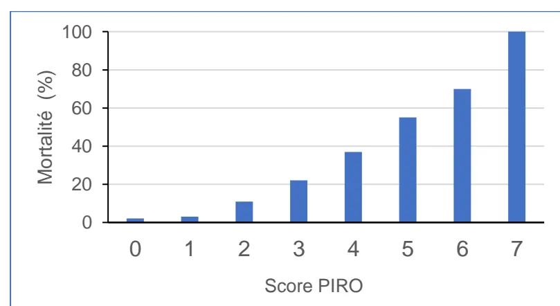

## RECOMMANDATIONS FORMALISÉES D'EXPERTS

De la Société Française d'Anesthésie et Réanimation (SFAR)

EN ASSOCIATION AVEC LES

Fédération de Chirurgie Viscérale et Digestive (FCVD), Société Française de Chirurgie Digestive (SFCD), Société Française d'Endoscopie Digestive (SFED), Société Française de Microbiologie (SFM), Société Française de Radiologie (SFR), Société de Pathologie Infectieuse de Langue Française (SPILF), Société Française de Pharmacologie et de Thérapeutique (SFPT)

# Prise en charge thérapeutique des Infections intra-abdominales de l'adulte

Therapeutic Management of Intra-Abdominal Infections in Adults.

2026

Société Française de Chirurgie Digestive

Texte validé par le Comité des Référentiels Cliniques de la SFAR le 09/06/2026, le Conseil d'Administration de la SFAR le 24/06/2026.**Auteurs :** Philippe MONTRAVERS\*, Claire ROGER\*, Alexandre BLEIBTREU, Paul CALAME, Maxime COLLARD, Claire DAHYOT-FIZELIER, Hervé DUPONT, Agnès FERRONI, Samy FIGUEIREDO, Pierre FILLATRE, Salomé GALLET, Rémy GAUZIT, Laura GOUZIEN, Matthieu GREGOIRE, Inès LAKBAR, Emmanuel NOVY, Enrique PEREZ CUADRADO ROBLES, Thomas SCHULZ, Charles SABBAGH, Jean-Pierre TASU, Alexy TRAN-DINH, Julie VEZIAN, Emmanuel WEISS, Nathalie ZAPPELLA, Stéphanie RUIZ

\*Premiers co-auteurs

**Coordonnateurs d'experts SFAR :** Philippe MONTRAVERS et Claire ROGER

**Organisateurs SFAR :** Stéphanie RUIZ

**Experts de la SFAR :** Claire DAHYOT-FIZELIER, Hervé DUPONT, Samy FIGUEIREDO, Laura GOUZIEN, Inès LAKBAR, Emmanuel NOVY, Thomas SCHULZ, Alexy TRAN-DINH, Emmanuel WEISS, Nathalie ZAPPELLA

**Expert de la FCVD :** Charles SABBAGH

**Experts de la SFCD :** Maxime COLLARD, Julie VEZIAN

**Expert de la SFED :** Enrique PEREZ CUADRADO ROBLES

**Expert de la SFM :** Agnès FERRONI

**Experts de la SFR :** Pierre CALAME, Jean-Pierre TASU

**Experts de la SPILF :** Alexandre BLEIBTREU, Pierre FILLATRE, Salomé GALLET, Rémy GAUZIT

**Expert de la SFPT :** Matthieu GREGOIRE

**Patiente Partenaire :** Madame Jamila HEDJAL (France Sepsis Association)

**Groupes de Lecture :**

*Comité des Référentiels cliniques de la SFAR :* Hélène Charbonneau (Présidente), Anaïs Caillard (Secrétaire), Isabelle Constant (Représentante du CA), Marie-Pierre Bonnet (Représentante du CA), Aurélien Bonnal, Thomas Botrel, Lucie Collet, Hugues de Courson, Matthieu Dumont, Max Gonzalez Estevez, El Mahdi Hafiani, Pierre Huette, Florence Julien-Marsolier, Natacha Kapandji, Elise Langouet, Axel Maurice-Szamburski, Daphné Michelet, Maxime Nguyen, Stéphanie Ruiz.

*Conseil d'Administration de la SFAR :* Marc Leone (président), Karine Nouette-Gaulain (première vice-présidente), Isabelle Constantin (seconde vice-présidente), Frédéric Le Saché (secrétaire général); Sigismond Lasocki (secrétaire général adjoint), Evelyne Combette (trésorière), Julien Amour (trésorier adjoint); Hélène Beloeil; Lucie Beylacq, Valérie Billard, Marie-Pierre Bonnet, Sébastien Campard, Vincent Collange, Marion Costecalde, LaurentDelaunay, Delphine Huet-Garrigue, Olivier Joannes-Boyau, Anne-Claire Lukaszewicz, Jane Muret, Olivier Rontes, Nadia Smail ; Lionel Velly, Franck Verdonk, Anne Geoffroy-Wernet.**Conflits et liens d'intérêts des experts SFAR au cours des cinq années précédant la date de validation par le CA de la SFAR.**

Claire DAHYOT-FIZELIER : pas de lien d'intérêt en rapport avec la présente RFE

Hervé DUPONT : AbbVie, Gilead Sciences, MSD France, Mundipharma, Pfizer SAS, Shionogi

Samy FIGUEIREDO : MSD France

Laura GOUZIEN : pas de lien d'intérêt en rapport avec la présente RFE

Inès LAKBAR : pas de lien d'intérêt en rapport avec la présente RFE

Philippe MONTRAVERS : Menarini, MSD, Mundipharma, Pfizer, Shionogi, Viatis

Emmanuel NOVY : MSD France, Mundipharma, Pfizer SAS

Claire ROGER : Advanz Pharma, Biomérieux, MSD France, Pfizer SAS, Viatis

Stéphanie RUIZ : Advanz Pharma, Gilead Sciences, Pfizer SAS, Shionogi

Thomas SCHULZ : Pfizer SAS, MSD France

Alexy TRAN-DINH : MSD France, Pfizer SAS

Emmanuel WEISS : pas de lien d'intérêt en rapport avec la présente RFE

Nathalie ZAPPELLA : pas de lien d'intérêt en rapport avec la présente RFE

**Liens d'intérêts des experts (sociétés associées) au cours des cinq années précédant la date de validation par le CA de la SFAR.**

**Expert de la FCVD :** Charles SABBAGH : pas de lien d'intérêt en rapport avec la présente RFE

**Experts de la SFCD :**

Maxime COLLARD : pas de lien d'intérêt en rapport avec la présente RFE

Julie VEZIANT : pas de lien d'intérêt en rapport avec la présente RFE

**Expert de la SFED :** Enrique PEREZ CUADRADO ROBLES : pas de lien d'intérêt en rapport avec la présente RFE

**Expert de la SFM :** Agnès FERRONI : pas de lien d'intérêt en rapport avec la présente RFE

**Experts de la SFR :**

Pierre CALAME : pas de lien d'intérêt en rapport avec la présente RFE

Jean-Pierre TASU : pas de lien d'intérêt en rapport avec la présente RFE

**Experts de la SPILF :**

Alexandre BLEIBTREU : Astellas Pharma, Correvio, Eumedica, Gilead Sciences, Menarini, MSD France, Pfizer SAS, Shionogi SAS

Pierre FILLATRE : pas de lien d'intérêt en rapport avec la présente RFE

Salomé GALLET : Gilead Sciences, Pfizer SAS

Rémy GAUZIT : pas de lien d'intérêt en rapport avec la présente RFE

**Expert SFPT :** Matthieu GREGOIRE : pas de lien d'intérêt en rapport avec la présente RFE## **RÉSUMÉ**

**Objectif:** La Société Française d'Anesthésie et de Réanimation (SFAR) et les Fédération de Chirurgie Viscérale et Digestive (FCVD), Société Française de Chirurgie Digestive (SFCD), Société Française d'Endoscopie Digestive (SFED), Société Française de Microbiologie (SFM), Société Française de Radiologie (SFR), Société de Pathologie Infectieuse de Langue Française (SPILF), Société Française de Pharmacologie et de Thérapeutique (SFPT) se sont associées pour proposer un référentiel sur la prise en charge thérapeutique des infections intra-abdominales de l'adulte.

**Conception:** Un groupe composé d'experts français des Sociétés Françaises d'Anesthésie-Réanimation (SFAR) et de la Fédération de Chirurgie Viscérale et Digestive (FCVD), la Société Française de Chirurgie Digestive (SFCD), la Société Française d'Endoscopie Digestive (SFED), la Société Française de Microbiologie (SFM), la Société Française de Radiologie (SFR), la Société de Pathologie Infectieuse de Langue Française (SPILF), la Société Française de Pharmacologie et de Thérapeutique (SFPT) a été réuni. D'éventuels conflits d'intérêts ont été officiellement déclarés dès le début du processus d'élaboration des recommandations et ce dernier a été conduit indépendamment de tout financement de l'industrie. Les auteurs ont suivi la méthodologie GRADE (*Grading of Recommendations Assessment, Development and Evaluation*) pour évaluer le niveau de preuve de la littérature.

**Méthodes :** Trois champs ont été définis : 1) Prise en charge initiale des infections intra-abdominales ; 2) Surveillance clinique et thérapeutique des infections intra-abdominales ; 3) Prise en charge des complications évolutives des infections intra-abdominales. Pour chaque champ, l'objectif des recommandations était de répondre à un certain nombre de questions formulées par les experts selon le modèle PICO ("*Population, Intervention, Comparison, Outcome*"). A partir de ces questions, une recherche bibliographique extensive de 2012 à 2024 a été réalisée en utilisant des mots clés prédéfinis selon les recommandations PRISMA. La qualité des données a été analysée selon la méthode GRADE. Les recommandations ont été formulées selon la méthode GRADE, puis votées par tous les experts selon la méthode GRADE grid.

**Résultats :** Le travail de synthèse des experts et l'application de la méthode GRADE ont abouti à 42 recommandations concernant la prise en charge thérapeutique des infections intra-abdominales de l'adulte. Après 3 tours de vote et plusieurs amendements, un accord fort a été obtenu pour toutes les recommandations. Parmi ces recommandations, 8 ont un niveau de preuve élevé (GRADE 1), 13 ont un niveau de preuve faible (GRADE 2) et 21 sont des avis d'experts. Enfin, pour 1 question, aucune recommandation n'a pu être formulée.

**Conclusion :** Un accord fort a été obtenu parmi les experts afin de fournir des recommandations visant à la prise en charge thérapeutique des infections intra-abdominales de l'adulte.

**Mots clés :** Infection intra-abdominale, péritonite, sepsis intra-abdominal, appendicite**ABSTRACT**

**Objective:** To provide guidelines for the therapeutic management of intra-abdominal infections in adults.

**Design:** A consensus committee of experts from the French Society of Anaesthesia and Intensive Care Medicine (Société française d'anesthésie et de réanimation, SFAR) and the Fédération de Chirurgie Viscérale et Digestive (FCVD), the Société Française de Chirurgie Digestive (SFCD), the Société Française d'Endoscopie Digestive (SFED), the Société Française de Microbiologie (SFM), the Société Française de Radiologie (SFR), the Société de Pathologie Infectieuse de Langue Française (SPILF), the Société Française de Pharmacologie et de Thérapeutique (SFPT) was convened. A formal conflict-of-interest (COI) policy was developed at the beginning of the process and enforced throughout. The entire guideline construction process was conducted independently of any industrial funding (i.e., pharmaceutical or medical device). The authors were required to follow the rules of the Grading of Recommendations Assessment, Development and Evaluation (GRADE) system to guide the assessment of the quality of evidence. The potential drawbacks of making strong recommendations in the presence of low-quality evidence were emphasised.

**Methods:** The latest SFAR guidelines on management of intra-abdominal infections in adults were published in 2015. The literature is now sufficient for an update. The experts studied questions within 3 domains. Each question was formulated according to the PICO (Patient, Intervention, Comparison, Outcome) model, and evidence profiles were produced. An extensive literature review and recommendations were conducted and analysed using the GRADE® methodology.

**Results:** The experts' synthesis and the application of the GRADE® method yielded 42 recommendations on the management of intra-abdominal infections in adults. Among the formalised recommendations, 8 have high levels of evidence (GRADE 1), and 13 have low levels of evidence (GRADE 2). For 21 recommendations, the GRADE methodology could not be applied; consequently, these were based on expert opinion. Furthermore, no relevant evidence was identified in the literature for one question. After 3 rounds of scoring and amendment, strong agreement was reached for all the recommendations.

**Conclusions:** There was strong agreement among experts on 42 recommendations to improve practices for the therapeutic management of intra-abdominal infections in adults.

**Keywords:** intraabdominal infection, intraabdominal sepsis, peritonitis, appendicitis## INTRODUCTION

Les infections intra-abdominales représentent la deuxième cause de sepsis en réanimation, après les infections pulmonaires [1]. Leurs étiologies sont variées : les appendicites compliquées et les perforations gastro-duodénales constituent la majorité des infections intra-abdominales communautaires tandis que les péritonites postopératoires sont majoritaires pour les infections intra-abdominales associées aux soins [2]. La prise en charge repose sur une stratégie combinant contrôle de la source infectieuse et antibiothérapie adaptée. Les dernières recommandations de la SFAR concernant ces infections datent de 2015 [3].

Depuis, les techniques de contrôle de la source ont considérablement évolué, notamment grâce au développement d'approches moins invasives : cœlioscopie, radiologie interventionnelle (en particulier le drainage radioguidé des collections) ou encore traitements endoscopiques avec mise en place d'endoprothèses. Malgré ces avancées spectaculaires, la prise en charge chirurgicale reste une part importante du contrôle urgent de la source infectieuse [4].

Par ailleurs, l'évolution des profils de résistance bactérienne, notamment l'augmentation des souches d'*Enterobacterales* productrices de bêtalactamase à spectre étendu (BLSE), pourrait justifier une réévaluation de l'antibiothérapie probabiliste dans le contexte d'infections associées aux soins [5]. Le positionnement des nouvelles molécules anti-infectieuses, développées en réponse à l'antibiorésistance, reste également à préciser [6]. Une meilleure compréhension de la pharmacocinétique et de la diffusion tissulaire des anti-infectieux ouvre par ailleurs la voie à des schémas posologiques optimisés [7]. Enfin, une littérature récente et méthodologiquement solide a amené des connaissances nouvelles sur la durée optimale des traitements antibiotiques.

Au regard de ces évolutions, une actualisation des RFE "Prise en charge thérapeutique des infections intra-abdominales de l'adulte" était nécessaire et pertinente. Cette actualisation a suivi la méthodologie GRADE, permettant une analyse rigoureuse de la littérature, et conduit à certains ajustements de gradation par rapport aux RFE de 2015.

### Définitions

Sont concernés par le champ de cette RFE :

- - Les **infections intra-abdominales communautaires** définies comme une infection qui se développe dans la cavité abdominale (péritoine, viscères, ou autres espaces intra-abdominaux) chez un patient non exposé aux soins.
- - Les **infections intra-abdominales associées aux soins** définies comme des infections survenant au niveau de la cavité abdominale et qui sont acquises dans un contexte de soins (lors d'une hospitalisation > 48h ou après acte de soins).- - **Les infections intra-abdominales postopératoires** sont une forme d'infections associées aux soins, observées au cours d'une procédure chirurgicale, endoscopique ou radiologique.
- - Le terme "infection intra-abdominale non compliquée" désigne une infection limitée à l'organe d'origine, sans diffusion au péritoine. Le traitement repose souvent sur une antibiothérapie seule, ou une chirurgie simple sans nécessité de drainage complexe [8].
- - A l'inverse, une infection intra-abdominale « compliquée » désigne une infection s'étendant au-delà de l'organe d'origine. La cause peut être liée à la perforation d'un organe creux ou la diffusion d'une infection à l'ensemble de la cavité péritonéale. Le traitement repose sur un contrôle impératif de la source associé à une antibiothérapie [8].
- - Le sepsis au cours d'une infection intra-abdominale se définit comme une dysfonction d'organe potentiellement mortelle résultant d'une réponse dérégulée de l'organisme face à l'infection [9]. Cette dysfonction d'organe se caractérise par une variation aigüe  $\geq 2$  points du score SOFA total à la suite de l'infection.
- - Le choc septique au cours d'une infection intra-abdominale est une forme grave de sepsis marquée par une hypotension persistante nécessitant des agents vasopresseurs pour maintenir une pression artérielle moyenne  $\geq 65$  mm Hg et une lactatémie  $> 2$  mmol/L malgré un remplissage vasculaire adéquat [9].
- - Les signes de gravité observés au cours des infections intraabdominales sont le reflet de leur sévérité (sepsis ou choc septique) et sont marqués par la survenue de dysfonction ou de défaillance d'un ou plusieurs organes (cardiovasculaire, respiratoire, rénal, neurologique, hématologique ou/et hépatique) exprimés par un changement aigüe du score de SOFA [9].
- - Le contrôle de la source infectieuse constitue une étape essentielle de la prise en charge des infections intra-abdominales [10]. Il désigne toute procédure interventionnelle — chirurgicale, radiologique ou endoscopique — visant à réduire la charge bactérienne et restaurer l'intégrité du tube digestif.
- - La stratégie de « Damage Control » repose sur trois temps : une laparotomie initiale brève et limitée à un contrôle de l'infection au besoin avec résection digestive sans anastomose ni stomie et fermeture pariétale simple ou laparostomie, puis une phase de réanimation intensive, enfin 24-48 heures après la chirurgie initiale une reprise programmée pour rétablissement de la continuité digestive et fermeture abdominale [11, 12].
- - Les bactéries multirésistantes sont définies comme des germes ayant acquis une résistance à un agent de trois ou plus catégories d'antibactériens [13].### **Champ des RFE**

- Ces RFE suivent l'évolution chronologique de la pathologie et sont, de ce fait, organisées en trois champs :

- ● Champ 1 : Prise en charge initiale des infections intra-abdominales
- ● Champ 2 : Surveillance clinique et thérapeutique des infections intra-abdominales
- ● Champ 3 : Prise en charge des complications survenant après la prise en charge initiale des infections intra-abdominales

Cette actualisation se limite aux infections intra-abdominales nécessitant une intervention (chirurgicale, endoscopique ou radiologique). Elle n'aborde ni les infections primaires associées à la cirrhose, ni les infections focalisées telles que les infections biliaires ou les abcès hépatiques isolés. Sont également exclus : la population pédiatrique, les patients ne relevant pas d'une prise en charge interventionnelle dont les appendicites non opérées, et les patients en aplasie ou greffés d'organe solide.

Compte tenu du déroulement chronologique des différents champs de ces RFE, il convient de préciser que le champ 3 est consacré aux complications des infections intra-abdominales. Il comprend notamment les infections intra-abdominales survenant en postopératoire d'une première intervention chirurgicale réalisée pour une infection intra-abdominale. Cela exclut les infections survenant en postopératoire d'une chirurgie abdominale réglée qui relèvent du champ 1. Bien qu'elles relèvent des infections intra-abdominales associées aux soins, ces infections postopératoires, consécutives à un premier épisode d'infection intra-abdominale, ainsi que leur prise en charge, sont donc spécifiquement abordées dans le champ 3.

À l'inverse, les infections intra-abdominales survenant en postopératoire d'une chirurgie abdominale réglée, ou au cours d'une hospitalisation pour une autre cause, ainsi que leur prise en charge, relèvent du champ 1. Elles correspondent à un premier épisode d'infection intra-abdominale associée aux soins et ne constituent pas une complication évolutive d'une infection intra-abdominale.

Par ailleurs, ces RFE mettent l'accent sur la stratification du risque pour les patients en fonction de la gravité de la pathologie, de la microbiologie des infections intra-abdominales et des facteurs de risque de bactéries multirésistantes (MDR). Concernant la gravité de la pathologie, l'instabilité hémodynamique se réfère à une hypotension artérielle nécessitant le recours à un soutien vasopresseur, associée à des signes d'hypoperfusion tissulaire.Pour la microbiologie, malgré l'augmentation de certaines résistances, le risque d'infections communautaires liées à des bactéries productrices de carbapénémases demeure actuellement faible en France (150 souches pathogènes de foyers profonds selon les données de l'année 2022 du Centre National de Référence Résistance aux Antibiotiques), et n'est donc pas abordé dans ces recommandations [14].

#### Références :

- [1] Vincent JL, Sakr Y, Singer M, Martin-Loeches I, Machado FR, Marshall JC, et al. Prevalence and Outcomes of Infection Among Patients in Intensive Care Units in 2017. *Jama* 2020;323(15):1478–87. 10.1001/jama.2020.2717.
- [2] Sartelli M, Catena F, Ansaloni L, Coccolini F, Corbella D, Moore EE, et al. Complicated intra-abdominal infections worldwide: the definitive data of the CIAOW Study. *World J Emerg Surg* 2014;9:37. 10.1186/1749-7922-9-37.
- [3] Montravers P, Dupont H, Leone M, Constantin JM, Mertes PM, Laterre PF, et al. Guidelines for management of intra-abdominal infections. *Anaesth Crit Care Pain Med* 2015;34(2):117–30.
- [4] Roger C, Garrigue D, Bouhours G, Dupont H, Bouzat P, Bardou J, et al. Time to source control and outcome in community-acquired intra-abdominal infections: The multicentre observational PERICOM study. *Eur J Anaesthesiol* 2022;39(6):540–8. 10.1097/eja.0000000000001683.
- [5] Montravers P, Grall N, Kantor E, Augustin P, Boussion K, Zappella N. Microbiological profile of patients treated for postoperative peritonitis: temporal trends 1999-2019. *World J Emerg Surg* 2023;18(1):58. 10.1186/s13017-023-00528-1.
- [6] Montravers P, Assadi M, Gouel-Cheron A. Priorities in peritonitis. *Curr Opin Crit Care* 2021;27(2):201–7. 10.1097/mcc.0000000000000805.
- [7] Roger C. Understanding antimicrobial pharmacokinetics in critically ill patients to optimize antimicrobial therapy: A narrative review. *J Intensive Med* 2024;4(3):287–98. 10.1016/j.jointm.2023.12.007.
- [8] Bonomo RA, Chow AW, Edwards MS, Humphries R, Tamma PD, Abrahamian FM, et al. 2024 Clinical Practice Guideline Update by the Infectious Diseases Society of America on Complicated Intra-abdominal Infections: Risk Assessment, Diagnostic Imaging, and Microbiological Evaluation in Adults, Children, and Pregnant People. *Clin Infect Dis* 2024;79(Suppl 3):S81–s7. 10.1093/cid/ciae346.
- [9] Singer M, Deutschman CS, Seymour CW, Shankar-Hari M, Annane D, Bauer M, et al. The Third International Consensus Definitions for Sepsis and Septic Shock (Sepsis-3). *Jama* 2016;315(8):801–10.
- [10] Marshall JC, al Naqbi A. Principles of source control in the management of sepsis. *Crit Care Clin* 2009;25(4):753–68, viii–ix. 10.1016/j.ccc.2009.08.001.
- [11] Finlay IG, Edwards TJ, Lambert AW. Damage control laparotomy. *Br J Surg* 2004;91(1):83–5. 10.1002/bjs.4434.
- [12] Waibel BH, Rotondo MF. Damage control in trauma and abdominal sepsis. *Crit Care Med* 2010;38(9 Suppl):S421–30. 10.1097/CCM.0b013e3181ec5cbe.
- [13] Magiorakos AP, Srinivasan A, Carey RB, Carmeli Y, Falagas ME, Giske CG, et al. Multidrug-resistant, extensively drug-resistant and pandrug-resistant bacteria: an international expert proposal for interim standard definitions for acquired resistance. *Clin Microbiol Infect* 2012;18(3):268–81. 10.1111/j.1469-0691.2011.03570.x.
- [14] Centre National de Référence Résistance aux Antibiotiques. Rapport annuel d'activité 2023 - Année d'exercice 2022. In: France SP, ed., [https://www.cnr-resistance-antibiotiques.fr/ressources/pages/CNR\\_bilan\\_2022.pdf](https://www.cnr-resistance-antibiotiques.fr/ressources/pages/CNR_bilan_2022.pdf): Santé Publique France; 2023.## OBJECTIF DES RECOMMANDATIONS

L'objectif de ces Recommandations Formalisées d'Experts est de fournir un cadre facilitant la prise de décision en matière de prise en charge thérapeutique des infections intra-abdominales chez l'adulte. Le groupe s'est efforcé de produire un nombre minimal de recommandations afin de mettre en évidence les points forts à retenir dans les 3 champs prédéfinis. Les règles de base des bonnes pratiques médicales universelles en anesthésie et réanimation étant considérées comme connues, elles ont été exclues de ces recommandations ; ces dernières se focalisant sur les éléments spécifiques de la prise en charge thérapeutique des infections intra-abdominales de l'adulte. Le public visé est l'ensemble des anesthésistes-réanimateurs, des chirurgiens, des infectiologues, des radiologues et des praticiens en endoscopie digestive prenant en charge des infections intra-abdominales de l'adulte.

## MÉTHODE

### Organisation générale

Ces recommandations sont le résultat du travail d'un groupe d'experts réunis par la SFAR. Des experts provenant de la Fédération de Chirurgie Viscérale et Digestive (FCVD), la Société Française de Chirurgie Digestive (SFCD), la Société Française d'Endoscopie Digestive (SFED), la Société Française de Microbiologie (SFM), la Société Française de Radiologie (SFR), la Société de Pathologie Infectieuse de Langue Française (SPILF), la Société Française de Pharmacologie et de Thérapeutique (SFPT) associées à ce travail, ont été intégrés aux groupes de travail pour les questions requérant leur expertise. Chaque expert a rempli une déclaration de conflits d'intérêts avant de débuter le travail d'analyse. Dans un premier temps, le comité d'organisation a défini les objectifs de ces recommandations et la méthodologie utilisée. Les différents champs d'application de ces RFE et les questions à traiter ont ensuite été définis par le comité d'organisation, puis modifiés et validés par les experts. Les questions ont été formulées selon un format PICO (*Population, Intervention, Comparison, Outcome*) après une première réunion du groupe d'experts. La population « P » pour l'ensemble des questions est définie comme « Les patients adultes présentant ou étant suspects d'une infection intra-abdominale ».

### Champ des recommandations

Les recommandations formulées concernent 3 champs:

- ● Champ 1 : Prise en charge initiale des infections intra-abdominales
- ● Champ 2 : Surveillance clinique et thérapeutique des infections intra-abdominales
- ● Champ 3 : Prise en charge des complications survenant après la prise en charge initiale des infections intra-abdominalesUne recherche bibliographique extensive de 2012 à 2024 a été réalisée à partir des bases de données (MEDLINE, Tripdatabase ([www.tripdatabase.com](http://www.tripdatabase.com)), Prospero ([www.crd.york.ac.uk/PROSPERO](http://www.crd.york.ac.uk/PROSPERO)) et [www.clinicaltrials.gov](http://www.clinicaltrials.gov), EMBASE, SCOPUS, Cochrane ), par les experts pour chaque champ d'application, selon la méthodologie Preferred Reporting Items for Systematic Reviews and Meta-Analysis (PRISMA pour les revues systématiques). Les mots clés utilisés pour la recherche bibliographique ont été : Infection intra-abdominale, péritonite, sepsis intra-abdominal, appendicite.

La méthode de travail utilisée pour l'élaboration de ces recommandations est GRADE® (Grading of Recommendations Assessment, Development and Evaluation). Cette méthode permet, après une analyse qualitative et quantitative de la littérature, de déterminer séparément la qualité des preuves, et donc d'estimer la confiance que l'on peut avoir dans l'analyse quantitative et d'établir un niveau de recommandation. Un niveau de preuve a été défini pour chacune des références bibliographiques citées en fonction du type de l'étude. Ce niveau de preuve pouvait être réévalué en tenant compte de la qualité méthodologique de l'étude, de la cohérence des résultats entre les différentes études, du caractère direct ou non des preuves, de l'analyse des coûts et de l'importance du bénéfice.

Les critères de jugement ont été définis en amont de la façon suivante :

- • Critères de jugement majeurs : mortalité (importance 9), défaillance d'organe (importance 8), complications postopératoires (importance 7) ;
- • Critères de jugement secondaires : durée de séjour hospitalière (importance 6), durée de séjour en soins critiques (importance 5).

Les recommandations ont ensuite été formulées en utilisant la terminologie des RFE de la SFAR :

- - Un niveau global de preuve « fort » permettait de formuler une recommandation de GRADE 1 (Recommandation Forte) « il est recommandé de faire... », « il n'est pas recommandé de faire... ».
- - Un niveau global de preuve faible aboutissait à l'écriture d'une recommandation de GRADE 2 (Recommandation Faible) « il est recommandé de faire... », « il n'est pas recommandé de faire... ».
- - Lorsque la littérature était très faible, la question pouvait faire l'objet d'une recommandation sous la forme d'un avis d'expert : Avis d'experts « les experts suggèrent... », « les experts suggèrent de ne pas ... ».
- - Une « absence de recommandation » signifie qu'il n'existe pas suffisamment de littérature pour conclure sur ce qu'il convient de faire. De nouvelles études devront apporter les réponses aux questions avec « absence de recommandation ». Une « absence de recommandation » doit être différenciée d'une recommandation négative de type « Il n'est pas recommandé de faire ». Dans ce cas, la littérature scientifique disponible est suffisamment robuste pour conduire à une recommandation négative.

Les propositions de recommandations ont été présentées et discutées une à une. Le but n'était pas d'aboutir obligatoirement à un avis unique et convergent des experts sur l'ensemble des propositions, mais de dégager les points de concordance et les points dedivergence ou d'indécision. Chaque recommandation a alors été évaluée par chacun des experts et soumise à une cotation individuelle à l'aide d'une échelle allant de 1 (désaccord complet) à 9 (accord complet). La force de la recommandation est déterminée en fonction de cinq facteurs clés et validée par les experts après un vote, en utilisant la méthode GRADE Grid:

- ● Estimation de l'effet : plus il est important, plus probablement la recommandation sera forte;
- ● Imprécision : en cas d'incertitude de l'estimateur ou de grande variabilité de son écart-type, la force de la recommandation sera probablement plus faible
- ● Le niveau global de preuve : plus il est élevé, plus probablement la recommandation sera forte;
- ● La balance entre effets désirables et indésirables : plus celle-ci est favorable, plus probablement la recommandation sera forte;
- ● La préférence du patient, médecin ou décisionnaire doit être obtenue au mieux auprès des personnes concernées ;
- ● Coûts : plus les coûts ou l'utilisation des ressources sont élevés, plus probablement la recommandation sera faible.

Pour valider une recommandation, au moins 70 % des experts devaient exprimer une opinion qui allait globalement dans la même direction, tandis que moins de 20 % d'entre eux exprimaient une opinion contraire. En l'absence de validation d'une ou de plusieurs recommandation(s), celle(s)-ci étaient reformulée(s) et, de nouveau, soumise(s) à cotation dans l'objectif d'aboutir à un consensus. Si les recommandations n'avaient pas obtenu un nombre suffisant d'opinions favorables et/ou obtenu un nombre trop élevé d'opinions défavorables, elles n'étaient pas éditées. Enfin, si la grande majorité des experts était d'accord avec la recommandation et une minorité des experts n'avait pas d'opinion ou y était opposée, les recommandations obtenaient un accord fort. Les avis d'experts, exprimant par définition un consensus entre les experts en l'absence de littérature suffisamment forte pour grader ces recommandations, devaient nécessairement obtenir un accord fort (i.e. au moins 70% d'opinions allant dans la même direction).

## RESULTATS

### Champs des recommandations

Les experts ont consensuellement décidé lors de la première réunion d'organisation de ces RFE, de traiter 10 questions réparties en 3 champs. Les questions suivantes ont été retenues pour le recueil et l'analyse de la littérature :

#### **Champ 1 : Prise en charge initiale des infections intra-abdominales**

- ● Quels sont les éléments visant à contrôler la source de l'infection à mettre en place en urgence chez les patients présentant une infection intra-abdominale pour réduire la morbid-mortalité ?- • Quels sont les éléments de prise en charge anti-infectieuse probabiliste à mettre en place en urgence chez les patients présentant une infection intra-abdominale pour réduire la morbi-mortalité ?
- • Quels sont les critères pour décider de la prise en charge en service de soins critiques des patients présentant une infection intra-abdominale pour réduire la morbi-mortalité ?

### **Champ 2 : Surveillance clinique et thérapeutique des infections intra-abdominales**

- • Chez les patients pris en charge pour une infection intra-abdominale, quel(s) élément(s) de surveillance doit(vent) être mis en place dans les 5 premiers jours pour réduire le risque de complications postopératoires ?
- • Chez les patients pris en charge pour une infection intra-abdominale, quelle durée de traitement antibiotique faut-il prescrire pour réduire la morbi-mortalité ?
- • Chez les patients pris en charge pour une infection intra-abdominale, quelle durée de traitement antifongique faut-il prescrire pour réduire la morbi-mortalité ?
- • Chez les patients pris en charge pour une infection intra-abdominale et évoluant favorablement, faut-il adapter l'antibiothérapie probabiliste initiale à la documentation microbiologique pour réduire la morbi-mortalité ?

### **Champ 3 : Prise en charge des complications survenant après la prise en charge initiale des infections intra-abdominales**

- • Chez les patients évoluant défavorablement et suspects de complication infectieuse intra-abdominale, quels sont les moyens diagnostiques de cette complication disponibles pour réduire la morbi-mortalité ?
- • Chez les patients évoluant défavorablement et suspects de complication infectieuse intra-abdominale, quel(s) traitements interventionnel(s) des complications post-opératoires est (sont) nécessaires pour réduire la morbi-mortalité ?
- • Chez les patients évoluant défavorablement et suspects de complication infectieuse intra-abdominale, quel(s) sont les éléments de prise en charge anti-infectieuse à mettre en place pour réduire la morbi-mortalité ?

### **Synthèse des résultats**

Le travail de synthèse des experts et l'application de la méthode GRADE ont abouti à 42 recommandations. Après 3 tours de cotation et quelques amendements, un accord fort a été obtenu pour 42 recommandations. Parmi ces recommandations, 8 présentent un niveau de preuve élevé (8 GRADE 1), 13 un niveau de preuve faible (13 GRADE 2) et 21 sont des avis d'experts. Enfin, pour 1 question, aucune recommandation n'a pu être formulée.

La Société Française d'Anesthésie et Réanimation (SFAR), la Fédération de Chirurgie Viscérale et Digestive (FCVD), la Société Française de Chirurgie Digestive (SFCD), la Société Française d'Endoscopie Digestive (SFED), la Société Française de Microbiologie (SFM), la SociétéFrançaise de Radiologie (SFR), la Société de Pathologie Infectieuse de Langue Française (SPILF), la Société Française de Pharmacologie et de Thérapeutique (SFPT), incitent tous les anesthésistes-réanimateurs, les chirurgiens, les infectiologues, les radiologues et les praticiens en endoscopie digestive prenant en charge des infections intra-abdominales de l'adulte, à se conformer à ces RFE pour optimiser la qualité des soins dispensés aux patients. Cependant, chaque praticien doit exercer son propre jugement dans l'application de ces recommandations, en prenant en compte son expertise et les spécificités de son établissement, pour déterminer la méthode d'intervention la mieux adaptée à l'état du patient dont il a la charge.

## TABLEAU DE SYNTHÈSE

<table border="1">
<thead>
<tr>
<th colspan="4"><b>P du PICO : Patients</b></th>
</tr>
</thead>
<tbody>
<tr>
<td>Critères d'inclusion</td>
<td colspan="3">Les <b>patients adultes</b> présentant ou étant suspects <b>d'une infection intra-abdominale, nécessitant une prise en charge interventionnelle</b> (chirurgicale, endoscopique ou radiologique)</td>
</tr>
<tr>
<td>Critères d'exclusion</td>
<td colspan="3">
          Population pédiatrique 
          Patients ne relevant pas d'une prise en charge interventionnelle dont les appendicites non opérées 
          Patient en aplasie ou greffé d'organe solide 
          Infections primaires liées à la cirrhose 
          Infections focalisées telles que les infections biliaires ou les abcès hépatiques isolés.
        </td>
</tr>
<tr>
<th colspan="4"><b>O du PICO : Outcomes / Critères de jugement</b></th>
</tr>
<tr>
<td colspan="4">- Critères de jugement cruciaux ou majeurs (importance de 9 le plus fort à 7)</td>
</tr>
<tr>
<td></td>
<td>Importance 9</td>
<td><i>Mortalité</i></td>
<td rowspan="3">Regroupés en un critère composite de morbi-mortalité pour l'évaluation de l'outcome dans les recommandations quand ils ne pouvaient être spécifiquement individualisés.</td>
</tr>
<tr>
<td></td>
<td>Importance 8</td>
<td><i>Défaillance d'organe</i></td>
</tr>
<tr>
<td></td>
<td>Importance 7</td>
<td><i>Complications postopératoires</i></td>
</tr>
</tbody>
</table><table border="1">
<tr>
<td></td>
<td></td>
<td></td>
<td></td>
</tr>
<tr>
<td></td>
<td>Importance 7</td>
<td><i>Antibiothérapie inadaptée</i></td>
<td></td>
</tr>
<tr>
<td colspan="4">- Critères de jugement importants mais non cruciaux (importance de 7 le plus fort à 5)</td>
</tr>
<tr>
<td></td>
<td>Importance 6</td>
<td><i>Durée de séjour hospitalière</i></td>
<td></td>
</tr>
<tr>
<td></td>
<td>Importance 5</td>
<td><i>Durée de séjour en soins critiques</i></td>
<td></td>
</tr>
<tr>
<td></td>
<td>Importance 5</td>
<td><i>Durée d'exposition aux antibiotiques / antifongiques</i></td>
<td></td>
</tr>
<tr>
<td></td>
<td>Importance 5</td>
<td><i>Spectre antibiotique/antifongique efficace le plus étroit possible ; limiter la pression de sélection</i></td>
<td></td>
</tr>
<tr>
<td></td>
<td>Importance 5</td>
<td><i>Pertinence des examens complémentaires</i></td>
<td></td>
</tr>
<tr>
<td></td>
<td>Importance 5</td>
<td><i>Optimisation posologique des anti-infectieux</i></td>
<td></td>
</tr>
<tr>
<td colspan="4"><b>Mots-clés</b></td>
</tr>
<tr>
<td></td>
<td colspan="3">Infection intra-abdominale, péritonite, sepsis intra-abdominal, appendicite</td>
</tr>
<tr>
<td colspan="4"><b>Critères de restriction de la recherche bibliographique</b></td>
</tr>
<tr>
<td></td>
<td colspan="3">RCT ; méta-analyses ; études observationnelles avec critère de qualité effectif &gt; 100.</td>
</tr>
<tr>
<td></td>
<td colspan="3">Années de la recherche bibliographique: 2012 à 2024</td>
</tr>
<tr>
<td></td>
<td colspan="3">Langues : Français et Anglais</td>
</tr>
</table>## CHAMP 1 : Prise en charge initiale des infections intra-abdominales

**Question : Quels sont les éléments visant à contrôler la source de l'infection à mettre en place en urgence chez des patients présentant une infection intra-abdominale pour réduire la morbi-mortalité ?**

Experts : Nathalie ZAPPELLA (SFAR, Paris), Maxime COLLARD (SFCD, Paris), Enrique PEREZ CUADRADO ROBLES (SFED, Paris), Paul CALAME (SFR, Besançon), Jean-Pierre TASU (SFR, Poitiers)

<table border="1">
<tr>
<td>

<b>R1.1.1 : Chez les patients présentant une infection intra-abdominale avec instabilité hémodynamique, il est recommandé de procéder le plus rapidement possible à un contrôle de la source infectieuse par voie chirurgicale, associé à un lavage de l'ensemble de la cavité abdominale afin de réduire la morbi-mortalité.</b>

</td>
</tr>
<tr>
<td style="text-align: right;"><b>GRADE 1 (Recommandation forte)</b></td>
</tr>
<tr>
<td>

<b>R1.1.2 : Chez les patients présentant une instabilité hémodynamique non ou mal contrôlée en peropératoire, les experts suggèrent de réaliser une chirurgie de type « Damage Control » ou « Laparotomie écourtée » afin de réduire la morbi-mortalité. Dans ce cas, il faudra prévoir une reprise chirurgicale dans les 24-48 heures, après stabilisation du patient pour chirurgie définitive.</b>

</td>
</tr>
<tr>
<td style="text-align: right;"><b>AVIS D'EXPERTS</b></td>
</tr>
<tr>
<td>

<b>R1.1.3 : En cas de suspicion de péritonite par perforation d'un organe creux, les experts suggèrent de discuter la voie d'abord (coelioscopique ou laparotomie) entre le chirurgien et l'anesthésiste-réanimateur afin de réduire la morbi-mortalité. La voie coelioscopique peut être envisagée si :</b>

<ul style="list-style-type: none;">
<li>- l'état hémodynamique du patient le permet (absence d'hypotension persistante malgré une réanimation de l'état de choc)</li>
<li>- la localisation de la source infectieuse et l'étendue de la péritonite sont accessibles à une prise en charge par coelioscopie selon l'expertise du chirurgien.</li>
</ul>
</td>
</tr>
<tr>
<td style="text-align: right;"><b>AVIS D'EXPERTS</b></td>
</tr>
<tr>
<td>

<b>R1.1.4 : Chez un patient hémodynamiquement stable présentant une infection intra-abdominale post-opératoire avec collection accessible, il est recommandé de recourir en première intention à un traitement mini-invasif (endoscopie interventionnelle ou drainage percutané guidé par l'imagerie), notamment en cas de fistule secondaire, afin de réduire la morbi-mortalité.</b>

</td>
</tr>
<tr>
<td style="text-align: right;"><b>GRADE 2 (Recommandation faible)</b></td>
</tr>
<tr>
<td>

<b>R1.1.5 : En cas de diverticulite sigmoïdienne perforée purulente (Hinchey III) sans sepsis, il est recommandé, afin de réduire la morbi-mortalité :</b>

<ul style="list-style-type: none;">
<li>- de ne pas réaliser un lavage péritonéal exclusif sans résection</li>
<li>- de réaliser une résection sigmoïdienne avec <u>anastomose primaire protégée ou non</u> par une iléostomie, associée à un lavage péritonéal.</li>
</ul>
</td>
</tr>
</table>**GRADE 1 (Recommandation forte)****Argumentaire :**

Le contrôle de la source d'une infection intra-abdominale est à réaliser d'autant plus rapidement que la situation clinique du patient est grave sur le plan septique et/ou que le patient est fragile ou comorbide. Le contrôle de la source est le plus souvent chirurgical, mais il existe un développement des techniques endoscopiques et radiologiques, notamment chez les patients stables ou stabilisés.

Aucune étude comparative randomisée n'a été réalisée chez les patients présentant une infection intra-abdominale avec une instabilité hémodynamique afin de définir la meilleure modalité de prise en charge. Néanmoins, plusieurs études observationnelles, rétrospectives et prospectives, ont mis en évidence une augmentation significative de la mortalité lorsque le délai entre le diagnostic d'infection intra-abdominale et le contrôle de la source est prolongé [15].

Il n'existe pas d'étude randomisée contrôlée démontrant l'intérêt du lavage péritonéal dans l'infection intra abdominale. Il s'agit d'une pratique visant à diminuer la contamination péritonéale par du sang, de la bile ou des matières fécales, et à diminuer l'inoculum bactérien par effet de dilution. Sa pratique est communément admise dans l'infection intra abdominale, une enquête du Royal College of Surgeons of England montrait qu'elle était réalisée par 97 % des chirurgiens [16].

L'instabilité hémodynamique traduit un sepsis ou un choc septique, situations dans lesquelles un contrôle rapide et radical de la source infectieuse est indispensable. Le concept de « Damage Control Surgery », né en traumatologie, a été transposé en chirurgie septique telle que l'infection intra-abdominale. Dans ce cas, il s'agit de contrôler la source, le plus souvent en réséquant la portion de tube digestif responsable, en lavant et en laissant les moignons de tubes digestifs fermés dans l'abdomen et l'abdomen ouvert en laparostomie. Il n'existe pas d'étude randomisée sur le sujet, mais de grandes séries regroupées dans une méta-analyse [17]. Cette méta-analyse n'a révélé aucune différence significative en termes de mortalité entre les patients ayant subi une chirurgie de « Damage Control » non traumatique et ceux ayant subi une chirurgie conventionnelle. Cependant, la mortalité observée était significativement inférieure au taux de mortalité attendu dans le groupe « Damage Control », ce qui suggère un avantage de l'approche « Damage Control ». Il n'existe pas d'argument pour privilégier une technique de fermeture temporaire de l'abdomen [18]. La chirurgie de « Damage Control » est à réaliser seulement chez les patients présentant une instabilité hémodynamique majeure, imposant une diminution maximale de la durée opératoire. Dans ce cas, il est indispensable de programmer une reprise chirurgicale au bloc opératoire dans un délai de 24 à 48 heures afin de poursuivre la prise en charge [12].

La coelioscopie et son expertise chirurgicale se sont développées en chirurgie programmée. En chirurgie d'urgence, il existe des données sur la prise en charge de l'ulcère perforé [19], de la diverticulite Hinchey III et IV [20] et de la diverticulite du colon droit [21]. Dans ces indications, il n'y a pas de différence en termes de morbi-mortalité entre les 2 voies d'abord. L'avantage de la voie coelioscopique est une moindre durée de séjour en hospitalisation conventionnelle. A contrario, il n'existe actuellement aucune littérature sur la prise en charge d'infections intra-abdominales par voie robot-assistée. Le prolongement des durées opératoires lié à cette technique est un argument contre son utilisation dans le cadre des infections intra-abdominales.

Les collections et/ou fistules postopératoires peuvent relever d'une prise en charge interventionnelle. La fistule est la complication la plus redoutée après une chirurgie bariatrique, mais elle peut également survenir lors d'une chirurgie oncologique. Les techniques endoscopiques et radiologiques sont devenues le traitement de première intention dans les complications liées àla chirurgie bariatrique telles que les fistules [22, 23]. Le traitement endoscopique permet non seulement de drainer l'abcès, mais aussi de guider la fermeture de la fistule grâce à l'utilisation de stents auto-expansibles [24], de drainage avec prothèse plastique de type "queue de cochon" [25], ou de dispositifs de fermeture dédiés tels que des macro-clips [26] ou des dispositifs de suture [27].

Le drainage percutané guidé par imagerie est associé à des taux de succès élevés dans les abcès postopératoires (78–86 %) [28-31]. Dans les études comparatives, il présente une mortalité plus faible que la reprise chirurgicale (4,2 % vs 14,6 %) [32], avec une efficacité similaire [33]. Les facteurs d'échec incluent des collections résiduelles, des abcès multiples ou une contamination fongique [34]. En pratique, le drainage percutané semble à privilégier en première intention si la collection est accessible et le patient stable, la chirurgie étant réservée aux échecs et aux péritonites généralisées.

Plusieurs essais randomisés et méta-analyses de haute qualité méthodologique ont évalué les différentes stratégies chirurgicales dans les diverticulites perforées purulentes (Hinchey III). Les essais SCANDIV [35], DILALA [36] et LADIES [37], ainsi que leurs analyses combinées [38-40], n'ont montré aucune différence significative de mortalité entre le lavage péritonéal laparoscopique et la résection colique (Hartmann ou anastomose primaire). En revanche, le lavage péritonéal sans résection sigmoïdienne expose à une augmentation significative du risque de réintervention précoce [35, 37, 39], d'abcès profond postopératoire [37] et de péritonite postopératoire [40].

Les essais randomisés et méta-analyses [41-43] comparant une résection sigmoïdienne avec anastomose colorectale dans le même temps (avec ou sans iléostomie de protection) à une procédure de Hartmann (résection sigmoïdienne et confection d'une colostomie terminale) montrent une mortalité comparable entre les deux techniques, mais une réduction significative de la morbidité postopératoire majeure (Dindo-Clavien  $\geq 3$ ) et du taux de stomie définitive après anastomose primaire.

#### Références :

- [12] Waibel BH, Rotondo MF. Damage control in trauma and abdominal sepsis. Crit Care Med 2010;38(9 Suppl):S421–30. 10.1097/CCM.0b013e3181ec5cbe.
- [15] Murray V, Burke JR, Hughes M, Schofield C, Young A. Delay to surgery in acute perforated and ischaemic gastrointestinal pathology: a systematic review. BJS Open 2021;5(5). 10.1093/bjsopen/zrab072.
- [16] Whiteside OJ, Tytherleigh MG, Thrush S, Farouk R, Galland RB. Intra-operative peritoneal lavage--who does it and why? Ann R Coll Surg Engl 2005;87(4):255–8. 10.1308/1478708051847.
- [17] Haltmeier T, Falke M, Quaile O, Candinas D, Schnüriger B. Damage-control surgery in patients with nontraumatic abdominal emergencies: A systematic review and meta-analysis. J Trauma Acute Care Surg 2022;92(6):1075–85. 10.1097/ta.00000000000003488.
- [18] Kirkpatrick AW, Roberts DJ, Faris PD, Ball CG, Kubes P, Tiruta C, et al. Active Negative Pressure Peritoneal Therapy After Abbreviated Laparotomy: The Intraperitoneal Vacuum Randomized Controlled Trial. Ann Surg 2015;262(1):38–46. 10.1097/sla.0000000000001095.
- [19] Cirocchi R, Soreide K, Di Saverio S, Rossi E, Arezzo A, Zago M, et al. Meta-analysis of perioperative outcomes of acute laparoscopic versus open repair of perforated gastroduodenal ulcers. J Trauma Acute Care Surg 2018;85(2):417–25. 10.1097/ta.00000000000001925.[20] Cirocchi R, Fearnhead N, Vettoreto N, Cassini D, Popivanov G, Henry BM, et al. The role of emergency laparoscopic colectomy for complicated sigmoid diverticulitis: A systematic review and meta-analysis. *Surgeon* 2019;17(6):360–9. 10.1016/j.surge.2018.08.010.

[21] Guerra F, Coletta D. Laparoscopic Surgery for Acute Right-colon Diverticulitis: Video Vignette and Systematic Review With Meta-analysis of Current Evidence of Minimally Invasive Versus Conventional Surgery. *Surg Laparosc Endosc Percutan Tech* 2023;33(4):428–30. 10.1097/sle.0000000000001186.

[22] Rogalski P, Swidnicka-Siergiejko A, Wasielica-Berger J, Zienkiewicz D, Wieckowska B, Wroblewski E, et al. Endoscopic management of leaks and fistulas after bariatric surgery: a systematic review and meta-analysis. *Surg Endosc* 2021;35(3):1067–87. 10.1007/s00464-020-07471-1.

[23] Negm S, Mousa B, Shafiq A, Abozaid M, Allah EA, Attia A, et al. Endoscopic management of refractory leak and gastro-cutaneous fistula after laparoscopic sleeve gastrectomy: a randomized controlled trial. *Surg Endosc* 2023;37(3):2173–81. 10.1007/s00464-022-09748-z.

[24] Puli SR, Spofford IS, Thompson CC. Use of self-expandable stents in the treatment of bariatric surgery leaks: a systematic review and meta-analysis. *Gastrointest Endosc* 2012;75(2):287–93. 10.1016/j.gie.2011.09.010.

[25] Giuliani A, Romano L, Marchese M, Necozione S, Cianca G, Schietroma M, et al. Gastric leak after laparoscopic sleeve gastrectomy: management with endoscopic double pigtail drainage. A systematic review. *Surg Obes Relat Dis* 2019;15(8):1414–9. 10.1016/j.soard.2019.03.019.

[26] Shoar S, Poliakin L, Khorgami Z, Rubenstein R, El-Matbouly M, Levin JL, et al. Efficacy and Safety of the Over-the-Scope Clip (OTSC) System in the Management of Leak and Fistula After Laparoscopic Sleeve Gastrectomy: a Systematic Review. *Obes Surg* 2017;27(9):2410–8. 10.1007/s11695-017-2651-4.

[27] Doyle WN, Jr., Netzley A, Mhaskar R, Diab AF, Ganam S, Sujka J, et al. Endoscopic closure techniques of bariatric surgery complications: a meta-analysis. *Surg Endosc* 2024;38(5):2894–9. 10.1007/s00464-024-10799-7.

[28] Kassi F, Dohan A, Soyer P, Vicaut E, Boudiaf M, Valleur P, et al. Predictive factors for failure of percutaneous drainage of postoperative abscess after abdominal surgery. *Am J Surg* 2014;207(6):915–21. 10.1016/j.amjsurg.2013.07.041.

[29] Okita Y, Mohri Y, Kobayashi M, Araki T, Tanaka K, Inoue Y, et al. Factors influencing the outcome of image-guided percutaneous drainage of intra-abdominal abscess after gastrointestinal surgery. *Surg Today* 2013;43(10):1095–102. 10.1007/s00595-013-0504-x.

[30] Benoist S, Panis Y, Pannegon V, Soyer P, Watrin T, Boudiaf M, et al. Can failure of percutaneous drainage of postoperative abdominal abscesses be predicted? *Am J Surg* 2002;184(2):148–53. 10.1016/s0002-9610(02)00912-1.

[31] Khurram Baig M, Hua Zhao R, Batista O, Uriburu JP, Singh JJ, Weiss EG, et al. Percutaneous postoperative intra-abdominal abscess drainage after elective colorectal surgery. *Tech Coloproctol* 2002;6(3):159–64. 10.1007/s101510200036.

[32] Politano AD, Hranjec T, Rosenberger LH, Sawyer RG, Tache Leon CA. Differences in morbidity and mortality with percutaneous versus open surgical drainage of postoperative intra-abdominal infections: a review of 686 cases. *Am Surg* 2011;77(7):862–7.

[33] Hemming A, Davis NL, Robins RE. Surgical versus percutaneous drainage of intra-abdominal abscesses. *Am J Surg* 1991;161(5):593–5. 10.1016/0002-9610(91)90907-u.

[34] Cinat ME, Wilson SE, Din AM. Determinants for successful percutaneous image-guided drainage of intra-abdominal abscess. *Arch Surg* 2002;137(7):845–9. 10.1001/archsurg.137.7.845.[35] Schultz JK, Yaqub S, Wallon C, Blecic L, Forsmo HM, Folkesson J, et al. Laparoscopic Lavage vs Primary Resection for Acute Perforated Diverticulitis: The SCANDIV Randomized Clinical Trial. JAMA 2015;314(13):1364–75. 10.1001/jama.2015.12076.

[36] Angenete E, Thornell A, Burcharth J, Pommergaard HC, Skullman S, Bisgaard T, et al. Laparoscopic Lavage Is Feasible and Safe for the Treatment of Perforated Diverticulitis With Purulent Peritonitis: The First Results From the Randomized Controlled Trial DILALA. Ann Surg 2016;263(1):117–22. 10.1097/sla.0000000000001061.

[37] Schultz JK, Wallon C, Blecic L, Forsmo HM, Folkesson J, Buchwald P, et al. One-year results of the SCANDIV randomized clinical trial of laparoscopic lavage versus primary resection for acute perforated diverticulitis. Br J Surg 2017;104(10):1382–92. 10.1002/bjs.10567.

[38] Cirocchi R, Di Saverio S, Weber DG, Taboña R, Abraha I, Randolph J, et al. Laparoscopic lavage versus surgical resection for acute diverticulitis with generalised peritonitis: a systematic review and meta-analysis. Tech Coloproctol 2017;21(2):93–110. 10.1007/s10151-017-1585-0.

[39] Galbraith N, Carter JV, Netz U, Yang D, Fry DE, McCafferty M, et al. Laparoscopic Lavage in the Management of Perforated Diverticulitis: a Contemporary Meta-analysis. J Gastrointest Surg 2017;21(9):1491–9. 10.1007/s11605-017-3462-6.

[40] Penna M, Markar SR, Mackenzie H, Hompes R, Cunningham C. Laparoscopic Lavage Versus Primary Resection for Acute Perforated Diverticulitis: Review and Meta-analysis. Ann Surg 2018;267(2):252–8. <https://doi.org/10.1097/sla.0000000000002236>.

[41] Bezerra RP, Costa ACD, Santa-Cruz F, Ferraz Á AB. Hartmann procedure or resection with primary anastomosis for treatment of perforated diverticulitis? Systematic review and meta-analysis. Arq Bras Cir Dig 2021;33(3):e1546. 10.1590/0102-672020200003e1546.

[42] Edomskis PP, Hoek VT, Stark PW, Lambrichts DPV, Draaisma WA, Consten ECJ, et al. Hartmann's procedure versus sigmoidectomy with primary anastomosis for perforated diverticulitis with purulent or fecal peritonitis: Three-year follow-up of a randomised controlled trial. Int J Surg 2022;98:106221. 10.1016/j.ijisu.2021.106221.

[43] Ryan OK, Ryan É J, Creavin B, Boland MR, Kelly ME, Winter DC. Systematic review and meta-analysis comparing primary resection and anastomosis versus Hartmann's procedure for the management of acute perforated diverticulitis with generalised peritonitis. Tech Coloproctol 2020;24(6):527–43. 10.1007/s10151-020-02172-2.

**Question 2 : Quels sont les éléments de prise en charge anti-infectieuse probabiliste à mettre en place en urgence chez des patients présentant une infection intra-abdominale pour réduire la morbi-mortalité ?**

Experts : Hervé DUPONT (SFAR, Amiens), Inès LAKBAR (SFAR, Montpellier), Salomé GALLET (SPILF, Grenoble)

**Quels sont les éléments de prise en charge anti-infectieuse probabiliste à mettre en place en urgence chez des patients présentant une infection intra-abdominale communautaire pour réduire la morbi-mortalité ?**

**R1.2.1 – Lors du traitement probabiliste d'une infection intra-abdominale communautaire sans sepsis ou choc septique, il est recommandé d'utiliser l'association d'une céphalosporine de 3ème génération (céfotaxime, ceftriaxone) au métronidazole, pour réduire la morbi-mortalité.**

**GRADE 2 (Recommandation faible)****R1.2.2 – Il n'est pas recommandé de prendre en compte les entérobactéries productrices de BLSE dans le traitement probabiliste des infections intra-abdominales communautaires sans sepsis ou choc septique pour réduire la morbi-mortalité.**

**GRADE 2 (Recommandation faible)**

**R1.2.3 – Chez les patients en sepsis, pris en charge pour une infection intra-abdominale communautaire, les experts suggèrent d'envisager une antibiothérapie probabiliste par carbapénèmes uniquement en cas d'antécédent documenté de colonisation ou d'infection à entérobactéries productrices de BLSE dans les 6 mois, afin de réduire la morbi-mortalité.**

**AVIS D'EXPERTS**

**R1.2.4 – Chez les patients en choc septique, pris en charge pour une infection intra-abdominale communautaire, sans facteur de risque de portage d'entérobactérie BLSE, il est recommandé d'initier un traitement par pipéracilline-tazobactam pour réduire la morbi-mortalité.**

**GRADE 2 (Recommandation faible)**

**R1.2.5 – Chez les patients en choc septique, pris en charge pour une infection intra-abdominale communautaire, et présentant au moins un facteur de risque de portage d'entérobactérie BLSE, il est recommandé d'initier un traitement par carbapénème selon la prévalence locale des infections à BLSE, pour réduire la morbi-mortalité.**

**GRADE 2 (Recommandation faible)**

**Argumentaire :**

Traitement probabiliste des infections intra-abdominales communautaires (Figure 1)

L'écologie des infections intra-abdominales communautaires est principalement représentée par les entérobactéries, en particulier *Escherichia coli*, et les anaérobies.

L'écologie bactérienne communautaire actuelle a évolué ces dernières années comme reflétée par les données de la mission PRIMO sur l'antibiorésistance en soins de ville et en établissements d'hébergement pour personnes âgées dépendantes (EHPAD). Ces données de 2023, ont été publiées en avril 2025 [44], et sont basées sur l'analyse de plus de 900 000 examens cytobactériologiques des urines. La proportion croissante d'*Escherichia coli* en ville résistants à l'amoxicilline et à l'amoxicilline-acide clavulanique respectivement à 45% [44,9-45,2] et 21,2% [21,2-21,3] limite l'utilisation de l'amoxicilline-acide clavulanique en première intention chez les patients pris en charge pour une péritonite communautaire. Compte tenu de la proportion encore modérée de résistance aux céphalosporines, l'association d'une céphalosporine de 3e génération et d'un imidazolé est l'association de choix pour les infections intra-abdominales communautaires. Il est à noter que les données de la mission PRIMO reflète l'écologie urinaire, ces dernières sont transposées aux infections intra-abdominales devant l'absence de données directes disponibles dans la littérature.

Il ne faut probablement pas prendre en compte le risque d'entérocoque dans les infections abdominales communautaires sans signe de gravité. Ceci est en accord avec les données présentées dans les précédentes recommandations [3]. Une méta-analyse publiée en 2020 [45], ne met pas en évidence d'amélioration du succès thérapeutique lorsque l'antibiothérapie couvre les entérocoques chez les patients présentant une infection intra-abdominale communautaire à faible risque, c'est-à-dire en l'absence de facteurs de risque d'infection entérococcique tels qu'une néoplasie, une corticothérapie ou un contexte nosocomial.

La modification de l'écologie bactérienne communautaire consiste également en une augmentation de la proportion de bactéries porteuses de bêtalactamase à spectre élargi (BLSE). Cependant ces données restent respectivement de 3,4% pour *Escherichia coli* et 7,7% pour *Klebsiella pneumoniae* [44]. Dans ce contexte, nous ne recommandons pas l'utilisation d'une antibiothérapie adaptée sur les BLSE en première intention sur une péritonite communautaire non grave.

Cependant l'augmentation de la prévalence des infections intra-abdominales à BLSE présentée dans l'étude SMART, étude multinationale de surveillance de l'antibiorésistance, doit faire discuter une antibiothérapie élargie active sur les BLSE chez les patients graves avec facteurs de risque [46]. Les différents facteurs de risques retenus sont présentés dans le tableau 1. L'évaluation de ces facteurs de risque a mis en évidence une variabilité de leurs performances selon la prévalence locale des infections à BLSE [47]. Dans le contexte épidémiologique français actuel, tel que décrit par la mission PRIMO [44], la valeur prédictive positive de ces facteurs demeure faible, au profit d'une valeur prédictive négative très élevée — ce qui en fait des outils plus utiles pour *exclure* le risque que pour le confirmer. Leur prise en compte doit donc être adaptée à l'écologie microbiologique locale. Par ailleurs, tous les facteurs de risque identifiés ne contribuent pas de manière équivalente à la stratification du risque [47] : au premier plan figurent les antécédents d'infection ou de colonisation à BLSE, ainsi que l'exposition préalable à plus de deux lignes d'antibiothérapie à large spectre (bêtalactamines, fluoroquinolones, etc.).

Concernant le choix des molécules actives sur les BLSE, les carbapénèmes sont à privilégier chez les patients graves présentant des facteurs de risque de BLSE, en tenant compte de l'écologie locale. Parmi les carbapénèmes disponibles, l'ertapénème se distingue par un spectre plus étroit, ce qui peut représenter un avantage en termes d'épargne des carbapénèmes à large spectre. Néanmoins, ses particularités pharmacocinétiques et pharmacodynamiques, notamment sa forte liaison aux protéines plasmatiques et son volume de distribution réduit, peuvent limiter son utilisation en soins critiques, en particulier chez les patients présentant des perturbations hémodynamiques ou une hypoalbuminémie [48]. L'utilisation de la pipéracilline-tazobactam reste une alternative en seconde intention qui peut être préférée selon les pratiques de centre et l'écologie locale. La comparaison de l'efficacité des carbapénèmes et de la pipéracilline-tazobactam sur les infections invasives à BLSE a été réalisée dans un essai contrôlé randomisé multicentrique [6] et n'a pas permis de retenir la non-infériorité de la pipéracilline-tazobactam (taux d'infections intra-abdominales 18% dans le groupe pipéracilline-tazobactam versus 14.7% dans le groupe méropénem) [49]. A contrario, une étude rétrospective suédoise avait permis de conclure à cette non-infériorité (taux infections intra-abdominales 17% dans le groupe pipéracilline-tazobactam contre 7 % dans le groupe carbapénèmes) [50]. Ces résultats sont également à mettre en balance avec l'impact du contrôle de la source impliquant donc une prise en charge chirurgicale adaptée permettant une diminution de l'inoculum. Compte tenu des résultats de ces essais, chez les patients en choc septique avec facteurs de risque de BLSE, l'utilisation de la pipéracilline-tazobactam peut être associée avec de l'amikacine afin d'élargir le spectre. L'European Centre for Disease Prevention and Control (ECDC) [51] rapportait en 2024 un pourcentage total de résistance parmi les isolats d' *Escherichia coli* de 7 % pour les aminosides, 0,2 % pour les carbapénèmes et 10,5 % pour les C3G. En comparaison, le pourcentage d'isolats résistants aux aminosides en 2010 était de 7,1 %. Ces données sont concordantes avec un essai monocentrique français [52].

**Références :**[3] Montravers P, Dupont H, Leone M, Constantin JM, Mertes PM, Laterre PF, et al. Guidelines for management of intra-abdominal infections. *Anaesth Crit Care Pain Med* 2015;34(2):117–30. 10.1016/j.accpm.2015.03.005.

[6] Montravers P, Assadi M, Gouel-Cheron A. Priorities in peritonitis. *Curr Opin Crit Care* 2021;27(2):201–7. 10.1097/mcc.0000000000000805.

[44] Lemenand O, Thibaut-Jovelin S, Coeffic T, Birgand G, PRIMO M. Surveillance de la résistance bactérienne aux antibiotiques en soins de ville et en établissements pour personnes âgées dépendantes. Mission Primo : résultats 2023 - Sante Publique France, <https://www.santepubliquefrance.fr/maladies-et-traumatismes/infections-associees-aux-soins-et-resistance-aux-antibiotiques/resistance-aux-antibiotiques/documents/rapport-synthese/surveillance-de-la-resistance-bacterienne-aux-antibiotiques-en-soins-de-ville-et-en-etablissements-pour-personnes-agees-dependantes.-mission-primo5> 2025.

[45] Zhang J, Yu WQ, Chen W, Wei T, Wang CW, Zhang JY, et al. Systematic Review and Meta-Analysis of the Efficacy of Appropriate Empiric Anti-Enterococcal Therapy for Intra-Abdominal Infection. *Surg Infect (Larchmt)* 2021;22(2):131–43. 10.1089/sur.2020.001.

[46] Morrissey I, Hackel M, Badal R, Bouchillon S, Hawser S, Biedenbach D. A Review of Ten Years of the Study for Monitoring Antimicrobial Resistance Trends (SMART) from 2002 to 2011. *Pharmaceuticals (Basel)* 2013;6(11):1335–46. 10.3390/ph6111335.

[47] Augustine MR, Testerman TL, Justo JA, Bookstaver PB, Kohn J, Albrecht H, et al. Clinical Risk Score for Prediction of Extended-Spectrum  $\beta$ -Lactamase-Producing Enterobacteriaceae in Bloodstream Isolates. *Infect Control Hosp Epidemiol* 2017;38(3):266–72. 10.1017/ice.2016.292.

[48] Seazzu ME, Cabanilla MG. Ertapenem in the Context of Hypoalbuminemia: Implications for Critically Ill Patients. *J Clin Pharmacol* 2025;65(8):961–9. 10.1002/jcph.70011.

[49] Harris PNA, Tambyah PA, Lye DC, Mo Y, Lee TH, Yilmaz M, et al. Effect of Piperacillin-Tazobactam vs Meropenem on 30-Day Mortality for Patients With *E coli* or *Klebsiella pneumoniae* Bloodstream Infection and Ceftriaxone Resistance: A Randomized Clinical Trial. *JAMA* 2018;320(10):984–94. 10.1001/jama.2018.12163.

[50] Månsson TS, Askemyr A, Sunnerhagen T, Tham J, Riesbeck K, Mellhammar L. Piperacillin/tazobactam versus carbapenems for 30-day mortality in patients with ESBL-producing Enterobacteriales bloodstream infections: a retrospective, multicenter, non-inferiority, cohort study. *Infection* 2025;53(5):1769–77. 10.1007/s15010-025-02496-x.

[51] European Centre for Disease Prevention and Control (ECDC). Surveillance Atlas of Infectious Disease, <https://atlas.ecdc.europa.eu/public/index.aspx>; 2026 [accessed 07/01/2026].

[52] Fils PEL, Cholley P, Gbaguidi-Haore H, Hocquet D, Sauget M, Bertrand X. ESBL-producing *Klebsiella pneumoniae* in a University hospital: Molecular features, diffusion of epidemic clones and evaluation of cross-transmission. *PLoS One* 2021;16(3):e0247875. 10.1371/journal.pone.0247875.**IIA COMMUNAUTAIRE**

**Allergie aux β-lactamines ?**

- ✓ OUI → Lévofloxacine + Métronidazole ou Moxifloxacine \* ou Tigécycline ou Éravacycline #
- ✗ NON → **État de choc ?**

**État de choc ?**

- ✗ NON → Céfotaxime ou Ceftriaxone + Métronidazole
- ✓ OUI → **Facteurs de risque de BLSE ?**

**Facteurs de risque de BLSE ?**

- ✗ NON → Pipéracilline / Tazobactam
- ✓ OUI → Carbapénèmes

**Facteurs de risque de BLSE**

- • Antécédent d'infection / colonisation à BLSE < 6 mois
- • Amoxicilline-ac. clavulanique, C2G/C3G ou fluoroquinolone < 6 mois
- • Voyage en zone d'endémie < 3 mois
- • Institution médico-sociale (EHPAD, soins de longue durée) avec dispositif invasif permanent (sonde urinaire à demeure et/ou gastrostomie...)
- • ou prévalence locale élevée

**AVIS D'EXPERTS**

**GRADE 2**

**Figure 1 : Traitement probabiliste antibiotique des infections intra-abdominales communautaires**

BLSE : bêta lactamase à spectre élargi ; C2G : céphalosporine de 2ème génération, C3G : céphalosporine de 3ème génération ; IIA : infection intra-abdominale. \* L'utilisation de la moxifloxacine est associée à un risque d'augmentation du QTc et nécessite une surveillance de l'ECG sous traitement [30,31]. # Le choix entre tigécycline et éravacycline dépendra des disponibilités du centre hospitalier, si les deux molécules sont disponibles, la tigécycline est à préférer pour les infections communautaires. Les facteurs de risque de BLSE sont exposés dans le Tableau 1.**Tableau 1 : Facteurs de risque de bactéries résistantes**

<table border="1">
<thead>
<tr>
<th data-bbox="118 112 321 128">Bactéries</th>
<th data-bbox="321 112 876 128">Facteurs de risque retenus</th>
</tr>
</thead>
<tbody>
<tr>
<td data-bbox="118 128 321 321"><b>BLSE (Beta-Lactamases de Spectre Etendu)</b></td>
<td data-bbox="321 128 876 321">
<ul style="list-style-type: none; padding-left: 0;">
<li>- ATCD d'infections/colonisation à BLSE &lt; 6 mois</li>
<li>- Prévalence locale élevée des infections à BLSE</li>
<li>- Utilisation d'amoxicilline-acide clavulanique/ de céphalosporine de 2e ou de 3e génération/ de fluoroquinolones dans les 6 mois précédents</li>
<li>- Voyage en zone d'endémie dans les 3 mois (<a href="https://www.who.int/data/gho/data/indicators/indicator-details/GHO/sdg-3.d.2--proportion-of-bloodstream-infections-due-to-selected-antimicrobial-resistant-organisms--median-(-)"><u>https://www.who.int/data/gho/data/indicators/indicator-details/GHO/sdg-3.d.2--proportion-of-bloodstream-infections-due-to-selected-antimicrobial-resistant-organisms--median-(-)</u></a>)</li>
<li>- Vie en institution médico-sociale (EHPAD ou soins de longue durée) avec dispositif invasif permanent (sonde urinaire à demeure et/ou gastrostomie)</li>
</ul>
</td>
</tr>
<tr>
<td data-bbox="118 321 321 548"><b>BMR (Bactéries multirésistantes)</b></td>
<td data-bbox="321 321 876 548">
<ul style="list-style-type: none; padding-left: 0;">
<li>- Traitement antérieur par céphalosporine de 3e génération ou fluoroquinolones dans les 3 mois</li>
<li>- Portage documenté sur un prélèvement de moins de 3 mois d'une BLSE ou d'un <i>Pseudomonas aeruginosa</i> résistant à la ceftazidime, quel que soit le site</li>
<li>- Hospitalisation dans un établissement étranger au cours des 12 mois</li>
<li>- Vie en institution médico-sociale (EHPAD ou soins de longue durée) avec dispositif invasif permanent (sonde urinaire à demeure et/ou gastrostomie)</li>
<li>- Échec d'un traitement antérieur par céphalosporine de 3e génération ou fluoroquinolones ou pipéracilline-tazobactam</li>
<li>- Récidive précoce (&lt; 15 jours) d'une infection traitée par pipéracilline-tazobactam pendant au moins 3 jours.</li>
</ul>
</td>
</tr>
<tr>
<td data-bbox="118 548 321 630"><b>Entérocoques résistants à l'ampicilline</b></td>
<td data-bbox="321 548 876 630">
<ul style="list-style-type: none; padding-left: 0;">
<li>- Péritonite d'origine suspectée hépato-biliaire,</li>
<li>- Antécédents de transplantation hépatique, patient immunodéprimé</li>
<li>- Patient déjà sous antibiothérapie ou antibiothérapie préalable par céphalosporine.</li>
</ul>
</td>
</tr>
</tbody>
</table>Quels sont les éléments de prise en charge anti-infectieuse probabiliste à mettre en place en urgence chez des patients présentant une infection intra-abdominale associée aux soins pour réduire la morbi-mortalité ?

<table border="1">
<tr>
<td data-bbox="118 148 888 218">

R1.2.6 – Lors du traitement probabiliste du premier épisode d’infection intra-abdominale associée aux soins, <u>y compris en cas de sepsis ou de choc septique</u>, en l’absence de facteur de risque de bactérie multirésistante, il est recommandé d’utiliser l’association céfépime et métronidazole pour réduire la morbi-mortalité).

</td>
</tr>
<tr>
<td data-bbox="118 221 888 258">

<b>GRADE 1 (Recommandation forte)</b>

</td>
</tr>
<tr>
<td data-bbox="118 261 888 331">

R1.2.7 – Lors du traitement probabiliste du premier épisode <u>d’infection intra-abdominale associée aux soins</u>, en cas d’impossibilité de monitoring plasmatique du céfépime et selon l’écologie locale, les experts suggèrent d’utiliser l’association pipéracilline-tazobactam, afin de réduire la morbi-mortalité.

</td>
</tr>
<tr>
<td data-bbox="118 334 888 371">

<b>AVIS D’EXPERTS</b>

</td>
</tr>
<tr>
<td data-bbox="118 374 888 461">

R1.2.8 – Lors du traitement probabiliste du premier épisode d’infection intra-abdominale associée aux soins, chez les <u>patients en choc septique</u>, en cas d’utilisation initiale de <u>céfépime associée au métronidazole</u> (non active sur les entérocoques), les experts suggèrent d’ajouter une molécule active sur les entérocoques, telle que linézolide, vancomycine ou teicoplanine, pour réduire la morbi-mortalité.

</td>
</tr>
<tr>
<td data-bbox="118 464 888 501">

<b>AVIS D’EXPERTS</b>

</td>
</tr>
<tr>
<td data-bbox="118 504 888 591">

R1.2.9 – Lors du traitement probabiliste du premier épisode d’infection intra-abdominale associée aux soins, en cas de <u>choix initial de la pipéracilline-tazobactam</u> (active sur les entérocoques ampicilline-sensibles), et de présence de <u>facteur de risque d’entérocoque ampicilline-résistant</u>, les experts suggèrent d’ajouter une molécule active sur les entérocoques résistants à l’ampicilline, telle que le linézolide, ou la vancomycine ou la teicoplanine, pour réduire la morbi-mortalité.

</td>
</tr>
<tr>
<td data-bbox="118 594 888 631">

<b>AVIS D’EXPERTS</b>

</td>
</tr>
<tr>
<td data-bbox="118 634 888 721">

R1.2.10 – Lors du traitement probabiliste du premier épisode d’infection intra-abdominale associée aux soins, si le patient présente au moins deux <u>critères de risque de bactérie multirésistante</u> (BMR, comprenant les bactéries BLSE) (Tableau1), il est recommandé d’initier un traitement probabiliste par carbapénème pour réduire la morbi-mortalité. En cas de sepsis ou de choc septique, la présence d’un seul critère suffit à justifier le recours à un carbapénème.

</td>
</tr>
<tr>
<td data-bbox="118 724 888 761">

<b>GRADE 1 (Recommandation forte)</b>

</td>
</tr>
<tr>
<td data-bbox="118 764 888 911">

<b>Argumentaire :</b>

<u>Traitement probabiliste du premier épisode des infections intra-abdominales associées aux soins (Figure 2)</u>

La RFE SFAR 2015 avait recommandé l’utilisation de pipéracilline-tazobactam associée aux aminosides chez les patients sans facteur de risque de bactérie multirésistante [3]. Plusieurs essais randomisés et méta-analyses ont comparé les principales stratégies probabilistes dans les infections intra-abdominales compliquées. Aucune différence significative de mortalité n’a été rapportée entre

</td>
</tr>
</table>carbapénèmes et alternatives, telles que les céphalosporines de 4e génération associées au métronidazole [53-56]. La méta-analyse en réseau de Kong et al., incluant plus de 14 000 patients, identifie l'association céfépime avec métronidazole comme le traitement ayant le meilleur profil combiné d'efficacité, de sécurité et de tolérance, avec un risque de mortalité inférieur à celui de la tigécycline et moins d'effets indésirables que les carbapénèmes ou les antibiotiques de dernière génération [57]. Dans une étude rétrospective portant sur plus de 7000 patients en sepsis sans indication formelle de traitement anti-anaérobie, l'association pipéracilline-tazobactam était associée à une mortalité plus élevée que celle du céfépime [58]. Bien que nuancée en 2023 par Gamble et al [59], le céfépime a montré un meilleur contrôle microbiologique des entérobactéries productrices d'AmpC que l'association pipéracilline-tazobactam [60, 61]. L'utilisation de l'association céfépime et métronidazole est donc positionnée en première intention dans les infections intra-abdominales associées aux soins. Compte tenu de la toxicité potentielle du céfépime (neurotoxicité en premier lieu), son utilisation a intérêt à être guidée par le suivi des concentrations plasmatiques [62]. L'association pipéracilline-tazobactam reste une alternative thérapeutique acceptable selon l'écologie locale, permettant notamment d'élargir le spectre sur les entérocoques sensibles à l'amoxicilline. Elle peut également être privilégiée en l'absence d'accès au suivi des concentrations plasmatiques du céfépime. Les essais cliniques disponibles n'ont pas permis de démontrer le bénéfice de l'ajout d'un aminoside pour le traitement probabiliste des infections intra-abdominales associées aux soins [63, 64].

Le spectre d'efficacité de la bithérapie céfépime-métronidazole n'incluant pas les entérocoques *spp.*, l'adjonction d'un antibiotique actif contre ces pathogènes est recommandée en cas de choc septique. La tigécycline et l'éravacycline, dont les spectres larges couvrent les entérobactéries productrices de BLSE, les anaérobies stricts ainsi que les cocci à Gram positifs dont les entérocoques, restent réservées aux patients présentant une allergie aux  $\beta$ -lactamines (cf. paragraphe dédié). Le linézolide présente une efficacité comparable à celle de la vancomycine dans les infections à cocci à Gram positif, tout en offrant un meilleur profil de tolérance rénale [65]. Cependant, aucune comparaison directe de ces antibiotiques n'a été réalisée dans le cadre spécifique des infections intra-abdominales à entérocoques *spp.*

L'essai randomisé MERINO, comparant la pipéracilline-tazobactam au méropénème dans les bactériémies à entérobactéries productrices de BLSE, a montré une augmentation significative de la mortalité à 30 jours dans le groupe pipéracilline-tazobactam (12,3 % *versus* 3,7 %) [49]. Cette différence, bien que non significative cette fois, persistait dans une analyse restreinte aux souches dont la CMI à la pipéracilline-tazobactam était  $\leq 16$  mg/L, avec un effet toujours en défaveur de la pipéracilline-tazobactam, suggérant qu'en présence de BLSE, la sensibilité *in vitro* ne garantissait pas l'efficacité clinique [66].

Par ailleurs, les données observationnelles sont hétérogènes, avec des résultats parfois discordants [50, 67-69]. Dans ce contexte, la prise en compte du seul essai randomisé disponible [49], et du risque d'inadéquation chez les patients porteurs de bactéries multirésistantes en général [70] conduit à privilégier les carbapénèmes en traitement probabiliste.

#### Références :

- [3] Montravers P, Dupont H, Leone M, Constantin JM, Mertes PM, Laterre PF, et al. Guidelines for management of intra-abdominal infections. *Anaesth Crit Care Pain Med* 2015;34(2):117–30. 10.1016/j.accpm.2015.03.005.
- [49] Harris PNA, Tambyah PA, Lye DC, Mo Y, Lee TH, Yilmaz M, et al. Effect of Piperacillin-Tazobactam vs Meropenem on 30-Day Mortality for Patients With *E coli* or *Klebsiella*pneumoniae Bloodstream Infection and Ceftriaxone Resistance: A Randomized Clinical Trial. *JAMA* 2018;320(10):984–94. 10.1001/jama.2018.12163.

[50] Månsson TS, Askemyr A, Sunnerhagen T, Tham J, Riesbeck K, Mellhammar L. Piperacillin/tazobactam versus carbapenems for 30-day mortality in patients with ESBL-producing *Enterobacterales* bloodstream infections: a retrospective, multicenter, non-inferiority, cohort study. *Infection* 2025;53(5):1769–77. 10.1007/s15010-025-02496-x.

[53] Chen TY, Hsu CK, Shih SC, Weng TS, Tang HJ, Lai CC. Comparing novel antibiotics and carbapenems for complicated intra-abdominal infections: a systematic review and meta-analysis of randomized controlled trials. *Int J Antimicrob Agents* 2023;62(2):106844. 10.1016/j.ijantimicag.2023.106844.

[54] Lucasti C, Popescu I, Ramesh MK, Lipka J, Sable C. Comparative study of the efficacy and safety of ceftazidime/avibactam plus metronidazole versus meropenem in the treatment of complicated intra-abdominal infections in hospitalized adults: results of a randomized, double-blind, Phase II trial. *J Antimicrob Chemother* 2013;68(5):1183–92. 10.1093/jac/dks523.

[55] Mazuski JE, Gasink LB, Armstrong J, Broadhurst H, Stone GG, Rank D, et al. Efficacy and Safety of Ceftazidime-Avibactam Plus Metronidazole Versus Meropenem in the Treatment of Complicated Intra-abdominal Infection: Results From a Randomized, Controlled, Double-Blind, Phase 3 Program. *Clin Infect Dis* 2016;62(11):1380–9. 10.1093/cid/ciw133.

[56] Solomkin J, Hershberger E, Miller B, Popejoy M, Friedland I, Steenbergen J, et al. Ceftolozane/Tazobactam Plus Metronidazole for Complicated Intra-abdominal Infections in an Era of Multidrug Resistance: Results From a Randomized, Double-Blind, Phase 3 Trial (ASPECT-clAI). *Clin Infect Dis* 2015;60(10):1462–71. 10.1093/cid/civ097.

[57] Kong W, Deng T, Li S, Shu Y, Wu Y. Efficacy, safety, and tolerability of antimicrobial agents for complicated intra-abdominal infection: a systematic review and network meta-analysis. *BMC Infect Dis* 2023;23(1):256. 10.1186/s12879-023-08209-9.

[58] Chanderraj R, Admon AJ, He Y, Nuppau M, Albin OR, Prescott HC, et al. Mortality of Patients With Sepsis Administered Piperacillin-Tazobactam vs Cefepime. *JAMA Intern Med* 2024;184(7):769–77. 10.1001/jamainternmed.2024.0581.

[59] Gamble KC, Rose DT, Chang SY, Hodge EK, Jaso TC, Trust MD, et al. Cefepime Versus Piperacillin-Tazobactam for the Treatment of Intra-Abdominal Infections Secondary to Potential AmpC Beta-Lactamase-Producing Organisms. *Hosp Pharm* 2023;58(6):575–83. 10.1177/00185787231170384.

[60] Lu B, Wong M, Ha D, Bounthavong M, Banaei N, Deresinski S, et al. Piperacillin/tazobactam versus cefepime or carbapenems for cefoxitin-non-susceptible *Enterobacter cloacae*, *Klebsiella aerogenes*, *Citrobacter freundii*, *Serratia marcescens* and *Morganella morganii* bacteraemia in immunocompromised patients. *J Antimicrob Chemother* 2023;78(4):1009–14. 10.1093/jac/dkad037.

[61] Onorato L, de Luca I, Salvati A, Monari C, Coppola N. Piperacillin/tazobactam vs. cefepime or carbapenems for the treatment of bloodstream infections due to bacteria producing chromosomal AmpC beta-lactamase: a systematic review and meta-analysis. *Infection* 2025;53(3):1141–53. 10.1007/s15010-024-02447-y.

[62] Payne LE, Gagnon DJ, Riker RR, Seder DB, Glisic EK, Morris JG, et al. Cefepime-induced neurotoxicity: a systematic review. *Crit Care* 2017;21(1):276. 10.1186/s13054-017-1856-1.

[63] Paul M, Lador A, Grozinsky-Glasberg S, Leibovici L. Beta lactam antibiotic monotherapy versus beta lactam-aminoglycoside antibiotic combination therapy for sepsis. *Cochrane Database Syst Rev* 2014;2014(1):Cd003344. 10.1002/14651858.CD003344.pub3.

[64] Dupont H, Carbon C, Carlet J. Monotherapy with a Broad-Spectrum Beta-Lactam Is as Effective as Its Combination with an Aminoglycoside in Treatment of Severe Generalized Peritonitis: a Multicenter Randomized Controlled Trial. *Antimicrob Agents Chemother* 2000;44(8):2028–33. doi:10.1128/aac.44.8.2028-2033.2000.[65] Beibei L, Yun C, Mengli C, Nan B, Xuhong Y, Rui W. Linezolid versus vancomycin for the treatment of gram-positive bacterial infections: meta-analysis of randomised controlled trials. *Int J Antimicrob Agents* 2010;35(1):3–12. 10.1016/j.ijantimicag.2009.09.013

[66] Henderson A, Paterson DL, Chatfield MD, Tambyah PA, Lye DC, De PP, et al. Association Between Minimum Inhibitory Concentration, Beta-lactamase Genes and Mortality for Patients Treated With Piperacillin/Tazobactam or Meropenem From the MERINO Study. *Clin Infect Dis* 2021;73(11):e3842–e50. 10.1093/cid/ciaa1479

[67] Tamma PD, Han JH, Rock C, Harris AD, Lautenbach E, Hsu AJ, et al. Carbapenem therapy is associated with improved survival compared with piperacillin-tazobactam for patients with extended-spectrum  $\beta$ -lactamase bacteremia. *Clin Infect Dis* 2015;60(9):1319–25. 10.1093/cid/civ003

[68] Gatti M, Cojutti PG, Pea F. Piperacillin-tazobactam vs. carbapenems for treating hospitalized patients with ESBL-producing Enterobacteriales bloodstream infections: A systematic review and meta-analysis. *J Glob Antimicrob Resist* 2024;39:27–36. 10.1016/j.jgar.2024.08.002

[69] Ofer-Friedman H, Shefler C, Sharma S, Tirosh A, Tal-Jasper R, Kandipalli D, et al. Carbapenems Versus Piperacillin-Tazobactam for Bloodstream Infections of Nonurinary Source Caused by Extended-Spectrum Beta-Lactamase-Producing Enterobacteriaceae. *Infect Control Hosp Epidemiol* 2015;36(8):981–5. 10.1017/ice.2015.101

[70] Zilberberg MD, Shorr AF, Micek ST, Vazquez-Guillamet C, Kollef MH. Multi-drug resistance, inappropriate initial antibiotic therapy and mortality in Gram-negative severe sepsis and septic shock: a retrospective cohort study. *Crit Care* 2014;18(6):596. 10.1186/s13054-014-0596-8

**IIA ASSOCIÉE AUX SOINS**

**Facteurs de risque de BMR**

- Traitement antérieur par C3G ou fluoroquinolones < 3 mois
- Portage documenté sur un prélèvement < 3 mois d'une BLSE ou d'un *Pseudomonas aeruginosa* résistant à la céftazidime, quel que soit le site
- Hospitalisation dans un établissement étranger au cours des 12 mois
- Institution médico-sociale (EHPAD ou soins de longue durée) avec dispositif invasif permanent (sonde urinaire à demeure et/ou gastrostomie)
- Échec ou récidive < 15 jours après C3G, fluoroquinolone ou pipéracilline-tazobactam (traitement  $\geq$  3 jours)

**Facteurs de risque d'entérocoque AmpiR**

- Péritonite d'origine suspectée hépato-biliaire
- Transplantation hépatique ; immunodépression
- Patient déjà sous antibiothérapie ou antibiothérapie préalable par C3G

**Regimes:**

- **Grade 1:** Céfépime + Métronidazole
- **Grade 2:** Imipénème ou Méropénème
- **Expert Advice:** Pipéracilline-Tazobactam
- **Expert Advice:** Ciprofloxacine + Métronidazole + Linézolide ou Vancomycine ou Teicoplanine, ou Aztréonam + Métronidazole + Linézolide ou Vancomycine ou Teicoplanine, ou Tigécycline / Eravacycline + Ciprofloxacine\*
- **Expert Advice:** Linézolide ou Vancomycine ou Teicoplanine (à ajouter à tous les régimes précédents (sauf \*))

**Figure 2 : Traitement antibiotique probabiliste des infections intra-abdominales associées aux soins.**

BMR : bactérie multirésistante ; BLSE : bêta-lactamase à spectre élargi ; C3G : céphalosporine de 3e génération ; IIA : infection intra-abdominale. Les facteurs de risque d'entérocoques résistants à l'ampicilline (AmpiR) et de bactéries multirésistantes (BMR) sont exposés dans le Tableau 1.Quels sont les éléments de la prise en charge anti-infectieuse probabiliste à mettre en place en urgence chez des patients présentant une allergie aux  $\beta$ -lactamines ?

**R1.2.11 – Lors du traitement des infections intra-abdominales communautaires, y compris en cas de sepsis ou choc septique, en cas d'allergie avérée aux  $\beta$ -lactamines ne permettant pas l'utilisation de céphalosporines ni de carbapénèmes, les experts suggèrent pour réduire la morbid-mortalité d'utiliser au choix :**

- **(1) l'association lévofloxacine et métronidazole, ou moxifloxacine\* (\*après contrôle du QT corrigé),**
- **(2) tigécycline ou éravacycline en cas de contre-indication aux fluoroquinolones, , avec une réévaluation de l'efficacité à 48 heures.**

**AVIS D'EXPERTS**

**R 1.2.12 - Lors du traitement probabiliste d'une infection intra-abdominale associée aux soins, en cas d'allergie avérée aux  $\beta$ -lactamines sans recours possible aux céphalosporines ni aux carbapénèmes, les experts suggèrent d'utiliser une des associations suivantes : (1) ciprofloxacine + métronidazole + linézolide ou vancomycine ou teicoplanine ; (2) aztréonam + métronidazole +linézolide ou vancomycine ou teicoplanine ; (3) tigécycline + ciprofloxacine ou éravacycline + ciprofloxacine.**

**AVIS D'EXPERTS**

**Argumentaire :**

Les données cliniques spécifiques aux patients allergiques aux  $\beta$ -lactamines atteints d'une infection intra-abdominale sont très limitées. La recommandation émise conjointement par la SFAR et la SFA en 2025, « Diagnostic et prise en charge des réactions d'hypersensibilité immédiate périopératoires », met en avant les éléments anamnestiques à rechercher pour mieux caractériser la réaction index [71]. Ces éléments peuvent permettre, dans un premier temps, d'éliminer pour certains patients la notion d'allergie, autorisant la réutilisation de la bêta-lactamine causale. En l'absence de réaction allergique retardée grave, l'utilisation des bêta-lactamines reste possible en privilégiant des céphalosporines de chaînes différentes, l'aztréonam (monobactam) ou des carbapénèmes en respectant le tableau des réactions croisées proposé (Tableaux 2 et 3) [72-74].

Les situations contre-indiquant formellement l'utilisation des bêta-lactamines sont donc rares. Aucun essai randomisé n'a été mené dans cette population, et les stratégies proposées reposent sur une extrapolation des données disponibles, en tenant compte du spectre microbiologique attendu, du profil de tolérance des molécules et de leur faisabilité en pratique, comme présenté pour les infections nosocomiales. Néanmoins, l'activité des molécules proposées comme alternatives a été validée dans les infections intra-abdominales.

L'antibiothérapie probabiliste des infections communautaires doit permettre une couverture suffisante des *Enterobacterales* et des bactéries anaérobies. Ce spectre est couvert par l'association lévofloxacine et métronidazole ou moxifloxacine en monothérapie. Une mesure du QT et une surveillance du risque d'arythmie restent nécessaires lors de l'utilisation de la moxifloxacine [75, 76]. Plusieurs études confirment l'efficacité de la moxifloxacine dans l'infection abdominale contre différents comparateurs : pipéracilline-tazobactam, ceftriaxone avec métronidazole, ertapénem, amoxicilline-acide clavulanique [77, 78].

Cependant, les données de la mission PRIMO sur l'antibiorésistance en soins de ville publiées en avril 2025 montrent une résistance aux fluoroquinolones de l'ordre de 13,5% en ville pour*Escherichia coli* et de 12,1% pour *Klebsiella pneumoniae* [44]. Une vigilance particulière chez les patients traités par fluoroquinolones est donc nécessaire avec une réévaluation à 48-72H pour surveiller l'efficacité thérapeutique.

L'utilisation des nouvelles cyclines (tigécycline et éravacycline) constitue une alternative pertinente dans ce contexte. Ces molécules présentent un large spectre incluant les entérobactéries productrices de BLSE, les anaérobies stricts et les entérocoques. La méta-analyse en réseau de Kong et al., incluant plus de 14 000 patients, rapporte une tolérance favorable pour l'éravacycline et une efficacité clinique comparable aux  $\beta$ -lactamines [57]. La tigécycline, bien que moins bien classée en termes de tolérance dans certaines analyses, reste une option valide, documentée dans plusieurs essais randomisés [79, 80], et présente un spectre microbiologique compatible avec les infections intra-abdominales communautaires.

En ce qui concerne les infections associées aux soins, les données cliniques spécifiques aux patients allergiques aux  $\beta$ -lactamines atteints d'une infection intra-abdominale sont très limitées. Aucun essai randomisé n'a été mené dans cette population, et les stratégies proposées reposent sur une extrapolation des données disponibles, en tenant compte du spectre microbiologique attendu, du profil de tolérance des molécules et de leur faisabilité en pratique. Les commentaires formulés pour les infections communautaires s'appliquent à l'identique aux infections associées aux soins.

Les associations ciprofloxacine avec métronidazole ou aztréonam avec métronidazole permettent une couverture efficace des bacilles à Gram négatif et des anaérobies. L'ajout d'un traitement actif sur les entérocoques, comme les glycopeptides ou le linézolide, est recommandé en cas de facteur de risque identifié (pathologie hépatobiliaire, greffe, choc septique) et de signes de gravité.

L'association tigécycline ou éravacycline avec ciprofloxacine constitue une alternative pertinente dans ce contexte. Ces molécules présentent un large spectre, incluant les entérobactéries productrices de BLSE, les anaérobies stricts et les entérocoques. La méta-analyse en réseau de Kong et al., déjà citée plus haut, rapporte une tolérance favorable à l'éravacycline et une efficacité clinique comparable à celle des  $\beta$ -lactamines [57]. La tigécycline, bien que moins bien classée en termes de tolérance dans certaines analyses, reste une option valide, documentée dans plusieurs essais randomisés et présente un spectre microbiologique compatible avec les infections intra-abdominales associées aux soins [79, 80].

#### Références :

- [44] Lemenand O, Thibaut-Jovelin S, Coeffic T, Birgand G, PRIMO M. Surveillance de la résistance bactérienne aux antibiotiques en soins de ville et en établissements pour personnes âgées dépendantes. Mission Primo : résultats 2023 - Sante Publique France, <https://www.santepubliquefrance.fr/maladies-et-traumatismes/infections-associees-aux-soins-et-resistance-aux-antibiotiques/resistance-aux-antibiotiques/documents/rapport-synthese/surveillance-de-la-resistance-bacterienne-aux-antibiotiques-en-soins-de-ville-et-en-etablissements-pour-personnes-agees-dependantes.-mission-primo5> 2025.
- [57] Kong W, Deng T, Li S, Shu Y, Wu Y. Efficacy, safety, and tolerability of antimicrobial agents for complicated intra-abdominal infection: a systematic review and network meta-analysis. BMC Infect Dis 2023;23(1):256. 10.1186/s12879-023-08209-9.
- [71] Mertes PM, A. C, Tacquard C, Facon A, Franchina S, Gouel-Cheron A, et al. Diagnostic et prise en charge des réactions d'hypersensibilité immédiate périopératoires <https://sfar.org/download/diagnostic-et-prise-en-charge-des-reactions-dhypersensibilite-immediate-perioperatoires/?wpdm=103153&refresh=694559ab1b3751766152619> 2025 [accessed 19 décembre 2025].[72] Hermanides J, Lemkes BA, Prins JM, Hollmann MW, Terreehorst I. Presumed  $\beta$ -Lactam Allergy and Cross-reactivity in the Operating Theater: A Practical Approach. *Anesthesiology* 2018;129(2):335–42. 10.1097/aln.0000000000002252

[73] Wijnakker R, van Maaren MS, Bode LGM, Bulatovic M, Hendriks BJC, Loogman MCM, et al. The Dutch Working Party on Antibiotic Policy (SWAB) guideline for the approach to suspected antibiotic allergy. *Clin Microbiol Infect* 2023;29(7):863–75. <https://doi.org/10.1016/j.cmi.2023.04.008>.

[74] Joean O, Sermet K, Ashkenazi-Hoffnung L, Kiymaz YC, Blumenthal K, Bonazzetti C, et al. ESCMID clinical guidelines on the evaluation and management of a reported antibiotic allergy. *Clin Microbiol Infect* 2026;32(5):767–87. 10.1016/j.cmi.2026.02.011

[75] Chou HW, Wang JL, Chang CH, Lai CL, Lai MS, Chan KA. Risks of cardiac arrhythmia and mortality among patients using new-generation macrolides, fluoroquinolones, and  $\beta$ -lactam/ $\beta$ -lactamase inhibitors: a Taiwanese nationwide study. *Clin Infect Dis* 2015;60(4):566–77. 10.1093/cid/ciu914

[76] Khan F, Ismail M, Khan Q, Ali Z. Moxifloxacin-induced QT interval prolongation and torsades de pointes: a narrative review. *Expert Opin Drug Saf* 2018;17(10):1029–39. 10.1080/14740338.2018.1520837

[77] De Waele JJ, Tellado JM, Weiss G, Alder J, Kruesmann F, Arvis P, et al. Efficacy and safety of moxifloxacin in hospitalized patients with secondary peritonitis: pooled analysis of four randomized phase III trials. *Surg Infect (Larchmt)* 2014;15(5):567–75. 10.1089/sur.2013.045

[78] Mavros MN, Theochari NA, Kyriakidou M, Economopoulos KP, Sava JA, Falagas ME. Fluoroquinolone-based versus  $\beta$ -lactam-based regimens for complicated intra-abdominal infections: a meta-analysis of randomised controlled trials. *Int J Antimicrob Agents* 2019;53(6):746–54. 10.1016/j.ijantimicag.2019.01.004

[79] Qvist N, Warren B, Leister-Tebbe H, Zito ET, Pedersen R, McGovern PC, et al. Efficacy of tigecycline versus ceftriaxone plus metronidazole for the treatment of complicated intra-abdominal infections: results from a randomized, controlled trial. *Surg Infect (Larchmt)* 2012;13(2):102–9. 10.1089/sur.2011.048

[80] Wang HJ, Xing XZ, Qu SN, Huang CL, Zhang H, Wang H, et al. A randomized controlled trial comparing the efficacy of tigecycline versus meropenem in the treatment of postoperative complicated intra-abdominal infections. *Ann Palliat Med* 2021;10(2):1262–75. 10.21037/apm-20-907**Tableau 2 : Proposition de traitement antibiotique selon les manifestations allergiques [71, 73, 74]**

<table border="1">
<thead>
<tr>
<th data-bbox="118 111 275 151">Classification du risque d'allergie</th>
<th data-bbox="275 111 633 151">Facteurs de risque</th>
<th data-bbox="633 111 879 151">Traitement proposé</th>
</tr>
</thead>
<tbody>
<tr>
<td data-bbox="118 151 275 418">Allergie non retenue</td>
<td data-bbox="275 151 633 418">
<ul style="list-style-type: none; padding-left: 0;">
<li>- Utilisation de l'antibiotique incriminé depuis la réaction index sans qu'aucune réaction allergique ne se soit produite</li>
<li>L'étiquette « allergie » a été basée sur des antécédents familiaux ou sur une crainte d'allergie</li>
<li>- Les symptômes rapportés ne sont pas compatibles avec une réaction allergique : troubles gastro-intestinaux isolés, palpitations, troubles de la vision, maux de tête, candidose</li>
<li>- Absence d'association temporelle entre l'exposition à l'antibiotique et le début des symptômes</li>
</ul>
</td>
<td data-bbox="633 151 879 418">Céphalosporine de 3e génération + imidazolé</td>
</tr>
<tr>
<td data-bbox="118 418 275 536">Patient à faible risque d'allergie réelle (reprise avant test allergologique)</td>
<td data-bbox="275 418 633 536">
<ul style="list-style-type: none; padding-left: 0;">
<li>- Antécédents de réactions cutanées isolées, retardées ou immédiates non graves remontant à plus de 5 ans ou durant l'enfance</li>
<li>- Absence de souvenir des symptômes de la réaction index</li>
</ul>
</td>
<td data-bbox="633 418 879 536">Céphalosporine de 3e génération + imidazolé</td>
</tr>
<tr>
<td data-bbox="118 536 275 676">Patient à risque intermédiaire (test allergologique avant la reprise ou monitoring)</td>
<td data-bbox="275 536 633 676">
<ul style="list-style-type: none; padding-left: 0;">
<li>- Réaction allergique non sévère immédiate de moins de 5 ans</li>
<li>- Urticaire</li>
</ul>
</td>
<td data-bbox="633 536 879 676">

Eviter les pénicillines

Choisir soit :

<ul style="list-style-type: none; padding-left: 0;">
<li>- une céphalosporine avec chaînes différentes (cf. tableau 3)</li>
<li>- OU monobactam + imidazolés</li>
<li>OU carbapénème</li>
</ul>
</td>
</tr>
<tr>
<td data-bbox="118 676 275 823">Patient à haut risque (test allergologique avant la reprise)</td>
<td data-bbox="275 676 633 823">
<ul style="list-style-type: none; padding-left: 0;">
<li>- Si réaction de type retardée sévère, selon le tableau 3.</li>
</ul>
</td>
<td data-bbox="633 676 879 823">

Contre-indications aux bêta-lactamines

Options thérapeutiques proposées :

<ul style="list-style-type: none; padding-left: 0;">
<li>- Lévofloxacine ET imidazolé</li>
<li>- Ou Moxifloxacine</li>
<li>- Ou Tigécycline</li>
<li>- Ou Eravacycline</li>
</ul>
</td>
</tr>
</tbody>
</table>**Tableau 3. Risque de réactions croisées selon la bêta-lactamine à l'origine de la réaction index [72-74]**

<table border="1">
<thead>
<tr>
<th></th>
<th colspan="2">Pénicillines</th>
<th colspan="6">Céphalosporines</th>
<th colspan="3">Céphalosporines de nouvelles générations</th>
<th colspan="3">Carbapénèmes</th>
<th>Monobactam</th>
</tr>
<tr>
<th></th>
<th>Amoxicilline</th>
<th>Pipéracilline</th>
<th>Céfazoline</th>
<th>Céfoxitine</th>
<th>Ceftriaxone</th>
<th>Céfotaxime</th>
<th>Ceftazidime</th>
<th>Céfépime</th>
<th>Ceftaroline</th>
<th>Ceftolozane</th>
<th>Céfidérococol</th>
<th>Méropénem</th>
<th>Imipénem</th>
<th>Ertapénem</th>
<th>Aztréonam</th>
</tr>
</thead>
<tbody>
<tr>
<th>Amoxicilline</th>
<td>■</td>
<td>■</td>
<td>■</td>
<td>■</td>
<td>■</td>
<td>■</td>
<td>■</td>
<td>■</td>
<td>■</td>
<td>■</td>
<td>■</td>
<td>■</td>
<td>■</td>
<td>■</td>
<td>■</td>
</tr>
<tr>
<th>Pipéracilline</th>
<td>■</td>
<td>■</td>
<td>■</td>
<td>■</td>
<td>■</td>
<td>■</td>
<td>■</td>
<td>■</td>
<td>■</td>
<td>■</td>
<td>■</td>
<td>■</td>
<td>■</td>
<td>■</td>
<td>■</td>
</tr>
<tr>
<th>Céfazoline</th>
<td>■</td>
<td>■</td>
<td>■</td>
<td>■</td>
<td>■</td>
<td>■</td>
<td>■</td>
<td>■</td>
<td>■</td>
<td>■</td>
<td>■</td>
<td>■</td>
<td>■</td>
<td>■</td>
<td>■</td>
</tr>
<tr>
<th>Céfoxitine</th>
<td>■</td>
<td>■</td>
<td>■</td>
<td>■</td>
<td>■</td>
<td>■</td>
<td>■</td>
<td>■</td>
<td>?</td>
<td>?</td>
<td>?</td>
<td>?</td>
<td>?</td>
<td>?</td>
<td>?</td>
</tr>
<tr>
<th>Ceftriaxone</th>
<td>■</td>
<td>■</td>
<td>■</td>
<td>■</td>
<td>■</td>
<td>■</td>
<td>■</td>
<td>■</td>
<td>■</td>
<td>■</td>
<td>■</td>
<td>■</td>
<td>■</td>
<td>■</td>
<td>■</td>
</tr>
<tr>
<th>Céfotaxime</th>
<td>■</td>
<td>■</td>
<td>■</td>
<td>■</td>
<td>■</td>
<td>■</td>
<td>■</td>
<td>■</td>
<td>■</td>
<td>■</td>
<td>■</td>
<td>■</td>
<td>■</td>
<td>■</td>
<td>■</td>
</tr>
<tr>
<th>Ceftazidime</th>
<td>■</td>
<td>■</td>
<td>■</td>
<td>■</td>
<td>■</td>
<td>■</td>
<td>■</td>
<td>■</td>
<td>■</td>
<td>■</td>
<td>■</td>
<td>■</td>
<td>■</td>
<td>■</td>
<td>■</td>
</tr>
<tr>
<th>Céfépime</th>
<td>■</td>
<td>■</td>
<td>■</td>
<td>■</td>
<td>■</td>
<td>■</td>
<td>■</td>
<td>■</td>
<td>■</td>
<td>■</td>
<td>■</td>
<td>■</td>
<td>■</td>
<td>■</td>
<td>■</td>
</tr>
<tr>
<th>Ceftaroline</th>
<td>■</td>
<td>■</td>
<td>■</td>
<td>?</td>
<td>■</td>
<td>■</td>
<td>■</td>
<td>■</td>
<td>■</td>
<td>■</td>
<td>■</td>
<td>■</td>
<td>■</td>
<td>■</td>
<td>■</td>
</tr>
<tr>
<th>Ceftolozane</th>
<td>■</td>
<td>■</td>
<td>■</td>
<td>?</td>
<td>■</td>
<td>■</td>
<td>■</td>
<td>■</td>
<td>■</td>
<td>■</td>
<td>■</td>
<td>■</td>
<td>■</td>
<td>■</td>
<td>■</td>
</tr>
<tr>
<th>Céfidérococol</th>
<td>■</td>
<td>■</td>
<td>■</td>
<td>?</td>
<td>■</td>
<td>■</td>
<td>■</td>
<td>■</td>
<td>■</td>
<td>■</td>
<td>■</td>
<td>■</td>
<td>■</td>
<td>■</td>
<td>■</td>
</tr>
<tr>
<th>Méropénem</th>
<td>■</td>
<td>■</td>
<td>■</td>
<td>?</td>
<td>■</td>
<td>■</td>
<td>■</td>
<td>■</td>
<td>■</td>
<td>■</td>
<td>■</td>
<td>■</td>
<td>■</td>
<td>■</td>
<td>■</td>
</tr>
<tr>
<th>Imipénem</th>
<td>■</td>
<td>■</td>
<td>■</td>
<td>?</td>
<td>■</td>
<td>■</td>
<td>■</td>
<td>■</td>
<td>■</td>
<td>■</td>
<td>■</td>
<td>■</td>
<td>■</td>
<td>■</td>
<td>■</td>
</tr>
<tr>
<th>Ertapénem</th>
<td>■</td>
<td>■</td>
<td>■</td>
<td>?</td>
<td>■</td>
<td>■</td>
<td>■</td>
<td>■</td>
<td>■</td>
<td>■</td>
<td>■</td>
<td>■</td>
<td>■</td>
<td>■</td>
<td>■</td>
</tr>
<tr>
<th>Aztréonam</th>
<td>■</td>
<td>■</td>
<td>■</td>
<td>?</td>
<td>■</td>
<td>■</td>
<td>■</td>
<td>■</td>
<td>■</td>
<td>■</td>
<td>■</td>
<td>■</td>
<td>■</td>
<td>■</td>
<td>■</td>
</tr>
</tbody>
</table>

<table border="1">
<tbody>
<tr>
<td>■</td>
<td>Sans objet</td>
</tr>
<tr>
<td>■</td>
<td>Allergie possible basée sur la formation de penicilloyl polylysine polyvalente (déterminant majeur de pénicilline)</td>
</tr>
<tr>
<td>■</td>
<td>Allergie croisée potentielle basée sur une chaîne latérale R1 identique</td>
</tr>
<tr>
<td>■</td>
<td>Allergie croisée potentielle basée sur une chaîne latérale R1 ou R2 identique</td>
</tr>
<tr>
<td>■</td>
<td>Pas de risque de réaction croisée</td>
</tr>
</tbody>
</table>

[71] Mertes PM, A. C, Tacquard C, Facon A, Franchina S, Gouel-Cheron A, et al. Diagnostic et prise en charge des réactions d'hypersensibilité immédiate périopératoires <https://sfar.org/download/diagnostic-et-prise-en-charge-des-reactions-dhypersensibilite-immediate-perioperatoires/?wpdmld=103153&refresh=694559ab1b3751766152619> 2025 [accessed 19 décembre 2025].

[72] Hermanides J, Lemkes BA, Prins JM, Hollmann MW, Terreehorst I. Presumed β-Lactam Allergy and Cross-reactivity in the Operating Theater: A Practical Approach. *Anesthesiology* 2018;129(2):335–42. 10.1097/aln.0000000000002252

[73] Wijnakker R, van Maaren MS, Bode LGM, Bulatovic M, Hendriks BJC, Loogman MCM, et al. The Dutch Working Party on Antibiotic Policy (SWAB) guideline for the approach to suspected antibiotic allergy. *Clin Microbiol Infect* 2023;29(7):863–75. <https://doi.org/10.1016/j.cmi.2023.04.008>.

[74] Joean O, Sermet K, Ashkenazi-Hoffnung L, Kiymaz YC, Blumenthal K, Bonazzetti C, et al. ESCMID clinical guidelines on the evaluation and management of a reported antibiotic allergy. *Clin Microbiol Infect* 2026;32(5):767–87. 10.1016/j.cmi.2026.02.011

**Quels sont les éléments de prise en charge antifongique probabiliste à mettre en place en urgence chez des patients présentant une infection intra-abdominale communautaire ou associée aux soins pour réduire la morbi-mortalité ?**

**R 1.2.13 - Lors du traitement probabiliste d'une infection intra-abdominale communautaire en sepsis ou choc septique ou associée aux soins, il est recommandé d'instaurer un traitement****antifongique si l'examen direct du liquide péritonéal est positif à levures, ou si au moins 3 des critères suivants sont retrouvés :**

- - **défaillance hémodynamique,**
- - **sexe féminin,**
- - **chirurgie sus-mésocolique,**
- - **antibiothérapie depuis plus de 48 heures**

**afin de réduire la morbi-mortalité.**

#### **GRADE 2 (Recommandation faible)**

Argumentaire :

#### Traitement probabiliste antifongique (Figure 3)

Aucune nouvelle littérature ne permet de faire évoluer les recommandations de 2015 concernant l'indication d'un traitement antifongique probabiliste [3]. Elles sont, de fait, réendossées dans cette mise à jour.

La révision des critères de classification des candidoses profondes, dont les candidoses abdominales, a été effectuée en 2024 [81]. Les informations disponibles justifiant l'initiation d'un traitement antifongique dans ces situations dérivent d'études observationnelles, non contrôlées chez des patients de soins critiques majoritairement. L'utilisation d'un traitement antifongique probabiliste initial n'a pas montré son intérêt dans la littérature [82] et n'est donc pas retenue en probabiliste de l'infection intra-abdominale communautaire en l'absence de signe de gravité, même si le l'examen direct du liquide péritonéal revient positif à levures.

Cependant, une prévalence plus élevée de candidose abdominale dans les péritonites postopératoires a été rapportée dans la littérature [83, 84]. Compte tenu de la mortalité majeure associée à l'infection invasive à *Candida spp.*, un traitement probabiliste antifongique peut être initié chez les patients présentant une infection intra-abdominale grave avec sepsis. Des facteurs de risque d'infection fongique ont été identifiés tels que le sexe féminin, la présence d'une défaillance hémodynamique, une chirurgie sus mésocolique ou une antibiothérapie préalable [85]. La présence de *Candida spp.* à l'examen direct du liquide péritonéal a été identifiée comme un facteur indépendant de mortalité dans les infections intra-abdominales associées aux soins, justifiant l'initiation d'un traitement spécifique dans cette situation [86].

Compte tenu du risque de résistance acquise ou innée aux azolés, une échinocandine doit être privilégiée en première intention chez les patients présentant des facteurs de risque de résistance (Tableau 4) [87, 88].

#### **Références :**

- [3] Montravers P, Dupont H, Leone M, Constantin JM, Mertes PM, Laterre PF, et al. Guidelines for management of intra-abdominal infections. Anaesth Crit Care Pain Med 2015;34(2):117–30. 10.1016/j.accpm.2015.03.005.
- [81] Bassetti M, Giacobbe DR, Agvald-Ohman C, Akova M, Alastruey-Izquierdo A, Arikan-Akdogli S, et al. Invasive Fungal Diseases in Adult Patients in Intensive Care Unit (FUNDICU): 2024 consensus definitions from ESGCIP, EFISG, ESICM, ECM, MSGERC, ISAC, and ISHAM. Intensive Care Med 2024;50(4):502–15. 10.1007/s00134-024-07341-7[82] Petersen MW, Perner A, Ravn F, Sjövall F, Møller MH. Untargeted antifungal therapy in adult patients with complicated intra-abdominal infection: a systematic review. *Acta Anaesthesiol Scand* 2018;62(1):6–18. 10.1111/aas.13031

[83] Ballus J, Lopez-Delgado JC, Sabater-Riera J, Perez-Fernandez XL, Betbese AJ, Roncal JA. Factors Associated with the Development of Tertiary Peritonitis in Critically Ill Patients. *Surg Infect (Larchmt)* 2017;18(5):588–95. <https://doi.org/10.1089/sur.2016.018>.

[84] De Pascale G, Antonelli M, Deschepper M, Arvaniti K, Blot K, Brown BC, et al. Poor timing and failure of source control are risk factors for mortality in critically ill patients with secondary peritonitis. *Intensive Care Med* 2022;48(11):1593–606. 10.1007/s00134-022-06883-y

[85] Dupont H, Bourichon A, Paugam-Burtz C, Mantz J, Desmonts JM. Can yeast isolation in peritoneal fluid be predicted in intensive care unit patients with peritonitis? *Crit Care Med* 2003;31(3):752–7. 10.1097/01.Ccm.0000053525.49267.77

[86] Montravers P, Dupont H, Gauzit R, Veber B, Auboyer C, Blin P, et al. *Candida* as a risk factor for mortality in peritonitis. *Crit Care Med* 2006;34(3):646–52. 10.1097/01.Ccm.0000201889.39443.D2

[87] Cornely OA, Sprute R, Bassetti M, Chen SC, Groll AH, Kurzai O, et al. Global guideline for the diagnosis and management of candidiasis: an initiative of the ECMM in cooperation with ISHAM and ASM. *Lancet Infect Dis* 2025;25(5):e280–e93. [https://doi.org/10.1016/s1473-3099\(24\)00749-7](https://doi.org/10.1016/s1473-3099(24)00749-7).

[88] Centre National de Référence Mycoses invasives et antifongiques. Tableau récapitulatif de la sensibilité aux antifongiques des levures testées au CNRMA. In: Pasteur I, ed., [https://www.pasteur.fr/sites/default/files/cmi\\_lev.pdf](https://www.pasteur.fr/sites/default/files/cmi_lev.pdf): Sante Publique France; 2022.

The flowchart outlines the decision process for antifungal treatment in intra-abdominal infection (IIA):

- **INFECTION INTRA-ABDOMINALE** (Start)
- **Decision 1:** Examen direct positif à levure ou Peritonitis Score  $\geq 3$ 
  - **NON** (Red X): Leads to **Pas de traitement antifongique** (No antifungal treatment).
  - **OUI** (Green check): Proceeds to Decision 2.
- **Decision 2:** Défaillance hémodynamique ou IIA associée aux soins
  - **NON** (Red X): Leads to **Pas de traitement antifongique**.
  - **OUI** (Green check): Proceeds to Decision 3.
- **Decision 3:** Facteur de risque de souche résistante au fluconazole ou complication postopératoire après IIA
  - **NON** (Red X): Leads to **Fluconazole**.
  - **OUI** (Green check): Leads to **Échinocandine**.

**Peritonitis Score (1 pt / critère)**

- Défaillance hémodynamique
- Sexe féminin
- Chirurgie sus-mésocolique
- Antibiothérapie > 48 h

**Endossement RFE SFAR 2015**

- **R21** — patient grave (IIA communautaire ou associée aux soins) : si antifongique probabiliste décidé, utiliser une échinocandine.
- **R41** — IIA associée aux soins : antifongique probabiliste si levure à l'examen direct ou culture péritonéale positive (échinocandine si infection grave ou souche fluconazole-R).

**Figure 3 : Traitement probabiliste antifongique lors d'une infection intra-abdominale**

Les facteurs de risque de souche de *Candida* résistante au fluconazole sont exposés dans le Tableau 4.**Tableau 4 : Facteurs de risque de résistance au fluconazole de *Candida sp.*, espèces naturellement résistantes ou de sensibilité diminuée** [87, 88].

<table border="1">
<thead>
<tr>
<th data-bbox="118 128 471 208">Facteurs de risque de <i>Candida sp.</i> résistant au fluconazole</th>
<th data-bbox="471 128 875 208">Espèces naturellement résistantes ou de sensibilité diminuée (données CNR Pasteur 2022 : CMI 50/CMI 90 mg/L <a href="https://www.pasteur.fr/sites/default/files/cmi_lev.pdf">https://www.pasteur.fr/sites/default/files/cmi_lev.pdf</a>)</th>
</tr>
</thead>
<tbody>
<tr>
<td data-bbox="118 208 471 336">Exposition récente aux Azolés Ecologie hospitalière Insuffisance rénale chronique Neutropénie Tumeur solide</td>
<td data-bbox="471 208 875 336"><i>Nakaseomyces glabratus</i>. (ancien <i>Candida glabrata</i>) (16/64) <i>Pichia kudriavzevii</i> (32/64) (<i>Candida krusei</i>) <i>P. cactophila</i> (16/32) <i>C. duobushaemulonii</i> (32/&gt;64) (<i>Candida haemulonii</i>) <i>C. auris</i> (32/&gt;64) <i>P. norvegensis</i> (32/64) (ancien <i>Candida norvegensis</i>)</td>
</tr>
</tbody>
</table>

[87] Cornely OA, Sprute R, Bassetti M, Chen SC, Groll AH, Kurzai O, et al. Global guideline for the diagnosis and management of candidiasis: an initiative of the ECMM in cooperation with ISHAM and ASM. Lancet Infect Dis 2025;25(5):e280–e93. [https://doi.org/10.1016/s1473-3099\(24\)00749-7](https://doi.org/10.1016/s1473-3099(24)00749-7).

[88] Centre National de Référence Mycoses invasives et antifongiques. Tableau récapitulatif de la sensibilité aux antifongiques des levures testées au CNRMA. In: Pasteur I, ed., [https://www.pasteur.fr/sites/default/files/cmi\\_lev.pdf](https://www.pasteur.fr/sites/default/files/cmi_lev.pdf): Sante Publique France; 2022.

**Question : Quels sont les critères pour décider de la prise en charge en service de soins critiques des patients présentant une infection intra-abdominale pour réduire la morbi-mortalité ?**

Experts : Thomas SCHULZ (SFAR, Lyon), Alexy TRAN DINH (SFAR, Paris)

<table border="1">
<tbody>
<tr>
<td data-bbox="118 595 875 655"><b>R1.3.1 - Chez les patients présentant une infection intra-abdominale en choc septique ou en sepsis, une admission systématique en soins critiques est recommandée pour réduire la morbi-mortalité.</b></td>
</tr>
<tr>
<td data-bbox="118 655 875 695" style="text-align: right;"><b>GRADE 1 (Recommandation forte)</b></td>
</tr>
<tr>
<td data-bbox="118 695 875 775"><b>R1.3.2 - Pour les patients ne présentant pas d'état de choc septique ou de sepsis au cours de la prise en charge initiale, il est recommandé de baser la décision d'admission en soins critiques sur les facteurs de risque de morbi-mortalité suivants : Âge &gt;60 ans, comorbidités, péritonite généralisée.</b></td>
</tr>
<tr>
<td data-bbox="118 775 875 815" style="text-align: right;"><b>GRADE 2 (Recommandation faible)</b></td>
</tr>
<tr>
<td data-bbox="118 815 875 880"><b>R1.3.3 - Pour les patients ne présentant ni choc septique ni sepsis lors de la prise en charge initiale, l'utilisation de scores tels que le CPIRO, le WSES Sepsis Severity Score ou le PIPAS Severity Score peut être envisagée afin d'identifier ceux nécessitant une admission en soins critiques.</b></td>
</tr>
<tr>
<td data-bbox="118 880 875 905" style="text-align: right;"><b>AVIS D'EXPERTS</b></td>
</tr>
</tbody>
</table>### Argumentaire :

Le sepsis et le choc septique sont associés à un surrisque de mortalité avec un odds ratio (OR) estimé entre 2 et 6 [89, 90]. Plus généralement, le score SOFA est un bon indicateur de la gravité dans les infections intra-abdominales [4, 84, 91, 92]. L'étude multicentrique observationnelle française PERICOM, incluant 205 patients admis en soins critiques pour une infection intra-abdominale nécessitant une prise en charge chirurgicale, rapportait un OR de mortalité de 6,14 (IC95% : 1,4–26,88) en cas de SOFA > 2 [4]. De même, une analyse post-hoc de l'étude AbSeS (cohorte internationale de 2 621 patients atteints d'infections intra-abdominales admis en soins critiques) retrouvait une mortalité accrue avec le score SOFA (SOFA <5 mortalité : 20%, SOFA 5-8 mortalité : 25%, SOFA 9-12 mortalité : 45%) [84].

L'âge (dès 60 ans) constitue de façon constante un facteur de risque de morbi-mortalité, avec un OR estimé entre 2 et 50 selon les études [4, 93-100]. La morbi-mortalité est particulièrement marquée après 80 ans. Une analyse post hoc de l'étude AbSeS rapportait une mortalité à J28 de 40 % dans cette tranche d'âge [84].

Plusieurs scores spécifiques ont été établis pour grader la sévérité des infections intra-abdominales et guider leur prise en charge (World Society of emergency surgery Sepsis Severity Score (WSESSES) [92], Physiological parameters for Prognosis in Abdominal Sepsis (PIPAS) Severity Score [98], Calgary Predisposition, Infection, Response, and Organ dysfunction (CPIRO) [101]. Ces scores ont des performances équivalentes au score SOFA pour prédire la mortalité avec une AUC entre 0,8 et 0,85 (Annexe 2) [92, 93, 98, 101].

D'autres facteurs de risque de mauvaise évolution ont été décrits et résumés dans le tableau ci-dessous :

<table border="1">
<thead>
<tr>
<th>Liés au terrain</th>
<th>Liés à la présentation clinique</th>
<th>Liés à la prise en charge</th>
</tr>
</thead>
<tbody>
<tr>
<td>
<ul style="list-style-type: none; padding-left: 0;">
<li>- Age [4, 93-100]</li>
<li>- Dénutrition avec IMC &lt;20 kg/m2 [89, 102]</li>
<li>- Antécédents cardiovasculaires majeurs [83, 89, 98, 103]</li>
<li>- Insuffisance rénale chronique [98]</li>
<li>- Cancer [83, 93, 98]</li>
</ul>
</td>
<td>
<ul style="list-style-type: none; padding-left: 0;">
<li>- Choc septique [89, 90]</li>
<li>- Sepsis [4, 92]</li>
<li>- Péritonite généralisée [4, 83, 89, 95]</li>
<li>- Collections multiples [93]</li>
<li>- Perforation sus mésocolique [83]</li>
</ul>
</td>
<td>
<ul style="list-style-type: none; padding-left: 0;">
<li>- Délai de prise en charge chirurgicale [4, 84, 99, 104]</li>
</ul>
</td>
</tr>
</tbody>
</table>

### Références :

[4] Roger C, Garrigue D, Bouhours G, Dupont H, Bouzat P, Bardou J, et al. Time to source control and outcome in community-acquired intra-abdominal infections: The multicentre observational PERICOM study. *Eur J Anaesthesiol* 2022;39(6):540–8. <https://doi.org/10.1097/eja.0000000000001683>.

[83] Ballus J, Lopez-Delgado JC, Sabater-Riera J, Perez-Fernandez XL, Betbese AJ, Roncal JA. Factors Associated with the Development of Tertiary Peritonitis in Critically Ill Patients. *Surg Infect (Larchmt)* 2017;18(5):588–95. <https://doi.org/10.1089/sur.2016.018>.[84] De Pascale G, Antonelli M, Deschepper M, Arvaniti K, Blot K, Brown BC, et al. Poor timing and failure of source control are risk factors for mortality in critically ill patients with secondary peritonitis. *Intensive Care Med* 2022;48(11):1593–606. <https://doi.org/10.1007/s00134-022-06883-y>.

[89] Blot S, Antonelli M, Arvaniti K, Blot K, Creagh-Brown B, de Lange D, et al. Epidemiology of intra-abdominal infection and sepsis in critically ill patients: "AbSeS", a multinational observational cohort study and ESICM Trials Group Project. *Intensive Care Med* 2019;45(12):1703–17. 10.1007/s00134-019-05819-3

[90] Tai H, Zhu Z, Mei H, Sun W, Zhang W. Albumin-to-Fibrinogen Ratio Independently Predicts 28-Day Mortality in Patients with Peritonitis-Induced Sepsis. *Mediators Inflamm* 2020;2020:7280708. <https://doi.org/10.1155/2020/7280708>.

[91] Suarez-de-la-Rica A, Maseda E, Anillo V, Tamayo E, García-Bernedo CA, Ramasco F, et al. Biomarkers (Procalcitonin, C Reactive Protein, and Lactate) as Predictors of Mortality in Surgical Patients with Complicated Intra-Abdominal Infection. *Surg Infect (Larchmt)* 2015;16(3):346–51. 10.1089/sur.2014.178

[92] Tolonen M, Coccolini F, Ansaloni L, Sartelli M, Roberts DJ, McKee JL, et al. Getting the invite list right: a discussion of sepsis severity scoring systems in severe complicated intra-abdominal sepsis and randomized trial inclusion criteria. *World J Emerg Surg* 2018;13:17. <https://doi.org/10.1186/s13017-018-0177-2>.

[93] Ahmed S, Bonnett L, Melhuish A, Adil MT, Aggarwal I, Ali W, et al. Development and internal validation of clinical prediction models for outcomes of complicated intra-abdominal infection. *Br J Surg* 2021;108(4):441–7. <https://doi.org/10.1093/bjs/znaa117>.

[94] Arvaniti K, Dimopoulos G, Antonelli M, Blot K, Creagh-Brown B, Deschepper M, et al. Epidemiology and age-related mortality in critically ill patients with intra-abdominal infection or sepsis: an international cohort study. *Int J Antimicrob Agents* 2022;60(1):106591. 10.1016/j.ijantimicag.2022.106591

[95] Coccolini F, D'Amico G, Sartelli M, Catena F, Montori G, Ceresoli M, et al. Antibiotic resistance evaluation and clinical analysis of acute appendicitis; report of 1431 consecutive worldwide patients: A cohort study. *Int J Surg* 2016;26:6–11. 10.1016/j.ijsu.2015.12.063

[96] Maseda E, Ramírez S, Picatto P, Peláez-Peláez E, García-Bernedo C, Ojeda-Betancur N, et al. Critically ill patients with community-onset intraabdominal infections: Influence of healthcare exposure on resistance rates and mortality. *PLoS One* 2019;14(9):e0223092. <https://doi.org/10.1371/journal.pone.0223092>.

[97] Neri A, Marrelli D, Scheiterle M, Di Mare G, Sforza S, Roviello F. Re-evaluation of Mannheim prognostic index in perforative peritonitis: prognostic role of advanced age. A prospective cohort study. *Int J Surg* 2015;13:54–9. 10.1016/j.ijsu.2014.11.035

[98] Sartelli M, Abu-Zidan FM, Labricciosa FM, Kluger Y, Coccolini F, Ansaloni L, et al. Physiological parameters for Prognosis in Abdominal Sepsis (PIPAS) Study: a WSES observational study. *World J Emerg Surg* 2019;14:34. <https://doi.org/10.1186/s13017-019-0253-2>.

[99] Sivaram P, Sreekumar A. Preoperative factors influencing mortality and morbidity in peptic ulcer perforation. *Eur J Trauma Emerg Surg* 2018;44(2):251–7. 10.1007/s00068-017-0777-7

[100] Tridente A, Clarke GM, Walden A, McKechnie S, Hutton P, Mills GH, et al. Patients with faecal peritonitis admitted to European intensive care units: an epidemiological survey of the GenOSept cohort. *Intensive Care Med* 2014;40(2):202–10. 10.1007/s00134-013-3158-7

[101] Posadas-Calleja JG, Stelfox HT, Ferland A, Zuege DJ, Niven DJ, Berthiaume L, et al. Derivation of a PIRO Score for Prediction of Mortality in Surgical Patients With Intra-Abdominal Sepsis. *Am J Crit Care* 2018;27(4):287–94. 10.4037/ajcc2018576

[102] Nakagoe T, Miyata H, Gotoh M, Anazawa T, Baba H, Kimura W, et al. Surgical risk model for acute diffuse peritonitis based on a Japanese nationwide database: an initial report on the<table border="1">
<tr>
<td></td>
<td>surgical and 30-day mortality. Surg Today 2015;45(10):1233–43. 10.1007/s00595-014-1026-x</td>
</tr>
<tr>
<td>[103]</td>
<td>Abaziou T, Vardon-Bounes F, Conil JM, Rouget A, Ruiz S, Grare M, et al. Outcome of community- versus hospital-acquired intra-abdominal infections in intensive care unit: a retrospective study. BMC Anesthesiol 2020;20(1):295. 10.1186/s12871-020-01209-1</td>
</tr>
<tr>
<td>[104]</td>
<td>Karvellas CJ, Dong V, Abraldes JG, Lester EL, Kumar A. The impact of delayed source control and antimicrobial therapy in 196 patients with cholecystitis-associated septic shock: a cohort analysis. Can J Surg 2019;62(3):189–98. 10.1503/cjs.009418</td>
</tr>
</table>

## CHAMP 2 : Surveillance clinique et thérapeutique des infections intra-abdominales

**Question : Chez les patients pris en charge pour une infection intra-abdominale, quel(s) élément(s) de surveillance doit(vent) être mis en place dans les 5 premiers jours pour réduire le risque de complications postopératoires ?**

Experts : Emmanuel NOVY (SFAR, Nancy), Alexy TRAN-DINH (SFAR, Paris), Charles SABBAGH (FCVD, Amiens)

<table border="1">
<tr>
<td><b>R 2.1.1 - Chez les patients pris en charge pour une infection intra-abdominale, il n'est pas recommandé de réaliser, au cours des 5 premiers jours postopératoires, les interventions suivantes pour réduire le risque de complications :</b></td>
</tr>
<tr>
<td>
<ul style="list-style-type: none;">
<li>- Dosage <u>systématique</u> de la procalcitonine et de la CRP</li>
<li>- Nouvelle laparotomie <u>systématique</u>, hors chirurgie de « Damage Control » initiale ou de doute sur la vitalité digestive</li>
<li>- Cultures microbiologiques des liquides de drainage.</li>
</ul>
</td>
</tr>
</table>

**GRADE 2 (Recommandation faible)**

<table border="1">
<tr>
<td><b>R 2.1.2 - Chez les patients pris en charge pour une infection intra-abdominale, et en cas d'évolution favorable, les experts suggèrent de ne pas réaliser une tomodensitométrie abdominale <u>systématique</u> au cours des 5 premiers jours postopératoires pour réduire le risque de complications.</b></td>
</tr>
</table>

**AVIS D'EXPERTS**

### Argumentaire :

Les études évaluant la procalcitonine (PCT) pour estimer le risque de complications postopératoires après une chirurgie pour infection intra-abdominale sont principalement observationnelles et monocentriques [105-108], seules deux études sont multicentriques [109, 110]. Les résultats disponibles ne permettent pas de définir de valeur seuil ou de décroissance de la PCT capable de prédire de manière fiable les complications postopératoires. Les rares associations statistiques décrites, notamment sur les ratios J1/J2 [105, 110], reposent sur des différences numériques (1,03 vs 1,1) dénuées de pertinence clinique pour le praticien. Par conséquent, le coût et le risque de sur-interprétation de ces biomarqueurs ne justifient pas leur utilisation systématique en postopératoire précoce.

Les études évaluant la protéine C réactive (CRP) pour estimer le risque de complications postopératoires après une chirurgie sont principalement observationnelles et concernent des patients de chirurgie réglée [111-115]. Ces dernières rapportent une augmentation du risque decomplications infectieuses, notamment de lâchage d'anastomose, en cas de CRP élevée ( $> 50 \text{ mg/L}$ ) et/ou de cinétique croissante. Toutefois, ces résultats ne peuvent être extrapolés aux patients de réanimation pris en charge pour infection intra-abdominale. Chez ces derniers, l'inflammation systémique initiale et la sévérité du sepsis induisent une cinétique de la CRP prolongée et aspécifique, rendant toute valeur seuil inopérante pour distinguer les suites normales d'une complication précoce [116]. En l'absence de spécificité diagnostique dans ce contexte critique, le dosage systématique n'apporte aucune aide décisionnelle et expose à un risque de sur-interprétation.

L'étude RELAP menée par van Ruler et al. en 2007 est une étude randomisée multicentrique en ouvert ayant comparé une stratégie de re-laparotomie sur demande ou planifiée après une chirurgie initiale de péritonite secondaire sévère définie par un score APACHE II  $\geq 11$  [117]. Le critère de jugement principal était le décès et/ou la morbidité liée à la péritonite au cours d'une période de suivi de 12 mois.

Il n'y avait pas de différence significative pour le critère de jugement principal (57 % pour le groupe à la demande [ $n = 64$ ] vs 65 % pour le groupe planifié [ $n = 73$ ] ;  $P = 0,25$ ), ni pour la mortalité seule (29 % pour le groupe à la demande [ $n = 32$ ] vs 36 % pour le groupe planifié [ $n = 41$ ] ;  $P = 0,22$ ) ou la morbidité seule (40 % pour le groupe à la demande [ $n = 32$ ] vs 44 % pour le groupe planifié [ $n = 32$ ] ;  $P = 0,58$ ).

La stratégie de surveillance après chirurgie pour infection intra-abdominale doit reposer prioritairement sur l'examen clinique. Les données de la littérature suggèrent que la rentabilité diagnostique de la TDM est conditionnée par la présence de signes cliniques d'appel plutôt que par le délai postopératoire. Ainsi, Antevil *et al.* ont montré que si la TDM peut détecter des abcès précoces, cette performance n'est observée que chez des patients présentant une suspicion clinique documentée [118]. En l'absence de tels signes, la réalisation systématique d'une imagerie ne présente aucun bénéfice diagnostique justifié.

#### Références :

- [105] Novotny AR, Emmanuel K, Hueser N, Knebel C, Kriner M, Ulm K, et al. Procalcitonin ratio indicates successful surgical treatment of abdominal sepsis. *Surgery* 2009;145(1):20–6. 10.1016/j.surg.2008.08.009
- [106] Jung B, Molinari N, Nasri M, Hajjej Z, Chanques G, Jean-Pierre H, et al. Procalcitonin biomarker kinetics fails to predict treatment response in perioperative abdominal infection with septic shock. *Crit Care* 2013;17(5):R255. 10.1186/cc13082
- [107] Pupelis G, Drozdova N, Mukans M, Malbrain ML. Serum procalcitonin is a sensitive marker for septic shock and mortality in secondary peritonitis. *Anaesthesiol Intensive Ther* 2014;46(4):262–73. 10.5603/ait.2014.0043
- [108] Godínez-Vidal AR, Alcántara-Gordillo R, Aguirre-Rojano VI, López-Romero SC, González-Calatayud M, González-Pérez LG, et al. Evaluation of C-reactive protein, procalcitonin and the PCR/PCT index as indicators of mortality in abdominal sepsis. *Cir Cir* 2020;88(2):150–3. 10.24875/ciru.19000993
- [109] Rau BM, Frigerio I, Büchler MW, Wegscheider K, Bassi C, Puolakkainen PA, et al. Evaluation of procalcitonin for predicting septic multiorgan failure and overall prognosis in secondary peritonitis: a prospective, international multicenter study. *Arch Surg* 2007;142(2):134–42. 10.1001/archsurg.142.2.134[110] Assfalg V, Wolf P, Reim D, Hüser N, Hellbrügge G, Matevossian E, et al. Procalcitonin ratio and on-demand relaparotomy for septic peritonitis: validation of the focus index (FI). Surg Today 2016;46(5):603–12. <https://doi.org/10.1007/s00595-015-1226-z>.

[111] Straatman J, Harmsen AM, Cuesta MA, Berkhof J, Jansma EP, van der Peet DL. Predictive Value of C-Reactive Protein for Major Complications after Major Abdominal Surgery: A Systematic Review and Pooled-Analysis. PLoS One 2015;10(7):e0132995. 10.1371/journal.pone.0132995

[112] Paradis T, Zorigtbaatar A, Trepanier M, Fiore JF, Jr., Fried GM, Feldman LS, et al. Meta-analysis of the Diagnostic Accuracy of C-Reactive Protein for Infectious Complications in Laparoscopic Versus Open Colorectal Surgery. J Gastrointest Surg 2020;24(6):1392–401. 10.1007/s11605-020-04599-2

[113] Stephensen BD, Reid F, Shaikh S, Carroll R, Smith SR, Pockney P. C-reactive protein trajectory to predict colorectal anastomotic leak: PREDICT Study. Br J Surg 2020;107(13):1832–7. 10.1002/bjs.11812

[114] Bona D, Danelli P, Sozzi A, Sanzi M, Cayre L, Lombardo F, et al. C-reactive Protein and Procalcitonin Levels to Predict Anastomotic Leak After Colorectal Surgery: Systematic Review and Meta-analysis. J Gastrointest Surg 2023;27(1):166–79. 10.1007/s11605-022-05473-z

[115] Yasuda S, Hokuto D, Kamitani N, Matsuo Y, Doi S, Nakagawa K, et al. Pre- and postoperative C-reactive protein as a risk factor of organ/space surgical site infection after hepatectomy. Langenbecks Arch Surg 2023;408(1):13. 10.1007/s00423-023-02760-4

[116] Cicarelli DD, Vieira JE, Benseñor FE. C-reactive protein is not a useful indicator for infection in surgical intensive care units. Sao Paulo Med J 2009;127(6):350–4. 10.1590/s1516-31802009000600006

[117] van Ruler O, Lamme B, Gouma DJ, Reitsma JB, Boermeester MA. Variables associated with positive findings at relaparotomy in patients with secondary peritonitis. Crit Care Med 2007;35(2):468–76. <https://doi.org/10.1097/01.Ccm.0000253399.03545.2d>.

[118] Antevil JL, Egan JC, Woodbury RO, Rivera L, Oreilly EB, Brown CV. Abdominal computed tomography for postoperative abscess: is it useful during the first week? J Gastrointest Surg 2006;10(6):901–5. 10.1016/j.gassur.2005.12.006

**Question 2.2 : Chez les patients pris en charge pour une infection intra-abdominale, quelle durée de traitement antibiotique faut-il prescrire pour réduire la morbi-mortalité ?**

Experts : Emmanuel WEISS (SFAR, Paris), Julie VEZIANT (SFCD, Lille), Alexandre BLEIBTREU (SPILF, Paris)

**Chez les patients pris en charge pour une infection intra-abdominale communautaire, quelle durée de traitement antibiotique faut-il prescrire pour réduire la morbi-mortalité ?**

**R2.2.1 – Chez les patients pris en charge pour une appendicite aiguë non compliquée dont le contrôle de la source est obtenu, il n'est pas recommandé de prescrire une antibiothérapie postopératoire au-delà de l'antibioprophylaxie peropératoire (dose unique) pour réduire la morbi-mortalité.**<table border="1"><tr><td style="text-align: right;"><b>GRADE 1 (Recommandation forte)</b></td></tr><tr><td><b>R2.2.2 – Chez les patients pris en charge pour une <u>appendicite aiguë compliquée</u> dont le contrôle de la source est <u>obtenu</u>, il est recommandé d'administrer une antibiothérapie probabiliste postopératoire de courte durée (2 jours), pour réduire la morbi-mortalité.</b></td></tr><tr><td style="text-align: right;"><b>GRADE 1 (Recommandation forte)</b></td></tr><tr><td><b>R2.2.3 – Chez les patients pris en charge pour une <u>infection intra-abdominale communautaire compliquée (hors appendicite aiguë)</u> dont le contrôle de la source est <u>obtenu</u>, il est recommandé de limiter la durée d'antibiothérapie à 4 jours pour réduire la morbi-mortalité, y compris en cas de sepsis initial ou de contrôle de la source effectué par drainage percutané ou endoscopique.</b></td></tr><tr><td style="text-align: right;"><b>GRADE 1 (Recommandation forte)</b></td></tr><tr><td>
<b>Argumentaire :</b>

L'efficacité d'une dose unique d'antibiotique prophylactique préopératoire avant l'appendicectomie pour appendicite aiguë est solidement démontrée, tandis que la poursuite du traitement en postopératoire ne procure aucun bénéfice clinique. La méta-analyse Cochrane de 2001 [119] et la mise à jour de 2005 [120] ont inclus respectivement 44 et 45 essais randomisés, totalisant près de 9500 patients opérés pour appendicite aiguë.

Ces analyses ont montré que les antibiotiques administrés avant l'incision réduisent significativement les infections du site opératoire (RR 0,43 ; IC95 % 0,34–0,54) et les abcès intra-abdominaux (RR 0,56 ; IC95 % 0,43–0,73), quelle que soit la nature de l'appendice retiré. En revanche, la prolongation postopératoire n'apporte aucune réduction supplémentaire du risque infectieux. Ces données historiques ont été renforcées par <b>quatre essais contrôlés randomisés (2012–2018)</b>, menés en chirurgie ouverte ou laparoscopique, comparant une <b>prophylaxie préopératoire unique</b> à des schémas avec <b>une antibiothérapie postopératoire de 24 h à 3–5 jours</b> [121-124].

Aucun de ces essais n'a montré de différence sur la survenue d'infection du site opératoire (<math>\approx 4</math>–<math>6</math> %) ou de collection intra-abdominale. Les durées d'hospitalisation et les taux de réadmission étaient similaires. Les recommandations internationales émettent une <b>recommandation forte</b> contre la poursuite des antibiotiques après appendicectomie non compliquée [125]. L'absence de bénéfice, l'exposition inutile aux antibiotiques (effets indésirables, résistances), et l'impact sur la durée de séjour justifient cette recommandation de GRADE 1.

L'essai randomisé pragmatique APPIC (n=1005) a montré la non-infériorité de 2 jours versus 5 jours d'antibiothérapie après appendicectomie pour appendicite compliquée (perforée, gangréneuse ou abcédée) en termes de complications infectieuses ou de décès à 90 jours : 10,0 % vs 8,8 %, différence absolue +2,0 % ; IC95 –1,6 à +5,6) [126]. De plus, moins d'effets indésirables liés aux antibiotiques, une durée de séjour plus courte et une réduction des coûts étaient observés lors d'un traitement court. Cette étude renforce les résultats de méta-analyses plus anciennes [127] qui ne montraient pas de bénéfice à prolonger l'antibiothérapie au-delà de 3–5 jours en cas d'appendicite aiguë compliquée, certaines analyses indiquant même une réduction des abcès intra-abdominaux en cas de durée totale <math>\leq 5</math> jours (comparativement à <math>&gt; 5</math> jours) [128]. Un essai contrôlé randomisé suggérerait qu'une durée de 24 h serait possible sans augmenter l'incidence de complications.
</td></tr></table>Cependant, ces résultats sont à modérer en raison du caractère monocentrique de l'étude et du faible nombre de patients (n=80) [129]. Plus récemment, un essai randomisé contrôlé pilote a montré la non-infériorité d'une antibiothérapie per os de 24h comparativement à la voie intraveineuse en cas d'appendicite compliquée prise en charge par coelioscopie chez des patients sélectionnés (excluant les patients diabétiques, immunodéprimés et femmes enceintes) [130]. Chez les patients sans comorbidité, pris en charge pour une appendicite aigüe compliquée dont le contrôle de la source est certain, une antibiothérapie de 24h postopératoire pourrait donc être envisagée.

Les appendicités ne représentent qu'une partie des infections intra-abdominales compliquées. Dans l'étude STOP-IT, Sawyer et collègues ont inclus 518 patients présentant une infection intra-abdominale compliquée avec contrôle de la source adéquat dont seuls 14% étaient d'origine appendiculaire [131]. Ces patients étaient randomisés pour recevoir une durée fixe d'antibiothérapie de 4 jours (groupe expérimental) ou une durée prolongée jusqu'à la disparition de la fièvre, de la leucocytose et de l'iléus (avec une durée maximale de 10 jours, groupe contrôle). L'incidence du critère de jugement principal composite regroupant les infections du site opératoire, la récurrence d'infection intra-abdominale ou le décès dans les 30 jours suivant le contrôle de la source ne différait pas entre les deux groupes (21,8 vs 22,3%) alors que la durée d'exposition aux antibiotiques était divisée par deux [131]. Plusieurs analyses post-hoc de l'étude STOP-IT ont par la suite cherché à vérifier l'innocuité du traitement court dans des sous-populations potentielles : les patients diabétiques, avec obésité ou présentant un SAPS II > 15 [132], ceux en sepsis [133] ou ceux pour lesquels le contrôle de la source était fait par drainage percutané [134]. Aucune de ces analyses n'a suggéré qu'un traitement prolongé pourrait être bénéfique.

#### Références :

- [119] Andersen BR, Kallehave FL, Andersen HK. Antibiotics versus placebo for prevention of postoperative infection after appendectomy. Cochrane Database Syst Rev 2001, 10.1002/14651858.Cd001439(3):Cd001439.
- [120] Andersen BR, Kallehave FL, Andersen HK. Antibiotics versus placebo for prevention of postoperative infection after appendicectomy. Cochrane Database Syst Rev 2005;2005(3):Cd001439. 10.1002/14651858.CD001439.pub2
- [121] Hussain MI, Alam MK, Al-Qahatani HH, Al-Akeely MH. Role of postoperative antibiotics after appendectomy in non-perforated appendicitis. J Coll Physicians Surg Pak 2012;22(12):756–9.
- [122] Rafiq MS, Khan MM, Khan A, Jan H. Evaluation of postoperative antibiotics after non-perforated appendectomy. J Pak Med Assoc 2015;65(8):815–7.
- [123] Sadraei-Moosavi SM, Nikhbakhsh N, Darzi AA. Postoperative antibiotic therapy after appendectomy in patients with non-perforated appendicitis. Caspian J Intern Med 2017;8(2):104–7. 10.22088/cjim.8.2.104
- [124] Kajagar BM, Rampurwala J. A randomized control trial to determine the need for postoperative antibiotics after laparoscopic appendicectomy in nonperforated appendicitis. Int Surg J 2018;5:548–52. 10.18203/2349-2902.isj20180349
- [125] Di Saverio S, Podda M, De Simone B, Ceresoli M, Augustin G, Gori A, et al. Diagnosis and treatment of acute appendicitis: 2020 update of the WSES Jerusalem guidelines. World J Emerg Surg 2020;15(1):27. 10.1186/s13017-020-00306-3
- [126] de Wijkerslooth EML, Boerma EG, van Rossem CC, van Rosmalen J, Baeten CIM, Beverdam FH, et al. 2 days versus 5 days of postoperative antibiotics for complex appendicitis: a pragmatic, open-label, multicentre, non-inferiority randomised trial. Lancet 2023;401(10374):366–76. 10.1016/s0140-6736(22)02588-0<table border="1">
<tr>
<td>[127]</td>
<td>Ramson DM, Gao H, Penny-Dimri JC, Liu Z, Khong JN, Caruana CB, et al. Duration of post-operative antibiotic treatment in acute complicated appendicitis: systematic review and meta-analysis. ANZ J Surg 2021;91(7-8):1397–404. 10.1111/ans.16615</td>
</tr>
<tr>
<td>[128]</td>
<td>van den Boom AL, de Wijkerslooth EML, Wijnhoven BPL. Systematic Review and Meta-Analysis of Postoperative Antibiotics for Patients with a Complex Appendicitis. Dig Surg 2020;37(2):101–10. 10.1159/000497482</td>
</tr>
<tr>
<td>[129]</td>
<td>Saar S, Mihnovitš V, Lustenberger T, Rauh M, Noor EH, Lipping E, et al. Twenty-four hour versus extended antibiotic administration after surgery in complicated appendicitis: A randomized controlled trial. J Trauma Acute Care Surg 2019;86(1):36–42. 10.1097/ta.0000000000002086</td>
</tr>
<tr>
<td>[130]</td>
<td>Lipping E, Saar S, Reinsoo A, Bahhir A, Kirsimägi Ü, Lepner U, et al. Short Postoperative Intravenous Versus Oral Antibacterial Therapy in Complicated Acute Appendicitis: A Pilot Noninferiority Randomized Trial. Ann Surg 2024;279(2):191–5. 10.1097/sla.0000000000006103</td>
</tr>
<tr>
<td>[131]</td>
<td>Sawyer RG, Claridge JA, Nathens AB, Rotstein OD, Duane TM, Evans HL, et al. Trial of short-course antimicrobial therapy for intraabdominal infection. N Engl J Med 2015;372(21):1996–2005. <a href="https://doi.org/10.1056/NEJMoa1411162">https://doi.org/10.1056/NEJMoa1411162</a>.</td>
</tr>
<tr>
<td>[132]</td>
<td>Rattan R, Allen CJ, Sawyer RG, Mazuski J, Duane TM, Askari R, et al. Patients with Risk Factors for Complications Do Not Require Longer Antimicrobial Therapy for Complicated Intra-Abdominal Infection. Am Surg 2016;82(9):860–6.</td>
</tr>
<tr>
<td>[133]</td>
<td>Rattan R, Allen CJ, Sawyer RG, Askari R, Banton KL, Claridge JA, et al. Patients with Complicated Intra-Abdominal Infection Presenting with Sepsis Do Not Require Longer Duration of Antimicrobial Therapy. J Am Coll Surg 2016;222(4):440–6. 10.1016/j.jamcollsurg.2015.12.050</td>
</tr>
<tr>
<td>[134]</td>
<td>Rattan R, Allen CJ, Sawyer RG, Askari R, Banton KL, Coimbra R, et al. Percutaneously drained intra-abdominal infections do not require longer duration of antimicrobial therapy. J Trauma Acute Care Surg 2016;81(1):108–13. 10.1097/ta.0000000000001019</td>
</tr>
</table>

**Chez les patients pris en charge pour une infection intra-abdominale associées aux soins, quelle durée de traitement antibiotique faut-il prescrire pour réduire la morbi-mortalité ?**

**R2.2.4 – Chez les patients pris en charge pour une infection intra-abdominale associée aux soins (à l'exclusion des infections postopératoires), sans sepsis ou choc septique, dont le contrôle de la source est obtenu, les experts suggèrent de limiter la durée d'antibiothérapie à 4 jours pour réduire la durée d'exposition aux antibiotiques.**

**AVIS D'EXPERTS**

**R2.2.5 – Chez les patients pris en charge pour une infection intra-abdominale associée aux soins en sepsis ou choc septique dont le contrôle de la source est obtenu, il est recommandé de limiter la durée d'antibiothérapie à 8 jours pour réduire la durée d'exposition aux antibiotiques.**

**GRADE 2 (Recommandation faible)**

**Argumentaire :**

Les infections intra-abdominales associées aux soins constituent un cas particulier et une problématique importante en raison de leur fréquence et de leur gravité. Dans une étudeobservationnelle multicentrique ayant inclus 2621 patients atteints d'infection intra-abdominale hospitalisés dans 309 services de réanimation dans 42 pays, les infections associées aux soins précoces (survenant dans les 7 premiers jours d'hospitalisation) et tardives (après le 7e jour) représentaient respectivement 25 et 43,4 % des cas [89]. De plus, les taux de mortalité étaient respectivement de 27,3 % et 33,9 % en cas d'infections intra-abdominales associées aux soins précoce et tardive (vs 23,7 % dans les infections communautaires,  $p < 0,001$ ) [[89]. Cependant, malgré l'enjeu qu'elles représentent, les infections intra-abdominales associées au soin ont été très peu étudiées. Ainsi, seule une étude randomisée s'est spécifiquement intéressée à la durée d'antibiothérapie optimale dans les infections intra-abdominales associées aux soins, i.e les infections intra-abdominales survenant après une première complication chirurgicale. Dans l'étude prospective contrôlée randomisée en ouvert DURAPOPO, Montravers et al. ont comparé l'efficacité et la sécurité de deux durées d'antibiothérapie (8 jours vs 14 jours) chez 249 patients atteints de péritonite postopératoire (dont le contrôle de la source était adéquat) hospitalisés en réanimation [135]. Ils ont ainsi montré une réduction de l'exposition aux antibiotiques entre J8 et J28 dans le groupe traité 8 jours (nombre de jours sans antibiotique: 15 [6-20] jours vs 12 [6-13] jours), tout en conservant une efficacité comparable dans les deux groupes en termes de mortalité, guérison clinique et microbiologique ou nécessité de geste complémentaire de contrôle de la source notamment. Cependant, la fréquence plus élevée de bactériémie et de recours à un drainage après J8 de traitement dans le groupe 8 jours nécessite d'être étudiée plus en détail. Dans une étude ancillaire, l'antibiothérapie par pipéracilline-tazobactam était associée à une fréquence accrue d'échec de traitement, mais la durée de traitement ne semblait pas avoir d'impact [136].

Aucune étude ne s'est spécifiquement intéressée aux infections intra-abdominales associées aux soins chez des patients moins graves, sans défaillance d'organe, notamment hémodynamique, et non hospitalisés en soins critiques. De manière intéressante, dans l'étude STOP-IT [131], les patients étaient moins sévères que ceux de l'étude DURAPOPO (APACHE 2 moyen = 10) et 37,8% ( $n = 196$ ) avaient une infection intra-abdominale associée aux soins. Aucune différence significative d'incidence du critère de jugement principal n'était observée dans cette sous-population entre les groupes contrôle et expérimental. De plus, en régression logistique multivariée, le caractère associé aux soins (comparativement au communautaire) n'apparaissait pas prédictif du critère de jugement principal. En outre, dans une analyse post-hoc de STOP-IT, la durée de traitement n'apparaissait pas être un facteur associé à l'échec de traitement, même parmi les patients les plus à risque présentant les caractéristiques suivantes : traitement par corticoïdes, Score Acute Physiology and Chronic Health Evaluation II  $\geq 5$ , infection intra-abdominale nosocomiale, source colique [137]. Néanmoins, d'autres études sont nécessaires pour confirmer définitivement l'innocuité d'une réduction des durées de traitement.

#### Références :

- [89] Blot S, Antonelli M, Arvaniti K, Blot K, Creagh-Brown B, de Lange D, et al. Epidemiology of intra-abdominal infection and sepsis in critically ill patients: "AbSeS", a multinational observational cohort study and ESICM Trials Group Project. *Intensive Care Med* 2019;45(12):1703–17. 10.1007/s00134-019-05819-3
- [131] Sawyer RG, Claridge JA, Nathens AB, Rotstein OD, Duane TM, Evans HL, et al. Trial of short-course antimicrobial therapy for intraabdominal infection. *N Engl J Med* 2015;372(21):1996–2005. 10.1056/NEJMoa1411162<table border="1">
<tr>
<td>[135]</td>
<td>Montravers P, Tubach F, Lescot T, Veber B, Esposito-Farèse M, Seguin P, et al. Short-course antibiotic therapy for critically ill patients treated for postoperative intra-abdominal infection: the DURAPOP randomised clinical trial. <i>Intensive Care Med</i> 2018;44(3):300–10. 10.1007/s00134-018-5088-x</td>
</tr>
<tr>
<td>[136]</td>
<td>Montravers P, Esposito-Farèse M, Lasocki S, Grall N, Veber B, Eloy P, et al. Risk factors for therapeutic failure in the management of post-operative peritonitis: a post hoc analysis of the DURAPOP trial. <i>J Antimicrob Chemother</i> 2021;76(12):3303–9. 10.1093/jac/dkab307</td>
</tr>
<tr>
<td>[137]</td>
<td>Hassinger TE, Guidry CA, Rotstein OD, Duane TM, Evans HL, Cook CH, et al. Longer-Duration Antimicrobial Therapy Does Not Prevent Treatment Failure in High-Risk Patients with Complicated Intra-Abdominal Infections. <i>Surg Infect (Larchmt)</i> 2017;18(6):659–63. 10.1089/sur.2017.084</td>
</tr>
</table>

**Question 2.3: Chez les patients pris en charge pour une infection intra-abdominale, quelle durée de traitement antifongique faut-il prescrire pour réduire la morbi-mortalité ?**

Experts : Emmanuel NOVY (SFAR, Nancy), Laura GOUZIEN (SFAR, Créteil)

<table border="1">
<tr>
<td>

<b>R2.3.1 – Chez les patients pris en charge pour une infection intra-abdominale, lorsqu'un traitement antifongique a été instauré d'emblée en postopératoire, et que la culture du liquide péritonéal est positive à <i>Candida</i> sp., les experts suggèrent de limiter la durée de traitement antifongique à 8 jours afin de réduire l'exposition aux antifongiques, si l'ensemble des critères suivants est réuni :</b>

<ul style="list-style-type: none;">
<li>- Contrôle de la source rapide et efficace,</li>
<li>- Evolution clinique favorable</li>
<li>- Absence de candidémie</li>
</ul>
</td>
</tr>
<tr>
<td style="text-align: right;"><b>AVIS D'EXPERTS</b></td>
</tr>
<tr>
<td>

<b>ABSENCE DE RECOMMANDATION – Dans toutes les autres situations que la R2.3.1, chez les patients pris en charge pour une infection intra-abdominale, lorsqu'un traitement antifongique a été instauré d'emblée en postopératoire, et que la culture du liquide péritonéal est positive à <i>Candida</i> sp., les experts ne sont pas en mesure d'émettre une recommandation sur la durée de traitement nécessaire pour réduire la morbi-mortalité.</b>

</td>
</tr>
<tr>
<td style="text-align: right;"><b>ABSENCE DE RECOMMANDATION</b></td>
</tr>
<tr>
<td>

<b>R2.3.2 – Chez les patients pris en charge pour une infection intra-abdominale, lorsqu'un traitement antifongique a été instauré d'emblée en postopératoire, et que la culture du liquide péritonéal à <i>Candida</i> sp. <u>est négative</u> ou <u>non disponible</u>, les experts suggèrent qu'un dosage sanguin de B-D-glucane soit réalisé à J0 et à J3, et qu'en cas de négativité des deux prélèvements, un arrêt précoce du traitement antifongique probabiliste soit envisagé pour réduire l'exposition aux antifongiques.</b>

</td>
</tr>
<tr>
<td style="text-align: right;"><b>AVIS D'EXPERTS</b></td>
</tr>
<tr>
<td>

<b>Argumentaire :</b>

À ce jour, il n'existe pas de données de qualité suffisante permettant de définir de façon robuste la durée optimale du traitement antifongique au cours de la candidose intra-abdominale confirmée. En particulier, aucune étude randomisée contrôlée n'a évalué l'impact de différentes durées de

</td>
</tr>
</table>traitement antifongique sur la mortalité ou le pronostic des patients dans cette indication spécifique. Les recommandations internationales récentes de l'ECMM et de l'ISHAM [87] proposent une durée de traitement de 14 jours, en soulignant la nécessité d'une individualisation selon le contexte clinique et le contrôle de la source infectieuse. Une seule étude de cohorte prospective observationnelle multicentrique a rapporté un taux de succès thérapeutique plus élevé chez les patients traités plus de 14 jours comparativement à ceux recevant une durée plus courte [138]. Néanmoins, cette étude incluait une population mixte (candidémies et candidoses invasives), sans analyse spécifique des candidoses intra-abdominales, et ne permettait pas d'établir de relation causale entre la durée du traitement et le pronostic.

À l'inverse, quelques études convergent en faveur de durées de traitement plus courtes. Une analyse post hoc d'un essai randomisé contrôlé incluant des patients atteints de candidose intra-abdominale suggère qu'une durée courte de traitement antifongique, inférieure à 10 jours, n'est pas associée à une augmentation de la mortalité ni du taux d'échec thérapeutique [139]. Plus récemment, dans deux études prospectives observationnelles ayant inclus des patients présentant une candidose intra-abdominale suspectée ou confirmée, la durée moyenne de traitement antifongique était d'environ 8-10 jours, sans signal défavorable en termes de mortalité ou d'échec thérapeutique [140, 141]. Enfin, une enquête nationale française de pratiques a montré que plus de 50 % des cliniciens déclaraient ne pas dépasser 8 jours de traitement antifongique dans cette situation clinique [142].

Ces éléments suggèrent qu'en cas de candidose intra-abdominale confirmée, une durée prolongée (14 jours) de traitement antifongique pourrait ne pas être systématiquement nécessaire, en particulier lorsque le contrôle de la source infectieuse est rapide et efficace, que l'évolution clinique est favorable, et en l'absence de candidémie associée ou de foyer profond persistant.

Dans un objectif d'arrêt précoce du traitement probabiliste antifongique en l'absence d'identification de levures, plusieurs études ont évalué des algorithmes associant le dosage sanguin du B-D-Glucane, parfois combiné aux marqueurs mannanes et anti-mannanes, réalisés à l'initiation du traitement (J0) puis à distance (J3-J5) [143-145]. Ces études ont montré une réduction significative de la durée d'exposition aux antifongiques, sans impact défavorable sur la mortalité. Toutefois, ces essais incluait des populations hétérogènes associant candidémies et infections fongiques invasives intra- ou extra-abdominales, limitant l'extrapolation directe de leurs résultats aux patients présentant une suspicion de candidose intra-abdominale isolée en réanimation.

Le B-D-Glucane sanguin présente en effet une valeur prédictive positive limitée, en raison d'un nombre élevé de faux positifs, particulièrement chez les patients de réanimation post-opératoire de chirurgie digestive [146]. Néanmoins, plusieurs études observationnelles françaises ont montré que les concentrations plasmatiques de B-D-Glucane sont plus faibles en l'absence de candidose documentée [140, 141, 147], suggérant une bonne valeur prédictive négative dans ce contexte.

Par ailleurs, l'accessibilité au dosage du B-D-Glucane sanguin semble en augmentation dans les établissements français, avec un taux d'implantation rapporté supérieur à 75 %, renforçant la faisabilité de son utilisation en pratique clinique [142].

L'interprétation du B-D-Glucane doit impérativement tenir compte du test utilisé, les seuils variant selon les méthodes analytiques :

- • Pour le test **Fungitell®** (Associates of Cape Cod, East Falmouth, Inc., Etats-Unis), un seuil < 80 pg/mL est classiquement utilisé pour écarter le diagnostic d'infection fongique invasive ;- • Pour le test **β-glucan Wako®** (Fujifilm Wako Chemicals Europe, Neuss, Allemagne), des seuils inférieurs à 7 pg/mL, voire 4 pg/mL [141] selon les séries, sont proposés pour exclure une infection fongique invasive.

Dans ce contexte, et en l'absence d'examen direct du liquide péritonéal positif à levures, l'association d'un B-D-Glucane sanguin bas à des dosages répétés précocement (par exemple à J1 et J3), sous réserve d'un accès rapide aux résultats, peut constituer un argument en faveur d'un arrêt précoce du traitement antifongique probabiliste.

Le dosage du B-D-Glucane dans le liquide péritonéal a montré, dans deux études françaises [141, 147], une valeur prédictive négative de 100 %, avec des concentrations inférieures à un seuil dépendant du test utilisé. Toutefois, ces seuils n'ont pas été confirmés par des études indépendantes, et la faisabilité technique du dosage du B-D-Glucane sur le liquide péritonéal demeure limitée en pratique courante. Par ailleurs, des faux positifs ont été rapportés, en particulier dans les contextes d'infections intra-abdominales polymicrobiennes, probablement en lien avec la présence de certaines bactéries. En l'état actuel des connaissances, et en l'absence de validation multicentrique et standardisée des seuils, il n'est donc pas possible de recommander l'utilisation du dosage du B-D-Glucane péritonéal comme outil d'épargne du traitement antifongique probabiliste.

#### Références :

[87] Cornely OA, Sprute R, Bassetti M, Chen SC, Groll AH, Kurzai O, et al. Global guideline for the diagnosis and management of candidiasis: an initiative of the ECMM in cooperation with ISHAM and ASM. *Lancet Infect Dis* 2025;25(5):e280–e93. [https://doi.org/10.1016/s1473-3099\(24\)00749-7](https://doi.org/10.1016/s1473-3099(24)00749-7).

[138] Timsit JF, Leverger G, Milpied N, Gachot B. Treatment of invasive fungal infections in intensive care units with micafungin: The MYRIADE study. *Mycoses* 2020;63(5):443–51. 10.1111/myc.13060

[139] Elwood NR, Guidry CA, Duane TM, Cuschieri J, Cook CH, O'Neill PJ, et al. Short-Course Antimicrobial Therapy Does Not Increase Treatment Failure Rate in Patients with Intra-Abdominal Infection Involving Fungal Organisms. *Surg Infect (Larchmt)* 2018;19(4):376–81. 10.1089/sur.2017.235

[140] Dupont H, Malaquin S, Villeret L, Macq PY, Ammenouche N, Tinturier F, et al. Is β-d-glucan Relevant for the Diagnosis and Follow-Up of Intensive Care Patients with Yeast-Complicated Intra-Abdominal Infection? *J Fungi (Basel)* 2022;8(5). 10.3390/jof8050487

[141] Novy E, Rivière J, Nguyen M, Arfeuille G, Louis G, Bouhemad B, et al. Combination of serum and peritoneal 1,3-beta-D-glucan can rule out intra-abdominal candidiasis in surgical critically ill patients: a multicenter prospective study. *Crit Care* 2023;27(1):470. <https://doi.org/10.1186/s13054-023-04761-7>.

[142] Esposito M, Lemery F, Agrinier N, Soudant M, Charmillon A, Degand N, et al. Management of invasive candidiasis in French ICUs: insights from a 2024 nationwide survey. *Eur J Clin Microbiol Infect Dis* 2025;44(8):1977–86. 10.1007/s10096-025-05169-7

[143] Martínez-Jiménez MC, Muñoz P, Valerio M, Vena A, Guinea J, Bouza E. Combination of Candida biomarkers in patients receiving empirical antifungal therapy in a Spanish tertiary hospital: a potential role in reducing the duration of treatment. *J Antimicrob Chemother* 2015;70(11):3107–15. 10.1093/jac/dkv241

[144] Rouzé A, Lorida S, Poissy J, Dervaux B, Sendid B, Cornu M, et al. Biomarker-based strategy for early discontinuation of empirical antifungal treatment in critically ill patients: a randomized controlled trial. *Intensive Care Med* 2017;43(11):1668–77. 10.1007/s00134-017-4932-8

[145] Bloos F, Held J, Kluge S, Simon P, Kogelmann K, de Heer G, et al. (1 → 3)-β-D-Glucan-guided antifungal therapy in adults with sepsis: the CandiSep randomized clinical trial. *Intensive Care Med* 2022;48(7):865–75. 10.1007/s00134-022-06733-x<table border="1">
<tr>
<td>[146]</td>
<td>Novy E, Esposito M, Debourgogne A, Roger C. Reevaluating the Value of (1,3)-<math>\beta</math>-D-Glucan for the Diagnosis of Intra-Abdominal Candidiasis in Critically Ill Patients: Current Evidence and Future Directions. J Fungi (Basel) 2025;11(2):91. 10.3390/jof11020091</td>
</tr>
<tr>
<td>[147]</td>
<td>Nourry É, Wallet F, Darien M, Menotti J, Dupont D, Allaouchiche B, et al. Use of 1,3-Beta-D-Glucan concentration in peritoneal fluid for the diagnosis of intra-abdominal Candidiasis in Critically-ill patients. Med Mycol 2023;61:myad029. 10.1093/mmy/myad029</td>
</tr>
</table>

**Question 2.4: Chez les patients pris en charge pour une infection intra-abdominale, la désescalade anti-infectieuse peut-elle être appliquée sans augmenter la morbi-mortalité ?**

Experts : Samy FIGUEIREDO (SFAR, Paris), Rémy GAUZIT (SPILF, Paris)

**R2.4.1 – Chez un patient traité pour une infection intra-abdominale communautaire ou associée aux soins, avec évolution favorable après contrôle de la source, il est recommandé de désescalader l'antibiothérapie après réception des résultats bactériologiques, afin d'obtenir le spectre antibiotique efficace le plus étroit possible.**

**GRADE 2 (Recommandation faible)**

**R2.4.2 – Chez un patient traité pour une infection intra-abdominale communautaire ou associée aux soins, avec évolution favorable après contrôle de la source, la désescalade du traitement antifongique peut être envisagée, afin d'obtenir le spectre le plus étroit possible, si les conditions suivantes sont respectées :**

- - patient non neutropénique,
- - contrôle adéquat de la source,
- - prélèvements microbiologiques initiaux disponibles et interprétables,
- - amélioration clinique dans les 48-72 heures,
- - traitement antifongique initial optimisé (relation PK/PD)
- - durée de traitement après la désescalade > 24 h.

**AVIS D'EXPERTS**

**Argumentaire :**

### 1/ Désescalade des antibiotiques

Dans les infections intra-abdominales avec critères de gravité (sepsis, choc septique) ou à risque d'être causées par des bactéries résistantes aux antibiotiques, la prise en charge initiale repose sur l'administration rapide d'une antibiothérapie à large spectre (R1.2.4, R1.2.5, R1.2.6, R1.2.7, R1.2.8, R.1.2.9, R1.2.10 et R3.3.1), conformément aux recommandations internationales, notamment celles de la Surviving Sepsis Campaign [148]. Cette stratégie vise à réduire le risque de morbidité et de mortalité lié à un traitement empirique initial inadéquat. L'utilisation d'un antibiotique pivot, le plus souvent une  $\beta$ -lactamine à large spectre, peut être associée à un ou plusieurs antimicrobiens complémentaires afin d'élargir la couverture microbiologique, d'optimiser les synergies et, dans certains cas, de modérer la pression de sélection de résistances. Cependant, l'exposition prolongée à ces agents à large spectre a des conséquences cliniques et écologiques délétères : coût, toxicité, allergie, altération du microbiote notamment intestinal, augmentation du risque d'infections à *Clostridioides difficile*, émergence de bactéries multirésistantes. La désescalade antibiotique s'inscrit dans une stratégie d'optimisation thérapeutique visant à limiter la durée et l'intensité de cette exposition tout en maintenant l'efficacité clinique.La désescalade antibiotique désigne la diminution du spectre antimicrobien, une fois que les données microbiologiques et/ou l'évolution clinique du patient le permettent. Elle implique soit 1/ la substitution d'un antibiotique à large spectre par un antibiotique à spectre plus étroit ou à moindre impact écologique, soit 2/ l'arrêt d'une ou plusieurs molécules lorsqu'elle n'est ou qu'elles ne sont plus justifiées. S'il ne fait pas *stricto sensu* partie de la définition de la désescalade, l'arrêt complet de l'antibiothérapie lorsque le diagnostic d'infection bactérienne n'est pas confirmé est un élément primordial d'optimisation du traitement anti-infectieux.

La désescalade antibiotique a été étudiée dans de nombreuses cohortes observationnelles [149-154], dont une spécifiquement consacrée aux patients avec une infection intra-abdominale [152], dans 2 essais randomisés contrôlés ayant inclus, entre autres, des patients avec une infection intra-abdominale [155, 156], et dans une méta-analyse [157]. Les résultats sont globalement concordants : lorsque la désescalade est réalisée chez un patient stabilisé cliniquement et dont la source infectieuse est contrôlée, il n'existe pas d'augmentation de la morbidité ou de la mortalité par rapport à l'absence de désescalade. Certaines études ont même montré une association entre désescalade et mortalité diminuée [149, 150, 152, 153], mais ces données sont à interpréter avec prudence car la désescalade est le plus souvent réalisée chez des patients dont l'état clinique s'améliore : elle est ainsi le plus souvent un marqueur d'évolution favorable, plutôt qu'un facteur causal de cette évolution favorable. L'essai de Leone et al. [155] rapportait une augmentation du taux de surinfections (c'est-à-dire la survenue d'une nouvelle infection nécessitant l'introduction d'un nouveau traitement anti-infectieux) dans le groupe bénéficiant d'une désescalade, mais sans impact sur la mortalité ou les défaillances d'organes.

Une des principales limites concernant la désescalade est l'absence de définition consensuelle. Certains auteurs ont proposé des scores quantitatifs de spectre de différentes familles d'antibiotiques, comme celui de Madaras-Kelly et al. [158], tandis que d'autres se sont appuyés sur des consensus d'experts (méthode Delphi) pour hiérarchiser les  $\beta$ -lactamines selon leur impact épidémiologique [159, 160]. Enfin, d'autres auteurs ont élaboré un indicateur électronique de la désescalade antibiotique en classant les antibiotiques en quatre catégories : à spectre étroit, large, étendu, et les molécules considérées comme étant à protéger [161]. Aucune définition objective n'est actuellement reconnue comme consensuelle : 1/ parce que l'impact exact de chaque molécule sur le microbiote intestinal n'est pas précisément connu (une molécule au spectre antimicrobien étroit pourrait avoir des conséquences plus délétères sur le microbiote qu'une molécule au spectre plus large), 2/ parce que l'impact d'une succession de molécules différentes, avec chacune ses effets sur le microbiote, par rapport au maintien d'une seule molécule, même avec un spectre assez large, n'est pas non plus précisément connu. Si une définition universelle de la désescalade est difficile à établir, une hiérarchisation des antibiotiques à une échelle plus locale, basée sur une discussion multidisciplinaire (anesthésistes-réanimateurs, chirurgiens, infectiologues, microbiologistes...), peut être utile pour guider la désescalade.

En conclusion, la désescalade antibiotique est réalisable dans les conditions suivantes : contrôle adéquat de la source infectieuse, prélèvements microbiologiques initiaux disponibles et interprétables, amélioration clinique dans les 48-72 heures, traitement antibiotique initial correctement administré (PK/PD) et la durée restante de traitement antibiotique après désescalade >24h.

## 2/ Désescalade des antifongiques

La désescalade antifongique désigne la diminution du spectre antifongique, une fois que les données microbiologiques et/ou l'évolution clinique du patient le permettent. Elle implique le plussouvent le passage d'une échinocandine vers un azolé. S'il ne fait pas stricto sensu partie de la définition de la désescalade, l'arrêt complet du traitement antifongique lorsque le diagnostic d'infection fongique n'est pas confirmé est un élément primordial d'optimisation du traitement anti-infectieux.

Dans les infections invasives à *Candida* spp. en réanimation, même si le niveau de preuve n'est pas très élevé, les recommandations les plus récentes préconisent la désescalade antifongique. Elle ne se conçoit qu'en l'absence de neutropénie, si la source est contrôlée et dans un contexte d'amélioration clinique [87, 162, 163].

Un méta-analyse de 2024 (3 études cliniques, 2 cohortes dont 1 prospective et 4 études cas témoin, ayant inclus au total 1575 patients) montre que chez les patients de réanimation la désescalade par les azolés n'augmente pas la mortalité à J30 et qu'il existe une tendance en faveur de la désescalade pour la guérison clinique et la guérison microbiologique [164]. Ces résultats confortent les résultats de l'étude AmarCAND2, qui est la seule étude prospective réalisée dans ce domaine [165]. Dans une autre étude rétrospective de 2018, ayant inclus 191 patients de réanimation, la désescalade (réalisée chez 20 % des patients) s'est accompagnée d'une diminution de la durée de traitement antifongique (5 j versus 13 j), sans modification significative de la durée de ventilation mécanique, ni de la durée de séjour en réanimation, ni de la mortalité en réanimation et à 1 an [166].

Il n'existe pas de donnée spécifique sur la désescalade du traitement antifongique dans le cadre des infections intra-abdominales. Mais, l'IDSA, la WSES (World Society of Emergency Surgery), la SIS (Surgical Infection Society) et la ECMM (European Confederation of Medical Mycology) recommandent la désescalade (dans un but de stewardship antifongique) « dès que possible », si la source est contrôlée et chez un patient stable ou en voie d'amélioration, à partir du moment où la souche de *Candida* spp est identifiée et sa sensibilité aux azolés connue, en favorisant l'utilisation du fluconazole [87, 162, 163, 167, 168].

Dans une étude rétrospective (1999-2019), incluant 186 péritonites postopératoires avec isolement de *Candida* spp. des prélèvements peropératoires, il est noté que le fluconazole reste une option de désescalade [169]. Cette étude et les recommandations de la SIS (Surgical Infection Society) [163] soulignent que si le traitement de la source est effectif, la mortalité est plus dépendante de la sévérité initiale et de l'adéquation du traitement antifongique initial que du choix du traitement (échinocandine versus fluconazole) et de la durée de traitement.

Pour une souche de *Candida* spp. rendue sensible, le principal risque de la désescalade par un azolé est un risque de sous-dosage par utilisation de posologies insuffisantes ne permettant pas d'obtenir une optimisation Pk/Pd. Une posologie de 12 mg/kg en dose de charge, puis de 6 mg/kg/j pour le fluconazole et de 6 mg/kg/ 12 h en dose de charge, suivie d'une administration de 3 mg/kg/12 h pour le voriconazole, permettent d'atteindre les objectifs Pk/Pd dans plus de 90 % des cas. Une adaptation posologique est nécessaire en cas d'obésité, d'insuffisance rénale et/ou hépatique, d'où l'intérêt d'un suivi des dosages plasmatiques (en particulier si le voriconazole est utilisé) [170-172].

Dans le contexte des candidoses invasives en réanimation, lors des désescalades de traitement antifongique aucune augmentation du taux de résistance n'a été observée dans la littérature.

Au total, malgré un niveau de preuve faible, la désescalade du traitement antifongique peut être envisagée, si les conditions suivantes sont respectées : contrôle adéquat de la source,prélèvements microbiologiques initiaux disponibles et interprétables, amélioration clinique dans les 48-72 heures, traitement antifongique initial optimisé (relation PK/PD) et durée de traitement après la désescalade > 24 h.

3/ Chez un patient traité pour une infection intra-abdominale communautaire ou associée aux soins, avec évolution favorable après contrôle de la source, les données actuelles de la littérature ne permettent pas de se prononcer sur la conduite à tenir lorsque le traitement anti-infectieux initial ne couvre pas le ou les micro-organismes identifiés en culture.

#### Références :

- [87] Cornely OA, Sprute R, Bassetti M, Chen SC, Groll AH, Kurzai O, et al. Global guideline for the diagnosis and management of candidiasis: an initiative of the ECMM in cooperation with ISHAM and ASM. *Lancet Infect Dis* 2025;25(5):e280–e93. [https://doi.org/10.1016/s1473-3099\(24\)00749-7](https://doi.org/10.1016/s1473-3099(24)00749-7).
- [148] Prescott HC, Antonelli M, Alhazzani W, Møller MH, Alshamsi F, Azevedo LCP, et al. Surviving Sepsis Campaign: International Guidelines for Management of Sepsis and Septic Shock 2026. *Crit Care Med* 2026;54(4):725–812. 10.1097/ccm.0000000000007075
- [149] Heenen S, Jacobs F, Vincent JL. Antibiotic strategies in severe nosocomial sepsis: why do we not de-escalate more often? *Crit Care Med* 2012;40(5):1404–9. 10.1097/CCM.0b013e3182416ecf
- [150] Garnacho-Montero J, Gutiérrez-Pizarraya A, Escoresca-Ortega A, Corcia-Palomo Y, Fernández-Delgado E, Herrera-Melero I, et al. De-escalation of empirical therapy is associated with lower mortality in patients with severe sepsis and septic shock. *Intensive Care Med* 2014;40(1):32–40. 10.1007/s00134-013-3077-7
- [151] De Bus L, Denys W, Catteeuw J, Gadeyne B, Vermeulen K, Boelens J, et al. Impact of de-escalation of beta-lactam antibiotics on the emergence of antibiotic resistance in ICU patients: a retrospective observational study. *Intensive Care Med* 2016;42(6):1029–39. 10.1007/s00134-016-4301-z
- [152] Montravers P, Augustin P, Grall N, Desmard M, Allou N, Marmuse JP, et al. Characteristics and outcomes of anti-infective de-escalation during health care-associated intra-abdominal infections. *Crit Care* 2016;20:83. <https://doi.org/10.1186/s13054-016-1267-8>.
- [153] Turza KC, Politano AD, Rosenberger LH, Riccio LM, McLeod M, Sawyer RG. De-Escalation of Antibiotics Does Not Increase Mortality in Critically Ill Surgical Patients. *Surg Infect (Larchmt)* 2016;17(1):48–52. <https://doi.org/10.1089/sur.2014.202>.
- [154] De Bus L, Depuydt P, Steen J, Dhaese S, De Smet K, Tabah A, et al. Antimicrobial de-escalation in the critically ill patient and assessment of clinical cure: the DIANA study. *Intensive Care Med* 2020;46(7):1404–17. 10.1007/s00134-020-06111-5
- [155] Leone M, Bechis C, Baumstarck K, Lefrant JY, Albanèse J, Jaber S, et al. De-escalation versus continuation of empirical antimicrobial treatment in severe sepsis: a multicenter non-blinded randomized noninferiority trial. *Intensive Care Med* 2014;40(10):1399–408. <https://doi.org/10.1007/s00134-014-3411-8>.
- [156] López-Cortés LE, Delgado-Valverde M, Moreno-Mellado E, Goikoetxea Aguirre J, Guio Carrión L, Blanco Vidal MJ, et al. Efficacy and safety of a structured de-escalation from antipseudomonal  $\beta$ -lactams in bloodstream infections due to Enterobacterales (SIMPLIFY): an open-label, multicentre, randomised trial. *Lancet Infect Dis* 2024;24(4):375–85. 10.1016/s1473-3099(23)00686-2
- [157] Guo Y, Gao W, Yang H, Ma C, Sui S. De-escalation of empiric antibiotics in patients with severe sepsis or septic shock: A meta-analysis. *Heart Lung* 2016;45(5):454–9. 10.1016/j.hrtlng.2016.06.001
- [158] Madaras-Kelly K, Jones M, Remington R, Hill N, Huttner B, Samore M. Development of an antibiotic spectrum score based on veterans affairs culture and susceptibility data for thepurpose of measuring antibiotic de-escalation: a modified Delphi approach. *Infect Control Hosp Epidemiol* 2014;35(9):1103–13. 10.1086/677633

[159] Weiss E, Zahar JR, Lesprit P, Ruppe E, Leone M, Chastre J, et al. Elaboration of a consensual definition of de-escalation allowing a ranking of  $\beta$ -lactams. *Clin Microbiol Infect* 2015;21(7):649.e1–10. 10.1016/j.cmi.2015.03.013

[160] Ilges D, Ritchie DJ, Krekel T, Neuner EA, Hampton N, Kollef MH, et al. Assessment of Antibiotic De-escalation by Spectrum Score in Patients With Nosocomial Pneumonia: A Single-Center, Retrospective Cohort Study. *Open Forum Infect Dis* 2021;8(11):ofab508. 10.1093/ofid/ofab508

[161] Moehring RW, Ashley ESD, Davis AE, Dyer AP, Parish A, Ren X, et al. Development of an Electronic Definition for De-escalation of Antibiotics in Hospitalized Patients. *Clin Infect Dis* 2021;73(11):e4507–e14. 10.1093/cid/ciaa932

[162] Pappas PG, Kauffman CA, Andes DR, Clancy CJ, Marr KA, Ostrosky-Zeichner L, et al. Clinical Practice Guideline for the Management of Candidiasis: 2016 Update by the Infectious Diseases Society of America. *Clin Infect Dis* 2016;62(4):e1–50. <https://doi.org/10.1093/cid/civ933>.

[163] Huston JM, Barie PS, Dellinger EP, Forrester JD, Duane TM, Tessier JM, et al. The Surgical Infection Society Guidelines on the Management of Intra-Abdominal Infection: 2024 Update. *Surg Infect (Larchmt)* 2024;25(6):419–35. <https://doi.org/10.1089/sur.2024.137>.

[164] Albanell-Fernández M, Salazar González F, Montero Pérez O, Aniyar V, Carrera Hueso FJ, Soriano A, et al. Clinical evaluation of antifungal de-escalation in *Candida* infections: A systematic review and meta-analysis. *Int J Infect Dis* 2024;143:107020. 10.1016/j.ijid.2024.107020

[165] Bailly S, Leroy O, Montravers P, Constantin JM, Dupont H, Guillemot D, et al. Antifungal de-escalation was not associated with adverse outcome in critically ill patients treated for invasive candidiasis: post hoc analyses of the AmarCAND2 study data. *Intensive Care Med* 2015;41(11):1931–40. 10.1007/s00134-015-4053-1

[166] Jaffal K, Poissy J, Rouze A, Preau S, Sendid B, Cornu M, et al. De-escalation of antifungal treatment in critically ill patients with suspected invasive *Candida* infection: incidence, associated factors, and safety. *Ann Intensive Care* 2018;8(1):49. 10.1186/s13613-018-0392-8

[167] Sartelli M, Chichom-Mefire A, Labricciosa FM, Hardcastle T, Abu-Zidan FM, Adesunkanmi AK, et al. The management of intra-abdominal infections from a global perspective: 2017 WSES guidelines for management of intra-abdominal infections. *World J Emerg Surg* 2017;12:29. 10.1186/s13017-017-0141-6

[168] Sartelli M, Coccolini F, Kluger Y, Agastra E, Abu-Zidan FM, Abbas AES, et al. WSES/GAIS/SIS-E/WSIS/AAST global clinical pathways for patients with intra-abdominal infections. *World J Emerg Surg* 2021;16(1):49. 10.1186/s13017-021-00387-8

[169] Montravers P, Bonnal C, Andrei S, Augustin P, Grall N, Zappella N. Temporal changes in fungal epidemiology in ICU post-operative peritonitis cases. *Eur J Clin Microbiol Infect Dis* 2025. 10.1007/s10096-025-05314-2.

[170] Xie J, Yang Q, Han X, Dong Y, Zhang T, Li Y, et al. Pharmacokinetic/Pharmacodynamic Target Attainment of Different Antifungal Agents in De-escalation Treatment in Critically Ill Patients: a Step toward Dose Optimization Using Monte Carlo Simulation. *Antimicrob Agents Chemother* 2022;66(6):e0009922. 10.1128/aac.00099-22

[171] Novy E, Roger C, Roberts JA, Cotta MO. Pharmacokinetic and pharmacodynamic considerations for antifungal therapy optimisation in the treatment of intra-abdominal candidiasis. *Crit Care* 2023;27(1):449. 10.1186/s13054-023-04742-w

[172] Roberts JA, Sime FB, Lipman J, Hernández-Mitre MP, Baptista JP, Brüggemann RJ, et al. Are contemporary antifungal doses sufficient for critically ill patients? Outcomes from an international, multicenter pharmacokinetics study for Screening Antifungal Exposure inIntensive Care Units-the SAFE-ICU study. Intensive Care Med 2025;51(2):302–17. 10.1007/s00134-025-07793-5

### CHAMP 3 : Prise en charge des complications évolutives des infections intra-abdominales

**Question : Chez les patients évoluant défavorablement et suspects de complication infectieuse intra-abdominale, quel(s) traitements interventionnel(s) des complications postopératoires est (sont) nécessaires pour réduire la morbi-mortalité ?**

Experts : Nathalie ZAPPELLA (SFAR, Paris), Maxime COLLARD (SFCD, Paris), Enrique PEREZ CUADRADO ROBLES (SFED, Paris), Paul CALAME (SFR, Besançon), Jean-Pierre TASU (SFR, Poitiers)

**R3.1.1. Chez les patients évoluant défavorablement et suspects de complication infectieuse intra-abdominale, il est recommandé de réaliser un contrôle de la source en urgence pour réduire la morbi-mortalité.**

**GRADE 2 (Recommandation faible)**

**R3.1.2. Chez les patients stables hémodynamiquement, évoluant défavorablement, et suspects de complication infectieuse intra-abdominale, les experts suggèrent qu'une approche mini-invasive, percutanée et/ou endoscopique soit envisagée lorsqu'elle est techniquement possible pour réduire la morbi-mortalité.**

#### AVIS D'EXPERTS

##### Argumentaire :

En cas d'évolution défavorable, un contrôle de la source doit être réalisé sans délai [84]. Il n'y a cependant pas de littérature permettant de se prononcer en faveur d'une technique ou d'une autre. Les patients concernés étant souvent dans des situations médico-chirurgicales complexes, la technique à privilégier est celle qui est techniquement possible, en fonction des considérations anatomiques. Néanmoins, compte tenu de son taux de succès élevé et de sa facilité de mise en œuvre, un drainage percutané reste une option de première intention lorsqu'une collection est accessible [28, 29, 32].

##### Références :

- [28] Kassi F, Dohan A, Soyer P, Vicaut E, Boudiaf M, Valleur P, et al. Predictive factors for failure of percutaneous drainage of postoperative abscess after abdominal surgery. Am J Surg 2014;207(6):915–21. 10.1016/j.amjsurg.2013.07.041
- [29] Okita Y, Mohri Y, Kobayashi M, Araki T, Tanaka K, Inoue Y, et al. Factors influencing the outcome of image-guided percutaneous drainage of intra-abdominal abscess after gastrointestinal surgery. Surg Today 2013;43(10):1095–102. <https://doi.org/10.1007/s00595-013-0504-x>.
- [32] Politano AD, Hranjec T, Rosenberger LH, Sawyer RG, Tache Leon CA. Differences in morbidity and mortality with percutaneous versus open surgical drainage of postoperative intra-abdominal infections: a review of 686 cases. Am Surg 2011;77(7):862–7.[84] De Pascale G, Antonelli M, Deschepper M, Arvaniti K, Blot K, Brown BC, et al. Poor timing and failure of source control are risk factors for mortality in critically ill patients with secondary peritonitis. *Intensive Care Med* 2022;48(11):1593–606.  
<https://doi.org/10.1007/s00134-022-06883-y>.

**Question 3.2: Chez les patients évoluant défavorablement et suspects de complication infectieuse intra-abdominale, quels sont les moyens diagnostiques de cette complication disponibles pour réduire la morbi-mortalité ?**

Experts : Thomas SCHULZ (SFAR, Lyon), Pierre FILLATRE (SPILF, Saint-Brieuc), Charles SABBAGH (FCVD, Amiens), Jean-Pierre TASU (SFR, Poitiers), Paul CALAME (SFR, Besançon)

**R3.2.1.- A la phase précoce ( $\leq 72h$ ), en cas de fièvre, ou d'un iléus, ou de la persistance de défaillance d'organe, il est recommandé de suspecter une complication infectieuse ou un contrôle de la source imparfait, pour réaliser un contrôle de la source en urgence et réduire la morbi-mortalité.**

**GRADE 2 (Recommandation faible)**

**R3.2.2 - A la phase précoce ( $\leq 72h$ ), chez les patients évoluant défavorablement, et suspects de complication infectieuse intra-abdominale, ou de contrôle de la source imparfait, les experts suggèrent, pour éviter des examens complémentaires non pertinents :**

- - Que la réalisation d'un scanner soit issue d'une discussion multidisciplinaire et ne soit pas systématique ;
- - De ne pas réaliser de dosage de CRP ou de PCT ;
- - De ne pas réaliser de culture microbiologique du liquide de drain en place posé au moment de l'intervention chirurgicale ou radiologique.

**AVIS D'EXPERTS**

**R3.2.3. – A la phase tardive ( $> 72h$ ), chez les patients évoluant défavorablement, et suspects de complication infectieuse intra-abdominale, les experts suggèrent de réaliser un scanner thoraco-abdomino-pelvien avec injection de produit de contraste (et avec opacification intra-luminale en cas de geste chirurgical sur l'estomac ou sur le côlon) pour réduire la morbi-mortalité.**

**AVIS D'EXPERTS**

**Argumentaire :**

Plusieurs études ont tenté d'identifier des facteurs cliniques ou biologiques associés à une complication infectieuse ou un contrôle de la source imparfait après prise en charge chirurgicale pour péritonite secondaire. Les facteurs les plus fiables semblent être la persistance de défaillance d'organe [117, 173-175], d'un iléus [174, 175], ou d'une fièvre  $> 39^{\circ}\text{C}$  [117, 174]. Pour les auteurs, la CRP n'avait aucune valeur dans cette indication [117, 173-175]. La PCT a été étudiée spécifiquement dans cette indication, avec des résultats discordants (aucune valeur pour Lamme et al. [173] et Jung et al. [106], et avec le possible intérêt d'un ratio PCT à J1/PCT à J2  $\leq 1,1$  pour Assflag et al. [110] et pour Novotny et al. [105], mais sans pertinence clinique pour le praticien).La culture du liquide de drainage n'a pas été étudiée dans cette indication, et jusqu'à 60% des cultures de drains sont encore positives une semaine après la prise en charge chirurgicale pour péritonite secondaire [176]. Même après une chirurgie abdominale programmée, la valeur prédictive positive d'une culture de drain pour diagnostiquer une infection du site opératoire est faible [177, 178].

Des études observationnelles menées en postopératoire de chirurgie programmée montrent une amélioration de la sensibilité et une diminution de la variabilité inter-observateur pour la détection de fuites anastomotiques lorsqu'une opacification digestive est réalisée [179-182]. Sur la base de ces données, la réalisation d'une opacification digestive préalable apparaît pertinente en cas de geste initial sur l'estomac ou le côlon. Plus largement, le scanner abdomino-pelvien avec injection de produit de contraste, dont l'intérêt n'a pas été spécifiquement étudié dans le cadre des patients évoluant défavorablement et suspects d'une complication infectieuse intra-abdominale, constitue, un élément essentiel de la prise en charge.

#### Références :

- [105] Novotny AR, Emmanuel K, Hueser N, Knebel C, Kriner M, Ulm K, et al. Procalcitonin ratio indicates successful surgical treatment of abdominal sepsis. *Surgery* 2009;145(1):20–6. 10.1016/j.surg.2008.08.009
- [106] Jung B, Molinari N, Nasri M, Hajjej Z, Chanques G, Jean-Pierre H, et al. Procalcitonin biomarker kinetics fails to predict treatment response in perioperative abdominal infection with septic shock. *Crit Care* 2013;17(5):R255. 10.1186/cc13082
- [110] Assfalg V, Wolf P, Reim D, Hüser N, Hellbrügge G, Matevossian E, et al. Procalcitonin ratio and on-demand relaparotomy for septic peritonitis: validation of the focus index (FI). *Surg Today* 2016;46(5):603–12. <https://doi.org/10.1007/s00595-015-1226-z>.
- [117] van Ruler O, Lamme B, Gouma DJ, Reitsma JB, Boermeester MA. Variables associated with positive findings at relaparotomy in patients with secondary peritonitis. *Crit Care Med* 2007;35(2):468–76. <https://doi.org/10.1097/01.Ccm.0000253399.03545.2d>.
- [173] Lamme B, Mahler CW, van Ruler O, Gouma DJ, Reitsma JB, Boermeester MA. Clinical predictors of ongoing infection in secondary peritonitis: systematic review. *World J Surg* 2006;30(12):2170–81. <https://doi.org/10.1007/s00268-005-0333-1>.
- [174] Kiewiet JJ, van Ruler O, Boermeester MA, Reitsma JB. A decision rule to aid selection of patients with abdominal sepsis requiring a relaparotomy. *BMC Surg* 2013;13:28. 10.1186/1471-2482-13-28
- [175] van de Groep K, Verhoeff TL, Verboom DM, Bos LD, Schultz MJ, Bonten MJM, et al. Epidemiology and outcomes of source control procedures in critically ill patients with intra-abdominal infection. *J Crit Care* 2019;52:258–64. 10.1016/j.jcrc.2019.02.029
- [176] de Ruiter J, Weel J, Manusama E, Kingma WP, van der Voort PH. The epidemiology of intra-abdominal flora in critically ill patients with secondary and tertiary abdominal sepsis. *Infection* 2009;37(6):522–7. 10.1007/s15010-009-8249-6
- [177] Migita K, Takayama T, Matsumoto S, Wakatsuki K, Tanaka T, Ito M, et al. Impact of bacterial culture positivity of the drainage fluid during the early postoperative period on the development of intra-abdominal abscesses after gastrectomy. *Surg Today* 2014;44(11):2138–45. 10.1007/s00595-014-0881-9
- [178] Pérez-Cameo C, Lung M, Hidalgo E, Gómez-Gavara C, Vargas V, Nuvials X, et al. Does Routine Abdominal Drain Tip Culture Anticipate Post-Operative Infection in Liver Transplantation? *Surg Infect (Larchmt)* 2021;22(2):222–6. 10.1089/sur.2020.031
- [179] Huiberts AA, Dijkstra LM, Boer SA, Krul EJ, Peringa J, Donkervoort SC. Contrast medium at the site of the anastomosis is crucial in detecting anastomotic leakage with CT imaging after colorectal surgery. *Int J Colorectal Dis* 2015;30(6):843–8. 10.1007/s00384-015-2215-9[180] Duprée A, de Heer J, Tichby M, Ghadban T, Mann O, Grupp K, et al. The value of CT imaging and CRP quotient for detection of postbariatric complications. *Langenbecks Arch Surg* 2021;406(1):181–7. 10.1007/s00423-020-01986-w

[181] Marres CCM, Engelmann EWM, Buskens CJ, Haak HE, Bemelman WA, van de Ven AWH. The importance of rectal contrast in CT assessment to detect anastomotic leakage after colorectal surgery. *Colorectal Dis* 2021;23(9):2466–71. 10.1111/codi.15764

[182] Moreno-Lopez N, Mvouama S, Bourredjem A, Fournel I, Perrin T, Flaris A, et al. CT scan for early diagnosis of anastomotic leak after colorectal surgery: is rectal contrast useful? *Tech Coloproctol* 2023;27(8):639–45. 10.1007/s10151-022-02716-8

**Question : Chez les patients évoluant défavorablement et suspects de complication infectieuse intra-abdominale, quel(s) sont les éléments de prise en charge anti-infectieuse à mettre en place pour réduire la morbi-mortalité ?**

Experts : Claire DAHYOT-FIZELIER (SFAR, Poitiers), Laura GOUZIEN (SFAR, Créteil), Salomé GALLET (SPILF, Grenoble)

**R3.3.1 – Chez les patients présentant une complication postopératoire après une infection intra-abdominale, il est recommandé de réaliser une antibiothérapie probabiliste, associant des antibiotiques couvrant les micro-organismes à risque de résistance (entérobactéries multirésistantes, dont les BLSE, *P. aeruginosa*, *E. faecium*), en s'adaptant à l'écologie locale et à celle du patient, afin de limiter le risque d'une antibiothérapie inadaptée.**

**GRADE 2 (Recommandation faible)**

**R3.3.2 – Chez les patients présentant une complication postopératoire après une infection intra-abdominale, les experts suggèrent que l'antibiothérapie soit ajustée secondairement aux prélèvements microbiologiques effectués pendant la chirurgie ou le geste de drainage de reprise, ou les hémocultures seules (si prélèvements per-procéduraux non contributifs) afin de limiter la pression de sélection.**

**AVIS D'EXPERTS**

**R3.3.3 –Chez les patients présentant une complication postopératoire après une infection intra-abdominale, hospitalisés en soins critiques, ou à risque de surdosage, les experts suggèrent qu'un suivi thérapeutique pharmacologique soit réalisé pour une adaptation posologique optimisée, en suivant pour les bêta-lactamines les recommandations SFAR /SFPT de 2018.**

**AVIS D'EXPERTS**

**R3.3.4 - Chez les patients présentant une complication postopératoire après une infection intra-abdominale, après contrôle de la source et amélioration clinique sous antibiothérapie adaptée, les experts suggèrent de limiter la durée d'antibiothérapie à 8 jours pour réduire la morbi-mortalité. Une durée supérieure à 8 jours nécessite une discussion multidisciplinaire (anesthésistes-réanimateurs, chirurgiens, infectiologues, microbiologistes...).****AVIS D'EXPERTS**

**R3.3.5 – Chez les patients présentant une complication postopératoire après une infection intra-abdominale de mauvaise évolution clinique sous antibiothérapie et avec des signes de gravité hémodynamique, ou en cas de présence de levures à l'examen direct, les experts suggèrent d'initier un traitement antifongique probabiliste systématiquement, en privilégiant les échinocandines pour réduire la morbi-mortalité.**

**AVIS D'EXPERTS****Argumentaire :**1/ Traitement antibiotique

Lors d'une complication postopératoire après infection intra-abdominale le contrôle de la source reste la priorité, ce dernier ayant montré une diminution du risque de mortalité lorsque la procédure est réalisée dans un délai de 2 à 6 heures (OR 0,50 [0,34-0,73]) [84]. Concernant l'impact d'une antibiothérapie probabiliste adaptée sur la mortalité, la littérature est moins franche.

En effet, dans cette même étude (analyse post-hoc d'une étude observationnelle multicentrique ayant inclus 1077 patients), seul le contrôle de la source était associé à une diminution de la mortalité [84]. L'antibiothérapie probabiliste adaptée n'apportait pas de résultats significatifs (OR 0,78, 95% CI, 0,55–1,09). Néanmoins, les auteurs rapportaient qu'une antibiothérapie probabiliste inadaptée était significativement plus fréquente lorsque les microorganismes suivants étaient isolés en culture : bacilles à gram négatif non fermentants, les entérobactériales (dont *Klebsiella sp.*), les bacilles gram négatif producteurs de BLSE, les bacilles gram négatif résistants aux fluoroquinolones ou aux carbapénèmes, les entérocoques (dont les entérocoques résistants à la vancomycine), ou les *Candida* résistants au fluconazole. Ces résultats suggèrent qu'une antibiothérapie probabiliste pour une complication postopératoire après infection intra-abdominale devrait couvrir ces agents infectieux [84].

Cependant, une étude prospective multicentrique espagnole de 2014 incluant 362 patients dont 39 % d'entre eux avec antibiothérapie inappropriée, rapportait une augmentation significative de l'incidence des infections du site opératoire (53 vs 40 %,  $p=0,031$ ), des reprises chirurgicales (17 % vs 10 %,  $p=0,034$ ) et de la mortalité (12 vs 5 %,  $p=0,021$ ), comparativement aux patients recevant une antibiothérapie appropriée. L'antibiothérapie probabiliste appropriée permettait d'augmenter significativement le taux de guérisons cliniques, même après exclusion des patients sans contrôle de la source ( $n=29$ ) (59 % ( $n = 120$ ) vs. 45 % ( $n = 58$ ) ;  $p = 0,039$ ) [183].

Malgré ces résultats contradictoires et les faibles preuves dans la littérature concernant les complications postopératoires après infection intra-abdominale, de nombreuses études chez les patients de soins critiques rapportent l'impact positif d'une antibiothérapie probabiliste adaptée précoce sur le pronostic chez les patients atteints de sepsis [184]. Ainsi, une antibiothérapie probabiliste à large spectre couvrant notamment les germes à risque de résistance semble essentielle, avec une adaptation secondaire aux résultats microbiologiques prélevés pendant la chirurgie ou sur hémocultures afin de limiter la pression de sélection de ces traitements à large spectre.

L'écologie microbiologique des complications postopératoires après infection intra-abdominale semble par ailleurs différer des infections intra-abdominales communautaires, nécessitant la priseen compte de germes spécifiques. Dans une étude de 2015 de Ballus et al. [185] incluant péritonites secondaires et tertiaires, il était décrit une prédominance de *Pseudomonas aeruginosa* (19,3 %), de *Candida spp* (17,1 %), d'*Escherichia coli* (20,4 %) et de bactéries à Gram-positif (29,7 %), avec plus de la moitié des bactéries identifiées résistantes à plus de deux antibiotiques dont 11,1 % d'entérobactéries productrices de BLSE et 11,9 % de *P. aeruginosa* résistant aux carbapénèmes. Une seconde étude de 2017 de Ballus et al [83] comparait péritonite secondaire et tertiaire, et montrait une surreprésentation de *Enterococcus faecium* et *Enterococcus spp*. dans les péritonites tertiaires par rapport aux secondaires (8 % vs 1,2 %  $p=0,003$ , et 14,4 vs 4,4 %  $p= 0,002$ ), ainsi que de *Candida albicans* et *Candida spp*. (7.3 % vs 1,9 %,  $p=0,03$ , et 9,8% vs 3,1 %,  $p= 0,02$ ).

Une étude en vie réelle reposant sur les données de 5 études observationnelles européennes montrait elle aussi une sur-représentation d'*Enterococcus faecium* et d'*E. coli* dans 40,1 % et 41,8 % des infections abdominales compliquées, respectivement [186]. Dans cette étude, 17,5 % des infections étaient associées à un micro-organisme résistant. Enfin, dans une cohorte comprenant des cas de péritonites secondaires avec identification microbiologique, 32 % étaient associés à des entérocoques, moins efficacement couverts par l'antibiothérapie probabiliste, et 22 % d'entérobactéries productrices de BLSE et 9 % de *Pseudomonas aeruginosa* étaient mis en évidence [84].

Ainsi, chez les patients présentant une complication postopératoire après une infection intra-abdominale, une antibiothérapie probabiliste efficace sur les entérobactéries productrices de BLSE, sur *Pseudomonas aeruginosa* et sur *Enterococcus spp*. (notamment *E. faecium*) apparaît nécessaire pour limiter le risque d'antibiothérapie inadaptée.

Enfin, puisque ces infections sont plus fréquemment causées par des germes à risque de résistance, difficiles à traiter, ou à risque de développer des résistances comme les bacilles gram négatif non fermentants, il semble approprié d'effectuer un suivi thérapeutique pharmacologique et d'adapter secondairement les posologies aux CMI des germes retrouvés dans les prélèvements bactériologiques comme le préconisent les recommandations SFAR-SFPT de 2019 [187]. Une étude observationnelle de pharmacocinétique française chez des patients de réanimation avec majoritairement des péritonites secondaires nosocomiales retrouvait que 78% des patients atteignaient l'objectif PK/PD plasmatique de  $100\% fT > 4 \times MIC$  après identification microbiologique. Ainsi, 22 % des patients nécessitaient une augmentation des posologies prescrites en probabiliste pour atteindre l'efficacité théorique [188].

Concernant la durée de traitement des infections intra-abdominales postopératoires, seule une étude randomisée, l'étude DURAPOPOP, s'est spécifiquement intéressée à la durée optimale de l'antibiothérapie dans les infections intra-abdominales associées aux soins [135]. Toutefois, l'étude DURAPOPOP ne comprenait que le premier épisode d'infection intra-abdominale après une chirurgie réglée. Dans cette étude, Montravers et al. [135] ont montré une réduction de l'exposition aux antibiotiques entre J8 et J28 dans le groupe traité 8 jours (nombre de jours sans antibiotiques : 15 [6-20] jours vs 12 [6-13] jours) sans impact négatif sur les critères d'évolution clinique. Bien que la durée de traitement des infections intra-abdominales associées aux soins survenant après un premier épisode d'infection intra-abdominales n'ait pas été spécifiquement étudiée dans la littérature existante, l'extrapolation à cette population des résultats de l'étude DURAPOPOP semble envisageable si le contrôle de la source infectieuse chirurgicale et l'amélioration clinique ont été obtenus.

Ces infections intra-abdominales associées aux soins survenant après un premier épisode d'infection intra-abdominale représentent une situation complexe pour laquelle la discussion d'uneprolongation de la durée de traitement antibiotique au-delà de 8 jours nécessitent une réévaluation du patient lors d'une concertation multidisciplinaire (anesthésistes-réanimateurs, chirurgiens, infectiologues, microbiologistes...) évaluant la balance bénéfice-risque de la poursuite de l'antibiothérapie.

## 2/ Traitement antifongique (Figure 3)

Une définition des candidoses profondes (parmi lesquelles les candidoses invasives abdominales) probable et prouvée a été proposée en 2024 [81]. Les informations disponibles justifiant l'initiation d'un traitement antifongique dans ces situations dérivent d'études observationnelles, non contrôlées chez des patients de soins critiques majoritairement. L'utilisation d'un traitement antifongique probabiliste initial n'a ainsi pas montré son intérêt dans la littérature [82].

Cependant, des études épidémiologiques ont montré une prévalence de *Candida sp* de 9,8% à 17,1 %, significativement plus élevée dans les péritonites tertiaires que secondaires [83, 84, 185].

Compte tenu de la mortalité associée à l'infection invasive par *Candida sp.*, estimée à 63,6% pour une incidence mondiale de 1565 000 en 2024 [189], de l'impact du retard d'un traitement adapté chez les patients de soins critiques sur le pronostic des patients, et de la prévalence augmentée chez les patients avec péritonite tertiaire, un traitement antifongique semble justifié, notamment en cas d'état de choc ou d'identification d'un *Candida sp* sur les prélèvements abdominaux à l'examen direct, malgré l'absence de preuve formelle dans la littérature. Dans ces situations, les échinocandines sont à privilégier [190] avec réalisation d'un antifongigramme compte-tenu du risque de résistance accrue intra-abdominale [191].

## Références :

- [81] Bassetti M, Giacobbe DR, Agvald-Ohman C, Akova M, Alastruey-Izquierdo A, Arikan-Akdogli S, et al. Invasive Fungal Diseases in Adult Patients in Intensive Care Unit (FUNDICU): 2024 consensus definitions from ESGCIP, EFISG, ESICM, ECM, MSGERC, ISAC, and ISHAM. *Intensive Care Med* 2024;50(4):502–15. <https://doi.org/10.1007/s00134-024-07341-7>.
- [82] Petersen MW, Perner A, Ravn F, Sjövall F, Møller MH. Untargeted antifungal therapy in adult patients with complicated intra-abdominal infection: a systematic review. *Acta Anaesthesiol Scand* 2018;62(1):6–18. 10.1111/aas.13031
- [83] Ballus J, Lopez-Delgado JC, Sabater-Riera J, Perez-Fernandez XL, Betbese AJ, Roncal JA. Factors Associated with the Development of Tertiary Peritonitis in Critically Ill Patients. *Surg Infect (Larchmt)* 2017;18(5):588–95. <https://doi.org/10.1089/sur.2016.018>.
- [84] De Pascale G, Antonelli M, Deschepper M, Arvaniti K, Blot K, Brown BC, et al. Poor timing and failure of source control are risk factors for mortality in critically ill patients with secondary peritonitis. *Intensive Care Med* 2022;48(11):1593–606. <https://doi.org/10.1007/s00134-022-06883-y>.
- [135] Montravers P, Tubach F, Lescot T, Veber B, Esposito-Farèse M, Seguin P, et al. Short-course antibiotic therapy for critically ill patients treated for postoperative intra-abdominal infection: the DURAPO randomised clinical trial. *Intensive Care Med* 2018;44(3):300–10. 10.1007/s00134-018-5088-x
- [183] Membrilla-Fernández E, Sancho-Insenser JJ, Girvent-Montllor M, Álvarez-Lerma F, Sitges-Serra A. Effect of initial empiric antibiotic therapy combined with control of the infection focus on the prognosis of patients with secondary peritonitis. *Surg Infect (Larchmt)* 2014;15(6):806–14. 10.1089/sur.2013.240
- [184] Kollef MH, Shorr AF, Bassetti M, Timsit JF, Micek ST, Michelson AP, et al. Timing of antibiotic therapy in the ICU. *Crit Care* 2021;25(1):360. 10.1186/s13054-021-03787-z[185] Ballus J, Lopez-Delgado JC, Sabater-Riera J, Perez-Fernandez XL, Betbese AJ, Roncal JA. Surgical site infection in critically ill patients with secondary and tertiary peritonitis: epidemiology, microbiology and influence in outcomes. *BMC Infect Dis* 2015;15:304. 10.1186/s12879-015-1050-5

[186] Eckmann C, Montravers P, Bassetti M, Bodmann KF, Heizmann WR, Sánchez García M, et al. Efficacy of tigecycline for the treatment of complicated intra-abdominal infections in real-life clinical practice from five European observational studies. *J Antimicrob Chemother* 2013;68 Suppl 2:ii25–35. 10.1093/jac/dkt142

[187] Guilhaumou R, Benaboud S, Bennis Y, Dahyot-Fizelier C, Dailly E, Gandia P, et al. Optimization of the treatment with beta-lactam antibiotics in critically ill patients-guidelines from the French Society of Pharmacology and Therapeutics (Societe Francaise de Pharmacologie et Therapeutique-SFPT) and the French Society of Anaesthesia and Intensive Care Medicine (Societe Francaise d'Anesthesie et Reanimation-SFAR). *Crit Care* 2019;23(1):104. <https://www.ncbi.nlm.nih.gov/pubmed/30925922> 10.1186/s13054-019-2378-9

[188] Leon L, Guerci P, Pape E, Thilly N, Luc A, Germain A, et al. Serum and peritoneal exudate concentrations after high doses of  $\beta$ -lactams in critically ill patients with severe intra-abdominal infections: an observational prospective study. *J Antimicrob Chemother* 2020;75(1):156–61. 10.1093/jac/dkz407

[189] Denning DW. Global incidence and mortality of severe fungal disease. *Lancet Infect Dis* 2024;24(7):e428–e38. 10.1016/s1473-3099(23)00692-8

[190] Sganga G, Wang M, Capparella MR, Tawadrous M, Yan JL, Aram JA, et al. Evaluation of anidulafungin in the treatment of intra-abdominal candidiasis: a pooled analysis of patient-level data from 5 prospective studies. *Eur J Clin Microbiol Infect Dis* 2019;38(10):1849–56. 10.1007/s10096-019-03617-9

[191] Pais MM, Zaragoza R, Martín-Loeches I, Gómez-Bertomeu FF, Rodríguez A. Management of Intra-Abdominal Candidiasis in Intensive Care Setting: A Narrative Review. *J Fungi (Basel)* 2025;11(5). 10.3390/jof11050362**Tableau récapitulatif recommandations**

<table border="1">
<thead>
<tr>
<th colspan="2">RECOMMANDATION</th>
<th>GRADE</th>
<th>FORCE</th>
</tr>
</thead>
<tbody>
<tr>
<td colspan="4"><b>CHAMP 1. Prise en charge initiale des infections intra-abdominales.</b></td>
</tr>
<tr>
<td>R1.1.1</td>
<td><i>Chez les patients présentant une infection intra-abdominale avec instabilité hémodynamique, il est recommandé de procéder le plus rapidement possible à un contrôle de la source infectieuse par voie chirurgicale, associé à un lavage l'ensemble de la cavité abdominale afin de réduire la morbi-mortalité.</i></td>
<td><b>GRADE 1</b></td>
<td>Forte</td>
</tr>
<tr>
<td>R1.1.2</td>
<td><i>Chez les patients présentant une instabilité hémodynamique non ou mal contrôlée en peropératoire, les experts suggèrent de réaliser une chirurgie de type « Damage Control » ou « Laparotomie écourtée » afin de réduire la morbi-mortalité. Dans ce cas, il faudra prévoir une reprise chirurgicale dans les 24-48 heures, après stabilisation du patient pour chirurgie définitive.</i></td>
<td><b>AVIS D'EXPERTS</b></td>
<td></td>
</tr>
<tr>
<td>R1.1.3</td>
<td><i>En cas de suspicion de péritonite par perforation d'un organe creux, les experts suggèrent de discuter la voie d'abord (coelioscopique ou laparotomie) entre le chirurgien et l'anesthésiste-réanimateur afin de réduire la morbi-mortalité. La voie coelioscopique peut être envisagée si :</i>
<ul style="list-style-type: none;">
<li>- <i>l'état hémodynamique du patient le permet (absence d'hypotension persistante malgré une réanimation de l'état de choc)</i></li>
<li>- <i>la localisation de la source infectieuse et l'étendue de la péritonite sont accessibles à une prise en charge par cœlioscopie selon l'expertise du chirurgien.</i></li>
</ul></td>
<td><b>AVIS D'EXPERTS</b></td>
<td></td>
</tr>
<tr>
<td>R1.1.4</td>
<td><i>Chez un patient hémodynamiquement stable présentant une infection intra-abdominale post-opératoire avec collection accessible, il est recommandé de recourir en première intention à un traitement mini-invasif (endoscopie interventionnelle ou drainage percutané guidé par l'imagerie), notamment en cas de fistule secondaire, afin de réduire la morbi-mortalité.</i></td>
<td><b>GRADE 2</b></td>
<td>Faible</td>
</tr>
<tr>
<td>R1.1.5</td>
<td><i>En cas de diverticulite sigmoïdienne perforée purulente (Hinchey III) sans sepsis, il est recommandé, afin de réduire la morbi-mortalité :</i>
<ul style="list-style-type: none;">
<li>- <i>de ne pas réaliser un lavage péritonéal exclusif sans résection</i></li>
<li>- <i>de réaliser une résection sigmoïdienne avec anastomose</i></li>
</ul></td>
<td><b>GRADE 1</b></td>
<td>Forte</td>
</tr>
</tbody>
</table><table border="1">
<tr>
<td></td>
<td><i>primaire protégée ou non par une iléostomie, associée à un lavage péritonéal.</i></td>
<td></td>
<td></td>
</tr>
<tr>
<td>R1.2.1</td>
<td><i>Lors du traitement probabiliste d'une infection intra-abdominale communautaire sans sepsis ou choc septique, il est recommandé d'utiliser l'association d'une céphalosporine de 3ème génération (céfotaxime, ceftriaxone) au métronidazole, pour réduire la morbi-mortalité.</i></td>
<td>GRADE 2</td>
<td>Faible</td>
</tr>
<tr>
<td>R1.2.2</td>
<td><i>Il n'est pas recommandé de prendre en compte les entérobactéries productrices de BLSE dans le traitement probabiliste des infections intra-abdominales communautaires sans sepsis ou choc septique pour réduire la morbi-mortalité.</i></td>
<td>GRADE 2</td>
<td>Faible</td>
</tr>
<tr>
<td>R1.2.3</td>
<td><i>Chez les patients en sepsis, pris en charge pour une infection intra-abdominale communautaire, les experts suggèrent d'envisager une antibiothérapie probabiliste par carbapénèmes uniquement en cas d'antécédent documenté de colonisation ou d'infection à entérobactéries productrices de BLSE dans les 6 mois, afin de réduire la morbi-mortalité.</i></td>
<td>AVIS D'EXPERTS</td>
<td></td>
</tr>
<tr>
<td>R1.2.4</td>
<td><i>Chez les patients en choc septique, pris en charge pour une infection intra-abdominale communautaire, sans facteur de risque de portage d'entérobactérie BLSE, il est recommandé d'initier un traitement par pipéracilline-tazobactam pour réduire la morbi-mortalité.</i></td>
<td>GRADE 2</td>
<td>Faible</td>
</tr>
<tr>
<td>R1.2.5</td>
<td><i>Chez les patients en choc septique, pris en charge pour une infection intra-abdominale communautaire, et présentant au moins un facteur de risque de portage d'entérobactérie BLSE, il est recommandé d'initier un traitement par carbapénème selon la prévalence locale des infections à BLSE, pour réduire la morbi-mortalité.</i></td>
<td>GRADE 2</td>
<td>Faible</td>
</tr>
<tr>
<td>R1.2.6</td>
<td><i>Lors du traitement probabiliste du premier épisode d'infection intra-abdominale associée aux soins, y compris en cas de sepsis ou de choc septique, en l'absence de facteur de risque de bactérie multirésistante, il est recommandé d'utiliser l'association céfépime et métronidazole pour réduire la morbi-mortalité.</i></td>
<td>GRADE 1</td>
<td>Forte</td>
</tr>
<tr>
<td>R1.2.7</td>
<td><i>Lors du traitement probabiliste du premier épisode d'infection intra-abdominale associée aux soins, en cas d'impossibilité de monitoring plasmatique du céfépime et selon l'écologie locale, les experts suggèrent d'utiliser l'association pipéracilline-tazobactam, afin de réduire la morbi-mortalité.</i></td>
<td>AVIS D'EXPERTS</td>
<td></td>
</tr>
</table><table border="1">
<tr>
<td data-bbox="118 80 273 211">R1.2.8</td>
<td data-bbox="273 80 728 211"><i>Lors du traitement probabiliste du premier épisode d'infection intra-abdominale associée aux soins, chez les patients en choc septique, en cas de d'utilisation initiale de céfépime associée au métronidazole (non active sur les entérocoques), les experts suggèrent d'ajouter une molécule active sur les entérocoques, telle que linézolide, vancomycine ou teicoplanine, pour réduire la morbi-mortalité.</i></td>
<td data-bbox="728 80 838 211"><b>AVIS D'EXPERTS</b></td>
<td data-bbox="838 80 933 211"></td>
</tr>
<tr>
<td data-bbox="118 211 273 363">R1.2.9</td>
<td data-bbox="273 211 728 363"><i>Lors du traitement probabiliste du premier épisode d'infection intra-abdominale associée aux soins, en cas de choix initial de la pipéracilline-tazobactam (active sur les entérocoques ampicilline-sensibles), et de présence de facteur de risque d'entérocoque ampicilline-résistant, les experts suggèrent d'ajouter une molécule active sur les entérocoques résistants à l'ampicilline, telle que le linézolide, ou la vancomycine ou la teicoplanine, pour réduire la morbi-mortalité.</i></td>
<td data-bbox="728 211 838 363"><b>AVIS D'EXPERTS</b></td>
<td data-bbox="838 211 933 363"></td>
</tr>
<tr>
<td data-bbox="118 363 273 515">R1.2.10</td>
<td data-bbox="273 363 728 515"><i>Lors du traitement probabiliste du premier épisode d'infection intra-abdominale associée aux soins, si le patient présente au moins deux critères de risque de bactérie multirésistante (BMR, comprenant les bactéries BLSE) (Tableau1), il est recommandé d'initier un traitement probabiliste par carbapénème pour réduire la morbi-mortalité. En cas de sepsis ou de choc septique, la présence d'un seul critère suffit à justifier le recours à un carbapénème.</i></td>
<td data-bbox="728 363 838 515"><b>GRADE 1</b></td>
<td data-bbox="838 363 933 515">Forte</td>
</tr>
<tr>
<td data-bbox="118 515 273 731">R1.2.11</td>
<td data-bbox="273 515 728 731"><i>Lors du traitement des infections intra-abdominales communautaires, y compris en cas de sepsis ou choc septique, en cas d'allergie avérée aux <math>\beta</math>-lactamines ne permettant pas l'utilisation de céphalosporines ni de carbapénèmes, les experts suggèrent pour réduire la morbi-mortalité d'utiliser au choix :</i>  <i>(1) l'association lévofloxacine et métronidazole, ou moxifloxacine* (*après contrôle du QT corrigé),</i>  <i>(2) tigécycline ou éravacycline en cas de contre-indication aux fluoroquinolones, avec une réévaluation de l'efficacité à 48 heures.</i></td>
<td data-bbox="728 515 838 731"><b>AVIS D'EXPERTS</b></td>
<td data-bbox="838 515 933 731"></td>
</tr>
<tr>
<td data-bbox="118 731 273 898">R1.2.12</td>
<td data-bbox="273 731 728 898"><i>Lors du traitement probabiliste d'une infection intra-abdominale associée aux soins, en cas d'allergie avérée aux <math>\beta</math>-lactamines sans recours possible aux céphalosporines ni aux carbapénèmes, les experts suggèrent d'utiliser une des associations suivantes : (1) ciprofloxacine + métronidazole <math>\pm</math> linézolide ou vancomycine ou teicoplanine ; (2) aztréonam + métronidazole <math>\pm</math> linézolide ou vancomycine ou teicoplanine ; (3) tigécycline + ciprofloxacine ou éravacycline + ciprofloxacine.</i></td>
<td data-bbox="728 731 838 898"><b>AVIS D'EXPERTS</b></td>
<td data-bbox="838 731 933 898"></td>
</tr>
</table><table border="1">
<tr>
<td>R1.2.13</td>
<td>

<i>Lors du traitement probabiliste d'une infection intra-abdominale communautaire en sepsis ou choc septique ou associée aux soins, il est recommandé d'instaurer un traitement antifongique si l'examen direct du liquide péritonéal est positif à levures, ou si au moins 3 des critères suivants sont retrouvés :</i>

<ul style="list-style-type: none;">
<li>- <i>défaillance hémodynamique,</i></li>
<li>- <i>sexe féminin,</i></li>
<li>- <i>chirurgie sus-mésocolique,</i></li>
<li>- <i>antibiothérapie depuis plus de 48 heures</i></li>
</ul>

<i>afin de réduire la morbi-mortalité.</i>

</td>
<td><b>GRADE 2</b></td>
<td><b>Faible</b></td>
</tr>
<tr>
<td>R1.3.1</td>
<td><i>Chez les patients présentant une infection intra-abdominale en choc septique ou en sepsis, une admission systématique en soins critiques est recommandée pour réduire la morbi-mortalité.</i></td>
<td><b>GRADE 1</b></td>
<td><b>Forte</b></td>
</tr>
<tr>
<td>R1.3.2</td>
<td><i>Pour les patients ne présentant pas d'état de choc septique ou de sepsis au cours de la prise en charge initiale, il est recommandé de baser la décision d'admission en soins critiques sur les facteurs de risque de morbi-mortalité suivants : Âge &gt;60 ans, comorbidités, péritonite généralisée.</i></td>
<td><b>GRADE 2</b></td>
<td><b>Faible</b></td>
</tr>
<tr>
<td>R1.3.3</td>
<td><i>Pour les patients ne présentant ni choc septique ni sepsis lors de la prise en charge initiale, l'utilisation de scores tels que le CPIRO, le WSES Sepsis Severity Score ou le PIPAS Severity Score peut être envisagée afin d'identifier ceux nécessitant une admission en soins critiques.</i></td>
<td><b>AVIS D'EXPERTS</b></td>
<td></td>
</tr>
<tr>
<td colspan="4"><b>CHAMP 2. Surveillance clinique et thérapeutique des infections intra-abdominales.</b></td>
</tr>
<tr>
<td>R2.1.1</td>
<td>

<i>Chez les patients pris en charge pour une infection intra-abdominale, il n'est pas recommandé de réaliser, au cours des 5 premiers jours postopératoires, les interventions suivantes pour réduire le risque de complications :</i>

<ul style="list-style-type: none;">
<li>- <i>Dosage systématique de la procalcitonine et de la CRP</i></li>
<li>- <i>Nouvelle laparotomie systématique, hors chirurgie de « Damage Control » initiale ou de doute sur la vitalité digestive</i></li>
<li>- <i>Cultures microbiologiques des liquides de drainage.</i></li>
</ul>
</td>
<td><b>GRADE 2</b></td>
<td><b>Faible</b></td>
</tr>
<tr>
<td>R2.1.2</td>
<td><i>Chez les patients pris en charge pour une infection intra-abdominale, et en cas d'évolution favorable, les experts suggèrent de ne pas réaliser une tomodensitométrie abdominale systématique au cours des 5 premiers jours postopératoires pour réduire le risque de complications.</i></td>
<td><b>AVIS D'EXPERTS</b></td>
<td></td>
</tr>
<tr>
<td>R2.2.1</td>
<td><i>Chez les patients pris en charge pour une appendicite aiguë</i></td>
<td><b>GRADE 1</b></td>
<td><b>Fort</b></td>
</tr>
</table><table border="1">
<tr>
<td></td>
<td><i>non compliquée dont le contrôle de la source est obtenu, il n'est pas recommandé de prescrire une antibiothérapie postopératoire au-delà de l'antibioprophylaxie peropératoire (dose unique) pour réduire la morbi-mortalité.</i></td>
<td></td>
<td></td>
</tr>
<tr>
<td><b>R2.2.2</b></td>
<td><i>Chez les patients pris en charge pour une appendicite aiguë compliquée dont le contrôle de la source est obtenu, il est recommandé d'administrer une antibiothérapie probabiliste postopératoire de courte durée (2 jours), pour réduire la morbi-mortalité.</i></td>
<td><b>GRADE 1</b></td>
<td><b>Fort</b></td>
</tr>
<tr>
<td><b>R2.2.3</b></td>
<td><i>Chez les patients pris en charge pour une infection intra-abdominale communautaire compliquée (hors appendicite aiguë) dont le contrôle de la source est obtenu, il est recommandé de limiter la durée d'antibiothérapie à 4 jours pour réduire la morbi-mortalité, y compris en cas de sepsis initial ou de contrôle de la source effectué par drainage percutané ou endoscopique.</i></td>
<td><b>GRADE 1</b></td>
<td><b>Fort</b></td>
</tr>
<tr>
<td><b>R2.2.4</b></td>
<td><i>Chez les patients pris en charge pour une infection intra-abdominale associée aux soins (à l'exclusion des infections postopératoires), sans sepsis ou choc septique, dont le contrôle de la source est obtenu, les experts suggèrent de limiter la durée d'antibiothérapie à 4 jours pour réduire la durée d'exposition aux antibiotiques.</i></td>
<td><b>AVIS D'EXPERTS</b></td>
<td></td>
</tr>
<tr>
<td><b>R2.2.5</b></td>
<td><i>Chez les patients pris en charge pour une infection intra-abdominale associée aux soins en sepsis ou choc septique dont le contrôle de la source est obtenu, il est recommandé de limiter la durée d'antibiothérapie à 8 jours pour réduire la durée d'exposition aux antibiotiques.</i></td>
<td><b>GRADE 2</b></td>
<td><b>Faible</b></td>
</tr>
<tr>
<td><b>R2.3.1</b></td>
<td><i>Chez les patients pris en charge pour une infection intra-abdominale, lorsqu'un traitement antifongique a été instauré d'emblée en postopératoire, et que la culture du liquide péritonéal est positive à Candida sp., les experts suggèrent de limiter la durée de traitement antifongique à 8 jours afin de réduire l'exposition aux antifongiques, si l'ensemble des critères suivants est réuni : 
<ul style="list-style-type: none;">
<li>- Contrôle de la source rapide et efficace,</li>
<li>- Evolution clinique favorable</li>
<li>- Absence de candidémie</li>
</ul></i></td>
<td><b>AVIS D'EXPERTS</b></td>
<td></td>
</tr>
<tr>
<td><b>ABSENCE</b></td>
<td><i>Dans toutes les autres situations que la R2.3.1, chez les patients pris en charge pour une infection intra-abdominale, lorsqu'un traitement antifongique a été instauré d'emblée en postopératoire, et que la culture du liquide péritonéal est positive à Candida sp., les experts ne sont pas en mesure d'émettre une recommandation sur la durée de traitement</i></td>
<td><b>ABSENCE DE RECOMMANDATION</b></td>
<td></td>
</tr>
</table><table border="1">
<tr>
<td></td>
<td><i>nécessaire pour réduire la morbi-mortalité.</i></td>
<td></td>
<td></td>
</tr>
<tr>
<td><b>R2.3.2</b></td>
<td><i>Chez les patients pris en charge pour une infection intra-abdominale, lorsqu'un traitement antifongique a été instauré d'emblée en postopératoire, et que la culture du liquide péritonéal à Candida sp. est négative ou non disponible, les experts suggèrent qu'un dosage sanguin de B-D-glucane soit réalisé à J0 et à J3, et qu'en cas de négativité des deux prélèvements, un arrêt précoce du traitement antifongique probabiliste soit envisagé pour réduire l'exposition aux antifongiques.</i></td>
<td><b>AVIS D'EXPERTS</b></td>
<td></td>
</tr>
<tr>
<td><b>R2.4.1</b></td>
<td><i>Chez un patient traité pour une infection intra-abdominale communautaire ou associée aux soins, avec évolution favorable après contrôle de la source, il est recommandé de désescalader l'antibiothérapie après réception des résultats bactériologiques, afin d'obtenir le spectre antibiotique efficace le plus étroit possible.</i></td>
<td><b>GRADE 2</b></td>
<td><b>Faible</b></td>
</tr>
<tr>
<td><b>R2.4.2</b></td>
<td><i>Chez un patient traité pour une infection intra-abdominale communautaire ou associée aux soins, avec évolution favorable après contrôle de la source, la désescalade du traitement antifongique peut être envisagée, afin d'obtenir le spectre le plus étroit possible, si les conditions suivantes sont respectées : - patient non neutropénique, - contrôle adéquat de la source, - prélèvements microbiologiques initiaux disponibles et interprétables, - amélioration clinique dans les 48-72 heures, - traitement antifongique initial optimisé (relation PK/PD) - durée de traitement après la désescalade &gt; 24 h.</i></td>
<td><b>AVIS D'EXPERTS</b></td>
<td></td>
</tr>
<tr>
<td colspan="4"><b>CHAMP 3. Prise en charge des complications évolutives des infections intra-abdominales.</b></td>
</tr>
<tr>
<td><b>R3.1.1</b></td>
<td><i>Chez les patients évoluant défavorablement et suspects de complication infectieuse intra-abdominale, il est recommandé de réaliser un contrôle de la source en urgence pour réduire la morbi-mortalité.</i></td>
<td><b>GRADE 2</b></td>
<td><b>Faible</b></td>
</tr>
<tr>
<td><b>R3.1.2</b></td>
<td><i>Chez les patients stables hémodynamiquement, évoluant défavorablement, et suspects de complication infectieuse intra-abdominale, les experts suggèrent qu'une approche mini-invasive, percutanée et/ou endoscopique soit envisagée lorsqu'elle est techniquement possible pour réduire la morbi-mortalité.</i></td>
<td><b>AVIS D'EXPERTS</b></td>
<td></td>
</tr>
<tr>
<td><b>R3.2.1</b></td>
<td><i>A la phase précoce (<math>\leq 72h</math>), en cas de fièvre, ou d'un iléus, ou de la persistance de défaillance d'organe, il est recommandé</i></td>
<td><b>GRADE 2</b></td>
<td><b>Faible</b></td>
</tr>
</table><table border="1">
<tr>
<td></td>
<td><i>de suspecter une complication infectieuse ou un contrôle de la source imparfait, pour réaliser un contrôle de la source en urgence et réduire la morbi-mortalité.</i></td>
<td></td>
<td></td>
</tr>
<tr>
<td>R3.2.2</td>
<td><i>A la phase précoce (<math>\leq 72h</math>), chez les patients évoluant défavorablement, et suspects de complication infectieuse intra-abdominale, ou de contrôle de la source imparfait, les experts suggèrent, pour éviter des examens complémentaires non pertinents : 
<ul style="list-style-type: none;">
<li>- Que la réalisation d'un scanner soit issue d'une discussion multidisciplinaire et ne soit pas systématique ;</li>
<li>- De ne pas réaliser de dosage de CRP ou de PCT ;</li>
<li>- De ne pas réaliser de culture microbiologique du liquide de drain en place posé au moment de l'intervention chirurgicale ou radiologique.</li>
</ul></i></td>
<td><b>AVIS D'EXPERTS</b></td>
<td></td>
</tr>
<tr>
<td>R3.2.3</td>
<td><i>A la phase tardive (<math>&gt; 72h</math>), chez les patients évoluant défavorablement, et suspects de complication infectieuse intra-abdominale, les experts suggèrent de réaliser un scanner thoraco-abdomino-pelvien avec injection de produit de contraste (et avec opacification intra-luminale en cas de geste chirurgical sur l'estomac ou sur le côlon) pour réduire la morbi-mortalité.</i></td>
<td><b>AVIS D'EXPERTS</b></td>
<td></td>
</tr>
<tr>
<td>R3.3.1</td>
<td><i>Chez les patients présentant une complication postopératoire après une infection intra-abdominale, il est recommandé de réaliser une antibiothérapie probabiliste, associant des antibiotiques couvrant les micro-organismes à risque de résistance (entérobactéries multirésistantes, dont les BLSE, <i>P. aeruginosa</i>, <i>E. faecium</i>), en s'adaptant à l'écologie locale et à celle du patient, afin de limiter le risque d'une antibiothérapie inadaptée.</i></td>
<td><b>GRADE 2</b></td>
<td>Faible</td>
</tr>
<tr>
<td>R3.3.2</td>
<td><i>Chez les patients présentant une complication postopératoire après une infection intra-abdominale, les experts suggèrent que l'antibiothérapie soit ajustée secondairement aux prélèvements microbiologiques effectués pendant la chirurgie ou le geste de drainage de reprise, ou les hémocultures seules (si prélèvements per-procéduraux non contributifs) afin de limiter la pression de sélection.</i></td>
<td><b>AVIS D'EXPERTS</b></td>
<td></td>
</tr>
<tr>
<td>R3.3.3</td>
<td><i>Chez les patients présentant une complication postopératoire après une infection intra-abdominale, hospitalisés en soins critiques, ou à risque de surdosage, les experts suggèrent qu'un suivi thérapeutique pharmacologique soit réalisé pour une adaptation posologique optimisée, en suivant pour les bêta-lactamines les recommandations SFAR /SFPT de 2018.</i></td>
<td><b>AVIS D'EXPERTS</b></td>
<td></td>
</tr>
<tr>
<td>R3.3.4</td>
<td><i>Chez les patients présentant une complication postopératoire après une infection intra-abdominale, après contrôle de la</i></td>
<td><b>AVIS</b></td>
<td></td>
</tr>
</table><table border="1">
<tr>
<td></td>
<td>

<i>source et amélioration clinique sous antibiothérapie adaptée, les experts suggèrent de limiter la durée d'antibiothérapie à 8 jours pour réduire la morbi-mortalité. Une durée supérieure à 8 jours nécessite une discussion multidisciplinaire (anesthésistes-réanimateurs, chirurgiens, infectiologues, microbiologistes...).</i>

</td>
<td><b>D'EXPERTS</b></td>
<td></td>
</tr>
<tr>
<td><b>R3.3.5</b></td>
<td>

<i>Chez les patients présentant une complication postopératoire après une infection intra-abdominale de mauvaise évolution clinique sous antibiothérapie et avec des signes de gravité hémodynamique, ou en cas de présence de levures à l'examen direct, les experts suggèrent d'initier un traitement antifongique probabiliste systématiquement, en privilégiant les échinocandines pour réduire la morbi-mortalité.</i>

</td>
<td><b>AVIS D'EXPERTS</b></td>
<td></td>
</tr>
</table>## ANNEXES

### Annexe 1 : Propositions de posologie des molécules anti-infectieuses citées dans la recommandation pour la prise en charge des infections intra-abdominales de l'adulte

<table border="1">
<thead>
<tr>
<th>DCI</th>
<th>Posologies usuelles recommandées par la Société de Pathologie Infectieuse de Langue Française (SPILF)</th>
<th>Propositions de posologie en réanimation/soins critiques pour le patient grave</th>
<th>Propositions de posologie pour le patient hyperclairant (clairance mesurée créatinine &gt; 130 mL/min)</th>
</tr>
</thead>
<tbody>
<tr>
<td><b>Amikacine</b></td>
<td>25-30 mg/kg/j IV en une perfusion de 30 min en DUJ  Adaptation des posologies par mesure des concentrations sériques (Cmax pour dose et Cmin pour réinjection)</td>
<td>25-30 mg/kg de poids ajusté*/j IV en une perfusion de 30 min en DUJ  Adaptation des posologies par mesure des concentrations sériques (Cmax pour dose et Cmin pour réinjection)</td>
<td></td>
</tr>
<tr>
<td><b>Caspofungine</b></td>
<td>
<ul>
<li>si poids &lt; 80 kg : 70 mg IV à J1 en 1 injection puis 50 mg/j IV en 1 injection</li>
<li>si poids ≥ 80 kg : 70 mg/j IV en 1 injection</li>
</ul>
</td>
<td>
<ul>
<li>DDC à J1 de 140 mg</li>
<li>dose entretien 1 mg/kg/j</li>
</ul>
</td>
<td></td>
</tr>
<tr>
<td><b>Céfépime</b></td>
<td>2 g/8h IV en perfusion de 4-8 h  (si insuffisance rénale et/ou dose ≥ 6 g/j : adaptation des posologies par mesure des concentrations sériques)</td>
<td>
<ul>
<li>DDC de 2 g IV en 30 min</li>
<li>dose entretien de 3 g à 4 g/j en perfusion continue</li>
</ul>
 (monitorage des concentrations sériques recommandées entre la 24e et la 36e heures après le début de traitement)</td>
<td>
<ul>
<li>DDC de 2 g IV en 30 min</li>
<li>dose entretien de 6 g/j en perfusion continue</li>
</ul>
 (monitorage des concentrations sériques recommandées entre la 24e et la 36e heures après le début de traitement)</td>
</tr>
<tr>
<td><b>Céfotaxime</b></td>
<td>1-2 g/8h IV en perfusion de 30 min - 4h</td>
<td>2 g/8h IV en perfusion de 30 min ou perfusion continue</td>
<td>NA</td>
</tr>
<tr>
<td><b>Ceftriaxone</b></td>
<td>1-2 g/j IV</td>
<td>2 g/12h IV en perfusion de 30 min</td>
<td>NA</td>
</tr>
<tr>
<td><b>Ciprofloxacine</b></td>
<td>400 mg/8-12h IV en perfusion d'1h</td>
<td>400 mg/8h IV en perfusion d'1h</td>
<td>NA</td>
</tr>
<tr>
<td><b>Eravacycline</b></td>
<td>1 mg/kg/12h IV</td>
<td>1 mg/kg/12h IV</td>
<td></td>
</tr>
<tr>
<td><b>Ertapénem</b></td>
<td>1g/j IV perfusion de 30min ou IM ou SC</td>
<td>1g/12h IV perfusion de 30min</td>
<td></td>
</tr>
<tr>
<td><b>Fluconazole</b></td>
<td>
<ul>
<li>DDC de 6 mg/kg/12h IV à J1 en perfusion de 30 min</li>
<li>dose entretien de 6 mg/kg/j IV en 1 administration de 30 min</li>
</ul>
</td>
<td>
<ul>
<li>DDC de 12 mg/kg IV à J1 en perfusion de 30 min</li>
<li>dose entretien de 6 mg/kg/j IV en une perfusion 30 min</li>
</ul>
</td>
<td>NA</td>
</tr>
<tr>
<td><b>Imipénème</b></td>
<td>1 g/6-8h IV en perfusion de 30 min</td>
<td>1 g/8h IV en perfusion de 30 min</td>
<td></td>
</tr>
<tr>
<td><b>Lévofloxacine</b></td>
<td>500 mg/12-24h IV</td>
<td>500 mg/12h IV</td>
<td>NA</td>
</tr>
<tr>
<td><b>Linézolide</b></td>
<td>600 mg/12h IV ou p.o.</td>
<td>
<ul>
<li>600 mg/8h-12h IV 30 min</li>
<li>perfusion continue chez l'obèse</li>
</ul>
</td>
<td>1800 mg/j en perfusion continue  (suivi thérapeutique pharmacologique recommandé en</td>
</tr>
</tbody>
</table><table border="1">
<thead>
<tr>
<th></th>
<th></th>
<th>(suivi thérapeutique pharmacologique recommandé en cas d'incertitude pharmacocinétique ou traitement prolongé)</th>
<th>cas d'incertitude pharmacocinétique ou traitement prolongé)</th>
</tr>
</thead>
<tbody>
<tr>
<td><b>Méropénème</b></td>
<td>1-2g/8h IV en perfusion de 3 à 8h</td>
<td>3 g/j en perfusion continue</td>
<td>6 g/j en perfusion continue</td>
</tr>
<tr>
<td><b>Métronidazole</b></td>
<td>500 mg/8h IV</td>
<td>500 mg/8h IV</td>
<td></td>
</tr>
<tr>
<td><b>Micafungine</b></td>
<td>
<ul>
<li>• si poids &lt; 40 kg : 2 mg/kg/j IV en 1 injection</li>
<li>• si poids ≥ 40 kg : 100 mg/j IV en 1 injection</li>
</ul>
</td>
<td>
<ul>
<li>• DDC de 150 mg à J1,</li>
<li>• dose entretien de 100 mg/j IV en perfusion 30 min</li>
<li>• dose entretien de 150 mg si patient obèse</li>
</ul>

(Sous-exposition fréquente en réanimation, possibilité de dose d'entretien à 200 mg/j)

</td>
<td></td>
</tr>
<tr>
<td><b>Moxifloxacine</b></td>
<td>400 mg/j IV</td>
<td>400 mg/j IV</td>
<td></td>
</tr>
<tr>
<td><b>Pipéracilline-tazobactam</b></td>
<td>
<ul>
<li>• DDC de (4g+500 mg) IV en 30min</li>
<li>• dose entretien de (200 mg+25 mg)/kg/j IV en perfusion continue ou en perfusion prolongée de 4h toutes les 6-8h</li>
</ul>
</td>
<td>
<ul>
<li>• DDC de (4 g+500 mg) IV en 30 min</li>
<li>• dose entretien de (16 g + 2000 mg)/j IV en perfusion continue</li>
</ul>
</td>
<td>
<ul>
<li>• DDC de (4g+500 mg) IV en 30 min</li>
<li>• dose entretien de (20 g+ 2500 mg)/j en perfusion continue</li>
</ul>
</td>
</tr>
<tr>
<td><b>Teicoplanine</b></td>
<td>
<ul>
<li>• DDC de 12 mg/kg/12h IV pendant 3-5 j</li>
<li>• dose entretien de 12 mg/kg/j IV ou IM en 1 injection</li>
</ul>

(Adaptation des posologies par mesure des concentrations sériques résiduelles)

</td>
<td>
<ul>
<li>• DDC de 12 mg/kg/12h IV pendant 3-5 j</li>
<li>• dose entretien de 12 mg/kg/j IV en une perfusion de 30 min</li>
</ul>

(Adaptation des posologies par mesure des concentrations sériques résiduelles)

</td>
<td>NA</td>
</tr>
<tr>
<td><b>Tigécycline</b></td>
<td>
<ul>
<li>• DDC de 100 mg IV</li>
<li>• dose entretien de 50 mg/12 h IV</li>
</ul>
</td>
<td>
<ul>
<li>• DDC de 100 mg IV</li>
<li>• dose entretien de 100mg /12 h IV</li>
</ul>
</td>
<td></td>
</tr>
<tr>
<td><b>Vancomycine</b></td>
<td>
<ul>
<li>• DDC de 20-30 mg/kg IV en 1 perfusion de 1-2h</li>
<li>• dose entretien de 20-40 mg/kg/j IV en perfusion continue ou en perfusion de 1h toutes les 6-12h</li>
</ul>

(Adaptation des posologies par mesure des concentrations sériques résiduelles)

</td>
<td>
<ul>
<li>• DDC de 30 mg/kg IV en 1 perfusion de 1h</li>
<li>• dose entretien de 10-30 mg/kg/j IV en perfusion continue selon la fonction rénale</li>
</ul>

(Adaptation des posologies par mesure des concentrations sériques résiduelles)

</td>
<td>
<ul>
<li>• DDC de 30 mg/kg IV en 1 perfusion de 1h</li>
<li>• dose entretien de 40 mg/kg/j IV en perfusion continue</li>
</ul>

(Adaptation des posologies par mesure des concentrations sériques résiduelles)

</td>
</tr>
</tbody>
</table>

Pour les obèses lien : [www.abxbmi.com/fr](http://www.abxbmi.com/fr)

Pour l'adaptation en cas d'insuffisance rénale --> **GPR (Guide Prescription Rein) via accès Vidal® des institutions**

Légende : Cmax : concentration maximale (pic) ; Cmin : Concentration minimale (concentration résiduelle) ; DDC : dose de charge ; DCI dénomination commune internationale ; DUJ : dose unique journalière ; IM : intramusculaire ; IV : intraveineux ; p.o. : per os ; SC : sous-cutané ; STP : suivi thérapeutique pharmacologique

\* Poids ajusté pour les aminosides : poids ajusté = poids idéal + 0,4(poids réel mesuré – poids idéal), avec :

- - Poids idéal femme : 45,4 + 0,89(taille en cm – 152,4)
- - poids idéal homme : 49,9 + 0,89(taille en cm – 152,4)NA : Pas de données dans la littérature : initier aux mêmes posologies que le normoclairant ; majoration posologie sur les données du monitoring des concentrations d'anti-infectieux

La dilution et les modalités de perfusion prolongée ou continue sont à réaliser selon les recommandations 2025 du groupe de travail de la Société de Pathologie Infectieuse de Langue Française (SPILF), de la Société Française de Pharmacie Clinique (SFPC), Infostab (auteurs du site STABILIS), du Groupe des Référents en Infectiologie d'Ile-de-France (GRIF), de la Société de Réanimation de Langue Française (SRLF), de la Société Française d'Anesthésie et Réanimation (SFAR), du réseau des OMEDITs (RESOMEDIT) et de la Société Française de Pharmacologie et de Thérapeutique (SFPT) [192].

[192] Ourghanlian C, d'Huart E, Longuet P, Boisson M, Bruneel F, Cabelguenne D, et al. Intravenous administration of antibiotics by prolonged and continuous infusion. Infectious Diseases Now 2025;55(1):105018. <https://doi.org/10.1016/j.idnow.2024.105018>.

## **Annexe 2 : Scores de gravité des infections intra-abdominales**

### **CPIRO: PIRO Score for Prediction of Mortality in Surgical Patients with Intra-Abdominal Sepsis**

<table border="1">
<thead>
<tr>
<th><b>Score</b></th>
<th><b>Variable</b></th>
<th><b>Points</b></th>
</tr>
</thead>
<tbody>
<tr>
<td rowspan="2">Prédisposition</td>
<td>Age &gt;65 ans</td>
<td>1</td>
</tr>
<tr>
<td>Au moins une comorbidité telle que définie dans le score APACHE II*</td>
<td>1</td>
</tr>
<tr>
<td rowspan="2">Réponse</td>
<td>Leucopénie &lt; 4 G/L</td>
<td>1</td>
</tr>
<tr>
<td>Hypothermie &lt; 36°C</td>
<td>1</td>
</tr>
<tr>
<td rowspan="4">Dysfonction d'Organe (définie comme un score SOFA 1.0 spécifique ≥2)</td>
<td>Dysfonction cardiovasculaire : Recours à une amine (Noradrénaline, dobutamine ou dopamine)</td>
<td>1</td>
</tr>
<tr>
<td>Dysfonction respiratoire : P/F≤300</td>
<td>1</td>
</tr>
<tr>
<td>Dysfonction rénale : créatinine ≥171 micromol/l ou diurèse &lt;500ml/24h</td>
<td>1</td>
</tr>
<tr>
<td>Dysfonction du système nerveux central : score de Glasgow ≤ 10</td>
<td>1</td>
</tr>
<tr>
<td>Total</td>
<td></td>
<td>/8</td>
</tr>
</tbody>
</table>

\* Comorbidités selon APACHE II :- ● Maladie hépatique : Cirrhose prouvée par biopsie, hypertension portale documentée, épisodes d'hémorragie gastro-intestinale haute par HTP, épisodes d'encéphalopathie ou de coma hépatique.
- ● Maladie cardio-vasculaire : Maladie classée Classe 4 de la NYHA.
- ● Maladie respiratoire : Maladie restrictive, obstructive ou vasculaire réduisant sévèrement l'activité physique ; Hypoxie ou hypercapnie chronique documentée, polycythémie secondaire, HTAP sévère ou dépendance respiratoire.
- ● Maladie rénale : Hémodialyse chronique.

**Figure 4 : Proportion de décès selon le score PIRO (Prédisposition, Infection, Réponse, Dysfonction d'Organe)**

<table border="1">
<thead>
<tr>
<th>Score PIRO</th>
<th>Mortalité (%)</th>
</tr>
</thead>
<tbody>
<tr>
<td>0</td>
<td>~2</td>
</tr>
<tr>
<td>1</td>
<td>~3</td>
</tr>
<tr>
<td>2</td>
<td>~10</td>
</tr>
<tr>
<td>3</td>
<td>~22</td>
</tr>
<tr>
<td>4</td>
<td>~38</td>
</tr>
<tr>
<td>5</td>
<td>~55</td>
</tr>
<tr>
<td>6</td>
<td>~70</td>
</tr>
<tr>
<td>7</td>
<td>100</td>
</tr>
</tbody>
</table>

Adapté de [101] Posadas-Calleja JG, Stelfox HT, Ferland A, Zuege DJ, Niven DJ, Berthiaume L, et al. Derivation of a PIRO Score for Prediction of Mortality in Surgical Patients With Intra-Abdominal Sepsis. Am J Crit Care 2018;27(4):287–94. <https://doi.org/10.4037/ajcc2018576>.

**World Society of Emergency Surgery (WSES) Sepsis Severity Score (Plage du score: 0–18)**

<table border="1">
<thead>
<tr>
<th>Variable</th>
<th>Description</th>
<th>Points</th>
</tr>
</thead>
<tbody>
<tr>
<td rowspan="2"><b>État clinique à l'admission</b></td>
<td>Sepsis grave (dysfonction aiguë d'organe)</td>
<td><b>3</b></td>
</tr>
<tr>
<td>Choc septique (nécessitant des vasopresseurs avec hypotension persistante)</td>
<td><b>5</b></td>
</tr>
<tr>
<td><b>Contexte d'acquisition de l'infection</b></td>
<td>Infection associée aux soins</td>
<td><b>2</b></td>
</tr>
<tr>
<td rowspan="3"><b>Origine de l'infection intra-abdominale</b></td>
<td>Péritonite par perforation colique non diverticulaire</td>
<td><b>2</b></td>
</tr>
<tr>
<td>Péritonite par perforation du grêle</td>
<td><b>3</b></td>
</tr>
<tr>
<td>Péritonite diffuse diverticulaire</td>
<td><b>2</b></td>
</tr>
</tbody>
</table><table border="1">
<thead>
<tr>
<th>Variable</th>
<th>Description</th>
<th>Points</th>
</tr>
</thead>
<tbody>
<tr>
<td></td>
<td><i>Péritonite diffuse post-opératoire</i></td>
<td><b>2</b></td>
</tr>
<tr>
<td><b>Délai de contrôle du foyer infectieux</b></td>
<td><i>Retard à l'intervention initiale (&gt; 24 h de péritonite préopératoire)</i></td>
<td><b>3</b></td>
</tr>
<tr>
<td rowspan="2"><b>Facteurs de risque</b></td>
<td><i>Âge &gt; 70 ans</i></td>
<td><b>2</b></td>
</tr>
<tr>
<td><i>Immunosuppression (ex. : corticoïdes au long cours, immunosuppresseurs, chimiothérapie, immunosuppression lymphatique ou virale)</i></td>
<td><b>3</b></td>
</tr>
<tr>
<td><b>Score total</b></td>
<td><b>0 – 18</b></td>
<td></td>
</tr>
</tbody>
</table>

#### Mortalité associée au score

<table border="1">
<thead>
<tr>
<th>Plage du score</th>
<th>Mortalité observée approximative</th>
</tr>
</thead>
<tbody>
<tr>
<td><b>0 – 3</b></td>
<td>~0,6 %</td>
</tr>
<tr>
<td><b>4 – 6</b></td>
<td>~6,3 %</td>
</tr>
<tr>
<td><b>≥ 7</b></td>
<td>~41,7 %</td>
</tr>
<tr>
<td><b>≥ 9</b></td>
<td>~55,5 %</td>
</tr>
<tr>
<td><b>≥ 11</b></td>
<td>~68,2 %</td>
</tr>
<tr>
<td><b>≥ 13</b></td>
<td>~80,9 %</td>
</tr>
</tbody>
</table>

**PIPAS Severity Score (Physiological Parameters for Prognosis in Abdominal Sepsis) (Plage du score: 0 -8)**

<table border="1">
<thead>
<tr>
<th>Variable</th>
<th>Condition</th>
<th>Points</th>
</tr>
</thead>
<tbody>
<tr>
<td rowspan="2"><b>Âge</b></td>
<td><b>≥ 80 ans</b></td>
<td><b>1</b></td>
</tr>
<tr>
<td><b>&lt; 80 ans</b></td>
<td><b>0</b></td>
</tr>
<tr>
<td rowspan="2"><b>Néoplasie maligne</b></td>
<td><b>Présente</b></td>
<td><b>1</b></td>
</tr>
<tr>
<td><b>Absente</b></td>
<td><b>0</b></td>
</tr>
<tr>
<td rowspan="2"><b>Cardiopathie sévère</b></td>
<td><b>Présente</b></td>
<td><b>1</b></td>
</tr>
<tr>
<td><b>Absente</b></td>
<td><b>0</b></td>
</tr>
<tr>
<td></td>
<td><b>Présente</b></td>
<td><b>1</b></td>
</tr>
</tbody>
</table><table border="1">
<thead>
<tr>
<th>Variable</th>
<th>Condition</th>
<th>Points</th>
</tr>
</thead>
<tbody>
<tr>
<td>Insuffisance rénale chronique sévère</td>
<td>Absente</td>
<td>0</td>
</tr>
<tr>
<td rowspan="2">Fréquence respiratoire</td>
<td>≥ 22 cycles/min</td>
<td>1</td>
</tr>
<tr>
<td>&lt; 22 cycles/min</td>
<td>0</td>
</tr>
<tr>
<td rowspan="2">Pression artérielle systolique</td>
<td>&lt; 100 mmHg</td>
<td>1</td>
</tr>
<tr>
<td>≥ 100 mmHg</td>
<td>0</td>
</tr>
<tr>
<td rowspan="2">Saturation en oxygène (SpO2)</td>
<td>&lt; 90 % en air ambiant</td>
<td>1</td>
</tr>
<tr>
<td>≥ 90 % en air ambiant</td>
<td>0</td>
</tr>
<tr>
<td rowspan="2">Échelle de réactivité AVPU</td>
<td>Non complètement alerte (Voix/Non réactif)</td>
<td>1</td>
</tr>
<tr>
<td>Complètement alerte</td>
<td>0</td>
</tr>
<tr>
<td><b>Score total</b></td>
<td><b>0 – 8</b></td>
<td></td>
</tr>
</tbody>
</table>

#### Mortalité associée au score

<table border="1">
<thead>
<tr>
<th>Score PIPAS</th>
<th>Mortalité observée approximative</th>
</tr>
</thead>
<tbody>
<tr>
<td>0 – 1</td>
<td>~2,9 %</td>
</tr>
<tr>
<td>2 – 3</td>
<td>~22,7 %</td>
</tr>
<tr>
<td>4 – 5</td>
<td>~46,8 %</td>
</tr>
<tr>
<td>7 – 8</td>
<td>~86,7 %</td>
</tr>
</tbody>
</table>## Références :

- [1] Vincent JL, Sakr Y, Singer M, Martin-Loeches I, Machado FR, Marshall JC, et al. Prevalence and Outcomes of Infection Among Patients in Intensive Care Units in 2017. *Jama* 2020;323(15):1478–87. 10.1001/jama.2020.2717
- [2] Sartelli M, Catena F, Ansaloni L, Coccolini F, Corbella D, Moore EE, et al. Complicated intra-abdominal infections worldwide: the definitive data of the CIAOW Study. *World J Emerg Surg* 2014;9:37. 10.1186/1749-7922-9-37
- [3] Montravers P, Dupont H, Leone M, Constantin JM, Mertes PM, Laterre PF, et al. Guidelines for management of intra-abdominal infections. *Anaesth Crit Care Pain Med* 2015;34(2):117–30. 10.1016/j.accpm.2015.03.005
- [4] Roger C, Garrigue D, Bouhours G, Dupont H, Bouzat P, Bardou J, et al. Time to source control and outcome in community-acquired intra-abdominal infections: The multicentre observational PERICOM study. *Eur J Anaesthesiol* 2022;39(6):540–8. 10.1097/eja.0000000000001683
- [5] Montravers P, Grall N, Kantor E, Augustin P, Boussion K, Zappella N. Microbiological profile of patients treated for postoperative peritonitis: temporal trends 1999-2019. *World J Emerg Surg* 2023;18(1):58. 10.1186/s13017-023-00528-1
- [6] Montravers P, Assadi M, Gouel-Cheron A. Priorities in peritonitis. *Curr Opin Crit Care* 2021;27(2):201–7. 10.1097/mcc.0000000000000805
- [7] Roger C. Understanding antimicrobial pharmacokinetics in critically ill patients to optimize antimicrobial therapy: A narrative review. *J Intensive Med* 2024;4(3):287–98. 10.1016/j.jointm.2023.12.007
- [8] Bonomo RA, Chow AW, Edwards MS, Humphries R, Tamma PD, Abrahamian FM, et al. 2024 Clinical Practice Guideline Update by the Infectious Diseases Society of America on Complicated Intra-abdominal Infections: Risk Assessment, Diagnostic Imaging, and Microbiological Evaluation in Adults, Children, and Pregnant People. *Clin Infect Dis* 2024;79(Suppl 3):S81–s7. 10.1093/cid/ciae346
- [9] Singer M, Deutschman CS, Seymour CW, Shankar-Hari M, Annane D, Bauer M, et al. The Third International Consensus Definitions for Sepsis and Septic Shock (Sepsis-3). *Jama* 2016;315(8):801–10. <https://doi.org/10.1001/jama.2016.0287>.
- [10] Marshall JC, al Naqbi A. Principles of source control in the management of sepsis. *Crit Care Clin* 2009;25(4):753–68, viii–ix. 10.1016/j.ccc.2009.08.001
- [11] Finlay IG, Edwards TJ, Lambert AW. Damage control laparotomy. *Br J Surg* 2004;91(1):83–5. 10.1002/bjs.4434
- [12] Waibel BH, Rotondo MF. Damage control in trauma and abdominal sepsis. *Crit Care Med* 2010;38(9 Suppl):S421–30. 10.1097/CCM.0b013e3181ec5cbe
- [13] Magiorakos AP, Srinivasan A, Carey RB, Carmeli Y, Falagas ME, Giske CG, et al. Multidrug-resistant, extensively drug-resistant and pandrug-resistant bacteria: an international expert proposal for interim standard definitions for acquired resistance. *Clin Microbiol Infect* 2012;18(3):268–81. 10.1111/j.1469-0691.2011.03570.x
- [14] Centre National de Référence Résistance aux Antibiotiques. Rapport annuel d'activité 2023 - Année d'exercice 2022. In: France SP, ed., [https://www.cnr-resistance-antibiotiques.fr/ressources/pages/CNR\\_bilan\\_2022.pdf](https://www.cnr-resistance-antibiotiques.fr/ressources/pages/CNR_bilan_2022.pdf): Santé Publique France; 2023.
- [15] Murray V, Burke JR, Hughes M, Schofield C, Young A. Delay to surgery in acute perforated and ischaemic gastrointestinal pathology: a systematic review. *BJS Open* 2021;5(5). 10.1093/bjsopen/zrab072
- [16] Whiteside OJ, Tytherleigh MG, Thrush S, Farouk R, Galland RB. Intra-operative peritoneal lavage--who does it and why? *Ann R Coll Surg Engl* 2005;87(4):255–8. 10.1308/1478708051847- [17] Haltmeier T, Falke M, Quaile O, Candinas D, Schnüriger B. Damage-control surgery in patients with nontraumatic abdominal emergencies: A systematic review and meta-analysis. *J Trauma Acute Care Surg* 2022;92(6):1075–85. 10.1097/ta.00000000000003488
- [18] Kirkpatrick AW, Roberts DJ, Faris PD, Ball CG, Kubes P, Tiruta C, et al. Active Negative Pressure Peritoneal Therapy After Abbreviated Laparotomy: The Intraperitoneal Vacuum Randomized Controlled Trial. *Ann Surg* 2015;262(1):38–46. 10.1097/sla.0000000000001095
- [19] Cirocchi R, Soreide K, Di Saverio S, Rossi E, Arezzo A, Zago M, et al. Meta-analysis of perioperative outcomes of acute laparoscopic versus open repair of perforated gastroduodenal ulcers. *J Trauma Acute Care Surg* 2018;85(2):417–25. 10.1097/ta.00000000000001925
- [20] Cirocchi R, Fearnhead N, Vettoretto N, Cassini D, Popivanov G, Henry BM, et al. The role of emergency laparoscopic colectomy for complicated sigmoid diverticulitis: A systematic review and meta-analysis. *Surgeon* 2019;17(6):360–9. 10.1016/j.surge.2018.08.010
- [21] Guerra F, Coletta D. Laparoscopic Surgery for Acute Right-colon Diverticulitis: Video Vignette and Systematic Review With Meta-analysis of Current Evidence of Minimally Invasive Versus Conventional Surgery. *Surg Laparosc Endosc Percutan Tech* 2023;33(4):428–30. 10.1097/sle.00000000000001186
- [22] Rogalski P, Swidnicka-Siergiejko A, Wasielica-Berger J, Zienkiewicz D, Wieckowska B, Wroblewski E, et al. Endoscopic management of leaks and fistulas after bariatric surgery: a systematic review and meta-analysis. *Surg Endosc* 2021;35(3):1067–87. 10.1007/s00464-020-07471-1
- [23] Negm S, Mousa B, Shafiq A, Abozaid M, Allah EA, Attia A, et al. Endoscopic management of refractory leak and gastro-cutaneous fistula after laparoscopic sleeve gastrectomy: a randomized controlled trial. *Surg Endosc* 2023;37(3):2173–81. 10.1007/s00464-022-09748-z
- [24] Puli SR, Spofford IS, Thompson CC. Use of self-expandable stents in the treatment of bariatric surgery leaks: a systematic review and meta-analysis. *Gastrointest Endosc* 2012;75(2):287–93. 10.1016/j.gie.2011.09.010
- [25] Giuliani A, Romano L, Marchese M, Necozione S, Cianca G, Schietroma M, et al. Gastric leak after laparoscopic sleeve gastrectomy: management with endoscopic double pigtail drainage. A systematic review. *Surg Obes Relat Dis* 2019;15(8):1414–9. 10.1016/j.soard.2019.03.019
- [26] Shoar S, Poliakin L, Khorgami Z, Rubenstein R, El-Matbouly M, Levin JL, et al. Efficacy and Safety of the Over-the-Scope Clip (OTSC) System in the Management of Leak and Fistula After Laparoscopic Sleeve Gastrectomy: a Systematic Review. *Obes Surg* 2017;27(9):2410–8. 10.1007/s11695-017-2651-4
- [27] Doyle WN, Jr., Netzley A, Mhaskar R, Diab AF, Ganam S, Sujka J, et al. Endoscopic closure techniques of bariatric surgery complications: a meta-analysis. *Surg Endosc* 2024;38(5):2894–9. 10.1007/s00464-024-10799-7
- [28] Kassi F, Dohan A, Soyer P, Vicaut E, Boudiaf M, Valleur P, et al. Predictive factors for failure of percutaneous drainage of postoperative abscess after abdominal surgery. *Am J Surg* 2014;207(6):915–21. 10.1016/j.amjsurg.2013.07.041
- [29] Okita Y, Mohri Y, Kobayashi M, Araki T, Tanaka K, Inoue Y, et al. Factors influencing the outcome of image-guided percutaneous drainage of intra-abdominal abscess after gastrointestinal surgery. *Surg Today* 2013;43(10):1095–102. 10.1007/s00595-013-0504-x
- [30] Benoist S, Panis Y, Pannageon V, Soyer P, Watrin T, Boudiaf M, et al. Can failure of percutaneous drainage of postoperative abdominal abscesses be predicted? *Am J Surg* 2002;184(2):148–53. 10.1016/s0002-9610(02)00912-1
- [31] Khurram Baig M, Hua Zhao R, Batista O, Uriburu JP, Singh JJ, Weiss EG, et al. Percutaneous postoperative intra-abdominal abscess drainage after elective colorectal surgery. *Tech Coloproctol* 2002;6(3):159–64. 10.1007/s101510200036[32] Politano AD, Hranjec T, Rosenberger LH, Sawyer RG, Tache Leon CA. Differences in morbidity and mortality with percutaneous versus open surgical drainage of postoperative intra-abdominal infections: a review of 686 cases. *Am Surg* 2011;77(7):862–7.

[33] Hemming A, Davis NL, Robins RE. Surgical versus percutaneous drainage of intra-abdominal abscesses. *Am J Surg* 1991;161(5):593–5. 10.1016/0002-9610(91)90907-u

[34] Cinat ME, Wilson SE, Din AM. Determinants for successful percutaneous image-guided drainage of intra-abdominal abscess. *Arch Surg* 2002;137(7):845–9. 10.1001/archsurg.137.7.845

[35] Schultz JK, Yaqub S, Wallon C, Blecic L, Forsmo HM, Folkesson J, et al. Laparoscopic Lavage vs Primary Resection for Acute Perforated Diverticulitis: The SCANDIV Randomized Clinical Trial. *JAMA* 2015;314(13):1364–75. <https://doi.org/10.1001/jama.2015.12076>.

[36] Angenete E, Thornell A, Burcharth J, Pommengaard HC, Skullman S, Bisgaard T, et al. Laparoscopic Lavage Is Feasible and Safe for the Treatment of Perforated Diverticulitis With Purulent Peritonitis: The First Results From the Randomized Controlled Trial DILALA. *Ann Surg* 2016;263(1):117–22. 10.1097/sla.0000000000001061

[37] Schultz JK, Wallon C, Blecic L, Forsmo HM, Folkesson J, Buchwald P, et al. One-year results of the SCANDIV randomized clinical trial of laparoscopic lavage versus primary resection for acute perforated diverticulitis. *Br J Surg* 2017;104(10):1382–92. <https://doi.org/10.1002/bjs.10567>.

[38] Cirocchi R, Di Saverio S, Weber DG, Taboña R, Abraha I, Randolph J, et al. Laparoscopic lavage versus surgical resection for acute diverticulitis with generalised peritonitis: a systematic review and meta-analysis. *Tech Coloproctol* 2017;21(2):93–110. 10.1007/s10151-017-1585-0

[39] Galbraith N, Carter JV, Netz U, Yang D, Fry DE, McCafferty M, et al. Laparoscopic Lavage in the Management of Perforated Diverticulitis: a Contemporary Meta-analysis. *J Gastrointest Surg* 2017;21(9):1491–9. 10.1007/s11605-017-3462-6

[40] Penna M, Markar SR, Mackenzie H, Hompes R, Cunningham C. Laparoscopic Lavage Versus Primary Resection for Acute Perforated Diverticulitis: Review and Meta-analysis. *Ann Surg* 2018;267(2):252–8. 10.1097/sla.0000000000002236

[41] Bezerra RP, Costa ACD, Santa-Cruz F, Ferraz Á AB. Hartmann procedure or resection with primary anastomosis for treatment of perforated diverticulitis? Systematic review and meta-analysis. *Arq Bras Cir Dig* 2021;33(3):e1546. 10.1590/0102-672020200003e1546

[42] Edomskis PP, Hoek VT, Stark PW, Lambrichts DPV, Draaisma WA, Consten ECJ, et al. Hartmann's procedure versus sigmoidectomy with primary anastomosis for perforated diverticulitis with purulent or fecal peritonitis: Three-year follow-up of a randomised controlled trial. *Int J Surg* 2022;98:106221. 10.1016/j.ijisu.2021.106221

[43] Ryan OK, Ryan É J, Creavin B, Boland MR, Kelly ME, Winter DC. Systematic review and meta-analysis comparing primary resection and anastomosis versus Hartmann's procedure for the management of acute perforated diverticulitis with generalised peritonitis. *Tech Coloproctol* 2020;24(6):527–43. 10.1007/s10151-020-02172-2

[44] Lemenand O, Thibaut-Jovelin S, Coeffic T, Birgand G, PRIMO M. Surveillance de la résistance bactérienne aux antibiotiques en soins de ville et en établissements pour personnes âgées dépendantes. Mission Primo : résultats 2023 - Sante Publique France, <https://www.santepubliquefrance.fr/maladies-et-traumatismes/infections-associees-aux-soins-et-resistance-aux-antibiotiques/resistance-aux-antibiotiques/documents/rapport-synthese/surveillance-de-la-resistance-bacterienne-aux-antibiotiques-en-soins-de-ville-et-en-etablissements-pour-personnes-agees-dependantes.-mission-primo5>; 2025, <https://www.santepubliquefrance.fr/maladies-et-traumatismes/infections-associees-aux-soins-et-resistance-aux-antibiotiques/resistance-aux-antibiotiques/documents/rapport-synthese/surveillance-de-la-resistance-bacterienne-aux-antibiotiques-en-soins-de-ville-et-en-etablissements-pour-personnes-agees-dependantes.-mission-primo5>.[45] Zhang J, Yu WQ, Chen W, Wei T, Wang CW, Zhang JY, et al. Systematic Review and Meta-Analysis of the Efficacy of Appropriate Empiric Anti-Enterococcal Therapy for Intra-Abdominal Infection. *Surg Infect (Larchmt)* 2021;22(2):131–43. 10.1089/sur.2020.001

[46] Morrissey I, Hackel M, Badal R, Bouchillon S, Hawser S, Biedenbach D. A Review of Ten Years of the Study for Monitoring Antimicrobial Resistance Trends (SMART) from 2002 to 2011. *Pharmaceuticals (Basel)* 2013;6(11):1335–46. 10.3390/ph6111335

[47] Augustine MR, Testerman TL, Justo JA, Bookstaver PB, Kohn J, Albrecht H, et al. Clinical Risk Score for Prediction of Extended-Spectrum  $\beta$ -Lactamase-Producing Enterobacteriaceae in Bloodstream Isolates. *Infect Control Hosp Epidemiol* 2017;38(3):266–72. 10.1017/ice.2016.292

[48] Seazzu ME, Cabanilla MG. Ertapenem in the Context of Hypoalbuminemia: Implications for Critically Ill Patients. *J Clin Pharmacol* 2025;65(8):961–9. 10.1002/jcph.70011

[49] Harris PNA, Tambyah PA, Lye DC, Mo Y, Lee TH, Yilmaz M, et al. Effect of Piperacillin-Tazobactam vs Meropenem on 30-Day Mortality for Patients With *E coli* or *Klebsiella pneumoniae* Bloodstream Infection and Ceftriaxone Resistance: A Randomized Clinical Trial. *JAMA* 2018;320(10):984–94. <https://doi.org/10.1001/jama.2018.12163>.

[50] Månsson TS, Askemyr A, Sunnerhagen T, Tham J, Riesbeck K, Mellhammar L. Piperacillin/tazobactam versus carbapenems for 30-day mortality in patients with ESBL-producing Enterobacteriales bloodstream infections: a retrospective, multicenter, non-inferiority, cohort study. *Infection* 2025;53(5):1769–77. <https://doi.org/10.1007/s15010-025-02496-x>.

[51] European Centre for Disease Prevention and Control (ECDC). Surveillance Atlas of Infectious Disease, <https://atlas.ecdc.europa.eu/public/index.aspx>; 2026 [accessed 07/01/2026].

[52] Fils PEL, Cholley P, Gbaguidi-Haore H, Hocquet D, Sauget M, Bertrand X. ESBL-producing *Klebsiella pneumoniae* in a University hospital: Molecular features, diffusion of epidemic clones and evaluation of cross-transmission. *PLoS One* 2021;16(3):e0247875. 10.1371/journal.pone.0247875

[53] Chen TY, Hsu CK, Shih SC, Weng TS, Tang HJ, Lai CC. Comparing novel antibiotics and carbapenems for complicated intra-abdominal infections: a systematic review and meta-analysis of randomized controlled trials. *Int J Antimicrob Agents* 2023;62(2):106844. 10.1016/j.ijantimicag.2023.106844

[54] Lucasti C, Popescu I, Ramesh MK, Lipka J, Sable C. Comparative study of the efficacy and safety of ceftazidime/avibactam plus metronidazole versus meropenem in the treatment of complicated intra-abdominal infections in hospitalized adults: results of a randomized, double-blind, Phase II trial. *J Antimicrob Chemother* 2013;68(5):1183–92. 10.1093/jac/dks523

[55] Mazuski JE, Gasink LB, Armstrong J, Broadhurst H, Stone GG, Rank D, et al. Efficacy and Safety of Ceftazidime-Avibactam Plus Metronidazole Versus Meropenem in the Treatment of Complicated Intra-abdominal Infection: Results From a Randomized, Controlled, Double-Blind, Phase 3 Program. *Clin Infect Dis* 2016;62(11):1380–9. 10.1093/cid/ciw133

[56] Solomkin J, Hershberger E, Miller B, Popejoy M, Friedland I, Steenbergen J, et al. Ceftolozane/Tazobactam Plus Metronidazole for Complicated Intra-abdominal Infections in an Era of Multidrug Resistance: Results From a Randomized, Double-Blind, Phase 3 Trial (ASPECT-clAI). *Clin Infect Dis* 2015;60(10):1462–71. 10.1093/cid/civ097

[57] Kong W, Deng T, Li S, Shu Y, Wu Y. Efficacy, safety, and tolerability of antimicrobial agents for complicated intra-abdominal infection: a systematic review and network meta-analysis. *BMC Infect Dis* 2023;23(1):256. <https://doi.org/10.1186/s12879-023-08209-9>.

[58] Chanderraj R, Admon AJ, He Y, Nuppnau M, Albin OR, Prescott HC, et al. Mortality of Patients With Sepsis Administered Piperacillin-Tazobactam vs Cefepime. *JAMA Intern Med* 2024;184(7):769–77. 10.1001/jamainternmed.2024.0581

[59] Gamble KC, Rose DT, Chang SY, Hodge EK, Jaso TC, Trust MD, et al. Cefepime Versus Piperacillin-Tazobactam for the Treatment of Intra-Abdominal Infections Secondary toPotential AmpC Beta-Lactamase-Producing Organisms. *Hosp Pharm* 2023;58(6):575–83. 10.1177/00185787231170384

[60] Lu B, Wong M, Ha D, Bounthavong M, Banaei N, Deresinski S, et al. Piperacillin/tazobactam versus cefepime or carbapenems for cefoxitin-non-susceptible *Enterobacter cloacae*, *Klebsiella aerogenes*, *Citrobacter freundii*, *Serratia marcescens* and *Morganella morganii* bacteraemia in immunocompromised patients. *J Antimicrob Chemother* 2023;78(4):1009–14. 10.1093/jac/dkad037

[61] Onorato L, de Luca I, Salvati A, Monari C, Coppola N. Piperacillin/tazobactam vs. cefepime or carbapenems for the treatment of bloodstream infections due to bacteria producing chromosomal AmpC beta-lactamase: a systematic review and meta-analysis. *Infection* 2025;53(3):1141–53. 10.1007/s15010-024-02447-y

[62] Payne LE, Gagnon DJ, Riker RR, Seder DB, Glisic EK, Morris JG, et al. Cefepime-induced neurotoxicity: a systematic review. *Crit Care* 2017;21(1):276. 10.1186/s13054-017-1856-1

[63] Paul M, Lador A, Grozinsky-Glasberg S, Leibovici L. Beta lactam antibiotic monotherapy versus beta lactam-aminoglycoside antibiotic combination therapy for sepsis. *Cochrane Database Syst Rev* 2014;2014(1):Cd003344. 10.1002/14651858.CD003344.pub3.

[64] Dupont H, Carbon C, Carlet J. Monotherapy with a Broad-Spectrum Beta-Lactam Is as Effective as Its Combination with an Aminoglycoside in Treatment of Severe Generalized Peritonitis: a Multicenter Randomized Controlled Trial. *Antimicrobial Agents and Chemotherapy* 2000;44(8):2028–33. doi:10.1128/aac.44.8.2028-2033.2000.

[65] Beibei L, Yun C, Mengli C, Nan B, Xuhong Y, Rui W. Linezolid versus vancomycin for the treatment of gram-positive bacterial infections: meta-analysis of randomised controlled trials. *Int J Antimicrob Agents* 2010;35(1):3–12. 10.1016/j.ijantimicag.2009.09.013

[66] Henderson A, Paterson DL, Chatfield MD, Tambyah PA, Lye DC, De PP, et al. Association Between Minimum Inhibitory Concentration, Beta-lactamase Genes and Mortality for Patients Treated With Piperacillin/Tazobactam or Meropenem From the MERINO Study. *Clin Infect Dis* 2021;73(11):e3842–e50. 10.1093/cid/ciaa1479

[67] Tamma PD, Han JH, Rock C, Harris AD, Lautenbach E, Hsu AJ, et al. Carbapenem therapy is associated with improved survival compared with piperacillin-tazobactam for patients with extended-spectrum  $\beta$ -lactamase bacteremia. *Clin Infect Dis* 2015;60(9):1319–25. 10.1093/cid/civ003

[68] Gatti M, Cojutti PG, Pea F. Piperacillin-tazobactam vs. carbapenems for treating hospitalized patients with ESBL-producing *Enterobacteriales* bloodstream infections: A systematic review and meta-analysis. *J Glob Antimicrob Resist* 2024;39:27–36. 10.1016/j.jgar.2024.08.002

[69] Ofer-Friedman H, Shefler C, Sharma S, Tiros A, Tal-Jasper R, Kandipalli D, et al. Carbapenems Versus Piperacillin-Tazobactam for Bloodstream Infections of Nonurinary Source Caused by Extended-Spectrum Beta-Lactamase-Producing *Enterobacteriaceae*. *Infect Control Hosp Epidemiol* 2015;36(8):981–5. 10.1017/ice.2015.101

[70] Zilberberg MD, Shorr AF, Micek ST, Vazquez-Guillamet C, Kollef MH. Multi-drug resistance, inappropriate initial antibiotic therapy and mortality in Gram-negative severe sepsis and septic shock: a retrospective cohort study. *Crit Care* 2014;18(6):596. 10.1186/s13054-014-0596-8

[71] Mertes PM, A. C, Tacquard C, Facon A, Franchina S, Gouel-Cheron A, et al. Diagnostic et prise en charge des réactions d'hypersensibilité immédiate périopératoires <https://sfar.org/download/diagnostic-et-prise-en-charge-des-reactions-dhypersensibilite-immediate-perioperatoires/?wpdm=103153&refresh=694559ab1b3751766152619>; 2025 [accessed 19 décembre 2025.2025].

[72] Hermanides J, Lemkes BA, Prins JM, Hollmann MW, Terreehorst I. Presumed  $\beta$ -Lactam Allergy and Cross-reactivity in the Operating Theater: A Practical Approach. *Anesthesiology* 2018;129(2):335–42. 10.1097/aln.0000000000002252[73] Wijnakker R, van Maaren MS, Bode LGM, Bulatovic M, Hendriks BJC, Loogman MCM, et al. The Dutch Working Party on Antibiotic Policy (SWAB) guideline for the approach to suspected antibiotic allergy. *Clin Microbiol Infect* 2023;29(7):863–75. 10.1016/j.cmi.2023.04.008

[74] Joean O, Sermet K, Ashkenazi-Hoffnung L, Kiymaz YC, Blumenthal K, Bonazzetti C, et al. ESCMID clinical guidelines on the evaluation and management of a reported antibiotic allergy. *Clin Microbiol Infect* 2026;32(5):767–87. <https://doi.org/10.1016/j.cmi.2026.02.011>.

[75] Chou HW, Wang JL, Chang CH, Lai CL, Lai MS, Chan KA. Risks of cardiac arrhythmia and mortality among patients using new-generation macrolides, fluoroquinolones, and  $\beta$ -lactam/ $\beta$ -lactamase inhibitors: a Taiwanese nationwide study. *Clin Infect Dis* 2015;60(4):566–77. 10.1093/cid/ciu914

[76] Khan F, Ismail M, Khan Q, Ali Z. Moxifloxacin-induced QT interval prolongation and torsades de pointes: a narrative review. *Expert Opin Drug Saf* 2018;17(10):1029–39. 10.1080/14740338.2018.1520837

[77] De Waele JJ, Tellado JM, Weiss G, Alder J, Kruesmann F, Arvis P, et al. Efficacy and safety of moxifloxacin in hospitalized patients with secondary peritonitis: pooled analysis of four randomized phase III trials. *Surg Infect (Larchmt)* 2014;15(5):567–75. 10.1089/sur.2013.045

[78] Mavros MN, Theochari NA, Kyriakidou M, Economopoulos KP, Sava JA, Falagas ME. Fluoroquinolone-based versus  $\beta$ -lactam-based regimens for complicated intra-abdominal infections: a meta-analysis of randomised controlled trials. *Int J Antimicrob Agents* 2019;53(6):746–54. 10.1016/j.ijantimicag.2019.01.004

[79] Qvist N, Warren B, Leister-Tebbe H, Zito ET, Pedersen R, McGovern PC, et al. Efficacy of tigecycline versus ceftriaxone plus metronidazole for the treatment of complicated intra-abdominal infections: results from a randomized, controlled trial. *Surg Infect (Larchmt)* 2012;13(2):102–9. <https://doi.org/10.1089/sur.2011.048>.

[80] Wang HJ, Xing XZ, Qu SN, Huang CL, Zhang H, Wang H, et al. A randomized controlled trial comparing the efficacy of tigecycline versus meropenem in the treatment of postoperative complicated intra-abdominal infections. *Ann Palliat Med* 2021;10(2):1262–75. 10.21037/apm-20-907

[81] Bassetti M, Giacobbe DR, Agvald-Ohman C, Akova M, Alastruey-Izquierdo A, Arikan-Akdogli S, et al. Invasive Fungal Diseases in Adult Patients in Intensive Care Unit (FUNDICU): 2024 consensus definitions from ESGCIP, EFISG, ESICM, ECM, MSGERC, ISAC, and ISHAM. *Intensive Care Med* 2024;50(4):502–15. 10.1007/s00134-024-07341-7

[82] Petersen MW, Perner A, Ravn F, Sjövall F, Møller MH. Untargeted antifungal therapy in adult patients with complicated intra-abdominal infection: a systematic review. *Acta Anaesthesiol Scand* 2018;62(1):6–18. <https://doi.org/10.1111/aas.13031>.

[83] Ballus J, Lopez-Delgado JC, Sabater-Riera J, Perez-Fernandez XL, Betbese AJ, Roncal JA. Factors Associated with the Development of Tertiary Peritonitis in Critically Ill Patients. *Surg Infect (Larchmt)* 2017;18(5):588–95. <https://doi.org/10.1089/sur.2016.018>.

[84] De Pascale G, Antonelli M, Deschepper M, Arvaniti K, Blot K, Brown BC, et al. Poor timing and failure of source control are risk factors for mortality in critically ill patients with secondary peritonitis. *Intensive Care Med* 2022;48(11):1593–606. 10.1007/s00134-022-06883-y

[85] Dupont H, Bourichon A, Paugam-Burtz C, Mantz J, Desmonts JM. Can yeast isolation in peritoneal fluid be predicted in intensive care unit patients with peritonitis? *Crit Care Med* 2003;31(3):752–7. 10.1097/01.Ccm.0000053525.49267.77

[86] Montravers P, Dupont H, Gauzit R, Veber B, Auboyer C, Blin P, et al. Candida as a risk factor for mortality in peritonitis. *Crit Care Med* 2006;34(3):646–52. 10.1097/01.Ccm.0000201889.39443.D2

[87] Cornely OA, Sprute R, Bassetti M, Chen SC, Groll AH, Kurzai O, et al. Global guideline for the diagnosis and management of candidiasis: an initiative of the ECM, in cooperation with ISHAM and ASM. *Lancet Infect Dis* 2025;25(5):e280–e93. [https://doi.org/10.1016/s1473-3099\(24\)00749-7](https://doi.org/10.1016/s1473-3099(24)00749-7).[88] Centre National de Référence Mycoses invasives et antifongiques. Tableau récapitulatif de la sensibilité aux antifongiques des levures testées au CNRMA. In: Pasteur I, ed., [https://www.pasteur.fr/sites/default/files/cmi\\_lev.pdf](https://www.pasteur.fr/sites/default/files/cmi_lev.pdf): Sante Publique France; 2022.

[89] Blot S, Antonelli M, Arvaniti K, Blot K, Creagh-Brown B, de Lange D, et al. Epidemiology of intra-abdominal infection and sepsis in critically ill patients: "AbSeS", a multinational observational cohort study and ESICM Trials Group Project. *Intensive Care Med* 2019;45(12):1703–17. <https://doi.org/10.1007/s00134-019-05819-3>.

[90] Tai H, Zhu Z, Mei H, Sun W, Zhang W. Albumin-to-Fibrinogen Ratio Independently Predicts 28-Day Mortality in Patients with Peritonitis-Induced Sepsis. *Mediators Inflamm* 2020;2020:7280708. 10.1155/2020/7280708

[91] Suarez-de-la-Rica A, Maseda E, Anillo V, Tamayo E, García-Bernedo CA, Ramasco F, et al. Biomarkers (Procalcitonin, C Reactive Protein, and Lactate) as Predictors of Mortality in Surgical Patients with Complicated Intra-Abdominal Infection. *Surg Infect (Larchmt)* 2015;16(3):346–51. 10.1089/sur.2014.178

[92] Tolonen M, Coccolini F, Ansaloni L, Sartelli M, Roberts DJ, McKee JL, et al. Getting the invite list right: a discussion of sepsis severity scoring systems in severe complicated intra-abdominal sepsis and randomized trial inclusion criteria. *World J Emerg Surg* 2018;13:17. 10.1186/s13017-018-0177-2

[93] Ahmed S, Bonnett L, Melhuish A, Adil MT, Aggarwal I, Ali W, et al. Development and internal validation of clinical prediction models for outcomes of complicated intra-abdominal infection. *Br J Surg* 2021;108(4):441–7. 10.1093/bjs/znaa117

[94] Arvaniti K, Dimopoulos G, Antonelli M, Blot K, Creagh-Brown B, Deschepper M, et al. Epidemiology and age-related mortality in critically ill patients with intra-abdominal infection or sepsis: an international cohort study. *Int J Antimicrob Agents* 2022;60(1):106591. 10.1016/j.ijantimicag.2022.106591

[95] Coccolini F, D'Amico G, Sartelli M, Catena F, Montori G, Ceresoli M, et al. Antibiotic resistance evaluation and clinical analysis of acute appendicitis; report of 1431 consecutive worldwide patients: A cohort study. *Int J Surg* 2016;26:6–11. <https://doi.org/10.1016/j.ijsu.2015.12.063>.

[96] Maseda E, Ramírez S, Picatto P, Peláez-Peláez E, García-Bernedo C, Ojeda-Betancur N, et al. Critically ill patients with community-onset intraabdominal infections: Influence of healthcare exposure on resistance rates and mortality. *PLoS One* 2019;14(9):e0223092. <https://doi.org/10.1371/journal.pone.0223092>.

[97] Neri A, Marrelli D, Scheiterle M, Di Mare G, Sforza S, Roviello F. Re-evaluation of Mannheim prognostic index in perforative peritonitis: prognostic role of advanced age. A prospective cohort study. *Int J Surg* 2015;13:54–9. 10.1016/j.ijsu.2014.11.035

[98] Sartelli M, Abu-Zidan FM, Labricciosa FM, Kluger Y, Coccolini F, Ansaloni L, et al. Physiological parameters for Prognosis in Abdominal Sepsis (PIPAS) Study: a WSES observational study. *World J Emerg Surg* 2019;14:34. 10.1186/s13017-019-0253-2

[99] Sivaram P, Sreekumar A. Preoperative factors influencing mortality and morbidity in peptic ulcer perforation. *Eur J Trauma Emerg Surg* 2018;44(2):251–7. 10.1007/s00068-017-0777-7

[100] Tridente A, Clarke GM, Walden A, McKechnie S, Hutton P, Mills GH, et al. Patients with faecal peritonitis admitted to European intensive care units: an epidemiological survey of the GenOSept cohort. *Intensive Care Med* 2014;40(2):202–10. 10.1007/s00134-013-3158-7

[101] Posadas-Calleja JG, Stelfox HT, Ferland A, Zuege DJ, Niven DJ, Berthiaume L, et al. Derivation of a PIRO Score for Prediction of Mortality in Surgical Patients With Intra-Abdominal Sepsis. *Am J Crit Care* 2018;27(4):287–94. 10.4037/ajcc2018576

[102] Nakagoe T, Miyata H, Gotoh M, Anazawa T, Baba H, Kimura W, et al. Surgical risk model for acute diffuse peritonitis based on a Japanese nationwide database: an initial report on the surgical and 30-day mortality. *Surg Today* 2015;45(10):1233–43. 10.1007/s00595-014-1026-x- [103] Abaziou T, Vardon-Bounes F, Conil JM, Rouget A, Ruiz S, Grare M, et al. Outcome of community- versus hospital-acquired intra-abdominal infections in intensive care unit: a retrospective study. *BMC Anesthesiol* 2020;20(1):295. 10.1186/s12871-020-01209-1
- [104] Karvellas CJ, Dong V, Abraldes JG, Lester EL, Kumar A. The impact of delayed source control and antimicrobial therapy in 196 patients with cholecystitis-associated septic shock: a cohort analysis. *Can J Surg* 2019;62(3):189–98. 10.1503/cjs.009418
- [105] Novotny AR, Emmanuel K, Hueser N, Knebel C, Kriner M, Ulm K, et al. Procalcitonin ratio indicates successful surgical treatment of abdominal sepsis. *Surgery* 2009;145(1):20–6. 10.1016/j.surg.2008.08.009
- [106] Jung B, Molinari N, Nasri M, Hajjej Z, Chanques G, Jean-Pierre H, et al. Procalcitonin biomarker kinetics fails to predict treatment response in perioperative abdominal infection with septic shock. *Crit Care* 2013;17(5):R255. <https://doi.org/10.1186/cc13082>.
- [107] Pupelis G, Drozdova N, Mukans M, Malbrain ML. Serum procalcitonin is a sensitive marker for septic shock and mortality in secondary peritonitis. *Anaesthesiol Intensive Ther* 2014;46(4):262–73. 10.5603/ait.2014.0043
- [108] Godínez-Vidal AR, Alcántara-Gordillo R, Aguirre-Rojano VI, López-Romero SC, González-Calatayud M, González-Pérez LG, et al. Evaluation of C-reactive protein, procalcitonin and the PCR/PCT index as indicators of mortality in abdominal sepsis. *Cir Cir* 2020;88(2):150–3. 10.24875/ciru.19000993
- [109] Rau BM, Frigerio I, Büchler MW, Wegscheider K, Bassi C, Puolakkainen PA, et al. Evaluation of procalcitonin for predicting septic multiorgan failure and overall prognosis in secondary peritonitis: a prospective, international multicenter study. *Arch Surg* 2007;142(2):134–42. 10.1001/archsurg.142.2.134
- [110] Assfalg V, Wolf P, Reim D, Hüser N, Hellbrügge G, Matevossian E, et al. Procalcitonin ratio and on-demand relaparotomy for septic peritonitis: validation of the focus index (FI). *Surg Today* 2016;46(5):603–12. <https://doi.org/10.1007/s00595-015-1226-z>.
- [111] Straatman J, Harmsen AM, Cuesta MA, Berkhof J, Jansma EP, van der Peet DL. Predictive Value of C-Reactive Protein for Major Complications after Major Abdominal Surgery: A Systematic Review and Pooled-Analysis. *PLoS One* 2015;10(7):e0132995. 10.1371/journal.pone.0132995
- [112] Paradis T, Zorigtbaatar A, Trepanier M, Fiore JF, Jr., Fried GM, Feldman LS, et al. Meta-analysis of the Diagnostic Accuracy of C-Reactive Protein for Infectious Complications in Laparoscopic Versus Open Colorectal Surgery. *J Gastrointest Surg* 2020;24(6):1392–401. 10.1007/s11605-020-04599-2
- [113] Stephensen BD, Reid F, Shaikh S, Carroll R, Smith SR, Pockney P. C-reactive protein trajectory to predict colorectal anastomotic leak: PREDICT Study. *Br J Surg* 2020;107(13):1832–7. 10.1002/bjs.11812
- [114] Bona D, Danelli P, Sozzi A, Sanzi M, Cayre L, Lombardo F, et al. C-reactive Protein and Procalcitonin Levels to Predict Anastomotic Leak After Colorectal Surgery: Systematic Review and Meta-analysis. *J Gastrointest Surg* 2023;27(1):166–79. 10.1007/s11605-022-05473-z
- [115] Yasuda S, Hokuto D, Kamitani N, Matsuo Y, Doi S, Nakagawa K, et al. Pre- and postoperative C-reactive protein as a risk factor of organ/space surgical site infection after hepatectomy. *Langenbecks Arch Surg* 2023;408(1):13. 10.1007/s00423-023-02760-4
- [116] Cicarelli DD, Vieira JE, Benseñor FE. C-reactive protein is not a useful indicator for infection in surgical intensive care units. *Sao Paulo Med J* 2009;127(6):350–4. 10.1590/s1516-31802009000600006
- [117] van Ruler O, Lamme B, Gouma DJ, Reitsma JB, Boermeester MA. Variables associated with positive findings at relaparotomy in patients with secondary peritonitis. *Crit Care Med* 2007;35(2):468–76. <https://doi.org/10.1097/01.Ccm.0000253399.03545.2d>.
- [118] Antevil JL, Egan JC, Woodbury RO, Rivera L, Oreilly EB, Brown CV. Abdominal computed tomography for postoperative abscess: is it useful during the first week? *J Gastrointest Surg* 2006;10(6):901–5. 10.1016/j.gassur.2005.12.006- [119] Andersen BR, Kallehave FL, Andersen HK. Antibiotics versus placebo for prevention of postoperative infection after appendectomy. *Cochrane Database Syst Rev* 2001; 10.1002/14651858.Cd001439(3):Cd001439.
- [120] Andersen BR, Kallehave FL, Andersen HK. Antibiotics versus placebo for prevention of postoperative infection after appendicectomy. *Cochrane Database Syst Rev* 2005;2005(3):Cd001439. 10.1002/14651858.CD001439.pub2
- [121] Hussain MI, Alam MK, Al-Qahatani HH, Al-Akeely MH. Role of postoperative antibiotics after appendectomy in non-perforated appendicitis. *J Coll Physicians Surg Pak* 2012;22(12):756–9.
- [122] Rafiq MS, Khan MM, Khan A, Jan H. Evaluation of postoperative antibiotics after non-perforated appendectomy. *J Pak Med Assoc* 2015;65(8):815–7.
- [123] Sadraei-Moosavi SM, Nikhbakhsh N, Darzi AA. Postoperative antibiotic therapy after appendectomy in patients with non-perforated appendicitis. *Caspian J Intern Med* 2017;8(2):104–7. 10.22088/cjim.8.2.104
- [124] Kajagar BM, Rampurwala J. A randomized control trial to determine the need for postoperative antibiotics after laparoscopic appendicectomy in nonperforated appendicitis. *Int Surg J* 2018;5:548–52. 10.18203/2349-2902.isj20180349
- [125] Di Saverio S, Podda M, De Simone B, Ceresoli M, Augustin G, Gori A, et al. Diagnosis and treatment of acute appendicitis: 2020 update of the WSES Jerusalem guidelines. *World J Emerg Surg* 2020;15(1):27. 10.1186/s13017-020-00306-3
- [126] de Wijkerslooth EML, Boerma EG, van Rossem CC, van Rosmalen J, Baeten CIM, Beverdam FH, et al. 2 days versus 5 days of postoperative antibiotics for complex appendicitis: a pragmatic, open-label, multicentre, non-inferiority randomised trial. *Lancet* 2023;401(10374):366–76. 10.1016/s0140-6736(22)02588-0
- [127] Ramson DM, Gao H, Penny-Dimri JC, Liu Z, Khong JN, Caruana CB, et al. Duration of post-operative antibiotic treatment in acute complicated appendicitis: systematic review and meta-analysis. *ANZ J Surg* 2021;91(7-8):1397–404. 10.1111/ans.16615
- [128] van den Boom AL, de Wijkerslooth EML, Wijnhoven BPL. Systematic Review and Meta-Analysis of Postoperative Antibiotics for Patients with a Complex Appendicitis. *Dig Surg* 2020;37(2):101–10. 10.1159/000497482
- [129] Saar S, Mihnovitš V, Lustenberger T, Rauh M, Noor EH, Lipping E, et al. Twenty-four hour versus extended antibiotic administration after surgery in complicated appendicitis: A randomized controlled trial. *J Trauma Acute Care Surg* 2019;86(1):36–42. 10.1097/ta.0000000000002086
- [130] Lipping E, Saar S, Reinsoo A, Bahhir A, Kirsimägi Ü, Lepner U, et al. Short Postoperative Intravenous Versus Oral Antibacterial Therapy in Complicated Acute Appendicitis: A Pilot Noninferiority Randomized Trial. *Ann Surg* 2024;279(2):191–5. 10.1097/sla.0000000000006103
- [131] Sawyer RG, Claridge JA, Nathens AB, Rotstein OD, Duane TM, Evans HL, et al. Trial of short-course antimicrobial therapy for intraabdominal infection. *N Engl J Med* 2015;372(21):1996–2005. 10.1056/NEJMoa1411162
- [132] Rattan R, Allen CJ, Sawyer RG, Mazuski J, Duane TM, Askari R, et al. Patients with Risk Factors for Complications Do Not Require Longer Antimicrobial Therapy for Complicated Intra-Abdominal Infection. *Am Surg* 2016;82(9):860–6.
- [133] Rattan R, Allen CJ, Sawyer RG, Askari R, Banton KL, Claridge JA, et al. Patients with Complicated Intra-Abdominal Infection Presenting with Sepsis Do Not Require Longer Duration of Antimicrobial Therapy. *J Am Coll Surg* 2016;222(4):440–6. 10.1016/j.jamcollsurg.2015.12.050
- [134] Rattan R, Allen CJ, Sawyer RG, Askari R, Banton KL, Coimbra R, et al. Percutaneously drained intra-abdominal infections do not require longer duration of antimicrobial therapy. *J Trauma Acute Care Surg* 2016;81(1):108–13. 10.1097/ta.0000000000001019
- [135] Montravers P, Tubach F, Lescot T, Veber B, Esposito-Farèse M, Seguin P, et al. Short-course antibiotic therapy for critically ill patients treated for postoperative intra-abdominal infection:the DURAPOPO randomised clinical trial. *Intensive Care Med* 2018;44(3):300–10. 10.1007/s00134-018-5088-x

[136] Montravers P, Esposito-Farèse M, Lasocki S, Grall N, Veber B, Eloy P, et al. Risk factors for therapeutic failure in the management of post-operative peritonitis: a post hoc analysis of the DURAPOPO trial. *J Antimicrob Chemother* 2021;76(12):3303–9. 10.1093/jac/dkab307

[137] Hassinger TE, Guidry CA, Rotstein OD, Duane TM, Evans HL, Cook CH, et al. Longer-Duration Antimicrobial Therapy Does Not Prevent Treatment Failure in High-Risk Patients with Complicated Intra-Abdominal Infections. *Surg Infect (Larchmt)* 2017;18(6):659–63. 10.1089/sur.2017.084

[138] Timsit JF, Leverger G, Milpied N, Gachot B. Treatment of invasive fungal infections in intensive care units with micafungin: The MYRIADE study. *Mycoses* 2020;63(5):443–51. 10.1111/myc.13060

[139] Elwood NR, Guidry CA, Duane TM, Cuschieri J, Cook CH, O'Neill PJ, et al. Short-Course Antimicrobial Therapy Does Not Increase Treatment Failure Rate in Patients with Intra-Abdominal Infection Involving Fungal Organisms. *Surg Infect (Larchmt)* 2018;19(4):376–81. 10.1089/sur.2017.235

[140] Dupont H, Malaquin S, Villeret L, Macq PY, Ammenouche N, Tinturier F, et al. Is  $\beta$ -d-glucan Relevant for the Diagnosis and Follow-Up of Intensive Care Patients with Yeast-Complicated Intra-Abdominal Infection? *J Fungi (Basel)* 2022;8(5). <https://doi.org/10.3390/jof8050487>.

[141] Novy E, Rivière J, Nguyen M, Arfeuille G, Louis G, Bouhemad B, et al. Combination of serum and peritoneal 1,3-beta-D-glucan can rule out intra-abdominal candidiasis in surgical critically ill patients: a multicenter prospective study. *Crit Care* 2023;27(1):470. <https://doi.org/10.1186/s13054-023-04761-7>.

[142] Esposito M, Lemery F, Agrinier N, Soudant M, Charmillon A, Degand N, et al. Management of invasive candidiasis in French ICUs: insights from a 2024 nationwide survey. *Eur J Clin Microbiol Infect Dis* 2025;44(8):1977–86. <https://doi.org/10.1007/s10096-025-05169-7>.

[143] Martínez-Jiménez MC, Muñoz P, Valerio M, Vena A, Guinea J, Bouza E. Combination of Candida biomarkers in patients receiving empirical antifungal therapy in a Spanish tertiary hospital: a potential role in reducing the duration of treatment. *J Antimicrob Chemother* 2015;70(11):3107–15. 10.1093/jac/dkv241

[144] Rouzé A, Loridant S, Poissy J, Dervaux B, Sendid B, Cornu M, et al. Biomarker-based strategy for early discontinuation of empirical antifungal treatment in critically ill patients: a randomized controlled trial. *Intensive Care Med* 2017;43(11):1668–77. 10.1007/s00134-017-4932-8

[145] Bloos F, Held J, Kluge S, Simon P, Kogelmann K, de Heer G, et al. (1 → 3)- $\beta$ -D-Glucan-guided antifungal therapy in adults with sepsis: the CandiSep randomized clinical trial. *Intensive Care Med* 2022;48(7):865–75. 10.1007/s00134-022-06733-x

[146] Novy E, Esposito M, Debourgogne A, Roger C. Reevaluating the Value of (1,3)- $\beta$ -D-Glucan for the Diagnosis of Intra-Abdominal Candidiasis in Critically Ill Patients: Current Evidence and Future Directions. *J Fungi (Basel)* 2025;11(2):91. 10.3390/jof11020091

[147] Nourry É, Wallet F, Darien M, Menotti J, Dupont D, Allaouchiche B, et al. Use of 1,3-Beta-D-Glucan concentration in peritoneal fluid for the diagnosis of intra-abdominal Candidiasis in Critically-ill patients. *Med Mycol* 2023;61:myad029. <https://doi.org/10.1093/mmy/myad029>.

[148] Prescott HC, Antonelli M, Alhazzani W, Møller MH, Alshamsi F, Azevedo LCP, et al. Surviving Sepsis Campaign: International Guidelines for Management of Sepsis and Septic Shock 2026. *Crit Care Med* 2026;54(4):725–812. 10.1097/ccm.0000000000007075

[149] Heenen S, Jacobs F, Vincent JL. Antibiotic strategies in severe nosocomial sepsis: why do we not de-escalate more often? *Crit Care Med* 2012;40(5):1404–9. 10.1097/CCM.0b013e3182416ecf

[150] Garnacho-Montero J, Gutiérrez-Pizarraya A, Escoresca-Ortega A, Corcia-Palomo Y, Fernández-Delgado E, Herrera-Melero I, et al. De-escalation of empirical therapy is associated with lowermortality in patients with severe sepsis and septic shock. *Intensive Care Med* 2014;40(1):32–40. <https://doi.org/10.1007/s00134-013-3077-7>.

[151] De Bus L, Denys W, Catteeuw J, Gadeyne B, Vermeulen K, Boelens J, et al. Impact of de-escalation of beta-lactam antibiotics on the emergence of antibiotic resistance in ICU patients: a retrospective observational study. *Intensive Care Med* 2016;42(6):1029–39. 10.1007/s00134-016-4301-z

[152] Montravers P, Augustin P, Grall N, Desmard M, Allou N, Marmuse JP, et al. Characteristics and outcomes of anti-infective de-escalation during health care-associated intra-abdominal infections. *Crit Care* 2016;20:83. <https://doi.org/10.1186/s13054-016-1267-8>.

[153] Turza KC, Politano AD, Rosenberger LH, Riccio LM, McLeod M, Sawyer RG. De-Escalation of Antibiotics Does Not Increase Mortality in Critically Ill Surgical Patients. *Surg Infect (Larchmt)* 2016;17(1):48–52. <https://doi.org/10.1089/sur.2014.202>.

[154] De Bus L, Depuydt P, Steen J, Dhaese S, De Smet K, Tabah A, et al. Antimicrobial de-escalation in the critically ill patient and assessment of clinical cure: the DIANA study. *Intensive Care Med* 2020;46(7):1404–17. 10.1007/s00134-020-06111-5

[155] Leone M, Bechis C, Baumstarck K, Lefrant JY, Albanèse J, Jaber S, et al. De-escalation versus continuation of empirical antimicrobial treatment in severe sepsis: a multicenter non-blinded randomized noninferiority trial. *Intensive Care Med* 2014;40(10):1399–408. <https://doi.org/10.1007/s00134-014-3411-8>.

[156] López-Cortés LE, Delgado-Valverde M, Moreno-Mellado E, Goikoetxea Aguirre J, Guio Carrión L, Blanco Vidal MJ, et al. Efficacy and safety of a structured de-escalation from antipseudomonal  $\beta$ -lactams in bloodstream infections due to Enterobacterales (SIMPLIFY): an open-label, multicentre, randomised trial. *Lancet Infect Dis* 2024;24(4):375–85. 10.1016/s1473-3099(23)00686-2

[157] Guo Y, Gao W, Yang H, Ma C, Sui S. De-escalation of empiric antibiotics in patients with severe sepsis or septic shock: A meta-analysis. *Heart Lung* 2016;45(5):454–9. 10.1016/j.hrtlng.2016.06.001

[158] Madaras-Kelly K, Jones M, Remington R, Hill N, Huttner B, Samore M. Development of an antibiotic spectrum score based on veterans affairs culture and susceptibility data for the purpose of measuring antibiotic de-escalation: a modified Delphi approach. *Infect Control Hosp Epidemiol* 2014;35(9):1103–13. 10.1086/677633

[159] Weiss E, Zahar JR, Lesprit P, Ruppe E, Leone M, Chastre J, et al. Elaboration of a consensual definition of de-escalation allowing a ranking of  $\beta$ -lactams. *Clin Microbiol Infect* 2015;21(7):e1–10. 10.1016/j.cmi.2015.03.013

[160] Ilges D, Ritchie DJ, Krekel T, Neuner EA, Hampton N, Kollef MH, et al. Assessment of Antibiotic De-escalation by Spectrum Score in Patients With Nosocomial Pneumonia: A Single-Center, Retrospective Cohort Study. *Open Forum Infect Dis* 2021;8(11):ofab508. 10.1093/ofid/ofab508

[161] Moehring RW, Ashley ESD, Davis AE, Dyer AP, Parish A, Ren X, et al. Development of an Electronic Definition for De-escalation of Antibiotics in Hospitalized Patients. *Clin Infect Dis* 2021;73(11):e4507–e14. 10.1093/cid/ciaa932

[162] Pappas PG, Kauffman CA, Andes DR, Clancy CJ, Marr KA, Ostrosky-Zeichner L, et al. Clinical Practice Guideline for the Management of Candidiasis: 2016 Update by the Infectious Diseases Society of America. *Clin Infect Dis* 2016;62(4):e1–50. <https://doi.org/10.1093/cid/civ933>.

[163] Huston JM, Barie PS, Dellinger EP, Forrester JD, Duane TM, Tessier JM, et al. The Surgical Infection Society Guidelines on the Management of Intra-Abdominal Infection: 2024 Update. *Surg Infect (Larchmt)* 2024;25(6):419–35. 10.1089/sur.2024.137

[164] Albanell-Fernández M, Salazar González F, Montero Pérez O, Aniyar V, Carrera Hueso FJ, Soriano A, et al. Clinical evaluation of antifungal de-escalation in Candida infections: A systematic review and meta-analysis. *Int J Infect Dis* 2024;143:107020. 10.1016/j.ijid.2024.107020- [165] Bailly S, Leroy O, Montravers P, Constantin JM, Dupont H, Guillemot D, et al. Antifungal de-escalation was not associated with adverse outcome in critically ill patients treated for invasive candidiasis: post hoc analyses of the AmarCAND2 study data. *Intensive Care Med* 2015;41(11):1931–40. 10.1007/s00134-015-4053-1
- [166] Jaffal K, Poissy J, Rouze A, Preau S, Sendid B, Cornu M, et al. De-escalation of antifungal treatment in critically ill patients with suspected invasive *Candida* infection: incidence, associated factors, and safety. *Ann Intensive Care* 2018;8(1):49. 10.1186/s13613-018-0392-8
- [167] Sartelli M, Chichom-Mefire A, Labricciosa FM, Hardcastle T, Abu-Zidan FM, Adesunkanmi AK, et al. The management of intra-abdominal infections from a global perspective: 2017 WSES guidelines for management of intra-abdominal infections. *World J Emerg Surg* 2017;12:29. 10.1186/s13017-017-0141-6
- [168] Sartelli M, Coccolini F, Kluger Y, Agastra E, Abu-Zidan FM, Abbas AES, et al. WSES/GAIS/SIS-E/WSIS/AAST global clinical pathways for patients with intra-abdominal infections. *World J Emerg Surg* 2021;16(1):49. 10.1186/s13017-021-00387-8
- [169] Montravers P, Bonnal C, Andrei S, Augustin P, Grall N, Zappella N. Temporal changes in fungal epidemiology in ICU post-operative peritonitis cases. *Eur J Clin Microbiol Infect Dis* 2025, 10.1007/s10096-025-05314-2.
- [170] Xie J, Yang Q, Han X, Dong Y, Zhang T, Li Y, et al. Pharmacokinetic/Pharmacodynamic Target Attainment of Different Antifungal Agents in De-escalation Treatment in Critically Ill Patients: a Step toward Dose Optimization Using Monte Carlo Simulation. *Antimicrob Agents Chemother* 2022;66(6):e0009922. 10.1128/aac.00099-22
- [171] Novy E, Roger C, Roberts JA, Cotta MO. Pharmacokinetic and pharmacodynamic considerations for antifungal therapy optimisation in the treatment of intra-abdominal candidiasis. *Crit Care* 2023;27(1):449. 10.1186/s13054-023-04742-w
- [172] Roberts JA, Sime FB, Lipman J, Hernández-Mitre MP, Baptista JP, Brüggemann RJ, et al. Are contemporary antifungal doses sufficient for critically ill patients? Outcomes from an international, multicenter pharmacokinetics study for Screening Antifungal Exposure in Intensive Care Units-the SAFE-ICU study. *Intensive Care Med* 2025;51(2):302–17. 10.1007/s00134-025-07793-5
- [173] Lamme B, Mahler CW, van Ruler O, Gouma DJ, Reitsma JB, Boermeester MA. Clinical predictors of ongoing infection in secondary peritonitis: systematic review. *World J Surg* 2006;30(12):2170–81. <https://doi.org/10.1007/s00268-005-0333-1>.
- [174] Kiewiet JJ, van Ruler O, Boermeester MA, Reitsma JB. A decision rule to aid selection of patients with abdominal sepsis requiring a relaparotomy. *BMC Surg* 2013;13:28. 10.1186/1471-2482-13-28
- [175] van de Groep K, Verhoeff TL, Verboom DM, Bos LD, Schultz MJ, Bonten MJM, et al. Epidemiology and outcomes of source control procedures in critically ill patients with intra-abdominal infection. *J Crit Care* 2019;52:258–64. 10.1016/j.jcrc.2019.02.029
- [176] de Ruiter J, Weel J, Manusama E, Kingma WP, van der Voort PH. The epidemiology of intra-abdominal flora in critically ill patients with secondary and tertiary abdominal sepsis. *Infection* 2009;37(6):522–7. 10.1007/s15010-009-8249-6
- [177] Migita K, Takayama T, Matsumoto S, Wakatsuki K, Tanaka T, Ito M, et al. Impact of bacterial culture positivity of the drainage fluid during the early postoperative period on the development of intra-abdominal abscesses after gastrectomy. *Surg Today* 2014;44(11):2138–45. 10.1007/s00595-014-0881-9
- [178] Pérez-Cameo C, Lung M, Hidalgo E, Gómez-Gavara C, Vargas V, Nuvials X, et al. Does Routine Abdominal Drain Tip Culture Anticipate Post-Operative Infection in Liver Transplantation? *Surg Infect (Larchmt)* 2021;22(2):222–6. 10.1089/sur.2020.031
- [179] Huiberts AA, Dijkstra LM, Boer SA, Krul EJ, Peringa J, Donkervoort SC. Contrast medium at the site of the anastomosis is crucial in detecting anastomotic leakage with CT imaging after colorectal surgery. *Int J Colorectal Dis* 2015;30(6):843–8. 10.1007/s00384-015-2215-9- [180] Duprée A, de Heer J, Tichby M, Ghadban T, Mann O, Grupp K, et al. The value of CT imaging and CRP quotient for detection of postbariatric complications. *Langenbecks Arch Surg* 2021;406(1):181–7. 10.1007/s00423-020-01986-w
- [181] Marres CCM, Engelmann EWM, Buskens CJ, Haak HE, Bemelman WA, van de Ven AWH. The importance of rectal contrast in CT assessment to detect anastomotic leakage after colorectal surgery. *Colorectal Dis* 2021;23(9):2466–71. 10.1111/codi.15764
- [182] Moreno-Lopez N, Mvouama S, Bourredjem A, Fournel I, Perrin T, Flaris A, et al. CT scan for early diagnosis of anastomotic leak after colorectal surgery: is rectal contrast useful? *Tech Coloproctol* 2023;27(8):639–45. 10.1007/s10151-022-02716-8
- [183] Membrilla-Fernández E, Sancho-Insenser JJ, Girvent-Montllor M, Álvarez-Lerma F, Sitges-Serra A. Effect of initial empiric antibiotic therapy combined with control of the infection focus on the prognosis of patients with secondary peritonitis. *Surg Infect (Larchmt)* 2014;15(6):806–14. 10.1089/sur.2013.240
- [184] Kollef MH, Shorr AF, Bassetti M, Timsit JF, Micek ST, Michelson AP, et al. Timing of antibiotic therapy in the ICU. *Crit Care* 2021;25(1):360. 10.1186/s13054-021-03787-z
- [185] Ballus J, Lopez-Delgado JC, Sabater-Riera J, Perez-Fernandez XL, Betbese AJ, Roncal JA. Surgical site infection in critically ill patients with secondary and tertiary peritonitis: epidemiology, microbiology and influence in outcomes. *BMC Infect Dis* 2015;15:304. 10.1186/s12879-015-1050-5
- [186] Eckmann C, Montravers P, Bassetti M, Bodmann KF, Heizmann WR, Sánchez García M, et al. Efficacy of tigecycline for the treatment of complicated intra-abdominal infections in real-life clinical practice from five European observational studies. *J Antimicrob Chemother* 2013;68 Suppl 2:ii25–35. 10.1093/jac/dkt142
- [187] Guilhaumou R, Benaboud S, Bennis Y, Dahyot-Fizelier C, Dailly E, Gandia P, et al. Optimization of the treatment with beta-lactam antibiotics in critically ill patients-guidelines from the French Society of Pharmacology and Therapeutics (Societe Francaise de Pharmacologie et Therapeutique-SFPT) and the French Society of Anaesthesia and Intensive Care Medicine (Societe Francaise d'Anesthesie et Reanimation-SFAR). *Crit Care* 2019;23(1):104. <https://www.ncbi.nlm.nih.gov/pubmed/30925922> 10.1186/s13054-019-2378-9
- [188] Leon L, Guerci P, Pape E, Thilly N, Luc A, Germain A, et al. Serum and peritoneal exudate concentrations after high doses of  $\beta$ -lactams in critically ill patients with severe intra-abdominal infections: an observational prospective study. *J Antimicrob Chemother* 2020;75(1):156–61. 10.1093/jac/dkz407
- [189] Denning DW. Global incidence and mortality of severe fungal disease. *Lancet Infect Dis* 2024;24(7):e428–e38. 10.1016/s1473-3099(23)00692-8
- [190] Sganga G, Wang M, Capparella MR, Tawadrous M, Yan JL, Aram JA, et al. Evaluation of anidulafungin in the treatment of intra-abdominal candidiasis: a pooled analysis of patient-level data from 5 prospective studies. *Eur J Clin Microbiol Infect Dis* 2019;38(10):1849–56. 10.1007/s10096-019-03617-9
- [191] Pais MM, Zaragoza R, Martín-Loeches I, Gómez-Bertomeu FF, Rodríguez A. Management of Intra-Abdominal Candidiasis in Intensive Care Setting: A Narrative Review. *J Fungi (Basel)* 2025;11(5). 10.3390/jof11050362
- [192] Ourghanlian C, d'Huart E, Longuet P, Boisson M, Bruneel F, Cabelguenne D, et al. Intravenous administration of antibiotics by prolonged and continuous infusion. *Infectious Diseases Now* 2025;55(1):105018. <https://doi.org/10.1016/j.idnow.2024.105018>.