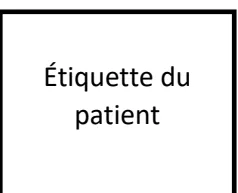

## **RECOMMANDATIONS FORMALISÉES D'EXPERTS**

De la Société Française de Médecine d'Urgence

En collaboration avec La Société Française d'Anesthésie Réanimation

# **Sédation procédurale en structure de Médecine d'Urgence**

Procedural sedation in emergency medicine settings

**2026****Texte validé par la Commission des Référentiels de la SFMU le 23 mars 2026, le Conseil d'Administration de la SFMU le 2 avril 2026, le Comité des Référentiels de la SFAR le 30 mars 2026, le Conseil d'Administration de la SFAR le 11 mai 2026.**

**Auteurs :** Delphine DOUILLET, Pierre BOUZAT, Benjamin BIJOK, Marc BLANCHER, Guillaume BOUHOURS, Thomas CLAVIER, Xavier COMBES, Pauline DEVAUCHELLE, Xavier DUBUCS, Michel GALINSKI, Tobias GAUSS, Pauline GLASMAN, Charles GREGOIRE, Medhi HAFIANI, Patricia JABRE, Fabien LEMOEL, Virginie-Eve LVOVSCHI, Pierre MORA, Mathieu OBERLIN, Véronique RAMONDA, Benjamin RIEU, Karim TAZAROURTE, Marie WERNER, Jean-Baptiste BOUILLON-MINOIS, Hugues DE COURSON.

**Coordonnateurs d'experts :**

**SFMU :** Delphine Douillet (Angers)

**SFAR :** Pierre Bouzat (Grenoble)

**Organisateurs :**

**SFMU :** Jean-Baptiste Bouillon (Clermont-Ferrand)

**SFAR :** Hugues de Courson (Bordeaux)

**Experts de la SFMU :**

Marc Blancher, Xavier Combes, Xavier Dubucs, Michel Galinski, Charles Grégoire, Patricia Jabre, Fabien Lemoel, Virginie-Eve Lvovschi, Mathieu Oberlin, Karim Tazarourte

**Experts de la SFAR :**

Benjamin Bijok, Guillaume Bouhours, Thomas Clavier, Pauline Devauchelle, Tobias Gauss, Pauline Glasman, Pierre Mora, Véronique Ramonda, Benjamin Rieu, Marie Werner

**Groupes de Lecture :**

*Comité des Référentiels cliniques de la SFMU :* Jérémy Guenezan (Président), Delphine Douillet (Secrétaire), Jean-Baptiste Bouillon, Richard Chocron, Yann-Erick Claessens, Marion Douplat, Xavier Dubucs, Charles Grégoire, Maxime Jonchier, Roger Kadji Kalabang, Pierrick Le Borgne, Thibaut Markarian, Nicolas Peschanski, Geoffroy Rousseau, Nadia Tiberti, Amélie Vromant.

*Comité des Référentiels cliniques de la SFAR :* Hélène Charbonneau (Présidente), Anaïs Caillard (Secrétaire), Aurélien Bonnal, Thomas Botrel, Lucie Collet, Hugues de Courson, Matthieu Dumont, Max Gonzalez Estevez, El Mahdi Hafiani, Pierre Huette, Florence Julien-Marsolier, Natacha Kapandji, Elise Langouet, Axel Maurice-Szamburski, Daphné Michelet, Maxime Nguyen, Stéphanie Ruiz.*Conseil d'Administration de la SFMU* : Sandrine Charpentier (Présidente); Dominique Savary (Vice-président), Patricia Jabre, Guillaume Debaty, Anthony Chauvin, Julie Contenti, Xavier Bobbia, Catherine Caplette, Tahar Chouihed, Joël Jenvrin, Olivier Mimos, Nicolas Termoz Masson.

*Conseil d'Administration de la SFAR* : Marc Leone (Président), Karine Nouette-Gaulain (Vice-Présidente 1), Isabelle Constant (Vice-Présidente 2), Frédéric Le Saché, Sigismond Lasocki, Evelyne Combettes, Julien Amour, Hélène Beloeil, Lucie Beylacq, Valérie Billard, Marie-Pierre Bonnet, Sébastien Campard, Vincent Collange, Marion Costecalde, Laurent Delaunay, Delphine Huet-Garrigue, Olivier Joannes-Boyau, Anne-Claire Lukaszewicz, Jane Muret, Olivier Rontes, Nadia Smail, Lionel Velly, Franck Verdonck, Anne Wernet.

**Conflits et liens d'intérêts des experts SFMU au cours des cinq années précédant la date de validation par le CA de la SFMU.**

Marc Blancher : pas de lien d'intérêt en rapport avec la présente RFE  
Jean-Baptiste Bouillon-Minois : pas de lien d'intérêt en rapport avec la présente RFE  
Xavier Combes : pas de lien d'intérêt en rapport avec la présente RFE  
Delphine Douillet : pas de lien d'intérêt en rapport avec la présente RFE  
Michel Galinski : pas de lien d'intérêt en rapport avec la présente RFE  
Charles Grégoire : pas de lien d'intérêt en rapport avec la présente RFE  
Patricia Jabre : pas de lien d'intérêt en rapport avec la présente RFE  
Fabien Lemoël : pas de lien d'intérêt en rapport avec la présente RFE  
Virginie-Eve Lvovski : réalisation de MOOC et participation comme conférencière à des symposium pour les laboratoires Aguettant et Viatris  
Mathieu Oberlin : pas de lien d'intérêt en rapport avec la présente RFE  
Karim Tazarourte : pas de lien d'intérêt en rapport avec la présente RFE  
Xavier Dubucs : pas de lien d'intérêt en rapport avec la présente RFE

**Liens d'intérêts des experts SFAR au cours des cinq années précédant la date de validation par le CA de la SFAR.**

Benjamin Bijok : pas de lien d'intérêt en rapport avec la présente RFE  
Guillaume Bouhours : pas de lien d'intérêt en rapport avec la présente RFE  
Pierre Bouzat : pas de lien d'intérêt en rapport avec la présente RFE  
Thomas Clavier : pas de lien d'intérêt en rapport avec la présente RFE  
Hugues de Courson : pas de lien d'intérêt en rapport avec la présente RFE  
Pauline Devauchelle : pas de lien d'intérêt en rapport avec la présente RFE  
Tobias Gauss : pas de lien d'intérêt en rapport avec la présente RFE  
Pauline Glassman : pas de lien d'intérêt en rapport avec la présente RFEMehdi Hafiani : pas de lien d'intérêt en rapport avec la présente RFE  
Pierre Mora : pas de lien d'intérêt en rapport avec la présente RFE  
Véronique Ramonda : pas de lien d'intérêt en rapport avec la présente RFE  
Benjamin Rieu : pas de lien d'intérêt en rapport avec la présente RFE  
Marie Werner : pas de lien d'intérêt en rapport avec la présente RFE## RÉSUMÉ

**Objectif:** La Société Française de Médecine d'Urgence (SFMU) et la Société Française d'Anesthésie Réanimation (SFAR) ont collaboré pour proposer un référentiel sur la sédation procédurale en structure de Médecine d'Urgence.

**Conception:** Un groupe composé d'experts français des Sociétés Françaises de Médecine d'Urgence (SFMU) et d'Anesthésie Réanimation (SFAR) a été réuni. Les conflits d'intérêts ont été officiellement déclarés dès le début du processus d'élaboration des recommandations et ce dernier a été conduit indépendamment de tout financement de l'industrie. Les auteurs ont suivi la méthodologie GRADE (*Grading of Recommendations Assessment, Development and Evaluation*) pour évaluer le niveau de preuve de la littérature.

**Méthodes:** Quatre champs ont été définis : 1) Indication de la sédation procédurale en situation d'urgence ; 2) Patients à risque et condition de réalisation : quand faire ou ne pas faire ? ; 3) Conditions de sécurité ; 4) Modalités de réalisation. Pour chaque champ, l'objectif des recommandations était de répondre à un certain nombre de questions formulées par les experts selon le modèle PICO ("*Population, Intervention, Comparison, Outcome*"). A partir de ces questions, une recherche bibliographique extensive sur les 30 dernières années a été réalisée en utilisant des mots clés prédéfinis selon les recommandations PRISMA. La qualité des données a été analysée selon la méthode GRADE. Les recommandations ont été formulées selon la méthode GRADE, puis votées par tous les experts selon la méthode GRADE grid.

**Résultats :** Le travail de synthèse des experts et l'application de la méthode GRADE ont abouti à 33 recommandations concernant la sédation procédurale en contexte d'urgence. Après 2 tours de votes et trois amendements, un accord fort a été obtenu pour 33 recommandations. Parmi ces recommandations, une a un niveau de preuve élevé (1 GRADE 1), trois ont un niveau de preuve faible (3 GRADE 2) et 29 sont des avis d'experts. Enfin, pour 3 questions, aucune recommandation n'a pu être formulée.

**Conclusion :** Un accord fort a été obtenu parmi les experts afin de fournir des recommandations encadrant la réalisation de la sédation procédurale dans un contexte d'urgence.

**Mots clés :** sédation procédurale, urgences, extra-hospitalier, médecine d'urgence.## ABSTRACT

**Objective:** The French Society of Emergency Medicine (SFMU) and the French Society of Anaesthesia and Intensive Care (SFAR) collaborated to develop a reference framework on procedural sedation in emergency medicine settings.

**Design:** A panel of French experts from the French Society of Emergency Medicine (SFMU) and the French Society of Anaesthesia and Intensive Care (SFAR) was convened. Potential conflicts of interest were formally declared at the outset of the guideline development process, which was conducted independently of any industry funding. The authors followed the GRADE methodology (Grading of Recommendations Assessment, Development and Evaluation) to assess the level of evidence in the literature.

**Methods:** Four domains were defined: (1) Indications for procedural sedation in emergency settings; (2) High-risk patients and conditions for performance: when to perform or not perform procedural sedation; (3) Safety requirements; (4) Procedural modalities. For each domain, the aim of the recommendations was to address a set of questions formulated by the experts according to the PICO framework (Population, Intervention, Comparison, Outcome). Based on these questions, an extensive literature search covering the past 30 years was conducted using predefined keywords in accordance with PRISMA recommendations. Data quality was assessed using the GRADE methodology. Recommendations were formulated using the GRADE approach and subsequently voted on by all experts using the GRADE grid method.

**Results:** The experts' synthesis work and application of the GRADE method resulted in 33 recommendations concerning procedural sedation in emergency settings. After two rounds of voting and several amendments, strong agreement was reached on all 33 recommendations. Of these recommendations, one has a high level of evidence (1 GRADE 1), three have a low level of evidence (3 GRADE 2) and 29 are expert opinions. Finally, no recommendation could be made for three questions.

**Conclusions:** There was strong agreement among the experts to provide recommendations for the use of procedural sedation in emergency situations.

**Keywords:** procedural sedation, emergencies, out-of-hospital care, emergency medicine.## INTRODUCTION

*Contexte et justification* : Vingt-six ans après la première conférence d'experts de la SFAR [1] et seize ans après la recommandation conjointe SFMU-SFAR de 2010 [2], une réactualisation des recommandations sur la sédation procédurale en contexte d'urgence était nécessaire, compte tenu de l'évolution des données de la littérature et des pratiques en médecine d'urgence. La sédation procédurale est aujourd'hui une pratique courante dans les structures de Médecine d'Urgence. Cette recommandation porte sur la réalisation d'une sédation procédurale pour un geste douloureux lors des prises en charge extra- et intrahospitalières par des médecins urgentistes.

*Définitions et concepts clés* : La sédation procédurale est définie comme « l'administration d'un ou de plusieurs agents pharmacologiques pour faciliter une procédure diagnostique ou thérapeutique ciblant un état pendant lequel la perméabilité des voies aériennes, la ventilation spontanée, les réflexes protecteurs des voies respiratoires et la stabilité hémodynamique sont préservés, tout en soulageant l'anxiété et la douleur » [3]. Elle se distingue à la fois de l'anesthésie générale, qui implique une perte de conscience nécessitant souvent une intervention sur les voies respiratoires, et de l'analgésie, qui vise uniquement le soulagement de la douleur sans altérer l'état de vigilance. Cette recommandation fait suite aux recommandations « prise en charge de la douleur aiguë en médecine d'urgence » réalisées en 2024 et qui ne traitaient pas de la sédation procédurale [4]. La sédation procédurale nécessite l'utilisation des médicaments, notamment des analgésiques opioïdes ou non-opioïdes et hypnotiques, pour bloquer la sensation douloureuse en ciblant le maintien d'une vigilance normale. La principale différence réside donc dans l'impact sur la conscience du patient : l'analgésie préserve l'état de vigilance, tandis que la sédation peut entraîner un état plus ou moins profond de relaxation ou d'inconscience. La sédation procédurale vise à induire un état de relaxation, de calme ou d'amnésie partielle, permettant au patient de tolérer des interventions potentiellement douloureuses ou stressantes. Le terme « sédation procédurale » est aujourd'hui privilégié par rapport à « sédation-analgésie procédurale », et l'expression « sédation consciente » n'est plus utilisée, en raison de son caractère ambigu. Un sédatif nondissociatif est un agent pharmacologique induisant une dépression dose-dépendante de la conscience, sans induire d'état dissociatif, tout en conservant une interaction variable avec l'environnement (exemple : propofol, étomidate, midazolam, ...).

Cette recommandation porte sur la sédation procédurale en situation d'urgence, incluant les urgences vitales nécessitant un geste immédiat (par exemple cardioversion électrique) et les urgences fonctionnelles nécessitant la réalisation d'un geste douloureux à visée thérapeutique (par exemple réduction d'une fracture ou d'une luxation). Il existe trois principaux domaines dans lesquels une sédation procédurale peut être utilisée dans le champ de la médecine d'urgence : la traumatologie, la réalisation de gestes douloureux, et la cardioversion.

#### Population cible :

Ces recommandations s'adressent aux médecins exerçant en structure de médecine d'urgence et définis par l'article D6124-1 du code de la santé publique comme étant titulaires du diplôme d'études spécialisées de médecine d'urgence ou du diplôme d'études spécialisées complémentaires en médecine d'urgence ou encore d'un diplôme certifiant d'une formation universitaire en médecine d'urgence. La pratique de la médecine d'urgence exige des médecins qu'ils possèdent des compétences en soins intensifs et réanimation, notamment en matière de gestion avancée des voies respiratoires, de techniques de réanimation cardiovasculaire et ventilatoire, et d'analésie. L'expertise en matière de sédation procédurale fait partie des compétences fondamentales requises dans le cadre de la formation du DES de médecine d'urgence [5].

#### Conditions de sécurité indispensables :

La sédation procédurale doit se faire dans un cadre bien établi lors des recommandations précédentes, dont les grandes lignes sont reprises ici et ne seront pas discutées dans cette recommandation car ils constituent désormais des pratiques établies [2, 6-9]. Le matériel minimal requis pour réaliser une sédation procédurale en sécurité est la surveillance électrocardioscopique continue, la surveillance de la pression artérielle à l'aide d'un brassard à tension adapté à la morphologie du patient, la surveillance continue de la saturation pulsée en oxygène, la disponibilité d'un ballon auto-remplisseur à valve unidirectionnelle (BAVU) branché à une source d'oxygène à un débit 15 L/min, une aspiration prête, un matériel d'intubation (comprenant du matériel d'intubation difficile) ainsi qu'un défibrillateur accessible. Les troisprincipales complications sont l'hypoxémie, l'apnée et l'hypotension artérielle. La prise en charge devra être réalisée dans un environnement adapté à ces risques, bien que rares; l'équipe en charge du patient doit être capable d'en assurer la prévention, l'identification et la prise en charge précoce adaptée et efficace. L'administration des médicaments dans le cadre d'une sédation procédurale doit se faire de manière titrée. Une titration est définie par le fait d'ajuster progressivement la dose d'un médicament afin d'obtenir l'effet thérapeutique optimal tout en limitant les effets indésirables. La sédation procédurale doit être réalisée uniquement par des praticiens formés. Comme mentionné dans les recommandations internationales, lorsque cela est possible, en particulier en milieu intra-hospitalier, il est recommandé de réaliser la sédation procédurale avec une équipe dédiée, comprenant un médecin et un infirmier spécifiquement chargés de la sédation, distincts de l'opérateur réalisant le geste [2,6,7,9]. Afin de favoriser le travail en équipe et le bon déroulement de la procédure, la réalisation d'un briefing pré-procédure de vérification des critères de sécurité et de matériel est préconisé (tableau 1) [7, 10,11].

Tableau 1 : Briefing de sécurité pré-procédural

Contenu du briefing de sécurité équipe et patient :

- • Répartition des rôles et responsabilités
- • Organisation de la prise en charge (niveau et durée prévus de la sédation, critères de début de la procédure)
- • Vérification de l'identité et du côté de la lésion du patient (si applicable)
- • Vérification du matériel (ex. : aspiration fonctionnelle)
- • Localisation des dispositifs et médicaments de secours
- • Anticipation des complications

Dans cette recommandation, l'hypoxémie se définit par une  $PaO_2 < 60$  mmHg en air ambiant, ou une  $SpO_2 < 90\%$  en air ambiant, ou encore par la nécessité d'administrer de l'oxygène pour atteindre  $PaO_2 \geq 60$  mmHg ou  $SpO_2 \geq 90\%$  [12].

La décision de réalisation d'une sédation procédurale doit systématiquement inclure :

1. i. L'évaluation de degré d'urgence de la procédure,- ii. L'évaluation du patient,
- iii. La disponibilité d'un personnel formé pour la réalisation en sécurité de la sédation procédurale,
- iv. La disponibilité d'un espace et d'un équipement appropriés.

Il est indispensable qu'un protocole de service dédié à la sédation procédurale soit formalisé de manière systématique, en s'appuyant sur une collaboration systématique, étroite et structurée entre les équipes d'urgentistes et d'anesthésistes. Cette élaboration conjointe permet d'harmoniser les pratiques, de partager les expertises respectives et de garantir la sécurité des patients, en assurant une cohérence dans les indications, les modalités de réalisation et la gestion des éventuelles complications.

Périmètre de la recommandation : Cette recommandation s'articule autour de quatre grands champs thématiques, organisés en 17 questions PICO (figure 1). Cette recommandation traite spécifiquement de la sédation procédurale :

- • chez l'adulte,
- • en dehors de la femme enceinte de grossesse,
- • par voie intraveineuse exclusivement.

Par absence de littérature, cette recommandation ne traite pas des patients pris en charge en extrahospitalier sans accès au patient et/ou incarcéré pour lesquels les conditions de sécurité de la réalisation d'une sédation procédurale ne sont pas réunies.

La voie inhalée n'a pas été incluse dans le champ de ce travail.```

graph TD
    A[Indication à une sédation procédurale pour la réalisation d'un geste douloureux] --> B{Alternative à la sédation procédurale possible?}
    B -- oui --> C[anesthésie loco-régionale]
    B -- non --> D{Situations à risque}
    D --> E[Urgent non différable]
    D --> F[Différable]
    E --> G[Avis MAR]
    F --> G
    D --> H{Modalités & surveillance}
    H --> I["- Briefing de sécurité pré-procédural  
- Matériel minimum dont capnographie et oxygénéthérapie  
- Objectifs visés de la sédation  
- Choix des thérapeutiques  
- Définition des critères d'échec d'une sédation procédurale  
- Surveillance après une sédation procédurale  
- Intérêt d'une checklist encadrant la réalisation de la sédation procédurale."]
    I -- si échec --> J[relai MAR]
  
```

Figure 1. Logigramme d'organisation de cette recommandation "sédation procédurale en structure de médecine d'urgence" 2026 précisant les 4 thématiques abordées dans le champ de cette recommandation. *MAR : Médecin anesthésiste-réanimateur*

## OBJECTIF DES RECOMMANDATIONS

L'objectif de ces Recommandations Formalisées d'Experts est de produire un cadre facilitant la prise de décision pour la sédation procédurale en contexte d'urgence. Le groupe s'est efforcé de produire un nombre minimal de recommandations afin de mettre en évidence les points forts à retenir dans les 4 champs prédéfinis. Les règles de base des bonnes pratiques médicales universelles en médecine d'urgence étant considérées comme connues, celles-ci ont été exclues de ces recommandations qui se focalisent sur les éléments spécifiques de la prise en charge de la sédation procédurale en contexte d'urgence. Le public visé est les médecins urgentistes en collaboration avec les médecins anesthésistes-réanimateurs.

## MÉTHODE

### Organisation généraleCes recommandations sont le résultat du travail d'un groupe d'experts réunis par la SFMU en collaboration avec la SFAR. Chaque expert a rempli une déclaration de conflits d'intérêts avant de débuter le travail d'analyse. Dans un premier temps, le comité d'organisation a défini les objectifs de ces recommandations et la méthodologie utilisée. Les différents champs d'application de ces RFE et les questions à traiter ont ensuite été définis par le comité d'organisation, puis modifiés et validés par les experts. Les questions ont été formulées selon un format PICO (*Population, Intervention, Comparison, Outcome*) après une première réunion du groupe d'experts. La population « P » pour l'ensemble des questions est définie comme « les patients nécessitant une sédation procédurale en urgence ». Cela comprend le contexte extrahospitalier et les urgences.

## **Champ des recommandations**

Les recommandations formulées concernent 4 champs :

- - Champ 1 : Indication de la sédation procédurale en situation d'urgence
- - Champ 2 : Patients à risque et condition de réalisation : quand faire ou ne pas faire ?
- - Champ 3 : Conditions de sécurité
- - Champ 4 : Modalités de réalisation

Une recherche bibliographique extensive était réalisée à partir des bases de données (MEDLINE, Tripdatabase ([www.tripdatabase.com](http://www.tripdatabase.com)), Prospero ([www.crd.york.ac.uk/PROSPERO](http://www.crd.york.ac.uk/PROSPERO)) et [www.clinicaltrials.gov](http://www.clinicaltrials.gov), EMBASE, SCOPUS, Cochrane ), par 20 experts pour chaque champ d'application, selon la méthodologie Preferred Reporting Items for Systematic Reviews and Meta-Analysis (PRISMA pour les revues systématiques). Les mots clés utilisés pour la recherche bibliographique ont été : patients adultes, sédation procédurale, urgences, extrahospitalier, mortalité, nécessité d'une intubation, nécessité d'une admission en soins critiques en lien avec la sédation procédurale, inhalation, hypoxémie, hypotension artérielle, succès de la procédure, douleur lors de réalisation de la procédure.

Ont été inclus dans l'analyse :

1. 1) les méta-analyses, essais contrôlés randomisés, essais prospectifs non randomisés, cohortes rétrospectives, séries de cas et case-report ;
2. 2) conduites chez les patients admis dans une structure de médecine d'urgence (extrahospitalier et intrahospitalier) ;
3. 3) traitant la sédation procédurale en urgence ;
4. 4) publiées en langue anglaise ou française.

La méthode de travail utilisée pour l'élaboration de ces recommandations est la méthode GRADE® (*Grade of Recommendation Assessment, Development and Evaluation*). Cette méthode permet, après une analyse qualitative et quantitative de la littérature, de déterminer séparément la qualité des preuves, et donc de donner une estimation de la confiance que l'on peut avoir de l'analyse quantitative et un niveau de recommandation. Un niveau de preuve a été défini pour chacune des références bibliographiques citées en fonction du type de l'étude. Ce niveau de preuve pouvait être réévalué en tenant compte de la qualité méthodologique de l'étude, de la cohérence des résultats entre les différentesétudes, du caractère direct ou non des preuves, de l'analyse de coût et de l'importance du bénéfice.

Les critères de jugement de sécurité ont été définis en amont de la façon suivante :

- ● critères de jugement majeurs : mortalité (importance 9), nécessité d'une intubation et/ou d'une admission en soins critiques en lien avec la sédation procédurale (importance 8),
- ● critères de jugement secondaires : inhalation (importance 7), hypoxémie (importance 6), hypotension artérielle (importance 5).

Les critères de jugement d'efficacité ont été définis en amont de la façon suivante :

- ● critères de jugement majeurs : succès de la procédure (importance 9), douleur lors de réalisation de la procédure (importance 8),
- ● critères de jugement secondaires : satisfaction du patient (importance 7)

Les recommandations ont ensuite été formulées en utilisant la terminologie des RFE de la SFMU :

- - Un niveau global de preuve « fort » permettait de formuler une recommandation « forte » : GRADE 1 « il est recommandé de faire... », « il n'est pas recommandé de faire... » avec la mention recommandation forte.
- - Un niveau global de preuve modéré ou faible aboutissait à l'écriture d'une recommandation « optionnelle » : GRADE 2 « il est recommandé de faire... », « il n'est pas recommandé de faire... » avec la mention recommandation faible.
- - Lorsque la littérature était très faible, la question pouvait faire l'objet d'une recommandation sous la forme d'un avis d'expert : Avis d'experts « les experts suggèrent... ».
- - Si les experts ne disposaient pas d'études traitant du sujet, ou si aucune donnée sur les critères principaux n'existait, aucune recommandation n'était émise. Une « absence de recommandation » signifie qu'il n'existe pas suffisamment de littérature pour conclure sur ce qu'il convient de faire. De nouvelles études devront apporter les réponses aux questions avec « absence de recommandation ». Une « absence de recommandation » doit être différenciée d'une recommandation négative de type « Il n'est pas recommandé de faire ». Dans ce cas, la littérature scientifique disponible est suffisamment robuste pour conduire à une recommandation négative.

Les propositions de recommandations ont été présentées et discutées une à une. Le but n'était pas d'aboutir obligatoirement à un avis unique et convergent des experts sur l'ensemble des propositions, mais de dégager les points de concordance et les points de divergence ou d'indécision. Chaque recommandation a alors été évaluée par chacun des experts et soumise à une cotation individuelle à l'aide d'une échelle allant de 1 (désaccord complet) à 9 (accord complet). La force de la recommandation est déterminée en fonction de cinq facteurs clés et validée par les experts après un vote, en utilisant la méthode GRADE Grid:- ● Estimation de l'effet : plus il est important, plus probablement la recommandation sera forte;
- ● Le niveau global de preuve : plus il est élevé, plus probablement la recommandation sera forte;
- ● La balance entre effets désirables et indésirables : plus celle-ci est favorable, plus probablement la recommandation sera forte;
- ● Les valeurs : en cas d'incertitude de l'estimateur ou de grande variabilité de son écart-type, la force de la recommandation sera probablement plus faible;
- ● La préférence : doivent être obtenues au mieux auprès des personnes concernées (patient, médecin, décisionnaire);
- ● Coûts : plus les coûts ou l'utilisation des ressources sont élevés, plus probablement la recommandation sera faible.

Pour valider une recommandation, au moins 70 % des experts devaient exprimer une opinion qui allait globalement dans la même direction, tandis que moins de 20 % d'entre eux exprimaient une opinion contraire. En l'absence de validation d'une ou de plusieurs recommandation(s), celle(s)-ci étaient reformulée(s) et, de nouveau, soumise(s) à cotation dans l'objectif d'aboutir à un consensus. Si les recommandations n'avaient pas obtenu un nombre suffisant d'opinions favorables et/ou obtenu un nombre trop élevé d'opinions défavorables, elles n'étaient pas éditées. Si une courte majorité des experts étaient d'accord avec la recommandation et plusieurs experts n'avaient pas d'opinion ou y étaient opposés, les recommandations obtenaient un accord faible. Enfin, si la grande majorité des experts était d'accord avec la recommandation et une minorité des experts n'avait pas d'opinion ou y était opposée, les recommandations obtenaient un accord fort. Les avis d'experts, exprimant par définition un consensus entre les experts en l'absence de littérature suffisamment forte pour grader ces recommandations, devaient nécessairement obtenir un accord fort (i.e. au moins 70% d'opinions allant dans la même direction).

## **RESULTATS**

### **Champs des recommandations**

Les experts ont consensuellement décidé lors de la première réunion d'organisation de ces RFE, de traiter 17 questions réparties en 4 champs.

### **Synthèse des résultats**

Le travail de synthèse des experts et l'application de la méthode GRADE ont abouti à 36 recommandations. Après 2 tours de vote et trois amendements, un accord fort a été obtenu pour 33 recommandations. Parmi ces recommandations, 1 a un niveau de preuve élevé (1 GRADE 1), 3 ont un niveau de preuve modéré à faible (3 GRADE 2) et 29 sont des avis d'experts. Enfin, pour 3 questions, aucune recommandation n'a pu être formulée.

La SFMU et la SFAR incitent tous les médecins urgentistes à se conformer à ces RFE pour optimiser la qualité des soins dispensés aux patients. Cependant, chaque praticien doit exercer son propre jugement dans l'application de ces recommandations, en prenant en compte sonexpertise et les spécificités de son établissement, pour déterminer la méthode d'intervention la mieux adaptée à l'état du patient dont il a la charge.

Tableau 2. Synthèse de la méthodologie GRADE utilisée pour cette recommandation.

<table border="1">
<thead>
<tr>
<th colspan="3">P du PICO : Patients</th>
</tr>
</thead>
<tbody>
<tr>
<td colspan="3">Tous les patients adultes nécessitant une sédation procédurale en urgence en extrahospitalier et en intrahospitalier</td>
</tr>
<tr>
<th colspan="3">O du PICO : Outcomes / Critères de jugement</th>
</tr>
<tr>
<th colspan="3">Critères de jugement cruciaux ou majeurs (importance de 9 le plus fort à 7) <b>de sécurité</b></th>
</tr>
<tr>
<td>1. Mortalité,<br/>2. Nécessité d'une intubation,<br/>3. Nécessité d'une admission en soins critiques en lien avec la sédation procédurale.</td>
<td>Importance 9</td>
<td>Critères principaux</td>
</tr>
<tr>
<td>1. Inhalation,<br/>2. Hypoxémie,<br/>3. Hypotension artérielle.</td>
<td>Importance 7</td>
<td>Critères secondaires</td>
</tr>
<tr>
<th colspan="3">Critères de jugement cruciaux ou majeurs (importance de 9 le plus fort à 7) <b>d'efficacité</b></th>
</tr>
<tr>
<td>1. Succès de la procédure,<br/>2. Douleur lors de réalisation de la procédure</td>
<td>Importance 9</td>
<td>Critères principaux</td>
</tr>
<tr>
<td>Satisfaction du patient</td>
<td>Importance 7</td>
<td>Critères secondaires</td>
</tr>
<tr>
<th colspan="3">Mots-clés</th>
</tr>
<tr>
<td>Quels sont les mots-clés de la recherche ?</td>
<td colspan="2">Patients adultes, sédation procédurale, urgences, extrahospitalier, mortalité, nécessité d'une intubation, nécessité d'une admission en soins critiques en lien avec la sédation procédurale, inhalation, hypoxémie, hypotension artérielle, succès de la procédure, douleur lors de réalisation de la procédure.</td>
</tr>
<tr>
<th colspan="3">Critères de restriction de la recherche bibliographique</th>
</tr>
<tr>
<td>Type d'études</td>
<td colspan="2">
<ul style="list-style-type: none; padding-left: 0;">
<li>- Les méta-analyses,</li>
<li>- essais contrôlés randomisés,</li>
<li>- essais prospectifs non randomisés,</li>
<li>- cohortes rétrospectives,</li>
<li>- séries de cas et case-report,</li>
<li>- études publiées et ayant subi un processus de peer-reviewing</li>
</ul>
</td>
</tr>
<tr>
<td>Années de la recherche bibliographique</td>
<td colspan="2">1990 à 2025</td>
</tr>
</tbody>
</table>**RÉFÉRENCES**

- [1]. Société Française d'Anesthésie et de Réanimation (1999) Modalités de la sédation et/ou de l'analgésie en situation extrahospitalière. Conférence d'experts. Paris : Elsevier p. 7-135.
- [2]. Vivien B, Adnet F, Bounes V, et al (2011) Recommandations formalisées d'experts 2010 : sédation et analgésie en structure d'urgence (réactualisation de la conférence d'experts de la SFAR de 1999). 15 doi:10.1016/j.annfar.2010.10.005
- [3]. Green SM, Irwin MG, Mason KP, et al (2021) Procedural sedation: providing the missing definition. *Anaesthesia* 76(5):598–601. 10.1111/anae.15213
- [4]. Villoing B, Galinski M, Baron M-A, et al (2025) Prise en charge de la douleur aiguë en urgence en 2024: Recommandations formalisées d'experts de la Société française de médecine d'urgence. *Annales françaises de médecine d'urgence* 15(3):177–203. 10.1684/afmu.2025.0661
- [5]. Riou B (2017) 2017 : l'an 1 du diplôme d'études spécialisées de médecine d'urgence. *Annales françaises de médecine d'urgence* 7(1):1–4. 10.1007/s13341-017-0710-z
- [6]. Hinkelbein J, Lamperti M, Akeson J, et al (2018) European Society of Anaesthesiology and European Board of Anaesthesiology guidelines for procedural sedation and analgesia in adults. *European Journal of Anaesthesiology | EJA* 35(1):6. 10.1097/EJA.0000000000000683.
- [7]. Royal College of Emergency Medicine (2022) Procedural Sedation in the Emergency Department: best practices guidelines. [https://rcem.ac.uk/wp-content/uploads/2022/08/RCEM\\_BPC\\_Procedural\\_Sedation\\_Final\\_Aug\\_22.pdf](https://rcem.ac.uk/wp-content/uploads/2022/08/RCEM_BPC_Procedural_Sedation_Final_Aug_22.pdf). Accessed 24 Aug 2025
- [8]. Green SM, Roback MG, Krauss BS, et al (2019) Unscheduled Procedural Sedation: A Multidisciplinary Consensus Practice Guideline. *Ann Emerg Med* 73(5):e51–e65. 10.1016/j.annemergmed.2019.02.022
- [9]. Miller KA, Andolfatto G, Miner JR, et al (2019) Clinical Practice Guideline for Emergency Department Procedural Sedation With Propofol: 2018 Update. *Annals of Emergency Medicine* 73(5):470–480. 10.1016/j.annemergmed.2018.12.012
- [10]. Angouri J, Mesinioti P, Turner C. Anything I missed out↑: Pre-briefing in ad hoc trauma emergency teams. *SSM - Qualitative Research in Health* 2025;8:100580. 10.1016/j.ssmqr.2025.100580
- [11]. Allard J, Bleakley A, Hobbs A, Coombes L. Pre-surgery briefings and safety climate in the operating theatre. *BMJ Quality & Safety* 2011;20:711–717. 10.1136/bmjqs.2009.032672
- [12]. Helms J et al. Oxygen therapy in acute hypoxemic respiratory failure: guidelines from the SRLF-SFMU consensus conference. *Ann Intensive Care*. 2024 Sep 5;14(1):140. 10.1186/s13613-024-01367-2## Champ 1 : Indication de la sédation procédurale en situation d'urgence

**Question :** Chez les patients nécessitant une procédure urgente, existe-t-il des alternatives à la sédation procédurale avec un même profil d'efficacité et de sécurité ?

*Experts : Marc Blancher (SFMU), Pierre Mora (SFAR)*

**R1.1.1** Chez les patients nécessitant une procédure urgente pour des gestes traumatologiques périphériques (réduction de luxation ou de fracture), les experts suggèrent de réaliser par un médecin formé, une anesthésie locale ou loco-régionale comme alternative efficace et sécurisée à la sédation procédurale.

**AVIS D'EXPERTS (accord fort)**

**R1.1.2.** Chez les patients nécessitant une procédure urgente pour la réalisation de gestes douloureux (hors gestes traumatologiques périphériques), les experts suggèrent de ne pas privilégier une alternative à la sédation procédurale, aucune n'ayant fait la preuve d'une meilleure efficacité ou d'une meilleure tolérance.

**AVIS D'EXPERTS (accord fort)**

### **Argumentaire :**

Il existe très peu d'études contrôlées randomisées de bon niveau de preuve ayant comparé la sédation procédurale à des alternatives comme l'hypnose ou l'anesthésie loco-régionale. Ces procédures sont la plupart du temps réalisées en intrahospitalier mais elles peuvent également être envisagées en extrahospitalier. En traumatologie, la sédation procédurale est utilisée pour la réduction de luxations (principalement de l'épaule) et de fracture (essentiellement le poignet et la cheville) [1-3]. Toutes les luxations de l'épaule ne nécessitent pas de sédation, ni même d'analgésie [4]. Plus la réduction est réalisée à distance de la luxation, plus il sera fréquent d'avoir recours à une sédation [5]. L'effet recherché étant la relaxation musculaire de l'épaule, elle-même facilitée par l'analgésie de la zone. L'indication de sédation procédurale ne dépend pas de la technique de réduction utilisée [6]. Dans une méta-analyse publiée en 2022, *Hayashi et al* comparent l'efficacité et la sécurité de la sédation procédurale avec les 2 autres techniques d'anesthésie loco-régionale et de bloc intra-articulaire à la lidocaïne pour les réductions de luxation antérieure de l'épaule [3]. Au total, 8 essais portant sur 408 patients montrent qu'il n'y a pas de différences en termes de succès immédiat de la réduction entre l'injection intra-articulaire de lidocaïne et la sédation procédurale (RR 0,93, 95% CI 0,84 à 1,02). Une étude contrôlée randomisée comparant la sédation procédurale au bloc suprascapulaire, portant sur 41 patients, rapporte des résultats comparables (RR 1,13, 95% CI 0,84 à 1,53). Des résultats similaires sont retrouvés en termes de réduction de la douleur, de délai de prise en charge et de satisfaction. En ce qui concerne la sécurité, moins d'effets secondaires ont été mis en évidence dans les groupes bloc intra-articulaire à la lidocaïne *versus* sédation procédurale (1,3%, n=4/316 vs. 18,6%, n=55/296) et anesthésie loco-régionale *versus* sédation procédurale (3,5%, n=6/171 vs. 16,4%, n=28/171). Dans une autre méta-analyse de 2022 comparant exclusivement les blocs intra-articulaires à la lidocaïne vs. sédation procédurale, Sithamparapillai et al. retrouvent des résultats similaires sur la survenue d'effets indésirables (RR 0,16; 95% CI 0,07–0,33) [7]. Dans ces études, les événements indésirables non graves sont principalement des nausées, des épisodes d'hypoventilation réversibles, ou de dissociations désagréables. Il faut cependant noter que dans les groupessédation procédurale, la plupart des essais concernent l'association morphinique et benzodiazépine. Seuls 4 essais concernent soit la kétamine, soit le propofol associé au fentanyl [8-10]

En ce qui concerne les procédures de réduction de fracture et/ou de luxation des chevilles ou des poignets, les études prennent comme critères principaux d'efficacité, l'analgésie et la durée du geste. Dans un essai monocentrique randomisé comparant l'anesthésie locorégionale par bloc du nerf radial à la sédation procédurale par kétamine (posologie de 1-2 mg/kg) pour la réduction d'une fracture de l'extrémité inférieure du radius, *Isfahani et al* montrent que les deux techniques sont aussi efficaces pour réussir la procédure [11]. Cependant, la durée de réduction est plus faible dans le groupe anesthésie locorégionale comparativement au groupe sédation procédurale (27,4 min +/- 5,52 vs 39,88 min +/- 4,25 ;  $p < 0,001$ ). Il n'y avait pas d'événement indésirable dans le groupe anesthésie locorégionale versus 4 patients présentant une agitation et 6 des vomissements, 37%,  $n=10/27$  patients dans le groupe kétamine ( $p < 0,05$ ). Dans un autre essai randomisé, *White et al* ont comparé le bloc intra-articulaire à la lidocaïne et sédation procédurale pour la réduction d'une fracture - luxation de la cheville [1]. Les agents sédatifs utilisés étaient multiples. Les procédures ont été efficaces dans les deux groupes, avec le même effet sur la réduction de la douleur. En effet, La réduction de la douleur (différence entre le niveau de douleur initial et le niveau de douleur après administration ou injection du médicament) était en moyenne (et avec une marge d'erreur) de 4,6 +/- 3,3 pour le groupe de bloc et de 4,2 +/- 3,5 pour le groupe de sédation ( $p = 0,64$ ). La durée de la procédure était de 63,8 min +/- 14,3 dans le groupe bloc intra articulaire à la lidocaïne et 81,5 min +/- 17,2 dans le groupe sédation procédurale ;  $p = 0,43$ . Aucun effet indésirable n'a été rapporté dans l'étude. Lorsque l'on s'intéresse à l'effet de ces différentes techniques sur la gestion des flux aux urgences, il faut probablement considérer que le bloc intra-articulaire à la lidocaïne est une technique moins coûteuse qui nécessite moins de ressources humaines et moins de surveillance que les autres techniques [7]. Concernant la réalisation des gestes douloureux (drainage, abcès, ponctions, ...), il n'existe pas d'étude fiable ayant comparé la sédation procédurale et une autre méthode qu'elle soit médicamenteuse ou non. Le recours à la sédation procédurale dépend donc plus du contexte que du geste. Concernant la prise en charge extrahospitalière pour la traumatologie des membres, un essai clinique monocentrique, randomisé, réalisé par *Buttner et al* en 2018 et comparant l'anesthésie locorégionale (blocs fémoraux, sciatiques, inter scaléniques) versus la sédation procédurale (s-ketamine 0,125-0,25 mg /kg associé à du midazolam 0,05 mg/kg) [12]. Cette étude montre une plus grande efficacité de l'anesthésie locorégionale sur la douleur en perprocédure et en post-procédure chez les patients ayant un traumatisme des membres. Il n'y a pas d'information sur les effets indésirables. Dans les autres champs de la médecine extrahospitalière, il n'y a pas de littérature disponible permettant de comparer la sédation procédurale avec une autre technique.

Peu d'études ont comparé l'hypnose avec la sédation procédurale en extrahospitalier ou aux urgences. Une méta-analyse récente incluant 142 études et 9238 patients a mis en évidence que l'hypnose peut réduire significativement la douleur et l'anxiété associées aux procédures médicales en complément de la sédation procédurale (souvent avec réductionde médicaments requis) [13]. Cependant, la plupart des études étaient réalisées dans un contexte opératoire et l'hypnose était en complément d'une sédation. Concernant la cardioversion, aucun essai contrôlé randomisé et aucune étude prospective n'a évalué d'alternative à la sédation procédurale que cela soit en extrahospitalier et en intrahospitalier.

#### Référence :

- [1]. White BJ, Walsh M, Egol KA, Tejwani NC. Intra-articular block compared with conscious sedation for closed reduction of ankle fracture-dislocations. A prospective randomized trial. *J Bone Joint Surg Am*. 2008;90(4):731-734. doi:10.2106/JBJS.G.00733
- [2]. MacCormick LM, Baynard T, Williams BR, Vang S, Xi M, Lafferty P. Intra-articular Hematoma Block Compared to Procedural Sedation for Closed Reduction of Ankle Fractures. *Foot Ankle Int*. 2018;39(10):1162-1168. doi:10.1177/1071100718780693
- [3]. Hayashi M, Kano K, Kuroda N, Yamamoto N, Shiroshita A, Kataoka Y. Comparative efficacy of sedation or analgesia methods for reduction of anterior shoulder dislocation: A systematic review and network meta-analysis. *Acad Emerg Med Off J Soc Acad Emerg Med*. 2022;29(10):1160-1171. doi:10.1111/acem.14568
- [4]. Baden DN, Visser MFL, Roetman MH, et al. Effects of reduction technique for acute anterior shoulder dislocation without sedation or intra-articular pain management: a systematic review and meta-analysis. *Eur J Trauma Emerg Surg Off Publ Eur Trauma Soc*. 2023;49(3):1383-1392. doi:10.1007/s00068-023-02242-8
- [5]. Kanji A, Atkinson P, Fraser J, Lewis D, Benjamin S. Delays to initial reduction attempt are associated with higher failure rates in anterior shoulder dislocation: a retrospective analysis of factors affecting reduction failure. *Emerg Med J EMJ*. 2016;33(2):130-133. doi:10.1136/ememed-2015-204746
- [6]. Jiang N, Hu Y jun, Zhang K rui, Zhang S, Bin Y. Intra-articular lidocaine versus intravenous analgesia and sedation for manual closed reduction of acute anterior shoulder dislocation: an updated meta-analysis. *J Clin Anesth*. 2014;26(5):350-359. doi:10.1016/j.jclinane.2013.12.013
- [7]. Sithamparapillai A, Grewal K, Thompson C, Walsh C, McLeod S. Intra-articular lidocaine versus intravenous sedation for closed reduction of acute anterior shoulder dislocation in the emergency department: a systematic review and meta-analysis. *CJEM*. 2022;24(8):809-819. doi:10.1007/s43678-022-00368-z
- [8]. Pradhan RL, Lakhey S, Pandey BK, Rijal KP. Reduction of acute anterior shoulder dislocations: comparing intraarticular lignocaine with intravenous anesthesia. *JNMA J Nepal Med Assoc*. 2006;45(162):223-227.
- [9]. Raeyat Doost E, Heiran MM, Movahedi M, Mirafzal A. Ultrasound-guided interscalene nerve block vs procedural sedation by propofol and fentanyl for anterior shoulder dislocations. *Am J Emerg Med*. 2017;35(10):1435-1439. doi:10.1016/j.ajem.2017.04.032
- [10]. Tezel O, Kaldirim U, Bilgic S, et al. A comparison of suprascapular nerve block and procedural sedation analgesia in shoulder dislocation reduction. *Am J Emerg Med*. 2014;32(6):549-552. doi:10.1016/j.ajem.2014.02.014
- [11]. Isfahani MN, Javid M. Ultrasound-guided supracondylar radial nerve block to manage distal radius fractures in the emergency department. *Journal of Emergency Medicine, Trauma & Acute*. 2020.
- [12]. Büttner B, Mansur A, Kalmbach M, et al. Prehospital ultrasound-guided nerve blocks improve reduction-feasibility of dislocated extremity injuries compared to systemic analgesia. A randomized controlled trial. *PloS One*. 2018;13(7):e0199776. doi:10.1371/journal.pone.0199776[13]. Lahoud MJ, Gurary ST, Elia N. Hypnosis for anaesthetists: a systematic review and meta-analyses. *Anaesthesia*. n/a(n/a). doi:10.1111/anae.70013

## **Champ 2 : Patients à risque et condition de réalisation : quand faire ou ne pas faire ?**

La synthèse des recommandations de ce champ est proposée dans la figure 2.

Figure 2. Synthèse du champs 2

**Les drapeaux rouges** devant amener à évaluer le caractère difféable de la sédation procédurale et/ou le recours à un médecin anesthésiste réanimateur sont :

- ✕ Patient en situation d'obésité ( $IMC > 40\text{kg/m}^2$ ),
- ✕ Patient atteint de syndrome d'apnée du sommeil,
- ✕ Etat de fragilité évalué par un score ASA
- ✕ Patient ayant reçu des doses de morphine importante avant la sédation procédurale.\*

\*L'âge et le statut de jeûne pris de façon isolée ne sont pas, à eux seuls, à considérer comme des situations à risque. Il faudra avoir une vigilance chez les patients très fragiles et non à jeun.  
ASA : American society of anaesthesiologist.

**Question : Chez un patient devant bénéficier d'une sédation procédurale en urgence, existe-t-il une évaluation avant la sédation permettant d'identifier les patients à risque d'événements indésirables ?**

*Experts : Charles Grégoire (SFMU) - Benjamin Rieu (SFAR)*

**R2.1.1 : Chez les patients nécessitant une sédation procédurale en urgence, les experts suggèrent d'utiliser l'échelle ASA avant la sédation afin d'identifier les patients à risque de complications.**

### **AVIS D'EXPERT (Accord fort)**

#### **Argumentaire**

A ce jour, aucun score de risque n'a été construit spécifiquement pour la sédation procédurale aux urgences. Il n'existe pas actuellement de données permettant de définir sur un critère de comorbidité unique les patients ne devant pas bénéficier de sédation procédurale.

De nombreuses études sur la sédation procédurale réalisée aux urgences utilisent le score ASA (*American Society of Anesthesiologists*) dans leur protocole d'étude, soit comme critère d'exclusion soit pour comparer les groupes de patients entre eux (tableau 3) [1-3]. Le score ASA évalue le risque anesthésique en classant les anomalies ou affectionssystémiques d'un patient selon leur gravité et leur impact potentiel sur la tolérance à l'anesthésie. Il ne tient pas compte du type d'intervention, mais uniquement de l'état de santé du patient. Cette catégorisation est bien corrélée aux risques périopératoires liés au patient [4]. Les patients à haut risque sont définis par un score ASA > II. Les patients ASA III ou IV ont un risque de complications et de mortalité environ 25 à 50 % plus élevé que les patients ASA I ou II lors d'une prise en charge opératoire [5,6].

L'utilisation du score ASA a été évaluée pour des sédations procédurales programmées réalisées dans le cadre d'endoscopie digestive ou de cholangiopancréatographie rétrograde endoscopique (CPRE). L'augmentation du score ASA est associée à une augmentation du risque de complications. Une première étude portant sur 23,788 endoscopies gastro-intestinales démontrait qu'une augmentation d'un point du score ASA était associée à une hausse de 42 % du risque d'événements indésirables, notamment cardiovasculaires et respiratoires [7]. Une seconde étude, rétrospective, portant sur 52,553 patients, sous sédation procédurale par midazolam et opioïde, montrait que l'augmentation du score ASA était statistiquement associée à une réversion des drogues par flumazenil ou naloxone plus fréquente ( $p < 0,05$ ) [8].

Dans le cadre de la médecine d'urgence, il existe peu d'études sur l'utilisation du score ASA dans le cadre de la sédation procédurale. Une première étude prospective observationnelle de petite taille ( $n=62$  patients) en 2005 ne retrouve pas de complications majorées chez les patients ayant eu une sédation procédurale aux urgences par propofol ( $n=31$ ) ou étomidate ( $n=31$ ) ayant un score ASA III ou IV [9]. Une seconde étude rétrospective portait sur 303 patients qui ont eu une sédation procédurale aux urgences pour la réduction d'une luxation de prothèse de hanche. Il n'y avait pas d'association significative entre le score ASA et le risque de complication ( $p=0,8$ ) [10].

D'autres scores de risque existent comme le score de fragilité clinique (CFS) qui concerne les patients gériatriques. Actuellement, il n'existe pas de données suffisantes pour justifier son utilisation dans l'évaluation du risque lié à la sédation procédurale. Il convient également d'évaluer le risque de ventilation ou d'intubation difficile avant la réalisation d'une sédation procédurale.

Tableau 3. Score de classification ASA (American Society of Anesthesiologists)

<table border="1"><thead><tr><th>ASA</th><th>Définition</th></tr></thead><tbody><tr><td>ASA I</td><td>Personne normale en bonne santé</td></tr><tr><td>ASA II</td><td>Patient atteint d'une affection organique peu sévère, bien contrôlée sous traitement, sans atteinte des organes cibles.</td></tr><tr><td>ASA III</td><td>Patient atteint d'une maladie organique sévère sans menace vitale à court terme, avec limitation fonctionnelle.</td></tr><tr><td>ASA IV</td><td>Patient atteint d'une maladie organique invalidante mettant constamment sa vie en danger.</td></tr><tr><td>ASA V</td><td>Patient moribond, dont l'espérance de vie est inférieure à 24h sans intervention chirurgicale.</td></tr><tr><td>ASA VI</td><td>Patient en état de mort cérébrale donneur d'organe.</td></tr></tbody></table>

## Références[1]. Kuypers MI, Veldhuis LI, Mencl F, et al. Procedural sedation and analgesia versus nerve blocks for reduction of fractures and dislocations in the emergency department: A systematic review and meta-analysis. *J Am Coll Emerg Physicians Open*. 2023;4(1):e12886. doi:10.1002/emp2.12886

[2]. Weaver CS, Terrell KM, Bassett R, et al. ED procedural sedation of elderly patients: is it safe? *Am J Emerg Med*. 2011;29(5):541-544. doi:10.1016/j.ajem.2009.12.017

[3]. Lison D, Lorenzati B, Segre E, et al. Procedural sedation in the emergency department by Italian emergency physicians: results of the SEED SIMEU registry. *Eur J Emerg Med*. 2025;32(3):194-201. doi:10.1097/MEJ.0000000000001210

[4]. Kivrak S, Haller G. Scores for preoperative risk evaluation of postoperative mortality. *Best Pract Res Clin Anaesthesiol*. 2021;35(1):115-134. doi:10.1016/j.bpa.2020.12.005

[5]. Meyer AC, Eklund H, Hedström M, Modig K. The ASA score predicts infections, cardiovascular complications, and hospital readmissions after hip fracture - A nationwide cohort study. *Osteoporos Int*. 2021;32(11):2185-2192. doi:10.1007/s00198-021-05956-w

[6]. Schulz GB, Grimm T, Buchner A, et al. Surgical High-risk Patients With ASA  $\geq 3$  Undergoing Radical Cystectomy: Morbidity, Mortality, and Predictors for Major Complications in a High-volume Tertiary Center. *Clin Genitourin Cancer*. 2018;16(6):e1141-e1149. doi:10.1016/j.clgc.2018.07.022

[7]. Gemma M, Pennoni F, Tritto R, Agostoni M. Risk of adverse events in gastrointestinal endoscopy: Zero-inflated Poisson regression mixture model for count data and multinomial logit model for the type of event. *PLoS One*. 2021;16(6):e0253515. doi:10.1371/journal.pone.0253515

[8]. Zakeri N, Coda S, Webster S, Howson W, Thillainayagam AV. Risk factors for endoscopic sedation reversal events: a five-year retrospective study. *Frontline Gastroenterol*. 2015;6(4):270-277. doi:10.1136/flgastro-2014-100460

[9]. Miner JR, Martel ML, Meyer M, Reardon R, Biros MH. Procedural sedation of critically ill patients in the emergency department. *Acad Emerg Med*. 2005;12(2):124-128. doi:10.1197/j.aem.2004.08.054

[10]. Dawson N, Dewar A, Gray A, Leal A, Emergency Medicine Research Group, Edinburgh. Association between ASA grade and complication rate in patients receiving procedural sedation for relocation of dislocated hip prostheses in a UK emergency department. *Emerg Med J*. 2014;31(3):207-209. doi:10.1136/emmed-2012-202147

**Question : Chez un patient en situation d'obésité devant bénéficier d'une sédation procédurale en urgence, la sédation procédurale par rapport une autre modalité d'anesthésie est-elle équivalente en termes de sécurité et d'efficacité ?**

*Experts : Charles Grégoire (SFMU) - Benjamin Rieu (SFAR)*

**R2.2.1. Chez les patients en situation d'obésité morbide ( $IMC \geq 40 \text{ kg/m}^2$ ) nécessitant une sédation procédurale en urgence, les experts suggèrent de considérer ces patients comme à haut risque d'événements respiratoires et de discuter l'indication de la sédation procédurale au cas par cas, en s'assurant que les ressources mobilisables permettent de garantir l'efficacité et la sécurité.**#### AVIS D'EXPERT (accord fort)

**R2.2.2 Dans les cas où la sédation procédurale ne peut pas être différée chez des patients en situation d'obésité morbide ( $IMC > 40\text{kg}/\text{m}^2$ ) les experts suggèrent :**

- - **de privilégier la titration des différentes molécules,**
- - **que la posologie d'administration des molécules soit mesurée sur le poids idéal théorique pour les agents hautement lipophiles,**
- - **d'effectuer une surveillance rapprochée des paramètres respiratoires pendant et après la sédation procédurale pour maintenir une efficacité et une sécurité suffisante.**

#### AVIS D'EXPERT (accord fort)

##### **Argumentaire :**

L'obésité modifie les propriétés pharmacocinétiques et pharmacodynamiques des molécules utilisées en sédation procédurale [1,2]. Les différentes stratégies pour déterminer le dosage optimal des médicaments sédatifs chez le patient en situation d'obésité fait encore débat et sont difficilement utilisable en médecine d'urgence [3,4] La titration des médicaments sédatifs est probablement la méthode la plus sûre pour éviter le sur ou le sous dosage chez le patient en situation d'obésité. Un agent anesthésique est dit hautement lipophile lorsqu'il a une forte affinité pour les tissus graisseux, ce qui se traduit par : un volume de distribution élevé, une redistribution lente, un stockage dans le tissu adipeux. Parmi ces agents, on retrouve principalement le midazolam, le propofol, le fentanyl, le sufentanil [5,6,7] (ref Bautista et al, Ingrande et al, Cortinez et al).

Il n'existe pas de travaux étudiant spécifiquement le patient en situation d'obésité ayant une sédation procédurale aux urgences. La justification de cette recommandation se base sur les études de sédation procédurale lors d'acte technique digestif programmé de type gastroscopie ou d'une cholangio-pancréatographie rétrograde (CPRE).

Une première série d'études évaluait la sécurité d'une sédation procédurale lors d'une gastroscopie ou d'une CPRE chez les patients adultes. Deux premières études de faible échantillon ( $n=82$  et  $n=79$  patients) montraient qu'un indice de masse corporelle (IMC) élevé ( $> 28$  dans l'étude de Dhariwal et al et  $> 27$  dans l'étude de Qadeer et al) était un facteur de risque indépendant d'hypoxémie [8,9]. Une étude prospective plus large ( $n= 528$  patients) évaluait les événements indésirables durant une sédation procédurale lors d'une CPRE. Il concluait qu'un  $IMC \geq 30\text{kg}/\text{m}^2$  était associé à un risque accru d'événements indésirables respiratoires ( $p = 0,02$ ) [10]. Une étude rétrospective portant sur 823 patients visait à déterminer l'incidence d'événements indésirables chez les patients adultes ayant une sédation procédurale par propofol pour une CPRE. Les patients ayant un indice de masse corporelle  $\geq 40\text{ kg}/\text{m}^2$  étaient dix fois plus susceptibles ( $OR : 10,22$ ,  $IC \text{ à } 95\% : 2,83 \text{ à } 36,99$ ) de présenter des événements de désaturation en oxygène  $SpO_2 < 90\%$  [11]. Une étude prospective portant sur 661 patients évaluait la sécurité de la sédation par propofol administré par un médecin non-anesthésiste chez les patients subissant une CPRE. Lasurvenue d'événements indésirables était associée à un score ASA  $\geq$  III ( $p = 0,026$ ), à des patients plus âgés ( $p = 0,009$ ), à un IMC plus élevé ( $p = 0,002$ ) et à une durée d'exploration plus longue ( $p = 0,034$ ) [12]. Il n'existe que deux études analysant spécifiquement les complications de la sédation procédurale chez le patient en situation d'obésité dans le cadre d'une gastroscope ou d'une CPRE. Une première étude prospective portant sur 1016 patients étudiait l'association entre obésité et la fréquence des complications liées à la sédation. La sédation était réalisée par du propofol seul ou en association avec des benzodiazépines et/ou des opioïdes. Une « manœuvre respiratoire » (définie comme une manœuvre de dégagement des voies aériennes, une oxygénéthérapie au masque, une ventilation au BAVU ou une intubation endotrachéale) a été nécessaire chez 13,9 % des patients et une hypoxémie a été observée chez 7,3 % des patients. L'augmentation de l'IMC a été associée à une fréquence accrue de « manœuvre respiratoire ». Pour les patients ayant un IMC  $< 30 \text{ kg/m}^2$ , le taux était de 10,5 % contre 18,9 % pour les IMC compris entre 30 et 35 et 26,8 % pour les IMC  $> 35 \text{ kg/m}^2$ ;  $p < 0,001$ ). Le taux d'hypoxémie per-procédure était de 5,3 % pour les IMC  $< 30 \text{ kg/m}^2$ , de 9,4 % pour les IMC de 30 à 35 et de 13,4 % si IMC  $> 35 \text{ kg/m}^2$  ( $p = 0,001$ ) [13]. Une seconde étude rétrospective analysait les dossiers de 1172 patients sédatés par kétamine-propofol pour des procédures de type CPRE [14]. Les patients ont été stratifiés en trois groupes selon l'IMC (25–30, 30–35 et 35–40  $\text{kg/m}^2$ ). Une augmentation de la fréquence des effets indésirables était observée avec l'élévation de l'IMC. Une apnée a été observée chez 5,5 % des patients du groupe I, 5,7 % du groupe II, 22,8 % du groupe III  $p < 0,001$ , une désaturation en oxygène chez 7,7 % des patients du groupe I, 9,4 % du groupe II et 27,7 % du groupe III  $p < 0,001$  et une obstruction des voies respiratoires chez 4,9 % des patients du groupe I, 5,4 % du groupe II, 22,8 % du groupe III,  $p < 0,001$ .

Lors d'une sédation procédurale, l'obésité constitue un facteur de risque majeur de complications respiratoires, lié à des altérations physiologiques ventilatoires et à l'accumulation des agents sédatifs lipophiles.

#### Références :

- [1]. Cheymol G. Effects of obesity on pharmacokinetics implications for drug therapy. *Clin Pharmacokinet.* 2000;39(3):215-231. doi:10.2165/00003088-200039030-00004
- [2]. Ingrande J, Lemmens HJ. Dose adjustment of anaesthetics in the morbidly obese. *Br J Anaesth.* 2010 Dec;105 Suppl 1:i16-23. doi: 10.1093/bja/aeq312. PMID: 21148651.
- [3]. Erstad, B., & Barletta, J. Drug dosing in the critically ill obese patient—a focus on sedation, analgesia, and delirium. *Critical Care.* 2020; 24. <https://doi.org/10.1186/s13054-020-03040-z>.
- [4]. Sundararaman L, Goudra B. Sedation for GI Endoscopy in the Morbidly Obese: Challenges and Possible Solutions. *Journal of Clinical Medicine.* 2024; 13(16):4635. <https://doi.org/10.3390/jcm13164635>
- [5]. Bautista A, Hrushka L, Lenhardt R. Procedural sedation in the morbidly obese: implications, complications, and management. *Int Anesthesiol Clin.* 2020 Summer;58(3):41-46. doi: 10.1097/AIA.0000000000000285. PMID: 32427655.[6]. Ingrande J, Lemmens HJ. Dose adjustment of anaesthetics in the morbidly obese. *Br J Anaesth*. 2010 Dec;105 Suppl 1:i16-23. doi: 10.1093/bja/aeq312. PMID: 21148651.

[7]. Cortínez LI, Anderson BJ, Penna A, Olivares L, Muñoz HR, Holford NH, Struys MM, Sepulveda P. Influence of obesity on propofol pharmacokinetics: derivation of a pharmacokinetic model. *Br J Anaesth*. 2010 Oct;105(4):448-56. doi: 10.1093/bja/aeq195. Epub 2010 Aug 14. PMID: 20710020.

[8]. Dhariwal A, Plevris JN, Lo NT, Finlayson ND, Heading RC, Hayes PC. Age, anemia, and obesity-associated oxygen desaturation during upper gastrointestinal endoscopy. *Gastrointest Endosc*. 1992;38(6):684–688. doi:10.1016/s0016-5107(92)70564-1

[9]. Qadeer MA, Rocio Lopez A, Dumot JA, Vargo JJ. Risk factors for hypoxemia during ambulatory gastrointestinal endoscopy in ASA I-II patients. *Dig Dis Sci*. 2009;54(5):1035–1040. doi:10.1007/s10620-008-0452-2

[10] Berzin TM, Sanaka S, Barnett SR, et al. A prospective assessment of sedation-related adverse events and patient and endoscopist satisfaction in ERCP with anesthesiologist-administered sedation. *Gastrointest Endosc*. 2011;73(4):710–717. doi:10.1016/j.gie.2010.12.011

[11] García Guzzo ME, Fernandez MS, Sanchez Novas D, et al. Deep sedation using propofol target-controlled infusion for gastrointestinal endoscopic procedures: a retrospective cohort study. *BMC Anesthesiol*. 2020;20(1):195. Published 2020 Aug 10. doi:10.1186/s12871-020-01103-w

[12] Luzón Solanas L, Ollero Domenche L, Sierra Moros EM, et al. The safety of deep sedation with propofol controlled by the endoscopist in endoscopic retrograde cholangiopancreatography (ERCP): a prospective study in a tertiary hospital. *Rev Esp Enferm Dig*. 2018;110 (4):217–222. doi:10.17235/reed.2018.5262/2017

[13] Wani S, Azar R, Hovis CE, et al. Obesity as a risk factor for sedation-related complications during propofol-mediated sedation for advanced endoscopic procedures. *Gastrointest Endosc*. 2011;74(6):1238–1247. doi:10.1016/j.gie.2011.09.006

[14] Kilic ET, Sayar S, Kahraman R, Ozdil K. The effects of obesity on sedation-related outcomes of advanced endoscopic procedures. *North Clin Istanb*. 2019;6(4):321–326. Published 2019 Oct 24. doi:10.14744/nci.2019.93763

**Question :** Chez un patient ayant un syndrome d'apnée hypopnée obstructive du sommeil devant bénéficier d'une sédation procédurale en urgence, la sédation procédurale par rapport à une autre modalité d'anesthésie est-elle équivalente en termes de sécurité ?

*Experts : Michel Galinski (SFMU) - Pauline Glasman (SFAR)*

**R2.3.1.** Chez un patient connu ou suspecté de syndrome d'apnée hypopnée obstructive du sommeil nécessitant une sédation procédurale en urgence, les experts suggèrent de prendre en compte le risque accru de complications respiratoires pour réaliser cette sédation de façon sécurisée.

**AVIS D'EXPERT (Accord fort)**

**Argumentaire :**Il n'y aucun élément dans littérature permettant de spécifier le risque associé à la présence d'un syndrome d'apnée-hypopnée obstructive du sommeil (SAOS) en médecine d'urgence lors de la réalisation d'une sédation procédurale. Cependant, il existe des arguments indirects obtenus dans d'autres contextes. En cardiologie, des patients ayant des événements d'obstruction respiratoire, lors de la sédation procédurale pour une cardioversion électrique pour le traitement d'une arythmie cardiaque par fibrillation auriculaire ont aussi une haute prévalence d'apnée du sommeil et d'événement respiratoires obstructifs (apnée et hypopnée) pendant le sommeil [1]. Dans ce même contexte (rythmologie), Iwasaki Y. et al ont montré que les apnées obstructives survenant lors de ces interventions étaient associées à des pressions œsophagiennes négatives reflet indirect de la pression pleurale et donc d'une obstruction des voies aériennes supérieures [2]. Une intervention immédiate sur les voies aériennes supérieures résolvait les pressions œsophagiennes négatives avec une correction de la désaturation [2].

Lors des sédations pour des endoscopie digestives, la présence d'un SAOS est associée à une augmentation des risques d'événement respiratoire pendant la procédure et d'intervention sur les voies aériennes [3]. Une étude randomisée incluant 379 patients a évalué l'intérêt de l'oxygénéthérapie nasale à haut débit (OHD) chez les patients à risque d'hypoxémie dont des patients ayant un SAOS (n=30) [4]. Cette étude a montré une réduction significative lors et au cours du geste du risque d'hypoxémie grâce à l'utilisation de l'OHD per-procédure [4]. En effet, une diminution de la  $SpO_2 \leq 92\%$  est survenue chez 9,4 % (18/191) des patients du groupe à haute concentration d'oxygène par voie nasale, contre 33,5 % (63/188) dans le groupe à concentration standard d'oxygène (différence absolue ajustée,  $-23,4\%$  [intervalle de confiance à 95 %,  $-28,9$  à  $-16,7$ ] ;  $P < 0,001$ ). Cependant, il n'y a pas eu d'analyse spécifique dans ce sous-groupe.

Le problème est le dépistage des patients ayant un SAOS dans le cadre de l'urgence et avant une sédation procédurale. L'apnée du sommeil concerne environ 2 à 26% de la population générale selon l'âge, l'IMC et la définition retenue [14]. Il y a des populations à très fort risque. En effet, cette prévalence est supérieure à 60 % chez les patients en situation d'obésité morbide, les formes sévères de SAOS pouvant y atteindre 30% [5,6]. Mais cette pathologie est globalement sous-diagnostiquée, particulièrement chez les femmes, puisqu'on estime que seul 1 patient apnéique sur 5 a connaissance de sa pathologie. Le diagnostic repose sur la réalisation d'une polysomnographie. Afin de s'orienter vers le diagnostic, il existe des scores cliniques permettant de suspecter un SAOS comme le STOP-Bang (tableau 1 ci-dessous) qui est le plus utilisé en consultation d'anesthésie (risque de SAOS  $si \geq 3$ ) [7-9]. Ce score n'a jamais été validé dans le contexte de la médecine d'urgence et son application semble difficile dans cette situation, chez des patients présentant une douleur aiguë.

Les hypnotiques utilisés pour la sédation procédurale, comme le propofol ou le midazolam, diminuent la tonicité des muscles dilatateurs du pharynx aggravant le risque d'obstruction des voies aériennes supérieures chez les patients ayant un SAOS [10]. Il est reconnu que la sédation procédurale en urgence est associée à un risque de dépression respiratoire avec des apnées [11,12].

Concernant le dépistage précoce d'une obstruction des voies aériennes supérieures ou au moins d'une dépression respiratoire, une méta analyse avait montré que la surveillance de la capnographie pendant la sédation procédurale était associée à une réduction du risquede désaturation modérée et sévère ainsi que du recours à une ventilation assistée dans la population générale [13].

#### Références :

- [1]. D. Linz, M. Hohl, C. Ukena, F. Mahfoud, K. Wirth, H.R. Neuberger, M. Böhm, Obstructive respiratory events and premature atrial contractions after cardioversion, *Eur. Respir. J.* 45 (2015) 1332–1340. DOI: 10.1183/09031936.00175714
- [2]. Yu-ki Iwasaki, Yuhi Fujimoto, Eiichiro Oka, Kanako Ito Hagiwara, Kenta Takanashi, Ippei Tsuboi, Hiroshi Hayashi, Kenji Yodogawa, Meiso Hayashi, Yasushi Miyauchi, Wataru Shimizu, Esophageal Pressure Monitoring for Airway Management During Catheter Ablation of Atrial Fibrillation. 2021. DOI: 10.1016/j.ijcha.2021.100771
- [3]. Ceban F, Abayomi N, Saripella A, Ariaratnam J, Katsnelson G, Yan E, Englesakis M, Gan TJ, Joshi GP, Chung F. Adverse events in patients with obstructive sleep apnea undergoing procedural sedation in ambulatory settings: An updated systematic review and meta-analysis. *Sleep Med Rev.* 2025 Apr;80:102029. Doi: 10.1016/j.smrv.2024.102029
- [4]. Mai-Anh Nay. High-flow nasal oxygenation or standard oxygenation for gastrointestinal endoscopy with sedation in patients at risk of hypoxaemia: a multicentre randomised controlled trial (ODEPHI trial) *British Journal of Anaesthesia*, 127 (1): 133e142 (2021). DOI: 10.1016/j.bja.2021.03.020
- [5]. Dalto C, Gregorio PB, Alves E, Abreu M, Bomfim D, Chicourel MH, et al. Prevalence and severity of sleep apnea in a group of morbidly obese patients. *Obes Surg* 2007;17:809-14. DOI: 10.1007/s11695-007-9147-6
- [6]. Kyzer S, Charuzi I. Obstructive sleep apnea in the obese. *World J Surg.* 1998;22(9):998–1001. DOI: 10.1007/s002689900506
- [7]. Chung F, Abdullah HR, Liao P. STOP-Bang Questionnaire: A Practical Approach to Screen for Obstructive Sleep Apnea. *Chest.* 2016 Mar;149(3):631-8. doi: 10.1378/chest.15-0903. Epub 2016 Jan 12. DOI: 10.1378/chest.15-0903
- [8]. Tan A, Yin JD, Tan LW, van Dam RM, Cheung YY, Lee CH. Predicting obstructive sleep apnea using the STOP-Bang questionnaire in the general population. *Sleep Med.* 2016 Nov-Dec;27-28:66-71. DOI: 10.1016/j.sleep.2016.06.034
- [9]. Khanna AK, Sessler DI, Sun Z, Naylor AJ, You J, Hesler BD, Kurz A, Devereaux PJ, Saager L. Using the STOP-BANG questionnaire to predict hypoxaemia in patients recovering from noncardiac surgery: a prospective cohort analysis. *Br J Anaesth.* 2016 May;116(5):632-40. DOI: 10.1093/bja/aew029
- [10]. Benumof JL. Obstructive sleep apnea in the adult obese patients: Implications for airway management. *J Clin Anesth* 2001;13:144-56. DOI: 10.1016/s0952-8180(01)00232-x
- [11]. Bellolio MF, Gilani WI, Barrionuevo P, Murad MH, Erwin PJ, Anderson JR, Miner JR, Hess EP. Incidence of adverse events in adults undergoing procedural sedation in the emergency department: a systematic review and meta-analysis. *Acad Emerg Med* 2016;23:119-34. DOI: 10.1111/acem.12875
- [12]. Khan MT, Khan AR, Rohail S, Raza FA, Ahmed S, Siddiqui A, Kumar J, Khan Yasinzai AQ, Sohail AH, Goyal A. Safety of procedural sedation in emergency department settings among the adult population: a systematic review and meta-analysis of randomized controlled trials. *Intern Emerg Med* 2024;19:1385-1403. DOI: 10.1007/s11739-024-03697-2
- [13]. Saunders R, Struys MMRF, Pollock RF, Mestek M, Lightdale JR. Patient safety during procedural sedation using capnography monitoring: a systematic review and meta-analysis. *BMJ Open.* 2017 Jun 30;7(6):e013402. doi: 10.1136/bmjopen-2016-013402.Tableau 4. Questionnaire STOP-BANG tiré de Chung et al, 2008.

<table border="1">
<thead>
<tr>
<th>Items</th>
<th>Questions</th>
<th>Pondération</th>
</tr>
</thead>
<tbody>
<tr>
<td>S : Snore - ronflement</td>
<td>Ronflez-vous bruyamment ? (Plus fort que la parole ou assez fort pour être entendu à travers des portes fermées)</td>
<td>1</td>
</tr>
<tr>
<td>T : Tired - fatigue</td>
<td>Vous sentez-vous souvent fatigué(e), fatigué(e) ou somnolent(e) pendant la journée ?</td>
<td>1</td>
</tr>
<tr>
<td>O : Observed - observé</td>
<td>Quelqu'un a-t-il observé que vous arrêtez de respirer pendant votre sommeil ?</td>
<td>1</td>
</tr>
<tr>
<td>P : Pressure - hypertension artérielle</td>
<td>Souffrez-vous (ou êtes-vous traité pour) d'hypertension artérielle ? Etes-vous hypertendu ou prene-vous un traitement pour la tension ?</td>
<td>1</td>
</tr>
<tr>
<td>B : Body mass index - masse corporelle</td>
<td>Index de masse corporelle IMC &gt; 35 kg/ m<sup>2</sup> ?</td>
<td>1</td>
</tr>
<tr>
<td>A : Age</td>
<td>Age &gt; 50 ans ?</td>
<td>1</td>
</tr>
<tr>
<td>N : Neck - cou</td>
<td>Circonférence du cou &gt; 41 cm (femme) ou &gt; 43 cm (homme) ?</td>
<td>1</td>
</tr>
<tr>
<td>G : Gender - genre</td>
<td>Sexe masculin ?</td>
<td>1</td>
</tr>
</tbody>
</table>

Le score total détermine le risque d'apnée obstructive du sommeil.

Probabilité de SAOS faible : 0- 2 réponses positives

Probabilité de SAOS modérée : 3-4 réponses positives

Probabilité de SAOS élevée : ≥ 5 réponses positives

**Question :** Chez un patient âgé nécessitant une sédation procédurale en urgence, la sédation procédurale par rapport à une autre modalité d'anesthésie est-elle équivalente en termes de sécurité et d'efficacité ?

*Experts : Patricia Jabre (SFMU) - Pauline Glasman (SFAR)*

**R2.4.1.** Chez les patients âgés nécessitant une sédation procédurale, les experts suggèrent de réaliser la sédation procédurale, en titrant les agents sédatifs dans l'objectif de diminuer la dose totale administrée pour maintenir une efficacité et une sécurité.

**AVIS D'EXPERT (accord fort)**

**R2.4.2.** Chez les patients âgés nécessitant une sédation procédurale, les experts suggèrent d'utiliser préférentiellement du propofol seul ou en association avec de la kétamine, afin de garantir l'efficacité et la sécurité.

**AVIS D'EXPERT (accord fort)**

**Argumentaire :**

Les patients âgés sont plus à risque d'événements indésirables respiratoires, d'hypotension artérielle, de troubles du rythme cardiaque et d'inspiration que les patients plus jeunes [1].Les sujets âgés sont concernés par la sédation procédurale dans trois indications principales : la cardioversion électrique, le réalignment de fracture et la réduction de luxation de hanche [2, 3]. Cette sous-population est explorée dans plusieurs études spécifiques. Un seul essai randomisé contrôlé a été réalisé spécifiquement pour une sédation procédurale du sujet âgé [1] visant à comparer l'efficacité et les effets secondaires du midazolam et du propofol chez des patients de deux groupes d'âge différents, les moins de 65 ans et les 65 ans et plus, qui nécessitaient une cardioversion. Parmi les 74 patients inclus, 47 étaient âgés de plus de 65 ans (63,5%). Les patients âgés ayant reçu du midazolam avaient plus d'événements indésirables (dont principalement des apnées, une désaturation et un temps de récupération plus long) que les patients âgés ayant reçu du propofol et que ceux plus jeunes [1].

Plusieurs études, dont l'étude précédemment citée, observent des taux d'efficacité et de tolérance identiques de la sédation procédurale chez la population âgée par rapport à la population jeune, avec des doses totales de propofol moins importantes. Les doses nécessaires de propofol sont réduites d'environ 50% dans cette population âgée [1, 4]. Il n'existe pas d'étude spécifique dans la population âgée ayant évalué la kétamine lors d'une sédation procédurale aux urgences. L'association de la kétamine et du propofol pourrait être une bonne option par extrapolation sur les études récentes bien que le sous-groupe des patients âgés était peu représenté [5–7].

#### Références :

- [1]. Parlak M, Parlak I, Erdur B, et al (2006) Age effect on efficacy and side effects of two sedation and analgesia protocols on patients going through cardioversion: a randomized clinical trial. *Acad Emerg Med* 13(5):493–499. DOI: 10.1197/j.aem.2005.12.013
- [2]. Hayashi M, Norii T, Albright D, et al (2023) Incidence of adverse events for procedural sedation and analgesia for cardioversion using thiopental in elderly patients: a multicenter prospective observational study. *Acute Med Surg* 10(1):e812. DOI: 10.1002/ams2.812
- [3]. Kuypers MI, Veldhuis LI, Mencl F, et al (2023) Procedural sedation and analgesia versus nerve blocks for reduction of fractures and dislocations in the emergency department: A systematic review and meta-analysis. *J Am Coll Emerg Physicians Open* 4(1):e12886. DOI: 10.1002/emp2.12886
- [4]. Weaver CS, Terrell KM, Bassett R, et al (2011) ED procedural sedation of elderly patients: is it safe? *Am J Emerg Med* 29(5):541–544. DOI: 10.1016/j.ajem.2009.12.017
- [5]. van Vliet R, Breedveld L, Heutinck AAJ, et al (2024) Procedural sedation by advanced practice providers in the emergency medical service in the Netherlands: a retrospective study. *Scand J Trauma Resusc Emerg Med* 32(1):39. DOI: 10.1186/s13049-024-01207-z
- [6]. Fukano K, Homma Y, Norii T, et al (2023) Efficacy of Supplemental Oxygen During Procedural Sedation and Analgesia in Elderly Patients in the Emergency Department. *J Emerg Med* 65(4):e310–e319. DOI: 10.1016/j.jemermed.2023.05.004
- [7]. Waseem S, Ngu A, Patel J, et al (2024) Emergency Department closed reduction of dislocated THR: the REDDTHR Prospective Multi-centre Study. *Hip Int* 34(5):633–640. DOI: 10.1177/11207000241251696**Question** Chez un patient non à jeun nécessitant une sédation procédurale en urgence, la sédation procédurale par rapport à une autre modalité d'anesthésie est-elle équivalente en termes de sécurité ?

*Experts : Michel Galinski (SFMU) - Véronique Ramonda (SFAR)*

**R2.5.1. Chez un patient non à jeun nécessitant une sédation procédurale en urgence, les experts suggèrent de ne pas différer la sédation procédurale pour respecter le jeûne dans un objectif de sécurité.**

**GRADE 2 (recommandation faible)(accord fort)**

**Argumentaire :**

Étant donné que cette recommandation concerne la sédation procédurale dans un contexte d'urgence, les patients ne sont généralement pas à jeun lors de leur présentation aux urgences et lors de l'indication de procédure en urgence. Pour rappel, cette recommandation porte sur la sédation procédurale en situation d'urgence, incluant les urgences vitales nécessitant un geste immédiat (par exemple cardioversion électrique) et les urgences fonctionnelles nécessitant la réalisation d'un geste douloureux à visée thérapeutique (par exemple réduction d'une fracture ou d'une luxation).

Il n'existe pas d'études randomisées comparant la morbi-mortalité des patients à jeun ou non à jeun devant bénéficier d'une sédation procédurale en urgence, mais il existe des études de cohortes rétrospectives colligeant les effets indésirables de la sédation procédurale, principalement pédiatriques [1-6].

Pour la sédation procédurale aux urgences, deux méta-analyses ont étudié les effets indésirables de la sédation dont l'inhalation [1,2]. La première publiée en 2016, basée sur 10 études, avait recensé 1 inhalation sur 2,370 sédations. Cette inhalation était survenue chez un patient ayant reçu du propofol associé à du fentanyl après échec d'une première sédation procédurale [1]. La seconde publiée en 2024 basée sur uniquement des essais contrôlés randomisés n'avait recensé aucune inhalation sur les 1139 patients adultes [2]. Cependant dans ces 2 méta-analyses l'inhalation n'était pas définie de façon standardisée.

Un consensus multidisciplinaire international publié en 2020 basé sur l'analyse de la littérature des 30 années précédentes s'est spécifiquement intéressé au jeûne lors de sédations procédurales ainsi qu'aux facteurs de risque d'inhalation [3]. Les auteurs concluient que la sédation procédurale est probablement associée à un risque d'inhalation très rare. En effet, la sédation procédurale ne nécessite pas d'intervention au niveau des voies aériennes, ne nécessite pas de curares, inhibe peu les réflexes de protection des voies aériennes et est de courte durée. Les auteurs préconisaient donc de ne pas retarder la sédation procédurale en urgence pour respecter le jeûne.

Une revue systématique de la littérature avait recensé tous les cas publiés d'inhalation associés à la sédation procédurale entre 1985 et 2016 dans plusieurs situations cliniques,la médecine d'urgence n'en représentant qu'une faible partie [4]. Lors des endoscopies digestives hautes, sur 292 inhalations recensées, il y avait eu 8 décès et pour les autres indications de procédure urgente, sur 34 cas d'inhalation recensés, il y avait eu un décès, chez un patient avec polypathologie fragile. L'inhalation survenait chez des patients majoritairement fragiles et à jeun. Aucune inhalation n'a été décrite pour les patients non à jeun.

Bell et al ont analysé 400 patients adultes et pédiatriques ayant eu une sédation procédurale aux urgences par propofol, dont 70% n'étaient pas à jeun. Aucune inhalation n'a eu lieu. Les épisodes de vomissements étaient rares et comparables dans les 2 groupes (0,4% non à jeun et 0,8 % à jeun) [5]. Roback a analysé 2085 sédations procédurales aux urgences pédiatriques par kétamine, et/ou midazolam et/ou fentanyl. Le statut du jeûne était connu pour 1555 patients (74%). Les événements respiratoires étaient équivalents dans les 2 groupes. Aucune inhalation n'a été rapportée [6].

Tous ces éléments suggèrent que, dans le contexte de la sédation procédurale en situation d'urgence, le risque d'inhalation est extrêmement faible et ne semble pas influencé de manière significative par le statut de jeûne. Dès lors, l'exigence d'un jeûne préalable ne doit pas conduire à retarder la prise en charge, y compris chez les patients non à jeun, lorsque la réalisation du geste est indiquée en urgence.

#### Références :

1. 1. Bellolio MF, Gilani WI, Barrionuevo P, Murad MH, Erwin PJ, Anderson JR, et al. Incidence of Adverse Events in Adults Undergoing Procedural Sedation in the Emergency Department: A Systematic Review and Meta-analysis. *Acad Emerg Med*. févr 2016;23(2):119-34.
2. 2. Khan MT, Khan AR, Rohail S, Raza FA, Ahmed S, Siddiqui A, et al. Safety of procedural sedation in emergency department settings among the adult population: a systematic review and meta-analysis of randomized controlled trials. *Intern Emerg Med*. août 2024;19(5):1385-403.
3. 3. Green SM, Leroy PL, Roback MG, Irwin MG, Andolfatto G, Babl FE, et al. An international multidisciplinary consensus statement on fasting before procedural sedation in adults and children. *Anaesthesia*. mars 2020;75(3):374-85.
4. 4. Green SM, Mason KP, Krauss BS. Pulmonary aspiration during procedural sedation: a comprehensive systematic review. *British Journal of Anaesthesia*. 1 mars 2017;118(3):344-54.
5. 5. Bell A, Treston G, McNabb C, Monypenny K, Cardwell R. Profiling adverse respiratory events and vomiting when using propofol for emergency department procedural sedation. *Emerg Medicine Australasia*. oct 2007;19(5):405-10.
6. 6. Roback MG, Bajaj L, Wathen JE, Bothner J. Preprocedural fasting and adverse events in procedural sedation and analgesia in a pediatric emergency department: Are they related? *Annals of Emergency Medicine*. nov 2004;44(5):454-9.**Question : Chez un patient ayant des troubles de conscience dans le cadre d'une alcoolisation aiguë devant bénéficier d'une sédation procédurale en urgence, la sédation procédurale par rapport à une autre modalité d'anesthésie est-elle équivalente en termes de sécurité et d'efficacité ?**

*Experts : Karim Tazarourte (SFMU) - Pauline Devauchelle (SFAR)*

**R2.6.1. Les données de la littérature ne permettent pas d'émettre de recommandation concernant la réalisation d'une sédation procédurale en urgence chez un patient ayant des troubles de conscience dans le cadre d'une alcoolisation aiguë garantir une sécurité.**

**ABSENCE DE RECOMMANDATION**

Argumentaire :

Il n'existe aucune étude traitant spécifiquement de cette question dans la littérature, les patients présentant une alcoolisation aiguë et/ou des troubles de conscience étant exclus des études sur la sédation procédurale.

L'alcool potentialise le risque de dépression profonde du système nerveux central avec un risque de pneumopathie d'inhalation estimé de 6-14% [1-3]. D'une manière générale, un trouble de conscience par intoxication éthylique aiguë peut majorer le risque de survenue complications respiratoires graves avec un taux de pneumopathie d'inhalation d'environ 7% dans l'étude précédemment citée [3]. Une seule étude rétrospective s'intéresse spécifiquement à la sédation procédurale chez des patients ayant un éthyisme déclaré dans le dossier [4]. Il s'agit principalement de patients présentant une intoxication alcoolique chronique avec parfois une positivité de l'alcoolémie mais sans information sur les répercussions neurologiques aiguës (agitation et/ou niveau de conscience). De plus, cette étude évaluait seulement le type de molécules utilisées pour la sédation procédurale et non les événements indésirables associés. Cette étude a inclu 2725 patients dont 59 patients ayant un éthyisme chronique. Cette étude ne permet pas d'apporter de réponse à la question lorsque l'intoxication alcoolique est responsable de troubles de conscience.

**Références :**

- [1]. Montassier E, Le Conte P. Aspiration pneumonia and severe self-poisoning: about the necessity of early airway management. J Emerg Med. 2012 July;43(1):122-3. DOI: 10.1016/j.jemermed.2011.07.036
- [2]. Isbister GK, Downes F, Sibbritt D, Dawson AH, Whyte IM. Aspiration pneumonitis in an overdose population: frequency, predictors, and outcomes. Crit Care Med. 2004 Jan;32(1):88-93. DOI: 10.1097/01.CCM.0000104207.42729.E4
- [3]. Freund Y, Viglino D, Cachanado M, Cassard C, Montassier E, Douay B, et al. Effect of Noninvasive Airway Management of Comatose Patients With Acute Poisoning: A Randomized Clinical Trial. JAMA. 2023 Dec 19;330(23):2267-74. DOI: 10.1001/jama.2023.24391
- [4]. Albala L, Loesche MA, Hayes BD, McEvoy DS, Filbin M, Dutta S, et al. Sedation - Effects of disorders of abuse on therapeutic efficacy (SEDATE): A retrospective cohort study. Am J Emerg Med. 2021 Nov;49:294-9. DOI: 10.1001/jama.2023.24391**Question :** Chez un patient ayant reçu des doses de morphiniques importantes nécessitant une sédation procédurale en urgence, la sédation procédurale par rapport à une autre modalité d'anesthésie est-elle équivalente en termes de sécurité et d'efficacité ?

*Experts : Virginie-Eve Lvovschi (SFMU) - Pauline Devauchelle (SFAR)*

**R2.7.1. Chez un patient ayant reçu plus de 0.15 mg/kg d'équivalent morphine intraveineux et nécessitant une sédation procédurale en urgence, et/ou chez un patient ayant reçu un opioïde moins de 15 minutes avant la réalisation d'une sédation procédurale, les experts suggèrent de prolonger la surveillance des paramètres vitaux, pour assurer la sécurité de cette modalité de prise en charge.**

**AVIS D'EXPERT (accord fort)**

**R2.7.2. Les experts suggèrent de ne pas administrer d'opioïde intraveineux ou transmucueux à un patient en situation d'urgence, lorsqu'une sédation procédurale est envisagée dans les 30 minutes, s'il peut bénéficier d'une modalité analgésique d'efficacité équivalente afin de maintenir une sécurité lors de la réalisation de la sédation procédurale.**

**AVIS D'EXPERT (accord fort)**

**Argumentaire :**

Il n'existe pas actuellement de données spécifiques et robustes dans la littérature qui permettent de déterminer de façon précise chez l'adulte les doses maximales ainsi que le délai minimum à respecter entre l'administration de morphiniques intraveineux, per os ou inhalés, et celle d'un agent à visée de sédation procédurale. En pratique, cette administration de morphine en amont est fréquente (1/3 des cas selon certains auteurs) [1]. Même si d'autres molécules antalgiques peuvent être utilisées en traumatologie de première intention.

Il n'y a, aucune recommandation précise sur le sujet dans la littérature des 20 dernières années, même si on constate une préoccupation grandissante pour la potentialisation des effets secondaires d'une sédation procédurale [2-5]. Une recommandation pour la pratique clinique de 2018 évoque la nécessité d'attendre le pic prévisible d'action de l'opioïde avant de démarrer une sédation procédurale au propofol [6]. Celle-ci s'appuie principalement sur des données en lien avec la co-administration de fentanyl qui favorise la survenue de dépression respiratoire.

Dans la plupart des études, les patients ont soit reçu un morphinique à doses modérées (maximum 0.15mg/kg d'équivalent morphine intraveineux) et plus de 15 minutes avant le début de la sédation procédurale, soit n'en ont pas reçu, l'administration de morphinique constituant alors un critère de non-inclusion de certains protocoles d'études [7]. De plus, la plupart des méta-analyses sur la sédation procédurale en médecine d'urgence n'analysent pas ce critère [8-9].

Quelques données sont disponibles de façon indirecte dans les études évaluant et comparant la sécurité des stratégies procédurales. Cependant, elles sont parfois anciennes, ou portent sur des molécules non utilisées en France en médecine d'urgence (rémifentanyl ou alfentanil) ou sur le fentanyl utilisé de façon isolée, comme agent de sédation procédurale à part entière, et sont donc peu exploitables [10]. Les données les plus robustes concernent l'administration concomitante d'opioïdes qui semble favoriser la survenue de dépression respiratoire, ce d'autant plus que les molécules opioïdes utilisées sont dufentanyl ou qu'elles sont associées à du midazolam, jusqu'à 2h après administration [11-14]. Aucune étude n'est disponible concernant l'administration de morphiniques per os, y compris orodispersible, en situation d'urgence en amont d'une sédation procédurale.

Les études s'intéressant à la sécurité et à l'efficacité de la sédation procédurale incluent dans leur grande majorité des patients ayant reçu un morphinique à dose modérée (jusqu'à 0.15 mg/kg d'équivalent morphine intraveineux) plus de 15 minutes avant le début de la sédation procédurale, il paraît donc prudent de conserver cette précaution y compris dans des sous-populations à risques particuliers (patients âgés) en l'absence de données supplémentaires [15]. D'un point de vue pragmatique, ce délai minimal entre l'administration des médicaments antalgiques à la phase initiale de la prise en charge et le début de l'administration des molécules de sédation reste compatible avec le temps nécessaire de préparation d'une sédation procédurale (conditionnement du patient adapté, disponibilité soignant et médecin, préparation des drogues, vérification du monitoring...). Il impose l'arrêt des stratégies d'attente antalgiques opioïdes par voie systémique. Au-delà de 30 minutes, différer une sédation procédurale pour respecter ces contraintes pharmacologiques peu documentées en termes d'impact clinique en contexte d'urgence paraît peu raisonnable (sur le plan éthique comme organisationnel).

En cas de doses supérieures à 0.15 mg/kg d'équivalent morphine intraveineux, atteint dès 3 bolus de titration morphinique (2 ou 3 mg/bolus selon un poids inférieur ou supérieur à 60 kgs), ou de difficultés à respecter un délai minimal entre l'administration d'opioïdes et la réalisation d'une sédation procédurale, les risques de dépression respiratoires peuvent être supérieurs ou prolongés. Ils peuvent justifier d'une surveillance monitorée prolongée [16-17]. Attendre que l'effet pic de l'opioïde soit dépassé semble être une précaution raisonnable avant sédation procédurale (cf tableaux 5 et 6 ci-dessous). Dans le cas où la sédation procédurale est tout de même réalisée, le principal risque à surveiller est la survenue d'une dépression respiratoire, et il convient de maintenir une surveillance respiratoire accrue jusqu'à ce que le pic théorique d'action du morphinique soit passé et que les effets cliniques de la sédation procédurale soient estompés. Pour rappel, la titration morphinique intraveineuse n'a jamais été étudiée dans le cadre de la prise en charge des douleurs provoquées par les soins, en particulier concernant ses critères d'arrêt.

Par ailleurs, chez un patient ayant reçu des opioïdes intraveineux à une dose supérieure ou égale de plus de 0.15 mg/kg d'équivalent morphine IV avant une sédation procédurale, il n'y a pas de données disponibles permettant de conclure à une meilleure sécurité si l'on diminue les posologies des molécules utilisées pour la sédation procédurale, mais il paraît tout de même prudent de proposer que la titration des molécules de sédation intègre ce risque majoré de dépression respiratoire, ce d'autant qu'il existe une grande variabilité inter-individuelle de métabolisme et réponse aux morphiniques.

Aucune étude n'a comparé les différentes modalités de sédation-analgésie entre elles (molécules, ordre, délai) ni en alternative à l'anesthésie sur le plan de la sécurité et de l'efficacité, dans la population spécifique des patients ayant reçu des doses importantes d'équivalent morphine intraveineux en urgence.

**Références :**[1] Bell et al, Procedural sedation practices in Australian Emergency Departments. Emerg Med Australas. 2011 Aug;23(4):458-65. doi: 10.1111/j.1742-6723.2011.01418.x. Epub 2011 May 17

[2] Godwin et al, Clinical policy: procedural sedation and analgesia in the emergency department. ; American College of Emergency Physicians. Ann Emerg Med. 2014 Feb;63(2):247-58.e18. doi: 10.1016/j.annemergmed.2013.10.015.

[3] Khan MT et al, Safety of procedural sedation in emergency department settings among the adult population: a systematic review and meta-analysis of randomized controlled trials. Intern Emerg Med. 2024 Aug;19(5):1385-1403. doi: 10.1007/s11739-024-03697-2. Epub 2024 Aug 5.

[4] Homfray G et al, Procedural sedation of elderly patients by emergency physicians: a safety analysis of 740 patients. Br J Anaesth. 2018 Dec;121(6):1236-1241. doi: 10.1016/j.bja.2018.07.038. Epub 2018 Sep 18

[5] Bellolio MF et al, Incidence of Adverse Events in Adults Undergoing Procedural Sedation in the Emergency Department: A Systematic Review and Meta-analysis. Acad Emerg Med. 2016 Feb;23(2):119-34. doi: 10.1111/acem.12875. Epub 2016 Jan 22

[6] Miller KA et al, Clinical Practice Guideline for Emergency Department Procedural Sedation With Propofol: 2018 Update. Ann Emerg Med. 2019 May;73(5):470-480. doi: 10.1016/j.annemergmed.2018.12.012. Epub 2019 Feb 4.

[7] Burton FM et al, A study protocol for a feasibility study: Propofol Target-Controlled Infusion in Emergency Department Sedation (ProTEDS)-a multi-centre feasibility study protocol. Pilot Feasibility Stud. 2019 Feb 18;5:27. doi: 10.1186/s40814-019-0412-y. eCollection 2019

[8] Khan MT et al, Safety of procedural sedation in emergency department settings among the adult population: a systematic review and meta-analysis of randomized controlled trials. Intern Emerg Med. 2024 Aug;19(5):1385-1403. doi: 10.1007/s11739-024-03697-2. Epub 2024 Aug 5.

[9] An Analytical Comparison Between Ketamine Alone and a Combination of Ketamine and Propofol (Ketofol) for Procedural Sedation and Analgesia From an Emergency Perspective: A Systematic Review and Meta-Analysis. Zaki HA, Shallik N, Shaban E, Bashir K, Iftikhar H, Mohamed Khair Y, Abdelrahim MG, Fayed M, Hendy M, Salem EE, Elmoheen A. Cureus. 2022 Jul 26;14(7):e27318. doi: 10.7759/cureus.27318. eCollection 2022 Jul.

[10] Srinivasarangan M et al, A Randomised Controlled Trial Comparing Ketamine versus Fentanyl for Procedural Sedation in the Emergency Department for Adults with Isolated Extremity Injury. Orthop J. 2024 Mar;18(1):116-124. doi: 10.5704/MOJ.2403.015

[11] Black E et al, Propofol for procedural sedation in the emergency department: a qualitative systematic review. Ann Pharmacother. 2013 Jun;47(6):856-68. doi: 10.1345/aph.1R743. Epub 2013 May 21.

[12] Zaki HA et al, Comparing the Safety and Effectiveness of Ketamine Versus Benzodiazepine/Opioid Combination for Procedural Sedation in Emergency Medicine: A Comprehensive Review and Meta-Analysis. Cureus. 2023 Mar 27;15(3):e36742. doi: 10.7759/cureus.36742. eCollection 2023 Mar

[13] Monsef Kasmaee V et al, Remifentanyl versus Propofol/Fentanyl Combination in Procedural Sedation for Dislocated Shoulder Reduction; a Clinical Trial. Arch Acad Emerg Med. 2019 Jan 25;7(1):e10. eCollection 2019 Winter.

[14] Hohl CM et al, Safety and clinical effectiveness of midazolam versus propofol for procedural sedation in the emergency department: a systematic review. Acad Emerg Med. 2008 Jan;15(1):1-8. doi: 10.1111/j.1553-2712.2007.00022.x

[15] Weaver CS et al, ED procedural sedation of elderly patients: is it safe? Am J Emerg Med. 2011 Jun;29(5):541-4. doi: 10.1016/j.ajem.2009.12.017. Epub 2010 Apr 24[16]Newstead B et al, Propofol for adult procedural sedation in a UK emergency department: safety profile in 1008 cases. Br J Anaesth. 2013 Oct;111(4):651-5. doi: 10.1093/bja/aet168. Epub 2013 May 9

[17]Bhatt M et al, Impact of Timing of Preprocedural Opioids on Adverse Events in Procedural Sedation. Sedation Safety Study Group of Pediatric Emergency Research Canada (PERC). Acad Emerg Med. 2020 Mar;27(3):217-227. doi: 10.1111/acem.13913. Epub 2020 Jan 30.

Tableau 5. Synthèse des durées d'obtention des pics plasmatiques (Tmax) des opioïdes forts utilisés couramment dans le contexte de l'urgence.

<table border="1">
<thead>
<tr>
<th>Molécule</th>
<th>Voie d'administration</th>
<th>Forme</th>
<th>Temps jusqu'au pic plasmatique (Tmax)</th>
</tr>
</thead>
<tbody>
<tr>
<td>Morphine</td>
<td>IV</td>
<td>Injection</td>
<td>5-10 min</td>
</tr>
<tr>
<td>Morphine</td>
<td>SC</td>
<td>Injection</td>
<td>30-60 min</td>
</tr>
<tr>
<td>Morphine</td>
<td>Orale</td>
<td>Libération immédiate</td>
<td>30-90 min</td>
</tr>
<tr>
<td>Oxycodone</td>
<td>Orale</td>
<td>Libération immédiate</td>
<td>1-2 h</td>
</tr>
<tr>
<td>Fentanyl</td>
<td>Buccal/Sublingual</td>
<td>Comprimé/film</td>
<td>20-60 min</td>
</tr>
</tbody>
</table>

Tableau 6. Synthèse des durées d'obtention des pics plasmatiques (Tmax) des opioïdes forts pouvant avoir été administrés en amont d'une sédation procédurale.

<table border="1">
<thead>
<tr>
<th>Molécule</th>
<th>Voie d'administration</th>
<th>Forme</th>
<th>Temps jusqu'au pic plasmatique (Tmax)</th>
</tr>
</thead>
<tbody>
<tr>
<td>Morphine</td>
<td>Orale</td>
<td>Libération prolongée</td>
<td>2-4 h</td>
</tr>
<tr>
<td>Fentanyl</td>
<td>Transdermique</td>
<td>Patch</td>
<td>12-24 h (équilibre 48-72 h)</td>
</tr>
<tr>
<td>Fentanyl</td>
<td>IV</td>
<td>Injection</td>
<td>2-5 min</td>
</tr>
<tr>
<td>Oxycodone</td>
<td>Orale</td>
<td>Libération prolongée</td>
<td>3-4 h</td>
</tr>
<tr>
<td>Hydromorphone</td>
<td>Orale</td>
<td>Libération immédiate</td>
<td>30-60 min</td>
</tr>
<tr>
<td>Hydromorphone</td>
<td>IV</td>
<td>Injection</td>
<td>5 min</td>
</tr>
</tbody>
</table>### **Champ 3. Conditions de sécurité**

**Question :** Chez un patient nécessitant une sédation procédurale en urgence, le monitoring de la capnographie permet-il de réduire l'hypoxémie ou le risque d'apnée ?

*Experts : Jabre Patricia (SFMU) – Guillaume Bouhours (SFAR)*

**R3.1.1. Chez un patient nécessitant une sédation procédurale en urgence, les experts suggèrent d'utiliser la capnographie en continu afin de diminuer l'incidence des hypoxémies et de détecter plus précocement les apnées.**

**AVIS D'EXPERT (accord fort)**

#### **Argumentaire**

Lors des sédations procédurales en structure de médecine d'urgence, une méta-analyse de la Cochrane portant sur 3 études et 1272 patients n'a pas trouvé d'efficacité de la capnographie pour réduire le taux de complications [1]. En effet, il n'y avait pas de différence sur les taux de désaturation en oxygène (RR : 0,89 ; IC à 95 % : 0,48 à 1,63 ; n = 1 272 ; 3 essais ; preuves de qualité moyenne) et la survenue d'hypotension (RR : 2,36 ; IC à 95 % : 0,98 à 5,69 ; n = 986 ; 1 essai ; preuves de qualité moyenne) [1,2]. Parmi les 3 études incluses : une étude concernait la pédiatrie (Langhan et al), une étude incluait des paramedics (Campbell et al) et la troisième étude était menée aux urgences pour des patients adultes. Cet essai randomisé contrôlé mené aux urgences, Deitch et al. ont montré que la surveillance de l'EtCO<sub>2</sub> réduisait presque de moitié l'incidence de l'hypoxémie chez des adultes sédatés (25 % vs 42 %, p = 0,04), ainsi que le taux d'interventions précoces sur les voies aériennes d'un facteur supérieur à sept (p = 0,01). Le critère de jugement nommé « intervention précoce » comprend une stimulation verbale ou physique, le réalignment des voies respiratoires, l'administration d'oxygène supplémentaire et le recours à des dispositifs d'aide respiratoire, à la ventilation assistée ou à l'intubation. Ces résultats suggèrent que les données fournies par la capnographie permettaient aux cliniciens de détecter une hypoventilation suffisamment tôt pour intervenir avant l'apparition d'une hypoxémie [2]. À l'inverse, dans un autre essai clinique, Campbell et al. n'ont pas observé de différence significative concernant la survenue de désaturations entre les groupes avec et sans capnographie (1,9 % vs 1,4 %, p = 0,569). En revanche, les patients du groupe capnographie ont nécessité plus fréquemment un réalignment des voies respiratoires (26,2 % vs 18,4 %, p = 0,003) [3]. Une explication possible serait une détection plus précoce des épisodes d'apnée dans le groupe bénéficiant de la capnographie, bien que ce paramètre n'ait pas été spécifiquement évalué. Enfin, une étude de registre japonaise incluant 943 patients, dont 150 surveillés par capnographie lors d'une sédation procédurale en structure de médecine d'urgence, n'a pas mis en évidence de différence significative entre les groupes avec et sans capnographie sur un critère de jugement composite associant apnée, désaturation et glossoptose [4].

Cependant, en dehors des structures de médecine d'urgence, plusieurs essais cliniques randomisés ont comparé la surveillance standard avec et sans capnographie. Dans une méta-analyse publiée en 2017 incluant 13 essais randomisés contrôlés (dont trois réalisésen structure de médecine d'urgence, parmi lesquels une étude pédiatrique) et plus de 5 400 patients, Saunders et al. confirment l'intérêt de la surveillance avec capnographie [5]. Lors de sédations procédurales en chirurgie ambulatoire, les patients bénéficiant d'une surveillance par capnographie présentent moins d'épisodes d'hypoxémie que ceux surveillés par les modalités standard, d'autant plus que l'administration d'oxygène supplémentaire limite la performance de l'oxymétrie de pouls pour la détection précoce des troubles ventilatoires [5]. La capnographie permet en effet une identification plus précoce des anomalies ventilatoires par la mesure continue du  $\text{CO}_2$  expiré. L'ajout de la capnographie est associé à une réduction significative des désaturations légères, définies par les auteurs comme une  $\text{SpO}_2 < 95\%$  ou  $< 90\%$  selon les études (RR 0,77 ; IC à 95 % 0,67–0,89), ainsi que des désaturations sévères, définies par une  $\text{SpO}_2 < 85\%$  (RR 0,59 ; IC à 95 % 0,43–0,81). De plus, l'utilisation de la capnographie diminue la nécessité de recourir à une ventilation assistée (OR 0,47 ; IC à 95 % 0,23–0,95) [6]. Enfin, une étude de type avant-après menée dans des services de médecine digestive, de pneumologie et de cardiologie interventionnelle, portant sur 1 400 procédures, a montré que l'introduction de la capnographie était associée à une réduction de 22 % des événements indésirables [7].

Concernant les analyses médico-économiques, les données disponibles aboutissent à des conclusions contradictoires. Dans une revue systématique publiée en 2018, Mohr et al. concluent que la surveillance continue quantitative de l' $\text{EtCO}_2$  par capnographie représente une intervention coûteuse pour prévenir des complications catastrophiques rares liées à la sédation procédurale lorsqu'elle est appliquée de manière systématique aux urgences [8]. À l'inverse, d'autres auteurs suggèrent que la diminution des complications respiratoires associée à l'utilisation de la capnographie pourrait compenser, au moins en partie, le coût du matériel et de sa mise en œuvre [5].

## Références

- [1]. Wall BF, Magee K, Campbell SG, et al (2017) Capnography versus standard monitoring for emergency department procedural sedation and analgesia. Cochrane Database Syst Rev 3(3):CD010698. DOI: 10.1002/14651858.CD010698.pub2
- [2]. Deitch K, Miner J, Chudnofsky CR, et al. Does end tidal  $\text{CO}_2$  monitoring during emergency department procedural sedation and analgesia with propofol decrease the incidence of hypoxic events? A randomized, controlled trial. Ann Emerg Med 2010;55(3):258–264. DOI: 10.1016/j.annemergmed.2009.07.030
- [3]. Campbell SG, Magee KD, Zed PJ, et al. End-tidal capnometry during emergency department procedural sedation and analgesia: a randomized, controlled study. World J Emerg Med 2016;7(1):13–18. DOI: 10.5847/wjem.j.1920-8642.2016.01.002
- [4]. Shirane S, Funakoshi H, Takahashi J, et al. Association between capnography and recovery time after procedural sedation and analgesia in the emergency department. Acute Med Surg 2023;10(1):e901. doi: 10.1002/ams2.901
- [5]. Sauders R, Struys MMRF, Pollock RF, et al. Patient safety during procedural sedation using capnography monitoring: a systematic review and meta-analysis. BMJ Open 2017;7(6):e013402. DOI: 10.1136/bmjopen-2016-013402
- [6]. Klare P, Reiter J, Meining A, et al. Capnographic monitoring of midazolam and propofol sedation during ERCP: a randomized controlled study (EndoBreath Study). Endoscopy 2016 ;48(1):42–50. DOI: 10.1055/s-0034-1393117[7]. Herre J, Corbett G, Pugh P, et al. Capnography monitoring of physician-led procedural sedation procedures during respiratory medicine service. Eur Respir J 2021;58(suppl 65): PA3129. Doi : 10.1183/13993003.congress-2021.PA3129

[8]. Mohr NM, Stoltze A, Ahmed A, et al. Using continuous quantitative capnography for emergency department procedural sedation: a systematic review and cost-effectiveness analysis. Intern Emerg Med 2018;13:75–85. DOI: 10.1007/s11739-016-1587-3

**Question :** Chez un patient nécessitant une sédation procédurale en urgence, une oxygénation avant et pendant la procédure permet-elle de réduire l'hypoxémie?

*Experts : Jabre Patricia (SFMU) – Guillaume Bouhours (SFAR)*

**Q3.2.1. Chez un patient nécessitant une sédation procédurale en situation d'urgence, il est recommandé d'administrer une oxygénation par masque à haute concentration avant et pendant la procédure afin de réduire la survenue d'épisodes d'hypoxémie.**

**GRADE 2 (recommandation faible)(accord fort)**

**Q3.2.2. Chez un patient nécessitant une sédation procédurale en situation d'urgence, les experts suggèrent de réaliser une surveillance clinique attentive de la ventilation associée à la capnographie, l'oxygénation pouvant retarder la détection d'une hypoventilation ou d'une apnée.**

**AVIS D'EXPERT (accord fort)**

**Argumentaire**

L'administration d'oxygène en pré et en per-procédure lors des sédations procédurales en structure de médecine d'urgence a été évaluée conjointement dans la littérature. Il n'existe pas d'études évaluant la pré-oxygénation isolément.

Dans un essai clinique randomisé contrôlé en double aveugle, Deitch et al. ont comparé l'administration d'oxygène par masque à haute concentration avec un débit à 15 L/min à l'administration d'air ambiant comprimé au masque avant et pendant une sédation procédurale en structure de médecine d'urgence [1]. Parmi les 117 patients inclus, 19% (11/59) des patients recevant de l'oxygène à 15L/min et 41% (24/58) patients recevant de l'air comprimé ont développé un épisode d'hypoxémie (différence de 23% ; P=,007).

Les études précédentes n'avaient pas montré de différence en administrant l'oxygénéthérapie à des concentrations plus faibles (canule nasale à 2-3 L/min) en comparaison au masque à haute concentration [1-3]. Thompson D et al (2017) ont également montré par l'analyse d'un registre l'intérêt de l'oxygénation par masque à haute concentration avec un débit à 15 L/min [4]. Quant à l'oxygénéthérapie nasale à haut débit (FiO<sub>2</sub> et débit d'O<sub>2</sub> élevés), elle n'a pas été évaluée lors des sédations procédurales en structure de médecine d'urgence. Une récente méta-analyse évaluant les sédations procédurales hors structure de médecine d'urgence a montré une réduction des épisodes d'hypoxie avec cette technique [5].

Enfin, il semble nécessaire, en cas d'administration d'une oxygénation, de faire preuve d'extrême vigilance à la surveillance clinique (mécanique ventilatoire) puisque la désaturation ne peut apparaître à l'oxymètre de pouls qu'après une période prolongée d'hypoventilation ou d'apnée.### Références

- [1]. Deitch K, Chudnofsky CR, Dominici P, Salamanca Y. The Utility of High-Flow Oxygen During Emergency Department Procedural Sedation and Analgesia With Propofol: A Randomized, Controlled Trial. *Annals Emerg Med* 2011 ;58(4) :360-4. doi: 10.1016/j.annemergmed.2011.05.018.
- [2]. Deitch K, Chudnofsky CR, Dominici P. The utility of supplemental oxygen during emergency department procedural sedation and analgesia with midazolam and fentanyl: a randomized, controlled trial. *Ann Emerg Med* 2007;49(1):1-8. doi: 10.1016/j.annemergmed.2006.06.013.
- [3]. Deitch K, Chudnofsky CR, Dominici P. The utility of supplemental oxygen during emergency department procedural sedation with propofol: a randomized, controlled trial. *Annals Emerg Med* 2008;52(1):9-10. doi: 10.1016/j.annemergmed.2007.11.040.
- [4]. Thompson D, Thomson D, Cowan T, Loten C, Botfield C, Holliday E, Attia J. High-flow oxygen in patients undergoing procedural sedation in the emergency department: A retrospective chart review. *Emerg Med Australas* 2017;29(1):33-9. doi: 10.1111/1742-6723.12687.
- [5]. Thiruvenkatarajan V, Sekhar V, Wong DT, Currie J, Van Wijk R, Ludbrook GL. Effect of high-flow nasal oxygen on hypoxaemia during procedural sedation: a systematic review and meta-analysis. *Anaesthesia* 2023,78,81–92. doi: 10.1111/anae.15845.

**Question :** Chez un patient devant bénéficier d'une sédation procédurale en urgence, quels sont les critères d'échec devant faire passer la main au médecin anesthésiste-réanimateur ?

Lors de la question précédente, les populations pour lesquelles la sédation procédurale aux urgences peut être réalisée en toute sécurité ont été clairement définies. Après avoir posé l'indication et initié la sédation procédurale, cette question vise à préciser les critères d'échec de sa réalisation.

*Experts : Fabien Lemoel (SFMU) – Marie Werner (SFAR)*

**Q3.3.1. Chez un patient devant bénéficier d'une sédation procédurale en urgence, les experts suggèrent de considérer les complications suivantes comme des critères devant faire appeler un médecin anesthésiste-réanimateur :**

- - dépression respiratoire avec désaturation nécessitant la prise au BAVU (Ballon Auto-remplisseur à Valve Unidirectionnelle) malgré repositionnement et libération des voies aériennes supérieures par subluxation de la mandibule\*,
- - hypotension artérielle avec PAS < 90mmHg malgré un remplissage par 500 ml de cristalloïdes,
- - apparition d'un trouble du rythme cardiaque mal toléré,
- - vomissements avec suspicion d'inhalation,
- - échec du geste (réduction de fracture ou luxation par exemple) malgré une sédation procédurale respectant le protocole de sédation mis en œuvre dans l'établissement,
- - nécessité d'intubation orotrachéale,
- - arrêt cardiorespiratoire.**Argumentaire**

En l'absence de littérature scientifique existante et étant donné l'importance de cette question pour la pratique de la sédation procédurale en contexte d'urgence, le comité d'organisation de la recommandation SFMU et SFAR ont choisi d'utiliser une méthode Delphi pour réaliser un consensus d'expert sur les critères d'échec devant faire appeler un médecin anesthésiste-réanimateur [1]. Après deux tours de votes, un consensus fort a été obtenu pour l'ensemble des critères ci-dessus (en annexe 1 la méthode Delphi détaillée).

\* est rappelé que dans le cadre de la gestion d'une désaturation lors d'une sédation procédurale, l'introduction d'une canule de Guedel n'est pas souhaitable car risque de stimuler le réflexe vomitif et ainsi de potentiellement induire une inhalation bronchique. Ce qui n'est pas le cas lorsque les voies aériennes supérieures sont libérées par subluxation de la mandibule.

**Références**

[1]. Décision n°2015.0055/DC/SBPP du 4 mars 2015 du collège de la Haute Autorité de santé portant adoption du guide méthodologique « Élaboration de recommandations de bonne pratique : Méthode Recommandations par consensus formalisé ». In: Haute Autorité de Santé. [https://www.has-sante.fr/jcms/c\\_2021142/fr/decision-n2015-0055/dc/sbpp-du-4-mars-2015-du-college-de-la-haute-autorite-de-sante-portant-adoption-du-guide-methodologique-elaboration-de-recommandations-de-bonne-pratique-methode-recommandations-par-consensus-formalise](https://www.has-sante.fr/jcms/c_2021142/fr/decision-n2015-0055/dc/sbpp-du-4-mars-2015-du-college-de-la-haute-autorite-de-sante-portant-adoption-du-guide-methodologique-elaboration-de-recommandations-de-bonne-pratique-methode-recommandations-par-consensus-formalise). Accessed 20 Aug 2025## Champ 4 : Modalités de réalisation

**Question :** Chez un patient nécessitant une sédation procédurale en urgence, l'évaluation du niveau de sédation par une échelle permet-elle de garantir la sécurité et l'efficacité de la procédure ?

*Experts : Fabien Lemoel (SFMU) – Marie Werner (SFAR)*

**R4.1.1.** Chez un patient nécessitant une sédation procédurale en urgence, les experts suggèrent qu'une évaluation répétée de la profondeur de sédation soit réalisée, notamment lorsqu'un agent sédatif non-dissociatif est utilisé, et pendant toute la phase où ce sédatif est injecté et jusqu'au retour d'une vigilance normale par titration pour garantir la sécurité et l'efficacité de la procédure.

**AVIS D'EXPERT (accord fort)**

**R4.1.2.** Chez un patient nécessitant une sédation procédurale en urgence, les experts suggèrent qu'une échelle de sédation soit détaillée et son utilisation encouragée dans un protocole de service de sédation procédurale en structure de médecine d'urgence pour assurer la sécurité de la procédure.

**AVIS D'EXPERT (accord fort)**

**ABSENCE DE RECOMMANDATION** - Du fait de l'absence de validation en structure de médecine d'urgence, et de preuves suggérant une supériorité de l'une sur l'autre, les experts ne peuvent recommander l'une ou l'autre des trois principales échelles de sédation : le score de Ramsay, l'OAA/S (*Observer's Assessment of Alertness / Sedation*) ou les définitions de l'*American Society of Anesthesiologists* : sédation légère, modérée, profonde, anesthésie générale ou sédation dissociative (propre à la kétamine).

**ABSENCE DE RECOMMANDATION**

**Argumentaire :**

Pour homogénéiser ou comparer objectivement les niveaux de sédation atteints par les patients inclus dans les essais cliniques sur la sédation procédurale en structure de médecine d'urgence, deux échelles de sédation sont fréquemment utilisées [1,2]: l'OAA/S (*Observer's Assessment of Alertness / Sedation*) et le score de Ramsay. Très utilisé et validé en anesthésie comme méthode objective d'évaluation de la profondeur de la sédation, le *Bispectral Index BIS* (un dérivé de l'EEG) a aussi été évalué lors de sédations procédurales aux urgences [3-6] mais dans ce contexte les données sont discordantes tant sur son éventuelle supériorité vis-à-vis de l'OAA/S ou du Ramsay, que sur sa capacité à diminuer l'incidence des complications. Une seule étude a validé l'OAA/S chez le volontaire sain [7], et une autre a montré en anesthésie sa bonne corrélation avec le score de Ramsay [8], mais la supériorité de l'une sur l'autre n'est pas démontrée. Il n'y a pas non plus d'études bien menées suggérant une diminution de l'incidence des complications lorsqu'une échelle de sédation est utilisée. Enfin, ces échelles n'ayant jamais été validées pour la sédation procédurale en structure de médecine d'urgence, il n'est pas possible de formellement les recommander en pratique courante.Dans un protocole de service de sédation procédurale en structure de médecine d'urgence, il semble néanmoins pertinent de conseiller une évaluation répétée du niveau de sédation atteint par le patient, et de rappeler les définitions du continuum de la sédation proposées en 2002 par l'*American Society of Anesthesiologists* [9]:

1. 1) la **sédation légère** (ou anxiolyse) : le patient répond normalement à la commande verbale,
2. 2) la **sédation modérée** : le patient répond de façon *adaptée à la commande verbale ou tactile légère* ; la ventilation spontanée est généralement maintenue,
3. 3) la **sédation profonde** : le patient ne répond de façon *adaptée qu'à une stimulation répétée ou douloureuse* (le retrait réflexe face à un stimulus douloureux n'est PAS considéré comme une réponse adaptée) ; la fonction ventilatoire peut être compromise,
4. 4) l'**anesthésie générale (AG)** : le patient ne répond plus à aucun stimulus ; le support ventilatoire et hémodynamique est constamment nécessaire.

Ces définitions du continuum de la sédation sont parfaitement adaptées au propofol, et ont l'avantage de rappeler le lien entre dose administrée, profondeur de sédation et probabilité de complications respiratoires ou hémodynamiques. Cependant, la sédation induite par la kétamine est très particulière et possède donc une définition à part : la **sédation dissociative** [9,10] et qui provoque un état d'isolement sensoriel, où le patient peut garder les yeux ouverts avec un nystagmus caractéristique, mais est déconnecté et peu réactif aux stimulations douloureuses, auditives et visuelles [10].

Il a été démontré que plus la sédation est profonde, moins le patient aura un vécu ou un souvenir pénible, mais plus les complications à gérer seront probables et fréquentes [4,9,11-13]. Inversement, une sédation trop légère sera sécuritaire mais du fait d'un inconfort excessif, le geste douloureux prévu sera difficile voire pourra se solder par un échec (impossibilité de réduire la fracture ou la luxation). La plupart des soins envisagés en structure de médecine d'urgence sous sédation procédurale nécessite d'atteindre un niveau de sédation modérée ou profonde, tout en veillant à ne pas basculer dans l'anesthésie générale. Mais atteindre et maintenir un objectif de sédation modérée ou profonde fixé avant le début de la procédure n'est pas aisé, et surtout ne garantit pas que cette cible ne sera jamais dépassée ou qu'aucune complication n'apparaîtra [12,13]. Une étude menée en 2019 a ainsi montré que jusqu'à 50% des patients chez qui une sédation modérée était visée avaient finalement atteint le niveau de la sédation profonde [13].

La grande variabilité inter-individuelle d'action des sédatifs non-dissociatifs (le propofol notamment) explique l'impossibilité de connaître à l'avance la dose adaptée au patient pour le niveau de sédation voulu, et la possibilité d'un passage rapide vers une sédation excessive, pourvoyeuse de complications.

Associée à la préparation et au monitoring adapté du patient (cf. questions dédiées), l'injection lente et titrée du sédatif non-dissociatif choisi est donc indispensable. Au fil des réinjections et des réévaluations successives de la réponse motrice du patient aux stimulations verbales, tactiles et douloureuses, le bon niveau de sédation sera atteint progressivement et permettra alors de réaliser le soin, avec le meilleur équilibre possible entre efficacité, sécurité et confort.

Références :

1. [1]. Sheahan CG, Mathews DM. Monitoring and delivery of sedation. Br J Anaesth. 2014;113:ii37-ii47. doi:10.1093/bja/aeu378[2]. Williams MR, McKeown A, Dexter F, et al. Efficacy Outcome Measures for Procedural Sedation Clinical Trials in Adults : An ACTTION Systematic Review. *Anesth Analg*. 2016;122(1):152-170. doi:10.1213/ANE.0000000000000934

[3]. Gill M, Green SM, Krauss B. A study of the bispectral index monitor during procedural sedation and analgesia in the emergency department. *Ann Emerg Med*. 2003;41(2):234-241. doi:10.1067/mem.2003.53

[4]. Miner JR, Biros MH, Heegaard W, Plummer D. Bispectral electroencephalographic analysis of patients undergoing procedural sedation in the emergency department. *Acad Emerg Med*. 2003;10(6):638-643. doi:10.1111/j.1553-2712.2003.tb00048.x

[5]. Miner JR. The Utility of the Bispectral Index in Procedural Sedation with Propofol in the Emergency Department. *Academic Emergency Medicine*. 2005;12(3):190-196. doi:10.1197/j.aem.2004.10.004

[6]. Weaver CS, Hauter WH, Duncan CE, Brizendine EJ, Cordell WH. An assessment of the association of bispectral index with 2 clinical sedation scales for monitoring depth of procedural sedation. *Am J Emerg Med*. 2007;25(8):918-924. doi:10.1016/j.ajem.2007.02.042

[7]. Chernik D, Gillings D, Laine H, et al. Validity and reliability of the Observer's Assessment of Alertness/Sedation Scale : study with intravenous midazolam (Validité et fiabilité de l'échelle d'évaluation de l'alerte et de la sédation de l'observateur : étude avec le midazolam intraveineux). 1990 Aug;10(4):244-51. PMID. *J Clin Psychopharmacol*. 1990 ;(10):244-251.

[8]. Chisholm CJ, Zurica J, Mironov D, Sciacca RR, Ornstein E, Heyer EJ. Comparison of electrophysiologic monitors with clinical assessment of level of sedation. *Mayo Clin Proc*. 2006;81(1):46-52. doi:10.4065/81.1.46

[9]. American Society of Anesthesiologists Task Force on Sedation and Analgesia by Non-Anesthesiologists. Practice guidelines for sedation and analgesia by non-anesthesiologists. *Anesthesiology*. 2002;96(4):1004-1017. doi:10.1097/00000542-200204000-00031

[10]. Green SM, Roback MG, Kennedy RM, Krauss B. Clinical practice guideline for emergency department ketamine dissociative sedation: 2011 update. *Ann Emerg Med*. 2011;57(5):449-461. doi:10.1016/j.annemergmed.2010.11.030

[11]. Freeston JA, Leal A, Gray A. Procedural sedation and recall in the emergency department: the relationship between depth of sedation and patient recall and satisfaction (a pilot study). *Emerg Med J*. 2012;29(8):670-672. doi:10.1136/emj.2010.092916

[12]. Miner JR, Huber D, Nichols S, Biros M. The Effect of the Assignment of a Pre-Sedation Target Level on Procedural Sedation Using Propofol. *J Emerg Med*. 2007;32(3):249-255. doi:10.1016/j.jemermed.2006.07.023

[13]. Schick A, Driver B, Moore JC, Fagerstrom E, Miner JR. Randomized Clinical Trial Comparing Procedural Amnesia and Respiratory Depression Between Moderate and Deep Sedation With Propofol in the Emergency Department. *Academic Emergency Medicine*. 2019;26(4):364-374. doi:10.1111/acem.13548

**Question : Chez un patient nécessitant une sédation procédurale en urgence, l'utilisation d'une molécule ou d'une association de molécule est-elle supérieure en termes d'efficacité et de sécurité aux autres molécules / association de molécules ?**

*Experts : Xavier Dubucs (SFMU), Mathieu Oberlin (SFMU), Xavier Combes (SFMU), Benjamin Bijok (SFAR), Thomas Clavier (SFAR), Tobias Gauss (SFAR)***R4.2.1. Chez un patient nécessitant une sédation procédurale en urgence, il est recommandé de ne pas utiliser l'association de midazolam et d'opiacés pour une sédation procédurale afin améliorer l'efficacité et la sécurité d'une sédation procédurale.**

**GRADE 1 (recommandation forte) (accord fort)**

**R4.2.2. Chez un patient nécessitant une sédation procédurale en urgence, il est recommandé d'utiliser l'association kétamine-propofol en comparaison à la kétamine seule ou au propofol seul afin d'améliorer l'efficacité et la sécurité d'une sédation procédurale.**

**GRADE 2 (recommandation faible) (accord fort)**

**R4.2.3. Chez un patient nécessitant une sédation procédurale en urgence, les experts suggèrent, pour l'association kétamine-propofol, d'utiliser une posologie initiale de kétamine à 0,5 mg/kg et de propofol de 0,5 mg/kg (à titrer si besoin par palier de 0,25 mg/kg avec une vigilance lors que la dose totale administrée dépasse 1 mg/kg) afin d'améliorer l'efficacité et la sécurité.**

**AVIS D'EXPERT (accord fort)**

**R4.2.4. Chez un patient nécessitant une sédation procédurale en urgence, les experts suggèrent d'utiliser une injection intraveineuse lente (*par exemple 30 secondes à 1 minute*) pour l'administration des molécules afin d'améliorer la sécurité de la procédure.**

**AVIS D'EXPERT (accord fort)**

**R4.2.5. Chez un patient nécessitant une sédation procédurale en urgence, les experts suggèrent, en cas d'association de molécule pour la sédation procédurale, d'utiliser une seringue par molécule, afin d'améliorer l'efficacité et la sécurité d'une sédation procédurale.**

**AVIS D'EXPERT (accord fort)**

**ABSENCE DE RECOMMANDATION - Compte tenu des données de la littérature, les experts ne sont pas en mesure d'émettre une recommandation concernant l'utilisation du rémimazolam afin d'améliorer l'efficacité et la sécurité d'une sédation procédurale**

**ABSENCE DE RECOMMANDATION**

### **Argumentaire**

Une méta-analyse en réseau récente d'études randomisées utilisant la méthode GRADE s'est intéressée à la comparaison des molécules et associations de molécules utilisées dans le cadre d'une sédation procédurale [1-13]. Un total de 82 essais contrôlés randomisés incluant 8105 patients a été analysé. Elle inclut majoritairement des populations de patients adultes ou mixant adultes et enfants (71%) avec des procédures réalisées en structure de médecine d'urgences pour 97% des patients inclus dans la méta-analyse. A noter que les auteurs ont analysé l'impact de l'âge (pédiatrie vs adulte) sur leurs résultats mais n'ont pas mis en évidence d'impact d'un sous-groupe sur les résultats globaux.

Les molécules / associations majoritairement étudiées sont :

- ● Midazolam + Opioides
- ● Propofol + Opioides
- ● Propofol seul
- ● Opioides seul
- ● Propofol + Kétamine
- ● Kétamine seule- ● Kétamine + Midazolam

A noter que l'étomidate a été peu étudié dans cette indication et que cette molécule est peu utilisée en France pour la sédation procédurale. Nous ne l'avons donc pas inclus dans cet argumentaire.

Ces méta-analyses constatent une grande hétérogénéité sur l'ensemble des études et un manque de données pour des patients en situation de défaillance vitale. Les critères d'évaluation incluent des critères d'efficacité et des critères de sécurité. Les critères d'efficacité évalués étaient la durée de récupération en minutes et la satisfaction du patient. Les critères de sécurité étaient la survenue d'évènements gastro-intestinaux (nausée, vomissements), d'évènements neurologiques (agitation, fasciculations/myoclonies, hallucinations, vertige), d'évènements cardiovasculaires (hypotension artérielle, bradycardie, arythmies, agents vasoactifs) et d'évènements respiratoires (apnée, laryngospasme, ventilation au masque, désaturation/hypoxie, intubation, inhalation).

En termes de temps de délai récupération : la kétamine et le propofol seuls (niveau de preuve élevé) et leur association (niveau d'évidence modéré, -10,5 minutes [IC95% -17,6 à -3,4]) entraînent probablement un délai de récupération plus rapide en comparaison de l'association opiacés-midazolam. L'administration de kétamine ou propofol seuls comparée à l'association kétamine-propofol peut diminuer légèrement le temps de récupération de -3.6 minutes (95%IC 9.8 à 2.7) et -5.8 minutes (IC95% 0,4 à 12,0) respectivement, avec un niveau de preuve faible.

En termes de satisfaction-patient : la satisfaction-patient est également plus élevée avec l'association kétamine et propofol comparé à l'association opiacés-midazolam (différence moyenne de 1,5 points [IC95% 0,3 à 2,6 points], niveau évidence élevé). Le propofol utilisé seul peut entraîner une diminution de la satisfaction-patient en comparaison de l'association propofol-kétamine (niveau de preuve faible), et l'association kétamine-propofol n'entraîne pas de différence sur ce critère en comparaison de la kétamine seule (niveau de preuve faible).

En termes d'évènements respiratoires : l'association propofol-kétamine et la kétamine seule entraîne une forte diminution du risque d'évènements respiratoires comparé à l'association opiacés-midazolam avec un niveau d'évidence élevé (RR 0,52 [IC95% 0,31 à 0,87] et 0,55 [IC95% 0,32 à 0,96], respectivement). L'association kétamine-propofol diminue probablement le risque de complications respiratoires comparé au propofol seul (RR 0,73 IC95% [0,52-1,02], niveau de preuve modéré). La kétamine utilisée seule peut diminuer le risque d'évènements respiratoires comparé au propofol utilisé seul mais avec un niveau de preuve faible. L'association kétamine-propofol entraîne une forte diminution du risque d'évènements respiratoires comparé à l'association propofol-opiacés (RR 0,49 IC95% [0,32-0,76] ; niveau de preuve élevé).

En termes d'évènements cardiovasculaires : l'association propofol-kétamine peut entraîner moins d'évènements cardiovasculaires en comparaison à l'association opiacés-midazolam mais avec un niveau de preuve faible. L'association kétamine-propofol diminue probablement le risque d'évènements cardiovasculaires comparé à la kétamine seule (RR 2.56, [IC95% 0.72 à 9.08]; niveau de preuve modéré), et diminue le risque d'évènements cardiovasculaires comparé au propofol seul (RR 4,99, [IC95% 1,9 à 13,0]; niveau preuve élevé) et à l'association propofol-opiacés (RR 3,80, [IC95% 2,02 à 7,16]; niveau preuve élevé).En termes d'évènements neurologiques : les auteurs soulignent qu'il existait une grande variabilité dans les études en termes de définition des événements neurologiques. En comparaison de l'association opiacés-midazolam, l'association kétamine-propofol augmente le risque d'évènements neurologiques (RR 3,68, [IC95% 1,08 à 12,53]; niveau de preuve élevée). En comparaison de l'association kétamine-propofol, la kétamine seule augmente le risque d'évènements neurologiques (RR 2,38 [IC95% 1,33-4,23] ; niveau de preuve élevé) tandis que le propofol n'entraîne pas de différence sur ce critère (avec un faible niveau de preuve). A noter que les données suggèrent que l'association midazolam-kétamine n'entraîne pas de différence sur ce critère comparé à la kétamine seule (niveau de preuve faible).

En termes d'évènements digestifs (nausées et/ou vomissements): l'association kétamine-propofol peut augmenter légèrement le risque d'évènements digestifs en comparaison à l'association opiacés-midazolam (RR 1,97 [IC95% 0,58-6,66], niveau de preuve faible). En comparaison de l'association kétamine-propofol, la kétamine utilisée seule augmente probablement le risque d'évènements digestifs (RR 2,08, [IC95% 1,05-4,11] ; niveau de preuve modéré), tandis que les données ne permettent pas de conclure sur la comparaison avec le propofol seul.

Les données sur la sécurité retrouvées dans cette méta-analyse avec méthode GRADE sont concordantes avec les données d'une deuxième méta-analyse d'études randomisées, publiée la même année, qui se concentre sur les critères de sécurité et n'inclut que des patients adultes et des procédures réalisées aux urgences [2].

**Au total, deux messages principaux peuvent être tirés de cette littérature :**

- - L'association opiacés-midazolam est associée à une moindre satisfaction patient, à un délai de réveil plus long, et à plus d'évènements à risque vital (respiratoires) que l'association kétamine-propofol, avec des niveaux de preuves modérés à élevés.
- - L'association kétamine-propofol est associée à moins d'évènements à risque vital (respiratoires, cardiovasculaires) que la kétamine ou le propofol utilisés seuls, avec des niveaux de preuves modérés à élevés sans qu'il y ait de différence importante sur les critères d'efficacité (délai de réveil, satisfaction). L'association kétamine-propofol, en agissant sur deux récepteurs différents (GABA et NMDA), permet une action synergique et une épargne posologique tout en préservant un niveau de sédation satisfaisant. Les données de la littérature conduisent les experts à recommander avec un grade 2, l'association kétamine-propofol comme option de première intention pour un grand nombre de situations, y compris pour des patients avec une fragilité circulatoire et pour les patients avec une contrainte respiratoire.

Concernant le choix de la posologie dans ces études randomisées, il existe de multiples combinaisons posologiques pour l'association kétamine-propofol, allant d'une combinaison propofol 2 mg/kg + Kétamine 1 mg/kg à une combinaison propofol 0,25 mg/kg + kétamine 0,25 mg/kg. Certaines études étudient des doses fixes, d'autres proposent des posologies basses de départ avec un protocole de titration. Les combinaisons de posologies les plus étudiées sont propofol 0,5 mg/kg + kétamine 0,5 mg/kg (4 études) et propofol 1 mg/kg + kétamine 0,5 mg/kg (4 études) [1,2]. En moyennant les posologies utilisées dans les études sur l'association kétamine + propofol (18 études), la posologie moyenne de propofol dans les protocoles est de 0,74 mg/kg et de 0,54 mg/kg pour la kétamine. Ceséléments conduisent les experts à proposer une posologie d'administration, en gardant à l'esprit qu'il n'existe pas de travaux comparant deux protocoles d'association kétamine-propofol à des posologies différentes.

Enfin, si plusieurs études rapportent l'utilisation de cette association via le mélange des deux molécules dans la même seringue, il apparaît qu'à la date de formulation de cette RFE il n'est pas conforme aux bonnes pratiques d'administrer et titrer plusieurs molécules ayant des effets pharmacologiques différents dans la même seringue. L'utilisation d'une association de molécule doit s'envisager avec une seringue par molécule.

Le rémimazolam est une nouvelle benzodiazépine à action ultra-courte. Son délai d'action est de 1 à 3 minutes et sa demi-vie plasmatique est de 10 minutes [14-16]. Ces propriétés métaboliques lui confèrent un effet sédatif modéré de courte durée et une récupération rapide. La majorité des études ont étudié le rémimazolam dans le contexte du bloc opératoire ou des soins critiques, dans des contextes d'anesthésie générale ou de sédation continue ou discontinue.

Aucune étude de bon niveau de preuve n'a étudié l'utilisation de rémimazolam en structure de médecine d'urgence. Ces données ne sont pas suffisantes pour émettre une recommandation quant à son utilisation en structure de médecine d'urgences.

Les données disponibles sont quasiment exclusivement intrahospitalières. L'absence de données spécifiques extrahospitalières ne nous permet pas de proposer un schéma thérapeutique particulier notamment chez les patients traumatisés incarcérés qui n'ont pas été évalués.

## Références

- [1] Sharif S, Kang J, Sadeghirad B, Rizvi F, Forestell B, Greer A, et al. Pharmacological agents for procedural sedation and analgesia in the emergency department and intensive care unit: a systematic review and network meta-analysis of randomised trials. *Br J Anaesth* 2024;132:491–506. doi: 10.1016/j.bja.2023.11.050.
- [2] De Vries LJ, Veeger NJGM, Van Roon EN, Lameijer H. Low-dose ketamine or opioids combined with propofol for procedural sedation in the emergency department: a systematic review. *Eur J Emerg Med*. 2023 Aug 1;30(4):244-251. DOI: 10.1097/MEJ.0000000000001046
- [2] Khan MT, Khan AR, Rohail S, Raza FA, Ahmed S, Siddiqui A, et al. Safety of procedural sedation in emergency department settings among the adult population: a systematic review and meta-analysis of randomized controlled trials. *Intern Emerg Med* 2024;19:1385–403. doi: 10.1007/s11739-024-03697-2.
- [3] Akhlaghi N, Payandemehr P, Yaseri M, Akhlaghi AA, Abdolrazaghnejad A. Premedication With Midazolam or Haloperidol to Prevent Recovery Agitation in Adults Undergoing Procedural Sedation With Ketamine: A Randomized Double-Blind Clinical Trial. *Ann Emerg Med*. 2019 May;73(5):462-469. DOI: 10.1016/j.annemergmed.2018.11.016
- [4] Aminiahidashti H, Shafiee S, Hosseininejad SM, Firouzian A, Barzegarnejad A, Kiasari AZ, Kerigh BF, Bozorgi F, Shafizad M, Geraeeli A. Propofol-fentanyl versus propofol-ketamine for procedural sedation and analgesia in patients with trauma. *Am J Emerg Med*. 2018 Oct;36(10):1766-1770. DOI: 10.1016/j.ajem.2018.01.080
- [5] Andolfatto G, Abu-Laban RB, Zed PJ, Staniforth SM, Stackhouse S, Moadebi S, Willman E. Ketamine-propofol combination (ketofol) versus propofol alone for emergency departmentprocedural sedation and analgesia: a randomized double-blind trial. *Ann Emerg Med*. 2012 Jun;59(6):504-12.e1-2. DOI: 10.1016/j.annemergmed.2012.01.017

[6] Burton JH, Bock AJ, Stout TD, Marcolini EG. Etomidate and midazolam for reduction of anterior shoulder dislocation: a randomized, controlled trial. *Ann Emerg Med*. 2002 Nov;40(5):496-504. DOI: 10.1067/mem.2002.126607

[7] Cevik E, Bilgic S, Kilic E, Cinar O, Hasman H, Acar AY, Eroglu M. Comparison of ketamine-low-dose midazolam with midazolam-fentanyl for orthopedic emergencies: a double-blind randomized trial. *Am J Emerg Med*. 2013 Jan;31(1):108-13. DOI: 10.1016/j.ajem.2012.06.012

[8] David H, Shipp J. A randomized controlled trial of ketamine/propofol versus propofol alone for emergency department procedural sedation. *Ann Emerg Med*. 2011 May;57(5):435-41. DOI: 10.1016/j.annemergmed.2010.11.025

[9] Dunn MJ, Mitchell R, DeSouza CI, Drummond GB, Waite A. Recovery from sedation with remifentanyl and propofol, compared with morphine and midazolam, for reduction in anterior shoulder dislocation. *Emerg Med J*. 2011 Jan;28(1):6-10. DOI: 10.1136/emj.2008.067652

[10] Ferguson I, Bell A, Treston G, New L, Ding M, Holdgate A. Propofol or Ketofol for Procedural Sedation and Analgesia in Emergency Medicine-The POKER Study: A Randomized Double-Blind Clinical Trial. *Ann Emerg Med*. 2016 Nov;68(5):574-582.e1. DOI: 10.1016/j.annemergmed.2016.05.024

[11] Messenger DW, Murray HE, Dungey PE, van Vlymen J, Sivilotti ML. Subdissociative-dose ketamine versus fentanyl for analgesia during propofol procedural sedation: a randomized clinical trial. *Acad Emerg Med*. 2008 Oct;15(10):877-86. DOI: 10.1111/j.1553-2712.2008.00219.x

[12] Miner JR, Gray RO, Bahr J, Patel R, McGill JW. Randomized clinical trial of propofol versus ketamine for procedural sedation in the emergency department. *Acad Emerg Med*. 2010 Jun;17(6):604-11. DOI: 10.1111/j.1553-2712.2010.00776.x

[13] Miner JR, Moore JC, Austad EJ, Plummer D, Hubbard L, Gray RO. Randomized, double-blinded, clinical trial of propofol, 1:1 propofol/ketamine, and 4:1 propofol/ketamine for deep procedural sedation in the emergency department. *Ann Emerg Med*. 2015 May;65(5):479-488.e2. DOI: 10.1016/j.annemergmed.2014.08.046

[14] Andreassen S, Nielsen VML, Krarup AL, et al (2025) Remimazolam for procedural sedation in the emergency department: a prospective study of effectiveness and patient satisfaction. *Scandinavian Journal of Trauma, Resuscitation and Emergency Medicine* 33(1):93. DOI: 10.1186/s13049-025-01402-6

[15] Pingel L, Maagaard M, Tvarnø CD, et al (2025) Remimazolam for procedural sedation: A systematic review with meta-analyses and trial sequential analyses. *European Journal of Anaesthesiology | EJA* 42(4):298. DOI: 10.1097/EJA.0000000000002126

[16] Have A van der, Harmsen BL ten, Leeuwen BWS van, et al (2024) Remimazolam for procedural sedation: a future sedative potential in the emergency department? *Emerg Med J* 41(10):586–587. DOI: 10.1136/emermed-2023-213805

**Question :** Chez un patient devant bénéficier d'une sédation procédurale en urgence dans le cadre d'une cardioversion, quelles sont les molécules à privilégier afin de garantir la sécurité et l'efficacité de la procédure ?

*Experts : Xavier Dubucs (SFMU), Benjamin Bijok (SFAR)***R4.3.1** Chez un patient nécessitant une cardioversion électrique en urgence, les experts suggèrent de recourir à une sédation procédurale courte et titrée, afin de permettre la réalisation du choc tout en limitant le risque d'aggravation hémodynamique.

**AVIS D'EXPERTS (accord fort)**

**R4.3.2** Chez un patient nécessitant une cardioversion électrique en urgence, les experts suggèrent de ne pas utiliser de midazolam ou d'opioïdes afin d'améliorer la sécurité de la sédation procédurale.

**AVIS D'EXPERTS (accord fort)**

**R4.3.3** Chez un patient nécessitant une cardioversion électrique en urgence, les experts suggèrent de privilégier une monothérapie par propofol afin d'améliorer la sécurité de la sédation procédurale.

**AVIS D'EXPERTS (accord fort)**

**R4.3.4.** Chez un patient nécessitant une cardioversion électrique en urgence, les experts suggèrent, pour le propofol, de réaliser une titration de 20 mg en 20 mg avec une vigilance particulière lorsque la posologie dépasse 0,5 mg/kg, afin d'améliorer la sécurité d'une sédation procédurale.

**AVIS D'EXPERTS (accord fort)**

**Argumentaire :**

Une revue Cochrane publiée en 2015 a comparé l'efficacité, la sécurité et les effets indésirables des différents agents anesthésiques ou sédatifs utilisés pour la cardioversion électrique [1]. Dans cette revue, 23 études randomisées (1 250 participants) ont été incluses, comparant principalement le propofol à d'autres agents comme l'étomidate, le thiopental, le midazolam, le diazépam et le sévoflurane avec des résultats contradictoires ou non significatifs. Les doses, les méthodes d'administration et les critères de sédation variaient considérablement entre les études, rendant impossible la combinaison des données pour une méta-analyse. La qualité méthodologique des études était généralement faible, avec un risque élevé de biais [2,3]. Les études incluses étaient anciennes, avec des variations dans les protocoles et les populations, ce qui limite la généralisation des résultats. Les auteurs soulignaient l'importance de l'expertise clinique dans l'utilisation de ces agents, plutôt que le choix spécifique du médicament.

Au cours des 10 dernières années, de nouvelles études ont permis d'améliorer les connaissances sur la sécurité des molécules utilisées en cas de cardioversion en urgence. Une même équipe italienne a conduit un essai randomisé monocentrique ouvert comparant le midazolam, administrée uniquement par un cardiologue, par rapport à un protocole assisté par un anesthésiste utilisant le propofol, pour une fibrillation auriculaire ou un flutter atrial nécessitant une cardioversion électrique en urgence (en service d'urgence ou en service de cardiologie). Suivant une première étude pilote [4], un essai incluant 69 patients (n=34 dans le groupe propofol, n=35 dans le groupe midazolam) a été mené pour comparer la faisabilité et la sécurité des deux molécules [5]. Le critère de jugement principal était un critère composite associant décès et effet indésirable nécessitant une intervention médicale. Au total, 18 patients (26,1 %) ont présenté des événements indésirables avec une répartition similaire entre les deux groupes, sans décès. Le taux de succès était similaire pour les deux groupes. La principale limite de cette étude résidait dans l'imprécision de la mesure de l'effet du fait de l'absence de calcul de la taille d'échantillon et du petit effectif.L'analyse ancillaire de quatre études multicentriques canadiennes (RAFF-0 à RAFF-3) menées dans 23 services d'urgence entre 2008 et 2019 a été menée pour évaluer la sécurité de la cardioversion électrique chez les patients présentant une fibrillation auriculaire ou un flutter aigu aux urgences, en analysant les événements indésirables graves, ceux nécessitant un traitement, et ceux ne nécessitant pas d'intervention [6,7]. Parmi les 1 736 patients analysés (âge moyen de 60,1 ans) 13,9 % (n=242) ont subi des effets indésirables nécessitant un traitement, 5,6 % des patients ont expérimenté des effets indésirables qui n'ont pas nécessité d'intervention, et 0,4 % ont été classés comme grave. Aucun décès n'a été rapporté aux urgences. La molécule sédatrice la plus utilisée était le propofol (n=1642, 94,6%), suivi du fentanyl (n=921, 53,1%) suivi de la kétamine (n=123, 7,1%), du midazolam (n=77, 4,4%) puis de l'étomidate (n=18, 1,0%). Les doses des molécules utilisées ainsi que les éventuelles associations n'étaient pas reportées. En analyse multivariée, l'âge supérieur à 85 ans (OR 2,1 ; IC 95% 1,1-4,0), l'utilisation du midazolam (OR 1,9 ; IC 95% 1,0-3,4), l'utilisation de fentanyl (OR 1,5 ; IC 95% 1,1-2,1) et un antécédent de coronaropathie (OR 1,5 ; IC 95% 1,0-2,1), étaient associés à des effets indésirables nécessitant un traitement. Ces résultats confortent la sécurité d'utilisation du propofol en monothérapie dans cette indication. Il n'existait pas de données disponibles concernant le recours à des associations de molécules. Concernant la kétamine, du fait du faible effectif de patients ayant reçu cette molécule, l'évaluation de sa sécurité d'utilisation est difficilement extrapolable. À dose anesthésique, par effet sympathicomimétique, la kétamine peut provoquer une tachycardie et une augmentation de la pression artérielle. La prévalence de ces effets secondaires serait plus importante chez les patients présentant une coronaropathie sous-jacente [8]. A dose subanesthésique en revanche, ces effets seraient moins certains sous réserve d'une titration prudente [9]. **Dans le contexte de sédation procédurale pour cardioversion, l'absence d'étude d'effectif suffisant ne nous permet donc pas d'indiquer de façon sécuritaire l'utilisation de la kétamine ni de l'étomidate.**

En cas d'instabilité hémodynamique, un point de vigilance concerne la pharmacologie des molécules administrées. Un débit cardiaque bas augmente mécaniquement le temps nécessaire pour que la concentration efficace soit atteinte au niveau de l'organe des récepteurs cibles [10]. La titration des molécules administrées est alors primordiale. Les données sont limitées pour guider la posologie de propofol à utiliser. Une série de cas publiée en 2014 (non incluse dans la méta-analyse Cochrane de 2015) a évalué la sécurité et l'efficacité du propofol pour la sédation procédurale lors de la cardioversion électrique en incluant les patients présentant des tachyarythmies atriales et des tachycardies ventriculaires, avec ou sans instabilité hémodynamique [11]. Cette étude prospective a inclus 111 patients (100 tachyarythmies atriales et 11 patients tachycardies ventriculaires). Parmi les patients en tachyarythmies atriales, 23 % présentaient une instabilité hémodynamique, la dose médiane de propofol était de 1 mg/kg pour les patients stables et de 0,5 mg/kg pour les patients instables et 98 % des cardioversions ont réussi, avec un taux de complications de 5 % (apnée transitoire et hypotension légère). Parmi les patients en tachyarythmie ventriculaire, 45 % présentaient une instabilité hémodynamique, la dose médiane de propofol était de 0,7 mg/kg pour les patients stables et de 0,5 mg/kg pour les patients instables et 100 % des cardioversions ont réussi, mais 27 % des procédures ont présenté des complications (apnée nécessitant une ventilation au masque, hypotensiontransitoire). Ces données suggèrent qu'une dose supérieure à 0,5 mg/kg pourrait compromettre la sécurité du patient. Concernant la dose du bolus initial, compte-tenu des éléments développés précédemment, une dose de 20 mg semble à privilégier. Une règle empirique proposée chez la personne âgée consiste à soustraire l'âge du patient à 100 pour estimer la dose du bolus initial [12,13]. Outre l'enjeu sécuritaire à proposer des doses réduites, rappelons également qu'en cas de défaillance circulatoire, la douleur ressentie est moindre du fait d'une modulation des signaux nociceptifs [14].

#### Références

- [1]. Lewis SR, Nicholson A, Reed SS, Kent JJ, Alderson P, Smith AF. Anaesthetic and sedative agents used for electrical cardioversion. *Cochrane Database Syst Rev*. 22 mars 2015;2015(3):CD010824. DOI: 10.1002/14651858.CD010824.pub2
- [2]. Coll-Vinent B, Sala X, Fernández C, Bragulat E, Espinosa G, Miró O, et al. Sedation for cardioversion in the emergency department: analysis of effectiveness in four protocols. *Ann Emerg Med*. déc 2003;42(6):767-72. DOI: 10.1016/s0196-0644(03)00510-9
- [3]. Parlak M, Parlak I, Erdur B, Ergin A, Sagioglu E. Age effect on efficacy and side effects of two sedation and analgesia protocols on patients going through cardioversion: a randomized clinical trial. *Acad Emerg Med Off J Soc Acad Emerg Med*. mai 2006;13(5):493-9. DOI: 10.1197/j.aem.2005.12.013
- [4]. Guerra F, Stronati G, Mariotti G, Capucci A. Safety and tolerability of a cardiologist-only approach to sedation for electrical cardioversion in the Emergency Department: The INSTEAD pilot trial. *Int J Cardiol*. 15 nov 2016;223:766-7. DOI: 10.1016/j.ijcard.2016.08.291
- [5]. Stronati G, Capucci A, Dello Russo A, Adrario E, Carsetti A, Casella M, et al. Procedural sedation for direct current cardioversion: a feasibility study between two management strategies in the emergency department. *BMC Cardiovasc Disord*. déc 2020;20(1):388. DOI: 10.1186/s12872-020-01664-1
- [6]. Stiell IG, Eagles D, Nemnom MJ, Brown E, Taljaard M, RAFF Investigators, et al. Adverse Events Associated With Electrical Cardioversion in Patients With Acute Atrial Fibrillation and Atrial Flutter. *Can J Cardiol*. nov 2021;37(11):1775-82. DOI: 10.1016/j.cjca.2021.08.018
- [7]. Liu S, Stiell I, Eagles D, Borgundvaag B, Grewal K. Hypotension and respiratory events related to electrical cardioversion for atrial fibrillation or atrial flutter in the emergency department. *Can J Emerg Med*. 1 févr 2024;26(2):103-10. DOI: 10.1007/s43678-023-00621-z
- [8]. Mion G. Acute pulmonary edema associated with ketamine use in a patient with coronary artery disease. *Am J Emerg Med*. oct 2017;35(10):1573-4. DOI: 10.1016/j.ajem.2017.04.036
- [9]. Riva-Posse P, Reiff CM, Edwards JA, Job GP, Galendez GC, Garlow SJ, et al. Blood pressure safety of subanesthetic ketamine for depression: A report on 684 infusions. *J Affect Disord*. 15 août 2018;236:291-7. DOI: 10.1016/j.jad.2018.02.025
- [10]. Simón-Polo E, Catalá-Ripoll JV, Monsalve-Naharro JÁ, Gerónimo-Pardo M. Cardiac output and the pharmacology of general anesthetics: a narrative review. *Colomb J Anesthesiol*. 2023 may 16. doi : 10.5554/22562087.e1074
- [11]. Kaye P, Govier M. Procedural sedation with propofol for emergency DC cardioversion. *Emerg Med J EMJ*. nov 2014;31(11):904-8. DOI: 10.1136/emergmed-2013-202742
- [12]. Patanwala AE, Christich AC, Jasiak KD, Edwards CJ, Phan H, Snyder EM. Age-related differences in propofol dosing for procedural sedation in the Emergency Department. *J Emerg Med*. avr 2013;44(4):823-8. DOI: 10.1016/j.jemermed.2012.07.090
- [13]. Miller KA, Andolfatto G, Miner JR, Burton JH, Krauss BS. Clinical Practice Guideline for Emergency Department Procedural Sedation With Propofol: 2018 Update. *Ann Emerg Med*. mai 2019;73(5):470-80. DOI: 10.1016/j.annemergmed.2018.12.012
- [14]. Martyn JAJ, Mao J, Bittner EA. Opioid Tolerance in Critical Illness. Ingelfinger JR, éditeur. *N Engl J Med*. 24 janv 2019;380(4):365-78. doi: 10.1056/NEJMra1800222**Question :** Chez un patient nécessitant une sédation procédurale en urgence, une surveillance post-procédure permet-elle de détecter des événements indésirables ?

*Experts : Marc Blancher (SFMU) / Pierre Mora (SFAR)*

**4.4.1. Chez un patient nécessitant une sédation procédurale en urgence, il est recommandé d'utiliser une surveillance scopée continue (ECG, pression artérielle non invasive et SpO<sub>2</sub>) afin de détecter efficacement des événements indésirables, notamment pendant les 30 premières minutes après la fin de la procédure.**

**GRADE 2 (recommandation faible) (accord fort)**

**4.4.2. Les experts suggèrent d'utiliser la capnographie en complément de l'oxymétrie, pour la détection précoce d'hypoventilation et d'apnée en surveillance post procédure.**

**AVIS D'EXPERT (accord fort)**

#### **Argumentaire**

Bien qu'il n'existe pas, dans la littérature, d'étude ayant évalué l'intérêt d'un monitoring par ECG, SpO<sub>2</sub> et pression artérielle non invasive sur la réduction de la morbi-mortalité après une sédation procédurale en structure de médecine d'urgence. L'ensemble des recommandations nationales et internationales partent du principe que le monitoring minimal pour la sédation procédurale en structure de médecine d'urgence se compose d'un scope avec ECG 4 brins branché, une pression artérielle non invasive et une mesure en continue de la SpO<sub>2</sub>.

Le niveau de preuve concernant l'intérêt d'un monitoring scopé en post-procédure repose sur deux études rapportant des complications de type désaturation et hypotension en post-procédure immédiate. Dans leur étude portant sur les complications respiratoires post-sédation procédurale chez 657 patients, Inna Eidelman Pozin et al. rapportent une désaturation (SpO<sub>2</sub> <90%) détectée chez 11 patients (1,7%) pendant moins de 60 secondes et chez 14 patients (2,1%) pendant plus de 60 secondes lors des 30 premières minutes de la surveillance post-sédation [1]. Une association significative a été retrouvée entre la désaturation post-procédurale et la survenue d'une désaturation per-procédurale. Dans l'étude de Liangyu Fang et al., qui s'intéresse à l'utilisation d'un score clinique pour autoriser la sortie de l'unité ambulatoire chez 10 597 patients, la pression artérielle systolique moyenne observée pendant la période immédiate post-procédurale était de  $98,31 \pm 16,79$  mmHg, avec une durée moyenne de réveil de  $13,43 \pm 7,33$  minutes [2]. Ainsi, la probabilité d'observer une PAS < 90 mmHg est d'environ 30% des patients, soulignant l'intérêt d'une surveillance scopée en post-sédation pour détecter les instabilités hémodynamiques.

#### **2. Surveillance par capnographie :**

La capnographie offre une détection plus précoce des anomalies ventilatoires, en enregistrant le CO<sub>2</sub> expiré. Plusieurs essais cliniques randomisés ont comparé la surveillance standard avec et sans capnographie. Dans une méta-analyse de 2017regroupant 13 RCTs (trois aux urgences dont une en pédiatrie) et plus de 5400 patients, Saunders et al. confirment l'intérêt de cette modalité [3]. L'ajout de la capnographie réduit significativement la survenue de désaturations légères (RR 0,77, 95CI 0.67 à 0.89) et sévères (RR 0,59, 95CI 0.43 à 0.81). De plus, elle diminue la nécessité de ventilation assistée (OR 0,47, 95CI 0.23 – 0.95). Les études menées spécifiquement en contexte d'urgence (Deitch 2010, Langhan 2015, Campbell 2016) montrent que la capnographie permet d'identifier précocement les apnées [3–5]. Deitch et al. décrivent une avance médiane de 60 secondes (Q1 5 secondes Q3 240 secondes)[3]. En revanche, Campbell et al. sur 986 patients, retrouvent une reprise de la ventilation par les opérateurs plus fréquemment dans le groupe avec EtCO<sub>2</sub> qu'avec le groupe sans EtCO<sub>2</sub> [5]. Une des explications pourrait être une reprise de la ventilation plus précoce grâce à une détection plus précoce des apnées mais cette donnée n'a pas été évaluée. La littérature suggère aussi que des épisodes de désaturation « mineurs » pourraient avoir un impact sur le devenir post-procédure (morbidité, durée d'hospitalisation). Dès lors, leur prévention par capnographie n'est pas anodine. Enfin, les analyses médico-économiques montrent que la réduction des complications respiratoires pourrait compenser le coût de l'équipement.

Concernant la surveillance de l'ETCO<sub>2</sub> en post-procédure, une seule étude, Wright SW et al., rapporte la survenue d'une apnée détectée uniquement par le monitoring de l'ETCO<sub>2</sub> chez un patient et la survenue d'une hypercapnie chez huit patients durant la période post-opératoire [6]. Cette étude, menée sur une cohorte prospective de 27 patients en post-sédation procédurale aux urgences, met en évidence l'intérêt de la capnographie pour détecter précocement les troubles respiratoires.

## Références

- [1]. Pozin I (2023) Respiratory complications during recovery from gastrointestinal endoscopies performed by gastroenterologists under moderate sedation - PubMed. Clin Endosc 56(2):188-193. DOI: 10.5946/ce.2022.033
- [2]. Fang L, Chen L, Wu B, et al (2024) Using Clinical-based Discharge Criteria to Discharge Patients After Endoscopy Procedures Under Drug-induced Intravenous Sedation in the Outpatient Care Unit: An Observational Study. J Perianesth Nurs 39(5):859-866.e1. DOI: 10.1016/j.jopan.2023.12.023
- [3]. Deitch K, Miner J, Chudnofsky CR, et al (2010) Does end tidal CO<sub>2</sub> monitoring during emergency department procedural sedation and analgesia with propofol decrease the incidence of hypoxic events? A randomized, controlled trial. Ann Emerg Med 55(3):258–264. DOI: 10.1016/j.annemergmed.2009.07.030
- [4]. Langhan ML, Shabanova V, Li F-Y, et al (2015) A randomized controlled trial of capnography during sedation in a pediatric emergency setting. Am J Emerg Med 33(1):25–30. DOI: 10.1016/j.ajem.2014.09.050
- [5]. Campbell SG, Magee KD, Zed PJ, et al (2016) End-tidal capnometry during emergency department procedural sedation and analgesia: a randomized, controlled study. World J Emerg Med 7(1):13–18. DOI: 10.5847/wjem.j.1920-8642.2016.01.002
- [6]. Wright SW (1992) Conscious sedation in the emergency department: the value of capnography and pulse oximetry. Ann Emerg Med 21(5):551–555. DOI: 10.1016/s0196-0644(05)82523-5**Question :** Chez un patient ayant bénéficié d'une sédation procédurale en urgence, l'utilisation d'un score d'arrêt de la surveillance et d'aptitude à la rue est-elle équivalente en termes de sécurité et d'efficacité à l'absence d'utilisation de score ?

*Experts : Virginie-Eve Lvovschi (SFMU) - Thomas Clavier (SFAR)*

**R4.5.1. Les experts suggèrent d'utiliser le *Modified Aldrete Score System* (MASS) avec un seuil  $\geq 9/10$  pour aider à la décision d'arrêt de la surveillance scopée.**

**AVIS D'EXPERT (accord fort)**

**R4.5.2. Les experts suggèrent d'utiliser le *Post-Anesthetic Discharge Scoring System* modifié (mPADSS) avec un seuil  $\geq 9/10$  pour aider à la décision de sortie de l'hôpital après une sédation procédurale en structure de médecine d'urgence.**

**AVIS D'EXPERT (accord fort)**

#### **Argumentaire**

Il n'existe pas d'étude s'intéressant à l'utilisation de scores d'arrêt de la surveillance monitorée après une sédation procédurale en structure de médecine d'urgence.

Une étude de 2024 a évalué l'utilisation d'un score d'aptitude à la rue après une sédation procédurale en structure de médecine d'urgence sur 200 patients mais sans groupe contrôle et sans comparaison à une autre procédure de sortie [1]. Par ailleurs, seule une étude observationnelle de grande envergure s'est intéressée spécifiquement au délai de survenue de complications post sédation procédurale, mais dans une population pédiatrique. Dans cette étude menée sur 1341 sédations, aucune complication majeure ne survenait au-delà de 30 minutes post-induction de la sédation avec un délai médian de survenue de 2 minutes [2]. Aucun délai systématique de sécurité n'a été décrit chez l'adulte et la plupart des études font intervenir des associations médicamenteuses de sédation-analgésie peu utilisées en France. Dans une étude randomisée datant de 2013 sur un effectif réduit de 61 patients comparant une stratégie associant du midazolam soit à la kétamine low-dose, soit à du fentanyl, les auteurs retrouvent un délai médian de récupération de l'ordre de 30 minutes sans différence significative entre les groupes mais avec des délais maximums pouvant atteindre 130 minutes. [3] Les auteurs décrivent une définition peu précise des critères de récupération. Là encore, aucune complication majeure n'a été décrite après 25 minutes. Une autre étude randomisée, en 2018, a comparé chez 136 patients l'association propofol-kétamine à l'association propofol-fentanyl [4], et a observé un délai médian de récupération de moins de 25 min, avec cette fois un délai maximum plus court, de 42 minutes, mais une bradypnée est encore observée à 2h de l'induction dans le groupe propofol-kétamine.

De nombreux scores existent en anesthésie pour autoriser la sortie de salle de surveillance post-interventionnelle (SSPI) et/ou de l'hôpital dans le cadre de la chirurgie ambulatoire [5]. Les scores les plus anciens et les plus utilisés en anesthésie de l'adulte sont :

- • le score d'Aldrete (avec une version modifiée, le *Modified Aldrete Score System* (MASS)) pour la sortie de SSPI ;
- • le *Post-Anesthetic Discharge Scoring System* (avec sa version modifiée, mPADSS, dit « score de Chung ») pour la sortie de l'hôpital [6,7].Plusieurs travaux montrent que l'autorisation de sortie basée sur ces scores permet d'accélérer le processus de sortie après anesthésie, en garantissant que les patients sortent de l'hôpital en sécurité (pas d'augmentation du taux de complications) [7]. Ils intègrent en premier lieu le statut hémodynamique, respiratoire et neurologique du patient, et la récupération d'une « activité » satisfaisante.

Dans le cadre de la sédation procédurale ambulatoire réalisée par des médecins non-anesthésistes (endoscopies digestives), les scores les plus étudiés sont également le MASS et le mPADSS, dont l'utilisation apparaît sécuritaire et semble réduire le délai de sortie après sédation [8]. L'utilisation séquentielle du MASS pour la sortie de secteur de surveillance continue puis du (m)PADSS pour la sortie de l'hôpital a été décrite dans plusieurs contextes ambulatoires (en chirurgie et au cours d'une endoscopie digestive) et est proposée par la société canadienne d'anesthésie dans le cadre de surveillance au cours d'une sédation procédurale [5,7,8].

Les scores MASS et (m)PDASS ne sont pas validés en structure de médecine d'urgence. Aux vues de la similitude des molécules anesthésiques utilisées en chirurgie ambulatoire / endoscopie et en sédation procédurale en urgence, il semble envisageable de les proposer comme outils d'aides à la décision afin de maintenir la sécurité des soins dans des situations d'associations médicamenteuses rendant difficile la définition d'un délai de surveillance basé sur des propriétés pharmacologiques théoriques. Dans la littérature, le délai optimal de surveillance recommandé en structure de médecine d'urgence avant retour à domicile reste flou, générique, allant de 2 à 4h, et sans connexion avec les délais de récupération observé dans les études randomisées ciblées [8]. Des critères individualisés, liés au patient, semblent plus pertinents qu'une durée minimale de surveillance en structure de médecine d'urgence après sédation procédurale.

Le score MASS comprend des items implémentables en structure de médecine d'urgence sans révision. Une étude randomisée médicamenteuse comparant le fentanyl et la kétamine l'a d'ailleurs évalué pour la première fois en 2021 chez des patients entre 18 et 65 ans présentant un traumatisme isolé d'un de membre [1]. Un score médian de 9 était retrouvé dès la 75<sup>e</sup> minute. Mais aucune donnée dans cette étude ne permet de conclure à une réduction significative du temps de surveillance scopée grâce à ce score, et il est proposé comme un score de sortie des urgences alors qu'il ne tient pas compte de l'ensemble des effets secondaires des molécules testées. Le (m)PDASS a l'intérêt de proposer une évaluation complémentaire centrée sur la récupération de la marche, et sur la présence de nausées vomissements invalidants. Il intègre aussi l'évaluation de l'intensité douloureuse ressentie par le patient, et du volume d'un éventuel saignement chirurgical persistant.

Enfin, les scores MASS et mPADSS ayant été développés pour des procédures programmées en chirurgie ambulatoire, ils n'ont pas été validés spécifiquement sur des populations à risque (comorbidités, médicaments déjà reçues, défaillance d'organe) ou pour les procédures spécifiques réalisées en structure de médecine d'urgence. Dans ces situations spécifiques, comme pour le patient suspect de (poly)traumatisme ou présentant une pathologie rythmique grave admis en structure de médecine d'urgence, l'utilisation isolée de ces scores n'est probablement pas adaptée. Ils doivent donc plutôt s'inscrire comme une aide à la décision mais ne saurait se substituer à un raisonnement médical global multiparamétrique.## Références

[1] Srinivasarangan M, Jagadeesh S, Bheemanna A, Sivasankar A, Patil A, Basavaraju B, et al. A Randomised Controlled Trial Comparing Ketamine versus Fentanyl for Procedural Sedation in the Emergency Department for Adults with Isolated Extremity Injury. *Malays Orthop J* 2024;18:116–24. <https://doi.org/10.5704/MOJ.2403.015>.

[2] Newman DH, Azer MM, Pitetti RD, Singh S. When is a patient safe for discharge after procedural sedation? The timing of adverse effect events in 1367 pediatric procedural sedations. *Ann Emerg Med* 2003;42:627–35. [https://doi.org/10.1016/s0196-0644\(03\)00446-3](https://doi.org/10.1016/s0196-0644(03)00446-3).

[3] El Aoufy K, Forciniti C, Longobucco Y, Lucchini A, Mangli I, Magi CE, et al. A Comparison among Score Systems for Discharging Patients from Recovery Rooms: A Narrative Review. *Nurs Rep* 2024;14:2777–94. <https://doi.org/10.3390/nursrep14040205>.

[4] Massa H, Hubert S, Carles M, Raucoules-Aimé M. Anesthésie du patient ambulatoire. *EMC - Anesthésie-Réanimation* 2010;7:1–18. [https://doi.org/10.1016/S0246-0289\(09\)50730-X](https://doi.org/10.1016/S0246-0289(09)50730-X).

[5] Fang L, Wang Q, Xu Y. Postoperative Discharge Scoring Criteria After Outpatient Anesthesia: A Review of the Literature. *J Perianesth Nurs* 2023;38:642-649.e1. <https://doi.org/10.1016/j.jopan.2022.11.008>.

[6] Spinou M, Kyvelou E, Aggelopoulos G, Ziogas DI, Panagaki A, Manti M, et al. Safe outpatient discharge after gastrointestinal endoscopy with sedation and analgesia: a systematic literature review. *Annals of Gastroenterology* 2024;37:499. <https://doi.org/10.20524/aog.2024.0899>.

[7] Dobson G, Chong MA, Chow L, Flexman A, Hurdle H, Kurrek M, et al. Procedural sedation: a position paper of the Canadian Anesthesiologists' Society. *Can J Anesth/J Can Anesth* 2018;65:1372–84. <https://doi.org/10.1007/s12630-018-1230-z>.

[8] Ayandeh A, Farrell N, Sheng AY. Requirement for Discharge in the Care of a Responsible Adult in Procedural Sedation in the Emergency Department: Necessity or Potential Barrier to Health Equity? *J Emerg Med* 2023;65:e272–9. <https://doi.org/10.1016/j.jemermed.2023.05.010>.

Les scores MASS et mPADSS sont présentés dans les tableaux 1 et 2 (d'après [9]).

### Tableau 7. Modified Aldrete Score System (MASS)

#### Respiration

Capable de prendre une respiration profonde et de tousser = 2

Dyspnée/respiration superficielle = 1

Apnée = 0

#### SpO<sub>2</sub>

Reste >92% en air ambiant = 2

A besoin d'O<sub>2</sub> supplémentaire pour rester

> 90% = 1

< 90% même avec de l'O<sub>2</sub> supplémentaire = 0

#### Conscience

Parfaitement éveillé = 2

Peut-être éveillé si appelé = 1

Ne répond pas = 0

#### Circulation (comparativement aux valeurs de référence avant procédure)

PA ± 20 mmHg = 2

PA ± 20 à 50 mmHg = 50PA  $\pm$  50 mmHg = 0

---

**Activité**

Capable de bouger les quatre membres = 2

Capable de bouger les deux membres = 1

Incapable de bouger un membre = 0

---

**Tableau 8. Post-Anesthetic Discharge Scoring System modifié (mPADSS)**

**Constantes vitales (comparativement aux valeurs de référence avant procédure)**

Valeurs de la PA et de la Fc dans une marge de 20 % par rapport à la valeur de référence = 2

Valeurs de la PA et de la Fc dans une marge de 20 % à 40 % par rapport à la valeur de

Valeurs de la PA et de la Fc > 40 % au-dessus ou en dessous de la valeur de référence = 0

---

**Activité**

Démarche stable, pas de vertiges/d'étourdissements ou identique à l'état *préopératoire* = 2

A besoin d'aide = 1

Incapable de déambuler = 0

---

**Nausées et vomissements**

Minime ou contrôlé avec un médicament par voie orale = 2

Modéré ou contrôlé avec un médicament par voie parentérale = 1

Sévère ou se poursuit malgré le traitement = 0

---

**Douleur**

Minime ou modérée (score 0 à 3) = 2

Modérée (score 4 à 6) = 1

Sévère (score 7 à 10) = 0

---

**Saignement chirurgical**

Minime ou aucun changement de pansement requis = 2

Modérée ou jusqu'à deux changements de pansement requis = 1

Sévère ou plus de trois changements de pansement requis = 0

---

Scores maximum = 10. Un score modifié d'Aldrete  $\geq$  9 est jugé acceptable pour une sortie de secteur scopé; un score mPADSS  $\geq$  9 est jugé acceptable pour un retour direct au domicile après une phase de récupération. L'échelle de douleur numérique (0 à 10) est utilisée pour l'évaluation de la douleur post procédurale. PA = pression artérielle; Fc = fréquence cardiaque.

---

**Question :** Chez un patient nécessitant une sédation procédurale en urgence, l'utilisation d'une checklist/protocole est-elle équivalente en termes de sécurité à l'absence d'utilisation d'une checklist/protocole ?

*Experts : Mathieu Oberlin (SFMU) - Guillaume Bouhours (SFAR)*

<table border="1"><tr><td><b>R.4.6.1. Chez un patient nécessitant une sédation procédurale en urgence, les experts suggèrent que cette procédure soit encadrée par l'utilisation d'un protocole de service ou d'une checklist (annexe 2) pour améliorer la sécurité.</b></td></tr></table>

<table border="1"><tr><td><b>AVIS D'EXPERT (accord fort)</b></td></tr></table>

<table border="1"><tr><td><b>Argumentaire</b></td></tr></table>En dehors du milieu de la santé, l'utilisation de checklists lors de procédures à risque permet d'améliorer la sécurité. Basées sur ce modèle, les checklists sont de plus en plus utilisées en santé [1]. Dans l'enceinte du bloc opératoire, l'utilisation d'une checklist a permis de diminuer la mortalité, les complications chirurgicales et d'améliorer la communication entre les équipes. Elle est devenue obligatoire en 2010 par la Haute Autorité de Santé dans les suites du programme de l'Organisation Mondiale de la Santé « Safe Surgery Saves Lives, 2008 » [2-4].

Dans le cadre d'une sédation procédurale, la littérature essentiellement pédiatrique semble controversée. En effet, dans un premier travail, l'utilisation de checklist semble diminuer le taux d'évènements indésirables avec un faible niveau de preuve du fait principalement d'hétérogénéité et d'une incidence peu élevée des complications graves. [5] Dans une autre étude avant-après, menée dans une structure de médecine d'urgence de niveau III aux États-Unis, centre référence de 12 hôpitaux avec un volume annuel de 13 000 dans la première période et 28 000 patients dans la seconde, la période après implémentation d'une checklist pré-sédation dans une population pédiatrique était associée une augmentation du nombre d'évènement indésirable grave – 420/1846 (22.7%) contre 183/1349 (13.5%) [6]. Cependant, une part de cette augmentation peut être expliquée par les dégradations de conditions et l'augmentation de la charge de travail [7].

Chez l'adulte, il n'existe pas d'étude comparant la réalisation d'une sédation procédurale en structure de médecine d'urgence en termes de sécurité ou d'efficacité encadrée ou pas par un protocole ou une checklist. Néanmoins, certaines études communiquent des informations indirectes. Galinski et al, dans une étude de pratique sur la sédation procédurale en extrahospitalier observait une douleur sévère chez 80% des patients et 8% d'évènement indésirable [8]. Aucun des centres participant à l'étude ne disposait de protocole. A l'inverse, dans un centre hospitalier de grande taille en Grande-Bretagne disposant d'un protocole de sédation procédurale, le taux d'évènements indésirables n'était que de 3,5%. Les patients étaient considérés comme sédatés de façon correcte pour la réalisation de l'acte [9]. Dans une étude hollandaise, des soignants de pratique avancée réalisaient des sédations procédurales encadrées par un protocole avec des résultats satisfaisants en termes d'efficacité et de sécurité [10].

Ces données indirectes et la nécessité d'assurer la sécurité de cette procédure à risque suggèrent que la sédation procédurale doit être encadrée par un protocole en structure de médecine d'urgences. Les experts proposent une checklist en annexe 2 qui devra être adaptée dans chaque centre hospitalier en partenariat entre les structures de médecine d'urgence et d'anesthésie. Par ailleurs, les médecins urgentistes devront tous être formé régulièrement à la sédation procédurale, dans la mesure du possible dans un cadre interprofessionnel, ainsi qu'à son adaptation aux spécificités locales, afin de garantir des conditions de réalisation à la fois efficaces et sûres.

#### Références

[1]. Clay-Williams R, Colligan L. Back to basics: checklists in aviation and healthcare. BMJ Qual Saf. juill 2015;24(7):428-31. DOI: 10.1136/bmjqs-2015-003957[2]. Treadwell JR, Lucas S, Tsou AY. Surgical checklists: a systematic review of impacts and implementation. *BMJ Qual Saf.* avr 2014;23(4):299-318. DOI: 10.1136/bmjqs-2012-001797

[3]. Haute Autorité de Santé (HAS). checklist sécurité du patient au bloc opératoire [Internet]. 2016. Disponible sur: [https://www.has-sante.fr/upload/docs/application/pdf/2016-02/mode\\_demploi\\_et\\_version\\_2016\\_de\\_la\\_checklist\\_securite\\_du\\_patient\\_au\\_bloc\\_operatoire.pdf](https://www.has-sante.fr/upload/docs/application/pdf/2016-02/mode_demploi_et_version_2016_de_la_checklist_securite_du_patient_au_bloc_operatoire.pdf)

[4]. Haynes AB, Weiser TG, Berry WR, Lipsitz SR, Breizat AHS, Dellinger EP, et al. A surgical safety checklist to reduce morbidity and mortality in a global population. *N Engl J Med.* 29 janv 2009;360(5):491-9. DOI: 10.1056/NEJMsa0810119

[5]. Balit CR, LaRosa JM, Ong JSM, Kudchadkar SR. Sedation protocols in the pediatric intensive care unit: fact or fiction? *Transl Pediatr.* oct 2021;10(10):2814-24. DOI: 10.21037/tp-20-328

[6]. Librov S, Shavit I. Serious Adverse Events in Pediatric Procedural Sedation Before and After the Implementation of a Pre-Sedation Checklist. *J Pain Res.* 2020 Jul 17;13:1797-1802. doi: 10.2147/JPR.S262354.

[7]. Kahlenberg L, Harsey L, Patterson M, Wachsberger D, Gothard D, Holder M, Forbes M, Tirodker U. Implementation of a Modified WHO Pediatric Procedural Sedation Safety Checklist and Its Impact on Risk Reduction. *Hosp Pediatr.* 2017 Apr;7(4):225-231. doi: 10.1542/hpeds.2016-0089.

[8]. Galinski M, Hoffman L, Bregeaud D, Kamboua M, Ageron FX, Rouanet C, et al. Procedural Sedation and Analgesia in Trauma Patients in an Out-of-Hospital Emergency Setting: A Prospective Multicenter Observational Study. *Prehosp Emerg Care.* 2018;22(4):497-505. DOI: 10.1080/10903127.2017.1413464

9. Jacques KG, Dewar A, Gray A, Kerslake D, Leal A, Lees F. Procedural sedation and analgesia in a large UK Emergency Department: factors associated with complications. *Emerg Med J.* déc 2011;28(12):1036-40.

10. van Vliet R, Breedveld L, Heutinck AAJ, Ockeloen BHA, van ' Hof AWJ, Moors XRJ. Procedural sedation by advanced practice providers in the emergency medical service in the Netherlands: a retrospective study. *Scand J Trauma Resusc Emerg Med.* 1 mai 2024;32(1):39.## ANNEXES

### Annexe 1. Détails de la méthode Delphi menée afin d'obtenir un consensus d'expert sur la recommandation R3.3.

En l'absence de littérature existante sur cette question importante des RFE, une technique d'aide à la décision basée sur la consultation itérative d'experts a été réalisée : la méthode Delphi. D'abord les experts ont été sollicités individuellement pour élaborer une liste de critères correspondant pour eux à un échec de sédation procédurale menée par l'urgentiste, échec devant faire passer la main à l'anesthésiste. Après collecte, analyse, reformulation et synthèse des réponses des experts par le groupe de pilotage, les 10 critères d'échec le plus souvent mentionnés ont été soumis à un premier tour de vote : les experts

<table border="1"><tr><td>1</td><td>2</td><td>3</td><td>4</td><td>5</td><td>6</td><td>7</td><td>8</td><td>9</td></tr><tr><td colspan="4">Totalement inappropriée</td><td>↓</td><td colspan="4">Indécision</td><td>Totalement appropriée</td></tr></table>

devant alors noter chaque critère à l'aide d'une échelle numérique graduée de 1 à 9 :

Chaque expert pouvait ajouter un commentaire à son vote.

A l'issue du premier tour de vote, les deux seuls critères adoptés d'emblée avec un accord fort des experts (car ayant obtenu plus de 90% de gradations supérieures ou égales à 7) étaient :

- - nécessité d'une intubation oro-trachéale
- - arrêt cardiorespiratoire

Les autres critères ainsi que les commentaires des experts au sujet de ces critères ont été discutés par le groupe de pilotage. Les critères ont été reformulés puis soumis à un deuxième tour de vote.

A l'issue du deuxième tour de vote, les cinq critères adoptés (car ayant obtenu plus de 70% de gradations supérieures ou égales à 7) étaient :

- - dépression respiratoire avec désaturation nécessitant la prise au BAVU (Ballon Auto remplisseur à Valve Unidirectionnelle) malgré repositionnement, libération des voies aériennes supérieures par subluxation de la mandibule
- - hypotension artérielle avec PAS < 90 mmHg malgré un remplissage par 500 ml de cristalloïdes
- - apparition d'un trouble du rythme cardiaque mal toléré
- - vomissements avec suspicion d'inhalation
- - échec du geste (réduction de fracture ou luxation par exemple) malgré une sédation procédurale respectant le protocole de sédation mis en œuvre dans l'établissement

Deux autres critères n'ont pas été retenus car leurs gradations par les experts lors du premier ou du deuxième tour de vote étaient trop dispersées :

- - apparition d'une bradycardie < 40 battements par minute
- - nécessité d'utilisation d'antidotes (naloxone et/ou flumazenil).

Pour ce dernier critère, il était mis en avant dans les commentaires des experts qu'une sédation procédurale en structure de médecine d'urgence ne devrait pas faire intervenir defortes doses de morphiniques et/ou benzodiazépines, rendant l'utilisation d'antidotes peu probables car inefficaces sur les sédatifs à utiliser préférentiellement (propofol et/ou kétamine notamment).

L'ensemble des experts ont participé aux 2 tours de vote.

### Tableau récapitulatif des 2 tours de vote

<table border="1">
<thead>
<tr>
<th>Items évalué</th>
<th>Tour 1 (% réponses ≥7)</th>
<th>Tour 2 (% réponses≥7)</th>
<th>Consensus atteint</th>
</tr>
</thead>
<tbody>
<tr>
<td>Intubation oro-trachéale</td>
<td>100%</td>
<td>-</td>
<td>Oui</td>
</tr>
<tr>
<td>Arrêt cardio-respiratoire</td>
<td>94,40%</td>
<td>-</td>
<td>Oui</td>
</tr>
<tr>
<td>Désaturation ou apnée malgré une oxygénéthérapie au MHC à 15 L/min et un repositionnement des VAS nécessitant la ventilation au masque facial</td>
<td>77,80%</td>
<td>-</td>
<td>Non</td>
</tr>
<tr>
<td>Désaturation &lt; 90% malgré repositionnement, libération des VAS par subluxation de la mandibule</td>
<td>-</td>
<td>33,30%</td>
<td>Non</td>
</tr>
<tr>
<td>Désaturation nécessitant la prise au BAVU malgré repositionnement, libération des VAS par subluxation de la mandibule</td>
<td>-</td>
<td>72,10%</td>
<td>Oui</td>
</tr>
<tr>
<td>Hypotension artérielle définie par une PAS&lt;90mmHg malgré un remplissage par cristalloïdes de 500ml</td>
<td>83,30%</td>
<td>77,80%</td>
<td>Oui</td>
</tr>
<tr>
<td>Bradycardie &lt;40bpm</td>
<td>38,90%</td>
<td>-</td>
<td>Non</td>
</tr>
<tr>
<td>Apparition d'un trouble du rythme cardiaque mal toléré</td>
<td>82,80%</td>
<td>77,80%</td>
<td>Oui</td>
</tr>
<tr>
<td>Utilisation d'antidotes (naloxone, flumazénil...)</td>
<td>44,40%</td>
<td>50%</td>
<td>Non</td>
</tr>
<tr>
<td>Vomissements avec suspicion d'inhalation</td>
<td>55,60%</td>
<td>83,30%</td>
<td>Oui</td>
</tr>
<tr>
<td>Échec du geste malgré une sédation procédurale respectant le protocole de sédation mis en œuvre dans l'établissement</td>
<td>88,90%</td>
<td>88,90%</td>
<td>Oui</td>
</tr>
</tbody>
</table>

### Annexe 2. Checklist de sédation procédurale

**SEDATION PROCEDURE**

**INTERVENANTS**

Urgentiste sénior \_\_\_\_\_ IDE \_\_\_\_\_, 3<sup>e</sup> intervenant \_\_\_\_\_, Qualité \_\_\_\_\_

**PATIENT**

Taille : \_\_\_\_\_ Kg Poids : \_\_\_\_\_ cm SI IMC > 40 : TITRATION PRUDENTE SUR POIDS IDEAL THEORIQUE
Age \_\_\_\_\_ ans SI PATIENT ÂGÉ : TITRATION PRUDENTE
Score ASA\*: I II III IV V SI ASA > III : TITRATION PRUDENTE
ATCD de SAHOS SURVEILLANCE PLUS LONGUE
Opioides reçus dans les 30 minutes avant la sédation \_\_\_\_\_ mg SURVEILLANCE PLUS LONGUE SI > 0.15 mg/kg IV

Table with 2 columns: ASA I-VI and descriptions of patient status.

Les drapeaux rouges devant amener à évaluer le caractère différentiable de la sédation procédurale et/ou le recours à un médecin anesthésiste réanimateur sont :
List of criteria including obesity, apnea, shock, ASA score, and morphine dosage.

**INDICATION DE LA PROCÉDURE**

Heure traumatisme / début des symptômes : \_\_\_\_\_ h \_\_\_\_\_

**SCOPE**

SpO2 ECG 4 brins
PNI intervalle 5' Capnographie

**VOIES AERIENNES - OXYGENOTHERAPIE**

Aspiration branchée / fonctionnelle BAVU branché à une prise d'oxygène indépendante
Plateau intubation vérifié Matériel d'intubation difficile à proximité

**CIRCULATION**

VVP fonctionnelle avec garde veine 100 mL de NaCl 0.9% Défibrillateur accessible
Drogues d'urgence à disposition

**SURVEILLANCE**

Table with 12 columns (Hour/5', Pre-SP, and 10 'h' markers) and 6 rows for vital signs: Fc (bpm), TA (mmHg), SpO2 (%), FR (cpm), EtCO2 (mmHg).<table border="1">
<tr><td>O<sub>2</sub> (L/min)</td><td></td><td></td><td></td><td></td><td></td><td></td><td></td><td></td><td></td><td></td></tr>
<tr><td>EN / 10</td><td></td><td></td><td></td><td></td><td></td><td></td><td></td><td></td><td></td><td></td></tr>
<tr><td>Ramsay</td><td></td><td></td><td></td><td></td><td></td><td></td><td></td><td></td><td></td><td></td></tr>
<tr><td>Médicament 1</td><td></td><td></td><td></td><td></td><td></td><td></td><td></td><td></td><td></td><td></td></tr>
<tr><td>-----</td><td></td><td></td><td></td><td></td><td></td><td></td><td></td><td></td><td></td><td></td></tr>
<tr><td>Médicament 2</td><td></td><td></td><td></td><td></td><td></td><td></td><td></td><td></td><td></td><td></td></tr>
<tr><td>-----</td><td></td><td></td><td></td><td></td><td></td><td></td><td></td><td></td><td></td><td></td></tr>
<tr><td>Médicament 3</td><td></td><td></td><td></td><td></td><td></td><td></td><td></td><td></td><td></td><td></td></tr>
<tr><td>-----</td><td></td><td></td><td></td><td></td><td></td><td></td><td></td><td></td><td></td><td></td></tr>
<tr><td>Médicament 4</td><td></td><td></td><td></td><td></td><td></td><td></td><td></td><td></td><td></td><td></td></tr>
<tr><td>-----</td><td></td><td></td><td></td><td></td><td></td><td></td><td></td><td></td><td></td><td></td></tr>
<tr><td>Geste 1</td><td></td><td></td><td></td><td></td><td></td><td></td><td></td><td></td><td></td><td></td></tr>
<tr><td>-----</td><td></td><td></td><td></td><td></td><td></td><td></td><td></td><td></td><td></td><td></td></tr>
<tr><td>Geste 2</td><td></td><td></td><td></td><td></td><td></td><td></td><td></td><td></td><td></td><td></td></tr>
<tr><td>-----</td><td></td><td></td><td></td><td></td><td></td><td></td><td></td><td></td><td></td><td></td></tr>
</table>

### DEVENIR

Succès

Échec

### COMPLICATIONS

Arrêt cardiaque

Trouble du rythme cardiaque mal toléré

Ventilation au BAVU sur désaturation sur apnée malgré repositionnement et libération des voies aériennes supérieures

Aspiration/PLS si vomissements

Intubation oro-trachéale

Expansion volémique > 500 mL de NaCl 0.9%

### APTITUDE À LA RUE

Modified Aldrete Score System (MASS) > 8/10 = arrêt scope

Post-Anesthetic Discharge Scoring System (mPADSS) > 8/10 = aptitude à la rue

Modified Aldrete Score System (MASS)

<table border="1">
<tr><td><b>Respiration</b></td></tr>
<tr><td>Capable de prendre une respiration profonde et de tousser = 2</td></tr>
<tr><td>Dyspnée/respiration superficielle = 1</td></tr>
<tr><td>Apnée = 0</td></tr>
<tr><td><b>SpO<sub>2</sub></b></td></tr>
<tr><td>Reste &gt;92% en air ambiant = 2</td></tr>
<tr><td>A besoin d'O<sub>2</sub> supplémentaire pour rester</td></tr>
<tr><td>&gt; 90% = 1</td></tr>
<tr><td>&lt; 90% même avec de l'O<sub>2</sub> supplémentaire = 0</td></tr>
<tr><td><b>Conscience</b></td></tr>
<tr><td>Parfaitement éveillé = 2</td></tr>
<tr><td>Peut-être éveillé si appelé = 1</td></tr>
<tr><td>Ne répond pas = 0</td></tr>
<tr><td><b>Circulation (comparativement aux valeurs de référence avant procédure)</b></td></tr>
<tr><td>PA ± 20 mmHg = 2</td></tr>
<tr><td>PA ± 20 à 50 mmHg = 50</td></tr>
<tr><td>PA ± 50 mmHg = 0</td></tr>
<tr><td><b>Activité</b></td></tr>
<tr><td>Capable de bouger les quatre membres = 2</td></tr>
<tr><td>Capable de bouger les deux membres = 1</td></tr>
<tr><td>Incapable de bouger un membre = 0</td></tr>
</table>

Post-Anesthetic Discharge Scoring System modifié (mPADSS)

<table border="1">
<tr><td><b>Constantes vitales (comparativement aux valeurs de référence avant procédure)</b></td></tr>
<tr><td>Valeurs de la PA et de la Fc dans une marge de 20 % par rapport à la valeur de référence = 2</td></tr>
<tr><td>Valeurs de la PA et de la Fc dans une marge de 20 % à 40 % par rapport à la valeur de référence = 1</td></tr>
<tr><td>Valeurs de la PA et de la Fc &gt; 40 % au-dessus ou en dessous de la valeur de référence = 0</td></tr>
<tr><td><b>Activité</b></td></tr>
<tr><td>Démarche stable, pas de vertiges/d'étourdissements ou identique à l'état préopératoire = 2 [note des experts ; dans le contexte d'utilisation de ce score en structure d'urgence, le terme préopératoire du score original est peu adaptée, on peut ici lui substituer le terme « pré-induction de la sédation » pour conserver l'état d'esprit du score]</td></tr>
<tr><td>A besoin d'aide = 1</td></tr>
<tr><td>Incapable de déambuler = 0</td></tr>
<tr><td><b>Nausées et vomissements</b></td></tr>
<tr><td>Minime ou contrôlé avec un médicament par voie orale = 2</td></tr>
</table><table border="1"><tr><td>Modéré ou contrôlé avec un médicament par voie parentérale = 1</td></tr><tr><td>Sévère ou se poursuit malgré le traitement = 0</td></tr><tr><td><b>Douleur</b></td></tr><tr><td>Minime ou modérée (score 0 à 3) = 2</td></tr><tr><td>Modérée (score 4 à 6) = 1</td></tr><tr><td>Sévère (score 7 à 10) = 0</td></tr><tr><td><b>Saignement chirurgical</b></td></tr><tr><td>Minime ou aucun changement de pansement requis = 2</td></tr><tr><td>Modérée ou jusqu'à deux changements de pansement requis = 1</td></tr><tr><td>Sévère ou plus de trois changements de pansement requis = 0</td></tr></table>

Document de travail