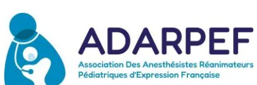

## **RECOMMANDATIONS FORMALISÉES D'EXPERTS**

De la Société Française d'Anesthésie Réanimation

En collaboration avec **L'Association des Anesthésistes – Réanimateurs Pédiatriques d'Expression Française**

# **Anesthésie locorégionale en chirurgie pédiatrique**

*Regional anesthesia in pediatric surgery*

**2026**

**Texte validé par Comité des Référentiels Cliniques de la SFAR le 17/03/2026, le Conseil d'Administration de la SFAR le 21/05/2026 et le Conseil d'Administration de l'ADARPEF le 22/05/2026.**

**Auteurs :** EVAIN Jean-Noël, DADURE Christophe, BOPP Claire, DELAPORTE CERCEAU Sonia, DELORT François, DE QUEIROZ Mathilde, DILWORTH Kelly, FRANÇOIS Clémence, FUSCO Nicolas, KERN Delphine, LAFFARGUE Anne, LEJUS Corinne, MAUPAIN Olivier, MICLO Matthieu,PARDESSUS Pierre, PICO Julien, RAHIL Ouahid, SMAIL Nadia, SOLA Chrystelle, VIGHETTI Arnaud, MICHELET Daphné

**Coordonnateurs d'experts : Jean-Noël Evain (SFAR), Christophe Dadure (ADARPEF)**

**Organisateurs : Daphné Michelet (SFAR)**

**Experts de l'ADARPEF :**

BOPP Claire, DELAPORTE CERCEAU Sonia, DE QUEIROZ Mathilde, DILWORTH Kelly, FRANÇOIS Clémence, LAFFARGUE Anne, PICO Julien, RAHIL Ouahid, SOLA Chrystelle, VIGHETTI Arnaud

**Experts de la SFAR :**

KERN Delphine, DELORT François, FUSCO Nicolas, LEJUS Corinne, MAUPAIN Olivier, MICLO Matthieu, PARDESSUS Pierre, SMAIL Nadia

**Groupes de Lecture :**

*Comité des Référentiels cliniques de la SFAR :*

Hélène Charbonneau (Présidente), Anais Caillard (Secrétaire), Isabelle Constant (Représentante du CA), Marie-Pierre Bonnet (Représentante du CA), Aurélien Bonnal, Thomas Botrel, Lucie Collet, Hugues de Courson, Matthieu Dumont, Max Gonzalez-Estevez, Medhi Hafiani, Pierre Huette, Florence Julien-Marsollier, Natacha Kapandji, Elise Langouet, Axel Maurice-Szamburski, Daphné Michelet, Maxime Nguyen, Stéphanie Ruiz,

*Conseil d'Administration de la SFAR :*

Marc Léone (Président) ; Karine Nouette-Gaulain (1ère vice-présidente), Isabelle Constant (2ème vice-présidente), Frédéric Le Saché (secrétaire générale), Sigismond Lasocki (secrétaire général adjoint), Evelyne Combettes (trésorière), Julien Amour (trésorier adjoint), Hélène Beloeil, Lucie Beylacq, Valérie Billard, Marie-Pierre Bonnet, Sébastien Campard, Vincent Collange, Marion Costecalde, Laurent Delaunay, Delphine Huet-Garrigue, Olivier Joannes-Boyau, Anne-Claire Lukaszewicz, Jane Muret, Olivier Rontes, Nadia Smail, Lionel Velly, Franck Verdonck, Anne Geffroy-Wernet.

*Conseil d'Administration de l'ADARPEF :*

Nada Sabourdin (Présidente), Fabrice Michel (vice-président) , Nathalie Bourdaud, Claire Bopp, Sonia Cerceau, Anne-Emmanuelle Colas, Christophe Dadure, Jean-Noël Evain, Clémence Hindy-François, Delphine Kern, Daphné Michelet, Matthieu Miclo, Léa Petry, Jean-Philippe Salaün, Nadège Salvi, Chrystelle Sola.**Liens d'intérêts des experts ADARPEF au cours des cinq années précédant la date de validation par le CA de l'ADARPEF.**

BOPP Claire : pas de lien d'intérêt en rapport avec la présente RFE

DADURE Christophe : pas de lien d'intérêt en rapport avec la présente RFE

DELAPOORTE CERCEAU Sonia : pas de lien d'intérêt en rapport avec la présente RFE

DE QUEIROZ Mathilde : pas de lien d'intérêt en rapport avec la présente RFE

DILWORTH Kelly : pas de lien d'intérêt en rapport avec la présente RFE

FRANÇOIS Clémence : pas de lien d'intérêt en rapport avec la présente RFE

LAFFARGUE Anne : pas de lien d'intérêt en rapport avec la présente RFE

PICO Julien : pas de lien d'intérêt en rapport avec la présente RFE

RAHIL Ouahid : pas de lien d'intérêt en rapport avec la présente RFE

SOLA Chrystelle : pas de lien d'intérêt en rapport avec la présente RFE

**Liens d'intérêts des experts SFAR au cours des cinq années précédant la date de validation par le CA de la SFAR.**

KERN Delphine : pas de lien d'intérêt en rapport avec la présente RFE

DELORT François : pas de lien d'intérêt en rapport avec la présente RFE

EVAIN Jean-Noël : pas de lien d'intérêt en rapport avec la présente RFE

FUSCO Nicolas : pas de lien d'intérêt en rapport avec la présente RFE

LEJUS Corinne : pas de lien d'intérêt en rapport avec la présente RFE

MAUPAIN Olivier : pas de lien d'intérêt en rapport avec la présente RFE

MICHELET Daphné : pas de lien d'intérêt en rapport avec la présente RFE

MICLO Matthieu : pas de lien d'intérêt en rapport avec la présente RFE

PARDESSUS Pierre : pas de lien d'intérêt en rapport avec la présente RFE

SMAIL Nadia : pas de lien d'intérêt en rapport avec la présente RFE

VIGHETTI Arnaud : pas de lien d'intérêt en rapport avec la présente RFE## RÉSUMÉ

**Objectif :** L'Association des Anesthésistes – Réanimateurs Pédiatriques d'Expression Française (ADARPEF) et la Société Française d'Anesthésie Réanimation (SFAR) ont collaboré pour proposer un référentiel portant sur l'anesthésie locorégionale en chirurgie pédiatrique.

**Conception :** Un groupe composé d'experts français de l'Association des Anesthésistes – Réanimateurs Pédiatriques d'Expression Française et d'Anesthésie Réanimation (SFAR) a été réuni. D'éventuels conflits d'intérêts ont été officiellement déclarés dès le début du processus d'élaboration des recommandations et ce dernier a été conduit indépendamment de tout financement de l'industrie. Les auteurs ont suivi la méthodologie GRADE (*Grading of Recommendations Assessment, Development and Evaluation*) pour évaluer le niveau de preuve de la littérature.

**Méthodes :** Cinq champs ont été définis : 1) Méthodes de localisation et médicaments utilisés; 2) Indications d'anesthésie locorégionale pour les chirurgies céphaliques; 3) Indications d'anesthésie locorégionale pour les chirurgies du thorax et du rachis; 4) Indications d'anesthésie locorégionale pour les chirurgies de l'abdomen et des organes génitaux externes ; 5) Indications d'anesthésie locorégionale pour les chirurgies des hanches. Pour chaque champ, l'objectif des recommandations était de répondre à un certain nombre de questions formulées par les experts selon le modèle PICO ("*Population, Intervention, Comparison, Outcome*"). A partir de ces questions, une recherche bibliographique extensive sur les 15 dernières années a été réalisée en utilisant des mots clés prédéfinis selon les recommandations PRISMA. La qualité des données a été analysée selon la méthode GRADE. Les recommandations ont été formulées selon la méthode GRADE, puis votées par tous les experts selon la méthode GRADE grid.

**Résultats :** Le travail de synthèse des experts et l'application de la méthode GRADE ont abouti à 34 recommandations concernant l'anesthésie locorégionale en chirurgie pédiatrique. Après 2 tours de votes et plusieurs amendements, un accord fort a été obtenu pour 34 recommandations. Parmi ces recommandations, 5 ont un niveau de preuve élevé (GRADE 1), 7 ont un niveau de preuve faible (GRADE 2), 17 sont des avis d'experts et 5 sont des absences de recommandation.

**Conclusion :** Un accord fort a été obtenu parmi les experts afin de fournir des recommandations encadrant l'anesthésie locorégionale chez l'enfant.

**Mots clés :** anesthésie pédiatrique, anesthésie locorégionale## **ABSTRACT**

**Objective :** The Association of French-Speaking Pediatric Anesthesiologists and Intensivists (ADARPEF) and the French Society of Anaesthesia and Intensive Care (SFAR) collaborated to develop a reference framework on Regional anesthesia in pediatric surgery.

**Design :** A panel of French experts from the Association of French-Speaking Pediatric Anesthesiologists and Intensivists and the French Society of Anaesthesia and Intensive Care (SFAR) was convened. Potential conflicts of interest were formally declared at the outset of the guideline development process, which was conducted independently of any industry funding. The authors followed the GRADE methodology (Grading of Recommendations Assessment, Development and Evaluation) to assess the level of evidence in the literature.

**Methods :** Five domains were defined: 1) Localization methods & medications used; 2) Indications for regional anesthesia (RA) for head surgery; 3) Indications for RA in thoracic and spinal surgery; 4) Indications for RA in abdominal and external genital organs surgery; 5) Indications for RA in hip surgery. For each domain, the aim of the recommendations was to address a set of questions formulated by the experts according to the PICO framework (Population, Intervention, Comparison, Outcome). Based on these questions, an extensive literature search covering the past 15 years was conducted using predefined keywords in accordance with PRISMA recommendations. Data quality was assessed using the GRADE methodology. Recommendations were formulated using the GRADE approach and subsequently voted on by all experts using the GRADE grid method.

**Results :** The experts' synthesis work and application of the GRADE method resulted in 34 recommendations concerning locoregional anesthesia in pediatric surgery. After two rounds of voting and several amendments, strong agreement was reached on all 34 recommendations. Of these recommendations, 5 have a high level of evidence (GRADE 1), 7 have a low level of evidence (GRADE 2). For 17 recommendations, the GRADE® methodology could not be fully applied, resulting in an expert opinion. 5 questions could not be answered due to a lack in the literature.

**Conclusions :** There was strong agreement among the experts to provide recommendations for the use of locoregional anesthesia in pediatric surgery

**Keywords :** pediatric anesthesia, locoregional anesthesia## INTRODUCTION

L'anesthésie locorégionale est un pilier majeur de l'analgésie multimodale per et postopératoire en anesthésie pédiatrique moderne. Ces recommandations formalisées d'experts, promues conjointement par la Société Française d'Anesthésie Réanimation (SFAR) et l'Association Des Anesthésistes-Réanimateurs Pédiatriques d'Expression Française (ADARPEF), ont pour objectif de compléter et de mettre à jour les recommandations formalisées d'experts sur l'anesthésie locorégionale en pédiatrie de 2010.

### Contexte et justification

#### État des lieux en 2010

Les précédentes recommandations formalisées d'experts sur l'anesthésie locorégionale pédiatrique ont été publiées en 2010 par la SFAR et l'ADARPEF [1], actualisant une conférence d'experts de 1997. Elles constituaient la première formalisation structurée de recommandations pratiques couvrant l'ensemble des dimensions de l'anesthésie locorégionale en anesthésie pédiatrique.

Ces recommandations formalisées d'experts abordaient en premier lieu le choix des anesthésiques locaux et leur adaptation pédiatrique. Les amino-amides lévogyres (ropivacaïne, lévobupivacaïne) étaient privilégiés en raison d'une toxicité systémique moindre et d'un bloc moteur plus rare. Chez l'enfant, et plus encore chez le nourrisson, le risque accru de toxicité systémique imposait l'utilisation de faibles concentrations, en privilégiant le volume injecté. Les principaux adjuvants disponibles à l'époque étaient la clonidine et les morphiniques. Les recommandations formalisées d'experts de 2010 détaillaient également les modalités techniques de réalisation de l'anesthésie locorégionale. L'échoguidage était déjà identifié comme une avancée majeure pour la sécurité et l'efficacité, bien que son usage restait encore émergent. Le matériel nécessaire (aiguilles, échographes, neurostimulateurs, cathéters, perfuseurs élastomériques) faisait l'objet de recommandations spécifiques. Un volet important était consacré à la prévention et à la prise en charge des complications, incluant les intoxications systémiques aux anesthésiques locaux, les complications traumatiques, hémorragiques ou infectieuses, ainsi que les erreurs humaines potentielles, avec des mesures de prévention et des conduites à tenir. Enfin, les recommandations formalisées d'experts de 2010 proposaient des principes de choix des techniques selon le terrain et la chirurgie, recommandant de privilégier les blocs périphériques dès qu'une alternative aux blocs centraux existait, car moins pourvoyeur de complications. Elles soulignaient l'intérêt des blocs continus pour les chirurgies majeures.

Malgré une revue systématique de la littérature, le niveau de preuve disponible ne permettait pas de formuler des recommandations selon la méthodologie GRADE. Les recommandations formalisées d'experts de 2010 reposaient donc essentiellement sur des consensus d'experts, fondés sur un niveau de preuve global faible ou très faible.

#### Évolutions depuis 2010

Depuis la publication en 2010 de la cohorte ADARPEF (Ecoffey et al. [2]), la sécurité de l'anesthésie locorégionale pédiatrique a été confirmée par de larges cohortes prospectives multicentriques, notamment PRAN [3] et APRICOT [4], totalisant plusieurs dizaines de milliersde procédures. Les complications sont globalement rares, et les complications graves restent exceptionnelles, de l'ordre de 1/10 000 procédures. Les recommandations conjointes ESRA–ASRA publiées en 2022 ont renforcé le cadre international de bonnes pratiques, en particulier pour la prévention et la gestion des complications [5]. Chez l'enfant, la réalisation des blocs sous anesthésie générale apparaît sûre. Les données de la cohorte PRAN suggèrent même un risque accru lorsque l'anesthésie locorégionale est réalisée chez un enfant vigile ou simplement sédaté (OR ajusté 2,93 ; IC 95 % 1,34–5,52) [3]. Les blocs périphériques et centraux présentent un profil de sécurité globalement comparable, mais avec des différences qualitatives importantes. Les blocs périphériques sont principalement associés à des complications bénignes, le plus souvent techniques ou locales, sans conséquence durable. À l'inverse, les blocs centraux exposent à des complications plus rares mais potentiellement graves, telles que les hématomes ou abcès périduraux, ou des complications respiratoires. Ainsi, en pratique, les blocs périphériques sont souvent privilégiés pour leur profil de sécurité plus favorable. Il est important dans tous les cas d'évaluer le rapport bénéfice-risque avant la réalisation d'une anesthésie locorégionale.

Les pratiques ont profondément évolué, avec l'adoption large de l'échoguidage comme standard pour la majorité des blocs périphériques. Cette diffusion a accompagné l'émergence de nouveaux blocs interfaciaux, perçus comme plus accessibles et potentiellement moins à risque que les blocs périnerveux classiques, bien que leurs mécanismes et leur reproductibilité restent discutés [6]. En parallèle, l'utilisation de la neurostimulation a reculé, sans que la littérature récente en anesthésie locorégionale pédiatrique ne vienne en renouveler l'intérêt ni en conforter la place. La transition recommandée en 2010 vers une réduction des blocs centraux au profit des blocs périphériques s'est ainsi largement confirmée.

La question des adjuvants est devenue centrale face à la discordance entre la durée d'action des anesthésiques locaux (4–12 heures pour la ropivacaïne et la lévobupivacaïne) et celle de la douleur postopératoire. Les alpha-2-agonistes (clonidine, dexmédétomidine) par voie locorégionale et la dexaméthasone par voie intraveineuse ont été les plus étudiés, avec l'objectif de prolonger l'analgésie et de réduire le recours aux morphiniques, tout en évitant le recours à une anesthésie locorégionale continue. La mise en place d'un cathéter d'analgésie locorégionale continue reste possible si une analgésie supérieure à 24h est souhaitée.

Enfin, la littérature s'est considérablement enrichie, notamment en essais randomisés, revues systématiques et méta-analyses. Toutefois, l'hétérogénéité méthodologique de ces travaux impose une interprétation prudente, soulignant la nécessité d'une actualisation structurée des recommandations.

## **Objectifs**

L'objectif général de ces recommandations formalisées d'experts est de proposer un cadre actualisé, pragmatique et opérationnel pour les modalités et les indications de l'anesthésie locorégionale en anesthésie pédiatrique. Elle s'appuie sur les données disponibles de la littérature, afin d'harmoniser les pratiques, de sécuriser les indications et de contribuer à une prise en charge équitable sur l'ensemble du territoire. Cette actualisation vise également à constituer un outil d'aide à la décision, intégrant les enjeux de formation et de diffusion des bonnes pratiques.Les objectifs spécifiques sont d'évaluer le niveau de preuve concernant l'intérêt de l'échoguidage et des principaux adjuvants (champ 1), de préciser la place de l'anesthésie locorégionale selon les grands types de chirurgie — céphalique, thoracique et rachidienne, abdominale et des organes génitaux externes, et de la hanche (champs 2 à 5) — et de proposer des repères pratiques pour le choix et la mise en œuvre des techniques. Ces repères reposent notamment sur des fiches pratiques dédiées aux aspects techniques, à la prévention et à la prise en charge de l'intoxication systémique aux AL, ainsi qu'au choix raisonné de l'anesthésie locorégionale selon la chirurgie. Cette mise à jour s'adresse à l'ensemble des anesthésistes-réanimateurs, quelle que soit l'intensité de leur activité pédiatrique.

## **Portée et perspectives**

Ces recommandations formalisées d'experts portent exclusivement sur les évolutions survenues depuis 2010, en particulier concernant les bénéfices de l'échoguidage et des adjuvants (champ 1) et la place de l'anesthésie locorégionale selon le type de chirurgie (champs 2 à 5). Elles n'abordent pas les éléments dont les recommandations n'ont pas évolué notamment le choix et les doses des anesthésiques locaux et du matériel. Un rappel concernant la prévention et la gestion de l'intoxication systémique aux anesthésiques locaux est fait dans la fiche pratique 1. Une aide à la décision en matière de choix de la technique d'anesthésie locorégionale en fonction de la chirurgie est proposée dans la fiche pratique 2. Cette fiche constitue un avis d'expert, qui reprend de façon synthétique les données présentées dans les recommandations et leurs argumentaires. L'anesthésie locorégionale des membres — à l'exception de la chirurgie de hanche —, l'anesthésie locorégionale en chirurgie cardiaque et l'anesthésie locorégionale dans le traitement de la douleur chronique ne sont pas traitées, la littérature pédiatrique étant limitée dans ces domaines. En l'absence de données nouvelles, les recommandations de 2010 demeurent applicables.

La population étudiée est celle des enfants de 0 à 15 ans bénéficiant d'une chirurgie, avec une extension à 18 ans pour les chirurgies réalisées fréquemment chez les adolescents (champ 3). L'efficacité analgésique périopératoire constitue le critère de jugement principal de l'analyse de la littérature pédiatrique selon la méthode GRADE, incluant la consommation opioïde per et postopératoire, le délai avant recours à un antalgique de secours, ou à défaut les scores de douleur.

## **Définitions**

L'**anesthésie locorégionale** est définie comme l'administration d'un anesthésique local à proximité d'une structure nerveuse, ou au sein d'un fascia qui en contient, afin d'interrompre de façon réversible la transmission nociceptive d'un territoire donné. Elle se distingue de l'infiltration chirurgicale, qui correspond à une injection au site opératoire sans ciblage intentionnel nerveux.

L'anesthésie locorégionale est dite **centrale** lorsque l'anesthésique local est administré à proximité de la moelle spinale ou des racines nerveuses. Elle inclut l'anesthésie péridurale par voie postérieure (thoracique ou lombaire), l'anesthésie péridurale par voie caudale, et la rachianesthésie. Bien qu'elle fasse l'objet d'une recommandation, l'injection intrathécale de morphine n'est pas considérée comme une anesthésie locorégionale dans ces recommandations formalisées d'experts.L'anesthésie locorégionale est dite **périphérique** lorsque l'anesthésique local est administré à proximité d'une structure nerveuse périphérique (blocs plexiques et tronculaires) ou d'un espace anatomique qui en contient (bloc interfaciaux).

Les **anesthésiques locaux de longue durée d'action** sont ceux dont la durée d'effet analgésique est généralement supérieure à 4 heures, pouvant aller jusqu'à 10–12 heures selon la molécule, la dose et le site d'injection. Les anesthésiques locaux de longue durée d'action sont la ropivacaïne et la lévobupivacaïne.

Dans ces recommandations formalisées d'experts, la chirurgie abdominale a été divisée en deux catégories : 1/ la **chirurgie abdominale profonde**, qui inclut les gestes intra-abdominaux (péritonéaux ou rétropéritonéaux) réalisés par voie invasive ou mini-invasive; 2/ la **chirurgie abdominale pariétale**, qui inclut les chirurgies herniaires et du cordon spermatique.

La **douleur postopératoire aiguë** est une douleur liée directement à l'acte chirurgical, survenant immédiatement après l'intervention (souvent maximale dans les 24-48 premières heures) et évoluant dans le temps de la cicatrisation tissulaire. La **douleur postopératoire chronique** est une douleur qui persiste au-delà de 3 mois après une intervention chirurgicale, après exclusion d'autres causes (infection, récidive, etc.), et qui est imputable à la chirurgie.

## MÉTHODE

### Organisation générale

Ces recommandations sont le résultat du travail d'un groupe d'experts réunis par la SFAR en collaboration avec l'ADARPEF. Chaque expert a rempli une déclaration de conflits d'intérêts avant de débuter le travail d'analyse. Dans un premier temps, le comité d'organisation a défini les objectifs de ces recommandations et la méthodologie utilisée. Les différents champs d'application de ces recommandations formalisées d'experts et les questions à traiter ont ensuite été définis par le comité d'organisation, puis modifiés et validés par les experts. Les questions ont été formulées selon un format PICO (*Population, Intervention, Comparison, Outcome*) après une première réunion du groupe d'experts. La population « P » pour l'ensemble des questions est définie comme les enfants opérés de 0 à 15 ans, incluant les nouveau-nés avec un élargissement aux 15-18 ans pour les scolioses et les thoracoplasties (champ 3).

### Champ des recommandations

Les recommandations formulées concernent 5 champs :

- - Champ 1 : Méthodes de localisation et médicaments utilisés ;
- - Champ 2 : Indications d'anesthésie locorégionale pour les chirurgies céphaliques ;
- - Champ 3 : Indications d'anesthésie locorégionale pour les chirurgies du thorax et du rachis ;
- - Champ 4 : Indications d'anesthésie locorégionale pour les chirurgies de l'abdomen et des organes génitaux externes ;
- - Champ 5 : Indications d'anesthésie locorégionale pour les chirurgies de la hanche.Une recherche bibliographique extensive a été réalisée à partir de plusieurs bases de données (MEDLINE, Tripdatabase ([www.tripdatabase.com](http://www.tripdatabase.com)), Prospero ([www.crd.york.ac.uk/PROSPERO](http://www.crd.york.ac.uk/PROSPERO)) et [www.clinicaltrials.gov](http://www.clinicaltrials.gov), EMBASE, SCOPUS, Cochrane ), par 20 experts pour chaque champ d'application, selon la méthodologie Preferred Reporting Items for Systematic Reviews and Meta-Analysis (PRISMA pour les revues systématiques). Les mots clés utilisés pour la recherche bibliographique ont été :

- - Tous les champs : analgésie locorégionale, blocs nerveux périphériques (tous les types de bloc), blocs centraux (périturale, rachianesthésie, caudale), douleur postopératoire, analgésie, enfants, nourrisson, nouveau-né, pédiatrie.
- - Champ 1 : échographie, bloc périphérique, bloc central, caudale, périurale, rachianesthésie, repères anatomiques, neurostimulation, infiltration, adjuvants, alpha2 agonistes, clonidine, dexaméthomidine, dexaméthasone, efficacité, sécurité.
- - Champ 2 : fente labiale et/ou palatine, craniotomie, infiltration.
- - Champ 3 : thoracotomie, chirurgie thoracique, chirurgie thoracique mini-invasive, pectus excavatum, scoliose, arthrodrèse vertébrale, adolescent, morphine intrathécale.
- - Champ 4 : chirurgie abdominale, laparotomie, laparoscopie, chirurgie pariétale, chirurgie des organes génitaux externes.
- - Champ 5 : chirurgie de hanche, chirurgie du bassin, chirurgie du fémur, épiphysiolyse.

Ont été inclus dans l'analyse :

1. 1) les méta-analyses, essais contrôlés randomisés, cohortes prospectives de plus de 5000 patients (champ 1) ;
2. 2) conduits chez les patients opérés de 0 à 15 ans (ou 18 ans pour le champ 3)
3. 3) traitant de l'anesthésie locorégionale en chirurgie pédiatrique ;
4. 4) publiés en langue anglaise ou française.

La méthode de travail utilisée pour l'élaboration de ces recommandations est la méthode GRADE® (*Grade of Recommendation Assessment, Development and Evaluation*). Cette méthode permet, après une analyse qualitative et quantitative de la littérature, de déterminer séparément la qualité des preuves, et donc de donner une estimation de la confiance que l'on peut avoir de l'analyse quantitative et un niveau de recommandation. Un niveau de preuve a été défini pour chacune des références bibliographiques citées en fonction du type de l'étude. Ce niveau de preuve pouvait être réévalué en tenant compte de la qualité méthodologique de l'étude, de la cohérence des résultats entre les différentes études, du caractère direct ou non des preuves, de l'analyse de coût et de l'importance du bénéfice.

Les critères de jugement ont été définis en amont de la façon suivante :

● critères de jugement majeurs :

- - **Efficacité analgésique périopératoire** (importance 7), dont consommation analgésique peropératoire (6), délai avant recours antalgique postopératoire (7), consommation d'opioïdes postopératoire (7), scores de douleur (5)
- - **Sécurité**, incluant les complications *majeures* (importance 6 : intoxication aux anesthésiques locaux, déficit neurologique permanent, abcès ou hématomeprofond) et *mineures* (importance 5 : échec technique, ponction vasculaire, brèche dure mérienne, infection superficielle) (*questions 1.1*).

- - **Complications postopératoires** (importance 6) incluant spécifiquement les événements respiratoires susceptibles de survenir chez l'ancien prématuré avant l'âge de 60 semaines post conceptionnelles, notamment après une anesthésie générale (*question 4.2.2*).

● critères de jugement secondaires :

- - **Survenue de douleurs chroniques** (importance 5) (*questions 3.1 et 3.3*)

Les recommandations ont ensuite été formulées en utilisant la terminologie des recommandations formalisées d'experts de la SFAR :

- - Recommandation forte pour/contre l'intervention (Grade 1), qualité des preuves élevée :
  - ○ "Il est recommandé de/de ne pas ...", avec la mention "recommandation forte".
- - Recommandation faible pour/contre l'intervention (Grade 2), qualité des preuves modérée :
  - ○ "Il est recommandé de/de ne pas ...", avec la mention "recommandation faible".
- - Avis d'experts : La proposition repose sur des études de moindre qualité méthodologique ou sur des preuves indirectes (autre population par exemple).
  - ○ "les experts suggèrent...".
- - Absence de recommandation. Devant l'absence de donnée disponible dans la littérature, les experts ne sont pas en mesure d'émettre des recommandations. Il est nécessaire que des essais cliniques randomisés de qualité soient réalisés pour répondre clairement à cette question ». Une "absence de recommandation" doit être différenciée d'une recommandation négative de type "Il n'est pas recommandé de faire". Dans ce cas, la littérature scientifique disponible est suffisamment robuste pour conduire à une recommandation négative.

Les propositions de recommandations ont été présentées et discutées une à une. Le but n'était pas d'aboutir obligatoirement à un avis unique et convergent des experts sur l'ensemble des propositions, mais de dégager les points de concordance et les points de divergence ou d'indécision. Chaque recommandation a alors été évaluée par chacun des experts et soumise à une cotation individuelle à l'aide d'une échelle allant de 1 (désaccord complet) à 9 (accord complet). La force de la recommandation est déterminée en fonction de cinq facteurs clés et validée par les experts après un vote, en utilisant la méthode GRADE Grid :

- ● Estimation de l'effet : plus il est important, plus probablement la recommandation sera forte ;
- ● Le niveau global de preuve : plus il est élevé, plus probablement la recommandation sera forte ;
- ● La balance entre effets désirables et indésirables : plus celle-ci est favorable, plus probablement la recommandation sera forte ;- ● Les valeurs : en cas d'incertitude de l'estimateur ou de grande variabilité de son écart-type, la force de la recommandation sera probablement plus faible ;
- ● La préférence : doivent être obtenues au mieux auprès des personnes concernées (patient, médecin, décisionnaire) ;
- ● Coûts : plus les coûts ou l'utilisation des ressources sont élevés, plus probablement la recommandation sera faible.

Pour valider une recommandation, au moins 70 % des experts devaient exprimer une opinion qui allait globalement dans la même direction, tandis que moins de 20 % d'entre eux devaient exprimer une opinion contraire. En l'absence de validation d'une ou de plusieurs recommandation(s), celle(s)-ci étaient reformulée(s) et, de nouveau, soumise(s) à cotation dans l'objectif d'aboutir à un accord fort. Si les recommandations n'avaient pas obtenu un nombre suffisant d'opinions favorables et/ou obtenu un nombre trop élevé d'opinions défavorables, elles n'étaient pas éditées. Si une courte majorité des experts étaient d'accord avec la recommandation et plusieurs experts n'avaient pas d'opinion ou y étaient opposés, les recommandations obtenaient un accord faible. Enfin, si la grande majorité des experts était d'accord avec la recommandation et une minorité des experts n'avait pas d'opinion ou y était opposée, les recommandations obtenaient un accord fort. Les avis d'experts, exprimant par définition un consensus entre les experts en l'absence de littérature suffisamment forte pour grader ces recommandations, devaient nécessairement obtenir un accord fort (i.e. au moins 70% d'opinions allant dans la même direction).

## RÉSULTATS

### Champs des recommandations

Les experts ont consensuellement décidé lors de la première réunion d'organisation de ces recommandations formalisées d'experts, de traiter 12 questions réparties en 5 champs.

- - Champ 1 : Méthodes de localisation et médicaments utilisés
  - ○ Question 1.1 : L'utilisation de l'échographie améliore-t-elle l'efficacité et la sécurité de l'anesthésie locorégionale chez l'enfant ?
  - ○ Question 1.2 : Les adjuvants augmentent-ils l'efficacité de l'anesthésie locorégionale chez l'enfant ?
- - Champ 2 : Indications d'anesthésie locorégionale pour les chirurgies céphaliques
  - ○ Question 2.1 : L'anesthésie locorégionale améliore-t-elle l'analgésie chez l'enfant ayant une chirurgie de fente labiale et/ou palatine ?
  - ○ Question 2.2 : L'anesthésie locorégionale améliore-t-elle l'analgésie chez l'enfant ayant une craniotomie ?
- - Champ 3 : Indications d'anesthésie locorégionale pour les chirurgies du thorax et du rachis
  - ○ Question 3.1 : L'anesthésie locorégionale améliore-t-elle l'analgésie et réduit-elle la survenue de douleur postopératoire chronique chez l'enfant ayant une chirurgie thoracique ?
  - ○ Question 3.2 : La morphine intrathécale améliore-t-elle l'analgésie périopératoire chez l'enfant opéré d'une arthrodyse vertébrale postérieure ?- ○ Question 3.3 : L'anesthésie locorégionale améliore-t-elle l'analgésie et réduit-elle la survenue de douleur postopératoire chronique chez l'enfant ayant une arthrodrèse vertébrale postérieure ?
- - Champ 4 : Indications d'anesthésie locorégionale pour les chirurgies de l'abdomen et des organes génitaux externes.
  - ○ Question 4.1 : L'anesthésie locorégionale améliore-t-elle l'analgésie chez l'enfant ayant une chirurgie abdominale profonde ?
  - ○ Question 4.2.1 : L'anesthésie locorégionale améliore-t-elle l'analgésie chez un enfant ayant une chirurgie abdominale pariétale ?
  - ○ Question 4.2.2 : L'anesthésie locorégionale réduit-elle le risque de complications chez l'ancien prématuré ayant une chirurgie de hernie inguinale avant l'âge de 60 semaines post conceptionnelles ?
  - ○ Question 4.3 : L'anesthésie locorégionale améliore-t-elle l'analgésie chez le garçon ayant une chirurgie des organes génitaux externes ?
- - Champ 5 : Indications d'anesthésie locorégionale pour les chirurgies des hanches
  - ○ Question 5.1 : L'anesthésie locorégionale améliore-t-elle l'analgésie chez un enfant ayant une chirurgie majeure de hanche ?

### Synthèse des résultats

Le travail de synthèse des experts et l'application de la méthode GRADE ont abouti à 34 recommandations. Après 3 tours de vote et quelques amendements, un accord fort a été obtenu pour les 34 recommandations. Parmi ces recommandations, 5 ont un niveau de preuve élevé (GRADE 1), 7 ont un niveau de preuve modéré à faible (GRADE 2) et 17 sont des avis d'experts et 5 des absences de recommandations.

La SFAR et l'ADARPEF incitent tous les anesthésistes réanimateurs à se conformer à ces recommandations formalisées d'experts pour optimiser la qualité des soins dispensés aux patients. Cependant, chaque praticien doit exercer son propre jugement dans l'application de ces recommandations, en prenant en compte son expertise et les spécificités de son établissement, pour déterminer la méthode d'intervention la mieux adaptée à l'état du patient dont il a la charge.

### TABLEAU DE SYNTHÈSE

<table border="1">
<tr>
<td colspan="2"><b>P du PICO : Patients</b></td>
</tr>
<tr>
<td></td>
<td>Enfants opérés de 0 à 15 ans, incluant les nouveau-nés avec un élargissement aux 15-18 ans pour les scolioses et les thoracoplasties.</td>
</tr>
<tr>
<td colspan="2"><b>O du PICO : Outcomes / Critères de jugement</b></td>
</tr>
<tr>
<td>-</td>
<td>Critères de jugement cruciaux ou majeurs</td>
</tr>
</table><table border="1">
<tr>
<td></td>
<td>Importance 7</td>
<td><u>Efficacité</u> : Efficacité analgésique périopératoire Délai avant recours antalgique postopératoire Consommation d'opioïdes postopératoire</td>
</tr>
<tr>
<td></td>
<td>Importance 6</td>
<td><u>Efficacité</u> : consommation analgésique peropératoire <u>Sécurité</u> : intoxication aux anesthésiques locaux, déficit neurologique permanent, abcès ou hématome profond <u>Complications postopératoires</u> : complications respiratoires chez l'ancien prématuré avant l'âge de 60 semaines post conceptionnelles</td>
</tr>
<tr>
<td colspan="3">- Critères de jugement importants mais non cruciaux</td>
</tr>
<tr>
<td></td>
<td>Importance 5</td>
<td>Efficacité : scores de douleur Sécurité : échecs techniques, infection superficielle, brèche dure mérienne Survenue de douleurs chroniques</td>
</tr>
<tr>
<td colspan="3"><b>Mots-clés</b></td>
</tr>
<tr>
<td></td>
<td colspan="2">Analgésie locorégionale, blocs nerveux périphériques (tous les types de bloc), blocs centraux (péridurale, rachianesthésie, caudale), douleur postopératoire, analgésie, enfants, nourrisson, nouveau-né, pédiatrie, échographie, bloc périphérique, bloc central, caudale, péridurale, rachianesthésie, repères anatomiques, neurostimulation, infiltration, adjuvants, alpha2 agonistes, clonidine, dexamédétomidine, dexaméthasone, efficacité, sécurité, fente labiale et/ou palatine, craniotomie, infiltration, thoracotomie, chirurgie thoracique, chirurgie thoracique mini-invasive, pectus excavatum, scoliose, arthrodrèse vertébrale, adolescent, morphine intrathécale, chirurgie abdominale, laparotomie, laparoscopie, chirurgie pariétale, chirurgie des organes génitaux externes, chirurgie de hanche, chirurgie du bassin, chirurgie du fémur, épiphysiolyse.</td>
</tr>
<tr>
<td colspan="3"><b>Critères de restriction de la recherche bibliographique</b></td>
</tr>
<tr>
<td></td>
<td colspan="2">
<ul style="list-style-type: none;">
<li>- Méta-analyses,</li>
<li>- Essais contrôlés randomisés,</li>
<li>- Cohortes prospectives de plus de 5000 patients (champ 1)</li>
</ul>
</td>
</tr>
<tr>
<td></td>
<td colspan="2">Années de publication comprise entre 2010 et 2025</td>
</tr>
<tr>
<td></td>
<td colspan="2">Langue anglaise, française.</td>
</tr>
</table>## RÉFÉRENCES

- [1] ADARPEF, SFAR. RFE Anesthésie loco-régionale en pédiatrie. 2010.
- [2] Ecoffey C, Lacroix F, Giaufre E, Orliaguet G, Courrèges P, ADARPEF. Epidemiology and morbidity of regional anesthesia in children: a follow-up one-year prospective survey of the French-Language Society of Paediatric Anaesthesiologists. *Paediatr Anaesth* 2010;20:1061–9. 10.1111/j.1460-9592.2010.03448.x.
- [3] Walker BJ, Long JB, Sathyamoorthy M, Birstler J, Wolf C, Bosenberg AT, et al. Complications in Pediatric Regional Anesthesia: An Analysis of More than 100,000 Blocks from the Pediatric Regional Anesthesia Network. *Anesthesiology* 2018;129:721–32. 10.1097/ALN.0000000000002372.
- [4] Dadure C, Veyckemans F, Bringuier S, Habre W. Epidemiology of regional anesthesia in children: Lessons learned from the European Multi-Institutional Study APRICOT. *Paediatr Anaesth* 2019;29:1128–35. 10.1111/pan.13741.
- [5] Ecoffey C, Bosenberg A, Lönnqvist PA, Suresh S, Delbos A, Ivani G. Practice advisory on the prevention and management of complications of pediatric regional anesthesia. *Journal of Clinical Anesthesia* 2022;79:110725. 10.1016/j.jclinane.2022.110725.
- [6] Lönnqvist P. Fascial plane blocks in children—Scientifically supported or not? *Pediatric Anesthesia* 2024;34:13–8. 10.1111/pan.14752.## Champ 1 : Méthodes de localisation et médicaments utilisés

**Question** Chez l'enfant recevant une anesthésie locorégionale (P), l'utilisation de l'échographie (I), comparée à l'absence d'échographie (C), améliore-t-elle l'efficacité analgésique (O) et la sécurité de l'anesthésie locorégionale (O) ?

*Experts : François DELORT (SFAR, Toulouse), Ouahid RAHIL (ADARPEF, Privas)*

**R1.1.1 – Chez l'enfant recevant une anesthésie locorégionale périphérique, il est recommandé d'utiliser l'échoguidage pour améliorer l'efficacité analgésique de l'anesthésie locorégionale.**

### **GRADE 1 (recommandation forte)**

**Argumentaire :** Une revue systématique de 2016 et une méta-analyse de 2019 ont confirmé chez l'enfant que l'utilisation de l'échoguidage en anesthésie locorégionale périphérique, comparé aux repères anatomiques ou à la neurostimulation, est associée à une réduction de la consommation périopératoire d'antalgiques et de morphiniques, à un allongement du délai avant la première demande d'analgésie, ainsi qu'à une diminution du taux d'échec [1,2].

L'anesthésie locorégionale échoguidée, comparée aux techniques basées sur des repères anatomiques mais aussi à l'infiltration, améliore significativement le taux de succès du bloc nerveux. Cet avantage est particulièrement marqué pour les blocs de la paroi abdominale, notamment les blocs ilio-inguinal/ilio-hypogastrique, le bloc du plan abdominal transverse et le bloc de la gaine des muscles grands droits de l'abdomen [3–11]. Deux essais randomisés ont montré que la réalisation du bloc ilio-inguinal et ilio-hypogastrique sous échoguidage améliore significativement son efficacité par rapport à la technique fondée uniquement sur les repères anatomiques, notamment dans le contexte de la chirurgie inguinale [12,13]. L'apport de l'échoguidage dans le bloc pénien est moins clair. Certaines études n'ont pas retrouvé de différence d'efficacité entre blocs pénins échoguidés et non échoguidés [14] alors que d'autres ont montré une diminution des antalgiques de secours postopératoires ou une durée de prise d'un antalgique postopératoire retardée avec l'aide de l'échoguidage [15,16]. Bien que les données disponibles concernant les blocs tronculaires et plexiques soient limitées et proviennent majoritairement d'études anciennes, elles sont aussi en faveur de l'échographie. Les études incluses dans la revue de Lam et al. retrouvaient un taux de réussite significativement plus élevé lorsque le bloc infra-claviculaire était réalisé sous échoguidage plutôt que sous neurostimulation. De même le bloc axillaire bénéficiait d'une tendance favorable à l'utilisation de l'échoguidage [1]. Des résultats similaires ont été rapportés pour les blocs échoguidés du nerf sciatique et du nerf fémoral comparé à la neurostimulation [17] ou encore du nerf médian comparé à la technique fondée sur des repères anatomiques [18].

En termes de sécurité, un audit portant sur 104 393 blocs réalisés chez 91 701 patients dans 20 établissements, à partir de la base de données *Pediatric Regional Anesthesia Network*, a mis en évidence une incidence globale de toxicité systémique des anesthésiques locaux (arrêt cardiorespiratoire et crises convulsives) de 0,76 pour 10 000 (IC 95 % : 0,3–1,6 pour 10 000), sans différence significative selon le type de bloc (IC de la différence : -1,2 à 1,1 pour 10 000 ;  $\chi^2$  à 1 ddl ;  $p = 0,95$ ). L'utilisation de l'échoguidage ne modifiait pas le risque de toxicité systémique (IC de la différence : -1,6 à 1,0 pour 10 000 ;  $\chi^2$  à 1 ddl ;  $p = 0,59$ ) [19]. La rareté des complications liées à la réalisation d'une anesthésie locorégionale périphérique rend difficile la mise en évidence d'une supériorité de l'échoguidage en termes de sécurité.

### **Références :**

- [1] Lam DKM, Corry GN, Tsui BCH. Evidence for the Use of Ultrasound Imaging in Pediatric Regional Anesthesia: A Systematic Review. *Reg Anesth Pain Med* 2016;41:229–41. 10.1097/AAP.0000000000000208.
- [2] Guay J, Suresh S, Kopp S. The use of ultrasound guidance for perioperative neuraxial and peripheral nerve blocks in children. *Cochrane Database Syst Rev* 2019;2:CD011436. 10.1002/14651858.CD011436.pub3.[3] Litz CN, Farach SM, Fernandez AM, Elliott R, Dolan J, Patel N, et al. Percutaneous ultrasound-guided vs. intraoperative rectus sheath block for pediatric umbilical hernia repair: A randomized clinical trial. *J Pediatr Surg* 2017;52:901–6. 10.1016/j.jpedsurg.2017.03.007.

[4] Çiçekçi F, Sargın M, Sekmenli T, Uluer MS, Kara İ, Çelik J. The comparison of ultrasound-guided ilioinguinal/iliohypogastric nerve block and pre-incision wound infiltration for pediatric inguinal hernia repair: A prospective randomized clinical study. *Agri* 2023;35:76–82. 10.14744/agri.2022.66587.

[5] Sahin L, Sahin M, Gul R, Saricicek V, Isikay N. Ultrasound-guided transversus abdominis plane block in children: a randomised comparison with wound infiltration. *Eur J Anaesthesiol* 2013;30:409–14. 10.1097/EJA.0b013e32835d2fcb.

[6] Dingeman RS, Barus LM, Chung HK, Clendenin DJ, Lee CS, Tracy S, et al. Ultrasonography-guided bilateral rectus sheath block vs local anesthetic infiltration after pediatric umbilical hernia repair: a prospective randomized clinical trial. *JAMA Surg* 2013;148:707–13. 10.1001/jamasurg.2013.1442.

[7] Kendigelen P, Tutuncu AC, Erbabacan E, Ekici B, Köksal G, Altındas F, et al. Ultrasound-assisted transversus abdominis plane block vs wound infiltration in pediatric patient with inguinal hernia: randomized controlled trial. *J Clin Anesth* 2016;30:9–14. 10.1016/j.jclinane.2015.12.027.

[8] Grosse B, Eberbach S, Pinnschmidt HO, Vincent D, Schmidt-Niemann M, Reinshagen K. Ultrasound-guided ilioinguinal-iliohypogastric block (ILHGB) or perifocal wound infiltration (PWI) in children: a prospective randomized comparison of analgesia quality, a pilot study. *BMC Anesthesiol* 2020;20:256. 10.1186/s12871-020-01170-z.

[9] Gurnaney HG, Maxwell LG, Kraemer FW, Goebel T, Nance ML, Ganesh A. Prospective randomized observer-blinded study comparing the analgesic efficacy of ultrasound-guided rectus sheath block and local anaesthetic infiltration for umbilical hernia repair. *Br J Anaesth* 2011;107:790–5. 10.1093/bja/aer263.

[10] Flack SH, Martin LD, Walker BJ, Bosenberg AT, Helmers LD, Goldin AB, et al. Ultrasound-guided rectus sheath block or wound infiltration in children: a randomized blinded study of analgesia and bupivacaine absorption. *Paediatr Anaesth* 2014;24:968–73. 10.1111/pan.12438.

[11] Uchinami Y, Sakuraya F, Tanaka N, Hoshino K, Mikami E, Ishikawa T, et al. Comparison of the analgesic efficacy of ultrasound-guided rectus sheath block and local anesthetic infiltration for laparoscopic percutaneous extraperitoneal closure in children. *Paediatr Anaesth* 2017;27:516–23. 10.1111/pan.13085.

[12] Yang L, Xu Y, Wang Z, Zhang W. Application of Ultrasound-Guided Ilioinguinal/Iliohypogastric Nerve Block in Pediatric Same-Day Surgery. *Indian J Surg* 2015;77:512–6. 10.1007/s12262-015-1301-0.

[13] Nan Y, Zhou J, Ma Q, Li T, Lian Q, Li J. [Application of ultrasound guidance for ilioinguinal or iliohypogastric nerve block in pediatric inguinal surgery]. *Zhonghua Yi Xue Za Zhi* 2012;92:873–7.

[14] Teunkens A, Van de Velde M, Vermeulen K, Van Loon P, Bogaert G, Fieuws S, et al. Dorsal penile nerve block for circumcision in pediatric patients: A prospective, observer-blinded, randomized controlled clinical trial for the comparison of ultrasound-guided vs landmark technique. *Paediatr Anaesth* 2018;28:703–9. 10.1111/pan.13429.

[15] O’Sullivan MJ, Mislovic B, Alexander E. Dorsal penile nerve block for male pediatric circumcision--randomized comparison of ultrasound-guided vs anatomical landmark technique. *Paediatr Anaesth* 2011;21:1214–8. 10.1111/j.1460-9592.2011.03722.x.

[16] Faraoni D, Gilbeau A, Lingier P, Barvais L, Engelman E, Hennart D. Does ultrasound guidance improve the efficacy of dorsal penile nerve block in children? *Paediatr Anaesth* 2010;20:931–6. 10.1111/j.1460-9592.2010.03405.x.

[17] Ponde V, Desai AP, Shah D. Comparison of success rate of ultrasound-guided sciatic and femoral nerve block and neurostimulation in children with arthrogyposis multiplex congenita: a randomized clinical trial. *Paediatr Anaesth* 2013;23:74–8. 10.1111/pan.12022.

[18] Liu W, Liu J, Tan X, Wang S. Ultrasound-guided lower forearm median nerve block in open surgery for trigger thumb in 1- to 3-year-old children: A randomized trial. *Pediatric Anesthesia* 2018;28:134–41. 10.1111/pan.13296.

[19] Walker BJ, Long JB, Sathyamoorthy M, Birstler J, Wolf C, Bosenberg AT, et al. Complications in Pediatric Regional Anesthesia: An Analysis of More than 100,000 Blocks from the Pediatric Regional Anesthesia Network. *Anesthesiology* 2018;129:721–32. 10.1097/ALN.0000000000002372.**R1.1.2 – Chez l’enfant recevant une anesthésie péridurale par voie caudale, il est recommandé d’utiliser l’échoguidage pour améliorer la sécurité du geste (faciliter sa réalisation et réduire ses complications)**

**GRADE 2 (recommandation faible)**

**ABSENCE DE RECOMMANDATION** - Les données de la littérature sont insuffisantes pour émettre une recommandation concernant l’utilisation de l’échographie pour réaliser une anesthésie péridurale par voie lombaire ou thoracique, ou une rachianesthésie chez l’enfant.

**ABSENCE DE RECOMMANDATION**

**Argumentaire :** Chez l’enfant, l’anesthésie caudale est la technique la plus fréquemment étudiée dans le cadre des anesthésies locorégionales centrales. Deux études ont rapporté un taux de réussite à la première ponction significativement plus élevé dans les groupes bénéficiant de l’échoguidage comparativement aux groupes sans échoguidage [1-2]. Néanmoins, les données disponibles ne mettent pas en évidence d’amélioration significative du taux de succès du bloc avec l’utilisation de l’échographie par rapport aux techniques réalisées selon les repères anatomiques [3-6]. L’utilisation de l’échographie permet cependant de réduire le taux de complications mineures (ponctions vasculaires et injections sous-cutanées) lors de la réalisation d’une anesthésie caudale [1,2]. Une méta-analyse de 2022 a confirmé cette diminution significative du risque de ponction vasculaire et d’injection sous-cutanée lorsque l’échographie est utilisée pour guider la procédure [6]. Cette réduction du risque pourrait s’expliquer par la réduction du nombre de ponctions et par la limitation des redirections d’aiguille rendue possible par l’imagerie échographique.

Concernant l’anesthésie péridurale par voie lombaire chez l’enfant, seule une étude de faible effectif a rapporté une diminution significative du nombre de ponctions et de redirections d’aiguille, ainsi qu’une plus faible incidence de contacts osseux, lorsque la procédure était réalisée avec l’aide de l’échographie [7].

Plus généralement l’utilisation de l’échographie en anesthésie centrale, qu’elle soit employée pour le repérage pré-procédural ou en véritable échoguidage, présente un intérêt particulier dans les situations où l’identification des repères anatomiques est rendue difficile, notamment en cas d’obésité ou de repères anatomiques peu marqués [3,8,9,10,11,12]. Elle permet notamment l’identification des structures anatomiques, ainsi que la visualisation en temps réel du cathéter ou de l’injection de l’anesthésique local dans l’espace ciblé [3, 13,14,15,16].

Concernant les complications majeures, une méta-analyse de 2019 regroupant 22 essais incluant des anesthésies locorégionales centrales et périphériques (n = 1576), n’a retrouvé aucune réduction du risque d’arrêt cardiaque secondaire à une intoxication aux anesthésiques locaux avec l’utilisation de l’échographie comparativement à son absence (RD 0,00 ; IC 95 % : -0,01-0,01) [5]. De même, sur 19 essais totalisant 1 250 patients, l’échoguidage n’était pas associé à une diminution du risque de lésion neurologique persistante au-delà de trois mois d’évolution (RD 0,00 ; IC 95 % : -0,01-0,01) [5].

À ce jour, les données disponibles ne permettent pas de conclure à une supériorité de l’utilisation de l’échographie pour la réalisation d’une rachianesthésie ou de péridurale lombaire et thoracique en termes de réduction des complications.

**Références :**

[1] Ahiskalioglu A, Yayik AM, Ahiskalioglu EO, Ekinci M, Gölboyu BE, Celik EC, et al. Ultrasound-guided versus conventional injection for caudal block in children: A prospective randomized clinical study. J Clin Anesth 2018;44:91–6. 10.1016/j.jclinane.2017.11.011.

[2] Wang L-Z, Hu X-X, Zhang Y-F, Chang X-Y. A randomized comparison of caudal block by sacral hiatus injection under ultrasound guidance with traditional sacral canal injection in children. Paediatr Anaesth 2013;23:395–400. 10.1111/pan.12104.

[3] Lam DKM, Corry GN, Tsui BCH. Evidence for the Use of Ultrasound Imaging in Pediatric Regional Anesthesia: A Systematic Review. Reg Anesth Pain Med 2016;41:229–41. 10.1097/AAP.0000000000000208.

[4] Ponde V, Singh N, Nair A, Ongaioui CJ, Nagdev T. Comparison of Landmark-guided, Nerve Stimulation-guided, and Ultrasound-guided Techniques for Pediatric Caudal Epidural Anesthesia: A Prospective Randomized Controlled Trial. Clin J Pain 2021;38:114–8. 10.1097/AJP.0000000000001003.[5] Guay J, Suresh S, Kopp S. The use of ultrasound guidance for perioperative neuraxial and peripheral nerve blocks in children. Cochrane Database Syst Rev 2019;2:CD011436. 10.1002/14651858.CD011436.pub3.

[6] Jain D, Hussain SY, Ayub A. Comparative evaluation of landmark technique and ultrasound-guided caudal epidural injection in pediatric population: A systematic review and meta-analysis. Paediatr Anaesth 2022;32:35–42. 10.1111/pan.14332.

[7] Mital T, Kamal M, Kumar M, Kumar R, Bhatia P, Singariya G. Comparison of landmark and real-time ultrasound-guided epidural catheter placement in the pediatric population: a prospective randomized comparative trial. Anesth Pain Med (Seoul) 2021;16:368–76. 10.17085/apm.21035.

[8] Tachibana N, Yamauchi M, Sugino S, Watanabe A, Yamakage M. Utility of longitudinal paramedian view of ultrasound imaging for middle thoracic epidural anesthesia in children. J Anesth 2012;26:242–5. 10.1007/s00540-011-1279-0.

[9] Mirjalili SA, Taghavi K, Frawley G, Craw S. Should we abandon landmark-based technique for caudal anesthesia in neonates and infants? Paediatr Anaesth 2015;25:511–6. 10.1111/pan.12576.

[10] Abukawa Y, Hiroki K, Morioka N, Iwakiri H, Fukada T, Higuchi H, et al. Ultrasound versus anatomical landmarks for caudal epidural anesthesia in pediatric patients. BMC Anesthesiol 2015;15:102. 10.1186/s12871-015-0082-0.

[11] Baskin P, Berde C, Saravanan A, Alrayashi W. Ultrasound-guided spinal anesthesia in infants: a narrative review. Reg Anesth Pain Med 2023;48:608–14. 10.1136/rapm-2022-104025.

[12] Kaya C, Kendigelen P, Tütüncü AÇ, Kaya G. Assessing Caudal Epidural Anatomy in Children: A Comparison of Palpation and Ultrasound for Sacral Cornua Identification. Turk J Anaesthesiol Reanim 2025;53:107–13. 10.4274/TJAR.2025.251980.

[13] Brenner L, Marhofer P, Kettner SC, Willschke H, Machata A-M, Al-Zoraigi U, et al. Ultrasound assessment of cranial spread during caudal blockade in children: the effect of different volumes of local anaesthetics. Br J Anaesth 2011;107:229–35. 10.1093/bja/aer128.

[14] Tsui B, Leipoldt C, Desai S. Color flow Doppler ultrasonography can distinguish caudal epidural injection from intrathecal injection. Anesth Analg 2013;116:1376–9. 10.1213/ANE.0b013e31828e5e93.

[15] Boretsky KR, Camelo C, Waisel DB, Falcioia V, Sullivan C, Brusseau E, et al. Confirmation of success rate of landmark-based caudal blockade in children using ultrasound: A prospective analysis. Paediatr Anaesth 2020;30:671–5. 10.1111/pan.13865.

[16] Kamal M, Kumar M, Bihani P, Mital T, Singariya G, Bhatia P. Real-time ultrasound-guided epidural catheter placement in infants: a case series. Braz J Anesthesiol 2024;74:744368. 10.1016/j.bjane.2022.03.004.

**Question :** Chez l'enfant recevant une anesthésie locorégionale (P), l'utilisation d'adjuvants (I), comparée à l'absence d'adjuvants (C), améliore-t-elle l'efficacité analgésique de l'anesthésie locorégionale (O) ?

*Experts : Chrystelle SOLA (ADARPEF, Montpellier), Matthieu MICLO (SFAR, Amiens)*

**R1.2.1 – Chez l'enfant recevant une anesthésie locorégionale périphérique ou par voie caudale, il est recommandé d'utiliser la clonidine ou la dexmédétomidine par voie locorégionale à la posologie de 1µg/kg lorsqu'une efficacité analgésique prolongée est souhaitée.**

**GRADE 1 (recommandation forte)**

**ABSENCE DE RECOMMANDATION** - Les données pédiatriques sont insuffisantes pour évaluer de manière rigoureuse l'efficacité et la sécurité de l'association d'un agent alpha-2 agoniste administré par voie locorégionale avec un agent de la même classe pharmacologique utilisé par une autre voie d'administration.

**ABSENCE DE RECOMMANDATION**

**Argumentaire :**

Choix de la molécule et posologie (cf. fiche pratique n°1) :

Les agents alpha-2 agonistes (clonidine et dexmédétomidine) ont été largement étudiés comme adjuvants à l'anesthésie locorégionale en pédiatrie.Une méta-analyse publiée en 2022, incluant 8 essais randomisés contrôlés et 493 patients [1] a montré que l'utilisation de la dexmédétomidine comme adjuvant à l'anesthésie locorégionale périphérique chez l'enfant était associée à un moindre recours aux antalgiques de secours ( $OR=0,1$  ;  $IC95\% 0,03 - 0,32$ ), à une augmentation de la durée d'analgésie (+4,93 h ;  $IC95\% 3,02 - 6,83$  ;  $p<0,001$ ) et une diminution des scores de douleur à 4h et à 8h postopératoires (-1,22 ;  $IC95\% -1,87 - -0,56$  ;  $p<0,001$  et -2,14 ;  $IC95\% -3,69 - -0,58$  ;  $p=0,007$  respectivement). Plusieurs méta-analyses ont rapporté des résultats similaires avec l'utilisation de dexmédétomidine comme adjuvant à l'anesthésie locorégionale péridurale par voie caudale chez l'enfant [2–5] (durée d'analgésie +3,19h ;  $IC95\%=2,16-4,22$  ;  $p<0,001$  [3]). Concernant la clonidine, les données de la littérature sont plus anciennes, avec un profil de sécurité qui semble bien établi. Des résultats du même ordre, en termes d'augmentation de la durée d'analgésie et de diminution du recours aux antalgiques de secours, ont été rapportés avec la clonidine utilisée comme adjuvant à une anesthésie locorégionale périphérique [6] ou à une caudale (+3,98 h ;  $IC95\% 2,84 - 5,13$  ;  $p<0,00001$ ) [7]. L'utilisation des agents alpha-2 agonistes en rachianesthésie a fait l'objet d'un nombre limité de publications depuis les dernières recommandations de 2010. En ce qui concerne la clonidine, aucune donnée récente ne fournit d'élément susceptible de modifier les recommandations établies en 2010, justifiant le maintien de son utilisation dans ce contexte. Plusieurs études sur la dexmédétomidine administrée par voie intrathécale sont en cours en pédiatrie. Les données actuellement disponibles chez l'adulte démontrent de manière cohérente et reproductible une amélioration de l'efficacité de l'analgésie périopératoire. L'analyse de la littérature semble s'accorder sur une posologie de 1µg/kg pour les agents alpha-2 agonistes. À cette dose, les méta-analyses [1,2,8] n'ont pas rapporté d'augmentation significative du risque de sédation excessive, de complications hémodynamiques (pas d'augmentation du risque d'hypotension ou de bradycardie) ni d'augmentation du risque de dépression respiratoire. L'utilisation de 1µg/kg de clonidine ou de dexmédétomidine n'était pas associée à une durée plus importante de bloc moteur ni à une survenue plus importante de rétention d'urine postopératoire. À l'inverse, des posologies plus élevées n'apportaient pas de bénéfice supplémentaire en termes d'efficacité analgésique de l'anesthésie locorégionale, tout en étant fréquemment associées des scores de sédation plus élevés [2,4].

#### Voie d'administration

Une méta-analyse publiée en 2020 sur l'utilisation des agents alpha-2 agonistes comme adjuvants à une anesthésie locorégionale caudale avait démontré que l'administration par voie locorégionale était associée à une augmentation plus importante de la durée d'analgésie (+2,98 h ;  $IC95\% 0,59-5,36$ ) que la voie intraveineuse [9]. Concernant l'anesthésie locorégionale périphérique, très peu d'études ont évalué l'efficacité des agents alpha-2 agonistes administrés par voie intraveineuse sur l'efficacité analgésique de l'anesthésie locorégionale. Une étude récente [10] a conclu à une efficacité analgésique supérieure de la dexmédétomidine par voie interfasciale (bloc du carré des lombes) comparativement à la voie intraveineuse.

À noter que lorsque le protocole anesthésique inclut déjà un agoniste alpha-2, quelle qu'en soit la voie d'administration (prémédication ou stratégie de prévention du delirium d'émergence, par exemple), l'administration additionnelle d'un agoniste alpha-2 par voie locorégionale, périphérique ou centrale, doit être envisagée avec prudence, en raison d'un risque potentiel majoré de sédation et d'instabilité hémodynamique

#### **Références :**

- [1] Yang J, Cui Y, Cao R, Huang Q-H, Zhang Q-Q. Dexmedetomidine as an adjunct to peripheral nerve blocks in pediatric patients. World J Pediatr 2022;18:251–62. 10.1007/s12519-021-00507-z.
- [2] Shah UJ, Nguyen D, Karuppiaah N, Martin J, Sehmbi H. Efficacy and safety of caudal dexmedetomidine in pediatric infra-umbilical surgery: a meta-analysis and trial-sequential analysis of randomized controlled trials. Reg Anesth Pain Med 2021;46:422–32. 10.1136/rapm-2020-102024.
- [3] Tu Z, Tan X, Li S, Cui J. The Efficacy and Safety of Dexmedetomidine Combined with Bupivacaine on Caudal Epidural Block in Children: A Meta-Analysis. Med Sci Monit 2019;25:165–73. 10.12659/MSM.913098.[4] Wang Y, Guo Q, An Q, Zhao L, Wu M, Guo Z, et al. Clonidine as an Additive to Local Anesthetics in Caudal Block for Postoperative Analgesia in Pediatric Surgery: A Systematic Review and Meta-Analysis. *Front Med (Lausanne)* 2021;8:723191. 10.3389/fmed.2021.723191.

[5] Tong Y, Ren H, Ding X, Jin S, Chen Z, Li Q. Analgesic effect and adverse events of dexmedetomidine as additive for pediatric caudal anesthesia: a meta-analysis. *Paediatr Anaesth* 2014;24:1224–30. 10.1111/pan.12519.

[6] Lundblad M, Trifa M, Kaabachi O, Ben Khalifa S, Fekih Hassen A, Engelhardt T, et al. Alpha-2 adrenoceptor agonists as adjuncts to peripheral nerve blocks in children: a meta-analysis. *Pediatric Anesthesia* 2016;26:232–8. 10.1111/pan.12825.

[7] Schnabel A, Poepping DM, Pogatzki-Zahn EM, Zahn PK. Efficacy and safety of clonidine as additive for caudal regional anesthesia: a quantitative systematic review of randomized controlled trials. *Paediatr Anaesth* 2011;21:1219–30. 10.1111/j.1460-9592.2011.03715.x.

[8] Sun Y, Wu Z, Sun S, Chen R, Dai M, Dou X, et al. Evaluation of the Efficacy of Dexmedetomidine as a Local Anesthetic Adjuvant in Children: A Meta-Analysis of Randomized Controlled Trials. *The Journal of Clinical Pharmacology* 2022;62:935–47. 10.1002/jcph.2039.

[9] Xing M, Liang X, Li L, Liao L, Liang S, Jiang S, et al. Efficacy of caudal vs intravenous administration of  $\alpha 2$  adrenoceptor agonists to prolong analgesia in pediatric caudal block: A systematic review and meta-analysis. *Paediatr Anaesth* 2020;30:1322–30. 10.1111/pan.14025.

[10] Abdellatif AA, Kasem AA, Bestarous JN, Toaima TN, Ali MM, Shokri H. Efficacy of dexmedetomidine as an adjuvant to Quadratus lumborum block for pediatrics undergoing laparoscopic pyeloplasty. A prospective randomized double blinded study. *Minerva Anestesiol* 2020;86:1031–8. 10.23736/S0375-9393.20.14298-6.

**R1.2.2 – Chez l’enfant recevant une anesthésie locorégionale périphérique ou par voie caudale, il est recommandé d’utiliser la dexaméthasone par voie intraveineuse lorsqu’une efficacité analgésique prolongée est souhaitée.**

**GRADE 2 (recommandation faible)**

**R1.2.3 – Chez l’enfant recevant une anesthésie locorégionale périphérique ou par voie caudale, lorsque l’utilisation de dexaméthasone est retenue, les experts suggèrent une administration intraveineuse à la posologie de 0,15 à 0,2 mg/kg (avec un maximum de 0,5 mg/kg et une dose totale plafonnée à 10 mg) pour l’obtention d’une efficacité analgésique prolongée.**

**AVIS D’EXPERTS**

**ABSENCE DE RECOMMANDATION - Aucune donnée pédiatrique ne permet de justifier ou de contre-indiquer l’association de la dexaméthasone avec un agoniste alpha-2 dans l’objectif d’améliorer l’efficacité analgésique de l’anesthésie locorégionale.**

**ABSENCE DE RECOMMANDATION**

**Argumentaire :** La dexaméthasone comme adjuvant à l’anesthésie locorégionale en pédiatrie a également fait l’objet d’un grand nombre de publications.

Combinée à l’anesthésie locorégionale péridurale par voie caudale, plusieurs méta-analyses [1–3] ont rapporté que l’utilisation de dexaméthasone, par voie périmédullaire ou intraveineuse, était associée à une augmentation de la durée d’analgésie (+5,51 h ; IC95%=3,56 – 7,46 ;  $p<0,001$  [1]), à une diminution du recours aux antalgiques et à une diminution de la consommation d’antalgiques. Quelle que soit la voie utilisée, l’administration de dexaméthasone comme adjuvant à une anesthésie locorégionale caudale n’était associée à aucune différence en termes de complications (NVPO , complication infectieuse, équilibre glycémique).

Concernant l’anesthésie locorégionale périphérique, les données pédiatriques disponibles restent limitées, ce qui ne permet pas à ce stade d’établir de conclusions définitives [4,5]. Quelques essais randomisés contrôlés [5–7] ont toutefois montré que l’utilisation de la dexaméthasone comme adjuvant locorégional (périneural [8,9] ou interfascial [6,7]) ou administrée par voie intraveineuse [5,7,10] était associée à une augmentation de la durée d’analgésie et à une diminution de la consommation d’antalgiques postopératoire. A noter qu’un allongement significatif du bloc moteur (sciatique poplité, blocs du plexus brachial) lors de l’utilisation de dexaméthasone comme adjuvantpar voie périneurale [8,9] ou intraveineuse [10] a pu être rapporté. Il existe très peu de données pédiatriques ayant comparé l'efficacité de la dexaméthasone selon sa voie d'administration locorégionale ou intraveineuse. Arafa et al. ont conclu à l'absence de différence sur le délai de premier recours aux antalgiques de secours mais à une supériorité de la voie interfasciale (bloc du carré des lombes) comparativement à la voie intraveineuse sur la consommation de morphine à 24h [7].

Des inquiétudes issues de données précliniques [11] persistent au sujet d'une potentielle neurotoxicité de la dexaméthasone, en particulier lors d'une administration par voie périneurale. Le profil de sécurité clinique incite donc à encourager son administration par voie systémique plutôt que par voie périmédullaire ou périneurale.

Il n'existe pas de schéma posologique consensuel dans la littérature, avec des doses allant de 0,05 mg/kg à 0,5 mg/kg (en respectant une posologie maximale de 10 mg). Très peu d'études ayant évalué la dexaméthasone comme adjuvant à l'anesthésie locorégionale ont évalué son retentissement systémique notamment sur l'équilibre glycémique. Deux études récentes ayant comparé deux posologies de dexaméthasone administrée par voie périneurale (0,05 et 0,1 mg/kg) [8] et par voie intraveineuse (0,1 et 0,2 mg/kg) [10], ont rapporté une efficacité dose-dépendante sur l'efficacité analgésique et sur la durée du bloc moteur. Cependant, comparativement aux groupes contrôles, seule l'administration de dexaméthasone par voie intraveineuse était associée à une élévation dose-dépendante de la glycémie (sans nécessité de thérapeutique corrective). Bien qu'il semble exister une efficacité analgésique dose-dépendante de la dexaméthasone utilisée comme adjuvant à une anesthésie locorégionale, il faut probablement privilégier l'utilisation de doses faibles (0,1 à 0,2mg/kg), d'autant plus s'il existe un terrain prédisposant à risque (diabète, syndrome métabolique).

#### Références

- [1] Chong MA, Szoke DJ, Berbenetz NM, Lin C. Dexamethasone as an Adjuvant for Caudal Blockade in Pediatric Surgical Patients: A Systematic Review and Meta-analysis. *Anesth Analg* 2018;127:520–8. 10.1213/ANE.0000000000003346.
- [2] Zhu C, Zhang S, Gu Z, Tong Y, Wei R. Caudal and intravenous dexamethasone as an adjuvant to pediatric caudal block: A systematic review and meta-analysis. *Paediatr Anaesth* 2018;28:195–203. 10.1111/pan.13338.
- [3] Kawakami H, Mihara T, Nakamura N, Ka K, Goto T. Effect of an Intravenous Dexamethasone Added to Caudal Local Anesthetics to Improve Postoperative Pain: A Systematic Review and Meta-analysis With Trial Sequential Analysis. *Anesth Analg* 2017;125:2072–80. 10.1213/ANE.0000000000002453.
- [4] Joe Y-E, Lee J-H, Eum D, Kim J-H, Lee J-R. Intravenous dexamethasone does not prolong the duration of pudendal nerve block in infants and children undergoing hypospadias surgery: A randomized clinical trial. *Pediatric Anesthesia* 2024;34:259–66. 10.1111/pan.14805.
- [5] Khalifa SB, Slimene AB, Blaiti H, Kaddour R, Hassen AF, Pardessus P, et al. The potentiating effect of intravenous dexamethasone upon preemptive pudendal block analgesia for hypospadias surgery in children managed with Snodgrass technique: a randomized controlled study : Dexamethasone for pain management in children. *BMC Anesthesiol* 2024;24:145. 10.1186/s12871-024-02536-3.
- [6] Saleh AH, Hassan PF, Elayashy M, Hamza HM, Abdelhamid MH, Madkour MA, et al. Role of dexamethasone in the para-vertebral block for pediatric patients undergoing aortic coarctation repair. randomized, double-blinded controlled study. *BMC Anesthesiol* 2018;18:178. 10.1186/s12871-018-0637-y.
- [7] Arafa SK, Elsayed AA, Hagraas AM, Shama AAA. Pediatric Postoperative Pain Control With Quadratus Lumborum Block and Dexamethasone in Two Routes With Bupivacaine: A Prospective Randomized Controlled Clinical Trial. *Pain Physician* 2022;25:E987–98.
- [8] Reysner T, Pietraszek P, Shadi M, Musielak B, Kowalski G, Daroszewski P, et al. Effect of perineural dexamethasone versus dexmedetomidine as adjuvants to ropivacaine on analgesic duration in pediatric popliteal sciatic nerve blocks: a randomized, triple-blinded, placebo-controlled trial. *Reg Anesth Pain Med* 2025:rapm-2025-107096. 10.1136/rapm-2025-107096.
- [9] Mikjunovikj-Derebanova L, Kartalov A, Kuzmanovska B, Donev L, Lleshi A, Toleska M, et al. Epinephrine and Dexamethasone as Adjuvants in Upper Extremity Peripheral Nerve Blocks in Pediatric Patients. *Pril (Makedon Akad Nauk Umet Odd Med Nauki)* 2021;42:79–88. 10.2478/prilozi-2021-0038.[10] Reysner T, Ciftci B, Pietraszek P, Purat T, Shadi M, Musielak B, et al. Effect of intravenous dexamethasone on duration of analgesia following popliteal nerve block in pediatric ankle surgery: A randomized, triple-blinded clinical trial. *Journal of Clinical Anesthesia* 2026;109:112094. 10.1016/j.jclinane.2025.112094.

[11] De Cassai A, Santonastaso DP, Coppolino F, D'Errico C, Melegari G, Dost B, et al. Perineural dexamethasone: neurotoxicity or neuroprotection? A systematic review of preclinical evidence. *J Anesth Analg Crit Care* 2025;5:50. 10.1186/s44158-025-00271-w.## Champ 2 : Indications d'anesthésie locorégionale pour les chirurgies céphaliques

**Question :** Chez l'enfant opéré d'une fente labiale et/ou palatine (P), l'anesthésie locorégionale (I), comparée à l'absence d'anesthésie locorégionale ou à une analgésie systémique seule (C), améliore-t-elle l'analgésie périopératoire (O) ?

*Experts : Chrystelle SOLA (ADARPEF, Montpellier), Delphine KERN (SFAR, Toulouse)*

<table border="1"><tr><td><b>R2.1.1 – Chez l'enfant opéré d'une fente labiale et/ou palatine, il est recommandé de réaliser une anesthésie locorégionale pour améliorer l'analgésie périopératoire.</b></td></tr><tr><td><b>GRADE 1 (recommandation forte)</b></td></tr><tr><td><b>R2.1.2 – Chez l'enfant opéré d'une fente labiale, les experts suggèrent de privilégier le bloc maxillaire par voie suprazygomatique ou le bloc infraorbitaire pour améliorer l'analgésie périopératoire.</b></td></tr><tr><td><b>AVIS D'EXPERTS</b></td></tr><tr><td><b>R2.1.3 – Chez l'enfant opéré d'une fente palatine ou labiopalatine, les experts suggèrent de privilégier le bloc maxillaire par voie suprazygomatique pour améliorer l'analgésie périopératoire.</b></td></tr><tr><td><b>AVIS D'EXPERTS</b></td></tr><tr><td>
<b>Argumentaire :</b> Les fentes labiales et/ou palatines représentent l'une des malformations crâniofaciales congénitales les plus courantes et nécessitent une correction chirurgicale dès le plus jeune âge. La chirurgie correctrice est associée à des douleurs postopératoires modérées à sévères, pouvant retarder la reprise de l'alimentation, accroître le stress et l'agitation postopératoires, sources de complications (déhiscence, fistule). Plusieurs types d'anesthésie locorégionale ont été évalués dans des essais randomisés contrôlés contre absence d'anesthésie locorégionale ou contre placebo (sérum physiologique), depuis le bloc du nerf maxillaire [1,2] ou du ganglion sphénopalatin [3–6] dans la fosse ptérygopalatine, jusqu'aux blocs des nerfs palatin [2,7] et infraorbitaire [8] plus distaux. Les trois premiers ont été évalués dans la chirurgie de fente palatine ou labio-palatine, le dernier dans la chirurgie de fente labiale.

Pour la chirurgie de fente labiale, le bloc du nerf infraorbitaire est l'une des premières techniques d'anesthésie locorégionale ayant été étudiée. Dans une méta-analyse publiée en 2016 [9], portant sur 353 enfants opérés d'une fente labiale dans le cadre de huit essais randomisés contrôlés tous antérieurs à 2010, les enfants ayant bénéficié d'un bloc infraorbitaire avaient des scores de douleur postopératoires plus bas, une durée d'analgésie plus longue et un moindre recours aux antalgiques de secours. Cinq études ayant évalué les effets indésirables de l'anesthésie locorégionale n'ont révélé aucun effet secondaire indésirable en lien avec la réalisation de blocs nerveux. Dans une autre revue comprenant une méta-analyse publiée en 2022, les enfants ayant bénéficié d'un bloc infraorbitaire pour une chirurgie de fente labiale avaient un délai de recours au premier antalgique plus long [10].

Concernant les enfants opérés d'une fente palatine isolée ou associée à une fente labiale, les connaissances actuelles reposent sur plusieurs revues de la littérature [10–15], dont une récente conduite selon la méthodologie PROSPECT [13]. Malgré l'absence de méta-analyse, la convergence des résultats des essais randomisés contrôlés disponibles, associée à une expérience clinique largement étayée, conforte l'intérêt de l'anesthésie locorégionale. Ces essais randomisés contrôlés ont montré que :
<ul><li>• la réalisation d'une anesthésie locorégionale permettait de diminuer la consommation de morphiniques peropératoire pour 4 des 6 études l'ayant étudiée [2–5]; pour les 2 autres, l'effet de l'anesthésie locorégionale n'était pas significatif [1,7]</li></ul></td></tr></table>- • la réalisation d'une anesthésie locorégionale permettait de réduire la quantité d'opioïdes des 24 à 48 premières heures postopératoires [1,2]
- • la réalisation d'une anesthésie locorégionale permettait de diminuer les scores de douleurs postopératoires pour 4 des 6 études l'ayant étudié [2,5,7,8]. Deux essais randomisés contrôlés ne retrouvaient pas d'effet significatif de l'anesthésie locorégionale [1,6], l'effet étant masqué par le recours à un dérivé morphinique dans les groupes contrôles
- • la réalisation d'une anesthésie locorégionale permettait de réduire le délai de recours aux antalgiques de secours [2,6,7]

Deux marqueurs indirects de la qualité du confort postopératoire ont également été améliorés dans les groupes de patients ayant bénéficié d'une anesthésie locorégionale : l'agitation au réveil [3–5,8], et le délai de reprise alimentaire postopératoire [2]. L'impact de l'anesthésie locorégionale sur la durée de séjour n'a pas été étudié dans les essais randomisés contrôlés. De même, l'effet de l'anesthésie locorégionale sur l'incidence ou l'intensité de la douleur chronique postopératoire n'a pas été évalué chez les enfants opérés de fente labiale et/ou palatine.

Aucune méta-analyse n'a comparé l'efficacité des différentes techniques d'anesthésie locorégionale dans la chirurgie de fente palatine ou labio-palatine. Parmi les différentes techniques décrites, le bloc du nerf maxillaire permettait une meilleure efficacité analgésique per et/ou postopératoire que le bloc du nerf palatin [2,16,17]. Le bloc du ganglion sphénopalatin n'a à notre connaissance pas été comparé aux autres techniques d'anesthésie locorégionale.

Le choix de la technique d'anesthésie locorégionale doit nécessairement être guidé par l'expérience des équipes anesthésiques et chirurgicales. Les particularités techniques concernent les blocs du nerf maxillaire et du ganglion sphénopalatin qui sont tous deux situés et bloqués dans la fosse ptérygopalatine. Le bloc du nerf maxillaire doit être abordé par voie suprazygomatique, et non infrazygomatique, afin d'éviter ponction oculaire, ponction des fosses nasales, ou passage vers la base du crâne par le foramen *rotundum* (trou grand rond). La réalisation du bloc maxillaire suprazygomatique sous échoguidage permet, le plus souvent, de visualiser le système vasculaire (artère maxillaire notamment) et aide à visualiser la diffusion de l'anesthésique local [11–15,18,19].

Le bloc du ganglion sphénopalatin peut être réalisé soit par voie transmuqueuse [3–5] soit par injection par voie endobuccale [6] en profitant de la déchiscence palatine. Il pourrait également être abordé par voie suprazygomatique [20]. Le bloc du ganglion sphénopalatin est assez nouvellement décrit dans la chirurgie de fente palatine [3–6]. Il est toutefois utilisé dans d'autres indications, telles que le syndrome post-ponction lombaire et le traitement des migraines.

#### Références

[1] Chiono J, Raux O, Bringuier S, Sola C, Bigorre M, Capdevila X, et al. Bilateral suprazygomatic maxillary nerve block for cleft palate repair in children: a prospective, randomized, double-blind study versus placebo. *Anesthesiology* 2014;120:1362–9. 10.1097/ALN.0000000000000171.

[2] Abu Elyazed MM, Mostafa SF. Bilateral suprazygomatic maxillary nerve block versus palatal block for cleft palate repair in children: A randomized controlled trial. *Egyptian Journal of Anaesthesia* 2018;34:83–8. 10.1016/j.egja.2018.05.003.

[3] Srinivas Y, Singhal S, Yadav R, Bharti D. Effect of bilateral intranasal transmucosal sphenopalatine ganglion block on intraoperative fentanyl requirement in children undergoing palatoplasty under general anaesthesia - A randomised, double-blinded, comparative study. *Indian J Anaesth* 2025;69:471–6. 10.4103/ija.ija\_1186\_24.

[4] Rajan S, Sasikumar NK, Rudrahitlu V, Mathew J, Barua K, Kumar L. Effects of bilateral transmucosal sphenopalatine ganglion block on intraoperative anesthetic requirements and recovery profile in children undergoing palatoplasty under general anesthesia. *J Anaesthesiol Clin Pharmacol* 2023;39:220–5. 10.4103/joacp.joacp\_279\_21.

[5] Mathew J, Rajan S, Thomas DE, Amin KN, Arul L, Madhu M. Effect of Sphenopalatine Ganglion Block on Analgesic Requirements and Perioperative Outcomes in Children Undergoing Palatoplasty: A Randomized Controlled Trial. *Bali Journal of Anesthesiology* 2025;9:88. 10.4103/bjoa.bjoa\_34\_25.

[6] Parameswaran A, Ganeshmurthy MV, Ashok Y, Ramanathan M, Markus AF, Sailer HF. Does Sphenopalatine Ganglion Block Improve Pain Control and Intraoperative Hemodynamics in Children Undergoing Palatoplasty? A Randomized Controlled Trial. *J Oral Maxillofac Surg* 2018;76:1873–81. 10.1016/j.joms.2018.03.037.[7] Jonnavithula N, Durga P, Madduri V, Ramachandran G, Nuvvula R, Srikanth R, et al. Efficacy of palatal block for analgesia following palatoplasty in children with cleft palate. *Paediatr Anaesth* 2010;20:727–33. 10.1111/j.1460-9592.2010.03347.x.

[8] Wang H, Liu G, Fu W, Li S. The effect of infraorbital nerve block on emergence agitation in children undergoing cleft lip surgery under general anesthesia with sevoflurane. *Paediatr Anaesth* 2015;25:906–10. 10.1111/pan.12674.

[9] Feriani G, Hatanaka E, Torloni MR, da Silva EMK. Infraorbital nerve block for postoperative pain following cleft lip repair in children. *Cochrane Database Syst Rev* 2016;4:CD011131. 10.1002/14651858.CD011131.pub2.

[10] Morzycki A, Nickel K, Newton D, Ng MC, Guilfoyle R. In search of the optimal pain management strategy for children undergoing cleft lip and palate repair: A systematic review and meta-analysis. *J Plast Reconstr Aesthet Surg* 2022;75:4221–32. 10.1016/j.bjps.2022.06.104.

[11] Pfaff MJ, Nolan IT, Musavi L, Bertrand AA, Alford J, Krishna V, et al. Perioperative Pain Management in Cleft Lip and Palate Surgery: A Systematic Review and Meta-Analysis of Randomized Controlled Studies. *Plast Reconstr Surg* 2022;150:145e–56e. 10.1097/PRS.0000000000009231.

[12] Flowers T, Winters R. Postoperative pain management in pediatric cleft lip and palate repair. *Curr Opin Otolaryngol Head Neck Surg* 2021;29:294–8. 10.1097/MOO.0000000000000719.

[13] Suleiman NN, Luedi MM, Joshi G, Dewinter G, Wu CL, Sauter AR, et al. Perioperative pain management for cleft palate surgery: a systematic review and procedure-specific postoperative pain management (PROSPECT) recommendations. *Reg Anesth Pain Med* 2024;49:635–41. 10.1136/rapm-2023-105024.

[14] Alhindi N, Nukaly H, Abdulrahman L, Alzolaibani S, Akkour M, Abumelha A, et al. Nerve block for pain management in pediatric patients undergoing cleft lip and palate repair: A systematic review and network meta-analysis. *J Plast Reconstr Aesthet Surg* 2025;105:55–64. 10.1016/j.bjps.2025.03.036.

[15] Wijnants N, Kappen IFPM, van Kuijk SMJ, Hanot J, Najafi N, Booi DI, et al. Effectiveness of suprazygomatic maxillary nerve block on postoperative opioid use in pediatric primary cleft palate surgery: A systematic review of the literature. *J Plast Reconstr Aesthet Surg* 2025;106:174–86. 10.1016/j.bjps.2025.04.046.

[16] Ponde V, Smeds H, Ladani P, Karlsson J, Lonqvist P-A, Kollu S. Feeding following cleft palate surgery: a prospective randomized clinical trial comparing suprazygomatic maxillary nerve block and greater palatine nerve block. *Reg Anesth Pain Med* 2025. 10.1136/rapm-2025-106743.

[17] Echaniz G, De Miguel M, Merritt G, Sierra P, Bora P, Borah N, et al. Bilateral suprazygomatic maxillary nerve blocks vs. infraorbital and palatine nerve blocks in cleft lip and palate repair: A double-blind, randomised study. *Eur J Anaesthesiol* 2019;36:40–7. 10.1097/EJA.0000000000000900.

[18] Sola C, Raux O, Savath L, Macq C, Capdevila X, Dadure C. Ultrasound guidance characteristics and efficiency of suprazygomatic maxillary nerve blocks in infants: a descriptive prospective study. *Paediatr Anaesth* 2012;22:841–6. 10.1111/j.1460-9592.2012.03861.x.

[19] Oberhofer HM, Breslin N, Heindel H, Ching J. Analgesic Efficacy of Intraoperative Nerve Blocks for Primary Palatoplasty. *J Craniofac Surg* 2021;32:594–6. 10.1097/SCS.0000000000006829.

[20] Cometa MA, Zasimovich Y, Smith CR. Sphenopalatine ganglion block: do not give up on it just yet! *Br J Anaesth* 2021;126:e198–200. 10.1016/j.bja.2021.02.020.

**Question :** Chez l'enfant opéré d'une craniotomie (P), l'anesthésie locorégionale (I), comparée à l'absence d'anesthésie locorégionale ou à une analgésie systémique seule (C), améliore-t-elle l'analgésie périopératoire (O)

*Experts :* Claire BOPP (ADARPEF, Strasbourg), Nicolas FUSCO (SFAR, Rennes)

**R2.2 – Chez l'enfant opéré d'une chirurgie de craniotomie, il est recommandé de réaliser un bloc du scalp ou une infiltration d'anesthésiques locaux pour améliorer l'analgésie périopératoire.**

**GRADE 2 (recommandation faible)**

**Argumentaire :** La littérature depuis 2010 rapporte une efficacité et une sécurité aussi bien pour l'infiltration d'anesthésiques locaux préopératoire que pour la réalisation d'une anesthésie locorégionale type bloc de scalp avant ou après une chirurgie de craniotomie chez l'enfant [1-5]. L'infiltration préopératoire et l'anesthésie locorégionale apportent un bénéfice analgésique peropératoire comparées à l'absence d'injection d'anesthésiques locaux, en termes de réduction de consommation d'opioïde peropératoire et de scores de douleur postopératoires. Aucune étuden'a comparé les deux techniques entre elles, néanmoins l'anesthésie locorégionale semble à la fois favoriser le maintien de la stabilité hémodynamique peropératoire [2] et prolonger l'efficacité analgésique en postopératoire [1]. Zou et al. ont proposé une description du bloc de scalp et précisé qu'aucune complication n'a été rapportée avec cette technique chez l'enfant [2]. La question du moment de la réalisation de l'anesthésie locorégionale, avant ou après la chirurgie, reste non résolue et nécessite des études complémentaires. Dans l'idée d'une antalgie préemptive, l'anesthésie locorégionale avant incision chirurgicale semble supérieure à l'anesthésie locorégionale postopératoire surtout pour ses effets peropératoires. Cette anesthésie locorégionale préopératoire paraît également efficace pour l'analgésie postopératoire immédiate (inférieure à 24 heures) [3]. Cependant, l'anesthésie locorégionale réalisée en postopératoire semble avoir l'avantage de prolonger l'amélioration de l'analgésie postopératoire au-delà des 24 heures avec un bénéfice rapporté jusqu'à 48 heures [1].

#### Références

- [1] Xiong W, Wang Y, Li L, Li L, Feng Y, Liu Y, Liu B and Jin X. Effect of scalp nerve block on postcraniotomy analgesia in children: a randomized, controlled trial. BMC Anesthesiology. 2024 ; 24:441. 10.1186/s12871-024-02822-0
- [2] Zou T, Yu S, Ding G, Wei R. Ultrasound-guided scalp nerve block in anesthesia of children receiving cranial suture reconstruction. BMC Anesthesiology. 2023 ; 23:258. 10.1186/s12871-023-02223-9
- [3] Ning L, Jiang L, Zhang Q, Luo M, Xu D, Peng Y. Effect of scalp nerve block with ropivacaine on postoperative pain in pediatric patients undergoing craniotomy: A randomized controlled trial. Front Med (Lausanne). 2022;9:952064. 10.3389/fmed.2022.952064
- [4] Zhao C, Zhang N, Shrestha N, Liu H, Ge M, Luo F. Dexamethasone as a ropivacaine adjuvant to pre-emptive incision-site infiltration analgesia in pediatric craniotomy patients: a prospective, multicenter, randomized, double-blind, controlled trial. Paediatr Anaesth. 2021;31(6):665–75. 10.1111/pan.14178
- [5] Kulikov A, Tere V, Sergi PG, Bilotta F. Prevention and treatment of postoperative pain in pediatric patients undergone craniotomy: Systematic review of clinical evidence. Clin Neurol Neurosurg. 2021 Jun;205:106627. 10.1016/j.clineuro.2021.106627### **Champ 3 : Indications d'anesthésie locorégionale pour les chirurgies du thorax et du rachis**

**Question :** Chez l'enfant opéré d'une chirurgie thoracique (P), l'anesthésie locorégionale (I), comparée à l'absence d'anesthésie locorégionale ou à une analgésie systémique seule (C), améliore-t-elle l'analgésie périopératoire (O) et réduit-elle la survenue de douleur postopératoire chronique (O)?

*Experts : Sonia Delaporte Cerceau (ADARPEF, Paris), Julien PICO (SFAR, Montpellier)*

<table border="1"><tr><td><b>R3.1.1 – Chez l'enfant opéré d'une chirurgie thoracique, il est recommandé de réaliser une anesthésie locorégionale pour améliorer l'analgésie périopératoire.</b></td></tr><tr><td><b>GRADE 2 (recommandation faible)</b></td></tr><tr><td><b>R3.1.2 – Chez l'enfant opéré d'une chirurgie thoracique par thoracotomie, les experts suggèrent de privilégier l'anesthésie péridurale ou le bloc paravertébral pour améliorer l'analgésie périopératoire.</b></td></tr><tr><td><b>AVIS D'EXPERTS</b></td></tr><tr><td><b>R3.1.3 – Chez l'enfant opéré d'une chirurgie thoracique par thoracoscopie, les experts suggèrent de privilégier le bloc paravertébral pour améliorer l'analgésie périopératoire.</b></td></tr><tr><td><b>AVIS D'EXPERTS</b></td></tr><tr><td>
<b>Argumentaire :</b> La chirurgie thoracique chez l'enfant, par thoracotomie ou thoracoscopie, ainsi que la correction mini-invasive du <i>Pectus Excavatum</i> (chirurgie de Nuss) sont associées à des douleurs postopératoires souvent intenses. L'anesthésie locorégionale, par anesthésie péridurale ou blocs nerveux périphériques, associée à l'anesthésie générale est une pratique recommandée dans cette chirurgie par les recommandations formalisées d'experts de 2010 et constitue une modalité sûre et efficace de prise en charge de la douleur périopératoire. Le choix de la technique d'anesthésie locorégionale doit prendre en compte le type de chirurgie ; les procédures mini invasives thoraciques étant de plus en plus réalisées.

La chirurgie de Nuss est très largement étudiée par rapport aux autres chirurgies thoraciques de l'enfant et représente la majorité des études évaluant la douleur post-thoracotomie. Dans une méta-analyse de 2020 étudiant différentes modalités de prise en charge analgésique lors de la thoracotomie en pédiatrie, les auteurs ont retrouvé une épargne d'opioïdes en postopératoire quelle que soit la technique d'anesthésie locorégionale réalisée (centrale ou périphérique) [1]. Plusieurs essais randomisés et méta-analyses ont comparé l'efficacité de l'anesthésie péridurale par rapport à l'analgésie intraveineuse par opioïdes en postopératoire [2]. Une large majorité des études a retrouvé une diminution des scores de douleurs dans le groupe analgésie péridurale [3,4,5,6,7] en particulier dans la période postopératoire précoce [8] tandis que le contrôle tardif de la douleur semblait meilleur avec une analgésie par la morphine contrôlée par le patient [9,10]. L'analgésie par injection intrathécale de morphine n'a pas fait l'objet d'études comparatives randomisées chez l'enfant dans la chirurgie de Nuss et ne peut donc être évaluée.

Plus récemment, de nombreux blocs périphériques thoraciques, tronculaires comme le bloc intercostal [11,12,13], ou de paroi comme le bloc paravertébral [14], le bloc du serratus [15,16], le bloc sub-paraspinal [17], le bloc du plan des muscles érecteurs du rachis [18] ou le bloc du muscle rhomboïde [19] ont été décrits dans la littérature et évalués dans la chirurgie thoracique de l'enfant. Les données issues de multiples essais contrôlés randomisés les comparant à une analgésie morphinique intraveineuse montrent de manière constante, une réduction significative de la consommation postopératoire d'opioïdes, une amélioration du contrôle de la douleur précoce et des effets secondaires diminués (moins de nausées, vomissements et sédation) par rapport aux stratégies basées uniquement sur les opioïdes systémiques. Aucun bloc n'a montré de supériorité
</td></tr></table>dans les rares études les évaluant les uns par rapport aux autres [20,21,22]. Une seule méta-analyse, publiée en 2022 et regroupant sept études, a comparé l'efficacité de l'analgésie péridurale à deux blocs périphériques, le bloc paravertébral et le bloc du plan des muscles érecteurs du rachis, en chirurgie thoracique pédiatrique. Elle retrouve de meilleurs scores de douleur pour la voie péridurale par rapport aux blocs périphériques aux temps précoces avec un rebond à l'ablation du cathéter mais ne montre pas de différence dans la consommation d'antalgiques postopératoire entre les différents groupes d'anesthésie locorégionale [23]. Lorsqu'une anesthésie locorégionale périphérique est privilégiée, le bloc paravertébral apparaît comme la technique la plus documentée.

Les procédés d'infiltration en termes d'efficacité analgésique postopératoire, très peu évalués dans des études pédiatriques contrôlées, se révèlent moins efficaces que l'analgésie péridurale [24] ou les blocs périphériques [25].

Enfin, plusieurs études ont évalué et rapporté l'efficacité de l'analgésie postopératoire par cryoablation du nerf intercostal en peropératoire seule ou associée à une anesthésie locorégionale, par rapport aux techniques d'anesthésie locorégionale centrale ou périphérique isolées dans la chirurgie thoracique de l'enfant [6]. Cette nouvelle technique nécessitera des études complémentaires pour évaluer sa place dans la prise en charge de l'analgésie multimodale nécessaire dans ce type de chirurgie douloureuse.

#### Références :

- [1] Archer V, Robinson T, Kattail D, Fitzgerald P, Walton JM. Postoperative pain control following minimally invasive correction of pectus excavatum in pediatric patients: a systematic review. *J Pediatr Surg.* 2020;55(5):805-810. doi:10.1016/j.jpedsurg.2020.01.023.
- [2] Heo MH, Kim JY, Kim JH, Kim KW, Lee SI, Kim KT, et al. Epidural analgesia versus intravenous analgesia after minimally invasive repair of pectus excavatum in pediatric patients : a systematic review and meta-analysis. *Korean J Anesthesiol.* 2021;74(5):449-58. 10.4097/kja.21133.
- [3] Butkovic D, Kralik S, Matolic M, Kralik M, Toljan S, Radesic L. Postoperative analgesia with intravenous fentanyl PCA vs epidural block after thoracoscopic pectus excavatum repair in children. *Br J Anaesth.* 2007;98(5):677-81. 10.1093/bja/aem055
- [4] Fenikowski D, Tomaszek L. Intravenous Morphine Infusion versus Thoracic Epidural Infusion of Ropivacaine with Fentanyl after the Ravitch Procedure-A Single-Center Cohort Study. *Int J Environ Res Public Health.* 2022;19(18):11291. 10.3390/ijerph191811291
- [5] Tomaszek L, Fenikowski D, Cież-Piekarczyk N, Mędrzycka-Dąbrowska W. Maximum Pain at Rest in Pediatric Patients Undergoing Elective Thoracic Surgery and the Predictors of Moderate-to-Severe Pain—Secondary Data Analysis. *J Clin Med.* 2024;13(3):844. 10.3390/jcm13030844
- [6] Van Polen EJ, Franssen CJ, Daemen JH, Isabella AJ, Franssen AJ, Hulsewé KW, et al. Postoperative Pain Management After Minimally Invasive Repair of Pectus Excavatum: A Systematic Review and Network Meta-analysis. *J Pediatr Surg.* 2025;60:162282. 10.1016/j.jpedsurg.2025.162282
- [7] Weber T, Mätzl J, Rokitansky A, Klimscha W, Neumann K, Deusch E, for the Medical Research Society, Vienna, Danube City. Superior postoperative pain relief with thoracic epidural analgesia versus intravenous patient-controlled analgesia after minimally invasive pectus excavatum repair. *J Thorac Cardiovasc Surg.* 2007;134:865-70. 10.1016/j.jtcvs.2007.05.050
- [8] Stroud AM, Tulanont DD, Coates TE, Goodney PP, Croitoru DP. Epidural analgesia versus intravenous patient-controlled analgesia following minimally invasive pectus excavatum repair: a systematic review and meta-analysis. *J Pediatr Surg.* 2014;49(5):798-806. 10.1016/j.jpedsurg.2014.02.072
- [9] Sujka J, Dekonenko C, Millspaugh DL, Doyle NM, Walker BJ, Leys CM, et al. Epidural versus PCA Pain Management after Pectus Excavatum Repair: A Multi-Institutional Prospective Randomized Trial. *Eur J Pediatr Surg.* 2020;30(1):64-9. 10.1055/s-0039-1697911
- [10] St. Peter SD, Weesner KA, Weissend EE, Sharp SW, Valusek PA, Sharp RJ, et al. Epidural vs patient-controlled analgesia for postoperative pain after pectus excavatum repair: a prospective, randomized trial. *J Pediatr Surg.* 2012;47(1):148-53. 10.1016/j.jpedsurg.2011.10.040
- [11] Ma B, Sun Y, Hao C, Liu X, Shen S. Patient-Controlled Intravenous Analgesia with or without Ultrasound-Guided Bilateral Intercostal Nerve Blocks in Children Undergoing the Nuss Procedure: A Randomized, Double-Blinded, Controlled Trial. *Pain Res Manag.* 2022;2022:5776833. 10.1155/2022/5776833
- [12] Lukosiene L, Macas A, Trepnaitis D, Kalibatiene L, Malcius D, Barauskas V. Single shot intercostal block for pain management in pediatric patients undergoing the Nuss procedure: a double-blind, randomized, controlled study. *J Pediatr Surg.* 2014;49(12):1753-7. 10.1016/j.jpedsurg.2014.09.014[13] Luo M, Liu X, Ning L, Sun Y, Cai Y, Shen S. Comparison of Ultrasonography-guided Bilateral Intercostal Nerve Blocks and Conventional Patient-controlled Intravenous Analgesia for Pain Control After the Nuss Procedure in Children: A Prospective Randomized Study. *Clin J Pain*. 2017;33(7):602-9. 10.1097/AJP.0000000000000449

[14] Qi J, Du B, Gurnaney H, Lu P, Zuo Y. A Prospective Randomized Observer-Blinded Study to Assess Postoperative Analgesia Provided by an Ultrasound-Guided Bilateral Thoracic Paravertebral Block for Children Undergoing the Nuss Procedure. *Reg Anesth Pain Med*. 2014;39(3):208-13. 10.1097/AAP.0000000000000071

[15] Gado AA, Abdalwahab A, Ali H, Alsadek WM, Ismail AA. Serratus Anterior Plane Block in Pediatric Patients Undergoing Thoracic Surgeries: A Randomized Controlled Trial. *J Cardiothorac Vasc Anesth*. 2022;36:2271-7. 10.1053/j.jvca.2021.09.014

[16] Zhang Y, Gong H, Zhan B, Chen S. Efficacy of Truncal Plane Blocks in Pediatric Patients Undergoing Subcutaneous Implantable Cardioverter-Defibrillator Placement. *J Cardiothorac Vasc Anesth*. 2021;35(7):2088-93. 10.1053/j.jvca.2020.11.049

[17] Bryskin RB, Robie DK, Mansfield FM, Freid EB, Sukumvanich S. Introduction of a novel ultrasound-guided extrathoracic sub-paraspinal block for control of perioperative pain in Nuss procedure patients. *J Pediatr Surg*. 2017;52(3):484-491. doi:10.1016/j.jpedsurg.2016.09.065.

[18] Zhihao Y, Liu J, Jiao K, Fan Y, Zhang Y. Ultrasound-guided erector spinae plane block improve opioid-sparing perioperative analgesia in pediatric patients undergoing thoracoscopic lung lesion resection: a prospective randomized controlled trial. *Transl Pediatr*. 2022;11(5):706-14. 10.21037/tp-22-118

[19] Kumar A, Sinha C, Kumari P, Sinha AK, Kumar B. Ultrasound guided rhomboid intercostal block: A pilot study to assess its analgesic efficacy in paediatric patients undergoing video-assisted thoracoscopic surgery. *Indian J Anaesth*. 2020;64(11):980-6. 10.4103/ija.IJA\_813\_20

[20] Elemam E, Abdelbaser I, Abdelfattah M, Eisa AA, Moursi AG, Abd Allah MY, et al. Ultrasound-guided Serratus Anterior Plane Block Versus Paravertebral Block for Postoperative Analgesia in Children Undergoing Video-assisted Thoracoscopic Surgery: A Randomized, Comparative Study. *J Cardiothorac Vasc Anesth*. 2025;39:742-9. 10.1053/j.jvca.2024.09.134

[21] He Y, Xu M, Jiang X, Li Z, Du B. Comparing postoperative analgesia of Paediatrics bilateral serratus anterior plane block and thoracic paravertebral block for children following the Nuss procedure: protocol for a randomised, double-blind, non-inferiority clinical trial. *BMJ Paediatr Open*. 2023;7:e002128. 10.1136/bmjpo-2023-002128

[22] Xu M, Zhang G, Wang R, Liu Y, Du B, Yang J. Erector Spinae Plane Block Provided Comparable Analgesia as Thoracic Paravertebral Block Post Pediatric Nuss Procedure for Pectus Excavatum: A Randomized Controlled Trial. *Pain Physician*. 2024;27:425-33.

[23] Chen LJ, Chen SH, Hsieh YL, Yu PC. Continuous nerve block versus thoracic epidural analgesia for post-operative pain of pectus excavatum repair: a systematic review and meta-analysis. *BMC Anesthesiol*. 2023;23:266. 10.1186/s12871-023-02221-x

[24] Karnik PP, Dave NM, Garasia M. Comparison of analgesic efficacy and safety of continuous epidural infusion versus local infiltration and systemic opioids in video-assisted thoracoscopic surgery decortication in pediatric empyema patients. *Saudi J Anaesth*. 2018;12:240-244. doi:10.4103/sja.SJA\_659\_17.

[25] Chen C, Xiang G, Chen K, Liu Q, Deng X, Zhang H, Yang D, Yan F. Ultrasound-guided bilateral Serratus anterior plane block for postoperative analgesia in ear reconstruction after costal cartilage harvest : A randomized controlled trial. *Aesth Plast Surg* 2022; 46:2006-2014. 10.1007/s00266-022-03027-x**R.3.1.4 – Chez l’enfant opéré d’une chirurgie thoracique, les experts suggèrent de réaliser une anesthésie locorégionale en complément d’un protocole d’analgésie multimodale pour limiter l’apparition de douleur chronique postopératoire.**

**AVIS D’EXPERTS**

**Argumentaire :** L’anesthésie locorégionale, qu’elle soit centrale ou périphérique, s’inscrit dans les stratégies d’analgésie multimodale visant à prévenir la transition entre douleur aigüe et douleur chronique postopératoire. La chirurgie thoracique, en particulier la thoracotomie, est identifiée comme pourvoyeuse de douleur chronique postopératoire chez l’adulte, mais les données en pédiatrie restent encore limitées. La prévalence globale de la douleur chronique chez l’enfant est estimée à 20,8 % selon une méta-analyse récente [1], et à 13 % dans une étude spécifiquement centrée sur la douleur chronique postopératoire [2]. Dans une étude prospective portant sur la douleur chronique postopératoire chez l’enfant, Batoz et al ont rapporté une prévalence globale de 10,9%, atteignant 23% à trois mois après une chirurgie thoracique. Parmi ces douleurs, 64% étaient de type neuropathique. Les facteurs associés identifiés incluait la présence d’épisodes douloureux dans le mois précédent la chirurgie ainsi que des douleurs postopératoires aigües intenses, retrouvées chez 85% des patients [3]. De même, Ma et al, rapportent une prévalence de 23 % de douleur chronique postopératoire chez l’enfant opéré par thoracotomie [4], tandis qu’une étude rétrospective de Chou et al. a mis en évidence le caractère potentiellement invalidant et persistant de ces douleurs [5]. Les séquelles douloureuses peuvent se prolonger à l’âge adulte, mais de manière plus modérée. Ainsi, l’étude de Kristensen et al. montre que, parmi des patients opérés par thoracotomie dans l’enfance, dont 16 % avaient présenté des douleurs chroniques postopératoires, 20 % restaient douloureux à l’âge adulte, avec des signes cliniques de douleur neuropathique chez 50 à 60 % d’entre eux [6]. Le mécanisme principal de cette douleur est neuropathique, lié à la lésion des nerfs intercostaux pendant l’acte chirurgical. Toutefois, des facteurs psychologiques, comme le catastrophisme et l’anxiété, jouent un rôle majeur dans la chronicisation de la douleur [7]. Dans ce contexte, une gestion antalgique multimodale, rigoureuse et individualisée, dans les suites précoces de la chirurgie est donc essentielle.

À ce jour, la littérature ne démontre pas l’efficacité directe de l’anesthésie locorégionale sur la prévention de la douleur chronique postopératoire après chirurgie thoracique pédiatrique [8]. Toutefois, au vu de son efficacité démontrée sur plusieurs facteurs de risque précoces identifiés (douleur aigüe, usage morphinique, douleur préexistante), l’anesthésie locorégionale pourrait représenter une stratégie pertinente dans un objectif de prévention secondaire de la douleur chronique postopératoire.

**Références**

- [1] Chambers CT, Dol J, Tutelman PR, Langley CL, Parker JA, Cormier BT, et al. The prevalence of chronic pain in children and adolescents: a systematic review update and meta-analysis. *Pain*. 2024 Oct;165(10):2215-2234. 10.1097/j.pain.0000000000003267.
- [2] Fortier MA, Chou J, Maurer EL, Kain ZN. Acute to chronic postoperative pain in children: preliminary findings. *J Pediatr Surg*. 2011;46(9):1700-1705. doi:10.1016/j.jpedsurg.2011.03.074.
- [3] Batoz H, Semjen F, Bordes-Demolis M, Bénard A, Nouette-Gaulain K. Chronic postsurgical pain in children: prevalence and risk factors. A prospective observational study. *Br J Anaesth*. 2016 Oct;117(4):489-496. 10.1093/bja/aew260.
- [4] Ma B, Sun Y, Hao C, Liu X, Shen S. Patient-controlled intravenous analgesia with or without ultrasound-guided bilateral intercostal nerve blocks in children undergoing the Nuss procedure: a randomized, double-blinded, controlled trial. *Pain Res Manag*. 2022;2022:5776833. 10.1155/2022/5776833.
- [5] Chou J, Chan C, Chalkiadis GA. Post-thoracotomy pain in children and adolescence: a retrospective cross-sectional study. *Pain Med*. 2014 Mar;15(3):452-459. 10.1111/pme.12323.
- [6] Kristensen AD, Pedersen TAL, Hjortdal VE, Jensen TS, Nikolajsen L. Chronic pain in adults after thoracotomy in childhood or youth. *Br J Anaesth*. 2010 Jan;104(1):75-79. 10.1093/bja/aep317.
- [7] Pagé MG, Stinson J, Campbell F, Isaac L, Katz J. Identification of pain-related psychological risk factors for the development and maintenance of pediatric chronic postsurgical pain. *J Pain Res*. 2013 May;6:167-180. 10.2147/JPR.S41871.
- [8] Marchetti G, Vittori A, Ferrari F, Francia E, Mascilini I, Petrucci E, et al. Incidence of acute and chronic post-thoracotomy pain in pediatric patients. *Children (Basel)*. 2021 Aug;8(8):642. 10.3390/children8080642.**Question :** Chez l'enfant opéré d'une arthrodose vertébrale postérieure (P), la morphine intrathécale (I) comparée à l'analgésie systémique seule (C) améliore-t-elle l'analgésie périopératoire (O) ?

*Experts : Julien PICO (ADARPEF, Montpellier), Pierre PARDESSUS (SFAR, Paris)*

**R3.2.1 – Chez l'enfant opéré d'une arthrodose vertébrale postérieure, il est recommandé de réaliser une injection de morphine par voie intrathécale pour améliorer l'analgésie des premières 24h postopératoires.**

**GRADE 1 (recommandation forte)**

**R3.2.2 – Chez l'enfant opéré d'une arthrodose vertébrale postérieure, les experts suggèrent une posologie de 3 à 5 µg/kg de morphine intrathécale, ne dépassant pas 250 µg de morphine pour améliorer l'analgésie des premières 24h postopératoires.**

**AVIS D'EXPERTS**

**Argumentaire :** L'injection de morphine intrathécale est une technique d'analgésie ne répondant pas strictement à la définition d'une anesthésie locorégionale, dans la mesure où elle ne repose pas sur l'utilisation d'anesthésiques locaux.

Deux méta-analyses basées sur un total de 11 études et regroupant les données de près de 2 200 patients sur 25 ans ont été publiées en 2019 et 2024 sur cette technique dont les modalités de réalisation et l'efficacité sont restées constantes sur la période [1, 2]. Ces travaux ont comparé les patients ayant bénéficié d'une rachianesthésie avec injection de morphine intrathécale en plus de l'analgésie systémique du bras contrôle, multimodale ou morphinique seule. L'ensemble des travaux converge à mettre en évidence un bénéfice de la morphine intrathécale sur la douleur aigüe : diminution de la consommation de morphiniques systémiques peropératoire et postopératoire, allongement du délai avant introduction des antalgiques de recours et réduction des scores de douleur postopératoire précoce jusqu'à 24 heures. L'efficacité analgésique de la morphine intrathécale semble s'estomper au-delà de 24h en postopératoire.

Concernant la sécurité, il n'est pas mis en évidence de différence sur la tolérance en termes de nausées et vomissements, prurit ou risque de dépression respiratoire postopératoires. Concernant les pertes sanguines, les données de trois études [3-5] de la méta-analyse de 2024 [2] ont démontré une réduction des pertes sanguines peropératoires significative dans le cas de la morphine intrathécale, y compris avec des doses faibles de morphine. Ce rôle dans l'épargne sanguine explique que la majorité des équipes réalise l'injection de morphine intrathécale en début de procédure.

Concernant la réhabilitation postopératoire, trois études ont mis en évidence un bénéfice sur les délais avant déambulation et avant ablation de la sonde vésicale, ainsi que sur la durée d'hospitalisation postopératoire [6-8].

Concernant la posologie de morphine, les études comparant plusieurs dosages ont mis en évidence un risque respiratoire augmenté à partir de 15 µg/kg, sans bénéfice sur la douleur. Une posologie de 3 à 5 µg/kg, ne dépassant pas 250 µg, représente un compromis intéressant pour optimiser l'épargne sanguine et l'analgésie sans compromettre la sécurité des soins [4, 5, 9].

**Références**

[1] Musa A, Acosta FL, Tuchman A, Movahedi R, Pendi K, Nassif L, Farhan SA, Muallem E, Gucev G. Addition of Intrathecal Morphine for Postoperative Pain Management in Pediatric Spine Surgery: A Meta-analysis. Clin Spine Surg. 2019 Apr;32(3):104-110. 10.1097/BSO.0000000000000782. PMID: 30789492.

[2] Daud K, Wariach S, Maqsood M, Sarraj M, Gaber K, Ewusie J, Khurshed A, Kishta W, Nassef M. Effectiveness and Safety of Intrathecal Morphine for Pediatric Patients Undergoing Scoliosis Surgery: A Systematic Review and Meta-Analysis. Cureus. 2024 Jan 6;16(1):e51754. 10.7759/cureus.51754.

[3] Lesniak AB, Tremblay P, Dalens BJ, Aucoin M, Mercier P. Intrathecal morphine reduces blood loss during idiopathic scoliosis surgery: retrospective study of 256 pediatric cases. Paediatr Anaesth. 2013 Mar;23(3):265-70. 10.1111/pan.12096.[4] Poe-Kochert C, Ina JG, Thompson GH, Hardesty CK, Son-Hing JP, Rubin K, Tripi PA. The safety and efficacy of intrathecal morphine in pediatric spinal deformity surgery: a 25-year single-center experience. *Spine Deform.* 2021 Sep;9(5):1303-1313. 10.1007/s43390-021-00320-8.

[5] Eschertzhuber S, Hohlrieder M, Keller C, Oswald E, Kuehbacher G, Innerhofer P. Comparison of high- and low-dose intrathecal morphine for spinal fusion in children. *Br J Anaesth.* 2008 Apr;100(4):538-43. 10.1093/bja/aen025.

[6] Sarwahi V, Hasan S, Liao B, Galina J, Atlas A, Lo Y, Lee A, Lentz J, Amaral T, Kars M. Zero Patient-controlled Analgesia is an Achievable Target for Postoperative Rapid Recovery Management of Adolescent Idiopathic Scoliosis Patients. *Spine (Phila Pa 1976).* 2021 Nov 1;46(21):1448-1454. 10.1097/BRS.0000000000004062.

[7] Feltz KP, Hanson N, Jacobson NJ, Thompson PA, Haft GF. Intrathecal Morphine Use in Adolescent Idiopathic Scoliosis Surgery is Associated with Decreased Opioid Use and Decreased Length of Stay. *Iowa Orthop J.* 2022 Jun;42(1):53-56.

[8] Lebel DE, Machida M, Koucheki R, Campbell F, Bath N, Koyle M, Ruskin D, Levin D, Brennenstuhl S, Stinson J. Utilization of individual components of enhanced recovery after surgery (ERAS) protocol improves post-operative outcomes in adolescent idiopathic scoliosis: a blueprint for progressive adoption of ERAS. *Spine Deform.* 2023 Sep;11(5):1117-1125. 10.1007/s43390-023-00706-w.

[9] Gall O, Aubineau JV, Bernière J, Desjeux L, Murat I. Analgesic effect of low-dose intrathecal morphine after spinal fusion in children. *Anesthesiology.* 2001 Mar;94(3):447-52. 10.1097/00000542-200103000-00014.

**Question :** Chez l'enfant opéré d'une arthrodèse vertébrale postérieure (P), l'anesthésie locorégionale (I), comparée à l'absence d'anesthésie locorégionale ou à une analgésie systémique seule (C), améliore-t-elle l'analgésie postopératoire (O) et réduit-elle la survenue de douleur postopératoire chronique (O) ?

*Experts : Julien PICO (ADARPEF, Montpellier), Pierre PARDESSUS (SFAR, Paris)*

**R3.3.1 – Chez l'enfant opéré d'une arthrodèse vertébrale postérieure, les experts suggèrent de réaliser une anesthésie péridurale si l'objectif est d'assurer l'analgésie locorégionale postopératoire au-delà des premières 24 heures.**

**AVIS D'EXPERTS**

**R3.3.2 – Chez l'enfant opéré d'une arthrodèse vertébrale postérieure, les experts suggèrent de réaliser un bloc du plan des muscles érecteurs du rachis pour améliorer l'analgésie postopératoire dans les cas où ni l'injection de morphine intrathécale, ni l'anesthésie péridurale ne sont réalisables.**

**AVIS D'EXPERTS**

**ABSENCE DE RECOMMANDATION - Les données de la littérature sont insuffisantes pour émettre une recommandation concernant l'association de l'injection de morphine intrathécale et l'anesthésie locorégionale pour améliorer l'analgésie au-delà des premières 24 heures postopératoires.**

**ABSENCE DE RECOMMANDATION**

**Argumentaire :** L'effet analgésique de la morphine intrathécale sur les scores de douleur s'estompe au-delà de 24 heures postopératoires, certaines équipes ont recours à l'utilisation d'une anesthésie locorégionale dans cette indication. La technique la plus étudiée est l'anesthésie péridurale. Les données publiées disponibles ont été regroupées en 2019 dans une méta-analyse [1]. Ce travail exhaustif du point de vue des sources étudiées porte sur un total de 250 patients et présente d'importantes limites sur le plan méthodologique (disparité des populations, des gestes chirurgicaux et de la qualité méthodologique des études incluses). Par ailleurs, d'importantes variations entre les protocoles d'anesthésie péridurale (nombre et le positionnement des cathéters, produits administrés et chronologie d'administration) doivent inciter à la prudence dans la synthèse et dans l'interprétation des données. L'un des travaux inclus dans cette méta-analyse comparait rétrospectivement une cohorte ayant bénéficié une association de morphine intrathécale et d'anesthésie péridurale à un groupe de patients traités par analgésie systémique seule [2], rendantl'individualisation des effets difficile. Dans un autre travail, les patients étaient répartis en trois groupes bénéficiant alternativement d'un ou de deux cathéters d'anesthésie péridurale, ou d'une analgésie systémique seule [3]. A l'échelle de l'ensemble des travaux regroupés, une réduction modérée de la douleur était toutefois observée jusqu'à 72 heures postopératoire, ce qui fait de cette technique une option valide pour améliorer l'analgésie périopératoire des patients, par rapport à une analgésie systémique seule [1].

Dans les cas où ni la morphine intrathécale, ni l'anesthésie péridurale ne sont réalisables, l'anesthésie locorégionale périphérique se développe dernièrement comme alternative possible. Trois essais contrôlés randomisés ont comparé l'efficacité du bloc bilatéral du plan des muscles érecteurs du rachis échoguidé préopératoire à l'analgésie postopératoire intraveineuse exclusive sans anesthésie locorégionale [4-6]. Si certains signaux encourageants ont été observés en faveur de cette technique (diminution de la consommation de morphiniques peropératoire et postopératoire ainsi que des scores de douleur jusqu'à 48h [4]), la littérature reste peu abondante, les protocoles et molécules utilisés hétérogènes et l'efficacité observée variable selon les travaux. La littérature pédiatrique émergente autour du bloc du plan des muscles érecteurs du rachis dans la chirurgie d'arthrodèse vertébrale pédiatrique reste très modeste en comparaison des données disponibles sur la morphine intrathécale ou l'anesthésie péridurale.

#### Références

- [1] Guay J, Suresh S, Kopp S, Johnson RL. Postoperative epidural analgesia versus systemic analgesia for thoraco-lumbar spine surgery in children. Cochrane Database Syst Rev. 2019 Jan 16;1(1):CD012819. 10.1002/14651858.CD012819.pub2.
- [2] Ravish M, Muldowney B, Becker A, Hetzel S, McCarthy JJ, Nemeth BA, Noonan KJ. Pain management in patients with adolescent idiopathic scoliosis undergoing posterior spinal fusion: combined intrathecal morphine and continuous epidural versus PCA. J Pediatr Orthop. 2012 Dec;32(8):799-804. 10.1097/BPO.0b013e3182694f00.
- [3] Klatt JW, Mickelson J, Hung M, Durcan S, Miller C, Smith JT. A randomized prospective evaluation of 3 techniques of postoperative pain management after posterior spinal instrumentation and fusion. Spine (Phila Pa 1976). 2013 Sep 1;38(19):1626-31. 10.1097/BRS.0b013e31829cab0b.
- [4] Domagalska M, Ciftsi B, Janusz P, Reysner T, Daroszewski P, Kowalski G, Wieczorowska-Tobis K, Kotwicki T. Effectiveness of the Bilateral and Bilevel Erector Spinae Plane Block (ESPB) in Pediatric Idiopathic Scoliosis Surgery: A Randomized, Double-Blinded, Controlled Trial. J Pediatr Orthop. 2024 Aug 1;44(7):e634-e640. 10.1097/BPO.0000000000002707.
- [5] Ruby J, Popovic M, Illescas A, Wendel P, Carley M, Widmann RF, Blanco JS, DelPizzo K, Soffin EM. Multimodal analgesia and the erector spinae plane block in a rapid recovery pathway after posterior spinal fusion in adolescent idiopathic scoliosis: a randomized controlled study of practicality. Reg Anesth Pain Med. 2024 Sep 16:rapm-2024-105748. 10.1136/rapm-2024-105748.
- [6] Ren Y, Gao J, Nie X, Hua L, Zheng T, Guo D, Zhang J. Bilateral ultrasound-guided erector spinae plane block for postoperative analgesia in paediatric idiopathic scoliosis patients undergoing posterior spine fusion surgery: a randomized controlled trial. Eur Spine J. 2024 Oct;33(10):3823-3832. 10.1007/s00586-024-08457-6.

**R3.3.3 – Chez l'enfant opéré d'une arthrodèse vertébrale postérieure, les experts suggèrent de réaliser une injection de morphine par voie intrathécale, associée ou non à une anesthésie locorégionale, en complément d'un protocole d'analgésie multimodale pour limiter l'apparition de douleur chronique postopératoire.**

#### AVIS D'EXPERTS

**Argumentaire :** L'anesthésie locorégionale, qu'elle soit centrale ou périphérique, s'inscrit dans les stratégies d'analgésie multimodale visant à prévenir la transition entre douleur aiguë et douleur chronique postopératoire. En bloquant précocement les influx nociceptifs afférents et en atténuant l'inflammation neurogène, l'anesthésie locorégionale pourrait limiter les phénomènes de sensibilisation centrale, connus pour jouer un rôle clé dans la chronicisation de la douleur. Cette transition est particulièrement redoutée après une arthrodèse vertébrale postérieure chez l'enfant,du fait de la forte nociception chirurgicale, des douleurs préopératoires fréquentes et de l'exposition importante aux opioïdes en postopératoire immédiat [1,2].

Plusieurs études observationnelles ont mis en évidence des facteurs de risque de douleur chronique postopératoire dans cette population, incluant l'intensité de la douleur aiguë, la consommation élevée de morphiniques, les douleurs préopératoires, et la présence de douleurs neuropathiques postopératoires [3–5]. Une revue systématique de 2024 a rappelé que la prévalence de la douleur chronique postopératoire en pédiatrie peut atteindre 30 % dans les interventions majeures telles que la chirurgie rachidienne [6]. Une autre revue de 2020 a également insisté sur l'importance d'approches multimodales incluant l'analgésie locorégionale pour réduire la douleur aiguë et la consommation d'opioïdes après arthrodrèse vertébrale postérieure, deux facteurs directement associés au risque de chronicisation [7]. En complément, des travaux récents ont souligné l'importance de facteurs de vulnérabilité individuels modulables, insistant sur l'impact des fluctuations quotidiennes de douleur et d'humeur dans les semaines suivant la chirurgie, notamment le rôle du catastrophisme, ainsi que sur les bénéfices d'un contrôle antalgique rigoureux et individualisé dans cette phase critique [8]. De même, une étude prospective a confirmé que la douleur postopératoire aiguë, mal contrôlée dès les premiers jours, constitue un prédicteur indépendant de douleur chronique à distance [9].

À ce jour, la littérature ne démontre pas l'efficacité directe de l'anesthésie locorégionale sur la prévention de la douleur chronique postopératoire. Toutefois, au vu de son efficacité démontrée sur plusieurs facteurs de risque précoces identifiés (douleur aiguë, usage morphinique, douleur préexistante), l'anesthésie locorégionale et la morphine intrathécale pourraient représenter des stratégies préventives pertinentes de la douleur chronique postopératoire.

#### Références

- [1] Chidambaran V, Ding L, Moore DL, Spruance K, Cudilo EM, Pilipenko V, Hossain M, Sturm P, Kashikar-Zuck S, Martin LJ, Sadhasivam S. Predicting the pain continuum after adolescent idiopathic scoliosis surgery: A prospective cohort study. *Eur J Pain*. 2017 Aug;21(7):1252-1265. doi:10.1002/ejp.1025.
- [2] Sieberg CB, Simons LE, Edelstein MR, DeAngelis MR, Pielech M, Sethna N, Hresko MT. Pain prevalence and trajectories following pediatric spinal fusion surgery. *J Pain*. 2013;14(12):1694–1702. doi:10.1016/j.jpain.2013.09.005.
- [3] Julien-Marsollier F, David R, Hilly J, Brasher C, Michelet D, Dahmani S. Predictors of chronic neuropathic pain after scoliosis surgery in children. *Scand J Pain*. 2017;17:339–344. doi:10.1016/j.sjpain.2017.09.002.
- [4] Hasan MS, Goh KJ, Yip HW, Mohamad SM, Chan TS, Chong KI, et al. Neuropathic pain after adolescent idiopathic scoliosis correction surgery. *Asian Spine J*. 2021;15(5):628-635. doi:10.31616/asj.2020.0006.
- [5] de Leeuw TG, Boerlage AA, van West HM, Renkens JJM, van Rosmalen J, Staals LME, et al. Pain during the first year after scoliosis surgery in adolescents, an exploratory, prospective cohort study. *Front Pediatr*. 2024;12:1293588. doi:10.3389/fped.2024.1293588.
- [6] Sim NYW, Chalkiadis GA, Davidson AJ, Palmer GM. A systematic review of the prevalence of chronic postsurgical pain in children. *Paediatr Anaesth*. 2024;34(8):701-719. doi:10.1111/pan.14918.
- [7] Lee CS, Merchant S, Chidambaran V. Postoperative pain management in pediatric spinal fusion surgery for idiopathic scoliosis. *Paediatr Drugs*. 2020;22(6):575-601. doi:10.1007/s40272-020-00423-1.
- [8] Thorsell Cederberg J, Lavefjord A, Sundström FTA, Bartels SL, Zetterqvist V, Wicksell RK, et al. Day-to-day risk and resilience factors in the context of pediatric post-surgical recovery – a network analysis of intensive longitudinal data from adolescents undergoing spinal fusion surgery and their parents. *J Pain Res*. 2025;18:1545-1561. doi:10.2147/JPR.S501009.
- [9] Yrjölä T, Helenius I, Rissanen T, Ahonen M, Taittonen M, Helenius L. The extension of surgery predicts acute postoperative pain, while persistent postoperative pain is related to the spinal pathology in adolescents undergoing posterior spinal fusion. *Children (Basel)*. 2022;9(11):1729. doi:10.3390/children9111729.## **Champ 4 : Indications d'anesthésie locorégionale pour les chirurgies de l'abdomen et des organes génitaux externes**

**Question :** Chez l'enfant opéré d'une chirurgie abdominale profonde (P), l'anesthésie locorégionale (I), comparée à l'absence d'anesthésie locorégionale ou à une analgésie systémique seule (C), améliore-t-elle l'analgésie périopératoire (O) ?

*Experts : Anne Laffargue (ADARPEF, Lille), Corinne Lejus-Bourdeau (SFAR, Nantes)*

<table border="1"><tr><td><b>R4.1.1 – Chez l'enfant opéré de chirurgie abdominale profonde, il est recommandé de réaliser une anesthésie locorégionale pour améliorer l'analgésie périopératoire.</b></td></tr><tr><td><b>GRADE 1 (recommandation forte)</b></td></tr><tr><td><b>R4.1.2 – Chez l'enfant opéré d'une chirurgie abdominale profonde, les experts suggèrent de choisir l'anesthésie locorégionale en fonction du type de chirurgie selon la fiche pratique 2 pour améliorer l'analgésie périopératoire.</b></td></tr><tr><td><b>AVIS D'EXPERTS</b></td></tr><tr><td>
<b>Argumentaire :</b> La chirurgie abdominale profonde inclut une grande variété de chirurgies et de voies d'abord, avec une durée de douleur postopératoire après chirurgie mini-invasive (laparoscopie, lomboscopie) habituellement plus courte qu'après laparotomie.

Les précédentes recommandations sur la prise en charge de la douleur postopératoire chez l'enfant préconisaient, lors de chirurgies majeures, d'intégrer dès que possible une technique d'anesthésie locorégionale à la stratégie multimodale d'analgésie [1]. Les précédentes recommandations formalisées d'experts sur l'anesthésie locorégionale pédiatrique recommandaient d'utiliser une analgésie péridurale continue pour la prise en charge de la chirurgie abdominale majeure et l'anesthésie péridurale caudale pour la cure du reflux vésico-urétéral. Le bloc du plan abdominal transverse et le bloc paravertébral thoracique étaient mentionnés comme une possibilité, respectivement pour assurer l'analgésie de la paroi abdominale et de l'abord rénal par lombotomie [2]. Toutes les études concordent, quelle que soit la chirurgie ou la technique d'anesthésie locorégionale, pour conclure à une meilleure qualité d'analgésie et/ou une épargne morphinique postopératoires associées à la mise en œuvre d'une anesthésie locorégionale [3-9]. Le choix de la technique d'anesthésie locorégionale est déterminant et doit tenir compte de la durée prévisible de la douleur postopératoire et du territoire concerné par la chirurgie.

Ainsi le bloc du plan abdominal transverse augmente le délai d'administration de l'antalgique de recours, réduit la consommation de morphine ainsi que les scores de douleur au repos et aux mouvements pendant les 48 premières heures après appendicectomie par voie de Mac Burney [10]. Cependant, l'analgésie pariétale (bloc ou infiltration sous-cutanée) est insuffisante après une chirurgie abdominale majeure [11], pour laquelle une analgésie péridurale semble préférable, en tenant compte du rapport bénéfice-risque [3].

Après chirurgie urologique par lombotomie, le bloc du muscle carré des lombes procure une analgésie beaucoup plus prolongée que l'analgésie caudale [12,13]. La durée du bloc paravertébral et du bloc du plan des muscles érecteurs du rachis est équivalente, de l'ordre d'une dizaine d'heures [14,15], mais le taux de succès du bloc paravertébral est plus faible avec une incidence plus élevée d'hématomes au point de ponction [14]. Le bloc du plan abdominal transverse est inadapté à la chirurgie de la pyéloplastie ouverte [16]. Le bloc du muscle carré des lombes [17] et le bloc du plan abdominal transverse bilatéral [18] entraînent une épargne morphinique supérieure à la caudale après réimplantation urétérale.

Dans la chirurgie mini-invasive coelioscopique, les études randomisées ont été menées généralement versus infiltration chirurgicale des trous de trocar. Le bénéfice du bloc du plan abdominal transverse bilatéral après appendicectomie [19,20], cholécystectomie [21] ou chirurgie générale laparoscopiques [22] porte surtout sur les premières heures postopératoires. En chirurgie urologique par voie lomboscopique, l'analgésie caudale améliore l'analgésie en période
</td></tr></table>postopératoire immédiate en salle de surveillance post interventionnelle (score de douleur et consommation morphinique) mais un effet prolongé avec une diminution des scores de douleur à la 8ème heure n'est obtenu qu'au prix d'un volume élevé (1,3 ml/kg) d'anesthésique local [23]. En chirurgie laparoscopique ou lomboscopique générale, les scores de douleur après bloc du muscle carré des lombes sont inférieurs à ceux obtenus avec une analgésie systémique uniquement en salle de surveillance post interventionnelle, mais une épargne morphinique est observée pour les 24 premières heures [24].

## Références

- [1] Recommandations de bonne pratique: Prise en charge médicamenteuse de la douleur aigüe et chronique chez l'enfant. AFSSAPS juin 2009
- [2] Recommandations formalisées d'experts SFAR/ADARPEF: Anesthésie loco-régionale en pédiatrie 2010
- [3] Mehl SC, Johnson B, Patel N, Todd H, Vasudevan S, Nuchtern J, Naik-Mathuria B. Comparison of subcutaneous analgesic system and epidural analgesia for postoperative pain control in open pediatric oncology operations: A randomized controlled trial. *J Pediatr Surg* 2023;58:153-60. 10.1016/j.jpedsurg.2022.09.011.
- [4] Soaida SM, ElSheemy MS, Shouman AM, Shoukry AI, Morsi HA, Salah DM, Fadel FI, Bazaraa HM. Caudal extradural catheterization in pediatric renal transplant and its effect on perioperative hemodynamics and pain scoring: a prospective randomized study. *J Anesth* 2016;30:47-54. 10.1007/s00540-015-2087-8.
- [5] Pace D, Mack SJ, Sadacharam K, Lang RS, Burke B, Fishlock K, Berman L. Implementation of a quadratus lumborum regional block protocol with assessment of effectiveness for patients with appendicitis: a quality improvement project. *Pediatr Surg Int* 2023;39:267. 10.1007/s00383-023-05522-x.
- [6] Mostafa SF, Abdelghany MS, Abdelraheem TM, Abu Elyazed MM. Ultrasound-guided erector spinae plane block for postoperative analgesia in pediatric patients undergoing splenectomy: A prospective randomized controlled trial. *Paediatr Anaesth* 2019;29:1201-7. 10.1111/pan.13758.
- [7] Singh S, Jha RK, Sharma M. The analgesic effect of bilateral ultrasound-guided erector spinae plane block in paediatric lower abdominal surgeries: A randomised, prospective trial. *Indian J Anaesth* 2020;64:762-7. 10.4103/ija.IJA\_630\_20.
- [8] Splinter WM, Thomson ME. Somatic paravertebral block decreases opioid requirements in children undergoing appendectomy. *Can J Anaesth* 2010;57:206-10. 10.1007/s12630-009-9239-y.
- [9] Akıncı G, Hatipoğlu Z, Güleş E, Özçengiz D. Effects of Ultrasound-Guided Thoracic Paravertebral Block on Postoperative Pain in Children Undergoing Percutaneous Nephrolithotomy. *Turk J Anaesthesiol Reanim* 2019;47:295-300. 10.5152/TJAR.2019.81205.
- [10] Carney J, Finnerty O, Rauf J, Curley G, McDonnell JG, Laffey JG. Ipsilateral transversus abdominis plane block provides effective analgesia after appendectomy in children: a randomized controlled trial. *Anesth Analg* 2010;111:998-1003. 10.1213/ANE.0b013e3181ee7bba.
- [11] Lapmahapaisan S, Tantemsapya N, Aroonpruksakul N, Maisat W, Suraseranivongse S. Efficacy of surgical transversus abdominis plane block for postoperative pain relief following abdominal surgery in pediatric patients. *Paediatr Anaesth* 2015;25:614-20. 10.1111/pan.12607.
- [12] Alansary AM, Badawy A, Elbeialy MAK. Ultrasound-guided trans-incisional quadratus lumborum block versus ultrasound-guided caudal analgesia in pediatric open renal surgery: a randomized trial. *Korean J Anesthesiol* 2023;76:471-80. 10.4097/kja.22774.
- [13] Shah SB, Pant D, Koul A, Roy A, Sood J, Chugh PT. Ultrasound-Guided Quadratus Lumborum Block Versus Caudal Block for Perioperative. *AANA J* 2024;92:329-36.
- [14] Kundal R, Hayaran N, Kant V, Pandey M, Kundal VK. Comparison of single-dose erector spinae plane block versus paravertebral block for pyeloplasty surgery in children - A prospective, randomized study. *J Anaesthesiol Clin Pharmacol* 2024;40:686-92. 10.4103/joacp.joacp\_316\_23.
- [15] Ralte IL, Bhoi D, Talawar P, Prasad G, Subramaniam R, Goel P. Comparison of analgesic efficacy of ultrasound-guided quadratus lumborum block versus erector spinae plane block in children undergoing elective open pyeloplasty - A randomized, double-blinded, controlled study. *J Anaesthesiol Clin Pharmacol* 2024;40:127-132. 10.4103/joacp.joacp\_173\_22.
- [16] Lorenzo AJ, Lynch J, Matava C, El-Beheiry H, Hayes J. Ultrasound guided transversus abdominis plane vs surgeon administered intraoperative regional field infiltration with bupivacaine for early postoperative pain control in children undergoing open pyeloplasty. *J Urol* 2014;192:207-13. 10.1016/j.juro.2014.01.026.
- [17] Sato M. Ultrasound-guided quadratus lumborum block compared to caudal ropivacaine/morphine in children undergoing surgery for vesicoureteric reflex. *Paediatr Anaesth* 2019;29:738-43. 10.1111/pan.13650.[18] Bryskin RB, Londergan B, Wheatley R, Heng R, Lewis M, Barraza M, Mercer E, Ye G. Transversus Abdominis Plane Block Versus Caudal Epidural for Lower Abdominal Surgery in Children: A Double-Blinded Randomized Controlled Trial. *Anesth Analg* 2015;121:471-8. 10.1213/ANE.0000000000000779.

[19] Sandeman DJ, Bennett M, Dilley AV, Perczuk A, Lim S, Kelly KJ. Ultrasound-guided transversus abdominis plane blocks for laparoscopic appendicectomy in children: a prospective randomized trial. *Br J Anaesth* 2011;106:882-6. 10.1093/bja/aer069.

[20] Elwahab SA, O'Connor BR, Atwan F, Hayat MK, Alagtal M, O'Sullivan H, Kane G, McLaughlin D, Rafiq O, Rademan ME, Brown K, Walsh B, Mislovic B, Mortell AE, Hill A, Tareen FK. Pain control and analgesic requirements following laparoscopy-assisted transversus abdominus plane (TAP) block compared to port site infiltration post-paediatric laparoscopic appendicectomy. A Randomised controlled trial. *Pediatr Surg Int* 2025;41:65. 10.1007/s00383-025-05967-2..

[21] Mannava S, Hafezi N, Turk F, Colgate C, Askegard-Giesmann J, Markel T, Horn N, Gray B. Transversus Abdominis Plane Block VS. Local Wound Infiltration for Elective Minimally Invasive Cholecystectomy in Children: A Prospective Randomized Trial. *J Pediatr Surg* 2024;59:96-102. 10.1016/j.jpedsurg.2023.09.020.

[22] Karnik PP, Dave NM, Shah HB, Kulkarni K. Comparison of ultrasound-guided transversus abdominis plane (TAP) block versus local infiltration during paediatric laparoscopic surgeries. *Indian J Anaesth* 2019;63:356-60. 10.4103/ija.IJA\_89\_18

[23] Tao B, Liu K, Wang D, Ding M, Yang N, Zhao P. Perioperative effects of caudal block on pediatric patients in laparoscopic upper urinary tract surgery: a randomized controlled trial. *BMC Pediatr* 2019;19:427. 10.1186/s12887-019-1812-0.

[24] Xie H, Wei W, Xu Y, Zhang N, Li B, Fan Y, Huang F, Gao Y, Ma D, Tan Y, Zhao T. General Anesthesia Combined With Quadratus Lumborum Block Reduces Emergence Delirium in Children After Laparoscopic Surgery: A Randomized Clinical Trial. *Clin J Pain*. 2025;41:e1277. 10.1097/AJP.0000000000001277.

**Question :** Chez l'enfant opéré d'une chirurgie abdominale pariétale (P), l'anesthésie locorégionale (l), comparée à l'absence d'anesthésie locorégionale ou à une analgésie systémique seule (C), améliore-t-elle l'analgésie périopératoire (O) ?

*Experts :* Mathilde De Queiroz (SFAR, Lyon), Arnaud Vighetti (SFAR, Grenoble),

**R4.2.1.1 – Chez l'enfant opéré d'une chirurgie abdominale pariétale, il est recommandé de réaliser une anesthésie locorégionale pour améliorer l'analgésie périopératoire.**

**GRADE 2 (recommandation faible)**

**R4.2.1.2 – Chez l'enfant opéré d'une chirurgie par voie inguinale (hernie inguinale, cryptorchidie), les experts suggèrent de privilégier la réalisation d'un bloc du muscle carré des lombes ou d'un bloc du plan abdominal transverse postérieur ou d'un bloc ilio inguinal ilio hypogastrique pour améliorer l'analgésie périopératoire.**

**AVIS D'EXPERTS**

**R4.2.1.3 – Chez l'enfant opéré d'une chirurgie par voie ombilicale, les experts suggèrent de privilégier la réalisation d'un bloc de la gainne des muscles grands droits pour améliorer l'analgésie périopératoire.**

**AVIS D'EXPERTS**

**Argumentaire :** Les recommandations de 2010 sur l'anesthésie locorégionale en pédiatrie ont préconisé la réalisation d'une anesthésie locorégionale dans la chirurgie abdominale pariétale. Très peu d'études récentes de haute qualité se sont intéressées à la comparaison entre l'anesthésie locorégionale et l'analgésie systémique dans la chirurgie pariétale abdominale de l'enfant. La seule étude [1] qui a comparé l'efficacité périopératoire d'une anesthésie locorégionale (bloc de la gainne des muscles grands droits) par rapport à une analgésie systémique, a conclu à la supériorité de l'anesthésie locorégionale. Concernant l'analgésie postopératoire de chirurgies pariétales de l'enfant par voie d'abord inguinale (hernie inguinale, hydrocèle et cryptorchidie), une méta-analysede 2024 [2] incluant 69 essais randomisés contrôlés très hétérogènes a rapporté une baisse du besoin en antalgiques et des scores de la douleur quelle que soit la technique d'anesthésie locorégionale utilisée par rapport à une analgésie systémique. Une étude randomisée de 2023 [3], non incluse dans la méta-analyse, comparant le bloc des érecteurs du rachis ou la caudale versus aucune anesthésie locorégionale a confirmé l'intérêt analgésique de l'anesthésie locorégionale dans la chirurgie de hernie inguinale.

*Chirurgie de hernie inguinale et l'abord inguinal de la cryptorchidie,*

Du fait des faibles effectifs et de l'hétérogénéité des études qui comparent les différentes techniques d'anesthésie locorégionale, le niveau de preuve est insuffisant pour recommander formellement une technique d'anesthésie locorégionale par rapport à une autre. Cependant, les études sont plutôt en faveur de réaliser un bloc du muscle carré des lombes. Le bloc du plan abdominal transverse, le bloc ilio inguinal ilio hypogastrique échoguidé ou l'analgésie caudale sont des alternatives [2, 4-8]. Le délai de recours aux antalgiques est allongé avec la réalisation d'un bloc du muscle carré des lombes (environ 8 heures) ou d'un bloc du plan abdominal transverse (environ 6 heures) par rapport aux autres techniques [2]. L'analyse en sous-groupes rapporte un recours aux antalgiques plus tardif avec le bloc du muscle carré des lombes dans la chirurgie de hernie inguinale, et avec la caudale dans la chirurgie d'orchidopexie. La supériorité du bloc du muscle carré des lombes par rapport aux autres techniques est retrouvée dans une autre méta-analyse ainsi que d'autres essais randomisés contrôlés [5,9,10].

Deux méta-analyses [6,7] ne retrouvent pas de supériorité de la caudale dans la chirurgie inguinale par rapport au bloc du plan abdominal transverse, au bloc ilio inguinal ilio hypogastrique ou à l'infiltration. L'infiltration pariétale et le bloc ilio inguinal ilio hypogastrique réalisé à l'aide de repères anatomiques apparaissent comme les techniques d'anesthésie locorégionale les moins efficaces [2].

*Chirurgie de hernie ombilicale,*

La seule méta-analyse réalisée en 2022 et incluant 4 études [11] n'a pas pu conclure à la supériorité d'une technique (bloc des muscles de la gaine des grands droits ou infiltration chirurgicale) compte tenu de la trop grande hétérogénéité des études entre elles. Deux études [12,13] incluant spécifiquement des hernies ombilicales, mais de faibles effectifs, ont retrouvé une diminution de la consommation de morphine postopératoire dans le groupe du bloc de la gaine des muscles grands droits par rapport au groupe infiltration chirurgicale. A l'inverse, une étude randomisée de 2017 [14] n'a pas retrouvé de différence dans les scores de douleurs ou de consommation d'antalgiques entre le bloc de la gaine des muscle grands droits, l'analgésie caudale ou l'infiltration chirurgicale.

**Références**

- [1] Chen L, Liu S, Cao Y, Yan L, Shen Y. Rectus sheath block versus local anesthetic infiltration in pediatric laparoscopic inguinal hernia repair: a randomized controlled trial. Int J Surg Lond Engl. 2023;109(4):716-722. 10.1097/JS9.0000000000000265
- [2] Hung TY, Bai GH, Tsai MC, Lin YC. Analgesic Effects of Regional Analgesic Techniques in Pediatric Inguinal Surgeries: A Systematic Review and Network Meta-Analysis of Randomized Controlled Trials. Anesth Analg. 2024;138(1):108-122. 10.1213/ANE.0000000000006341
- [3] Guan J, Liu L, Yang Y, Zheng Z, Li J, Zheng Z. Erector spinae plane block versus caudal block for postoperative analgesia in pediatric patients undergoing inguinal hernia repair: a randomized controlled trial. Ann Med. 2023;55(2):2298868. 10.1080/07853890.2023.2298868
- [4] Hafeman M, Greenspan S, Rakhaimimova E, Jin Z, Moore RP, Al Bizri E. Caudal block vs. transversus abdominis plane block for pediatric surgery: a systematic review and meta-analysis. Front Pediatr. 2023;11:1173700. 10.3389/fped.2023.1173700
- [5] Zhao WL, Li SD, Wu B, Zhou ZF. Quadratus Lumborum Block is an Effective Postoperative Analgesic Technique in Pediatric Patients Undergoing Lower Abdominal Surgery: A Meta-Analysis. Pain Physician. 2021;24(5):E555-E563.
- [6] Desai N, Chan E, El-Boghdadly K, Albrecht E. Caudal analgesia versus abdominal wall blocks for pediatric genitourinary surgery: systematic review and meta-analysis. Reg Anesth Pain Med. 2020;45(11). 10.1136/rapm-2020-101726[7] Baird R, Guilbault MP, Tessier R, Ansermino JM. A systematic review and meta-analysis of caudal blockade versus alternative analgesic strategies for pediatric inguinal hernia repair. *J Pediatr Surg*. 2013;48(5):1077-1085. 10.1016/j.jpedsurg.2013.02.030

[8] Shanthanna H, Singh B, Guyatt G. A systematic review and meta-analysis of caudal block as compared to noncaudal regional techniques for inguinal surgeries in children. *BioMed Res Int*. 2014;2014:890626. 10.1155/2014/890626

[9] Mutlu ÖPZ, Tütüncü AÇ, Kendigelen P, Kara Esen B. Posterior transversus abdominis plane block versus lateral quadratus lumborum block in children undergoing open orchiopexy: a randomized clinical trial☆*Braz J Anaesthesiol Elsevier*. 2024;74(5):744443. 10.1016/j.bjane.2023.06.004

[10] İpek CB, Kara D, Yılmaz S, et al. Comparison of ultrasound-guided transversus abdominis plane block, quadratus lumborum block, and caudal epidural block for perioperative analgesia in pediatric lower abdominal surgery. *Turk J Med Sci*. 2019;49(5):1395-1402. 10.3906/sag-1812-59

[11] Zhen LH, Wang HB, Zhou Y. Comparison of rectus sheath block and local anesthetic for analgesia in pediatric umbilical hernia repair: A systematic review and meta-analysis. *Medicine (Baltimore)*. 2022;101(36):e30391. 10.1097/MD.0000000000030391

[12] Flack SH, Martin LD, Walker BJ, et al. Ultrasound-guided rectus sheath block or wound infiltration in children: a randomized blinded study of analgesia and bupivacaine absorption. *Paediatr Anaesth*. 2014;24(9):968-973. 10.1111/pan.12438

[13] Gurnaney HG, Maxwell LG, Kraemer FW, Goebel T, Nance ML, Ganesh A. Prospective randomized observer-blinded study comparing the analgesic efficacy of ultrasound-guided rectus sheath block and local anaesthetic infiltration for umbilical hernia repair. *Br J Anaesth*. 2011;107(5):790-795. 10.1093/bja/aer263

[14] Reland LM, Tobias JD, Martin D, et al. Ultrasound-guided rectus sheath block, caudal analgesia, or surgical site infiltration for pediatric umbilical herniorrhaphy: a prospective, double-blinded, randomized comparison of three regional anesthetic techniques. *J Pain Res*. 2017;10:2629-2634. 10.2147/JPR.S144259

**Question :** Chez l'ancien prématuré opéré d'une hernie inguinale avant l'âge de 60 semaines post-conceptionnelles (P), l'anesthésie locorégionale (I), comparée à l'absence l'anesthésie locorégionale (C), réduit-elle le risque de complications postopératoires (O) ?

*Experts : Mathilde De Queiroz (ADARPEF, Lyon), Arnaud Vighetti (SFAR, Grenoble)*

**R4.2.2 – Chez l'ancien prématuré opéré d'une chirurgie de hernie inguinale avant 60 semaines post conceptionnelles, les experts suggèrent de privilégier une stratégie incluant une anesthésie locorégionale afin de réduire le risque de complications postopératoires.**

**AVIS D'EXPERTS**

**Argumentaire :** La chirurgie de hernie inguinale est la chirurgie la plus fréquente chez l'enfant prématuré. Cependant, l'anesthésie de ces enfants est à haut risque de complications périopératoires [1], notamment respiratoires avec des apnées dont l'incidence varie de 5 à 49% [2]. La méta-analyse de Dalal et al. de 2026 retrouve une incidence de 17,6% [3].

Plusieurs stratégies anesthésiques ont été étudiées : anesthésie générale seule, anesthésie générale avec anesthésie locorégionale, et anesthésie locorégionale vigile. Parmi les techniques d'anesthésie locorégionale, ont été évaluées : la rachianesthésie, la caudale et les blocs périphériques notamment le bloc ilio-inguinal ilio-hypogastrique. Toutes ces études avaient comme critère de jugement principal la survenue de complications périopératoires.

Les études comparant anesthésie générale sans anesthésie locorégionale et anesthésie locorégionale (avec ou sans anesthésie générale) sont anciennes (avant 2000) et de faible niveau de preuve, avec une grande hétérogénéité et des protocoles d'anesthésie générale peu détaillés utilisant l'halothane comme agent inhalé [3-7]. Mais les résultats semblent tout de même en faveur d'une stratégie qui inclut une anesthésie locorégionale et la méta-analyse de 2026 [3] montre une augmentation du risque d'apnée en cas d'anesthésie générale seule par rapport à une anesthésie générale avec anesthésie locorégionale ou une anesthésie locorégionale centrale seule. Les auteurs rapportent également un risque supérieur de l'anesthésie générale avec anesthésie locorégionale versus anesthésie locorégionale seule.En 2015, l'étude randomisée contrôlée prospective "GAS" a comparé 2 groupes : anesthésie locorégionale vigile (rachianesthésie seule, rachianesthésie + caudale, rachianesthésie + bloc ilio-inguinal ilio-hypogastrique, ou caudale seule) versus anesthésie locorégionale (caudale ou bloc ilio-inguinal ilio-hypogastrique) sous anesthésie générale (sans morphinique) [8]. Cette étude avait pour critère de jugement principal le développement neurologique et parmi les objectifs secondaires le taux d'apnées postopératoires. L'incidence globale des apnées était similaire dans les 2 groupes. L'anesthésie locorégionale vigile permettait une réduction des apnées précoces dans les 30 premières minutes post opératoires (1% vs. 3% ; OR, 0,20; 95% CI, 0,05 to 0,91; P = 0,0367), celles-ci nécessitant moins d'interventions (stimulation, ventilation au masque...) et moins d'hypotensions que dans le groupe anesthésie générale. Une seconde analyse de l'étude GAS portant sur les échecs de la rachianesthésie vigile a rapporté un taux d'échec non négligeable de 16,8% (échec partiel nécessitant une sédation ou brève administration de gaz halogéné de 6,8%, échec complet de 10%) [9]. Une autre étude qui comparait la RA vigile à la caudale vigile a retrouvé plus de difficultés techniques dans le groupe RA (plus de ponctions) [10]. Différentes études retrouvaient une durée d'anesthésie plus longue pour la caudale par rapport à la rachianesthésie [11].

Une analyse secondaire de l'étude NECTARINE concernant spécifiquement les stratégies d'anesthésie pour la chirurgie inguinale a retrouvé plus de complications respiratoires et hémodynamiques dans le groupe anesthésie générale (avec ou sans anesthésie locorégionale) par rapport au groupe anesthésie locorégionale seule [12]. Cependant l'étude NECTARINE n'avait pas comme objectif principal d'étudier cette population. Il manque des données concernant le choix de la stratégie d'anesthésie en fonction des comorbidités/âge de l'enfant ainsi que sur le taux d'échec des différentes techniques.

La stratégie d'anesthésie anesthésie locorégionale avec ou sans anesthésie générale doit être choisie en fonction du patient (comorbidités, âge gestationnel) ainsi que de l'expérience de l'équipe. Les complications respiratoires, hémodynamiques ainsi que le risque d'échec doivent être connus et anticipés pour chaque technique.

#### Références

- [1] Disma N, Veyckemans F, Virag K, Hansen TG, Becke K, Harlet P, Vutskits L, Walker SM, de Graaff JC, Zielinska M, Simic D, Engelhardt T, Habre W; NECTARINE Group of the European Society of Anaesthesiology Clinical Trial Network; Austria; Belgium; Croatia; Czech Republic; Denmark; Estonia; Finland; France; Germany; Greece; Hungary; Ireland; Italy; Latvia; Lithuania; Luxembourg; Malta; Netherlands; Norway; Poland; Portugal; Romania; Serbia; Slovakia; Slovenia; Spain; Switzerland; Turkey; Ukraine; United Kingdom. Morbidity and mortality after anaesthesia in early life: results of the European prospective multicentre observational study, neonate and children audit of anaesthesia practice in Europe (NECTARINE). *Br J Anaesth.* 2021 Jun;126(6):1157-1172. 10.1016/j.bja.2021.02.016.
- [2] Coté CJ, Zaslavsky A, Downes JJ, Kurth CD, Welborn LG, Warner LO, Malviya SV. Postoperative apnea in former preterm infants after inguinal herniorrhaphy. A combined analysis. *Anesthesiology.* 1995 Apr;82(4):809-22. 10.1097/00000542-199504000-00002.
- [3] Dalal PG, Coté CJ, Malviya S, Qiu T, McCann ME, Davidson A, Sale S, Bong CL, Brown K, Chinchilli VM; Society for Pediatric Anesthesia Quality and Safety Committee—Apnea Task Force Collaborative Group. Postanesthesia Apnea in Former Preterm Infants for Inguinal Herniorrhaphy: An Update of Risk Factors from an Individual Participant Data Meta-analysis. *Anesthesiology.* 2026 Mar 27. doi: 10.1097/ALN.0000000000005964.
- [4] Somri M, Gaitini L, Vaida S, Collins G, Sabo E, Mogilner G. Postoperative outcome in high-risk infants undergoing herniorrhaphy: comparison between spinal and general anaesthesia. *Anaesthesia.* 1998 Aug;53(8):762-6. 10.1046/j.1365-2044.1998.00431.x.
- [5] Krane EJ, Haberkern CM, Jacobson LE. Postoperative apnea, bradycardia, and oxygen desaturation in formerly premature infants: prospective comparison of spinal and general anesthesia. *Anesth Analg.* 1995 Jan;80(1):7-13. 10.1097/00000539-199501000-00003.
- [6] Welborn LG, Rice LJ, Hannallah RS, Broadman LM, Ruttimann UE, Fink R. Postoperative apnea in former preterm infants: prospective comparison of spinal and general anesthesia. *Anesthesiology.* 1990 May;72(5):838-42. 10.1097/00000542-199005000-00012.[7] Dohms K, Hein M, Rossaint R, et al. Inguinal hernia repair in preterm neonates: is there evidence that spinal or general anaesthesia is the better option regarding intraoperative and postoperative complications? A systematic review and meta-analysis. *BMJ Open* 2019;9:e028728. 10.1136/bmjopen-2018-028728.

[8] Davidson AJ, Morton NS, Arnup SJ, de Graaff JC, Disma N, Withington DE, Frawley G, Hunt RW, Hardy P, Khotcholava M, von Ungern Sternberg BS, Wilton N, Tuo P, Salvo I, Ormond G, Stargatt R, Locatelli BG, McCann ME; General Anesthesia compared to Spinal anesthesia (GAS) Consortium. Apnea after Awake Regional and General Anesthesia in Infants: The General Anesthesia Compared to Spinal Anesthesia Study--Comparing Apnea and Neurodevelopmental Outcomes, a Randomized Controlled Trial. *Anesthesiology*. 2015 Jul;123(1):38-54. 10.1097/ALN.0000000000000709.

[9] Frawley G, Bell G, Disma N, Withington DE, de Graaff JC, Morton NS, McCann ME, Arnup SJ, Bagshaw O, Wolfler A, Bellingier D, Davidson AJ; General Anesthesia compared to Spinal anesthesia (GAS) Consortium. Predictors of Failure of Awake Regional Anesthesia for Neonatal Hernia Repair: Data from the General Anesthesia Compared to Spinal Anesthesia Study--Comparing Apnea and Neurodevelopmental Outcomes. *Anesthesiology*. 2015 Jul;123(1):55-65. 10.1097/ALN.0000000000000708.

[10] Hoelzle M, Weiss M, Dillier C, Gerber A. Comparison of awake spinal with awake caudal anesthesia in preterm and ex-preterm infants for herniotomy. *Paediatr Anaesth*. 2010 Jul;20(7):620-4. 10.1111/j.1460-9592.2010.03316.x.

[11] Khalil S, Lingadevaru H, Bolos M, et al. Caudal regional anesthesia, ropivacaine concentration, postoperative analgesia, and infants. *Anesth Analg*. 2006;102(2):395-399. 10.1213/01.ane.0000194590.82645.4c.

[12] Veyckemans F, Sola C, de Graaff JC, Becke-Jakob K, Zielinska M, Hansen TG, Walker SM, Disma N, Habre W. Epidemiology and outcomes of inguinal surgery with or without regional anaesthesia in neonates and small infants: A subanalysis of the NECTARINE database. *Eur J Anaesthesiol*. 2023 Dec 1;40(12):956-959. 10.1097/EJA.0000000000001870.

**Question : Chez l'enfant opéré d'une chirurgie des organes génitaux externes (P), l'anesthésie locorégionale (I), comparée à l'absence d'anesthésie locorégionale ou à une analgésie systémique seule (C), améliore-t-elle l'analgésie périopératoire (O) ? »**

*Experts : Clémence Hindy-François (ADARPEF, Boulogne-Billancourt), Nadia Smail (SFAR, Toulouse)*

<table border="1">
<tr>
<td><b>R4.3.1 – Chez l'enfant opéré d'une chirurgie des organes génitaux externes, il est recommandé de réaliser une anesthésie locorégionale pour améliorer l'analgésie périopératoire.</b></td>
</tr>
<tr>
<td><b>GRADE 2 (recommandation faible)</b></td>
</tr>
<tr>
<td><b>R4.3.2 – Chez l'enfant opéré de posthectomie, les experts suggèrent de réaliser un bloc pénien ou un bloc pudendal pour améliorer l'analgésie périopératoire.</b></td>
</tr>
<tr>
<td><b>AVIS D'EXPERTS</b></td>
</tr>
<tr>
<td><b>R4.3.3 – Chez l'enfant opéré d'un hypospade ou d'une chirurgie avec abord scrotal, les experts suggèrent de réaliser un bloc pudendal pour améliorer l'analgésie périopératoire.</b></td>
</tr>
<tr>
<td><b>AVIS D'EXPERTS</b></td>
</tr>
<tr>
<td>

<b>Argumentaire :</b> 
<i>Posthectomie</i> 
        Pour la posthectomie, l'association de l'anesthésie générale (AG) et d'une anesthésie locorégionale est plus efficace que l'AG associée à l'application d'EMLA [1]. Toutefois, à ce jour, aucune méta-analyse n'a évalué spécifiquement l'apport de l'anesthésie locorégionale dans cette chirurgie par rapport à l'anesthésie générale seule. Les études ont principalement été réalisées en comparant les techniques d'anesthésie locorégionale entre elles. Plusieurs études ont comparé l'analgésie caudale au bloc pénien réalisé à l'aide de repères anatomiques. La caudale a montré sa supériorité en termes d'analgésie postopératoire pendant les 6 premières heures [2] ou jusqu'à 24h [3] mais avec un taux de complications plus élevé, notamment en ce qui concerne la survenue de bloc moteur [2] ou de rétention d'urine [3]. Une autre étude a montré que le bloc pénien était une alternative à la caudale

</td>
</tr>
</table>avec une première demande d'antalgique plus tardive et moins de paresthésies des membres inférieurs [4]. Les résultats comparant les techniques d'anesthésie locorégionale périphériques restent hétérogènes. Les blocs pudendaux semblent offrir une analgésie plus efficace [5] ainsi qu'une meilleure satisfaction parentale [6] que les blocs péniens

### *Hypospadias*

Dans la chirurgie de l'hypospadias, l'association de l'anesthésie générale et d'une anesthésie locorégionale est plus efficace que l'anesthésie générale seule [7]. Néanmoins, la littérature ne permet pas de conclure à la supériorité d'une technique d'anesthésie locorégionale par rapport aux autres. L'analgésie caudale semble plus efficace que le bloc pénien réalisé à l'aide des repères anatomiques au cours des 24 premières heures postopératoires [8], et pourrait offrir une analgésie plus prolongée que le bloc du plan des muscles érecteurs du rachis au niveau sacré [9]. Les données de la littérature concernant le bloc pudendal sont légèrement discordantes. Choudhry et al [10] et Heera et al [11] n'ont pas retrouvé de différence d'efficacité analgésique postopératoire entre le bloc pudendal neurostimulé et l'analgésie caudale réalisée avec repères cutanés. Mais, Kendigelen et al. [12] et Naja et al. [13] ont montré une meilleure efficacité analgésique postopératoire avec le bloc pudendal neurostimulé, par rapport à l'analgésie caudale, avec des scores de douleur plus faibles et des consommations d'antalgiques moindre. Enfin le bloc pénien échoguidé semble procurer une meilleure analgésie que le bloc pudendal neurostimulé [14].

### *Chirurgie scrotale*

En chirurgie testiculaire par abord scrotal, l'ajout d'une anesthésie locorégionale à l'anesthésie générale permet d'assurer une analgésie postopératoire efficace [15], tout en réduisant la consommation d'opioïdes et les effets indésirables susceptibles de retarder la sortie. La chirurgie scrotale nécessite une couverture des territoires sacrés S2–S4. Dans ce contexte, l'analgésie caudale est classiquement considérée comme la technique de référence [15]. Toutefois, elle peut être remplacée par un bloc pudendal ou une infiltration scrotale afin de limiter le risque de bloc moteur et de rétention urinaire, susceptibles de compromettre une prise en charge ambulatoire. A ce jour, aucune étude pédiatrique évaluant l'efficacité du bloc pudendal dans la chirurgie scrotale du garçon, ni dans la chirurgie des organes génitaux externes de la fille n'a été publiée. Le bloc pudendal apparaît cependant théoriquement adapté à ces interventions.

### **Références**

- [1] Salgado Filho MF, Gonçalves HB, Pimentel Filho LH, Rodrigues D da S, da Silva IP, Avarese de Figueiredo A, et al. Assessment of pain and hemodynamic response in older children undergoing circumcision: comparison of eutectic lidocaine/prilocaine cream and dorsal penile nerve block. *J Pediatr Urol.* oct 2013;9(5):638-42. 10.1016/j.jpurol.2012.07.013.
- [2] Kazak Bengisun Z, Ekmekci P, Haliloglu AH. Levobupivacaine for Postoperative Pain Management in Circumcision; Caudal Blocks or Dorsal Penile Nerve Block. *Agri.* 2012;24(4):180-6. 10.5505/agri.2012.21931.
- [3] El Sersi MH, Zaki MSM, Elnaggar SS, Mahrose R. Low-dose caudal versus dorsal penile nerve block for postoperative analgesia after circumcision: a randomized comparative study. *Anaesthesiol Intensive Ther.* 20 nov 2023;55(4):297-303. 10.5114/ait.2023.132869.
- [4] Wang X, Dong C, Beekoo D, Qian X, Li J, Shang-Guan WN, et al. Dorsal Penile Nerve Block via Perineal Approach, an Alternative to a Caudal Block for Pediatric Circumcision: A Randomized Controlled Trial. *BioMed Research International.* 2019:2019:6875756. 10.1155/2019/6875756.
- [5] Tutuncu AC, Kendigelen P, Ashyeralyeva G, Altintas F, Emre S, Ozcan R, et al. Pudendal Nerve Block Versus Penile Nerve Block in Children Undergoing Circumcision. *Urol J.* 2018 3;15:109-115. 10.22037/uj.v0i0.4292
- [6] Naja Z, Al-Tannir MA, Faysal W, Daoud N, Ziade F, El-Rajab M. A comparison of pudendal block vs dorsal penile nerve block for circumcision in children: a randomised controlled trial. *Anaesthesia.* 2011;66:802-7. 10.1111/j.1365-2044.2011.06753.x.
- [7] Koul A, Shukla D, Aggrawal SK, Sethi N. Incidence of urethrocutaneous fistula following distal hypospadias repair with and without caudal epidural block: A randomized pilot study. *Journal of Pediatric Urology.* 2022;18:58.e1-58.e7. 10.1016/j.jpurol.2021.11.006.[8] Seyedhejazi M, Azerfarin R, Kazemi F, Amiri M. Comparing caudal and penile nerve blockade using bupivacaine in hypospadias repair surgeries in children. Afr J Paediatr Surg. 2011;8:294-7. 10.4103/0189-6725.91673.

[9] Sancak Demirci NB, Kesici S, Oba S, Turk HS, Cinar AS, Demir M. Comparison of analgesic efficacy of sacral erector spinae plane block and caudal block in pediatric patients undergoing hypospadias repair surgery. J Pediatr Urol. 2025;21:885-93. 10.1016/j.jpurol.2025.03.010.

[10] Choudhry DK, Heredia L, Brenn BR, Brown M, Carvalho NF, Whaley MC, et al. Nerve stimulation guided bilateral pudendal nerve block versus landmark-based caudal block for hypospadias repair in young children: a prospective, randomized, pragmatic trial. Reg Anesth Pain Med. 2022;47:744-8. 10.1136/rapm-2022-103680.

[11] Heera T, Bagri V, Babu R, Prasad DA, Akilandeswari M, Parameswari A. "Surgical outcomes following caudal versus pudendal analgesia in hypospadias repair: a prospective randomized blinded pilot study". World J Urol. 2025;43:147. 10.1007/s00345-025-05531-6.

[12] Kendigelen P, Tutuncu AC, Emre S, Altindas F, Kaya G. Pudendal Versus Caudal Block in Children Undergoing Hypospadias Surgery: A Randomized Controlled Trial. Reg Anesth Pain Med. 2016;41:610-5. 10.1097/AAP.0000000000000447.

[13] Naja ZM, Ziadé FM, Kamel R, El-Kayali S, Daoud N, El-Rajab MA. The Effectiveness of Pudendal Nerve Block Versus Caudal Block Anesthesia for Hypospadias in Children. Anesthesia & Analgesia. 2013;117:1401-7. 10.1213/ANE.0b013e3182a8ee52.

[14] Aksu C, Akay MA, Şen MC, Gürkan Y. Ultrasound-guided dorsal penile nerve block vs neurostimulator-guided pudendal nerve block in children undergoing hypospadias surgery: A prospective, randomized, double-blinded trial. Bosenberg A, éditeur. Pediatric Anesthesia. oct 2019;29(10):1046-52. 10.1111/pan.13727.

[15] Mutlu ÖPZ, Tütüncü AÇ, Kendigelen P, Kara Esen B. Posterior transversus abdominis plane block versus lateral quadratus lumborum block in children undergoing open orchiopexy: a randomized clinical trial☆. Braz J Anesthesiol. 2024;74:744443. 10.1016/j.bjane.2023.06.004.## **Champ 5 : Indications d'anesthésie locorégionale pour les chirurgies de la hanche.**

**Question :** Chez l'enfant opéré d'une chirurgie de la hanche (P), l'anesthésie locorégionale (I), comparée à l'absence d'anesthésie locorégionale ou à une analgésie systémique seule (C), améliore-t-elle l'analgésie périopératoire (O) ?

*Experts : Olivier MAUPAIN (SFAR, Quincy-Sous-Sénart), Kelly DILWORTH (ADARPEF, Grenoble)*

<table border="1"><tr><td><b>R5.1 – Chez l'enfant opéré d'une chirurgie de la hanche, il est recommandé de réaliser une anesthésie locorégionale pour améliorer l'analgésie périopératoire.</b></td></tr><tr><td><b>GRADE 2 (recommandation faible)</b></td></tr><tr><td><b>R5.2 – Chez l'enfant opéré d'une chirurgie majeure de la hanche, les experts suggèrent de privilégier l'analgésie péridurale lombaire pour améliorer l'analgésie périopératoire.</b></td></tr><tr><td><b>AVIS D'EXPERTS</b></td></tr><tr><td><b>Chez l'enfant opéré d'une chirurgie mineure de la hanche, la littérature ne permet pas de privilégier une technique d'anesthésie locorégionale plutôt qu'une autre.</b></td></tr><tr><td><b>ABSENCE DE RECOMMANDATION</b></td></tr><tr><td>
<b>Argumentaire :</b> La chirurgie de la hanche chez l'enfant regroupe un large éventail d'interventions, spécifiques de la pathologie pédiatrique, allant des gestes peu invasifs tels que le vissage in situ de la tête fémorale pour épiphysiolyse, jusqu'aux chirurgies majeures comme les ostéotomies pelviennes ou fémorales proximales, parfois associées à des ténotomies ou allongements musculaires. La littérature ne permet pas encore d'identifier une stratégie analgésique parfaitement adaptée à chaque type d'intervention. Ces chirurgies se distinguent nettement de celles de l'adulte par leur étendue, leur caractère souvent bilatéral ou combiné et le délabrement tissulaire qu'elles induisent. Chez l'enfant, les objectifs postopératoires privilègient le contrôle de la douleur et le confort, les enjeux fonctionnels précoces étant variables selon l'âge et le type de chirurgie. Ces spécificités doivent être prises en compte dans le choix de la technique d'anesthésie locorégionale, qui doit être adaptée au contexte clinique et aux effets attendus. L'innervation de la hanche et ses structures avoisinantes est complexe. Elle implique à la fois le plexus lombaire et le plexus sacré des racines L1 à S2.

L'analgésie péridurale lombaire constitue historiquement la technique de référence pour les interventions les plus invasives ou bilatérales grâce à son efficacité et à sa couverture étendue. Toutefois, elle requiert une expertise pédiatrique, du matériel adapté, une surveillance rapprochée. Ses effets indésirables (bloc moteur, rétention urinaire, hypotension, gestion du cathéter) peuvent en compliquer l'usage.

Lorsque la chirurgie est mineure ou unilatérale, des blocs périphériques sont envisageables. Les blocs ciblant le plexus lombaire, tels que le bloc du plexus lombaire par voie postérieure [1,2] ou le bloc du compartiment psoas [3,4] procurent une analgésie intéressante, mais restent des techniques profondes et délicates même sous échoguidage. Elles exposent à de rares complications potentiellement graves (hématome, lésion nerveuse, atteinte d'organe, diffusion péridurale) qui doivent être connues et mesurées [5]. Plus récemment, de nouveaux blocs dits « interfasciaux / de diffusion » ont émergé, inspirés des pratiques adultes : les blocs de la paroi abdominale postérieure (bloc du plan des muscles érecteurs du rachis lombaire, bloc du muscle carré des lombes, bloc du plan du fascia transversalis), le bloc péricapsulaire de la hanche, et le bloc ilio-fascial par voie supra-inguinale. Contrairement aux techniques décrites précédemment, ces blocs sont techniquement moins invasifs et les complications rapportées dans la littérature pédiatrique sont rares. Toutefois, leur couverture analgésique semble plus limitée et leur efficacité reste imparfaitement caractérisée. La littérature pédiatrique, encore limitée, suggère un bénéfice analgésique de certains de ces blocs par rapport à l'absence d'anesthésie locorégionale ou à un placebo. Abdullah et al. [6] ont observé, après diverses chirurgies de hanche, une consommation morphinique réduite à
</td></tr></table>24h et un délai de recours aux antalgiques de secours allongé chez les enfants recevant un bloc des muscles érecteurs du rachis lombaire comparé à un placebo. Çırak et al. [7] ont retrouvé également cette épargne morphinique à 24h avec des scores de douleurs plus favorables dans le groupe ayant reçu ce type du bloc. Huang et al. [8] ont montré qu'un bloc du muscle carré des lombes, réalisé pour dysplasie de hanche, diminuait les scores de douleur jusqu'à 48h ainsi que la consommation de morphine. Enfin, Reysner et al. [9] ont rapporté une réduction des scores de douleur et de la consommation de nalbuphine jusqu'à 24h postopératoires avec un bloc des muscles érecteurs du rachis lombaire ou un bloc péricapsulaire de la hanche. Ces résultats restent à interpréter avec prudence, le niveau de preuve étant faible : effectifs restreints, hétérogénéité des chirurgies, bloc placebo inconstant, méthodologies discutables et protocoles d'analgésie multimodale incomplets. D'autres études ont comparé différentes stratégies d'anesthésie locorégionale [1,3,4,10,11] entre elles, mais il reste difficile aujourd'hui de recommander une technique plutôt qu'une autre pour optimiser l'analgésie périopératoire dans la chirurgie de hanche pédiatrique. Le bloc ilio-fascial par voie supra-inguinale, a été décrit chez l'enfant [12], mais n'a pas encore fait l'objet d'une évaluation rigoureuse.

L'analgésie péridurale lombaire demeure la technique historique de référence pour la chirurgie majeure, surtout si le geste est bilatéral, lorsque les conditions le permettent. Les blocs périphériques constituent des alternatives possibles à l'analgésie péridurale pour certaines chirurgies mineures de la hanche. Toutefois, les données actuellement disponibles ne permettent pas de privilégier une technique plutôt qu'une autre et des études complémentaires sont nécessaires pour préciser leurs indications respectives.

#### Références :

- [1] DeLong L, Krishna S, Roth C, Veneziano G, Arce Villalobos M, Klingele K, et al. Short Communication: Lumbar Plexus Block versus Suprainguinal Fascia Iliaca Block to Provide Analgesia Following Hip and Femur Surgery in Pediatric-Aged Patients - An Analysis of a Case Series. *Local Reg Anesth* 2021;14:139–44. 10.2147/LRA.S334561.
- [2] Awad IT, Duggan EM. Posterior Lumbar Plexus Block: Anatomy, Approaches, and Techniques. *Reg Anesth Pain Med* 2005;30:143–9. 10.1016/j.rapm.2004.11.006.
- [3] Omar AM, Mansour MA, Kamal AS. Psoas compartment block for acute postoperative pain management after hip surgery in pediatrics: a comparative study with caudal analgesia. *Reg Anesth Pain Med* 2011;36:121–4. 10.1097/AAP.0b013e31820d41f3.
- [4] Quan J, Yang S, Chen Y, Chen K, Yu S. Ultrasound-Guided Comparison of Psoas Compartment Block and Supra-Inguinal Fascia Iliaca Compartment Block for Pain Management in Pediatric Developmental Dysplasia of Hip Surgeries. *Front Pediatr* 2021;9:801409. 10.3389/fped.2021.801409.
- [5] Aveline C, Bonnet F. Delayed retroperitoneal haematoma after failed lumbar plexus block. *Br J Anaesth* 2004;93:589–91. 10.1093/bja/aeh242.
- [6] Abdullah MA, Al-Ahwal LA, Ahmed SA. Effect of erector spinae plane block on postoperative analgesia after pediatric hip surgery: Randomized controlled study. *Pain Pract* 2022;22:440–6. 10.1111/papr.13099.
- [7] Cirak H, Ahiskalioglu A, Ahiskalioglu EO, Yazici K, Yayik AM, Aydin ME, et al. Postoperative analgesic effect of lumbar erector spinae plane block for developmental hip dysplasia surgery: a randomized controlled double-blind study. *Sci Rep* 2024;14:26917. 10.1038/s41598-024-75390-5.
- [8] Huang C, Zhang X, Dong C, Lian C, Li J, Yu L. Postoperative analgesic effects of the quadratus lumborum block III and transversalis fascia plane block in paediatric patients with developmental dysplasia of the hip undergoing open reduction surgeries: a double-blinded randomised controlled trial. *BMJ Open* 2021;11:e038992. 10.1136/bmjopen-2020-038992.
- [9] Reysner M, Reysner T, Janusz P, Kowalski G, Shadi M, Daroszewski P, et al. Pericapsular Nerve Group (PENG) Block Versus Lumbar Erector Spinae Plane Block (ESPB) in Pediatric Hip Surgery: A Randomized, Double-Blinded, Controlled Trial. *J Pediatr Orthop* 2025;45:e324–30. 10.1097/BPO.0000000000002882.
- [10] Mostafa TAH, Omara AF, Khalil NK. Comparison of ultrasound-guided erector spinae plane block with ultrasound-guided pericapsular nerve group block for paediatric hip surgery: A randomised, double-blinded study. *Indian J Anaesth* 2024;68:616–22. 10.4103/ija.ija\_867\_23.
- [11] Elshazly M, Shaban A, Gouda N, Rashad M, Soaida SM. Ultrasound-guided lumbar erector spinae plane block versus caudal block for postoperative analgesia in pediatric hip and proximal femur surgery: a randomized controlled study. *Korean J Anesthesiol* 2023;76:194–202. 10.4097/kja.22421.[12] Ghimire A, Kalsotra S, Tobias JD, Veneziano G. Suprainguinal fascia iliaca compartment block in pediatric-aged patients: An educational focused review. Saudi J Anaesth 2025;19:65–76. [https://doi.org/10.4103/sja.sja\\_467\\_24](https://doi.org/10.4103/sja.sja_467_24).

**Annexes :**

**Fiche pratique 1 : Aide cognitive anesthésie locorégionale pédiatrique (adaptée de la RFE ALR en pédiatrie 2010 et de l'aide cognitive SFAR/CAMR Intoxication aux anesthésiques locaux de l'adulte)**

**ALR analgésique pédiatrique**

AIDE COGNITIVE RFE SFAR/ADARPEF 2026

**AL lévogyres: adaptation en fonction de l'âge**

<table border="1">
<thead>
<tr>
<th></th>
<th>Concentration max</th>
<th>Débit continu</th>
</tr>
</thead>
<tbody>
<tr>
<td>&lt;1 mois</td>
<td>Ropivacaïne ≤ 2 mg/mL</td>
<td>≤ 0,2 mg/kg/h</td>
</tr>
<tr>
<td>1 à 6 mois</td>
<td rowspan="2">Lévobupivacaïne ≤ 2,5 mg/mL</td>
<td>≤ 0,3 mg/kg/h</td>
</tr>
<tr>
<td>6 mois à 10 ans</td>
<td>≤ 0,4 mg/kg/h</td>
</tr>
</tbody>
</table>

**Posologies maximales en injection unique**

<table border="1">
<tbody>
<tr>
<td>Ropivacaïne</td>
<td>3 mg/kg</td>
</tr>
<tr>
<td>Lévobupivacaïne</td>
<td>2 mg/kg</td>
</tr>
<tr>
<td>Lidocaïne (adrénalinée)</td>
<td>5 mg/kg (7 mg/kg)</td>
</tr>
<tr>
<td>Bupivacaïne</td>
<td>2 mg/kg</td>
</tr>
</tbody>
</table>

**Ajustants, voies d'administration et posologies**

<table border="1">
<thead>
<tr>
<th rowspan="2">Ajustants</th>
<th rowspan="2">Intraveineuse</th>
<th rowspan="2">Périneurale Inter-fasciale</th>
<th colspan="2">Neuraxiale</th>
</tr>
<tr>
<th>Péridurale</th>
<th>Intrathecale</th>
</tr>
</thead>
<tbody>
<tr>
<td><math>\alpha 2</math>-agonistes</td>
<td>1 <math>\mu</math>g/kg</td>
<td>1 <math>\mu</math>g/kg</td>
<td>Caudale 1 <math>\mu</math>g/kg APD continue 0,5 - 1 <math>\mu</math>g/mL de solution d'AL</td>
<td>1 <math>\mu</math>g/kg</td>
</tr>
<tr>
<td>Dexaméthasone</td>
<td>0,15 - 0,2 mg/kg (Max 10 mg)</td>
<td colspan="3" style="background-color: #f8d7da;">Non Recommandé</td>
</tr>
<tr>
<td>Morphinique</td>
<td>N/A</td>
<td>Non Recommandé</td>
<td>Sufentanil 0,1 - 0,2 <math>\mu</math>g/mL de solution d'AL Fentanyl 0,5 - 1 <math>\mu</math>g/mL de solution d'AL</td>
<td>Morphine sans conservateur 3 à 5 <math>\mu</math>g/kg (max 250 <math>\mu</math>g)</td>
</tr>
</tbody>
</table>

**BONNES PRATIQUES**

1. **Choix de l'AL & concentration**  
   Calcul dose et dose max  
   Demi-dose si réinjection
2. **Choix de technique & posologie**  
   Adapter selon procédure & patient
3. **Echorepérage et échoguidage**
4. **Injection contrôlée**  
   Injection fractionnée. Tests d'aspiration répétés. Diffusion AL visualisée
5. **Surveillance continue**  
   ≥ 60 minutes après injection

**INTOXICATION AUX ANESTHÉSIQUES LOCAUX  
Diagnostic & prise en charge**

**Symptômes neurologiques peuvent être masqués sous AG**

- **Excitation SNC**: Troubles sensoriels, Agitation, anxiété, Convulsions
- **Dépresseion SNC**: Troubles de vigilance, Coma, Arrêt respiratoire

**Symptômes cardiovasculaires fréquemment au premier plan sous AG**

- **Cardiaque**: Brady- ou tachycardie, Trouble de conduction, Allongement PR (BAV), Elargissement QRS, Trouble du rythme
- **Circulatoire**: Hypotension, Collapsus

**Arrêt cardio-circulatoire**  
Rythme choquable fréquent (FV, TVsp)  
Asystolie possible

**Objectifs**:  $FiO_2 = 1$   
Lutte contre l'acidose  
Ventilation au masque possible  
Intubation à envisager rapidement si:  
- Crise tonico-clonique généralisée  
- Arrêt cardiocirculatoire

**Intralipides**  
Bolus 1,5 mL/kg IVD sur 1 minute  
Entretien IVSE 0,25 mL/kg/min (= 15 mL/kg/h)

**Gestion des convulsions**  
Benzodiazépines 1ère intention  
Midazolam 0,2 mg/kg  
Clonazepam 20  $\mu$ g/kg  
Pas de phénytoïne/fosphénytoïne

**Gestion hémodynamique**  
Remplissage - vasopresseurs  
Vasopressine contre-indiquée

**Réanimation cardiopulmonaire**  
Massage cardiaque externe - défibrillateur  
Adrénaline\* titrée 1  $\mu$ g/kg - Amiodarone 5 mg/kg  
Contre-indiqués :  $\beta$ -bloquants, lidocaïne, antiCa++  
\* Dose Adrénaline DIMINUÉE dans ce contexte  
RCP prolongée (neuroprotection)  
ECMO si ACR réfractaire (anticiper)

**Mesures au décours**  
Surveillance continue 6h minimum  
Dosage des AL (tube sec)

**Information famille**  
Traçabilité dossier médical

**Débriefing équipe - prévention 2nde victime**  
Déclaration :  
- Evénement indésirable (ARS)  
- PharmacovigilanceFiche pratique 2 : Quelle anesthésie locorégionale pour quelle intervention ?

Quelle ALR ?  
pour...

## ALR analgésique pédiatrique

AIDE COGNITIVE RFE ADARPEF/SFAR 2026

**Avis d'expert :**

Cette fiche vise à guider le clinicien dans sa stratégie en ALR analgésique pédiatrique. Ces propositions sont en accord avec les RFE pédiatriques publiées par la SFAR et l'ADARPEF en 2026. Elle ne se substitue pas à la recommandation qui reste le texte de référence.

<table border="1">
<thead>
<tr>
<th></th>
<th></th>
<th>EN 1ère INTENTION</th>
<th>EN 2ème INTENTION</th>
</tr>
</thead>
<tbody>
<tr>
<td><b>Tête</b> </td>
<td>Fente labiale Fente palatine Craniotomie</td>
<td>BMSZ ou bloc infra orbitaire BMSZ Bloc du scalp ou infiltration</td>
<td></td>
</tr>
<tr>
<td><b>Thorax</b> </td>
<td>Thoracotomie / Nuss Thoracoscopie</td>
<td>APD ou BPV BPV</td>
<td>ESPB ESPB</td>
</tr>
<tr>
<td><b>Rachis</b> </td>
<td>Arthrodèse voie post</td>
<td>Morphine intrathécale +/- APD *</td>
<td>APD ESPB **</td>
</tr>
<tr>
<td><b>Abdomen</b> </td>
<td>Laparotomie majeure Laparoscopie/ Laparotomie mineure Lombotomie majeure Lomboscopie/ Lombotomie mineure Chirurgie Ombilicale Pariétale Inguinale</td>
<td>APD QLB ou TAPB APD QLB ou ESPB ou BPV Bloc gainé m. grands droits QLB ou TAPB ou BIIH</td>
<td>QLB ou TAPB QLB ou ESPB ou BPV Caudale si chirurgie multisite</td>
</tr>
<tr>
<td><b>OGE</b> </td>
<td>Circoncision Hypospadias Abord scrotal</td>
<td>Bloc pudendal ou bloc pénien Bloc pudendal Bloc pudendal</td>
<td>Caudale Caudale si chirurgie multisite</td>
</tr>
<tr>
<td><b>Hanche</b> </td>
<td>Chirurgie majeure</td>
<td>APD</td>
<td>BIFSI, Caudale, Bloc lombaire post</td>
</tr>
</tbody>
</table>

BMSZ Bloc maxillaire par voie supra-zygomatique, APD Anesthésie péridurale, BPV Bloc paravertébral, ESPB Bloc du plan des muscles érecteurs du rachis, OGE Organes génitaux externes, QLB Bloc du carré des lombes, TAPB Bloc du plan abdominal transverse, BIIH Bloc ilio inguinal ilio hypogastrique, BIFSI Bloc ilio fascial par voie supra inguinale.

\* Pour analgésie > 24h \*\* Si morphine intrathécale et APD contre-indiquées**Tableau récapitulatif recommandations**

<table border="1">
<thead>
<tr>
<th colspan="2">RECOMMANDATION</th>
<th>GRADE</th>
</tr>
</thead>
<tbody>
<tr>
<td colspan="3"><b>CHAMP 1. Méthodes de localisation et médicaments utilisés</b></td>
</tr>
<tr>
<td>R 1.1.1</td>
<td>Chez l'enfant recevant une anesthésie locorégionale périphérique, il est recommandé d'utiliser l'échoguidage pour améliorer l'efficacité analgésique de l'anesthésie locorégionale.</td>
<td><b>1</b></td>
</tr>
<tr>
<td>R 1.1.2</td>
<td>Chez l'enfant recevant une anesthésie péridurale par voie caudale, il est recommandé d'utiliser l'échoguidage pour améliorer la sécurité du geste (faciliter sa réalisation et réduire ses complications).</td>
<td><b>2</b></td>
</tr>
<tr>
<td></td>
<td>Les données de la littérature sont insuffisantes pour émettre une recommandation concernant l'utilisation de l'échographie pour réaliser une anesthésie péridurale par voie lombaire ou thoracique, ou une rachianesthésie chez l'enfant.</td>
<td><b>ABS</b></td>
</tr>
<tr>
<td>R1.2.1</td>
<td>Chez l'enfant recevant une anesthésie locorégionale périphérique ou par voie caudale, il est recommandé d'utiliser la clonidine ou la dexmédétomidine par voie locorégionale à la posologie de 1µg/kg lorsqu'une efficacité analgésique prolongée est souhaitée.</td>
<td><b>1</b></td>
</tr>
<tr>
<td></td>
<td>Les données pédiatriques sont insuffisantes pour évaluer de manière rigoureuse l'efficacité et la sécurité de l'association d'un agent alpha-2 agoniste administré par voie locorégionale avec un agent de la même classe pharmacologique utilisé par une autre voie d'administration.</td>
<td><b>ABS</b></td>
</tr>
<tr>
<td>R1.2.2</td>
<td>Chez l'enfant recevant une anesthésie locorégionale périphérique ou par voie caudale, il est recommandé d'utiliser la dexaméthasone par voie intraveineuse lorsqu'une efficacité analgésique prolongée est souhaitée.</td>
<td><b>2</b></td>
</tr>
<tr>
<td>R1.2.3</td>
<td>Chez l'enfant recevant une anesthésie locorégionale périphérique ou par voie caudale, lorsque l'utilisation de dexaméthasone est retenue, les experts suggèrent une administration intraveineuse à la posologie de 0,15 à 0,2 mg/kg (avec un maximum de 0,5 mg/kg et une dose totale plafonnée à 10 mg pour l'obtention d'une efficacité analgésique prolongée).</td>
<td><b>AE</b></td>
</tr>
<tr>
<td></td>
<td>Aucune donnée pédiatrique ne permet de justifier ou de contre-indiquer l'association de la dexaméthasone avec un agoniste alpha-2 dans l'objectif d'améliorer l'efficacité analgésique de l'anesthésie locorégionale.</td>
<td><b>ABS</b></td>
</tr>
<tr>
<td colspan="3"><b>CHAMP 2. Indications d'anesthésie locorégionale pour les chirurgies céphaliques</b></td>
</tr>
<tr>
<td>R 2.1.1</td>
<td>Chez l'enfant opéré d'une fente labiale et/ou palatine, il est recommandé de réaliser une anesthésie locorégionale pour améliorer l'analgésie périopératoire pour améliorer l'analgésie périopératoire.</td>
<td><b>1</b></td>
</tr>
</tbody>
</table><table border="1">
<tr>
<td>R 2.1.2</td>
<td>Chez l'enfant opéré d'une fente labiale, les experts suggèrent de privilégier le bloc maxillaire par voie suprazygomatique ou le bloc infraorbitaire pour améliorer l'analgésie périopératoire.</td>
<td><i>AE</i></td>
</tr>
<tr>
<td>R 2.1.3</td>
<td>Chez l'enfant opéré d'une fente palatine ou labiopalatine, les experts suggèrent de privilégier le bloc maxillaire par voie suprazygomatique pour améliorer l'analgésie périopératoire.</td>
<td><i>AE</i></td>
</tr>
<tr>
<td>R 2.2</td>
<td>Chez l'enfant opéré d'une chirurgie de craniotomie, il est recommandé de réaliser un bloc du scalp ou une infiltration d'anesthésiques locaux pour améliorer l'analgésie périopératoire.</td>
<td><b>2</b></td>
</tr>
<tr>
<td colspan="3"><b>CHAMP 3. Indications d'anesthésie locorégionale pour les chirurgies du thorax et du rachis</b></td>
</tr>
<tr>
<td>R 3.1.1</td>
<td>Chez l'enfant opéré d'une chirurgie thoracique, il est recommandé de réaliser une anesthésie locorégionale pour améliorer l'analgésie périopératoire.</td>
<td><b>2</b></td>
</tr>
<tr>
<td>R 3.1.2</td>
<td>Chez l'enfant opéré d'une chirurgie thoracique par thoracotomie, les experts suggèrent de privilégier l'anesthésie péridurale ou le bloc paravertébral pour améliorer l'analgésie périopératoire.</td>
<td><i>AE</i></td>
</tr>
<tr>
<td>R 3.1.3</td>
<td>Chez l'enfant opéré d'une chirurgie thoracique par thoracoscopie, les experts suggèrent de privilégier le bloc paravertébral pour améliorer l'analgésie périopératoire.</td>
<td><i>AE</i></td>
</tr>
<tr>
<td>R3.1.4</td>
<td>Chez l'enfant opéré d'une chirurgie thoracique, les experts suggèrent de réaliser une anesthésie locorégionale en complément d'un protocole d'analgésie multimodale pour limiter l'apparition de douleur chronique postopératoire.</td>
<td><i>AE</i></td>
</tr>
<tr>
<td>R 3.2.1</td>
<td>Chez l'enfant opéré d'une arthrodèse vertébrale postérieure, il est recommandé de réaliser une injection de morphine par voie intrathécale pour améliorer l'analgésie des premières 24h postopératoires.</td>
<td><b>1</b></td>
</tr>
<tr>
<td>R3.2.2</td>
<td>Chez l'enfant opéré d'une arthrodèse vertébrale postérieure, les experts suggèrent une posologie de 3 à 5 µg/kg de morphine intrathécale, ne dépassant pas 250 µg de morphine pour améliorer l'analgésie des premières 24h postopératoires.</td>
<td><i>AE</i></td>
</tr>
<tr>
<td>R 3.3.1</td>
<td>Chez l'enfant opéré d'une arthrodèse vertébrale postérieure, les experts suggèrent de réaliser une anesthésie péridurale si l'objectif est de prolonger l'analgésie postopératoire au-delà des premières 24 heures.</td>
<td><i>AE</i></td>
</tr>
<tr>
<td>R 3.3.2</td>
<td>Chez l'enfant opéré d'une arthrodèse vertébrale postérieure, les experts suggèrent de réaliser un bloc du plan des muscles érecteurs du rachis pour améliorer l'analgésie postopératoire dans les cas où ni l'injection de morphine intrathécale, ni l'anesthésie péridurale ne sont réalisables.</td>
<td><i>AE</i></td>
</tr>
<tr>
<td></td>
<td>Les données de la littérature sont insuffisantes pour émettre une recommandation concernant l'association de l'injection de morphine intrathécale et l'anesthésie locorégionale pour améliorer l'analgésie au-delà des premières 24 heures postopératoires.</td>
<td><i>ABS</i></td>
</tr>
<tr>
<td>R3.3.3</td>
<td>Chez l'enfant opéré d'une arthrodèse vertébrale postérieure, les experts suggèrent de réaliser une injection de morphine par voie intrathécale et/ou une anesthésie locorégionale en complément d'un protocole d'analgésie multimodale pour limiter l'apparition de douleur chronique postopératoire.</td>
<td><i>AE</i></td>
</tr>
</table><table border="1">
<thead>
<tr>
<th colspan="3"><b>CHAMP 4. Indications d'anesthésie locorégionale pour les chirurgies de l'abdomen et des organes génitaux externes</b></th>
</tr>
</thead>
<tbody>
<tr>
<td><b>R 4.1.1</b></td>
<td>Chez l'enfant opéré de chirurgie abdominale profonde, il est recommandé de réaliser une anesthésie locorégionale pour améliorer l'analgésie périopératoire.</td>
<td><b>1</b></td>
</tr>
<tr>
<td><b>R 4.1.2</b></td>
<td>Chez l'enfant opéré d'une chirurgie abdominale profonde, les experts suggèrent de choisir l'anesthésie locorégionale en fonction du type de chirurgie selon la fiche pratique 2 pour améliorer l'analgésie périopératoire.</td>
<td><b>AE</b></td>
</tr>
<tr>
<td><b>R 4.2.1.1</b></td>
<td>Chez l'enfant opéré d'une chirurgie abdominale pariétale, il est recommandé de réaliser une anesthésie locorégionale pour améliorer l'analgésie périopératoire.</td>
<td><b>2</b></td>
</tr>
<tr>
<td><b>R 4.2.1.2</b></td>
<td>Chez l'enfant opéré d'une chirurgie par voie inguinale (hernie inguinale, cryptorchidie), les experts suggèrent de privilégier la réalisation d'un bloc du muscle carré des lombes ou d'un bloc du plan abdominal transverse postérieur ou d'un bloc ilio inguinal ilio hypogastrique pour améliorer l'analgésie périopératoire.</td>
<td><b>AE</b></td>
</tr>
<tr>
<td><b>R4.2.1.3</b></td>
<td>Chez l'enfant opéré d'une chirurgie par voie ombilicale, les experts suggèrent de privilégier la réalisation d'un bloc de la gainne des muscles grands droits pour améliorer l'analgésie périopératoire.</td>
<td><b>AE</b></td>
</tr>
<tr>
<td><b>R4.2.2</b></td>
<td>Chez l'ancien prématuré opéré d'une chirurgie de hernie inguinale avant 60 semaines post conceptionnelles, les experts suggèrent de privilégier une stratégie incluant une anesthésie locorégionale afin de réduire le risque de complications postopératoires.</td>
<td><b>AE</b></td>
</tr>
<tr>
<td><b>R.4.3.1</b></td>
<td>Chez l'enfant opéré d'une chirurgie des organes génitaux externes, il est recommandé de réaliser une anesthésie locorégionale pour améliorer l'analgésie périopératoire.</td>
<td><b>2</b></td>
</tr>
<tr>
<td><b>R4.3.2</b></td>
<td>Chez l'enfant opéré de posthectomie, les experts suggèrent de réaliser un bloc pénien ou un bloc pudendal pour améliorer l'analgésie périopératoire.</td>
<td><b>AE</b></td>
</tr>
<tr>
<td><b>R4.3.3</b></td>
<td>Chez l'enfant opéré d'un hypospade ou d'une chirurgie avec abord scrotal, les experts suggèrent de réaliser un bloc pudendal pour améliorer l'analgésie périopératoire.</td>
<td><b>AE</b></td>
</tr>
<tr>
<th colspan="3"><b>CHAMP 5. Indications d'anesthésie locorégionale pour les chirurgies de la hanche</b></th>
</tr>
<tr>
<td><b>R 5.1</b></td>
<td>Chez l'enfant opéré d'une chirurgie de la hanche, il est recommandé de réaliser une anesthésie locorégionale pour améliorer l'analgésie périopératoire.</td>
<td><b>2</b></td>
</tr>
<tr>
<td><b>R 5.2</b></td>
<td>Chez l'enfant opéré d'une chirurgie majeure de la hanche, les experts suggèrent de privilégier l'analgésie péridurale lombaire pour améliorer l'analgésie périopératoire.</td>
<td><b>AE</b></td>
</tr>
<tr>
<td></td>
<td>Chez l'enfant opéré d'une chirurgie mineure de la hanche, les experts suggèrent de privilégier le bloc ilio-fascial par voie supra-inguinale pour améliorer l'analgésie périopératoire.</td>
<td><b>ABS</b></td>
</tr>
</tbody>
</table>