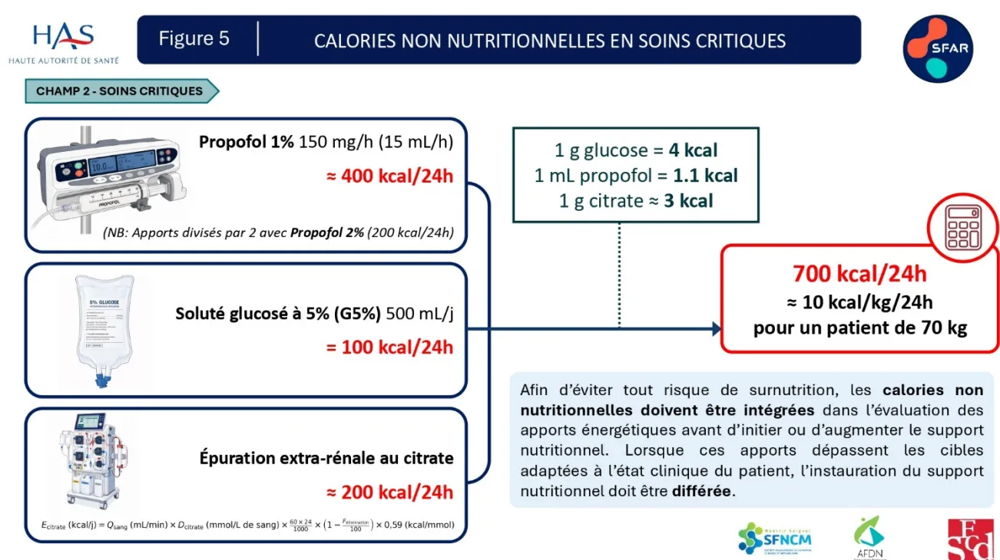
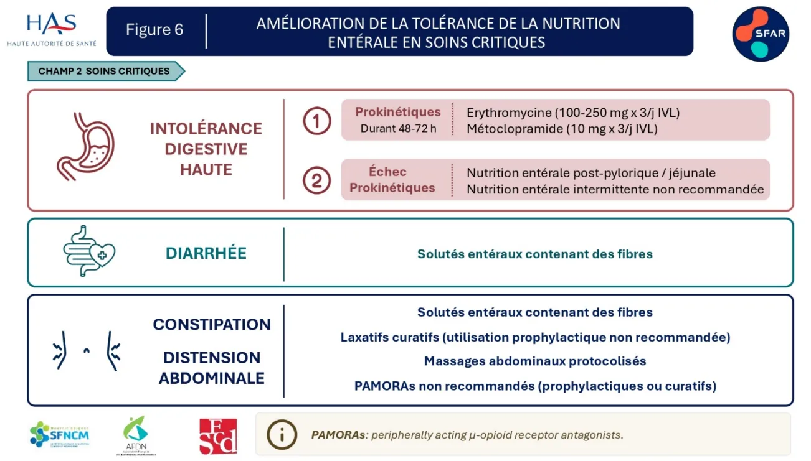

---

**RECOMMANDER**  
LES BONNES PRATIQUES

---

**ARGUMENTAIRE**

# Nutrition clinique de l'adulte en contexte périopératoire et en soins critiques

---

**Adopté par le Collège le 3 septembre 2026**

---Les recommandations formalisées d'experts (RFE) sont définies dans le champ de la santé comme des propositions développées méthodiquement pour aider le praticien et le patient à rechercher les soins les plus appropriés dans des circonstances cliniques données.

Les RFE sont des synthèses rigoureuses de l'état de l'art et des données de la science à un temps donné, décrites dans l'argumentaire scientifique. Elles sont intégrées dans une démarche clinique centrée patient qui prend en compte l'expérience vécue du patient, ses représentations, ses attentes et son état d'esprit pour aboutir à une décision médicale partagée. Ce processus délibératif entre patient et professionnel de santé s'effectue au sein d'une relation empathique et dans une approche biopsychosociale globale et contextuelle qui permet d'aboutir à une alliance thérapeutique.

Cette recommandation de bonne pratique a été élaborée avec une approche basée sur les preuves (EBM) selon le système GRADE. Les caractéristiques de GRADE sont les suivantes :

- – il permet d'évaluer la qualité des données probantes de façon systématique afin de mesurer le niveau de confiance à leur accorder en vue de produire une recommandation ;
- – il prend en compte l'opinion des professionnels de santé vis-à-vis de la balance bénéfice/risque d'une intervention thérapeutique, qu'elle soit curative ou préventive, pour déterminer la force d'une recommandation ;
- – il incorpore les préférences du patient dans la genèse des recommandations, en cohérence avec une approche centrée sur le patient.

## Gradation des recommandations et avis d'experts

<table border="1"><tbody><tr><td><b>1</b></td><td><p><b>Recommandation forte</b></p><p>Balance bénéfices/risques démontrée favorable ou démontrée défavorable</p><p>Fondée sur le résultat de méta-analyse d'essais cliniques randomisés statistiquement significatif avec une qualité des preuves élevée en faveur d'un bénéfice clinique pertinent. Dans cette situation, l'approche centrée patient permet de prendre en compte l'avis du patient vers l'acceptation de l'intervention.</p></td></tr><tr><td><b>2</b></td><td><p><b>Recommandation faible</b></p><p>Balance bénéfices/risques démontrée plutôt favorable ou balance bénéfices/risques présumée favorable ;<br/>Balance bénéfices/risques démontrée plutôt défavorable ou balance bénéfices/risques présumée défavorable</p><p>Fondée sur le résultat de méta-analyse d'essais cliniques randomisés statistiquement significatif avec une qualité des preuves élevée en faveur d'un bénéfice clinique peu pertinent ou avec une qualité des preuves modérée en faveur d'un bénéfice clinique pertinent. Dans cette situation, l'approche centrée patient permet d'appréhender avec le patient l'(les) intérêt(s) de l'intervention dans son contexte particulier.</p></td></tr><tr><td><b>ABS</b></td><td><p><b>Pas de recommandation</b></p><p>Absence d'études ou de résultats concluants, c'est-à-dire résultats non statistiquement significatifs ou de qualité de preuves faible ou très faible, ne permettant pas de proposer une intervention.</p></td></tr><tr><td><b>AE</b></td><td><p><b>Avis d'experts</b></p><p>Balance bénéfices/risques indéterminée.</p><p>Absence d'études ou de résultats concluants, c'est-à-dire résultats non statistiquement significatifs ou de qualité de preuves faible ou très faible.</p><p>Proposition par un avis d'experts d'une intervention. Cet avis s'appuie ou non sur une revue systématique de la littérature des recommandations existantes et des méta-analyses d'études de cohorte. Dans cette situation, l'approche centrée patient permet d'accompagner le patient dans sa décision en l'absence de recommandation, en se basant sur la balance bénéfices/risques supposée de l'intervention, dans son contexte particulier et en prenant en compte sa perspective.</p></td></tr></tbody></table>## Formulations utilisées pour chaque situation

### Recommandation forte pour/contre l'intervention (grade 1)

« Il est recommandé de/de ne pas ... » (*recommandation forte, qualité des preuves élevée*)

### Recommandation faible pour/contre l'intervention (grade 2)

« Il est recommandé de/de ne pas ... » (*Recommandation faible, qualité des preuves modérée*)

### Pas de recommandation (Absence)

« Devant l'absence de donnée disponible dans la littérature, les experts ne sont pas en mesure d'émettre des recommandations », « Les données sont insuffisantes pour établir une recommandation [...]. Il est nécessaire que des essais cliniques randomisés de qualité soient réalisés pour répondre clairement à cette question ».

### Avis d'experts (AE)

« Les experts suggèrent de », « Il est suggéré/conseillé de/de ne pas » [...] Il est nécessaire que des essais cliniques randomisés de qualité soient réalisés pour répondre clairement à cette question [si approprié] » (*avis d'experts*)# Descriptif de la publication

<table border="1"><tr><td><b>Titre</b></td><td><b>Nutrition clinique de l'adulte en contexte périopératoire et en soins critiques</b></td></tr><tr><td><b>Méthode de travail</b></td><td>Recommandations pour la pratique clinique-LABEL</td></tr><tr><td><b>Objectif(s)</b></td><td>L'objectif de la recommandation intitulée « Nutrition clinique de l'adulte en contexte périopératoire et en soins critiques » est de proposer des recommandations destinées à améliorer la qualité et l'efficacité de l'évaluation du statut nutritionnel et de la prescription du support nutritionnel chez les patients adultes hospitalisés en soins critiques ou pris en charge au cours de la période périopératoire, et ce, à toutes les étapes du parcours de soins.</td></tr><tr><td><b>Cibles concernées</b></td><td>Les professionnels concernés sont les médecins (médecins spécialistes, anesthésistes-réanimateurs, autres spécialistes exerçant en soins critiques), les chirurgiens, les nutritionnistes et les diététiciens exerçant en soins critiques ou intervenant lors du parcours périopératoire.</td></tr><tr><td><b>Demandeur</b></td><td>Société Française d'Anesthésie et de Réanimation (SFAR) en association avec la Société Francophone de Nutrition Clinique et Métabolisme (SFNCM), la Société Française de Chirurgie Digestive (SFCD) et l'Association Française des Diététiciens Nutritionnistes (AFDN).</td></tr><tr><td><b>Promoteur(s)</b></td><td>Société Française d'Anesthésie et de Réanimation (SFAR) ; Haute Autorité de santé (HAS)</td></tr><tr><td><b>Equipe projet</b></td><td><p><b>Coordonnateurs des experts :</b> Dr Emmanuel Pardo (SFAR, APHP), Dr Émilie Occhiali (SFAR, CHU Rouen)</p><p><b>Organisateurs CRC SFAR :</b> Dr Matthieu Dumont (SFAR, CHU Bordeaux), Dr Pierre Huette (SFAR, CHU Amiens Picardie, Clinique Victor Pauchet Amiens)</p><p><b>Coordinateur HAS :</b> Sophie Blanchard Musset, Docteur en sciences</p><p><b>Auteurs :</b> Dr Emmanuel Pardo (Anesthésiste-Réanimateur, APHP), Dr Émilie Occhiali (Anesthésiste-Réanimatrice, CHU Rouen), Mme Laura Albaladejo (Diététicienne Nutritionniste, CHU Grenoble), Pr Julien Bohé (Médecin Intensiviste-Réanimateur, CHU Lyon), Dr Anaïs Crey (Anesthésiste-Réanimatrice, CHU Rouen), Dr Céline Guichon (Anesthésiste-Réanimatrice, CHU Lyon), Mme Coralie Grangé (Diététicienne Nutritionniste, APHP), Dr Bénédicte Grigoresco (Anesthésiste-Réanimatrice, APHM), Dr Marina Hachouf (Anesthésiste-Réanimatrice, APHP), Pr Morgan Le Guen (Anesthésiste-Réanimateur, Hôpital Foch), Dr Cindy Neuzillet (Oncologie digestive, Institut Curie, Paris), Mme Elete Pereira (Diététicienne Nutritionniste, APHP), Mme Julie Pellecer (Diététicienne Nutritionniste, APHP), Dr Laurent Petit (Anesthésiste-Réanimateur, CHU Bordeaux), Pr Fabienne Tamion (Médecin Intensiviste-Réanimatrice, CHU Rouen), Mme Myriam Teyssié (représentante de l'Union d'Associations Françaises de Stomisés), Pr Ronan Thibault (Médecin Nutritionniste, CHU Rennes), Mme Marianne Vidal (Diététicienne Nutritionniste, représentante AFDN, CHU Montpellier), Dr Thibault Voron (Chirurgien digestif, APHP), Dr Pierre Huette (Anesthésiste-Réanimateur, CHU Amiens), Dr Matthieu Dumont (Anesthésiste-Réanimateur, CHU Bordeaux).</p></td></tr><tr><td><b>Conflits d'intérêts</b></td><td>Les membres du groupe de travail ont communiqué leurs déclarations publiques d'intérêts à la HAS. Elles sont consultables sur le site <a href="https://dpi.sante.gouv.fr">https://dpi.sante.gouv.fr</a>. Elles ont été analysées selon la grille d'analyse du <a href="#">guide des déclarations d'intérêts et de gestion des conflits d'intérêts</a> de la HAS. Pour son analyse la HAS a également pris en compte la base «<a href="#">Transparence-Santé</a>» qui impose aux industriels du secteur de la santé de rendre publics les conventions, les rémunérations et les avantages les liants aux acteurs du secteur de la santé. Les intérêts déclarés par les membres du groupe de travail et les informations figurant dans la base «<a href="#">Transparence-Santé</a>» ont été considérés comme étant compatibles avec la participation des experts au groupe de travail.</td></tr><tr><td><b>Validation</b></td><td>Version du 3 septembre 2026</td></tr><tr><td><b>Actualisation</b></td><td></td></tr></table>Ce document ainsi que sa référence bibliographique sont téléchargeables sur [www.has-sante.fr](http://www.has-sante.fr)  
Haute Autorité de santé – Service communication information  
5 avenue du Stade de France – 93218 SAINT-DENIS LA PLAINE CEDEX. Tél. : +33 (0)1 55 93 70 00  
© Haute Autorité de santé – [Date]# Sommaire

---

<table><tr><td>Préambule .....</td><td>7</td></tr><tr><td>Introduction .....</td><td>8</td></tr><tr><td>Champs des recommandations et questions traitées.....</td><td>16</td></tr><tr><td>Synthèse des recommandations.....</td><td>64</td></tr><tr><td>Synthèse des figures.....</td><td>69</td></tr><tr><td>Annexes .....</td><td>74</td></tr><tr><td>Méthode .....</td><td>78</td></tr><tr><td>Références bibliographiques .....</td><td>86</td></tr><tr><td>Participants.....</td><td>104</td></tr><tr><td>Abréviations et acronymes.....</td><td>106</td></tr></table># Préambule

Ces recommandations portent sur la « **Nutrition clinique de l'adulte en contexte périopératoire et en soins critiques** ».

La société promotrice a été :

- – La Société Française d'Anesthésie et de Réanimation (SFAR)

Et les sociétés associées ont été :

- – La Société Francophone de Nutrition Clinique et Métabolisme (SFNCM),
- – La Société Française de Chirurgie Digestive (SFCD)
- – L'Association Française des Diététiciens Nutritionnistes (AFDN).

Cette recommandation formalisée d'experts (RFE) a été réalisée dans le cadre de la labellisation par la HAS garantissant le respect des critères méthodologiques, scientifiques et déontologiques de la HAS, notamment dans la prévention des conflits d'intérêt.

## Objectif de la recommandation formalisée d'experts

L'objectif de la recommandation intitulée « Nutrition clinique de l'adulte en contexte périopératoire et en soins critiques » est de proposer un cadre visant à améliorer, tout au long du parcours de soins, la qualité et l'efficacité de l'évaluation du statut nutritionnel et de la prescription du support nutritionnel chez les patients adultes hospitalisés en soins critiques ou pris en charge en phase périopératoire.

Le groupe de travail s'est efforcé de produire un nombre minimal de recommandations afin de mettre en évidence les points forts à retenir dans les deux champs prédéfinis.

Les règles de base des bonnes pratiques médicales universelles en anesthésie et réanimation étant considérées comme connues, elles ont été exclues de ces recommandations.

## Cibles

**Les professionnels concernés** sont les médecins (médecins spécialistes, anesthésistes-réanimateurs, autres spécialistes exerçant en soins critiques), les chirurgiens, les nutritionnistes et les diététiciens exerçant en soins critiques ou intervenant lors du parcours périopératoire.

**Les populations concernées** sont les patients adultes ayant une chirurgie à risque intermédiaire ou élevé, et les patients adultes admis en soins critiques.

Ces recommandations ne traitent pas des spécificités des populations pédiatriques, de la prescription des micronutriments, des pathologies spécifiques et ne concernent pas les patients ayant une chirurgie à risque faible.# Introduction

Les dernières recommandations de la Société Française d'Anesthésie et de Réanimation (SFAR) relatives à la nutrition périopératoire datent de 2010 [1], et celles concernant la nutrition en soins critiques de 2014 [2]. Depuis ces publications, la littérature scientifique s'est profondément égayée, portée par un nombre croissant d'essais randomisés contrôlés, de revues systématiques et de méta-analyses de haute qualité méthodologique, consacrés à la nutrition durant le parcours périopératoire et en réanimation.

Au cours de la dernière décennie, les pratiques ont également évolué sous l'influence de plusieurs dynamiques majeures. D'une part, les progrès de la recherche fondamentale et translationnelle ont permis une meilleure compréhension des mécanismes métaboliques impliqués dans la réponse au stress chirurgical et liés à la pathologie critique, affinant ainsi les stratégies nutritionnelles pour en améliorer l'efficacité et la tolérance. D'autre part, la prise en charge des patients s'inscrit désormais dans une approche multidisciplinaire et coordonnée, associant les médecins généralistes, les spécialistes intervenant avant et après le séjour en réanimation, les médecins de soins critiques, ainsi que les professionnels paramédicaux, notamment les diététiciens et les kinésithérapeutes, autour d'objectifs communs de réhabilitation précoce et de restauration de l'autonomie fonctionnelle.

Parallèlement, la diffusion des programmes de préhabilitation et de réhabilitation améliorée après chirurgie a contribué à replacer la nutrition au centre du continuum de soins, depuis la période préopératoire jusqu'à la convalescence. Ces évolutions traduisent un changement de paradigme majeur : la nutrition n'est plus seulement considérée comme un support, mais comme un véritable levier thérapeutique, au même titre que la ventilation, la sédation et l'analgésie.

Malgré ces avancées, plusieurs points demeurent débattus : la définition précise des phases métaboliques, le moment optimal d'initiation du support nutritionnel, la détermination des cibles énergétiques et protidiques et des voies d'administration, ou encore les places respectives de la préhabilitation et de l'immunonutrition. De nouveaux enjeux émergent également, tels que la place des équipes de diététique au sein du parcours patient, la prise en compte des calories non nutritionnelles, ou encore l'attention croissante accordée à l'exercice physique dans la réhabilitation nutritionnelle.

Dans ce contexte, il apparaît nécessaire d'actualiser les recommandations de la SFAR relatives à la prise en charge nutritionnelle en phase périopératoire et en soins critiques. Cette actualisation vise à fournir des recommandations fondées sur les données les plus récentes de la littérature, structurées autour de questions cliniques pertinentes, directement applicables à la pratique quotidienne et accessibles à l'ensemble des professionnels impliqués en soins critiques et dans le parcours périopératoire des patients.

## Conséquences de la dénutrition

La dénutrition représente « l'état d'un organisme en déséquilibre nutritionnel » [3]. Ce déséquilibre peut être lié à une carence d'apport, à une augmentation des dépenses et/ou pertes énergétiques, ou à une combinaison de ces facteurs. Une dénutrition peut engendrer d'importantes perturbations des grandes fonctions de l'organisme, variables selon l'importance de la dénutrition, sa rapidité d'installation et les pathologies associées.

En moyenne, 30% des patients hospitalisés sont considérés comme dénutris, avec un impact certain sur la morbi-mortalité, la durée et le coût du séjour hospitalier [3].Dans le contexte périopératoire, la dénutrition peut être présente dès le préopératoire lorsqu'elle est directement en lien avec la pathologie causale ou acquise au cours du séjour postopératoire [3]. La dénutrition périopératoire est un facteur de risque indépendant de complications postopératoires : elle augmente la morbidité (complications infectieuses, retard de cicatrisation, complications chirurgicales), la mortalité et retentit sur la qualité de vie des patients. Par ailleurs, elle augmente les coûts hospitaliers par l'augmentation de la durée de séjour [4–7].

Dans le contexte des soins critiques, la prévalence de la dénutrition est estimée entre 33% et 78% selon les études et les méthodes d'évaluation [8–14]. Cette fréquence élevée justifie un dépistage précoce et systématique afin d'identifier les patients les plus à risque de complications liées à l'état nutritionnel. La dénutrition en réanimation est associée à un risque augmenté de complications infectieuses, une augmentation de la durée de ventilation et de séjour, une réhabilitation plus longue et une surmortalité [11–13, 15–22]. De plus, chez les sujets âgés admis en soins critiques, la dénutrition est associée à un risque d'institutionnalisation plus élevé au cours du séjour hospitalier [21].

Compte tenu des complications et des issues défavorables liées à la dénutrition chez les patients en contexte périopératoire et en soins critiques, il est essentiel que les médecins en charge de ces patients maîtrisent parfaitement les indications du support nutritionnel et ses modalités de prescription. Cette prise en charge doit s'inscrire dans le parcours de soins global des patients pour faciliter la continuité des soins, la mutualisation et l'articulation des moyens et des compétences à l'issue de ces périodes périopératoire ou en soins critiques.

## Population concernée par ces recommandations

Ces recommandations s'adressent à deux groupes de patients adultes :

1. 1) Les patients pris en charge en période périopératoire pour une chirurgie, urgente ou programmée, à risque intermédiaire ou élevé,
2. 2) Les patients admis en soins critiques (unités de soins intensifs ou unités de réanimation) pour une pathologie aiguë grave médico-chirurgicale.

Le risque lié à une chirurgie dépend du type d'intervention, de sa durée et de son caractère urgent. Il reflète la gravité potentielle des complications pouvant survenir dans le cadre de cette chirurgie, qu'elles soient hémorragiques, infectieuses, cardiovasculaires ou nutritionnelles. Parmi ces complications, celles d'origine cardiovasculaire prédominent dans l'évaluation du risque chirurgical global. La *European Society of Cardiology* (ESC), en collaboration avec la *European Society of Anaesthesiology and Intensive Care* (ESAIC), a actualisé en 2022 la classification des chirurgies non cardiaques selon leur niveau de risque (Tableau 1). Cette estimation correspond à un risque global à 30 jours de décès cardiovasculaire, d'infarctus du myocarde ou d'accident vasculaire cérébral, basé uniquement sur le type de chirurgie, indépendamment des comorbidités du patient [23].

Bien que cette classification ne soit pas exhaustive, elle constitue à ce jour la seule référence disponible et a donc été retenue dans les présentes recommandations.**Tableau 1. Classification du risque chirurgical selon les recommandations conjointes de l'ESC et de l'ESAIC [23].**

<table border="1">
<thead>
<tr>
<th>Risque chirurgical faible<br/>(&lt;1 %)</th>
<th>Risque chirurgical intermédiaire<br/>(1–5 %)</th>
<th>Risque chirurgical élevé<br/>(&gt;5 %)</th>
</tr>
</thead>
<tbody>
<tr>
<td>Chirurgie mammaire</td>
<td>Carotidienne asymptomatique (stenting ou endartériectomie) ou symptomatique (stenting)</td>
<td>Résection surrénalienne</td>
</tr>
<tr>
<td>Dentaire</td>
<td>Réparation endovasculaire d'anévrisme aortique</td>
<td>Chirurgie aortique et vasculaire majeure</td>
</tr>
<tr>
<td>Endocrinienne : thyroïde</td>
<td>Chirurgie de la tête ou du cou</td>
<td>Carotidienne symptomatique (stenting)</td>
</tr>
<tr>
<td>Ophtalmologique</td>
<td>Intrapéritonéale : splénectomie, cure de hernie hiatale, cholécystectomie, chirurgie colorectale</td>
<td>Chirurgie duodéno-pancréatique</td>
</tr>
<tr>
<td>Gynécologique : mineure</td>
<td>Intrathoracique : non majeure</td>
<td>Résection hépatique, chirurgie des voies biliaires</td>
</tr>
<tr>
<td>Orthopédique mineure (méniscectomie)</td>
<td>Neurologique ou orthopédique majeure (hanche et rachis)</td>
<td>Œsophagectomie</td>
</tr>
<tr>
<td>Reconstructrice</td>
<td>Angioplastie artérielle périphérique</td>
<td>Revascularisation du membre inférieur pour ischémie aiguë ou amputation</td>
</tr>
<tr>
<td>Chirurgie superficielle</td>
<td>Transplantation rénale</td>
<td>Pneumonectomie (thoracoscopie ou chirurgie ouverte)</td>
</tr>
<tr>
<td>Urologique mineure (résection transurétrale de la prostate)</td>
<td>Urologique ou gynécologique majeure</td>
<td>Transplantation pulmonaire ou hépatique</td>
</tr>
<tr>
<td>Résection pulmonaire mineure (thoracoscopie)</td>
<td></td>
<td>Réparation de perforation intestinale</td>
</tr>
<tr>
<td></td>
<td></td>
<td>Cystectomie totale</td>
</tr>
</tbody>
</table>

Le périmètre temporel des recommandations en contexte périopératoire s'étend de la phase préopératoire (4 à 6 semaines avant l'intervention chirurgicale) à la phase postopératoire précoce (2 semaines après l'opération). En soins critiques, elles s'appliquent à l'ensemble du séjour, sans couvrir la phase post-réanimation.

Afin de délivrer des messages généraux applicables au plus grand nombre de patients, aucune sous-partie de ces recommandations n'est dédiée à une population spécifique, en termes de comorbidités particulières (diabète, insuffisance hépatique ou rénale chronique) ou de pathologies aiguës spécifiques (pancréatite, brûlure, polytraumatisme).

Par ailleurs, ces recommandations n'abordent pas la prescription des micronutriments (éléments-traces et vitamines), compte tenu de la publication en 2022 des recommandations européennes sur ce sujet et de l'absence de nouvelles données venant les remettre en question [24]. Enfin, la population pédiatrique n'a pas été incluse dans nos recherches et pourra faire l'objet d'un travail ultérieur.# Réponse métabolique et états cliniques en soins critiques

En 1942, Sir David Cuthbertson décrivait pour la première fois deux phases métaboliques successives après un traumatisme. La phase de reflux (*ebb phase*) correspondait à une sidération métabolique caractérisée par une hypothermie, une diminution du débit cardiaque et une réduction globale du métabolisme. Elle était suivie de la phase de flux (*flow phase*), marquée par un hypercatabolisme et une augmentation significative de la dépense énergétique. Avec l'avancée des connaissances physiopathologiques, cette conception strictement biphasique a évolué vers une approche temporelle plus nuancée. Les recommandations européennes actualisées en 2023 distinguent ainsi [25] :

- - une phase aiguë précoce, couvrant les 48 premières heures,
- - une phase aiguë tardive, s'étendant approximativement du troisième au septième jour,
- - et une phase de réhabilitation ou chronique, débutant au-delà du septième jour.

Toutefois, si cette segmentation temporelle fournit un cadre simplifié, elle ne reflète pas toujours la diversité des situations cliniques rencontrées en réanimation, la variabilité des trajectoires métaboliques et l'évolution dynamique des défaillances, comprenant fréquemment des épisodes d'aggravation secondaire [25–27]. Pour ces raisons, le groupe d'experts a retenu une approche clinique plutôt que strictement chronologique, en élaborant des recommandations fondées sur l'état physiologique et la sévérité des défaillances, plutôt que sur le temps écoulé depuis l'admission.

**Trois états cliniques principaux ont été retenus :**

- • **L'état de choc ou de défaillance multiviscérale** : il correspond à la situation la plus sévère, caractérisée par une agression sévère et une instabilité hémodynamique nécessitant potentiellement le recours à des catécholamines, à une ventilation mécanique et/ou à une sédation profonde. Cet état recouvre la phase aiguë précoce décrite par la *European Society for Clinical Nutrition and Metabolism* (ESPEN) ;
- • **L'état de stabilisation** : il concerne les patients en amélioration clinique, marquée par la résolution progressive des défaillances, la conduite du sevrage ventilatoire, l'allégement des sédations et des doses faibles et stables de catécholamines ou récemment sevrées. Cet état correspond globalement à la phase aiguë tardive ;
- • **L'état de réhabilitation** : il désigne les patients cliniquement stabilisés, peu défaillants, capables de mobilisation, d'exercice physique et parfois de reprise de la nutrition orale.

Ces définitions se fondent sur des états cliniques observables en pratique quotidienne. Elles offrent une plus grande flexibilité d'adaptation dynamique des cibles et des modalités d'administration du support nutritionnel en fonction de l'évolution clinique.

## Modalités de prescription du support nutritionnel

### Définitions

Les termes, notions et concepts utilisés dans ces recommandations sont définis comme suit :

- - **Support nutritionnel** : arsenal thérapeutique destiné à prévenir et traiter la dénutrition. Le support nutritionnel met en jeu des produits de nutrition (aliments, compléments nutritionnels oraux, solutés de nutrition artificielle et micronutriments), leurs voies d'administration (orale,entérale, parentérale) et leurs posologies exprimées en cibles caloriques (en kcal/kg de poids corporel/jour) et cibles protéiques (en g de protéines/kg de poids corporel/j). Il s'inscrit dans le temps avec un délai d'initiation et une durée de prescription, parfois jusqu'au sevrage lorsqu'il s'agit des solutés de nutrition artificielle. Enfin, il nécessite la surveillance de son efficacité et de sa tolérance.

- - **Stratégie nutritionnelle multimodale** : approche intégrant toute technique, programme ou thérapeutique qui permet d'optimiser l'efficacité du support nutritionnel. Elle associe le support nutritionnel à des interventions de mobilisation et d'exercice physique, afin de favoriser l'anabolisme musculaire, d'améliorer l'utilisation des apports énergétiques et protéiques, et de limiter la perte fonctionnelle liée à l'immobilisation.
- - **Compléments Nutritionnels Oraux (CNO)** : produits diététiques spécialement formulés pour apporter un soutien nutritionnel lorsque l'alimentation orale habituelle ou enrichie ne permet pas de couvrir les besoins.
- - **Nutrition artificielle** : technique de suppléance permettant de couvrir, en partie ou en totalité, les besoins nutritionnels, lorsque l'alimentation orale est insuffisante ou impossible. La nutrition artificielle peut être administrée par voie entérale ou parentérale, chaque voie présentant des avantages et des inconvénients.
- - **Nutrition entérale** : technique de nutrition artificielle qui consiste à administrer le soluté directement dans le tube digestif (estomac ou intestin grêle) *via* une sonde (sonde gastrique, gastrostomie ou jéjunostomie). La nutrition entérale a des effets bénéfiques sur le tube digestif (prévention de l'atrophie villositaire, protection de la muqueuse intestinale) et un coût inférieur à celui de la nutrition parentérale, raisons pour lesquelles elle constitue la voie privilégiée du support nutritionnel si le tube digestif est fonctionnel. Elle a des contre-indications (certaines sutures chirurgicales, hémorragie digestive, syndrome occlusif) et sa tolérance n'est pas toujours satisfaisante notamment en contexte périopératoire ou en soins critiques (troubles digestifs variés, de la simple régurgitation à l'ischémie digestive).
- - **Nutrition parentérale** : technique de nutrition artificielle qui consiste à administrer le soluté nutritif par voie intraveineuse. Elle est utilisée lorsque la nutrition entérale est contre-indiquée ou en cas d'intolérance digestive qui limite l'efficacité de la nutrition entérale. Son coût est supérieur à celui de la nutrition entérale. L'administration par voie intraveineuse nécessite une surveillance spécifique pour limiter le risque de complications infectieuses.
- - **Nutrition parentérale complémentaire** : nutrition parentérale administrée en complément d'une nutrition entérale lorsque la nutrition entérale seule, administrée pour son effet bénéfique sur le tube digestif, ne suffit pas à atteindre la cible calorique en raison d'une intolérance digestive.
- - **Intolérance digestive** : ensemble des troubles digestifs survenant dans le contexte périopératoire ou en soins critiques, traduisant une altération de la tolérance à l'alimentation. Elle peut être haute, dominée par la gastroparésie, les nausées, vomissements ou régurgitations, ou basse, caractérisée par la diarrhée, la constipation, les ballonnements ou les douleurs abdominales.
- - **Immunonutriments** : nutriments spécifiques visant à moduler les mécanismes inflammatoires et immunitaires pour optimiser l'efficacité du support nutritionnel.
- - **Syndrome de Renutrition Inappropriée (SRI)** : ensemble de complications métaboliques (troubles hydroélectrolytiques) survenant lors de la renutrition trop rapide ou trop importante de patients sévèrement dénutris ou ayant subi un jeûne prolongé, et pouvant entraîner des manifestations cliniques engageant le pronostic vital.- - **PAMORAs** : *peripherally acting  $\mu$ -opioid receptor antagonists* : Molécules bloquant les récepteurs  $\mu$  aux opioïdes situés dans la muqueuse digestive et permettant ainsi de contrecarrer l'effet adverse constipant des opioïdes. Ces molécules ne traversent pas la barrière hémato-encéphalique et ne bloquent donc pas l'effet antalgique central des opioïdes.
- - **Sarcopénie** : perte de masse et de force musculaire, affectant le plus souvent la performance physique et la qualité de vie des personnes atteintes, le plus souvent âgées, mais pouvant également concerner les personnes en situation d'obésité [28,29].

## Cibles énergétiques et protéiques

La définition des cibles énergétiques et protéiques dans le présent travail repose sur plusieurs principes généraux.

Chez les patients de soins critiques ou de chirurgie n'étant pas en situation d'obésité, le calcul des besoins doit être réalisé à partir du poids réel sec, correspondant au poids antérieur à l'épisode de pathologie critique ou à l'intervention chirurgicale.

Chez les patients en situation d'obésité ( $IMC > 30 \text{ kg/m}^2$ ), il est recommandé d'utiliser le poids ajusté, conformément aux recommandations européennes [25] :

$$\text{Poids idéal (kg)} = 25 \times (\text{Taille en m})^2$$

$$\text{Poids ajusté (kg)} = (\text{Poids réel} - \text{Poids idéal}) \times 0,25 + \text{Poids idéal}$$

Quel que soit le poids initial utilisé, il doit être régulièrement réévalué, notamment lors des séjours prolongés. Le poids utilisé dans les études retenues pour la recherche bibliographique de cette recommandation pouvait varier. De ce fait, les cibles énergétiques et protéiques proposées par les experts correspondent à des fourchettes, permettant d'initier la prise en charge et devant être ajustées selon l'évolution clinique.

Les cibles énergétiques incluent l'ensemble des apports caloriques, y compris les calories non nutritionnelles provenant des solutions glucosées, du propofol et du citrate utilisé lors des épurations extra-rénales. Le Tableau 2 présente les équivalences et propose des exemples concrets.**Tableau 2. Calories non nutritionnelles.**

<table border="1">
<thead>
<tr>
<th>Solution glucosée</th>
<th>Propofol</th>
</tr>
</thead>
<tbody>
<tr>
<td>1 g de glucose = 4 kcal</td>
<td>1 ml de propofol 2% = 1,1 kcal</td>
</tr>
<tr>
<td>1 L de G5%/j = 50g de glucose soit 200 kcal/j</td>
<td>200 mg/h de propofol 1% = 20 ml/h = 22 kcal/h soit 528 kcal/j</td>
</tr>
<tr>
<td>1L de G10%/j = 100 g de glucose soit 400 kcal/j</td>
<td>200 mg/h de propofol 2% = 10 ml/h = 11 kcal/h soit 264 kcal/j</td>
</tr>
</tbody>
</table>

**Citrate (Épuration extra-rénale) : Formule simplifiée**

$$E_{\text{citrate}} \text{ (kcal/j)} = Q_{\text{sang}} \text{ (mL/min)} \times D_{\text{citrate}} \text{ (mmol/L de sang)} \times \frac{60 \times 24}{1000} \times \left(1 - \frac{F_{\text{élimination}}}{100}\right) \times 0,59 \text{ (kcal/mmol)}$$

<table border="1">
<thead>
<tr>
<th>Élément</th>
<th>Définition</th>
</tr>
</thead>
<tbody>
<tr>
<td><math>E_{\text{citrate}}</math></td>
<td>Apport énergétique net lié au citrate délivré au patient (kcal/j)</td>
</tr>
<tr>
<td><math>Q_{\text{sang}}</math></td>
<td>Débit sanguin moyen dans le circuit d'épuration (mL/min)</td>
</tr>
<tr>
<td><math>D_{\text{citrate}}</math></td>
<td>Dose de citrate prescrite par litre de sang traité (mmol/L de sang)</td>
</tr>
<tr>
<td><math>60 \times 24 / 1000</math></td>
<td>Conversion du débit sanguin de mL/min en L/j = 1,44</td>
</tr>
<tr>
<td><math>F_{\text{élimination}}</math></td>
<td>Fraction du citrate perfusé éliminée dans l'effluent (%) = Estimé autour de 50% [30]</td>
</tr>
<tr>
<td>0,59</td>
<td>Équivalent énergétique du citrate métabolisé (kcal/mmol)</td>
</tr>
</tbody>
</table>

**Exemple :**

$$E_{\text{citrate}} \text{ (kcal/j)} = 150 \times 3,7 \times 1,44 \times 0,50 \times 0,59 = 235,8 \text{ kcal/j}$$

Pour un débit sanguin de 150 mL/min, une dose de citrate de 3,7 mmol/L de sang traité et une fraction nette délivrée de 50 %, l'apport énergétique estimé lié au citrate est d'environ 236 kcal/j.

Enfin, compte tenu de la différence significative entre les apports prescrits et ceux effectivement reçus, il est conseillé de monitorer les volumes administrés pour qu'ils s'approchent le plus des recommandations [31].

## Implication du patient dans sa prise en charge nutritionnelle

L'implication du patient dans sa prise en charge nutritionnelle, en contexte périopératoire et en soins critiques, constitue un axe fondamental de la qualité des soins. Elle repose sur une relation de soin avec le patient où ce dernier peut en toute confiance exprimer ses difficultés et défis liés à la nutrition.

En contexte périopératoire, ce partenariat fait du patient un acteur à part entière de sa prise en charge, capable d'exprimer au chirurgien, au médecin anesthésiste, à l'équipe paramédicale ou à l'équipe diététique lors des consultations ou des hospitalisations, ses préférences, craintes ou difficultés, parexemple en matière d'appétence alimentaire, de tolérance digestive ou d'acceptation des dispositifs de nutrition artificielle.

En soins critiques, lorsque l'état de vigilance le permet, cette implication peut également concerner la réhabilitation précoce, avec une participation du patient aux objectifs de reprise alimentaire orale et de mobilisation.

Cette démarche participative s'accompagne d'une individualisation des soins, adaptant la stratégie nutritionnelle aux comorbidités, au statut nutritionnel initial, au type de chirurgie et à la sévérité de la pathologie critique. Enfin, elle renforce l'autonomie du patient, diminue son anxiété, facilite son adhésion thérapeutique et optimise son observance thérapeutique, favorisant la récupération postopératoire, dans une logique cohérente avec les principes de la réhabilitation améliorée après chirurgie.# Champs des recommandations et questions traitées

Les recommandations formulées concernent 2 champs :

1. 1. Périopératoire
2. 2. Soins critiques

La majorité des patients inclus dans un parcours chirurgical est concernée par le Champ 1.

La prise en charge nutritionnelle des patients ayant une chirurgie à risque intermédiaire ou élevé qui nécessite une admission postopératoire en soins critiques sera guidée par les recommandations du Champ 2.

Les patients admis en urgence en soins critiques pour une cause médicale ou chirurgicale sont concernés par le Champ 2.

<table border="1"><thead><tr><th>Champ</th><th>Questions</th></tr></thead><tbody><tr><td colspan="2"><b>Champ 1. Périopératoire</b></td></tr><tr><td colspan="2"><b>Q1.1</b> - Chez les patients opérés d'une chirurgie à risque intermédiaire ou élevé, la <u>recherche d'une dénutrition ou du risque de dénutrition</u> permet-elle de prédire la morbi-mortalité périopératoire ?</td></tr><tr><td colspan="2"><b>Q1.2</b> - Chez les patients opérés d'une chirurgie programmée à risque intermédiaire ou élevé, <u>quelles stratégies nutritionnelles préopératoires</u> permettent de diminuer la morbi-mortalité postopératoire ?</td></tr><tr><td colspan="2"><b>Q1.3</b> - Chez les patients opérés d'une chirurgie à risque intermédiaire ou élevé, <u>quelles stratégies nutritionnelles postopératoires</u> permettent de diminuer la morbi-mortalité postopératoire ?</td></tr><tr><td colspan="2"><b>Q1.4</b> - Chez les patients opérés d'une chirurgie programmée à risque intermédiaire ou élevé, la <u>prise en charge par un diététicien</u> permet-elle de diminuer la morbi-mortalité périopératoire ?</td></tr><tr><td colspan="2"><b>Champ 2. Soins critiques</b></td></tr><tr><td colspan="2"><b>Q2.1</b> - Chez les patients hospitalisés en soins critiques, la <u>recherche d'une dénutrition ou du risque de dénutrition</u> permet-elle de prédire la morbi-mortalité ?</td></tr><tr><td colspan="2"><b>Q2.2</b> - Chez les patients hospitalisés en soins critiques, quel <u>délai d'instauration du support nutritionnel</u> est associé à une diminution de la morbi-mortalité ?</td></tr><tr><td colspan="2"><b>Q2.3</b> - Chez les patients hospitalisés en soins critiques en <u>état de choc / défaillance multiviscérale</u>, quel support nutritionnel est associé à une diminution de la morbi-mortalité ?</td></tr><tr><td colspan="2"><b>Q2.4</b> - Chez les patients hospitalisés en soins critiques et <u>stabilisés</u>, quel support nutritionnel est associé à une diminution de la morbi-mortalité ?</td></tr><tr><td colspan="2"><b>Q2.5</b> - Chez les patients hospitalisés en soins critiques en <u>phase de réhabilitation</u>, une stratégie nutritionnelle multimodale est-elle associée à une diminution de la morbi-mortalité ?</td></tr><tr><td colspan="2"><b>Q2.6</b> - Chez les patients hospitalisés en soins critiques recevant une nutrition entérale, quelles interventions peuvent <u>améliorer la tolérance digestive</u> ?</td></tr><tr><td colspan="2"><b>Q2.7</b> - Chez les patients hospitalisés en soins critiques, une <u>surveillance clinique et/ou biologique</u> permet-elle d'<u>évaluer la tolérance</u> du support nutritionnel ?</td></tr><tr><td colspan="2"><b>Q2.8</b> - Chez les patients hospitalisés en soins critiques, une <u>surveillance clinique et/ou biologique</u> permet-elle d'<u>évaluer l'efficacité</u> du support nutritionnel ?</td></tr><tr><td colspan="2"><b>Q2.9</b> - Chez les patients hospitalisés en soins critiques, la <u>prise en charge par un diététicien</u> permet-elle d'optimiser la prise en charge nutritionnelle ?</td></tr></tbody></table># Champ 1. Nutrition clinique en contexte périopératoire

**Question 1.1 : Chez les patients opérés d'une chirurgie à risque intermédiaire ou élevé, la recherche d'une dénutrition ou du risque de dénutrition permet-elle de prédire la morbi-mortalité périopératoire ?**

Experts : Laura ALBALADEJO (SFAR, Grenoble), Anaïs CREY (SFAR, Rouen), Bénédicte GRIGORESCO (SFAR, Marseille)

<table border="1">
<thead>
<tr>
<th colspan="3">Nutrition clinique de l'adulte en contexte périopératoire et en soins critiques</th>
</tr>
<tr>
<th>Recommandations</th>
<th colspan="2">GRADE</th>
</tr>
</thead>
<tbody>
<tr>
<td colspan="3">Champ 1 – Nutrition clinique en contexte périopératoire</td>
</tr>
<tr>
<td colspan="3">1.1 Recherche d'une dénutrition ou du risque de dénutrition en contexte périopératoire (Figure 1)</td>
</tr>
<tr>
<td>R1.1.1</td>
<td>Chez les patients opérés d'une chirurgie à risque intermédiaire ou élevé, il est recommandé de rechercher une dénutrition ou un risque de dénutrition afin de prédire la morbi-mortalité périopératoire.</td>
<td>1</td>
</tr>
<tr>
<td>R1.1.2</td>
<td>Chez les patients opérés d'une chirurgie à risque intermédiaire ou élevé, il est recommandé d'utiliser un score clinico-biologique adapté au patient et à sa chirurgie afin de prédire la morbi-mortalité périopératoire.</td>
<td>2</td>
</tr>
<tr>
<td>R1.1.3</td>
<td>Chez les patients opérés d'une chirurgie à risque intermédiaire ou élevé, il est recommandé de doser l'albuminémie préopératoire afin de qualifier la sévérité de la dénutrition et de prédire la morbi-mortalité périopératoire.</td>
<td>2</td>
</tr>
</tbody>
</table>

## Argumentaire R1.1.1

La dénutrition est un facteur de risque de morbi-mortalité postopératoire [32]. En 2010, les Recommandations Formalisées d'Experts (RFE) identifiaient les facteurs de risque de dénutrition clinico-biologiques et liés au terrain, toujours d'actualité (**Annexe 1**).

Les recommandations de la Haute Autorité de Santé (HAS) parues en 2019 rappellent que le diagnostic de la dénutrition chez l'adulte < 70 ans est clinique et repose sur l'association d'au moins un critère phénotypique (perte de poids  $\geq 5\%$  en 1 mois ou  $\geq 10\%$  en 6 mois ou  $\geq 10\%$  par rapport au poids habituel avant le début de la maladie, IMC  $< 18,5 \text{ kg/m}^2$ , réduction quantifiée de la masse / force musculaire) et d'au moins un critère étiologique (réduction des apports  $\geq 50\%$  pendant plus de 1 semaine ou toute réduction des apports > 2 semaines par rapport aux besoins estimés / consommation habituelle, maldigestion / malabsorption, situation d'agression / hypercatabolisme (pathologie aiguë ou pathologie chronique évolutive ou pathologie maligne évolutive) [3] (**Annexe**2). La réduction de la force musculaire peut être quantifiée par la dynamométrie (force de préhension) et l'évaluation de la vitesse de marche. La réduction de la masse musculaire peut être quantifiée par la mesure de l'indice de surface musculaire en regard de la 3ème vertèbre lombaire (L3) par scanner ou IRM, la mesure de l'indice de masse musculaire et de l'indice de masse non grasse par impédancemétrie et la mesure de la masse musculaire appendiculaire par absorptiométrie biphotonique à rayons X (DEXA). Une fois la dénutrition diagnostiquée, sa sévérité (dénutrition modérée ou sévère) est déterminée par l'IMC, l'importance de la perte de poids et l'albuminémie.

En 2021, la HAS a publié des recommandations spécifiques au sujet âgé  $\geq 70$  ans (**Annexe 3**) [33]. Le diagnostic de dénutrition repose également sur l'association d'au moins un critère phénotypique et d'au moins un critère étiologique. Les critères phénotypiques qui diffèrent de l'adulte  $< 70$  ans sont : IMC  $< 22$  kg/m<sup>2</sup> et sarcopénie (réduction de la force et de la masse musculaire) confirmée par les moyens précédemment cités. Dans cette population, la HAS suggère qu'une mesure du tour du mollet  $< 31$  cm constituerait un argument anthropométrique en faveur d'une réduction notable de la masse musculaire.

Enfin, la HAS souligne qu'un IMC normal ou élevé n'exclut pas la dénutrition et recommande de mesurer le poids à chaque consultation / hospitalisation et de surveiller régulièrement l'appétit et les apports, afin de repérer précocement les patients à risque et d'intégrer la prise en charge nutritionnelle dans le parcours périopératoire [3,33].

En 2016, plusieurs sociétés savantes internationales dédiées à la nutrition se sont associées pour constituer la *Global Leadership Initiative on Malnutrition (GLIM)* dont le but est d'établir un consensus mondial autour des critères diagnostiques fondamentaux de la dénutrition [34]. Les critères de la HAS et de la GLIM sont globalement similaires.

De nombreuses études se sont intéressées au statut nutritionnel préopératoire en chirurgie programmée et urgente dans différentes spécialités. Dans une méta-analyse publiée en 2025, incluant 23970 patients opérés d'un cancer solide et évalués par plusieurs indices nutritionnels phénotypiques, métaboliques et biologiques, Pierce *et al.* ont montré un risque plus élevé de mortalité chez les patients dénutris (HR 2,14 ; IC 95% [1,84 - 2,49],  $p < 0,01$ ) [35]. Des résultats superposables ont été retrouvés par Zang *et al.*, avec un risque de complication plus élevé chez les patients présentant un Nutritional Risk Screening (NRS)  $> 3$  (OR 2,27 ; IC 95% [1,81 - 2,84]) [36]. Deux études ont également montré une surmortalité en cas de dénutrition ou de risque de dénutrition chez les patients présentant une fracture du col fémoral [37,38].

L'évaluation de la force musculaire fait partie des critères phénotypiques de la HAS. Elle apporte également un complément pronostique pertinent. Une étude parue en 2021 a montré que chez des patients en surpoids, opérés d'une gastrectomie, la dénutrition diagnostiquée uniquement selon les critères de la GLIM ne prédisait que modestement les complications postopératoires. En revanche, l'intégration de tests fonctionnels (force de préhension et vitesse de marche) améliorait significativement la valeur prédictive. Ainsi, une force de préhension basse associée au statut GLIM augmentait le risque de mortalité (OR multivarié 2,144 ; IC 95% [1,023 – 4,493] vs OR 1,841 ; IC 95% [1,181 – 2,871]) tandis qu'une vitesse de marche diminuée renforçait la prédiction des complications et de la survie [39]. De façon concordante, chez des sujets âgés opérés d'une fracture de hanche, l'évaluation précoce de la force de préhension prédisait de façon indépendante la possibilité de récupération de la marche [40].

Au-delà de la force musculaire, la masse musculaire quantifiée par scanner au niveau de L3 constitue un marqueur pronostique robuste en cancérologie digestive. Une méta-analyse parue en2020 et incluant 20 études (n = 5 610 patients, cancer gastrique) a montré qu'une faible masse musculaire quantifiée au moment du diagnostic de la pathologie cancéreuse était associée à une surmortalité globale (HR 2,02 ; IC 95% [1,71 - 2,38]) et à une diminution de la survie sans récidive (HR 1,97 ; IC 95% [1,71 - 2,26]). Elle était également associée à une durée d'hospitalisation prolongée (+1,19 jour) et à une augmentation des complications postopératoires (OR 1,76 ; IC 95% [1,17 – 2,66]), notamment majeures (OR 1,54 ; IC 95% [1,03 – 2,29]) [41].

Enfin, dans le cancer colorectal après résection curative, la sarcopénie confirmée par mesure de la surface musculaire au scanner en L3, était associée à un allongement du séjour, à une augmentation des complications postopératoires (notamment majeures (Clavien-Dindo  $\geq 3$ ), respiratoires et cardiaques), ainsi qu'à la mortalité à 30 jours, aux réadmissions et à la récidive à un an. Indépendamment des critères phénotypiques et de sévérité de la dénutrition, la sarcopénie prédisait les complications (OR 2,96 ; IC 95% [1,19 – 7,35]), la récidive à un an (OR 8,00 ; IC 95% [1,45 – 44,21]) et une augmentation du score global de complications postopératoires, faisant de la sarcopénie un marqueur pronostique immédiatement exploitable en pratique clinique [42].

### Argumentaire R1.1.2

Plusieurs scores clinico-biologiques permettent d'objectiver un risque nutritionnel avec une bonne valeur prédictive de la morbi-mortalité périopératoire. Le *Nutritional Risk Screening* (NRS)-2002 [43], le *Controlling Nutritional Status* (CONUT) [44], le *Geriatric Nutritional Risk Index* (GNRI) [45] ou encore le *Prognostic Nutritional Index* (PNI) [46] sont largement utilisés.

Dans une méta-analyse parue en 2023 et incluant 11 études (n = 5 593 patients opérés de cancer gastrique), Zhang *et al.* ont montré qu'un GNRI bas était associé à une diminution significative de la survie globale (HR 2,052 ; IC 95% [1,726 – 2,440],  $p < 0,001$ ) ainsi qu'à une réduction de la survie spécifique au cancer (HR 1,684 ; IC 95% [1,249 – 2,270],  $p = 0,001$ ). L'analyse en continu retrouvait qu'à chaque unité de GNRI perdue, la mortalité postopératoire augmentait de 5,66 % (HR 0,944 ; IC 95% [0,933 – 0,956],  $p < 0,001$ ) [47]. Dans une autre méta-analyse parue en 2025 (20 études, chirurgie colorectale carcinologique), Vatvani *et al.* ont montré que les patients ayant un score CONUT bas présentaient un risque de mortalité significativement inférieur par rapport à ceux ayant un score CONUT élevé (HR 2,02 ; IC 95% [1,74 - 2,34],  $p < 0,00001$ ) [48].

Bien que majoritairement évalués dans le contexte des chirurgies digestives, ces deux scores ont également été validés en chirurgie cardiaque [49], en chirurgie oncologique urologique [50], en chirurgie ORL [51], en chirurgie orthopédique [37] ou encore en chirurgie rachidienne [52].

Ces outils accessibles permettent une stratification rapide du risque nutritionnel, favorisant une prise en charge précoce, et participent à l'amélioration du pronostic périopératoire. Au vu de la littérature récente, le GNRI et le CONUT sont les deux scores les plus documentés, notamment en chirurgie digestive, ce qui motive leur utilisation prioritaire (**Annexes 4 et 5**).

### Argumentaire R1.1.3

Selon les recommandations de la Haute Autorité de Santé (HAS) 2019, une fois la dénutrition diagnostiquée, sa sévérité (dénutrition modérée ou sévère) est déterminée par l'IMC, l'importance de la perte de poids et l'albuminémie. Chez tous les adultes, la dénutrition est qualifiée de sévère si l'albuminémie est inférieure ou égale à 30 g/L et modérée chez l'adulte < 70 ans si elle est inférieure à 35 g/L [3,33].Concernant l'albuminémie, Hu *et al.* ont montré dans une étude de cohorte avec appariement par score de propension ( $n = 12915$  patients, contexte de chirurgie colorectale) qu'une hypoalbuminémie modérée préopératoire ( $30 \text{ g/L} \leq \text{albuminémie} < 35 \text{ g/L}$ ) était associée à une augmentation de la mortalité hospitalière ( $\text{OR } 1,74$  ;  $\text{IC } 95\% [1,32 - 2,28]$ ,  $p < 0,001$ ), du taux global de complications postopératoires ( $B\ 0,064$  ;  $\text{IC } 95\% [0,047 - 0,082]$ ,  $p < 0,001$ ) et de la durée de séjour hospitalier ( $B\ 2,236$  ;  $\text{IC } 95\% [1,902 - 2,57]$ ,  $p < 0,001$ ) [53]. En 2019, Li *et al.* ont montré dans une méta-analyse ( $n = 13$  études, 34363 patients, contexte de chirurgie de hanche) qu'une hypoalbuminémie préopératoire  $< 35 \text{ g/L}$  était significativement associée à une surmortalité intrahospitalière ( $\text{OR } 1,46$  ;  $\text{IC } 95\% [1,21 - 1,77]$ ) et globale ( $\text{OR } 1,70$  ;  $\text{IC } 95\% [1,40 - 2,08]$ ) [54]. Par ailleurs, la revue systématique de Ornaghi *et al.* parue en 2021 a conclu qu'une hypoalbuminémie préopératoire  $< 35 \text{ g/L}$  en contexte de chirurgie vésicale carcinologique était associée à une augmentation significative du risque de complications globales à 30 jours, notamment pulmonaires postopératoires. Elle était également associée à une hospitalisation prolongée au-delà de 7 jours, et à la diminution de la probabilité d'un retour à domicile dans les 90 jours. Cette revue a de plus montré que l'hypoalbuminémie préopératoire était associée à une diminution significative de la survie globale à 3 ans ( $\text{HR } 1,86$  ;  $\text{IC } 95\% [1,32 - 2,66]$ ) [55]. Enfin, la méta-analyse de Hu *et al.* parue en 2023 ( $n = 26$  études, 86000 patients, contexte de chirurgie rachidienne) a montré que la dénutrition préopératoire (définie comme hypoalbuminémie  $< 35 \text{ g/L}$  et/ou hypo-préalbuminémie  $< 0,2 \text{ g/L}$ ) était associée à une augmentation de l'incidence des complications postopératoires globales ( $\text{OR } 3,17$  ;  $\text{IC } 95\% [2,69 - 3,75]$ ,  $p < 0,05$ ) [56].

Concernant la préalbuminémie seule, la méta-analyse de Fan *et al.* parue en 2021 ( $n = 11$  études, 7442 patients, contexte d'hépatectomie pour carcinome hépatocellulaire) a montré qu'une préalbuminémie préopératoire basse était associée à une diminution de la survie globale ( $\text{HR } 1,54$  ;  $\text{IC } 95\% [1,42 - 1,68]$ ), à une diminution de la survie sans récidive ( $\text{HR } 1,34$  ;  $\text{IC } 95\% [1,17 - 1,52]$ ) et à un risque plus élevé d'insuffisance hépatique postopératoire ( $\text{HR } 2,21$  ;  $\text{IC } 95\% [1,36 - 3,6]$ ) [57]. En 2023, une autre méta-analyse ( $n = 9$  études, 5306 patients, toutes chirurgies) a montré qu'une préalbuminémie préopératoire basse était associée à un risque plus élevé de développer une infection de site opératoire ( $\text{OR } 2,04$  ;  $\text{IC } 95\% [1,28 - 3,26]$ ) [58].

Malgré les preuves scientifiques concernant la préalbumine, les recommandations HAS 2019 et 2021 ne retiennent pas de place à son dosage ni pour diagnostiquer la dénutrition, ni pour en qualifier la sévérité. La préalbumine ayant une demi-vie d'environ 48 heures, elle reflète mal l'état nutritionnel global mais pourrait être positionnée comme marqueur dynamique de suivi de l'état nutritionnel [59,60] et de l'efficacité support nutritionnel [61]. L'albuminémie, quant à elle, reflète mal l'évolution à court terme de l'état nutritionnel du fait de sa longue demi-vie (3 semaines), ce qui explique son positionnement comme marqueur stable de la sévérité et du pronostic.Figure 1. Évaluation nutritionnelle en contexte périopératoire.

**HAUTE AUTORITÉ DE SANTÉ (HAS)** | **Figure 1** | **ÉVALUATION NUTRITIONNELLE EN CONTEXTE PÉRIOPÉRATEOIRE** | **SFAR**

**CHAMP 1 PÉRIOPÉRATEOIRE**

**RISQUE NUTRITIONNEL**

**FACTEURS DE RISQUE\***

- **Liés au patient:** Âge, cancer, sepsis, pathologie chronique, antécédents chirurgicaux majeurs, troubles neurologiques ou psychiatriques, Symptômes digestifs chroniques
- **Liés au traitement:** Chimiothérapie, radiothérapie, corticothérapie, polymédication

**SCORES\***

**Score GNRI**  
(Geriatric Nutritional Risk Index)

**Score CONUT**  
(Controlling Nutritional Status score)

**DIAGNOSTIC DE LA DÉNUTRITION**

**1 CRITÈRE PHÉNOTYPIQUE HAS<sup>†</sup>**

- Calcul de la **perte de poids préopératoire** :  
  → Anamnèse :  $\geq 5\%/1$  mois ou  $\geq 10\%/6$  mois ou  $\geq 10\%$  poids habituel avant maladie
- **IMC** :  $<18.5 \text{ kg/m}^2$  si  $< 70$  ans /  $< 22 \text{ kg/m}^2$  si  $\geq 70$  ans
- **Réduction de la force** : Force de préhension et/ou test de levers de chaise
- **Réduction de la masse musculaire** (si disponible : imagerie, impédancémétrie, DEXA)

**POUR POSER LE DIAGNOSTIC DE LA DÉNUTRITION**

**=**  
1 seul critère phénotypique

**+**  
1 seul critère étiologique

Suffisent parmi tous ceux listés

**1 CRITÈRE ÉTIOLOGIQUE HAS<sup>†</sup>**

- Réduction de la prise alimentaire
- Malabsorption / maldigestion
- **Situation d'agression** : Chirurgie à risque intermédiaire ou élevé, ou contexte carcinologique

**SÉVÉRITÉ ET SUIVI**

**ALBUMINÉMIE**

- Sévérité de la dénutrition

Modérée : 30-35 g/L  
Sévère :  $\leq 30 \text{ g/L}$

- Valeur pronostique

**PRÉ-ALBUMINÉMIE**

- Suivi dynamique de l'état nutritionnel

**Logos:** SFNCM, AFDN, SFd, HAS, SFAR

**Notes:** \* Voir Annexes 1,4 et 5  
<sup>†</sup> Voir Annexes 2 et 3  
**DEXA:** dual energy x-ray absorptiometry (absorbtiométrie biphotonique à rayon X); **HAS:** Haute Autorité de Santé; **IMC:** Index de Masse Corporelle.

**Question 1.2 : Chez les patients opérés d'une chirurgie programmée à risque intermédiaire ou élevé, quelles stratégies nutritionnelles préopératoires permettent de diminuer la morbidité postopératoire ?**

Experts : Morgan LE GUEN (SFAR, Paris), Thibault VORON (SFCD, Paris), Cindy NEUZILLET (SFNCM, Paris)

<table border="1">
<thead>
<tr>
<th colspan="2">Recommandations</th>
<th>GRADE</th>
</tr>
</thead>
<tbody>
<tr>
<td colspan="3">Champ 1 - Nutrition clinique en contexte périopératoire</td>
</tr>
<tr>
<td colspan="3">1.2 Stratégie nutritionnelle préopératoire (Figure 2)</td>
</tr>
<tr>
<td>R1.2.1</td>
<td>Chez les patients opérés d'une chirurgie programmée à risque intermédiaire ou élevé, il est recommandé de proposer un programme de préhabilitation, stratifié sur le risque lié au patient, incluant une prise en charge nutritionnelle, pour réduire certaines complications postopératoires, notamment infectieuses.</td>
<td><b>2</b></td>
</tr>
<tr>
<td>R1.2.2</td>
<td>Chez les patients dénutris opérés d'une chirurgie programmée à risque intermédiaire ou élevé, les experts suggèrent qu'une nutrition artificielle préopératoire permettrait de réduire les complications et la durée de séjour.</td>
<td><b>AE</b></td>
</tr>
<tr>
<td>R1.2.3</td>
<td>Après analyse de la littérature, les experts ne sont pas en mesure d'émettre une recommandation concernant l'intérêt d'un support</td>
<td><b>ABS</b></td>
</tr>
</tbody>
</table><table border="1">
<tr>
<td></td>
<td>nutritionnel préopératoire chez les patients non sélectionnés selon leur statut nutritionnel opérés d'une chirurgie programmée à risque intermédiaire ou élevé afin de réduire la morbi-mortalité.</td>
<td></td>
</tr>
<tr>
<td>R1.2.4</td>
<td>Après analyse de la littérature, les experts ne sont pas en mesure d'émettre une recommandation concernant l'intérêt d'administrer une immunonutrition pré- ou périopératoire chez les patients opérés d'une chirurgie carcinologique digestive ou ORL afin de diminuer les complications postopératoires globales.</td>
<td><b>ABS</b></td>
</tr>
</table>

### Argumentaire R1.2.1

La préhabilitation s'est imposée ces dernières années comme une étape clé de l'optimisation préopératoire et s'intègre désormais aux stratégies de réhabilitation améliorée afin d'optimiser le parcours périopératoire en chirurgie majeure [62]. Toutefois, son impact sur la mortalité n'est pas formellement démontré, principalement en raison de l'hétérogénéité des programmes évalués et de la taille des effectifs [63]. Ainsi, aucune méta-analyse ou étude prospective de grande ampleur n'a, à ce jour, mis en évidence un effet significatif de la préhabilitation sur la mortalité postopératoire [64–66]. Les bénéfices observés sur le pronostic sont indirects, traduits par une réduction de la durée de séjour et du taux de complications dans les groupes d'intervention.

Concernant les complications postopératoires, deux méta-analyses ont néanmoins mis en évidence l'effet favorable d'une prise en charge préopératoire multimodale. Dans une méta-analyse (9 essais contrôlés randomisés), Guo *et al.* ont évalué un programme de préhabilitation chez 1313 patients fragiles opérés d'un cancer, majoritairement digestif, et ont montré une réduction significative des complications sévères selon la classification de Clavien-Dindo (RR 0,62 ; IC 95% [0,43 - 0,90],  $p = 0,01$ ) [64]. Amirkhosravi *et al.* se sont intéressés à la préhabilitation avant chirurgie du haut appareil digestif et ont également rapporté une réduction significative des complications (log OR -0,38 ; IC 95% [-0,75 - 0],  $p = 0,048$ ), avec un effet notable sur les complications pulmonaires postopératoires (log OR -0,96 ; IC 95% [-1,38 – -0,54],  $p < 0,001$ ) [67]. Néanmoins, sur les dix essais contrôlés randomisés retenus ( $n = 1503$  patients), seules deux présentaient une intervention combinant exercices physiques et prise en charge nutritionnelle. La majorité évaluait uniquement l'activité physique, ce qui limite la généralisation des résultats [67].

Par ailleurs, deux essais randomisés, non inclus dans les méta-analyses précédentes, ont apporté des éléments supplémentaires en faveur de la préhabilitation. Scheenstra *et al.* ont évalué un programme de télé-préhabilitation chez près de 400 patients opérés de chirurgie coronaire, valvulaire ou aortique. Le groupe intervention bénéficiait d'une prise en charge individualisée reposant sur plusieurs modules supervisés à distance, avec comme résultat, une réduction d'environ un tiers des événements cardiovasculaires majeurs (16,8% (33) *versus* 25,5% (50),  $p = 0,032$ ) [68]. Enfin, Bausys *et al.* ont publié une étude portant sur un programme de préhabilitation personnalisé, semi-supervisé, à domicile, comprenant des exercices physiques, un support nutritionnel et un soutien psychologique. Ce programme de préhabilitation diminuait significativement le risque de complications postopératoires à 90 jours (RR 0,40 ; IC 95% [0,24 – 0,66]), en diminuant le taux de complications classées Clavien-Dindo I-II (6,8% *vs* 42,4%,  $p = 0,001$ ) [69].

L'intensité et le contenu des programmes de préhabilitation doivent toutefois être adaptés au niveau de risque individuel, les bénéfices cliniques n'étant pas homogènes dans l'ensemble despopulations chirurgicales. Les données actuelles suggèrent que la préhabilitation est particulièrement pertinente chez les patients à haut risque, définis par la présence d'une fragilité, d'une altération de la réserve fonctionnelle, d'une dénutrition ou d'une sarcopénie, et/ou d'un score ASA  $\geq$  III, souvent en association avec un âge avancé ( $\geq$  65–70 ans). Chez ces patients, même une chirurgie classée à risque intermédiaire peut représenter un stress physiologique majeur, justifiant la mise en place d'une prise en charge préopératoire structurée et multimodale [70].

### Argumentaire R1.2.2 – R1.2.3

Aucune étude robuste sur le plan méthodologique évaluant l'intérêt d'un support nutritionnel préopératoire n'a eu pour critère de jugement principal la mortalité postopératoire. Seule une étude de cohorte rétrospective, portant sur la chirurgie carcinologique œsophagienne, a rapporté des résultats concernant la mortalité périopératoire : les 65 patients du groupe d'intervention avaient bénéficié d'une nutrition entérale préopératoire par gastrostomie ; la mortalité postopératoire était similaire à celle des 657 patients du groupe contrôle (3,1% vs 3,9% ;  $p = 0,765$ ) [71].

Concernant la morbidité postopératoire, l'étude de cohorte prospective multicentrique de Jie *et al.* ( $n = 1085$  patients, chirurgies digestives à risque intermédiaire ou élevé) a montré que l'administration d'une nutrition artificielle préopératoire, entérale ou parentérale durant au moins 7 jours, diminuait le taux de complications (25,6% vs 50,6%,  $p = 0,008$ ) et la durée de séjour ( $13,7 \pm 7,9$  jours vs  $17,9 \pm 11,3$  jours,  $p = 0,018$ ), uniquement dans le sous-groupe des patients dénutris [72]. Dans l'essai contrôlé randomisé multicentrique de Peters *et al.* ( $n = 398$  patients, chirurgie colorectale, non discriminés sur le statut nutritionnel), une nutrition entérale périopératoire (dont 3 heures de nutrition préopératoire) ne diminuait pas le risque d'iléus postopératoire (RR 1,09 ; IC 95% [0,95 - 1,25],  $p = 0,24$ ), ni celui de lâchage anastomotique (RR 1,01 ; IC 95% [0,94 – 1,09],  $p = 0,81$ ) et de pneumopathie postopératoire (RR 1,06 ; IC 95% [1,00 – 1,12],  $p = 0,051$ ) [73]. La méta-analyse de Sowerbutts *et al.*, qui n'inclutait pas les deux études précédentes, a échoué à démontrer un effet bénéfique de la nutrition préopératoire, entérale ou parentérale, sur les complications postopératoires, infectieuses ou non, ou sur la durée de séjour hospitalière. Néanmoins, le nombre d'étude incluses était limité, certaines d'entre elles étaient antérieures à 2009 avec des effectifs faibles, et la population était hétérogène, notamment sur le plan nutritionnel, ce qui limite l'interprétation des résultats [74].

Enfin, l'essai contrôlé randomisé de Chapman *et al.*, ( $n = 55$  patients sévèrement dénutris, transplantation hépatique) a montré que l'ajout préopératoire d'une nutrition entérale nocturne à un régime standard à haute teneur énergétique et protéique permettait d'augmenter les apports protéino-énergétiques ( $p < 0,0001$ ), d'améliorer la force de préhension (différence médiane de 3,6 kg ; IC 95% [1,7 - 5,2],  $p < 0,001$ ) et d'augmenter la circonférence du bras et le pli cutané du triceps ( $p < 0,001$ ) [75].

Pour conclure, les données de la littérature étant insuffisamment robustes, les experts n'ont pu statuer sur des recommandations fortes concernant l'impact bénéfique d'une nutrition artificielle préopératoire sur la morbidité postopératoire.

### Argumentaire R1.2.4

Des méta-analyses incluant des essais randomisés contrôlés (ERC) et des études de cohorte ont rapporté des résultats discordants sur l'immunonutrition, avec des signaux de réduction des complications globales dans des analyses agrégées hétérogènes, mais sans confirmation robuste et reproductible dans les ERC contemporains. De plus, toutes les études et méta-analyses inclusesdans la revue de littérature évaluant l'effet préopératoire de l'immunonutrition et une partie évaluant l'effet périopératoire (administration pré- et postopératoire), les experts ont choisi de traiter l'impact de l'immunonutrition uniquement dans le chapitre préopératoire du champ périopératoire.

Entre 2017 et 2021 sont parues 4 méta-analyses évaluant l'intérêt de l'immunonutrition dans des contextes chirurgicaux variés : 3 concernaient la chirurgie oncologique digestive (cancers œsophagiens ou colorectaux) [76–78] et 1 la chirurgie oncologique ORL [79]. Elles avaient toutes pour particularité d'évaluer différents types d'immunonutrition (orale, entérale ou parentérale), administrés à différents moments du parcours chirurgical (pré-, post- ou périopératoire). Leurs résultats étaient discordants. Certaines ont montré un bénéfice postopératoire : réduction du risque de lâchage d'anastomose / fistule [78,79], diminution des complications postopératoires globales ou diminution de la durée d'hospitalisation [76] . D'autres n'ont retrouvé aucun bénéfice [77] ou des bénéfices seulement sur certains critères [78,79].

La méta-analyse de Matsui *et al.* (n = 48 essais randomisés contrôlés, 4825 patients) est celle qui a rapporté les résultats du plus grand nombre d'essais randomisés contrôlés. Parue en 2024, elle a montré une réduction des complications globales (RR 0,78 ; IC 95% [0,66 – 0,93]) et des complications infectieuses (RR 0,71 ; IC 95% [0,61 – 0,82]), au prix d'une hétérogénéité méthodologique marquée : protocoles mixtes, périodes d'administration variables (8 essais randomisés contrôlés concernant l'immunonutrition préopératoire seule, 18 ERC pour l'immunonutrition postopératoire seule et 22 essais randomisés contrôlés pour l'immunonutrition périopératoire), et association de chirurgies ORL et digestives [80]. La même année, Zhang *et al.* (n = 10 ERC, 574 patients, chirurgie pancréatico-duodénale) ont montré une réduction des complications infectieuses postopératoires (OR 0,45 ; IC 95% [0,27 - 0,74], p = 0,002), des complications classées Clavien-Dindo III (OR 0,61 ; IC 95% [0,38 – 0,98], p = 0,04) et de la durée de séjour hospitalier (différence médiane -1,87 ; IC 95% [-3,29 - -0,44], p = 0,01). Là encore, l'hétérogénéité des études était notable, l'immunonutrition étant administrée en pré- (6 ERC), post- (2 ERC) ou périopératoire (2 ERC) avec des protocoles variables [81].

Celle de McKechnie *et al.* (n = 10 ERC et études de cohorte, 1521 patients), la seule centrée sur l'immunonutrition uniquement préopératoire et portant sur la chirurgie colorectale, n'a pas mis en évidence de signaux positifs. L'immunonutrition entérale préopératoire ne réduisait ni les complications globales (RR 0,80 ; IC 95% [0,57 – 1,12]), ni les infections de site opératoire (RR 0,70 ; IC 95% [0,44 – 1,11]), ni le risque de lâchage d'anastomose (RR 0,56 ; IC 95% [0,28 - 1,10]) [82].

Dans la méta-analyse en réseau de Ricci *et al.* parue en 2023 (87 essais randomisés contrôlés, 8357 patients dont 4104 ayant bénéficié d'immunonutrition, chirurgie abdominale majeure carcinologique ou non), différentes formules (combinaisons variables d'arginine, nucléotides, acides gras  $\omega$ -3), voies d'administration (orale, entérale, parentérale) et périodes d'administration (pré-, post- ou périopératoire) de l'immunonutrition ont été évalués. Parmi les patients ayant bénéficié d'immunonutrition, 25% en avaient reçu en préopératoire, 50% en postopératoire et 25% en périopératoire, toutes formules et voies confondues. Les résultats ont montré que l'administration postopératoire d'une immunonutrition orale/entérale composée d'au moins deux immunonutriments constituait le meilleur protocole pour réduire la morbidité postopératoire (OR 0,32 ; IC 95% [0,10 – 0,98] ; p = 0,93) [83]. La même année, Zhou *et al.* (10 ERC, 1025 patients, chirurgie carcinologique œsophagienne) ont échoué à montrer un quelconque bénéfice de l'immunonutrition entérale sur la morbi-mortalité, quelle que soit la période d'administration (8 ERC évaluaient l'effet de l'immunonutrition périopératoire et 2 ERC l'effet de l'immunonutrition postopératoire seule) [84]. En chirurgie colorectale carcinologique, l'analyse de 10 études sur 20 ans a conclu à une diminution des infections de site opératoire grâce à l'administration postopératoire d'une immunonutritiondurant 5 jours (RR 0,63 ; IC 95% [0,52 - 0,76],  $p < 0,00001$ ,  $I^2 11\%$ ). Là encore, les effectifs étaient faibles et les prises en charges hétérogènes du fait de la longue période d'inclusion [85].

Enfin, en 2025, Modesti *et al.* (19 ERC, 1196 patients) ont mis en évidence une diminution significative du taux de fistule en chirurgie ORL carcinologique dans le groupe des patients ayant bénéficié d'une immunonutrition (différence combinée -0,077 ; IC 95% [-0,115 - -0,039]). Néanmoins, cette méta-analyse excluait les patients dénutris et ceux ayant bénéficié d'un support nutritionnel préopératoire et elle agrégeait les résultats de protocoles variables d'administration de l'immunonutrition (10 ERC sur les 19 inclus évaluèrent spécifiquement l'immunonutrition postopératoire) [86].

Par ailleurs, une seule méta-analyse s'est intéressée à la formule contenue dans l'immunonutrition et a montré, chez des patients opérés pour cancer gastrique, que les formules combinant [arginine + nucléotides + acides gras  $\omega 3$ ] ou [arginine + glutamine + acides gras  $\omega 3$ ] semblaient être les plus bénéfiques en termes de durée de séjour et de réduction du taux de complications [87]. Là encore, les protocoles d'administration de l'immunonutrition étaient très hétérogènes (pré-, post- ou périopératoire, durées d'administration variables).

Compte tenu de ces résultats scientifiques contradictoires, en lien avec l'hétérogénéité méthodologique marquée des études (protocoles d'immunonutrition très variables en termes de périodes d'administration et de formules), la priorité reste une évaluation nutritionnelle structurée, l'optimisation des apports protéino-énergétiques et l'adhésion aux parcours de préhabilitation et de réhabilitation accélérée après chirurgie.

**Question 1.3 : Chez les patients opérés d'une chirurgie à risque intermédiaire ou élevé, quelles stratégies nutritionnelles postopératoires permettent de diminuer la morbi-mortalité postopératoire ?**

Experts : Anaïs CREY (SFAR, Rouen), Thibault VORON (SFCD, Paris), Bénédicte GRIGORESCO (SFAR, Marseille)

<table border="1">
<thead>
<tr>
<th colspan="2">Recommandations</th>
<th>GRADE</th>
</tr>
</thead>
<tbody>
<tr>
<td colspan="3">Champ 1 – Nutrition clinique en contexte périopératoire</td>
</tr>
<tr>
<td colspan="3">1.3 Stratégie nutritionnelle postopératoire (Figure 2)</td>
</tr>
<tr>
<td>R1.3.1</td>
<td>Chez les patients opérés d'une chirurgie à risque intermédiaire ou élevé, il est recommandé de reprendre le plus précocement possible une nutrition orale et/ou artificielle pour diminuer la morbidité postopératoire.</td>
<td>1</td>
</tr>
<tr>
<td>R1.3.2</td>
<td>Chez les patients opérés d'une chirurgie à risque intermédiaire ou élevé, les experts suggèrent de viser une cible énergétique de 20-25 kcal/kg/j et protéique de 1-1,3 g/kg/j à atteindre progressivement en postopératoire pour diminuer la morbidité postopératoire.</td>
<td>AE</td>
</tr>
<tr>
<td>R1.3.3</td>
<td>Chez les patients opérés d'une chirurgie à risque intermédiaire ou élevé, les experts suggèrent d'associer les différentes voies d'administration de</td>
<td>AE</td>
</tr>
</tbody>
</table><table border="1"><tr><td>la nutrition (par ordre de priorité : orale, entérale puis parentérale), lorsque les objectifs nutritionnels postopératoires ne peuvent être atteints par une voie unique.</td></tr></table>

### Argumentaire R1.3.1

Plusieurs méta-analyses ont évalué le bénéfice d'une reprise précoce de la nutrition en postopératoire de chirurgie digestive programmée [88–92], urologique [93], et digestive urgente [94]. Le délai de reprise de la nutrition chez les patients des groupes « précoce » variait de 24 à 72 heures après l'intervention chirurgicale et était comparé à des protocoles n'autorisant la reprise alimentaire qu'après reprise du transit gazeux. La nutrition précoce était administrée par voie orale liquide ou solide, entérale ou parentérale. En fonction des méta-analyses, la reprise précoce de la nutrition était significativement associée à une réduction de la durée de séjour hospitalier, une réduction du délai de reprise de transit, une diminution du risque de lâchage anastomotique et une diminution des complications infectieuses ou globales. Aucune n'a montré d'effet bénéfique sur la mortalité postopératoire.

Un essai randomisé contrôlé en contexte carcinologique gynécologique a montré que la prise très précoce, dans les 4 heures suivant l'intervention, d'une solution orale, hypercalorique, enrichie en *whey*, suivie d'une réalimentation orale, était associée à une diminution significative de la durée du séjour hospitalier et du taux de réadmission à 30 jours. De plus, cette prise en charge était significativement associée à une réduction de la perte de poids postopératoire, à la préservation de la masse musculaire et à une meilleure force de préhension [95].

Par ailleurs, l'ensemble de ces études a mis en avant la sécurité d'une réalimentation précoce, quelle que soit la voie d'administration. La méta-analyse de Lee *et al.* a relevé une augmentation de la survenue de vomissements en cas de reprise alimentaire orale précoce [91]. Celle de Zeng *et al.* n'a pas retrouvé cet effet adverse avec une nutrition entérale précoce [93].

La reprise précoce de la nutrition après une intervention chirurgicale est incluse dans les recommandations formalisées d'experts de la SFAR portant sur la réhabilitation améliorée après chirurgie et les programmes d'optimisation périopératoire [96,97].

### Argumentaire R1.3.2

Une seule méta-analyse parue en 2011 (n = 5 essais randomisés contrôlés (ERC), 357 patients) s'est intéressée aux cibles énergétiques postopératoires et a comparé des apports de 20 kcal/kg/j à des apports de 30 kcal/kg/j par voie parentérale chez des patients chirurgicaux [98]. Les résultats ont montré une diminution significative des complications infectieuses postopératoires (RR 0,60 ; IC 95% [0,39 - 0,91], p = 0,02) et de la durée de séjour (différence médiane -2,49 jours ; IC 95% [-3,88 - -1,11], p = 0,0004) dans le groupe des patients recevant des apports de 20 kcal/kg/j. Cependant, les effectifs des études incluses étaient faibles et les détails des interventions nutritionnelles n'étaient pas disponibles. Aucune autre méta-analyse n'a été retrouvée ni aucun autre ERC.

Plusieurs études prospectives observationnelles ont évalué la dépense énergétique de repos (DER) postopératoire grâce à la calorimétrie indirecte, considérant qu'elle reflétait les besoins énergétiques des patients. En chirurgie carcinologique pancréatico-duodénale [99] et en chirurgie carcinologique œsophagienne [100], les DER médianes à J7 puis J14 postopératoires ont été mesurées à  $25,7 \pm 3,7$  kcal/kg/j et  $27,3 \pm 3,5$  kcal/kg/j puis  $25,4 \pm 4,9$  kcal/kg/j et  $23,7 \pm 5,07$  kcal/kg/j, respectivement. Après résection hépatique, la DER médiane postopératoire a été mesurée à 23,5 [22,6 – 25,7]kcal/kg/j) [101]. En chirurgie digestive lourde, Silva *et al.* ont mesuré une DER médiane à J3 postopératoire à  $19,40 \pm 5,5$  kcal/kg/j et une DER médiane à J5 à  $20,70 \pm 5$  kcal/kg/j [102]. Après transplantation hépatique, la DER médiane à J6 a été mesurée à  $24,5 \pm 6,1$  kcal/kg/j dans une étude [103] et à  $24,89 \pm 4,58$  kcal/kg/j dans une autre [104]. Enfin, en chirurgie cardiothoracique, la DER postopératoire a été mesurée à 21 kcal/kg/j [13,0 – 37,4] [105].

Bien que toutes ces études aient fourni des données intéressantes dans diverses situations chirurgicales, leurs effectifs réduits (entre 12 et 143 patients) affaiblissent la validité des résultats. C'est pourquoi les experts ne peuvent que suggérer de viser, en postopératoire, une cible énergétique, englobant tous les apports oraux, entéraux et parentéraux, comprise entre 20 et 25 kcal/kg/j et correspondant à des apports protéiques entre 1 et 1,3 g/kg/j.

### Argumentaire R1.3.3

Comme expliqué dans l'argumentaire R2.2.1, la reprise d'une nutrition postopératoire précoce, quelle que soit la voie d'administration, est recommandée pour diminuer la morbidité postopératoire.

Concernant la voie orale, Liu *et al.* ont montré dans une méta-analyse ( $n = 10$  essais randomisés contrôlés (ERC), 986 patients > 65 ans, chirurgie de hanche) qu'une nutrition orale enrichie et l'ingestion de compléments nutritionnels oraux (CNO) par rapport à une nutrition standard sans CNO diminuait le nombre de complications globales (OR 0,49 ; IC 95% [0,32 – 0,73],  $p = 0,0005$ ) et le taux d'infection de cicatrice (OR 0,17 ; IC 95% [0,04 - 0,79],  $p = 0,02$ ) [106]. Dans un ERC portant sur la chirurgie carcinologique gynécologique, Yi *et al.* ont montré qu'une nutrition précoce, hypercalorique et hyperprotéique (*whey*), était associée à une diminution significative de la durée du séjour hospitalier et du taux de réadmission à 30 jours par rapport à une alimentation de type « eau – thé – bouillon » introduite après reprise d'un transit gazeux [95]. De plus, cette prise en charge était significativement associée à une réduction de la perte de poids postopératoire, à la préservation de la masse musculaire et à une meilleure force de préhension [106]. Enfin, Williams *et al.* ont montré, dans une cohorte rétrospective ( $n = 801$  patients, score de propension, chirurgie colorectale), que l'administration de CNO dans les 3 jours suivant l'intervention était associée à une diminution des complications infectieuses (6,7% vs 11,8%,  $p < 0,03$ ), des pneumopathies postopératoires ( $p < 0,04$ ), des admissions en soins critiques ( $p < 0,04$ ) et des complications gastro-intestinales ( $p < 0,05$ ) [107]. Dans une autre cohorte rétrospective ( $n = 160151$  patients, score de propension, chirurgie de fracture de hanche), la même équipe a montré que la prise de CNO était associée à une diminution de la durée de séjour (OR -1,1, IC 95% [-1,7 – 0,4] ;  $p < 0,001$ ) [108].

Concernant la nutrition artificielle, Zeng *et al.* ont montré dans une méta-analyse (5 ERC, 556 patients, chirurgie urologique) qu'une nutrition entérale précoce était associée à une diminution des complications globales (OR 0,52, IC 95% [0,37 - 0,75],  $p < 0,01$ ), des complications infectieuses (OR 0,32, IC 95% [0,21 - 0,49],  $p < 0,01$ ) et des coûts, comparé à une nutrition parentérale [93]. Khan *et al.* ont montré dans une méta-analyse ( $n = 8$  ERC, 698 patients, toutes chirurgies) que la nutrition parentérale périphérique postopératoire comparée à une perfusion de cristalloïdes était associée à une diminution de la perte de poids postopératoire (différence médiane 1,45% ; IC 95% [-2,9 - -0,01],  $p = 0,05$ ) [109].

Halle-Smith *et al.* ont montré dans une méta-analyse ( $n = 4$ , 553 patients, chirurgie pancréatico-duodénale) que la nutrition orale précoce, comparée à la nutrition artificielle entérale ou parentérale, n'était pas associée à une augmentation du risque de gastroparésie ou du risque de fistule et améliorait la durée de séjour hospitalière (différence médiane -3,40 jours ; IC 95% [-6,11 - -0,70 jours ;  $p = 0,01$ ) [110]. De même, Jing *et al.* ont montré dans une cohorte rétrospective ( $n = 428$patients, score de propension, chirurgie pancréatico-duodénale), qu'une nutrition orale précoce comparée à une nutrition entérale par jéjunostomie était associée à une gastroparésie moins marquée (OR 0,45, IC 95% [0,29 – 0,71],  $p = 0,0006$ ), à un taux inférieur de complications classées Clavien–Dindo  $\geq$  III (6,36% vs 12,29%,  $p = 0,0031$ ), et à un taux inférieur d'infections de site opératoire (20,11% vs 29,31%,  $p = 0,002$ ) [111].

Gao *et al.* ont évalué, dans un ERC multicentrique ( $n = 230$  patients, chirurgie digestive majeure), l'intérêt d'une nutrition parentérale complémentaire précoce, initiée dans les 3 jours postopératoires si les apports par voie entérale étaient  $\leq 30$  % des besoins, comparée à une nutrition parentérale complémentaire introduite au-delà du 8ème jour postopératoire. La nutrition parentérale précoce introduite en cas d'insuffisance de la nutrition entérale était associée à une réduction des infections nosocomiales (différence de risque 9,7% ; IC 95% [0,9 -18,5],  $p = 0,04$ ) [112]. La méta-analyse de Robertson *et al.* parue en 2025 a évalué les effets de diverses stratégies nutritionnelles postopératoires après chirurgie pancréatico-duodénale. Comparée à la nutrition parentérale, la nutrition entérale par jéjunostomie était associée à une diminution de la durée de séjour hospitalière (différence médiane -1,61 jours, IC 95% [-2,31 - -0,92]) sans différence sur l'incidence des complications postopératoires. Ce résultat n'était pas retrouvé quand la nutrition entérale par sonde nasojejunale était comparée à la nutrition parentérale. Il n'y avait pas non plus de différence significative entre nutrition orale et nutrition entérale par jéjunostomie en termes de complications postopératoires ou de durée de séjour hospitalière [113].

Compte tenu de ces données scientifiques, des caractéristiques intrinsèques et contre-indications des différentes voies d'administration de la nutrition, il semble pertinent de proposer une stratégie privilégiant la nutrition orale, enrichie et/ou associée à des CNO, hors contre-indication. L'instauration d'une nutrition artificielle complémentaire doit prendre en compte la balance bénéfice/risque et doit être individualisée en fonction des caractéristiques du patient. En cas d'insuffisance d'apport ou de contre-indication à la nutrition orale, la nutrition entérale est préférée à la nutrition parentérale, si le tube digestif est fonctionnel. Si la nutrition entérale est insuffisante, une nutrition parentérale complémentaire se justifie pour atteindre les objectifs nutritionnels postopératoires.### Question 1.4 : Chez les patients opérés d'une chirurgie à risque intermédiaire ou élevé, la prise en charge par un diététicien permet-elle de diminuer la morbi-mortalité périopératoire ?

Experts : Coralie GRANGE (SFAR/SFNCM, Paris), Cindy NEUZILLET (SFNMC, Paris), Marianne VIDAL (AFDN, Montpellier)

<table border="1"><thead><tr><th colspan="2">Recommandations</th><th>GRADE</th></tr></thead><tbody><tr><td colspan="3">Champ 1 - Nutrition clinique en contexte périopératoire</td></tr><tr><td colspan="3">1.4 - Prise en charge périopératoire par un diététicien (Figure 2)</td></tr><tr><td>R1.4.1</td><td>Chez les patients opérés d'une chirurgie programmée à risque intermédiaire ou élevé, les experts suggèrent de faire intervenir un diététicien durant le parcours périopératoire afin de diminuer les complications chirurgicales postopératoires, de limiter la perte de poids périopératoire, d'améliorer l'atteinte des objectifs nutritionnels postopératoires et d'optimiser la valorisation financière des séjours.</td><td>AE</td></tr></tbody></table>

#### Argumentaire R1.4.1

Bien que la place de la prise en charge nutritionnelle dans le parcours périopératoire soit désormais largement reconnue, la littérature scientifique comporte encore peu d'études de qualité suffisante pour évaluer de façon robuste l'impact de la prise en charge par un diététicien sur la morbi-mortalité.

Concernant la mortalité périopératoire, seuls Dresen *et al.* ont évalué ce critère, dans l'analyse secondaire d'une étude observationnelle multicentrique conduite en unité de soins intensifs (USI) après une chirurgie cardiaque. Les patients bénéficiaient ou non d'une prise en charge nutritionnelle par des diététiciens. Les résultats n'ont mis en évidence aucune différence significative de mortalité, que ce soit durant le séjour en USI ou à 60 jours [114]. En l'absence d'autres données disponibles, il n'est pas possible de conclure quant à l'effet d'une intervention diététique sur la mortalité périopératoire.

S'agissant des complications chirurgicales, quelques études ont abordé ce sujet. Une méta-analyse, parue en 2018 (n = 9 essais randomisés contrôlés (ERC), 914 patients, chirurgie colorectale), a évalué l'impact d'un programme de préhabilitation nutritionnelle (toute intervention nutritionnelle non invasive faisant intervenir un diététicien) comparé à un programme multimodal (comprenant la préhabilitation nutritionnelle associée à de l'exercice physique). La préhabilitation nutritionnelle n'avait pas d'effet sur le taux de complications postopératoires [115]. En 2021, Deftereos *et al.* ont montré que, chez les patients dénutris atteints d'un cancer du tractus digestif haut, bénéficier de plus de 3 consultations diététiques préopératoires était associé à une diminution significative des complications chirurgicales (OR 0,3 ; IC 95% [0,1 - 0,9] ; p = 0,040) [116]. Ce résultat n'était pas confirmé par l'ERC de Gilbert *et al.* paru en 2021, dans lequel la prise en charge collaborative entre géiatres et diététiciens n'avait pas d'effet sur le taux de complications postopératoires en contexte de chirurgie carcinologique colorectale chez des patients > 70 ans [117]. De même, Sykes *et al.* ont échoué à montrer en 2023 l'effet positif sur les complications postopératoires d'une prise en charge nutritionnelle préopératoire réalisée par des diététiciens en chirurgie carcinologique de la tête et du cou [118].

Plusieurs études se sont intéressées à la variation de poids périopératoire. Wyers *et al.* ont montré qu'une prise en charge nutritionnelle intensive par un diététicien pendant 3 mois après chirurgie defracture de hanche chez des patients > 55 ans était associée à une prise de poids significativement plus importante (1,91 kg ; IC 95% [0,60 – 3,22] ;  $p = 0,005$ ) [119]. De même, Deftereos *et al.* ont observé qu'en contexte de chirurgie carcinologique digestive, les patients ayant bénéficié d'au moins 3 consultations préopératoires avec un diététicien perdaient significativement moins de poids dans les 2 semaines ( $p = 0,022$ ) et le mois précédent l'intervention ( $p = 0,001$ ), comparativement à ceux ayant bénéficié de moins de consultations [116]. Chez des patients opérés pour cancer de la tête et du cou, Sykes *et al.* ont également rapporté une réduction significative de la perte de poids préopératoire grâce à une prise en charge nutritionnelle par des diététiciens ( $p = 0,001$ ) [118].

L'aspect le plus étudié concerne l'impact de l'intervention d'un diététicien sur les apports protéino-énergétiques. Daphnee *et al.* ont montré qu'une prise en charge diététique personnalisée chez des patients candidats à une greffe hépatique améliorait significativement les apports caloriques (1740,2 kcal/j  $\pm$  254,8 vs 1568,5 kcal/j  $\pm$  321,6,  $p = 0,005$ ) et protéiques (63,1 g/j  $\pm$  12,1 vs 53,1 g/j  $\pm$  13,4,  $p = 0,008$ ), ainsi que la proportion de patients atteignant au moins 75% des objectifs nutritionnels caloriques (69% vs 46%,  $p = 0,013$ ) et protéiques (60% vs 26%,  $p = 0,0001$ ) [120]. De même, chez des patients > 70 ans opérés d'un cancer colorectal, Gilbert *et al.* ont rapporté une meilleure application des recommandations européennes en présence d'un diététicien (39,2% vs 1,4%,  $p = 0,0002$ ), associée à une augmentation significative de la prescription préopératoire de compléments nutritionnels oraux (41,9% vs 4,1%,  $p < 0,0001$ ) [117]. Dresen *et al.* ont montré, chez des patients en postopératoire de chirurgie cardiaque, l'effet favorable de la présence des diététiciens sur l'apport réel en protéines (0,6  $\pm$  0,4 vs 0,4  $\pm$  0,3 g/kg /jour), sans effet significatif sur les apports caloriques. Les centres disposant d'une équipe de diététiciens atteignaient plus fréquemment les cibles caloriques (46,4% vs 24,1%) et protéiques (44,5% vs 19,0%) à J7 [114]. Des résultats similaires sont rapportés par Ren *et al.*, avec des apports alimentaires significativement plus élevés ( $p < 0,001$ ) après gastrectomie carcinologique dans le groupe des patients bénéficiant d'un accompagnement diététique intensif [121], ainsi que par Patursson *et al.*, qui ont montré une augmentation significative des apports caloriques ( $p = 0,04$ ) après un suivi diététique de 8 semaines au cours de l'hospitalisation [122].

A notre connaissance, il n'existe aucune donnée publiée relative au ratio optimal entre le nombre de diététiciens et le volume de patients pris en charge. Toutefois, une étude menée en chirurgie orthopédique a montré que l'augmentation du temps de présence diététique (de 0,2 à 0,8 équivalent temps-plein) augmentait significativement le nombre de patients diagnostiqués comme dénutris ( $p = 0,045$ ). L'amélioration du diagnostic de dénutrition augmentait de façon significative la valorisation des séjours (+ 578€/séjour,  $p = 0,045$ ) [123]. Cette meilleure valorisation semble principalement liée à une identification plus exhaustive des patients dénutris et à une meilleure traçabilité du diagnostic nutritionnel dans le dossier médical, permettant un codage médico-administratif plus approprié de la dénutrition lorsqu'elle constitue une comorbidité significative du séjour.

Compte tenu de ces résultats scientifiques, il n'a pas été possible d'émettre une recommandation de grade plus élevé concernant la plus-value de la prise en charge périopératoire par un diététicien. La présente recommandation est néanmoins alignée avec celle de la Société Européenne de Nutrition Clinique et Métabolisme (*European Society for Clinical Nutrition and Metabolism, ESPEN*) qui suggère également l'intégration des diététiciens dès les premières étapes du parcours périopératoire [124].Figure 2. Stratégies nutritionnelles périopératoires.

The diagram illustrates the perioperative nutritional strategies, divided into two main phases: **CHAMP 1 PÉRIOPÉRATOIRE**.

**STRATÉGIES PRÉOPÉRATOIRES**

- **PRÉHABILITATION**
  - Stratifiée sur risque individuel :
    - • Fragilité / Réserve fonctionnelle diminuée
    - • Dénutrition avérée / Sarcopénie
    - • Score ASA  $\geq 3$  / Âge  $\geq 65-70$  ans
  - Exercice physique
  - Équilibration comorbidités
  - Stratégie nutritionnelle
- **STRATÉGIE NUTRITIONNELLE**
- Nutrition artificielle préopératoire
- Anticipation de la reprise alimentaire postopératoire

**STRATÉGIES POSTOPÉRATOIRES**

- **RAAC**
  - Stratégie de réhabilitation améliorée incluant une stratégie nutritionnelle
- **STRATÉGIE NUTRITIONNELLE**
  - Reprise alimentaire précoce orale ou artificielle
  - +/- combinaison des voies nutritionnelles pour atteindre les cibles
- **Cibles : 20-25 kcal/kg/j et 1-1.3 g de protéines/kg/j**

**INTÉGRATION PRÉCOCE DU DIÉTÉTIEN ET DURANT L'ENSEMBLE DU PARCOURS PÉRIOPÉRATOIRE**

- Limitation de la perte de poids
- Atteinte optimisée des cibles caloriques et protéiques
- Meilleure application des recommandations
- Meilleure valorisation financière des séjours

**Logos and References:**

- Logo **HAAS** (HAUTE AUTORITÉ DE SANTÉ)
- Logo **SFAR**
- Logo **SFNCM** (Société Française de Nutrition Clinique et Métabolique)
- Logo **AFDN** (Association Française de Nutrition Clinique et Métabolique)
- Logo **FSCD** (Fédération Scientifique et Clinique de Diététique)
- Information icon: ASA: Physical Status Score de l'American Society of Anesthesiologists; RAAC: Réhabilitation améliorée après chirurgie## Champ 2. Nutrition clinique en soins critiques

**Question 2.1 : Chez les patients hospitalisés en soins critiques, la recherche d'une dénutrition ou du risque de dénutrition permet-elle de prédire la morbi-mortalité ?**

Experts : Ronan THIBAULT (SFNCM, Rennes), Laurent PETIT (SFAR, Bordeaux), Julien BOHE (SFNCM, Lyon)

<table border="1"><thead><tr><th colspan="2">Recommandations</th><th>GRADE</th></tr></thead><tbody><tr><td colspan="3">Champ 2 – Nutrition clinique en soins critiques</td></tr><tr><td colspan="3">2.1 - Recherche d'une dénutrition ou du risque de dénutrition en soins critiques (Figure 3)</td></tr><tr><td>R2.1.1</td><td>Chez les patients hospitalisés en soins critiques, il est recommandé de rechercher une dénutrition afin de prédire la morbi-mortalité.</td><td>1</td></tr><tr><td>R2.1.2</td><td>Chez les patients hospitalisés en soins critiques, les experts suggèrent de qualifier la sévérité de la dénutrition afin de prédire la morbi-mortalité.</td><td>AE</td></tr></tbody></table>

### Argumentaire 2.1.1

Les recommandations de la Haute Autorité de Santé (HAS) publiées en 2019 rappellent que, chez l'adulte < 70 ans, le diagnostic de dénutrition repose sur une évaluation clinique combinant au moins un critère phénotypique et un critère étiologique. Les critères phénotypiques incluent une perte de poids significative ( $\geq 5\%$  en un mois,  $\geq 10\%$  en six mois ou  $\geq 10\%$  par rapport au poids habituel avant le début de la maladie), un IMC  $< 18,5 \text{ kg/m}^2$ , ou une diminution objectivée de la masse ou de la force musculaire. Les critères étiologiques comprennent une réduction des apports alimentaires ( $\geq 50\%$  pendant plus d'une semaine ou toute diminution prolongée au-delà de deux semaines par rapport aux besoins estimés ou aux apports habituels), une situation de maldigestion ou de malabsorption, ou un état d'agression métabolique avec hypercatabolisme, lié à une pathologie aiguë, chronique évolutive ou maligne (**Annexe 2**) [3].

En 2021, la HAS a publié des recommandations spécifiques concernant les personnes âgées  $\geq 70$  ans (**Annexe 3**) [33]. Le diagnostic repose également sur l'association d'au moins un critère phénotypique et d'un critère étiologique, avec des seuils adaptés à l'âge. Les critères phénotypiques distinctifs chez le sujet âgé incluent un IMC  $< 22 \text{ kg/m}^2$  et la présence d'une sarcopénie, définie par une diminution conjointe de la force et de la masse musculaire, objectivée par les outils précédemment décrits.

Enfin, en 2016, plusieurs sociétés savantes internationales spécialisées en nutrition ont constitué la *Global Leadership Initiative on Malnutrition (GLIM)*, dont l'objectif est d'harmoniser à l'échelle mondiale les critères diagnostiques essentiels de la dénutrition [34]. Les critères proposés par la *GLIM* et ceux de la HAS sont proches ; ils diffèrent sur les seuils d'IMC et sur la période de perte de poids.

Parmi les critères phénotypiques, l'indice de masse corporelle, s'il est bas à l'admission, et les éventuelles variations de poids notables précédant l'admission permettent le diagnostic de dénutrition. Néanmoins, il n'est pas toujours aisé de recueillir ces données anthropométriques et anamnestiques.La réduction de force musculaire, évaluée par dynamométrie (mesure de la force de préhension) ou par l'analyse de la vitesse de marche peut également s'avérer difficile à évaluer. La réduction de la masse musculaire peut, quant à elle, être objectivée par différentes méthodes : calcul de l'indice de surface musculaire au niveau de la 3<sup>ème</sup> vertèbre lombaire (L3) en tomodensitométrie ou en IRM, mesure de l'épaisseur de quadriceps fémoral à l'échographie, mesure de l'indice de masse musculaire et de l'indice de masse maigre par impédancemétrie, ou encore estimation de la masse musculaire appendiculaire par absorptiométrie biphotonique à rayons X (DEXA). Pour les patients de soins critiques, la méthode la plus décrite est l'évaluation de la coupe tomodensitométrique L3. La méta-analyse de Bertoni Maluf *et al.* parue en 2025 a d'ailleurs montré qu'un indice de masse musculaire mesuré par scanner au niveau de la 3<sup>ème</sup> vertèbre lombaire était significativement associé à un risque accru de mortalité à court terme (OR 2,33 ; IC 95% [1,90 - 2,87]) et à long terme (OR 2,67 ; IC 95% [1,45 - 4,92]) [125].

La présence d'une obésité ne doit pas faire écarter une dénutrition, qui peut coexister avec un excès de masse grasse, notamment en cas de perte pondérale récente, de réduction des apports ou de diminution de la masse ou de la fonction musculaire.

L'état pro-inflammatoire, qui caractérise souvent la pathologie aiguë conduisant à une admission en soins critiques, favorise la dégradation de l'état nutritionnel et peut amplifier les effets d'une dénutrition. Ainsi, tout patient admis en soins critiques devrait être considéré comme à risque de dénutrition, d'autant plus qu'il n'existe pas d'outil de dépistage du risque de dénutrition spécifique aux soins critiques. Plusieurs scores ont été testés chez les patients de soins critiques pour l'évaluer mais aucun n'est entièrement satisfaisant [126].

En soins critiques, le critère étiologique est satisfait, de fait, par la situation d'agression aiguë. L'anamnèse peut fournir en sus des indices concernant la réduction de prise alimentaire ou les situations de maldigestion / malabsorption préalables à l'admission en soins critiques.

L'impact de la dénutrition sur le devenir en soins critiques est longtemps resté scientifiquement incertain, du fait de la difficulté à la diagnostiquer dans ce secteur. En 2017, Lew *et al.* ont finalement démontré dans une revue systématique que la dénutrition était un facteur de risque indépendant de morbi-mortalité en soins critiques [127].

Une méta-analyse parue en 2023 a évalué la performance des critères de la *GLIM* pour diagnostiquer la dénutrition en soins critiques. Comparés au *Subjective Global Assessment*, un outil de diagnostic de la dénutrition non spécifique aux soins critiques mais validé de façon robuste dans la littérature [128], les critères de la *GLIM* avaient une sensibilité globale de 65,5% (IC 95% [35% – 86,8%]) et une spécificité globale de 86,9% (IC 95% [59,3% – 96,9%]) [129].

Compte tenu de ces données scientifiques et en l'absence de test diagnostique robuste, le diagnostic de la dénutrition en soins critiques doit reposer sur une évaluation générale suivant les critères de la *GLIM* à l'échelle mondiale ou les recommandations HAS 2019 et 2021 en France [3,33].

## Argumentaire R2.1.2

Selon les recommandations de la HAS 2019 et 2021, une fois la dénutrition diagnostiquée, sa sévérité (dénutrition modérée ou sévère) est déterminée par l'IMC, l'importance de la perte de poids et l'albuminémie. Cela reste valable chez le patient de soins critiques.

Concernant l'albuminémie, il n'existe pas de méta-analyse associant hypoalbuminémie à l'admission et pronostic défavorable en soins critiques. Néanmoins, plusieurs études de méthodologie robuste ont montré cette association de façon directe ou à travers le prisme dusyndrome inflammatoire [130,131]. Par ailleurs, pour soutenir le caractère pronostique de l'albuminémie, une étude prospective multicentrique a montré que la mortalité à 1 an des patients diagnostiqués comme dénutris (force de préhension faible au dynamomètre, critères de la GLIM et albuminémie < 30 g/L) en fin de séjour en soins critiques était significativement supérieure à celle des patients non dénutris (41,4% vs 4,1%,  $p < 0,01$ ) [132].

Le *Nutrition Risk In Critically Ill* score (NUTRIC), et sa version modifiée (mNUTRIC), a été créé dans l'optique de discriminer les patients de soins critiques qui bénéficieraient le plus d'un support nutritionnel [133,134]. Ce score ne comprend aucun item en rapport avec des données nutritionnelles. En effet, il prend en compte l'âge, des scores de gravité de soins critiques (SOFA, APACHE II), les comorbidités du patient et le nombre de jours d'hospitalisation (+/- le dosage de l'interleukine-6 qui n'apparaît plus dans le mNUTRIC). Il ne peut donc pas être utilisé pour diagnostiquer la dénutrition. Par contre, la littérature semble valider sa valeur pronostique. Dans une étude parue en 2023, la performance du mNUTRIC à prédire la mortalité en réanimation était élevée (AUC 0,973 ; IC 95% [0,954 – 0,986],  $p < 0,001$ ) [135]. Dans l'étude de Balaban *et al.*, le mNUTRIC a été identifié comme un facteur de risque indépendant de mortalité à 28 jours (OR 2,505 ; IC 95% [1,164 – 5,391],  $p = 0,019$ ) et de mortalité en soins critiques (OR 2,736 ; IC 95% [1,350 – 5,545],  $p = 0,005$ ) chez des patients de 65 ans et plus admis en soins critiques pour un motif médical [136].

Figure 3. Évaluation nutritionnelle en soins critiques.

Figure 3 | ÉVALUATION NUTRITIONNELLE EN SOINS CRITIQUES

**CHAMP 2 SOINS CRITIQUES**

RISQUE NUTRITIONNEL

PAS DE SCORE SPÉCIFIQUE

Tout patient admis en soins critiques est à risque nutritionnel

DIAGNOSTIC DE LA DÉNUTRITION

1 CRITÈRE PHÉNOTYPIQUE HAS \*

- • Calcul de la **perte de poids avant admission**  
  → Anamnèse :  $\geq 5\%/1$  mois ou  $\geq 10\%/6$  mois ou  $\geq 10\%$  / poids habituel avant maladie
- • IMC :  $<18.5 \text{ kg/m}^2$  si  $<70$  ans /  $< 22 \text{ kg/m}^2$  si  $\geq 70$  ans
- • Réduction de la force (si réalisable)
- • Réduction de la masse musculaire

1 CRITÈRE ÉTIOLOGIQUE HAS \*

- • Réduction de la prise alimentaire
- • Malabsorption / maldigestion
- • Situation d'agression : Pathologie aiguë critique

POUR POSER LE DIAGNOSTIC DE LA DÉNUTRITION

=

1 seul critère phénotypique

+

1 seul critère étiologique

Suffisent parmi tous ceux listés

SÉVÉRITÉ ET SUIVI

BIOLOGIE

ALBUMINÉMIE

- • Sévérité de la dénutrition

Modérée : 30-35 g/L  
Sévère :  $\leq 30 \text{ g/L}$

- • Valeur pronostique

mNUTRIC

- • Stratification du risque

\* Voir Annexe 2 et 3

**mNUTRIC:** modified Nutrition Risk in critically ill ; **HAS:** Haute Autorité de Santé; **IMC:** Index de Masse Corporelle.## Question 2.2 : Chez les patients hospitalisés en soins critiques, quel délai d'instauration du support nutritionnel est associé à une diminution de la morbi-mortalité ?

Experts : Fabienne TAMION (SFNCM, Rouen), Céline GUICHON (SFAR, Lyon), Marina HACHOUF (SFAR, Clichy)

<table border="1"><thead><tr><th colspan="2">Recommandations</th><th>GRADE</th></tr></thead><tbody><tr><td colspan="3">Champ 2 - Nutrition clinique en soins critiques (suite)</td></tr><tr><td colspan="3">2.2 – Délai d'instauration du support nutritionnel chez le patient de soins critiques (Figure 4)</td></tr><tr><td>R2.2.1</td><td>Chez les patients hospitalisés en soins critiques, et en l'absence de contre-indication, les experts suggèrent d'instaurer un support nutritionnel dans les 48 heures suivant l'admission.</td><td>AE</td></tr></tbody></table>

### Argumentaire R2.2.1

Chez le patient hospitalisé en soins critiques, l'agression aiguë induit une réponse métabolique dominée par l'inflammation et l'hypercatabolisme, exposant précocement à un risque élevé de dénutrition et de complications liées à l'état nutritionnel, elles-mêmes associées à une augmentation de la morbi-mortalité et à un allongement de la durée de séjour. Dans ce contexte, l'instauration d'un support nutritionnel vise à fournir des substrats exogènes afin de supporter ce catabolisme et de limiter la constitution de séquelles fonctionnelles pouvant persister au long cours [137, 138].

La majorité des méta-analyses [139–144] et des études observationnelles de grand effectif [145, 146] publiées à partir de 2018 convergent pour soutenir le début d'un support nutritionnel dans les 24 à 48 heures suivant l'admission en soins critiques, en l'absence de contre-indication. Historiquement, ces travaux ont porté principalement sur la nutrition entérale précoce, notamment en raison de son rôle potentiel dans la limitation des altérations structurelles et fonctionnelles du tube digestif induites par l'état critique. Les données plus récentes concernant la sécurité et la faisabilité des deux voies d'administration, entérale et parentérale, permettent de recommander l'instauration d'un support nutritionnel précoce quelle que soit la voie, sous réserve du respect des contre-indications et d'une adaptation des objectifs énergétiques et protidiques à l'état clinique du patient.

Les contre-indications à l'instauration d'un support nutritionnel précoce regroupent les situations de défaillance d'organe non contrôlée, incluant une hypoxémie ou une hypercapnie sévère non stabilisée, une acidose métabolique persistante, ainsi qu'un choc non contrôlé, défini par une hyperlactatémie/hypoperfusion persistante ou des besoins croissants en vasopresseurs [147]. Elles incluent également les contre-indications spécifiques à la nutrition entérale, à savoir une hémorragie digestive haute non contrôlée, une ischémie intestinale suspectée ou avérée, une occlusion intestinale, un syndrome de compartiment abdominal, ainsi qu'une fistule digestive à haut débit en l'absence d'accès distal (**Figure 4**) [143].**Question 2.3 : Chez les patients hospitalisés en soins critiques en état de choc / défaillance multiviscérale, quel support nutritionnel est associé à une diminution de la morbi-mortalité ?**

Experts : Fabienne TAMION (SFNCM, Rouen), Céline GUICHON (SFAR, Lyon), Marina HACHOUF (SFAR, Clichy)

<table border="1">
<thead>
<tr>
<th colspan="2">Recommandations</th>
<th>Grade</th>
</tr>
</thead>
<tbody>
<tr>
<td colspan="3">Champ 2 - Nutrition clinique en soins critiques (suite)</td>
</tr>
<tr>
<td colspan="3">2.3 – Support nutritionnel chez le patient en état de choc / défaillance multiviscérale (Figures 4 et 5)</td>
</tr>
<tr>
<td>R2.3.1</td>
<td>Chez les patients en état de choc / défaillance multiviscérale, il est recommandé de maintenir une cible énergétique basse pour diminuer la morbidité.</td>
<td>1</td>
</tr>
<tr>
<td>R2.3.2</td>
<td>Chez les patients en état de choc / défaillance multiviscérale, les experts suggèrent de ne pas dépasser une cible énergétique maximale de 10 kcal/kg/j pour diminuer la morbi-mortalité.</td>
<td>AE</td>
</tr>
<tr>
<td>R2.3.3</td>
<td>Chez les patients en état de choc / défaillance multiviscérale, les experts suggèrent de ne pas dépasser une cible protéique maximale de 0,4 g/kg/j pour diminuer la morbi-mortalité</td>
<td>AE</td>
</tr>
<tr>
<td>R2.3.4</td>
<td>Chez les patients en état de choc / défaillance multiviscérale, il est recommandé, à cible énergétique équivalente, d'utiliser indifféremment la nutrition entérale ou parentérale, en l'absence de supériorité démontrée de l'une des voies sur la mortalité.</td>
<td>1</td>
</tr>
<tr>
<td>R2.3.5</td>
<td>Chez les patients en état de choc / défaillance multiviscérale, il n'est pas recommandé d'associer une nutrition entérale et parentérale pour atteindre la cible énergétique.</td>
<td>1</td>
</tr>
</tbody>
</table>

**Argumentaire R2.3.1**

L'état de choc ou de défaillance multiviscérale correspond à la situation la plus sévère, caractérisée par une instabilité hémodynamique nécessitant le recours aux catécholamines, à une ventilation mécanique et/ou à une sédation profonde.

Plusieurs essais randomisés et méta-analyses publiés entre 2015 et 2024 ont évalué l'impact d'une stratégie nutritionnelle hypocalorique, comparée à une cible énergétique standard, chez les patients de soins critiques en situation d'agression aiguë, de choc et/ou de défaillance multiviscérale.

En 2015, Arabi *et al.* ont publié une étude incluant 884 patients, comparant des apports entéraux isocaloriques (couvrant 70 à 100 % des besoins énergétiques calculés) à des apports entérauxhypocaloriques (couvrant 40 à 60 % des besoins). Aucune différence significative n'a été observée sur la mortalité à 90 jours entre les deux groupes (RR 0,94 ; IC 95% [0,76 – 1,16],  $p = 0,58$ ) [148].

Ces résultats ont été confirmés en 2018 par Chapman *et al.*, dans une étude incluant 3957 patients intubés et recevant des catécholamines. Les patients étaient randomisés entre un groupe recevant une nutrition entérale à  $15,6 \pm 4,8$  kcal/kg/j et un groupe recevant  $23,1 \pm 7,1$  kcal/kg/j, initiée dans les 16 heures suivant l'admission. Là encore, aucune différence n'a été retrouvée sur la mortalité à 90 jours (RR 1,05 ; IC 95% [0,94 – 1,16],  $p = 0,41$ ) [149]. En revanche, la tolérance digestive était significativement meilleure dans le groupe « hypocalorique », avec moins de régurgitations et de vomissements (RR 1,20 ; IC 95% [1,05 – 1,38]).

En 2023, l'étude NUTRIREA-3 de Reignier *et al.* a comparé une nutrition précoce (initiée dans les 24 heures suivant l'intubation) hypocalorique (6 kcal/kg/j) à une stratégie isocalorique (25 kcal/kg/j), dans une population comparable de 3036 patients ventilés en état de choc. Aucune différence significative n'a été observée sur la mortalité à J90 entre les deux groupes (différence absolue 1,5 % ; IC 95% [-5,0 - 2,0],  $p = 0,41$ ) [150]. En revanche, la durée de ventilation mécanique était significativement plus courte dans le groupe « hypocalorique » (HR 1,12 ; IC 95% [1,03 – 1,22],  $p = 0,007$ ).

Enfin, la méta-analyse de Yue *et al.*, publiée en 2024 et incluant 23 essais randomisés contrôlés totalisant 11 444 patients, a comparé une stratégie hypocalorique (< 70% des objectifs énergétiques ou < 20 kcal/kg/j) à une stratégie isocalorique (> 70% ou > 20 kcal/kg/j). La mortalité globale ne différait pas entre les deux groupes (RR 0,96 ; IC 95% [0,91 – 1,01],  $p = 0,13$ ). En revanche, la mortalité en soins critiques était significativement réduite dans le groupe « hypocalorique » (RR 0,90 ; IC 95% [0,81 – 0,99],  $p = 0,02$ ). De plus, la durée de ventilation mécanique était significativement diminuée (-1,85 jours ; IC 95% [-3,44 - -0,27],  $p = 0,02$ ), de même que l'incidence des complications digestives (RR 0,79 ; IC 95% [0,69 – 0,90],  $p = 0,0003$ ) [151].

L'ensemble de ces données convergent vers le bénéfice clinique à une stratégie nutritionnelle dite hypocalorique ou à cible énergétique basse chez les patients en état de choc / défaillance multiviscérale, comparativement à une stratégie visant une couverture énergétique standard ou isocalorique précoce, dans le but de réduire la morbi-mortalité (Figure 4).

## Argumentaire R2.3.2

La définition d'une cible énergétique quotidienne optimale chez les patients en état de choc ou de défaillance multiviscérale est complexe en raison de l'hétérogénéité des méthodologies utilisées dans la littérature. En effet, les études disponibles reposent sur des objectifs nutritionnels très variables. Certaines expriment les apports en valeur absolue (kcal/j ou kcal/kg/j), tandis que d'autres raisonnent en pourcentage des besoins énergétiques théoriques [148–150,152,153]. Cette hétérogénéité est renforcée par l'absence de standardisation du poids de référence utilisé (poids réel, idéal ou ajusté), rendant les comparaisons inter-études difficiles. De plus, dans la majorité des essais, un écart existe entre la dose énergétique cible et la dose réellement administrée [154], ce qui complique l'interprétation des résultats, avec des écarts rapportés allant de 15 à 40 % des objectifs énergétiques, notamment durant les premiers jours [148–150,155]. La question de la méthode d'évaluation des besoins énergétiques est également centrale, certaines études utilisant la calorimétrie indirecte, d'autres des équations prédictives, là encore sans harmonisation.

Sur le plan physiopathologique, le choix d'un apport calorique initial bas apparaît cohérent. Il repose sur le risque de surnutrition en phase précoce de la pathologie critique, l'impossibilité de mesurer en pratique courante la production énergétique endogène, et l'intérêt d'une augmentation progressive desapports afin de limiter à la fois le risque de syndrome de renutrition inappropriée et celui d'intolérance digestive.

Il convient également de souligner que les méta-analyses disponibles portent le plus souvent sur des fenêtres temporelles nutritionnelles étendues, dépassant largement la période très précoce de l'état de choc ou de la défaillance multiviscérale. Deux méta-analyses publiées en 2017 comparaient des stratégies de nutrition « hypocalorique » à des stratégies de pleine dose. Dans ces deux travaux, les analyses en sous-groupes ont montré que le sous-groupe correspondant à des apports dits « modérés » (33 – 66 % des besoins énergétiques théoriques) était associé à une diminution significative de la mortalité globale ( $p = 0,03$  et  $p = 0,003$ ) [152,156].

La méta-analyse de Zhou *et al.* a comparé, quant à elle, des apports énergétiques supérieurs à 70% des besoins théoriques à des apports inférieurs à ce seuil. Les calories réellement administrées variaient de 71 à 103 % des besoins dans le groupe standard, contre 15 à 69 % dans le groupe « hypocalorique ». Aucune différence n'était observée entre les deux groupes en termes de mortalité à court ou à long terme [153].

Les essais randomisés chez des patients sévèrement agressés apportent des éléments complémentaires. L'étude NUTRIREA-3, conduite chez des patients ventilés et sous vasopresseurs, a comparé un apport « hypocalorique » d'environ 6 kcal/kg/j à une stratégie « isocalorique » à 25 kcal/kg/j. Aucune différence de mortalité à 90 jours n'a été retrouvée, mais la stratégie « hypocalorique » était associée à une durée de ventilation mécanique plus courte et à un délai réduit avant l'éligibilité à la sortie de réanimation [150]. De même, l'essai EDEN a comparé un apport calorique d'environ 400 kcal/j ( $\approx 25$  % des besoins) à un apport calorique d'environ 1300 kcal/j ( $\approx 80$  % des besoins) sur une période de six jours, sans retrouver de différence sur la durée de ventilation mécanique ni sur la mortalité, soutenant la sécurité d'une stratégie à faible apport énergétique durant la phase initiale [155].

Par ailleurs, les experts soulignent l'importance de comptabiliser les calories non nutritionnelles dans les apports énergétiques totaux délivrés aux patients. Ces apports, souvent variables, incluent notamment ceux issus du propofol, des solutés glucosés et du citrate. À titre de rappel, 1 mL de propofol apporte 1,1 kcal, 1 g de glucose 4 kcal et 1 g de citrate environ 3 kcal (Tableau 2, Figure 5). Lorsque les objectifs énergétiques sont atteints par ces apports, il peut être justifié de différer l'introduction d'un support nutritionnel. Il convient également de réduire autant que possible ces apports non nutritionnels, par exemple en privilégiant l'utilisation de propofol à 2 %, ce qui présente également un intérêt écologique [157,158]. Dans la littérature, ces apports non nutritionnels sont estimés à environ 3 à 5 kcal/kg/j au cours de la phase initiale de la pathologie critique [159–161].

Ainsi, les cibles énergétiques utilisées dans les essais de référence (6–8 kcal/kg/j ou environ 25 % des besoins) auxquelles s'ajoutent les apports non nutritionnels pris en compte (3-5 kcal/kg/j), conduisent à proposer une cible maximale d'apports énergétiques totaux ne dépassant pas 10 kcal/kg/j dans l'état de choc ou de défaillance multiviscérale.

Enfin, en cas de nouvelle dégradation de l'état clinique après une phase de stabilisation, notamment en cas d'augmentation des besoins en vasopresseurs, la cible énergétique doit être réévaluée. Dans ce contexte, il apparaît pertinent de revenir transitoirement aux objectifs énergétiques recommandés en situation de choc ou de défaillance multiviscérale.### Argumentaire R2.3.3

Un grand nombre de travaux publiés entre 2010 et 2025 a comparé une cible protéique élevée (1,3 à 2,2 g/kg/j) à une cible protéique plus basse (0,9 à 1,5 g/kg/j), dans l'objectif de limiter les conséquences fonctionnelles et musculaires liées à la faiblesse acquise en réanimation [162,163].

Concernant spécifiquement la période la plus précoce de la pathologie critique, souvent associée à un état de choc ou à une défaillance multiviscérale, les données restent limitées. En effet, dans la majorité des essais, l'introduction du support nutritionnel variait de 48 à 96 heures en moyenne, ce qui pouvait correspondre à des périodes de stabilisation clinique déjà engagée [164,165]. Par ailleurs, dans la plupart des études, l'intervention nutritionnelle était poursuivie au-delà de la seule période initiale du séjour en réanimation, parfois jusqu'à la sortie de soins critiques, ce qui ne permet pas de conclure spécifiquement quant à la cible protéique optimale durant l'état de choc ou de défaillance multiviscérale.

L'ensemble de ces essais et des méta-analyses correspondantes n'a pas mis en évidence de bénéfice d'une cible protéique élevée (1,3–2,2 g/kg/j) par rapport à une stratégie normoprotéique ( $0,9 \pm 0,4$  g/kg/j) en termes de mortalité [162–165].

Stoppe *et al.* et Lee *et al.* ont même rapporté un surrisque de mortalité associé à des apports protéiques élevés chez les patients présentant une insuffisance rénale aiguë au moment de l'inclusion [162,166]. Sur le plan de la morbidité, l'atteinte d'une cible protéique élevée n'était associée à aucune amélioration significative de la durée de ventilation mécanique, de la durée de séjour en soins critiques ou hospitalier, ni du risque d'infections secondaires [162,163,165,167]. Par ailleurs, certains travaux ont montré une augmentation des effets indésirables gastro-intestinaux associée aux stratégies hyperprotéiques, indépendamment de la cible énergétique (OR 1,76 ; IC 95% [1,06 – 2,92] ;  $p = 0,030$ ) [164].

L'étude NUTRIREA-3 a comparé, chez des patients ventilés et en état de choc, un support nutritionnel hypoprotéique (0,2 – 0,4 g/kg/j) et hypocalorique (6 kcal/kg/j) à une stratégie normoprotéique (1 – 1,3 g/kg/j) et normocalorique (25 kcal/kg/j), débutée précocement et poursuivie durant la première semaine de soins critiques [150]. Cette étude n'a pas mis en évidence de différence en termes de mortalité à J28 ou J90, mais a montré un bénéfice du régime hypocalorique-hypoprotéique sur la durée de ventilation mécanique et la durée de séjour en réanimation. Les effets indésirables gastro-intestinaux étaient en revanche plus fréquents dans le groupe normoprotéique. Cependant, du fait du caractère couplé des interventions, cette étude n'a pas permis de distinguer l'effet propre de la restriction protéique de celui de la restriction énergétique.

Sur le plan physiopathologique, plusieurs études ont également mis en évidence l'existence d'une résistance anabolique marquée au cours de la pathologie critique, limitant l'assimilation des protéines exogènes et leur incorporation dans la synthèse musculaire chez les patients ventilés [168]. Cette résistance explique potentiellement l'absence de bénéfice lié à des apports protidiques plus élevés durant cette période.

En conclusion, malgré l'absence de données évaluant spécifiquement l'effet isolé d'une cible protéique indépendante de la cible énergétique au cours des états de choc et de défaillance multiviscérale, l'ensemble des données disponibles suggère l'absence de bénéfice clinique démontré, voire un potentiel signal de risque, des apports protéiques élevés.

En l'absence de bénéfice ou d'effet propre des apports protéiques, il paraît raisonnable de préconiser durant l'état de choc ou la défaillance multiviscérale, une stratégie transitoire d'apport protéique limité, inférieur ou proche de 0,4 g/kg/j (**Figure 4**). Ce seuil correspond à la bornesupérieure des apports hypoprotéiques rapportés dans la littérature compatible avec les données de tolérance, et devant suivre la progression de la cible énergétique [150].

### Argumentaire R2.3.4 – R2.3.5

L'impact de la voie d'abord du support nutritionnel entéral (NE) ou parentéral (NP) se confond avec les cibles énergétiques et protéiques utilisées.

Dans les méta-analyses des années 2000, un bénéfice de la voie entérale par rapport à la voie parentérale a été observé sur la survenue des infections acquises (RR 0,64 ; IC 95% [0,47 – 0,87] ;  $p = 0,004$  ;  $I^2 = 28,6\%$ ), sans impact significatif sur la mortalité globale (RR 1,08 ; IC 95% [0,70 – 1,65] ;  $I^2 = 20\%$ ) [169]. Toutefois, ces analyses incluait des études présentant une forte hétérogénéité en termes de cibles énergétiques et protéiques entre les voies d'administration, limitant la portée de ces résultats. Deux études multicentriques randomisées et contrôlées (CALORIES et NUTRIREA-2), incluant des patients ventilés sous amines ont démontré l'absence de différence de mortalité entre la voie entérale et parentérale avec des cibles isocaloriques dans les deux groupes [170,171]. Dans l'étude CALORIES de Harvey *et al.*, aucune différence n'a été observée sur la mortalité à 30 et 90 jours, ni sur la durée de séjour, entre une NE et une NP initiées dans les 36 heures suivant l'admission, avec une cible énergétique de 25 kcal/kg/j [170]. De même, dans l'essai NUTRIREA-2, Reignier *et al.* n'ont retrouvé aucune différence entre NE et NP, débutée 24 heures après intubation, en termes de mortalité à 28 jours, de durée de séjour en soins critiques, d'infections acquises ou de jours sans ventilation mécanique, avec une cible énergétique de 20–25 kcal/kg/j [171]. Une analyse médico-économique issue de l'étude CALORIES a montré que le support nutritionnel par voie parentérale, comparé à la voie entérale, n'améliorait pas la qualité de vie à un an (OR 0,013 ; IC 95% [-0,014 - 0,040] ;  $p = 0,35$ ), mais était associé à une augmentation des coûts globaux de prise en charge (1 820 € ; IC 95% [910 – 4 540 €] ;  $p = 0,19$ ) [172]. Une méta-analyse, parue en 2016 et incluant 3 347 patients issus de 18 études comparant NE et NP, n'a pas retrouvé d'effet significatif sur la mortalité globale ni sur les complications infectieuses lorsque les apports étaient isocaloriques (RR 0,94 ; IC 95% [0,80 – 1,10] ;  $p = 0,44$ ) [173]. Le bénéfice observé de la NE dans certaines études anciennes pourrait s'expliquer par des apports énergétiques et protéiques significativement plus élevés dans les groupes NP, exposant ces patients à une surnutrition susceptible d'expliquer les effets délétères historiquement observés. Dans la méta-analyse de Zhang *et al.* incluant 23 études et 6 478 patients, les auteurs ont confirmé l'absence de différence significative entre NE et NP sur la mortalité globale (OR 0,98 ; IC 95% [0,81 – 1,18] ;  $p = 0,83$  ;  $I^2 = 19\%$ ) et sur la survenue de défaillance d'organe (OR 0,87 ; IC 95% [0,75 – 1,01] ;  $p = 0,06$  ;  $I^2 = 16\%$ ) lorsque les apports étaient isocaloriques [174]. Toutefois, chez les patients chirurgicaux, la NE était associée à une réduction des infections systémiques par rapport à la NP (RR 0,59 ; IC 95% [0,43 – 0,82] ;  $p = 0,001$  ;  $I^2 = 27\%$ ).

Concernant la tolérance digestive, les études CALORIES et NUTRIREA-2 ont rapporté une proportion plus élevée de vomissements et d'ischémie intestinale dans le groupe NE par rapport au groupe NP, sans différence significative concernant la diarrhée ou la distension abdominale [170,171]. La méta-analyse de Zhang *et al.* a également mis en évidence une augmentation significative des complications gastro-intestinales chez les patients recevant une NE ayant atteint une cible isocalorique de 20–25 kcal/kg/j, par rapport à la NP (RR 2,00 ; IC 95% [1,76 – 2,27] ;  $p < 0,00001$  ;  $I^2 = 0$ ) [174].

L'ensemble de ces données suggère que l'instauration très précoce d'une NE visant d'emblée une cible isocalorique est associée à un risque accru de complications gastro-intestinales, notammentd'ischémie intestinale aiguë, chez les patients sous catécholamines. Toutefois, lorsque les contre-indications sont respectées et que l'état hémodynamique le permet, la NE, instaurée progressivement, conserve un rationnel physiologique important, en contribuant au maintien de la trophicité villositaire, de la vitalité entérocytaire et des fonctions de barrière et d'immunoprotection intestinale. Ces éléments soulignent la nécessité d'une vigilance particulière quant au respect des contre-indications à l'instauration d'un support nutritionnel (choc non contrôlé, doses élevées ou croissantes de vasopresseurs) et plaident en faveur d'une initiation progressive, avec des cibles initiales hypocaloriques et hypoprotéiques adaptées à l'état clinique du patient.

Concernant la stratégie consistant à associer précocement une nutrition entérale (NE) et une nutrition parentérale (NP) afin d'atteindre rapidement les objectifs énergétiques, les données disponibles ne montrent pas de bénéfice clinique chez les patients de réanimation en état de choc ou présentant une défaillance multiviscérale. L'essai randomisé EPaNIC a montré que les patients ayant reçu précocement une association NE–NP présentaient une durée de séjour en unité de soins critique plus longue que ceux chez lesquels la NP complémentaire était différée (initiation à partir du 8<sup>e</sup> jour) (HR 1,06 ; IC 95% [1,00 – 1,13] ;  $p = 0,04$ ) [175]. La durée médiane d'hospitalisation était réduite de deux jours dans le groupe à stratégie différée. L'association précoce des deux voies était par ailleurs associée à une prolongation de la ventilation mécanique et à une augmentation de l'incidence des infections nosocomiales, sans bénéfice sur la mortalité ni sur l'état fonctionnel à la sortie. Ces résultats suggèrent un effet délétère potentiel de l'association précoce NE–NP, en particulier lorsqu'elle est utilisée pour atteindre rapidement des cibles énergétiques élevées dans les périodes d'agression sévère. Dans la méta-analyse de Hill *et al.*, incluant 12 essais randomisés et 5 543 patients, la comparaison entre une stratégie combinée NE + NP et une NE seule n'a montré aucun impact significatif sur la mortalité (RR 1,00 ; IC 95% [0,79 – 1,28] ;  $p = 0,99$ ) ni sur la durée de séjour hospitalier (RR –1,44 ; IC 95% [–5,59 - 2,71] ;  $p = 0,50$ ) [176]. De façon concordante, la méta-analyse de Papanikolaou *et al.*, portant sur 14 essais randomisés et 5 808 patients, a confirmé l'absence de bénéfice de l'association précoce des deux voies au cours de la première semaine sur la mortalité (RR 0,89 ; IC 95% [0,72 – 1,11] ;  $I^2 = 16\%$ ) et sur la durée de séjour (RR 0,48 ; IC 95% [–2,40 - 3,36] ;  $I^2 = 88\%$ ) [177]. Aucune différence significative n'était observée concernant la majorité des effets indésirables digestifs. En revanche, l'association NE–NP était associée à une augmentation du risque d'infections systémiques (RR 1,27 ; IC 95% [1,03 – 1,56] ;  $I^2 = 0\%$ ). La seule étude discordante était la méta-analyse d'Alsharif *et al.* qui a rapporté un bénéfice sur la mortalité en faveur de l'association NE–NP [178]. Toutefois, ce résultat restait isolé et probablement lié à l'hétérogénéité méthodologique des études incluses, à l'analyse spécifique de la mortalité en soins critiques et à des populations sélectionnées, limitant sa généralisation.

En conclusion, en période d'agression sévère, d'état de choc ou de défaillance multiviscérale, l'association précoce des deux voies n'apporte pas de bénéfice démontré et expose à un risque accru de surnutrition et de complications métaboliques et infectieuses.## Question 2.4 : Chez les patients hospitalisés en soins critiques et stabilisés, quel support nutritionnel est associé à une diminution de la morbi-mortalité ?

Experts : Céline GUICHON (SFAR, Lyon), Laurent PETIT (SFAR, Bordeaux), Julie PELLECER (SFAR/SFNCM, Paris)

<table border="1">
<thead>
<tr>
<th colspan="2">Recommandations</th>
<th>GRADE</th>
</tr>
</thead>
<tbody>
<tr>
<td colspan="3">Champ 2 - Nutrition clinique en soins critiques (suite)</td>
</tr>
<tr>
<td colspan="3">2.4 – Support nutritionnel chez le patient stabilisé (Figure 4)</td>
</tr>
<tr>
<td>R2.4.1</td>
<td>Chez les patients stabilisés, il est recommandé de ne pas dépasser une cible énergétique à 20 kcal/kg/jour pour diminuer la morbi-mortalité.</td>
<td>1</td>
</tr>
<tr>
<td>R2.4.2</td>
<td>Chez les patients stabilisés, les experts suggèrent d'augmenter progressivement les apports énergétiques entre 10 kcal/kg et 20 kcal/kg, selon la tolérance, pour diminuer la morbi-mortalité.</td>
<td>AE</td>
</tr>
<tr>
<td>R2.4.3</td>
<td>Chez les patients stabilisés, il est recommandé de ne pas dépasser une cible protéique de 0,9g/kg/j pour diminuer la morbi-mortalité.</td>
<td>1</td>
</tr>
<tr>
<td>R2.4.4</td>
<td>Chez les patients stabilisés, il est recommandé, à cible énergétique équivalente, d'utiliser indifféremment la nutrition entérale, parentérale ou leur association, en l'absence de supériorité de l'une des voies sur la mortalité.</td>
<td>1</td>
</tr>
</tbody>
</table>

### Argumentaire R2.4.1 – R2.4.2

L'état de stabilisation correspond à des patients en amélioration clinique, caractérisée par la résolution progressive des défaillances, la conduite du sevrage ventilatoire, l'allègement des sédations et des doses faibles et stables de catécholamines ou récemment sevrées. Cet état correspond, dans la littérature scientifique, à la phase aiguë tardive, généralement située entre J4 et J7 d'un séjour « standard » en réanimation.

Deux méta-analyses ont évalué l'apport énergétique entre J4 et J10 en réanimation. Dans une population de 2 754 patients, Nakanishi *et al.* n'ont pas montré d'effet sur la mortalité des apports inférieurs ou supérieurs à 20 kcal/kg/j soit 70% des besoins estimés [179]. Chez 2 432 patients, Stuani Franzosi *et al.* ont rapporté une diminution de la mortalité (OR 0,82 ; IC 95% [0,68 – 0,98]) pour un apport modéré compris entre 46 et 72 % des besoins, soit approximativement 11,5 à 18 kcal/kg/j [156].

D'autres méta-analyses ont confirmé le bénéfice d'un apport modéré en soins critiques (33-66 % ou 50-74 % des besoins, soit environ 8 à 19 kcal/kg/j) par rapport aux stratégies extrêmes (< 33-50 % ou > 66-75 %) [180–182]. La méta-analyse de Yue *et al.* publiée en 2024 (23 essais, 11 444 patients) n'a pas retrouvé de différence significative sur la mortalité globale, les infections ou la durée de séjour [151]. Toutefois, un apport inférieur à 20 kcal/kg/j était associé à une réduction de la mortalité en soins critiques (RR 0,90 ;  $p = 0,02$ ), des complications digestives (RR 0,79 ;  $p < 0,001$ ) et de la durée de ventilation mécanique (-1,85 jour ;  $p = 0,02$ ) [151].Une analyse post-hoc de l'étude NEED (1 322 patients) a montré qu'une augmentation de l'apport énergétique de 5 kcal/kg était associée à une réduction d'environ 14 % de la mortalité, uniquement chez les patients dont la lactatémie était  $\leq 2$  mmol/L, suggérant une adaptation progressive possible après stabilisation de la pathologie critique, au cours de l'état de choc ou d'une défaillance multiviscérale [183]. Par ailleurs, une progression lente de l'apport entéral sur sept jours permettait de réduire la mortalité à J28 et J60 ainsi que la morbidité infectieuse chez des patients de soins critiques présentant une hypophosphatémie [184].

En synthèse, l'ensemble de ces données soutient qu'après la période d'agression aiguë marquée par le choc et la défaillance multiviscérale, chez les patients stabilisés, une stratégie prudente visant des apports énergétiques inférieurs ou égaux à 20 kcal/kg/j, avec une augmentation progressive entre 10 et 20 kcal/kg/j selon la tolérance, est associée à une diminution de la morbi-mortalité en soins critiques (**Figure 4**).

### Argumentaire R2.4.3

Bien que des apports protéiques élevés aient été proposés pour limiter la perte musculaire durant une agression aiguë, trois essais randomisés contrôlés ont suggéré un effet délétère pour des cibles  $\geq 2$  g/kg/j ou reposant sur des formules entérales enrichies apportant près d'un tiers de l'apport énergétique total sous forme protéique [164,165,167]. Deux méta-analyses parues en 2024 et 2025, ont comparé l'effet d'apports protéiques réels de 1,5 g/kg/j versus 0,9 g/kg/j, à apports énergétiques similaires inférieurs à 20 kcal/kg/j. Lee *et al.* (33 essais randomisés contrôlés, 3303 patients) ont montré que des apports protéiques à 1,5g/kg/j n'augmentaient pas la mortalité (RR 0,99 ; IC 95% [0,88 - 1,11];  $I^2 = 0\%$ ) sauf dans le sous-groupe des patients présentant une insuffisance rénale aiguë (RR 1,42 ; IC 95% [1,11 – 1,82];  $I^2 = 0\%$ ). Par ailleurs, les apports élevés étaient associés à une augmentation de l'urée plasmatique dans la population globale (différence médiane = 2,31 mmol/L ; IC 95% [1,64 - 2,97];  $I^2 = 0\%$ ). Enfin, les apports protéiques à 1,5g/kg/j n'amélioraient ni la durée de ventilation, ni la durée de séjour, ni le risque infectieux par rapport aux apports protéiques plus faibles [162]. Heuts *et al.* (méta-analyse bayésienne, 32 essais randomisés contrôlés, 4164 patients), quant à eux, ont montré qu'il existait une probabilité importante d'augmentation du risque de mortalité en cas d'apports protéiques plus élevés (probabilités d'une augmentation de la mortalité de 1 % (RR  $> 1,01$ ) et de 5 % (RR  $> 1,05$ ) de 51,5 % et 32,4 % respectivement) ainsi qu'une probabilité encore plus importante d'altération de la qualité de vie (probabilité d'un effet défavorable de 88,5 %) [163].

Une analyse secondaire de l'étude NEED a montré une hausse de mortalité à J28 pour des apports très faibles ( $\approx 0,4$  g/kg/j) ou très élevés ( $\approx 1,7$  g/kg/j), mais l'effet disparaissait après ajustement calorique [185]. Une autre étude, également issue de l'essai NEED, montrait qu'une augmentation par paliers de 0,2 g/kg/j après normalisation de la lactatémie ( $< 2$  mmol/L) semblait être bénéfique [183].

En synthèse, chez les patients stabilisés de réanimation, les données récentes ne soutiennent pas le bénéfice d'une stratégie hyperprotidique précoce et suggèrent un possible effet défavorable, notamment pour des apports élevés  $\geq 1,5$ –2 g/kg/j et particulièrement en cas d'insuffisance rénale aiguë. Il paraît donc prudent de ne pas dépasser une cible protéique d'environ 0,9 g/kg/j, en privilégiant une progression individualisée après stabilisation.#### Argumentaire R2.4.4

Concernant l'impact de la nutrition entérale (NE) par rapport à la nutrition parentérale (NP), plusieurs essais randomisés et méta-analyses ont montré l'absence de différence significative de mortalité lorsque les apports énergétiques délivrés étaient comparables. Une revue systématique, parue en 2024, incluant 14 études ( $n = 7\ 618$ ) et confirmant les résultats de Zhang *et al.* (23 ERC,  $n = 6\ 478$ ), n'a pas mis en évidence de différence de mortalité entre NE et NP (OR 1,03 ; IC 95% [0,93 - 1,14]). De même, la méta-analyse d'Elke *et al.* ( $n = 3\ 347$  patients) a montré une mortalité comparable entre les deux voies [142,173,174].

En ce qui concerne la morbidité, la voie entérale était associée à une diminution du risque de bactériémies (OR 0,73 ; IC 95% [0,57 – 0,93]) et à une réduction modeste de la durée de séjour en réanimation (DM –0,18 jours ; IC 95% [–0,33 - –0,04] ;  $p = 0,01$ ) et à l'hôpital (DM –1,15 jours ; IC 95% [–1,38 - –0,93] ;  $p < 0,001$ ) [142]. Ces bénéfices étaient contrebalancés par une augmentation des complications gastro-intestinales (OR 2,25 ; IC 95% [1,97– 2,58]), le plus souvent modérées et sans impact sur la mortalité [142].

Concernant les stratégies combinées, la méta-analyse de Papanikolaou *et al.* a montré que l'association [NE et NP] n'améliorait pas la mortalité (RR 0,89 ; IC 95% [0,72 - 1,11]) par rapport à la NE seule, et était associée à une augmentation du risque de bactériémies (RR 1,27 ; IC 95% [1,03 - 1,56]) [177]. Par ailleurs, l'essai EPaNIC a montré qu'une supplémentation parentérale introduite précocement (dès J3) en complément d'une NE insuffisante était associée à davantage de complications et à un retard de récupération fonctionnelle, soulignant la nécessité d'une approche prudente durant la première semaine [175]. À l'inverse, l'essai de Heidegger *et al.*, incluant des patients à partir de J3 et présentant des apports entéraux insuffisants, a montré qu'une nutrition parentérale complémentaire débutée à J4 permettait de réduire les infections, sans impact sur la mortalité [186].

Sur le plan médico-économique, les données issues des essais CALORIES et EPaNIC ont montré un surcoût significatif associé à la nutrition parentérale (1 293 £ et 1 110 € respectivement), sans bénéfice clinique démontré sur la mortalité [175,187].

Ainsi, les données disponibles suggèrent que, chez les patients stabilisés, la voie d'administration n'influence pas la mortalité lorsque les apports énergétiques sont équivalents, mais qu'elle conditionne principalement la tolérance digestive, le risque infectieux, la durée de séjour et les coûts.

En l'absence de supériorité démontrée d'une voie d'administration sur l'autre sur la mortalité, et compte tenu des profils de tolérance, de risques et de contraintes variables, ces données soutiennent une approche pragmatique et individualisée. Chez les patients de soins critiques stabilisés, il est recommandé, à cible énergétique équivalente, d'utiliser indifféremment la nutrition entérale, parentérale ou leur association, en adaptant le choix à la faisabilité, à la fonctionnalité du tube digestif, à la tolérance et au rapport bénéfice/risque individuel plutôt qu'à un objectif de réduction de la mortalité.**Question 2.5 : Chez les patients hospitalisés en soins critiques en phase de réhabilitation, une stratégie nutritionnelle multimodale est-elle associée à une diminution de la morbi-mortalité ?**

*Experts : Morgan Le Guen (SFAR, Hôpital Foch), Coralie Grangé (SFAR/SFNCM, Paris), Julie Pellecer (SFAR/SFNCM, Paris)*

<table border="1">
<thead>
<tr>
<th colspan="2">Recommandations</th>
<th>GRADE</th>
</tr>
</thead>
<tbody>
<tr>
<td colspan="3">Champ 2 – Nutrition clinique en soins critiques (suite)</td>
</tr>
<tr>
<td colspan="3">2.5 - Support nutritionnel chez le patient en phase de réhabilitation (Figure 4)</td>
</tr>
<tr>
<td>R2.5.1</td>
<td>Chez les patients en phase de réhabilitation, il est recommandé de mettre en œuvre une stratégie nutritionnelle multimodale, incluant de l'exercice physique, pour améliorer la qualité de vie et la récupération fonctionnelle.</td>
<td><b>2</b></td>
</tr>
<tr>
<td>R2.5.2</td>
<td>Chez les patients en phase de réhabilitation, les experts suggèrent de viser une cible entre 20-25 kcal/kg/j et 1,2-1,5 g de protéines/kg/j pour diminuer la morbi-mortalité.</td>
<td><b>AE</b></td>
</tr>
<tr>
<td>R2.5.3</td>
<td>Chez les patients en phase de réhabilitation et présentant une insuffisance rénale aiguë sans épurage extra-rénal, il est recommandé de maintenir une cible modérée de 0,9 g/kg/j, en raison de l'absence de bénéfice démontré d'apports plus élevés sur la morbi-mortalité.</td>
<td><b>2</b></td>
</tr>
<tr>
<td>R2.5.4</td>
<td>Chez les patients en phase de réhabilitation traités par épurage extra-rénal, les experts suggèrent de viser un apport protéique de 1,5 g de protéines/kg/j afin de compenser les pertes induites par l'épurage.</td>
<td><b>AE</b></td>
</tr>
</tbody>
</table>

**Argumentaire 2.5.1 – 2.5.2**

La faiblesse acquise en réanimation est une complication fréquente des soins critiques, caractérisée par une perte rapide de masse et de force musculaires. Dès la phase aiguë, le catabolisme musculaire peut atteindre environ 2 % de la masse musculaire par jour, sous l'effet combiné de la réponse inflammatoire, de l'augmentation des besoins protéiques endogènes et de l'immobilisation[188].

L'état de réhabilitation correspond à l'état clinique des patients de soins critiques cliniquement stabilisés, chez lesquels une réhabilitation précoce, progressive et individualisée, peut être mise en œuvre, incluant, lorsque l'état du patient le permet, une mobilisation active et des exercices physiques. Cette phase est propice à la mise en place d'une stratégie nutritionnelle multimodale, associant support nutritionnel et réhabilitation, afin d'optimiser la récupération fonctionnelle.

La phase de réhabilitation est rarement identifiée spécifiquement dans les études portant sur les apports protéiques ou énergétiques combinés à une stimulation musculaire par la réalisation d'exercices physiques. Les données disponibles suggèrent que les effets positifs des apports protéiques dépendent étroitement de l'association à une activité physique. Toutefois, les données actuelles ne permettent pas d'ajuster formellement les cibles protéiques au niveau d'activité, malgréle caractère central de l'effet synergique nutrition–exercice. Ainsi, dans la méta-analyse de Lee *et al.*, des apports protéiques élevés ( $\approx 1,5 \pm 0,5$  g/kg/j, soit  $> 30$  % de l'apport énergétique total) comparés à des apports plus faibles, à cible énergétique équivalente ( $\approx 17$  kcal/kg/j), n'étaient pas associés à une réduction de la mortalité (RR 0,99 ; IC 95% [0,88 - 1,11],  $p = 0,82$ ) [162]. En revanche, un bénéfice significatif sur la mortalité à J60 a été observé dans le sous-groupe bénéficiant d'une réhabilitation physique précoce, débutée dans les trois premiers jours (RR 0,61 ; IC 95% [0,43 - 0,87],  $p = 0,006$ ), résultat principalement porté par l'essai contrôlé randomisé de De Azevedo *et al.* [189].

À l'inverse, des apports protéiques très élevés pouvaient s'avérer délétères, notamment en cas d'insuffisance rénale aiguë (OR 1,42 ; IC 95% [1,11 - 1,82],  $p = 0,005$ ) [162]. L'analyse bayésienne de Heuts *et al.* a d'ailleurs confirmé une probabilité de préjudice supérieure au bénéfice (32,4 % vs 22,9 %) pour des apports dépassant 30 % de l'apport énergétique total [163]. En l'absence de données spécifiques suffisantes, il semble donc prudent de réserver la majoration des apports protéiques aux patients engagés dans un programme de réhabilitation active précoce, et de viser des apports modérés (20–25 kcal/kg/j et 1,2–1,5 g/kg/j), ajustés à la fonction rénale et aux éventuelles mesures de calorimétrie indirecte, afin d'adapter la prescription au profil évolutif du patient [187,190].

En effet, dans la méta-analyse en réseau de Daum *et al.*, l'association d'une mobilisation précoce à une nutrition précoce, visant une cible plus modérée, était corrélée à une diminution de la durée de séjour en soins critiques comparativement à la mobilisation précoce seule (DM  $-1,19$  jours ; IC 95%  $[-2,34 - -0,03]$  vs DM  $-0,78$  jours ; IC 95%  $[-1,36 - -0,18]$ ) [191]. Ce résultat reposait principalement sur un essai contrôlé randomisé comportant trois groupes, tous recevant une même cible nutritionnelle (20–25 kcal/kg/j dont 1,3 g de protéines/kg/j) [192]. De façon comparable, le score SOFA du groupe ayant bénéficié d'une prise en charge nutritionnelle précoce (avec suivi diététique personnalisé) combinée à une mobilisation précoce, s'était révélé inférieur au cours des six jours d'intervention. Un unique essai supplémentaire (apportant 20 kcal/kg/j dont 1,5 g vs 0,8 g de protéines/kg/j) a montré une réduction significative de la durée de séjour en soins critiques dans le sous-groupe bénéficiant d'une mobilisation sans stimulation musculaire électrique ( $p = 0,016$ ) [193].

L'association d'une nutrition à cibles protéiques très élevées avec des exercices physiques a également été étudiée comme une stratégie potentielle de réduction du risque de complications infectieuses. Les données allaient dans le sens d'une réduction, ou à défaut d'une absence de différence significative, de l'incidence des infections, notamment des pneumopathies, telle que rapportée dans plusieurs essais contrôlés randomisés et les 2 méta-analyses [162,163,193–195]. La prise en charge précoce de la dysphagie post-extubation s'intégrait également dans cette approche multimodale. La méta-analyse de Chen *et al.* a rapporté une corrélation entre un retard de prise en charge orthophonique et une incidence accrue de pneumopathies d'inhalation dans une étude rétrospective. Par ailleurs, l'analyse de trois essais contrôlés randomisés de la méta-analyse a mis en évidence des résultats significativement en faveur de l'intervention, avec une réduction du risque de pneumopathies (RR = 0,31 ; IC 95% [0,16 - 0,60],  $p = 0,0004$ ) [196].

L'intérêt majeur d'une stratégie multimodale pendant la réhabilitation réside dans l'amélioration de la fonction musculaire et de la qualité de vie après la période d'agression, or les données récentes convergent vers le bénéfice d'une approche multimodale précoce.

La méta-analyse de Lee *et al.* a suggéré qu'une nutrition très hyperprotidique, associée à la réhabilitation physique précoce, tendait à améliorer la qualité de vie (DM 0,40 ; IC 95%  $[-0,04 - 0,84]$  ;  $p = 0,07$ ) et à limiter l'atrophie musculaire (DM  $-3,44$ /s ; IC 95%  $[-4,99 - -1,90]$  ;  $p < 0,0001$ ), indépendamment de l'ajout d'exercices [162]. Par ailleurs, Badjatia *et al.* ont mis en évidence unecorrélation entre l'atrophie musculaire et les performances physiques mesurées par le MRS (Modified Rankin Scale) et par le SPPB (Short Physical Performance Battery) [194]. Une amélioration de la qualité de vie était aussi retrouvée par Chen *et al.* en cas de rééducation motrice de la dysphagie post-extubation (DM 1,86 ; IC 95% [0,78 – 2,93],  $p = 0,0007$ ) [196]. De même, De Azevedo *et al.*, comparant un apport protidique moyen de 1,48 [1,25–1,64] g/kg/j (soit > à 30 % de l'apport énergétique total) associé à une réhabilitation physique active comprenant deux séances quotidiennes de cyclo-ergomètre, ont rapporté une réduction significative de l'incidence de la faiblesse musculaire acquise en soins critiques ( $p = 0,005$ ) ainsi qu'une amélioration de la qualité de vie à 3 et 6 mois ( $p = 0,01$ ) [189]. Enfin, l'étude de Wu *et al.* a montré que l'association [exercices en résistance + apport énergétique ciblé de 20-25 kcal/kg/j + consommation de protéines supérieure à 1,2g/kg/j] permettait une amélioration significative ( $p < 0,05$  à  $p < 0,001$ ) de l'ensemble des scores fonctionnels évalués [195]. Avec des objectifs nutritionnels similaires, Zhou *et al.* ont rapporté des améliorations fonctionnelles dès le 6ème jour, notamment au niveau de l'indice de Barthel ( $p = 0,008$ ), une moindre incidence de la faiblesse acquise en soins intensifs ( $p = 0,005$ ) et une réduction de la dénutrition ( $p < 0,001$ ). Ces bénéfices étaient attribués à la mobilisation et à la nutrition précoce (OR 0,065 ; IC 95% [0,007 – 0,607],  $p = 0,016$ ) [192]. Ces résultats suggéraient que la synergie entre exercice précoce et nutrition adaptée constituait le déterminant principal de la récupération fonctionnelle. En revanche, des apports protidiques trop élevés, indépendamment de l'activité physique, semblaient altérer la qualité de vie à long terme [163].

Une approche individualisée, combinant une nutrition adaptée, une réhabilitation physique progressive et un suivi pluridisciplinaire (médecin, diététicien, kinésithérapeute, orthophoniste), apparaît essentielle. Elle doit être régulièrement réévaluée (dépense énergétique, variation pondérale, composition corporelle, récupération fonctionnelle) en fonction des capacités et des choix du patient, afin d'optimiser la récupération, la qualité de vie et la ré-autonomisation après un séjour en soins critiques (**Figure 4**).

### Argumentaire R2.5.3 – R2.5.4

Chez les patients présentant une insuffisance rénale aiguë sans épuration extra-rénale (EER), les données issues des essais randomisés et des méta-analyses ne montrent pas de bénéfice clinique des stratégies hyperprotidiques sur la morbi-mortalité. La méta-analyse actualisée de Lee *et al.* n'a pas retrouvé d'amélioration du pronostic en soins critiques avec des apports élevés, et a mis en évidence un signal défavorable dans le sous-groupe avec insuffisance rénale aiguë, à apport énergétique comparable [162]. Ces résultats étaient cohérents avec l'analyse bayésienne de Heuts *et al.*, qui a montré une probabilité non négligeable d'effet délétère des stratégies hyperprotidiques (1,5 vs 0,9 g/kg/j) à apport calorique similaire [163]. L'analyse post-hoc de l'essai EFFORT Protein réalisée par Stoppe *et al.* a confirmé cette hétérogénéité d'effet selon la fonction rénale, en montrant une association entre apports protidiques élevés et surmortalité chez les patients avec insuffisance rénale aiguë ne bénéficiant pas d'EER, alors qu'aucun effet délétère n'était observé chez les patients traités par EER [166].

En l'absence de pertes dialytiques à compenser et en l'absence de preuve de bénéfice des doses élevées, une cible modérée autour de 0,9 g/kg/j apparaît ainsi prudente, afin de limiter le risque de surcharge azotée, d'acidose et de troubles métaboliques, tout en permettant un soutien nutritionnel minimal compatible avec la réhabilitation.

À l'inverse, chez les patients bénéficiant d'une EER, les pertes d'acides aminés et d'azote dans l'effluent sont bien documentées et peuvent contribuer à une balance azotée négative en l'absence d'adaptation des apports [197]. Les recommandations internationales convergent vers des objectifsde 1,5 g/kg/j, afin de préserver la masse musculaire et de soutenir la récupération fonctionnelle [198].

Ainsi, en phase de réhabilitation, l'adaptation des apports protéiques à la fonction rénale repose sur un équilibre entre efficacité et tolérance : une cible modérée autour de 0,9 g/kg/j en l'absence d'EER, en raison de l'absence de bénéfice démontré des apports plus élevés, et une cible de 1,5 g/kg/j en cas d'EER, afin de compenser les pertes induites par la technique et de maintenir une balance azotée favorable (**Figure 4**).

Figure 4. Stratégies nutritionnelles en soins critiques.

Figure 4 | STRATÉGIES NUTRITIONNELLES EN SOINS CRITIQUES

CHAMP 2 - SOINS CRITIQUES

<table border="1" style="width: 100%; border-collapse: collapse; text-align: center;">
<thead>
<tr style="background-color: #f08080;">
<th colspan="2">ÉTAT DE CHOC<br/>DÉFAILLANCE MULTIVISCÉRALE</th>
<th colspan="2">STABILISATION</th>
<th>RÉHABILITATION</th>
</tr>
</thead>
<tbody>
<tr>
<td rowspan="4" style="background-color: #f08080; vertical-align: top; padding: 10px;">
<b>Instabilité Majeure</b><br/>
          Catécholamines<br/>
          Forte dose<br/>
          ou Croissante<br/>
          Hypoperfusion<br/>
          Hyperlactatémie<br/><br/>
<div style="border: 1px solid black; padding: 5px;">OUI</div>
</td>
<td style="background-color: #e0e0e0; padding: 10px;">
<div style="border: 1px solid black; padding: 5px;">NON</div>
<div style="border: 1px solid black; padding: 5px; margin-top: 5px;">Initiation possible d'un support nutritionnel dans les 48h</div>
<div style="border: 1px solid black; padding: 5px; margin-top: 5px;">Contre-indication entérale*?</div>
<div style="display: flex; justify-content: space-around; margin-top: 5px;">
<div style="border: 1px solid black; padding: 5px;">OUI<br/>Voie Parentérale</div>
<div style="border: 1px solid black; padding: 5px;">NON<br/>Voie Entérale</div>
</div>
<div style="border: 1px solid black; padding: 5px; margin-top: 5px;"><b>Cibles Basses</b><br/>(incluant les <b>calories non-nutritionnelles</b>)</div>
</td>
<td style="background-color: #ffffcc; padding: 10px;">
<div style="border: 1px solid black; padding: 5px;"><b>Ascension progressive des apports</b></div>
<div style="border: 1px solid black; padding: 5px; margin-top: 5px;">Voie(s) Entérale et/ou Parentérale</div>
<div style="border: 1px solid black; padding: 5px; margin-top: 5px;"><b>Surveillance et titration</b></div>
<div style="display: flex; justify-content: space-around; margin-top: 5px;">
<div style="border: 1px solid black; padding: 5px; width: 45%;">
<b>Gastro-intestinale</b><br/>
          Vomissement<br/>
          Régurgitation<br/>
          Diarrhée<br/>
          Distension<br/>
          Pression intra-abdominale
        </div>
<div style="border: 1px solid black; padding: 5px; width: 45%;">
<b>Métabolique</b><br/>
          Phosphate<br/>
          Magnésium<br/>
          Potassium<br/>
          Glycémie / Insuline<br/>
          Triglycérides<br/>
          Bilan hépatique<br/>
          Urée
        </div>
</div>
</td>
<td style="background-color: #ccffcc; padding: 10px;">
<div style="border: 1px solid black; padding: 5px;"><b>Stratégie nutritionnelle multimodale</b></div>
<div style="border: 1px solid black; padding: 5px; margin-top: 5px;">Évaluation de la dénutrition<br/>Évaluation de la fonction musculaire</div>
<div style="border: 1px solid black; padding: 5px; margin-top: 10px;">
          Mobilisation<br/>
          Exercice physique<br/>
          Atteinte cibles protidiques<br/>
          Dépistage et prise en charge de la dysphagie post-extubation
        </div>
<div style="border: 1px solid black; padding: 5px; margin-top: 10px;"><b>Suivi des apports post-réanimation</b><br/>ÉQUIPE DIÉTÉTIQUE</div>
</td>
</tr>
<tr>
<td style="background-color: #f08080; padding: 10px;"><b>PAS DE NUTRITION</b></td>
<td style="background-color: #f08080; padding: 10px;">
<math>\leq 10 \text{ kcal/kg/j}</math><br/>
<math>\leq 0.4 \text{ g/kg/j}</math>
</td>
<td style="background-color: #ffffcc; padding: 10px;">
<math>10\text{-}20 \text{ kcal/kg/j}</math><br/>
<math>\leq 0.9 \text{ g de protéine/kg/j}</math>
</td>
<td style="background-color: #ccffcc; padding: 10px;">
<math>20\text{-}25 \text{ kcal/kg/j}</math><br/>
<math>1.2\text{-}1.5 \text{ g/kg/j}^\dagger</math>
</td>
</tr>
</tbody>
</table>

\* Hémorragie digestive haute non contrôlée, ischémie intestinale suspectée ou avérée, occlusion intestinale, syndrome du compartiment abdominal, fistule digestive à haut débit en l'absence d'accès distal.

† Chez les patients en phase de réhabilitation présentant une insuffisance rénale aigüe sans épuration extra-rénale, il est recommandé de maintenir une cible protéique modérée de 0.9 g/kg/j.Figure 5. Calories non nutritionnelles en soins critiques.

CHAMP 2 - SOINS CRITIQUES

**Propofol 1% 150 mg/h (15 mL/h)**  
**≈ 400 kcal/24h**  
(NB: Apports divisés par 2 avec Propofol 2% (200 kcal/24h))

**Soluté glucosé à 5% (G5%) 500 mL/j**  
**= 100 kcal/24h**

**Épuration extra-rénale au citrate**  
**≈ 200 kcal/24h**  
 $E_{\text{citrate}} (\text{kcal/j}) = O_{\text{sang}} (\text{mL/min}) \times D_{\text{citrate}} (\text{mmol/L de sang}) \times \frac{60 \times 24}{1006} \times (1 - \frac{F_{\text{insuline}}}{100}) \times 0,59 (\text{kcal/mmol})$

1 g glucose = 4 kcal  
1 mL propofol = 1.1 kcal  
1 g citrate ≈ 3 kcal

**700 kcal/24h**  
**≈ 10 kcal/kg/24h**  
**pour un patient de 70 kg**

Afin d'éviter tout risque de surnutrition, les **calories non nutritionnelles doivent être intégrées** dans l'évaluation des apports énergétiques avant d'initier ou d'augmenter le support nutritionnel. Lorsque ces apports dépassent les cibles adaptées à l'état clinique du patient, l'instauration du support nutritionnel doit être **différée**.

**Question 2.6 : Chez les patients hospitalisés en soins critiques recevant une nutrition entérale, quelles interventions peuvent améliorer la tolérance digestive ?**

Experts : Elete PEREIRA (SFAR, Paris), Ronan THIBAULT (SFNCM, Rennes), Laura ALBALADEJO (SFAR, Grenoble)

<table border="1">
<thead>
<tr>
<th>Recommandations</th>
<th>Grade</th>
</tr>
</thead>
<tbody>
<tr>
<td colspan="2">Champ 2 – Nutrition clinique en soins critiques (suite)</td>
</tr>
<tr>
<td colspan="2">2.6 – Amélioration de la tolérance digestive de la nutrition entérale (Figures 6 et 7)</td>
</tr>
<tr>
<td>R2.6.1</td>
<td>Chez les patients de soins critiques présentant une intolérance digestive haute à la nutrition entérale (vomissements, régurgitations), il est recommandé d'utiliser en première intention les prokinétiques (érythromycine, métoclopramide, seuls ou en association) pour améliorer la tolérance digestive.</td>
<td>1</td>
</tr>
<tr>
<td>R2.6.2</td>
<td>Chez les patients de soins critiques, il n'est pas recommandé de privilégier la nutrition entérale intermittente à la nutrition entérale continue pour améliorer la tolérance digestive.</td>
<td>1</td>
</tr>
<tr>
<td>R2.6.3</td>
<td>Chez les patients de soins critiques recevant une nutrition entérale et présentant une intolérance digestive haute persistante malgré l'utilisation de prokinétiques, il est recommandé de privilégier une administration de</td>
<td>2</td>
</tr>
</tbody>
</table><table border="1">
<tr>
<td></td>
<td>la nutrition entérale en site post-pylorique ou jéjunal en alternative au site gastrique pour améliorer la tolérance digestive.</td>
<td></td>
</tr>
<tr>
<td>R2.6.4</td>
<td>Chez les patients de soins critiques recevant une nutrition entérale, les experts suggèrent d'utiliser des solutés entéraux contenant des fibres afin de réduire les troubles du transit (diarrhée, constipation).</td>
<td><b>AE</b></td>
</tr>
<tr>
<td>R2.6.5</td>
<td>Chez les patients de soins critiques recevant une nutrition entérale, il n'est pas recommandé d'utiliser de laxatif de façon prophylactique pour prévenir la constipation.</td>
<td><b>2</b></td>
</tr>
<tr>
<td>R2.6.6</td>
<td>Chez les patients de soins critiques recevant une nutrition entérale et bénéficiant d'un traitement opioïde, il n'est pas recommandé d'utiliser les PAMORAs (antagonistes périphériques des récepteurs <math>\mu</math> aux opioïdes) pour prévenir ou traiter la constipation.</td>
<td><b>2</b></td>
</tr>
<tr>
<td>R2.6.7</td>
<td>Chez les patients de soins critiques sous nutrition entérale, les experts suggèrent la réalisation de massages abdominaux protocolisés, en l'absence de contre-indication, pour améliorer le confort et la tolérance digestive.</td>
<td><b>AE</b></td>
</tr>
</table>

### Argumentaire R2.6.1

Chez les patients hospitalisés en soins critiques, lorsque le tube digestif est fonctionnel et accessible, la nutrition entérale (NE) par sonde nasogastrique est fréquemment utilisée comme voie initiale d'apport nutritionnel. Chez les patients recevant une nutrition entérale, l'intolérance digestive haute, définie par la survenue de symptômes gastro-intestinaux tels que les vomissements ou régurgitations, la distension abdominale et l'élévation des volumes gastriques résiduels, est fréquente, touchant environ 25 à 30 % des patients [199]. Elle entraîne parfois un arrêt prématuré de la NE ou un recours à la nutrition parentérale. L'intolérance digestive n'est pas toujours associée à un volume résiduel gastrique plus important, si bien qu'il est difficile de prédire sa survenue.

Une méta-analyse regroupant trois études, suggère que l'utilisation d'un prokinétique ( $n = 96$ ) *versus* placebo ( $n = 90$ ) pourrait réduire la durée de séjour en réanimation et à l'hôpital, mais sans effet sur la mortalité ou la survenue d'effets indésirables graves [200]. Ce dernier point suggère la bonne tolérance des prokinétiques, à la condition de respecter les posologies recommandées et les éventuelles contre-indications spécifiques. L'étude randomisée contrôlée de Vijayaraghavan *et al.* a évalué l'efficacité de deux prokinétiques, la métoclopramide et l'érythromycine, comparés à un placebo, chez des patients atteints de cirrhose et développant une intolérance digestive ( $n = 83/201$  patients) en soins critiques [201]. Les patients inclus ( $n = 83$ ) étaient répartis en trois groupes recevant soit du métoclopramide intraveineux (groupe A,  $n = 28$ ), soit de l'érythromycine intraveineuse (groupe B,  $n = 27$ ), soit un placebo (groupe C,  $n = 28$ ). L'intolérance digestive était définie dans cette étude par la présence d'au moins trois critères parmi cinq : absence de bruits intestinaux, volume de résidu gastrique  $\geq 500$  mL, vomissements, diarrhée et distension abdominale. Le critère de jugement principal était la résolution complète de l'intolérance digestive dans les 24 heures suivant le traitement. Les résultats montraient que la résolution était plus fréquente dans les groupes ayant reçu un prokinétique (22,2 % dans le groupe B, 7,1 % dans legroupe A), contre 0 % dans le groupe placebo ( $p = 0,017$ ). Ces données confirment l'efficacité des prokinétiques, métoclopramide et érythromycine, pour améliorer la tolérance digestive en réanimation. Il n'y avait pas de différence en termes de survie [201]. Un essai contrôlé randomisé a comparé un nouveau prokinétique, l'ulimoréline (600 µg/kg/8h) ( $n = 62$ ) *versus* le métoclopramide (10 mg/8h) ( $n = 58$ ) [202]. Il n'y avait pas de différence en termes de survenue de vomissements, régurgitations, inhalation de liquide gastrique, ni même sur le critère de jugement principal qui était le pourcentage moyen quotidien des apports protidiques prescrits effectivement délivrés par voie entérale au cours des 5 jours de traitement [202]. Toutefois, en l'état actuel des connaissances, le niveau de preuve reste insuffisant pour recommander l'ulimoréline en première intention par rapport au métoclopramide ou à l'érythromycine.

Selon les schémas les plus utilisés et évalués en soins critiques, l'érythromycine peut être administrée à faible dose prokinétique (3–7 mg/kg/j, répartis en 2–3 injections IV lente, ou de façon équivalente 100–250 mg IV lente 2–3 fois/j), en alternative ou en association au métoclopramide (10 mg IV lente toutes les 8 h), sur une durée courte (48–72 h) du fait d'une tachyphylaxie rapide, avec vérification et surveillance du segment QT corrigé sur l'électrocardiogramme [203–205]. L'utilisation de l'érythromycine comme prokinétique nécessite des doses faibles et une courte durée, afin de limiter son impact potentiel sur l'écologie digestive, même si aucune augmentation significative des infections à *Clostridium difficile* n'a été retrouvée dans l'étude de Nguyen *et al.* [206].

Au total, nous concluons que les prokinétiques sont bénéfiques pour améliorer les symptômes d'intolérance digestive haute chez les patients recevant de la NE, et leur utilisation pourrait être associée à une diminution de la durée de séjour. En revanche, elle ne semble pas avoir d'effet sur la mortalité.

## Argumentaire 2.6.2

Des études ont évalué si, chez des patients de réanimation sous nutrition entérale (NE), une NE intermittente permettait d'améliorer la tolérance digestive par rapport à la NE continue. Deux méta-analyses et deux essais cliniques n'ont pas mis en évidence de bénéfice de la NE intermittente par rapport à la NE continue, sur la durée de séjour, la mortalité, la survenue d'une intolérance digestive haute, la diarrhée, les vomissements, les pneumopathies d'inhalation, la distension abdominale, ou même la constipation [207–210]. L'essai contrôlé randomisé multicentrique de Panwar *et al.* a abouti aux mêmes conclusions concernant la durée de séjour, le nombre de jours sous ventilation mécanique, la mortalité toute cause confondue, la survenue d'intolérance digestive définie par vomissements, diarrhée ou constipation [211]. Cependant, une méta-analyse suggère que la NE intermittente pourrait être associée à un risque plus élevé de diarrhée, mais à moins d'inhalation de liquide gastrique [208].

## Argumentaire R2.6.3

Une étude parue en 2012 a évalué si la mise en place précoce d'une nutrition entérale (NE) en site jéjunal pouvait être bénéfique en termes d'optimisation de la délivrance des apports nutritionnels prescrits (critères de jugement principal) et d'intolérance digestive. La NE en site jéjunal n'était pas associée à un bénéfice au niveau des critères de jugement secondaires : mortalité, durée de ventilation mécanique, pneumonie associée au ventilateur, vomissements, diarrhée, distension abdominale mais à un risque plus élevé d'hémorragie digestive mineure [212].Néanmoins, la méta-analyse réalisée par Liu *et al.* a suggéré un potentiel bénéfice de la NE en site post-pylorique [213]. Cette méta-analyse, incluant 2 137 patients, comparait l'efficacité et la tolérance de la NE post-pylorique ( $n = 1\ 064$ ) à celle de la NE gastrique ( $n = 1\ 073$ ) dans des essais contrôlés randomisés. La NE post-pylorique était associée à une réduction significative du risque de vomissements ( $RR\ 0,6$  ; IC 95% [0,50 – 0,80],  $p = 0,0001$ ), de diarrhée ( $RR\ 0,82$  ; IC 95% [0,69 – 0,97],  $p = 0,021$ ) et de constipation ( $RR\ 0,55$  ; IC 95% [0,35 – 0,87],  $p = 0,01$ ). Cette méta-analyse a également rapporté une diminution du risque de pneumonie chez les patients recevant une NE post-pylorique comparativement à ceux recevant une NE gastrique, avec une incidence de 14,2 % *versus* 27,2 %, respectivement.

Ainsi, ces résultats suggèrent l'intérêt d'un changement de site d'administration (du site gastrique vers le site post pylorique) de la NE en seconde intention, dès lors que l'usage de prokinétiques s'avère insuffisant pour améliorer la tolérance digestive.

En pratique, la mise en place d'une sonde post-pylorique ou jéjunale nécessite le plus souvent un guidage endoscopique ou fluoroscopique, le positionnement à l'aveugle au lit étant d'efficacité inconstante. Le choix de la technique de pose relève des pratiques locales, de la disponibilité des compétences radiologiques ou endoscopiques, et de l'expertise des équipes.

#### Argumentaire R2.6.4

L'ajout de fibres aux formules de nutrition entérale (NE) semble jouer un rôle protecteur vis-à-vis de la survenue de la diarrhée, dont la fréquence est élevée en réanimation [214]. L'étude randomisée contrôlée de Yagmurdur *et al.*, menée chez 120 patients ventilés mécaniquement et recevant une NE par sonde nasogastrique, a comparé deux stratégies de NE : soluté contenant des fibres *versus* sans fibres. Les résultats montrent une réduction significative du score de diarrhée sur 5 jours dans le groupe « fibres » comparé au groupe « sans fibres » ( $7,5 \pm 4,7$  vs  $10,2 \pm 5,4$  ;  $p < 0,001$ ) [215]. De plus, le nombre de patients ayant présenté au moins un jour de diarrhée était significativement plus faible dans le groupe « fibres » que dans le groupe « sans fibres » (22 vs 38 ;  $p = 0,006$ ). En revanche cette étude de petit effectif n'a pas retrouvé de différence entre les deux groupes en termes de survenue de régurgitations, vomissements, distension abdominale et constipation. Ces résultats sont renforcés par l'étude de Chittawatanarat *et al.*, menée en unité de soins intensifs chirurgicaux chez des patients septiques, sans diarrhée, initialement traités par antibiothérapie à large spectre [216]. Après randomisation de 34 patients (17 par groupe), l'utilisation d'un soluté de NE avec fibres a permis de réduire significativement la survenue de diarrhée (score de diarrhée :  $3,6 \pm 2,3$  vs  $6,3 \pm 3,6$  ;  $p = 0,005$ ). L'analyse multivariée retrouvait un effet significatif des fibres sur la réduction du score de diarrhée (coefficient :  $-3,03$  ; IC 95%  $[-5,03 - -0,92]$  ;  $p = 0,005$ ), bien qu'il n'y ait pas de différence statistiquement significative en termes de fréquence des épisodes de diarrhée ( $\geq 12$ ) (47,1 % vs 23,5 % ;  $p = 0,15$ ). Une méta-analyse parue en 2024 et incluant 20 essais randomisés contrôlés ( $n = 1\ 405$ ) avec analyse séquentielle d'essais rapporte que la NE avec fibres est associée, en méta-analyse conventionnelle, à une réduction de la mortalité globale ( $RR\ 0,66$  ; IC 95% [0,47 – 0,92] ;  $p = 0,01$  ;  $I^2 = 0\%$  ; 12 études) et de l'incidence de la diarrhée ( $RR\ 0,70$  ; IC 95% [0,51 – 0,96] ;  $p = 0,03$  ;  $I^2 = 51\%$  ; 11 études). Toutefois, la certitude des preuves est jugée très faible (risque de biais très sérieux) et l'analyse séquentielle n'atteint pas la taille d'information requise, ne permettant pas d'écarter une erreur de type I. Aucune différence de sous-groupe n'a été observée pour la mortalité. Ces résultats suggèrent un bénéfice potentiel des fibres, mais justifient des essais contrôlés randomisés multicentriques de grande envergure avant toute recommandation ferme d'usage en routine [217]. La recherche de littérature n'a pas retrouvé d'études publiées après 2009ayant évalué si les solutés de NE contenant de la gomme de guar pouvait être utile en prévention ou traitement de la diarrhée en réanimation [218,219].

### Argumentaire R2.6.5

Plusieurs travaux se sont intéressés à la place des laxatifs dans la gestion du transit intestinal en réanimation. La revue systématique et méta-analyse de Hay *et al.*, incluant trois essais contrôlés randomisés, a évalué les protocoles laxatifs prophylactiques chez des patients adultes en soins intensifs [220]. Les auteurs ont rapporté qu'un protocole laxatif prophylactique augmentait significativement le risque de diarrhée (RR 1,58 ; IC 95% [1,22 – 2,04]) sans pour autant réduire le risque de constipation (RR 0,39 ; IC 95% [0,14 – 1,05]), ni influencer la durée de ventilation mécanique, la durée de séjour en réanimation ou la mortalité. Ces résultats ne soutenaient donc pas l'utilisation systématique de laxatifs à visée prophylactique de la constipation chez les patients recevant une NE. Ces conclusions ont été renforcées par l'essai HELP-ICU de Hay *et al.*, conduit selon un plan en grappes croisées (570 patients ventilés et recevant une NE), qui a comparé trois protocoles prophylactiques, différant par le délai d'introduction du traitement laxatif (jour 1, jour 3 ou jour 6) [221]. L'étude n'a mis en évidence aucune différence significative entre les trois stratégies sur le critère principal (taux de pose de sonde rectale : 12,9 %, 7,8 % et 7,7 % respectivement ;  $p = 0,15$ ), ni sur les complications liées à la constipation ou à la diarrhée. Ces données suggéraient que l'instauration précoce d'un protocole laxatif ne procurait aucun bénéfice clinique par rapport à une approche différée et raisonnable.

Enfin, une large cohorte observationnelle récente issue de la base MIMIC-IV, portant sur 7 163 patients septiques hospitalisés en réanimation, a apporté des éléments complémentaires sur le choix de la molécule laxative [222]. Après ajustement multivarié et appariement par score de propension, l'utilisation du docusate de sodium était associée à une mortalité à 28 jours significativement plus faible (HR ajusté 0,43 ; IC 95% [0,36 – 0,52]), à davantage de jours hors réanimation et à une meilleure récupération du transit, comparativement au séné. À l'inverse, le lactulose était associé à une mortalité plus élevée (HR ajusté 1,82 ; IC 95% [1,45 – 2,27]) et à une incidence accrue d'infection à *Clostridium difficile*. Bien que cette dernière association puisse en partie refléter la sévérité de la maladie hépatique chez les patients traités par lactulose, ces résultats incitent à la prudence dans l'emploi systématique des laxatifs osmotiques en réanimation et à privilégier des molécules mieux tolérées, utilisées de manière individualisée en complément des fibres lorsque la constipation est avérée.

### Argumentaire R2.6.6

Les PAMORAs (Peripherally Acting  $\mu$ -Opioid Receptor Antagonists) sont des antagonistes sélectifs des récepteurs  $\mu$ -opioïdes périphériques au niveau digestif, permettant de corriger la constipation induite par les opioïdes sans compromettre leur effet antalgique central, du fait de leur absence de passage de la barrière hémato-encéphalique.

Les données disponibles sur l'utilisation des PAMORAs en prophylaxie et en traitement de la constipation chez le patient de soins critiques sont limitées.

Deux études randomisées de petits effectifs ( $n = 84$  et  $n = 12$  respectivement), incluant des patients ne présentant pas de selles spontanées dans les trois jours suivant l'initiation programmée des opioïdes en réanimation, n'ont pas démontré de différence significative entre le groupe recevant un PAMORA et le groupe placebo [223,224]. La méta-analyse de Umbrello *et al.* publiée en 2023 aéchoué à montrer l'effet bénéfique des PAMORAs sur le délai d'émission de la première selle chez les patients de soins critiques recevant des opioïdes [225].

Par ailleurs, l'utilisation des PAMORAs peut être associée à des effets indésirables tels que des douleurs abdominales, des crampes ou des diarrhées. Un excès de mortalité a été observé dans l'essai de Patel *et al.*, mais ce signal restait isolé et sans lien de causalité avec le traitement dans cet essai à faible effectif [223].

Aucune étude n'a évalué l'utilisation prophylactique des PAMORAs dans le but d'éviter la survenue de la constipation chez les patients de soins critiques.

En conclusion, devant l'absence de bénéfice observés dans la littérature, l'utilisation des PAMORAs ne peut pas être recommandée en soins critiques pour prévenir ou traiter la constipation. La constipation est multifactorielle (immobilisation, médicaments dont les opioïdes, chirurgies, dénutrition, etc.) et son traitement doit être évalué au cas par cas.

### Argumentaire R2.6.7

Les massages abdominaux protocolisés semblent améliorer le confort et la tolérance digestive chez les patients de soins critiques recevant de la nutrition entérale (NE) et ne présentant pas de contre-indications (tumeur abdominale, péritonite, ascite, iléus ou occlusion, hémorragie digestive, chirurgie abdominale récente ou traumatisme abdominal, refus formalisé du patient) [226–228]. Dans ces études et méta-analyse, il s'agissait de patients ventilés mécaniquement ou non, dont la NE avait été débutée dans les 24h précédentes, ne présentant aucune blessure/traumatisme aux extrémités ou au niveau de la région abdominale, aucune occlusion intestinale, hémorragie digestive, tumeur abdominale, péritonite, ascite, diarrhée, grossesse, aucun antécédent de radiothérapie abdominale ou de chirurgie abdominale récente (< 6 semaines), recevant des médicaments prokinétiques, ou ayant un score de Glasgow > 3 et un score APACHE II > 16 [226–228]. Les essais contrôlés randomisés ont démontré une réduction significative de la distension abdominale, des vomissements (OR 0,09 ; IC 95% [0,01 - 0,72],  $p = 0,02$ ) et de l'incidence des pneumonies (OR 0,20 ; IC 95% [0,05 - 0,77],  $p = 0,02$ ) [226–228].

La technique suédoise de massage abdominal décrite par Zhang *et al.* était pratiquée deux fois par jour pendant trois jours, de 7 h 30 à 8 h 30 et de 19 h 30 à 20 h 30, pendant 15 minutes à chaque fois [228] (**Figure 7**). La NE était interrompue 30 minutes avant chaque massage en prévention de l'inhalation gastrique. La technique de massage comprenait au total quatre étapes : 1. Pression et caresse : les paumes des deux mains étaient superposées sur l'abdomen dans la zone au-dessus de la ligne reliant le point le plus élevé de la crête iliaque, le bassin et l'aine, puis le massage était effectué dans le sens des aiguilles d'une montre plusieurs fois pour stimuler par percussion le nerf vague ; 2. Tapotements : quatre doigts étaient utilisés pour tapoter le long de tous les côtés du côlon ; 3. Pétrissage : le côlon ascendant était massé de bas en haut, et le côlon descendant de haut en bas à plusieurs reprises ; et 4. Vibration : la paroi abdominale était stimulée avec la paume de la main, pour produire une vibration. La technique était toujours réalisée par la même personne chez tous les patients du groupe d'intervention. Chaque étape durait de 3 à 4 minutes, hors installation (15 minutes au total). Ainsi, réalisé par du personnel paramédical formé (infirmiers diplômés d'Etat ou aides-soignants), à raison de 15mn en moyenne, deux fois par jour, pendant trois jours consécutifs, conformément au protocole décrit ci-dessus, le massage abdominal pourrait être intégré aux soins de confort. Dans ces études de faible effectif, réalisées chez des patients sélectionnés et sous encadrement protocolisé, aucun effet indésirable directement attribuable aumassage abdominal n'a été rapporté. La participation de l'entourage du patient, soumise à accord médical et sous condition d'une formation spécifique, pourrait être envisagée selon la faisabilité.

Figure 6. Amélioration de la tolérance de la nutrition entérale en soins critiques.

**Figure 6**

AMÉLIORATION DE LA TOLÉRANCE DE LA NUTRITION ENTÉRALE EN SOINS CRITIQUES

**CHAMP 2 SOINS CRITIQUES**

**INTOLÉRANCE DIGESTIVE HAUTE**

1. ① **Prokinétiques**  
   Durant 48-72 h
2. ② **Échec Prokinétiques**

<table border="0">
<tr>
<td><b>Prokinétiques</b></td>
<td>Erythromycine (100-250 mg x 3/j IVL)<br/>Métoclopramide (10 mg x 3/j IVL)</td>
</tr>
<tr>
<td><b>Échec Prokinétiques</b></td>
<td>Nutrition entérale post-pylorique / jéjunale<br/>Nutrition entérale intermittente non recommandée</td>
</tr>
</table>

**DIARRHÉE**

**Solutés entéraux contenant des fibres**

**CONSTIPATION  
DISTENSION ABDOMINALE**

**Solutés entéraux contenant des fibres**  
**Laxatifs curatifs (utilisation prophylactique non recommandée)**  
**Massages abdominaux protocolisés**  
**PAMORAs non recommandés (prophylactiques ou curatifs)**

**PAMORAs:** peripherally acting  $\mu$ -opioid receptor antagonists.

Figure 7. Massages abdominaux protocolisés.

**Figure 7**

MASSAGES ABDOMINAUX PROTOCOLISÉS

**CHAMP 2 SOINS CRITIQUES**

**Matin et soir**

Durée totale = 15 min  
(installation + 3 min/étape)

**3 jours consécutifs**

Personnel paramédical formé  
(IDE / AS)

En l'absence de contre-indication \*

**AS:** Aide-Soignant(e); **IDE:** Infirmier(e) Diplômé d'Etat; **NE:** nutrition entérale.  
 \* Tumeur abdominale, péritonite, ascite, iléus ou occlusion, hémorragie digestive, chirurgie abdominale récente, traumatisme abdominal, refus formalisé du patient## Question 2.7 : Chez les patients hospitalisés en soins critiques, une surveillance clinique et/ou biologique permet-elle d'évaluer la tolérance du support nutritionnel ?

Experts: Marina HACHOUF (SFAR, Clichy), Julien BOHE (SFNCM, Lyon)

<table border="1">
<thead>
<tr>
<th colspan="2">Recommandations</th>
<th>GRADE</th>
</tr>
</thead>
<tbody>
<tr>
<td colspan="3">Champ 2 – Nutrition clinique en soins critiques (suite)</td>
</tr>
<tr>
<td colspan="3">2.7 – Surveillance de la tolérance du support nutritionnel (Figures 8 et 9)</td>
</tr>
<tr>
<td>R2.7.1</td>
<td>Chez les patients hospitalisés en soins critiques recevant une nutrition entérale et/ou parentérale, les experts suggèrent de mettre en œuvre une surveillance clinique et biologique structurée et régulière, afin d'évaluer précocement la tolérance digestive et métabolique et d'adapter la stratégie nutritionnelle.</td>
<td>AE</td>
</tr>
<tr>
<td>R2.7.2</td>
<td>Chez les patients de réanimation recevant une nutrition entérale, il n'est pas recommandé de recueillir le résidu gastrique ni d'en mesurer le volume afin d'évaluer la tolérance de la nutrition entérale.</td>
<td>2</td>
</tr>
<tr>
<td>R2.7.3</td>
<td>Chez les patients de réanimation, les experts suggèrent de mesurer quotidiennement les concentrations plasmatiques de Phosphate, Potassium et Magnésium afin de détecter la survenue d'un syndrome de renutrition inappropriée pendant les 3 à 5 premiers jours d'administration du support nutritionnel.</td>
<td>AE</td>
</tr>
</tbody>
</table>

### Argumentaire R2.7.1

En soins critiques, la tolérance au support nutritionnel constitue un déterminant majeur de son efficacité et de sa sécurité. Les altérations du système gastro-intestinal et les complications métaboliques exposent à des interruptions de prise en charge, à la non-atteinte des cibles ou à des effets indésirables potentiellement évitables. Une surveillance clinique et biologique structurée apparaît ainsi essentielle, en particulier lors de l'instauration et de l'intensification des apports, afin d'adapter précocement la stratégie nutritionnelle (**Figure 8**).

**Concernant la tolérance digestive**, plusieurs travaux ont souligné l'importance d'une évaluation clinique quotidienne chez les patients recevant une nutrition entérale. Le consensus COSMOGI a identifié treize paramètres particulièrement pertinents pour le suivi des fonctions gastro-intestinales en réanimation [229]. Ces paramètres intègrent les symptômes digestifs tels que les douleurs abdominales, la distension, les vomissements, la diarrhée, la constipation ou les hémorragies digestives, ainsi que les conséquences thérapeutiques que sont le recours à une nutrition post-pylorique, à une nutrition parentérale complémentaire ou à des traitements prokinétiques.

Dans ce contexte, le score GIDS (*Gastrointestinal Dysfunction Score*) constitue un outil structuré et reproductible permettant de quantifier la dysfonction digestive en réanimation. Issu d'une large étude multicentrique prospective, il repose sur l'évaluation quotidienne de paramètres cliniques et physiologiques, notamment les symptômes digestifs et la pression intra-abdominale, et propose unegradation en cinq niveaux de sévérité. Son intégration au score SOFA améliore la prédiction de la mortalité et des défaillances d'organes, suggérant son intérêt pour standardiser le suivi de la tolérance digestive et identifier précocement les patients à risque [230].

**Sur le plan métabolique**, la surveillance est particulièrement indiquée lors de l'administration de nutrition parentérale. L'étude multicentrique de Grau *et al.* a montré qu'un apport énergétique supérieur à 26–28 kcal/kg/j, quelle que soit la voie d'administration, était associé à une augmentation significative du risque de cholestase et de cytolyse hépatique, soulignant l'importance d'un suivi régulier du bilan hépatique afin de dépister précocement les stigmates d'intolérance hépatique [231]. Ces données plaident en faveur d'un contrôle du bilan hépatique, au moins deux fois par semaine, avec une surveillance plus rapprochée si des anomalies apparaissent, particulièrement lors de l'instauration ou de l'escalade des apports.

Par ailleurs, l'hypertriglycéridémie représente une complication fréquente en réanimation, touchant jusqu'à un tiers des patients [232]. Elle est favorisée par la sédation prolongée, l'administration de propofol et les apports lipidiques excessifs [233,234]. Elle est associée à un risque accru de pancréatite aiguë, de dysfonction hépatique ou d'insulinorésistance [234,235]. Dans ce contexte, un dosage hebdomadaire de la triglycéridémie apparaît justifié chez les patients recevant une nutrition parentérale et/ou une sédation prolongée par propofol. Une élévation des triglycérides au-delà de 4,5 mmol/L doit conduire à une adaptation thérapeutique incluant la réduction ou la suspension transitoire des apports lipidiques, la diminution ou le relais du propofol par une autre stratégie de sédation, l'optimisation du contrôle glycémique, ainsi qu'une réévaluation globale de la prescription nutritionnelle.

La surveillance conjointe de la glycémie et des besoins en insuline peut également contribuer à apprécier indirectement l'intensité de l'insulinorésistance et son évolution. Gargi *et al.* ont récemment proposé, dans une cohorte de 2 350 patients de réanimation, un index quotidien d'insulinorésistance fondé sur la glycémie et l'insulinothérapie, permettant d'identifier une transition métabolique associée au pronostic et susceptible d'aider à personnaliser la progression des apports nutritionnels fondée sur la tolérance métabolique [236].

Enfin, l'évolution de l'urée plasmatique a récemment été proposée comme un marqueur dynamique de la tolérance aux apports protidiques élevés. L'analyse secondaire de l'essai RE-EFFORT a mis en évidence qu'une trajectoire rapidement ascendante de l'urée était observée chez les patients recevant les apports protidiques les plus importants, sans bénéfice clinique associé [237]. Cette élévation pourrait traduire une capacité limitée d'utilisation métabolique des protéines et signaler une intolérance relative aux apports élevés, justifiant une adaptation individualisée des prescriptions, notamment chez les patients présentant une altération de la fonction rénale.

Ainsi, la surveillance clinique et biologique régulière de la tolérance digestive et métabolique constitue un élément central de la prise en charge nutritionnelle en soins critiques. Fondée sur des outils validés et des marqueurs simples, elle permet une adaptation précoce et individualisée des apports, contribuant à sécuriser, personnaliser et pérenniser la stratégie nutritionnelle.

## Argumentaire R2.7.2

La pertinence du recueil systématique du résidu gastrique au cours de la nutrition entérale a été évaluée dans plusieurs essais randomisés et méta-analyses. L'essai multicentrique de Reignier *et al.* (n = 449) n'a pas montré d'augmentation du risque de pneumopathie acquise sous ventilation mécanique en l'absence de surveillance du résidu gastrique, malgré une légère augmentation des épisodes de vomissements [238]. Ces résultats ont été confirmés par plusieurs méta-analyses, quine retrouvaient pas de différence significative en termes de pneumopathie, de durée de ventilation, de séjour en réanimation ou de mortalité entre les stratégies avec ou sans surveillance du résidu gastrique [239–241].

L'absence de surveillance systématique du résidu gastrique permet de limiter les interruptions injustifiées de la nutrition entérale et favorise l'atteinte des objectifs énergétiques et protidiques, sans majoration des complications respiratoires [238–240]. L'évaluation de la tolérance doit donc reposer prioritairement sur les signes cliniques (vomissements, régurgitations, distension abdominale) plutôt que sur la mesure du volume gastrique. Des techniques non-invasives par échographie de l'aire antrale pour prédire les intolérances digestives haute en réanimation ont été décrites dans la littérature, mais ne permettent pas actuellement de faire l'objet d'une recommandation [242].

### Argumentaire R2.7.3

Le syndrome de renutrition inappropriée (SRI) correspond à l'ensemble des manifestations cliniques et biologiques liées à des troubles hydro-électrolytiques et vitaminiques survenant lors de la reprise nutritionnelle après une période de dénutrition ou de jeûne prolongé (**Figure 9**). Il se caractérise principalement par une hypophosphatémie, une hypokaliémie, une hypomagnésémie et une carence en thiamine, secondaires à l'activation brutale du métabolisme glucidique et des voies anaboliques dépendantes de l'insuline. Cette réponse entraîne un transfert intracellulaire massif des électrolytes et une augmentation des besoins cellulaires, exposant à des complications cardiaques, respiratoires et neuromusculaires potentiellement graves. Le SRI survient le plus souvent dans les premiers jours suivant l'instauration d'une nutrition entérale ou parentérale, notamment chez les patients sévèrement dénutris, après jeûne prolongé ou en situation d'hypercatabolisme en réanimation. Les principaux facteurs de risque de SRI associent dénutrition ou perte pondérale récente, réduction marquée des apports ou jeûne prolongé, troubles hydro-électrolytiques préexistants, polymédication (notamment diurétiques et inhibiteurs de la pompe à protons) et terrain de maladie chronique à risque.

Les recommandations américaines définissent le SRI sur la base d'une diminution significative des concentrations plasmatiques de phosphate, potassium ou magnésium survenant dans les cinq premiers jours après la reprise nutritionnelle [243]. Une diminution de 10 à 20 % de ces paramètres biologiques constitue un critère d'alerte devant faire évoquer un SRI débutant et conduire à une prise en charge précoce. L'analyse secondaire de l'essai EPaNIC publiée par Lauwers *et al.* a montré qu'une diminution précoce du phosphate plasmatique ( $> 0,16 \text{ mmol/L}$  en 48 heures) identifiait des patients intolérants à une nutrition parentérale précoce, associée à un séjour prolongé et à une morbidité accrue, suggérant que les variations initiales du phosphate constituent un marqueur précoce d'intolérance métabolique [244].

L'essai randomisé de Doig *et al.* a montré que, chez des patients présentant un SRI biologique, une stratégie de restriction calorique transitoire associée à une correction électrolytique permettait de réduire significativement la mortalité et les complications infectieuses, soulignant l'importance d'un dépistage biologique précoce et répété [184]. Cette étude met en évidence que les troubles électrolytiques précoces conditionnent directement l'efficacité des stratégies correctrices.

Bien qu'aucun essai randomisé n'ait évalué directement la fréquence optimale du monitoring biologique, l'ensemble de ces données convergent vers l'existence d'une fenêtre critique précoce, justifiant une surveillance quotidienne des électrolytes au cours des trois à cinq premiers jours chez les patients à risque. Cette stratégie permet une supplémentation ciblée rapide, l'adaptationprogressive des apports et la prévention des complications cardiaques, respiratoires et neuromusculaires associées au SRI.

Figure 8. Surveillance de la tolérance et de l'efficacité du support nutritionnel.

Figure 8

## SURVEILLANCE DE LA TOLÉRANCE ET DE L'EFFICACITÉ DU SUPPORT NUTRITIONNEL

**CHAMP 2 SOINS CRITIQUES**

Q **SURVEILLANCE** : suivre régulièrement la tolérance et l'efficacité du support nutritionnel pour adapter la prise en charge et prévenir les complications

<table border="1" style="width: 100%; border-collapse: collapse; margin-top: 10px;">
<thead>
<tr style="background-color: #002060; color: white;">
<th colspan="2" style="padding: 5px;">TOLÉRANCE</th>
<th colspan="3" style="padding: 5px;">EFFICACITÉ</th>
</tr>
</thead>
<tbody>
<tr>
<td style="width: 20%; padding: 5px; vertical-align: top;">
<b>CLINIQUE</b><br/>
<br/>
<div style="background-color: #e0f2f1; padding: 5px; margin-top: 10px;">GIDS</div>
<div style="background-color: #e0f2f1; padding: 5px; margin-top: 10px;">Recueil VRG non recommandé</div>
</td>
<td style="width: 20%; padding: 5px; vertical-align: top;">
<b>MÉTABOLIQUE</b><br/>
<br/>
<div style="background-color: #e0f2f1; padding: 5px; margin-top: 10px;">Si NP et/ou dose élevée de propofol :<br/>BH x 2/semaine<br/>TG x 1/semaine</div>
<div style="background-color: #e0f2f1; padding: 5px; margin-top: 10px;">Dépistage SRI<br/>[K, Ph, Mg] x 1/jour jusqu'à J3-J5</div>
</td>
<td style="width: 20%; padding: 5px; vertical-align: top;">
<b>COURT TERME</b><br/>
<br/>
<div style="background-color: #ffe0e0; padding: 5px; margin-top: 5px;">Pesée régulière</div>
<div style="background-color: #ffe0e0; padding: 5px; margin-top: 5px;">Préalbumine x 1/semaine</div>
<div style="background-color: #ffe0e0; padding: 5px; margin-top: 5px;">Monitoring par calorimétrie indirecte?</div>
</td>
<td style="width: 20%; padding: 5px; vertical-align: top;">
<b>MOYEN TERME</b><br/>
<br/>
<div style="background-color: #ffe0e0; padding: 5px; margin-top: 10px;">Masse musculaire<br/>(imagerie, impédancémétrie, DEXA)</div>
</td>
<td style="width: 20%; padding: 5px; vertical-align: top;">
<b>LONG TERME</b><br/>
<br/>
<div style="background-color: #ffe0e0; padding: 5px; margin-top: 10px;">Tests fonctionnels</div>
</td>
</tr>
</tbody>
</table>

**OBJECTIF** : Prévenir la dénutrition, détecter précocement les complications et optimiser les résultats cliniques

**BH** : bilan hépatique; **DEXA**: absorptiométrie biphotonique à rayons X; **GIDS** : Gastrointestinal Dysfunction Score; **K**: kaliémie; **Mg**: Magnésémie plasmatique; **NP**: nutrition parentérale; **Ph**: phosphatémie; **SRI** : syndrome de renutrition inappropriée; **Tg**: triglycérides plasmatiques; **VRG** : volume résiduel gastrique

Figure 9. Syndrome de renutrition inappropriée.

Figure 9

## SYNDROME DE RENUITRITION INAPPROPRIÉE

**CHAMP 2 SOINS CRITIQUES**

i Ensemble des manifestations cliniques et biologiques liées à des troubles hydroélectrolytiques et vitaminiques survenant lors de la reprise nutritionnelle après une période de dénutrition ou de jeûne prolongé

<table border="1" style="width: 100%; border-collapse: collapse; margin-top: 10px;">
<thead>
<tr style="background-color: #002060; color: white;">
<th style="padding: 5px;">TROUBLES HYDROÉLECTROLYTIQUES</th>
<th style="padding: 5px;">MANIFESTATION CLINIQUES</th>
</tr>
</thead>
<tbody>
<tr>
<td style="padding: 5px; vertical-align: top;">
          Hypophosphatémie<br/>
          Hypokaliémie<br/>
          Hypomagnésémie<br/>
          (Hypovitaminose B1) *
        </td>
<td style="padding: 5px; vertical-align: top;">
<b>Cardio-respiratoires</b> (arythmie, anasarque, insuffisance cardiaque gauche, insuffisance respiratoire aiguë)<br/>
<b>Neurologiques</b> (encéphalopathie, convulsion)<br/>
<b>Musculaires</b> (paresthésies, rhabdomyolyse)<br/>
<b>Hématologiques</b> (pancytopénie, hémolyse)
        </td>
</tr>
</tbody>
</table>

<table border="1" style="width: 100%; border-collapse: collapse; margin-top: 10px;">
<thead>
<tr style="background-color: #ffe0e0;">
<th style="padding: 5px;">FACTEURS DE RISQUE</th>
<th style="padding: 5px;">PREVENTION</th>
<th style="padding: 5px;">INTERVENTION</th>
</tr>
</thead>
<tbody>
<tr>
<td style="padding: 5px; vertical-align: top;">
<ul style="list-style-type: disc; margin-left: 20px;">
<li>IMC &lt; 18.5 kg/m<sup>2</sup></li>
<li>Perte de poids récente (5-10%)</li>
<li>Diminution des ingesta (&gt; 50-75%) ou jeûne prolongé</li>
<li>HypoK, HypoPh, HypoMg</li>
<li>Maladie chronique (cancer, OH chronique, malabsorption, maladie neurodégénérative, anorexie)</li>
<li>Polymédication†</li>
</ul>
</td>
<td style="padding: 5px; vertical-align: top;">
<ul style="list-style-type: disc; margin-left: 20px;">
<li>Initiation ≈ 10 kcal/kg/j</li>
<li>→ progressive sur 7 à 10 jours, par palier (25%), selon tolérance (surveillance Iono + ECG/j)</li>
<li>Thiamine 200-300 mg/j</li>
<li>Correction des troubles ioniques avant initiation de la nutrition</li>
<li>Micronutriments (dose journalière)</li>
</ul>
</td>
<td style="padding: 5px; vertical-align: top;">
<div style="background-color: #ffe0e0; padding: 5px; margin-bottom: 5px;">
            &gt; 10-20% Ph, K, Mg<br/>
            &gt; 0.16 mmol/L Ph
          </div>
<ul style="list-style-type: disc; margin-left: 20px;">
<li>apports ou arrêt 24-48 h</li>
<li>Supplémentation IV et surveillance quotidienne</li>
<li>Puis reprise lentement progressive</li>
</ul>
</td>
</tr>
</tbody>
</table>

**ECG** : électrocardiogramme; **IMC**: Indice de Masse corporelle ; **Iono** : ionogramme plasmatique; **IV**: intraveineux; **K**, kaliémie; **Mg**:Magnésémie; **OH**: alcool; **Ph**:phosphatémie. \* Dosage vitamine B1 non obligatoire pour diagnostiquer un SRI.  
 † Traitements favorisant les troubles hydroélectrolytiques : diurétiques, inhibiteur de la pompe à protons, reprise ou instauration d'insuline## Question 2.8 : Chez les patients hospitalisés en soins critiques, une surveillance clinique et/ou biologique permet-elle d'évaluer l'efficacité du support nutritionnel ?

Experts : Julien Bohé (SFNCM, Lyon), Marina Hachouf (SFAR, Clichy)

<table border="1">
<thead>
<tr>
<th colspan="2">Recommandations</th>
<th>Grade</th>
</tr>
</thead>
<tbody>
<tr>
<td colspan="3">Champ 2 – Nutrition clinique en soins critiques (suite)</td>
</tr>
<tr>
<td colspan="3">2.8 - Évaluation de l'efficacité du support nutritionnel (Figure 8)</td>
</tr>
<tr>
<td>R2.8.1</td>
<td>Chez les patients hospitalisés en soins critiques, les experts suggèrent de mettre en œuvre une surveillance clinique et/ou biologique afin d'évaluer l'efficacité du support nutritionnel.</td>
<td>AE</td>
</tr>
<tr>
<td>R2.8.2</td>
<td>Après analyse de la littérature, les experts ne sont pas en mesure d'émettre une recommandation concernant l'intérêt de l'utilisation de la calorimétrie indirecte pour guider les apports nutritionnels dans le but de réduire la morbi-mortalité.</td>
<td>ABS</td>
</tr>
</tbody>
</table>

### Argumentaire R2.8.1

Quelle que soit la voie d'administration, le support nutritionnel occupe une place centrale dans la prise en charge des patients hospitalisés en soins critiques. Comme toute thérapeutique en réanimation, elle nécessite une surveillance régulière afin d'adapter au mieux les apports aux besoins individuels et à l'évolution clinique. À ce jour, il existe toutefois peu de données robustes permettant de recommander l'utilisation systématique de biomarqueurs ou de paramètres cliniques spécifiques pour évaluer directement l'efficacité du support nutritionnel en soins critiques.

La préalbumine pourrait constituer un biomarqueur dynamique intéressant pour l'évaluation à court terme de l'efficacité du support nutritionnel. Dans une étude récente incluant 3136 patients, une association significative était observée entre les variations de préalbumine entre J0 et J7 et les apports protidiques et énergétiques délivrés ( $p < 0,001$ ) [61]. De même, chez 1056 patients traumatisés sévères, des apports énergétiques plus élevés au cours de la première semaine étaient associés à des concentrations plus importantes de préalbumine ( $p < 0,01$ ) [245]. En raison de sa demi-vie courte et de sa sensibilité à l'inflammation, la préalbumine ne constitue cependant pas un marqueur direct du statut nutritionnel, mais reflète l'équilibre entre apports, réponse inflammatoire et évolution clinique. Son utilisation ne saurait donc justifier une stratégie de surnutrition visant uniquement à augmenter ses concentrations, au détriment des cibles énergétiques et protidiques recommandées. Elle pourrait en revanche présenter un intérêt particulier en phase plus chronique de la pathologie critique, lorsque l'inflammation et les défaillances d'organes régressent. Dans ce contexte, son évaluation dynamique, notamment hebdomadaire, pourrait constituer un indicateur indirect pertinent de l'adéquation de la prise en charge nutritionnelle, à condition d'être interprétée conjointement aux paramètres cliniques et biologiques. Ces résultats, issus principalement d'études monocentriques, restent à confirmer par des travaux multicentriques.

Par ailleurs, Fazzini *et al.* ont évalué les critères biométriques dans une revue systématique incluant 53 études et 3251 patients, chez lesquels des mesures échographiques ou scannographiquesmusculaires étaient réalisées à deux reprises [246]. Les patients présentaient une perte quotidienne moyenne de -1,75 % de l'épaisseur du muscle droit fémoral (IC 95% [-2,05 - -1,45]), et la prévalence de la faiblesse acquise en réanimation atteignait 46 %, soulignant l'importance du suivi de la masse musculaire au cours du séjour.

Enfin, dans une étude internationale incluant 213 participants, Davies *et al.* ont tenté d'établir une liste de données à monitorer permettant d'évaluer l'efficacité du support nutritionnel [247]. Les critères qui ressortaient comme étant « essentiels » à J30 et J90 étaient la survie et des index de fonction physique tels que le score de la composante physique (PCS) du questionnaire SF-36 et le test de lever de chaise en 30 secondes (30STS). A J30, la survenue d'infections était également considérée comme un critère essentiel. A J90, on trouvait également d'autres éléments de fonction physique comme le test de marche des 6 minutes (6MWT) ou les échelles ADL/ IADL (Activities of Daily Living) permettant d'évaluer l'autonomie pour les activités de la vie quotidienne, l'évaluation du statut nutritionnel grâce aux critères de la GLIM (Global Leadership Initiative on Malnutrition) et celle de la fonction musculaire et nerveuse grâce à la mesure de la force manuelle de serrement (HGS, Handgrip strength).

Au-delà du séjour en soins critiques, cette surveillance s'inscrit dans un continuum de prise en charge nutritionnelle et de réhabilitation, afin de dépister précocement les patients à risque de syndrome post-réanimation (PICS) et d'en limiter les conséquences fonctionnelles à long terme, conformément aux recommandations de la HAS de 2023 [248].

En l'absence de biomarqueur unique validé, l'évaluation de l'efficacité du support nutritionnel en soins critiques repose sur une approche multimodale combinant des critères biologiques dynamiques comme l'évolution de la préalbumine en phase stabilisée, des critères morphologiques issus de l'imagerie (échographie musculaire, analyse scanographique au niveau de L3) et des paramètres cliniques et fonctionnels, permettant d'apprécier conjointement l'adéquation et l'efficacité du support nutritionnel.

## Argumentaire R2.8.2

Du fait du manque de précision des équations prédictives, la calorimétrie indirecte (CI) offre une alternative plus fiable pour estimer la dépense énergétique de repos (DER) chez les patients de soins critiques [249–251]. Elle permet de mesurer la DER à un instant donné grâce à l'analyse des gaz expirés (consommation d'oxygène et production de dioxyde de carbone). Les appareils les plus récents sont mieux adaptés à l'environnement des soins critiques mais leur utilisation reste parfois difficile voire impossible (fraction d'oxygène élevée rendant impossible la mesure, évolution clinique rapide faisant varier substantiellement la DER, fuite de circuit) [252–254].

Plusieurs études ont évalué l'impact sur la morbi-mortalité du support nutritionnel guidé par la CI et ont rapporté des résultats contradictoires.

En 2020, dans une méta-analyse incluant 4 essais randomisés contrôlés (ERC) (n = 396 patients), Tatuco-Babet *et al.* n'ont montré aucun bénéfice à l'utilisation de la CI sur la mortalité hospitalière (OR 0,81 ; IC 95% [0,25 – 2,67],  $p = 0,73$ ,  $I^2 = 52$ ) ou sur la mortalité en soins critiques (différence médiane = 1,39 ; IC 95% [-5,01 – 7,79],  $p = 0,67$ ,  $I^2 = 81$  %), voire même un effet délétère sur la durée de ventilation mécanique (différence médiane = 2,01 ; IC 95% [0,45 – 3,57],  $p = 0,01$ ,  $I^2 = 26$ %). Néanmoins, la méta-analyse a montré que les cibles caloriques étaient plus souvent atteintes dans les groupes guidés par la CI [255]. En 2021, dans une méta-analyse incluant 8 ERC (n = 991 patients ventilés mécaniquement et durée de séjour en soins critiques  $\geq 7$  jours), Duan *et al.* ont également montré que les cibles caloriques étaient plus fréquemment atteintes dans les groupesguidés par la CI. Cette fois, les apports caloriques guidés par la CI (89-106 % de la DER mesurée) étaient significativement associés à une réduction de la mortalité à J28 (RR 0,77 ; IC 95% [0,60 – 0,98];  $I^2 = 3\%$ ,  $p = 0,03$ ). Il n'y avait néanmoins pas d'effet bénéfique démontré sur la mortalité à long terme, ni sur la morbidité (durée de ventilation mécanique, durée de séjour en soins critiques et à l'hôpital) [256]. En 2022, Pertzov *et al.* ont également montré dans une méta-analyse (4 ERC,  $n = 1052$  patients), que l'utilisation de la CI était associée à une diminution de la mortalité à J28 (RR 0,79 ; IC 95% [0,63 – 0,99],  $p = 0,04$ ). Néanmoins, cet effet bénéfique n'était pas retrouvé sur la mortalité à J90 ou sur l'incidence des complications nosocomiales [257]. Enfin en 2024, Watanabe *et al.* (9 ERC,  $n = 1178$  patients ventilés mécaniquement ou non), ont échoué à montrer un effet bénéfique de l'utilisation de la CI sur la mortalité (RR 0,86 ; IC 95% [0,70 – 1,06],  $p = 0,17$ ) ou sur la morbidité (durée de séjour en soins critiques, durée de ventilation mécanique) [258].

Ainsi, les données de la littérature sont trop contradictoires pour statuer sur l'intérêt de l'utilisation de la CI pour guider les apports caloriques dans le but de réduire la mortalité.

Néanmoins, le point commun des études compilées par les méta-analyses décrites ci-dessus est d'avoir positionné la CI comme un outil de monitoring fiable de la DER chez des patients encore très agressés. C'est durant cette période du séjour en soins critiques que la production endogène de glucose est la plus importante, or cette production n'est pas mesurable en routine. Ainsi, la DER mesurée à la phase initiale de l'agression ne reflète peut-être pas les besoins réels du patient. Les futures études pourraient s'attacher à évaluer l'impact de l'utilisation de la CI chez des patients plus stables voire en phase de réhabilitation, une fois la réponse métabolique à l'agression résolue. De plus, on peut s'interroger sur la pertinence de retenir la morbi-mortalité comme critère de jugement principal pour évaluer l'effet d'un outil de monitoring. D'autres outils (monitorage de la pression intracrânienne, dosage des antibiotiques, monitoring hémodynamique) ont également échoué à être associés à une réduction de la mortalité et sont pourtant utilisés au quotidien [259–261].

### Question 2.9 : Chez les patients hospitalisés en soins critiques, la prise en charge par un diététicien permet-elle d'optimiser la prise en charge nutritionnelle ?

Experts : Marianne Vidal (AFDN, Montpellier), Elete Pereira (SFAR, Paris), Fabienne Tamion (SFNCM, Rouen)

<table border="1">
<thead>
<tr>
<th colspan="2">Recommandations</th>
<th>Grade</th>
</tr>
</thead>
<tbody>
<tr>
<td colspan="3">Champ 2 – Nutrition clinique en soins critiques (suite)</td>
</tr>
<tr>
<td colspan="3">2.9 - Prise en charge par un diététicien (Figure 4)</td>
</tr>
<tr>
<td>R2.9.1</td>
<td>Les experts rappellent que l'équipe paramédicale doit inclure la présence d'un diététicien « autant que de besoin » (décret n°2022-694 du 26 avril 2022) afin de mieux définir des besoins protéino-énergétiques et d'optimiser l'atteinte des objectifs nutritionnels</td>
<td>Rappel à la réglementation</td>
</tr>
</tbody>
</table>

#### Argumentaire R2.9.1

Le décret n°2022-694 du 26 avril 2022 relatif aux conditions techniques de fonctionnement des soins critiques stipule que l'équipe paramédicale doit inclure la présence d'un diététicien « autant que debesoin » [262]. De plus, le Conseil National Professionnel d'Anesthésie Réanimation Médecine Périopératoire recommande, dans son livre blanc publié en 2025, un ratio de 0,5 ETP diététicien pour 20 lits de soins critiques ouverts [263].

Plusieurs travaux ont rapporté le bénéfice de l'implication d'une équipe de diététique en soins critiques. Dans une étude prospective interventionnelle, Soguel *et al.* ont mis en évidence l'impact significativement bénéfique de l'implémentation d'un protocole de nutrition associée à la présence d'une équipe de diététique sur la qualité du support nutritionnel (temps passé en soins critiques avec un support nutritionnel : 59 % du temps à 71 % du temps,  $p < 0,01$  ; augmentation de l'administration de nutrition entérale ou mixte) et l'optimisation des apports énergétiques (+1900 kcal ou +4 kcal/kg/j en cumulé à J7,  $p < 0,0001$ ), sans effet observé sur la durée de séjour ni sur la mortalité [264]. De même, une étude avant/après mise en place d'une équipe multidisciplinaire comprenant des diététiciens, a montré une amélioration significative de l'atteinte des objectifs nutritionnels, tant caloriques ( $66,9\% \pm 25,9\%$  vs  $86,2\% \pm 27,5\%$  ;  $p < 0,001$ ) que protéiques ( $67,0\% \pm 29,9\%$  vs  $81,7\% \pm 30,7\%$  ;  $p < 0,05$ ). L'atteinte des objectifs caloriques était associée à une réduction significative de la durée de séjour en soins critiques ( $p < 0,05$ ) et à l'hôpital ( $p < 0,05$ ) ainsi qu'à une diminution de la mortalité (OR 0,977 ; IC 95% [0,959 – 0,996],  $p = 0,016$ ) [265]. Le travail rétrospectif de Arney *et al.* a montré une amélioration du support nutritionnel lorsque l'équipe de diététique était directement impliquée dans la prescription, avec un apport protéique significativement plus élevé ( $72,1 \pm 28,6\%$  vs  $89,1 \pm 24,8\%$ ,  $p < 0,001$ ) [266]. Dans une autre étude rétrospective conduite durant la pandémie COVID-19, la présence d'un diététicien était associée à une meilleure adéquation entre les apports et les besoins caloriques, sans amélioration significative des apports protéiques [267]. Enfin, une étude multicentrique parue en 2025 ( $n = 237$  patients, soins critiques de chirurgie cardiaque) a évalué l'intérêt de la présence de diététiciens sur la prise en charge nutritionnelle : 61,5% des centres inclus disposaient d'une équipe de diététique dédiée, avec  $1,0 \pm 0,5$  ETP diététicien pour 10 lits. La présence des diététiciens était associée à des objectifs protéiques plus élevés ( $1,4 \pm 0,4$  vs  $1,1 \pm 1,3$  g/kg/jour) ainsi qu'à un apport réel en protéines supérieur ( $0,6 \pm 0,4$  vs  $0,4 \pm 0,3$  g/kg/jour), sans différence observée sur l'apport calorique. Les centres disposant d'une équipe de diététiciens atteignaient plus fréquemment les cibles caloriques (46,4% vs 24,1%) et protéiques (44,5% vs 19,0%) à J7, reflétant une meilleure adhésion aux recommandations et une approche personnalisée du support nutritionnel en présence des diététiciens [114].# Synthèse des recommandations

<table border="1">
<thead>
<tr>
<th colspan="3">NUTRITION CLINIQUE DE L'ADULTE EN CONTEXTE PERIOPERATOIRE ET EN SOINS CRITIQUES</th>
</tr>
<tr>
<th colspan="2">RECOMMANDATIONS</th>
<th>GRADE</th>
</tr>
</thead>
<tbody>
<tr>
<td colspan="3"><b>CHAMP 1 – NUTRITION CLINIQUE EN CONTEXTE PERIOPERATOIRE</b></td>
</tr>
<tr>
<td colspan="3">1.1 Recherche d'une dénutrition ou du risque de dénutrition en contexte périopératoire (Figure 1)</td>
</tr>
<tr>
<td>R 1.1.1</td>
<td>Chez les patients opérés d'une chirurgie à risque intermédiaire ou élevé, il est recommandé de rechercher une dénutrition ou un risque de dénutrition afin de prédire la morbi-mortalité périopératoire.</td>
<td>1</td>
</tr>
<tr>
<td>R1.1.2</td>
<td>Chez les patients opérés d'une chirurgie à risque intermédiaire ou élevé, il est recommandé d'utiliser un score clinico-biologique adapté au patient et à sa chirurgie afin de prédire la morbi-mortalité périopératoire.</td>
<td>2</td>
</tr>
<tr>
<td>R1.1.3</td>
<td>Chez les patients opérés d'une chirurgie à risque intermédiaire ou élevé, il est recommandé de doser l'albuminémie préopératoire afin de qualifier la sévérité de la dénutrition et de prédire la morbi-mortalité périopératoire.</td>
<td>2</td>
</tr>
<tr>
<td colspan="3">1.2 Stratégie nutritionnelle préopératoire (Figure 2)</td>
</tr>
<tr>
<td>R1.2.1</td>
<td>Chez les patients opérés d'une chirurgie programmée à risque intermédiaire ou élevé, il est recommandé de proposer un programme de préhabilitation, stratifié sur le risque lié au patient, incluant une prise en charge nutritionnelle, pour réduire certaines complications infectieuses.</td>
<td>2</td>
</tr>
<tr>
<td>R1.2.2</td>
<td>Chez les patients dénutris opérés d'une chirurgie programmée à risque intermédiaire ou élevé, les experts suggèrent qu'une nutrition artificielle préopératoire permettrait de réduire les complications et la durée de séjour.</td>
<td>AE</td>
</tr>
<tr>
<td>R1.2.3</td>
<td>Après analyse de la littérature, les experts ne sont pas en mesure d'émettre une recommandation concernant l'intérêt d'un support nutritionnel préopératoire chez les patients non sélectionnés selon leur statut nutritionnel opérés d'une chirurgie programmée à risque intermédiaire ou élevé afin de réduire la morbi-mortalité.</td>
<td>ABS</td>
</tr>
<tr>
<td>R1.2.4</td>
<td>Après analyse de la littérature, les experts ne sont pas en mesure d'émettre une recommandation concernant l'intérêt d'administrer une immunonutrition</td>
<td>ABS</td>
</tr>
</tbody>
</table><table border="1">
<tr>
<td></td>
<td>pré- ou périopératoire chez les patients opérés d'une chirurgie carcinologique digestive ou ORL afin de diminuer les complications postopératoires globales.</td>
<td></td>
</tr>
<tr>
<td colspan="3">1.3 Stratégie nutritionnelle postopératoire (Figure 2)</td>
</tr>
<tr>
<td>R1.3.1</td>
<td>Chez les patients opérés d'une chirurgie à risque intermédiaire ou élevé, il est recommandé de reprendre le plus précocement possible une nutrition orale et/ou artificielle pour diminuer la morbidité postopératoire.</td>
<td>1</td>
</tr>
<tr>
<td>R1.3.2</td>
<td>Chez les patients opérés d'une chirurgie à risque intermédiaire ou élevé, les experts suggèrent de viser une cible énergétique de 20-25 kcal/kg/j et protéique de 1-1,3 g/kg/j à atteindre progressivement en postopératoire pour diminuer la morbidité postopératoire.</td>
<td>AE</td>
</tr>
<tr>
<td>R1.3.3</td>
<td>Chez les patients opérés d'une chirurgie à risque intermédiaire ou élevé, les experts suggèrent d'associer les différentes voies d'administration de la nutrition (par ordre de priorité : orale, entérale puis parentérale), lorsque les objectifs nutritionnels postopératoires ne peuvent être atteints par une voie unique.</td>
<td>AE</td>
</tr>
<tr>
<td colspan="3">1.4 - Prise en charge périopératoire par un diététicien (Figure 2)</td>
</tr>
<tr>
<td>R1.4.1</td>
<td>Chez les patients opérés d'une chirurgie à risque intermédiaire ou élevé, les experts suggèrent de faire intervenir un diététicien durant le parcours périopératoire afin de diminuer les complications chirurgicales postopératoires, de limiter la perte de poids périopératoire, d'améliorer l'atteinte des objectifs nutritionnels postopératoires et d'optimiser la valorisation financière des séjours.</td>
<td>AE</td>
</tr>
<tr>
<td colspan="3"><b>CHAMP 2 – NUTRITION CLINIQUE EN SOINS CRITIQUES</b></td>
</tr>
<tr>
<td colspan="3">2.1 - Recherche d'une dénutrition ou du risque de dénutrition en soins critiques (Figure 3)</td>
</tr>
<tr>
<td>R2.1.1</td>
<td>Chez les patients hospitalisés en soins critiques, il est recommandé de rechercher une dénutrition afin de prédire la morbi-mortalité.</td>
<td>1</td>
</tr>
<tr>
<td>R2.1.2</td>
<td>Chez les patients hospitalisés en soins critiques, les experts suggèrent de qualifier la sévérité de la dénutrition afin de prédire la morbi-mortalité.</td>
<td>AE</td>
</tr>
<tr>
<td colspan="3">2.2 – Délai d'instauration du support nutritionnel chez le patient de soins critiques (Figure 4)</td>
</tr>
<tr>
<td>R2.2.1</td>
<td>Chez les patients hospitalisés en soins critiques, et en l'absence de contre-indication, les experts suggèrent d'instaurer un support nutritionnel dans les 48 heures suivant l'admission.</td>
<td>AE</td>
</tr>
</table><table border="1">
<thead>
<tr>
<th colspan="3">2.3 – Support nutritionnel chez le patient en état de choc / défaillance multiviscérale (Figures 4 et 5)</th>
</tr>
</thead>
<tbody>
<tr>
<td>R2.3.1</td>
<td>Chez les patients en état de choc / défaillance multiviscérale, il est recommandé de maintenir une cible énergétique basse pour diminuer la morbidité.</td>
<td>1</td>
</tr>
<tr>
<td>R2.3.2</td>
<td>Chez les patients en état de choc / défaillance multiviscérale, les experts suggèrent de ne pas dépasser une cible énergétique maximale de 10 kcal/kg/j pour diminuer la morbi-mortalité.</td>
<td>AE</td>
</tr>
<tr>
<td>R2.3.3</td>
<td>Chez les patients en état de choc / défaillance multiviscérale, les experts suggèrent de ne pas dépasser une cible protéique maximale de 0,4 g/kg/j pour diminuer la morbi-mortalité.</td>
<td>AE</td>
</tr>
<tr>
<td>R2.3.4</td>
<td>Chez les patients en état de choc / défaillance multiviscérale, il est recommandé, à cible énergétique équivalente, d'utiliser indifféremment la nutrition entérale ou parentérale, en l'absence de supériorité démontrée de l'une des voies sur la mortalité.</td>
<td>1</td>
</tr>
<tr>
<td>R2.3.5</td>
<td>Chez les patients en état de choc / défaillance multiviscérale, il n'est pas recommandé d'associer une nutrition entérale et parentérale pour atteindre la cible énergétique.</td>
<td>1</td>
</tr>
<tr>
<th colspan="3">2.4 – Support nutritionnel chez le patient stabilisé (Figure 4)</th>
</tr>
<tr>
<td>R2.4.1</td>
<td>Chez les patients stabilisés, il est recommandé de ne pas dépasser une cible énergétique à 20 kcal/kg/jour pour diminuer la morbi-mortalité.</td>
<td>1</td>
</tr>
<tr>
<td>R2.4.2</td>
<td>Chez les patients stabilisés, les experts suggèrent d'augmenter progressivement les apports énergétiques entre 10 kcal/kg et 20 kcal/kg, selon la tolérance, pour diminuer la morbi-mortalité.</td>
<td>AE</td>
</tr>
<tr>
<td>R2.4.3</td>
<td>Chez les patients stabilisés, il est recommandé de ne pas dépasser une cible protéique de 0,9g/kg/j pour diminuer la morbi-mortalité.</td>
<td>1</td>
</tr>
<tr>
<td>R2.4.4</td>
<td>Chez les patients stabilisés, il est recommandé, à cible énergétique équivalente, d'utiliser indifféremment la nutrition entérale, parentérale ou leur association, en l'absence de supériorité de l'une des voies sur la mortalité.</td>
<td>1</td>
</tr>
<tr>
<th colspan="3">2.5 - Support nutritionnel chez le patient en phase de réhabilitation (Figure 4)</th>
</tr>
<tr>
<td>R2.5.1</td>
<td>Chez les patients en phase de réhabilitation, il est recommandé de mettre en œuvre une stratégie nutritionnelle multimodale, incluant de l'exercice physique, pour améliorer la qualité de vie et la récupération fonctionnelle.</td>
<td>2</td>
</tr>
</tbody>
</table><table border="1">
<tr>
<td>R2.5.2</td>
<td>Chez les patients en phase de réhabilitation, les experts suggèrent de viser une cible entre 20-25 kcal/kg/j et 1,2-1,5 g de protéines/kg/j pour diminuer la morbi-mortalité.</td>
<td>AE</td>
</tr>
<tr>
<td>R2.5.3</td>
<td>Chez les patients en phase de réhabilitation et présentant une insuffisance rénale aiguë sans épuration extra-rénale, il est recommandé de maintenir une cible modérée de 0,9 g/kg/j, en raison de l'absence de bénéfice démontré d'apports plus élevés sur la morbi-mortalité.</td>
<td>2</td>
</tr>
<tr>
<td>R2.5.4</td>
<td>Chez les patients en phase de réhabilitation traités par épuration extra-rénale, les experts suggèrent de viser un apport protidique de 1,5 g/kg/j afin de compenser les pertes induites par l'épuration.</td>
<td>AE</td>
</tr>
<tr>
<td colspan="3">2.6 – Amélioration de la tolérance digestive de la nutrition entérale (Figures 6 et 7)</td>
</tr>
<tr>
<td>R2.6.1</td>
<td>Chez les patients de soins critiques présentant une intolérance digestive haute à la nutrition entérale (vomissements, régurgitations), il est recommandé d'utiliser en première intention les prokinétiques (érythromycine, métoclopramide, seuls ou en association) pour améliorer la tolérance digestive.</td>
<td>1</td>
</tr>
<tr>
<td>R2.6.2</td>
<td>Chez les patients de soins critiques, il n'est pas recommandé de privilégier la nutrition entérale intermittente à la nutrition entérale continue pour améliorer la tolérance digestive.</td>
<td>1</td>
</tr>
<tr>
<td>R2.6.3</td>
<td>Chez les patients de soins critiques recevant une nutrition entérale et présentant une intolérance digestive haute persistante malgré l'utilisation de prokinétiques, il est recommandé de privilégier une administration de la nutrition entérale en site post-pylorique ou jéjunal en alternative au site gastrique pour améliorer la tolérance digestive.</td>
<td>2</td>
</tr>
<tr>
<td>R2.6.4</td>
<td>Chez les patients de soins critiques recevant une nutrition entérale, les experts suggèrent d'utiliser des solutés entéraux contenant des fibres afin de réduire les troubles du transit (diarrhée, constipation).</td>
<td>AE</td>
</tr>
<tr>
<td>R2.6.5</td>
<td>Chez les patients de soins critiques recevant une nutrition entérale, il n'est pas recommandé d'utiliser de laxatif de façon prophylactique pour prévenir la constipation.</td>
<td>2</td>
</tr>
<tr>
<td>R2.6.6</td>
<td>Chez les patients de soins critiques recevant une nutrition entérale et bénéficiant d'un traitement opioïde, il n'est pas recommandé d'utiliser les PAMORAs (antagonistes périphériques des récepteurs mu-opioïdes) pour prévenir ou traiter la constipation.</td>
<td>2</td>
</tr>
</table><table border="1">
<tr>
<td>R2.6.7</td>
<td>Chez les patients de soins critiques sous nutrition entérale, les experts suggèrent la réalisation de massages abdominaux protocolisés, en l'absence de contre-indication, pour améliorer le confort et la tolérance digestive.</td>
<td>AE</td>
</tr>
<tr>
<td colspan="3">2.7 – Surveillance de la tolérance du support nutritionnel (Figures 8 et 9)</td>
</tr>
<tr>
<td>R2.7.1</td>
<td>Chez les patients hospitalisés en soins critiques recevant une nutrition entérale et/ou parentérale, les experts suggèrent de mettre en œuvre une surveillance clinique et biologique structurée et régulière, afin d'évaluer précocement la tolérance digestive et métabolique et d'adapter la stratégie nutritionnelle.</td>
<td>AE</td>
</tr>
<tr>
<td>R2.7.2</td>
<td>Chez les patients de réanimation recevant une nutrition entérale, il n'est pas recommandé de recueillir le résidu gastrique ni d'en mesurer le volume afin d'évaluer la tolérance de la nutrition entérale.</td>
<td>2</td>
</tr>
<tr>
<td>R2.7.3</td>
<td>Chez les patients de réanimation, les experts suggèrent de mesurer quotidiennement les concentrations plasmatiques de Phosphate, Potassium et Magnésium afin de détecter la survenue d'un syndrome de renutrition inappropriée pendant les 3 à 5 premiers jours d'administration du support nutritionnel.</td>
<td>AE</td>
</tr>
<tr>
<td colspan="3">2.8 - Évaluation de l'efficacité du support nutritionnel (Figure 8)</td>
</tr>
<tr>
<td>R2.8.1</td>
<td>Chez les patients hospitalisés en soins critiques, les experts suggèrent de mettre en œuvre une surveillance clinique et/ou biologique afin d'évaluer l'efficacité du support nutritionnel.</td>
<td>AE</td>
</tr>
<tr>
<td>R2.8.2</td>
<td>Après analyse de la littérature, les experts ne sont pas en mesure d'émettre une recommandation concernant l'intérêt de l'utilisation de la calorimétrie indirecte pour guider les apports nutritionnels dans le but de réduire la morbid-mortalité.</td>
<td>ABS</td>
</tr>
<tr>
<td colspan="3">2.9 - Prise en charge par un diététicien (Figure 4)</td>
</tr>
<tr>
<td>R2.9.1</td>
<td>Les experts rappellent que l'équipe paramédicale doit inclure la présence d'un diététicien « autant que de besoin » (décret n°2022-694 du 26 avril 2022) afin de mieux définir des besoins protéino-énergétiques et d'optimiser l'atteinte des objectifs nutritionnels</td>
<td>Rappel à la réglementation</td>
</tr>
</table># Synthèse des figures

Figure 1. Évaluation nutritionnelle en contexte périopératoire.

Figure 1 | ÉVALUATION NUTRITIONNELLE EN CONTEXTE PÉRIOPÉRATOIRE

CHAMP 1 PÉRIOPÉRATOIRE

**RISQUE NUTRITIONNEL**

**FACTEURS DE RISQUE\***

- • **Liés au patient:**  
  Âge, cancer, sepsis, pathologie chronique, antécédents chirurgicaux majeurs, troubles neurologiques ou psychiatriques, Symptômes digestifs chroniques
- • **Liés au traitement:**  
  Chimiothérapie, radiothérapie, corticothérapie, polymédication

**SCORES\***

Score GNRI  
(Geriatric Nutritional Risk Index)

Score CONUT  
(Controlling Nutritional Status score)

**DIAGNOSTIC DE LA DÉNUTRITION**

**1 CRITÈRE PHÉNOTYPIQUE HAS<sup>†</sup>**

- • Calcul de la **perte de poids préopératoire** :  
  → Anamnèse :  $\geq 5\% / 1 \text{ mois}$  ou  $\geq 10\% / 6 \text{ mois}$  ou  $\geq 10\% / \text{poids habituel}$  avant maladie
- • **IMC** :  $< 18.5 \text{ kg/m}^2$  si  $< 70 \text{ ans}$  /  $< 22 \text{ kg/m}^2$  si  $\geq 70 \text{ ans}$
- • **Réduction de la force** : Force de préhension et/ou test de levers de chaise
- • **Réduction de la masse musculaire** (si disponible : imagerie, impédancemétrie, DEXA)

**1 CRITÈRE ÉTIOLOGIQUE HAS<sup>†</sup>**

- • **Réduction de la prise alimentaire**
- • **Malabsorption / maldigestion**
- • **Situation d'agression** : Chirurgie à risque intermédiaire ou élevé, ou contexte carcinologique

**POUR POSER LE DIAGNOSTIC DE LA DÉNUTRITION**

=

1 seul critère phénotypique

+

1 seul critère étiologique

Suffisent parmi tous ceux listés

**SÉVÉRITÉ ET SUIVI**

**ALBUMINÉMIE**

- • Sévérité de la dénutrition

Modérée : 30-35 g/L  
 Sévère :  $\leq 30 \text{ g/L}$

- • Valeur pronostique

**PRÉ-ALBUMINÉMIE**

- • Suivi dynamique de l'état nutritionnel

*\* Voir Annexes 1,4 et 5*  
*† Voir Annexes 2 et 3*

**DEXA:** dual energy x-ray absorptiometry (absorbtiométrie biphotonique à rayon X); **HAS:** Haute Autorité de Santé; **IMC:** Index de Masse Corporelle.

Figure 2. Stratégies nutritionnelles périopératoires.

Figure 2 | STRATÉGIES NUTRITIONNELLES PÉRIOPÉRATOIRES

CHAMP 1 PÉRIOPÉRATOIRE

**STRATÉGIES PRÉOPÉRATOIRES**

**PRÉHABILITATION**

Stratifiée sur risque individuel :

- • Fragilité / Réserve fonctionnelle diminuée
- • Dénutrition avérée / Sarcopénie
- • Score ASA  $\geq 3$  / Âge  $\geq 65-70$  ans

Exercice physique  
Équilibration comorbidités  
Stratégie nutritionnelle

**STRATÉGIE NUTRITIONNELLE**

Nutrition artificielle préopératoire  
Anticipation de la reprise alimentaire postopératoire

**STRATÉGIES POSTOPÉRATOIRES**

**RAAC**

Stratégie de réhabilitation améliorée incluant une stratégie nutritionnelle

**STRATÉGIE NUTRITIONNELLE**

Reprise alimentaire précoce orale ou artificielle  
+/- combinaison des voies nutritionnelles pour atteindre les cibles

**Cibles : 20-25 kcal/kg/j et 1-1.3 g de protéines/kg/j**

INTÉGRATION PRÉCOCE DU DIÉTÉTIEN ET DURANT L'ENSEMBLE DU PARCOURS PÉRIOPÉRATOIRE

Limitation de la perte de poids

Atteinte optimisée des cibles caloriques et protéiques

Meilleure application des recommandations

Meilleure valorisation financière des séjours

*ASA: Physical Status Score de l'American Society of Anesthesiologists;*  
*RAAC: Réhabilitation améliorée après chirurgie***Figure 3. Evaluation nutritionnelle en soins critiques.**

**Figure 3. ÉVALUATION NUTRITIONNELLE EN SOINS CRITIQUES**

**CHAMP 2 SOINS CRITIQUES**

**RISQUE NUTRITIONNEL**

PAS DE SCORE SPÉCIFIQUE

Tout patient admis en soins critiques est à risque nutritionnel

**DIAGNOSTIC DE LA DÉNUTRITION**

**1 CRITÈRE PHÉNOTYPIQUE HAS \***

- Calcul de la **perte de poids avant admission**
  - Anamnèse :  $\geq 5\% / 1 \text{ mois}$  ou  $\geq 10\% / 6 \text{ mois}$  ou  $\geq 10\% / \text{poids habituel avant maladie}$
- IMC :  $< 18.5 \text{ kg/m}^2$  si  $< 70 \text{ ans}$  /  $< 22 \text{ kg/m}^2$  si  $\geq 70 \text{ ans}$
- Réduction de la force (si réalisable)
- Réduction de la masse musculaire

**1 CRITÈRE ÉTIOLOGIQUE HAS \***

- Réduction de la prise alimentaire
- Malabsorption / maldigestion
- Situation d'agression : Pathologie aiguë critique

**POUR POSER LE DIAGNOSTIC DE LA DÉNUTRITION**

1 seul critère phénotypique + 1 seul critère étiologique

Suffisent parmi tous ceux listés

**SÉVÉRITÉ ET SUIVI**

**BIOLOGIE**

**ALBUMINÉMIE**

- Sévérité de la dénutrition
  - Modérée : 30-35 g/L
  - Sévère :  $\leq 30 \text{ g/L}$
- Valeur pronostique

**mNUTRIC**

- Stratification du risque

\* Voir Annexe 2 et 3

mNUTRIC: modified Nutrition Risk in critically ill ; HAS: Haute Autorité de Santé; IMC: Index de Masse Corporelle.

**Figure 4. Stratégies nutritionnelles en soins critiques.**

**Figure 4. STRATÉGIES NUTRITIONNELLES EN SOINS CRITIQUES**

**CHAMP 2 - SOINS CRITIQUES**

<table border="1">
<thead>
<tr>
<th>ÉTAT DE CHOC<br/>DÉFAILLANCE MULTIVISCÉRALE</th>
<th>STABILISATION</th>
<th>RÉHABILITATION</th>
</tr>
</thead>
<tbody>
<tr>
<td>
<p><b>Instabilité Majeure</b></p>
<p>Catécholamines Forte dose ou Croissante</p>
<p>Hypoperfusion Hyperlactatémie</p>
<p><b>NON</b></p>
<p>Initiation possible d'un support nutritionnel dans les 48h</p>
<p><b>Contre-indication entérale?</b></p>
<ul>
<li>OUI → Voie Parentérale</li>
<li>NON → Voie Entérale</li>
</ul>
<p><b>Cibles Basses</b> (incluant les calories non-nutritionnelles)</p>
<p><b>NON</b></p>
<p><b>PAS DE NUTRITION</b></p>
</td>
<td>
<p><b>Ascension progressive des apports</b></p>
<p>Voie(s) <b>Entérale et/ou Parentérale</b></p>
<p><b>Surveillance et titration</b></p>
<p><b>Gastro-intestinale</b></p>
<ul>
<li>Vomissement</li>
<li>Régurgitation</li>
<li>Diarrhée</li>
<li>Distension</li>
<li>Pression intra-abdominale</li>
</ul>
<p><b>Métabolique</b></p>
<ul>
<li>Phosphate</li>
<li>Magnésium</li>
<li>Potassium</li>
<li>Glycémie / Insuline</li>
<li>Triglycérides</li>
<li>Bilan hépatique</li>
<li>Urée</li>
</ul>
</td>
<td>
<p><b>Stratégie nutritionnelle multimodale</b></p>
<p>Évaluation de la dénutrition</p>
<p>Évaluation de la fonction musculaire</p>
<p>Mobilisation</p>
<p>Exercice physique</p>
<p>Atteinte cibles protidiques</p>
<p>Dépistage et prise en charge de la dysphagie post-extubation</p>
<p><b>Suivi des apports post-réanimation</b></p>
<p><b>ÉQUIPE DIÉTÉTIQUE</b></p>
</td>
</tr>
<tr>
<td><b>PAS DE NUTRITION</b></td>
<td><b>10-20 kcal/kg/j</b><br/><b><math>\leq 0.9 \text{ g de protéine/kg/j}</math></b></td>
<td><b>20-25 kcal/kg/j</b><br/><b>1.2-1.5 g/kg/j<sup>†</sup></b></td>
</tr>
</tbody>
</table>

\* Hémorragie digestive haute non contrôlée, ischémie intestinale suspectée ou avérée, occlusion intestinale, syndrome du compartiment abdominal, fistule digestive à haut débit en l'absence d'accès distal.

† Chez les patients en phase de réhabilitation présentant une insuffisance rénale aiguë sans épuration extra-rénale, il est recommandé de maintenir une cible protéique modérée de 0.9 g/kg/j.**Figure 5. Calories non nutritionnelles.**



Figure 5
CALORIES NON NUTRITIONNELLES EN SOINS CRITIQUES


**CHAMP 2 - SOINS CRITIQUES**


**Propofol 1% 150 mg/h (15 mL/h)**  
**≈ 400 kcal/24h**

(NB: Apports divisés par 2 avec Propofol 2% (200 kcal/24h))


**Soluté glucosé à 5% (G5%) 500 mL/j**  
**= 100 kcal/24h**


**Épuration extra-rénale au citrate**  
**≈ 200 kcal/24h**

$E_{\text{citrate}} (\text{kcal/j}) = O_{\text{sang}} (\text{mL/min}) \times D_{\text{citrate}} (\text{mmol/L de sang}) \times \frac{60 \times 34}{1005} \times (1 - \frac{F_{\text{insuline}}}{100}) \times 0,59 (\text{kcal/mmol})$

1 g glucose = 4 kcal  
1 mL propofol = 1.1 kcal  
1 g citrate ≈ 3 kcal

**700 kcal/24h**  
**≈ 10 kcal/kg/24h**  
**pour un patient de 70 kg**

Afin d'éviter tout risque de surnutrition, les **calories non nutritionnelles doivent être intégrées** dans l'évaluation des apports énergétiques avant d'initier ou d'augmenter le support nutritionnel. Lorsque ces apports dépassent les cibles adaptées à l'état clinique du patient, l'instauration du support nutritionnel doit être **différée**.


**Figure 6. Amélioration de la tolérance de la nutrition entérale en soins critiques.**



Figure 6
AMÉLIORATION DE LA TOLÉRANCE DE LA NUTRITION ENTÉRALE EN SOINS CRITIQUES


**CHAMP 2 SOINS CRITIQUES**


**INTOLÉRANCE DIGESTIVE HAUTE**

<table border="1" style="width: 100%; border-collapse: collapse;">
<tr>
<td style="width: 5%; text-align: center; vertical-align: top;">①</td>
<td style="width: 15%;"><b>Prokinétiques</b><br/>Durant 48-72 h</td>
<td style="width: 80%;">
                    Erythromycine (100-250 mg x 3/j IVL)<br/>
                    Métoclopramide (10 mg x 3/j IVL)
                </td>
</tr>
<tr>
<td style="text-align: center; vertical-align: top;">②</td>
<td><b>Échec Prokinétiques</b></td>
<td>
                    Nutrition entérale post-pylorique / jéjunale<br/>
                    Nutrition entérale intermittente non recommandée
                </td>
</tr>
</table>


**DIARRHÉE**

**Solutés entéraux contenant des fibres**


**CONSTIPATION**  
**DISTENSION ABDOMINALE**

**Solutés entéraux contenant des fibres**  
 Laxatifs curatifs (utilisation prophylactique non recommandée)  
 Massages abdominaux protocolisés  
 PAMORAs non recommandés (prophylactiques ou curatifs)


 **PAMORAs:** peripherally acting μ-opioid receptor antagonists.**Figure 7. Massages abdominaux protocolisés.**

**CHAMP 2 SOINS CRITIQUES**

**1 Pression & caresse**  
Dans le sens des aiguilles d'une montre

**2 Tapotements**  
À 4 doigts, le long du cadre colique

**3 Pétrissage**  
Côlon droit: de bas en haut  
Côlon gauche : de haut en bas

**4 Vibrations**  
Paroi stimulée par la paume de la main pour produire une vibration

↓ NE 30 mn avant + Installation en **décubitus dorsal**

**Matin et soir**  
Durée totale = 15 min (installation + 3 min/étape)  
**3 jours consécutifs**  
Personnel paramédical formé (IDE / AS)  
En l'absence de contre-indication \*

**AS:** Aide-Soignant(e); **IDE:** Infirmier(e) Diplômé d'Etat; **NE:** nutrition entérale.  
\* Tumeur abdominale, péritonite, ascite, iléus ou occlusion, hémorragie digestive, chirurgie abdominale récente, traumatisme abdominal, refus formalisé du patient

**Figure 8. Surveillance de la tolérance et de l'efficacité du support nutritionnel.**

**CHAMP 2 SOINS CRITIQUES**

**SURVEILLANCE :** suivre régulièrement la tolérance et l'efficacité du support nutritionnel pour adapter la prise en charge et prévenir les complications

<table border="1">
<thead>
<tr>
<th colspan="2">TOLÉRANCE</th>
<th colspan="3">EFFICACITÉ</th>
</tr>
</thead>
<tbody>
<tr>
<td>
<b>CLINIQUE</b><br/>
<br/>
<b>GIDS</b><br/>
<br/>
<b>Recueil VRG</b><br/>
                    non recommandé
                </td>
<td>
<b>MÉTABOLIQUE</b><br/>
<br/>
                    Si NP et/ou dose élevée de propofol :<br/>
                    BH x 2/semaine<br/>
                    TG x 1/semaine<br/>
<br/>
                    Dépistage SRI<br/>
                    [K, Ph, Mg] x 1/jour jusqu'à J3-J5
                </td>
<td>
<b>COURT TERME</b><br/>
<br/>
                    Pesée régulière<br/>
<br/>
                    Préalbumine x 1/semaine<br/>
<br/>
                    Monitorage par calorimétrie indirecte?
                </td>
<td>
<b>MOYEN TERME</b><br/>
<br/>
                    Masse musculaire (imagerie, impédancemétrie, DEXA)
                </td>
<td>
<b>LONG TERME</b><br/>
<br/>
                    Tests fonctionnels
                </td>
</tr>
</tbody>
</table>

**OBJECTIF :** Prévenir la dénutrition, détecter précocement les complications et optimiser les résultats cliniques**Figure 9. Syndrome de renutrition inappropriée.**

**CHAMP 2 SOINS CRITIQUES**


Ensemble des manifestations cliniques et biologiques liées à des troubles hydroélectrolytiques et vitaminiques survenant lors de la reprise nutritionnelle après une période de dénutrition ou de jeûne prolongé

**TROUBLES HYDROÉLECTROLYTIQUES**

- Hypophosphatémie
- Hypokaliémie
- Hypomagnésémie
- (Hypovitaminose B1) \*

**MANIFESTATION CLINIQUES**

- **Cardio-respiratoires** (arythmie, anasarque, insuffisance cardiaque gauche, insuffisance respiratoire aiguë)
- **Neurologiques** (encéphalopathie, convulsion)
- **Musculaires** (paresthésies, rhabdomyolyse)
- **Hématologiques** (pancytopénie, hémolyse)

**FACTEURS DE RISQUE**

- • IMC < 18.5 kg/m<sup>2</sup>
- • Perte de poids récente (5-10%)
- • Diminution des ingesta (> 50-75%) ou jeûne prolongé
- • HypoK, HypoPh, HypoMg
- • Maladie chronique (cancer, OH chronique, malabsorption, maladie neurodégénérative, anorexie)
- • Polymédication<sup>†</sup>


**PREVENTION**

- • Initiation ≈ 10 kcal/kg/j
- • > progressive sur 7 à 10 jours, par palier (25%), selon tolérance (surveillance Iono + ECG/j)
- • Thiamine 200-300 mg/j
- • Correction des troubles ioniques avant initiation de la nutrition
- • Micronutriments (dose journalière)


> 10-20% Ph, K, Mg  
> 0.16 mmol/L Ph

**INTERVENTION**

- • > apports ou arrêt 24-48 h
- • Supplémentation IV et surveillance quotidienne
- • Puis reprise lentement progressive


**ECG** : électrocardiogramme; **IMC**: Indice de Masse corporelle ; **Iono** : ionogramme plasmatique; **IV**: intraveineux; **K**, kaliémie; **Mg**:Magnésémie; **OH**: alcool; **Ph**:phosphatémie. \* Dosage vitamine B1 non obligatoire pour diagnostiquer un SRI.  
<sup>†</sup> Traitements favorisant les troubles hydroélectrolytiques : diurétiques, inhibiteur de la pompe à protons, reprise ou instauration d'insuline# Annexes

**Annexe 1 : Facteurs de risque de dénutrition pré- et postopératoire. Recommandations de bonnes pratiques cliniques sur la nutrition périopératoire. Actualisation 2010 de la conférence de consensus de 1994 sur la « Nutrition artificielle périopératoire en chirurgie programmée de l'adulte ». AFAR 30 (2011) 381-389. [1]**

<table border="1"><thead><tr><th><b>Facteurs de risque liés au patient (comorbidités)</b></th></tr></thead><tbody><tr><td><b>Âge &gt; 70 ans</b></td></tr><tr><td><b>Cancer</b></td></tr><tr><td><b>Hémopathie maligne</b></td></tr><tr><td><b>Sepsis</b></td></tr><tr><td><b>Pathologie chronique</b></td></tr><tr><td>    <b>Digestive</b></td></tr><tr><td>        <b>Insuffisance d'organe (respiratoire, cardiaque, rénale, intestinale, pancréatique, hépatique)</b></td></tr><tr><td>    <b>Pathologie neuromusculaire et polyhandicap</b></td></tr><tr><td>    <b>Diabète</b></td></tr><tr><td>    <b>Syndrome inflammatoire</b></td></tr><tr><td><b>VIH/sida</b></td></tr><tr><td><b>Antécédent de chirurgie digestive majeure (grêle court, pancréatectomie, gastrectomie, chirurgie bariatrique)</b></td></tr><tr><td><b>Syndrome dépressif, troubles cognitifs, démence, syndrome confusionnel</b></td></tr><tr><td><b>Symptômes persistants</b></td></tr><tr><td>    <b>Dysphagie</b></td></tr><tr><td>    <b>Nausée–vomissement–sensation de satiété précoce</b></td></tr><tr><td>    <b>Douleur</b></td></tr><tr><td>    <b>Diarrhée</b></td></tr><tr><td>    <b>Dyspnée</b></td></tr><tr><th><b>Facteurs de risques liés à un traitement (traitement à risque)</b></th></tr><tr><td><b>Traitement à visée carcinologique (chimiothérapie, radiothérapie)</b></td></tr><tr><td><b>Corticothérapie &gt; 1 mois</b></td></tr><tr><td><b>Polymédication &gt; 5</b></td></tr></tbody></table>## Annexe 2 : Critères HAS de diagnostic de la dénutrition de l'adulte 2019

### Diagnostic de la dénutrition de l'adulte ( $\geq 18$ ans et $< 70$ ans)

Une dénutrition est-elle présente ?

Critères pour le diagnostic de dénutrition : présence d'au moins 1 critère phénotypique et 1 critère étiologique

```
graph TD
    subgraph Criteria
        direction LR
        C1["Critères phénotypiques  
(1 seul critère suffit)  
— Perte de poids  $\geq 5\%$  en 1 mois ou  $\geq 10\%$  en 6 mois ou  $\geq 10\%$  par rapport au poids habituel avant le début de la maladie.  
— IMC  $< 18,5 \text{ kg/m}^2$ .  
— Réduction quantifiée de la masse musculaire et/ou de la fonction musculaire (cf. texte de la recommandation)."]
        C2["Critères étiologiques  
(1 seul critère suffit)  
— Réduction de la prise alimentaire  $\geq 50\%$  pendant plus d'1 semaine, ou toute réduction des apports pendant plus de 2 semaines, par rapport à la consommation alimentaire habituelle quantifiée ou aux besoins protéino-énergétiques estimés.  
— Absorption réduite (maldigestion/malabsorption).  
— Situation d'agression (hypercatabolisme protéique avec ou sans syndrome inflammatoire) : pathologie aiguë ou pathologie chronique évolutive ou pathologie maligne évolutive."]
    end

    C1 --> OUI
    C2 --> OUI
    OUI --> MOD["Dénutrition modérée  
(1 seul critère suffit)  
—  $17 < \text{IMC} < 18,5 \text{ kg/m}^2$ .  
— Perte de poids  $\geq 5\%$  en 1 mois ou  $\geq 10\%$  en 6 mois ou  $\geq 10\%$  par rapport au poids habituel avant le début de la maladie.  
— Albuminémie*  $> 30 \text{ g/L}$  et  $< 35 \text{ g/L}$ ."]
    OUI --> SEV["Dénutrition sévère  
(1 seul critère suffit)  
— IMC  $\leq 17 \text{ kg/m}^2$ .  
— Perte de poids  $\geq 10\%$  en 1 mois ou  $\geq 15\%$  en 6 mois ou  $\geq 15\%$  par rapport au poids habituel avant le début de la maladie.  
— Albuminémie*  $\leq 30 \text{ g/L}$ ."]
    OUI --> NON["Patient non dénutri  
— En ambulatoire : réévaluation à chaque consultation.  
— En cas d'hospitalisation :  
• en MCO : réévaluation une fois par semaine ;  
• en SSR : réévaluation toutes les 2 semaines."]

    MOD --> NC["Prise en charge nutritionnelle de tout patient dénutri à adapter selon le degré de sévérité de la dénutrition"]
    SEV --> NC
    NON --> NC

    NC --> SURV["Surveillance de l'évolution de l'état nutritionnel et adaptation de la prise en charge d'un patient dénutri  
— En ambulatoire : réévaluation systématiquement dans le mois suivant la dernière évaluation.  
— En cas d'hospitalisation : réévaluation au moins une fois par semaine.  
— Lors des consultations de suivi après une hospitalisation, notamment au cours des affections de longue durée (ALD) : réévaluer systématiquement l'état nutritionnel d'un patient dénutri."]
```

*Un seul critère de dénutrition sévère prime sur un ou plusieurs critères de dénutrition modérée.*

\* Mesure de l'albuminémie par immunonéphélométrie ou immunoturbidimétrie. Les seuils d'albuminémie sont à prendre en compte quel que soit l'état inflammatoire.

Extrait de [3] ; avec : IMC, indice de masse corporelle ( $\text{kg/m}^2$ ) ; MCO, médecine chirurgie obstétrique ; SSR, soins de suite et de réadaptation## Annexe 3 : Critères HAS de diagnostic de la dénutrition de l'adulte de plus de 70 ans (2021)

### Diagnostic de la dénutrition de l'adulte (70 ans et plus)

Une dénutrition est-elle présente ?

Critères pour le diagnostic de dénutrition : présence d'au moins 1 critère phénotypique et 1 critère étiologique

```

graph TD
    subgraph Criteria
        direction LR
        C1["Critères phénotypiques  
(1 seul critère suffit)  
— Perte de poids ≥ 5 % en 1 mois ou ≥ 10 % en 6 mois ou ≥ 10 % par rapport au poids habituel avant le début de la maladie.  
— IMC < 22 kg/m².  
— Sarcopénie confirmée par une réduction quantifiée de la force et de la masse musculaire (cf texte de la recommandation)."]
        C2["Critères étiologiques  
(1 seul critère suffit)  
— Réduction de la prise alimentaire ≥ 50 % pendant plus d'1 semaine, ou toute réduction des apports pendant plus de 2 semaines par rapport à la consommation alimentaire habituelle ou aux besoins protéino-énergétiques.  
— Absorption réduite (malabsorption/maldigestion).  
— Situation d'agression (avec ou sans syndrome inflammatoire) : pathologie aiguë ou pathologie chronique évolutive ou pathologie maligne évolutive."]
    end

    C1 --> OUI
    C2 --> OUI
    C1 --> NON
    C2 --> NON

    OUI --> D1["Dénutrition modérée  
(1 seul critère suffit)  
— 20 ≤ IMC < 22.  
— Perte de poids ≥ 5 % et < 10 % en 1 mois ou ≥ 10 % et < 15 % en 6 mois ou ≥ 10 % et < 15 % par rapport au poids habituel avant le début de la maladie.  
— Albuminémie* ≥ 30 g/L."]
    OUI --> D2["Dénutrition sévère  
(1 seul critère suffit)  
— IMC < 20 kg/m².  
— Perte de poids ≥ 10 % en 1 mois ou ≥ 15 % en 6 mois ou ≥ 15 % par rapport au poids habituel avant le début de la maladie.  
— Albuminémie* < 30 g/L."]
    NON --> D3["Patient non dénutri  
— En cas d'événement clinique intercurrent (infection, chirurgie...) ou de diminution de l'appétit ou des consommations alimentaires, rapprocher la surveillance du poids, de l'appétit et des consommations alimentaires à une fois par semaine."]

    D1 --> P1["Prise en charge nutritionnelle à adapter selon le degré de sévérité de la dénutrition"]
    D2 --> P1
    D3 --> P1

    P1 --> S1["Surveillance de l'évolution de l'état nutritionnel  
— Quel que soit le statut nutritionnel, la surveillance repose sur :  
• la mesure du poids ;  
• le calcul de l'IMC ;  
• l'évaluation de l'appétit ;  
• l'évaluation de la consommation alimentaire ;  
• la force musculaire.  
— En ville : 1 fois par mois à domicile et à chaque consultation.  
— À l'hôpital MCO et SSR : à l'entrée, puis au moins une fois par semaine, et à la sortie.  
— En EHPAD et USLD : à l'entrée, puis au moins une fois par mois, et à la sortie."]
    
```

**Critères phénotypiques**  
(1 seul critère suffit)

- — Perte de poids ≥ 5 % en 1 mois ou ≥ 10 % en 6 mois ou ≥ 10 % par rapport au poids habituel avant le début de la maladie.
- — IMC < 22 kg/m<sup>2</sup>.
- — Sarcopénie confirmée par une réduction quantifiée de la force et de la masse musculaire (cf texte de la recommandation).

**Critères étiologiques**  
(1 seul critère suffit)

- — Réduction de la prise alimentaire ≥ 50 % pendant plus d'1 semaine, ou toute réduction des apports pendant plus de 2 semaines par rapport à la consommation alimentaire habituelle ou aux besoins protéino-énergétiques.
- — Absorption réduite (malabsorption/maldigestion).
- — Situation d'agression (avec ou sans syndrome inflammatoire) : pathologie aiguë ou pathologie chronique évolutive ou pathologie maligne évolutive.

**OUI**

**Dénutrition modérée**  
(1 seul critère suffit)

- — 20 ≤ IMC < 22.
- — Perte de poids ≥ 5 % et < 10 % en 1 mois ou ≥ 10 % et < 15 % en 6 mois ou ≥ 10 % et < 15 % par rapport au poids habituel avant le début de la maladie.
- — Albuminémie\* ≥ 30 g/L.

**Dénutrition sévère**  
(1 seul critère suffit)

- — IMC < 20 kg/m<sup>2</sup>.
- — Perte de poids ≥ 10 % en 1 mois ou ≥ 15 % en 6 mois ou ≥ 15 % par rapport au poids habituel avant le début de la maladie.
- — Albuminémie\* < 30 g/L.

**Patient non dénutri**

- — En cas d'événement clinique intercurrent (infection, chirurgie...) ou de diminution de l'appétit ou des consommations alimentaires, rapprocher la surveillance du poids, de l'appétit et des consommations alimentaires à une fois par semaine.

*Un seul critère de dénutrition sévère prime sur un ou plusieurs critères de dénutrition modérée. \* Mesure de l'albuminémie par immunonéphélométrie ou immunoturbidimétrie. Les seuils d'albuminémie sont à prendre en compte quel que soit l'état inflammatoire.*

**Prise en charge nutritionnelle à adapter selon le degré de sévérité de la dénutrition**

**Surveillance de l'évolution de l'état nutritionnel**

- — Quel que soit le statut nutritionnel, la surveillance repose sur :
  - • la mesure du poids ;
  - • le calcul de l'IMC ;
  - • l'évaluation de l'appétit ;
  - • l'évaluation de la consommation alimentaire ;
  - • la force musculaire.
- — En ville : 1 fois par mois à domicile et à chaque consultation.
- — À l'hôpital MCO et SSR : à l'entrée, puis au moins une fois par semaine, et à la sortie.
- — En EHPAD et USLD : à l'entrée, puis au moins une fois par mois, et à la sortie.

Extrait de [33] ; avec : EHPAD, établissement d'hébergement pour personnes âgées dépendantes ; IMC, indice de masse corporelle (kg/m<sup>2</sup>) ; MCO, médecine chirurgie obstétrique ; SSR, soins de suite et de réadaptation ; USLD, unité de soins de longue durée.#### **Annexe 4 : Controlling Nutritional Status (CONUT) Score [44]**

<table border="1">
<thead>
<tr>
<th colspan="5"><b>Degré de dénutrition</b></th>
</tr>
<tr>
<th></th>
<th><b>Normal</b></th>
<th><b>Léger</b></th>
<th><b>Modéré</b></th>
<th><b>Sévère</b></th>
</tr>
</thead>
<tbody>
<tr>
<td><b>Albuminémie (g/L)</b></td>
<td>≥ 35,0</td>
<td>34,9 – 30,0</td>
<td>29,9 – 25,0</td>
<td>&lt; 25,0</td>
</tr>
<tr>
<td><b>Score</b></td>
<td>0</td>
<td>2</td>
<td>4</td>
<td>6</td>
</tr>
<tr>
<td><b>Lymphocytes (G/L)</b></td>
<td>&gt; 1,6</td>
<td>1,2 – 1,6</td>
<td>0,8 – 1,2</td>
<td>&lt; 0,8</td>
</tr>
<tr>
<td><b>Score</b></td>
<td>0</td>
<td>1</td>
<td>2</td>
<td>3</td>
</tr>
<tr>
<td><b>Cholestérol total (mg/dL)</b></td>
<td>≥ 180</td>
<td>140 – 179</td>
<td>100 – 139</td>
<td>&lt; 100</td>
</tr>
<tr>
<td><b>Score</b></td>
<td>0</td>
<td>1</td>
<td>2</td>
<td>4</td>
</tr>
<tr>
<td><b>CONUT score (score total)</b></td>
<td>0 - 1</td>
<td>2 - 4</td>
<td>5 - 8</td>
<td>9 - 12</td>
</tr>
</tbody>
</table>

Augmentation du risque de complications postopératoires si CONUT score > 1. CONUT 2-4 = risque léger ; CONUT 5-8 = risque modéré ; CONUT 9-12 = risque sévère.

#### **Annexe 5 : Geriatric Nutritional Risk Index (GNRI) [45]**

$GNRI = [1,489 \times \text{Albumine (g/L)}] + [41,7 \times (\text{poids/poids idéal théorique})]$

*Poids idéal théorique calculé selon la formule de Lorentz :*

*Poids idéal théorique homme = taille (cm) – 100 – [(taille (cm) – 150)/4]*

*Poids idéal théorique femme = taille (cm) – 100 – [(taille (cm) – 150)/2]*

GNRI > 98 = absence de risque nutritionnel ; GNRI 92-98 = risque faible ; GNRI 82-91 = risque modéré ; GNRI < 82 = risque majeur.# Méthode

## Organisation générale

Ces recommandations sont le résultat du travail d'un groupe d'experts réunis par la SFAR.

Des experts provenant de la Société Francophone de Nutrition Clinique et Métabolisme (SFNCM), la Société Française de Chirurgie Digestive (SFCD) et l'Association Française des Diététiciens Nutritionnistes (AFDN), ont été intégrés aux groupes de travail pour les questions requérant leur expertise. Chaque expert a rempli une déclaration de conflits d'intérêts avant de débuter le travail d'analyse. Dans un premier temps, le comité d'organisation a défini les objectifs de ces recommandations et la méthodologie utilisée. Les différents champs d'application de ces RFE et les questions à traiter ont ensuite été définis par le comité d'organisation, puis modifiés et validés par les experts. Les questions ont été formulées selon un format PICO (Population, Intervention, Comparison, Outcome) après une première réunion du groupe d'experts.

La population « P » pour l'ensemble des questions est définie comme :

- - Les patients pris en charge en contexte périopératoire pour une chirurgie, urgente ou programmée, à risque intermédiaire ou élevé ;
- - Les patients admis en soins critiques (unités de soins intensifs ou unités de réanimation) pour une pathologie aiguë grave médico-chirurgicale.

## Champs des recommandations

Les recommandations formulées concernent 2 champs :

- ➤ Champ 1 : Périopératoire
- ➤ Champ 2 : Soins critiques

## Recherche documentaire

Une recherche bibliographique extensive de 2009 à 2025 était réalisée par les experts pour chaque champ d'application, selon la méthodologie Preferred Reporting Items for Systematic Reviews and Meta-Analysis (PRISMA pour les revues systématiques) [268].

Les mots clés utilisés pour la recherche bibliographique ont été :

- - clinical nutrition, artificial nutrition, enteral nutrition, parenteral nutrition, enteral feeding, parenteral feeding, parenteral, enteral, oral nutritional supplements, dietary supplements, nutrition therapy, gastric feeding, nutritional support, early / late, oral feeding,
- - nutritional assessment, malnutrition, ICU acquired weakness, nutritional status, prognostic nutritional index, nutritional score,
- - energy, protein, energy needs, protein needs, calorie intake, energy intake, protein intake,
- - immunonutrition, omega-3, arginine, glutamine,
- - intolerance, glycemic control, glucose control, blood glucose, intensive insulin, insulin therapy, insulin, intolerance feeding,
- - prehabilitation, rehabilitation, physical exercise, preoperative exercise, preoperative physical activity, exercise therapy, physical conditioning, early ambulation, early mobilization,- – perioperative, surgery,
- – critically ill, critical illness, critically ill, intensive care unit, intensive care, ICU,
- – organ support, mechanical ventilation,
- – quality of life,

Ont été inclus dans l'analyse :

1. 1. Type d'études : méta-analyses, essais randomisés contrôlés (*quel que soit l'effectif*), études observationnelles (prospectives ou rétrospectives, effectif > 200) (pas de cas clinique).
2. 2. Années de la recherche bibliographique postérieure à 2009.
3. 3. Traitant de stratégie d'évaluation de l'état nutritionnel et de stratégie nutritionnelle pré, per et postopératoire, en chirurgie urgente ou programmée, à risque intermédiaire ou élevé, en médecine périopératoire et en soins critiques.
4. 4. Publiées en langue anglaise ou française.

La méthode de travail utilisée pour l'élaboration de ces recommandations est la méthode GRADE® (*Grade of Recommendation Assessment, Development and Evaluation*). Cette méthode permet, après une analyse qualitative et quantitative de la littérature, de déterminer séparément la qualité des preuves, et donc de donner une estimation de la confiance que l'on peut avoir de l'analyse quantitative et un niveau de recommandation. Un niveau de preuve a été défini pour chacune des références bibliographiques citées en fonction du type de l'étude. Ce niveau de preuve pouvait être réévalué en tenant compte de la qualité méthodologique de l'étude, de la cohérence des résultats entre les différentes études, du caractère direct ou non des preuves, de l'analyse de coût et de l'importance du bénéfice.

## Critères de jugement

Les critères de jugement ont été définis en amont de la façon suivante :

### Critères de jugement majeurs :

- – Importance 9 : mortalité.
- – Importance 8 : complications majeures : chirurgicales (score Clavien-Dindo > 3, reprises chirurgicales), médicales (infectieuses, respiratoires, neurologiques), mixtes (ischémie mésentérique aiguë).
- – Importance 7 : durée de défaillance d'organe, durée de séjour (en réanimation et hospitalière), qualité de vie (scores validés).
- – Importance 6 : intolérances / complications mineures (métaboliques, digestives (régurgitations, diarrhées, iléus), cutanées, ORL en lien avec les dispositifs de nutrition entérale), scores fonctionnels de qualité de vie (fatigue, ...), économie de la santé (réadmissions, coûts de soins).
- – Importance 5 : critères fonctionnels (test de marche, MRC, force musculaire, hand grip test), composition corporelle (poids, variation de poids, masse musculaire).

### Critères de jugement secondaires :

- – Importance 4 : optimisation / atteinte des cibles énergétiques et protidiques Biomarqueurs (préalbumine...).## Formulation des recommandations

### Recommandation forte pour/contre l'intervention (GRADE 1)

« Il est recommandé de/de ne pas ... » (recommandation forte, qualité des preuves élevée)

### Recommandation faible pour/contre l'intervention (GRADE 2)

« Il est recommandé de/de ne pas ... » (Recommandation faible, qualité des preuves modérée)

### Absence de recommandation (ABS)

« Devant l'absence de donnée disponible dans la littérature, les experts ne sont pas en mesure d'émettre des recommandations », « Les données sont insuffisantes pour établir une recommandation [...] ». Il est nécessaire que des essais cliniques randomisés de qualité soient réalisés pour répondre clairement à cette question ».

### Avis d'experts (AE)

« Les experts suggèrent de », « Il est suggéré/conseillé de/de ne pas » [...] ». Il est nécessaire que des essais cliniques randomisés de qualité soient réalisés pour répondre clairement à cette question [si approprié] » (avis d'experts).

Les propositions de recommandations ont été présentées et discutées une à une. Le but n'était pas d'aboutir obligatoirement à un avis unique et convergent des experts sur l'ensemble des propositions, mais de dégager les points de concordance et les points de divergence ou d'indécision.

Chaque recommandation a alors été évaluée par chacun des experts et soumise à une cotation individuelle à l'aide d'une échelle allant de 1 (désaccord complet) à 9 (accord complet).

La force de la recommandation est déterminée en fonction de cinq facteurs clés et validée par les experts après un vote, en utilisant la méthode GRADE Grid :

- – **Estimation de l'effet** : plus il est important, plus probablement la recommandation sera forte
- – **Imprécision** : en cas d'incertitude de l'estimateur ou de grande variabilité de son écart-type, la force de la recommandation sera probablement plus faible
- – **Le niveau global de preuve** : plus il est élevé, plus probablement la recommandation sera forte
- – **La balance entre effets désirables et indésirables** : plus celle-ci est favorable, plus probablement la recommandation sera forte
- – **La préférence du patient, médecin ou décisionnaire** doit être obtenue au mieux auprès des personnes concernées
- – **Coûts** : plus les coûts ou l'utilisation des ressources sont élevés, plus probablement la recommandation sera faible.

Pour valider une recommandation, au moins 70% des experts devaient exprimer une opinion qui allait globalement dans la même direction, tandis que moins de 20 % d'entre eux exprimaient une opinion contraire. En l'absence de validation d'une ou de plusieurs recommandation(s), celle(s)-ci étaient reformulée(s) et, de nouveau, soumise(s) à cotation dans l'objectif d'aboutir à un consensus. Si les recommandations n'avaient pas obtenu un nombre suffisant d'opinions favorables et/ou obtenu un nombre trop élevé d'opinions défavorables, elles n'étaient pas éditées. Si une courte majorité des experts étaient d'accord avec la recommandation et plusieurs experts n'avaient pas d'opinion ou y étaient opposés, les recommandations obtenaient un accord faible. Enfin, si la grande majorité des experts était d'accord avec la recommandation et une minorité des experts n'avait pas d'opinion ou y était opposée, les recommandations obtenaient un accord fort. Les avis d'experts, exprimant pardéfinition un consensus entre les experts en l'absence de littérature suffisamment forte pour grader ces recommandations, devaient nécessairement obtenir un accord fort (i.e. au moins 70% d'opinions allant dans la même direction).

## Résultats

Les experts ont consensuellement décidé lors de la première réunion d'organisation de ces recommandations de bonne pratique, de traiter 13 questions réparties en 2 champs.

Les questions suivantes ont été retenues pour le recueil et l'analyse de la littérature :

### Champ 1. Périopératoire

Q1.1 - Chez les patients opérés d'une chirurgie à risque intermédiaire ou élevé, la recherche d'une dénutrition ou du risque de dénutrition permet-elle de prédire la morbi-mortalité périopératoire ?

Q1.2 - Chez les patients opérés d'une chirurgie programmée à risque intermédiaire ou élevé, quelles stratégies nutritionnelles préopératoires permettent de diminuer la morbi-mortalité postopératoire ?

Q1.3 - Chez les patients opérés d'une chirurgie à risque intermédiaire ou élevé, quelles stratégies nutritionnelles postopératoires permettent de diminuer la morbi-mortalité postopératoire ?

Q1.4 - Chez les patients opérés d'une chirurgie programmée à risque intermédiaire ou élevé, la prise en charge par un diététicien permet-elle de diminuer la morbi-mortalité périopératoire ?

### Champ 2. Soins critiques

Q2.1 - Chez les patients hospitalisés en soins critiques, la recherche d'une dénutrition ou du risque de dénutrition permet-elle de prédire la morbi-mortalité ?

Q2.2 - Chez les patients hospitalisés en soins critiques, quel délai d'instauration du support nutritionnel est associé à une diminution de la morbi-mortalité ?

Q2.3 - Chez les patients hospitalisés en soins critiques en état de choc / défaillance multiviscérale, quel support nutritionnel est associé à une diminution de la morbi-mortalité ?

Q2.4 - Chez les patients hospitalisés en soins critiques et stabilisés, quel support nutritionnel est associé à une diminution de la morbi-mortalité ?

Q2.5 - Chez les patients hospitalisés en soins critiques en phase de réhabilitation, une stratégie nutritionnelle multimodale est-elle associée à une diminution de la morbi-mortalité ?

Q2.6 - Chez les patients hospitalisés en soins critiques recevant une nutrition entérale, quelles interventions peuvent améliorer la tolérance digestive ?

Q2.7 - Chez les patients hospitalisés en soins critiques, une surveillance clinique et/ou biologique permet-elle d'évaluer la tolérance du support nutritionnel ?

Q2.8 - Chez les patients hospitalisés en soins critiques, une surveillance clinique et/ou biologique permet-elle d'évaluer l'efficacité du support nutritionnel ?

Q2.9 - Chez les patients hospitalisés en soins critiques, la prise en charge par un diététicien permet-elle d'optimiser la prise en charge nutritionnelle ?## Recherche documentaire et éléments clés

### PICO : Patients

<table border="1">
<tr>
<td></td>
<td>Chez les patients opérés d'une chirurgie à risque intermédiaire ou élevé...</td>
</tr>
<tr>
<td></td>
<td>Chez les patients hospitalisés en soins critiques...</td>
</tr>
</table>

### PICO : Outcomes / critères de jugement

#### Critères de jugement cruciaux ou majeurs (importance de 9 le plus fort à 7)

<table border="1">
<tr>
<td></td>
<td><b>Importance 9</b></td>
<td>Mortalité</td>
<td></td>
</tr>
<tr>
<td></td>
<td><b>Importance 8</b></td>
<td>Complications majeures :<br/>chirurgicales (score Clavien-Dindo &gt; 3, reprises chirurgicales), médicales (infectieuses, respiratoires, neurologiques), mixtes (ischémie mésentérique aiguë)</td>
<td></td>
</tr>
<tr>
<td></td>
<td><b>Importance 7</b></td>
<td>Durée de défaillance d'organe (durée de défaillance viscérale, nombre de jours sans ventilation mécanique, nombre de jours sans catécholamines, ...)<br/><br/>Durée de séjour en réanimation / hospitalière<br/><br/>Qualité de vie (scores validés)</td>
<td></td>
</tr>
</table>

#### Critères de jugement importants mais non cruciaux (importance de 7 le plus fort à 5)

<table border="1">
<tr>
<td></td>
<td><b>Importance 6</b></td>
<td>Intolérances / complications mineures (métaboliques, digestives (régurgitations, diarrhées, iléus), cutanées, ORL en lien avec les dispositifs de nutrition entérale)<br/><br/>Scores fonctionnels de qualité de vie (fatigue, ...)<br/><br/>Économie de la santé (réadmissions, coûts de soins)</td>
<td></td>
</tr>
<tr>
<td></td>
<td><b>Importance 5</b></td>
<td>Critères fonctionnels (test de marche, MRC, force musculaire, hand grip test) Composition corporelle (poids, variation de poids, masse musculaire)</td>
<td></td>
</tr>
</table>

#### Critères de jugement secondaires (importance de 4 et en dessous)

<table border="1">
<tr>
<td></td>
<td><b>Importance 4</b></td>
<td>Optimisation / atteinte des cibles énergétiques et protidiques<br/>Biomarqueurs (préalbumine...)</td>
<td></td>
</tr>
</table>## Mots-clés

- - clinical nutrition, artificial nutrition, enteral nutrition, parenteral nutrition, enteral feeding, parenteral feeding, parenteral, enteral, oral nutritional supplements, dietary supplements, nutrition therapy, gastric feeding, nutritional support, early / late, oral feeding
- - nutritional assessment, malnutrition, ICU acquired weakness, nutritional status, prognostic nutritional index, nutritional score
- - energy, protein, energy needs, protein needs, calorie intake, energy intake, protein intake,
- - immunonutrition, omega-3, arginine, glutamine
- - intolerance, glycemic control, glucose control, blood glucose, intensive insulin, insulin therapy, insulin, intolerance feeding,
- - prehabilitation, rehabilitation, physical exercise, preoperative exercise, preoperative physical activity, exercise therapy, physical conditioning, early ambulation, early mobilization,
- - perioperative, surgery,
- - critically ill, critical illness, critically ill, intensive care unit, intensive care, ICU
- - organ support, mechanical ventilation,
- - quality of life.

## Critères de restriction de la recherche bibliographique

<table border="1"><tr><td>Type d'études</td><td>Méta-analyses d'essais contrôlés randomisés<ul><li>- Revues de la littérature</li><li>- Essais contrôlés randomisés</li><li>- Essais prospectifs non randomisés</li><li>- Cohortes rétrospectives</li></ul></td></tr><tr><td>Dates</td><td>2009-2025</td></tr><tr><td>Langues</td><td>Anglais et français</td></tr></table>

L'analyse a été réalisée pour chaque question par les experts suivants :

### Champ 1. Nutrition clinique en contexte périopératoire

Question 1.1 : Chez les patients opérés d'une chirurgie à risque intermédiaire ou élevé, la recherche d'une dénutrition ou du risque de dénutrition permet-elle de prédire la morbi-mortalité périopératoire ?

➔ Experts : Laura Albaladejo (SFAR, Grenoble), Anaïs Crey (SFAR, Rouen), Bénédicte Grigoresco (SFAR, Marseille)

Question 1.2 : Chez les patients opérés d'une chirurgie programmée à risque intermédiaire ou élevé, quelles stratégies nutritionnelles préopératoires permettent de diminuer la morbi-mortalité postopératoire ?

➔ Experts : Morgan Le Guen (SFAR, Paris), Thibault Voron (SFCD, Paris), Cindy Neuzillet (SFNCM, Paris)Question 1.3 : Chez les patients opérés d'une chirurgie à risque intermédiaire ou élevé, quelles stratégies nutritionnelles postopératoires permettent de diminuer la morbi-mortalité postopératoire ?

➔ Experts : Anais Crey (SFAR, Rouen), Thibault Voron (SFCD, Paris), Bénédicte Grigoresco (SFAR, Marseille)

Question 1.4 : Chez les patients opérés d'une chirurgie à risque intermédiaire ou élevé, la prise en charge par un diététicien permet-elle de diminuer la morbi-mortalité périopératoire ?

➔ Experts : Coralie Grangé (SFAR/SFNCM, Paris), Cindy Neuzillet (SFNCM, Paris), Marianne Vidal (AFDN, Montpellier)

## **Champ 2. Nutrition clinique en soins critiques**

Question 2.1 : Chez les patients hospitalisés en soins critiques, la recherche d'une dénutrition ou du risque de dénutrition permet-elle de prédire la morbi-mortalité ?

➔ Experts : Ronan Thibault (SFNCM, Rennes), Laurent Petit (SFAR, Bordeaux), Julien Bohé (SFNCM, Lyon)

Question 2.2 : Chez les patients hospitalisés en soins critiques, quel délai d'instauration du support nutritionnel est associé à une diminution de la morbi-mortalité ?

➔ Experts : Fabienne Tamion (SFNCM, Rouen), Céline Guichon (SFAR, Lyon), Marina Hachouf (SFAR, Clichy)

Question 2.3 : Chez les patients hospitalisés en soins critiques en état de choc / défaillance multiviscérale, quel support nutritionnel est associé à une diminution de la morbi-mortalité ?

➔ Experts : Fabienne Tamion (SFNCM, Rouen), Céline Guichon (SFAR, Lyon), Marina Hachouf (SFAR, Clichy)

Question 2.4 : Chez les patients hospitalisés en soins critiques et stabilisés, quel support nutritionnel est associé à une diminution de la morbi-mortalité ?

➔ Experts : Céline Guichon (SFAR, Lyon), Laurent Petit (SFAR, Bordeaux), Julie Pellecer (SFAR/SFNCM, Paris)

Question 2.5 : Chez les patients hospitalisés en soins critiques en phase de réhabilitation, une stratégie nutritionnelle multimodale est-elle associée à une diminution de la morbi-mortalité ?

➔ Experts : Morgan Le Guen (SFAR, Hôpital Foch), Coralie Grangé (SFAR/SFNCM, Paris), Julie Pellecer (SFAR/SFNCM, Paris)

Question 2.6 : Chez les patients hospitalisés en soins critiques recevant une nutrition entérale, quelles interventions peuvent améliorer la tolérance digestive ?

➔ Experts : Elete Pereira (SFAR, Paris), Ronan Thibault (SFNCM, Rennes), Laura Albaladejo (SFAR, Grenoble)

Question 2.7 : Chez les patients hospitalisés en soins critiques, une surveillance clinique et/ou biologique permet-elle d'évaluer la tolérance du support nutritionnel ?

➔ Experts : Marina Hachouf (SFAR, Clichy), Julien Bohé (SFNCM, Lyon)

Question 2.8 : Chez les patients hospitalisés en soins critiques, une surveillance clinique et/ou biologique permet-elle d'évaluer l'efficacité du support nutritionnel ?

➔ Experts : Julien Bohé (SFNCM, Lyon), Marina Hachouf (SFAR, Clichy)

Question 2.9 : Chez les patients hospitalisés en soins critiques, la prise en charge par un diététicien permet-elle d'optimiser la prise en charge nutritionnelle ?

➔ Experts : Marianne Vidal (AFDN, Montpellier), Elete Pereira (SFAR, Paris), Fabienne Tamion (SFNCM, Rouen)Le travail de synthèse des experts et l'application de la méthode GRADE ont abouti à 40 recommandations concernant 13 questions. Après 4 tours de votes et plusieurs amendements, un **accord fort** a été obtenu pour **39 recommandations**. Parmi ces recommandations, 11 ont un niveau de preuve élevé (GRADE 1), 9 ont un niveau de preuve faible (GRADE 2) et 16 sont des avis d'experts. Pour 3 questions, aucune recommandation n'a pu être formulée (ABS). Enfin, 1 question concerne un rappel à la réglementation.# Références bibliographiques

- [1] Alacoque X, Bachmann P, Berre J, Bourdel-Marchasson I, Caldari D. Recommandations de bonnes pratiques cliniques sur la nutrition périopératoire. Actualisation 2010 de la conférence de consensus de 1994 sur la « Nutrition artificielle périopératoire en chirurgie programmée de l'adulte ». Société Française d'Anesthésie-Réanimation 2010.
- [2] Lefrant J-Y, Hurel D, Cano NJ, Ichai C, Preiser J-C, Tamion F. Nutrition artificielle en réanimation. Annales Françaises d'Anesthésie et de Réanimation 2014.
- [3] Diagnostic de la dénutrition de l'enfant et de l'adulte. Haute Autorité de Santé n.d. [https://www.has-sante.fr/jcms/p\\_3118872/fr/diagnostic-de-la-denutrition-de-l-enfant-et-de-l-adulte](https://www.has-sante.fr/jcms/p_3118872/fr/diagnostic-de-la-denutrition-de-l-enfant-et-de-l-adulte) (accessed January 28, 2025).
- [4] Isabel T. D. Correia M. The impact of malnutrition on morbidity, mortality, length of hospital stay and costs evaluated through a multivariate model analysis. Clinical Nutrition 2003;22:235–9. [https://doi.org/10.1016/S0261-5614\(02\)00215-7](https://doi.org/10.1016/S0261-5614(02)00215-7).
- [5] Matthews LS, Wootton SA, Davies SJ, Levett DZH. Screening, assessment and management of perioperative malnutrition: a survey of UK practice. Perioper Med 2021;10:30. <https://doi.org/10.1186/s13741-021-00196-2>.
- [6] Le B, Flier S, Madill J, Joyes C, Dawson E, Wellington C, et al. Malnutrition risk, outcomes, and costs among older adults undergoing elective surgical procedures: A retrospective cohort study. Nut in Clin Prac 2023;38:1045–62. <https://doi.org/10.1002/ncp.11043>.
- [7] Riad A, Knight SR, Ghosh D, Kingsley PA, Lapitan MC, Parreno-Sacdan MD, et al. Impact of malnutrition on early outcomes after cancer surgery: an international, multicentre, prospective cohort study. The Lancet Global Health 2023;11:e341–9. [https://doi.org/10.1016/S2214-109X\(22\)00550-2](https://doi.org/10.1016/S2214-109X(22)00550-2).
- [8] Christman JW, McCain RW. A sensible approach to the nutritional support of mechanically ventilated critically ill patients. Intensive Care Med 1993;19:129–36. <https://doi.org/10.1007/BF01720527>.
- [9] Atalay BG, Yağmur C, Nursal TZ, Atalay H, Noyan T. Use of Subjective Global Assessment and Clinical Outcomes in Critically Ill Geriatric Patients Receiving Nutrition Support. J Parenter Enteral Nutr 2008;32:454–9. <https://doi.org/10.1177/0148607108314369>.
- [10] Fontes D, Generoso SDV, Toulson Davisson Correia MI. Subjective global assessment: A reliable nutritional assessment tool to predict outcomes in critically ill patients. Clinical Nutrition 2014;33:291–5. <https://doi.org/10.1016/j.clnu.2013.05.004>.
- [11] Mogensen KM, Robinson MK, Casey JD, Gunasekera NS, Moromizato T, Rawn JD, et al. Nutritional Status and Mortality in the Critically Ill\*: Critical Care Medicine 2015;43:2605–15. <https://doi.org/10.1097/CCM.00000000000001306>.
- [12] Robinson MK, Mogensen KM, Casey JD, McKane CK, Moromizato T, Rawn JD, et al. The relationship among obesity, nutritional status, and mortality in the critically ill. Crit Care Med 2015;43:87–100. <https://doi.org/10.1097/CCM.0000000000000602>.
- [13] Lew CCH, Lee Z-Y, Day AG, Jiang X, Bear D, Jensen GL, et al. The Association Between Malnutrition and High Protein Treatment on Outcomes in Critically Ill Patients: A Post Hoc Analysis of the EFFORT Protein Randomized Trial. CHEST 2024;165:1380–91. <https://doi.org/10.1016/j.chest.2024.02.008>.
- [14] Ceniccola GD, Holanda TP, Pequeno RSF, Mendonça VS, Oliveira ABM, Carvalho LSF, et al. Relevance of AND-ASPEN criteria of malnutrition to predict hospital mortality in critically ill patients: A prospective study. Journal of Critical Care 2018;44:398–403. <https://doi.org/10.1016/j.jcrc.2017.12.013>.[15] Weijs PJM, Looijaard WGPM, Dekker IM, Stapel SN, Girbes AR, Straaten HMO, et al. Low skeletal muscle area is a risk factor for mortality in mechanically ventilated critically ill patients. *Critical Care (London, England)* 2014;18:R12.

[16] Mukhopadhyay A, Henry J, Ong V, Leong CS-F, Teh AL, van Dam RM, et al. Association of modified NUTRIC score with 28-day mortality in critically ill patients. *Clinical Nutrition* 2017;36:1143–8. <https://doi.org/10.1016/j.clnu.2016.08.004>.

[17] Lee SM, Choi MS, Kim YS, Lee JB, Shin CS. Nosocomial Infection of Malnourished Patients in an Intensive Care Unit. *Yonsei Medical Journal* 2003;44:203–9. <https://doi.org/10.3349/ymj.2003.44.2.203>.

[18] Norman K, Pichard C, Lochs H, Pirlich M. Prognostic impact of disease-related malnutrition. *Clinical Nutrition* 2008;27:5–15. <https://doi.org/10.1016/j.clnu.2007.10.007>.

[19] Caporossi FS, Caporossi C, Borges Dock-Nascimento D, de Aguilar-Nascimento JE. Measurement of the thickness of the adductor pollicis muscle as a predictor of outcome in critically ill patients. *Nutr Hosp* 2012;27:490–5. <https://doi.org/10.1590/S0212-16112012000200021>.

[20] Lomivorotov VV, Efremov SM, Boboshko VA, Nikolaev DA, Vedernikov PE, Deryagin MN, et al. Prognostic value of nutritional screening tools for patients scheduled for cardiac surgery. *Interact Cardiovasc Thorac Surg* 2013;16:612–8. <https://doi.org/10.1093/icvts/ivs549>.

[21] Sheean PM, Peterson SJ, Chen Y, Liu D, Lateef O, Braunschweig CA. Utilizing multiple methods to classify malnutrition among elderly patients admitted to the medical and surgical intensive care units (ICU). *Clinical Nutrition* 2013;32:752–7. <https://doi.org/10.1016/j.clnu.2012.12.012>.

[22] Ferrie S, Weiss NB, Chau HY, Torkel S, Stepniewski ME. Association of Subjective Global Assessment with outcomes in the intensive care unit: A retrospective cohort study. *Nutr Diet* 2022;79:572–81. <https://doi.org/10.1111/1747-0080.12767>.

[23] Halvorsen S, Mehilli J, Cassese S, Hall TS, Abdelhamid M, Barbato E, et al. [2022 ESC Guidelines on cardiovascular assessment and management of patients undergoing non-cardiac surgery Developed by the task force for cardiovascular assessment and management of patients undergoing non-cardiac surgery of the European Society of Cardiology (ESC) Endorsed by the European Society of Anaesthesiology and Intensive Care (ESAIC)]. *G Ital Cardiol (Rome)* 2023;24:e1–102. <https://doi.org/10.1714/3956.39326>.

[24] Berger MM, Shenkin A, Schweinlin A, Amrein K, Augsburger M, Biesalski H-K, et al. ESPEN micronutrient guideline. *Clin Nutr* 2022;41:1357–424. <https://doi.org/10.1016/j.clnu.2022.02.015>.

[25] Singer P, Blaser AR, Berger MM, Calder PC, Casaer M, Hiesmayr M, et al. ESPEN practical and partially revised guideline: Clinical nutrition in the intensive care unit. *Clin Nutr* 2023;42:1671–89. <https://doi.org/10.1016/j.clnu.2023.07.011>.

[26] Xu Z, Mao C, Su C, Zhang H, Siempos I, Torres LK, et al. Sepsis subphenotyping based on organ dysfunction trajectory. *Crit Care* 2022;26:197. <https://doi.org/10.1186/s13054-022-04071-4>.

[27] Yang R, Han D, Zhang L, Huang T, Xu F, Zheng S, et al. Analysis of the correlation between the longitudinal trajectory of SOFA scores and prognosis in patients with sepsis at 72 hour after admission based on group trajectory modeling. *J Intensive Med* 2022;2:39–49. <https://doi.org/10.1016/j.jintm.2021.11.001>.

[28] Eggmann S, Bear DE, Bourne RS, Freeman-Sanderson A, Hickmann CE, Karner V, et al. Key principles for rehabilitation of critically ill patients with obesity. *Intensive Care Med* 2026. <https://doi.org/10.1007/s00134-026-08541-z>.

[29] Cruz-Jentoft AJ, Bahat G, Bauer J, Boirie Y, Bruyère O, Cederholm T, et al. Sarcopenia: revised European consensus on definition and diagnosis. *Age Ageing* 2019;48:16–31. <https://doi.org/10.1093/ageing/afy169>.

[30] Wechselberger S, Compton F, Schilling J. Impact of Continuous Veno-Venous HemoDiALYSIS with Regional Citrate Anticoagulation on Non-NUTRItional Calorie Balance in Patients on the ICU-The NUTRI-DAY Study. *Nutrients* 2022;15:63. <https://doi.org/10.3390/nu15010063>.[31] Nurkkala J, Kaakinen T, Vakkala M, Ala-Kokko T, Liisanantti JH. Factors associated with discrepancy between prescribed and administered enteral nutrition in general ICU. *Eur J Clin Nutr* 2020;74:248–54. <https://doi.org/10.1038/s41430-019-0451-8>.

[32] Ho JWC, Wu AHW, Lee MWK, Lau S, Lam P, Lau W, et al. Malnutrition risk predicts surgical outcomes in patients undergoing gastrointestinal operations: Results of a prospective study. *Clin Nutr* 2015;34:679–84. <https://doi.org/10.1016/j.clnu.2014.07.012>.

[33] Diagnostic de la dénutrition chez la personne de 70 ans et plus. Haute Autorité de Santé 2021.

[34] Cederholm T, Jensen GL, Correia MITD, Gonzalez MC, Fukushima R, Higashiguchi T, et al. GLIM criteria for the diagnosis of malnutrition – A consensus report from the global clinical nutrition community. *Clinical Nutrition* 2019;38:1–9. <https://doi.org/10.1016/j.clnu.2018.08.002>.

[35] Pierce K, Gaskins J, Martin Li RCG. The Weight of Nutrition on Post-Resection Oncologic Morbidity and Mortality: A Systematic Review and Meta-Analysis of Nutritional Indices. *Nutr Rev* 2025;83:988–1005. <https://doi.org/10.1093/nutrit/nuae138>.

[36] Zang Y, Xu W, Qiu Y, Gong D, Fan Y. Association between Risk of Malnutrition Defined by the Nutritional Risk Screening 2002 and Postoperative Complications and Overall Survival in Patients with Cancer: A Meta-Analysis. *Nutr Cancer* 2023;75:1600–9. <https://doi.org/10.1080/01635581.2023.2227402>.

[37] Liu X, Xie D. Geriatric nutritional risk index predicts postoperative prognosis in older patients with hip fracture: A meta-analysis. *Medicine (Baltimore)* 2024;103:e37996. <https://doi.org/10.1097/MD.0000000000037996>.

[38] Chiavarini M, Ricciotti GM, Genga A, Faggi MI, Rinaldi A, Toscano OD, et al. Malnutrition-Related Health Outcomes in Older Adults with Hip Fractures: A Systematic Review and Meta-Analysis. *Nutrients* 2024;16:1069. <https://doi.org/10.3390/nu16071069>.

[39] Huang D-D, Wu G-F, Luo X, Song H-N, Wang W-B, Liu N-X, et al. Value of muscle quality, strength and gait speed in supporting the predictive power of GLIM-defined malnutrition for postoperative outcomes in overweight patients with gastric cancer. *Clin Nutr* 2021;40:4201–8. <https://doi.org/10.1016/j.clnu.2021.01.038>.

[40] Savino E, Martini E, Lauretani F, Pioli G, Zagatti AM, Frondini C, et al. Handgrip strength predicts persistent walking recovery after hip fracture surgery. *Am J Med* 2013;126:1068–1075.e1. <https://doi.org/10.1016/j.amjmed.2013.04.017>.

[41] Rinninella E, Cintoni M, Raoul P, Pozzo C, Strippoli A, Bria E, et al. Muscle mass, assessed at diagnosis by L3-CT scan as a prognostic marker of clinical outcomes in patients with gastric cancer: A systematic review and meta-analysis. *Clin Nutr* 2020;39:2045–54. <https://doi.org/10.1016/j.clnu.2019.10.021>.

[42] Chai VW, Chia M, Cocco A, Bhamidipaty M, D’Souza B. Sarcopenia is a strong predictive factor of clinical and oncological outcomes following curative colorectal cancer resection. *ANZ J Surg* 2021;91:E292–7. <https://doi.org/10.1111/ans.16706>.

[43] Kondrup J, Rasmussen HH, Hamberg O, Stanga Z, Ad Hoc ESPEN Working Group. Nutritional risk screening (NRS 2002): a new method based on an analysis of controlled clinical trials. *Clin Nutr* 2003;22:321–36. [https://doi.org/10.1016/s0261-5614\(02\)00214-5](https://doi.org/10.1016/s0261-5614(02)00214-5).

[44] Ignacio de Ulíbarri J, González-Madroño A, de Villar NGP, González P, González B, Mancha A, et al. CONUT: a tool for controlling nutritional status. First validation in a hospital population. *Nutr Hosp* 2005;20:38–45.

[45] Bouillanne O, Morineau G, Dupont C, Coulombel I, Vincent J-P, Nicolis I, et al. Geriatric Nutritional Risk Index: a new index for evaluating at-risk elderly medical patients. *Am J Clin Nutr* 2005;82:777–83. <https://doi.org/10.1093/ajcn/82.4.777>.

[46] Onodera T, Goseki N, Kosaki G. [Prognostic nutritional index in gastrointestinal surgery of malnourished cancer patients]. *Nihon Geka Gakkai Zasshi* 1984;85:1001–5.

[47] Zhang Q, Zhang L, Jin Q, He Y, Wu M, Peng H, et al. The Prognostic Value of the GNRI in Patients with Stomach Cancer Undergoing Surgery. *J Pers Med* 2023;13:155. <https://doi.org/10.3390/jpm13010155>.[48] Vatvani AD, Patel P, Shahannaz DC, Yanto TA, Hariyanto TI. Controlling Nutritional Status ( CONUT ) as a predictor of survival and complications among colorectal cancer patients: A systematic review and meta-analysis. *Colorectal Disease* 2025;27:e70120. <https://doi.org/10.1111/codi.70120>.

[49] Kazemian S, Tavolinejad H, Rashedi S, Yarahmadi P, Farrokhpour H, Kolte D. Meta-Analysis on the Association Between Nutritional Status and Outcomes After Transcatheter Aortic Valve Implantation. *Am J Cardiol* 2023;186:109–16. <https://doi.org/10.1016/j.amjcard.2022.10.016>.

[50] Peng L, Meng C, Li J, You C, Du Y, Xiong W, et al. The prognostic significance of controlling nutritional status (CONUT) score for surgically treated renal cell cancer and upper urinary tract urothelial cancer: a systematic review and meta-analysis. *Eur J Clin Nutr* 2022;76:801–10. <https://doi.org/10.1038/s41430-021-01014-0>.

[51] Huang Y-C, Chen S-W, Chiang Y-S. Prognostic role of geriatric nutritional risk index (GNRI) and controlling nutritional status (CONUT) on outcomes in patients with head and neck cancer: a systematic review and meta-analysis. *BMC Cancer* 2025;25:242. <https://doi.org/10.1186/s12885-025-13565-7>.

[52] Huang Z, Wang H, Da Y, Liu S, Zheng W, Li F. Do nutritional assessment tools (PNI, CONUT, GNRI) predict adverse events after spinal surgeries? A systematic review and meta-analysis. *J Orthop Surg Res* 2024;19:289. <https://doi.org/10.1186/s13018-024-04771-3>.

[53] Hu W-H, Eisenstein S, Parry L, Ramamoorthy S. Preoperative malnutrition with mild hypoalbuminemia associated with postoperative mortality and morbidity of colorectal cancer: a propensity score matching study. *Nutr J* 2019;18:33. <https://doi.org/10.1186/s12937-019-0458-y>.

[54] Li S, Zhang J, Zheng H, Wang X, Liu Z, Sun T. Prognostic Role of Serum Albumin, Total Lymphocyte Count, and Mini Nutritional Assessment on Outcomes After Geriatric Hip Fracture Surgery: A Meta-Analysis and Systematic Review. *J Arthroplasty* 2019;34:1287–96. <https://doi.org/10.1016/j.arth.2019.02.003>.

[55] Ornaghi PI, Afferi L, Antonelli A, Cerruto MA, Odorizzi K, Gozzo A, et al. The impact of preoperative nutritional status on post-surgical complication and mortality rates in patients undergoing radical cystectomy for bladder cancer: a systematic review of the literature. *World J Urol* 2021;39:1045–81. <https://doi.org/10.1007/s00345-020-03291-z>.

[56] Hu Y, Wang L, Liu H, Yang K, Wang S, Zhang X, et al. Association of preoperative hypoprotein malnutrition with spinal postoperative complications and other conditions: A systematic review and meta-analysis. *Clin Nutr ESPEN* 2023;57:448–58. <https://doi.org/10.1016/j.clnesp.2023.07.083>.

[57] Fan Y, Sun Y, Man C, Lang Y. Preoperative Serum Prealbumin Level and Adverse Prognosis in Patients With Hepatocellular Carcinoma After Hepatectomy: A Meta-Analysis. *Front Oncol* 2021;11:775425. <https://doi.org/10.3389/fonc.2021.775425>.

[58] Zhang F, Huang L, Li M, Quan Z, Wang Y, Luo H, et al. Effect of Pre-Operative Low Serum Pre-Albumin on Surgical Site Infection in Post-Surgery Subjects: A Systematic Review and Meta-Analysis. *Surg Infect (Larchmt)* 2023;24:684–91. <https://doi.org/10.1089/sur.2023.095>.

[59] Ingenbleek Y. Plasma Transthyretin as A Biomarker of Sarcopenia in Elderly Subjects. *Nutrients* 2019;11:895. <https://doi.org/10.3390/nu11040895>.

[60] Ingenbleek Y. Plasma transthyretin is a nutritional biomarker in human morbidities. *Front Med* 2022;16:540–50. <https://doi.org/10.1007/s11684-022-0940-3>.

[61] Pardo E, Jabaudon M, Godet T, Pereira B, Morand D, Futier E, et al. Dynamic assessment of prealbumin for nutrition support effectiveness in critically ill patients. *Clinical Nutrition* 2024;43:1343–52. <https://doi.org/10.1016/j.clnu.2024.04.015>.

[62] Davis JF, van Rooijen SJ, Grimmett C, West MA, Campbell AM, Awasthi R, et al. From Theory to Practice: An International Approach to Establishing Prehabilitation Programmes. *Curr Anesthesiol Rep* 2022;12:129–37. <https://doi.org/10.1007/s40140-022-00516-2>.[63] Fleurent-Grégoire C, Burgess N, McIsaac DI, Chevalier S, Fiore JF, Carli F, et al. Towards a common definition of surgical prehabilitation: a scoping review of randomised trials. *Br J Anaesth* 2024;133:305–15. <https://doi.org/10.1016/j.bja.2024.02.035>.

[64] Guo Y, Ding L, Miao X, Jiang X, Xu T, Xu X, et al. Effects of prehabilitation on postoperative outcomes in frail cancer patients undergoing elective surgery: a systematic review and meta-analysis. *Support Care Cancer* 2022;31:57. <https://doi.org/10.1007/s00520-022-07541-1>.

[65] Perry R, Herbert G, Atkinson C, England C, Northstone K, Baos S, et al. Pre-admission interventions (prehabilitation) to improve outcome after major elective surgery: a systematic review and meta-analysis. *BMJ Open* 2021;11:e050806. <https://doi.org/10.1136/bmjopen-2021-050806>.

[66] Daniels SL, Lee MJ, George J, Kerr K, Moug S, Wilson TR, et al. Prehabilitation in elective abdominal cancer surgery in older patients: systematic review and meta-analysis. *BJS Open* 2020;4:1022–41. <https://doi.org/10.1002/bjs5.50347>.

[67] Amirkhosravi F, Allenson KC, Moore LW, Kolman JM, Foster M, Hsu E, et al. Multimodal prehabilitation and postoperative outcomes in upper abdominal surgery: systematic review and meta-analysis. *Sci Rep* 2024;14:16012. <https://doi.org/10.1038/s41598-024-66633-6>.

[68] Scheenstra B, van Susante L, Bongers BC, Lenssen T, Knols H, van Kuijk S, et al. The Effect of Teleprehabilitation on Adverse Events After Elective Cardiac Surgery: A Randomized Controlled Trial. *J Am Coll Cardiol* 2025;85:788–800. <https://doi.org/10.1016/j.jacc.2024.10.064>.

[69] Bausys A, Luksta M, Anglickiene G, Maneikiene VV, Kryzauskas M, Rybakovas A, et al. Effect of home-based prehabilitation on postoperative complications after surgery for gastric cancer: randomized clinical trial. *Br J Surg* 2023;110:1800–7. <https://doi.org/10.1093/bjs/znad312>.

[70] Škořepa P, Ford KL, Alsuwaylihi A, O'Connor D, Prado CM, Gomez D, et al. The impact of prehabilitation on outcomes in frail and high-risk patients undergoing major abdominal surgery: A systematic review and meta-analysis. *Clin Nutr* 2024;43:629–48. <https://doi.org/10.1016/j.clnu.2024.01.020>.

[71] Saeed SM, Fontaine JP, Dam AN, Hoffs SE, Cameron M, Frakes J, et al. Is Preoperative G-Tube Use Safe for Esophageal Cancer Patients? *J Am Coll Nutr* 2020;39:301–6. <https://doi.org/10.1080/07315724.2019.1646168>.

[72] Jie B, Jiang Z-M, Nolan MT, Zhu S-N, Yu K, Kondrup J. Impact of preoperative nutritional support on clinical outcome in abdominal surgical patients at nutritional risk. *Nutrition* 2012;28:1022–7. <https://doi.org/10.1016/j.nut.2012.01.017>.

[73] Peters EG, Smeets BJJ, Nors J, Back CM, Funder JA, Sommer T, et al. Perioperative lipid-enriched enteral nutrition versus standard care in patients undergoing elective colorectal surgery (SANICS II): a multicentre, double-blind, randomised controlled trial. *Lancet Gastroenterol Hepatol* 2018;3:242–51. [https://doi.org/10.1016/S2468-1253\(18\)30031-1](https://doi.org/10.1016/S2468-1253(18)30031-1).

[74] Sowerbutts AM, Burden S, Sremanakova J, French C, Knight SR, Harrison EM. Preoperative nutrition therapy in people undergoing gastrointestinal surgery. *Cochrane Database Syst Rev* 2024;4:CD008879. <https://doi.org/10.1002/14651858.CD008879.pub3>.

[75] Chapman B, Wong D, Sinclair M, Hey P, Terbah R, Gow P, et al. Reversing malnutrition and low muscle strength with targeted enteral feeding in patients awaiting liver transplant: A randomized controlled trial. *Hepatology* 2024;80:1134–46. <https://doi.org/10.1097/HEP.0000000000000840>.

[76] Xu J, Sun X, Xin Q, Cheng Y, Zhan Z, Zhang J, et al. Effect of immunonutrition on colorectal cancer patients undergoing surgery: a meta-analysis. *Int J Colorectal Dis* 2018;33:273–83. <https://doi.org/10.1007/s00384-017-2958-6>.

[77] Mingliang W, Zhangyan K, Fangfang F, Huizhen W, Yongxiang L. Perioperative immunonutrition in esophageal cancer patients undergoing esophagectomy: the first meta-analysis of randomized clinical trials. *Dis Esophagus* 2020;33:doz111. <https://doi.org/10.1093/dote/doz111>.

[78] Zhuo Z-G, Luo J, Song HYDTN, Alai GH, Shen X, Lin YD. Is immunonutrition superior to standard enteral nutrition in reducing postoperative complications in patients undergoing esophagectomy? A meta-analysis of randomized controlled trials. *J BUON* 2021;26:204–10.[79] Howes N, Atkinson C, Thomas S, Lewis SJ. Immunonutrition for patients undergoing surgery for head and neck cancer. *Cochrane Database Syst Rev* 2018;8:CD010954. <https://doi.org/10.1002/14651858.CD010954.pub2>.

[80] Matsui R, Sagawa M, Sano A, Sakai M, Hiraoka S-I, Tabei I, et al. Impact of Perioperative Immunonutrition on Postoperative Outcomes for Patients Undergoing Head and Neck or Gastrointestinal Cancer Surgeries: A Systematic Review and Meta-analysis of Randomized Controlled Trials. *Ann Surg* 2024;279:419–28. <https://doi.org/10.1097/SLA.0000000000006116>.

[81] Zhang G, Zhao B, Deng T, He X, Chen Y, Zhong C, et al. Impact of perioperative immunonutrition on postoperative outcomes in pancreaticoduodenectomy: a systematic review and meta-analysis of randomized controlled trials. *BMC Gastroenterol* 2024;24:412. <https://doi.org/10.1186/s12876-024-03510-6>.

[82] McKechnie T, Kazi T, Jessani G, Shi V, Sneyd N, Doumouras A, et al. The use of preoperative enteral immunonutrition in patients undergoing elective colorectal cancer surgery: A systematic review and meta-analysis. *Colorectal Dis* 2025;27:e70061. <https://doi.org/10.1111/codi.70061>.

[83] Ricci C, Serbassi F, Alberici L, Ingaldi C, Gaetani L, De Raffele E, et al. Immunonutrition in patients who underwent major abdominal surgery: A comprehensive systematic review and component network metanalysis using GRADE and CINeMA approaches. *Surgery* 2023;174:1401–9. <https://doi.org/10.1016/j.surg.2023.08.005>.

[84] Zhou Y, Li T-T, Yang Z-L, Tan Z-M, Yang C-F, Wang Z. The effect of perioperative immunonutrition on patients undergoing esophagectomy: a systematic review and updated meta-analysis. *Nutr Hosp* 2023;40:839–47. <https://doi.org/10.20960/nh.04371>.

[85] Song G-M, Tian X, Zhang L, Ou Y-X, Yi L-J, Shuai T, et al. Immunonutrition Support for Patients Undergoing Surgery for Gastrointestinal Malignancy: Preoperative, Postoperative, or Perioperative? A Bayesian Network Meta-Analysis of Randomized Controlled Trials. *Medicine (Baltimore)* 2015;94:e1225. <https://doi.org/10.1097/MD.0000000000001225>.

[86] Modesti CL, Mattavelli D, Testa G, Tofani L, Piazza C. The impact of immunonutrition in head and neck cancer surgery: a systematic review with meta-analysis. *Acta Otorhinolaryngol Ital* 2025;45:75–83. <https://doi.org/10.14639/0392-100X-N3140>.

[87] Song G-M, Liu X-L, Bian W, Wu J, Deng Y-H, Zhang H, et al. Systematic review with network meta-analysis: comparative efficacy of different enteral immunonutrition formulas in patients underwent gastrectomy. *Oncotarget* 2017;8:23376–88. <https://doi.org/10.18632/oncotarget.15580>.

[88] He L-B, Liu M-Y, He Y, Guo A-L. Nutritional status efficacy of early nutritional support in gastrointestinal care: A systematic review and meta-analysis. *World J Gastrointest Surg* 2023;15:953–64. <https://doi.org/10.4240/wjgs.v15.i5.953>.

[89] Herbert G, Perry R, Andersen HK, Atkinson C, Penfold C, Lewis SJ, et al. Early enteral nutrition within 24 hours of lower gastrointestinal surgery versus later commencement for length of hospital stay and postoperative complications. *Cochrane Database Syst Rev* 2019;7:CD004080. <https://doi.org/10.1002/14651858.CD004080.pub4>.

[90] Peng J, Cai J, Niu Z-X, Chen L-Q. Early enteral nutrition compared with parenteral nutrition for esophageal cancer patients after esophagectomy: a meta-analysis. *Dis Esophagus* 2016;29:333–41. <https://doi.org/10.1111/dote.12337>.

[91] Lee SY, Han EC. Impact of Early Oral Feeding on Postoperative Outcomes after Elective Colorectal Surgery: A Systematic Review and Meta-Analysis. *Dig Surg* 2025;42:26–35. <https://doi.org/10.1159/000542595>.

[92] Smeets BJJ, Peters EG, Horsten ECJ, Weijs TJ, Rutten HJT, Buurman WA, et al. Effect of Early vs Late Start of Oral Intake on Anastomotic Leakage Following Elective Lower Intestinal Surgery: A Systematic Review. *Nutr Clin Pract* 2018;33:803–12. <https://doi.org/10.1177/0884533617711128>.

[93] Zeng S, Xue Y, Zhao J, Liu A, Zhang Z, Sun Y, et al. Total parenteral nutrition versus early enteral nutrition after cystectomy: a meta-analysis of postoperative outcomes. *Int Urol Nephrol* 2019;51:1–7. <https://doi.org/10.1007/s11255-018-2031-6>.[94] Burcharth J, Falkenberg A, Schack A, Ekeloef S, Gögenur I. The effects of early enteral nutrition on mortality after major emergency abdominal surgery: A systematic review and meta-analysis with Trial Sequential Analysis. *Clin Nutr* 2021;40:1604–12. <https://doi.org/10.1016/j.clnu.2021.02.050>.

[95] Yi HC, Ibrahim Z, Abu Zaid Z, Mat Daud Z 'Azuan, Md Yusop NB, Omar J, et al. Impact of Enhanced Recovery after Surgery with Preoperative Whey Protein-Infused Carbohydrate Loading and Postoperative Early Oral Feeding among Surgical Gynecologic Cancer Patients: An Open-Labelled Randomized Controlled Trial. *Nutrients* 2020;12:264. <https://doi.org/10.3390/nu12010264>.

[96] Alfonsi P, Slim K, Chauvin M, Mariani P, Faucheron JL, Fletcher D, et al. French guidelines for enhanced recovery after elective colorectal surgery. *J Visc Surg* 2014;151:65–79. <https://doi.org/10.1016/j.jviscsurg.2013.10.006>.

[97] Bloc S, Alfonsi P, Belbachir A, Beaussier M, Bouvet L, Campard S, et al. Guidelines on perioperative optimization protocol for the adult patient 2023. *Anaesth Crit Care Pain Med* 2023;42:101264. <https://doi.org/10.1016/j.accpm.2023.101264>.

[98] Jiang H, Sun M-W, Hefright B, Chen W, Lu CD, Zeng J. Efficacy of hypocaloric parenteral nutrition for surgical patients: a systematic review and meta-analysis. *Clin Nutr* 2011;30:730–7. <https://doi.org/10.1016/j.clnu.2011.05.006>.

[99] Sasaki M, Okamoto H, Johtatsu T, Kurihara M, Iwakawa H, Tanaka T, et al. Resting energy expenditure in patients undergoing pylorus preserving pancreatoduodenectomies for bile duct cancer or pancreatic tumors. *J Clin Biochem Nutr* 2011;48:183–6. <https://doi.org/10.3164/jcbn.10-83>.

[100] Okamoto H, Sasaki M, Johtatsu T, Kurihara M, Iwakawa H, Akabane M, et al. Resting energy expenditure and nutritional status in patients undergoing transthoracic esophagectomy for esophageal cancer. *J Clin Biochem Nutr* 2011;49:169–73. <https://doi.org/10.3164/jcbn.11-13>.

[101] Hughes MJ, Harrison EM, Wigmore SJ. Energy Expenditure After Liver Resection: Validation of a Mobile Device for Estimating Resting Energy Expenditure and an Investigation of Energy Expenditure Change After Liver Resection. *JPEN J Parenter Enteral Nutr* 2017;41:766–75. <https://doi.org/10.1177/0148607115601969>.

[102] Silva TA, Maia F de CP, Zocrato MCA, Mauricio SF, Correia MITD, Generoso S de V. Preoperative and Postoperative Resting Energy Expenditure of Patients Undergoing Major Abdominal Operations. *JPEN J Parenter Enteral Nutr* 2021;45:152–7. <https://doi.org/10.1002/jpen.1825>.

[103] Lindqvist C, Nordstedt P, Nowak G, Slinde F, Majeed A, Bottai M, et al. Energy expenditure early after liver transplantation: Better measured than predicted. *Nutrition* 2020;79–80:110817. <https://doi.org/10.1016/j.nut.2020.110817>.

[104] Lee SJ, Lee H-J, Jung Y-J, Han M, Lee S-G, Hong S-K. Comparison of Measured Energy Expenditure Using Indirect Calorimetry vs Predictive Equations for Liver Transplant Recipients. *JPEN J Parenter Enteral Nutr* 2021;45:761–7. <https://doi.org/10.1002/jpen.1932>.

[105] Winthrop HM, Beyer M, Wischmeyer PE, Sung AD, Molinger J, Haines KL. Measured resting energy expenditure in cardiothoracic surgery patients and changes throughout hospitalization: A descriptive cohort study. *Clin Nutr ESPEN* 2025;66:482–8. <https://doi.org/10.1016/j.clnesp.2025.02.019>.

[106] Liu M, Yang J, Yu X, Huang X, Vaidya S, Huang F, et al. The role of perioperative oral nutritional supplementation in elderly patients after hip surgery. *Clin Interv Aging* 2015;10:849–58. <https://doi.org/10.2147/CIA.S74951>.

[107] Williams DGA, Ohnuma T, Krishnamoorthy V, Raghunathan K, Sulo S, Cassady BA, et al. Impact of early postoperative oral nutritional supplement utilization on clinical outcomes in colorectal surgery. *Perioper Med (Lond)* 2020;9:29. <https://doi.org/10.1186/s13741-020-00160-6>.

[108] Williams DGA, Ohnuma T, Haines KL, Krishnamoorthy V, Raghunathan K, Sulo S, et al. Association between early postoperative nutritional supplement utilisation and length of stay inmalnourished hip fracture patients. *Br J Anaesth* 2021;126:730–7. <https://doi.org/10.1016/j.bja.2020.12.026>.

[109] Khan A, Laing E, Beaumont A, Wong J, Warrier S, Heriot A. Peripheral parenteral nutrition in surgery - a systematic review and meta-analysis. *Clin Nutr ESPEN* 2023;54:337–48. <https://doi.org/10.1016/j.clnesp.2023.02.004>.

[110] Halle-Smith JM, Pande R, Powell-Brett S, Pathak S, Pandanaboyana S, Smith AM, et al. Early oral feeding after pancreaticoduodenectomy: a systematic review and meta-analysis. *HPB (Oxford)* 2022;24:1615–21. <https://doi.org/10.1016/j.hpb.2022.04.005>.

[111] Jing W, Wu S, Gao S, Shi X, Liu W, Ren Y, et al. Early oral feeding versus nasojejunal early enteral nutrition in patients following pancreaticoduodenectomy: a propensity score-weighted analysis of 428 consecutive patients. *Int J Surg* 2024;110:229–37. <https://doi.org/10.1097/JS9.0000000000000786>.

[112] Gao X, Liu Y, Zhang L, Zhou D, Tian F, Gao T, et al. Effect of Early vs Late Supplemental Parenteral Nutrition in Patients Undergoing Abdominal Surgery: A Randomized Clinical Trial. *JAMA Surg* 2022;157:384–93. <https://doi.org/10.1001/jamasurg.2022.0269>.

[113] Robertson RH, Russell K, Jordan V, Pandanaboyana S, Wu D, Windsor J. Postoperative nutritional support after pancreaticoduodenectomy in adults. *Cochrane Database Syst Rev* 2025;3:CD014792. <https://doi.org/10.1002/14651858.CD014792.pub2>.

[114] Dresen E, Bear DE, DePriest A, Modir R, Naidoo O, Compher C, et al. Role of dietitians in optimizing medical nutrition therapy in cardiac surgery patients: A secondary analysis of an international multicenter observational study. *JPEN J Parenter Enteral Nutr* 2025;49:476–87. <https://doi.org/10.1002/jpen.2755>.

[115] Gillis C, Buhler K, Bresee L, Carli F, Gramlich L, Culos-Reed N, et al. Effects of Nutritional Prehabilitation, With and Without Exercise, on Outcomes of Patients Who Undergo Colorectal Surgery: A Systematic Review and Meta-analysis. *Gastroenterology* 2018;155:391-410.e4. <https://doi.org/10.1053/j.gastro.2018.05.012>.

[116] Deftereos I, Yeung JM-C, Arslan J, Carter VM, Isenring E, Kiss N, et al. Preoperative Nutrition Intervention in Patients Undergoing Resection for Upper Gastrointestinal Cancer: Results from the Multi-Centre NOURISH Point Prevalence Study. *Nutrients* 2021;13:3205. <https://doi.org/10.3390/nu13093205>.

[117] Gilbert T, Bernard L, Alexandre M, Bin-Dorel S, Villeneuve L, Decullier E, et al. Impact of a Geriatric Intervention to Improve Screening and Management of Undernutrition in Older Patients Undergoing Surgery for Colorectal Cancer: Results of the ANC Stepped-Wedge Trial. *Nutrients* 2021;13:2347. <https://doi.org/10.3390/nu13072347>.

[118] Sykes KJ, Gibbs H, Farrokbian N, Arthur A, Flynn J, Shnayder Y, et al. Pilot randomized, controlled, preoperative intervention for nutrition trial in head and neck cancer. *Head Neck* 2023;45:156–66. <https://doi.org/10.1002/hed.27220>.

[119] Wyers CE, Reijven PLM, Evers SMAA, Willems PC, Heyligers IC, Verburg AD, et al. Cost-effectiveness of nutritional intervention in elderly subjects after hip fracture. A randomized controlled trial. *Osteoporos Int* 2013;24:151–62. <https://doi.org/10.1007/s00198-012-2009-7>.

[120] Daphnee DK, John S, Rajalakshmi P, Vaidya A, Khakhar A, Bhuvaneshwari S, et al. Customized nutrition intervention and personalized counseling helps achieve nutrition targets in perioperative liver transplant patients. *Clinical Nutrition ESPEN* 2018;23:200–4. <https://doi.org/10.1016/j.clnesp.2017.09.014>.

[121] Ren L, Fu Y, Wang Z, Ma C, Ahn S, Meng Q. Effectiveness of the CANCER-AIMS intervention on nutritional status and symptom management in patients with gastric cancer following gastrectomy: A randomized controlled trial. *International Journal of Nursing Studies* 2024;159:104873. <https://doi.org/10.1016/j.ijnurstu.2024.104873>.

[122] Patursson P, Møller G, Thomsen BB, Olsen E, Mortensen J, Andorsdóttir G, et al. Effects of Postdischarge High-Protein Oral Nutritional Supplements and Resistance Training in Malnourished Surgical Patients: A Pilot Randomized Controlled Trial. *Nutrients* 2022;14:2599. <https://doi.org/10.3390/nu14132599>.[123]Attalin V, Lehman M, Demoulin D, Gourc C, Grey D, Martin J, et al. L'augmentation du temps diététique de 0,6 ETP dans une unité de chirurgie orthopédique permet d'augmenter la valorisation des séjours hospitaliers de 27 548€ sur 2 mois, soit 165 288€ par an. *Nutrition Clinique et Métabolisme* 2020;34:46–7. <https://doi.org/10.1016/j.nupar.2020.02.257>.

[124]Weimann A, Braga M, Carli F, Higashiguchi T, Hübner M, Klek S, et al. ESPEN practical guideline: Clinical nutrition in surgery. *Clinical Nutrition* 2021;40:4745–61. <https://doi.org/10.1016/j.clnu.2021.03.031>.

[125]Bertoni Maluf VA, Herrmann FR, Platon A, Mendes A, Dupertuis YM, De Watteville A, et al. Exploring the association between computed tomography (CT)-derived skeletal muscle mass and short- and long-term mortality in critically ill patients: a systematic review and meta-analysis. *Crit Care* 2025;29:223. <https://doi.org/10.1186/s13054-025-05427-2>.

[126]Cattani A, Eckert IC, Brito JE, Tartari RF, Silva FM. Nutritional risk in critically ill patients: how it is assessed, its prevalence and prognostic value: a systematic review. *Nutr Rev* 2020;78:1052–68. <https://doi.org/10.1093/nutrit/nuaa031>.

[127]Lew CCH, Yandell R, Fraser RJL, Chua AP, Chong MFF, Miller M. Association Between Malnutrition and Clinical Outcomes in the Intensive Care Unit: A Systematic Review. *J Parenter Enteral Nutr* 2017;41:744–58. <https://doi.org/10.1177/0148607115625638>.

[128]Detsky AS, McLaughlin JR, Baker JP, Johnston N, Whittaker S, Mendelson RA, et al. What is subjective global assessment of nutritional status? *JPEN J Parenter Enteral Nutr* 1987;11:8–13. <https://doi.org/10.1177/014860718701100108>.

[129]Díaz G, T D Correia MI, Gonzalez MC, Reyes M. The global leadership initiative on malnutrition criteria for the diagnosis of malnutrition in patients admitted to the intensive care unit: A systematic review and meta-analysis. *Clin Nutr* 2023;42:182–9. <https://doi.org/10.1016/j.clnu.2022.12.007>.

[130]Auiwattanakul S, Chittawatanarat K, Chaiwat O, Morakul S, Kongsayreepong S, Ungpinitpong W, et al. Effects of nutrition factors on mortality and sepsis occurrence in a multicenter university-based surgical intensive care unit in Thailand (THAI-SICU study). *Nutrition* 2019;58:94–9. <https://doi.org/10.1016/j.nut.2018.06.021>.

[131]Di Napoli M, Behrouz R, Topel CH, Misra V, Pomero F, Giraudo A, et al. Hypoalbuminemia, systemic inflammatory response syndrome, and functional outcome in intracerebral hemorrhage. *J Crit Care* 2017;41:247–53. <https://doi.org/10.1016/j.jcrc.2017.06.002>.

[132]Ait Hssain A, Farigon N, Merdji H, Guelon D, Bohé J, Cayot S, et al. Body composition and muscle strength at the end of ICU stay are associated with 1-year mortality, a prospective multicenter observational study. *Clin Nutr* 2023;42:2070–9. <https://doi.org/10.1016/j.clnu.2023.09.001>.

[133]Heyland DK, Dhaliwal R, Jiang X, Day AG. Identifying critically ill patients who benefit the most from nutrition therapy: the development and initial validation of a novel risk assessment tool. *Crit Care* 2011;15:R268. <https://doi.org/10.1186/cc10546>.

[134]Rahman A, Hasan RM, Agarwala R, Martin C, Day AG, Heyland DK. Identifying critically-ill patients who will benefit most from nutritional therapy: Further validation of the “modified NUTRIC” nutritional risk assessment tool. *Clin Nutr* 2016;35:158–62. <https://doi.org/10.1016/j.clnu.2015.01.015>.

[135]Mahmoodpoor A, Sanaie S, Sarfaraz T, Shadvar K, Fattahi V, Hamishekar H, et al. Prognostic values of modified NUTRIC score to assess outcomes in critically ill patients admitted to the intensive care units: prospective observational study. *BMC Anesthesiol* 2023;23:131. <https://doi.org/10.1186/s12871-023-02086-0>.

[136]Balaban U, Yalcin N, Kaya EK, Ortac Ersoy E, Demirkan K. Assessment of nutritional indices for predicting clinical outcomes in critically ill elderly patients: a prospective cohort study. *BMC Anesthesiol* 2025;25:359. <https://doi.org/10.1186/s12871-025-03232-6>.

[137]Preiser J-C, Ichai C, Orban J-C, Groeneveld ABJ. Metabolic response to the stress of critical illness. *Br J Anaesth* 2014;113:945–54. <https://doi.org/10.1093/bja/aeu187>.[138] Herridge MS, Tansey CM, Matté A, Tomlinson G, Diaz-Granados N, Cooper A, et al. Functional disability 5 years after acute respiratory distress syndrome. *N Engl J Med* 2011;364:1293–304. <https://doi.org/10.1056/NEJMoa1011802>.

[139] Singer P, Blaser AR, Berger MM, Alhazzani W, Calder PC, Casaer MP, et al. ESPEN guideline on clinical nutrition in the intensive care unit. *Clin Nutr* 2019;38:48–79. <https://doi.org/10.1016/j.clnu.2018.08.037>.

[140] Tian F, Heighes PT, Allingstrup MJ, Doig GS. Early Enteral Nutrition Provided Within 24 Hours of ICU Admission: A Meta-Analysis of Randomized Controlled Trials. *Crit Care Med* 2018;46:1049–56. <https://doi.org/10.1097/CCM.00000000000003152>.

[141] Fuentes Padilla P, Martínez G, Vernooij RW, Urrútia G, Roqué I Figuls M, Bonfill Cosp X. Early enteral nutrition (within 48 hours) versus delayed enteral nutrition (after 48 hours) with or without supplemental parenteral nutrition in critically ill adults. *Cochrane Database of Systematic Reviews* 2019. <https://doi.org/10.1002/14651858.CD012340.pub2>.

[142] Baik SM, Kim M, Lee JG. Comparison of Early Enteral Nutrition Versus Early Parenteral Nutrition in Critically Ill Patients: A Systematic Review and Meta-Analysis. *Nutrients* 2024;17:10. <https://doi.org/10.3390/nu17010010>.

[143] Reintam Blaser A, Starkopf J, Alhazzani W, Berger MM, Casaer MP, Deane AM, et al. Early enteral nutrition in critically ill patients: ESICM clinical practice guidelines. *Intensive Care Med* 2017;43:380–98. <https://doi.org/10.1007/s00134-016-4665-0>.

[144] Grillo-Ardila CF, Tibavizco-Palacios D, Triana LC, Rugeles SJ, Vallejo-Ortega MT, Calderón-Franco CH, et al. Early Enteral Nutrition (within 48 h) for Patients with Sepsis or Septic Shock: A Systematic Review and Meta-Analysis. *Nutrients* 2024;16:1560. <https://doi.org/10.3390/nu16111560>.

[145] Haines KL, Ohnuma T, Grisel B, Krishnamoorthy V, Raghunathan K, Sulo S, et al. Early enteral nutrition is associated with improved outcomes in critically ill mechanically ventilated medical and surgical patients. *Clin Nutr ESPEN* 2023;57:311–7. <https://doi.org/10.1016/j.clnesp.2023.07.001>.

[146] Ortiz-Reyes L, Patel JJ, Jiang X, Coz Yataco A, Day AG, Shah F, et al. Early versus delayed enteral nutrition in mechanically ventilated patients with circulatory shock: a nested cohort analysis of an international multicenter, pragmatic clinical trial. *Crit Care* 2022;26:173. <https://doi.org/10.1186/s13054-022-04047-4>.

[147] Stoppe C, Ridley EJ, Lee Z-Y. Rethinking energy and protein provision for critically ill patients. *Intensive Care Med* 2025;51:167–70. <https://doi.org/10.1007/s00134-024-07726-8>.

[148] Arabi YM, Aldawood AS, Haddad SH, Al-Dorzi HM, Tamim HM, Jones G, et al. Permissive Underfeeding or Standard Enteral Feeding in Critically Ill Adults. *N Engl J Med* 2015;372:2398–408. <https://doi.org/10.1056/NEJMoa1502826>.

[149] The TARGET Investigators. Energy-Dense versus Routine Enteral Nutrition in the Critically Ill. *N Engl J Med* 2018;379:1823–34. <https://doi.org/10.1056/NEJMoa1811687>.

[150] Reignier J, Plantefeve G, Mira J-P, Argaud L, Asfar P, Aissaoui N, et al. Low versus standard calorie and protein feeding in ventilated adults with shock: a randomised, controlled, multicentre, open-label, parallel-group trial (NUTRIREA-3). *The Lancet Respiratory Medicine* 2023;11:602–12. [https://doi.org/10.1016/S2213-2600\(23\)00092-9](https://doi.org/10.1016/S2213-2600(23)00092-9).

[151] Yue H, Peng W, Zeng J, Zhang Y, Wang Y, Jiang H. Efficacy of permissive underfeeding for critically ill patients: an updated systematic review and trial sequential meta-analysis. *J Intensive Care* 2024;12:4. <https://doi.org/10.1186/s40560-024-00717-3>.

[152] Feng Tian, Xuejin Gao, Chao Wu, Li Zhang, Xianfeng Xia, Xinying Wang. Initial energy supplementation in critically ill patients receiving enteral nutrition: a systematic review and meta-analysis of randomized controlled trials. *Asia Pacific Journal of Clinical Nutrition* 2017;26. <https://doi.org/10.6133/apjcn.102015.11>.

[153] Zhou X, Fang H, Hu C, Xu J, Wang H, Pan J, et al. Effect of hypocaloric versus standard enteral feeding on clinical outcomes in critically ill adults – A meta-analysis of randomized controlled trialswith trial sequential analysis. *Medicina Intensiva* 2021;45:211–25. <https://doi.org/10.1016/j.medin.2019.10.003>.

[154] Arabi YM, Tamim HM, Dhar GS, Al-Dawood A, Al-Sultan M, Sakkijha MH, et al. Permissive underfeeding and intensive insulin therapy in critically ill patients: a randomized controlled trial. *The American Journal of Clinical Nutrition* 2011;93:569–77. <https://doi.org/10.3945/ajcn.110.005074>.

[155] National Heart, Lung, and Blood Institute Acute Respiratory Distress Syndrome (ARDS) Clinical Trials Network, Rice TW, Wheeler AP, Thompson BT, Steingrub J, Hite RD, et al. Initial trophic vs full enteral feeding in patients with acute lung injury: the EDEN randomized trial. *JAMA* 2012;307:795–803. <https://doi.org/10.1001/jama.2012.137>.

[156] Stuani Franzosi O, Delfino Von Frankenberg A, Loss SH, Silva Leite Nunes D, Rios Vieira SR. Underfeeding versus full enteral feeding in critically ill patients with acute respiratory failure: a systematic review with meta-analysis of randomized controlled trials. *Nutr Hosp* 2017;34:19. <https://doi.org/10.20960/nh.443>.

[157] Terblanche E, Remmington C. Observational study evaluating the nutritional impact of changing from 1% to 2% propofol in a cardiothoracic adult critical care unit. *J Hum Nutr Diet* 2021;34:413–9. <https://doi.org/10.1111/jhn.12835>.

[158] Bracco D, Bozzer C, Donatelli F. Less is more. Atmospheric and environmental stakes - sedate with care. *Intensive Care Med* 2025;51:1533–6. <https://doi.org/10.1007/s00134-025-08019-4>.

[159] Popoff B, Occhiali E, Demaillly Z, Béduneau G, Carpentier D, Girault C, et al. Evaluation of non-nutritional calories in intensive care patients with acute respiratory distress syndrome due to coronavirus disease-19: a retrospective observational study. *Clinical Nutrition Open Science* 2024;53:44–56. <https://doi.org/10.1016/j.nutos.2023.12.006>.

[160] Bousie E, van Blokland D, Lammers HJW, van Zanten ARH. Relevance of non-nutritional calories in mechanically ventilated critically ill patients. *Eur J Clin Nutr* 2016;70:1443–50. <https://doi.org/10.1038/ejcn.2016.167>.

[161] Pardo E, Lescot T, Preiser J-C, Massanet P, Pons A, Jaber S, et al. Association between early nutrition support and 28-day mortality in critically ill patients: the FRANS prospective nutrition cohort study. *Crit Care* 2023;27:7. <https://doi.org/10.1186/s13054-022-04298-1>.

[162] Lee Z-Y, Dresen E, Lew CCH, Bels J, Hill A, Hasan MS, et al. The effects of higher versus lower protein delivery in critically ill patients: an updated systematic review and meta-analysis of randomized controlled trials with trial sequential analysis. *Crit Care* 2024;28:15. <https://doi.org/10.1186/s13054-023-04783-1>.

[163] Heuts S, Lee Z-Y, Lew CCH, Bels JLM, Gabrio A, Kawczynski MJ, et al. Higher Versus Lower Protein Delivery in Critically Ill Patients: A Systematic Review and Bayesian Meta-Analysis. *Crit Care Med* 2025;53:e645–55. <https://doi.org/10.1097/CCM.0000000000006562>.

[164] Bels JLM, Thiessen S, van Gassel RJJ, Beishuizen A, De Bie Dekker A, Fraipont V, et al. Effect of high versus standard protein provision on functional recovery in people with critical illness (PRECISE): an investigator-initiated, double-blinded, multicentre, parallel-group, randomised controlled trial in Belgium and the Netherlands. *Lancet* 2024;404:659–69. [https://doi.org/10.1016/S0140-6736\(24\)01304-7](https://doi.org/10.1016/S0140-6736(24)01304-7).

[165] Heyland DK, Patel J, Compher C, Rice TW, Bear DE, Lee Z-Y, et al. The effect of higher protein dosing in critically ill patients with high nutritional risk (EFFORT Protein): an international, multicentre, pragmatic, registry-based randomised trial. *Lancet* 2023;401:568–76. [https://doi.org/10.1016/S0140-6736\(22\)02469-2](https://doi.org/10.1016/S0140-6736(22)02469-2).

[166] Stoppe C, Patel JJ, Zarbock A, Lee Z-Y, Rice TW, Mafri B, et al. The impact of higher protein dosing on outcomes in critically ill patients with acute kidney injury: a post hoc analysis of the EFFORT protein trial. *Crit Care* 2023;27:399. <https://doi.org/10.1186/s13054-023-04663-8>.

[167] Summers MJ, Chapple L-AS, Karahalios A, Bellomo R, Chapman MJ, Ferrie S, et al. Augmented Enteral Protein During Critical Illness: The TARGET Protein Randomized Clinical Trial. *JAMA* 2025;334:319–28. <https://doi.org/10.1001/jama.2025.9110>.[168] Chapple L-AS, Kouw IWK, Summers MJ, Weinel LM, Gluck S, Raith E, et al. Muscle Protein Synthesis after Protein Administration in Critical Illness. *Am J Respir Crit Care Med* 2022;206:740–9. <https://doi.org/10.1164/rccm.202112-2780OC>.

[169] Gramlich L, Kichian K, Pinilla J, Rodych NJ, Dhaliwal R, Heyland DK. Does enteral nutrition compared to parenteral nutrition result in better outcomes in critically ill adult patients? A systematic review of the literature. *Nutrition* 2004;20:843–8. <https://doi.org/10.1016/j.nut.2004.06.003>.

[170] Harvey SE, Parrott F, Harrison DA, Bear DE, Segaran E, Beale R, et al. Trial of the route of early nutritional support in critically ill adults. *N Engl J Med* 2014;371:1673–84. <https://doi.org/10.1056/NEJMoa1409860>.

[171] Reignier J, Boisramé-Helms J, Brisard L, Lascarrou J-B, Ait Hssain A, Anguel N, et al. Enteral versus parenteral early nutrition in ventilated adults with shock: a randomised, controlled, multicentre, open-label, parallel-group study (NUTRIREA-2). *Lancet* 2018;391:133–43. [https://doi.org/10.1016/S0140-6736\(17\)32146-3](https://doi.org/10.1016/S0140-6736(17)32146-3).

[172] Sadique Z, Harrison DA, Bear DE, Rowan KM, Grieve R, CALORIES trial investigators. Effectiveness and cost-effectiveness of early nutritional support via the parenteral versus the enteral route for critically ill adult patients. *J Crit Care* 2019;52:237–41. <https://doi.org/10.1016/j.jcrc.2018.08.025>.

[173] Elke G, van Zanten ARH, Lemieux M, McCall M, Jeejeebhoy KN, Kott M, et al. Enteral versus parenteral nutrition in critically ill patients: an updated systematic review and meta-analysis of randomized controlled trials. *Crit Care* 2016;20:117. <https://doi.org/10.1186/s13054-016-1298-1>.

[174] Zhang G, Zhang K, Cui W, Hong Y, Zhang Z. The effect of enteral versus parenteral nutrition for critically ill patients: A systematic review and meta-analysis. *J Clin Anesth* 2018;51:62–92. <https://doi.org/10.1016/j.jclinane.2018.08.008>.

[175] Casaer MP, Mesotten D, Hermans G, Wouters PJ, Schetz M, Meyfroidt G, et al. Early versus late parenteral nutrition in critically ill adults. *N Engl J Med* 2011;365:506–17. <https://doi.org/10.1056/NEJMoa1102662>.

[176] Hill A, Heyland DK, Ortiz Reyes LA, Laaf E, Wendt S, Elke G, et al. Combination of enteral and parenteral nutrition in the acute phase of critical illness: An updated systematic review and meta-analysis. *JPEN J Parenter Enteral Nutr* 2022;46:395–410. <https://doi.org/10.1002/jpen.2125>.

[177] Papanikolaou P, Theodoridis X, Papaemmanouil A, Papageorgiou NN, Tsankof A, Haidich A-B, et al. Enteral Nutrition Versus a Combination of Enteral and Parenteral Nutrition in Critically Ill Adult Patients in the Intensive Care Unit: An Overview of Systematic Reviews and Meta-Analysis. *J Clin Med* 2025;14:991. <https://doi.org/10.3390/jcm14030991>.

[178] Alsharif DJ, Alsharif FJ, Aljuraiban GS, Abulmeaty MMA. Effect of Supplemental Parenteral Nutrition Versus Enteral Nutrition Alone on Clinical Outcomes in Critically Ill Adult Patients: A Systematic Review and Meta-Analysis of Randomized Controlled Trials. *Nutrients* 2020;12:2968. <https://doi.org/10.3390/nu12102968>.

[179] Nakanishi N, Matsushima S, Tatsuno J, Liu K, Tamura T, Yonekura H, et al. Impact of Energy and Protein Delivery to Critically Ill Patients: A Systematic Review and Meta-Analysis of Randomized Controlled Trials. *Nutrients* 2022;14:4849. <https://doi.org/10.3390/nu14224849>.

[180] Choi EY, Park D-A, Park J. Calorie intake of enteral nutrition and clinical outcomes in acutely critically ill patients: a meta-analysis of randomized controlled trials. *JPEN J Parenter Enteral Nutr* 2015;39:291–300. <https://doi.org/10.1177/0148607114544322>.

[181] Tian F, Wang X, Gao X, Wan X, Wu C, Zhang L, et al. Effect of initial calorie intake via enteral nutrition in critical illness: a meta-analysis of randomised controlled trials. *Crit Care* 2015;19:180. <https://doi.org/10.1186/s13054-015-0902-0>.

[182] Marik PE, Hooper MH. Normocaloric versus hypocaloric feeding on the outcomes of ICU patients: a systematic review and meta-analysis. *Intensive Care Med* 2016;42:316–23. <https://doi.org/10.1007/s00134-015-4131-4>.[183]Chen Y, Liu Z, Wang Q, Gao F, Xu H, Ke L, et al. Enhanced exclusive enteral nutrition delivery during the first 7 days is associated with decreased 28-day mortality in critically ill patients with normal lactate level: a post hoc analysis of a multicenter randomized trial. *Crit Care* 2024;28:26. <https://doi.org/10.1186/s13054-024-04813-6>.

[184]Doig GS, Simpson F, Heighes PT, Bellomo R, Chesher D, Caterson ID, et al. Restricted versus continued standard caloric intake during the management of refeeding syndrome in critically ill adults: a randomised, parallel-group, multicentre, single-blind controlled trial. *Lancet Respir Med* 2015;3:943–52. [https://doi.org/10.1016/S2213-2600\(15\)00418-X](https://doi.org/10.1016/S2213-2600(15)00418-X).

[185]Lin J, Chen W, Ye X, Lv C, Liu Y, Jiang X, et al. Trajectories of protein intake and 28-day mortality in critically ill patients: A secondary analysis of a cluster-randomized controlled trial. *Clin Nutr* 2022;41:1644–50. <https://doi.org/10.1016/j.clnu.2022.05.017>.

[186]Heidegger CP, Berger MM, Graf S, Zingg W, Darmon P, Costanza MC, et al. Optimisation of energy provision with supplemental parenteral nutrition in critically ill patients: a randomised controlled clinical trial. *Lancet* 2013;381:385–93. [https://doi.org/10.1016/S0140-6736\(12\)61351-8](https://doi.org/10.1016/S0140-6736(12)61351-8).

[187]Harvey SE, Parrott F, Harrison DA, Sadique MZ, Grieve RD, Canter RR, et al. A multicentre, randomised controlled trial comparing the clinical effectiveness and cost-effectiveness of early nutritional support via the parenteral versus the enteral route in critically ill patients (CALORIES). *Health Technol Assess* 2016;20:1–144. <https://doi.org/10.3310/hta20280>.

[188]Vanhorebeek I, Latronico N, Van den Berghe G. ICU-acquired weakness. *Intensive Care Med* 2020;46:637–53. <https://doi.org/10.1007/s00134-020-05944-4>.

[189]de Azevedo JRA, Lima HCM, Frota PHDB, Nogueira IROM, de Souza SC, Fernandes EAA, et al. High-protein intake and early exercise in adult intensive care patients: a prospective, randomized controlled trial to evaluate the impact on functional outcomes. *BMC Anesthesiol* 2021;21:283. <https://doi.org/10.1186/s12871-021-01492-6>.

[190]Elizabeth NSH, Yanni T, May LS, Fen TH, Janice LX, Peijun K, et al. Indirect calorimetry directed feeding and cycling in the older ICU population: a pilot randomised controlled trial. *BMC Anesthesiol* 2024;24:171. <https://doi.org/10.1186/s12871-024-02507-8>.

[191]Daum N, Drewniok N, Bald A, Ulm B, Buyukli A, Grunow JJ, et al. Early mobilisation within 72 hours after admission of critically ill patients in the intensive care unit: A systematic review with network meta-analysis. *Intensive Crit Care Nurs* 2024;80:103573. <https://doi.org/10.1016/j.iccn.2023.103573>.

[192]Zhou W, Yu L, Fan Y, Shi B, Wang X, Chen T, et al. Effect of early mobilization combined with early nutrition on acquired weakness in critically ill patients (EMAS): A dual-center, randomized controlled trial. *PLoS One* 2022;17:e0268599. <https://doi.org/10.1371/journal.pone.0268599>.

[193]Nakamura K, Nakano H, Naraba H, Mochizuki M, Takahashi Y, Sonoo T, et al. High protein versus medium protein delivery under equal total energy delivery in critical care: A randomized controlled trial. *Clin Nutr* 2021;40:796–803. <https://doi.org/10.1016/j.clnu.2020.07.036>.

[194]Badjatia N, Sanchez S, Judd G, Hausladen R, Hering D, Motta M, et al. Neuromuscular Electrical Stimulation and High-Protein Supplementation After Subarachnoid Hemorrhage: A Single-Center Phase 2 Randomized Clinical Trial. *Neurocrit Care* 2021;35:46–55. <https://doi.org/10.1007/s12028-020-01138-4>.

[195]Wu T-T, Chen Q-L, Lin X-X, Xu M-L, Chen X-X, Luo C-J, et al. Effects of a multilevel intervention of resistance training with or without beta-hydroxy-beta-methylbutyrate in medical ICU patients during entire hospitalisation: a four-arm multicentre randomised controlled trial. *Crit Care* 2023;27:493. <https://doi.org/10.1186/s13054-023-04698-x>.

[196]Chen L, Liu C, Yuan M, Yin X, Niu S, Tang J, et al. Interventions for Postextubation Dysphagia in Critically Ill Patients: A Systematic Review and Meta-analysis. *Dysphagia* 2024;39:1013–24. <https://doi.org/10.1007/s00455-024-10695-1>.

[197]Stapel SN, de Boer RJ, Thoral PJ, Vervloet MG, Girbes ARJ, Oudemans-van Straaten HM. Amino Acid Loss during Continuous Venovenous Hemofiltration in Critically Ill Patients. *Blood Purif* 2019;48:321–9. <https://doi.org/10.1159/000500998>.[198]Sabatino A, Fiaccadori E, Barazzoni R, Carrero JJ, Cupisti A, De Waele E, et al. ESPEN practical guideline on clinical nutrition in hospitalized patients with acute or chronic kidney disease. *Clin Nutr* 2024;43:2238–54. <https://doi.org/10.1016/j.clnu.2024.08.002>.

[199]Mentec H, Dupont H, Bocchetti M, Cani P, Ponche F, Bleichner G. Upper digestive intolerance during enteral nutrition in critically ill patients: frequency, risk factors, and complications. *Crit Care Med* 2001;29:1955–61. <https://doi.org/10.1097/00003246-200110000-00018>.

[200]Peng R, Li H, Yang L, Zeng L, Yi Q, Xu P, et al. The efficacy and safety of prokinetics in critically ill adults receiving gastric feeding tubes: A systematic review and meta-analysis. *PLoS ONE* 2021;16:e0245317. <https://doi.org/10.1371/journal.pone.0245317>.

[201]Vijayaraghavan R, Maiwall R, Arora V, Choudhary A, Benjamin J, Aggarwal P, et al. Reversal of Feed Intolerance by Prokinetics Improves Survival in Critically Ill Cirrhosis Patients. *Dig Dis Sci* 2022;67:4223–33. <https://doi.org/10.1007/s10620-021-07185-x>.

[202]Heyland DK, Van Zanten ARH, Grau-Carmona T, Evans D, Beishuizen A, Schouten J, et al. A multicenter, randomized, double-blind study of ulimorelin and metoclopramide in the treatment of critically ill patients with enteral feeding intolerance: PROMOTE trial. *Intensive Care Med* 2019;45:647–56. <https://doi.org/10.1007/s00134-019-05593-2>.

[203]Ritz MA, Chapman MJ, Fraser RJ, Finnis ME, Butler RN, Cmielewski P, et al. Erythromycin dose of 70 mg accelerates gastric emptying as effectively as 200 mg in the critically ill. *Intensive Care Med* 2005;31:949–54. <https://doi.org/10.1007/s00134-005-2663-8>.

[204]Nguyen NQ, Chapman MJ, Fraser RJ, Bryant LK, Holloway RH. Erythromycin is more effective than metoclopramide in the treatment of feed intolerance in critical illness. *Crit Care Med* 2007;35:483–9. <https://doi.org/10.1097/01.CCM.0000253410.36492.E9>.

[205]Chapman MJ, Fraser RJ, Kluger MT, Buist MD, De Nichilo DJ. Erythromycin improves gastric emptying in critically ill patients intolerant of nasogastric feeding. *Crit Care Med* 2000;28:2334–7. <https://doi.org/10.1097/00003246-200007000-00026>.

[206]Nguyen NQ, Ching K, Fraser RJ, Chapman MJ, Holloway RH. Risk of *Clostridium difficile* diarrhoea in critically ill patients treated with erythromycin-based prokinetic therapy for feed intolerance. *Intensive Care Med* 2008;34:169–73. <https://doi.org/10.1007/s00134-007-0834-5>.

[207]Thong D, Halim Z, Chia J, Chua F, Wong A. Systematic review and meta-analysis of the effectiveness of continuous vs intermittent enteral nutrition in critically ill adults. *JPEN J Parenter Enteral Nutr* 2022;46:1243–57. <https://doi.org/10.1002/jpen.2324>.

[208]Bolgeo T, Di Matteo R, Gallione C, Gatti D, Bertolotti M, Betti M, et al. Intragastric prepyloric enteral nutrition, bolus vs continuous in the adult patient: A systematic review and meta-analysis. *Nut in Clin Prac* 2022;37:762–72. <https://doi.org/10.1002/ncp.10836>.

[209]Malekolkottab M, Khalili H, Mohammadi M, Ramezani M, Nourian A. Metoclopramide as intermittent and continuous infusions in critically ill patients: a pilot randomized clinical trial. *J Comp Eff Res* 2017;6:127–36. <https://doi.org/10.2217/cer-2016-0067>.

[210]Kadamani I, Itani M, Zahran E, Taha N. Incidence of aspiration and gastrointestinal complications in critically ill patients using continuous versus bolus infusion of enteral nutrition: A pseudo-randomised controlled trial. *Australian Critical Care* 2014;27:188–93. <https://doi.org/10.1016/j.aucc.2013.12.001>.

[211]Panwar R, Poulter A-L, Nourse M, Rai S, Van Haren FMP, Ellem K, et al. A multicenter randomized controlled trial comparing three-times-a-day intermittent enteral postural feeding to continuous enteral feeding among mechanically ventilated patients in intensive care. *Clinical Nutrition* 2024;43:2149–55. <https://doi.org/10.1016/j.clnu.2024.07.038>.

[212]Davies AR, Morrison SS, Bailey MJ, Bellomo R, Cooper DJ, Doig GS, et al. A multicenter, randomized controlled trial comparing early nasojejunal with nasogastric nutrition in critical illness. *Crit Care Med* 2012;40:2342–8. <https://doi.org/10.1097/CCM.0b013e318255d87e>.

[213]Liu Y, Wang Y, Zhang B, Wang J, Sun L, Xiao Q. Gastric-tube versus post-pyloric feeding in critical patients: a systematic review and meta-analysis of pulmonary aspiration- and nutrition-related outcomes. *Eur J Clin Nutr* 2021;75:1337–48. <https://doi.org/10.1038/s41430-021-00860-2>.

[214] Thibault R, Graf S, Clerc A, Delieuvin N, Heidegger CP, Pichard C. Diarrhoea in the ICU: respective contribution of feeding and antibiotics. *Crit Care* 2013;17:R153. <https://doi.org/10.1186/cc12832>.

[215] Hatice Yagmurdur, Figen Leblebici. Enteral nutrition preference in critical care: fibre-enriched or fibre-free? *Asia Pacific Journal of Clinical Nutrition* 2016;25. <https://doi.org/10.6133/apjcn.122015.12>.

[216] Chittawatanarat K, Pokawinpuadisnun P, Polbhakdee Y. Mixed fibers diet in surgical ICU septic patients. *Asia Pac J Clin Nutr* 2010;19:458–64.

[217] Koch JL, Lew CCH, Kork F, Koch A, Stoppe C, Heyland DK, et al. The efficacy of fiber-supplemented enteral nutrition in critically ill patients: a systematic review and meta-analysis of randomized controlled trials with trial sequential analysis. *Crit Care* 2024;28:359. <https://doi.org/10.1186/s13054-024-05128-2>.

[218] Rushdi TA, Pichard C, Khater YH. Control of diarrhea by fiber-enriched diet in ICU patients on enteral nutrition: a prospective randomized controlled trial. *Clinical Nutrition* 2004;23:1344–52. <https://doi.org/10.1016/j.clnu.2004.04.008>.

[219] Spapen H, Dilttoer M, Van Malderen C, Opdenacker G, Suys E, Huyghens L. Soluble fiber reduces the incidence of diarrhea in septic patients receiving total enteral nutrition: a prospective, double-blind, randomized, and controlled trial. *Clinical Nutrition* 2001;20:301–5. <https://doi.org/10.1054/clnu.2001.0399>.

[220] Hay T, Bellomo R, Rechnitzer T, See E, Ali Abdelhamid Y, Deane AM. Constipation, diarrhea, and prophylactic laxative bowel regimens in the critically ill: A systematic review and meta-analysis. *Journal of Critical Care* 2019;52:242–50. <https://doi.org/10.1016/j.jcrc.2019.01.004>.

[221] Hay T, Deane AM, Rechnitzer T, Fetterplace K, Reilly R, Ankravs M, et al. The hospital-based evaluation of laxative prophylaxis in ICU (HELP-ICU): A pilot cluster-crossover randomized clinical trial. *Journal of Critical Care* 2019;52:86–91. <https://doi.org/10.1016/j.jcrc.2019.04.010>.

[222] Liang Y, Xu F, Zhang H, Li J, Chen W, Yang Q, et al. Laxative use and 28-day mortality in critically ill sepsis patients: a retrospective cohort study using MIMIC-IV (v3.1). *J Intensive Care* 2025;13:27. <https://doi.org/10.1186/s40560-025-00797-9>.

[223] Patel PB, Brett SJ, O’Callaghan D, Anjum A, Cross M, Warwick J, et al. Methylaltrexone for the treatment of opioid-induced constipation and gastrointestinal stasis in intensive care patients. Results from the MOTION trial. *Intensive Care Med* 2020;46:747–55. <https://doi.org/10.1007/s00134-019-05913-6>.

[224] Duprey MS, Allison H, Garpestad E, Riselli AM, Faugno A, Anketell E, et al. Naloxegol to Prevent Constipation in ICU Adults Receiving Opioids: A Randomized Double-Blind Placebo-Controlled Pilot Trial. *Crit Care Res Pract* 2022;2022:7541378. <https://doi.org/10.1155/2022/7541378>.

[225] Umbrello M, Venco R, Palandri C, Racagni M, Muttini S. Peripherally-active mu-opioid receptor antagonists for constipation in critically ill patients receiving opioids: A case-series and a systematic review and meta-analysis of the literature. *Neurogastroenterology Motil* 2023;35:e14694. <https://doi.org/10.1111/nmo.14694>.

[226] Wang X, Sun J, Li Z, Luo H, Zhao M, Li Z, et al. Impact of abdominal massage on enteral nutrition complications in adult critically ill patients: A systematic review and meta-analysis. *Complement Ther Med* 2022;64:102796. <https://doi.org/10.1016/j.ctim.2021.102796>.

[227] Turan M, Cengiz Z. The effect of abdominal massage and in-bed ROM exercise on gastrointestinal complications and comfort in intensive care unit patients receiving enteral nutrition: A randomized controlled trial. *Jpn J Nurs Sci* 2024;21:e12602. <https://doi.org/10.1111/jjns.12602>.

[228] Zhang W, Zhou W, Kong Y, Li Q, Huang X, Zhao B, et al. The effect of abdominal massage on enteral nutrition tolerance in patients on mechanical ventilation: A Randomized Controlled Study. *Intensive Crit Care Nurs* 2023;75:103371. <https://doi.org/10.1016/j.iccn.2022.103371>.[229] Bachmann KF, Jenkins B, Asrani V, Bear DE, Bolondi G, Boraso S, et al. Core outcome set of daily monitoring of gastrointestinal function in adult critically ill patients: a modified Delphi consensus process (COSMOGI). *Crit Care* 2024;28:420. <https://doi.org/10.1186/s13054-024-05192-8>.

[230] Reintam Blaser A, Padar M, Mändul M, Elke G, Engel C, Fischer K, et al. Development of the Gastrointestinal Dysfunction Score (GIDS) for critically ill patients - A prospective multicenter observational study (iSOFA study). *Clin Nutr* 2021;40:4932–40. <https://doi.org/10.1016/j.clnu.2021.07.015>.

[231] Grau T, Bonet A, Rubio M, Mateo D, Farré M, Acosta JA, et al. Liver dysfunction associated with artificial nutrition in critically ill patients. *Crit Care* 2007;11:R10. <https://doi.org/10.1186/cc5670>.

[232] Shams M, Tavassoli N, Tavassoli N, Plicaud H, Genestal M. Incidence and risk factors of hypertriglyceridemia in the ICU. *Critical Care* 2009;13:P130. <https://doi.org/10.1186/cc7294>.

[233] Devaud J-C, Berger MM, Pannatier A, Marques-Vidal P, Tappy L, Rodondi N, et al. Hypertriglyceridemia: a potential side effect of propofol sedation in critical illness. *Intensive Care Med* 2012;38:1990–8. <https://doi.org/10.1007/s00134-012-2688-8>.

[234] Llop J, Sabin P, Garau M, Burgos R, Pérez M, Massó J, et al. The importance of clinical factors in parenteral nutrition-associated hypertriglyceridemia. *Clin Nutr* 2003;22:577–83. [https://doi.org/10.1016/s0261-5614\(03\)00082-7](https://doi.org/10.1016/s0261-5614(03)00082-7).

[235] Devlin JW, Lau AK, Tanios MA. Propofol-associated hypertriglyceridemia and pancreatitis in the intensive care unit: an analysis of frequency and risk factors. *Pharmacotherapy* 2005;25:1348–52. <https://doi.org/10.1592/phco.2005.25.10.1348>.

[236] Gargi Y, Levran N, Vine J, Cohen A, Weiner D, Stein D, et al. Detecting the metabolic transition to personalize nutritional timing: model development and preliminary validation in a large ICU cohort. *Crit Care* 2026;30:132. <https://doi.org/10.1186/s13054-026-05874-5>.

[237] Haines RW, Prowle JR, Day A, Bear DE, Heyland DK, Puthucheary Z. Association between urea trajectory and protein dose in critically ill adults: a secondary exploratory analysis of the effort protein trial (RE-EFFORT). *Crit Care* 2024;28:24. <https://doi.org/10.1186/s13054-024-04799-1>.

[238] Reignier J, Mercier E, Le Gouge A, Boulain T, Desachy A, Bellec F, et al. Effect of not monitoring residual gastric volume on risk of ventilator-associated pneumonia in adults receiving mechanical ventilation and early enteral feeding: a randomized controlled trial. *JAMA* 2013;309:249–56. <https://doi.org/10.1001/jama.2012.196377>.

[239] Feng L, Chen J, Xu Q. Is monitoring of gastric residual volume for critically ill patients with enteral nutrition necessary? A meta-analysis and systematic review. *Int J Nurs Pract* 2023;29:e13124. <https://doi.org/10.1111/ijn.13124>.

[240] Wang Z, Ding W, Fang Q, Zhang L, Liu X, Tang Z. Effects of not monitoring gastric residual volume in intensive care patients: A meta-analysis. *Int J Nurs Stud* 2019;91:86–93. <https://doi.org/10.1016/j.ijnurstu.2018.11.005>.

[241] Yasuda H, Kondo N, Yamamoto R, Asami S, Abe T, Tsujimoto H, et al. Monitoring of gastric residual volume during enteral nutrition. *Cochrane Database Syst Rev* 2021;9:CD013335. <https://doi.org/10.1002/14651858.CD013335.pub2>.

[242] El Khoury D, Pardo E, Cambriel A, Bonnet F, Pham T, Cholley B, et al. Gastric Cross-Sectional Area to Predict Gastric Intolerance in Critically Ill Patients: The Sono-ICU Prospective Observational Bicenter Study. *Crit Care Explor* 2023;5:e0882. <https://doi.org/10.1097/CCE.0000000000000882>.

[243] da Silva JSV, Seres DS, Sabino K, Adams SC, Berdahl GJ, Citty SW, et al. ASPEN Consensus Recommendations for Refeeding Syndrome. *Nutr Clin Pract* 2020;35:178–95. <https://doi.org/10.1002/ncp.10474>.

[244] Lauwers C, Languiche L, Wouters PJ, Wilmer A, Van Den Berghe G, Casaer MP, et al. Early phosphate changes as potential indicator of unreadiness for artificial feeding: a secondary analysis of the EPaNIC RCT. *Crit Care* 2025;29:48. <https://doi.org/10.1186/s13054-025-05273-2>.[245]Parent B, Seaton M, O'Keefe GE. Biochemical Markers of Nutrition Support in Critically Ill Trauma Victims. *J Parenter Enteral Nutr* 2018;42:335–42. <https://doi.org/10.1177/0148607116671768>.

[246]Fazzini B, Märkl T, Costas C, Blobner M, Schaller SJ, Prowle J, et al. The rate and assessment of muscle wasting during critical illness: a systematic review and meta-analysis. *Crit Care* 2023;27:2. <https://doi.org/10.1186/s13054-022-04253-0>.

[247]Davies TW, Van Gassel RJJ, Van De Poll M, Gunst J, Casaer MP, Christopher KB, et al. Core outcome measures for clinical effectiveness trials of nutritional and metabolic interventions in critical illness: an international modified Delphi consensus study evaluation (CONCISE). *Crit Care* 2022;26:240. <https://doi.org/10.1186/s13054-022-04113-x>.

[248]Haute autorité de santé. Diagnostic et prise en charge des patients adultes avec un syndrome post-réanimation (PICS) et de leur entourage. Haute Autorité de Santé 2023.

[249]Tatuçu-Babet OA, Ridley EJ, Tierney AC. Prevalence of Underprescription or Overprescription of Energy Needs in Critically Ill Mechanically Ventilated Adults as Determined by Indirect Calorimetry: A Systematic Literature Review. *JPEN J Parenter Enteral Nutr* 2016;40:212–25. <https://doi.org/10.1177/0148607114567898>.

[250]Kamel AY, Robayo L, Liang D, Rosenthal MD, Croft CA, Ghita G, et al. Estimated vs measured energy expenditure in ventilated surgical-trauma critically ill patients. *JPEN J Parenter Enteral Nutr* 2022;46:1431–40. <https://doi.org/10.1002/jpen.2314>.

[251]Rousseau A-F, Fadeur M, Colson C, Misset B. Measured Energy Expenditure Using Indirect Calorimetry in Post-Intensive Care Unit Hospitalized Survivors: A Comparison with Predictive Equations. *Nutrients* 2022;14:3981. <https://doi.org/10.3390/nu14193981>.

[252]De Waele E, van Zanten ARH. Routine use of indirect calorimetry in critically ill patients: pros and cons. *Crit Care* 2022;26:123. <https://doi.org/10.1186/s13054-022-04000-5>.

[253]Moonen HPFX, Beckers KJH, van Zanten ARH. Energy expenditure and indirect calorimetry in critical illness and convalescence: current evidence and practical considerations. *J Intensive Care* 2021;9:8. <https://doi.org/10.1186/s40560-021-00524-0>.

[254]Achamrah N, Delsoglio M, De Waele E, Berger MM, Pichard C. Indirect calorimetry: The 6 main issues. *Clin Nutr* 2021;40:4–14. <https://doi.org/10.1016/j.clnu.2020.06.024>.

[255]Tatuçu-Babet OA, Fetterplace K, Lambell K, Miller E, Deane AM, Ridley EJ. Is Energy Delivery Guided by Indirect Calorimetry Associated With Improved Clinical Outcomes in Critically Ill Patients? A Systematic Review and Meta-analysis. *Nutr Metab Insights* 2020;13:1178638820903295. <https://doi.org/10.1177/1178638820903295>.

[256]Duan J-Y, Zheng W-H, Zhou H, Xu Y, Huang H-B. Energy delivery guided by indirect calorimetry in critically ill patients: a systematic review and meta-analysis. *Crit Care* 2021;25:88. <https://doi.org/10.1186/s13054-021-03508-6>.

[257]Pertzov B, Bar-Yoseph H, Menndel Y, Bendavid I, Kagan I, Glass YD, et al. The effect of indirect calorimetry guided isocaloric nutrition on mortality in critically ill patients-a systematic review and meta-analysis. *Eur J Clin Nutr* 2022;76:5–15. <https://doi.org/10.1038/s41430-021-00919-0>.

[258]Watanabe S, Izumino H, Takatani Y, Tsutsumi R, Suzuki T, Tatsumi H, et al. Effects of Energy Delivery Guided by Indirect Calorimetry in Critically Ill Patients: A Systematic Review and Meta-Analysis. *Nutrients* 2024;16:1452. <https://doi.org/10.3390/nu16101452>.

[259]Gulyás E, Horváth IL, Engh MA, Bunduc S, Dembrovszky F, Fehérvári P, et al. Assessment of the practical impact of adjusting beta-lactam dosages based on therapeutic drug monitoring in critically ill adult patients: a systematic review and meta-analysis of randomized clinical trials and observational studies. *Sci Rep* 2024;14:7793. <https://doi.org/10.1038/s41598-024-58200-w>.

[260]Han N, Yang F, Zhang X. The Significance of Intracranial Pressure Monitoring for Reducing Mortality in Patients with Traumatic Brain Injury: A Systematic Review and Meta-Analysis. *Comput Math Methods Med* 2022;2022:1956908. <https://doi.org/10.1155/2022/1956908>.

[261]Cronhjort M, Wall O, Nyberg E, Zeng R, Svensen C, Mårtensson J, et al. Impact of hemodynamic goal-directed resuscitation on mortality in adult critically ill patients: a systematic review and meta-analysis. *J Clin Monit Comput* 2018;32:403–14. <https://doi.org/10.1007/s10877-017-0032-0>.[262]Décret n° 2022-694 du 26 avril 2022 relatif aux conditions techniques de fonctionnement de l'activité de soins critiques. Légifrance 2022.

[263]Livre Blanc sur les ressources humaines en Anesthésie-Réanimation – Médecine Péri-Opératoire. Conseil National Professionnel d'Anesthésie Réanimation Médecine Péri-Opératoire 2025.

[264]Soguel L, Revelly J-P, Schaller M-D, Longchamp C, Berger MM. Energy deficit and length of hospital stay can be reduced by a two-step quality improvement of nutrition therapy: the intensive care unit dietitian can make the difference. *Crit Care Med* 2012;40:412–9. <https://doi.org/10.1097/CCM.0b013e31822f0ad7>.

[265]Lee JS, Kang JE, Park SH, Jin HK, Jang SM, Kim SA, et al. Nutrition and Clinical Outcomes of Nutrition Support in Multidisciplinary Team for Critically Ill Patients. *Nutr Clin Pract* 2018;33:633–9. <https://doi.org/10.1002/ncp.10093>.

[266]Arney BD, Senter SA, Schwartz AC, Meily T, Pelekhaty S. Effect of Registered Dietitian Nutritionist Order-Writing Privileges on Enteral Nutrition Administration in Selected Intensive Care Units. *Nutr Clin Pract* 2019;34:899–905. <https://doi.org/10.1002/ncp.10259>.

[267]Nakamura K, Liu K, Katsukawa H, Nydahl P, Ely EW, Kudchadkar SR, et al. Nutrition therapy in the intensive care unit during the COVID-19 pandemic: Findings from the ISIIC point prevalence study. *Clin Nutr* 2022;41:2947–54. <https://doi.org/10.1016/j.clnu.2021.09.033>.

[268]Page MJ, Moher D, Bossuyt PM, Boutron I, Hoffmann TC, Mulrow CD, et al. PRISMA 2020 explanation and elaboration: updated guidance and exemplars for reporting systematic reviews. *BMJ* 2021;372:n160. <https://doi.org/10.1136/bmj.n160>.# Participants

Les organismes professionnels et associations de patients et d'usagers suivants ont été sollicités pour proposer des experts conviés à titre individuel dans les groupes de travail/lecture :

- - Société Française d'Anesthésie et de Réanimation (SFAR)
- - Société Francophone de Nutrition Clinique et Métabolisme (SFNCM)
- - Société Française de Chirurgie Digestive (SFCD)
- - Association Française des Diététiciens Nutritionnistes (AFDN)
- - Fédération Nationale des Aides-Soignants et des Auxiliaires de Puériculture de Réanimation (FNASAPR)
- - Société Française de Gériatrie et Gériontologie (SFGG)
- - Comité Paramédical de Soins Critiques de la SFAR
- - Union d'Associations Françaises de Stomisés
- - Société de Kinésithérapie de Réanimation (SKR)

## Groupe de travail

### Coordonnateurs d'experts

Dr Emmanuel Pardo, Anesthésiste-Réanimateur, APHP.

Dr Émilie Occhiali, Anesthésiste-Réanimatrice, CHU Rouen.

### Organisateurs CRC SFAR

Dr Pierre Huette, Anesthésiste-Réanimateur, Clinique Victor Pauchet, CHU Amiens-Picardie.

Dr Matthieu Dumont, Anesthésiste-Réanimateur, CHU Bordeaux.

### Experts

Mme Laura Albaladejo, Diététicienne Nutritionniste, CHU Grenoble.

Pr Julien Bohé, Médecin Intensiviste-Réanimateur, CHU Lyon.

Dr Anaïs Crey, Anesthésiste-Réanimatrice, CHU Rouen.

Dr Céline Guichon, Anesthésiste-Réanimatrice, CHU Lyon.

Mme Coralie Grangé, Diététicienne Nutritionniste, APHP.

Dr Bénédicte Grigoresco, Anesthésiste-Réanimatrice, APHM.

Dr Marina Hachouf, Anesthésiste-Réanimatrice, APHP.

Pr Morgan Le Guen, Anesthésiste-Réanimateur, Hôpital Foch.

Dr Cindy Neuzillet, Oncologie digestive, Institut Curie, Paris.

Mme Elete Pereira, Diététicienne Nutritionniste, APHP.

Mme Julie Pellecer, Diététicienne Nutritionniste, APHP.

Dr Laurent Petit, Anesthésiste-Réanimateur, CHU Bordeaux.

Pr Fabienne Tamion, Médecin Intensiviste-Réanimatrice, CHU Rouen.

Mme Myriam Teyssié, représentante de l'Union d'Associations Françaises de Stomisés.

Pr Ronan Thibault, Médecin Nutritionniste, CHU Rennes.

Mme Marianne Vidal, Diététicienne Nutritionniste, représentante AFDN, CHU Montpellier.

Dr Thibault Voron, Chirurgien digestif, APHP.## Parties prenantes

Société Française d'Anesthésie et de Réanimation (SFAR).

Société Francophone de Nutrition Clinique et Métabolisme (SFNCM).

Fédération Nationale des Aides-Soignants et des Auxiliaires de Puériculture de Réanimation (FNASAPR).

Société Française de Gériatrie et Gériontologie (SFGG).

Société Française de Chirurgie Digestive (SFCD).

Association Française des Diététiciens Nutritionnistes (AFDN).

Comité Paramédical de Soins Critiques de la SFAR.

Société de Kinésithérapie de Réanimation (SKR).

Union d'Associations Françaises de Stomisés.

## Groupe de lecture

M. Julien Hutteau, Président de la Fédération Nationale des Aides-Soignants et des Auxiliaires de Puériculture de Réanimation (FNASAPR).

Dr Clément Lahaye, représentant de la Société Française de Gériatrie et Gériontologie (SFGG).

M. Sébastien Kerever, APHP, représentant du Comité Paramédical de Soins Critiques de la SFAR.

Mme Manon Foucreau, CHU Toulouse, représentante du Comité Paramédical de Soins Critiques de la SFAR.

M. Matthieu Reffienna, Hôpital Foch, représentant de la Société de Kinésithérapie de Réanimation (SKR).

## Comité des Référentiels cliniques de la SFAR :

Hélène Charbonneau (Présidente), Anais Caillard (Secrétaire), Isabelle Constant (Représentante du CA), Marie-Pierre Bonnet (Représentante du CA), Aurélien Bonnal, Thomas Botrel, Lucie Collet, Hugues de Courson, Matthieu Dumont, Max Gonzalez-Estevez, Medhi Hafiani, Pierre Huette, Florence Julien-Marsollier, Natacha Kapandji, Elise Langouet, Axel Maurice-Szamburski, Daphné Michelet, Maxime Nguyen, Stéphanie Ruiz.

## Remerciements

La HAS tient à remercier l'ensemble des participants cités ci-dessus.# Abréviations et acronymes

<table><thead><tr><th>Abréviation</th><th>Signification</th></tr></thead><tbody><tr><td><b>30STS</b></td><td>Test de lever de chaise en 30 secondes (<i>30-Second Chair Stand Test</i>)</td></tr><tr><td><b>6MWT</b></td><td>Test de marche des 6 minutes (<i>6-Minute Walk Test</i>)</td></tr><tr><td><b>ABS</b></td><td>Absence de recommandation</td></tr><tr><td><b>ADL / IADL</b></td><td>Activités de la vie quotidienne / Activités instrumentales de la vie quotidienne (<i>Activities of Daily Living / Instrumental Activities of Daily Living</i>)</td></tr><tr><td><b>AE</b></td><td>Avis d'experts</td></tr><tr><td><b>AFDN</b></td><td>Association Française des Diététiciens Nutritionnistes</td></tr><tr><td><b>APACHE II</b></td><td><i>Acute Physiology and Chronic Health Evaluation II</i></td></tr><tr><td><b>ARDS</b></td><td>Syndrome de détresse respiratoire aiguë (<i>Acute Respiratory Distress Syndrome</i>)</td></tr><tr><td><b>ASA</b></td><td>Score de l'American Society of Anesthesiologists</td></tr><tr><td><b>AUC</b></td><td>Aire sous la courbe (Area Under the Curve)</td></tr><tr><td><b>CHU</b></td><td>Centre Hospitalier Universitaire</td></tr><tr><td><b>CI</b></td><td>Calorimétrie indirecte</td></tr><tr><td><b>CNO</b></td><td>Compléments Nutritionnels Oraux</td></tr><tr><td><b>CONUT</b></td><td><i>Controlling Nutritional Status</i> (score)</td></tr><tr><td><b>CT</b></td><td>Tomodensitométrie (<i>Computed Tomography</i>)</td></tr><tr><td><b>DER</b></td><td>Dépense Énergétique de Repos</td></tr><tr><td><b>DEXA</b></td><td>Absorptiométrie biphotonique à rayons X (<i>Dual Energy X-ray Absorptiometry</i>)</td></tr><tr><td><b>EBM</b></td><td>Médecine fondée sur les preuves (<i>Evidence-Based Medicine</i>)</td></tr><tr><td><b>EER</b></td><td>Épuration Extra-Rénale</td></tr><tr><td><b>ERC</b></td><td>Essai(s) Randomisé(s) Contrôlé(s)</td></tr></tbody></table><table>
<tr>
<td><b>ESaic</b></td>
<td><i>European Society of Anaesthesiology and Intensive Care</i></td>
</tr>
<tr>
<td><b>ESC</b></td>
<td><i>European Society of Cardiology</i></td>
</tr>
<tr>
<td><b>ESPEN</b></td>
<td><i>European Society for Clinical Nutrition and Metabolism</i></td>
</tr>
<tr>
<td><b>ETP</b></td>
<td>Équivalent Temps-Plein</td>
</tr>
<tr>
<td><b>FNASAPR</b></td>
<td>Fédération Nationale des Aides-Soignants et des Auxiliaires de Puériculture de Réanimation</td>
</tr>
<tr>
<td><b>GIDS</b></td>
<td><i>Gastrointestinal Dysfunction Score</i></td>
</tr>
<tr>
<td><b>GLIM</b></td>
<td><i>Global Leadership Initiative on Malnutrition</i></td>
</tr>
<tr>
<td><b>GNRI</b></td>
<td><i>Geriatric Nutritional Risk Index</i></td>
</tr>
<tr>
<td><b>GRADE</b></td>
<td><i>Grading of Recommendations Assessment, Development and Evaluation</i></td>
</tr>
<tr>
<td><b>HAS</b></td>
<td>Haute Autorité de Santé</td>
</tr>
<tr>
<td><b>HGS</b></td>
<td>Force de préhension manuelle (<i>Handgrip Strength</i>)</td>
</tr>
<tr>
<td><b>HR</b></td>
<td><i>Hazard Ratio</i></td>
</tr>
<tr>
<td><b>IC 95%</b></td>
<td>Intervalle de confiance à 95 %</td>
</tr>
<tr>
<td><b>ICU</b></td>
<td><i>Intensive Care Unit</i></td>
</tr>
<tr>
<td><b>IDE</b></td>
<td>Infirmier(ère) Diplômé(e) d'État</td>
</tr>
<tr>
<td><b>IMC</b></td>
<td>Indice de Masse Corporelle</td>
</tr>
<tr>
<td><b>IRM</b></td>
<td>Imagerie par Résonance Magnétique</td>
</tr>
<tr>
<td><b>L3</b></td>
<td>3ème vertèbre lombaire</td>
</tr>
<tr>
<td><b>MCO</b></td>
<td>Médecine Chirurgie Obstétrique</td>
</tr>
<tr>
<td><b>mNUTRIC</b></td>
<td><i>modified NUTrition Risk In Critically ill score</i></td>
</tr>
<tr>
<td><b>MRC</b></td>
<td>Échelle de force musculaire du <i>Medical Research Council</i></td>
</tr>
<tr>
<td><b>MRS</b></td>
<td><i>Modified Rankin Scale</i></td>
</tr>
<tr>
<td><b>NE</b></td>
<td>Nutrition Entérale</td>
</tr>
</table><table>
<tr>
<td><b>NP</b></td>
<td>Nutrition Parentérale</td>
</tr>
<tr>
<td><b>NRS-2002</b></td>
<td><i>Nutritional Risk Screening 2002</i></td>
</tr>
<tr>
<td><b>NUTRIC</b></td>
<td>NUTrition Risk In Critically ill score</td>
</tr>
<tr>
<td><b>OR</b></td>
<td><i>Odds Ratio</i></td>
</tr>
<tr>
<td><b>ORL</b></td>
<td>Oto-Rhino-Laryngologie</td>
</tr>
<tr>
<td><b>PAMORAs</b></td>
<td>Antagonistes périphériques des récepteurs <math>\mu</math> aux opioïdes (<i>Peripherally Acting <math>\mu</math>-Opioid Receptor Antagonists</i>)</td>
</tr>
<tr>
<td><b>PCS</b></td>
<td>Score de la composante physique (<i>Physical Component Score</i>) du SF-36</td>
</tr>
<tr>
<td><b>PICO</b></td>
<td>Population – Intervention – Comparaison – Outcome (critères de formulation des questions cliniques)</td>
</tr>
<tr>
<td><b>PICS</b></td>
<td>Syndrome post-réanimation (<i>Post-Intensive Care Syndrome</i>)</td>
</tr>
<tr>
<td><b>PNI</b></td>
<td><i>Prognostic Nutritional Index</i></td>
</tr>
<tr>
<td><b>PRISMA</b></td>
<td><i>Preferred Reporting Items for Systematic Reviews and Meta-Analysis</i></td>
</tr>
<tr>
<td><b>RFE</b></td>
<td>Recommandation Formalisée d'Experts</td>
</tr>
<tr>
<td><b>RR</b></td>
<td>Risque Relatif</td>
</tr>
<tr>
<td><b>SF-36</b></td>
<td><i>Medical Outcomes Study Short Form 36</i> (questionnaire de qualité de vie)</td>
</tr>
<tr>
<td><b>SFAR</b></td>
<td>Société Française d'Anesthésie et Réanimation</td>
</tr>
<tr>
<td><b>SFCD</b></td>
<td>Société Française de Chirurgie Digestive</td>
</tr>
<tr>
<td><b>SFGG</b></td>
<td>Société Française de Gériatrie et Gériontologie</td>
</tr>
<tr>
<td><b>SFNCM</b></td>
<td>Société Francophone de Nutrition Clinique et Métabolisme</td>
</tr>
<tr>
<td><b>SKR</b></td>
<td>Société de Kinésithérapie de Réanimation</td>
</tr>
<tr>
<td><b>SOFA</b></td>
<td><i>Sequential Organ Failure Assessment</i> (score)</td>
</tr>
<tr>
<td><b>SPPB</b></td>
<td><i>Short Physical Performance Battery</i></td>
</tr>
<tr>
<td><b>SRI</b></td>
<td>Syndrome de Renutrition Inappropriée</td>
</tr>
<tr>
<td><b>SSR</b></td>
<td>Soins de Suite et de Réadaptation</td>
</tr>
</table>---

Retrouvez tous nos travaux sur

[www.has-sante.fr](http://www.has-sante.fr)

---

