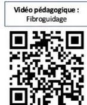
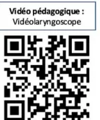
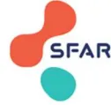
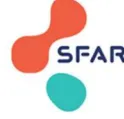
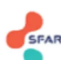

## **RECOMMANDER** LES BONNES PRATIQUES

---

### ARGUMENTAIRE

# Prise en charge des voies aériennes de l'adulte au bloc opératoire

Adult Airway Management in the  
Operating Room

---

**Adopté par le Collège le 3 septembre 2026**Les recommandations de bonne pratique (RBP) sont définies dans le champ de la santé comme des propositions développées méthodiquement pour aider le praticien et le patient à rechercher les soins les plus appropriés dans des circonstances cliniques données.

Les RBP sont des synthèses rigoureuses de l'état de l'art et des données de la science à un temps donné, décrites dans l'argumentaire scientifique. Elles sont intégrées dans une démarche clinique centrée patient qui prend en compte l'expérience vécue du patient, ses représentations, ses attentes et son état d'esprit pour aboutir à une décision médicale partagée. Ce processus délibératif entre patient et professionnel de santé s'effectue au sein d'une relation empathique et dans une approche biopsychosociale globale et contextuelle qui permet d'aboutir à une alliance thérapeutique.

Cette recommandation de bonne pratique a été élaborée avec une approche basée sur les preuves (EBM) selon le système GRADE. Les caractéristiques de GRADE sont les suivantes :

- – il permet d'évaluer la qualité des données probantes de façon systématique afin de mesurer le niveau de confiance à leur accorder en vue de produire une recommandation ;
- – il prend en compte l'opinion des professionnels de santé vis-à-vis de la balance bénéfice/risque d'une intervention thérapeutique, qu'elle soit curative ou préventive, pour déterminer la force d'une recommandation ;
- – il incorpore les préférences du patient dans la genèse des recommandations, en cohérence avec une approche centrée sur le patient.

## Gradation des recommandations et avis d'experts

<table border="1"><tbody><tr><td><b>1</b></td><td><p><b>Recommandation forte</b></p><p>Balance bénéfices/risques démontrée favorable ou démontrée défavorable</p><p>Fondée sur le résultat de méta-analyse d'essais cliniques randomisés statistiquement significatif* avec une qualité des preuves élevée en faveur d'un bénéfice clinique pertinent. Dans cette situation, l'approche centrée patient permet de prendre en compte l'avis du patient vers l'acceptation de l'intervention.</p></td></tr><tr><td><b>2</b></td><td><p><b>Recommandation faible</b></p><p>Balance bénéfices/risques démontrée plutôt favorable ou balance bénéfices/risques présumée favorable ;<br/>Balance bénéfices/risques démontrée plutôt défavorable ou balance bénéfices/risques présumée défavorable</p><p>Fondée sur le résultat de méta-analyse d'essais cliniques randomisés statistiquement significatif <b>Erreur ! Signet non défini.</b> avec une qualité des preuves élevée en faveur d'un bénéfice clinique peu pertinent ou avec une qualité des preuves modérée en faveur d'un bénéfice clinique pertinent. Dans cette situation, l'approche centrée patient permet d'appréhender avec le patient l'(les) intérêt(s) de l'intervention dans son contexte particulier.</p></td></tr><tr><td><b>ABS</b></td><td><p><b>Pas de recommandation</b></p><p>Absence d'études ou de résultats concluants, c.à.d. résultats non statistiquement significatifs <b>Erreur ! Signet non défini.</b> ou de qualité de preuves faible ou très faible, ne permettant pas de proposer une intervention.</p></td></tr><tr><td><b>AE</b></td><td><p><b>Avis d'experts</b></p><p>Balance bénéfices/risques indéterminée.</p><p>Absence d'études ou de résultats concluants, c.à.d. résultats non statistiquement significatifs ou de qualité de preuves faible ou très faible.</p><p>Proposition par un avis d'experts d'une intervention. Cet avis s'appuie ou non sur une revue systématique de la littérature des recommandations existantes et des méta-analyses d'études de cohorte. Dans cette situation, l'approche centrée patient permet d'accompagner le patient dans sa décision en l'absence de</p></td></tr></tbody></table>recommandation, en se basant sur la balance bénéfices/risques supposée de l'intervention, dans son contexte particulier et en prenant en compte sa perspective.

### Formulations utilisées pour chaque situation

#### Recommandation forte pour/contre l'intervention (grade 1)

« Il est recommandé de/de ne pas ... » (*recommandation forte, qualité des preuves élevée*)

#### Recommandation faible pour/contre l'intervention (grade 2)

« Il est probablement recommandé de/de ne pas ... » (*recommandation faible, qualité des preuves modérée*)

« Il est recommandé de/de ne pas ... » (*recommandation faible, qualité des preuves élevée*)

#### Pas de recommandation (Absence)

« Devant l'absence de donnée disponible dans la littérature, les experts ne sont pas en mesure d'émettre des recommandations », « Les données sont insuffisantes pour établir une recommandation [...]. Il est nécessaire que des essais cliniques randomisés de qualité soient réalisés pour répondre clairement à cette question ».

#### Avis d'experts (AE)

« Les experts suggèrent de », « Il est suggéré/conseillé de/de ne pas ) [...]. Il est nécessaire que des essais cliniques randomisés de qualité soient réalisés pour répondre clairement à cette question [si approprié] » (*avis d'experts*)# Descriptif de la publication

<table border="1"><tr><td><b>Titre</b></td><td><b>Prise en charge des voies aériennes de l'adulte au bloc opératoire</b><br/>Adult Airway Management in the Operating Room</td></tr><tr><td><b>Méthode de travail</b></td><td>Recommandations pour la pratique clinique-LABEL</td></tr><tr><td><b>Objectif(s)</b></td><td>La Société Française d'Anesthésie et de Réanimation (SFAR), le Club d'Anesthésie-Réanimation en ORL (CARORL), le Collège d'Anesthésie-Réanimation en Obstétrique (CARO), le groupe Facteurs Humains en Santé (FHS) et la Société Française d'ORL (SFORL) se sont associés pour proposer un référentiel sur la prise en charge initiale des voies aériennes de l'adulte au bloc opératoire.</td></tr><tr><td><b>Cibles concernées</b></td><td>Les professionnels concernés sont l'ensemble des acteurs impliqués dans la prise en charge initiale des voies aériennes de l'adulte au bloc opératoire.</td></tr><tr><td><b>Demandeur</b></td><td>La Société Française d'Anesthésie et de Réanimation (SFAR), le Club d'Anesthésie-Réanimation en ORL (CARORL), le Collège d'Anesthésie-Réanimation en Obstétrique (CARO), le groupe Facteurs Humains en Santé (FHS) et la Société Française d'ORL (SFORL).</td></tr><tr><td><b>Promoteur(s)</b></td><td>Société Française d'Anesthésie et Réanimation (SFAR) ; Haute Autorité de santé (HAS)</td></tr><tr><td><b>Pilotage du projet</b></td><td><b>Coordinateurs des experts :</b> Dr Romain Deransy, Pr Vincent Degos<br/><b>Organisateurs CRC SFAR :</b> Dr Hugues de Courson, Dr Mehdi Hafiani<br/><b>Coordinateur HAS :</b> Sophie Blanchart Musset Ph.D.<br/><b>Auteurs :</b> Romain Deransy, Vincent Degos, Osama Abou Arab, Christophe Baillard, Virginie Billard, Charly Bourguignon, Laurent Cervoni, Aude Charvet, Audrey de Jong, Erwan de Mones del Pujol, Virginie Dumans, Antoine Duwat, Pauline Glasman, Thomas Godet, Claire Gourbeix, Hawa Keita-Meyer, Olivier Langeron, Mathieu Lecompte, Morgan le Guen, Anne-Laure Lepilleur-Deleu, Ségolène Mrozek, Karine Nouette-Gaulain, Patrick Schoettker, Neji Stambouli, Florence Vial, Mehdi Hafiani, Hugues de Courson.</td></tr><tr><td><b>Conflits d'intérêts</b></td><td>Les membres du groupe de travail ont communiqué leurs déclarations publiques d'intérêts à la HAS. Elles sont consultables sur le site <a href="https://dpi.sante.gouv.fr">https://dpi.sante.gouv.fr</a>. Elles ont été analysées selon la grille d'analyse du guide des déclarations d'intérêts et de gestion des conflits d'intérêts de la HAS. Les intérêts déclarés par les membres du groupe de travail ont été considérés comme étant compatibles avec leur participation à ce travail.</td></tr><tr><td><b>Validation</b></td><td>Version du 3 septembre 2026</td></tr><tr><td><b>Actualisation</b></td><td></td></tr><tr><td><b>Autres formats</b></td><td></td></tr></table>

Ce document ainsi que sa référence bibliographique sont téléchargeables sur [www.has-sante.fr](https://www.has-sante.fr)

Haute Autorité de santé – Service communication information  
5 avenue du Stade de France – 93218 SAINT-DENIS LA PLAINE CEDEX. Tél. : +33 (0)1 55 93 70 00  
© Haute Autorité de santé – septembre 2026 – ISBN :978-2-11-186347-7# Sommaire

---

<table><tr><td><b>Préambule</b></td><td><b>6</b></td></tr><tr><td><b>Introduction</b></td><td><b>7</b></td></tr><tr><td><b>Champs et questions traitées</b></td><td><b>9</b></td></tr><tr><td><b>Champ 1. Prise en charge des voies aériennes sans difficulté prévisible</b></td><td><b>11</b></td></tr><tr><td><b>Champ 2. Prise en charge initiale voies aériennes difficiles (prévue ou non)</b></td><td><b>22</b></td></tr><tr><td><b>Champ 3. Facteurs humains – Dimensions organisationnelles</b></td><td><b>30</b></td></tr><tr><td><b>Figures</b></td><td><b>37</b></td></tr><tr><td><b>Synthèse des recommandations</b></td><td><b>45</b></td></tr><tr><td><b>Méthode</b></td><td><b>51</b></td></tr><tr><td><b>Recueil de l'expérience de patients</b></td><td><b>56</b></td></tr><tr><td><b>Références bibliographiques</b></td><td><b>60</b></td></tr><tr><td><b>Participants</b></td><td><b>73</b></td></tr></table># Préambule

Ces recommandations portent sur la **prise en charge des voies aériennes de l'adulte au bloc opératoire**.

La société promotrice a été :

- – La Société Française d'Anesthésie et Réanimation (SFAR)

Et les sociétés associées ont été :

- – Le Club d'Anesthésie-Réanimation en ORL (CARORL),
- – Le Collège d'Anesthésie-Réanimation en Obstétrique (CARO)
- – Les Facteurs Humains en Santé (FHS).
- – La Société Française d'ORL (SFORL)
- – L'association CORASSO

Cette recommandation de bonne pratique (RBP) a été réalisée dans le cadre de la labellisation par la HAS<sup>†</sup> garantissant le respect des critères méthodologiques, scientifiques et déontologiques de la HAS, notamment dans la prévention des conflits d'intérêt.

## Objectifs

L'objectif de ces recommandations est de produire un cadre facilitant la prise de décision pour la gestion des voies aériennes de l'adulte au bloc opératoire.

En proposant un cadre commun, adaptable aux différents contextes d'exercice, ces recommandations visent à améliorer la qualité et la sécurité des soins, et à réduire la morbi-mortalité associée aux défaillances vitales survenant en établissements de santé.

Le groupe de travail s'est efforcé de produire un nombre minimal de recommandations afin de mettre en évidence les points forts à retenir dans les deux champs prédéfinis.

Les règles de base des bonnes pratiques médicales universelles en anesthésie et réanimation étant considérées comme connues, elles ont été exclues de ces recommandations.

## Cibles

**Les professionnels concernés** sont est l'ensemble des acteurs impliqués dans la gestion des voies aériennes de l'adulte au bloc opératoire.

**Les populations concernées** sont les patients adultes bénéficiant d'une procédure au bloc opératoire ou dans un plateau technique interventionnel.

Ces recommandations ne traitent pas des spécificités des populations pédiatriques et des soins critiques.

---

<sup>†</sup> 1 Cf. Guide méthodologique « Attribution du label de la HAS à une recommandation de bonne pratique élaborée par un organisme professionnel » (HAS, 2023) : [https://www.has-sante.fr/jcms/p\\_3452920/fr/labellisation-par-la-has-d-une-recommandation-debonne-pratique-elaboree-par-un-organisme-professionnel](https://www.has-sante.fr/jcms/p_3452920/fr/labellisation-par-la-has-d-une-recommandation-debonne-pratique-elaboree-par-un-organisme-professionnel)# Introduction

La prise en charge initiale des voies aériennes de l'adulte au bloc opératoire est au cœur de l'expertise des professionnels de l'anesthésie-réanimation.

Les dernières recommandations éditées par la SFAR sur ce sujet datent de 2017. Depuis, la littérature s'est enrichie et les pratiques ont évolué, en particulier au bloc opératoire. Il est donc apparu nécessaire d'élaborer de nouvelles recommandations abordant des thématiques d'actualité telles que la vidolaryngoscopie, l'oxygénation nasale à haut débit, les dispositifs supraglottiques (DSG) de seconde génération, les techniques d'abord sous-glottiques en situation d'urgence et l'intégration des facteurs humains.

Cette recommandation de bonne pratique ne se substitue pas aux précédentes recommandations formalisées d'experts, mais les complète. Les experts invitent donc les lecteurs à s'y reporter, notamment pour les critères prédictifs d'intubation difficile et de ventilation au masque difficile, pour la préoxygenation ainsi que pour la gestion de l'extubation, qui ne sont pas abordés dans le présent document.

Les experts soulignent que toute stratégie de prise en charge des voies aériennes doit reposer sur une évaluation préalable du rapport bénéfice-risque, tenant compte des caractéristiques du patient, du contexte interventionnel, des compétences disponibles et des ressources mobilisables. Cette analyse conditionne le choix des techniques et des dispositifs les plus adaptés à chaque situation clinique (cf. figure 1).

Par ailleurs, les experts souhaitent rappeler l'importance de la qualité de l'anesthésie, celle-ci influençant de manière déterminante l'efficacité des manœuvres à chaque étape de la prise en charge des voies aériennes.

Les experts rappellent également que la gestion sécurisée des voies aériennes s'inscrit dans le respect des recommandations organisationnelles de la SFAR en vigueur, notamment en ce qui concerne les ressources humaines nécessaires à la prise en charge des patients.

L'association de patients Corasso<sup>†</sup> a participé à l'élaboration de ce travail afin d'enrichir la réflexion des experts par l'expérience des patients et de contribuer à l'amélioration des pratiques. Des témoignages de patients, illustrant leur vécu de la prise en charge des voies aériennes, sont présentés en annexe 1.

Enfin, l'information du patient et la traçabilité doivent être des préoccupations constantes tout au long de la prise en charge.

Les experts soulignent que l'information délivrée au patient constitue un préalable indispensable à sa participation active à la prise en charge des voies aériennes. Cette coopération, complémentaire de l'information, doit être recherchée chaque fois que la situation clinique le permet et à différents temps du parcours de soins. Cette coopération est initiée lors de la consultation d'anesthésie, au cours de laquelle le patient reçoit l'information nécessaire à la compréhension de la stratégie envisagée et peut exprimer son accord. Elle se poursuit au moment de l'installation en salle d'intervention et avant l'induction de l'anesthésie, lorsque la participation du patient contribue à l'optimisation des conditions de prise en charge des voies aériennes, notamment pour le positionnement et la préoxygenation. Les

---

<sup>†</sup> L'association CORASSO a pour objectif de soutenir et informer les personnes touchées par un cancer ou un cancer rare tête et cou (voies aérodigestives supérieures, sphère ORL, maxillo-faciale et cervico faciale).experts considèrent ainsi que l'information préalable constitue une condition nécessaire, mais non suffisante, à l'obtention de cette coopération, laquelle s'inscrit dans une démarche continue associant le patient à sa prise en charge chaque fois que cela est possible.# Champs et questions traitées

Les présentes recommandations ont été élaborées selon la méthodologie GRADE (Grading of Recommendations Assessment, Development and Evaluation), permettant une évaluation systématique de la qualité des preuves et de la force des recommandations.

Elles sont structurées en 3 champs complémentaires et les questions rapportées dans le tableau ci-après.

<table border="1"><thead><tr><th>Champ</th><th>Questions</th></tr></thead><tbody><tr><td colspan="2"><b>Champ 1. Prise en charge des voies aériennes sans difficulté prévisible</b></td></tr><tr><td colspan="2">Q1.1 - En l'absence de critères prédictifs d'intubation difficile, faut-il utiliser un vidéolaryngoscope en première intention pour faciliter l'exposition glottique et l'intubation trachéale ?</td></tr><tr><td colspan="2">Q1.2 - En l'absence de critères prédictifs d'intubation difficile, l'utilisation d'un vidéolaryngoscope permet-elle de s'affranchir de l'administration d'un curare pour faciliter l'intubation trachéale ?</td></tr><tr><td colspan="2">Q1.3 - Chez les patients adultes requérant une anesthésie générale programmée sous ventilation mécanique, les dispositifs supraglottiques sont-ils équivalents et/ou supérieurs à l'intubation trachéale en termes de sécurité respiratoire peropératoire ?</td></tr><tr><td colspan="2">Q1.4 - Chez les patients adultes requérant une anesthésie générale, l'utilisation de l'échographie gastrique permet-elle d'identifier la vacuité gastrique et de décider d'une indication d'induction en séquence rapide par rapport à une évaluation clinique ?</td></tr><tr><td colspan="2">Q1.5 - Lors d'une sédation procédurale (c'est-à-dire sans intubation trachéale ni pose de dispositif supraglottique), quelle est la place de l'oxygénation nasale à haut débit pour assurer l'oxygénation ?</td></tr><tr><td colspan="2">Q1.6 - Lors d'une sédation procédurale nécessitant une apnée (absence de ventilation spontanée), la mise en place d'un dispositif d'oxygénation nasale à haut débit permet-elle de diminuer le risque d'hypoxémie pendant la procédure ?</td></tr><tr><td colspan="2">Q1.7 - Place du monitoring de la capnie lors de l'utilisation de l'oxygénation nasale à haut débit avec sédation procédurale ?</td></tr><tr><td colspan="2"><b>Champ 2. Prise en charge des voies aériennes difficiles (prévue ou non)</b></td></tr><tr><td colspan="2">Q2.1 - Lors d'une intubation difficile prévue sans indication au maintien de la ventilation spontanée (intubation difficile prévue chez un patient a priori ventilable), la mise en place d'un dispositif d'oxygénation nasale à haut débit permet-elle de diminuer le risque de désaturation durant les manœuvres d'intubation trachéale ?</td></tr><tr><td colspan="2">Q2.2 - Lors d'une intubation trachéale avec indication de maintien de la ventilation spontanée (intubation difficile prévue chez un patient a priori non ventilable), quelle est la place de la vidéolaryngoscopie par rapport à la technique de référence (fibroscopie), en vue de garantir le succès de l'intubation trachéale ?</td></tr><tr><td colspan="2">Q2.3 - En cas d'intubation difficile associée à une ventilation au masque difficile, quelle est la place des dispositifs supraglottiques de seconde génération ?</td></tr><tr><td colspan="2">Q2.4 - En cas d'intubation impossible et de ventilation impossible malgré la mise en place d'un dispositif supraglottique de seconde génération (situation de "cannot intubate, cannot oxygenate"),</td></tr></tbody></table>quelles techniques d'abord sous-glottiques d'urgence sont les plus efficaces pour assurer rapidement l'oxygénation ?

### **Champ 3. Facteurs humains – dimensions organisationnelles**

Q3.1 - Dans la préparation à une gestion difficile des voies aériennes, la simulation permet-elle d'améliorer la performance individuelle et collective ?

Q3.2 - Dans la préparation à une gestion difficile des voies aériennes, un nombre minimal de procédures permet-il d'améliorer la performance individuelle et collective ?

Q3.3 - Dans la préparation à une gestion difficile des voies aériennes, la réalisation d'un briefing permet-elle d'améliorer la performance individuelle et collective ?

Q3.4 - Dans la préparation à une gestion difficile des voies aériennes, les techniques de préparation mentale améliorent-elles la performance individuelle et collective ?

Q3.5 - Après une gestion difficile d'accès aux voies aériennes, la réalisation d'un defusing permet-elle d'améliorer la performance individuelle et collective future ?

Q3.6 - Après une gestion difficile d'accès aux voies aériennes, la réalisation d'un debriefing permet-elle d'améliorer la performance individuelle et collective future ?

Q3.7 - Après une gestion difficile d'accès aux voies aériennes, la réalisation d'une revue de mortalité et de morbidité permet-elle d'améliorer la performance individuelle et collective future ?# Champ 1. Prise en charge des voies aériennes sans difficulté prévisible

**Question 1.1 : En l'absence de critères prédictifs d'intubation difficile, faut-il utiliser un vidéo-laryngoscope en première intention pour faciliter l'exposition glottique et l'intubation trachéale ?**

Experts : Charly Bourguignon (SFAR, Nancy), Audrey De Jong (SFAR, Montpellier), Hawa Keita-Meyer (CARO, Paris), Patrick Schoettker (SFAR, Lausanne), Florence Vial (CARO, Nancy)

<table border="1">
<thead>
<tr>
<th colspan="2">RECOMMANDATION</th>
<th>Niveau de preuve</th>
</tr>
</thead>
<tbody>
<tr>
<td colspan="3"><b>Champ 1. Prise en charge des voies aériennes sans difficulté prévisible</b></td>
</tr>
<tr>
<td>R1.1.1</td>
<td>En l'absence de critères prédictifs d'intubation difficile, il est recommandé d'utiliser un vidéo-laryngoscope en première intention plutôt qu'un laryngoscope direct pour augmenter le succès à la première tentative.</td>
<td>1</td>
</tr>
<tr>
<td>R1.1.2</td>
<td>En l'absence de critères prédictifs d'intubation difficile, il est recommandé d'utiliser un vidéo-laryngoscope en première intention plutôt qu'un laryngoscope direct pour diminuer les complications associées à l'intubation trachéale.</td>
<td>2</td>
</tr>
</tbody>
</table>

## Argumentaire :

Le vidéo-laryngoscope (VL) permet une vision indirecte de la glotte, souvent supérieure à celle obtenue par laryngoscopie directe [1, 2]. En termes d'efficacité et comparativement à la laryngoscopie directe, l'utilisation du VL améliore significativement le taux de succès à la première tentative d'intubation trachéale chez les patients sans critères prédictifs d'intubation difficile mais également en cas d'intubation difficile non prédite [1, 2]. En termes de sécurité, la VL est associée à une diminution des lésions des voies aériennes, de l'hypoxémie et des douleurs oropharyngées [1, 3]. Ces résultats sont également retrouvés chez les patients présentant une obésité [1, 4] et en situation d'estomac plein. De plus, la visualisation partagée de la glotte pourrait favoriser l'enseignement, l'entraînement et le débriefing.

**Chez les femmes enceintes**, en l'absence de critères prédictifs d'intubation difficile, la vidéo-laryngoscopie améliore l'exposition glottique sans prolonger la durée de la procédure [5]. Toutefois, les études randomisées contrôlées incluses dans la méta-analyse de Howle et al. ne mettent pas en évidence de différence significative du taux de succès de l'intubation trachéale par rapport à la laryngoscopie directe [5]. Il convient néanmoins de souligner que les femmes nécessitant une césarienne en urgence, ainsi que les anesthésistes peu expérimentés ont été exclus des principaux essais randomisés de cette méta-analyse [6]. Au total et par extrapolation, les experts ont décidé d'inclure les femmes enceintes dans ces recommandations.

L'utilisation systématique d'un vidéo-laryngoscope au bloc opératoire pour l'ensemble des intubations trachéales représente un investissement initial non négligeable, lié aux coûts d'acquisition et de maintenance du matériel. Cependant, cet investissement pourrait être compensé par un gain immédiat entermes d'efficacité et de sécurité. Bien qu'aucune étude médico-économique formelle ne soit actuellement publiée, certaines données suggèrent que l'utilisation de la vidéolaryngoscopie en première intention permettrait de réduire les coûts par rapport à la laryngoscopie directe [7]. Dans cette perspective, la vidéolaryngoscopie ne doit plus être considérée comme une option, mais comme un standard d'efficacité au bloc opératoire (cf. figure 2).

Quelle que soit la population, le type de vidéolaryngoscope à utiliser reste non consensuel, et dépend notamment de l'expérience de l'opérateur et de l'équipe [1, 3]. Il convient néanmoins de connaître les spécificités d'utilisation de chaque VL afin de limiter les coûts et l'impact écologique liés à leur emploi en première intention. Avec les vidéolaryngoscopes à lames normoangulées (type Macintosh), l'utilisation d'un mandrin (long béquillé, stylet) est possible mais ne revêt pas de caractère systématique. En revanche, avec les vidéolaryngoscopes à lames hyperangulées et dépourvus de canal de guidage, la littérature rapporte fréquemment l'utilisation d'un mandrin adapté à la courbure de la lame, permettant d'optimiser la progression de la sonde d'intubation à travers le plan glottique. Les experts proposent d'utiliser en première intention des VL à lames normoangulées (type Macintosh), afin de réserver les lames hyperangulées et les VL à usage unique (écran et lame solidarisés) aux patients présentant des critères prédictifs d'intubation difficile ou lors d'une intubation difficile non prévue afin d'optimiser les conditions d'intubation.

Depuis 2025, plusieurs sociétés savantes, dont la Difficult Airway Society (DAS) et la Société Espagnole d'Anesthésie, recommandent l'utilisation du vidéolaryngoscope en première intention, même en l'absence de critères prédictifs d'intubation difficile [3, 8].

### Question 1.2 : En l'absence de critères prédictifs d'intubation difficile, l'utilisation d'un vidéolaryngoscope permet-elle de s'affranchir de l'administration d'un curare pour faciliter l'intubation trachéale ?

Experts : Christophe Baillard (SFAR, Paris), Virginie Dumans (SFAR, Suresnes), Anne-Laure Lepilleur Deleu (SFAR, Ancenis), Neji Stambouli (SFAR, Villejuif)

<table border="1">
<thead>
<tr>
<th colspan="2">RECOMMANDATION</th>
<th>Niveau de preuve</th>
</tr>
</thead>
<tbody>
<tr>
<td colspan="3"><b>Champ 1. Prise en charge des voies aériennes sans difficulté prévisible</b></td>
</tr>
<tr>
<td>R1.2</td>
<td>Chez les patients adultes ne présentant pas de critères prédictifs d'intubation difficile, les experts suggèrent d'administrer un curare lors de l'utilisation d'un vidéolaryngoscope pour faciliter l'intubation trachéale.</td>
<td>AE</td>
</tr>
</tbody>
</table>

#### Argumentaire

De manière générale, et conformément à la recommandation formalisée d'experts SFAR 2018 « Curarisation et décurarisation en anesthésie », l'administration d'un curare est recommandée afin de faciliter l'intubation trachéale (GRADE 1) [9].

La question abordée ici concerne spécifiquement l'intérêt de la curarisation lors de l'utilisation d'un vidéolaryngoscope chez des patients ne présentant pas de critères prédictifs d'intubation difficile.

Les données concernant cette question sont limitées. Les études disponibles ne permettent pas de conclure que l'utilisation d'un vidéolaryngoscope dispense du recours à un curare pour l'intubation trachéale [10, 11]. Au contraire, dans chacune de ces études, les conditions d'intubation apparaissent plus favorables en présence d'une curarisation.Ainsi, chez des patients ne présentant pas de critères prédictifs d'intubation difficile, l'administration d'un curare facilite l'intubation trachéale tout en réduisant la morbidité laryngée (cf. figure 2).

**Question 1.3 : Chez les patients adultes requérant une anesthésie générale programmée sous ventilation mécanique, les dispositifs supraglottiques sont-ils équivalents et/ou supérieurs à l'intubation trachéale en termes de sécurité respiratoire peropératoire ?**

Experts : Pauline Glasman (SFAR, Paris) – Hawa Keita-Meyer (CARO, Paris) – Morgan Le Guen (SFAR, Suresnes) – Ségolène Mrozek (SFAR, Toulouse) – Karine Nouette-Gaulain (SFAR, Bordeaux) – Neji Stambouli (SFAR, Villejuif) – Florence Vial (CARO, Nancy)

<table border="1">
<thead>
<tr>
<th colspan="2">RECOMMANDATION</th>
<th>Niveau de preuve</th>
</tr>
</thead>
<tbody>
<tr>
<td colspan="3"><b>Champ 1. Prise en charge des voies aériennes sans difficulté prévisible</b></td>
</tr>
<tr>
<td>R1.3.1</td>
<td><b>Chez les patients adultes sans facteurs de risque d'estomac plein</b>, requérant une anesthésie générale programmée sous ventilation mécanique, lorsque l'installation et la technique chirurgicale rendent possible leur utilisation, il est recommandé de privilégier les dispositifs supraglottiques de 2<sup>ème</sup> génération à l'intubation trachéale pour diminuer les complications respiratoires périopératoires.</td>
<td>2</td>
</tr>
<tr>
<td>R1.3.2</td>
<td><b>Chez les patients adultes sans facteurs de risque d'estomac plein</b>, requérant une chirurgie abdominopelvienne programmée, y compris laparoscopique (avec ou sans curares), il est recommandé de privilégier les dispositifs supraglottiques de 2<sup>ème</sup> génération à l'intubation trachéale pour diminuer les complications respiratoires périopératoires.</td>
<td>2</td>
</tr>
<tr>
<td>R1.3.3</td>
<td><b>Chez les patients adultes sans facteurs de risque d'estomac plein</b>, requérant une anesthésie générale programmée sous ventilation mécanique, et lorsque l'installation, la technique chirurgicale rendent possible leur utilisation, il est recommandé d'utiliser des dispositifs supraglottiques de 2<sup>ème</sup> génération afin de diminuer l'incidence des douleurs pharyngées postopératoires.</td>
<td>2</td>
</tr>
<tr>
<td>R1.3.4</td>
<td><b>Chez la femme enceinte après 16 semaines d'aménorrhée</b>, dans le cadre d'une anesthésie générale programmée sous ventilation mécanique, les experts suggèrent de ne pas utiliser un dispositif supraglottique par rapport à l'intubation trachéale afin de diminuer les complications respiratoires peropératoires.</td>
<td>AE</td>
</tr>
</tbody>
</table><table border="1">
<tr>
<td data-bbox="84 63 201 174">R1.3.5</td>
<td data-bbox="201 63 788 174"><b>Chez la femme enceinte avant 16 semaines d'aménorrhée</b>, dans le cadre d'une anesthésie générale programmée sous ventilation mécanique, les experts suggèrent d'appliquer les recommandations en vigueur chez le patient adulte afin d'améliorer la sécurité respiratoire peropératoire.</td>
<td data-bbox="788 63 884 174">AE</td>
</tr>
</table>

## Argumentaire

L'utilisation anticipée d'un dispositif supraglottique (DSG) lors d'une intervention programmée de l'adulte au bloc opératoire sous anesthésie générale nécessite de prendre en compte les contre-indications liées :

### – Au risque d'inhalation ;

- • Estomac plein ou absence de jeûne préopératoire
- • Reflux gastro-œsophagien non contrôlé

### – Au risque de mobilisation secondaire du DSG ;

- • Mobilisation peropératoire pour des raisons chirurgicales
- • Absence d'accès immédiat à la tête (par exemple : actes ORL, neurochirurgicaux ou mise en décubitus ventral)

En dehors de ces contre-indications, et au regard de la littérature récente, l'utilisation des DSG de seconde génération, comparativement à l'intubation trachéale, est associée à une diminution des complications respiratoires périopératoires. Une méta-analyse publiée en 2025 rapporte une réduction des complications respiratoires en chirurgie abdominale par laparoscopie ou laparotomie, avec ou sans utilisation de curares [12]. Au total, 51 études randomisées ont ainsi été incluses, représentant plus de 5 000 patients. Le critère de jugement principal était la survenue de complications respiratoires majeures (laryngospasme, bronchospasme et hypoxémie), dont l'incidence était significativement réduite avec les DSG (RR 0,41 [0,23–0,71],  $p = 0,007$ ). Cependant, cette réduction des complications respiratoires s'accompagnait d'une augmentation significative du risque de ventilation inadéquate avec les DSG (RR 3,36 [1,43–7,89],  $p = 0,011$ ), soulignant la nécessité d'une sélection appropriée des patients et d'une surveillance attentive de la ventilation. Aucune différence n'était observée concernant la régurgitation entre les deux groupes et aucun cas d'inhalation n'a été rapporté [12]. Ces résultats rejoignent ceux d'une étude rétrospective comparant le risque d'inhalation selon l'utilisation des DSG de première génération ou l'intubation orotrachéale sur plus de 65 000 procédures : OR d'inhalation = 1,06 (0,20-5,62) [13]. L'absence de cas d'inhalation rapporté dans cette méta-analyse doit être interprétée avec prudence. L'inhalation est un événement rare, avec une incidence d'environ 1 pour 7 000 anesthésies dans une grande série adulte récente [14]. Dès lors, un effectif de méta-analyse d'environ 5000 patients ne permet pas d'exclure un sur-risque cliniquement pertinent associé à une stratégie de prise en charge des voies aériennes. Cette absence d'événement ne doit donc pas être interprétée comme une démonstration d'équivalence ou de sécurité vis-à-vis du risque d'inhalation.

Dans la méta-analyse de Carvahlo et al., le type de chirurgie le plus représenté était la chirurgie abdominale laparoscopique (41 études sur 51) avec une position du patient majoritairement en décubitus dorsal. Aucune durée maximale de ventilation mécanique n'était précisée [12].

L'étude de Liu et al. se distingue par l'inclusion de patients opérés pour des interventions variées (abdominales, urologiques et orthopédiques) et met en évidence une réduction significative de l'incidence de l'hypoxémie avec les DSG de seconde génération ( $p = 0,032$ ). Les auteurs expliquent en partie ce résultat par une meilleure aération pulmonaire objectivée en échographie pulmonaire : score LUS  $4,35 \pm 3$  versus  $8,5 \pm 4,76$  (différence =  $4,15 \pm 0,60$  ; IC 95 % [2,97–5,33] ;  $p < 0,001$ ) [14].Une expérience originale en chirurgie thoracique est rapportée par Huang et al., qui ont comparé l'insertion d'une sonde sélective double-lumière à la mise en place d'un DSG de deuxième génération associée à un bloqueur bronchique. Ils rapportent une incidence comparable des épisodes d'hypoxémie ( $p = 0,57$ ) et une réduction significative des traumatismes glottiques : 9 % versus 37 %,  $p < 0,001$  (RR 0,25 ; IC 95 % 0,13–0,47) [16]. Ces résultats suggèrent la faisabilité d'une stratégie alternative dans des contextes sélectionnés, sans toutefois permettre de conclure à sa supériorité globale.

Des études portant sur des populations spécifiques apportent également des données complémentaires. Ainsi, Nicholson et al. ont étudié une population de patients obèses avec un IMC  $> 30 \text{ kg/m}^2$  ( $n = 232$ ) et n'ont retrouvé aucune différence de survenue d'événements respiratoires sévères selon le dispositif utilisé, ni aucun cas d'inhalation [17].

D'autres critères de jugement postopératoires ont également été analysés. Chez les patients âgés ( $> 70$  ans) opérés de chirurgie orthopédique, Chen et al. rapportent une réduction significative des douleurs pharyngées : 35 % versus 62 %,  $p = 0,032$  [17]. La méta-analyse de Carvalho et al. retrouve également une réduction de l'incidence de plusieurs événements indésirables postopératoires avec les DSG de seconde génération : douleurs pharyngées réduites de près de 50 % (RR 0,52 [0,38–0,70],  $p < 0,001$ ), enrouement réduit des deux tiers (RR 0,32 [0,21–0,48],  $p < 0,001$ ) et diminution des épisodes de toux en SSPI (RR 0,17 [0,08–0,36],  $p < 0,001$ ) [12]. Ces résultats sont cohérents avec ceux de la méta-analyse antérieure de Yu et al. [19].

Le DSG de seconde génération est un masque laryngé supraglottique doté d'un canal gastrique et qui présente une meilleure étanchéité que les dispositifs de première génération. Ces améliorations permettent une efficacité ventilatoire et une sécurité pour les aspirations gastriques.

**Chez les femmes enceintes**, les modifications physiologiques et anatomiques liées à la grossesse sont associées à une désaturation plus rapide, d'une réduction du diamètre de la filière pharyngolaryngée et d'une majoration du risque de régurgitation et d'inhalation du contenu gastrique dès 16 SA chez la femme enceinte. Toutefois, le rationnel de ce seuil gestationnel repose principalement sur l'évolution progressive des modifications physiologiques de la grossesse, alors que les données de la littérature internationale demeurent hétérogènes quant au moment précis où le risque d'inhalation devient cliniquement significatif. Par ailleurs, certaines situations associées à un risque accru de régurgitation et d'inhalation, telles que l'obésité, le diabète, les grossesses multiples ou le contexte d'urgence, peuvent conduire à considérer la patiente comme à risque d'inhalation à un terme plus précoce.

Chez les femmes enceintes, la quasi-totalité des études randomisées contrôlées ayant comparé les dispositifs supraglottiques (DSG) à l'intubation trachéale a été réalisée dans le cadre de césariennes programmées chez des femmes à faible risque d'inhalation et d'intubation difficile [20–21]. Ainsi, les patientes non à jeun, obèses ou en cours de travail étaient exclues de la majorité de ces études. De plus, plusieurs limites méthodologiques persistent, notamment la qualité méthodologique parfois insuffisante des études, leur hétérogénéité (DSG de première et deuxième génération, différents modèles) ainsi que leur manque de puissance statistique, en particulier pour l'évaluation du risque d'inhalation.

À noter que les analyses en sous-groupes mettaient en évidence une augmentation du taux de succès de l'insertion au premier essai ainsi qu'une diminution de l'incidence des mobilisations secondaires, toutes deux significatives avec l'i-gel® comparé aux autres DSG [20]. Les douleurs pharyngo-laryngées postopératoire étaient significativement moins fréquentes avec les DSG (OR 0,16 ; IC 95 % [0.08 - 0.32] ;  $p < 0.001$ )) [20].

Malgré ces données, les DSG ne peuvent pas être recommandés en première intention pour la prise en charge des voies aériennes chez les femmes enceintes bénéficiant d'une anesthésie générale pour césarienne, notamment en raison des incertitudes persistantes concernant la sécurité respiratoire peropératoire, et en particulier le risque d'inhalation.

Les DSG, en particulier ceux de deuxième génération, constituent des dispositifs de recours en cas de difficulté de gestion des voies aériennes, aussi bien chez la femme enceinte que chez l'ensemble des patients adultes (cf. figure 2) [22].

**Question 1.4 : Chez les patients adultes requérant une anesthésie générale, l'utilisation de l'échographie gastrique permet-elle d'identifier la vacuité gastrique et de décider d'une indication d'induction en séquence rapide par rapport à une évaluation clinique ?**

Experts : Virginie Dumans (SFAR, Suresnes), Hawa Keita-Meyer (CARO, Paris), Osama Abou Arab (SFAR, Amiens), Thomas Godet (SFAR, Clermont-Ferrand), Florence Vial (CARO, Nancy)

<table border="1"><thead><tr><th colspan="2">RECOMMANDATION</th><th>Niveau de preuve</th></tr></thead><tbody><tr><td colspan="3"><b>Champ 1. Prise en charge des voies aériennes sans difficulté prévisible</b></td></tr><tr><td>R1.4</td><td><b>ABSENCE DE RECOMMANDATION</b><br/>Chez le patient adulte, les données de la littérature ne permettent pas de conclure sur l'intérêt de l'échographie gastrique dans la décision d'induction en séquence rapide afin de prévenir le risque d'inhalation.</td><td><b>ABS</b></td></tr></tbody></table>

**Argumentaire**

À ce jour, aucun essai randomisé contrôlé n'a évalué une stratégie fondée sur l'échographie gastrique pour guider la décision de réaliser une induction en séquence rapide, comparativement à une évaluation clinique standard, chez les patients adultes bénéficiant d'une anesthésie générale. Bien que l'échographie gastrique permette, dans certaines conditions, d'identifier la nature du contenu gastrique et d'en estimer le volume, aucune étude n'a montré que son utilisation conduisait à une réduction de l'incidence des inhalations ou des complications associées à l'inhalation. Les études disponibles sont principalement observationnelles et évaluent essentiellement sur les performances diagnostiques de l'échographie gastrique (identification d'un contenu liquide ou solide, estimation du résidu gastrique), plutôt que sur son impact sur la prise de décision clinique. La décision de réaliser une induction en séquence rapide repose donc sur une évaluation clinique globale du risque d'inhalation, intégrant les facteurs liés au patient, le contexte chirurgical, le respect du jeûne et le caractère urgent de la prise en charge. En conséquence, au vu des données actuelles de la littérature, il n'est pas possible d'émettre une recommandation concernant l'utilisation de l'échographie gastrique comme outil décisionnel pour la réalisation d'une induction en séquence rapide chez les patients adultes.## Estimation du résidu gastrique par échographie gastrique :

Deux approches sont décrites, l'une quantitative et l'autre semi-quantitative. **La méthode quantitative** repose sur des modèles mathématiques dérivés de la mesure de la surface antrale. Le modèle de Perlas (2013), construit à partir d'aspirations endoscopiques, montre une corrélation de 0,86 pour prédire un volume résiduel gastrique  $> 1,5$  ml/kg en intégrant l'âge [23]. Sa sensibilité est confirmée chez le sujet sain non obèse par deux essais randomisés en crossover avec ingestion contrôlée : 91 % (Bouvet) et 95 % (Kruisselbrink) [24,25]. Les performances diagnostiques sont optimales en décubitus latéral droit (DLD), avec un seuil de 10 cm<sup>2</sup>. Une méta-analyse publiée en 2024 retrouve un 95e percentile à 9,9 cm<sup>2</sup> (IC 95 % [9,4-10,4]) dans cette position [26]. Le modèle est principalement validé pour les contenus liquidiens et tend à sous-estimer les contenus solides [27].

Chez les patients obèses ( $IMC \geq 35$  kg/m<sup>2</sup>), le modèle de Perlas reste fiable pour prédire un volume résiduel gastrique de 1,5 ml/kg, mais la surface antrale seuil est de 14 cm<sup>2</sup>, selon une étude randomisée en crossover menée dans cette population [28].

Le modèle de Bouvet prédit un volume résiduel gastrique  $> 0,8$  ml/kg (corrélation 0,72), avec une validation par aspiration nasogastrique, et présente de meilleures performances en position demi-assise [28].

**La méthode semi-quantitative** consiste à classer le contenu gastrique en trois grades décrits par Perlas et al. :

- – Grade 0 : antré gastrique vide, paroi épaisse, absence de contenu.
- – Grade 1 : antré rond et distendu, paroi fine, contenu liquide visible en décubitus latéral droit.
- – Grade 2 : antré rond et distendu, paroi fine, contenu liquide visible en décubitus latéral droit et en décubitus dorsal.

Il a été montré que le grade 2 correspond à un volume liquide gastrique moyen de  $180 \pm 83$  ml d'après une étude prospective incluant 200 patients programmés pour une chirurgie sous anesthésie générale [30]. À ce jour, aucune étude randomisée en crossover n'a été publiée pour évaluer cette méthode.

## Chez la femme enceinte

Chez la femme enceinte, la mesure de la surface antrale a été proposée pour évaluer la vacuité gastrique, mais elle présente plusieurs limites :

- – **Difficultés d'acquisition** : taux d'échec de 10 à 17 %, principalement en raison du déplacement de l'estomac par l'utérus gravide [31–37].
  - • **Risque de sous-évaluation** : en raison d'une compression gastrique ou d'une mauvaise visualisation. Chez 32 patientes à terme hors travail, Arzola et al. rapportent 12,5 % d'erreurs de classification qualitative (à jeun/liquides/solides), dont 41,7 % concernaient l'évaluation de la vacuité gastrique [38].
  - • **Discordances en période péripartum** : certaines patientes présentent des surfaces antrales plus élevées après l'accouchement qu'au stade de dilatation complète, suggérant une vacuité gastrique faussement rassurante. Cette situation est observée chez 12 % des patientes dans l'étude de Vial et al. et chez 13 % des patientes dans celle de Desgranges et al. [35, 37].
- – **Paramètres de référence non validés** :
  - • Le scores de Perlas nécessite des mesures en décubitus dorsal en position demi-assise à 45° et en décubitus latéral droit, positions parfois irréalisables ou non recommandées pendant le travail [39].
  - • Multiplicité des modèles mathématiques proposés, sans consensus quant au modèle de référence [31, 40, 41].- • Valeurs seuils variables pour un volume résiduel gastrique de 1,5 ml/kg :
  - - 320 à 609 mm<sup>2</sup> en décubitus dorsal [30, 35, 41].
  - - 717 à 960 mm<sup>2</sup> en décubitus latéral droit [31, 42].
- – **Faible niveau de preuve** : les données disponibles reposent principalement sur des études de cohorte et de petites essais randomisés contrôlés, menés chez des patientes à terme, sans pathologie associées et hors travail.

**En post-partum immédiat**, une minorité d'anesthésistes réalise une intubation trachéale lors d'une anesthésie générale [43], l'ASA préconisant le recours à une sédation-analgésie sans intubation trachéale [44]. Pourtant, les mesures de surfaces antrales suggèrent qu'environ 25 % des patientes demeurent à haut risque d'inhalation [35, 38].

**Question 1.5 : Lors d'une sédation procédurale (c'est-à-dire sans intubation trachéale ni pose de dispositif supraglottique), quelle est la place de l'oxygénation nasale à haut débit pour assurer l'oxygénation ?**

Experts : Aude Charvet (SFAR, Marseille), Antoine Duwat (CARORL, Arras), Olivier Langeron (SFAR, Brest), Ségolène Mrozek (SFAR, Toulouse)

<table border="1">
<thead>
<tr>
<th colspan="2">RECOMMANDATION</th>
<th>Niveau de preuve</th>
</tr>
</thead>
<tbody>
<tr>
<td colspan="3"><b>Champ 1. Prise en charge des voies aériennes sans difficulté prévisible</b></td>
</tr>
<tr>
<td>R1.5.1</td>
<td>Lors d'une sédation procédurale, <b>pour les procédures et/ou population à risque de désaturation</b>, il est recommandé d'utiliser l'oxygénation nasale à haut débit par rapport à une oxygénation bas débit afin de diminuer l'incidence des épisodes de désaturation durant la procédure.</td>
<td>2</td>
</tr>
<tr>
<td>R1.5.2</td>
<td>Lors d'une sédation procédurale, <b>pour les procédures et/ou population à risque de désaturation</b>, il est recommandé d'utiliser l'oxygénation nasale à haut débit par rapport à une oxygénation bas débit afin de diminuer les interruptions de procédure et les manœuvres sur les voies aériennes supérieures.</td>
<td>2</td>
</tr>
</tbody>
</table>

**Argumentaire**

La sédation procédurale, ou sédation-analgésie procédurale, correspond à l'administration d'agents hypnotiques et/ou analgésiques destinés à faciliter la réalisation de procédures diagnostiques ou thérapeutiques. Dans ce document, le terme de sédation procédurale est utilisé conformément à la terminologie de la littérature internationale de référence citée et ne recouvre pas nécessairement la même acception que celle retenue dans les recommandations françaises relatives à la sédation procédurale en médecine d'urgence. Le niveau de sédation recherché peut varier. Les études retenues pour cette question ont généralement utilisé des échelles standardisées (Ramsay, Richmond, MOAA/S,...) [44–47] afin de définir des objectifs correspondants, dans la majorité des cas, à une sédation modérée à profonde selon la classification de l'European Society of Anesthesiology (ESA) [49].

**Procédures et/ou population à risque de désaturation lors d'une sédation procédurale :**

- • Obésité (IMC  $\geq 30$  kg/m<sup>2</sup>) [45, 50].- – • Présence d'un syndrome d'apnées obstructives du sommeil obstructif (SAOS) documenté ou à risque de SAOS (STOP-Bang score  $\geq 3$ ) [50].
- – • Procédures longues associées à un risque de désaturation tel que la cholangiopancreatographie rétrograde [51].

De nombreuses études rapportent un bénéfice de l'oxygénation nasale à haut débit (ONHD) sur l'incidence des hypoxies ou désaturations ( $SpO_2 < 92\%$  ou  $90\%$ ) au cours des procédures, notamment en endoscopies digestives. En effet, plusieurs essais randomisés contrôlés ont montré un bénéfice de l'ONHD lors des gastrosopies [45, 47, 51], des coloscopies ou des gestes combinés (gastro-coloscopie) [44, 49]. Une méta-analyse dans ce domaine conclut à une diminution de l'incidence des événements hypoxiques lors de l'utilisation de l'ONHD (7 RCTs, 2998 patients) et rapporte moins d'épisodes d'hypoxie (OR 0,24 ; IC 95 % [0,09-0,64]) [53].

De même pour les endoscopies pulmonaires, plusieurs essais contrôlés randomisés de faible effectif ainsi qu'une méta-analyse suggèrent une diminution de l'incidence des événements hypoxiques [47, 54–56]. En effet, Su et al. rapportent dans leur méta-analyse (5 RCTs, 257 patients) portant sur des endoscopies pulmonaires à visée diagnostique ou thérapeutique une incidence d'hypoxie ( $SpO_2 < 90\%$ ) de 12,4 % avec l'ONHD versus 54 % avec l'oxygène standard ( $p < 0,00001$ ) (RR 0,25 ; IC 95 % [0,14-0,42] ;  $I^2 = 0\%$ ) [46]. D'autres essais randomisés contrôlés, de faible effectif et plus discutables méthodologiquement, émergent également dans d'autres domaines, tel que la chirurgie endovasculaire [57], les TAVI [58], la radiofréquence hépatique ou les soins dentaires, et rapportent une diminution des épisodes d'hypoxie au cours des procédures. Une récente méta-analyse a inclus 14 essais randomisés contrôlés (4121 patients) comparant l'ONHD à l'oxygénéthérapie standard lors de sédations procédurales dans divers contextes (endoscopies digestives, bronchoscopies, cardiologie interventionnelle, chirurgie dentaire, chirurgie endovasculaire) [59]. Les auteurs rapportent alors une diminution importante de l'incidence d'hypoxie : 5,6 % avec l'ONHD versus 18,2 % avec l'oxygène standard ( $p = 0,02$  ; RR = 0,37 ; IC 95 % [0,24, 0,56]).

Un essai contrôlé randomisé multicentrique a montré une diminution des épisodes d'hypoxie au cours d'une sédation procédurale avec l'ONHD par rapport à l'oxygénéthérapie standard, dans une population non sélectionnée sur le risque de désaturation, y compris lors de gestes endoscopiques courts tels que les gastrosopies [46]. Cependant, dans un objectif de rationalisation médico-économique et écologique, et en l'absence de démonstration d'un bénéfice sur des critères de jugement majeurs tels que la morbi-mortalité, une sélection des patients et/ou des procédures à risque de désaturation apparaît légitime, comme présenté en début d'argumentaire.

Certaines études rapportent par rapport à l'oxygénéthérapie standard, une  $SpO_2$  plus élevée avec l'ONHD [47, 52, 55], ainsi qu'une réduction des interruptions de procédure [58] et du recours à des manœuvres des secours sur les voies aériennes supérieures [58, 59].**Question 1.6 : Lors d'une sédation procédurale nécessitant une apnée (absence de ventilation spontanée), la mise en place d'un dispositif d'oxygénation nasale à haut débit permet-elle de diminuer le risque d'hypoxémie pendant la procédure ?**

Experts : Aude Charvet (SFAR, Marseille), Antoine Duwat (CARORL, Arras), Olivier Langeron (SFAR, Brest), Ségolène Mrozek (SFAR, Toulouse)

<table border="1">
<thead>
<tr>
<th colspan="2">RECOMMANDATION</th>
<th>Niveau de preuve</th>
</tr>
</thead>
<tbody>
<tr>
<td colspan="3"><b>Champ 1. Prise en charge des voies aériennes sans difficulté prévisible</b></td>
</tr>
<tr>
<td>R1.6</td>
<td>Lors d'un acte sur les voies aériennes <b>réalisé en apnée et sans intubation trachéale</b>, les experts suggèrent de mettre en place un dispositif d'oxygénation nasale à haut débit plutôt qu'une oxygénéthérapie bas débit, afin de retarder l'apparition d'une désaturation durant la procédure.</td>
<td>AE</td>
</tr>
</tbody>
</table>

**Argumentaire**

L'utilisation de l'oxygénation nasale à haut débit (ONHD) pendant l'apnée lors d'une sédation procédurale doit être distinguée de son utilisation à visée de préoxygenation.

Les études s'intéressant à l'administration d'une oxygénation nasale à haut débit dans le cadre d'une sédation procédurale nécessitant une apnée ont été réalisées sur des effectifs très limités et concernent presque exclusivement la chirurgie du larynx et/ou de la trachée. Il semble que l'utilisation de l'oxygénation nasale à haut débit dans ce contexte prolonge la durée d'apnée, retarde la survenue d'une hypoxie et, par conséquent, diffère le recours à la ventilation mécanique, en comparaison à une oxygénation standard [60, 61].

Certaines études ont comparé, dans le cadre d'une sédation procédurale nécessitant une période d'apnée, l'oxygénation nasale à haut débit à la ventilation mécanique lors de chirurgies ORL, mais sans mettre en évidence de différence significative [62]. D'autres études étaient observationnelles et ne comportaient pas de groupe comparatif [61].

Lorsque l'acte fait appel à une source d'inflammation au voisinage des voies aériennes (électrocoagulation, laser), l'atmosphère enrichie en oxygène générée par l'ONHD majeure le risque de feu des voies aériennes. Les précautions de prévention des incendies au bloc opératoire s'appliquent : limitation de la fraction inspirée d'oxygène, coordination avec l'opérateur avant l'activation de la source d'inflammation, et recours à un dispositif clos lorsque le rapport bénéfice/risque le justifie.## Question 1.7 : Place du monitoring de la capnie lors de l'utilisation de l'oxygénation nasale à haut débit avec sédation procédurale.

Experts : Aude Charvet (SFAR, Marseille), Antoine Duwat (CARORL, Arras), Olivier Langeron (SFAR, Brest), Ségolène Mrozek (SFAR, Toulouse)

<table border="1">
<thead>
<tr>
<th colspan="2">RECOMMANDATION</th>
<th>Niveau de preuve</th>
</tr>
</thead>
<tbody>
<tr>
<td colspan="3"><b>Champ 1. Prise en charge des voies aériennes sans difficulté prévisible</b></td>
</tr>
<tr>
<td>R1.7.1</td>
<td>Lors d'une sédation procédurale en ventilation spontanée, il est recommandé de monitorer la capnographie afin de dépister toute apnée et éviter la survenue d'une désaturation, y compris lors de l'utilisation d'une oxygénation nasale à haut débit.</td>
<td>2</td>
</tr>
<tr>
<td>R1.7.2</td>
<td>Lors de l'utilisation de l'oxygénation nasale haut débit en apnée, les experts suggèrent de réduire au maximum la durée d'apnée, même en l'absence de désaturation, afin de prévenir le risque d'hypercapnie.</td>
<td>AE</td>
</tr>
</tbody>
</table>

### Argumentaire

La surveillance de la capnie doit être adaptée à la situation clinique et envisagée selon deux modalités distinctes. En cas de sédation procédurale en ventilation spontanée, elle repose sur une approche qualitative fondée sur l'analyse de la courbe de capnographie, dont l'objectif est de confirmer la présence d'une ventilation, indépendamment de la valeur mesurée. À l'inverse, en situation d'apnée, la surveillance est quantitative et vise à mesurer ou à estimer la pression partielle artérielle en dioxyde de carbone ( $PaCO_2$ ), afin d'évaluer l'accumulation progressive du  $CO_2$ .

**En ventilation spontanée** et quel que soit le type d'oxygénéthérapie délivré, les recommandations européennes ont rappelé l'intérêt du monitoring de la capnographie pour faciliter la détection précoce des troubles ventilatoires au cours de la sédation procédurale. Bien que certaines études n'aient pas mis en évidence de bénéfice significatif [63, 64], plusieurs méta-analyses et études ont rapporté un bénéfice significatif dans le monitoring de ces patients [65, 66]. Le rapport bénéfice/risque de son utilisation et la disponibilité de ce monitoring désormais obligatoire pour les anesthésies générales sont en faveur de son utilisation dans ce contexte de sédation procédurale en ventilation spontanée.

**En situation d'apnée**, l'utilisation d'un monitoring non invasif de la capnie par mesure transcutanée du  $CO_2$  ne peut être recommandée en routine, en raison de l'hétérogénéité des résultats rapportés dans la littérature et de la nécessité de disposer de données complémentaires issues d'études robustes [67, 68]. Le risque d'hypercapnie étant corrélé à la durée de l'apnée sous ONHD, les experts soulignent l'importance de limiter autant que possible la durée du geste réalisé apnée, même si la littérature ne permet pas actuellement de définir une durée maximale d'apnée [69–72].## Champ 2. Prise en charge initiale voies aériennes difficiles (prévue ou non)

**Question 2.1 : Lors d'une intubation difficile prévue sans indication au maintien de la ventilation spontanée (intubation difficile prévue chez un patient a priori ventilable), la mise en place d'un dispositif d'oxygénation nasale à haut débit permet-elle de diminuer le risque de désaturation durant les manœuvres d'intubation trachéale ?**

Experts : Christophe Baillard (SFAR, Paris), Aude Charvet (SFAR, Marseille), Audrey De Jong (SFAR, Montpellier), Olivier Langeron (SFAR, Brest), Hawa Keita-Meyer (CARO, Paris), Florence Vial (CARO, Nancy)

<table border="1">
<thead>
<tr>
<th colspan="2">RECOMMANDATION</th>
<th>Niveau de preuve</th>
</tr>
</thead>
<tbody>
<tr>
<td colspan="3"><b>Champ 2. Prise en charge des voies aériennes difficiles (prévue ou non)</b></td>
</tr>
<tr>
<td>R2.1.1</td>
<td>Après une préoxygenation bien conduite, et en cas d'intubation difficile prévue sans indication au maintien de la ventilation spontanée (intubation difficile prévue chez un patient a priori ventilable), y compris chez le patient obèse ou estomac plein, il est recommandé, pendant la laryngoscopie, de mettre en place un dispositif d'oxygénation nasale à haut débit afin de prolonger le temps sans désaturation.</td>
<td>AE</td>
</tr>
<tr>
<td>R2.1.2</td>
<td>Après une préoxygenation bien conduite, et en cas d'intubation trachéale <b>en obstétrique</b> sans indication au maintien de la ventilation spontanée (intubation difficile prévue chez un patient a priori ventilable), les experts suggèrent, pendant la phase apnée, de maintenir une oxygénation nasale (bas ou haut débit) par rapport à l'absence de dispositif d'oxygénation afin de prolonger le temps sans désaturation.</td>
<td>AE</td>
</tr>
</tbody>
</table>

### Argumentaire :

L'utilisation d'un dispositif d'oxygénation nasale à haut débit (ONHD) pendant une période d'apnée doit être distinguée de son utilisation à visée de préoxygenation. Ainsi, cette question porte sur l'intérêt de l'oxygénation apnée au cours de la laryngoscopie et suppose que la préoxygenation est réalisée conformément aux recommandations en vigueur [73]. L'oxygénation apnée est une technique consistant à administrer de l'oxygène aux voies aériennes supérieures pendant une période d'apnée, dans le but de prolonger le délai avant la survenue d'une désaturation artérielle.

La majorité des études évaluant l'administration d'une ONHD pour la préoxygenation puis pour l'oxygénation apnée rapporte un bénéfice de l'ONHD pendant l'apnée, avec une prolongation de la durée d'apnée sans désaturation et une diminution de l'incidence des désaturations en oxygène < 95 % [74]. Peu d'études se sont intéressées aux patients présentant des critères prédictifs d'intubation difficile. L'essai contrôlé randomisé français comparant l'oxygénéthérapie à haut débit au masque facial dans cette population spécifique n'a pas mis en évidence de différence significative entre les deuxgroupes [75]. Toutefois, cette étude était monocentrique et présentait une puissance statistique limitée. De plus, la préoxygenation par oxygénation nasale à haut débit est probablement moins efficace que la préoxygenation au masque facial. Cette moindre efficacité pourrait être compensée ensuite par l'administration d'oxygène pendant l'apnée [76]. La méta-analyse récente de de Carvalho et al. rapporte un bénéfice de l'ONHD par rapport au masque facial lorsque celle-ci est utilisée à la fois pour la préoxygenation en position « tête relevée » et pour l'oxygénation apnée [74]. Cependant, dans ce contexte, le monitoring de la  $FeO_2$  n'est pas possible. Cette même méta-analyse rapporte également que le plus faible risque de désaturation est obtenu lorsque l'on associe une préoxygenation en pression positive en position tête relevée, suivi d'une oxygénation apnée au cours de la laryngoscopie.

Les données disponibles suggèrent un bénéfice plus marqué chez les patients présentant une obésité [4]. Cependant, chez ces patients, l'oxygénation à haut débit demeure moins efficace que la ventilation non invasive (VNI) pour la préoxygenation [77]. Que ce soit dans la population générale ou chez les patients présentant une obésité, l'ajout d'une oxygénation apnée après une préoxygenation au masque facial permet d'augmenter la fraction expirée en oxygène  $FeO_2$  deux minutes après l'intubation trachéale et de réduire l'incidence des désaturations pendant l'intubation trachéale [78].

Chez les patients présentant un estomac plein, en raison de la contre-indication relative à la ventilation au masque facial pendant l'apnée, l'utilisation d'un dispositif d'oxygénation nasale à haut débit peut être envisagée en cas d'intubation difficile prévue, même si les données disponibles dans cette situation demeurent limitées [74].

Les experts suggèrent que la mise en place d'un dispositif d'ONHD durant la phase apnée après une préoxygenation au masque facial étanche (avec ou sans pression positive) pourrait permettre de prolonger le délai avant désaturation lors des manœuvres d'intubation trachéale chez les patients présentant des critères prédictifs d'intubations difficile (cf. figure 1).

**Chez les femmes enceintes**, peu d'études cliniques ont évalué l'oxygénation apnée en obstétrique, et aucune ne s'est intéressée spécifiquement au contexte d'une intubation difficile prévue. Une seule étude randomisée contrôlée a comparé l'efficacité de l'ONHD à celle du masque facial comme technique d'oxygénation au cours de l'induction en séquence rapide chez 34 patientes bénéficiant d'une césarienne sous anesthésie générale, l'ONHD étant poursuivie durant la phase apnée. Les auteurs rapportent une amélioration significative de la pression partielle en oxygène artérielle après l'intubation trachéale dans le groupe ONHD (441 +/- 47 mmHg vs 329 +/- 73 mmHg ;  $p < 0,0001$ ), sans différence significative sur la durée d'intubation trachéale, la durée d'apnée ou la saturation minimale observée [79].

La plupart des études reposent sur des modèles informatiques haute fidélité simulant l'évolution des paramètres ventilatoires au cours de la phase apnée, notamment la fraction expirée en oxygène et la saturation en oxygène, selon différents paramètres prédéfinis tels que l'indice de masse corporelle (IMC), l'ouverture glottique ou le travail obstétrical. En 2016, Pillai et al. ont rapporté, à l'aide d'une modélisation informatique, l'intérêt de l'oxygénation nasale à bas débit durant la phase apnée chez les femmes enceintes après induction en séquence rapide [80]. Dans ce modèle, le délai nécessaire pour que la saturation en oxygène atteigne 40 % passait de 4 minutes en l'absence d'apport d'oxygène à 58 minutes avec l'administration d'une  $FiO_2$  à 1, sous l'hypothèse d'une glotte ouverte. Ces résultats ont ensuite été complétés par une étude de simulation suggérant que l'ONHD utilisée à la fois pour la préoxygenation et l'oxygénation apnée permettait de prolonger significativement la durée d'apnée sans désaturation chez les patientes en travail, comparativement aux stratégies conventionnelles de préoxygenation par masque facial. Cet effet apparaissait toutefois nettement atténué chez les patientes présentant un  $IMC \geq 50 \text{ kg/m}^2$  [81]. Enfin, Ellis et al. ont évalué, à l'aide d'un modèle informatique, l'efficacité d'une oxygénation nasale à haut ou bas débit durant la phase apnée après unepréoxygénation au masque facial chez des femmes enceintes bénéficiant d'une anesthésie générale [82]. Les délais d'apnée avant désaturation étaient similaires pour un IMC maximal de 24 kg/m<sup>2</sup>, de l'ordre de 25,4 minutes avec les deux modalités d'oxygénation. En revanche, pour des IMC plus élevés, l'oxygénation nasale à bas débit était associée à des délais d'apnée avant désaturation plus prolongés que l'ONHD. Pour un IMC de 50 kg/m<sup>2</sup>, le délai d'apnée avant désaturation était de 9,9 minutes avec l'ONBD contre 4,3 minutes avec l'ONHD.

**Question 2.2 : Lors d'une intubation trachéale avec indication de maintien de la ventilation spontanée (intubation difficile prévue chez un patient a priori non ventilable), quelle est la place de la vidéolaryngoscopie par rapport à la technique de référence (fibroscopie), en vue de garantir le succès de l'intubation trachéale ?**

Experts : Pauline Glasman (SFAR, Paris), Claire Gourbeix (CARORL, Paris), Erwan de Mones del Pujol (SFORL, Bordeaux), Patrick Schoettker (SFAR, Lausanne)

<table border="1">
<thead>
<tr>
<th colspan="2">RECOMMANDATION</th>
<th>Niveau de preuve</th>
</tr>
</thead>
<tbody>
<tr>
<td colspan="3"><b>Champ 2. Prise en charge des voies aériennes difficiles (prévue ou non)</b></td>
</tr>
<tr>
<td>R2.2</td>
<td>
<p>Lors d'une intubation trachéale avec indication de maintien de la ventilation spontanée (intubation difficile prévue chez un patient a priori non ventilable), et à condition que :</p>
<ul style="list-style-type: none;">
<li>– L'ouverture buccale permette l'introduction du dispositif,</li>
<li>– L'opérateur soit expérimenté,</li>
<li>– Le matériel de fibroguidage soit immédiatement disponible,</li>
</ul>
<p>Il est recommandé d'utiliser indifféremment l'intubation trachéale par vidéolaryngoscopie ou par fibroscopie, en vue de garantir le succès de l'intubation trachéale.</p>
</td>
<td>2</td>
</tr>
</tbody>
</table>

**Argumentaire**

L'anticipation et la planification d'une stratégie adaptée sont indispensables en cas de difficulté prévisible de gestion des voies aériennes afin de limiter le risque de morbi-mortalité (cf. figure 1).

L'intubation trachéale en ventilation spontanée (VS) constitue la technique de référence en cas de ventilation (masque facial, dispositif supraglottique) et d'intubation difficiles prévues [73, 3, 83, 84]. Elle peut également être envisagée chez les patients présentant un risque d'intubation difficile associé à une mauvaise tolérance attendue de l'apnée (risque de désaturation rapide), ainsi qu'en présence de critères prédictifs d'intubation difficile associés à un abord de sauvetage potentiellement difficile (abord sous-glottique). Les principales indications concernent les pathologies cervico-faciales (tumeurs, séquelles de radiothérapie ou remaniements postopératoires), les limitations de l'extension cervicale et/ou de l'ouverture buccale (OB), les obstructions des voies aériennes supérieures ainsi que l'obésité morbide [85–88].

L'intubation trachéale en VS consiste à réaliser une intubation trachéale sous fibroscopie bronchique (FB) ou à l'aide d'un vidéolaryngoscope (VL). Cette technique permet de sécuriser les voies aériennes avant l'induction de l'anesthésie générale et constitue une approche reconnue pour la prise en charge des voies aériennes difficiles prévues [89–91]. Sa réussite repose sur une préparation rigoureuse,commune à ces deux techniques, associant une information préalable du patient, une anesthésie locale étagée des voies aériennes [92–95], une sédation titrée permettant de préserver la ventilation spontanée [93, 96], ainsi qu'une oxygénéthérapie optimisée, idéalement au moyen d'un dispositif d'oxygénation nasale à haut débit [97, 98] (cf. figure 3).

Deux méta-analyses ont comparé la vidéolaryngoscopie à la fibroscopie pour l'intubation trachéale en ventilation spontanée et n'ont pas mis en évidence de différence significative concernant le taux d'échec d'intubation trachéale [90, 99]. Un essai randomisé contrôlé publié en 2023 a mis en évidence un taux de succès supérieur avec la fibroscopie bronchique par rapport à la vidéolaryngoscopie [100]. Ces résultats doivent toutefois être interprétés avec prudence, l'étude ayant été réalisée auprès d'opérateurs en formation. À l'inverse, un autre essai randomisé contrôlé, publié en 2025, a mis en évidence un taux de succès supérieur avec la vidéolaryngoscopie par rapport à la fibroscopie chez des opérateurs expérimentés [91]. Dans les autres études, quel que soit le type de vidéolaryngoscope utilisé, aucune différence significative n'a été mise en évidence entre la vidéolaryngoscopie et la fibroscopie bronchique en termes d'efficacité de la procédure, généralement définie par le succès à la première tentative [101–103]. Le taux global de succès de l'intubation trachéale en ventilation spontanée variait entre 70 % et 90 % selon les études. L'utilisation d'un vidéolaryngoscope avec canal de guidage ne semblait pas modifier ce taux de succès [90].

En revanche, les résultats des deux méta-analyses et l'ensemble des essais randomisés contrôlés concordaient en faveur d'une réduction de la durée de la procédure d'intubation trachéale avec la vidéolaryngoscopie, cette différence étant significative dans la majorité des études [90, 91, 99, 100, 103–105].

Les complications les plus fréquemment évaluées étaient les douleurs pharyngées postopératoires [90, 91, 99], les épisodes de désaturations au cours de la procédure [90, 99], ainsi que les saignements liés à la procédure [90, 91, 103]. Aucune différence significative d'incidence de ces complications n'a été mise en évidence entre la vidéolaryngoscopie et la fibroscopie. À noter que deux études ont été réalisées chez des patients présentant une instabilité du rachis cervical [102].

Enfin, l'une des motivations de recherche d'une alternative à la fibroscopie peut être liée à la crainte du patient et à son vécu antérieur de la procédure. Plusieurs études ont évalué, en analyse secondaire, la satisfaction des patients, généralement à l'aide d'une échelle numérique [91, 99–102, 104, 105]. Une seule étude, parmi les dix ayant évalué ce critère, rapportait une différence en faveur de la vidéolaryngoscopie. Il n'existe pas de données comparatives concernant une éventuelle iatrogénie psychique à distance de l'intubation trachéale en ventilation spontanée.

Si les indications des deux modalités d'intubation trachéale en ventilation spontanée sont globalement superposables, il convient de souligner qu'une ouverture buccale limitée, ne permettant pas l'introduction d'un vidéolaryngoscope (ouverture buccale requise variable selon les dispositifs, généralement comprise entre 16 et 20 mm), est une contre-indication à la réalisation d'une vidéolaryngoscopie en ventilation spontanée.

En cas d'échec de l'intubation trachéale en vidéolaryngoscopie en ventilation spontanée, il est essentiel de maintenir une stratégie d'intubation trachéale en ventilation spontanée, celle-ci constituant un élément majeur de sécurité. Dans ce contexte, le recours à une intubation trachéale fibroguidée est recommandé (cf. figure 3).### Question 2.3 : En cas d'intubation difficile associée à une ventilation au masque difficile, quelle est la place des dispositifs supraglottiques de seconde génération ?

Experts : Thomas Godet (SFAR, Clermont-Ferrand), Claire Gourbeix (SFAR, Paris), Morgan Le Guen (SFAR, Suresnes), Hawa Keita-Meyer (CARO, Paris), Karine Nouette-Gaulain (SFAR, Bordeaux), Florence Vial (CARO, Nancy)

<table border="1">
<thead>
<tr>
<th colspan="2">RECOMMANDATION</th>
<th>Niveau de preuve</th>
</tr>
</thead>
<tbody>
<tr>
<td colspan="3"><b>Champ 2. Prise en charge des voies aériennes difficiles (prévue ou non)</b></td>
</tr>
<tr>
<td>R2.3.1</td>
<td>En cas d'intubation difficile associée à une ventilation au masque difficile, y compris chez la femme enceinte, il est recommandé de recourir en première intention à un dispositif supraglottique de seconde génération plutôt qu'à un dispositif de première génération ou à un dispositif dédié à l'intubation (type LMA-Fastrach®) afin de restaurer rapidement l'oxygénation.</td>
<td>2</td>
</tr>
<tr>
<td>R2.3.2</td>
<td>Après restauration d'une ventilation efficace à travers un dispositif supraglottique de seconde génération, y compris chez la femme enceinte, et en cas d'indication formelle à une intubation trachéale, il est recommandé d'utiliser un fibroscope, plutôt qu'une intubation trachéale à l'aveugle, pour guider la sonde à travers le dispositif supraglottique afin d'assurer le succès de l'intubation trachéale.</td>
<td>2</td>
</tr>
</tbody>
</table>

#### Argumentaire

Une méta-analyse en réseau a comparé l'ensemble de 24 dispositifs supraglottiques (DSG) à l'iGel® utilisé comme dispositif de référence [106]. Le dispositif LMA-Fastrach® n'était pas inclus dans cette analyse, car il n'était pas classé parmi les DSG. Plusieurs dispositifs partageaient toutefois des caractéristiques proches, notamment une courbure à 90°, la présence d'un coussinet gonflable et un large diamètre interne compatible avec l'insertion d'une sonde d'intubation de calibre satisfaisant. Les auteurs concluèrent à une supériorité globale des DSG de seconde génération par rapport aux dispositifs de première génération, notamment en termes de facilité d'insertion et de réduction des douleurs pharyngées postopératoires. Ces résultats sont cohérents avec les recommandations de la Difficult Airway Society (DAS) publiées en 2025, qui préconisent l'utilisation préférentielle de DSG de seconde génération en cas de gestion difficile des voies aériennes. Selon ces recommandations, ces dispositifs permettent d'améliorer une situation critique dans 60 à 65 % des cas [107].

Dans tous les cas, les experts soulignent l'importance d'optimiser rapidement les conditions d'insertion du dispositif supraglottique en assurant une profondeur d'anesthésie suffisante associée à une curarisation, en adaptant la taille du dispositif à la morphologie du patient et en privilégiant son insertion par l'opérateur le plus expérimenté. En cas d'échec, les experts proposent de limiter le nombre de tentatives (au maximum trois tentatives optimisées) afin de ne pas retarder la réalisation d'un abord sous-glottique d'urgence (cf. figure 2).

Les dispositifs supraglottiques permettent ainsi de restaurer et de maintenir efficacement l'oxygénation en cas de ventilation au masque difficile associée à une intubation difficile. Néanmoins, certaines situations nécessitent la réalisation secondaire d'une intubation trachéale. Différentes stratégies techniques et matérielles d'intubation à travers le DSG ont été évaluées dans la littérature. Dans une méta-analyse publiée en 2025 incluant 14 essais randomisés contrôlés, Machado et al. ont comparé l'intubation trachéale réalisée au travers d'un dispositif dédié à l'intubation difficile (LMA-Fastrach®) à celle réalisée au travers d'un dispositif supraglottique de seconde génération (i-gel®), selon une technique à l'aveugle ou assistée par fibroscopie [108]. Le LMA-Fastrach® était associé à un taux de succès à la première tentative significativement supérieur à celui de l'i-gel® lorsque l'intubation trachéale était réalisée à l'aveugle. Toutefois, l'analyse en sous-groupes montrait qu'en cas de recours à une technique combinée associant un DSG et un guidage fibroscopique, le taux de succès à la première tentative était significativement supérieur avec l'i-gel®. Aucune différence significative n'était observée concernant le taux global de succès de l'intubation trachéale. Ces résultats sont cohérents avec ceux d'autres essais randomisés contrôlés, qui ne mettaient pas en évidence de différence significative du taux de succès à la première tentative entre les dispositifs dédiés à l'intubation difficile et les dispositifs supraglottiques de seconde génération [109–112]. La méta-analyse de Machado et al. [108] ainsi qu'un essai randomisé [112] ne mettaient pas en évidence de différence significatives de durée d'intubation entre les deux types de dispositifs supraglottiques. En revanche, deux autres essais randomisés ont rapporté une réduction significative du temps d'intubation lors du recours à un fibroguidage au travers d'un dispositif de seconde génération, comparativement aux dispositifs dédiés à l'intubation trachéale [110, 113].

Aucune étude n'a mis en évidence de différence significative entre les deux types de dispositifs en termes de complications. Les complications les plus fréquemment évaluées étaient les douleurs pharyngées [108, 112, 113], les saignements oropharyngés [108], les traumatismes dentaires ou des tissus mous de la cavité orale [113], ainsi que la dysphonie [113].

L'intubation trachéale au travers d'un dispositif supraglottique de seconde génération associée à un guidage fibroscopique constitue une alternative pertinente aux dispositifs dédiés à l'intubation trachéale à l'aveugle tels que le LMA-Fastrach®. Cette stratégie est associée à un taux élevé de succès d'intubation, à une durée de procédure courte, à un profil de sécurité satisfaisant et permet un contrôle visuel direct de l'introduction de la sonde trachéale [108, 109].

Il convient de souligner que l'intubation trachéale au travers d'un dispositif supraglottique ne doit être envisagée que lorsque la ventilation a été préalablement restaurée et uniquement si l'intubation trachéale est jugée indispensable. Cette stratégie doit en effet être considérée comme une procédure à risque, en raison du risque d'échec d'intubation et de la possibilité de déstabiliser un dispositif supraglottique jusque-là efficace pour maintenir l'oxygénation.

Chez les femmes enceintes, aucune étude n'a comparé les dispositifs supraglottiques (DSG) de seconde génération aux dispositifs dédiés à l'intubation trachéale (type LMA-Fastrach®), que ce soit pour restaurer la ventilation ou pour réaliser une intubation trachéale au travers du dispositif, avec ou sans guidage fibroscopique.

En revanche, plusieurs recommandations internationales préconisent le recours aux DSG de seconde génération en cas d'échec d'intubation trachéale chez la femme enceinte [22, 83]. Ces dispositifs présentent un intérêt particulier dans ce contexte, car ils permettent de restaurer et de maintenir l'oxygénation maternelle tout en autorisant la poursuite de l'anesthésie générale, souvent nécessaire lors d'une césarienne en urgence. En outre, la présence d'un canal gastrique pourrait contribuer à réduire le risque d'inhalation en permettant l'aspiration du contenu gastrique [114].

Concernant l'intubation trachéale au travers d'un DSG de seconde génération, Wong et al. ont décrit, dans une revue narrative, plusieurs techniques de fibroscopie guidée en contexte obstétrical [115].**Question 2.4 : En cas d'intubation impossible et de ventilation impossible malgré la mise en place d'un dispositif supraglottique de seconde génération (situation de “cannot intubate, cannot oxygenate”), quelles techniques d'abords sous-glottiques d'urgence sont les plus efficaces pour assurer rapidement l'oxygénation ?**

Experts : Osama Abou Arab (SFAR, Amiens), Laurent Cervoni (FHS, Perpignan), Aude Charvet (SFAR, Marseille), Erwan de Mones del Pujol (SFORL, Bordeaux), Antoine Duwat (CARORL, Arras), Hawa Keita-Meyer (CARO, Paris), Florence VIAL (CARO, Nancy)

<table border="1">
<thead>
<tr>
<th colspan="2">RECOMMANDATION</th>
<th>Niveau de preuve</th>
</tr>
</thead>
<tbody>
<tr>
<td colspan="3"><b>Champ 2. Prise en charge des voies aériennes difficiles (prévue ou non)</b></td>
</tr>
<tr>
<td>R2.4</td>
<td>Chez les patients adultes dont les femmes enceintes, en cas d'intubation impossible et de ventilation impossible malgré la mise en place d'un dispositif supraglottique de seconde génération (situation de “cannot intubate, cannot oxygenate”), il est recommandé de réaliser en première intention une cricothyroïdotomie selon la technique SMS (Scalpel - Mandrin long béquillé - Sonde d'intubation), par rapport aux autres techniques d'abord sous-glottique d'urgence, afin d'augmenter le taux de succès et de réduire le temps de la procédure.</td>
<td>2</td>
</tr>
</tbody>
</table>

**Argumentaire**

En situation d'intubation impossible et de ventilation impossible malgré la mise en place d'un dispositif supraglottique de seconde génération, l'abord sous-glottique d'urgence constitue la technique de sauvetage ultime (cf. figure 2). Son objectif est de prévenir la survenue d'un arrêt cardiaque hypoxémique en rétablissant rapidement une oxygénation efficace, selon une technique associée à un taux élevé de succès dès la première tentative. En raison de ses caractéristiques anatomiques (situation superficielle, absence de structures vasculaires ou nerveuses majeures à proximité immédiate), la membrane cricothyroïdienne constitue la cible privilégiée de l'abord sous-glottique d'urgence, également appelé cricothyroïdotomie.

Trois techniques de cricothyroïdotomie sont actuellement décrites : la technique Scalpel -Mandrin long béquillé - Sonde d'intubation (SMS), la technique de Seldinger (par exemple Melker®, Cook®) et la technique par abord direct (par exemple QuickTrach II®, VBM®). La littérature repose principalement sur des essais randomisés en cross-over réalisés sur des modèles expérimentaux (cadavres humains, modèles animaux ou mannequins), complétés par plusieurs méta-analyses [116–120, 120–124]. Les principaux critères d'évaluation étaient le taux de succès à la première tentative et le délai de réalisation de la procédure.

**Concernant la durée de réalisation de la procédure**, cinq études randomisées en cross-over ont montré que la technique SMS était associé à un délai de réalisation significativement plus court que la technique de Seldinger (Melker®) [116–119]. Une méta-analyse comparant ces deux techniques confirme ce résultat, avec une réduction moyenne du temps de réalisation de 17,1 secondes en faveur de la technique SMS (IC 95 % : 3,4–30,9 ; p = 0,01) [120]. Une étude a toutefois rapporté un délai de réalisation encore plus court avec le dispositif QuickTrach II® comparativement à la technique SMS [118].

**Concernant le taux de succès à la première tentative**, l'étude de Heymans et al. rapportait des résultats en faveur de la technique SMS, avec un taux de succès de 95 %, comparativement à 55 %avec la technique par abord direct (QuickTrach II®) et à 50 % avec la technique de Seldinger (Melker®) ( $p = 0,025$ ) [118]. Ces résultats sont cohérents avec ceux d'une méta-analyse récente ainsi que d'une autre étude, qui retrouvaient une supériorité de la technique SMS par rapport à la technique de Seldinger (Melker®) en termes de succès à la première tentative [119, 121].

Au total, les données disponibles plaident en faveur de la technique SMS comme technique de référence pour la réalisation d'une cricothyroïdotonie d'urgence. Cette technique est associée à des délais de réalisation courts et à des taux élevés de succès à la première tentative. Elle présente en outre l'avantage de reposer sur un matériel simple et largement disponible dans la plupart des structures de soins : un scalpel, un mandrin long béquillé et une sonde d'intubation de calibre 6 (cf. figure 4). Les techniques d'oxygénation transtrachéale d'urgence, telles que le Manujet® ou l'ENK®, devraient être réservées aux équipes spécifiquement formées à leur utilisation. En effet, les données disponibles rapportent un taux d'échec plus élevé ainsi qu'un risque accru de complications, notamment de barotraumatisme, dans ce contexte d'urgence [122].

Enfin, l'identification de la membrane cricothyroïdienne par palpation peut s'avérer difficile, en particulier dans certaines situations anatomiques. La réalisation d'un repérage échographique avant l'induction de l'anesthésie, ou le recours à une aide échographique au moment de la cricothyroïdotonie, pourrait améliorer le taux de succès de la procédure lorsqu'ils sont réalisés par une équipe entraînée [123, 124]. Toutefois, le recours à l'échographie ne doit en aucun cas retarder la réalisation de l'abord sous-glottique d'urgence.

**Concernant les femmes enceintes**, la revue de littérature de Kinsella et al. rapportait en 2015 une incidence des situations de « cannot intubate, cannot oxygenate » de 3,4 pour 100 000 anesthésies générales réalisées pour césarienne (IC 95 % : 0,7-9,0), soit environ un abord trachéal pour 60 échecs d'intubation trachéale [125]. Parmi les treize cas recensés, l'obésité et la prééclampsie apparaissaient comme des facteurs fréquemment associés. Dix patientes avaient bénéficié d'une trachéotomie chirurgicale, dont deux après échec de cricothyroïdotonie, une d'une jet ventilation et trois d'une cricothyroïdotonie percutanée. Six décès étaient rapportés, dont cinq chez des patientes ayant bénéficié d'une trachéotomie en première intention. Depuis cette revue, seuls deux cas cliniques de situation de « cannot intubate, cannot oxygenate » ont été rapportés en obstétrique [126, 127]. Le premier concernait le recours à une jet ventilation suivie d'une trachéotomie chirurgicale dans un contexte de chirurgie ORL, tandis que le second rapportait la réalisation d'une cricothyroïdotonie chirurgicale. Dans les deux cas, l'issue était favorable.

Aucune étude comparative n'a évalué les différentes techniques d'abord sous-glottiques en obstétrique. Par ailleurs, aucun cas supplémentaire n'a été identifié dans les revues nationales de mortalité ou d'événements graves publiées au Royaume-Uni, aux États-Unis ou en France. Dans ce contexte, les recommandations concernant la prise en charge des situations de « *cannot intubate, cannot oxygenate* » chez la femme enceinte reposent principalement sur une extrapolation des données et recommandations établies chez les patients non obstétricaux.# Champ 3. Facteurs humains – Dimensions organisationnelles

**Question 3.1 : Dans la préparation à une gestion difficile des voies aériennes, la simulation permet-elle d'améliorer la performance individuelle et collective ?**

Experts : Morgan Le Guen (SFAR, Suresnes), Anne-Laure Lepilleur Deleu (SFAR, Ancenis)

<table border="1">
<thead>
<tr>
<th colspan="2">RECOMMANDATION</th>
<th>Niveau de preuve</th>
</tr>
</thead>
<tbody>
<tr>
<td colspan="3"><b>Champ 3. Facteurs humains – Dimensions organisationnelles</b></td>
</tr>
<tr>
<td>R3.1.1</td>
<td>Dans la formation initiale des internes d'anesthésie-réanimation et des étudiants Infirmiers Anesthésistes Diplômés d'État à la gestion difficile des voies aériennes de l'adulte, il est recommandé d'organiser un programme de simulation de gestion des voies aériennes en complément de la formation théorique, afin d'améliorer la performance individuelle et collective</td>
<td>2</td>
</tr>
<tr>
<td>R3.1.2</td>
<td>Dans le cadre de la formation continue des médecins anesthésistes-réanimateurs et des Infirmiers Anesthésistes Diplômés d'État à la gestion difficile des voies aériennes de l'adulte, il est recommandé d'organiser un programme de simulation de gestion des voies aériennes en complément de la formation théorique, afin d'améliorer la performance individuelle et collective.</td>
<td>2</td>
</tr>
</tbody>
</table>

## Argumentaire

Les données disponibles montrent un intérêt de la simulation dans la formation à la gestion des voies aériennes, tant pour l'amélioration des compétences techniques individuelles que pour les performances collectives des équipes. Une étude qualitative menée auprès de 275 praticiens rapportait ainsi une amélioration perçue des pratiques après participation à un programme de simulation, correspondant à un niveau 4 selon l'échelle pédagogique de Kirkpatrick [128].

Plusieurs études ont également montré un impact favorable sur les performances procédurales. Une étude publiée en 2024, incluant 175 internes et plus de 500 procédures d'intubation trachéale en pédiatrie, retrouvait une amélioration significative du taux de succès à la première tentative dans le groupe bénéficiant d'un programme de simulation associé à un coaching (91,4 % vs 81,6 % ;  $p = 0,001$  ;  $OR = 2,42$ ) [129]. Ces résultats sont cohérents avec ceux d'une étude avant-après ayant suivi 16 internes au cours d'un curriculum structuré de 11 mois, qui rapportait également une amélioration significative du succès à la première tentative d'intubation trachéale (81,6 % [76,8–85,8] vs 73,5 % [68,6–78,0] ;  $p = 0,006$ ) [130]. Toutefois, l'interprétation de cette comparaison doit rester prudente, cette étude ayant été menée auprès d'internes de pneumologie réalisant des intubations en dehors du contexte du bloc opératoire, dans des conditions de formation et d'exposition clinique différentes de celles des internes d'anesthésie-réanimation.La simulation apparaît également particulièrement pertinente pour l'apprentissage de procédures rares et critiques. Une étude publiée en 2014 a montré qu'un programme de simulation améliorait significativement la prise de décision et les performances techniques lors de la réalisation d'une cricothyroïdotoomie dans un scénario simulé de « *cannot intubate, cannot oxygenate* », avec une rétention satisfaisante des compétences à 12 mois [131].

Enfin, une étude prospective multicentrique récente menée auprès de 43 internes dans deux centres européens a montré que l'évaluation par simulation permettait de discriminer significativement les différents niveaux de formation, avec de meilleures performances chez les internes les plus avancés et une fiabilité inter-évaluateurs modérée à bonne. Ces résultats soutiennent l'intégration de la simulation dans une démarche de certification européenne standardisée des compétences en gestion des voies aériennes [132].

### Question 3.2 : Dans la préparation à une gestion difficile des voies aériennes, un nombre minimal de procédures permet-il d'améliorer la performance individuelle et collective ?

Experts : Morgan Le Guen (SFAR, Suresnes), Anne-Laure Lepilleur Deleu (SFAR, Ancenis)

<table border="1">
<thead>
<tr>
<th colspan="2">RECOMMANDATION</th>
<th>Niveau de preuve</th>
</tr>
</thead>
<tbody>
<tr>
<td colspan="3"><b>Champ 3. Facteurs humains – Dimensions organisationnelles</b></td>
</tr>
<tr>
<td>R3.2</td>
<td>Chez les professionnels de l'anesthésie, pour la préparation à une gestion difficile des voies aériennes, les experts suggèrent de réaliser régulièrement les procédures, en simulation et/ou en situation réelle, afin d'améliorer la performance individuelle et collective.</td>
<td>AE</td>
</tr>
</tbody>
</table>

#### Argumentaire

La détermination du nombre de procédures nécessaires pour atteindre une compétence technique constitue une question centrale dans la formation à la gestion des voies aériennes. Les données disponibles demeurent toutefois limitées et hétérogènes selon les techniques considérées. La vidéo-laryngoscopie est actuellement la modalité la mieux étudiée. Plusieurs travaux suggèrent qu'un nombre relativement faible de procédures, de l'ordre de 10 à 15 intubations trachéales, permet d'atteindre des performances satisfaisantes en termes de succès et de rapidité d'exécution [133–137]. Ces études soulignent également l'influence de l'expérience préalable de l'opérateur sur les performances obtenues.

Pour les techniques plus spécialisées, telles que la fibroscopie vigile ou la cricothyroïdotoomie, les données sont beaucoup plus limitées. Les études disponibles suggèrent néanmoins l'existence d'une courbe d'apprentissage rapide lors des premières procédures, sans qu'il soit possible de définir avec précision un seuil minimal de compétence [136, 138–140]. Pour la fibroscopie vigile, certaines données suggèrent qu'environ quinze procédures pourraient être nécessaires avant d'obtenir une aisance suffisante dans la réalisation du geste [136].

Au-delà de l'acquisition initiale, le maintien des compétences apparaît comme un élément essentiel. Une pratique régulière, associée à des sessions de simulation, à l'entraînement aux facteurs humains et à l'utilisation d'aides cognitives, semble nécessaire pour préserver les performances dans le temps.

Au total, les données de la littérature ne permettent pas de définir avec certitude un nombre minimal universel de procédures pour chaque technique de gestion des voies aériennes. L'hétérogénéité desmatériels évalués, des populations étudiées et des modalités d'apprentissage limite en effet l'interprétation des résultats. Après analyse de la littérature, les experts proposent néanmoins le tableau suivant afin d'aider à structurer le curriculum de formation des internes et des IADE ainsi que le maintien des compétences (cf. tableau 1).

**Tableau 1. Proposition des experts concernant le nombre minimal de procédures attendues pour obtenir une performance satisfaisante**

<table border="1">
<thead>
<tr>
<th>Techniques</th>
<th>Nombre de procédures à atteindre</th>
<th>Commentaires</th>
<th>Entretien des compétences</th>
</tr>
</thead>
<tbody>
<tr>
<td>Vidéo-laryngoscopie</td>
<td>&gt;15 procédures</td>
<td>Avis d'experts<br/>Apprentissage à débuter par la simulation</td>
<td>En cas de changement de dispositif (&gt; 5 procédures). L'exposition au geste est considérée comme suffisante pour le maintien des compétences</td>
</tr>
<tr>
<td>Vidéo-laryngoscopie avec lame hyperangulée</td>
<td>&gt;12 procédures</td>
<td>Avis d'experts<br/>Apprentissage à débuter par la simulation</td>
<td>Entraînement proposé une fois par an – type atelier de management difficile des voies aériennes dans les services</td>
</tr>
<tr>
<td>Dispositif supra glottique de 2ème génération [141]</td>
<td>&gt;20 procédures</td>
<td>Avis d'experts<br/>Éducation initiale à la détermination de la pression de fuite</td>
<td>En cas de changement de dispositif (&gt; 5 procédures). L'exposition au geste est considérée comme suffisante pour le maintien des compétences</td>
</tr>
<tr>
<td>Fibroscope pour intubation vigile</td>
<td>&gt;15 procédures</td>
<td>Avis d'experts<br/>Apprentissage à débuter par la simulation</td>
<td rowspan="3">Entraînement proposé une fois par an – type atelier de management difficile des voies aériennes dans les services</td>
</tr>
<tr>
<td>Fibroscope à travers DSG</td>
<td>&gt;10 procédures</td>
<td>Avis d'experts<br/>Apprentissage à débuter par la simulation</td>
</tr>
<tr>
<td>Technique SMS (Scalpel-Mandrin-Sonde)</td>
<td>&gt;3 procédures</td>
<td>Avis d'experts<br/>Apprentissage exclusif hors clinique</td>
</tr>
</tbody>
</table>

### Question 3.3 : Dans la préparation à une gestion difficile des voies aériennes, la réalisation d'un briefing permet-elle d'améliorer la performance individuelle et collective ?

Experts : Erwan de Mones del Pujol (SFORL, Bordeaux), Laurent Cervoni (FHS, Perpignan)

<table border="1">
<thead>
<tr>
<th colspan="2">RECOMMANDATION</th>
<th>Niveau de preuve</th>
</tr>
</thead>
<tbody>
<tr>
<td colspan="3"><b>Champ 3. Facteurs humains – Dimensions organisationnelles</b></td>
</tr>
<tr>
<td>R3.3</td>
<td>En prévision d'une gestion difficile des voies aériennes, les experts suggèrent de réaliser <i>un briefing</i> associant l'ensemble des acteurs impliqués dans l'intervention sur les voies aériennes, et si possible le patient, afin d'améliorer la performance individuelle et collective.</td>
<td>AE</td>
</tr>
</tbody>
</table>## Argumentaire

La littérature évaluant l'impact du briefing sur la gestion des voies aériennes difficiles est limitée et repose principalement sur des études qualitatives ou réalisées en simulation. Distinct de la check-list, le briefing est issu des secteurs aéronautique et industriel et vise à partager une représentation commune de la situation entre les différents professionnels impliqués dans la prise en charge (médecin anesthésiste-réanimateur, infirmier anesthésiste diplômé d'État, infirmier de bloc opératoire diplômé d'État et chirurgien) [142, 143].

Les bénéfices rapportés concernent principalement l'amélioration de la communication et de la coordination au sein de l'équipe, avec une augmentation des échanges d'informations pertinentes et une meilleure connaissance des éléments critiques de la prise en charge [144, 145]. À l'échelle individuelle, le briefing est également associé à une amélioration de la perception de la sécurité et du travail en équipe. Il pourrait par ailleurs favoriser l'adhésion aux procédures de sécurité, notamment à la check-list opératoire [146].

Les principales données comparatives proviennent d'études de simulation, dans lesquelles le bénéfice du briefing apparaît particulièrement marqué sur l'évaluation préopératoire du patient, l'anticipation des difficultés et la préparation anesthésique [147, 148]. Dans les situations de voies aériennes difficiles anticipées, plusieurs auteurs soulignent également l'intérêt d'associer précocement le chirurgien à cette phase de préparation, renforçant ainsi la coordination avec tous les acteurs impliqués [149].

Au total, malgré un faible niveau de preuve spécifique, le briefing pré-induction apparaît comme une intervention simple, dont le principal coût est le temps consacré à sa réalisation, et susceptible d'améliorer la préparation de l'équipe ainsi que la sécurité de la prise en charge des voies aériennes difficiles prévisibles [147]. Une aide cognitive au briefing est proposée par les experts (cf. figure 5).

### Question 3.4 : Dans la préparation à une gestion difficile des voies aériennes, les techniques de préparation mentale améliorent-elles la performance individuelle et collective ?

Experts : Laurent Cervoni (FHS, Perpignan), Erwan de Mones del Pujol (SFORL, Bordeaux), Morgan Le Guen (SFAR, Suresnes), Anne-Laure Lepilleur Deleu (SFAR, Ancenis)

<table border="1"><thead><tr><th colspan="2">RECOMMANDATION</th><th>Niveau de preuve</th></tr></thead><tbody><tr><td colspan="3"><b>Champ 3. Facteurs humains – Dimensions organisationnelles</b></td></tr><tr><td>R 3.4</td><td>Dans la préparation à une gestion difficile des voies aériennes, les experts suggèrent d'utiliser des techniques de préparation mentale afin d'améliorer la performance individuelle et collective.</td><td>AE</td></tr></tbody></table>

## Argumentaire

Les techniques de préparation individuelle regroupent différentes méthodes visant à optimiser les ressources cognitives, émotionnelles et comportementales des professionnels avant une situation complexe. Elles incluent notamment la projection mentale, les techniques respiratoires, la cohérence cardiaque ou encore certaines approches de méditation. Initialement développées dans les domaines militaire et sportif [150] ces méthodes ont progressivement été intégrées à d'autres environnements à forte contrainte, notamment les services d'incendie et de secours ainsi que les forces de l'ordre [151].Leur intérêt en santé a fait l'objet d'un nombre croissant de travaux au cours des dernières années. Les données les plus robustes proviennent de la simulation, où ces techniques ont été associées à une amélioration des performances globales en anesthésie ainsi qu'à une réduction du niveau de stress perçu [152]. Plusieurs études menées en situation clinique ont également rapporté une amélioration du ressenti des professionnels, une meilleure efficacité perçue et une diminution de certains marqueurs du stress [153].

Toutefois, aucune étude n'a spécifiquement évalué l'impact de ces techniques sur la prise en charge des voies aériennes difficiles prévues, ni démontré un bénéfice causal sur les performances cliniques dans ce contexte. En dépit de ce faible niveau de preuve direct, l'ensemble de ces données suggère que ces approches pourraient constituer un outil complémentaire de préparation individuelle avant une situation à risque ou à forte charge cognitive.

### Question 3.5 : Après une gestion difficile d'accès aux voies aériennes, la réalisation d'un defusing permet-elle d'améliorer la performance individuelle et collective future ?

Experts : Charly Bourguignon (SFAR, Dijon), Laurent Cervoni (FHS, Perpignan), Claire Gourbeix (SFAR, Paris)

<table border="1">
<thead>
<tr>
<th colspan="2">RECOMMANDATION</th>
<th>Niveau de preuve</th>
</tr>
</thead>
<tbody>
<tr>
<td colspan="3"><b>Champ 3. Facteurs humains – Dimensions organisationnelles</b></td>
</tr>
<tr>
<td>R3.5</td>
<td>Après une gestion difficile des voies aériennes compliquée d'un événement indésirable, les experts suggèrent de procéder à un « <i>defusing</i> » immédiatement après l'événement afin de maintenir la sécurité psychologique</td>
<td>AE</td>
</tr>
</tbody>
</table>

#### Argumentaire

Le « *defusing* » Le defusing est une intervention de soutien psychologique précoce réalisée dans les heures suivant un événement potentiellement traumatique. Son objectif est d'offrir un espace d'expression aux professionnels impliqués, de favoriser la verbalisation des émotions et de normaliser les réactions immédiates, sans analyse technique de la prise en charge. L'effet de « seconde victime » est désormais bien documenté chez les professionnels de santé exposés à des événements critiques, avec un risque accru de détresse psychologique, d'anxiété, de symptômes dépressifs ou de syndrome de stress post-traumatique [154, 155]. Le defusing est généralement proposé sous la forme d'une intervention brève, volontaire, individuelle ou réalisée en petit groupe, conduite par un intervenant formé [156, 157].

La littérature évaluant spécifiquement le defusing demeure limitée et ne comporte pas de données consacrées aux situations de voies aériennes difficiles ou d'intubation difficile au bloc opératoire. Malgré ce faible niveau de preuve direct, cette approche est fréquemment intégrée aux dispositifs de soutien mis en place après un événement critique. Elle se distingue du débriefing à froid, centré sur l'analyse des performances individuelles et collectives [156] ainsi que des revues de mortalité et de morbidité, dont l'objectif est l'analyse systémique des événements indésirables.

La prise en compte des facteurs humains occupe aujourd'hui une place croissante en anesthésie-réanimation et fait l'objet de recommandations professionnelles spécifiques [158]. Dans ce contexte,le defusing peut être envisagé après une situation critique de gestion des voies aériennes, en complément des démarches d'analyse et de retour d'expérience, afin d'apporter un soutien précoce aux professionnels impliqués et de contribuer à la résilience des équipes [143, 148].

### Question 3.6 : Après une gestion difficile d'accès aux voies aériennes, la réalisation d'un debriefing permet-elle d'améliorer la performance individuelle et collective future ?

Experts : Charly Bourguignon (SFAR, Dijon), Laurent Cervoni (FHS, Perpignan), Claire Gourbeix (SFAR, Paris)

<table border="1">
<thead>
<tr>
<th colspan="2">RECOMMANDATION</th>
<th>Niveau de preuve</th>
</tr>
</thead>
<tbody>
<tr>
<td colspan="3"><b>Champ 3. Facteurs humains – Dimensions organisationnelles</b></td>
</tr>
<tr>
<td>R 3.6</td>
<td>Après une gestion difficile d'accès aux des voies aériennes, les experts suggèrent de réaliser un « <i>debriefing</i> » et d'y associer l'ensemble des acteurs impliqués dans l'intervention (IADE, anesthésiste-réanimateur, IDE de bloc diplômé d'état, chirurgien), afin d'améliorer la performance individuelle et collective future, et d'apporter du soutien aux professionnels impliqués.</td>
<td>AE</td>
</tr>
</tbody>
</table>

#### Argumentaire

Le débriefing est une démarche structurée réalisée à l'issue d'une situation clinique ou d'une séance de simulation. Il vise à analyser collectivement les aspects techniques et non techniques de la prise en charge, notamment la communication, la coordination et le leadership, afin d'identifier des axes d'amélioration individuels et collectifs. Réalisé à chaud ou à distance de l'événement, il se distingue du defusing, centré sur le soutien émotionnel des professionnels, ainsi que des revues de mortalité et de morbidité, orientées vers l'analyse systémique des événements indésirables.

Les données disponibles suggèrent qu'un débriefing structuré pourrait contribuer à améliorer la prise en charge des voies aériennes difficiles. En simulation, trois études rapportent une réduction du délai de restauration d'une oxygénation efficace et de réalisation d'une cricothyroïdotomie [131, 159, 160]. Deux de ces études rapportent également une diminution des écarts aux algorithmes de prise en charge. Toutefois, le débriefing étant associé à d'autres interventions pédagogiques, son effet propre demeure difficile à isoler.

Le débriefing pourrait également favoriser la performance collective. En simulation, la structure de débriefing proposée par Kolbe et al. est associée à une amélioration de la coordination au sein des équipes [161]. En pratique clinique, Díaz-Navarro et al. ont montré qu'un outil simple de débriefing augmentait la fréquence de sa réalisation et facilitait l'identification de pistes d'amélioration organisationnelle et collective au bloc opératoire [162]. Une aide cognitive au débriefing est proposée par les experts (cf. figure 6).

Par ailleurs, lorsqu'une difficulté de gestion des voies aériennes a été rencontrée, les experts soulignent l'importance d'une information claire du patient et de la traçabilité de cet événement. À ce titre, un certificat de voies aériennes difficiles peut être remis au patient en complément de l'information orale (cf. figure 7).### Question 3.7 : Après une gestion difficile d'accès aux voies aériennes, la réalisation d'une revue de mortalité et de morbidité permet-elle d'améliorer la performance individuelle et collective future ?

Experts : Charly Bourguignon (SFAR, Dijon), Laurent Cervoni (FHS, Perpignan), Claire Gourbeix (SFAR, Paris)

<table border="1"><thead><tr><th colspan="2">RECOMMANDATION</th><th>Niveau de preuve</th></tr></thead><tbody><tr><td colspan="3"><b>Champ 3. Facteurs humains – Dimensions organisationnelles</b></td></tr><tr><td>R3.7</td><td>Après une gestion difficile des voies aériennes compliquée d'un événement indésirable, les experts suggèrent de procéder à <i>une revue de mortalité et de morbidité</i> afin d'améliorer la performance individuelle et collective future.</td><td>AE</td></tr></tbody></table>

#### Argumentaire

La littérature évaluant l'impact des revues de mortalité et de morbidité (RMM) en anesthésie repose principalement sur des études descriptives et observationnelles. Kelly et al. soulignent l'intérêt des analyses d'événements indésirables en anesthésie pour identifier les causes contributives, mettre en œuvre des actions correctrices et renforcer les pratiques de sécurité [163].

Une revue systématique de 59 études a identifié plusieurs caractéristiques associées à des RMM de qualité : une sélection rigoureuse des cas, une collecte structurée des données, une présentation synthétique dans un cadre pluridisciplinaire, participatif et non culpabilisant, ainsi qu'un suivi formalisé des actions correctrices décidées [164]. Les résultats de l'étude multicentrique observationnelle de François et al. sont concordants et soulignent l'importance d'une préparation méthodique ainsi que de l'implication de professionnels formés à cette démarche [165]. Dans le domaine des voies aériennes, l'association d'un médecin référent dédié à cette thématique apparaît pertinente afin d'apporter une expertise sur les matériels, les techniques et les recommandations les plus récentes [166].

Aucune étude n'a spécifiquement évalué l'impact des RMM consacrées à la gestion des voies aériennes. Néanmoins, l'importance des facteurs humains et organisationnels dans la survenue des complications liées aux voies aériennes est largement documentée [167–169]. L'audit national britannique NAP4 a notamment mis en évidence le rôle majeur d'une évaluation insuffisante du risque, d'une planification inadéquate, de défauts de communication, du recours tardif aux techniques alternatives ainsi que d'une formation insuffisante aux techniques de sauvetage dans la survenue d'événements graves [170].

Les facteurs humains et organisationnels étant étroitement intriqués en anesthésie-réanimation, les défaillances du système peuvent majorer la charge cognitive des professionnels et altérer les performances individuelles et collectives [171]. Les RMM ont précisément pour objectif d'identifier ces vulnérabilités afin de renforcer la fiabilité du système de soins [158].

Au total, malgré l'absence de données spécifiques aux voies aériennes difficiles, les experts considèrent qu'après un incident ou un accident lié à leur gestion, une analyse structurée des facteurs techniques, humains et organisationnels, idéalement dans le cadre d'une RMM associant un référent en gestion des voies aériennes, pourrait contribuer à l'amélioration des pratiques et de la sécurité des soins.# Figures

```

graph TD
    A[ANTICIPATION / PRÉPARATION] --> B[Quelle STRATÉGIE ?]
    B --> C[Stratégie en ventilation spontanée]
    B --> D[ALR]
    B --> E[Stratégie d'intubation en apnée]
    C --> F[Fibroguidée]
    C --> G[Vidéolaryngoscope]
    D --> H[Anticiper l'échec  
Anticiper la levée du bloc]
    E --> I[Planification]
    E --> J[Briefing]
  
```

**ANTICIPATION / PRÉPARATION**

- • Analyser la balance bénéfices / risques
- • Discuter collectivement et de façon multidisciplinaire
- • Vérifier la disponibilité des moyens humains et matériels
- • Informer le patient

**Quelle STRATÉGIE ?**

**Stratégie en ventilation spontanée**  
cf. ACAR (cf. figure 3)

Fibroguidée   Vidéolaryngoscope

**ALR**  
Anticiper l'échec  
Anticiper la levée du bloc

**Stratégie d'intubation en apnée** (cf. figure 2)

**Planification**

- • Enoncer clairement la stratégie
- • Vérifier la disponibilité et le fonctionnement matériel d'intubation et d'oxygénation
- • Anticiper un environnement calme et adapté (« *silent cockpit* »)
- • Optimiser l'oxygénation à toutes les étapes :
  - ◻ Préoxygénation
  - ◻ Ventilation masque facial
  - ◻ Oxygénation nasale à haut débit durant la procédure

**Briefing**

- • Identifier un « leader »
- • Réaliser un briefing d'équipe (cf. figure 5)
- • Techniques de préparation mentale

**Figure 1 :** Algorithme décisionnel en cas de difficultés prévisibles de gestion des voies aériennes de l'adulte au bloc opératoire.## STRATÉGIE D'INTUBATION EN APNÉE

**PREOXYGENATION**  
 FiO<sub>2</sub> 100%  
 +/- Proclive  
 +/- VS-AI-PEP  
 Objectif ETO<sub>2</sub> ≥ 90 %

Apnée

**VMF**  
 Ventilation au masque facial

Echec et désaturation  
 Malgré optimisation de la VMF  
 Appel à l'aide

**Optimisation**  
 • Curarisation / approfondir l'anesthésie  
 • Guédel / 4 mains  
 • Changer d'opérateur (senior)

**VL**  
 Videolaryngoscopie  
 • VL au choix  
 • Lame au choix  
 • Avec ou sans mandrin

**VMF**  
 Ventilation au masque facial  
 • Curarisation / FiO<sub>2</sub> 100%  
 • Guédel / 4 mains  
 • Changer d'opérateur

**Optimisation**  
 • Utiliser un mandrin  
 • Curarisation / approfondir l'anesthésie  
 • Mobilisation laryngée externe  
 • Optimisation position de la tête  
 • Changer de lame et / ou de VL  
 • Changer d'opérateur (senior)  
 • Technique combinée (fibroscopie)

Appel à l'aide → Désaturation → Capnographie = succès → 3 tentatives max. (roue) → Capnographie Resaturation

**DSG 2<sup>e</sup> génération**  
 3 tentatives maximum  
 • Curarisation / FiO<sub>2</sub> 100%  
 • Changer la taille  
 • Anticiper SMS

**PAUSE & REFLEXION**  
 • Report / Réveil  
 • Poursuite avec le DSG  
 • IOT fibroguidée à travers le DSG

Appel à l'aide → Désaturation → Capnographie Resaturation

**SMS**  
 Cricothyroïdostomie  
 • Extension cervicale  
 • Délivrer O<sub>2</sub> FiO<sub>2</sub> 100%<sup>1</sup>  
 • Echorepérage (si possible)

**PAUSE & REFLEXION**  
 • Report / Réveil  
 • Chirurgie  
 • Trachéotomie secondaire

<sup>1</sup> à travers le dispositif supraglottique (DSG)

Figure 2 : Algorithme de gestion des voies aériennes de l'adulte au bloc opératoire, avec stratégie d'intubation en apnée.  
 ETO<sub>2</sub>, end-tidal oxygen ; DSG, dispositif supraglottique ; SMS, scalpel mandrin sonde.Figure 3 : Aide cognitive pour la réalisation d'une intubation trachéale en ventilation spontanée

## INTUBATION EN VENTILATION SPONTANÉE

**SI DYSPNÉE LARYNGÉE** : envisager une **TRACHEOTOMIE SOUS AL**

**CRITÈRES D'INTUBATION EN VS (liste non exhaustive)**  
**= intubation et ventilation jugées impossibles sous AG**

- Ouverture de bouche < 25mm (tester passage de lame du laryngo)
- Rachis bloqué en flexion
- Pathologie cervico-faciale (voir TDM +/- naso-fibroscope)
- ATCD de radiothérapie cervicale ou de chirurgie des VAS
- Risque d'obstruction des VAS

**CHOIX DE LA TECHNIQUE**

- **FIBROSCOPIE EN VS** :
  - • Technique de référence
  - • INT plus facile que IOT
- **VIDÉOLARYNGOSCOPIE EN VS** si :
  - • Ouverture de bouche suffisante
  - • Opérateur entraîné
  - • Fibroscope disponible

**Étape 1 : ANTICIPATION DES DIFFICULTÉS**

- **INFORMATION DU PATIENT** :
  - • Déroulé de chaque étape de l'intubation, réassurance, obtenir la coopération du patient
- **PRÉPARATION DU GESTE** :
  - • Evaluation des VAS et du diamètre de la trachée (TDM), repérage membrane crico-thyroïdienne (écho)
  - • Vérification du matériel d'intubation : fibroscope, aspiration, diamètre de sonde adapté, lubrification
  - • Disponibilité du chariot d'urgence vitale
  - • +/- Chirurgien en salle avec matériel de trachéotomie
- **BRIEFING D'ÉQUIPE** :
  - • Anticiper le personnel nécessaire en salle et identifier les renforts possibles
  - • Enoncer clairement la stratégie et la répartition des rôles

**Étape 2 : ANESTHÉSIE LOCALE ÉTAGÉE**

- **INSTALLATION DU PATIENT** au calme, monitoring, pose de VVP
- **ANESTHÉSIE LOCALE** (au moins 30 minutes avant l'intubation) :
  - • AL progressive et séquencée : fosses nasales, oropharynx, larynx, trachée
  - • Par **lidocaïne** (spray, gargarsisme, aérosol), **lidocaïne naphazolinée** (méchage nasal)

Dose **MAXIMALE**  
 de lidocaïne :  
**4 à 6mg/kg**  
 (cf verso)

**Étape 3 : OXYGÉNATION, RÉALISATION DU GESTE**

- **ENVIRONNEMENT CALME** au bloc opératoire : « silent cockpit », communication positive, réassurance du patient
- **INSTALLATION DU PATIENT** en position ½ assise (fibroscope) ou allongée (vidéolaryngoscopie)
- **OXYGÉNATION CONTINUE** (objectif  $SpO_2 > 98\%$ ) :
  - • Oxygénéation nasale à haut débit ONHD (débit 50L/min,  $FiO_2$  100%)
  - • A défaut : masque à haute concentration (débit 12 à 15L/min)
- **SÉDATION en VS** :
  - • **AIROC propofol** seul ou **AIROC remifentanil** seul, augmenter la cible par palier
  - • Objectifs : maintien de la VS et de la coopération du patient, confort du patient
- **EXPOSITION** glottique progressive par fibroscope ou vidéolaryngoscopie (complément d'AL si nécessaire)
- **INSERTION** de la sonde d'intubation dans la trachée
- **DOUBLE CONTRÔLE VISUEL** : position intra-trachéale de la sonde d'intubation + présence d'une courbe d' $EtCO_2$  ( seul ce double contrôle visuel autorise la sédation en apnée)

- **INDUCTION** de la **SÉDATION EN APNÉE**
- Garder une **ATTENTION CONSTANCE** lors de l'installation du patient (période à risque d'extubation)

TSVP

**Étape 4 : GESTION DES DIFFICULTÉS**

**DÉSATURATION**

- Si patient en VS : augmenter le débit d' $O_2$ , introduire l'ONHD
- Si patient en apnée : baisser l'AIROC, subluer la mandibule, stimuler le patient
- Si  $SpO_2 < 90\%$  : arrêter le geste, restaurer l'oxygénéation (+/- dispositif supraglottique, cricothyroïdomie SMS)
- Si apparition d'une dyspnée laryngée : envisager une trachéotomie sous AL

**SÉDATION INADAPTÉE**

- Insuffisante : compléter l'AL, augmenter l'AIROC par paliers prudents ( Cl bolus de propofol)
- Trop profonde ( risque d'apnée / obstruction VAS) : baisser l'AIROC, subluer la mandibule, stimuler le patient

**ÉCHEC D'INTUBATION EN VS**

- Si chirurgie non urgente : reporter l'intervention, réévaluation collégiale de la stratégie anesthésique
- Si chirurgie urgente : appel du chirurgien pour envisager une trachéotomie sous AL

**Étape 5 : APRÈS LA CHIRURGIE**

- Si extubation à risque : **RESTER VIGILANT**, adapter les moyens humains et matériels
- **ÉVALUATION DU VÉCU** du patient en SSPI (« defusing »)
- **TEST DE LA DÉGLUTITION** avant reprise de l'alimentation solide et liquide
- **DÉBRIEFING** en équipe
- **SUIVI PSYCHOLOGIQUE** du patient si vécu négatif, ou **SUIVI SPÉCIALISÉ** si signes d'ESPT à distance

**Précautions pour l'ANESTHÉSIE LOCALE DES VAS :**

- - Dose maximale de lidocaïne : 6mg/kg chez l'adulte, 4mg/kg si insuffisance rénale et hépatique, sujet âgé, dénutrition.
- - Lidocaïne 5% (spray ou nébuliseur) : 1 spray = 8mg de lidocaïne.
- - Lidocaïne 10mg/mL : instillation par le canal opérateur du fibroscope ( absorption plasmatique majorée par les muqueuses de l'arbre bronchique).
- - Limiter l'utilisation d'AL durant la chirurgie : calculer la dose totale administrée.

Vidéo pédagogique :  
Fibroguidage



Vidéo pédagogique :  
Vidéolaryngoscope



Références : RFE SFAR 2026 "Prise en charge initiale des voies aériennes de l'adulte au bloc opératoire"

Réalisée en 2021 et mise à jour en 2026 par le CAMR## Cricothyroïdomie par Technique SMS (Scalpel – Mandrin long béquillé – Sonde d'intubation)

### Objectif

Oxygéner sans délai le patient pour éviter la survenue d'un arrêt cardiaque ou de lésions cérébrales hypoxiques

### Confirmer la situation

- Anesthésie et curarisation profonde
- Échec d'intubation malgré optimisation
- Échec d'oxygénation au masque facial malgré optimisation
- Échec d'oxygénation avec un dispositif supraglottique (DSG) malgré optimisation

### Matériel

- Scalpel (au mieux une lame de taille 10)
- Mandrin long béquillé
- Sonde d'intubation n°6 (lubrifiée si possible)

### Préparer le patient

- Maintien du DSG en place avec  $\text{FiO}_2$  100 % pour tentative d'oxygénation
- Tête en hyperextension +/- billot sous les épaules
- Désinfection cutanée cervicale

### Repérer la cible = **membrane cricothyroïdienne (CT)** (Fig. 1A)

- Se placer du côté gauche du patient si vous êtes droitier (inversement si vous êtes gaucher)
- Repérage échographique possible si absence de perte de temps
- Manoeuvre laryngée main non dominante de haut en bas avec palpation par l'index de tissus « dur-mou-dur » (cartilage thyroïde-membrane CT-cartilage cricoïde)


Fig. 1 Cricothyroïdomie par technique SMS (Scalpel, Mandrin, Sonde).

A. Repérage de la membrane cricothyroïdienne en position d'extension cervicale ; B. Incision transversale horizontale de la membrane cricothyroïdienne par le scalpel ; C. Rotation à 90° du scalpel pour une incision caudale de la membrane cricothyroïdienne ; D. Faire glisser le mandrin long béquillé le long de la lame de scalpel ; E. Glisser la sonde d'intubation lubrifiée le long du mandrin long béquillé puis retirer le mandrin ; F. Vérifier la bonne position dans la trachée par la capnographie et l'auscultation pulmonaire et fixer la sonde.  
D'après Duwat et al. Ann. Fr. Med. Urgence (2017) 7:319-322 DOI 10.1007/s13341-017-0775-8.#### SCALPEL

**Si membrane palpable :**

- Avec main dominante, incision horizontale de la membrane CT (1-2 cm) au scalpel (Fig. 1B)
- Maintien du scalpel en position horizontale

**Si membrane non palpable :**

- Avec main dominante, incision verticale du creux sternal vers le haut (jusqu'à 8-10 cm) au scalpel
- Dissection des tissus mous
- Identification puis incision horizontale de la membrane CT (1-2 cm)
- Maintien du scalpel en position horizontale

#### MANDRIN

- Faire une rotation de 90° avec le scalpel (Fig. 1C)
- Prendre le scalpel dans la main non dominante et le mandrin long béquillé dans l'autre main (Fig. 1D)
- Insérer le mandrin long béquillé avec un angle de 45 ° en direction caudale
- Glisser le mandrin long béquillé dans l'axe de la trachée sur 8 à 10 cm
- Retirer le scalpel

#### SONDE

- Maintenir le mandrin avec la main non dominante et faire glisser la sonde d'intubation (Fig. 1E)
- Gonfler le ballonnet de la sonde d'intubation
- Vérifier la capnographie et le soulèvement thoracique
- Ausculter puis fixer la sonde

**En cas d'échec**

- Incision horizontale plus importante de la membrane CT
- Incision verticale plus importante
- Changer d'opérateur
- Dilatation de la membrane au doigt et utilisation d'une sonde plus petit diamètre
- Contrôle fibroscopique en cas de doute sur le positionnement de la sonde d'intubation

**Vidéo pédagogique**

A square QR code with a black and white pixelated pattern, used for accessing a video resource.The SFAR logo, consisting of three overlapping circles in orange, red, and teal, with the letters 'SFAR' in black text to the right.

Figure 4 : Cricothyroïdotomie par technique SMSLe briefing ne remplace pas la check list

**1**

## AVANT ??? Définir le périmètre d'action

- **Où ?** au bloc opératoire
- **Durée ?** 5 à 10 min
- **Qui brieve ?** Interne / IADE / MAR
- **Qui est présent ?** Patient, interne, IADE, MAR, IBODE, CHIR (Nommer les prénoms)


**2**

## PENDANT

Sujets à aborder


### Anticiper

#### Véifications ultimes ? humains et matérielles

- Matériels à disposition OK ?
- Algorithmes et aides cognitives OK ?

#### Quelles situations à risque ?

- Antécédents connus
- Critères d'intubation difficile / impossible
- Critères de ventilation difficile / impossible
- Urgence
- Obésité
- Estomac plein

#### Qui fait quoi ?

- Définir le leader
- Répartir les tâches


### Nommer les actions et points de vigilance

#### Décrire

- Scénarios
- Enchainements des actions envisagées

#### Résumer les actions décidées


### Prévoir les solutions en cas d'imprévu

#### Arret des procédures ?

#### Techniques alternatives ?

**3**

## LEVÉE DE ??? DOUTES

- Quelqu'un est-il préoccupé par quelque chose, a-t-il une question ??
- Demander une reformulation

Version 28/07/2026


Facteurs Humains en Santé  
Ensemble pour la qualité et sécurité des soins



Figure 5 : Aide cognitive à la réalisation d'un briefing « gestion des voies aériennes »# BRIEFING - GESTION DES VOIES AERIENNES

Le briefing ne remplace pas la check list

# 1

## AVANT ??? Définir le périmètre d'action

Où ? au bloc opératoire

Durée ? 5 à 10 min

Qui brieve ? Interne / IADE / MAR

Qui est présent ? Patient, interne, IADE, MAR, IBODE, CHIR  
(Nommer les prénoms)


# 2

## PENDANT Sujets à aborder


### Anticiper

#### Vérifications ultimes ? humains et matérielles

Matériels à disposition OK ?

Algorithmes et aides cognitives OK ?

#### Quelles situations à risque ?

Antécédents connus

Critères d'intubation difficile / impossible

Critères de ventilation difficile / impossible

Urgence

Obésité

Estomac plein

#### Qui fait quoi ?

Définir le leader

Répartir les tâches


### Nommer les actions et points de vigilance

#### Décrire

Scénarios

Enchainements des actions envisagées

#### Résumer les actions décidées


### Prévoir les solutions en cas d'imprévu

#### Arret des procédures ?

#### Techniques alternatives ?

# 3

## LEVÉE DE DOUTES ???

Quelqu'un est-il préoccupé par quelque chose, a-t-il une question ??  
Demander une reformulation


Facteurs Humains en Santé  
Ensemble pour la qualité et sécurité des soins



Version 28/07/2026

Figure 6 : Aide cognitive à la réalisation d'un debriefing « gestion des voies aériennes

## Certificat de voies aériennes difficiles

### IDENTITE PATIENT

Nom :

Prénom :

Date de naissance :

Identification du service et de  
l'établissement de soins

Nature de l'intervention :

Date d'intervention : \_ / \_ / \_

Date du certificat : \_ / \_ / \_

### Évaluation préopératoire

Mallampati III-IV

Test de morsure de  
lèvre classe II-III

OB limitée à \_\_\_ cm

DTM limitée à \_\_\_ cm

Rachis cervical rigide

Rétrognathisme

Intubation difficile  
connue

IMC  $\geq 35$  kg.m<sup>2</sup>

SAOS

Édentation

Radiothérapie cervicale

Autre :

### Constats

Ventilation au masque facial ?

Facile  Difficile  Impossible  Non utilisée

Intubation trachéale ?

Facile  Difficile  Impossible  Non utilisée

Cormack et Lehane ?

I  II  III  IV

POGO ?

\_\_\_ %

### Optimisation de l'intubation et de la ventilation

Curarisation ?

Oui  Non

Canule de Guedel ?

Oui  Non

Changement d'opérateur ?

Oui  Non

Nombre de tentatives ?

1  2  3  > 3

Dispositif(s) utilisé(s) ?

VL lame Mac  VL hyperangulée  Mandrin  
 VL avec canal latéral  Fibroscopie

Succès ?

Oui  Non

### Optimisation de l'oxygénation

Pose d'un DSG\* ?

Oui  Non

Succès ?

Oui  Non

Si succès, décision ?

Report/Réveil  Poursuite avec le DSG  
 IOT fibroguidée à travers le DSG

### Abord sous-glottique d'urgence

Cricothyroïdomie par SMS ?

Oui  Non

Autre technique :

Commentaires :

Docteur \_\_\_\_\_

Médecin Anesthésiste-Réanimateur

**Ce certificat est à conserver et à présenter avant chaque acte d'anesthésie**

\*Dispositif supraglottique

Figure 7 : Certificat de voies aériennes difficiles# Synthèse des recommandations

La synthèse des recommandations est reprise dans le tableau synthétique suivant.

Tableau. Synthèse des recommandations sur la prise en charge initiale des voies aériennes de l'adulte au bloc opératoire

<table border="1">
<thead>
<tr>
<th colspan="3">Prise en charge des voies aériennes de l'adulte au bloc opératoire</th>
</tr>
<tr>
<th>RECOMMANDATION</th>
<th></th>
<th>Niveau de preuve</th>
</tr>
</thead>
<tbody>
<tr>
<td colspan="3"><b>Champ 1. Prise en charge initiale des voies aériennes sans difficulté prévisible</b></td>
</tr>
<tr>
<td colspan="3"><b>Q. En l'absence de critères prédictifs d'intubation difficile, faut-il utiliser un vidéolaryngoscope en première intention pour faciliter l'exposition glottique et l'intubation trachéale ?</b></td>
</tr>
<tr>
<td>R1.1.1</td>
<td>En l'absence de critères prédictifs d'intubation difficile, il est recommandé d'utiliser un vidéolaryngoscope en première intention plutôt qu'un laryngoscope direct pour augmenter le succès à la première tentative.</td>
<td>1</td>
</tr>
<tr>
<td>R1.1.2</td>
<td>En l'absence de critères prédictifs d'intubation difficile, il est recommandé d'utiliser un vidéolaryngoscope en première intention plutôt qu'un laryngoscope direct pour diminuer les complications associées à l'intubation trachéale.</td>
<td>2</td>
</tr>
<tr>
<td colspan="3"><b>Q. En l'absence de critères prédictifs d'intubation difficile, l'utilisation d'un vidéolaryngoscope permet-elle de s'affranchir de l'administration d'un curare pour faciliter l'intubation trachéale ?</b></td>
</tr>
<tr>
<td>R1.2</td>
<td>Chez les patients adultes ne présentant pas de critères prédictifs d'intubation difficile, les experts suggèrent d'administrer un curare lors de l'utilisation d'un vidéolaryngoscope pour faciliter l'intubation trachéale.</td>
<td>AE</td>
</tr>
<tr>
<td colspan="3"><b>Q. Chez les patients adultes requérant une anesthésie générale programmée sous ventilation mécanique, les dispositifs supraglottiques sont-ils équivalents et/ou supérieurs à l'intubation trachéale en termes de sécurité respiratoire peropératoire ?</b></td>
</tr>
<tr>
<td>R1.3.1</td>
<td>Chez les patients adultes sans facteurs de risque d'estomac plein, requérant une anesthésie générale programmée sous ventilation mécanique, lorsque l'installation et la technique chirurgicale rendent possible leur utilisation, il est recommandé de privilégier les dispositifs supraglottiques de 2ème génération à l'intubation trachéale pour diminuer les complications respiratoires périopératoires.</td>
<td>2</td>
</tr>
</tbody>
</table><table border="1">
<tr>
<td>R1.3.2</td>
<td>Chez les patients adultes sans facteurs de risque d'estomac plein, requérant une chirurgie abdominopelvienne programmée, y compris laparoscopique (avec ou sans curares), il est recommandé de privilégier les dispositifs supraglottiques de 2ème génération à l'intubation trachéale pour diminuer les complications respiratoires périopératoires.</td>
<td>2</td>
</tr>
<tr>
<td>R1.3.3</td>
<td>Chez les patients adultes sans facteurs de risque d'estomac plein, requérant une anesthésie générale programmée sous ventilation mécanique, et lorsque l'installation, la technique chirurgicale rendent possible leur utilisation, il est recommandé d'utiliser des dispositifs supraglottiques de 2ème génération afin de diminuer l'incidence des douleurs pharyngées postopératoires.</td>
<td>2</td>
</tr>
<tr>
<td>R1.3.4</td>
<td>Chez la femme enceinte après 16 semaines d'aménorrhée, dans le cadre d'une anesthésie générale programmée sous ventilation mécanique, les experts suggèrent de ne pas utiliser un dispositif supraglottique par rapport à l'intubation trachéale afin de diminuer les complications respiratoires peropératoires.</td>
<td>AE</td>
</tr>
<tr>
<td>R1.3.5</td>
<td>Chez la femme enceinte avant 16 semaines d'aménorrhée, dans le cadre d'une anesthésie générale programmée sous ventilation mécanique, les experts suggèrent d'appliquer les recommandations en vigueur chez le patient adulte afin d'améliorer la sécurité respiratoire peropératoire.</td>
<td>AE</td>
</tr>
<tr>
<td colspan="3"><b>Q. Chez les patients adultes requérant une anesthésie générale, l'utilisation de l'échographie gas-trique permet-elle d'identifier la vacuité gastrique et de décider d'une indication d'induction en séquence rapide par rapport à une évaluation clinique ?</b></td>
</tr>
<tr>
<td>R1.4</td>
<td>Chez le patient adulte, les données de la littérature ne permettent pas de conclure sur l'intérêt de l'échographie gastrique dans la décision d'induction en séquence rapide afin de prévenir le risque d'inhalation.</td>
<td>ABS</td>
</tr>
<tr>
<td colspan="3"><b>Q. Lors d'une sédation procédurale (c'est-à-dire sans intubation trachéale ni pose de dispositif supraglottique), quelle est la place de l'oxygénation nasale à haut débit pour assurer l'oxygéné-tion ?</b></td>
</tr>
<tr>
<td>R1.5.1</td>
<td>Lors d'une sédation procédurale, pour les procédures et/ou population à risque de désaturation, il est recommandé d'utiliser l'oxygénation nasale à haut débit par rapport à une oxygénation bas débit afin de diminuer l'incidence des épisodes de désaturation durant la procédure.</td>
<td>2</td>
</tr>
<tr>
<td>R1.5.2</td>
<td>Lors d'une sédation procédurale, pour les procédures et/ou population à risque de désaturation, il est recommandé d'utiliser l'oxygénation nasale à haut débit par rapport à une oxygénation bas débit afin de diminuer les interruptions de procédure et les manœuvres sur les voies aériennes supérieures.</td>
<td>2</td>
</tr>
</table><table border="1">
<tr>
<td colspan="3"><b>Q. Lors d'une sédation procédurale nécessitant une apnée (absence de ventilation spontanée), la mise en place d'un dispositif d'oxygénation nasale à haut débit permet-elle de diminuer le risque d'hypoxémie pendant la procédure ?</b></td>
</tr>
<tr>
<td>R1.6</td>
<td>Lors d'un acte sur les voies aériennes réalisé en apnée et sans intubation trachéale, les experts suggèrent de mettre en place un dispositif d'oxygénation nasale à haut débit plutôt qu'une oxygénéthérapie bas débit, afin de retarder l'apparition d'une désaturation durant la procédure.</td>
<td>AE</td>
</tr>
<tr>
<td colspan="3"><b>Q. Place du monitoring de la capnie lors de l'utilisation de l'oxygénation nasale à haut débit avec sédation procédurale.</b></td>
</tr>
<tr>
<td>R1.7.1</td>
<td>Lors d'une sédation procédurale en ventilation spontanée, il est recommandé de monitorer la capnographie afin de dépister toute apnée et éviter la survenue d'une désaturation, y compris lors de l'utilisation d'une oxygénation nasale à haut débit.</td>
<td>2</td>
</tr>
<tr>
<td>R1.7.2</td>
<td>Lors de l'utilisation de l'oxygénation nasale haut débit en apnée, les experts suggèrent de réduire au maximum la durée d'apnée, même en l'absence de désaturation, afin de prévenir le risque d'hypercapnie.</td>
<td>AE</td>
</tr>
<tr>
<td colspan="3"><b>Champ 2. Prise en charge initiale voies aériennes difficiles (prévue ou non)</b></td>
</tr>
<tr>
<td colspan="3"><b>Q. Lors d'une intubation difficile prévue sans indication au maintien de la ventilation spontanée (intubation difficile prévue chez un patient a priori ventilable), la mise en place d'un dispositif d'oxygénation nasale à haut débit permet-elle de diminuer le risque de désaturation durant les manœuvres d'intubation trachéale ?</b></td>
</tr>
<tr>
<td>R2.1.1</td>
<td>Après une préoxygenation bien conduite, et en cas d'intubation difficile prévue sans indication au maintien de la ventilation spontanée (intubation difficile prévue chez un patient a priori ventilable), y compris chez le patient obèse ou estomac plein, il est recommandé, pendant la laryngoscopie, de mettre en place un dispositif d'oxygénation nasale à haut débit afin de prolonger le temps sans désaturation.</td>
<td>AE</td>
</tr>
<tr>
<td>R2.1.2</td>
<td>Après une préoxygenation bien conduite, et en cas d'intubation trachéale en obstétrique sans indication au maintien de la ventilation spontanée (intubation difficile prévue chez un patient a priori ventilable), les experts suggèrent, pendant la phase apnée, de maintenir une oxygénation nasale (bas ou haut débit) par rapport à l'absence de dispositif d'oxygénation afin de prolonger le temps sans désaturation.</td>
<td>AE</td>
</tr>
<tr>
<td colspan="3"><b>Q. Lors d'une intubation trachéale avec indication de maintien de la ventilation spontanée (intubation difficile prévue chez un patient a priori non ventilable), quelle est la place de la vidéolaryngoscopie par rapport à la technique de référence (fibroscopie), en vue de garantir le succès de l'intubation trachéale ?</b></td>
</tr>
</table><table border="1">
<tr>
<td data-bbox="84 63 203 261">R2.2</td>
<td data-bbox="203 63 851 261">
<p>Lors d'une intubation trachéale avec indication de maintien de la ventilation spontanée (intubation difficile prévue chez un patient a priori non ventilable), et à condition que :</p>
<ul style="list-style-type: none;">
<li>– L'ouverture buccale permette l'introduction du dispositif,</li>
<li>– L'opérateur soit expérimenté,</li>
<li>– Le matériel de fibroguidage soit immédiatement disponible,</li>
</ul>
<p>Il est recommandé d'utiliser indifféremment l'intubation trachéale par vidéo-laryngoscopie ou par fibroscopie, en vue de garantir le succès de l'intubation trachéale.</p>
</td>
<td data-bbox="851 63 944 261">2</td>
</tr>
<tr>
<td colspan="3" data-bbox="84 261 944 314"><b>Q. En cas d'intubation difficile associée à une ventilation au masque difficile, quelle est la place des dispositifs supraglottiques de seconde génération ?</b></td>
</tr>
<tr>
<td data-bbox="84 314 203 431">R2.3.1</td>
<td data-bbox="203 314 851 431">
<p>En cas d'intubation difficile associée à une ventilation au masque difficile, y compris chez la femme enceinte, il est recommandé de recourir en première intention à un dispositif supraglottique de seconde génération plutôt qu'à un dispositif de première génération ou à un dispositif dédié à l'intubation (type LMA-Fastrach®) afin de restaurer rapidement l'oxygénation.</p>
</td>
<td data-bbox="851 314 944 431">2</td>
</tr>
<tr>
<td data-bbox="84 431 203 564">R2.3.2</td>
<td data-bbox="203 431 851 564">
<p>Après restauration d'une ventilation efficace à travers un dispositif supraglottique de seconde génération, y compris chez la femme enceinte, et en cas d'indication formelle à une intubation trachéale, il est recommandé d'utiliser un fibroscope, plutôt qu'une intubation trachéale à l'aveugle, pour guider la sonde à travers le dispositif supraglottique afin d'assurer le succès de l'intubation trachéale.</p>
</td>
<td data-bbox="851 431 944 564">2</td>
</tr>
<tr>
<td colspan="3" data-bbox="84 564 944 631"><b>Q. En cas d'intubation impossible et de ventilation impossible malgré la mise en place d'un dispositif supraglottique de seconde génération (situation de "cannot intubate, cannot oxygenate"), quelles techniques d'abords sous-glottiques d'urgence sont les plus efficaces pour assurer rapidement l'oxygénation ?</b></td>
</tr>
<tr>
<td data-bbox="84 631 203 804">R2.4</td>
<td data-bbox="203 631 851 804">
<p>Chez les patients adultes dont les femmes enceintes, en cas d'intubation impossible et de ventilation impossible malgré la mise en place d'un dispositif supraglottique de seconde génération (situation de "cannot intubate, cannot oxygenate"), il est recommandé de réaliser en première intention une crico-thyroïdomie selon la technique SMS (Scalpel - Mandrin long béquillé - Sonde d'intubation), par rapport aux autres techniques d'abord sous-glottique d'urgence, afin d'augmenter le taux de succès et de réduire le temps de la procédure.</p>
</td>
<td data-bbox="851 631 944 804">2</td>
</tr>
<tr>
<td colspan="3" data-bbox="84 804 944 844"><b>Champ 3. Facteurs humains – Dimensions organisationnelles</b></td>
</tr>
<tr>
<td colspan="3" data-bbox="84 844 944 884"><b>Q. Dans la préparation à une gestion difficile des voies aériennes, la simulation permet-elle d'améliorer la performance individuelle et collective ?</b></td>
</tr>
</table><table border="1">
<tr>
<td>R3.1.1</td>
<td>Dans la formation initiale des internes d'anesthésie-réanimation et des étudiants Infirmiers Anesthésistes Diplômés d'État à la gestion difficile des voies aériennes de l'adulte, il est recommandé d'organiser un programme de simulation de gestion des voies aériennes en complément de la formation théorique, afin d'améliorer la performance individuelle et collective</td>
<td>2</td>
</tr>
<tr>
<td>R3.1.2</td>
<td>Dans le cadre de la formation continue des médecins anesthésistes-réanimateurs et des Infirmiers Anesthésistes Diplômés d'État à la gestion difficile des voies aériennes de l'adulte, il est recommandé d'organiser un programme de simulation de gestion des voies aériennes en complément de la formation théorique, afin d'améliorer la performance individuelle et collective.</td>
<td>2</td>
</tr>
<tr>
<td colspan="3"><b>Q. Dans la préparation à une gestion difficile des voies aériennes, un nombre minimal de procédures permet-il d'améliorer la performance individuelle et collective ?</b></td>
</tr>
<tr>
<td>R3.2</td>
<td>Chez les professionnels de l'anesthésie, pour la préparation à une gestion difficile des voies aériennes, les experts suggèrent de réaliser régulièrement les procédures, en simulation et/ou en situation réelle, afin d'améliorer la performance individuelle et collective.</td>
<td>AE</td>
</tr>
<tr>
<td colspan="3"><b>Q. Dans la préparation à une gestion difficile des voies aériennes, la réalisation d'un briefing permet-elle d'améliorer la performance individuelle et collective ?</b></td>
</tr>
<tr>
<td>R3.3</td>
<td>En prévision d'une gestion difficile des voies aériennes, les experts suggèrent de réaliser un briefing associant l'ensemble des acteurs impliqués dans l'intervention sur les voies aériennes, et si possible le patient, afin d'améliorer la performance individuelle et collective.</td>
<td>AE</td>
</tr>
<tr>
<td colspan="3"><b>Q. Dans la préparation à une gestion difficile des voies aériennes, les techniques de préparation mentale améliorent-elles la performance individuelle et collective ?</b></td>
</tr>
<tr>
<td>R3.4</td>
<td>Dans la préparation à une gestion difficile des voies aériennes, les experts suggèrent d'utiliser des techniques de préparation mentale afin d'améliorer la performance individuelle et collective.</td>
<td>AE</td>
</tr>
<tr>
<td colspan="3"><b>Q. Après une gestion difficile d'accès aux voies aériennes, la réalisation d'un defusing permet-elle d'améliorer la performance individuelle et collective future ?</b></td>
</tr>
<tr>
<td>R3.5</td>
<td>Après une gestion difficile des voies aériennes compliquée d'un événement indésirable, les experts suggèrent de procéder à un « <i>defusing</i> » immédiatement après l'événement afin de maintenir la sécurité psychologique</td>
<td>AE</td>
</tr>
<tr>
<td colspan="3"><b>Q. Après une gestion difficile d'accès aux voies aériennes, la réalisation d'un debriefing permet-elle d'améliorer la performance individuelle et collective future ?</b></td>
</tr>
</table><table border="1">
<tr>
<td data-bbox="84 63 203 176">R3.6</td>
<td data-bbox="203 63 838 176">Après une gestion difficile d'accès aux des voies aériennes, les experts suggèrent de réaliser « <i>un debriefing</i> » et d'y associer l'ensemble des acteurs impliqués dans l'intervention (IADE, anesthésiste-réanimateur, IDE de bloc diplômé d'état, chirurgien), afin d'améliorer la performance individuelle et collective future, et d'apporter du soutien aux professionnels impliqués.</td>
<td data-bbox="838 63 944 176">AE</td>
</tr>
<tr>
<td colspan="3" data-bbox="84 176 944 228"><b>Q. Après une gestion difficile d'accès aux voies aériennes, la réalisation d'une revue de mortalité et de morbidité permet-elle d'améliorer la performance individuelle et collective future ?</b></td>
</tr>
<tr>
<td data-bbox="84 228 203 307">R3.7</td>
<td data-bbox="203 228 838 307">Après une gestion difficile des voies aériennes compliquée d'un événement indésirable, les experts suggèrent de procéder à une revue de mortalité et de morbidité afin d'améliorer la performance individuelle et collective future.</td>
<td data-bbox="838 228 944 307">AE</td>
</tr>
</table># Méthode

## Organisation générale

Ces recommandations sont le résultat du travail d'un groupe d'experts réunis par la SFAR. Des experts provenant du Club d'Anesthésie-Réanimation en ORL (CARORL), du Collège d'Anesthésie-Réanimation en Obstétrique (CARO), du groupe Facteurs Humains en Santé (FHS) et de la Société Française d'ORL (SFORL) se sont associés à ce travail, ont été intégrés aux groupes de travail pour les questions requérant leur expertise. Chaque expert a rempli une déclaration de conflits d'intérêts avant de débuter le travail d'analyse. Dans un premier temps, le comité d'organisation a défini les objectifs de ces recommandations et la méthodologie utilisée. Les différents champs d'application de cette RBP et les questions à traiter ont ensuite été définis par le comité d'organisation, puis modifiés et validés par les experts. Les questions ont été formulées selon un format PICO (Population, Intervention, Comparison, Outcome) après une première réunion du groupe d'experts.

## Champs des recommandations

Les recommandations formulées concernent 3 champs :

- ➔ Champ 1 : Prise en charge initiale des voies aériennes sans difficulté prévisible
- ➔ Champ 2 : Prise en charge initiale des voies aériennes difficiles (prévue ou non)
- ➔ Champ 3 : Facteurs humains - dimensions organisationnelles

## Recherche documentaire

Une recherche bibliographique extensive de 2005 à 2025 était réalisée à partir des bases de données (MEDLINE, Tripdatabase ([www.tripdatabase.com](http://www.tripdatabase.com)), Prospero ([www.crd.york.ac.uk/PROSPERO](http://www.crd.york.ac.uk/PROSPERO)) et [www.clinicaltrials.gov](http://www.clinicaltrials.gov), EMBASE, SCOPUS, Cochrane), par 21 experts pour chaque champ d'application, selon la méthodologie Preferred Reporting Items for Systematic Reviews and Meta-Analysis (PRISMA pour les revues systématiques).

Une recherche bibliographique extensive de 2005 à 2025 était réalisée par les experts pour chaque champ d'application, selon la méthodologie Preferred Reporting Items for Systematic Reviews and Meta-Analysis (PRISMA pour les revues systématiques).

Les mots clés utilisés pour la recherche bibliographique sont rapportés dans le tableau ci après.

Tableau 1. Recherche documentaire et éléments clés

### PICO : Patients

<table border="1"><tr><td><b>Patients adultes</b></td></tr></table>

### PICO : Outcomes/critères de jugement

#### Critères de jugement cruciaux ou majeurs

<table border="1"><thead><tr><th>Importance</th></tr></thead><tbody><tr><td>1. Hypoxémie (seuils à 95 %, 90% et 80 %)</td></tr><tr><td>2. Échec d'intubation trachéale</td></tr><tr><td>3. Intubation œsophagienne</td></tr><tr><td>4. Traumatismes des voies aériennes supérieures (VAS) : bris dentaire, saignements, lésions trachéales</td></tr><tr><td>5. Inhalation du contenu gastrique</td></tr><tr><td>6. Complications respiratoires peropératoires</td></tr></tbody></table><table border="1">
<tr>
<td>7.</td>
<td>Succès au premier essai</td>
</tr>
<tr>
<td>8.</td>
<td>Nombre de tentatives</td>
</tr>
<tr>
<td>9.</td>
<td>Durée de la procédure</td>
</tr>
<tr>
<td>10.</td>
<td>Qualité de l'exposition glottique</td>
</tr>
<tr>
<td>11.</td>
<td>Temps d'apnée sans désaturation</td>
</tr>
<tr>
<td>12.</td>
<td>Nécessité d'utiliser un moyen alternatif pour assurer l'oxygénation</td>
</tr>
<tr>
<td>13.</td>
<td>Restauration de l'oxygénation</td>
</tr>
<tr>
<td>14.</td>
<td>Vacuité gastrique</td>
</tr>
</table>

#### Critères de jugement importants mais non cruciaux

<table border="1">
<tr>
<td><b>Importance</b></td>
<td>1. Confort d'utilisation/ergonomie</td>
</tr>
<tr>
<td></td>
<td>2. Performance individuelle et collective</td>
</tr>
<tr>
<td></td>
<td>3. Climat de sécurité</td>
</tr>
<tr>
<td></td>
<td>4. Épuisement professionnel</td>
</tr>
</table>

#### Mots-clés

Les mots clés utilisés pour la recherche bibliographique ont été : patients adultes, voies aériennes, bloc opératoire, briefing, oxygénation nasale à haut débit (ONHD), intubation trachéale, intubation difficile, échec/succès d'intubation, intubation œsophagienne, hypoxémie, désaturation, bris dentaire, inhalation, vidéolaryngoscopie, dispositif sus-glottique de seconde génération, fastrach®, intubation trachéale en ventilation spontanée, échographie gastrique, obésité, estomac plein, parturiente, cricothyroïdotomie, scalpel-mandrin-sonde, oxygénation transtrachéale, oxygénation, débriefing, defusing, réunion morbi-mortalité (RMM).

#### Critères de restriction de la recherche bibliographique

<table border="1">
<tr>
<td>Type d'études</td>
<td>
<ul style="list-style-type: none; padding-left: 0;">
<li>- Méta-analyses d'essais contrôlés randomisés</li>
<li>- Revues de la littérature</li>
<li>- Essais contrôlés randomisés (quel que soit l'effectif)</li>
<li>- Essais prospectifs non randomisés ou cohortes rétrospectives si effectif &gt;200</li>
</ul>
</td>
</tr>
<tr>
<td>Dates</td>
<td>2005-2025</td>
</tr>
<tr>
<td>Langues</td>
<td>Anglais et français</td>
</tr>
</table>

Ont été inclus dans l'analyse :

1. 1) Les méta-analyses, essais contrôlés randomisés, essais prospectifs non randomisés, cohortes prospectives, cohortes rétrospectives d'effectifs > 200 ;
2. 2) Conduite chez les patients adultes ;
3. 3) Traitant des 3 champs considérés : 1) Prise en charge initiale voies aériennes sans difficulté prévisible ; 2) Prise en charge initiale des voies aériennes difficiles (prévue ou non) ; 3) Facteurs humains – dimensions organisationnelles ;
4. 4) Publiés en langue anglaise ou française ;
5. 5) Année de publication entre 2005 et 2025.

La méthode de travail utilisée pour l'élaboration de ces recommandations est la méthode GRADE® (*Grade of Recommendation Assessment, Development and Evaluation*). Cette méthode permet, aprèsune analyse qualitative et quantitative de la littérature, de déterminer séparément la qualité des preuves, et donc de donner une estimation de la confiance que l'on peut avoir de l'analyse quantitative et un niveau de recommandation. Un niveau de preuve a été défini pour chacune des références bibliographiques citées en fonction du type de l'étude. Ce niveau de preuve pouvait être réévalué en tenant compte de la qualité méthodologique de l'étude, de la cohérence des résultats entre les différentes études, du caractère direct ou non des preuves, de l'analyse de coût et de l'importance du bénéfice.

## Formulation des recommandations

Les recommandations ont ensuite été formulées en utilisant la terminologie des recommandations de bonne pratique de la SFAR :

- – **Un niveau global de preuve « fort »** permettait de formuler une recommandation « forte » : GRADE 1 « il est recommandé de faire... », « il n'est pas recommandé de faire... ». (Recommandation forte)
- – **Un niveau global de preuve modéré ou faible** aboutissait à l'écriture d'une recommandation « optionnelle » : GRADE 2 « il est recommandé de faire... », « il n'est pas recommandé de faire... » (recommandation faible)
- – **Lorsque la littérature était très faible ou inexistante**, la question pouvait faire l'objet d'une recommandation sous la forme d'un avis d'expert : Avis d'experts « les experts suggèrent... ».
- – **Une « absence de recommandation »** signifie qu'il n'existe pas suffisamment de littérature pour conclure sur ce qu'il convient de faire. De nouvelles études devront apporter les réponses aux questions avec « absence de recommandations ». Une « absence de recommandation » doit être différenciée d'une recommandation négative de type « Il n'est pas recommandé de faire ». Dans ce cas, la littérature scientifique disponible est suffisamment robuste pour conduire à une recommandation négative.

Les propositions de recommandations ont été présentées et discutées une à une. Le but n'était pas d'aboutir obligatoirement à un avis unique et convergent des experts sur l'ensemble des propositions, mais de dégager les points de concordance et les points de divergence ou d'indécision.

Chaque recommandation a alors été évaluée par chacun des experts et soumise à une cotation individuelle à l'aide d'une échelle allant de 1 (désaccord complet) à 9 (accord complet).

La force de la recommandation est déterminée en fonction de cinq facteurs clés et validée par les experts après un vote, en utilisant la méthode GRADE Grid :

- – **Estimation de l'effet** : plus il est important, plus probablement la recommandation sera forte
- – **Imprécision** : en cas d'incertitude de l'estimateur ou de grande variabilité de son écart-type, la force de la recommandation sera probablement plus faible
- – **Le niveau global de preuve** : plus il est élevé, plus probablement la recommandation sera forte
- – **La balance entre effets désirables et indésirables** : plus celle-ci est favorable, plus probablement la recommandation sera forte
- – **La préférence du patient, médecin ou décisionnaire** doit être obtenue au mieux auprès des personnes concernées
- – **Coûts** : plus les coûts ou l'utilisation des ressources sont élevés, plus probablement la recommandation sera faible.Pour valider une recommandation, au moins 70 % des experts devaient exprimer une opinion qui allait globalement dans la même direction, tandis que moins de 20 % d'entre eux exprimaient une opinion contraire. En l'absence de validation d'une ou de plusieurs recommandation(s), celle(s)-ci étaient reformulée(s) et, de nouveau, soumise(s) à cotation dans l'objectif d'aboutir à un consensus. Si les recommandations n'avaient pas obtenu un nombre suffisant d'opinions favorables et/ou obtenu un nombre trop élevé d'opinions défavorables, elles n'étaient pas éditées. Si une courte majorité des experts étaient d'accord avec la recommandation et plusieurs experts n'avaient pas d'opinion ou y étaient opposés, les recommandations obtenaient un accord faible. Enfin, si la grande majorité des experts était d'accord avec la recommandation et une minorité des experts n'avait pas d'opinion ou y était opposée, les recommandations obtenaient un accord fort. Les avis d'experts, exprimant par définition un consensus entre les experts en l'absence de littérature suffisamment forte pour grader ces recommandations, devaient nécessairement obtenir un accord fort (i.e. au moins 70% d'opinions allant dans la même direction).

## Résultats

Les experts ont consensuellement décidé lors de la première réunion d'organisation de ces recommandations de bonne pratique, de traiter 16 questions réparties en 3 champs.

Champ 1. Prise en charge initiale des voies aériennes sans difficulté prévisible

1. 1. En l'absence de critères prédictifs d'intubation difficile, faut-il utiliser un vidéolaryngoscope en première intention pour faciliter l'exposition glottique et l'intubation trachéale ?
2. 2. En l'absence de critères prédictifs d'intubation difficile, l'utilisation d'un vidéolaryngoscope permet-elle de s'affranchir de l'administration d'un curare pour faciliter l'intubation trachéale ?
3. 3. Chez les patients adultes requérant une anesthésie générale programmée sous ventilation mécanique, les dispositifs supraglottiques sont-ils équivalents à l'intubation trachéale en termes de sécurité respiratoire peropératoire ?
4. 4. Chez les patients adultes requérant une anesthésie générale, l'utilisation de l'échographie gastrique permet-elle d'identifier la vacuité gastrique et de décider d'une indication d'induction en séquence rapide par rapport à une évaluation clinique ?
5. 5. Lors d'une sédation procédurale (c'est-à-dire sans intubation trachéale ni pose de dispositif supraglottique), quelle est la place de l'oxygénation nasale à haut débit (ONHD) pour assurer l'oxygénation ?
   - • Place de l'ONHD pour l'oxygénation lors d'une sédation procédurale en ventilation spontanée.
   - • Lors d'une sédation procédurale nécessitant une apnée (absence de ventilation spontanée), la mise en place d'un dispositif d'oxygénation nasale à haut débit permet-elle de diminuer le risque d'hypoxémie pendant la procédure ?
   - • Place du monitoring de la capnie lors de l'utilisation de l'ONHD avec sédation procédurale.

Champ 2. Prise en charge initiale des voies aériennes difficiles (prévue ou non)

1. 6. Lors d'une intubation trachéale avec indication de maintien de la ventilation spontanée, quelle est la place de la vidéolaryngoscopie par rapport à la technique de référence (fibroscopie) ?
2. 7. Lors d'une intubation difficile prévue, la mise en place d'un dispositif d'oxygénation nasale à haut débit permet-elle de diminuer le risque de désaturation durant les manœuvres d'intubation trachéale ?1. 8. Après induction d'une anesthésie générale avec apnée et en cas d'intubation difficile associée à une ventilation au masque difficile, quelle est la place des dispositifs supraglottiques de seconde génération ?
2. 9. En situation « cannot intubate, cannot oxygenate », quelles techniques d'abord sous-glottiques d'urgence sont les plus efficaces pour assurer rapidement l'oxygénation ?

### Champ 3. Facteurs humains – Dimensions organisationnelles

1. 10. Dans la préparation à une gestion difficile des voies aériennes, la simulation permet-elle d'améliorer la performance individuelle et collective ?
2. 11. Dans la préparation à une gestion difficile des voies aériennes, un nombre minimal de procédures permet-il d'améliorer la performance individuelle et collective ?
3. 12. Dans la préparation à une gestion difficile des voies aériennes, la réalisation d'un briefing permet-elle d'améliorer la performance individuelle et collective ?
4. 13. Dans la préparation à une gestion difficile des voies aériennes, les techniques de préparation mentale améliorent-elles la performance individuelle et collective ?
5. 14. Après une gestion difficile d'accès aux voies aériennes, la réalisation d'un defusing permet-elle d'améliorer la performance individuelle et collective future ?
6. 15. Après une gestion difficile d'accès aux voies aériennes, la réalisation d'un debriefing permet-elle d'améliorer la performance individuelle et collective future ?
7. 16. Après une gestion difficile d'accès aux voies aériennes, la réalisation d'une revue de mortalité et de morbidité permet-elle d'améliorer la performance individuelle et collective future ?

## Synthèse des résultats

Le travail de synthèse des experts et l'application de la méthode GRADE ont abouti à 27 recommandations. Après 2 tours de votes et plusieurs amendements, un accord fort a été obtenu pour 27 recommandations. Parmi ces recommandations, 1 a un niveau de preuve élevé (GRADE 1), 13 ont un niveau de preuve modéré à faible (GRADE 2) et 13 sont des avis d'experts. Enfin, pour 1 question, aucune recommandation n'a pu être formulée.

La SFAR et les sociétés associées à cette RBP incitent tous les anesthésistes-réanimateurs à se conformer à ces recommandations pour optimiser la qualité des soins dispensés aux patients. Cependant, chaque praticien doit exercer son propre jugement dans l'application de ces recommandations, en prenant en compte son expertise et les spécificités de son établissement, pour déterminer la méthode d'intervention la mieux adaptée à l'état du patient dont il a la charge.

La SFAR propose un délai d'application de 24 mois pour la mise en application de ces recommandations.# Recueil de l'expérience de patients

Témoignages recueillis par l'association Corasso – Au 28/01/2026

## Introduction

« Dans le cadre de la mise à jour de son recueil des meilleures pratiques en matière d'anesthésie et de réanimation, la SFAR a demandé à Corasso d'apporter une « vision patient » sur les travaux menés par les experts à ce sujet.

Corasso ([Corasso | Association de patients - Cancers tête et cou](#)) est une association de bénévoles qui vient en aide aux personnes atteintes de cancers rares de la tête et du cou. A ce titre, notre expertise est purement expérimentielle. Nous ne pouvons pas commenter ou amender le document produit par les travaux de la SFAR.

En revanche nous pouvons apporter des témoignages de patients ayant vécu des expériences traumatisantes d'anesthésie lors des opérations qu'ils ont subies, souvent rendues délicates du fait de la nature de nos pathologies. Ce document recense ces témoignages. Pour des raisons évidentes de confidentialité, ces témoignages sont anonymisés. »

## Patient 1

*« Voici mon témoignage en vous remerciant par avance d'être les interfaces entre les patients et les équipes hospitalières pour avancer vers de meilleures prises en charges et accompagnements. Suite à ma première opération réalisée fin décembre 2021 pour enlever un carcinome épidermoïde à la base de langue, je me suis rendu compte qu'une de mes incisives, qui était sur pivot, bougeait beaucoup. Le geste d'intubation avait été la cause de ce pivot descendu. Suite à cela, l'équipe hospitalière n'a eu d'autre choix que d'extraire complètement la racine de cette incisive en amont de la radiothérapie. Comme les implants ne sont pas possibles sur une mâchoire irradiée et que les prothèses ne me sont pas faciles à supporter sur une mâchoire sensible avec une hyposialie liée à la radiothérapie, je me retrouve avec une dent en moins sur le devant. »*

## Patient 2

*« Quand une jeune médecin anesthésiste vous dit « Arrêtez ou je vais vous percer la trachée » (parce que j'ai un réflexe de vomissement quand elle essaie de descendre la sonde dans ma gorge), tout cela parce que je suis devenue cormak 3 à cause de la radiothérapie, on ne voit plus la glotte et donc on ne peut pas m'intuber directement, il faut descendre une sonde sans aucune pré médication...*

*C'est un traumatisme de guerre qui se réactive à chaque passage au bloc. Le geste est délicat pour le spécialiste et il devient traumatique pour le patient quand le soignant ne maîtrise plus son anxiété et craint de ne pas réussir son geste médical.*

*Le réveil fut difficile à l'issue de l'intervention, durement constaté par le chirurgien qui ne m'avait jamais vue dans un tel état malgré nos multiples passages au bloc opératoire. Il m'a dit : « Mais que s'est-il passé madame X ? Vous n'êtes pas dans cet état habituellement ». Comment dire... La conjugaison entre l'inexpérience et le manque de confiance en lui du spécialiste font qu'on obtient ce cocktail traumatique. La présence d'un sénior dans le bloc ce jour-là aurait permis d'assurer et de rassurer tout le monde ».*

## Patient 3

*« L'intubation par le nez, c'est mon plus mauvais souvenir : il n'est pas dans mes habitudes de me plaindre, mais c'était à la limite du supportable. Une anesthésiste qui ne me semblait pas débutante**mais qui manifestement n'avait jamais pratiqué cet acte ; avant l'intervention, elle a demandé si monsieur X était disponible, mais sinon ce n'était pas grave ; cela m'a un peu inquiété, et j'avais raison ; après plusieurs minutes de souffrance (elle forçait sur la sonde qui n'avancé plus), enfin monsieur X est arrivé. Il a commencé par lui donner des conseils (faire tourner la sonde pour prendre un virage, ce qui paraît évident) puis lui a dit qu'elle n'avait pas pris le meilleur chemin ! Finalement elle a retiré la sonde et c'est son collègue qui a pris les choses en main ! J'attends encore des excuses... Merci à la jeune interne qui me tenait la main doucement en essayant de me rassurer. Je ne souhaite à personne de vivre ce quart d'heure de souffrance. »*

#### **Patient 4**

*« Limitée par une ouverture buccale, je dois être intubé par le nez et on m'endort une fois intubée. La première fois ce n'était pas des ORLs anesthésistes. Il lisait le protocole sur une feuille, je me suis mis les mèches dans le nez car il n'y arrivait pas, cela limite les douleurs avant l'intubation. L'anesthésiste n'y arrivait il a pris de la hauteur pour mieux enfoncer dans la narine droite et à gauche je saignais. Un vrai traumatisme. Depuis il y en a eu 4 : si mon professeur chirurgien n'est pas là, je refuse, car il n'y a que lui qui y arrive. »*

#### **Patient 5**

*« J'ai eu 2 cancers, intérieur de la joue gauche en 2017 puis mâchoire gauche en 2022. Depuis le 1er cancer, j'ai dû être intubée par le nez à chaque anesthésie, il y en a eu beaucoup. Cet acte est très douloureux et stressant dans tous les cas. Cependant il peut être une réelle torture lorsqu'il est effectué par des personnes absolument pas compétentes.*

*Cela m'est arrivé à l'hôpital et j'ai fini en réanimation avec une trachéostomie. J'avais constaté que ce médecin était nul déjà quand il a passé les cotons pour légèrement endormir. Lorsque les intervenants sont compétents, l'acte bien que douloureux reste supportable. Les anesthésistes ne sont pas tous formés correctement, et beaucoup même formés ne se rendent pas compte de la violence de cet acte sans anesthésie. Aujourd'hui et depuis les 2 dernières interventions, ils m'intubent toujours par le nez mais sous anesthésie. Je ne sais pas trop pourquoi, ils m'ont dit "qu'ils utilisaient une autre méthode" Je me renseignerai la prochaine fois pour vous transmettre l'information. J'adore quand ils m'ont annoncé qu'ils m'endormaient, j'étais si contente que je ne n'ai pas approfondi. »*

#### **Patient 6**

*« J'ai été touchée par un cancer de la langue à l'âge de 38 ans avec récidive locale et récidive métastases pulmonaires. J'ai eu entre janvier 2015 et mai 2019 de nombreux traitements et chirurgies dans différentes structures.*

*Avant d'être malade, je pensais que se faire opérer dans l'établissement dans lequel on était pris en charge était le mieux car l'établissement a connaissance de notre dossier et de notre parcours. Avant d'être malade, je pensais que le rendez-vous avec un anesthésiste servait à quelque chose....*

*J'ai vécu ma dernière opération comme un vrai traumatisme, j'ai d'ailleurs encore du mal à en parler. J'aimerais faire d'autres opérations pour améliorer mon confort mais je refuse parce j'ai peur que cela se reproduise. J'ai un fort trismus, donc pour m'endormir on passe par le nez et il faut que je sois consciente...*

*Avec le nombre d'anesthésies que j'ai eu j'ai acquis de l'expérience et je sais ce qui fonctionne. Car s'il y a une chose que j'ai retenue, c'est que quand l'endormissement se passe bien, le réveil se passe tout aussi bien. En revanche, quand l'anesthésie est une épreuve, le réveil est catastrophique et la récupération tout autant. J'avais donc une opération programmée pour un lipofilling du palais.*

*Lors du rendez-vous avec l'anesthésiste, voilà les points sur lesquels j'ai insisté :*- • Avoir dans la perf un calmant pour me détendre
- • Passer par la narine gauche
- • Pas de mèches anesthésiantes car lors de ma glossectomie totale on m'a tellement bourré la narine que j'ai eu l'impression d'être un animal
- • Spray anesthésiant dans la narine gauche
- • Incliner la table d'opération pour être semi assise facilite le chemin et la visibilité

Je rappelle que je n'ai plus de langue donc d'expliquer tout ça, me demande des efforts.

Lors de l'opération rien ne s'est déroulé comme je l'avais demandé, pas de décontractant dans la perf, la table était cassée donc ne s'inclinait pas et la personne qui a réalisé le geste, totalement inexpérimentée... Elle s'y est reprise à 3 fois en s'acharnant, en me faisant mal, malgré mes pleurs, mes cris, mes tremblements pour finalement appeler un responsable qui a fait le geste du 1er coup en 2 secondes.

C'est la première fois que je me suis réveillée en pleurs et le fait d'avoir insisté avec la sonde, j'ai fait une infection, j'avais la trachée tout irritée, j'ai mis 3 semaines à pouvoir remanger alors que je mange en texture mixée lisse.

Après mon intervention, j'ai adressé un mail à ma chirurgienne pour qu'elle le transmette au service des anesthésistes... Je n'ai jamais eu aucun retour !!!!!

La difficulté des cancers ORL c'est que la zone dans laquelle on passe pour l'anesthésie est la zone qui a été opérée et malmenée par les traitements. J'ai eu 72 séances de radiothérapie, alors imaginez l'état de mes tissus et de mes muqueuses.

Je me suis toujours demandé comment étaient attribués les anesthésistes sur les opérations : par rapport à l'opération ? Par rapport à la pathologie du patient ? Ou c'est la roulette russe ? Alors je suis d'accord il faut former mais si ce jour-là on m'avait entendue, écoutée, tout se serait bien passé et cette personne aurait appris. C'est bien simple cette personne et toute l'équipe présente dans la salle d'opération s'est comportée comme si j'étais déjà endormi alors que pas du tout !!!!!

A contrario j'ai dû me rendre dans un hôpital que je ne connaissais pas du tout lors des métastases aux poumons. On a dû me poser des capteurs sur mes métastases pour effectuer une radiothérapie stéréotaxique. Avant même de rentrer dans la salle d'opération je pleurais tellement je redoutais l'anesthésie... L'anesthésiste est venu me voir, m'a demandé ce qui m'angoissait, il m'a expliqué qu'il était expérimenté et même qu'il faisait ce métier pour aider des gens comme moi. Et en effet l'anesthésie a été incroyable, geste maîtrisé, on m'a parlé et expliqué chaque geste. Le réveil a été parfait et j'ai pu remanger immédiatement. »

## Patient 7

« J'ai fait de l'hypnothérapie, ça m'a pas mal aidé pour la première opération. Mais pour la seconde en urgence suite à une hémorragie tout a été très vite (et c'était nécessaire) : on a découpé ma chemise, branché et j'ai eu la lumière pleine face et bam. Du coup maintenant je ne supporte plus l'éclairage même chez le médecin. Je prends un Xanax. Mais c'est dû à la situation pas à l'anesthésiste. Après c'est plus le réveil qui a été dur car on est perdu on ne peut pas parler... On est seul malgré la présence des infirmières. Je suis myope comme une taupe donc sans mes lunettes je ne pouvais pas parler et en plus je ne distinguais pas ce qui m'entourait. Hyper angoissant. »## Patient 8

« En 2018 lors du retrait d'une barrette osseuse au menton, l'anesthésiste a jugé qu'il ne pourrait pas m'intuber normalement, il m'a donc expliqué qu'il allait me passer des "petits spaghetti" dans le nez (dans chaque narine), que c'était "un peu désagréable" mais rien de plus... Me voilà rendue au bloc et là ses spaghetti se sont transformés en 2 plaquettes larges comme des batonnets de glace et épaisses comme au moins 3, qu'ils ont essayé de me rentrer d'abord dans la narine gauche. J'ai hurlé et pleuré comme un bébé. Ils s'y sont mis à 3 avec 1 pour me tenir par l'arrière au niveau du front pour que je ne bouge pas, j'ai refusé la narine droite, ils ont dit qu'ils ne pouvaient pas faire autrement, l'histoire a bien duré 2h entre cris, pleurs ...

Ils ont fini au masque et ont fait ensuite ce qu'ils ont voulu, quand je suis remontée dans ma chambre mon conjoint s'est demandé ce qu'il s'était passé, j'avais du sang sur tout le visage jusque sous les yeux... Bref, seule et unique fois qu'ils m'ont fait ça ! J'ai dit à mon chirurgien par la suite : s'il n'y a pas possibilité de faire autrement je refuse l'intervention ! C'est ni plus ni moins de la torture !! Ils ont voulu faire pareil avant hier pour une autre intervention, j'ai refusé direct et ils se sont débrouillés autrement... »# Références bibliographiques

[1] de Carvalho CC, Guedes IHL, Dantas MVM, Batista PHA, Neto JBL, França AVR, Souza DBG, El-Boghdadly K. Videolaryngoscope designs for tracheal intubation in adults: a systematic review with network meta-analysis of randomised controlled trials. *Anaesthesia*. 2025;80(7):823–833. doi:10.1111/anae.16597

[2] Hansel J, Rogers AM, Lewis SR, Cook TM, Smith AF. Videolaryngoscopy versus direct laryngoscopy for adults undergoing tracheal intubation: a Cochrane systematic review and meta-analysis update. *British Journal of Anaesthesia*. 2022;129(4):612–623. doi:10.1016/j.bja.2022.05.027

[3] Ahmad I, El-Boghdadly K, Iliff H, Dua G, Higgs A, Huntington M, Mir F, Nouraei SAR, O’Sullivan EP, Patel A, et al. Difficult Airway Society 2025 guidelines for management of unanticipated difficult tracheal intubation in adults. *British Journal of Anaesthesia*. 2026;136(1):283–307. doi:10.1016/j.bja.2025.10.006

[4] McKechnie A, Iliff HA, Black R, Ahmad I, Chesworth A, Chesworth P, Davis N, Griffiths C. Airway management in patients living with obesity: best practice recommendations from the Society for Obesity and Bariatric Anaesthesia: Endorsed by the All Wales Airway Group, Scottish Airway Group and Difficult Airway Society. *Anaesthesia*. 2025;80(9):1103–1114. doi:10.1111/anae.16647

[5] Howle R, Onwochei D, Harrison S-L, Desai N. Comparison of videolaryngoscopy and direct laryngoscopy for tracheal intubation in obstetrics: a mixed-methods systematic review and meta-analysis. *Canadian Journal of Anaesthesia/Journal canadien d’anesthésie*. 2021;68(4):546–565. doi:10.1007/s12630-020-01908-w

[6] Blajic I, Hodzovic I, Lucovnik M, Mekis D, Novak-Jankovic V, Stopar Pintaric T. A randomised comparison of C-MACTM and King Vision® videolaryngoscopes with direct laryngoscopy in 180 obstetric patients. *International Journal of Obstetric Anesthesia*. 2019;39:35–41. doi:10.1016/j.ijoa.2018.12.008

[7] Gómez-Ríos MÁ, Van Zundert AAJ, McNarry AF, Law JA, Higgs A, De Jong A, Jabers S, Karamchandani K, Hansel J, Saracoglu KT, et al. Guidelines on strategies for the universal implementation of videolaryngoscopy. *European Journal of Anaesthesiology*. 2025;42(10):872–888. doi:10.1097/EJA.0000000000002210

[8] Gómez-Ríos MÁ, Sastre JA, Onrubia-Fuertes X, López T, Abad-Gurumeta A, Casans-Francés R, Gómez-Ríos D, Garzón JC, Martínez-Pons V, Casalderrey-Rivas M, et al. Spanish Society of Anesthesiology, Reanimation and Pain Therapy (SEDAR), Spanish Society of Emergency and Emergency Medicine (SEMES) and Spanish Society of Otolaryngology, Head and Neck Surgery (SEORL-CCC) Guideline for difficult airway management. Part I. *Revista Española de Anestesiología y Reanimación (English Edition)*. 2024;71(3):171–206. doi:10.1016/j.re-dare.2024.02.001

[9] Baillard C, Bourgain J-L, Bourroche G. Curarisation et décurarisation en anesthésie - La SFAR. Société Française d’Anesthésie et de Réanimation. 2018 Oct 5 [accessed 2025 Aug 28]. <https://sfar.org/curarisation-et-decurarisation-en-anesthesie/>

[10] Garofalo E, Bruni A, Scalzi G, Curto LS, Rovida S, Brescia V, Gervasi R, Navalesi P, Innaro N, Longhini F. Low-Dose of Rocuronium During Thyroid Surgery: Effects on Intraoperative Nerve-Monitoring and Intubation. *Journal of Surgical Research*. 2021;265:131–138. doi:10.1016/j.jss.2021.03.041

[11] Nakanishi T, Yoshimura M, Sakamoto S, Toriumi T. Postoperative laryngeal morbidity and intubating conditions using the McGRATH™ MAC videolaryngoscope with or without neuromuscular blockade: a randomised, double-blind, non-inferiority trial. *Anaesthesia*. 2018;73(8):990–996. doi:10.1111/anae.14303[12] De Carvalho CC, Kapsokalyvas I, El-Boghadly K. Second-Generation Supraglottic Airway Devices Versus Endotracheal Intubation in Adults Undergoing Abdominopelvic Surgery: A Systematic Review and Meta-Analysis. *Anesthesia & Analgesia*. 2025;140(2):265–275. doi:10.1213/ANE.00000000000006951

[13] Bernardini A, Natalini G. Risk of pulmonary aspiration with laryngeal mask airway and tracheal tube: analysis on 65 712 procedures with positive pressure ventilation. *Anaesthesia*. 2009;64(12):1289–1294. doi:10.1111/j.1365-2044.2009.06140.x

[14] Sakai T, Planinsic RM, Quinlan JJ, Handley LJ, Kim T-Y, Hilmi IA. The incidence and outcome of perioperative pulmonary aspiration in a university hospital: a 4-year retrospective analysis. *Anesthesia and Analgesia*. 2006;103(4):941–947. doi:10.1213/01.ane.0000237296.57941.e7

[15] Liu B, Wang Y, Li L, Xiong W, Feng Y, Liu Y, Jin X. The effects of laryngeal mask versus endotracheal tube on atelectasis after general anesthesia induction assessed by lung ultrasound: A randomized controlled trial. *Journal of Clinical Anesthesia*. 2024;98:111564. doi:10.1016/j.jclinane.2024.111564

[16] Huang C, Huang Q, Shen Y, Liu K, Wu J. General anaesthesia with double-lumen intubation compared to opioid-sparing strategies with laryngeal mask for thoracoscopic surgery: A randomised trial. *Anaesthesia Critical Care & Pain Medicine*. 2022;41(3):101083. doi:10.1016/j.acpm.2022.101083

[17] Nicholson A, Cook TM, Smith AF, Lewis SR, Reed SS. Supraglottic airway devices versus tracheal intubation for airway management during general anaesthesia in obese patients Cochrane Anaesthesia Group, editor. *Cochrane Database of Systematic Reviews*. 2013 [accessed 2026 Jan 7];2014(4). <http://doi.wiley.com/10.1002/14651858.CD010105.pub2>. doi:10.1002/14651858.CD010105.pub2

[18] Chen W, Guo N, Wang S, Wang R, Huang F, Li S. General laryngeal mask airway anaesthesia with lumbar plexus and sciatic block provides better outcomes than general anesthesia and endotracheal intubation in elderly patients undergoing hip surgery. *Archives of Gerontology and Geriatrics*. 2018;78:227–232. doi:10.1016/j.archger.2018.07.005

[19] Yu SH, Beirne OR. Laryngeal Mask Airways Have a Lower Risk of Airway Complications Compared With Endotracheal Intubation: A Systematic Review. *Journal of Oral and Maxillofacial Surgery*. 2010;68(10):2359–2376. doi:10.1016/j.joms.2010.04.017

[20] White LD, Thang C, Hodsdon A, Melhuish TM, Barron FA, Godsall MG, Vlok R. Comparison of Supraglottic Airway Devices With Endotracheal Intubation in Low-Risk Patients for Cesarean Delivery: Systematic Review and Meta-analysis. *Anesthesia & Analgesia*. 2020;131(4):1092–1101. doi:10.1213/ANE.00000000000004618

[21] Sanganee U, Jansen K, Lucas N, Van De Velde M. The role of supraglottic airway devices for caesarean section under general anaesthesia. A scoping literature review with a proposed algorithm for the appropriate use of supraglottic airway devices for caesarean sections. *European Journal of Anaesthesiology*. 2024;41(9):668–676. doi:10.1097/EJA.00000000000002024

[22] Mushambi MC, Kinsella SM, Popat M, Swales H, Ramaswamy KK, Winton AL, Quinn AC. Obstetric Anaesthetists' Association and Difficult Airway Society guidelines for the management of difficult and failed tracheal intubation in obstetrics. *Anaesthesia*. 2015;70(11):1286–1306. doi:10.1111/anae.13260

[23] Perlas A, Mitsakakis N, Liu L, Cino M, Haldirpur N, Davis L, Cubillos J, Chan V. Validation of a Mathematical Model for Ultrasound Assessment of Gastric Volume by Gastroscopic Examination. *Anesthesia & Analgesia*. 2013;116(2):357–363. doi:10.1213/ANE.0b013e318274fc19

[24] Bouvet L, Cordoval J, Barnoud S, Berlier J, Desgranges F-P, Chassard D. Diagnostic performance of qualitative ultrasound assessment for the interpretation of point-of-care gastric ultrasound to detect high gastric fluid volume: A prospective randomized crossover study. *Journal of*Clinical Anesthesia. 2022;81:110919.  
doi:10.1016/j.jclinane.2022.110919

[25] Kruisselbrink R, Gharapetian A, Chaparro LE, Ami N, Richler D, Chan VWS, Perlas A. Diagnostic Accuracy of Point-of-Care Gastric Ultrasound. *Anesthesia & Analgesia*. 2019;128(1):89–95. doi:10.1213/ANE.00000000000003372

[26] Perlas A, Arzola C, Portela N, Mitsakakis N, Hayawi L, Van De Putte P. Gastric Volume and Antral Area in the Fasting State: A Meta-analysis of Individual Patient Data. *Anesthesiology*. 2024;140(5):991–1001. doi:10.1097/ALN.0000000000004914

[27] Tacken MCT, Van Leest TAJ, Van De Putte P, Keijzer C, Perlas A. Ultrasound assessment of gastric volumes of thick fluids: Validating a prediction model. *European Journal of Anaesthesiology*. 2021;38(12):1223–1229. doi:10.1097/EJA.0000000000001465

[28] Kruisselbrink R, Arzola C, Jackson T, Okrainec A, Chan V, Perlas A. Ultrasound assessment of gastric volume in severely obese individuals: a validation study. *British Journal of Anaesthesia*. 2017;118(1):77–82. doi:10.1093/bja/aew400

[29] Bouvet L, Mazoit J-X, Chassard D, Alaouchiche B, Boselli E, Benhamou D. Clinical Assessment of the Ultrasonographic Measurement of Antral Area for Estimating Preoperative Gastric Content and Volume. *Anesthesiology*. 2011;114(5):1086–1092. doi:10.1097/ALN.0b013e31820dee48

[30] Perlas A, Davis L, Khan M, Mitsakakis N, Chan VWS. Gastric Sonography in the Fasted Surgical Patient: A Prospective Descriptive Study. *Anesthesia & Analgesia*. 2011;113(1):93–97. doi:10.1213/ANE.0b013e31821b98c0

[31] Zieleskiewicz L, Boghossian MC, Delmas AC, Jay L, Bourgoin A, Carcopino X, Poirier M, Cogniat B, Stewart A, Chassard D, et al. Ultrasonographic measurement of antral area for estimating gastric fluid volume in parturients. *British Journal of Anaesthesia*. 2016;117(2):198–205. doi:10.1093/bja/aew171

[32] Bataille A, Roussel J, Marret E, Bonnet F. Ultrasonographic evaluation of gastric content during labour under epidural analgesia: a prospective cohort study. *British Journal of Anaesthesia*. 2014;112(4):703–707. doi:10.1093/bja/aet435

[33] Rouget C, Chassard D, Bonnard C, Pop M, Desgranges FP, Bouvet L. Changes in qualitative and quantitative ultrasound assessment of the gastric antrum before and after elective caesarean section in term pregnant women: a prospective cohort study. *Anaesthesia*. 2016;71(11):1284–1290. doi:10.1111/anae.13605

[34] Hakak S, McCaul CL, Crowley L. Ultrasonographic evaluation of gastric contents in term pregnant women fasted for six hours. *International Journal of Obstetric Anesthesia*. 2018;34:15–20. doi:10.1016/j.ijoa.2018.01.004

[35] Desgranges F, Simonin M, Barnoud S, Zieleskiewicz L, Cercueil E, Erbacher J, Alaouchiche B, Chassard D, Bouvet L. Prevalence and prediction of higher estimated gastric content in parturients at full cervical dilatation: A prospective cohort study. *Acta Anaesthesiologica Scandinavica*. 2019;63(1):27–33. doi:10.1111/aas.13220

[36] Chang X-Y, Wang L-Z, Xia F, Zhang Y-F. Prevalence of risk stomach in laboring women allowed to unrestrictive oral intake: a comparative cross-sectional study. *BMC Anesthesiology*. 2022;22(1):41. doi:10.1186/s12871-022-01582-z

[37] Vial F, Hime N, Feugeas J, Thilly N, Guerci P, Bouaziz H. Ultrasound assessment of gastric content in the immediate postpartum period: a prospective observational descriptive study. *Acta Anaesthesiologica Scandinavica*. 2017;61(7):730–739. doi:10.1111/aas.12930

[38] Arzola C, Cubillos J, Perlas A, Downey K, Carvalho JCA. Interrater reliability of qualitative ultrasound assessment of gastric content in the third trimester of pregnancy. *British Journal of Anaesthesia*. 2014;113(6):1018–1023. doi:10.1093/bja/aeu257[39] Perlas A, Van De Putte P, Van Houwe P, Chan VWS. I-AIM framework for point-of-care gastric ultrasound. *British Journal of Anaesthesia*. 2016;116(1):7–11. doi:10.1093/bja/aev113

[40] Roukhomovsky M, Zieleskiewicz L, Diaz A, Guibaud L, Chaumoitre K, Desgranges F-P, Leone M, Chassard D, Bouvet L. Ultrasound examination of the antrum to predict gastric content volume in the third trimester of pregnancy as assessed by MRI: A prospective cohort study. *European Journal of Anaesthesiology*. 2018;35(5):379–389. doi:10.1097/EJA.0000000000000749

[41] Jay L, Zieleskiewicz L, Desgranges F-P, Cogniat B, Pop M, Boucher P, Bellon A, Léone M, Chassard D, Bouvet L. Determination of a cut-off value of antral area measured in the supine position for the fast diagnosis of an empty stomach in the parturient: A prospective cohort study. *European Journal of Anaesthesiology*. 2017;34(3):150–157. doi:10.1097/EJA.0000000000000488

[42] Arzola C, Perlas A, Siddiqui NT, Downey K, Ye XY, Carvalho JCA. Gastric ultrasound in the third trimester of pregnancy: a randomised controlled trial to develop a predictive model of volume assessment. *Anaesthesia*. 2018;73(3):295–303. doi:10.1111/anae.14131

[43] Zieleskiewicz L, Bellefleur J-P, Antonini F, Ortega D, Leone M, Martin C. Gestion des voies aériennes supérieures en fin d'accouchement: enquête de pratique. *Annales Françaises d'Anesthésie et de Réanimation*. 2009;28(2):119–123. doi:10.1016/j.annfar.2008.10.018

[44] Practice Guidelines for Obstetric Anesthesia: An Updated Report by the American Society of Anesthesiologists Task Force on Obstetric Anesthesia and the Society for Obstetric Anesthesia and Perinatology. *Anesthesiology*. 2016;124(2):270–300. doi:10.1097/ALN.0000000000000935

[45] Wang L, Zhang Y, Han D, Wei M, Zhang J, Cheng X, Zhang Y, Shi M, Song Z, Wang X, et al. Effect of high flow nasal cannula oxygenation on incidence of hypoxia during sedated gastrointestinal endoscopy in patients with obesity: multicentre randomised controlled trial. *BMJ*. 2025;388:e080795. doi:10.1136/bmj-2024-080795

[46] Lin Y, Zhang X, Li L, Wei M, Zhao B, Wang X, Pan Z, Tian J, Yu W, Su D. High-flow nasal cannula oxygen therapy and hypoxia during gastroscopy with propofol sedation: a randomized multicenter clinical trial. *Gastrointestinal Endoscopy*. 2019;90(4):591–601. doi:10.1016/j.gie.2019.06.033

[47] Su C-L, Chiang L-L, Tam K-W, Chen T-T, Hu M-C. High-flow nasal cannula for reducing hypoxemic events in patients undergoing bronchoscopy: A systematic review and meta-analysis of randomized trials Cortegiani A, editor. *PLOS ONE*. 2021;16(12):e0260716. doi:10.1371/journal.pone.0260716

[48] Zhang W, Yin H, Xu Y, Fang Z, Wang W, Zhang C, Shi H, Wang X. The effect of varying inhaled oxygen concentrations of high-flow nasal cannula oxygen therapy during gastroscopy with propofol sedation in elderly patients: a randomized controlled study. *BMC Anesthesiology*. 2022;22(1):335. doi:10.1186/s12871-022-01879-z

[49] Hinkelbein J, Lamperti M, Akeson J, Santos J, Costa J, De Robertis E, Longrois D, Novak-Jankovic V, Petrini F, Struys MMRF, et al. European Society of Anaesthesiology and European Board of Anaesthesiology guidelines for procedural sedation and analgesia in adults. *European Journal of Anaesthesiology*. 2018;35(1):6–24. doi:10.1097/EJA.0000000000000683

[50] Nay M-A, Fromont L, Eugene A, Marcueyz J-L, Mfam W-S, Baert O, Remerand F, Ravry C, Auvet A, Boulain T. High-flow nasal oxygenation or standard oxygenation for gastrointestinal endoscopy with sedation in patients at risk of hypoxaemia: a multicentre randomised controlled trial (ODEPHI trial). *British Journal of Anaesthesia*. 2021;127(1):133–142. doi:10.1016/j.bja.2021.03.020

[51] Lee M-J, Cha B, Park J-S, Kim JS, Cho SY, Han J-H, Park MH, Yang C, Jeong S. Impact of High-Flow Nasal Cannula Oxygenation on thePrevention of Hypoxia During Endoscopic Retrograde Cholangiopancreatography in Elderly Patients: A Randomized Clinical Trial. *Digestive Diseases and Sciences*. 2022;67(8):4154–4160. doi:10.1007/s10620-021-07272-z

[52] Yin X, Xu W, Zhang J, Wang M, Chen Z, Liu S, Xu Y, Xu S, Ji D, Wang J, et al. High-Flow Nasal Oxygen versus Conventional Nasal Cannula in Preventing Hypoxemia in Elderly Patients Undergoing Gastroscopy with Sedation: A Randomized Controlled Trial. *International Journal of Medical Sciences*. 2024;21(5):914–920. doi:10.7150/ijms.91607

[53] Zhang Y-X, He X-X, Chen Y-P, Yang S. The effectiveness of high-flow nasal cannula during sedated digestive endoscopy: a systematic review and meta-analysis. *European Journal of Medical Research*. 2022;27(1):30. doi:10.1186/s40001-022-00661-8

[54] Zhang W, Wang J-L, Fu S, Zhou J-M, Zhu Y-J, Cai S-N, Fang J, Xie K-J, Chen X-Z. Incidence of oxygen desaturation using a high-flow nasal cannula versus a facemask during flexible bronchoscopy in patients at risk of hypoxemia: a randomised controlled trial. *BMC pulmonary medicine*. 2022;22(1):389. doi:10.1186/s12890-022-02188-4

[55] Douglas N, Ng I, Nazeem F, Lee K, Mezavzia P, Krieser R, Steinfort D, Irving L, Segal R. A randomised controlled trial comparing high-flow nasal oxygen with standard management for conscious sedation during bronchoscopy. *Anaesthesia*. 2018;73(2):169–176. doi:10.1111/anae.14156

[56] Ben-Menachem E, McKenzie J, O’Sullivan C, Havryk AP. High-flow Nasal Oxygen Versus Standard Oxygen During Flexible Bronchoscopy in Lung Transplant Patients: A Randomized Controlled Trial. *Journal of Bronchology & Interventional Pulmonology*. 2020;27(4):259–265. doi:10.1097/LBR.0000000000000670

[57] Vijitpavan A, Kooncharoensuk Y. High flow versus conventional nasal cannula for oxygenation and ventilation maintenance during surgery with intravenous deep sedation by propofol:

a randomized controlled study. *BMC Anesthesiology*. 2021;21(1):214. doi:10.1186/s12871-021-01432-4

[58] Scheuermann S, Tan A, Govender P, Mckie M, Pack J, Martinez G, Falter F, George S, A. Klein A. High-flow nasal oxygen vs. standard oxygen therapy for patients undergoing transcatheter aortic valve replacement with conscious sedation: a randomised controlled trial. *Perioperative Medicine*. 2023;12(1):11. doi:10.1186/s13741-023-00300-8

[59] Thiruvenkatarajan V, Sekhar V, Wong DT, Currie J, Van Wijk R, Ludbrook GL. Effect of high-flow nasal oxygen on hypoxaemia during procedural sedation: a systematic review and meta-analysis. *Anaesthesia*. 2023;78(1):81–92. doi:10.1111/anae.15845

[60] Youssef DL, Paddle P. Tubeless Anesthesia in Subglottic Stenosis: Comparative Review of Apneic Low-Flow Oxygenation With THRIVE. *The Laryngoscope*. 2022;132(6):1231–1236. doi:10.1002/lary.29885

[61] Ly NM, Van Dinh N, Trang DTT, Hai NV, Hung TX. Apneic oxygenation with high-flow oxygen for tracheal resection and reconstruction surgery. *BMC Anesthesiology*. 2022;22(1):73. doi:10.1186/s12871-022-01610-y

[62] Forsberg I, Ullman J, Hoffman A, Eriksson LI, Lodenius Å, Fagerlund MJ. Lung volume changes in Apneic Oxygenation using Transnasal Humidified Rapid-Insufflation Ventilatory Exchange (THRIVE) compared to mechanical ventilation in adults undergoing laryngeal surgery. *Acta Anaesthesiologica Scandinavica*. 2020;64(10):1491–1498. doi:10.1111/aas.13686

[63] Takimoto Y, Iwasaki E, Horibe M, Fukushima S, Minami K, Kawasaki S, Masaoka T, Ogata H, Bazerbachi F, Kanai T. Capnographic monitoring using a novel mainstream system during endoscopic ultrasound and endoscopic retrograde cholangiopancreatography: A prospective randomized controlled trial. *Journal of Hepato-Biliary-Pancreatic Sciences*. 2025;32(3):254–263. doi:10.1002/jhbp.12110[64] Mehta PP, Kochhar G, Albeldawi M, Kirsh B, Rizk M, Putka B, John B, Wang Y, Breslaw N, Lopez R, et al. Capnographic Monitoring in Routine EGD and Colonoscopy With Moderate Sedation: A Prospective, Randomized, Controlled Trial. *American Journal of Gastroenterology*. 2016;111(3):395–404. doi:10.1038/ajg.2015.437

[65] Waugh JB, Epps CA, Khodneva YA. Capnography enhances surveillance of respiratory events during procedural sedation: a meta-analysis. *Journal of Clinical Anesthesia*. 2011;23(3):189–196. doi:10.1016/j.jclinane.2010.08.012

[66] Wang Y, Liu F, Zhang Y, Yang X, Wu J. The effect of capnography on the incidence of hypoxia during sedation for EGD and colonoscopy in mildly obese patients: a randomized, controlled study. *BMC Anesthesiology*. 2023;23(1):188. doi:10.1186/s12871-023-02151-8

[67] Eley VA, Guy L, Woods C, Llewellyn S, Van Zundert AAJ. Transcutaneous carbon dioxide measurements in anesthetized apneic patients with BMI > 35 kg/m<sup>2</sup>. *Journal of Anesthesia*. 2023;37(6):971–975. doi:10.1007/s00540-023-03263-8

[68] Schweizer T, Hartwich V, Riva T, Kaiser H, Theiler L, Greif R, Nabecker S. Limitations of transcutaneous carbon dioxide monitoring in apneic oxygenation Wolf SE, editor. *PLOS ONE*. 2023;18(6):e0286038. doi:10.1371/journal.pone.0286038

[69] Gustafsson I-M, Lodenius Å, Tunelli J, Ullman J, Jonsson Fagerlund M. Apnoeic oxygenation in adults under general anaesthesia using Transnasal Humidified Rapid-Insufflation Ventilatory Exchange (THRIVE) – a physiological study. *British Journal of Anaesthesia*. 2017;118(4):610–617. doi:10.1093/bja/aex036

[70] Lyons C, Callaghan M. Uses and mechanisms of apnoeic oxygenation: a narrative review. *Anaesthesia*. 2019;74(4):497–507. doi:10.1111/anae.14565

[71] Patel A, Nouraei SAR. Transnasal Humidified Rapid-Insufflation Ventilatory Exchange (THRIVE): a physiological method of increasing apnoea time in patients with difficult airways. *Anaesthesia*. 2015;70(3):323–329. doi:10.1111/anae.12923

[72] Riva T, Greif R, Kaiser H, Riedel T, Huber M, Theiler L, Nabecker S. Carbon Dioxide Changes during High-flow Nasal Oxygenation in Apneic Patients: A Single-center Randomized Controlled Noninferiority Trial. *Anesthesiology*. 2022;136(1):82–92. doi:10.1097/ALN.0000000000004025

[73] Langeron O, Bourgain J-L, Francon D. Intubation difficile et extubation en anesthésie chez l’adulte - La SFAR. Société Française d’Anesthésie et de Réanimation. 2017 Sept 22. <https://sfar.org/actualisation-de-recommandations-intubation-difficile-et-extubation-en-anesthesie-chez-l-adulte/>

[74] Cristian de Carvalho C, Iliff HA, Santos Neto JM, Potter T, Alves MB, Blake L, El-Boghdadly K. Effectiveness of preoxygenation strategies: a systematic review and network meta-analysis. *British Journal of Anaesthesia*. 2024;133(1):152–163. doi:10.1016/j.bja.2024.02.028

[75] Vourc’h M, Huard D, Le Penndu M, Deransy R, Surbled M, Malidin M, Mahe P-J, Guitton C, Roquilly A, Malard O, et al. High-flow oxygen therapy versus facemask preoxygenation in anticipated difficult airway management (PREOPTIDAM): an open-label, single-centre, randomised controlled phase 3 trial. *EClinicalMedicine*. 2023;60:101998. doi:10.1016/j.eclinm.2023.101998

[76] Hanouz J-L, Lhermitte D, Gérard J-L, Fischer MO. Comparison of pre-oxygenation using spontaneous breathing through face mask and high-flow nasal oxygen: A randomised controlled crossover study in healthy volunteers. *European Journal of Anaesthesiology*. 2019;36(5):335–341. doi:10.1097/EJA.0000000000000954

[77] Vourc’h M, Baud G, Feuillet F, Blanchard C, Mirallie E, Guitton C, Jaber S, Asehnoune K. High-flow Nasal Cannulae Versus Non-invasive Ventilation for Preoxygenation of Obese Patients:The PREOPTIPOP Randomized Trial. *EClinicalMedicine*. 2019;13:112–119. doi:10.1016/j.eclinm.2019.05.014

[78] Jaber S, De Jong A, Schaefer MS, Zhang J, Ma X, Hao X, Zhou S, Lv S, Banner-Goodspeed V, Niu X, et al. Preoxygenation with standard facemask combining apnoeic oxygenation using high flow nasal cannula versus standard facemask alone in patients with and without obesity: the OPTIMASK international study. *Annals of Intensive Care*. 2023;13(1):26. doi:10.1186/s13613-023-01124-x

[79] Zhou S, Zhou Y, Cao X, Ni X, Du W, Xu Z, Liu Z. The efficacy of high flow nasal oxygenation for maintaining maternal oxygenation during rapid sequence induction in pregnancy: A prospective randomised clinical trial. *European Journal of Anaesthesiology*. 2021;38(10):1052–1058. doi:10.1097/EJA.0000000000001395

[80] Pillai A, Chikhani M, Hardman JG. Apnoeic oxygenation in pregnancy: a modelling investigation. *Anaesthesia*. 2016;71(9):1077–1080. doi:10.1111/anae.13563

[81] Stolady D, Laviola M, Pillai A, Hardman JG. Effect of variable pre-oxygenation endpoints on safe apnoea time using high flow nasal oxygen for women in labour: a modelling investigation. *British Journal of Anaesthesia*. 2021;126(4):889–895. doi:10.1016/j.bja.2020.12.031

[82] Ellis R, Laviola M, Stolady D, Valentine RL, Pillai A, Hardman JG. Comparison of apnoeic oxygen techniques in term pregnant subjects: a computational modelling study. *Response to Br J Anaesth* 2022; 129: 581–7. *British Journal of Anaesthesia*. 2023;130(4):e429–e430. doi:10.1016/j.bja.2023.01.007

[83] Apfelbaum JL, Hagberg CA, Connis RT, Abdelmalak BB, Agarkar M, Dutton RP, Fiadjoe JE, Greif R, Klock PAJ, Mercier D, et al. 2022 American Society of Anesthesiologists Practice Guidelines for Management of the Difficult Airway. *Anesthesiology*. 2022;136(1):31. doi:10.1097/ALN.0000000000004002

[84] Vora J, Leslie D, Stacey M. Awake tracheal intubation. *BJA Education*. 2022;22(8):298–305. doi:10.1016/j.bjae.2022.03.006

[85] Joseph TT, Gal JS, DeMaria S, Lin H-M, Levine AI, Hyman JB. A Retrospective Study of Success, Failure, and Time Needed to Perform Awake Intubation. *Anesthesiology*. 2016;125(1):105–114. doi:10.1097/ALN.0000000000001140

[86] El-Boghdadly K, Onwochei DN, Cuddihy J, Ahmad I. A prospective cohort study of awake fiberoptic intubation practice at a tertiary centre. *Anaesthesia*. 2017;72(6):694–703. doi:10.1111/anae.13844

[87] Ajay S, Singhania A, Akkara AG, Shah A, Adalja M. A Study of Flexible Fiberoptic Bronchoscopy Aided Tracheal Intubation for Patients Undergoing Elective Surgery Under General Anesthesia. *Indian Journal of Otolaryngology and Head & Neck Surgery*. 2013;65(2):116–119. doi:10.1007/s12070-012-0576-8

[88] Petrini F, Di Giacinto I, Cataldo R, Esposito C, Pavoni V, Donato P, Trolio A, Merli G, Sorbello M, Pelosi P, et al. Perioperative and periprocedural airway management and respiratory safety for the obese patient: 2016 SIAARTI Consensus. *Minerva Anesthesiologica*. 2016;82(12):1314–1335.

[89] Law JA, Morris IR, Brousseau PA, De La Ronde S, Milne AD. The incidence, success rate, and complications of awake tracheal intubation in 1,554 patients over 12 years: an historical cohort study. *Canadian Journal of Anesthesia/Journal canadien d'anesthésie*. 2015;62(7):736–744. doi:10.1007/s12630-015-0387-y

[90] Desai N, Ratnayake G, Onwochei DN, El-Boghdadly K, Ahmad I. Airway devices for awake tracheal intubation in adults: a systematic review and network meta-analysis. *British Journal of Anaesthesia*. 2021;127(4):636–647. doi:10.1016/j.bja.2021.05.025

[91] Xu W, Zhu C, Wu Q, Zhao B, Zhou M, Liu Y, Hu Y, Xia J, Yuan H, Yu Y, et al. Comparison of SEEKflex/videolaryngoscopy and fiberoptic bronchoscope for awake tracheal intubation: arandomized clinical trial. *BMC Anesthesiology*. 2025;25(1):360. doi:10.1186/s12871-025-03229-1

[92] Kundra P, Kutralam S, Ravishankar M. Local anaesthesia for awake fiberoptic nasotracheal intubation. *Acta Anaesthesiologica Scandinavica*. 2000;44(5):511–516. doi:10.1034/j.1399-6576.2000.00503.x

[93] Cabrini L, Baiardo Redaelli M, Ball L, Filippini M, Fominskiy E, Pintaudi M, Putzu A, Votta CD, Sorbello M, Antonelli M, et al. Awake Fiberoptic Intubation Protocols in the Operating Room for Anticipated Difficult Airway: A Systematic Review and Meta-analysis of Randomized Controlled Trials. *Anesthesia & Analgesia*. 2019;128(5):971–980. doi:10.1213/ANE.0000000000004087

[94] O’Hanlon J, Harper KW. Epistaxis and nasotracheal intubation - prevention with vasoconstrictor spray. *Irish Journal of Medical Science*. 1994;163(1):58–60. doi:10.1007/BF02943016

[95] Williams KA, Barker GL, Harwood RJ, Woodall NM. Combined nebulization and spray-as-you-go topical local anaesthesia of the airway. *British Journal of Anaesthesia*. 2005;95(4):549–553. doi:10.1093/bja/aei202

[96] Johnston KD, Rai MR. Conscious sedation for awake fiberoptic intubation: a review of the literature. *Canadian Journal of Anesthesia/Journal canadien d’anesthésie*. 2013;60(6):584–599. doi:10.1007/s12630-013-9915-9

[97] Badiger S, John M, Fearnley RA, Ahmad I. Optimizing oxygenation and intubation conditions during awake fibre-optic intubation using a high-flow nasal oxygen-delivery system. *British Journal of Anaesthesia*. 2015;115(4):629–632. doi:10.1093/bja/aev262

[98] Kim HJ, Kim M-S, Kim SY, Min IK, Park WK, Song SH, Shin D, Kim HJ. A propensity score-adjusted analysis of efficacy of high-flow nasal oxygen during awake tracheal intubation. *Scientific Reports*. 2022;12(1):11306. doi:10.1038/s41598-022-15608-6

[99] Alhomary M, Ramadan E, Curran E, Walsh SR. Videolaryngoscopy vs. fiberoptic bronchoscopy for awake tracheal intubation: a systematic review and meta-analysis. *Anaesthesia*. 2018;73(9):1151–1161. doi:10.1111/anae.14299

[100] Kamga H, Frugier A, Boutros M, Bourges J, Doublet T, Parienti JJ. Flexible nasal bronchoscopy vs. Airtraq® videolaryngoscopy for awake tracheal intubation: a randomised controlled non-inferiority study. *Anaesthesia*. 2023;78(8):963–969. doi:10.1111/anae.16042

[101] Rosenstock CV, Thøgersen B, Afshari A, Christensen A-L, Eriksen C, Gätke MR. Awake Fiberoptic or Awake Video Laryngoscopic Tracheal Intubation in Patients with Anticipated Difficult Airway Management: A Randomized Clinical Trial. *Anesthesiology*. 2012;116(6):1210–1216. doi:10.1097/ALN.0b013e318254d085

[102] Dutta K, Sriganesh K, Chakrabarti D, Pruthi N, Reddy M. Cervical Spine Movement During Awake Orotracheal Intubation With Fiberoptic Scope and McGrath Videolaryngoscope in Patients Undergoing Surgery for Cervical Spine Instability: A Randomized Control Trial. *Journal of Neurosurgical Anesthesiology*. 2020;32(3):249–255. doi:10.1097/ANA.0000000000000595

[103] Kramer A, Müller D, Pförtner R, Mohr C, Groeben H. Fiberoptic vs videolaryngoscopic (C-MAC(®) D-BLADE) nasal awake intubation under local anaesthesia. *Anaesthesia*. 2015;70(4):400–406. doi:10.1111/anae.13016

[104] Mendonca C, Mesbah A, Velayudhan A, Danha R. A randomised clinical trial comparing the flexible fibroscope and the Pentax Airway Scope ( AWS )® for awake oral tracheal intubation. *Anaesthesia*. 2016;71(8):908–914. doi:10.1111/anae.13516

[105] Moore A, el-Bahrawy A, El-Mouallem E, Lattermann R, Hatzakorzian R, LiPishan W, Schriker T. Videolaryngoscopy or fiberoptic bronchoscopy for awake intubation of bariatric patients with predicted difficult airways – a randomised, controlled trial. *Anaesthesia*. 2017;72(4):538–539. doi:10.1111/anae.13850[106] Kanakaraj M, Bhat AD, Singh NP, Balasubramanian S, Tyagi A, Athreya R, Singh PM. Choice of supraglottic airway devices: a network meta-analysis of randomised controlled trials. *British Journal of Anaesthesia*. 2024;133(6):1284–1306. doi:10.1016/j.bja.2024.09.001

[107] Thomsen JLD, Nørskov AK, Rosenstock CV. Supraglottic airway devices in difficult airway management: a retrospective cohort study of 658,104 general anaesthetics registered in the Danish Anaesthesia Database. *Anaesthesia*. 2019;74(2):151–157. doi:10.1111/anae.14443

[108] Machado Assis ML, Batistella Zasso F, Pedrotti Chavez M, Cirne Toledo E, Motta G, Duarte Moraes L, Pasqualotto E, Oliva Morgado Ferreira R, Siddiqui N, You-Ten KE. Comparison of Clinical Performance of I-gel and Fastrach Laryngeal Mask Airway as an Intubating Device in Adults: A Systematic Review and Meta-Analysis. *Anesthesia & Analgesia*. 2025;140(2):243–251. doi:10.1213/ANE.0000000000007000

[109] Laferrière-Langlois P, Dion A, Guimond É, Nadeau F, Gagnon V, D'Aragon F, Sansoucy Y, Colas M-J. A randomized controlled trial comparing three supraglottic airway devices used as a conduit to facilitate tracheal intubation with flexible bronchoscopy. *Canadian Journal of Anesthesia/Journal canadien d'anesthésie*. 2023;70(5):851–860. doi:10.1007/s12630-023-02444-z

[110] Moore A, Gregoire-Bertrand F, Massicotte N, Gauthier A, Lallo A, Ruel M, Todorov A, Girard F. I-gelTM Versus LMA-FastrachTM Supraglottic Airway for Flexible Bronchoscope-Guided Tracheal Intubation Using a Parker (GlideRiteTM) Endotracheal Tube: A Randomized Controlled Trial. *Anesthesia & Analgesia*. 2015;121(2):430–436. doi:10.1213/ANE.0000000000000807

[111] Halwagi AE, Massicotte N, Lallo A, Gauthier A, Boudreault D, Ruel M, Girard F. Tracheal intubation through the I-gelTM supraglottic airway versus the LMA FastrachTM: a randomized controlled trial. *Anesthesia and Analgesia*. 2012;114(1):152–156. doi:10.1213/ANE.0b013e318236f438

[112] Kleine-Brueggeney M, Theiler L, Urwyler N, Vogt A, Greif R. Randomized trial comparing the i-gelTM and Magill tracheal tube with the single-use ILMATM and ILMATM tracheal tube for fiberoptic-guided intubation in anaesthetized patients with a predicted difficult airway. *British Journal of Anaesthesia*. 2011;107(2):251–257. doi:10.1093/bja/aer103

[113] Preece G, Ng I, Lee K, Mezzavia P, Krieser R, Williams DL, Stewart O, Segal R. A randomised controlled trial comparing fiberoptic-guided tracheal intubation through two supraglottic devices: Ambu® AuraGainTM laryngeal mask and LMA® FastrachTM. *Anaesthesia and Intensive Care*. 2018;46(5):474–479. doi:10.1177/0310057X1804600508

[114] Halaseh BK, Sukkar ZF, Hassan LH, Sia ATH, Bushnaq WA, Adarbe H. The use of ProSeal Laryngeal Mask Airway in Caesarean Section - Experience in 3000 Cases. *Anaesthesia and Intensive Care*. 2010;38(6):1023–1028. doi:10.1177/0310057X1003800610

[115] Wong P, Sng BL, Lim WY. Rescue supraglottic airway devices at caesarean delivery: What are the options to consider? *International Journal of Obstetric Anesthesia*. 2020;42:65–75. doi:10.1016/j.ijoa.2019.11.004

[116] Andresen AEL, Kramer-Johansen J, Kristiansen T. Percutaneous vs surgical emergency cricothyrotomy: An experimental randomized crossover study on an animal-larynx model. *Acta Anaesthesiologica Scandinavica*. 2019;63(10):1306–1312. doi:10.1111/aas.13447

[117] Chang SS, Tong QJ, Beh ZY, Quek KH, Ang BH. A bench study comparing between scalpel-bougie technique and cannula-to-Melker technique in emergency cricothyrotomy in a porcine model. *Korean Journal of Anesthesiology*. 2018;71(4):289–295. doi:10.4097/kja.d.18.00025

[118] Heymans F, Feigl G, Graber S, Courvoisier DS, Weber KM, Dulguerov P. Emergency Cricothyrotomy Performed by Surgical Airway-naive Medical Personnel: A Randomized Crossover Study in Cadavers Comparing Three Commonly Used Techniques. *Anesthesiology*.2016;125(2):295–303.

doi:10.1097/ALN.00000000000001196

[119] Kanji H, Thirsk W, Dong S, Szava-Kovats M, Villa-Roel C, Singh M, Rowe BH. Emergency Cricothyroidotomy: A Randomized Crossover Trial Comparing Percutaneous Techniques: Classic Needle First Versus “Incision First.” *Academic Emergency Medicine*. 2012 [accessed 2026 Jan 7];19(9). <https://onlinelibrary.wiley.com/doi/10.1111/j.1553-2712.2012.01436.x>. doi:10.1111/j.1553-2712.2012.01436.x

[120] Duan Q, Yang D, Gao H, Liu Q, Zhi J, Xu J, Xia W. Scalpel cricothyrotomy versus punctured cricothyrotomy in the context of the CICO crisis. A systematic review and Meta-analysis. *Anaesthesia Critical Care & Pain Medicine*. 2023;42(4):101211. doi:10.1016/j.acpm.2023.101211

[121] Morton S, Avery P, Kua J, O’Meara M. Success rate of prehospital emergency front-of-neck access (FONA): a systematic review and meta-analysis. *British Journal of Anaesthesia*. 2023;130(5):636–644. doi:10.1016/j.bja.2023.01.022

[122] Duggan LV, Ballantyne Scott B, Law JA, Morris IR, Murphy MF, Griesdale DE. Transtracheal jet ventilation in the ‘can’t intubate can’t oxygenate’ emergency: a systematic review. *British Journal of Anaesthesia*. 2016;117:i28–i38. doi:10.1093/bja/aew192

[123] Rai Y, You-Ten E, Zasso F, De Castro C, Ye XY, Siddiqui N. The role of ultrasound in front-of-neck access for cricothyroid membrane identification: A systematic review. *Journal of Critical Care*. 2020;60:161–168. doi:10.1016/j.jcrc.2020.07.030

[124] Watanabe H, Nakazawa H, Tokumine J, Yorozu T. Real-time vs. static ultrasound-guided needle cricothyroidotomy: a randomized crossover simulation trial. *Scientific Reports*. 2025;15(1):8112. doi:10.1038/s41598-025-92684-4

[125] Kinsella SM, Winton AL, Mushambi MC, Ramaswamy K, Swales H, Quinn AC, Popat M.

Failed tracheal intubation during obstetric general anaesthesia: a literature review. *International Journal of Obstetric Anesthesia*. 2015;24(4):356–374. doi:10.1016/j.ijoa.2015.06.008

[126] Hill JS, Robinson E. Successful surgical cricothyroidotomy following an obstetric “can’t oxygenate” scenario: a narrative of enabling factors. *International Journal of Obstetric Anesthesia*. 2023;53:103611. doi:10.1016/j.ijoa.2022.103611

[127] Lee J, Ng VV, Teo C, Wong P. Use of a trans-tracheal rapid insufflation of oxygen device in a “cannot intubate, cannot oxygenate” scenario in a parturient -a case report. *Korean Journal of Anesthesiology*. 2019;72(4):381–384. doi:10.4097/kja.d.18.00334

[128] Bessmann EL, Rasmussen LS, Konge L, Kristensen MS, Rewers M, Østergaard D, Airway Management Education Study Group. Maintaining competence in airway management. *Acta Anaesthesiologica Scandinavica*. 2020;64(6):751–758. doi:10.1111/aas.13558

[129] Flynn SG, Park RS, Jena AB, Staffa SJ, Kim SY, Clarke JD, Pham IV, Lukovits KE, Huang SX, Sideridis GD, et al. Coaching inexperienced clinicians before a high stakes medical procedure: randomized clinical trial. *BMJ*. 2024;387:e080924. doi:10.1136/bmj-2024-080924

[130] Mosier JM, Malo J, Sakles JC, Hypes CD, Natt B, Snyder L, Knepler J, Bloom JW, Joshi R, Knox K. The Impact of a Comprehensive Airway Management Training Program for Pulmonary and Critical Care Medicine Fellows. A Three-Year Experience. *Annals of the American Thoracic Society*. 2015;12(4):539–548. doi:10.1513/AnnalsATS.201501-023OC

[131] Hubert V, Duwat A, Deransy R, Mahjoub Y, Dupont H. Effect of simulation training on compliance with difficult airway management algorithms, technical ability, and skills retention for emergency cricothyrotomy. *Anesthesiology*. 2014;120(4):999–1008. doi:10.1097/ALN.0000000000000138

[132] Angeles-Fite GS, García-Ballester S, Migliorelli F, Gómez-López L, Tena B, Vendrell M,López-Baamonde M, Perdomo JM, Ibañez C, Bergé R, et al. Validity and reliability of simulation-based assessment tools for European Training Requirement-defined competencies in anaesthesiology: a two-centre observational pilot study. *British Journal of Anaesthesia*. 2026;136(6):1833–1842. doi:10.1016/j.bja.2025.12.047

[133] Amalric M, Larcher R, Brunot V, Garnier F, De Jong A, Moulaire Rigollet V, Corne P, Klouche K, Jung B. Impact of Videolaryngoscopy Expertise on First-Attempt Intubation Success in Critically Ill Patients. *Critical Care Medicine*. 2020;48(10):e889–e896. doi:10.1097/CCM.0000000000004497

[134] Ott S, Müller-Wirtz LM, Bustamante S, Rössler J, Skubas NJ, Shah K, Sessler DI, Turan A, Ruetzler K, the VLS trial group. Learning tracheal intubation with a hyperangulated videolaryngoscopy blade: sub-analysis of a randomised controlled trial. *Anaesthesia*. 2025;80(4):395–403. doi:10.1111/anae.16491

[135] Sainsbury JE, Telgarsky B, Parotto M, Niazi A, Wong DT, Cooper RM. The effect of verbal and video feedback on learning direct laryngoscopy among novice laryngoscopists: a randomized pilot study. *Canadian journal of anaesthesia = Journal canadien d'anesthesie*. 2017;64(3):252–259. doi:10.1007/s12630-016-0792-x

[136] Cai X, Yue M, Liu X, Zhang L, Wu S, Shen W, Yu A. Learning curve for flexible bronchoscope-guided orotracheal intubation for anesthesiology residents: A cumulative sum analysis. Bálint János N, editor. *PLOS ONE*. 2023;18(7):e0288617. doi:10.1371/journal.pone.0288617

[137] Yau S-Y, Chang Y-C, Wu M-Y, Liao S-C. Does seniority always correlate with simulated intubation performance? Comparing endotracheal intubation performance across medical students, residents, and physicians using a high-fidelity simulator. Pasin L, editor. *PLOS ONE*. 2021;16(9):e0257969. doi:10.1371/journal.pone.0257969

[138] Pius J, Noppens RR. Learning curve and performance in simulated difficult airway for the novel C-MAC® video-stylet and C-MAC® Macintosh video laryngoscope: A prospective randomized manikin trial. El-Tahan MR, editor. *PLOS ONE*. 2020;15(11):e0242154. doi:10.1371/journal.pone.0242154

[139] Graeser K, Konge L, Kristensen MS, Ulrich AG, Hornbech K, Ringsted C. Airway management in a bronchoscopic simulator based setting: An observational study. *European Journal of Anaesthesiology*. 2014;31(3):125–130. doi:10.1097/EJA.0b013e328364395a

[140] Siu LW, Boet S, Borges BCR, Bruppacher HR, LeBlanc V, Naik VN, Riem N, Chandra DB, Joo HS. High-Fidelity Simulation Demonstrates the Influence of Anesthesiologists' Age and Years from Residency on Emergency Cricothyrotomy Skills. *Anesthesia & Analgesia*. 2010;111(4):955–960. doi:10.1213/ANE.0b013e3181ee7f4f

[141] Nakanishi T, Sakamoto S, Yoshimura M, Fujiwara K, Toriumi T. Learning curve of i-gel insertion in novices using a cumulative sum analysis. *Scientific Reports*. 2023;13(1):7121. doi:10.1038/s41598-023-34152-5

[142] Jelacic S, Bowdle A, Nair BG, Togashi K, Wu C, Boorman DJ, Cain KC, Lang JD, Dellinger EP. The effects of an aviation-style computerised pre-induction anaesthesia checklist on pre-anesthetic set-up and non-routine events. *Anaesthesia*. 2019;74(9):1138–1146. doi:10.1111/anae.14707

[143] Leonard M. The human factor: the critical importance of effective teamwork and communication in providing safe care. *Quality and Safety in Health Care*. 2004;13(suppl\_1):i85–i90. doi:10.1136/qshc.2004.010033

[144] Tscholl DW, Weiss M, Kolbe M, Staender S, Seifert B, Landert D, Grande B, Spahn DR, Noether CB. An Anesthesia Preinduction Checklist to Improve Information Exchange, Knowledge of Critical Information, Perception of Safety, and Possibly Perception of Teamwork in Anesthesia Teams. *Anesthesia & Analgesia*. 2015;121(4):948–956. doi:10.1213/ANE.0000000000000671[145] Allard J, Bleakley A, Hobbs A, Coombes L. Pre-surgery briefings and safety climate in the operating theatre. *BMJ quality & safety*. 2011;20(8):711–717.  
doi:10.1136/bmjqs.2009.032672

[146] Fuchs A, Frick S, Huber M, Riva T, Theiler L, Kleine-Brueggeney M, Pedersen TH, Berger-Estilita J, Greif R. Five-year audit of adherence to an anaesthesia pre-induction checklist. *Anaesthesia*. 2022;77(7):751–762.  
doi:10.1111/anae.15704

[147] Wetmore D, Goldberg A, Gandhi N, Spivack J, McCormick P, DeMaria S. An embedded checklist in the Anesthesia Information Management System improves pre-anaesthetic induction setup: a randomised controlled trial in a simulation setting. *BMJ Quality & Safety*. 2016;25(10):739–746. doi:10.1136/bmjqs-2015-004707

[148] Buljac-Samardzic M, Doekhie KD, Van Wijngaarden JDH. Interventions to improve team effectiveness within health care: a systematic review of the past decade. *Human Resources for Health*. 2020;18(1):2. doi:10.1186/s12960-019-0411-3

[149] Law JA, Duggan LV, Asselin M, Baker P, Crosby E, Downey A, Hung OR, Kovacs G, Lemay F, Noppens R, et al. Canadian Airway Focus Group updated consensus-based recommendations for management of the difficult airway: part 2. Planning and implementing safe management of the patient with an anticipated difficult airway. *Canadian Journal of Anesthesia/Journal canadien d'anesthésie*. 2021;68(9):1405–1436. doi:10.1007/s12630-021-02008-z

[150] Perreaut-Pierre É. Moral et bien-être, que fait-on dans les armées ? *Inflexions*. 2007;7(3):49–58. doi:10.3917/infle.007.0049

[151] Biéchy JP, Charissou C, Gobert S, Verdier JC, Castel-Lacanal E, Amarantini D, Fautrelle L. The combination of deep breathing and mental imagery promotes cardiovascular recovery in firefighters. *Ergonomics*. 2021;64(10):1231–1242. doi:10.1080/00140139.2021.1916606

[152] Sigwalt F, Petit G, Evain J-N, Claverie D, Bui M, Guinet-Lebreton A, Trousselard M, Canini F, Chassard D, Duclos A, et al. Stress Management Training Improves Overall Performance during Critical Simulated Situations: A Prospective Randomized Controlled Trial. *Anesthesiology*. 2020;133(1):198–211.  
doi:10.1097/ALN.00000000000003287

[153] Levy M, Dopff C, Audibert G, Bouquet A, Gurda T, Sy M, Bleuze P, Michelet D. Effect of mental imagery using cognitive aids on the performance of novice anesthesiology residents during a simulated cardiopulmonary resuscitation. *BMC medical education*. 2025;25(1):1186. doi:10.1186/s12909-025-07782-8

[154] Scheepstra KWF, Pauw HS, Van Steijn ME, Stramrood CAI, Olff M, Van Pampus MG. Potential traumatic events in the workplace and depression, anxiety and post-traumatic stress: a cross-sectional study among Dutch gynaecologists, paediatricians and orthopaedic surgeons. *BMJ Open*. 2020;10(9):e033816. doi:10.1136/bmjopen-2019-033816

[155] Scott SD, Hirschinger LE, Cox KR, McCoig M, Brandt J, Hall LW. The natural history of recovery for the healthcare provider “second victim” after adverse patient events. *Quality and Safety in Health Care*. 2009;18(5):325–330. doi:10.1136/qshc.2009.032870

[156] Auxéméry Y. Comment « défusionner » de la scène traumatique ? La pratique du « défusing » : trente ans de discours spécialisé psychiatrique et psychologique. *Annales Médico-psychologiques, revue psychiatrique*. 2022;180(2):107–118. doi:10.1016/j.amp.2021.10.005

[157] Prieto N, Cheucle E, Faure P, Digard F, Dalphin C, Pachiaudi V, Simond M, Darbon R, Collinet C, Habibi R, et al. Defusing des victimes des attentats de Paris. Éléments d'évaluation un mois après. *L'Encéphale*. 2018;44(2):118–121. doi:10.1016/j.encep.2016.10.002

[158] Bijok B, Jaulin F, Picard J. Facteurs humains en situations critiques - La SFAR. Société Française d'Anesthésie et de Réanimation. 2022 Sept 20. <https://sfar.org/facteurs-humains-en-situations-critiques/>[159] Bielka K, Kuchyn I, Fomina H, Khomenko O, Kyselova I, Frank M. Difficult airway simulation-based training for anaesthesiologists: efficacy and skills retention within six months. *BMC Anesthesiology*. 2024;24(1):44. doi:10.1186/s12871-024-02423-x

[160] Borges BCR, Boet S, Siu LW, Bruppacher HR, Naik VN, Riem N, Joo HS. Incomplete adherence to the ASA difficult airway algorithm is unchanged after a high-fidelity simulation session. *Canadian Journal of Anesthesia/Journal canadien d'anesthésie*. 2010;57(7):644–649. doi:10.1007/s12630-010-9322-4

[161] Kolbe M, Weiss M, Grote G, Knauth A, Dambach M, Spahn DR, Grande B. TeamGAINS: a tool for structured debriefings for simulation-based team trainings. *BMJ Quality & Safety*. 2013;22(7):541–553. doi:10.1136/bmjqs-2012-000917

[162] Diaz-Navarro C, Enjo-Perez I, Leon-Castelao E, Hadfield A, Nicolas-Arfeis JM, Castro-Rebollo P. Implementation of the TALK© clinical self-debriefing tool in operating theatres: a single-centre interventional study. *British Journal of Anaesthesia*. 2024;133(4):853–861. doi:10.1016/j.bja.2024.05.044

[163] Kelly FE, Frerk C, Bailey CR, Cook TM, Ferguson K, Flin R, Fong K, Groom P, John C, Lang AR, et al. Human factors in anaesthesia: a narrative review. *Anaesthesia*. 2023;78(4):479–490. doi:10.1111/anae.15920

[164] Beaulieu-Jones BR, Wilson S, Howard DS, Rasic G, Rembetski B, Brotschi EA, Pernar LI. Defining a High-Quality and Effective Morbidity and Mortality Conference: A Systematic Review. *JAMA surgery*. 2023;158(12):1336–1343. doi:10.1001/jamasurg.2023.4672

[165] François P, Prate F, Vidal-Treca G, Quaranta J-F, Labarere J, Sellier E. Characteristics of morbidity and mortality conferences associated with the implementation of patient safety improvement initiatives, an observational study. *BMC Health Services Research*. 2015;16(1):35. doi:10.1186/s12913-016-1279-8

[166] McNarry AF, M Cook T, Baker PA, O'Sullivan EP. The Airway Lead: opportunities to improve institutional and personal preparedness for airway management. *British Journal of Anaesthesia*. 2020;125(1):e22–e24. doi:10.1016/j.bja.2020.04.053

[167] Edelman DA, Duggan LV, Lockhart SL, Marshall SD, Turner MC, Brewster DJ. Prevalence and commonality of non-technical skills and human factors in airway management guidelines: a narrative review of the last 5 years. *Anaesthesia*. 2022;77(10):1129–1136. doi:10.1111/anae.15813

[168] Flin R, Fioratou E, Frerk C, Trotter C, Cook TM. Human factors in the development of complications of airway management: preliminary evaluation of an interview tool. *Anaesthesia*. 2013;68(8):817–825. doi:10.1111/anae.12253

[169] Kelly FE, Frerk C, Bailey CR, Cook TM, Ferguson K, Flin R, Fong K, Groom P, John C, Lang AR, et al. Implementing human factors in anaesthesia: guidance for clinicians, departments and hospitals: Guidelines from the Difficult Airway Society and the Association of Anaesthetists. *Anaesthesia*. 2023;78(4):458–478. doi:10.1111/anae.15941

[170] Cook TM, Woodall N, Frerk C. Major complications of airway management in the UK: results of the Fourth National Audit Project of the Royal College of Anaesthetists and the Difficult Airway Society. Part 1: Anaesthesia†. *British Journal of Anaesthesia*. 2011;106(5):617–631. doi:10.1093/bja/aer058

[171] Sevdalis N, Hull L, Birnbach DJ. Improving patient safety in the operating theatre and perioperative care: obstacles, interventions, and priorities for accelerating progress. *British Journal of Anaesthesia*. 2012;109:i3–i16. doi:10.1093/bja/aes391# Participants

Les organismes professionnels et associations de patients et d'usagers suivants ont été sollicités pour proposer des experts conviés à titre individuel dans les groupes de travail/lecture :

- – Société Française d'Anesthésie et Réanimation (SFAR)
- – La Société Française d'Anesthésie et Réanimation (SFAR)
- – Et les sociétés associées ont été :
- – Le Club d'Anesthésie-Réanimation en ORL (CARORL)
- – Le Collège d'Anesthésie-Réanimation en Obstétrique (CARO)
- – Les Facteurs Humains en Santé (FHS)
- – La Société Française d'ORL (SFORL)
- – L'association CORASSO pour le soutien des personnes touchées par un cancer, ou un cancer rare de la tête et du cou
- – Le comité d'entente des écoles d'IADE- infirmier anesthésiste diplômé d'Etat (CEEIADE)
- – Le collège National des Enseignants d'Anesthésie-Réanimation (CNEAR-MPO)

## Groupe de travail

### Coordonnateurs d'experts

Coordinateurs des experts : Dr Romain Deransy (SFAR, CHU de Nantes), Pr Vincent Degos (SFAR, APHP)

Organisateurs CRC - SFAR : Dr Hugues de Courson (SFAR, CHU Bordeaux), Dr Mehdi Hafiani (SFAR, Hôpital Privé d'Antony)

#### Experts :

Romain Deransy (Anesthésiste-Réanimateur, CHU de Nantes),

Vincent Degos (Anesthésiste-Réanimateur, APHP),

Osama Abou Arab (Anesthésiste-Réanimateur, CHU d'Amiens),

Christophe Baillard (Anesthésiste-Réanimateur, APHP),

Virginie Billard (Patiente partenaire, représentante CORASSO),

Charly Bourguignon (Infirmier Anesthésiste, CHU de Dijon),

Laurent Cervoni (Infirmier Anesthésiste, Perpignan),

Aude Charvet (Anesthésiste-Réanimatrice, APHM),

Audrey de Jong (Anesthésiste-Réanimateur, CHU de Montpellier),

Erwan de Mones del Pujol (Chirurgien ORL, CHU de Bordeaux),

Virginie Dumans (Anesthésiste-Réanimatrice, Hôpital Foch),

Antoine Duwat Anesthésiste-Réanimateur, Hôpital privé les Bonnettes, Arras),

Pauline Glasman (Anesthésiste-Réanimatrice, APHP),

Thomas Godet (Anesthésiste-Réanimateur, CHU de Clermont-Ferrand),

Claire Gourbeix (Anesthésiste-Réanimatrice, APHP),

Hawa Keita-Meyer (Anesthésiste-Réanimatrice, APHP),

Olivier Langeron (Anesthésiste-Réanimateur, CHU de Brest),

Mathieu Lecompte (Représentant association patient CORASSO),

Morgan le Guen (Anesthésiste-Réanimateur, Hôpital Foch),

Anne-laure Lepilleur-Deleu (Infirmière Anesthésiste, CH Indre et Loir),

Ségolène Mrozek (Anesthésiste-Réanimatrice, Clinique Pasteur, Toulouse),

Karine Nouette-Gaulain (Anesthésiste-Réanimatrice, CHU de Bordeaux),

Patrick Schoettker (Anesthésiste-Réanimateur, Lausanne, Suisse),

Neji Stambouli (Anesthésiste-Réanimateur, Institut Gustave Roussy),

Florence Vial (Anesthésiste-Réanimatrice, CHU de Nancy),

Mehdi Hafiani (Anesthésiste-Réanimateur, Hôpital privé d'Antony),

Hugues de Courson (Anesthésiste-Réanimateur, CHU de Bordeaux).## Parties prenantes

Comité des Référentiels cliniques de la SFAR

Commission des référentiels de la SFMU

Conseil d'Administration de la SFAR

Le Club d'Anesthésie-Réanimation en ORL (CARORL)

Le Collège d'Anesthésie-Réanimation en Obstétrique  
(CARO)

Le comité d'entente des écoles d'IADE- infirmier anesthésiste diplômé d'Etat (CEEIADE)

Le collège National des Enseignants d'Anesthésie-Réanimation (CNEAR-MPO)

Les Facteurs Humains en Santé (FHS)

La Société Française d'ORL (SFORL)

L'association CORASSO

## Remerciements

La HAS tient à remercier l'ensemble des participants cités ci-dessus.---

Retrouvez tous nos travaux sur  
[www.has-sante.fr](http://www.has-sante.fr)

---

