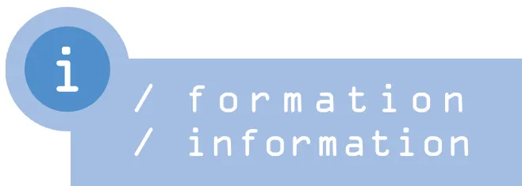

## Rédacteurs

---

Laurent Jouffroy, clinique du Diaconat,  
Strasbourg. Fax : 03 88 25 71 33  
laurent.jouffroy@wanadoo.fr

Charles.C. Arvieux, hôpital de la Cavale  
Blanche, Brest. Fax : 02 98 34 78 49  
Charles.Arvieux@univ-brest.fr

*au sommaire*

### INFORMATION PROFESSIONNELLE

---

Recommandations de bonnes pratiques cliniques concernant  
l'application de la loi n° 2005-370 du 22 avril 2005 relative  
aux droits des malades et à la fin de vie

*A. Lienhart, L. Puybasset, S. Beloucif, G. Boulard, pour le groupe de réflexion  
éthique de la Sfar* ..... 912

**AGENDA** ..... 918## Informations professionnelles

### Recommandations de bonnes pratiques cliniques concernant l'application de la loi n° 2005-370 du 22 avril 2005 relative aux droits des malades et à la fin de vie\*

A. Lienhart1,\*, L. Puybasset, S. Beloucif, G. Boulard, pour le groupe réflexion éthique de la Sfar2

2 Membres du groupe : M. Alazia, E. Balagny, J.-E. Bazin, S. Beloucif, C. Cohen, A. de La Dorie-leroy, B. Eon, E. Ferrand, R. Gauzit, L. Jacob, A. Lienhart, J.L. Pourriat, L. Puybasset, P.-Y. Quiviger, J.-P. Tarot, et le président de la Sfar, C. Martin.

\* Correspondant : André Lienhart ([andre.lienhart@sat.aphp.fr](mailto:andre.lienhart@sat.aphp.fr))

1 Département d'anesthésie-réanimation, Hôpital Saint-Antoine, Assistance Publique-Hôpitaux de Paris, 184 rue du Faubourg St Antoine, 75012 Paris, Université Pierre et Marie Curie.

\* Texte validé par le Conseil d'administration de la Sfar du 30 juin 2006.

La loi à laquelle se réfèrent ces recommandations1 s'appuie schématiquement sur deux grands principes : l'un, positif, donne à la personne malade de nouveaux droits, opposables à une obstination de la part des médecins qu'il jugerait déraisonnable ; l'autre est négatif : le code pénal n'établit pas de distinction en matière d'homicide volontaire, y compris pour l'euthanasie2.

Les nouvelles dispositions légales diffèrent selon que la personne malade est en état d'exprimer sa volonté ou ne l'est pas. Lorsque la personne est en état d'exprimer sa volonté, le principe d'autonomie est étendu aux situations où l'abstention thérapeutique peut aboutir au décès, ce qui exonère le praticien de sanctions pénales au motif de la non-assistance à une personne en péril. Ce droit des malades est accompagné d'une obligation pour le praticien d'informer sur les risques de la décision et de respecter un temps de réflexion (ce qui exclut les situations d'urgence vitale, en matière de transfusion par exemple, confortant ainsi la jurisprudence du Conseil d'État), ainsi que de la possibilité de faire appel à un autre médecin.

Lorsque la personne n'est pas en état d'exprimer sa volonté, la responsabilité de la limitation de traitements incombe au praticien en charge du patient, ce qui évite de faire peser cette lourde décision sur la famille ou des proches. Ce praticien a l'obligation de respecter une procédure collégiale, précisée par l'article 37 du Code de déontologie médicale. Il s'agit d'abord de recueillir les manifestations de la volonté qu'aurait antérieurement exprimée le patient, au travers de directives anticipées et du témoignage de la personne de confiance qu'il aurait désignée ou, à défaut, de sa famille ou de ses proches, puis d'établir un consensus au sein de l'équipe médicale et paramédicale. En définitive, la décision est prise par le médecin en charge du patient sur l'avis motivé d'au moins un autre médecin, appelé en qualité de consultant et avec lequel il n'a pas de lien de nature hiérarchique. L'avis motivé d'un deuxième consultant est demandé par ces médecins si l'un d'eux l'estime utile. Dans tous les cas, l'ensemble des démarches doit figurer dans le dossier médical. Lorsque ces conditions sont remplies, la loi offre sa garantie au médecin selon l'article 122-4 du Code pénal, qui dispose dans son premier alinéa : « *N'est pas pénalement responsable la personne qui accomplit un acte prescrit ou autorisé par des dispositions législatives ou réglementaires.* »

1 Les textes de la loi et de ses décrets d'applications modifiant le code de la santé publique sont disponibles sur le site Internet de la Sfar (<http://www.sfar.org/s/IMG/pdf/loifdv2005-380.pdf>), après avoir été replacés dans leur contexte afin d'en faciliter la lecture (version consolidée), avec le rappel des articles nécessaires à leur compréhension.

2 L'article 221-1 du code pénal est ainsi rédigé : « *Le fait de donner volontairement la mort à autrui constitue un meurtre. Il est puni de trente ans de réclusion criminelle* », tandis que l'article 221-3 de ce même code dispose dans son premier alinéa : « *Le meurtre commis avec préméditation constitue un assassinat. Il est puni de la réclusion criminelle à perpétuité.* »## Champ d'application des recommandations

Ces recommandations concernent les soins aux personnes en phase avancée ou terminale d'une maladie et les traitements devenus vains, c'est-à-dire disproportionnés ou n'ayant d'autre effet que « le seul maintien artificiel de la vie. »

Leur ensemble ne concerne donc pas les soins aux personnes n'étant pas dans cette situation, même si certaines décèdent en dépit des soins et si nombre des principes sont d'application générale.

La loi citée faisant appel à la notion d'obstination et impliquant des délais avant une décision mettant en danger la vie du patient, les urgences vitales imprévues se trouvent, de fait, placées en dehors de son champ3. De telles urgences, dès lors qu'elles ne résultent pas d'une situation anticipée, restent donc dans le cadre plus général des soins4, impliquant les principes d'utilité, d'équité et de proportionnalité, dans le cadre de l'article 8 du code de déontologie médicale et du premier alinéa de son article 37. L'exemple peut être donné d'une accouchée, d'un traumatisé, qui refuseraient une transfusion : le médecin doit tout mettre en œuvre pour convaincre mais, s'il n'y parvient pas et qu'il s'agit d'une détresse vitale, il ne peut lui être reproché d'avoir entrepris la réanimation5. L'exception liée à l'urgence est déjà inscrite dans le code de la santé publique, notamment à l'article L. 1111-2 pour ce qui concerne le devoir d'information6.

En revanche, lorsqu'il s'agit d'une maladie chronique pour laquelle une acutisation est prévisible, il y a lieu d'encourager le processus de réflexion, ce qui peut amener le patient à rédiger des directives anticipées.

Les modalités d'application de la loi citée diffèrent selon que les personnes sont ou ne sont pas en état d'exprimer leur volonté.

### 1. Personnes en état d'exprimer leur volonté

#### a- Conditions préalables

L'expression de la volonté implique que

- ✓ la personne est majeure et consciente ;
- ✓ son autonomie de jugement est retenue comme valide, c'est-à-dire qu'elle n'est pas sous l'influence d'un tiers, n'est pas atteinte d'une pathologie psychiatrique (état anxio-dépressif non pris en charge, anorexie mentale...), ou d'une pathologie neurologique accompagnée de troubles cognitifs altérant son jugement.

Le médecin met à la disposition de cette personne les éléments permettant à celle-ci de prendre sa décision en pleine connaissance de cause. Il lui explique notamment, avec tact et progressivité, les conséquences prévisibles de sa décision, quelle qu'elle soit. Le médecin met tout en œuvre pour convaincre le patient de poursuivre les traitements qui lui paraissent indispensables d'un point de vue médical. Il ne doit notamment pas se sentir dégagé de son obligation de tout mettre en œuvre pour convaincre le patient dès le premier refus de celui-ci.

Les recommandations générales de l'article 35 du code de déontologie médicale s'appliquent avec force à cette situation : « *Le médecin doit à la personne qu'il examine, qu'il soigne ou qu'il conseille une information loyale, claire et appropriée sur son état, les investigations et les soins qu'il lui propose. Tout au long de la maladie, il tient compte de la personnalité du patient dans ses explications et veille à leur compréhension.* »

---

3 Article L. 1111-4 : « *Si la volonté de la personne de refuser ou d'interrompre tout traitement met sa vie en danger, le médecin doit tout mettre en œuvre pour la convaincre d'accepter les soins indispensables. Il peut faire appel à un autre membre du corps médical. Dans tous les cas, le malade doit réitérer sa décision après un délai raisonnable.* » Le rapporteur de la loi a indiqué lors du débat à l'Assemblée nationale, pour repousser un amendement visant à fixer une limite supérieure d'un mois : « *fixer un délai pourrait avoir l'effet inverse [...] et conduire les médecins à attendre un mois alors que quelquefois le délai raisonnable est en réalité de quelques jours.* »

4 SFMU Juin 2003. Ethique et urgences : Réflexions et recommandations ([http://www.sfmue.org/documents/consensus/rbpc\\_ethique.pdf](http://www.sfmue.org/documents/consensus/rbpc_ethique.pdf))

5 Le rapporteur de la loi a indiqué lors du débat à l'Assemblée nationale : « *Autant on a le droit de transfuser contre son avis le malade qui est témoin de Jéhovah et qui risque de mourir aux urgences, autant on n'a pas le droit d'imposer indéfiniment l'alimentation artificielle à quelqu'un qui la refuse.* (Applaudissements) »

6 Article L. 1111-2 : « *Toute personne a le droit d'être informée sur son état de santé. ... Cette information incombe à tout professionnel de santé.... Seules l'urgence ou l'impossibilité d'informer peuvent l'en dispenser.* »Le médecin doit finalement s'incliner devant la volonté de la personne de refuser un traitement, même si cette abstention est susceptible d'abréger sa vie. Il doit préalablement s'être assuré que :

1. 1. le patient a été dûment informé, de façon réitérée, éventuellement par un deuxième médecin, sur la balance bénéfice/risque du traitement proposé et des conséquences de son abstention ;
2. 2. le choix du patient a été réitéré dans le temps7.

### **b- Les traitements refusés ou demandés par le patient et que le médecin peut accepter**

Le refus de traitement, dans les conditions précisées dans les paragraphes précédents, peut être partiel ou total.

La loi prévoit que la personne peut refuser « tout traitement », quel qu'il soit. Ceci inclut la ventilation mécanique, la dialyse, l'alimentation ou l'hydratation artificielles. Dans tous ces cas, les soins d'hygiène et de confort sont poursuivis comme chez tout patient. Le médecin propose des soins d'accompagnement abordés dans un paragraphe ultérieur. Les données médicales disponibles indiquent que la mort qui résulte d'un arrêt de l'alimentation ou de l'hydratation artificielles est généralement estimée paisible par l'entourage et les soignants dès lors que les soins d'accompagnement administrés au patient sont adaptés8.

Le médecin s'assure de l'efficacité du traitement de toute souffrance. La posologie des morphiniques ou des sédatifs est adaptée à la variabilité de la réponse individuelle. L'utilisation d'une titration et d'une échelle de la douleur permet de soulager la souffrance sans donner intentionnellement la mort. Il n'en reste pas moins que le niveau de soulagement à atteindre est soumis à la seule appréciation de la personne en état d'exprimer sa volonté.

### **c- Dossier médical**

L'inscription au dossier médical comporte :

- ✓ la situation médicale du patient au moment de l'expression de sa volonté ;
- ✓ l'information fournie à celui-ci ;
- ✓ les efforts entrepris pour tenter de le convaincre d'accepter les soins jugés nécessaires, avec le nom du ou des médecins étant intervenus ;
- ✓ la nature et la date de la demande du patient ;
- ✓ la réitération de la demande ;
- ✓ la nature et la date de la décision du médecin ;
- ✓ les soins d'accompagnement.

### **d- Accompagnement**

La décision de limitation de soins est accompagnée :

- ✓ de la poursuite de soins infirmiers de qualité identique à ceux prodigués à tout patient ;
- ✓ de la mise en œuvre personnalisée des soins palliatifs ;
- ✓ du soutien au mourant, à sa famille et à ses proches ;
- ✓ de la possibilité donnée à la famille et aux proches d'être auprès du patient lors de ses derniers instants indépendamment des horaires de visite habituels ;
- ✓ de la proposition faite à la personne ainsi qu'à sa famille et à ses proches de recourir à toute assistance qu'elle souhaiterait (religieuse, spirituelle, psychologique et/ou administrative).

## ***2. Personnes hors d'état d'exprimer leur volonté***

---

7 Il n'est cependant pas possible de fixer un délai rigide, le contexte psychologique et celui de la pathologie devant être pris en considération. Généralement, il s'agit de jours. Comme indiqué en préambule, ceci exclut l'urgence dans un contexte où le traitement n'apparaîtrait pas disproportionné au pronostic (telle une hémorragie après un accouchement).

8 Ganzini L, Goy ER, Miller LL, Harvath TA, Jackson A, Delorit MA. Nurses' experience with hospice patients who refuse food and fluids to hasten death. N Engl J Med 2003;349:359-65Il peut s'agir de personnes dans le coma : leur évaluation requiert l'arrêt de la sédation si la situation médicale le permet9. Il peut s'agir également de personnes dont l'autonomie de jugement ne peut être retenue comme valide (cf. § 1.a).

### **a- Conditions préalables**

Cette démarche se conçoit exclusivement dans l'intérêt de la personne malade. Elle peut être remise en question à tout moment à la faveur d'éléments nouveaux.

Elle peut être initiée par l'entourage du patient ou par tout acteur de soins. Elle suppose un temps de préparation, de réflexion, de consultation et de mise en œuvre, tant auprès de l'entourage du patient que de l'équipe soignante.

Elle concerne des patients dont le pronostic est connu, les séquelles irréversibles et d'une exceptionnelle gravité. Ceci nécessite d'avoir réuni les avis spécialisés éventuellement nécessaires et réalisé les investigations paracliniques à visée pronostique.

Une décision de limitation ou d'arrêt de traitements ne peut être prise qu'après mise en œuvre d'une procédure collégiale. Pour la mise en œuvre de celle-ci, il est souhaitable que chaque unité de soins adopte un protocole général écrit. Les éléments généraux développés ci-après sont proposés dans ce but.

### **b- Procédure collégiale**

La procédure collégiale est conduite par le praticien en charge du patient, qui ne peut être en cours de formation. Elle peut se décrire en trois étapes, destinées à fournir le maximum de garanties : recherche des témoignages de l'avis du patient lorsqu'il était en état d'exprimer sa volonté ; concertation au sein de l'équipe de soins et avec des médecins connaissant le patient ; appel à un consultant extérieur avant la décision.

1. 1) *Le praticien s'enquiert* de l'existence de directives anticipées et recueille l'avis de l'entourage.

Lorsqu'il existe des directives anticipées,

- ○ il analyse leur validité réglementaire : document datant de moins de trois ans avant l'état d'inconscience de la personne (ou avant le jour où elle s'est avérée hors d'état d'en effectuer le renouvellement), écrit, daté et signé par son auteur dûment identifié par l'indication de ses nom, prénom, date et lieu de naissance (ou écrit par un tiers mais contresigné par deux témoins, dont la personne de confiance lorsqu'elle est désignée) ;
- ○ il compare la situation présente avec ce que le patient indiquait de sa maladie et des traitements à entreprendre ou à refuser en fonction du stade évolutif de celle-ci. Ces directives ont en effet d'autant plus de poids qu'elles témoignent que la personne avait anticipé la situation présente et exprimé une volonté circonstanciée ;
- ○ il demande à la personne de confiance son avis quant à leur pertinence dans la situation présente. Lorsqu'une personne de confiance n'a pas été désignée, il s'enquiert de cette pertinence auprès de la famille ou, à défaut, auprès des proches.

Lorsque, malgré les recherches, notamment auprès des personnes susceptibles de connaître leur existence, il apparaît qu'il n'existe pas de directives anticipées, le praticien recherche auprès de la personne de confiance ou, à défaut, auprès de la famille ou des proches, ce que le patient aurait souhaité, soit explicitement, soit au travers de ses convictions.

Lorsque la décision concerne un mineur ou un majeur protégé, le médecin recueille en outre, selon les cas, l'avis des titulaires de l'autorité parentale ou du tuteur.

1. 2) *Le praticien se concerte* avec :

- - l'équipe de soins présente, paramédicale et médicale, notamment son responsable ;
- - le ou les médecins référents s'il y a lieu, c'est-à-dire tout médecin suivant le patient et pouvant apporter un éclairage dans la décision (par exemple, le médecin traitant, le médecin de ville ayant fait hospitaliser le patient ou les médecins qui seraient intervenus récemment,

---

9 Cet arrêt est essentiel pour évaluer l'état d'un patient atteint d'une pathologie neurologique, une fois la phase d'hypertension intracrânienne passée. Il peut en revanche s'avérer impossible dans certains cas, par exemple chez un patient qui serait en défaillance multiviscérale dans les suites d'une chirurgie digestive lourde, pour laquelle l'abdomen aurait dû être laissé en partie ouvert pour drainage de collections septiques.tel l'hématologue, le chirurgien ou l'anesthésiste-réanimateur ayant pris en charge le patient avant son transfert en réanimation).

1. 3) *Le praticien recherche enfin l'avis motivé d'un autre médecin* appelé comme consultant. Il apparaît préférable que celui-ci ne soit pas impliqué dans les soins du patient ou dans la relation avec son entourage. Le praticien ne doit avoir aucun lien de nature hiérarchique avec le consultant. Ce dernier ne peut donc être son chef de service ou de pôle. Si l'un des deux médecins l'estime utile, l'avis d'un autre consultant est demandé. La décision de limitation ou d'arrêt de traitements est de la seule responsabilité du praticien en charge du patient, mais il est recommandé qu'elle soit consensuelle.

En présence de directives anticipées circonstanciées et d'une personne de confiance à même de les éclairer, seuls des arguments médicaux forts peuvent y faire obstacle. Il est en effet possible d'apprécier sans trop de difficulté ce qu'aurait été la volonté de la personne malade si elle avait été en état de l'exprimer. Ces conditions sont actuellement rarement réunies. Ceci est une incitation à favoriser leur émergence, tant auprès des médecins d'autres disciplines que de l'ensemble de la société.

En leur absence, la seule solution consiste à rechercher la décision la plus raisonnable du point de vue médical, en respectant la procédure décrite ci-dessus, en prenant en compte le contexte familial et social, la souffrance de l'entourage, et en s'assurant que le dialogue instauré permet à cet entourage de comprendre les motifs des décisions.

### **c- Décision**

La décision peut être :

- ✓ de ne pas entreprendre un traitement supplémentaire au cas où une complication surviendrait,
- ✓ de fixer une limite de posologie ou de durée à une thérapeutique déjà existante,
- ✓ d'interrompre un ou plusieurs traitement en cours,
- ✓ de renforcer un traitement analgésique et sédatif.

La question de l'arrêt de l'alimentation et de l'hydratation artificielles peut se poser. D'un point de vue éthique et juridique, une personne hors d'état d'exprimer sa volonté (par exemple en état végétatif persistant) ne saurait être privée de la possibilité d'arrêter un traitement, quel qu'il soit, comme elle aurait pu l'exiger si elle en avait eu la capacité. Toutefois, la difficulté de la mise en œuvre d'une telle suspension et la complexité de la décision imposent des précautions toutes particulières, notamment à l'égard de l'entourage de la personne malade, de façon à ce qu'il n'existe pas de doute raisonnable sur ce qu'aurait été la volonté de cette personne si elle avait été en état de l'exprimer. Ce type de décision nécessite le consensus le plus large possible de la famille, des proches et des soignants. Comme pour le patient en état d'exprimer sa volonté, les soins d'hygiène et de confort sont poursuivis et des soins d'accompagnement sont adaptés à cette situation10.

### **d- Dossier médical**

L'inscription au dossier médical comporte :

- ✓ l'argumentaire médical de la décision ;
- ✓ la nature, la date et le résultat des examens complémentaires réalisés pour fixer le pronostic ;
- ✓ la synthèse des entretiens au sein de l'équipe et avec l'entourage du patient ;
- ✓ la mention des différentes étapes de la procédure ;
- ✓ la nature de la décision ;
- ✓ le nom du (des) consultant(s) avec son (leurs) avis motivé(s) ;
- ✓ la date de la décision, ses motifs, et le nom du praticien l'ayant prise.

L'inscription dans le dossier du patient des consultations auxquelles le médecin a procédé et des motifs de la décision est une obligation réglementaire11. Elle est à ce titre une condition indispensable à l'exonération de responsabilité pénale.

### **e- Accompagnement**

---

10 Anaes. Décembre 2002. Modalités de prise en charge de l'adulte nécessitant des soins palliatifs (<http://www.anaes.fr>)

11 Article R. 4127-37 du code de la santé publique, modifiant le code de déontologie médicale.Comme pour le patient en état d'exprimer sa volonté, la décision est accompagnée :

- ✓ de la poursuite de soins infirmiers de qualité identique à ceux prodigués à tout patient,
- ✓ de la mise en œuvre personnalisée des soins palliatifs ;
- ✓ du soutien à la famille et aux proches ;
- ✓ de la possibilité donnée à la famille et aux proches d'être auprès du patient lors de ses derniers instants indépendamment des horaires de visite habituels ;
- ✓ de la proposition faite à la famille et aux proches de recourir à toute assistance qu'ils souhaiteraient (religieuse, spirituelle, psychologique et/ou administrative).## AGENDA

### Cours de la Fondation européenne d'enseignement en anesthésiologie (FEEA)

La Fondation Européenne d'Enseignement en Anesthésiologie (FEEA) organise dans plus de 80 centres régionaux en Europe, Amérique Latine, Afrique et Asie des cours d'enseignement post universitaire en anesthésie réanimation.

Le comité de direction est constitué de P. Scherpereel (Lille), Président, M. Lamy (Liège), C. Gomard (Barcelone), A. Steib (Strasbourg).

Le programme comporte un cycle de six cours portant sur l'ensemble de l'anesthésie et de la réanimation. Chaque cours, sous forme de séminaire résidentiel, a une durée de deux jours et demi et comprend des conférences suivies de discussion, des cas cliniques, des ateliers ou des échanges sur un thème. Une évaluation des participants et des enseignants est systématique. Un dossier pédagogique est remis aux participants avant chaque cours.

Les thèmes des six cours sont :

Cours 1 : Respiration et thorax

Cours 2 : Appareil cardiovasculaire

Cours 3 : Soins intensifs, rein, médecine d'urgence, sang et transfusion

Cours 4 : Mère enfant

Cours 5 : Système nerveux, anesthésie locorégionale et traitement de la douleur

Le cycle peut être commencé par n'importe quel cours. Les frais de participation comprennent le volume de préparation du cours, le cours lui-même, les repas et de façon optionnelle l'hébergement.

Plus de détails peuvent être trouvés sur le site de la FEEA : <http://www.feaa.net> et son site d'enseignement à distance [www.euroviane.net](http://www.euroviane.net)

#### ■ Région Belgique - Nord de la France

La Chartreuse du Val Saint-Esprit - Gosnay (Pas de Calais)

**18-20 septembre 2006**

Cours 2 : Cardiovasculaire, sang et transfusion

**9-11 octobre 2006**

Cours 6 : Anesthésie pour différents types de chirurgie

*Comité scientifique* : Pr M. De Kock (Louvain), Pr J. Joris (Liège), Pr Van Der Linden (Bruxelles), Pr B. Tavernier (Lille), Pr B. Vallet (Lille), Pr G. Lebuffe (Lille)

*Responsables* : Pr G. Lebuffe, clinique d'anesthésie-réanimation, hôpital Claude-Hurie, Rue Michel Polonovski, 59037 Lille cedex, France

Tél : 03 20 44 61 44 - Fax : 03 20 44 63 65

E-mail : [g-lebuffe@chru-lille.fr](mailto:g-lebuffe@chru-lille.fr)

#### ■ Région Auvergne

**9-10 octobre 2006, Hôtel Aletti, Vichy**

Cours 3 : Soins intensifs, médecine d'urgence, transfusion sanguine  
*Responsables* : Pr C. Auboyer, département d'anesthésie-réanimation, hôpital Nord, CHU, 42055 Saint-Étienne cedex 2.

Tél : 04 77 82 83 29. Fax : 04 77 82 84 50.

E-mail : [christian.auboyer@univ-st-etienne.fr](mailto:christian.auboyer@univ-st-etienne.fr)

Pr P. Schoeffler, département d'anesthésie-réanimation, hôpital Gabriel-Montpied, 30, place Henri-Dunant, 63003 Clermont-Ferrand cedex. Tél : 04 73 75 15 90. Fax : 04 73 75 15 91.

E-mail : [pschoeffler@chu-clermontferrand.fr](mailto:pschoeffler@chu-clermontferrand.fr)

*Inscriptions* : Agence MO, 20 rue la Varenne, 63122 Ceyrat

Tél : 04 73 61 51 88 – E.mail : [agence.mo@wanadoo.fr](mailto:agence.mo@wanadoo.fr)

#### ■ Région Sud-Méditerranée

**7-9, décembre 2006, Sophia-Antipolis (Nice)**

Cours 5 : Anesthésie locorégionale et traitement de la douleur  
*Responsables* : Pr D. Grimaud et C. Ichai, département d'anesthésie-réanimation-Est, hôpital Saint-Roch, BP 1319, 06006 Nice cedex 1

Tél. : 04 92 03 33 00 – Fax : 04 92 03 35 58

E-mail : [dar-est@chu-nice.fr](mailto:dar-est@chu-nice.fr) ; [ichai@unice.fr](mailto:ichai@unice.fr)

### Congrès – Séminaires

#### ■ Septembre 17-22, 2006 Budapest, Hongrie

**The 11th Annual Advance Interventional Pain Conference and practical Workshop an FIPP Examination Preparation Course  
The 8th Examination**

Secretariat : Kenes International, 17 rue du cendrier, PO Box 1726, CH-1211 Genève 1. Suisse

Tel. : 41 22 908 0488 – Fax : 41 22 732 28 50

E-mail : [wip06@kenes.com](mailto:wip06@kenes.com)

Website : [www.kenes.com/wip06](http://www.kenes.com/wip06)

#### ■ 15-17 novembre 2006, Palais des Congrès, Nancy

**VIIe Congrès national d'hémovigilance et de sécurité transfusionnelle**

Ces journées se composent de séances de formation, d'ateliers, de conférences d'actualisation, de tables rondes et de séances de communications libres et posters.

*Renseignements* : Europa Organisation, 5 rue Saint-Pantaléon – BP 61508, 31015 Toulouse cedex 6, France

Tél. : 05 34 45 26 45 – Fax : 05 34 45 26 46

E-mail : [insc-sfvtt@europa-organisation.com](mailto:insc-sfvtt@europa-organisation.com)

**Date limite de soumission des résumés : 30 juin 2006**■ **16 et 17 novembre 2006, Europôle centre de Congrès, Grenoble**

**28e Journées de l'Association de neuro-anesthésie réanimation de langue française (Anarlf)**

*Thème* : Hémorragie sous-arachnoïdienne

*Renseignements* : Mme Vayr, Secrétariat du département d'anesthésie-réanimation 1, hôpital Michallon, BP 217, 38043 Grenoble cedex

Tél. : 04 76 76 56 35 – fax : 04 76 76 51 83

E-mail : [jvayr@chu-grenoble.fr](mailto:jvayr@chu-grenoble.fr)

■ **24-25 novembre 2006, Lyon-Bron**

**13es Journées d'informations cliniques en anesthésie-réanimation (ICAR)**

*Thèmes* : Quelques problèmes posés à l'anesthésie par le patient. Quoi de neuf en réanimation et urgences en 2006 ? Evaluation des pratiques professionnelles (EPP) : implication pour l'anesthésiste-réanimateur; Evaluation en 2006 : que reste-t-il à faire ? Evaluation préopératoire : questions- réponses.

*Renseignements* : Mme Elisabeth Morel

Tél. : 04 78 86 57 56 – Fax : 04 78 86 57 14

E-mail : [elisabeth.morel-chevillet@chu-lyon.fr](mailto:elisabeth.morel-chevillet@chu-lyon.fr)

*Inscriptions* : Annie Meriot

Tél. : 04 78 86 19 88 – Fax : 04 78 86 59 33

E-mail : [annie.meriot@chu-lyon.fr](mailto:annie.meriot@chu-lyon.fr)

■ **25-26 novembre 2006, Rennes**

**Congres AGORA/Journées Rennaises d'anesthésie-réanimation**

*Thèmes* : vidéotransmission anesthésie locorégionale et échographie, anesthésie locorégionale, douleur postopératoire, anesthésie générale et soins périopératoires, session professionnelle, ateliers anesthésie locorégionale, anatomie, intubation difficile

*Responsable Comité scientifique* : [cEcoffey.rennes@invivo.edu](mailto:cEcoffey.rennes@invivo.edu)

*Renseignements et inscriptions* : MCO Congrès, 27 rue du Four à Chaux, 13007 Marseille

Tél. : 04 95 09 38 00 – fax. : 04 95 09 38 01

E-mail : [c.schwob@mcocongres.com](mailto:c.schwob@mcocongres.com)

■ **Centre francophone de formation en échographie, 2006**

Le séminaire dispense une formation intensive sur 4 jours à Nîmes, délibérément orientée vers l'utilisation pratique de l'échographie en urgence avec apprentissage du Programme Rapide d'Échographie du Polytraumatisés (PREP).

Il comporte différentes techniques de formations, centrées sur la réalisation pratique d'examens échographiques

Enseignement par petits groupes de trois médecins autour d'un échographe. Chacun servant, tour à tour, de mannequin et jouant le jeu de l'enseignement réciproque :

- - 19-21 janvier 2006
- - 9-11 mars 2006
- - 11-13 mai 2006
- - 6-8 juillet 2006
- - 5-7 octobre 2006
- - 2-4 février 2006
- - 6-8 avril 2006
- - 15-17 juin 2006
- - 7-9 septembre 2006
- - 16-18 novembre 2006

- 7-9 décembre 2006

Des sessions seront organisées en 2006 à Compiègne (France), à la Martinique, aux Pays-Bas, en Belgique, en Espagne... nous contacter pour ces sessions.

**48e CONGRÈS NATIONAL  
D'ANESTHÉSIE ET DE RÉANIMATION**

**27-30 septembre 2006**

Palais des Congrès de Paris

Début du Congrès : mercredi 27 septembre

Journée des clubs : mercredi 27 septembre

Journée médecine d'urgence : mercredi 27 septembre

Journée douleur-ALR : mercredi 27 septembre

Journée des infirmier(e)s d'urgence : mercredi 27 septembre

Communications libres : jeudi 28 septembre

Journée des infirmier(e)s de réanimation : jeudi 28 septembre

Journée des infirmier(e)s d'anesthésie : vendredi 29 et samedi 30 septembre

Conférences, débats, tables rondes, ateliers, cas cliniques, controverses, sessions à thème, essentiels : vendredi 29 et samedi 30 septembre

Clôture du Congrès : samedi 30 septembre

**Vous pouvez vous inscrire en ligne sur le site de la Sfar**  
[www.sfar.org](http://www.sfar.org)

**Merci de vous munir de votre numéro d'adhérent lors de l'enregistrement.**

**Date limite d'inscription sans majoration des droits : 30 juillet 2006**

**Renseignements congrès  
COLLOQUIUM**

**12, rue de la Croix Faubin, 75557 Paris cedex 11**

**Tél. : 01 44 64 15 15 – Fax : 01 44 64 15 16**

**E-mail : [sfar2006@colloquium.fr](mailto:sfar2006@colloquium.fr)**# CARRIÈRES ET ANNONCES

## SCP D'ANESTHESISTES recherche **2 ANESTHESISTES-REANIMATEURS**

(succession + création)

Région **CENTRE**

. Nous exerçons notre art au sein d'une équipe  
médico-chirurgicale (139 lits et places)

**SANS METERNITE ni SERVICE D'URGENCES.**

. Vous entrerez dans notre SCP et bénéficierez d'un partage  
d'honoraires sans achat de parts. L'équipe d'anesthésistes est  
complétée par 2 IADE.

. Vous bénéficierez d'un Plateau Technique des plus modernes et  
d'un équipement de haute technologie.

Nous vous proposons de recevoir une fiche détaillée sur ce poste dès  
réception de votre candidature «manuscrite, CV et photo) auprès de notre  
cabinet de recrutement, sous référence 060203 à

**CFPS**

342, Route d'Unias - 42210 CRAINTILLEUX

La Clinique de la Plaine à  
Genève  
Recherche

**UN Anesthésiste  
dépendant (60-100 %)**

avec un diplôme FMH  
ou équivalent pour le 1er septembre

*Merci d'envoyer votre dossier avec les documents usuels à :*

**Clinique de la Plaine - Mme Roncari  
Rue Charles-Humbert 5 - 1205 Genève**

**Tél.: 00 41 22 595 05 05**

**E-mail : direction@laplaine.ch**

**clinique region  
languedoc-roussillon**

**recherche**

## **UN ANESTHESISTE-REANIMATEUR**

- • Clinique appartenant à un groupe privé, recherche un  
  Anesthésiste-Réanimateur pour succéder à l'un de ses praticiens.

Notre Etablissement, très bien situé géographiquement (à 20  
minutes de la mer), est accrédité sans réserve ni recommandation.  
Notre équipe est prête à vous accueillir.

Nous vous vous proposons de recevoir une fiche détaillée sur ce  
poste dès réception de votre candidature et lettre manuscrite,  
CV et photo auprès du cabinet de recrutement ci-dessous,  
sous référence 040905.

**CFPS**

**Cabinet Français des Professions de Santé  
Marie-Christine CHARBONNIER  
Tél.: 04 77 06 10 35 - Fax : 04 77 06 10 39  
e-mail : mc.charbonnier@wanadoo.fr**

## **HOPITAL JOSEPH DUCUING-TOULOUSE**

Etablissement MCO - PSPH

Recrute dans le cadre de son redimensionnement

## **1 ANESTHESISTE REANIMATEUR (H/F)**

temps plein ou temps partiel

Activité salariée - Rémunération CCN FEHAP du 31 octobre 1951

Possibilité de détachement pour les praticiens hospitaliers

Adresser CV et candidatures à Monsieur Le Directeur  
**HOPITAL JOSEPH DUCUING**

15, rue Varsovie - 31076 TOULOUSE CEDEX 3

Tél.: 05 61 77 34 82 - Télécopie 05 61 59 81 22

mail : direction@hjd.asso.fr