# Recommandations d'experts portant sur la prise en charge en réanimation des patients infectés à SARS-CoV2

Version 5 du 07/11/2020

SRLF-SFAR -GFRUP-SPLF-SFMU

Mise en œuvre avec la mission COREB nationale

## Membres du groupe d'experts :

**SRLF** : Michael Darmon,1 Eric Mariotte,1 Elise Morawiec,2 David Schnell3, Eric Maury4

**SFAR** : Jean-Michel Constantin,5 Philippe Montravers6, Marc Garnier,7 Benjamin Chousterman,8 Olivier Joannes-Boyau9

**SPILF**: Benoit Guery,10 Simon Bessis,11 Nadia Saidani12

**GFRUP** : Sylvain Renolleau13

**SPLF** : Claire Andrejak,14 Antoine Parot15

**SFMU** : Thibault Desmettre,16 Florence Dumas17

1. 1- APHP, Service de Médecine Intensive et Réanimation, Hôpital Saint-Louis, Paris, France ; Université de Paris, Faculté de Médecine Paris-Diderot
2. 2- AP-HP, Groupe Hospitalier Universitaire APHP-Sorbonne Université, site Pitié-Salpêtrière, Service de Pneumologie, Médecine Intensive – Réanimation (Département R3S), F-75013 Paris, France
3. 3- CH Angoulême, Service de Réanimation polyvalente et USC, Angoulême, France
4. 4- APHP, Service de Médecine Intensive et Réanimation, Hôpital Saint-Antoine, Paris, France
5. 5- Sorbonne Université, GRC 29, AP-HP, DMU DREAM, Département d'Anesthésie et Réanimation, GH Pitié-Salpêtrière, F-75013, Paris, France
6. 6- Université de Paris, INSERM U1152 ; APHP Nord ; DMU PARABOL ; Département d'Anesthésie-Réanimation ;CHU Bichat Claude Bernard 75018 Paris France
7. 7- Sorbonne Université, GRC 29, AP-HP, DMU DREAM, Département d'Anesthésie, Réanimation, et Médecine Périopératoire, Hôpitaux Tenon et St Antoine, Paris, France.
8. 8- Université de Paris, APHP; DMU PARABOL ; Département d'Anesthésie-Réanimation ;CHU Lariboisiere Paris France
9. 9- Service d'Anesthésie-Réanimation Sud, Centre Médico-Chirurgical Magellan, Centre Hospitalier Universitaire (CHU) de Bordeaux, 33000 Bordeaux, France.
10. 10- University Hospital and University of Lausanne, Lausanne, Switzerland
11. 11- APHP, Service de maladies infectieuses et tropicales, Hôpital Raymond-Poincaré, Garches, France ; Université Paris-Saclay
12. 12- Centre Hospitalier de Cornouaille, Médecine Interne, Hématologie et Infectiologie, Quimper, France
13. 13- APHP, Service de Réanimation et unité de surveillance continue Pédiatrique, Necker, France
14. 14- Service de Pneumologie, CHU Amiens Picardie, Amiens, France- 15- APHP, Service de pneumologie, Hôpital Tenon, Paris, France
- 16- Pole Urgences/SAMU/réanimation médicale, CHRU de Besançon, UMR 6249 Université de Bourgogne Franche Comté
- 17- APHP, Service d'Accueil des urgences, Hôpital Cochin, France

*Texte initial approuvé par le CA de la SRLF le 07/11/2020, de la SPILF le 09/11/2020, de la SFMU le 10/11/2020, la SPLF le 10/11/2020 et de la SFAR le 10/11/2020*

*Dernière mise à jour le 10/11/2020*

**Auteur correspondant :**

Michael Darmon

Médecine Intensive et Réanimation

Hôpital Saint-Louis

Assistance publique des hôpitaux de Paris

Tel : 33 1 42 49 94 22

michael.darmon@aphp.fr## Introduction

Depuis le 31 Décembre 2019, date de l'identification des premiers clusters en Chine, une nouvelle zoonose s'est propagée pour devenir progressivement pandémique [1].

Cette dernière implique un nouveau coronavirus (SARS-CoV2) dont le réservoir animal semble être une chauve-souris [2].

Ce nouveau virus est associé à une mortalité de 0,1 à 1% (<https://www.ecdc.europa.eu/en>) probablement surestimée compte-tenu des incertitudes concernant le dénominateur [3]. Au sein des patients identifiés, 15% des cas confirmés développeront des formes sévères et la mortalité en réanimation est de 30 à 70% [4, 5]. Le  $R_0$  (Indice de reproduction), en l'absence de mesures de distanciation sociale, semble être de 2,7 (95% CI, 2.5 to 2.9) [3, 6].

Il est à noter que les formes pédiatriques initialement sous-estimées restent moins fréquemment symptomatiques mais participent à la dissémination virale [7] et que la mortalité touche préférentiellement les patients âgés [4, 5, 8].

A l'automne 2020, une reprise épidémique est notée dans de nombreux pays dont la France.

Ces recommandations ont pour objet de fournir aux cliniciens les éléments essentiels de la prise en charge des patients suspects ou ayant une infection confirmée à SARS-CoV2 et considérés pour une admission en réanimation.

Compte-tenu de la cinétique actuelle de l'épidémie, les données fournies dans ces recommandations sont susceptibles d'évoluer et les principales sources d'informations seront rappelées tout au long du texte. De plus, le faible niveau de preuve des données actuelles ne permettait pas d'envisager des recommandations formalisées. Les recommandations ci-dessous sont donc le plus souvent de niveau « avis d'expert ». Elles ont été proposées par les experts en charge de la rédaction de chaque partie et modifiées ou amendées jusqu'à obtenir le plus large consensus parmi les experts.

### ***Recommandations :***

1. 1- *Il convient durant la phase épidémique de recommander le port systématique du masque chirurgical.*
2. 2- *Il est recommandé de porter un masque FFP2 dans les situations à haut risque d'aérosolisation (notamment intubation, fibroscopie bronchique, kinésithérapie respiratoire).*
3. 3- *Il convient de rappeler à l'ensemble du personnel l'importance des mesures d'hygiène universelles et notamment de la friction hydro-alcoolique.*## Tableau Clinique

L'incubation est de 5 jours (IC95% 4-7) avec des extrêmes allant jusqu'à 13 jours [9]. Si des signes précoces de type syndromes pseudo-grippaux ont été rapportés [10], les données récentes suggèrent un taux limité de signes ORL et jusqu'à 60% de patients apyrétiqes lors de la prise en charge initiale [8]. Les enfants sont moins touchés que les adultes et les formes graves touchent principalement les patients âgés et avec comorbidités [4, 5, 7, 8]

La recherche de SARS-CoV 2 par PCR sur prélèvements nasopharyngés et SARS-CoV2 dans les crachats n'ont une sensibilité que de 65-70% et méritent d'être réalisés à nouveau lorsque négatifs chez un patient ayant une forte suspicion clinique [11].

### Recommandation :

- **4- Tout soignant doit porter un masque chirurgical en contexte épidémique.**
- **5- En présence d'un syndrome viral même peu symptomatique chez un soignant, l'hypothèse SARS-CoV2 doit être envisagée et recherchée.**

## Définition des cas

La définition des cas possibles, et confirmés est régulièrement mise à jour en fonction de l'évolution de l'épidémie.

La définition en date du 07/05/2020 distingue :

Les cas possibles : Toute personne, ayant ou non été en contact à risque avec un cas confirmé dans les 14 jours précédant les symptômes, présentant des signes cliniques évocateurs d'infection à SARS-CoV2 19 (Liste disponible sur Santé Publique France)

Les cas probables : Toute personne présentant des signes cliniques et tomodensitométriques évocateurs d'infection à SARS-CoV2 ;

Les cas confirmés : Toute personne, symptomatique ou non, avec un résultat biologique (RT-PCR ou sérologie) confirmant l'infection par le SARS-CoV2.

## Filière de soinsLes spécificités de prise en charge ainsi que la nécessité d'isoler les patients, dans la mesure du possible, en précautions contact et air renforcées impose d'anticiper autant que possible la prise en charge des patients COVID-19. L'anticipation du parcours de soins doit inclure la prise en charge pré-hospitalière, la consultation aux urgences, l'hospitalisation en salle de médecine ou de chirurgie, en unité de soins critiques et en soins de suites – réadaptation. Des recommandations pour l'adaptation de l'offre de soins des établissements de santé en fonction du nombre de cas observés et pour la prise en charge des patients COVID-19 sont disponibles sur les sites internet des Agences Régionales de Santé.

**Recommandation :**

- **6- Il convient d'anticiper les circuits patients potentiels, les besoins, et de former les équipes aux spécificités de prise en charge de ces patients.**
- **7- Un dépistage du SARS-CoV2 doit être envisagé chez tout patient admis en réanimation, et ce quel que soit sa symptomatologie, au moins pendant la vague épidémique.**

Ceci implique en particulier :

- - Une formation et un entraînement du personnel et des étudiants pour les procédures d'habillage et déshabillage est nécessaire pour éviter les erreurs et la contamination.
- - Une formation et un entraînement aux précautions supplémentaires proposées lors de la réalisation de divers gestes de réanimation (intubation, aspiration bronchique, réalisation d'aérosol, changement de filtres ECH, etc.), visant à réduire la production de gouttelettes et aérosols et/ou de limiter le risque de transmission qui en découle.
- - L'estimation du nombre de patients à prendre en charge doit permettre d'établir un plan progressif de déploiement par paliers de lits de réanimation dédiés aux patients COVID-19, incluant les lits immédiatement mobilisables (prise oxygène, air, scopes, ventilateurs), ainsi que les lits potentiellement mobilisables (après redéploiement des locaux, du matériel et du personnel) compte tenu des déprogrammations des patients des filières médicales et chirurgicales. A ce titre, il est recommandé d'anticiper l'utilisation des unités de surveillance continue (USC), des unités de soins intensifs (USI) et des unités de surveillance post-interventionnelle et d'envisager de les armer en personnel et matériel pour prendre en charge des patients de soins critiques COVID-19 ou non-COVID-19.

- - L'estimation du nombre de patients à prendre en charge doit porter sur les patients COVID-19 et non COVID-19, en particulier ceux des filières spécialisées (patients d'hématologie, de chirurgie cardiaque, de neurochirurgie, etc.), pour intégrer dans les plans de déploiement des lits de soins critiques une réflexion sur la part relative de capacitaire dédié aux patients COVID-19 et aux patients non COVID-19. En effet, contrairement à la première vague du printemps 2020, la demande de soins critiques pour des patients atteints de pathologies non-COVID-19 est actuellement forte, et pourrait encore se majorer du fait de l'augmentation d'incidence saisonnière des pathologies respiratoires habituellement observées en hiver.
- - Le recensement au sein de l'établissement du personnel compétent en réanimation doit être fait en prévision du redéploiement des moyens humains selon les besoins et les normes légales.

8- Au sein des spécificités à identifier unité par unité, il convient d'identifier les chambres à même d'isoler les patients, de se renseigner sur la possibilité d'obtenir une pression nulle, et de s'assurer de l'absence de « recyclage » de l'air extrait de la chambre pour ventiler d'autres locaux, au sein des chambres, de préciser les circuits de prise en charge des examens complémentaires, et d'anticiper les unités d'hospitalisations à même de prendre en charge les patients ne nécessitant pas (ou ne nécessitant plus) d'hospitalisation en réanimation.

9- L'utilisation de check-list du matériel nécessaire dans chaque chambre à même d'accueillir des patients suspects ou confirmé est fortement conseillée (exemple en annexe 1).## Prise en charge

### 1. Recommandations générales d'hygiène :

L'OMS ([https://apps.who.int/iris/bitstream/handle/10665/331215/WHO-2019-nCov-ICPPE\\_use-2020.1-eng.pdf](https://apps.who.int/iris/bitstream/handle/10665/331215/WHO-2019-nCov-ICPPE_use-2020.1-eng.pdf)) et les sociétés françaises d'infectiologie et d'hygiène hospitalière (<https://www.sf2h.net/wp-content/uploads/2020/02/Avis-Masque-SF2H-SPILF-04.03.2020.pdf>) ont édité des recommandations préconisant un isolement gouttelettes et contact pour la plupart des patients, et un isolement air et contact pour la réalisation de geste à risque d'aérosolisation de particules virales.

La transmission de SARS-CoV 2019 semble en effet très majoritairement liée à la production de gouttelettes, qui vont infecter un sujet « receveur » au niveau des muqueuses nasales, buccales et des conjonctives. Cette contamination peut se faire de manière directe, ou indirecte, via une étape manuportée. Le virus semble pouvoir également être excrété au niveau des selles, voire d'autres liquides biologiques (les patients semblent toutefois être rarement virémiques, et les urines ne semblent pas être un liquide biologique à risque) [12]. Ces modes de transmissions justifient donc au minimum d'un isolement de type « gouttelettes » (masque chirurgical empêchant la pénétration de gouttelettes par le nez et la bouche ET protection oculaire) et « contact étendu » (surblouse à manches longues, charlotte, gants, avec procédure de déshabillage précise afin d'éviter une auto-contamination à partir des surfaces extérieures de l'équipement de protection individuel [13]). La question de la transmission aérienne du virus, via l'inhalation de particules de moins de 5 microns, ayant la capacité de rester en suspension dans l'air, est plus délicate. La recherche sur la transmission aérienne des pathogènes est en effet un domaine complexe [14–16]. Les conditions expérimentales pourraient ne pas être applicables à la réalité (par exemple il n'est pas clair que la distribution en taille des gouttelettes et aérosols d'un simulateur de toux soit conforme à celle d'un patient réel), et la coexistence des autres modes de transmission (gouttelette et contact) qui sont préférentiels, rend difficile l'interprétation des analyses de terrain. Le SARS CoV2 est néanmoins considéré, sur un faisceau d'arguments, comme un pathogène à haut risque de transmission aérienne par certains chercheurs [11], ce qui est réfuté par d'autres [17]. La transmission aérienne est également évoquée pour le MERS-CoV [18]. Cette transmission aérienne est probablement de type « opportuniste », c'est à dire possible dans certaines conditions, et sans être le mode de contamination principal du pathogène. Il n'est pas certain que le SARS-CoV2 ait le même profil de transmission, mais en l'absence de données spécifiques, un raisonnement par analogie semble cohérent. Cette possible transmission aérienne justifie l'utilisation de masques filtrants de type FFP2 lors de procédures générant des aérosols, ainsi que les consignes d'isolement en chambre à pression négative ou neutre portes fermées, et de ventilation suffisante des pièces.## 2. Cas particulier de la réanimation

Il n'existe pas de liste bien définie des procédures à risque d'aérosolisation de particules virales. Une revue systématique établit que l'intubation, la ventilation manuelle avant intubation, la ventilation non invasive et la réalisation d'une trachéotomie sont associées de manière fréquente à un sur-risque de contamination du personnel, qui est attribuée à une possible transmission aérienne du virus au cours de ces procédures [19]. Une transmission aérienne est également évoquée pour d'autres procédures réalisées en réanimation, mais qui font l'objet de moins de données, voire de données contradictoires. On peut citer à ce titre de l'oxygénéothérapie conventionnelle (en particulier quand le débit est supérieur à 6L/min) [20], la pose de sonde nasogastrique, l'endoscopie bronchique, les traitements nébulisés, les aspirations bronchiques, la réalisation de prélèvements respiratoires, l'aspiration de liquides biologiques, la pose de SNG, la manipulation du masque de VNI et la réanimation cardio pulmonaire [20–23]. Enfin, certaines procédures ne sont pas évoquées dans la littérature, mais le bon sens conduit à les rapprocher de procédures incriminées (extubation d'un patient conservant une charge virale élevée, repositionnement de la sonde d'intubation...). Il paraît utile de mentionner qu'il existe très peu de données concernant l'oxygène à haut débit nasal, qui est une modalité thérapeutique relativement nouvelle, mais que les données disponibles suggèrent un risque limité [24].

Force est de constater qu'un grand nombre de procédures réalisées en réanimation, y compris des gestes simples rentrant dans le cadre de soins pluriquotidiens, peuvent donc être considérées comme « à risque ».

Plusieurs études ont montré qu'un masque chirurgical semblait offrir une protection équivalente au masque FFP2 contre le SRAS [25] ainsi que contre la grippe [26]. Ces études étaient toutefois réalisées dans des services d'urgence ou de médecine et non dans des services de réanimation.

Le personnel de réanimation constitue dans une situation épidémique de grand ampleur une ressource critique, limitée et non remplaçable. Il doit donc être préservé au maximum.

Dans ces conditions, il est proposé d'avoir un usage large du masque FFP2 en réanimation et ce tout au long de la journée (<https://solidarites-sante.gouv.fr/actualites/presse/communiques-de-presse/article/communique-de-presse-covid-19-strategie-de-gestion-et-d-utilisation-des-masques>).

Il convient cependant de noter la consommation importante de masque attendue par cette stratégie.

## 1/ Isolement

**Recommandations :**10- Il est recommandé de réaliser un regroupement des patients COVID positifs chaque fois que possible.

11- Il est recommandé de prendre en charge les patients suspects ou confirmés dans une chambre individuelle, idéalement en favorisant l'aération de cette dernière.

12- Il est important de vérifier que l'air de la chambre n'est pas partagé avec d'autres locaux.

13- Il est possible d'utiliser une chambre sans traitement d'air à condition de :

- - Maintenir la porte de la chambre fermée
- - De respecter les mesures barrières
- - D'aérer à un rythme régulier la chambre du patient. Si aucune preuve ne permet de le valider, une aération de 10 minutes par heure a été proposée mais le maintien de ce rythme pourrait majorer les risques en lien avec entrées et sorties de la chambre.
- - De s'assurer que la pression de l'air dans la chambre est nulle
- - Et en l'absence de sas, sanctuariser un espace dans le couloir permettant habillage et déshabillage du personnel

14- Il est plutôt déconseillé de prendre en charge un patient dans une chambre avec un traitement d'air incluant une pression positive.

15- Il est recommandé de renforcer en moyens humains l'équipe de réanimation dès la prise en charge d'un ou plusieurs patients confirmés infectés par le SARS-CoV2. Ce renforcement a pour objectif de réduire la charge de travail afin de maintenir un niveau élevé de respect des mesures barrières.

16- Il convient chez tout patient nécessitant la ventilation mécanique d'utiliser un filtre antimicrobien sur les circuits expiratoire et inspiratoire du ventilateur.

17- De même, il est conseillé de privilégier un système d'aspiration clos afin d'éviter les aérosolisations et risques de contamination lors des aspirations.18- La fréquence de changement des filtres échangeurs de chaleur et d'humidité peut être abaissée à tous les 7 jours, afin de limiter les déconnexions de circuits, si ces derniers ne sont pas souillés et sont macroscopiquement fonctionnels.

19- De manière générale, il convient de considérer que les techniques à risque d'aérosolisation, ainsi que les déconnexions du circuit, sont à risque de contamination du personnel.

20- Dans les situations où ces techniques seraient malgré tout nécessaires, il est proposé de s'assurer :

- 1-Que les soignants sont protégés avant de débuter la VNI
- 2-Que l'interface du patient est en place avant le début de la VNI
- 3-Que la VNI est arrêtée avant le retrait de l'interface du patient
- 4-Il est fortement recommandé de limiter la présence des soignants dans les chambres de patients infectés et recevant un traitement par VNI ou oxygène haut débit et notamment lors des soins générant un aérosol.

21- La prise en charge des patients suspects/infectés par le SARS-CoV 2, nécessite les éléments de protection suivants :

- 1-Port de masque FFP-2
- 2-Protection de la tenue professionnelle dans l'idéal par une surblouse manches longues, imperméable
- 3-Friction hydro-alcoolique (SHA)
- 4-Charlotte
- 5-Port systématique de gants
- 6-Lunette de protection (ou masque à visière)

22- Les phases d'habillage et de déshabillage doivent être maîtrisées par les soignants afin d'éviter toute contamination (cf. procédures d'habillage et de déshabillage)

23- Compte-tenu de la consommation attendue élevée de masques FFP2, il convient de discuter dès le début de l'épidémie de stratégies d'épargne de ces derniers. Aucune stratégie n'a montré sa supériorité à ce stade. Peuvent-être envisagée soit le port continu de masque FFP2 dans des unités COVID, mais avec le risque de contamination du soignant en cas de manipulation du masque, soit l'identification de soins avec risque d'aérosolisation minime ou à distance du patient permettant le port de masque chirurgical seul.*24- Il est probablement nécessaire de suivre la consommation de masque FFP2 dans les unités accueillant des patients COVID.*

*25- Compte-tenu des données disponibles, de la transmission aérienne limitée, du risque de contamination restreint de l'environnement, un équipement de protection individuel limité à un masque chirurgical (en dehors de l'intubation orotrachéale et des procédures avec risque d'aérosolisation), et un lavage des mains au SHA, semble faisable dans une stratégie de prise en charge simplifiée et dégradée.*

#### **Entretien de l'environnement**

Les coronavirus sont sensibles à l'hypochlorite de sodium (eau de Javel) à 0,1 %, aux composés organochlorés à 0,1 %, aux iodophores à 10 %, à l'éthanol à 70 % et au glutaraldéhyde à 2 %, aux composés d'ammonium quaternaire à 0,04 % et aux dérivés phénoliques.

La contamination environnementale peut être à l'origine d'une re-contamination des mains du personnel.

#### **Recommandations :**

*26- Un entretien des surfaces critiques (ventilateur, rideles du lit, pousse seringue, colonne de perfusions, tablette patient et paillasse soignant) par un détergent/désinfectant (répondant à la norme EN 14476) doit être réalisé une fois par jour*

#### **Autres mesures :**

Il est recommandé d'éliminer les déchets de soins et les protections utilisées dans la filière DASRI

#### **2/ Suppléances vitales, réalisation des examens complémentaires et transport du patient**

#### **Recommandations spécifiques à la ventilation mécanique et la gestion des voies aériennes**

*27- Il est recommandé de porter une attention particulière au risque lié aux aérosols et gouttelettes.*

*28- La gestion des voies aériennes doit probablement être réalisée par un médecin formé et expérimenté.*29- L'intubation vigile sous fibroscopie doit être évitée sauf indication spécifique du fait du risque de toux et d'aérosol lors de la pulvérisation de l'anesthésique local qui favorise la dispersion du virus en aérosols.

30- L'utilisation de la vidéo-laryngoscopie qui éloigne l'opérateur du patient est proposée en première intention.

31- La ventilation mécanique en pression positive ne doit être démarrée qu'après gonflage du ballonnet de la sonde d'intubation.

32- Place des techniques d'oxygénation et de ventilation non invasive :

- - La ventilation non invasive n'est pas recommandée à la phase aiguë des détresses respiratoire aiguës hypoxémiques de novo.
- - De même, l'utilisation de technique de pression positive continue de type CPAP ne peut-être recommandée en systématique, bien que constituant une option dans un algorithme de prise en charge dégradée.
- - L'utilisation de l'oxygénéthérapie nasale à haut débit (HFNO), chez les patients profondément hypoxémiques est recommandée afin de diminuer le recours à la ventilation mécanique invasive. Cette technique a montré son bénéfice dans des études de niveau de preuve faible à intermédiaire, dans la prise en charge des patients COVID-19 et afin de diminuer le recours à la ventilation mécanique invasive [27–29].
- - Lorsque ces techniques d'oxygénation et de ventilation non invasive sont utilisées, il convient de souligner le risque élevé de dégradation et de recours à la ventilation mécanique invasive, la nécessité d'une surveillance rapprochée, d'une équipe habituée à l'utilisation de ces techniques, et idéalement dans un secteur de surveillance continue [27–29].
- - Les données actuelles concernant le risque d'aérosolisation avec les techniques d'oxygénation et de ventilation non invasives sont discordantes et ce risque doit être considéré comme limité [24, 30, 31].

33- En cas de prise en charge d'un patient transféré d'une autre unité de réanimation déjà intubé et ventilé, le circuit de ventilation de transport ne doit pas être déconnecté pour éviter toute contamination. Si une déconnection est nécessaire, le filtre patient est laissé sur la sonde. Une mise en veille ou une pause expiratoire de la ventilation associée à un clamping de la sonde d'intubation sont recommandées.

34- Après la procédure d'intubation, tout le matériel non protégé par filtre hydrophobe utilisé pour la ventilation et le matériel pour l'intubation est jeté ou désinfecté par un détergent désinfectant standard (Surfa safe, ...) (manche laryngoscope).### *Recommandations en lien avec le transport intra-hospitalier*

*35- L'indication d'un examen nécessitant un transport intra-hospitalier doit-être discutée et le rapport bénéfice risque soigneusement évalué.*

*36- Le transfert intra-hospitalier d'un patient cas possible ou infecté COVID-19 motivé par un examen complémentaire ou une intervention chirurgicale doit être planifié du fait du risque d'aérosol généré par les procédures médicales.*

### *Recommandations spécifiques au risque thromboembolique*

La fréquence d'évènements thrombotiques en cas d'infection par le SARS-CoV2 semble plus élevée sur les premières études observationnelles publiées notamment sur des malades admis en USI: elle varie entre 20 et 30% [32–34]. Le COVID serait la cause d'un état hyper coagulation à l'origine d'une augmentation de l'incidence des thromboses. Une étude lilloise a montré une incidence augmentée de l'embolie pulmonaire de 20,6% alors qu'elle était de moins de 10% dans une population historique de patients atteints par la grippe [34]. Néanmoins, la question de savoir si le COVID prédispose à un risque accru d'évènement thrombotique reste débattue [35]. Biologiquement, cet état d'hyper coagulation se traduit par une augmentation des D-dimères. Leur intérêt diagnostique est mal évalué. La littérature est loin d'être consensuelle sur les seuils à appliquer. Ceux-ci seraient plus utiles pour identifier les patients à risque d'évolution défavorable.

Indépendamment du COVID, les patients admis en réanimation sont exposés au risque de maladie thromboembolique. En absence de prophylaxie, la fréquence d'évènement thromboembolique peut atteindre 30% et avec une prophylaxie elle n'est plus que de 7 à 10% [36].

Cette prophylaxie doit être assurée par les héparines de bas poids moléculaires en une injection et en respectant les contre-indications plutôt que par héparine non fractionnée qui exige deux injections.

En ce qui concerne les doses à utiliser, les recommandations proposant la dose la plus faible recommandent une dose de 4000 UI d'enoxaparine, avec pour les patients avec un poids de plus de 90 Kg 6000 UI [37]. Néanmoins des études récentes retrouvent un taux élevé d'évènements thrombotiques malgré une prophylaxie médicamenteuse conduisant certains à recommander des doses prophylactiques plus importantes voire des doses curatives [32, 33, 38]. Le choix de la meilleure dose de prophylaxie reste débattu. Il n'est pas possible de recommander cette attitude en l'absenced'études [35, 39, 40]. Elle reste à évaluer en tenant compte du risque hémorragique. Des essais sont en cours.

Le diagnostic de thrombose veineuse ou d'embolie pulmonaire est difficile et repose sur un examen clinique, le doppler des membres inférieurs et l'angioscanner thoracique scanner si le patient peut être déplacé. La place des D-dimères dans le diagnostic dans ces circonstances n'est pas évaluée à ce jour même si les patients avec évènement thrombotique ont globalement un taux médian élevé comparé à des patients sans évènement thrombotique.

Le traitement et la surveillance restent classique [35, 39, 40] : il peut faire appel soit à l'héparine non fractionnée soit aux héparines de bas poids moléculaires. Les AVK et anticoagulants oraux ne doivent pas être utilisés. En cas d'embolie grave l'infection à SARS-CoV2 ne contre indique pas un traitement thrombolytique, les indications restent les mêmes que ceux des patients non COVID [37].

**Recommandation :**

*35. En l'absence de contre-indication, il est recommandé de recourir à une thromboprophylaxie de type médicamenteuse et non mécanique.*

*36. Cette prophylaxie doit favoriser les héparines de bas poids moléculaires en absence de contre-indication notamment rénale (la clairance doit être supérieure à 30ml/min). En cas d'insuffisance rénale il faut recourir à l'héparine non fractionnée ou à certaines héparines de bas poids moléculaires pour des clairances entre 20 et 30ml/min.*

*37. Les patients doivent recevoir au moins une dose prophylactique d'anticoagulant. Certaines recommandations [38] proposent une dose systématiquement plus importante et notamment des doses curatives chez les patients les plus sévères. Si ces recommandations sont actuellement utilisées en pratique, des études supplémentaires restent nécessaires pour valider la dose augmentée.*

*38. Le diagnostic de thrombose veineuse ou d'embolie pulmonaire repose sur un examen clinique, le doppler des membres inférieurs et l'angioscanner thoracique scanner si le patient peut être déplacé. La place des D-dimères reste à déterminer.*

*39. En cas de phlébite ou d'embolie pulmonaire le traitement et la surveillance restent classiques avec les mêmes contre-indications.*### 3/ Traitement spécifique

---

- • Aucun traitement antiviral spécifique n'a démontré son efficacité. Cela renforce l'importance à accorder aux traitements symptomatiques et aux soins de support.
- • La priorité doit être donnée à la réalisation d'études de haut niveau de preuve, absolument nécessaires. Il est hautement souhaitable qu'une attention particulière soit portée aux molécules dont les données précliniques sont suffisamment avancées et prometteuses pour ne pas manquer leur passage en essai clinique accéléré.
- • Dans tous les cas, compte-tenu de l'absence de traitement spécifique établi, les traitements de support à visée "symptomatique" et les soins de confort doivent être renforcés. Ils doivent être administrés selon les règles de l'art. L'accompagnement des patients en phase avancée doit être attentif et approprié à leur état. Le temps consacré à l'information du patient et de ses proches, renouvelé autant que nécessaire, est essentiel en vue de l'adhésion à la stratégie envisagée.

---

La prise en charge du SARS-CoV2 n'est à ce jour pas définitivement déterminée et repose sur les potentielles thérapeutiques évaluées lors des épidémies de SARS-CoV en 2003 et de MERS-CoV en 2013 [41, 42]. Ce chapitre a pour but de donner les éléments de la littérature supportant les différentes possibilités thérapeutiques disponibles en cas d'admission d'un patient en soins intensifs pour une infection à SARS-CoV2 et de proposer un algorithme de prise en charge en fonction de la sévérité. La discussion repose sur l'avis récemment publié du haut conseil de santé publique et les données récentes de la littérature (<https://www.hcsp.fr/Explore.cgi/avisrapportsdomaine?clefr=785>).

Il est important de souligner que les recommandations actuelles ne reposent que sur **un faible niveau de preuve** et ne peuvent donc être considérées comme opposables. Dans ce document nous avons fait le choix de ne conserver que les **publications peer-reviewed**.

La priorité doit être donnée à la **réalisation d'études de haut niveau de preuve**, absolument nécessaires. Par exemple, les essais randomisés DisCoVery et Solidarity, pilotés par l'INSERM et l'OMS, multicentriques, adaptatifs, qui visent à étudier l'innocuité et l'efficacité des traitements de CoVID-19 chez les patients adultes hospitalisés, intègrent la plupart des thérapeutiques proposées dans ce document (*ie* remdesivir, lopinavir/ritonavir, lopinavir/ritonavir/interferon bêta, hydroxychloroquine)avec un objectif d'inclusion, au total, de 3 200 et 10 000 patients respectivement.

Dans tous les cas, compte-tenu de l'absence de traitement spécifique établi, **les traitements de support à visée "symptomatique" et les soins de confort doivent être renforcés**. Ils doivent être administrés selon les règles de l'art. L'accompagnement des patients en phase avancée doit être attentif et approprié à leur état. Le temps consacré à l'information du patient et de ses proches, renouvelé autant que nécessaire, est essentiel en vue de l'adhésion à la stratégie envisagée.

(<https://www.coreb.infectiologie.com/UserFiles/File/procedures/rpmo-ethique-rea-covid-19-vf-24-corr26-mar20-2.pdf>).

L'ensemble des molécules qui sont proposées peuvent être à l'origine d'interactions médicamenteuses. Ces interactions peuvent être évaluées sur le site suivant : <http://www.covid19-druginteractions.org/>

## 1. Molécules avec un faible niveau de preuve d'efficacité

### a) Remdesivir

Le remdesivir est un analogue de l'adénosine ayant montré une activité *in vitro* sur SARS-CoV, MERS-CoV [43] et SARS-CoV2 [11]. Des données obtenues sur le MERS-CoV dans un modèle de macaque ont confirmé son efficacité *in vivo* en prophylaxie et en thérapeutique de l'infection sévère à SARS-CoV2 [44]. Toujours dans l'infection à MERS-CoV, cette molécule a démontré *in vitro* et dans un modèle murin une activité supérieure à l'association lopinavir-ritonavir [45].

Une étude randomisée double aveugle contre placebo multicentrique a étudié 237 patients, 158 sous remdesivir et 79 contrôles [46]. Les résultats n'ont pas montré de différence significative sur la vitesse d'amélioration des patients de façon globale, une tendance a été observée pour ceux traités précocement sans atteindre la significativité statistique.

L'essai clinique ACTT-1, financé par le NIAID (National Institute of Allergy and Infectious Diseases), essai randomisé, en double-aveugle, contrôlé contre placebo, évaluant l'efficacité du remdesivir, concluait en analyse intermédiaire, avant la fin du suivi prévu de 29 jours, à une diminution du temps à l'amélioration clinique (11 jours versus 15 jours pour le placebo), avec une différence significative uniquement en sous-groupe chez les patients non graves, avec un critère de jugement principal modifié au cours de l'étude [47]. Le délai d'administration médian de 9 jours paraît tardif pour une action antivirale, et les traitements concomitants autorisés dans le design de l'étude (antiviraux ou immunomodulateurs) n'étaient pas rapportés.Un essai randomisé ouvert de phase 3, financé par le laboratoire qui produit le Remdesivir [47], comparant l'efficacité d'un traitement de 5 jours versus 10 jours de remdesivir, a été conduit chez des patients hospitalisés pour COVID-19 présentant une saturation en air ambiant  $\leq 94\%$ . Cependant, l'absence de groupe contrôle placebo ne permet pas de conclure à une efficacité du remdesivir, d'autre part, du fait d'écarts de protocole (non-respect des critères d'exclusion initiaux avec l'inclusion de patients sous ventilation mécanique, de l'évidence d'une différence préexistante entre les deux groupes en analyse intermédiaire à J5), il n'est pas possible de conclure à une différence d'efficacité entre les deux durées de traitement.

Vu l'importance de l'étude SOLIDARITY, essai clinique international adaptatif randomisé, ouvert à 5 bras et malgré sa publication en pre-print (absence de relecture par les pairs), accepté pour publication dans le NEJM, les résultats de cette étude ont été retenus : ils confirment l'absence d'efficacité du remdesivir sur la mortalité dans le traitement des infections à SARS-CoV-2. L'inclusion multicentrique de 2750 patients traités par remdesivir et 2708 patients traités par traitement usuel sur 405 hôpitaux de 30 pays, l'analyse de survie montre un taux de mortalité à J28 de 12,9 % selon Kaplan-Meier dans le bras remdesivir vs 12,7% dans le bras traitement usuel (RR=0,95, 0,81-1,11,  $p=0.50$  ; 301/2743 vs 303/2708).

Sur la base de la stratification sur le critère ventilatoire à l'admission qui ne mettait en évidence aucun bénéfice dans le sous-groupe des patients ventilés, mais un bénéfice atteint non significatif dans le sous-groupe de patients non ventilés, la poursuite du bras remdesivir est en discussion pour la consolidation des données.

Des augmentations transitoires d'ALAT et/ou ASAT ont été rapportées, dont certaines étaient associées à des élévations réversibles et d'intensité légère du temps de prothrombine. Une surveillance de la fonction hépatique est recommandée au cours du traitement par Remdesivir.

#### b) Hydroxychloroquine

L'activité antivirale *in vitro* et *in vivo* sur modèle animal murin de cette molécule antipaludique (et de son dérivé hydroxylé) a été montrée pour divers virus incluant le coronavirus OC43, l'entérovirus EV-A71, Zika virus et le virus de la grippe A/H5N1. Aucune amélioration clinique n'a cependant pu être mise en évidence au cours d'essais cliniques randomisés contrôlés dans la prévention de la grippe, ou le traitement de la dengue ou du chikungunya [48–50].

De nombreux essais thérapeutiques ont été mis en place afin de déterminer l'intérêt de l'utilisation decette molécule aussi bien pour une utilisation prophylactique (pré ou post exposition) que thérapeutique. Seul un petit nombre de ces études ont effectué une randomisation et une comparaison avec un groupe contrôle.

Concernant les études menées chez les sujets hospitalisés, dans un travail réalisé parmi des patients présentant un tableau de COVID-19 modéré ou sévère [51] il n'a pas été observé de différence sur le critère de jugement principal entre le groupe recevant l'hydroxychloroquine (HCQ) en plus du traitement standard et celui recevant uniquement le traitement standard. Enfin, l'étude RECOVERY [52], menée chez 4717 patients n'a pas retrouvé de différence sur la mortalité à 28 jours entre le groupe ayant reçu de l'HCQ en plus des traitements standard et le groupe ayant bénéficié du traitement standard seul.

On notera également que l'essai clinique adaptatif Solidarity, mené par l'OMS, a clôturé le bras HCQ en juillet dernier après l'analyse intermédiaire des données relatives au traitement HCQ par rapport au traitement standard.

#### c) Lopinavir/ritonavir

Les résultats de l'essai clinique randomisé contrôlé de Cao et al publié dans le *NEJM* en mars 2020 [53] rapportaient une absence de différence significative de détection du virus au cours de traitement, une diminution de durée des symptômes d'un jour mais des effets secondaires plus fréquents dans le sous-groupe des 99 patients traités par lopinavir-ritonavir en comparaison au groupe contrôle. Dans une analyse *post-hoc*, sans ajustement, la guérison clinique est obtenue plus rapidement (16 jours vs. 17 jours) et la mortalité est plus faible (19 % vs 27,1 %) dans le sous-groupe des sujets ayant été traités moins de 12 jours après le début des symptômes.

Vu l'importance de l'étude SOLIDARITY, et malgré sa publication en pre-print (absence de relecture par les pairs), accepté pour publication dans le *NEJM*, les résultats de cette étude ont été retenus : ils confirment l'absence d'efficacité de l'association Lopinavir/Ritonavir dans le traitement des infections à SARS-CoV2. Dans cet essai multicentrique se déroulant dans 405 hôpitaux de 30 pays, 11 266 adultes ont été randomisés parmi eux 1399 patients ont reçu du Lopinavir, comparés à 1372 patients ayant reçu un traitement usuel, 651 de l'Interféron plus Lopinavir, comparés à 679 patients ayant reçu un traitement usuel. Le taux de mortalité n'était pas significativement différent entre le bras Lopinavir et le bras contrôle ( $RR=1$  [0,79-1,25],  $p=0,97$ ). Aucune différence significative n'a été mise en évidence sur la mortalité (chez les patients non ventilés ou tout autre sous-groupe de caractéristiques), la durée d'hospitalisation ou l'initiation d'une ventilation.## 2. Traitements expérimentaux / en cours d'évaluation

### a) Tocilizumab

Les formes les plus sévères d'infection sont accompagnées d'une « tempête cytokinique » avec en particulier des taux élevés d'interleukine 6 [54]. Le Tocilizumab est indiqué dans le traitement des syndromes sévères de libération de cytokines induits par les lymphocytes CAR-T et pourrait dans ce contexte présenter une alternative thérapeutique intéressante aux antiviraux classiques.

Trois études prospectives randomisées sont actuellement publiées. La première étude monocentrique randomisée a été publiée par Hermine *et al*, sur un collectif de 131 patients non ventilés avec des infections modérées à sévères nécessitant au moins 3L/min d'oxygène [55]. Les patients recevaient soit du tocilizumab soit un traitement standard. Aucune différence de mortalité n'a été observée entre les deux groupes. Un second travail randomisé ouvert en Italie dans 24 hôpitaux a inclus un total de 126 patients et comparé tocilizumab versus traitement standard [56]. Les patients inclus devaient présenter un ratio  $PaO_2/FiO_2$  entre 200 et 300 mm Hg. L'évaluation était réalisée sur un critère composite associant admission aux soins intensifs, recours à la ventilation mécanique, aggravation de l'oxygénation et décès. Aucune différence n'a été retrouvée entre les deux groupes.

Pour terminer, une étude randomisée en double aveugle contre placebo a inclus des patients présentant au moins deux des éléments suivants : fièvre, infiltrat pulmonaire, oxygène administré pour maintenir une  $SaO_2 > 92\%$ . Deux cent quarante-trois patients ont été inclus avec un ratio 2 :1, l'administration de tocilizumab n'a pas permis de prévenir l'intubation ou le décès chez ces patients [57].

### b) Anti-IL1

Dans le contexte pro-inflammatoire lié à la COVID-19 dans sa forme sévère, qui inclut des réactions cytokiniques en cascade, un traitement par anti-IL1 (Anakinra) a été proposé comme option thérapeutique [54]. Un essai clinique de phase 3 randomisé contrôlé a été réalisé dans le sepsis compliqué de syndrome d'activation macrophagique, montrant une amélioration significative de la survie du sous-groupe des patients présentant une coagulation intravasculaire disséminée avec dysfonction hépatique sous Anakinra (faible effectif de 43 patients) [58]. Un essai clinique de phase 1, préliminaire, est en cours aux USA (NCT02780583). Des protocoles d'essais cliniques ont été déposés par une équipe italienne pour évaluer l'intérêt de l'Anakinra et de l'Emapalumab dans la COVID sévère(NCT04324021). Il n'existe pas actuellement d'étude prospective randomisée fournissant un niveau de preuve suffisant pour prescrire les anti-IL1. Enfin, l'analyse des données de l'essai clinique ANACONDA-COVID-19 a montré une surmortalité précoce dans le groupe de patients traités par Anakinra associé à des soins standards optimisés par rapport au groupe de patients traités par soins standards optimisés seuls. Pour cette raison, les inclusions dans les essais cliniques évaluant l'Anakinra (Kineret) dans le traitement de la COVID-19 sont suspendues par l'ANSM.

### c) Plasma de convalescents inactivé

Utilisé en dernier recours chez des patients atteints du SARS-CoV2 dont l'état continuait de s'aggraver malgré une corticothérapie [59, 60] ou un traitement par ribavirine et corticothérapie [61], le traitement par plasma de convalescent était associé à des durées d'hospitalisation plus courtes et une mortalité plus faible.

Plus de 80 essais cliniques (dont NCT04292340, NCT04323800, ChiCTR2000030010, ChiCTR2000030627, ChiCTR2000030039, ChiCTR2000030929, ChiCTR2000030702, NCT04333251, ChiCTR2000029850, NCT04332835...) sont recensées sur les bases de référencement aux Etats Unis, en Asie, en Amérique du sud et en Europe dont une étude française, qui d'une part (volet EFS avec l'étude PlasmaCoV2) vise à collecter des plasma de convalescents (90 patients pour au moins 180 dons de plasma correspondant à 540 unités de 200 mL) et d'autre part (volet clinique avec l'étude CoviPlasm un des bras de l'étude CORIMUNO-19) vise à étudier l'effet de l'injection de plasma de convalescents chez des patients hospitalisés pour COVID-19. Les inclusions ont débuté de façon différée avec un objectif d'inclusion de 60 patients (EudraCT 2020-001246-18).

L'étude de la tolérance du traitement par plasma de convalescent dans le cadre du programme « expanded access » de la FDA américaine chez les 5000 premiers patients bénéficiaires atteints de COVID-19 sévère ou critiques décrit moins de 1% d'effets secondaires sévères dans les quatre heures suivant la transfusion, qui incluent le décès (n=4), l'OAP post-transfusionnel (TACO, n=7), le syndrome de détresse respiratoire aiguë post-transfusionnel (TRALI, n=11), la réaction allergique sévère post-transfusionnelle (n=3) [62]. La mortalité à J7 estimée par Kaplan-Meier était de 14,9%, pour une mortalité observée de 12% (n=602), et correspondant à 16,7% (n=456) des 3316 patients ayant séjourné en soins intensifs/réanimation et 11,2% (n=146) des 1682 patients ayant séjourné exclusivement en service de médecine.

Une mise à jour de ces résultats, cette fois chez les 20000 premiers patients a été publiée enseptembre, toujours dans le même cadre, et rapportait à encore moins de 1% d'effets secondaires sévères dans les quatre heures suivant la transfusion, dont 0,05% mortalité (n=63), 0,18% TACO (n=36), 0,1% TRALI (n=21), 0,1% de réactions allergiques sévères post-transfusionnelles (n=21) [63]. La mortalité observée à J7 était de 12,96% (n=2592), et correspondait à 15,62% (n=1806) des 11560 patients ayant séjourné en soins intensifs/réanimation et 9,28% (n=772) des 8323 patients ayant séjourné exclusivement en service de médecine. Dix-sept patients avec une lymphopénie B profonde, des symptômes COVID-19 persistants, une absence de séroconversion et une RT-PCR SARS-CoV-2 positive sur sang ont été traités par 4 unités de plasma de convalescent [64]. A l'exception d'un patient, décédé des suites d'une pneumopathie bactérienne acquise sous ventilation mécanique, tous se sont cliniquement améliorés en l'espace de 48 heures. Ces résultats soulignent l'intérêt du plasma de convalescent chez les patients incapables de développer une réponse immunitaire humorale spécifique du SARS-CoV2.

Un essai clinique randomisé ouvert (ChiCTR2000029757) incluant 103 patients atteints de COVID-19 à un stade sévère ou critique a été publié après arrêt précoce des inclusions par manque de patients incluables avec la diminution de l'incidence de la maladie. Dans les 28 jours suivant le traitement, il n'a pas permis de montrer de différence statistiquement significative en termes de délai d'amélioration clinique et en termes de taux de guérison (51,9% versus 43,1%, effectifs faibles) entre le groupe traité par plasma de convalescent (n=52) et le groupe traitement usuel (n=51).

Le traitement par plasma de convalescent au sein d'une cohorte rétrospective de 64 patients hospitalisés pour COVID-19 sévère en comparaison à un groupe contrôle de 177 patients appariés était associé à une réduction non significative de la mortalité intra-hospitalière (12,5 vs 15,8%). Le délai médian de sortie de l'hôpital, de 8 jours dans les 2 groupes, était équivalent [65].

Dans une cohorte de patients COVID-19 sévères à critiques, une étude comparative rétrospective cas-témoin appariée et ajustée sur un score de propension décrivait une aggravation à J14 des besoins en oxygène chez 17,9% du groupe traité par plasma de convalescent (n=39) vs 28,9% du groupe contrôle. La courbe de survie semblait améliorée chez les patients ayant reçu du plasma (HR ajusté 0,34, IC95% 0,13-0,89, p 0,03).

#### d) Corticothérapie

Les résultats intermédiaires de l'essai clinique randomisé en ouvert Recovery [66], rapportent une réduction de mortalité à J28 chez les patients traités par dexaméthasone (DXM) 6 mg/jour pendant 10 jours en comparaison au SOC (22.9 % *versus* 25.7 %, aOD: 0,83 ; IC 95% [0,75 - 0,93],P<0.001). Cette différence était significative dans les sous-groupes recevant une oxygénothérapie. Ainsi, dans le sous-groupe des patients sous ventilation mécanique au moment de la randomisation, la mortalité à J28 était inférieure dans le groupe DXM par rapport au groupe contrôle (29% vs 40,7%, aOD : 0,64 ; IC à 95% [0,51-0,81]). Cette différence était également retrouvée dans le groupe sous oxygénothérapie sans support de ventilation mécanique avec une mortalité à J28 de 23.3% dans le bras DXM versus 26.2% dans le groupe contrôle (aOD : 0.82 ; 95% IC [0.72-0.94]). Cette analyse ne mettait cependant pas en évidence de bénéfice de la DXM pour les patients sans oxygénothérapie.

Depuis, ces données ont été complétées par d'autres essais randomisés ou des méta-analyses et viennent confirmer l'intérêt de la DXM dans les infections sévères à SARS-CoV-2. Les résultats des essais randomisés de Tomazini *et al.* et de Villar *et al.* concluient également à un bénéfice de la DXM par rapport au SOC [67, 68].

Respectivement, sur les 299 patients inclus, 151 ont été randomisés dans le bras DXM et 148 dans le bras SOC. Dans les 28 premiers jours, les patients du groupe DXM avaient en moyenne 6,6 jours sans ventilateur (95 % IC, 5,0-8,2) vs 4,0 jours (95 % IC, 2,9-5,4) dans le groupe contrôle (OD 2,26 ; 95 % IC [0,2-4,38], p= 0,04). Les patients du groupe DXM avaient un score SOFA moyen de 6,1 (95%CI, 5,5-6,7) contre 7,5 (95 % IC, 6,9-8,1) dans le groupe contrôle (OD -1,16 ; 95 % IC, -1,94 à -0,38 ; P = 0.004). Il n'y a pas eu de différence significative de mortalité toutes causes confondues à 28 jours. Les effets secondaires ne différaient pas significativement : 33 patients (21.9%) dans le groupe DXM vs 43 (29.1%) dans le groupe contrôle, De même 47 (31.1%) vs 42 (28.3%) ont nécessité de l'insuline pour meilleur contrôle glycémique, et 5 (3.3%) vs 9 (6.1%) ont eu des effets indésirables grave liées aux soins [67].

Dans ce travail ont été enrôlés 277 patients, dont 139 randomisés dans le groupe DXM et 138 dans le groupe témoin, le nombre de jours sans ventilateur était plus élevé dans le groupe DXM que dans le groupe contrôle avec une différence entre les groupes de 4 à 8 jours (95% IC [2-57 à 7-03] ; p<0.0001). À 60 jours, 29 (21 %) patients du groupe DXM et 50 (36 %) patients du groupe contrôle étaient décédés (différence entre les groupes -15-3 % [-25-9 à -4-9] ; p=0,005). La proportion d'événements indésirables n'était pas significativement différente entre les 2 groupes. Les événements indésirables les plus fréquents étaient l'hyperglycémie (105 [76%] patients dans le groupe DXM contre 97 [70%] patients dans le groupe contrôle), les infections liées aux soins (pneumopathie sous ventilation et bactériémie) ; 33 [24%] contre 35 [25%]) et les barotraumatismes (14 [10%] contre 10 [7%]). Là aussi sans différences significatives entre les groupes. L'étude de Villar *et al.* a été arrêtée prématurément à 88% des inclusions en raison de difficultés d'inclusion limitant la portée des résultats exposés [68].Une méta-analyse publiée dans le JAMA en septembre 2020 par le *WHO Rapid Evidence Appraisal for COVID-19 Therapies (REACT) Working Group*, a analysé les données de sept essais randomisés évaluant l'effet des corticoïdes dans la prise en charge des infections sévères à SARS-CoV-2. Le critère de jugement principal était la mortalité à J28 toutes causes confondues. Le critère de jugement secondaire était la survenue d'effets indésirables graves (définis par les auteurs). 1703 patients ont été inclus dans l'analyse. Cinq essais évaluaient la mortalité à 28 jours, 1 à 21 jours et 1 à 30 jours. 222 décès étaient comptabilisés parmi les 678 patients des bras corticostéroïdes et 425 décès parmi les 1025 patients contrôle (OR : 0,66 [95%CI, 0,53-0,82] ;  $P < 0,001$ ). Il y avait peu d'incohérence entre les études ( $I^2 = 15,6\%$  ;  $p = 0,31$  pour l'hétérogénéité). La mortalité était significativement diminuée dans le bras DXM par rapport au SOC ou au placebo (3 essais, 1282 patients, et 527 décès), avec OR 0,64 (95 % IC [0,50-0,82] ;  $P < 0,001$ ). Pour les autres molécules évaluées, il n'était pas retrouvé d'effet significatif sur la mortalité ; OR 0,69 (95%CI [0,43-1,12]  $P = 0,13$ ) pour l'hydrocortisone (3 essais, 374 patients, et 94 décès), OR 0,91 (95 % IC [0,29-2,87]  $p = 0,87$ ) pour la méthylprednisolone (1 essai, 47 patients et 26 décès). 64 événements étaient répertoriés chez les 354 patients randomisés pour les corticostéroïdes vs 80 chez les 342 patients randomisés contrôle ou placebo parmi les 6 essais rapportant des effets indésirables graves [69].

Ces données confirment l'intérêt de la DXM dans la prise en charge des patients sévères pris en charge pour COVID-19 en réduisant la mortalité à J28 et en diminuant la durée de ventilation, et limite les complications dues à la ventilation mécanique ainsi que potentiellement le maintien en réanimation, enjeu majeur de la prise en charge du COVID-19. Par ailleurs, les événements indésirables graves ne sont pas plus fréquents dans les groupes de patients recevant une corticothérapie par DXM. Au vu de ces éléments, la balance / risque est en faveur de l'utilisation de la DXM chez les patients pris en charge pour un COVID-19 et nécessitant une oxygénothérapie.

#### **Recommandations :**

**40. Les données disponibles ne permettent pas de recommander un traitement antiviral aux patients admis en soins intensifs, en dehors d'études dédiées.**

**41. Une antibiothérapie doit probablement être prescrite le temps de l'enquête microbiologique, chez les patients ayant une suspicion d'infection bactérienne, une détresse respiratoire aiguë sévère ou un état de choc. Une désescalade rapide est recommandée en l'absence d'argument clinique ou microbiologique (Cf. recommandations du HCSP).***42. Il semble important d'encourager la recherche concernant le traitement spécifique et d'inclure autant que possible les patients infectés par SARS-CoV2 dans des études interventionnelles.*

*43. La DXM doit probablement être utilisée pour les patients présentant une infection sévère à SARS-CoV2 à la posologie de 6 mg / jour pour une durée de 10 jours.*

*44. A ce stade, l'utilisation de DXM est recommandée pour l'ensemble des patients nécessitant une oxygénéothérapie et ce quel que soit son débit.*

*45. L'utilisation de l'association ritonavir/lopinavir ou d'hydroxy-chloroquine n'est pas justifiée au cours des infections à SARS-CoV2 et ce quel que soit la sévérité de cette dernière.*

*46. L'utilisation de remdesivir ou d'anti-IL6 ou du plasma de patient convalescent peut s'envisager dans des populations spécifiques dans le cadre d'essais cliniques ou de registres.*

## **Conclusions**

Les recommandations contenues dans ce document sont des recommandations d'experts mais établies le plus souvent par analogie avec le SARS-CoV et le MERS-CoV. Plusieurs inconnues persistent et les connaissances sont amenées à évoluer rapidement tant en ce qui concerne les précautions d'hygiène que la prise en charge.

Il convient de souligner les incertitudes concernant la fin du risque de transmission et à ce stade, il est probablement raisonnable de maintenir un patient SARS-CoV2 en isolement jusqu'à guérison clinique. L'intérêt d'une stratégie basée sur la surveillance de la PCR est discuté mais risque de nécessiter un nombre de prélèvements conséquent dans une situation de priorisation des recherches de SARS-CoV 2.

D'autre part, il est nécessaire d'adopter une attitude pragmatique et une priorisation des ressources, doit être envisagée dans les situations d'admission massive de patients infectés à SARS-CoV 2.

Ce texte ne discute pas de la nécessité d'envisager selon les flux de patients, une priorisation des admissions en réanimation selon le bénéfice attendu de cette dernière. Un groupe de travail spécifique a été, à cet égard, missionné par la DGS.### **Conflits d'intérêts :**

M. Darmon rapporte avoir reçu des fonds destinés à la recherche de la part de MSD, un soutien méthodologique d'Astute Médical, avoir reçu une rétribution comme orateur de la part de Gilead-Kite, MSD, et Astellas.

Ph. Montravers rapporte avoir reçu une rétribution comme orateur de la part de Pfizer, MSD, et Ménarini.

O. Joannes-Boyau ne rapporte aucun conflit d'intérêt en rapport avec ces recommandations. Il rapporte avoir reçu des fonds destinés à la recherche de la part de BBraun et Baxter, avoir reçu des rétributions comme consultant par BBraun et Baxter.

E Maury rapporte avoir reçu des fonds destinés à la recherche de la part de Vygon, une rétribution comme orateur de la part de Pfizer, et des aides logistiques non financières de la part de General Electric, Schulke, Bard, Doran International, Drager, et Eumédica.

Les autres auteurs ne rapportent aucun conflit d'intérêt## REFERENCES

1. 1. Phan LT, Nguyen TV, Luong QC, et al (2020) Importation and Human-to-Human Transmission of a Novel Coronavirus in Vietnam. *N Engl J Med* 382:872–874. <https://doi.org/10.1056/NEJMc2001272>
2. 2. Zhou P, Yang X-L, Wang X-G, et al (2020) A pneumonia outbreak associated with a new coronavirus of probable bat origin. *Nature*. <https://doi.org/10.1038/s41586-020-2012-7>
3. 3. Wu JT, Leung K, Leung GM (2020) Nowcasting and forecasting the potential domestic and international spread of the 2019-nCoV outbreak originating in Wuhan, China: a modelling study. *The Lancet* 395:689–697. [https://doi.org/10.1016/S0140-6736\(20\)30260-9](https://doi.org/10.1016/S0140-6736(20)30260-9)
4. 4. Yang X, Yu Y, Xu J, et al (2020) Clinical course and outcomes of critically ill patients with SARS-CoV-2 pneumonia in Wuhan, China: a single-centered, retrospective, observational study. *Lancet Respir Med* 0: [https://doi.org/10.1016/S2213-2600\(20\)30079-5](https://doi.org/10.1016/S2213-2600(20)30079-5)
5. 5. Ruan Q, Yang K, Wang W, et al (2020) Clinical predictors of mortality due to COVID-19 based on an analysis of data of 150 patients from Wuhan, China. *Intensive Care Med*. <https://doi.org/10.1007/s00134-020-05991-x>
6. 6. Liu Y, Gayle AA, Wilder-Smith A, Rocklöv J (2020) The reproductive number of COVID-19 is higher compared to SARS coronavirus. *J Travel Med*. <https://doi.org/10.1093/jtm/taaa021>
7. 7. Park YJ, Choe YJ, Park O, et al (2020) Contact Tracing during Coronavirus Disease Outbreak, South Korea, 2020. *Emerg Infect Dis* 26:2465–2468. <https://doi.org/10.3201/eid2610.201315>
8. 8. Guan W-J, Ni Z-Y, Hu Y, et al (2020) Clinical Characteristics of Coronavirus Disease 2019 in China. *N Engl J Med*. <https://doi.org/10.1056/NEJMoa2002032>
9. 9. Bouadma L, Lescure F-X, Lucet J-C, et al (2020) Severe SARS-CoV-2 infections: practical considerations and management strategy for intensivists. *Intensive Care Med*. <https://doi.org/10.1007/s00134-020-05967-x>
10. 10. Chen N, Zhou M, Dong X, et al (2020) Epidemiological and clinical characteristics of 99 cases of 2019 novel coronavirus pneumonia in Wuhan, China: a descriptive study. *Lancet Lond Engl* 395:507–513. [https://doi.org/10.1016/S0140-6736\(20\)30211-7](https://doi.org/10.1016/S0140-6736(20)30211-7)
11. 11. Wang W, Xu Y, Gao R, et al (2020) Detection of SARS-CoV-2 in Different Types of Clinical Specimens. *JAMA*. <https://doi.org/10.1001/jama.2020.3786>
12. 12. Wang W, Xu Y, Gao R, et al (2020) Detection of SARS-CoV-2 in Different Types of Clinical Specimens. *JAMA*. <https://doi.org/10.1001/jama.2020.3786>
13. 13. Tomas ME, Kundrapu S, Thota P, et al (2015) Contamination of Health Care Personnel During Removal of Personal Protective Equipment. *JAMA Intern Med* 175:1904–1910. <https://doi.org/10.1001/jamainternmed.2015.4535>
14. 14. Wei J, Li Y (2016) Airborne spread of infectious agents in the indoor environment. *Am J Infect Control* 44:S102-108. <https://doi.org/10.1016/j.ajic.2016.06.003>1. 15. Fowler RA, Scales DC, Ilan R (2004) Evidence of airborne transmission of SARS. *N Engl J Med* 351:609–611; author reply 609-611
2. 16. Jones RM, Brosseau LM (2015) Aerosol transmission of infectious disease. *J Occup Environ Med* 57:501–508. <https://doi.org/10.1097/JOM.0000000000000448>
3. 17. Seto WH (2015) Airborne transmission and precautions: facts and myths. *J Hosp Infect* 89:225–228. <https://doi.org/10.1016/j.jhin.2014.11.005>
4. 18. Bin SY, Heo JY, Song M-S, et al (2016) Environmental Contamination and Viral Shedding in MERS Patients During MERS-CoV Outbreak in South Korea. *Clin Infect Dis* 62:755–760. <https://doi.org/10.1093/cid/civ1020>
5. 19. Tran K, Cimon K, Severn M, et al (2012) Aerosol generating procedures and risk of transmission of acute respiratory infections to healthcare workers: a systematic review. *PLoS One* 7:e35797. <https://doi.org/10.1371/journal.pone.0035797>
6. 20. Yu IT, Xie ZH, Tsoi KK, et al (2007) Why did outbreaks of severe acute respiratory syndrome occur in some hospital wards but not in others? *Clin Infect Dis Off Publ Infect Dis Soc Am* 44:1017–1025. <https://doi.org/10.1086/512819>
7. 21. Loeb M, McGeer A, Henry B, et al (2004) SARS among critical care nurses, Toronto. *Emerg Infect Dis* 10:251–255. <https://doi.org/10.3201/eid1002.030838>
8. 22. Telemann MD, Boudville IC, Heng BH, et al (2004) Factors associated with transmission of severe acute respiratory syndrome among health-care workers in Singapore. *Epidemiol Infect* 132:797–803. <https://doi.org/10.1017/s0950268804002766>
9. 23. Raboud J, Shigayeva A, McGeer A, et al (2010) Risk factors for SARS transmission from patients requiring intubation: a multicentre investigation in Toronto, Canada. *PLoS One* 5:e10717. <https://doi.org/10.1371/journal.pone.0010717>
10. 24. Hui DS, Chow BK, Lo T, et al (2019) Exhaled air dispersion during high-flow nasal cannula therapy versus CPAP via different masks. *Eur Respir J* 53:. <https://doi.org/10.1183/13993003.02339-2018>
11. 25. Seto W, Tsang D, Yung R, et al (2003) Effectiveness of precautions against droplets and contact in prevention of nosocomial transmission of severe acute respiratory syndrome (SARS). *The Lancet* 361:1519–1520. [https://doi.org/10.1016/S0140-6736\(03\)13168-6](https://doi.org/10.1016/S0140-6736(03)13168-6)
12. 26. Loeb M, Dafoe N, Mahony J, et al (2009) Surgical mask vs N95 respirator for preventing influenza among health care workers: a randomized trial. *JAMA* 302:1865–1871. <https://doi.org/10.1001/jama.2009.1466>
13. 27. Demoule A, Vieillard Baron A, Darmon M, et al (2020) High-Flow Nasal Cannula in Critically Ill Patients with Severe COVID-19. *Am J Respir Crit Care Med* 202:1039–1042. <https://doi.org/10.1164/rccm.202005-2007LE>
14. 28. Calligaro GL, Lalla U, Audley G, et al (2020) The utility of high-flow nasal oxygen for severe COVID-19 pneumonia in a resource-constrained setting: A multi-centre prospective observationalstudy. *EClinicalMedicine* 100570. <https://doi.org/10.1016/j.eclinm.2020.100570>

29. Agarwal A, Basmaji J, Muttalib F, et al (2020) High-flow nasal cannula for acute hypoxemic respiratory failure in patients with COVID-19: systematic reviews of effectiveness and its risks of aerosolization, dispersion, and infection transmission. *Can J Anaesth J Can Anesth* 67:1217–1248. <https://doi.org/10.1007/s12630-020-01740-2>

30. Li J, Fink JB, Ehrmann S (2020) High-flow nasal cannula for COVID-19 patients: low risk of bio-aerosol dispersion. *Eur Respir J* 55:. <https://doi.org/10.1183/13993003.00892-2020>

31. Gaeckle NT, Lee J, Park Y, et al (2020) Aerosol Generation from the Respiratory Tract with Various Modes of Oxygen Delivery. *Am J Respir Crit Care Med* 202:1115–1124. <https://doi.org/10.1164/rccm.202006-2309OC>

32. Klok FA, Kruip MJHA, van der Meer NJM, et al (2020) Confirmation of the high cumulative incidence of thrombotic complications in critically ill ICU patients with COVID-19: An updated analysis. *Thromb Res* 191:148–150. <https://doi.org/10.1016/j.thromres.2020.04.041>

33. Klok FA, Kruip MJHA, van der Meer NJM, et al (2020) Incidence of thrombotic complications in critically ill ICU patients with COVID-19. *Thromb Res* 191:145–147. <https://doi.org/10.1016/j.thromres.2020.04.013>

34. Poissy J, Goutay J, Caplan M, et al (2020) Pulmonary Embolism in Patients With COVID-19: Awareness of an Increased Prevalence. *Circulation* 142:184–186. <https://doi.org/10.1161/CIRCULATIONAHA.120.047430>

35. Moores LK, Tritschler T, Brosnahan S, et al (2020) Prevention, Diagnosis, and Treatment of VTE in Patients With Coronavirus Disease 2019: CHEST Guideline and Expert Panel Report. *Chest* 158:1143–1163. <https://doi.org/10.1016/j.chest.2020.05.559>

36. Cook DJ, Crowther MA (2010) Thromboprophylaxis in the intensive care unit: focus on medical-surgical patients. *Crit Care Med* 38:S76-82. <https://doi.org/10.1097/CCM.0b013e3181c9e344>

37. Sanchez O, Benhamou Y, Bertoletti L, et al (2019) [Recommendations of good practice for the management of thromboembolic venous disease in adults. Short version]. *Rev Mal Respir* 36:249–283. <https://doi.org/10.1016/j.rmr.2019.01.003>

38. Susen S, Tacquard CA, Godon A, et al (2020) Prevention of thrombotic risk in hospitalized patients with COVID-19 and hemostasis monitoring. *Crit Care Lond Engl* 24:364. <https://doi.org/10.1186/s13054-020-03000-7>

39. Bikdeli B, Madhavan MV, Jimenez D, et al (2020) COVID-19 and Thrombotic or Thromboembolic Disease: Implications for Prevention, Antithrombotic Therapy, and Follow-Up: JACC State-of-the-Art Review. *J Am Coll Cardiol* 75:2950–2973. <https://doi.org/10.1016/j.jacc.2020.04.031>

40. Zhai Z, Li C, Chen Y, et al (2020) Prevention and Treatment of Venous Thromboembolism Associated with Coronavirus Disease 2019 Infection: A Consensus Statement before Guidelines. *Thromb Haemost* 120:937–948. <https://doi.org/10.1055/s-0040-1710019>1. 41. Stockman LJ, Bellamy R, Garner P (2006) SARS: systematic review of treatment effects. *PLoS Med* 3:e343. <https://doi.org/10.1371/journal.pmed.0030343>
2. 42. Morse JS, Lalonde T, Xu S, Liu WR (2020) Learning from the Past: Possible Urgent Prevention and Treatment Options for Severe Acute Respiratory Infections Caused by 2019-nCoV. *Chembiochem Eur J Chem Biol* 21:730–738. <https://doi.org/10.1002/cbic.202000047>
3. 43. Agostini ML, Andres EL, Sims AC, et al (2018) Coronavirus Susceptibility to the Antiviral Remdesivir (GS-5734) Is Mediated by the Viral Polymerase and the Proofreading Exoribonuclease. *mBio* 9:. <https://doi.org/10.1128/mBio.00221-18>
4. 44. de Wit E, Feldmann F, Cronin J, et al (2020) Prophylactic and therapeutic remdesivir (GS-5734) treatment in the rhesus macaque model of MERS-CoV infection. *Proc Natl Acad Sci U S A*. <https://doi.org/10.1073/pnas.1922083117>
5. 45. Sheahan TP, Sims AC, Leist SR, et al (2020) Comparative therapeutic efficacy of remdesivir and combination lopinavir, ritonavir, and interferon beta against MERS-CoV. *Nat Commun* 11:1–14. <https://doi.org/10.1038/s41467-019-13940-6>
6. 46. Wang Y, Zhang D, Du G, et al (2020) Remdesivir in adults with severe COVID-19: a randomised, double-blind, placebo-controlled, multicentre trial. *Lancet Lond Engl* 395:1569–1578. [https://doi.org/10.1016/S0140-6736\(20\)31022-9](https://doi.org/10.1016/S0140-6736(20)31022-9)
7. 47. Beigel JH, Tomashek KM, Dodd LE, et al (2020) Remdesivir for the Treatment of Covid-19 - Final Report. *N Engl J Med*. <https://doi.org/10.1056/NEJMoa2007764>
8. 48. Paton NI, Lee L, Xu Y, et al (2011) Chloroquine for influenza prevention: a randomised, double-blind, placebo controlled trial. *Lancet Infect Dis* 11:677–683. [https://doi.org/10.1016/S1473-3099\(11\)70065-2](https://doi.org/10.1016/S1473-3099(11)70065-2)
9. 49. Tricou V, Minh NN, Van TP, et al (2010) A randomized controlled trial of chloroquine for the treatment of dengue in Vietnamese adults. *PLoS Negl Trop Dis* 4:e785. <https://doi.org/10.1371/journal.pntd.0000785>
10. 50. Roques P, Thiberville S-D, Dupuis-Maguiraga L, et al (2018) Paradoxical Effect of Chloroquine Treatment in Enhancing Chikungunya Virus Infection. *Viruses* 10:. <https://doi.org/10.3390/v10050268>
11. 51. Tang W, Cao Z, Han M, et al (2020) Hydroxychloroquine in patients with mainly mild to moderate coronavirus disease 2019: open label, randomised controlled trial. *BMJ* 369:m1849. <https://doi.org/10.1136/bmj.m1849>
12. 52. RECOVERY Collaborative Group, Horby P, Mafham M, et al (2020) Effect of Hydroxychloroquine in Hospitalized Patients with Covid-19. *N Engl J Med*. <https://doi.org/10.1056/NEJMoa2022926>
13. 53. Cao B, Wang Y, Wen D, et al (2020) A Trial of Lopinavir-Ritonavir in Adults Hospitalized with Severe Covid-19. *N Engl J Med*. <https://doi.org/10.1056/NEJMoa2001282>
14. 54. Mehta P, McAuley DF, Brown M, et al (2020) COVID-19: consider cytokine storm syndromesand immunosuppression. *Lancet Lond Engl* 395:1033–1034. [https://doi.org/10.1016/S0140-6736\(20\)30628-0](https://doi.org/10.1016/S0140-6736(20)30628-0)

55. Hermine O, Mariette X, Tharaux P-L, et al (2020) Effect of Tocilizumab vs Usual Care in Adults Hospitalized With COVID-19 and Moderate or Severe Pneumonia: A Randomized Clinical Trial. *JAMA Intern Med*. <https://doi.org/10.1001/jamainternmed.2020.6820>

56. Salvarani C, Dolci G, Massari M, et al (2020) Effect of Tocilizumab vs Standard Care on Clinical Worsening in Patients Hospitalized With COVID-19 Pneumonia: A Randomized Clinical Trial. *JAMA Intern Med*. <https://doi.org/10.1001/jamainternmed.2020.6615>

57. Stone JH, Frigault MJ, Serling-Boyd NJ, et al (2020) Efficacy of Tocilizumab in Patients Hospitalized with Covid-19. *N Engl J Med*. <https://doi.org/10.1056/NEJMoa2028836>

58. Shakoory B, Carcillo JA, Chatham WW, et al (2016) Interleukin-1 Receptor Blockade Is Associated With Reduced Mortality in Sepsis Patients With Features of Macrophage Activation Syndrome: Reanalysis of a Prior Phase III Trial. *Crit Care Med* 44:275–281. <https://doi.org/10.1097/CCM.0000000000001402>

59. Soo YOY, Cheng Y, Wong R, et al (2004) Retrospective comparison of convalescent plasma with continuing high-dose methylprednisolone treatment in SARS patients. *Clin Microbiol Infect Off Publ Eur Soc Clin Microbiol Infect Dis* 10:676–678. <https://doi.org/10.1111/j.1469-0691.2004.00956.x>

60. Chen L, Xiong J, Bao L, Shi Y (2020) Convalescent plasma as a potential therapy for COVID-19. *Lancet Infect Dis*. [https://doi.org/10.1016/S1473-3099\(20\)30141-9](https://doi.org/10.1016/S1473-3099(20)30141-9)

61. Lai ST (2005) Treatment of severe acute respiratory syndrome. *Eur J Clin Microbiol Infect Dis Off Publ Eur Soc Clin Microbiol* 24:583–591. <https://doi.org/10.1007/s10096-005-0004-z>

62. Joyner MJ, Wright RS, Fairweather D, et al (2020) Early safety indicators of COVID-19 convalescent plasma in 5000 patients. *J Clin Invest* 130:4791–4797. <https://doi.org/10.1172/JCI140200>

63. Joyner MJ, Bruno KA, Klassen SA, et al (2020) Safety Update: COVID-19 Convalescent Plasma in 20,000 Hospitalized Patients. *Mayo Clin Proc* 95:1888–1897. <https://doi.org/10.1016/j.mayocp.2020.06.028>

64. Hueso T, Poulderoux C, Péré H, et al (2020) Convalescent plasma therapy for B-cell depleted patients with protracted COVID-19 disease. *Blood*. <https://doi.org/10.1182/blood.2020008423>

65. Rogers R, Shehadeh F, Mylona EK, et al (2020) Convalescent plasma for patients with severe COVID-19: a matched cohort study. *Clin Infect Dis Off Publ Infect Dis Soc Am*. <https://doi.org/10.1093/cid/ciaa1548>

66. RECOVERY Collaborative Group, Horby P, Lim WS, et al (2020) Dexamethasone in Hospitalized Patients with Covid-19 - Preliminary Report. *N Engl J Med*. <https://doi.org/10.1056/NEJMoa2021436>

67. Tomazini BM, Maia IS, Cavalcanti AB, et al (2020) Effect of Dexamethasone on Days Alive and Ventilator-Free in Patients With Moderate or Severe Acute Respiratory Distress Syndrome andCOVID-19: The CoDEX Randomized Clinical Trial. JAMA 324:1307–1316.  
<https://doi.org/10.1001/jama.2020.17021>

68. Villar J, Ferrando C, Martínez D, et al (2020) Dexamethasone treatment for the acute respiratory distress syndrome: a multicentre, randomised controlled trial. Lancet Respir Med 8:267–276. [https://doi.org/10.1016/S2213-2600\(19\)30417-5](https://doi.org/10.1016/S2213-2600(19)30417-5)

69. WHO Rapid Evidence Appraisal for COVID-19 Therapies (REACT) Working Group, Sterne JAC, Murthy S, et al (2020) Association Between Administration of Systemic Corticosteroids and Mortality Among Critically Ill Patients With COVID-19: A Meta-analysis. JAMA 324:1330–1341. <https://doi.org/10.1001/jama.2020.17023>Annexe 1 : Exemple de check-list chambre COVID (Réanimation MIR R3S de la Pitié-Salpêtrière)

<table border="1">
<thead>
<tr>
<th colspan="3"><b>Dans la chambre</b></th>
</tr>
</thead>
<tbody>
<tr>
<td></td>
<td>Check list réa</td>
<td></td>
</tr>
<tr>
<td></td>
<td>Fenêtres fermées</td>
<td></td>
</tr>
<tr>
<td></td>
<td>Fonctionnement pression négative</td>
<td></td>
</tr>
<tr>
<td></td>
<td>Blocage porte coulissante</td>
<td></td>
</tr>
<tr>
<td></td>
<td>Fonctionnement interphone</td>
<td></td>
</tr>
<tr>
<td>1</td>
<td>Kit « prise de constantes »</td>
<td></td>
</tr>
<tr>
<td>3</td>
<td>Consommables ecg</td>
<td></td>
</tr>
<tr>
<td>1</td>
<td>Kit « papiers, stylos »</td>
<td></td>
</tr>
<tr>
<td>2</td>
<td>Filtres antibactériens respirateur</td>
<td></td>
</tr>
<tr>
<td>2</td>
<td>Filtres antibactériens tiroir respi</td>
<td></td>
</tr>
<tr>
<td>1</td>
<td>Système aspiration clos</td>
<td></td>
</tr>
<tr>
<td>5</td>
<td>Pipettes NaCl pour système clos</td>
<td></td>
</tr>
<tr>
<td>1</td>
<td>Solute hydro-alcoolique</td>
<td></td>
</tr>
<tr>
<td>1</td>
<td>Boite gants manchettes T6-T7</td>
<td></td>
</tr>
<tr>
<td>1</td>
<td>Boite gants manchettes T7-T8</td>
<td></td>
</tr>
<tr>
<td>1</td>
<td>Boite gants manchettes T8-T9</td>
<td></td>
</tr>
<tr>
<td>2</td>
<td>Draps jetables</td>
<td></td>
</tr>
<tr>
<td>2</td>
<td>Taie jetable</td>
<td></td>
</tr>
<tr>
<td>2</td>
<td>Drap house jetable</td>
<td></td>
</tr>
<tr>
<td>1 boîte</td>
<td>Sac à bassin</td>
<td></td>
</tr>
<tr>
<td>1</td>
<td>bassin</td>
<td></td>
</tr>
<tr>
<td>1</td>
<td>Urinal jetable ( si Homme)</td>
<td></td>
</tr>
<tr>
<td>1 boîte</td>
<td>Sac urinal</td>
<td></td>
</tr>
<tr>
<td>1 boîte</td>
<td>Sac vomitoire</td>
<td></td>
</tr>
<tr>
<td>1</td>
<td>gélifiant</td>
<td></td>
</tr>
<tr>
<td>1 rouleau</td>
<td>Sac DASRII 110L</td>
<td></td>
</tr>
<tr>
<td>1</td>
<td>balais</td>
<td></td>
</tr>
<tr>
<td>1</td>
<td>Sceau</td>
<td></td>
</tr>
<tr>
<td>1</td>
<td>Surfanios premium</td>
<td></td>
</tr>
<tr>
<td>1 paquet</td>
<td>Lavettes sol et environnement</td>
<td></td>
</tr>
<tr>
<td>1</td>
<td>Pipette javel + bouteille vide pour dilution</td>
<td></td>
</tr>
<tr>
<td>5</td>
<td>haricots</td>
<td></td>
</tr>
<tr>
<td>3</td>
<td>Plateaux jetables</td>
<td></td>
</tr>
</tbody>
</table>

<table border="1">
<thead>
<tr>
<th colspan="3"><b>A l'extérieur (sur le chariot)</b></th>
</tr>
</thead>
<tbody>
<tr>
<td></td>
<td>Copie procédure Mers Cov</td>
<td></td>
</tr>
<tr>
<td>2 paquets</td>
<td>Blouses enduite chimio</td>
<td></td>
</tr>
<tr>
<td>1 boîte</td>
<td>Masques FFP2 3M</td>
<td></td>
</tr>
<tr>
<td>1 boîte</td>
<td>Masque FFP2 « canard »</td>
<td></td>
</tr>
<tr>
<td>1 boîte</td>
<td>Charlottes</td>
<td></td>
</tr>
<tr>
<td>1</td>
<td>Soluté hydro-alcoolique</td>
<td></td>
</tr>
<tr>
<td>1</td>
<td>Soluté hydro-alcoolique</td>
<td></td>
</tr>
<tr>
<td>1</td>
<td>Boite gants manchettes T6-T7</td>
<td></td>
</tr>
<tr>
<td>1</td>
<td>Boite gants manchettes T7-T8</td>
<td></td>
</tr>
<tr>
<td>1</td>
<td>Boite gants manchettes T8-T9</td>
<td></td>
</tr>
<tr>
<td>4</td>
<td>Paires lunettes de protection</td>
<td></td>
</tr>
<tr>
<td>1 rouleau</td>
<td>Sac DASRI</td>
<td></td>
</tr>
<tr>
<td>4</td>
<td>Fut pliable en carton DASRI</td>
<td></td>
</tr>
<tr>
<td>50</td>
<td>Tubes biotox vert pâle</td>
<td></td>
</tr>
<tr>
<td>10</td>
<td>Feuilles de demande BIOTOX</td>
<td></td>
</tr>
<tr>
<td>4</td>
<td>Biotox (double emballage)</td>
<td></td>
</tr>
<tr>
<td>2</td>
<td>Pièges à aspirations tracheales</td>
<td></td>
</tr>
</tbody>
</table>

<table border="1">
<thead>
<tr>
<th colspan="3"><b>Dans le sas</b></th>
</tr>
</thead>
<tbody>
<tr>
<td>1</td>
<td>Soluté hydro-alcoolique</td>
<td></td>
</tr>
<tr>
<td>1</td>
<td>sceau</td>
<td></td>
</tr>
<tr>
<td>1</td>
<td>Surfanios Premium</td>
<td></td>
</tr>
<tr>
<td>1 paquet</td>
<td>lingettes</td>
<td></td>
</tr>
<tr>
<td>1</td>
<td>Fut pliable DASRI carton</td>
<td></td>
</tr>
<tr>
<td>1</td>
<td>Adaptable petit métallique</td>
<td></td>
</tr>
<tr>
<td>1</td>
<td>Boite gants nitrile taille S</td>
<td></td>
</tr>
<tr>
<td>1</td>
<td>Boite gants nitrile taille M</td>
<td></td>
</tr>
<tr>
<td>1</td>
<td>Boite gants nitrile L</td>
<td></td>
</tr>
</tbody>
</table>**Annexe 2 : Procédure d'habillage à réaliser dans le sas** (Exemple de la procédure d'habillage en réanimation MIR R3S de la Pitié-Salpêtrière).

<table border="1">
<tr>
<td data-bbox="118 198 500 315">

<b>Etape 1 : Charlotte</b>

</td>
<td data-bbox="500 198 878 315">
</td>
</tr>
<tr>
<td data-bbox="118 315 500 508">

<b>Etape 2 : Masque FFP2</b>

Penser à réaliser un fit-check

</td>
<td data-bbox="500 315 878 508">

Une fois des soins réalisés dans une chambre, veiller à ne plus toucher le masque ou la charlotte (Si contact : réaliser une FHA ou un lavage des mains)

</td>
</tr>
<tr>
<td data-bbox="118 508 500 608">

<b>Etape 3 : Friction hydro-alcoolique</b>

</td>
<td data-bbox="500 508 878 608">
</td>
</tr>
<tr>
<td data-bbox="118 608 500 718">

<b>Etape 4 : Lunettes de protection</b>

</td>
<td data-bbox="500 608 878 718">
</td>
</tr>
<tr>
<td data-bbox="118 718 500 763">

<b>SOINS A RИQUES DE PROJECTION</b> (intubation, LBA, kiné respiratoire, change, toilette)

</td>
<td data-bbox="500 718 878 763">

<b>AUTRES SOINS</b>

</td>
</tr>
</table>Etape 5 : Surblouse enduite

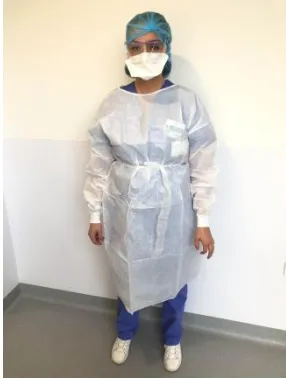A person is standing and facing forward, wearing a white disposable gown (surblouse enduite) over blue scrubs. They are also wearing a blue surgical cap, a white face mask, and white shoes. The background is a plain wall with a light-colored upper section and a darker lower section.

Etape 5 : Surblouse bleu plus Tablier

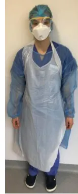A person is standing and facing forward, wearing a blue disposable gown and a matching blue apron over blue scrubs. They are also wearing a blue surgical cap, a white face mask, and black shoes. The background is a plain wall.

Etape 6 : Gants à manchette

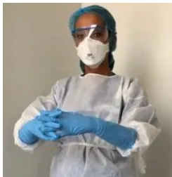A person is shown from the chest up, wearing a white disposable gown and blue surgical gloves with cuffs. They are also wearing a blue surgical cap, a white face mask, and safety glasses. Their hands are clasped together in front of their chest.

Etape 6 : Gants

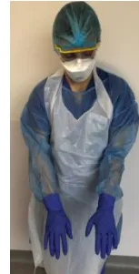A person is standing and facing forward, wearing a blue disposable gown and a matching blue apron over blue scrubs. They are also wearing a blue surgical cap, a white face mask, safety glasses, and blue surgical gloves. Their hands are hanging down by their sides.**Annexe 3 : Procédure de déshabillage** (Exemple de la procédure d'habillage en réanimation MIR R3S de la Pitié-Salpêtrière).

**Etape 1 (chambre) retirer le tablier (jeté comme chaque élément de la protection en DASRI)**

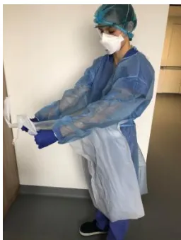

**Etape 2 (chambre) retirer les gants**

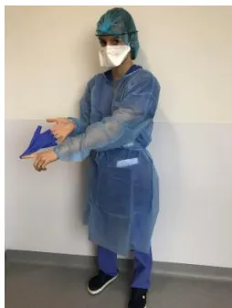

**Etape 3 (chambre): Friction hydro-alcoolique**

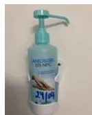

**Etape 4 (chambre): retirer la surblouse**

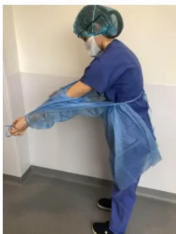

**Etape 5 (chambre): Friction hydro-alcoolique**

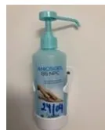Étape 6 (sas): retirer les lunettes et les placer dans un container de désinfection

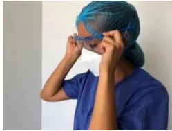

Étape 7 (sas) : Friction hydro-alcoolique

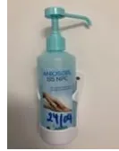

Étape 8 (sas): retirer masque et charlotte

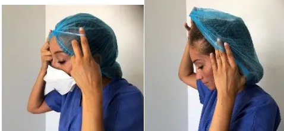

Étape 9 (sas): Friction hydro-alcoolique

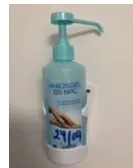**Annexe 4 : Procédure d'intubation** (Exemple de la procédure d'intubation telle que présentée par Guillaume Carteaux).

<https://mms.myomni.live/5e6126fdbe444d66709afab1>