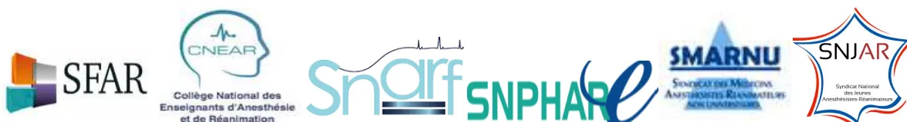
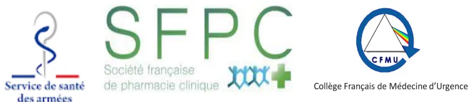

The logo for CNP-ARMOPO features the acronym in large, bold, green capital letters. Below it, in smaller black text, is the full name: 'CONSEIL NATIONAL PROFESSIONNEL D'ANESTHESIE-REANIMATION MEDECINE PERI-OPERATOIRE'. A green swoosh underline separates the acronym from the full name.

# Guide d'aide à la mise en place et à la gestion d'une « Réanimation Ephémère »

Le Conseil National professionnel d'Anesthésie Réanimation et Médecine Péri Opératoire regroupe:

- • La Société Française d'Anesthésie Réanimation (SFAR),
- • Le Collège National des Enseignants d'Anesthésie Réanimation (CNEAR)
- • Le Syndicat National des Anesthésistes Réanimateurs Français (SNARF)
- • Le Syndicat National des Praticiens Hospitaliers anesthésistes Réanimateurs élargi (SNPHARe),
- • Le Syndicat National des Médecins Anesthésistes Réanimateurs Non Universitaires (SMARNU)
- • Le Syndicat National des Jeunes Anesthésistes Réanimateurs (SNJAR).

A row of logos for the six professional organizations. From left to right: SFAR (Société Française d'Anesthésie Réanimation) with a colorful square icon; CNEAR (Collège National des Enseignants d'Anesthésie et de Réanimation) with a head profile icon; Snarf (Syndicat National des Anesthésistes Réanimateurs Français) with a stylized 'S' and 'R' icon; SNPHARe (Syndicat National des Praticiens Hospitaliers anesthésistes Réanimateurs élargi) with a stylized 'S' and 'R' icon; SMARNU (Syndicat National des Médecins Anesthésistes Réanimateurs Non Universitaires) with a blue triangle icon; and SNJAR (Syndicat National des Jeunes Anesthésistes Réanimateurs) with a red star icon.

En collaboration avec :

- • Le Service de Santé des Armées
- • La société Française de Pharmacie Clinique
- • Le CNP de Médecine d'Urgence

A row of logos for the three collaborating organizations. From left to right: Service de santé des armées (Service of Health of the Armies) with a red and blue cross icon; SFPC (Société française de pharmacie clinique) with a green 'S' and 'F' icon; and CFMU (Collège Français de Médecine d'Urgence) with a blue circle icon containing a triangle and a cross.## SOMMAIRE

<table><tr><td><b>Présentation du guide</b></td><td>Page 4</td></tr><tr><td><b>Contributeurs</b></td><td>Page 5</td></tr><tr><td><b>Glossaire</b></td><td>Page 6</td></tr><tr><td><b>Résumé</b></td><td>Page 7</td></tr><tr><td><br/><b>1. Chapitre 1 : La mise en place et le désarmement :</b></td><td>Page 8</td></tr><tr><td><br/><b>1-1 Travail préparatoire et plan de déploiement :</b></td><td>Page 8</td></tr><tr><td>    • Intégration du plan de réanimation éphémère de l'établissement au sein du territoire de santé</td><td></td></tr><tr><td>    • Quelles modalités de préparation du plan Réanimations Éphémères au sein de l'établissement ?</td><td></td></tr><tr><td>    • Quel rôle des cellules de régulation ?</td><td></td></tr><tr><td><br/><b>1-2 Indicateurs déclenchant l'ouverture :</b></td><td>Page 10</td></tr><tr><td>    • Quels sont les indicateurs recueillis au sein de l'établissement (SAU, HC, réanimation autorisée), au niveau territorial (SAMU) et national conduisant à l'activation de la structure ?</td><td></td></tr><tr><td><br/><b>1-3 Processus d'ouverture :</b></td><td>Page 11</td></tr><tr><td>    • Comment démarrer ?</td><td></td></tr><tr><td>    • Quelles sont les modalités de mobilisation des équipes médicales et soignantes ?</td><td></td></tr><tr><td>    • Quels sont les aspects pratiques de l'armement et de la vérification des conditions de fonctionnement en amont de l'ouverture ?</td><td></td></tr><tr><td><br/><b>1-4 Indicateurs de désarmement :</b></td><td>Page 12</td></tr><tr><td>    • Quels sont les indicateurs recueillis au sein de l'établissement (SAU, service COVID, réanimation autorisée), au niveau territorial (SAMU) et national conduisant au désarmement de la structure ?</td><td></td></tr><tr><td><br/><b>1-5 Processus de désarmement :</b></td><td>Page 13</td></tr><tr><td>    • Quelles sont les étapes de restitution des locaux et des équipements ?</td><td></td></tr><tr><td><br/><b>2. Chapitre 2 : Cadre général du fonctionnement : « souple/haute compliance »</b></td><td>Page 14</td></tr><tr><td><br/><b>2-1 Capacité maximale d'accueil :</b></td><td>Page 14</td></tr><tr><td>    • Quels sont les indicateurs (notamment ratio de personnel) permettant de définir la capacité maximale de la structure ?</td><td></td></tr><tr><td><br/><b>2-2 Relation avec les structures de réanimation pérenne</b></td><td>Page 15</td></tr><tr><td>    • Quels liens et modalités de coordination entre structures éphémères et unités de réanimation pérennes/salles d'accueil des réanimations ?</td><td></td></tr></table>### **2-3 Relation avec le SAMU et le SU**

Page 16

- • Quels liens et modalités de coordination entre structures éphémères et SU/SAMU ?

### **2-4 Articulation territoriale entre secteurs public et privé :**

Page 18

- • Comment mettre en œuvre la synergie entre les structures publiques et privés pour la mise en place des réanimations éphémères (ressources humaines, biomédicales, etc.) ?

### **2-5 Typologie des patients:**

Page 19

- • Définir la typologie des patients pris en charge dans les réanimations éphémères (COVID, non-COVID) ?

### **2-6 Niveau des soins et les gestes et techniques qui y sont réalisés**

Page 20

- • Quel est le périmètre des soins mis en œuvre ?

## **3. Chapitre 3 : Aspects organisationnels des réanimations « éphémères » :**

Page 21

### **3-1 Problématique des locaux :**

- • Quelles sont les conditions attendues des locaux supports de réanimation éphémère (architecture, alimentation, lits, etc.) ?

### **3-2 Le matériel biomédical :**

Page 26

- • Quelles sont conditions de mise en œuvre des équipements biomédicaux ? Quelle adaptation au profil des patients ?

### **3-3 Pharmacie et Dispositifs Médicaux :**

Page 27

- • Quelle organisation pour la gestion et l'approvisionnement des médicaments et des DM ?

### **3-4 Equipe médicale :**

Page 30

- • Quels sont les éléments organisationnels les plus favorables ? Comment gérer une situation dégradée ? Place des internes ?

### **3-5 Equipes soignante :**

Page 32

- • Quels sont les éléments organisationnels les plus favorables ? Comment gérer une situation dégradée ?

### **3-6 Concept de réserve sanitaire :**

Page 35

- • Quels sont les éléments de compétence, de formation ? Comment assurer un recensement au sein de l'établissement ? Au niveau territorial ?

## **4. Annexes**

Page 38## Présentation du Guide :

Lors de l'épidémie COVID, en moins de trois semaines, les 5 432 lits de réanimations que compte la France ont été doublés ce qui n'avait encore jamais encore été mis en œuvre par notre système de santé. Ainsi, au pic de l'épidémie, 7 148 patients COVID en situation critique étaient hospitalisés dans une structure de réanimation en plus des patients souffrant de pathologies non-COVID.

Alors que les établissements ne disposaient ni de consigne ni d'orientations particulières pour parer au risque de la saturation des réanimations autorisées, les professionnels, au fur et à mesure de l'arrivée de nouveaux malades, ont structuré la filière territoriale des soins critiques en identifiant, dans chaque établissement public ou privé, de nouvelles zones potentiellement à même d'accueillir des patients en défaillance vitale et en mobilisant des personnels compétants en réanimation.

Les secteurs de soins intensifs, les unités de soins continus, les salles de réveil et les blocs opératoires ont été transformés en véritables secteurs de réanimation. Conjointement, l'arrêt de la chirurgie programmée a libéré les compétences des anesthésistes réanimateurs au profit exclusif de l'activité de réanimation. Ainsi, la mobilisation, dans un temps très court, de ressources humaines et matérielles considérables a permis l'ouverture de nouvelles réanimations « éphémères ». Face à la situation extrêmement brutale et complexe de l'accueil synchrone de très nombreux patients en situation critique due à une nouvelle maladie, les établissements de santé, publics et privés ont dépassé les rigidités qui leurs sont habituellement prêtes, et démontré une remarquable élasticité dans l'offre de soins de réanimation.

Il reste que l'organisation intra hospitalière en situations sanitaires exceptionnelles (SSE) ne faisait pas encore l'objet de recommandations formalisées spécifiques aux soins critiques. C'est la raison pour laquelle le Conseil National Professionnel d'Anesthésie Réanimation et Médecine Péri Opératoire (CNP ARMPO) a souhaité modéliser ce concept de « réanimation éphémère ». En lien avec le Service de Santé des Armées, la Société Française de Pharmacie Clinique et le CNP Médecine d'Urgence, il a été à l'initiative de ce « **Guide d'aide à la mise en place et à la gestion d'une réanimation éphémère** » dont l'objectif est de fournir aux professionnels et aux établissements des éléments généraux et pratiques pour préparer et conduire au mieux l'ouverture de « réanimations éphémères » si cela s'avérait à nouveau nécessaire.

Je remercie très sincèrement les nombreux rédacteurs et relecteurs qui se sont impliqués dans la conception et la rédaction de ce guide.

Pr. Bertrand Dureuil  
Président du CNP ARMPO  
Pôle Réanimations-Anesthésie et SAMU  
CHU de Rouen  
[president@cnpar.org](mailto:president@cnpar.org)## Contributeurs

### Coordination :

Bertrand Dureuil (Anesthésie-Réanimation CHU de Rouen)  
[president@cnpar.org](mailto:president@cnpar.org)

### Comité de Pilotage :

Laurent Delaunay (Anesthésie-Réanimation, Clinique Générale Annecy), Benoît Plaud (Anesthésie-Réanimation, Hôpital Saint Louis AP-HP), Mathieu Raux (Anesthésie-Réanimation, hôpital Pitié Salpêtrière AP-HP), Franck Verdonk (Anesthésie-Réanimation, Hôpital Saint Antoine, AP-HP), Francis Bonnet (Anesthésie-Réanimation, Hôpital Tenon, AP-HP), Laurent Heyer (Anesthésie-Réanimation Hôpital de la Croix Rousse, HCL), Julien Pottecher (Anesthésie-Réanimation & Médecine Péri-Opératoire, Hôpital de Haute-pierre, Hôpitaux Universitaires de Strasbourg), Pierre Lanot (Anesthésie-Réanimation Hôpital Privé d'Antony), Eric Meaudre (Anesthésie-Réanimation, Hôpital d'Instruction des Armées Sainte Anne, Toulon),

### Rédacteurs et relecteurs:

Stéphane Honoré (SFPC, AP-HM) Sophie Di Maria (Anesthésie-Réanimation, Hôpital Pitié Salpêtrière AP-HP), Etienne Gayat (Anesthésie-Réanimation, Hôpital Lariboisière AP-HP), Georges Salvodelli (Anesthésie-Réanimation, Hôpitaux Universitaires Genève, Genève), Claire Lefur (Cadre de santé, Anesthésie-Réanimation, Hôpital Saint Antoine, AP-HP), Eric Levesque (Anesthésie-Réanimation, Hôpital Henri Mondor, APHP), Claude Ecoffey (Anesthésie-Réanimation, CHU Rennes), Louis Soulat (SAMU, CHU Rennes), Stéphane Petitmaire (Anesthésie-Réanimation, Clinique Convert – Bourg-en-Bresse), Christophe Gutton (Anesthésie-Réanimation, Hôpital Saint Antoine, AP-HP), Léa Satre Buisson (Anesthésie-Réanimation, Hôpital Saint Antoine, AP-HP), Fabienne Fieux (Anesthésie-Réanimation, Hôpital Saint Antoine, AP-HP), Julien Bordes (Anesthésie-Réanimation, Hôpital d'Instruction des Armées Sainte-Anne, Toulon), Alexis Donat (Anesthésie-Réanimation, Hôpital d'Instruction des Armées Le Gouest, Metz), Bruno Fontaine (Anesthésie-Réanimation, Hôpital d'Instruction des Armées Robert Picqué, Bordeaux), Bénédicte Gourieux (Service de Pharmacie, Hôpital de Haute-pierre, Hôpitaux Universitaires de Strasbourg), Eric Noll (Anesthésie-Réanimation & Médecine Péri-Opératoire, Hôpital de Haute-pierre, Hôpitaux Universitaires de Strasbourg, Strasbourg), Aurélie Bonnet (Anesthésie-Réanimation, Hôpital de la Croix-Rousse, HCL), Marie-Cécile Blanc (Anesthésie-Réanimation, Hôpital de la Croix-Rousse, HCL), Bruno Charpiat (Anesthésie-Réanimation, Hôpital de la Croix-Rousse, HCL), Jonathan Long (Anesthésie-Réanimation, Hôpital de la Croix-Rousse, HCL), Agnès Ricard Hibon (Médecine d'Urgence, SFMU), Didier Honnart (Médecine d'Urgence CHU Dijon) ; Florence Dumas (Médecine d'Urgence, SU Hôpital Cochin, AP-HP), Dominique Pateron (Médecine d'urgence, CHU Saint-Antoine, Sorbonne Université), Anne Geoffroy-Wernet (Anesthésiste-Réanimateur, CH Perpignan), Denis Cazaban (Anesthésiste Réanimateur, CH Montfermeil), Julien Cabaton (Anesthésiste-Réanimateur, Hôpital Privé Jean Mermoz, Lyon), Yves Rebufat (Anesthésiste-Réanimateur, CHU Nantes). Catherine Chenaillet (SFPC, CHU de Rouen), Clarisse Roux (SFPC, CHU Nîmes), Marie Camille Chaumais (SFPC, Kremlin Bicêtre AP-HP), Hervé Bouaziz (Anesthésiste-Réanimateur, CHU Nancy), Dorine Castillo (Pharmacien Hospitalier, CH Mâcon), Rémy Collomp (Pharmacien Hospitalier, CHU Nice), Etienne Cousein (Pharmacien Hospitalier, CH Valenciennes), Elodie Matusik (Pharmacien, CH Valenciennes), Justine Lemtiri (Pharmacien Clinicien, CH Valenciennes)## Glossaire

AR : Anesthésiste-Réanimateur  
AS : Aide-Soignant  
CCH : Cellule de Crise Hospitalière  
CNEAR : Collège National des Enseignants d'Anesthésie et de Réanimation  
COVID : CORonaVirus Disease  
CRRA : Centre de Réception et de Régulation des Appels  
DM : Dispositif Médical  
DRM : Dossier de Régulation Médicale  
DV : Décubitus Ventral  
ECMO : Extra Corporeal Membrane Oxygenation  
EER : Épuration Extra Rénale  
EPI : Équipement de Protection Individuelle  
ESR : Établissement de Santé de Référence  
GHT : Groupement Hospitalier de Territoire  
HC : Hospitalisation Conventionnelle  
IADE : Infirmier Anesthésiste Diplômé d'Etat  
IDE : Infirmier Diplômé d'Etat  
IOT : Intubation Oro Trachéale  
MDS : Médicament Dérivé du Sang  
MPR : Médecine Physique et de Réadaptation  
ONHD : Oxygénation Nasale à Haut Débit  
PSL : Produit Sanguin Labile  
PNM : Personnel non médical  
PUI : Pharmacie à Usage Intérieur  
PSE : Pousse Seringue Électrique  
SAMU : Service d'Aide Médicale Urgente  
SAU : Service d'Accueil des Urgences  
SAUV : Salle d'Accueil des Urgences Vitales  
SFAR : Société Française d'Anesthésie et de Réanimation  
SI : Système d'Information  
SRLF : Société de réanimation en Langue Française  
SRPR : Service de Réadaptation Post-Réanimation  
SSA : Service de Santé des Armées  
SSE : Situation Sanitaire Exceptionnelle  
SSPI : Salle de Surveillance Post-Interventionnelle  
SSR : Soins de Suite et de Réadaptation  
UNESS : Université Numérique en Santé et Sport  
USC : Unité de Surveillance Continue  
USI : Unité de Soins Intensifs## Résumé :

La mise en place des réanimations éphémères s'inscrit dans la stratégie de réponse à la crise qui est préalablement définie par l'établissement de santé et sa cellule de coordination institutionnelle. La réanimation éphémère doit être comprise comme une extension directe et coordonnée des unités pérennes de réanimation. Les principaux points d'attention sont:

1. 1. Tout établissement doit procéder à une **analyse préalable de ses locaux** potentiellement aménageables en soins critiques éphémères et répondant au plus près aux recommandations identifiées favorisant notamment : 1°) les chambres individuelles dans ce contexte épidémique et de séjour prolongé en réanimation et ; 2°) la **proximité** du plateau technique et des réanimations pérennes.
2. 2. Pré équiper ces structures (pré câblage, fluides, etc.) et définir les conditions d'utilisation (circuits patients, etc.). Les principes généraux guidant cette démarche sont : **modularité, extensibilité, réversibilité**.
3. 3. **Volet matériel** établir avec le service biomédical un inventaire du matériel stratégique au sein de l'établissement dont la localisation est précisément connue : respirateurs, matériel d'épuration extra-rénale, échographes, pousses-seringues électriques notamment. Favoriser l'homogénéité du matériel.
4. 4. **Médicament et Dispositifs médicaux** prévoir avec la pharmacie à usage intérieur une réserve de médicaments et DM permettant de répondre à un nombre de patients prédéfini. Disposer de check lists pour équiper une chambre de réanimation éphémère et de protocoles de soins et de prescription identiques à ceux des réanimations pérennes.
5. 5. **Personnels médicaux** : l'équipe est constituée des médecins travaillant habituellement en réanimation pérenne (anesthésistes réanimateurs et intensivistes) et des anesthésistes-réanimateurs venant des secteurs interventionnels. Coordination médicales étroite entre toutes les unités de réanimation (pérennes et éphémères) et liens territoriaux intégrant structures publiques et privées.
6. 6. **Personnel soignant** : avant l'ouverture, assurer une courte formation des personnels venant en appui dans les locaux éphémères. Constituer des équipes formées d'IDE de réanimation d'une part et d'IADE, d'IBODE, de soignants non formés à la réanimation d'autre part. Assurer la stabilité dans le temps des personnels pour favoriser l'émergence d'équipes opérationnelles et fonctionnelles.
7. 7. Instituer un **ratio de personnels soignant plus favorable** : IDE (1 pour 2 patients) et AS (1 pour 3) au-dessus du réglementaire, au moins dans la phase de montée en charge. Élaborer et partager des documents formalisant la doctrine thérapeutique puis son exécution en solutions de soins.
8. 8. **Montée en charge** : elle s'effectue selon le programme préétabli par la cellule de coordination. Une ouverture par « blocs » successifs de 5-6 lits est proposée de manière à répondre au plus près à la pression épidémique territoriale.
9. 9. Il faut probablement recommander l'admission en réanimation éphémère de **patients dont la prise en charge est stéréotypée** (ex : COVID-19). L'épuration extra rénale ainsi que l'ECMO sont à réserver préférentiellement aux secteurs de réanimation pérenne. Les patients neurochirurgicaux et de cardio-chirurgie sont préférentiellement pris en charge en secteur de réanimation spécialisée.
10. 10. Disposer **d'une réserve sanitaire** composée de professionnels ayant développé et maintenu des compétences en soins critiques notamment pour les personnels infirmiers avec une déclinaison locale au sein de l'établissement et territoriale. Nécessité d'un suivi régulier dans le temps tant du point de vue quantitatif que qualitatif (formation continue).# Chapitre 1 : La mise en place et le désarmement

## 1-1 Travail préparatoire et plan de déploiement :

### *Intégration du plan de réanimation éphémère de l'établissement au sein du territoire de santé*

La stratégie de mise en place d'une réanimation éphémère dans un établissement s'intègre dans une approche coordonnée avec l'ensemble des établissements publics et privés du territoire de santé pour faire face à une situation sanitaire exceptionnelle (SSE). En fonction des moyens disponibles, les établissements de santé doivent coopérer. Deux modèles sont proposés. Un premier dit en « cascade » où des établissements de santé de référence (ESR) sont mobilisés en priorité afin de maintenir la prise en charge des patients non affectés par la SSE. Quand ces ESR sont saturés, les autres structures sont mobilisées. Un second dit en « réseau » où d'emblée les patients concernés par la SSE sont répartis sur l'ensemble des structures du territoire de santé afin de répartir au mieux l'afflux de patients.

### *Quelles modalités de préparation du plan Réanimations Éphémères au sein de l'établissement ?*

La première étape est la mise en place d'un groupe de travail *ad hoc* composé de personnalités représentatives nommées par la cellule de crise hospitalière (CCH). Ce groupe est en charge de la proposition du plan de déploiement de l'offre de soins critiques et de son exécution sur instruction de la CCH. Les principes sont les suivants : modularité, extensibilité, réversibilité. Le plan de déploiement de l'offre de soins critiques comporte plusieurs volets.

- - **Le volet architectural** avec la quantification de l'existant (capacitaire autorisé et capacitaire opérationnel des lits réellement fonctionnels) et identification des structures et services pouvant évoluer ou s'implémenter :
  - ○ Niveau 1 : Soins continus polyvalents (Unité de Surveillance Continue-USC) ou spécialisés (Unité de Soins Intensifs-USI) vers de la réanimation
  - ○ Niveau 2 : Unité de chirurgie/anesthésie ambulatoire vers des soins continus ou de la réanimation à la condition d'être pré-équipée (cf. chapitre 3)
  - ○ Niveau 3 : Salle de surveillance post-interventionnelle (SSPI) vers des soins continus ou de la réanimation
  - ○ Niveau 4 : Salle d'intervention au sens du décret du 5 décembre 1994 (bloc opératoire, secteur hors bloc : endoscopie, radiologie interventionnelle) vers de la réanimation
  - ○ Niveau 5 : Unité d'hospitalisation conventionnelle (HC) vers des soins continus (nécessité dans ce cas d'identifier des locaux en HC disposant des trois fluides médicaux : oxygène, air et vide)
  - ○ L'activation des niveaux 2, 3 et 4 implique une réduction, une adaptation et réorientation des activités programmées notamment interventionnelles (chirurgicales, endoscopiques, radiologiques). Le maintien d'activités non différables (urgences, maternité notamment) impose une organisation spécifique au sein de l'établissement en lien avec ceux du bassin de population concerné. Une coopération et une articulation entre les établissements du territoire de santé sont de ce point de vue essentielles : permettre la gestion de la SSE tout en maintenant l'accueil et la prise en charge des patients non différables, non transférables.
  - ○ Selon la structure de l'établissement (monobloc, pavillonnaire) l'évaluation du capacitaire s'effectue par zone, en identifiant les différentes strates liées à ces contraintes architecturales afin notamment de garantir l'isolement (chambre seule *versus* espace ouvert)
  - ○ Chaque niveau d'activation fait l'objet d'une évaluation des besoins en ressources humaines médicales, paramédicales, de jour, comme de nuit et en ressources matérielles- - **Le volet ressources humaines** avec le recensement des personnels non médicaux ne travaillant pas habituellement en secteur de soins critiques et ayant ou ayant eu des compétences en soins critiques. Une cartographie des compétences locales des personnels formés aux soins critiques est indispensable. C'est le concept de réserve sanitaire de soins critiques au sein de chaque établissement nécessitant un suivi régulier dans le temps tant du point de vue quantitatif que qualitatif (formation continue) (cf. : 3-7).
- - **Le volet matériel** avec l'établissement d'un inventaire du matériel stratégique dont on connaît la localisation précise : respirateur, matériel d'épuration extra-rénale, échographe, pousses-seringues électriques notamment.
- - **Le volet organisation** par la définition de parcours patients identifiés pour les soins critiques avec une stratification des degrés de prise en charge entre les différents secteurs de soins critiques : niveaux de réanimation, USC et possibilités de transfert entre ces structures. Ce volet organisation tient compte également d'une régulation distincte pour l'admission des patients critiques selon le statut de contamination éventuelle comme cela fut le cas pour la pandémie Covid.

À l'issue de cette analyse préliminaire, le capacitaire maximal théorique du site est établi : 1°) en conditions habituelles de fonctionnement, 2°) en situation d'évolution des soins critiques au-delà de la réanimation (USC, USI, SSPI) et ; 3°) en investissant d'autres sites interventionnels ou d'hospitalisation conventionnelle.

Ce plan de déploiement graduel de l'offre en soins critiques doit être coordonné avec celui de l'offre en HC et de soins post-réanimation (Service de Réadaptation Post-Réanimation, Médecine Physique et de Réadaptation, Soins de Suite et de Réadaptation). Le principe est d'harmoniser et d'adapter les ratios entre les différents secteurs pour soutenir la dynamique de flux de transferts des patients entre eux et éviter l'encombrement de l'un par rapport à l'autre. Cette adaptation permanente dans le temps de l'offre de soins sur l'ensemble du parcours (HC, soins critiques et soins de suite) est un point clé de la gestion d'une SSE.

Le capacitaire en HC doit prendre en compte le pourcentage de patients qui va s'aggraver et qui nécessite une prise en soins critiques. Un ratio trop élevé lits HC/lits soins critiques exposerait au risque de ne pas pouvoir être en mesure, au niveau de l'établissement, d'accueillir en soins critiques les patients qui s'aggravent en HC, sans compter ceux nécessitant une admission directe en soins critiques à partir du Service d'Accueil des Urgences (SAU) ou du Service d'Aide Médicale Urgente (SAMU).

L'ensemble de ces éléments doit désormais être intégré *a priori* dans le plan global de gestion des tensions hospitalières et des SSE permettant à l'établissement de santé d'apporter une réponse adaptée et progressive selon un déroulé établi en amont.

#### **Quel rôle des cellules de régulation ?**

Elles permettent de suivre la progression des indicateurs de suivi de la SSE : nombre de dossiers de régulation médicale (DRM) des SAMU, de passages au SAU, d'admissions en HC et en soins critiques. L'évaluation des flux transversaux (entrées directes en réanimation depuis le SAMU ou le SAU, passages de l'HC vers l'USC ou vers la réanimation) est nécessaire afin d'anticiper les besoins en lits de soins critiques à partir de la projection des courbes des indicateurs de suivi de la SSE.

Cela permet de définir *a priori* des seuils de décision de passage à un niveau supérieur et l'ordre d'ouverture des différents secteurs éphémères de soins critiques.

Dans l'optique d'une dynamique de flux, elles garantissent le transfert de patients en voie d'amélioration vers des structures de moindre niveau de soins lorsque leur état le permet. Pour cela elles élaborent une stratégie de transfert sur des critères médicaux et d'engagement de soins (ventilation invasive/non invasive, épuration extra-rénale, assistance circulatoire notamment) et assurent la mise en œuvre des transferts.**Recommandations :**

R1-1. La mise en place d'une réanimation éphémère doit s'intégrer dans un projet global incluant l'ensemble des établissements d'un territoire de santé. Le préalable est la mise en place d'une cellule de régulation pluridisciplinaire nommée par la cellule de crise hospitalière. Le plan s'articule autour de 4 volets. Un volet architectural qui tient compte des capacités existantes de l'établissement et permet de définir les implémentations possibles. Un volet ressources humaines qui recense les personnels médicaux et paramédicaux et réalise une cartographie des compétences en soins critiques. Un volet matériel qui réalise un inventaire du matériel stratégique. Un volet organisationnel qui définit les différents parcours patients selon le degré d'urgence. L'ensemble de ces données va permettre de définir la capacité maximale théorique du site.

**1-2 Indicateurs déclenchant l'ouverture :**

*Quels sont les indicateurs recueillis au sein de l'établissement (SAU, HC, réanimation autorisée), au niveau territorial (SAMU) et national conduisant à l'activation de la structure ?*

L'activation de la structure ne se fait pas seulement sur la base d'indicateurs. Elle se conçoit dans le cadre d'un programme de montée en charge préétabli avec passage d'un niveau à l'autre suivant la planification validée par la CCH. Cette montée en charge se fondera notamment sur le taux de remplissage/occupation des lits de soins critiques existants et sur la progression des indicateurs retenus.

Parmi les indicateurs d'amont :

- • Dossier de Régulation Médicale (DRM) SAMU et proportion d'entrées directes
- • Passages SAU et proportion d'entrées directes
- • Évolution dans le temps du nombre de patients hospitalisés en HC et % d'entrées par jour à partir de l'HC
- • Proportion de sorties par jour
- • Un modèle de prédiction, développé et ajusté pendant la crise est souhaitable. Il intègre le nombre de nouveau cas dans le territoire de santé sur le nombre de patients hospitalisés en HC. Une estimation du pourcentage de patients qui vont s'aggraver et nécessiter une admission en soins continus et en réanimation. Dans le cas d'une pandémie, le modèle va s'affiner au cours de la crise, il devrait être établi hôpital par hôpital en tenant compte des cinétiques locales de son développement de l'épidémie.

Les indicateurs nationaux ne sont pas pertinents pour gérer une situation au sein d'un établissement donné. Il est donc nécessaire de mettre au point un tableau de bord de crise propre au site qui sera mis en œuvre et alimenté par les services compétents le moment venu. Ce tableau de bord devra être mis à jour quotidiennement et idéalement inclure les informations minimales suivantes (exemple tiré de la récente pandémie COVID) : nombre de patients hospitalisés (COVID +, COVID suspects, COVID-), taux d'occupation de toutes les unités de l'établissement (HC, USC, Réanimation, etc...), bilan quotidien admissions/sorties, cumul des patients admis et sortis, nombre de décès COVID positifs, COVID suspects et décès cumulés, cumul des cas testés, cumul des cas COVID+.

**Recommandations :**

R1-2. La mise en place d'un programme de montée en charge est indispensable. La temporalité et la vitesse possible d'exécution de la montée en charge doivent être définies dans le plan de réanimation éphémère. Dans le cas d'une épidémie/pandémie, l'implémentation des moyens se basera sur divers indicateurs comme le nombre de nouveaux cas apparus dans le territoire de santé, le nombre de patients hospitalisés et l'estimation du pourcentage de patients qui vont s'aggraver et justifier de soins critiques. Dans le cas d'une épidémie/pandémie, le nombre de patients atteints, ainsi que leur gravité, peut être extrêmement variable d'un territoire à l'autre. Le modèle local de prédiction devrait s'affiner au fur et à mesure de l'évolution de la SSE.### 1-3 Processus d'ouverture :

#### *Comment démarrer ?*

L'ouverture initiale du nombre de lits est une question importante. L'ouverture immédiate d'un grand nombre de lits est pertinente mais expose au risque de consommer beaucoup de ressources (humaines, matériels) sans qu'elles soient utiles. Inversement, une capacité initiale trop réduite expose au risque d'insuffisance de moyens. Une approche par « bloc » est proposée. Chaque bloc comprend un nombre défini de lits de réanimation armés en personnel et en matériel. L'implémentation et la montée en charge s'effectue ensuite par blocs successifs en fonction de l'évolution de la SSE. Une réduction planifiée des activités programmées de l'établissement précède et accompagne la montée en charge des soins critiques.

#### *Quelles sont les modalités de mobilisation des équipes médicales et soignantes ?*

- - Dans l'idéal la mobilisation s'effectue pour les personnels formés à la réanimation (volontaires : retraités, disponibilité, secteur privé, de zones non en tension notamment).
- - Si cela s'avère insuffisant, il faudra organiser la mobilisation de personnel néophyte (jamais physiquement seul). Pour cela une formation préalable, même courte, dans la mesure du possible dans les futurs locaux d'exercice est indispensable (simulation *in situ, just in time*). Un encadrement par un binôme IDE/AR référent expert en soins critiques, un ratio élevé soignant/patient, une simplification des prescriptions par la rédaction de protocoles (notamment via le dossier patient informatisé) et la limitation du nombre de références médicamenteuses disponibles sont des éléments importants à considérer. De même l'utilisation d'outils simples pour la prescription et la surveillance ne nécessitant pas de formation longue et/ou complexe sont à privilégier. L'accompagnement pédagogique au lit du patient après ouverture est indispensable.
- - Des ressources d'apprentissage accessibles en ligne (Sociétés savantes, plateformes universitaires type SIDES NG-UNESS, plateformes locales) disposant de contenus pédagogiques validés sont disponibles pour la formation des personnels néophytes.

#### *Quels sont les aspects pratiques de l'armement et de la vérification des conditions de fonctionnement en amont de l'ouverture ?*

Les contraintes architecturales à prendre en compte avant l'ouverture d'une unité éphémère :

- - Les modalités de ventilation avec l'inversion des flux dans les blocs opératoires, si possible flux négatif sinon neutre
- - La définition d'un circuit matériel, soignants et patient contaminés (entrée/sortie, sas d'habillage et de déshabillage pour les personnels). Explorer la possibilité de construction de cloisons légères facilement démontables.
- - La surface minimale pour un emplacement de réanimation pourrait être 15m<sup>2</sup>
- - Effectuer le relevé des prises murales d'oxygène, d'air et de vide pour chaque emplacement et tester leur bon fonctionnement avant ouverture avec tous les respirateurs en fonction et aspiration vérifiée pour s'assurer de la fiabilité du réseau de fluides médicaux qui n'est pas toujours dimensionné pour un capacitaire élevé.

Les contraintes matérielles à prendre en compte :

- - Désigner un référent biomédical pour la structure
- - Le parc en équipement biomédical doit être le plus uniforme possible surtout pour une utilisation par du personnel néophyte
- - Assurer la traçabilité de la provenance du matériel emprunté ou redistribué
- - L'équipement pour un emplacement de soins critiques comprend :
  - o 1 respirateur (idéalement conçu pour la réanimation de niveau 3 ou supérieur, à défaut une station d'anesthésie),
  - o 2 aspirations (aspiration bronchique en circuit clos si disponible),- ○ 1 scope multifonction (électrocardioscope, pression artérielle non invasive, oxymétrie pulsée, une pression invasive, curamètre, mesure de la fraction expirée en CO<sub>2</sub>)
- ○ 1 pompe de nutrition entérale
- ○ 1 pompe volumétrique pour perfusion intraveineuse
- ○ 4 pousse-seringues (au minimum) à l'idéal 6
- ○ 2 pieds à perfusion
- - Chariots infirmiers avec petit matériel (thermomètre, seringues, aiguilles, pansements, lignes de perfusion ...): un pour 2 ou 3 lits
- - Respirateur et scope de transport
- - Dispositif d'oxygénation nasal à haut débit
- - Matériel d'intubation difficile comprenant un vidéo-laryngoscope et un fibroscope souple, idéalement à usage unique
- - Défibrillateur, chariot d'urgence
- - Appareil d'échographie permettant échographie cardio-pulmonaire
- - Si possible appareil de biologie délocalisée notamment pour l'analyse des gaz du sang.
- - Pour les consommables s'aider de la liste d'une réanimation existante en se limitant au strict nécessaire.
- - Privilégier un conditionnement par sets ou « kits » prêts à l'emploi rassemblant tout le matériel consommable pour les actes invasifs (intubation de la trachée, voie veineuse centrale, cathétérisme artériel, sonde urinaire notamment)
- - Pour la pharmacie s'aider également de la liste d'une réanimation existante en limitant aussi le nombre de référence au strict nécessaire. Modification de la dotation en stupéfiant si besoin
- - Étiquetage clair de la réserve de matériel et de pharmacie avec listing des références disponibles.

Définir les modalités de fonctionnement avant l'ouverture puis ajuster après l'ouverture

- - Ratio : soignants patient (IDE/AS/AR séniour et interne), horaires pour le personnel paramédical en 12 heures, permanence des soins (astreintes/gardes).
- - Rédaction de protocoles (sédatation, alimentation, bilans ...) permettant une simplification de la prise en charge et une uniformisation des pratiques à disposition de tous (support papier et/ou numérique). Planification de journée type (horaire bilans, soins de pansement, visite médicale, staff, transmissions ...). Respect de périodes de repos (deux jours consécutifs tous les cinq jours).

**Recommandations :**

R1-3. Une ouverture du nombre de lits par « bloc » est préférable chaque bloc correspondant à un nombre de lits déterminés armés en personnel et en matériel. Le personnel doit être du personnel formé à la réanimation. Si leur nombre est insuffisant du personnel néophyte est intégré après une formation ciblée et un encadrement par du personnel compétent en soins critiques. Les modalités d'armement d'une réanimation éphémère doivent tenir compte des contraintes architecturales et matérielles. Chaque site doit établir sa propre check-list d'ouverture d'une réanimation éphémère.

**1-4 Indicateurs de désarmement :**

*Quels sont les indicateurs recueillis au sein de l'établissement (SAU, service COVID, réanimation autorisée), au niveau territorial (SAMU) et national conduisant au désarmement de la structure ?*

- - Reprendre les indicateurs proposés au point 2. Cette phase de transition pour un retour progressif au fonctionnement habituel est complexe avec deux contraintes simultanées : le risque d'un désarmement trop précoce et la nécessité de reprendre les activités programmées. Elle doit maintenir une dynamique afin de permettre une reprise dans les meilleurs délais des activités programmées tenant compte du repos et de l'indisponibilité de certains personnels (épuisement, congés, maladies) et de la remise en condition deslocaux et du matériel. La reprise graduée des activités interventionnelles impose dès que possible de désarmer en premier lieu les blocs opératoires et les SSPI mobilisés pour les soins critiques. En cas d'épidémie/pandémie, lors du désarmement des unités « mixtes » comprenant patients infectieux (ex : COVID +) et non infectieux (ex : COVID nég) pourront émerger de manière transitoire (cf. : 3-1-2).

**Recommandations :**

R1-4. Les indicateurs de désarmement sont identiques à ceux utilisés pour l'armement. Ils reposent sur l'évolution du nombre de nouveaux patients au cours du temps.

**1-5 Processus de désarmement :**

*Quelles sont les étapes de restitution des locaux et des équipements ?*

- - Organiser, en lien avec les équipes opérationnelles d'hygiène (EOH) le bio nettoyage du matériel puis désinfection à la vapeur des surfaces pour élimination du biofilm. La Désinfection par Voie Aérienne (DSVA) est également possible dans certains cas mais elle impose une unité vide et indisponible pendant une douzaine d'heures.
- - Démontage des cloisons si applicable
- - Rétablissement du flux de ventilation
- - Restitution du matériel emprunté ou redistribué (importance de la traçabilité à l'ouverture)
- - Redistribution du consommable de réanimation aux réanimations pérennes et restitution à la pharmacie des références non utiles à la reprise de la future activité.
- - Mise en place des équipements nécessaires à la reprise de l'activité antérieure
- - Si bloc opératoire : comptage des particules

**Recommandations :**

R1-5. Le désarmement doit permettre le retour progressif à une activité normale. Le nettoyage et la désinfection des locaux et du matériel doivent être organisés. Le désarmement doit intégrer la possibilité d'une ré-aggravation de la situation.

**Références utiles du chapitre 1 :**

1. 1. Alban A, Chick SE, Dongelmans DA, et coll. ICU capacity management during the COVID-19 pandemic using a process simulation. Intensive Care Med 2020 (<https://doi.org/10.1007/s00134-020-06066-7>)
2. 2. Castex J. Plan de préparation de la sortie du confinement. 27 avril et 6 mai 2020 ([https://www.gouvernement.fr/sites/default/files/rapport\\_jean\\_castex\\_-\\_preparation\\_de\\_la\\_sortie\\_du\\_confinement.pdf](https://www.gouvernement.fr/sites/default/files/rapport_jean_castex_-_preparation_de_la_sortie_du_confinement.pdf))
3. 3. Guide de gestion des tensions hospitalières et des situations sanitaires exceptionnelles au sein des établissements de santé (<https://solidarites-sante.gouv.fr/systeme-de-sante-et-medico-social/securete-sanitaire/guide-gestion-tensions-hospitalieres-SSE>)
4. 4. Leclerc T, Donnat, N, Donat A, et coll. Prioritisation of ICU treatments for critically ill patients in a COVID-19pandemic with scarce resources. Anaesth Crit Care Pain Med 2020 (<https://www.sciencedirect.com/science/article/pii/S2352556820300916?via%3Dihub>)## Chapitre 2 : Cadre général du fonctionnement : « souple/haute compliance ».

### 2-1 Capacité maximale d'accueil :

*Quels sont les indicateurs (notamment ratio de personnel) permettant de définir la capacité maximale de la structure ?*

#### PROPOSITION :

L'objet de ce chapitre est de discuter la partie organisation et équilibre professionnels/patients. Les problématiques managériales, matérielles et d'espace sont évoquées dans le chapitre 3.

L'organisation d'une réanimation (ou USC) éphémère nécessite de respecter impérativement les pré requis réglementaires, considérant que :

- • la typologie et la gravité des patients admis dans ces réanimations ne diffèrent pas des patients admis dans les services de réanimation pérennes en contexte de pandémie.
- • le besoin immédiat de personnel qualifié nécessite la réorientation d'activité d'un personnel soignant non réanimateur vers la réanimation et sa formation aux soins de réanimation en un temps réduit.

En première intention, le maintien du cadre réglementaire est le garant d'une qualité des soins standardisée [4].

L'organisation médicale doit s'approcher au plus près de la répartition prévalant actuellement en France (soit un ratio maximal de 2 lits par médecin en réanimation et de 4,3 lits par médecin en USC [5]). Ces médecins doivent être qualifiés compétents en réanimation (anesthésie-réanimation ou médecine intensive et réanimation) ou titulaires du diplôme d'études spécialisées complémentaire de réanimation médicale [2]. Les internes (DES AR et DES MIR), hors « docteurs juniors », ne peuvent être considérés comme qualifiés mais sont une plus-value en termes de prise en charge médicale, dans le cadre de la constitution de binômes interne/ « docteur junior » ou senior.

L'organisation non médicale doit préserver le ratio minimal de cinq patients pour deux infirmiers et de quatre patients pour un aide-soignant en réanimation et de cinq lits en USC pour 2 infirmiers ou aides-soignants dont au moins 1 IDE.

L'organisation générale vise à constituer des équipes comprenant des personnels aguerris en réanimation et/ou USC encadrant des personnels nouvellement formés, dans une dynamique de « compagnonnage ». Ce personnel bénéficiant d'une formation accélérée est préférentiellement recruté à partir de secteurs proches des réanimations tels que les personnels non médicaux travaillant en SSPI et les IADE.

Quant à l'ouverture de ces Unités éphémères, elle ne peut se concevoir lit par lit mais par blocs de 5 à 6 lits minimum de manière à maintenir une masse critique de personnel satisfaisante. Ces unités s'ouvrent ou se ferment en bloc, de manière crantée, en fonction du flux d'admission ou de sorties des patients.

#### Recommandations :

R2-1-1. Des cycles de formation réguliers pour les personnels « proches » des réanimations tels que les personnels non médicaux travaillant en SSPI et les IADE (2/3 jours par an) portant sur la pratique de la réanimation de façon à maintenir leur niveau de compétence au-delà de la crise sont uneoption satisfaisante d'anticipation de crises ultérieures. Cela permettrait de disposer au sein d'un établissement d'un pool de personnel non médical mobilisable immédiatement.

R2-1-2. Des unités physiques permettant d'accueillir 6 patients critiques ou plus doivent être déterminés au sein d'une structure hospitalière et équipés en conséquence en termes de fluides médicaux, prises électriques et réseau informatique. Ces unités peuvent être des unités d'hospitalisation ou des unités de bloc opératoire, en particulier les blocs de chirurgie ambulatoire qui ont été largement utilisés lors de la crise COVID-19

## REFERENCES

1. 1. Nombre de lits de réanimation, de soins intensifs et de soins continus en France, fin 2013 et 2018 - Ministère des Solidarités et de la Santé Available online: <https://drees.solidarites-sante.gouv.fr/etudes-et-statistiques/publications/article/nombre-de-lits-de-reanimation-de-soins-intensifs-et-de-soins-continus-en-france> (accessed on May 14, 2020).
2. 2. Décret n°2002-466 du 5 avril 2002 relatif aux conditions techniques de fonctionnement auxquelles doivent satisfaire les établissements de santé pour pratiquer les activités de réanimation, de soins intensifs et de surveillance continue et modifiant le code de la santé publique (troisième partie : Décrets simples) | Legifrance Available online: <https://www.legifrance.gouv.fr/affichTexte.do?cidTexte=LEGITEXT000005632579> (accessed on May 25, 2020).
3. 3. Robert, R.; Beaussier, M.; Pateron, D.; Guidet, B.; Perrigault, P.-F.; Misset, B.; Denys, F.; Reignier, J.; Honnart, D.; Kerver, S.; et al. *Recommandations pour le fonctionnement des Unités de Surveillance Continue (USC) dans les Etablissement de Santé 2018 Texte élaboré par les Conseils Nationaux Professionnels de :-Médecine Intensive Réanimation-Anesthésie-Réanimation-Médecine d'Urgence;*
4. 4. COVID-19 : point épidémiologique du 14 mai 2020 Available online: <https://www.santepubliquefrance.fr/maladies-et-traumatismes/maladies-et-infections-respiratoires/infection-a-coronavirus/documents/bulletin-national/covid-19-point-epidemiologique-du-14-mai-2020> (accessed on May 25, 2020).
5. 5. Leone, M.; Constantin, J.M.; Dahyot-Fizelier, C.; Duracher-Gout, C.; Joannes-Boyau, O.; Langeron, O.; Legrand, M.; Mahjoub, Y.; Mirek, S.; Mrozek, S.; et al. French intensive care unit organisation. *Anaesth. Crit. Care Pain Med.* 2018, 37, 625–627.

## 2-2 Relation avec les structures de réanimation pérenne

*Quels liens et modalités de coordination entre structures éphémères et unités de réanimation pérennes/salles d'accueil des réanimations ?*

### CONSTAT :

Une unité de réanimation autorisée est soumise à des normes strictes nationales, implantée dans des espaces architecturaux conçus à cet effet, avec un équipement particulier et des équipes médicales et non médicales dédiées. S'y ajoutent les aspects fonctionnels, la gestion et l'organisation des ressources humaines médicales et non médicales, les droits des patients, une organisation logistique et administrative. Une coordination et collaboration avec les principaux services d'interface ont été mises en place depuis des années.

Une unité éphémère doit naturellement répondre à la plupart de ces prérogatives. Elle est comme l'expansion d'une unité pérenne avec l'ensemble des procédures, une ossature médicale et paramédicale, une organisation logistique et administrative en fonction de la pression sanitaire et elle ne doit pas fonctionner comme une unité qui serait « autonome » au sein de l'établissement. Ainsi, chaque unité éphémère est directement rattachée, sur les plans médical et administratif, à une unité pérenne. Une réanimation pérenne pouvant coordonner plusieurs réanimations éphémères.**Recommandations :**

R2-2. Les éléments clé du déploiement d'une réanimation éphémère sont le recours à

- • Des conditions relatives à l'infrastructure. À titre d'exemple, la crise COVID a révélé que des lits de soins continus, des salles de réveils, des blocs opératoires peuvent être transformés en lits de réanimation. La limite en a été la dispersion dans des sites parfois éloignés et insuffisamment coordonnés avec les plateaux techniques de réanimations pérennes. Il est recommandé que ces unités soient regroupées en unités opérationnelles proches des plateaux techniques et en lien avec les réanimations pérennes. Le positionnement et la coordination de ces unités répond aux propositions préalablement définis par le plan de déploiement de l'offre de soins critiques élaboré par la CCH.
- • Des ressources logistiques (lits, ventilateurs, scopes, matériel de soins critiques) connues par le personnel médical et non médical et constituant la réserve de matériel d'une unité pérenne.
- • Des ressources humaines (cliniques et non cliniques) à partir d'une ossature locale et de toutes les procédures existantes. Une richesse sécuritaire en personnel avec une double compétence en anesthésie-réanimation (pour le personnel médical et paramédical), des collaborations constantes entre les secteurs d'anesthésie et de réanimation, une flexibilité du temps de travail permettent avec une certaine complaisance d'augmenter le nombre de lits.
- • Un système de communication local et régional déjà en place avec l'unité pérenne
- • Un organigramme administratif et médical avec la définition du projet médical, la coordination et une collaboration avec les principaux services d'interface.

**2-3 Relation avec le SAMU et le SU**

*Quels liens et modalités de coordination entre structures éphémères et SU/SAMU ?*

**CONSTAT :**

L'articulation entre les SAMU, les services d'urgences et les secteurs de réanimation doit être formalisée et s'inscrire dans une réflexion territoriale de parcours patient pour la période épidémique. La relation entre les SAMU, les réanimations autorisées et les réanimations éphémères est indispensable afin d'alerter sur la nécessité de déclencher la procédure d'ouverture de lits supplémentaires de réanimation, de réguler la répartition des patients et/ou d'organiser le transfert de patients vers d'autres établissements de santé, éventuellement hors région. L'augmentation des Dossiers de Régulation Médicale (DRM) relatifs au COVID ou une autre SSE au niveau du SAMU territorial est un indicateur qui peut précéder de quelques jours le flux des patients COVID requérant une hospitalisation.

**PROPOSITION :****Définition d'un niveau d'occupation des réanimations déclenchant l'ouverture de lits supplémentaires de réanimation**

Les SAMU via leur Centre de Réception et de Régulation des Appels (CRRA) doivent disposer d'indicateurs territoriaux (exemple : DRM COVID) permettant d'anticiper l'arrivée du flux épidémique hospitalier et ainsi préparer la montée en charge territoriale en lits de réanimation.

Pour une période épidémique, la CCH doit avoir préalablement défini le taux d'occupation de lits de réanimation autorisés avant déclencher l'activation de lits supplémentaires de réanimation et/ou de transferts de patients pour délester les réanimations en tension.

**Identification d'un référent réanimateur pour le SAMU pour la gestion des capacités**Un anesthésiste-réanimateur référent doit être identifié. Il intervient à 2 niveaux :

- - À l'échelon départemental dans l'hôpital support d'un département, habituellement le CHU voire le CH référent du département.
- - Dans certaines régions plus petites en taille, ce médecin réanimateur peut se trouver à l'échelon régional à l'ARS, en appui de la cellule de crise pour gérer la répartition des patients.

### **Recensement des demandes de place en sus des capacités du territoire au niveau régional et/ou zonal**

De manière journalière, les SAMU font remonter le besoin en places de réanimation :

- o À l'échelon local (établissement support via la CCH hospitalière
- o À l'échelon départemental via la cellule de régulation territoriale
- o À l'échelon régional

Il faut définir un niveau d'alerte de manque de lits de réanimation lorsque l'ensemble des lits de réanimation « éphémères ont été mobilisés. Dans certains cas, c'est le nombre de patients ne pouvant être pris en charge dans les services de réanimation du territoire par manque de lits sur une période donnée (par exemple recherche de place infructueuse pour 2 patients 2 jours consécutifs sur un département, à définir pour chaque établissement de santé).

### **Organisation des transferts de « délestage » de patients des services de réanimation**

Les transferts de patients peuvent se faire à plusieurs niveaux : départemental, régional, zonal et/ou transfrontalier. Ces transferts sont coordonnés par l'ARS et organisés par le SAMU et/ou le Service de Santé des Armées (SSA) qui déterminent le vecteur le plus adapté en fonction de la distance et de la disponibilité (ambulance, hélicoptère, avion ou train). Des AR et/ou MIR peuvent constituer des binômes avec les urgentistes des SMUR pour assurer les transferts longues distances (train sanitaire par exemple).

### **Optimiser la filière de prise en charge des soins critiques intra-hospitaliers**

- • Libérer le plus précocement possible les urgentistes des patients en défaillance vitale se présentant en service d'urgence. L'attente hors réanimation dans le contexte de saturation des services d'urgence comporte un risque de perte de chance.
- • Disposer au niveau des secteurs de soins critiques, d'une salle d'accueil de réanimation spécifique pour assurer la mise en condition et déterminer le statut contaminé ou non contaminé du patient. Le séjour en salle d'accueil doit être court et suivi, dès que possible, du transfert vers un lit de réanimation de l'établissement ou directement vers un autre établissement.

### **Gestion au niveau zonal des besoins en respirateurs s'appuyant sur les réserves tactiques des SAMU de la zone.**

La gestion au niveau zonal de respirateurs type Osiris, mais prochainement type Monnal T60 peut permettre d'aider aux transports de patients, mais peut aussi être intégré dans l'aide à l'ouverture de lits de réanimation pour ce qui concerne les respirateurs type Monnal T60.

Recommandations :

R2-3. Il faut identifier un médecin réanimateur au sein de la cellule de crise de l'ARS ou de l'établissement CHRU de référence. Le SAMU doit organiser les transferts de « délestage » vers d'autres hôpitaux du département et/ou d'autres régions. Il faut organiser la filière soins critiques en intra-hospitaliers## 2-4 Articulation territoriale entre secteurs public et privé :

*Comment mettre en œuvre la synergie entre les structures publiques et privés pour la mise en place des réanimations éphémères (ressources humaines, biomédicales, etc.) ?*

### CONSTAT :

Le secteur privé compte 53 établissements dotés d'une réanimation autorisée. Lors de la crise COVID, 82 nouvelles réanimations ont été créées par autorisations dérogatoires temporaires. Ainsi, le nombre de places de réanimation est passé en quelques jours de 550 à 1189 soit un doublement des capacités sans compter les USC.

### PROPOSITION :

Préalablement à toute gestion de crise, **l'inventaire des ressources en soins critiques des secteurs privé et public sur un territoire donné doit être réalisé**. Il doit s'inscrire dans une évaluation plus large des soins critiques au niveau régional et national.

Il est complété par l'inventaire des circuits patients public /privé relevant des soins critiques au sens large ainsi que celui des coopérations existantes entre les différentes structures.

Que le système soit décloisonné ou qu'il soit complètement cloisonné, une gouvernance médicale territoriale doit être formalisée. C'est l'occasion d'une concertation associant les médecins du public et du privé en vue d'organiser l'offre de soins de réanimation (éphémère ou non) et des interventions urgentes sur le territoire en définissant des parcours patients et en s'appuyant sur l'ensemble des ressources: humaines, matériels et architecturales.

La gouvernance médicale, en coordination étroite avec les CCH et les directions des établissements, finalise le projet organisationnel territorial qui sera, dans un second temps validé par l'ARS et la régulation du SAMU. Il s'articulera au projet régional de santé en soins critiques.

Plusieurs scénarios sont possibles dès lors que les indicateurs régionaux conduisent à déclencher l'ouverture de réanimations éphémères :

### Pour les établissements de soins (ES) dotés d'une réanimation :

- • Soit le modèle en « réseau » est appliqué et les établissements public et privé se répartissent les « nouveaux » patients de manière concertée et en fonction des tensions de chacun et en organisant en interne des circuits spécifiques (par exemple COVID + et COVID-). Ceci a l'avantage de répartir la charge de manière plus équilibrée mais induit des contraintes qui peuvent être fortes en termes d'organisation des flux internes.
- • Soit le modèle en « cascade », certaines unités de réanimation assurant les patients « COVID- », alors que les autres accueillent les patients « COVID+ ». Lorsque ces dernières sont saturées, les premières sont alors sollicitées pour accueillir les patients « COVID+ ». L'avantage est de simplifier les modes de prise en charge au sein des unités de réanimation et des établissements en prenant en compte tous les patients mais l'inconvénient est l'augmentation des flux entre unités et établissements.

### Pour les ES n'ayant habituellement pas de réanimation :

- • Transformation d'USC polyvalente en réanimation. Cette transformation implique que ces unités aient été et préalablement inscrites dans le plan territorial des soins critiques. Une telle doctrine permet de diminuer la charge de travail des établissements de première ligne, mais présente l'inconvénient de limiter voire d'arrêter l'activité habituelle.- • Mise à disposition de leurs plateaux techniques, en particulier chirurgicaux, au profit des patients (hors soins de recours) des autres établissements, notamment de première ligne, ce qui a l'avantage de décharger ces derniers d'une partie de leur activité opératoire pour mobiliser ainsi davantage de ressources d'anesthésistes-réanimateurs au profit de leurs soins critiques. Ce scénario permet en outre d'assurer une réelle continuité territoriale des soins réduisant ainsi des pertes de chances pour certains patients.

D'autres dispositions pourront être envisagées en fonction des spécificités territoriales.

**Autres aspects à prendre en compte :**

- • En période d'épidémie, l'activation d'une cellule téléphonique de crise, pour apporter de l'efficacité aux plateformes numériques habituelles, devrait intégrer des acteurs du privé.
- • Tout ceci ne peut s'entendre que dans le cadre d'une réserve sanitaire régionale en termes de ressources humaines. Cette dernière pourra être alimentée par des anesthésistes-réanimateurs du secteur privé. On privilégiera le plus possible le maintien d'une activité de soins au profit de patients pour lesquels le report induirait des pertes de chances.
- • Désynchronisation nationale de l'activité des régions qui doit être modulée en fonction de la pression épidémique locale afin d'éviter le blocage complet l'ensemble du système de santé.

**Recommandations :**

R2-4. Intégrer d'emblée le secteur libéral dans le réseau des soins critiques de territoire. Mise en place d'une coordination territoriale unique des lits de réanimation et du flux des urgences à partir du centre pivot (établissements de référence). Moduler l'activité des établissements au plus près de la pression épidémique locale de manière à assurer une continuité territoriale des soins pour réduire les pertes de chance en rapport avec le décalage de leur prise en charge.

**2-5 Typologie des patients:**

*Définir la typologie des patients pris en charge dans les réanimations éphémères (COVID, non-COVID) ?*

**CONSTAT :**

La réanimation éphémère présente des caractéristiques spécifiques par rapport aux structures pérennes:

- • Locaux inhabituels : Salle de réveil, salle de bloc opératoire au sachant que les conditions de travail dans ces locaux sont difficiles ; service de soins intensifs ne pratiquant d'habitude pas de réanimation.
- • Personnel non familier de la structure et dont une partie ne travaille pas habituellement en secteur de réanimation
- • Matériel inhabituel et possiblement hétérogène : stations d'anesthésie utilisées pour ventiler des patients de réanimation.

Deux grandes catégories de réanimations éphémères ont été identifiées :

- • Celles qui ont pris en charge uniquement des patients atteints du Covid-19. La pathologie étant relativement stéréotypée, les soignants ont acquis plus rapidement une aisance avec une prise en charge standardisée. Ainsi même si les « secteurs Covid » généraient une lourdecharge de travail au quotidien de par la quantité de patients et les mesures de protection à respecter, ils ne présentaient pas de grande complexité décisionnelle.

- • Celles qui ont accueillis des patients de réanimation non-COVID. Elles ont ainsi dû faire face à des pathologies très différentes, des prises en charge variées comprenant des spécificités souvent peu connues du personnel venu hors réanimation. Des difficultés ont été rapportées par les personnels ayant travaillé sur ces secteurs éphémères en raison principalement par les protocoles de prise en charge différents selon la pathologie des patients. Ainsi, le recours à certaines techniques de suppléance (épuration extra-rénale [EER], oxygénation extracorporelle [ECMO], assistances circulatoires, stimulation cardiaque transcutanée), de surveillance spécifique (pression intracrânienne, dérivation ventriculaire externe) ou de prise en charge (aplasie, neutropénie fébrile) peut potentiellement poser problème dans les unités éphémères avec des personnels non rompus à ces techniques. Dans la mesure du possible, il faut alors orienter les patients qui les nécessitent vers les unités de réanimation pérennes qui en possèdent l'expertise.

#### **PROPOSITION :**

Il apparaît plus aisé de privilégier le choix d'admissions en réanimations éphémères de patients requérant une prise en charge stéréotypée avec application de protocoles de soins et d'algorithme d'aide à la décision médicale tel que les patients COVID-19. Le choix d'une réanimation éphémère monothématique est facilité par la disponibilité en matériel performant (importance de l'appui effectif des réanimations pérennes). Il reste qu'une localisation dans une structure limitant la propagation d'agent infectieux aéroporté est à prendre en compte, avec la présence de flux d'air par pressurisation négative.

#### **Recommandation :**

R2-5. Il faut probablement privilégier l'admission en réanimation éphémères de patients dont la prise en charge est stéréotypée (ex : COVID+)

### **2-6 Niveau des soins et les gestes et techniques qui y sont réalisés**

*Quel est le périmètre des soins mis en œuvre ?*

#### **CONSTAT :**

Dans les réanimations éphémères, il faut pouvoir assurer les gestes de grande urgence : intubation, ventilation, transfusions massives, gestion des sédations, des amines, pose de cathéters centraux et artériels, surveillance des patients, des ventilateurs ou la réalisation de pansements complexes dans le respect des mesures d'isolement des patients et des soignants. Ces gestes seront réalisés par du personnel dont une partie travaille habituellement hors unité de réanimation et dont il est moins familier pour certains. La place des kinésithérapeutes reste importante.

Au plan médical, les anesthésistes-réanimateurs ont tous une formation en réanimation et peuvent donc couvrir une palette large de pathologies relevant d'une réanimation « standardisée » : traumatologie, prise en charge d'états de chocs ou de SDRA infectieux ou toxiques... Une répartition homogène des personnels non médicaux est importante puisque la réactivité face aux situations d'urgence et la surveillance des patients de réanimation font partie intégrante d'une prise en charge de qualité.

#### **PROPOSITION :**

La complémentarité des compétences des IDE travaillant habituellement hors réanimation devra être valorisée. Ainsi, les IADE sont très à l'aise avec l'intubation et la ventilation, la transfusion en urgence et les amines mais moins avec l'épuration extrarénale, ou les soins de confort au patient. Les IDE travaillant en salle « traditionnelle » seront quant à elles très à l'aise avec la surveillance decathéters, les mesures d'isolement, les soins de confort, la prise en charge psychologique des patients et des familles. Les infirmières de bloc, de chirurgie ou de réanimation chirurgicale maîtrisent bien les pansements complexes, le port et le retrait des EPI. Si ces compétences sont associées et encadrées par du personnel issu de réanimation, la majorité des gestes de réanimation peuvent être réalisés de manière sécuritaire.

Deux gestes techniques sont plutôt à réserver à un environnement soignant majoritairement constitué de personnels de réanimation. Il s'agit de l'EER (qui, en l'absence d'osmoseur, sera réalisée sur des machines d'hémofiltration continue) et de l'ECMO qui requièrent une expertise médicale et paramédicale spécifique, ainsi qu'un investissement en temps important. Ces gestes sont probablement à réserver aux secteurs ayant une forte densité de personnel de réanimation (réanimations pérennes).

Par ailleurs, la surveillance des patients neurochirurgicaux ou de chirurgie cardiaque, de par l'urgence diagnostique et thérapeutique qu'ils peuvent représenter, requiert du personnel de réanimation spécialisé.

Dans tous les cas, l'écriture de protocoles de service simples et clairs devrait être la règle pour pouvoir être déployés facilement dans les réanimations éphémères, de même que la formation récurrente des personnels au *damage control*.

**Recommandations :**

R2-6. La composition des équipes soignantes mixant les compétences professionnelles (IDE de réanimation, IADE et IDE de soins généraux) permet de manière sécuritaire d'assurer une surveillance de qualité et la réalisation de la majorité des gestes techniques. L'épuration extra rénale ainsi que l'ECMO sont à réserver préférentiellement aux secteurs de réanimation pérenne. Les patients neurochirurgicaux et de cardio-chirurgie sont préférentiellement pris en charge en secteur de réanimation spécialisée. L'écriture de protocoles de service simples et clairs devrait être la règle pour pouvoir être déployés facilement dans les réanimations éphémères

## Chapitre 3 : Aspects organisationnels des réanimations « éphémères »

### 3-1 Problématique des locaux :

*Quelles sont les conditions attendues des locaux supports de réanimation éphémère (architecture, alimentation, lits, etc.) ?*

#### 3-1-1 Typologie des locaux utilisables pour la construction des réanimations éphémères :

L'expérience de la crise COVID-19 permet d'identifier différents types de locaux mobilisés pour la construction des unités de réanimation éphémères :

- A. Structures de réanimation déjà présentes dans l'établissement mais inutilisées (souvent par manque de personnels non-médicaux (PNM), absence d'autorisation, ..). Ces structures sont directement transformées en réanimation sous réserve de constituer les équipes de soignants et de leur allouer les dispositifs médicaux nécessaires à la prise en charge de ses nouveaux patients. Elles disposent normalement de l'ensemble des équipements fixes et des zones de travail (stockage, box dimensionnés à hauts risques et zones communes à bas risques avec console de supervision, ..) adaptés aux équipes de réanimation (zone de repos, sanitaires, ...). En revanche, les dispositifs médicaux propres aux traitements des défaillances (respirateurs, générateur de dialyse, pompe à perfusion, ...) sont généralement absents. Cesstructures de réanimation réactivées représenteraient jusqu'à 10 % du volume de lits de réanimation éphémères (enquête French ICU sous presse).

B. Structure de soins critiques (USC ou USIC) avec chambre individuelle et équipement biomédical adapté (circuits de fluides, pré câblage réseau lavabo individuel). Associée à une zone de surveillance centrale une telle structure donne habituellement accès visuel aux patients par supervision à travers les parois vitrées des chambres et comporte un espace de circulation commun, des zones de stockage, un circuit fluides biologiques souillés utilisables dans une configuration « réanimation »

Facteurs limitant :

- - Taille des chambres une fois l'équipement de réanimation présent ; ventilation des boxes et des chambres possiblement insuffisante si agent infectieux aérocontaminant.
- - Zones de stockage possiblement sous-dimensionnées,
- - Distribution des gaz médicaux possiblement sous-dimensionnés par rapport aux besoins d'une réanimation.
- - Système d'information (SI), logiciel de prescription différent de celui dédié à la réanimation,
- - Espaces repos des personnels sous-dimensionnés pour une équipe complète de réanimation (dimensionnée USC...).
- - Limite la taylorisation du travail avec des contraintes/risques d'un passage d'une chambre à l'autre sans changer d'EPI.
- - Une petite taille (volume < 6 lits) et un isolement qui contribueraient à une fragmentation excessive des unités de réanimation avec un surcoût en consommation de ressources par des lignes logistiques ainsi démultipliées ou allongées et par une faible mutualisation des fonctions transversales de l'équipe soignante (mentorat : enseignement, supervision, accompagnement, ...). Cette fragmentation excessive a aussi un coût sur la construction de l'intelligence collective avec un frein sur le partages d'informations, principalement sur les doctrines de soins (la maladie est nouvelle, les connaissances évolutives et les doctrines de soins en rapides améliorations) mais aussi sur les adaptations imposées par les pénuries. Cependant, une forte fragmentation avec une multiplication de petites unités disjointes (séparées géographiquement) pourrait être un choix devant une maladie hautement contagieuse afin d'éviter une contamination synchrone des équipes soignantes.

Avantages :

- - Conditions présentes pour des soins individuels à risque de contamination (VNI, Oxygénation nasale à haut débit [ONHD], , ...)
- - Zones de travail à haut et bas risques bien délimitées avec une séparation physique qui permet de maintenir une zone de travail avec EPI de bas niveau réduisant le temps de passage en zone à haute contamination et facilitant la proximité (pas de SAS) d'approvisionnement : personnel circulant qui approvisionne les soignant en chambre et évacue les fluides biologiques contaminés,
- - **Mutualisation par une zone centrale à bas risque de la** surveillance des patients en continu avec report centralisé (un soignant supervise les événements critiques : désaturation, ...), de l'approvisionnement des chambres et permet un mentoring sur les pratiques de soins. Cette zone à bas risque est conditionnée à l'adaptation dessystèmes de ventilation et de climatisation pour éviter les aéro-contamination croisées entre zones.

C. Structure de soins critiques ouverte c'est-à-dire non boxé (SSPI, unité post-urgence ou USC avec chambres doubles (ou multiples), blocs opératoires) : salle commune, non boxée, mais avec équipement biomédical en fluide et internet, console centrale de surveillance avec supervision visuelle des patients et espace de circulation commune, lavabo et vidange commune plus zones de stockage, circuit pour les fluides biologiques souillés,

Facteurs limitants :

- - limitation d'accès à des techniques à risque élevé de contamination (problème en cas d'IOT, de VNI, d'ONHD) ? Problème de ventilation si agent aérocontaminant.
- - Limitation potentielle pour l'accès à des techniques additionnelles de défaillance : ECMO ou EER.
- - Pas de zones à haut risque et bas risque de contamination qui impose de conserver les EPI de haut niveau en continu si unité considérée positive (ex : COVID+) à un aérocontaminant..
- - Zones de stockage limités et espace d'approvisionnement limité avec des questions d'interface : imposition d'un SAS ou d'une zone d'interface à bas risque.,
- - Absence d'équipement en SI prescription dédié réanimation,
- - Espace repos sous-dimensionné pour une équipe complète de réanimation (dimensionnée USC et impératif de distanciation...).
- - Possible isolement de l'unité par rapport aux autres unités de soins critiques et des plateaux techniques diagnostic (pas des plateaux interventionnel) de l'établissement.
- - Empiète sur le circuit sécurisé interventionnel qui doit être maintenu imposant alors des conditions de SSPI sub-optimales

Avantages :

- - Surveillance continue avec report centralisé (un soignant supervise les événements critiques : désaturation, ...).
- - Taylorisation de composant de la prise en charge (gestes critiques (IOT) ou gestes lourds (DV)).
- - Espace de travail sécurisé (contamination et soins) sous réserve d'une réduction capacitaire adaptée notamment en SSPI (réduction capacitaire pour respecter les zones de sécurité et l'espace pour les soins (DV)),

D. Structure d'hôpital de jour ou ambulatoire ou hospitalisation standard : salle individuelle avec équipement minimal en fluide, sanitaires (lavabo), pas d'internet, pas de console de surveillance centralisée, pas de supervision du patient visuel, zone de circulation limitée à des couloirs, zones de stockage limitée, circuit fluides biologiques souillés,

Facteurs limitant :

- - Moindre qualité de la surveillance clinique si absence de supervision constante visuelle des patients et défaut de report centralisé des constantes.
- - Distribution des gaz médicaux non sécurisée, sans armoires de secours. Ces armoires sont destinées à suppléer une interruption d'approvisionnement (exemple rupture accidentelle d'une canalisation principale ou d'une colonne desservant un étage, soit de probabilité très faible, ...).- - Taille des chambres individuelles pouvant rendre difficile les soins lourds de réanimation (EER, ECMO, ...)
- - Localisation qui peut être éloignée des plateaux techniques, des autres secteurs de soins critiques.

E. Structure de novo dans une salle « plateau », sans aucune infrastructure biomédicale (fluide, évacuation,) : le minimum acceptable !

- - Grand espace de lits (voir notion de tunnel de gravité à l'italienne) avec zone de sécurité dédiée par lit. Espace selon la nature de l'agent infectieux et sa modalité de contagion et des modalités de traitement (espace minimum pour procéder à des postures comme des DV)
- - Sectorisation par équipes PNM séparées (espace de repos, sanitaires, repas distincts, ...) pour faciliter l'émergence d'équipe puis réduire les risques de contamination synchrone des équipes et le désordre dans un grand espace.
- - Chemins et zones matérialisées par marquage au sol et ou séparations (à noter la pénurie rapide de film plastiques de séparation ou pour cloisons temporaires)
- - Sas ou zones d'habillage et déshabillage.
- - Traitement de l'air selon la nature de l'agent infectieux et sa modalité de contagion.
- - Câblages électrique et internet par tableaux éphémères avec répartiteurs
- - Fluide pneumatique (gaz médical haute pression, gaz basse pression, vide, ...) ou eau (admission lavage, EER et évacuation),
- - Circuit à pression négative pour le vide avec un générateur central plutôt que des aspirations individuelles.
- - Circuit évacuation des fluides biologiques et des consommables souillés
- - Circuits d'approvisionnement en consommable pharmaceutique, médicaments et DM.

Avantage:

- - Organisation potentielle en tunnel de gravité avec un séquençement de secteurs d'équipement croissant et connectés avec une possibilité de taylorisation des tâches critiques (équipe d'IOT) ou participant à la lourdeur de prise en charge (équipe DV). Cette organisation facilite l'optimisation des flux.
- - Structure de novo construite spécifiquement pour servir la doctrine thérapeutique de la nouvelle maladie contagieuse. Exemple : Élément Mobile de Réanimation (EMR) du SSA.

Un outil d'aide à la décision pour hiérarchiser le choix des locaux pour une réanimation éphémère est proposé en ANNEXE 1.

### 3-1-2 Unités « Mixtes »

Problématique des unités « mixtes » qui accueillent simultanément des patients contaminés et potentiellement contaminants (ex : COVID+) et des patients critiques non-COVID, en principe exempts de l'infection.

Ces secteurs doivent assurer un compromis entre la flexibilité de l'offre et la sécurité de cross contamination croisée :

- - Unités composées impérativement de chambres individuelles- - Organisation en modules de 5-6 lits labellisés contaminés ou non qui regroupent des patients de même statut. Le label des modules change en fonction de l'évolution des besoins assurant la flexibilité globale de l'unité.
- - Garantir un ratio IDE et AS adapté à l'accueil de ces patients. Par exemple :
  - o 3 à 4 IDE et 2 AS pour un module de 5-6 patients ou
  - o pas plus de 2 patients par IDE et AS plus un soignant circulant qui fait l'interface matériel et soins avec les chambres.
- - Si cela est possible, Il convient de ne pas admettre les patients immunodéprimés (greffés..) dans des unités mixtes.

### 3-1-3 Unités « Modulaires »

La construction en dur à partir de modules de 2 à 4 lits préfabriqués sont proposées afin de construire de novo des réanimations additionnelles pour répondre à une crise sanitaire. Cette solution particulière pourrait être positionnée de la façon suivante :

1. 1. Choix dicté par l'infrastructure locale d'un établissement qui préparerait très en amont son raccordement (SI, fluides, ...). Ce choix pourrait être guidé par l'absence d'espaces « réquisitionnables » pour des réanimations éphémères. Ce défaut de place n'est sans doute pas un problème pour les CHU. Cependant, une telle solution a un cout majeur et demande des exercices de raccordement pour tester la mise en œuvre et pour gagner en rapidité le jour J.
2. 2. Choix guidé par la durée et l'intensité de la crise, pour basculer d'une réanimation soins critiques ouverte, c'est-à-dire non boxé (en « open space » de type SSPI) vers une réanimation avec des chambres. Cette solution est une alternative à la construction de novo d'hôpitaux (expérience Chinoise).
3. 3. Choix guidés par le besoin de poursuivre une activité interventionnelle :
   - - la crise dure et il faut récupérer les SSPI pour reprendre l'activité interventionnelle
   - - la crise n'est pas liée à une pathologie contagieuse (scénario d'intoxication massif) et il faut ventiler beaucoup de patients

Au total, cette solution n'est pas à privilégier en première intention (sauf cas très particulier, très préparé) mais pourrait l'être pour créer un nouvel espace en dur si la crise se prolonge et impose de reprendre les espaces interventionnels.

#### Recommandations :

##### R3-1-1. Ce qu'il faut probablement faire,

- • Etudier avec l'ensemble des corps de métiers (ingénieurs biomédicaux, logisticiens, pharmaciens, ...) les zones potentiellement mobilisables pour la construction des réanimations éphémères. L'analyse des plans de masse des établissements est déterminante.
- • Construire des décisions sans avoir figé de manière définitive les doctrines de soins pour ces nouveaux patients avec une pathologie nouvelle.
- • Regrouper les différentes unités dans une même unité géographique (un étage, un bâtiment, ..).

##### R3-1-2. Ce qu'il faut probablement ne pas faire :- • Eloigner les réanimations éphémères des plateaux techniques diagnostiques ou interventionnels au point que cela en limite l'accès pour ces patients (problème de transport de patients instables et contagieux en balance avec la nécessité de caractériser au mieux et au plus vite les caractéristiques spécifiques de la nouvelle pathologie)
- • Implémenter des zones trop fragiles car elles demandent un investissement élevé, précaire, en ressources (logistique, technique, humaine) dont le maintien dans la durée sera problématique et avec un risque de capter des ressources aux dépens des autres unités.

### **R3-1-3. Ce qu'il ne faut pas faire :**

- • Choisir des zones dont la localisation bloquerait la continuité des activités minimales à préserver, principalement les urgences et leur SAUV ou les prises en charges dont la reprogrammation différée engendre une perte de chance pour le patient.
- • Déroger aux principes de protection des équipes dont la contamination rendrait de fait l'unité inopérante.

## **3-2 Le matériel biomédical :**

*Quelles sont conditions de mise en œuvre des équipements biomédicaux ? Quelle adaptation au profil des patients ?*

### **Principes**

L'armement des réanimations éphémères expose les personnels à l'utilisation de matériels hétérogènes dont certains peuvent être anciens et/ ou nécessiter des adaptations pour un usage en réanimation (stations d'anesthésie par exemple). Ce peut être un facteur de complexité dans les soins et la surveillance notamment pour des personnels qui ne travaillent pas habituellement dans une unité de soins critiques. Ces éléments doivent être pris en compte dans la formation des personnels en amont de l'ouverture.

En première intention, par lit armé, les experts suggèrent 5 pousse-seringues électriques (PSE, voire 4 si hypnotiques et morphiniques sont associés dans la même seringue), 2 pompes volumétriques, un respirateur de niveau 3 (ou supérieur [1]) et un scope multiparamétrique avec pressions invasives, température corporelle et report sur console centrale de surveillance.

Certains respirateurs de niveau 4 (dits « transport+ »), peuvent également convenir, moyennant des réglages et une surveillance spécifique. Ainsi, la surveillance visuelle des courbes de pressions et de débits semble constituer un impératif aux yeux des experts.

Les stations d'anesthésie sont utilisables, moyennant des modifications qui doivent être connues ( [2] et recommandations des fabricants) mais constituent une solution de troisième choix, notamment en cas de pénurie de respirateurs de niveau 4 ou supérieurs. Elles sont au mieux utilisées par les IADE de l'équipe. Il peut être important de choisir un type de respirateur par unité créée pour avoir une uniformité de prise en charge et avoir une ressource soignante adaptée [3]. Les modalités de réchauffement et d'humidification des gaz inspirés doivent être maîtrisées, diffusées, et parfaitement connues des soignants, notamment la position des filtres [4]. Les systèmes d'humidification et de réchauffement des gaz inspirés ne sont pas à bannir et constituent un dispositif très efficace lorsque les sécrétions trachéales sont abondantes et collantes (cas du COVID-19). Les aérosols administrés via des nébuliseurs à tamis vibrant peuvent être utilisés (pas d'ouverture du circuit respiratoire une fois en place).

Les respirateurs de domicile monobranche sont intéressants pour les phases de sevrage notamment sur trachéotomie. Des sociétés privées ou les services de pneumologie peuvent être fournisseurs et assurer la formation des soignants, y compris aux modes invasifs [5].Les pompes d'alimentation peuvent rapidement s'avérer difficiles à obtenir. En cas d'indisponibilité, favoriser des tubulures gravitaires simples assorties de nœuds pour limiter les débits.

Prévoir des réserves de scope, PSE et respirateurs car ce sont des matériels très sollicités (transports multiples) par des utilisateurs qui ne sont pas forcément familiers de leur maniement. La mesure de la fraction expirée du CO<sub>2</sub> n'est pas indispensable (notamment sur les respirateurs d'anesthésie sur lesquels le capteur est intégré) mais, leur utilisation est recommandée [4] notamment au cours de l'intubation de la trachée pour la confirmation de la bonne position intratrachéale de la sonde d'intubation.

Favoriser les moniteurs qui permettent de poursuivre la surveillance avec le même nombre de paramètres vitaux pendant les phases de transport et sans débranchement des patients.

Prévoir un mobilier de rangement sur roulette, facilement nettoyable ainsi que des armoires roulantes avec matériel. Les dotations (dispositifs médicaux stériles et médicaments) peuvent être pré-installées dans des armoires modulaires COVID-19 pré-remplies par la pharmacie et utilisées pour des secteurs de 6 à 8 lits.

La présence d'un chariot ou sac d'urgence complet est nécessaire et ne présente pas de particularité par rapport à une réanimation pérenne.

Lorsqu'elle est possible, l'utilisation du dossier médical informatisé grâce à un logiciel métier adapté à la réanimation constitue une plus-value importante. Ces logiciels permettent d'implémenter rapidement des prescriptions groupées, des comptes rendus d'hospitalisation transitoires et des « fiches de transfert » exhaustives. En lien avec la pharmacie, ils contribuent au suivi direct, actualisé en continu des consommations de médicaments, dispositifs médicaux stériles et produits sanguins labiles de l'unité éphémère. La limite est la formation indispensable des personnels qui ne sont pas issus d'une réanimation pérenne, à l'usage du logiciel (module à prévoir dans le volet « formation »). Des moyens de communication (talkie-walkie) et des ordinateurs (ou à défaut, documents papier) sont indispensables pour la transcription des prescriptions et la traçabilité.

Des appareils déportés de gazométrie et de thromboélastométrie peuvent également constituer une aide très utile [6, 7].

Un échographe par réanimation éphémère : indispensable pour la pose des dispositifs intravasculaires, échographie trans-thoracique [8] et échographie pleuropulmonaire [9] en raison du passage moins fréquent des manipulateurs de radiologie.

Dans le contexte de maladie hautement transmissible, il est préconisé de disposer d'un vidéo-laryngoscope [10] et un bronchoscope à usage unique [11] par espace de réanimation éphémère.

Il faut anticiper la difficulté à disposer pour les réanimations éphémères de lits adaptés aux patients de réanimation. Pour les matelas anti-escarres de type HNE, les sociétés de locations sont en général réactives et proposent également des lèves malades pour transfert.

Pour les situations exposant à des hypoxémies profondes (SARS, MERS, grippe saisonnière), des kits pour mise en décubitus ventral doivent être disponibles. En cas d'indisponibilité, le matelas peut être dégonflé à la tête (si possibilité offerte) ou tiré vers le bas pour laisser la tête du patient dans le vide.

#### **Recommandations :**

R3-2. Limiter l'hétérogénéité des matériels biomédicaux équipant la réanimation éphémère. Disposer d'un équipement biomédical et hôtelier le plus proche qualitativement et quantitativement de celui des unités pérennes. Formation spécifique des personnels à l'utilisation des matériels présents dans l'unité.

Disposer si possible d'une prescription informatisée favorisant l'utilisation d'e-form communs à l'ensemble des unités de soins critiques de l'établissement.

### **3-3 Pharmacie et dispositifs médicaux :**

*Quelle organisation pour la gestion et l'approvisionnement des médicaments et des DM ?*### 3-3-1 Prévoir :

La création d'une dotation (liste qualitative et quantitative) de médicaments et dispositifs médicaux (DM) nécessaires par lit et par service de réanimation éphémère (adapté au nombre de lits) doit être anticipée. Elle permet à la pharmacie à usage intérieur (PUI) d'avoir, *a priori*, une évaluation des stocks nécessaires en cas de montée en puissance.

- - Procédure d'organisation de la réanimation éphémère (reconnaissance des locaux, nombre de lits, organisation des rangements) centrée autour d'un lit et commune aux unités éphémères.
- - Prévoir une réserve de médicaments et DM de proximité permettant de répondre à un nombre de patients prédéfini. Les gaz médicaux constituent également un point de vigilance pour lequel il faudra prévoir un nombre suffisant de bouteilles d'oxygène et sensibiliser le fournisseur de gaz médicaux à une surveillance accrue des évaporateurs.
- - En cas de création de plusieurs services éphémères, réfléchir à organiser une PUI « relais » pour limiter les contraintes géographiques logistiques et l'éclatement des stocks
- - Utilisation d'armoires type Herman Miller (pré-remplies, cf. matériel médical) stockées à la pharmacie ou dans la réanimation pérenne vers la réanimation éphémère. Cette solution présente l'avantage d'un gain de temps lors de la montée en puissance et l'inconvénient de la gestion des péremptions. Anticiper également l'utilisation de réfrigérateurs pour les curares, Produits Sanguins Labiles (PSL), médicaments dérivés du sang (MDS) et tout autre produit de santé devant être stocké entre +2 et +8°C.

### 3-3-2 Créer :

- - Prévoir un plan d'approvisionnement des services dans un instant de tension : personnels logistiques pour la réalisation des demandes d'approvisionnement, des rangements et du suivi des stocks, priorisation des demandes.
- - Définir un personnel responsable qui vérifie les approvisionnements lors de leurs mises en place (quantité, non livraison, périmés) et valide auprès du chef du service éphémère et de la Pharmacie hospitalière.
- - Lien direct avec la PUI (prévoir les points de contact)
- - Briefing avec les personnels médicaux et paramédicaux (moyens disponibles, évolution des protocoles)

### 3-3-3 Durer :

- - Lien avec la PUI. Gestion des stocks et commande journalière par personnel expérimenté (éviter le sur-stockage). Personnels logistiques, hors soignants, pour assurer l'approvisionnement. Définir en commun un plan d'approvisionnement des unités de réanimation (journalier ? horaires ? En urgence ?). Informer la CCH des tensions en DM et médicaments au sein de l'établissement de santé.
- - Limiter les intervenants dans une période où les tâches sont multiples, le temps compté et les contraintes importantes pour tous (services, PUI, logistique)
- - Gérer les tensions en ayant d'emblée à l'esprit l'épargne des médicaments sensibles.
  - - Adapter les protocoles médicamenteux [10] et l'utilisation des DM (systèmes d'aspiration clos par exemple) aux difficultés d'approvisionnement éventuelles. Définir des protocoles d'établissement.
  - - Informatisation des prescriptions pour l'uniformité des protocoles et faciliter la mise à jour en continu des consommations et des stocks.
  - - Suivre les recommandations des sociétés savantes (SFAR, SRLF) mises à jour régulièrement, les messages MARS de la DGS et les stocks PUI pour adapter de manière commune au sein de toutes les réanimations de l'établissement les protocoles. Recourir aux outils pédagogiques « de masse » afin d'être en capacité de former rapidement les personnels.### 3-3-4 Anticiper la pénurie

Cette démarche est partagée par toutes les unités de soins critique de l'établissement.

-Réduction de la consommation des agents de sédation selon les recommandations des sociétés savantes (co-sédation, utilisation des synergies médicamenteuses, des agents anesthésiques halogénés avec dispositifs d'administration dédiés, monitoring de la profondeur d'anesthésie, protocoles d'adaptation des posologies par IDE selon échelles de sédation). Réduire l'utilisation du propofol aux phases de réveil. Co-sédation à chaque fois que cela est possible (kétamine, clonidine, neuroleptiques, gamma OH,..)

-Épargner les curares : monitoring systématique, injections itératives plutôt qu'administration continue et limitées aux situations de désynchronisation patient/respirateur.

-Économiser les PSE et privilégier les administrations avec compte-gouttes (type dial-a-flow® pour les injectables ne nécessitant pas une administration très calibrée), les pompes volumétriques et les injections discontinues.

-Politique commune à l'établissement d'utilisation des EPI (EOH, objectif de protection des personnels, adaptation aux recommandations).

### 3-3-5 Place des pharmacies hospitalières :

- - Pour les centres de références et de première ligne : vers l'extérieur de l'hôpital pour approvisionner les autres établissements de santé du territoire [12] notamment lorsque l'établissement est doté d'une plateforme logistique. Cette mesure évite l'éparpillement des stocks, surtout lorsqu'existent des tensions au niveau mondial.
- - Vers l'intérieur : pharmacien contact unique avec compétences médicaments et dispositifs médicaux pour la réanimation éphémère, en particulier pendant la montée en charge et dans le cadre du suivi pour optimiser les prescriptions notamment en cas de nouvelles thérapeutiques ou thérapeutiques émergentes pour lesquelles les interactions médicamenteuses (notamment dans le cas des associations « obligatoires ») sont fréquentes, imparfaitement connues des équipes et source de complications potentiellement graves [13].
- - Approvisionnement des réanimations éphémères / stockage :
- - étudier la possibilité de stockage des DM dans la réanimation éphémère.
- - détacher du personnel « logistique » (soignants non employés dans des services mis en sommeil, non-soignants fonction logistique, préparateurs en pharmacie ou équivalent) qui fait le lien entre la réanimation pérenne, la pharmacie et la réanimation éphémère.

En annexe 2 : expérience réanimation éphémère et PIU

En annexe 3 : Check List pour équiper une chambre de réanimation éphémère.

### 3-3-6 Outil -carte heuristique

Carte heuristique de synthèse en annexe 4

#### Recommandations :

R3-3. Prévoir une réserve de médicaments et DM de proximité permettant de répondre à un nombre de patients prédéfini.

Prévoir un plan d'approvisionnement des services dans un instant de tension : personnels logistiques  
Définir en commun un plan d'approvisionnement des unités de réanimation. Informer la CCH des tensions en DM et médicaments au sein de l'établissement.

Adapter les protocoles médicamenteux et anticiper la pénurie de certains produits.## Références

1. 1. Ministère des Solidarités et de la Santé Direction Générale de la Santé Centre de Crise Sanitaire. Message d'Alerte Rapide Sanitaire du 3 Avril 2020. Doctrine d'usage des dispositifs de ventilation et des respirateurs pour les patients COVID-19.
2. 2. Nouette-Gaulain K, Servin F, Langeron O, Panczer M, Montravers P. Préconisations pour la ventilation en réanimation de patients COVID avec des ventilateurs d'anesthésie.
3. 3. Peiffer-Smadja N, Lucet J-C, Bendjelloul G, et al (2020) Challenges and issues about organising a hospital to respond to the COVID-19 outbreak: experience from a French reference centre. Clinical Microbiology and Infection. doi: 10.1016/j.cmi.2020.04.002
4. 4. Goh KJ, Wong J, Tien J-CC, et al (2020) Preparing your intensive care unit for the COVID-19 pandemic: practical considerations and strategies. 1–12. doi: 10.1186/s13054-020-02916-4
5. 5. Proposition du groupe de travail « APHP-Réanimation » 23 mars 2020. Projet d'ouverture rapide et massive d'unités de sevrage ventilatoire (USV) destinées aux patients COVID-19
6. 6. Pavoni V, Gianesello L, Pazzi M, et al (2020) Evaluation of coagulation function by rotation thromboelastometry in critically ill patients with severe COVID-19 pneumonia. J Thromb Thrombolysis. doi: 10.1007/s11239-020-02130-7
7. 7. Spiezia L, Boscolo A, Poletto F, et al (2020) COVID-19-Related Severe Hypercoagulability in Patients Admitted to Intensive Care Unit for Acute Respiratory Failure. Thromb Haemost. doi: 10.1055/s-0040-1710018
8. 8. Vetrugno L, Bove T, Orso D, et al (2020) Our Italian experience using lung ultrasound for identification, grading and serial follow-up of severity of lung involvement for management of patients with COVID-19. Echocardiography 37:625–627. doi: 10.1111/echo.14664
9. 9. Smith MJ, Hayward SA, Innes SM, Miller ASC (2020) Point-of-care lung ultrasound in patients with COVID-19 - a narrative review. Anaesthesia. doi: 10.1111/anae.15082
10. 10. Griffin KM, Karas MG, Ivascu NS, Lief L (2020) Hospital Preparedness for COVID-19: A Practical Guide from a Critical Care Perspective. American Journal of Respiratory and Critical Care Medicine. doi: 10.1164/rccm.202004-1037CP
11. 11. Liew MF, Siow WT, MacLaren G, See KC (2020) Preparing for COVID-19: early experience from an intensive care unit in Singapore. 1–3. doi: 10.1186/s13054-020-2814-x
12. 12. Chopra V, Toner E, Waldhorn R, Washer L (2020) How Should U.S. Hospitals Prepare for Coronavirus Disease 2019 (COVID-19)? Ann Intern Med 172:621–622. doi: 10.7326/M20-0907

## 3-4 Équipe médicale

### 3-4-1 Quelques principes d'action :

- - Avoir conscience qu'un afflux qui dépasse les capacités de soins impose de « soigner autrement », différemment des pratiques habituelles
- - Faire différemment mais bien faire, avec un seul objectif : faire sortir les patients de la réanimation
- - Décider dans l'incertitude
- - Mener de front les transformations organisationnelles prévues par la planification
- - Au cours de la crise armer les réanimations éphémères comme les réanimations pérennes de professionnels familiers des structures de réanimation et de professionnels travaillant habituellement hors réanimation.

### 3-4-2 Montée en puissance-ouverture :

- - **Des risques** : absence des chefs de service fixés dans des réunions ; préoccupations liées à l'impact de l'événement sur les organisations personnelles ; « auto-animation » des personnels en raison des inconnus liés à l'événement (maladie nouvelle, danger).
- - **Des solutions** : déléguer des tâches organisationnelles à des médecins qui peuvent ne pas en avoir habituellement ; avoir la préoccupation du compte-rendu pour pouvoir suivre ce qui avance et ce qui n'avance pas ; mettre en place une communication interne en présentiel àheure fixe et par des canaux thématiques via smartphone (« info planning », «info biblio », ....) ; communiquer les points d'étape.

### 3-4-3 Conduite des soins :

- - **Des risques :** soigner « comme d'habitude » alors que la tension est majeure et qu'il faut faire « différemment » pour soigner le plus grand nombre de patients ; exposer les médecins à une charge mentale trop élevée (nouveaux risques, nouvelles prises en charge, augmentation du nombre de gardes, crainte pour soi et sa famille) ; trop fractionner la conduite des soins empêchant la prise de décision (« on verra demain » délétère pour le patient).

### 3-4-4 Des solutions :

#### Créer des fonctions identifiées dans un planning modifié

- - Un médecin pour 8 patients pourrait être le maximum acceptable si on ne peut suivre les recommandations des réanimations pérennes (à prendre en compte dans la planification).
- - Un médecin « superviseur » de plusieurs secteurs qui peut avoir une fonction de gestionnaire des lits de réanimation pour les patients candidats à une admission ; rôle dans la priorisation des soins et les discussions éthiques.
- - Favoriser le travail en binôme associant médecin travaillant régulièrement en réanimation et médecin travaillant habituellement hors réanimation (forme de mentorat précieux en début de crise).
- - Un médecin « OUT » entièrement dédié aux sorties, ayant contact avec les services de l'hôpital, les SSR, les autres réa et USC du territoire pour les transferts ; débute cette activité dès le début de journée ; la constance du flux est un enjeu majeur. Il s'agit d'une fonction primordiale car au cours des afflux, il y a toujours un problème de place
- - Équipe dédiée aux gestes à risque (intubation ou trachéotomie).

**3-4-5 Se mettre d'accord** sur les ajustements, modifications de stratégies médicales au vu de ce que l'on voit et de ce qu'on lit (littérature, société savantes) ; faire se rejoindre « des praticiens experts » et « des moins experts » : un socle commun de fondamentaux au départ, aller vers plus de finesse de prise en charge au fil du temps (ex : modalités ventilatoires, durée du décubitus ventral, timing de la trachéotomie, prévention des complications thromboemboliques, économie de médicaments, priorisation des soins et triage).

### 3-4-6 Internes :

**Des risques :** non destinataires des modifications d'organisation et de pratiques ; les surexposer dans le travail (soins, information des familles)

**Des solutions :** docteur junior occupe la place d'un anesthésiste réanimateurs sénior en restant supervisé ; avoir un contact parmi les internes qui fasse le relais avec un senior ; ne pas exposer les internes seuls dans la communication avec les familles en particulier dans un contexte de fortes inconnues liées à la maladie.

### 3-4-7 Mise sous tension d'un afflux qui dure :

**Des risques :** ceux de l'épuisement physique et/ou psychique

**Des solutions :** donner du temps libre chaque fois que possible ; recours à une équipe de soutien psychologique### 3-4-8 Fermer les réanimations éphémères.

Annoncer les étapes pour anticiper, garder les postes créés pour un certain temps

#### Recommandations :

R3-4. Accepter que les soins soient nécessairement un peu différents pour le bien du plus grand nombre de patients. La qualité des soins fondamentaux ne baisse pas (par ex, les déterminants de la ventilation protectrice). Mixer les équipes en intégrant des médecins travaillant habituellement en réanimation

Planifier de nouvelles fonctions. Celle du médecin dédié à la sortie des patients de réanimation est essentielle. Organiser des points de situation et s'assurer que la communication touche l'ensemble de l'équipe

### 3-5 Équipe soignante

*Quels sont les éléments organisationnels les plus favorables ? Comment gérer une situation dégradée ?*

#### 3-5-1 Définitions :

- - L'**intelligence collective** désigne la capacité d'une communauté à faire converger intelligence et connaissances pour avancer vers un but commun. Elle résulte de la qualité des interactions entre ses membres (ou agents). Alors que la connaissance des membres de la communauté est limitée, tout autant que leur perception de l'environnement commun et bien qu'ils n'aient pas conscience de la totalité des éléments pertinents par rapport aux buts, des agents au comportement simple peuvent accomplir des tâches complexes grâce à différents mécanismes et méthodes, notamment ceux désignés sous les appellations synergie ou stigmergie.
- - Le **mentorat** (*mentoring* en anglais) désigne une relation interpersonnelle de soutien, une relation d'aide, d'échanges et d'apprentissage, dans laquelle une personne d'expérience, dans le but de favoriser le développement d'une autre personne en vue d'atteindre des objectifs professionnels.

#### 3-5-2 Quatre enjeux :

- A. Le choix de l'équipe ou « travailler ensemble » (Ensemble - pour une éthique de la coopération - R Sennett <https://management-rse.com/2017/09/26/eloge-de-cooperation-dit-richard-sennett/>) : ce choix vise à l'émergence d'une intelligence collective et au développement d'une forte résilience. L'intelligence collective est portée par une équipe résiliente pouvant alors faire preuve d'agilité ou adaptabilité comme d'inventivité :
  - a. Il s'agit d'abord de dégager les conditions d'émergence dans un cadre nouveau, multidisciplinaire et inter professionnel de nouvelles solutions de soins sécurisées et évolutives. La constitution d'équipes de soins stabilisées et organisées pour favoriser un mentorat entre professionnels, une supervision croisée et un partage des solutions expérimentées ou retours d'expériences est un déterminant fort de cette émergence.
  - b. Il s'agit ensuite de sécuriser le travail dans de nouveaux environnements de travail évolutifs et incertains. La nouveauté du travail en situation de crise, dans un environnement fortement instable, impose une charge mentale forte aux soignants directement confrontés aux patients en défaillance sévère et dont l'issue est incertaine.- c. Il s'agit enfin de rassurer par une circulation fluide de l'information. Le partage des bonnes pratiques identifiées ou expérimentées au sein d'équipes constituées, l'écoute de difficultés individuelles qui déterminent une réponse collective avec l'apport de soutien ou solution dans des délais brefs déchargent le soignant. De même, un partage transparent des informations sur le déroulement de la crise, la nature de la maladie, les solutions et l'optimisation des doctrines thérapeutiques y contribuent.

**B. Protéger les équipes dans un milieu à haut risque de contamination.** Au-delà des responsabilités réglementaires, l'engagement des soignants pour prendre en charge des patients critiques d'une maladie nouvelle mais connue contagieuse, impose de sécuriser leurs actions et de les protéger au mieux. Le souci de la protection optimale des équipes soignantes directement au contact des patients contagieux n'est pas négociable. De même, la stabilisation des équipes dans leur composition et dans un même environnement de travail afin que les particularités /contraintes propres au site de travail soient bien connues de tous contribuent à la qualité de la protection.

**C. Sécuriser la qualité des soins courants de soins critiques** adaptés aux contraintes imposées par la maladie contagieuse puis réactualisés avec l'amélioration des connaissances sur la maladie. La doctrine thérapeutique pour faire face à une pathologie nouvelle privilégie d'abord (avant tout) les solutions de soins robustes et bien maîtrisés. La contrainte des gestes barrières et le travail dans un nouvel environnement créé de novo impose cependant de repenser et d'adapter les pratiques de soins.

**D. Développer et maîtriser les soins spécifiques à la pathologie.** L'accumulation des connaissances est un moteur de l'optimisation des soins. Cela permet d'identifier et de privilégier le recours à des soins spécifiques expérimentés et qui ont fait leurs preuves. Pour la pathologie COVID-19, principalement avec une mono défaillance respiratoire, ces soins spécifiques portent sur l'acquisition des techniques de postures en DV, de la surveillance de l'interaction patient-ventilateur, d'une vigilance sur les interactions ou complications des cocktails antiviraux, de la surveillance clinique de troubles neurologiques ou vascularites, ....

### 3-5-3 Des solutions :

- A. Composition d'unités soignantes sectorisées au sein de l'équipe soignante.

Équipe de soins associe une ou plusieurs unités soignantes à une équipe support transversale :

- a. **Unité soignante :** cette unité associe des IDE et des AS. Les IDE sont issues de trois environnements avec des compétences différentes pour le travail collectif en soins critiques : i) les IDE de réanimation experts en soins critiques ; ii) les IADE ou IDE avec une compétence historique mais ancienne du soin en réanimation, iii) IDE sans expérience ni compétence éprouvée en réanimation. Les AS se distinguent essentiellement selon leur expérience du travail en soins critiques ou non.

Une unité soignante est constituée de trois à quatre IDE parmi ces trois catégories d'IDE. Il comprend dans tous les cas au moins d'une IDE de réanimation experte qui assure le rôle de mentorat. A ce mentor est associé au plus un IDE des chacune des deux autres catégories. Cette unité comporte de plus des aides-soignants, au minimum un aide-soignant expérimenté en travail en soins critiques à un aide-soignant sans cette expérience qui sera ainsi accompagnée.Chaque unité soignante a en charge un secteur de lits conjoints à raison d'un ratio inférieur ou égal à deux patients par IDE. Une unité soignante de 3 IDE (plus 2 AS) a en charge un secteur d'au plus 6 patients défaillants.

b. **Équipe support** : cette équipe support mobilise plusieurs métiers :

- • Appuis supervision et formation :
  - ○ IBODE : avec un rôle de supervision du bon usage des EPI et de la réalisation des gestes barrières.
  - ○ Formateurs : avec un rôle d'observation pour cerner les points de faiblesses des pratiques de soins (insuffisance ou hétérogénéité), organiser des ateliers et simulations in situ pour corriger ces points et sécuriser les compétences soignantes dans ce nouvel environnement.
- • Appuis logistique et technique
  - ○ Coordinateur : avec un rôle de pilote de la mise à disposition des équipements, dispositifs médicaux, de leur bon fonctionnement avec leur connections adéquates au système d'information.
  - ○ Préparateur : avec un rôle de déconditionnement et d'approvisionnement en ressources pharmaceutiques (médicaments, solutés, antiseptiques, ...) puis de signalement des difficultés requérant une expertise pharmacie (galénique, interférences, effets indésirables, ...).
  - ○ Volant : avec un rôle d'approvisionnement des soignants engagés dans un soin et confrontés à un défaut de matériel. Préparation anticipée de kits matériels pour des actes de soins récurrents (Voie Veineuse Centrale, IOT avec vidéo-laryngoscope et EPI dédié, cathéter artériel, prélèvements biologiques et bactériologiques, ...).
  - ○ Liens avec les proches : liens téléphoniques, vidéoconférences, ...
- • Appuis métiers
  - ○ Métiers des soins critiques : Kinésithérapeutes, hygiénistes, orthophonistes, ...
  - ○ Fonctions métiers déléguées : paramétrages logiciels et mobilisation des outils de standardisation,

B. Formation continue sur site avec mentorat et supervision :

- c. Les objectifs pédagogiques sont essentiellement : i) la protection personnelle en milieu contaminé (gestes barrières et EPI) ; ii) l'adaptation et la maîtrise des soins courants de soins critiques ; iii) l'acquisition des soins spécifiques à la maladie.
- d. Les formations sont conduites au mieux *in-situ*, dans l'environnement de travail, essentiellement sous formes d'ateliers ou simulations, permanentes et adressées à toutes les disciplines ou professions. Ces formations « action » sont complétées par des tutoriels multimédia et supports écrits de référence.- e. La sécurisation des pratiques acquises est renforcée par une supervision (IBODE pour les EPI, ...) et un mentorat, ensuite relayée par des actions de montée en compétences individuels pour des soignants en difficultés.

C. Partages d'informations :

- f. Espaces collaboratifs pour les équipes soignantes ou unités soignantes.
- g. Formalisations écrites des doctrines thérapeutiques et des soins qui en découlent, leurs adaptations puis leurs diffusions. Exploitation de techniques de mobilisation : affichage des points de vigilance, principe du jour, ...
- h. Réunions ancillaires, quotidienne, rapides, multi disciplinaire et inter- professionnelle (équipe soignante, équipe médicale, logistique, pharmacie, ..) pour une circulation ascendante et descendante des informations : partage de la doctrine thérapeutique et de ses modalités d'exécution pratiques, adaptation des pratiques avec diffusions des bonnes solutions identifiées, pénuries et solutions dégradées, points de vigilances, difficultés identifiées et clarifications, ...
- i. Homogénéisation du système d'information pour la centralisation des paramètres vitaux, la surveillance clinique, les prescriptions standardisées, observations cliniques actualisées et partagées,

D. Des soins spécifiques

- j. Taylorisation de certains soins spécifiques (DV, ...)
- k. Apprentissage homogène des soins spécifiques (DV), prélèvement trachéo bronchiques avec système clos, ..

**Recommandations :**

R3-5. Mixer au début de la crise les équipes réanimations pérenne et éphémère (construites à partir d'IDE de réanimation d'une part et d'IADE, d'IBODE, de soignants non formés à la réanimation d'autre part). Instituer un ratio plus favorable IDE (1 pour 2 patients) et AS (1 pour 3) au-dessus du réglementaire, au moins dans la montée en charge. Élaborer et partager des documents formalisant la doctrine thérapeutique puis son exécution en solutions de soins. Assurer la stabilité dans le temps des soignants d'une équipe de soins et d'une unité de réanimation à l'autre pour favoriser l'émergence d'équipes opérationnelles et fonctionnelles. Veiller à la coordination des équipes soignantes avec les équipes médicales ou des métiers supports.

### 3-6 Concept de réserve sanitaire

#### 3-6-1 Principes :

- - Renfort : constitue un des 2 éléments de réponse à un dépassement des capacités de soins. Le second est la réorganisation interne des unités de réanimation.
- - Recourir à une réserve de compétences de soignants formés aux soins critiques et à une proportion raisonnable de soignants non formés aux soins critiques
- - Définir les compétences à détenir et à entretenir :
  - o Vis à vis d'un risque infectieux : procédures EPI, ...
  - o Vis à vis des soins critiques : dispositifs de ventilation (invasif et non invasif), dispositif de monitoring (hémodynamique et ventilatoire), pousse seringueet alimentation entérale, hygiène et nursing, surveillance et gestion des alarmes ...

### **3-6-2 Réserve interne à l'établissement et mobilisable par une cellule identifiée**

#### **A. Équipes médicales**

- - Mobiliser les Anesthésistes-Réanimateurs exerçant en anesthésie, facilement mobilisables ; la question du maintien de compétences interroge une période médicale en anesthésie et en réanimation intégrée dans le planning habituel des pôles / fédération.
- - Coordonner l'action des praticiens non Anesthésistes Réanimateurs ni Intensivistes volontaires (ex : chirurgiens) : procédures de décubitus ventral, information famille, aide logistique ....
- - Solliciter les personnels non présents à l'hôpital (arrêt maladie, congé maternité ...) pour du « télétravail » pour faire des plannings, un suivi bibliographique ... ; procure le sentiment d'être « utile ».
- - Internes hors filière passés récemment dans la réanimation et non employés, libérés par leur service du fait de la baisse d'activité (médecine interne, cardio, neurologue) ; fichier « internes hors AR » nom et coordonnées.

#### **B. Équipes paramédicales**

- - IDE et AS ayant quitté la réanimation pour un autre service de l'établissement ; fichier « partants » : nom et coordonnées
- - Organiser une équipe (pool) de suppléance d'infirmiers de soins critiques : IDE réa, IDE USC, IDE urgences, IDE USIC, IADE ; définir les compétences paramédicales minimales à détenir ; organiser le maintien de ces compétences : journée période dans les services, formation dématérialisée, ...

### **3-6-3 Réserve sur le territoire de santé ou à proximité mobilisable par une cellule identifiée**

- - Anesthésiste réanimateur ayant quitté le service (retraités, activités de remplacement, activité à temps partiel ....) : fichier « partants » : nom et coordonnées
- - IDE et AS ayant quitté le service de réanimation, IADE ; fichier « partants » : nom et coordonnées
- - « Jumelage » entre établissements distants (le décliner au sens d'une réalité : rencontre, transfert de patients hors crise,...) parce que les ES peuvent ne pas être atteints avec la même intensité par les événements ; intérêt de jumelage intra et inter GHT, entre ES public et privés.

### **3-6-4 Réserve éloignée du territoire de santé**

- - Dans les territoires épargnés « donneurs » : les soignants doivent pouvoir signaler leur disponibilité pour être projetés dans une région dont les capacités de soins sont dépassées (centraliser cette demande via un serveur : société savantes, ARS, ou Ministère) ; la déclaration doit permettre de sélectionner des soignants avec des compétences « réanimation » qui sont actuelles (possibilité de faire figurer certaines compétences comme hémofiltration au citrate, ECMO, ...) pour personnaliser le renfort.- - Dans les territoires « receveurs » : exprimer des besoins ; envoi de protocoles thérapeutiques du service ; préparer l'accueil logistique (logement en particulier) par une cellule dédiée au niveau de la direction (conventions, contrats questions d'assurances, de responsabilités, de couvertures des risques sociaux et de salaires). Faciliter les transports (ordre de mission, carte d'accès aux transports en commun, remboursement d'éventuels frais de déplacement) ; sur place : carte d'accès aux différents sites, un lieu pour déposer ses effets personnels, des codes pour les applications informatiques, un téléphone et un répertoire des numéros les plus usités, badge d'identification.

**Recommandations :**

R3-6. Détenir un registre qui identifie les médecins et personnels soignants ayant quitté le service de réanimation et/ou l'établissement. Dédier une cellule au niveau de la Direction pour les rappeler

Créer du lien avec des établissements de son territoire de santé (public et privé), en particulier pour l'utiliser dans le cadre du transfert de patients. Dédier une cellule d'accueil logistique au niveau de la Direction pour les personnels en renfort depuis d'autres régions## Annexe 1 : Outil d'aide à la décision pour hiérarchiser le choix des locaux pour une réanimation éphémère

L'outil fournit un score pondéré pour hiérarchiser les choix à partir de l'examen de l'examen de déterminants critiques d'une implantation.

1. 1. **Architecture interne de la zone (3 à 1)** : Zones avec box individuels matérialisant physiquement des zones à haut risque et zones communes à bas risques avec supervision visuelle et informatique par console centralisée/ salle commune avec des espaces sectorisés suffisants pour chaque lit (taille critique à définir selon la contagiosité et soins de réanimation) avec un SAS d'entrée en zone à haut risque/ chambres individuelles isolées sans supervision visuelle ou même informatique.
2. 2. **Environnement de fonctionnement (14 à 6)** :
   - - Flux d'air (ventilation/climatisation/humidité) : Adaptation Biocide : système de traitement d'air (filtration et « Biocide ») pour compenser une baisse des flux de la ventilation centrale propre à la zone afin d'annuler les gradients de pression (surpression) des secteurs de soins critiques ou plateaux techniques (Normes ISO8 risque aspergillaire, ..)/ Conservation : maintien des flux de ventilation pour sécuriser la régulation thermique ou de l'humidité de la zone avec gradients de pression / Dilution : Ventilation double flux standard combinée à une dilution (ouverture des fenêtres)
   - - Fluides médicaux : Circuit gaz médical haute pression (O2 et AIR) sécurisé par une centrale de distribution/ gaz médical basse pression/ gaz médicaux par bouteilles (revoir la terminologie)
   - - Vide : circuit mural de vide/ aspiration individuelle portable.
   - - Eau : prise d'eau et évacuation individuelle (compatible générateur EER) / lavabo /
   - - Système de surveillance câblé : continu et centralisé avec répétiteur sur console / continu mais indépendant/
   - - Système de partage des informations câblé (internet) : dématérialisé pour la prescription avec postes en zones haut risque et bas risque/ supports papiers.
3. 3. **Flux logistiques (2 à 1)**: zone de stockage interne dans une zone à bas risque plus approvisionnement sécurisé par un outil informatique centralisant les consommations et professionnel dédié (pharmacie) / approvisionnement continu par SAS sécurisé) /
4. 4. **Flux évacuation liquides biologiques ou matériel souillé (2 à 1)** : Circuit dédié et procédure/ pas de circuit dédié mais procédure.
5. 5. **Localisation dans l'établissement et par rapport aux autres unités de soins critiques (3 à 1)**: En proximité immédiate avec les plateaux techniques ou interventionnelle et les autres unités de soins critiques/ à proximité des autres unités de soins critiques (regroupement géographique des soins critiques concernés)/ isolées à distance des plateaux techniques et autres réanimations.
6. 6. **Taille ou nombre de lits (3 à 1)**:Unité de taille moyenne, de 12 à 18 lits (correspondant à deux ou trois équipes unitaires de soignants)/ Unité de grande taille, de plus de 18 lits (ou plus de quatre équipe unitaire de soignants)/ Unité de petite taille, de au moins 6 lits (avec une seule équipe unitaire de soignants).

Les structures A et B (sauf si USC ou USI isolés ou de petite taille, < 6 lits)) ont un score de 22 à 27.

Les structures C et E (sauf restrictions techniques) ont globalement un score de 18 à 23

Les structures D ont globalement un score de 11 à 22## Annexe 2 : PIU et réanimation éphémère

### Contribution d'une équipe de pharmacie hospitalière à la prise en charge en réanimation des patients infectés par le SARS-COV-2 : expérience des Hospices Civils de Lyon

C Besson<sup>1</sup>, S Chareyre<sup>2</sup>, N Kirouani<sup>2</sup>, S Jean-Jean<sup>2</sup>, C Bretagnolle<sup>1</sup>, A Henry<sup>1</sup>, B Charpiat<sup>1</sup>, G Leboucher<sup>1\*</sup>

<sup>1</sup>pharmacien, <sup>2</sup>préparatrice en pharmacie hospitalière, service pharmacie, hôpital de la Croix-Rousse, groupement hospitalier nord, Hospices Civils de Lyon, 103 Grande rue de la Croix-Rousse, 69317 Lyon cedex 04

\*Auteur correspondant

#### Introduction

La maladie à coronavirus 19 (COVID-19) s'est propagée rapidement à travers le monde. Les services médicaux ont été soumis à une forte pression. Les pharmacies hospitalières ont été sollicitées notamment en établissant des listes de médicaments adaptés à la prise en charge des patients, en surveillant et en résolvant les pénuries de médicaments et de dispositifs médicaux stériles, en participant à la mise en place des essais cliniques et à la dispensation des médicaments impliqués [1]. L'objet de ce document est de rapporter la contribution d'une équipe de pharmacie hospitalière d'un établissement CHU à la prise en charge en réanimation des patients infectés par le SARS-COV-2.

#### 1/L'existant avant COVID

##### **Des petites équipes de travail très mobiles**

Au sein de la pharmacie, des équipes de travail composées d'un pharmacien et d'un ou deux préparateur (trice).s en pharmacie hospitalière (PPH) sont affectées au circuit du médicament au sein des unités de soins et des blocs opératoires. La durée d'affectation d'un préparateur à un poste est en moyenne de trois ans.

Les missions assignées :

- -pour le pharmacien : pharmacie clinique avec analyse et validation des prescriptions ;
- -pour le binôme pharmacien/PPH : définition des besoins en médicaments et dispositifs médicaux de concert avec les médecins et le personnel infirmier ;
- -pour les préparateurs: inventaire de l'armoire et contrôle des péremptions, suivi de l'édition de la commande transmise à la pharmacie, préparation de la commande puis son rangement au sein de l'armoire du service, ajustement des besoins spécifiques à chaque patient pour les médicaments absents de l'armoire de service à partir de la prescription, gestion des médicaments dérivés du sang, informations quotidiennes des soignants sur les médicaments équivalents, les médicaments hors livret thérapeutiques et les ruptures des laboratoires.

Les professionnels des unités de soins et de la pharmacie se connaissent. Ils collaborent.

##### **La maîtrise des systèmes d'information et de gestion.**

Chaque préparatrice/teur a une connaissance très précise des besoins et du fonctionnement de l'unité. Les préparateurs de la pharmacie du GHN maîtrisent les outils de commande et de gestion. Ils savent aussi utiliser les 3 logiciels de prescription mis à disposition des unités de soins (ICCA, CRISTALNET et EASILY) pour en extraire les informations nécessaires à leur mission.

Concernant les pharmaciens, tous maîtrisent l'usage des logiciels de prescription (ICCA, CRISTALNET et EASILY). Certains maîtrisent l'usage des outils de commande/gestion, d'autres pas du tout. Parmi ces derniers d'autres maîtrisent des outils spécifiques (chimiothérapie, nutrition parentérale, traçabilité, comptabilité).### **Un refus d'implantation des armoires à pharmacie dites sécurisées (type Omnicell, BD, Swisslogetc).**

Une armoire dite « sécurisée » n'est rien de plus qu'une armoire munie d'une prise électrique qui nécessite un mot de passe pour son ouverture.

Les données de la littérature scientifique attirent l'attention sur les insuffisances de preuves, en termes de prévention d'erreurs médicamenteuses aux conséquences graves, des armoires que le marketing relayé par la doxa qualifie de « sécurisées » [2-10] Ces armoires présentent une balance coût /efficacité nettement défavorable [3]. En revanche, la politique que nous avons promue est de favoriser les liens entre les équipes soignantes et pharmaceutiques et de confier à cette dernière la gestion des armoires classiques.

## **2/ Les actions engagées par la pharmacie dans le cadre de la crise COVID**

### **Lors du déclenchement de l'épisode COVID.**

Les préparatrices des unités de réanimation et la préparatrice détachée du bloc opératoire sont sollicitées dès les premiers instants. Avec elles, ce sont les pharmaciens maîtrisant parfaitement les outils de gestion qui s'attellent au travail de réorganisation des unités de réanimation et de l'équipement « COVID » des unités de médecine conventionnelles appelées à accueillir les patients infectés. Les autres pharmaciens sont réaffectés sur les fonctions de pharmacie clinique et pharmacotechnie qui ne sont temporairement plus remplies par les praticiens affectés aux opérations COVID. L'un d'entre eux a été chargé de l'analyse des prescriptions de toutes les unités de réanimation.

### **Le réalisé**

En 1 mois, les 2 unités de réanimation médicale et l'unité de réanimation chirurgicale existantes ont été équipées pour accueillir des patients « COVID positif ». Une unité supplémentaire de réanimation a été créée dans les locaux de l'unité de soins intensifs de cardiologie (USIC) et une autre dans les locaux de la salle de surveillance post-interventionnelle du bloc (SSPI). L'unité de réanimation chirurgicale a été transférée une première fois dans les locaux de la SSPI puis quelques jours après dans les locaux d'une unité de chirurgie ambulatoire, pour pouvoir continuer à accueillir les patients « non covid », relevant notamment de la chirurgie de greffe hépatique. L'USIC a été déménagée dans les locaux d'une unité d'hospitalisation de cardiologie. 8 unités d'hospitalisation de médecine et 1 unité de chirurgie ont également été équipées.

Le nombre de patients « Covid + » pris en charge est passé de 28 patients hospitalisés en lit de médecine et 12 patients en réanimation, le 2 Mars 2020, à 130 patients en lits de médecine (sur une capacité de 150) et 21 en réanimation (sur une capacité augmentée à 45), le 19 Mars 2020.

Chaque création et réorganisation a été réalisée en l'espace de 24h ouvrées entre la prise de décision et le transfert des patients.

Pour chaque unité il a fallu récupérer des armoires à pharmacie et autres mobiliers roulant. Les médecins en charge de la première unité à équiper ont établi une liste de médicaments à intégrer dans la dotation. La dotation de dispositifs médicaux a été réalisée avec les infirmiers techniques de réanimation afin de cibler le matériel spécifique à la prise en charge des patients « COVID + ». Nous avons ensuite créé une dotation « type » dans les systèmes d'information. Cela a été suivi de la mise en place de la dotation par les préparatrices des unités de réanimation (commande au fournisseur, rangement, étiquettes) puis ajustement les jours suivants en fonction de l'activité et des besoins. Mise en place de la « signalétique » (per os, injectables, antibiotiques etc...).

### **Quelques chiffres concernant les dispositifs médicaux et le nombre de prescriptions analysées**Pour la création de l'unité de réanimation complémentaire REB 3, 131 références / 8000 unités de dispositifs médicaux et solutés ont été mis en place dans l'unité. Cela a nécessité l'intervention d'un préparateur, 2 pharmaciens et 1 interne pendant 3h.

Pour l'unité de réanimation REB 6 : 137 références / 8730 unités (une préparatrice, 2 pharmaciens sur une plage horaire de 4h)

L'activité de gestion des ruptures fournisseurs réalisée jusqu'alors à une fréquence hebdomadaire a été renforcée pour faire face à la pénurie de dispositifs médicaux. De nombreuses tensions d'approvisionnement ont été rencontrées notamment pour les systèmes clos d'aspiration ; les consommables pour monitoring hémodynamique (PICCO) ; les consommables de dialyse (solutés, circuits...); les dispositifs de perfusion (voie veineuse centrale, tubulures pour pompes...); les dispositifs de l'abord respiratoire (raccord annelé, filtres respiratoires...) et utilisés pour les prélèvements bronchiques (aspirateurs de mucosité, vidéo-fibroscoptes à usage unique...).

Des alternatives ont dû être recherchées en étroite collaboration avec médecins, infirmiers techniques et hygiénistes. Ces alternatives impliquaient un changement des protocoles de soins et un usage des dispositifs médicaux en dehors de leur indication. Ces données ont été régulièrement à la Direction Générale de l'établissement, l'ARS et l'ANSM.

Du 25 mars au 10 mai, 2464 prescriptions ont été analysées sur l'ensemble des unités habituellement couvertes soit une moyenne de 352 prescriptions par semaine. Parmi celles-ci on compte un total de 294 pour les unités de soins intensifs/réanimation dont 171 pour des patients infectés par le SARS-COV2. Nous n'avons pas été en mesure d'analyser toutes les prescriptions des patients COVID positifs et nous ne disposons pas des informations qui nous permettraient d'indiquer la part manquante.

### 3/ Prévenir les erreurs médicamenteuses induites par la crise COVID

En situation de soins courants, autrement dit en dehors des périodes de crise, les erreurs médicamenteuses sont courantes en soins intensifs. Les incidences rapportées varient d'une étude à l'autre en fonction de la méthodologie mis en œuvre. Les conséquences sont souvent graves et les médicaments impliqués sont à la fois spécifiques aux soins intensifs mais incluent également ceux qui sont généralement impliqués dans les milieux de soins non critiques [11]. La crise COVID par son ampleur et son caractère imprévu est venue augmenter le risque d'erreurs médicamenteuses pour les raisons suivantes : changement de locaux, stress au moins dans la phase initiale, arrivée dans les réanimations de personnels soignants venus d'autres unités de soins (les urgences par exemple) n'ayant jamais exercé en réanimation et ne connaissant pas les médicaments spécifiques à cette activité. Retour à la prescription papier pour un service pendant 3 semaines.

En ces temps sans précédent, l'approvisionnement mondial en médicaments a été gravement touché par cette pandémie. Les médicaments de soins intensifs ont été particulièrement touchés étant donné la forte augmentation de l'utilisation et de la demande de stupéfiants, de sédatifs et de curares [12]. Le principal sujet de préoccupation a été l'approvisionnement en curares, dont les consommations ont explosé dans les services de soins critiques. Il a été décidé qu'aux HCL le cisatracurium et l'atracurium seraient dorénavant réservés aux secteurs de soins critiques (avec en priorité utilisation de cisatracurium) et que le rocuronium serait réservé aux blocs opératoires. Il a donc fallu récupérer et réaffecter l'ensemble des stocks dispersés de ces médicaments.

Plusieurs facteurs étaient pourvoyeurs d'erreur médicamenteuse :

- - Disponibilité dans l'unité de soins d'une molécule à des dosages et concentrations différentes : cisatracurium 150mg Fl 30 ml (5mg/ml) – cisatracurium 20mg amp 10 ml (2mg/ml)- - Disponibilité d'une molécule non utilisée habituellement pour le SDRA: atracurium. Disponibilité de 2 dosages : 250mg Fl 25 ml (10mg/ml) et atracurium 50 mg amp 5 ml (10mg/ml)
- - Besoin de de quantités importantes compliquant le stockage dans les réfrigérateurs des unités
- - Lorsque seuls les faibles dosages sont disponibles (ampoules), les IDE doivent casser beaucoup d'ampoules pour faire un pousse seringue, qui doit être parfois changé plusieurs fois par jour (ex : cisatracurium 300 mg/seringue soit 15 ampoules et atracurium 500mg/seringue soit 10 ampoules)
- - Le personnel exerçant dans les unités de soins critiques est en partie du personnel n'exerçant pas dans ces unités habituellement

Afin de (tenter de) maîtriser ce risque, nous avons mis en place différentes actions :

- - Point quotidien entre pharmacien et préparatrices des unités de soins critiques sur l'état du stock en curares et les prescriptions en cours.
- - Le suivi des consommations et la rupture d'approvisionnement par le laboratoire ayant le marché nous a permis de prévoir que le changement de curare se produirait le lundi de Pâques. Ce jour-là une préparatrice est donc venue faire le tour des stocks de toutes les réanimations. Elle a opéré le changement de curare selon des modalités précisées ci-dessous
- - La semaine avant le week-end de pâques, le stock de cisatracurium 150mg devenant nul, les opérations suivantes ont été menées:
  - ➔ Répartition par les préparatrices des flacons de cisatracurium 150mg et des ampoules de cisatracurium 20mg dans des unités différentes, en fonction des prescriptions et du stock.
  - ➔ Information envoyée par mail à tous les médecins des unités de soins critiques et des cadres informant de la rupture des flacons à 150mg, de l'approvisionnement par les préparatrices en ampoules à 20mg, de la vigilance à avoir quant à la différence de concentration entre les 2 formes.
  - ➔ Dans les unités qui étaient approvisionnées en ampoules à 20mg, appel des médecins par la pharmacienne afin de s'assurer que les prescriptions seraient bien modifiées dans ICCA
  - ➔ Réalisation d'une affiche à destination des infirmiers et affichées sur les réfrigérateurs par les préparatrices

<table border="1">
<tr>
<td>

        DÉPARTEMENT PHARMACIE DU HÔPITAL DE LA VIEILLE MONTAGNE<br/>
        SERVICE PHARMACIE GÉNÉRALE
      </td>
<td>Secteur des Médicaments</td>
<td>37.18.93</td>
</tr>
<tr>
<td colspan="2">CISATRACURIUM</td>
<td>Page 1/2</td>
</tr>
<tr>
<td colspan="2">Crée le 09/04/2020 par C.Besson</td>
<td>Index 1</td>
</tr>
<tr>
<td colspan="3">
<p>Suite à une <u>rupture d'approvisionnement</u> en <b>CISATRACURIUM 150MG FL 30ML (NIMBEX)</b>, nous vous approvisionnons en <b>CISATRACURIUM 20MG AMP 10ML</b>.</p>
<p>ATTENTION, les <u>concentrations</u> des 2 spécialités sont <u>différentes</u> :</p>
<div style="border: 2px solid red; padding: 5px; margin: 10px 0;">
<p><b>CISATRACURIUM 150MG FL 30ML = 5MG/ML</b></p>
<p><b>CISATRACURIUM 20MG AMP 10ML = 2MG/ML</b></p>
</div>
</td>
</tr>
</table>- ➔ Présence d'une des préparatrices le lundi férié (13/04/20) permettant d'assurer l'approvisionnement des unités de soins critiques et de répartir si besoin les stocks de curares en fonction des prescriptions.
- - Vendredi 17/04/20, le stock de cisatracurium tout dosage devenant nul :
- ➔ Répartition par les préparatrices du stock restant de cisatracurium dans les unités de soins et approvisionnement d'atracurium
- ➔ Information envoyée par mail à tous les médecins des unités de soins critiques + les cadres
- ➔ Réalisation d'une affiche à destination des infirmiers et affichées sur les réfrigérateurs par les préparatrices

<table border="1" style="width: 100%; border-collapse: collapse;">
<tr>
<td style="width: 10%; text-align: center; font-size: small;">
<br/>
<small>GRUPPEMENT HOSPITALIER ADRO<br/>HÔPITAL DE LA CROIX-ROUGE<br/>SERVICE PHARMACOLOGIQUE</small>
</td>
<td style="width: 40%; text-align: center; font-size: small;">
<b>Secteur des Médicaments</b>
</td>
<td style="width: 50%; text-align: right; font-size: small;">
        37.18.93
      </td>
</tr>
<tr>
<td colspan="2" style="text-align: center; font-size: small;">
<b>CISATRACURIUM ≠ ATRACURIUM</b>
</td>
<td style="text-align: right; font-size: small;">
        Page 3/3
      </td>
</tr>
<tr>
<td colspan="2" style="font-size: x-small;">
        Créé le 17/04/2020 par C.Besson
      </td>
<td style="text-align: right; font-size: x-small;">
        indice 1
      </td>
</tr>
</table>

  

Suite à une rupture d'approvisionnement, la pharmacie peut  
 délivrer de l'**ATRACURIUM** (tracrium) et du **CISATRACURIUM**  
 (nimbex). Les 2 molécules sont différentes

ATRACURIUM

≠

CISATRACURIUM

#### 4/ Commentaires de médecins, cadres et personnel infirmier des unités de réanimation.

Nous avons questionné un cadre, 3 infirmières et 2 médecins réanimateurs. Quelques extraits sont présentés ci-dessous. Objet : Recueillir leur point de vue concernant la contribution de la pharmacie dans le cadre de la prise en charge des patients infectés par le COVID.

##### **Médecin 1**

Les propos recueillis lors d'un entretien sont été les suivants. « Sur le principe, c'est compliqué. Le médicament n'était pas le truc auquel on a pensé tout de suite dans le cadre du déclenchement du plan Covid. En fait, c'était lié à la présence des préparatrices qui travaillaient déjà dans le service. On avait déjà l'habitude de travailler avec elles et c'est ce qui explique probablement qu'on n'ait pas mis le médicament au premier plan de nos préoccupations. Surtout qu'il s'avère qu'elles avaient déjà anticipé dès le premier jour et qu'elles se sont ensuite montré extrêmement réactives. Par exemple, pour la REB 6, elles ont été capables d'équiper une armoire en quelques heures. »

##### **Médecin 2**

Les propos recueillis lors d'un entretien sont été les suivants : «elles ont vraiment fait partie intégrante de l'équipe pendant cet épisode et nous les avons beaucoup sollicité, par exemple au sujet des curares, en contrôlant le stock et en calculant la quantité consommée par patient. Lors de cet épisode, elles ont travaillé bien au-delà de ce qui était attendu avec leurs fonctions habituelles.En tant que médecin chef de service adjoint, elles étaient nos yeux pour les opérations quotidiennes. Il a été décidé de l'ouverture de l'unité REB 3 un dimanche, et le lundi soir l'armoire à pharmacie était prête grâce à elles. Elles ont sécurisé l'ouverture, et ont dégagé du temps en soulageant les équipes de soins. Les équipes de soins attachées à la réanimation ont dû faire face à la charge de travail lié aux patients infectés eux-mêmes mais aussi à prendre en compte la formation des personnels qui ne travaillaient pas en réanimation. Le personnel infirmier avait juste à s'occuper de prendre dans les armoires à pharmacie ce dont il avait besoin, sans s'occuper des approvisionnements. On comprend mieux et on saisit mieux toute l'importance du travail des préparatrices les nuits, week-ends ou jours fériés quand leur travail repose alors sur les équipes soignantes. »

Interrogée sur ce qu'aurait pu apporter des armoires sécurisées à la réanimation médicale, ce médecin indique qu'elle n'a pas travaillé avec ce type de dispositif. Elle ne voit pas leurs avantages. L'intérêt des préparatrices c'est une interaction permanente avec les soignants.

A la question « est-ce qu'il y a quelque chose qu'il aurait fallu faire autrement ou qui a été mal fait par la pharmacie et les préparatrices dans le cadre de l'épisode Covid », le médecin répond que « si c'était à refaire, il faudrait refaire exactement la même chose. Les 2 préparatrices affectées à la réanimation se sont débrouillées, ont été autonomes, elles ont travaillé toutes seules pour réorganiser exactement la même armoire que celle qu'il y avait dans les réanimations médicales A et B. Elles ont fait plus que ce qu'on leur demandait ».

Ce médecin explique ensuite que les praticiens et les soignants du service ont eu à former 3 nouveaux internes et 2 médecins seniors et qu'ensuite il a fallu former à peu près 50 soignants (infirmières et aides-soignantes) qui ne travaillaient pas en réanimation. La présence des préparatrices a permis de dégager du temps pour faire ce travail de formation. Par ailleurs, ces personnels non affectés à la réanimation se sont beaucoup adressés à elles pour avoir des informations sur les médicaments et leurs équivalents. Le personnel soignant a une très bonne représentation de la charge de travail occupée par les préparatrices, surtout les samedis et dimanches, week-ends, jours fériés et la nuit. « Il est possible qu'une grande partie du personnel soignant crierait au scandale si on retirait les préparatrices de réanimation, dans les suites immédiates de la crise COVID. »

### **Cadre de santé de réanimation**

La teneur des propos recueillis lors d'un entretien sont convergents avec ceux émis par les deux médecins : « nous avons pu réagir vite et remettre rapidement les armoires en route quand il a fallu dans un premier temps prendre en charge des patients atteints du Covid et ensuite quand il a fallu retransformer ces armoires suite à la décision de reprendre l'activité conventionnelle. La présence des préparatrices allège le travail des soignants et leurs interventions sécurisent le travail des infirmières ».

Deux points rajoutés par rapport au commentaire des deux médecins : c'est l'absence de cette prestation le samedi et le dimanche qui se traduit du point de vue infirmier comme du point de vue préparateur par une nécessité de faire un tri dans tout le désordre accumulé pendant les 2 jours. Pendant l'épisode Covid, aucun personnel infirmier n'est venu se plaindre auprès de son encadrement de la prestation assurée par la pharmacie.

La cadre qui a travaillé en néonatologie indique que dans un service comme la néonatologie, l'absence de préparateur « c'est l'horreur ».

Autre point qu'il faudrait prendre en compte si un épisode devait se reproduire sur une durée plus longue ou redémarrer l'été, c'est de prévoir pendant les vacances d'une des 2 préparatrices que cellequi est absente soit remplacée temps plein. Selon cette cadre, 3 semaines seule à assurer cette activité ce n'est pas possible sur la longueur compte tenu de l'intensité des échanges qu'il y a avec le personnel soignant.

Pour toutes les unités, sauf une, qui ont été transformées, les « nouvelles armoires » ont toujours pu être livrées avant que les patients ne soient transférés avec une composition et un rangement répondant aux exigences minimales de sécurité, composition quasiment identique pour toutes les réanimations, contrôle quotidien des stocks, **analyse des prescriptions pour calculer patient par patient les besoins quotidiens** de morphine, midazolam, propofol et curares.

L'existence de binômes préparateurs/pharmaciens habitués depuis de nombreuses années à travailler ensemble au sein des unités de soins.

Le redéploiement sur les réanimations d'une partie du temps de travail des préparatrices affectées aux unités de soins dont l'activité a baissé.

## 5/ Discussion – Conclusion

L'existence d'un binôme préparateurs/pharmaciens affectés au service de réanimation a été un facteur facilitant le démarrage des opérations Covid.

L'existence d'un binôme préparateurs travaillant en routine au sein des services de réanimation et connaissant parfaitement bien les équipes médicales et infirmières a permis le démarrage des opérations bien avant que le sujet Pharmacie soit inscrit à l'ordre du jour des réunions de crise de la Direction.

Le fait que cette activité de contrôle du circuit du médicament ne soit pas effectuée en routine les samedis, dimanches et jours fériés pose la question de l'insécurité médicamenteuse générée par ce type d'organisation, que ce soit en période de crise ou non.

Il nous reste à discuter la place du système d'information et de l'électronique, notamment en ce qui concerne les armoires dites sécurisées. Il serait souhaitable d'avoir un retour d'expérience de services d'un centre hospitalier de même taille, équipés d'armoirs dites « sécurisées » et d'avoir une analyse des aspects facilitateurs de ce type d'outil et/ou complexifiant.

**A retenir :** le calcul des quantités consommées par patient afin d'ajuster les commandes et les livraisons de manière adaptée à chaque unité : l'insuffisance institutionnelle des moyens pharmaciens pour analyser les prescriptions en période normale a été de nouveau mise en lumière par l'incapacité d'analyser les prescriptions de tous les patients admis en réanimation.

Le flux tendu d'approvisionnement et les changements de fournisseurs, voire l'introduction de fabricants étrangers avec des étiquettes étrangères pour les curares, midazolam et autres produits de cette crise justifient pleinement la présence de préparateurs et pharmaciens dans les unités de soins, ceci 7 jours/7 quand il s'agit d'une crise telle que celle-ci.

## Références bibliographiques

1. 1. Liu S, Luo P, Tang M, et al. Providing pharmacy services during the coronavirus pandemic. Int J Clin Pharm. 2020;42(2):299-304. doi:10.1007/s11096-020-01017-0
2. 2. Balka E, Nutland K. Automated Drug Dispensing Systems: Literature Review 08/23/04 Principal Investigator, ACTION for Health Undergraduate Student. Simon Fraser University Simon Fraser University. Consultable et téléchargeable à l'adresse suivante : [https://www.researchgate.net/publication/277153453\\_Automated\\_Drug\\_Dispensing\\_Systems\\_Literature\\_Review](https://www.researchgate.net/publication/277153453_Automated_Drug_Dispensing_Systems_Literature_Review)
3. 3. Perras C, Jacobs P, Boucher M, Murphy G, Hope J, Lefebvre P, McGill S, Morrison A. Technologies to Reduce Errors in Dispensing and Administration of Medication in Hospitals: Clinical and Economic Analyses. (Technology report; no.121]. Ottawa: Canadian Agency for Drugs and Technologies in Health; 2009.1. 4. Nicole W Tsao, Clifford Lo, Michele Babich, Kieran Shah, Nick J Bansback. Decentralized Automated Dispensing Devices: Systematic Review of Clinical and Economic Impacts in Hospitals . Can J Hosp Pharm. 2014 Mar-Apr; 67(2): 138–148. Consultable en intégralité à l'adresse suivante <https://www.ncbi.nlm.nih.gov/pmc/articles/PMC4006759/>
2. 5. Grissinger M. Safeguards for Using and designing automated dispensing cabinets. P T. 2012 Sep; 37(9): 490-491, 530.
3. 6. Utilisation optimale des cabinets automatisés décentralisés : le point sur les risques de détournement des substances désignées. Dubois S, Bernier E, Rivard J, Yu L, Atkinson S, Bussières JF. Can J Hosp Pharm. 2017 Mar-Apr;70(2):120-126. Epub 2017 Apr 28.  
   <https://www.ncbi.nlm.nih.gov/pmc/articles/PMC5407421/>
4. 7. Balka E, Kahnamoui N, Nutland K. Who is in charge of patient safety? Work practice, work processes and utopian views of automatic drug dispensing systems. Int J Med Inform. 2007 Jun;76Suppl 1:S48-57.
5. 8. Graeber C. 04.29.13 How a serial-killing night nurse hacked hospital drug protocol.  
   <https://www.wired.com/2013/04/charles-cullen-hospital-hack/>
6. 9. Do automated dispensing machines improve patient safety? Fung EY, Leung B. The “Pro” Side. Hamilton D, Hope J. The “Con” Side. Can J Hosp Pharm. 2009 Nov;62(6):516-9. <https://europepmc.org/article/PMC/2827025>
7. 10. Institute for Safe Medication Practices (ISMP) Guidance on the Interdisciplinary Safe Use of automated Dispensing Cabinets. Horsham, Pa.: ISMP; 2008. Available at: [www.ismp.org/Tools/guidelines/ADC\\_Guidelines\\_final.pdf](http://www.ismp.org/Tools/guidelines/ADC_Guidelines_final.pdf)
8. 11. MacFie CC, Baudouin SV, Messer PB. An integrative review of drug errors in critical care.J Intensive Care Soc. 2016;17(1):63-72. doi:10.1177/1751143715605119
9. 12. Badreldin HA, Atallah B. Global drug shortages due to COVID-19: Impact on patient care and mitigation strategies [published online ahead of print, 2020 May 19]. Res Social Adm Pharm. 2020;S1551-7411(20)30569-6. doi:10.1016/j.sapharm.2020.05.017### Annexe 3 : Check-list chambre de réanimation éphémère

Contribution d'une équipe de soins critiques chirurgicaux, Hôpital de la Croix-Rousse, Lyon.

**CHECK-LIST REA CHIR CH : .....**

#### SPHERE HEMODYNAMIQUE

- • Moniteur + scope de transport + module de capno + câbles
- • Câble de saturométrie + capteur de doigt à UU si besoin
- • Brassard à tension + câble
- • Plaque support de KT artériel + câble + manchon de pression

#### SPHERE RESPIRATOIRE

##### OXYGENE

- • Va et vient + masque de ventilation dans son emballage   
  + filtre **TIROIR 2**   
  + consommable pour capnographie 
  - - branché sur débit mètre de 15 litres
  - - **Réaliser un test d'étanchéité** 
    - ➤ branchement et fonctionnement du débit
    - litre d'oxygène
    - ➤ montage et bon fonctionnement de la valve
    - ➤ étanchéité du ballon
- • 2 Débit mètres de 15 litres montés (1 avec olive métal et 1 sans)
- • Prises respirateur libres
- • Lunettes
- • Masque moyenne concentration **MEDIMAT**
- • Masque haute concentration
- • Kit Aérosol
- • 500 ml d'eau stérile + raccord pour nébuliseur

##### VIDE

- • Système d'aspirations buccale et trachéale, fonctionnel et monté 
  - - 1 canule de Yankauer
  - - 2 flacons d'eau stérile 500mL + 1 Clean vac
- • 1 support pour sondes d'aspi trachéales + 10 sondes longueur 65 cm
- • Prises libres de vide + 2 manomètres de vide

##### VENTILATEUR

#### (A LA DEMANDE DU MEDECIN)

- • Mise en marche- - brancher le ventilateur sur secteur, si prescrit l'humidificateur
- - brancher les cordons d'alimentation aux arrivées de fluides médicaux (O2- AIR)
- - brancher le câble de connexion ICCA 
  - • Réglage des paramètres en V.A.C. 
     $VC = 500\text{ ml} - FR = 15\text{ c/mm} - I/E = 33\% - FiO_2 = 100\% - PEP = 5$
  - • Réglage des alarmes
  - • **Contrôle du fonctionnement sur BALLON TEST** 
    - - Volume minute expiré à 7,5 l
- - Paramètres de V.A.C.
- • Laisser le ventilateur en veille avec 21% de FiO2

<table border="1" style="width: 100%; text-align: center;">
<tr>
<td><b>ENVIRONNEMENT</b></td>
</tr>
</table>

- • Station de perfusion avec 
  - - 6 PSE en réanimation
  - - 1 pompe à perfusion
  - - Cable de connexion pour ICCA branché
- • 1 pompe d'alimentation entérale et son câble pour ICCA
- • Stéthoscope
- • Lampe de poche **TIROIR 1**
- • Manomètre de pression pour ballonnet (pas de raccord)
- • 1 Cantine à urine
- • Lit taré avec 1 drap, une chemise, la tête de lit et les pieds
- • 2 Bottes gonflables anti escarre

<table border="1" style="width: 100%; text-align: center;">
<tr>
<td><b>TIROIR AS</b></td>
</tr>
</table>

- • 5 gobelets
- • 5 haricots en carton
- • 2 paquets de bâtonnets étoilés, 1 flacon de PAROEX
- • 1 flacon d'huile de soins
- • 10 pipettes de sérum physiologique
- • 500 ml d'eau stérile
- • 1 paquet d'électrodes pour scope
- • 1 paquet d'embouts tympanique

<table border="1" style="width: 100%; text-align: center;">
<tr>
<td><b>ARMOIRE DE LINGE</b></td>
</tr>
</table>

- • 5 draps
- • ½ paquet de gants de toilette
- • 5 serviettes
- • 3 taies d'oreiller- • 10 alèzes bleues
- • 5 chemises
- • Bassine, savon, miroir, peigne, rasoirs

<table border="1"><tr><td><b>SUR LA PAILLASSE</b></td></tr></table>

- • Bracelet d'identification patient
- • (Kit Ecouvillons BMR)
- • Boîte de glucomètre : appareil, lancettes, bandelettes
- • 1 thermomètre tympanique
- • 1 boîte PCT et son support

**VIDER** le tiroir des médicaments

**Matériel** MEDIMAT IDE (Cf. liste dans la chambre)# Annexe 4 : Carte heuristique de synthèse

```

    graph TD
      Root[Réaménagements éphémères : matériel biomédical, médicaments et dispositifs médicaux]
      Root --- Pharmacie
      Root --- Organisation
      Root --- Formation
      Root --- Biomédical
      Root --- Système_d'information[Système d'information]

      Pharmacie --- P1[Prixation des produits d'approvisionnement]
      P1 --- P1_1[Préparation conseil d'entrée]
      P1_1 --- P1_1_1[Protocollation]
      P1_1_1 --- P1_1_1_1[Agouti à la gomme des roses]
      P1_1_1_1 --- P1_1_1_1_1[Appareil de dosage, lingettes, jules]
      P1_1_1_1 --- P1_1_1_2[Préparation conseil d'entrée]
      P1_1_1_2 --- P1_1_1_2_1[Agouti à la gomme des roses]
      P1_1_1_2_1 --- P1_1_1_2_1_1[Préparation conseil d'entrée]
      P1_1_1_2_1_1 --- P1_1_1_2_1_1_1[Préparation conseil d'entrée]
      P1_1_1_2_1_1 --- P1_1_1_2_1_1_2[Préparation conseil d'entrée]
      P1_1_1_2_1_1 --- P1_1_1_2_1_1_3[Préparation conseil d'entrée]
      P1_1_1_2_1_1 --- P1_1_1_2_1_1_4[Préparation conseil d'entrée]
      P1_1_1_2_1_1 --- P1_1_1_2_1_1_5[Préparation conseil d'entrée]
      P1_1_1_2_1_1 --- P1_1_1_2_1_1_6[Préparation conseil d'entrée]
      P1_1_1_2_1_1 --- P1_1_1_2_1_1_7[Préparation conseil d'entrée]
      P1_1_1_2_1_1 --- P1_1_1_2_1_1_8[Préparation conseil d'entrée]
      P1_1_1_2_1_1 --- P1_1_1_2_1_1_9[Préparation conseil d'entrée]
      P1_1_1_2_1_1 --- P1_1_1_2_1_1_10[Préparation conseil d'entrée]
      P1_1_1_2_1_1 --- P1_1_1_2_1_1_11[Préparation conseil d'entrée]
      P1_1_1_2_1_1 --- P1_1_1_2_1_1_12[Préparation conseil d'entrée]
      P1_1_1_2_1_1 --- P1_1_1_2_1_1_13[Préparation conseil d'entrée]
      P1_1_1_2_1_1 --- P1_1_1_2_1_1_14[Préparation conseil d'entrée]
      P1_1_1_2_1_1 --- P1_1_1_2_1_1_15[Préparation conseil d'entrée]
      P1_1_1_2_1_1 --- P1_1_1_2_1_1_16[Préparation conseil d'entrée]
      P1_1_1_2_1_1 --- P1_1_1_2_1_1_17[Préparation conseil d'entrée]
      P1_1_1_2_1_1 --- P1_1_1_2_1_1_18[Préparation conseil d'entrée]
      P1_1_1_2_1_1 --- P1_1_1_2_1_1_19[Préparation conseil d'entrée]
      P1_1_1_2_1_1 --- P1_1_1_2_1_1_20[Préparation conseil d'entrée]
      P1_1_1_2_1_1 --- P1_1_1_2_1_1_21[Préparation conseil d'entrée]
      P1_1_1_2_1_1 --- P1_1_1_2_1_1_22[Préparation conseil d'entrée]
      P1_1_1_2_1_1 --- P1_1_1_2_1_1_23[Préparation conseil d'entrée]
      P1_1_1_2_1_1 --- P1_1_1_2_1_1_24[Préparation conseil d'entrée]
      P1_1_1_2_1_1 --- P1_1_1_2_1_1_25[Préparation conseil d'entrée]
      P1_1_1_2_1_1 --- P1_1_1_2_1_1_26[Préparation conseil d'entrée]
      P1_1_1_2_1_1 --- P1_1_1_2_1_1_27[Préparation conseil d'entrée]
      P1_1_1_2_1_1 --- P1_1_1_2_1_1_28[Préparation conseil d'entrée]
      P1_1_1_2_1_1 --- P1_1_1_2_1_1_29[Préparation conseil d'entrée]
      P1_1_1_2_1_1 --- P1_1_1_2_1_1_30[Préparation conseil d'entrée]
      P1_1_1_2_1_1 --- P1_1_1_2_1_1_31[Préparation conseil d'entrée]
      P1_1_1_2_1_1 --- P1_1_1_2_1_1_32[Préparation conseil d'entrée]
      P1_1_1_2_1_1 --- P1_1_1_2_1_1_33[Préparation conseil d'entrée]
      P1_1_1_2_1_1 --- P1_1_1_2_1_1_34[Préparation conseil d'entrée]
      P1_1_1_2_1_1 --- P1_1_1_2_1_1_35[Préparation conseil d'entrée]
      P1_1_1_2_1_1 --- P1_1_1_2_1_1_36[Préparation conseil d'entrée]
      P1_1_1_2_1_1 --- P1_1_1_2_1_1_37[Préparation conseil d'entrée]
      P1_1_1_2_1_1 --- P1_1_1_2_1_1_38[Préparation conseil d'entrée]
      P1_1_1_2_1_1 --- P1_1_1_2_1_1_39[Préparation conseil d'entrée]
      P1_1_1_2_1_1 --- P1_1_1_2_1_1_40[Préparation conseil d'entrée]
      P1_1_1_2_1_1 --- P1_1_1_2_1_1_41[Préparation conseil d'entrée]
      P1_1_1_2_1_1 --- P1_1_1_2_1_1_42[Préparation conseil d'entrée]
      P1_1_1_2_1_1 --- P1_1_1_2_1_1_43[Préparation conseil d'entrée]
      P1_1_1_2_1_1 --- P1_1_1_2_1_1_44[Préparation conseil d'entrée]
      P1_1_1_2_1_1 --- P1_1_1_2_1_1_45[Préparation conseil d'entrée]
      P1_1_1_2_1_1 --- P1_1_1_2_1_1_46[Préparation conseil d'entrée]
      P1_1_1_2_1_1 --- P1_1_1_2_1_1_47[Préparation conseil d'entrée]
      P1_1_1_2_1_1 --- P1_1_1_2_1_1_48[Préparation conseil d'entrée]
      P1_1_1_2_1_1 --- P1_1_1_2_1_1_49[Préparation conseil d'entrée]
      P1_1_1_2_1_1 --- P1_1_1_2_1_1_50[Préparation conseil d'entrée]
      P1_1_1_2_1_1 --- P1_1_1_2_1_1_51[Préparation conseil d'entrée]
      P1_1_1_2_1_1 --- P1_1_1_2_1_1_52[Préparation conseil d'entrée]
      P1_1_1_2_1_1 --- P1_1_1_2_1_1_53[Préparation conseil d'entrée]
      P1_1_1_2_1_1 --- P1_1_1_2_1_1_54[Préparation conseil d'entrée]
      P1_1_1_2_1_1 --- P1_1_1_2_1_1_55[Préparation conseil d'entrée]
      P1_1_1_2_1_1 --- P1_1_1_2_1_1_56[Préparation conseil d'entrée]
      P1_1_1_2_1_1 --- P1_1_1_2_1_1_57[Préparation conseil d'entrée]
      P1_1_1_2_1_1 --- P1_1_1_2_1_1_58[Préparation conseil d'entrée]
      P1_1_1_2_1_1 --- P1_1_1_2_1_1_59[Préparation conseil d'entrée]
      P1_1_1_2_1_1 --- P1_1_1_2_1_1_60[Préparation conseil d'entrée]
      P1_1_1_2_1_1 --- P1_1_1_2_1_1_61[Préparation conseil d'entrée]
      P1_1_1_2_1_1 --- P1_1_1_2_1_1_62[Préparation conseil d'entrée]
      P1_1_1_2_1_1 --- P1_1_1_2_1_1_63[Préparation conseil d'entrée]
      P1_1_1_2_1_1 --- P1_1_1_2_1_1_64[Préparation conseil d'entrée]
      P1_1_1_2_1_1 --- P1_1_1_2_1_1_65[Préparation conseil d'entrée]
      P1_1_1_2_1_1 --- P1_1_1_2_1_1_66[Préparation conseil d'entrée]
      P1_1_1_2_1_1 --- P1_1_1_2_1_1_67[Préparation conseil d'entrée]
      P1_1_1_2_1_1 --- P1_1_1_2_1_1_68[Préparation conseil d'entrée]
      P1_1_1_2_1_1 --- P1_1_1_2_1_1_69[Préparation conseil d'entrée]
      P1_1_1_2_1_1 --- P1_1_1_2_1_1_70[Préparation conseil d'entrée]
      P1_1_1_2_1_1 --- P1_1_1_2_1_1_71[Préparation conseil d'entrée]
      P1_1_1_2_1_1 --- P1_1_1_2_1_1_72[Préparation conseil d'entrée]
      P1_1_1_2_1_1 --- P1_1_1_2_1_1_73[Préparation conseil d'entrée]
      P1_1_1_2_1_1 --- P1_1_1_2_1_1_74[Préparation conseil d'entrée]
      P1_1_1_2_1_1 --- P1_1_1_2_1_1_75[Préparation conseil d'entrée]
      P1_1_1_2_1_1 --- P1_1_1_2_1_1_76[Préparation conseil d'entrée]
      P1_1_1_2_1_1 --- P1_1_1_2_1_1_77[Préparation conseil d'entrée]
      P1_1_1_2_1_1 --- P1_1_1_2_1_1_78[Préparation conseil d'entrée]
      P1_1_1_2_1_1 --- P1_1_1_2_1_1_79[Préparation conseil d'entrée]
      P1_1_1_2_1_1 --- P1_1_1_2_1_1_80[Préparation conseil d'entrée]
      P1_1_1_2_1_1 --- P1_1_1_2_1_1_81[Préparation conseil d'entrée]
      P1_1_1_2_1_1 --- P1_1_1_2_1_1_82[Préparation conseil d'entrée]
      P1_1_1_2_1_1 --- P1_1_1_2_1_1_83[Préparation conseil d'entrée]
      P1_1_1_2_1_1 --- P1_1_1_2_1_1_84[Préparation conseil d'entrée]
      P1_1_1_2_1_1 --- P1_1_1_2_1_1_85[Préparation conseil d'entrée]
      P1_1_1_2_1_1 --- P1_1_1_2_1_1_86[Préparation conseil d'entrée]
      P1_1_1_2_1_1 --- P1_1_1_2_1_1_87[Préparation conseil d'entrée]
      P1_1_1_2_1_1 --- P1_1_1_2_1_1_88[Préparation conseil d'entrée]
      P1_1_1_2_1_1 --- P1_1_1_2_1_1_89[Préparation conseil d'entrée]
      P1_1_1_2_1_1 --- P1_1_1_2_1_1_90[Préparation conseil d'entrée]
      P1_1_1_2_1_1 --- P1_1_1_2_1_1_91[Préparation conseil d'entrée]
      P1_1_1_2_1_1 --- P1_1_1_2_1_1_92[Préparation conseil d'entrée]
      P1_1_1_2_1_1 --- P1_1_1_2_1_1_93[Préparation conseil d'entrée]
      P1_1_1_2_1_1 --- P1_1_1_2_1_1_94[Préparation conseil d'entrée]
      P1_1_1_2_1_1 --- P1_1_1_2_1_1_95[Préparation conseil d'entrée]
      P1_1_1_2_1_1 --- P1_1_1_2_1_1_96[Préparation conseil d'entrée]
      P1_1_1_2_1_1 --- P1_1_1_2_1_1_97[Préparation conseil d'entrée]
      P1_1_1_2_1_1 --- P1_1_1_2_1_1_98[Préparation conseil d'entrée]
      P1_1_1_2_1_1 --- P1_1_1_2_1_1_99[Préparation conseil d'entrée]
      P1_1_1_2_1_1 --- P1_1_1_2_1_1_100[Préparation conseil d'entrée]
      P1_1_1_2_1_1 --- P1_1_1_2_1_1_101[Préparation conseil d'entrée]
      P1_1_1_2_1_1 --- P1_1_1_2_1_1_102[Préparation conseil d'entrée]
      P1_1_1_2_1_1 --- P1_1_1_2_1_1_103[Préparation conseil d'entrée]
      P1_1_1_2_1_1 --- P1_1_1_2_1_1_104[Préparation conseil d'entrée]
      P1_1_1_2_1_1 --- P1_1_1_2_1_1_105[Préparation conseil d'entrée]
      P1_1_1_2_1_1 --- P1_1_1_2_1_1_106[Préparation conseil d'entrée]
      P1_1_1_2_1_1 --- P1_1_1_2_1_1_107[Préparation conseil d'entrée]
      P1_1_1_2_1_1 --- P1_1_1_2_1_1_108[Préparation conseil d'entrée]
      P1_1_1_2_1_1 --- P1_1_1_2_1_1_109[Préparation conseil d'entrée]
      P1_1_1_2_1_1 --- P1_1_1_2_1_1_110[Préparation conseil d'entrée]
      P1_1_1_2_1_1 --- P1_1_1_2_1_1_111[Préparation conseil d'entrée]
      P1_1_1_2_1_1 --- P1_1_1_2_1_1_112[Préparation conseil d'entrée]
      P1_1_1_2_1_1 --- P1_1_1_2_1_1_113[Préparation conseil d'entrée]
      P1_1_1_2_1_1 --- P1_1_1_2_1_1_114[Préparation conseil d'entrée]
      P1_1_1_2_1_1 --- P1_1_1_2_1_1_115[Préparation conseil d'entrée]
      P1_1_1_2_1_1 --- P1_1_1_2_1_1_116[Préparation conseil d'entrée]
      P1_1_1_2_1_1 --- P1_1_1_2_1_1_117[Préparation conseil d'entrée]
      P1_1_1_2_1_1 --- P1_1_1_2_1_1_118[Préparation conseil d'entrée]
      P1_1_1_2_1_1 --- P1_1_1_2_1_1_119[Préparation conseil d'entrée]
      P1_1_1_2_1_1 --- P1_1_1_2_1_1_120[Préparation conseil d'entrée]
      P1_1_1_2_1_1 --- P1_1_1_2_1_1_121[Préparation conseil d'entrée]
      P1_1_1_2_1_1 --- P1_1_1_2_1_1_122[Préparation conseil d'entrée]
      P1_1_1_2_1_1 --- P1_1_1_2_1_1_123[Préparation conseil d'entrée]
      P1_1_1_2_1_1 --- P1_1_1_2_1_1_124[Préparation conseil d'entrée]
      P1_1_1_2_1_1 --- P1_1_1_2_1_1_125[Préparation conseil d'entrée]
      P1_1_1_2_1_1 --- P1_1_1_2_1_1_126[Préparation conseil d'entrée]
      P1_1_1_2_1_1 --- P1_1_1_2_1_1_127[Préparation conseil d'entrée]
      P1_1_1_2_1_1 --- P1_1_1_2_1_1_128[Préparation conseil d'entrée]
      P1_1_1_2_1_1 --- P1_1_1_2_1_1_129[Préparation conseil d'entrée]
      P1_1_1_2_1_1 --- P1_1_1_2_1_1_130[Préparation conseil d'entrée]
      P1_1_1_2_1_1 --- P1_1_1_2_1_1_131[Préparation conseil d'entrée]
      P1_1_1_2_1_1 --- P1_1_1_2_1_1_132[Préparation conseil d'entrée]
      P1_1_1_2_1_1 --- P1_1_1_2_1_1_133[Préparation conseil d'entrée]
      P1_1_1_2_1_1 --- P1_1_1_2_1_1_134[Préparation conseil d'entrée]
      P1_1_1_2_1_1 --- P1_1_1_2_1_1_135[Préparation conseil d'entrée]
      P1_1_1_2_1_1 --- P1_1_1_2_1_1_136[Préparation conseil d'entrée]
      P1_1_1_2_1_1 --- P1_1_1_2_1_1_137[Préparation conseil d'entrée]
      P1_1_1_2_1_1 --- P1_1_1_2_1_1_138[Préparation conseil d'entrée]
      P1_1_1_2_1_1 --- P1_1_1_2_1_1_139[Préparation conseil d'entrée]
      P1_1_1_2_1_1 --- P1_1_1_2_1_1_140[Préparation conseil d'entrée]
      P1_1_1_2_1_1 --- P1_1_1_2_1_1_141[Préparation conseil d'entrée]
      P1_1_1_2_1_1 --- P1_1_1_2_1_1_142[Préparation conseil d'entrée]
      P1_1_1_2_1_1 --- P1_1_1_2_1_1_143[Préparation conseil d'entrée]
      P1_1_1_2_1_1 --- P1_1_1_2_1_1_144[Préparation conseil d'entrée]
      P1_1_1_2_1_1 --- P1_1_1_2_1_1_145[Préparation conseil d'entrée]
      P1_1_1_2_1_1 --- P1_1_1_2_1_1_146[Préparation conseil d'entrée]
      P1_1_1_2_1_1 --- P1_1_1_2_1_1_147[Préparation conseil d'entrée]
      P1_1_1_2_1_1 --- P1_1_1_2_1_1_148[Préparation conseil d'entrée]
      P1_1_1_2_1_1 --- P1_1_1_2_1_1_149[Préparation conseil d'entrée]
      P1_1_1_2_1_1 --- P1_1_1_2_1_1_150[Préparation conseil d'entrée]
      P1_1_1_2_1_1 --- P1_1_1_2_1_1_151[Préparation conseil d'entrée]
      P1_1_1_2_1_1 --- P1_1_1_2_1_1_152[Préparation conseil d'entrée]
      P1_1_1_2_1_1 --- P1_1_1_2_1_1_153[Préparation conseil d'entrée]
      P1_1_1_2_1_1 --- P1_1_1_2_1_1_154[Préparation conseil d'entrée]
      P1_1_1_2_1_1 --- P1_1_1_2_1_1_155[Préparation conseil d'entrée]
      P1_1_1_2_1_1 --- P1_1_1_2_1_1_156[Préparation conseil d'entrée]
      P1_1_1_2_1_1 --- P1_1_1_2_1_1_157[Préparation conseil d'entrée]
      P1_1_1_2_1_1 --- P1_1_1_2_1_1_158[Préparation conseil d'entrée]
      P1_1_1_2_1_1 --- P1_1_1_2_1_1_159[Préparation conseil d'entrée]
      P1_1_1_2_1_1 --- P1_1_1_2_1_1_160[Préparation conseil d'entrée]
      P1_1_1_2_1_1 --- P1_1_1_2_1_1_161[Préparation conseil d'entrée]
      P1_1_1_2_1_1 --- P1_1_1_2_1_1_162[Préparation conseil d'entrée]
      P1_1_1_2_1_1 --- P1_1_1_2_1_1_163[Préparation conseil d'entrée]
      P1_1_1_2_1_1 --- P1_1_1_2_1_1_164[Préparation conseil d'entrée]
      P1_1_1_2_1_1 --- P1_1_1_2_1_1_165[Préparation conseil d'entrée]
      P1_1_1_2_1_1 --- P1_1_1_2_1_1_166[Préparation conseil d'entrée]
      P1_1_1_2_1_1 --- P1_1_1_2_1_1_167[Préparation conseil d'entrée]
      P1_1_1_2_1_1 --- P1_1_1_2_1_1_168[Préparation conseil d'entrée]
      P1_1_1_2_1_1 --- P1_1_1_2_1_1_169[Préparation conseil d'entrée]
      P1_1_1_2_1_1 --- P1_1_1_2_1_1_170[Préparation conseil d'entrée]
      P1_1_1_2_1_1 --- P1_1_1_2_1_1_171[Préparation conseil d'entrée]
      P1_1_1_2_1_1 --- P1_1_1_2_1_1_172[Préparation conseil d'entrée]
      P1_1_1_2_1_1 --- P1_1_1_2_1_1_173[Préparation conseil d'entrée]
      P1_1_1_2_1_1 --- P1_1_1_2_1_1_174[Préparation conseil d'entrée]
      P1_1_1_2_1_1 --- P1_1_1_2_1_1_175[Préparation conseil d'entrée]
      P1_1_1_2_1_1 --- P1_1_1_2_1_1_176[Préparation conseil d'entrée]
      P1_1_1_2_1_1 --- P1_1_1_2_1_1_177[Préparation conseil d'entrée]
      P1_1_1_2_1_1 --- P1_1_1_2_1_1_178[Préparation conseil d'entrée]
      P1_1_1_2_1_1 --- P1_1_1_2_1_1_179[Préparation conseil d'entrée]
      P1_1_1_2_1_1 --- P1_1_1_2_1_1_180[Préparation conseil d'entrée]
      P1_1_1_2_1_1 --- P1_1_1_2_1_1_181[Préparation conseil d'entrée]
      P1_1_1_2_1_1 --- P1_1_1_2_1_1_182[Préparation conseil d'entrée]
      P1_1_1_2_1_1 --- P1_1_1_2_1_1_183[Préparation conseil d'entrée]
      P1_1_1_2_1_1 --- P1_1_1_2_1_1_184[Préparation conseil d'entrée]
      P1_1_1_2_1_1 --- P1_1_1_2_1_1_185[Préparation conseil d'entrée]
      P1_1_1_2_1_1 --- P1_1_1_2_1_1_186[Préparation conseil d'entrée]
      P1_1_1_2_1_1 --- P1_1_1_2_1_1_187[Préparation conseil d'entrée]
      P1_1_1_2_1_1 --- P1_1_1_2_1_1_188[Préparation conseil d'entrée]
      P1_1_1_2_1_1 --- P1_1_1_2_1_1_189[Préparation conseil d'entrée]
      P1_1_1_2_1_1 --- P1_1_1_2_1_1_190[Préparation conseil d'entrée]
      P1_1_1_2_1_1 --- P1_1_1_2_1_1_191[Préparation conseil d'entrée]
      P1_1_1_2_1_1 --- P1_1_1_2_1_1_192[Préparation conseil d'entrée]
      P1_1_1_2_1_1 --- P1_1_1_2_1_1_193[Préparation conseil d'entrée]
      P1_1_1_2_1_1 --- P1_1_1_2_1_1_194[Préparation conseil d'entrée]
      P1_1_1_2_1_1 --- P1_1_1_2_1_1_195[Préparation conseil d'entrée]
      P1_1_1_2_1_1 --- P1_1_1_2_1_1_196[Préparation conseil d'entrée]
      P1_1_1_2_1_1 --- P1_1_1_2_1_1_197[Préparation conseil d'entrée]
      P1_1_1_2_1_1 --- P1_1_1_2_1_1_198[Préparation conseil d'entrée]
      P1_1_1_2_1_1 --- P1_1_1_2_1_1_199[Préparation conseil d'entrée]
      P1_1_1_2_1_1 --- P1_1_1_2_1_1_200[Préparation conseil d'entrée]
      P1_1_1_2_1_1 --- P1_1_1_2_1_1_201[Préparation conseil d'entrée]
      P1_1_1_2_1_1 --- P1_1_1_2_1_1_202[Préparation conseil d'entrée]
      P1_1_1_2_1_1 --- P1_1_1_2_1_1_203[Préparation conseil d'entrée]
      P1_1_1_2_1_1 --- P1_1_1_2_1_1_204[Préparation conseil d'entrée]
      P1_1_1_2_1_1 --- P1_1_1_2_1_1_205[Préparation conseil d'entrée]
      P1_1_1_2_1_1 --- P1_1_1_2_1_1_206[Préparation conseil d'entrée]
      P1_1_1_2_1_1 --- P1_1_1_2_1_1_207[Préparation conseil d'entrée]
      P1_1_1_2_1_1 --- P1_1_1_2_1_1_208[Préparation conseil d'entrée]
      P1_1_1_2_1_1 --- P1_1_1_2_1_1_209[Préparation conseil d'entrée]
      P1_1_1_2_1_1 --- P1_1_1_2_1_1_210[Préparation conseil d'entrée]
      P1_1_1_2_1_1 --- P1_1_1_2_1_1_211[Préparation conseil d'entrée]
      P1_1_1_2_1_1 --- P1_1_1_2_1_1_212[Préparation conseil d'entrée]
      P1_1_1_2_1_1 --- P1_1_1_2_1_1_213[Préparation conseil d'entrée]
      P1_1_1_2_1_1 --- P1_1_1_2_1_1_214[Préparation conseil d'entrée]
      P1_1_1_2_1_1 --- P1_1_1_2_1_1_215[Préparation conseil d'entrée]
      P1_1_1_2_1_1 --- P1_1_1_2_1_1_216[Préparation conseil d'entrée]
      P1_1_1_2_1_1 --- P1_1_1_2_1_1_217[Préparation conseil d'entrée]
      P1_1_1_2_1_1 --- P1_1_1_2_1_1_218[Préparation conseil d'entrée]
      P1_1_1_2_1_1 --- P1_1_1_2_1_1_219[Préparation conseil d'entrée]
      P1_1_1_2_1_1 --- P1_1_1_2_1_1_220[Préparation conseil d'entrée]
      P1_1_1_2_1_1 --- P1_1_1_2_1_1_221[Préparation conseil d'entrée]
      P1_1_1_2_1_1 --- P1_1_1_2_1_1_222[Préparation conseil d'entrée]
      P1_1_1_2_1_1 --- P1_1_1_2_1_1_223[Préparation conseil d'entrée]
      P1_1_1_2_1_1 --- P1_1_1_2_1_1_224[Préparation conseil d'entrée]
      P1_1_1_2_1_1 --- P1_1_1_2_1_1_225[Préparation conseil d'entrée]
      P1_1_1_2_1_1 --- P1_1_1_2_1_1_226[Préparation conseil d'entrée]
      P1_1_1_2_1_1 --- P1_1_1_2_1_1_227[Préparation conseil d'entrée]
      P1_1_1_2_1_1 --- P1_1_1_2_1_1_228[Préparation conseil d'entrée]
      P1_1_1_2_1_1 --- P1_1_1_2_1_1_229[Préparation conseil d'entrée]
      P1_1_1_2_1_1 --- P1_1_1_2_1_1_230[Préparation conseil d'entrée]
      P1_1_1_2_1_1 --- P1_1_1_2_1_1_231[Préparation conseil d'entrée]
      P1_1_1_2_1_1 --- P1_1_1_2_1_1_232[Préparation conseil d'entrée]
      P1_1_1_2_1_1 --- P1_1_1_2_1_1_233[Préparation conseil d'entrée]
      P1_1_1_2_1_1 --- P1_1_1_2_1_1_234[Préparation conseil d'entrée]
      P1_1_1_2_1_1 --- P1_1_1_2_1_1_235[Préparation conseil d'entrée]
      P1_1_1_2_1_1 --- P1_1_1_2_1_1_236[Préparation conseil d'entrée]
      P1_1_1_2_1_1 --- P1_1_1_2_1_1_237[Préparation conseil d'entrée]
      P1_1_1_2_1_1 --- P1_1_1_2_1_1_238[Préparation conseil d'entrée]
      P1_1_1_2_1_1 --- P1_1_1_2_1_1_239[Préparation conseil d'entrée]
      P1_1_1_2_1_1 --- P1_1_1_2_1_1_240[Préparation conseil d'entrée]
      P1_1_1_2_1_1 --- P1_1_1_2_1_1_241[Préparation conseil d'entrée]
      P1_1_1_2_1_1 --- P1_1_1_2_1_1_242[Préparation conseil d'entrée]
      P1_1_1_2_1_1 --- P1_1_1_2_1_1_243[Préparation conseil d'entrée]
      P1_1_1_2_1_1 --- P1_1_1_2_1_1_244[Préparation conseil d'entrée]
      P1_1_1_2_1_1 --- P1_1_1_2_1_1_245[Préparation conseil d'entrée]
      P1_1_1_2_1_1 --- P1_1_1_2_1_1_246[Préparation conseil d'entrée]
      P1_1_1_2_1_1 --- P1_1_1_2_1_1_247[Préparation conseil d'entrée]
      P1_1_1_2_1_1 --- P1_1_1_2_1_1_248[Préparation conseil d'entrée]
      P1_1_1_2_1_1 --- P1_1_1_2_1_1_249[Préparation conseil d'entrée]
      P1_1_1_2_1_1 --- P1_1_1_2_1_1_250[Préparation conseil d'entrée]
      P1_1_1_2_1_1 --- P1_1_1_2_1_1_251[Préparation conseil d'entrée]
      P1_1_1_2_1_1 --- P1_1_1_2_1_1_252[Préparation conseil d'entrée]
      P1_1_1_2_1_1 --- P1_1_1_2_1_1_253[Préparation conseil d'entrée]
      P1_1_1_2_1_1 --- P1_1_1_2_1_1_254[Préparation conseil d'entrée]
      P1_1_1_2_1_1 --- P1_1_1_2_1_1_255[Préparation conseil d'entrée]
      P1_1_1_2_1_1 --- P1_1_1_2_1_1_256[Préparation conseil d'entrée]
      P1_1_1_2_1_1 --- P1_1_1_2_1_1_257[Préparation conseil d'entrée]
      P1_1_1_2_1_1 --- P1_1_1_2_1_1_258[Préparation conseil d'entrée]
      P1_1_1_2_1_1 --- P1_1_1_2_1_1_259[Préparation conseil d'entrée]
      P1_1_1_2_1_1 --- P1_1_1_2_1_1_260[Préparation conseil d'entrée]
      P1_1_1_2_1_1 --- P1_1_1_2_1_1_261[Préparation conseil d'entrée]
      P1_1_1_2_1_1 --- P1_1_1_2_1_1_262[Préparation conseil d'entrée]
      P1_1_1_2_1_1 --- P1_1_1_2_1_1_263[Préparation conseil d'entrée]
      P1_1_1_2_1_1 --- P1_1_1_2_1_1_264[Préparation conseil d'entrée]
      P1_1_1_2_1_1 --- P1_1_1_2_1_1_265[Préparation conseil d'entrée]
      P1_1_1_2_1_1 --- P1_1_1_2_1_1_266[Préparation conseil d'entrée]
      P1_1_1_2_1_1 --- P1_1_1_2_1_1_267[Préparation conseil d'entrée]
      P1_1_1_2_1_1 --- P1_1_1_2_1_1_268[Préparation conseil d'entrée]
      P1_1_1_2_1_1 --- P1_1_1_2_1_1_269[Préparation conseil d'entrée]
      P1_1_1_2_1_1 --- P1_1_1_2_1_1_270[Préparation conseil d'entrée]
      P1_1_1_2_1_1 --- P1_1_1_2_1_1_271[Préparation conseil d'entrée]
      P1_1_1_2_1_1 --- P1_1_1_2_1_1_272[Préparation conseil d'entrée]
      P1_1_1_2_1_1 --- P1_1_1_2_1_1_273[Préparation conseil d'entrée]
      P1_1_1_2_1_1 --- P1_1_1_2_1_1_274[Préparation conseil d'entrée]
      P1_1_1_2_1_1 --- P1_1_1_2_1_1_275[Préparation conseil d'entrée]
      P1_1_1_2_1_1 --- P1_1_1_2_1_1_276[Préparation conseil d'entrée]
      P1_1_1_2_1_1 --- P1_1_1_2_1_1_277[Préparation conseil d'entrée]
      P1_1_1_2_1_1 --- P1_1_1_2_1_1_278[Préparation conseil d'entrée]
      P1_1_1_2_1_1 --- P1_1_1_2_1_1_279[Préparation conseil d'entrée]
      P1_1_1_2_1_1 --- P1_1_1_2_1_1_280[Préparation conseil d'entrée]
      P1_1_1_2_1_1 --- P1_1_1_2_1_1_281[Préparation conseil d'entrée]
      P1_1_1_2_1_1 --- P1_1_1_2_1_1_282[Préparation conseil d'entrée]
      P1_1_1_2_1_1 --- P1_1_1_2_1_1_283[Préparation conseil d'entrée]
      P1_1_1_2_1_1 --- P1_1_1_2_1_1_284[Préparation conseil d'entrée]
      P1_1_1_2_1_1 --- P1_1_1_2_1_1_285[Préparation conseil d'entrée]
      P1_1_1_2_1_1 --- P1_1_1_2_1_1_286[Préparation conseil d'entrée]
      P1_1_1_2_1_1 --- P1_1_1_2_1_1_287[Préparation conseil d'entrée]
      P1_1_1_2_1_1 --- P1_1_1_2_1_1_288[Préparation conseil d'entrée]
      P1_1_1_2_1_1 --- P1_1_1_2_1_1_289[Préparation conseil d'entrée]
      P1_1_1_2_1_1 --- P1_1_1_2_1_1_290[Préparation conseil d'entrée]
      P1_1_1_2_1_1 --- P1_1_1_2_1_1_291[Préparation conseil d'entrée]
      P1_1_1_2_1_1 --- P1_1_1_2_1_1_292[Préparation conseil d'entrée]
      P1_1_1_2_1_1 --- P1_1_1_2_1_1_293[Préparation conseil d'entrée]
      P1_1_1_2_1_1 --- P1_1_1_2_1_1_294[Préparation conseil d'entrée]
      P1_1_1_2_1_1 --- P1_1_1_2_1_1_295[Préparation conseil d'entrée]
      P1_1_1_2_1_1 --- P1_1_1_2_1_1_296[Préparation conseil d'entrée]
      P1_1_1_2_1_1 --- P1_1_1_2_1_1_297[Préparation conseil d'entrée]
      P1_1_1_2_1_1 --- P1_1_1_2_1_1_298[Préparation conseil d'entrée]
      P1_1_1_2_1_1 --- P1_1_1_2_1_1_299[Préparation conseil d'entrée]
      P1_1_1_2_1_1 --- P1_1_1_2_1_1_300[Préparation conseil d'entrée]
      P1_1_1_2_1_1 --- P1_1_1_2_1_1_301[Préparation conseil d'entrée]
      P1_1_1_2_1_1 --- P1_1_1_2_1_1_3
```